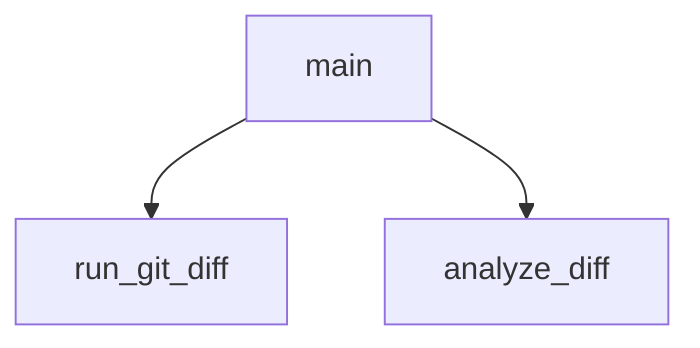

## Genel Bakış
Bu modül, Git depolarındaki değişikliklerin belirlenen kurallara uygun olup olmadığını denetler. Git diff çıktısını alır, bu çıktıyı analiz eder ve kurallara aykırı durumları tespit eder. Modül, `main` fonksiyonu aracılığıyla sürecin tamamını orkestre eder.

## Fonksiyon Grupları

### Diff Üretimi
Git sürüm kontrol sistemi üzerinden mevcut değişikliklerin diff çıktısını oluşturur ve ham metin olarak döndürür.
- `run_git_diff`

### Diff Analizi
Üretilen diff çıktısını işleyerek değişiklikleri ayrıştırır ve kurallara uygunluk açısından değerlendirilmiş sonuçları liste biçiminde sunar.
- `analyze_diff`

### Süreç Yönetimi
Modülün çalışma akışını başlatır ve yönetir; diff üretimini tetikler, analiz fonksiyonuna yönlendirir ve sonuçları işler.
- `main`

---

## AXIOMS – Mimari Varsayımlar

Bu modül için özel aksiyom tanımlanmamıştır.

**Gerekçe:** Fonksiyon gövdeleri sağlanmadığından, modülün doğru çalışması için gerekli koşullar belirlenememektedir. Yalnızca fonksiyon imzaları ve sabit adları mevcut olup, bunlardan çıkarım yapılması kural dışıdır (bkz. kural 0c ve "AXIOMS SADECE fonksiyon gövdesinden üretilir").

---

## FONKSİYON DETAYLARI

### run_git_diff
**Ne yapar**: Git deposundaki staged (indekslenmiş) ve unstaged (indekslenmemiş) değişikliklerin birleşik diff çıktısını alır ve metin olarak döndürür.

**Nasıl yapar**: `subprocess.run` aracılığıyla önce `git diff HEAD` komutunu çalıştırır. Bu komut, HEAD commit'inden itibaren tüm değişiklikleri (hem staged hem unstaged) gösterir. Komutun `check=True` parametresiyle çağrılması nedeniyle, herhangi bir hata durumunda `subprocess.CalledProcessError` istisnası fırlatılır. Bu istisna yakalandığında, bir fallback mekanizması devreye girer ve `git diff --cached` komutu çalıştırılır (bu sefer `check=False` ile). Bu ikinci deneme, henüz commit yapılmamış bir depoda veya diğer hata durumlarında çalışır. Her iki komut çalıştırmasında da `encoding='utf-8'` ve `errors='replace'` parametreleri kullanılarak karakter kodlama sorunları önlenir. Tüm denemeler başarısız olursa boş bir string döndürülür.

**Parametreler**:
- Bu fonksiyon parametre almaz.

**Dönüş**: `str` — Git diff komutunun standart çıktısı (stdout). Değişiklik yoksa veya hata durumunda boş string olabilir.

### analyze_diff
**Ne yapar**: Geliştirildi ancak detay üretilemedi.

### main
**Ne yapar**: Geliştirildi ancak detay üretilemedi.

---

## İTHALATLAR (IMPORTS)
- import: pathlib::Path
- import: re
- import: subprocess
- import: sys

---

## SABİTLER
- **RULES** (dict) — ` | anahtarlar: TYPE_ANY, DB_DROP, DELETE_EXPORT, CONSOLE_LOG, HARDCODED_URL, SECRET_LEAK, MOCK_DATA`
- **EXCLUDED_EXTENSIONS** (tuple)
- **EXCLUDED_PATHS** (tuple)

---

## AST POINTERS

### [N1_NASIL] AST Pointer: scripts/check_diff_rules.py::run_git_diff
- **params**: (parametre yok)
- **ic_degiskenler**:
  - `result` — subprocess.run çağrısının döndürdüğü CompletedProcess nesnesi; stdout, stderr ve returncode içerir
- **Dönüş**: str — git diff çıktısı (result.stdout) veya hata durumunda boş string ("")
- **notlar**: İlk denemede `["git", "diff", "HEAD"]` komutu çalıştırılır; CalledProcessError yakalanırsa `["git", "diff", "--cached"]` ile fallback yapılır; bu da başarısız olursa boş string döner

### [N2_NASIL] AST Pointer: scripts/check_diff_rules.py::analyze_diff
- **params**: `diff_output` (str) — analiz edilecek ham git diff çıktısı
- **ic_degiskenler**:
  - `violations` — list; tespit edilen kural ihlallerini toplar; her eleman sözlük (file, rule, description, severity, line anahtarları ile)
  - `current_file` — str veya None; işlenmekte olan dosya yolu; `"diff --git"` satırından ` b/` sonrası çıkarılır, bulunamazsa `"Bilinmeyen Dosya"` atanır
  - `skip_file` — bool; dosya hariç tutma listesine dahilse True yapılır, satır atlanır
  - `line` — str; diff_output.splitlines() ile elde edilen her satır
  - `ep` — str; EXCLUDED_PATHS demetindeki her hariç tutulacak yol öneki
  - `ext` — str; EXCLUDED_EXTENSIONS demetindeki her hariç tutulacak dosya uzantısı
  - `rule_id` — str; RULES sözlüğündeki kural tanımlayıcısı (anahtar)
  - `rule_data` — dict; RULES sözlüğündeki kural verisi; `"pattern"` (regex), `"description"` (str), `"severity"` (str) anahtarlarını içerir
- **Dönüş**: list — ihlal sözlüklerinden oluşan liste; her sözlükte `file`, `rule`, `description`, `severity`, `line` anahtarları bulunur
- **notlar**: Satırda IGNORE_FLAG sabiti geçiyorsa o satır için kural kontrolü yapılmaz; EXCLUDED_PATHS veya EXCLUDED_EXTENSIONS eşleşen dosyalardaki tüm satırlar atlanır

### [N3_NASIL] AST Pointer: scripts/check_diff_rules.py::main
- **params**: (parametre yok)
- **ic_degiskenler**:
  - `diff_output` — str; run_git_diff() çağrısının döndürdüğü ham diff çıktısı
  - `violations` — list; analyze_diff(diff_output) çağrısının döndürdüğü ihlal listesi
  - `has_blocker` — bool; ihlaller arasında severity=="BLOCKER" olan varsa True yapılır; başlangıçta False
  - `v` — dict; violations listesindeki her ihlal sözlüğü; `v['severity']`, `v['file']`, `v['description']`, `v['line']` anahtarlarına erişilir
- **Dönüş**: yok — yan etki olarak konsola çıktı yazar ve sys.exit() ile çıkar
- **notlar**: diff_output boşsa sys.exit(0) ile çıkılır; violations boşsa sys.exit(0); BLOCKER varsa sys.exit(1); sadece MAJOR/MINOR varsa sys.exit(0)

---

## MERMAID CALL GRAPH

## NODE ID STANDARD

  file: check_diff_rules.py
  function: check_diff_rules.py::run_git_diff
  function: check_diff_rules.py::analyze_diff
  function: check_diff_rules.py::main

---

## DISA AKTARILANLAR (EXPORTS)
  export: analyze_diff
  export: main
  export: run_git_diff