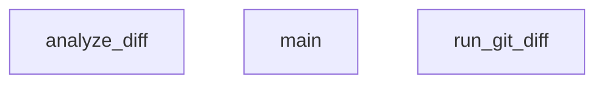

## Genel Bakış
Bu modül, Git repozituarındaki değişiklikleri otomatik olarak analiz ederek belirli kod inceleme kurallarının sağlanıp sağlanmadığını kontrol eder. Kod tabanında yapılan değişikliklerin kalite standartlarına ve proje kurallarına uygunluğunu doğrulamak için tasarlanmıştır.

## Fonksiyon Grupları

### Veri Toplama
Git repozituvarından güncel değişiklik bilgilerini çekmekten sorumludur.
- run_git_diff

### Analiz ve Değerlendirme
Toplanan diff verisini işleyerek kurallara aykırı durumları tespit etmekten sorumludur.
- analyze_diff

### Koordinasyon
Modülün ana akışını yöneterek veri toplama ve analiz adımlarını sırayla koordine eder.
- main

---

## AXIOMS – Mimari Varsayımlar

Bu modül, git diff çıktısını analiz eden ve kurallarla karşılaştıran bir diff inceleme modülüdür.

**[Aksiyom 1 - Git Erişilebilirliği]:** Eğer sistemde `git` komutu yüklü ve PATH'te erişilebilir değilse, `run_git_diff()` fonksiyonu hata ile karşılaşır veya boş/bozuk çıktı üretir.

**[Aksiyom 2 - Git Repository Bağlamı]:** Eğer çalışma dizini bir git repository'si değilse, `run_git_diff()` fonksiyonu anlamlı bir diff çıktısı üretemez.

**[Aksiyom 3 - analyze_diff Giriş Formatı]:** Eğer `analyze_diff` fonksiyonuna geçilen `diff_output` parametresi `str` tipinde değilse veya geçerli bir git diff formatı içermiyorsa, fonksiyon beklendiği gibi çalışamaz.

**[Aksiyom 4 - RULES Tanımlı Olmalı]:** Eğer `RULES` sabiti (dict) tanımlı değilse veya boş dict ise, `analyze_diff()` hiçbir kural kontrolü yapamaz ve tüm dosyalar kuralsız geçer.

**[Aksiyom 5 - Exclusion Listeleri]:** Eğer `EXCLUDED_EXTENSIONS` veya `EXCLUDED_PATHS` tuple'ları boş ise, hiçbir dosya veya yol hariç tutulmaz ve tüm değişiklikler analiz kapsamına girer.

**[Aksiyom 6 - main Akış Sıralaması]:** `main()` fonksiyonu, `run_git_diff()` sonucunu `analyze_diff()` fonksiyonuna girdi olarak sağlamalıdır; aksi takdirde analiz yapılamaz.

---

> **Not:** Fonksiyon gövdesi尚可查看 olmadığı için, `RULES` dict'inin içeriği, eşik değerleri veya kabul kriterleri hakkında kesin bilgi verilememektedir. Belirtilen aksiyomlar yalnızca fonksiyon imzaları ve modül sabitleri temelinde çıkarılmıştır.

---

## FONKSİYON DETAYLARI

### run_git_diff
**Ne yapar**: Git repozuvaroundaki staged ve unstaged değişikliklerin birleşik diff çıktısını alır.

**Nasıl yapar**: Önce `git diff HEAD` komutunu subprocess ile çalıştırarak tüm değişiklikleri (hem staged hem unstaged) elde etmeye çalışır. Eğer bu komut hata verirse (örneğin henüz commit yoksa), fallback olarak sadece staged değişiklikleri döndüren `git diff --cached` komutunu dener. Her iki deneme de başarısız olursa boş string döner.

**Parametreler**: Bu fonksiyon parametre almaz.

**Dönüş**: `str` — Git diff çıktısı metin olarak döner. Değişiklik yoksa veya hata oluşursa boş string döner.

### analyze_diff
**Ne yapar**: Geliştirildi ancak detay üretilemedi.

### main
**Ne yapar**: Geliştirildi ancak detay üretilemedi.

---

## SABİTLER
- **RULES** (dict) — ` | anahtarlar: TYPE_ANY, DB_DROP, DELETE_EXPORT, CONSOLE_LOG, HARDCODED_URL, SECRET_LEAK, MOCK_DATA`
- **EXCLUDED_EXTENSIONS** (tuple)
- **EXCLUDED_PATHS** (tuple)

---

## AST POINTERS

### [N1_NASIL] AST Pointer: check_diff_rules.py::run_git_diff
- **params**: (parametre yok)
- **ic_degiskenler**:
  - `result` — `subprocess.run(["git", "diff", "HEAD"], ...)` çağrısının sonucu nesnesi; `.stdout` alanı diff çıktısını tutar (birincil deneme)
- **Dönüş**: `result.stdout` — `str`, HEAD diff çıktısı; birincil deneme başarısızsa fallback'te `result` tekrar atanır (cached diff), her ikisi de başarısızsa boş `str` (`""`)
- **Yan Etkiler**: `subprocess.run` ile `git diff` komutu çalıştırılır; encoding=utf-8, errors=replace ile çalışır

---

### [N2_NASIL] AST Pointer: check_diff_rules.py::analyze_diff
- **params**:
  - `diff_output: str` — `run_git_diff()` dönüş değeri; `git diff` stdout çıktısı, satır satır ayrıştırılır
- **ic_degiskenler**:
  - `violations` — `list`, tespit edilen kural ihlallerinin toplandığı sonuç listesi; her eleman bir dict'tir (`file`, `rule`, `description`, `severity`, `line` anahtarları)
  - `current_file` — `str` veya `None`, `diff --git` satırından çıkarılan dosya adı; `line.split(" b/")[-1]` ifadesiyle elde edilir; " b/" içermiyorsa `"Bilinmeyen Dosya"` olarak atanır
  - `skip_file` — `bool`, mevcut dosyanın hariç tutulup tutulmayacağı flag'i; `EXCLUDED_PATHS` ve `EXCLUDED_EXTENSIONS` eşleşmeleriyle `True` yapılır
  - `line` — `str`, `diff_output.splitlines()` iterator'ünden gelen tek bir diff satırı
  - `ep` — `str`, `EXCLUDED_PATHS` tuple'ının her bir elemanı; `current_file.startswith(ep)` kontrolü için kullanılır
  - `ext` — `str`, `EXCLUDED_EXTENSIONS` tuple'ının her bir elemanı; `current_file.endswith(ext)` kontrolü için kullanılır
  - `rule_id` — `str`, `RULES` dict'inin key'i (örn. `"NO_EVAL"`, `"NO_EXEC"` vb.)
  - `rule_data` — `dict`, `RULES` dict'inin value'su; `"pattern"` (compiled regex), `"description"` (str), `"severity"` (str) anahtarlarını içerir
- **Dönüş**: `list` — `violations`, her eleman `{"file": str, "rule": str, "description": str, "severity": str, "line": str}` formatında dict
- **Yan Etkiler**: Yok (sadece analiz, dosya değiştirmez)

---

### [N3_NASIL] AST Pointer: check_diff_rules.py::main
- **params**: (parametre yok)
- **ic_degiskenler**:
  - `diff_output` — `str`, `run_git_diff()` çağrı sonucu; boş veya whitespace-only ise program `sys.exit(0)` ile sonlanır
  - `violations` — `list`, `analyze_diff(diff_output)` çağrı sonucu; boş liste ise program temiz çıktı verip sonlanır
  - `has_blocker` — `bool`, `False` ile başlar; döngüde `v['severity'] == "BLOCKER"` eşleşmesi varsa `True` olur; blokaj kararını belirler
  - `v` — `dict`, `violations` listesinin her bir elemanı; `"severity"`, `"file"`, `"description"`, `"line"` anahtarlarıyla erişilen ihlal kaydı
- **Dönüş**: `yok` — `sys.exit(0)` veya `sys.exit(1)` ile program sonlanır; BLOCKER varsa exit(1), yoksa exit(0)
- **Yan Etkiler**: `print()` ile stdout'a bilgi/uyarı mesajları basılır; `sys.exit()` ile process sonlanır

---

## MERMAID CALL GRAPH

## NODE ID STANDARD

  file: .agent\skills\diff-review\scripts\check_diff_rules.py
  function: .agent\skills\diff-review\scripts\check_diff_rules.py::run_git_diff
  function: .agent\skills\diff-review\scripts\check_diff_rules.py::analyze_diff
  function: .agent\skills\diff-review\scripts\check_diff_rules.py::main

---

## DISA AKTARILANLAR (EXPORTS)
  export: analyze_diff
  export: main
  export: run_git_diff