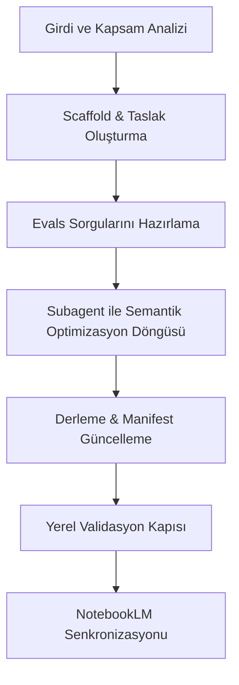

## 🛫 Prerequisites (Ön Koşul Kontrolü)

Bu skill'i kullanmadan önce aşağıdaki adımları sırayla doğrula:

1. **İsim Formatı:** Oluşturulacak yetenek adı kebab-case (küçük harf, rakam ve tire) olmalıdır (Örn: `supabase-security`).
2. **Kategori Seçimi:** Yetenek şu kategorilerden birine ait olmalıdır: `orchestration`, `intelligence`, `guards`, `audit`, `utils`.
3. **Validasyon Komutu:** Yeteneğin doğruluğunu yerel olarak test edecek bir komut (Örn: `pnpm run test` veya bir doğrulama betiği) belirlenmiş olmalıdır.

---

# Yetenek Oluşturma ve Optimizasyon Protokolü

Bu yetenek, VentHub HVAC projesinde yeni modüler yetenekler tanımlarken ve mevcut yetenekleri optimize ederken izlenmesi gereken kuralları ve adımları belirler.

## Yetenek Geliştirme Yaşam Döngüsü (Life Cycle)



---

## 🛠️ Adım Adım İşlem Rehberi

### Adım 1: Taslak Oluşturma (Scaffolding)
Yerel şablonlama CLI aracını kullanarak yetenek klasörünü ve temel dosyalarını oluştur:
```bash
python scripts/skills-creator.py --name <yetenek-adi> --description "<aciklama>" --category <kategori>
```
Bu komut `.agent/skills/<yetenek-adi>/` dizinini, `SKILL.md` şablonunu ve varsayılan `evals/evals.json` dosyasını oluşturacaktır.

### Adım 2: Evals Sorgularını Hazırlama (12/8 Train/Test Split Kuralı)
Açıklamanın belirli kelimelere aşırı uyum sağlamasını (overfitting) engellemek için `evals/evals.json` dosyasında **toplam en az 20 adet** test sorgusu tanımla ve bunları 12/8 oranında ayır:
- **12 Eğitim (Train) Sorgusu (%60):** Optimizasyon döngüsü esnasında ajanın açıklamayı revize etmesi için kullanılır (Örn: 8 `should_trigger`, 4 `should_not_trigger`).
- **8 Test (Held-Out Validation) Sorgusu (%40):** Ajanın açıklamayı ezberlemediğini (memorization) ve genelleme yapabildiğini doğrulamak için döngü dışında tutulur (Örn: 4 `should_trigger`, 4 `should_not_trigger`).

### Adım 3: Subagent ile Otonom Açıklama Optimizasyonu (Train/Test Feedback Loop)
Açıklamanın doğruluğunu dinamik olarak test etmek ve aşırı uyumu önlemek için `stable_skill_optimizer_subagent` subagent'ını kullan:
1. **Subagent Tanımı:**
   - **Name:** `stable_skill_optimizer_subagent`
   - **Role:** `Stable Skill Optimizer Worker`
   - **Prompt:** `Optimize the '<yetenek-adi>' skill description using the 12/8 Train/Test Split Rule. Perform iterative updates on the 12 training queries until 100% accuracy, then run a held-out evaluation on the 8 testing queries to verify generalization.`

2. **Döngü İşleyişi:** Subagent, açıklamayı 12 eğitim sorgusuyla optimize eder; eğitim tamamlanınca açıklamayı 8 held-out test sorgusuyla test eder. Başarılı olursa (genelleme doğrulanırsa) `SKILL.md` güncellenir ve eklenti derlenir.

### Adım 4: Derleme ve Güncelleme (Compilation)
Değişikliklerin eklenti manifestosuna yazılması için derleyiciyi çalıştır:
```bash
python scripts/compile_skills.py
```
Bu işlem `.agent/plugins/venthub-core/manifest.yaml` ve `docs/venthub_skills_master.md` dosyalarını günceller.

### Adım 5: Yerel Kalite Kapısı (Local Validation Gate)
Sistemdeki tüm yetenekleri çakışma, semantik benzerlik ve kapsam testlerinden geçirmek için değerlendiriciyi çalıştır:
```bash
python scripts/skills-evaluator.py
```
PR ve CI/CD süreçlerinde kalite kapısı olarak entegre edilmiş pnpm betiğini de kullanabilirsin:
```bash
pnpm run skills:verify
```
Hata (`Errors > 0`) durumunda çakışan veya eksik trigger'ları kontrol et; semantik çakışma uyarılarını incele ve optimizasyon döngüsünü tekrarla.

### Adım 6: Dijital İkiz Senkronizasyonu (NotebookLM Sync)
Derlenen master yetenek kümesini Google NotebookLM'e aktar:
```bash
orion doc tree --nlm-sync --force-sync
```

---

## ⚠️ Kritik Kurallar ve Çakışma Yönetimi
- **Eşsiz Tetikleyiciler:** İki farklı yetenek aynı `trigger` kelimesine sahip olamaz. `skills-evaluator.py` bunu engeller.
- **Semantik Çakışma ve Benzerlik Kontrolü:** İki yeteneğin açıklamaları (`description`) arasındaki kelime benzerliği (Jaccard similarity/intersection) **%60'ın üzerinde** olamaz. Eğer benzerlik oranı bu eşiği aşarsa, kalite kapısı `[WARNING] Semantic similarity detected between Skill A and Skill B` uyarısı üretecektir. Bu durumda açıklamalardan birini veya her ikisini daha özgün ve ayrışacak şekilde revize etmelisin.
- **Açıklama Kalitesi:** Yetenek açıklaması (`description`), ajanın ne zaman bu yeteneği seçmesi gerektiğini çok net ifade etmelidir. Çok geniş veya çok dar tanımlardan kaçın.
- **Yıkıcı Eylemler:** Sistem genelini bozabilecek veya veri kaybına yol açabilecek işlemler içeren yetenekler mutlaka `Prerequisites` kısmında kullanıcıdan onay (`/override` veya açık izin) istemelidir.
