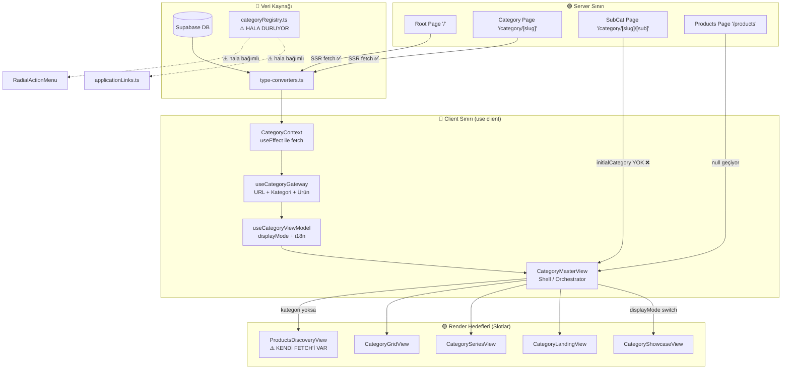

# 🏗️ CİLT 2: VENTHUB MİMARİ TASARIM & PREMIUM UI STANDARTLARI (ARCHITECTURE & DESIGN)

Bu kitap, VentHub HVAC platformunun Next.js 15 (React 19) sunucu öncelikli (Server-First) mimari yapısını, veritabanı tiplerini, "Anakart-Yuva" Slot Mimarisi standartlarını ve premium tasarım kurallarını içerir.

---

# VentHub — Mimari Dokümantasyonu

> **Son güncelleme:** 2026-04-14  
> **Versiyon:** Next.js 15 / Supabase Edge Functions v2

---

## 1. Genel Mimari

VentHub, **Server-First** bir mimariyle inşa edilmiştir. Temel ilke: veri sunucuda hazırlanır, istemciye HTML olarak gelir; istemci sadece etkileşim için JavaScript çalıştırır.

```
┌──────────────────────────────────────────────────┐
│                CLOUDFLARE CDN                    │
│     (Statik varlıklar, kenar önbellek)           │
└────────────────────┬─────────────────────────────┘
                     │
┌────────────────────▼─────────────────────────────┐
│             NEXT.JS 15 (APP ROUTER)              │
│                                                  │
│  Server Components (RSC)                         │
│    ├── Sayfa rotaları (src/app/)                 │
│    ├── Supabase'den SSR veri çekimi              │
│    └── HTML olarak istemciye gönderim            │
│                                                  │
│  Client Components ('use client')               │
│    ├── Etkileşimli filtreler, form'lar           │
│    ├── ScrollObserver (IntersectionObserver)     │
│    └── Sepet, ödeme akışı                       │
└────────────────────┬─────────────────────────────┘
                     │
┌────────────────────▼─────────────────────────────┐
│          SUPABASE (BaaS Katmanı)                 │
│                                                  │
│  PostgreSQL (31 tablo, tümü RLS aktif)           │
│  Edge Functions (38 adet, Deno çalışma ortamı)  │
│  Auth (JWT tabanlı, kullanıcı oturumları)        │
│  Storage (ürün görselleri, belgeler)             │
└──────────────────────────────────────────────────┘
```

---

## 2. Veri Akışı

### Server-Side Rendering (SSR) — Tercih Edilen Yol

```
[Kullanıcı isteği]
      │
      ▼
[Next.js page.tsx — Server Component]
      │
      ├──► Supabase query (ürünler, kategoriler)
      │         │
      │         ▼
      │    [type-converters.ts]
      │    DB Row → DomainCategory / Product
      │         │
      │         ▼
      └──► Props olarak View bileşenine geç
                │
                ▼
         [View Component]
         HTML hazır → istemciye gönder
```

### Client-Side (Sadece İnteraktif Durumlar İçin)

```
[Kullanıcı filtre değiştirir]
      │
      ▼
[Client Component — useState/useEffect]
      │
      ├──► URL parametresi güncellenir
      │
      └──► Edge Function çağrısı (advanced-search / search-products)
                │
                ▼
         [Yeni sonuçlar client'ta render]
```

---

## 3. Klasör Yapısı

```
venthub-hvac/
├── src/
│   ├── app/                    # Next.js App Router
│   │   ├── page.tsx            # Anasayfa (SSR)
│   │   ├── category/[slug]/    # Kategori sayfaları (SSR)
│   │   ├── products/           # Ürün listesi (force-dynamic)
│   │   ├── admin/              # Yönetici paneli
│   │   ├── account/            # Kullanıcı hesabı
│   │   ├── checkout/           # Ödeme akışı
│   │   └── auth/               # Giriş / Kayıt
│   │
│   ├── views/                  # Sayfa içerikleri (SSR + Client karışımı)
│   │   ├── HomePage.tsx
│   │   ├── CategoryMasterView.tsx   # Slot mimarisi merkezi
│   │   └── ProductsDiscoveryView.tsx
│   │
│   ├── components/
│   │   ├── ui/                 # Primitif bileşenler
│   │   ├── home/               # Anasayfa bölümleri
│   │   ├── products/           # Ürün kartları, showcase
│   │   └── navigation/         # Header, MegaMenu
│   │
│   ├── lib/
│   │   ├── supabase.ts         # Ana Supabase istemcisi + servis fonksiyonları
│   │   ├── type-converters.ts  # DB Row → Domain Model dönüşümleri
│   │   ├── rbac.ts             # Rol tabanlı erişim kontrolü
│   │   ├── audit.ts            # Admin işlem kaydı
│   │   └── services/
│   │       ├── cart.service.ts
│   │       ├── product.service.ts
│   │       ├── category.service.ts
│   │       ├── pricing.service.ts
│   │       ├── address.service.ts
│   │       ├── invoice.service.ts
│   │       └── project.service.ts
│   │
│   ├── hooks/                  # Custom React hook'ları
│   ├── types/
│   │   ├── database.types.ts   # Supabase'den üretilen tipler (Source of Truth)
│   │   └── db-rows.ts          # Tip takma adları (alias)
│   ├── i18n/
│   │   └── dictionaries/tr.ts  # Türkçe sözlük (birincil dil)
│   └── utils/
│       └── routes.ts           # Merkezi rota tanımları
│
├── supabase/
│   ├── functions/              # 38 Edge Function (Deno)
│   └── migrations/             # SQL migration dosyaları
│
├── docs/                       # Proje dokümantasyonu
├── registry/                   # Otonom görev yönetim sistemi (Orion)
└── .agent/                     # AI ajan yapılandırması
```

---

## 4. Veritabanı Şeması

### Temel Tablolar

| Tablo | Satır | Açıklama |
|---|---|---|
| `products` | 335 | HVAC ürünleri — teknik specs (JSONB), stok, fiyat |
| `categories` | 25 | Hiyerarşik kategori ağacı (parent_id + level) |
| `venthub_orders` | 24 | Siparişler — İyzico entegrasyonu, kargo takip |
| `venthub_order_items` | 3 | Sipariş kalemleri + ürün snapshot |
| `venthub_returns` | 6 | İade yönetimi (requested → refunded lifecycle) |
| `user_profiles` | 2 | Kullanıcı profili + rol (super_admin/admin/warehouse/sales/viewer/user) |
| `organizations` | 3 | B2B kurumsal müşteri altyapısı |
| `price_lists` | 3 | Fiyat listeleri (bireysel / kurumsal / bayi) |
| `shopping_carts` | 2 | Aktif sepetler |
| `cart_items` | 1 | Sepet kalemleri |
| `inventory_movements` | 20 | Stok hareketi kaydı (geri alma + batch desteği) |
| `admin_audit_log` | 57 | Admin işlem denetim kaydı |
| `client_errors` | 39 | Tarayıcı hatası izleme |
| `error_groups` | 11 | Hata gruplama (signature bazlı) |
| `wizard_selections` | 3 | Hava perdesi seçim sihirbazı kayıtları |
| `coupons` | 1 | Kupon sistemi |
| `rate_limits` | 5 | API rate limiting |

> **Tümü RLS aktif.** Her tablo okuma/yazma için `auth.uid()` veya rol bazlı policy kullanır.

### İlişki Diyagramı (Temel)

```
auth.users ──── user_profiles ──── organizations
                    │
                    └──── user_addresses
                    └──── user_invoice_profiles

products ──── categories (parent_id → kendisi)
   │──── product_images
   │──── product_prices ──── price_lists
   └──── venthub_order_items ──── venthub_orders ──── payment_transactions
                                       │──── venthub_returns
                                       │──── inventory_movements
                                       └──── order_email_events
```

---

## 5. Edge Functions (38 Aktif)

### Ödeme Döngüsü

| Function | Versiyon | JWT | Açıklama |
|---|---|---|---|
| `iyzico-payment` | v233 | ✅ | 3DSecure ödeme başlatma |
| `iyzico-callback` | v163 | ❌ | İyzico geri dönüş webhook |
| `iyzico-refund` | v10 | ✅ | İade işlemi |
| `admin-iyzico-reconcile` | v18 | ❌ | Ödeme uzlaştırma |

### Sipariş Yönetimi

| Function | Versiyon | JWT | Açıklama |
|---|---|---|---|
| `order-validate` | v110 | ✅ | Sipariş doğrulama, stok rezervasyonu |
| `order-confirmation` | v6 | ❌ | Onay e-postası gönderimi |
| `order-housekeeping` | v10 | ✅ | Süresi dolmuş siparişleri temizle |
| `admin-update-order` | v16 | ❌ | Admin sipariş güncelleme |
| `admin-order-inspect` | v15 | ❌ | Admin sipariş detayı |
| `admin-orders-latest` | v14 | ✅ | Son siparişler listesi |

### Kargo

| Function | Versiyon | JWT | Açıklama |
|---|---|---|---|
| `shipping-webhook` | v105 | ❌ | Kargo sağlayıcı webhook |
| `shipping-status` | v105 | ❌ | Kargo durumu sorgulama |
| `shipping-notification` | v19 | ❌ | Kargo e-postası |
| `admin-update-shipping` | v12 | ✅ | Admin kargo güncelleme |
| `delivery-notification` | v5 | ✅ | Teslimat bildirimi |
| `returns-webhook` | v7 | ❌ | İade kargo webhook |
| `return-status-notification` | v7 | ❌ | İade durum bildirimi |

### Arama & Ürün

| Function | Versiyon | JWT | Açıklama |
|---|---|---|---|
| `search-products` | v27 | ✅ | Temel ürün arama |
| `advanced-search` | v30 | ✅ | Parametre bazlı HVAC araması |
| `dynamic-categories` | v34 | ✅ | Dinamik kategori yükleme |
| `hvac-calculator` | v27 | ✅ | Hava perdesi fizik hesabı |
| `public-api` | v35 | ✅ | Genel ürün API'si |

### Diğer

| Function | Versiyon | JWT | Açıklama |
|---|---|---|---|
| `log-client-error` | v74 | ✅ | Tarayıcı hata kaydı |
| `stock-alert` | v11 | ❌ | Düşük stok uyarısı |
| `apply-coupon` | v6 | ✅ | Kupon uygulama |
| `admin-create-coupon` | v6 | ✅ | Admin kupon oluşturma |
| `release-expired-reservations` | v2 | ❌ | Süresi dolmuş stok rezervasyonlarını serbest bırak |
| `notification-service` | v10 | ✅ | Merkezi bildirim servisi |
| `healthz` | v3 | ✅ | Sağlık kontrolü |

---

## 6. Güvenlik Mimarisi

### RLS (Row Level Security)

Tüm tablolarda aktif. Temel pattern'ler:

```sql
-- Herkese açık veri (ürünler, kategoriler)
CREATE POLICY "select_public" ON products FOR SELECT TO public USING (status = 'active');

-- Sadece kendi verisi
CREATE POLICY "select_own" ON user_addresses FOR SELECT
  USING (user_id = (SELECT auth.uid()));   -- initplan optimizasyonu: SELECT içinde

-- Sadece admin/super_admin yazabilir
CREATE POLICY "admin_write" ON products FOR INSERT
  USING (
    EXISTS (
      SELECT 1 FROM user_profiles
      WHERE id = (SELECT auth.uid())
      AND role IN ('admin', 'super_admin')
    )
  );
```

### Rate Limiting

`rate_limits` tablosu + Edge Function seviyesinde bucket bazlı sınır.

### Webhook Doğrulama

`shipping-webhook` ve `returns-webhook` — HMAC body hash ile tekrar saldırısı koruması (`shipping_webhook_events.body_hash`).

### Idempotency

`shipping_idempotency` tablosu — aynı kargo güncellemesinin iki kez işlenmesini engeller.

---

## 7. Kategori Mimarisi (Slot Sistemi)

Detaylı vizyon: [architectural_vision.md](archive/architectural_vision.md)

### Mevcut Durum

`CategoryMasterView` bir orkestratör görevi görür: `categories.metadata.display_mode` alanına göre hangi View bileşeninin render edileceğine karar verir.

```
displayMode === 'showcase'   → CategoryShowcaseView
displayMode === 'landing'    → CategoryLandingView
displayMode === 'series'     → CategorySeriesView
displayMode === 'grid'       → CategoryGridView
(varsayılan)                 → ProductsDiscoveryView
```

### Slot Kontratı

Her View bileşeni aynı `SlotProps` interface'ini alır:

```typescript
interface SlotProps {
  category: DomainCategory | null
  parentCategory: DomainCategory | null
  subCategories: DomainCategory[]
  products: Product[]
  displayName: string
  marketingTitle: string
}
```

---

## 8. Animasyon Mimarisi

Framer Motion yerine **Vanilla CSS + IntersectionObserver** tercih edilmiştir (Bundle boyutu ve Hydration gecikmesi nedeniyle).

### Nasıl Çalışır

1. Bileşen `data-observe="fade-up"` attribute'u ile işaretlenir
2. `ScrollObserver` (tek merkez) IntersectionObserver ile izler
3. Element görünür olduğunda `data-in-view="true"` attribute'u eklenir
4. Tailwind `data-[in-view=true]:opacity-100` varyantı CSS geçişini tetikler

```tsx
// Bileşen tarafı (değişmez)
<div
  data-observe="fade-up"
  className="opacity-0 translate-y-4 data-[in-view=true]:opacity-100 data-[in-view=true]:translate-y-0 transition-[opacity,transform] duration-700"
>
  ...
</div>
```

---

## 9. i18n Sistemi

Dictionary tabanlı, sunucu taraflı çeviri sistemi.

```typescript
// src/i18n/dictionaries/tr.ts — tek kaynak (primary)
export const tr = {
  home: { hero: { ... }, applicationSolutions: { ... } },
  products: { ... },
  checkout: { ... }
}

// Bileşende kullanım
const t = dictionary.applicationSolutions
<h2>{t.title}</h2>
```

**Kural:** TSX dosyalarına hiçbir zaman hard-coded Türkçe/İngilizce metin eklenmez.

---

## 10. Enterprise Gap (Bilinen Eksikler)

| Alan | Sorun | Öncelik |
|---|---|---|
| B2B Fiyatlandırma | `product_prices` boş. `price_lists` var ama bağlantı kurulmamış | 🔥 Kritik |
| Gelişmiş Arama UI | `advanced-search` edge function hazır (v30) ama frontend yok | 🔥 Kritik |
| Error Boundary | Client hata izleme var (39 kayıt) ama kullanıcıya görünen fallback UI yok | 🔥 High |
| SSR Kategori | Bazı kategori sayfaları hâlâ client-side fetch kullanıyor | ⚡ Medium |
| 3D Deneyim | `three-setup.ts` hazır ama P03 backlog'da başlanmamış | ➖ Low |


---

## 🗺️ HEDEF MİMARİ VİZYON: "SLOT MİMARİSİ"
# 🏗️ VentHub Mimari Vizyon Zeka Fırtınası
> **Tarih:** 2026-03-26 | **Model:** Opus | **Durum:** Brainstorm (Vizyon Belgesi)
> **Katkıda Bulunanlar:** Antigravity (Gemini 3.1 Pro), Dış IDE Ajanı, Opus

---

## 1. MEVCUT DURUMUN ACİMASIZ RÖNTGENİ

### 1.1 Sistemin Bugünkü Anatomisi



### 1.2 Kanıtlanmış Sorunlar (Kod Referanslı)

| # | Sorun | Kanıt (Dosya:Satır) | Etki |
|---|-------|---------------------|------|
| 1 | **CategoryContext client-side fetch** | `CategoryContext.tsx:1` (`'use client'`) + `:43` (`useEffect`) | SEO ölü. Google bot kategorileri görmüyor. LCP/CLS felaketi. |
| 2 | **displayMode hardcoded** | `useCategoryViewModel.ts:59-72` (`showcaseSlugs`, `landingSlugs` dizileri) | DB SSOT hedefi kırık. Yeni kategori eklendiğinde kod değişikliği gerekiyor. |
| 3 | **categoryRegistry.ts hala yaşıyor** | `categoryRegistry.ts:8-84` + [applicationLinks.ts](file:///c:/Users/alize/venthub-hvac/src/utils/applicationLinks.ts), [RadialActionMenu.tsx](file:///c:/Users/alize/venthub-hvac/src/components/products/RadialActionMenu.tsx) bağımlılıkları | İki gerçek kaynağı (DB + statik registry). Hangisi doğru? |
| 4 | **SubCategory sayfası initialCategory geçmiyor** | `[subCategorySlug]/page.tsx:48` (`<PageComponent />` — prop yok) | Alt kategori sayfası SSR verisinden yararlanamıyor. |
| 5 | **ProductsDiscoveryView kendi fetch'ini yapıyor** | `ProductsDiscoveryView.tsx:89-92` (kendi [getProductsEnriched](file:///c:/Users/alize/venthub-hvac/src/lib/supabase.ts#159-214) çağrısı) | Gateway bypass ediliyor. Veri senkronizasyonu bozuk. |
| 6 | **Eski ve yeni sluglar bir arada** | ViewModel'de `residential-ventilation` ama `landingSlugs`'ta `hava-perdeleri` | Link kırılması riski. i18n çözümleme belirsizliği. |
| 7 | **Şelale (Waterfall) veri çekimi** | `useCategoryGateway.ts:120` — önce `categoriesLoading` bekle, sonra [getProductsEnriched](file:///c:/Users/alize/venthub-hvac/src/lib/supabase.ts#159-214) çağır | İstemci tarafında seri istek: Kategori → sonra Ürün. Paralel değil. |

---

## 2. HEDEF MİMARİ VİZYON: "SLOT MİMARİSİ"

### 2.1 Temel Felsefe

**Anakart-Yuva (Motherboard-Slot) Metaforu:**
- **Anakart** = Routing Shell ([CategoryMasterView](file:///c:/Users/alize/venthub-hvac/src/views/CategoryMasterView.tsx#20-111)) — Hiçbir render kararı almaz, sadece veri ve slot eşleştirir.
- **Yuvalar (Slots)** = Görünüm modları (`showcase`, `landing`, `series`, `grid`, `discovery`) — Her biri bağımsız, takılıp çıkarılabilir.
- **Veri Yolu (Data Bus)** = Server-side fetch → props zinciri — Client-side fetch sadece interaktif filtreler için.
- **BIOS (Karar Mekanizması)** = DB `metadata.display_mode` alanı — Hangi yuvaya hangi modül takılacağını belirler.

### 2.2 Hedef Veri Akışı

```
┌─────────────────────────────────────────────────────────┐
│                    SERVER SINIRI                         │
│                                                         │
│  page.tsx (Server Component)                            │
│    ├── Supabase'den kategori çek (SSR)                  │
│    ├── Supabase'den ürünler çek (SSR, paralel)          │
│    ├── type-converters ile DomainCategory'e dönüştür    │
│    ├── metadata.display_mode'dan slot kararını al       │
│    └── Props olarak CategoryShell'e geç ──────────┐     │
│                                                    │     │
├────────────────────────────────────────────────────┼─────┤
│                    CLIENT SINIRI                   │     │
│                                                    ▼     │
│  CategoryShell (Client Component)                        │
│    ├── Props'tan gelen veriyi al (SSR data)              │
│    ├── İnteraktif filtreler (URL state) → client-side    │
│    ├── displayMode'a göre doğru Slot'u render et         │
│    │     ├── slot="showcase" → <CategoryShowcaseView />  │
│    │     ├── slot="landing"  → <CategoryLandingView />   │
│    │     ├── slot="series"   → <CategorySeriesView />    │
│    │     ├── slot="grid"     → <CategoryGridView />      │
│    │     └── slot="discovery"→ <ProductsDiscoveryView /> │
│    └── Her Slot aynı props interface'i alır              │
│                                                          │
└──────────────────────────────────────────────────────────┘
```

### 2.3 Kritik Fark: Bugün vs Hedef

| Boyut | Bugün | Hedef |
|-------|-------|-------|
| **Veri çekimi** | Client-side `useEffect` (CategoryContext) | Server-side [page.tsx](file:///c:/Users/alize/venthub-hvac/src/app/page.tsx) içinde `async` fetch |
| **displayMode kararı** | Hardcoded slug listeleri (ViewModel) | DB `categories.metadata.display_mode` alanı |
| **Kategori kaynağı** | DB + categoryRegistry.ts [SİLİNDİ] (çift kaynak) | Sadece DB (Tek Otorite) |
| **Slot bağımsızlığı** | View'lar farklı prop yapıları alıyor | Tüm slotlar aynı `SlotProps` interface'ini alır |
| **Discovery modu** | Kendi fetch'ini yapıyor (bypass) | Gateway'den aynı props'u alır, sadece UI farklı |
| **SEO** | Client render → Google bot boş sayfa görüyor | Server render → HTML hazır geliyor |

---

## 3. TASARIM KARARLARI VE KURALLAR

### 3.1 Slot Kontratı (Interface)

Her View bileşeni (Slot) aşağıdaki standart interface'i almalıdır:

```typescript
interface SlotProps {
  // Veri
  category: DomainCategory | null
  parentCategory: DomainCategory | null
  subCategories: DomainCategory[]
  products: DomainProduct[]
  
  // UI Semantik (ViewModel'den)
  displayName: string
  marketingTitle: string
  
  // İnteraktif (opsiyonel, sadece filtreleme destekleyen slotlar için)
  filters?: CategoryFilters
  onUpdateFilters?: (updates: Partial<CategoryFilters>) => void
  availableBrands?: string[]
}
```

### 3.2 Değişmez Kurallar (Invariants)

1. **"Slot kendi verisini asla kendisi çekmez."** Veri her zaman yukarıdan (Shell → Slot) akar.
2. **"displayMode kararı sadece DB'den gelir."** Kod içinde slug listesi bulundurmak yasaktır.
3. **"categoryRegistry.ts silinecektir."** Tüm bağımlılıkları DB'ye taşınacaktır.
4. **"CategoryContext sadece navigasyon bileşenleri içindir."** Sayfa içeriği için Server fetch kullanılır.
5. **"Her yeni Slot, mevcut SlotProps interface'ini bozmadan eklenebilmelidir."**

---

## 4. GEÇİŞ STRATEJİSİ (RİSK SIRALI)

### Aşama 1: Zemin Temizliği (Düşük Risk, Yüksek Etki)
> **Hedef:** Çift kaynak sorununu tamamen yok et.

| Adım | İş | Risk |
|------|---|------|
| 1.1 | `categories` tablosuna `display_mode` kolonu ekle (migration) | Düşük |
| 1.2 | Mevcut hardcoded slugları DB'ye seed et (showcase/landing/series) | Düşük |
| 1.3 | [useCategoryViewModel](file:///c:/Users/alize/venthub-hvac/src/hooks/useCategoryViewModel.ts#27-121)'daki hardcoded slug listelerini sil, `meta.display_mode` oku | Düşük |
| 1.4 | categoryRegistry.ts [SİLİNDİ] bağımlılıklarını (`applicationLinks`, `RadialActionMenu`) DB'ye çevir | Orta |
| 1.5 | categoryRegistry.ts [SİLİNDİ] dosyasını sil | Düşük |

### Aşama 2: Slot Kontratı Standardizasyonu (Orta Risk)
> **Hedef:** Tüm View'ları aynı interface'e oturt.

| Adım | İş | Risk |
|------|---|------|
| 2.1 | `SlotProps` interface'ini oluştur (`src/types/slot.ts`) | Düşük |
| 2.2 | Her View bileşenini `SlotProps` ile uyumlu hale getir | Orta |
| 2.3 | [ProductsDiscoveryView](file:///c:/Users/alize/venthub-hvac/src/views/ProductsDiscoveryView.tsx#58-315)'in kendi fetch'ini kaldır, props'tan veri alsın | Orta |
| 2.4 | [CategoryMasterView](file:///c:/Users/alize/venthub-hvac/src/views/CategoryMasterView.tsx#20-111)'ı temiz bir switch/map yapısına çevir | Düşük |

### Aşama 3: Server-Side Rendering Geçişi (Yüksek Risk, En Yüksek Etki)
> **Hedef:** SEO ve performans devrimini tamamla.

| Adım | İş | Risk |
|------|---|------|
| 3.1 | `/category/[slug]/page.tsx`'te kategori + ürün verisini SSR olarak çek | Orta |
| 3.2 | `/category/[slug]/[sub]/page.tsx`'e `initialCategory` prop'u ekle | Düşük |
| 3.3 | [/products/page.tsx](file:///c:/Users/alize/venthub-hvac/src/app/products/page.tsx)'te discovery verilerini SSR olarak çek | Orta |
| 3.4 | [CategoryMasterView](file:///c:/Users/alize/venthub-hvac/src/views/CategoryMasterView.tsx#20-111)'ı "SSR data alır + client-side filtre yapar" modeline dönüştür | Yüksek |
| 3.5 | [CategoryContext](file:///c:/Users/alize/venthub-hvac/src/contexts/CategoryContext.tsx#8-17)'i sadece navigasyon (MegaMenu, Overlay) için tut, sayfa içeriğinden ayır | Yüksek |

### Aşama 4: Son Kilometre (Düşük Risk)
> **Hedef:** i18n, slug ve kalite mühürlemesi.

| Adım | İş | Risk |
|------|---|------|
| 4.1 | Slug konsolidasyonu (eski Türkçe sluglar → yeni İngilizce standart) | Orta |
| 4.2 | Tüm hardcoded user-facing text'leri `useI18n()` altına al | Düşük |
| 4.3 | Registry görevlerini PULSE.md ile senkronize et | Düşük |

---

## 5. RİSKLER VE KISITLAMALAR

| Risk | Olasılık | Etki | Azaltma |
|------|----------|------|---------|
| SSR geçişi sırasında hydration hataları | Yüksek | Yüksek | Aşamalı geçiş. Önce 1 sayfa, test et, sonra genişlet. |
| Slug değişikliği SEO sıralamasını düşürmesi | Orta | Yüksek | 301 redirect planı hazırla. `next.config.js` redirects. |
| [CategoryContext](file:///c:/Users/alize/venthub-hvac/src/contexts/CategoryContext.tsx#8-17) kaldırılması navigasyonu kırması | Orta | Orta | Context'i kaldırmıyoruz, sadece rolünü daraltıyoruz. |
| Admin panel kategori editörünün display_mode'u tanımaması | Düşük | Orta | Admin Builder'a display_mode dropdown'u ekle. |

---

## 6. BAŞARI KRİTERLERİ (Acceptance Criteria)

Bu vizyon tamamlandığında aşağıdaki koşullar sağlanmalıdır:

- [x] categoryRegistry.ts dosyası projeden silindi (başarıyla tamamlandı)
- [ ] [useCategoryViewModel.ts](file:///c:/Users/alize/venthub-hvac/src/hooks/useCategoryViewModel.ts) içinde hiçbir hardcoded slug listesi kalmamalı
- [ ] [ProductsDiscoveryView](file:///c:/Users/alize/venthub-hvac/src/views/ProductsDiscoveryView.tsx#58-315) kendi Supabase çağrısı yapmamalı
- [ ] Tüm dinamik sayfalarda (`/category/*`, `/products`) sunucu tarafında veri çekilmeli
- [ ] Google bot, kategori sayfalarında ürün listesini HTML içinde görmeli (View Source testi)
- [ ] Yeni bir "Slot" (View) eklemek için sadece 1 dosya oluşturup DB'de `display_mode` güncellemek yeterli olmalı
- [ ] `pnpm run build` → 0 hata
- [ ] Lighthouse Performance skoru ≥ 80

---

## 7. SONUÇ VE ÖNERİ

Bu vizyon belgesi üç farklı kaynaktan (Antigravity X-Ray, Dış IDE Ajanı Raporu, Opus Analizi) toplanan bulguları birleştirmektedir.

**Mevcut mimari skoru:** 6.5/10
- İş mantığı katmanı (Gateway-ViewModel-Shell): 8/10
- Platform olgunluğu (SSR, SEO, performans): 5/10

**Hedef mimari skoru:** 9/10

**Önerilen başlangıç noktası:** Aşama 1 (Zemin Temizliği) — en düşük riskli, en net kazanımlı adımlar. Mimariyi bozmadan "çift kaynak" sorununu tamamen yok eden cerrahi müdahale.

> *"Bir binayı güçlendirmek istiyorsan, önce çatıyı değil temeli sağlamlaştır."*


---

# VentHub HVAC E-Ticaret - Design System & UI Felsefesi

> Bu doküman, projenin başlangıcından gelen ve geçerliliğini koruyan tasarım standartlarını, renk paletini, marka listesini ve ikon sistemini barındırır.

## 🎨 PROFESYONEL HVAC E-TİCARET RENK PALETİ

```css
/* Ana Renkler - Güven & Profesyonellik */
--primary-navy: #1E40AF;      /* Koyu mavi - CTA butonlar */
--secondary-blue: #38BDF8;    /* Açık mavi - Hover, linkler */

/* Endüstriyel & Teknoloji */
--industrial-gray: #374151;   /* Charcoal - Headlines */
--steel-gray: #6B7280;        /* Medium gray - Text */
--light-gray: #F3F4F6;        /* Açık gri - Cards */

/* Temizlik & Hava */
--clean-white: #FFFFFF;       /* Pure beyaz - Background */
--air-blue: #EBF8FF;         /* Çok açık mavi - Hero */

/* States & Accents */
--success-green: #10B981;     /* Success states */
--warning-orange: #F59E0B;    /* Uyarılar */
--gold-accent: #D97706;       /* Premium features */
--silver-accent: #9CA3AF;     /* Secondary elements */
```

## 🏷️ MARKALAR (AVenS Distribütörlüğü)
1. **AVenS** - Ana marka (Türk)
2. **Vortice** - İtalyan premium 
3. **Casals** - İspanyol güvenilir
4. **Nicotra Gebhardt** - Alman endüstriyel  
5. **Flexiva** - Kanal sistemleri
6. **Danfoss** - Kontrol sistemleri

## 📂 KATEGORİ HİYERARŞİSİ (UI Navigation Mimarisi)

**8 Ana Kategori → Mega Menu Ana Sekmeler:**
1. 💨 **FANLAR**
2. 🔥 **ISI GERİ KAZANIM CİHAZLARI**
3. 🌀 **HAVA PERDELERİ**
4. 💧 **NEM ALMA CİHAZLARI**
5. 🦠 **HAVA TEMİZLEYİCİLER**
6. 🔗 **FLEXIBLE HAVA KANALLARI**
7. ⚡ **HIZ KONTROLÜ CİHAZLARI**
8. 🔧 **AKSESUARLAR**

## 🎨 CUSTOM HVAC ICON SYSTEM

**Mega Menü & Kategori SVG İkon Felsefesi (48x48px):**
1. **💨 FANLAR** - Axial fan with rotating blades + airflow lines
2. **🔥 ISI GERİ KAZANIM** - Heat exchanger with temperature arrows
3. **🌀 HAVA PERDELERİ** - Air curtain with downward flow
4. **💧 NEM ALMA** - Dehumidifier with water droplets
5. **🦠 HAVA TEMİZLEYİCİLER** - Air purifier with HEPA layers
6. **🔗 FLEXIBLE KANALLAR** - Corrugated flexible duct
7. **⚡ HIZ KONTROLÜ** - Electronic control panel with dial
8. **🔧 AKSESUARLAR** - HVAC tools and components

**Marka İkonları (32x32px):**
- **AVenS**: Turkish professional theme
- **Vortice**: Italian elegance, spiral motif
- **Casals**: Spanish reliability, gear theme
- **Nicotra Gebhardt**: German precision engineering
- **Flexiva**: Flexibility waves
- **Danfoss**: Scandinavian minimalism

## 📝 ÜRÜN DETAY SAYFA YAPISI (Scroll-Spy Navigation)
1. **Genel Bilgiler** (Hero section - white background)
2. **Modeller** (Product variants - light gray background)  
3. **Ölçüler** (Dimensions - white background)
4. **Diyagramlar** (Technical diagrams - light blue background)
5. **Dökümanlar** (Documentation links - white background)
6. **Ürün PDF** (Downloadable catalogs - light gray background)
7. **Sertifikalar** (Certifications - white background)

## ✍️ TİPOGRAFİ OTORİTESİ (VentHub Typography Scale)

VentHub projesinde metin tutarlılığı için `vh-` ön ekiyle başlayan standart CSS class'ları kullanılır.

### 1. Başlıklar (Headings)
- **.vh-display**: Dev manşetler (H1 - Hero). `4.5rem`, Black.
- **.vh-h1**: Ana sayfa ve Kategori başlıkları. `3rem`, Extra-Bold.
- **.vh-h2**: Bölüm başlıkları. `2.25rem`, Extra-Bold.
- **.vh-h3**: Alt bölüm başlıkları. `1.875rem`, Bold.
- **.vh-h4**: Kart ve grup başlıkları. `1.5rem`, Bold.
- **.vh-h5**: Küçük grup başlıkları. `1.25rem`, Semi-Bold.
- **.vh-h6**: En küçük başlıklar. `1.125rem`, Semi-Bold.

### 2. Metinler (Body)
- **.vh-body-lg**: Büyük paragraf metinleri. `1.125rem`.
- **.vh-body**: Standart paragraf metni. `1rem`.
- **.vh-body-sm**: Küçük metinler ve açıklamalar. `0.875rem`.

### 3. Teknik ve Etiketler
- **.vh-technical**: Teknik tablo verileri ve MPN/SKU etiketleri. `0.75rem`, Monospace, Uppercase.
- **.vh-badge-label**: Badge ve küçük uyarı metinleri. `10px`, Black, Uppercase, Tracking-wide.
- **.vh-eyebrow**: Başlık üstü ön metinler. `12px`, Bold, Uppercase, Tracking-widest.

### 4. Zengin İçerik (Prose)
- **.prose-vh**: Markdown veya RichText içeriklerin (Ürün açıklamaları vb.) standart render edilmesi için kullanılır.


---

# AdminToolbar Kılavuzu

Tarih: 2025-09-07
Durum: Aktif kullanımda (Inventory, Movements, Orders, Returns, Users, Products, Categories)

Amaç
- Admin sayfalarındaki arama/filtre/aksiyon barlarını standartlaştırmak.
- Tutarlı görünüm, klavye erişilebilirliği ve kolay genişletilebilirlik sağlamak.

Görsel Tasarım ve Düzen
- Kart içinde ayrı bir yüzey: bg-gray-50 + border + rounded + p-3 (panel hissi)
- Düzen: 2 satır
- Üstte Sekmeli Başlık (opsiyonel): Ürünler/Kategoriler gibi formlarda kart içinde ek bir gri başlık şeridi kullanılır; sol tarafta durum etiketi (Yeni/Düzenleniyor), ortada Tabs, sağda aksiyonlar (Yeni/Kaydet/Sil).
  - Üst sıra: Arama + Select + Sağ aksiyon kümesi (Temizle, sayaç, Dışa Aktar vb.)
  - Alt sıra: Chip grubu (çoklu filtreler)
- Yükseklik: md ve üstü 48px (md:h-12), küçük ekranda h-11
- Sağ blok: shrink-0 + whitespace-nowrap (taşma ve kırılmayı önler)
- Focus: Tüm etkileşimli öğelerde görünür focus ring (focus:ring-primary-navy/30)
- Toggle: Checkbox yerine Radix Switch (ör. "Grupla: Kategori")

Bileşen API’si
```ts path=null start=null
export type AdminToolbarChip = {
  key: string
  label: string
  active: boolean
  onToggle: () => void
  classOn?: string
  classOff?: string
  title?: string
}

export type AdminToolbarToggle = {
  key: string
  label: string
  checked: boolean
  onChange: (checked: boolean) => void
  title?: string
}

export type AdminToolbarSelectOption = { value: string; label: string }

export type AdminToolbarProps = {
  search?: {
    value: string
    onChange: (v: string) => void
    placeholder?: string
    title?: string
    focusShortcut?: string // default '/'
  }
  select?: {
    value: string
    onChange: (v: string) => void
    options: AdminToolbarSelectOption[]
    title?: string
  }
  chips?: AdminToolbarChip[]
  toggles?: AdminToolbarToggle[]
  onClear?: () => void
  recordCount?: number
  rightExtra?: React.ReactNode
  sticky?: boolean // üstte sabit görünüm
  storageKey?: string // kalıcılık için benzersiz anahtar (örn. 'toolbar:orders')
  persist?: { search?: boolean; select?: boolean; chips?: boolean; toggles?: boolean }
}
```

Klavye Kısayolları
- "/": Arama alanına odaklan (sayfada bir input odaklı değilse)
- "Esc": (sayfa implementasyonuna bağlı) panel/menü kapatma
- (Opsiyonel) Genişletme: "e" dışa aktar, "g" grupla, vb.

Erişilebilirlik
- Chip’lerde aria-pressed; Switch Root’ta aria-label kullanılır.
- Odak halkaları her kontrolde görünür.
- Sayaç alanı aria-live="polite" (kayıt sayısı dinamik ise).

Sayfa Entegrasyon Kalıpları
1) Inventory (/admin/inventory)
- Arama (ürün adı), Kategori select, Durum chip’leri (Tükendi/Kritik/Rezervli/Uygun), "Grupla: Kategori" switchi.
- Sağ blokta Temizle + kayıt sayacı.

2) Movements (/admin/movements)
- Arama (ürün adı/sku), Kategori select, Reason chip grubu.
- Sağ blok: Dışa Aktar menüsü (CSV) + Temizle + sayaç.

3) Orders (/admin/orders)
- Arama (Order/Conversation ID), Durum select.
- Sağ blok: Tarih aralığı (Başlangıç/Bitiş) + Dışa Aktar menüsü (CSV, Excel .xls) + Yenile butonu.

4) Returns (account/AdminReturnsPage)
- Arama (sipariş no, müşteri, email, sebep), çoklu durum chip’leri.
- Sağ blok: Temizle + sayaç.

5) Users (account/AdminUsersPage)
- Arama (e-posta/isim), aktif taba göre sayaç.

Dışa Aktar Menüsü
CSV
- UTF‑8 BOM ile üretilir (Excel uyumluluğu): başa "\ufeff" eklenir.
- Örnek Orders kolonları: [Sipariş ID, Durum, Konuşma ID, Tutar, Oluşturulma].
- Değerler çift tırnak içinde; iç tırnaklar \"\" olarak kaçırılır.

Excel (.xls)
- Basit HTML tablo içeren Blob ile indirilir (MIME: application/vnd.ms-excel).
- Not: Gerçek .xlsx için SheetJS gibi bir kütüphane gerekir (bkz. Genişletmeler).

Örnek kullanım (Orders sağ blok menüsü)
```ts path=null start=null
<DropdownMenu.Root>
  <DropdownMenu.Trigger asChild>
    <button className="px-3 md:h-12 h-11 inline-flex items-center gap-2 rounded-md border border-light-gray bg-white hover:border-primary-navy text-sm whitespace-nowrap">
      <Download size={16} />
      Dışa Aktar
    </button>
  </DropdownMenu.Trigger>
  <DropdownMenu.Portal>
    <DropdownMenu.Content className="min-w-44 rounded-md bg-white shadow-lg border border-light-gray p-1">
      <DropdownMenu.Item onSelect={(e)=>{ e.preventDefault(); exportOrdersCsv() }} className="px-3 py-2 text-sm rounded hover:bg-gray-50 cursor-pointer">
        CSV (Excel uyumlu UTF‑8 BOM)
      </DropdownMenu.Item>
      <DropdownMenu.Item onSelect={(e)=>{ e.preventDefault(); exportOrdersXls() }} className="px-3 py-2 text-sm rounded hover:bg-gray-50 cursor-pointer">
        Excel (.xls — HTML tablo)
      </DropdownMenu.Item>
    </DropdownMenu.Content>
  </DropdownMenu.Portal>
</DropdownMenu.Root>
```

Kalıcılık
- Uygulama: storageKey ile localStorage üzerinde toolbar durumu saklanır.
- Alanlar: search, select, chips, toggles (persist ile tek tek devre dışı bırakılabilir).
- Örnek anahtarlar: toolbar:inventory, toolbar:movements, toolbar:orders, toolbar:returns, toolbar:users
- Format: JSON.stringify ile yazılır; mount sırasında güvenli parse (try/catch) ile yüklenir ve controlled state’lere yansıtılır.

Test Kontrol Listesi
- Görsel hizalar: 48px kontrolller, iki satırlı düzen, shrink-0 sağ blok, chip sarımları.
- Klavye: "/" arama odak, menü odak sırası, Esc ile kapanışlar.
- Erişilebilirlik: aria-pressed (chip), aria-label (switch/menü), aria-live (sayaç).
- Export: CSV’de Türkçe karakterler, Excel’de açılabilirlik.
- Filtre davranışı: Temizle ile tüm state reset; kayıt sayacı anlık güncellenir.

Genişletmeler
- XLSX (gerçek): SheetJS (xlsx) ile export; bağımlılık eklenmesi gerekir.
- Görünür Sütunlar menüsü: ColumnsMenu ile uygulanmıştır (tablo başlıklarıyla entegre veya toolbar sağ blokta).
- Yoğunluk (density): ColumnsMenu ile 'comfortable'/'compact' mevcut.
- URL query senkronu: state ↔ URL (paylaşılabilir filtre linkleri).

Uygulama Notları
- Build/push işlemleri kullanıcı talebi olmadan çalıştırılmaz.
- Stil token’ları: utils/adminUi.ts içindeki admin*Class sabitleri ile hizalı kalmalıdır.

Değişiklik Geçmişi
- 2025-09-05: İlk sürüm (standart, entegrasyonlar, export, plan)