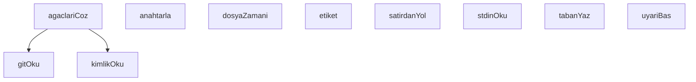

## Genel Bakış

Bu modül, Claude CLI'nin bash hook mekanizması üzerinden gerçekleştirilen dosya yazma işlemlerini denetleyen bir audit (izleme) bileşenidir. Modül, stdin üzerinden hook verisini okuyarak yazma işlemini yakalar ve git repository bilgileriyle birlikte kayıt altına alır. Amaç, hangi dosyaların ne zaman ve hangi commit bağlamında değiştirildiğini izlemektir.

## Fonksiyon Grupları

### Girdi Okuma ve Ayrıştırma
Hook mekanizmasına gelen ham veriyi stdin üzerinden okur ve satır bazlı ayrıştırma yaparak dosya yollarını çıkarır.
- stdinOku, satirdanYol

### Git Entegrasyonu
Git repository'sinden dizin, commit ve ağaç (tree) bilgilerini okuyarak yazma işleminin bağlamını belirler. Ağaç yapılarını çözerek dosya yollarıyla ilişkilendirir.
- gitOku, kimlikOku, agaclariCoz, anahtarla

### Dosya Zaman Bilgisi
Denetlenen dosyanın zaman damgasını okuyarak kayıt altına alınacak bilgiyi tamamlar.
- dosyaZamani

### Audit Kaydı ve Çıktı
Denetlenen yazma işlemini yapılandırılmış biçimde kayıt altına alır ve kullanıcıya uyarı/bilgi mesajları sunar.
- tabanYaz, etiket, uyariBas

---

## AXIOMS – Mimari Varsayımlar
- Bu modül davranışsal mantık içermez (salt veri / konfigürasyon / tip tanımı).
- [Aksiyom 1]: Modülün dışa açtığı yapı (anahtar kümesi / şema) bir sözleşmedir; tüketiciler bu sabit yapıya bağlıdır — kırıcı değişiklik tüm tüketicileri etkiler.
- [Aksiyom 2]: Bir öğe ekleme/çıkarma yapısal-uyumlu olmalı; ilgili tipler ve seçiciler aynı commit'te güncel tutulmalıdır.

---

## FONKSİYON DETAYLARI

### stdinOku
**Ne yapar**: Standart girdi (stdin) akışından UTF-8 kodlamasında veri okur. Okuma başarısız olursa boş dize döndürür.
**Nasıl yapar**: `fs.readFileSync` fonksiyonunu dosya tanımlayıcısı `0` (stdin) ile çağırarak eşzamanlı okuma gerçekleştirir. `try-catch` bloğu içinde çalışır; herhangi bir hata oluşursa (örneğin stdin mevcut değilse) yakalanır ve boş dize (`''`) döndürülür.
**Parametreler**:
- Bu fonksiyon parametre almaz.
**Dönüş**: Bilinmiyor. Kaynakta dönüş tipi belirtilmemiştir; ancak gövde incelendiğinde başarılı durumda `fs.readFileSync` sonucu (string), hata durumunda boş dize (`''`) döndürdüğü görülmektedir.

### uyariBas
**Ne yapar**: Geliştirildi ancak detay üretilemedi.

### gitOku
**Ne yapar**: Geliştirildi ancak detay üretilemedi.

### kimlikOku
**Ne yapar**: Geliştirildi ancak detay üretilemedi.

### agaclariCoz
**Ne yapar**: Geliştirildi ancak detay üretilemedi.

### satirdanYol
**Ne yapar**: Geliştirildi ancak detay üretilemedi.

### anahtarla
**Ne yapar**: Geliştirildi ancak detay üretilemedi.

### tabanYaz
**Ne yapar**: Geliştirildi ancak detay üretilemedi.

### dosyaZamani
**Ne yapar**: Fonksiyonun görevi belgelenmemiştir. Adından ("dosyaZamani") dosya ile ilişkili bir zaman/tarih işlemi yaptığı çıkarılabilir ancak bu bir tahmindir; kesin görevi bilinmiyor.

**Nasıl yapar**: İç mantığı hakkında kaynakta herhangi bir bilgi bulunmuyor. Uygulama detayları bilinmiyor.

**Parametreler**:
- y: bilinmiyor — Parametrenin tipi ve amacı hakkında kaynakta bilgi bulunmuyor.

**Dönüş**: Dönüş tipi bilinmiyor. Kaynakta dönüş değerine dair bir bilgi yer almıyor.

### etiket
**Ne yapar**: Geliştirildi ancak detay üretilemedi.

---

## SABİTLER
- **fs** (call) — `require('fs')`
- **path** (call) — `require('path')`
- **PANO** [env-backed] (binary_expression) — `process.env.VENTHUB_BOARD_DIR || process.env.VENTHUB_PANO_DIR || 'C:/tmp/vent...`
- **sid** (binary_expression) — `girdi.session_id || ''`
- **cwdKok** (call) — `path.resolve(girdi.cwd || process.cwd()).replace(/\\/g, '/')`
- **kisaSid** (call) — `String(sid).slice(0, 8)`
- **TABAN_YOLU** (call) — `path.join(PANO, '.bash-audit-' + kisaSid + '.json')`
- **agaclar** (unknown)
- **tabanKume** (new_expression) — `new Set(taban.yollar)`
- **hamYeniler** (call) — `simdiki.filter((y) => !tabanKume.has(y.anahtar))`
- **cokAgac** (binary_expression) — `denetlenecek.length > 1`
- **bildirilen** (new_expression) — `new Set(taban.bildirilen)`
- **satirlar** (call) — `ihlaller.map(
  (i) => '  · ' + etiket(i.y) + '  ->  ' + i.catisma.claim.lan...`
- **lanelereGore** (new_expression) — `new Map()`

---

## AST POINTERS

### [N1_NASIL] AST Pointer: bash-write-audit.cjs::stdinOku
- **params**: (parametre yok)
- **ic_degiskenler**: (iç değişken yok)
- **Dönüş**: `string` — stdin'den okunan UTF-8 metin; hata durumunda boş string `''`

### [N2_NASIL] AST Pointer: bash-write-audit.cjs::uyariBas
- **params**: (parametre yok)
- **ic_degiskenler**: (iç değişken yok; `uyarilar` modül kapsamından gelir)
- **Dönüş**: yok — `uyarilar` dizisi doluysa `process.stderr.write` ile uyarıları satır satır yazar

### [N3_NASIL] AST Pointer: bash-write-audit.cjs::gitOku
- **params**: `dizin`, `arg`
- **ic_degiskenler**: (iç değişken yok)
- **Dönüş**: `string` — `git rev-parse` çıktısı (trim edilmiş); hata durumunda boş string `''`

### [N4_NASIL] AST Pointer: bash-write-audit.cjs::kimlikOku
- **params**: `yol`
- **ic_degiskenler**: (iç değişken yok)
- **Dönüş**: `string` — dosya içeriği (trim edilmiş); hata durumunda boş string `''`

### [N5_NASIL] AST Pointer: bash-write-audit.cjs::agaclariCoz
- **params**: (parametre yok)
- **ic_degiskenler**:
  - `ortakHam` — `gitOku(cwdKok, '--git-common-dir')` sonucu; ortak git dizininin ham yolu
  - `ortak` — `path.resolve(cwdKok, ortakHam)` ile çözülmüş mutlak ortak git dizini
  - `bulunan` — `sid` ile eşleşen ağaç dizinlerinin toplandığı dizi
  - `adlar` — `path.join(ortak, 'worktrees')` altındaki dizin adlarının listesi; okuma hatasında boş dizi
  - `dizin` — döngüdeki worktree dizininin tam yolu
  - `gitdir` — worktree'nin `gitdir` dosyasından okunan içerik
  - `tekil` — `bulunan` dizisinin normalize edilmiş, tekrarsız, dizin olan yolları
- **Dönüş**: `object` — `{ agaclar: string[], sebep: string }`; `agaclar` bulunan ağaç yolları, `sebep` boşsa başarı veya açıklayıcı hata mesajı

### [N6_NASIL] AST Pointer: bash-write-audit.cjs::satirdanYol
- **params**: `satir`
- **ic_degiskenler**:
  - `govde` — `satir.slice(3)` ile ilk 3 karakter atıldıktan kalan kısım
  - `ok` — `govde.indexOf(' -> ')` sonucu; ok işareti pozisyonu, yoksa `-1`
  - `ham` — ok varsa ` -> ` sonrasındaki kısım, yoksa `govde`'nin kendisi
- **Dönüş**: `string` — baştaki ve sondaki çift tırnak temizlenmiş, trim edilmiş dosya yolu

### [N7_NASIL] AST Pointer: bash-write-audit.cjs::tabanYaz
- **params**: `bildirilen`
- **ic_degiskenler**:
  - `gecici` — `TABAN_YOLU + '.tmp'` ile oluşturulan geçici dosya yolu
  - `e` — yakalanan hata nesnesi; `e.code` ile hata kodu okunur
- **Dönüş**: yok — geçici dosyaya JSON yazar, ardından `fs.renameSync` ile atomik olarak `TABAN_YOLU`'na taşır; hata durumunda `process.stderr.write` ile hata mesajı yazar

### [N8_NASIL] AST Pointer: bash-write-audit.cjs::dosyaZamani
- **params**: `y`
- **ic_degiskenler**: (iç değişken yok)
- **Dönüş**: `number | null` — `fs.statSync(path.resolve(y.agac, y.bagil)).mtimeMs`; dosya silinmiş veya erişilemezse `null`

### [N9_NASIL] AST Pointer: bash-write-audit.cjs::etiket
- **params**: `y`
- **ic_degiskenler**: (iç değişken yok)
- **Dönüş**: (verilen gövdede etiket fonksiyonunun gövdesi eksik; yalnızca `dosyaZamani` gövdesi verilmiş — bu fonksiyonun dönüşü belirlenemiyor)

---

## MERMAID CALL GRAPH

## NODE ID STANDARD

  file: .claude\hooks\bash-write-audit.cjs
  function: .claude\hooks\bash-write-audit.cjs::stdinOku
  function: .claude\hooks\bash-write-audit.cjs::uyariBas
  function: .claude\hooks\bash-write-audit.cjs::gitOku
  function: .claude\hooks\bash-write-audit.cjs::kimlikOku
  function: .claude\hooks\bash-write-audit.cjs::agaclariCoz
  function: .claude\hooks\bash-write-audit.cjs::satirdanYol
  function: .claude\hooks\bash-write-audit.cjs::anahtarla
  function: .claude\hooks\bash-write-audit.cjs::tabanYaz
  function: .claude\hooks\bash-write-audit.cjs::dosyaZamani
  function: .claude\hooks\bash-write-audit.cjs::etiket

---

## DISA AKTARILANLAR (EXPORTS)
  export: agaclariCoz
  export: anahtarla
  export: dosyaZamani
  export: etiket
  export: gitOku
  export: kimlikOku
  export: satirdanYol
  export: stdinOku
  export: tabanYaz
  export: uyariBas