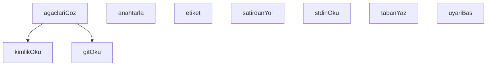

## Genel Bakış

Bu modül, Claude CLI'nin bash hook mekanizması üzerinden gerçekleştirilen dosya yazma işlemlerini denetleyen bir audit (izleme) bileşenidir. Modül, stdin üzerinden hook verisini okuyarak yazma işlemini yakalar ve git repository bilgileriyle birlikte kayıt altına alır. Amaç, hangi dosyaların ne zaman ve hangi commit bağlamında değiştirildiğini izlemektir.

## Fonksiyon Grupları

### Girdi Okuma ve Ayrıştırma
Hook mekanizmasına gelen ham veriyi stdin üzerinden okur ve satır bazlı ayrıştırma yaparak dosya yollarını çıkarır.
- stdinOku, satirdanYol

### Git Entegrasyonu
Git repository'sinden dizin, commit ve ağaç (tree) bilgilerini okuyarak yazma işleminin bağlamını belirler. Ağaç yapılarını çözerek dosya yollarıyla ilişkilendirir.
- gitOku, kimlikOku, agaclariCoz, anahtarla

### Audit Kaydı ve Çıktı
Denetlenen yazma işlemini yapılandırılmış biçimde kayıt altına alır ve kullanıcıya uyarı/bilgi mesajları sunar.
- tabanYaz, etiket, uyariBas

---

## AXIOMS – Mimari Varsayımlar

Bu modül için özel aksiyom tanımlanmamıştır.

**Gerekçe:** Fonksiyon gövdeleri sağlanmadığından, modülün doğru çalışması için gerekli koşullar belirlenememektedir. Aksiyomlar yalnızca fonksiyon gövdesindeki mantıktan türetilebilir; fonksiyon imzaları ve değişken isimleri tek başına yeterli kanıt oluşturmaz.

---

## FONKSİYON DETAYLARI

### stdinOku
**Ne yapar**: Standart girdi (stdin) akışından UTF-8 kodlamasında veri okur. Okuma başarısız olursa boş dize döndürür.
**Nasıl yapar**: `fs.readFileSync` fonksiyonunu dosya tanımlayıcısı `0` (stdin) ile çağırarak eşzamanlı okuma gerçekleştirir. `try-catch` bloğu içinde çalışır; herhangi bir hata oluşursa (örneğin stdin mevcut değilse) yakalanır ve boş dize (`''`) döndürülür.
**Parametreler**:
- Bu fonksiyon parametre almaz.
**Dönüş**: Bilinmiyor. Kaynakta dönüş tipi belirtilmemiştir; ancak gövde incelendiğinde başarılı durumda `fs.readFileSync` sonucu (string), hata durumunda boş dize (`''`) döndürdüğü görülmektedir.

### uyariBas
**Ne yapar**: Geliştirildi ancak detay üretilemedi.

### gitOku
**Ne yapar**: Geliştirildi ancak detay üretilemedi.

### kimlikOku
**Ne yapar**: Geliştirildi ancak detay üretilemedi.

### agaclariCoz
**Ne yapar**: Geliştirildi ancak detay üretilemedi.

### satirdanYol
**Ne yapar**: Geliştirildi ancak detay üretilemedi.

### anahtarla
**Ne yapar**: Geliştirildi ancak detay üretilemedi.

### tabanYaz
**Ne yapar**: Geliştirildi ancak detay üretilemedi.

### etiket
**Ne yapar**: Geliştirildi ancak detay üretilemedi.

---

## SABİTLER
- **fs** (call) — `require('fs')`
- **path** (call) — `require('path')`
- **PANO** [env-backed] (binary_expression) — `process.env.VENTHUB_BOARD_DIR || process.env.VENTHUB_PANO_DIR || 'C:/tmp/vent...`
- **sid** (binary_expression) — `girdi.session_id || ''`
- **cwdKok** (call) — `path.resolve(girdi.cwd || process.cwd()).replace(/\\/g, '/')`
- **kisaSid** (call) — `String(sid).slice(0, 8)`
- **TABAN_YOLU** (call) — `path.join(PANO, '.bash-audit-' + kisaSid + '.json')`
- **agaclar** (unknown)
- **tabanKume** (new_expression) — `new Set(taban.yollar)`
- **yeniler** (call) — `simdiki.filter((y) => !tabanKume.has(y.anahtar))`
- **cokAgac** (binary_expression) — `denetlenecek.length > 1`
- **bildirilen** (new_expression) — `new Set(taban.bildirilen)`
- **satirlar** (call) — `ihlaller.map(
  (i) => '  · ' + etiket(i.y) + '  ->  ' + i.catisma.claim.lan...`
- **lanelereGore** (new_expression) — `new Map()`

---

## AST POINTERS

### [N1_NASIL] AST Pointer: bash-write-audit.cjs::stdinOku
- **params**: yok
- **ic_degiskenler**: yok
- **Dönüş**: string — `fs.readFileSync(0, 'utf8')` sonucu; hata durumunda boş string `''`

### [N2_NASIL] AST Pointer: bash-write-audit.cjs::uyariBas (isimsiz ok fonksiyonu)
- **params**: yok
- **ic_degiskenler**:
  - `uyarilar.length` — uyarilar dizisinin uzunluğu; sıfırdan büyükse stderr'e yazılır
- **Dönüş**: yok — yan etki olarak `process.stderr.write` ile uyarılar yazdırılır

### [N3_NASIL] AST Pointer: bash-write-audit.cjs::gitOku
- **params**: `dizin`, `arg`
- **ic_degiskenler**: yok
- **Dönüş**: string — `execFileSync('git', ['-C', dizin, 'rev-parse', arg])` sonucu `.trim()` ile kırpılmış; hata durumunda boş string `''`

### [N4_NASIL] AST Pointer: bash-write-audit.cjs::kimlikOku
- **params**: `yol`
- **ic_degiskenler**: yok
- **Dönüş**: string — `fs.readFileSync(yol, 'utf8').trim()` sonucu; hata durumunda boş string `''`

### [N5_NASIL] AST Pointer: bash-write-audit.cjs::agaclarCoz
- **params**: yok
- **ic_degiskenler**:
  - `ortakHam` — `gitOku(cwdKok, '--git-common-dir')` dönüş değeri; ortak git dizininin ham yolu
  - `ortak` — `path.resolve(cwdKok, ortakHam)` ile çözülmüş tam yol
  - `bulunan` — `[]` ile başlatılan dizi; `sid` eşleşen worktree dizinlerini toplar
  - `adlar` — `fs.readdirSync(path.join(ortak, 'worktrees'))` ile okunan dizin adları listesi; hata durumunda `[]`
  - `ad` — `for` döngüsü değişkeni; her bir worktree adı
  - `dizin` — `path.join(ortak, 'worktrees', ad)` ile oluşan worktree dizin yolu
  - `gitdir` — `kimlikOku(path.join(dizin, 'gitdir'))` dönüş değeri; worktree'nin gitdir içeriği
  - `tekil` — `new Set` ile tekrarları kaldırılmış, `path.resolve` ile çözülmüş ve ters eğik çizgileri düzeltildikten sonra `fs.statSync(a).isDirectory()` ile doğrulanmış dizin yolları dizisi
- **Dönüş**: object — `{ agaclar: tekil, sebep: string }` yapısında; `tekil` boşsa `sebep` hata mesajı içerir

### [N6_NASIL] AST Pointer: bash-write-audit.cjs::satirdanYol
- **params**: `satir`
- **ic_degiskenler**:
  - `govde` — `satir.slice(3)` ile ilk üç karakter atıldıktan kalan kısım
  - `ok` — `govde.indexOf(' -> ')` indeksi; `->` ayırıcısının konumu
  - `ham` — `ok > -1` ise `govde.slice(ok + 4)` (ayırıcıdan sonrası), değilse `govde` tamamı
- **Dönüş**: string — `ham` değerinden baştaki ve sondaki tırnak işaretleri temizlenmiş ve `.trim()` ile kırpılmış yol

### [N7_NASIL] AST Pointer: bash-write-audit.cjs::tabanYaz
- **params**: `bildirilen`
- **ic_degiskenler**:
  - `gecici` — `TABAN_YOLU + '.tmp'` ile oluşturulan geçici dosya yolu
  - `e` — `catch` bloğundaki hata nesnesi; `e.code` ile hata kodu okunur
- **Dönüş**: yok — yan etki olarak `fs.writeFileSync` ile geçici dosyaya JSON yazılır, ardından `fs.renameSync` ile `TABAN_YOLU`'na taşınır; hata durumunda `process.stderr.write` ile hata mesajı yazdırılır

---

## MERMAID CALL GRAPH

## NODE ID STANDARD

  file: .claude\hooks\bash-write-audit.cjs
  function: .claude\hooks\bash-write-audit.cjs::stdinOku
  function: .claude\hooks\bash-write-audit.cjs::uyariBas
  function: .claude\hooks\bash-write-audit.cjs::gitOku
  function: .claude\hooks\bash-write-audit.cjs::kimlikOku
  function: .claude\hooks\bash-write-audit.cjs::agaclariCoz
  function: .claude\hooks\bash-write-audit.cjs::satirdanYol
  function: .claude\hooks\bash-write-audit.cjs::anahtarla
  function: .claude\hooks\bash-write-audit.cjs::tabanYaz
  function: .claude\hooks\bash-write-audit.cjs::etiket

---

## DISA AKTARILANLAR (EXPORTS)
  export: agaclariCoz
  export: anahtarla
  export: etiket
  export: gitOku
  export: kimlikOku
  export: satirdanYol
  export: stdinOku
  export: tabanYaz
  export: uyariBas