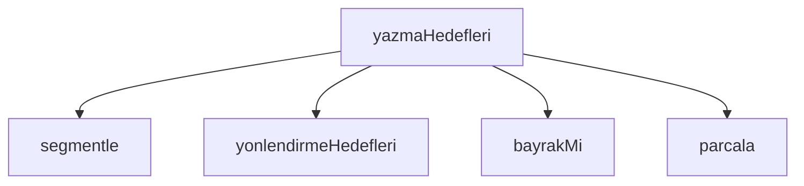

## Genel Bakış
Bu modül, bash komutlarını ayrıştırarak dosya yazma hedeflerini tespit eder. Claude hook sistemi içinde çalışan modül, komut satırlarındaki yönlendirme operatörlerini ve dosya yollarını analiz ederek hangi dosyaların yazılacağını belirler.

## Fonksiyon Grupları

### Komut Ayrıştırma
Komut metnini tokenize ederek anlamlı parçalara böler. Bu fonksiyonlar zincir halinde çalışır: önce `segmentle` komutu segmentlere ayırır, ardından her segment `parcala` ile daha küçük tokenlara dönüştürülür.
- segmentle, parcala

### Token Sınıflandırma
Ayrıştırılan tokenların türünü belirler. `bayrakMi` fonksiyonu, bir token'ın komut bayrağı olup olmadığını kontrol ederek hedef belirleme sırasında bayrakların atlanmasını sağlar.
- bayrakMi

### Hedef Belirleme
Komuttaki yazma hedeflerini tespit eder. `yonlendirmeHedefleri` token listesinden dosya yönlendirmelerini çıkarır; `yazmaHedefleri` ise tüm süreci orkestrasyon ederek komut metninden nihai yazma hedeflerini üretir. `yazmaHedefleri` muhtemelen `segmentle` ve `yonlendirmeHedefleri` fonksiyonlarını çağırarak çalışır.
- yonlendirmeHedefleri, yazmaHedefleri

---

## AXIOMS – Mimari Varsayımlar

Bu modül için özel aksiyom tanımlanmamıştır.

**Neden:** Aksiyomlar yalnızca fonksiyon gövdelerinden türetilir. Bu modül için fonksiyon gövdeleri sağlanmamış olup, yalnızca fonksiyon imzaları ve sabit tanımları mevcuttur. İmzalar (`parcala`, `segmentle`, `bayrakMi`, `yonlendirmeHedefleri`, `yazmaHedefleri`) ve sabitler (`HEDEF_SAYILMAZ`, `YAZMA_IMZASI`) tek başına modülün çalışma koşulları hakkında güvenilir bilgi vermez.

Fonksiyon gövdeleri sağlanırsa aksiyomlar üretilebilir.

---

## FONKSİYON DETAYLARI

### parcala
**Ne yapar**: Verilen bir kabuk (shell) segmentini sözcüklere (tokenlara) ayırır. Tırnak içine alınmış boşlukları bölmez; yani `"dosya adı"` tek bir token olarak kalır.

**Nasıl yapar**: Segmenti karakter karakter dolaşan bir durum makinesi kullanır. Tırnak içindeyken (`"` veya `'`) boşluk karakterleri normal kabul edilir ve mevcut token'a eklenir. Tırnak dışındayken boşluk karakterleri mevcut token'ı sonlandırır ve bir sonraki karakterden yeni token başlar. Döngü bittiğinde birikmiş kalan varsa son token olarak eklenir.

**Parametreler**:
- segment: `String(segment)` olarak zorlanır — Bölünecek kabuk komutu metni. Herhangi bir tipe sahip olabilir, fonksiyon içinde `String()` ile metne dönüştürülür.

**Dönüş**: `tokenlar` — `string[]` tipinde bir dizi. Segmentten çıkarılan tüm sözcükleri içerir.

### segmentle
**Ne yapar**: Geliştirildi ancak detay üretilemedi.

### bayrakMi
**Ne yapar**: Geliştirildi ancak detay üretilemedi.

### yonlendirmeHedefleri
**Ne yapar**: Geliştirildi ancak detay üretilemedi.

### yazmaHedefleri
**Ne yapar**: Geliştirildi ancak detay üretilemedi.

---

## SABİTLER
- **HEDEF_SAYILMAZ** (new_expression) — `new Set(['/dev/null', '/dev/stdout', '/dev/stderr', 'nul', 'NUL', '&1', '&2'])`
- **YAZMA_IMZASI** (regex) — `/writeFileSync|appendFileSync|createWriteStream|copyFileSync|renameSync|unlin...`

---

## AST POINTERS

### [N1_NASIL] AST Pointer: bash-write-targets.cjs::parcala
- **params**: `segment`
- **ic_degiskenler**:
  - `tokenlar` — parçalanmış token'ların biriktirildiği boş dizi
  - `cari` — şu an biriktirilmekte olan karakter birikim dizgisi, boş diziyle başlatılır
  - `tirnak` — aktif tırnak karakterini tutar (`"` veya `'`), başlangıçta `null`; tırnak içindeyken karakterleri `cari`'ye ekler, eşleşen tırnak bulununca sıfırlanır
  - `ch` — `String(segment)` üzerinde `for...of` ile dönen her karakter
- **Dönüş**: `tokenlar` — boşluk ve tırnak duyarlı parçalanmış dizgi dizisi

### [N2_NASIL] AST Pointer: bash-write-targets.cjs::segmentle
- **params**: `komut`
- **ic_degiskenler**:
  - `k` — `String(komut)` ile elde edilen dizgi gösterimi
  - `segmentler` — `k`'nın `&&`, `||`, `;`, `\n`, `|` ayırıcılarıyla bölünmüş ve boş olmayan parçaları; heredoc varsa tek elemanlı dizi olarak `[k]`
  - `heredoc` — `k`'nin `<<` içerip içermediğini gösteren boolean; içeriyorsa `true`
- **Dönüş**: `{ segmentler, heredoc }` — segment dizisi ve heredoc bayrağı taşıyan nesne

### [N3_NASIL] AST Pointer: bash-write-targets.cjs::bayrakMi
- **params**: `t`
- **ic_degiskenler**: gövde verilmediği için bilinmiyor
- **Dönüş**: bilinmiyor

### [N4_NASIL] AST Pointer: bash-write-targets.cjs::yonlendirmeHedefleri
- **params**: `tokenlar`
- **ic_degiskenler**:
  - `bulunan` — bulunan yönlendirme hedeflerinin biriktirildiği boş dizi
  - `i` — `tokenlar` dizisi üzerinde dolaşan sayaç indeksi
  - `m` — `tokenlar[i]` üzerinde `/^\d*>>?(.*)$/` regex eşleşmesi sonucu; eşleşmezse `null`, eşleşirse yakalama grubu `m[1]`'i içerir
- **Dönüş**: `bulunan` — yönlendirme hedefi dizgilerinden oluşan dizi

### [N5_NASIL] AST Pointer: bash-write-targets.cjs::yazmaHedefleri
- **params**: `komut`
- **ic_degiskenler**:
  - `hedefler` — çözümlenmiş yazma hedefi yollarının biriktirildiği boş dizi
  - `cozulemeyen` — statik çıkarılamayan segment'lerin biriktirildiği boş dizi
  - `sebepler` — her hedef/cozulemeyen için eklenen sebep dizgilerinin biriktirildiği boş dizi
  - `yazmaVar` — yazma işlemi tespit edilip edilmediğini gösteren boolean, başlangıçta `false`
  - `segmentler` — `segmentle(komut)` dönüşündeki segment dizisi
  - `heredoc` — `segmentle(komut)` dönüşündeki heredoc bayrağı
  - `segment` — `segmentler` üzerinde `for...of` ile dönen her segment dizgisi
  - `tokenlar` — `parcala(segment)` ile elde edilen token dizisi
  - `komutAdi` — `tokenlar[0]`'ın `/[\\/]/` ile bölünmüş son elemanının küçük harf karşılığı; boşsa `''`
  - `digerleri` — `tokenlar.slice(1)` ile elde edilen, komut adı dışındaki token'lar
  - `bayraksiz` — `digerleri` içinde bayrak olmayan (`bayrakMi(t)` ve `/^\d*>>?/` testlerini geçemeyen) token'lar
  - `ekle` — `(yol, sebep) => { ... }` ok fonksiyonu; `yazmaVar`'ı `true` yapar, sebep ekler, yolu temizleyip `HEDEF_SAYILMAZ` kümesinde yoksa `hedefler`'e ekler
  - `cozulemedi` — `(sebep) => { ... }` ok fonksiyonu; `yazmaVar`'ı `true` yapar, sebep ekler, `segment.trim()`'i `cozulemeyen`'e ekler
  - `y` — `yonlendirmeHedefleri(tokenlar)` dönüşündeki her hedef dizgisi; `ekle`'ye `'yonlendirme'` sebebiyle gönderilir
  - `of` — `digerleri` içinde `of=` ile başlayan eleman (dd komutu için); `of.slice(3)` ile dosya yolu çıkarılır
  - `satirIci` — `digerleri` içinde `-e`, `-c` veya `-Command` bayrağı bulunup bulunmadığını gösteren boolean
  - `ayrac` — `digerleri` içinde `--` elemanının indeksi; yoksa `-1`
- **Dönüş**: `{ yazmaVar, hedefler, cozulemeyen, sebepler }` — yazma varlığı bayrağı, çözümlenmiş hedefler, çözülemeyen segment'ler ve sebepler dizileri taşıyan nesne

---

## MERMAID CALL GRAPH

## NODE ID STANDARD

  file: .claude\hooks\bash-write-targets.cjs
  function: .claude\hooks\bash-write-targets.cjs::parcala
  function: .claude\hooks\bash-write-targets.cjs::segmentle
  function: .claude\hooks\bash-write-targets.cjs::bayrakMi
  function: .claude\hooks\bash-write-targets.cjs::yonlendirmeHedefleri
  function: .claude\hooks\bash-write-targets.cjs::yazmaHedefleri

---

## DISA AKTARILANLAR (EXPORTS)
  export: bayrakMi
  export: parcala
  export: segmentle
  export: yazmaHedefleri
  export: yonlendirmeHedefleri