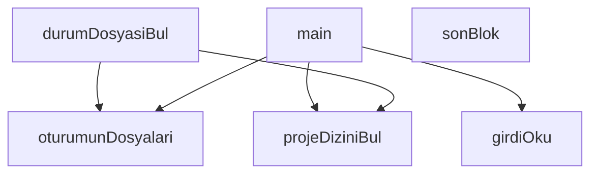

## Genel Bakış

Bu modül, Claude CLI'nın precompact (sıkıştırma öncesi) aşamasında çalışan bir hook kapısıdır. Bir oturumun (session) transcript dosyasından yola çıkarak ilgili proje dizinini, oturum dosyalarını ve durum dosyasını bulur; ardından durum dosyasının son bloğunu okuyarak sıkıştırma öncesi durum bilgisini ortaya çıkarır. Modül CJS formatında yazılmıştır ve `main` fonksiyonu aracılığıyla hook akışını başlatır.

## Fonksiyon Grupları

### Ana Akış ve Girdi Okuma
Hook'un çalıştırma akışını başlatır ve harici girdiyi (muhtemelen stdin üzerinden) okuyarak diğer fonksiyonlara besler.
- `main`, `girdiOku`

### Dosya ve Dizin Keşfi
SID (oturum kimliği) ve transcript yolu gibi temel girdilerden hareketle proje dizinini, oturum dosyalarını ve durum dosyasının konumunu bulur. Bu fonksiyonlar birbirine zincirlenir: `projeDiziniBul` bulunan dizin bilgisini, `oturumunDosyalari` ve `durumDosyasiBul` ise SID ve yolu kullanarak dosya listesine ve durum dosyasına erişir.
- `projeDiziniBul`, `oturumunDosyalari`, `durumDosyasiBul`

### İçerik Okuma
Bulunan dosyanın son kısmını (varsayılan olarak en fazla 60 satır) okuyarak güncel durum bloğunu çıkarır. `durumDosyasiBul` tarafından bulunan dosya yolunu girdi olarak alır.
- `sonBlok`

---

## AXIOMS – Mimari Varsayımlar

Bu modül, Claude oturumlarının compact öncesi durum bilgisini kapı mekanizmasıyla kontrol eden bir CJS hook modülüdür.

[Aksiyom 1]: Eğer `sid` (oturum kimliği) parametresi yoksa, `projeDiziniBul`, `oturumunDosyalari` ve `durumDosyasiBul` fonksiyonları çalışamaz; oturuma ait dizin ve dosya yolları belirlenemez.

[Aksiyom 2]: Eğer `transcriptPath` (transcript dosya yolu) yoksa, `projeDiziniBul` ve `durumDosyasiBul` fonksiyonları projenin kök dizinini ve durum dosyasının konumunu bulamaz.

[Aksiyom 3]: Eğer `memoryDir` (bellek dizini) yoksa, `oturumunDosyalari` fonksiyonu oturuma ait dosyaları listeleyemez.

[Aksiyom 4]: Eğer `sonBlok` fonksiyonuna verilen `yol` parametresindeki dosya mevcut değilse veya okunamıyorsa, son blok içeriği elde edilemez. Fonksiyon varsayılan olarak en fazla 60 satır okur; bu değer `enFazlaSatir` parametresiyle değiştirilebilir.

[Aksiyom 5]: Eğer `DORT_ALAN` dizisinde tanımlı dört alan durum dosyasında bulunamazsa, durum doğrulama işlemi gerçekleştirilemez.

[Aksiyom 6]: Eğer `AD_KALIBI` regex kalıbına uyan bir isim eşleşmesi sağlanamazsa, dosya adı üzerinden oturum veya durum dosyası tanımlama yapılamaz.

[Aksiyom 7]: Eğer `fs`, `os` ve `path` modülleri (Node.js yerleşik modülleri) erişilebilir değilse, dosya sistemi okuma, dizin çözümleme ve yol birleştirme işlemleri gerçekleştirilemez; modülün temel işlevleri çalışmaz.

---

## FONKSİYON DETAYLARI

### girdiOku
**Ne yapar**: Standart girdiden (stdin, dosya tanımlayıcı 0) ham metin okur, JSON olarak ayrıştırır ve nesne olarak döndürür. Okuma veya ayrıştırma sırasında herhangi bir hata oluşursa boş nesne (`{}`) döndürerek çağıran kodun çökmesini engeller.

**Nasıl yapar**: `fs.readFileSync` ile dosya tanımlayıcı `0`'dan UTF-8 kodlamasında okuma yapar. Okuma başarısız olursa (try-catch bloğu) boş nesne döner. Okunan metin boşsa `'{}'` varsayılır ve `JSON.parse` ile ayrıştırılır. Ayrıştırma hatası durumunda yine boş nesne döndürülür. İki aşamalı try-catch yapısı sayesinde hem okuma hem ayrıştırma hataları ayrı ayrı yakalanır.

**Parametreler**:
- Bu fonksiyon parametre almaz.

**Dönüş**: Ayrıştırılmış bir JavaScript nesnesi (`object`) ya da boş nesne (`{}`). Kesin dönüş tipi kaynakta belirtilmemiştir.

### projeDiziniBul
**Ne yapar**: Geliştirildi ancak detay üretilemedi.

### oturumunDosyalari
**Ne yapar**: Geliştirildi ancak detay üretilemedi.

### durumDosyasiBul
**Ne yapar**: Geliştirildi ancak detay üretilemedi.

### sonBlok
**Ne yapar**: Geliştirildi ancak detay üretilemedi.

### main
**Ne yapar**: Geliştirildi ancak detay üretilemedi.

---

## SABİTLER
- **fs** (call) — `require('fs')`
- **os** (call) — `require('os')`
- **path** (call) — `require('path')`
- **DORT_ALAN** (array) — `[
  { ad: 'son girdi', desen: /son\s+girdi|SON GIRDI|bana ulasan son/i },
  {...`
- **AD_KALIBI** (regex) — `/(lane-day|state|durum)/i`

---

## AST POINTERS

### [N1_NASIL] AST Pointer: precompact-durum-kapisi.cjs::girdiOku
- **params**: yok
- **ic_degiskenler**:
  - `ham` — stdin (fd 0) üzerinden okunan ham metin; boş string ile başlatılır, `fs.readFileSync(0, 'utf8')` ile doldurulur
- **Dönüş**: `JSON.parse(ham)` sonucu obje; okuma veya parse hatasında boş obje `{}`

### [N2_NASIL] AST Pointer: precompact-durum-kapisi.cjs::projeDiziniBul
- **params**: `sid`, `transcriptPath`
- **ic_degiskenler**:
  - `d` — `path.dirname(transcriptPath)` ile elde edilen transcript dosyasının bulunduğu dizin; `fs.existsSync(d)` ile doğrulanır
  - `kok` — `path.join(os.homedir(), '.claude', 'projects')` ile oluşturulan projeler kök dizini
  - `adaylar` — `fs.readdirSync(kok, { withFileTypes: true })` ile okunan ve `.filter(e => e.isDirectory())` ile yalnız dizin olan girdiler; okuma hatasında boş dizi
  - `e` — `adaylar` dizisi üzerindeki her bir dizin girdisi; `e.name` ile dizin adı alınır, `path.join(kok, e.name, sid + '.jsonl')` ile oturum dosyası aranır
- **Dönüş**: bulunan proje dizini yolu (string) veya `null`

### [N3_NASIL] AST Pointer: precompact-durum-kapisi.cjs::oturumunDosyalari
- **params**: `memoryDir`, `sid`
- **ic_degiskenler**:
  - `adlar` — `fs.readdirSync(memoryDir)` ile okunan ve `.filter(a => a.endsWith('.md'))` ile yalnız `.md` dosyaları; okuma hatasında boş dizi
  - `adEsleseni` — dosya adı `AD_KALIBI` regex'ine uyan dosya kayıtları dizisi
  - `icerikEsleseni` — dosya gövdesinde `DORT_ALAN` desenlerinden en az biri eşleşen dosya kayıtları dizisi
  - `ad` — döngüdeki her `.md` dosya adı
  - `tam` — `path.join(memoryDir, ad)` ile oluşturulan dosyanın tam yolu
  - `govde` — `fs.readFileSync(tam, 'utf8')` ile okunan dosya içeriği; yalnız ilk 600 karakterde `sid` aranır (`govde.slice(0, 600).includes(sid)`)
  - `kayit` — `{ ad, tam, mt }` objesi; `mt` = `fs.statSync(tam).mtimeMs` ile dosyanın son değişiklik zamanı (milisaniye)
  - `secilen` — `adEsleseni` doluysa onu, değilse `icerikEsleseni`ni seçen değişken
- **Dönüş**: `secilen.sort((a, b) => b.mt - a.mt)` ile zamana göre tersten sıralanmış dosya kayıtları dizisi; okuma hatasında boş dizi `[]`

### [N4_NASIL] AST Pointer: precompact-durum-kapisi.cjs::durumDosyasiBul
- **params**: `sid`, `transcriptPath`
- **ic_degiskenler**:
  - `pd` — `projeDiziniBul(sid, transcriptPath)` çağrısından dönen proje dizini yolu
  - `liste` — `oturumunDosyalari(path.join(pd, 'memory'), sid)` çağrısından dönen dosya kayıtları dizisi
- **Dönüş**: `liste[0]` (en taze dosya kaydı objesi) veya `liste` boşsa `null`

### [N5_NASIL] AST Pointer: precompact-durum-kapisi.cjs::sonBlok
- **params**: `yol`, `enFazlaSatir` (varsayılan `60`)
- **ic_degiskenler**:
  - `govde` — `fs.readFileSync(yol, 'utf8')` ile okunan dosya içeriği; okuma hatasında boş string
  - `satirlar` — `govde.split(/\r?\n/)` ile satırlara ayrılmış dizi
  - `bas` — `satirlar` dizisinde geriye doğru taranarak bulunan son `## ` ile başlayan başlık satırının indeksi; bulunamazsa `-1`
  - `i` — geriye doğru döngü sayacı (`satirlar.length - 1`'den `0`'a)
  - `dilim` — `bas >= 0` ise `satirlar.slice(bas)`, değilse `satirlar.slice(-40)`; son başlıktan itibaren veya son 40 satır
- **Dönüş**: `dilim.slice(0, enFazlaSatir).join('\n')` ile string; okuma hatasında `'(durum dosyasi okunamadi)'`

### [N6_NASIL] AST Pointer: precompact-durum-kapisi.cjs::main
- **params**: yok
- **ic_degiskenler**:
  - `girdi` — `girdiOku()` çağrısından dönen JSON objesi
  - `sid` — `girdi.session_id || girdi.sessionId || process.env.CLAUDE_SESSION_ID || ''` zincirinden elde edilen oturum kimliği
  - `tetik` — `girdi.trigger` değeri; yoksa `'manual'`
  - `projeDizini` — `projeDiziniBul(sid, girdi.transcript_path || girdi.transcriptPath)` çağrısından dönen dizin yolu
  - `memoryDir` — `path.join(projeDizini, 'memory')` ile oluşturulan hafıza dizini yolu
  - `dosyalar` — `oturumunDosyalari(memoryDir, sid)` çağrısından dönen dosya kayıtları dizisi
  - `uyarilar` — uyarı mesajlarının toplandığı dizi; boş başlatılır
  - `enTaze` — `dosyalar[0]`, en güncel durum dosyası kaydı objesi (`ad`, `tam`, `mt` alanları)
  - `yasDk` — `Math.round((Date.now() - enTaze.mt) / 60000)` ile hesaplanan en taze dosyanın dakika cinsinden yaşı
  - `govde` — `fs.readFileSync(enTaze.tam, 'utf8')` ile okunan en taze dosyanın içeriği
  - `eksik` — `DORT_ALAN.filter(a => !a.desen.test(govde)).map(a => a.ad)` ile gövdede bulunamayan sabit alan adları dizisi
  - `idx` — `path.join(memoryDir, 'MEMORY.md')` ile oluşturulan indeks dosyası yolu
  - `bayt` — `fs.statSync(idx).size` ile MEMORY.md dosya boyutu (bayt)
  - `u` — `uyarilar` dizisindeki her bir uyarı stringi
- **Dönüş**: yok; `process.exit(0)` ile başarılı çıkış veya `process.exit(2)` ile bloklama çıkışı
- **yan_etkiler**: `process.stdout.write` ile normal mesajlar, `process.stderr.write` ile bloklama mesajı; `process.env.VENTHUB_PRECOMPACT_KAPALI` kontrolü ile erken çıkış; sabitler `BAYAT_ESIK_DK` ve `MEMORY_ESIK_BAYT` eşik değerleriyle karşılaştırma yapılır

---

## MERMAID CALL GRAPH

## NODE ID STANDARD

  file: precompact-durum-kapisi.cjs
  function: precompact-durum-kapisi.cjs::girdiOku
  function: precompact-durum-kapisi.cjs::projeDiziniBul
  function: precompact-durum-kapisi.cjs::oturumunDosyalari
  function: precompact-durum-kapisi.cjs::durumDosyasiBul
  function: precompact-durum-kapisi.cjs::sonBlok
  function: precompact-durum-kapisi.cjs::main

---

## DISA AKTARILANLAR (EXPORTS)
  export: durumDosyasiBul
  export: girdiOku
  export: main
  export: oturumunDosyalari
  export: projeDiziniBul
  export: sonBlok