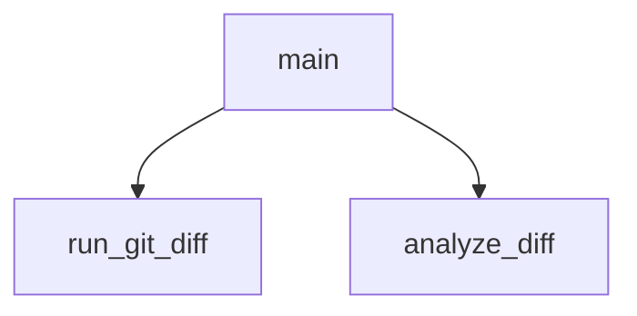

## Genel Bakış

Bu modül, git depolarındaki değişikliklerin belirli kurallara uygunluğunu denetler. Git diff çıktısını alır, yapısal olarak analiz eder ve kurallara aykırı durumları tespit eder. Modül, bir denetim (review) sürecinin otomasyon parçası olarak çalışır.

## Fonksiyon Grupları

### Git Erişim
Depodan ham diff verisini elde etmekten sorumludur. Git komutunu çalıştırarak değişiklik bilgisini metin olarak döndürür.
- run_git_diff

### Diff Analizi
Elde edilen ham diff çıktısını işleyerek yapısal bir liste üretir. Değişen dosyaları, satırları ve ilgili meta bilgileri ayrıştırır.
- analyze_diff

### Orkestrasyon
Modülün giriş noktasıdır. Git erişim ve analiz fonksiyonlarını sırayla çağırarak denetim sürecini başlatır ve sonuçları kullanıcıya sunar.
- main

---

## AXIOMS – Mimari Varsayımlar

[Aksiyom 1]: Eğer `run_git_diff` fonksiyonu çalıştırıldığında sistemde `git` komutu erişilebilir değilse, fonksiyon hata verir ve diff çıktısı üretilemez.

[Aksiyom 2]: Eğer `run_git_diff` fonksiyonu bir git deposu dışında çalıştırılırsa, geçerli bir diff çıktısı üretilmez.

[Aksiyom 3]: Eğer `analyze_diff` fonksiyonuna `str` tipinde bir değer verilmezse, diff analizi yapılamaz.

[Aksiyom 4]: Eğer `RULES` sabiti tanımlı değilse, diff kuralları kontrol edilemez.

[Aksiyom 5]: Eğer `EXCLUDED_EXTENSIONS` sabiti tanımlı değilse, hariç tutulması gereken dosya uzantıları filtrelenemez.

[Aksiyom 6]: Eğer `EXCLUDED_PATHS` sabiti tanımlı değilse, hariç tutulması gereken dosya yolları filtrelenemez.

[Aksiyom 7]: Eğer `main` fonksiyonu çağrıldığında `run_git_diff` veya `analyze_diff` fonksiyonları düzgün çalışmazsa, ana işlev tamamlanamaz.

---

## FONKSİYON DETAYLARI

### run_git_diff
**Ne yapar**: Git deposundaki hem staged (indekslenmiş) hem de unstaged (indekslenmemiş) değişikliklerin birleşik diff çıktısını alır. Fonksiyon, HEAD referans noktasına göre değişiklikleri yakalamaya çalışır.
**Nasıl yapar**: İlk olarak `git diff HEAD` komutunu çalıştırarak hem staged hem unstaged değişiklikleri yakalamaya çalışır. Bu komut bir hata fırlatırsa (örneğin, depoda hiç commit yoksa), `git diff --cached` komutunu çalıştırarak sadece staged değişiklikleri alır. Her iki komut da UTF-8 kodlaması ile çalıştırılır ve hatalı karakterler `errors='replace'` ile değiştirilir. Herhangi bir hata durumunda boş bir dize döndürür.
**Parametreler**:
- Bu fonksiyon parametre almaz.
**Dönüş**: `str` — Elde edilen diff çıktısını metin olarak döndürür. Değişiklik yoksa veya hata oluşursa boş bir dize döner.

### analyze_diff
**Ne yapar**: Verilen diff çıktısını satır satır analiz ederek, önceden tanımlanmış kurallara aykırı kalıpları (anti-pattern) tespit eder ve bulunan ihlalleri bir liste olarak döndürür.
**Nasıl yapar**: Diff çıktısını satırlara böler ve her satırı işler. `diff --git` ile başlayan satırlarda dosya yolunu çıkarır ve bu dosyanın `EXCLUDED_PATHS` ile başlayan bir yola veya `EXCLUDED_EXTENSIONS` ile biten bir uzantıya sahip olup olmadığını kontrol eder. Hariç tutulan bir dosya ise, o dosyanın geri kalan satırlarını atlar. Her satırda `IGNORE_FLAG` (muhtemelen bir yorum etiketi) olup olmadığını kontrol eder; varsa o satırı atlar. Daha sonra, global `RULES` sözlüğündeki her kuralın `pattern` (regex) deseni ile satırı eşleştirir. Eşleşme bulunursa, dosya adı, kural kimliği, açıklama, şiddet derecesi ve ilgili satır bilgilerini içeren bir ihlal sözlüğü oluşturur ve listeye ekler.
**Parametreler**:
- `diff_output`: `str` — Analiz edilecek `git diff` komutunun ham metin çıktısı.
**Dönüş**: `list` — Tespit edilen ihlallerin bir listesini döndürür. Her ihlal, `file`, `rule`, `description`, `severity` ve `line` anahtarlarına sahip bir sözlüktür. İhlal yoksa boş liste döner.

### main
**Ne yapar**: Programın ana yürütme akışını kontrol eder. Diff çıktısını alır, analiz eder, bulunan ihlalleri kullanıcıya raporlar ve ihlallerin şiddetine göre programın çıkış kodunu belirler.
**Nasıl yapar**: Önce bir bilgi mesajı yazdırır ve `run_git_diff()` fonksiyonu ile diff çıktısını alır. Çıktı boşsa, değişiklik olmadığını bildirir ve `sys.exit(0)` ile başarılı çıkış yapar. Ardından `analyze_diff()` ile ihlalleri analiz eder. İhlal yoksa, başarılı mesajı yazdırır ve `sys.exit(0)` ile çıkar. İhlal varsa, her bir ihlali detaylı bir şekilde (şiddet, dosya, kural, satır ve çözüm önerisi) yazdırır. İhlaller arasında `BLOCKER` şiddetinde bir ihlal olup olmadığını kontrol eder. `BLOCKER` varsa, işlemi reddeden bir hata mesajı yazdırır ve `sys.exit(1)` ile başarısız çıkış yapar. Sadece `MAJOR` veya `MINOR` şiddetinde ihlaller varsa, bir uyarı mesajı yazdırır ve `sys.exit(0)` ile başarılı çıkış yapar (programı durdurmaz).
**Parametreler**:
- Bu fonksiyon parametre almaz.
**Dönüş**: Belirtilmemiş. Fonksiyon, programın akışını sonlandırmak için `sys.exit()` çağırır.

---

## İTHALATLAR (IMPORTS)
- import: pathlib::Path
- import: re
- import: subprocess
- import: sys

---

## SABİTLER
- **RULES** (dict) — ` | anahtarlar: TYPE_ANY, DB_DROP, DELETE_EXPORT, CONSOLE_LOG, HARDCODED_URL, SECRET_LEAK, MOCK_DATA`
- **EXCLUDED_EXTENSIONS** (tuple)
- **EXCLUDED_PATHS** (tuple)

---

## AST POINTERS

### [N1_NASIL] AST Pointer: check_diff_rules.py::run_git_diff
- **params**: yok
- **ic_degiskenler**:
  - `result` — `subprocess.run` çağrısının döndürdüğü `CompletedProcess` nesnesi; `result.stdout` ile diff çıktısı alınır
- **Dönüş**: `str` — `git diff HEAD` komutunun standart çıktısı; hata durumunda `git diff --cached` denenir, o da olmazsa boş string `""` döner

### [N2_NASIL] AST Pointer: check_diff_rules.py::analyze_diff
- **params**: `diff_output` (str) — analiz edilecek diff çıktısı
- **ic_degiskenler**:
  - `violations` — tespit edilen kural ihlallerinin toplandığı liste; her ihlal `file`, `rule`, `description`, `severity`, `line` anahtarlarını içeren sözlük olarak eklenir
  - `current_file` — `diff --git` satırından çıkarılan dosya yolu (` b/` sonrasındaki kısım); bulunamazsa `"Bilinmeyen Dosya"` atanır
  - `skip_file` — dosya `EXCLUDED_PATHS` veya `EXCLUDED_EXTENSIONS` ile eşleşirse `True` yapılır; o dosyanın kalan satırları kurallara bakılmadan atlanır
  - `line` — `diff_output.splitlines()` ile elde edilen her bir satır
  - `ep` — `EXCLUDED_PATHS` demetindeki her bir hariç tutulacak yol öneki
  - `ext` — `EXCLUDED_EXTENSIONS` demetindeki her bir hariç tutulacak dosya uzantısı
  - `rule_id` — `RULES` sözlüğündeki kural kimliği (anahtar)
  - `rule_data` — `RULES` sözlüğündeki kural verisi; `rule_data["pattern"]` ile regex araması, `rule_data["description"]` ile açıklama, `rule_data["severity"]` ile şiddet derecesi alınır
- **Dönüş**: `list` — ihlal sözlüklerinden oluşan liste; her sözlük `file`, `rule`, `description`, `severity`, `line` anahtarlarını içerir

### [N3_NASIL] AST Pointer: check_diff_rules.py::main
- **params**: yok
- **ic_degiskenler**:
  - `diff_output` — `run_git_diff()` çağrısının döndürdüğü diff çıktısı (`str`)
  - `violations` — `analyze_diff(diff_output)` çağrısının döndürdüğü ihlal listesi (`list`)
  - `has_blocker` — ihlaller arasında `severity` değeri `"BLOCKER"` olan varsa `True` yapılan boolean
  - `v` — `violations` listesindeki her bir ihlal sözlüğü; `v['severity']`, `v['file']`, `v['description']`, `v['line']` alanlarına erişilir
- **Dönüş**: yok — `sys.exit(0)` veya `sys.exit(1)` ile çıkılır; yan etki olarak konsola bilgi mesajları basılır

---

## MERMAID CALL GRAPH

## NODE ID STANDARD

  file: check_diff_rules.py
  function: check_diff_rules.py::run_git_diff
  function: check_diff_rules.py::analyze_diff
  function: check_diff_rules.py::main

---

## DISA AKTARILANLAR (EXPORTS)
  export: analyze_diff
  export: main
  export: run_git_diff