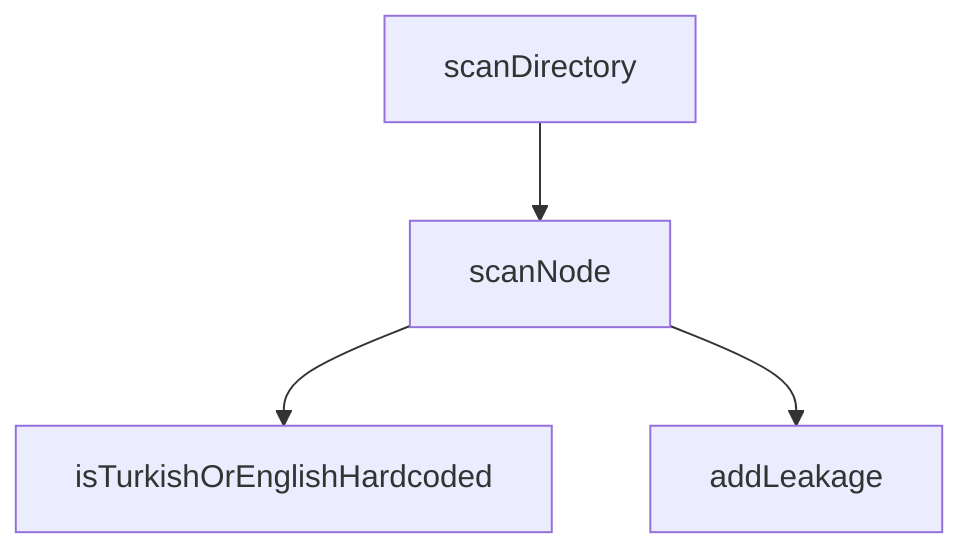

## Genel Bakış

Bu modül, kaynak kod dosyalarında uluslararasılaştırma (i18n) sürecinin ihlal edilip edilmediğini tespit etmek için AST (Soyut Sözdizim Ağacı) tabanlı statik analiz gerçekleştirir. Kodda sabit olarak yazılmış Türkçe veya İngilizce metinleri tespit ederek i18n sızıntılarını raporlar. Modül, dizin ağacını gezerek tüm kaynak dosyaları tarar ve bulguları kaydeder.

## Fonksiyon Grupları

### Dizin ve Dosya Tarama
Belirtilen dizin yapısını gezerek dosyaları bulur ve her dosyanın ASTağını analiz eder.
- scanDirectory, scanNode

### Metin Analizi
Tespit edilen metinlerin Türkçe veya İngilizce sabit kodlanmış olup olmadığını değerlendirir.
- isTurkishOrEnglishHardcoded

### Sızıntı Raporlama
Tespit edilen i18n sızıntılarını dosya yolu, düğüm, metin, tür ve bağlam bilgileriyle birlikte kaydeder.
- addLeakage

---

## AXIOMS – Mimari Varsayımlar

[Aksiyom 1]: Eğer `text` parametresi yoksa, `isTurkishOrEnglishHardcoded` fonksiyonu metin analizi yapamaz.

[Aksiyom 2]: Eğer `node` parametresi yoksa, `scanNode` fonksiyonu AST üzerinde tarama gerçekleştiremez.

[Aksiyom 3]: Eğer `sourceFile` parametresi yoksa, `scanNode` fonksiyonu hangi kaynak dosyadan geldiğini belirleyemez.

[Aksiyom 4]: Eğer `filePath`, `node`, `text`, `type` ve `context` parametrelerinden herhangi biri yoksa, `addLeakage` fonksiyonu sızıntı kaydı oluşturamaz.

[Aksiyom 5]: Eğer `dir` parametresi yoksa, `scanDirectory` fonksiyonu dizin taraması yapamaz.

[Aksiyom 6]: Eğer `projectRoot` sabiti tanımlı değilse, modül proje kök dizinini belirleyemez ve göreli dosya yollarını çözümleyemez.

[Aksiyom 7]: Eğer `dirsToScan` dizisi boşsa, modülün tarayacağı bir dizin kalmaz ve tarama işlemi gerçekleştirilemez.

[Aksiyom 8]: Eğer Node.js çalışma ortamı (`__filename`, `__dirname`) mevcut değilse, modül dosya sistemi işlemlerini gerçekleştiremez.

---

## FONKSİYON DETAYLARI

### isTurkishOrEnglishHardcoded
**Ne yapar**: Verilen metin string'inin Türkçe veya İngilizce sabit kodlanmış (hardcoded) bir metin olup olmadığını tespit eder. Uluslararasılaştırma (i18n) sızıntılarını yakalamak için kullanılan bir filtre fonksiyonudur ve yalnızca gerçekten metinsel içerik barındıran değerler için `true` döndürür.

**Nasıl yapar**: Üç aşamalı bir eleme süreci uygular. İlk olarak metin tamamen boşluk karakterlerinden oluşuyorsa `false` döner. Ardından metin içinde en az bir harf karakteri (Türkçe dahil: ç, ğ, ı, ö, ş, ü ve büyük harfleri) bulunup bulunmadığını kontrol eder; harf yoksa `false` döner. Son olarak metnin yalnızca sayılar, boşluklar ve yaygın noktalama/simbol karakterlerinden oluşup oluşmadığını denetler; bu durumda da `false` döner. Tüm bu eleme adımlarından geçebilen metin, potansiyel bir sabit kodlanmış metin olarak kabul edilir ve fonksiyon `true` döndürür.

**Parametreler**:
- text: string — Kontrol edilecek metin değeri

**Dönüş**: boolean — Metin sabit kodlanmış Türkçe veya İngilizce içerik barındırıyorsa `true`, aksi halde `false` döner.

### scanNode
**Ne yapar**: Geliştirildi ancak detay üretilemedi.

### addLeakage
**Ne yapar**: Geliştirildi ancak detay üretilemedi.

### scanDirectory
**Ne yapar**: Geliştirildi ancak detay üretilemedi.

---

## İTHALATLAR (IMPORTS)
- import: fs::fs
- import: path::path
- import: typescript::ts
- import: url::fileURLToPath

---

## SABİTLER
- **__filename** (call) — `fileURLToPath(import.meta.url)`
- **__dirname** (call) — `path.dirname(__filename)`
- **projectRoot** (call) — `path.resolve(__dirname, '../../../')`
- **dirsToScan** (array) — `[
  path.join(projectRoot, 'src', 'views'),
  path.join(projectRoot, 'src',...`

---

## AST POINTERS

### [N1_NASIL] AST Pointer: i18n_ast_checker.mjs::isTurkishOrEnglishHardcoded
- **params**: `text` — kontrol edilecek metin
- **ic_degiskenler**:
  - `text` — fonksiyona gelen metin parametresi; `.trim()` ile boşlukları temizlenmiş hali kontrol edilir
- **Dönüş**: `boolean` — metin Türkçe/İngilizce karakter içeriyorsa ve saf sembol/numara değilse `true`, aksi halde `false`

### [N2_NASIL] AST Pointer: i18n_ast_checker.mjs::scanNode
- **params**: `node` — TypeScript AST düğümü, `sourceFile` — kaynak dosya nesnesi
- **ic_degiskenler**:
  - `node` — gezilecek AST düğümü; `ts.isJsxText()` ve `ts.isJsxAttribute()` ile tipi kontrol edilir
  - `sourceFile` — `node.getText(sourceFile)` çağrılarında metin çıkarmak için kullanılır
  - `text` — JSX text içeriği (`node.getText(sourceFile)`) veya string literal metni (`node.initializer.text`)
  - `parent` — JSX text düğümünün üst düğümü (`node.parent`)
  - `parentTag` — üst JSX etiket adı; `parent.openingElement.tagName.getText(sourceFile)` ile alınır, bulunamazsa `'Unknown'` atanır
  - `propName` — JSX attribute adı; `node.name.getText(sourceFile)` ile alınır, `toLowerCase()` ile küçültülüp `['placeholder', 'title', 'label', 'alt', 'aria-label']` listesiyle eşleştirilir
  - `child` — `ts.forEachChild` döngüsünde her alt düğüm; rekürsif olarak `scanNode(child, sourceFile)` çağrılır
- **Dönüş**: yok — yan etki olarak sızıntı tespit edilirse `addLeakage` çağrılır

### [N3_NASIL] AST Pointer: i18n_ast_checker.mjs::addLeakage
- **params**: `filePath` — dosya yolu, `node` — AST düğümü, `text` — sızıntı metni, `type` — sızıntı tipi (`'JsxText'` veya `'JsxProp'`), `context` — bağlam bilgisi (etiket adı veya prop adı)
- **ic_degiskenler**:
  - `filePath` — sızıntının bulunduğu dosyanın tam yolu
  - `node` — `getSourceFile().getLineAndCharacterOfPosition(node.getStart())` ile satır/karakter pozisyonu alınır
  - `text` — `text.trim().replace(/\n/g, ' ')` ile temizlenmiş metin; yeni satırlar boşlukla değiştirilir
  - `type` — sızıntı kategorisi
  - `context` — sızıntının bağlamı
  - `line` — `node.getSourceFile().getLineAndCharacterOfPosition(node.getStart())` sonucundan alınan satır numarası (0-indeksli)
  - `character` — aynı sonucun karakter pozisyonu (0-indeksli)
  - `relPath` — `path.relative(projectRoot, filePath)` ile projeye göreli dosya yolu
- **Dönüş**: yok — yan etki olarak `leakages` dizisine `{ file, line, col, text, type, context }` nesnesi eklenir

### [N4_NASIL] AST Pointer: i18n_ast_checker.mjs::scanDirectory
- **params**: `dir` — taranacak dizin yolu
- **ic_degiskenler**:
  - `dir` — tarama yapılacak dizin; `fs.existsSync(dir)` ile varlığı kontrol edilir, yoksa erken dönüş yapılır
  - `files` — `fs.readdirSync(dir)` ile dizindeki dosya/dizin adları dizisi
  - `file` — `files` dizisindeki her bir dosya/dizin adı
  - `fullPath` — `path.join(dir, file)` ile oluşturulmuş tam dosya yolu
  - `code` — `fs.readFileSync(fullPath, 'utf8')` ile okunmuş dosya içeriği
  - `sourceFile` — `ts.createSourceFile(fullPath, code, ts.ScriptTarget.Latest, true, ts.ScriptKind.TSX)` ile oluşturulmuş TypeScript AST kaynak dosyası
- **Dönüş**: yok — yan etki olarak `.tsx` dosyaları taranır ve `scanNode(sourceFile, sourceFile)` çağrılarak sızıntılar toplanır

---

## MERMAID CALL GRAPH

## NODE ID STANDARD

  file: .claude\skills\venthub-global-rontgen\i18n_ast_checker.mjs
  function: .claude\skills\venthub-global-rontgen\i18n_ast_checker.mjs::isTurkishOrEnglishHardcoded
  function: .claude\skills\venthub-global-rontgen\i18n_ast_checker.mjs::scanNode
  function: .claude\skills\venthub-global-rontgen\i18n_ast_checker.mjs::addLeakage
  function: .claude\skills\venthub-global-rontgen\i18n_ast_checker.mjs::scanDirectory

---

## DISA AKTARILANLAR (EXPORTS)
  export: addLeakage
  export: isTurkishOrEnglishHardcoded
  export: scanDirectory
  export: scanNode