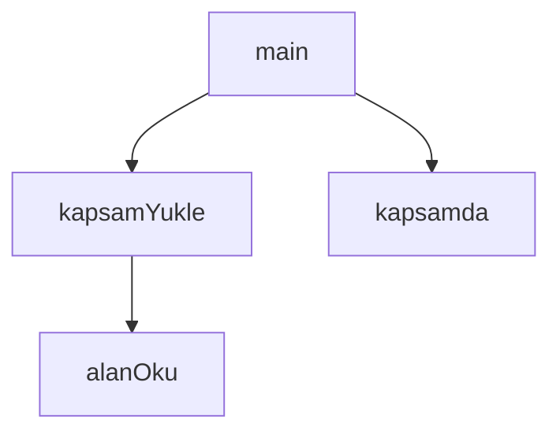

## Genel Bakış

Bu modül, Git hook süreçlerinde dosya kapsamı (scope) yönetimini sağlayan bir yardımcı kütüphanedir. Metin içeriklerinden alan okuma, kapsam tanımlarını yükleme ve bir dosya yolunun belirli bir kapsam dahilinde olup olmadığını sorgulama işlevlerini sunar. Modül, `.githooks` altyapısının doküman bazlı kapsam filtreleme mekanizmasının çekirdeğini oluşturur.

## Fonksiyon Grupları

### Kapsam Yükleme ve Sorgulama

Bu grup, kapsam tanımlarını dosya sisteminden yükler ve bir yolun bu kapsam içinde yer alıp almadığını belirler. `kapsamYukle` belirtilen kök dizinden kapsam bilgisini okurken, `kapsamda` bu kapsam bilgisini kullanarak bağıl bir yolun kapsama dahil olup olmadığını sınar.

- kapsamYukle, kapsamda

### Metin İşleme

Verilen bir metin içeriğinden belirli bir adla eşleşen alanı okur. Muhtemelen YAML benzeri bir formattan anahtar-değer çiftlerini çıkarmak için kullanılır.

- alanOku

### Ana İşlev

Modülün çalıştırılabilir giriş noktasıdır. Diğer fonksiyonları orkestrasyon ederek kapsam yükleme ve sorgulama sürecini başlatır.

- main

---

## AXIOMS – Mimari Varsayımlar

Bu modül, bir metin içindeki alanları okuyarak ve bir kök dizinden kapsam bilgisi yükleyerek dosya yollarının belirli bir kapsam dahilinde olup olmadığını kontrol eder.

[Aksiyom 1]: Eğer `fs` ve `path` modülleri (Node.js ortamı) mevcut değilse, dosya sistemi işlemleri ve yol çözümlemeleri yapılamaz, modül çalışamaz.

[Aksiyom 2]: Eğer `kapsamYukle(kok)` fonksiyonuna verilen `kok` dizini mevcut değilse veya okunabilir değilse, kapsam bilgisi yüklenemez ve kapsam kontrolü yapılamaz.

[Aksiyom 3]: Eğer `alanOku(metin, ad)` fonksiyonuna verilen `metin` içinde `ad` ile eşleşen bir alan bulunamazsa, fonksiyon `undefined` veya boş bir değer döndürür.

[Aksiyom 4]: Eğer `kapsamda(bagil, kapsam)` fonksiyonuna verilen `kapsam` bilgisi geçerli bir formatta değilse (örneğin, `kapsamYukle` tarafından yüklenmiş bir yapı değilse), kapsam kontrolü doğru yapılamaz.

[Aksiyom 5]: Eğer `UZANTILAR` regex deseni tanımlı değilse, dosya uzantılarına göre filtreleme yapılamaz.

[Aksiyom 6]: Eğer `ACIKLA` fonksiyonu çağrılamaz durumdaysa, açıklama veya loglama işlemleri gerçekleştirilemez.

---

## FONKSİYON DETAYLARI

### alanOku
**Ne yapar**: Verilen metin içinde belirli bir YAML alanının tek satırlık dizi (`alan: [a, b, c]`) biçimindeki değerini okur ve bir dizi olarak döndürür. YAML ayrıştırıcı bağımlılığı (`yaml` veya `js-yaml`) bu depoda kurulu olmadığından, elle regex tabanlı ayrıştırma yapar. Yalnızca `alan: [a, b, c]` tek satır biçimini destekler; bu bir bilinçli kırılganlıktır.

**Nasıl yapar**: `metin` parametresi üzerinde, `ad` parametresiyle eşleşen bir regex araması yapar. Regex, satır başından başlayan `ad: [...]` kalıbını yakalar. Yakalanan grup (`m[1]`) virgülle ayrılmış string olarak ele alınır; virgülle bölünür, her parça `trim()` ile boşluklardan arındırılır, baştaki ve sondaki tırnak işaretleri (`"` veya `'`) kaldırılır ve boş olmayan değerler filtrelenerek bir dizi döndürür.

**Parametreler**:
- metin: string — Ayrıştırılacak YAML metin içeriği
- ad: string — Okunacak alanın adı (örneğin `skip_dirs` veya `skip_files`)

**Dönüş**: `string[] | null` — Eşleşme bulunamazsa `null` döner; eşleşme varsa alan değerlerini içeren bir string dizisi döndürür.

### kapsamYukle
**Ne yapar**: Geliştirildi ancak detay üretilemedi.

### kapsamda
**Ne yapar**: Geliştirildi ancak detay üretilemedi.

### main
**Ne yapar**: Geliştirildi ancak detay üretilemedi.

---

## SABİTLER
- **fs** (call) — `require('fs')`
- **path** (call) — `require('path')`
- **ACIKLA** (call) — `process.argv.includes('--acikla')`
- **UZANTILAR** (regex) — `/\.(ts|tsx|mjs|cjs)$/`

---

## AST POINTERS

### [N1_NASIL] AST Pointer: .githooks/lib/doc-scope.cjs::alanOku
- **params**: `metin`, `ad`
- **ic_degiskenler**:
  - `m` — `metin` içinde `ad` parametresiyle oluşturulan RegExp'in eşleşme sonucu; eşleşme yoksa `null`
  - `m[1]` — regex yakalama grubu, köşeli parantez `[...]` içindeki ham içerik
  - `s` — `.split(',')` sonrası her bir parça; `.map` callback parametresi
- **Dönüş**: eşleşme varsa virgülle ayrılmış, tırnak işaretlerinden arındırılmış, boş olmayan string dizisi; eşleşme yoksa `null`

### [N2_NASIL] AST Pointer: .githooks/lib/doc-scope.cjs::kapsamYukle
- **params**: `kok`
- **ic_degiskenler**:
  - `yol` — `path.join(kok, '.cc_docs.yaml')` ile oluşturulan tam dosya yolu
  - `metin` — `fs.readFileSync` ile okunan YAML dosyasının UTF-8 içeriği; try bloğu dışında `''` ile başlatılır
  - `e` — catch bloğundaki hata nesnesi
  - `e.code` — hata nesnesinin `code` özelliği (ör. `ENOENT`)
  - `skipDirs` — `alanOku(metin, 'skip_dirs')` çağrısının dönüş değeri
  - `skipFiles` — `alanOku(metin, 'skip_files')` çağrısının dönüş değeri
- **Dönüş**: nesne — `{ yamlOkunabildi: boolean, sebep: string, skipDirs: array, skipFiles: array }`

### [N3_NASIL] AST Pointer: .githooks/lib/doc-scope.cjs::kapsamda
- **params**: `bagil`, `kapsam`
- **ic_degiskenler**:
  - `yol` — `bagil` parametresinden ters eğik çizgiler düzeltildikten ve `./` öneki kaldırıldıktan sonra elde edilen normalize edilmiş dosya yolu
  - `parcalar` — `yol`'un `/` ile bölünmesiyle elde edilen dizi
  - `ad` — `parcalar[parcalar.length - 1]`, yani dosya adı
  - `dizinler` — `parcalar.slice(0, -1)`, yani dosya adı hariç dizin yolu parçaları
  - `d` — `dizinler` üzerindeki her bir dizin adı (`for...of` döngüsü değişkeni)
- **Dönüş**: nesne — `{ ok: boolean, sebep: string }`

### [N4_NASIL] AST Pointer: .githooks/lib/doc-scope.cjs::main
- **params**: (parametre yok)
- **ic_degiskenler**:
  - `kok` — `process.env.DOC_SCOPE_KOK` tanımlıysa onun değeri, tanımlı değilse `process.cwd()` sonucu
  - `kapsam` — `kapsamYukle(kok)` çağrısının dönüş nesnesi
  - `ham` — `fs.readFileSync(0, 'utf8')` ile stdin'den okunan metin; hata durumunda `''`
  - `cikan` — kapsamda olan yolların toplandığı dizi
  - `satir` — `ham.split('\n')` ile elde edilen her bir satır
  - `yol` — `satir.trim()` ile boşluklardan arındırılmış satır
  - `k` — `kapsamda(yol, kapsam)` çağrısının dönüş nesnesi
- **Dönüş**: yok (yan etki: `process.stdout.write` ile filtrelenmiş yolları yazar; `process.stderr.write` ile hata ve atlandı mesajlarını yazar)

---

## MERMAID CALL GRAPH

## NODE ID STANDARD

  file: .githooks\lib\doc-scope.cjs
  function: .githooks\lib\doc-scope.cjs::alanOku
  function: .githooks\lib\doc-scope.cjs::kapsamYukle
  function: .githooks\lib\doc-scope.cjs::kapsamda
  function: .githooks\lib\doc-scope.cjs::main

---

## DISA AKTARILANLAR (EXPORTS)
  export: alanOku
  export: kapsamYukle
  export: kapsamda
  export: main