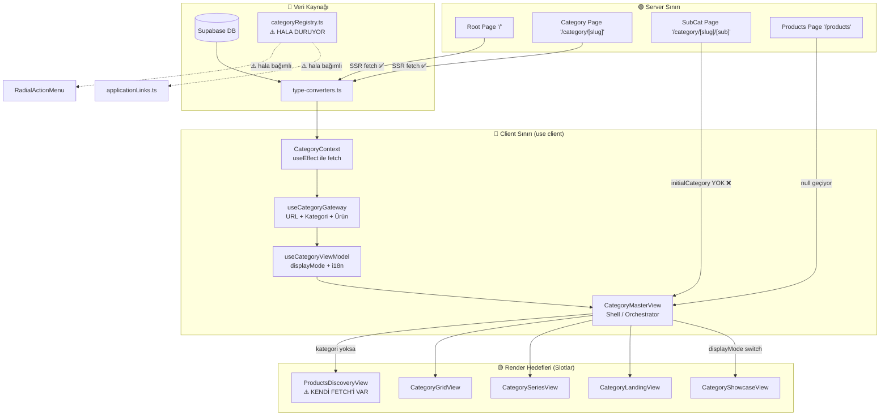

# 🏗️ VentHub Mimari Vizyon Zeka Fırtınası
> **Tarih:** 2026-03-26 | **Model:** Opus | **Durum:** Brainstorm (Vizyon Belgesi)
> **Katkıda Bulunanlar:** Antigravity (Gemini 3.1 Pro), Dış IDE Ajanı, Opus

---

## 1. MEVCUT DURUMUN ACİMASIZ RÖNTGENİ

### 1.1 Sistemin Bugünkü Anatomisi



### 1.2 Kanıtlanmış Sorunlar (Kod Referanslı)

| # | Sorun | Kanıt (Dosya:Satır) | Etki |
|---|-------|---------------------|------|
| 1 | **CategoryContext client-side fetch** | `CategoryContext.tsx:1` (`'use client'`) + `:43` (`useEffect`) | SEO ölü. Google bot kategorileri görmüyor. LCP/CLS felaketi. |
| 2 | **displayMode hardcoded** | `useCategoryViewModel.ts:59-72` (`showcaseSlugs`, `landingSlugs` dizileri) | DB SSOT hedefi kırık. Yeni kategori eklendiğinde kod değişikliği gerekiyor. |
| 3 | **categoryRegistry.ts hala yaşıyor** | `categoryRegistry.ts:8-84` + [applicationLinks.ts](file:///c:/Users/alize/venthub-hvac/src/utils/applicationLinks.ts), [RadialActionMenu.tsx](file:///c:/Users/alize/venthub-hvac/src/components/products/RadialActionMenu.tsx) bağımlılıkları | İki gerçek kaynağı (DB + statik registry). Hangisi doğru? |
| 4 | **SubCategory sayfası initialCategory geçmiyor** | `[subCategorySlug]/page.tsx:48` (`<PageComponent />` — prop yok) | Alt kategori sayfası SSR verisinden yararlanamıyor. |
| 5 | **ProductsDiscoveryView kendi fetch'ini yapıyor** | `ProductsDiscoveryView.tsx:89-92` (kendi [getProductsEnriched](file:///c:/Users/alize/venthub-hvac/src/lib/supabase.ts#159-214) çağrısı) | Gateway bypass ediliyor. Veri senkronizasyonu bozuk. |
| 6 | **Eski ve yeni sluglar bir arada** | ViewModel'de `residential-ventilation` ama `landingSlugs`'ta `hava-perdeleri` | Link kırılması riski. i18n çözümleme belirsizliği. |
| 7 | **Şelale (Waterfall) veri çekimi** | `useCategoryGateway.ts:120` — önce `categoriesLoading` bekle, sonra [getProductsEnriched](file:///c:/Users/alize/venthub-hvac/src/lib/supabase.ts#159-214) çağır | İstemci tarafında seri istek: Kategori → sonra Ürün. Paralel değil. |

---

## 2. HEDEF MİMARİ VİZYON: "SLOT MİMARİSİ"

### 2.1 Temel Felsefe

**Anakart-Yuva (Motherboard-Slot) Metaforu:**
- **Anakart** = Routing Shell ([CategoryMasterView](file:///c:/Users/alize/venthub-hvac/src/views/CategoryMasterView.tsx#20-111)) — Hiçbir render kararı almaz, sadece veri ve slot eşleştirir.
- **Yuvalar (Slots)** = Görünüm modları (`showcase`, `landing`, `series`, `grid`, `discovery`) — Her biri bağımsız, takılıp çıkarılabilir.
- **Veri Yolu (Data Bus)** = Server-side fetch → props zinciri — Client-side fetch sadece interaktif filtreler için.
- **BIOS (Karar Mekanizması)** = DB `metadata.display_mode` alanı — Hangi yuvaya hangi modül takılacağını belirler.

### 2.2 Hedef Veri Akışı

```
┌─────────────────────────────────────────────────────────┐
│                    SERVER SINIRI                         │
│                                                         │
│  page.tsx (Server Component)                            │
│    ├── Supabase'den kategori çek (SSR)                  │
│    ├── Supabase'den ürünler çek (SSR, paralel)          │
│    ├── type-converters ile DomainCategory'e dönüştür    │
│    ├── metadata.display_mode'dan slot kararını al       │
│    └── Props olarak CategoryShell'e geç ──────────┐     │
│                                                    │     │
├────────────────────────────────────────────────────┼─────┤
│                    CLIENT SINIRI                   │     │
│                                                    ▼     │
│  CategoryShell (Client Component)                        │
│    ├── Props'tan gelen veriyi al (SSR data)              │
│    ├── İnteraktif filtreler (URL state) → client-side    │
│    ├── displayMode'a göre doğru Slot'u render et         │
│    │     ├── slot="showcase" → <CategoryShowcaseView />  │
│    │     ├── slot="landing"  → <CategoryLandingView />   │
│    │     ├── slot="series"   → <CategorySeriesView />    │
│    │     ├── slot="grid"     → <CategoryGridView />      │
│    │     └── slot="discovery"→ <ProductsDiscoveryView /> │
│    └── Her Slot aynı props interface'i alır              │
│                                                          │
└──────────────────────────────────────────────────────────┘
```

### 2.3 Kritik Fark: Bugün vs Hedef

| Boyut | Bugün | Hedef |
|-------|-------|-------|
| **Veri çekimi** | Client-side `useEffect` (CategoryContext) | Server-side [page.tsx](file:///c:/Users/alize/venthub-hvac/src/app/page.tsx) içinde `async` fetch |
| **displayMode kararı** | Hardcoded slug listeleri (ViewModel) | DB `categories.metadata.display_mode` alanı |
| **Kategori kaynağı** | DB + [categoryRegistry.ts](file:///c:/Users/alize/venthub-hvac/src/config/categoryRegistry.ts) (çift kaynak) | Sadece DB (Tek Otorite) |
| **Slot bağımsızlığı** | View'lar farklı prop yapıları alıyor | Tüm slotlar aynı `SlotProps` interface'ini alır |
| **Discovery modu** | Kendi fetch'ini yapıyor (bypass) | Gateway'den aynı props'u alır, sadece UI farklı |
| **SEO** | Client render → Google bot boş sayfa görüyor | Server render → HTML hazır geliyor |

---

## 3. TASARIM KARARLARI VE KURALLAR

### 3.1 Slot Kontratı (Interface)

Her View bileşeni (Slot) aşağıdaki standart interface'i almalıdır:

```typescript
interface SlotProps {
  // Veri
  category: DomainCategory | null
  parentCategory: DomainCategory | null
  subCategories: DomainCategory[]
  products: DomainProduct[]
  
  // UI Semantik (ViewModel'den)
  displayName: string
  marketingTitle: string
  
  // İnteraktif (opsiyonel, sadece filtreleme destekleyen slotlar için)
  filters?: CategoryFilters
  onUpdateFilters?: (updates: Partial<CategoryFilters>) => void
  availableBrands?: string[]
}
```

### 3.2 Değişmez Kurallar (Invariants)

1. **"Slot kendi verisini asla kendisi çekmez."** Veri her zaman yukarıdan (Shell → Slot) akar.
2. **"displayMode kararı sadece DB'den gelir."** Kod içinde slug listesi bulundurmak yasaktır.
3. **"categoryRegistry.ts silinecektir."** Tüm bağımlılıkları DB'ye taşınacaktır.
4. **"CategoryContext sadece navigasyon bileşenleri içindir."** Sayfa içeriği için Server fetch kullanılır.
5. **"Her yeni Slot, mevcut SlotProps interface'ini bozmadan eklenebilmelidir."**

---

## 4. GEÇİŞ STRATEJİSİ (RİSK SIRALI)

### Aşama 1: Zemin Temizliği (Düşük Risk, Yüksek Etki)
> **Hedef:** Çift kaynak sorununu tamamen yok et.

| Adım | İş | Risk |
|------|---|------|
| 1.1 | `categories` tablosuna `display_mode` kolonu ekle (migration) | Düşük |
| 1.2 | Mevcut hardcoded slugları DB'ye seed et (showcase/landing/series) | Düşük |
| 1.3 | [useCategoryViewModel](file:///c:/Users/alize/venthub-hvac/src/hooks/useCategoryViewModel.ts#27-121)'daki hardcoded slug listelerini sil, `meta.display_mode` oku | Düşük |
| 1.4 | [categoryRegistry.ts](file:///c:/Users/alize/venthub-hvac/src/config/categoryRegistry.ts) bağımlılıklarını (`applicationLinks`, `RadialActionMenu`) DB'ye çevir | Orta |
| 1.5 | [categoryRegistry.ts](file:///c:/Users/alize/venthub-hvac/src/config/categoryRegistry.ts) dosyasını sil | Düşük |

### Aşama 2: Slot Kontratı Standardizasyonu (Orta Risk)
> **Hedef:** Tüm View'ları aynı interface'e oturt.

| Adım | İş | Risk |
|------|---|------|
| 2.1 | `SlotProps` interface'ini oluştur (`src/types/slot.ts`) | Düşük |
| 2.2 | Her View bileşenini `SlotProps` ile uyumlu hale getir | Orta |
| 2.3 | [ProductsDiscoveryView](file:///c:/Users/alize/venthub-hvac/src/views/ProductsDiscoveryView.tsx#58-315)'in kendi fetch'ini kaldır, props'tan veri alsın | Orta |
| 2.4 | [CategoryMasterView](file:///c:/Users/alize/venthub-hvac/src/views/CategoryMasterView.tsx#20-111)'ı temiz bir switch/map yapısına çevir | Düşük |

### Aşama 3: Server-Side Rendering Geçişi (Yüksek Risk, En Yüksek Etki)
> **Hedef:** SEO ve performans devrimini tamamla.

| Adım | İş | Risk |
|------|---|------|
| 3.1 | `/category/[slug]/page.tsx`'te kategori + ürün verisini SSR olarak çek | Orta |
| 3.2 | `/category/[slug]/[sub]/page.tsx`'e `initialCategory` prop'u ekle | Düşük |
| 3.3 | [/products/page.tsx](file:///c:/Users/alize/venthub-hvac/src/app/products/page.tsx)'te discovery verilerini SSR olarak çek | Orta |
| 3.4 | [CategoryMasterView](file:///c:/Users/alize/venthub-hvac/src/views/CategoryMasterView.tsx#20-111)'ı "SSR data alır + client-side filtre yapar" modeline dönüştür | Yüksek |
| 3.5 | [CategoryContext](file:///c:/Users/alize/venthub-hvac/src/contexts/CategoryContext.tsx#8-17)'i sadece navigasyon (MegaMenu, Overlay) için tut, sayfa içeriğinden ayır | Yüksek |

### Aşama 4: Son Kilometre (Düşük Risk)
> **Hedef:** i18n, slug ve kalite mühürlemesi.

| Adım | İş | Risk |
|------|---|------|
| 4.1 | Slug konsolidasyonu (eski Türkçe sluglar → yeni İngilizce standart) | Orta |
| 4.2 | Tüm hardcoded user-facing text'leri `useI18n()` altına al | Düşük |
| 4.3 | Registry görevlerini PULSE.md ile senkronize et | Düşük |

---

## 5. RİSKLER VE KISITLAMALAR

| Risk | Olasılık | Etki | Azaltma |
|------|----------|------|---------|
| SSR geçişi sırasında hydration hataları | Yüksek | Yüksek | Aşamalı geçiş. Önce 1 sayfa, test et, sonra genişlet. |
| Slug değişikliği SEO sıralamasını düşürmesi | Orta | Yüksek | 301 redirect planı hazırla. `next.config.js` redirects. |
| [CategoryContext](file:///c:/Users/alize/venthub-hvac/src/contexts/CategoryContext.tsx#8-17) kaldırılması navigasyonu kırması | Orta | Orta | Context'i kaldırmıyoruz, sadece rolünü daraltıyoruz. |
| Admin panel kategori editörünün display_mode'u tanımaması | Düşük | Orta | Admin Builder'a display_mode dropdown'u ekle. |

---

## 6. BAŞARI KRİTERLERİ (Acceptance Criteria)

Bu vizyon tamamlandığında aşağıdaki koşullar sağlanmalıdır:

- [ ] [categoryRegistry.ts](file:///c:/Users/alize/venthub-hvac/src/config/categoryRegistry.ts) dosyası projeden silinmiş olmalı
- [ ] [useCategoryViewModel.ts](file:///c:/Users/alize/venthub-hvac/src/hooks/useCategoryViewModel.ts) içinde hiçbir hardcoded slug listesi kalmamalı
- [ ] [ProductsDiscoveryView](file:///c:/Users/alize/venthub-hvac/src/views/ProductsDiscoveryView.tsx#58-315) kendi Supabase çağrısı yapmamalı
- [ ] Tüm dinamik sayfalarda (`/category/*`, `/products`) sunucu tarafında veri çekilmeli
- [ ] Google bot, kategori sayfalarında ürün listesini HTML içinde görmeli (View Source testi)
- [ ] Yeni bir "Slot" (View) eklemek için sadece 1 dosya oluşturup DB'de `display_mode` güncellemek yeterli olmalı
- [ ] `pnpm run build` → 0 hata
- [ ] Lighthouse Performance skoru ≥ 80

---

## 7. SONUÇ VE ÖNERİ

Bu vizyon belgesi üç farklı kaynaktan (Antigravity X-Ray, Dış IDE Ajanı Raporu, Opus Analizi) toplanan bulguları birleştirmektedir.

**Mevcut mimari skoru:** 6.5/10
- İş mantığı katmanı (Gateway-ViewModel-Shell): 8/10
- Platform olgunluğu (SSR, SEO, performans): 5/10

**Hedef mimari skoru:** 9/10

**Önerilen başlangıç noktası:** Aşama 1 (Zemin Temizliği) — en düşük riskli, en net kazanımlı adımlar. Mimariyi bozmadan "çift kaynak" sorununu tamamen yok eden cerrahi müdahale.

> *"Bir binayı güçlendirmek istiyorsan, önce çatıyı değil temeli sağlamlaştır."*
