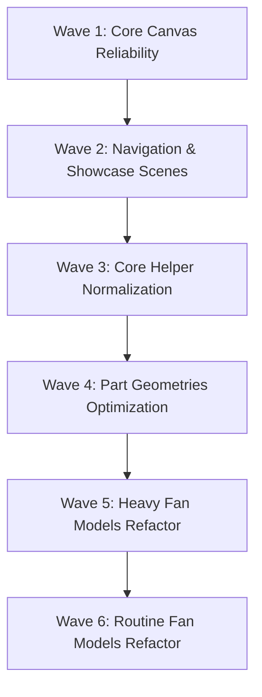

# VentHub 3D Surfaces Audit Report (2026-06-16)

This document presents the complete WebGL/Three.js audit results for VentHub HVAC 3D components, helper tools, and fan models. The audit was conducted in accordance with the specifications in [3d-webgl-standard.md](file:///c:/Users/alize/venthub-hvac/docs/standards/3d-webgl-standard.md).

---

## 0. RE-AUDIT RECONCILIATION (2026-06-17) — GÜNCEL GERÇEK

> Aşağıdaki §1-3 = **2026-06-16 snapshot'ı** ve artık **drift etti**. Dalga 1-6 + 2026-06-17 recipe
> işleri (FlexibleDuct in-place · DuctFan merkezi materyal · FanRenderer→ProductModelRenderer rename)
> bu ihlallerin **neredeyse tamamını kapattı**. 2026-06-17'de 36 dosya **şu anki master'a karşı**
> paralel read-only ajan filosuyla yeniden denetlendi (her iddia OPEN/RESOLVED/REFUTED + legit-local eleme).

**Güncel sonuç: conformance yüzeyi TEMİZ (34 / 36 dosya).**
- Kanıt örnekleri: `DomesticFanModel` 144-box grid → **InstancedMesh**; tüm modeller useMemo geometri +
  unmount `dispose`; showcase/nav metalleri **SceneLightingRig prosedürel Environment**'tan IBL alıyor
  (C1 çözüldü); per-frame allocate yok (B3 temiz); tüm Canvas yüzeyleri `VentHubCanvas` →
  ResilientCanvasBoundary (ErrorBoundary) altında (A1/A2 çözüldü).
- **Yanlış-pozitif elendi (uydurma iş yok):** LED/airflow-viz/logo-texture materyalleri **legit-local**
  (C3 ihlali değil); paylaşılan `useResolveMaterials` cache materyalleri **dispose edilmez** (A4 ihlali değil);
  leaf model/part'ta `<Environment>` beklenmez (C1 sahne-sahibinin işi). `CategoryCard3D` ·
  `CategorySpotlightScene` → **silinmiş** (artık yok).
- **Kalan 2 açık:**
  - 🔴 **BlueprintCanvas.tsx — A1**: `useTexture` `<Suspense>` dışındaydı → bu reconciliation PR'ında
    düzeltildi (CinematicCard `<Suspense fallback={null}>` ile sarıldı).
  - 🟡 **CategoryHubOverlay.tsx — B3 minor**: `frameloop="demand"` + `autoRotate` — tartışmalı
    (drei OrbitControls autoRotate zaten `invalidate` eder); kontrolör doğrulayacak, muhtemelen iş değil.

**Sonuç:** 3D **conformance** katmanı kapandı. Sıradaki 3D işi = **görsel/showroom** (tasarım-güdümlü), conformance değil.

---

## 1. Executive Summary & Audit Statistics

The audit evaluated **39 files** across the 3D rendering pipeline. The final metrics are:

- **Total Files Audited**: 39
- **Total Critical Violations**: 26
- **Total Non-Critical Violations**: 89
- **Total Violations**: 115
- **Clean Files**: 1 (`useFanMaterials.ts`)
- **Actionable Files**: 38 (all grouped into implementation waves)

### Core Diagnostics Summary
1. **Application Crash Risks (Rule A1/A2)**: Canvas components lack React `<ErrorBoundary>` blocks, meaning an asset loading failure (such as a 404 or corrupted HDR/GLTF file) will crash the entire page. In `Product3DViewer.tsx`, the `<Environment>` component is placed outside `<Suspense>` and `<ErrorBoundary>`, exposing the page to instant crashes if the local HDR is corrupt.
2. **Metallic Rendering Issues (Rule C1)**: Metallic standard/physical materials in several showcase views render completely black because there is no `<Environment>` (Image-Based Lighting) in the scene.
3. **Memory Leaking & Garbage Collection Spikes (Rule B3/AX-10)**:
   - Dynamic allocations inside `useFrame` loops (e.g., `new Box3()`, `new Vector3()`, `new TubeGeometry()`) create massive garbage collection (GC) overhead.
   - Geometries, materials, and textures are instantiated inline inside mapped JSX elements rather than being memoized and shared.
4. **VRAM Leaks (Rule A4)**: None of the components implement proper resource disposal (`dispose()`) on unmount, which leads to GPU VRAM memory leaks.

---

## 2. Detailed Findings Table

Below is the structured registry of audited files, their classifications, and violation details:

| Dosya (File Path) | Sınıf (Class) | Toplam İhlal (Total Violations) | Kritik İhlaller (Critical Violations) | Kritik Olmayan İhlaller (Non-Critical) | Açıklama & İhlal Detayları (Violations & Diagnostics) |
| :--- | :---: | :---: | :---: | :---: | :--- |
| **Canvas Views (10 Files)** | | | | | |
| [Product3DViewer.tsx](file:///c:/Users/alize/venthub-hvac/src/components/products/3d/Product3DViewer.tsx) | `CRITICAL` | 4 | 1 | 3 | **A1/A2**: `<Environment>` loaded outside Suspense/ErrorBoundary. **B4**: Non-capped DPR (`[1, 2]`). **B5**: High shadow map resolution. **A4**: No unmount resource disposal. |
| [ThreeDAuthority.tsx](file:///c:/Users/alize/venthub-hvac/src/components/authority/ThreeDAuthority.tsx) | `CRITICAL` | 3 | 3 | 0 | **A1**: No ErrorBoundary. **A2**: Preset environment CDN dependency. **A4**: Primitive scene not disposed on unmount. |
| [OrbitalProductsShowcase.tsx](file:///c:/Users/alize/venthub-hvac/src/components/products/OrbitalProductsShowcase.tsx) | `CRITICAL` | 4 | 2 | 2 | **A1**: No ErrorBoundary. **C1**: Missing `<Environment>` for metallic PBR materials. **B4**: Desktop DPR is not capped at 1.0. **A4**: No unmount disposal. |
| [InfiniteProductsShowcase.tsx](file:///c:/Users/alize/venthub-hvac/src/components/products/InfiniteProductsShowcase.tsx) | `CRITICAL` | 4 | 2 | 2 | **A1**: No ErrorBoundary. **C1**: No `<Environment>`. **B3**: Frameloop always-on with no visibility/intersection checks. **A4**: Missing unmount cleanup. |
| [CategoryHubOverlay.tsx](file:///c:/Users/alize/venthub-hvac/src/components/navigation/CategoryHubOverlay.tsx) | `CRITICAL` | 4 | 2 | 2 | **A1**: No ErrorBoundary. **C1**: No `<Environment>`. **B3**: Frameloop is set to demand but OrbitControls autoRotate is active. **A4**: No unmount resource cleanup. |
| [CategoryCard3D.tsx](file:///c:/Users/alize/venthub-hvac/src/components/navigation/CategoryCard3D.tsx) | `CRITICAL` | 3 | 2 | 1 | **A1**: No ErrorBoundary. **C1**: No `<Environment>` for PBR metallic surfaces. **A4**: No unmount disposal. |
| [CategorySpotlightScene.tsx](file:///c:/Users/alize/venthub-hvac/src/components/navigation/CategorySpotlightScene.tsx) | `CRITICAL` | 4 | 2 | 2 | **A1**: No ErrorBoundary. **C1**: No `<Environment>`. **B3**: Frameloop demand with autoRotate. **A4**: No unmount cleanup. |
| [MegaMenu3DBackground.tsx](file:///c:/Users/alize/venthub-hvac/src/components/navigation/MegaMenu3DBackground.tsx) | `CRITICAL` | 4 | 2 | 2 | **A1**: No ErrorBoundary. **C1**: No `<Environment>`. **B3**: Frameloop demand with autoRotate. **A4**: No unmount cleanup. |
| [Category3DIcon.tsx](file:///c:/Users/alize/venthub-hvac/src/components/products/Category3DIcon.tsx) | `FIX` | 2 | 0 | 2 | **A1**: Lacks internal Suspense/ErrorBoundary around FanRenderer. **A4**: Missing unmount disposal. |
| [BlueprintCanvas.tsx](file:///c:/Users/alize/venthub-hvac/src/components/products/BlueprintCanvas.tsx) | `CRITICAL` | 2 | 1 | 1 | **A1**: No Suspense/ErrorBoundary wrapping suspending `useTexture` hook. **A4**: No unmount resource disposal. |
| **Helper Tools & Parts (10 Files)** | | | | | |
| [BentPlaneGeometry.tsx](file:///c:/Users/alize/venthub-hvac/src/components/products/BentPlaneGeometry.tsx) | `FIX` | 2 | 1 | 1 | **AX-10**: Texture loaded via TextureLoader is never disposed. **B3**: Inline static geometry arguments in JSX. |
| [SmartCenterScale.tsx](file:///c:/Users/alize/venthub-hvac/src/components/products/3d/SmartCenterScale.tsx) | `CRITICAL` | 1 | 1 | 0 | **B3**: Allocates `new Box3()`, `new Vector3()` inside the R3F `useFrame` loop. |
| [AutoCenter.tsx](file:///c:/Users/alize/venthub-hvac/src/components/products/3d/AutoCenter.tsx) | `CRITICAL` | 1 | 1 | 0 | **B3**: Allocates `new Box3()`, `new Vector3()` inside the R3F `useFrame` loop. |
| [useFanMaterials.ts](file:///c:/Users/alize/venthub-hvac/src/components/products/3d/materials/useFanMaterials.ts) | `CLEAN` | 0 | 0 | 0 | Clean static memoization. Verified correct. |
| [Housing.tsx](file:///c:/Users/alize/venthub-hvac/src/components/products/3d/parts/Housing.tsx) | `FIX` | 5 | 0 | 5 | **B3**: Inline geometries mapped in loops. **C3**: Bypasses shared materials. **B3**: ExtrudeGeometry and shapeGeometry not memoized. |
| [Silencer.tsx](file:///c:/Users/alize/venthub-hvac/src/components/products/3d/parts/Silencer.tsx) | `CRITICAL` | 4 | 1 | 3 | **AX-10**: Unused `ShapeGeometry` created but never disposed. **C3**: Inline standard material inside map loops. **B3**: Inline geometries. |
| [Impeller.tsx](file:///c:/Users/alize/venthub-hvac/src/components/products/3d/parts/Impeller.tsx) | `FIX` | 2 | 0 | 2 | **B3**: Recreates BoxGeometry inside impeller blades map loop. |
| [Motor.tsx](file:///c:/Users/alize/venthub-hvac/src/components/products/3d/parts/Motor.tsx) | `FIX` | 2 | 0 | 2 | **B3**: Inline geometries inside JSX are recreated on every render. |
| [MainChassis.tsx](file:///c:/Users/alize/venthub-hvac/src/components/products/3d/factory/parts/MainChassis.tsx) | `CRITICAL` | 1 | 1 | 0 | **AX-10**: Geometries memoized via useMemo are never disposed on unmount. |
| [InternalFanRotor.tsx](file:///c:/Users/alize/venthub-hvac/src/components/products/3d/factory/parts/InternalFanRotor.tsx) | `FIX` | 2 | 0 | 2 | **B3**: Recreates geometry inline inside map loops. |
| **Fan Models (19 Files)** | | | | | |
| [SilentChannelFanModel.tsx](file:///c:/Users/alize/venthub-hvac/src/components/products/3d/types/SilentChannelFanModel.tsx) | `FIX` | 4 | 0 | 4 | **B3**: Inline sphere/cylinder geometries. **A4**: No unmount disposal. |
| [AirCurtainModel.tsx](file:///c:/Users/alize/venthub-hvac/src/components/products/3d/types/AirCurtainModel.tsx) | `CRITICAL` | 3 | 1 | 2 | **B3**: Instantiates 28 materials/geometries in render loop. **A4**: No unmount cleanup. |
| [AxialFanModel.tsx](file:///c:/Users/alize/venthub-hvac/src/components/products/3d/types/AxialFanModel.tsx) | `FIX` | 2 | 0 | 2 | **B3**: Inline geometries. **A4**: Memoized geometry is not disposed on unmount. |
| [CentrifugalFanModel.tsx](file:///c:/Users/alize/venthub-hvac/src/components/products/3d/types/CentrifugalFanModel.tsx) | `FIX` | 2 | 0 | 2 | **B3**: Inline geometries. **A4**: Memoized bladeGeometry is not disposed. |
| [FlexibleDuctModel.tsx](file:///c:/Users/alize/venthub-hvac/src/components/products/3d/types/FlexibleDuctModel.tsx) | `CRITICAL` | 5 | 2 | 3 | **B3**: Dynamic `TubeGeometry` allocation in useFrame. **B3**: Recreating materials in loops. **C3/C1**: Material and metalness overrides. **A4**: No unmount disposal. |
| [NicotraFanModel.tsx](file:///c:/Users/alize/venthub-hvac/src/components/products/3d/types/NicotraFanModel.tsx) | `FIX` | 4 | 0 | 4 | **B3**: Array(24) loop recreate geometries. **C3**: Missing material props in blade loop. **A4**: No unmount cleanup. |
| [RoofFanModel.tsx](file:///c:/Users/alize/venthub-hvac/src/components/products/3d/types/RoofFanModel.tsx) | `FIX` | 4 | 0 | 4 | **B3**: Inline geometries. **C3/C1**: Custom inline materials. **A4**: Missing disposal. |
| [SmokeExhaustFanModel.tsx](file:///c:/Users/alize/venthub-hvac/src/components/products/3d/types/SmokeExhaustFanModel.tsx) | `FIX` | 3 | 0 | 3 | **B3**: Recreating geometries inside loop of 16 bolt components. **A4**: No unmount disposal. |
| [WallMountedCompactFanModel.tsx](file:///c:/Users/alize/venthub-hvac/src/components/products/3d/types/WallMountedCompactFanModel.tsx) | `FIX` | 4 | 0 | 4 | **B3**: Inline geometries. **C3/C1**: Custom inline materials. **A4**: No unmount cleanup. |
| [SnailFanModel.tsx](file:///c:/Users/alize/venthub-hvac/src/components/products/3d/types/SnailFanModel.tsx) | `FIX` | 4 | 0 | 4 | **B3**: Declaring sub-component Bolt inside component body. **B3**: Inline geometries inside loops. **A4**: No unmount disposal. |
| [SpeedControlModel.tsx](file:///c:/Users/alize/venthub-hvac/src/components/products/3d/types/SpeedControlModel.tsx) | `FIX` | 3 | 0 | 3 | **B3**: Inline geometries. **A4**: Material/geometries not disposed. |
| [RoundDuctFanModel.tsx](file:///c:/Users/alize/venthub-hvac/src/components/products/3d/types/RoundDuctFanModel.tsx) | `FIX` | 2 | 0 | 2 | **B3**: Recreates all geometries. **A4**: Missing unmount cleanup. |
| [ExproofFanModel.tsx](file:///c:/Users/alize/venthub-hvac/src/components/products/3d/types/ExproofFanModel.tsx) | `FIX` | 4 | 0 | 4 | **B3**: Declaring Bolt inside component body. **B3**: Inline geometries in loops. **A4**: Missing unmount cleanup. |
| [PlugFanModel.tsx](file:///c:/Users/alize/venthub-hvac/src/components/products/3d/types/PlugFanModel.tsx) | `FIX` | 4 | 0 | 4 | **B3**: Frame-rate dependent rotation mutation in `useFrame`. **B3**: Inline geometries. **C3**: Mapped materials. **A4**: No cleanup. |
| [JetFanModel.tsx](file:///c:/Users/alize/venthub-hvac/src/components/products/3d/types/JetFanModel.tsx) | `FIX` | 2 | 0 | 2 | **B3**: Inline geometries. **A4**: No unmount cleanup. |
| [HRVModel.tsx](file:///c:/Users/alize/venthub-hvac/src/components/products/3d/types/HRVModel.tsx) | `FIX` | 3 | 0 | 3 | **B3**: Inline geometries. **C3**: Material recreated inside loops. **A4**: Missing unmount disposal. |
| [DuctFanModel.tsx](file:///c:/Users/alize/venthub-hvac/src/components/products/3d/types/DuctFanModel.tsx) | `FIX` | 3 | 0 | 3 | **B3**: Inline geometries. **A4**: localBladeColor is not disposed on unmount. |
| [DomesticFanModel.tsx](file:///c:/Users/alize/venthub-hvac/src/components/products/3d/types/DomesticFanModel.tsx) | `CRITICAL` | 3 | 1 | 2 | **B3**: 12x12 loop rendering 144 inline boxGeometry instances. Needs `InstancedMesh`. **A4**: Missing unmount disposal. |
| [DehumidifierModel.tsx](file:///c:/Users/alize/venthub-hvac/src/components/products/3d/types/DehumidifierModel.tsx) | `FIX` | 2 | 0 | 2 | **B3**: Inline geometries. **A4**: Missing unmount disposal. |

---

## 3. Wave Implementation Roadmap (Dalga Sırası)

To ensure a structured, non-breaking migration, the refactoring roadmap is divided into **6 waves**:

### Wave 1: Core Canvas Reliability (Canvas CRITICAL)
- **Goal**: Implement `<ErrorBoundary>` and proper Suspense wrapper strategies on the main page canvas wrappers to prevent asset 404s/WebGL context losses from crashing the route. Capping DPR, reducing shadow maps, and adding correct unmount disposal hooks.
- **Files**:
  1. `src/components/products/3d/Product3DViewer.tsx`
  2. `src/components/authority/ThreeDAuthority.tsx`
  3. `src/components/products/BlueprintCanvas.tsx`

### Wave 2: Navigation & Showcase Scenes (Canvas CRITICAL & FIX)
- **Goal**: Introduce procedural environment lights for metallic PBR reflections (C1) and error handling interfaces for other 3D Canvas views.
- **Files**:
  1. `src/components/products/OrbitalProductsShowcase.tsx`
  2. `src/components/products/InfiniteProductsShowcase.tsx`
  3. `src/components/navigation/CategoryHubOverlay.tsx`
  4. `src/components/navigation/CategoryCard3D.tsx`
  5. `src/components/navigation/CategorySpotlightScene.tsx`
  6. `src/components/navigation/MegaMenu3DBackground.tsx`
  7. `src/components/products/Category3DIcon.tsx`

### Wave 3: Core Helper Normalization & Parts (Helper CRITICAL & FIX)
- **Goal**: Eliminate object allocations (`new Box3()`, `new Vector3()`) inside `useFrame` loops by using a static pool outside the component scope. Add unmount disposal logic.
- **Files**:
  1. `src/components/products/BentPlaneGeometry.tsx`
  2. `src/components/products/3d/SmartCenterScale.tsx`
  3. `src/components/products/3d/AutoCenter.tsx`
  4. `src/components/products/3d/parts/Silencer.tsx`
  5. `src/components/products/3d/factory/parts/MainChassis.tsx`

### Wave 4: Shared Part Geometries Optimization (Parts FIX)
- **Goal**: Memoize all geometries and materials. Reuse references for bolts, rings, and blades inside map loops.
- **Files**:
  1. `src/components/products/3d/parts/Housing.tsx`
  2. `src/components/products/3d/parts/Impeller.tsx`
  3. `src/components/products/3d/parts/Motor.tsx`
  4. `src/components/products/3d/factory/parts/InternalFanRotor.tsx`

### Wave 5: Fan Models with High CPU/Memory Impact (Models CRITICAL)
- **Goal**: Optimize models with high CPU/Memory implications. Refactor `DomesticFanModel` grid (144 meshes) to an `InstancedMesh`. Optimize `FlexibleDuctModel` useFrame geometry generation and `AirCurtainModel` JSX loops.
- **Files**:
  1. `src/components/products/3d/types/AirCurtainModel.tsx`
  2. `src/components/products/3d/types/FlexibleDuctModel.tsx`
  3. `src/components/products/3d/types/DomesticFanModel.tsx`

### Wave 6: Fan Models Routine Refactoring (Models FIX)
- **Goal**: Routine cleanup of remaining fan models. Memoize geometries, bind to shared `useFanMaterials`, convert rotations to frame-rate independent updates, and add proper `dispose` hooks inside useEffect.
- **Files**:
  1. `src/components/products/3d/types/SilentChannelFanModel.tsx`
  2. `src/components/products/3d/types/AxialFanModel.tsx`
  3. `src/components/products/3d/types/CentrifugalFanModel.tsx`
  4. `src/components/products/3d/types/NicotraFanModel.tsx`
  5. `src/components/products/3d/types/RoofFanModel.tsx`
  6. `src/components/products/3d/types/SmokeExhaustFanModel.tsx`
  7. `src/components/products/3d/types/WallMountedCompactFanModel.tsx`
  8. `src/components/products/3d/types/SnailFanModel.tsx`
  9. `src/components/products/3d/types/SpeedControlModel.tsx`
  10. `src/components/products/3d/types/RoundDuctFanModel.tsx`
  11. `src/components/products/3d/types/ExproofFanModel.tsx`
  12. `src/components/products/3d/types/PlugFanModel.tsx`
  13. `src/components/products/3d/types/JetFanModel.tsx`
  14. `src/components/products/3d/types/HRVModel.tsx`
  15. `src/components/products/3d/types/DuctFanModel.tsx`
  16. `src/components/products/3d/types/DehumidifierModel.tsx`
