# Veritabani Semasi — venthub-hvac

---
compiled_at: 2026-06-12T06:47:37.276229+00:00
tables: 38
policies: 12
functions: 38
indexes: 78
---

## 1. TABLOLAR

### admin_audit_log

| Sutun | Tip |
|-------|-----|
| id | uuid |
| at | timestamp with time zone |
| actor | uuid |
| table_name | text |
| row_pk | text |
| action | text |
| before | jsonb |
| after | jsonb |
| comment | text |
| tenant_id | uuid |

### cart_items

| Sutun | Tip |
|-------|-----|
| id | uuid |
| cart_id | uuid |
| product_id | uuid |
| quantity | integer |
| unit_price | numeric(10,2) |
| created_at | timestamp with time zone |
| updated_at | timestamp with time zone |
| price_list_id | uuid |
| tenant_id | uuid |

**Constraint'ler:**
- `CONSTRAINT cart_items_quantity_check CHECK ((quantity > 0))`

### categories

| Sutun | Tip |
|-------|-----|
| id | uuid |
| name | text |
| slug | text |
| parent_id | uuid |
| level | integer |
| description | text |
| created_at | timestamp with time zone |
| updated_at | timestamp with time zone |
| image_url | text |
| seo_title | text |
| seo_desc | text |
| is_featured | boolean |
| sort_order | integer |
| metadata | jsonb |
| is_active | boolean |
| authority_content | jsonb |
| menu_label | text |
| marketing_title | text |
| translation_key | text |
| display_mode | text |

### category_mapping_rules

| Sutun | Tip |
|-------|-----|
| id | uuid |
| priority | integer |
| brand_filter | text |
| name_pattern | text |
| exclude_pattern | text |
| spec_conditions | jsonb |
| target_subcategory_id | uuid |
| description | text |
| created_at | timestamp with time zone |

### client_errors

| Sutun | Tip |
|-------|-----|
| id | uuid |
| at | timestamp with time zone |
| url | text |
| message | text |
| stack | text |
| user_agent | text |
| release | text |
| env | text |
| level | text |
| extra | jsonb |
| group_id | uuid |

### contact_messages

| Sutun | Tip |
|-------|-----|
| id | uuid |
| name | text |
| email | text |
| phone | text |
| company | text |
| subject | text |
| message | text |
| department | public.contact_department |
| status | public.contact_status |
| created_at | timestamp with time zone |
| ip_address | text |

### coupons

| Sutun | Tip |
|-------|-----|
| id | uuid |
| code | text |
| description | text |
| discount_type | text |
| discount_value | numeric(10,2) |
| minimum_order_amount | numeric(10,2) |
| usage_limit | integer |
| used_count | integer |
| is_active | boolean |
| valid_from | timestamp with time zone |
| valid_until | timestamp with time zone |
| created_at | timestamp with time zone |
| updated_at | timestamp with time zone |
| created_by | uuid |
| tenant_id | uuid |

**Constraint'ler:**
- `CONSTRAINT coupons_code_check CHECK (((length(code) >= 3) AND (length(code) <= 50)))`
- `CONSTRAINT coupons_discount_type_check CHECK ((discount_type = ANY (ARRAY['percentage'::text, 'fixed_amount'::text])))`
- `CONSTRAINT coupons_discount_value_check CHECK ((discount_value > (0)::numeric))`
- `CONSTRAINT coupons_minimum_order_amount_check CHECK ((minimum_order_amount >= (0)::numeric))`
- `CONSTRAINT coupons_usage_limit_check CHECK (((usage_limit IS NULL) OR (usage_limit > 0)))`
- `CONSTRAINT coupons_used_count_check CHECK ((used_count >= 0))`
- `CONSTRAINT usage_limit_check CHECK (((usage_limit IS NULL) OR (used_count <= usage_limit)))`
- `CONSTRAINT valid_date_range CHECK (((valid_until IS NULL) OR (valid_until > valid_from)))`

### error_groups

| Sutun | Tip |
|-------|-----|
| id | uuid |
| signature | text |
| level | text |
| last_message | text |
| url_sample | text |
| env | text |
| release | text |
| first_seen | timestamp with time zone |
| last_seen | timestamp with time zone |
| count | bigint |
| status | text |
| assigned_to | uuid |
| notes | text |

### inventory_movements

| Sutun | Tip |
|-------|-----|
| id | uuid |
| product_id | uuid |
| order_id | uuid |
| delta | integer |
| reason | text |
| created_at | timestamp with time zone |
| batch_id | uuid |
| original_movement_id | uuid |
| reversed_by_movement_id | uuid |
| undo_by_user_id | uuid |
| undo_at | timestamp with time zone |
| tenant_id | uuid |

**Constraint'ler:**
- `CONSTRAINT inventory_movements_reason_check CHECK (((char_length(reason) >= 3) AND (char_length(reason) <= 32)))`

### inventory_settings

| Sutun | Tip |
|-------|-----|
| id | boolean |
| default_low_stock_threshold | integer |
| updated_at | timestamp with time zone |
| alert_email | text |
| alert_webhook_url | text |
| reservation_timeout_hours | integer |
| tenant_id | uuid |

### order_attachments

| Sutun | Tip |
|-------|-----|
| id | uuid |
| order_id | uuid |
| filename | text |
| file_path | text |
| file_size | bigint |
| mime_type | text |
| description | text |
| is_internal | boolean |
| created_at | timestamp with time zone |
| created_by | uuid |
| tenant_id | uuid |

**Constraint'ler:**
- `CONSTRAINT order_attachments_file_size_check CHECK ((file_size > 0))`
- `CONSTRAINT order_attachments_filename_check CHECK ((length(filename) >= 1))`

### order_email_events

| Sutun | Tip |
|-------|-----|
| id | uuid |
| order_id | uuid |
| email_to | text |
| subject | text |
| provider | text |
| provider_message_id | text |
| created_at | timestamp with time zone |

### order_notes

| Sutun | Tip |
|-------|-----|
| id | uuid |
| order_id | uuid |
| user_id | uuid |
| note | text |
| is_internal | boolean |
| created_at | timestamp with time zone |
| updated_at | timestamp with time zone |
| tenant_id | uuid |

**Constraint'ler:**
- `CONSTRAINT order_notes_note_check CHECK ((length(note) >= 1))`

### order_refund_events

| Sutun | Tip |
|-------|-----|
| id | uuid |
| order_id | uuid |
| amount | numeric(12,2) |
| reason | text |
| actor_user_id | uuid |
| created_at | timestamp with time zone |
| tenant_id | uuid |

### organizations

| Sutun | Tip |
|-------|-----|
| id | uuid |
| name | character varying(255) |
| tier_level | integer |
| is_active | boolean |
| created_at | timestamp with time zone |
| updated_at | timestamp with time zone |

### payment_transactions

| Sutun | Tip |
|-------|-----|
| id | uuid |
| transaction_id | text |
| order_id | uuid |
| user_id | uuid |
| amount | numeric(10,2) |
| currency | text |
| status | text |
| payment_method | text |
| provider_response | jsonb |
| created_at | timestamp with time zone |
| updated_at | timestamp with time zone |

**Constraint'ler:**
- `CONSTRAINT payment_transactions_status_check CHECK ((status = ANY (ARRAY['pending'::text, 'success'::text, 'failed'::text, 'cancelled'::text])))`

### price_lists

| Sutun | Tip |
|-------|-----|
| id | uuid |
| name | character varying(255) |
| description | text |
| user_type | character varying(50) |
| is_active | boolean |
| effective_from | timestamp with time zone |
| effective_to | timestamp with time zone |
| created_at | timestamp with time zone |
| updated_at | timestamp with time zone |
| tenant_id | uuid |

### product_authorities

| Sutun | Tip |
|-------|-----|
| id | uuid |
| product_id | uuid |
| expert_name | text |
| expert_title | text |
| expert_avatar_url | text |
| content | text |
| badge_text | text |
| rating | integer |
| created_at | timestamp with time zone |
| updated_at | timestamp with time zone |

**Constraint'ler:**
- `CONSTRAINT product_authorities_rating_check CHECK (((rating >= 1) AND (rating <= 5)))`

### product_images

| Sutun | Tip |
|-------|-----|
| id | uuid |
| product_id | uuid |
| path | text |
| alt | text |
| sort_order | integer |
| created_at | timestamp with time zone |

### product_prices

| Sutun | Tip |
|-------|-----|
| id | uuid |
| product_id | uuid |
| price_list_id | uuid |
| base_price | numeric(10,2) |
| sale_price | numeric(10,2) |
| discount_percentage | numeric(5,2) |
| is_active | boolean |
| valid_from | timestamp with time zone |
| valid_until | timestamp with time zone |
| created_at | timestamp with time zone |
| updated_at | timestamp with time zone |
| tenant_id | uuid |

### products

| Sutun | Tip |
|-------|-----|
| id | uuid |
| name | text |
| brand | text |
| price | numeric(10,2) |
| sku | text |
| category_id | uuid |
| subcategory_id | uuid |
| status | text |
| is_featured | boolean |
| description | text |
| technical_specs | jsonb |
| image_url | text |
| stock_qty | integer |
| low_stock_threshold | integer |
| airflow_capacity | numeric(10,2) |
| noise_level | numeric(5,2) |
| pressure_rating | numeric(10,2) |
| created_at | timestamp with time zone |
| updated_at | timestamp with time zone |
| low_stock_override | boolean |
| purchase_price | numeric(12,2) |
| slug | text |
| meta_title | text |
| meta_description | text |
| model_code | text |
| warehouse_location | text |
| supplier_name | text |
| is_category_manual | boolean |

**Constraint'ler:**
- `CONSTRAINT products_status_check CHECK ((status = ANY (ARRAY['active'::text, 'inactive'::text, 'out_of_stock'::text])))`

### project_items

| Sutun | Tip |
|-------|-----|
| id | uuid |
| project_id | uuid |
| product_id | uuid |
| quantity | integer |
| notes | text |
| created_at | timestamp with time zone |
| updated_at | timestamp with time zone |

**Constraint'ler:**
- `CONSTRAINT project_items_quantity_check CHECK ((quantity > 0))`

### rate_limits

| Sutun | Tip |
|-------|-----|
| key | text |
| bucket | timestamp with time zone |
| count | integer |

### returns_webhook_events

| Sutun | Tip |
|-------|-----|
| id | bigint |
| event_id | text |
| return_id | uuid |
| order_id | uuid |
| carrier | text |
| tracking_number | text |
| status_raw | text |
| status_mapped | text |
| body_hash | text |
| received_at | timestamp with time zone |
| processed_at | timestamp with time zone |
| tenant_id | uuid |

### shipping_email_events

| Sutun | Tip |
|-------|-----|
| id | uuid |
| order_id | uuid |
| email_to | text |
| subject | text |
| provider | text |
| provider_message_id | text |
| carrier | text |
| tracking_number | text |
| created_at | timestamp with time zone |
| tenant_id | uuid |

### shipping_idempotency

| Sutun | Tip |
|-------|-----|
| key | text |
| scope | text |
| created_at | timestamp with time zone |

### shipping_webhook_events

| Sutun | Tip |
|-------|-----|
| id | bigint |
| event_id | text |
| order_id | uuid |
| order_number | text |
| carrier | text |
| status_raw | text |
| status_mapped | text |
| body_hash | text |
| received_at | timestamp with time zone |
| processed_at | timestamp with time zone |
| tenant_id | uuid |

### shopping_carts

| Sutun | Tip |
|-------|-----|
| id | uuid |
| user_id | uuid |
| created_at | timestamp with time zone |
| updated_at | timestamp with time zone |
| tenant_id | uuid |

### site_settings

| Sutun | Tip |
|-------|-----|
| id | uuid |
| key | text |
| value | jsonb |
| description | text |
| updated_at | timestamp with time zone |
| updated_by | uuid |

### tenants

| Sutun | Tip |
|-------|-----|
| id | uuid |
| name | text |
| subdomain | text |
| custom_domain | text |
| is_active | boolean |
| created_at | timestamp with time zone |
| features | jsonb |
| styles | jsonb |
| config | jsonb |
| theme_config | jsonb |

### user_addresses

| Sutun | Tip |
|-------|-----|
| id | uuid |
| user_id | uuid |
| address_line | text |
| district | text |
| city | text |
| postal_code | text |
| country | text |
| address_type | text |
| is_default | boolean |
| created_at | timestamp with time zone |
| updated_at | timestamp with time zone |
| is_default_shipping | boolean |
| is_default_billing | boolean |
| label | text |
| full_name | text |
| phone | text |
| full_address | text |
| street_address | text |
| tenant_id | uuid |

**Constraint'ler:**
- `CONSTRAINT user_addresses_address_type_check CHECK ((address_type = ANY (ARRAY['shipping'::text, 'billing'::text])))`

### user_invoice_profiles

| Sutun | Tip |
|-------|-----|
| id | uuid |
| user_id | uuid |
| profile_type | text |
| company_name | text |
| tax_number | text |
| tax_office | text |
| first_name | text |
| last_name | text |
| address_line | text |
| district | text |
| city | text |
| postal_code | text |
| country | text |
| is_default | boolean |
| created_at | timestamp with time zone |
| updated_at | timestamp with time zone |
| tenant_id | uuid |

**Constraint'ler:**
- `CONSTRAINT user_invoice_profiles_profile_type_check CHECK ((profile_type = ANY (ARRAY['individual'::text, 'corporate'::text])))`

### user_profiles

| Sutun | Tip |
|-------|-----|
| id | uuid |
| role | character varying(20) |
| full_name | text |
| phone | text |
| created_at | timestamp with time zone |
| updated_at | timestamp with time zone |
| organization_id | uuid |
| tenant_id | uuid |

**Constraint'ler:**
- `CONSTRAINT user_profiles_role_check CHECK (((role)::text = ANY ((ARRAY['super_admin'::character varying, 'admin'::character varying, 'warehouse'::character varying, 'sales'::character varying, 'viewer'::character varying, 'user'::character varying])::text[])))`

### user_projects

| Sutun | Tip |
|-------|-----|
| id | uuid |
| user_id | uuid |
| name | text |
| description | text |
| created_at | timestamp with time zone |
| updated_at | timestamp with time zone |

### venthub_order_items

| Sutun | Tip |
|-------|-----|
| id | uuid |
| order_id | uuid |
| product_id | uuid |
| product_name | text |
| product_sku | text |
| product_brand | text |
| unit_price | numeric(10,2) |
| quantity | integer |
| total_price | numeric(10,2) |
| product_snapshot | jsonb |
| created_at | timestamp with time zone |
| price_at_time | numeric(10,2) |
| product_image_url | text |
| unit_price_snapshot | numeric(10,2) |
| price_list_id_snapshot | uuid |
| product_name_snapshot | text |
| product_sku_snapshot | text |
| tax_rate_snapshot | numeric |
| tenant_id | uuid |

### venthub_orders

| Sutun | Tip |
|-------|-----|
| id | uuid |
| order_number | text |
| user_id | uuid |
| status | text |
| total_amount | numeric(10,2) |
| shipping_method | text |
| shipping_address | jsonb |
| billing_address | jsonb |
| invoice_profile | jsonb |
| payment_method | text |
| payment_status | text |
| conversation_id | text |
| shipping_carrier | text |
| shipping_tracking_number | text |
| shipped_at | timestamp with time zone |
| delivered_at | timestamp with time zone |
| created_at | timestamp with time zone |
| updated_at | timestamp with time zone |
| customer_name | text |
| customer_email | text |
| carrier | text |
| tracking_url | text |
| subtotal_snapshot | numeric(10,2) |
| legal_consents | jsonb |
| invoice_type | text |
| invoice_info | jsonb |
| payment_token | text |
| customer_phone | text |
| tracking_number | text |
| payment_debug | jsonb |
| coupon_code | text |
| coupon_discount | numeric |
| locale | text |
| tenant_id | uuid |

**Constraint'ler:**
- `CONSTRAINT venthub_orders_coupon_discount_check CHECK ((coupon_discount >= (0)::numeric))`
- `CONSTRAINT venthub_orders_payment_status_check CHECK ((payment_status = ANY (ARRAY['pending'::text, 'paid'::text, 'failed'::text, 'refunded'::text, 'partial_refunded'::text])))`
- `CONSTRAINT venthub_orders_status_check CHECK ((status = ANY (ARRAY['pending'::text, 'confirmed'::text, 'processing'::text, 'shipped'::text, 'delivered'::text, 'cancelled'::text])))`

### venthub_returns

| Sutun | Tip |
|-------|-----|
| id | uuid |
| user_id | uuid |
| order_id | uuid |
| status | text |
| reason | text |
| description | text |
| refund_amount | numeric(10,2) |
| admin_notes | text |
| requested_at | timestamp with time zone |
| approved_at | timestamp with time zone |
| processed_at | timestamp with time zone |
| completed_at | timestamp with time zone |
| created_at | timestamp with time zone |
| updated_at | timestamp with time zone |
| tenant_id | uuid |

**Constraint'ler:**
- `CONSTRAINT venthub_returns_status_check CHECK ((status = ANY (ARRAY['requested'::text, 'approved'::text, 'rejected'::text, 'in_transit'::text, 'received'::text, 'refunded'::text, 'cancelled'::text])))`

### wizard_selections

| Sutun | Tip |
|-------|-----|
| id | uuid |
| user_id | uuid |
| session_id | text |
| door_width_cm | integer |
| door_height_cm | integer |
| usage_location | text |
| sector | text |
| wind_condition | text |
| traffic_intensity | text |
| heating_needed | text |
| climate_zone | text |
| calculated_airflow_m3h | integer |
| calculated_nozzle_velocity | numeric(5,2) |
| calculated_power_w | integer |
| recommended_series | text |
| recommended_product_ids | uuid[] |
| selected_product_id | uuid |
| created_at | timestamp with time zone |
| ip_address | inet |
| user_agent | text |
| order_id | uuid |
| tenant_id | uuid |

## 2. RLS POLICY'LER

### TABLES

| Policy | Islem | Rol | Kosul |
|--------|-------|-----|-------|
| admin_audit_log_insert_v2 ON public.admin_audit_log FOR INSERT TO authenticated WITH CHECK (((tenant_id = public.jwt_tenant_id()) AND public.is_admin_user()));

--
-- Name: admin_audit_log admin_audit_log_select_v2; Type: POLICY; Schema: public; Owner: -
--

CREATE POLICY admin_audit_log_select_v2 ON public.admin_audit_log FOR SELECT TO authenticated USING (((tenant_id = public.jwt_tenant_id()) AND public.is_admin_user()));

--
-- Name: admin_audit_log admin_audit_log_service_role; Type: POLICY; Schema: public; Owner: -
--

CREATE POLICY admin_audit_log_service_role ON public.admin_audit_log TO service_role USING (true);

--
-- Name: error_groups admins_read_error_groups; Type: POLICY; Schema: public; Owner: -
--

CREATE POLICY admins_read_error_groups ON public.error_groups FOR SELECT TO authenticated USING (public.is_admin_user());

--
-- Name: cart_items; Type: ROW SECURITY; Schema: public; Owner: -
--

ALTER TABLE public.cart_items ENABLE ROW LEVEL SECURITY;

--
-- Name: cart_items cart_items_service_role; Type: POLICY; Schema: public; Owner: -
--

CREATE POLICY cart_items_service_role ON public.cart_items TO service_role USING (true);

--
-- Name: categories cat_admin_delete_opt; Type: POLICY; Schema: public; Owner: -
--

CREATE POLICY cat_admin_delete_opt ON public.categories FOR DELETE TO authenticated USING ((EXISTS ( SELECT 1
   FROM public.user_profiles
  WHERE ((user_profiles.id = ( SELECT auth.uid() AS uid)) AND ((user_profiles.role)::text = ANY ((ARRAY['admin'::character varying, 'superadmin'::character varying, 'moderator'::character varying])::text[]))))));

--
-- Name: categories cat_admin_insert_opt; Type: POLICY; Schema: public; Owner: -
--

CREATE POLICY cat_admin_insert_opt ON public.categories FOR INSERT TO authenticated WITH CHECK ((EXISTS ( SELECT 1
   FROM public.user_profiles
  WHERE ((user_profiles.id = ( SELECT auth.uid() AS uid)) AND ((user_profiles.role)::text = ANY ((ARRAY['admin'::character varying, 'superadmin'::character varying, 'moderator'::character varying])::text[]))))));

--
-- Name: categories cat_admin_update_opt; Type: POLICY; Schema: public; Owner: -
--

CREATE POLICY cat_admin_update_opt ON public.categories FOR UPDATE TO authenticated USING ((EXISTS ( SELECT 1
   FROM public.user_profiles
  WHERE ((user_profiles.id = ( SELECT auth.uid() AS uid)) AND ((user_profiles.role)::text = ANY ((ARRAY['admin'::character varying, 'superadmin'::character varying, 'moderator'::character varying])::text[])))))) WITH CHECK ((EXISTS ( SELECT 1
   FROM public.user_profiles
  WHERE ((user_profiles.id = ( SELECT auth.uid() AS uid)) AND ((user_profiles.role)::text = ANY ((ARRAY['admin'::character varying, 'superadmin'::character varying, 'moderator'::character varying])::text[]))))));

--
-- Name: categories cat_public_read_opt; Type: POLICY; Schema: public; Owner: -
--

CREATE POLICY cat_public_read_opt ON public.categories FOR SELECT USING (true);

--
-- Name: categories; Type: ROW SECURITY; Schema: public; Owner: -
--

ALTER TABLE public.categories ENABLE ROW LEVEL SECURITY;

--
-- Name: category_mapping_rules; Type: ROW SECURITY; Schema: public; Owner: -
--

ALTER TABLE public.category_mapping_rules ENABLE ROW LEVEL SECURITY;

--
-- Name: cart_items ci_auth_all; Type: POLICY; Schema: public; Owner: -
--

CREATE POLICY ci_auth_all ON public.cart_items TO authenticated USING (((tenant_id = public.jwt_tenant_id()) AND (cart_id IN ( SELECT shopping_carts.id
   FROM public.shopping_carts
  WHERE ((shopping_carts.user_id = ( SELECT auth.uid() AS uid)) AND (shopping_carts.tenant_id = public.jwt_tenant_id())))))) WITH CHECK (((tenant_id = public.jwt_tenant_id()) AND (cart_id IN ( SELECT shopping_carts.id
   FROM public.shopping_carts
  WHERE ((shopping_carts.user_id = ( SELECT auth.uid() AS uid)) AND (shopping_carts.tenant_id = public.jwt_tenant_id()))))));

--
-- Name: client_errors; Type: ROW SECURITY; Schema: public; Owner: -
--

ALTER TABLE public.client_errors ENABLE ROW LEVEL SECURITY;

--
-- Name: contact_messages; Type: ROW SECURITY; Schema: public; Owner: -
--

ALTER TABLE public.contact_messages ENABLE ROW LEVEL SECURITY;

--
-- Name: coupons; Type: ROW SECURITY; Schema: public; Owner: -
--

ALTER TABLE public.coupons ENABLE ROW LEVEL SECURITY;

--
-- Name: coupons coupons_admin_delete; Type: POLICY; Schema: public; Owner: -
--

CREATE POLICY coupons_admin_delete ON public.coupons FOR DELETE TO authenticated USING (((tenant_id = ( SELECT public.jwt_tenant_id() AS jwt_tenant_id)) AND ( SELECT public.is_user_admin(( SELECT auth.uid() AS uid)) AS is_user_admin)));

--
-- Name: coupons coupons_admin_insert; Type: POLICY; Schema: public; Owner: -
--

CREATE POLICY coupons_admin_insert ON public.coupons FOR INSERT TO authenticated WITH CHECK (((tenant_id = ( SELECT public.jwt_tenant_id() AS jwt_tenant_id)) AND ( SELECT public.is_user_admin(( SELECT auth.uid() AS uid)) AS is_user_admin)));

--
-- Name: coupons coupons_admin_update; Type: POLICY; Schema: public; Owner: -
--

CREATE POLICY coupons_admin_update ON public.coupons FOR UPDATE TO authenticated USING (((tenant_id = ( SELECT public.jwt_tenant_id() AS jwt_tenant_id)) AND ( SELECT public.is_user_admin(( SELECT auth.uid() AS uid)) AS is_user_admin))) WITH CHECK (((tenant_id = ( SELECT public.jwt_tenant_id() AS jwt_tenant_id)) AND ( SELECT public.is_user_admin(( SELECT auth.uid() AS uid)) AS is_user_admin)));

--
-- Name: coupons coupons_select_anon; Type: POLICY; Schema: public; Owner: -
--

CREATE POLICY coupons_select_anon ON public.coupons FOR SELECT TO anon USING (((tenant_id = ( SELECT public.jwt_tenant_id() AS jwt_tenant_id)) AND (is_active = true) AND ((valid_until IS NULL) OR (valid_until > now()))));

--
-- Name: coupons coupons_select_authenticated; Type: POLICY; Schema: public; Owner: -
--

CREATE POLICY coupons_select_authenticated ON public.coupons FOR SELECT TO authenticated USING (((tenant_id = ( SELECT public.jwt_tenant_id() AS jwt_tenant_id)) AND (( SELECT public.is_user_admin(( SELECT auth.uid() AS uid)) AS is_user_admin) OR ((is_active = true) AND ((valid_until IS NULL) OR (valid_until > now()))))));

--
-- Name: coupons coupons_service_role; Type: POLICY; Schema: public; Owner: -
--

CREATE POLICY coupons_service_role ON public.coupons TO service_role USING (true);

--
-- Name: error_groups; Type: ROW SECURITY; Schema: public; Owner: -
--

ALTER TABLE public.error_groups ENABLE ROW LEVEL SECURITY;

--
-- Name: inventory_movements; Type: ROW SECURITY; Schema: public; Owner: -
--

ALTER TABLE public.inventory_movements ENABLE ROW LEVEL SECURITY;

--
-- Name: inventory_movements inventory_movements_select_admin; Type: POLICY; Schema: public; Owner: -
--

CREATE POLICY inventory_movements_select_admin ON public.inventory_movements FOR SELECT TO authenticated USING (((tenant_id = ( SELECT public.jwt_tenant_id() AS jwt_tenant_id)) AND ( SELECT public.is_user_admin(( SELECT auth.uid() AS uid)) AS is_user_admin)));

--
-- Name: inventory_movements inventory_movements_service_role; Type: POLICY; Schema: public; Owner: -
--

CREATE POLICY inventory_movements_service_role ON public.inventory_movements TO service_role USING (true);

--
-- Name: inventory_settings; Type: ROW SECURITY; Schema: public; Owner: -
--

ALTER TABLE public.inventory_settings ENABLE ROW LEVEL SECURITY;

--
-- Name: inventory_settings inventory_settings_select_all; Type: POLICY; Schema: public; Owner: -
--

CREATE POLICY inventory_settings_select_all ON public.inventory_settings FOR SELECT TO anon, authenticated USING ((tenant_id = public.jwt_tenant_id()));

--
-- Name: inventory_settings inventory_settings_service_role; Type: POLICY; Schema: public; Owner: -
--

CREATE POLICY inventory_settings_service_role ON public.inventory_settings TO service_role USING (true);

--
-- Name: inventory_settings inventory_settings_update_admin; Type: POLICY; Schema: public; Owner: -
--

CREATE POLICY inventory_settings_update_admin ON public.inventory_settings FOR UPDATE TO authenticated USING (((tenant_id = ( SELECT public.jwt_tenant_id() AS jwt_tenant_id)) AND ( SELECT public.is_user_admin(( SELECT auth.uid() AS uid)) AS is_user_admin))) WITH CHECK (((tenant_id = ( SELECT public.jwt_tenant_id() AS jwt_tenant_id)) AND ( SELECT public.is_user_admin(( SELECT auth.uid() AS uid)) AS is_user_admin)));

--
-- Name: shopping_carts merged_shopping_carts_service_role_select; Type: POLICY; Schema: public; Owner: -
--

CREATE POLICY merged_shopping_carts_service_role_select ON public.shopping_carts FOR SELECT TO service_role USING ((true OR true OR true OR true OR true OR true OR true OR true OR true OR true OR true OR true OR true OR true OR true OR true OR true OR true));

--
-- Name: order_attachments; Type: ROW SECURITY; Schema: public; Owner: -
--

ALTER TABLE public.order_attachments ENABLE ROW LEVEL SECURITY;

--
-- Name: order_attachments order_attachments_admin_delete; Type: POLICY; Schema: public; Owner: -
--

CREATE POLICY order_attachments_admin_delete ON public.order_attachments FOR DELETE TO authenticated USING (((tenant_id = ( SELECT public.jwt_tenant_id() AS jwt_tenant_id)) AND ( SELECT public.is_user_admin(( SELECT auth.uid() AS uid)) AS is_user_admin)));

--
-- Name: order_attachments order_attachments_admin_insert; Type: POLICY; Schema: public; Owner: -
--

CREATE POLICY order_attachments_admin_insert ON public.order_attachments FOR INSERT TO authenticated WITH CHECK (((tenant_id = ( SELECT public.jwt_tenant_id() AS jwt_tenant_id)) AND ( SELECT public.is_user_admin(( SELECT auth.uid() AS uid)) AS is_user_admin)));

--
-- Name: order_attachments order_attachments_admin_update; Type: POLICY; Schema: public; Owner: -
--

CREATE POLICY order_attachments_admin_update ON public.order_attachments FOR UPDATE TO authenticated USING (((tenant_id = ( SELECT public.jwt_tenant_id() AS jwt_tenant_id)) AND ( SELECT public.is_user_admin(( SELECT auth.uid() AS uid)) AS is_user_admin))) WITH CHECK (((tenant_id = ( SELECT public.jwt_tenant_id() AS jwt_tenant_id)) AND ( SELECT public.is_user_admin(( SELECT auth.uid() AS uid)) AS is_user_admin)));

--
-- Name: order_attachments order_attachments_select_authenticated; Type: POLICY; Schema: public; Owner: -
--

CREATE POLICY order_attachments_select_authenticated ON public.order_attachments FOR SELECT TO authenticated USING (((tenant_id = ( SELECT public.jwt_tenant_id() AS jwt_tenant_id)) AND (( SELECT public.is_user_admin(( SELECT auth.uid() AS uid)) AS is_user_admin) OR ((NOT is_internal) AND (order_id IN ( SELECT venthub_orders.id
   FROM public.venthub_orders
  WHERE ((venthub_orders.user_id = ( SELECT auth.uid() AS uid)) AND (venthub_orders.tenant_id = ( SELECT public.jwt_tenant_id() AS jwt_tenant_id)))))))));

--
-- Name: order_attachments order_attachments_service_role; Type: POLICY; Schema: public; Owner: -
--

CREATE POLICY order_attachments_service_role ON public.order_attachments TO service_role USING (true);

--
-- Name: order_email_events; Type: ROW SECURITY; Schema: public; Owner: -
--

ALTER TABLE public.order_email_events ENABLE ROW LEVEL SECURITY;

--
-- Name: order_notes; Type: ROW SECURITY; Schema: public; Owner: -
--

ALTER TABLE public.order_notes ENABLE ROW LEVEL SECURITY;

--
-- Name: order_notes order_notes_admin_delete; Type: POLICY; Schema: public; Owner: -
--

CREATE POLICY order_notes_admin_delete ON public.order_notes FOR DELETE TO authenticated USING (((tenant_id = ( SELECT public.jwt_tenant_id() AS jwt_tenant_id)) AND ( SELECT public.is_user_admin(( SELECT auth.uid() AS uid)) AS is_user_admin)));

--
-- Name: order_notes order_notes_admin_insert; Type: POLICY; Schema: public; Owner: -
--

CREATE POLICY order_notes_admin_insert ON public.order_notes FOR INSERT TO authenticated WITH CHECK (((tenant_id = ( SELECT public.jwt_tenant_id() AS jwt_tenant_id)) AND ( SELECT public.is_user_admin(( SELECT auth.uid() AS uid)) AS is_user_admin)));

--
-- Name: order_notes order_notes_admin_update; Type: POLICY; Schema: public; Owner: -
--

CREATE POLICY order_notes_admin_update ON public.order_notes FOR UPDATE TO authenticated USING (((tenant_id = ( SELECT public.jwt_tenant_id() AS jwt_tenant_id)) AND ( SELECT public.is_user_admin(( SELECT auth.uid() AS uid)) AS is_user_admin))) WITH CHECK (((tenant_id = ( SELECT public.jwt_tenant_id() AS jwt_tenant_id)) AND ( SELECT public.is_user_admin(( SELECT auth.uid() AS uid)) AS is_user_admin)));

--
-- Name: order_notes order_notes_select_authenticated; Type: POLICY; Schema: public; Owner: -
--

CREATE POLICY order_notes_select_authenticated ON public.order_notes FOR SELECT TO authenticated USING (((tenant_id = ( SELECT public.jwt_tenant_id() AS jwt_tenant_id)) AND (( SELECT public.is_user_admin(( SELECT auth.uid() AS uid)) AS is_user_admin) OR ((NOT is_internal) AND (order_id IN ( SELECT venthub_orders.id
   FROM public.venthub_orders
  WHERE ((venthub_orders.user_id = ( SELECT auth.uid() AS uid)) AND (venthub_orders.tenant_id = ( SELECT public.jwt_tenant_id() AS jwt_tenant_id)))))))));

--
-- Name: order_notes order_notes_service_role; Type: POLICY; Schema: public; Owner: -
--

CREATE POLICY order_notes_service_role ON public.order_notes TO service_role USING (true);

--
-- Name: order_refund_events; Type: ROW SECURITY; Schema: public; Owner: -
--

ALTER TABLE public.order_refund_events ENABLE ROW LEVEL SECURITY;

--
-- Name: order_refund_events order_refund_events_admin_select; Type: POLICY; Schema: public; Owner: -
--

CREATE POLICY order_refund_events_admin_select ON public.order_refund_events FOR SELECT TO authenticated USING (((tenant_id = public.jwt_tenant_id()) AND public.is_admin_user()));

--
-- Name: order_refund_events order_refund_events_service_role; Type: POLICY; Schema: public; Owner: -
--

CREATE POLICY order_refund_events_service_role ON public.order_refund_events TO service_role USING (true);

--
-- Name: venthub_orders orders_delete_policy; Type: POLICY; Schema: public; Owner: -
--

CREATE POLICY orders_delete_policy ON public.venthub_orders FOR DELETE TO authenticated USING (((tenant_id = public.jwt_tenant_id()) AND ( SELECT public.is_admin_user() AS is_admin_user)));

--
-- Name: venthub_orders orders_insert_policy; Type: POLICY; Schema: public; Owner: -
--

CREATE POLICY orders_insert_policy ON public.venthub_orders FOR INSERT TO authenticated WITH CHECK (((tenant_id = public.jwt_tenant_id()) AND ((user_id = ( SELECT auth.uid() AS uid)) OR ( SELECT public.is_admin_user() AS is_admin_user))));

--
-- Name: venthub_orders orders_select_policy; Type: POLICY; Schema: public; Owner: -
--

CREATE POLICY orders_select_policy ON public.venthub_orders FOR SELECT TO authenticated USING (((tenant_id = public.jwt_tenant_id()) AND ((user_id = ( SELECT auth.uid() AS uid)) OR ( SELECT public.is_admin_user() AS is_admin_user))));

--
-- Name: venthub_orders orders_service_role; Type: POLICY; Schema: public; Owner: -
--

CREATE POLICY orders_service_role ON public.venthub_orders TO service_role USING (true);

--
-- Name: venthub_orders orders_update_policy; Type: POLICY; Schema: public; Owner: -
--

CREATE POLICY orders_update_policy ON public.venthub_orders FOR UPDATE TO authenticated USING (((tenant_id = public.jwt_tenant_id()) AND ((user_id = ( SELECT auth.uid() AS uid)) OR ( SELECT public.is_admin_user() AS is_admin_user)))) WITH CHECK (((tenant_id = public.jwt_tenant_id()) AND ((user_id = ( SELECT auth.uid() AS uid)) OR ( SELECT public.is_admin_user() AS is_admin_user))));

--
-- Name: organizations; Type: ROW SECURITY; Schema: public; Owner: -
--

ALTER TABLE public.organizations ENABLE ROW LEVEL SECURITY;

--
-- Name: payment_transactions; Type: ROW SECURITY; Schema: public; Owner: -
--

ALTER TABLE public.payment_transactions ENABLE ROW LEVEL SECURITY;

--
-- Name: price_lists; Type: ROW SECURITY; Schema: public; Owner: -
--

ALTER TABLE public.price_lists ENABLE ROW LEVEL SECURITY;

--
-- Name: price_lists price_lists_admin_delete; Type: POLICY; Schema: public; Owner: -
--

CREATE POLICY price_lists_admin_delete ON public.price_lists FOR DELETE TO authenticated USING (((tenant_id = ( SELECT public.jwt_tenant_id() AS jwt_tenant_id)) AND ( SELECT public.is_user_admin(( SELECT auth.uid() AS uid)) AS is_user_admin)));

--
-- Name: price_lists price_lists_admin_insert; Type: POLICY; Schema: public; Owner: -
--

CREATE POLICY price_lists_admin_insert ON public.price_lists FOR INSERT TO authenticated WITH CHECK (((tenant_id = ( SELECT public.jwt_tenant_id() AS jwt_tenant_id)) AND ( SELECT public.is_user_admin(( SELECT auth.uid() AS uid)) AS is_user_admin)));

--
-- Name: price_lists price_lists_admin_update; Type: POLICY; Schema: public; Owner: -
--

CREATE POLICY price_lists_admin_update ON public.price_lists FOR UPDATE TO authenticated USING (((tenant_id = ( SELECT public.jwt_tenant_id() AS jwt_tenant_id)) AND ( SELECT public.is_user_admin(( SELECT auth.uid() AS uid)) AS is_user_admin))) WITH CHECK (((tenant_id = ( SELECT public.jwt_tenant_id() AS jwt_tenant_id)) AND ( SELECT public.is_user_admin(( SELECT auth.uid() AS uid)) AS is_user_admin)));

--
-- Name: price_lists price_lists_select_anon; Type: POLICY; Schema: public; Owner: -
--

CREATE POLICY price_lists_select_anon ON public.price_lists FOR SELECT TO anon USING (((tenant_id = ( SELECT public.jwt_tenant_id() AS jwt_tenant_id)) AND (is_active = true)));

--
-- Name: price_lists price_lists_select_authenticated; Type: POLICY; Schema: public; Owner: -
--

CREATE POLICY price_lists_select_authenticated ON public.price_lists FOR SELECT TO authenticated USING (((tenant_id = ( SELECT public.jwt_tenant_id() AS jwt_tenant_id)) AND (( SELECT public.is_user_admin(( SELECT auth.uid() AS uid)) AS is_user_admin) OR (is_active = true))));

--
-- Name: price_lists price_lists_service_role; Type: POLICY; Schema: public; Owner: -
--

CREATE POLICY price_lists_service_role ON public.price_lists TO service_role USING (true);

--
-- Name: products prod_admin_delete_opt; Type: POLICY; Schema: public; Owner: -
--

CREATE POLICY prod_admin_delete_opt ON public.products FOR DELETE TO authenticated USING ((EXISTS ( SELECT 1
   FROM public.user_profiles
  WHERE ((user_profiles.id = ( SELECT auth.uid() AS uid)) AND ((user_profiles.role)::text = ANY ((ARRAY['admin'::character varying, 'superadmin'::character varying, 'moderator'::character varying])::text[]))))));

--
-- Name: products prod_admin_insert_opt; Type: POLICY; Schema: public; Owner: -
--

CREATE POLICY prod_admin_insert_opt ON public.products FOR INSERT TO authenticated WITH CHECK ((EXISTS ( SELECT 1
   FROM public.user_profiles
  WHERE ((user_profiles.id = ( SELECT auth.uid() AS uid)) AND ((user_profiles.role)::text = ANY ((ARRAY['admin'::character varying, 'superadmin'::character varying, 'moderator'::character varying])::text[]))))));

--
-- Name: products prod_admin_update_opt; Type: POLICY; Schema: public; Owner: -
--

CREATE POLICY prod_admin_update_opt ON public.products FOR UPDATE TO authenticated USING ((EXISTS ( SELECT 1
   FROM public.user_profiles
  WHERE ((user_profiles.id = ( SELECT auth.uid() AS uid)) AND ((user_profiles.role)::text = ANY ((ARRAY['admin'::character varying, 'superadmin'::character varying, 'moderator'::character varying])::text[])))))) WITH CHECK ((EXISTS ( SELECT 1
   FROM public.user_profiles
  WHERE ((user_profiles.id = ( SELECT auth.uid() AS uid)) AND ((user_profiles.role)::text = ANY ((ARRAY['admin'::character varying, 'superadmin'::character varying, 'moderator'::character varying])::text[]))))));

--
-- Name: products prod_public_read_opt; Type: POLICY; Schema: public; Owner: -
--

CREATE POLICY prod_public_read_opt ON public.products FOR SELECT USING (true);

--
-- Name: product_authorities; Type: ROW SECURITY; Schema: public; Owner: -
--

ALTER TABLE public.product_authorities ENABLE ROW LEVEL SECURITY;

--
-- Name: product_images; Type: ROW SECURITY; Schema: public; Owner: -
--

ALTER TABLE public.product_images ENABLE ROW LEVEL SECURITY;

--
-- Name: product_images product_images_select_all; Type: POLICY; Schema: public; Owner: -
--

CREATE POLICY product_images_select_all ON public.product_images FOR SELECT USING (true);

--
-- Name: product_images product_images_update_admin; Type: POLICY; Schema: public; Owner: -
--

CREATE POLICY product_images_update_admin ON public.product_images FOR UPDATE TO authenticated USING ((EXISTS ( SELECT 1
   FROM public.user_profiles
  WHERE ((user_profiles.id = ( SELECT auth.uid() AS uid)) AND ((user_profiles.role)::text = ANY ((ARRAY['admin'::character varying, 'superadmin'::character varying])::text[])))))) WITH CHECK ((EXISTS ( SELECT 1
   FROM public.user_profiles
  WHERE ((user_profiles.id = ( SELECT auth.uid() AS uid)) AND ((user_profiles.role)::text = ANY ((ARRAY['admin'::character varying, 'superadmin'::character varying])::text[]))))));

--
-- Name: product_prices; Type: ROW SECURITY; Schema: public; Owner: -
--

ALTER TABLE public.product_prices ENABLE ROW LEVEL SECURITY;

--
-- Name: product_prices product_prices_admin_delete; Type: POLICY; Schema: public; Owner: -
--

CREATE POLICY product_prices_admin_delete ON public.product_prices FOR DELETE TO authenticated USING (((tenant_id = ( SELECT public.jwt_tenant_id() AS jwt_tenant_id)) AND ( SELECT public.is_user_admin(( SELECT auth.uid() AS uid)) AS is_user_admin)));

--
-- Name: product_prices product_prices_admin_insert; Type: POLICY; Schema: public; Owner: -
--

CREATE POLICY product_prices_admin_insert ON public.product_prices FOR INSERT TO authenticated WITH CHECK (((tenant_id = ( SELECT public.jwt_tenant_id() AS jwt_tenant_id)) AND ( SELECT public.is_user_admin(( SELECT auth.uid() AS uid)) AS is_user_admin)));

--
-- Name: product_prices product_prices_admin_update; Type: POLICY; Schema: public; Owner: -
--

CREATE POLICY product_prices_admin_update ON public.product_prices FOR UPDATE TO authenticated USING (((tenant_id = ( SELECT public.jwt_tenant_id() AS jwt_tenant_id)) AND ( SELECT public.is_user_admin(( SELECT auth.uid() AS uid)) AS is_user_admin))) WITH CHECK (((tenant_id = ( SELECT public.jwt_tenant_id() AS jwt_tenant_id)) AND ( SELECT public.is_user_admin(( SELECT auth.uid() AS uid)) AS is_user_admin)));

--
-- Name: product_prices product_prices_select_anon; Type: POLICY; Schema: public; Owner: -
--

CREATE POLICY product_prices_select_anon ON public.product_prices FOR SELECT TO anon USING (((tenant_id = ( SELECT public.jwt_tenant_id() AS jwt_tenant_id)) AND (is_active = true)));

--
-- Name: product_prices product_prices_select_authenticated; Type: POLICY; Schema: public; Owner: -
--

CREATE POLICY product_prices_select_authenticated ON public.product_prices FOR SELECT TO authenticated USING (((tenant_id = ( SELECT public.jwt_tenant_id() AS jwt_tenant_id)) AND (( SELECT public.is_user_admin(( SELECT auth.uid() AS uid)) AS is_user_admin) OR (is_active = true))));

--
-- Name: product_prices product_prices_service_role; Type: POLICY; Schema: public; Owner: -
--

CREATE POLICY product_prices_service_role ON public.product_prices TO service_role USING (true);

--
-- Name: products; Type: ROW SECURITY; Schema: public; Owner: -
--

ALTER TABLE public.products ENABLE ROW LEVEL SECURITY;

--
-- Name: project_items; Type: ROW SECURITY; Schema: public; Owner: -
--

ALTER TABLE public.project_items ENABLE ROW LEVEL SECURITY;

--
-- Name: rate_limits; Type: ROW SECURITY; Schema: public; Owner: -
--

ALTER TABLE public.rate_limits ENABLE ROW LEVEL SECURITY;

--
-- Name: venthub_returns returns_delete_policy; Type: POLICY; Schema: public; Owner: -
--

CREATE POLICY returns_delete_policy ON public.venthub_returns FOR DELETE TO authenticated USING (((tenant_id = public.jwt_tenant_id()) AND ( SELECT public.is_admin_user() AS is_admin_user)));

--
-- Name: venthub_returns returns_insert_policy; Type: POLICY; Schema: public; Owner: -
--

CREATE POLICY returns_insert_policy ON public.venthub_returns FOR INSERT TO authenticated WITH CHECK (((tenant_id = public.jwt_tenant_id()) AND ((user_id = ( SELECT auth.uid() AS uid)) OR ( SELECT public.is_admin_user() AS is_admin_user))));

--
-- Name: venthub_returns returns_select_policy; Type: POLICY; Schema: public; Owner: -
--

CREATE POLICY returns_select_policy ON public.venthub_returns FOR SELECT TO authenticated USING (((tenant_id = public.jwt_tenant_id()) AND ((user_id = ( SELECT auth.uid() AS uid)) OR ( SELECT public.is_admin_user() AS is_admin_user))));

--
-- Name: venthub_returns returns_service_role; Type: POLICY; Schema: public; Owner: -
--

CREATE POLICY returns_service_role ON public.venthub_returns TO service_role USING (true);

--
-- Name: venthub_returns returns_update_policy; Type: POLICY; Schema: public; Owner: -
--

CREATE POLICY returns_update_policy ON public.venthub_returns FOR UPDATE TO authenticated USING (((tenant_id = public.jwt_tenant_id()) AND ( SELECT public.is_admin_user() AS is_admin_user))) WITH CHECK (((tenant_id = public.jwt_tenant_id()) AND ( SELECT public.is_admin_user() AS is_admin_user)));

--
-- Name: returns_webhook_events; Type: ROW SECURITY; Schema: public; Owner: -
--

ALTER TABLE public.returns_webhook_events ENABLE ROW LEVEL SECURITY;

--
-- Name: returns_webhook_events returns_webhook_events_admin_select; Type: POLICY; Schema: public; Owner: -
--

CREATE POLICY returns_webhook_events_admin_select ON public.returns_webhook_events FOR SELECT TO authenticated USING (((tenant_id = public.jwt_tenant_id()) AND public.is_admin_user()));

--
-- Name: returns_webhook_events returns_webhook_events_service_role; Type: POLICY; Schema: public; Owner: -
--

CREATE POLICY returns_webhook_events_service_role ON public.returns_webhook_events TO service_role USING (true);

--
-- Name: shopping_carts sc_auth_all; Type: POLICY; Schema: public; Owner: -
--

CREATE POLICY sc_auth_all ON public.shopping_carts TO authenticated USING (((tenant_id = public.jwt_tenant_id()) AND (user_id = ( SELECT auth.uid() AS uid)))) WITH CHECK (((tenant_id = public.jwt_tenant_id()) AND (user_id = ( SELECT auth.uid() AS uid))));

--
-- Name: shipping_email_events; Type: ROW SECURITY; Schema: public; Owner: -
--

ALTER TABLE public.shipping_email_events ENABLE ROW LEVEL SECURITY;

--
-- Name: shipping_email_events shipping_email_events_admin_select; Type: POLICY; Schema: public; Owner: -
--

CREATE POLICY shipping_email_events_admin_select ON public.shipping_email_events FOR SELECT TO authenticated USING (((tenant_id = public.jwt_tenant_id()) AND public.is_admin_user()));

--
-- Name: shipping_email_events shipping_email_events_service_role; Type: POLICY; Schema: public; Owner: -
--

CREATE POLICY shipping_email_events_service_role ON public.shipping_email_events TO service_role USING (true);

--
-- Name: shipping_idempotency; Type: ROW SECURITY; Schema: public; Owner: -
--

ALTER TABLE public.shipping_idempotency ENABLE ROW LEVEL SECURITY;

--
-- Name: shipping_webhook_events; Type: ROW SECURITY; Schema: public; Owner: -
--

ALTER TABLE public.shipping_webhook_events ENABLE ROW LEVEL SECURITY;

--
-- Name: shipping_webhook_events shipping_webhook_events_admin_select; Type: POLICY; Schema: public; Owner: -
--

CREATE POLICY shipping_webhook_events_admin_select ON public.shipping_webhook_events FOR SELECT TO authenticated USING (((tenant_id = public.jwt_tenant_id()) AND public.is_admin_user()));

--
-- Name: shipping_webhook_events shipping_webhook_events_service_role; Type: POLICY; Schema: public; Owner: -
--

CREATE POLICY shipping_webhook_events_service_role ON public.shipping_webhook_events TO service_role USING (true);

--
-- Name: shopping_carts; Type: ROW SECURITY; Schema: public; Owner: -
--

ALTER TABLE public.shopping_carts ENABLE ROW LEVEL SECURITY;

--
-- Name: shopping_carts shopping_carts_service_role; Type: POLICY; Schema: public; Owner: -
--

CREATE POLICY shopping_carts_service_role ON public.shopping_carts TO service_role USING (true);

--
-- Name: site_settings; Type: ROW SECURITY; Schema: public; Owner: -
--

ALTER TABLE public.site_settings ENABLE ROW LEVEL SECURITY;

--
-- Name: tenants; Type: ROW SECURITY; Schema: public; Owner: -
--

ALTER TABLE public.tenants ENABLE ROW LEVEL SECURITY;

--
-- Name: tenants tenants_all_service_role; Type: POLICY; Schema: public; Owner: -
--

CREATE POLICY tenants_all_service_role ON public.tenants TO service_role USING (true);

--
-- Name: tenants tenants_select; Type: POLICY; Schema: public; Owner: -
--

CREATE POLICY tenants_select ON public.tenants FOR SELECT TO anon, authenticated USING (true);

--
-- Name: user_invoice_profiles uip_own; Type: POLICY; Schema: public; Owner: -
--

CREATE POLICY uip_own ON public.user_invoice_profiles TO authenticated USING (((tenant_id = public.jwt_tenant_id()) AND (user_id = ( SELECT auth.uid() AS uid)))) WITH CHECK (((tenant_id = public.jwt_tenant_id()) AND (user_id = ( SELECT auth.uid() AS uid))));

--
-- Name: user_addresses; Type: ROW SECURITY; Schema: public; Owner: -
--

ALTER TABLE public.user_addresses ENABLE ROW LEVEL SECURITY;

--
-- Name: user_addresses user_addresses_delete; Type: POLICY; Schema: public; Owner: -
--

CREATE POLICY user_addresses_delete ON public.user_addresses FOR DELETE TO authenticated USING (((tenant_id = public.jwt_tenant_id()) AND (user_id = ( SELECT auth.uid() AS uid))));

--
-- Name: user_addresses user_addresses_insert; Type: POLICY; Schema: public; Owner: -
--

CREATE POLICY user_addresses_insert ON public.user_addresses FOR INSERT TO authenticated WITH CHECK (((tenant_id = public.jwt_tenant_id()) AND (user_id = ( SELECT auth.uid() AS uid))));

--
-- Name: user_addresses user_addresses_select; Type: POLICY; Schema: public; Owner: -
--

CREATE POLICY user_addresses_select ON public.user_addresses FOR SELECT TO authenticated USING (((tenant_id = public.jwt_tenant_id()) AND (user_id = ( SELECT auth.uid() AS uid))));

--
-- Name: user_addresses user_addresses_service_role; Type: POLICY; Schema: public; Owner: -
--

CREATE POLICY user_addresses_service_role ON public.user_addresses TO service_role USING (true);

--
-- Name: user_addresses user_addresses_update; Type: POLICY; Schema: public; Owner: -
--

CREATE POLICY user_addresses_update ON public.user_addresses FOR UPDATE TO authenticated USING (((tenant_id = public.jwt_tenant_id()) AND (user_id = ( SELECT auth.uid() AS uid)))) WITH CHECK (((tenant_id = public.jwt_tenant_id()) AND (user_id = ( SELECT auth.uid() AS uid))));

--
-- Name: user_invoice_profiles; Type: ROW SECURITY; Schema: public; Owner: -
--

ALTER TABLE public.user_invoice_profiles ENABLE ROW LEVEL SECURITY;

--
-- Name: user_invoice_profiles user_invoice_profiles_service_role; Type: POLICY; Schema: public; Owner: -
--

CREATE POLICY user_invoice_profiles_service_role ON public.user_invoice_profiles TO service_role USING (true);

--
-- Name: user_profiles; Type: ROW SECURITY; Schema: public; Owner: -
--

ALTER TABLE public.user_profiles ENABLE ROW LEVEL SECURITY;

--
-- Name: user_profiles user_profiles_delete_policy; Type: POLICY; Schema: public; Owner: -
--

CREATE POLICY user_profiles_delete_policy ON public.user_profiles FOR DELETE TO authenticated USING (((tenant_id = public.jwt_tenant_id()) AND public.is_admin_user()));

--
-- Name: user_profiles user_profiles_insert_policy; Type: POLICY; Schema: public; Owner: -
--

CREATE POLICY user_profiles_insert_policy ON public.user_profiles FOR INSERT TO authenticated WITH CHECK (((tenant_id = public.jwt_tenant_id()) AND ((id = ( SELECT auth.uid() AS uid)) OR public.is_admin_user())));

--
-- Name: user_profiles user_profiles_select_policy; Type: POLICY; Schema: public; Owner: -
--

CREATE POLICY user_profiles_select_policy ON public.user_profiles FOR SELECT TO authenticated USING (((tenant_id = ( SELECT public.jwt_tenant_id() AS jwt_tenant_id)) AND ((id = ( SELECT auth.uid() AS uid)) OR ( SELECT public.is_admin_user() AS is_admin_user))));

--
-- Name: user_profiles user_profiles_service_role; Type: POLICY; Schema: public; Owner: -
--

CREATE POLICY user_profiles_service_role ON public.user_profiles TO service_role USING (true);

--
-- Name: user_profiles user_profiles_update_policy; Type: POLICY; Schema: public; Owner: -
--

CREATE POLICY user_profiles_update_policy ON public.user_profiles FOR UPDATE TO authenticated USING (((tenant_id = public.jwt_tenant_id()) AND ((id = ( SELECT auth.uid() AS uid)) OR public.is_admin_user()))) WITH CHECK (((tenant_id = public.jwt_tenant_id()) AND ((id = ( SELECT auth.uid() AS uid)) OR public.is_admin_user())));

--
-- Name: user_projects; Type: ROW SECURITY; Schema: public; Owner: -
--

ALTER TABLE public.user_projects ENABLE ROW LEVEL SECURITY;

--
-- Name: venthub_order_items; Type: ROW SECURITY; Schema: public; Owner: -
--

ALTER TABLE public.venthub_order_items ENABLE ROW LEVEL SECURITY;

--
-- Name: venthub_order_items venthub_order_items_insert_optimized; Type: POLICY; Schema: public; Owner: -
--

CREATE POLICY venthub_order_items_insert_optimized ON public.venthub_order_items FOR INSERT TO authenticated WITH CHECK (((tenant_id = public.jwt_tenant_id()) AND (EXISTS ( SELECT 1
   FROM public.venthub_orders
  WHERE ((venthub_orders.id = venthub_order_items.order_id) AND (venthub_orders.user_id = ( SELECT auth.uid() AS uid)) AND (venthub_orders.tenant_id = public.jwt_tenant_id()))))));

--
-- Name: venthub_order_items venthub_order_items_select_consolidated; Type: POLICY; Schema: public; Owner: -
--

CREATE POLICY venthub_order_items_select_consolidated ON public.venthub_order_items FOR SELECT TO authenticated USING (((tenant_id = public.jwt_tenant_id()) AND ((order_id IN ( SELECT venthub_orders.id
   FROM public.venthub_orders
  WHERE ((venthub_orders.user_id = ( SELECT auth.uid() AS uid)) AND (venthub_orders.tenant_id = public.jwt_tenant_id())))) OR ( SELECT public.is_admin_user() AS is_admin_user))));

--
-- Name: venthub_order_items venthub_order_items_service_role; Type: POLICY; Schema: public; Owner: -
--

CREATE POLICY venthub_order_items_service_role ON public.venthub_order_items TO service_role USING (true);

--
-- Name: venthub_orders; Type: ROW SECURITY; Schema: public; Owner: -
--

ALTER TABLE public.venthub_orders ENABLE ROW LEVEL SECURITY;

--
-- Name: venthub_returns; Type: ROW SECURITY; Schema: public; Owner: -
--

ALTER TABLE public.venthub_returns ENABLE ROW LEVEL SECURITY;

--
-- Name: wizard_selections; Type: ROW SECURITY; Schema: public; Owner: -
--

ALTER TABLE public.wizard_selections ENABLE ROW LEVEL SECURITY;

--
-- Name: wizard_selections wizard_selections_service_role; Type: POLICY; Schema: public; Owner: -
--

CREATE POLICY wizard_selections_service_role ON public.wizard_selections TO service_role USING (true);

--
-- Name: wizard_selections ws_anon_insert; Type: POLICY; Schema: public; Owner: -
--

CREATE POLICY ws_anon_insert ON public.wizard_selections FOR INSERT TO anon WITH CHECK ((tenant_id = public.jwt_tenant_id()));

--
-- Name: wizard_selections ws_auth_all; Type: POLICY; Schema: public; Owner: -
--

CREATE POLICY ws_auth_all ON public.wizard_selections TO authenticated USING (((tenant_id = public.jwt_tenant_id()) AND (user_id = ( SELECT auth.uid() AS uid)))) WITH CHECK (((tenant_id = public.jwt_tenant_id()) AND (user_id = ( SELECT auth.uid() AS uid))));

--
-- Name: SCHEMA public; Type: ACL; Schema: -; Owner: -
--

GRANT USAGE ON SCHEMA public TO postgres;
GRANT USAGE ON SCHEMA public TO anon;
GRANT USAGE ON SCHEMA public TO authenticated;
GRANT USAGE ON SCHEMA public TO service_role;
GRANT USAGE ON SCHEMA public TO supabase_auth_admin;

--
-- Name: FUNCTION _normalize_rls_expr(expr text); Type: ACL; Schema: public; Owner: -
--

GRANT ALL ON FUNCTION public._normalize_rls_expr(expr text) TO anon;
GRANT ALL ON FUNCTION public._normalize_rls_expr(expr text) TO authenticated;
GRANT ALL ON FUNCTION public._normalize_rls_expr(expr text) TO service_role;

--
-- Name: FUNCTION adjust_stock(p_product_id uuid, p_delta integer, p_reason text); Type: ACL; Schema: public; Owner: -
--

REVOKE ALL ON FUNCTION public.adjust_stock(p_product_id uuid, p_delta integer, p_reason text) FROM PUBLIC;
GRANT ALL ON FUNCTION public.adjust_stock(p_product_id uuid, p_delta integer, p_reason text) TO service_role;
GRANT ALL ON FUNCTION public.adjust_stock(p_product_id uuid, p_delta integer, p_reason text) TO authenticated;

--
-- Name: FUNCTION adjust_stock(p_product_id uuid, p_delta integer, p_reason text, p_batch_id uuid); Type: ACL; Schema: public; Owner: -
--

REVOKE ALL ON FUNCTION public.adjust_stock(p_product_id uuid, p_delta integer, p_reason text, p_batch_id uuid) FROM PUBLIC;
GRANT ALL ON FUNCTION public.adjust_stock(p_product_id uuid, p_delta integer, p_reason text, p_batch_id uuid) TO service_role;
GRANT ALL ON FUNCTION public.adjust_stock(p_product_id uuid, p_delta integer, p_reason text, p_batch_id uuid) TO authenticated;

--
-- Name: FUNCTION adjust_stock_v2(p_product_id uuid, p_delta integer); Type: ACL; Schema: public; Owner: -
--

REVOKE ALL ON FUNCTION public.adjust_stock_v2(p_product_id uuid, p_delta integer) FROM PUBLIC;
GRANT ALL ON FUNCTION public.adjust_stock_v2(p_product_id uuid, p_delta integer) TO service_role;

--
-- Name: FUNCTION admin_list_all_users(); Type: ACL; Schema: public; Owner: -
--

REVOKE ALL ON FUNCTION public.admin_list_all_users() FROM PUBLIC;
GRANT ALL ON FUNCTION public.admin_list_all_users() TO service_role;

--
-- Name: FUNCTION admin_list_users(); Type: ACL; Schema: public; Owner: -
--

REVOKE ALL ON FUNCTION public.admin_list_users() FROM PUBLIC;
GRANT ALL ON FUNCTION public.admin_list_users() TO service_role;
GRANT ALL ON FUNCTION public.admin_list_users() TO authenticated;

--
-- Name: FUNCTION admin_search_products(p_q text, p_limit integer, p_offset integer, p_category_id uuid); Type: ACL; Schema: public; Owner: -
--

GRANT ALL ON FUNCTION public.admin_search_products(p_q text, p_limit integer, p_offset integer, p_category_id uuid) TO anon;
GRANT ALL ON FUNCTION public.admin_search_products(p_q text, p_limit integer, p_offset integer, p_category_id uuid) TO authenticated;
GRANT ALL ON FUNCTION public.admin_search_products(p_q text, p_limit integer, p_offset integer, p_category_id uuid) TO service_role;

--
-- Name: FUNCTION bump_rate_limit(p_key text, p_limit integer, p_window_seconds integer); Type: ACL; Schema: public; Owner: -
--

GRANT ALL ON FUNCTION public.bump_rate_limit(p_key text, p_limit integer, p_window_seconds integer) TO anon;
GRANT ALL ON FUNCTION public.bump_rate_limit(p_key text, p_limit integer, p_window_seconds integer) TO authenticated;
GRANT ALL ON FUNCTION public.bump_rate_limit(p_key text, p_limit integer, p_window_seconds integer) TO service_role;

--
-- Name: FUNCTION custom_access_token_hook(event jsonb); Type: ACL; Schema: public; Owner: -
--

REVOKE ALL ON FUNCTION public.custom_access_token_hook(event jsonb) FROM PUBLIC;
GRANT ALL ON FUNCTION public.custom_access_token_hook(event jsonb) TO service_role;
GRANT ALL ON FUNCTION public.custom_access_token_hook(event jsonb) TO supabase_auth_admin;

--
-- Name: FUNCTION enforce_role_change(); Type: ACL; Schema: public; Owner: -
--

REVOKE ALL ON FUNCTION public.enforce_role_change() FROM PUBLIC;
GRANT ALL ON FUNCTION public.enforce_role_change() TO service_role;

--
-- Name: TABLE venthub_orders; Type: ACL; Schema: public; Owner: -
--

GRANT INSERT,REFERENCES,DELETE,TRIGGER,TRUNCATE,MAINTAIN,UPDATE ON TABLE public.venthub_orders TO anon;
GRANT ALL ON TABLE public.venthub_orders TO authenticated;
GRANT ALL ON TABLE public.venthub_orders TO service_role;

--
-- Name: FUNCTION fn_admin_get_orders(p_id text, p_conv text, p_status text, p_limit integer); Type: ACL; Schema: public; Owner: -
--

REVOKE ALL ON FUNCTION public.fn_admin_get_orders(p_id text, p_conv text, p_status text, p_limit integer) FROM PUBLIC;
GRANT ALL ON FUNCTION public.fn_admin_get_orders(p_id text, p_conv text, p_status text, p_limit integer) TO service_role;

--
-- Name: FUNCTION fn_admin_update_order_status(p_id text, p_status text, p_conv text); Type: ACL; Schema: public; Owner: -
--

REVOKE ALL ON FUNCTION public.fn_admin_update_order_status(p_id text, p_status text, p_conv text) FROM PUBLIC;
GRANT ALL ON FUNCTION public.fn_admin_update_order_status(p_id text, p_status text, p_conv text) TO service_role;

--
-- Name: FUNCTION fn_auto_categorize_products(); Type: ACL; Schema: public; Owner: -
--

GRANT ALL ON FUNCTION public.fn_auto_categorize_products() TO anon;
GRANT ALL ON FUNCTION public.fn_auto_categorize_products() TO authenticated;
GRANT ALL ON FUNCTION public.fn_auto_categorize_products() TO service_role;

--
-- Name: FUNCTION fn_enrich_product_specs(); Type: ACL; Schema: public; Owner: -
--

GRANT ALL ON FUNCTION public.fn_enrich_product_specs() TO anon;
GRANT ALL ON FUNCTION public.fn_enrich_product_specs() TO authenticated;
GRANT ALL ON FUNCTION public.fn_enrich_product_specs() TO service_role;

--
-- Name: FUNCTION fts_search_products(p_q text, p_limit integer, p_filters jsonb); Type: ACL; Schema: public; Owner: -
--

GRANT ALL ON FUNCTION public.fts_search_products(p_q text, p_limit integer, p_filters jsonb) TO anon;
GRANT ALL ON FUNCTION public.fts_search_products(p_q text, p_limit integer, p_filters jsonb) TO authenticated;
GRANT ALL ON FUNCTION public.fts_search_products(p_q text, p_limit integer, p_filters jsonb) TO service_role;

--
-- Name: FUNCTION generate_order_number(); Type: ACL; Schema: public; Owner: -
--

GRANT ALL ON FUNCTION public.generate_order_number() TO anon;
GRANT ALL ON FUNCTION public.generate_order_number() TO authenticated;
GRANT ALL ON FUNCTION public.generate_order_number() TO service_role;

--
-- Name: FUNCTION get_admin_users(); Type: ACL; Schema: public; Owner: -
--

REVOKE ALL ON FUNCTION public.get_admin_users() FROM PUBLIC;
GRANT ALL ON FUNCTION public.get_admin_users() TO service_role;

--
-- Name: FUNCTION get_products_enriched(p_category_ids uuid[], p_limit integer, p_offset integer, p_search_query text, p_sort_by text, p_brand text, p_min_price numeric, p_max_price numeric); Type: ACL; Schema: public; Owner: -
--

REVOKE ALL ON FUNCTION public.get_products_enriched(p_category_ids uuid[], p_limit integer, p_offset integer, p_search_query text, p_sort_by text, p_brand text, p_min_price numeric, p_max_price numeric) FROM PUBLIC;
GRANT ALL ON FUNCTION public.get_products_enriched(p_category_ids uuid[], p_limit integer, p_offset integer, p_search_query text, p_sort_by text, p_brand text, p_min_price numeric, p_max_price numeric) TO service_role;
GRANT ALL ON FUNCTION public.get_products_enriched(p_category_ids uuid[], p_limit integer, p_offset integer, p_search_query text, p_sort_by text, p_brand text, p_min_price numeric, p_max_price numeric) TO authenticated;
GRANT ALL ON FUNCTION public.get_products_enriched(p_category_ids uuid[], p_limit integer, p_offset integer, p_search_query text, p_sort_by text, p_brand text, p_min_price numeric, p_max_price numeric) TO anon;

--
-- Name: FUNCTION get_search_suggestions(p_q text, p_limit integer); Type: ACL; Schema: public; Owner: -
--

GRANT ALL ON FUNCTION public.get_search_suggestions(p_q text, p_limit integer) TO anon;
GRANT ALL ON FUNCTION public.get_search_suggestions(p_q text, p_limit integer) TO authenticated;
GRANT ALL ON FUNCTION public.get_search_suggestions(p_q text, p_limit integer) TO service_role;

--
-- Name: FUNCTION get_user_role(user_id uuid); Type: ACL; Schema: public; Owner: -
--

REVOKE ALL ON FUNCTION public.get_user_role(user_id uuid) FROM PUBLIC;
GRANT ALL ON FUNCTION public.get_user_role(user_id uuid) TO service_role;

--
-- Name: FUNCTION handle_new_user_metadata(); Type: ACL; Schema: public; Owner: -
--

REVOKE ALL ON FUNCTION public.handle_new_user_metadata() FROM PUBLIC;
GRANT ALL ON FUNCTION public.handle_new_user_metadata() TO service_role;

--
-- Name: FUNCTION handle_new_user_profile(); Type: ACL; Schema: public; Owner: -
--

REVOKE ALL ON FUNCTION public.handle_new_user_profile() FROM PUBLIC;
GRANT ALL ON FUNCTION public.handle_new_user_profile() TO service_role;

--
-- Name: FUNCTION handle_supabase_webhook(); Type: ACL; Schema: public; Owner: -
--

REVOKE ALL ON FUNCTION public.handle_supabase_webhook() FROM PUBLIC;
GRANT ALL ON FUNCTION public.handle_supabase_webhook() TO service_role;

--
-- Name: FUNCTION increment_coupon_usage(p_code text); Type: ACL; Schema: public; Owner: -
--

REVOKE ALL ON FUNCTION public.increment_coupon_usage(p_code text) FROM PUBLIC;
GRANT ALL ON FUNCTION public.increment_coupon_usage(p_code text) TO service_role;

--
-- Name: FUNCTION increment_error_group_count(p_group_id uuid); Type: ACL; Schema: public; Owner: -
--

GRANT ALL ON FUNCTION public.increment_error_group_count(p_group_id uuid) TO anon;
GRANT ALL ON FUNCTION public.increment_error_group_count(p_group_id uuid) TO authenticated;
GRANT ALL ON FUNCTION public.increment_error_group_count(p_group_id uuid) TO service_role;

--
-- Name: FUNCTION is_admin(); Type: ACL; Schema: public; Owner: -
--

REVOKE ALL ON FUNCTION public.is_admin() FROM PUBLIC;
GRANT ALL ON FUNCTION public.is_admin() TO service_role;
GRANT ALL ON FUNCTION public.is_admin() TO authenticated;

--
-- Name: FUNCTION is_admin_user(); Type: ACL; Schema: public; Owner: -
--

REVOKE ALL ON FUNCTION public.is_admin_user() FROM PUBLIC;
GRANT ALL ON FUNCTION public.is_admin_user() TO service_role;
GRANT ALL ON FUNCTION public.is_admin_user() TO authenticated;

--
-- Name: FUNCTION is_staff_user(); Type: ACL; Schema: public; Owner: -
--

REVOKE ALL ON FUNCTION public.is_staff_user() FROM PUBLIC;
GRANT ALL ON FUNCTION public.is_staff_user() TO service_role;
GRANT ALL ON FUNCTION public.is_staff_user() TO authenticated;

--
-- Name: FUNCTION is_user_admin(user_id uuid); Type: ACL; Schema: public; Owner: -
--

REVOKE ALL ON FUNCTION public.is_user_admin(user_id uuid) FROM PUBLIC;
GRANT ALL ON FUNCTION public.is_user_admin(user_id uuid) TO service_role;
GRANT ALL ON FUNCTION public.is_user_admin(user_id uuid) TO authenticated;

--
-- Name: FUNCTION jwt_role(); Type: ACL; Schema: public; Owner: -
--

GRANT ALL ON FUNCTION public.jwt_role() TO anon;
GRANT ALL ON FUNCTION public.jwt_role() TO authenticated;
GRANT ALL ON FUNCTION public.jwt_role() TO service_role;

--
-- Name: FUNCTION jwt_tenant_id(); Type: ACL; Schema: public; Owner: -
--

REVOKE ALL ON FUNCTION public.jwt_tenant_id() FROM PUBLIC;
GRANT ALL ON FUNCTION public.jwt_tenant_id() TO service_role;
GRANT ALL ON FUNCTION public.jwt_tenant_id() TO authenticated;
GRANT ALL ON FUNCTION public.jwt_tenant_id() TO anon;

--
-- Name: FUNCTION normalize_product_threshold_overrides(); Type: ACL; Schema: public; Owner: -
--

GRANT ALL ON FUNCTION public.normalize_product_threshold_overrides() TO anon;
GRANT ALL ON FUNCTION public.normalize_product_threshold_overrides() TO authenticated;
GRANT ALL ON FUNCTION public.normalize_product_threshold_overrides() TO service_role;

--
-- Name: FUNCTION process_order_stock_reduction(p_order_id text); Type: ACL; Schema: public; Owner: -
--

REVOKE ALL ON FUNCTION public.process_order_stock_reduction(p_order_id text) FROM PUBLIC;
GRANT ALL ON FUNCTION public.process_order_stock_reduction(p_order_id text) TO service_role;

--
-- Name: FUNCTION reverse_inventory_batch(p_batch_id uuid); Type: ACL; Schema: public; Owner: -
--

REVOKE ALL ON FUNCTION public.reverse_inventory_batch(p_batch_id uuid) FROM PUBLIC;
GRANT ALL ON FUNCTION public.reverse_inventory_batch(p_batch_id uuid) TO service_role;

--
-- Name: FUNCTION reverse_inventory_batch(p_batch_id uuid, p_max_minutes integer); Type: ACL; Schema: public; Owner: -
--

REVOKE ALL ON FUNCTION public.reverse_inventory_batch(p_batch_id uuid, p_max_minutes integer) FROM PUBLIC;
GRANT ALL ON FUNCTION public.reverse_inventory_batch(p_batch_id uuid, p_max_minutes integer) TO service_role;

--
-- Name: FUNCTION set_order_number(); Type: ACL; Schema: public; Owner: -
--

GRANT ALL ON FUNCTION public.set_order_number() TO anon;
GRANT ALL ON FUNCTION public.set_order_number() TO authenticated;
GRANT ALL ON FUNCTION public.set_order_number() TO service_role;

--
-- Name: FUNCTION set_stock(p_product_id uuid, p_new_qty integer, p_reason text); Type: ACL; Schema: public; Owner: -
--

REVOKE ALL ON FUNCTION public.set_stock(p_product_id uuid, p_new_qty integer, p_reason text) FROM PUBLIC;
GRANT ALL ON FUNCTION public.set_stock(p_product_id uuid, p_new_qty integer, p_reason text) TO service_role;
GRANT ALL ON FUNCTION public.set_stock(p_product_id uuid, p_new_qty integer, p_reason text) TO authenticated;

--
-- Name: FUNCTION set_stock(p_product_id uuid, p_new_qty integer, p_reason text, p_batch_id uuid); Type: ACL; Schema: public; Owner: -
--

REVOKE ALL ON FUNCTION public.set_stock(p_product_id uuid, p_new_qty integer, p_reason text, p_batch_id uuid) FROM PUBLIC;
GRANT ALL ON FUNCTION public.set_stock(p_product_id uuid, p_new_qty integer, p_reason text, p_batch_id uuid) TO service_role;
GRANT ALL ON FUNCTION public.set_stock(p_product_id uuid, p_new_qty integer, p_reason text, p_batch_id uuid) TO authenticated;

--
-- Name: FUNCTION set_updated_at(); Type: ACL; Schema: public; Owner: -
--

GRANT ALL ON FUNCTION public.set_updated_at() TO anon;
GRANT ALL ON FUNCTION public.set_updated_at() TO authenticated;
GRANT ALL ON FUNCTION public.set_updated_at() TO service_role;

--
-- Name: FUNCTION set_user_admin_role(user_id uuid, new_role text); Type: ACL; Schema: public; Owner: -
--

REVOKE ALL ON FUNCTION public.set_user_admin_role(user_id uuid, new_role text) FROM PUBLIC;
GRANT ALL ON FUNCTION public.set_user_admin_role(user_id uuid, new_role text) TO service_role;
GRANT ALL ON FUNCTION public.set_user_admin_role(user_id uuid, new_role text) TO authenticated;

--
-- Name: FUNCTION set_user_role(user_id uuid, new_role text); Type: ACL; Schema: public; Owner: -
--

REVOKE ALL ON FUNCTION public.set_user_role(user_id uuid, new_role text) FROM PUBLIC;
GRANT ALL ON FUNCTION public.set_user_role(user_id uuid, new_role text) TO service_role;

--
-- Name: FUNCTION sync_payment_status_with_status(); Type: ACL; Schema: public; Owner: -
--

GRANT ALL ON FUNCTION public.sync_payment_status_with_status() TO anon;
GRANT ALL ON FUNCTION public.sync_payment_status_with_status() TO authenticated;
GRANT ALL ON FUNCTION public.sync_payment_status_with_status() TO service_role;

--
-- Name: FUNCTION tr_auto_categorize_trigger(); Type: ACL; Schema: public; Owner: -
--

GRANT ALL ON FUNCTION public.tr_auto_categorize_trigger() TO anon;
GRANT ALL ON FUNCTION public.tr_auto_categorize_trigger() TO authenticated;
GRANT ALL ON FUNCTION public.tr_auto_categorize_trigger() TO service_role;

--
-- Name: FUNCTION update_inventory_settings(p_default_low_stock_threshold integer); Type: ACL; Schema: public; Owner: -
--

REVOKE ALL ON FUNCTION public.update_inventory_settings(p_default_low_stock_threshold integer) FROM PUBLIC;
GRANT ALL ON FUNCTION public.update_inventory_settings(p_default_low_stock_threshold integer) TO service_role;

--
-- Name: FUNCTION update_inventory_thresholds(p_default integer, p_reset_overrides boolean); Type: ACL; Schema: public; Owner: -
--

REVOKE ALL ON FUNCTION public.update_inventory_thresholds(p_default integer, p_reset_overrides boolean) FROM PUBLIC;
GRANT ALL ON FUNCTION public.update_inventory_thresholds(p_default integer, p_reset_overrides boolean) TO service_role;

--
-- Name: FUNCTION update_updated_at_column(); Type: ACL; Schema: public; Owner: -
--

GRANT ALL ON FUNCTION public.update_updated_at_column() TO anon;
GRANT ALL ON FUNCTION public.update_updated_at_column() TO authenticated;
GRANT ALL ON FUNCTION public.update_updated_at_column() TO service_role;

--
-- Name: FUNCTION update_user_profiles_updated_at(); Type: ACL; Schema: public; Owner: -
--

GRANT ALL ON FUNCTION public.update_user_profiles_updated_at() TO anon;
GRANT ALL ON FUNCTION public.update_user_profiles_updated_at() TO authenticated;
GRANT ALL ON FUNCTION public.update_user_profiles_updated_at() TO service_role;

--
-- Name: FUNCTION user_invoice_profiles_ensure_single_default(); Type: ACL; Schema: public; Owner: -
--

REVOKE ALL ON FUNCTION public.user_invoice_profiles_ensure_single_default() FROM PUBLIC;
GRANT ALL ON FUNCTION public.user_invoice_profiles_ensure_single_default() TO service_role;

--
-- Name: TABLE admin_audit_log; Type: ACL; Schema: public; Owner: -
--

GRANT INSERT,REFERENCES,DELETE,TRIGGER,TRUNCATE,MAINTAIN,UPDATE ON TABLE public.admin_audit_log TO anon;
GRANT ALL ON TABLE public.admin_audit_log TO authenticated;
GRANT ALL ON TABLE public.admin_audit_log TO service_role;

--
-- Name: TABLE user_profiles; Type: ACL; Schema: public; Owner: -
--

GRANT INSERT,REFERENCES,DELETE,TRIGGER,TRUNCATE,MAINTAIN,UPDATE ON TABLE public.user_profiles TO anon;
GRANT ALL ON TABLE public.user_profiles TO authenticated;
GRANT ALL ON TABLE public.user_profiles TO service_role;
GRANT SELECT ON TABLE public.user_profiles TO supabase_auth_admin;

--
-- Name: TABLE admin_users; Type: ACL; Schema: public; Owner: -
--

GRANT INSERT,REFERENCES,DELETE,TRIGGER,TRUNCATE,MAINTAIN,UPDATE ON TABLE public.admin_users TO anon;
GRANT INSERT,REFERENCES,DELETE,TRIGGER,TRUNCATE,MAINTAIN,UPDATE ON TABLE public.admin_users TO authenticated;
GRANT ALL ON TABLE public.admin_users TO service_role;

--
-- Name: TABLE cart_items; Type: ACL; Schema: public; Owner: -
--

GRANT INSERT,REFERENCES,DELETE,TRIGGER,TRUNCATE,MAINTAIN,UPDATE ON TABLE public.cart_items TO anon;
GRANT ALL ON TABLE public.cart_items TO authenticated;
GRANT ALL ON TABLE public.cart_items TO service_role;

--
-- Name: TABLE categories; Type: ACL; Schema: public; Owner: -
--

GRANT ALL ON TABLE public.categories TO anon;
GRANT ALL ON TABLE public.categories TO authenticated;
GRANT ALL ON TABLE public.categories TO service_role;

--
-- Name: TABLE category_mapping_rules; Type: ACL; Schema: public; Owner: -
--

GRANT INSERT,REFERENCES,DELETE,TRIGGER,TRUNCATE,MAINTAIN,UPDATE ON TABLE public.category_mapping_rules TO anon;
GRANT ALL ON TABLE public.category_mapping_rules TO authenticated;
GRANT ALL ON TABLE public.category_mapping_rules TO service_role;

--
-- Name: TABLE client_errors; Type: ACL; Schema: public; Owner: -
--

GRANT INSERT,REFERENCES,DELETE,TRIGGER,TRUNCATE,MAINTAIN,UPDATE ON TABLE public.client_errors TO anon;
GRANT ALL ON TABLE public.client_errors TO authenticated;
GRANT ALL ON TABLE public.client_errors TO service_role;

--
-- Name: TABLE contact_messages; Type: ACL; Schema: public; Owner: -
--

GRANT INSERT,REFERENCES,DELETE,TRIGGER,TRUNCATE,MAINTAIN,UPDATE ON TABLE public.contact_messages TO anon;
GRANT ALL ON TABLE public.contact_messages TO authenticated;
GRANT ALL ON TABLE public.contact_messages TO service_role;

--
-- Name: TABLE coupons; Type: ACL; Schema: public; Owner: -
--

GRANT INSERT,REFERENCES,DELETE,TRIGGER,TRUNCATE,MAINTAIN,UPDATE ON TABLE public.coupons TO anon;
GRANT ALL ON TABLE public.coupons TO authenticated;
GRANT ALL ON TABLE public.coupons TO service_role;

--
-- Name: TABLE error_groups; Type: ACL; Schema: public; Owner: -
--

GRANT INSERT,REFERENCES,DELETE,TRIGGER,TRUNCATE,MAINTAIN,UPDATE ON TABLE public.error_groups TO anon;
GRANT ALL ON TABLE public.error_groups TO authenticated;
GRANT ALL ON TABLE public.error_groups TO service_role;

--
-- Name: TABLE inventory_movements; Type: ACL; Schema: public; Owner: -
--

GRANT INSERT,REFERENCES,DELETE,TRIGGER,TRUNCATE,MAINTAIN,UPDATE ON TABLE public.inventory_movements TO anon;
GRANT ALL ON TABLE public.inventory_movements TO authenticated;
GRANT ALL ON TABLE public.inventory_movements TO service_role;

--
-- Name: TABLE inventory_settings; Type: ACL; Schema: public; Owner: -
--

GRANT INSERT,REFERENCES,DELETE,TRIGGER,TRUNCATE,MAINTAIN,UPDATE ON TABLE public.inventory_settings TO anon;
GRANT ALL ON TABLE public.inventory_settings TO authenticated;
GRANT ALL ON TABLE public.inventory_settings TO service_role;

--
-- Name: TABLE products; Type: ACL; Schema: public; Owner: -
--

GRANT ALL ON TABLE public.products TO anon;
GRANT ALL ON TABLE public.products TO authenticated;
GRANT ALL ON TABLE public.products TO service_role;

--
-- Name: TABLE inventory_summary; Type: ACL; Schema: public; Owner: -
--

GRANT INSERT,REFERENCES,DELETE,TRIGGER,TRUNCATE,MAINTAIN,UPDATE ON TABLE public.inventory_summary TO anon;
GRANT ALL ON TABLE public.inventory_summary TO authenticated;
GRANT ALL ON TABLE public.inventory_summary TO service_role;

--
-- Name: TABLE venthub_order_items; Type: ACL; Schema: public; Owner: -
--

GRANT INSERT,REFERENCES,DELETE,TRIGGER,TRUNCATE,MAINTAIN,UPDATE ON TABLE public.venthub_order_items TO anon;
GRANT ALL ON TABLE public.venthub_order_items TO authenticated;
GRANT ALL ON TABLE public.venthub_order_items TO service_role;

--
-- Name: TABLE inventory_velocity; Type: ACL; Schema: public; Owner: -
--

GRANT INSERT,REFERENCES,DELETE,TRIGGER,TRUNCATE,MAINTAIN,UPDATE ON TABLE public.inventory_velocity TO anon;
GRANT ALL ON TABLE public.inventory_velocity TO authenticated;
GRANT ALL ON TABLE public.inventory_velocity TO service_role;

--
-- Name: TABLE order_attachments; Type: ACL; Schema: public; Owner: -
--

GRANT INSERT,REFERENCES,DELETE,TRIGGER,TRUNCATE,MAINTAIN,UPDATE ON TABLE public.order_attachments TO anon;
GRANT ALL ON TABLE public.order_attachments TO authenticated;
GRANT ALL ON TABLE public.order_attachments TO service_role;

--
-- Name: TABLE order_email_events; Type: ACL; Schema: public; Owner: -
--

GRANT INSERT,REFERENCES,DELETE,TRIGGER,TRUNCATE,MAINTAIN,UPDATE ON TABLE public.order_email_events TO anon;
GRANT ALL ON TABLE public.order_email_events TO authenticated;
GRANT ALL ON TABLE public.order_email_events TO service_role;

--
-- Name: TABLE order_notes; Type: ACL; Schema: public; Owner: -
--

GRANT INSERT,REFERENCES,DELETE,TRIGGER,TRUNCATE,MAINTAIN,UPDATE ON TABLE public.order_notes TO anon;
GRANT ALL ON TABLE public.order_notes TO authenticated;
GRANT ALL ON TABLE public.order_notes TO service_role;

--
-- Name: TABLE order_refund_events; Type: ACL; Schema: public; Owner: -
--

GRANT INSERT,REFERENCES,DELETE,TRIGGER,TRUNCATE,MAINTAIN,UPDATE ON TABLE public.order_refund_events TO anon;
GRANT ALL ON TABLE public.order_refund_events TO authenticated;
GRANT ALL ON TABLE public.order_refund_events TO service_role;

--
-- Name: TABLE organizations; Type: ACL; Schema: public; Owner: -
--

GRANT INSERT,REFERENCES,DELETE,TRIGGER,TRUNCATE,MAINTAIN,UPDATE ON TABLE public.organizations TO anon;
GRANT ALL ON TABLE public.organizations TO authenticated;
GRANT ALL ON TABLE public.organizations TO service_role;

--
-- Name: TABLE payment_transactions; Type: ACL; Schema: public; Owner: -
--

GRANT INSERT,REFERENCES,DELETE,TRIGGER,TRUNCATE,MAINTAIN,UPDATE ON TABLE public.payment_transactions TO anon;
GRANT ALL ON TABLE public.payment_transactions TO authenticated;
GRANT ALL ON TABLE public.payment_transactions TO service_role;

--
-- Name: TABLE price_lists; Type: ACL; Schema: public; Owner: -
--

GRANT ALL ON TABLE public.price_lists TO anon;
GRANT ALL ON TABLE public.price_lists TO authenticated;
GRANT ALL ON TABLE public.price_lists TO service_role;

--
-- Name: TABLE product_authorities; Type: ACL; Schema: public; Owner: -
--

GRANT INSERT,REFERENCES,DELETE,TRIGGER,TRUNCATE,MAINTAIN,UPDATE ON TABLE public.product_authorities TO anon;
GRANT ALL ON TABLE public.product_authorities TO authenticated;
GRANT ALL ON TABLE public.product_authorities TO service_role;

--
-- Name: TABLE product_images; Type: ACL; Schema: public; Owner: -
--

GRANT ALL ON TABLE public.product_images TO anon;
GRANT ALL ON TABLE public.product_images TO authenticated;
GRANT ALL ON TABLE public.product_images TO service_role;

--
-- Name: TABLE product_prices; Type: ACL; Schema: public; Owner: -
--

GRANT ALL ON TABLE public.product_prices TO anon;
GRANT ALL ON TABLE public.product_prices TO authenticated;
GRANT ALL ON TABLE public.product_prices TO service_role;

--
-- Name: TABLE project_items; Type: ACL; Schema: public; Owner: -
--

GRANT INSERT,REFERENCES,DELETE,TRIGGER,TRUNCATE,MAINTAIN,UPDATE ON TABLE public.project_items TO anon;
GRANT ALL ON TABLE public.project_items TO authenticated;
GRANT ALL ON TABLE public.project_items TO service_role;

--
-- Name: TABLE rate_limits; Type: ACL; Schema: public; Owner: -
--

GRANT INSERT,REFERENCES,DELETE,TRIGGER,TRUNCATE,MAINTAIN,UPDATE ON TABLE public.rate_limits TO anon;
GRANT ALL ON TABLE public.rate_limits TO authenticated;
GRANT ALL ON TABLE public.rate_limits TO service_role;

--
-- Name: TABLE reserved_orders; Type: ACL; Schema: public; Owner: -
--

GRANT ALL ON TABLE public.reserved_orders TO service_role;
GRANT SELECT ON TABLE public.reserved_orders TO authenticated;

--
-- Name: TABLE returns_webhook_events; Type: ACL; Schema: public; Owner: -
--

GRANT INSERT,REFERENCES,DELETE,TRIGGER,TRUNCATE,MAINTAIN,UPDATE ON TABLE public.returns_webhook_events TO anon;
GRANT ALL ON TABLE public.returns_webhook_events TO authenticated;
GRANT ALL ON TABLE public.returns_webhook_events TO service_role;

--
-- Name: SEQUENCE returns_webhook_events_id_seq; Type: ACL; Schema: public; Owner: -
--

GRANT ALL ON SEQUENCE public.returns_webhook_events_id_seq TO anon;
GRANT ALL ON SEQUENCE public.returns_webhook_events_id_seq TO authenticated;
GRANT ALL ON SEQUENCE public.returns_webhook_events_id_seq TO service_role;

--
-- Name: TABLE shipping_email_events; Type: ACL; Schema: public; Owner: -
--

GRANT INSERT,REFERENCES,DELETE,TRIGGER,TRUNCATE,MAINTAIN,UPDATE ON TABLE public.shipping_email_events TO anon;
GRANT ALL ON TABLE public.shipping_email_events TO authenticated;
GRANT ALL ON TABLE public.shipping_email_events TO service_role;

--
-- Name: TABLE shipping_idempotency; Type: ACL; Schema: public; Owner: -
--

GRANT INSERT,REFERENCES,DELETE,TRIGGER,TRUNCATE,MAINTAIN,UPDATE ON TABLE public.shipping_idempotency TO anon;
GRANT ALL ON TABLE public.shipping_idempotency TO authenticated;
GRANT ALL ON TABLE public.shipping_idempotency TO service_role;

--
-- Name: TABLE shipping_webhook_events; Type: ACL; Schema: public; Owner: -
--

GRANT INSERT,REFERENCES,DELETE,TRIGGER,TRUNCATE,MAINTAIN,UPDATE ON TABLE public.shipping_webhook_events TO anon;
GRANT ALL ON TABLE public.shipping_webhook_events TO authenticated;
GRANT ALL ON TABLE public.shipping_webhook_events TO service_role;

--
-- Name: SEQUENCE shipping_webhook_events_id_seq; Type: ACL; Schema: public; Owner: -
--

GRANT ALL ON SEQUENCE public.shipping_webhook_events_id_seq TO anon;
GRANT ALL ON SEQUENCE public.shipping_webhook_events_id_seq TO authenticated;
GRANT ALL ON SEQUENCE public.shipping_webhook_events_id_seq TO service_role;

--
-- Name: TABLE shopping_carts; Type: ACL; Schema: public; Owner: -
--

GRANT INSERT,REFERENCES,DELETE,TRIGGER,TRUNCATE,MAINTAIN,UPDATE ON TABLE public.shopping_carts TO anon;
GRANT ALL ON TABLE public.shopping_carts TO authenticated;
GRANT ALL ON TABLE public.shopping_carts TO service_role;

--
-- Name: TABLE site_settings; Type: ACL; Schema: public; Owner: -
--

GRANT INSERT,REFERENCES,DELETE,TRIGGER,TRUNCATE,MAINTAIN,UPDATE ON TABLE public.site_settings TO anon;
GRANT ALL ON TABLE public.site_settings TO authenticated;
GRANT ALL ON TABLE public.site_settings TO service_role;

--
-- Name: TABLE tenants; Type: ACL; Schema: public; Owner: -
--

GRANT ALL ON TABLE public.tenants TO anon;
GRANT ALL ON TABLE public.tenants TO authenticated;
GRANT ALL ON TABLE public.tenants TO service_role;

--
-- Name: TABLE user_addresses; Type: ACL; Schema: public; Owner: -
--

GRANT INSERT,REFERENCES,DELETE,TRIGGER,TRUNCATE,MAINTAIN,UPDATE ON TABLE public.user_addresses TO anon;
GRANT ALL ON TABLE public.user_addresses TO authenticated;
GRANT ALL ON TABLE public.user_addresses TO service_role;

--
-- Name: TABLE user_invoice_profiles; Type: ACL; Schema: public; Owner: -
--

GRANT INSERT,REFERENCES,DELETE,TRIGGER,TRUNCATE,MAINTAIN,UPDATE ON TABLE public.user_invoice_profiles TO anon;
GRANT ALL ON TABLE public.user_invoice_profiles TO authenticated;
GRANT ALL ON TABLE public.user_invoice_profiles TO service_role;

--
-- Name: TABLE user_projects; Type: ACL; Schema: public; Owner: -
--

GRANT INSERT,REFERENCES,DELETE,TRIGGER,TRUNCATE,MAINTAIN,UPDATE ON TABLE public.user_projects TO anon;
GRANT ALL ON TABLE public.user_projects TO authenticated;
GRANT ALL ON TABLE public.user_projects TO service_role;

--
-- Name: TABLE venthub_returns; Type: ACL; Schema: public; Owner: -
--

GRANT INSERT,REFERENCES,DELETE,TRIGGER,TRUNCATE,MAINTAIN,UPDATE ON TABLE public.venthub_returns TO anon;
GRANT ALL ON TABLE public.venthub_returns TO authenticated;
GRANT ALL ON TABLE public.venthub_returns TO service_role;

--
-- Name: TABLE view_admin_orders; Type: ACL; Schema: public; Owner: -
--

GRANT INSERT,REFERENCES,DELETE,TRIGGER,TRUNCATE,MAINTAIN,UPDATE ON TABLE public.view_admin_orders TO anon;
GRANT ALL ON TABLE public.view_admin_orders TO authenticated;
GRANT ALL ON TABLE public.view_admin_orders TO service_role;

--
-- Name: TABLE wizard_selections; Type: ACL; Schema: public; Owner: -
--

GRANT INSERT,REFERENCES,DELETE,TRIGGER,TRUNCATE,MAINTAIN,UPDATE ON TABLE public.wizard_selections TO anon;
GRANT ALL ON TABLE public.wizard_selections TO authenticated;
GRANT ALL ON TABLE public.wizard_selections TO service_role;

--
-- Name: DEFAULT PRIVILEGES FOR SEQUENCES; Type: DEFAULT ACL; Schema: public; Owner: -
--

ALTER DEFAULT PRIVILEGES FOR ROLE postgres IN SCHEMA public GRANT ALL ON SEQUENCES TO postgres;
ALTER DEFAULT PRIVILEGES FOR ROLE postgres IN SCHEMA public GRANT ALL ON SEQUENCES TO anon;
ALTER DEFAULT PRIVILEGES FOR ROLE postgres IN SCHEMA public GRANT ALL ON SEQUENCES TO authenticated;
ALTER DEFAULT PRIVILEGES FOR ROLE postgres IN SCHEMA public GRANT ALL ON SEQUENCES TO service_role;

--
-- Name: DEFAULT PRIVILEGES FOR SEQUENCES; Type: DEFAULT ACL; Schema: public; Owner: -
--

ALTER DEFAULT PRIVILEGES FOR ROLE supabase_admin IN SCHEMA public GRANT ALL ON SEQUENCES TO postgres;
ALTER DEFAULT PRIVILEGES FOR ROLE supabase_admin IN SCHEMA public GRANT ALL ON SEQUENCES TO anon;
ALTER DEFAULT PRIVILEGES FOR ROLE supabase_admin IN SCHEMA public GRANT ALL ON SEQUENCES TO authenticated;
ALTER DEFAULT PRIVILEGES FOR ROLE supabase_admin IN SCHEMA public GRANT ALL ON SEQUENCES TO service_role;

--
-- Name: DEFAULT PRIVILEGES FOR FUNCTIONS; Type: DEFAULT ACL; Schema: public; Owner: -
--

ALTER DEFAULT PRIVILEGES FOR ROLE postgres IN SCHEMA public GRANT ALL ON FUNCTIONS TO postgres;
ALTER DEFAULT PRIVILEGES FOR ROLE postgres IN SCHEMA public GRANT ALL ON FUNCTIONS TO anon;
ALTER DEFAULT PRIVILEGES FOR ROLE postgres IN SCHEMA public GRANT ALL ON FUNCTIONS TO authenticated;
ALTER DEFAULT PRIVILEGES FOR ROLE postgres IN SCHEMA public GRANT ALL ON FUNCTIONS TO service_role;

--
-- Name: DEFAULT PRIVILEGES FOR FUNCTIONS; Type: DEFAULT ACL; Schema: public; Owner: -
--

ALTER DEFAULT PRIVILEGES FOR ROLE supabase_admin IN SCHEMA public GRANT ALL ON FUNCTIONS TO postgres;
ALTER DEFAULT PRIVILEGES FOR ROLE supabase_admin IN SCHEMA public GRANT ALL ON FUNCTIONS TO anon;
ALTER DEFAULT PRIVILEGES FOR ROLE supabase_admin IN SCHEMA public GRANT ALL ON FUNCTIONS TO authenticated;
ALTER DEFAULT PRIVILEGES FOR ROLE supabase_admin IN SCHEMA public GRANT ALL ON FUNCTIONS TO service_role;

--
-- Name: DEFAULT PRIVILEGES FOR TABLES; Type: DEFAULT ACL; Schema: public; Owner: -
--

ALTER DEFAULT PRIVILEGES FOR ROLE postgres IN SCHEMA public GRANT ALL ON TABLES TO postgres;
ALTER DEFAULT PRIVILEGES FOR ROLE postgres IN SCHEMA public GRANT ALL ON TABLES TO anon;
ALTER DEFAULT PRIVILEGES FOR ROLE postgres IN SCHEMA public GRANT ALL ON TABLES TO authenticated;
ALTER DEFAULT PRIVILEGES FOR ROLE postgres IN SCHEMA public GRANT ALL ON TABLES TO service_role;

--
-- Name: DEFAULT PRIVILEGES FOR TABLES; Type: DEFAULT ACL; Schema: public; Owner: -
--

ALTER DEFAULT PRIVILEGES FOR ROLE supabase_admin IN SCHEMA public GRANT ALL ON TABLES TO postgres;
ALTER DEFAULT PRIVILEGES FOR ROLE supabase_admin IN SCHEMA public GRANT ALL ON TABLES TO anon;
ALTER DEFAULT PRIVILEGES FOR ROLE supabase_admin IN SCHEMA public GRANT ALL ON TABLES TO authenticated;
ALTER DEFAULT PRIVILEGES FOR ROLE supabase_admin IN SCHEMA public GRANT ALL | ALL | public | `-` |

### contact_messages

| Policy | Islem | Rol | Kosul |
|--------|-------|-----|-------|
| Admins can view messages | SELECT | authenticated | `(EXISTS ( SELECT 1
   FROM public.user_profiles
  WHERE ((user_profiles.id = ( S` |

### organizations

| Policy | Islem | Rol | Kosul |
|--------|-------|-----|-------|
| Anyone can view organizations | SELECT | public | `true` |

### product_authorities

| Policy | Islem | Rol | Kosul |
|--------|-------|-----|-------|
| Product authorities are manageable by admins. | ALL | public | `(EXISTS ( SELECT 1
   FROM public.user_profiles
  WHERE ((user_profiles.id = ( S` |

### project_items

| Policy | Islem | Rol | Kosul |
|--------|-------|-----|-------|
| Users can delete items from their projects | DELETE | public | `(EXISTS ( SELECT 1
   FROM public.user_projects
  WHERE ((user_projects.id = pro` |
| Users can insert items in their projects | INSERT | public | `-` |
| Users can update items in their projects | UPDATE | public | `(EXISTS ( SELECT 1
   FROM public.user_projects
  WHERE ((user_projects.id = pro` |
| Users can view items in their projects | SELECT | public | `(EXISTS ( SELECT 1
   FROM public.user_projects
  WHERE ((user_projects.id = pro` |

### user_projects

| Policy | Islem | Rol | Kosul |
|--------|-------|-----|-------|
| Users can delete their own projects | DELETE | public | `(( SELECT ( SELECT ( SELECT ( SELECT ( SELECT ( SELECT ( SELECT ( SELECT ( SELEC` |
| Users can insert their own projects | INSERT | public | `-` |
| Users can update their own projects | UPDATE | public | `(( SELECT ( SELECT ( SELECT ( SELECT ( SELECT ( SELECT ( SELECT ( SELECT ( SELEC` |
| Users can view their own projects | SELECT | public | `(( SELECT ( SELECT ( SELECT ( SELECT ( SELECT ( SELECT ( SELECT ( SELECT ( SELEC` |

## 3. FONKSIYONLAR (PL/pgSQL)

### `_normalize_rls_expr(expr text)` → text

### `adjust_stock(p_product_id uuid, p_delta integer, p_reason text)` → void

### `adjust_stock(p_product_id uuid, p_delta integer, p_reason text, p_batch_id uuid)` → void

### `adjust_stock_v2(p_product_id uuid, p_delta integer)` → void

### `admin_list_all_users() RETURNS TABLE(id uuid, email text, full_name text, phone text, role text, created_at timestamp with time zone, updated_at timestamp with time zone)
    LANGUAGE plpgsql SECURITY DEFINER
    SET search_path TO 'public', 'pg_temp'
    AS $$
BEGIN
  -- Authorization: allow admins/moderators/super_admin/superadmin only
  IF NOT EXISTS (
    SELECT 1 FROM public.user_profiles up
    WHERE up.id = auth.uid() AND up.role IN ('admin', 'moderator', 'super_admin', 'superadmin')
  ) THEN
    RAISE EXCEPTION 'not authorized';
  END IF;

  RETURN QUERY
  SELECT u.id, (u.email)::text        AS email, (up.full_name)::text   AS full_name, (up.phone)::text       AS phone, COALESCE((up.role)::text, 'user') AS role, COALESCE(up.created_at, u.created_at) AS created_at, COALESCE(up.updated_at, u.updated_at) AS updated_at
  FROM auth.users u
  LEFT JOIN public.user_profiles up ON up.id = u.id
  ORDER BY COALESCE(up.created_at, u.created_at) DESC;
END;
$$;

--
-- Name: admin_list_users(); Type: FUNCTION; Schema: public; Owner: -
--

CREATE FUNCTION public.admin_list_users() RETURNS TABLE(id uuid, email text, full_name text, phone text, role text, created_at timestamp with time zone, updated_at timestamp with time zone)
    LANGUAGE plpgsql SECURITY DEFINER
    SET search_path TO 'public', 'pg_temp'
    AS $$
BEGIN
  -- Authorization: allow admins/moderators/superadmin only
  IF NOT EXISTS (
    SELECT 1 FROM public.user_profiles up
    WHERE up.id = auth.uid() AND up.role IN ('admin', 'moderator', 'superadmin')
  ) THEN
    RAISE EXCEPTION 'not authorized';
  END IF;

  RETURN QUERY
  SELECT u.id, (u.email)::text        AS email, (up.full_name)::text   AS full_name, (up.phone)::text       AS phone, (up.role)::text        AS role, up.created_at, up.updated_at
  FROM auth.users u
  LEFT JOIN public.user_profiles up ON up.id = u.id
  WHERE up.role IN ('admin', 'moderator', 'superadmin')
  ORDER BY up.created_at DESC;
END;
$$;

--
-- Name: admin_search_products(text, integer, integer, uuid); Type: FUNCTION; Schema: public; Owner: -
--

CREATE FUNCTION public.admin_search_products(p_q text, p_limit integer DEFAULT 50, p_offset integer DEFAULT 0, p_category_id uuid DEFAULT NULL::uuid) RETURNS TABLE(id uuid, name text, sku text, model_code text, brand text, status text, category_id uuid, price numeric, purchase_price numeric, stock_qty integer, low_stock_threshold integer, is_featured boolean, slug text, rank real, total_count bigint)
    LANGUAGE plpgsql STABLE
    SET search_path TO 'pg_catalog', 'public'
    AS $$
DECLARE
  v_limit int;
  v_offset int;
  v_tsq tsquery;
  v_raw text;
  v_raw_wildcard text;
BEGIN
  v_limit  := LEAST(GREATEST(p_limit, 1), 200);
  v_offset := GREATEST(p_offset, 0);
  v_raw    := coalesce(trim(p_q), '');
  v_raw_wildcard := replace(v_raw, ' ', '%');

  -- Empty query → return empty (caller should use normal Supabase query)
  IF v_raw = '' THEN
    RETURN;
  END IF;

  v_tsq := plainto_tsquery('turkish', v_raw);

  RETURN QUERY
  WITH matched AS (
    SELECT
      p.id, p.name, p.sku, p.model_code, p.brand, p.status, p.category_id, p.price, p.purchase_price, p.stock_qty, p.low_stock_threshold, p.is_featured, p.slug, ts_rank(
        to_tsvector('turkish', coalesce(p.name, '') || ' ' ||
          coalesce(p.model_code, '') || ' ' ||
          coalesce(p.sku, '') || ' ' ||
          coalesce(p.brand, '') || ' ' ||
          coalesce(p.description, '') || ' ' ||
          coalesce(p.technical_specs::text, '')
        ), v_tsq
      ) AS rank
    FROM public.products p
    WHERE (
      p.name ILIKE '%' || v_raw_wildcard || '%'
      OR p.model_code ILIKE '%' || v_raw_wildcard || '%'
      OR p.sku ILIKE '%' || v_raw_wildcard || '%'
      OR p.brand ILIKE '%' || v_raw_wildcard || '%'
      OR p.slug ILIKE '%' || v_raw_wildcard || '%'
      OR p.technical_specs::text ILIKE '%' || v_raw || '%'
      OR to_tsvector('turkish', coalesce(p.name, '') || ' ' ||
           coalesce(p.model_code, '') || ' ' ||
           coalesce(p.sku, '') || ' ' ||
           coalesce(p.brand, '') || ' ' ||
           coalesce(p.description, '') || ' ' ||
           coalesce(p.technical_specs::text, '')
         ) @@ v_tsq
    )
    AND (p_category_id IS NULL OR p.category_id = p_category_id)
  )
  SELECT
    m.id, m.name, m.sku, m.model_code, m.brand, m.status, m.category_id, m.price, m.purchase_price, m.stock_qty, m.low_stock_threshold, m.is_featured, m.slug, m.rank, count(*) OVER() AS total_count
  FROM matched m
  ORDER BY m.rank DESC NULLS LAST, m.name ASC
  LIMIT v_limit
  OFFSET v_offset;
END;
$$;

--
-- Name: bump_rate_limit(text, integer, integer); Type: FUNCTION; Schema: public; Owner: -
--

CREATE FUNCTION public.bump_rate_limit(p_key text, p_limit integer, p_window_seconds integer) RETURNS TABLE(allowed boolean, remaining integer, reset_at timestamp with time zone)
    LANGUAGE plpgsql
    SET search_path TO 'pg_catalog', 'public'
    AS $$
DECLARE
  now_ts timestamptz := now();
  bucket_ts timestamptz := date_trunc('minute', now_ts);
  window_start timestamptz := now_ts - make_interval(secs => p_window_seconds);
  total int := 0;
  resets_at timestamptz := bucket_ts + interval '1 minute';
BEGIN
  -- upsert current bucket
  INSERT INTO public.rate_limits(key, bucket, count)
  VALUES (p_key, bucket_ts, 1)
  ON CONFLICT (key, bucket) DO UPDATE SET count = public.rate_limits.count + 1;

  -- sum counts within window
  SELECT COALESCE(sum(count), 0) INTO total
  FROM public.rate_limits
  WHERE key = p_key AND bucket >= date_trunc('minute', window_start);

  IF total <= p_limit THEN
    RETURN QUERY SELECT true AS allowed, greatest(p_limit - total, 0) AS remaining, resets_at AS reset_at;
  ELSE
    RETURN QUERY SELECT false AS allowed, 0 AS remaining, resets_at AS reset_at;
  END IF;
END $$;

--
-- Name: custom_access_token_hook(jsonb); Type: FUNCTION; Schema: public; Owner: -
--

CREATE FUNCTION public.custom_access_token_hook(event jsonb)` → jsonb

### `enforce_role_change()` → trigger

### `fn_admin_get_orders(p_id text DEFAULT NULL::text, p_conv text DEFAULT NULL::text, p_status text DEFAULT NULL::text, p_limit integer DEFAULT 10) RETURNS SETOF public.venthub_orders
    LANGUAGE sql SECURITY DEFINER
    SET search_path TO 'public'
    AS $$
  select *
  from venthub_orders
  where (p_id is null or id = p_id::uuid)
    and (p_conv is null or conversation_id = p_conv)
    and (p_status is null or status = p_status)
  order by created_at desc
  limit coalesce(p_limit, 10);
$$;

--
-- Name: fn_admin_update_order_status(text, text, text); Type: FUNCTION; Schema: public; Owner: -
--

CREATE FUNCTION public.fn_admin_update_order_status(p_id text DEFAULT NULL::text, p_status text DEFAULT NULL::text, p_conv text DEFAULT NULL::text) RETURNS public.venthub_orders
    LANGUAGE plpgsql SECURITY DEFINER
    SET search_path TO 'public'
    AS $$
declare
  v_row venthub_orders;
begin
  update venthub_orders
     set status = p_status
   where (p_id is not null and id = p_id::uuid)
      or (p_id is null and p_conv is not null and conversation_id = p_conv)
  returning * into v_row;

  return v_row;
end;
$$;

--
-- Name: fn_auto_categorize_products(); Type: FUNCTION; Schema: public; Owner: -
--

CREATE FUNCTION public.fn_auto_categorize_products()` → void

### `fn_enrich_product_specs()` → void

### `fts_search_products(p_q text, p_limit integer DEFAULT 20, p_filters jsonb DEFAULT '{}'::jsonb) RETURNS TABLE(id uuid, name text, sku text, brand text, price numeric, rank real)
    LANGUAGE plpgsql STABLE
    SET search_path TO 'pg_catalog', 'public'
    AS $$
DECLARE
  v_limit int;
  v_tsq tsquery;
  v_raw text;
  v_raw_wildcard text;
BEGIN
  v_limit := LEAST(GREATEST(p_limit, 1), 100);
  v_raw := coalesce(p_q, '');
  v_raw_wildcard := replace(v_raw, ' ', '%');
  v_tsq := plainto_tsquery('turkish', v_raw);

  RETURN QUERY
  SELECT p.id, p.name, p.sku, p.brand, p.price, ts_rank(
           to_tsvector('turkish', coalesce(p.name, '') || ' ' || 
             coalesce(p.model_code, '') || ' ' || 
             coalesce(p.sku, '') || ' ' || 
             coalesce(p.brand, '') || ' ' ||
             coalesce(p.description, '') || ' ' ||
             coalesce(p.technical_specs::text, '')
           ), v_tsq
         ) AS rank
  FROM public.products p
  WHERE (
    p.name ILIKE '%' || v_raw_wildcard || '%'
    OR p.model_code ILIKE '%' || v_raw_wildcard || '%'
    OR p.sku ILIKE '%' || v_raw_wildcard || '%'
    OR p.brand ILIKE '%' || v_raw_wildcard || '%'
    OR p.description ILIKE '%' || v_raw_wildcard || '%'
    OR p.technical_specs::text ILIKE '%' || v_raw || '%'
    OR to_tsvector('turkish', coalesce(p.name, '') || ' ' || 
         coalesce(p.model_code, '') || ' ' || 
         coalesce(p.sku, '') || ' ' || 
         coalesce(p.brand, '') || ' ' ||
         coalesce(p.description, '') || ' ' ||
         coalesce(p.technical_specs::text, '')
       ) @@ v_tsq
  )
  AND (
    (NOT (p_filters ? 'category_id')) OR (p.category_id = (p_filters->>'category_id')::uuid)
  )
  AND p.status = 'active'
  ORDER BY rank DESC NULLS LAST, p.name ASC
  LIMIT v_limit;
END;
$$;

--
-- Name: generate_order_number(); Type: FUNCTION; Schema: public; Owner: -
--

CREATE FUNCTION public.generate_order_number()` → character varying

### `get_admin_users() RETURNS TABLE(id uuid, email character varying, created_at timestamp with time zone, role text, full_name text)
    LANGUAGE plpgsql SECURITY DEFINER
    SET search_path TO 'public', 'pg_temp'
    AS $$
BEGIN
  -- Admin kontrolü
  IF NOT EXISTS (
    SELECT 1 FROM user_profiles 
    WHERE user_profiles.id = auth.uid() AND user_profiles.role IN ('admin', 'superadmin', 'super_admin')
  ) THEN
    RAISE EXCEPTION 'Access denied: Admin role required';
  END IF;
  
  -- Admin ise kullanıcıları döndür
  RETURN QUERY
  SELECT u.id, u.email, u.created_at, p.role, p.full_name
  FROM auth.users u
  LEFT JOIN user_profiles p ON u.id = p.id;
END;
$$;

--
-- Name: get_products_enriched(uuid[], integer, integer, text, text, text, numeric, numeric); Type: FUNCTION; Schema: public; Owner: -
--

CREATE FUNCTION public.get_products_enriched(p_category_ids uuid[] DEFAULT NULL::uuid[], p_limit integer DEFAULT 50, p_offset integer DEFAULT 0, p_search_query text DEFAULT NULL::text, p_sort_by text DEFAULT 'name'::text, p_brand text DEFAULT NULL::text, p_min_price numeric DEFAULT NULL::numeric, p_max_price numeric DEFAULT NULL::numeric) RETURNS TABLE(id uuid, name text, brand text, price numeric, sku text, slug text, model_code text, category_id uuid, subcategory_id uuid, status text, is_featured boolean, description text, image_url text, image_alt text, stock_qty integer, low_stock_threshold integer, low_stock_override boolean, technical_specs jsonb, airflow_capacity numeric, noise_level numeric, pressure_rating numeric, created_at timestamp with time zone, updated_at timestamp with time zone, warehouse_location text, supplier_name text)
    LANGUAGE plpgsql
    SET search_path TO 'public', 'extensions'
    AS $$
BEGIN
  RETURN QUERY
  WITH first_images AS (
    -- Her ürün için sadece ilk (en düşük sort_order) resmi seç
    SELECT DISTINCT ON (product_id)
      product_id, path, alt
    FROM product_images
    ORDER BY product_id, sort_order ASC
  )
  SELECT 
    p.id, p.name, p.brand, p.price::numeric, p.sku, p.slug, p.model_code, p.category_id, p.subcategory_id, p.status, p.is_featured, p.description, CASE 
      WHEN fi.path IS NOT NULL THEN 'product-images/' || fi.path 
      ELSE p.image_url -- Eğer tablodaki image_url alanı kullanılıyorsa fallback
    END as image_url, fi.alt as image_alt, p.stock_qty, p.low_stock_threshold, p.low_stock_override, p.technical_specs, p.airflow_capacity::numeric, p.noise_level::numeric, p.pressure_rating::numeric, p.created_at, p.updated_at, p.warehouse_location, p.supplier_name
  FROM products p
  LEFT JOIN first_images fi ON fi.product_id = p.id
  WHERE p.status = 'active'
    -- Filtreleme Lojiği
    AND (p_category_ids IS NULL OR p.category_id = ANY(p_category_ids) OR p.subcategory_id = ANY(p_category_ids))
    AND (p_brand IS NULL OR p.brand = p_brand)
    AND (p_min_price IS NULL OR p.price >= p_min_price)
    AND (p_max_price IS NULL OR p.price <= p_max_price)
    AND (p_search_query IS NULL OR 
         p.name ILIKE '%' || p_search_query || '%' OR 
         p.brand ILIKE '%' || p_search_query || '%' OR 
         p.sku ILIKE '%' || p_search_query || '%' OR
         p.model_code ILIKE '%' || p_search_query || '%')
  ORDER BY 
    CASE WHEN p_sort_by = 'featured' THEN p.is_featured END DESC, CASE WHEN p_sort_by = 'price-low' THEN p.price END ASC, CASE WHEN p_sort_by = 'price-high' THEN p.price END DESC, CASE WHEN p_sort_by = 'name' THEN p.name END ASC, p.created_at DESC
  LIMIT p_limit
  OFFSET p_offset;
END;
$$;

--
-- Name: get_search_suggestions(text, integer); Type: FUNCTION; Schema: public; Owner: -
--

CREATE FUNCTION public.get_search_suggestions(p_q text, p_limit integer DEFAULT 6) RETURNS TABLE(type text, label text, url text, metadata jsonb)
    LANGUAGE plpgsql STABLE
    SET search_path TO 'pg_catalog', 'public'
    AS $$
DECLARE
  v_limit int;
  v_raw text;
  v_like text;
BEGIN
  v_limit := LEAST(GREATEST(p_limit, 1), 20);
  v_raw   := coalesce(trim(p_q), '');
  
  IF v_raw = '' THEN
    RETURN;
  END IF;

  v_like := '%' || replace(v_raw, ' ', '%') || '%';

  RETURN QUERY
  (
    -- Products (max 4)
    SELECT
      'product'::text AS type, p.name::text AS label, ('/products/' || p.id::text)::text AS url, jsonb_build_object(
        'sku', p.sku, 'brand', coalesce(p.brand, ''), 'model_code', coalesce(p.model_code, '')
      ) AS metadata
    FROM public.products p
    WHERE p.status = 'active'
      AND (
        p.name ILIKE v_like
        OR p.sku ILIKE v_like
        OR p.model_code ILIKE v_like
        OR p.brand ILIKE v_like
      )
    ORDER BY
      CASE WHEN p.name ILIKE v_raw || '%' THEN 0 ELSE 1 END, p.is_featured DESC NULLS LAST, p.name
    LIMIT LEAST(v_limit, 4)
  )
  UNION ALL
  (
    -- Categories (max 2)
    SELECT
      'category'::text AS type, c.name::text AS label, ('/category/' || c.slug)::text AS url, jsonb_build_object('level', c.level) AS metadata
    FROM public.categories c
    WHERE c.is_active = true
      AND c.name ILIKE v_like
    ORDER BY c.level, c.name
    LIMIT 2
  )
  UNION ALL
  (
    -- Brands (max 2, distinct from products)
    SELECT DISTINCT ON (p.brand)
      'brand'::text AS type, p.brand::text AS label, ('/products?brand=' || p.brand)::text AS url, jsonb_build_object() AS metadata
    FROM public.products p
    WHERE p.status = 'active'
      AND p.brand IS NOT NULL
      AND p.brand ILIKE v_like
    ORDER BY p.brand
    LIMIT 2
  )
  LIMIT v_limit;
END;
$$;

--
-- Name: get_user_role(uuid); Type: FUNCTION; Schema: public; Owner: -
--

CREATE FUNCTION public.get_user_role(user_id uuid)` → text

### `handle_new_user_metadata()` → trigger

### `handle_new_user_profile()` → trigger

### `handle_supabase_webhook()` → trigger

### `increment_coupon_usage(p_code text)` → void

### `increment_error_group_count(p_group_id uuid)` → void

### `is_admin()` → boolean

### `is_admin_user()` → boolean

### `is_staff_user()` → boolean

### `is_user_admin(user_id uuid)` → boolean

### `jwt_role()` → text

### `jwt_tenant_id()` → uuid

### `normalize_product_threshold_overrides()` → trigger

### `process_order_stock_reduction(p_order_id text)` → jsonb

### `reverse_inventory_batch(p_batch_id uuid)` → void

### `reverse_inventory_batch(p_batch_id uuid, p_max_minutes integer DEFAULT 30)` → integer

### `set_order_number()` → trigger

### `set_stock(p_product_id uuid, p_new_qty integer, p_reason text)` → void

### `set_stock(p_product_id uuid, p_new_qty integer, p_reason text, p_batch_id uuid)` → void

### `set_updated_at()` → trigger

### `set_user_admin_role(user_id uuid, new_role text)` → boolean

### `set_user_role(user_id uuid, new_role text)` → boolean

### `sync_payment_status_with_status()` → trigger

### `tr_auto_categorize_trigger()` → trigger

### `update_inventory_settings(p_default_low_stock_threshold integer)` → void

### `update_inventory_thresholds(p_default integer, p_reset_overrides boolean DEFAULT false)` → void

### `update_updated_at_column()` → trigger

### `update_user_profiles_updated_at()` → trigger

### `user_invoice_profiles_ensure_single_default()` → trigger

## 5. TRIGGER'LAR

| Trigger | Zamanlama | Event | Tablo |
|---------|-----------|-------|-------|
| cart_items_updated_at | BEFORE | UPDATE | cart_items |
| organizations_updated_at | BEFORE | UPDATE | organizations |
| price_lists_updated_at | BEFORE | UPDATE | price_lists |
| product_prices_updated_at | BEFORE | UPDATE | product_prices |
| set_order_number_trigger | BEFORE | INSERT | venthub_orders |
| shopping_carts_updated_at | BEFORE | UPDATE | shopping_carts |
| tr_cart_items_set_updated_at | BEFORE | UPDATE | cart_items |
| trg_sync_payment_status_ins | BEFORE | INSERT | venthub_orders |
| trg_user_invoice_profiles_updated_at | BEFORE | UPDATE | user_invoice_profiles |
| trg_user_profiles_updated_at | BEFORE | UPDATE | user_profiles |
| trg_venthub_returns_updated_at | BEFORE | UPDATE | venthub_returns |
| update_coupons_updated_at | BEFORE | UPDATE | coupons |
| update_order_notes_updated_at | BEFORE | UPDATE | order_notes |
| update_venthub_order_items_updated_at | BEFORE | UPDATE | venthub_order_items |
| update_venthub_orders_updated_at | BEFORE | UPDATE | venthub_orders |
| user_addresses_set_timestamp | BEFORE | UPDATE | user_addresses |
| venthub_order_items_updated_at | BEFORE | UPDATE | venthub_order_items |
| venthub_orders_updated_at | BEFORE | UPDATE | venthub_orders |

## 6. INDEKSLER

| Indeks | Tablo | Tip | Sutunlar |
|--------|-------|-----|----------|
| idx_admin_audit_log_tenant_id | admin_audit_log | btree | tenant_id |
| cart_items_cart_product_unique | cart_items | btree | cart_id, product_id |
| idx_cart_items_price_list_id | cart_items | btree | price_list_id |
| idx_cart_items_product_id | cart_items | btree | product_id |
| idx_cart_items_tenant_id | cart_items | btree | tenant_id |
| idx_categories_menu_label | categories | btree | menu_label |
| idx_categories_parent_id | categories | btree | parent_id |
| idx_category_mapping_rules_target_subcategory | category_mapping_rules | btree | target_subcategory_id |
| idx_client_errors_at | client_errors | btree | at |
| idx_client_errors_group_id | client_errors | btree | group_id |
| idx_coupons_active_valid | coupons | btree | is_active, valid_from, valid_until |
| idx_coupons_code | coupons | btree | code |
| idx_coupons_created_by | coupons | btree | created_by |
| idx_coupons_tenant_id | coupons | btree | tenant_id |
| idx_error_groups_assigned_to | error_groups | btree | assigned_to |
| idx_inventory_movements_batch_id | inventory_movements | btree | batch_id |
| idx_inventory_movements_original_id | inventory_movements | btree | original_movement_id |
| idx_inventory_movements_product_id | inventory_movements | btree | product_id |
| idx_inventory_movements_reversed_by | inventory_movements | btree | reversed_by_movement_id |
| idx_inventory_movements_tenant_id | inventory_movements | btree | tenant_id |
| inventory_movements_order_product_reason_key | inventory_movements | btree | order_id, product_id, reason |
| idx_inventory_settings_tenant_id | inventory_settings | btree | tenant_id |
| idx_order_attachments_created_by | order_attachments | btree | created_by |
| idx_order_attachments_order_id | order_attachments | btree | order_id |
| idx_order_attachments_tenant_id | order_attachments | btree | tenant_id |
| idx_order_email_events_order_id | order_email_events | btree | order_id |
| idx_order_notes_order_id | order_notes | btree | order_id |
| idx_order_notes_tenant_id | order_notes | btree | tenant_id |
| idx_order_notes_user_id | order_notes | btree | user_id |
| idx_order_refund_events_tenant_id | order_refund_events | btree | tenant_id |
| idx_payment_transactions_order_id | payment_transactions | btree | order_id |
| idx_payment_transactions_user_id | payment_transactions | btree | user_id |
| idx_price_lists_tenant_id | price_lists | btree | tenant_id |
| idx_product_authorities_product_id | product_authorities | btree | product_id |
| idx_product_images_product_id | product_images | btree | product_id |
| idx_product_prices_price_list_id | product_prices | btree | price_list_id |
| idx_product_prices_tenant_id | product_prices | btree | tenant_id |
| idx_products_brand_trgm | products | gin | brand extensions.gin_trgm_ops |
| idx_products_category_id | products | btree | category_id |
| idx_products_featured | products | btree | is_featured |
| idx_products_name_trgm | products | gin | name extensions.gin_trgm_ops |
| idx_products_slug | products | btree | slug |
| idx_products_subcategory_id | products | btree | subcategory_id |
| uq_products_slug_lower | products | btree | lower(slug |
| idx_project_items_product_id | project_items | btree | product_id |
| rate_limits_bucket_idx | rate_limits | btree | bucket |
| idx_returns_webhook_events_tenant_id | returns_webhook_events | btree | tenant_id |
| returns_webhook_events_received_at_idx | returns_webhook_events | btree | received_at DESC |
| returns_webhook_events_return_id_idx | returns_webhook_events | btree | return_id |
| idx_shipping_email_events_order_id | shipping_email_events | btree | order_id |
| idx_shipping_email_events_tenant_id | shipping_email_events | btree | tenant_id |
| shipping_email_events_created_at_idx | shipping_email_events | btree | created_at DESC |
| shipping_idempotency_created_at_idx | shipping_idempotency | btree | created_at |
| idx_shipping_webhook_events_tenant_id | shipping_webhook_events | btree | tenant_id |
| idx_shopping_carts_tenant_id | shopping_carts | btree | tenant_id |
| idx_shopping_carts_user_unique | shopping_carts | btree | user_id |
| idx_site_settings_updated_by | site_settings | btree | updated_by |
| idx_user_addresses_tenant_id | user_addresses | btree | tenant_id |
| user_addresses_one_default_billing | user_addresses | btree | user_id |
| user_addresses_one_default_shipping | user_addresses | btree | user_id |
| idx_user_invoice_profiles_tenant_id | user_invoice_profiles | btree | tenant_id |
| idx_user_invoice_profiles_user_id | user_invoice_profiles | btree | user_id |
| idx_user_profiles_tenant_id | user_profiles | btree | tenant_id |
| idx_user_projects_user_id | user_projects | btree | user_id |
| idx_venthub_order_items_order_id | venthub_order_items | btree | order_id |
| idx_venthub_order_items_product_id | venthub_order_items | btree | product_id |
| idx_venthub_order_items_tenant_id | venthub_order_items | btree | tenant_id |
| idx_venthub_orders_tenant_id | venthub_orders | btree | tenant_id |
| idx_venthub_orders_user_id | venthub_orders | btree | user_id |
| idx_venthub_returns_order_id | venthub_returns | btree | order_id |
| idx_venthub_returns_tenant_id | venthub_returns | btree | tenant_id |
| idx_venthub_returns_user_id | venthub_returns | btree | user_id |
| idx_wizard_selections_created_at | wizard_selections | btree | created_at |
| idx_wizard_selections_order_id | wizard_selections | btree | order_id |
| idx_wizard_selections_selected_product_id | wizard_selections | btree | selected_product_id |
| idx_wizard_selections_session_id | wizard_selections | btree | session_id |
| idx_wizard_selections_tenant_id | wizard_selections | btree | tenant_id |
| idx_wizard_selections_user_id | wizard_selections | btree | user_id |

## 7. TABLO ILISKI DIYAGRAMI

```mermaid
erDiagram
    wizard_selections ||--o{ tenants : references
    wizard_selections ||--o{ shopping_carts : references
    wizard_selections ||--o{ price_lists : references
    wizard_selections ||--o{ products : references
    wizard_selections ||--o{ categories : references
    wizard_selections ||--o{ error_groups : references
    wizard_selections ||--o{ user_profiles : references
    wizard_selections ||--o{ venthub_orders : references
    wizard_selections ||--o{ user_projects : references
    admin_audit_log
    cart_items
    category_mapping_rules
    client_errors
    contact_messages
    coupons
    inventory_movements
    inventory_settings
    venthub_order_items
    order_attachments
    order_email_events
    order_notes
    order_refund_events
    organizations
    payment_transactions
    product_authorities
    product_images
    product_prices
    project_items
    rate_limits
    returns_webhook_events
    shipping_email_events
    shipping_idempotency
    shipping_webhook_events
    site_settings
    user_addresses
    user_invoice_profiles
    venthub_returns
```

