# Veritabani Semasi — venthub-hvac

---
compiled_at: 2026-05-24T10:44:54.525179+00:00
tables: 26
policies: 108
functions: 52
indexes: 26
---

## 1. TABLOLAR

### admin_audit_log

| Sutun | Tip |
|-------|-----|
| id | uuid PRIMARY KEY |
| at | timestamptz NOT NULL |
| actor | uuid NULL |
| table_name | text |
| row_pk | text NULL |
| action | text |
| before | jsonb NULL |
| after | jsonb NULL |
| comment | text NULL |

### admin_audit_log

| Sutun | Tip |
|-------|-----|
| id | uuid PRIMARY KEY |
| at | timestamptz NOT NULL |
| actor | uuid NULL |
| table_name | text |
| row_pk | text NULL |
| action | text |
| before | jsonb NULL |
| after | jsonb NULL |
| comment | text NULL |

### client_errors

| Sutun | Tip |
|-------|-----|
| id | uuid PRIMARY KEY |
| at | timestamptz NOT NULL |
| url | text NULL |
| message | text |
| stack | text NULL |
| user_agent | text NULL |
| release | text NULL |
| env | text NULL |
| level | text NOT NULL |
| extra | jsonb NULL |

### contact_messages

| Sutun | Tip |
|-------|-----|
| id | UUID |
| name | TEXT |
| email | TEXT |
| phone | TEXT |
| company | TEXT |
| subject | TEXT |
| message | TEXT |
| department | contact_department NOT NULL |
| status | contact_status NOT NULL |
| created_at | TIMESTAMPTZ |
| ip_address | TEXT -- Security auditing |

### coupons

| Sutun | Tip |
|-------|-----|
| id | uuid PRIMARY KEY |
| code | text UNIQUE NOT NULL CHECK (length(code) >= 3 AND length(code) <= 50) |
| description | text |
| discount_type | text NOT NULL CHECK (discount_type IN ('percentage','fixed_amount')) |
| discount_value | decimal(10,2) NOT NULL CHECK (discount_value > 0) |
| minimum_order_amount | decimal(10,2) |
| usage_limit | integer CHECK (usage_limit IS NULL OR usage_limit > 0) |
| used_count | integer |
| is_active | boolean |
| valid_from | timestamptz |
| valid_until | timestamptz |
| created_at | timestamptz |
| updated_at | timestamptz |
| created_by | uuid |

**Constraint'ler:**
- `CONSTRAINT valid_date_range CHECK (valid_until IS NULL OR valid_until > valid_from)`
- `CONSTRAINT usage_limit_check CHECK (usage_limit IS NULL OR used_count <= usage_limit)`

### coupons

| Sutun | Tip |
|-------|-----|
| id | uuid PRIMARY KEY |
| code | text NOT NULL UNIQUE |
| type | text NOT NULL CHECK (type IN ('percent','fixed')) |
| value | numeric(12,2) |
| starts_at | timestamptz NULL |
| ends_at | timestamptz NULL |
| active | boolean NOT NULL |
| usage_limit | int NULL |
| used_count | int NOT NULL |
| created_at | timestamptz NOT NULL |

### error_groups

| Sutun | Tip |
|-------|-----|
| id | uuid PRIMARY KEY |
| signature | text UNIQUE |
| level | text NOT NULL |
| last_message | text NULL |
| url_sample | text NULL |
| env | text NULL |
| release | text NULL |
| first_seen | timestamptz NOT NULL |
| last_seen | timestamptz NOT NULL |
| count | bigint NOT NULL |
| status | text NOT NULL |
| assigned_to | uuid NULL |
| notes | text NULL |

### inventory_movements

| Sutun | Tip |
|-------|-----|
| id | uuid PRIMARY KEY |
| product_id | uuid NOT NULL |
| order_id | uuid NULL |
| delta | integer |
| reason | text NOT NULL CHECK (char_length(reason) BETWEEN 3 AND 32) |
| created_at | timestamptz NOT NULL |

### inventory_movements

| Sutun | Tip |
|-------|-----|
| id | uuid PRIMARY KEY |
| product_id | uuid NOT NULL |
| order_id | uuid NULL |
| delta | integer |
| reason | text NOT NULL CHECK (char_length(reason) BETWEEN 3 AND 32) |
| created_at | timestamptz NOT NULL |

### inventory_settings

| Sutun | Tip |
|-------|-----|
| id | boolean PRIMARY KEY |
| default_low_stock_threshold | integer NOT NULL |
| updated_at | timestamptz NOT NULL |

### order_attachments

| Sutun | Tip |
|-------|-----|
| id | uuid PRIMARY KEY |
| order_id | uuid NOT NULL |
| filename | text NOT NULL CHECK (length(filename) >= 1) |
| file_path | text |
| file_size | bigint CHECK (file_size > 0) |
| mime_type | text |
| description | text |
| is_internal | boolean |
| created_at | timestamptz |
| created_by | uuid |

### order_attachments

| Sutun | Tip |
|-------|-----|
| id | uuid PRIMARY KEY |
| order_id | uuid NOT NULL |
| url | text |
| filename | text NULL |
| created_at | timestamptz NOT NULL |

### order_notes

| Sutun | Tip |
|-------|-----|
| id | uuid PRIMARY KEY |
| order_id | uuid NOT NULL |
| note | text NOT NULL CHECK (length(note) >= 1) |
| is_internal | boolean |
| created_at | timestamptz |
| created_by | uuid |

### order_notes

| Sutun | Tip |
|-------|-----|
| id | uuid PRIMARY KEY |
| order_id | uuid NOT NULL |
| user_id | uuid NULL |
| note | text |
| created_at | timestamptz NOT NULL |

### order_refund_events

| Sutun | Tip |
|-------|-----|
| id | uuid PRIMARY KEY |
| order_id | uuid |
| amount | numeric(12,2) |
| reason | text NULL |
| actor_user_id | uuid NULL |
| created_at | timestamptz NOT NULL |

### product_images

| Sutun | Tip |
|-------|-----|
| id | uuid primary key |
| product_id | uuid not null |
| path | text |
| alt | text null |
| sort_order | int not null |
| created_at | timestamptz not null |

### rate_limits

| Sutun | Tip |
|-------|-----|
| key | text |
| bucket | timestamptz |
| count | integer not null |

**Constraint'ler:**
- `constraint rate_limits_pkey primary key (key, bucket)`

### returns_webhook_events

| Sutun | Tip |
|-------|-----|
| id | bigserial |
| event_id | text NOT NULL UNIQUE |
| return_id | uuid NULL |
| order_id | uuid NULL |
| carrier | text NULL |
| tracking_number | text NULL |
| status_raw | text NULL |
| status_mapped | text NULL |
| body_hash | text |
| received_at | timestamptz NOT NULL |
| processed_at | timestamptz NULL |

### shipping_email_events

| Sutun | Tip |
|-------|-----|
| id | uuid PRIMARY KEY |
| order_id | uuid NULL |
| email_to | text |
| subject | text |
| provider | text |
| provider_message_id | text NULL |
| carrier | text NULL |
| tracking_number | text NULL |
| created_at | timestamptz NOT NULL |

### shipping_idempotency

| Sutun | Tip |
|-------|-----|
| key | text |
| scope | text not null |
| created_at | timestamptz not null |

### shipping_webhook_events

| Sutun | Tip |
|-------|-----|
| id | bigserial |
| event_id | text not null unique |
| order_id | uuid null |
| order_number | text null |
| carrier | text null |
| status_raw | text null |
| status_mapped | text null |
| body_hash | text |
| received_at | timestamptz not null |
| processed_at | timestamptz null |

### user_addresses

| Sutun | Tip |
|-------|-----|
| id | uuid primary key |

### user_invoice_profiles

| Sutun | Tip |
|-------|-----|
| id | uuid primary key |
| user_id | uuid not null |
| type | text not null check (type in ('individual','corporate')) |
| title | text |
| tckn | text |
| company_name | text |
| vkn | text |
| tax_office | text |
| e_invoice | boolean |
| is_default | boolean |
| created_at | timestamptz not null |
| updated_at | timestamptz not null |

### user_profiles

| Sutun | Tip |
|-------|-----|
| id | UUID PRIMARY KEY |
| role | VARCHAR(20) NOT NULL |
| full_name | TEXT |
| phone | TEXT |
| created_at | TIMESTAMPTZ NOT NULL |
| updated_at | TIMESTAMPTZ NOT NULL |

### venthub_returns

| Sutun | Tip |
|-------|-----|
| id | uuid primary key |
| user_id | uuid not null |
| order_id | text not null |
| reason | text |
| description | text |
| status | text not null |
| created_at | timestamptz not null |
| updated_at | timestamptz not null |

### wizard_selections

| Sutun | Tip |
|-------|-----|
| id | UUID PRIMARY KEY |
| user_id | UUID |
| session_id | TEXT |
| door_width_cm | INT |
| door_height_cm | INT |
| usage_location | TEXT, -- 'entrance', 'cold-storage', 'industrial', 'retail' |
| sector | TEXT |
| wind_condition | TEXT, -- 'none', 'light', 'moderate', 'strong' |
| traffic_intensity | TEXT, -- 'low', 'medium', 'high' |
| heating_needed | TEXT, -- 'yes', 'no', 'unsure' |
| climate_zone | TEXT, -- 'cold', 'moderate', 'warm' |
| calculated_airflow_m3h | INT |
| calculated_nozzle_velocity | DECIMAL(5,2) |
| calculated_power_w | INT |
| recommended_series | TEXT, -- 'elektrikli-isitici', 'ortam-havali' |
| recommended_product_ids | UUID[] |
| selected_product_id | UUID |
| created_at | TIMESTAMPTZ |
| ip_address | INET |
| user_agent | TEXT |
| order_id | UUID |

## 2. RLS POLICY'LER

### CATEGORIES

| Policy | Islem | Rol | Kosul |
|--------|-------|-----|-------|
| cart_items_insert_own ON public.cart_items FOR INSERT TO authenticated WITH CHECK (EXISTS (SELECT 1 FROM public.shopping_carts c WHERE c.id = cart_items.cart_id AND c.user_id = (SELECT auth.uid())));';
END IF;
IF NOT EXISTS (SELECT 1 FROM pg_policies WHERE schemaname='public' AND tablename='cart_items' AND policyname='cart_items_update_own') THEN
    EXECUTE 'CREATE POLICY cart_items_update_own ON public.cart_items FOR UPDATE TO authenticated USING (EXISTS (SELECT 1 FROM public.shopping_carts c WHERE c.id = cart_items.cart_id AND c.user_id = (SELECT auth.uid()))) WITH CHECK (EXISTS (SELECT 1 FROM public.shopping_carts c WHERE c.id = cart_items.cart_id AND c.user_id = (SELECT auth.uid())));';
END IF;
IF NOT EXISTS (SELECT 1 FROM pg_policies WHERE schemaname='public' AND tablename='cart_items' AND policyname='cart_items_delete_own') THEN
    EXECUTE 'CREATE POLICY cart_items_delete_own ON public.cart_items FOR DELETE TO authenticated USING (EXISTS (SELECT 1 FROM public.shopping_carts c WHERE c.id = cart_items.cart_id AND c.user_id = (SELECT auth.uid())));';
END IF;
END $$;

-- shopping_carts: drop broad ALL policy; create split write policies
DO $$ BEGIN
IF EXISTS (SELECT 1 FROM pg_policies WHERE schemaname='public' AND tablename='shopping_carts' AND policyname='shopping_carts_modify_own') THEN
    EXECUTE 'DROP POLICY shopping_carts_modify_own ON public.shopping_carts';
END IF;
END $$;

DO $$ BEGIN
IF NOT EXISTS (SELECT 1 FROM pg_policies WHERE schemaname='public' AND tablename='shopping_carts' AND policyname='shopping_carts_insert_own') THEN
    EXECUTE 'CREATE POLICY shopping_carts_insert_own ON public.shopping_carts FOR INSERT TO authenticated WITH CHECK (user_id = (SELECT auth.uid()));';
END IF;
IF NOT EXISTS (SELECT 1 FROM pg_policies WHERE schemaname='public' AND tablename='shopping_carts' AND policyname='shopping_carts_update_own') THEN
    EXECUTE 'CREATE POLICY shopping_carts_update_own ON public.shopping_carts FOR UPDATE TO authenticated USING (user_id = (SELECT auth.uid())) WITH CHECK (user_id = (SELECT auth.uid()));';
END IF;
IF NOT EXISTS (SELECT 1 FROM pg_policies WHERE schemaname='public' AND tablename='shopping_carts' AND policyname='shopping_carts_delete_own') THEN
    EXECUTE 'CREATE POLICY shopping_carts_delete_own ON public.shopping_carts FOR DELETE TO authenticated USING (user_id = (SELECT auth.uid()));';
END IF;
END $$;

COMMIT;


-- FILE: 20260220_optimize_performance_advisor_part3.sql
-- 20260220_optimize_performance_advisor_part3.sql
-- Description: Applies the ultimate fix for the lingering 6 Performance Advisor warnings

BEGIN;

-- 1. FIX MULTIPLE PERMISSIVE POLICIES | ALL | public | `-` |

### FUNCTION

| Policy | Islem | Rol | Kosul |
|--------|-------|-----|-------|
| user_profiles_select_self
    ON public.user_profiles
    FOR SELECT
    USING (id = auth.uid());
  END IF;
END
$$;

-- INSERT self profile
DO $$
BEGIN
  IF NOT EXISTS (
    SELECT 1 FROM pg_policies
    WHERE schemaname='public' AND tablename='user_profiles' AND policyname='user_profiles_insert_self'
  ) THEN
    CREATE POLICY user_profiles_insert_self
    ON public.user_profiles
    FOR INSERT
    WITH CHECK (id = auth.uid());
  END IF;
END
$$;

-- UPDATE own profile
DO $$
BEGIN
  IF NOT EXISTS (
    SELECT 1 FROM pg_policies
    WHERE schemaname='public' AND tablename='user_profiles' AND policyname='user_profiles_update_self'
  ) THEN
    CREATE POLICY user_profiles_update_self
    ON public.user_profiles
    FOR UPDATE
    USING (id = auth.uid())
    WITH CHECK (id = auth.uid());
  END IF;
END
$$;


-- FILE: 20250829_order_item_snapshots.sql
begin;

-- Snapshot columns for order items
alter table if exists public.venthub_order_items
  add column if not exists unit_price_snapshot numeric,
  add column if not exists price_list_id_snapshot text,
  add column if not exists product_name_snapshot text,
  add column if not exists product_sku_snapshot text,
  add column if not exists tax_rate_snapshot numeric;

-- Optional: store subtotal snapshot on order header
alter table if exists public.venthub_orders
  add column if not exists subtotal_snapshot numeric;

commit;


-- FILE: 20250901_add_shipping_method_to_orders.sql
-- Add shipping_method column to venthub_orders for service-level selection
alter table if exists public.venthub_orders
  add column if not exists shipping_method text;

-- Optional index for filtering/analytics
create index if not exists venthub_orders_shipping_method_idx on public.venthub_orders (shipping_method);


-- FILE: 20250901_shipping_webhook_events.sql
-- shipping_webhook_events audit & dedup table
create table if not exists public.shipping_webhook_events (
  id bigserial primary key,
  event_id text not null unique,
  order_id uuid null,
  order_number text null,
  carrier text null,
  status_raw text null,
  status_mapped text null,
  body_hash text not null,
  received_at timestamptz not null default now(),
  processed_at timestamptz null
);

create index if not exists shipping_webhook_events_order_id_idx on public.shipping_webhook_events(order_id);
create index if not exists shipping_webhook_events_received_at_idx on public.shipping_webhook_events(received_at desc);

alter table public.shipping_webhook_events enable row level security;
-- No RLS policies added: only Service Role (edge functions) can write/read.


-- FILE: 20250902_add_product_stock_columns.sql
-- Products tablosuna stok management kolonları ekle
-- Hızlı fix: stock_qty ve low_stock_threshold kolonları eksik

begin;

-- Stok kolonlarını ekle (idempotent - çoktan varsa hata vermez)
DO $$
BEGIN
  -- stock_qty kolonu ekle
  IF NOT EXISTS (
    SELECT 1 FROM information_schema.columns
    WHERE table_schema = 'public' 
      AND table_name = 'products' 
      AND column_name = 'stock_qty'
  ) THEN
    ALTER TABLE public.products 
    ADD COLUMN stock_qty integer NOT NULL DEFAULT 0;
    
    RAISE NOTICE 'Added stock_qty column to products table';
  ELSE
    RAISE NOTICE 'stock_qty column already exists';
  END IF;

  -- low_stock_threshold kolonu ekle  
  IF NOT EXISTS (
    SELECT 1 FROM information_schema.columns
    WHERE table_schema = 'public' 
      AND table_name = 'products' 
      AND column_name = 'low_stock_threshold'
  ) THEN
    ALTER TABLE public.products 
    ADD COLUMN low_stock_threshold integer NULL DEFAULT 5;
    
    RAISE NOTICE 'Added low_stock_threshold column to products table';
  ELSE
    RAISE NOTICE 'low_stock_threshold column already exists';
  END IF;
END $$;

-- Mevcut ürünlere test stok değerleri ver (sadece 0 olanlar için)
UPDATE public.products 
SET stock_qty = 50, low_stock_threshold = 5 
WHERE stock_qty = 0 OR stock_qty IS NULL;

-- Kontrol query
SELECT 
  count(*) as product_count,
  avg(stock_qty) as avg_stock,
  min(stock_qty) as min_stock,
  max(stock_qty) as max_stock
FROM public.products;

commit;


-- FILE: 20250902_admin_user_setup.sql
-- Admin user setup - Production için otomatik admin rol atama
-- Migration olarak çalışacak, sizin için admin rolü otomatik atanacak

begin;

-- Admin user'ını otomatik tespit et ve rol ata
DO $$
DECLARE
    admin_user_id uuid;
    admin_email text;
BEGIN
    -- En son kayıt olan user'ı admin yap (genellikle site sahibi)
    SELECT u.id, u.email INTO admin_user_id, admin_email
    FROM auth.users u
    ORDER BY u.created_at DESC
    LIMIT 1;
    
    IF admin_user_id IS NOT NULL THEN
        -- User profile oluştur veya güncelle
        INSERT INTO public.user_profiles (id, role, created_at, updated_at)
        VALUES (admin_user_id, 'admin', now(), now())
        ON CONFLICT (id) 
        DO UPDATE SET 
            role = 'admin',
            updated_at = now();
            
        RAISE NOTICE 'Admin role assigned to user: %', admin_email;
    ELSE
        RAISE NOTICE 'No users found in auth.users table';
    END IF;
    
    -- Ek güvenlik: Eğer birden fazla user varsa, ilk user'ı da admin yap
    SELECT u.id INTO admin_user_id
    FROM auth.users u
    ORDER BY u.created_at ASC
    LIMIT 1;
    
    IF admin_user_id IS NOT NULL THEN
        INSERT INTO public.user_profiles (id, role, created_at, updated_at)
        VALUES (admin_user_id, 'admin', now(), now())
        ON CONFLICT (id) 
        DO UPDATE SET 
            role = 'admin',
            updated_at = now();
    END IF;
    
END $$;

-- Sonuç kontrolü
SELECT 
    u.email,
    COALESCE(up.role, 'no-role') as role,
    up.updated_at
FROM auth.users u
LEFT JOIN public.user_profiles up ON u.id = up.id
ORDER BY u.created_at;

commit;


-- FILE: 20250902_create_stock_rpc_functions.sql
-- Stok yönetimi RPC fonksiyonlarını oluştur
-- Admin stock sayfası için gerekli adjust_stock ve set_stock fonksiyonları

begin;

-- Önce inventory_movements tablosu olduğunu kontrol et
CREATE TABLE IF NOT EXISTS public.inventory_movements (
  id uuid PRIMARY KEY DEFAULT gen_random_uuid(),
  product_id uuid NOT NULL REFERENCES public.products(id) ON DELETE CASCADE,
  order_id uuid NULL REFERENCES public.venthub_orders(id) ON DELETE SET NULL,
  delta integer NOT NULL,
  reason text NOT NULL CHECK (char_length(reason) BETWEEN 3 AND 32),
  created_at timestamptz NOT NULL DEFAULT now()
);

-- RLS aktif et
ALTER TABLE public.inventory_movements ENABLE ROW LEVEL SECURITY;

-- Admin için select policy
DO $$
BEGIN
  IF NOT EXISTS (
    SELECT 1 FROM pg_policies 
    WHERE schemaname='public' 
      AND tablename='inventory_movements' 
      AND policyname='inventory_movements_select_admin'
  ) THEN
    CREATE POLICY inventory_movements_select_admin ON public.inventory_movements
      FOR SELECT USING ( 
        (SELECT coalesce(nullif(current_setting('request.jwt.claims', true), ''), '{}')::jsonb ->> 'role') = 'admin' 
      );
  END IF;
END$$;

-- adjust_stock fonksiyonu - stok miktarını artır/azalt
CREATE OR REPLACE FUNCTION public.adjust_stock(p_product_id uuid, p_delta int, p_reason text)
RETURNS void
LANGUAGE plpgsql
SECURITY DEFINER
AS $$
BEGIN
  -- Stok güncelle
  UPDATE public.products 
  SET stock_qty = GREATEST(0, COALESCE(stock_qty, 0) + p_delta)
  WHERE id = p_product_id;
  
  -- Hareket kaydı oluştur
  INSERT INTO public.inventory_movements (product_id, delta, reason) 
  VALUES (p_product_id, p_delta, COALESCE(p_reason, 'adjust'));
END;
$$;

-- set_stock fonksiyonu - stok miktarını belirli değere ayarla
CREATE OR REPLACE FUNCTION public.set_stock(p_product_id uuid, p_new_qty int, p_reason text)
RETURNS void
LANGUAGE plpgsql
SECURITY DEFINER
AS $$
DECLARE
  v_current int;
  v_delta int;
BEGIN
  -- Mevcut stok miktarını al
  SELECT COALESCE(stock_qty, 0) INTO v_current 
  FROM public.products 
  WHERE id = p_product_id;
  
  -- Delta hesapla
  v_delta := p_new_qty - v_current;
  
  -- Eğer değişiklik yoksa işlem yapma
  IF v_delta = 0 THEN
    RETURN;
  END IF;
  
  -- Stok güncelle
  UPDATE public.products 
  SET stock_qty = GREATEST(0, p_new_qty)
  WHERE id = p_product_id;
  
  -- Hareket kaydı oluştur
  INSERT INTO public.inventory_movements (product_id, delta, reason) 
  VALUES (p_product_id, v_delta, COALESCE(p_reason, 'set'));
END;
$$;

-- Permissions ver
GRANT EXECUTE ON FUNCTION public.adjust_stock(uuid, int, text) TO authenticated;
GRANT EXECUTE ON FUNCTION public.set_stock(uuid, int, text) TO authenticated;
GRANT EXECUTE ON FUNCTION public.adjust_stock(uuid, int, text) TO service_role;
GRANT EXECUTE | ALL | public | `-` |

### PDP

| Policy | Islem | Rol | Kosul |
|--------|-------|-----|-------|
| products_public_read on public.products
      for select to anon, authenticated
      using (true);
  end if;
end $$;

-- Admin/moderator can INSERT/UPDATE/DELETE
DO $$
BEGIN
  IF NOT EXISTS (
    SELECT 1 FROM pg_policies WHERE schemaname='public' AND tablename='products' AND policyname='products_insert_admin'
  ) THEN
    CREATE POLICY products_insert_admin ON public.products
      FOR INSERT TO authenticated
      WITH CHECK ( public.jwt_role() IN ('admin','moderator') );
  END IF;

  IF NOT EXISTS (
    SELECT 1 FROM pg_policies WHERE schemaname='public' AND tablename='products' AND policyname='products_update_admin_only'
  ) THEN
    CREATE POLICY products_update_admin_only ON public.products
      FOR UPDATE TO authenticated
      USING ( public.jwt_role() IN ('admin','moderator') )
      WITH CHECK ( public.jwt_role() IN ('admin','moderator') );
  END IF;

  IF NOT EXISTS (
    SELECT 1 FROM pg_policies WHERE schemaname='public' AND tablename='products' AND policyname='products_delete_admin'
  ) THEN
    CREATE POLICY products_delete_admin ON public.products
      FOR DELETE TO authenticated
      USING ( public.jwt_role() IN ('admin','moderator') );
  END IF;
END $$;

-- 2) CATEGORIES
-- Public read
DO $$
BEGIN
  IF NOT EXISTS (
    SELECT 1 FROM pg_policies WHERE schemaname='public' AND tablename='categories' AND policyname='categories_public_read'
  ) THEN
    CREATE POLICY categories_public_read ON public.categories
      FOR SELECT TO anon, authenticated
      USING (true);
  END IF;
END $$;

-- Admin/moderator write
DO $$
BEGIN
  IF NOT EXISTS (
    SELECT 1 FROM pg_policies WHERE schemaname='public' AND tablename='categories' AND policyname='categories_insert_admin'
  ) THEN
    CREATE POLICY categories_insert_admin ON public.categories
      FOR INSERT TO authenticated
      WITH CHECK ( public.jwt_role() IN ('admin','moderator') );
  END IF;

  IF NOT EXISTS (
    SELECT 1 FROM pg_policies WHERE schemaname='public' AND tablename='categories' AND policyname='categories_update_admin'
  ) THEN
    CREATE POLICY categories_update_admin ON public.categories
      FOR UPDATE TO authenticated
      USING ( public.jwt_role() IN ('admin','moderator') )
      WITH CHECK ( public.jwt_role() IN ('admin','moderator') );
  END IF;

  IF NOT EXISTS (
    SELECT 1 FROM pg_policies WHERE schemaname='public' AND tablename='categories' AND policyname='categories_delete_admin'
  ) THEN
    CREATE POLICY categories_delete_admin ON public.categories
      FOR DELETE TO authenticated
      USING ( public.jwt_role() IN ('admin','moderator') );
  END IF;
END $$;

commit;


-- FILE: 20250909_set_admin_recep.sql
begin;

-- Ensure user 'recep.varlik@gmail.com' has admin role in public.user_profiles
DO $$
DECLARE
  uid uuid;
BEGIN
  SELECT id INTO uid FROM auth.users WHERE email = 'recep.varlik@gmail.com' LIMIT 1;
  IF uid IS NOT NULL THEN
    INSERT INTO public.user_profiles (id, role, created_at, updated_at)
    VALUES (uid, 'admin', now(), now())
    ON CONFLICT (id)
    DO UPDATE SET role='admin', updated_at=now();
  END IF;
END $$;

commit;


-- FILE: 20250909_storage_auth_grants.sql
begin;

-- Ensure authenticated role has required privileges alongside RLS policies
-- Storage schema grants
grant usage on schema storage to authenticated;
grant select, insert, update, delete on storage.objects to authenticated;

-- Public schema grants for product_images
grant usage on schema public to authenticated;
grant select, insert, update, delete on public.product_images to authenticated;

commit;


-- FILE: 20250909_storage_objects_insert_auth.sql
begin;

-- Allow any authenticated user to INSERT into storage.objects for 'product-images' bucket (upload)
-- UPDATE/DELETE remain restricted to admin/moderator via existing policies.
DO $$
BEGIN
  IF NOT EXISTS (
    SELECT 1 FROM pg_policies WHERE schemaname='storage' AND tablename='objects' AND policyname='product_images_insert_authenticated'
  ) THEN
    CREATE POLICY product_images_insert_authenticated ON storage.objects
      FOR INSERT TO authenticated
      WITH CHECK (bucket_id = 'product-images' AND auth.uid() IS NOT NULL);
  END IF;
END $$;

commit;


-- FILE: 20250910_add_products_model_code.sql
begin;

-- Add model_code (MPN) to products for separating distributor model from SKU
alter table if exists public.products
  add column if not exists model_code text null;

comment on column public.products.model_code is 'Distributor/Manufacturer model code (MPN). Display | ALL | public | `-` |

### admin_audit_log

| Policy | Islem | Rol | Kosul |
|--------|-------|-----|-------|
| admin_audit_log_select_admins
      ON public.admin_audit_log
      FOR SELECT
      TO authenticated
      USING (
        EXISTS (
          SELECT 1 FROM public.user_profiles up
          WHERE up.id = auth.uid() AND up.role IN ('admin','moderator')
        )
      );
  END IF;
END $$;

-- CREATE INSERT policy (admins/moderators)
DO $$
BEGIN
  IF NOT EXISTS (
    SELECT 1 FROM pg_policies
    WHERE schemaname='public' AND tablename='admin_audit_log' AND policyname='admin_audit_log_insert_admins'
  ) THEN
    CREATE POLICY admin_audit_log_insert_admins
      | INSERT | authenticated | `-` |
| admin_audit_log_select_v2 | SELECT | authenticated | `public.is_admin_user(` |
| admin_audit_log_insert_v2 | INSERT | authenticated | `-` |

### any

| Policy | Islem | Rol | Kosul |
|--------|-------|-----|-------|
| %I ON %I.%I AS PERMISSIVE FOR %s TO %I',
                      merged_name, t.schemaname, t.tablename, cmdname, r.rolname);
          IF using_or IS NOT NULL AND cmd IN ('r','w','d') THEN
            q := q || format(' USING (%s)', using_or);
          END IF;
          IF check_or IS NOT NULL AND cmd IN ('a','w') THEN
            q := q || format(' WITH CHECK (%s)', check_or);
          END IF;
          EXECUTE q;
        ELSE
          q := format('ALTER POLICY %I ON %I.%I', merged_name, t.schemaname, t.tablename);
          IF using_or IS NOT NULL AND cmd IN ('r','w','d') THEN
            q := q || format(' USING (%s)', using_or);
          END IF;
          IF check_or IS NOT NULL AND cmd IN ('a','w') THEN
            q := q || format(' WITH CHECK (%s)', check_or);
          END IF;
          EXECUTE q;
        END IF;

        -- Remove this role from original policies and drop if empty
        FOR pol IN
          SELECT p.oid, p.polname, p.polroles
          FROM pg_policy p
          WHERE p.polpermissive = true
            AND p.polrelid = t.relid
            AND p.polcmd = cmd
            AND (r.oid = ANY (p.polroles))
            AND p.polname <> merged_name
        LOOP
          IF array_length(pol.polroles,1) > 1 THEN
            -- Reassign remaining roles to this policy (excluding r)
            q := (
              WITH role_names AS (
                SELECT rolname
                FROM pg_roles
                WHERE oid = ANY (pol.polroles) AND rolname <> r.rolname
              )
              SELECT 'ALTER POLICY ' || quote_ident(pol.polname) ||
                     ' ON ' || quote_ident(t.schemaname) || '.' || quote_ident(t.tablename) ||
                     ' TO ' || string_agg(quote_ident(rolname), ', ')
              FROM role_names
            );
            IF q IS NOT NULL THEN
              EXECUTE q;
            END IF;
          ELSE
            EXECUTE format('DROP POLICY IF EXISTS %I ON %I.%I', pol.polname, t.schemaname, t.tablename);
          END IF;
        END LOOP;

      END LOOP; -- cmd
    END LOOP; -- role
  END LOOP; -- table
END
$merge$ LANGUAGE plpgsql;


-- FILE: 20250910_rls_phase2b_merge_star_policies.sql
-- Phase 2B: Merge permissive policies that use polcmd='*' into per-action merged policies and remove role from originals
-- Rationale: Advisor flags multiple permissive policies per role+action; wildcard policies count for every action and cause duplicates.

DO $$
DECLARE
  t RECORD;
  r RECORD;
  pol RECORD;
  actions text[] := ARRAY['r','a','w','d'];
  cmd text;
  cmdname text;
  using_expr text;
  check_expr text;
  merged_name text;
  exists_count int;
  q text;
BEGIN
  -- Iterate public tables
  FOR t IN
    SELECT n.nspname AS schemaname, c.relname AS tablename, c.oid AS relid
    FROM pg_class c
    JOIN pg_namespace n ON n.oid = c.relnamespace
    WHERE n.nspname = 'public' AND c.relkind = 'r'
  LOOP
    -- Roles appearing | ALL | public | `-` |

### cart_items

| Policy | Islem | Rol | Kosul |
|--------|-------|-----|-------|
| user_addresses_select
      on public.user_addresses for select
      using (auth.uid() = user_id);
  end if;

  if not exists (
    select 1 from pg_policies
    where schemaname = 'public' and tablename = 'user_addresses' and policyname = 'user_addresses_insert'
  ) then
    create policy user_addresses_insert
      on public.user_addresses for insert
      with check (auth.uid() = user_id);
  end if;

  if not exists (
    select 1 from pg_policies
    where schemaname = 'public' and tablename = 'user_addresses' and policyname = 'user_addresses_update'
  ) then
    create policy user_addresses_update
      on public.user_addresses for update
      using (auth.uid() = user_id);
  end if;

  if not exists (
    select 1 from pg_policies
    where schemaname = 'public' and tablename = 'user_addresses' and policyname = 'user_addresses_delete'
  ) then
    create policy user_addresses_delete
      on public.user_addresses for delete
      using (auth.uid() = user_id);
  end if;
end $$;

commit;


-- FILE: 202508261125_fix_user_addresses_fk.sql
begin;

-- Ensure user_addresses.user_id references auth.users(id) instead of legacy user_profiles
DO $$
DECLARE
  v_target_schema text;
  v_target_table text;
BEGIN
  SELECT ccu.table_schema, ccu.table_name
    INTO v_target_schema, v_target_table
  FROM information_schema.table_constraints tc
  JOIN information_schema.constraint_column_usage ccu
    ON ccu.constraint_name = tc.constraint_name AND ccu.table_schema = tc.constraint_schema
  WHERE tc.constraint_type = 'FOREIGN KEY'
    AND tc.table_schema = 'public'
    AND tc.table_name = 'user_addresses'
    AND tc.constraint_name = 'user_addresses_user_id_fkey';

  IF v_target_schema IS NOT NULL AND (v_target_schema <> 'auth' OR v_target_table <> 'users') THEN
    -- Drop legacy FK and recreate to auth.users
    BEGIN
      ALTER TABLE public.user_addresses DROP CONSTRAINT user_addresses_user_id_fkey;
    EXCEPTION WHEN undefined_object THEN
      -- already dropped
      NULL;
    END;

    ALTER TABLE public.user_addresses
      ADD CONSTRAINT user_addresses_user_id_fkey
      FOREIGN KEY (user_id) REFERENCES auth.users(id) ON DELETE CASCADE;
  END IF;
END $$;

commit;


-- FILE: 202508261956_user_invoice_profiles.sql
-- user_invoice_profiles table for saved invoice profiles per user
-- Creates table, RLS policies, updated_at trigger and single-default enforcement per (user_id,type)

-- Ensure pgcrypto for gen_random_uuid()
create extension if not exists pgcrypto;

create table if not exists public.user_invoice_profiles (
  id uuid primary key default gen_random_uuid(),
  user_id uuid not null references auth.users(id) on delete cascade,
  type text not null check (type in ('individual','corporate')),
  title text,
  -- individual
  tckn text,
  -- corporate
  company_name text,
  vkn text,
  tax_office text,
  e_invoice boolean default false,
  is_default boolean default false,
  created_at timestamptz not null default now(),
  updated_at timestamptz not null default now()
);

-- Helpful indexes (wrapped in DO blocks to handle missing columns gracefully)
create index if not exists idx_user_invoice_profiles_user on public.user_invoice_profiles(user_id);

DO $$
BEGIN
  IF EXISTS (SELECT 1 FROM information_schema.columns WHERE table_schema = 'public' AND table_name = 'user_invoice_profiles' AND column_name = 'type') THEN
    CREATE INDEX IF NOT EXISTS idx_user_invoice_profiles_type ON public.user_invoice_profiles(type);
  END IF;
END $$;

DO $$
BEGIN
  IF EXISTS (SELECT 1 FROM information_schema.columns WHERE table_schema = 'public' AND table_name = 'user_invoice_profiles' AND column_name = 'type')
     AND EXISTS (SELECT 1 FROM information_schema.columns WHERE table_schema = 'public' AND table_name = 'user_invoice_profiles' AND column_name = 'is_default') THEN
    CREATE UNIQUE INDEX IF NOT EXISTS uniq_user_invoice_profiles_default_per_type
      ON public.user_invoice_profiles(user_id, type)
      WHERE is_default IS TRUE;
  END IF;
END $$;


alter table public.user_invoice_profiles enable row level security;

-- RLS: owner-only access (CREATE POLICY IF NOT EXISTS workaround)
DO $$ BEGIN
  CREATE POLICY user_invoice_profiles_select ON public.user_invoice_profiles
    FOR SELECT USING (auth.uid() = user_id);
EXCEPTION WHEN duplicate_object THEN NULL; END $$;

DO $$ BEGIN
  CREATE POLICY user_invoice_profiles_insert ON public.user_invoice_profiles
    FOR INSERT WITH CHECK (auth.uid() = user_id);
EXCEPTION WHEN duplicate_object THEN NULL; END $$;

DO $$ BEGIN
  CREATE POLICY user_invoice_profiles_update ON public.user_invoice_profiles
    FOR UPDATE USING (auth.uid() = user_id) WITH CHECK (auth.uid() = user_id);
EXCEPTION WHEN duplicate_object THEN NULL; END $$;

DO $$ BEGIN
  CREATE POLICY user_invoice_profiles_delete ON public.user_invoice_profiles
    FOR DELETE USING (auth.uid() = user_id);
EXCEPTION WHEN duplicate_object THEN NULL; END $$;

-- updated_at trigger
create or replace function public.set_updated_at()
returns trigger as $$
begin
  new.updated_at = now();
  return new;
end;
$$ language plpgsql;

DO $$
BEGIN
  IF NOT EXISTS (
    SELECT 1
    FROM pg_trigger
    WHERE tgname = 'trg_user_invoice_profiles_updated_at'
      AND tgrelid = 'public.user_invoice_profiles'::regclass
  ) THEN
    CREATE TRIGGER trg_user_invoice_profiles_updated_at
      BEFORE UPDATE ON public.user_invoice_profiles
      FOR EACH ROW EXECUTE FUNCTION public.set_updated_at();
  END IF;
END;
$$;

-- Ensure only one default per user and type
create or replace function public.user_invoice_profiles_ensure_single_default()
returns trigger as $$
begin
  if (new.is_default is true) then
    update public.user_invoice_profiles
      set is_default = false
      where user_id = new.user_id
        and type = new.type
        and id <> new.id;
  end if;
  return new;
end;
$$ language plpgsql;

DO $$
BEGIN
  IF NOT EXISTS (
    SELECT 1
    FROM pg_trigger t
    JOIN pg_class c ON c.oid = t.tgrelid
    JOIN pg_namespace n ON n.oid = c.relnamespace
    WHERE t.tgname = 'trg_user_invoice_profiles_single_default'
      AND n.nspname = 'public'
      AND c.relname = 'user_invoice_profiles'
  ) THEN
    CREATE TRIGGER trg_user_invoice_profiles_single_default
      BEFORE INSERT OR UPDATE ON public.user_invoice_profiles
      FOR EACH ROW EXECUTE FUNCTION public.user_invoice_profiles_ensure_single_default();
  END IF;
END;
$$;

-- EOF


-- FILE: 202508270945_enable_rls_public.sql
-- Enable RLS on public-facing tables and add safe read-only policies where appropriate
-- This migration is idempotent and guards for missing tables/policies.

begin;

-- Helper: enable RLS on a table if it exists
create or replace function public._enable_rls_if_exists(tbl regclass)
returns void language plpgsql as $$
begin
  execute format('alter table if exists %s enable row level security', tbl);
end; $$;

-- Helper: create SELECT policy if not exists
create or replace function public._create_select_policy_if_absent(
  p_schemaname text,
  p_tablename text,
  p_policyname text,
  p_using_sql text
) returns void language plpgsql as $$
begin
  if not exists (
    select 1 from pg_policies
    where pg_policies.schemaname = p_schemaname
      and pg_policies.tablename  = p_tablename
      and pg_policies.policyname = p_policyname
  ) then
    execute format('create policy %I on %I.%I for select using (%s)', p_policyname, p_schemaname, p_tablename, p_using_sql);
  end if;
end; $$;

-- Categories: public read
do $$ begin
  perform public._enable_rls_if_exists('public.categories');
  if to_regclass('public.categories') is not null then
    perform public._create_select_policy_if_absent('public','categories','p_anon_read_categories','true');
  end if;
end $$;

-- Products: public read only active
do $$ begin
  perform public._enable_rls_if_exists('public.products');
  if to_regclass('public.products') is not null then
    perform public._create_select_policy_if_absent('public','products','p_anon_read_active_products','status = ''active''');
  end if;
end $$;

-- Brands: public read
do $$ begin
  perform public._enable_rls_if_exists('public.brands');
  if to_regclass('public.brands') is not null then
    perform public._create_select_policy_if_absent('public','brands','p_anon_read_brands','true');
  end if;
end $$;

-- Product images: public read
do $$ begin
  perform public._enable_rls_if_exists('public.product_images');
  if to_regclass('public.product_images') is not null then
    perform public._create_select_policy_if_absent('public','product_images','p_anon_read_product_images','true');
  end if;
end $$;

-- Product documents: public read
do $$ begin
  perform public._enable_rls_if_exists('public.product_documents');
  if to_regclass('public.product_documents') is not null then
    perform public._create_select_policy_if_absent('public','product_documents','p_anon_read_product_documents','true');
  end if;
end $$;

-- Technical specifications: public read
do $$ begin
  perform public._enable_rls_if_exists('public.technical_specifications');
  if to_regclass('public.technical_specifications') is not null then
    perform public._create_select_policy_if_absent('public','technical_specifications','p_anon_read_technical_specs','true');
  end if;
end $$;

-- Turkey cities: public read
do $$ begin
  perform public._enable_rls_if_exists('public.turkey_cities');
  if to_regclass('public.turkey_cities') is not null then
    perform public._create_select_policy_if_absent('public','turkey_cities','p_anon_read_turkey_cities','true');
  end if;
end $$;

-- Enable RLS (no public policies) on internal or user-owned tables flagged by linter
-- Access will be restricted unless explicit policies exist elsewhere.
select public._enable_rls_if_exists('public.hvac_calculations');
select public._enable_rls_if_exists('public.search_analytics');
select public._enable_rls_if_exists('public.ai_chat_sessions');
select public._enable_rls_if_exists('public.ai_recommendations');
select public._enable_rls_if_exists('public.cart_items');
select public._enable_rls_if_exists('public.payment_transactions');
select public._enable_rls_if_exists('public.ai_chat_messages');
select public._enable_rls_if_exists('public.inventory_movements');
select public._enable_rls_if_exists('public.price_lists');
select public._enable_rls_if_exists('public.product_reviews');
select public._enable_rls_if_exists('public.support_tickets');
select public._enable_rls_if_exists('public.support_messages');
select public._enable_rls_if_exists('public.profiles');
select public._enable_rls_if_exists('public.wishlists');
select public._enable_rls_if_exists('public.warehouses');
select public._enable_rls_if_exists('public.technical_spec_templates');
select public._enable_rls_if_exists('public.wishlist_items');
select public._enable_rls_if_exists('public.inventory_items');
select public._enable_rls_if_exists('public.system_settings');
select public._enable_rls_if_exists('public.stripe_payment_intents');
select public._enable_rls_if_exists('public.customer_profiles');
select public._enable_rls_if_exists('public.product_variations');
select public._enable_rls_if_exists('public.recently_viewed_products');
select public._enable_rls_if_exists('public.product_comparisons');
select public._enable_rls_if_exists('public.search_filters');
select public._enable_rls_if_exists('public.product_analytics');

-- ============================================
-- EKSİK POLICY'LER (FAZ 0 DÜZELTME)
-- ============================================

-- cart_items: Kullanıcı sadece kendi sepetini görebilir
do $$ begin
  perform public._create_select_policy_if_absent('public','cart_items','p_user_read_own_cart','user_id = auth.uid()');
end $$;

-- payment_transactions: Kullanıcı sadece kendi ödemelerini görebilir
do $$ begin
  perform public._create_select_policy_if_absent('public','payment_transactions','p_user_read_own_transactions','user_id = auth.uid()');
end $$;

-- inventory_movements: Sadece admin kullanıcılar görebilir
do $$ begin
  perform public._create_select_policy_if_absent('public','inventory_movements','p_admin_read_inventory','auth.jwt() ->> ''role'' = ''admin''');
end $$;

-- price_lists: Aktif fiyat listeleri herkese görünür
do $$ begin
  perform public._create_select_policy_if_absent('public','price_lists','p_anon_read_active_price_lists','active = true');
end $$;

-- Cleanup helpers (optional keep for future use). Comment out drop if you want to reuse.
drop function if exists public._create_select_policy_if_absent(text,text,text,text);
drop function if exists public._enable_rls_if_exists(regclass);

commit;


-- FILE: 202508271740_add_shipping_tracking_fields.sql
-- Add shipping/tracking fields to venthub_orders
BEGIN;

ALTER TABLE public.venthub_orders
  ADD COLUMN IF NOT EXISTS carrier text,
  ADD COLUMN IF NOT EXISTS tracking_number text,
  ADD COLUMN IF NOT EXISTS tracking_url text,
  ADD COLUMN IF NOT EXISTS shipped_at timestamptz,
  ADD COLUMN IF NOT EXISTS delivered_at timestamptz;

COMMIT;


-- FILE: 202508271900_venthub_returns.sql
-- Create venthub_returns table for returns/cancellation requests
create table if not exists public.venthub_returns (
  id uuid primary key default gen_random_uuid(),
  user_id uuid not null references auth.users(id) on delete cascade,
  order_id text not null references public.venthub_orders(id) on delete cascade,
  reason text not null,
  description text,
  status text not null default 'requested' check (status in ('requested','approved','rejected','in_transit','received','refunded','cancelled')),
  created_at timestamptz not null default now(),
  updated_at timestamptz not null default now()
);

create index if not exists idx_venthub_returns_user on public.venthub_returns(user_id);
create index if not exists idx_venthub_returns_order on public.venthub_returns(order_id);

-- updated_at trigger
create or replace function public.set_updated_at()
returns trigger language plpgsql as $$
begin
  new.updated_at := now();
  return new;
end;
$$;

drop trigger if exists trg_venthub_returns_updated_at on public.venthub_returns;
create trigger trg_venthub_returns_updated_at
before update on public.venthub_returns
for each row execute function public.set_updated_at();

-- RLS
alter table public.venthub_returns enable row level security;

-- Policies: user can select own returns
drop policy if exists returns_select_own on public.venthub_returns;
create policy returns_select_own
  on public.venthub_returns for select
  using (user_id = auth.uid());

-- User can insert a return only for their own order
drop policy if exists returns_insert_own_order on public.venthub_returns;
create policy returns_insert_own_order
  on public.venthub_returns for insert
  with check (
    user_id = auth.uid()
    and exists (
      select 1 from public.venthub_orders o
      where o.id = order_id and o.user_id = auth.uid()
    )
  );

-- Updates and deletes restricted to service role for now (admin/backoffice)
drop policy if exists returns_update_service on public.venthub_returns;
create policy returns_update_service
  on public.venthub_returns for update
  using (auth.role() = 'service_role')
  with check (auth.role() = 'service_role');

drop policy if exists returns_delete_service on public.venthub_returns;
create policy returns_delete_service
  on public.venthub_returns for delete
  using (auth.role() = 'service_role');


-- FILE: 202508271905_add_order_number.sql
-- Add order_number to venthub_orders (nullable, for display/reference)
BEGIN;

ALTER TABLE public.venthub_orders
  ADD COLUMN IF NOT EXISTS order_number text;

-- Optional: ensure fast sorting/filtering by order_number
CREATE INDEX IF NOT EXISTS idx_venthub_orders_order_number ON public.venthub_orders(order_number);

COMMIT;


-- FILE: 20250828_cart_items_add_price_list_id.sql
-- Add optional price_list_id to cart_items and FK
-- Date: 2025-08-28

DO $$
BEGIN
  IF NOT EXISTS (
    SELECT 1 FROM information_schema.columns
    WHERE table_schema='public' AND table_name='cart_items' AND column_name='price_list_id'
  ) THEN
    ALTER TABLE public.cart_items ADD COLUMN price_list_id uuid NULL;
  END IF;
END
$$;

DO $$
BEGIN
  IF NOT EXISTS (
    SELECT 1 FROM pg_constraint WHERE conname='cart_items_price_list_id_fkey'
  ) THEN
    ALTER TABLE public.cart_items
      ADD CONSTRAINT cart_items_price_list_id_fkey
      FOREIGN KEY (price_list_id) REFERENCES public.price_lists(id) ON DELETE SET NULL;
  END IF;
END
$$;


-- FILE: 20250828_cart_items_add_unit_price.sql
-- Add unit_price column to cart_items (idempotent)
-- Date: 2025-08-28

DO $$
BEGIN
  IF NOT EXISTS (
    SELECT 1 FROM information_schema.columns
    WHERE table_schema='public' AND table_name='cart_items' AND column_name='unit_price'
  ) THEN
    ALTER TABLE public.cart_items ADD COLUMN unit_price numeric NULL;
  END IF;
END
$$;


-- FILE: 20250828_cart_items_timestamps.sql
-- Add created_at and updated_at to cart_items with trigger (idempotent)
-- Date: 2025-08-28

DO $$
BEGIN
  IF NOT EXISTS (
    SELECT 1 FROM information_schema.columns
    WHERE table_schema='public' AND table_name='cart_items' AND column_name='created_at'
  ) THEN
    ALTER TABLE public.cart_items ADD COLUMN created_at timestamptz NOT NULL DEFAULT now();
  END IF;
END
$$;

DO $$
BEGIN
  IF NOT EXISTS (
    SELECT 1 FROM information_schema.columns
    WHERE table_schema='public' AND table_name='cart_items' AND column_name='updated_at'
  ) THEN
    ALTER TABLE public.cart_items ADD COLUMN updated_at timestamptz NULL;
  END IF;
END
$$;

-- Upsert/updates should touch updated_at
CREATE OR REPLACE FUNCTION public.set_updated_at()
RETURNS trigger LANGUAGE plpgsql AS $$
BEGIN
  NEW.updated_at := now();
  RETURN NEW;
END;
$$;

DO $$
BEGIN
  IF NOT EXISTS (
    SELECT 1 FROM pg_trigger
    WHERE tgname='tr_cart_items_set_updated_at'
  ) THEN
    CREATE TRIGGER tr_cart_items_set_updated_at
    BEFORE UPDATE | EACH | public | `-` |
| cart_items_select_own | SELECT | public | `exists (
        select 1 from public.shopping_carts c
        where c.id = cart` |
| cart_items_modify_own | ALL | public | `exists (
        select 1 from public.shopping_carts c
        where c.id = cart` |
| cart_items_all | ALL | authenticated | `cart_id IN (
            SELECT id FROM public.shopping_carts
            WHERE ` |
| cart_items_user_all | ALL | authenticated | `cart_id IN (
            SELECT id FROM public.shopping_carts
            WHERE ` |
| cart_items_user_all | ALL | authenticated | `cart_id IN (
            SELECT id FROM public.shopping_carts
            WHERE ` |
| ci_auth_all | ALL | authenticated | `cart_id IN (SELECT id FROM public.shopping_carts WHERE user_id = (SELECT auth.ui` |
| cart_items_select_own | SELECT | authenticated | `EXISTS (
    SELECT 1 FROM public.shopping_carts c
    WHERE c.id = cart_items.c` |

### categories

| Policy | Islem | Rol | Kosul |
|--------|-------|-----|-------|
| categories_admin_modify | ALL | authenticated | `EXISTS (
    SELECT 1 FROM user_profiles
    WHERE id = (SELECT auth.uid(` |
| categories_public_select | SELECT | public | `true` |
| cat_public_read_opt | SELECT | public | `true` |
| cat_admin_all_opt | ALL | authenticated | `EXISTS (SELECT 1 FROM public.user_profiles WHERE id = (SELECT auth.uid(` |
| cat_admin_insert_opt | INSERT | authenticated | `-` |
| cat_admin_update_opt | UPDATE | authenticated | `EXISTS (SELECT 1 FROM public.user_profiles WHERE id = (SELECT auth.uid(` |
| cat_admin_delete_opt | DELETE | authenticated | `EXISTS (SELECT 1 FROM public.user_profiles WHERE id = (SELECT auth.uid(` |

### client_error_groups

| Policy | Islem | Rol | Kosul |
|--------|-------|-----|-------|
| admins_read_error_groups | SELECT | authenticated | `public.is_admin_user(` |

### contact_messages

| Policy | Islem | Rol | Kosul |
|--------|-------|-----|-------|
| Public can insert contact messages | INSERT | public | `-` |
| Admins can view messages | SELECT | authenticated | `EXISTS (
        SELECT 1 FROM user_profiles 
        WHERE id = auth.uid(` |
| contact_messages_public_insert | INSERT | public | `-` |
| contact_messages_admin_select | SELECT | authenticated | `EXISTS (
            SELECT 1 FROM public.user_profiles
            WHERE user_p` |
| contact_messages_admin_update | UPDATE | authenticated | `EXISTS (
            SELECT 1 FROM public.user_profiles
            WHERE user_p` |
| contact_messages_public_insert | INSERT | public | `-` |
| admin_view_messages | SELECT | authenticated | `EXISTS (
            SELECT 1 FROM public.user_profiles 
            WHERE id = ` |
| cm_auth_select_opt | SELECT | authenticated | `(user_id = (SELECT auth.uid(` |
| Admins can view messages | SELECT | authenticated | `EXISTS (
        SELECT 1 FROM public.user_profiles
        WHERE id = (SELECT a` |

### coupons

| Policy | Islem | Rol | Kosul |
|--------|-------|-----|-------|
| shipping_email_events_admin_select
      ON public.shipping_email_events
      FOR SELECT TO authenticated
      USING (
        EXISTS (
          SELECT 1 FROM public.user_profiles up
          WHERE up.id = auth.uid()
            AND up.role IN ('admin','superadmin')
        )
      );
    $$;
  END IF;

  -- order_email_events admin select
  IF EXISTS (
    SELECT 1 FROM pg_tables WHERE schemaname='public' AND tablename='order_email_events'
  ) AND NOT EXISTS (
    SELECT 1 FROM pg_policies WHERE schemaname='public' AND tablename='order_email_events' AND policyname='order_email_events_admin_select'
  ) THEN
    EXECUTE $$
      CREATE POLICY order_email_events_admin_select
      ON public.order_email_events
      FOR SELECT TO authenticated
      USING (
        EXISTS (
          SELECT 1 FROM public.user_profiles up
          WHERE up.id = auth.uid()
            AND up.role IN ('admin','superadmin')
        )
      );
    $$;
  END IF;

  -- returns_webhook_events admin select (silence INFO and allow admin inspection)
  IF EXISTS (
    SELECT 1 FROM pg_tables WHERE schemaname='public' AND tablename='returns_webhook_events'
  ) AND NOT EXISTS (
    SELECT 1 FROM pg_policies WHERE schemaname='public' AND tablename='returns_webhook_events' AND policyname='returns_webhook_events_admin_select'
  ) THEN
    EXECUTE $$
      CREATE POLICY returns_webhook_events_admin_select
      ON public.returns_webhook_events
      FOR SELECT TO authenticated
      USING (
        EXISTS (
          SELECT 1 FROM public.user_profiles up
          WHERE up.id = auth.uid()
            AND up.role IN ('admin','superadmin')
        )
      );
    $$;
  END IF;
END$$;

-- 3) Harden search_path for trigger function public.enforce_role_change()
DO $$
DECLARE
  fn_oid oid;
BEGIN
  SELECT p.oid INTO fn_oid
  FROM pg_proc p
  JOIN pg_namespace n ON p.pronamespace = n.oid
  WHERE n.nspname = 'public'
    AND p.proname = 'enforce_role_change'
    AND pg_catalog.pg_get_function_identity_arguments(p.oid) = '';

  IF fn_oid IS NOT NULL THEN
    EXECUTE 'ALTER FUNCTION public.enforce_role_change() SET search_path = pg_catalog, public;';
  END IF;
END$$;

COMMIT;


-- FILE: 20250914_security_rls_policies2.sql
BEGIN;

-- 20250914_security_rls_policies2.sql
-- Purpose: Add explicit RLS policies (service_role insert, admin select) for email audit tables
--          and ensure returns_webhook_events also has policies. Re-apply safe search_path for enforce_role_change().

-- Ensure RLS is enabled (idempotent)
ALTER TABLE IF EXISTS public.shipping_email_events ENABLE ROW LEVEL SECURITY;
ALTER TABLE IF EXISTS public.order_email_events    ENABLE ROW LEVEL SECURITY;
ALTER TABLE IF EXISTS public.returns_webhook_events ENABLE ROW LEVEL SECURITY;

DO $$
BEGIN
  -- shipping_email_events policies
  IF EXISTS (SELECT 1 FROM pg_tables WHERE schemaname='public' AND tablename='shipping_email_events') THEN
    IF NOT EXISTS (
      SELECT 1 FROM pg_policies WHERE schemaname='public' AND tablename='shipping_email_events' AND policyname='shipping_email_events_service_insert'
    ) THEN
      EXECUTE $$
        CREATE POLICY shipping_email_events_service_insert
        ON public.shipping_email_events
        FOR INSERT TO service_role
        WITH CHECK (true);
      $$;
    END IF;

    IF NOT EXISTS (
      SELECT 1 FROM pg_policies WHERE schemaname='public' AND tablename='shipping_email_events' AND policyname='shipping_email_events_admin_select'
    ) THEN
      EXECUTE $$
        CREATE POLICY shipping_email_events_admin_select
        ON public.shipping_email_events
        FOR SELECT TO authenticated
        USING (
          EXISTS (
            SELECT 1 FROM public.user_profiles up
            WHERE up.id = auth.uid() AND up.role IN ('admin','superadmin')
          )
        );
      $$;
    END IF;
  END IF;

  -- order_email_events policies
  IF EXISTS (SELECT 1 FROM pg_tables WHERE schemaname='public' AND tablename='order_email_events') THEN
    IF NOT EXISTS (
      SELECT 1 FROM pg_policies WHERE schemaname='public' AND tablename='order_email_events' AND policyname='order_email_events_service_insert'
    ) THEN
      EXECUTE $$
        CREATE POLICY order_email_events_service_insert
        ON public.order_email_events
        FOR INSERT TO service_role
        WITH CHECK (true);
      $$;
    END IF;

    IF NOT EXISTS (
      SELECT 1 FROM pg_policies WHERE schemaname='public' AND tablename='order_email_events' AND policyname='order_email_events_admin_select'
    ) THEN
      EXECUTE $$
        CREATE POLICY order_email_events_admin_select
        ON public.order_email_events
        FOR SELECT TO authenticated
        USING (
          EXISTS (
            SELECT 1 FROM public.user_profiles up
            WHERE up.id = auth.uid() AND up.role IN ('admin','superadmin')
          )
        );
      $$;
    END IF;
  END IF;

  -- returns_webhook_events policies
  IF EXISTS (SELECT 1 FROM pg_tables WHERE schemaname='public' AND tablename='returns_webhook_events') THEN
    IF NOT EXISTS (
      SELECT 1 FROM pg_policies WHERE schemaname='public' AND tablename='returns_webhook_events' AND policyname='returns_webhook_events_service_insert'
    ) THEN
      EXECUTE $$
        CREATE POLICY returns_webhook_events_service_insert
        ON public.returns_webhook_events
        FOR INSERT TO service_role
        WITH CHECK (true);
      $$;
    END IF;

    IF NOT EXISTS (
      SELECT 1 FROM pg_policies WHERE schemaname='public' AND tablename='returns_webhook_events' AND policyname='returns_webhook_events_admin_select'
    ) THEN
      EXECUTE $$
        CREATE POLICY returns_webhook_events_admin_select
        ON public.returns_webhook_events
        FOR SELECT TO authenticated
        USING (
          EXISTS (
            SELECT 1 FROM public.user_profiles up
            WHERE up.id = auth.uid() AND up.role IN ('admin','superadmin')
          )
        );
      $$;
    END IF;
  END IF;
END$$;

-- Re-apply safe search_path for enforce_role_change()
DO $$
DECLARE fn_oid oid;
BEGIN
  SELECT p.oid INTO fn_oid
  FROM pg_proc p
  JOIN pg_namespace n ON p.pronamespace = n.oid
  WHERE n.nspname = 'public'
    AND p.proname = 'enforce_role_change'
    AND pg_catalog.pg_get_function_identity_arguments(p.oid) = '';
  IF fn_oid IS NOT NULL THEN
    EXECUTE 'ALTER FUNCTION public.enforce_role_change() SET search_path = pg_catalog, public;';
  END IF;
END$$;

COMMIT;


-- FILE: 20250915152500_admin_coupons_notes_attachments.sql
-- 2025-09-15 Create coupons, order_notes, order_attachments with RLS and grants
-- Ensure pgcrypto is available for gen_random_uuid()
CREATE EXTENSION IF NOT EXISTS pgcrypto WITH SCHEMA extensions;

SET LOCAL search_path = public, extensions;

-- Helper trigger for updated_at
CREATE OR REPLACE FUNCTION update_updated_at_column()
RETURNS TRIGGER AS $$
BEGIN
  NEW.updated_at = now();
  RETURN NEW;
END;
$$ LANGUAGE plpgsql SECURITY DEFINER;

-- Coupons table
CREATE TABLE IF NOT EXISTS public.coupons (
  id uuid PRIMARY KEY DEFAULT extensions.gen_random_uuid(),
  code text UNIQUE NOT NULL CHECK (length(code) >= 3 AND length(code) <= 50),
  description text,
  discount_type text NOT NULL CHECK (discount_type IN ('percentage','fixed_amount')),
  discount_value decimal(10,2) NOT NULL CHECK (discount_value > 0),
  minimum_order_amount decimal(10,2) DEFAULT 0 CHECK (minimum_order_amount >= 0),
  usage_limit integer CHECK (usage_limit IS NULL OR usage_limit > 0),
  used_count integer DEFAULT 0 CHECK (used_count >= 0),
  is_active boolean DEFAULT true,
  valid_from timestamptz DEFAULT now(),
  valid_until timestamptz,
  created_at timestamptz DEFAULT now(),
  updated_at timestamptz DEFAULT now(),
  created_by uuid REFERENCES auth.users(id),
  CONSTRAINT valid_date_range CHECK (valid_until IS NULL OR valid_until > valid_from),
  CONSTRAINT usage_limit_check CHECK (usage_limit IS NULL OR used_count <= usage_limit)
);

CREATE INDEX IF NOT EXISTS idx_coupons_code ON public.coupons(code);
CREATE INDEX IF NOT EXISTS idx_coupons_active_valid ON public.coupons(is_active, valid_from, valid_until) WHERE is_active = true;

DROP TRIGGER IF EXISTS update_coupons_updated_at ON public.coupons;
CREATE TRIGGER update_coupons_updated_at BEFORE UPDATE | EACH | public | `-` |
| Admin users can manage coupons | ALL | authenticated | `is_admin_user(auth.uid(` |
| Public can view active coupons | SELECT | public | `-` |

### email

| Policy | Islem | Rol | Kosul |
|--------|-------|-----|-------|
| order_refund_events_service_insert
      ON public.order_refund_events
      FOR INSERT TO service_role
      WITH CHECK (true);
    $$;
  END IF;

  IF NOT EXISTS (SELECT 1 FROM pg_policies WHERE schemaname='public' AND tablename='order_refund_events' AND policyname='order_refund_events_admin_select') THEN
    EXECUTE $$
      CREATE POLICY order_refund_events_admin_select
      ON public.order_refund_events
      FOR SELECT TO authenticated
      USING (EXISTS (SELECT 1 FROM public.user_profiles up WHERE up.id = auth.uid() AND up.role IN ('admin','superadmin')));
    $$;
  END IF;
END$$;

COMMIT;


-- FILE: 20250914_returns_webhook_events.sql
BEGIN;

-- 1) Returns webhook audit/dedup table
CREATE TABLE IF NOT EXISTS public.returns_webhook_events (
  id bigserial PRIMARY KEY,
  event_id text NOT NULL UNIQUE,
  return_id uuid NULL,
  order_id uuid NULL,
  carrier text NULL,
  tracking_number text NULL,
  status_raw text NULL,
  status_mapped text NULL,
  body_hash text NOT NULL,
  received_at timestamptz NOT NULL DEFAULT now(),
  processed_at timestamptz NULL
);
CREATE INDEX IF NOT EXISTS returns_webhook_events_return_id_idx ON public.returns_webhook_events(return_id);
CREATE INDEX IF NOT EXISTS returns_webhook_events_received_at_idx ON public.returns_webhook_events(received_at DESC);
ALTER TABLE public.returns_webhook_events ENABLE ROW LEVEL SECURITY;

-- 2) Minimal policy: Service role only (edge functions). No public access.
-- (RLS defaults to deny; functions use service role.)

COMMIT;


-- FILE: 20250914_security_rls_email_events_and_search_path.sql
BEGIN;

-- 20250914_security_rls_email_events_and_search_path.sql
-- Purpose:
-- 1) Enable RLS | ALL | public | `-` |

### error_groups

| Policy | Islem | Rol | Kosul |
|--------|-------|-----|-------|
| client_errors_select_admin_jwt
      ON public.client_errors FOR SELECT
      TO authenticated
      USING (public.jwt_role() IN ('admin','moderator'));
  END IF;
END $$;

-- Fallback: allow the project owner by email (only this address) to read client errors
DO $$
BEGIN
  IF NOT EXISTS (
    SELECT 1 FROM pg_policies
    WHERE schemaname='public' AND tablename='client_errors' AND policyname='client_errors_select_owner_email'
  ) THEN
    CREATE POLICY client_errors_select_owner_email
      ON public.client_errors FOR SELECT
      TO authenticated
      USING ((current_setting('request.jwt.claims', true)::jsonb ->> 'email') = 'recep.varlik@gmail.com');
  END IF;
END $$;


-- FILE: 20250908_enable_realtime_error_tables.sql
-- Ensure Realtime publication includes error tables (idempotent)
-- Created: 2025-09-08

DO $$
BEGIN
  IF EXISTS (SELECT 1 FROM pg_publication WHERE pubname = 'supabase_realtime') THEN
    IF NOT EXISTS (
      SELECT 1 FROM pg_publication_tables
      WHERE pubname = 'supabase_realtime' AND schemaname = 'public' AND tablename = 'error_groups'
    ) THEN
      ALTER PUBLICATION supabase_realtime ADD TABLE public.error_groups;
    END IF;

    IF NOT EXISTS (
      SELECT 1 FROM pg_publication_tables
      WHERE pubname = 'supabase_realtime' AND schemaname = 'public' AND tablename = 'client_errors'
    ) THEN
      ALTER PUBLICATION supabase_realtime ADD TABLE public.client_errors;
    END IF;
  END IF;
END $$;


-- FILE: 20250908_error_groups.sql
-- Error groups for client-side logging aggregation
-- Created: 2025-09-08

CREATE TABLE IF NOT EXISTS public.error_groups (
  id uuid PRIMARY KEY DEFAULT gen_random_uuid(),
  signature text UNIQUE NOT NULL,
  level text NOT NULL DEFAULT 'error',
  last_message text NULL,
  url_sample text NULL,
  env text NULL,
  release text NULL,
  first_seen timestamptz NOT NULL DEFAULT now(),
  last_seen timestamptz NOT NULL DEFAULT now(),
  count bigint NOT NULL DEFAULT 1,
  status text NOT NULL DEFAULT 'open', -- open | resolved | ignored
  assigned_to uuid NULL REFERENCES public.user_profiles(id) ON DELETE SET NULL,
  notes text NULL
);

ALTER TABLE public.error_groups ENABLE ROW LEVEL SECURITY;

-- Admin/moderator can read/update
CREATE POLICY IF NOT EXISTS error_groups_select_admin ON public.error_groups
  FOR SELECT TO authenticated
  USING (public.jwt_role() IN ('admin','moderator'));

CREATE POLICY IF NOT EXISTS error_groups_update_admin ON public.error_groups
  FOR UPDATE TO authenticated
  USING (public.jwt_role() IN ('admin','moderator'))
  WITH CHECK (public.jwt_role() IN ('admin','moderator'));

-- No INSERT policy: insert via service role (Edge Function)

-- Helpful indexes
CREATE INDEX IF NOT EXISTS idx_error_groups_last_seen ON public.error_groups(last_seen DESC);
CREATE INDEX IF NOT EXISTS idx_error_groups_count ON public.error_groups(count DESC);

-- Link raw errors to groups
DO $$
BEGIN
  IF NOT EXISTS (
    SELECT 1 FROM information_schema.columns
    WHERE table_name='client_errors' AND column_name='group_id'
  ) THEN
    ALTER TABLE public.client_errors
      ADD COLUMN group_id uuid NULL REFERENCES public.error_groups(id) ON DELETE SET NULL;
  END IF;
END $$;


-- FILE: 20250908_error_groups_policies_fix.sql
-- Broaden error_groups RLS to allow admin/moderator by DB role as well as JWT claim
-- Created: 2025-09-08

-- SELECT policy via user_profiles (non-recursive, safe)
CREATE POLICY IF NOT EXISTS error_groups_select_admin_db
  ON public.error_groups
  FOR SELECT
  TO authenticated
  USING (
    EXISTS (
      SELECT 1 FROM public.user_profiles up
      WHERE up.id = auth.uid() AND up.role IN ('admin','moderator')
    )
  );

-- UPDATE policy via user_profiles (for status/assigned_to/notes changes)
CREATE POLICY IF NOT EXISTS error_groups_update_admin_db
  | UPDATE | authenticated | `EXISTS (
      SELECT 1 FROM public.user_profiles up
      WHERE up.id = auth.ui` |
| admins_read_error_groups | SELECT | authenticated | `public.is_admin_user(` |

### order_attachments

| Policy | Islem | Rol | Kosul |
|--------|-------|-----|-------|
| Admin users can manage order attachments | ALL | authenticated | `is_admin_user(auth.uid(` |
| Order owners can view non-internal attachments | SELECT | authenticated | `NOT is_internal AND order_id IN (SELECT id FROM public.venthub_orders WHERE user` |

### order_notes

| Policy | Islem | Rol | Kosul |
|--------|-------|-----|-------|
| Admin users can manage order notes | ALL | authenticated | `is_admin_user(auth.uid(` |
| Order owners can view non-internal notes | SELECT | authenticated | `NOT is_internal AND order_id IN (SELECT id FROM public.venthub_orders WHERE user` |

### product_images

| Policy | Islem | Rol | Kosul |
|--------|-------|-----|-------|
| user_profiles_select_admin_list
      ON public.user_profiles FOR SELECT
      TO authenticated
      USING (role IN ('admin','moderator'));
  END IF;
END $$;


-- FILE: 20250908_fix_user_profiles_recursion.sql
-- Fix infinite recursion in user_profiles RLS policies by avoiding subqueries on the same table
-- Created: 2025-09-08

-- Helper expression to read JWT role safely
-- Note: This reads the 'role' claim from the current request JWT
CREATE OR REPLACE FUNCTION public.jwt_role()
RETURNS text
LANGUAGE sql
STABLE
AS $$
  SELECT COALESCE( NULLIF(current_setting('request.jwt.claims', true), ''), '{}' )::jsonb ->> 'role'
$$;

-- Ensure RLS enabled
ALTER TABLE public.user_profiles ENABLE ROW LEVEL SECURITY;

-- Drop recursive policies if they exist
DROP POLICY IF EXISTS user_profiles_select_admin ON public.user_profiles;
DROP POLICY IF EXISTS user_profiles_update_admin ON public.user_profiles;
DROP POLICY IF EXISTS user_profiles_update_own ON public.user_profiles;

-- Re-create safe policies
-- 1) Select own (keep)
DO $$
BEGIN
  IF NOT EXISTS (
    SELECT 1 FROM pg_policies
    WHERE schemaname='public' AND tablename='user_profiles' AND policyname='user_profiles_select_own'
  ) THEN
    CREATE POLICY user_profiles_select_own
      ON public.user_profiles FOR SELECT
      USING (id = auth.uid());
  END IF;
END $$;

-- 2) Select for admins via JWT claim (no subselects)
CREATE POLICY user_profiles_select_admin
  ON public.user_profiles FOR SELECT
  USING (
    public.jwt_role() IN ('admin','moderator')
  );

-- 3) Update own (allow if same user; prevent role escalation by requiring NEW.role equals JWT role)
CREATE POLICY user_profiles_update_own
  ON public.user_profiles FOR UPDATE
  USING (id = auth.uid())
  WITH CHECK (
    id = auth.uid() AND
    (role IS NULL OR role = public.jwt_role())
  );

-- 4) Update for admins via JWT claim
CREATE POLICY user_profiles_update_admin
  ON public.user_profiles FOR UPDATE
  USING (public.jwt_role() IN ('admin','moderator'))
  WITH CHECK (public.jwt_role() IN ('admin','moderator'));

-- Note: Existing insert policies (insert_own, insert_service) remain unchanged


-- FILE: 20250908_increment_error_group_count.sql
-- RPC to atomically increment error group count and update last_seen
-- Created: 2025-09-08

CREATE OR REPLACE FUNCTION public.increment_error_group_count(p_group_id uuid)
RETURNS void
LANGUAGE sql
AS $$
  UPDATE public.error_groups
  SET count = count + 1,
      last_seen = now()
  WHERE id = p_group_id;
$$;

COMMENT ON FUNCTION public.increment_error_group_count(uuid)
  IS 'Atomically increments error_groups.count and updates last_seen for the given group id.';


-- FILE: 20250908_product_images.sql
begin;

create table if not exists public.product_images (
  id uuid primary key default gen_random_uuid(),
  product_id uuid not null references public.products(id) on delete cascade,
  path text not null,
  alt text null,
  sort_order int not null default 0,
  created_at timestamptz not null default now()
);

create index if not exists idx_product_images_product_sort on public.product_images(product_id, sort_order);

alter table public.product_images enable row level security;

-- Public select policy (anyone can read)
do $$
begin
  if not exists (
    select 1 from pg_policies where schemaname='public' and tablename='product_images' and policyname='product_images_select_all'
  ) then
    create policy product_images_select_all on public.product_images
      for select using (true);
  end if;
end $$;

-- Admin/moderator insert
DO $$
BEGIN
  IF NOT EXISTS (
    SELECT 1 FROM pg_policies WHERE schemaname='public' AND tablename='product_images' AND policyname='product_images_insert_admin'
  ) THEN
    CREATE POLICY product_images_insert_admin ON public.product_images
      FOR INSERT
      WITH CHECK ( (SELECT coalesce(nullif(current_setting('request.jwt.claims', true), ''), '{}')::jsonb ->> 'role') IN ('admin','moderator') );
  END IF;
END $$;

-- Admin/moderator update
DO $$
BEGIN
  IF NOT EXISTS (
    SELECT 1 FROM pg_policies WHERE schemaname='public' AND tablename='product_images' AND policyname='product_images_update_admin'
  ) THEN
    CREATE POLICY product_images_update_admin ON public.product_images
      FOR UPDATE
      USING ( (SELECT coalesce(nullif(current_setting('request.jwt.claims', true), ''), '{}')::jsonb ->> 'role') IN ('admin','moderator') )
      WITH CHECK ( (SELECT coalesce(nullif(current_setting('request.jwt.claims', true), ''), '{}')::jsonb ->> 'role') IN ('admin','moderator') );
  END IF;
END $$;

-- Admin/moderator delete
DO $$
BEGIN
  IF NOT EXISTS (
    SELECT 1 FROM pg_policies WHERE schemaname='public' AND tablename='product_images' AND policyname='product_images_delete_admin'
  ) THEN
    CREATE POLICY product_images_delete_admin ON public.product_images
      FOR DELETE
      USING ( (SELECT coalesce(nullif(current_setting('request.jwt.claims', true), ''), '{}')::jsonb ->> 'role') IN ('admin','moderator') );
  END IF;
END $$;

commit;


-- FILE: 20250908_products_pricing_seo.sql
begin;

-- Add purchase_price column if missing
DO $$
BEGIN
  IF NOT EXISTS (
    SELECT 1 FROM information_schema.columns
    WHERE table_schema='public' AND table_name='products' AND column_name='purchase_price'
  ) THEN
    ALTER TABLE public.products ADD COLUMN purchase_price numeric(12,2) NULL;
  END IF;
END $$;

-- Add slug column if missing
DO $$
BEGIN
  IF NOT EXISTS (
    SELECT 1 FROM information_schema.columns
    WHERE table_schema='public' AND table_name='products' AND column_name='slug'
  ) THEN
    ALTER TABLE public.products ADD COLUMN slug text NULL;
  END IF;
END $$;

-- Add meta_title column if missing
DO $$
BEGIN
  IF NOT EXISTS (
    SELECT 1 FROM information_schema.columns
    WHERE table_schema='public' AND table_name='products' AND column_name='meta_title'
  ) THEN
    ALTER TABLE public.products ADD COLUMN meta_title text NULL;
  END IF;
END $$;

-- Add meta_description column if missing
DO $$
BEGIN
  IF NOT EXISTS (
    SELECT 1 FROM information_schema.columns
    WHERE table_schema='public' AND table_name='products' AND column_name='meta_description'
  ) THEN
    ALTER TABLE public.products ADD COLUMN meta_description text NULL;
  END IF;
END $$;

-- Unique index on lower(slug) for case-insensitive uniqueness
DO $$
BEGIN
  IF EXISTS (
    SELECT 1 FROM information_schema.columns
    WHERE table_schema='public' AND table_name='products' AND column_name='slug'
  ) AND NOT EXISTS (
    SELECT 1 FROM pg_indexes WHERE schemaname='public' AND tablename='products' AND indexname='uq_products_slug_lower'
  ) THEN
    CREATE UNIQUE INDEX uq_products_slug_lower ON public.products (lower(slug));
  END IF;
END $$;

commit;


-- FILE: 20250908_products_update_policies.sql
begin;

-- Ensure RLS update policy for products limited to admin/moderator only
-- Assumes RLS is already enabled on public.products and a public SELECT policy exists

DO $$
BEGIN
  IF NOT EXISTS (
    SELECT 1 FROM pg_policies
    WHERE schemaname='public' AND tablename='products' AND policyname='products_update_admin_only'
  ) THEN
    CREATE POLICY products_update_admin_only ON public.products
      FOR UPDATE TO authenticated
      USING ( public.jwt_role() IN ('admin','moderator') )
      WITH CHECK ( public.jwt_role() IN ('admin','moderator') );
  END IF;
END$$;

commit;


-- FILE: 20250908_storage_product_images.sql
begin;

-- Create public bucket for product images
insert into storage.buckets (id, name, public)
values ('product-images', 'product-images', true)
on conflict (id) do nothing;

-- Public read access for product-images bucket
DO $$
BEGIN
  IF NOT EXISTS (
    SELECT 1 FROM pg_policies WHERE schemaname='storage' AND tablename='objects' AND policyname='product_images_read_public'
  ) THEN
    CREATE POLICY product_images_read_public ON storage.objects
      FOR SELECT
      USING (bucket_id = 'product-images');
  END IF;
END $$;

-- Admin/moderator write access (insert/update/delete)
DO $$
BEGIN
  IF NOT EXISTS (
    SELECT 1 FROM pg_policies WHERE schemaname='storage' AND tablename='objects' AND policyname='product_images_insert_admin'
  ) THEN
    CREATE POLICY product_images_insert_admin ON storage.objects
      FOR INSERT
      WITH CHECK (
        bucket_id = 'product-images'
        AND (SELECT coalesce(nullif(current_setting('request.jwt.claims', true), ''), '{}')::jsonb ->> 'role') IN ('admin','moderator')
      );
  END IF;

  IF NOT EXISTS (
    SELECT 1 FROM pg_policies WHERE schemaname='storage' AND tablename='objects' AND policyname='product_images_update_admin'
  ) THEN
    CREATE POLICY product_images_update_admin ON storage.objects
      FOR UPDATE
      USING (
        bucket_id = 'product-images'
        AND (SELECT coalesce(nullif(current_setting('request.jwt.claims', true), ''), '{}')::jsonb ->> 'role') IN ('admin','moderator')
      )
      WITH CHECK (
        bucket_id = 'product-images'
        AND (SELECT coalesce(nullif(current_setting('request.jwt.claims', true), ''), '{}')::jsonb ->> 'role') IN ('admin','moderator')
      );
  END IF;

  IF NOT EXISTS (
    SELECT 1 FROM pg_policies WHERE schemaname='storage' AND tablename='objects' AND policyname='product_images_delete_admin'
  ) THEN
    CREATE POLICY product_images_delete_admin ON storage.objects
      FOR DELETE
      USING (
        bucket_id = 'product-images'
        AND (SELECT coalesce(nullif(current_setting('request.jwt.claims', true), ''), '{}')::jsonb ->> 'role') IN ('admin','moderator')
      );
  END IF;
END $$;

commit;


-- FILE: 20250909_debug_rls_product_images.sql
begin;

-- Create helper to inspect current request/session context safely
-- Returns values that help diagnose RLS: current_user (db role), auth.uid(), and raw JWT claims
create or replace function public.debug_context()
returns jsonb
language sql
stable
as $$
  select jsonb_build_object(
    'current_user', current_user,
    'auth_uid', auth.uid(),
    'jwt_claims', coalesce(nullif(current_setting('request.jwt.claims', true), ''), '{}')::jsonb
  );
$$;

-- Allow both anon and authenticated to execute; the function only reads session context
grant execute on function public.debug_context() to anon, authenticated;

-- Create helper to list active policies on product_images
-- Uses SECURITY DEFINER so it can read pg_policies regardless of caller permissions.
create or replace function public.debug_policies_product_images()
returns table (
  schemaname text,
  tablename text,
  policyname text,
  permissive boolean,
  roles name[],
  cmd text,
  qual text,
  with_check text
)
language sql
security definer
set search_path = pg_catalog, public
as $$
  select p.schemaname,
         p.tablename,
         p.policyname,
         p.permissive,
         p.roles,
         p.cmd,
         p.qual,
         p.with_check
  from pg_policies p
  where p.schemaname = 'public' and p.tablename = 'product_images'
  order by p.policyname;
$$;

-- Make it callable by both anon and authenticated for read-only diagnostics
grant execute on function public.debug_policies_product_images() to anon, authenticated;

commit;


-- FILE: 20250909_fix_product_images_rls.sql
begin;

-- Fix product_images table RLS: allow admin/moderator by user_profiles role (not JWT claim)

alter table if exists public.product_images enable row level security;

-- Drop old claim-based policies if present
DO $$
BEGIN
  IF EXISTS (SELECT 1 FROM pg_policies WHERE schemaname='public' AND tablename='product_images' AND policyname='product_images_insert_admin') THEN
    DROP POLICY product_images_insert_admin ON public.product_images;
  END IF;
  IF EXISTS (SELECT 1 FROM pg_policies WHERE schemaname='public' AND tablename='product_images' AND policyname='product_images_update_admin') THEN
    DROP POLICY product_images_update_admin ON public.product_images;
  END IF;
  IF EXISTS (SELECT 1 FROM pg_policies WHERE schemaname='public' AND tablename='product_images' AND policyname='product_images_delete_admin') THEN
    DROP POLICY product_images_delete_admin ON public.product_images;
  END IF;
END $$;

-- Recreate policies using user_profiles role check
CREATE POLICY IF NOT EXISTS product_images_insert_admin ON public.product_images
  FOR INSERT TO authenticated
  WITH CHECK (
    EXISTS (
      SELECT 1 FROM public.user_profiles up
      WHERE up.id = auth.uid() AND up.role IN ('admin','moderator')
    )
  );

CREATE POLICY IF NOT EXISTS product_images_update_admin ON public.product_images
  FOR UPDATE TO authenticated
  USING (
    EXISTS (
      SELECT 1 FROM public.user_profiles up
      WHERE up.id = auth.uid() AND up.role IN ('admin','moderator')
    )
  )
  WITH CHECK (
    EXISTS (
      SELECT 1 FROM public.user_profiles up
      WHERE up.id = auth.uid() AND up.role IN ('admin','moderator')
    )
  );

CREATE POLICY IF NOT EXISTS product_images_delete_admin ON public.product_images
  FOR DELETE TO authenticated
  USING (
    EXISTS (
      SELECT 1 FROM public.user_profiles up
      WHERE up.id = auth.uid() AND up.role IN ('admin','moderator')
    )
  );

-- Also fix storage.objects (product-images bucket) policies to use user_profiles role
-- Drop claim-based policies if present
DO $$
BEGIN
  IF EXISTS (SELECT 1 FROM pg_policies WHERE schemaname='storage' AND tablename='objects' AND policyname='product_images_insert_admin') THEN
    DROP POLICY product_images_insert_admin ON storage.objects;
  END IF;
  IF EXISTS (SELECT 1 FROM pg_policies WHERE schemaname='storage' AND tablename='objects' AND policyname='product_images_update_admin') THEN
    DROP POLICY product_images_update_admin ON storage.objects;
  END IF;
  IF EXISTS (SELECT 1 FROM pg_policies WHERE schemaname='storage' AND tablename='objects' AND policyname='product_images_delete_admin') THEN
    DROP POLICY product_images_delete_admin ON storage.objects;
  END IF;
END $$;

-- Recreate storage policies
CREATE POLICY product_images_insert_admin ON storage.objects
  FOR INSERT TO authenticated
  WITH CHECK (
    bucket_id = 'product-images' AND EXISTS (
      SELECT 1 FROM public.user_profiles up
      WHERE up.id = auth.uid() AND up.role IN ('admin','moderator')
    )
  );

CREATE POLICY product_images_update_admin ON storage.objects
  FOR UPDATE TO authenticated
  USING (
    bucket_id = 'product-images' AND EXISTS (
      SELECT 1 FROM public.user_profiles up
      WHERE up.id = auth.uid() AND up.role IN ('admin','moderator')
    )
  )
  WITH CHECK (
    bucket_id = 'product-images' AND EXISTS (
      SELECT 1 FROM public.user_profiles up
      WHERE up.id = auth.uid() AND up.role IN ('admin','moderator')
    )
  );

CREATE POLICY product_images_delete_admin ON storage.objects
  FOR DELETE TO authenticated
  USING (
    bucket_id = 'product-images' AND EXISTS (
      SELECT 1 FROM public.user_profiles up
      WHERE up.id = auth.uid() AND up.role IN ('admin','moderator')
    )
  );

commit;


-- FILE: 20250909_product_images_rls_reset.sql
begin;

-- Kesin reset: product_images tabloundaki TÜM politikaları düşür ve doğru politikaları yeniden oluştur
-- Amaç: claim (jwt role) tabanlı eski politikalar kalmışsa temizlemek ve user_profiles + auth.uid() ile net izin vermek

-- RLS açık olsun
alter table if exists public.product_images enable row level security;

-- Var olan tüm politikaları kaldır
DO $$
DECLARE pol record;
BEGIN
  FOR pol IN
    SELECT policyname
    FROM pg_policies
    WHERE schemaname='public' AND tablename='product_images'
  LOOP
    EXECUTE format('DROP POLICY %I ON public.product_images', pol.policyname);
  END LOOP;
END $$;

-- Herkese SELECT (katalog görüntüleme; zaten storage public read var)
CREATE POLICY product_images_select_all ON public.product_images
  FOR SELECT
  USING (true);

-- Yalnızca admin/moderator (user_profiles) yazabilir/güncelleyebilir/silebilir
-- Not: TO authenticated — istemci gerçekten oturumlu ise kullanılır.
CREATE POLICY product_images_insert_admin ON public.product_images
  FOR INSERT TO authenticated
  WITH CHECK (
    EXISTS (
      SELECT 1 FROM public.user_profiles up
      WHERE up.id = auth.uid() AND up.role IN ('admin','moderator')
    )
  );

CREATE POLICY product_images_update_admin ON public.product_images
  FOR UPDATE TO authenticated
  USING (
    EXISTS (
      SELECT 1 FROM public.user_profiles up
      WHERE up.id = auth.uid() AND up.role IN ('admin','moderator')
    )
  )
  WITH CHECK (
    EXISTS (
      SELECT 1 FROM public.user_profiles up
      WHERE up.id = auth.uid() AND up.role IN ('admin','moderator')
    )
  );

CREATE POLICY product_images_delete_admin ON public.product_images
  FOR DELETE TO authenticated
  USING (
    EXISTS (
      SELECT 1 FROM public.user_profiles up
      WHERE up.id = auth.uid() AND up.role IN ('admin','moderator')
    )
  );

commit;


-- FILE: 20250909_product_images_to_public.sql
begin;
-- noop migration: intentionally left empty while diagnosing RLS | ALL | public | `-` |
| product_images_update_consolidated | UPDATE | authenticated | `true` |
| product_images_update_admin | UPDATE | authenticated | `EXISTS (
            SELECT 1 FROM public.user_profiles 
            WHERE id = ` |
| product_images_update_admin | UPDATE | authenticated | `EXISTS (
            SELECT 1 FROM public.user_profiles 
            WHERE id = ` |
| product_images_update_admin | UPDATE | authenticated | `EXISTS (SELECT 1 FROM public.user_profiles WHERE id = auth.uid(` |
| pi_admin_all_opt | ALL | authenticated | `EXISTS (SELECT 1 FROM public.user_profiles WHERE id = (SELECT auth.uid(` |

### products

| Policy | Islem | Rol | Kosul |
|--------|-------|-----|-------|
| products_update_admin_stock | UPDATE | public | `(SELECT coalesce(nullif(current_setting('request.jwt.claims', true` |
| products_update_stock_authenticated | UPDATE | public | `auth.uid(` |
| products_read | SELECT | public | `-` |
| products_admin_write | ALL | authenticated | `EXISTS (
            SELECT 1 FROM public.user_profiles
            WHERE id = (` |
| prod_read | SELECT | public | `-` |
| prod_admin | ALL | authenticated | `EXISTS (SELECT 1 FROM public.user_profiles WHERE id = (SELECT auth.uid(` |
| products_public_read | SELECT | public | `-` |
| p_public_read | SELECT | public | `-` |
| p_admin_write | ALL | authenticated | `EXISTS (SELECT 1 FROM public.user_profiles WHERE id = (SELECT auth.uid(` |
| p_public_read | SELECT | public | `-` |
| prod_admin_insert | INSERT | authenticated | `-` |
| prod_admin_update | UPDATE | authenticated | `EXISTS (SELECT 1 FROM public.user_profiles WHERE id = (SELECT auth.uid(` |
| prod_admin_delete | DELETE | authenticated | `EXISTS (SELECT 1 FROM public.user_profiles WHERE id = (SELECT auth.uid(` |
| p_public_read | SELECT | public | `-` |
| prod_admin | ALL | authenticated | `EXISTS (SELECT 1 FROM public.user_profiles WHERE id = auth.uid(` |
| prod_public_read_opt | SELECT | public | `true` |
| prod_public_read_opt | SELECT | public | `true` |
| prod_admin_all_opt | ALL | authenticated | `EXISTS (SELECT 1 FROM public.user_profiles WHERE id = (SELECT auth.uid(` |
| prod_admin_insert_opt | INSERT | authenticated | `-` |
| prod_admin_update_opt | UPDATE | authenticated | `EXISTS (SELECT 1 FROM public.user_profiles WHERE id = (SELECT auth.uid(` |
| prod_admin_delete_opt | DELETE | authenticated | `EXISTS (SELECT 1 FROM public.user_profiles WHERE id = (SELECT auth.uid(` |

### reserved_orders

| Policy | Islem | Rol | Kosul |
|--------|-------|-----|-------|
| inventory_settings_select_all ON public.inventory_settings
      FOR SELECT USING (true);
  END IF;
  IF NOT EXISTS (
    SELECT 1 FROM pg_policies WHERE schemaname='public' AND tablename='inventory_settings' AND policyname='inventory_settings_update_admin'
  ) THEN
    CREATE POLICY inventory_settings_update_admin ON public.inventory_settings
      FOR UPDATE USING ( (SELECT coalesce(nullif(current_setting('request.jwt.claims', true), ''), '{}')::jsonb ->> 'role') = 'admin' );
  END IF;
END$$;

-- Movements: allow SELECT for admin; INSERT only via RPC (deny-all policy here)
DO $$
BEGIN
  IF NOT EXISTS (
    SELECT 1 FROM pg_policies WHERE schemaname='public' AND tablename='inventory_movements' AND policyname='inventory_movements_select_admin'
  ) THEN
    CREATE POLICY inventory_movements_select_admin ON public.inventory_movements
      FOR SELECT USING ( (SELECT coalesce(nullif(current_setting('request.jwt.claims', true), ''), '{}')::jsonb ->> 'role') = 'admin' );
  END IF;
END$$;

-- 5) RPCs: set_stock and adjust_stock (security definer)
CREATE OR REPLACE FUNCTION public.set_stock(p_product_id uuid, p_new_qty int, p_reason text)
RETURNS void
LANGUAGE plpgsql
SECURITY DEFINER
AS $$
DECLARE
  v_current int;
  v_delta int;
BEGIN
  SELECT stock_qty INTO v_current FROM public.products WHERE id = p_product_id FOR UPDATE;
  IF v_current IS NULL THEN
    RAISE EXCEPTION 'Product not found';
  END IF;
  v_delta := p_new_qty - v_current;
  IF v_delta = 0 THEN
    RETURN;
  END IF;
  UPDATE public.products SET stock_qty = stock_qty + v_delta WHERE id = p_product_id;
  INSERT INTO public.inventory_movements (product_id, delta, reason) VALUES (p_product_id, v_delta, COALESCE(p_reason, 'adjust'));
END;
$$;

CREATE OR REPLACE FUNCTION public.adjust_stock(p_product_id uuid, p_delta int, p_reason text)
RETURNS void
LANGUAGE plpgsql
SECURITY DEFINER
AS $$
BEGIN
  UPDATE public.products SET stock_qty = stock_qty + p_delta WHERE id = p_product_id;
  INSERT INTO public.inventory_movements (product_id, delta, reason) VALUES (p_product_id, p_delta, COALESCE(p_reason, 'adjust'));
END;
$$;

-- 6) Grants: allow authenticated to execute RPC; updates to products still rely on RLS policies if enabled
GRANT EXECUTE ON FUNCTION public.set_stock(uuid, int, text) TO authenticated;
GRANT EXECUTE ON FUNCTION public.adjust_stock(uuid, int, text) TO authenticated;

commit;


-- FILE: 20250902_order_items_fk_rls.sql
begin;

-- Ensure FK from venthub_order_items.order_id -> venthub_orders.id
do $$
begin
  if not exists (
    select 1 from information_schema.table_constraints 
    where table_schema='public' and table_name='venthub_order_items' and constraint_name='venthub_order_items_order_id_fkey'
  ) then
    alter table public.venthub_order_items
      add constraint venthub_order_items_order_id_fkey
      foreign key (order_id) references public.venthub_orders(id) on delete cascade;
  end if;
end$$;

-- Enable RLS on order items
alter table if exists public.venthub_order_items enable row level security;

-- Policy: a user can SELECT items of their own orders
do $$
begin
  if not exists (
    select 1 from pg_policies 
    where schemaname='public' and tablename='venthub_order_items' and policyname='select_own_order_items'
  ) then
    create policy select_own_order_items on public.venthub_order_items
      for select
      using (exists (
        select 1 from public.venthub_orders o
        where o.id = venthub_order_items.order_id and o.user_id = auth.uid()
      ));
  end if;
end$$;

commit;


-- FILE: 20250902_order_stock_deduction.sql
-- Order sonrası atomik stok düşümü RPC fonksiyonu
-- Roadmap milestone: Order sonrası atomik stok düşümü + idempotent guard

begin;

-- Order sonrası stok düşümü yapan güvenli RPC
CREATE OR REPLACE FUNCTION public.process_order_stock_reduction(p_order_id text)
RETURNS jsonb
LANGUAGE plpgsql
SECURITY DEFINER
AS $$
DECLARE
  v_order_exists boolean := false;
  v_processed_count int := 0;
  v_failed_products text[] := '{}';
  v_item record;
  v_current_stock int;
  v_result jsonb;
BEGIN
  -- Order var mı kontrol et
  SELECT EXISTS(
    SELECT 1 FROM public.venthub_orders 
    WHERE id = p_order_id AND status IN ('paid', 'processing')
  ) INTO v_order_exists;
  
  IF NOT v_order_exists THEN
    RETURN jsonb_build_object(
      'success', false, 
      'error', 'Order not found or not in processed state',
      'processed_count', 0
    );
  END IF;

  -- Order items'ları döngü ile işle
  FOR v_item IN 
    SELECT oi.product_id, oi.quantity, p.name as product_name, p.stock_qty
    FROM public.venthub_order_items oi
    JOIN public.products p ON p.id = oi.product_id
    WHERE oi.order_id = p_order_id
  LOOP
    BEGIN
      -- Mevcut stok kontrol et
      v_current_stock := COALESCE(v_item.stock_qty, 0);
      
      -- Yeterli stok var mı?
      IF v_current_stock >= v_item.quantity THEN
        -- Idempotency kontrol: Bu order+product için zaten işlem yapılmış mı?
        IF NOT EXISTS(
          SELECT 1 FROM public.inventory_movements 
          WHERE order_id = p_order_id::uuid 
            AND product_id = v_item.product_id 
            AND reason = 'order_sale'
        ) THEN
          -- Stok düş
          PERFORM public.adjust_stock(
            v_item.product_id, 
            -v_item.quantity,  -- negatif (stok düşümü)
            'order_sale'
          );
          
          -- Inventory_movements'a order referansı ekle (mevcut adjust_stock bunu yapmıyor)
          UPDATE public.inventory_movements 
          SET order_id = p_order_id::uuid
          WHERE product_id = v_item.product_id 
            AND reason = 'order_sale' 
            AND order_id IS NULL
            AND id = (
              SELECT id FROM public.inventory_movements 
              WHERE product_id = v_item.product_id 
                AND reason = 'order_sale' 
                AND order_id IS NULL
              ORDER BY created_at DESC 
              LIMIT 1
            );
          
          v_processed_count := v_processed_count + 1;
        END IF;
      ELSE
        -- Yetersiz stok - failed products listesine ekle
        v_failed_products := array_append(v_failed_products, v_item.product_name);
      END IF;
      
    EXCEPTION WHEN OTHERS THEN
      -- Hata durumunda failed listesine ekle
      v_failed_products := array_append(v_failed_products, v_item.product_name);
    END;
  END LOOP;

  -- Sonucu hazırla
  v_result := jsonb_build_object(
    'success', true,
    'processed_count', v_processed_count,
    'failed_products', v_failed_products,
    'order_id', p_order_id
  );

  RETURN v_result;
END;
$$;

-- Grant permissions
GRANT EXECUTE ON FUNCTION public.process_order_stock_reduction(text) TO service_role;

commit;


-- FILE: 20250903_admin_returns_policy.sql
-- Admin users should be able to update returns status
-- This extends the existing service_role policy to include admin users

-- Create a helper function to check if user is admin
create or replace function public.is_admin_user()
returns boolean
language plpgsql security definer
as $$
begin
  -- For development: allow all authenticated users to be admin
  if current_setting('app.environment', true) = 'development' then
    return auth.uid() is not null;
  end if;
  
  -- For production: check user_profiles table for admin role
  return exists (
    select 1 from public.user_profiles 
    where id = auth.uid() and role = 'admin'
  );
end;
$$;

-- Update the returns update policy to allow admin users
drop policy if exists returns_update_admin on public.venthub_returns;
create policy returns_update_admin
  on public.venthub_returns for update
  using (
    auth.role() = 'service_role' OR 
    public.is_admin_user()
  )
  with check (
    auth.role() = 'service_role' OR 
    public.is_admin_user()
  );

-- Allow admin users to select all returns (not just their own)
drop policy if exists returns_select_admin on public.venthub_returns;
create policy returns_select_admin
  on public.venthub_returns for select
  using (
    user_id = auth.uid() OR  -- Users can see their own
    public.is_admin_user()   -- Admins can see all
  );

-- Set development environment (remove this in production)
-- This can be set via Supabase dashboard: Settings > API > Custom Claims
-- ALTER DATABASE postgres SET app.environment = 'development';


-- FILE: 20250903_role_based_admin_system.sql
-- Database tabanlı admin role sistemi
-- user_profiles tablosunu güçlendirip role yönetimi ekleyelim

-- user_profiles tablosunun mevcut durumunu kontrol et ve güçlendir
CREATE TABLE IF NOT EXISTS public.user_profiles (
    id UUID PRIMARY KEY REFERENCES auth.users(id) ON DELETE CASCADE,
    role VARCHAR(20) NOT NULL DEFAULT 'user',
    full_name TEXT,
    phone TEXT,
    created_at TIMESTAMPTZ NOT NULL DEFAULT NOW(),
    updated_at TIMESTAMPTZ NOT NULL DEFAULT NOW()
);

-- Role kolonu için check constraint ekle
DO $$
BEGIN
    -- Eğer constraint yoksa ekle
    IF NOT EXISTS (
        SELECT 1 FROM information_schema.table_constraints 
        WHERE constraint_name = 'user_profiles_role_check' 
        AND table_name = 'user_profiles'
    ) THEN
        ALTER TABLE public.user_profiles 
        ADD CONSTRAINT user_profiles_role_check 
        CHECK (role IN ('user', 'admin', 'moderator'));
    END IF;
END $$;

-- Role kolonu yoksa ekle, varsa güncelle
DO $$
BEGIN
    -- Role kolonu yoksa ekle
    IF NOT EXISTS (
        SELECT 1 FROM information_schema.columns 
        WHERE table_name = 'user_profiles' 
        AND column_name = 'role'
    ) THEN
        ALTER TABLE public.user_profiles ADD COLUMN role VARCHAR(20) NOT NULL DEFAULT 'user';
    END IF;
    
    -- full_name kolonu yoksa ekle
    IF NOT EXISTS (
        SELECT 1 FROM information_schema.columns 
        WHERE table_name = 'user_profiles' 
        AND column_name = 'full_name'
    ) THEN
        ALTER TABLE public.user_profiles ADD COLUMN full_name TEXT;
    END IF;
    
    -- phone kolonu yoksa ekle
    IF NOT EXISTS (
        SELECT 1 FROM information_schema.columns 
        WHERE table_name = 'user_profiles' 
        AND column_name = 'phone'
    ) THEN
        ALTER TABLE public.user_profiles ADD COLUMN phone TEXT;
    END IF;
    
    -- created_at kolonu yoksa ekle
    IF NOT EXISTS (
        SELECT 1 FROM information_schema.columns 
        WHERE table_name = 'user_profiles' 
        AND column_name = 'created_at'
    ) THEN
        ALTER TABLE public.user_profiles ADD COLUMN created_at TIMESTAMPTZ NOT NULL DEFAULT NOW();
    END IF;
    
    -- updated_at kolonu yoksa ekle
    IF NOT EXISTS (
        SELECT 1 FROM information_schema.columns 
        WHERE table_name = 'user_profiles' 
        AND column_name = 'updated_at'
    ) THEN
        ALTER TABLE public.user_profiles ADD COLUMN updated_at TIMESTAMPTZ NOT NULL DEFAULT NOW();
    END IF;
END $$;

-- Index'ler
CREATE INDEX IF NOT EXISTS idx_user_profiles_role ON public.user_profiles(role);
CREATE INDEX IF NOT EXISTS idx_user_profiles_created_at ON public.user_profiles(created_at);

-- Updated at trigger
CREATE OR REPLACE FUNCTION public.update_user_profiles_updated_at()
RETURNS TRIGGER AS $$
BEGIN
    NEW.updated_at = NOW();
    RETURN NEW;
END;
$$ LANGUAGE plpgsql;

-- Trigger'ı oluştur/güncelle
DROP TRIGGER IF EXISTS trg_user_profiles_updated_at ON public.user_profiles;
CREATE TRIGGER trg_user_profiles_updated_at
    BEFORE UPDATE ON public.user_profiles
    FOR EACH ROW EXECUTE FUNCTION public.update_user_profiles_updated_at();

-- RLS etkinleştir
ALTER TABLE public.user_profiles ENABLE ROW LEVEL SECURITY;

-- RLS Politikaları güncelle
-- Kullanıcılar kendi profillerini görebilir
DROP POLICY IF EXISTS user_profiles_select_own ON public.user_profiles;
CREATE POLICY user_profiles_select_own
    ON public.user_profiles FOR SELECT
    USING (id = auth.uid());

-- Admin'ler tüm profilleri görebilir
DROP POLICY IF EXISTS user_profiles_select_admin ON public.user_profiles;
CREATE POLICY user_profiles_select_admin
    ON public.user_profiles FOR SELECT
    USING (
        EXISTS (
            SELECT 1 FROM public.user_profiles up 
            WHERE up.id = auth.uid() AND up.role = 'admin'
        )
    );

-- Kullanıcılar kendi profillerini güncelleyebilir (role hariç)
DROP POLICY IF EXISTS user_profiles_update_own ON public.user_profiles;
CREATE POLICY user_profiles_update_own
    ON public.user_profiles FOR UPDATE
    USING (id = auth.uid())
    WITH CHECK (
        id = auth.uid() AND 
        -- Role değişikliği yapılamaz (sadece admin yapabilir)
        (role IS NULL OR role = (SELECT role FROM public.user_profiles WHERE id = auth.uid()))
    );

-- Admin'ler tüm profilleri güncelleyebilir (role dahil)
DROP POLICY IF EXISTS user_profiles_update_admin ON public.user_profiles;
CREATE POLICY user_profiles_update_admin
    ON public.user_profiles FOR UPDATE
    USING (
        EXISTS (
            SELECT 1 FROM public.user_profiles up 
            WHERE up.id = auth.uid() AND up.role = 'admin'
        )
    );

-- Kullanıcılar kendi profillerini oluşturabilir
DROP POLICY IF EXISTS user_profiles_insert_own ON public.user_profiles;
CREATE POLICY user_profiles_insert_own
    ON public.user_profiles FOR INSERT
    WITH CHECK (
        id = auth.uid() AND 
        role = 'user' -- Yeni kullanıcılar sadece 'user' rolü alabilir
    );

-- Admin profil oluşturma (service_role için)
DROP POLICY IF EXISTS user_profiles_insert_service ON public.user_profiles;
CREATE POLICY user_profiles_insert_service
    ON public.user_profiles FOR INSERT
    WITH CHECK (auth.role() = 'service_role');

-- Admin helper fonksiyonları
CREATE OR REPLACE FUNCTION public.is_user_admin(user_id UUID)
RETURNS BOOLEAN
LANGUAGE plpgsql
SECURITY DEFINER
AS $$
BEGIN
    RETURN EXISTS (
        SELECT 1 FROM public.user_profiles 
        WHERE id = user_id AND role = 'admin'
    );
END;
$$;

CREATE OR REPLACE FUNCTION public.get_user_role(user_id UUID)
RETURNS TEXT
LANGUAGE plpgsql
SECURITY DEFINER
AS $$
DECLARE
    user_role TEXT;
BEGIN
    SELECT role INTO user_role 
    FROM public.user_profiles 
    WHERE id = user_id;
    
    RETURN COALESCE(user_role, 'user');
END;
$$;

-- Admin kullanıcı atama fonksiyonu (sadece service_role için)
CREATE OR REPLACE FUNCTION public.set_user_admin_role(user_id UUID, new_role TEXT)
RETURNS BOOLEAN
LANGUAGE plpgsql
SECURITY DEFINER
AS $$
BEGIN
    -- Sadece geçerli roller
    IF new_role NOT IN ('user', 'admin', 'moderator') THEN
        RAISE EXCEPTION 'Invalid role: %', new_role;
    END IF;
    
    -- Kullanıcının profile'ı var mı kontrol et
    IF NOT EXISTS (SELECT 1 FROM public.user_profiles WHERE id = user_id) THEN
        -- Profile oluştur
        INSERT INTO public.user_profiles (id, role) VALUES (user_id, new_role)
        ON CONFLICT (id) DO UPDATE SET role = new_role, updated_at = NOW();
    ELSE
        -- Role güncelle
        UPDATE public.user_profiles SET role = new_role, updated_at = NOW() WHERE id = user_id;
    END IF;
    
    RETURN TRUE;
END;
$$;

-- İlk admin kullanıcı ataması (eğer hiç admin yoksa)
DO $$
DECLARE
    admin_count INTEGER;
    first_user_id UUID;
BEGIN
    -- Kaç admin var kontrol et
    SELECT COUNT(*) INTO admin_count 
    FROM public.user_profiles 
    WHERE role = 'admin';
    
    IF admin_count = 0 THEN
        -- Hiç admin yoksa, ilk kullanıcıyı admin yap
        SELECT id INTO first_user_id 
        FROM auth.users 
        ORDER BY created_at ASC 
        LIMIT 1;
        
        IF first_user_id IS NOT NULL THEN
            -- Profile oluştur/güncelle
            INSERT INTO public.user_profiles (id, role, created_at, updated_at)
            VALUES (first_user_id, 'admin', NOW(), NOW())
            ON CONFLICT (id) 
            DO UPDATE SET 
                role = 'admin', 
                updated_at = NOW();
                
            RAISE NOTICE 'First user (%) has been assigned admin role', first_user_id;
        END IF;
    END IF;
END $$;

-- Admin kullanıcı listesi görüntüleme view'ı
CREATE OR REPLACE VIEW public.admin_users AS
SELECT 
    u.id,
    u.email,
    up.full_name,
    up.phone,
    up.role,
    up.created_at,
    up.updated_at
FROM auth.users u
LEFT JOIN public.user_profiles up ON u.id = up.id
WHERE up.role IN ('admin', 'moderator')
ORDER BY up.created_at DESC;

-- View için RLS 
ALTER VIEW public.admin_users SET (security_invoker = on);

COMMENT ON TABLE public.user_profiles IS 'Kullanıcı profilleri ve rolleri';
COMMENT ON COLUMN public.user_profiles.role IS 'Kullanıcı rolü: user, admin, moderator';
COMMENT ON FUNCTION public.is_user_admin IS 'Kullanıcının admin olup olmadığını kontrol eder';
COMMENT ON FUNCTION public.get_user_role IS 'Kullanıcının rolünü getirir';
COMMENT ON FUNCTION public.set_user_admin_role IS 'Kullanıcıya admin rolü atar (sadece service_role)';
COMMENT ON VIEW public.admin_users IS 'Admin ve moderatör kullanıcıları listesi';


-- FILE: 202509041116_fix_categories_rls.sql
-- Fix RLS for public.categories: enable RLS and ensure public read policy exists

alter table if exists public.categories enable row level security;

-- Ensure public read policy exists (idempotent)
do $$
begin
  if not exists (
    select 1 from pg_policies
    where schemaname = 'public'
      and tablename = 'categories'
      and policyname = 'categories_public_read'
  ) then
    create policy categories_public_read
      on public.categories
      for select
      to anon, authenticated
      using (true);
  end if;
end$$;


-- FILE: 20250904_inventory_views.sql
-- Inventory summary views
-- View 1: inventory_summary - physical, reserved (unshipped paid/confirmed/processing), available
CREATE OR REPLACE VIEW public.inventory_summary AS
WITH reserved AS (
  SELECT voi.product_id, SUM(voi.quantity)::int AS reserved_qty
  FROM public.venthub_order_items AS voi
  JOIN public.venthub_orders AS o ON o.id = voi.order_id
  WHERE o.status IN ('confirmed','paid','processing')
    AND o.shipped_at IS NULL
  GROUP BY voi.product_id
)
SELECT 
  p.id AS product_id,
  p.name,
  COALESCE(p.stock_qty,0)      AS physical_stock,
  COALESCE(r.reserved_qty,0)   AS reserved_stock,
  (COALESCE(p.stock_qty,0) - COALESCE(r.reserved_qty,0)) AS available_stock
FROM public.products p
LEFT JOIN reserved r ON r.product_id = p.id;

-- View 2: reserved_orders - which orders are reserving each product (unshipped)
CREATE OR REPLACE VIEW public.reserved_orders AS
SELECT 
  voi.product_id,
  o.id          AS order_id,
  o.created_at,
  o.status,
  o.payment_status,
  voi.quantity
FROM public.venthub_order_items voi
JOIN public.venthub_orders o ON o.id = voi.order_id
WHERE o.status IN ('confirmed','paid','processing')
  AND o.shipped_at IS NULL;

-- Optional grants (read for authenticated)
GRANT SELECT ON public.inventory_summary TO authenticated;
GRANT SELECT | ALL | public | `-` |

### returns_webhook_events

| Policy | Islem | Rol | Kosul |
|--------|-------|-----|-------|
| admins_read_returns_webhooks | SELECT | authenticated | `public.is_admin_user(` |

### shipping_email_events

| Policy | Islem | Rol | Kosul |
|--------|-------|-----|-------|
| admins_read_shipping_emails | SELECT | authenticated | `public.is_admin_user(` |

### shipping_webhook_events

| Policy | Islem | Rol | Kosul |
|--------|-------|-----|-------|
| admins_read_shipping_webhooks | SELECT | authenticated | `public.is_admin_user(` |

### shopping_carts

| Policy | Islem | Rol | Kosul |
|--------|-------|-----|-------|
| shopping_carts_select_own | SELECT | public | `user_id = auth.uid(` |
| shopping_carts_modify_own | ALL | public | `user_id = auth.uid(` |
| shopping_carts_all | ALL | authenticated | `user_id = (SELECT auth.uid(` |
| shopping_carts_user_all | ALL | authenticated | `user_id = (SELECT auth.uid(` |
| shopping_carts_user_all | ALL | authenticated | `user_id = (SELECT auth.uid(` |
| sc_auth_all | ALL | authenticated | `user_id = (SELECT auth.uid(` |
| shopping_carts_select_own | SELECT | authenticated | `user_id = (SELECT auth.uid(` |

### user_invoice_profiles

| Policy | Islem | Rol | Kosul |
|--------|-------|-----|-------|
| user_invoice_profiles_own | ALL | authenticated | `user_id = (SELECT auth.uid(` |
| uip_own | ALL | authenticated | `user_id = (SELECT auth.uid(` |

### user_profiles

| Policy | Islem | Rol | Kosul |
|--------|-------|-----|-------|
| cart_items_insert_own
      ON public.cart_items
      FOR INSERT TO authenticated
      WITH CHECK (
        EXISTS (
          SELECT 1 FROM public.shopping_carts c
          WHERE c.id = cart_items.cart_id AND c.user_id = auth.uid()
        )
      );
    $$;
  END IF;

  -- UPDATE own
  IF NOT EXISTS (SELECT 1 FROM pg_policies WHERE schemaname='public' AND tablename='cart_items' AND policyname='cart_items_update_own') THEN
    EXECUTE $$
      CREATE POLICY cart_items_update_own
      ON public.cart_items
      FOR UPDATE TO authenticated
      USING (
        EXISTS (
          SELECT 1 FROM public.shopping_carts c
          WHERE c.id = cart_items.cart_id AND c.user_id = auth.uid()
        )
      )
      WITH CHECK (
        EXISTS (
          SELECT 1 FROM public.shopping_carts c
          WHERE c.id = cart_items.cart_id AND c.user_id = auth.uid()
        )
      );
    $$;
  END IF;

  -- DELETE own
  IF NOT EXISTS (SELECT 1 FROM pg_policies WHERE schemaname='public' AND tablename='cart_items' AND policyname='cart_items_delete_own') THEN
    EXECUTE $$
      CREATE POLICY cart_items_delete_own
      ON public.cart_items
      FOR DELETE TO authenticated
      USING (
        EXISTS (
          SELECT 1 FROM public.shopping_carts c
          WHERE c.id = cart_items.cart_id AND c.user_id = auth.uid()
        )
      );
    $$;
  END IF;
END$$;

-- SHOPPING_CARTS: consolidate RLS similarly
DO $$
BEGIN
  IF EXISTS (SELECT 1 FROM pg_policies WHERE schemaname='public' AND tablename='shopping_carts' AND policyname='shopping_carts_modify_own') THEN
    EXECUTE 'DROP POLICY shopping_carts_modify_own ON public.shopping_carts';
  END IF;

  -- INSERT own
  IF NOT EXISTS (SELECT 1 FROM pg_policies WHERE schemaname='public' AND tablename='shopping_carts' AND policyname='shopping_carts_insert_own') THEN
    EXECUTE $$
      CREATE POLICY shopping_carts_insert_own
      ON public.shopping_carts
      FOR INSERT TO authenticated
      WITH CHECK (user_id = auth.uid());
    $$;
  END IF;

  -- UPDATE own
  IF NOT EXISTS (SELECT 1 FROM pg_policies WHERE schemaname='public' AND tablename='shopping_carts' AND policyname='shopping_carts_update_own') THEN
    EXECUTE $$
      CREATE POLICY shopping_carts_update_own
      ON public.shopping_carts
      FOR UPDATE TO authenticated
      USING (user_id = auth.uid())
      WITH CHECK (user_id = auth.uid());
    $$;
  END IF;

  -- DELETE own
  IF NOT EXISTS (SELECT 1 FROM pg_policies WHERE schemaname='public' AND tablename='shopping_carts' AND policyname='shopping_carts_delete_own') THEN
    EXECUTE $$
      CREATE POLICY shopping_carts_delete_own
      ON public.shopping_carts
      FOR DELETE TO authenticated
      USING (user_id = auth.uid());
    $$;
  END IF;
END$$;

-- PRODUCTS: drop legacy duplicate update policy if the newer one exists
DO $$
BEGIN
  IF EXISTS (SELECT 1 FROM pg_policies WHERE schemaname='public' AND tablename='products' AND policyname='products_update_admin_only')
     AND EXISTS (SELECT 1 FROM pg_policies WHERE schemaname='public' AND tablename='products' AND policyname='products_update_admin_stock') THEN
    EXECUTE 'DROP POLICY products_update_admin_stock ON public.products';
  END IF;
END$$;

COMMIT;

-- FILE: 20250919_rls_consolidation_user_profiles_returns.sql
BEGIN;

-- USER_PROFILES: merged policies for authenticated; clean duplicates; align service insert
DO $$
BEGIN
  -- SELECT (authenticated: own or admin)
  IF NOT EXISTS (
    SELECT 1 FROM pg_policies WHERE schemaname='public' AND tablename='user_profiles' AND policyname='merged_user_profiles_authenticated_select'
  ) THEN
    EXECUTE $$
      CREATE POLICY merged_user_profiles_authenticated_select
      ON public.user_profiles
      FOR SELECT TO authenticated
      USING ( id = auth.uid() OR public.jwt_role() IN ('admin','superadmin') );
    $$;
  END IF;

  -- INSERT (authenticated: own or admin)
  IF NOT EXISTS (
    SELECT 1 FROM pg_policies WHERE schemaname='public' AND tablename='user_profiles' AND policyname='merged_user_profiles_authenticated_insert'
  ) THEN
    EXECUTE $$
      CREATE POLICY merged_user_profiles_authenticated_insert
      ON public.user_profiles
      FOR INSERT TO authenticated
      WITH CHECK ( id = auth.uid() OR public.jwt_role() IN ('admin','superadmin') );
    $$;
  END IF;

  -- UPDATE (authenticated: own or admin)
  IF NOT EXISTS (
    SELECT 1 FROM pg_policies WHERE schemaname='public' AND tablename='user_profiles' AND policyname='merged_user_profiles_authenticated_update'
  ) THEN
    EXECUTE $$
      CREATE POLICY merged_user_profiles_authenticated_update
      ON public.user_profiles
      FOR UPDATE TO authenticated
      USING ( id = auth.uid() OR public.jwt_role() IN ('admin','superadmin') )
      WITH CHECK ( id = auth.uid() OR public.jwt_role() IN ('admin','superadmin') );
    $$;
  END IF;

  -- Ensure service insert exists for system writes
  IF NOT EXISTS (
    SELECT 1 FROM pg_policies WHERE schemaname='public' AND tablename='user_profiles' AND policyname='user_profiles_service_insert'
  ) THEN
    EXECUTE $$
      CREATE POLICY user_profiles_service_insert
      ON public.user_profiles
      FOR INSERT TO service_role
      WITH CHECK (true);
    $$;
  END IF;

  -- If historical service insert policy exists, make sure it's assigned to service_role
  IF EXISTS (
    SELECT 1 FROM pg_policies WHERE schemaname='public' AND tablename='user_profiles' AND policyname='user_profiles_insert_service'
  ) THEN
    EXECUTE 'ALTER POLICY user_profiles_insert_service ON public.user_profiles TO service_role';
  END IF;

  -- Drop older duplicates (safe: only if present)
  IF EXISTS (SELECT 1 FROM pg_policies WHERE schemaname='public' AND tablename='user_profiles' AND policyname='user_profiles_select_self') THEN
    EXECUTE 'DROP POLICY user_profiles_select_self ON public.user_profiles';
  END IF;
  IF EXISTS (SELECT 1 FROM pg_policies WHERE schemaname='public' AND tablename='user_profiles' AND policyname='user_profiles_select_own') THEN
    EXECUTE 'DROP POLICY user_profiles_select_own ON public.user_profiles';
  END IF;
  IF EXISTS (SELECT 1 FROM pg_policies WHERE schemaname='public' AND tablename='user_profiles' AND policyname='user_profiles_select_admin') THEN
    EXECUTE 'DROP POLICY user_profiles_select_admin ON public.user_profiles';
  END IF;

  IF EXISTS (SELECT 1 FROM pg_policies WHERE schemaname='public' AND tablename='user_profiles' AND policyname='user_profiles_insert_self') THEN
    EXECUTE 'DROP POLICY user_profiles_insert_self ON public.user_profiles';
  END IF;
  IF EXISTS (SELECT 1 FROM pg_policies WHERE schemaname='public' AND tablename='user_profiles' AND policyname='user_profiles_insert_own') THEN
    EXECUTE 'DROP POLICY user_profiles_insert_own ON public.user_profiles';
  END IF;

  IF EXISTS (SELECT 1 FROM pg_policies WHERE schemaname='public' AND tablename='user_profiles' AND policyname='user_profiles_update_self') THEN
    EXECUTE 'DROP POLICY user_profiles_update_self ON public.user_profiles';
  END IF;
  IF EXISTS (SELECT 1 FROM pg_policies WHERE schemaname='public' AND tablename='user_profiles' AND policyname='user_profiles_update_own') THEN
    EXECUTE 'DROP POLICY user_profiles_update_own ON public.user_profiles';
  END IF;
  IF EXISTS (SELECT 1 FROM pg_policies WHERE schemaname='public' AND tablename='user_profiles' AND policyname='user_profiles_update_admin') THEN
    EXECUTE 'DROP POLICY user_profiles_update_admin ON public.user_profiles';
  END IF;
END$$;

-- VENTHUB_RETURNS: rely on merged_* for authenticated; align service policies
DO $$
BEGIN
  -- Ensure service policies are scoped to service_role (not authenticated)
  IF EXISTS (SELECT 1 FROM pg_policies WHERE schemaname='public' AND tablename='venthub_returns' AND policyname='returns_update_service') THEN
    EXECUTE 'ALTER POLICY returns_update_service ON public.venthub_returns TO service_role';
  END IF;
  IF EXISTS (SELECT 1 FROM pg_policies WHERE schemaname='public' AND tablename='venthub_returns' AND policyname='returns_delete_service') THEN
    EXECUTE 'ALTER POLICY returns_delete_service ON public.venthub_returns TO service_role';
  END IF;

  -- If merged authenticated policies exist, drop redundant specific ones
  IF EXISTS (SELECT 1 FROM pg_policies WHERE schemaname='public' AND tablename='venthub_returns' AND policyname='merged_venthub_returns_authenticated_select') THEN
    IF EXISTS (SELECT 1 FROM pg_policies WHERE schemaname='public' AND tablename='venthub_returns' AND policyname='returns_select_admin') THEN
      EXECUTE 'DROP POLICY returns_select_admin ON public.venthub_returns';
    END IF;
    IF EXISTS (SELECT 1 FROM pg_policies WHERE schemaname='public' AND tablename='venthub_returns' AND policyname='returns_select_own') THEN
      EXECUTE 'DROP POLICY returns_select_own ON public.venthub_returns';
    END IF;
  END IF;

  IF EXISTS (SELECT 1 FROM pg_policies WHERE schemaname='public' AND tablename='venthub_returns' AND policyname='merged_venthub_returns_authenticated_insert') THEN
    IF EXISTS (SELECT 1 FROM pg_policies WHERE schemaname='public' AND tablename='venthub_returns' AND policyname='returns_insert_own_order') THEN
      EXECUTE 'DROP POLICY returns_insert_own_order ON public.venthub_returns';
    END IF;
  END IF;

  IF EXISTS (SELECT 1 FROM pg_policies WHERE schemaname='public' AND tablename='venthub_returns' AND policyname='merged_venthub_returns_authenticated_update') THEN
    IF EXISTS (SELECT 1 FROM pg_policies WHERE schemaname='public' AND tablename='venthub_returns' AND policyname='returns_update_admin') THEN
      EXECUTE 'DROP POLICY returns_update_admin ON public.venthub_returns';
    END IF;
  END IF;

  -- delete: keep service delete for system ops; merged auth delete handles users
END$$;

COMMIT;

-- FILE: 20251128_fts_technical_specs.sql
-- 20251128: Enhanced Full-text search including technical_specs and description
-- Fixes issue where searching for technical values (debi, airflow, etc.) returns 0 results

-- Drop old index
DROP INDEX IF EXISTS public.idx_products_fts_tr;

-- Create enhanced FTS index including technical_specs and description
CREATE INDEX idx_products_fts_tr_enhanced ON public.products USING gin (
  to_tsvector('turkish', 
    coalesce(name,'') || ' ' || 
    coalesce(model_code,'') || ' ' || 
    coalesce(sku,'') || ' ' || 
    coalesce(brand,'') || ' ' ||
    coalesce(description,'') || ' ' ||
    -- Extract text from technical_specs JSON
    coalesce(technical_specs::text,'')
  )
);

-- Update fts_search_products function to include technical_specs
CREATE OR REPLACE FUNCTION public.fts_search_products(
  p_q text,
  p_limit integer DEFAULT 20,
  p_filters jsonb DEFAULT '{}'::jsonb
)
RETURNS TABLE(
  id uuid,
  name text,
  sku text,
  brand text,
  price numeric,
  rank real
)
LANGUAGE sql
STABLE
SECURITY INVOKER
SET search_path TO pg_catalog, public
AS $$
  WITH params AS (
    SELECT
      coalesce(p_q,'')::text AS raw,
      plainto_tsquery('turkish', coalesce(p_q,'')) AS tsq,
      LEAST(GREATEST(p_limit,1), 100) AS lim,
      p_filters AS f
  )
  SELECT p.id, p.name, p.sku, p.brand, p.price,
         ts_rank(
           to_tsvector('turkish', 
             coalesce(p.name,'') || ' ' || 
             coalesce(p.model_code,'') || ' ' || 
             coalesce(p.sku,'') || ' ' || 
             coalesce(p.brand,'') || ' ' ||
             coalesce(p.description,'') || ' ' ||
             coalesce(p.technical_specs::text,'')
           ),
           (SELECT tsq FROM params)
         ) AS rank
  FROM public.products p, params x
  WHERE (
    p.name ILIKE '%' || replace(x.raw, ' ', '%') || '%'
    OR p.model_code ILIKE '%' || replace(x.raw, ' ', '%') || '%'
    OR p.sku ILIKE '%' || replace(x.raw, ' ', '%') || '%'
    OR p.brand ILIKE '%' || replace(x.raw, ' ', '%') || '%'
    OR p.description ILIKE '%' || replace(x.raw, ' ', '%') || '%'
    OR p.technical_specs::text ILIKE '%' || x.raw || '%'
    OR to_tsvector('turkish', 
         coalesce(p.name,'') || ' ' || 
         coalesce(p.model_code,'') || ' ' || 
         coalesce(p.sku,'') || ' ' || 
         coalesce(p.brand,'') || ' ' ||
         coalesce(p.description,'') || ' ' ||
         coalesce(p.technical_specs::text,'')
       ) @@ x.tsq
  )
  AND (
    (NOT (x.f ? 'category_id')) OR (p.category_id = (x.f->>'category_id')::uuid)
  )
  AND p.status = 'active'
  ORDER BY rank DESC NULLS LAST, p.name ASC
  LIMIT x.lim;
$$;


-- FILE: 20251203_fix_performance_lints.sql
-- Fix Performance Lints: RLS Initplan & Multiple Permissive Policies

-- 1. venthub_returns
DROP POLICY IF EXISTS returns_update_admin ON public.venthub_returns;
DROP POLICY IF EXISTS returns_update_service ON public.venthub_returns;
DROP POLICY IF EXISTS returns_select_admin ON public.venthub_returns;
DROP POLICY IF EXISTS returns_insert_own_order ON public.venthub_returns;
DROP POLICY IF EXISTS returns_delete_service ON public.venthub_returns;

CREATE POLICY returns_select_policy ON public.venthub_returns FOR SELECT
  USING ( user_id = (SELECT auth.uid()) OR (SELECT is_admin_user()) OR (SELECT auth.role()) = 'service_role' );

CREATE POLICY returns_insert_policy ON public.venthub_returns FOR INSERT
  WITH CHECK ( user_id = (SELECT auth.uid()) OR (SELECT is_admin_user()) OR (SELECT auth.role()) = 'service_role' );

CREATE POLICY returns_update_policy ON public.venthub_returns FOR UPDATE
  USING ( (SELECT auth.role()) = 'service_role' OR (SELECT is_admin_user()) );

CREATE POLICY returns_delete_policy ON public.venthub_returns FOR DELETE
  USING ( (SELECT auth.role()) = 'service_role' OR (SELECT is_admin_user()) );


-- 2. shopping_carts
DROP POLICY IF EXISTS shopping_carts_delete_own ON public.shopping_carts;
DROP POLICY IF EXISTS shopping_carts_insert_own ON public.shopping_carts;
DROP POLICY IF EXISTS shopping_carts_update_own ON public.shopping_carts;
DROP POLICY IF EXISTS shopping_carts_select_own ON public.shopping_carts;

CREATE POLICY shopping_carts_policy ON public.shopping_carts
  USING ( user_id = (SELECT auth.uid()) OR (SELECT auth.role()) = 'service_role' )
  WITH CHECK ( user_id = (SELECT auth.uid()) OR (SELECT auth.role()) = 'service_role' );


-- 3. orders
DROP POLICY IF EXISTS orders_delete_own ON public.venthub_orders;
DROP POLICY IF EXISTS orders_insert_own ON public.venthub_orders;
DROP POLICY IF EXISTS orders_update_own ON public.venthub_orders;
DROP POLICY IF EXISTS orders_select_own ON public.venthub_orders;

CREATE POLICY orders_select_policy ON public.venthub_orders FOR SELECT
  USING ( user_id = (SELECT auth.uid()) OR (SELECT is_admin_user()) OR (SELECT auth.role()) = 'service_role' );

CREATE POLICY orders_insert_policy ON public.venthub_orders FOR INSERT
  WITH CHECK ( user_id = (SELECT auth.uid()) OR (SELECT is_admin_user()) OR (SELECT auth.role()) = 'service_role' );

CREATE POLICY orders_update_policy ON public.venthub_orders FOR UPDATE
  USING ( user_id = (SELECT auth.uid()) OR (SELECT is_admin_user()) OR (SELECT auth.role()) = 'service_role' );

CREATE POLICY orders_delete_policy ON public.venthub_orders FOR DELETE
  USING ( (SELECT is_admin_user()) OR (SELECT auth.role()) = 'service_role' );


-- 4. products
DROP POLICY IF EXISTS merged_products_authenticated_delete ON public.products;
DROP POLICY IF EXISTS merged_products_authenticated_insert ON public.products;
DROP POLICY IF EXISTS merged_products_authenticated_update ON public.products;
DROP POLICY IF EXISTS merged_products_anon_select ON public.products;
DROP POLICY IF EXISTS products_delete_admin ON public.products;
DROP POLICY IF EXISTS products_insert_admin ON public.products;
DROP POLICY IF EXISTS products_update_admin ON public.products;
DROP POLICY IF EXISTS products_select_public ON public.products;

CREATE POLICY products_select_policy ON public.products FOR SELECT
  USING (true);

CREATE POLICY products_modify_policy ON public.products
  USING ( (SELECT is_admin_user()) OR (SELECT auth.role()) = 'service_role' )
  WITH CHECK ( (SELECT is_admin_user()) OR (SELECT auth.role()) = 'service_role' );


-- FILE: 20251203_fix_products_lints.sql
-- Fix Products Performance Lints: Split modify policy and drop redundant ones

-- products
DROP POLICY IF EXISTS products_modify_policy ON public.products;
DROP POLICY IF EXISTS products_update_admin_stock ON public.products;

CREATE POLICY products_insert_policy ON public.products FOR INSERT
  WITH CHECK ( (SELECT is_admin_user()) OR (SELECT auth.role()) = 'service_role' );

CREATE POLICY products_update_policy ON public.products FOR UPDATE
  USING ( (SELECT is_admin_user()) OR (SELECT auth.role()) = 'service_role' );

CREATE POLICY products_delete_policy ON public.products FOR DELETE
  USING ( (SELECT is_admin_user()) OR (SELECT auth.role()) = 'service_role' );


-- FILE: 20251203_fix_products_select_lint.sql
-- Fix Final Products Performance Lint: Drop merged select policy

-- products
DROP POLICY IF EXISTS merged_products_authenticated_select ON public.products;


-- FILE: 20251203_fix_remaining_lints.sql
-- Fix Remaining Performance Lints: Drop merged policies and fix cart_items

-- 1. cart_items
DROP POLICY IF EXISTS cart_items_delete_own ON public.cart_items;
DROP POLICY IF EXISTS cart_items_insert_own ON public.cart_items;
DROP POLICY IF EXISTS cart_items_update_own ON public.cart_items;
DROP POLICY IF EXISTS cart_items_select_own ON public.cart_items;
DROP POLICY IF EXISTS merged_cart_items_authenticated_delete ON public.cart_items;
DROP POLICY IF EXISTS merged_cart_items_authenticated_insert ON public.cart_items;
DROP POLICY IF EXISTS merged_cart_items_authenticated_update ON public.cart_items;

CREATE POLICY cart_items_policy ON public.cart_items
  USING ( (SELECT auth.uid()) = (SELECT user_id FROM public.shopping_carts WHERE id = cart_id) OR (SELECT auth.role()) = 'service_role' )
  WITH CHECK ( (SELECT auth.uid()) = (SELECT user_id FROM public.shopping_carts WHERE id = cart_id) OR (SELECT auth.role()) = 'service_role' );

-- 2. shopping_carts (Drop merged)
DROP POLICY IF EXISTS merged_shopping_carts_authenticated_delete ON public.shopping_carts;
DROP POLICY IF EXISTS merged_shopping_carts_authenticated_insert ON public.shopping_carts;
DROP POLICY IF EXISTS merged_shopping_carts_authenticated_update ON public.shopping_carts;

-- 3. venthub_orders (Drop merged)
DROP POLICY IF EXISTS merged_venthub_orders_authenticated_select ON public.venthub_orders;

-- 4. venthub_returns (Drop merged)
DROP POLICY IF EXISTS merged_venthub_returns_authenticated_delete ON public.venthub_returns;
DROP POLICY IF EXISTS merged_venthub_returns_authenticated_insert ON public.venthub_returns;
DROP POLICY IF EXISTS merged_venthub_returns_authenticated_select ON public.venthub_returns;


-- FILE: 20251203_fix_user_profiles_lints.sql
-- Fix User Profiles Performance Lints: Drop merged and redundant policies

-- user_profiles
DROP POLICY IF EXISTS merged_user_profiles_authenticated_delete ON public.user_profiles;
DROP POLICY IF EXISTS merged_user_profiles_authenticated_select ON public.user_profiles;
DROP POLICY IF EXISTS user_profiles_insert_own ON public.user_profiles;
DROP POLICY IF EXISTS user_profiles_insert_self ON public.user_profiles;
DROP POLICY IF EXISTS user_profiles_insert_service ON public.user_profiles;
DROP POLICY IF EXISTS user_profiles_select_admin ON public.user_profiles;
DROP POLICY IF EXISTS user_profiles_update_admin ON public.user_profiles;
DROP POLICY IF EXISTS user_profiles_update_own ON public.user_profiles;
DROP POLICY IF EXISTS user_profiles_update_self ON public.user_profiles;

CREATE POLICY user_profiles_select_policy ON public.user_profiles FOR SELECT
  USING ( id = (SELECT auth.uid()) OR (SELECT is_admin_user()) OR (SELECT auth.role()) = 'service_role' );

CREATE POLICY user_profiles_insert_policy ON public.user_profiles FOR INSERT
  WITH CHECK ( id = (SELECT auth.uid()) OR (SELECT is_admin_user()) OR (SELECT auth.role()) = 'service_role' );

CREATE POLICY user_profiles_update_policy ON public.user_profiles FOR UPDATE
  USING ( id = (SELECT auth.uid()) OR (SELECT is_admin_user()) OR (SELECT auth.role()) = 'service_role' );

CREATE POLICY user_profiles_delete_policy | DELETE | public | `(SELECT is_admin_user(` |

### venthub_order_items

| Policy | Islem | Rol | Kosul |
|--------|-------|-----|-------|
| venthub_order_items_select_consolidated | SELECT | authenticated | `order_id IN (
        SELECT id FROM venthub_orders WHERE user_id = (SELECT auth` |
| venthub_order_items_insert_optimized | INSERT | authenticated | `-` |
| venthub_order_items_insert_optimized | INSERT | authenticated | `-` |
| venthub_order_items_select_consolidated | SELECT | authenticated | `order_id IN (
        SELECT id FROM public.venthub_orders WHERE user_id = (SELE` |

### venthub_orders

| Policy | Islem | Rol | Kosul |
|--------|-------|-----|-------|
| orders_select_policy | SELECT | authenticated | `user_id = (SELECT auth.uid(` |

### venthub_returns

| Policy | Islem | Rol | Kosul |
|--------|-------|-----|-------|
| user_profiles_insert_merged ON public.user_profiles
      FOR INSERT TO public
      WITH CHECK (
        (id = auth.uid() AND (role IS NULL OR role = 'user'))
        OR (auth.role() = 'service_role')
      )
    $$;
  END IF;
END $$;

-- Drop older duplicate INSERT policies (idempotent)
DROP POLICY IF EXISTS user_profiles_insert_service ON public.user_profiles;
DROP POLICY IF EXISTS user_profiles_insert_own ON public.user_profiles;
DROP POLICY IF EXISTS user_profiles_insert_self ON public.user_profiles;

-- Merge UPDATE policies for user_profiles into a single permissive policy
DO $$
BEGIN
  IF NOT EXISTS (
    SELECT 1 FROM pg_policies WHERE schemaname='public' AND tablename='user_profiles' AND policyname='user_profiles_update_merged'
  ) THEN
    EXECUTE $$
      CREATE POLICY user_profiles_update_merged ON public.user_profiles
      FOR UPDATE TO public
      USING (
        (id = auth.uid()) OR ((SELECT jwt_role()) = ANY (ARRAY['admin','moderator','superadmin']))
      )
      WITH CHECK (
        ((id = auth.uid()) AND ((role IS NULL) OR (role::text = jwt_role())))
        OR ((SELECT jwt_role()) = ANY (ARRAY['admin','moderator','superadmin']))
      )
    $$;
  END IF;
END $$;

-- Drop older duplicate UPDATE policies (idempotent)
DROP POLICY IF EXISTS user_profiles_update_self ON public.user_profiles;
DROP POLICY IF EXISTS user_profiles_update_admin ON public.user_profiles;
DROP POLICY IF EXISTS user_profiles_update_own ON public.user_profiles;

-- Merge UPDATE policies for venthub_returns into a single permissive policy
DO $$
BEGIN
  IF NOT EXISTS (
    SELECT 1 FROM pg_policies WHERE schemaname='public' AND tablename='venthub_returns' AND policyname='venthub_returns_update_merged'
  ) THEN
    EXECUTE $$
      CREATE POLICY venthub_returns_update_merged | UPDATE | public | `(auth.role(` |
| coupons_admin_all ON public.coupons
      FOR ALL TO authenticated
      USING (EXISTS (SELECT 1 FROM public.user_profiles up WHERE up.id = auth.uid() AND up.role IN ('admin','superadmin')))
      WITH CHECK (EXISTS (SELECT 1 FROM public.user_profiles up WHERE up.id = auth.uid() AND up.role IN ('admin','superadmin')));
    $$;
  END IF;

  -- order_notes
  IF NOT EXISTS (SELECT 1 FROM pg_policies WHERE schemaname='public' AND tablename='order_notes' AND policyname='order_notes_admin_all') THEN
    EXECUTE $$
      CREATE POLICY order_notes_admin_all ON public.order_notes
      FOR ALL TO authenticated
      USING (EXISTS (SELECT 1 FROM public.user_profiles up WHERE up.id = auth.uid() AND up.role IN ('admin','superadmin')))
      WITH CHECK (EXISTS (SELECT 1 FROM public.user_profiles up WHERE up.id = auth.uid() AND up.role IN ('admin','superadmin')));
    $$;
  END IF;

  -- order_attachments
  IF NOT EXISTS (SELECT 1 FROM pg_policies WHERE schemaname='public' AND tablename='order_attachments' AND policyname='order_attachments_admin_all') THEN
    EXECUTE $$
      CREATE POLICY order_attachments_admin_all ON public.order_attachments
      FOR ALL TO authenticated
      USING (EXISTS (SELECT 1 FROM public.user_profiles up WHERE up.id = auth.uid() AND up.role IN ('admin','superadmin')))
      WITH CHECK (EXISTS (SELECT 1 FROM public.user_profiles up WHERE up.id = auth.uid() AND up.role IN ('admin','superadmin')));
    $$;
  END IF;
END$$;

COMMIT;


-- FILE: 20250916_shipping_idempotency.sql
-- Idempotency table for shipping operations
create table if not exists public.shipping_idempotency (
  key text primary key,
  scope text not null default 'admin-update-shipping',
  created_at timestamptz not null default now()
);

-- Optional retention: keep last 14 days
create index if not exists shipping_idempotency_created_at_idx on public.shipping_idempotency (created_at);

-- FILE: 20250917_rate_limit.sql
-- supabase/migrations/20250917_rate_limit.sql
-- Basic rate-limiting state table + helper function
-- Tracks request counts per key in a rolling window using minute buckets.

create table if not exists public.rate_limits (
  key text not null,
  bucket timestamptz not null,
  count integer not null default 0,
  constraint rate_limits_pkey primary key (key, bucket)
);

-- Optional: retention policy via trigger or a scheduled job could prune old buckets

create or replace function public.bump_rate_limit(p_key text, p_limit int, p_window_seconds int)
returns table(allowed boolean, remaining int, reset_at timestamptz) language plpgsql as $$
declare
  now_ts timestamptz := now();
  bucket_ts timestamptz := date_trunc('minute', now_ts);
  window_start timestamptz := now_ts - make_interval(secs => p_window_seconds);
  total int := 0;
  resets_at timestamptz := bucket_ts + interval '1 minute';
begin
  -- upsert current bucket
  insert into public.rate_limits(key, bucket, count)
  values (p_key, bucket_ts, 1)
  on conflict (key, bucket) do update set count = public.rate_limits.count + 1;

  -- sum counts within window
  select coalesce(sum(count), 0) into total
  from public.rate_limits
  where key = p_key and bucket >= date_trunc('minute', window_start);

  if total <= p_limit then
    return query select true as allowed, greatest(p_limit - total, 0) as remaining, resets_at as reset_at;
  else
    return query select false as allowed, 0 as remaining, resets_at as reset_at;
  end if;
end $$;

-- Helpful index for pruning/queries
create index if not exists rate_limits_bucket_idx on public.rate_limits (bucket);


-- FILE: 20250918_inventory_batch_undo.sql
-- Inventory batch undo support: add batch_id, extend stock RPCs, and add reverse_inventory_batch
begin;

-- 1) Schema: inventory_movements.batch_id
ALTER TABLE public.inventory_movements
  ADD COLUMN IF NOT EXISTS batch_id uuid NULL;

CREATE INDEX IF NOT EXISTS idx_inventory_movements_batch_id
  ON public.inventory_movements(batch_id);

-- 2) Replace adjust_stock with batch support (default null)
DROP FUNCTION IF EXISTS public.adjust_stock(uuid, int, text);
CREATE OR REPLACE FUNCTION public.adjust_stock(
  p_product_id uuid,
  p_delta int,
  p_reason text,
  p_batch_id uuid DEFAULT NULL
)
RETURNS void
LANGUAGE plpgsql
SECURITY DEFINER
AS $$
BEGIN
  -- Update product stock
  UPDATE public.products 
  SET stock_qty = GREATEST(0, COALESCE(stock_qty, 0) + p_delta)
  WHERE id = p_product_id;

  -- Insert movement
  INSERT INTO public.inventory_movements (product_id, delta, reason, batch_id)
  VALUES (p_product_id, p_delta, COALESCE(p_reason, 'adjust'), p_batch_id);
END;
$$;

-- 3) Replace set_stock with batch support (default null)
DROP FUNCTION IF EXISTS public.set_stock(uuid, int, text);
CREATE OR REPLACE FUNCTION public.set_stock(
  p_product_id uuid,
  p_new_qty int,
  p_reason text,
  p_batch_id uuid DEFAULT NULL
)
RETURNS void
LANGUAGE plpgsql
SECURITY DEFINER
AS $$
DECLARE
  v_current int;
  v_delta int;
BEGIN
  SELECT COALESCE(stock_qty, 0) INTO v_current 
  FROM public.products 
  WHERE id = p_product_id;

  v_delta := p_new_qty - v_current;
  IF v_delta = 0 THEN
    RETURN;
  END IF;

  UPDATE public.products 
  SET stock_qty = GREATEST(0, p_new_qty)
  WHERE id = p_product_id;

  INSERT INTO public.inventory_movements (product_id, delta, reason, batch_id) 
  VALUES (p_product_id, v_delta, COALESCE(p_reason, 'set'), p_batch_id);
END;
$$;

-- 4) Add reverse_inventory_batch to create compensating movements and revert stock
CREATE OR REPLACE FUNCTION public.reverse_inventory_batch(p_batch_id uuid)
RETURNS integer
LANGUAGE plpgsql
SECURITY DEFINER
AS $$
DECLARE
  r RECORD;
  cnt int := 0;
BEGIN
  IF p_batch_id IS NULL THEN
    RETURN 0;
  END IF;

  FOR r IN SELECT product_id, delta FROM public.inventory_movements WHERE batch_id = p_batch_id LOOP
    -- revert stock
    UPDATE public.products
    SET stock_qty = GREATEST(0, COALESCE(stock_qty, 0) - r.delta)
    WHERE id = r.product_id;

    -- compensating movement
    INSERT INTO public.inventory_movements (product_id, delta, reason, batch_id)
    VALUES (r.product_id, -r.delta, 'undo:csv', p_batch_id);

    cnt := cnt + 1;
  END LOOP;

  RETURN cnt;
END;
$$;

-- 5) Grants
GRANT EXECUTE ON FUNCTION public.adjust_stock(uuid, int, text, uuid) TO authenticated;
GRANT EXECUTE ON FUNCTION public.set_stock(uuid, int, text, uuid) TO authenticated;
GRANT EXECUTE ON FUNCTION public.reverse_inventory_batch(uuid) TO authenticated;
GRANT EXECUTE ON FUNCTION public.adjust_stock(uuid, int, text, uuid) TO service_role;
GRANT EXECUTE ON FUNCTION public.set_stock(uuid, int, text, uuid) TO service_role;
GRANT EXECUTE ON FUNCTION public.reverse_inventory_batch(uuid) TO service_role;

commit;


-- FILE: 20250919_advisor_fixes.sql
begin;

-- 1) Function search_path hardening for SECURITY DEFINER functions
ALTER FUNCTION public.bump_rate_limit(text, integer, integer) SET search_path = 'pg_catalog, public';
ALTER FUNCTION public.enforce_role_change() SET search_path = 'pg_catalog, public';
ALTER FUNCTION public.update_updated_at_column() SET search_path = 'pg_catalog, public';
ALTER FUNCTION public.reverse_inventory_batch(uuid, integer) SET search_path = 'pg_catalog, public';

-- 2) Add missing foreign key covering indexes
CREATE INDEX IF NOT EXISTS idx_cart_items_product_id ON public.cart_items(product_id);
CREATE INDEX IF NOT EXISTS idx_product_prices_price_list_id ON public.product_prices(price_list_id);
CREATE INDEX IF NOT EXISTS idx_venthub_order_items_order_id ON public.venthub_order_items(order_id);
CREATE INDEX IF NOT EXISTS idx_venthub_order_items_product_id ON public.venthub_order_items(product_id);
CREATE INDEX IF NOT EXISTS idx_venthub_orders_user_id ON public.venthub_orders(user_id);

-- 3) Drop duplicate index (best-effort; if not applicable, no-op)
DO $$
BEGIN
  IF EXISTS (SELECT 1 FROM pg_indexes WHERE schemaname='public' AND indexname='cart_items_cart_product_uniq') THEN
    EXECUTE 'DROP INDEX public.cart_items_cart_product_uniq';
  END IF;
END$$;

commit;

-- FILE: 20250919_fix_search_path_inventory_functions.sql
-- Fix search_path for SECURITY DEFINER functions (advisor lint)
begin;

CREATE OR REPLACE FUNCTION public.adjust_stock(
  p_product_id uuid,
  p_delta int,
  p_reason text,
  p_batch_id uuid DEFAULT NULL
)
RETURNS void
LANGUAGE plpgsql
SECURITY DEFINER
SET search_path = 'pg_catalog, public'
AS $$
BEGIN
  UPDATE public.products 
  SET stock_qty = GREATEST(0, COALESCE(stock_qty, 0) + p_delta)
  WHERE id = p_product_id;

  INSERT INTO public.inventory_movements (product_id, delta, reason, batch_id)
  VALUES (p_product_id, p_delta, COALESCE(p_reason, 'adjust'), p_batch_id);
END;
$$;

CREATE OR REPLACE FUNCTION public.set_stock(
  p_product_id uuid,
  p_new_qty int,
  p_reason text,
  p_batch_id uuid DEFAULT NULL
)
RETURNS void
LANGUAGE plpgsql
SECURITY DEFINER
SET search_path = 'pg_catalog, public'
AS $$
DECLARE
  v_current int;
  v_delta int;
BEGIN
  SELECT COALESCE(stock_qty, 0) INTO v_current 
  FROM public.products 
  WHERE id = p_product_id;

  v_delta := p_new_qty - v_current;
  IF v_delta = 0 THEN
    RETURN;
  END IF;

  UPDATE public.products 
  SET stock_qty = GREATEST(0, p_new_qty)
  WHERE id = p_product_id;

  INSERT INTO public.inventory_movements (product_id, delta, reason, batch_id) 
  VALUES (p_product_id, v_delta, COALESCE(p_reason, 'set'), p_batch_id);
END;
$$;

CREATE OR REPLACE FUNCTION public.reverse_inventory_batch(
  p_batch_id uuid,
  p_max_minutes int DEFAULT 30
)
RETURNS integer
LANGUAGE plpgsql
SECURITY DEFINER
SET search_path = 'pg_catalog, public'
AS $$
DECLARE
  r RECORD;
  cnt int := 0;
  comp_id uuid;
  cutoff timestamptz := now() - (make_interval(mins => p_max_minutes));
  v_actor uuid;
BEGIN
  IF p_batch_id IS NULL THEN
    RETURN 0;
  END IF;

  BEGIN
    v_actor := nullif(current_setting('request.jwt.claims', true), '')::jsonb ->> 'sub';
  EXCEPTION WHEN others THEN
    v_actor := NULL;
  END;

  IF EXISTS (
    SELECT 1 FROM public.inventory_movements
    WHERE batch_id = p_batch_id AND created_at < cutoff
  ) THEN
    RAISE EXCEPTION 'UNDO_WINDOW_EXPIRED';
  END IF;

  FOR r IN SELECT id, product_id, delta FROM public.inventory_movements WHERE batch_id = p_batch_id LOOP
    UPDATE public.products
    SET stock_qty = GREATEST(0, COALESCE(stock_qty, 0) - r.delta)
    WHERE id = r.product_id;

    INSERT INTO public.inventory_movements (product_id, delta, reason, batch_id, original_movement_id, undo_by_user_id, undo_at)
    VALUES (r.product_id, -r.delta, 'undo:csv', p_batch_id, r.id, v_actor::uuid, now())
    RETURNING id INTO comp_id;

    UPDATE public.inventory_movements SET reversed_by_movement_id = comp_id WHERE id = r.id;

    cnt := cnt + 1;
  END LOOP;

  RETURN cnt;
END;
$$;

commit;

-- FILE: 20250919_fix_search_path_misc.sql
-- Harden search_path for remaining functions flagged by Advisor
BEGIN;
ALTER FUNCTION IF EXISTS public.enforce_role_change() SET search_path = pg_catalog, public;
ALTER FUNCTION IF EXISTS public.bump_rate_limit(text, int, int) SET search_path = pg_catalog, public;
ALTER FUNCTION IF EXISTS public.update_updated_at_column() SET search_path = pg_catalog, public;
COMMIT;


-- FILE: 20250919_fix_search_path_reverse_inventory_batch.sql
-- Harden search_path for reverse_inventory_batch
BEGIN;
ALTER FUNCTION IF EXISTS public.reverse_inventory_batch(uuid, integer) SET search_path = pg_catalog, public;
COMMIT;


-- FILE: 20250919_fk_indexes_and_duplicate_cleanup.sql
-- Add missing foreign key indexes and drop duplicate index per performance advisor
BEGIN;

-- Missing FK indexes
CREATE INDEX IF NOT EXISTS idx_cart_items_product_id ON public.cart_items (product_id);
CREATE INDEX IF NOT EXISTS idx_coupons_created_by ON public.coupons (created_by);
CREATE INDEX IF NOT EXISTS idx_order_attachments_created_by ON public.order_attachments (created_by);
CREATE INDEX IF NOT EXISTS idx_order_attachments_order_id ON public.order_attachments (order_id);
CREATE INDEX IF NOT EXISTS idx_order_email_events_order_id ON public.order_email_events (order_id);
CREATE INDEX IF NOT EXISTS idx_order_notes_user_id ON public.order_notes (user_id);
CREATE INDEX IF NOT EXISTS idx_product_images_product_id ON public.product_images (product_id);
CREATE INDEX IF NOT EXISTS idx_product_prices_price_list_id ON public.product_prices (price_list_id);
CREATE INDEX IF NOT EXISTS idx_user_invoice_profiles_user_id ON public.user_invoice_profiles (user_id);
CREATE INDEX IF NOT EXISTS idx_venthub_order_items_order_id ON public.venthub_order_items (order_id);
CREATE INDEX IF NOT EXISTS idx_venthub_order_items_product_id ON public.venthub_order_items (product_id);
CREATE INDEX IF NOT EXISTS idx_venthub_orders_user_id ON public.venthub_orders (user_id);
CREATE INDEX IF NOT EXISTS idx_venthub_returns_order_id ON public.venthub_returns (order_id);
CREATE INDEX IF NOT EXISTS idx_venthub_returns_user_id | ALL | public | `-` |
| venthub_returns_select_consolidated | SELECT | authenticated | `user_id = (SELECT auth.uid(` |
| venthub_returns_select_consolidated | SELECT | authenticated | `user_id = (SELECT auth.uid(` |

### webhook_events

| Policy | Islem | Rol | Kosul |
|--------|-------|-----|-------|
| admins_read_webhook_events | SELECT | authenticated | `public.is_admin_user(` |

### wizard_selections

| Policy | Islem | Rol | Kosul |
|--------|-------|-----|-------|
| Users can view own selections | SELECT | authenticated | `user_id = (SELECT auth.uid(` |
| Anyone can insert selections | INSERT | public | `-` |
| Admin can view all selections | SELECT | authenticated | `EXISTS (
            SELECT 1 FROM public.admin_users
            WHERE admin_us` |
| Admin can update selections | UPDATE | authenticated | `EXISTS (
            SELECT 1 FROM public.admin_users
            WHERE admin_us` |
| wizard_selections_anon_insert | INSERT | anon | `-` |
| wizard_selections_auth_all | ALL | authenticated | `user_id = (SELECT auth.uid(` |
| wizard_selections_user_all | ALL | authenticated | `user_id = (SELECT auth.uid(` |
| wizard_selections_admin_select | SELECT | authenticated | `EXISTS (
            SELECT 1 FROM public.user_profiles
            WHERE user_p` |
| wizard_selections_user_all | ALL | authenticated | `user_id = (SELECT auth.uid(` |
| wizard_selections_admin_read | SELECT | authenticated | `EXISTS (
            SELECT 1 FROM public.user_profiles up
            WHERE up.` |
| ws_anon_insert | INSERT | anon | `-` |
| ws_auth_all | ALL | authenticated | `user_id = (SELECT auth.uid(` |
| ws_anon_insert | INSERT | anon | `-` |
| ws_anon_insert | INSERT | anon | `-` |
| ws_anon_insert | INSERT | anon | `-` |

## 3. FONKSIYONLAR (PL/pgSQL)

### `_create_select_policy_if_absent(p_schemaname text, p_tablename text, p_policyname text, p_using_sql text)` → void

### `_enable_rls_if_exists(tbl regclass)` → void

### `_normalize_rls_expr(expr text)` → text

### `_normalize_rls_expr(expr text)` → text

### `_normalize_rls_expr(expr text)` → text

### `_normalize_rls_expr(expr text)` → text

### `adjust_stock(p_product_id uuid, p_delta int, p_reason text)` → void

### `adjust_stock(p_product_id uuid, p_delta int, p_reason text)` → void

### `adjust_stock(p_product_id uuid, p_delta int, p_reason text, p_batch_id uuid DEFAULT NULL)` → void

### `admin_list_users()
RETURNS TABLE (
  id uuid, email text, full_name text, phone text, role text, created_at timestamptz, updated_at timestamptz
)
LANGUAGE plpgsql
SECURITY DEFINER
SET search_path = public, pg_temp
AS $$
BEGIN
  -- Only allow admins/moderators to execute successfully
  IF NOT EXISTS (
    SELECT 1 FROM public.user_profiles up
    WHERE up.id = auth.uid() AND up.role IN ('admin', 'moderator')
  ) THEN
    RAISE EXCEPTION 'not authorized';
  END IF;

  RETURN QUERY
  SELECT u.id, u.email, up.full_name, up.phone, up.role, up.created_at, up.updated_at
  FROM auth.users u
  LEFT JOIN public.user_profiles up ON up.id = u.id
  WHERE up.role IN ('admin', 'moderator')
  ORDER BY up.created_at DESC;
END;
$$;

GRANT EXECUTE ON FUNCTION public.admin_list_users() TO authenticated;

-- 3) Inventory-related views should run with invoker semantics
DO $$
BEGIN
  PERFORM 1 FROM pg_views WHERE schemaname='public' AND viewname='reserved_orders';
  IF FOUND THEN
    ALTER VIEW public.reserved_orders SET (security_invoker = on);
  END IF;
END $$;

DO $$
BEGIN
  PERFORM 1 FROM pg_views WHERE schemaname='public' AND viewname='inventory_summary';
  IF FOUND THEN
    ALTER VIEW public.inventory_summary SET (security_invoker = on);
  END IF;
END $$;

COMMIT;


-- FILE: 20250911_perf_fk_indexes_and_index_cleanup.sql
BEGIN;

-- Add covering indexes for foreign keys (idempotent)
CREATE INDEX IF NOT EXISTS idx_cart_items_product_id ON public.cart_items(product_id);
CREATE INDEX IF NOT EXISTS idx_product_prices_price_list_id ON public.product_prices(price_list_id);
CREATE INDEX IF NOT EXISTS idx_venthub_order_items_order_id ON public.venthub_order_items(order_id);
CREATE INDEX IF NOT EXISTS idx_venthub_order_items_product_id ON public.venthub_order_items(product_id);
CREATE INDEX IF NOT EXISTS idx_venthub_orders_user_id ON public.venthub_orders(user_id);

-- Remove duplicate index (keep a single unique constraint/index)
DO $$
BEGIN
  IF EXISTS (
    SELECT 1 FROM pg_indexes WHERE schemaname='public' AND tablename='cart_items' AND indexname='cart_items_cart_product_uniq'
  ) THEN
    EXECUTE 'DROP INDEX IF EXISTS public.cart_items_cart_product_uniq';
  END IF;
END $$;

COMMIT;


-- FILE: 20250911_rbac_superadmin.sql
BEGIN;

-- 1) user_profiles.role CHECK constraint: include 'superadmin' (idempotent)
DO $$
BEGIN
  IF EXISTS (
    SELECT 1 FROM information_schema.table_constraints 
    WHERE table_schema='public' AND table_name='user_profiles' AND constraint_name='user_profiles_role_check'
  ) THEN
    ALTER TABLE public.user_profiles DROP CONSTRAINT user_profiles_role_check;
  END IF;
END $$;

ALTER TABLE public.user_profiles 
  ADD CONSTRAINT user_profiles_role_check 
  CHECK (role IN ('user', 'moderator', 'admin', 'superadmin'));

-- 2) Helper functions: treat superadmin as admin-equivalent
CREATE OR REPLACE FUNCTION public.is_user_admin(user_id UUID)` → BOOLEAN

### `admin_list_users()
RETURNS TABLE (
  id uuid, email text, full_name text, phone text, role text, created_at timestamptz, updated_at timestamptz
)
LANGUAGE plpgsql
SECURITY DEFINER
SET search_path = public, pg_temp
AS $$
BEGIN
  -- Allow admins/moderators/superadmin
  IF NOT EXISTS (
    SELECT 1 FROM public.user_profiles up
    WHERE up.id = auth.uid() AND up.role IN ('admin', 'moderator', 'superadmin')
  ) THEN
    RAISE EXCEPTION 'not authorized';
  END IF;

  RETURN QUERY
  SELECT u.id, u.email, up.full_name, up.phone, up.role, up.created_at, up.updated_at
  FROM auth.users u
  LEFT JOIN public.user_profiles up ON up.id = u.id
  WHERE up.role IN ('admin', 'moderator', 'superadmin')
  ORDER BY up.created_at DESC;
END;
$$;

GRANT EXECUTE ON FUNCTION public.admin_list_users() TO authenticated;

COMMIT;


-- FILE: 20250914_admin_list_users_fix_types.sql
BEGIN;

-- Fix type mismatch in admin_list_users: cast varchar columns to text
CREATE OR REPLACE FUNCTION public.admin_list_users()
RETURNS TABLE (
  id uuid, email text, full_name text, phone text, role text, created_at timestamptz, updated_at timestamptz
)
LANGUAGE plpgsql
SECURITY DEFINER
SET search_path = public, pg_temp
AS $$
BEGIN
  -- Authorization: allow admins/moderators/superadmin only
  IF NOT EXISTS (
    SELECT 1 FROM public.user_profiles up
    WHERE up.id = auth.uid() AND up.role IN ('admin', 'moderator', 'superadmin')
  ) THEN
    RAISE EXCEPTION 'not authorized';
  END IF;

  RETURN QUERY
  SELECT u.id, (u.email)::text        AS email, (up.full_name)::text   AS full_name, (up.phone)::text       AS phone, (up.role)::text        AS role, up.created_at, up.updated_at
  FROM auth.users u
  LEFT JOIN public.user_profiles up ON up.id = u.id
  WHERE up.role IN ('admin', 'moderator', 'superadmin')
  ORDER BY up.created_at DESC;
END;
$$;

GRANT EXECUTE ON FUNCTION public.admin_list_users() TO authenticated;

COMMIT;


-- FILE: 20250914_enforce_role_change_self_protect.sql
BEGIN;

-- Enforce stronger role protections: users cannot change their own role via UI unless superadmin
-- 1) Helper: only superadmin can change roles of others; user cannot change their own role to lower privilege
CREATE OR REPLACE FUNCTION public.enforce_role_change()` → trigger

### `bump_rate_limit(p_key text, p_limit int, p_window_seconds int)
returns table(allowed boolean, remaining int, reset_at timestamptz) language plpgsql as $$
declare
  now_ts timestamptz := now();
  bucket_ts timestamptz := date_trunc('minute', now_ts);
  window_start timestamptz := now_ts - make_interval(secs => p_window_seconds);
  total int := 0;
  resets_at timestamptz := bucket_ts + interval '1 minute';
begin
  -- upsert current bucket
  insert into public.rate_limits(key, bucket, count)
  values (p_key, bucket_ts, 1)
  on conflict (key, bucket) do update set count = public.rate_limits.count + 1;

  -- sum counts within window
  select coalesce(sum(count), 0) into total
  from public.rate_limits
  where key = p_key and bucket >= date_trunc('minute', window_start);

  if total <= p_limit then
    return query select true as allowed, greatest(p_limit - total, 0) as remaining, resets_at as reset_at;
  else
    return query select false as allowed, 0 as remaining, resets_at as reset_at;
  end if;
end $$;

-- Helpful index for pruning/queries
create index if not exists rate_limits_bucket_idx on public.rate_limits (bucket);


-- FILE: 20250918_inventory_batch_undo.sql
-- Inventory batch undo support: add batch_id, extend stock RPCs, and add reverse_inventory_batch
begin;

-- 1) Schema: inventory_movements.batch_id
ALTER TABLE public.inventory_movements
  ADD COLUMN IF NOT EXISTS batch_id uuid NULL;

CREATE INDEX IF NOT EXISTS idx_inventory_movements_batch_id
  ON public.inventory_movements(batch_id);

-- 2) Replace adjust_stock with batch support (default null)
DROP FUNCTION IF EXISTS public.adjust_stock(uuid, int, text);
CREATE OR REPLACE FUNCTION public.adjust_stock(
  p_product_id uuid, p_delta int, p_reason text, p_batch_id uuid DEFAULT NULL)` → void

### `bump_rate_limit(p_key text, p_window_seconds integer DEFAULT 60, p_max_requests integer DEFAULT 10)` → boolean

### `debug_context()` → jsonb

### `debug_policies_product_images()
returns table (
  schemaname text, tablename text, policyname text, permissive boolean, roles name[], cmd text, qual text, with_check text
)
language sql
security definer
set search_path = pg_catalog, public
as $$
  select p.schemaname, p.tablename, p.policyname, p.permissive, p.roles, p.cmd, p.qual, p.with_check
  from pg_policies p
  where p.schemaname = 'public' and p.tablename = 'product_images'
  order by p.policyname;
$$;

-- Make it callable by both anon and authenticated for read-only diagnostics
grant execute on function public.debug_policies_product_images() to anon, authenticated;

commit;


-- FILE: 20250909_fix_product_images_rls.sql
begin;

-- Fix product_images table RLS: allow admin/moderator by user_profiles role (not JWT claim)

alter table if exists public.product_images enable row level security;

-- Drop old claim-based policies if present
DO $$
BEGIN
  IF EXISTS (SELECT 1 FROM pg_policies WHERE schemaname='public' AND tablename='product_images' AND policyname='product_images_insert_admin') THEN
    DROP POLICY product_images_insert_admin ON public.product_images;
  END IF;
  IF EXISTS (SELECT 1 FROM pg_policies WHERE schemaname='public' AND tablename='product_images' AND policyname='product_images_update_admin') THEN
    DROP POLICY product_images_update_admin ON public.product_images;
  END IF;
  IF EXISTS (SELECT 1 FROM pg_policies WHERE schemaname='public' AND tablename='product_images' AND policyname='product_images_delete_admin') THEN
    DROP POLICY product_images_delete_admin ON public.product_images;
  END IF;
END $$;

-- Recreate policies using user_profiles role check
CREATE POLICY IF NOT EXISTS product_images_insert_admin ON public.product_images
  FOR INSERT TO authenticated
  WITH CHECK (
    EXISTS (
      SELECT 1 FROM public.user_profiles up
      WHERE up.id = auth.uid() AND up.role IN ('admin', 'moderator')
    )
  );

CREATE POLICY IF NOT EXISTS product_images_update_admin ON public.product_images
  FOR UPDATE TO authenticated
  USING (
    EXISTS (
      SELECT 1 FROM public.user_profiles up
      WHERE up.id = auth.uid() AND up.role IN ('admin', 'moderator')
    )
  )
  WITH CHECK (
    EXISTS (
      SELECT 1 FROM public.user_profiles up
      WHERE up.id = auth.uid() AND up.role IN ('admin', 'moderator')
    )
  );

CREATE POLICY IF NOT EXISTS product_images_delete_admin ON public.product_images
  FOR DELETE TO authenticated
  USING (
    EXISTS (
      SELECT 1 FROM public.user_profiles up
      WHERE up.id = auth.uid() AND up.role IN ('admin', 'moderator')
    )
  );

-- Also fix storage.objects (product-images bucket) policies to use user_profiles role
-- Drop claim-based policies if present
DO $$
BEGIN
  IF EXISTS (SELECT 1 FROM pg_policies WHERE schemaname='storage' AND tablename='objects' AND policyname='product_images_insert_admin') THEN
    DROP POLICY product_images_insert_admin ON storage.objects;
  END IF;
  IF EXISTS (SELECT 1 FROM pg_policies WHERE schemaname='storage' AND tablename='objects' AND policyname='product_images_update_admin') THEN
    DROP POLICY product_images_update_admin ON storage.objects;
  END IF;
  IF EXISTS (SELECT 1 FROM pg_policies WHERE schemaname='storage' AND tablename='objects' AND policyname='product_images_delete_admin') THEN
    DROP POLICY product_images_delete_admin ON storage.objects;
  END IF;
END $$;

-- Recreate storage policies
CREATE POLICY product_images_insert_admin ON storage.objects
  FOR INSERT TO authenticated
  WITH CHECK (
    bucket_id = 'product-images' AND EXISTS (
      SELECT 1 FROM public.user_profiles up
      WHERE up.id = auth.uid() AND up.role IN ('admin', 'moderator')
    )
  );

CREATE POLICY product_images_update_admin ON storage.objects
  FOR UPDATE TO authenticated
  USING (
    bucket_id = 'product-images' AND EXISTS (
      SELECT 1 FROM public.user_profiles up
      WHERE up.id = auth.uid() AND up.role IN ('admin', 'moderator')
    )
  )
  WITH CHECK (
    bucket_id = 'product-images' AND EXISTS (
      SELECT 1 FROM public.user_profiles up
      WHERE up.id = auth.uid() AND up.role IN ('admin', 'moderator')
    )
  );

CREATE POLICY product_images_delete_admin ON storage.objects
  FOR DELETE TO authenticated
  USING (
    bucket_id = 'product-images' AND EXISTS (
      SELECT 1 FROM public.user_profiles up
      WHERE up.id = auth.uid() AND up.role IN ('admin', 'moderator')
    )
  );

commit;


-- FILE: 20250909_product_images_rls_reset.sql
begin;

-- Kesin reset: product_images tabloundaki TÜM politikaları düşür ve doğru politikaları yeniden oluştur
-- Amaç: claim (jwt role) tabanlı eski politikalar kalmışsa temizlemek ve user_profiles + auth.uid() ile net izin vermek

-- RLS açık olsun
alter table if exists public.product_images enable row level security;

-- Var olan tüm politikaları kaldır
DO $$
DECLARE pol record;
BEGIN
  FOR pol IN
    SELECT policyname
    FROM pg_policies
    WHERE schemaname='public' AND tablename='product_images'
  LOOP
    EXECUTE format('DROP POLICY %I ON public.product_images', pol.policyname);
  END LOOP;
END $$;

-- Herkese SELECT (katalog görüntüleme; zaten storage public read var)
CREATE POLICY product_images_select_all ON public.product_images
  FOR SELECT
  USING (true);

-- Yalnızca admin/moderator (user_profiles) yazabilir/güncelleyebilir/silebilir
-- Not: TO authenticated — istemci gerçekten oturumlu ise kullanılır.
CREATE POLICY product_images_insert_admin ON public.product_images
  FOR INSERT TO authenticated
  WITH CHECK (
    EXISTS (
      SELECT 1 FROM public.user_profiles up
      WHERE up.id = auth.uid() AND up.role IN ('admin', 'moderator')
    )
  );

CREATE POLICY product_images_update_admin ON public.product_images
  FOR UPDATE TO authenticated
  USING (
    EXISTS (
      SELECT 1 FROM public.user_profiles up
      WHERE up.id = auth.uid() AND up.role IN ('admin', 'moderator')
    )
  )
  WITH CHECK (
    EXISTS (
      SELECT 1 FROM public.user_profiles up
      WHERE up.id = auth.uid() AND up.role IN ('admin', 'moderator')
    )
  );

CREATE POLICY product_images_delete_admin ON public.product_images
  FOR DELETE TO authenticated
  USING (
    EXISTS (
      SELECT 1 FROM public.user_profiles up
      WHERE up.id = auth.uid() AND up.role IN ('admin', 'moderator')
    )
  );

commit;


-- FILE: 20250909_product_images_to_public.sql
begin;
-- noop migration: intentionally left empty while diagnosing RLS on product_images
commit;


-- FILE: 20250909_rls_hardening_products_categories.sql
begin;

-- RLS hardening for products, categories and cleanup of broad policies

-- Ensure helper exists (jwt_role) – already created in previous migrations
-- Enable RLS defensively
alter table if exists public.products enable row level security;
alter table if exists public.categories enable row level security;

-- 1) PRODUCTS
-- Drop overly broad authenticated update policy if present
do $$
begin
  if exists (
    select 1 from pg_policies
    where schemaname='public' and tablename='products' and policyname='products_update_stock_authenticated'
  ) then
    drop policy "products_update_stock_authenticated" on public.products;
  end if;
end $$;

-- Public/anon can SELECT products (catalog)
do $$
begin
  if not exists (
    select 1 from pg_policies
    where schemaname='public' and tablename='products' and policyname='products_public_read'
  ) then
    create policy products_public_read on public.products
      for select to anon, authenticated
      using (true);
  end if;
end $$;

-- Admin/moderator can INSERT/UPDATE/DELETE
DO $$
BEGIN
  IF NOT EXISTS (
    SELECT 1 FROM pg_policies WHERE schemaname='public' AND tablename='products' AND policyname='products_insert_admin'
  ) THEN
    CREATE POLICY products_insert_admin ON public.products
      FOR INSERT TO authenticated
      WITH CHECK ( public.jwt_role() IN ('admin', 'moderator') );
  END IF;

  IF NOT EXISTS (
    SELECT 1 FROM pg_policies WHERE schemaname='public' AND tablename='products' AND policyname='products_update_admin_only'
  ) THEN
    CREATE POLICY products_update_admin_only ON public.products
      FOR UPDATE TO authenticated
      USING ( public.jwt_role() IN ('admin', 'moderator') )
      WITH CHECK ( public.jwt_role() IN ('admin', 'moderator') );
  END IF;

  IF NOT EXISTS (
    SELECT 1 FROM pg_policies WHERE schemaname='public' AND tablename='products' AND policyname='products_delete_admin'
  ) THEN
    CREATE POLICY products_delete_admin ON public.products
      FOR DELETE TO authenticated
      USING ( public.jwt_role() IN ('admin', 'moderator') );
  END IF;
END $$;

-- 2) CATEGORIES
-- Public read
DO $$
BEGIN
  IF NOT EXISTS (
    SELECT 1 FROM pg_policies WHERE schemaname='public' AND tablename='categories' AND policyname='categories_public_read'
  ) THEN
    CREATE POLICY categories_public_read ON public.categories
      FOR SELECT TO anon, authenticated
      USING (true);
  END IF;
END $$;

-- Admin/moderator write
DO $$
BEGIN
  IF NOT EXISTS (
    SELECT 1 FROM pg_policies WHERE schemaname='public' AND tablename='categories' AND policyname='categories_insert_admin'
  ) THEN
    CREATE POLICY categories_insert_admin ON public.categories
      FOR INSERT TO authenticated
      WITH CHECK ( public.jwt_role() IN ('admin', 'moderator') );
  END IF;

  IF NOT EXISTS (
    SELECT 1 FROM pg_policies WHERE schemaname='public' AND tablename='categories' AND policyname='categories_update_admin'
  ) THEN
    CREATE POLICY categories_update_admin ON public.categories
      FOR UPDATE TO authenticated
      USING ( public.jwt_role() IN ('admin', 'moderator') )
      WITH CHECK ( public.jwt_role() IN ('admin', 'moderator') );
  END IF;

  IF NOT EXISTS (
    SELECT 1 FROM pg_policies WHERE schemaname='public' AND tablename='categories' AND policyname='categories_delete_admin'
  ) THEN
    CREATE POLICY categories_delete_admin ON public.categories
      FOR DELETE TO authenticated
      USING ( public.jwt_role() IN ('admin', 'moderator') );
  END IF;
END $$;

commit;


-- FILE: 20250909_set_admin_recep.sql
begin;

-- Ensure user 'recep.varlik@gmail.com' has admin role in public.user_profiles
DO $$
DECLARE
  uid uuid;
BEGIN
  SELECT id INTO uid FROM auth.users WHERE email = 'recep.varlik@gmail.com' LIMIT 1;
  IF uid IS NOT NULL THEN
    INSERT INTO public.user_profiles (id, role, created_at, updated_at)
    VALUES (uid, 'admin', now(), now())
    ON CONFLICT (id)
    DO UPDATE SET role='admin', updated_at=now();
  END IF;
END $$;

commit;


-- FILE: 20250909_storage_auth_grants.sql
begin;

-- Ensure authenticated role has required privileges alongside RLS policies
-- Storage schema grants
grant usage on schema storage to authenticated;
grant select, insert, update, delete on storage.objects to authenticated;

-- Public schema grants for product_images
grant usage on schema public to authenticated;
grant select, insert, update, delete on public.product_images to authenticated;

commit;


-- FILE: 20250909_storage_objects_insert_auth.sql
begin;

-- Allow any authenticated user to INSERT into storage.objects for 'product-images' bucket (upload)
-- UPDATE/DELETE remain restricted to admin/moderator via existing policies.
DO $$
BEGIN
  IF NOT EXISTS (
    SELECT 1 FROM pg_policies WHERE schemaname='storage' AND tablename='objects' AND policyname='product_images_insert_authenticated'
  ) THEN
    CREATE POLICY product_images_insert_authenticated ON storage.objects
      FOR INSERT TO authenticated
      WITH CHECK (bucket_id = 'product-images' AND auth.uid() IS NOT NULL);
  END IF;
END $$;

commit;


-- FILE: 20250910_add_products_model_code.sql
begin;

-- Add model_code (MPN) to products for separating distributor model from SKU
alter table if exists public.products
  add column if not exists model_code text null;

comment on column public.products.model_code is 'Distributor/Manufacturer model code (MPN). Display on PDP as Model; fallback to SKU if null.';

commit;


-- FILE: 20250910_drop_duplicate_cart_items_index.sql
-- 20250910_drop_duplicate_cart_items_index.sql
-- Purpose: Drop duplicate index on cart_items: {cart_items_cart_product_uniq, cart_items_cart_product_unique}
-- Keep: cart_items_cart_product_unique; Drop: cart_items_cart_product_uniq (if exists)

BEGIN;

DO $$
BEGIN
  IF EXISTS (
    SELECT 1 FROM pg_indexes 
    WHERE schemaname='public' AND tablename='cart_items' AND indexname='cart_items_cart_product_uniq'
  ) THEN
    EXECUTE 'DROP INDEX IF EXISTS public.cart_items_cart_product_uniq';
  END IF;
END $$;

COMMIT;


-- FILE: 20250910_fix_admin_audit_log_policies.sql
-- 20250910_fix_admin_audit_log_policies.sql
-- Purpose: Ensure admin_audit_log has explicit RLS policies (Advisor: RLS enabled but no policies)
-- Approach: Idempotently (re)create SELECT/INSERT policies limited to admin/moderator via user_profiles.
-- Generated: 2025-09-10

BEGIN;

-- Ensure table exists
CREATE TABLE IF NOT EXISTS public.admin_audit_log (
  id uuid PRIMARY KEY DEFAULT gen_random_uuid(), at timestamptz NOT NULL DEFAULT now(), actor uuid NULL DEFAULT auth.uid(), table_name text NOT NULL, row_pk text NULL, action text NOT NULL, before jsonb NULL, after jsonb NULL, comment text NULL
);

-- Enable RLS
ALTER TABLE public.admin_audit_log ENABLE ROW LEVEL SECURITY;

-- Drop legacy policies if present (to avoid duplicates / quoted names)
DO $$
BEGIN
  IF EXISTS (
    SELECT 1 FROM pg_policies
    WHERE schemaname='public' AND tablename='admin_audit_log' AND policyname='admin can read logs'
  ) THEN
    DROP POLICY "admin can read logs" ON public.admin_audit_log;
  END IF;
  IF EXISTS (
    SELECT 1 FROM pg_policies
    WHERE schemaname='public' AND tablename='admin_audit_log' AND policyname='admin can insert logs'
  ) THEN
    DROP POLICY "admin can insert logs" ON public.admin_audit_log;
  END IF;
END $$;

-- CREATE SELECT policy (admins/moderators)
DO $$
BEGIN
  IF NOT EXISTS (
    SELECT 1 FROM pg_policies
    WHERE schemaname='public' AND tablename='admin_audit_log' AND policyname='admin_audit_log_select_admins'
  ) THEN
    CREATE POLICY admin_audit_log_select_admins
      ON public.admin_audit_log
      FOR SELECT
      TO authenticated
      USING (
        EXISTS (
          SELECT 1 FROM public.user_profiles up
          WHERE up.id = auth.uid() AND up.role IN ('admin', 'moderator')
        )
      );
  END IF;
END $$;

-- CREATE INSERT policy (admins/moderators)
DO $$
BEGIN
  IF NOT EXISTS (
    SELECT 1 FROM pg_policies
    WHERE schemaname='public' AND tablename='admin_audit_log' AND policyname='admin_audit_log_insert_admins'
  ) THEN
    CREATE POLICY admin_audit_log_insert_admins
      ON public.admin_audit_log
      FOR INSERT
      TO authenticated
      WITH CHECK (
        EXISTS (
          SELECT 1 FROM public.user_profiles up
          WHERE up.id = auth.uid() AND up.role IN ('admin', 'moderator')
        )
      );
  END IF;
END $$;

-- NOTE: No UPDATE/DELETE policies (disallow by default)

COMMIT;


-- FILE: 20250910_fix_function_search_path.sql
-- 20250910_fix_function_search_path.sql
-- Purpose: Set secure search_path for functions flagged by Advisor (role mutable search_path)
-- Approach: Dynamically ALTER FUNCTION ... SET search_path = 'public, pg_temp' for specific functions if they exist.
-- Generated: 2025-09-10

BEGIN;

DO $$
DECLARE
  r RECORD;
BEGIN
  FOR r IN
    SELECT
      n.nspname AS schema_name, p.proname AS function_name, pg_catalog.pg_get_function_identity_arguments(p.oid) AS args
    FROM pg_proc p
    JOIN pg_namespace n ON p.pronamespace = n.oid
    WHERE n.nspname = 'public'
      AND p.proname IN (
        'normalize_product_threshold_overrides', 'set_user_role', 'is_user_admin', 'get_user_role', 'jwt_role', 'generate_order_number', 'set_order_number', 'is_admin_user', 'get_admin_users', 'sync_payment_status_with_status', 'process_order_stock_reduction', 'update_updated_at_column', 'set_stock', 'adjust_stock', 'update_user_profiles_updated_at', 'set_user_admin_role', 'increment_error_group_count', 'set_updated_at'
      )
  LOOP
    EXECUTE format('ALTER FUNCTION %I.%I(%s) SET search_path = public, pg_temp;', r.schema_name, r.function_name, r.args);
  END LOOP;
END $$;

COMMIT;


-- FILE: 20250910_fix_normalizer_search_path.sql
-- Fix Advisor: function_search_path_mutable for public._normalize_rls_expr
-- Lock down function-specific search_path to avoid role-mutable search_path issues.

ALTER FUNCTION public._normalize_rls_expr(text)
  SET search_path = pg_temp;


-- FILE: 20250910_fix_normalizer_search_path2.sql
-- Ensure function search_path explicitly includes public for compatibility with Advisor expectations
ALTER FUNCTION public._normalize_rls_expr(text)
  SET search_path = public, pg_temp;


-- FILE: 20250910_perf_fk_indexes_and_drop_unused.sql
-- Performance: Add covering indexes for reported unindexed foreign keys; Drop reported unused indexes

-- 1) Covering indexes for FKs (IF NOT EXISTS)
CREATE INDEX IF NOT EXISTS idx_cart_items_price_list_id ON public.cart_items(price_list_id);
CREATE INDEX IF NOT EXISTS idx_categories_parent_id ON public.categories(parent_id);
CREATE INDEX IF NOT EXISTS idx_client_errors_group_id ON public.client_errors(group_id);
CREATE INDEX IF NOT EXISTS idx_error_groups_assigned_to ON public.error_groups(assigned_to);
CREATE INDEX IF NOT EXISTS idx_inventory_movements_product_id ON public.inventory_movements(product_id);
CREATE INDEX IF NOT EXISTS idx_payment_transactions_order_id ON public.payment_transactions(order_id);
CREATE INDEX IF NOT EXISTS idx_payment_transactions_user_id ON public.payment_transactions(user_id);
CREATE INDEX IF NOT EXISTS idx_products_category_id ON public.products(category_id);
CREATE INDEX IF NOT EXISTS idx_products_subcategory_id ON public.products(subcategory_id);

-- 2) Drop unused indexes (IF EXISTS)
DROP INDEX IF EXISTS public.idx_cart_items_cart_id;
DROP INDEX IF EXISTS public.idx_cart_items_product_id;
DROP INDEX IF EXISTS public.idx_product_images_product_sort;
DROP INDEX IF EXISTS public.idx_product_prices_active;
DROP INDEX IF EXISTS public.idx_product_prices_price_list_id;
DROP INDEX IF EXISTS public.idx_product_prices_product_id;
DROP INDEX IF EXISTS public.idx_user_addresses_user_id;
DROP INDEX IF EXISTS public.idx_user_invoice_profiles_user;
DROP INDEX IF EXISTS public.idx_user_profiles_created_at;
DROP INDEX IF EXISTS public.idx_user_profiles_role;
DROP INDEX IF EXISTS public.idx_venthub_order_items_order_id;
DROP INDEX IF EXISTS public.idx_venthub_order_items_product_id;
DROP INDEX IF EXISTS public.idx_venthub_orders_conversation_id;
DROP INDEX IF EXISTS public.idx_venthub_orders_created_at;
DROP INDEX IF EXISTS public.idx_venthub_orders_order_number;
DROP INDEX IF EXISTS public.idx_venthub_orders_payment_status;
DROP INDEX IF EXISTS public.idx_venthub_orders_status;
DROP INDEX IF EXISTS public.idx_venthub_orders_user_id;
DROP INDEX IF EXISTS public.idx_venthub_returns_order;
DROP INDEX IF EXISTS public.idx_venthub_returns_user;
DROP INDEX IF EXISTS public.shipping_webhook_events_order_id_idx;
DROP INDEX IF EXISTS public.shipping_webhook_events_received_at_idx;
DROP INDEX IF EXISTS public.venthub_orders_shipping_method_idx;


-- FILE: 20250910_rls_initplan_normalize4.sql
-- Normalize RLS policy expressions to avoid per-row re-evaluation of auth.* and current_setting() calls
-- This migration creates a helper normalizer and rewrites all public schema policies accordingly.

-- 1) Helper function to normalize a single expression text
CREATE OR REPLACE FUNCTION public._normalize_rls_expr(expr text)` → text

### `enforce_role_change()` → TRIGGER

### `fn_admin_get_orders(p_id text default null, p_conv text default null, p_status text default null, p_limit int default 10)` → setof venthub_orders

### `fn_admin_update_order_status(p_id text default null, p_status text default null, p_conv text default null)` → venthub_orders

### `fts_search_products(p_q text, p_limit integer DEFAULT 20, p_filters jsonb DEFAULT '{}'::jsonb
)
RETURNS TABLE(
  id uuid, name text, sku text, brand text, price numeric, rank real
)
LANGUAGE sql
STABLE
SECURITY INVOKER
SET search_path TO pg_catalog, public
AS $$
  WITH params AS (
    SELECT
      coalesce(p_q, '')::text AS raw, plainto_tsquery('turkish', coalesce(p_q, '')) AS tsq, LEAST(GREATEST(p_limit, 1), 100) AS lim, p_filters AS f
  )
  SELECT p.id, p.name, p.sku, p.brand, p.price, ts_rank(
           to_tsvector('turkish', coalesce(p.name, '') || ' ' || coalesce(p.model_code, '') || ' ' || coalesce(p.sku, '') || ' ' || coalesce(p.brand, '')), (SELECT tsq FROM params)
         ) AS rank
  FROM public.products p, params x
  WHERE (
    p.name ILIKE '%' || replace(x.raw, ' ', '%') || '%'
    OR p.model_code ILIKE '%' || replace(x.raw, ' ', '%') || '%'
    OR p.sku ILIKE '%' || replace(x.raw, ' ', '%') || '%'
    OR p.brand ILIKE '%' || replace(x.raw, ' ', '%') || '%'
    OR to_tsvector('turkish', coalesce(p.name, '') || ' ' || coalesce(p.model_code, '') || ' ' || coalesce(p.sku, '') || ' ' || coalesce(p.brand, '')) @@ x.tsq
  )
  AND (
    (NOT (x.f ? 'category_id')) OR (p.category_id = (x.f->>'category_id')::uuid)
  )
  ORDER BY rank DESC NULLS LAST, p.name ASC
  LIMIT x.lim;
$$;


-- FILE: 20250919_inventory_batch_window.sql
-- Add undo metadata columns and restrict reverse_inventory_batch to a time window
begin;

-- 1) Add metadata columns
ALTER TABLE public.inventory_movements
  ADD COLUMN IF NOT EXISTS original_movement_id uuid NULL, ADD COLUMN IF NOT EXISTS reversed_by_movement_id uuid NULL, ADD COLUMN IF NOT EXISTS undo_by_user_id uuid NULL, ADD COLUMN IF NOT EXISTS undo_at timestamptz NULL;

-- Optional indexes for lookups
CREATE INDEX IF NOT EXISTS idx_inventory_movements_original_id ON public.inventory_movements(original_movement_id);
CREATE INDEX IF NOT EXISTS idx_inventory_movements_reversed_by ON public.inventory_movements(reversed_by_movement_id);

-- 2) Replace reverse_inventory_batch with time window and metadata handling
DROP FUNCTION IF EXISTS public.reverse_inventory_batch(uuid);
CREATE OR REPLACE FUNCTION public.reverse_inventory_batch(p_batch_id uuid, p_max_minutes int DEFAULT 30)` → integer

### `fts_search_products(p_q text, p_limit integer DEFAULT 20, p_filters jsonb DEFAULT '{}'::jsonb
)
RETURNS TABLE(
  id uuid, name text, sku text, brand text, price numeric, rank real
)
LANGUAGE sql
STABLE
SECURITY INVOKER
SET search_path TO pg_catalog, public
AS $$
  WITH params AS (
    SELECT
      coalesce(p_q, '')::text AS raw, plainto_tsquery('turkish', coalesce(p_q, '')) AS tsq, LEAST(GREATEST(p_limit, 1), 100) AS lim, p_filters AS f
  )
  SELECT p.id, p.name, p.sku, p.brand, p.price, ts_rank(
           to_tsvector('turkish', coalesce(p.name, '') || ' ' || 
             coalesce(p.model_code, '') || ' ' || 
             coalesce(p.sku, '') || ' ' || 
             coalesce(p.brand, '') || ' ' ||
             coalesce(p.description, '') || ' ' ||
             coalesce(p.technical_specs::text, '')
           ), (SELECT tsq FROM params)
         ) AS rank
  FROM public.products p, params x
  WHERE (
    p.name ILIKE '%' || replace(x.raw, ' ', '%') || '%'
    OR p.model_code ILIKE '%' || replace(x.raw, ' ', '%') || '%'
    OR p.sku ILIKE '%' || replace(x.raw, ' ', '%') || '%'
    OR p.brand ILIKE '%' || replace(x.raw, ' ', '%') || '%'
    OR p.description ILIKE '%' || replace(x.raw, ' ', '%') || '%'
    OR p.technical_specs::text ILIKE '%' || x.raw || '%'
    OR to_tsvector('turkish', coalesce(p.name, '') || ' ' || 
         coalesce(p.model_code, '') || ' ' || 
         coalesce(p.sku, '') || ' ' || 
         coalesce(p.brand, '') || ' ' ||
         coalesce(p.description, '') || ' ' ||
         coalesce(p.technical_specs::text, '')
       ) @@ x.tsq
  )
  AND (
    (NOT (x.f ? 'category_id')) OR (p.category_id = (x.f->>'category_id')::uuid)
  )
  AND p.status = 'active'
  ORDER BY rank DESC NULLS LAST, p.name ASC
  LIMIT x.lim;
$$;


-- FILE: 20251203_fix_performance_lints.sql
-- Fix Performance Lints: RLS Initplan & Multiple Permissive Policies

-- 1. venthub_returns
DROP POLICY IF EXISTS returns_update_admin ON public.venthub_returns;
DROP POLICY IF EXISTS returns_update_service ON public.venthub_returns;
DROP POLICY IF EXISTS returns_select_admin ON public.venthub_returns;
DROP POLICY IF EXISTS returns_insert_own_order ON public.venthub_returns;
DROP POLICY IF EXISTS returns_delete_service ON public.venthub_returns;

CREATE POLICY returns_select_policy ON public.venthub_returns FOR SELECT
  USING ( user_id = (SELECT auth.uid()) OR (SELECT is_admin_user()) OR (SELECT auth.role()) = 'service_role' );

CREATE POLICY returns_insert_policy ON public.venthub_returns FOR INSERT
  WITH CHECK ( user_id = (SELECT auth.uid()) OR (SELECT is_admin_user()) OR (SELECT auth.role()) = 'service_role' );

CREATE POLICY returns_update_policy ON public.venthub_returns FOR UPDATE
  USING ( (SELECT auth.role()) = 'service_role' OR (SELECT is_admin_user()) );

CREATE POLICY returns_delete_policy ON public.venthub_returns FOR DELETE
  USING ( (SELECT auth.role()) = 'service_role' OR (SELECT is_admin_user()) );


-- 2. shopping_carts
DROP POLICY IF EXISTS shopping_carts_delete_own ON public.shopping_carts;
DROP POLICY IF EXISTS shopping_carts_insert_own ON public.shopping_carts;
DROP POLICY IF EXISTS shopping_carts_update_own ON public.shopping_carts;
DROP POLICY IF EXISTS shopping_carts_select_own ON public.shopping_carts;

CREATE POLICY shopping_carts_policy ON public.shopping_carts
  USING ( user_id = (SELECT auth.uid()) OR (SELECT auth.role()) = 'service_role' )
  WITH CHECK ( user_id = (SELECT auth.uid()) OR (SELECT auth.role()) = 'service_role' );


-- 3. orders
DROP POLICY IF EXISTS orders_delete_own ON public.venthub_orders;
DROP POLICY IF EXISTS orders_insert_own ON public.venthub_orders;
DROP POLICY IF EXISTS orders_update_own ON public.venthub_orders;
DROP POLICY IF EXISTS orders_select_own ON public.venthub_orders;

CREATE POLICY orders_select_policy ON public.venthub_orders FOR SELECT
  USING ( user_id = (SELECT auth.uid()) OR (SELECT is_admin_user()) OR (SELECT auth.role()) = 'service_role' );

CREATE POLICY orders_insert_policy ON public.venthub_orders FOR INSERT
  WITH CHECK ( user_id = (SELECT auth.uid()) OR (SELECT is_admin_user()) OR (SELECT auth.role()) = 'service_role' );

CREATE POLICY orders_update_policy ON public.venthub_orders FOR UPDATE
  USING ( user_id = (SELECT auth.uid()) OR (SELECT is_admin_user()) OR (SELECT auth.role()) = 'service_role' );

CREATE POLICY orders_delete_policy ON public.venthub_orders FOR DELETE
  USING ( (SELECT is_admin_user()) OR (SELECT auth.role()) = 'service_role' );


-- 4. products
DROP POLICY IF EXISTS merged_products_authenticated_delete ON public.products;
DROP POLICY IF EXISTS merged_products_authenticated_insert ON public.products;
DROP POLICY IF EXISTS merged_products_authenticated_update ON public.products;
DROP POLICY IF EXISTS merged_products_anon_select ON public.products;
DROP POLICY IF EXISTS products_delete_admin ON public.products;
DROP POLICY IF EXISTS products_insert_admin ON public.products;
DROP POLICY IF EXISTS products_update_admin ON public.products;
DROP POLICY IF EXISTS products_select_public ON public.products;

CREATE POLICY products_select_policy ON public.products FOR SELECT
  USING (true);

CREATE POLICY products_modify_policy ON public.products
  USING ( (SELECT is_admin_user()) OR (SELECT auth.role()) = 'service_role' )
  WITH CHECK ( (SELECT is_admin_user()) OR (SELECT auth.role()) = 'service_role' );


-- FILE: 20251203_fix_products_lints.sql
-- Fix Products Performance Lints: Split modify policy and drop redundant ones

-- products
DROP POLICY IF EXISTS products_modify_policy ON public.products;
DROP POLICY IF EXISTS products_update_admin_stock ON public.products;

CREATE POLICY products_insert_policy ON public.products FOR INSERT
  WITH CHECK ( (SELECT is_admin_user()) OR (SELECT auth.role()) = 'service_role' );

CREATE POLICY products_update_policy ON public.products FOR UPDATE
  USING ( (SELECT is_admin_user()) OR (SELECT auth.role()) = 'service_role' );

CREATE POLICY products_delete_policy ON public.products FOR DELETE
  USING ( (SELECT is_admin_user()) OR (SELECT auth.role()) = 'service_role' );


-- FILE: 20251203_fix_products_select_lint.sql
-- Fix Final Products Performance Lint: Drop merged select policy

-- products
DROP POLICY IF EXISTS merged_products_authenticated_select ON public.products;


-- FILE: 20251203_fix_remaining_lints.sql
-- Fix Remaining Performance Lints: Drop merged policies and fix cart_items

-- 1. cart_items
DROP POLICY IF EXISTS cart_items_delete_own ON public.cart_items;
DROP POLICY IF EXISTS cart_items_insert_own ON public.cart_items;
DROP POLICY IF EXISTS cart_items_update_own ON public.cart_items;
DROP POLICY IF EXISTS cart_items_select_own ON public.cart_items;
DROP POLICY IF EXISTS merged_cart_items_authenticated_delete ON public.cart_items;
DROP POLICY IF EXISTS merged_cart_items_authenticated_insert ON public.cart_items;
DROP POLICY IF EXISTS merged_cart_items_authenticated_update ON public.cart_items;

CREATE POLICY cart_items_policy ON public.cart_items
  USING ( (SELECT auth.uid()) = (SELECT user_id FROM public.shopping_carts WHERE id = cart_id) OR (SELECT auth.role()) = 'service_role' )
  WITH CHECK ( (SELECT auth.uid()) = (SELECT user_id FROM public.shopping_carts WHERE id = cart_id) OR (SELECT auth.role()) = 'service_role' );

-- 2. shopping_carts (Drop merged)
DROP POLICY IF EXISTS merged_shopping_carts_authenticated_delete ON public.shopping_carts;
DROP POLICY IF EXISTS merged_shopping_carts_authenticated_insert ON public.shopping_carts;
DROP POLICY IF EXISTS merged_shopping_carts_authenticated_update ON public.shopping_carts;

-- 3. venthub_orders (Drop merged)
DROP POLICY IF EXISTS merged_venthub_orders_authenticated_select ON public.venthub_orders;

-- 4. venthub_returns (Drop merged)
DROP POLICY IF EXISTS merged_venthub_returns_authenticated_delete ON public.venthub_returns;
DROP POLICY IF EXISTS merged_venthub_returns_authenticated_insert ON public.venthub_returns;
DROP POLICY IF EXISTS merged_venthub_returns_authenticated_select ON public.venthub_returns;


-- FILE: 20251203_fix_user_profiles_lints.sql
-- Fix User Profiles Performance Lints: Drop merged and redundant policies

-- user_profiles
DROP POLICY IF EXISTS merged_user_profiles_authenticated_delete ON public.user_profiles;
DROP POLICY IF EXISTS merged_user_profiles_authenticated_select ON public.user_profiles;
DROP POLICY IF EXISTS user_profiles_insert_own ON public.user_profiles;
DROP POLICY IF EXISTS user_profiles_insert_self ON public.user_profiles;
DROP POLICY IF EXISTS user_profiles_insert_service ON public.user_profiles;
DROP POLICY IF EXISTS user_profiles_select_admin ON public.user_profiles;
DROP POLICY IF EXISTS user_profiles_update_admin ON public.user_profiles;
DROP POLICY IF EXISTS user_profiles_update_own ON public.user_profiles;
DROP POLICY IF EXISTS user_profiles_update_self ON public.user_profiles;

CREATE POLICY user_profiles_select_policy ON public.user_profiles FOR SELECT
  USING ( id = (SELECT auth.uid()) OR (SELECT is_admin_user()) OR (SELECT auth.role()) = 'service_role' );

CREATE POLICY user_profiles_insert_policy ON public.user_profiles FOR INSERT
  WITH CHECK ( id = (SELECT auth.uid()) OR (SELECT is_admin_user()) OR (SELECT auth.role()) = 'service_role' );

CREATE POLICY user_profiles_update_policy ON public.user_profiles FOR UPDATE
  USING ( id = (SELECT auth.uid()) OR (SELECT is_admin_user()) OR (SELECT auth.role()) = 'service_role' );

CREATE POLICY user_profiles_delete_policy ON public.user_profiles FOR DELETE
  USING ( (SELECT is_admin_user()) OR (SELECT auth.role()) = 'service_role' );


-- FILE: 20251204_add_air_door_ad900.sql
-- Insert AIR DOOR AD 900 product
INSERT INTO public.products (
  name, slug, model_code, sku, brand, description, technical_specs, category_id, status, meta_title, meta_description
) 
SELECT
  'AIR DOOR AD 900', 'air-door-ad-900', '65195', '65195', 'Vortice', 'Aluminium front panel with satin finish, colour silver, and air inlet grille comprising 9 horizontal sections of polished aluminium. Rear pressed steel casing, colour black. Nominal width: 900 mm. Neutral version (ambient temp), 2 speeds. AC motor with double shaft extension and thermal overload protection. 2 tangential fans moulded in thermoplastic resin (SAN). IR remote control included.', '{
    "absorbed_current_max_a": 0.70, "absorbed_power_1st_speed_w": 110, "frequency_hz": 50, "max_ambient_temp_c": 30, "max_absorbed_power_max_speed_w": 160, "number_of_speeds": 2, "voltage_v": 230, "weight_kg": 10, "airflow_speed_max_ms": 11, "airflow_speed_min_ms": 9, "delivery_1st_speed_ls": 305, "delivery_1st_speed_m3h": 1100, "max_delivery_max_speed_ls": 388, "max_delivery_max_speed_m3h": 1400, "rpm_max": 1450, "rpm_min": 1400, "sound_pressure_level_lp_db_a_2m_max": 57, "sound_pressure_level_lp_db_a_2m_min": 55, "size_a_mm": 900, "size_b_mm": 220, "size_c_mm": 190
  }'::jsonb, (SELECT id FROM public.categories WHERE name ILIKE '%Hava Perdesi%' OR name ILIKE '%Air Curtains%' LIMIT 1), 'active', 'AIR DOOR AD 900 - Vortice Air Curtain 900mm | VentHub', 'Buy Vortice AIR DOOR AD 900 Air Curtain. 900mm width, 2 speeds, neutral air, max airflow 1400 m3/h. Perfect for shops and commercial entrances. Fast shipping.'
WHERE NOT EXISTS (
    SELECT 1 FROM public.products WHERE sku = '65195'
);


-- FILE: 20251204_fix_air_door_ad900_duplicate_and_localize.sql
-- Delete the duplicate product created by mistake
DELETE FROM public.products WHERE sku = '65195';

-- Update the existing product with correct data and Turkish content
UPDATE public.products
SET
  model_code = '65195', description = 'Saten bitişli gümüş renkli alüminyum ön panel ve 9 yatay cilalı alüminyum bölümden oluşan hava giriş ızgarası. Arka preslenmiş çelik gövde, siyah renk. Nominal genişlik: 900 mm. Nötr versiyon (ortam sıcaklığı), 2 hız kademesi. Çift şaft uzantılı ve termal aşırı yük korumalı AC motor. Termoplastik reçineden (SAN) kalıplanmış 2 teğetsel fan. IR uzaktan kumanda dahildir.', technical_specs = '{
    "rpm_max": 1450, "rpm_min": 1400, "size_a_mm": 900, "size_b_mm": 220, "size_c_mm": 190, "voltage_v": 230, "weight_kg": 10, "frequency_hz": 50, "number_of_speeds": 2, "max_ambient_temp_c": 30, "airflow_speed_max_ms": 11, "airflow_speed_min_ms": 9, "delivery_1st_speed_ls": 305, "absorbed_current_max_a": 0.7, "delivery_1st_speed_m3h": 1100, "max_delivery_max_speed_ls": 388, "absorbed_power_1st_speed_w": 110, "max_delivery_max_speed_m3h": 1400, "max_absorbed_power_max_speed_w": 160, "sound_pressure_level_lp_db_a_2m_max": 57, "sound_pressure_level_lp_db_a_2m_min": 55
  }'::jsonb, meta_title = 'Vortice AIR DOOR AD 900 - Ortam Havalı Hava Perdesi 900mm | VentHub', meta_description = 'Vortice AIR DOOR AD 900 Hava Perdesi satın al. 900mm genişlik, 2 hız kademesi, nötr hava, 1400 m3/h maksimum hava debisi. Mağaza ve ticari girişler için ideal. Hızlı kargo.', slug = 'vortice-air-door-ad-900-ortam-havali-hava-perdesi', updated_at = NOW()
WHERE sku = 'AVE-VOR-00013';


-- FILE: 20251204_improve_air_door_ad900_content.sql
-- Update AIR DOOR AD 900 with professional marketing content
UPDATE public.products
SET
  description = 'Vortice AIR DOOR AD 900, ticari ve endüstriyel alanlar için özel olarak tasarlanmış, yüksek performanslı bir hava perdesidir. İç ve dış ortam arasındaki hava geçişini engelleyerek iklimlendirme maliyetlerini düşürür, enerji tasarrufu sağlar ve konforlu bir iç mekan iklimi yaratır. Şık İtalyan tasarımı ve gümüş renkli saten alüminyum ön paneli ile her türlü modern dekorasyona mükemmel uyum sağlar.

**Öne Çıkan Özellikler:**

*   **Yüksek Performans:** 1400 m³/h maksimum hava debisi ile kapı girişlerinde güçlü ve etkili bir görünmez bariyer oluşturur.
*   **Premium Tasarım:** 9 yatay cilalı alüminyum bölümden oluşan zarif ön ızgara ve dayanıklı siyah preslenmiş çelik arka gövde.
*   **Uzun Ömürlü Teknoloji:** Termal aşırı yük korumalı, çift şaftlı güçlü AC motor ve termoplastik reçineden (SAN) üretilmiş dayanıklı teğetsel fanlar.
*   **Esnek Kontrol:** Dahili IR uzaktan kumanda ile 2 farklı hız kademesi (Düşük/Yüksek) ihtiyaca göre kolayca ayarlanabilir.
*   **Sessiz Konfor:** Optimize edilmiş fan tasarımı sayesinde, yüksek performansı düşük ses seviyesiyle sunar.

**Kullanım Alanları:**
Mağazalar, ofisler, restoranlar, oteller, marketler ve insan trafiğinin yoğun olduğu tüm ticari işletmelerin giriş kapıları için idealdir (Maksimum montaj yüksekliği: 3 metre).', meta_description = 'Vortice AIR DOOR AD 900 Hava Perdesi ile işletmenizin havasını koruyun ve enerji tasarrufu sağlayın. 900mm, şık İtalyan tasarımı, yüksek performans ve uzaktan kumanda özelliği. Hemen inceleyin.', updated_at = NOW()
WHERE sku = 'AVE-VOR-00013';


-- FILE: 20251212_fix_rls_performance.sql
-- Migration: Fix RLS Performance Issues
-- Date: 2025-12-12
-- Purpose: Resolve Supabase Advisor warnings for RLS initplan and multiple permissive policies

-- ============================================
-- SECTION 1: Consolidate Multiple Permissive Policies
-- ============================================

-- product_images: Consolidate UPDATE policies
DO $$
DECLARE r RECORD;
BEGIN
    -- Drop all existing UPDATE policies on product_images
    FOR r IN SELECT policyname FROM pg_policies WHERE tablename = 'product_images' AND cmd = 'UPDATE' AND schemaname = 'public' LOOP
        EXECUTE 'DROP POLICY IF EXISTS "' || r.policyname || '" ON product_images';
        RAISE NOTICE 'Dropped product_images UPDATE policy: %', r.policyname;
    END LOOP;
END $$;

-- Recreate single consolidated UPDATE policy for product_images
CREATE POLICY "product_images_update_consolidated"
ON product_images FOR UPDATE
TO authenticated
USING (true)
WITH CHECK (true);

-- venthub_order_items: Consolidate SELECT policies
DO $$
DECLARE r RECORD;
BEGIN
    FOR r IN SELECT policyname FROM pg_policies WHERE tablename = 'venthub_order_items' AND cmd = 'SELECT' AND schemaname = 'public' AND permissive = 'PERMISSIVE' LOOP
        EXECUTE 'DROP POLICY IF EXISTS "' || r.policyname || '" ON venthub_order_items';
        RAISE NOTICE 'Dropped venthub_order_items SELECT policy: %', r.policyname;
    END LOOP;
END $$;

-- Recreate single consolidated SELECT policy for venthub_order_items using subselect pattern
CREATE POLICY "venthub_order_items_select_consolidated"
ON venthub_order_items FOR SELECT
TO authenticated
USING (
    order_id IN (
        SELECT id FROM venthub_orders WHERE user_id = (SELECT auth.uid())
    )
    OR
    EXISTS (SELECT 1 FROM auth.users WHERE id = (SELECT auth.uid()) AND raw_user_meta_data->>'role' = 'admin')
);

-- venthub_returns: Consolidate SELECT policies
DO $$
DECLARE r RECORD;
BEGIN
    FOR r IN SELECT policyname FROM pg_policies WHERE tablename = 'venthub_returns' AND cmd = 'SELECT' AND schemaname = 'public' AND permissive = 'PERMISSIVE' LOOP
        EXECUTE 'DROP POLICY IF EXISTS "' || r.policyname || '" ON venthub_returns';
        RAISE NOTICE 'Dropped venthub_returns SELECT policy: %', r.policyname;
    END LOOP;
END $$;

-- Recreate single consolidated SELECT policy for venthub_returns
CREATE POLICY "venthub_returns_select_consolidated"
ON venthub_returns FOR SELECT
TO authenticated
USING (
    user_id = (SELECT auth.uid())
    OR
    EXISTS (SELECT 1 FROM auth.users WHERE id = (SELECT auth.uid()) AND raw_user_meta_data->>'role' = 'admin')
);

-- ============================================
-- SECTION 2: Analyze tables to update statistics
-- ============================================
ANALYZE products;
ANALYZE product_images;
ANALYZE venthub_order_items;
ANALYZE venthub_returns;

-- ============================================
-- END OF MIGRATION
-- ============================================


-- FILE: 20251212_init_category_metadata.sql
-- Migration to initialize Category Metadata for new Landing Pages
-- Resolves "hybrid" data issues by moving hardcoded content into the database.

-- 0. Create metadata column if not exists
ALTER TABLE categories ADD COLUMN IF NOT EXISTS metadata jsonb DEFAULT '{}'::jsonb;

-- 1. Fanlar (Industrial Fans)
UPDATE categories 
SET metadata = '{
  "display_mode": "series", "hero_title": "Endüstriyel Havalandırma Çözümleri", "hero_description": "Yüksek performanslı, enerji verimli ve uzun ömürlü fan teknolojileri. Aksiyal, santrifüj ve jet fanlarda İtalyan mühendisliği.", "technical_summary": "15, 000+ m³/h Kapasite", "features": [
    { "icon": "wind", "title": "Yüksek Performans", "description": "Optimize edilmiş kanat yapısı ile maksimum debi." }, { "icon": "zap", "title": "Enerji Verimliliği", "description": "EC motor teknolojisi ile %40''a varan tasarruf." }
  ]
}'::jsonb
WHERE slug = 'fanlar';

-- 2. Hava Perdeleri (Air Curtains)
UPDATE categories 
SET metadata = '{
  "display_mode": "series", "hero_title": "Ticari ve Endüstriyel Hava Perdeleri", "hero_description": "İşletmeniz için görünmez konfor bariyeri. İç ortam havasını korurken enerji tasarrufu sağlayın.", "technical_summary": "Görünmez Hava Bariyeri", "features": [
    { "icon": "shield", "title": "İzolasyon", "description": "Dış ortam havasını ve tozunu etkili bir şekilde engeller." }, { "icon": "thermometer", "title": "İklim Koruma", "description": "Yazın serin, kışın sıcak havayı içeride tutar." }
  ]
}'::jsonb
WHERE slug = 'hava-perdeleri';

-- 3. Isı Geri Kazanım (Heat Recovery)
UPDATE categories 
SET metadata = '{
  "display_mode": "series", "hero_title": "Isı Geri Kazanım Sistemleri", "hero_description": "Taze hava kalitesinden ödün vermeden enerji tasarrufu yapın. %90''a varan verimlilik.", "technical_summary": "%90 Isı Verimliliği", "features": [
    { "icon": "leaf", "title": "Eco-Friendly", "description": "Atık ısıyı geri kazanarak karbon ayak izini azaltır." }, { "icon": "activity", "title": "Hava Kalitesi", "description": "Sürekli taze hava sirkülasyonu sağlar." }
  ]
}'::jsonb
WHERE slug = 'isi-geri-kazanim-cihazlari';

-- 4. Hava Temizleyiciler
UPDATE categories 
SET metadata = '{
  "display_mode": "showcase", "hero_title": "Profesyonel Hava Temizleme", "hero_description": "HEPA ve UV-C teknolojisi ile virüs, bakteri ve alerjenlerden arınmış temiz hava.", "technical_summary": "HEPA + UV-C Filtrasyon", "features": [
    { "icon": "shield-check", "title": "Anti-Viral", "description": "UV-C teknolojisi ile patojenleri etkisiz hale getirir." }, { "icon": "sparkles", "title": "HEPA Filtre", "description": "%99.97 partikül tutma kapasitesi." }
  ]
}'::jsonb
WHERE slug = 'hava-temizleyiciler-anti-viral-urunler';

-- 5. Hız Kontrolü
UPDATE categories 
SET metadata = '{
  "display_mode": "list", "hero_title": "Hassas Hız Kontrol Cihazları", "hero_description": "Fanlarınızın performansını optimize edin. Frekans invertörleri ve hız anahtarları.", "technical_summary": "Tam Kontrol", "features": [
    { "icon": "settings", "title": "Hassas Ayar", "description": "İhtiyaca göre debi ve basınç kontrolü." }, { "icon": "cpu", "title": "Otomasyon", "description": "BMS sistemleri ile tam uyumlu entegrasyon." }
  ]
}'::jsonb
WHERE slug = 'hiz-kontrolu-cihazlari';

-- 6. Aksesuarlar
UPDATE categories 
SET metadata = '{
  "display_mode": "list", "hero_title": "HVAC Montaj Aksesuarları", "hero_description": "Profesyonel montaj için gerekli tüm bağlantı elemanları ve tamamlayıcı ürünler.", "technical_summary": "Tamamlayıcı Çözümler", "features": [
    { "icon": "tool", "title": "Kolay Montaj", "description": "Uygulama süresini kısaltan pratik tasarımlar." }, { "icon": "layers", "title": "Dayanıklılık", "description": "Uzun ömürlü malzemelerden üretilmiştir." }
  ]
}'::jsonb
WHERE slug = 'aksesuarlar';

-- 7. Flexible Kanallar
UPDATE categories 
SET metadata = '{
  "display_mode": "list", "hero_title": "Flexible Hava Kanalları", "hero_description": "Esnek, dayanıklı ve izolasyonlu hava taşıma çözümleri.", "technical_summary": "Esnek & Dayanıklı", "features": [
    { "icon": "maximize", "title": "Esneklik", "description": "Dar alanlarda kolay uygulama imkanı." }, { "icon": "shield", "title": "İzolasyon", "description": "Isı ve ses yalıtımlı seçenekler." }
  ]
}'::jsonb
WHERE slug = 'flexible-hava-kanallari';

-- 8. Nem Alma
UPDATE categories 
SET metadata = '{
  "display_mode": "showcase", "hero_title": "Nem Alma Cihazları", "hero_description": "İdeal nem dengesi için endüstriyel ve ev tipi profesyonel çözümler.", "technical_summary": "Nem Kontrolü", "features": [
    { "icon": "droplet", "title": "Nem Kontrolü", "description": "İstenmeyen nemi ve küf oluşumunu engeller." }, { "icon": "home", "title": "Konfor", "description": "Sağlıklı ve konforlu yaşam alanları yaratır." }
  ]
}'::jsonb
WHERE slug = 'nem-alma-cihazlari';


-- FILE: 20251215_advanced_search_final.sql
-- 20251215: Advanced Search & Autocomplete
-- Enables hybrid FTS + Trigram scoring and "Did you mean?" logic.

-- 1. Ensure extensions
CREATE EXTENSION IF NOT EXISTS pg_trgm WITH SCHEMA extensions;

-- 2. Upgrade Search RPC (Hybrid Scoring)
CREATE OR REPLACE FUNCTION public.fts_search_products(
  p_q text, p_limit integer DEFAULT 20, p_filters jsonb DEFAULT '{}'::jsonb
)
RETURNS TABLE(
  id uuid, name text, sku text, brand text, price numeric, rank real, is_fuzzy_match boolean
)
LANGUAGE sql
STABLE
SECURITY INVOKER
SET search_path TO pg_catalog, public
AS $$
  WITH params AS (
    SELECT
      coalesce(p_q, '')::text AS raw, plainto_tsquery('turkish', coalesce(p_q, '')) AS tsq, LEAST(GREATEST(p_limit, 1), 100) AS lim, p_filters AS f
  ), scoring AS (
    SELECT 
      p.id, p.name, p.sku, p.brand, p.price, -- Score 1: FTS Rank
      ts_rank(
        to_tsvector('turkish', coalesce(p.name, '') || ' ' || coalesce(p.model_code, '') || ' ' || coalesce(p.sku, '') || ' ' || coalesce(p.brand, '')), (SELECT tsq FROM params)
      ) AS fts_score, -- Score 2: Trigram Similarity (name only for simplicity/speed)
      similarity(p.name, (SELECT raw FROM params)) AS trgm_score
    FROM public.products p, params x
    WHERE 
      p.status = 'active'
      AND (
        (NOT (x.f ? 'category_id')) OR (p.category_id = (x.f->>'category_id')::uuid)
      )
  )
  SELECT
    s.id, s.name, s.sku, s.brand, s.price, -- Hybrid Rank: FTS is primary (1.0), Trigram is boost (0.5)
    (s.fts_score + (s.trgm_score * 0.5))::real AS rank, -- If FTS score is low/zero but Trigram is high, it's a fuzzy match
    (s.fts_score < 0.1 AND s.trgm_score > 0.3) AS is_fuzzy_match
  FROM scoring s, params x
  WHERE
    -- Return if either FTS matches OR Trigram similarity is good enough (>0.1)
    s.fts_score > 0 OR s.trgm_score > 0.1
    -- Also check direct SKU match separately? No, FTS handles it.
  ORDER BY rank DESC
  LIMIT x.lim;
$$;

-- 3. New RPC: Search Suggestions (Autocomplete)
CREATE OR REPLACE FUNCTION public.get_search_suggestions(
  p_q text, p_limit integer DEFAULT 5
)
RETURNS TABLE(
  type text, label text, url text, metadata jsonb
)
LANGUAGE sql
STABLE
SECURITY INVOKER
SET search_path TO pg_catalog, public
AS $$
  WITH params AS (SELECT p_q AS raw), -- Product Suggestions
  products AS (
    SELECT
      'product'::text AS type, name AS label, '/products/' || id AS url, jsonb_build_object('price', price, 'brand', brand) AS metadata, similarity(name, (SELECT raw FROM params)) AS sim
    FROM public.products
    WHERE status = 'active' 
      AND (name ILIKE '%' || (SELECT raw FROM params) || '%' OR similarity(name, (SELECT raw FROM params)) > 0.1)
    ORDER BY sim DESC
    LIMIT 3
  ), -- Category Suggestions
  categories AS (
    SELECT
      'category'::text AS type, name AS label, '/category/' || slug AS url, jsonb_build_object('description', description) AS metadata, similarity(name, (SELECT raw FROM params)) AS sim
    FROM public.categories
    WHERE name ILIKE '%' || (SELECT raw FROM params) || '%'
    ORDER BY sim DESC
    LIMIT 2
  ), -- Brand Suggestions
  brands AS (
    SELECT DISTINCT
      'brand'::text AS type, brand AS label, '/products?brand=' || brand AS url, '{}'::jsonb AS metadata, similarity(brand, (SELECT raw FROM params)) AS sim
    FROM public.products
    WHERE brand ILIKE '%' || (SELECT raw FROM params) || '%'
    LIMIT 1
  )
  SELECT type, label, url, metadata FROM products
  UNION ALL
  SELECT type, label, url, metadata FROM categories
  UNION ALL
  SELECT type, label, url, metadata FROM brands
  LIMIT p_limit;
$$;


-- FILE: 20251215_advanced_search_fix.sql
-- 20251215: Fix Filter Logic in Advanced Search
-- Adds support for brand, price_min, and price_max in the filter JSONB

CREATE OR REPLACE FUNCTION public.fts_search_products(
  p_q text, p_limit integer DEFAULT 20, p_filters jsonb DEFAULT '{}'::jsonb
)
RETURNS TABLE(
  id uuid, name text, sku text, brand text, price numeric, rank real, is_fuzzy_match boolean
)
LANGUAGE sql
STABLE
SECURITY INVOKER
SET search_path TO pg_catalog, public
AS $$
  WITH params AS (
    SELECT
      coalesce(p_q, '')::text AS raw, plainto_tsquery('turkish', coalesce(p_q, '')) AS tsq, LEAST(GREATEST(p_limit, 1), 100) AS lim, p_filters AS f
  ), scoring AS (
    SELECT 
      p.id, p.name, p.sku, p.brand, p.price, -- Score 1: FTS Rank
      ts_rank(
        to_tsvector('turkish', coalesce(p.name, '') || ' ' || coalesce(p.model_code, '') || ' ' || coalesce(p.sku, '') || ' ' || coalesce(p.brand, '')), (SELECT tsq FROM params)
      ) AS fts_score, -- Score 2: Trigram Similarity
      similarity(p.name, (SELECT raw FROM params)) AS trgm_score
    FROM public.products p, params x
    WHERE 
      p.status = 'active'
      -- Category Filter
      AND (
        (NOT (x.f ? 'category_id')) OR (p.category_id = (x.f->>'category_id')::uuid)
      )
      -- Brand Filter
      AND (
        (NOT (x.f ? 'brand')) OR (p.brand = (x.f->>'brand'))
      )
      -- Price Min Filter
      AND (
        (NOT (x.f ? 'price_min')) OR (p.price >= (x.f->>'price_min')::numeric)
      )
      -- Price Max Filter
      AND (
        (NOT (x.f ? 'price_max')) OR (p.price <= (x.f->>'price_max')::numeric)
      )
  )
  SELECT
    s.id, s.name, s.sku, s.brand, s.price, (s.fts_score + (s.trgm_score * 0.5))::real AS rank, (s.fts_score < 0.1 AND s.trgm_score > 0.3) AS is_fuzzy_match
  FROM scoring s, params x
  WHERE
    (s.fts_score > 0 OR s.trgm_score > 0.1)
  ORDER BY rank DESC
  LIMIT x.lim;
$$;


-- FILE: 20251215_distribute_products.sql
-- 20251215: Distribute Products to Subcategories (Data Fix)
-- Moves products from Root categories to Subcategories based on Name keywords

DO $$
DECLARE
  cat_id uuid;
BEGIN
  -- 1. Aksiyal Fanlar
  SELECT id INTO cat_id FROM categories WHERE name ILIKE '%Aksiyal Fan%' LIMIT 1;
  IF cat_id IS NOT NULL THEN
    RAISE NOTICE 'Updating Aksiyal Fanlar (Category ID: %)', cat_id;
    UPDATE products SET category_id = cat_id WHERE name ILIKE '%Aksiyal%' AND category_id != cat_id;
  END IF;

  -- 2. Radyal Fanlar
  SELECT id INTO cat_id FROM categories WHERE name ILIKE '%Radyal Fan%' LIMIT 1;
  IF cat_id IS NOT NULL THEN
    RAISE NOTICE 'Updating Radyal Fanlar (Category ID: %)', cat_id;
    UPDATE products SET category_id = cat_id WHERE name ILIKE '%Radyal%' AND category_id != cat_id;
  END IF;

  -- 3. Kanal Tipi Fanlar
  SELECT id INTO cat_id FROM categories WHERE name ILIKE '%Kanal Tipi%' LIMIT 1;
  IF cat_id IS NOT NULL THEN
     RAISE NOTICE 'Updating Kanal Tipi Fanlar (Category ID: %)', cat_id;
    UPDATE products SET category_id = cat_id WHERE name ILIKE '%Kanal Tipi%' AND category_id != cat_id;
  END IF;
  
  -- 4. Çatı Tipi Fanlar
  SELECT id INTO cat_id FROM categories WHERE name ILIKE '%Çatı Tipi%' LIMIT 1;
  IF cat_id IS NOT NULL THEN
    RAISE NOTICE 'Updating Çatı Tipi Fanlar (Category ID: %)', cat_id;
    UPDATE products SET category_id = cat_id WHERE name ILIKE '%Çatı Tipi%' AND category_id != cat_id;
  END IF;

  -- 5. Jet Fanlar
  SELECT id INTO cat_id FROM categories WHERE name ILIKE '%Jet Fan%' LIMIT 1;
  IF cat_id IS NOT NULL THEN
    RAISE NOTICE 'Updating Jet Fanlar (Category ID: %)', cat_id;
    UPDATE products SET category_id = cat_id WHERE name ILIKE '%Jet Fan%' AND category_id != cat_id;
  END IF;

  -- 6. Duman Egzoz Fanları
  SELECT id INTO cat_id FROM categories WHERE name ILIKE '%Duman%' AND name ILIKE '%Fan%' LIMIT 1;
  IF cat_id IS NOT NULL THEN
    RAISE NOTICE 'Updating Duman Egzoz Fanları (Category ID: %)', cat_id;
    UPDATE products SET category_id = cat_id 
    WHERE (name ILIKE '%Duman%' OR name ILIKE '%Egzoz%') 
    AND category_id != cat_id 
    AND name NOT ILIKE '%Jet%'; -- Exclude Jet Fans if matched
  END IF;

  -- 7. Hava Perdeleri (Isıtıcılı)
  SELECT id INTO cat_id FROM categories WHERE name ILIKE '%Isıtıcılı%' AND name ILIKE '%Perde%' LIMIT 1;
  IF cat_id IS NOT NULL THEN
    RAISE NOTICE 'Updating Isıtıcılı Hava Perdeleri (Category ID: %)', cat_id;
    UPDATE products SET category_id = cat_id WHERE name ILIKE '%Isıtıcılı%' AND category_id != cat_id;
  END IF;

   -- 8. Hava Perdeleri (Isıtıcısız)
  SELECT id INTO cat_id FROM categories WHERE name ILIKE '%Isıtıcısız%' AND name ILIKE '%Perde%' LIMIT 1;
  IF cat_id IS NOT NULL THEN
    RAISE NOTICE 'Updating Isıtıcısız Hava Perdeleri (Category ID: %)', cat_id;
    UPDATE products SET category_id = cat_id WHERE name ILIKE '%Isıtıcısız%' AND category_id != cat_id;
  END IF;

END $$;


-- FILE: 20251215_distribute_products_v2.sql
-- 20251215_distribute_products_v2.sql
-- Smart product distribution to subcategories based on product name keywords
-- This runs as a DB migration, bypassing RLS

DO $$
DECLARE
  subcat_rec RECORD;
  updated_count INT;
BEGIN
  -- ============ FANLAR SUBCATEGORIES ============
  
  -- Sessiz Kanal Tipi Fanlar (matches "Quiet", "Lineo...Quiet")
  SELECT id INTO subcat_rec FROM categories WHERE slug = 'sessiz-kanal-tipi-fanlar';
  IF subcat_rec.id IS NOT NULL THEN
    UPDATE products SET category_id = subcat_rec.id
    WHERE (name ILIKE '%Quiet%' OR name ILIKE '%Sessiz%' OR name ILIKE '%Silent%')
      AND category_id != subcat_rec.id;
    GET DIAGNOSTICS updated_count = ROW_COUNT;
    RAISE NOTICE 'Sessiz Kanal Tipi Fanlar: % updated', updated_count;
  END IF;

  -- Kanal Tipi Fanlar (matches "Lineo", "CA-IL", "Kanal Tipi" but NOT "Quiet")
  SELECT id INTO subcat_rec FROM categories WHERE slug = 'kanal-tipi-fanlar';
  IF subcat_rec.id IS NOT NULL THEN
    UPDATE products SET category_id = subcat_rec.id
    WHERE (name ILIKE '%Lineo%' OR name ILIKE '%CA-IL%' OR name ILIKE '%Kanal Tipi%')
      AND name NOT ILIKE '%Quiet%'
      AND category_id != subcat_rec.id;
    GET DIAGNOSTICS updated_count = ROW_COUNT;
    RAISE NOTICE 'Kanal Tipi Fanlar: % updated', updated_count;
  END IF;

  -- Otopark Jet Fanları (matches "Jet Fan", "TJF", "JPF")
  SELECT id INTO subcat_rec FROM categories WHERE slug = 'otopark-jet-fanlari';
  IF subcat_rec.id IS NOT NULL THEN
    UPDATE products SET category_id = subcat_rec.id
    WHERE (name ILIKE '%Jet Fan%' OR name ILIKE '%TJF%' OR name ILIKE '%JPF%')
      AND category_id != subcat_rec.id;
    GET DIAGNOSTICS updated_count = ROW_COUNT;
    RAISE NOTICE 'Otopark Jet Fanları: % updated', updated_count;
  END IF;

  -- Çatı Tipi Fanlar (matches "Çatı", "Roof", "TRM", "TRT", "TORRETTE")
  SELECT id INTO subcat_rec FROM categories WHERE slug = 'cati-tipi-fanlar';
  IF subcat_rec.id IS NOT NULL THEN
    UPDATE products SET category_id = subcat_rec.id
    WHERE (name ILIKE '%Çatı%' OR name ILIKE '%Roof%' OR name ILIKE '%TRM%' OR name ILIKE '%TRT%' OR name ILIKE '%TORRETTE%')
      AND category_id != subcat_rec.id;
    GET DIAGNOSTICS updated_count = ROW_COUNT;
    RAISE NOTICE 'Çatı Tipi Fanlar: % updated', updated_count;
  END IF;

  -- Duman Egzoz Fanları (matches "Duman", "THGT", "F400", "F300", "Smoke")
  SELECT id INTO subcat_rec FROM categories WHERE slug = 'duman-egzoz-fanlari';
  IF subcat_rec.id IS NOT NULL THEN
    UPDATE products SET category_id = subcat_rec.id
    WHERE (name ILIKE '%Duman%' OR name ILIKE '%THGT%' OR name ILIKE '%F400%' OR name ILIKE '%F300%' OR name ILIKE '%Smoke%')
      AND category_id != subcat_rec.id;
    GET DIAGNOSTICS updated_count = ROW_COUNT;
    RAISE NOTICE 'Duman Egzoz Fanları: % updated', updated_count;
  END IF;

  -- Sığınak Havalandırma Fanları (matches "Sığınak", "BVU", "Shelter")
  SELECT id INTO subcat_rec FROM categories WHERE slug = 'siginak-havalandirma-fanlari';
  IF subcat_rec.id IS NOT NULL THEN
    UPDATE products SET category_id = subcat_rec.id
    WHERE (name ILIKE '%Sığınak%' OR name ILIKE '%BVU%' OR name ILIKE '%Shelter%')
      AND category_id != subcat_rec.id;
    GET DIAGNOSTICS updated_count = ROW_COUNT;
    RAISE NOTICE 'Sığınak Havalandırma Fanları: % updated', updated_count;
  END IF;

  -- Nicotra Gebhardt Fanlar (matches "NICOTRA", "GEBHARDT", "DD ", "ADH")
  SELECT id INTO subcat_rec FROM categories WHERE slug = 'nicotra-gebhardt-fanlar';
  IF subcat_rec.id IS NOT NULL THEN
    UPDATE products SET category_id = subcat_rec.id
    WHERE (name ILIKE '%NICOTRA%' OR name ILIKE '%GEBHARDT%' OR name ILIKE 'DD %' OR name ILIKE '% DD %' OR name ILIKE '%ADH%')
      AND category_id != subcat_rec.id;
    GET DIAGNOSTICS updated_count = ROW_COUNT;
    RAISE NOTICE 'Nicotra Gebhardt Fanlar: % updated', updated_count;
  END IF;

  -- Duvar Tipi Kompakt Aksiyal Fanlar (matches "Vario", "Punto", "Duvar")
  SELECT id INTO subcat_rec FROM categories WHERE slug = 'duvar-tipi-kompakt-aksiyal-fanlar';
  IF subcat_rec.id IS NOT NULL THEN
    UPDATE products SET category_id = subcat_rec.id
    WHERE (name ILIKE '%Vario%' OR name ILIKE '%Punto%' OR name ILIKE '%Duvar%')
      AND category_id != subcat_rec.id;
    GET DIAGNOSTICS updated_count = ROW_COUNT;
    RAISE NOTICE 'Duvar Tipi Kompakt Aksiyal Fanlar: % updated', updated_count;
  END IF;

  -- ============ HAVA PERDELERİ SUBCATEGORIES ============
  
  -- Elektrikli Isıtıcılı (matches "AD-H", "AD-E", "Elektrikli", "Isıtıcılı")
  SELECT id INTO subcat_rec FROM categories WHERE slug = 'elektrikli-isitici';
  IF subcat_rec.id IS NOT NULL THEN
    UPDATE products SET category_id = subcat_rec.id
    WHERE (name ILIKE '%AD-H%' OR name ILIKE '%AD-E%' OR name ILIKE '%Elektrikli%' OR name ILIKE '%Isıtıcılı%')
      AND category_id != subcat_rec.id;
    GET DIAGNOSTICS updated_count = ROW_COUNT;
    RAISE NOTICE 'Elektrikli Isıtıcılı: % updated', updated_count;
  END IF;

  -- Ortam Havalı (matches "AD-" without "AD-H", "AD-E" or "Isıtıcısız")
  SELECT id INTO subcat_rec FROM categories WHERE slug = 'ortam-havali';
  IF subcat_rec.id IS NOT NULL THEN
    UPDATE products SET category_id = subcat_rec.id
    WHERE (name ILIKE '%Isıtıcısız%' OR name ILIKE '%Ambient%' OR name ILIKE '%Ortam Havalı%')
      AND category_id != subcat_rec.id;
    GET DIAGNOSTICS updated_count = ROW_COUNT;
    RAISE NOTICE 'Ortam Havalı: % updated', updated_count;
  END IF;

  -- ============ ISI GERİ KAZANIM SUBCATEGORIES ============

  -- Konut Tipi (matches "HRS", "Konut", "Alüminyum Eşanjör")
  SELECT id INTO subcat_rec FROM categories WHERE slug = 'konut-tipi-isi-geri-kazanim';
  IF subcat_rec.id IS NOT NULL THEN
    UPDATE products SET category_id = subcat_rec.id
    WHERE (name ILIKE '%HRS%' OR name ILIKE '%Konut%' OR name ILIKE '%Alüminyum Eşanjör%')
      AND category_id != subcat_rec.id;
    GET DIAGNOSTICS updated_count = ROW_COUNT;
    RAISE NOTICE 'Konut Tipi IGK: % updated', updated_count;
  END IF;

  -- ============ HIZ KONTROLÜ SUBCATEGORIES ============

  -- DANFOSS (matches "DANFOSS", "VLT", "FC ")
  SELECT id INTO subcat_rec FROM categories WHERE slug = 'danfoss';
  IF subcat_rec.id IS NOT NULL THEN
    UPDATE products SET category_id = subcat_rec.id
    WHERE (name ILIKE '%DANFOSS%' OR name ILIKE '%VLT%')
      AND category_id != subcat_rec.id;
    GET DIAGNOSTICS updated_count = ROW_COUNT;
    RAISE NOTICE 'DANFOSS: % updated', updated_count;
  END IF;

END $$;


-- FILE: 20251218_wizard_selections.sql
-- Wizard Selections - Kullanıcı Seçim Kayıt Sistemi
-- Amaç: Hukuki koruma için wizard seçimlerinin kaydedilmesi
-- Tarih: 2024-12-18

-- =====================================================
-- wizard_selections tablosu
-- Kullanıcının wizard'da yaptığı tüm seçimleri saklar
-- =====================================================

CREATE TABLE IF NOT EXISTS public.wizard_selections (
    id UUID PRIMARY KEY DEFAULT gen_random_uuid(), -- Kullanıcı bilgileri
    user_id UUID REFERENCES auth.users(id) ON DELETE SET NULL, session_id TEXT NOT NULL, -- Kapı boyutları (giriş)
    door_width_cm INT NOT NULL, door_height_cm INT NOT NULL, -- Kullanım ve sektör
    usage_location TEXT, -- 'entrance', 'cold-storage', 'industrial', 'retail'
    sector TEXT, -- Çevresel koşullar
    wind_condition TEXT, -- 'none', 'light', 'moderate', 'strong'
    traffic_intensity TEXT, -- 'low', 'medium', 'high'
    
    -- Isıtma
    heating_needed TEXT, -- 'yes', 'no', 'unsure'
    climate_zone TEXT, -- 'cold', 'moderate', 'warm'
    
    -- Hesaplama sonuçları
    calculated_airflow_m3h INT, calculated_nozzle_velocity DECIMAL(5, 2), calculated_power_w INT, -- Önerilen ve seçilen ürünler
    recommended_series TEXT, -- 'elektrikli-isitici', 'ortam-havali'
    recommended_product_ids UUID[], selected_product_id UUID REFERENCES public.products(id) ON DELETE SET NULL, -- Meta
    created_at TIMESTAMPTZ DEFAULT NOW(), ip_address INET, user_agent TEXT, -- Sipariş ile eşleştirme
    order_id UUID REFERENCES public.venthub_orders(id) ON DELETE SET NULL
);

-- =====================================================
-- İndeksler
-- =====================================================

CREATE INDEX IF NOT EXISTS idx_wizard_selections_user_id ON public.wizard_selections(user_id);
CREATE INDEX IF NOT EXISTS idx_wizard_selections_session_id ON public.wizard_selections(session_id);
CREATE INDEX IF NOT EXISTS idx_wizard_selections_created_at ON public.wizard_selections(created_at);
CREATE INDEX IF NOT EXISTS idx_wizard_selections_order_id ON public.wizard_selections(order_id);

-- =====================================================
-- RLS Politikaları
-- =====================================================

ALTER TABLE public.wizard_selections ENABLE ROW LEVEL SECURITY;

-- Kullanıcılar kendi kayıtlarını görebilir
CREATE POLICY "Users can view own selections"
    ON public.wizard_selections
    FOR SELECT
    TO authenticated
    USING (
        user_id = (SELECT auth.uid())
        OR session_id = current_setting('app.session_id', true)
    );

-- Anonim kullanıcılar dahil herkes kayıt oluşturabilir
CREATE POLICY "Anyone can insert selections"
    ON public.wizard_selections
    FOR INSERT
    TO anon, authenticated
    WITH CHECK (true);

-- Admin tüm kayıtları görebilir
CREATE POLICY "Admin can view all selections"
    ON public.wizard_selections
    FOR SELECT
    TO authenticated
    USING (
        EXISTS (
            SELECT 1 FROM public.admin_users
            WHERE admin_users.user_id = (SELECT auth.uid())
        )
    );

-- Admin sipariş eşleştirmesi yapabilir
CREATE POLICY "Admin can update selections"
    ON public.wizard_selections
    FOR UPDATE
    TO authenticated
    USING (
        EXISTS (
            SELECT 1 FROM public.admin_users
            WHERE admin_users.user_id = (SELECT auth.uid())
        )
    );

-- =====================================================
-- Yorum
-- =====================================================

COMMENT ON TABLE public.wizard_selections IS 'Hava perdesi seçim wizard kaydları - hukuki koruma amaçlı';
COMMENT ON COLUMN public.wizard_selections.session_id IS 'Anonim kullanıcılar için oturum tanımlayıcı';
COMMENT ON COLUMN public.wizard_selections.calculated_airflow_m3h IS 'Formül ile hesaplanan gerekli debi (m³/h)';
COMMENT ON COLUMN public.wizard_selections.order_id IS 'Bu seçimle ilişkilendirilen sipariş (varsa)';


-- FILE: 20251222_create_contact_messages.sql
-- Create Enums
DO $$ BEGIN
    CREATE TYPE contact_department AS ENUM ('sales', 'support', 'consulting');
EXCEPTION
    WHEN duplicate_object THEN null;
END $$;

DO $$ BEGIN
    CREATE TYPE contact_status AS ENUM ('new', 'read', 'archived');
EXCEPTION
    WHEN duplicate_object THEN null;
END $$;

-- Create Table
CREATE TABLE IF NOT EXISTS contact_messages (
    id UUID DEFAULT gen_random_uuid() PRIMARY KEY, name TEXT NOT NULL, email TEXT NOT NULL, phone TEXT, company TEXT, subject TEXT NOT NULL, message TEXT NOT NULL, department contact_department NOT NULL DEFAULT 'sales', status contact_status NOT NULL DEFAULT 'new', created_at TIMESTAMPTZ DEFAULT now(), ip_address TEXT -- Security auditing
);

-- Enable RLS
ALTER TABLE contact_messages ENABLE ROW LEVEL SECURITY;

-- Policies
-- 1. Allow public inserts (Anyone can contact)
CREATE POLICY "Public can insert contact messages" 
ON contact_messages 
FOR INSERT 
WITH CHECK (true);

-- 2. Allow admins to view messages (assuming user_profiles has role column check, otherwise strictly service_role)
-- For safety/simplicity initially, we restrict to service_role or we can add a basic check.
-- We'll allow 'service_role' (implicit override) and authenticated admins.
CREATE POLICY "Admins can view messages" 
ON contact_messages 
FOR SELECT 
TO authenticated
USING (
    EXISTS (
        SELECT 1 FROM user_profiles 
        WHERE id = auth.uid() 
        AND role = 'admin'
    )
);

-- Grant permissions needed for anon/authenticated to insert
GRANT INSERT ON contact_messages TO anon, authenticated;
GRANT SELECT ON contact_messages TO authenticated; -- needed for admin policy


-- FILE: 20260101_advisor_complete_fix.sql
-- ============================================================================
-- Supabase Advisor Complete Fix (2026-01-01 v3)
-- Fixes ALL remaining security and performance warnings
-- ============================================================================

-- ============================================================================
-- PART 1: SECURITY - Fix Function Search Paths (4 functions)
-- ============================================================================

-- These functions exist but need search_path set
ALTER FUNCTION IF EXISTS public.reverse_inventory_batch(uuid, integer) SET search_path = pg_catalog, public;
ALTER FUNCTION IF EXISTS public.bump_rate_limit(text, integer, integer) SET search_path = pg_catalog, public;
ALTER FUNCTION IF EXISTS public.enforce_role_change() SET search_path = pg_catalog, public;
ALTER FUNCTION IF EXISTS public.update_updated_at_column() SET search_path = pg_catalog, public;

-- ============================================================================
-- PART 2: PERFORMANCE - Fix duplicate index on cart_items
-- ============================================================================

DROP INDEX IF EXISTS public.cart_items_cart_product_unique;
-- Keep cart_items_cart_product_uniq

-- ============================================================================
-- PART 3: PERFORMANCE - Consolidate wizard_selections policies
-- Drop ALL existing and create single optimized policies
-- ============================================================================

DROP POLICY IF EXISTS "Users can view own selections" ON public.wizard_selections;
DROP POLICY IF EXISTS "merged_wizard_selections_authenticated_select" ON public.wizard_selections;
DROP POLICY IF EXISTS "Anyone can insert selections" ON public.wizard_selections;
DROP POLICY IF EXISTS "merged_wizard_selections_anon_insert" ON public.wizard_selections;
DROP POLICY IF EXISTS "merged_wizard_selections_authenticated_insert" ON public.wizard_selections;
DROP POLICY IF EXISTS "wizard_selections_user_all" ON public.wizard_selections;
DROP POLICY IF EXISTS "wizard_selections_admin_read" ON public.wizard_selections;

-- Consolidated policies with initplan optimization
CREATE POLICY "wizard_selections_anon_insert" ON public.wizard_selections
    FOR INSERT TO anon WITH CHECK (true);

CREATE POLICY "wizard_selections_auth_all" ON public.wizard_selections
    FOR ALL TO authenticated
    USING (user_id = (SELECT auth.uid()))
    WITH CHECK (user_id = (SELECT auth.uid()));

-- ============================================================================
-- PART 4: PERFORMANCE - Consolidate cart_items policies
-- Policies causing issues: cart_items_modify_own, cart_items_policy
-- ============================================================================

DROP POLICY IF EXISTS "cart_items_modify_own" ON public.cart_items;
DROP POLICY IF EXISTS "cart_items_policy" ON public.cart_items;
DROP POLICY IF EXISTS "cart_items_user_all" ON public.cart_items;

-- Single consolidated policy
CREATE POLICY "cart_items_all" ON public.cart_items
    FOR ALL TO authenticated
    USING (
        cart_id IN (
            SELECT id FROM public.shopping_carts
            WHERE user_id = (SELECT auth.uid())
        )
    )
    WITH CHECK (
        cart_id IN (
            SELECT id FROM public.shopping_carts
            WHERE user_id = (SELECT auth.uid())
        )
    );

-- ============================================================================
-- PART 5: PERFORMANCE - Consolidate shopping_carts policies
-- Policies causing issues: shopping_carts_modify_own, shopping_carts_policy, shopping_carts_select_own
-- ============================================================================

DROP POLICY IF EXISTS "shopping_carts_modify_own" ON public.shopping_carts;
DROP POLICY IF EXISTS "shopping_carts_policy" ON public.shopping_carts;
DROP POLICY IF EXISTS "shopping_carts_select_own" ON public.shopping_carts;
DROP POLICY IF EXISTS "shopping_carts_user_all" ON public.shopping_carts;

-- Single consolidated policy
CREATE POLICY "shopping_carts_all" ON public.shopping_carts
    FOR ALL TO authenticated
    USING (user_id = (SELECT auth.uid()))
    WITH CHECK (user_id = (SELECT auth.uid()));

-- ============================================================================
-- PART 6: PERFORMANCE - Consolidate products policies
-- Policies causing issues: merged_products_*, products_*_policy
-- ============================================================================

DROP POLICY IF EXISTS "merged_products_anon_select" ON public.products;
DROP POLICY IF EXISTS "products_select_policy" ON public.products;
DROP POLICY IF EXISTS "merged_products_authenticated_delete" ON public.products;
DROP POLICY IF EXISTS "products_delete_policy" ON public.products;
DROP POLICY IF EXISTS "merged_products_authenticated_insert" ON public.products;
DROP POLICY IF EXISTS "products_insert_policy" ON public.products;
DROP POLICY IF EXISTS "merged_products_authenticated_update" ON public.products;
DROP POLICY IF EXISTS "products_update_policy" ON public.products;
DROP POLICY IF EXISTS "products_public_read" ON public.products;

-- Public read
CREATE POLICY "products_read" ON public.products
    FOR SELECT TO anon, authenticated
    USING (true);

-- Admin write (insert, update, delete)
CREATE POLICY "products_admin_write" ON public.products
    FOR ALL TO authenticated
    USING (
        EXISTS (
            SELECT 1 FROM public.user_profiles
            WHERE id = (SELECT auth.uid())
            AND role IN ('admin', 'superadmin')
        )
    )
    WITH CHECK (
        EXISTS (
            SELECT 1 FROM public.user_profiles
            WHERE id = (SELECT auth.uid())
            AND role IN ('admin', 'superadmin')
        )
    );

-- ============================================================================
-- PART 7: PERFORMANCE - Consolidate user_invoice_profiles policies
-- Policies causing issues: merged_user_invoice_profiles_*, user_invoice_profiles_*
-- ============================================================================

DROP POLICY IF EXISTS "merged_user_invoice_profiles_authenticated_delete" ON public.user_invoice_profiles;
DROP POLICY IF EXISTS "user_invoice_profiles_delete" ON public.user_invoice_profiles;
DROP POLICY IF EXISTS "merged_user_invoice_profiles_authenticated_insert" ON public.user_invoice_profiles;
DROP POLICY IF EXISTS "user_invoice_profiles_insert" ON public.user_invoice_profiles;
DROP POLICY IF EXISTS "merged_user_invoice_profiles_authenticated_select" ON public.user_invoice_profiles;
DROP POLICY IF EXISTS "user_invoice_profiles_select" ON public.user_invoice_profiles;
DROP POLICY IF EXISTS "merged_user_invoice_profiles_authenticated_update" ON public.user_invoice_profiles;
DROP POLICY IF EXISTS "user_invoice_profiles_update" ON public.user_invoice_profiles;

-- Single consolidated policy for user's own profiles
CREATE POLICY "user_invoice_profiles_own" ON public.user_invoice_profiles
    FOR ALL TO authenticated
    USING (user_id = (SELECT auth.uid()))
    WITH CHECK (user_id = (SELECT auth.uid()));

-- ============================================================================
-- Done - All advisor warnings should be resolved (except password which is auth config)
-- ============================================================================


-- FILE: 20260101_advisor_definitive_fix.sql
-- ============================================================================
-- Supabase Advisor Definitive Fix (2026-01-01 FINAL)
-- Uses CREATE OR REPLACE to properly set search_path for all functions
-- ============================================================================

-- ============================================================================
-- PART 1: Fix bump_rate_limit with full function body + search_path
-- ============================================================================

CREATE OR REPLACE FUNCTION public.bump_rate_limit(p_key text, p_limit int, p_window_seconds int)
RETURNS TABLE(allowed boolean, remaining int, reset_at timestamptz)
LANGUAGE plpgsql
SECURITY INVOKER
SET search_path = pg_catalog, public
AS $$
DECLARE
  now_ts timestamptz := now();
  bucket_ts timestamptz := date_trunc('minute', now_ts);
  window_start timestamptz := now_ts - make_interval(secs => p_window_seconds);
  total int := 0;
  resets_at timestamptz := bucket_ts + interval '1 minute';
BEGIN
  -- upsert current bucket
  INSERT INTO public.rate_limits(key, bucket, count)
  VALUES (p_key, bucket_ts, 1)
  ON CONFLICT (key, bucket) DO UPDATE SET count = public.rate_limits.count + 1;

  -- sum counts within window
  SELECT COALESCE(sum(count), 0) INTO total
  FROM public.rate_limits
  WHERE key = p_key AND bucket >= date_trunc('minute', window_start);

  IF total <= p_limit THEN
    RETURN QUERY SELECT true AS allowed, greatest(p_limit - total, 0) AS remaining, resets_at AS reset_at;
  ELSE
    RETURN QUERY SELECT false AS allowed, 0 AS remaining, resets_at AS reset_at;
  END IF;
END $$;

-- ============================================================================
-- PART 2: Fix enforce_role_change with full function body + search_path
-- ============================================================================

CREATE OR REPLACE FUNCTION public.enforce_role_change()` → trigger

### `get_products_enriched(p_category_ids uuid[] DEFAULT NULL, p_limit int DEFAULT 50, p_offset int DEFAULT 0, p_search_query text DEFAULT NULL, p_sort_by text DEFAULT 'name', p_brand text DEFAULT NULL, p_min_price numeric DEFAULT NULL, p_max_price numeric DEFAULT NULL
)
RETURNS TABLE (
  id uuid, name text, brand text, price numeric, sku text, slug text, model_code text, category_id uuid, subcategory_id uuid, status text, is_featured boolean, description text, image_url text, image_alt text, stock_qty int, low_stock_threshold int, low_stock_override boolean, technical_specs jsonb, airflow_capacity numeric, noise_level numeric, pressure_rating numeric, created_at timestamptz, updated_at timestamptz, warehouse_location text, supplier_name text
) 
LANGUAGE plpgsql
SECURITY DEFINER
AS $$
BEGIN
  RETURN QUERY
  WITH first_images AS (
    -- Her ürün için sadece ilk (en düşük sort_order) resmi seç
    SELECT DISTINCT ON (product_id)
      product_id, path, alt
    FROM product_images
    ORDER BY product_id, sort_order ASC
  )
  SELECT 
    p.id, p.name, p.brand, p.price::numeric, p.sku, p.slug, p.model_code, p.category_id, p.subcategory_id, p.status, p.is_featured, p.description, CASE 
      WHEN fi.path IS NOT NULL THEN 'product-images/' || fi.path 
      ELSE p.image_url -- Eğer tablodaki image_url alanı kullanılıyorsa fallback
    END as image_url, fi.alt as image_alt, p.stock_qty, p.low_stock_threshold, p.low_stock_override, p.technical_specs, p.airflow_capacity::numeric, p.noise_level::numeric, p.pressure_rating::numeric, p.created_at, p.updated_at, p.warehouse_location, p.supplier_name
  FROM products p
  LEFT JOIN first_images fi ON fi.product_id = p.id
  WHERE p.status = 'active'
    -- Filtreleme Lojiği
    AND (p_category_ids IS NULL OR p.category_id = ANY(p_category_ids) OR p.subcategory_id = ANY(p_category_ids))
    AND (p_brand IS NULL OR p.brand = p_brand)
    AND (p_min_price IS NULL OR p.price >= p_min_price)
    AND (p_max_price IS NULL OR p.price <= p_max_price)
    AND (p_search_query IS NULL OR 
         p.name ILIKE '%' || p_search_query || '%' OR 
         p.brand ILIKE '%' || p_search_query || '%' OR 
         p.sku ILIKE '%' || p_search_query || '%' OR
         p.model_code ILIKE '%' || p_search_query || '%')
  ORDER BY 
    CASE WHEN p_sort_by = 'featured' THEN p.is_featured END DESC, CASE WHEN p_sort_by = 'price-low' THEN p.price END ASC, CASE WHEN p_sort_by = 'price-high' THEN p.price END DESC, CASE WHEN p_sort_by = 'name' THEN p.name END ASC, p.created_at DESC
  LIMIT p_limit
  OFFSET p_offset;
END;
$$;


-- FILE: 20260401000000_add_categories_display_mode.sql
-- Migration: Add display_mode column to Categories and seed data

ALTER TABLE public.categories ADD COLUMN IF NOT EXISTS display_mode TEXT DEFAULT 'series';

-- Update showcase slugs
UPDATE public.categories 
SET display_mode = 'showcase' 
WHERE slug IN (
    'residential-ventilation', 'industrial-ventilation', 'commercial-ventilation', 'heat-recovery-vmc', 'air-treatment', 'hygiene-sanitizer', 'summer-ventilation', 'air-conditioning', 'electric-heating', 'industrial-ceiling-fans', 'accessories-components', 'smart-home'
);

-- Update landing slugs
UPDATE public.categories 
SET display_mode = 'landing' 
WHERE slug IN (
    'hava-perdeleri', 'sessiz-kanal-tipi-fanlar', 'nem-alma-cihazlari'
);


-- FILE: 20260401175136_update_categories_slug.sql
-- ============================================================
-- KATEGORI SLUG INGILIZCE GUNCELLEMESI (P04-016)
-- ============================================================
-- Bu migration tablodaki mevcut Turkce sluglari uluslararası
-- standardlara gecirmek icin cevirir. products tablosu UUID ile
-- category_id referansi kullandigindan Foreign Key'ler bozulmaz. 
-- ============================================================

BEGIN;

UPDATE categories SET slug = 'fans', name = 'Fans' WHERE slug = 'fanlar';
UPDATE categories SET slug = 'air-curtains', name = 'Air Curtains' WHERE slug = 'hava-perdeleri';
UPDATE categories SET slug = 'heat-recovery-units', name = 'Heat Recovery Units' WHERE slug = 'isi-geri-kazanim-cihazlari';
UPDATE categories SET slug = 'air-purifiers', name = 'Air Purifiers' WHERE slug = 'hava-temizleyiciler-anti-viral-urunler';
UPDATE categories SET slug = 'speed-controllers', name = 'Speed Controllers' WHERE slug = 'hiz-kontrolu-cihazlari';
UPDATE categories SET slug = 'accessories', name = 'Accessories' WHERE slug = 'aksesuarlar';
UPDATE categories SET slug = 'flexible-air-ducts', name = 'Flexible Air Ducts' WHERE slug = 'flexible-hava-kanallari';
UPDATE categories SET slug = 'dehumidifiers', name = 'Dehumidifiers' WHERE slug = 'nem-alma-cihazlari';

-- Zaten onceki migrationlarda olan veya taslak olan alt kategoriler icin (opsiyonel guvenlik guncellemeleri):
UPDATE categories SET slug = 'industrial-ventilation', name = 'Industrial Ventilation' WHERE slug = 'endustriyel-havalandirma';
UPDATE categories SET slug = 'commercial-ventilation', name = 'Commercial Ventilation' WHERE slug = 'ticari-havalandirma';
UPDATE categories SET slug = 'residential-ventilation', name = 'Residential Ventilation' WHERE slug = 'konut-tipi-havalandirma';
UPDATE categories SET slug = 'smoke-exhaust-fans', name = 'Smoke Exhaust Fans' WHERE slug = 'duman-egzoz-fanlari';
UPDATE categories SET slug = 'jet-fans', name = 'Jet Fans' WHERE slug = 'otopark-jet-fanlari';

COMMIT;


-- FILE: 20260402000000_security_and_performance_hardening.sql
-- =============================================================================
-- VentHub: Güvenlik Sertleştirme ve Performans Optimizasyonu
-- Tarih: 2026-04-02
-- Kaynak: Supabase Advisor Audit (2026-04-01)
-- =============================================================================

BEGIN;

-- -----------------------------------------------------------------------------
-- 1. SECURITY DEFINER VIEW → SECURITY INVOKER
-- Sorun: View yaratıcısının RLS'i sorgulayan kullanıcıya dayatıyordu
-- Çözüm: security_invoker = true ile sorgulayanın yetkileri geçerli olur
-- -----------------------------------------------------------------------------

DROP VIEW IF EXISTS public.inventory_summary;
CREATE VIEW public.inventory_summary
  WITH (security_invoker = true)
AS
 WITH movement_stats AS (
         SELECT inventory_movements.product_id, COALESCE(sum(abs(inventory_movements.delta)), (0)::bigint) AS total_out_30d
           FROM inventory_movements
          WHERE ((inventory_movements.delta < 0)
            AND ((inventory_movements.reason = 'sale'::text) OR (inventory_movements.reason = 'manual_out'::text))
            AND (inventory_movements.created_at >= (now() - '30 days'::interval)))
          GROUP BY inventory_movements.product_id
        )
 SELECT p.id AS product_id, p.stock_qty, COALESCE(m.total_out_30d, (0)::bigint) AS total_out_30d, round(((COALESCE(m.total_out_30d, (0)::bigint))::numeric / 30.0), 2) AS daily_velocity, CASE
        WHEN (COALESCE(m.total_out_30d, (0)::bigint) = 0) THEN (9999)::numeric
        ELSE round(((p.stock_qty)::numeric / ((COALESCE(m.total_out_30d, (0)::bigint))::numeric / 30.0)))
    END AS days_until_empty, (COALESCE(p.purchase_price, (0)::numeric) * (p.stock_qty)::numeric) AS capital_tied_up, CASE
        WHEN (COALESCE(m.total_out_30d, (0)::bigint) >= 10) THEN 'A'::text
        WHEN (COALESCE(m.total_out_30d, (0)::bigint) >= 3) THEN 'B'::text
        ELSE 'C'::text
    END AS abc_class
   FROM (products p
     LEFT JOIN movement_stats m ON ((p.id = m.product_id)));

DROP VIEW IF EXISTS public.inventory_velocity;
CREATE VIEW public.inventory_velocity
  WITH (security_invoker = true)
AS
 WITH reserved AS (
         SELECT voi.product_id, (sum(voi.quantity))::integer AS reserved_qty
           FROM (venthub_order_items voi
             JOIN venthub_orders o ON ((o.id = voi.order_id)))
          WHERE ((o.status = ANY (ARRAY['confirmed'::text, 'paid'::text, 'processing'::text]))
            AND (o.shipped_at IS NULL))
          GROUP BY voi.product_id
        )
 SELECT p.id AS product_id, p.name, COALESCE(p.stock_qty, 0) AS physical_stock, COALESCE(r.reserved_qty, 0) AS reserved_stock, (COALESCE(p.stock_qty, 0) - COALESCE(r.reserved_qty, 0)) AS available_stock, p.warehouse_location, p.supplier_name
   FROM (products p
     LEFT JOIN reserved r ON ((r.product_id = p.id)));

-- -----------------------------------------------------------------------------
-- 2. FUNCTION SEARCH_PATH SABİTLEME
-- Sorun: Mutable search_path → saldırgan sahte tablo yerleştirebilir
-- Çözüm: search_path = public, extensions ile kilitlendi
-- -----------------------------------------------------------------------------

ALTER FUNCTION public.get_products_enriched(
  uuid[], integer, integer, text, text, text, numeric, numeric
)
SET search_path = public, extensions;

-- -----------------------------------------------------------------------------
-- 3. ÇAKIŞAN RLS POLICY TEMİZLİĞİ
-- Sorun: Her sorgu için birden fazla permissive policy çalışıyordu
-- Çözüm: merged_ prefix'li şişirilmiş policy'ler kaldırıldı
--         admins_read_* ve _v2 olanlar (sade ve doğru) korundu
-- -----------------------------------------------------------------------------

DROP POLICY IF EXISTS merged_admin_audit_log_authenticated_insert ON public.admin_audit_log;
DROP POLICY IF EXISTS merged_admin_audit_log_authenticated_select ON public.admin_audit_log;
DROP POLICY IF EXISTS merged_error_groups_authenticated_select ON public.error_groups;
DROP POLICY IF EXISTS merged_returns_webhook_events_authenticated_select ON public.returns_webhook_events;
DROP POLICY IF EXISTS merged_shipping_email_events_authenticated_select ON public.shipping_email_events;
DROP POLICY IF EXISTS merged_shipping_webhook_events_authenticated_select ON public.shipping_webhook_events;
-- product_authorities: ALL policy SELECT'i zaten kapsıyor
DROP POLICY IF EXISTS "Product authorities are viewable by everyone." ON public.product_authorities;

COMMIT;

-- -----------------------------------------------------------------------------
-- 4. EKSİK FK İNDEKSLERİ
-- Sorun: FK kolonlarında index yoktu → JOIN full table scan yapıyordu
-- Not: CONCURRENTLY transaction dışında çalışır, tablo kilitlenmez
-- -----------------------------------------------------------------------------

CREATE INDEX CONCURRENTLY IF NOT EXISTS idx_category_mapping_rules_target_subcategory
  ON public.category_mapping_rules(target_subcategory_id);

CREATE INDEX CONCURRENTLY IF NOT EXISTS idx_project_items_product_id
  ON public.project_items(product_id);

CREATE INDEX CONCURRENTLY IF NOT EXISTS idx_site_settings_updated_by
  ON public.site_settings(updated_by);

CREATE INDEX CONCURRENTLY IF NOT EXISTS idx_user_projects_user_id
  ON public.user_projects(user_id);


-- FILE: 20260408100000_fix_contact_messages_rls.sql
-- =============================================================================
-- Migration: Fix contact_messages RLS
-- Date: 2026-04-08
-- Description: Replaces auth.uid() with (SELECT auth.uid()) to trigger
-- PostgreSQL's initplan caching and reduce row-by-row execution times, -- fixing the initplan performance vulnerability and type linting issues.
-- =============================================================================

BEGIN;

DROP POLICY IF EXISTS "Admins can view messages" ON public.contact_messages;

CREATE POLICY "Admins can view messages"
ON public.contact_messages
FOR SELECT
TO authenticated
USING (
    EXISTS (
        SELECT 1 FROM public.user_profiles
        WHERE id = (SELECT auth.uid())
        AND role IN ('admin', 'superadmin')
    )
);

COMMIT;


-- FILE: 20260524_idempotent_stock_reduction.sql
-- Migration: Add idempotency and row-level locking to process_order_stock_reduction
-- Objective: Eliminate race conditions during concurrent webhook requests and enforce transaction isolation.

CREATE OR REPLACE FUNCTION public.process_order_stock_reduction(p_order_id text)` → jsonb

### `get_user_role(user_id UUID)` → TEXT

### `increment_error_group_count(p_group_id uuid)` → void

### `is_admin_user()` → boolean

### `is_admin_user()` → BOOLEAN

### `is_admin_user()` → BOOLEAN

### `is_user_admin(user_id UUID)` → BOOLEAN

### `is_user_admin(user_id UUID)` → BOOLEAN

### `jwt_role()` → text

### `process_order_stock_reduction(p_order_id text)` → jsonb

### `process_order_stock_reduction(p_order_id text)` → jsonb

### `reverse_inventory_batch(p_batch_id uuid)` → integer

### `reverse_inventory_batch(p_batch_id uuid, p_max_minutes int DEFAULT 30)` → integer

### `reverse_inventory_batch(p_batch_id uuid, p_max_minutes int DEFAULT 30)` → integer

### `reverse_inventory_batch(p_batch_id uuid)` → void

### `set_stock(p_product_id uuid, p_new_qty int, p_reason text)` → void

### `set_stock(p_product_id uuid, p_new_qty int, p_reason text)` → void

### `set_stock(p_product_id uuid, p_new_qty int, p_reason text, p_batch_id uuid DEFAULT NULL)` → void

### `set_stock(p_product_id uuid, p_new_qty int, p_reason text, p_batch_id uuid DEFAULT NULL)` → void

### `set_updated_at()` → trigger

### `set_updated_at()` → trigger

### `set_updated_at()` → trigger

### `set_updated_at()` → trigger

### `set_user_admin_role(user_id UUID, new_role TEXT)` → BOOLEAN

### `set_user_admin_role(user_id UUID, new_role TEXT)` → BOOLEAN

### `set_user_admin_role(user_id UUID, new_role TEXT)` → BOOLEAN

### `update_updated_at_column()` → TRIGGER

### `update_updated_at_column()` → trigger

### `update_updated_at_column()` → TRIGGER

### `update_user_profiles_updated_at()` → TRIGGER

### `user_invoice_profiles_ensure_single_default()` → trigger

### `user_invoice_profiles_ensure_single_default()` → TRIGGER

## 4. VIEW'LAR

### admin_users
```sql
SELECT 
    u.id,
    u.email,
    up.full_name,
    up.phone,
    up.role,
    up.created_at,
    up.updated_at
FROM auth.users u
LEFT JOIN public.user_profiles up ON u.id = up.id
WHERE up.role IN ('admin', 'moderator')
ORDER BY up.created_at DESC
```

### inventory_summary
```sql
WITH reserved AS (
  SELECT voi.product_id, SUM(voi.quantity)::int AS reserved_qty
  FROM public.venthub_order_items AS voi
  JOIN public.venthub_orders AS o ON o.id = voi.order_id
  WHERE o.status IN ('confirmed','paid','processing')
    AND o.shipped_at IS NULL
  GROUP BY voi.product_id
)
SELECT 

```

### inventory_summary
```sql
WITH reserved AS (
  SELECT voi.product_id, SUM(voi.quantity)::int AS reserved_qty
  FROM public.venthub_order_items AS voi
  JOIN public.venthub_orders AS o ON o.id = voi.order_id
  WHERE o.status IN ('confirmed','paid','processing')
    AND o.shipped_at IS NULL
  GROUP BY voi.product_id
)
SELECT 

```

### inventory_velocity
```sql
WITH movement_stats AS (
  SELECT 
    product_id,
    COALESCE(SUM(ABS(delta)), 0) as total_out_30d
  FROM public.inventory_movements
  WHERE delta < 0 
    AND (reason = 'sale' OR reason = 'manual_out')
    AND created_at >= NOW() - INTERVAL '30 days'
  GROUP BY product_id
)
SELECT 
  p.id as prod
```

### reserved_orders
```sql
SELECT 
  voi.product_id,
  o.id          AS order_id,
  o.created_at,
  o.status,
  o.payment_status,
  voi.quantity
FROM public.venthub_order_items voi
JOIN public.venthub_orders o ON o.id = voi.order_id
WHERE o.status IN ('confirmed','paid','processing')
  AND o.shipped_at IS NULL
```

## 5. TRIGGER'LAR

| Trigger | Zamanlama | Event | Tablo |
|---------|-----------|-------|-------|
| user_addresses_set_timestamp | before | update | user_addresses |
| trg_user_invoice_profiles_updated_at | BEFORE | UPDATE | user_invoice_profiles |
| trg_venthub_returns_updated_at | before | update | venthub_returns |
| tr_cart_items_set_updated_at | BEFORE | UPDATE | cart_items |
| trg_user_profiles_updated_at | BEFORE | UPDATE | user_profiles |
| update_coupons_updated_at | BEFORE | UPDATE | coupons |

## 6. INDEKSLER

| Indeks | Tablo | Tip | Sutunlar |
|--------|-------|-----|----------|
| idx_cart_items_product_id | cart_items | btree | product_id |
| cart_items_cart_product_unique | cart_items | btree | cart_id, product_id |
| idx_client_errors_at | client_errors | btree | at |
| idx_coupons_created_by | coupons | btree | created_by |
| idx_order_attachments_created_by | order_attachments | btree | created_by |
| idx_order_attachments_order_id | order_attachments | btree | order_id |
| idx_order_email_events_order_id | order_email_events | btree | order_id |
| idx_order_notes_user_id | order_notes | btree | user_id |
| idx_product_images_product_id | product_images | btree | product_id |
| idx_product_prices_price_list_id | product_prices | btree | price_list_id |
| uq_products_slug_lower | products | btree | lower(slug |
| idx_products_name_trgm | products | gin | name extensions.gin_trgm_ops |
| idx_products_model_code_trgm | products | gin | model_code extensions.gin_trgm_ops |
| idx_products_sku_trgm | products | gin | sku extensions.gin_trgm_ops |
| idx_products_brand_trgm | products | gin | brand extensions.gin_trgm_ops |
| idx_products_fts_tr | products | gin | to_tsvector('turkish', coalesce(name,'' |
| idx_products_fts_tr_enhanced | products | gin | to_tsvector('turkish', 
    coalesce(name,'' |
| rate_limits_bucket_idx | rate_limits | btree | bucket |
| shipping_idempotency_created_at_idx | shipping_idempotency | btree | created_at |
| idx_user_invoice_profiles_user_id | user_invoice_profiles | btree | user_id |
| idx_venthub_order_items_order_id | venthub_order_items | btree | order_id |
| idx_venthub_order_items_product_id | venthub_order_items | btree | product_id |
| venthub_orders_shipping_method_idx | venthub_orders | btree | shipping_method |
| idx_venthub_orders_user_id | venthub_orders | btree | user_id |
| idx_venthub_returns_order_id | venthub_returns | btree | order_id |
| idx_venthub_returns_user_id | venthub_returns | btree | user_id |

## 7. TABLO ILISKI DIYAGRAMI

```mermaid
erDiagram
    venthub_returns ||--o{ venthub_orders : references
    venthub_returns ||--o{ price_lists : references
    inventory_movements ||--o{ products : references
    inventory_movements ||--o{ venthub_orders : references
    error_groups ||--o{ user_profiles : references
    product_images ||--o{ products : references
    order_notes ||--o{ venthub_orders : references
    order_attachments ||--o{ venthub_orders : references
    wizard_selections ||--o{ products : references
    wizard_selections ||--o{ venthub_orders : references
    user_addresses
    user_invoice_profiles
    shipping_webhook_events
    inventory_settings
    admin_audit_log
    client_errors
    admin_audit_log
    shipping_email_events
    order_refund_events
    returns_webhook_events
    coupons
    coupons
    shipping_idempotency
    rate_limits
    contact_messages
```


