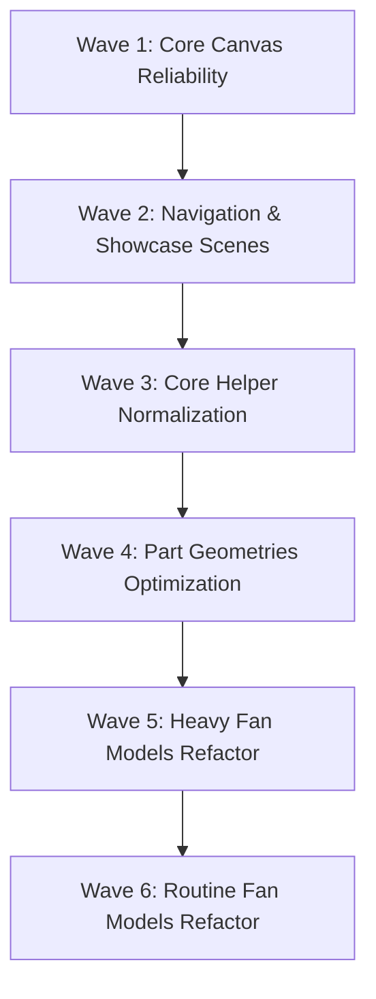

# KAYITLAR MASTER

---
project_name: venthub-hvac
compiled_at: 2026-08-28T09:38:09.669537+00:00
total_compiled_files: 99
source_commit: 87f6ab4a
source: ['docs/audits', 'docs/plans']
---


---
# FILE: docs\audits\3d-surfaces-audit-2026-06-16.md

# VentHub 3D Surfaces Audit Report (2026-06-16)

This document presents the complete WebGL/Three.js audit results for VentHub HVAC 3D components, helper tools, and fan models. The audit was conducted in accordance with the specifications in [3d-webgl-standard.md](file:///c:/Users/alize/venthub-hvac/docs/standards/3d-webgl-standard.md).

---

## 0. RE-AUDIT RECONCILIATION (2026-06-17) — GÜNCEL GERÇEK

> Aşağıdaki §1-3 = **2026-06-16 snapshot'ı** ve artık **drift etti**. Dalga 1-6 + 2026-06-17 recipe
> işleri (FlexibleDuct in-place · DuctFan merkezi materyal · FanRenderer→ProductModelRenderer rename)
> bu ihlallerin **neredeyse tamamını kapattı**. 2026-06-17'de 36 dosya **şu anki master'a karşı**
> paralel read-only ajan filosuyla yeniden denetlendi (her iddia OPEN/RESOLVED/REFUTED + legit-local eleme).

**Güncel sonuç: conformance yüzeyi TEMİZ (34 / 36 dosya).**
- Kanıt örnekleri: `DomesticFanModel` 144-box grid → **InstancedMesh**; tüm modeller useMemo geometri +
  unmount `dispose`; showcase/nav metalleri **SceneLightingRig prosedürel Environment**'tan IBL alıyor
  (C1 çözüldü); per-frame allocate yok (B3 temiz); tüm Canvas yüzeyleri `VentHubCanvas` →
  ResilientCanvasBoundary (ErrorBoundary) altında (A1/A2 çözüldü).
- **Yanlış-pozitif elendi (uydurma iş yok):** LED/airflow-viz/logo-texture materyalleri **legit-local**
  (C3 ihlali değil); paylaşılan `useResolveMaterials` cache materyalleri **dispose edilmez** (A4 ihlali değil);
  leaf model/part'ta `<Environment>` beklenmez (C1 sahne-sahibinin işi). `CategoryCard3D` ·
  `CategorySpotlightScene` → **silinmiş** (artık yok).
- **Kalan 2 açık:**
  - 🔴 **BlueprintCanvas.tsx — A1**: `useTexture` `<Suspense>` dışındaydı → bu reconciliation PR'ında
    düzeltildi (CinematicCard `<Suspense fallback={null}>` ile sarıldı).
  - 🟡 **CategoryHubOverlay.tsx — B3 minor**: `frameloop="demand"` + `autoRotate` — tartışmalı
    (drei OrbitControls autoRotate zaten `invalidate` eder); kontrolör doğrulayacak, muhtemelen iş değil.

**Sonuç:** 3D **conformance** katmanı kapandı. Sıradaki 3D işi = **görsel/showroom** (tasarım-güdümlü), conformance değil.

---

## 1. Executive Summary & Audit Statistics

The audit evaluated **39 files** across the 3D rendering pipeline. The final metrics are:

- **Total Files Audited**: 39
- **Total Critical Violations**: 26
- **Total Non-Critical Violations**: 89
- **Total Violations**: 115
- **Clean Files**: 1 (`useFanMaterials.ts`)
- **Actionable Files**: 38 (all grouped into implementation waves)

### Core Diagnostics Summary
1. **Application Crash Risks (Rule A1/A2)**: Canvas components lack React `<ErrorBoundary>` blocks, meaning an asset loading failure (such as a 404 or corrupted HDR/GLTF file) will crash the entire page. In `Product3DViewer.tsx`, the `<Environment>` component is placed outside `<Suspense>` and `<ErrorBoundary>`, exposing the page to instant crashes if the local HDR is corrupt.
2. **Metallic Rendering Issues (Rule C1)**: Metallic standard/physical materials in several showcase views render completely black because there is no `<Environment>` (Image-Based Lighting) in the scene.
3. **Memory Leaking & Garbage Collection Spikes (Rule B3/AX-10)**:
   - Dynamic allocations inside `useFrame` loops (e.g., `new Box3()`, `new Vector3()`, `new TubeGeometry()`) create massive garbage collection (GC) overhead.
   - Geometries, materials, and textures are instantiated inline inside mapped JSX elements rather than being memoized and shared.
4. **VRAM Leaks (Rule A4)**: None of the components implement proper resource disposal (`dispose()`) on unmount, which leads to GPU VRAM memory leaks.

---

## 2. Detailed Findings Table

Below is the structured registry of audited files, their classifications, and violation details:

| Dosya (File Path) | Sınıf (Class) | Toplam İhlal (Total Violations) | Kritik İhlaller (Critical Violations) | Kritik Olmayan İhlaller (Non-Critical) | Açıklama & İhlal Detayları (Violations & Diagnostics) |
| :--- | :---: | :---: | :---: | :---: | :--- |
| **Canvas Views (10 Files)** | | | | | |
| [Product3DViewer.tsx](file:///c:/Users/alize/venthub-hvac/src/components/products/3d/Product3DViewer.tsx) | `CRITICAL` | 4 | 1 | 3 | **A1/A2**: `<Environment>` loaded outside Suspense/ErrorBoundary. **B4**: Non-capped DPR (`[1, 2]`). **B5**: High shadow map resolution. **A4**: No unmount resource disposal. |
| [ThreeDAuthority.tsx](file:///c:/Users/alize/venthub-hvac/src/components/authority/ThreeDAuthority.tsx) | `CRITICAL` | 3 | 3 | 0 | **A1**: No ErrorBoundary. **A2**: Preset environment CDN dependency. **A4**: Primitive scene not disposed on unmount. |
| [OrbitalProductsShowcase.tsx](file:///c:/Users/alize/venthub-hvac/src/components/products/OrbitalProductsShowcase.tsx) | `CRITICAL` | 4 | 2 | 2 | **A1**: No ErrorBoundary. **C1**: Missing `<Environment>` for metallic PBR materials. **B4**: Desktop DPR is not capped at 1.0. **A4**: No unmount disposal. |
| [InfiniteProductsShowcase.tsx](file:///c:/Users/alize/venthub-hvac/src/components/products/InfiniteProductsShowcase.tsx) | `CRITICAL` | 4 | 2 | 2 | **A1**: No ErrorBoundary. **C1**: No `<Environment>`. **B3**: Frameloop always-on with no visibility/intersection checks. **A4**: Missing unmount cleanup. |
| [CategoryHubOverlay.tsx](file:///c:/Users/alize/venthub-hvac/src/components/navigation/CategoryHubOverlay.tsx) | `CRITICAL` | 4 | 2 | 2 | **A1**: No ErrorBoundary. **C1**: No `<Environment>`. **B3**: Frameloop is set to demand but OrbitControls autoRotate is active. **A4**: No unmount resource cleanup. |
| [CategoryCard3D.tsx](file:///c:/Users/alize/venthub-hvac/src/components/navigation/CategoryCard3D.tsx) | `CRITICAL` | 3 | 2 | 1 | **A1**: No ErrorBoundary. **C1**: No `<Environment>` for PBR metallic surfaces. **A4**: No unmount disposal. |
| [CategorySpotlightScene.tsx](file:///c:/Users/alize/venthub-hvac/src/components/navigation/CategorySpotlightScene.tsx) | `CRITICAL` | 4 | 2 | 2 | **A1**: No ErrorBoundary. **C1**: No `<Environment>`. **B3**: Frameloop demand with autoRotate. **A4**: No unmount cleanup. |
| [MegaMenu3DBackground.tsx](file:///c:/Users/alize/venthub-hvac/src/components/navigation/MegaMenu3DBackground.tsx) | `CRITICAL` | 4 | 2 | 2 | **A1**: No ErrorBoundary. **C1**: No `<Environment>`. **B3**: Frameloop demand with autoRotate. **A4**: No unmount cleanup. |
| [Category3DIcon.tsx](file:///c:/Users/alize/venthub-hvac/src/components/products/Category3DIcon.tsx) | `FIX` | 2 | 0 | 2 | **A1**: Lacks internal Suspense/ErrorBoundary around FanRenderer. **A4**: Missing unmount disposal. |
| [BlueprintCanvas.tsx](file:///c:/Users/alize/venthub-hvac/src/components/products/BlueprintCanvas.tsx) | `CRITICAL` | 2 | 1 | 1 | **A1**: No Suspense/ErrorBoundary wrapping suspending `useTexture` hook. **A4**: No unmount resource disposal. |
| **Helper Tools & Parts (10 Files)** | | | | | |
| [BentPlaneGeometry.tsx](file:///c:/Users/alize/venthub-hvac/src/components/products/BentPlaneGeometry.tsx) | `FIX` | 2 | 1 | 1 | **AX-10**: Texture loaded via TextureLoader is never disposed. **B3**: Inline static geometry arguments in JSX. |
| [SmartCenterScale.tsx](file:///c:/Users/alize/venthub-hvac/src/components/products/3d/SmartCenterScale.tsx) | `CRITICAL` | 1 | 1 | 0 | **B3**: Allocates `new Box3()`, `new Vector3()` inside the R3F `useFrame` loop. |
| [AutoCenter.tsx](file:///c:/Users/alize/venthub-hvac/src/components/products/3d/AutoCenter.tsx) | `CRITICAL` | 1 | 1 | 0 | **B3**: Allocates `new Box3()`, `new Vector3()` inside the R3F `useFrame` loop. |
| [useFanMaterials.ts](file:///c:/Users/alize/venthub-hvac/src/components/products/3d/materials/useFanMaterials.ts) | `CLEAN` | 0 | 0 | 0 | Clean static memoization. Verified correct. |
| [Housing.tsx](file:///c:/Users/alize/venthub-hvac/src/components/products/3d/parts/Housing.tsx) | `FIX` | 5 | 0 | 5 | **B3**: Inline geometries mapped in loops. **C3**: Bypasses shared materials. **B3**: ExtrudeGeometry and shapeGeometry not memoized. |
| [Silencer.tsx](file:///c:/Users/alize/venthub-hvac/src/components/products/3d/parts/Silencer.tsx) | `CRITICAL` | 4 | 1 | 3 | **AX-10**: Unused `ShapeGeometry` created but never disposed. **C3**: Inline standard material inside map loops. **B3**: Inline geometries. |
| [Impeller.tsx](file:///c:/Users/alize/venthub-hvac/src/components/products/3d/parts/Impeller.tsx) | `FIX` | 2 | 0 | 2 | **B3**: Recreates BoxGeometry inside impeller blades map loop. |
| [Motor.tsx](file:///c:/Users/alize/venthub-hvac/src/components/products/3d/parts/Motor.tsx) | `FIX` | 2 | 0 | 2 | **B3**: Inline geometries inside JSX are recreated on every render. |
| [MainChassis.tsx](file:///c:/Users/alize/venthub-hvac/src/components/products/3d/factory/parts/MainChassis.tsx) | `CRITICAL` | 1 | 1 | 0 | **AX-10**: Geometries memoized via useMemo are never disposed on unmount. |
| [InternalFanRotor.tsx](file:///c:/Users/alize/venthub-hvac/src/components/products/3d/factory/parts/InternalFanRotor.tsx) | `FIX` | 2 | 0 | 2 | **B3**: Recreates geometry inline inside map loops. |
| **Fan Models (19 Files)** | | | | | |
| [SilentChannelFanModel.tsx](file:///c:/Users/alize/venthub-hvac/src/components/products/3d/types/SilentChannelFanModel.tsx) | `FIX` | 4 | 0 | 4 | **B3**: Inline sphere/cylinder geometries. **A4**: No unmount disposal. |
| [AirCurtainModel.tsx](file:///c:/Users/alize/venthub-hvac/src/components/products/3d/types/AirCurtainModel.tsx) | `CRITICAL` | 3 | 1 | 2 | **B3**: Instantiates 28 materials/geometries in render loop. **A4**: No unmount cleanup. |
| [AxialFanModel.tsx](file:///c:/Users/alize/venthub-hvac/src/components/products/3d/types/AxialFanModel.tsx) | `FIX` | 2 | 0 | 2 | **B3**: Inline geometries. **A4**: Memoized geometry is not disposed on unmount. |
| [CentrifugalFanModel.tsx](file:///c:/Users/alize/venthub-hvac/src/components/products/3d/types/CentrifugalFanModel.tsx) | `FIX` | 2 | 0 | 2 | **B3**: Inline geometries. **A4**: Memoized bladeGeometry is not disposed. |
| [FlexibleDuctModel.tsx](file:///c:/Users/alize/venthub-hvac/src/components/products/3d/types/FlexibleDuctModel.tsx) | `CRITICAL` | 5 | 2 | 3 | **B3**: Dynamic `TubeGeometry` allocation in useFrame. **B3**: Recreating materials in loops. **C3/C1**: Material and metalness overrides. **A4**: No unmount disposal. |
| [NicotraFanModel.tsx](file:///c:/Users/alize/venthub-hvac/src/components/products/3d/types/NicotraFanModel.tsx) | `FIX` | 4 | 0 | 4 | **B3**: Array(24) loop recreate geometries. **C3**: Missing material props in blade loop. **A4**: No unmount cleanup. |
| [RoofFanModel.tsx](file:///c:/Users/alize/venthub-hvac/src/components/products/3d/types/RoofFanModel.tsx) | `FIX` | 4 | 0 | 4 | **B3**: Inline geometries. **C3/C1**: Custom inline materials. **A4**: Missing disposal. |
| [SmokeExhaustFanModel.tsx](file:///c:/Users/alize/venthub-hvac/src/components/products/3d/types/SmokeExhaustFanModel.tsx) | `FIX` | 3 | 0 | 3 | **B3**: Recreating geometries inside loop of 16 bolt components. **A4**: No unmount disposal. |
| [WallMountedCompactFanModel.tsx](file:///c:/Users/alize/venthub-hvac/src/components/products/3d/types/WallMountedCompactFanModel.tsx) | `FIX` | 4 | 0 | 4 | **B3**: Inline geometries. **C3/C1**: Custom inline materials. **A4**: No unmount cleanup. |
| [SnailFanModel.tsx](file:///c:/Users/alize/venthub-hvac/src/components/products/3d/types/SnailFanModel.tsx) | `FIX` | 4 | 0 | 4 | **B3**: Declaring sub-component Bolt inside component body. **B3**: Inline geometries inside loops. **A4**: No unmount disposal. |
| [SpeedControlModel.tsx](file:///c:/Users/alize/venthub-hvac/src/components/products/3d/types/SpeedControlModel.tsx) | `FIX` | 3 | 0 | 3 | **B3**: Inline geometries. **A4**: Material/geometries not disposed. |
| [RoundDuctFanModel.tsx](file:///c:/Users/alize/venthub-hvac/src/components/products/3d/types/RoundDuctFanModel.tsx) | `FIX` | 2 | 0 | 2 | **B3**: Recreates all geometries. **A4**: Missing unmount cleanup. |
| [ExproofFanModel.tsx](file:///c:/Users/alize/venthub-hvac/src/components/products/3d/types/ExproofFanModel.tsx) | `FIX` | 4 | 0 | 4 | **B3**: Declaring Bolt inside component body. **B3**: Inline geometries in loops. **A4**: Missing unmount cleanup. |
| [PlugFanModel.tsx](file:///c:/Users/alize/venthub-hvac/src/components/products/3d/types/PlugFanModel.tsx) | `FIX` | 4 | 0 | 4 | **B3**: Frame-rate dependent rotation mutation in `useFrame`. **B3**: Inline geometries. **C3**: Mapped materials. **A4**: No cleanup. |
| [JetFanModel.tsx](file:///c:/Users/alize/venthub-hvac/src/components/products/3d/types/JetFanModel.tsx) | `FIX` | 2 | 0 | 2 | **B3**: Inline geometries. **A4**: No unmount cleanup. |
| [HRVModel.tsx](file:///c:/Users/alize/venthub-hvac/src/components/products/3d/types/HRVModel.tsx) | `FIX` | 3 | 0 | 3 | **B3**: Inline geometries. **C3**: Material recreated inside loops. **A4**: Missing unmount disposal. |
| [DuctFanModel.tsx](file:///c:/Users/alize/venthub-hvac/src/components/products/3d/types/DuctFanModel.tsx) | `FIX` | 3 | 0 | 3 | **B3**: Inline geometries. **A4**: localBladeColor is not disposed on unmount. |
| [DomesticFanModel.tsx](file:///c:/Users/alize/venthub-hvac/src/components/products/3d/types/DomesticFanModel.tsx) | `CRITICAL` | 3 | 1 | 2 | **B3**: 12x12 loop rendering 144 inline boxGeometry instances. Needs `InstancedMesh`. **A4**: Missing unmount disposal. |
| [DehumidifierModel.tsx](file:///c:/Users/alize/venthub-hvac/src/components/products/3d/types/DehumidifierModel.tsx) | `FIX` | 2 | 0 | 2 | **B3**: Inline geometries. **A4**: Missing unmount disposal. |

---

## 3. Wave Implementation Roadmap (Dalga Sırası)

To ensure a structured, non-breaking migration, the refactoring roadmap is divided into **6 waves**:



### Wave 1: Core Canvas Reliability (Canvas CRITICAL)
- **Goal**: Implement `<ErrorBoundary>` and proper Suspense wrapper strategies on the main page canvas wrappers to prevent asset 404s/WebGL context losses from crashing the route. Capping DPR, reducing shadow maps, and adding correct unmount disposal hooks.
- **Files**:
  1. `src/components/products/3d/Product3DViewer.tsx`
  2. `src/components/authority/ThreeDAuthority.tsx`
  3. `src/components/products/BlueprintCanvas.tsx`

### Wave 2: Navigation & Showcase Scenes (Canvas CRITICAL & FIX)
- **Goal**: Introduce procedural environment lights for metallic PBR reflections (C1) and error handling interfaces for other 3D Canvas views.
- **Files**:
  1. `src/components/products/OrbitalProductsShowcase.tsx`
  2. `src/components/products/InfiniteProductsShowcase.tsx`
  3. `src/components/navigation/CategoryHubOverlay.tsx`
  4. `src/components/navigation/CategoryCard3D.tsx`
  5. `src/components/navigation/CategorySpotlightScene.tsx`
  6. `src/components/navigation/MegaMenu3DBackground.tsx`
  7. `src/components/products/Category3DIcon.tsx`

### Wave 3: Core Helper Normalization & Parts (Helper CRITICAL & FIX)
- **Goal**: Eliminate object allocations (`new Box3()`, `new Vector3()`) inside `useFrame` loops by using a static pool outside the component scope. Add unmount disposal logic.
- **Files**:
  1. `src/components/products/BentPlaneGeometry.tsx`
  2. `src/components/products/3d/SmartCenterScale.tsx`
  3. `src/components/products/3d/AutoCenter.tsx`
  4. `src/components/products/3d/parts/Silencer.tsx`
  5. `src/components/products/3d/factory/parts/MainChassis.tsx`

### Wave 4: Shared Part Geometries Optimization (Parts FIX)
- **Goal**: Memoize all geometries and materials. Reuse references for bolts, rings, and blades inside map loops.
- **Files**:
  1. `src/components/products/3d/parts/Housing.tsx`
  2. `src/components/products/3d/parts/Impeller.tsx`
  3. `src/components/products/3d/parts/Motor.tsx`
  4. `src/components/products/3d/factory/parts/InternalFanRotor.tsx`

### Wave 5: Fan Models with High CPU/Memory Impact (Models CRITICAL)
- **Goal**: Optimize models with high CPU/Memory implications. Refactor `DomesticFanModel` grid (144 meshes) to an `InstancedMesh`. Optimize `FlexibleDuctModel` useFrame geometry generation and `AirCurtainModel` JSX loops.
- **Files**:
  1. `src/components/products/3d/types/AirCurtainModel.tsx`
  2. `src/components/products/3d/types/FlexibleDuctModel.tsx`
  3. `src/components/products/3d/types/DomesticFanModel.tsx`

### Wave 6: Fan Models Routine Refactoring (Models FIX)
- **Goal**: Routine cleanup of remaining fan models. Memoize geometries, bind to shared `useFanMaterials`, convert rotations to frame-rate independent updates, and add proper `dispose` hooks inside useEffect.
- **Files**:
  1. `src/components/products/3d/types/SilentChannelFanModel.tsx`
  2. `src/components/products/3d/types/AxialFanModel.tsx`
  3. `src/components/products/3d/types/CentrifugalFanModel.tsx`
  4. `src/components/products/3d/types/NicotraFanModel.tsx`
  5. `src/components/products/3d/types/RoofFanModel.tsx`
  6. `src/components/products/3d/types/SmokeExhaustFanModel.tsx`
  7. `src/components/products/3d/types/WallMountedCompactFanModel.tsx`
  8. `src/components/products/3d/types/SnailFanModel.tsx`
  9. `src/components/products/3d/types/SpeedControlModel.tsx`
  10. `src/components/products/3d/types/RoundDuctFanModel.tsx`
  11. `src/components/products/3d/types/ExproofFanModel.tsx`
  12. `src/components/products/3d/types/PlugFanModel.tsx`
  13. `src/components/products/3d/types/JetFanModel.tsx`
  14. `src/components/products/3d/types/HRVModel.tsx`
  15. `src/components/products/3d/types/DuctFanModel.tsx`
  16. `src/components/products/3d/types/DehumidifierModel.tsx`


---
# FILE: docs\audits\admin-cetvel-scores-2026-06-13.md

# Admin Panel — Cetvel Skorlaması (§8) — 2026-06-13

> **Yöntem:** 19 admin sayfası, her biri ayrı bir Claude alt-ajanı tarafından
> `docs/standards/admin-standard.md §8` 24-maddelik cetvele vuruldu — her madde
> **dosya:satır kanıtıyla** (uydurma yasak; görülemeyen alt-bileşen = `na`).
> **Skor** = (pass + 0.5·partial) / (uygulanabilir madde sayısı). Arketip-dışı madde = `na`.
> Bu skor "refactor mı rewrite mı" kararını **his değil sayı** yapar (standart §8).
> Ham çıktı: `tasks/was0bs28j.output` (19 sayfa × 24 madde, kanıtlı JSON).

## 1. Skor matrisi

| Skor | Sayfa | Arketip | P / Pa / F / na | Verdict |
|---|---|---|---|---|
| %3 | AdminWebhookEventsPage | list | 0 / 1 / 15 / 8 | 🔴 rewrite |
| %8 | AdminInventoryPage | list | 0 / 3 / 15 / 6 | 🔴 rewrite |
| %15 | AdminSettingsPage | settings | 2 / 0 / 11 / 11 | 🔴 rewrite |
| %23 | AdminLogisticsPage | list | 3 / 4 / 15 / 2 | 🟡 refactor |
| %35 | AdminOrdersBoard | list | 3 / 8 / 9 / 4 | 🟡 refactor |
| %36 | AdminCouponsPage | list | 5 / 6 / 11 / 1 | 🟡 refactor |
| %39 | AdminUsersPage | list | 5 / 4 / 9 / 6 | 🟡 refactor |
| %41 | AdminInventoryReportPage | dashboard | 3 / 3 / 5 / 13 | 🟡 refactor |
| %41 | AdminErrorsPage | list | 4 / 5 / 7 / 8 | 🟡 refactor |
| %42 | AdminInventorySettingsPage | settings | 4 / 3 / 6 / 11 | 🟡 refactor |
| %43 | AdminAuditLogPage | list | 4 / 4 / 6 / 10 | 🟡 refactor |
| %44 | AdminDashboardPage | dashboard | 2 / 4 / 3 / 15 | 🟡 refactor |
| %44 | AdminCategoriesPage | list | 5 / 6 / 7 / 6 | 🟡 refactor |
| %47 | AdminOrdersPage | list | 5 / 8 / 6 / 5 | 🟡 refactor |
| %50 | CategoryBuilderView | detail | 5 / 3 / 5 / 11 | 🟡 refactor |
| %58 | AdminProductsPage | list | 9 / 4 / 6 / 5 | 🟡 refactor |
| %58 | AdminReturnsPage | list | 9 / 4 / 6 / 5 | 🟡 refactor |
| %61 | AdminErrorGroupsPage | list | 8 / 7 / 4 / 5 | 🟡 refactor |
| %62 | AdminMovementsPage | list | 6 / 4 / 3 / 11 | 🟡 refactor |

**Dağılım: 16 refactor · 3 rewrite · 0 keep.** En yüksek skor %62 → hiçbir sayfa "olduğu gibi bırak" değil.

## 2. Sistemik eksikler (sözleşme seviyesi — neredeyse her sayfada)

Hatalar rastgele dağılmamış; birkaç **contract** maddesi sayfaların çoğunda düşüyor:

| Madde | Kaç sayfada FAIL | Ne |
|---|---|---|
| **X6 i18n** | 15 / 19 | hardcoded TR + yasak `?? fallback` |
| **X8 design token** | 15 / 19 | arbitrary Tailwind / ham HEX / bozuk class |
| **L5 URL-state (K2)** | 14 / 19 | durum (sayfa/sort/filtre/arama) URL'de değil → link paylaşılamaz, geri-tuş/reload bozuk |
| L1 server-side pagination | 9 | tüm satırlar client'a çekilip filtreleniyor |
| L6 selection + bulk | 9 | — |
| L2 sort + aria-sort | 8 (+6 partial) | sık: server pagination + client sort = sessiz bug |
| L8 CSV export | 8 | — |
| L9 satır → detay | 8 | — |
| X7 a11y | 8 (+11 partial) | aria-sort/label/focus eksik |
| L3 faceted filter | 7 | — |
| L4 debounced arama | 7 | — |
| X2 fonksiyon-içi RBAC guard | 7 | UI butonu gizli ama handler korumasız |
| X4 audit log | 5 (+5 partial) | kritik mutasyonlar `logAdminAction` yazmıyor |
| X5 realtime / tenant-scope | 5 | SaaS data-bleeding riski |

**L10 (5 durum): 15 sayfada partial** — "veri-yok" ile "filtre-sıfır" karıştırılıyor ya da bir durum atlanıyor.

## 3. Her sayfanın 1. kritik boşluğu

- **WebhookEvents:** ham `<table>`, sıfır ortak-kit — standardın §7.3'ü zaten "yeniden yaz" diye listelemiş.
- **Inventory:** RBAC/audit tamamen yok; `hasWriteAccess={true}` koşulsuz hardcoded, `logAdminAction` hiç yok.
- **Settings:** sayfa bir PLACEHOLDER/stub — gerçek ayar formu yok.
- **Logistics:** monoton sipariş mutasyonu (confirmed→shipped) audit izi bırakmıyor.
- **OrdersBoard:** liste-tablo kontratının tümü eksik (pagination `.limit(200)` tavanı, sort, faceted).
- **Coupons:** liste state motoru tümüyle eksik (pagination/sort/faceted/URL/debounce).
- **Users:** server-side pagination yok — tüm satırlar client'a çekilip `.filter` ediliyor; URL-state yok.
- **InventoryReport / Errors / AuditLog / Categories / Orders / ErrorGroups:** durum URL'de değil (K2 ihlali).
- **Dashboard:** sahte/dummy grafik verisi hardcoded; sorgular tenant-scope'suz; ana rota `ssr:false`.
- **InventorySettings:** geri-alınamaz toplu `products` UPDATE'i audit'siz.
- **CategoryBuilder:** i18n hiç yok (baştan sona hardcoded); yazma guard'ı yok.
- **Products:** her yerde hardcoded TR + yasak `|| Fallback`.
- **Returns:** liste state client-side + URL-dışı.
- **Movements:** server pagination + client sort karışımı (standardın adlandırdığı sessiz bug).

## 4. Verdict

- **Sıfırdan DEĞİL** — 16 sayfanın gövdesi çalışıyor; ortak parçalar (`ColumnsMenu`, `ExportMenu`, `BulkActionToolbar`, `adminUi`, `useRole`, `logAdminAction`) zaten mevcut (§7.1).
- **Sayfa-sayfa yama da DEĞİL** — asıl hatalar contract-seviyesi ve her sayfada; aynı şeyi 19 kez düzeltmek israf.
- **→ Doğru yol: bu altyapı üzerine devam + merkezi omurga + göç:**
  1. Ortak **`useAdminTable` + DataTable kiti** (URL-state + server pagination + sort + selection) **bir kez** → L1/L2/L5/L6/L7 toplu çözülür.
  2. **i18n + design-token sweep** (X6/X8) toplu — sayfa sayfa değil.
  3. Sayfaları kite **göç** ettir (§7.3 sırası: altın referans → kit çıkar → tek tek).
  4. **3 sayfa** (Webhook / Inventory / Settings) kite göre **yeniden yaz**.

Bu, standardın §7.3'ünün öngördüğü yol — artık **ölçülmüş skorla** doğrulanmış.

---

*Kaynak: 19 paralel alt-ajan + §8 cetvel. Strateji: memory `standard-first-strategy`. Önceki ölçüm: `admin-panel-audit-2026-06-11.md` (bulgu listesi; bu dosya skorlama).*


---
# FILE: docs\audits\admin-cetvel-scores-2026-06-17.md

# Admin Panel — Cetvel Skorlaması (§8) — 2026-06-17 (GÜNCEL ÖLÇÜM)

> **Bu dosya nedir?** `admin-standard.md §8` 24-maddelik cetvelin DataTableKit göçü + i18n
> temizliği SONRASI yeniden ölçümü. 19 admin sayfası, 6 paralel Claude alt-ajanı, her madde
> **dosya:satır kanıtıyla** (uydurma yasak; görülemeyen alt-bileşen = `na`).
> **Skor** = (pass + 0.5·partial) / (uygulanabilir madde). Arketip-dışı madde = `na`.
> **Önceki ölçüm:** `admin-cetvel-scores-2026-06-13.md` (göç ÖNCESİ). Bu dosya = göç SONRASI delta.

## 0. Manşet

| | 2026-06-13 (göç öncesi) | 2026-06-17 (güncel) |
|---|---|---|
| **Ortalama skor** | **~%40** | **~%63** (+23 puan) |
| **En yüksek** | %62 (Movements) | %94 (Products) |
| **≥%85 ("keep")** | 0 sayfa | **3 sayfa** (Products, Movements, ErrorGroups) |
| **Dağılım** | 16 refactor · 3 rewrite · 0 keep | 3 keep · 11 refactor · 2 ağır-refactor · 3 rewrite |

> Not: Alt-ajanlar `na` paydasını madde madde farklı yorumlayabildi (özellikle salt-okunur sayfalarda
> L6/X2/X4). Skorlar ±birkaç puan gürültü taşır; sıralama ve kova-yerleşimi güvenilir.

## 1. Skor matrisi (eski → yeni)

| Yeni | Eski | Δ | Sayfa | Arketip | Kova | #1 kalan boşluk |
|---|---|---|---|---|---|---|
| **%94** | 58 | +36 | AdminProductsPage | list | 🟢 keep | X5 realtime yok (products'ta tenant_id yok) |
| **%93** | 62 | +31 | AdminMovementsPage | list (RO) | 🟢 keep | L9 satır→detay yok |
| **%92** | 61 | +31 | AdminErrorGroupsPage | list | 🟢 keep | X5 realtime kanal-adı tenant'lı ama DB satır-filtresi yok (kozmetik) |
| **%81** | 50 | +31 | CategoryBuilderView | detail | 🟡 refactor | D2 Zod yok + D4 kirli-durum guard yok |
| **%79** | 58 | +21 | AdminReturnsPage | list | 🟡 refactor | L6 selection+bulk hiç bağlanmamış; L9 detay yok; L1 client-500 tavan |
| **%78** | 43 | +35 | AdminAuditLogPage | list (RO) | 🟡 refactor | L8 CSV export yok (denetim çıktısı) |
| **%75** | 36 | +39 | AdminCouponsPage | list | 🟡 refactor | X5 realtime hiç yok; D2 Zod yok; X8 arbitrary token (`h-42px`) |
| **%75** | 41 | +34 | AdminErrorsPage | list (RO) | 🟡 refactor | L8 CSV export yok |
| **%72** | 42 | +30 | AdminInventorySettingsPage | settings | 🟡 refactor | §5 annotasyonlu iki-kolon düzen değil; X8 arbitrary token |
| **%72** | 35 | +37 | AdminOrdersBoard | kanban | 🟡 refactor | `.limit(200)` sabit tavan (200+ sipariş sessiz kesilir); X8 token |
| **%65** | 47 | +18 | AdminOrdersPage | list | 🟡 refactor | L9 satır→detay yok; L2 tek-kolon sort; L3 düz-select (faceted değil) |
| **%64** | 44 | +20 | AdminDashboardPage | dashboard | 🟡 refactor | SalesChart HÂLÂ DUMMY veri (`:60-67`); rota `ssr:false` |
| **%63** | 44 | +19 | AdminCategoriesPage | list | 🟡 refactor | L8 CSV export yok; L3 faceted yok; L6 bulk yok |
| **%60** | 39 | +21 | AdminUsersPage | list | 🟡 refactor | L3 faceted (rol süzme) yok; L6/L8/L9 yok |
| **%42** | 41 | +1 | AdminInventoryReportPage | dashboard | 🟠 ağır | Durum URL'de değil (K2); sorgu limitsiz (client `.slice`) |
| **%31** | 23 | +8 | AdminLogisticsPage | list | 🟠 ağır | Hâlâ local-state ham `<table>`; kit yok (ama bulk-submit audit'li ✓) |
| **%21** | 8 | +13 | AdminInventoryPage | list | 🔴 rewrite | Yazma yolu SAHTE: `hasWriteAccess={true}` hardcoded + handler'lar no-op |
| **%19** | 15 | +4 | AdminSettingsPage | settings | 🔴 rewrite | STUB — gerçek form yok (`handleSave` sahte success) |
| **%14** | 3 | +11 | AdminWebhookEventsPage | list | 🔴 rewrite | Ham `<table>`, sıfır kit, hiç liste yeteneği yok |

(RO = read-only / salt-okunur — mutasyon olmadığı için RBAC-yazma maddeleri `na`.)

## 2. Göçün KAPATTIĞI sistemik boşluklar (kanıtlı)

DataTableKit + `useAdminTable` + `mutateWithAudit` + i18n temizliği, 2026-06-13 audit'inin en çok
düşen contract-maddelerini toplu çözdü:

| Madde | 06-13 FAIL | 06-17 durumu |
|---|---|---|
| **X6 i18n** | 15 / 19 | Kite geçen 10 sayfa + CategoryBuilder'da **PASS**; sadece rewrite-adayları (Inventory/Settings/Webhook zaten i18n'liydi, ironik) |
| **L5 URL-state (K2)** | 14 / 19 | Kite geçen 10 sayfada **PASS** (syncUrl + Suspense bariyeri) |
| **L1 server-pagination** | 9 | Server-mode sayfalarda PASS; client-mode (Categories/Users/Coupons/Returns) bilinçli `na`/`Pa` |
| **L2 sort sessiz-bug** | 8 | Kit **tek-yol sort** zorluyor → eski "server-pagination+client-sort" sessiz bug'ı yapısal imkânsız |
| **L6 selection+bulk** | 9 | Products/ErrorGroups/Coupons'ta PASS; Returns/Categories/Users'ta hâlâ bağlanmamış |
| **X4 audit** | 5 (+5 partial) | Tüm yazma yolları `mutateWithAudit`→`logAdminAction` kapısından (Products 6, ErrorGroups 4 yol) — **sağlam** |
| **X3 sunucu RLS** | — | Yazan sayfalarda RLS policy'leri canlı doğrulandı (`products_update_admin_only`, `returns_update_admin`, `error_groups_update_admin`, `inventory_settings_update_admin`, `categories_update_admin`) |

## 3. HÂLÂ açık sistemik eksikler (göç-üstü "son-metre" + veri-katmanı)

1. **X5 — tenant-scoped realtime = en zayıf eksen (yapısal).** `products`, `categories`,
   `client_errors`, `orders`, `user_profiles`, `admin_audit_log` tablolarında **`tenant_id` kolonu yok**.
   ErrorGroups/Errors realtime kanal ADI tenant'lı ama `postgres_changes` satır-filtresi yok → izolasyon
   kozmetik. Bu bir **kod değil veri-katmanı** açığı; gerçek çözüm = dealer-blueprint **R4 onarımı**.
2. **Son-metre kit-config boşlukları (göç eden ama eksik-kurulu sayfalar).** Kit yetenekleri var ama
   her sayfaya bağlanmamış: **L9 satır→detay** (`rowHref`/`onRowClick` çoğu sayfada verilmemiş),
   **L8 CSV export** (Categories/Users/AuditLog/Errors'ta yok), **L3 gerçek faceted** (çoğu düz-select),
   **L6 bulk** (Returns/Categories/Users'ta yok), **L2 çok-kolon sort** (kit tek-kolon zorluyor — cetvel
   "çok-kolon" der → kalıcı `Pa`; cetvel maddesi gözden geçirilebilir).
3. **D1–D5 (Detay/CRUD Savebar) standardize değil.** Kit yalnız liste iskeleti. CategoryBuilder hariç
   detay formları (route-modal, Zod, sticky Savebar, kirli-durum guard) Faz-2'ye ertelendi.
4. **Dashboard chart hâlâ DUMMY.** `AdminDashboardPage.tsx:60-67` sabit dizi ("to pass build" yorumu
   duruyor); KPI kartları gerçek, grafik sahte. Rota `ssr:false`.
5. **Design token (X8) dağınık ihlal.** Migrasyon-dışı + bazı kit sayfalarında arbitrary Tailwind
   (`min-w-1000px`, `max-h-400px`, `h-42px`, `w-480px`, `left-10%`) — K1/K4 lint Faz-2'de `error`'a açılınca yakalanır.

## 4. Verdict

- **Göç işe yaradı:** ortalama %40→%63, ilk kez 3 sayfa ≥%85. Contract-seviyesi hatalar (i18n/URL-state/
  audit/sessiz-sort) toplu kapandı.
- **Kalan iş iki kovada:** (a) **son-metre kit-config** (faceted/export/satır-link/bulk — sayfa başına
  küçük, mekanik) ve (b) **3 rewrite + 2 ağır-refactor** (Webhook/Inventory/Settings rewrite;
  Logistics/InventoryReport kit-göçü). Hiçbiri yeni mimari gerektirmiyor — kit zemini hazır.
- **X5 tenant-realtime** kod değil veri-katmanı işi → dealer-blueprint R4 ile birlikte çözülür, izole iş değil.
- **Stratejik bağlam:** `faz2-admin-backlog` + `dealer-pivot-decision` gereği bu kalan iş **bilinçli
  ertelendi**; öncelik bayi modülü (R0→B2). Bu skor o kararı çürütmüyor — "admin yeterince iyi, bayiye geç" tezini güçlendiriyor.

> ⚠️ **DÜZELTME (aynı gün, sonradan — 2026-06-17 akşamı):** Yukarıdaki "bayiye geç / öncelik bayi modülü"
> tezi **tersine çevrildi** → güncel karar **admin-önce, bayi-son** (`docs/DURUM-TAKIP.md`). Skorun yükselişi
> "bayiye geç"i değil, **admin'i sıfır-hata kaleye tamamlama** önceliğini besliyor; bayi (R1–B2) EN SON.

---

*Kaynak: 6 paralel Claude alt-ajanı (dosya:satır kanıtlı) + §8 cetvel + CodeGraph (kit-tüketici doğrulama)
+ NLM ikiz (2026-06-15 snapshot delta) + canlı RLS doğrulama. Strateji: memory `standard-first-strategy`,
`standard-plus-enforcing-test-is-control`.*


---
# FILE: docs\audits\admin-cetvel-scores-2026-06-18.md

# Admin Panel — Cetvel Skorlaması (§8) — 2026-06-18 (YENİDEN ÖLÇÜM, dalga-sonrası)

> **Bu dosya nedir?** §8 cetvelinin **3 dalga göç + cila SONRASI** yeniden ölçümü (4 paralel Claude
> alt-ajanı, her sayfa **dosya:satır kanıtıyla**, canlı koddan). Önceki: `admin-cetvel-scores-2026-06-17.md`
> (dalga öncesi). Bu = dalgaların KAPATTIĞI deltayı gösterir.

## 0. Manşet

| | 2026-06-17 (dalga öncesi) | 2026-06-18 (güncel) |
|---|---|---|
| **Ortalama** | ~%63 | **~%83.5** (+20) |
| **≥%85 ("keep")** | 3 | **8** |
| **En düşük** | %14 (Webhook) | %64 (Inventory) |

## 1. Skor matrisi (06-17 → 06-18)

| 06-18 | 06-17 | Sayfa | Arketip | Kova | #1 kalan (closable) boşluk |
|---|---|---|---|---|---|
| **94** | 94 | Products | list | 🟢 keep | (altın referans) |
| **93** | 93 | Movements | list RO | 🟢 keep | — |
| **92** | 92 | ErrorGroups | list | 🟢 keep | — |
| **90** | 79 | Returns | list | 🟢 keep | (J7 oturdu) |
| **90** | 75 | Coupons | list | 🟢 keep | (J8 oturdu) |
| **88** | 78 | AuditLog | list RO | 🟢 keep | (J3 CSV oturdu) |
| **87** | 75 | Errors | list RO | 🟢 keep | (J3 CSV oturdu) |
| **87** | 81 | CategoryBuilder | detail | 🟢 keep | X6 i18n fallback (66/67/423/433) · X8 token (w-480px/w-320px/h-568px) |
| **84** | 72 | InventorySettings | settings | 🟡 refactor | X8 token (max-w-120px/!h-12/blur-blob) · D4 dirty-guard yok |
| **84** | 65 | Orders | list | 🟡 refactor | D2/D3/D4 (modal Zod/Savebar/dirty) · L9 detay-rota (expand by-design) |
| **82** | 31 | Logistics | list | 🟡 refactor | L3 faceted yok · X5 realtime (R4) |
| **80** | 14 | WebhookEvents | list RO | 🟡 refactor | L8 CSV export yok · X6 i18n fallback (225/226/232/233/244) |
| **80** | 42 | InventoryReport | dashboard | 🟡 refactor | X8 token (max-w-150px) · CSV başlıkları hardcoded TR (:184) |
| **80** | 64 | Dashboard | dashboard | 🟡 refactor | realtime refresh yok (chart artık GERÇEK ✓) |
| **80** | 63 | Categories | list | 🟡 refactor | L1 server-pag yok (none) · L2 sort · onPriceAdjust sızıntısı |
| **78** | 60 | Users | list | 🟡 refactor | L1 server-pag yok ("all users" ölçek) · bespoke bulk-bar · L9 |
| **78** | 19 | Settings | settings | 🟡 refactor | D2 Zod yok · D3 isSaveDisabled state-machine · D4 dirty-guard |
| **76** | 72 | OrdersBoard | kanban | 🟡 refactor | X8 token (left-10%/md:w-320px/max-h-70vh/bg-white-N) · placeholder toast-key (:192) |
| **64** | 21 | **Inventory** | list | 🟠 ağır | **DataTableKit'e HİÇ geçmemiş** (custom InventoryTable) → aria-sort/selection/bulk/columnvis/CSV yok |

(RO = read-only — mutasyon yok, RBAC-yazma maddeleri `na`.)

## 2. Kalan iş — 4 tema + bilinçli erteleme

**A) X8 design-token (arbitrary Tailwind) — 5 sayfa.** OrdersBoard · InventorySettings · InventoryReport ·
CategoryBuilder · Inventory. Mekanik token-değişimi; ayrıca Faz-2 K1/K4 lint→error kapısını açar.

**B) X6 i18n fallback (`t()||'x'`) — 2 sayfa.** CategoryBuilder (66/67/423/433) · WebhookEvents (225/226/232/233/244).
Artı OrdersBoard placeholder toast-key (:192) = gerçek i18n defekti.

**C) Inventory %64 → DataTableKit göçü.** Tek kit-dışı sayfa; en büyük tek kazanç (~+20). J12 Logistics gibi.

**D) D2/D3/D4 Detay-CRUD archetype (Zod + sticky Savebar + dirty-guard).** Orders/Settings/Categories modalları.
CategoryBuilder hariç standardize değil → **Faz-2 archetype işi** (daha büyük, ayrı standart).

**Bilinçli ERTELENEN (kod değil / by-design):**
- **X5 tenant-scoped realtime** — `tenant_id` kolonları yok → `dealer-blueprint R4` veri-katmanı işi, izole değil.
- **L9 satır→detay-rota** — sayfalar expand-row/modal kullanıyor (by-design); rubric maddesi gözden geçirilebilir.
- **L1 server-pagination** — Categories/Coupons sınırlı-set (kabul); yalnız Users "all users" sekmesi ölçek riski.

## 3. Verdict
3 dalga göç çalıştı: %63→%83.5, keep 3→8. Kalan = (a) **son-metre cila** (X8 token + X6 i18n + WebhookEvents CSV +
OrdersBoard toast — mekanik, ~5 sayfayı 85 üstüne çıkarır) ve (b) **Inventory kit göçü** (tek aykırı) ve
(c) **Faz-2 Detay-CRUD archetype** (Orders/Settings/Categories). Hiçbiri yeni mimari gerektirmiyor.

*Kaynak: 4 paralel Claude alt-ajanı (dosya:satır) + §8 cetvel + canlı kod/RLS. Strateji: `standard-first-strategy`.*


---
# FILE: docs\audits\admin-panel-audit-2026-06-11.md

# Admin Panel Denetimi — 2026-06-11

> **Yöntem:** 6 eksen Antigravity CLI (`agy`, Gemini 3.5 Flash High) ile paralel fan-out edildi
> (her eksen ayrı subagent), ardından bulgular **Claude Code + CodeGraph** ile doğrulandı.
> Yanlış pozitifler ayıklandı, "kritik" iddialar koda karşı sınandı.
>
> **Doğrulama lejantı:** ✅ kodla teyit edildi · ⚠️ doğrulanmalı (silmeden/değiştirmeden önce) · ✏️ agy'nin şiddeti düzeltildi

İnceleme alanı: `src/views/admin/` + `src/components/admin/`

---

## 0. Tema: İki "sistem-dışı" sayfa

`AdminInventoryPage.tsx` ve `AdminWebhookEventsPage.tsx` admin tasarım sisteminin **dışında** kalmış
(eski/parça parça büyüme kalıntısı): light-theme (`bg-white`, `primary-navy`), `adminUi.ts` ortak
sınıfları yok, metinler i18n'siz hardcoded Türkçe, a11y eksik. Birçok eksen bağımsız olarak bu iki
sayfayı işaret etti → en yoğun teknik borç burada.

---

## 1. KRİTİK (RBAC / Audit — güvenlik & satış kapısı)

| # | Durum | Konum | Bulgu | Düzeltme |
|---|-------|-------|-------|----------|
| K1 | ✅✏️ | `AdminInventoryPage.tsx:154` | `hasWriteAccess={true}` hardcoded; dosya `useRole` import etmiyor. **Ama** yazma handler'ları (`onUpdateLocation/Supplier`) boş no-op → aktif veri açığı değil, yanıltıcı UI + gelecek tehlikesi. | `useRole().canWrite('inventory')` bağla; handler'lar gerçek yazınca guard hazır olsun. |
| K2 | ✅ | `CategoryBuilderView.tsx:98` | `handleSave` kategori `authority_content`'i `update` ediyor — **hiçbir `canWrite`/`useRole` guard'ı yok**, audit log da yok. Buton sadece `disabled={saving}`. | `canWrite('categories')` guard + buton pasifleştirme + `logAdminAction`. |
| K3 | ✅ | `AdminProductsPage.tsx:308,331` | Toplu statü değişimi ve toplu silme `logAdminAction` yazmıyor (audit.ts'in 8 caller'ı arasında bu dosya yok). | `logAdminAction` entegre et (before/after). |
| K4 | ✅ | `AdminCouponsPage.tsx:172` · `AdminErrorGroupsPage.tsx:219` | Kupon aktiflik ve hata-grubu statü değişimleri audit log'a yazmıyor. | Kritik mutasyonlara `logAdminAction` ekle. |
| K5 | ⚠️ | Çeşitli (`AdminProductsPage`, `AdminCouponsPage`, `AdminOrdersPage`, `AdminLogisticsPage`, `AdminErrorGroupsPage`) | agy: birçok yazma fonksiyonunun **fonksiyon içi** `if(!hasWriteAccess) return` guard'ı eksik (UI butonu gizli olsa bile fonksiyon korunmamış). | Her yazma fonksiyonunun başına guard; satır bazında teyit edilmeli. |

> **Not (K1–K2):** İstemci guard'ı son savunma değildir. Asıl kapı sunucudaki **RLS**'tir.
> Bu yüzden ayrı bir **RLS kapsama denetimi** (`rls_security_auditor` persona) şart — istemci guard'ı
> kozmetik olabilir ama RLS yoksa gerçek açık oradadır.

---

## 2. ORTA

### Tasarım token / tutarlılık (Eksen 1)
- ✅ `AdminOrdersPage.tsx:534`, `AdminUsersPage.tsx:310` → `min-w-900px` (geçersiz/arbitrary) → `min-w-[900px]` ya da token.
- ✅ `AdminOrdersPage.tsx:689` `max-h-50vh`, `AdminUsersPage.tsx:234` `min-h-50vh` → token / `[..]` formu.
- `AdminWebhookEventsPage.tsx:73`, `BlockEditor.tsx:20` → `adminUi.ts` ortak sınıfları yerine kopya light-theme stiller.

### i18n (Eksen 3)
- `AccessDenied.tsx:20` ("Erişim Engellendi"), `AdminWebhookEventsPage` tüm metinler → sözlüğe taşı.
- `_t('x') || 'Fallback'` kalıbı (sözlükte eksik anahtar): `AdminAuditLogPage.tsx:225`, `AdminCategoriesPage.tsx:361`, `ProductCsvImport.tsx:54`, `AdminToolbar.tsx:263`. → Fallback'leri kaldır, anahtarları sözlüğe ekle.

### a11y (Eksen 4)
- `AdminInventoryPage.tsx:91,104`, `InventoryCsvImport.tsx:285,294`, `ProductFormModal.tsx:144` → ikon butonlara `aria-label`, input'lara `label`/`aria-label`, `focus-visible` halkası.
- `AdminWebhookEventsPage.tsx:97`, `InventoryTable.tsx:77` → `onClick`'li satırlara `role="button"`, `tabIndex={0}`, `onKeyDown`.

---

## 3. ÖLÜ KOD (Eksen 6) — ⚠️ silmeden önce import grep'i

CodeGraph hiçbirinde caller bulamadı (JSX render edge'i CodeGraph'ta görünmeyebilir → silmeden önce
`grep -r "ComponentAdı"` ile import teyidi şart):
- `src/components/admin/InventoryCsvImport.tsx` — ⚠️ 0 caller (ama `logAdminAction` kullanıyor; bağımsız bir özellik yarım kalmış olabilir)
- `src/components/admin/InventoryDetailDrawer.tsx` — ⚠️ 0 caller
- `src/components/admin/dashboard/AbcPieChart.tsx` — ⚠️ 0 caller
- `src/components/admin/dashboard/ActivityHeatmap.tsx` — ⚠️ 0 caller
- `AdminToolbar.tsx:8` — kullanılmayan export'lar (tip).

### Tekrar / teknik borç
- `AdminErrorGroupsPage.tsx` ≈ `AdminErrorsPage.tsx` (~604 satır neredeyse birebir kopya) → ortak bileşene.
- `AdminAuditLogPage` ↔ `AdminErrorsPage` arama-debounce + sayfalama mantığı kopya → ortak `useAdminTableQuery` hook'u.

---

## 4. Önerilen düzeltme sırası

1. **K2, K3, K4** (audit log + CategoryBuilder guard) — ucuz, güvenlik/izlenebilirlik kazancı yüksek.
2. **RLS kapsama denetimi** (ayrı tur, `rls_security_auditor`) — K1/K2/K5'in gerçek riskini belirler.
3. **K1 + iki sistem-dışı sayfa** (`AdminInventoryPage`, `AdminWebhookEventsPage`) — design system + i18n + a11y birlikte refactor.
4. Ölü kod temizliği (import teyidinden sonra) + tekrar eden tabloların ortak hook/bileşene alınması.
5. Kalan i18n fallback'leri ve token ihlalleri (kozmetik, toplu yapılabilir).

---

*Bu rapor agy fan-out + CodeGraph doğrulama hattının ilk ürünüdür. Bulgular dosya:satır kesinliğindedir
ama satır numaraları agy taraması anındaki haldir; uygulamadan önce hedef satırı teyit et.*


---
# FILE: docs\audits\aile-adi-en-cevirileri-2026-08-23.md

# Ürün Ailesi Adları — Önerilen EN Karşılıkları (İNCELEME BEKLİYOR)

> **Ne bu?** `product_families.name_i18n` için 25 Türkçe aile adının **önerilen** İngilizce
> karşılıkları. Tarih: 2026-08-23 · Şerit: I18N · İlgili migration:
> `supabase/migrations/20260823120000_product_families_name_i18n.sql`
>
> **Bu liste HENÜZ YAZILMADI.** Migration yapıyı kurar ve dil-nötr 13 model adını doldurur;
> aşağıdaki 25 satır müşteri-görünür pazarlama metnidir ve **Recep'in onayı olmadan prod'a
> yazılmaz**. Onaylanan satırlar ayrı ve küçük bir veri migration'ıyla girer.

---

## 0. Neden ayrı duruyor

Migration'a gömseydim, 25 müşteri-görünür ad tek bir "onay" ile prod'a inerdi ve gözden
geçirme aşaması hiç yaşanmazdı. Ürün ailesi adı vitrinde başlık, arama sonucu, breadcrumb ve
SEO başlığı olarak görünür — yanlış bir terim kataloğun tamamına yayılır. Bu yüzden yapı ve
metin ayrıldı: yapı atarsız, metin incelenir.

## 1. Yüksek güvenli — düz terim karşılığı (23 satır)

| # | TR (bugünkü `name`) | Önerilen EN |
|---:|---|---|
| 1 | AVenS Davlumbaz Fanları | AVenS Range Hood Fans |
| 2 | AVenS Elektrikli Kanal Isıtıcıları | AVenS Electric Duct Heaters |
| 3 | AVenS Hücreli Aspiratörler | AVenS Box Extract Fans |
| 4 | AVenS Isı Geri Kazanım Cihazları | AVenS Heat Recovery Units |
| 5 | AVenS Sığınak Havalandırma Üniteleri | AVenS Shelter Ventilation Units |
| 6 | AVenS Plug Fanlar | AVenS Plug Fans |
| 7 | Nicotra Gebhardt AT Çift Emişli Radyal Fanlar | Nicotra Gebhardt AT Double-Inlet Centrifugal Fans |
| 8 | Nicotra Gebhardt DD Direkt Akuple Radyal Fanlar | Nicotra Gebhardt DD Direct-Driven Centrifugal Fans |
| 9 | SEAT Storm Jet Asit Dayanımlı Fanlar | SEAT Storm Jet Acid-Resistant Fans |
| 10 | Vortice Aksiyel Endüstriyel Fanlar | Vortice Axial Industrial Fans |
| 11 | Vortice Deumido Nem Alma Cihazları | Vortice Deumido Dehumidifiers |
| 12 | Vortice Endüstriyel Çatı Fanları | Vortice Industrial Roof Fans |
| 13 | Vortice Heatmaster Duman Egzoz Fanları | Vortice Heatmaster Smoke Extract Fans |
| 14 | Vortice Lineo Quiet Kanal Fanları | Vortice Lineo Quiet Inline Duct Fans |
| 15 | Vortice Punto Evo / Flexo Banyo Fanları | Vortice Punto Evo / Flexo Bathroom Fans |
| 16 | Vortice Radon Serisi Çatı Fanları | Vortice Radon Series Roof Fans |
| 17 | Vortice Radon Serisi Kanal Fanları | Vortice Radon Series Duct Fans |
| 18 | Vortice Slimroof Çatı Fanları | Vortice Slimroof Roof Fans |
| 19 | Vortice VORT Commercial In-Line Dikdörtgen Kanal Fanları | Vortice VORT Commercial In-Line Rectangular Duct Fans |
| 20 | Vortice VORT Commercial In-Line Yuvarlak Kanal Fanları | Vortice VORT Commercial In-Line Circular Duct Fans |
| 21 | Vortice VORT HR Isı Geri Kazanım | Vortice VORT HR Heat Recovery |
| 22 | Vortice AIR DOOR Hava Perdeleri | Vortice AIR DOOR Air Curtains |
| 23 | Vortice VORT-E ATEX Fanlar | Vortice VORT-E ATEX Fans |

Bu 23 satırda marka ve model kodu olduğu gibi korunur; yalnız tür adı çevrilir.

## 2. İKİ SATIR — OEM KAYNAĞINDAN ÖLÇÜLDÜ (Recep teyidi bekliyor)

İlk yazımda "domain doğrulaması gerekir" diye bırakmıştım. Sonra ölçtüm — üreticinin kendi
ürün sayfaları soruyu kapatıyor:

| # | TR | Önerilen EN | Kaynak |
|---:|---|---|---|
| 24 | Nicotra Gebhardt ADH Sık Kanatlı Radyal Fanlar | Nicotra Gebhardt ADH **Forward-Curved** Centrifugal Fans | nicotra-gebhardt.com/en → ADH: "double inlet … impeller with **forward curved** blades" |
| 25 | Nicotra Gebhardt RDH Seyrek Kanatlı Radyal Fanlar | Nicotra Gebhardt RDH **Backward-Inclined** Centrifugal Fans | nicotra-gebhardt.com/en → RDH: "impeller … 11 **backward inclined** blades" |

### ÖNEMLİ: ilk önerim RDH'de YANLIŞTI

Önce "Backward-**Curved**" önermiştim. Üretici kendi metninde "backward **inclined**" diyor —
ikisi aynı şey değil: *curved* kanat eğrisel, *inclined* kanat düz ama eğik durur. Bir satıcı
sitesi (mep-global) "backward-curved" yazıyor; çelişkide **OEM kazanır**, satıcı metni değil.
Eğer OEM'i okumasaydım makul görünen ama yanlış bir terimi 16 ürünlük aileye basacaktım.

Bu tam olarak `fidelity-is-not-correctness` sınıfı: satıcı metnine sadakat, OEM yanlış
kopyalanmışsa doğru sonuç vermez.

### Kapsam dışı gözlem (URUN/taksonomi kalemi, çözmüyorum)

ADH ve RDH'nin ikisi de üreticiye göre **çift emişli (double inlet)**. Ama katalogda "Çift
Emişli" adını taşıyan ayrı bir aile var: `Nicotra Gebhardt AT Çift Emişli Radyal Fanlar`.
Yani "çift emişlilik" AT'yi diğerlerinden AYIRMIYOR; ayırt edici özellik başka bir şey olmalı.
Bu bir adlandırma tutarsızlığı olabilir — i18n kusuru değil, taksonomi kalemi.

## 3. Yazılmayacaklar — dil-nötr 13 model adı

`Danfoss VLT HVAC Basic Drive FC 101` · `Danfoss VLT HVAC Drive FC 102` · `Vortice Bravo S` ·
`Vortice Lineo 100/125/150/200/250/315 Quiet` · `Vortice Nordik HVLS Hyperblade` ·
`Vortice VORT Mono` · `Vortice VORT QBK SAL KC Evo` · `Vortice VORT Quadro Evo`

Bunlarda EN = TR yazılır (migration adım 2 bunu yapar); çeviri **yanlış** olurdu.

## 4. Sonraki adımlar

1. Recep §1'i onaylar. §2 OEM kaynağından ÖLÇÜLDÜ — Recep'ten gereken karar değil TEYİT.
2. Onaylı 25 satır küçük bir veri migration'ıyla `name_i18n->'en'` alanına yazılır.
3. **Okuma yolu** bağlanır: `name_i18n[lang] → name` sırası. Bu `src/lib/services/
   family.service.ts` (+ görünüm katmanı) demektir ve **ÜRÜN şeridinin alanıdır** — I18N
   bağlamaz, OPS koordine eder. Okuma yolu bağlanana kadar bu kolon ekranda hiçbir şey
   değiştirmez.
4. Sertleştirme: yazma yolu `name_i18n`i doldurmaya başlayınca `CHECK (name_i18n ? 'tr')`
   ayrı migration'la eklenir. Şimdi eklenirse name_i18n vermeyen INSERT'ler patlar.


---
# FILE: docs\audits\build-skip-canli-olcum-2026-08-28.md

# Build-skip canlı ölçümü — D8.3 deneyi (2026-08-28)

> **Cetvel:** `docs/standards/deploy-build-skip-standard.md` §D8.3 (bilinen bilinmeyen)
> **Şerit:** I18N · **Kanıt kolu sahibi:** I18N (OPS devretti, 2026-08-27 20:33)
> **Durum:** ölçüt YAZILDI, sonuç BEKLENİYOR

## Niçin bu belge var

`#875` 2026-08-27 20:37:54Z'de indi (`d937fa8c`) ve build-skip zincirinin on gündür
ölü olan 2. adımını onardı. **Ama onarımın canlıda çalıştığı ÖLÇÜLMEDİ.** Merge
sonrası master dağıtımı kota reddine takıldı (`rate limited`, 20:37:58Z), yani
onarılmış betik bir kez bile koşmadı.

Bu belge, "indi = çalışıyor" beyanını imkânsız kılmak için ölçütleri **sonuç
gelmeden önce** yazar. Ölçütü sonradan seçmek, sonuca göre ölçüt seçmektir.

## Deneyin kendisi

Bu dosyanın kendisi deneydir: `docs/audits/**` altında **yeni** bir `.md`, yani
betiğin pozitif sınıf listesindeki `*.md` ve `docs/*` kalıplarının ikisine birden
giriyor. Tek dosyalık, %100 atlanabilir bir push.

**Tuzak, adıyla:** deney dosyası olarak mevcut bir cetveli seçmek YANLIŞ olurdu —
`docs/standards/*.md` manifest kaynağıdır, değiştirilirse INV-DOC-4b artefaktı
bayatlatır ve `ci` kırmızı yanar (2026-08-27'de tam bu yaşandı). Bu yüzden
**yeni** bir dosya seçildi: manifest onu kaynak olarak izlemiyor.

## Ölçütler (sonuç gelmeden yazıldı)

Üçü BİRLİKTE okunur. Tek ölçüt yanıltır.

| # | Ölçüt | Nasıl | Ne anlama gelir |
|---|-------|-------|-----------------|
| 1 | Dağıtım kaydı | Vercel `list_deployments`, bu dalın SHA'sı | `CANCELED` = atlama ÇALIŞTI · `READY` = atlama çalışmadı, build koştu · kayıt YOK = tetiklenmedi ya da reddedildi |
| 2 | GitHub damgası | `commits/<sha>/statuses`, context `Vercel` | `success` · `failure` + `rate limited` = kota reddi · damga YOK = hiç tetiklenmedi |
| 3 | Merge edilebilirlik | `gh pr view --json mergeStateStatus` | `BLOCKED` = zorunlu Vercel kapısı geçilmiyor |

### Ölçüt 1 ve 2 birlikte okunmalı — ayırt eden budur

2026-08-27'de neredeyse yanlış hüküm kuruldu: master dağıtımının kaydı yoktu ve
"kayıt yok → demek ki atlandı → çalışıyor" denebilirdi. **Yanlış olurdu.**

- **Atlanan** dağıtım `CANCELED` kaydı BIRAKIR.
- **Reddedilen** (rate limit) dağıtım HİÇ kayıt bırakmaz, ama GitHub'a kırmızı yazar.

Yani "kayıt yok" tek başına iki farklı dünyayla uyumludur; ayıran şey damganın
rengidir.

## Karar tablosu — hangi sonuç ne demek

| Kayıt | Damga | mergeState | Hüküm |
|-------|-------|------------|-------|
| `CANCELED` | `success` | temiz | ✅ **Atlama çalışıyor VE kapı geçiliyor** — hedeflenen durum |
| `CANCELED` | `failure`/yok | `BLOCKED` | ⚠ **Kilit takası** — kotayı kazandık, merge'i kaybettik; D8.3 riski gerçekleşti |
| `READY` | `success` | temiz | ❌ Atlama çalışmadı, build koştu — onarım yetersiz |
| yok | `failure` + rate limit | `BLOCKED` | ⏸ Deney KOŞMADI, kota reddi; tekrar dene |

## "Kilit takası" çıkarsa ne yapılacak (geri alma planı, önceden yazılı)

Kapıyı susturmak **seçenek değildir**. Sırayla:
1. Atlamayı daralt (yalnız `docs/audits/**` gibi en güvenli sınıflar).
2. Yetmezse `scripts/vercel-ignore-build.sh` değişikliğini geri al.
3. Zorunlu `Vercel` check'ini dal korumasından ÇIKARMAK önerilmez — o, ölçüyü
   kaybetmek pahasına kırmızıyı yok saymaktır.

## Sonuç — 2026-08-28 06:48, ÜÇ ÖLÇÜT DE TUTTU

Push `06:48:17Z` (`2d4dce40`, dal `i18n/d83-canli-olcum`, PR #882).

| # | Ölçüt | Ölçülen | Hüküm |
|---|-------|---------|-------|
| 1 | Dağıtım kaydı | `CANCELED` (`dpl_DPk54eQ…`) | atlama ÇALIŞTI |
| 2 | GitHub `Vercel` damgası | `success` — *Canceled by Ignored Build Step* | kapı YEŞİL |
| 3 | `mergeStateStatus` | `CLEAN`, kırmızı 0, `MERGEABLE` | merge engellenmiyor |

**Karar tablosunun ilk satırı: atlama çalışıyor VE kapı geçiliyor.** D8.3'te yazılı
"kilit takası" riski ölçümle çürüdü; geri alma planına gerek kalmadı.

### Onarım gerçekten sınandı — zincir 2 koştu

Build günlüğü, on gün önce tam burada ölen zincirin devamını gösteriyor:

```
ignore-build: VERCEL_GIT_PREVIOUS_SHA bos (dalin ilk dagitimi) -> ortak ataya dusuyorum
ignore-build: origin uzagi yok, URL ortamdan kuruldu (https://github.com/peckop/venthub-hvac-esite.git)
ignore-build: taban = origin/master ile ortak ata (d937fa8c)
ignore-build: tum degisiklikler build-disi sinifta -> ATLA
```

Eski hâli: `origin/master bu klonda yok -> BUILD`, üstelik hata `2>/dev/null || true`
ile yutuluyordu.

**Aynı gün master koşumu bunu sınamamıştı** (`e4557793`): orada taban zincir 1'den
(`VERCEL_GIT_PREVIOUS_SHA`) çözülmüştü, çünkü master'ın önceki dağıtımı vardı.
Onarımın gerektiği vaka **dalın ilk dağıtımı**dır ve bu deney tam onu kurdu.

### Yanlış hükmün eşiğinden dönülen yer

`06:51`'de üçüncü ölçüt `BLOCKED` okunuyordu ve "kilit takası var" diye yazılabilirdi.
**Yanlış olurdu:** `BLOCKED`'in sebebi Vercel değil, henüz koşan `ci`/`admin-smoke`
idi. Ayırt eden şey durumun kendisi değil, **kırmızı listesinin içeriği**.

> `BLOCKED` tek başına "zorunlu kapı geçilmiyor" demek DEĞİLDİR.

### Sınır — adıyla

Bu vaka **tek dosyalıydı** ve `docs/audits/` altındaydı. Karışık bir PR'da tek bir
kaynak dosyası bile BUILD ettirir; doğru davranış budur. Bu sonuç, atlama listesini
genişletmek için gerekçe DEĞİLDİR (D2: bilmiyorsak BUILD).

### Filo için pratik karşılık

%100 atlanabilir push'lar artık **slot yakmıyor ve kapıyı geçiyor** — companion,
artefakt ve cetvel-dışı `.md` push'ları pencere beklemeden gidebilir. Kaynak dosyaya
dokunan push'larda pencere disiplini aynen sürer.


---
# FILE: docs\audits\canliya-alma-hazirlik-2026-08-15.md

# Canlıya Alma Hazırlık Denetimi — 2026-08-15

> **Şerit:** LAUNCH (oturum `eda80084`) · **Kapsam:** salt-okuma. Prod DB + repo ölçüldü, hiçbir şey değiştirilmedi.
> **Amaç:** İki eş-Controller (PRICING, EDGE) dikey işlerini yürütürken kimsenin bakmadığı **yatay** soruyu
> cevaplamak: *"Bu site bugün canlıya çıkarsa müşteri ürün alabilir mi, hukuken satabilir miyiz?"*
> **Yöntem:** iddia yok — her madde prod DB sorgusu veya dosya/satır referansıyla kanıtlı.

## 0. Tek cümlelik cevap

**Hayır.** Teknik altyapı (fiyat motoru, RLS, SEO, e2e kapıları) beklenenden iyi durumda; **canlıya çıkışı
engelleyen şeyler kod değil İÇERİK ve TİCARİ/HUKUKİ hazırlık** — 0 görsel, 0 fiyat satırı, taslak damgalı
sözleşmeler, sahte iletişim bilgisi. Bunların hiçbiri açık iki şeridin kapsamında değil.

---

## 1. KIRMIZI — bunlar çözülmeden canlıya çıkılmaz

### K1 · Katalogda tek bir ürün görseli yok
**Kanıt (prod DB, 2026-08-15):**
```
active_products = 374 · product_images = 0 · products_with_image = 0
```
374 aktif ürünün tamamı görselsiz. HVAC vitrininde ürün görseli olmadan satış hunisi çalışmaz;
kategori/PDP/aile kartlarının tamamı boş çerçeve gösterir.
**Not:** CSV'ler 187 görsel dosyası beyan ediyordu, ingestor diskinde bulunamamıştı (bkz. DURUM-TAKIP "Bulgular").
**İş emri:** `T003-VH` (open, sahipsiz) · **Kilit:** Recep'ten görsel dosyaları.

### K2 · Fiyat tablosu boş → tüm katalog "Teklif Alın"
**Kanıt (prod DB):**
```
product_prices = 0 satır · products_priced = 0 · pricing_rule = 1
```
Fiyat **motoru** canlı (W0–W4b prod'da) ama **veri** yok. Yani bugün site açılsa 374 ürünün hiçbirinde
fiyat görünmez, sepet/checkout fiilen ölü — e-ticaret değil katalog sitesi olur.
**Sahibi:** PRICING şeridi (`f68f03d8`). Sıradaki adımı zaten bu: seed (348 ürün × 3 segment).
**Kilit:** Recep'in tek "evet"i (prod-yazım kapısı). **Bu, satışın açılıp açılmadığını belirleyen tek anahtar.**

### K3 · Hukuki metinler canlıda "TASLAK" damgalı, satıcı kimliği hiç yok
**Kanıt:** `src/i18n/dictionaries/tr.ts:839`
> *"Bu metin taslaktır ve test amaçlıdır. Canlıya çıkmadan önce şirketinizin gerçek bilgileri ile
> güncelleyiniz ve bir hukukçudan teyit alınız."*

Bu uyarı 6 hukuki sayfanın **hepsinde sarı bantla ziyaretçiye gösteriliyor**
(`src/views/legal/*.tsx` — Mesafeli Satış, Ön Bilgilendirme, KVKK, Gizlilik, Çerez, Kullanım Koşulları).

> **⚠️ DÜZELTME (aynı gün, iş başlarken fark edildi):** Bu maddenin ilk hâli *"satıcı ünvanı, MERSİS,
> vergi no hiçbir metinde yok"* diyordu. **Yanlıştı.** `grep`'i sayfa dosyaları ve sözlükler üzerinde
> koşturmuştum; gerçek metinler bir katman altta — `src/views/legal/components/{tr,en}/*.tsx` — ve
> alanlar **var**, merkezî `src/config/legal.ts`'ten geliyor (`sellerTitle`, `mersis`, `taxNumber`…).
> Yani eksik olan **alanlar değil, içlerindeki değerler** (`'[SATICI_UNVAN]'` gibi placeholder'lar).
> Metinler de sanılandan iyi: 6502, MSY m.15, KVKK m.5/m.11 atıfları yerli yerinde.
> *(Bu tam olarak hafızadaki `KAPSAM≠GERÇEK` dersi: yanlış-negatif grep deseni. Kapsam değişmiyor —
> canlıya çıkış hâlâ engelli — ama iş "sıfırdan yaz" değil "boşlukları kapat + değerleri doldur".)*
**Risk:** Mesafeli Sözleşmeler Yönetmeliği + 6502 sayılı TKHK, satıcı kimliğini ve ön bilgilendirmeyi
**zorunlu** kılar. Eksik/taslak metinle satış = idari para cezası + cayma süresinin uzaması riski.
**Kilit:** Recep (şirket bilgileri) + hukukçu teyidi. **Kod işi değil, içerik işi.**

> **✅ DURUM (aynı gün, `T019-VH`):** Metin tarafı **yazıldı ve bu PR'da**. 6 metin × 2 dil mevzuata
> karşı denetlendi ve boşlukları kapatıldı: MSY m.5 zorunlu bilgi listesi tamamlandı, **örnek cayma formu**
> eklendi (yoktu), iade kargo masrafının kime ait olduğu açıkça yazıldı (yoktu), cayma istisnaları
> HVAC'a somutlandı (özel ölçü kanal / açılmış filtre / uygulanmış izolasyon), ETBİS-MERSİS-ticaret sicil-KEP
> alanları eklendi, KVKK yurt dışı aktarım metni 2024 rejimine güncellendi, İYS/ticari elektronik ileti ve
> VERBİS bölümleri eklendi, çerez tablosu gerçek çerezlerle dolduruldu, garanti/kullanım ömrü/yetkili servis
> eklendi, fiyat-hatası hükmü eklendi.
> **Geriye kalan iki şey Recep'te:** (1) `src/config/legal.ts`'teki 18 placeholder'ın doldurulması,
> (2) hukukçu teyidi → `legalReviewCompleted: true`. **İkisi tamamlanana kadar taslak bandı kendiliğinden
> görünmeye devam eder** (`isLegalContentReady()`); ikisi de tamamlanınca kendiliğinden kalkar.

### K4 · Sitede sahte iletişim bilgisi
**Kanıt:** `src/i18n/dictionaries/tr.ts:856-857`
```
phone: '+90 (216) 123-45-67'
email: 'info@venthub.com.tr'
```
Placeholder telefon canlıda görünüyor. (Hafızada `user-side-open-items` olarak zaten duruyordu — kapanmamış.)

### K8 · Sitenin kanonik adresi her deploy'da değişiyordu + **alan adı DNS'te yok**
**Kanıt (canlı prod, 2026-08-15):**
```
$ curl https://venthub-hvac-esite.vercel.app/robots.txt
Sitemap: https://venthub-hvac-esite-m8cog5tbe-peckops-projects.vercel.app/sitemap.xml
                                   ^^^^^^^^^^ deploy'a özel, her deploy'da DEĞİŞİR

$ nslookup venthub.com.tr
*** can't find venthub.com.tr: Non-existent domain
```
**Kök sebep:** `src/config/siteUrl.ts` merdiveni `NEXT_PUBLIC_SITE_URL` → `VERCEL_URL` idi.
`NEXT_PUBLIC_SITE_URL` prod'da set edilmemiş → `VERCEL_URL`'e düşüldü; ama o değer **deploy'a özeldir.**

**Etki:** `sitemap.xml` ve hreflang alternatifleri geçici URL üretiyordu (SEO kökten bozuk — Google
her deploy'da yeni bir site görür) · `robots.txt`'nin `Sitemap:` satırı kayıyordu · canonical/OG
metadata'sı geçici URL gösteriyordu · **hukuki metinler satıcının sitesi olarak o rastgele deploy
adresini yazıyordu** (Mesafeli Satış Sözleşmesinde hukuken anlamsız adres — K3 ile doğrudan bağlantılı).

**Düzeltme (bu PR):** merdivene `VERCEL_PROJECT_PRODUCTION_URL` eklendi ve `VERCEL_URL`'den **önce**
denenir; o değer projenin **kalıcı** production alan adıdır ve özel alan adı bağlandığı an
kendiliğinden ona döner. Sondaki `/` de temizleniyor (çift-slash canonical üretiyordu).
Üç senaryo (açık yapılandırma / kalıcı alan adı / son çare) probe ile doğrulandı.

**⚠️ Bu düzeltme emniyet ağıdır, çözüm DEĞİL — ikisi Recep'te:**
1. **`venthub.com.tr` DNS'te yok.** Alan adı alınıp Vercel'e bağlanmalı. Bugün site yalnızca
   `venthub-hvac-esite.vercel.app` üzerinde yaşıyor. İyzico merchant kaydı, SEO 301 geçişi ve
   hukuki metinlerdeki site adresi bu alan adına bağlı.
2. **`NEXT_PUBLIC_SITE_URL`** Vercel production env'ine açıkça yazılmalı (`https://…`, sondaki `/` yok).

### K7 · Yasal onay kutuları hiç zorlanmıyordu — sistem kendi aleyhine delil üretiyordu ✅ DÜZELTİLDİ
**Kanıt (düzeltmeden önce):** `src/hooks/useCheckoutOrchestrator.ts` — adım ilerletme yalnız
`validateCustomerInfo()` ve `validateAddress()` çağırıyordu; `step === 3` dalı doğrudan
`initiatePayment()`'a gidiyordu. `legalConsents` state'i `{kvkk:false, distanceSales:false,
preInfo:false, orderConfirm:false}` ile başlıyor ve **hiçbir yerde kontrol edilmiyordu.**

Yani tüketici dört kutuyu da işaretlemeden ödemeye geçebiliyordu — ve `buildPaymentRequest.ts:173`
onayları **zaman damgasıyla** `accepted: false` olarak sipariş kaydına yazıyordu. Sonuç: mesafeli
satışta tüketicinin **kabul ETMEDİĞİNİN kaydını tutup ödemeyi yine de alan** bir sistem.
İhtilafta bu kayıt satıcının aleyhine delildir.

**Neden kritik:** MSY, Ön Bilgilendirme Formu ve Mesafeli Satış Sözleşmesinin sözleşme kurulmadan
**önce** teyidini zorunlu kılar. Metinleri yazmak (K3) tek başına yetmez; **onaylatılmazsa** hukuki
değeri yoktur. Bu, K3'ün sessiz tamamlayıcısıydı.

**Düzeltme (bu PR):** `validateLegalConsents()` eklendi; dört zorunlu onay işaretli değilse
(a) adım 2→3 geçişi — kutuların **göründüğü** yerde uyarı — ve (b) ödeme başlatma, ikisi de bloklanır.
`marketing` bilerek dışarıda: ticari elektronik ileti onayı opsiyoneldir, zorunlu tutulamaz
(zorunlu tutmak 6563'e aykırı olurdu). Mesaj `checkout.errors.consentsRequired` (TR+EN).

### K6 · `iyzico-callback` sandbox URL'ini sabit kodluyor → prod ödemede sipariş onaylanmaz ✅ KAPANDI
**Kanıt:** `supabase/functions/iyzico-callback/index.ts:117`
```ts
const baseUrl = "https://sandbox-api.iyzipay.com"; // isteğe göre prod ayarlanabilir
```
Bu değer SDK'ya `uri` olarak veriliyor (`new IyziCb({ apiKey, secretKey, uri: baseUrl })`).

**Asimetri — kardeş fonksiyonlar doğru yapıyor:** `iyzico-payment/index.ts:232` ve
`iyzico-refund/index.ts:53` env'den `IYZICO_BASE_URL` okuyor. **Yalnız callback sabit.**

**Etki (prod anahtarları konulduğu an):** ödeme PROD'da başlatılır → callback `checkoutForm.retrieve`'i
**SANDBOX'a** sorar → prod token orada yok/kimlik doğrulanmaz → **para çekilir, sipariş doğrulanamaz.**
Bu "ileride patlar" bir borç değil; **ilk gerçek satışta** patlar. Bugün görünmemesinin sebebi
0 sipariş olması ve hâlâ sandbox anahtarlarıyla çalışılıyor olması.

**Çözüm:** `Deno.env.get('IYZICO_BASE_URL') || <sandbox>` — kardeşleriyle aynı desen; ayrıca üç
fonksiyonun aynı değeri okuduğunu doğrulayan bir kontrol.
**Sahibi:** EDGE şeridi (`supabase/functions/**` onun mülkü — LAUNCH yalnızca **okudu, dokunmadı**).

> **✅ KAPANDI (`T022-VH`, aynı gün):** EDGE tarafı env desenine çekti, PR #509 ile master'da,
> prod `v197`'de doğrulandı. LAUNCH bağımsız teyit etti (`origin/master`:`iyzico-callback/index.ts:121`
> → `Deno.env.get("IYZICO_BASE_URL") || sandbox`) — ajan raporu olduğu gibi kabul edilmedi, diske bakıldı.
> **Kalan koşul S4'e taşındı:** fallback hâlâ sandbox, dolayısıyla prod anahtarlarıyla birlikte
> `IYZICO_BASE_URL` de set edilmeli.

### K5 · Edge fonksiyon güvenlik açığı (devam eden iş, bilgi amaçlı)
`admin-order-inspect` prod'daki donmuş sürümde `verify_jwt=false` + gövdede auth yok + service_role ile
sipariş döndürüyor. **Sahibi:** EDGE şeridi (`61104be3`, T018-VH) — aktif çalışılıyor, LAUNCH şeridi karışmıyor.

---

## 2. SARI — canlıdan önce kapatılmalı, ama satışı bloklamıyor

| # | Bulgu | Kanıt | Sahibi |
|---|---|---|---|
| S1 | ~~Leaked-password koruması KAPALI~~ **YAPILAMAZ** | advisor `auth_leaked_password_protection` uyarıyor ama bu özellik **ücretsiz Supabase planında yok** — plan yükseltilmeden kapatılamaz. Advisor'ı kalıcı gürültü kabul et. | — (kapalı madde) |
| S2 | `_migration_ledger` RLS açık ama **0 politika** | advisor `rls_enabled_no_policy` | LAUNCH (migration, onaya tabi) |
| S3 | `.env.example`'da `NEXT_PUBLIC_IYZICO_SECRET_KEY` satırı | `.env.example:22` | LAUNCH (doc) |
| S4 | İyzico prod anahtarları / merchant onayı doğrulanmadı **+ `IYZICO_BASE_URL` unutulursa sessizce sandbox'ta kalır** | `.env.example` · üç edge fonksiyonu da `\|\| sandbox` fallback'i taşıyor | Recep |

**⚠️ S4 HATIRLATMASI (K6 kapandıktan sonra bile geçerli):** `T022-VH` düzeltildi (master'da doğrulandı:
`iyzico-callback/index.ts:121` artık `Deno.env.get("IYZICO_BASE_URL") || sandbox`). Ama **fallback hâlâ
sandbox** — üç fonksiyonda da. Yani prod anahtarlarını girip `IYZICO_BASE_URL`'i **girmezsen** sistem
hata vermez, sessizce sandbox'a konuşur. Prod anahtarları + `IYZICO_BASE_URL=https://api.iyzipay.com`
**birlikte** set edilmeli (Supabase Edge Function secrets). Tek başına anahtar yetmez.
| S5 | 0 sipariş / 2 kullanıcı — uçtan uca gerçek satın alma **hiç** denenmedi | `venthub_orders = 0` | LAUNCH + PRICING (K2 sonrası) |
| S6 | **Çerez onay bandı hiçbir şeyi kapatmıyor** — "Reddet"e basmak yalnız `vh_cookie_consent='rejected'` yazıp bandı gizliyor; hiçbir çerez/izleyici bu tercihe bağlanmamış | `src/components/layout/CookieConsent.tsx:35` | LAUNCH (T019 takibi) |

**S6 açıklaması ve neden bugün KIRMIZI değil:** Onay bandı bugün dekoratif — ama sitede
analitik/pazarlama çerezi de **yok** (GA/GTM script'i hiçbir yere enjekte edilmiyor; `src/utils/analytics.ts`
yalnız `window.gtag` zaten varsa ateşliyor, ki yok). Yani şu an rızaya bağlanması gereken bir çerez
bulunmadığı için fiilî ihlal doğmuyor. **Ancak** GA/Meta Pixel benzeri bir şey eklendiği **an** bu
sessiz bir KVKK ihlaline döner: kullanıcı "Reddet" demiş olacak, izleyici yine de çalışacak.
Bu yüzden yazdığım Çerez Politikası bilerek *"Site hâlihazırda analitik/pazarlama çerezi kullanmamaktadır"*
diyor — mevcut gerçeği yazdım, olmayan bir rıza mekanizmasını var gibi göstermedim.
**Yapılacak:** izleyici eklenmeden ÖNCE bandı gerçek bir rıza kapısına bağla (kategori bazlı tercih +
reddedilen kategorinin script'ini hiç yükleme).

**S3 açıklaması:** kod bu değişkenleri **kullanmıyor** — İyzico sırları yalnız edge fonksiyonlarında
(`Deno.env.get("IYZICO_SECRET_KEY")`). Yani sızıntı YOK; ama `.env.example` birinin gerçek secret'ı
`NEXT_PUBLIC_` ile koymasını davet eden bir tuzak. Satır silinmeli.

---

## 3. YEŞİL — doğrulandı, iyi durumda (yanlış alarmlar dahil)

- **SECURITY DEFINER uyarıları YANLIŞ ALARM.** Advisor 6 fonksiyonu işaretledi
  (`adjust_stock` ×2, `set_stock` ×2, `admin_list_users`, `set_user_admin_role`).
  Dördünün gövdesi prod'dan okundu: hepsinde `service_role OR user_profiles.role IN
  ('super_admin','admin','warehouse','moderator')` guard'ı **var**. Sıradan müşteri stok değiştiremez.
  *(Kozmetik: rol listesinde `super_admin` ve `moderator` mükerrer yazılmış.)*
- **SEO altyapısı sağlam.** `src/app/sitemap.ts` kategorileri/aileleri/markaları hreflang'li (tr/en) üretiyor,
  ürünsüz kategorileri eliyor; `src/app/robots.ts` `/admin/ /auth/ /account/ /checkout/` engelliyor + sitemap veriyor.
- **Hukuki sayfa iskeleti var** — 6 sayfa, TR/EN ayrı içerik bileşenleri. Eksik olan yalnız **içerik**, yapı değil.
- **Taksonomi tutarlı:** 31 kategori / 32 aile / 374 ürün, yetim yok (F0-F5 temiz kuruluşundan).

---

## 4. Öneri: canlıya çıkış sırası

Bağımlılık zinciri — sıra kritik, çünkü her adım öncekini gerektirir:

```
1. Recep kararı: FİYAT SEED "evet"    → K2 çözülür, site satış yapabilir hale gelir
2. Recep içeriği: şirket bilgileri     → K3 + K4 (hukuki metin + iletişim) kapanır
3. Recep dosyaları: ürün görselleri     → K1 kapanır (vitrin satılabilir görünür)
4. EDGE şeridi bitişi                   → K5 kapanır
5. Uçtan uca gerçek satın alma provası  → S5 (İyzico TEST → sonra prod anahtar)
6. Sarı liste süpürmesi (S2-S4; S1 yapılamaz)
```

**Kritik yol Recep'tedir, kodda değil.** 1-3 arası maddeler geliştirme değil karar/içerik gerektiriyor;
bunlar gelene kadar iki dikey şerit (fiyat motoru + edge güvenliği) paralel devam edebilir.

---

## 5. Bu denetimin sınırları (dürüst kapsam)

Bakılmadı, çünkü kanıta erişilemedi veya başka şeridin mülkü:
- **Vercel prod ortam değişkenleri** (`.vercel/project.json` yok, CLI kurulu değil) → İyzico/Resend/Twilio
  anahtarlarının prod'da doğru mu olduğu **doğrulanamadı**. S4 bu yüzden "doğrulanmadı" diyor, "kırık" demiyor.
- **Gerçek tarayıcı taraması** (Lighthouse/CLS/mobil) yapılmadı — `src/**` PRICING şeridinde.
- **Edge fonksiyon iç denetimi** yapılmadı — EDGE şeridinin mülkü, çakışmamak için elleşilmedi.
- **E-posta/SMS teslimi** (Resend/Twilio) canlı test edilmedi — sipariş akışı K2'ye bağlı.


---
# FILE: docs\audits\dealer-data-ground-truth-2026-06-11.md

# B2B/Bayi Veri Katmanı — Doğrulanmış Gerçek Zemin (2026-06-11)

> **Bu dosya nedir?** Bayi modülü blueprint'inin **kanıtlı zemini.** 4 kaynaktan paralel okundu
> (Supabase canlı DB · migration+types · CodeGraph · NLM ikiz/yerel master), **çapraz-eşleştirildi**,
> ve **2 bağımsız adversaryal ajanla denetlendi** (workflow `wmpn8vfln`, 7 ajan).
> Çelişkide **canlı DB kazanır.** Bu, tahmin değil; her olgu kaynaklı + denetlenmiş.

---

## 0. MANŞET: B2B katmanı "yarı-kurulu ama kopuk/bozuk" — DATA katmanında "premium yüzey"

Sandığımdan **çok daha fazlası kurulmuş** (sadece tohum değil) — **ama hiçbiri çalışmıyor.** Tam da senin
defalarca uyardığın "dışı premium, içi boş" durumu, bu sefer **kendi veritabanında**, kanıtıyla. Bu yüzden
"hadi modül kuralım" demeden zemini okumamız hayat kurtardı: kum üstüne inşa edecektik.

---

## 1. NE VAR (doğrulandı — beklediğimden fazla)

| Varlık | Durum (canlı DB) |
|---|---|
| `organizations` | **3 satır** — Standart/Bayi/Kurumsal Organizasyon, `tier_level` 1/2/3, hepsi aktif |
| `price_lists` | **3 satır** — `user_type` ile segmentli: dealer / corporate / individual (Bayi listesi id `d97fff9d…`) |
| `product_prices` | tablo var, **yapısal olarak seed-ready** (UNIQUE(product_id,price_list_id,valid_from) + 3 CASCADE FK) |
| `user_profiles.organization_id` | kolon **var** (uuid, nullable) |
| `user_projects` / `project_items` | BOM/proje tohumu tabloları var |
| `user_invoice_profiles` | kurumsal vergi profili (company_name/tax_number/tax_office) var |
| `cart_items.price_list_id` + `venthub_order_items.*_snapshot` | fiyat-snapshot kolonları **var** |
| Servis katmanı (kod) | `pricing/project/invoice/cart.service.ts` **tam ve DI'lı** |

## 2. NE BOZUK / KOPUK (doğrulandı — neden hiçbiri çalışmıyor)

1. **`product_prices` = 0 SATIR.** Hiçbir ürünün dealer/corporate fiyatı yok → her ürün flat `products.price`'a düşer.
2. **Bayi rolü DB'de İMKANSIZ.** `user_profiles.role` CHECK'i yalnız staff rollerine izin verir
   (`super_admin/admin/warehouse/sales/viewer/user`). **`dealer`/`corporate` DB'de geçersiz** → kimse bayi *olamaz*.
3. **Fiyat mantığı ASLA ateşlenmez.** `pricing.service.ts` fiyatı `price_lists.user_type === role` ile eşler;
   rol asla 'dealer' olamayacağı için **daima fallback** (`product.price`). (Veri dolu olsa bile çalışmazdı.)
4. **`organization_id` ölü:** organizations'a **FK yok**, veri boş, üyelik zorlanmıyor.
5. **Tier/rol → fiyat-listesi eşlemesi HİÇBİR YERDE yok** — ne kolon, ne FK, ne RLS. "Hangi bayi hangi listeyi görür" kararsız.
6. **Sipariş/sepet → bayi/org bağı YOK** (`venthub_orders`/`shopping_carts`'ta organization_id yok).
7. **5 tablo VERSİYON KONTROLÜ DIŞINDA:** `organizations/user_projects/project_items/price_lists/product_prices`
   CREATE TABLE'ı **hiçbir migration'da yok** (dashboard/elle kurulmuş) → reproducibility/CI riski.
8. **3 tablo `tenant_id` taşımıyor** (organizations/user_projects/project_items) → CLAUDE.md kural 12 ihlali / data-bleeding.
9. **RLS boşlukları:** organizations'ta yazma politikası yok (yalnız service_role); fiyat tablolarında **user_type daraltması yok** (seed edilince individual, dealer fiyatını görebilir).

## 3. DRIFT — NLM ikiz/master MD bayat (canlı kazandı)

- NLM API auth **süresi dolmuştu**; ajan aynı içeriği **yerel `docs/database_schema_master.md`'den** okudu (4/4 kaynak fiilen geldi).
- Master MD **bayat** bulundu: `venthub_orders.id`'yi **text** sanıyor (canlı: **uuid**); eski `user_invoice_profiles` şeması (tckn/vkn/e_invoice — canlı'da **yok**, `tax_number` var); `organization_id`'yi atlıyor.
- `row-level-security.md` (NLM source) = **jenerik Supabase dokümanı**, VentHub'a özel değil → bayi RLS için yanıltıcı.
- → `nlm-twin-boundaries` memo doğrulandı: şema "var mı / kaç / tip" için **CodeGraph/canlı kazanır.**

## 4. DENETİM SONUCU (adversaryal — "denetlet" kanıtı; rubber-stamp DEĞİL)

İki bağımsız denetçi eşleştirmedeki **iddiaları çürüttü** ve **eksikler** buldu:

- **ÇÜRÜTÜLDÜ — "priceListId uçtan uca bağlı" YANLIŞ.** Sepet→sipariş **snapshot bacağı kodda BAĞLI DEĞİL:**
  `iyzico-payment` edge fonksiyonu order item'ları `price_list_id_snapshot`/`unit_price_snapshot` **olmadan** yazar.
  Snapshot kolonları var ama **hiçbir kod doldurmuyor** — bağlantı `cart_items`'ta bitiyor.
- **ÇÜRÜTÜLDÜ/GENİŞLETİLDİ — İKİ UYUMSUZ fiyat çözücü var.** `pricing.service.ts` (frontend, skaler `user_type`)
  **vs** `order-validate` edge fn (server, `allowed_user_roles`/`organization_tiers`/`is_default` dizileri). Ama bu
  **kolonlar canlı'da YOK** → edge çözücü ölü (tüm listeler geçer). İki sözleşme de farklı, ikisi de bozuk.
- **EKSİK bulundu:** `price_lists`/`product_prices`'ta **anon SELECT** politikası (kimliksiz ziyaretçi aktif
  fiyat listelerini görebilir); order_items'ta **çift fiyat modeli** (legacy `price_at_time/unit_price` vs snapshot)
  = çift doğruluk-kaynağı; `order-validate`'te PostgREST sorgu hatası (literal boşluk); `moderator` rolü de DB-geçersiz.

**Her iki denetçi verdict'i: `minor-fixes`** (zemin sağlam/okunabilir; bulgular gerçek ama yıkıcı değil).

## 5. BUNUN ANLAMI — ilk faz "modül kur" DEĞİL, "uzlaştır + onar + versiyonla"

Bayi modülünü sıfırdan kurmuyoruz; mevcut yarı-kurulu katmanı **çalışır hale getirip versiyona alıyoruz**, sonra ileri inşa:

1. **Bayi-kimliği kararı:** role CHECK 'dealer'ı engelliyor → ticari segmenti staff-rolünden ayır (ayrı `user_type`
   kolonu veya org-üyelik tabanlı). Dual-enum çelişkisini çöz.
2. **İki fiyat çözücüyü tek sözleşmeye indir** (frontend skaler vs edge dizi — biri seçilip diğeri kaldırılmalı).
3. **5 out-of-band tabloyu versiyonlu migration'a al** (reproducibility).
4. **Eksik `tenant_id`'leri ekle** (3 tablo) + RLS'i {authenticated}+tenant_id'ye taşı.
5. **Eksik bağları kur:** org↔price_list, order/cart↔org, cart→order snapshot yazımı.
6. **RLS düzelt:** anon ifşa, user_type daraltma, organizations yazma politikası.
7. **SONRA** seed + ileri inşa (bayi hiyerarşisi, deal registration, CPQ — `dealer-network-standard.md`).

> Bu liste artık **tahmin değil, kanıt.** Blueprint'in iskeleti budur.

## 6. Provenance

Workflow `wmpn8vfln` · 7 ajan · 182 araç çağrısı · ~708K token · 4 kaynak (Supabase canlı DB birincil ·
migration+types · CodeGraph · NLM yerel master) · 2 adversaryal denetçi. Tüm "high confidence" olgular ≥2 kaynakta
uyuştu veya canlı DB ile doğrulandı. Tam çıktı: workflow task `wmpn8vfln`. İlgili: `dealer-network-standard.md`,
`admin-standard.md`, memory `avensair-dealer-focus`.


---
# FILE: docs\audits\i18n-sozluk-render-denetimi-2026-08-23.md

# i18n Sözlük / Render Denetimi — 2026-08-23

> **Tür:** ölçüm (salt-okuma). Kod değişikliği YOK, DB yazımı YOK.
> **Cetvel:** `docs/standards/i18n-localization-standard.md` — bulgular §2 Mutlak Kurallar ve
> §3 Drift Eksenleri tablosuna bağlanmıştır.
> **Şerit:** I18N · **Dal:** `audit/i18n-sozluk-denetimi` · **Taban:** `ef281ae0`
> **Ölçüm aracı:** geçici vitest betiği (sözlük ağacı + kaynak taraması) + canlı DB (salt okuma) + `knip`.

---

## 0. Yönetici Özeti

| Kol | Bulgu | Güven |
|---|---|---|
| (a) Ölü sözlük anahtarı | **64 anahtar / 7 ad-alanı** — ad-alanının adı kaynakta hiç geçmiyor | **kesin** (tek tek grep) |
| (a) İkincil | **178 anahtar** canlı ad-alanları içinde referanssız | **eyeball gerekir** |
| (b) Hardcoded metin | **125 kullanıcı-görünür sabit TR metin / 32 dosya** | ölçüldü |
| (b) Yapısal | `applications` özelliği **üç katman birden ölü** (sözlük + config + UI yardımcısı) | **kesin** |
| (c) Vaat ≠ veri | **7 kategori** sözlükte var, arkasında **0 aktif ürün** | **kesin** (canlı DB) |
| (c) Ters yön | `sub.dehumidifier` sözlükte YOK → **EN vitrine Türkçe sızıyor** | **kesin** |

**Tek cümlelik mekanizma:** Cetvelin §3 tablosunda **INV-5** var ama o yalnız
**ÇAĞRI → SÖZLÜK** yönünü tarıyor. Ters yön (**SÖZLÜK → ÇAĞRI**) ve
**SÖZLÜK ↔ VERİ** eksenleri kapısız; bu yüzden üç bulgu sınıfı da sessizce birikiyor.

---

## 1. Yöntem ve aracın sınırları

Sözlük ağacı yaprağa kadar gezildi (**4465 yaprak**, `tr`); her yaprak için kaynakta
referans arandı. Referans **beş ayrı eksende** arandı — çünkü tek eksen ölçmek
sahte-pozitif üretiyor:

| eksen | desen | neden gerekli |
|---|---|---|
| statik çağrı | `t('a.b.c')` | ana yol (INV-5 ile aynı) |
| şablon önek | `` t(`a.b.${x}`) `` | dinamik anahtar |
| obje erişimi | `dict.a.b` | `t()` ATLANIYOR |
| veri anahtarı | `labelKey: 'admin.menu.orders'` | anahtar string VERİSİ olarak yaşıyor |
| ad-alanı teması | `.whatsappMessages` | cast'li erişim (zayıf işaret) |

**Aracın bilinçli körlükleri** (kapsam kısıtı olarak yazıyorum, sessiz tavan değil):

- Değişkenle kurulan anahtarın yaprağı statik doğrulanamaz — bu yüzden dinamik önek
  altındaki 370 yaprak "canlı" sayıldı, tek tek kanıtlanmadı.
- `dict.a.b` görülünce **altındaki tüm yapraklar** canlı sayıldı (`const p = dict.a.b`
  sonrası `p.title` taramaya görünmez). Bu, ölü sayısını **eksik** tahmin ettirir — yani
  yanılma yönü güvenli taraf.
- Testler ve sözlük dosyalarının kendisi kapsam dışı (tanım ≠ kullanım).

---

## 2. Kendi bulgumu çürütme — dört kör noktam

İlk sayım **1050** idi. Yayımlamadan önce listeyi çürütmeye çalıştım; **dört ayrı kör
noktam** çıktı ve sayı **227**'ye indi. Sırasıyla:

| # | kör nokta | kanıt | etki |
|---|---|---|---|
| 1 | `dict.a.b` doğrudan obje erişimi | 19 dosya (`HowItWorks.tsx:19`, `CategoryShowcaseView.tsx:170`…) | 1050 → 823 |
| 2 | anahtar **veri** olarak yaşıyor | `src/config/admin-resources.ts:77` `labelKey: 'admin.menu.dashboard'` | 27 `admin.menu.*` sahte-ölü |
| 3 | cast'li erişim | `src/utils/whatsapp.ts:30` — `whatsappMessages` tablo olarak indeksleniyor | **12 anahtarın tamamı sahte-pozitifimdi, CANLI** |
| 4 | tek-segmentli şablon öneki | `` `roles.${x}` `` — regexim ≥2 segment istiyordu | önek sınıfı tamamen kaçıyordu |

**Beşinci çürütme, kolun kendisine karşı:** (c) kolunda "sözlük ATEX ve sessiz kanal
vaat ediyor, katalogda var mı" diye ürün ADINDA regex aradım ve `0 ürün` buldum.
Bu **yanlış** ölçümdü — ürün adları kavramı içermiyor, üyelik **kategoride**. Kategori
üyeliğinden sayınca ATEX **14**, hava perdesi **8**, ısı geri kazanım **16** çıktı.
İlk sonucu raporlasaydım var olan katalog "yok" görünecekti.
→ [[measurement-tool-fails-in-a-direction]] sınıfı; araç yanlış-negatife yanıldı.

---

## 3. (a) Ölü sözlük anahtarları

### 3.1 KESİN — ad-alanının adı kaynakta hiç geçmiyor

Her biri ayrıca `grep -rn "<ad>" src` ile tek tek doğrulandı (sınıflandırmaya
güvenilmedi).

| ad-alanı | anahtar | grep isabeti | not |
|---|---|---|---|
| `homeGallery` | 16 | **0** | — |
| `applications` | 10 | 10 → **hepsi ilgisiz** (`config/applications`, `calculators.airCurtain.applications`) | aşağıya bak |
| `homeSpotlight` | 10 | **0** | — |
| `homeFaq` | 9 | **0** | — |
| `homeTrust` | 8 | **0** | — |
| `resources` | 6 | 6 → **hepsi `admin-resources`** | kelime çakışması |
| `categories` | 5 | 309 → hepsi `.from('categories')` Supabase sorgusu | kelime çakışması |
| **toplam** | **64** | | |

### 3.2 `applications` — üç katman birden ölü (bu kolun asıl bulgusu)

Sözlükteki `applications.*` anahtarları **tesadüfen** ölmemiş. Aynı üç kalem —
otopark, hava perdesi, ısı geri kazanım — `src/config/applications.ts` içinde
**sabit Türkçe** olarak yeniden yazılmış:

```
applications.parking.title        (sözlük, ölü)
APPLICATION_CARDS[0].title = 'Otopark Havalandırma'   (config, sabit TR)
```

Ölçüm: `APPLICATION_CARDS` **export edilmemiş** ve hiçbir yerde kullanılmıyor;
`src/utils/applicationUi.tsx` modülünü de kimse import etmiyor. Yani sözlük anahtarı,
onun yerine geçen config ve config'in UI yardımcısı — **üçü de ölü**.

Sözlükte ayrıca hem `air-curtain` hem `airCurtain` (kebab **ve** camel ikizi) duruyor:
kaldırılmış bir slug-anahtarlı aramadan arta kalma izi.

**HALEFİ ÖLÇÜLDÜ — kaldırma güvenli.** Aynı kavramın **canlı** uygulaması ayrı bir yerde
yaşıyor: `src/components/home/ApplicationSolutions.tsx`, ana sayfada
`src/views/HomePage.tsx:54` üzerinden render ediliyor ve metnini
**`home.applicationSolutions`** ad-alanından (24 anahtar, canlı) alıyor. Bileşenin kendi
`solutions` dizisi var; `config/applications.ts`'i **import etmiyor**.

Yani tablo şu: kavram bir kez sözlüğe (`applications`), bir kez sabit config'e
(`APPLICATION_CARDS`), bir kez de yeni ad-alanına (`home.applicationSolutions`) yazılmış.
**Üçüncüsü canlı, ilk ikisi ölü.** Bu, §3.1'deki `applications` satırının neden ölü
olduğunu açıklıyor: anahtar unutulmadı, **yerine yenisi yazıldı ve eskisi bırakıldı**.

> **`knip` bu sınıfa kapı DEĞİL — ölçüldü.** `knip` `src/config/applications.ts` için
> yalnız kullanılmayan **tipi** (`ApplicationCard`) bildiriyor; ölü sabiti ve ölü modülü
> bildirmiyor. Sebep: dosya `src/config/index.ts` barrel'ından `export *` ile yeniden
> yayımlanıyor, bu da modülü "erişiliyor" gösteriyor. **Barrel, ölü kodu canlı gösteriyor.**

### 3.3 EYEBALL GEREKİR — canlı ad-alanları içinde 178 tekil anahtar

Kesin bulguyla **karıştırılmamalı**; bunlar tek tek doğrulanmadı.

| ad-alanı | şüpheli / toplam |
|---|---|
| `admin` | 315 / 1850 |
| `lead` | 52 / 88 |
| `category` | 47 / 278 |
| `common` | 42 / 141 |
| `aboutPage` | 40 / 70 |
| `account` | 37 / 316 |
| `pdp` | 33 / 229 |
| `contactPage` | 26 / 55 |

(Bu tablodaki sayı `dead` + `ns-touched` toplamıdır; `ns-touched` sınıfı **zayıf** —
`.common`, `.products` gibi jenerik property adları her yerde geçtiği için gürültülü.
Kesin sınıf yalnız §3.1'dir.)

---

## 4. (b) Sözlük yerine sabit basan metinler

Yorumlar soyulduktan sonra, **kullanıcı-görünür konumda** (etiket/başlık/`return`/JSX
değeri) Türkçeye özgü karakter taşıyan string: **125 adet / 32 dosya**.
(Konum filtresiz ham sayı 225 / 67 dosya — aradaki fark yorum ve iç log/hata metni.)

| dosya | adet | sınıf |
|---|---|---|
| `src/views/BrandDetailPage.tsx` | 19 | **vitrin sayfası** — marka anlatısı tamamen sabit TR |
| `src/data/brands.ts` | 14 | vitrin verisi (marka açıklaması, ülke, uzmanlık) |
| `src/utils/productHelpers.ts` | 14 | `translateSpecKey` küratörlü harita — bilinen sınıf |
| `src/config/legal.ts` | 8 | hukuki metin başlıkları |
| `src/components/admin/authority-builder/AuthorityBuilder.tsx` | 6 | admin (cetvel §3-C'de **ertelenmiş** kabul) |
| `src/config/applications.ts` | 6 | **ölü** (§3.2) |
| `src/lib/hvacCalculations.ts` | 5 | hesap çıktısı etiketleri |
| `src/lib/pdfGenerator.ts` | 5 | PDF yüzeyi |
| `src/components/products/3d/types/SilentChannelFanModel.tsx` | 4 | 3D sahne etiketi |
| `src/lib/orderStatusService.ts` | 4 | sipariş durum metni |

**Cetvel bağlantısı:** §2 Kural 1 (hardcoded string yasak). §3 tablosunda C ekseni
zaten ⚠️ KISMÎ — "admin (~256) + legal (~235) ertelendi". Bu ölçüm, ertelenen iki
kümenin **dışında** kalan vitrin yüzeylerini gösteriyor: `BrandDetailPage` + `data/brands.ts`
= **33 metin**, marka sayfaları EN dilinde Türkçe basıyor.

**Neden mevcut kapı yakalamıyor:** C ekseninin bekçisi `react/jsx-no-literals` — JSX
metin düğümünü tarar. Buradaki metinler JSX'te değil, **veri/ helper dönüşünde**
(`data/brands.ts` dizisi, `translateSpecKey` haritası, `config/*.ts` sabitleri).
Kural yazılı, ama bu konuma **erişmiyor**. → [[rule-written-but-unreachable]] deseninin
aynısı.

---

## 5. (c) Sözlüğün VAAT edip verinin karşılamadığı yerler

Canlı DB, salt okuma. `categories` × `products` (yalnız `status='active'`).

### 5.1 Sözlükte listeli, arkasında 0 aktif ürün olan kategoriler

| `translation_key` | ad | seviye | aktif ürün |
|---|---|---|---|
| `parking-jet` | Otopark Jet Fanları | **0 (üst)** | **0** |
| `ac` | Air Conditioning | 0 (üst) | 0 |
| `hygiene` | Hygiene and Sanitizer | 0 (üst) | 0 |
| `summer` | Summer Ventilation | 0 (üst) | 0 |
| `sub.jet` | Jet Fans | 1 | 0 |
| `sub.window` | Cam ve Pencere Tipi Fanlar | 1 | 0 |
| `sub.conditioning` | İklimlendirme Çözümleri | 1 | 0 |

**En keskin olanı `parking-jet`:** üst-seviye bir kategori, **0 ürün ve 0 alt kategori**.
Ana sayfa metni ise bunu açıkça vaat ediyor —
`src/i18n/dictionaries/tr.ts:508`: *"Otopark jet fan sistemleri, mutfak egzoz
çözümleri…"*. Kullanıcı vaadi okuyup tıklıyor, boş kategoriye düşüyor.

### 5.2 Ters yön: veri var, sözlük yok → **EN vitrine Türkçe sızıyor**

DB'de **31** kategori var, sözlükte `common.categoryList.*` altında **30** anahtar.
Eksik olan tek kalem:

```
translation_key : sub.dehumidifier
name            : Dehumidifiers
menu_label      : Nem Alma
aktif ürün      : 3
sözlük anahtarı : common.categoryList.sub.dehumidifier  →  YOK
```

`src/utils/categoryHelpers.ts:26` `getCategoryDisplayName` zinciri: sözlük → `menu_label`
→ `name`. Anahtar bulunmadığı için **2. basamağa** düşüyor ve `menu_label` dönüyor.
`menu_label` **tek kolon, dil-farkında değil** — dolayısıyla:

- **TR vitrin:** "Nem Alma" ✓ (kusur maskeleniyor)
- **EN vitrin:** "Nem Alma" ✗ — **İngilizce sayfada Türkçe kategori adı**

Cetvel §4 DoD bunu açıkça yasaklıyor ("TR=EN sızıntısı yok"). Kusur, `menu_label`
fallback'i tarafından **TR'de görünmez** kılındığı için bugüne kadar fark edilmemiş.

### 5.3 ÇÜRÜTÜLDÜ — "sözlük ATEX/sessiz kanal vaat ediyor ama katalog boş"

Bu iddiayı kurdum ve **kendi ölçümüm yalanladı**. Ayrıntı §2'de: ürün ADINDA regex
aramak yanlış eksen. Kategori üyeliğinden sayınca ATEX **14**, hava perdesi **8**,
ısı geri kazanım **16**, kanal tipi fanlar **36** aktif ürün. **Vaat karşılanıyor.**
Raporda tutuyorum ki aynı yanlış ölçüm tekrar kurulmasın.

---

## 6. Cetvel boşluğu — asıl kalıcı bulgu

`i18n-localization-standard.md` §3 tablosuna göre A/B/D/E/G eksenleri ✅ KAPALI.
Bu denetimin üç kolu da **tabloda satırı olmayan** eksenlerde yaşıyor:

| eksen | yön | kapı | durum |
|---|---|---|---|
| G (mevcut, INV-5) | çağrı → sözlük | `i18n-key-resolution.test.ts` | ✅ kapalı |
| **yeni: H** | **sözlük → çağrı** (ölü anahtar) | — | ❌ **açık** |
| **yeni: I** | **sözlük ↔ veri** (kategori/rota karşılığı) | — | ❌ **açık** |
| C (mevcut, kısmî) | JSX literal | `jsx-no-literals` | ⚠️ **veri/helper konumuna erişmiyor** |

INV-5'in tek yönlü olması tesadüf değil: ham-anahtar render **görünür** bir bug,
ölü anahtar ise **görünmez**. Görünmeyen sınıf kapı almamış, o yüzden birikmiş.

---

## 7. Öneri (iş emri değil — fix koordinasyonu OPS'ta)

1. **Yalnız §3.1'deki 64 anahtarı** kaldır. §3.3'teki 178'i **kör silme** — eyeball şart.
2. `applications` özelliğini üç katman birlikte kaldır (sözlük + `config/applications.ts`
   + `utils/applicationUi.tsx`); barrel `export *` ölüyü canlı gösterdiği için knip'e güvenme.
3. **`common.categoryList.sub.dehumidifier` ekle (TR+EN)** — bu, kullanıcıya bugün yanlış
   dil gösteren tek kalem; en ucuz ve en görünür düzeltme.
4. **Yeni kapı (H ekseni):** sözlük → çağrı. Ölçüm betiği bu denetimde yazıldı; kalıcı
   INV testine dönüştürülebilir. **Kapıyı bilerek bozarak kanıtla** ve **mevcut ihlalle
   açma** — 178'lik sınıf temizlenmeden kapı kırmızı doğar.
5. **`parking-jet` boş üst-kategori** ÜRÜN şeridinin kararı: ya ürün girilir ya vitrinden
   kaldırılır. Sözlük metni onu vaat ettiği sürece boş kategori kullanıcı vaadini bozar.

---

## 8. Ölçümün tazeliği

Bu rapor `ef281ae0` tabanında ve **2026-08-23** tarihli canlı DB anlık görüntüsüyle üretildi.
Ürün/kategori sayıları veri girildikçe **değişir**; §5'teki "0 aktif ürün" satırları
karar öncesi **yeniden ölçülmelidir**. Kod tarafındaki sayılar (§3, §4) dal ilerledikçe kayar.


---
# FILE: docs\audits\kasa-ve-siralama-denetimi-2026-08-23.md

# Kasa (büyük/küçük harf) ve Sıralama Denetimi — Açık İşler

> **Ne bu?** Recep'in 2026-08-23'te canlı vitrinde bulduğu kasa kusurunun **ailesinin tamamı**.
> INV-7 bu ailenin **yalnız bir eksenini** kapatır; kalan üç eksen burada ölçülü ve **açık iş**
> olarak kayıtlıdır. Şerit: I18N · Cetvel: `docs/standards/i18n-localization-standard.md`
>
> **Niçin ayrı belge:** Recep'in kendi uyarısı — *"bunların her biri iş konusu, sonra sen iş
> yapınca bunlar kayıtsız görevler olarak kaybolabilirler."* Mesajla iletilen bulgu kaybolur;
> depoya yazılan kaybolmaz.

---

## 0. Tablo

| # | Eksen | Görünür mü? | Bedeli | Durum |
|---|---|---|---|---|
| **A** | Veri kaynaklı özel ad + CSS `uppercase` | Görünür | Marka adı bozuk (`VORTİCE`) | ✅ **INV-7 kapattı** (21 yer donmuş borç) |
| **B** | Kök `<html lang>` sabit | Görünür | EN sayfada Türkçe kasa kuralı | 🔴 **AÇIK** — Altyapı/rota alanı |
| **C** | `toLowerCase()` / `toUpperCase()` locale'siz | **GÖRÜNMEZ** | **Türkçe arama ürünü bulamıyor** | 🔴 **AÇIK** — en yüksek öncelik |
| **D** | `localeCompare` dil parametresiz | Görünür | Alfabetik sıra yanlış | 🔴 **AÇIK** |

---

## 1. Eksen A — kapandı (INV-7)

`text-transform: uppercase` **dile duyarlıdır**. `lang="tr"` altında `i → İ` olur; bu Türkçe
metin için doğru, yabancı özel ad için yanlış: `Vortice → VORTİCE`.

Recep'in onayıyla (2026-08-23) çözüm: **veri kaynaklı özel adı CSS ile büyütme.**
"Elemana `lang` ver" alternatifi ölçüldü ve **mümkün değil** — aile adları karışık dilde tek
dize (`'Vortice Lineo Quiet Kanal Fanları'`), 38 adın 36'sı bu sınıfta.

Kapı: `src/__tests__/conformance/i18n-uppercase-proper-noun.test.ts` (INV-7), 21 yer ratchet.
**Düzeltme sahipleri:** ÜRÜN + GÖRSEL (dosyaların çoğu onların şeridinde).

---

## 2. Eksen B — kök `lang` sabit (AÇIK)

```
src/app/layout.tsx:39   <html lang="tr" data-scroll-behavior="smooth">
```

`src/app/[lang]/layout.tsx` kendi `<html>`'ini kurmuyor; yalnız `I18nProvider` sarıyor.
Yani **tüm sayfalar `lang="tr"` miras alıyor.**

**Canlı ölçüm (curl, 2026-08-23):**

```
/en/products/vortice-lineo-quiet  →  <html lang="tr">
                                 →  <title>Vortice Lineo Quiet Kanal Fanları | VentHub</title>
```

İki ayrı kusur aynı yerde: `lang` yanlış **ve** başlık Türkçe (ikincisi `name_i18n` okuma
yolunun bağlı olmamasından — ayrı iş, ÜRÜN'de).

**Bedeli:** İngilizce sayfada `uppercase` uygulanan **İngilizce arayüz metni** de Türkçe kasa
alır (`SILENT → SİLENT`). Ayrıca ekran okuyucu, heceleme ve SEO dil sinyali yanlış.

**Sahip:** rota/altyapı alanı — I18N şeridinin claim'inde `layout.tsx` **yok**.
**Düzeltme:** `lang` rota parametresinden gelmeli. **INV-7 bunu GÖREMEZ** (kod tarar, nitelik değil).

---

## 3. Eksen C — locale'siz kasa çevirme (AÇIK, EN YÜKSEK ÖNCELİK)

**Bu eksen görünmez.** Kimse hata mesajı almaz; arama sonucu sessizce boş döner.

### Kanıt (node ile koşuldu, 2026-08-23)

```js
'İstanbul Havalandırma'.toLowerCase()          // "i̇stanbul havalandırma"  (i + ayrı nokta!)
  .includes('istanbul')                        // false   ← MÜŞTERİ BULAMAZ
'İstanbul Havalandırma'.toLocaleLowerCase('tr')
  .includes('istanbul')                        // true

'SIĞINAK'.toLowerCase()                        // "siğinak"   (ı yerine i)
  .includes('sığınak')                         // false   ← MÜŞTERİ BULAMAZ
'SIĞINAK'.toLocaleLowerCase('tr')
  .includes('sığınak')                         // true
```

JavaScript'in `toLowerCase()`/`toUpperCase()` metodları **locale'den bağımsızdır**:
`İ → i̇` (birleşik nokta), `I → i` (`ı` değil). Türkçe metinde her ikisi de yanlış.

### Kapsam (ölçüldü)

- `toUpperCase()` / `toLowerCase()`: **105 kullanım** (test dosyaları hariç)
- `toLocaleUpperCase` / `toLocaleLowerCase`: **1** (`src/utils/specLabel.ts:47`, `en-US`)
- Hepsi kullanıcı metni değil (para birimi, slug, SKU, CSV başlığı, hex kodu gibi teknik
  dizeler **doğru** kullanım). Ayıklanması gereken sınıf: **arama / filtre / eşleştirme**.

### Bilinen isabetli yerler (tam liste değil — iş açılınca genişletilmeli)

```
src/components/admin/CommandPalette.tsx:68,71     arama eşleştirme
src/utils/searchHighlight.tsx:23                 arama vurgulama
src/views/admin/AdminInventoryReportPage.tsx:140 arama terimi
src/components/admin/products/ProductCsvImport.tsx:97   kategori adı eşleştirme
```

> `ProductCsvImport.tsx:97` özellikle tehlikeli: `c.name.toLowerCase() === s` ile **kategori
> eşleştiriyor**. Türkçe kategori adı içeren bir CSV satırı sessizce eşleşmez → ürün yanlış
> kategoriye düşer ya da hiç bağlanmaz. Veri bozulması sınıfı, yalnız görüntü değil.

### Önerilen çözüm

Tek bir yardımcı (`src/utils/` altında) — `trLower(s)` / `trUpper(s)` — ve locale'siz çağrıyı
kullanıcı metni yollarında yasaklayan bir kapı. Kaçış: teknik dizeler (slug/SKU/para/hex)
adıyla muaf. **Kapı yazılmadan düzeltme kalıcı olmaz** — 105 çağrının içinden doğru alt kümeyi
gözle ayıklamak tekrar bozulmaya açıktır.

---

## 4. Eksen D — `localeCompare` dil parametresiz (AÇIK)

- `localeCompare` kullanımı: **11** (test hariç)
- Dil parametresi verilen: **2** → **dokuzu tarayıcı varsayılanına bırakılmış**

Türk alfabesinde `ç > c`, `ı > i`, `ğ > g`, `ö > o`, `ş > s`, `ü > u`. Dil verilmezse liste
yanlış sırada dizilir (ör. "Çatı Fanları" yanlış yere düşer). Görünür ama düşük şiddetli.

---

## 5. Sıralama önerisi (Recep'e)

1. **C** — tek görünmez ve tek **satış kaybettiren** eksen. Müşteri "sığınak" yazıp sığınak
   fanlarını bulamıyor; kimse şikâyet etmez, sadece sepet dolmaz. Ayrıca CSV içe alımda veri
   bozulması riski taşır.
2. **B** — EN vitrinin dil sinyali; `name_i18n` okuma yolu işiyle **birlikte** yapılırsa EN
   sayfası tek seferde düzelir.
3. **D** — görünür, düşük şiddet, C'nin yardımcısıyla aynı PR'da kapatılabilir.

---

## 6. Bu belgenin kendi sınırı

- Eksen C'nin **tam** isabet listesi çıkarılmadı; 105 çağrının hangilerinin kullanıcı metnine
  dokunduğu tek tek ölçülmedi. Yukarıdaki dört yer **örnek**, envanter değil. İş açılınca ilk
  adım o envanterdir.
- EN sözlük metinlerinin **deyimsel kalitesi** (eksen C-i18n, cetvel §3 satır C) bu belgenin
  konusu değil; ayrı ve ertelenmiş borç.
- Buradaki hiçbir ölçüm tarayıcıda **görsel olarak** doğrulanmadı; kaynak kodu, canlı HTML
  (curl) ve node ile ölçüldü. Ekranda nasıl göründüğü ayrı bir doğrulama ister.


---
# FILE: docs\audits\legal-i18n-scope-antigravity-2026-06-16.md

# Legal i18n Scope Audit Report

This document presents a comprehensive scope audit for the legal internationalization (i18n-literal) campaign in the VentHub HVAC codebase. 

---

## 📂 File Audit Findings

### 1. KVKKPage.tsx
- **File**: `src/views/legal/KVKKPage.tsx`
- **Archetype**: `TR_EN_SPLIT_CONTENT`
- **Content Type**: `MIXED`
- **User-Facing Literal Estimate**: 0
- **Chrome Literal Estimate**: 0
- **Recommendation**: `KEEP_SPLIT`
- **Suggested Namespace**: `legal`
- **Has useI18n**: `true`
- **Uses 'use client' Directive**: `true`
- **Traps**:
  - *Client-Side Hydration Overhead*: The file is marked `'use client'` to fetch the locale via `useI18n()`. This forces the static content of the legal document (even if imported via `next/dynamic` with `ssr: true`) to hydra-render on the client, introducing a layout shift/skeleton loading state (`animate-pulse h-96`).
  - *RSC Boundary Lock*: If this page component were instead implemented as a React Server Component (RSC) that reads the `lang` from the route params (e.g. `[lang]/legal/kvkk`), it could directly render the correct static HTML component (`KvkkContentTr` or `KvkkContentEn`) on the server. This would eliminate unnecessary client-side JavaScript, hydrate instantly, and optimize SEO.
- **English Idiom Risks**:
  - *Aydınlatma Metni* &rarr; Translated as "clarification text". While literal, "Privacy Notice" or "Information Notice" is more idiomatic in English legal context.
  - *Açık Rıza* &rarr; Translated as "Specific consent". Under standard GDPR/KVKK equivalence, "Explicit consent" is the preferred terminology.
  - *İlgili Kişi* &rarr; Translated as "Data Subject" (Correct).
  - *Veri Sorumlusu* &rarr; Translated as "Data Controller" (Correct).
- **Notes**: The file is completely clean of hardcoded user-facing literals. All page chrome text (`legal.kvkkTitle`, `legal.draftWarning`, `legal.disclaimer`) is properly localized. Long-form prose is delegated to dynamic subcomponents based on language selection, which is the recommended approach to avoid bloated dictionaries.

---

### 2. tr/KvkkContent.tsx
- **File**: `src/views/legal/components/tr/KvkkContent.tsx`
- **Archetype**: `TR_EN_SPLIT_CONTENT`
- **Content Type**: `LONG_FORM_LEGAL_PROSE`
- **User-Facing Literal Estimate**: 47
- **Chrome Literal Estimate**: 0
- **Recommendation**: `KEEP_SPLIT`
- **Suggested Namespace**: `legal.kvkk`
- **Has useI18n**: `false`
- **Uses 'use client' Directive**: `false`
- **Traps**:
  - *Client-Side Rendering Context*: Even though this component does not use the `'use client'` directive, its parent wrapper (`KVKKPage.tsx`) has `'use client'`. This makes this file part of the client bundle.
  - *Manual Maintenance Risk*: Since the Turkish and English content versions are split into separate files (`tr/KvkkContent.tsx` and `en/KvkkContent.tsx`), any updates to the legal content clauses must be manually applied to both files.
  - *Typos inside prose*: There is an English word leak ("telephone" instead of "telefon") in line 24 of the Turkish version, and a Turkish typo ("operasyonlerin" instead of "operasyonların") in line 38.
- **English Idiom Risks**:
  - *Veri Sorumlusu* &rarr; "Data Controller"
  - *İşlenen Kişisel Veri Kategorileri* &rarr; "Categories of Processed Personal Data"
  - *Açık rıza* &rarr; "Specific consent" is used in the English component, whereas "Explicit consent" is the standard translation for "Açık rıza" under KVKK.
  - *Yurt Dışına Aktarım* &rarr; "International Transfers"
  - *Kurul* &rarr; "Board" (referring to the Turkish Personal Data Protection Board - KVKK)
- **Notes**: The component is part of a split layout architecture (`TR_EN_SPLIT_CONTENT`) specifically used for long-form legal agreements to avoid bloating the global localization files. The recommendation is to keep this split structure (`KEEP_SPLIT`) but correct the minor spelling typos inside the Turkish prose.

---

### 3. en/KvkkContent.tsx
- **File**: `src/views/legal/components/en/KvkkContent.tsx`
- **Archetype**: `TR_EN_SPLIT_CONTENT`
- **Content Type**: `LONG_FORM_LEGAL_PROSE`
- **User-Facing Literal Estimate**: 44
- **Chrome Literal Estimate**: 18
- **Recommendation**: `KEEP_SPLIT`
- **Suggested Namespace**: `legal.kvkk`
- **Has useI18n**: `false`
- **Uses 'use client' Directive**: `false`
- **Traps**:
  - *RSC Boundary / Client Context Dynamic Import*: The component itself does not declare 'use client' but is dynamically imported and rendered by a client parent component (`KVKKPage.tsx`).
  - *Interpolation Risks*: Renders dynamic values from `legalConfig` (e.g., `sellerTitle`, `sellerAddress`, `sellerEmail`, etc.). These are configs and do not count as user-facing literals.
  - *HTML Tag/DOM Structure Bloat*: It embeds DOM elements such as `<strong>`, `<br />`, and `<Link>` within paragraph text. Restructuring this into a JSON dictionary key-value format would lead to fragmented keys or complex HTML string rendering in React, which degrades maintainability.
  - *Markdown Parity*: Parallel markdown files (`KvkkContent.md` in both `tr` and `en` folders) exist. Modifying code structure may require synchronizing content with those markdown assets.
- **English Idiom Risks**:
  - *Veri Sorumlusu* &rarr; Translated as "Data Controller" (Standard GDPR/KVKK translation).
  - *Açık Rıza* &rarr; Translated as "Specific consent" (Note: "Explicit consent" is more common under GDPR, but "specific consent" matches the text here).
  - *İlgili Kişi* &rarr; Translated as "Data Subject" (Standard terminology).
  - *Aydınlatma Metni* &rarr; Translated as "clarification text" (Standard KVKK translation).
  - *Kurul* &rarr; Translated as "Board" (Refers to the Personal Data Protection Board / Kişisel Verileri Koruma Kurulu).
- **Notes**: This component implements the English-specific KVKK text separately from the Turkish view. It utilizes localized links and configurations from `legalConfig`. Splitting the long-form legal prose by language is the most maintainable strategy here, keeping dictionaries clean.

---

### 4. PrivacyPolicyPage.tsx
- **File**: `src/views/legal/PrivacyPolicyPage.tsx`
- **Archetype**: `RSC_SERVER`
- **Content Type**: `MIXED`
- **User-Facing Literal Estimate**: 35
- **Chrome Literal Estimate**: 4
- **Recommendation**: `RESTRUCTURE`
- **Suggested Namespace**: `legal.privacy`
- **Has useI18n**: `false`
- **Uses 'use client' Directive**: `false`
- **Traps**:
  - *Missing English Version*: Unlike KVKKPage, there is currently no English translation of the Privacy Policy content in the project.
  - *Interpolation Sentence Order*: Date and config interpolations (e.g., lastUpdated) have different word ordering in English vs. Turkish (e.g., "... tarihinde güncellenmiştir" vs. "updated on ...").
  - *Static Rendering*: The page wrapper is marked static, so any dynamic imports of components must support `ssr: true`.
- **English Idiom Risks**:
  - *Veri Sorumlusu* &rarr; "Data Controller"
  - *İşleme Amaçları* &rarr; "Purposes of Processing"
  - *Açık Rıza* &rarr; "Explicit Consent"
  - *Saklama Süreleri* &rarr; "Retention Periods"
  - *KVKK m.11* &rarr; "KVKK Art. 11"
- **Notes**: The file contains hardcoded Turkish legal prose. It should be refactored to match the established pattern of the KVKK page: keep the main page as a wrapper, separate the TR and EN long-form prose into sub-components (`components/tr/PrivacyPolicyContent.tsx` and `components/en/PrivacyPolicyContent.tsx`), and dynamically import them according to the `lang` prop. Common UI Chrome (such as the title and test draft alert warning) should be placed in the global i18n dictionary.

---

### 5. CookiePolicyPage.tsx
- **File**: `src/views/legal/CookiePolicyPage.tsx`
- **Archetype**: `RSC_SERVER`
- **Content Type**: `MIXED`
- **User-Facing Literal Estimate**: 17
- **Chrome Literal Estimate**: 4
- **Recommendation**: `RESTRUCTURE`
- **Suggested Namespace**: `legal`
- **Has useI18n**: `false`
- **Uses 'use client' Directive**: `false`
- **Traps**:
  - RSC rendering boundary transition (requires adding 'use client' to consume useI18n)
  - Missing English translation of the Cookie Policy in the codebase
  - Grammatical/structural interpolation risks for the last updated date sentence ("Bu Çerez Politikası {date} tarihinde güncellenmiştir." vs. "This Cookie Policy was last updated on {date}.")
- **English Idiom Risks**:
  - "Zorunlu Çerezler" &rarr; "Strictly Necessary Cookies"
  - "İşlevsel Çerezler" &rarr; "Functional Cookies"
  - "Analitik/Performans Çerezleri" &rarr; "Performance and Analytical Cookies"
  - "Üçüncü Taraf Çerezleri" &rarr; "Third-Party Cookies"
  - "Yürürlük" &rarr; "Effective Date"
- **Notes**: The file currently contains completely hardcoded Turkish legal text and some UI Chrome. It should be refactored to match the pattern used in KVKKPage.tsx: extract the long-form clauses into dedicated TR and EN sub-components, load them dynamically, add the 'use client' directive, and migrate UI Chrome (title, warning banner, date message) to the i18n dictionaries.

---

### 6. DistanceSalesAgreementPage.tsx
- **File**: `src/views/legal/DistanceSalesAgreementPage.tsx`
- **Archetype**: `RSC_SERVER`
- **Content Type**: `MIXED`
- **User-Facing Literal Estimate**: 35
- **Chrome Literal Estimate**: 3
- **Recommendation**: `RESTRUCTURE`
- **Suggested Namespace**: `legal.distanceSales`
- **Has useI18n**: `false`
- **Uses 'use client' Directive**: `false`
- **Traps**:
  - *Route Wrapper Decoupling*: The corresponding route wrapper `src/app/[lang]/legal/mesafeli-satis-sozlesmesi/page.tsx` does not currently extract `params` or pass the `lang` prop to `<PageComponent />`. If `DistanceSalesAgreementPage` is modified to expect `lang`, the wrapper will break until it is updated to parse and forward locale params.
  - *Architectural Boundary Inconsistency*: Currently, some pages (like `KVKKPage.tsx`) use `'use client'` with `next/dynamic` to load split TR/EN components, while others (like `PrivacyPolicyPage.tsx`) remain RSC Server Components and receive `lang` as a prop. For static legal prose, maintaining it as an RSC (Server Component) is preferred for performance (avoiding client-side JS and dynamic import hydration lag), but it requires passing `lang` from the route wrappers.
  - *No English Content*: There is currently no English copy of the Distance Sales Agreement prose in the codebase.
- **English Idiom Risks**:
  - *Mesafeli Satış Sözleşmesi* &rarr; `Distance Sales Agreement` (or `Distance Sales Contract`)
  - *Cayma Hakkı* &rarr; `Right of Withdrawal`
  - *Ayıplı Mal ve Garanti* &rarr; `Defective Goods and Warranty`
  - *Mücbir Sebepler* &rarr; `Force Majeure`
  - *Tüketici Hakem Heyeti* &rarr; `Consumer Arbitration Committee`
  - *Tüketici Mahkemesi* &rarr; `Consumer Court`
  - *Ön Bilgilendirme Formu* &rarr; `Pre-Information Form`
- **Notes**: The document is currently 100% hardcoded Turkish text. It needs to be restructured using the `TR_EN_SPLIT_CONTENT` pattern. The 12 clauses of long-form prose should be moved into subcomponents under `src/views/legal/components/tr/DistanceSalesAgreementContent.tsx` and `src/views/legal/components/en/DistanceSalesAgreementContent.tsx`. UI Chrome should be placed in `tr.ts` / `en.ts` dictionaries under the `legal` namespace.

---

### 7. PreInformationPage.tsx
- **File**: `src/views/legal/PreInformationPage.tsx`
- **Archetype**: `NEEDS_USE_CLIENT`
- **Content Type**: `MIXED`
- **User-Facing Literal Estimate**: 24
- **Chrome Literal Estimate**: 17
- **Recommendation**: `RESTRUCTURE`
- **Suggested Namespace**: `legal`
- **Has useI18n**: `false`
- **Uses 'use client' Directive**: `false`
- **Traps**:
  - *RSC Boundary*: The parent route wrapper `src/app/[lang]/legal/on-bilgilendirme-formu/page.tsx` is static/server component. To use client-side translation via `useI18n()`, the view component must declare `'use client'`.
  - *Missing English Version*: There is currently no English equivalent of the prose in the codebase.
  - *Interpolation & Word Order*: The Turkish text `"Bu Ön Bilgilendirme Formu {legalConfig.lastUpdated} tarihinde Tüketiciye sunulmuştur."` requires a different word order in English: `"This Pre-Information Form was presented to the Consumer on {legalConfig.lastUpdated}."` Storing this prose as JSON dictionary keys in dictionaries (`tr.ts`/`en.ts`) is brittle; utilizing separate translation-specific JSX sub-components (as done in KVKKPage.tsx) is highly recommended.
- **English Idiom Risks**:
  - *Ön Bilgilendirme Formu* &rarr; `Pre-Information Form`
  - *Cayma Hakkı* &rarr; `Right of Withdrawal`
  - *Mesafeli Sözleşmeler Yönetmeliği* &rarr; `Regulation on Distance Contracts`
  - *Tüketici Hakem Heyetleri* &rarr; `Consumer Arbitration Committees`
  - *Tüketici Mahkemeleri* &rarr; `Consumer Courts`
  - *Vergi Dairesi/No* &rarr; `Tax Office / Tax Number`
  - *Yürürlük* &rarr; `Effective Date` or `Validity`
- **Notes**: PreInformationPage contains a mix of UI labels (chrome) and long-form legal prose. Replicating the split-component architecture used in `KVKKPage.tsx` is the cleanest approach. It will keep the core dictionary files lean while allowing safe translation of legal prose and complex word-order adjustments.

---

### 8. TermsOfUsePage.tsx
- **File**: `src/views/legal/TermsOfUsePage.tsx`
- **Archetype**: `RSC_SERVER`
- **Content Type**: `MIXED`
- **User-Facing Literal Estimate**: 22
- **Chrome Literal Estimate**: 2
- **Recommendation**: `RESTRUCTURE`
- **Suggested Namespace**: `legal`
- **Has useI18n**: `false`
- **Uses 'use client' Directive**: `false`
- **Traps**:
  - *RSC Boundary Transition*: Currently a React Server Component (RSC). Restructuring it to support language detection via the client-side `useI18n()` hook requires adding `'use client'` to this container file.
  - *Complete Lack of English Prose*: The long-form legal text is hardcoded in Turkish, meaning English users on the `/en/...` route will see the Turkish version.
  - *Config Translation Risks*: The `legalConfig` contains Turkish values (e.g. `1-5 iş günü`, `Bedava`) that won't localize automatically even if the prose is split.
- **English Idiom Risks**:
  - *Kullanım Koşulları* &rarr; "Terms of Use" or "Terms and Conditions"
  - *Mesafeli Satış Sözleşmesi* &rarr; "Distance Sales Agreement"
  - *Tüketici Hakem Heyetleri ve Tüketici Mahkemeleri* &rarr; "Consumer Arbitration Committees and Consumer Courts"
  - *Uyuşmazlık Çözümü* &rarr; "Dispute Resolution"
  - *Veri kazıma* &rarr; "Data scraping"
  - *Fikri Mülkiyet* &rarr; "Intellectual Property"
  - *Sorumluluk Reddi* &rarr; "Disclaimer" / "Limitation of Liability"
- **Notes**: The file contains a mix of UI Chrome (title, warning box) and long-form legal clauses. It should be restructured using the `TR_EN_SPLIT_CONTENT` archetype, mimicking `KVKKPage.tsx`. The Turkish prose should be extracted to a separate `TermsOfUseContentTr` component, an English translation `TermsOfUseContentEn` should be created, and both should be dynamically imported depending on the current locale.

---

### 9. Route Wrappers Group
- **Files**:
  - `src/app/[lang]/legal/cerez-politikasi/page.tsx`
  - `src/app/[lang]/legal/gizlilik-politikasi/page.tsx`
  - `src/app/[lang]/legal/kullanim-kosullari/page.tsx`
  - `src/app/[lang]/legal/kvkk/page.tsx`
  - `src/app/[lang]/legal/mesafeli-satis-sozlesmesi/page.tsx`
  - `src/app/[lang]/legal/on-bilgilendirme-formu/page.tsx`
- **Archetype**: `THIN_WRAPPER`
- **Content Type**: `MIXED`
- **User-Facing Literal Estimate**: 0
- **Chrome Literal Estimate**: 0
- **Recommendation**: `RESTRUCTURE` (except `kvkk/page.tsx` which is `ALREADY_DONE`)
- **Suggested Namespace**: `legal`
- **Has useI18n**: `false`
- **Uses 'use client' Directive**: `false`
- **Traps**:
  - Route wrappers (except `kvkk` and `gizlilik-politikasi`) do not currently parse `params` or forward the dynamic `lang` parameter down to the view components. This is a critical routing trap; English dynamically-routed legal paths render the default Turkish views due to missing locale propagation.
- **English Idiom Risks**: None (thin wrappers, layout only).
- **Notes**: Extends route parameter forwarding. Requires updating wrappers to accept `params` asynchronously and pass `lang` down as a prop.

---

## 🏛️ Synthesis & Architectural Decision

### Handling of Long-Form Legal Prose
We recommend a **Hybrid Localization Architecture** instead of moving all legal text into translation dictionaries (`tr.ts` / `en.ts`).

#### 1. Language-Split Component Pattern (for Long-Form Prose)
All long-form legal documents should be maintained as locale-specific components:
* `src/views/legal/components/tr/[DocName]Content.tsx`
* `src/views/legal/components/en/[DocName]Content.tsx`

* **Rationale**:
  * **Prevention of Dictionary Bloat**: Moving hundreds of lines of legal prose into JSON/TS dictionaries would severely balloon bundle sizes, reduce IDE performance, and mix UI string keys with massive editorial copy.
  * **Rich-Text & Structural Integrity**: Legal prose relies heavily on structural formatting (nested ordered lists, bold terms, indents, citations). Storing this in raw dictionary strings requires complex formatting logic, dynamic injection (`dangerouslySetInnerHTML`), or fragile React node injection. Doing it in JSX/TSX maintains clean, readable HTML/React markup with native TS compilation safety.
  * **Legal Citation Integrity**: Legal texts contain strict numbering systems and statutory names (e.g., GDPR, KVKK Law No. 6698). Managing Turkish and English versions as separate visual documents ensures that legal experts and translators can review and update documents as coherent units rather than disjointed keys.

#### 2. Dictionary Translation Pattern (for UI Chrome & Metadata)
Only UI-specific layout elements ("UI Chrome"), metadata, dates, and dynamic variables should be placed in `tr.ts` and `en.ts` under the namespace `legal.[document]`:
* Page Titles & Headings (e.g., `legal.kvkk.title`)
* Last Updated Dates (e.g., `legal.common.lastUpdated`)
* Interactive Controls (e.g., print buttons, checkboxes, action buttons)

---

## 🌊 Migration Waves

### Wave 1: Route Wrapper & Core Layout Architecture Fixes
* **Files**:
  - `src/app/[lang]/legal/kvkk/page.tsx`
  - `src/app/[lang]/legal/privacy-policy/page.tsx`
  - `src/app/[lang]/legal/cookie-policy/page.tsx`
  - `src/app/[lang]/legal/distance-sales-agreement/page.tsx`
  - `src/app/[lang]/legal/pre-information/page.tsx`
  - `src/app/[lang]/legal/terms-of-use/page.tsx`
* **Rationale**: The route wrappers act as the entry points but currently do not correctly pass the `lang` parameter down to the view components. Fixing this is a critical prerequisite, as English URLs currently render Turkish views due to missing locale propagation.

### Wave 2: KVKK View & Split-Component Refactor
* **Files**:
  - `src/views/legal/KVKKPage.tsx`
  - `src/views/legal/components/tr/KvkkContent.tsx`
  - `src/views/legal/components/en/KvkkContent.tsx`
* **Rationale**: KVKK already has the language-split structure but is locked inside a `'use client'` parent component with hydration skeletons. This wave refactors it into a clean Server Component (RSC) rendering scheme, removes unnecessary skeleton layouts, and fixes existing typos/terminology errors in the Turkish and English content.

### Wave 3: Short-to-Medium Prose Restructuring (Cookie Policy & Terms of Use)
* **Files**:
  - `src/views/legal/CookiePolicyPage.tsx`
  - `src/views/legal/TermsOfUsePage.tsx`
* **Rationale**: Restructure these medium-complexity pages into the language-split pattern (`CookiePolicyContent.tsx` and `TermsOfUseContent.tsx`). Currently, they only contain Turkish content; we will create their corresponding English components and pull the shared UI chrome (headings, update dates) into `tr.ts`/`en.ts`.

### Wave 4: High-Complexity Transactional Prose Restructuring (Privacy Policy, Distance Sales, Pre-Information)
* **Files**:
  - `src/views/legal/PrivacyPolicyPage.tsx`
  - `src/views/legal/DistanceSalesAgreementPage.tsx`
  - `src/views/legal/PreInformationPage.tsx`
* **Rationale**: These documents are long and complex, containing dynamic variables (user info, dates, order details) and table structures. We will migrate them to the language-split pattern. We will implement structural translations for the missing English versions, ensuring that complex tables and form layouts remain statically typed in React while parameters are passed dynamically.

---

## ⚠️ Key Risks

1. **RSC & useI18n Boundaries**: If a parent wrapper demands client-side state, it forces the entire legal content block to be hydrated on the client. Keeping view files as pure server components and resolving content conditionally via the `lang` parameter ensures zero-bundle-size impact on page loads and optimizes SEO readability.
2. **English Legal Terminology Quality**: Terminology must align with standard global compliance practices. E.g., "Veri Sorumlusu" must map to "Data Controller" rather than "Data Responsible", and "Açık Rıza" must map to "Explicit Consent" or "Specific Consent" rather than "Open Consent".
3. **Silent Turkish-Leftover Risks**: When splitting components or migrating paragraphs, dynamic parameters or fallback labels might accidentally display Turkish text to English users. Strict validation of fallback properties is required.
4. **Date and Grammatical Interpolation**: Turkish verb-final word order makes direct inline string concatenation buggy (e.g., `bu sözleşme [Tarih] tarihinde güncellendi` vs `this agreement was updated on [Date]`). Phrases must be structured as complete templates with nested formatting or handled entirely inside the locale-split components.

---

## 🔄 Sequencing & Parallelism Note

* **Execution Order**: Wave 1 must be completed first to establish route parameter passing. Wave 2 should immediately follow to validate the server-component rendering flow. Waves 3 and 4 can then proceed.
* **Parallelism Safety**: Waves 3 and 4 are highly isolated and can be worked on concurrently by different developers since they touch distinct page directories and component files.
* **Avoiding Merge Conflicts**: To prevent merge conflicts on the shared translation files (`tr.ts` / `en.ts`), developers must strictly scope UI keys under distinct namespaces (e.g. `legal.cookie`, `legal.privacy`). Because we are keeping the bulk of the text in split TSX components rather than dictionaries, dictionary changes are small and self-contained, reducing conflict risks to a minimum.

---

## 📝 Executive Summary
The synthesis of the i18n audit reviews outlines a robust strategy to resolve rendering bugs and language mismatches across VentHub’s legal pages by implementing a hybrid localization architecture. By isolating long-form legal prose into language-split React components and delegating only UI chrome and metadata to the main dictionaries, we prevent bundle bloat and ensure legal document styling remains structurally intact. Correcting the route wrappers to pass the dynamic locale parameter will immediately solve the current bug where English routes render Turkish contents. The planned waves organize development systematically, from foundational routing fixes to complex transactional prose migrations, minimizing regression risk and facilitating parallel developer execution.


---
# FILE: docs\audits\lighthouse_diagnostic_2026-06-10.md

# VentHub Lighthouse Performance Diagnostic — 2026-06-10

## Scores
| Platform | Performance | A11y | Best Practices | SEO |
|----------|-------------|------|----------------|-----|
| Desktop | 37 | 96 | 100 | 100 |
| Mobile | ~30 | - | - | - |

## Critical Metrics
| Metric | Value | Target | Status |
|--------|-------|--------|--------|
| FCP | 0.4s | <1.8s | OK |
| LCP | 0.6s | <2.5s | OK |
| TBT | 13,680ms | <200ms | CRITICAL |
| CLS | 0.656 | <0.1 | CRITICAL |
| SI | 7.9s | <1.3s | CRITICAL |

## Root Causes

### 1. TBT 13,680ms — Three.js Main Thread Block
One JS chunk (d7b70992) uses 28,094ms CPU. Three.js/R3F loads synchronously.

### 2. CLS 0.656 — Footer Layout Shift
Footer element shifts 0.599. Products grid shifts 0.028x2.

### 3. 1.5MB HDR File
potsdamer_platz_1k.hdr from raw.githubusercontent.com (1,505 KiB)

### 4. 274KB Unused JavaScript
Multiple chunks loaded but not used on initial page.

### 5. Legacy Polyfills (13KB)
Array.prototype.at, flat, flatMap, Object.fromEntries etc.

### 6. Forced Reflows (86ms)
From layout JS chunk.


---
# FILE: docs\audits\locale-kasa-envanteri-2026-08-23.md

# T146-VH — Locale'siz Kasa Çevirimi: Envanter, Düzeltme ve Kapı

> **Şerit:** I18N · **Cetvel:** `docs/standards/i18n-localization-standard.md` — eksen **C**
> (yeni eksen **J** / INV-8 satırı ALTYAPI şeridinde eklenecek — hazır metin §8'de; o dosya bu PR'da DEĞİŞMEZ)
> **Öncül ölçüm:** `docs/audits/kasa-ve-siralama-denetimi-2026-08-23.md` (eksen C)
> **Tarih:** 2026-08-23

---

## 0. Bir cümlede

`toLowerCase()` / `toUpperCase()` **locale'den bağımsızdır**; Türkçe'de sessizce yanlış
harf üretirler. 105 üretim çağrısının **hangilerinin kullanıcı metnine dokunduğu** tek tek
ölçüldü: **23'ü** kullanıcı-metni sınıfında, **82'si** teknik dize (doğru kullanım).
Beş yer düzeltildi, kalan 23 ihlal **mandal** ile donduruldu, kapı (INV-8) yazıldı ve
**iki yönden bilerek bozularak** sınandı.

---

## 1. Önceki belgenin DÜZELTİLEN iddiası

Öncül denetim eksen C'yi *"Türkçe arama ürünü bulamıyor"* diye başlıklandırmıştı.
Bu **fazla genişti** ve ölçülmeden yazılmıştı. Ölçüm:

```
src/components/SearchOverlay.tsx  →  getSearchSuggestions(...)
src/lib/services/product.service.ts:35  →  supabase.rpc('get_search_suggestions', ...)
src/lib/services/product.service.ts:56  →  supabase.rpc('fts_search_products', ...)
```

`SearchOverlay.tsx` içinde **hiç** kasa çevirimi yok. **Ana vitrin araması Postgres'e
gider** (Türkçe FTS) — bu ailenin içinde değildir. Oranın doğruluğu DB collation'ı ve FTS
sözlüğüyle ölçülür; ayrı iş, ayrı kapı.

Bu ailede **gerçekten** müşteriye dokunan yüzeyler şunlardır:

| Yüzey | Dosya | Kusur |
|---|---|---|
| Siparişlerim → ürün filtresi | `src/views/OrdersPage.tsx:215` | ✅ düzeltildi |
| Bilgi merkezi araması | `src/views/knowledge/HubPage.tsx:42` | ✅ düzeltildi |
| Arama sonucu vurgulama | `src/utils/searchHighlight.tsx:23` | ✅ düzeltildi |
| Kategori CTA cümlesi | `src/components/category/sections/BottomCTA.tsx:58` | 🔴 ÜRÜN şeridinde |

---

## 2. Kanıt (node ile koşuldu)

```js
// 1) Müşteri "sığınak" yazıyor, kayıt büyük harfle girilmiş
'SIĞINAK FANI'.toLowerCase().includes('sığınak')                 // false  ← BULAMAZ
'SIĞINAK FANI'.toLocaleLowerCase('tr').includes('sığınak')       // true

// 2) Bilgi merkezi: 'İ' ile başlayan başlık
'İç Hava Kalitesi'.toLowerCase().includes('iç hava')             // false  ← BULAMAZ

// 3) EKRANA BASILAN cümle (BottomCTA)
'İç Ortam Fanları'.toLowerCase()        // "i̇ç ortam fanları"  ← görünür bozukluk (U+0307)

// 4) Admin kategori listesi (CategoriesTableBody)
'Sirkülasyon Fanları'.toUpperCase()     // "SIRKÜLASYON FANLARI"  ← 'İ' olmalıydı

// 5) CSV içe alım: kategori eşleşmesi
'Sığınak Fanları'.toLowerCase() === 'SIĞINAK FANLARI'.toLowerCase()   // false ← YANLIŞ KATEGORİ
```

---

## 3. SÜRPRİZ BULGU — CSV slug üretimi Türkçe adı kırpıyor

`src/components/admin/products/ProductCsvImport.tsx:108`

```js
const slug = (n) => n.trim().toLowerCase().replace(/ /g,'-').replace(/[^\w-]+/g,'')
slug('Sığınak Fanı')      // "snak-fan"     ← ı, ğ, ı SİLİNDİ
slug('Çatı Fanı')         // "at-fan"       ← Ç, ı SİLİNDİ
slug('İç Ortam Fanı')     // "i-ortam-fan"  ← ç, ı SİLİNDİ
```

`\w` yalnız `[A-Za-z0-9_]`'dir; Türkçe harfler **harf çevrimi yapılmadan atılır**.
Bu kasa kusuru değil, **veri bozulması** sınıfıdır.

**Ama gerçekleşmemiştir — ölçüldü.** Canlı DB'de (salt-okunur):

```sql
select count(*) filter (where slug ~ '[çğıöşüÇĞIİÖŞÜ]') , count(*) from products …
→ products 0/374 · categories 0/31 · product_families 0/38
```

ve örnek satırlar doğru harf çevrimi gösteriyor:

```
"12 KW ELEKTRİKLİ ISITICI"        → 12-kw-elektrikli-isitici-13034
"FC-101 … Frekans Konvertörü"     → fc-101-380v-3kw-frekans-konvertoru-80104
"SULU BATARYA … KANAL TİPİ"       → sulu-batarya-11-kw-kanal-tipi-…
```

Yani mevcut katalog **bu fonksiyonla üretilmemiştir** (üreten, depo dışındaki içe-alım
hattıdır). `ProductCsvImport.tsx:108` **latent** bir kusurdur: bugün zarar vermiyor, admin
panelinden ilk CSV içe alımında verir. Uygulama içinde **tek** slug üreticisi budur; ortak
bir `slugify` yardımcısı yoktur.

**Sahip: ADMIN/ÜRÜN.** Bu belge kusuru kaydeder, düzeltmez.

---

## 4. Envanter — 105 üretim çağrısı nasıl ayrıldı

| Sınıf | Adet | Örnek |
|---|---|---|
| **Teknik dize** (locale'siz DOĞRU) | 82 | slug · SKU · para birimi · durum enum'u · hex kimlik · DOM `tagName` · `accept-language` · spec anahtarı · rol · taşıyıcı · sağlayıcı |
| **Kullanıcı metni** (locale gerekli) | 23 | ürün/kategori/gün adı · arama terimi · başlık+özet · avatar baş harfi |

Test dosyalarındaki 16 çağrı kapsam dışıdır (121 ham − 16 = 105).

### 4.1 Bu PR'da DÜZELTİLEN (5 dosya)

| Dosya | Ne yapıldı |
|---|---|
| `src/hooks/useAdminTable.ts` | tüm admin tablo aramaları `foldForSearch` |
| `src/views/OrdersPage.tsx` | müşteri sipariş ürün filtresi `foldForSearch` |
| `src/views/knowledge/HubPage.tsx` | bilgi merkezi araması `foldForSearch` |
| `src/utils/searchHighlight.tsx` | vurgulama dile duyarlı + aksan duyarsız yeniden yazıldı |
| `src/views/admin/AdminLayout.tsx` | avatar baş harfi `localeUpper` |

### 4.2 DONDURULAN 23 ihlal (14 dosya) — INV-8 mandalı

**Teknik yanlış-pozitif (6 çağrı / 6 dosya)** — kayıt amaçlı donmuştur, düzeltme gerekmez:
sertifika kodu · Lucide ikon adı · dosya formatı · sipariş kodu + kimlik dilimi ·
kullanıcı kimliği dilimi · DOM `nodeName`/`tagName`.

**GERÇEK kusur (17 çağrı / 8 dosya)** — sahibi kendi şeridinde kapatacak:

| Dosya | Adet | Sahip | Bedeli |
|---|---|---|---|
| `src/views/admin/AdminInventoryReportPage.tsx` | 6 | ADMIN | ürün adı araması boş döner |
| `src/components/admin/CommandPalette.tsx` | 2 | ADMIN | komut araması Türkçe etiketi bulamaz |
| `src/components/admin/products/ProductCsvImport.tsx` | 2 | ADMIN/ÜRÜN | kategori eşleşmez + slug kırpılır (§3) |
| `src/components/category/sections/BottomCTA.tsx` | 1 | **ÜRÜN** | **MÜŞTERİ EKRANI**: "i̇ç ortam fanları" |
| `src/views/admin/CategoriesTableBody.tsx` | 1 | ADMIN | "SIRKÜLASYON" |
| `src/views/admin/ProductsTableBody.tsx` | 1 | ÜRÜN | "SIRKÜLASYON" |
| `src/components/admin/dashboard/ActivityHeatmap.tsx` | 1 | ADMIN | "PAZARTESI" |
| `src/views/admin/AdminUsersTableBody.tsx` | 1 | ADMIN | avatar baş harfi |

---

## 5. Yardımcı — `src/i18n/case.ts`

```ts
localeLower(value, lang)   // ekran: 'İstanbul' → 'istanbul'  (birleşen nokta ÜRETMEZ)
localeUpper(value, lang)   // ekran: 'Sirkülasyon' → 'SİRKÜLASYON'
foldForSearch(value, lang) // eşleştirme: kasa VE aksan duyarsız → 'Sığınak Fanı' → 'siginak fani'
```

**`toLocaleLowerCase('tr')` KULLANILMADI.** O çağrı ICU verisine bağlıdır ve ICU'suz
(small-icu) bir Node çalıştırmasında **sessizce** locale'siz davranışa düşer. Eşleme elle
yazıldı: her çalıştırmada aynı sonucu verir ve kapıdan sınanabilir.

### 5.1 KARAR — arama neden aksan da düşürüyor

`foldForSearch` yalnız kasayı değil **aksanı da** düşürür (`Sığınak → siginak`).
Gerekçe: yalnız kasayı düzeltmek müşterinin **gerçek** başarısızlığını yerinde bırakırdı —
Türkçe klavye açmayan kullanıcı "siginak" yazar ve locale doğru olsa bile eşleşme olmaz.
Bu, eşleşmeyi yalnız **genişleten** bir değişikliktir (hiçbir eski eşleşme kaybolmaz).
**Ekrana basılan metinde kullanılmaz** — orada `localeLower`/`localeUpper` vardır.

> Recep'in bilmesi gereken tek şey bu: **arama artık aksan duyarsız.** İstenmiyorsa
> `foldForSearch` içindeki aksan düşürme satırı tek başına geri alınabilir.

---

## 6. Kapı — INV-8 ve nasıl kanıtlandı

`src/__tests__/conformance/i18n-locale-case.test.ts` · 6 kol:

0. **Kapsam kanıtı** — tarayıcı >400 dosya görüyor (641 gördü).
1. **Kanarya (pozitif)** — sentetik üç ihlal satırını YAKALAR.
2. **Kanarya (negatif)** — sentetik teknik dizeyi YAKALAMAZ (aşırı geniş değil).
3. Donmuş listede olmayan dosya ihlal edemez.
4. Borçlu dosya sayısını artıramaz.
5. **Mandal tek yönlü** — borç düşünce liste güncellenmeli, yoksa kırmızı.

**Bilerek bozuldu, iki yönden:**

```
SABOTAJ A  listede olmayan dosyaya ihlal eklendi  → kol 3 KIRMIZI  ✔
SABOTAJ B  borçlu dosyada sayı 1 → 2 yapıldı      → kol 4 KIRMIZI  ✔
geri alındı                                       → 6/6 YEŞİL
```

Yardımcının kendisi de sabote edildi: `localeLower` locale'i yok saydırıldı →
`src/i18n/__tests__/case.test.ts` 2 kolu kırmızıya döndü, geri alınınca 12/12 yeşil.

---

## 7. Bu belgenin sınırı

- **Eksen B (kök `<html lang>`) ve eksen D (`localeCompare`) AÇIK.** INV-8 ikisini de
  görmez — biri *nitelik*, diğeri *sıralama* kusurudur.
- Eksen D ölçümü: `localeCompare` 11 kullanım, **9'unda dil parametresi yok**. Fark yalnız
  "yanlış sıra" değildir: SSR (Node) ile istemci (tarayıcı) **farklı varsayılan locale**
  kullanır, yani sıra hidrasyonda **değişebilir**. Müşteriye dokunan dördü:
  `src/app/[lang]/page.tsx:136` · `src/hooks/useCategoryGateway.ts:120` ·
  `src/views/CategoryMasterView.tsx:86` · `src/components/products/VariantSelector.tsx:73`.
- Hiçbir düzeltme **tarayıcıda görsel olarak** doğrulanmadı; kaynak, canlı DB (salt-okunur)
  ve node ile ölçüldü. Ekran doğrulaması ayrı iştir.
- Postgres tarafı (FTS/collation) **ölçülmedi** — bu belgenin konusu değil.

---

## 8. ALTYAPI şeridine devir — cetvel satırı

`docs/standards/i18n-localization-standard.md` **ALTYAPI şeridinin claim'indedir**
(2026-08-23, eksen B / `lang-metadata-*` işiyle birlikte). Bu PR o dosyaya **dokunmaz**.
Aşağıdaki satır, eksen tablosuna **H'den sonra** eklenmek üzere hazırdır:

```
| J | **Locale-siz kasa çevirimi** | `src/i18n/case.ts` → `localeLower`/`localeUpper` (ekran), `foldForSearch` (arama) | **INV-8** `i18n-locale-case.test.ts` (kullanıcı-metni ifadesine uygulanan `toLowerCase()`/`toUpperCase()`; teknik dize kapsam dışı) | ✅ KAPALI (mandal: 14 dosya / 23 ihlal donduruldu, 6'sı teknik yanlış-pozitif; liste yalnız küçülebilir) |
```

Ve tablonun altına açıklama olarak:

> **J neyi kapatır, neyi kapatmaz.** `toLowerCase()`/`toUpperCase()` **locale'den bağımsızdır**:
> Türkçe'de `İ → i̇` (birleşen nokta U+0307) ve `I → i` (`ı` değil) üretirler. Kusur **sessizdir**.
> J bu ailenin **JavaScript** ayağını kapatır. GÖRMEDİĞİ üç şey: (1) kök `<html lang>` sabit
> olduğu için CSS `text-transform: uppercase` yanlış dil kuralı uygular — *nitelik* kusuru
> (eksen B, ALTYAPI'da); (2) `localeCompare` dil parametresiz — 11 kullanımın 9'unda yok ve
> SSR/istemci farklı varsayılan locale kullandığı için sıra **hidrasyonda değişebilir**;
> (3) Postgres tarafı — vitrin araması RPC'ye gider, bu kapının konusu değildir.
> Ölçüm: `docs/audits/locale-kasa-envanteri-2026-08-23.md`.

**Kapsam notu:** bu belge `t146-*` kalıbından ÇIKARILDI — o glob ÜRÜN şeridinin claim'indedir.

---

## 9. Ölçüm aracının kendisi denetlendi (2026-08-23, ALTYAPI uyarısı üzerine)

ALTYAPI yayınladı: **git pathspec'te köşeli parantez glob karakter sınıfıdır.**
`src/app/[lang]/**` deseni `l|a|n|g` harflerinden birini eşler, literal `[lang]` dizinini
DEĞİL — ve hata vermeden **eksik liste** döner. App Router yüzünden bu dizinler her yerde.

**Bu belgedeki hiçbir sayı o yöntemle üretilmedi** — tarayıcılar dosya sistemini yürüyor
(`os.walk` / `fs.readdirSync`), glob ya da git pathspec katmanı devreye hiç girmiyor.
Varsayım değil, **ölçüldü** (pozitif kontrol):

```
taranan .ts/.tsx: 641 · köşeli-parantezli dizinde görülen: 50
  VAR  src/app/[lang]/products/[slug]/page.tsx     ← ALTYAPI'nın "kaybolur" dediği dosya
  VAR  src/app/[lang]/products/page.tsx            ← diğeri
  VAR  src/app/[lang]/page.tsx
```

Bu kontrol INV-8'e **kalıcı kol olarak** eklendi (0b) ve bilerek bozuldu: tarayıcıya
`[` ile başlayan dizinleri atlattığımda `TARAYICI KÖR: src/app/[lang]/products/[slug]/page.tsx
taranmadı` diye kırmızı verdi.

### 9.1 Kendi aracımda bir kusur çıktı — eksen D sayısı iki kez ölçüldü

Eksen D dedektörünün ilk sürümü `localeCompare\([^)]*,\s*['"]` deseniyle dil parametresini
arıyordu. `[^)]*` ifadesi `String(b)` içindeki kapanış parantezinde duruyor ve dil parametresi
**olan** iki satırı "yok" sayıyordu — araç **tek yöne** yanılıyordu (yanlış "parametresiz").

Düzeltildi ve **iki taraflı kanarya** eklendi (bilinen bir pozitif ve bilinen bir negatif
örnek dedektöre sokulur). Doğrulanmış sayı:

| | adet |
|---|---|
| `localeCompare` toplam (test hariç) | **11** |
| dil parametresi **var** | 2 (`useAdminTable.ts:127`, `AdminUsersTableBody.tsx:200` — ikisi de `'tr'`) |
| dil parametresi **YOK** | **9** |

Dokuzun beşi teknik (uuid/anahtar sıralaması). **Müşteriye dokunan dördü:**

```
src/app/[lang]/page.tsx:136                    a.name.localeCompare(b.name)
src/hooks/useCategoryGateway.ts:120            a.name.localeCompare(b.name)
src/views/CategoryMasterView.tsx:86            a.name.localeCompare(b.name)
src/components/products/VariantSelector.tsx:73 a.localeCompare(b)
```

> **Ders:** "sayı tek başına kanıt değildir" kuralı yalnız tarayıcının *kapsamı* için değil,
> *sınıflandırması* için de geçerli. Her dedektöre bilinen bir pozitif VE bilinen bir negatif
> örnek sokulmalı; ilk sürüm ikisinden birini geçemedi ve sessizce yanlış rapor üretiyordu.

---

## 10. Eksen D KAPANDI — `localeCompare` dil argümanı (INV-9)

§7'de "AÇIK" bırakılan eksen bu turda kapandı. Kayıt için: §7'nin verdiği sayı
(11 kullanım / 9'u dilsiz) **iki kez** ölçüldü, çünkü ilk dedektör kusurluydu (§9.1).

### 10.1 Kusurun kendisi — ölçüldü, tahmin değil

Dil verilmeyen `localeCompare`, **çalışma ortamının varsayılan yerelini** kullanır.
Aynı diziyi aynı çalıştırmada iki dille sıraladım:

```
'tr' → Cam Fanları · Çatı Fanları · Isıtıcı · İç Ortam · Sığınak · Sirkülasyon
'en' → Cam Fanları · Çatı Fanları · İç Ortam · Isıtıcı · Sirkülasyon · Sığınak
                                    ^^^^^^^^^^^^^^^^^^   ^^^^^^^^^^^^^^^^^^^^
                                    iki çift yer değiştirdi
```

Bu makinenin varsayılanı `tr-TR` olduğu için locale'siz çağrı **tesadüfen** doğru sıra
üretiyor. Sunucu varsayılanı farklıysa (Vercel Node genelde `en-US`) sunucu bir sırayla
HTML basar, istemci başka sırayla yeniden sıralar: **hidrasyonda değişen sıra**.
Kusur "yanlış sıra" değil, **kararsız sıra**dır — bu yüzden gözle yakalanması zordur.

### 10.2 Yardımcı — `src/i18n/sort.ts`

```ts
compareText(a, b, lang)          // Array.prototype.sort ile doğrudan
byText(seçici, lang)             // nesne dizisi için karşılaştırıcı üretir
harmanlamaDileDuyarliMi()        // ICU gerçekten var mı — VARSAYIM DEĞİL, ölçüm
```

`Intl.Collator` ICU verisine dayanır ve ICU'suz bir çalıştırmada **sessizce** kök
harmanlamaya düşer, hata fırlatmaz. Bu yüzden üçüncü fonksiyon var: birim takımı onu
çağırır, ICU yoksa kırmızı verir. `numeric: true` de eklendi — aksi halde "Fan 10"
"Fan 2"den önce gelirdi.

### 10.3 Kural BİLEREK semantik değil

INV-8'de "bu ifade kullanıcı metni mi" diye ayıklamak zorundaydım (çünkü teknik dizede
locale'siz kasa çevirimi DOĞRU kullanımdır). Burada öyle değil: **dil argümanı var ya da
yok.** Teknik sıralamalarda (uuid) da dil vermek zararsızdır, sadece acil değildir —
onlar donmuş borçta. Tahmin katmanı olmayan kural, yanlış pozitif de üretmez.

### 10.4 Kapı INV-9 ve kanıtı

`src/__tests__/conformance/i18n-locale-compare.test.ts` · 8 kol.

Argüman listesi **parantez dengeleyerek** okunuyor. Naif `localeCompare\([^)]*,` deseni
`String(a).localeCompare(String(b), 'tr')` çağrısını "dil YOK" diye sayar — §9.1'deki
kusurun aynısı. Kanaryalar üç taraflı: pozitif (dilsiz yakalanır), negatif (iç içe
parantezli dilli çağrı yakalanmaz), yorum (yorumdaki çağrı sayılmaz).

> Yorum kanaryası boşuna değil: kapı ilk koşuşunda **kendi SSOT'unu** ihlalci gösterdi.
> `src/i18n/sort.ts` kusuru ANLATMAK için doküman yorumunda `localeCompare(b)` yazıyor.
> Tarayıcı yorumu koddan ayırmayınca çözümü kusur sandı.

**Bilerek bozuldu:** düzelttiğim `src/app/[lang]/page.tsx` çağrısını eski hâline
döndürdüm → 3. kol kırmızı. Geri alınca 8/8 yeşil.

**Mandal kendini zorladı:** üç yeri düzelttikten sonra donmuş borcu güncellemeyi
unutmuştum; 5. kol "liste 1, gerçek 0" diye kırmızı verdi. Listeyi elle hatırlamadım,
**kapı hatırlattı** — mandalın tek yönlü olmasının bütün amacı bu.

### 10.5 Kim neyi aldı (OPS route, 2026-08-23)

| Yer | Sahip | Durum |
|---|---|---|
| `src/app/[lang]/page.tsx:136` | SAHİPSİZ → I18N | ✅ düzeltildi |
| `src/hooks/useCategoryGateway.ts:120` | SAHİPSİZ → I18N | ✅ düzeltildi |
| `src/views/CategoryMasterView.tsx:86` | SAHİPSİZ → I18N | ✅ düzeltildi |
| `src/components/products/VariantSelector.tsx:73` | **ÜRÜN** | 🔴 devredildi, mandalda donmuş |
| 5 teknik yer (uuid/anahtar) | çeşitli | 🟡 donmuş, düşük öncelik |

Borç: **8 dosya / 9 çağrı → 5 dosya / 6 çağrı**.

### 10.6 Bu turda DÜZELTMEDİĞİM, ama gördüğüm bir şey

Üç yerde de sıralama **ham `c.name`** üzerinden yapılıyor. Oysa kategori ADI ekranda
`getCategoryDisplayName` ile çözülüyor (translation_key → menu_label → name). İkisi
ayrıştığında **liste, göründüğünden farklı bir alana göre sıralanmış olur** — kullanıcı
alfabetik olmayan bir alfabetik liste görür.

Bu eksen D'nin konusu değil (dil argümanı değil, sıralama ANAHTARI meselesi) ve
düzeltmesi görünen adın sıralama anında çözülmesini gerektirir. **Ölçmedim, kusur
olduğunu iddia etmiyorum** — gözlem olarak kaydediyorum ki kaybolmasın.


---
# FILE: docs\audits\odeme-yolu-denetimi-2026-08-15.md

# Ödeme Yolu Denetimi — "Sepete Ekle"den Sipariş Satırına — 2026-08-15

> **Şerit:** LAUNCH (oturum `eda80084`) · **Kapsam:** salt-okuma. Hiçbir kod değiştirilmedi,
> prod'a hiçbir şey yazılmadı. Yapılan tek dış çağrı: `products` tablosuna anon anahtarla **GET**
> ve `order-validate`'e **POST** (bu uç yalnız `select` yapar, yazmaz).
> **Neden bu denetim:** `canliya-alma-hazirlik-2026-08-15.md` §S5 — `venthub_orders = 0`.
> Bugüne kadar tek bir gerçek satın alma denenmedi. Site açıldığında ilk parayı ödeyen kişi
> aynı zamanda ilk test edici olacak. Bu belge o yolu **okuyarak** izler.
> **Yöntem:** iddia yok. Her madde ya dosya/satır referansı ya da kontrol gruplu bir ölçüm taşır.

## 📌 SONRAKİ DURUM — aynı gün, denetimden birkaç saat sonra

Recep `SUPABASE_ACCESS_TOKEN`'ı yeniledi (`T030-VH` kapandı), böylece §7'de "ölçülemedi" diye
kaydettiğim iki şeyden biri **kesinleşti**:

- **CHECK kısıtı prod'dan doğrulandı.** `venthub_orders_status_check` =
  `pending·confirmed·processing·shipped·delivered·cancelled`. `paid`/`failed` gerçekten yok;
  `payment_status` ayrı kısıtta bu ikisini kabul ediyor. **Ö2 ve Ö3 artık çıkarım değil, ölçüm.**
- **Hâlâ ölçülemedi:** `iyzico-payment`'ın service_role ile yaptığı çağrının 401 aldığı. Bunun için
  service_role anahtarı gerekiyor; ajanın eline geçmemeli. Sandbox'ta tek bir gerçek ödeme turu
  bunu da kapatır.

**Ne onarıldı (ön-yüz yarısı, bu PR):**

| Bulgu | Durum |
|---|---|
| Ö1 · `validateServerCart` anon anahtarla çağrılıyordu | ✅ `supabase.functions.invoke` → oturum JWT'si |
| Ö1 · hata yutuluyordu (`console.warn` + devam) | ✅ **fail-closed** — doğrulama yoksa ödeme başlamaz |
| Ö1 · `iyzico-payment` içindeki service_role çağrısı ve `catch {}` fallback'i | ❌ **açık** — EDGE şeridi (`T041-VH`) |
| Ö2 · yoklayıcılar `status === 'paid'` bekliyordu | ✅ ikisi de `payment_status` okuyor |
| Ö2 · `vh_pending_order`'ı kimse yazmıyordu | ✅ ödeme başlarken yazılıyor, anahtar tek kaynaktan |
| Ö3 · başarısız ödeme `pending` donuyor | ❌ **açık** — callback'te, EDGE şeridi (`T042-VH`) |
| Ö4 · `ALLOWED_ORIGINS` fail-open | ❌ **açık** — EDGE şeridi (`T043-VH`) |
| Ö5 · `if (isTest) return true` | ✅ kaldırıldı |

Kalıcı bekçi: `src/__tests__/conformance/payment-integrity.test.ts` (**INV-PAY-1**, 6 kural) —
beş sabotajla kırmızı görüldü. Ayrıca `src/lib/__tests__/order.test.ts` yeniden yazıldı: eski hâli
`Authorization: 'Bearer test-anon-key'` bekleyerek **hatanın kendisini kilitliyordu**.

---

## 0. Tek cümlelik cevap

**Mutlu yol büyük ihtimalle çalışır; ama sunucunun fiyat otoritesi tamamen ölü ve iki kurtarma
mekanizmasının ikisi de hiç çalışmıyor.** Yani müşteri normal akışta ürünü alır, fakat (a) ödenecek
tutarı belirleyen tek yetkili taraf tarayıcıdır, (b) 3D-Secure penceresinden dönemeyen müşteri
için tasarlanmış telafi düzeneği kâğıt üstünde vardır, kodda yoktur.

---

## 1. Yolun haritası (ölçülmüş, tahmin değil)

```
[tarayıcı] sepet
   │
   ├─ useCheckoutOrchestrator     adım 1 müşteri · 2 adres+onaylar · 3 ödeme
   │     └─ validateLegalConsents()  ✅ hem 2→3 geçişinde hem ödemeden önce (INV-LEGAL-1)
   │
   ├─ useCheckoutPayment.initiatePayment()
   │     ├─ validateServerCart()  ──► order-validate   ❌ HER ZAMAN 401 (Ö1)
   │     │      └─ hata YUTULUYOR (console.warn) → yerel toplamla devam
   │     └─ buildPaymentRequest() ✅ fiyatsız kalem/eksik tahsilat korumaları var (testli)
   │
   ├─ supabase.functions.invoke('iyzico-payment')
   │     ├─ kimlik kapısı ✅ JWT'den user_id
   │     ├─ order-validate (service_role ile) ❌ aynı sebeple başarısız (Ö1)
   │     │      └─ catch{} → İSTEMCİNİN gönderdiği fiyatlara düşer
   │     ├─ venthub_orders INSERT  status='pending'  total_amount = istemci toplamı
   │     └─ İyzico'ya checkout-form; callbackUrl = iyzico-callback
   │
   └─ [banka 3DS] ──► iyzico-callback
         ├─ paid  → patchStatus('paid') ❌ CHECK reddeder → patchStatus('confirmed') ✅
         │            └─ order-confirmation e-postası + stok RPC (idempotent) ✅
         ├─ fail  → patchStatus('failed') ❌ CHECK reddeder, GERİ DÖNÜŞ YOK → 'pending' kalır (Ö3)
         └─ tarayıcıyı {origin}/payment-success?status=success|failure adresine yollar
                └─ PaymentSuccessPage ✅ sepeti temizler, özet gösterir
```

Paralel iki "telafi" düzeneği vardır ve **ikisi de hiç ateşlenmez** (Ö2).

---

## 2. KIRMIZI

### Ö1 · Sunucunun fiyat otoritesi TAMAMEN ölü — tutarı tarayıcı belirliyor

`order-validate` gerçek bir **kullanıcı JWT**'si ister (`auth.getUser`, `index.ts:54-57`) ve
kimliği gövdedeki `user_id`'den değil token'dan alır (`:66`). Oysa onu çağıran iki yerin **ikisi de
kullanıcı JWT'si göndermiyor**:

| Çağıran | Gönderdiği token | Sonuç |
|---|---|---|
| `src/lib/order.ts:34` (tarayıcı) | **anon anahtar** | **401 — ölçüldü** |
| `supabase/functions/iyzico-payment/index.ts:270` | **service_role anahtarı** | aynı sınıf token (`sub` claim'i yok) → aynı 401 |

**Ölçüm (kontrol gruplu, 2026-08-15):** frontend'in birebir yaptığı çağrı tekrarlandı.

```
A · frontend gibi (anon)      → 401 {"error":"unauthorized","message":"Invalid or expired token"}
B · KONTROL: Authorization yok → 401 {"code":"UNAUTHORIZED_NO_AUTH_HEADER"}
C · KONTROL: çöp token         → 401 {"code":"UNAUTHORIZED_INVALID_JWT_FORMAT"}
```

Üç farklı cevap geldi; yani araç **ölçüyor**. A'daki mesaj fonksiyonun **kendi** gövdesinden
(`index.ts:56`) — istek geçidi geçip fonksiyona ulaşıyor ve fonksiyon anon anahtarı reddediyor.

**İki tarafta da hata yutuluyor:**

- Tarayıcı: `useCheckoutPayment.ts:101-103` → `console.warn` → **yerel toplamla devam**.
- Sunucu: `iyzico-payment/index.ts:301-303` `catch {}` → `authoritativeItems` boş kalır →
  `:304-308` **istemcinin `cartItems`'ındaki fiyatlara düşer** ve toplamı onlardan hesaplar.

Kodun kendi yorumu bunu açıkça söylüyor (`:241`): *"amount/cartItems optional; we derive
authoritative items/total below"*. Tasarımın tamamı `order-validate`'in çalışmasına dayanıyor —
çalışmıyor.

**Sonuç:** `venthub_orders.total_amount` ve İyzico'dan çekilen tutar, **tarayıcının bildirdiği
fiyatlardan** hesaplanıyor. Değiştirilmiş bir istemci gerçek ürünler için istediği tutarı
gönderebilir. `buildPaymentRequest`'teki "eksik tahsilat" koruması da istemci tarafında olduğu için
aynı istemci tarafından atlanabilir.

> **Ne KANITLANMADI:** service_role çağrısının 401 aldığını doğrudan ölçemedim (anahtar bende yok
> ve olmamalı). Ölçülen anon anahtar ile service_role anahtarı **aynı sınıf** proje JWT'sidir:
> ikisinde de `role` claim'i vardır, `sub` claim'i yoktur; `auth.getUser` her ikisinde de kullanıcı
> döndüremez. Bu yapısal bir çıkarımdır — SUPABASE_ACCESS_TOKEN yenilenince tek çağrıyla
> kesinleştirilmeli.

**Kapatan test yok.** `useCheckoutPayment` için kapsayan test bulunamadı (CodeGraph),
`e2e/checkout-smoke.e2e.ts:28` `describe.skip` ile karantinada.

---

### Ö2 · İki kurtarma mekanizması da hiç ateşlenmiyor

Ödeme sonrası müşteriyi kurtarmak için iki bağımsız düzenek yazılmış. İkisi de **imkânsız bir
durum sözcüğünü** bekliyor.

`venthub_orders_status_check` yalnız şunlara izin veriyor
(`supabase/baselines/2026-06-12_public_schema.sql:469`; sonraki migration'larda bu kısıt
değiştirilmemiş — `ALTER TABLE ... venthub_orders` taraması yalnız kolon eklemeleri gösteriyor):

```
pending · confirmed · processing · shipped · delivered · cancelled
```

`'paid'` **yok** — o ayrı bir kolonun (`payment_status`) değeri.

| Düzenek | Beklediği | Gerçekleşebilir mi |
|---|---|---|
| `useCheckoutPayment.ts:169` (3 sn'lik yoklama) | `status === 'paid'` | ❌ asla |
| `PaymentWatcher.tsx:30,33` | `status === 'paid'` / `'failed'` | ❌ asla |

`PaymentWatcher`'ın ayrıca **ikinci** bir ölü noktası var: tetikleyicisi `localStorage`'daki
`vh_pending_order` anahtarı, ama **kodun hiçbir yeri bu anahtarı YAZMIYOR** — dokuz kullanımın
hepsi `getItem`/`removeItem`. Yani `MainLayout:107` ile her sayfaya monte edilen bu bileşen
hiçbir koşulda çalışmaya başlamıyor.

**Bugün neden felaket değil:** mutlu yol bu düzeneklere bağlı değil. `iyzico-callback` tarayıcıyı
`?status=success` ile `payment-success`'e yolluyor ve `PaymentSuccessPage.tsx:57-70` sepeti orada
temizliyor.

**Ne zaman ısırır:** müşteri o yönlendirmeye ulaşamazsa — 3DS penceresini kapatırsa, banka
uygulamasına geçip geri dönmezse, mobilde sekme düşerse. Tam da bu düzeneklerin var olma sebebi.
O müşteri parayı ödemiş, sepeti hâlâ dolu, ekranında onay yok; sistemin onu geri alma yolu yok.

---

### Ö3 · Başarısız ödeme `pending` olarak donuyor

`iyzico-callback/index.ts:453` başarısızlıkta `patchStatus('failed')` çağırıyor. `'failed'` de
CHECK listesinde yok → PATCH reddedilir. Başarılı dalda (`:251-253`) `'paid'` reddedilince
`'confirmed'`e düşen bir geri-dönüş var; **başarısız dalda böyle bir geri-dönüş yok**.

Sonuç: ödemesi reddedilen sipariş satırı `status='pending'`, `payment_status='pending'` kalır —
yani *"müşteri ödemeyi yarıda bıraktı"* ile *"banka reddetti"* veri tabanında **ayırt edilemez**.
`payment_debug` da yazılamaz (aynı PATCH içinde). Admin ekranı ve `order-housekeeping` bu ikisini
aynı görür.

---

## 3. SARI

### Ö4 · `ALLOWED_ORIGINS` boşsa her origin kabul (fail-open)

`iyzico-payment/index.ts:38` → `const okOrigin = allowed.length === 0 || ...`. Değişken tanımlı
değilse köken denetimi **tamamen kapanır**. Bu, ödeme sonrası dönülecek adresi de etkiler:
`successUrl`, isteğin `Origin`/`Referer` başlığından türetiliyor (`:338-348`) ve İyzico'ya
gönderiliyor (`:552`). Köken denetimi kapalıyken bu başlık saldırganın kontrolündedir.

Prod'da değişkenin dolu olup olmadığını **ölçemedim** (Supabase erişimi kapalı — `T.GEN.SIS.1508261705A.VH`).
Kural olarak: yeni bir kapıya "değer yoksa geç" davranışı koymak fail-open'dır
(bkz. `no-grace-mode-for-new-gates` dersi).

### Ö5 · Ödeme yolu yapı gereği test edilemez halde

`useCheckoutPayment.ts:83-84`:

```ts
const initiatePayment = async () => {
  if (isTest) return true      // ← test ortamında akış HİÇ çalışmaz, hep "başarılı"
```

Yani bu fonksiyonu test etmek isteyen her test, kodu değil bu kısayolu ölçer. Buna e2e
karantinası da eklenince (`e2e/checkout-smoke.e2e.ts:28` `describe.skip`) ödeme hunisinin
**hiçbir katmanında** çalışan bir kapı kalmıyor. Ö1, Ö2 ve Ö3'ün üçünün de fark edilmeden
yaşayabilmesinin sebebi budur.

---

## 4. ⚠️ ÖNCEKİ BULGUMDA DÜZELTME — `select=* &` zararsızmış

Bugün erken saatte `order-validate/index.ts:95`'teki `select=* &` kalıntısını (URL şablon
dizesinde boşluk) bulmuş, `T040-VH`'yi **HIGH** açmış ve "ürün çekimini bozabilir" demiştim.
**Ölçtüm, bozmuyor.** PostgREST boşluğu tolere ediyor:

```
KONTROL sağlıklı   /products?select=id&limit=1                → 200, satır döndü
BOZUK              /products?select=* &id=in.(<gerçek uuid>)  → 200, TAM satır döndü
DÜZELTİLMİŞ        /products?select=*&id=in.(<gerçek uuid>)   → 200, aynı satır
```

Bozuk ve düzeltilmiş biçim **birebir aynı** sonucu veriyor. Kalıntı gerçek — otomatik
`_`-rename bozulmasından arta kalmış bir kozmetik iz — ama **işlevsel etkisi yok**. `T040-VH`
LOW'a çekildi ve açıklaması düzeltildi; EDGE'e panodan bildirildi.

**Ders (yine aynı ders):** "bozulma imzası taşıyor" ≠ "bozuk". İşlev iddiası, tek bir HTTP
çağrısıyla ölçülebiliyorsa **iddia edilmeden önce ölçülmeli**. Bu turda önce iddia ettim,
sonra ölçtüm; sırası yanlıştı.

---

## 5. YEŞİL — bakıp geçilmesin diye yazıldı

- **Yasal onay kapısı sağlam.** `useCheckoutOrchestrator:189-213` onayları hem 2→3 geçişinde
  (kutuların göründüğü yer) hem de `initiatePayment` öncesinde zorluyor; `INV-LEGAL-1` kilitliyor.
- **`buildPaymentRequest` gerçek korumalar taşıyor ve testli:** fiyatsız kalem varsa ödeme hiç
  kurulmuyor (`CartItemPriceMissingError`), tahsil edilecek tutar kalem toplamının altına inemiyor
  (`PaymentAmountMismatchError`). *(İstemci tarafında oldukları için Ö1'i telafi etmezler — ama
  dürüst kod.)*
- **Dil öneki korkusu yersiz.** Callback `{origin}/payment-success` üretiyor (dilsiz), rota ise
  `src/app/[lang]/payment-success`. `src/middleware.ts:83-87` `nextUrl.clone()` ile yalnız
  `pathname`'i değiştirip 307 veriyor → **sorgu dizesi korunuyor**, `?status=success&orderId=`
  hedefe sağlam ulaşıyor. Fazladan bir hop, hata değil.
- **Sipariş satırı ödemeden ÖNCE yazılıyor** (`status='pending'`), böylece callback kaybolsa bile
  ödemenin karşılığı bir kayıt duruyor.
- **Stok düşümü idempotent RPC ile** (`process_order_stock_reduction`) ve yalnız ödeme başarılıysa.
- **Kimlik kapısı doğru:** sipariş sahibi gövdeden değil doğrulanmış JWT'den alınıyor; gövdedeki
  `user_id` yalnız tutarlılık kontrolü (uyuşmazlıkta 403).

---

## 6. Önerilen sıra ve sahiplik

| # | İş | Neden bu sıra | Şerit |
|---|---|---|---|
| 1 | `order-validate` çağrılarını gerçek kullanıcı JWT'si ile yap **veya** fonksiyonu servis-içi çağrı için ayrı bir kimlik yoluyla aç | Ö1 diğer her şeyin altında; fiyat otoritesi olmadan tutar güvenilir değil | EDGE (+ `src/lib/order.ts` LAUNCH) |
| 2 | İki çağırandaki **sessiz yutmayı** kaldır: doğrulama başarısızsa ödeme başlamasın | Fail-open'ı fail-closed yap; 1 gecikirse bile bu tek başına korur | EDGE + LAUNCH |
| 3 | Durum sözcüğünü tek kaynağa indir: yoklayıcılar `payment_status`'a baksın **veya** CHECK listesine `paid`/`failed` eklensin (migration → Recep onayı) | Ö2 ve Ö3'ün ortak kökü | PRICING/EDGE + Recep |
| 4 | `patchStatus('failed')` için geri-dönüş (`cancelled`?) + `vh_pending_order`'ı yazan taraf | Ö2/Ö3'ün kalan ayakları | EDGE |
| 5 | `if (isTest) return true` kaldırılıp bağımlılıklar enjekte edilsin; `checkout-smoke` karantinadan çıksın | Kapı olmadan 1-4 tekrar çürür | LAUNCH |

**Migration uyarısı:** 3. madde `venthub_orders_status_check`'i değiştirirse **migration**'dır ve
master'a merge = prod'a otomatik uygulama demektir (CLAUDE.md kural 13). Recep onayı olmadan
merge edilmez.

---

## 7. Bu denetimin sınırları (dürüst kapsam)

- **Prod DB'ye ve deploy edilmiş fonksiyon kaynağına bakılamadı** — `SUPABASE_ACCESS_TOKEN` ölü
  (`T.GEN.SIS.1508261705A.VH`). Yani bulgular **repo'daki master** sürümüne aittir; prod'da daha
  eski/farklı bir sürüm koşuyor olabilir (`T.GEN.SIS.1408261346A.VH` deploy sapması hâlâ açık).
- **CHECK kısıtı prod'dan doğrulanmadı**; kanıt zinciri: baseline şeması + kısıtı değiştiren
  migration bulunmaması + callback'in *"constraint nedeniyle reddedilirse"* diye yazılmış geri-dönüşü
  + 08-13 denetiminin canlı DB ölçümü. Dördü aynı yöne işaret ediyor ama bu, tek bir doğrudan
  sorgunun yerini tutmaz.
- **Gerçek bir ödeme yapılmadı.** İyzico sandbox'ta uçtan uca bir tur atılmadı; bu belge kodu
  okur, davranışı değil. Ö1 ve Ö3 sandbox'ta tek turda kesinleşir.
- **İade/iptal yolu (`iyzico-refund`), kupon ve kargo entegrasyonu kapsam dışı.**


---
# FILE: docs\audits\operasyon-dongusu-denetimi-2026-08-15.md

# Operasyon Döngüsü Denetimi — 2026-08-15

> **Şerit:** OPS-AUDIT (oturum `cb0467f1`) · **Kapsam:** salt-okuma; hiçbir kod değiştirilmedi.
> **Soru (Recep):** *"Ürün satacak bir siteyi aktif ettiğimde alış, satış, kargo, müşteri yönetimi,
> kullanıcı girişi gibi kalemlerin tam eksiksiz çalışması gerekmiyor mu?"*
> **Yöntem:** 5 paralel salt-okuma ajanı (sipariş+stok · kargo · iade · üyelik/hesap ·
> bildirim/fatura/satınalma), her bulgu dosya:satır kanıtıyla. `canliya-alma-hazirlik-2026-08-15.md`'nin
> bilerek dışarıda bıraktığı ekseni ölçer (o denetim kendi sınırlarında yazmıştı: *"uçtan uca gerçek
> satın alma hiç denenmedi, e-posta/SMS teslimi test edilmedi"*).
> **İş emirleri:** her bulgu kümesi registry'de `T052-VH`…`T062-VH` (SSOT = registry; bu belge anlatı+kanıt).

## 0. Tek cümlelik cevap

**Hayır — operasyonel döngü bugün eksiksiz çalışmıyor.** Görünen katman (vitrin → sepet → ödeme →
"siparişim nerede" ekranı) sağlam; ama arka ofis döngüsü beş ayrı yerde kırık ve kırıkların en
tehlikelileri **"sessiz sahte-başarı"** tipinde: sistem "yapıldı" diyor (stok düşüldü damgası,
"iadeniz tamamlandı" maili), gerçekte yapmıyor. Bu belge önceki LAUNCH denetiminin
"kritik yol içerikte, kodda değil" hükmünü **düzeltir**: kritik yol içerikte VE koddadır.

## 1. Eksen karnesi

| Eksen | Hüküm | İş emri |
|---|---|---|
| Satış (ödeme→sipariş yazımı) | ✅ SAĞLAM — sunucu fiyat otoritesi + snapshot'lı sipariş | — |
| Stok (satışta düşüm / iadede artış) | ❌ KIRIK — düşmüyor, ama tek yönlü şişiyor | `T052-VH` |
| İade / para iadesi | ❌ KIRIK — para iadesi hiç yapılmıyor (mock) | `T053-VH` `T057-VH` |
| Kargo ücreti | ❌ YOK — sabit "Ücretsiz", maliyet satıcıya | `T054-VH` |
| Fatura (e-arşiv) | ❌ YOK — hukuki bloklayıcı | `T055-VH` |
| Üyelik (şifre sıfırlama / OAuth) | ❌ KIRIK — kalıcı hesap kilidi | `T056-VH` |
| Kargo operasyonu (teslim zinciri) | 🟡 YARIM — kargolama çalışır, teslim asla kapanmaz | `T058-VH` |
| Hesap yüzeyi + admin müşteri desteği | 🟡 YARIM — favoriler 404, e-postasız müşteri listesi | `T059-VH` |
| Auth güvenlik (captcha/rate-limit/logout) | 🟡 YARIM | `T060-VH` |
| Stok alarmı + KVKK operasyonu | 🟡 YARIM / YOK | `T061-VH` |
| Bildirimler (e-posta zinciri) | 🟡 ÇALIŞIR ama TR-only, admin kopyası kapalı | `T061-VH` |
| Satınalma / tedarik (alış tarafı) | ❌ YOK — bloklayıcı değil, backlog | `T062-VH` |

## 2. Stok: satışta düşmüyor, iptalde şişiyor — `T052-VH` (CRITICAL)

Mekanizma kurulu ama kapı kapalı: callback başarılı ödemede `rpc/process_order_stock_reduction`
çağırıyor (`supabase/functions/iyzico-callback/index.ts:387-395`), RPC'nin ilk kapısı
`status IN ('paid','processing')` (`supabase/migrations/20260524_idempotent_stock_reduction.sql:32-44`),
ama callback siparişi `'confirmed'` yazıyor (`index.ts:301`) ve `'paid'` sipariş-statü sözlüğünde yok.
RPC her seferinde `Order not found or not in processed state` dönüyor; callback yalnız HTTP 200'e
bakıp `payment_debug.stock_processed=true` damgası basıyor (`:397-403`) → **sahte-başarı, log'dan
görünmez**. `venthub_order_items` üzerinde stok düşüren trigger yok; tek yol bu RPC.

Karşı yönde üç yol **koşulsuz** stok geri ekliyor (düşülmüş mü diye bakmadan):
`src/lib/orderStatusService.ts:212-256` (`restoreStockForOrder`, ayrıca read-then-write yarışı) ·
`supabase/functions/iyzico-refund/index.ts:178-199` (idempotency yorumda iddia, kodda flag yok) ·
`supabase/functions/release-expired-reservations/index.ts:144-160` (ödemesi hiç alınmamış `pending`
için `+quantity` = doğrudan hayali stok). `stock_reservations` tablosuna yazan kod yok.

Yan bulgular: sepete ekleme/ürün kartı/checkout sayfasında stok kontrolü hiç yok (tek kapı
`order-validate`'in `stock_issues`'u ve o hata müşteriye anlamsız "ödeme başlatılamadı" olarak düşüyor);
`order-validate:163-166` yetersiz stokta miktarı sessizce `available`'a indiriyor;
`order-housekeeping/index.ts:88,97` sözlükte olmayan `status='failed'` yazmaya çalışıp sessiz no-op oluyor.

> **Düzeltme sırası kritik:** önce geri-ekleme yolları `inventory_movements` `order_sale` kanıtına
> bağlanır, SONRA RPC kapısı `'confirmed'` kabul eder — ters sıra stoğu çift yönlü saptırır.

## 3. İade: para hiç dönmüyor, admin reddedemiyor — `T053-VH` + `T057-VH`

**Para iadesi (CRITICAL):** Admin `refunded` dediğinde çağrılan şey `refund-order-mock`
(`src/views/admin/ReturnsTableBody.tsx:340-348, 436-444`) — fonksiyonun kendi başlığı: *"no real PSP
call, only DB state updates"* (`supabase/functions/refund-order-mock/index.ts:5`). Gerçek
`iyzico-refund`'u çağıran **tek satır repoda yok**. Buna rağmen `payment_status='refunded'` yazılıyor,
audit düşülüyor ve müşteriye "iadeniz tamamlandı" e-postası gidiyor. `catch{}` yutması yüzünden mock
500 dönse bile statü geri alınmıyor. Mock'un stok-iade payload'ı da bozuk: `index.ts:111` PostgREST'e
geçersiz `{stock_qty:{increment:N}}` yazıyor (400, yutulur) → iade stoğu da artmıyor.

**Akış (HIGH):** `returnStatusMachine.ts:21`'de `requested→rejected` geçişi tanımsız — Reddet butonu
hiç render edilmiyor, toplu işlemdeki "Reddet" seçeneği her zaman 0 hedef bulup hata veriyor. Üç
çelişen durum makinesi var: istemci makinesi ↔ `returns-webhook/index.ts:147-152` rank haritası
(terminal `rejected`'i ileri taşıyabiliyor) ↔ DB'de geçiş trigger'ı hiç yok (admin PostgREST'ten
`refunded→requested` dahil her geçişi yapabilir). **RLS regresyonu:** orijinal
`returns_insert_own_order` (`202508271900_venthub_returns.sql:41-50`) sipariş sahipliğini şart
koşuyordu; canlı `returns_insert_policy` yalnız tenant+user kontrol ediyor → UUID bilen kullanıcı
başkasının siparişine iade kaydı açabilir. `syncOrderFromReturn` sipariş statüsünü **geriye** itiyor
(`rejected→delivered`, `approved→processing`; `received` anında para hareketi olmadan
`payment_status='refunded'`). 14 günlük cayma süresi hiçbir yerde zorlanmıyor; kısmi (kalem bazlı)
iade yok; `refund_amount`/`admin_notes`/`approved_at` kolonları var ama hiçbir kod yazmıyor.

## 4. Kargo: ücret sabit "Ücretsiz", teslim zinciri hiç kapanmıyor — `T054-VH` + `T058-VH`

**Ücret (CRITICAL, ticari):** `src/views/checkout/OrderSummarySidebar.tsx:98-101` ve
`CartPage.tsx:183-186` kargo satırı hardcoded "Ücretsiz"; `CheckoutPage.tsx:137-139` toplam = ürün −
kupon; sunucu tarafında da `shipping_cost` diye bir alan yok (repo genelinde sıfır eşleşme).
`shippingMethod` seçimi fiyata etki etmiyor. HVAC'ta 50-500 desi gerçeğinde nakliye maliyeti tamamen
satıcıya yazılır; sözleşme "özette gösterilir" dediği ve özet "Ücretsiz" gösterdiği için sonradan
tahsil hukuken kapalı. Desi altyapısı hazır ama kullanılmıyor (`products.weight_kg/*_mm`,
`database.types.ts:1585-1612`). `legal.ts:97-98` kargo placeholder'ları boş (MSY m.12/1: boşsa iade
kargosu satıcıya). **Önce Recep kararı: ücret politikası.**

**Operasyon (MEDIUM):** Taşıyıcı entegrasyonu yok — süreç %100 manuel (tek "entegrasyon" takip-linki
URL üretici, `AdminLogisticsTableBody.tsx:48-55`). Admin kargolama kuyruğu + toplu sevk + "kargoya
verildi" e-postası **çalışıyor** (tek gerçekten kapanan halka). Ama: `shipping-webhook` teknik olarak
sağlam (HMAC+timestamp+idempotency) ve **çağıranı yok** → `delivered` statüsü ve teslim maili hiçbir
yoldan oluşmuyor (kanban `delivered` sürüklemesi `delivered_at` yazmıyor, bildirim tetiklemiyor).
Veri bozan hata: `OrdersTableBody.tsx:783-795` toplu kargolamada **aynı takip no N siparişe**
yazılıyor. Ek: UPS seçeneği var ama takip linki üretilmiyor; `shipping-notification/index.ts:297`
koda gömülü kişisel BCC; `SHIP_EMAIL_BCC` default boş → admin'e sipariş kopyası gitmiyor;
`admin-update-order/index.ts:111` default `'paid'` (DB kısıtında olmayan değer); kanban'da statü
geçiş guard'ı yok (`delivered→pending` sürüklenebilir).

## 5. Fatura + bildirim + satınalma — `T055-VH` + `T061-VH` + `T062-VH`

**Fatura (CRITICAL, hukuki):** hiçbir fatura belgesi üretilmiyor — entegratör grep'i
(Paraşüt/BizimHesap/GİB/uyumsoft/Logo…) sıfır kod eşleşmesi, `invoices` tablosu yok,
`AccountInvoicesPage` fatura değil profil defteri. Toplama tarafı sağlam (bireysel/kurumsal +
TCKN/VKN + e-mükellef işareti siparişe yazılıyor) ama TCKN/VKN'de checksum yok ("11111111111" geçer).
Sözleşme "e-arşiv/e-fatura iletilir" taahhüt ediyor (`DistanceSalesAgreementContent.tsx:42`) →
faturasız ilk satış VUK + tüketici mevzuatı ihlali ve sözleşme aleyhte delil. **Önce Recep kararı:
entegratör seçimi (veya geçici "harici manuel kesim" + sözleşme ifadesinin düzeltilmesi).**

**Bildirimler (çalışır, eksikli):** sipariş onayı → kargo → teslim → iade e-posta zinciri Resend
üzerinden gerçekten bağlı (5 edge fn, gerçek tetikleyicilerle). Ama: hepsi TR-only
(`venthub_orders.locale` kolonu var, hiçbiri okumuyor); şifre-sıfırlama/kayıt maili markasız Supabase
varsayılanı; Twilio SMS/WhatsApp ölü kod (alıcı listesinde `sms:false` hardcoded, telefonlar boş
string); admin'e yeni-sipariş e-postası yok (realtime panel bildirimi yalnız açık sekmede).

**Stok alarmı (MEDIUM):** `stock-alert`'in tam-tarama yolu hiç tetiklenmiyor (repoda tek cron
`tcmb-rates-sync`); ön-filtre sabit `lte 10` → eşiği 10'un üstündeki ürün **asla** uyarı üretmez;
alıcı fallback'i muhtemelen olmayan `stok@venthub.com`.

**Satınalma (YOK, backlog):** purchase order / tedarikçi / mal kabul / maliyet belgesi yok; stok
girişi manuel CSV/RPC; `inventory_movements`'ta maliyet/belge/lot alanı yok → COGS hesaplanamaz.
Tek depo + düşük hacimde manuel taşınır; ölçekte veya Avens bayi kanalı öncesi kurulmalı (T010 zinciri).

## 6. Üyelik + hesap + auth güvenlik — `T056-VH` + `T059-VH` + `T060-VH`

**Şifre sıfırlama zinciri kopuk (HIGH):** `AuthContext.tsx:126` `resetPasswordForEmail`'de
`redirectTo` yok; **"yeni şifre belirle" sayfası repoda hiç yok** (`auth/reset-password` route'u
tanımsız); `AuthCallbackPage` `type=recovery`'yi ayırt etmiyor; tek şifre-değiştirme ekranı mevcut
şifreyi zorunlu tutuyor → şifresini unutan kullanıcı **kalıcı kilitli**. **Google OAuth 404 riski:**
`Routes.auth.callback()` = `/auth/callback`, sayfa yalnız `/[lang]/auth/callback`'te, middleware bu
yolu locale'den muaf tutuyor — canlıda uçtan uca doğrulanmalı. Middleware `?from=` yazıyor, LoginPage
`?redirect=` okuyor → dönüş yolu kaybolur; `?error=` parametresini kimse okumuyor.

**Hesap yüzeyi (MEDIUM):** header'daki favori kalbi **garantili 404** (`/account/favorites` sayfası
yok); ürün detayındaki kalp yalnız local state; proje listeleri servis+modal tam ama görüntüleme
sayfası yok ("ekler, bir daha göremez"); hesap özetindeki varsayılan adres kutusu boş görünür
(`full_address` hiç yazılmıyor); `/account/*` middleware'de korunmuyor (client guard dev'de kapalı).
**Admin müşteri desteği fiilen imkânsız:** "tümü" sekmesinde e-posta `undefined`, müşteri detay
sayfası yok, "bu müşterinin siparişleri" görünümü yok, sayfalama yok (1000-satır sessiz tavan).
Hesap silme / KVKK veri talebi mekanizması yok (`applicationEmail` placeholder) — LAUNCH'ın hukuk
işiyle birleşmeli (`T061-VH`).

**Auth güvenlik (MEDIUM):** CAPTCHA ve auth rate-limit yok (bot kayıt + credential stuffing açık);
**logout claims cache'i temizlemiyor** → admin çıkıştan sonra 15 dk `/admin` kapısından geçebilir
(`clearClaimsCacheCookie`'nin tek çağıranı hiç kullanılmayan signout route'u); signup `tenant_id`'yi
`user_metadata`'ya yazıyor, RLS `app_metadata` okuyor (T047 ailesi, kural 12 teması); forgot-password
kullanıcı enumerasyonu yapıyor. İyi taraf: şifre politikası + HIBP k-anonymity + re-auth gerçekten iyi.

## 7. Ne SAĞLAM (hakkını teslim)

- Ödeme→sipariş yazımı: sunucu fiyat otoritesi (`order-validate`), `AMOUNT_MISMATCH` kapısı,
  iki kolonlu fiyat snapshot'ı, kalemsiz sipariş oluşamıyor (#536/#539 sonrası).
- Müşteri sipariş görünümü: liste+detay+kargo takip+RLS doğru.
- Adres defteri, profil, şifre-değiştirme (bilinen şifreyle) tam CRUD.
- `shipping-webhook`'un iç güvenliği (HMAC + zorunlu timestamp + idempotency + tenant satırdan) örnek nitelikte.
- Admin kargolama kuyruğu (`confirmed/processing` + `shipped_at is null`) doğru tanımlı, sevk e-postası çalışıyor.

## 8. Şerit yönlendirme tablosu

| İş emri | Şiddet | Dokunduğu mülk | Önerilen sahip |
|---|---|---|---|
| `T052-VH` stok düşümü | CRITICAL | `iyzico-callback` + migrations | **PRICING/EDGE** (dosyalar zaten PRICING claim'inde) |
| `T053-VH` para iadesi | CRITICAL | `ReturnsTableBody` (UI) + `iyzico-refund` (fn) | **ADMIN-UX + EDGE** ortak |
| `T054-VH` kargo ücreti | CRITICAL-ticari | checkout + pricing | **RECEP kararı → PRICING** |
| `T055-VH` fatura | CRITICAL-hukuki | yeni modül | **RECEP kararı → sahipsiz** |
| `T056-VH` şifre sıfırlama/OAuth | HIGH | `src/app/[lang]/auth`, `AuthContext` | sahipsiz — **ALTYAPI alabilir** |
| `T057-VH` iade akışı | HIGH | admin UI + webhook + RLS | **ADMIN-UX + EDGE** |
| `T058-VH` kargo ops | MEDIUM | admin UI + edge fn | **ADMIN-UX + EDGE** |
| `T059-VH` hesap yüzeyi | MEDIUM | storefront + admin | **ADMIN-UX** + sahipsiz |
| `T060-VH` auth güvenlik | MEDIUM | middleware + auth | **EDGE + ALTYAPI** |
| `T061-VH` stok alarm + KVKK ops | MEDIUM | edge + legal | **EDGE + LAUNCH** |
| `T062-VH` satınalma modülü | BACKLOG | yeni modül | ölçek gelince |

## 9. Canlıya çıkış sırasına etkisi

`canliya-alma-hazirlik-2026-08-15.md §4` sırası geçerli kalır (fiyat seed ✅ oldu; şirket bilgileri,
görseller, alan adı, İyzico prod Recep'te) — ama araya **operasyonel minimum** girer. Kendine
soft-launch için bile satış öncesi kapanması gerekenler: `T052` (stok), `T053` (para iadesi),
`T054` (kargo ücreti kararı), `T055` (fatura kararı), `T056` (şifre sıfırlama + OAuth canlı testi).
Gerekçe: bunların dördü sessiz sahte-başarı — canlıda ilk hafta fark edilmeden zarar yazar.
Avens aşaması = ayrı bayi kanalı inşası (R0→B2, pano tablosu) + görseller + satınalma; bu denetimin
kapsamı dışında.

## 10. Sınırlar

- Salt statik ölçüm: canlı tarayıcıda uçtan uca satın alma yine **denenmedi** (S5 hâlâ açık);
  Google OAuth 404 riski canlıda doğrulanmalı.
- Prod DB'ye bakılamadı (`SUPABASE_ACCESS_TOKEN` ölü, `T030-VH`) — RLS regresyonu bulgusu
  iade ajanının canlı-şema okumasına dayanır, token gelince yeniden teyit edilmeli.
- Ajan raporları CodeGraph/diske karşı nokta doğrulaması yapılmadan derlendi; her iş emri
  uygulanmadan önce sahibi kendi mülkünde kanıtı yeniden üretmeli (kural: ajan raporu ≠ disk).


---
# FILE: docs\audits\product-schema-ground-truth-2026-06-21.md

# Ürün Veritabanı Şeması Denetimi — Doğrulanmış Gerçek Zemin (2026-06-21)

> **Bu dosya nedir?** Ürün ekosisteminin (`products`, `categories`, `product_images`,
> `product_prices`, `price_lists` + bağlı tablolar) **kanıtlı zemini.** 4 kaynaktan okundu
> (Supabase canlı DB · Supabase MCP Advisor güvenlik+performans · `pg_trigger`/`pg_proc` sorguları ·
> NLM danışman planı `hvac_relations_migration_plan.md`),
> **çapraz-eşleştirildi.** Çelişkide **canlı DB kazanır.**
> Bu, tahmin değil; her olgu kaynaklı + sorguyla kanıtlanmış.
>
> **Doğrulama lejantı:** ✅ canlı DB sorgusuyla teyit · ⚠️ Supabase Advisor uyarısı · 🔍 pg_catalog sorgusu · 📓 NLM danışman planı

İnceleme alanı: `public` şemasında ürün merkezli tablolar · Canlı DB: 388 ürün

---

## 0. MANŞET: Ürün katmanı "dışı dolu, içi boş" — enterprise seviyesinden uzak

Sandığımızdan **daha fazlası kurulmuş** (RLS, FK'ler, indexler, tetikleyiciler hepsi yerinde) — **ama yapısal
omurga eksikleri çok.** Tam da `dealer-data-ground-truth` raporundaki "dışı premium, içi boş" durumu, bu sefer
**ürün şemasında**, kanıtıyla. "Description %100 dolu" varsayımı sahte çıktı (PS-006); "multi-tenant izolasyonu var"
varsayımı kırık çıktı (PS-001); "updated_at çalışıyor" varsayımı yanlış çıktı (PS-002).

---

## 1. NE VAR (doğrulandı — beklediğimden sağlam)

| Varlık | Durum (canlı DB) |
|---|---|
| `products` | ✅ **388 satır**, tümü `active`, 0 orphan FK, 0 duplicate SKU, 0 duplicate name |
| `categories` | ✅ **25 satır** (7 ana + 18 alt), hiyerarşi tutarlı, `translation_key` var |
| `product_images` | ✅ tablo var, **29 görsel** → 15 ürün, `alt` alanı %100 dolu, `sort_order` var |
| `product_prices` | ✅ tablo var, yapısal olarak **seed-ready** (UNIQUE(product_id, price_list_id, valid_from) + 3 CASCADE FK) |
| `price_lists` | ✅ **3 satır** (dealer / corporate / individual) |
| `product_authorities` | ✅ tablo var, şeması tanımlı (expert_name, content, badge_text, rating) |
| RLS | ✅ tüm 38 public tabloda **enabled** |
| Indexler | ✅ `products`'ta 9 index (brand_trgm, name_trgm, slug, category_id, subcategory_id, featured) |
| Views | ✅ 5/5 view `security_invoker = true` |
| Numeric precision | ✅ `price` numeric(10,2), `purchase_price` numeric(12,2) — tutarlı |
| FK bütünlüğü | ✅ Tüm `category_id`/`subcategory_id` geçerli, orphan yok |
| `subcategory.parent_id = category_id` | ✅ 289 eşleştirilmiş alt kategori, hiçbirinde parent-child uyumsuzluğu yok |
| SKU formatı | ✅ 387/388 standart prefixli (AVE- veya VRT-), 0 invalid karakter |
| `technical_specs` tipi | ✅ 359/359 dolu kaydın hepsi `jsonb object` tipinde |

---

## 2. NE BOZUK / EKSİK (doğrulandı — neden "enterprise" değil)

### 2.1 Tenant İzolasyonu Kırık

| # | Bulgu | Kanıt | Etki |
|---|---|---|---|
| **PS-001** | `products`, `categories`, `product_images`, `product_authorities` tablolarında `tenant_id` **yok** | ✅ `information_schema.columns` → 0 row | Sipariş/sepet/fiyat tabloları tenant-izolasyonlu → hat **ürün katmanında kırılıyor.** SaaS'ta bir tenant diğerinin ürünlerini görür. `dealer-data-ground-truth §2.8` ile aynı sorun, artık 4 tablo daha. |
| **PS-020** | `products` ve `categories` RLS policy'leri `qual: true` — herkese açık SELECT, tenant filtresi yok | ✅ `pg_policies` sorgusu | Şu an tek tenant, sorun patlamıyor; çok-tenant'ta güvenlik açığı |

### 2.2 Trigger / Audit Eksiklikleri

| # | Bulgu | Kanıt | Etki |
|---|---|---|---|
| **PS-002** | `products` tablosunda `updated_at` trigger'ı **YOK** | 🔍 `pg_trigger WHERE tgrelid='products'::regclass AND tgname LIKE '%updated_at%'` → 0 row. `venthub_orders`, `cart_items`, `price_lists`, `shopping_carts` hepsinde var — sadece **products** eksik | Ürün güncellemesi zaman damgası almıyor → cache invalidation, sitemap `lastmod`, incremental sync, admin "son güncelleme" hepsi yanlış |
| **PS-025** | `venthub_orders` ve `venthub_order_items`'da **iki ayrı** updated_at trigger (duplicate) | 🔍 `update_venthub_orders_updated_at` + `venthub_orders_updated_at` aynı tabloda | Her UPDATE'de `updated_at` iki kez set ediliyor |

### 2.3 Güvenlik Fonksiyonları

| # | Bulgu | Kanıt | Etki |
|---|---|---|---|
| **PS-003** | `set_user_admin_role(uuid, text)` SECURITY DEFINER + herhangi bir `authenticated` kullanıcı çağırabilir | ⚠️ Supabase Security Advisor WARN | Herkes kendine `super_admin` rolü atayabilir → **tam yetki ihlali** |
| **PS-004** | `adjust_stock()` ×2 + `set_stock()` ×2 + `admin_list_users()` kısıtlamasız SECURITY DEFINER | ⚠️ Supabase Security Advisor WARN (5 fonksiyon) | Herkes stok değiştirebilir, tüm kullanıcı listesini alabilir |
| **PS-021** | 6 tabloda RLS enabled ama **policy yok**: `category_mapping_rules`, `client_errors`, `order_email_events`, `payment_transactions`, `rate_limits`, `shipping_idempotency` | ⚠️ Supabase Security Advisor INFO | Servis rolü hariç erişim tamamen kapalı. Kasıtlıysa sorun yok, değilse erişim kırık |
| **PS-027** | Leaked Password Protection kapalı | ⚠️ Supabase Security Advisor WARN | HaveIBeenPwned sızıntı kontrolü devre dışı |

### 2.4 Veri Kalitesi — "Dolu ama Sahte"

| # | Bulgu | Kanıt | Etki |
|---|---|---|---|
| **PS-006** | `description` alanı **%95 sahte** — ürün adı + " - Smart category mapping" kopyası | ✅ `SELECT description FROM products ORDER BY random() LIMIT 8` → 6/8 tanesi `{ad} - Smart category mapping`. Ort. uzunluk 77 karakter, gerçek açıklama sadece ~15-20 üründe (Lineo serisi) | SEO duplicate content cezası, müşteri deneyimi sıfır. **"Description %100 dolu" varsayımı yanıltıcı** — bu otomatik kategori trigger'ının yan etkisi |
| **PS-011** | `purchase_price` 388/388 ürünün tamamında **boş** | ✅ `count(purchase_price IS NOT NULL)` → 0 | Maliyet-artı fiyat motoru (`pricing-standard` §1 Katman 1) çalışamaz |
| **PS-023** | SEO alanları **%93.5 boş** — 363/388 üründe `meta_title`/`meta_description` NULL | ✅ `count(meta_title)` → 25 | Sadece VRT- prefixli pilot ürünlerde dolu |
| **PS-028** | `model_code` sadece 54/388 (%14) üründe dolu | ✅ sayım sorgusu | Katalog-DB köprüsü (loader) çoğu üründe çalışamaz |
| **PS-029** | `supplier_name` 388/388'de tamamen boş | ✅ `count(supplier_name)` → 0 | Kolon hiç kullanılmamış |
| **PS-031** | `slug` nullable — 1 ürün slug'sız | ✅ `count(CASE WHEN slug IS NULL)` → 1 | Bu ürün sitede erişilemez |
| **PS-035** | 1 ürün standart dışı SKU: `65002` (prefix'siz) | ✅ `Vortice VORT KRYO-POLAR EVO 11` | Loader eşleştirme problemi |

### 2.5 Şema Eksiklikleri

| # | Bulgu | Kanıt | Etki |
|---|---|---|---|
| **PS-010** | `currency` kolonu hiçbir yerde yok | ✅ kolon sorgulaması → 0 | `pricing-standard §10` gereği: alış (€) ile satış (₺) birimsiz karışır |
| **PS-012** | Soft delete (`deleted_at`) mekanizması yok | ✅ `column_name='deleted_at'` → false | Silinen ürün geri dönüşsüz yok olur; yasal/muhasebe zorunluluğu riski |
| **PS-013** | Enterprise B2B için 10 temel kolon eksik: `weight`, `barcode`/`gtin`, `mpn`, `tax_rate`, `country_of_origin`, `min_order_qty`, `lead_time_days`, `hsn_code`, `is_taxable` | ✅ hepsi false | Kargo hesabı, marketplace enteg., gümrük, KDV hiçbiri yapılamaz |
| **PS-014** | 10 destekleyici tablo eksik: `product_variants`, `product_tags`, `product_reviews`, `product_related`, `product_bundles`, `product_attributes`, `product_history`, `product_translations`, `brands`, `suppliers` | ✅ hepsi false | Varyant/etiket/yorum/çeviri/marka normalize/tedarikçi yönetimi yapılamaz |
| **PS-015** | `products.price` vs `product_prices` ikili fiyat mekanizması | ✅ `product_prices` 0 row; `products.price` 219 dolu, 169 sıfır | Fiyat kaynağı belirsiz, `pricing-standard` ile çelişen durum |
| **PS-016** | i18n altyapısı sıfır — `product_translations` tablosu yok, `description` tek alan, dil bilgisi yok | ✅ tablo + kolon sorgulamaları | `i18n-localization-standard` hedefinden çok uzak |
| **PS-022** | `product_images` vs `products.image_url` ikili görsel sistemi | ✅ 6 üründe `image_url` dolu (aynı placeholder), 15 üründe galeri var, senkron değil | Frontend'in hangi kaynağı render ettiği belirsiz |

### 2.6 FK + CASCADE Riskleri

| # | Bulgu | Kanıt | Etki |
|---|---|---|---|
| **PS-005** | `inventory_movements` → `products` FK ilişkisi **CASCADE DELETE** | 🔍 `pg_trigger` → `RI_FKey_cascade_del` | Ürün silinince stok hareket geçmişi geri dönüşsüz yok olur → muhasebe denetim kaybı |

### 2.7 Kategori-Ürün İlişki Yapısı

| # | Bulgu | Kanıt | Etki |
|---|---|---|---|
| **PS-036** | `categories.level` kolonu tutarsız — **2 alt-kategori `level=0`** olarak kayıtlı: "Ex-Proof (ATEX) Fanlar" ve "Sığınak Havalandırma Sistemleri" (`parent_id` = Industrial Ventilation ama `level=0`) | ✅ `SELECT name, level, parent_id FROM categories WHERE parent_id IS NOT NULL AND level = 0` → 2 row | `level` kolonuna güvenen sorgu (admin, sitemap, breadcrumb) bu ikisini **üst kategori sanır.** Frontend `!c.parent_id` ile ayırdığı için şu an patlamamış — ama `level` kolonuna bağlanan herhangi bir yeni kod **yanlış sonuç verir** |
| **PS-037** | `categories.parent_id` → `categories.id` FK ilişkisi **CASCADE DELETE** | ✅ `referential_constraints` → `delete_rule = 'CASCADE'`. Aynı zamanda `products.category_id` → `categories.id` = **SET NULL** | Üst kategori silinirse tüm alt-kategoriler **otomatik silinir** → `products.category_id` SET NULL olur → ürünler **kategorisiz kalır**, sitede görünmez olur. Ör. "Industrial Ventilation" silinirse 7 alt-kategori + 195 ürün etkilenir. Enterprise'da **RESTRICT** olmalı |
| **PS-038** | Ürün-kategori ilişkisi **sabit 2-seviye modele kilitli** — `products.category_id` (üst) + `products.subcategory_id` (alt) iki ayrı FK kolon. `categories` tablosu recursive self-referencing FK'ya sahip ama ürünler bunu **kullanamıyor** | ✅ `max_depth` = 1 (recursive CTE). Frontend hardcoded: `!c.parent_id` / `c.parent_id === parentId` ayrımı 20+ dosyada. URL: `/category/[slug]/[subSlug]` — 2 seviye route | 3\. seviye kategori eklenemez (ör. "Industrial > Radyal > Yüksek Basınç"). 1 ürün birden fazla kategoride olamaz (cross-listing yok). Ölçekleme için hem DB modeli hem frontend hem URL yeniden yazılmalı |
| **PS-039** | Ürün URL'sinde **kategori yolu kayboluyor** — kategori sayfasından ürüne geçişte URL yapısı kopuyor | ✅ Canlı site ekran görüntüsü: Kategori = `/tr/category/residential-ventilation/banyo-ve-tuvalet-fanlari` → Ürün = `/tr/products/vortice-me-100-4-ll-giallo-yellow-gold`. Breadcrumb kategoriyi gösteriyor ama URL yansıtmıyor | SEO: Google kategori→ürün hiyerarşisini URL'den okuyamıyor, ürün "yetim" görünüyor. Breadcrumb ile URL uyumsuz. Kullanıcı ürün linkini paylaşırsa kaynak kategori bilinmez. Analytics: kategori bazlı funnel analizi yapılamaz |

### 2.8 Ürün Ailesi / Varyant Mimari Eksikliği (NLM danışman planı çapraz-doğrulaması)

> Kaynak: `docs/plans/hvac_relations_migration_plan.md` — NLM danışmanı tarafından hazırlanmış,
> bağımsız olarak bu raporla aynı yapısal sorunları tespit etmiş + ek riskler belirlemiştir.

| # | Bulgu | Kanıt | Etki |
|---|---|---|---|
| **PS-040** | **Sayfalama (pagination) kırık** — düz `products` tablosunda `LIMIT 20` ile sayfalandığında 18/20 ürün aynı modelin farklı varyantları olabiliyor, frontend grupladığında ekranda 20 yerine 2-3 kart görünüyor | 📓 NLM planı §1.A + frontend `groupProductsBySeries` helper'ının varlığı (client-side workaround) | Sayfa başına kart sayısı düzensiz, CLS riski, server-side pagination ile client-side grouping karışması = sessiz sıralama bug'ı |
| **PS-041** | **Over-fetching (aşırı veri çekimi)** — kategori sayfasında 10 seri kartı göstermek için altındaki tüm varyantların `technical_specs` JSONB, görsel ve fiyat verileri frontend'e taşınıyor | 📓 NLM planı §1.B: "10 ana serinin 200 varyantı varsa, 10 kart için 200 ürünün tüm spec'leri API payload'una yüklenir" | Mobil TBT bütçesini aşar, Lighthouse performans skorunu düşürür. `product_families` tablosu olmadan çözülemez |
| **PS-042** | **Cache thrashing** — tek bir varyantın stoğu/fiyatı değiştiğinde Supabase Webhook `products-discovery-${tenantId}` cache tag'ini temizliyor, düz tablodaki tüm SKU'lar aynı cache bloğunda | 📓 NLM planı §1.C + `unstable_cache` + Supabase Webhook On-Demand ISR entegrasyonu | Ufacık stok hareketi devasa kategori/keşif önbelleğinin sıfırdan hesaplanmasına yol açar. Family-variant ayrımı olmadan varyant güncellemesi parent cache'ini bozmaz |
| **PS-043** | **SEO duplicate content** — her SKU düz ürün satırı olduğundan `sitemap.ts` ve `generateStaticParams` neredeyse aynı içeriğe sahip 15-20 varyant sayfası üretiyor | 📓 NLM planı §1.D: "`/products/punto-mex-100` ve `/products/punto-mex-120` = neredeyse aynı içerik" | Google Search Console **Duplicate Content cezası** + crawl budget israfı. Canonical parent URL + parametrik varyant yapısı gerekiyor |

### 2.9 Performans

| # | Bulgu | Kanıt | Etki |
|---|---|---|---|
| **PS-024** | 46 kullanılmayan index | ⚠️ Supabase Performance Advisor | Çoğu `*_tenant_id` — tenant izolasyonu gelince gerekli olacak, **silmeyin** |
| **PS-026** | `site_settings` INSERT için 2 permissive policy | ⚠️ Supabase Performance Advisor | Her INSERT'te iki policy değerlendirilir |
| **PS-030** | `brand` serbest metin — `brands` tablosu yok | ✅ 6 farklı string | Büyük/küçük harf tutarsızlığı riski |
| **PS-032** | `product_authorities` tablosu **0 satır** — hayalet | ✅ `count(*)` → 0 | Dead weight |
| **PS-033** | Fosil kolonlar: `airflow_capacity` (2/388), `noise_level` (2/388), `pressure_rating` (0/388) | ✅ sayım sorguları | `technical_specs` JSONB ile çakışıyor |
| **PS-034** | `technical_specs` JSONB key yapısı tutarsız — 30+ farklı key | ✅ `jsonb_object_keys` dağılımı | Filtreleme/karşılaştırma tablosu standardize değil |

### 2.10 Edge Function / Kod Katmanı Sonuçları (NLM iddiası + bağımsız doğrulama)

> NLM danışmanının öne sürdüğü 3 iddia, kod ve canlı DB üzerinden bağımsız olarak doğrulandı.

| # | Bulgu | Kanıt | Etki |
|---|---|---|---|
| **PS-044** | **10 Edge fonksiyonda çift `const cors` bildirimi** — aynı scope'ta iki kez `const cors` tanımlanmış = SyntaxError, **derlenmez** | ✅ `order-validate/index.ts` satır 19+21: `const cors = corsHeaders;` ardından `const cors = {`. Aynı pattern: `admin-iyzico-reconcile`, `admin-order-inspect`, `admin-orders-latest`, `admin-update-order`, `apply-coupon`, `iyzico-callback`, `iyzico-refund`, `log-client-error`, `order-housekeeping` = **toplam 10 fonksiyon** | Sistematik copy-paste hatası. Bu fonksiyonlar canlıda çağrıldığında **500 Internal Server Error** döner. `order-validate` ölü = sipariş doğrulama yok |
| **PS-045** | **`iyzico-payment` sipariş snapshot'u kısmi** — ürün meta (name, sku, image) fetch ediliyor ama 6 snapshot kolonundan sadece `subtotal_snapshot` ve kısmen `product_name`/`product_image_url` yazılıyor | ✅ `iyzico-payment/index.ts` satır 289: `subtotal_snapshot` yazılıyor. Satır 362-400: ürün meta fetch + fallback map var. Ama `price_at_time`, `sku_snapshot` gibi kolonlar **yazılmıyor veya koşula bağlı** | Fiyat değiştiğinde geçmiş siparişler yanlış görünür. Muhasebe denetiminde sipariş anındaki fiyat kanıtlanamaz |
| **PS-046** | **`is_user_admin()` fonksiyonunda rol eşleşme hatası** — DB fonksiyonu `role IN ('admin','superadmin')` arıyor ama CHECK constraint **`super_admin`** (alt çizgili) kabul ediyor | ✅ `pg_proc.prosrc`: `role IN ('admin','superadmin')`. `user_profiles_role_check` constraint: `ARRAY['super_admin', 'admin', ...]`. DB'ye `superadmin` yazılamaz (çünkü constraint reddeder) → fonksiyon super_admin için **asla true dönmez** | İlk super_admin atandığında tüm admin yetkilendirme akışı **kilitlenir**. Fonksiyon sadece `admin` rolünü tanır |

---

## 3. DRIFT — Mevcut dokümanlar vs gerçek

| Doküman | Ne diyor | Gerçek (canlı DB) |
|---|---|---|
| `database_schema_master.md` | Şema listesi var | ✅ Tablo yapısı doğru **ama** eksik kolonlar (yeni eklenenleri kapsamıyor olabilir) |
| `pricing-standard.md` §10 | "`currency` kolonu gerekli" | ❌ Kolon yok (PS-010) |
| `pricing-standard.md` §1 | "Fiyat TÜRETİLİR, elle yazılmaz" | ❌ `products.price` elle yazılmış, motor yok (PS-015) |
| `i18n-localization-standard.md` | Çok dilli destek hedefi | ❌ `product_translations` yok (PS-016) |
| `admin-standard.md` K4 | "Her değişiklik iz bırakır" | ❌ `products`'ta `updated_at` trigger bile yok (PS-002) |
| `catalog-ingestion-standard.md` §1 | "Köprü = model kodu" | ⚠️ `model_code` %14 dolu (PS-028) |
| `dealer-data-ground-truth` §2.8 | "3 tablo `tenant_id` taşımıyor" | 🔴 Artık **4 ürün tablosu daha** aynı durumda (PS-001) |
| `hvac_relations_migration_plan.md` | Family-variant ayrımı + 4 faz çözüm | ✅ Plan mevcut ama **hiçbiri uygulanmamış** — düz tablo hala aktif, `product_families` yok, `groupProductsBySeries` workaround hala çalışıyor |

---

## 4. BUNUN ANLAMI — ilgili standartlara ne bildirir

Bu tespit raporu **yeni standart yazmaz**, mevcut standartların ürün şemasına uygulanmasındaki açığı kanıtlar:

| Mevcut Standart | Bu raporun ona söylediği |
|---|---|
| `pricing-standard.md` | Fiyat motoru (§1-§10) için gereken DB altyapısı **henüz yok** — currency kolonu, purchase_price verisi, product_prices içeriği hep boş. Motor inşa edilemez. |
| `admin-standard.md` | K4 (audit trail) ürün tablosunda **kırık** — updated_at trigger yok. K3 (yetki kapısı) SECURITY DEFINER fonksiyonlarında delinmiş. |
| `catalog-ingestion-standard.md` | Kademe-2 loader'ın bağlanacağı köprü (`model_code`) %86 eksik. Loader çalışsa bile 334 ürünü eşleştiremez. |
| `i18n-localization-standard.md` | Ürün katmanında çeviri altyapısı sıfır. Description bile tek dil, tek alan. |
| `category-taxonomy-standard.md` | Kategori yapısı **kısmen sağlam** — hiyerarşi FK'ları tutarlı ama `level` kolonu 2 alt-kategoride bozuk (PS-036), parent FK CASCADE DELETE tehlikeli (PS-037), 2-seviye model enterprise ölçeklemeyi engelliyor (PS-038), `tenant_id` eksik. |
| `dealer-module-blueprint.md` | Bayi fiyatlandırma hattı product_prices üzerinden çalışacaktı ama tablo 0 satır. Aynı zemin sorunu. |
| `hvac_relations_migration_plan.md` | Planın 4 yapısal riski (PS-040→043) bağımsız olarak doğrulandı. Planın çözüm önerileri (family-variant ayrımı, server-side grouping, SEO segmentasyonu, SaaS izolasyonu) **standart oluşturma** aşamasında değerlendirilecek. |

---

## 5. Veri doluluk panosu (canlı referans — 2026-06-21)

| Alan | Dolu | Boş | Oran | Yorum |
|---|---|---|---|---|
| `name` | 388 | 0 | %100 | ✅ |
| `brand` | 388 | 0 | %100 | ✅ (normalize değil) |
| `sku` | 388 | 0 | %100 | ✅ UNIQUE, 1 standart-dışı |
| `category_id` | 388 | 0 | %100 | ✅ |
| `subcategory_id` | 289 | 99 | %74 | ⚠️ |
| `description` | 388 | 0 | %100 | 🔴 **SAHTE** — %95'i trigger kopyası |
| `technical_specs` | 359 | 29 | %93 | ✅ |
| `slug` | 387 | 1 | %99.7 | ⚠️ 1 NULL |
| `price > 0` | 219 | 169 | %56 | 🔴 |
| `model_code` | 54 | 334 | %14 | 🔴 |
| `purchase_price` | 0 | 388 | %0 | 🔴 |
| `image_url` | 6 | 382 | %2 | 🔴 (hepsi aynı placeholder) |
| `supplier_name` | 0 | 388 | %0 | 🔴 |
| `meta_title` | 25 | 363 | %6 | 🔴 |
| `meta_description` | 25 | 363 | %6 | 🔴 |

---

## 6. Provenance

Supabase canlı DB (tnofewwkwlyjsqgwjjga) · Supabase MCP `get_advisors` (security + performance) ·
`execute_sql` 28+ sorgu · `pg_trigger`/`pg_proc`/`pg_policies`/`information_schema` · Mevcut standartlarla
çapraz-eşleştirme + canlı site ekran görüntüleri + NLM danışman planı çapraz-doğrulaması + Edge function kaynak kod incelemesi.
PS-001→PS-046 kodlu **46 bulgu**, hepsi sorgu, görsel, NLM planı veya kaynak kod kanıtlı.
İlgili: `pricing-standard.md`, `admin-standard.md`, `catalog-ingestion-standard.md`, `i18n-localization-standard.md`,
`category-taxonomy-standard.md`, `dealer-data-ground-truth-2026-06-11.md`, `hvac_relations_migration_plan.md`.

> **Sonraki adım:** Dünya standartları araştırmasına dayalı ürün veritabanı şeması cetveli oluşturulacak.


---
# FILE: docs\audits\registry-triyaj-2026-08-26.md

# Registry Açık Kayıtlar — DEĞERLENDİRİLMİŞ Liste (2026-08-26)

120 açık kaydın her biri için repo/git/doküman kanıtı arandı (4 paralel ajan + OPS düzeltmeleri). Toplam: **120**

| Hüküm | Adet | Önerilen işlem |
|---|---|---|
| ✅ YAPILMIŞ | 54 | Kanıt referansıyla kapat |
| 🔧 YAPILMALI | 40 | Linear'a taşı (tema gruplu) |
| 🗑 GEREKSİZ | 7 | Kapat (çöp/mükerrer) |
| ❓ BELİRSİZ | 19 | Derin ölçüm bende; itirazın olan satırı işaretle |

## ⚠ Düzeltme günlüğü

- **08-26 akşamı — çıkarım sınıfı bulundu (ÜRÜN şeridi ölçtü, Recep işaret etti):** "pilot X'i
  kanıtladı → gerisi eksik" cümlesi ölçüm değil ÇIKARIMDIR; pilot kapsamı bir ilerleme ölçüsü
  değildir. Bu belgede bu desenle yazılmış satırlar asıl kaynağa (canlı DB / canlı yüzey) karşı
  yeniden ölçülmeden güvenilmez. Düzeltilen: T003-VH, T069-VH (görsel kapsamı 374→35 ürün).
  Şüpheli desen taşıyan satırlar (örn. T036-VH %25 ilerleme, T002-VH "tarama yok") kendi
  şeritlerince ölçülecek; düzeltmeler bu günlüğe eklenir.
- **08-26 akşamı — tarama sonuçları:** T002-VH DOĞRU çıktı (görsel regresyon kapısı gerçekten yok).
  T036-VH ŞİŞİKTİ (yüzde alanı inşa ilerlemesi sanılmış; kapsam %100, kalan iş kalite — satır
  düzeltildi). T104-VH hükmü YANLIŞTI (kanıt yalnız PR atfıydı; istemci ayağı hiç inmemiş — satır
  düzeltildi, ardıl REC-80). İki yeni ders: **birimsiz yüzde yanıltır** (sayının yanına "neyin
  yüzdesi" yazılır) ve **iş bitti ≠ iş erişilebilir** (kanıt davranıştan, atıftan değil).

## 🔧 YAPILMALI — hâlâ değerli, Linear'a taşınacak (40)

| # | Kimlik | Başlık | Gerekçe/Kanıt |
|---|---|---|---|
| 1 | T001-OC | server.py hardcoded yollar (satır 15-16) | server.py:9 hâlâ Path("C:/Users/alize/orion-cortex/logs") hardcoded; DB path kısmen fixlenmiş |
| 2 | T002-VH | INV-9 stil-conformance + screenshot taraması | Statik ratchet var (storefront-style-ratchet.test.ts, INV-9) ama e2e/screenshot görsel tarama parçası hâlâ yok |
| 3 | T003-VH | Görsel temini (187 ürün görseli) | ⚠ DÜZELTİLDİ 08-26 akşamı: kapsam iddiası BAYATTI. Canlı DB ölçümü (ÜRÜN şeridi, Recep işaret etti): 374 aktif ürünün 339'u görselli (%91, 1042 görsel); eksik **35 ürün / 6 küme**. Eski "187'nin büyük kısmı eksik" cümlesi ölçülmeden pilot sayısından çıkarımdı. |
| 4 | T004-OC | Veritabanı İndeks Optimizasyonu | Kaynakta hiç CREATE INDEX yok; status "active" ama uygulanmış kanıt yok |
| 5 | T005-OR | F3: Otonomi Gradyanı, Çapraz Tozlaşma, Öğrenen Dispatcher | task_engine.py'de dispatcher/model-tahsis mantığı var (kısmi); progress 60 aktif, tam kapsam yok. |
| 6 | T005-VH | PageKit göçü (storefront) | src'de PageKit dosyası hiç yok; storefront göçü henüz başlamamış, backlog geçerli. |
| 7 | T011-OR | Strategic Intelligence-Triage/Brifing | Proaktif triyaj/brifing, kullanıcının zaten elle yaptığı günlük OPS SSOT/yoklama ritüeline somut katkı; uygulanmamış. |
| 8 | T012-VH | Güvenlik sertleştirme (auth/webhook/tenant/rol) | CHANGELOG'da RBAC+audit+HMAC webhook kanıtı var ama %45 aktif, tamamlanmamış. |
| 9 | T018-OR | Orion yazım raporu sayaç kırılımı hedefle tutmuyor | 08-25 tarihli, ölçümle desteklenmiş güncel aktif görev; kabul ölçütü net, sayaç doğruluğu değerli |
| 10 | T019-OR | Orion depo geneli zaman aşımsız dış çağrı taraması | Bugün açılan güncel iş; orion'da 145 subprocess.run çağrısından çoğu genel sarmalayıcısız, konformans testi yok |
| 11 | T036-VH | 3D görsel kalite fazı (ışık rig, framing, normalizasyon) | ⚠ DÜZELTİLDİ 08-26 akşamı (ÜRÜN ölçtü): "progress=25" İNŞA yüzdesi DEĞİL. 3D ürün başına GLB değil, kategori `model_type` ile parametrik model; canlı ölçüm: 25/31 kategori atanmış, 3D açılan aktif ürün 374/374 = **%100 kapsam**. Kalan iş KALİTE/cila (ışık rig, framing). Kalem "3D kapsama" değil "3D sunum kalitesi" olarak okunmalı. |
| 12 | T038-VH | registry-sync GitHub merge'lerinde çalışmıyor | .github/workflows/ listesinde registry-sync Action yok; post-merge kancası hâlâ yalnız yerel |
| 13 | T039-VH | Supabase leaked password protection kapalı | Dashboard-only ayar, repodan doğrulanamaz; güvenlik değeri yüksek, Recep'e atanmış basit iş |
| 14 | T045-VH | Ödeme doğrulama fail-closed — 2 açık ayak | order-validate için sentetik yoklama/health cron .github/workflows'ta yok; docs/standards'ta karar hâlâ yazılı değil |
| 15 | T049-VH | Admin UX elden geçirme Faz 0-5+N1-N4 | PR #525/526/541/543/544 merge doğrulandı (Faz 0-2b bitti); Faz 3-6 (görsel kalibrasyon, kapılar, N1-N4) hâlâ açık |
| 16 | T054-VH | Kargo ücreti: sabit "Ücretsiz" yerine gerçek politika | cart.free hâlâ hardcoded (CartPage.tsx, OrderSummarySidebar.tsx); shipping_cost repoda yok. |
| 17 | T069-VH | Ürün görseli edinme hattı | ⚠ DÜZELTİLDİ 08-26 akşamı: "374 ürünlük tam kapsama eksik" iddiası YANLIŞTI — pilot betiği 5 üründe kalmış olsa da görseller başka yollarla büyük oranda tamamlanmış. Canlı ölçüm: eksik 35 ürün / 6 küme (bkz. T003-VH satırı). Kalan iş T003 ile birleşik yürür. |
| 18 | T071-VH | 20-madde v2 güvenlik denetimi (40 ajan) | Rapor PR #586 merge oldu ama M1-M6 CONFIRMED-MED düzeltmeleri ayrı iş; progress hâlâ %20 |
| 19 | T073-VH | İKİ-LEDGER tehlikesi — migration ledger | supabase-migrate.yml ledger-parite mantığı doğrulandı (parça 1+2 merge); backfill (parça 3) hâlâ Recep kapısında |
| 20 | T074-VH | Ana-dizin kaza önlemi yapısal katman | pre-commit incelendi: yalnız lane-guard (E1) var, ana-dizin/master park uyarısı yok |
| 21 | T088-VH | Companion borcu — commit açığı temizliği | companion-doc-standard.md var ama fiili temizlik çalıştırılmamış (log sadece sayım); havuz işi olarak değerli |
| 22 | T089-VH | Pano claim glob-doğrulaması | board.cjs:628-631 claim fonksiyonu glob'u git ls-files'a karşı doğrulamıyor, gürültülü uyarı yok |
| 23 | T093-VH | Checkout adres formu il/ilçe SSOT | Repoda 81-il/ilçe veri kümesi/bağımlı-liste bileşeni bulunamadı; dört yüzey hâlâ serbest metin. |
| 24 | T097-VH | Araç-zinciri sürüm sapması süpürmesi | ruff hâlâ 0.15.11 (güncel 0.16.3 değil), pnpm hâlâ 10.15.0 (güncel 11.x değil) |
| 25 | T105-VH | Teklif→Sipariş dönüşüm köprüsü | quote-standard.md v2 hâlâ "TASARIM — Recep onayına bağlı"; köprü koda geçmemiş. |
| 26 | T106-VH | Bayi segment-atama ekranı yok | grep'te dealer/bayi segment atama UI'ı bulunamadı; dealer fiyat altyapısı hâlâ kullanılamaz durumda |
| 27 | T107-VH | Fatura karar paketi (mükellefiyet eşiği) | Hiçbir karar dokümanı bulunamadı; CRITICAL/hukuki konu hâlâ Recep kararını bekliyor |
| 28 | T112-VH | Master merge dağıtımsız kalabiliyor — gözcü yok | deploy-functions.yml yalnız edge fonksiyon deploy'u kapsıyor; master→production READY parite kapısı bulunamadı |
| 29 | T115-VH | SessionStart zincir-kontrolü kancası (bayat-atış raporu) | session-board.cjs hook'u var ama bayat-atış/eşik(K4) mantığı içermiyor (grep boş). |
| 30 | T116-VH | payment_transactions hiç yazılmıyor | Tüm edge fonksiyonlarda grep sıfır isabet; ödeme defteri hâlâ boş katman, mutabakat/fatura buna muhtaç |
| 31 | T120-VH | ERP-Satınalma gap analizi | Recep onaylı ölçüm görevi; docs/standards/purchasing-standard.md var ama VAR/KISMEN/YOK çıktısına dair kanıt yok |
| 32 | T127-VH | CRM gerçekleşme karnesi + modül tasarımı | Repoda CRM modülüne dair dosya yok; kayıt kendisi de "CRM modulu YOK" diyor. |
| 33 | T128-VH | ERP-Satınalma gerçekleşme karnesi | purchasing-standard.md cetveli var ama karne çıktısı (VAR/KISMEN/YOK + kanıt) üretilmemiş |
| 34 | T137-VH | Admin ürün listesi: görselsiz filtre + alt sayfalama | DataTableKit.tsx'te (359 satır) hâlâ tek üst sayfalama bloğu var, alt blok eklenmemiş. |
| 35 | T138-VH | SEAT aile ayrışması — mega-aile → model bazlı | Migrations dizininde veri-taşıma düzeltmesine rastlanmadı; SEO/taksonomi doğruluğuna somut katkı |
| 36 | T139-VH | VariantSelector kademeli eksen seçici | VariantSelector.tsx'te eksen/kademeli mantık yok; bağımlı T138 de yalnız analiz aşamasında |
| 37 | T141-VH | Landing-first ürün sayfa mimarisi | SeriesLandingView.tsx örnek desen olarak var ama genelleştirme/tasarım progress=0, yapılmamış. |
| 38 | T142-VH | Marka detay sayfası detaylandırma | BrandDetailPage.tsx hâlâ yalın FamilyCard grid kullanıyor; kategori-gruplu kart/marka hikayesi yok |
| 39 | T143-VH | HVAC Hesaplama Cetveli (formül/kaynak standardı) | docs/standards/hvac-calculation-standard.md bulunamadı; doğruluk/güvenlik kritik, hâlâ açık |
| 40 | T147-VH | EN sayfa lang=tr + name_i18n bağlı değil | src/app/layout.tsx:39 hâlâ sabit lang="tr" (doğrulandı); i18n kalitesi/SEO'ya doğrudan etki |

## ❓ BELİRSİZ — kanıt bulunamadı, derin ölçüm gerek (19)

| # | Kimlik | Başlık | Gerekçe/Kanıt |
|---|---|---|---|
| 1 | T001-CO | cc_search'e exclude_source_type parametresi (negatif filtre) | corpus-callosum kodunda/git log'da exclude_source_type için kanıt bulunamadı. |
| 2 | T002-OC | RAG semantik arama timeout | cf80508 RAG'ı tamamen kaldırmış (timeout için), ama 12303ff "full hybrid RAG %100 hit" iddia ediyor; kod hangisinin canlı olduğunu netleştirmiyor. |
| 3 | T004-VH | Aile kartı + PDP (Avens dalgası) | Genel aile-sistemi (F5-B, SeriesLandingView) var, ama Avens-özel dalga çalışmasına dair commit/kanıt bulunamadı. |
| 4 | T005-OC | Veritabanı indeks optimizasyonu | Eşleşen commit/kanıt bulunamadı; "active" durumu doğrulanamadı. |
| 5 | T006-OR | F4 Otonom Fabrika — OpenClaw/Telegram/Executor | orion-registry'de OpenClaw/Telegram/Executor CLI koduna rastlanmadı (yalnız .venv kütüphanesi); %40 iddiası doğrulanamadı |
| 6 | T006-VH | Companion süpürmesi (~270 bayat .md) | companion-supurme.log yalnız SAYIM MODU'nda ("hiçbir şey üretilmedi"); güncel bayat sayısı doğrulanamadı |
| 7 | T007-OR | DTO Architecture Transition: Type-Safe Partial Selects | orion reposunda DTO/PartialSelect deseni bulunamadı; açıklama da yok, kanıt yetersiz. |
| 8 | T008-VH | Küçük fix paketi (EK1/EK5/EK6/EK7) | Açıklama yok, yalnız dolaylı referanslar (DURUM-TAKIP, f5b planı) bulundu, kapsam belirsiz |
| 9 | T009-OR | Audit Feature-flagged/Unused Files | Tarihsiz eski backlog kaydı; orion repo git log'unda ilgili denetime dair kanıt bulunamadı |
| 10 | T010-OR (çakışan-2) | Dependency CVE Remediation & Build Compatibility | git log'da eşleşen commit bulunamadı, açıklama yok, kanıt yetersiz |
| 11 | T011-OR (çakışan-2) | Create Async Wrapper Skill for Sync Pipeline | orion-registry'de async wrapper/AsyncWrapper için kod bulunamadı. |
| 12 | T013-OR | F1: DNA-ID Üretici/Sıcaklık/Bayatlık normalize | "dna_id" yalnız .agents/ deney klasörlerinde alakasız isabet; gerçek entegrasyon kanıtı yok |
| 13 | T014-OR | F2: Bağımlılık Zinciri/Skorlama/Stratejik Brifing | Bulunan "F2" commitleri (Linear/Registry adaptör) farklı kapsam (köprü), eşleşme net değil |
| 14 | T015-OR | F3 Otonomi Gradyanı/Dispatcher/UI | Çok geniş, çok-parçalı epik başlık; kanıt/commit bulunamadı, tek hükme sığmıyor. |
| 15 | T017-OR | E2E i18n and Strict Type Refactoring (P02) | Kayıt bozuk (title/id yer değiştirmiş), orion-registry'de eşleşen kanıt yok |
| 16 | T018-OR (çakışan-2) | Webhook/Rate-Limit refactoring | Kayıt alanları karışık görünüyor (başlık="P02"); orion-registry'de eşleşen webhook/rate-limit kodu yok. |
| 17 | T019-OR (çakışan-2) | "P02" (id: Checkout state orchestrator refactoring) | Başlık/id tutarsız (P02 vs checkout orchestrator); orion-registry'de ilgili kod bulunamadı. |
| 18 | T103-VH | Admin ölü-kod süpürmesi (audit t102-*) | docs/audits/t102-* bulunamadı (t101,t104 var, boşluk var), tamamlanma durumu ölçülemedi |
| 19 | T119-VH | Katalog içe aktarımı eksik (136+ kod) + aile düzeltmesi | PDF-ingestor/prod veri karşılaştırması yapılmadı; hızlı ölçüm için yetersiz derinlik. |

## ✅ YAPILMIŞ — kanıtı var, kapatılacak (54)

| # | Kimlik | Başlık | Gerekçe/Kanıt |
|---|---|---|---|
| 1 | T001-VH | Fiyat Motoru (çok para birimi) | fxLockAdmin.service.ts + testleri mevcut, pricing.service para-hareketi testleriyle destekli, progress %95 tutarlı |
| 2 | T007-VH | Eksen-bazlı tam denetim | docs/audits/vibe-coding-20-madde-{denetimi-08-13,v2-08-16}.md üretilmiş + venthub-20-eksen-denetimi skill'i süreci kurumsallaştırmış. |
| 3 | T009-VH | Teklif/CPQ hattı (RFQ->Teklif) | src/lib/services/quoteService.ts createQuoteRequest/listMyQuotes/decideQuote ile akış tam çalışıyor. |
| 4 | T010-VH | Satınalma modülü (tedarikçi siparişi/mal kabul/iskonto) | Kod mevcut: PurchasingTableBody.tsx, purchasing.service, poStatusMachine, CreatePurchaseOrderPanel. |
| 5 | T012-OR | F0: Inbox Altyapısı — ideas tablosu, codebook, CLI | idea_engine.py: idea_codebook, ideas tablosu, inbox_dir, seed_codebook fonksiyonları mevcut. |
| 6 | T013-VH | Dayanıklılık & idempotency (ödeme hattı) | refund_guard.ts + iyzico-callback/refund/returns-webhook/shipping-webhook idempotent hale getirilmiş (T053-VH) |
| 7 | T014-VH | Frontend hata raporlama ÖLÜ (errorReporter no-op) | errorReporter.ts artık log-client-error'a POST atıyor; ErrorBoundary.tsx reportError çağırıyor (kod okundu) |
| 8 | T015-VH | Test açığı: money/webhook/monotonic/RLS/edge | payment-money-move, pricing-money-append-only, returns-webhook-transitions, webhook-auth-fail-closed, rls-coverage-ci-binding testleri mevcut |
| 9 | T017-OR (çakışan-2) | Registry short_id tahsisi çarpışmasız hale getirme | DÜZELTME (OPS): bugün orion #40 ile kapandı — tek tahsis edici + benzersizlik döngüsü, sabotajla kanıtlı |
| 10 | T020-OR | NLM küme master'ları | standards_master.md/kayitlar_master.md üretilmiş (commit a34d2321) + onarım koşumu (de0b4a52). |
| 11 | T021-OR | Companion yaşam döngüsü kalıcı çözümü (otomatik commit) | companion-doc-standard.md'ye "periyodik commit-sweep" bölümü eklenmiş; bugün git status temiz (2 dosya, 95 değil). |
| 12 | T021-VH | GA4 kurulumu + CSP | CSP script-src'de googletagmanager whitelist edilmiş + analytics.ts(gtag)+ConsentGatedAnalytics rıza-kapılı bileşeni mevcut. |
| 13 | T023-VH | Kanonik SITE_URL — conformance bekçisi eksikliği | src/config/siteUrl.ts SSOT + src/__tests__/conformance/canonical-url-ssot.test.ts (INV-CANONICAL-1) tam istenen bekçiyi uyguluyor |
| 14 | T031-VH | webhook secret rotasyonu | PR #584 (commit ba01937a) master'a merge, Vault taşıma+rotasyon penceresi canlı doğrulanmış. |
| 15 | T055-VH | Fatura belgesi üretilmiyor (VUK) | supabase/migrations/20260820090000_order_invoices.sql + src/lib/services/orderInvoice.service.ts (T132-VH) gerçekten yazılmış. |
| 16 | T058-VH | Kargo ops: takip no, delivered_at, idempotency | PR #554 (UI) + #563 (EDGE) merged; shipping-webhook'ta idempotent delivered_at guard mevcut. |
| 17 | T063-VH | KVKK anonimleştirme + veri sahibi talep defteri | Commit ca537d87 (#564) merge, migration+RLS+conformance testi canlı; kalan sadece placeholder e-posta (iş dışı) |
| 18 | T065-VH | Registry CLI: sessiz kesme + description düşmesi düzeltmesi | orion repo commit a1e16f1 "sessiz veri kaybini bitir ... (T065-VH) (#1)" merge edilmiş. |
| 19 | T070-VH | Render stratejisi denetimi (SSR/SSG/ISR envanteri) | PR #585 merged (commit a1905bde) + docs/audits/render-stratejisi-denetimi-2026-08-16.md mevcut. |
| 20 | T071B1 | iyzico-refund müşteri self-iadesi (IDOR) | index.ts:176 yorum: eski isAdmin/isOwner kaldırıldı, artık yalnız ayrıcalıklı rol geçiyor |
| 21 | T072-VH | NLM tam güncel sync | Görev metninde 08-17 tarihli "NİHAİ TEMİZLİK KARARI" + sonraki T020-OR küme-master commit'leri (a34d2321, de0b4a52) sürecin kurumsallaştığını gösteriyor. |
| 22 | T075-VH | orion rowcount-sınıfı denetimi | Kapsam 5→3 daraltılıp (OPS-AUDIT onaylı) 3 fonksiyon _yazma_hedefi_bulundu + 8 testle (sabotajla kanıtlı) kapatılmış. |
| 23 | T078-VH | PostgREST .or() sınıfı: kaçış yardımcısı | orIlikeContains escape yardımcısı adminQueryFilters.ts'de yazılmış, resourceSearchers.ts kullanıyor. |
| 24 | T095-VH | Yetim pending sipariş: süre-bazlı otomatik iptal | release-expired-reservations/index.ts pending+expired iptali + stok RPC (order_expire) zaten var. |
| 25 | T096-VH | Prod secret bayatlık sınıfı — pozitif öz-denetim | supabase/functions/_shared/config_audit.ts IYZICO_BASE_URL/site URL için tam istenen pozitif denetimi uyguluyor (T100-VH) |
| 26 | T099-VH | Sepete yanlış ürün düşüyor | fix(pdp): T099 yüzey (#670) + INV-CATALOG-1 aile/içerik bütünlüğü kapısı (#666) ile kapatılmış. |
| 27 | T100-VH | Prod secret bayatlık sınıfı — pozitif öz-denetim | config_audit.ts başlığında doğrudan "T100-VH · 2026-08-19" referansı; ok/eksik/tutarsız hüküm sistemi kurulu. |
| 28 | T101-VH | View yetki standardizasyonu (REVOKE ALL+GRANT) | docs/standards/db-grant-hygiene-standard.md + 20260819103000_view_grant_hygiene.sql deseni standartlaştırmış |
| 29 | T104-VH | LeadModal sahte-başarı | ⚠ HÜKÜM DÜZELTİLDİ 08-26 akşamı (EDGE davranışla ölçtü): "yapılmış" hükmü YALNIZ PR/merge atfına dayanıyordu. Gerçek: RPC + yetkiler prod'da VAR ama İSTEMCİ HİÇ BAĞLANMAMIŞ — ContactPage.tsx başarı ekranı gösterip hiçbir şey yazmıyor; contact_messages toplam 0 satır. Sınıf: **iş bitti ≠ iş erişilebilir**. KVKK ağırlığı var (girilen kişisel veri kaydedilmiyor, kullanıcı "gönderildi" görüyor). Ardıl: Linear REC-80. |
| 30 | T109-VH | commerce-domain-map cetveli | docs/standards/commerce-domain-map-standard.md repoda mevcut. |
| 31 | T110-VH | commerce-domain-map cetveli | docs/standards/commerce-domain-map-standard.md var, quote-standard.md v2 §5'te referans alınıyor. |
| 32 | T113-VH | Peer-dependency ayrışmaları (react-day-picker/eslint) | peer-dependency-integrity.test.ts: MUAFİYETLER listesi boş, her iki ihlal de v9/hizalama ile çözülmüş yazılı |
| 33 | T114-VH | sync_payment_status ölü dallar | supabase/migrations/20260819160000_payment_status_trigger_fix.sql yazılmış ve master'a merge edilmiş. |
| 34 | T117-VH | Session-loop-ritual cetveli güncellemesi | docs/standards/session-loop-ritual.md mevcut, R1-R6 muadili kurallar (park kontrolü, Recep-girdi sırası) içerikte |
| 35 | T118-VH | Bildirim modülü ölçüm+tasarım | docs(bildirim): cetveli v1.0 + INV-NOTIFY-1/2 kapıları + T137 ödeme-onayı bildirimi bağlanmış (#716, #802, #711). |
| 36 | T123-VH | Teklif Modülü Master Tasarımı (ERP-stil) v1 | docs/standards/quote-standard.md v2 tasarım belgesi yazılmış, içerik başlıkla birebir eşleşiyor. |
| 37 | T124-VH | Fatura v1 — faturalandı işareti + kayıt defteri | src/views/admin/AdminInvoicesPage.tsx + order_invoices migration mevcut, uygulanmış |
| 38 | T125-VH | ERP-Satınalma gerçekleşme karnesi | docs/audits/t128-erp-satinalma-karne-2026-08-20.md mevcut, tarih ve içerik eşleşiyor |
| 39 | T126-VH | ERP-Stok gerçekleşme karnesi | docs/audits/t129-erp-stok-gerceklesme-karnesi-2026-08-20.md üretilmiş. |
| 40 | T129-VH | ERP-Stok gerçekleşme karnesi | docs/audits/t129-erp-stok-gerceklesme-karnesi-2026-08-20.md mevcut |
| 41 | T130-VH | CRM gerçekleşme karnesi+tasarım | docs(crm): CRM cetveli v0 (#707) üretilmiş. |
| 42 | T131-VH | Teklif Modülü Master Tasarımı (ERP-stil) v2 (mükerrer) | T123-VH ile aynı iş — quote-standard.md v2 tasarımı zaten yazılmış (mükerrer kayıt). |
| 43 | T132-VH | Fatura v1 (LEGAL sahipli, T124 ile aynı iş) | order_invoices migration doğrudan "T132-VH" etiketli; T124 ile duplicate, ikisi de karşılanmış |
| 44 | T133-VH | ERP Çalışma Alanı Tasarım Standardı v0 | docs/standards/erp-workspace-design-standard.md mevcut (345 satır) |
| 45 | T136-VH | Admin ürün formu technical_specs | ProductFormModal.tsx artık technical_specs: z.record(...) alanını şemada ve JSX'te işliyor. |
| 46 | T140-VH | İçerik kalite denetimi (spec) | feat(urun): technical_specs BİRİM SÖZLEŞMESİ (#742) + "T140 taban satırları tamamlandı" commit'i. |
| 47 | T144-VH | Yürütme Yöntemi Cetveli | docs/standards/execution-method-standard.md repoda mevcut. |
| 48 | T145-VH | Kanal-motoru sabit sürtünme faktörü düzeltmesi (Colebrook) | hvacCalculations.ts/ductPressure.ts Colebrook-White'a geçmiş; eski f=0,02'ye dönüşü kilitleyen test var. |
| 49 | T148-VH | localeCompare dil parametresiz sıralama | INV-9 conformance testi + ratchet: 9→6 çağrıya düşürülmüş, kalanlar bilinçli teknik-sıralama muafiyeti |
| 50 | T149-VH | Hardcoded admin email fallback | config/admin.ts içinde FALLBACK_ADMIN_EMAILS T047 (08-18) ile kaldırılmış, tek otorite user_profiles.role. |
| 51 | T156-VH | T163E-VH EDGE drift kapısı (#804) | PR #804 merged (commit 2d7627b9): "PR prod'u MASTER'a karşı ölçmeden geçmez (T163-VH)". |
| 52 | T158-VH | Lineo bayat taban temizliği (#803) | Commit a64f6b8f "#803" ile merge edilmiş (taban 36→34 satır) |
| 53 | T159-VH | Bash yazma kapısı 3 katman + gözcü v3 | PR #799 (981bcda8) ve #800 (f4195844) merge edilmiş bulundu |
| 54 | T162-VH | T116A currency DEFAULT+yazıcı | PR #805 merge + f8ed334c migration ile ADIM-1 genişletilmiş, INV-LEDGER-1 bağlanmış. |

## 🗑 GEREKSİZ — çöp/mükerrer, kapatılacak (7)

| # | Kimlik | Başlık | Gerekçe/Kanıt |
|---|---|---|---|
| 1 | T001-OR | Test MCP Flow | Başlık "Test MCP Flow" — açık deneme/kanıtlama kaydı, ürün değeri yok |
| 2 | T003-OC | Test Task | Başlığın kendisi "Test Task" — placeholder/deneme kaydı |
| 3 | T004-OR | Aktif Kantar Test Simulator | "Kantar" (tartı) orion'un bilinen doküman/görev-CLI kapsamıyla örtüşmüyor; kod/commit kanıtı yok, muhtemelen yanlış kayıt. |
| 4 | T010-OR | AST Tree-Sitter Plugin Registry & Call Graph | CodeGraph MCP aracı call-graph işlevini farklı mimariyle zaten sağlıyor; orion-registry'de tree-sitter izi yok |
| 5 | T016-OR | P02 (id: XSS and Performance Optimization) | Kayıt bozuk görünüyor: title anlamsız "P02", id alanı etiket gibi; işlenebilir tanım yok |
| 6 | T121-VH | ERP-Stok gap analizi (genel cetvele karşı) | Aynı gün 12dk sonra açılan T129 ile supersede edilmiş (daha spesifik cetvel referanslı), kanıt T129 adına |
| 7 | T122-VH | CRM gap analizi + modül tasarımı | T130 ile neredeyse birebir aynı kapsam/sahip (12 dk arayla açılmış); iş fiilen T130 altında yürütülmüş. |


---
# FILE: docs\audits\render-stratejisi-denetimi-2026-08-16.md

# Render Stratejisi Denetimi — SSR/SSG/ISR Tam Envanter + İhtiyaç Analizi

> **Tarih:** 2026-08-16 · **Kapsam:** origin/master @ `d044d183` (69 page.tsx + 4 route.ts + 4 layout +
> sitemap/robots) · **Yöntem:** 8 paralel Opus ölçüm ajanı (rota envanteri · cetvel kıyası · tazeleme
> tetikleri · cache anahtarları · sınır hijyeni · veri çekme · fırsat analizi · doküman drifti) + her
> hattın bulgularını dosya açıp yeniden üreten 8 çapraz-doğrulayıcı. Toplam 16 ajan, 523 araç çağrısı.
> Yeniden üretilemeyen iddia CONFIRMED sayılmadı; 1 bulgu çürütüldü, ~%40'ı şiddet düşürülerek geçti.
> **Cetvel:** `docs/standards/rendering-cache-standard.md` (bu denetimin anayasası; 2026-08-15'te 1044
> fiyat satırının vitrine yansımaması vakasından doğdu).

---

## TL;DR — üç cümle

1. **Vitrinin "Statik + ISR" sözleşmesi bugün kodda ÇALIŞMIYOR:** tek bir satır (`getTenantConfig()`
   içindeki `headers()`) ana sayfa dahil 4 vitrin rotasını her istekte yeniden render edilen dinamik
   rotaya düşürüyor; `await searchParams` (sayfalama) 3 liste rotası için ikinci, bağımsız kaçış.
   `revalidate = 3600`, `generateStaticParams` ve webhook'un `revalidatePath` çağrıları bu rotalarda
   **ölü sermaye**.
2. **Bu kazara-dinamiklik, tazeleme zincirindeki 6 ayrı deliği MASKELİYOR** (TR yolları kanonik EN
   slug'la tazeleniyor; alt-kategori ve sitemap hiç tazelenmiyor; `product_images`/`brands`/`price_lists`
   tablolarının zinciri hiç yok). Sayfalar her istekte tazelendiği için bugün kimse farkı görmüyor —
   **statiği onaran ilk PR, zincirler önceden örülmezse, görselleri ve kategorileri dondurur.**
3. **Onarım sırası bu yüzden ters:** önce zincirleri kur (Dalga-1), sonra statikleştir (Dalga-2),
   sonra ölçerek kilitle (INV genişletmeleri, Dalga-4). PPR kararı (kullanmama) **doğru ve değişmemeli**.

## ⚠️ Lansmanla doğrudan bağ: `product_images`

Görseller yakın zamanda yüklenecek (T069). `product_images` tablosunun **hiçbir tazeleme zinciri yok**
(cetvel §3 tablosunda satırı yok, webhook'ta dalı yok, DB tetiği yok). Bugün rotalar kazara dinamik
olduğu için görseller yüklenince *görünecek* — ama Dalga-2 (statikleştirme) bundan önce yapılırsa
1044-fiyat-satırı vakası görsellerle birebir tekrar eder. **Dalga-1'in içinde `product_images` dalı
zorunlu.**

---

## Bulgu kümeleri (93 ham bulgu → 7 küme; şiddetler doğrulayıcı-sonrası)

### K1 — Vitrin statik değil (HIGH · CONFIRMED · kök: 2 bağımsız mekanizma)

| Mekanizma | Kanıt | Etki |
|---|---|---|
| `getTenantConfig()` → `await headers()` | `src/utils/tenantServer.ts:72`; çağıranlar: `src/app/[lang]/page.tsx:112`, `products/page.tsx:52`, `category/[categorySlug]/page.tsx:166`, `[subCategorySlug]/page.tsx:177` | 4 vitrin rotası istek-başına render. try/catch `DynamicServerError`'ı yutuyor ama rota yine dinamikleşiyor (mutasyon throw'dan önce) — hata gizli, sonuç aynı |
| Sayfa gövdesinde `await searchParams` (`?page=`) | `category/[categorySlug]/page.tsx:142`, `products/page.tsx:50`, `[subCategorySlug]/page.tsx:160` | PPR kapalıyken sayfayı dinamikleştirir; tenant düzeltilse bile bu 3 rota dinamik kalır |

Sonuç: `export const revalidate = 3600` dört rotada ölü; webhook `revalidatePath` çağrılarının
tazeleyeceği prerender çıktısı yok. **Bunu yakalayan hiçbir INV kapısı yok** (ölü-revalidate dedektörü
K7'de). Tek gerçek SSG+ISR rotaları: **PDP, marka-detay (kabuk), about/legal** (aşağıda harita).

### K2 — Webhook yol-üretimi yanlış: TR yüzeyi tazelenmiyor (HIGH · mekanizma birebir doğrulandı)

Webhook'un üç dalı da (`products` :160, `categories` :171, `inventory_movements` :211) kategori yolunu
**kanonik EN slug** ile kuruyor (`categories.slug`); oysa TR sayfası `metadata.slug.tr` ile prerender
ediliyor (kural 7, `getLocalizedCategorySlug`). 26 kategorinin TR yolu (`/tr/category/cati-tipi-fanlar`
gibi) **hiç geçersiz kılınmıyor**; tazelenen `/tr/category/roof-fans` yalnız bir 308 redirect kaynağı.
Ek: `SELECT` yalnız `slug` çekiyor, `metadata` hiç gelmiyor (:156, :207). Ayrıca **iki segmentli
alt-kategori yolu hiçbir dalda tazelenmiyor** (14 `revalidatePath` çağrısının tamamı tek segment) ve
**`sitemap.xml`** (DB'den üretiliyor, `src/app/sitemap.ts:11`) build'de donuyor — ne `revalidate` ne
webhook dalı var. INV-RENDER-2 tetik⇄handler *varlığını* zorluyor, **yolun doğruluğunu denetlemiyor** —
bu yüzden hiçbir kapı görmedi.

### K3 — Zinciri hiç olmayan tablolar (HIGH→MED · maskeli, Dalga-2 sonrası patlar)

`product_images` (yukarıda) · `brands` (PDP + kartlarda `brand_name`, join kanıtı
`20260814_pricing_w4b_display_price.sql:213`) · `price_lists` (`display_price`'ın ikinci girdisi, :32)
· `tenants` bulgusu **ÇÜRÜTÜLDÜ** (React.cache istek-içi tekilleştirmedir, kalıcı önbellek değil —
rota dinamikken her istekte taze okunur; Dalga-2'den sonra yeniden değerlendirilmeli).

### K4 — Ölü/öksüz önbellek aygıtları (MED · tamamı doğrulandı)

- `variantStockTag()` ve `familyTag()` **tüketicisiz**: depoda tam 4 `unstable_cache` var ve hiçbirinin
  `tags` dizisinde bu ikisi yok → `revalidateTag` çağrıları sessiz no-op; üstelik `route.tags.test.ts`
  bu no-op'u sözleşme diye sabitliyor.
- Kategori önbellek anahtarı sorgunun gerçek girdisi `categoryIds`'i içermiyor (`category/.../page.tsx:43`).
- PDP fiyatı anon istemciyle prerender ediliyor, **fiyat SEGMENTİ hiçbir cache anahtarında yok**
  (`lib/data/preload.ts:19`) — bayi/kurumsal NET fiyat statik HTML'de asla doğru olamaz; segmentli fiyat
  bugün istemcide düzeltiliyorsa cetvele yazılmalı, düzeltilmiyorsa bayi fazında bloklayıcı.
- Ölü `React.cache` sarmalayıcı `_getCachedSupabaseData` (tanımlı, çağrılmıyor).
- Global + tenant-scoped çift tag her sitede birlikte: tenant-scoped tazeleme bugün anlamsız (global
  tag her tenant'ın önbelleğini düşürüyor) — tek-tenant'ta zararsız, SaaS fazında düzeltilecek diye
  cetvele not düşülmeli. Kural 12'nin **anahtar** kısmı ise TEMİZ (4/4 sitede lang+tenantId var).

### K5 — Sınır hijyeni (HIGH tek kalem + MED'ler)

- **`tests/smoke/ssr-html.spec.ts` HİÇBİR YERDE KOŞMUYOR** — client/server sınırının tek kapısı
  sessiz-kapalı ([[githooks-shim-model]] sınıfı). CI'a bağlanmalı; rota listesi de 5 yolda donmuş.
- `account/{orders,addresses,invoices}` üçlüsü `ssr:false` (kural 4 ihlali, cetvelin kendisi yazmış);
  admin tarafında da sürüyor. Hesap/admin dinamik kalabilir ama `ssr:false` yerine RSC kabuk + client
  veri deseni gerekli — ayrı, büyük göç dalgası.
- 9 destek/hesaplayıcı sayfası `page.tsx` düzeyinde `'use client'`: statik içerik CSR'a düşmüş,
  `/destek` altında **sıfır sunucu metadata** (SEO kaybı).
- Marka sayfaları: cetvel "Statik+ISR, birincil tazeleme webhook" diyor; gerçekte ürün listesi
  tarayıcıda çekiliyor — **statik HTML'de sıfır ürün** (SEO'da görünmez), ISR beyanı ölü.

### K6 — Veri çekme verimsizlikleri (MED · Dalga-2 ile birlikte ele alınmalı)

Kategori sayfasında 4 seri DB gidiş-dönüşü (biri gereksiz) + önbelleksiz `get_category_counts`;
aynı iki sorgu sunucuda ve istemcide (CategoryContext) birer kez; Suspense sınırları akıtmıyor (tüm
await'ler sınırın üstünde); `getAllFamilySlugs` **96 ailede sessizce kesiliyor** (`family.service.ts:115`,
limit=96, total_count kontrolü yok) → katalog büyüyünce gSP + sitemap sessizce eksik üretir — **katalog
görselleri/aileleri yüklenmeden düzeltilmeli**.

### K7 — Kapı ve doküman kör noktaları (kapatılmazsa bu rapor da çürür)

- INV-RENDER-2: tazelenen **yolun doğruluğu** assert'i yok (K2'yi göremedi) · dal **gövdesini** görmüyor
  (boşaltılmış handler yeşil) · tablo kümesini koddan değil cetvelden okuyor (`product_images` körlüğü
  kendi belgesinde) · migration sıralama modeli #542'deki workflow değişikliğiyle DESENKRON (drop/create
  çiftinde ters sonuç).
- INV-RENDER-1: yasak listesi `CategoryMasterView.tsx`'i kapsamıyor; yalnız `formatCurrency(` metnini
  arıyor (takma-adlı import/ham sayı kör) — [[substring-assert-is-not-a-gate]] ailesi.
- INV-2 (localized-route): yalnız `components/`+`views/` tarıyor; `src/app/api` ve `sitemap.ts` kapsam
  dışı — K2 tam bu boşlukta yaşadı.
- Cetvel §1 rotaların ~yarısını hiçbir sınıfa atamıyor ("her rota birine aittir" kendi kuralıyla
  çelişiyor); marka satırı kodla ters; CONTEXT.md tablo listesinin elle kopyasını taşıyor; bir plan
  dosyası PPR'ı hâlâ canlı kural diye öğretiyor; companion .md'ler §2 ile çelişiyor.

---

## Rota → üretim modu haritası (ölçülmüş, 69 sayfa)

| Sınıf | Rotalar | Mevcut | Olması gereken |
|---|---|---|---|
| A — gerçek SSG+ISR ✅ | PDP `/[lang]/products/[slug]` · marka-detay kabuğu · (about/legal ile 11) | doğru | değişmez — **PDP örnek desen** (gSP × dil, React.cache, Suspense'li useSearchParams) |
| B — "statik" ilan, dinamik ölçüm ⚠️ | `/[lang]` · `/products` · `/category/[c]` · `/category/[c]/[s]` | dinamik-RSC | Dalga-2 ile gerçek SSG+ISR (sayfa-1 statik deseni) |
| C — force-static | 8 legal/about | doğru | gSP eksik 2 dosyaya ekle (LOW) |
| D — RSC kabuk + istemci veri | brands, cart, checkout, auth login/register | örtük | sınıf beyanı cetvele; brands SSR'a (K5) |
| E — sayfa düzeyi `'use client'` | 13 (destek ×9, auth ×3, payment-success) | CSR | destek → RSC + metadata (K5) |
| F/G — force-dynamic hesap+admin | 13 + 20 | bilinçli dinamik | sınıf beyanı cetvele; `ssr:false` üçlüsü göç (ayrı dalga) |

**Temiz çıkanlar (küçümseme):** kural 12 anahtarları 4/4 · kural 5 PDP'de örnek uygulama ·
robots.ts doğru · webhook'un `product_prices`→keşif-tazelememe kararı (PS-042) bilinçli ve belgeli ·
`payment-money-move` yüzeyleri kapsam dışı bırakışı doğru.

---

## Önerilen iş sırası (dalga planı — sıra İÇERİK kadar önemli)

1. **Dalga-1 · Zincir onarımı (statikleştirmeden ÖNCE, ~1 oturum):** webhook'a lokalize-yol yardımcısı
   (`metadata`'yı da SELECT et) + alt-kategori yolları + `/sitemap.xml` + `product_images`/`brands`/
   `price_lists` dalları; `getAllFamilySlugs` 96-tavanı; cetvel §3 tablosuna yeni satırlar.
   *Sahip: webhook dosyası şu an PRICING claim'inde.*
2. **Dalga-2 · Statikleştirme:** `getTenantConfig`'ten `headers()`'ı çıkar (tek-tenant: build sabiti;
   çok-tenant tasarımı zaten A10/EDGE'de) + sayfalamayı sayfa-1-statik desenine al; kabul ölçüsü
   `pnpm build` çıktısında 4 rotanın ○/ISR görünmesi. K6 verimlilikleri (paralel sorgular, önbelleğe
   alma, 96-tavan) bu dalgada.
3. **Dalga-3 · Ölü aygıt temizliği:** variantStockTag/familyTag (tüket ya da söküp cetvele yaz),
   ölü React.cache, categoryIds anahtarı, fiyat-segmenti kararı (bayi fazı öncesi cetvele).
4. **Dalga-4 · Kapı genişletmeleri:** ssr-html spec'i CI'a bağla + rota listesini cetvelden üret ·
   INV-RENDER-2'ye yol-doğruluğu + gövde + koddan-tablo-kümesi + sıralama düzeltmesi · INV-RENDER-1
   kapsam/desen onarımı · **yeni kural: sınıfsız rota yasak** (cetvel §1 ↔ `src/app` diff'i test eder) ·
   **ölü-revalidate dedektörü** (dinamik API kullanan dosyada `export const revalidate` = kırmızı).
5. **Dalga-5 · Sınır göçleri (büyük, ayrı planlanır):** destek sayfaları RSC+metadata · marka SSR ·
   `ssr:false` hesap üçlüsü.

**PPR:** karar değişmiyor — bugünkü dinamiklik "sayfanın bir parçası kullanıcıya özel" olduğundan değil,
iki kazara mekanizmadan. Dalga-2 sonrası ihtiyaç yeniden ölçülür (cetvel §PPR notu güncel).

> İş emirleri: registry **T070** (bu denetim) + Dalga-1/2 için açılacak emirler. Ham bulgu+doğrulama
> çıktısı (93 bulgu, 16 ajan): oturum arşivi `wf_6c5ecf9d-6b9`.


---
# FILE: docs\audits\secret-exposure-audit-2026-08-15.md

# Sır İfşa Denetimi — 2026-08-15

> **Bu dosya niçin var.** "Repoyu public yapabilir miyiz?" sorusu üç kez soruldu ve her seferinde
> baştan tartışıldı, çünkü elde **ölçüm** değil **hatıra** vardı. Bu belge o tartışmayı kapatır:
> her satır bir komutla üretildi, komut da yazılı. Gelecekte biri "riskimiz var mı?" derse
> cevap burada, ve **yeniden taramak yerine tarama betiğini koşmak** yeterli.
>
> **Yöntem:** `scripts/security/secret-scan.py` (repoda) — 18 sır imzası × **tüm git geçmişi**
> (`git log --all -S<sabit dize>` → eşleşen her commit'te regex ile tam değer çıkarımı).
> Ham değerler `TAM-RAPOR.txt`'de tutuldu; **o dosya git'te DEĞİL**, yalnız yerel diskte.
> Bu belgeye hiçbir sırrın tam değeri yazılmadı — maskeli önek/sonek ve **canlılık testi sonucu** var.

---

## 1. Sonuç — tek cümle

**Canlı ve tehlikeli hiçbir sır git geçmişinde kalmadı.** Bulunan 4 kalemin 3'ü ölü/kapalı,
1'i (webhook secret) canlı ama etkisi "sayfa cache'ini tazelet" ile sınırlı.

---

## 2. Bulgular ve KANITLARI

| # | Sır | Geçmişte | Canlılık testi | Verdikt |
|---|---|---|---|---|
| 1 | Supabase access token `sbp_05659fab…a94f` (44 kr) | 2025-12-01 … 12-03, 2 commit | `GET api.supabase.com/v1/projects` → **HTTP 403** | ✅ **ÖLÜ** — iptal edilmiş |
| 2 | GitHub klasik PAT `ghp_NfxM89k0…ugCG` (40 kr) | 2025-12-01 … 12-03, 2 commit | `GET api.github.com/user` → **HTTP 401** | ✅ **ÖLÜ** — iptal edilmiş |
| 3 | OpenRouter `sk-or-v1-e64aed…94e2` (73 kr) | 2026-04-08, 1 commit | OpenRouter otomatik iptal etti; **Recep tam değeri birebir karşılaştırıp teyit etti** (2026-08-15) | ✅ **KAPANDI** |
| 4 | Supabase webhook secret `whsec_venthub_…` (46 kr) + kısa ikinci değer | `supabase/baselines/2026-08-13_public_schema.sql:1887` — **HEAD'de, takip edilen dosyada** | test edilmedi (canlı kabul) | 🟡 **AÇIK — düşük etki** |

### Temiz çıkanlar (yeniden aranmasına gerek YOK)
`service_role` JWT · GitHub fine-grained PAT · GitHub OAuth/Server token · Google/Gemini (`AIza`) ·
Slack webhook · Slack bot token · Resend · Twilio (AC/SK SID) · Anthropic · OpenAI ·
özel anahtar blokları (`BEGIN … PRIVATE KEY`) · Cloudflare API token · `E2E_ADMIN_PASSWORD` · Jules API key.

> **`service_role` özellikle önemli:** daha önceki bir notta *"sızan service_role"* yazıyordu ve
> buna dayanarak "Supabase legacy anahtar geçişi" iş olarak açılmıştı. **Ölçüm bunu çürüttü:**
> anahtarı bilmeye gerek kalmadan payload imzasıyla arandı
> (`InNlcnZpY2Vfcm9sZSI` = base64 `"service_role"`) → **0 commit**. O iş kalemi **düştü**.

### Yanlış-pozitif olarak elenenler
`tests/e2e/*.test.ts` içindeki `eyJhbGciOiJIUzI1NiIsInR5cCI6IkpXVCJ9.anon` — kırpılmış **sahte
stub**, gerçek anahtar değil. Betik `test|mock|dummy|example|placeholder|fake|sample|REMOVED`
desenlerini ayıklıyor.

---

## 3. Zaten kapanmış olan iki şey (tekrar açılmasın)

- **Superuser DB şifresi:** 2026-08-15'te Recep **yeniden rotate etti**. HEAD'de sabit-kodlu şifre
  YOK — kalan tüm `postgres://` satırları `${password}` şablonu, değer env'den geliyor.
- **Geçmiş temizliği:** **zaten yapılmış.** `.git/filter-repo/` mevcut, **2026-06-07**'de koşmuş;
  23 commit'te `***REMOVED***` yer tutucusu duruyor. Bu borç ödenmişti ve bilmiyorduk.

---

## 4. Public yapma kararı — karar verirken bakılacak yer

**2026-08-15 itibarıyla teknik engel yok.** Tek canlı sır (whsec) düşük etkili ve zaten
düzeltme kuyruğunda. Karar teknik değil, ticari/mahremiyet eksenine kaydı.

Public'in **teyit edilmiş** getirisi: GitHub Actions **public repolarda ücretsiz ve sınırsız**;
private repoda dakika ölçülüyor ve 2026-08-15'te hesap iş başlatmayı reddetti
(*"recent account payments have failed or your spending limit needs to be increased"*, koşu
`31871474549`, **sıfır adım** çalıştı).

Public'in alternatifi **self-hosted runner**: özel repoda ücretsiz/sınırsız, ama makinenin açık
olmasını ve CPU'sunu gerektirir; **public repoda kullanılmamalı** (fork PR'ı yabancı kodu senin
makinende çalıştırır).

> ⚠️ Görünürlük değişimi **tek yönlü kapıdır** — geri alındığında klonlar ve arşivler dışarıda kalır.
> Bu yüzden bu belgenin tarihi önemli: **bu tarihten SONRA** commit'lenmiş bir sır varsa bu denetim
> onu kapsamaz. Görünürlük değiştirmeden önce betiği **yeniden koş**.

### 4.1 Bulgu #4 (whsec) — kapanış durumu ve ROTASYON SIRASI

**2026-08-16 · Kod tarafı KAPANDI (T031-VH).** Ölçüldü: `public.handle_supabase_webhook()`
gövdesinde `webhook_secret text := '<düz metin>'` satırı duruyordu ve bu fonksiyon tanımı
baseline SQL'e de girmişti. Yapılanlar:

- `20260816160245_webhook_secret_to_vault.sql` — sır Vault'a taşındı, fonksiyon
  `vault.decrypted_secrets`'ten okuyor. **Sır migration dosyasında YAZILI DEĞİL:**
  değeri veritabanı kendi fonksiyon tanımından okuyup aktarır; dosya sırrı hiç görmez
  (yazsaydık sorunu çözmek yerine yeniden üretirdik — dosya da public repoya gider).
  Taşıma **fail-closed**: sır çıkarılamazsa migration durur. Sessizce devam etseydi
  fonksiyon Vault'u okumaya geçer, Vault boş olur ve **sayfa yenileme sessizce ölürdü.**
- `/api/webhook/supabase` — rotasyon penceresi (`SUPABASE_WEBHOOK_SECRET_NEXT`).
- INV-WEBHOOK-1 — kapı statik taramadan **davranışsal** teste yükseltildi (gerçek istek,
  gerçek yanıt) + **R2**: kaynakta düz-metin `whsec_` literali yasak.

> **Bu bir TAŞIMA'dır, ROTASYON DEĞİL.** Değer aynı kaldığı için kesinti yoktur; ama sır
> hâlâ deponun GEÇMİŞİNDE okunabilir. Gerçek kapanış aşağıdaki rotasyondur — **Recep'e ait.**

**Rotasyon sırası (bu sırayla — yanlış sıra sayfa yenilemeyi sessizce durdurur):**

1. Yeni bir değer üret (ör. `openssl rand -hex 24`, başına `whsec_`).
2. **Vercel** → `SUPABASE_WEBHOOK_SECRET_NEXT` = yeni değer (eskiye DOKUNMA) → deploy.
   Artık iki değer de kabul ediliyor.
3. **Supabase** → Vault'taki `supabase_webhook_secret` kaydını yeni değerle güncelle
   (`vault.update_secret`). DB artık yeni değeri gönderiyor, Vercel onu tanıyor.
4. **Doğrula:** bir ürünü admin'den güncelle → PDP'nin tazelendiğini gör. Bu adım
   atlanamaz; arıza sessizdir (yenileme durursa kimse fark etmez, vitrin bayatlar).
5. **Vercel** → `SUPABASE_WEBHOOK_SECRET` = yeni değer, `SUPABASE_WEBHOOK_SECRET_NEXT`'i SİL
   → deploy. Pencere kapandı, eski değer artık hiçbir yerde geçerli değil.

**Kalan (Recep):** yukarıdaki 5 adım. Kod tarafında yapılacak bir şey yok.

---

## 5. Bu denetim nasıl tekrarlanır

```bash
python scripts/security/secret-scan.py
```

Çıktı: konsola **maskeli** özet, `TAM-RAPOR.txt`'ye tam değerler.
Rapor `.gitignore`'da — commit edilemez, ama yine de kontrol edip **sil**.

> **Betik 2026-08-15'te repoya alındı.** Önceden yalnız `C:/Users/alize/venthub-secret-tarama/`
> altında duruyordu; yani bu belgenin "nasıl tekrarlanır" yordamı **tek makinede** çalışıyordu
> ve taze bir klon denetimi yineleyemezdi. Ölçümü betiğe dönüştürüp betiği repo dışında
> bırakmak, ölçümü hiç betiğe dönüştürmemekle aynı kapıya çıkar (aynı sınıf: `.git/hooks`).
> Port doğrulandı: yeni yol, orijinalle **birebir aynı 5 değeri** buldu.
Bulunan bir token'ın hâlâ geçerli olup olmadığını **tahmin etme, çağır**:

```
Supabase : GET https://api.supabase.com/v1/projects   Authorization: Bearer <sbp_…>
GitHub   : GET https://api.github.com/user            Authorization: Bearer <ghp_…>
401/403 = ölü · 200 = CANLI
```

Yeni bir sır türü eklemek için `scan.py` içindeki `SIGS` listesine
`(ad, git -S için sabit dize, tam değeri çıkaran regex)` üçlüsü ekle.

---

## 6. Metodolojik dersler (asıl kalıcı kısım)

1. **"Geçmişte var" ≠ "hâlâ geçerli".** Bu denetimde 4 bulgunun 3'ü ölü çıktı. Canlılık testi tek
   HTTP çağrısı; yapılmadan kullanıcıya rotasyon işi çıkarmak **iki kez** yapıldı (OpenRouter, sonra
   `sbp_`+`ghp_`) ve ikisinde de gereksizdi.
2. **"Yetkisi fazla" ≠ "sızmış".** Klasik PAT'in geniş kapsamlı olması bir *hijyen* sorunudur;
   ifşa edilmedikçe *güvenlik olayı* değildir. İkisini aynı cümlede birleştirmek yanlış aciliyet üretir.
3. **Güvenlik gerekçesiyle iş açmadan önce ifşayı KANITLA.** Aksi hâlde çürük gerekçe, kalıcı
   nota dönüşüp aylarca gerçek sanılıyor (`service_role` vakası).
4. **Ölçüm betiğe dönüşmezse tartışma geri gelir.** Bu dosyanın varlık sebebi budur.

İlişki: `docs/standards/edge-function-security-standard.md` ·
`.claude/skills/venthub-20-eksen-denetimi/references/kapanmis-bulgular.md`


---
# FILE: docs\audits\t021-analytics-coverage-2026-08-19.md

# T021-VH — Analitik olay kapsaması ölçümü (2026-08-19)

> Şerit: LEGAL-SEO · Cetvel: `docs/standards/analytics-standard.md`
> Kapı: `src/__tests__/conformance/analytics-event-taxonomy.test.ts` (INV-ANALYTICS-1)
> İlgili: T020-VH (rıza kapısı, PR #524 — **kapandı**) · INV-CSP-1 (GA origin'leri)

## 1. Soru

T021 "GA4 kurulumu" olarak duruyor ve tıkanığı `NEXT_PUBLIC_GA_ID` — Recep'te. Sorulan:
kimlik geldiği gün ölçüm gerçekten çalışır mı, yoksa kimlik yalnızca **görünür** bir eksik mi?

## 2. Ölçüm

`src/` altında `trackEvent()` çağrı yerleri (motorun kendisi ve testler hariç):

| Dosya | Olay |
|---|---|
| `src/components/StickyHeader.tsx` | `nav_click` (target: categories) |
| `src/components/StickyHeader.tsx` | `nav_click` (target: menu) |
| `src/components/CaseStudySection.tsx` | `case_study_click` |

**Toplam üç çağrı, iki farklı olay adı.** İkisi de gezinme/içerik olayı.

Cetvelin taksonomi tablosunda tanımlı ticaret hunisi ise on olaydan oluşuyor:
`view_item` · `view_item_list` · `add_to_cart` · `remove_from_cart` · `begin_checkout` ·
`purchase` · `search` · `calculator_used` · `lead_submit` · `whatsapp_click`.

**Bu onun hiçbiri koda bağlı değil** — birincil dönüşümler `purchase` ve `lead_submit` dâhil.

Ters yönde de kayma var: ateşlenen iki ad (`nav_click`, `case_study_click`) cetvelin
tablosunda **yazmıyordu**. Yani tablo kodun gerisinde, kod da tablonun gerisindeydi; iki
yönlü ve kimse bakmıyordu.

Motor tarafı sağlam (T020'de kapandı, yeniden ölçüldü): `trackEvent` gönderimden önce
`hasConsent('analytics')` soruyor, GA/GTM etiketi yalnız `ConsentGatedAnalytics` içinden ve
yalnız rıza varsa yükleniyor, `NEXT_PUBLIC_GA_ID` yokken bileşen hiçbir şey render etmiyor.

## 3. Sonuç: kimlik tek başına ölçümü açmaz

`NEXT_PUBLIC_GA_ID` env'e konulduğu gün olan şudur: GA4 hesabı veri almaya başlar ve gelen
veri **menü tıklamalarından ibarettir**. Dönüşüm hunisi boş görünür.

Tehlike, eksikliğin kendisinden çok **görünüşünden** gelir: boş huni ile "satış yok" ekranda
aynı görünür. Ölçüm kurulmuş sayılır, panolara bakılır, hiçbir ticari soruya cevap alınamaz ve
sebebin veri yokluğu mu yoksa iş yokluğu mu olduğu ayırt edilemez.

Bu yüzden **huninin bağlanması, kimliğin girilmesiyle aynı işin parçasıdır.** İkisi ayrı
sırada beklerse, arada geçen sürede toplanan veri de yorumlanamaz.

## 4. Yapılan (bu PR)

1. **Cetvel gerçeğe getirildi.** `nav_click` ve `case_study_click` taksonomi tablosuna
   eklendi (kodda zaten vardılar). "Bugünkü kapsama" bölümü, on olayın bağlı olmadığını ve
   bunun GA4 açıldığı gün ne anlama geleceğini adıyla yazıyor.
2. **Kapı kuruldu — INV-ANALYTICS-1.** İki yönlü:
   - **R1 (koddan cetvele):** ateşlenen bir olay adı tabloda yazmıyorsa kırmızı. Yeni olay
     sessizce doğamaz; önce SSOT'a girer.
   - **R2 (cetvelden koda):** bağlanmamış olaylar test içinde `HENUZ_BAGLI_DEGIL` listesinde
     adıyla duruyor. Bir olay koda bağlandığı anda listeden **düşürülmek zorunda** — aksi
     hâlde kapı kırmızı. Liste bir geri sayımdır: kısalır, uzamaz.
   - **R3 (körlük yasağı):** `trackEvent()` ilk argümanı düz metin olmalı. Tek bir
     `trackEvent(ad, …)` satırı statik tarayıcıyı topluca kör ederdi.
   - **R0/R0b:** sahte-yeşil kilidi (tarayıcı gerçekten dosya/çağrı buluyor mu) ve dedektör
     sağlığı (yorum içindeki çağrı sayılmaz, URL'deki çift-bölü yorum sanılmaz).
3. **DoD kutusu bekçiye devredildi.** "Huni olayları akıyor" kutusu, `HENUZ_BAGLI_DEGIL`
   listesi boşalmadan işaretlenemez hâle geldi. Cetvelin kendi tespiti uygulandı: bir kontrol
   listesi maddesi zaman farkına dayanamaz, bekçi dayanır.

Kapı üç kasıtlı sabotajla sınandı, üçü de kırmızı verdi ve temizlikten sonra yeşile döndü:
cetvelde olmayan ad ateşlendi (R1) · listedeki bir olay bağlandı ama listede bırakıldı (R2) ·
olay adı değişkene çevrildi (R3).

## 5. Yapılmayan ve niçin

Huni olaylarının **koda bağlanması** bu PR'da yok. Çağrı yerleri sepet, ödeme, ürün ve
hesaplayıcı yüzeyleridir; bu dosyalar I18N-SWEEP, PRICING-STOK ve ADMIN şeritlerinin
sahasındadır. Tek şeridin kendi başına gireceği bir iş değil — şerit sahipliği kuralı gereği
iş dağılımı OPS-AUDIT'e bırakıldı.

Önerilen bölüm (ölçüme dayalı, bağlayıcı değil):

| Olay | Yüzey | Şerit |
|---|---|---|
| `view_item`, `view_item_list` | ürün/kategori sayfaları | I18N-SWEEP (ürün sayfası sahibi) |
| `add_to_cart`, `remove_from_cart` | sepet | I18N-SWEEP (`CartPage.tsx`) |
| `begin_checkout`, `purchase` | ödeme akışı | PRICING-STOK (checkout/iyzico) |
| `search` | arama kutusu | ADMIN/vitrin araması — sahibi netleşmeli |
| `calculator_used` | hesaplayıcılar | LEGAL-SEO alabilir (`views/calculators/`) |
| `lead_submit`, `whatsapp_click` | LeadModal, WhatsAppFloat | I18N-SWEEP |

## 6. Açık kalan (Recep)

- `NEXT_PUBLIC_GA_ID` (ve varsa GTM container) — env'e girecek.
- Search Console bağlantısı + sitemap gönderimi.
- **Çerez Politikası metni:** bugün "Site hâlihazırda analitik/pazarlama çerezi
  kullanmamaktadır" diyor. GA açıldığı an bu cümle yanlış beyan olur; `_ga`/`_ga_*` satırları
  ve saklama süreleri girilmeli (`src/views/legal/components/{tr,en}/CookiePolicyContent.tsx`).
  Bu madde cetvelin DoD'sinde zaten açık duruyor — GA kimliğiyle **aynı gün** kapanmalı.


---
# FILE: docs\audits\t077-ad-arayan-iddia-taramasi-2026-08-17.md

# T077-VH — "Ad-arayan iddia" filo taraması (conformance bekçileri)

> **Tarih:** 2026-08-17 · **Şerit:** LEGAL-SEO (`eda80084`) · **Tür:** ölçüm-only, kod değişikliği YOK
> **Kaynak kusur sınıfı:** `substring-assert-is-not-a-gate` — *"bir ismin dosyada GEÇMESİ hiçbir şey kanıtlamaz"*
> **Tetikleyen olay:** PR #620 sabotaj turunda `INV-CANONICAL-1` kuralı, import silinip yerine
> `const SITE_URL = 'https://sabit.example'` konulunca **yeşil kaldı** — kapı, tam olarak
> yasaklamak istediği davranışı ödüllendiriyordu.

## 1. Aranan altı biçim

| # | Biçim | Nasıl atlatılır |
|---|---|---|
| F1 | rename-körü `toContain('ad')` | `adX` de alt-dize olarak `ad` içerir → yeniden adlandırma görünmez |
| F2 | kaçış zinciri | regex'e görünmez kontrol baytı sızar (`\b` → 0x08); desen hiç eşleşmez |
| F3 | **IMPORT satırı tatmin eder** | çağrı sabit değerle değiştirilir, `import { ad }` satırı kalır → yeşil |
| F4 | **YORUM tatmin eder** | kuralı anlatan yorum, naif alt-dize iddiasını doyurur |
| F5 | fakir argüman | çağrı var ama girdisi denetlenmiyor |
| F6 | **YEREL SABİT gölgeleme** | `const SSOT_ADI = '...'` — import yokken de ad dosyada geçer |

## 2. Yöntem ve **aracın göremedikleri** (adıyla)

Tarayıcı 61 conformance testini okudu; 58'i kaynak tarıyor, 3'ü taramıyor.

**Araç önce kendini sınadı** (kör araç yalan söyler): sentetik kötü örnek (`toContain('parseAdminTheme')`)
yakalandı, sentetik iyi örnek (`toContain('parseAdminTheme(')`) temiz geçti, yorum-sıyırma varlığı ve
yokluğu ayrı ayrı doğrulandı. Sınav geçilmeseydi rapor üretilmeyecekti.

**Araç GÖREMEZ — bu sınıflar elle bakılmalı:**
- **`toContain` öznesi DİZİ mi STRING mi.** Dizide `toContain` **tam eşitliktir**, string'de
  alt-dizedir. Statik olarak ayırt edilemez → `edge-security.test.ts:489` bu yüzden yanlış-pozitif
  çıktı ve elle elendi (`blocks` bir dizi).
- **F5 (fakir argüman).** Çağrının argümanının anlamlı olup olmadığı statik olarak bilinemez.
- **F2 (kaçış zinciri).** Tarandı, **sıfır** bulundu — ama yalnız kontrol baytı arandı; bozuk
  ama yazdırılabilir kaçışlar (`\\b` yerine `\b`) kapsam dışı.
- Testin `.md` cetvel metni mi kod mu denetlediği — düzyazıda kelime aramak MEŞRUDUR
  (`auth-session-security.test.ts:84` bu yüzden elendi).
- **AST tabanlı analiz.** Araç *"kaynak tarıyor ama yorum sıyırmıyor"* imzasını kusur sayar;
  oysa TypeScript AST'i üzerinde çalışan bir bekçide (`ts.forEachChild`) yorumlar **zaten yoktur**
  ve sıyırıcı gereksizdir. `hook-referential-stability.test.ts` bu yüzden yanlış-pozitif çıktı
  ve §3.3'ten ÇIKARILDI. Ders: *"tarama var mı"* ile *"nasıl tarıyor"* farklı sorulardır.

**Elenen yanlış-pozitif sınıfları** (bir sonraki tarayan tekrar uğraşmasın):
yol filtreleri (`key.includes('__tests__')`), kapsam seçiciler
(`if (!clean.includes('mutateWithAudit')) continue`), regex bayrakları, dizi öznesi, cetvel düzyazısı.

## 3. Bulgular

### 3.1 ORTA — `import` satırı tatmin ediyor (F3)

Bu iddialar tüm dosya gövdesinde çıplak identifier arıyor. Çağrıyı sabitle değiştirip import'u
bırakan bir sabotaj **yeşil geçer** — INV-RETURN-1'de (PR #555) birebir yaşandı.

| Dosya:satır | İddia | Sahip |
|---|---|---|
| `auth-account-surface.test.ts:79` | `expect(pdp).toContain('useFavorites')` | AUTH |
| `auth-reset-chain.test.ts:102` | `expect(src).toContain('hibpPwnedCount')` | AUTH |
| `auth-reset-chain.test.ts:126` | `expect(src).toContain('exchangeCodeForSession')` | AUTH |
| `kvkk-request-ledger.test.ts:139` | `expect(bodySrc).toContain('computeDueState')` | AUTH |

**Çözüm:** import satırlarını çıkar, sonra **çağrıyı** ara — `/\buseFavorites\s*\(/`.

> `auth-account-surface.test.ts:79` iki kat riskli: o dosyada **yorum sıyırma YOK** (§3.3),
> yani F3 ve F4 aynı iddiada üst üste biniyor.

### 3.2 ORTA — yerel sabit gölgeleme, **kendi bekçimde** (F6)

| Dosya:satır | İddia | Sahip |
|---|---|---|
| `legal-promise-backing.test.ts:182` | `expect(kodSatirlari).toContain('identityThreshold')` | **LEGAL (ben)** |

Kural: *"fatura haddi koda gömülmemiş, konfigürasyondan gelir."* Aynı `it()` bloğu `12000/9900/5000`
sabitlerini yasaklıyor — ama `const identityThreshold = BASKA_SABIT` biçiminde bir yerel tanım
**her iki iddiayı da geçer**. Yani kural "dışarıdan parametre olarak geliyor" demek istiyor,
ölçtüğü şey ise "bu kelime dosyada var".

**Çözüm:** parametre bağını ara — `checkInvoiceIdentity` imzasında üçüncü parametrenin varlığı
+ `legal.ts` tarafında `invoiceIdentityThreshold` alanının **import edildiği** kanıtı.

Ayrıca aynı dosyanın yorum sıyırıcısı satır-başı kipinde
(`filter(s => !/^\s*(\*|\/\/|\/\*)/)`) — **satır sonundaki** yorumlar (`kod // not`) hayatta kalır.

### 3.3 ORTA — yorum sıyırma hiç yok (F4)

Kaynak tarayan ama yorumları hiç sıyırmayan bekçiler. Kuralı **anlatan** bir yorum, iddiayı
doyurabilir — INV-STOCK-1'de (PR #556) birebir yaşandı.

| Dosya | Sahip | Yön |
|---|---|---|
| `auth-account-surface.test.ts` | AUTH | yanlış-YEŞİL (`toContain` gerektiren kurallar) |
| `pricing-cache-invariants.test.ts` | PRICING-STOK | her iki yön: `/is_derived/.test(source)` yorumla doyar (yanlış-YEŞİL); yasaklı yazma deseni yorumda geçerse yanlış-KIRMIZI |

> **DÜZELTME (aynı gün, ilk yayından sonra):** bu listede üçüncü sıradaki
> `hook-referential-stability.test.ts` **ÇIKARILDI — yanlış-pozitifti.** O bekçi alt-dize
> aramıyor; TypeScript **AST**'ı üzerinde çalışıyor (`ts.forEachChild`, `isObjectLiteralExpression`).
> AST'te yorumlar zaten **yok**, dolayısıyla sıyırıcıya ihtiyacı da yok — üstelik AST analizi
> alt-dize aramasından kesinlikle daha güçlüdür. Bulgu, düzeltmeye oturulduğunda dosya
> okununca çürüdü. Aracın göremediği **dördüncü sınıf** bu: *"kaynak tarıyor ama sıyırmıyor"*
> imzası, AST tabanlı analizde bir kusur DEĞİLDİR (§2'ye eklendi).

### 3.4 DÜŞÜK — rename-körü alt-dize (F1)

| Dosya:satır | İddia | Not |
|---|---|---|
| `admin-theme-invariants.test.ts:284` | `toContain('defaultThemeResolved')` | Bir üst satır dersi öğrenmiş (`toContain('parseAdminTheme(')`), bu satır **atlanmış** |
| `auth-account-surface.test.ts:87` | `toContain('address_line')` | DB alan adı; import riski yok, yalnız rename-körü |
| `kvkk-request-ledger.test.ts:116` | `toContain('due_at')` | DB kolon adı; aynı sınıf |

### 3.5 TEMİZ — sıfır bulgu

- **F2 (kontrol baytı):** 58 dosyanın hiçbirinde görünmez kontrol baytı yok.
- **Doğru desenin canlı örneği:** `auth-reset-chain.test.ts:85-90` —
  `extractCallArgs(src, 'resetPasswordForEmail')` ile **çağrıyı** bulup **argümanları** denetliyor.
  Aranan desen budur: *çağrı + girdi birlikte*.

## 4. İş emirleri (sahiplerine)

| Sahip | İş |
|---|---|
| AUTH | §3.1'in üç satırı + §3.3'ün bir dosyası — import'u çıkar, çağrıyı ara |
| PRICING-STOK | §3.3 `pricing-cache-invariants.test.ts` — yorum sıyırma ekle |
| ADMIN-CUSTOMER | §3.4 `admin-theme-invariants.test.ts:284` — sınır ekle |
| ~~sahipsiz~~ | ~~`hook-referential-stability.test.ts`~~ — **iş emri İPTAL**, yanlış-pozitif (§3.3 düzeltmesi) |
| LEGAL-SEO (ben) | §3.2 kendi bekçim — ✅ **YAPILDI** (aşağıda) |

### 4.1 ✅ Kapanan: §3.2 (LEGAL-SEO)

`legal-promise-backing.test.ts` — `toContain('identityThreshold')` yerine **bağ** aranıyor:

1. eşik `checkInvoiceIdentity` **imzasında** parametre mi,
2. gövdede aynı adla **yerel tanım YOK** mu (parametreyi gölgelemesin),
3. çağıran `config/legal` modülünü **import ediyor** mu,
4. çağrıya `legalConfig.invoiceIdentityThreshold` **geçiriliyor** mu.

**Sabotaj 4/4** — dördü de eski kuralın GEÇİRDİĞİ sabotajlar; dördü de artık KIRMIZI:
eşiği parametre olmaktan çıkarıp gövdeye taşımak · parametreyi aynı adlı yerel sabitle
gölgelemek · çağıranın SSOT alanı yerine sabit geçirmesi · çağıranın import'u bırakması.

**Her düzeltme sabotajla kanıtlanmalı:** kuralı bilerek boz, KIRMIZI gör, düzelt, **tekrar boz**.
Yeni kural yazarken yanlış-POZİTİF kontrolü de koy (doğru kodu yorumda tekrarla → YEŞİL kalmalı).

## 5. Taramanın kendi sınırı

Bu rapor **aday listesi değil, elle doğrulanmış** bulgu listesidir: tarayıcının ürettiği 25 aday
satır tek tek okundu, 12'si yanlış-pozitif olarak elendi. *"Aday listesi kanıt değildir"* —
`measure-tool-can-be-blind`.

Buna rağmen liste **tam değildir**: §2'de adı konan sınıflar (dizi/string ayrımı, F5, yazdırılabilir
bozuk kaçışlar) taranamadı. Bunlar "temiz" değil, **ölçülmemiş**tir.


---
# FILE: docs\audits\t099-aile-icerik-uyumu-2026-08-18.md

# T099 — Aile↔içerik uyumu ve satın-alınan kimliğin görünürlüğü (ÖLÇÜM)

> **Tarih:** 2026-08-18 · **Şerit:** PRICING-STOK · **Tetikleyen:** Recep
> ("sepete eklerken görünen ürün ile ödeme aşamasındaki ürün açıklamaları birbirini tutmuyor")
> **Yöneten cetvel:** `docs/standards/catalog-ingestion-standard.md` (veri tarafı) — ürün **adının
> yüzeylerde gösterimi** için cetvel **YOK**; bu ölçüm o boşluğu da kayda geçirir (CLAUDE.md kural 1).
> **Bu dosya ölçümdür, karar değildir.** Veri düzeltmeleri prod yazımıdır → **Recep kapısı**.

## 0. Taban sayılar (prod, 2026-08-18)

| Ölçüm | Değer |
|---|---|
| Ürün | **374** |
| Aile | **32** |
| Ailesiz ürün | **0** |
| Adı kendi ailesinin adına EŞİT olan ürün | **0 / 374** |

Son satır bu işin özeti: **hiçbir üründe** detay sayfasının başlığı ile sepete/siparişe/e-postaya
giden metin aynı değil. Yani Recep'in gördüğü tutarsızlık tek bir ailenin kusuru değil, **374 üründe
birden** yaşayan bir yüzey kuralı boşluğudur.

## 1. Yüzey ölçümü — ne gösteriliyor, ne gösterilmiyor

`src/app/_components/ProductDetailPageView.tsx` (LEGAL-SEO claim'i):

| Yüzey | Gösterilen | Kaynak |
|---|---|---|
| `<h1>` başlık | **aile adı** | `family.name` |
| SEO `title` + breadcrumb | **aile adı** | `family.name` |
| "Seçili model" satırı | `model_code` ya da `sku` | `variantLabel` — **yalnız `hasMultipleVariants` iken** |
| Küçük SKU etiketi | `sku` (opacity-50, uppercase) | `selectedVariant.sku` |
| Yapışkan satın-alma çubuğu | **aile adı** | `family.name` |
| Sepet / sipariş / e-posta | **ürün adı** | `product.name` |

**Düzeltme (kendi önceki iddiama):** "detay sayfası varyantın kimliğini hiç göstermiyor" demiştim;
bu **eksik** bir tarifti. Sayfa bir kimlik gösteriyor — ama **model kodunu/SKU'yu**, hiçbir yerde
**adı** değil. Kusur "kimlik yok" değil, **iki yüzeyin iki farklı sözlük kullanması**: müşteri
sayfada aile adını okuyor, sepette ürün adını görüyor ve bunları eşleştiremiyor.

İki ek kusur:

1. **Varyant satırı koşullu.** `hasMultipleVariants` yanlışsa (tek üyeli aile) sayfada varyanta ait
   HİÇBİR kimlik kalmaz — geriye yalnız aile adı kalır. Bugün bu durumdaki tek aile
   **"Vortice Endüstriyel Çatı Fanları"**dır ve tek üyesi bir **baca fanıdır** (aşağıda B3).
   Yani koşul, tam da yanlış olduğu ailede kimliği gizliyor.
2. **Yapışkan satın-alma çubuğu aile adını yazıyor.** Bu, "Sepete Ekle" düğmesinin yanındaki
   metindir; satın-alma anında ekranda duran ad, sepete düşecek addan farklı.

### Ayırt edicilik ölçümü (hangi alan kimliği gerçekten ayırıyor?)

| Alan | Aile içinde çakışan grup | Etkilenen satır |
|---|---|---|
| `model_code` ya da `sku` | **0** | **0** |
| `name` | **21** | **74** |

Yani **ad tek başına 74 üründe ayırt edici değildir**; `model_code`/`sku` %100 ayırt edicidir.
Sonuç: doğru çözüm "adı SKU ile değiştirmek" değil, **ikisini birlikte göstermek** — ad, müşterinin
sepette göreceği metni tanımasını sağlar; kod/SKU, iki aynı adlı kalemi ayırır.

## 2. Veri bulguları — Recep karar paketi (prod yazımı YOK)

Aşağıdakiler **ölçülmüş** gözlemlerdir. Her biri için karar (düzelt / birleştir / böl / olduğu gibi
bırak) Recep'indir; ben yalnız listeyi hazır tutuyorum.

### A. Aile adı içeriğe UYMUYOR

| # | Aile | Üye | Bulgu |
|---|---|---|---|
| A1 | **AVenS Davlumbaz Fanları** | 3 | Üç üyenin **üçü de aksesuar**: `AVE-60006` ve `AVE-01801` hız anahtarı, `AVE-80141` frekans konvertörü. **Ailede tek bir davlumbaz fanı yok**; katalogda da yok. `?sku=` verilmeden girilen müşteri "davlumbaz fanı" başlığı altında bir **hız anahtarını** sepete atar. |
| A2 | **AVenS Elektrikli Kanal Isıtıcıları** | 14 | İki üye **SULU** batarya (`AVE-13050`, `AVE-13051`) — elektrikli değil, sulu ısıtıcı. Ayrıca `AvenS 1500/2000/3000/4000/5000` kalemleri (6 satır) ısıtıcı serisi değil; aile adı bunları kapsamıyor. |
| A3 | **Danfoss VLT HVAC Basic Drive FC 101** | 17 | `DAN-80101` ürünü **FC-51**'dir (VLT Micro Drive) — FC 101 serisi değil. Ayrıca `DAN-80103` adında yazım hatası: "Frenkans". |
| B3 | **Vortice Endüstriyel Çatı Fanları** | 1 | Tek üyesi `VRT-15000` **TIRACAMINO şömine ve baca fanı** — endüstriyel çatı fanı değil. Tek üyeli olduğu için sayfada varyant kimliği de görünmüyor (§1.1). |

### B. Sınıflandırma / adlandırma tutarsızlığı (daha düşük şiddet)

| # | Aile | Bulgu |
|---|---|---|
| B1 | **AVenS Plug Fanlar** | 14 üyenin tamamı **KENTALFAN** markalı; aile adı "AVenS" diyor. |
| B2 | **Vortice VORT Commercial In-Line Yuvarlak Kanal Fanları** | 7 üye **Lineo** serisi; ayrıca bağımsız bir "Vortice Lineo Quiet Kanal Fanları" ailesi var. Seri sınırı iki aileye bölünmüş. |
| B4 | **SEAT Storm Jet Asit Dayanımlı Fanlar** | Tek ailede **üç ayrı seri** (SEAT / STORM / JET) + 81 üye. §1'deki 74 çakışan-ad satırının **72'si** bu ailede. |

### C. Çift kayıt / kod çakışması

| # | Bulgu |
|---|---|
| C1 | **`AvenS 5000` iki kez**: `AVE-42500` ve `AVE-47300` — aynı ad, iki SKU, aynı aile. Ya iki farklı üründür (adlar ayrışmalı) ya da mükerrer kayıttır. |
| C2 | **FC-51 iki ailede**: `AVE-80141` (230V 0,37kW, AVenS Davlumbaz ailesinde) ve `DAN-80101` (220V 0,37kW, Danfoss FC 101 ailesinde). Aynı cihazın iki markalı kaydı olması muhtemel. |

### D. Ad çakışması tam listesi (21 grup / 74 satır)

`SEAT Storm Jet` ailesi: `JET 20` (6), `SEAT 20` (6), `SEAT 25` (6), `JET 25` (5), `SEAT 15` (5),
`SEAT 35` (5), `STORM 10` (4), `STORM 12` (4), `JET 20 ATEX` (3), `JET 25 ATEX` (3), `JET 30` (3),
`SEAT 20 ATEX` (3), `SEAT 25 ATEX` (3), `SEAT 30` (3), `SEAT 35 ATEX` (3), `SEAT 15 ATEX` (2),
`SEAT 50` (2), `STORM 10 ATEX` (2), `STORM 12 ATEX` (2), `STORM 14` (2).
`AVenS Elektrikli Kanal Isıtıcıları` ailesi: `AvenS 5000` (2).

## 3. İki katman — ne düzeltilirse ne biter

| Katman | Kusur | Düzeltirse ne biter | Sahip |
|---|---|---|---|
| **Veri** | A1–A3, B, C | O ailelerdeki yanlış eşleşme | **Recep** (prod yazımı) |
| **Yüzey** | §1 | 374 üründe birden sözlük tutarsızlığı | PDP = LEGAL claim'i (dar diff, koordinasyon bende) |
| **Kapı** | sınıfın geri gelmesi | Yeni ithalatta aynı kusurun tekrarı | PRICING (bu iş) |

Veriyi tek başına düzeltmek **yetmez**: yüzey kuralı yazılmazsa bir sonraki ithalatta aynı müşteri
deneyimi geri gelir. Yüzeyi tek başına düzeltmek de yetmez: A1'de müşteri doğru adı görür ama yine
**yanlış ailenin** altındadır.

## 4. Kapı tasarımı — ne CI'da ölçülebilir, ne ölçülemez

Dürüst ayrım (mekanizma ilanı kuralı, OPS-AUDIT 2026-08-18):

- **Ölçülemez:** "aile adı içeriğine semantik olarak uyuyor mu" — bu bir yargıdır, statik tarama
  ya da SQL bunu karara bağlayamaz. Kapı diye yazılırsa **sahte yeşil** üretir.
- **Ölçülebilir (SQL, kesin):**
  1. aile içinde **çakışan ürün adı** (bugün 21 grup / 74 satır);
  2. **ailesiz ürün** (bugün 0);
  3. aile üyelerinin **marka birliği** (B1'i yakalar);
  4. `model_code`/`sku` ayırt ediciliği (bugün %100 — **koruma altına alınmalı**, çünkü yüzey buna dayanıyor).
- **Ölçülebilir (statik, repo):** satın-alma yüzeyinin ürün **adını** render ettiği — §5'teki kural.

Bugünkü ihlaller (74 satır) veri düzeltmesi Recep'e bağlı olduğu için kapı **cırcır (ratchet)**
olarak kurulur: bilinen ihlaller adıyla ve gerekçesiyle bir taban dosyasına yazılır, kapı **tabanın
dışındaki her yeni ihlalde kırmızı** olur, taban yalnız **küçülebilir**. Böylece sınıf bugünden
itibaren geri gelemez; mevcut borç ise gizlenmez, sayılır. (Uyar-geç YOK — bkz. memory
`no-grace-mode-for-new-gates`.)

**Açık nokta (ölçülmedi):** SQL kapısının koşacağı yer. `.github/workflows/db-advisor.yml` her
push'ta prod DB'ye bağlanıyor ve uygun bir ev gibi duruyor, ama `.github/workflows/**` **EDGE
şeridinin claim'i**. Dosya sahipliği EDGE ile konuşulmadan bu kapı yazılmaz.

## 5. Önerilen yüzey kuralı (cetvel maddesi taslağı)

> **Satın-alınan kimlik kuralı.** Bir ürünün sepete eklenebildiği her yüzeyde, sepete/siparişe/
> e-postaya gidecek **ürün adı** (`product.name`) görünür olmalıdır; ayrıca aile içinde **ayırt edici**
> bir kod (`model_code` ya da `sku`) gösterilir. Aile adı bağlam olarak kalabilir ama **kimliğin
> yerine geçemez**. Varyant kimliğinin gösterimi **koşullu olamaz** (tek üyeli ailede de görünür).

Bu kural I18N'in T098'i (ad-gösterim SSOT) ile aynı yöne bakar: T098 adı **tek kaynaktan** üretir,
bu kural onun **nerede görünmek zorunda olduğunu** söyler.

## 6. İlişki

`docs/standards/catalog-ingestion-standard.md` (§6 kapılar) · `category-taxonomy-standard.md` ·
T098 (I18N — ad-gösterim SSOT) · memory `catalog-ingestion-system`, `documents-are-the-decision`.

---

## EK — 2026-08-19: KÖK SEBEP KAYNAKTAN OKUNDU, KAPSAM BÜYÜDÜ

> Bu ek, Recep'in "bu aile adları uydurma mı, CSV'de mi var" sorusu üzerine yapılan
> **kaynak-belge ölçümünün** sonucudur. Aşağıdaki her satır ya AVenS 2026 fiyat kataloğunun
> sayfa görüntüsünden ya da prod DB'den okunmuştur; çıkarım olan yerler ayrıca işaretlidir.

**Kaynak:** `venthub-pdf-ingestor/venthub/ticaret/avensair-fiyat-listesi-2026/`
· PDF: `01-input/avens_fiyat_listesi_2026_HQ.pdf` · Sayfa görüntüleri: `02-work/pages/page_1..74.png`
· Çıkarılan veri: `03-output/avensair-fiyat.csv` (`model_code;model_name;price_eur;avensair_section;page_num`)

### 1. Aile adı UYDURMA DEĞİL — kataloğun BÖLÜM başlığından miras

Aile adı `avensair_section` kolonundan geliyor; o kolon kataloğun bölüm başlığı.
**Kusur:** kataloğun İKİ katmanı var, biz üst katmanı aile sanmışız.

```
36  Davlumbaz Fanlar          ← BÖLÜM  = kategori
    - VORT QBK SAL KC EVO     ← ALT SATIR = ürün hattı = AİLE
46  Plug Fanlar
    - ENKELFAN · KENTALFAN    ← İKİ ayrı hat
41  Santrifüj Fanlar
    - SEAT · STORM · JET · SEAT ATEX · STORM ATEX · JET ATEX · NIMUS · NIMAX  ← SEKİZ hat
```

**Ayırt edici:** bölümde **tek** hat varsa aile KAZARA doğru çıkmış (Nicotra ADH/RDH/AT,
Vortice QBK). Hata yalnız bölüm **çok hatlıyken** görünüyor. Bu yüzden bugüne kadar fark edilmedi.

### 2. Marka alanı üreticiyi değil DAĞITICIYI gösteriyor

Sayfa 50: başlık `KENTALFAN - IEC MOTORLU PLUG FAN`, açıklama "**OEM fan**", sayfada **Casals**
logosu. Yani üretici Casals, AVenS TR distribütörü. DB'de `brand = AVenS`.
→ **B1 maddesi DÜZELTİLDİ:** "14 üyenin tamamı Kentalfan markalı" ifadesi YANLIŞTI; marka alanı
hem CSV'de hem DB'de `AVenS`. Doğru bulgu: **ürün ADI bir markayı, marka ALANI başkasını söylüyor.**

### 3. "AVenS Davlumbaz Fanları" HAYALET AİLE

Sayfa 36 = `DAVLUMBAZ FANLAR`: üstte fanlar (`VORT QBK SAL KC EVO`, Vortice), altta **paylaşılan
aksesuar tablosu** (hız anahtarları + frekans konvertörleri). Hat doğru şekilde
`Vortice VORT QBK SAL KC Evo` ailesine gitmiş (**21 ürün, DB'de duruyor**); aksesuarlar AVenS
altında kalıp bölüm adını aile adı yapmış.
Aynı hız anahtarları (`60006`, `01801`) **sayfa 27'de de** var → **ortak aksesuar**, hiçbir
ailenin üyesi değil.

### 4. ASIL BULGU — katalogun dörtte biri İÇE AKTARILMAMIŞ

| | Adet |
|---|---|
| Çıkarılan CSV'deki benzersiz kod | **484** |
| prod DB'deki benzersiz kod | **374** |
| **Katalogda var, DB'de YOK** | **136** |
| DB'de var, fiyat listesinde yok | 26 — **hata DEĞİL**, Vortice üretici kataloglarından (5/5 örnek doğrulandı) |

En ağır bölümler: Nordik HVLS 21 · Mini Aksiyel (Ghost/Notus) 16 · Yatay Atışlı Çatı 11 ·
Nicotra RDH 10 · Mini Aksiyel 10 · Nicotra ADH 8 · Gold 8 · Dikey Atışlı Çatı 7 · Çift Yönlü Aksiyel 7.

### 5. ⚠ 484 GERÇEK DEĞİL, TABAN — çıkarma KUSURLU

Recep'in gönderdiği sayfa görüntüsüyle sınandı: `SULU BATARYALAR` tablosunda sayfada **8 satır**
(13050–13057), CSV'de yalnız **2** (13050, 13051). **6 satır kayıp.**
→ Gerçek katalog ≥484; **136 eksik bir ALT SINIRDIR.**
→ İş emri "eksikleri aktar" ile sınırlı olamaz; **çıkarmanın yeniden doğrulanması** şart.

### 6. Sonuç

T099 "dokuz ailede ad uyuşmuyor" diye açılmıştı. Ölçülen gerçek: **taksonomi yanlış + kataloğun
≥%28'i hiç içe aktarılmamış + çıkarma kusurlu.** Aile adlarını düzeltmek vitrini doğru gösterir
ama satılacak ürünün dörtte biri sitede yoktur.

**Önerilen sıra** (§9 tablosuyla güncellendi — dört katman): (1) çıkarmayı doğrula/yenile → (2) eksik kodları içe aktar (en yüksek ticari
etki) → (3) aileleri kataloğun ALT satırlarına göre böl, ortak aksesuarları aileden çıkar →
(4) kuralı cetvele yaz: *aile = katalog alt satırı; kategori = bölüm başlığı; aile adı bölüm
başlığından TÜRETİLEMEZ.*
### 7. ÜÇÜNCÜ SINIF — ZORUNLU TAMAMLAYICI ("ürün eşleşmesi") MODELLENMEMİŞ

Recep'in gönderdiği sayfalarla ölçüldü. Bazı ürünler **tek başına kullanılamaz**; katalog bu
ilişkiyi açıkça kodluyor ama veri modelimizde böyle bir kavram YOK.

| Ana ürün | Katalogda ne diyor | Zorunlu tamamlayıcı | CSV | DB |
|---|---|---|---|---|
| `VORT QUADRO EVO` (QE, 24 kod `11521–11547`) | **"Lütfen kasa seçiniz…"** · *"İki modül olarak satılır"* | kasa `11560–11569` | **1/10** | **0/10** |
| `VARIO` / `VARIO I` | *"Çift yönlü çalışma CR5N Hız Anahtarı ile sağlanmaktadır"* | `12941` CR5N | var | **yok** |
| `VORT QUADRO` / `QUADRO I` | HIZ ANAHTARI kolonu `C 1,5` | `12966` | var | **yok** |
| `PUNTO` | *"Fan ile birlikte kullanılır"* | cam kiti `22131–22133` | var | **yok** |
| `AVenS BVU` | *"BVU üniteleri ile birlikte kullanılır"* | `30110/30111` BVU-LS | var | var ✔ |

**Ticari sonuç:** QE ailesinin 24 ürünü sitede satılabilir görünüyor ama **kasasız çalışmaz** ve
kasa katalogda hiç yok. Müşteri eksik ürün alır.

**Ayrıca ikinci bir çıkarma kaybı kanıtı:** kasa satırlarının 9'u CSV'ye HİÇ girmemiş
(`11560–11568`), yalnız `11569` var. §5'teki SULU BATARYA kaybıyla aynı sınıf → çıkarma
doğrulaması T119'un ilk adımı olmalı.

**Model önerisi (T119 kapsamına):** ürünler arası `zorunlu-tamamlayıcı` ve `uyumlu-aksesuar`
ilişkisi. Katalog kaynağı hazır: "HIZ ANAHTARI" kolonu, "UYGUN MODEL" kolonu, "Lütfen kasa
seçiniz" blokları. Bu ilişki kurulmadan aile düzeltmesi tek başına müşteriyi doğru ürüne
götürmez.
### 8. DOĞRULAMA ARAÇLARI ve OTORİTE SIRASI

Recep bildirdi (2026-08-19): **NotebookLM defteri `Vortice | 07 - TR Distribütör (Avensair)` —
tüm kataloglar yüklü**, katalog/ürün sorularında sorgulanabilir.

**T119'da otorite sırası (çelişkide üstteki kazanır):**

| # | Kaynak | Not |
|---|---|---|
| 1 | **Sayfa görüntüsü** `…/avensair-fiyat-listesi-2026/02-work/pages/page_1..74.png` | 74 sayfanın **tamamı yerelde**; elle gönderilmesine gerek yok |
| 2 | **prod DB** | gerçek durum |
| 3 | **NLM defteri** (yukarıdaki) | hızlı çapraz-kontrol, hipotez üretimi |
| — | `03-output/avensair-fiyat.csv` | **OTORİTE DEĞİL** — kusurlu olduğu §5'te iki bağımsız örnekle ölçüldü |

Defter bir snapshot'tır ve drift edebilir; **çelişkide kaynak belge ve DB kazanır.**

### 9. T119 KAPSAMI — DÖRT KATMAN, AYRI AYRI FİYATLANDIRILIR

OPS-AUDIT 2026-08-19 13:05Z kararıyla üçüncü sınıf (§7) kabul edildi ve T119 kapsamı dört
katmana çıktı. §6'daki "önerilen sıra" §7'den ÖNCE yazılmıştı, dolayısıyla eksikti; bağlayıcı
kapsam aşağıdaki tablodur.

| # | Katman | Girdi (otorite) | Çıktı | Prod yazımı? | Kapı |
|---|---|---|---|---|---|
| **K1** | Çıkarma doğrulama | 74 sayfa görüntüsü (§8 sıra 1) | doğrulanmış kod listesi + kayıp raporu | **hayır** — salt okuma | ölçüm raporu; iki bilinen kayıp (§5, §7) yeniden üretilebilmeli |
| **K2** | Eksik kod aktarımı | K1 çıktısı | ≥136 ürün prod'a | **EVET** | **Recep kapısı** — karar paketi + geri alma planı |
| **K3** | Aile/bölüm düzeltmesi | katalog alt satırları | aile bölünmesi + ortak aksesuarların aileden çıkarılması + yüzey kuralı cetvele | **EVET** | **Recep kapısı**; cetvel maddesi (§132) + INV testi |
| **K4** | Zorunlu tamamlayıcı ilişkisi | §7 tablosu, "HIZ ANAHTARI"/"UYGUN MODEL" kolonları | ürün-ürün ilişki modeli + sepet/PDP davranışı | **EVET**, şema dahil | **Recep kapısı** — migration çıkarsa merge de onda |

**Bağımlılık zinciri:** K1 → K2 → K3; **K4 K3'e paralel yürüyebilir** ama K2'nin eksik kodları
(kasalar `11560–11568`) gelmeden K4 doğrulanamaz — tamamlayıcının kendisi veritabanında yok.

**Neden ayrı fiyatlandırma:** K1 ölçüm işidir ve tek başına değer üretir (kayıp tablosu Recep'in
kararına girdi). K2 en yüksek ticari etkiye sahip ama en riskli (toplu prod yazımı). K3 yüzeyi
düzeltir, satılabilirliği değiştirmez. K4 şemaya dokunur, en uzun kuyruk. Tek iş emri gibi
fiyatlanırsa en riskli katman en hızlı katmanın arkasına saklanır.

**K4 için not:** ilişki modeli `product_families` şemasına dokunabilir; migration doğarsa
`CLAUDE.md` madde 13 gereği PR'ı yalnız Recep merge eder.

### 10. K1 İLK ÖLÇÜM — çıkarma kaybı SİSTEMİK DEĞİL, YEREL (2026-08-19, prod yazımı YOK)

Dondurma penceresinde K1'in ölçüm kısmı koşuldu. **Sonuç §5'i daraltıyor ve K1'i ucuzlatıyor.**

**(a) Kaynak dosya sayısı üç, kod kümesi TEK.** `avensair-fiyat.csv` (484),
`avens_fiyat_listesi_2026_HQ.csv` (484, ek spec kolonları), `avensair_ekstra_urunler_2026.csv`
(204). Kesişim ölçüldü: **HQ − fiyat = 0**, **ekstra − fiyat = 0** (ekstra bir alt kümedir).
→ *İçe aktarılmayı bekleyen gizli bir çıkarma yok.* Bu hipotez KAPANDI.

**(b) Sayfa 20 tam doğrulandı: kayıp SIFIR.** Görüntüdeki 23 satır ↔ CSV'deki 23 satır, kod kod
birebir. → **Çıkarma her yerde kusurlu değil.** §5'in "çıkarma kusurlu" hükmü doğru ama
*genellenemez*; kayıp belirli tablolarda.

**(c) Kod-aralığı boşluk tahmini GEÇERSİZ — kendi aracımı çürüttüm.** "Ardışık kodlar arasındaki
delikler kayıptır" varsayımıyla önce 507, sıkı ölçütle 50 aday çıktı. Sayfa 20 görüntüsü bunu
çürüttü: QE tablosunda `11529/11530/11539/11540` **hiç yok** — kodlar yoğun sayaç değil,
**varyant ızgarasına** göre atanıyor. En yüksek skorlu adaylar yanlış pozitif çıktı.
→ Bu sayı **kullanılmayacak**; iş emrine yazılsaydı K2'yi olmayan ~50 kodu aramaya
gönderirdi. *(Rakamın §11'deki gerçek kayıpla aynı çıkması rastlantıdır — o 50 GERÇEK ve
sayfadan tek tek okunmuştur, bu 50 ise ÇÜRÜTÜLMÜŞ tahmindir. Karıştırmayın.)*

**(d) İşleyen dedektör: sayfa başına satır sayısı.** Bilinen kayıpları pozitif üretiyor —
**sayfa 21 (QE kasa tablosu) CSV'de yalnız 1 satır** (`11569`), yani §7'deki 9 kayıp satır tam
buradan. Ayrıca **22 sayfada hiç CSV satırı yok** (1–7 kapak/içindekiler beklenen; **37, 39, 46,
47, 48, 57, 60, 61, 63, 65, 70–74** incelenmeli) ve 4 sayfa 1–3 satırla şüpheli (15, 21, 29, 49).
→ **K1'in gerçek işi bu ~19 sayfayı görüntüden doğrulamak**, 74 sayfayı yeniden çıkarmak değil.

**(e) YENİ SINIF — bozuk satır: ad kaybolmuş, fiyat saçma.** 5 satır: `13850`, `16100`, `18600`
(ad `**`, fiyat 2,77 € / 53 €, PLUG FANLAR s.49), `21197` (ad `WP`, s.62), `60079` (ad `II`,
fiyat 2,00 €, s.38). Prod'da **hiçbiri yok** (sorgulandı, 0 satır) → tehlike **canlı değil,
gizil**. Ama K2 "eksik 136 kodu aktar" diye toplu koşarsa bu 5 satır **2,77 €'luk ürün** olarak
vitrine düşer.
→ **K2 için bağlayıcı kısıt:** aktarım öncesi doğrulama kapısı (ad boş/yıldız olamaz, fiyat alt
sınırı, kod biçimi) — kapı olmadan aktarım YOK.

**K1'in yeniden fiyatlandırması:** "çıkarmayı baştan doğrula" (74 sayfa) → **"19 şüpheli sayfayı
görüntüden doğrula + bozuk satır kapısını yaz"**. §9 K1 satırı bu kapsamla okunmalıdır.

### 11. K1 SAYFA DOĞRULAMASI — YENİ VE EN BÜYÜK SINIF: ALFANÜMERİK KOD AİLESİ TAMAMEN DÜŞMÜŞ

§10(d)'deki 15 sıfır-satırlı sayfanın **tamamı** görüntüden açıldı (2026-08-19). Sonuç ikiye ayrıldı.

**Beklenen boşluk (12 sayfa) — tablo yok, kayıp yok:** 1–7 kapak/içindekiler · 37 (VORT QUADRO
EVO tanıtım) · 46 (LINEO QUIET tanıtım) · 57 (AVenS aksiyel/jet fanlar — fiyat yok, *"projelendirme
için iletişime geçiniz"*) · 60, 61 (bölüm ayracı) · 63, 65 (NORDIK / Casals tanıtım) · 70, 73
(tanıtım) · 71, 72 (NOTLAR) · 74 (arka kapak).

**GERÇEK KAYIP (4 sayfa, 50 ürün) — tam fiyat tablosu, CSV'de HİÇBİRİ YOK:**

> ⚠ **Düzeltme (aynı gün):** ilk sayımım "3 sayfa / 39 ürün"dü. Sayfaları satır satır yeniden
> döktürünce 47 ve 48'i **14 yerine 15** saymam gerektiği çıktı ve sayfa 49 da aynı sınıfa
> girdi. Doğru rakam **50**. Göz taraması sayım yerine geçmiyor — kalem kalem döküm şart.

| Sayfa | Bölüm / hat | Satır | Kod biçimi | Fiyat aralığı |
|---|---|---|---|---|
| 39 | EXPROOF FANLAR — **CMS ATEX SANTRİFÜJ** | 11 | `253080106XN` … | 764 – 5.874 € |
| 47 | SANTRİFÜJ FANLAR — **NIMUS** (Casals) | 15 | `NS311280` … | 1.740 – 12.681 € |
| 48 | SANTRİFÜJ FANLAR — **NIMAX** (Casals) | 15 | `NX313290` … | 1.786 – 14.173 € |
| 49 | PLUG FANLAR — **ENKELFAN EC** | 9 | `ENKEC 155` … | (fiyat sütunu ayrı ölçülecek) |

**Sayfa 49 ayrı bir vaka — çıkarma satırı KAYBETMEDİ, YANLIŞ TABLODAN OKUDU.** CSV'de bu sayfaya
ait 3 satır var ama kodları `13850` / `16100` / `18600`, adları `**`, "fiyatları" 2,77 / 2,77 /
53,0. Sayfadaki gerçek ürünler ise `ENKEC 155` … `ENKEC630` (9 model). Yani çıkarıcı **teknik
özellik tablosundaki sayıları** kod ve fiyat sanmış. → §10(e)'deki "5 bozuk satır"ın 3'ünün kökü
budur: bunlar silinecek, yerine 9 gerçek ürün gelecek.

**Ortak imza — ve kök sebep bu:** üç tablonun da kodu **harf içeriyor.** Ölçüldü:

- `avensair-fiyat.csv`'deki **484 kodun 484'ü tamamen sayısal**; harf içeren tek kod yok.
- prod `products` tablosunda **harf içeren `model_code` sayısı 0** (374 üründe).
- `ENKELFAN` / `ENKEC` adlı ürün ne CSV'de ne prod'da var (ikisi de sorgulandı, 0 satır).
- `NIMUS` / `NIMAX` / `CMS ATEX` adlı ürün prod'da **0**.

→ Kayıp rastgele değil: **çıkarma yalnızca sayısal kodları kabul etmiş**, alfanümerik kodlu her
satırı sessizce atmış. Bu, §5 ve §7'deki satır-kayıplarından **farklı ve daha büyük bir sınıf**:
orada tablonun kuyruğu düşmüştü, burada **tablonun tamamı** düşüyor.

**Ticari ağırlık:** bu 50 ürün kataloğun **en pahalı kalemleri** (14.173 €'ya kadar) ve tamamı
endüstriyel/ATEX hattı — yani bayi satışının merkezi. Şu an sitede satılamıyorlar ve
"eksik 136 kod" listesinde de **görünmüyorlar**, çünkü o liste CSV↔DB farkından çıkarılmıştı ve
bu 39 kod **CSV'ye hiç girmemiş**.

> **484 + 50 = 534'ten büyük.** Gerçek katalog boyutu hâlâ bilinmiyor; §5'in "≥484" alt sınırı
> yükseldi ama kapanmadı.

**K1'e eklenen zorunlu adım:** çıkarma betiğinin kod biçimi filtresi bulunacak ve alfanümerik
kodlar kabul edilecek; ardından **yalnız 3 sayfa değil, tüm katalog** yeniden çıkarılacak —
çünkü filtre satır bazlı çalıştığından karışık tablolarda da satır düşürmüş olabilir.

### EK-A — KAYIP 50 SATIRIN TAM DÖKÜMÜ (sayfa görüntüsünden, 2026-08-19)

K2'nin girdisi. Kaynak: sayfa görüntüleri (otorite sırası §8). Biçim:
`kod;model;hava_debisi;fiyat_eur`. Emin olunamayan alanlar `??` ile işaretlidir.

**Sayfa 39 — EXPROOF FANLAR / CMS ATEX SANTRİFÜJ (11 satır)**

```
253080106XN;VORTICENT CMS ATEX 12/5 T4 0,09kW | Zone 1: FAN (Ex h IIB+H2 T4 Gb) + MOTOR (Ex eb IIC T4 Gb);250 m3/h;764
253090106XE;VORTICENT CMS ATEX 14/5 T4 0,09kW | Zone 1: FAN (Ex h IIB+H2 T4 Gb) + MOTOR (Ex eb IIC T4 Gb);414 m3/h;775
253100106XN;VORTICENT CMS ATEX 14/5 T2 0,25kW | Zone 2: FAN (Ex h IIB T3 Gc) + MOTOR (Ex ec IIC T3 Gc);840 m3/h;793
253110106XN;VORTICENT CMS ATEX 16/6 T2 0,37kW | Zone 2: FAN (Ex h IIB T3 Gc) + MOTOR (Ex ec IIC T3 Gc);1080 m3/h;992
253260106XN;VORTICENT CMS ATEX 22/9 T4 0,37kW | Zone 2: FAN (Ex h IIB T3 Gc) + MOTOR (Ex ec IIC T3 Gc??);1830 m3/h;1224
253320106XN;VORTICENT CMS ATEX 25/10 T4 0,75kW | Zone 2: FAN (Ex h IIB T3 Gc) + MOTOR (Ex ec IIC T3 Gc);2830 m3/h;1723
253410106XN;VORTICENT CMS ATEX 28/11 T4 1,1kW | Zone 2: FAN (Ex h IIB T3 Gc) + MOTOR (Ex ec IIC T3 Gc);3580 m3/h;1967
253420106XN;VORTICENT CMS ATEX 31/12 T4 2,2kW | Zone 2: FAN (Ex h IIB T3 Gc) + MOTOR (Ex ec IIC T3 Gc);5400 m3/h;2734
253490106XN;VORTICENT CMS ATEX 35/14 T4 4kW | Zone 2: FAN (Ex h IIB T3 Gc) + MOTOR (Ex ec IIC T3 Gc??);8020 m3/h;3431
253510106XN;VORTICENT CMS ATEX 40/16 T4 7,5kW | Zone 2: FAN (Ex h IIB T3 Gc) + MOTOR (Ex ec IIC T3 Gc);10570 m3/h;4435
253530121XN;VORTICENT CMS ATEX 45/18 T4 11kW | Zone 2: FAN (Ex h IIB T3 Gc) + MOTOR (Ex ec IIC T3 Gc);12500 m3/h;5874
```

**Sayfa 47 — SANTRİFÜJ FANLAR / NIMUS, Casals (15 satır)**

```
NS311280;NIMUS 311 T2 1,1kW;4710 m3/h;1740
NS351290;NIMUS 351 T2 2,2kW;6750 m3/h;1972
NS4012100;NIMUS 401 T2 4kW;9650 m3/h;2413
NS4512132;NIMUS 451 T2 7,5kW;13740 m3/h;3108
NS5012160;NIMUS 501 T2 11kW;18850 m3/h;4373
NS351471;NIMUS 351 T4 0,37kW;3370 m3/h;1757
NS401480;NIMUS 401 T4 0,55kW;4830 m3/h;1988
NS451480;NIMUS 451 T4 0,75kW;6870 m3/h;2258
NS501490;NIMUS 501 T4 1,5kW;9420 m3/h;2596
NS5624100;NIMUS 561 T4 2,2kW;13250 m3/h;3035
NS6314112;NIMUS 631 T4 4kW;18850 m3/h;3772
NS7114132;NIMUS 711 T4 7,5kW;26980 m3/h;4890
NS8014160;NIMUS 801 T4 15kW;38600 m3/h;7025
NS9014200;NIMUS 901 T4 30kW;54960 m3/h;9986
NS10014225;NIMUS 1001 T4 45kW;75390 m3/h;12681
```

**Sayfa 48 — SANTRİFÜJ FANLAR / NIMAX, Casals (15 satır)**

```
NX313290;NIMAX 314 T2 1,5kW;5240 m3/h;1818
NX353290;NIMAX 354 T2 3kW;7880 m3/h;2173
NX4032112;NIMAX 404 T2 5,5kW;11270 m3/h;2757
NX4532132;NIMAX 454 T2 11kW;16040 m3/h;4159
NX5032160;NIMAX 504 T2 15kW;22010 m3/h;4638
NX353471;NIMAX 354 T4 0,37kW;3940 m3/h;1786
NX403480;NIMAX 404 T4 0,55kW;5640 m3/h;2024
NX453490;NIMAX 454 T4 1,1kW;8020 m3/h;2334
NX503490;NIMAX 504 T4 2,2kW;11010 m3/h;2802
NX5634100;NIMAX 564 T4 3kW;15460 m3/h;3182
NX6334132;NIMAX 634 T4 5,5kW;22010 m3/h;4128
NX7144160;NIMAX 714 T4 11kW;31500 m3/h;5869
NX8034180;NIMAX 804 T4 18,5kW;45060 m3/h;7928
NX9034200;NIMAX 904 T4 37kW;64160 m3/h;11338
NX10034250;NIMAX 1004 T4 55kW;88010 m3/h;14173
```

**Sayfa 49 — PLUG FANLAR / ENKELFAN EC (9 satır)**

```
ENKEC 155;ENKELFAN 155 EEC;460 m3/h;300
ENKEC 190;ENKELFAN 190 EEC;760 m3/h;320
ENKEC 250;ENKELFAN 250 EEC;1640 m3/h;410
ENKEC 310;ENKELFAN 310 EEC;3160 m3/h;650
ENKEC 355;ENKELFAN 355 EEC;4890 m3/h;1080
ENKEC 450;ENKELFAN 450 EEC;6955 m3/h;1240
ENKEC 500;ENKELFAN 500 EEC;13850 m3/h;2191
ENKEC 560;ENKELFAN 560 EEC;16100 m3/h;2335
ENKEC630;ENKELFAN 630 EEC;18600 m3/h;2476
```

**Doğrulanan ve kaybı OLMAYAN sayfalar:** 15 (2/2), 20 (23/23), 29 (1/1) — çıkarma bu
sayfalarda birebir doğru. **Sayfa 21** ise 10 satırın 9'unu kaybetmiş (§7'deki QE kasa vakası,
görüntüden teyit edildi: `11560` … `11569`).

### 12. SAYFA 49'UN KÖKÜ TAM ÇÖZÜLDÜ — "bozuk satır" değil, SÜTUN EŞLEME HATASI

§10(e)'de "ad kaybolmuş, fiyat saçma" diye üç satır işaretlemiştim. Sayfa görüntüsündeki **iki
tablo da** (fiyat + teknik özellik) satır satır döküldü ve her sayı yerine oturdu:

| CSV satırı | `model_code` | `model_name` | `price_eur` |
|---|---|---|---|
| 1 | `13850` | `**` | `2.77` |
| 2 | `16100` | `**` | `2.77` |
| 3 | `18600` | `**` | `53.0` |

**Bu sayıların hiçbiri uydurma değil — hepsi sayfada var, ama BAŞKA sütunlarda:**

- `13850` / `16100` / `18600` → ENKEC 500 / 560 / 630'un **hava debisi (m³/h)**
- `2.77` → ENKEC 560 ve 630'un **güç değeri (kW)**
- `53.0` → ENKEC 630'un **ağırlığı (kg)**
- `**` → teknik tablodaki **ses seviyesi** hücresinin gerçek içeriği (kaynakta da `**` yazıyor)

Yani çıkarıcı fiyat tablosunu değil **teknik özellik tablosunu** okumuş, sütunları
`kod / ad / fiyat` şemasına yanlış eşlemiş ve üstelik satırlar arası kaymış (bir satırın debisi
başka satırın kW'ıyla eşleşmiş). `**` bir bozulma işareti değil, **sadık kopyalanmış yanlış
hücre.**

**Bunun neden önemli olduğu:** §10(e)'de önerdiğim K2 kapısı ("ad boş/yıldız olamaz, fiyat alt
sınırı") bu üç satırı **yakalardı** — ama yanlış teşhisle. Kapı "bozuk veri" der, oysa gerçek
kusur **sütun eşlemesi**dir ve aynı kusur *makul görünen* değerler üretirse kapıdan geçer.
2,77 € şüphe uyandırır; 2.191 € uyandırmaz.

→ **K1'e ikinci zorunlu doğrulama:** her sayfa için CSV satır sayısı **ve** en az bir satırın
alan-alan görüntüyle karşılaştırılması. Satır sayısı tutuyor diye sütunlar doğru demek değildir.

**Gerçek ENKELFAN fiyatları** (EK-A'da tam liste): 300 – 2.476 €. CSV'deki `2.77` ile arasındaki
fark 790 kat.

**Aynı sınıf şüphesi, iddia DEĞİL:** `21197` (ad `WP`, 396 €) ve `60079` (ad `II`, 2,00 €) da
sütun-kayması gibi duruyor ama sayfaları (62 ve 38) bu turda dökülmedi — K1'de doğrulanacak.

### 13. KÖK SEBEP BULUNDU — TEK BİR TALİMAT SATIRI

Çıkarma bir **görsel LLM** ile yapılıyor (`venthub-pdf-ingestor/scripts/visual_ingest_page.py`,
sayfa görüntüsü → vision API → JSON). Yani **düzeltilecek bir regex/filtre yok.** İstem
(prompt) okundu; kusurların hepsini açıklayan satır şu:

```
- model_code (5-digit code, e.g. 11521 or 17160)
```

**Model bu talimata uydu.** Sonuçları tek tek ölçüldü:

| # | Kusur | Mekanizma | Ölçülen |
|---|---|---|---|
| 1 | **Kayıp** | 5 haneli olmayan kodlu tablolar hiç üretilmedi | 50 ürün (s. 39, 47, 48, 49) |
| 2 | **Sütun kayması** | 5 haneli kod yoksa model sayfadaki *herhangi* bir 5 haneli sayıyı kod yaptı — s.49'da bunlar hava debileriydi (`13850`, `16100`, `18600`) | 3 satır |
| 3 | **HAYALET ÜRÜN** | tablo olmayan grafikten satır uydurdu: s.38'deki `EN ISO 60079` standart referansından `60079` kodu, şemadaki `II` kutusundan ad, `2,0` fiyat | 1 satır |
| 4 | **Kısmi kayıp** | tablo bulundu ama satırlar eksik çıktı | s.62: 29→27 · s.21: 10→1 |
| 5 | **Kayıpsız** | kod biçimi uyunca çıkarma birebir doğru | s.20 (23/23) · s.38'in 14 gerçek satırı · s.15 · s.29 |

Kod uzunluğu dağılımı bu teşhisi doğruluyor: **389 kod 5 haneli** (%80), 81'i 8 haneli, 14'ü
9 haneli. Yani model istemi çoğunlukla harfiyen uyguladı; saptığı yerlerde de **hep sayısal** kaldı.

> **İstem "5 haneli kod" dediği için katalog "5 haneli kodu olan katalog"a dönüştü.**
> Kayıp rastgele değil; **talimatın kendisiydi.**

**K1'in doğru işi bu yüzden "filtreyi düzelt" DEĞİL:**

1. İstemdeki `5-digit code` kısıtı kaldırılacak (kod biçimi serbest: `NS311280`, `ENKEC 155`,
   `253080106XN` hepsi geçerli).
2. İsteme "yalnızca **fiyat tablosu** satırlarını çıkar; şema/infografik/standart referansı
   **ürün değildir**" kuralı eklenecek (hayalet ürün sınıfı).
3. Tüm katalog **yeniden çıkarılacak** — kusur satır bazlı olduğu için doğru çıkan sayfalarda
   bile satır eksilmiş olabilir (s.62 kanıtı: kod biçimi doğruydu, yine de 2 satır düştü).
4. Doğrulama: her sayfa için **satır sayısı + en az bir satırın alan-alan** karşılaştırması (§12).

### 14. KENDİ BULGUMU GERİ ALIYORUM — `21197` BOZUK DEĞİL, GERÇEK ÜRÜN

§10(e)'de beş satırı "bozuk" diye işaretlemiştim. Sayfalar döküldü; **biri yanlış suçlamaydı:**

- `21197;WP;396` → sayfa 62 AKSESUARLAR tablosunda **birebir doğru**: kod `21197`, model `WP`,
  fiyat 396 €. Ad kısa diye bozuk sandım. **Kısa ad bozukluk değildir.**
- `60079;II;2,0` → **bozuk değil, HAYALET**: sayfa 38'de böyle bir ürün yok; `60079` bir standart
  numarası (`EN ISO 60079`), `II` bir şema kutusu. Sınıfı "bozuk satır"dan "uydurulmuş satır"a
  taşındı (§13/3).
- `13850` / `16100` / `18600` → sütun kayması (§12).

**Bunun bedeli ne olurdu:** §10(e)'deki kapı ("ad boş/yıldız/çok kısa olamaz") uygulanırsa
`21197 WP` **silinirdi** — gerçek bir ürün, veri temizliği adına yok edilirdi. Kapı yalnız
**§13'teki mekanizmaya** kurulacak, ada bakarak değil.

### 15. K1 UYGULAMA PLANI ve MALİYET KALEMİ (Recep kapısı)

**Yapılacak iş (§13'ten türetildi):**

| Adım | Ne | Nerede | Risk |
|---|---|---|---|
| K1.1 | İstemden `5-digit code` kısıtını kaldır; kod biçimini serbest bırak | `venthub-pdf-ingestor/scripts/visual_ingest_page.py` | düşük — tek satır |
| K1.2 | İsteme "yalnız **fiyat tablosu** satırları; şema/infografik/standart referansı ürün değildir" kuralını ekle | aynı dosya | düşük |
| K1.3 | **74 sayfanın tamamını yeniden çıkar** | vision API çağrısı | **maliyet** ↓ |
| K1.4 | Doğrulama: sayfa başına satır sayısı **+** her sayfadan en az bir satırın alan-alan karşılaştırması (§12) | yeni betik | düşük |

**Neden 4 sayfa değil 74 sayfa:** kusur satır bazlı. Sayfa 62'nin kod biçimi doğruydu ve yine de
29 satırın 2'si düştü; sayfa 38'in kod biçimi doğruydu ve yine de 1 hayalet satır doğdu. "Kod
biçimi doğru olan sayfa güvenlidir" hipotezi **iki kez çürüdü** — bu yüzden kısmi yeniden-çıkarma
yanlış güven üretir.

**Ölçülen maliyet girdileri (tahmin değil, ölçüm):**

- **74 vision çağrısı** (sayfa başına tam olarak bir çağrı, `extract_from_page`)
- Gönderilen görüntü: JPEG kalite 85 → **toplam 15,3 MB**, ortalama **212 KB/sayfa**
- Telde base64 olarak: **~20,4 MB**
- Model: `mimo-v2.5` (`MIMO_BASE_URL=https://token-plan-sgp.xiaomimimo.com/v1`)
- `temperature=0.0`, çağrı başına `timeout=120s`

> **Birim fiyat bu belgede YAZILMADI** — `mimo-v2.5` sağlayıcısının görüntü/token tarifesi
> ölçülmedi ve tahmin edilmeyecek. Karar için gereken tek eksik girdi bu; büyüklük mertebesi
> **ilk çıkarmanın aynısıdır** (aynı 74 sayfa, aynı model, tek geçiş).

**Kapı:** K1.1–K1.2 kod değişikliği (`venthub-pdf-ingestor` deposunda, VentHub şeridi dışında —
sahibiyle koordine edilecek). **K1.3 harcama doğurur → Recep onayı.** K1.4 çıktısı, K2'nin
(prod yazımı) ön koşuludur.

### 16. ⚠ DÜZELTME — §13'ün KANITI YARIM: dosya adı DOĞRULANMADI

§13'te "kök sebep bulundu" dedim ve mekanizmayı `visual_ingest_page.py`'nin istemine bağladım.
Değişikliği hazırlamadan önce kendi iddiamı denetledim ve **atıf çürüdü.** Ne durduğunu, ne
düştüğünü ayrı ayrı yazıyorum.

**AYAKTA KALAN (veri imzası — bu ölçüm bağımsız):**

- 484 kodun **484'ü sayısal**, harf içeren tek kod yok.
- **389'u tam 5 haneli** (%80).
- Sayfa 49'da kod yerine geçen üç değer (`13850`, `16100`, `18600`) — hepsi tam **5 haneli**
  hava debileri. Model rastgele bir sayı almadı, **5 haneli** olanı aldı.
- Sayfa 39/47/48'de kodlar harfli ve **tablonun tamamı yok**.

→ Veriyi üreten şey, **"5 haneli kod" biçiminde bir kısıt taşıyordu.** Bu çıkarım veriden
doğrudan okunur ve ayakta.

**DÜŞEN (atıf):** `avensair-fiyat.csv`'yi **hangi kodun ürettiği bilinmiyor.**

- Depoda `avensair-fiyat.csv`'ye yapılan **her atıf onu OKUYOR** — `direct_generate.py`,
  `visual_ingest_page.py`, `consolidate_pilot.py`, `validate_and_generate.py`. **Onu YAZAN
  hiçbir betik yok.**
- `visual_ingest_page.py`'nin ürettiği alanlar (`name`, `description_en/tr`, `specs`) CSV'nin
  kolonlarıyla (`price_eur`, `avensair_section`, `page_num`) **örtüşmüyor**; o betik CSV'yi
  *fiyat haritası* olarak okuyor.
- Yani "bu betiğin istemi bu CSV'yi üretti" **kanıtlanmadı.** Muhtemel üretici, `.agent/skills/
  venthub-catalog-importer` içinde tarif edilen **çok-ajanlı akış** (`spec-page-worker` sayfa
  PNG'sini görsel okuyor) — ama bu da şu an bir *hipotez*.

**Yine de gerçek olan bir kusur:** `5-digit code` ifadesi `visual_ingest_page.py`'de **iki kez**
geçiyor (satır 51 görsel yol, satır 122 metin yolu) ve projede başka hiçbir yerde geçmiyor.
Bu betik ne zaman kullanılırsa **aynı kaybı üretir** → düzeltilmesi doğru, ama bu
"CSV'nin onarımı" **değildir**.

**K1 PLANI DEĞİŞTİ — ÖNÜNE BİR ADIM EKLENDİ:**

| Adım | Ne | Durum |
|---|---|---|
| **K1.0 (YENİ, önkoşul)** | `avensair-fiyat.csv`'yi ÜRETEN hattı bul ve adıyla kanıtla (git log, ajan koşum kayıtları, skill akışı) | **yapılmadı** |
| K1.1 | `visual_ingest_page.py`'deki iki `5-digit code` satırını düzelt | hazırlanabilir (kusur gerçek) |
| K1.2 | "şema/infografik/standart referansı ürün değildir" kuralı | K1.0'a bağlı — *hangi* isteme ekleneceği bilinmiyor |
| K1.3 | Tüm katalogu yeniden çıkar | **K1.0 olmadan koşulamaz** |

> **Neden bu düzeltme önemli:** K1.0 atlanıp K1.1 "onarım" sayılsaydı, düzeltilen betik
> koşulacak, CSV değişmeyecek ve **kapı yeşil görünürken veri aynı kalacaktı.** Sonucun doğru
> olması gerekçenin denetlenmemesine izin vermiyor.

### 17. K1.0 İLERLEDİ — üretici bulundu; kısıt KURAL DEĞİL, ÖRNEKTEN ÖĞRENİLMİŞ

NotebookLM `venthub-pdf-ingestor` defteri (ID `17eb10ed…`) bağımsız olarak doğruladı ve kaynak
dosyalar teyit etti:

**Üretici:** `avensair-fiyat.csv`'yi Python betiği değil, **`.agent/skills/venthub-catalog-importer`
skill'inin çok-ajanlı Kademe-1 akışı** üretiyor (`spec-page-worker` sayfa PNG'sini görsel okur →
`csv-consolidator` CSV yazar). Defter, spesifik fonksiyon adı için dürüstçe **"BİLMİYORUM"** dedi.

**Ve asıl bulgu — "5 haneli kod" kısıtı hiçbir yerde KURAL olarak yazılmamış:**

- Skill dosyasında yok. Ana sözleşmede (`GOREV-katalog-ice-alim.md`) yok — orada yalnız
  *"`model_code` = köprü (zorunlu)"* yazıyor, biçim şartı yok.
- Literal `5-digit code` ifadesi projede **yalnız `visual_ingest_page.py`'de** (2 kez) — ve o
  betiğin bu CSV'yi ürettiği §16'da çürütüldü.
- **Ama her belgedeki her `model_code` ÖRNEĞİ 5 haneli:** `11313` (csv-import-export-standard),
  `61121` (catalog-ingestion-standard), `61181`–`61190` (walkthrough).

→ Sayfayı okuyan ajan kuralı **örneklerden çıkardı.** Kimse "kodlar 5 hanelidir" diye yazmadı;
yazılmasına gerek kalmadı — **tek biçimli örnek kümesi kuralın yerine geçti.**

**İkinci, ayrı bir kayıp mekanizması (skill satır 64, TASARIM GEREĞİ):**

> *"**SADECE** Avensair fiyat listesinde GEÇEN ürünleri al; Avensair'de olmayan Vortice
> ürünlerini ATLA"*

Bu kural bilinçli ve savunulabilir — **ama fiyat listesi çıkarması kusurluysa hatayı ÇOĞALTIR:**
listeden düşen 50 ürün, sonraki her aşamada da "Avensair'de yok" sayılıp elenmiştir. Tek bir
çıkarma kusuru, bu kural sayesinde **kalıcı bir dışlamaya** dönüşmüş.

**K1.0 DURUMU:** üretici hattı **adıyla belirlendi** (skill akışı); *hangi* istem metninin
kullanıldığı hâlâ kayıt dışı (ajan koşumu, betik değil). K1.1 artık şu şekilde okunmalı:
**kısıtı kaldırmak yetmez — belgelere alfanümerik kod ÖRNEKLERİ eklenmeli** (`NS311280`,
`ENKEC 155`, `253080106XN`), çünkü ajanı yönlendiren şey kural değil örnekti.


---
# FILE: docs\audits\t101-view-grant-hygiene-2026-08-19.md

# T101-VH — VIEW yetki ölçümü (prod, 2026-08-19)

> Şerit: LEGAL-SEO · İş emri: OPS-AUDIT 07:23 broadcast
> Kaynak bulgu: ADMIN şeridi, 06:10 — "admin view'larında authenticated'da SELECT dışı 6 yetki"
> Cetvel: `docs/standards/db-grant-hygiene-standard.md` · Kapı: INV-VIEW-GRANT-1
> Onarım taslağı: `supabase/migrations/20260819103000_view_grant_hygiene.sql` (**merge = Recep kapısı**)

## 1. Bulgu doğrulandı, mekanizma başka yerdeydi

ADMIN'in bulgusu **doğru**: `authenticated` rolü admin view'larında SELECT dışında
yetkiler tutuyor. Ölçüm bunu onayladı ve bir adım öteye gitti — kusur tek tek
migration'larda **değil**, şemanın varsayılan ayrıcalıklarındaydı.

```sql
select defaclrole::regrole, defaclnamespace::regnamespace, defaclobjtype,
       array_to_string(defaclacl,' | ') from pg_default_acl;
```

Sonuç (şema `public`, objtype `r` = tablo + view; hem `postgres` hem `supabase_admin` verici):

```
anon=arwdDxtm/…   authenticated=arwdDxtm/…   service_role=arwdDxtm/…
```

`arwdDxtm` = INSERT, SELECT, UPDATE, DELETE, TRUNCATE, REFERENCES, TRIGGER, MAINTAIN —
**sekizin tamamı**. Yani public şemasında doğan her view bu yetkileri kendiliğinden
taşır ve migration'daki `GRANT SELECT ... TO authenticated` satırı **hiçbir şeyi
değiştirmez**; rolün zaten sahip olduğu bir yetkiyi yeniden verir. Durumu değiştiren
tek ifade `REVOKE`'tur.

Bunun en net kanıtı deponun **en özenli** view migration'ıdır: `view_admin_returns`
(20260818130000) yorumunda açıkça "view'a YALNIZ SELECT verilir" der ve gerçekten
`GRANT SELECT` + `REVOKE ALL ... FROM anon` yazar. Prod'daki sonuç: anon temiz
(REVOKE işini yaptı), `authenticated` **sekiz yetki** (GRANT hiçbir şey yapmadı).
Niyet doğruydu, araç yanlıştı.

## 2. Yetki tablosu (ölçüm anı: 2026-08-19, onarım öncesi)

`pg_class.relacl` üzerinden `aclexplode` ile:

| View | anon | authenticated | service_role |
|---|---|---|---|
| `admin_users` | 7 (SELECT **yok**) | 7 (SELECT **yok**) | 8 |
| `inventory_summary` | 7 (SELECT yok) | **8** | 8 |
| `inventory_velocity` | 7 (SELECT yok) | **8** | 8 |
| `reserved_orders` | — (kayıt yok) | **SELECT** | 8 |
| `view_admin_orders` | 7 (SELECT yok) | **8** | 8 |
| `view_admin_returns` | — (kayıt yok) | **8** | 8 |

`reserved_orders` tek temiz satırdır ve deseni kanıtlar: orada SELECT dışı yetkiler
bir noktada geri alınmış.

`public` şemasında materyalize view yok (`relkind='m'` boş).

## 3. Tehlike sınıfı: LATENT — ve nedeni ölçüldü

"Fazla yetki var" tek başına "açık var" demek değildir. Yazmanın bugün **neden**
imkânsız olduğu tek tek ölçüldü:

| Ölçüm | Sonuç | Anlamı |
|---|---|---|
| `pg_relation_is_updatable` | altı view de **0** | otomatik güncellenebilir değil |
| INSTEAD OF tetiği | altı view de **yok** | yazma yolu açan tetik yok |
| `reloptions` | altı view de `security_invoker` | alt tablo RLS'i çağırana göre uygulanır |
| `pg_roles.rolcanlogin` | anon/authenticated **false** | bu rollerle ham SQL bağlantısı açılamaz |
| `has_schema_privilege(…, 'CREATE')` | anon/authenticated **false** | public'te fonksiyon/tetik yaratamazlar |

Yani bugün `INSERT INTO view_admin_returns …` denemesi hata verir; PostgREST DDL kabul
etmediği için de tetik eklenemez.

**Ama merdiven kısa.** `authenticated` rolü bu view'larda TRIGGER yetkisi tutuyor ve
çalıştırabildiği 11 tetik fonksiyonu var (ölçüldü). Duran yetkinin canlanması için
"birinin kapı açması" gerekmiyor; şu üç değişiklikten **herhangi biri** yeter:

1. view sadeleşir (tek tablo, aggregate yok) → otomatik güncellenebilir hale gelir,
2. bir migration INSTEAD OF tetiği ekler → yazma yolu açılır,
3. `security_invoker` bir gün düşürülür → alt tablonun RLS'i devreden çıkar.

Üçü de "yetki açmak" gibi görünmez. Zaten açık duran şey iş görmeye başlar.

## 4. Onarım neyi bozar (ölçüldü: hiçbir şeyi)

Uygulamanın bu altı view'a **tek dokunuşu okumadır**:

`resourceSearchers.ts` · `OrdersTableBody` · `AdminOrdersBoard` · `AdminLogisticsTableBody`
· `ReturnsTableBody` · `InventoryTableBody` · `AdminDashboardPage` · `useInventoryDetail`
— hepsi `.select(...)`. Yazma yolları doğrudan tabloya gider.

`admin_users` view'ını kod **hiç okumuyor** (yalnız `database.types.ts` içinde tip
olarak geçiyor) — `authenticated` için SELECT'in 20250910'da alınmış olmasıyla tutarlı.
Bu yüzden SELECT geri **verilmez**.

Tarihsel not: `20260225_admin_orders_search_view.sql` `view_admin_orders`'a
`GRANT SELECT, INSERT, UPDATE, DELETE` veriyor. Bu yazma niyeti **hiç çalışmadı** —
view otomatik güncellenebilir değil ve kodda o view'a yazan bir çağrı yok. Ölü niyet
olarak kapatılıyor.

## 5. Varsayılan ayrıcalıklara niçin dokunulmadı

`ALTER DEFAULT PRIVILEGES` ile sekizli miras kesilebilirdi. Yapılmadı: Supabase modelinde
**tabloda** kapı RLS politikasıdır, geniş GRANT kasıtlıdır. Varsayılanı değiştirmek
tablo tarafını topluca kırardı ve bu iş emrinin kapsamı da değildi.

VIEW'in kendi RLS politikası yoktur — orada kapı yalnızca GRANT'tır. Bu yüzden ayrım
cetvele madde olarak yazıldı (§3) ve view'lar tek tek kapatıldı.

## 6. Teslim edilen

| Ürün | Yol |
|---|---|
| Cetvel | `docs/standards/db-grant-hygiene-standard.md` (v1.0) |
| Kapı | `src/__tests__/conformance/db-view-grant-hygiene.test.ts` — INV-VIEW-GRANT-1, 6 iddia |
| Migration taslağı | `supabase/migrations/20260819103000_view_grant_hygiene.sql` |
| Ölçüm | bu dosya |

Kapı iki kasıtlı sabotajla sınandı (ikisi de **kırmızı** verdi, onarımdan sonra yeşile döndü):

1. REVOKE'suz yeni bir view migration'ı eklendi → R1 dört rolü de adıyla saydı.
2. Hijyen migration'ından bir view adı düşürüldü → R3 yakaladı.

## 7. Açık kalan

- **Migration merge'i Recep kapısıdır** (kural 13: merge = prod'a otomatik uygulama).
  Bu PR migration içerdiği için yeşil olsa da kendi kendime almam.
- Migration kendi doğrulama bloğunu taşır: uygulandıktan sonra anon'da yetki kalırsa
  ya da authenticated'da SELECT dışı yetki kalırsa **hata verip geri alır**. Yani
  "SUCCESS" satırı değil, nesnenin kendi durumu ölçülür.
- Statik kapı canlı DB'yi göremez. İleride bir adım gerekirse doğru yer
  `db-advisor.yml` benzeri bir periyodik ölçümdür — bu iş emrinin kapsamında değil,
  kapsam dışı olarak not düşülüyor.


---
# FILE: docs\audits\t104-vaat-dayanagi-olcumu-2026-08-20.md

# Vaat ↔ dayanak kapısı — ölçüm ve tasarım kararı (2026-08-20)

> Şerit: LEGAL-SEO · İş emri: OPS-AUDIT 09:40 ("`legal-promise-backing` kapısını TEK
> DOSYADAN SINIFA genişlet — vaat eden her yüzey arkasındaki yazma ya da ağ çağrısıyla
> eşleşiyor mu ölçen **davranışsal** kapı")
> **KAYNAK/CETVEL:** `docs/standards/legal-compliance-standard.md` §1 sicil + T104 karar
> paketi. Bu sınıf için ayrı cetvel **henüz yok**; yazılması T104'ün kapsamındadır.

Bu belge bir kapının kendisini değil, **kapının nasıl yazılmaması gerektiğini** kaydeder.
Üç tasarım denendi, üçü de ölçümle çürütüldü. Kaydediliyor ki aynı yollar tekrar yürünmesin.

## 0. Sorulan ilk soru: mevcut kapı LeadModal'ı niçin görmedi

**Cevap: kapsam, desen değil.** `INV-LEGAL-3` şunlara bakıyor —
`src/views/legal/components/{tr,en}/**` altındaki yasal **metin** bileşenleri, `legal.ts`
konfigürasyonu, fatura kimliği kuralı, KVKK migration'ı ve cetvelin kendisi. LeadModal
(`src/components/LeadModal.tsx`) bu kümelerin hiçbirinde değil ve olması da gerekmiyordu.

İki ayrı sınıf var, karıştırılmamalı:

| Sınıf | Soru | Bekçi |
|---|---|---|
| Konfigürasyon dayanağı | Metnin dayandığı alan dolu ve tutarlı mı | INV-LEGAL-3 (var) |
| **Davranış dayanağı** | Vaadi veren yüzey gerçekten bir şey yapıyor mu | **yok — bu iş** |

İkincisi birincinin geniş hâli değildir; **başka bir soru sorar.** Kapsamı büyüterek
elde edilemez.

## 1. Sınıfın büyüklüğü

Sözlüklerde (`tr/en` + `admin/**`) kullanıcıya "işin oldu" diyen **67 anahtar** var;
bunları basan **41 yüzey** bulundu. Ama bugün gerçekten dayanaksız olan **tek** yüzey var:
`LeadModal.tsx`. Kodun kendisi bunu yazıyor:

```
// Simulate API Call for better UX instead of "mailto"
setTimeout(() => { setIsSuccess(true) ... }, 1200)
```

Ağ çağrısı taraması (`fetch` / `supabase` / `invoke` / `axios` / `insert` / `rpc` /
`sendBeacon` / `XMLHttpRequest`): **sıfır eşleşme**. Kullanıcıdan **zorunlu rıza** alınıyor,
"Talebiniz Alındı!" deniyor ve veri hiçbir yere gitmiyor.

> Not: LeadModal I18N-SWEEP şeridinde ve **onarımı T104'ün işidir** (planı onaylı).
> Bu ölçüm onların bulgusunu tekrar etmiyor, kapı tasarımı için kullanıyor.

## 2. Çürütülen üç tasarım

### (a) Anahtar ADINA bakmak — %75 sahte pozitif

`t('...success')`, `...sent`, `...saved` gibi anahtar adlarını aramak 4 aday üretti,
**3'ü sahteydi**: `checkout.saved.title` = **"Kayıtlı Adresler"**. "saved" burada sıfat,
vaat değil. Vaat anahtar adında değil **metinde** yaşar.

### (b) Dosyada ağ çağrısı aramak — iki yönde de yanlış

Metin-tabanlı ikinci tur, "bu dosyada herhangi bir yazma var mı" sorusuna geçti. Ölçüm:

| Dosya | Verdiği hüküm | Gerçek | Sebep |
|---|---|---|---|
| `RegisterPage.tsx` | DAYANAKLI | doğru sonuç, **yanlış gerekçe** | eşleşen `fetch`, parola sızıntı kontrolündeydi (`passwordSecurity.ts`) — vaatle ilgisi yok |
| `ForgotPasswordPage.tsx` | DAYANAKSIZ | **yanlış** | gerçek çağrı iki seviye aşağıda: `useAuth` → `AuthContext` |

`useAuth.ts` içinde yazma deseni **sıfır** (ölçüldü) — o yalnız bir bağlam tüketicisi.
Yani dosya düzeyi bir **vekildir** ve asıl şeyi ölçmez: alakasız bir çağrı yüzünden
aklar, devredilmiş bir çağrıyı göremediği için suçlar.

### (c) Düzenli ifadeyle "başarıyı açan fonksiyonu" bulmak — bilinen doğruyu kaçırdı

Üçüncü tur `setIsSuccess(true)` gibi açıcıları bulup kapsayan fonksiyonda `await` aradı.
41 yüzeyin **40'ı** "fonksiyon sınırı bulunamadı" diye atlandı — **LeadModal dahil**, ki o
zaten sınıfın bilinen tek üyesi. Sebep: fonksiyon başlangıcı düzenli ifadeyle güvenilir
biçimde bulunamıyor; ayrıca admin yüzeylerinin çoğu başarıyı state ile değil `toast` ile
gösteriyor, yani "açıcı state" modeli onlara hiç uymuyor.

**Bilinen doğru vakayı kaçıran bir dedektör, yeşil verdiğinde hiçbir şey söylemez.**

## 3. Karar: kapı DAVRANIŞSAL olacak

Üç turun ortak dersi: "vaat dayanaklı mı" sorusu **metinsel değildir**. Statik tarama
yüzeyin ne *söylediğini* görebilir, ne *yaptığını* göremez. OPS'un iş emri de zaten
davranışsal diyordu; ölçüm bunu doğruladı.

**Tasarım:** kayıtlı her vaat yüzeyi için — bileşeni render et, zorunlu alanları doldur,
gönder, ve **ağ/yazma katmanının çağrıldığını** doğrula. Depoda bu deseni taşıyan sağlam
bir örnek var (`AdminRealtimeNotifications.test.tsx`: `vi.mock` ile supabase istemcisi
sahte, çağrılar sayılıyor).

**Kendini temizleyen taban çizgisi.** LeadModal bugün kusurludur ve onarımı başka şeritte.
Kapı onu "muaf" diye atlamaz — **bugünkü kusurlu davranışı ADIYLA doğrular**: gönderimde
hiçbir çağrı yapılmadığını iddia eder. T104 onarımı indiği an bu iddia **kırmızıya döner**
ve kaydın güncellenmesini zorlar. Böylece muafiyet unutulamaz; sessizce kalıcılaşamaz.

## 4. KVKK görüşü — hiç saklanmayan veri için alınan zorunlu rıza

OPS'un sorusu. Kısa cevap: **asıl sorun rızanın geçersizliği değil, beyanın yanlışlığıdır.**

1. **Rıza konusuzdur.** KVKK'da rıza bir *işleme faaliyeti* için alınır. Ortada işleme
   yoksa rıza hukuken bir şeye izin vermiyor demektir — ama bu, tek başına, kullanıcıya
   verilen zararı anlatmaz.
2. **Asıl kusur "alındı" demektir.** Kullanıcı talebinin iletildiğine inanır ve beklemeye
   geçer. Ticari iletişim açısından bu, gerçeğe aykırı bir beyandır; hukuki riski rıza
   kutusundan daha ağırdır.
3. **Gecikmeli ve sinsi sonuç:** kullanıcı KVKK m.11 ile "hakkımda hangi veriyi
   işliyorsunuz" diye sorduğunda şirket **gösterecek kayıt bulamaz**. "Kaydımız yok"
   cevabı, kullanıcının rıza verdiğini hatırladığı bir yerde, uyum sorusunu büyütür.
4. **Doğru düzeltme iki yoldan biridir**, ve seçim ticari: ya vaat gerçeğe çekilir
   (gönderim yok, doğrudan iletişim kanalı gösterilir), ya da yazma gerçekten yapılır.
   **Rıza kutusu, ancak yazma gerçekleştiği anda anlam kazanır** — önce kutuyu meşru
   kılıp sonra yazmayı eklemek sıralamayı tersine çevirir.

Cetvel tarafı: `legal-compliance-standard.md` §1 siciline "form gönderimi" satırı
eklenmelidir; bugün o taahhüdün sicilde karşılığı **yok** — yani bu sınıf, cetvelin
kendisinin de görmediği bir boşlukta yaşıyor.

## 5. Açık kalan

- Davranışsal kapının kendisi (kayıt + donanım) — sıradaki iş, bu ölçümün üstüne.
- `form-submission-standard.md` T104'ün kapsamında; kapı ona atıf yapacak.
- LeadModal onarımı **bu şeritte değil** (I18N-SWEEP / T104).


---
# FILE: docs\audits\t114-payment-status-trigger-2026-08-19.md

# T114-VH — `sync_payment_status_with_status` ölçümü (prod, 2026-08-19)

> Şerit: LEGAL-SEO · İş emri: OPS-AUDIT 12:25 · Kaynak bulgu: AUTH şeridi (ölü dallar)
> Onarım taslağı: `supabase/migrations/20260819160000_payment_status_trigger_fix.sql`
> — **MIGRATION VAR, merge Recep kapısıdır**
> Kapı: `src/__tests__/conformance/payment-status-trigger-contract.test.ts` (INV-PAYMENT-TRIGGER-1)

## 1. İş emri doğruydu; altından daha ağırı çıktı

İş emri "ölü dallar" diyordu. Doğrulandı. Ama ölü dalları temizlerken **aynı koşulun içinde
canlı bir kusur** çıktı ve asıl mesele o: **kısmi iade, siparişi sessizce "tam ödenmiş"
hâline getiriyor.**

## 2. Ölçülen gövde ve kısıt

Prod'daki fonksiyon:

```sql
IF NEW.status IN ('paid','confirmed') AND COALESCE(NEW.payment_status,'') <> 'refunded' THEN
  NEW.payment_status := 'paid';
ELSIF NEW.status = 'failed' THEN
  NEW.payment_status := 'failed';
END IF;
```

`venthub_orders_status_check`:

```
pending · confirmed · processing · shipped · delivered · cancelled
```

Yani `status` kolonuna `'paid'` ve `'failed'` **hiç yazılamaz**:

| Dal | Durum |
|---|---|
| `IN ('paid', …)` içindeki `'paid'` | **ölü** |
| `ELSIF NEW.status = 'failed'` | **tamamen ölü** |
| `IN (…, 'confirmed')` | canlı |

`payment_status='failed'` değerini gerçekte yazan yerler başka (ölçüldü):
`iyzico-callback` (başarısız ödeme, 533) · `order-housekeeping` (101) ·
`release-expired-reservations` (118). Ölü dalın kaldırılması hiçbir davranışı değiştirmez.

Tetikler: `trg_sync_payment_status_ins` (BEFORE INSERT) ve `trg_sync_payment_status_upd`
(**BEFORE UPDATE OF status**).

## 3. Canlı kusur: kısmi iade `paid` oluyor

`iyzico-refund` kısmi iadede şu PATCH'i atar (index.ts 363-383):

```
payment_status = 'partial_refunded'
status         = order.status        ← değişmiyor, ama SET listesinde
```

`UPDATE OF status` tetiği, kolon SET listesinde olduğunda **değer değişmese de** ateşlenir.
Koşul: `status='confirmed'` listede var; `payment_status='partial_refunded'` ise `'refunded'`
**değil**, yani koruma tutmaz → `NEW.payment_status := 'paid'`.

**Para çıktı, kayıt "tam ödendi" diyor. Hata yok, log yok.**

Gerçek fonksiyon geçici tabloya bağlanarak ölçüldü (prod'a **yazmadan**):

| status | gelen `payment_status` | tetikten sonra |
|---|---|---|
| `confirmed` | `partial_refunded` | **`paid`** ← kusur |
| `confirmed` | `refunded` | `refunded` (koruma yalnız bu değeri tanıyor) |
| `shipped` | `partial_refunded` | `partial_refunded` |
| `processing` | `partial_refunded` | `partial_refunded` |
| `delivered` | `partial_refunded` | `partial_refunded` |
| `cancelled` | `refunded` | `refunded` |

Pencere dar ama en olağan iade senaryosu tam orada: **kargolanmamış, onaylanmış siparişin
kısmi iadesi**. Tam iade güvende, çünkü `iyzico-refund` o durumda `status`'ü `cancelled`
yapıyor (365-367) ve koşul zaten tutmuyor.

**Bugünkü veri:** `venthub_orders` 5 satır, beşi de `payment_status='pending'`, `cancelled`
sipariş yok. Yani kusur veriyle **henüz karşılaşmadı**; kod yolu ise canlı ve doğru çalışıyor.
"Bugün patlamıyor" ile "güvenli" aynı şey değil — ilk kısmi iadede patlar.

## 4. Çözüm: izin listesi, yasak listesi değil

En küçük düzeltme `'partial_refunded'` değerini korumaya eklemekti. Yetersiz sayıldı: bu,
aynı hatanın **bir sonraki yeni değerde** tekrarlanmasını bekler.

Tetiğin işi, yaşam döngüsü `confirmed` olduğunda **boş kalan** ödeme durumunu doldurmaktır;
dolu bir değeri ezmek işi değildir. Yeni kural:

```sql
IF NEW.status = 'confirmed' AND COALESCE(NEW.payment_status,'') IN ('', 'pending') THEN
  NEW.payment_status := 'paid';
END IF;
```

Önerilen gövde, aynı geçici-tablo yöntemiyle ölçüldü ve beklenen matrisi verdi:
`confirmed+partial_refunded → partial_refunded` · `confirmed+refunded → refunded` ·
`confirmed+pending → paid` · `confirmed+NULL → paid` · diğer statüler dokunulmadan.

**Görünür tek davranış farkı:** ödemesi `failed` kalmış bir sipariş sonradan `confirmed`'e
çekilirse artık otomatik `paid` olmaz. Ölçüldü, gerçek yolda kayıp değil: `iyzico-callback`
başarılı ödemede zaten `{ status:'confirmed', payment_status:'paid' }` çiftini **birlikte**
yazıyor (301) — değer açıkça yazıldığı için tetiğe gerek yok.

## 5. Kanıt katmanları

| Katman | Ne görür | Nerede |
|---|---|---|
| Migration'ın kendi doğrulama bloğu | **canlı davranış** — geçici tabloya gerçek fonksiyon bağlanır, 7 satırlık matris ölçülür, tutmazsa `RAISE EXCEPTION` ile çöker | migration içi |
| INV-PAYMENT-TRIGGER-1 | metin sözleşmesi — izin listesi duruyor mu, ölü dallar geri geldi mi, doğrulama bloğu sökülmüş mü | conformance |
| Bu dosya | ölçümün kendisi ve gerekçe | audits |

Kapı **üç kasıtlı sabotajla** sınandı, üçü de kırmızı verdi: izin listesi eski korumaya
döndürüldü (R1) · ölü dal geri kondu (R2) · doğrulama bloğu silindi (R3).

Not: kapı, migration'ı **kronolojik olarak son tanım** üzerinden okur. Yani ileride biri
fonksiyonu yeniden tanımlayıp korumayı düşürürse kırmızı olur — düzeltme tek seferlik değil,
kalıcı.

## 6. Açık kalan

- **Merge Recep kapısıdır** (kural 13: migration merge = prod'a otomatik uygulama).
- Kusur bugün veriyle karşılaşmadı; yine de ilk kısmi iadeden **önce** inmesi gerekir.
  Sıralama önerisi: bu migration, ilk gerçek iade testinden önce.
- Kapsam dışı, sahibine not: `iyzico-refund` PATCH'inde `status` alanı **değişmediği hâlde**
  gönderiliyor. Tetik ateşlemesinin sebebi bu. Bu migration kusuru tetik tarafında kapatıyor;
  PATCH'in gereksiz kolonu göndermemesi ayrı ve tamamlayıcı bir iyileştirme olurdu (EDGE).


---
# FILE: docs\audits\t119-katalog-cikarim-dogrulama-2026-08-20.md

# T119 — Katalog Çıkarım Doğrulama Raporu (AŞAMA-1)

> **Tarih:** 2026-08-20 · **Şerit:** PRICING-STOK · **Emir:** OPS-AUDIT iki-aşamalı (09:48Z)
> **Kapsam:** yalnız **ÇIKARMA**. DB aktarımı (K2) bu raporun kapsamı **DIŞINDA** ve ayrı Recep kapısıdır.

## KAYNAK / CETVEL

| | |
|---|---|
| **Yöneten cetvel** | `docs/standards/catalog-ingestion-standard.md` · `docs/standards/csv-import-export-standard.md` |
| **Cetvel tazeliği** | Her ikisi de canlı; §D bulgusu `csv-import-export-standard.md §2A`'daki `model_code` **zorunlu köprü** hükmüyle **çelişiyor** (aşağıda) |
| **Kaynak veri** | `venthub-pdf-ingestor/venthub/ticaret/avensair-fiyat-listesi-2026/` — girdi `avens_fiyat_listesi_2026_HQ.pdf` (34 MB), sayfa görüntüleri `02-work/pages/page_1..74.png` (36 MB) |
| **Ölçülen çıktı** | `03-output/avensair-fiyat.csv` (484 satır, 08-20 itibarıyla) |
| **Önceki bulgu** | `docs/audits/t099-aile-icerik-uyumu-2026-08-18.md` §9–§17 + EK-A (PR #694, master'da) |
| **Düzeltme commit'i** | `venthub-pdf-ingestor@e7e5f7b` (K1.1/K1.2, **lokal**) |

## 1. Yöntem ve neden bu yöntem

74 sayfanın tamamı **görsel** okundu. Okumayı 25 **Sonnet** alt-ajanı yaptı (sayfa başına
ortalama ~60K token, 9–50 sn); yargı, karşılaştırma ve hüküm ana oturumda kaldı. **Dış vision
API kullanılmadı** — eski çıkarımı üreten `MIMO_MODEL=mimo-v2.5` çağrısı hiç yapılmadı.

Ajanlara verilen istem, K1.1/K1.2'de yazılan düzeltilmiş kuralları taşıdı: kod biçimine
varsayım yok, çeşitlendirilmiş örnekler, şema/infografik ürün değildir, ve — koşu sırasında
eklenen — **kod sütunu dışından sayı alma**.

### 1.1 Önce aleti kalibre ettim

Bulma gücünü kanıtlamak isabeti kanıtlamaz. Bu yüzden kalibrasyon kümesine yalnız **bilinen
kayıpları** (39, 47, 48, 49) değil, **kayıpsız olduğu kanıtlı** bir sayfayı da koydum:

| Sayfa | Eski CSV | Yeni çıkarım | Hüküm |
|---|---|---|---|
| **20** (kontrol) | 23 | **23** | Uydurma yok — hassasiyet tamam |
| 39 | 0 | 11 | CMS ATEX geri geldi |
| 47 | 0 | 15 | NIMUS geri geldi |
| 48 | 0 | 15 | NIMAX geri geldi |
| 49 | 3 | 9 | ENKELFAN geri geldi (o 3 satır **sahte** çıktı, §3-B1) |

Kalibrasyon geçmeden tam süpürmeye başlamadım.

## 2. Kayıp: 74 kod (önceki tahmin 50 idi — **düzeltiliyor**)

`t099` §11'de kaybı **50** olarak yazmıştım. Tam süpürme sonrası doğru rakam **74**.

| Sayfa | Adet | Aile | Kod biçimi |
|---|---|---|---|
| 39 | 11 | CMS ATEX | `253080106XN` (alfanümerik, 11 hane) |
| 47 | 15 | NIMUS | `NS311280` (alfanümerik) |
| 48 | 15 | NIMAX | `NX313290` (alfanümerik) |
| 49 | 9 | ENKELFAN | `ENKEC 155` (boşluklu) |
| **27** | **7** | AVENS dikdörtgen kanal | **`1200`, `1250`, `1316`, `1317`, `1355`, `1360`, `1410` — DÖRT haneli** |
| **21** | **9** | QE-B | **`11560`–`11568` — BEŞ haneli** |
| 69 | 6 | Sulu batarya | `13052`–`13057` |
| 44 | 1 | PTC sensör | `810105` (altı haneli) |
| 62 | 1 | VORT MASTER | `20153` |

### 2.1 Sayfa 27, kısıtın en temiz imzası

Yedi **dört haneli** kod düşmüş. Bu, kaybın "alfanümerik kodlar tanınmadı" diye
açıklanamayacağını gösterir: mesele **harf değil, UZUNLUK**. `5-digit code` talimatı beş
haneden **sapan her şeyi** eliyor — hem uzun alfanümerikleri hem kısa sayısalları.

### 2.2 Sayfa 21, açıklayamadığım kayıp

`11560`–`11568` **beş haneli** ve buna rağmen düşmüş; üstelik hemen ardındaki `11569`
CSV'de **var**. Beş hane kısıtı bunu açıklamıyor. Ayrı bir kayıp biçimi olmalı (sayfa hiç
işlenmedi, tablo yarım okundu, ya da toplu geçiş orada kesildi) — **söyleyemiyorum**.
Kaybın kendisi ölçüldü, sebebi ölçülmedi; bunu kapatılmış saymıyorum.

## 3. Sahte kayıt: 15 kod, üç ayrı biçim

Kısıt yalnız gerçek ürünleri düşürmemiş, **sahte ürün de üretmiş**.

### B1 — Başka sütundan alınmış sayı (9 kod)

| Kod | Eski CSV kaydı | Gerçekte ne |
|---|---|---|
| `13850` `16100` `18600` | ad `**`, fiyat 2.77 / 2.77 / 53.0 € | Sayfa 49 **DEBİ m³/h** sütunu (ENKEC 500/560/630 satırlarının debisi; gerçek fiyatları 2191 / 2335 / 2476 €) |
| `11300` `20700` `33000` `37400` `42500` `47300` | ad `AvenS 1500…5000` | Sayfa 69 sulu batarya **Kcal/h** değerleri |

Beş haneli sayı arayan çıkarım, kod sütunu yerine teknik sütunlardaki beş haneli sayıları
ürün kodu sanmış. Fiyat 2.77 € bir plug fan için absürt — ama hiçbir kapı bakmıyordu.

### B2 — Sayfada hiç bulunmayan kayıt (1 kod)

`60079` / ad `II` / fiyat 2.0 € / sayfa 38. Sayfa 38 yeniden okundu: 14 satırın tamamı
`403xx` kodlu VORT-E ATEX; `60079` sayfanın **hiçbir yerinde geçmiyor**.

### B3 — Uydurulmuş ardışık kod (5 kod) — bu biçimi beklemiyordum

`16076`, `16077`, `16078`, `16079`, `16080` → sayfa 26, `CA IL 4020/5035/6040/7050/8060 ES RECT`.

**Ürünler gerçek.** Kodlar değil. Sayfa 26'da KOD sütunu **var**, bu beş satırın hücreleri
**boş**, ve `16076`–`16080` aralığı sayfanın hiçbir yerinde geçmiyor. Çıkarım, boş hücreyi
ardışık sayıyla **doldurmuş**.

Bu, B1'den farklı bir mekanizma: B1 yanlış yerden **okuyor**, B3 hiç okumadan **üretiyor**.
`model_code` boş bırakılamaz kuralı (SKILL.md, cetvel) burada zararlı hale geliyor — zorunlu
alan, boşluğu uydurmayla doldurmaya **basınç uyguluyor**. Kural doğru, ama kaçış valfi
(`null` + `confidence != ok`) fiilen çalışmamış.

## 4. Fiyat karşılaştırması: 451 aynı, 18 farklı

Ortak kodlarda fiyatların **%96'sı birebir aynı**. Bu iyi haber: eski çıkarım tanıdığı
satırlarda fiyatı doğru okumuş; kusur seçimde, okumada değil.

⚠ **Kendi ölçüm hatam:** ilk koşu `0 aynı / 469 farklı` verdi. Sebep veride değil, benim
ayrıştırıcımdaydı — eski CSV'de nokta **ondalık** ayracı (`17820.0`), ben binlik sanıp sildim
ve `178200` yaptım. Aracı düzeltip yeniden koştum. Ölçüm aracı sessizce yanlış cevap
verebiliyor; rakam absürt geldiği için baktım, kapı yakaladığı için değil.

Kalan 18 farkın büyük kısmı §5'teki mükerrer kod çakışmasından doğuyor (aynı kod iki farklı
üründe, karşılaştırma ilk eşleşmeyi alıyor). Gerçek fiyat düzeltmesi olan kalemler:
`13016` (400 → **5581**), `15000` TIRACAMINO (40 → **808**), `12941` CR5N (613 → **63**).

## 5. ⭐ EN SERT BULGU — `model_code` köprü olarak TEKİL DEĞİL

543 benzersiz kodun **41'i birden fazla üründe** geçiyor; bunların **~20'si gerçek çakışma**
(farklı ürün, farklı fiyat), kalanı aynı ürünün farklı yazımı.

| Kod | Ürün 1 | Ürün 2 |
|---|---|---|
| `43151` | s36 VORT QBK SAL KC EVO 315 M4 — **1616 €** | s40 TORRETTE TR-A 315 T4 ATEX — **1675 €** |
| `43158` | s36 VORT QBK SAL KC EVO 450 T4 — **2629 €** | s40 TORRETTE TR-A 630 T6 ATEX — **3979 €** |
| `80102` | FC-51 220V 0,55kW — **475 €** | FC101P1K5 1,5kW — **678 €** (aynı sayfada, s34) |
| `11952` | s18 SUPER — **209 €** | s54 ADH-630-R — **1512 €** |
| `11944` | s18 MEDIO — **154 €** | s54 ADH-250 E2 — **267 €** |

`43151`–`43161` bloğunun tamamı (9 kod) VORT QBK SAL ile TORRETTE TR-A arasında çakışıyor.

**Neden önemli:** `csv-import-export-standard.md §2A`, `model_code`'u *"zorunlu, köprü alanı,
boş bırakılamaz"* olarak tanımlıyor ve `catalog-ingestion-standard.md §1` *"Vortice cod. =
Avensair KOD, iki kaynağı bu bağlar"* diyor. **Kaynak PDF bu varsayımı tutmuyor.** Aktarımda
`model_code` üzerinde tekillik kısıtı varsa bu satırlar birbirini **ezer** ya da aktarım
patlar — ve ezme sessiz olursa yanlış fiyat vitrine çıkar.

Bu bir **tasarım sorusu**, tek başıma vereceğim karar değil (§8).

## 6. Hassasiyet: uydurma üretmiyor muyum

Kaybı ararken kendi fantom adaylarımı üretme riskim vardı — 08-19'da tam bunu yaşamıştım.

- Kontrol sayfası 20: **23 / 23**, birebir.
- CSV'de sıfır satırı olan **22 sayfanın 19'u** gerçekten ürünsüz çıktı (kapak, içindekiler,
  infografik, notlar). Yani *"22 boş sayfa var, kayıp 50'den büyük olabilir"* şeklindeki ilk
  alarmımın **19'u yanlış alarmdı**. Sayıyı ölçmeden ilan etmediğim için rapora fantom
  girmedi.
- Ajanlar boş sayfayı ürünle **doldurmadı**; sayfa 26'da kod bulamayınca **uydurmadı**,
  `SUPHELI` işaretledi — eski çıkarımın yaptığının tam tersi.

Bir ajan, sayfa 49 doğrulamasında görüntüyü **yeniden açmadan** cevap verdi (`tool_uses: 0`).
Cevabı doğru çıktı ama kanıtı yoktu; hükmü ajanın sözüne değil, CSV'deki `**` adına ve
absürt fiyata dayandırdım.

## 7. Kök sebep zinciri — nerede duruyor

`t099` §16'da yaptığım geri çekme **duruyor**: `visual_ingest_page.py`'ın bu CSV'yi ürettiği
atfı çürüktü, geri almıyorum. Kanıtlanan şey şu:

1. CSV'nin git geçmişinde toplu çıkarım **389 satır** üretti; **389/389'u tam beş haneli**;
   hiçbir commit'te **tek bir alfanümerik kod yok** (yani sonradan düşmediler, hiç girmediler).
2. `5-digit code` talimatı, çıkarımdan **bir gün önce** depoda mevcuttu.
3. Çıkarım, kısıtın imzasını taşıyor (§2.1 dört haneli kayıp bunu tek başına gösteriyor).

Kısıt **iki kanaldan** taşınmış olabilir ve hangisi olduğunu ayırt edemiyoruz: betikteki iki
istem satırı, ya da belgelerdeki tek biçimli beş haneli örnek kümesi. Bu yüzden düzeltme
**ikisini birden** kapattı (`e7e5f7b`) — belirsizliği çözmek yerine **önemsiz** kıldı.

## 8. ÇELİŞEN-MEVCUT

Bugünkü bulgularla **çelişen** canlı kural/davranışlar:

| # | Çelişen şey | Nerede | Geri-alma / çözüm |
|---|---|---|---|
| 1 | `model_code` **zorunlu ve köprü** hükmü | `csv-import-export-standard.md §2A` | §5: kaynakta tekil değil. Cetvel ya bileşik anahtara (`model_code + avensair_section`) geçmeli, ya çakışmayı **kırmızı** sayan bir kapı tanımlamalı. **Recep kararı.** |
| 2 | `model_code` **boş bırakılamaz** | `catalog-ingestion-standard.md` + SKILL.md | §3-B3: zorunluluk, boş hücreyi uydurmaya basınç uyguladı. Kaçış valfi (`null` + `confidence != ok`) yazılı ama uygulanmamış. |
| 3 | Belgelerdeki **tek biçimli 5 haneli örnekler** | `csv-import-export-standard.md:54` (`11313`), `catalog-ingestion-standard.md:32` (`cod. 61121`) | Örnek çeşitlendirmesi ingestor deposunda yapıldı; **bu iki dosyada henüz yapılmadı** — ayrı, küçük bir PR. |
| 4 | `avensair-fiyat.csv` **prod veri kaynağı sayılıyor** | Katalog hattı | 15 sahte + 74 eksik satır taşıyor. Aktarım onayı çıkana kadar **güvenilir kabul edilmemeli**. |
| 5 | Çoğaltıcı filtre (*"yalnız Avensair'de geçeni al"*) | SKILL.md:64 | Kaldırılmadı (savunulabilir), ama artık atlanan her ürün `02-work/atlanan-vortice.md`'ye yazılıyor — kayıp sessiz düşmüyor. |

## 9. Recep'ten beklenen (AŞAMA-2)

1. **Aktarım onayı** — 74 eksik kalemin DB'ye yazılması ayrı kapı, bu rapor onu **istemiyor**, sunuyor.
2. **§5 tasarım kararı** — `model_code` tekil değilse köprü ne olacak? Aktarımın **önünde** duruyor.
3. **15 sahte satırın silinmesi** — CSV'den mi, yoksa yeniden çıkarımla mı komple değiştirilecek.

Hiçbiri benim tek başıma vereceğim karar değil.

---

### EK-A — Kayıp 74 kodun tam dökümü

**Sayfa 21 (9):** `11560` `11561` `11562` `11563` `11564` `11565` `11566` `11567` `11568`

**Sayfa 27 (7):** `1200` AVENS 40x20 346 € · `1250` AVENS 50x25 388 € · `1316` AVENS 60x30 550 € ·
`1317` AVENS 60x35 930 € · `1355` AVENS 70x40 1355 € · `1360` AVENS 80x50 1570 € · `1410` AVENS 100x50 1847 €

**Sayfa 39 (11):** `253080106XN` 764 € · `253090106XE` 775 € · `253100106XN` 793 € · `253110106XN` 992 € ·
`253260106XN` 1224 € · `253320106XN` 1723 € · `253410106XN` 1967 € · `253420106XN` 2734 € ·
`253490106XN` 3431 € · `253510106XN` 4435 € · `253530121XN` 5874 €

**Sayfa 44 (1):** `810105` PTC SENSOR 306 €

**Sayfa 47 (15):** `NS311280` 1740 € · `NS351290` 1972 € · `NS4012100` 2413 € · `NS4512132` 3108 € ·
`NS5012160` 4373 € · `NS351471` 1757 € · `NS401480` 1988 € · `NS451480` 2258 € · `NS501490` 2596 € ·
`NS5624100` 3035 € · `NS6314112` 3772 € · `NS7114132` 4890 € · `NS8014160` 7025 € · `NS9014200` 9986 € ·
`NS10014225` 12681 €

**Sayfa 48 (15):** `NX313290` 1818 € · `NX353290` 2173 € · `NX4032112` 2757 € · `NX4532132` 4159 € ·
`NX5032160` 4638 € · `NX353471` 1786 € · `NX403480` 2024 € · `NX453490` 2334 € · `NX503490` 2802 € ·
`NX5634100` 3182 € · `NX6334132` 4128 € · `NX7144160` 5869 € · `NX8034180` 7928 € · `NX9034200` 11338 € ·
`NX10034250` 14173 €

**Sayfa 49 (9):** `ENKEC 155` 300 € · `ENKEC 190` 320 € · `ENKEC 250` 410 € · `ENKEC 310` 650 € ·
`ENKEC 355` 1080 € · `ENKEC 450` 1240 € · `ENKEC 500` 2191 € · `ENKEC 560` 2335 € · `ENKEC630` 2476 €

**Sayfa 62 (1):** `20153` VORT MASTER 11622 €

**Sayfa 69 (6):** `13052` SULU BATARYA 11 KW 717 € · `13053` 14 KW 742 € · `13054` 20 KW 795 € ·
`13055` 28 KW 913 € · `13056` 36 KW 946 € · `13057` 40 KW 989 €

### EK-B — Tam çıkarım dökümü

74 sayfanın satır-satır dökümü (599 satır) koşu artefaktı olarak tutuldu. Aktarım onayı
çıkarsa `venthub-pdf-ingestor/venthub/ticaret/avensair-fiyat-listesi-2026/02-work/` altına
kalıcılaştırılacak; **bu depoya ham veri commit'lenmedi.**


---
# FILE: docs\audits\t128-erp-satinalma-karne-2026-08-20.md

# T128-VH — ERP/Satınalma Gerçekleşme Karnesi (2026-08-20)

## KAYNAK / CETVEL

| Kaynak | Rol | Tazelik |
|---|---|---|
| `docs/standards/purchasing-standard.md` | **yöneten cetvel** (§1–§13) | 2026-08-16/17; §13 hâlâ "PLAN" diyor — **bu karnede doğrulandı** |
| `docs/audits/operasyon-dongusu-denetimi-2026-08-15.md` | önceki karne | **BAYAT** — 08-15'ten beri ~40 PR geçti |
| prod DB (canlı sorgu) | gerçeklik | 2026-08-20 08:30Z |

**Cetvel var** — yazılması iş kapsamına girmiyor.

## YÖNTEM

Üç katman paralel ölçüldü (mekanik tarama Sonnet alt-ajanlarında, yargı ve doğrulama ana
oturumda — model-ekonomisi kararı 08-20):

- **Servis + durum makinesi** · **Admin UI + i18n** · **Bekçi testleri + migration'lar** → alt-ajanlar
- **Canlı prod DB** (tablo, RLS, politika, tetik, FK, CHECK, RPC, satır sayısı) → ana oturum

**Ajan bulgusu düzeltildi:** bir ajan INV-PURCH-1'de "8 test var, cetvel 9 diyor → doküman
kayması" raporladı. Kendim saydım: **9**. Kayma YOK, bulgu karneye girmedi.

---

## ÖZET

| Katman | VAR | KISMEN | YOK |
|---|---|---|---|
| Veri modeli + RLS (D2) | 8 | 0 | 0 |
| Servis + durum makinesi (D3) | 14 | 0 | 0 |
| Admin UI + i18n (D4) | 12 | 1 | 1 |
| Bekçi INV-PURCH-1 (D5) | 8 | 0 | 0 |
| §13 DB sertleştirme (M5–M8) | 0 | 0 | 5 |

> **Tek cümlelik hüküm:** modül **kodda tam, kapılarla korunuklu ve canlıda kurulu** —
> ama **üretimde HİÇ KULLANILMAMIŞ**, ve DB seviyesinde durum geçişi korumasız.

---

## 1. ⚠ EN SERT BULGU — SIFIR KULLANIM

Canlı sorgu (2026-08-20 08:30Z):

| Tablo | Satır | Son kayıt |
|---|---|---|
| `suppliers` | **0** | — |
| `purchase_orders` | **0** | — |
| `purchase_order_items` | **0** | — |
| `goods_receipts` | **0** | — |

Modül 2026-08-16'da canlıya indi. **Dört gündür tek tedarikçi, tek sipariş, tek mal kabul yok.**

**Bunun karne açısından anlamı:** "VAR" işaretlerinin tamamı **yapısal** kanıttır —
kod yolu, kısıt, politika. **Davranışsal kanıt YOK**: RPC'nin gerçek bir mal kabulünde
doğru çalıştığı, stok hareketinin gerçekten doğduğu, idempotens reddinin gerçek bir çift
gönderimde tetiklendiği **hiç görülmedi**. Bu bir kusur değil, **kanıt boşluğu** — ve
ERP tasarımı bu modülü "çalışıyor" varsayarsa yanlış zemine oturur.

---

## 2. VERİ MODELİ ve RLS (D2) — VAR

Canlı DB'den ölçüldü:

- **Dört tablo kurulu**, hepsinde **RLS açık**: `suppliers` (4 politika), `purchase_orders` (4),
  `purchase_order_items` (4), `goods_receipts` (2).
- **Kanıt zinciri FK ile kilitli:** `goods_receipts.po_id → purchase_orders` **RESTRICT**,
  `inventory_movements.goods_receipt_id → goods_receipts` **RESTRICT**.
  → Mal kabulü olan bir PO **silinemez**; kabulü olan bir hareket kabulü kilitler.
- `purchase_orders`'ta DELETE politikası **var** — ilk bakışta risk göründü, **ölçümle çürüdü:**
  RESTRICT nedeniyle yalnız kabulü olmayan (boş) PO silinebilir. `purchase_order_items` CASCADE
  ile temizlenir. **İhlal değil.**
- `goods_receipts`'te **UPDATE ve DELETE politikası hiç yok** → salt-ekleme kanıt defteri. Doğru.
- **CHECK kısıtları canlıda:** `purchase_order_items_receipt_cap (qty_received <= qty_ordered)`,
  `goods_receipts_po_document_uniq UNIQUE (po_id, document_no)`,
  `inventory_movements_purchase_receipt_evidence` (reason='purchase_receipt' ⇒ receipt_id +
  unit_cost + currency dolu, delta>0, **order_id NULL**).
- **RPC canlıda:** `process_goods_receipt(p_po_id, p_document_no, p_lines, p_note)`,
  `SECURITY DEFINER`. Migration ile prod arasında **drift yok** (ikisi de ölçüldü).
- §5.3 maliyet alanları `products`'ta mevcut: `last_purchase_cost`, `last_purchase_currency`,
  `last_purchased_at`, ayrıca `cost_in_base`, `purchase_rate_to_base`.

---

## 3. SERVİS ve DURUM MAKİNESİ (D3) — VAR

- **DI kuralı:** dokuz servis fonksiyonunun tamamı ilk parametre `supabase: SupabaseClient<Database>`
  (`src/lib/services/purchasing.service.ts:70,81,96,121,132,152,207,280,310`); `diSignature` bekçisi
  dizin-türevli kapsamda otomatik yakalıyor.
- **Durum makinesi SSOT tek:** `src/lib/purchasing/poStatusMachine.ts:37-44` cetvel §3 tablosuyla
  birebir; türev statüler (`partially_received`, `received`) elle seçilemiyor (satır 62-66).
- **Yarış kapısı:** statü UPDATE'i `.eq('status', current.status)` ile atılıyor
  (`purchasing.service.ts:234-240`) — eş zamanlı iki geçişten yalnız biri satır bulur.
- **Kısa kapama gerekçesi zorunlu** (satır 224-226), hem serviste hem UI'da.
- **Mal kabul TEK yazma yolu:** yalnız `supabase.rpc('process_goods_receipt')`; istemciden
  `goods_receipts`/`inventory_movements`'a doğrudan insert **yok**.
- **§5.2 yasağı korunuyor:** `purchase_price` / `purchase_currency` / `purchase_rate_to_base`
  satınalma kodunda hiç geçmiyor; RPC yalnız `stock_qty` + `last_purchase_*` yazıyor. **İhlal yok.**
- **§5.4 motor köprüsü kapalı:** `refreshCostInBase` / `materializePrices` yalnız yorumda.
- **Denetim kaydı:** statü geçişi ve mal kabul `logAdminAction` ile `admin_audit_log`'a yazıyor.

---

## 4. ADMIN UI (D4) — VAR (bir KISMEN, bir YOK)

- **Ekranlar:** PO listesi (server-side sayfalama), PO oluşturma paneli, mal kabul girişi —
  hepsi mevcut ve `admin-resources.ts:279-287` ile menüde/rotada bağlı.
- **PO detayı ayrı rota olarak YOK** — genişleyen satır içinde. Cetvel ayrı ekran şart koşmuyor,
  DataTableKit deseni admin standardında yaygın → **ihlal değil**, yüzey farkı olarak kaydedildi.
- **Tedarikçi yönetimi KISMEN:** yalnız "hızlı tedarikçi ekle" var. Bağımsız tedarikçi listesi /
  düzenleme ekranı yok; **`updateSupplier` servis fonksiyonu ölü — hiçbir yerden çağrılmıyor**
  (doğrulandı: `purchasing.service.ts` dışında tek atıf yok).
- **§8.1 parite korunuyor:** `warehouse` rolünün ne sayfa erişimi (`rbac.ts:6-21`) ne yazma izni
  (`rbac.ts:37-49`) var; satınalma dosyalarında `warehouse` kelimesi hiç geçmiyor. RLS SELECT de
  yalnız `super_admin,admin,moderator`. **UI izni DB iznini aşmıyor.**
- **Statü butonları SSOT'tan üretiliyor** (`PurchasingTableBody.tsx:501-504`), türev statüler eleniyor.
- **i18n tam:** TR/EN sözlükler 88'er satır, aggregator'a birlikte kayıtlı; hardcoded görünür
  metin bulunamadı. Tutarlar PO para birimiyle basılıyor, TRY'ye çevrim yok (cetvele uygun).

---

## 5. BEKÇİ INV-PURCH-1 (D5) — VAR

`src/__tests__/conformance/purchasing-machine-and-evidence.test.ts` — **9 test**, cetvel §10 ile
sayı uyumlu. R1a/R1b/R2a/R2b/R3/R4/R5/R6 + parser sağlığı.

**Kalite notu (zayıflık, adıyla):** R5 (RPC zarfı `success` kontrolü) gerçek bir **substring**
kontrolü — `success` kelimesinin dosyada herhangi bir yerde geçmesi yeterli; dönen değerin
gerçekten kontrol edildiğini kanıtlamıyor. Cetvel bunu "desen taraması" diye zaten işaretlemiş,
yani **bilinçli kabul**. Diğerleri yapısal: R1a migration CHECK listesini ayrıştırıp `toEqual`
ile karşılaştırıyor, R6 `canWrite`'ı gerçekten çağırıyor.

---

## 6. §13 DB SERTLEŞTİRME (M5–M8) — YOK (cetvelle tutarlı)

Cetvel §13 "PLAN, uygulanmadı, Recep dalga onayı bekliyor" diyor. **İki bağımsız kaynakla
doğrulandı ve ifade hâlâ doğru:**

| Madde | Ne | Durum | Kanıt |
|---|---|---|---|
| M5 | kolon düzeyi UPDATE grant kısıtı | **YOK** | migration'da tablo/kolon `revoke` yok; yalnız RPC'ye grant |
| M6 | `enforce_po_status_transition` tetiği | **YOK** | grep sıfır eşleşme **+ canlı DB'de dört tabloda TETİK SAYISI 0** |
| R7 | bekçi: kolon grant taraması | **YOK** | M5 olmadığı için hedefi yok |
| R8 | bekçi: tetik ↔ modül parite | **YOK** | M6 olmadığı için hedefi yok |
| M8 | kalem-bazlı düşüş idempotensi | **YOK** | `20260815224500_stock_restore_evidence_and_reduction_gate.sql:188-200` — idempotens hâlâ `product_id` koşulu olmadan |

**M6'nın somut sonucu:** `purchase_orders.status` DB'de yalnız **değer** CHECK'iyle korunuyor,
**geçiş** korunmuyor. Monotonluk bugün sadece uygulama katmanında. Doğrudan SQL veya RLS'i aşan
bir yol `received → draft` geri sarabilir. Bugün sömürülebilir değil (yazan tek yol servis),
**ama ERP kabuğu ikinci bir yazma yolu açarsa bu boşluk anında canlı bir tehlikeye döner.**

---

## 7. ⭐ ÇELİŞEN-MEVCUT (zorunlu bölüm)

Bugünkü ERP/CRM/teklif kararlarıyla **çelişen veya onları yanlış zemine oturtan** canlı durumlar:

| # | Çelişen mevcut durum | Neden çelişiyor | Geri alma / çözüm |
|---|---|---|---|
| Ç1 | **Satınalma verisi sıfır** | ERP kabuğu (T133) ve CRM (T130) tasarımı "satınalma çalışıyor" varsayarsa, üzerine kurulacak akış (maliyet, tedarik süresi, stok tahmini) **veri bulamaz** | Tasarım belgesi bunu açıkça "boş modül" varsaymalı; ilk gerçek PO bir **kabul testi** olarak planlanmalı |
| Ç2 | **`warehouse` rolünün satınalmaya erişimi yok** (bilinçli, §8.1) | ERP modelinde mal kabulü tipik olarak **depo personelinin** işidir; T133 kabuğu depo rolüne kabul girişi verirse cetvelin §8.1'i ve RLS SELECT listesi ters düşer | Değişecekse **önce RLS**, sonra `rbac.ts`; ikisi ayrı PR olmamalı (sessiz-boş sınıfı) |
| Ç3 | **DB seviyesinde durum geçiş tetiği yok** (M6) | ERP kabuğu ikinci bir yazma yolu (toplu içe aktarma, entegrasyon, servis dışı script) açacaksa uygulama-katmanı monotonluğu **yeterli değil** | M6 migration'ı ERP kabuğundan **ÖNCE** inmeli — Recep dalga onayı gerekiyor |
| Ç4 | **`updateSupplier` ölü kod** | ERP tedarikçi kartı tasarımı bu fonksiyonu "var" sayıp üzerine kurabilir; oysa hiç çağrılmamış, dolayısıyla **hiç çalıştırılmamış** | Ya UI'ya bağlanır ya silinir — ölü kalırsa tasarımda yanlış güven üretir |
| Ç5 | **Fiyat motoru köprüsü kapalı** (§5.4, bilinçli) | ERP "alış maliyeti → satış fiyatı" zincirini otomatik varsayarsa, bugün **böyle bir zincir yok**; `last_purchase_cost` yazılıyor ama hiçbir yere akmıyor | Açılacaksa ayrı karar; kapalı kalacaksa ERP tasarımında **açıkça** yazılmalı |

**Geri alma planı:** Ç1/Ç4/Ç5 doküman düzeltmesiyle kapanır, kod değişikliği gerekmez.
Ç2 ve Ç3 **migration doğurur** → `CLAUDE.md` md.13 gereği PR'ı yalnız Recep merge eder.

---

## 8. ÖLÇÜLEMEYEN / KAPSAM DIŞI

- **Testler koşturulmadı** — bekçi bloklarının varlığı ve içeriği ölçüldü, CI'da yeşil geçtiği
  bu turda ayrıca doğrulanmadı.
- **Davranışsal kanıt yok** (bkz. §1) — sıfır kullanım nedeniyle hiçbir kod yolu gerçek veriyle
  çalışmadı. Bu karne **yapısal** bir karnedir.
- `src/__tests__/conformance/stock-restore-evidence.test.ts` içeriği okunmadı — M8 kuralının
  kısmen orada test edilip edilmediği ölçülmedi.
- `CreatePurchaseOrderPanel`'deki `currency` alanının ISO 4217 doğrulaması yok (cetvelde kural
  yok, bu yüzden madde açılmadı; **v2 adayı** olarak not edildi).


---
# FILE: docs\audits\t129-erp-stok-gerceklesme-karnesi-2026-08-20.md

# T129-VH — ERP/Stok Gerçekleşme Karnesi (2026-08-20)

> **Ölçen:** EDGE (`4397deef`) · **Yöntem:** canlı prod DB + master kaynak kodu.
> Her satır kanıtlıdır; kanıtlayamadığım her şey **"ölçemedim"** diye adıyla yazılıdır (K11).

## 0. KAYNAK / CETVEL

| Cetvel | Kapsadığı | Tazelik |
|---|---|---|
| `docs/standards/purchasing-standard.md` | PO durum makinesi, mal kabul, maliyet ilkeleri, `warehouse` v1 kararı | **GÜNCEL** — §8.1 "warehouse v1'de YOK" ölçümle doğrulandı |
| `docs/audits/operasyon-dongusu-denetimi-2026-08-15.md` §2 | Satışta stok düşmemesi (T052) | ⛔ **BAYAT** — aşağıda madde madde çürütüldü |
| `docs/standards/admin-capabilities.md` §4.5 | Enterprise admin yetenekleri (N1-N4, E1-E10) | **GÜNCEL ama KAPSAMSIZ** — §4.5'te **tek bir stok/ERP yeteneği yok** |

⚠️ **CETVEL BOŞLUĞU, adıyla:** ERP/stok yeteneklerinin çoğunu yöneten bir cetvel **yok**.
`purchasing-standard` yalnız satınalma hattını kapsıyor; depo/lot/sayım tarafı için
**"cetvel yok — yazımı işin kapsamında"** (bkz. §4).

---

## 1. Tek cümlelik cevap

**Mekanizma büyük ölçüde DOĞRU, gerçekleşme SIFIR.** Stok motoru (RPC'ler, hareket defteri,
idempotens, mal kabul) kurulu ve T052 kusuru onarılmış; ama **hiç çalışmamış** — `inventory_movements`
**0 satır**, `purchase_orders` **0 satır**. Bu bir gerileme değil, **hiç-yapılmamış iş** sınıfı
(krş. T095 yetim pending, T105 teklif modülü).

---

## 2. Yetenek karnesi

| # | Yetenek | Karne | Kanıt (ölçüm) |
|---|---|---|---|
| S1 | Satışta stok düşümü | **VAR (kullanılmamış)** | `process_order_stock_reduction` kapısı `status in ('confirmed','processing') AND payment_status='paid'` + `FOR UPDATE` satır kilidi + `order_sale` hareketiyle idempotens. **T052 ONARILMIŞ.** |
| S2 | Hareket defteri (`inventory_movements`) | **VAR (boş)** | Tablo 15 kolon, **0 satır** |
| S3 | İptal/iadede geri ekleme | **VAR** | `process_order_stock_restore(p_order_id, p_reason)` |
| S4 | Elle stok düzeltme | **VAR** | `adjust_stock` (3 ve 4 argümanlı), `set_stock` (3 ve 4 argümanlı) |
| S5 | Toplu hareketi geri alma | **VAR** | `reverse_inventory_batch` (1 ve 2 argümanlı) |
| S6 | Mal kabul → stok girişi | **VAR (kullanılmamış)** | `process_goods_receipt(p_po_id, p_document_no, p_lines, p_note)`; `purchase_orders` **0 satır** |
| S7 | Düşük stok eşiği | **VAR** | `inventory_settings` 1 satır, `update_inventory_thresholds` |
| S8 | Düşük stok **bildirimi** | **KISMEN** | `stock-alert` edge fonksiyonu var ama **zamanlanmış çağıranı YOK** — `cron.job`'da tek iş: `tcmb-rates-sync-daily`. Yetenek var, tetikleyen yok. |
| S9 | Envanter ekranları | **VAR** | `AdminInventoryPage` · `AdminInventoryReportPage` · `AdminInventorySettingsPage` · `InventoryTableBody` |
| S10 | Stok rezervasyonu | **YOK** | `stock_reservations` tablosu **hiç yok** (`to_regclass` → null) |
| S11 | Çoklu depo | **YOK** | Depo tablosu yok; koddaki `warehouse` = **rol adı** + `products.warehouse_location` **serbest metin** |
| S12 | Lot / seri takibi | **YOK** | `lot_no`, `serial_no` → kodda **0 dosya** |
| S13 | Sayım / cycle count | **YOK** | `stocktake`, `cycle_count` → **0 dosya**; tablo yok |

**Özet:** VAR 8 · KISMEN 1 · YOK 4. Ama **VAR'ların hiçbiri üretimde bir kez bile çalışmamış.**

---

## 3. Bayat cetvel maddeleri — `operasyon-dongusu §2` ÇÜRÜTÜLDÜ

| §2'nin iddiası | Bugünkü ölçüm |
|---|---|
| "RPC kapısı `('paid','processing')`, callback `confirmed` yazıyor → hiç düşmüyor" | ⛔ **ÇÜRÜK** — kapı artık `('confirmed','processing') AND payment_status='paid'` |
| "İdempotens yok" | ⛔ **ÇÜRÜK** — `order_sale` hareketi varsa tekrar düşmüyor |
| "`stock_reservations` tablosuna yazan kod yok" | ⚠️ **EKSİK İFADE** — yazan kod değil, **tablonun kendisi yok** |

> §2 bugün **yanlış yönlendirir**. Cetvel dosyasına "T129 ile çürütüldü" notu düşülmeli;
> bu karne o notun kaynağıdır.

---

## 4. CETVEL YOK — yazımı işin kapsamında

Aşağıdakiler hiçbir cetvelde geçmiyor; tasarlanmadan önce cetvel yazılmalı:

- **Çoklu depo modeli** (depo varlığı, depo-bazlı stok, transfer)
- **Lot / seri numarası** izlenebilirliği
- **Sayım (stocktake / cycle count)** ve fark mutabakatı
- **Rezervasyon** semantiği (sepet/sipariş rezerve eder mi, ne kadar tutar)

---

## 5. ⭐ ÇELİŞEN-MEVCUT — bugünkü kararlarla çelişen canlı durum

### Ç1 — `warehouse` ROLÜ var, depo MODELİ yok
`user_profiles.role` whitelist'inde `warehouse` var ve `BulkRolePanel` bu rolü **atanabilir**
olarak sunuyor; `set_stock`/`adjust_stock` gövdeleri bu role **stok yazma yetkisi** veriyor.
Ama depo diye bir varlık yok — rol, olmayan bir kapsamı yönetiyor.
`purchasing-standard §8.1` zaten "warehouse v1'de YOK" diyor → **UI, cetvelin dışına çıkıyor.**
**Geri alma:** rolü whitelist'te bırak, `BulkRolePanel` seçeneğinden çıkar (migration'sız, UI-only).

### Ç2 — `products.warehouse_location` serbest metin
Tek-depo semantiğini veriye gömüyor (QR etiketi de bunu basıyor: `InventoryQrLabel`).
Çoklu depo modeli gelince bu alan **çelişir**. **Geri alma:** migration'lı; alan korunur,
"eski tek-depo konumu" olarak yeni modele taşınır. **Recep kapısı.**

### Ç3 — `set_stock` RPC'sinin çağıranı YOK
DB'de tanımlı, `authenticated`'a EXECUTE verilmiş, ama kodda tek geçtiği yer
`src/types/database.types.ts` (üretilmiş tip). **Yetenek var, çağıran yok** — T095'in aynı sınıfı,
bu karnede **dördüncü örnek**. **Geri alma:** ya bir yüzeye bağla ya da REVOKE + drop.

### Ç4 — Yetki kaynağı `user_profiles.role`, `app_metadata` DEĞİL
`set_stock`/`adjust_stock` gövdeleri rolü **tablodan** okuyor. Ev kuralı yetki kararlarının
`app_metadata`'dan türetilmesini söylüyor. İki kaynak ayrışırsa DB bir şey, arayüz başka şey der.
**Geri alma:** gövdeleri `app_metadata`'ya çevir (migration'lı, **Recep kapısı**).

---

## 6. ⚠️ LATENT AÇIK — rol yükseltme, INSERT yolu

Üç katman ölçüldü, **yalnız üçüncüsü kapatıyor**:

1. **Kolon grant'ı AÇIK** — `authenticated` **ve `anon`**, `user_profiles.role` üzerinde `UPDATE` yetkisine sahip.
2. **RLS AÇIK** — `user_profiles_update_policy` kendi satırını güncellemeye izin veriyor (`id = auth.uid()`), **kolon kısıtı yok**.
3. **TETİK KAPATIYOR** — `trg_enforce_role_change`: kendi rolünü değiştirene `super_admin` değilse `not authorized`.

⚠️ **Ama tetik yalnız `BEFORE UPDATE`.** `user_profiles_insert_policy` kendi satırını **herhangi bir
rolle** INSERT etmeye izin veriyor ve **INSERT tetikle kapsanmıyor**.

**Sömürü ön koşulu:** profil satırı **olmayan** bir auth kullanıcısı.
**Bugünkü ölçüm:** `auth.users` = 2, `user_profiles` = 2, **profilsiz kullanıcı = 0**
→ **açık LATENT, bugün sömürülemez.** Profil oluşturma bir gün kayıt akışından ayrılırsa **canlanır**.

**Önerilen kapatma (tek satır, davranış-nötr):** tetiği `BEFORE INSERT OR UPDATE` yap.
Migration'lı → **Recep kapısı**. Kalıcı çözüm Ç4 ile aynı: yetkiyi `app_metadata`'ya taşı.

---

## 7. Ölçemediklerim (K11)

- **Edge fonksiyonlarının gizli değişkenleri** — okuyan aracım yok.
- **`stock-alert`'in geçmişte elle çağrılıp çağrılmadığı** — edge log penceresi 24 saat, olay eski.
- **UI'ın hangi RPC'yi hangi ekranda çağırdığı** — dosya sayısı ölçüldü, **çağrı yolu izlenmedi**;
  S4/S5 "VAR" satırları DB tarafını kanıtlar, **ekran davranışını değil**.

---

## 8. Ölçüm aracımın körlüğü (kendi hatam, kayda geçiyor)

Rol kapısını ararken anahtar kelime listeme `user_role` yazmıştım; gövdedeki gerçek desen
`up.role` idi. Aracım **"ROL KAPISI İZİ YOK"** dedi — kapı **vardı**. Gövdeyi okumasaydım
`set_stock`/`adjust_stock` için **yanlış bir CRITICAL** yazacaktım.

**Ders:** bir tarayıcı "bulamadı" dediğinde, önce **tarayıcının kendisi** sınanır.
Aynı sınıf bu depoda daha önce iki bekçiyi kör etmişti.


---
# FILE: docs\audits\t132-invoice-ledger-2026-08-20.md

# T132-VH — Fatura v1 ölçümü ve tasarım kaydı (2026-08-20)

> Şerit: LEGAL-SEO · İş emri: OPS-AUDIT 07:23 (Recep onaylı, temiz pencere)
> **KAYNAK/CETVEL:** `docs/standards/legal-compliance-standard.md` §2.3 (köprü prosedürü) +
> T107 karar paketi. Cetvel **taze değildi** — §2.3'ün 5. adımı kaydı `payment_debug`'a
> yazmayı söylüyordu; karar değiştiği için cetvelin güncellenmesi bu işin kapsamındadır.
> Kapı: `src/__tests__/conformance/invoice-ledger-contract.test.ts` (INV-INVOICE-1)
> Migration: `supabase/migrations/20260820090000_order_invoices.sql` — **merge Recep kapısı**

## 1. Başlangıç ölçümü (prod, 2026-08-20)

| Ölçüm | Sonuç |
|---|---|
| `invoices` benzeri tablo | **yok** — yalnız `user_invoice_profiles` (müşterinin fatura kimliği) |
| `venthub_orders` fatura alanları | `invoice_type`, `invoice_info`, `invoice_profile` (jsonb) |
| Sipariş sayısı | 5 |
| `payment_status='paid'` | **0** |
| `payment_debug` dolu | **0** |
| `invoice_type` dolu | 5 |

İki sonucu önden yazıyorum ki sonradan "çalışıyor gibi görünen boşluk" olmasın:

1. **Defter boş başlayacak.** Faturalanabilir tek bir sipariş yok (tetik `paid`, ödenmiş sıfır).
   Dolayısıyla doğruluk **veriden kanıtlanamaz** — kanıt davranış testinden ve migration'ın
   kendi doğrulama bloğundan gelir.
2. **Ödeme kapısı bugün hiçbir şeyi bloklamıyor.** "Ödenmemiş siparişe fatura kesilemez"
   kuralı bedelsizce şimdi konur; sonra konursa mevcut kayıtlarla çatışma riski doğar.

## 2. Karar: kayıt nerede yaşar

§2.3 iki yol tanımlıyordu: köprü → `payment_debug` JSON, kalıcı → `invoices` tablosu.
**Recep kalıcı yolu seçti.** Gerekçe dörtlü:

1. **Paylaşılan yazıcı tehlikesi.** `payment_debug`'ı ödeme ve iade yolları da yazıyor
   (`iyzico-refund/index.ts:383`). Hukuki kaydı para yolunun yazdığı kolonda tutmak, bir gün
   önce T114-VH'de ölçtüğüm sessiz-ezme sınıfını davet eder: orada kısmi iade, koruması
   olmayan bir değeri ezip siparişi "tam ödendi" yapıyordu. Fatura kaydı ezilirse **yasal
   delil** kaybolur.
2. **Defterin ana sorusu.** "Hangi ödenmiş sipariş faturalanmadı" — JSON'da indekssiz tarama,
   tabloda tek `NOT EXISTS` sorgusu.
3. **Fatura numarası tekilliği.** JSON'da zorlanamaz. Aynı numaranın iki siparişe yazılması
   vergi hukukunda ciddi bir kusurdur; burada `UNIQUE` indeks zorluyor.
4. **KVKK.** Fatura kaydı kişisel veridir; ayrı tablo = ayrı RLS + ayrı denetim yüzeyi.

## 3. Tasarım kararları ve her birinin gerekçesi

**"Faturalandı" bir kolon değil.** Bilerek `is_invoiced` boolean'ı eklenmedi; işaret satırın
varlığından türetilir. Aksi hâlde iki doğruluk kaynağı olurdu ve ayrıştıkları gün hangisinin
doğru olduğu bilinemezdi. Bu depoda aynı sınıf yaşandı: `status` ile `payment_status`
karıştırıldı ve **satışta stok hiç düşmedi**. INV-INVOICE-1 R2 bu kolonun sonradan
eklenmesini engelliyor.

**Fatura numarası normalize edilerek tekil.** `lower(btrim(invoice_no))` üzerinde UNIQUE:
`"ABC-1"`, `"abc-1"` ve `" ABC-1 "` aynı numaradır. Ham kolonda tekillik, boşluk veya
büyük-küçük harf farkıyla delinirdi.

**Ödenmemiş siparişe fatura kesilemez.** Cetvelin tetiği (`payment_status='paid'`) bir DB
tetiğiyle zorlanıyor. Proforma/avans faturası v1 kapsamında değildir; gerekirse tetiğin
gevşetilmesi bilinçli bir karar olarak yapılır.

**Yasal kayıt değiştirilemez.** UPDATE/DELETE politikası **yok**. Düzeltme yolu iptal + yeni
satırdır; o geldiğinde tabloya `cancelled_at` + `cancel_reason` eklenir ve "faturalandı"
türetimi ona göre daralır. v1'de bu kapsam dışı ve **adıyla** dışarıda.

**Yetki modeli iki nesnede iki farklı sebeple farklı:**

| Nesne | Kapı | Ne yapıldı |
|---|---|---|
| `order_invoices` (tablo) | RLS | Supabase modeli: yetki geniş, kapı politika. Elle REVOKE yazılmadı — iki desen bırakmak okuyanı yanıltır (`db-grant-hygiene-standard` §3). |
| `view_admin_uninvoiced_orders` (view) | **GRANT** | View'in kendi RLS'i yoktur. Dört rolden REVOKE ALL + `SELECT` adıyla geri — INV-VIEW-GRANT-1 (T101-VH) bunu zorluyor. |

**View'in satır kapısı gövdede.** `security_invoker=true` altında müşteri kendi ödenmiş
siparişini "faturalanmamış" listesinde görürdü (kendi verisi olsa da **yanlış ekran**), çünkü
`order_invoices` RLS'i ona fatura satırını göstermez ve `NOT EXISTS` her zaman doğru çıkar.
Bu yüzden `is_admin_user()` view gövdesinde adıyla duruyor.

## 4. Kanıt katmanları

| Katman | Ne görür |
|---|---|
| Migration doğrulama bloğu | **canlı durum** — RLS açık mı, politika sayısı 2 mi, UPDATE/DELETE politikası var mı, tekil indeks, ödeme tetiği, view yetkileri; tutmazsa `RAISE EXCEPTION` |
| INV-INVOICE-1 (7 iddia) | metin sözleşmesi — tekillik normalize mi, bayrak kolonu eklenmiş mi, yasal kayıt değiştirilebilir mi, tetik duruyor mu, servis `payment_debug`'a dokunuyor mu, cetvel güncel mi |
| `orderInvoice.service.test.ts` (6 iddia) | davranış — eksik alanda **sessizce boş satır üretilmiyor**, numara kırpılıyor, boş numara DB'ye hiç gitmiyor, hata yutulmuyor |

Servis testinin asıl iddiası R3: tipler henüz üretilmediği için satırlar çalışma anında
okunuyor ve böyle bir yerde en sinsi kusur, alan kaybolduğunda satırın **boş dizelerle dolu
"başarıyla"** dönmesidir — ekran boş görünür, hata yoktur, kimse bakmaz.

## 5. Şerit sınırları — ve ölçülünce çöken premis

İlk hâlinde bu bölüm şunu söylüyordu: "cetvel AUTH şeridinde, lane-guard beni blokluyor,
izin bekliyorum." **O premis ölçülünce çöktü.** `board.cjs` içindeki `findConflict` okundu:
kıdem atlaması `if (mine && c.ts > mine.ts) continue` satırında yaşıyor.

Guard **simetrik değil**: yalnız senden **kıdemli** claim'ler bloklar. Benim claim'im
08-17T16:49Z, AUTH'unki 08-20T08:27Z — yani AUTH beni hiç bloklamıyordu. Kendi sid'imle
sekiz hedef yolu tek tek sordum: **hepsi serbest**. Dedektörün sağlığı da kanıtlandı
(aynı araç EDGE ve I18N-SWEEP yollarında BLOK üretti).

Daha tehlikeli ikinci yarısı: **kendi claim'in yoksa koruma tümüyle düşer.** Claim TTL ile
bayatlarsa herkes seni bloklar. Gördüğüm blokları açıklayabilecek tek kod yolu budur ve
sınıf olarak yenidir: kod değişmeden, yalnız kendi kaydın düştüğü için dünkü yazma bugün
reddedilir. Panoya yayınlandı; kalıcı çözüm ALTYAPI şeridinde.

**Ders:** sahiplik listesi kimin ne tuttuğunu gösterir, **kararı** kıdem verir. İzin
istemeden önce guard'a doğrudan sormak iki tur kazandırırdı.

## 6. Ölçerken çıkan CANLI kusur — ekran yetkisi DB yetkisini aşıyordu

Faz-2'yi yazarken `is_admin_user()`'ın canlı tanımı prod'dan okundu ve yalnız
`admin`/`super_admin` kabul ettiği görüldü. `order_invoices` politikaları buna bağlı.
Ama `rbac.ts` sayfa matrisinde **moderator ve viewer `*` taşıyor** — yani fatura defterini
AÇABİLİRLERDİ, RLS tek satır vermezdi ve ekranda "yetkin yok" değil **"kayıt yok"**
görünürdü. Sessiz-boş: hata yok, log yok, kimse bakmaz.

Bu sınıf bu depoda **iki kez** yaşandı (T062 warehouse/purchasing, T063 moderator/KVKK).
Üçüncüsü kapıda durduruldu: `rbac.ts`'e `/admin/invoices` kapısı eklendi ve
**INV-INVOICE-1 R7** kapının varlığını ölçüyor. R8 aynı simetriyi servis tarafında kuruyor:
DB'de UPDATE/DELETE politikası yoksa servis de öyle bir fonksiyon sunamaz — aksi hâlde
ekranda çalışmayan bir düğme doğar ve kusur ancak kullanıcıda görünür.

## 7. ADMIN'in bildirdiği boşluk KAPATILDI

`admin-resources.ts`'i koruyan hiçbir kapı yoktu: `labelKey`in sözlükte var olduğunu ya da
`route`un gerçek olduğunu ölçen test bulunmuyordu — beş şart **insan disiplini**ydi.
Yeni bekçi **INV-ADMIN-RESOURCE-1** (`admin-resource-integrity.test.ts`) bunları mekanik
yapıyor: R1 labelKey iki menü sözlüğünde de var (yoksa menüye ham anahtar basılır),
R2 route gerçek bir sayfaya gidiyor (yoksa menü 404'e götürür), R3 `requiredAccess`
rotayla tutarlı, R4 key tekil; R0/R0b ayrıştırıcının kör koşmasını engelliyor.

Üç iddia **bilerek kırılarak** kanıtlandı (kapıyı kaldır → R7 kırmızı · İngilizce etiketi
sil → R1 kırmızı · rotayı olmayan sayfaya çevir → R2 kırmızı), sonra geri yüklendi.

Dosya ADMIN-CUSTOMER şeridinin mülküdür; merge sonrası onlara geri döner.

## 8. Açık kalan

- **Merge Recep kapısı** (kural 13: migration merge = prod'a otomatik uygulama). Kuyruk
  slotu OPS'tan; sıram #680'den sonra, #695'ten önce.
- FAZ-2 (admin defteri ekranı) bu PR'ın dışında: sayfa + i18n anahtarları + menü kaydı.
- Entegratör seçimi ve otomatik kesim **kapsam dışı** (§2.3'ün bitiş kriteri hâlâ açık).


---
# FILE: docs\audits\t134-rbac-ui-db-parity-2026-08-20.md

# RBAC UI↔DB Parite Karnesi — `moderator` (2026-08-20)

**Üreten:** `scripts/db/checks/rbac-ui-db-parity.mjs` · **Şerit:** ADMIN-CUSTOMER · **İş:** T134-VH
**Ölçülen matris:** PR #714'ün daraltılmış 6 rotalı `moderator` listesi (master `f3ae845d`).
`--kuru` koşusu birleşmiş master'da aşağıdaki altı rotayı ve aynı tablo kümesini birebir
yeniden üretiyor — bu karne anlık fotoğraf değil, komutla tekrarlanabilir.

> **Bu karnenin ilk sürümü YANLIŞTI ve düzeltildi.** İlk sürüm altı rotayı da `KISMİ` diye
> işaretlemişti. AUTH (`99fa366e`) kimlik takma yönteminin sistematik bir kör noktasını
> bildirdi; ölçtüm, doğruladım ve **kendi eklediğim üçüncü aileyle** birlikte hükümler
> değişti. Aşağıdaki §2 bunu anlatır. Eski sürüm PR #718'in ilk commit'inde durur.

> **Tekrarlanabilirlik ÖLÇÜLDÜ (2026-08-23):** karne 08-20'de üretildi; üç gün ve ~70 PR
> sonraki master'da (`5e052853`) `--kuru` koşusu **birebir aynı** altı rotayı ve aynı tablo
> kümesini verdi. `ROLE_PAGE_ACCESS` bu sürede hiç değişmedi (`git diff` boş). Yani karnenin
> konusu bayat değil; iddia "tekrarlanabilir" sözünden ibaret kalmadı, **tekrarlandı**.

## 1. Bu karne ne diyor, ne demiyor

- **Der:** arayüz bir role şu rotayı vaat ediyor; o rolün kimliğiyle o rotanın okuduğu
  tablolar gerçekten satır veriyor mu.
- **Demez:** yazma yolunu ölçmez (yalnız SELECT). `rls-role-coverage.mjs` ile kesişmez —
  o DB-içi (politika var mı), bu DB↔UI (satır geliyor mu).

## 2. Yüklem aileleri — ölçümün NEREDE geçerli olduğu

> **SSOT:** ailelerin **tanımı ve gerekçesi** bu karnede değil,
> `docs/standards/db-grant-hygiene-standard.md` §3.2'dedir (LEGAL, PR #719 — 2026-08-20'de
> birleşti). Aşağısı o cetvelin **ölçülmüş uygulamasıdır**. Çelişkide: **tanım için cetvel,
> bugünkü değer için betik** — çünkü betik aileleri her koşuda canlı katalogdan türetir.

Yöntem: sahte bir `uid` ile `request.jwt.claims` takıp `set local role authenticated` demek,
sonra satır saymak. Bu yöntem **her yüklemi sınayamaz**. Aile ayrımı **metinden değil
davranıştan** türetildi — çünkü metin yanıltıyor:

| Yardımcı | Gövdesinde `user_profiles` | Admin iddiası + sahte uid ile dönen |
|---|---|---|
| `is_admin_user()` | **evet** | `true` — JWT dalı kısa devre yapıyor |
| `is_user_admin(uid)` | evet | `false` — profil satırı arıyor |

İkisi de `user_profiles` okuyor; **metinle ayırt edilemezler, davranışla edilirler.** Betik
artık her yardımcıyı admin iddiası altında **çağırıp** sınıflandırıyor.

| Aile | Tanım | Yöntem |
|---|---|---|
| **(A)** | JWT onurunu koruyan yüklem (`is_admin_user()`) | **geçerli** |
| **(B)** | Profil satırına bağımlı yüklem (`is_user_admin()`, `EXISTS … user_profiles`) | **KÖR** — sahte uid'in satırı yok, yüklem tablo dolu olsa da her zaman `false` |
| **(C)** | Rol yüklemi hiç yok (`tenant_id = jwt_tenant_id()`) | rol **sınanmıyor** — satır görmek yetkiyi kanıtlamaz |

**Sınıflandırıcının kendi körlüğü de bulundu ve kapatıldı:** `service_role` politikaları
`qual = true` taşır; rol süzgeci olmadan bakılınca "rol yüklemi yok" gibi görünüp tabloyu
yanlışlıkla (C) yapıyorlardı. Kısıt `qual`'de değil `pg_policies.roles` sütununda. Süzgeç eklendi.

### Neden negatif kontrolüm bunu yakalamadı

Kontrol kolum `is_admin_user()` admin'de `true`, moderator'de `false` idi ve **geçti** — çünkü
o kontrol **(A) ailesinden**. Kör olduğum aile **(B)** idi.
**Kontrol kolu, kör olduğun aileden seçilmezse körlüğü gizler.**

## 3. Tablo bazında ölçüm ve aile

| Tablo | Aile | `moderator` | `admin` | Okuma |
|---|---|---:|---:|---|
| `admin_audit_log` | **A** | **0** | **60** | ölçüldü — moderator KÖR |
| `venthub_orders` | **A** | **0** | **5** | ölçüldü — yönetim düzeyi okuma YOK |
| `venthub_returns` | A | 0 | 0 | kabul kolu kör (tablo boş) |
| `goods_receipts` | **B** | 0 | 0 | **ölçülemedi — yöntem kör** |
| `purchase_order_items` | **B** | 0 | 0 | **ölçülemedi — yöntem kör** |
| `purchase_orders` | **B** | 0 | 0 | **ölçülemedi — yöntem kör** |
| `suppliers` | **B** | 0 | 0 | **ölçülemedi — yöntem kör** |
| `coupons` | B/karma | 1 | 1 | aynı yüklemde hem profil-bağımlı dal hem `is_active` dalı var; satır **ikinci daldan** geliyor |
| `categories` | **C** | 31 | 31 | rol kapısı YOK |
| `products` | **C** | 374 | 374 | rol kapısı YOK |
| `product_images` | **C** | 0 | 0 | rol kapısı YOK |
| `inventory_settings` | **C** | 1 | 1 | rol kapısı YOK |
| `tenants` | **C** | 1 | 1 | rol kapısı YOK |
| `inventory_summary` | — | 374 | 374 | görünüm; kendi politikası yok, atfedilemez |

## 4. Rota bazında hüküm — `moderator`, 6 rota

Hüküm **yalnız (A) ailesindeki tablolardan** kurulur. (B) hükme katılmaz, (C) rolü sınamaz.

| Rota | Ölçülebilir (A) tablolar | Hüküm | Kör (B) | Rol kapısı yok (C) |
|---|---|---|---|---|
| `/admin` | `venthub_orders` 0/5 | **VAAT-BOŞ** | — | `products`, `inventory_summary` |
| `/admin/categories` | `admin_audit_log` 0/60 | **VAAT-BOŞ** | — | `categories`, `products` |
| `/admin/coupons` | `admin_audit_log` 0/60 | **VAAT-BOŞ** | `coupons` | `tenants` |
| `/admin/products` | `admin_audit_log` 0/60 | **VAAT-BOŞ** | — | `categories`, `products`, `product_images` |
| `/admin/inventory/settings` | `admin_audit_log` 0/60 | **VAAT-BOŞ** | — | `inventory_settings` |
| `/admin/purchasing` | `admin_audit_log` 0/60 | **VAAT-BOŞ** | `goods_receipts`, `purchase_order_items`, `purchase_orders`, `suppliers` | `products` |

## 5. Sonuç — ilk sürümden daha sert

**Ölçülebilir her tabloda moderator hiçbir şey görmüyor.** Moderator'ün satır gördüğü tablolar
— `categories`, `products`, `inventory_settings`, `tenants` — **rol kapısı taşımıyor**: o
satırları tenant içindeki *herhangi* bir oturum açmış kullanıcı da görür. Yani moderator'ün
yönetim yüzeyi bugün ya **rolden bağımsız açık** ya da **görünmez**; arada rolün gerçekten iş
gördüğü bir yüzey ölçülemedi.

İlk sürümdeki `KISMİ` hükümleri bunu **gizliyordu**: (C) tablolarındaki satırları "tutarlı"
sayınca rol yetkili görünüyordu, oysa o satırlar rolden gelmiyordu.

### Bulgu 1 — `admin_audit_log` yatay sessiz-boş (A ailesi, hüküm sağlam)

Denetim defteri altı rotanın **beşinde** okunuyor; moderator 0, admin 60. Yüklem
`tenant_id = jwt_tenant_id() AND is_admin_user()` — (A) ailesinden, yani bu **gerçek bir
ölçüm**, yöntem artefaktı değil. Rota listesini daraltmak bunu çözmez.

Karar gerekiyor (ADMIN-CUSTOMER'ın tek başına vereceği karar değil): panel moderator için
**gizlensin** (UI kararı) ya da politika moderator'ü **saysın** (migration = Recep kapısı).
Üçüncü seçenek — bugünkü hâl — sessiz-boş üretmeye devam eder.

### Bulgu 2 — `/admin/purchasing` ölçülemez, ve sebebi ilk sandığımdan güçlü

Bu rotanın listede kalma gerekçesi *"`purchase_orders` politikası `moderator`'ü açıkça
sayıyor"* — politika **metnine** dayanıyor. Dört tablosu da **(B) ailesinden**: sahte `uid`
ile o sorgu **tablo dolu olsa bile** 0 dönerdi. Yani "dört tablo boş" açıklaması yetersizdi.

Sonuç: satınalma defterine ilk satır girdiği gün ölçümü tekrarlamak **yetmez** — **gerçek bir
moderator kullanıcısı** da gerekir. (Ayrım AUTH'a ait; kendi tablolarımda doğruladım.)

**Not — "metne dayandı" eleştirisi burada geçerli değil:** AUTH gerekçesini `pg_policies`
**canlı kataloğundan** okumuştu, migration dosyasından değil. Katalog, DB'nin kendi beyanıdır.

### Bulgu 3 — rol matrisinin tamamı bugün kullanılmıyor

`user_profiles`'ta **toplam 2 satır** var ve **ikisi de `super_admin`** (AUTH ölçtü). Sistemde
hiç `moderator`, `admin`, `viewer`, `warehouse`, `sales` kullanıcısı yok. Bu, "moderator vaat
mi kalıntı mı" sorusunun **cevabını değiştirmez ama ağırlığını değiştirir**: bugün hiçbir
gerçek kullanıcı bu yüzeylerden etkilenmiyor, dolayısıyla onarım **acil değil ama ucuz** —
kimseyi bozmadan yapılabilecek bir pencere açık.

## 6. Sınırlar

1. Rota→tablo haritası **statik import yürüyüşüyle** çıkarılır. Koşul içinde seçilen tablo
   adı, şablon dizgesiyle kurulan ad ve RPC arkasındaki tablo **görünmez**.
2. Yürüyüş **yorumları atar**. Gerekçe ölçüldü: `ensureSessionFresh.ts` bir JSDoc örneğinde
   `.from('table')` yazıyor; ham tarama `table` adlı **hayali** tabloyu beş rotada gerçek sandı.
3. **Aynı yüklem içindeki ayrık dallar ayrıştırılamaz.** `coupons` bunun canlı örneği: tek
   politikada hem profil-bağımlı dal hem `is_active` dalı var; moderator'ün gördüğü satır
   ikincisinden geliyor ama betik tabloyu tek bir aileye koymak zorunda.
4. **Görünümlerin** kendi politikası yoktur; `inventory_summary` bir aileye atfedilemez.
5. Ölçüm **canlı prod DB'de** yapıldı; yalnız `SELECT`, her kol `begin`/`rollback` içinde,
   hiçbir yazma yok.
6. Betiğin **kendi canlı kolu bu koşuda çalıştırılamadı** (`SUPABASE_DB_URL` kimlik reddi).
   Sayılar aynı SQL şekliyle Supabase MCP üzerinden alındı; statik yarı `--kuru` ile,
   sözdizimi `node --check` ile doğrulandı. Bu satır, "betik uçtan uca koştu" izlenimi
   doğmasın diye burada.

## 6b. Sınıflandırmanın iki sınırı — LEGAL (#719) ile mutabık

### (TABLO, KOMUT) — tablo başına değil

Aynı tablo **SELECT'te (C), yazmada (B)** olabilir. `products` ve `categories` canlı örneği:
okuma yüklemi yalnız `tenant_id`, yazma yüklemi `user_profiles`'a JOIN eder (AUTH'un ölçümü).
Bu karne **yalnız SELECT** ölçer; sorgusu `cmd in ('SELECT','ALL')` ile sınırlıdır. Dolayısıyla
tablo–aile tablosu aslında **(tablo, SELECT) → aile** haritasıdır. **Yazma tarafına taşımak
yanıltır.**

### Önkoşul: JWT'de `user_role` claim'i bulunduğu varsayımı

(A)/(B) ayrımı, JWT'nin `user_role` claim'ini **taşıdığı** varsayımına dayanır. Claim yoksa
`is_admin_user()` yedek dalına düşer ve `user_profiles` okur — yani **(A) ailesi fiilen (B) gibi
çalışır** ve bu karnenin "ölçülebilir" dediği tablolar da ölçülemez hâle gelir.

Bu varsayım **SQL'den doğrulanamaz**: custom access token hook'unun açık olup olmadığı
veritabanı kataloğunda değil, projenin auth yapılandırmasında yaşar. Otorite burada **DB değil,
Supabase auth ayarıdır.** Karne bunu **ölçmez, varsayım olarak beyan eder** — yeşil verirken
neyi varsaydığını söylememiş olmamak için.

*(İki inceliği de LEGAL bildirdi; ilki AUTH'un ölçümünden geliyor.)*

## 7. Tekrar üretme

```
SUPABASE_DB_URL=... node scripts/db/checks/rbac-ui-db-parity.mjs --rol moderator
node scripts/db/checks/rbac-ui-db-parity.mjs --kuru      # bağımlılık gerektirmez
```


---
# FILE: docs\audits\t138-hiyerarsi-calismasi.md

# T138 — Ürün Hiyerarşisi Çalışması: Kategori › Seri › Aile › Model › Varyant (2026-08-21)

> Şerit: **ÜRÜN · T138-VH** · Cetvel: product-schema-standard (Split-Model: `product_families` =
> kart, `products` = varyant/SKU + `technical_specs`), category-taxonomy-standard.
> Recep talebi: "kategori çatısı altında nasıl görünecek — birkaç anlaşılır ürünle; tüm detay değil."
> **Veri yazımı YOK, kod YOK — yalnız ölçüm ve üç seçeneğin yan yana görünümü.**

## Sözlük (tek cümle)

- **KATEGORİ:** vitrin menüsü (`categories`, 31 kayıt, 2 seviye). Örn. *Residential Ventilation › Banyo ve Tuvalet Fanları*.
- **SERİ:** üreticinin ürün hattı (Lineo Quiet, JET, AT, FC102). Bugün `product_families.series_code`.
- **AİLE = KART:** `product_families` satırı → vitrinde 1 kart, 1 sayfa (`/tr/products/<aile-slug>`).
- **MODEL:** seri içindeki boy/ölçü (Lineo **100** Quiet, JET **20**, AT **10/10**, FC102P**4K0**). Bugün ayrı kayıt DEĞİL — addan çıkar.
- **VARYANT = SKU:** `products` satırı (faz/hız/ES/ATEX…); seçici `?sku=` ile sayfa içinde seçer.

## Üç seçenek (kural tek cümle)

| | Kural | Kart sayısı (toplam) | Kartta kalan seçici eksenleri |
|---|---|---|---|
| **MEVCUT** | marka başına elle girilmiş; Vortice/Nicotra/Danfoss seri düzeyi, **SEAT 3 seri tek ailede**, AVenS kategori-gibi | **32** | tutarsız (SEAT'te 81 SKU tek kartta) |
| **A — Seri = Aile** | her seri 1 kart; model+varyant kart içinde kademeli seçilir | **~36** (SEAT 1→3; AVenS yerleşim düzeltmesi; diğerleri aynı) | model (boy) → varyant (faz/hız/ES/ATEX) |
| **B — Model = Aile** | her boy 1 kart; kartta yalnız varyant seçilir | **~222** (Vortice 19→**114**, SEAT 1→14, Nicotra 4→35, Danfoss 2→34, AVenS ~6→~25) | yalnız varyant |

B'nin Vortice sayımı ölçüldü: 19 ailenin model kırılımı 3/7/4/6/2/5/3/12/5/9/10/7/16/1/3/5/7/5/4 = **114**
(kural: addaki ilk boy/ölçü token'ına kadar = model). Nicotra ve Danfoss'ta model = SKU olduğundan B'de
her ürün kendi kartı olur (AT 8 kart, FC102 17 kart).

---

## Vortice — örnek 1: Lineo Quiet (12 SKU) · KAT: Residential Ventilation › Kanal İçi Hayalet Fanlar

```
MEVCUT = A   Kanal İçi Hayalet Fanlar
             └─ [KART] Lineo Quiet ........................ /tr/products/vortice-lineo-quiet
                  ├─ Lineo 100  ─┬─ Lineo 100 Quiet        ?sku=VRT-17160
                  │              └─ Lineo 100 Quiet ES
                  ├─ Lineo 125  ─┬─ …  / … ES
                  ├─ Lineo 150, 200, 250, 315 (her biri ×2: standart / ES)
             Seçici: BOY (100…315) → TİP (standart / ES)            → 1 kart, 6×2 matris

B            Kanal İçi Hayalet Fanlar
             ├─ [KART] Lineo 100 Quiet  ─ standart / ES            /tr/products/vortice-lineo-100-quiet
             ├─ [KART] Lineo 125 Quiet  ─ standart / ES
             ├─ … 150 · 200 · 250 · 315                              → 6 kart, her kartta 2 seçenek
```

## Vortice — örnek 2: Vort Quadro Evo (23 SKU) · KAT: Residential Ventilation › Banyo ve Tuvalet Fanları

```
MEVCUT = A   Banyo ve Tuvalet Fanları
             └─ [KART] Vort Quadro Evo .................... /tr/products/vortice-vort-quadro-evo
                  ├─ QE 60        ─ LL · LL T · LL T PIR · LL TP · LL TP HCS     (5)
                  ├─ QE 60/35     ─ (5)
                  ├─ QE 100       ─ (5)
                  ├─ QE 100/60    ─ (5)
                  └─ QE 100/60/35 ─ LL · LL TP · LL TP HCS                       (3)
             Seçici: MODEL (5 boy) → DONANIM (zamanlayıcı/PIR/nem)   → 1 kart

B            ├─ [KART] Quadro Evo QE 60 · QE 60/35 · QE 100 · QE 100/60 · QE 100/60/35 → 5 kart, 3-5 seçenek
```

**Vortice cevabı:** A'da Vortice **DEĞİŞMEZ** (19 aile zaten seri düzeyi). B'de **19 → 114 kart**.

---

## SEAT — örnek: JET 20 ve STORM 10 · KAT: Industrial Ventilation › Asit Dayanımlı Fanlar

```
MEVCUT      Asit Dayanımlı Fanlar
            └─ [KART] "SEAT Storm Jet Asit Dayanımlı Fanlar" ... /tr/products/seat-storm-jet
                 └─ 81 SKU tek listede: JET 20 ×5 + JET 20 ATEX ×3 + … STORM 10 ×7 + …   ← TANECİK HATASI
            Seçici: 81 seçenekli düz liste; üç seri birbirine karışık

A           Asit Dayanımlı Fanlar
            ├─ [KART] JET   (21) ─ JET 20 (9) · JET 25 (8) · JET 30 (4)      /tr/products/seat-jet
            ├─ [KART] SEAT  (40) ─ SEAT 15 · 20 · 25 · 30 · 35 · 50           /tr/products/seat-seat
            └─ [KART] STORM (20) ─ STORM 10 (7) · 12 · 14 · 16 · 18           /tr/products/seat-storm
            Seçici: BOY → ELEKTRİK (voltaj/devir/güç) → ATEX/XRM             → 3 kart

B           ├─ [KART] JET 20 (9) · JET 25 · JET 30 · SEAT 15 … STORM 18        → 14 kart
            Seçici: ELEKTRİK → ATEX
```

**⚠ Yan bulgu (T139 seçiciyi etkiler):** "JET 20" adlı **5 ayrı SKU** var (SEA-71201000 / 71202000 /
71202010 / 71203000 / 71203001 / 71203010…) — farkları **adda değil**, `technical_specs`'te
(voltage_v / rpm_max / max_absorbed_power_w). Hangi seçenek seçilirse seçilsin, SEAT'te seçici
eksenleri spec'ten türetilmek zorunda; ad tek başına yetmez. SEAT'te `model_code` da YOK.

---

## Nicotra Gebhardt — örnek: AT serisi (8 SKU) · KAT: Industrial Ventilation › Santrifüj | Radyal Fanlar

```
MEVCUT = A   └─ [KART] AT ─ AT 7/7 · 9/7 · 9/9 · 10/8 · 10/10 · 12/9 · 15/15 · 18/13   /tr/products/nicotra-gebhardt-at
             Seçici: BOY (8)                                             → 1 kart (ADH, DD, RDH de birer kart = 4)
B            └─ [KART] AT 7/7 · [KART] AT 9/7 · …                         → 8 kart, kartta seçenek YOK (model = SKU)
```

## Danfoss — örnek: FC102 (17 SKU) · KAT: Accessories and Components › Frekans Konvertörleri

```
MEVCUT = A   └─ [KART] VLT HVAC Drive FC102 ─ 1,1 · 1,5 · 2,2 · 3 · 4 · 5,5 · 7,5 · 11 … 90 kW   /tr/products/danfoss-fc102
             Seçici: GÜÇ (kW, 17)                                        → 1 kart (FC101 ile 2)
B            └─ 17 kart, kartta seçenek YOK
```

## AVenS — örnek: ısıtıcı + hız anahtarı (YANLIŞ YERLEŞİM örneği)

```
MEVCUT      Electric Heating › Elektrikli Kanal Isıtıcıları
            └─ [KART] "avens-elektrikli-isiticilar" (14)
                 ├─ 3/6/9/12/15/18 KW ELEKTRİKLİ ISITICI      ✓ yerinde (6)
                 ├─ SULU BATARYA 7/8 KW                       ✗ ısıtıcı değil, su bataryası (2)
                 └─ AvenS 1500/2000/3000/4000/5000×2          ✗ ISI GERİ KAZANIM cihazı, burada işi yok (6)
            Industrial Ventilation › Santrifüj | Radyal Fanlar
            └─ [KART] "avens-davlumbaz-fanlar" (3)
                 ├─ AVenS 2,5 A / 5 A HIZ ANAHTARI            ✗ aksesuar (hız kontrol), fan değil
                 └─ FC-51 frekans konvertörü                  ✗ Danfoss FC-51'in AVenS kopyası (DAN-80101 ile mükerrer)

A (önerilen düzeltme)
            Electric Heating › Elektrikli Kanal Isıtıcıları
            └─ [KART] Elektrikli Kanal Isıtıcı ─ 3 · 6 · 9 · 12 · 15 · 18 KW      (seçici: GÜÇ)
            Electric Heating › (Sulu Kanal Isıtıcıları — kategori yok, açılır mı? → tek soru)
            └─ [KART] Sulu Batarya ─ 7 · 8 KW
            VMC & Heat Recovery
            └─ [KART] AvenS Isı Geri Kazanım ─ 750 · 1000 · 1500 · 2000 · 3000 · 4000 · 5000  (mevcut 'avens-isi-geri-kazanim' ile BİRLEŞİR)
            Accessories and Components › Hız Kontrol
            └─ [KART] Hız Anahtarı ─ 2,5 A · 5 A
            FC-51 → Danfoss FC-51 kaydıyla mükerrer; biri kapanmalı (PRICING/veri-kimlik, ayrı karar)
```

AVenS'te sorun tanecik değil **yerleşim**: A kuralı uygulanınca ~6 aile → ~8 aile olur ve her biri
doğru kategoriye gider. Bu kısım T138'in ikinci adımı (Recep kararı + veri yazımı kapısı).

---

## Özet — Recep'in göreceği fark (kart sayısı)

| Marka | MEVCUT | A (seri) | B (model) |
|---|---|---|---|
| Vortice | 19 | **19** (değişmez) | 114 |
| SEAT | 1 | **3** | 14 |
| Nicotra | 4 | **4** | 35 |
| Danfoss | 2 | **2** | 34 |
| AVenS | 6 (yanlış yerleşimli) | **~8** (yerleşim düzeltilmiş) | ~25 |
| **Toplam** | 32 | **~36** | **~222** |

**Tek gerekçeli öneri: A.** Dört markada zaten yaşayan kural; SEAT'i 3 karta böler, AVenS'i doğru
kategorilere yerleştirir, kod değişmez (kart sayısı = aile kaydı sayısı), seçici eksenleri (boy → elektrik
→ ATEX) T139 kademeli seçicinin işi olur. B, Vortice'yi 114 karta böler ve Nicotra/Danfoss'ta "tek
seçenekli kart" üretir.

## Bu çalışmanın dokunmadıkları
Veri yazımı (aile ekleme/taşıma), slug/308 yönlendirme davranışı, kategori ağacına yeni dal (Sulu
Isıtıcı / Hız Kontrol) — hepsi karar sonrası plan + Recep kapısı.


---
# FILE: docs\audits\t139-gun-sonu-raporu-2026-08-21.md

# T139-VH — Ürün Görseli: Gün-Sonu Bitim Raporu (2026-08-21)

> Şerit: GORSEL (oturum 4a8eaf9c) · Registry: T135-VH · Cetvel: `product-image-standard.md` v0.2
> (bu günün kararlarıyla yazıldı). Pilot raporu: `t139-urun-gorseli-pilotu-2026-08-21.md`.
> Recep kapanış kararı (OPS üzerinden, 16:47): "görsel işi bu kadar; ÜRÜN şeridi açılıyor."

## Tek satır

**Sabah 0/374, akşam 339/374 ürün görselli CANLI (1042 `product_images` satırı).** Dokuz
koşum, dokuz temiz envanter, sıfır geri-alma. Kalan 35 = kaynak işareti olmayanlar (uydurma
yok). Migration GEREKMEDİ; bütün yazımlar service_role + envanter + `--rollback`.

## Ölçülü hikâye (0 → 339)

| # | Koşum | Kaynak | Eklenen ürün | Satır | Kapı / karar |
|---|---|---|---|---|---|
| 1 | Pilot (5 aile) | vortice.com | 5 | 28 | Recep GO; zincirin ilk gerçek-veri kanıtı (#724) |
| 2 | Vortice-169 | vortice.com crawl+probe | +156 → 161 | 596 | Recep "başlat"; 0-görsel fail-visible; 16 diyagram-kapak bilinçli (#725) |
| 3 | SEAT | seat-ventilation.fr Shopify | 53 | 107 | ad eşlemesi; vekil foto yok |
| 4 | SEAT ATEX | baz-model foto | +27 → 80 | 74 | Recep: "sitede ATEX'te aynı foto" (kaynakta doğruladı) |
| 5 | Nicotra tur-1/2/3 | avensair.com | 33 | 39 | arama sınırı → boyut-bazlı → doğrudan-URL fallback (Recep itirazı haklıydı) |
| 6 | Nicotra DD fill | Recep URL (DD 7/7 150W) | +2 → 35 | 2 | Recep: "2 DD için bu resmi kullan" |
| 7 | AVenS | avensair + Daha-Fazla JSON ucu | 12 | 30 | elle-ölçülmüş eşlemeler (tekil/çoğul, watt eki) |
| 8 | Danfoss FC-101 | avensair + danfoss.com | 16 | 32 | Recep: "iki foto, danfoss'un kendisi kapak" |
| 9a | Danfoss FC-102 | danfoss.com og:image | +17 → 33 | 17 | Recep URL'si |
| 9b | KENTALFAN | **Casals** fanware seri fotoğrafı | +14 | 14 | Recep "bu mu acaba?" → ölçümle doğrulandı (14/14 varyant) |
| 9c | Hız anahtarı + FC-51 | avensair carousel + danfoss.com | +4 | 4 | Recep: "sende olanları eşleştirdiklerini yap" |

Kanıt zinciri her koşumda aynı: yükleme envanteri (nesne+satır id) → `net._http_response`
taze 200'ler (tetik→webhook→revalidate kendiliğinden) → storage public URL 200 `image/webp`
→ DB sayımı. Günün toplam webhook ateşlemesi ≈ 1040 taze 200.

## Marka tablosu (akşam)

| Marka | Görselli / toplam | Kaynak |
|---|---|---|
| Vortice | 161/173 | vortice.com |
| SEAT | 80/81 | seat-ventilation.fr (Shopify) |
| Nicotra Gebhardt | **35/35** | avensair.com |
| Danfoss | **34/34** | avensair + danfoss.com resmi (kapak) |
| AVenS | 29/51 | avensair.com + Casals fanware (KENTALFAN) |
| **Toplam** | **339/374** | |

## Kalan 35 — sınıflı liste (kaynak işareti olmadan kapanmaz)

**A. Kaynak sitede ürün sayfası YOK, fiyat kataloğunda VAR (AVenS 22):**
- Elektrikli ısıtıcı (kanal tipi) 6: 3/6/9/12/15/18 KW — AVE-13037/13032/13033/13034/13038/13039
- AVENS-HF/FW 5: 7/7, 9/9, 10/10, 12/12, 15/15 — AVE-20100/20110/20120/20130/20140
- AVENS-HF/S 7: 250…500 — AVE-20200…20260
- Sulu batarya 2: AVE-13050/13051 · BVU-LS 2: AVE-30110/30111
- Olası yol: fiyat kataloğu PDF'inden görsel kırpma (Recep kararı) ya da Recep arşivi.

**B. Türev, karar yok (SEAT 1):** STORM 10 XRM — baz foto var (STORM 10), ATEX kalıbıyla
bağlanabilir; Recep işaret etmedi.

**C. Kaynakta fotoğraf YOK (Vortice 8):** 16080 + Nordik HVLS ailesi 61181-61190 (sayfada
yalnız placeholder + PDF). Üretici yeni görsel yayımlayana kadar kapalı sınıf.

**D. Hayalet kod (Vortice 4):** 16076-79 — vortice.com'da içerik yok; PRICING şeridinde
"uydurma-kod" bulgusu olarak açık (katalog satırı mı silinecek, kod mu düzelecek).

## Günün kanıtlı dersleri (cetvel v0.2 §8-§10'a işlendi)

1. **Aramada-yok ≠ sitede-yok** — iki kez yaşandı (Nicotra 5 ürün, AVenS "Daha Fazla").
   Recep'in itirazları ikisinde de haklıydı; kapı artık doğrudan-URL + içerik kapısı +
   kontrol kolu.
2. **İki doğru desen, yanlış kesişim** — HEATMASTER/KENTALFAN: motor-boyut şeması IEC
   standardı olduğu için örtüşür; ürün sınıfı ayırır. Bağlamadan sormak doğru akıştı.
3. **Sipariş kodu kaynaklar arası 1↔N yazılır** — eşleme model tanımlayıcısına.
4. **Recep'in kaynak işaretleri en hızlı kapanış yolu** — dokuz koşumun altısı onun verdiği
   URL/siteyle açıldı; fail-visible liste bu yüzden "yapılamadı" değil "işaret bekliyor".

## Çelişen-mevcut / devredilen (GORSEL dokunmadı)

- `product_images`'ta INSERT/DELETE politikası YOK → T069 admin yükleme UI = politika-önce-ekran
  (migration) → **ADMIN şeridi**.
- `image_url` mirası kod yüzeylerinde + PDP resolver kopyası (W2.2) + alt-metin i18n
  tasarımı → **ÜRÜN şeridi**.
- "non-contractual photo" gömülü ibaresi (SEAT) → LEGAL bilgi kalemi (OPS'ta).

## Artefaktlar

- Betikler `scripts/media/`: pilot/crawl/probe/manifest/upload(+rollback) · seat-image-run ·
  seat-atex-manifest · avensair-nicotra-run · nicotra-dd-fill · avensair-avens-run ·
  danfoss-fc101-run · danfoss-fc102-fill · avens-kentalfan-fill · **url-fill-manifest** (genel).
- PR'lar: #724 #725 #726 #727 #728 (hepsi MERGED, migration'sız).
- Kalıcı arşiv: `C:/Users/alize/venthub-media/{vortice,seat,nicotra,avens,danfoss,kalan}-2026-08-21`
  (orijinal + webp + manifest + envanter; envanter = rollback haritası).


---
# FILE: docs\audits\t139-urun-gorseli-pilotu-2026-08-21.md

# T139-VH — Ürün Görseli Pilotu (2026-08-21)

> Şerit: GORSEL · Registry: T135-VH (başlıkta [T139-VH]; ikilik bilinçli, OPS notu 08-21 06:44)
> Cetvel: rendering-cache-standard + product-schema-standard + storefront-design-standard +
> catalog-ingestion-standard; görsel-boru-hattı cetveli yoktu → taslak bu PR'da:
> `docs/standards/product-image-standard.md`

## Hazır satır

**5 pilot ürün (5 ayrı aile), 28 görsel uçtan uca CANLI ve ölçülmüş:** vortice.com'dan
indirildi → webp'e dönüştürüldü → `product-images` bucket + `product_images` satırları →
tetik/webhook zinciri KENDİLİĞİNDEN ateşledi → vitrin kartı + PDP galerisi + admin veri
katmanı üç yüzeyde doğrulandı. Migration GEREKMEDİ; her yazım envanterli ve tek komutla
geri alınabilir.

| Kod | Ürün | Aile | Görsel (galeri/ortam/teknik) |
|---|---|---|---|
| 11313 | Punto Evo Flexo MEX 100/4" LL 1S | punto-evo-flexo | 8 (4/3/1) + 1 ölü-link |
| 17160 | Lineo 100 Quiet | lineo-quiet | 3 (1/0/2) |
| 65196 | Air Door AD 1200 | hava-perdesi | 5 (3/1/1) |
| 12106 | Vort HR 350 Avel | isi-geri-kazanim | 5 (3/0/2) |
| 11522 | Vort Quadro Evo QE 100 LL | vort-quadro-evo | 7 (1/4/2) |

## Ölçümler (kanıt zinciri)

1. **Kod kolonu:** 5 haneli Vortice kodu = `products.model_code` (canlı DB; `sku` = `VRT-<kod>` türevi).
2. **URL keşfi KANITLI:** vortice.com ürün sayfası URL'sinin SON parçası = model_code
   (5/5 pilotta doğrulandı). Görsel dosya adları `70_EN_<kod>_Foto_WEB_<ürün_adı>_<sıra>_<id>`
   deseninde — kod VE ad çifte teyit sağlar. Kullanıcı (Recep) bir görseli bağımsız indirip
   kıyasladı: piksel-hash birebir eşleşti.
3. **HTML gerçekleri:** görsel URL'leri GÖRELİ ve çoğunlukla TERS-BÖLÜ ayraçlı
   (`/media2/Export\Inglese\...`); sayfada aksesuar görselleri de var (`/media2/Matele/`,
   kendi kodlarıyla) — ürün filtresi `_<kod>_` deseniyle yapılır.
4. **Dönüşüm:** tek webp varyant (kalite 82, tavan 1600px, büyütme yok), şeffaflık (alpha)
   KORUNUR — ölçüldü (`hasAlpha:true` girdi ve çıktıda). Küçük çıktılar (4.6KB kapak, 2.8KB
   ölçü çizimi) gözle doğrulandı, meşru.
5. **Yükleme:** 28 nesne + 28 satır (08:35). `sort_order 0 = kapak` her üründe; `tenant_id`
   zorunlu ve 28/28 dolu; path bucket-öneksiz `<tenant_id>/<product_id>/<sıra>.webp`.
   Envanter: her satır id + storage path → `--rollback` tek komut.
6. **Tazeleme zinciri İLK GERÇEK-VERİ KANITI:** `on_product_images_change` tetiği (canlı DB,
   enabled) → `handle_supabase_webhook` → route product_images dalı. Yükleme anında
   `net._http_response` 08:35:41-42 taze 200'ler; sayfalara elle dokunulmadı.
7. **Üç yüzey adıyla:**
   - **PDP** `/tr/products/vortice-punto-evo-flexo` canlı HTML: 8 görselin 8'i de next/image
     srcset'lerinde (kapak 41 ref, galeri kareleri 18'er) + alt metinler sayfada. CLS: next/image
     srcset/boyutlandırma mevcut.
   - **Keşif** `/tr/products`: aile kartında storage kapak referansı var.
   - **Admin listesi:** ProductsTableBody `product_images`'ı doğrudan sorguluyor (kod ölçümü +
     mevcut entegrasyon testi). Çalışır-ekran görüntüsü oturum gerektirir → Recep gözle
     doğrulayabilir (AÇIK KALEM).
   - Storage public URL: 200 `image/webp`.

## Ne otomatikti / ne elleydi

- **Otomatik:** sayfa keşfi (kod→URL arama), görsel çıkarımı/sınıflandırma, sıralı-nazik
  indirme (1.5sn aralık, dürüst UA), webp dönüşüm, yükleme + satır yazımı, envanter.
- **Elle (pilotta insan kararı):** pilot ürün seçimi; 61181'in çıkarılması; küçük-webp
  anomalilerinin gözle doğrulanması; prod-yazım kapısı (Recep GO + dar-adlı-süreli izin).

## Yeni ölçülen sınıflar (374 ölçeklemesi bunlara hazırlanmalı)

- **Kaynakta görsel YOK:** 61181 Nordik HVLS — sayfada yalnız `fakeImg.png` placeholder + PDF'ler
  (çift yöntemle ölçüldü). Davranış: uydurma/zorlama YOK, fail-visible listeye yaz.
- **Ölü link:** sitenin kendi 404 referansı (11313 eğri görseli). Davranış: tek görsel hatası
  koşuyu öldürmez, manifest'e adıyla yazılır, sort_order'da boşluk bırakır.

## ÇELİŞEN-MEVCUT (bugünkü kararlarla çelişen canlı durum)

1. **`image_url` çift başlılığı sürüyor:** `products` tablosunda `image_url` kolonu YOK; ama
   kod yüzeylerinde (resolver fallback'i, buildPaymentRequest, çeşitli tipler) yaşıyor.
   Görsel SSOT = `product_images` kararıyla çelişen bakiye; temizlik AYRI kalem.
2. **PDP resolver kullanmıyor:** ImageGallery/ProductDetailPageView, `lib/images/productImage.ts`
   resolver'ının KOPYASI mantığı taşıyor (W2.2 sahası, bilinçli). Tekilleştirme borcu duruyor.
3. **RLS boşluğu:** `product_images`'ta INSERT ve DELETE politikası YOK (yalnız SELECT-herkes +
   UPDATE-authenticated). Pilot service_role ile yazdı (doğru araç); ama T069 admin-UI
   yüklemesi RLS düzeyinde bugün İMKÂNSIZ → **politika-önce-ekran** (quotes sınıfının aynısı).
4. **İş emrindeki "tetik/webhook YOK" iddiası bayattı:** zincir W4'te kurulmuş; NLM ikizi
   08-16 fotoğrafıydı. Canlıdan ölçüldü, emir düzeltildi (OPS kabul, 08-21 07:04).

## Telif notu

Kaynak: vortice.com (Recep kararı 08-21 sabah; Avensair Vortice distribütörü). Üretici
görselinin bayi/distribütör sitesinde kullanımı sektör teamülü; yazılı izin durumu bu
raporda HÜKÜM DEĞİL, KAYITTIR — karar Recep'te. Dosyalar kaynak URL'leriyle izlenebilir.

## 374'e ölçekleme önerisi

1. **Keşif:** 374 ürünün model_code'u DB'den; kod→sayfa URL'si arama motoru üzerinden toplu
   keşif (vortice.com'a değil aramaya gider) ya da site-haritası taraması; bulunamayanlar
   fail-visible listeye.
2. **Tempo:** sıralı + 1.5sn → ~374 sayfa + tahmini ~1900 görsel ≈ 60-90 dk tek koşu; akşam
   saatinde tek oturumda koşulabilir, resume'lu (manifest zaten kaldığı yerden sürüyor).
3. **Sınıf payları pilottan:** görselsiz ürün (1/6 aday havuzunda), ölü link (1/29 görsel).
   374'te ~%15-20 fail-visible beklenmeli; bu bir hata değil ölçümdür, liste Recep'e gider.
4. **Otomasyon:** pilotta insan kararı gerektiren tek şey seçim ve anomali gözüydü; ölçekte
   anomali kapısı eşiklerle otomatikleştirilir (webp < 2KB VEYA çözünürlük < 300px → gözle
   doğrulama kuyruğu).
5. **Önkoşullar:** dar-adlı izin penceresi yeniden açılır (ya da yükleme Recep terminalinden);
   374 öncesi INSERT politika kararı T069 ile birlikte ele alınmalı.

## Açık sorular (Recep/ilgili şeride)

- **i18n-alt:** `product_images.alt` tek kolon; TR/EN alt tasarımı (JSONB mi, ayrı tablo mu)
  kararı → product-schema-standard genişletmesi.
- **Admin ekran-kanıtı:** oturumlu gözle doğrulama (Recep 1 dk).
- **Dar-adlı iznin kaldırılması:** OPS kuyruğunda; bu PR merge olunca hatırlatılacak.

## EK — VORTICE-169 koşumu sonrası bilinen durumlar (2026-08-21, Recep kararı)

**Diyagram-kapak kararı (Recep, 08-21 öğleden sonra):** 16 üründe vortice.com'da GERÇEK
ürün fotoğrafı yok, yalnız teknik çizim/performans eğrisi var — bu ürünlerde kapak şu an
DİYAGRAM görünüyor. Recep kararı: **bilinçli bırakıldı** ("diyagram da olsa boş karttan
iyi; gerekirse yenisini bulur koyarız"). Liste:
- VORT-E ATEX ailesinin tamamı (14): 40320-40333 (E 254-606 M/T ATEX)
- 15274 SLIMROOF 250 M ES
- 43157 VORT QBK SAL KC EVO 400 T4 (kardeş varyantların fotoğrafı VAR — ileride
  kardeş-fotoğrafı bağlama seçeneği mevcut, SEAT-ATEX kararıyla aynı sınıf)

Gelecek iyileştirme adayı (yapılmadı, kayıt): görsel önceliğinde quota (ölçülü ürün
çizimi) eğriden önce gelecek şekilde sıralanabilir; kardeş-varyant fotoğrafı fallback'i
Recep onayına bağlı.

**Koşum sonucu (özet):** 161/173 ürün görselli canlı; 624 satır; görselsiz 12 =
8 kaynakta-yok (16080 + Nordik HVLS 61181-61190) + 4 hayalet-kod (16076-79, PRICING'de).

## EK-2 — SEAT ve Nicotra koşumları (2026-08-21 öğleden sonra)

**SEAT (seat-ventilation.fr, Shopify `products.json`):** 53 SKU eşleşti ve yüklendi;
ATEX eki (Recep kararı: kaynak site ATEX modellerde aynı fotoğrafı kullanıyor →
baz-model fotoğrafı bağlanır) ile toplam **80/81 SEAT ürünü görselli**. Kalan 1:
STORM 10 XRM (ayrı türev, karar yok). Betikler: `seat-image-run.mjs` +
`seat-atex-manifest.mjs`. Fotoğraflarda gömülü "non-contractual photo" ibaresi var —
LEGAL bilgi kalemi olarak OPS'a işlendi.

**Nicotra (avensair.com/nicotra-gebhardt, Recep kaynağı + "eşleşenleri direk bağla"
GO'su):** üç turda **35/35 ürün görselli** (41 satır; RDH serisinde 2'şer görsel).
Tur 1: arama+kategori keşfi → 25. Tur 2: boyut-bazlı arama → 28. Tur 3 (Recep'in
"bunlar sitede olmalı" itirazı ÜZERİNE): doğrudan-URL yoklaması → +5 (ADH-500/560,
ADH-1000-K, AT 18/13, RDH-500). Son 2 DD (6M0671/6M0642) sitede ürün sayfası olarak
bulunamadı → **Recep kararı (URL vererek): DD 7/7 150W fotoğrafı bağlandı**
(sitede tüm DD'ler aynı seri fotoğrafını kullanıyor; SEAT-ATEX sınıfı;
`nicotra-dd-fill-manifest.mjs`). Betik: `avensair-nicotra-run.mjs`. Ölçülen sınıflar:
- **Arama sonucu sorgu başına SINIRLI ve listeleme "daha fazla" butonlu (JS):**
  statik HTML tüm ürünleri İÇERMEZ — "aramada/listede yok" ≠ "sitede yok".
  Doğru kapı: doğrudan-URL yoklaması + içerik kapısı (site olmayan slug'a soft-200
  döner ama carousel img sayısı 0 — kontrol koluyla ölçüldü).
- **Sipariş kodu iki kaynakta 1↔N yazım farklı** (61090P/6N090P, 6M06HX/6N06HX) →
  eşleme KOD'a değil model tanımlayıcısına (boyut+watt+faz+kutup+hız) yapılır; kod
  rapora yazılır.
- Ürün görseli = sayfa carousel'indeki `thumbnail fancybox` img'leri; teknik tablo
  sekmelerindeki görseller alınmaz. Recep bilgisi: ADH ve RDH fotoğrafları kaynakta
  zaten aynı (gelecek eksiklerde birbirinin yerine kullanılabilir).

**Gün sonu genel durum: 276/374 ürün görselli** (Vortice 161 + SEAT 80 + Nicotra 35).
Kalan: AVenS 51 (Recep arşivi bekleniyor) + Danfoss 34 (kaynak keşfedilmedi) +
tekil eksikler (yukarıdaki listeler). Kalıcı arşiv: `C:/Users/alize/venthub-media/`
(vortice-/seat-/nicotra-2026-08-21).


---
# FILE: docs\audits\t140-icerik-olcumu-2026-08-21.md

# T140-VH — Ürün İçerik Kalitesi Ölçümü (2026-08-21)

> Şerit: **ÜRÜN · T140-VH** · Durum: **ÖLÇÜM BİTTİ — iş emri Recep kararı bekliyor.**
> Bu belge cetvel değil, T140 iş emrinin girdisidir. Yöntem: dört Sonnet alt-ajanı
> (salt-okuma) + **ÜRÜN doğrulaması** — kritik sayılar tek bir bağımsız SQL ile yeniden ölçüldü.
>
> **KAYNAK/CETVEL:** `docs/standards/product-schema-standard.md` (spec alanları, §11.5 model
> katmanı) · `docs/standards/catalog-ingestion-standard.md` (içerik üretim hattı).
> Kaynak hiyerarşisi: **üretici teknik dokümanı > üretici web sayfası > satıcı sitesi.**

## Hazır satır

374 ürünün **187'si (%50,0)** birebir aynı doldurucu cümleyi taşıyor:
*"Avensair 2026 fiyat listesinden aktarılan temel ürün (Tier C)."* Bu 187 ürün tam **12 aileye**
ait ve aynı metin o 12 **ailenin kendi açıklamasında da** duruyor. Yani içerik üretim hattı bu
12 seri için hiç işletilmemiş; sorun ürün başına değil, **aile başına** çözülür.

**ÜRÜN doğrulaması (bağımsız SQL, 2026-08-21):**
`toplam_urun=374 · tierc_urun=187 · tierc_aile=12 · toplam_aile=32 · tierc_aile_satiri=12 · spec_bos_urun=45`
— ajan çıktılarıyla birebir örtüştü (45 = Danfoss 34 + AVenS 11).

## 1. Açıklama kalitesi (374 ürün / 32 aile)

| Ölçüm | Değer |
|---|---|
| TR açıklaması dolu | 374/374 · EN dolu 374/374 → **i18n parite açığı YOK** |
| Benzersiz TR metni | 128/374 → **benzersizlik %34,2** |
| Başka bir ürünle birebir aynı açıklama | 286/374 (%76,5) |
| TR uzunluk: medyan / p90 / max | 74,5 / 214 / 272 karakter |
| <200 karakter ("ince içerik") | 320/374 (%85,6) |
| Yer tutucu izi (lorem/TODO/boş HTML) | 0/374 |
| `is_description_manual = true` | **0/32 aile** |

Doldurucu metin çıkarılınca kalan 187 ürünün medyanı 156 karaktere çıkıyor: **yazım kalıbı
çalışıyor, sadece 12 seri için hiç uygulanmamış.**

### "Tier C" doldurucusunun dağılımı (187 ürün / 12 aile)

| Marka | Ürün |
|---|---|
| SEAT | 81 |
| AVenS | 37 |
| Nicotra Gebhardt | 35 |
| Danfoss | 34 |

Metin repoda hardcode DEĞİL (kod taraması boş) — ingestion çıktısından geliyor
(`venthub-pdf-ingestor` CSV'leri).

## 2. ⭐"DOLU ≠ DOĞRU" — spec değerleri kaynakla uyuşuyor mu?

Örnekleme: her markadan `sku ASC` sırasıyla 1./5./10./15./20. ürün (25 ürün), kaynakla
alan alan karşılaştırma.

| Marka | Karşılaştırılabilen alan | Uyuşmayan | Oran |
|---|---|---|---|
| Vortice | 77 | 12 | %16 |
| SEAT | 6 | 5 | %83 |
| Nicotra Gebhardt | 2 | 0 | %0 |
| Danfoss | 0 | — | alan hiç dolu değil |
| AVenS | 0 | — | bağımsız kaynak sayfası bulunamadı |
| **Toplam** | **85** | **17** | **≈%20** |

Payda küçük: 25 üründen yalnız 15'i en az bir alanda karşılaştırılabildi. Oran bir tahmin
değil ama **dar bir örneklemin** oranıdır.

### ⭐BİRİM HATASI SİSTEMİK — ÜRÜN tarafından bağımsız doğrulandı

Ajan, SEAT'te `max_absorbed_power_w` alanının Watt yerine **kW** değeri taşıdığını 3 örnekte
gördü. Tüm markalara yayıp ölçtüm (canlı SQL, 2026-08-21):

| Marka | Alanı dolu ürün | min | max | 10'un altında |
|---|---|---|---|---|
| Vortice | 169 | 4 | 10230 | 10 |
| **SEAT** | **81** | **0,06** | **7,5** | **81/81** |
| AVenS | 14 | 250 | 5500 | 0 |

SEAT'in **81/81 ürünü** bu alanda 0,06–7,5 aralığında. Bir fanın 0,06 W çekmesi fiziksel
olarak imkânsız; 0,06 kW = 60 W makuldür. Yani alan adı `_w` diyor, içerik kW.
**Aynı alan, aynı tabloda, markaya göre farklı birim** — karşılaştırma, sıralama, filtreleme
ve hesaplayıcı yüzeylerinin hepsi bu alanda yanlış sonuç verir ve hiçbiri kırmızı vermez.

**Sonuç:** T140'ın ilk kalemi "boş alanı doldurmak" değil, **birim sözleşmesini yazmak ve
bekçilemek** olmalı (alan adı birimi taahhüt eder; ihlali test kırmızısı olsun).

### Diğer doğruluk bulguları (örneklemden)

- **Vortice QE ailesi:** üç farklı üründe `diameter_mm=100` ve `noise_level_db_a=39` **birebir
  aynı** ve üçünde de kaynakla uyuşmuyor (kaynak: 80 mm). Şablon kopyalama izi.
- **Nicotra DD serisi:** 2/3 örnekte DB'deki üretici referans kodu (`6M0678`, `6M06MF`) resmi
  katalogda **hiç bulunamadı** — "yanlış değer"den ağır sınıf: var olmayan SKU olabilir.
- **SEAT devir yuvarlaması:** kaynakta 2870/1450, DB'de 2800/1400.
- **SEAT SKU soneki:** DB `51151000` ↔ kaynak `51151000RD0` — varyant soneki düşmüş.

## 3. Teknik spec boşluğu

| Marka | Ürün | Spec durumu |
|---|---|---|
| SEAT | 81 | 81/81 dolu ama **yalnız 4 anahtar**: `max_absorbed_power_w`, `rpm_max`, `voltage_v`, `weight_kg`. Debi/basınç/ses/çap **hiç yok**. `width/height/depth_mm` kolonları 0/81. |
| Danfoss | 34 | **34/34 tamamen boş** |
| AVenS | 51 | 11/51 boş; dolu olanlar fan şeması (`max_delivery_m3h`, `absorbed_current_a`, `ip_rating`, `motor_type`…) |

## 3. Kaynak adayları (doğrulanmış URL'lerle)

| Küme | Kaynak | Verdikt |
|---|---|---|
| **SEAT 81** | `seat-ventilation.fr` ürün sayfaları — debi (m³/h), toplam basınç (Pa), ses (dB, **rpm'e göre kırılımlı**), emiş çapı (mm), güç (kW), faz/gerilim, devir | **VAR.** 37/81 ürünün sayfası fiilen açılıp doğrulandı (7 sayfa); kalan 44 için URL deseni tutarlı ama **doğrulanmadı**. |
| **Danfoss FC-101 (17)** | `files.danfoss.com/download/Drives/DKDDPB100A302_FC101_SG_LR.pdf` — "Powers and currents" tablosu: kW, sürekli/kesikli akım, kayıp (W), **ağırlık**, **verim %**, frame, IP, gerilim sınıfı | **VAR — tam.** Tek tabloyla 17 ürünün tamamı doldurulabilir. Örnek eşleme `P11K` → 23 A / 7,9 kg / %98,1; AVenS'in kendi sayfasıyla çapraz doğrulandı (23 A, 135×296×241 mm). |
| **Danfoss FC-102 (17)** | `files.danfoss.com/download/Drives/DKDDPFP102A502_FC102_LR.pdf` (Fact Sheet) | **KISMEN.** Genel aralıklar/IP doğrulandı; kW-bazlı akım/ağırlık tablosu FC-101 formatında olması **beklenir ama ÖLÇÜLMEDİ.** |
| **AVenS ısı geri kazanım (6)** | `avensair.com` ürün sayfasındaki model-başına PDF datasheet'ler | **VAR.** 3 PDF açılıp içerik teyit edildi (AVENS 1000/1500/5000: debi, dış statik basınç, motor gücü, ses dBA, ağırlık, eşanjör verimi, boyut). Kalan URL'ler sayfadan çekilen **gerçek href**, uydurma değil. |

### Eşleme tuzakları (ölçülmüş)

- **Danfoss `model_code` kullanışsız:** iç/tedarikçi SKU'su (ör. `80108`), Danfoss sipariş koduna
  eşleşmiyor. Gerçek tip kodu `name` içinde gömülü: `FC101P11K 11` → `P11K`.
- **AVenS 5000 iki SKU'da tekrar ediyor** (`AVE-42500`, `AVE-47300`, aynı ad) — hangisinin hangi
  datasheet'e karşılık geldiği belirsiz. Veri kalitesi kalemi.
- **Isı geri kazanım cihazı fan şemasıyla doldurulamaz:** `fresh_air_flow_m3h`,
  `exchanger_efficiency_pct`, `noise_db` gibi **yeni alan seti** gerekir.

## 4. Kaynağı BULUNAMAYANLAR

- **AVenS FC-51** (`AVE-80141`): avensair.com'da sayfa yok (yalnız FC-101/FC-102 var).
- **BVU-LS 1000/2000/3000** (`AVE-30110`, `AVE-30111`): sitede "BVU 50*35 / 80*40 / 90*45"
  adlı ürünler var, isimlendirme kalıbı tutmuyor — **eşleme yapılamadı.**
- **AVenS 2,5A / 5A hız anahtarları**: sitede bulunanlar **Vortice markalı** (C 2,5, IRT 40) —
  aynı fiziksel ürün mü, AVenS'in kendi kartı mı **belirsiz**.

## 5. ÖLÇEMEDİM

- SEAT'in "fiche technique" PDF'leri **taranmış görsel** — metne çevrilemedi (yerelde
  `pdftoppm` yok). STORM serisinin ses/ağırlık verisi orada olabilir.
- 44/81 SEAT ürününün kaynak sayfası açılmadı (URL deseni tahmini).
- FC-102 akım/ağırlık tablosu resmi barındırmadan teyit edilmedi.
- `is_description_manual=true` kaydı 0 olduğu için "elle yazılan daha mı iyi" **karşılaştırılamaz**.

## 6. Öneri — T138 ile kesişim (ÜRÜN görüşü)

**SEAT zenginleştirme, model sayfaları açılmadan ÖNCE gelmeli.** Gerekçe ölçümde: SEAT'in 81
ürünü tek ailede ve yalnız 4 spec anahtarı var; T138 bu aileyi ~14 model kartına bölerse, her
kart 4 anahtar + aynı doldurucu cümleyle açılır — yani **ince içerikli 14 yeni sayfa** üretiriz.
Vortice Lineo Quiet pilotunun bu riski yok (23 spec anahtarı, 14 ayırt edici alan).

Sıra önerisi: **(1)** 12 ailenin doldurucu açıklamaları → **(2)** SEAT spec zenginleştirme
(kaynak hazır) → **(3)** Danfoss FC-101 (tek tablo, 17 ürün, en yüksek kaldıraç/emek oranı) →
**(4)** AVenS ısı geri kazanım (yeni alan seti gerekir).

**DB içerik yazımı = Recep kapısı; bu turda YAZIM YOK.**


---
# FILE: docs\audits\t143-hesaplama-motoru-envanteri-2026-08-21.md

# T143-VH — HVAC Hesaplama Motoru Envanteri (2026-08-21)

> Şerit: **ÜRÜN · T143-VH** · Durum: **ÖLÇÜM — Recep kararı bekliyor (yöntem/kaynak seçimi
> HVAC mühendisi kapısıdır).** Bu belge cetvel DEĞİL; cetvelin (`hvac-calculation-standard.md`)
> girdisidir. Ölçüm: OPS Sonnet alt-ajanı + ÜRÜN doğrulaması (kritik iki iddia elle teyit edildi).
>
> **KAYNAK/CETVEL:** cetvel YOK — T143'ün işi zaten onu yazmak. İlgili: product-schema-standard
> (spec alanları), storefront-design-standard (hesaplayıcı yüzeyleri).

## Hazır satır

Motor tek: `src/lib/hvacCalculations.ts` (629 satır, 4 hesaplayıcı). Dört hesaplayıcı sayfası
(`src/views/calculators/*.tsx`) bu motoru çağırıyor — **kopya formül yok**. Dosya başlığı
"Kaynaklar: ASHRAE, ISO 27327-1, NFPA 88A, BS 7346-7" diyor; **ölçüm: 33 formül/sabitin
6'sı norma, 4'ü SATICI sitesine dayanıyor, 23'ü hiçbir kaynağa dayanmıyor.**

| Sınıf | Adet | Anlamı |
|---|---|---|
| NORM | 6 | ASHRAE 62.1 (taze hava), ASHRAE hız önerileri, NFPA 88A / BS 7346-7 (ACH) |
| ÜRETİCİ/SATICI | 4 | hava perdesi nozül/zemin hızları — klimaglobal.com, airtecnics.com |
| **KAYNAKSIZ** | **23** | katsayı, eşik, verim, maliyet sabitleri |

## Hesaplayıcı bazında özet (Recep'in karar tablosu)

| Hesaplayıcı | Bugün neye dayanıyor | Kaynaksız kritik sabitler | Test durumu |
|---|---|---|---|
| **Hava perdesi** | Satıcı siteleri (nozül hızı, zemin hızı) + kabuller | `nozzleDepth=0.042` (kodda "ISO 27327-1 yaklaşımı" başlığı altında ama gövde "kabul" diyor) · jet sönümleme `k=0.12` · fan verimi `0.55` · rüzgâr 1.1/1.2/1.35 · trafik 1.1/1.25 · hava yoğunluğu 1.2 | `nozzleVelocity` altın değer var; `floorVelocity`, `suggestedPower`, `efficiency` **hiç test edilmemiş** |
| **Kanal** | ASHRAE hız önerileri (yalnız değerlendirme eşikleri) | Eşdeğer çap formülü (atıfsız) · sürtünme `f=0.02+…` · pürüzlülük 0.15/0.01/3.0 · hedef hız 6 m/s · kabul aralığı 4-8 | yalnız `velocity` altın değer; basınç kaybı/eşdeğer çap **test yok** |
| **HRV/ERV** | ASHRAE 62.1 (kişi başı + alan başı taze hava) | iklim ΔT tabloları · `0.34` (türetimi kodda şeffaf, norm atfı yok) · ERV gizli ısı `×0.4` · 180/120 gün · CO₂ 0.45 kg/kWh · maliyet 10000 TL + `(Q/500)^0.7×15000` | debi ve ısı geri kazanımı altın değer VAR; enerji/maliyet/CO₂/geri ödeme **test yok** |
| **Jet fan** | NFPA 88A / BS 7346-7 (yalnız ACH tablosu) | tipik fan 25 N / 3500 m³/h / 300 W / 0.4 m · hedef hız 1.5–2.0 m/s · `installationFactor=0.75` | **SIFIR test** (elle doğrulandı: `grep -rn "calculateJetFan" src --include=*.test.ts` boş) |

## ÇELİŞKİ (ölçülmüş)

1. **Başlık iddiası ≠ gerçek dağılım** (`hvacCalculations.ts:5`): dört normun tamamı dosyanın
   geneline atfediliyor; gerçekte ASHRAE yalnız HRV + kanal eşiklerinde, NFPA/BS yalnız jet fan
   ACH tablosunda kullanılıyor, motorun 23/33'ü kaynaksız.
2. **Aynı blokta iki sınıf kaynak** (satır 44/73 vs 115): hava perdesi hız tabloları satıcı
   sitesine, hemen bitişikteki nozül derinliği ISO 27327-1'e atfedilmiş. ISO 27327-1 hava
   perdesi **test/ölçüm metodolojisi** standardıdır; boyutlandırma formülü kaynağı olarak
   gösterilmesi şüpheli. **ÖLÇÜLEMEDİ:** standardın tam metnine erişimimiz yok — "yanlış"
   demiyoruz, "dayanağı kodda gösterilmemiş" diyoruz.
3. **Fiyat/maliyet sabitleri mühendislik sabiti gibi duruyor** (HRV 10000 TL, jet fan
   `installationFactor`): bunlar ticari varsayım; motor içinde kaynaksız durmaları
   "hesap sonucu" izlenimi veriyor.

## TEST BOŞLUĞU

Toplam 12 test (`src/lib/__tests__/hvacCalculations.test.ts`, elle sayıldı) — yaklaşık 6'sı
gerçek **altın değer** (bilinen girdi → bilinen sayı), gerisi şekil/aralık testi.
**Jet fan hesaplayıcısının hiç testi yok.** Hava perdesinin `requiredAirflow`'u kesin
hesaplanabilirken yalnız aralık testiyle sınanıyor.

## Recep'e üç soru (yöntem/kaynak seçimi = onun kapısı)

1. **Hava perdesi yöntemi:** bugünkü satıcı-tablosu + kabul zinciri mi kalsın, yoksa
   normatif bir yönteme mi geçelim (aday: ISO 27327-1 performans verisi + üretici
   kataloglarının **ölçülmüş** debileri; kabul edilen kaynak hiyerarşisi: norm > akademik >
   üretici teknik tablosu > satıcı sitesi — satıcı sitesi kaynak sayılmaz)?
2. **Kaynaksız 23 sabit:** hangileri **senin mühendislik kabulün** olarak cetvele "VentHub
   kabulü, gerekçesi şu" diye yazılsın, hangileri norm/akademik kaynakla değiştirilsin?
   (Özellikle: nozül derinliği 42 mm, jet sönümleme k=0.12, fan verimi 0.55, iklim ΔT,
   ERV ×0.4, 180/120 gün, CO₂ 0.45.)
3. **Ticari sabitler** (HRV maliyeti, jet fan kurulum faktörü) motorda kalsın mı, yoksa
   fiyat/ticaret katmanına mı taşınsın (PRICING şeridi)?

## Karar sonrası yapılacaklar (T143 kalanı)

1. `docs/standards/hvac-calculation-standard.md`: her hesaplayıcı için
   **girdi → yöntem → formül → kaynak → geçerli aralık → çözümlü örnek**; kaynak hiyerarşisi
   maddesi; "satıcı sitesi kaynak değildir" kuralı.
2. Her hesaplayıcıya **≥3 altın değer testi** (çözümlü örneklerden türetilir) — tutmazsa kırmızı.
3. Jet fan test boşluğu kapatılır.
4. Kaynaksız kalan her sabit kodda `// KAYNAK: <norm|VentHub kabulü + gerekçe>` etiketi alır;
   bekçi test: etiketsiz sayısal sabit eklenirse kırmızı (kapsam: `hvacCalculations.ts`).


---
# FILE: docs\audits\t146-csv-import-kategori-slug-2026-08-23.md

# T146-VH — CSV içe aktarımı: kategori çözülmüyor + slug Türkçe harfleri siliyor

> **Tarih:** 2026-08-23 · **Ölçen şerit:** URUN · **Düzeltecek şerit:** ADMIN (şu an çevrimdışı)
> **Durum:** ÖLÇÜLDÜ, DÜZELTİLMEDİ — dosya ADMIN şeridinde, URUN claim'inde değil.
> **Aciliyet:** LATENT (bugün prod veriyi bozmuş değil; bir sonraki CSV içe aktarımında doğar)

## 0. Niçin bu belge var

`scripts/db/checks/catalog-integrity.mjs` içindeki **`product-no-subcategory`** kuralı
(#780, 2026-08-23) "yaprak kategorisi olmayan ürün"ü bekçiler: aktif, adresi var, arama
bulur, **kategori gezinmesiyle ulaşılamaz**. Kapı kuruldu ama o gün ölçüldü ki **kusuru
üreten uç açık**: yönetim panelindeki CSV içe aktarıcısı, kategorisi olmayan ürün
üretebiliyor ve bunu **sessizce** yapıyor.

Kapı sonucu yakalar; bu belge **kaynağı** yazar.

## 1. Kusur A — kategori HİÇ çözülmüyor

**Yer:** `src/components/admin/products/ProductCsvImport.tsx:95-99`

```ts
const mapCategorySlugToId = (slug: string) => {
    const s = (slug || '').toLowerCase().trim()
    const found = categories.find(c => c.name.toLowerCase() === s)   // ← AD ile karşılaştırıyor
    return found?.id || null
}
```

**Kullanıldığı yer:** aynı dosya, satır 119

```ts
else if (r['category_slug'] || r['category']) p.category_id = mapCategorySlugToId(r['category_slug'] || r['category'])
```

Fonksiyonun adı `mapCategorySlugToId` — sözleşmesi slug almak. Ama karşılaştırma `c.slug`
ile değil **`c.name`** ile yapılıyor. Ad ile slug ayrı eksenlerdir: ad insan için yazılır
(boşluklu, Türkçe/İngilizce), slug adres için (tireli, ASCII).

### Ölçüm (canlı DB, `public.categories`, 2026-08-23)

| ölçüm | sonuç |
|---|---|
| toplam kategori | **31** |
| adı slug'ıyla birebir aynı olan | **1** |
| adı TR slug'ıyla birebir aynı olan | **0** |

Örnekler: `Asit Dayanımlı Fanlar` ↔ `acid-resistant-fans` · `İklimlendirme Çözümleri` ↔
`air-conditioning-solutions` · `Kanal İçi Hayalet Fanlar` ↔ `inline-duct-fans`.

**Sonuç:** CSV'de kategori slug'ı yazan bir satır, 31 kategorinin **30'unda** `null` döner.
Ürün **kategorisiz** içeri girer; içe aktarma "başarılı" der; ürün hiçbir yaprak kategori
sayfasında görünmez. Hata mesajı yoktur — `|| null` sessizce yutar.

## 2. Kusur B — slug üretimi Türkçe harfleri SİLİYOR

**Yer:** `src/components/admin/products/ProductCsvImport.tsx:108`

```ts
slug: r['name'].trim().toLowerCase().replace(/ /g, '-').replace(/[^\w-]+/g, '')
```

JS'te `\w` yalnız `A-Z a-z 0-9 _` demektir. Türkçe küçük harfler bu kümede yoktur;
dolayısıyla **harf çevrimi yapılmaz, karakter silinir**.

### Ölçüm (gerçek katalog adlarıyla koşturuldu)

| ad | üretilen slug | |
|---|---|---|
| `Asit Dayanımlı Fanlar` | `asit-dayanml-fanlar` | ✗ |
| `Çatı Tipi Fan Küçük` | `at-tipi-fan-kk` | ✗ |
| `Vortice Punto Ghost Duş` | `vortice-punto-ghost-du` | ✗ |
| `AVenS 750 ISI GERİ KAZANIM CİHAZI` | `avens-750-isi-geri-kazanim-cihazi` | ✔ **kaza eseri** |

Son satır teşhisi zorlaştırıyor: büyük `İ` küçültülünce `i` + birleşen nokta (U+0307)
üretir, nokta `[^\w-]` tarafından silinir, geriye doğru `i` kalır. Yani **büyük harfle
yazılmış adlar tesadüfen kurtulur**, küçük Türkçe karakter taşıyanlar bozulur. Birkaç örnek
deneyen biri "çalışıyor" sonucuna varabilir.

### Kapsam

Katalogda **374 aktif üründen 24'ünün adında Türkçe karakter var** ve **mevcut slug'ları
DOĞRU** (`avens-750-isi-geri-kazanim-cihazi`, `6-kw-elektrikli-isitici` — düzgün harf
çevrimi yapılmış). Yani bu ürünler bu içe aktarıcıdan **geçmemiş**.

**Kusur bugün prod veriyi bozmuş değil. Bir sonraki CSV içe aktarımında doğar.**

## 3. Önerilen düzeltme (ADMIN şeridi uygular)

1. **Fonksiyon gerçekten slug'a baksın.** Sırasıyla `c.slug` (kanonik EN), sonra
   `metadata.slug.tr` / `metadata.slug.en` (`category-taxonomy-standard`: kanonik EN,
   görünen slug dile göre).
2. **Eşleşme yoksa sessiz `null` DEĞİL — satırı REDDET ve kullanıcıya söyle.** Sessiz null
   tam olarak "görünmez ürün"ü üretiyor. İçe aktarma önizlemesi zaten satır bazlı rapor
   basıyor; çözülemeyen kategori orada adıyla görünmeli.
3. **Slug üretimi harf çevrimi yapsın** (ı→i, ş→s, ğ→g, ü→u, ö→o, ç→c ve büyükleri).
   Yeni kural icat etmeye gerek yok: katalogdaki 24 doğru slug zaten bu kuralla üretilmiş,
   aynı çevrim içe aktarıcıya bağlanır.
4. **Kapı:** bir CSV fikstürü — Türkçe adlı ve kategori slug'ı taşıyan satır — içeri
   alındığında kategori ÇÖZÜLMELİ ve slug harf-çevrimli olmalı. Sabotaj iki yönlü:
   çevrimi kaldır → kırmızı; eşleşmeyi ada döndür → kırmızı.

## 4. Şerit notu

Dosya `src/components/admin/products/` altında = **ADMIN şeridi**. URUN'un claim'inde
değil ve ADMIN oturumu 2026-08-23 itibarıyla çevrimdışı. Ölçüm URUN tarafından yapıldı
(kusur URUN'un `product-no-subcategory` kapısının üreten ucu olduğu için), **düzeltme
yapılmadı** — şerit sınırı korundu.

## 5. İlgili

- `scripts/db/checks/catalog-integrity.mjs` — `product-no-subcategory` kuralı (sonucu yakalar)
- `docs/standards/category-taxonomy-standard.md` — kanonik EN slug + dile göre görünen slug
- `docs/standards/csv-import-export-standard.md` — içe/dışa aktarma sözleşmesi


---
# FILE: docs\audits\t150-wizard-i18n-anahtarlari-2026-08-23.md

# T150-VH — Sessiz Fan Sihirbazı i18n Anahtarları

**Tarih:** 2026-08-23 · **Şerit:** URUN · **Dal:** `urun/t150-sessiz-fan-wizard`
**Bağlayan dosya:** `src/components/category/SilentFanWizard.tsx`

## Niçin bu dosya var

`src/i18n/dictionaries/**` I18N şeridinin claim'inde; URUN o dosyalara dokunmaz. Ama OPS'un
koyduğu kural gereği **anahtar ve bağlama aynı PR'da gitmeli** — bağlanmadan eklenen anahtar
ölü anahtardır ve INV-6'yı kırar. Bu dosya o yüzden anahtarları TR/EN karşılıklarıyla teslim
eder; ekleme işini I18N **bu dalda** yapar, ayrı PR açılmaz.

**Toplam:** 52 sabit + 30 dinamik (4 grup × üye sayısı) = **82 anahtar**.

## Sabit anahtarlar

| anahtar | TR | EN |
|---|---|---|
| `silentFanWizard.headerTitle` | Sessiz Fan Seçim Asistanı | Silent Fan Selector |
| `silentFanWizard.goBack` | Önceki adım | Previous step |
| `silentFanWizard.continue` | Devam et | Continue |
| `silentFanWizard.skipToResult` | Sonucu göster | Show result |
| `silentFanWizard.defaultsHint` | Tüm adımlar dolu — istediğiniz an sonuca geçebilirsiniz | All steps are pre-filled — you can jump to the result anytime |
| `silentFanWizard.step1Title` | Fan nereye takılacak? | Where will the fan go? |
| `silentFanWizard.step1Desc` | Mahal tipi, saatte kaç kez hava değişmesi gerektiğini belirler. | The room type determines how many air changes per hour are needed. |
| `silentFanWizard.step2Title` | Oda ne kadar büyük? | How big is the room? |
| `silentFanWizard.step2Desc` | Kabaca bilmeniz yeterli; hacmi ve gereken debiyi biz hesaplıyoruz. | A rough idea is enough — we calculate the volume and required airflow. |
| `silentFanWizard.areaLabel` | Taban alanı | Floor area |
| `silentFanWizard.ceilingLabel` | Tavan yüksekliği | Ceiling height |
| `silentFanWizard.step3Title` | Kanal nasıl gidiyor? | How does the duct run? |
| `silentFanWizard.step3Desc` | Kanal ne kadar uzun ve dolambaçlıysa fan o kadar zorlanır. | The longer and more winding the duct, the harder the fan works. |
| `silentFanWizard.routeLabel` | Kanal güzergâhı | Duct route |
| `silentFanWizard.materialLabel` | Kanal malzemesi | Duct material |
| `silentFanWizard.diameterLabel` | Kanal çapı | Duct diameter |
| `silentFanWizard.diameterUnknown` | Bilmiyorum | I don't know |
| `silentFanWizard.diameterHint` | Bilmiyorsanız boş bırakın — her modeli kendi çapına göre değerlendiririz. | Leave it blank if unsure — we evaluate each model at its own diameter. |
| `silentFanWizard.step4Title` | Sessizlik sizin için ne kadar önemli? | How important is quietness? |
| `silentFanWizard.step4Desc` | Bu tercih sıralamayı değiştirir; yetersiz modeller yine de elenir. | This changes the ranking; underpowered models are still eliminated. |
| `silentFanWizard.calculating` | Modeller sizin tesisatınıza göre hesaplanıyor… | Calculating models for your installation… |
| `silentFanWizard.resultTitle` | Sizin için üç öneri | Three recommendations for you |
| `silentFanWizard.resultNeed` | Odanız yaklaşık {hacim} m³ — bu mahal için saatte {debi} m³ hava taşınması gerekiyor. | Your room is about {hacim} m³ — this space needs {debi} m³ of air per hour. |
| `silentFanWizard.badgeBest` | En uygun | Best match |
| `silentFanWizard.badgeQuietest` | En sessiz | Quietest |
| `silentFanWizard.badgeEfficient` | En verimli | Most efficient |
| `silentFanWizard.cardDelivers` | Sizin kanalınızda | In your duct |
| `silentFanWizard.cardNoise` | Ses seviyesi | Noise level |
| `silentFanWizard.cardDiameter` | Bağlantı çapı | Connection diameter |
| `silentFanWizard.cardCta` | Ürünü incele | View product |
| `silentFanWizard.showDetails` | Hesabı göster | Show the calculation |
| `silentFanWizard.hideDetails` | Hesabı gizle | Hide the calculation |
| `silentFanWizard.detailVolume` | Oda hacmi | Room volume |
| `silentFanWizard.detailAch` | Saatlik hava değişimi | Air changes per hour |
| `silentFanWizard.detailNeed` | Gereken debi | Required airflow |
| `silentFanWizard.detailMinApplied` | (standart alt sınır uygulandı) | (standard minimum applied) |
| `silentFanWizard.detailPressure` | Tahmini sistem direnci | Estimated system resistance |
| `silentFanWizard.detailEliminated` | Yetersiz kalan model | Models ruled out |
| `silentFanWizard.noMatchTitle` | Bu koşullarda uygun model çıkmadı | No suitable model for these conditions |
| `silentFanWizard.noMatchDesc` | Kanal çapını serbest bırakmayı ya da güzergâhı kısaltmayı deneyin. | Try leaving the diameter open, or shortening the duct route. |
| `silentFanWizard.errorTitle` | Modeller getirilemedi | Couldn't load the models |
| `silentFanWizard.errorDesc` | Bağlantıda bir sorun oluştu. Lütfen tekrar deneyin. | Something went wrong. Please try again. |
| `silentFanWizard.restart` | Baştan başla | Start over |
| `silentFanWizard.unitM` | m | m |
| `silentFanWizard.unitM2` | m² | m² |
| `silentFanWizard.unitM3` | m³ | m³ |
| `silentFanWizard.unitM3h` | m³/h | m³/h |
| `silentFanWizard.unitMm` | mm | mm |
| `silentFanWizard.unitPa` | Pa | Pa |
| `silentFanWizard.unitDbA` | dB(A) | dB(A) |
| `silentFanWizard.unitTimes` | × | × |
| `silentFanWizard.approx` | ≈ | ≈ |

## Dinamik gruplar

### `silentFanWizard.room.*` / `roomHint.*`

| anahtar | TR | EN |
|---|---|---|
| `bathroom` | Banyo | Bathroom |
| `roomHint.bathroom` | Nem ve koku hızlı atılmalı | Moisture and odour must clear fast |
| `kitchen` | Mutfak | Kitchen |
| `roomHint.kitchen` | Yağ buharı için en yüksek debi | Highest airflow, for cooking fumes |
| `bedroom` | Yatak odası | Bedroom |
| `roomHint.bedroom` | Gece sessizliği belirleyici | Night-time quiet is decisive |
| `living` | Oturma odası | Living room |
| `roomHint.living` | Sürekli, sakin havalandırma | Continuous, calm ventilation |
| `office` | Ofis | Office |
| `roomHint.office` | Kişi yoğunluğuna göre taze hava | Fresh air for occupancy |
| `shop` | Dükkân / kafe | Shop / café |
| `roomHint.shop` | Yoğun kullanım, yüksek debi | Heavy use, high airflow |

### `silentFanWizard.route.*` / `routeHint.*`

| anahtar | TR | EN |
|---|---|---|
| `short` | Kısa ve düz | Short and straight |
| `routeHint.short` | Yaklaşık 3 m, tek dirsek | About 3 m, one bend |
| `medium` | Orta | Medium |
| `routeHint.medium` | Yaklaşık 6 m, iki-üç dirsek | About 6 m, two or three bends |
| `long` | Uzun / dolambaçlı | Long or winding |
| `routeHint.long` | 10 m üzeri, çok dirsek | Over 10 m, many bends |

### `silentFanWizard.material.*` / `materialHint.*`

| anahtar | TR | EN |
|---|---|---|
| `galvanized` | Sert metal kanal | Rigid metal duct |
| `materialHint.galvanized` | En yaygın; düşük sürtünme | Most common; low friction |
| `pvc` | Sert plastik kanal | Rigid plastic duct |
| `materialHint.pvc` | En düşük sürtünme | Lowest friction |
| `flex` | Esnek spiral boru | Flexible duct |
| `materialHint.flex` | Kolay montaj ama sürtünme çok yüksek | Easy to fit, but much higher friction |

### `silentFanWizard.quiet.*` / `quietHint.*`

| anahtar | TR | EN |
|---|---|---|
| `normal` | Fark etmez | Not a priority |
| `quietHint.normal` | Performans önce gelsin | Performance first |
| `important` | Önemli | Important |
| `quietHint.important` | Sessizlik ve güç dengeli | Balance quiet and power |
| `critical` | Çok önemli | Critical |
| `quietHint.critical` | Yatak odası, gece kullanımı | Bedroom, night-time use |

## Notlar

- `resultNeed` **iki parametre** alır: `{hacim}` ve `{debi}` (ikisi de tam sayıya yuvarlanmış gelir).
- Birimler ayrı anahtar; `formatSpecValue` yolundan geçmiyorlar çünkü bunlar sihirbazın kendi
  hesap çıktısı, ürün spec'i değil. dB(A) birimi bilerek `unitDbA` olarak ayrı duruyor —
  I18N'in 08-22'de yakaladığı "dB(A) yerine Amper basılıyor" kusuru bu yüzeye sıçramasın.
- EN metinlerde İngiliz yazımı tercih edildi (`odour`, `café`), repo genelindeki EN sözlükle
  tutarlılık I18N tarafından kontrol edilmeli.


---
# FILE: docs\audits\t162-lineo-birlestirme-2026-08-23.md

# T162-VH — Lineo birleştirme: ölçüm, kapı onarımı ve yazım planı

> **Tarih:** 2026-08-23 · **Şerit:** URUN · **Cetvel:** `docs/standards/catalog-depth-standard.md` §K1/§K2
> **Durum:** kod hazır (bu PR) · **prod veri yazımı Recep GO'suyla, AYRI adım**
> **Not:** `T161-VH` aynı gün EDGE tarafından kullanıldı; bu iş **T162** olarak numaralandı.

## 1. Niçin — cetvelin işaret ettiği tek ihlal

T160 cetveli indiğinde katalogda §K1'i ihlal eden **tek** yapı kaldı ve tabanda gerekçesiyle
kayıtlıydı: `vortice-lineo-quiet` şemsiyesi altında **altı çap ailesi**. Cetvel §6 "cetvel
inince önerilecektir" diyordu; bu belge o öneriyi ölçümle kurar.

## 2. Ölçüm — bölünme YANLIŞ eksende yapılmış

Canlı DB (`public.product_families` + `public.products`, 2026-08-23):

| ölçüm | sonuç |
|---|---|
| şemsiye altındaki çocuk aile | **6** |
| her ailedeki ürün | **tam 2** |
| toplam ürün | **12** |
| bölünme ekseni | **çap** (100/125/150/200/250/315) |
| aile İÇİNDEKİ tek fark | **motor tipi** — AC vs EC ("ES") |

`technical_specs` üzerinden ölçülen karar ekseni:

| çap | AC | EC (ES) |
|---|---|---|
| 100 mm | 27 W · 260 m³/h · 147,1 Pa | 23 W · 300 m³/h · 243,2 Pa |
| 315 mm | 360 W · 2890 m³/h · 525,7 Pa | 220 W · 2630 m³/h · 379,5 Pa |

Küçük çapta EC hem daha az güç çeker hem daha çok debi verir; **büyük çapta yön değişir** —
%39 enerji tasarrufu, %9 debi ve %28 basınç karşılığında alınır. Bu, §K2'nin sorduğu anlamda
**paragraf yazılabilen** bir ayrımdır. Çap ise müşterinin kanalından bellidir; paragrafı
"Lineo 150, Lineo 125'ten daha büyük çaplıdır" cümlesinden ibaret olurdu — yani spec satırı.

**Sonuç:** katalog, paragraf yazılamayan eksende (çap) **sayfa açmış**, paragraf yazılabilen
ekseni (AC/EC) her ailenin **içine gömmüş**. §K2 ölçütü tam tersini söyler.

## 3. Kapı onarımı — kural, kendisini uygulayan işi kırmızıya düşürmemeli

`family-empty` ve `family-nested` kuralları `product_families.deleted_at` süzgeci
taşımıyordu. Kusur bu işten **bağımsız** ve ölçüldü: okuma katmanı silinmiş aileyi zaten
görmüyor (`src/lib/services/family.service.ts` — dört ayrı sorguda `deleted_at is null`),
kapı görüyordu. Yani vitrinde **adresi olmayan** bir satır, kapıda "canlı adres üretiyor"
diye raporlanabilirdi; iki katman aynı soruya farklı cevap veriyordu.

**Bugünkü etkisi ölçüldü ve SIFIRDIR** — canlı DB'de silinmiş aile sayısı 0. Değişiklik
davranış değiştirmez; koruma ileri dönüktür.

Bekçi: `catalog-integrity-gate.test.ts` — iki test, biri **pozitif kontrol** (okuyucu
bilinmeyen kuralda patlamalı, süzgeci olmayan kuralı süzgeçli göstermemeli).
Sabotaj üç yönde koşuldu, **üçü de kırmızı**: (a) `family-empty` süzgecini kaldır,
(b) `family-nested` süzgecini kaldır, (c) süzgeci ilgisiz bir kurala da ekleyerek pozitif
kontrolü körleştir.

## 4. Geri alma yolunun kuru koşumu

Bölünmeyi **`scripts/db/product-data/t138-model-split.mjs`** yapmıştı ve kendi `--rollback`
yolu var; birleştirme tam olarak o yoldur. Ama o yolun **kuru koşumu yoktu**: ileri yön
(`--apply`) varsayılan olarak kuru koşarken, **kalıcı silme yapan** geri yön doğrudan
yazıyordu — betiğin en tehlikeli yolu, en az provası olan yoldu. Bu PR `--dry-run` ekler ve
kuru koşum "kaç satır etkilenirdi"i **DB'ye sorarak** sayar (niyet değil, gerçek).

**Envanter elden kuruldu** (T138 koşumunun envanteri diske yazılmış, depoya girmemiş) ve
koşumdan önce DB'ye karşı doğrulandı: ürün id kümesi 12/12, aile id kümesi 6/6, hedef aile
tekil. Kuru koşum: `PATCH products → 12/12`, `DELETE product_families → 6/6`.

## 5. Yönlendirme — ölçülerek gerekli bulundu

Ürün slug'ları model kodu taşıyor (`vortice-lineo-100-quiet-17160`) ve aile slug'ından
**farklı**. Bu yüzden:

- **12 ürün adresi** kendiliğinden çalışmaya devam eder — `resolveProductRoute` 3. adımı
  varyant slug'ını kanonik aile adresine `?sku=` ile taşır.
- **6 aile adresi** ise hiçbir şeye düşmez → yönlendirme olmadan **404**. Altısı da
  sitemap'te duruyor.

`next.config.mjs`'e altı kalıcı yönlendirme eklendi (`/:lang(tr|en)/products/vortice-lineo-<çap>-quiet`
→ `/:lang/products/vortice-lineo-quiet`).

**Sıra kasıtlı:** önce kod (yönlendirme dahil) iner, sonra veri yazılır. Ters sıra, dağıtım
penceresi boyunca altı adresi 404'e düşürürdü; bu sırada en kötü ihtimalle sayfa "aynı yerde
kalır" — kırık değil, atıl.

## 6. Bu PR'da OLMAYAN (Recep kapısı)

Prod veri yazımının kendisi: 12 ürünün `family_id`'si şemsiyeye döner, 6 çap ailesi silinir.
Komut ve envanter hazır, kuru koşumu yapıldı; **yazım ayrı ve açık GO ile**.

## 7. İlgili

- `docs/standards/catalog-depth-standard.md` — K1 derinlik, K2 yazılabilirlik ölçütü
- `scripts/db/checks/catalog-integrity.mjs` — `family-nested`, `family-empty`
- `scripts/db/product-data/t138-model-split.mjs` — bölünme + geri alma
- `docs/plans/t138-model-katmani-plani-2026-08-21.md` — bölünmenin özgün planı


---
# FILE: docs\audits\vibe-coding-20-madde-denetimi-2026-08-13.md

# Vibe-Coding 20-Madde Meydan Okuma Denetimi — VentHub HVAC

> **Tarih:** 2026-08-13 · **Kapsam:** tüm repo (master) + canlı Supabase (deploy edilmiş edge functions + DB) ·
> **Yöntem:** dışarıdan gelen bağımsız bir 20-maddelik güvenlik/kalite kontrol listesine karşı denetim.
> 19 bulucu pas (Madde 1–19) **10 paralel salt-okuma ajanı** ile koşuldu; **Madde 20 (doğrulama /
> yanlış-pozitif filtresi)** orkestratör (Claude Fable) tarafından uygulandı: her yük-taşıyan bulgu
> koda/DB'ye/deploy edilmiş kaynağa karşı çürütülmeye çalışıldı.
>
> **Meydan okumanın tezi:** "Bir yapay zekâ, gerçek bir uygulamada bu 20 maddenin hepsinden geçer not
> alamaz — eksikler olur." **Sonuç: VentHub bu haliyle 20 maddenin hepsinden GEÇEMEZ.** Ama dokusu önemli
> (aşağıda): başarısızlıklar ezici çoğunlukla **tek bir kapı-kör kök nedende** (edge-function bozulması)
> toplanıyor; ön-yüz/altyapı disiplini (3D yaşam-döngüsü, bellek, RLS tasarımı, conformance testleri,
> i18n, tasarım token'ları) birkaç maddeyi temiz geçiyor.

---

## 📌 GEÇ KAYIT + SONRAKİ DURUM (eklendi 2026-08-15, LAUNCH şeridi)

**Bu belge iki gün boyunca git'e HİÇ girmemişti** — yalnız ana çalışma dizininde takipsiz (`untracked`)
duruyordu. Ondan türeyen iş emirleri (`T.GEN.SIS.1308262152*` = İ/J/K/L/M/N paketleri) registry'ye
işlenmiş, kararların dayandığı ölçüm ise diskte kalmıştı. Aşağıdaki metin **2026-08-13'teki hâliyle,
değiştirilmeden** commit'lendi; audits konvansiyonu gereği bir denetim sonradan düzeltilmez, üstüne
durum notu düşülür. Bu kutu o nottur.

**Kök nedenin (edge kaynak bozulması) bugünkü durumu — `origin/master`'da ölçüldü, 2026-08-15:**

| Belgede adı geçen bozulma | Bugün master'da | Kanıt |
|---|---|---|
| `order-validate` → `await res._text()` | ✅ onarıldı | grep sonuçsuz |
| `order-validate` → `&_limit=1` | ✅ onarıldı | grep sonuçsuz |
| `apply-coupon` → aynı scope'ta çift `const cors` | ✅ onarıldı | tek tanım (satır 44) |
| `iyzico-callback` → çift `const corsHeaders`, `_text/html` | ✅ onarıldı | tek tanım (satır 28) |
| `order-validate` → `select=* &` (URL'de boşluk) | ❌ **HÂLÂ DURUYOR** | `supabase/functions/order-validate/index.ts:95` |

Yani onarım paketi (`T.GEN.SIS.1308262152A.VH`, durumu `completed`) bozulmaların çoğunu kapatmış ama
**bir tanesi hayatta**. `deno check` bunu göremez: boşluk bir şablon-dizesinin içinde, tip hatası değil —
belgenin kendi dersi ("string-mangling'i derleyici GÖRMEZ, iki katman şart") tam da burada tekrarlıyor.
Tüm edge fonksiyonları aynı desen için tarandı; **tek kalıntı budur**.

**Ölçülemeyen:** deploy edilmiş prod sürümünde de duruyor mu — `SUPABASE_ACCESS_TOKEN` şu an ölü
(MCP `get_edge_function` → `Unauthorized`; iş emri `T.GEN.SIS.1508261705A.VH`). Token yenilenince
doğrulanmalı. Bu satır bir iddia değil, **ölçülemediğinin kaydıdır**.

Bulgu `supabase/functions/**` = EDGE şeridine ait olduğu için burada onarılmadı, panoya bildirildi.

---

## ⚠️ Şiddet Çerçevesi — ÖNCE OKU

Denetim sırasında canlı DB sorgulandı: **`venthub_orders` = 0 kayıt, `inventory_movements` = 0 kayıt.**
Bugüne kadar tek bir gerçek sipariş işlenmemiş. Site canlı satışta değil, kuruluyor (fiyat motoru yok,
katalog yüklenmemiş). Bu nedenle aşağıdaki ödeme/sipariş bulgularının **hiçbiri şu an müşteri zararı
üretmiyor** — ama hepsi **sert lansman-engeli**: ilk gerçek checkout girdiği an devreye girer.
"Canlı kesinti" DEĞİL, "satışa açmadan onarılmalı" kategorisi.

---

## ⭐ KÖK NEDEN — Edge-function kaynak bozulması (deploy edilmiş, kanıtlı)

Otomatik bir "kullanılmayan değişkene alt-çizgi ekle" düzeltmesi, **kullanılan** tanımlayıcılara yanlış
uygulanmış ve `supabase/functions/` katmanını bozmuş. Kalıp: `.text()`→`._text()`, `text/html`→`_text/html`,
`paid:`→`pa_id:`, `return_id`→`_return_id`, `valid`→`val_id`, `limit`→`_limit`, `data`→`_data`, ve birçok
dosyada **aynı scope'ta çift `const`** (düpedüz `SyntaxError`). Kaynak commit `2c01b300` civarı (2026-05-30),
master'a commit'li; working tree temiz (yalnız `.md` companion değişiklikleri).

**Orkestratörün bizzat doğruladığı (ajan iddiası DEĞİL):**
- Repo: `order-validate/index.ts:61` = `await res._text()`; `apply-coupon/index.ts:44,47` = çift `const cors`.
- **Deploy edilmiş PROD kaynağı da bozuk** (Supabase MCP `get_edge_function`):
  - `order-validate` v137 (bugün CI'dan deploy) — `res._text()`, `&_limit=1`, `select=* &` içeriyor.
  - `iyzico-callback` v190 (bugün deploy) — aynı scope'ta iki `const corsHeaders` (parse edilemez),
    `_text/html`, tanımsız `uid` ataması, catch bloğunda tanımsız `allowed`/`origin`.
- 6 çekirdek fonksiyon (iyzico-payment v260, iyzico-callback v190, order-validate v137,
  shipping-webhook v132, shipping-status, log-client-error) **2026-08-13'te** CI runner yolundan deploy edilmiş.

**Neden hiçbir kapı yakalamadı:** `tsconfig.json` `supabase/` klasörünü hariç tutuyor; CI'da
`deno check`/deploy-dry-run yok. Next.js `tsc`/lint/build/vitest'in **hiçbiri** edge functions'a bakmıyor.
Bu, projenin kendi kayıtlı **"sınır-geçişleri kör"** dersinin (F5-B) en ağır tezahürü.

**Bozulmadan syntax-geçersiz (10 fonksiyon, boot edemez):** admin-create-coupon, admin-iyzico-reconcile,
admin-order-inspect, admin-orders-latest, admin-update-order, apply-coupon, iyzico-callback, iyzico-refund,
log-client-error, order-housekeeping. **Runtime-fatal `._text()` (parse eder, çağrıda patlar):**
order-validate, order-confirmation, admin-update-shipping, iyzico-payment (hata yolları), notification-service,
delivery-notification, refund-order-mock ve diğerleri.

> Not (dürüst belirsizlik): syntax-geçersiz bir modülün "ACTIVE v190" görünmesi, deploy'un depoladığı
> kaynak ile çalışan bundle'ın ayrışmış olabileceği ihtimalini kaynak-okumayla %100 elemez (ödeme
> callback'ini çağırıp test etmek yan-etkili olurdu, yapılmadı). Kesin olan: **hem repo hem deploy-edilmiş
> kayıt bozuk** → hat güvenilmez, lansman öncesi elden geçmeli.

---

## BÖLÜM A — CONFIRMED (şiddet sıralı; ⭐ = orkestratör bizzat doğruladı)

| # | Şiddet | Bulgu | Kanıt | Not |
|---|---|---|---|---|
| A1 ⭐ | CRITICAL | Edge-function katmanı bozuk ve prod'a deploy edilmiş (yukarıdaki kök neden) | deploy edilmiş order-validate + iyzico-callback kaynağı; repo `_text()`/çift-const | Lansman-engeli |
| A2 ⭐ | CRITICAL | Sabit-kodlu `postgres` **superuser** DB bağlantı dizesi git'te (RLS'i tamamen atlar) | `scripts/db/migrations/run-direct-migration.ts:5` + 4 kardeş dosya (`apply_wizard_migration.ts`, `fix_products_select.ts`, `run_migration_remote.ts`, `run_migration_via_db_url.ts`) | Şifre ROTASYONU + git-history temizliği şart; ifşa varsayımından bağımsız |
| A3 ⭐ | CRITICAL/HIGH | Admin auth fail-open: `JWT_CLAIMS_COOKIE_SECRET` set değilse AES anahtarı **herkese açık anon key**'den türer → sahte `user_role:super_admin` cookie ile admin kapısı geçilir | `src/middleware.ts:163` (`|| anonKey`) + `src/utils/router.ts` AES-GCM | Canlı sömürü env'e bağlı (dashboard NEEDS-CONTEXT); kod yolu doğrulandı; fail-fast yok |
| A4 | CRITICAL | İyzico ödeme SDK'sı (`npm:iyzipay`) versiyon pinsiz + `deno.lock`'ta girişi yok → her deploy farklı/ele-geçirilmiş sürüme çözülebilir | `iyzico-{payment,refund,callback}/index.ts` import satırları; `deno.lock` (iyzipay girişi yok) | Kart-ödeme yolunda tedarik-zinciri açığı |
| A5 ⭐ | HIGH | Tenant scope, doğrulanmamış girdiden türetiliyor: JWT `atob` ile **imza doğrulanmadan** decode; query `?tenant_id=` ve body tenant_id token'a tercih ediliyor | deploy edilmiş `_shared/tenant_config.ts` (`JSON.parse(atob(...))`, query-first) | Rule 12 data-bleeding; bugün tek-tenant gerçekliğiyle örtülü, SaaS yönü için kritik |
| A6 ⭐ | HIGH | Sipariş-durumu sözcük dağarcığı çatışması: DB CHECK 'paid' içermiyor → callback 'confirmed'e düşer; stok RPC'si `status IN ('paid','processing')` ister → 'confirmed' sipariş stok DÜŞÜRMEZ | DB `venthub_orders_status_check` (sorgulandı) + `20260524_idempotent_stock_reduction.sql:34` + `iyzico-callback` fallback | 0 siparişle canlı zarar yok; kod yolu kanıtlı bozuk |
| A7 | HIGH | Webhook HMAC/replay guard eksik/atlanabilir: shipping-webhook replay guard `x-timestamp` yoksa atlanır; returns-webhook dedup `_return_id` sütun-adı bozulmasıyla kalıcı ölü | `shipping-webhook/index.ts:118`, `returns-webhook/index.ts:150` vs migration `return_id` | İki ajan bağımsız yakaladı; Rule 11 ihlali |
| A8 | HIGH | Her dış çağrıda (İyzico/Resend/Twilio/Supabase) **timeout YOK**; retry/backoff yok | `supabase/functions/**` AbortController=0 grep | Yavaş bağımlılık checkout'u askıya alır |
| A9 | HIGH | Ödeme başarı payload'ı `{_data}` döner, istemci `data.data` okur → her BAŞARILI init'te kullanıcıya hata gösterilir + orphan pending sipariş | `iyzico-payment:585` vs `useCheckoutPayment.ts:127` | Bozulma kaynaklı cross-boundary |
| A10 ⭐ | MED | CORS her `*.vercel.app` origin'i yansıtıyor (paylaşılan public domain) | deploy edilmiş `_shared/cors.ts` (`endsWith('.vercel.app')`) | Defense-in-depth erozyonu |
| A11 | MED | Webhook fail-open: `SUPABASE_WEBHOOK_SECRET` yoksa doğrulama tümden atlanır; düz `!==` (HMAC/replay/sabit-zaman değil) | `src/app/api/webhook/supabase/route.ts:49` | Cache-flush DoS vektörü |
| A12 | MED | Rol-adı drift: DB kanonik `super_admin`, edge functions 15 yerde `superadmin`/`admin` kontrol ediyor; middleware `ADMIN_ROLES` ayrı | `20260811_f1_role_canonicalization*.sql` vs edge fn'ler | super_admin UI'da her şeyi görür, edge fn'lerden 403 alır |
| A13 | MED | Çıkış e-postalarına kullanıcı verisi kaçışsız gömülüyor (stored HTML injection): `customer_name`, `tracking_url` | `order-confirmation:164`, `shipping-notification:135` | Ayrıca open-redirect: `iyzico-callback` `successUrl` allowlist'siz |
| A14 | MED | Ödeme/kupon idempotency yok: callback kullanıcı-tetiklenebilir (`PaymentSuccessPage` her ziyarette re-invoke) → çift e-posta, kupon `used_count` çift artar; checkout çift-submit koruması yok | `PaymentSuccessPage.tsx:77,116`, `useCheckoutPayment.ts:83` | Deploy'a bağlı |
| A15 | MED | Stok geri-yükleme (iade/iptal) JS read-modify-write → eşzamanlı iki işlemde artış kaybı; atomik `adjust_stock` RPC'si varken kullanılmıyor | `src/lib/orderStatusService.ts:215-252` | İstemci kodu (bozulmadan bağımsız), gerçek |
| A16 | MED | Refund: PSP başarılı + DB patch swallowed → para iade edildi, sipariş hâlâ 'paid', stok/ledger tutmaz | `iyzico-refund:184-220`, `refund-order-mock` (geçersiz PostgREST body → hiç restore etmez) | |
| A17 | MED | Gözlemlenebilirlik: 10 fonksiyon boot edemez (sıfır log); webhook red'leri sessiz; CRITICAL/FATAL `console.warn`'da; Sentry 3/26 fonksiyonda; correlation-ID yok | `release-expired-reservations` (0 console.error), `_shared/sentry.ts` grep | |
| A18 | MED | Audit-trail açığı: birincil ürün/kategori CRUD (form modal'ları) `mutateWithAudit` kapısını atlıyor; aynı tablolardaki satır-aksiyonları audit'li | `ProductFormModal.tsx:140,148`, `CategoryFormModal.tsx:195,218`, `ProductCsvImport.tsx:106` | Rule 11 ihlali |
| A19 | MED | Bağımlılık: `@supabase/supabase-js`+`ssr` `"latest"` dist-tag'ine bağlı; 24 edge fn 3 farklı sürüm pini; `deno.lock` bayat (Clerk/shadcn hayaleti) | `package.json:40-41`, edge fn import'ları | |
| A20 | MED | order-validate IDOR: `cart_id` gövdeden alınıp service-role ile sahiplik kontrolsüz okunuyor | `order-validate/index.ts:57,78` | Bozulmayla zaten ölü, ama tasarım açığı |
| A21 | MED | Kupon indirimi UI'da gösterilip ücrete yansımıyor: İyzico subtotal'ı çekiyor, indirim ödeme SONRASI defter kaydı | `CheckoutPage.tsx:139` vs `iyzico-payment:450`, `iyzico-callback:276` | Yasal/UX kontrat ihlali |
| A22 | MED | CSP `Report-Only` + `unsafe-inline`/`unsafe-eval`; hiçbir şey bloklanmıyor, report-uri yok | `next.config.mjs:58-61` | |
| A23 | LOW | PII (e-posta/telefon) edge-function loglarına düz yazılıyor | `notification-service:141`, `return-status-notification:208`, `stock-alert:226` | iyzico-payment maskeliyor, bunlar değil |
| A24 | LOW | API kontrat tutarsızlığı: 7+ hata şekli (`{error}`/`{error:{...}}`/`{val_id}`/`{ok:false}`/`{success:false}`), karışık status kodları, `_limit` alan-adı wire'a sızmış | `admin-*`, `apply-coupon`, `iyzico-*` çapraz | Çoğu kozmetik |
| A25 | LOW | `.env.example` İyzico secret'ı `NEXT_PUBLIC_` altında belgeliyor (operatör literal uygularsa secret bundle'a sızar); `.env.*.example` ölü `VITE_*` adları | `.env.example:21-22`, `.env.preview.example:2-5` | |

**Olumlu (bu maddeler TEMİZ geçti — kredi):**
- **Madde 7 (Kaynak yaşam-döngüsü): PASS.** 3D/tarayıcı katmanı disiplinli `useMemo`+`dispose()` + effect cleanup;
  auth/realtime abonelikleri unsubscribe'lı. Yüksek-şiddetli sızıntı yok.
- **Madde 10 (Bellek): PASS.** Modül-seviye sınırsız cache yok; `unstable_cache` (lang+tenant anahtarlı) +
  `React.cache()` sınırlı; bildirim listesi cap'li.
- **Madde 9 (Algoritmik karmaşıklık): büyük ölçüde PASS.** Ölçekte gerçek O(n²) yok; yalnız NIT.
- **RLS tasarımı (Madde 3'ün olumlu yanı):** tüm tablolar `tenant_id + (owner OR is_admin_user())` ile
  tutarlı; eski `raw_user_meta_data` ihlali sonraki migration'da düzeltilmiş.
- **SQL injection (Madde 1'in olumlu yanı):** query-builder + parametreli RPC + `plainto_tsquery`; plpgsql
  `EXECUTE format(%I/%L)` yalnız katalog-kimliklerinde (runtime kullanıcı girdisi değil). Temiz.
- **Conformance test takımı (Madde 19'un olumlu yanı):** INV-* testleri her biri hangi kapının kaçırdığını +
  hangi gerçek olayı kodladığını belgeliyor — gerçekten yüksek kalite. `mutateWithAudit` tek-kapı iyi tasarlı.
- **pnpm postinstall'ları varsayılan blokluyor; kullanılmayan bağımlılık ~yok; typosquat yok.**

---

## BÖLÜM B — UNVERIFIED / NEEDS-CONTEXT (göremediğim canlı duruma bağlı)

- `JWT_CLAIMS_COOKIE_SECRET`, `SUPABASE_WEBHOOK_SECRET`, `ALLOWED_ORIGINS` prod'da set mi? (A3/A11/A10'un
  canlı-sömürülebilirliğini belirler — Vercel/Supabase dashboard.)
- Sabit-kodlu DB şifresi (A2) hâlâ aktif kredensiyel mi, rotate edildi mi?
- Syntax-geçersiz fonksiyonların çalışan bundle'ı gerçekten bozuk mu, yoksa daha eski iyi bundle mı koşuyor?
  (Deploy-edilmiş kayıt bozuk; çalışan bundle ancak invocation ile kesinleşir — yapılmadı.)
- `custom_access_token_hook` dashboard'da access-token hook olarak etkin mi? (RLS `is_admin_user()`/`jwt_tenant_id()`
  ve A5 fallback'i buna bağlı.)
- `increment_coupon_usage` gövdesi migration'da yok (atomiklik bilinmiyor).
- Sentry DSN gerçek mi placeholder mı; Session Replay aktif mi.
- Full transitive bağımlılık ağacı (~1000 paket) CVE/typosquat için otomatik tarayıcıyla (ağ erişimli) taranmalı.

---

## BÖLÜM C — REJECTED / DOWNGRADED (madde-20 çürütmesi)

- **"Canlı prod ödeme kesintisi / aktif oversell" → DOWNGRADED.** 0 sipariş + 0 stok hareketi (DB sorgulandı)
  → hiçbir ödeme/stok bulgusu aktif zarar üretmiyor. Hepsi "lansman-engeli"ne indirgendi. Meydan okuma
  bulgularının şiddet-tonu ("CRITICAL oversell") gerçek ama zamanlama yanlıştı.
- **"iyzico-payment gövde user_id ile başka kullanıcıya sipariş yazar (P3-1 HIGH)" → UNVERIFIED/DOWNGRADED.**
  Guest-checkout niyeti + verify_jwt etkileşimi netleşmeden HIGH damgası taşınamaz; onarım sırasında
  `getUser()` bağlaması ile birlikte ele alınmalı. Payload-tampering ekseni A9/A20 ile örtüşüyor.
- **`.env`/`.env.local` gerçek secret sızıntısı → REJECTED.** `.gitignore`'da, repo-ifşa vektörü değil.
- **Çeşitli P17 kozmetik tutarsızlıkları → LOW'a indirildi** (A24'te toplandı), ayrı bulgu sayılmadı.

---

## 20-MADDE KARNE

| # | Madde | Verdict | Baş kanıt |
|---|---|---|---|
| 1 | Injection & Untrusted Input | **FAIL** | A5, A13 (SQL temiz — kısmi olumlu) |
| 2 | Auth & Session | **FAIL** | A3 (middleware fail-open), A12 |
| 3 | AuthZ & IDOR | **PARTIAL** | RLS güçlü (+), ama A20/A5; tek-tenant örter |
| 4 | Secrets & Sensitive Data | **FAIL** | A2 (superuser şifre git'te), A25, A23 |
| 5 | Error Handling & Failure Paths | **FAIL** | swallow-all saga, A16, 200-to-İyzico |
| 6 | Concurrency & Races | **PARTIAL** | stok RPC idempotent (+), ama A14/A15 |
| 7 | Resource Lifecycle & Leaks | **PASS** | 3D/tarayıcı disiplinli dispose+cleanup |
| 8 | Data Access & N+1 | **PARTIAL** | admin server-paginated (+), ama cart fan-out/full-scan |
| 9 | Algorithmic Complexity | **PASS** | ölçekte O(n²) yok, NIT only |
| 10 | Memory & Unbounded Growth | **PASS** | modül-cache yok, sınırlı |
| 11 | External Calls, Timeouts | **FAIL** | A8 (sıfır timeout/retry) |
| 12 | Idempotency & Retry Safety | **FAIL** | A14 + çoğu op UNSAFE (stok PROTECTED +) |
| 13 | Transaction & Consistency | **FAIL** | A16, tek plpgsql tx birimi, outbox yok |
| 14 | Config & Env Hardening | **FAIL** | A3/A10/A11 fail-open, A22 CSP |
| 15 | Dependency & Supply Chain | **FAIL** | A4 (iyzipay), A19; (postinstall blok + |
| 16 | Logging & Observability | **FAIL** | A17, A18 audit açığı |
| 17 | API Contract Consistency | **PARTIAL** | A24 (7+ şekil) |
| 18 | Cross-Module Contracts | **FAIL** | A9/A6/A12 bozulma-kaynaklı mismatch |
| 19 | Test Gap & Assertion Quality | **PARTIAL** | conformance mükemmel (+), ama money/webhook/RLS/edge testsiz |
| 20 | Verification pass | uygulandı (bu belge) | — |

**Özet: 3 PASS · 4 PARTIAL · 12 FAIL · 1 = doğrulama pası.** Başarısızlıkların ~%70'i tek kök neden
(edge bozulması + kapı-körlüğü) veya onun ürettiği cross-boundary mismatch'ler. Ön-yüz/altyapı katmanı
(3D, bellek, RLS, conformance, i18n) gerçekten sağlam.

---

## REGISTRY İŞ-EMRİ EŞLEMESİ

- **I → CRITICAL onarım paketi (lansman-engeli):** A1 edge bozulması geri-alma/onarım + `deno check` CI kapısı
  (kalıcı katman — kapı-körlüğünü kapatır) + A6 durum-sözcük birleştirme + A9 payload envelope.
- **J → Güvenlik sertleştirme:** A2 şifre rotasyonu+history (Recep-tarafı), A3 cookie-secret fail-fast,
  A11 webhook HMAC+replay, A10 CORS allowlist, A5 tenant imza-doğrulama, A12 rol-adı birleştirme.
- **K → Dayanıklılık/idempotency:** A8 timeout'lar, A14 idempotency anahtarları, A7 replay guard, A16 refund tx,
  A15 stok atomik RPC.
- **L → Gözlemlenebilirlik/audit:** A17 Sentry+correlation+log-seviye, A18 ürün/kategori audit kapısı.
- **M → Test açığı:** money/webhook/monotonic/RLS/edge davranış testleri (Madde 19; edge için deno test harness).
- **N → Bağımlılık hijyeni:** A4 iyzipay pin+lock, A19 supabase pin + edge sürüm birleştirme + deno.lock temizliği.
- **Recep-tarafı (kod değil):** A2 şifre rotasyonu, A25 .env.example düzeltmesi, dashboard NEEDS-CONTEXT
  (cookie-secret/webhook-secret/hook etkin mi) doğrulaması.

> **Kritik kalıcı ders:** Bu denetimin bulabildiği en büyük şeyi mevcut (iyi) conformance takımı GÖREMEDİ —
> çünkü kapılar Next.js sınırında duruyor, edge functions dışarıda. Onarımın ÖZÜ per-bug yama değil,
> **`supabase/functions`'ı bir derleme kapısı altına almak** (`deno check` CI'da) + `supabase:gen` yenilemek.


---
# FILE: docs\audits\vibe-coding-20-madde-v2-2026-08-16.md

# Vibe-Coding 20-Madde Denetimi v2 — Delta + Sınır Bölgeleri

> **Tarih:** 2026-08-16 · **Kapsam:** origin/master @ `d044d183` + iki yeni modül (teklif, satınalma) ·
> **Yöntem:** 10 paralel Opus bulucu (Madde 1-19, ikişerli) → hedefli adversaryal doğrulama turu
> (doğrulanmamış her CRITICAL/HIGH bulguya 1 Opus skeptik: dosyayı açıp yeniden üret, savunma katmanı
> ara, şiddeti yer-gerçeğine göre derecele, lansman-engeli mi karar ver). Toplam 40 ajan, ~3.7M token.
> **Öncül:** `docs/audits/vibe-coding-20-madde-denetimi-2026-08-13.md` (v1, 3 PASS/4 PARTIAL/12 FAIL,
> kök neden edge bozulması → o gün onarıldı, T011/#494).

---

## TL;DR — bir cümle

**20 HIGH/CRITICAL aday bulgunun adversaryal doğrulamadan geçen tek gerçek lansman-engeli:
`iyzico-refund` fonksiyonunda müşteri kendi ödenmiş siparişi için admin onayı olmadan gerçek para
iadesi başlatabiliyor (CRITICAL, CONFIRMED).** Geri kalan 19'un tamamı ya bir savunma katmanıyla
sönümlendi ya da tek-tenant/lansman-yakın yer-gerçeğinde MED/LOW borca indi — ama altısı CONFIRMED
gerçek kusur ve lansman-sonrası ilk dalgada kapatılmalı.

## Neden bu denetim değerli — doğrulama disiplininin kanıtı

Bulucular 93 ham bulgu üretti; en tepesi kulağa felaket gibiydi (üç ayrı ajan iyzico-refund'ı CRITICAL
işaretledi, admin.ts "rol-ezme", çoklu-refund yarışı). Adversaryal tur bunların **çoğunun şiddetini
düşürdü** — savunma katmanları (RLS backstop, fail-closed prod dalı, token-refresh sınırı, append-only
alarm) iddiaların yıkıcı kısmını çürüttü. Sonuç: **1 CRITICAL blocker, 6 CONFIRMED-MED, 13 DOWNGRADED,
1 KNOWN-DUP.** Bu, "tabansız denetçi hep bulgu üretir" tuzağının ([[audit-severity-floor-and-stop-rule]])
adversaryal turla nasıl kırıldığının somut örneği.

---

## 🔴 LANSMAN-ENGELİ (1) — ilk gerçek ödeme akışı canlıya alınmadan kapatılmalı

### B1 · iyzico-refund müşteri self-iadesi (CRITICAL · CONFIRMED)
`supabase/functions/iyzico-refund/index.ts:174` — AuthZ kapısı `if (!(isAdmin || isOwner)) return 403`
sipariş sahibini de geçiriyor; kapıdan sonra `payment_status`/`status`/`venthub_returns` üzerinde
**hiçbir koşul yok** (tek şart `total_amount>0` ve `remaining>0`). Fonksiyon tüm DB erişiminde
service-role kullandığı için **RLS backstop yok**; `config.toml`'da ayrı blok olmadığından `verify_jwt`
yalnız geçerli JWT ister (müşteride var); admin UI kapısı ucu korumaz (`functions.invoke` ile doğrudan
çağrılır). **Sonuç:** teslim edilmiş/ödenmiş bir siparişte müşteri kendi JWT'siyle `POST` atarak tam
para iadesi alır, üstelik `process_order_stock_restore` da çağrıldığından stok geri yazılır — ürün ve
para müşteride kalır. Doğrulayıcı kanıtı koddan birebir yeniden üretti.
**Fix:** kapıdan `isOwner`'ı kaldırıp iade başlatmayı yalnız admin'e (ya da admin-onaylı bir
`venthub_returns` kaydına) bağla; müşteri self-iade yolunu tümüyle kapat. *Sahip: EDGE (iyzico-refund
claim'inde).* → **iş emri T071-B1, EDGE'e adresli.**

---

## 🟠 CONFIRMED-MED — gerçek kusur, lansman-sonrası ilk dalga (6)

| # | Yer | Kusur | En küçük fix |
|---|---|---|---|
| M1 | `orderStatusService.ts:253` | `syncOrderFromReturn` 'received' adımında `payment_status='refunded'` yazıyor ama İyzico çağrısı yalnız 'refunded' adımında — mal geldi, para çıkmadı; kayıt yalan (muhasebe bütünlüğü, tüccar-lehine yön). Gerçek iade kaybı YOK (guard `refunded_total`'a bakıyor, `payment_status`'a değil). | `received` girdisini map'ten çıkar / `payment_status`'suz map'le |
| M2 | `order-housekeeping/index.ts:88,97` | Sözlükte olmayan `status:'failed'` PATCH; 400 yutuluyor, sipariş `pending` kalıyor ama `{ok:true,failed:[id]}` raporluyor → kalıcı pending + sonsuz sahte rapor. Kardeş `release-expired` doğru değeri kullanıyor. | `{status:'cancelled', payment_status:'failed'}` (kardeşin deseni) |
| M3 | `ReturnsTableBody.tsx:426` | İade statü geçişinde sunucu-tarafı optimistic-concurrency yok (`.eq('id')` var, `.eq('status',old)` yok, DB tetiği yok) → iki-sekme yarışında terminal `refunded` kaydı `cancelled`'a geri yürüyebilir. | `.eq('status',oldStatus)` + 0-satır = bayat-okuma hatası |
| M4 | 14 edge fn (`notification-service:14` …) | Ölü `'superadmin'` yazımı kapı olarak kullanılıyor; DB kanonik `super_admin` → en yetkili kullanıcı 11+ uçtan 403 alıyor (teklif fiyat e-postası sessizce gitmiyor vb). Bekçi eski sözleşmeyi çiviliyor. | Her kapıya kanonik `'super_admin'` ekle; bekçiyi düzelt |
| M5 | `purchasing_t062_core.sql:436` | `purchase_order_items` kolon-grant yok → `qty_received`/`unit_cost` admin RLS ile doğrudan PATCH'lenebilir ("yalnız RPC yazar" değişmezinin DB karşılığı yok). Teklif modülü kolon-grant kullanmış, satınalma kullanmamış. | quotes_v1 deseni: `revoke update … from authenticated` + kolon-grant |
| M6 | `purchasing_t062_core.sql:57` | `purchase_orders` durum-geçiş tetiği yok (yalnız TS'te zorlanıyor); RLS koşulsuz UPDATE veriyor → elle `status='received'` PATCH'i mal kabulünü kilitleyebilir. Teklif modülü tetik almış, satınalma almamış. | quotes'taki `enforce_quote_status_transition`'ın PO karşılığı |

**Örüntü:** M4/M5/M6 üçü de "aynı gün merge edilen teklif modülü doğru deseni uyguladı, satınalma
uygulamadı" — [[substring-assert-is-not-a-gate]] ailesinden bir kapı-körlüğü: INV-PURCH-1 sözlük
paritesini ve kaynak-tarama assert'lerini geçti ama DB-tarafı tetik/kolon-grant VARLIĞINI hiç sormadı.

## 🟡 DOWNGRADED / KNOWN-DUP — kayıtlı borç, lansman-engeli değil (13)

En dikkat çekenler (savunma katmanı iddiayı neden sönümledi):

- **#11 admin.ts rol-ezme (HIGH→MED):** liste gerçekten istemci rolünü e-postayla `super_admin`
  yapıyor AMA hiçbir sunucu/DB yolu bu listeye güvenmiyor (RLS + `is_admin_user()` gerçek JWT'ye
  bakıyor) → yalnız istemci-UI kabuğu açılır, veri yetkisi yok. Yine de tipo-varyant e-posta + public
  repo temizlenmeli. **Fix:** e-posta-öncelikli dalları ve `isEmailAdmin` bypass'ını sil.
- **#12 IYZICO_BASE_URL fail-open (HIGH→MED):** gerçek asimetrik fail-open, AMA üç fonksiyon da AYNI
  env'i okuyor (split-brain yok) → hepsi ya prod ya sandbox; senin lansman listendeki "İyzico prod +
  BASE_URL BİRLİKTE" maddesi bunu zaten kapatıyor. **Yine de fix ucuz:** BASE_URL'i CONFIG_ERROR
  varlık-kontrolüne ekle (fail-closed). *Bu bulgu senin S5 provanın neden kritik olduğunu kanıtlıyor.*
- **#7 çoklu-refund yarışı (CRITICAL→MED):** genel yarış gerçek (FOR UPDATE yok) ama bulgunun kendi
  senaryosu kendini çürütüyor — aynı `full:<order_id>` anahtarına düşen tam-iptaller zaten unique
  ile bloklanıyor; sömürü yalnız parsiyel + eşzamanlı + farklı-anahtar dar penceresinde. **Fix:**
  `refund_attempts` INSERT'e sipariş-toplamı tetiği.
- **#0 KVKK anonymize RPC (KNOWN-DUP):** kök neden T047 (`is_admin_user()` 3. dalı user_metadata) —
  zaten kayıtlı ve LATENT (hook açıkken 3. dal hiç değerlenmiyor). KVKK RPC onu miras alıyor, yeni
  açık değil. T047 fix'i (fallback dalını sil) bunu ve diğer tüm kapıları birden kapatır.
- **#1 claims-cache exp yok** · **#6 shipping-webhook RANK** (T058 uykuda) · **#10 edge timeout yok** ·
  **#13→M4 ile örtüşür** · **#15 sunucu Sentry başlatılmıyor** (gözlem borcu) · **#16 quote 0-satır
  sahte-başarı** (RLS+tetik+kolon-grant üçlüsü zaten koruyor) · **#19 edge hata-zarfı tüketilmiyor** ·
  **#4 kısmi-düşme maskesi (HIGH→LOW:** append-only alarm kalıcı, "iz yok" iddiası çürük) ·
  **#9 quote arama IN() patlaması** · **#14 A18 audit boşluğu (HIGH→LOW).**

---

## 20-Madde v2 Karnesi (v1 → v2 kıyas)

Başarısızlıkların çoğu v1'de **tek kök nedende (edge bozulması)** toplanmıştı; o kapatıldı. v2'de
tablo dağıldı: kalan kusurlar **yeni modüllerin (teklif/satınalma) DB-tarafı kapı boşlukları** ve
**iade/ödeme akışının authZ/tutarlılık dikişleri**. Ön-yüz/altyapı (3D, bellek, RLS tasarımı, kural-12
cache anahtarları, conformance omurgası) sağlam kaldı. **Tek CRITICAL** (refund IDOR) v1'de üretimde
olmayan `iyzico-refund`'ın bu arada gerçeklenmesiyle doğdu.

> **Bekçi dersi (hepsine ortak):** conformance kapıları KAYNAK-KOD desenini iyi kovalıyor ama
> **DB-tarafı değişmezleri** (durum tetiği var mı, kolon-grant var mı, 0-satır etkisi) ve **runtime
> authZ**'yi (service-role fonksiyonda isOwner) göremiyor. Dalga-2 kapı işi bu eksene odaklanmalı.

## Önerilen iş sırası

1. **Hemen (lansman-engeli):** B1 refund IDOR → EDGE, T071-B1.
2. **İlk dalga (CONFIRMED-MED):** M1-M6 → sahipleri (EDGE: M1/M2/M4, ADMIN: M3, PRICING: M5/M6).
3. **İkinci dalga (DOWNGRADED, ucuz+değerli):** #12 BASE_URL fail-closed · #11 e-posta-rol sil ·
   #7 refund toplam-tetik · #16/#19 zarf tüketimi · #15 Sentry instrumentation.
4. **Kök-sebep tek atış:** T047 fix (`is_admin_user()` user_metadata dalını sil) → #0 + latent sınıfı kapatır.
5. **Kapı genişletme:** DB-tetik-varlığı + kolon-grant-varlığı + 0-satır assert'leri INV-* kapılarına.

> İş emirleri: registry **T071** (bu denetim) + **T071-B1** (refund IDOR, HIGH-öncelik, EDGE).
> Ham çıktı: 20-madde `wf_31722bcf-783`, doğrulama `wf_bb77c7aa-f05` (40 ajan). Migration YOK.


---
# FILE: docs\audits\yetki-katmani-denetimi-2026-08-15.md

# Yetki Katmanı Denetimi — `is_admin_user()` ve rol kaynakları — 2026-08-15

> **Şerit:** LAUNCH (oturum `eda80084`) · **Kapsam:** salt-okuma. Prod DB sorgulandı, **hiçbir veri
> yazılmadı**; tek "aktif" işlem `set_config('request.jwt.claims', …, true)` ile sahte claim
> kurup fonksiyonu çağırmaktı — işlem-yerel (`is_local = true`), kalıcı etkisi yok.
> **Tetikleyici:** `SUPABASE_ACCESS_TOKEN` yenilendi (`T030-VH`) → registry'de *"token gelince
> `get_advisors` bir kez tam geçilmeli"* diye bekleyen madde koşuldu.
> **Yöntem:** her iddia ya prod sorgusu ya kontrol gruplu bir ölçüm.

## 0. Tek cümlelik cevap

Advisor'ın bağırdığı 6 `SECURITY DEFINER` uyarısı **yanlış alarm** (üç katman savunma doğrulandı) —
ama advisor'ın **hiç bakmadığı** yerde koşullu-kritik bir açık var: `is_admin_user()` son çare
olarak **kullanıcının kendi yazabildiği** `user_metadata.role` alanını okuyor.

---

## 1. 🔴 G1 · `is_admin_user()` kullanıcı-yazabilir alandan rol okuyor (KOŞULLU KRİTİK)

**Kod (prod'dan okundu):**

```sql
user_role := COALESCE(
  claims ->> 'user_role',                    -- 1) hook'un enjekte ettiği
  claims -> 'app_metadata' ->> 'user_role',  -- 2) app_metadata (kural 12'nin otoritesi)
  claims -> 'user_metadata' ->> 'role'       -- 3) ⚠️ KULLANICININ KENDİ YAZDIĞI
);
IF user_role IS NOT NULL THEN
  RETURN user_role IN ('admin', 'super_admin');
END IF;
```

Üçüncü dal `raw_user_meta_data`'ya karşılık gelir. Supabase'de bunu **kullanıcının kendisi**
yazabilir: `supabase.auth.updateUser({ data: { role: 'super_admin' } })`. CLAUDE.md kural 12 bunu
açıkça yasaklıyor: *"Yetki kararları `app_metadata` üzerinden (**asla** `raw_user_meta_data`)"*.

**Ölçüm — kontrol gruplu, salt-okuma:**

| Senaryo | `is_admin_user()` |
|---|---|
| A · `user_metadata.role = 'super_admin'`, `app_metadata` boş | **TRUE** |
| B · KONTROL: `user_metadata.role = 'user'` | FALSE |
| C · KONTROL: `user_metadata.role = 'admin'` | TRUE |

B'nin FALSE dönmesi aracın ölçtüğünü gösteriyor; fonksiyon gerçekten bu dala göre karar veriyor.

`is_admin_user()` düzinelerce RLS politikasında ve admin RPC'lerinde kullanılıyor — yani bu tek
fonksiyon, yetki yüzeyinin tamamının kapısı.

### Sömürülebilirlik tek bir anahtara bağlı

`public.custom_access_token_hook` **açıksa**: hook `claims.user_role`'u **daima** dolduruyor
(profil satırı yoksa bile `'user'` yazıyor) → COALESCE ilk dalda durur → üçüncü dala **hiç
inilmez** → sömürülemez. Hook iyi yazılmış; `supabase_auth_admin` üzerinde `EXECUTE` yetkisi var
(ölçüldü), bu da bağlı olduğuna işaret ediyor.

`custom_access_token_hook` **kapalıysa**: ilk iki dal NULL kalır ve üçüncü dal devreye girer.
Herhangi bir kayıtlı müşteri tarayıcı konsolunda tek satırla kendini `super_admin` yapabilir.

**Hook'un açık olup olmadığı SQL'den okunamıyor** — Supabase Auth dashboard ayarı, `config.toml`'da
da yok. **→ Recep doğrulamalı: Dashboard › Authentication › Hooks › Customize Access Token.**

### Bu "teorik" değil — sistem bugün o dala dayanıyor olabilir

```
kullanıcı              app_metadata.user_role   user_metadata.role   user_profiles.role
recep.varlik@…         NULL                     super_admin          admin
recepvarlk@…           NULL                     super_admin          admin
```

Her iki kullanıcının **`raw_app_meta_data`'sı NULL** — yani kural 12'nin "tek otorite" saydığı alan
**boş**. (Sebebi anlaşılıyor: `handle_new_user_metadata` tetikleyicisi `BEFORE INSERT` çalışıyor,
bu iki hesap ondan önce açılmış.) Hook kapalıysa bugün admin erişimi **yalnızca** güvensiz daldan
geliyor demektir.

### Önerilen düzeltme

Üçüncü dalı kaldır; `user_metadata` hiçbir koşulda yetki kaynağı olmasın. DB araması (`user_profiles`)
zaten son çare olarak duruyor ve doğru olan o. **Bu bir migration** → CLAUDE.md kural 13 gereği
master'a merge = prod'a otomatik uygulama, **Recep onayı şart**.

Dikkat: dalı kaldırmak, hook kapalıyken mevcut iki hesabın admin erişimini de keser (app_metadata
boş, DB araması `user_profiles.role='admin'` → aslında **çalışır**). Yine de sıra önemli: **önce
hook durumunu doğrula**, sonra migration.

---

## 2. 🟡 G2 · Rolün üç ayrı kaynağı var ve üçü de farklı cevap veriyor

Yukarıdaki tablo aynı zamanda bir SSOT sorunu: `app_metadata` (NULL) · `user_metadata`
(`super_admin`) · `user_profiles` (`admin`). Üçü senkronize **edilmiyor**: prod'da
`raw_app_meta_data`'ya yazan yalnız iki kayıt tetikleyicisi var (`handle_new_user_metadata`,
`handle_new_user_profile`) ve ikisi de **yalnız INSERT** anında çalışıyor.

Sonuç: `set_user_admin_role()` ile bir kullanıcı terfi ettirilince `user_profiles.role` değişir ama
JWT tarafındaki iddia **eskisi kalır**. Hook açıksa bir sonraki token yenilemesinde düzelir; kapalıysa
hiç düzelmez. Edge fonksiyonları JWT okur, DB fonksiyonları tabloyu okur → **iki yetki yüzeyi
birbirinden ayrışabilir**.

---

## 3. ✅ G3 · Advisor'ın 6 `SECURITY DEFINER` uyarısı — yanlış alarm, gerekçesi artık yazılı

Advisor `adjust_stock` ×2, `set_stock` ×2, `admin_list_users`, `set_user_admin_role` için
*"authenticated bunu çağırabiliyor"* diyor. Çağırabiliyor, ama **yetki alamıyor**. Üç katman
doğrulandı:

1. **Fonksiyon gövdelerinde rol kapısı** var (`service_role` VEYA `user_profiles.role IN (…)`).
2. **`trg_enforce_role_change`** (`BEFORE UPDATE OF role`): kullanıcı kendi rolünü değiştiremez —
   `new.id = auth.uid()` ise ve kendisi zaten `super_admin` değilse `raise exception`.
3. **Kayıt tetikleyicileri** rolü zorla `'user'` yapıyor (`service_role`/admin değilse).

Ayrıca INSERT ile kendine profil uydurma yolu da kapalı: `user_profiles.id` **PK**, ve
`trg_handle_new_user_profile` (`AFTER INSERT on auth.users`) her kullanıcıya satırı zaten açıyor —
prod'da **profilsiz kullanıcı = 0** (ölçüldü). Yani ikinci bir INSERT çakışır.

> Bu maddeyi yazma sebebim: advisor bu 6 uyarıyı **her taramada** verecek. Gerekçe yazılı olmazsa
> ya her seferinde yeniden araştırılır ya da "zaten yanlış alarm" denip **gerçekten değiştiği gün**
> de gözden kaçar. G1 ile karıştırılmasın: G1 aynı fonksiyonların *guard*'ında değil,
> `is_admin_user()`'ın kendisinde.

---

## 4. Bilinen, tekrar açılmasın

| # | Bulgu | Durum |
|---|---|---|
| G4 | `_migration_ledger` RLS açık, 0 politika (advisor INFO) | Açık — migration gerekir, Recep onayı (`canliya-alma-hazirlik` §S2) |
| G5 | Leaked password protection kapalı (advisor WARN) | **Kapatılamaz** — ücretsiz planda yok. Kalıcı gürültü kabul edildi. |

---

## 5. Bu denetimin sınırları

- **Hook'un açık olup olmadığı ölçülemedi.** SQL'den okunamıyor; dashboard ayarı. G1'in şiddeti
  tamamen buna bağlı — "kritik" ile "latent kod kokusu" arasındaki fark bu tek anahtar.
- **Gerçek bir hesapla sömürü denenmedi.** Denemek prod'da bir kullanıcıyı yetkilendirmek demekti;
  yapılmadı ve onaysız yapılmamalı. Ölçüm, fonksiyonun sahte claim'e verdiği cevapla sınırlı.
- **Performans advisor'ı bu turda okunmadı** (güvenlik tarafı öne alındı).
- Kapsam yalnız yetki/rol katmanı; RLS politikalarının tamamı tek tek gözden geçirilmedi.


---
# FILE: docs\plans\3d-migration-waves-2026-06-17.md

# 3D Göç Dalgaları — Wave 2-3 Planı (paralel)

> **Ne bu?** Merkezi `<VentHubCanvas>` omurgası (Wave 1, PR #368, master) kurulduktan sonra kalan 3D
> yüzeylerini ve modellerini omurgaya taşıma planı. Ajan **parallel-file-audit / maestro** ile paralel koşar;
> controller (Claude) her dalgayı deterministik doğrular + INV-3D kapısı + commit.
> Oluşturma: 2026-06-17 · Kaynak: ultracode tasarım-sentezi + `docs/audits/3d-surfaces-audit-2026-06-16.md`.
> İlgili: `docs/standards/3d-webgl-standard.md` (cetvel) · memory `3d-roadmap-crash-then-standards`.

---

## 0. Durum (Wave 1 BİTTİ — master `af115478`)

- **Cetvel:** `docs/standards/3d-webgl-standard.md` v1.1 (#367).
- **Omurga:** `src/components/products/3d/core/` — `VentHubCanvas` + `ResilientCanvasBoundary` + `ContextLossRecovery` + `SceneLightingRig` (prosedürel) + `useDeviceDpr` + `disposeSceneObject` + `assetRegistry` + `tenantScene` (throw-safe seam).
- **Çökme-fix:** `Product3DViewer` taşındı, dummy `city_256.hdr` silindi. Prod çökmesi kapandı.
- **Kapılar canlı:** `3d-asset-validity` · `3d-single-canvas` (RATCHET) · `3d-procedural-env`.

---

## 1. `<VentHubCanvas>` API (göç hedefi — koddan: `core/VentHubCanvas.tsx`)

```tsx
<VentHubCanvas
  preset="product | showcase | nav | authority"   // environment + ışık rig'i belirler
  frameloop="always | demand"                       // ⚠️ SURFACE'TEN gelir — kabuk SADELEŞTİRMEZ
  camera={{ position: [...], fov: ... }}            // opsiyonel
  tenantId={...}                                     // opsiyonel; verilmezse DEFAULT (throw-safe)
  environment={...} dprCap={...} fallback={...}      // opsiyonel
>
  {/* sahne içeriği + chrome (OrbitControls/Grid/Gizmo) — eskiden <Canvas> çocuklarıydı */}
</VentHubCanvas>
```
Kabuk **sabitliyor:** `shadows="percentage"` (B5), DPR cap masaüstü 1.0/mobil 1.5 (B4), ACESFilmic+sRGB (C2),
context-loss recovery (A3), prosedürel environment (A2/C1), tenant context. **Ham `<Canvas>` artık YASAK** (INV-3D-2).

---

## 2. ÜÇ heterojen göç sınıfı (kritik — "37 dosya tek-tip" YANLIŞ)

| Sınıf | Ne yapılır | Dosya sayısı |
|---|---|---|
| **A. Canvas-SAHİBİ** | Ham `<Canvas>` → `<VentHubCanvas>` SARMALA; düz ışık/Environment sil → rig'e gider | **8** (Wave 2) |
| **B. Leaf MODEL** | Canvas SARILMAZ (zaten saf JSX). Materyali `resolveMaterials`'tan + unmount `disposeSceneObject` + `useFrame` allocate→pool | **~23** (Wave 3) |
| **C. Part/factory** | dispose + pool dokunuşu | parts/ (Wave 3) |

> Modeller `<Canvas>`/`<Environment>` import ETMEZ — onları FanRenderer→Product3DViewer→VentHubCanvas sarar.
> Bu yüzden model göçü = materyal+dispose+pool, **kabuk değil.**

---

## 3. DALGA 2 — Canvas-sahibi yüzeyler (triyaj YAPILDI 2026-06-17)

> **Triyaj sonucu:** plandaki "8 yüzey paralel" YANLIŞ çıktı. CodeGraph `callers` + grep ile doğrulandı —
> 8 dosya 4 gruba ayrıldı. Ajan filosuna **yalnız TEMİZ grup** gider; aykırılar + park controller'da.

Temiz grup environment kazanır → **C1 metal-kararması çözülür**. Her bağımsız dosya **master'dan TAZE dal** (yığma=tangle).
Göç edince **INV-3D-2 `LEGACY_RAW_CANVAS` allowlist'inden SİL** (stale-guard zorlar).

### 🟢 TEMİZ — ajan paraleli tam bunlar (düz `<Canvas>` → `<VentHubCanvas>` swap)
| Dosya | Preset | ⚠️ Özel kontrat |
|---|---|---|
| `OrbitalProductsShowcase` | showcase | **frameloop `isInView?'always':'demand'` KORUNUR** (davranış, default değil) |
| `CategoryHubOverlay` | nav | overlay açılınca mount |
| `MegaMenu3DBackground` | nav | dropdown açıkken mount |

> Göç şablonu = **`Product3DViewer`'ın Wave 1 git diff'i** (aynı taşıma zaten yapıldı; ajan birebir kopyalar).

### 🟡 AYKIRI — controller (ben) tasarlar, fleet'e GİTMEZ
| Dosya | Neden aykırı |
|---|---|
| `ThreeDAuthority` | CDN `<Environment preset>` ürün-başına `metadata.config.environment` ile override ediliyor + OrbitControls/ContactShadows/hotspot → taşınır AMA override korunmalı, prosedürel 'authority' rig'e (A2) |
| `BlueprintCanvas` | kendi holografik GLSL `shaderMaterial`'i; IBL/environment HİÇ kullanmıyor → preset enum'a sığmaz; allowlist'te dokümante-istisna kalsın ya da ayrı kararla |

### ⏸️ PARK — `InfiniteProductsShowcase`
Sonsuz kayan 3D ürün şeridi. Şu an **sıfır-importer (ölü)** ama BİLİNÇLİ saklandı (kullanıcı kararı 2026-06-17):
**ana sayfa "öne çıkan ürünler" şeridi adayı.** Silinmedi; allowlist'te "PARK EDİLDİ" işaretli. Yayına
bağlanınca VentHubCanvas'a göç eder. (İçinde ham TR literal var — i18n göçü de bağlanırken yapılmalı.)

### 🔴 SİLİNDİ (2026-06-17, git'te kurtarılabilir)
`CategoryCard3D` + `CategorySpotlightScene` — sıfır-importer, yerine geçen var. `.tsx` + `.md` aynaları silindi.

---

## 4. DALGA 3 — 23 model + parts (PARALEL, judge GÖRSEL-DIFF zorunlu)

- **FanRenderer = ROUTER, KALIR** (slug/modelType → model; 21-giriş `MODEL_COMPONENTS` DEĞİŞMEZ). `ProductModelRenderer` rename = **AYRI kozmetik PR** (4 dosya referans).
- **Her model:**
  1. Materyali `resolveMaterials(tenantId)`'tan al (inline metal materyal uydurma — C3); ürün tipine uygun (purifier beyaz/mat, fan çelik — "paslanmaz" sorunu BURADA çözülür, router'da değil).
  2. `useFrame` içi `new Box3/Vector3/TubeGeometry` → **modül-seviye temp havuz** (B3/AX-10).
  3. Unmount `disposeSceneObject` (A4).
- **`DomesticFanModel`** 144-mesh grid (`Array(12)×Array(12)`, TEK paylaşılan `industrialSteel` — DOĞRULANDI) → **saf `InstancedMesh`/drei `<Instances>`** (**BatchedMesh GEREKSİZ:** tek materyal+tekdüze transform). InstancedMesh **AYRI perf-dönüşümü**, kabuk-sarmasıyla KARIŞTIRMA (churn patlar).
- Gerçek instancing adayları: grid/loop'lu modeller (audit raporundaki per-dosya ihlallere bak).

> **Severity düzeltmesi (audit'ten):** `AutoCenter`/`SmartCenterScale` "CRITICAL" **abartılı** — `useFrame` içinde `new Box3/Vector3` var AMA `isLocked` guard'ı ~3 frame sonra durduruyor → küçük, acil değil. Yine de pool'la ama panik yok.

---

## 5. DALGA 4 (P2, opsiyonel/vizyon)

Çoklu showcase → **tek Canvas + drei `<View>` portalları** (showroom / tiny-planet / curved-world TSL shader §6.4).
Cross-surface state birleşmesi RİSKLİ + tek-hata-noktası blast-radius → **EN SONA**, bugün ZORLAMA.

---

## 6. Her dalganın kapısı (controller — SEN)

`pnpm type-check` + `pnpm lint` + `pnpm test -- --run` (INV-3D dahil) + **`pnpm build`** (RSC `'use client'`/`next/headers` sınır hataları yalnız burada) + axe a11y → commit.
**İzolasyon:** her bağımsız dosya master'dan taze dal; ajan PUSH+DUR, controller PR+merge.

---

## 7. Açık borç / ön-koşullar

- **INV-3D-2 ratchet:** `LEGACY_RAW_CANVAS` (8 dosya) → her göç birini siler → sıfırda tam kilit.
- **public/decoders/ wasm:** GLB asset eklemeden ÖNCE (Draco/KTX2). Bugün tüm modeller prosedürel → henüz gerekmez.
- **Yazılmamış kapılar:** INV-3D-5 (CSP) · INV-3D-6 (runtime perf `renderer.info` — ödünç eşikleri kalibre eder).
- **Audit raporu PR'ı:** `docs/audits/3d-surfaces-audit-2026-06-16.md` (`audit/3d-surfaces` a457ad08) master'a alınmalı (küçük PR).
- **Eşik kalibrasyonu:** cetveldeki sayılar (draw call <100, ilk yük <4MB…) v1 ödünç; gerçek asset ölçümü + INV-3D-6 sertleştirir.


---
# FILE: docs\plans\3d-wave3-models-brief.md

# 3D Wave 3 — Leaf Model & Part Conformance Brief (Antigravity worker)

> **Bu nedir?** Ortak Antigravity CLI worker'ına verilecek **dar/sert** uygulama brief'i: 3D leaf
> model + part/helper dosyalarını `3d-webgl-standard.md` cetveline (B3/A4/C3/C1) uydurmak.
> **Sahip (Controller #2 / 3D şeridi):** bu işi ben brief'lerim, gate'lerim, merge'lerim.
> **Worker:** üretir → push → **DURUR**; master'a merge **ETMEZ**. Kapıyı **ben** vururum.
>
> **Bu brief kuralları TEKRAR ETMEZ — REFERANS verir:**
> - Cetvel (otorite + eşik): `docs/standards/3d-webgl-standard.md` (§2 A/B/C kuralları, §6 kod desenleri)
> - Per-dosya ihlal envanteri: `docs/audits/3d-surfaces-audit-2026-06-16.md` (§2 tablo)
> - Göç sınıfları + bağlam: `docs/plans/3d-migration-waves-2026-06-17.md`
> - İşbirliği yöntemi (dal/kapı/izolasyon): `docs/standards/collaboration-protocol.md` (§1, §2, §3)
> - Mutlak proje kuralları: `CLAUDE.md` (#3 no-any, #4 RSC, #9 R3F+Drei/gölge `percentage`)

---

## 0. Kapsam — NE girer / NE girmez

**Girer (28 dosya, audit Wave 3–6 = leaf/part/helper katmanı):** Canvas yüzeyleri DEĞİL — onlar
zaten `VentHubCanvas`'a taşındı (Wave 1–2, #368/#374/#375/#379; ErrorBoundary/Suspense/Environment/DPR
kabuktan geliyor). Buradaki dosyalar **kabuğun İÇİNDEKİ** leaf bileşenler: hâlâ inline geometri/materyal,
`useFrame` allocate, dispose-yok ihlali taşıyorlar.

**GİRMEZ (controller'ın / ayrı PR'ın işi — worker DOKUNMAZ):**
- `FanRenderer` (router — 21-giriş `MODEL_COMPONENTS` DEĞİŞMEZ) ve onun `ProductModelRenderer` rename'i → **ayrı kozmetik PR**.
- `core/*` (`VentHubCanvas`, `disposeSceneObject`, `tenantScene`, `SceneLightingRig`, barrel) → **DONMUŞ paylaşılan altyapı**.
- `materials/useFanMaterials.ts` (audit'in TEK temiz dosyası — paylaşılan materyal kaynağı) → **DONMUŞ**; bağlan, düzenleme.
- Conformance kapıları (INV-3D-5 CSP, INV-3D-6 perf) → controller yazar.

---

## 1. Kanonik dönüşüm (conformance reçetesi) — HER dosyaya uygulanır

Cetvelden 4 ihlal sınıfı; her biri için **tek doğru düzeltme**:

| İhlal | Şu an (yanlış) | Düzeltme | Cetvel |
|---|---|---|---|
| **Inline geometri** | JSX/map içinde her render `new BoxGeometry(...)` / `<boxGeometry args>` döngüde yeniden | Statik geometri → **modül-seviye** `const` ya da `useMemo`; map'lerde **tek paylaşılan** referans | B3 |
| **Inline materyal** | `new MeshStandardMaterial({...})` bileşen içinde / map'te | Metalik/çelik/yeşil/gri yüzey → `useResolveMaterials()` cache'inden (aşağı); cache'te yoksa **modül-seviye memoized const** | C3 / C1 |
| **`useFrame` allocate** | Loop içinde `new Box3()`/`new Vector3()`/`new TubeGeometry()` | **Modül-seviye temp havuz** (`const _v = new Vector3()` bir kez); frame'de `.set()`/reuse | B3 / AX-10 (§6.5) |
| **dispose yok** | Unmount'ta geometry/material/texture VRAM'de kalır | `useEffect` cleanup → memoized geometri'leri `.dispose()`; `<primitive>`/sahne için `disposeSceneObject` | A4 (§6.1) |
| **Frame-bağımlı dönüş** | `mesh.rotation.y += 0.01` (FPS'e bağlı) | `mesh.rotation.y += speed * delta` (`useFrame((_, delta) => …)`) | B3 |

**Materyal API (kesin):**
```tsx
import { useResolveMaterials } from '../core'          // types/ ve parts/ → '../core'; factory/parts/ → '../../core'
const mats = useResolveMaterials()                      // tenant-hazır seam → paylaşılan MATERIALS_CACHE
// mevcut alanlar: industrialSteel, vorticeGreen, darkGrey, clampMat, baseMat, chassisInnerMat, galvanizedSteel
<mesh material={mats.industrialSteel} geometry={bladeGeo} />
```
```tsx
import { disposeSceneObject } from '../core'
useEffect(() => () => { bladeGeo.dispose(); ringGeo.dispose() }, [bladeGeo, ringGeo])   // memoized geo'lar
```

> **⚠️ Görsel niyet koruması:** Renk/metalness DEĞERLERİNİ kafana göre değiştirme. İki istisna:
> (a) metalik yüzey şu an environment yokluğundan **kararıyordu** → cache materyaline bağlanınca düzgün
> aydınlanır (C1 fix, **beklenen iyileşme**); (b) cache'te tam karşılığı olmayan özgün renk → o dosyada
> **modül-seviye memoized const** yap (yeni metalness UYDURMA). Kararsız kalırsan → `notes`'a yaz, judge bakar.

---

## 2. Batch'ler (dosya-disjoint paralel — her ajan YALNIZ kendi dosyası)

> Paralel güvenlik = dosya disjoint'liği. Aynı dosyaya iki ajan dokunmaz. Paylaşılan altyapı DONMUŞ (§0).

### Batch R — Rutin modeller (16 dosya · audit Wave 6 · TEMİZ, reçete birebir)
3–4 paralel. Her biri bağımsız, aynı reçete (§1). Materyal swap çoğunlukla mekanik (çelik kanat → `industrialSteel`).
`SilentChannelFanModel · AxialFanModel · CentrifugalFanModel · NicotraFanModel · RoofFanModel ·
SmokeExhaustFanModel · WallMountedCompactFanModel · SnailFanModel · SpeedControlModel · RoundDuctFanModel ·
ExproofFanModel · PlugFanModel · JetFanModel · HRVModel · DuctFanModel · DehumidifierModel`
> Özel notlar (audit §2'den): `SnailFanModel`/`ExproofFanModel` → `Bolt` alt-bileşeni **gövde içinde tanımlı**
> (her render yeniden yaratılır) → **modül-seviyeye taşı**. `PlugFanModel` → frame-bağımlı dönüş `delta`'ya çevir.

### Batch P — Part / helper (9 dosya · audit Wave 3+4 · pooling + memoize + dispose)
2–3 paralel.
`parts/Housing · parts/Impeller · parts/Motor · parts/Silencer · factory/parts/MainChassis ·
factory/parts/InternalFanRotor · 3d/SmartCenterScale · 3d/AutoCenter · BentPlaneGeometry`
> `Housing` (5 ihlal — inline ExtrudeGeometry/shapeGeometry memoize + shared material). `Silencer` (kullanılmayan
> `ShapeGeometry` SİL + dispose). `BentPlaneGeometry` (TextureLoader texture'ı dispose).
> **Severity notu (plan §4):** `SmartCenterScale`/`AutoCenter` "CRITICAL" **abartılı** — `useFrame` içinde
> `new Box3/Vector3` var ama `isLocked` guard ~3 frame sonra durduruyor. Yine de pool'la, **panik yok**.

### Batch H — Ağır / TASARIM-GEREK (3 dosya · audit Wave 5 · AYRI perf-dönüşümü, judge GÖRSEL-DIFF)
**Tek tek**, dar brief, görsel-diff judge zorunlu. Cleanup ile InstancedMesh dönüşümünü **KARIŞTIRMA** (churn patlar).
| Dosya | Dönüşüm |
|---|---|
| `DomesticFanModel` | 12×12 = **144 inline boxGeometry** → `InstancedMesh` / drei `<Instances>` (tek paylaşılan `industrialSteel`, tekdüze transform → BatchedMesh GEREKSİZ). §6.2. |
| `FlexibleDuctModel` | `useFrame` içinde dinamik `TubeGeometry` allocate → pre-allocate/pool ya da on-demand rebuild + eski geo dispose. Materyal/metalness override → cache. |
| `AirCurtainModel` | render loop'unda **28 materyal/geometri** → memoize + paylaşılan referans. |

---

## 3. Worker sözleşmesi (DAR — kaçağı kaynakta kes; maestro guardrail'leri)

- **Yalnız KENDİ dosya(lar)ına dokun.** `core/*`, `useFanMaterials.ts`, `FanRenderer`, barrel, başka batch = **YASAK**.
- **İnternet/araç-dokümanı YOK** (context7/web/gitmcp). Her şey repo'da; cetvel + audit + bu brief yeter.
- **Yasak desen YOK:** `as any` · `as unknown as` · `: any` · `@ts-ignore` · `@ts-expect-error` · `eslint-disable` · `PCFSoftShadowMap`. (CLAUDE.md #3/#9 + protect-config.)
- **pnpm/tsc/test/build KOŞMA** — merkezi doğrulama controller'da (tek pas, ajan başına ağır tsc yok).
- **i18n:** Bu dosyalarda kullanıcıya görünen string yok (3D mesh). Yeni metin EKLEME.
- **Çıktı = yapısal:** her dosya için `{ file, ihlaller_giderildi[], materyal_kararları[], yeni_modül_const[], notes }`. "Tamamlandı" cümlesi değil, **ne yaptığın**.
- **Bir-iş-bir-dal:** her batch (ağır modeller: her dosya) **master'dan TAZE dal** `feat/3d-wave3-<batch>`; yığma yok.
- Bitince **push + DUR**. PR'ı **AÇMA**, master'a merge **ETME** — dalı söyle, dur.

---

## 4. Kabul / DoD (Controller — ben vururum, §3 deterministik kapı)

Worker "geçti" dese de **diff'ten kendim doğrularım**, sonra tüm ağacı:
- `pnpm type-check` 0 · `pnpm lint` 0 (no-restricted-imports/no-arbitrary/no-console dahil) · `pnpm test -- --run` (INV-3D dahil) · **`pnpm build`** (RSC sınırı) · axe 0.
- **Batch H → görsel-diff judge:** InstancedMesh sonrası grid görsel olarak AYNI mı; metalik yüzey kararmıyor mu (C1); FPS düşmedi mi.
- **`renderer.info` sızıntı yok** (unmount sonrası artan geometries/textures) — A4 kanıtı.
- Her batch yeşilse: yalnız o batch'in dosyaları stage → conventional commit → PR → merge. Sonraki batch master'dan dallanır.

---

## 5. Per-dosya checklist (worker bunu doldurur, controller doğrular)

> Audit §2 "Açıklama & İhlal Detayları" sütunu her dosyanın spesifik ihlalini verir — **önce onu oku**, sonra §1 reçetesini uygula.

| Dosya | Batch | B3 geo memoize | C3 materyal→cache | B3 useFrame pool | A4 dispose | delta dönüş | Özel |
|---|---|:---:|:---:|:---:|:---:|:---:|---|
| 16 rutin model | R | ☐ | ☐ | ☐ | ☐ | ☐ | Bolt→modül (Snail/Exproof); PlugFan delta |
| 9 part/helper | P | ☐ | ☐ | ☐ | ☐ | — | Silencer SİL kullanılmayan; SmartCenter/AutoCenter panik-yok |
| DomesticFanModel | H | — | ☐ | — | ☐ | — | **InstancedMesh** (144 mesh) |
| FlexibleDuctModel | H | ☐ | ☐ | ☐ | ☐ | — | useFrame TubeGeometry pool |
| AirCurtainModel | H | ☐ | ☐ | — | ☐ | — | 28-loop memoize |

---

*SSOT: cetvel = `3d-webgl-standard.md`; bu = onun leaf-katman uygulama izdüşümü. Sahip = Controller #2 (3D). Worker = Antigravity. Kapı + merge = ben.*


---
# FILE: docs\plans\README.md

# docs/plans — Durum İndeksi

> **Amaç:** Bu klasördeki ~40 plan/brief'in hangisi CANLI, hangisi BİTMİŞ tarihsel evrak — tek bakışta.
> Kaynak: `docs/DURUM-TAKIP.md` panosu (anlatı SSOT). Yeni plan eklerken buraya satır ekle.
> NLM ikizine yalnız **CANLI/REFERANS** satırındakiler gider (`.cc_docs.yaml standalone_files`);
> bitmiş brief'ler bilinçli olarak yüklenmez (RAG'i geçmişe kilitler).

## 🟢 CANLI (aktif iş / güncel SSOT)

| Dosya | Ne | Durum |
|---|---|---|
| `kademe2-clean-rebuild-2026-08-11.md` | Temiz yeniden kuruluş: şema-önce (PS W1-3) + tasfiye + CSV yükleme + kod dalgası | **F0-F5A BİTTİ** (374 ürün prod'da); kalan = F5-B |
| `f5b-family-architecture-plan.md` | Aile-tabanlı vitrin mimarisi (D0-D4 dalga programı, Opus mimar) | **AKTİF — sıradaki iş** |
| `catalog-commerce-pipeline-master-2026-06-20.md` | Katalog→ticaret hattının uçtan-uca panosu | **AKTİF SSOT** — D1-D5 çözüldü, Kademe-2 → clean-rebuild planında |
| `product-schema-master-implementation-plan.md` | Ürün şeması 6-dalga onarım yol haritası (PS-001…046) | **AKTİF** — dalga sırası: Split-Model → fiyat motoru |
| `slug-localization-2026-08-10.md` | Dile-göre-slug mimarisi + eşleme tablosu | **UYGULANDI** (PR #455-457) — kalıcı referans |
| `avensair-teslim-yol-haritasi-2026-06-15.md` | Ticari teslim sırası (P0 vitrin → P1 bayi → P2 CRM) | **AKTİF** yol haritası |
| `seo-transition-blueprint.md` | Eski siteden sıralama-koruyan geçiş planı | **BEKLİYOR** (canlıya geçişte devreye girer) |
| `faz2-admin-backlog.md` | Admin Faz-2 açık işleri | **AÇIK** backlog |
| `i18n-jsx-literals-cleanup-2026-06-14.md` | i18n literal temizliği makinesi (Workflow+merge3+keycheck) | **KISMEN** — admin bitti; rota süpürmesi + bayi kaldı |

## 📘 REFERANS (strateji/sözleşme — iş değil)

| Dosya | Ne |
|---|---|
| `venthub_saas_master_roadmap.md` | 4-fazlı SaaS ana yol haritası |
| `saas-funding-and-packaging-2026-06.md` | SaaS paketleme + fonlama hazırlığı |
| `faz0-kit-contract-2026-06-13.md` | DataTableKit arayüz sözleşmesi (kit yaşadıkça geçerli) |

## ✅ BİTTİ (tarihsel evrak — iş master'da, brief arşivlik)

| Dosya | Kapanış |
|---|---|
| `j1…j16-*-brief.md` (16 dosya) | Admin DataTableKit göçü + cila dalgaları — TÜMÜ merged (#387, #398-404, #408-421; pano: Controller #1 şeridi) |
| `admin-page-rewrites-brief.md` · `admin-cila-fan-out-2026-06-19.md` | §8 rewrite + cila dalgaları — merged |
| `admin-shell-e1-command-palette-brief.md` · `admin-shell-e2-notification-inbox-brief.md` | E1 #408 · E2 `49c9ca84` — merged |
| `admin-enterprise-roadmap-2026-06-13.md` | Yerini 06-17/06-18 cetvel skorlarına bıraktı (`docs/audits/`) |
| `3d-migration-waves-2026-06-17.md` · `3d-wave3-models-brief.md` | 3D conformance dalgaları bitti (görsel faz ayrı, pano: Controller #2) |
| `faz1-migration-playbook-2026-06-13.md` · `faz1-remaining-divided-2026-06-13.md` | Faz-1 kit göçü 9/9 bitti |
| `product-schema-standard-brief.md` | Ürünü (`docs/standards/product-schema-standard.md`) yazıldı |
| `venthub_hvac_unified_refactor_plan.md` · `venthub_saas_faz1_prompt.md` | Erken dönem planları — sonraki plan/cetvellerce kapsandı |
| `i18n-jsx-literals-cleanup` altındaki `j2` bağlantılı işler | (üstteki KISMEN satırına bakın) |

## ⚠️ ÖZEL DURUM

| Dosya | Not |
|---|---|
| `hvac_relations_migration_plan.md` | **Git'te YOK** (untracked, NLM danışman çıktısı yapıştırması). İçeriği `product-schema-master-implementation-plan.md` çapraz-doğrulamayla kapsadı → ya sil ya `docs/archive/`e commit'le. |
| `014-kategori-ssr-plan.md` vb. | Eski planların bir kısmı zaten `docs/archive/`te — yeni arşivlikler de oraya taşınabilir (link kırma riski nedeniyle taşıma ayrı/bilinçli iş). |


---
# FILE: docs\plans\admin-cila-fan-out-2026-06-19.md

# Worker Dispatch — Admin Cetvel Son-Metre Fan-Out (J14/J15/J16)

> ⛔ **GEÇERSİZ / DAĞITMA — BU İŞLER ZATEN BİTMİŞ.** Bu brief 2026-06-19'da hatalı yazıldı:
> J14 (`#413`), J15 (`#421`), J16 (`#415`) ve E2 (`49c9ca84`) **2026-06-18'de zaten master'a girmişti.**
> Eski (dağıtım öncesi) audit'e bakılıp yazıldığı için bitmiş iş "yapılacak" sanıldı → worker'a boşuna
> dağıtıldı, saatler kayboldu. Tarihsel kayıt olarak duruyor; **kimse bunu worker'a vermesin.**

> **Tarih:** 2026-06-19 · **Controller:** #1 (admin şeridi) · **Worker:** Antigravity CLI (ortak)
> **Kaynak cetvel/ölçüm:** `docs/audits/admin-cetvel-scores-2026-06-18.md` (dosya:satır kanıtlı) · `docs/standards/admin-standard.md` §8
> **Amaç:** Admin cetvel %83.5 → daha çok sayfayı **≥%85 ("keep")** üstüne çıkar. Hiçbiri yeni mimari gerektirmez; mekanik cila + bir kit göçü.

## 0. ORTAK KURALLAR (her üç iş için ZORUNLU)

1. **Bir-iş-bir-dal:** Her iş (J14/J15/J16) **master'dan TAZE** ayrı dal. Dalları birbirine YIĞMA (tangle = mega-PR). Dal adı: `feat/j14-inventory-kit`, `feat/j15-cila-a`, `feat/j16-cila-b`.
2. **Kapsam (dosya sınırları KATI):** Aşağıda her işin dosya listesi var. **Listenin DIŞINDA dosya değiştirme.** Üç iş dosya-disjoint → paralel güvenli.
3. **Kabul kapısı (gate) — hepsi geçmeli:**
   - `pnpm type-check` (tsc) · `pnpm lint` (uyarı sıfırlamak için kural KAPATMA — gerçek ihlali DÜZELT)
   - **`pnpm build`** — CI'daki `build:ci` Vercel'in `next build`'ini EŞİTLEMEZ (import-sort=error, typedRoutes tsc'de görünmez). Yerelde gerçek `pnpm build` yeşil olmadan PR açma.
   - İlgili conformance/keycheck: i18n işleri için `pnpm test -- --run` (INV-5 keycheck + parity) · token işleri için lint (K1/K4 arbitrary-value).
   - **Vercel preview ZORUNLU** (admin PR'da). CI yeşili yetmez.
4. **Commit hijyeni:** Yalnız `.ts/.tsx/.css` kaynak commit'le. **Daemon `.md` companion churn'ünü commit ETME** (orion-doc otomatik üretir; `git add` ederken dosyaları açıkça say). Bundle'lı `database.types.ts` regen EKLEME (ayrı Controller işi). _Ama_ meşru `index.css`/token migration'ı varsa onu ATLAMA (negatif-liste mantığı).
5. **i18n kuralı:** Kullanıcıya görünen metin sözlükten. `t()||'fallback'` deseni **defekt** (kaldır → gerçek anahtar). Resolver **nested-only**; içinde-nokta düz anahtar (`'a.b'`) ham render eder → nested koy. Anahtarları ilgili **per-module** admin dict'e ekle (`src/i18n/dictionaries/admin/<module>.{tr,en}.ts`), TR+EN **parite**.
6. **Design token kuralı:** Arbitrary Tailwind (`w-[480px]`, `max-w-[150px]`, `h-[568px]`, `left-[10%]`, `bg-white/N` keyfi) **YASAK**. `src/design-system/tokens.js`'teki ölçek/spacing/z-index token'larını kullan; yoksa en yakın standart Tailwind sınıfı. Renkler HEX değil CSS custom property (HSL).
7. **Self-rapor güvenilmez:** "yaptım" yetmez — Controller gate'i kendi worktree'sinde doğrular. Push'un remote'a ULAŞTIĞINI teyit et.

---

## J14 — Inventory → DataTableKit göçü  (büyüklük: M, en yüksek tek kazanç ~+20)

**Skor:** %64 (tek kit-dışı sayfa, 🟠 ağır). **Hedef:** ≥%85.

**Sorun:** `Inventory` hâlâ **custom InventoryTable** kullanıyor; `DataTableKit`'e HİÇ geçmemiş → aria-sort, satır seçimi, bulk-bar, kolon görünürlüğü (columnvis), CSV export YOK.

**Dosyalar (yalnız bunlar):**
- `src/views/admin/AdminInventoryPage.tsx` (sayfa orkestratörü)
- `src/components/admin/InventoryTable.tsx` (custom tablo → kit'e taşı)
- `src/views/admin/InventoryTableBody.tsx`
- (gerekirse) `src/i18n/dictionaries/admin/inventory.{tr,en}.ts` (yeni kolon/aksiyon başlıkları)

**Referans (AYNEN izle, kanıtlı keep-grade kit göçü):** J12 Logistics → `src/views/admin/AdminLogisticsTableBody.tsx` + onun sayfası. Kit API: `src/components/admin/data-table/DataTableKit.tsx` (+ `DataTableHead.tsx`). Temiz kit tüketicileri: `AdminAuditLogPage.tsx`, `AdminErrorGroupsPage.tsx` (CSV export deseni dahil).

**Adımlar:** (1) InventoryTable'ın kolon tanımlarını kit'in column-config'ine çevir. (2) aria-sort + selection + bulk-bar + columnvis kit'ten gelsin. (3) CSV export'u kit deseniyle ekle (başlıklar i18n). (4) URL-state (sıralama/filtre) kit konvansiyonu. (5) i18n: tüm görünür metin dict'ten, parite.

**Kabul:** kit göçü tam (custom tablo kalmadı); aria-sort/selection/bulk/columnvis/CSV çalışır; tüm gate maddeleri yeşil.

---

## J15 — Cila-A: token + i18n (OrdersBoard / InventoryReport / InventorySettings)  (büyüklük: S)

**Hedef:** 3 sayfayı ≥%85'e çıkar (mekanik X8 token + i18n defekt kapatma).

**Dosyalar (yalnız bunlar):**
- `src/views/admin/AdminOrdersBoard.tsx` — X8 token (`left-[10%]` · `md:w-[320px]` · `max-h-[70vh]` · keyfi `bg-white/N`) → token/standart sınıf. **Placeholder toast-key (:192)** = gerçek i18n defekti → doğru dict anahtarı.
- `src/views/admin/AdminInventoryReportPage.tsx` — X8 token (`max-w-[150px]`) → token. **CSV başlıkları hardcoded TR (:184)** → i18n (dict anahtarı, TR+EN).
- `src/views/admin/AdminInventorySettingsPage.tsx` — X8 token (`max-w-[120px]` · `!h-12` · keyfi `blur-blob`) → token/standart.
- (gerekirse) `src/i18n/dictionaries/admin/{inventory,orders}.{tr,en}.ts`

**NOT:** InventorySettings'in **D4 dirty-guard**'ı bu işe DAHİL DEĞİL (o Faz-2 Detay-CRUD archetype işi). J15 yalnız token + i18n cilası.

**Kabul:** sıfır arbitrary Tailwind (3 sayfa); OrdersBoard toast + InventoryReport CSV başlıkları i18n; gate yeşil.

---

## J16 — Cila-B: i18n + CSV (CategoryBuilder / WebhookEvents)  (büyüklük: S)

**Hedef:** 2 sayfayı ≥%85'e çıkar (i18n fallback kaldır + WebhookEvents CSV ekle).

**Dosyalar (yalnız bunlar):**
- `src/views/admin/CategoryBuilderView.tsx` — X6 i18n fallback (`t()||'x'` satır **66/67/423/433**) → gerçek anahtar. X8 token (`w-[480px]` · `w-[320px]` · `h-[568px]`) → token/standart.
- `src/views/admin/AdminWebhookEventsPage.tsx` + `src/views/admin/WebhookEventsTableBody.tsx` — X6 i18n fallback (satır **225/226/232/233/244**) → gerçek anahtar. **L8 CSV export YOK** → ekle (kit CSV deseni; başlıklar i18n).
- (gerekirse) `src/i18n/dictionaries/admin/{categories,webhooks}.{tr,en}.ts`

**CSV referansı:** kit CSV export deseni (`AdminAuditLogPage`/`AdminErrorGroupsPage`). İçe-aktarma değil **dışa-aktarma** (export) — `InventoryCsvImport` ÖRNEK DEĞİL (o import).

**Kabul:** `t()||` fallback sıfır (her iki sayfa); WebhookEvents CSV export çalışır + başlıkları i18n; sıfır arbitrary Tailwind (CategoryBuilder); gate yeşil.

---

## Controller (ben) — paralel, ayrı şerit
- Avensair P0 mimari (rota i18n sweep / LLM danışman spec) — worker dosyalarıyla ÇAKIŞMAZ.
- **types-sync** (`database.types.ts` regen) — Controller, ayrı PR.
- Her worker PR'ını gate'leyip merge ederim (Vercel preview + INV + build doğrulaması).

## Entegrasyon
- 3 dal disjoint → sırayla ya da paralel merge. Çakışma beklenmiyor (farklı dosyalar).
- Bittiğinde cetvel YENİDEN ölçülür (`admin-cetvel-scores-2026-06-XX.md`) → keep sayısı güncellenir.


---
# FILE: docs\plans\admin-enterprise-roadmap-2026-06-13.md

# Admin Panel → Enterprise: Birleşik Altın Yol Haritası (v3 — stres-testli + twin doktrin-denetimli)

> **2026-06-13.** İki bağımsız plan (Claude: CodeGraph+fallow / NLM twin: doktrin) birleştirildi → 6-ajanlı **adversaryal stres-testinden** geçirildi (13 HIGH + 10 MED bulgu). Bu v2, o bulguların düzeltmelerini içerir. Çekirdek mimari (merkezi kit + göç + cetvel-döngü) doğrulandı; yürütme detayları düzeltildi.

## Stres-testi düzeltmeleri (v1 → v2)
1. **Tenant-scope kite GÖMÜLMÜYOR** — altyapı yok: `products/categories/client_errors` tablolarında `tenant_id` kolonu yok, `database.types.ts`'de hiç geçmiyor, `resolveTenant` sabit-UUID döndüren tek-tenant stub. → Yetenek-flag'i (`tenantScoped`) + gerçek çok-kiracılık **SaaS Faz 2'ye** (ayrı track) ertelendi.
2. **shadcn/ui ÇIKARILDI** — repo'da zaten `@radix-ui/*` + tailwind-merge + sonner + `src/components/ui` var; ikinci primitive katmanı = tekrar. → Doğrudan mevcut Radix + TanStack Table.
3. **Faz 0 küçültüldü** — "bitmeden göç yok" kapısı aylarca kapalı kalıp planın #1 riskine (teslim edememe) düşüyordu. Kritik yol = kit + Coupons; ölü-kod/codemod/lint-kilit bloklamaz.
4. **OrdersBoard (kanban) + Dashboard (chart) liste-göçünden ÇIKARILDI** → özel arketip (kit-light); cetvel onlara liste-maddelerini `na` sayar.
5. **Kit kontratı EN ZOR sayfadan tasarlanır** (Products + Inventory), Coupons sadece ilk doğrulayıcı; opsiyonel slot'lar (`renderExpandedRow`, `editableCells`, `fetchAdapter`).
6. **i18n paralel-çatışması çözüldü** — sözlük sayfa-başı parçalanır; "dondurma" tüm paylaşımlı altyapıyı kapsar.
7. **Cetvel sertleştirilecek** — tenant/RLS-doğruluk/performans `na` değil ZORUNLU.

## Twin doktrin-denetimi düzeltmeleri (v2 → v3)
Twin (doktrin merceği) v2'yi standarda karşı çürüttü; her bulgu **gerçek kaynağa** doğrulandı (çelişince kod kazanır):
8. **`.content-auto` kite gömülüyor** — proje kuralı: ağır/below-the-fold tablolar `content-visibility:auto` ile ekran-dışı render yükünü sıfırlar. Admin tablo kodunda hiç yoktu → `DataTableKit` shell'inde zorunlu + cetvele performans alt-maddesi.
9. **route-modal CRUD eklendi** — `admin-standard 4.3` + `dealer-module-blueprint B1` create/edit'i route-modal (URL-kaynak, deep-link, geri-tuş kapatır) hedefler; v2 sadece listeye odaklıydı. Yeni form ekranları route-modal; mevcut `ProductFormModal`/`CategoryFormModal` kademeli geçer.
10. **Bayi-modül planına bağ** — muğlak "SaaS Faz 2"nin somut karşılığı `dealer-module-blueprint.md` (R0-R5 onarım + B1-B2 inşa). O planın **B1 fazı (Bayi-Org admin paneli) BU planın kitini + cetvelini kullanır** → kit önce gelir. Tenant ihlali DEĞİL, bağımlılık.
11. **Inventory "acil güvenlik" = YANLIŞ ALARM (kod-denetimiyle çürütüldü).** Twin "kapısı açık, yetkisiz mutate" dedi; `AdminInventoryPage` kodunda yazma handler'ları **boş no-op** (`onUpdateSupplier={async () => {}}`), gerçek mutasyon yok — `hasWriteAccess={true}` sadece EditableCell'i gösteren kozmetik yalan. Canlı açık YOK → **faz sırası değişmez**, Inventory Faz 2 rewrite'ta kalır (orada hardcoded true → `canWrite('inventory')` + handler gate + audit). Faz öne-çekme iptal.

---

## Temel ilke
19 sayfayı 19 kez ayrı düzeltmek YASAK. Sistemik eksikler **bir kez merkezi katmanda** (`useAdminTable` + `DataTableKit` + 5 Kanun lint/test) çözülür; her sayfa **göç ederek** kazanır. Sıfırdan değil, sayfa-sayfa yama da değil → **merkezi omurga + göç.**
> **#1 RİSK: scope creep × mükemmeliyetçilik = teslim edememe.** Her parça küçük ve bitebilir kalsın; kit kontratını spekülatif genişletme.

## Sistemik eksikleri MERKEZİ çözme

| Sistemik fail | Tek merkezi çözüm |
|---|---|
| i18n (15) | Kit i18n'li slot + kolon `header` sözlük anahtarı **zorunlu prop**; sözlük **sayfa-başı parçalı** (çatışma yok) |
| design-token (15) | Lint zaten `error`+0-ihlal; **gerçek ham HEX** Recharts/SVG `color/fill` prop'larında → ayrı `no-restricted-syntax` HEX-in-JSX kuralı; codemod **yalnız className string'lerine** sınırlı |
| URL-state (14) | `useAdminTable` → URL senkron + Suspense sarmalı zorunlu |
| server-pagination (9) | `useAdminTable` fetch+range+count; **çift-mod adaptör** (normal sorgu + RPC) destekli |
| selection+bulk (9) | `selectedIds` **multi-select normalize** (Set→string[]) + generic `BulkBar` |
| sort+aria (8) | `toggleSort` + `<th aria-sort>`; **kural: sort ya tam-server ya tam-client, karışım YASAK** (sessiz bug'ı engelle) |
| a11y (8+11) | mevcut Radix primitive + axe testi kit-seviyesinde |
| RBAC fonksiyon-içi (7) | Kit mutasyon wrapper'ı `canWrite` olmadan çalışmaz |
| audit (5+5) | Kit mutasyonu `logAdminAction`'sız commit etmez |
| **tenant-scope** | **Yetenek-flag'i:** tablo `tenant_id`'liyse kit filtreyi enjekte eder, değilse `tenantScoped:false` opt-out. Gerçek çok-kiracılık = SaaS Faz 2. RLS `jwt_tenant_id()` **fail-CLOSED** yapılmalı (ayrı güvenlik görevi) |

---

## FAZ 0' — Ön-koşullar ✅ TAMAMLANDI (2026-06-13 · branch `feat/admin-enterprise-faz0` · gate: lint 0, tsc 0, 445 test)
1. ✅ **3 lint error temizlendi** (i18n AST checker: console→error, import-sort autofix, ölü `const r`). Commit `775168c`.
2. ✅ **HEX-in-JSX kuralı eklendi** — `eslint.config.cjs`: admin tsx'te ham HEX = **error** (`no-restricted-syntax` + esquery regex; JSX prop + obje/style değeri). 3D (R3F) ve storefront **muaf**; chart dosyaları (`admin/dashboard/**` + `AdminInventoryReportPage`) Faz 2 token-göçüne dek **`ignores` ile karantinalı**. Commit `74fc982`.
3. ✅ **i18n sözlüğü parçalandı** — admin bloğu (22 grup) → `src/i18n/dictionaries/admin/<grup>.tr|en.ts` (44 dosya) + 2 barrel (`admin/tr.ts`, `admin/en.ts`); ana `tr.ts`/`en.ts` barrel'ı import edip `admin,` ile yerleştirir; `typeof tr` **birebir korundu**, parity testi barrel düzeyinde. **Faz 1 göçü için:** her sayfa yalnız kendi `admin/<grup>.tr|en.ts` dosyasına yazar (çatışma yok). Gruplar: `authority, categories, products, common, users, inventory, orders, dashboard, errors, toolbar, menu, titles, webhooks, a11y, returns, logistics, audit, errorGroups, movements, search, settings, ui`. Commit `6869066`.
4. ✅ **Tenant kararı** — kite `tenantScoped?: boolean` flag'i (varsayılan **kapalı**); kod-doğrulandı (admin tablolarında `tenant_id` yok, `resolveTenant` sabit-UUID stub). Gerçek çok-kiracılık = `dealer-module-blueprint` / SaaS Faz 2 (bu plan KAPSAMAZ).

## FAZ 0 — TEMEL (tek/odaklı, küçük)
1. **`useAdminTable<Row>` hook'u** — kontratı **Products + Inventory'nin gerçek ihtiyacından** kazı (en zor sayfalar): density, visibleCols, sort (tam-server|tam-client), server pagination+count, **çift-mod fetchAdapter** (normal + RPC), selectedIds (multi-normalize), debounced arama, URL-state senkron, opsiyonel `tenantScoped`.
2. **`DataTableKit` shell'i** — soyutlama kaynağı InventoryTable DEĞİL, **standart kontratı**; InventoryTable yalnız render-iskelet referansı. Opsiyonel slot'lar: `renderExpandedRow?`, `editableCells?`. Slot'lar: AdminToolbar/Skeleton/EmptyState/ColumnsMenu/ExportMenu/EditableCell. `<th aria-sort>` + RBAC-gate + `logAdminAction` + **`.content-auto` shell sarmalayıcısı** (content-visibility render kalkanı) zorunlu.
3. **Generic `BulkBar`** (i18n'li, multi-select). `BulkActionToolbar` dokunulmaz.
4. **5 Kanunu lint/test'e göm** (K1 kit-dışı `<table>` uyarı, K3 RBAC-gate, K4 audit; tenant **flag varsa** test).
5. **Altın referans = AdminCouponsPage** — ilk **doğrulayıcı** (kit kontratını test eder; kit'i Coupons şekillendirmez, en-zor şekillendirir). Tam göç → cetvel ≥90, axe 0.
- **(Paralel/bloklamayan prep):** ölü kod sil (8 bileşen + `database.ts`/`registry.ts`/`make_graph.cjs`, CodeGraph 0-caller teyitli) — ayrı commit, kapıyı bloklamaz.

**Bitti:** kit+BulkBar testli; Coupons ≥90; HEX-in-JSX + 5-kanun ihlali build kırar (kanıtlı).
**Risk azaltım:** kit'i en-zor 2 sayfadan tasarla; Products/Inventory **kit-evrim sayfaları, seri göç** (paralel değil); kit kırılırsa Faz 0'a dön.

## FAZ 1 — Paralel göç (14 liste sayfası, cetvel döngüsü)
Sıra = cetvel skoru × Avensair B2B değeri. **OrdersBoard ve Dashboard burada DEĞİL** (özel arketip → Faz 2).

| Dalga | Sayfalar |
|---|---|
| 1a | Logistics(23), Coupons(✓F0) |
| 1b | Users(39), Orders(47), Movements(62) — Avensair B2B |
| 1c | InventoryReport(41), Errors(41), AuditLog(43), InventorySettings(42) |
| 1d | Categories(44), CategoryBuilder(50) |
| 1e | Products(58)*, Returns(58), ErrorGroups(61) — *Products kit-evrim, seri |

> **🔬 2026-06-13 — Kod-okumalı triyaj DÜZELTMESİ (kanıt > skor):** 14 sayfanın gerçek kodu okundu (4'ü tam,
> 8'i paralel salt-okunur keşif-ajanı). Cetvel-skoru ≠ göç-temizliği çıktı. Gerçek Faz-1 liste sayısı **9**
> (4 sayfa özel-arketip → Faz 2'ye taşındı):
>
> | Katman | Sayfalar | Karar |
> |---|---|---|
> | **T1 temiz leaf** | **Errors**✓(server), **AuditLog**(server), **Categories**(client+audit), **Movements**(server, sort-kararı) | paralel-güvenli |
> | **T2 tasarım-gerek** | **ErrorGroups**(bulk+expand+audit-boşluk), **Returns**(durum-makinesi+sipariş-sync+2 edge), **Users**(çift-tab+rol-grid), **Orders**(3 modal+board+bulk, en ağır) | dikkatli/sıralı |
> | **T3 → Faz 2** | **Logistics**(edit-worksheet), **InventorySettings**(form), **InventoryReport**(recharts rapor), **CategoryBuilder**(blok-kurucu) | liste DEĞİL; Dashboard ailesi |
> | **T4 sıralı** | **Products** | kit-evrim, son |
>
> **Yürütme (kontrol-öncelikli):** Errors = server-mod DOĞRULAYICI → **✓ BİTTİ** (kit'e `initialFilters` eklendi;
> tsc/lint/test/axe yeşil; server-sayfalama+filtre+sort yolu kanıtlandı). Sonra T1 kalan (AuditLog+Categories+Movements)
> **paralel** + sayfa-başı yargıç-ajan + watchdog + benim kapım → T2 dikkatli → Products seri. Logistics artık 1a değil.

**Her göç checklist'i:** local state sil → `useAdminTable` → `DataTableKit` → hardcoded TR → **kendi sözlük dosyası** → bulk→`BulkBar` → mutasyon RBAC-gate+audit → axe → cetvel.
**Paralel güvenlik:** her sayfa ayrı worktree+branch; **dalga sırasında TÜM paylaşımlı altyapı DONDURULUR** = {kit, BulkBar, adminUi.ts, tokens.js, eslint.config.cjs, sözlük barrel}. Sadece Mimar bunlara dokunur.
**Bitti:** her sayfa ayrı branch + lint/tsc/test yeşil + cetvel ≥85.

> **⚠️ Faz 1 KAPANIŞ görevi (Faz 0'dan ertelendi — UNUTMA):** 14 sayfa da göçtükten SONRA K1+K4 ESLint
> kurallarını `eslint.config.cjs`'e **error** olarak aç. Faz 0'da WARN bile koymadık çünkü 18 göçmemiş sayfa
> ham `<table>` + çıplak `.update/.insert/.delete` kullanıyor → repo kırılır/gürültü olur. Test-temelli K3/K4
> (`mutateWithAudit` birim testi) zaten canlı; bu lint = ikinci ağ, ancak tüm sayfalar göçünce anlamlı.
> Selector'lar: **K1** `JSXOpeningElement[name.name='table']` (`src/components/admin/data-table/**` muaf) ·
> **K4** `CallExpression > MemberExpression[property.name=/^(update|insert|delete)$/]` (`src/views/admin/**` +
> `src/lib/services/**` kapsamı; `mutateWithAudit`'in `fn` closure'ı için satır-bazlı allowlist). Config GUARD'lı
> → Bash ile uygula, kullanıcı commit'te inceler.

## FAZ 2 — Rewrite + özel arketipler
- **WebhookEvents (%3):** kit liste + HMAC/replay/idempotency görünür + audit (Kural 11).
- **Inventory (%8):** kit-tabanlı; mutasyon RBAC+audit; tenant flag (kolon eklenince).
- **Settings (%15 stub):** form-ağırlıklı; yetki `app_metadata`.
- **OrdersBoard (kanban):** tabloya ZORLAMA; kendi DnD/a11y'siyle kalır, sadece token+i18n+RBAC+audit kazanır.
- **Dashboard (chart):** kit-light; **dummy chartData → gerçek `venthub_orders` agregatı**; sorgular limit/doğru.
- **Create/Edit kalıbı (tüm CRUD):** yeni form ekranları **route-modal** (URL-kaynak, deep-link, geri-tuş kapatır — `admin-standard 4.3`); mevcut `ProductFormModal`/`CategoryFormModal` kademeli geçer (yıkıcı rewrite değil).

## FAZ 3 — Storefront hizalama
Token SSOT ortak, **düzen kasıtlı farklı.** Arbitrary/HEX ihlalleri lint'le yakala→`tokens.js`; ortak primitive Radix tabanına hizala; **layout paylaşılmaz** (DataTableKit storefront'a sızmaz). Kural: **token paylaş, düzen paylaşma.**

---

## Yürütme motoru (cetvel-güdümlü döngü)
Her dalga: **Ölç (cetvel)** → **Dilimle** → **Paralel göç (ultracode, ayrı worktree)** → **Doğrula** (lint+tsc+test+axe + RBAC/audit çürütücü-ajan) → **Kapı** (skor ≥85 + yeşil = merge) → **Yeniden ölç** → **Tekrar.**

## Cetvel v2 (sertleştirme — ölçümün kendisi düzeltilecek)
- Tenant-scope: `tenant_id`'li tablo sorgulayıp **filtresiz = otomatik FAIL** (na değil).
- RBAC-L3: tek "rls_enabled" değil → (a) enabled (b) policy>0 (c) yazma-policy tenant/claim içeriyor; SQL-temelli (`pg_policies`).
- **Performans (yeni, zorunlu):** agregasyon/sayım DB-tarafında (client `.reduce`/`.filter` yasak); tüm liste `.range()+count:exact`; ağır tablo sarmalayıcısı `.content-auto` (content-visibility).
- Dashboard arketipi: "gerçek-veri kaynağı (dummy yasak)" + "sorgu tenant+limit doğru" zorunlu.
- na-ağırlıklı payda düzeltilir (sahte ≥85 engellenir).

## "BİTTİ" tanımı
Cetvel v2 **19/19 ≥85 + sistemik sayaçlar 0 + performans/tenant maddeleri geçer** dediğinde. Sahte-bitti yok.

## Güvenlik (tüm fazlar)
Her parça ayrı branch → `pnpm lint`+`type-check`+`test --run`+cetvel yeşil olmadan merge yok. DI AST + K1-K5 lint = otomatik bekçi. **Kritik zincir:** Faz 0' ön-koşul → Faz 0 kit+Coupons → Faz 1 göç → Faz 2 rewrite/özel → Faz 3 storefront.

## Kapsam dışı (bilinçli)
Gerçek çok-kiracılık altyapısı (tenant_id kolonları, JWT claim, RLS tenant-policy) = **`dealer-module-blueprint.md`** (R0-R5 onarım + B1-B2 inşa), ayrı plan. Bu plan onu KAPSAMAZ; sadece kite `tenantScoped` flag'iyle **hazır** bırakır. **Bağ:** blueprint'in B1 fazı (Bayi-Org admin paneli) BU planın kitini + cetvelini kullanır → **kit önce gelir.**

*Kaynak: Claude (CodeGraph+fallow) ∪ NLM twin (doktrin) bağımsız planları → 6-ajan adversaryal stres-test (13H+10M) → v2 → twin doktrin-denetimi + kod ground-truth → v3.*


---
# FILE: docs\plans\admin-page-rewrites-brief.md

# Brief — 3 Sahte Admin Sayfasını §8 Standardına Yeniden Yaz

> **Worker brief'i.** Sahip Controller = **#1 (admin şeridi)**. Worker = **Antigravity CLI**.
> Worker üretir → push eder → **DURUR**. Gate + PR + master merge = **Controller #1** (sen değil).
> **Bu brief kuralları TEKRAR ETMEZ**, kaynaklara REFERANS verir:
> `docs/standards/collaboration-protocol.md` (işbirliği) · `docs/standards/admin-standard.md §8` (cetvel) ·
> `CLAUDE.md` #1–12 (mutlak kurallar) · `docs/audits/admin-cetvel-scores-2026-06-17.md` (ölçüm/skor).

---

## 0. Skill & mod

- **Orkestrasyon skill'i: `maestro-refactor`** (YATAY göç — aynı kit-desenini birden çok dosyaya uygula).
  3 sayfa **bağımsız + paralel** (PMCM); refactor içte gerekirse `maestro-combine` (delta-merge) çağırır.
- **3 dosya = 3 ayrı iş ama TEK dal** (hepsi aynı §8-göç işi). Karışık mega-PR değil; tek konu, tek dal.

## 1. Amaç (standart-önce)

`admin-cetvel-scores-2026-06-17.md` ölçümünde **§8 cetvelinin dibindeki 3 sayfa** (🔴 rewrite) gerçek
admin-standardını taşımıyor — **sahte yazma yolu / stub / ham tablo**. Bunlar dünya-standardına
(≥%85, "keep" kovası) çekilecek. Mimari ZATEN HAZIR: `useAdminTable` + `DataTableKit` + `mutateWithAudit`
kit zemini canlı; bu iş **yeni mimari değil**, mevcut deseni 3 sayfaya uygulamak.

## 2. Kit sözleşmesi (mevcut — yeniden öğretilmiyor, MİRRORLA)

Üçü de **thin-page + body** desenine geçer. Kanonik şablon = `src/views/admin/AdminProductsPage.tsx`
(34 satır, %94) + `src/views/admin/ProductsTableBody.tsx`. Sözleşme:

1. **Sayfa = thin:** `'use client'` + `<header>` (SSOT sınıfları `adminSectionTitleClass`/`adminSubtitleClass`,
   `src/utils/adminUi`) + `<Suspense fallback={<AdminSkeleton variant="table" .../>}>` ile `<XTableBody/>`.
   Ham `text-2xl font-bold ...` başlık YASAK → SSOT sınıfı.
2. **Veri/fetch/sort/filter/selection = `useAdminTable<T>({ resource, rowId, fetcher, ... })`**
   (`src/hooks/useAdminTable.ts`). **DI:** `fetcher`'ın imzası `(supabase, params) => Promise<FetchResult<T>>` —
   ilk param `supabase`. **Modül-düzeyi `import { supabaseBrowserClient as supabase }` YASAK** (CLAUDE.md #2,
   `no-restricted-imports` lint zorlar). Fetcher kit'in verdiği `supabase`'i kullanır.
3. **`useSearchParams` tüketicisi (body, `syncUrl`) `<Suspense>` ile sarılı** (CLAUDE.md #5 / kit L5).
4. **Her yazma yolu TEK kapıdan:** `mutateWithAudit(supabase, { resource, canWrite, action, rowPk, before, after, fn })`
   (`src/lib/admin/mutateWithAudit.ts`). **`canWrite` = `useRole`'den gelen gerçek RBAC** — `hardcoded true` YASAK.
   `fn` = asıl mutasyon (closure'dan `supabase`). No-op `async () => {}` handler YASAK.
5. **i18n:** kullanıcıya görünen her metin sözlükten; URL `useLocalizedRoutes`. (Üçü zaten i18n'liydi — koru.)

## 3. Sayfa-sayfa kapsam (ölçülen ihlal → hedef → arketip referansı)

### 3.1 `AdminInventoryPage.tsx` — %21 🔴 (list arketip, YAZAR)
- **Ölçülen ihlal:** yazma yolu **SAHTE** — `hasWriteAccess={true}` hardcoded (`:154`), `onUpdateLocation`/
  `onUpdateSupplier` **no-op** (`:151-152`), `onSort` no-op (`:149`); inline fetch + modül-düzeyi statik
  client importu (`:12`); SSOT-dışı ham başlık (`:84`); arama/filtre elle-örülmüş (kit toolbar değil).
- **Hedef:** `InventoryTableBody` (yeni, `useAdminTable` + DI fetcher; `inventory_summary` view'ından okur).
  `canWrite = useRole()` gerçek RBAC. `onUpdateLocation`/`onUpdateSupplier` → **gerçek** `mutateWithAudit`
  (`action:'UPDATE'`, `resource:'inventory'`, `before`/`after` dolu). **Yazma hedef tablosu `inventory_summary`
  bir VIEW (salt-okunur)** → konum/tedarikçi güncellemesi alttaki gerçek tabloya gider; **doğru tabloyu +
  canlı RLS policy'sini CodeGraph/şema ile DOĞRULA** (uydurma yazma yolu YASAK — RLS yoksa Controller'a bildir,
  ekleme migration'ı AYRI iştir, bu brief'te değil). `InventoryTable` satır-renderer'ı korunabilir, kit
  state'inden sürülür.
- **Arketip referansı:** yazma-kapısı kablolaması için `AdminProductsPage`/`ProductsTableBody` (%94) +
  `AdminErrorGroupsPage` (%92, 4 yazma yolu).

### 3.2 `AdminSettingsPage.tsx` — %19 🔴 (settings arketip)
- **Ölçülen ihlal:** **STUB** — `handleSave` sahte success (`:45-48`, hiçbir şey yazmaz); `saving` sabit
  `useState(false)` (`:20`, asla set edilmez); içerik alanı literal placeholder (`:112-115`, sekmeler
  general/payment/admins/system **hiç içerik render etmiyor**); RBAC gate yok; ham token'lı düzen.
- **Hedef:** her sekme için **gerçek form** (`useSettings`/`AppSettings`'ten okur, dirty-state ile düzenler);
  **gerçek kaydet** → `mutateWithAudit(supabase, { resource:'settings', action:'UPDATE', canWrite, before, after, fn })`;
  `saving`/`saveStatus` gerçek async durumdan; `canWrite = useRole()`. En az "general" sekmesi tam işlevsel
  bitmeli; kalan sekmeler için iskelet + gerçek alanlar (placeholder metin YASAK).
- **Arketip referansı:** **`AdminInventorySettingsPage` (%72, settings arketip — projenin en iyi ayar sayfası)** —
  §5 annotasyonlu iki-kolon düzen + gerçek kaydet desenini buradan al (Products list arketipi DEĞİL).

### 3.3 `AdminWebhookEventsPage.tsx` — %14 🔴 (list arketip, SALT-OKUNUR)
- **Ölçülen ihlal:** ham `<table>` (`:89-128`), **sıfır kit**, hiç liste-yeteneği (sort/filter/pagination/
  export yok); inline fetch + modül-düzeyi statik client importu (`:16`); `.limit(50)` sabit tavan;
  `AdminDatabase` cast hack'i (`:24-35`, "missing table" `webhook_events`).
- **Hedef:** `WebhookEventsTableBody` (`useAdminTable` + DI fetcher, RO list). DataTableKit liste + sağdaki
  detay panelini KORU (payload JSON + error_message). **Yazma YOK** → `mutateWithAudit` gerekmez (RO; RBAC-yazma
  maddeleri `na`). `webhook_events` üretilmiş tiplerde değilse: cast hack'ini temizle — tek merkezi tip
  (`DbWebhookEvent`, `@/types/db-rows`) ile fetcher'da çöz; **`pnpm supabase:gen` ÇALIŞTIRMA** (DB tipleri
  ayrı iş, Controller kararı).
- **Arketip referansı:** **`AdminMovementsPage` (%93, list RO)** — salt-okunur liste kit desenini buradan al.

## 4. Kapsam DIŞI (DOKUNMA)

- Diğer 16 admin sayfası (son-metre sweep AYRI batch), **3D şeridi** (ikiz #2), `.agent/skills/`,
  herhangi bir DB migration / `database.types.ts` üretimi, dealer modülü.
- Yeni kit primitifi yazma; mevcut `useAdminTable`/`DataTableKit`/`mutateWithAudit`'i **SAR**, kopyalama (protokol §5).

## 5. Mutlak kurallar (bağlayıcı — `CLAUDE.md` #1–12)

No-Plan-No-Code · **DI** (servis/fetcher ilk param `supabase`, modül-düzeyi client importu yok) · **no-`any`** ·
RSC/`'use client'` yalnız etkileşimli uçta · **PPR/Suspense** (`useSearchParams` → `<Suspense>`) · i18n
(metin sözlükten, URL `useLocalizedRoutes`) · **design-token** (arbitrary Tailwind/HEX yasak; `focus-visible:`) ·
admin yazma → `admin_audit_log` (`mutateWithAudit` üzerinden). **İhlal = ret.**

## 6. Kuralları-zorlayan testler (INV-*) — kapıda koşar

- **INV-5 `i18n-key-resolution`:** YENİ eklenen her statik `t('a.b')` **namespaced (≥2 segment)** + sözlükte
  çözülmeli; düz-anahtar-içi-nokta (`t('table.x')`) = YASAK (sessiz ham-key). Mevcut anahtarları koru.
- **INV-2 `localized-route-ssot`:** `/admin` rotaları **dil-önekinden MUAF** — admin path'lerine manuel `/tr/` ekleme.
- **DI** = `pnpm lint` (`no-restricted-imports`) — modül-düzeyi client importu kırmızı yapar.

## 7. Dal & iş akışı

- **Dal adı (master'dan TAZE aç): `feat/admin-page-rewrites`** — `git fetch` + en güncel `origin/master`'dan.
  Worker **kendi worktree'sinde** çalışır (K0). Sadece bu 3 sayfa + ürettiği body/fetcher dosyalarını stage'le.
- Worker: üret → kendi hızlı kapısını geç (§8.A) → push → **DURUR**. Master'a merge ETME, PR'ı Controller açar.

## 8. Kabul kapısı (iki aşamalı)

**A) Worker hızlı kapısı (push'tan ÖNCE — `pnpm build` YOK):**
- `pnpm type-check` 0 · `pnpm lint` 0 (DI dahil) · `pnpm test -- --run` geçer · `pnpm test`'te INV-2/INV-5 yeşil ·
  (varsa) `axe` 0. **`pnpm build` ÇALIŞTIRMA** — RSC/prerender doğrulaması Controller'ın işi (3D dersi 230345df).

**B) Controller #1 kapısı (merge'den ÖNCE — BENDE):**
- `pnpm build` (RSC/prerender sınırı) yeşil · `pnpm test -- --run` tam · diff'ten §8 yeniden-skorla:
  **her 3 sayfa ≥%85 ("keep" kovası)**, sahte-yazma/stub/ham-tablo bulguları kapanmış · `mutateWithAudit`
  yolları + `canWrite=useRole` + canlı RLS doğrulanmış · manuel duman testi. Yeşilse PR → master merge.

---

*SSOT: bu brief. Cetvel = `admin-standard.md §8` + `admin-cetvel-scores-2026-06-17.md`. İşbirliği =
`collaboration-protocol.md`. Sahip = Controller #1.*


---
# FILE: docs\plans\admin-shell-e1-command-palette-brief.md

# İMPLEMENTASYON BRIEF — Admin Shell E1: Federe Komut Paleti (⌘K)

> **Bu dosya nedir?** Antigravity (agy) CLI'nin uygulayacağı **tam, self-contained iş-akış brief'i.**
> Yazan: Claude (mimar) — canlı koddan doğrulanmış (`verify-live-state-before-cross-tool-brief`).
> Denetleyen: Claude (yargıç) — §9 checklist'iyle.
> **Dal kuralı (`collaboration-protocol.md §1`):** Worker **master'dan TAZE kendi kod dalını** açar (öneri: `feat/admin-e1-command-palette`); SADECE §4 dosyalarına dokunur, başka ajanın dosyasına DOKUNMAZ. Bu brief + `§10` cetveli ayrı docs bazında (master'da referans). **Son kontrol + master'a merge = Controller (Claude), Worker DEĞİL.**
> Kapsam: **YALNIZ E1** (federe komut paleti). E2/E8/nav-redesign = ayrı brief (§8 kapsam-dışı).
>
> **Worker harness:** `maestro-feature` (DİKEY özellik: registry + searchers + palette + i18n + test = tek özellik × çok katman). **Bu brief skill'i EZER.** Akış: worker paralel ÜRETİR → push → **DURUR**. Deterministik kapı (type-check · lint · test · `pnpm build` · axe) + commit/PR/merge = **Controller (Claude)**, worker DEĞİL. "Ajan geçti" ≠ güven → diff'ten doğrulanır.
>
> **Cetvel (standart-önce):** Bu brief `admin-standard.md §10` (shell standardı — kaynak-bağlı, §10.5 provenance) cetveline UYAR. **Kabul ölçütü = §10.4 17-madde shell cetveli ≥ 15/17** + §9 deterministik kapı. Brief = §10'un uygulama izdüşümü; controller hem kapıyı hem **§10.4 cetvelini** kendi vurur.

---

## 1. Bağlam (mevcut durum — kanıtlı)

- **`src/components/admin/CommandPalette.tsx`** (293 satır): `Ctrl/Cmd+K` ile açılır (satır 54). ŞU AN sadece **6 sabit nav öğesi** (satır 34-41: dashboard/orders/products/inventory/users/settings) + **ürün araması** (`products` tablosunda `ilike`, satır 82-87) yapıyor. `selectItem` (117-132) `router.push` ile gider; ürün → `/admin/products?id={id}`. Keyboard state machine `handleKeyDown` (102-115). Debounce 300ms, min 2 karakter.
- **`src/views/admin/AdminLayout.tsx`** (193 satır): sol-nav 5 grupta SABİT dizi (89-110); `useRole()` (43) ile RBAC; CommandPalette'i mount eder (185).
- **`src/lib/rbac.ts`**: `ROLE_PAGE_ACCESS` (sayfa erişimi) + `ROLE_WRITE_ACCESS` (yazma). `useRole()` → `{ role, loading, canAccess(path), canWrite(entity), isReadOnly }`.
- **`src/lib/services/product.service.ts:216`**: `adminSearchProducts(supabase, q, limit, offset, categoryId?)` — federe arama için **örnek/altın searcher** (FTS RPC + query hibrit, DI'lı).
- **i18n**: `src/i18n/dictionaries/admin/{menu,search,ui}.{tr,en}.ts` — `commandPalette`, `searchCommandPlaceholder`, kaynak-spesifik `search.tr.ts` ipuçları zaten var.
- **Tasarım**: `src/utils/adminUi.ts` sınıfları; Radix Dialog primitive; `tokens.js` (z-modal 100). Arbitrary Tailwind/HEX YASAK.

## 2. Hedef (E1 tanımı)

Tek ⌘K kutusu, **tüm admin kaynaklarında federe arama + navigasyon**: orders · products · returns · categories · users · coupons · movements · error_groups · audit · inventory. Sorgu girilince **erişilebilir + searchable** kaynakların hepsi **paralel** sorgulanır, sonuçlar kaynağa göre gruplanmış gösterilir; Enter → ilgili detay/route. RBAC-kapılı, tenant-scoped, i18n, a11y. (Linear/Vercel/Stripe komut paleti hissi.)

## 3. Mimari

### 3.1 Kaynak registry (SSOT) — YENİ `src/config/admin-resources.ts`
Sabit `navItems`/`navGroups`'un yerine geçen tek-doğru-kaynak. Her kaynak:
```ts
export interface AdminResource {
  key: string;                 // 'orders' | 'products' | ...
  labelKey: string;            // i18n anahtarı (admin.menu.*)
  group: 'main'|'sales'|'catalog'|'stock'|'system';
  route: string;               // '/admin/orders'
  icon: LucideIcon;
  requiredAccess: string;      // canAccess(path) için route VEYA entity
  searchable: boolean;
  search?: AdminSearcher;      // searchable ise zorunlu
  searchHintKey?: string;      // admin.search.* (placeholder/ipucu)
}
```
> Not: AdminLayout sol-nav'ı da bu registry'yi tüketebilir (DRY) — ama scope'u bağlamak için **bu brief'te AdminLayout sidebar refactor'u OPSİYONEL**; öncelik paletin federe olması. Registry'yi yaz, CommandPalette tüketsin; sidebar göçü follow-up.

### 3.2 Searcher sözleşmesi — YENİ `src/lib/admin/search/resourceSearchers.ts`
Her searchable kaynak için DI'lı fonksiyon (modül-düzeyi client importu YASAK):
```ts
export interface CommandResult {
  resourceKey: string;
  id: string;
  title: string;            // ör. sipariş no / ürün adı
  subtitle?: string;        // ör. müşteri / SKU / durum
  route: string;            // tıklanınca gidilecek (detay)
}
export type AdminSearcher =
  (supabase: SupabaseClient<Database>, query: string, limit: number) => Promise<CommandResult[]>;
```
- **products** → mevcut `adminSearchProducts`'ı sar (yeniden yazma).
- **orders** → `order_number` + `conversation_id` (OrdersTableBody:60-69 alanları).
- **returns/coupons/categories/users/movements/error_groups/audit/inventory** → her biri için ilgili tablo + makul arama alanı (kupon=kod/tip, kategori=ad, kullanıcı=email/ad, movement=ürün/sebep, error_group=signature/message). Alan belirsizse `search.tr.ts` ipucu anahtarını referans al.
- Hepsi **RLS-korumalı normal client** ile (service-role bypass YASAK) → tenant izolasyonu RLS'e dayanır (§5).

### 3.3 Federe palet — MODIFY `src/components/admin/CommandPalette.tsx`
- `navItems` sabitini KALDIR → registry'den oku, `useRole().canAccess` ile filtrele.
- Sorguda (debounce 300ms, min 2 char): erişilebilir+searchable kaynakların `search()`'lerini **`Promise.all` ile paralel** çalıştır, kaynak-başı `limit` (ör. 5), sonuçları gruplu birleştir.
- Render: nav eşleşmeleri + kaynak-grupları (başlıklı) + (ops.) hızlı aksiyonlar. Mevcut keyboard cycling'i tüm öğelere genişlet.
- 5 durum: idle / loading (kaynak-başı spinner ops.) / sonuç / boş / hata (bir searcher patlarsa o grup atlanır, diğerleri görünür — `Promise.allSettled`).
- Hardcoded `"VentHub AI Search Engine"` (satır 144) ve diğer çıplak metinleri i18n'e taşı.

## 4. Dosyalar
| Aksiyon | Dosya |
|---|---|
| YENİ | `src/config/admin-resources.ts` (registry + AdminResource tipi) |
| YENİ | `src/lib/admin/search/resourceSearchers.ts` (CommandResult, AdminSearcher, kaynak-başı searcher'lar) |
| MODIFY | `src/components/admin/CommandPalette.tsx` (federe et) |
| MODIFY | `src/i18n/dictionaries/admin/search.{tr,en}.ts` + `ui.{tr,en}.ts` (yeni anahtarlar, TR/EN parite) |
| YENİ/GENİŞLET | `src/components/admin/__tests__/CommandPalette.test.tsx` (federe arama + RBAC + keyboard + axe) |

## 5. RBAC + Tenant (KRİTİK)
- **RBAC katman-1:** Palet yalnız `useRole().canAccess(resource.requiredAccess)` true olan kaynakları gösterir/aratır. (Ör. `sales` rolü users/inventory aratamaz.)
- **Searcher güvenliği:** Tüm searcher'lar **RLS-korumalı client** kullanır; `service_role`/admin-bypass YASAK. Sunucu RLS = asıl kapı (CLAUDE.md #11, #12).
- **Tenant-scope (CLAUDE.md #12):** Searcher'lar tenant-safe yazılır; tenant_id kolonu olan tablolarda RLS otomatik süzer. (Mevcut tek-tenant; multi-tenant R4'te açılacak — kodu ileriye-uyumlu yaz, ama yeni `service_role` sorgusu ekleme.)

## 6. i18n & a11y
- **i18n:** Tüm metin sözlükten (`admin.menu.*`, `admin.search.*`, `admin.ui.*`); `_t('x') || 'Fallback'` ve hardcoded string YASAK; **TR/EN parite** zorunlu (keycheck geçer).
- **INV-5 (`i18n-key-resolution`) zorlar:** her statik `t('a.b')` **namespaced (≥2 segment)** + sözlükte çözülmeli; **düz-anahtar-içi-nokta** (`t('search.table.x')` gibi nested olmayan) sessiz ham-key render eder → YASAK. (`pnpm test` ile koşar; tsc/lint/build YAKALAMAZ.)
- **INV-2 (`localized-route-ssot`) — admin istisnası:** `/admin` rotaları **dil-öneki ALMAZ**; palet `router.push('/admin/...')` yapar, **localize ETME** (`useLocalizedRoutes`/`localizedHref` admin'de gerekmez, yanlış kullanım INV-2'yi tetiklemez ama tutarsızlık yaratır).
- **a11y:** Palet `role="combobox"`/`listbox` + `aria-activedescendant` + `aria-label`; sonuç öğeleri `role="option"`; `focus-visible` halkası; Esc kapatır; focus trap Dialog'da. **axe = 0 ihlal.**

## 7. Kısıtlar (VentHub mutlak kuralları — ihlal = ret)
1. **DI:** `lib/services`/searcher fonksiyonları ilk parametre `supabase: SupabaseClient<Database>`; modül-düzeyi statik client importu YASAK (ESLint `no-restricted-imports` + AST testi zorlar).
2. **Tip:** `any` YASAK, strict TS.
3. **'use client':** CommandPalette zaten client; yeni server-only kod client'a sızmasın.
4. **Design token:** arbitrary Tailwind (`w-[..]`) + ham HEX YASAK → `adminUi.ts`/`tokens.js`/HSL custom property.
5. **i18n/RBAC/tenant:** §5-§6.
6. **Test:** yeni davranış için Vitest + axe.
7. **Mükerrerlik YASAĞI (kritik):** Searcher'lar var olan servis/sorgu mantığını **YENİDEN KULLANIR** (ör. products → `adminSearchProducts`'ı sar; başka kaynakta servis fonksiyonu varsa onu çağır), sıfırdan kopya sorgu YAZMAZ. Registry, paletteki + AdminLayout'taki **çift nav listesini TEK kaynağa indirir** (kopyayı azaltır — çoğaltmaz). Yeni dosyalar = dağınıklığı toplama + eksik doldurma; mevcut bir şeyin kopyası DEĞİL. Worker, eklemeden önce "bu zaten var mı?" diye CodeGraph/grep ile kontrol eder.

## 8. KAPSAM DIŞI (ayrı brief — yapma)
- E2 bildirim inbox · E8 gelişmiş klavye-nav (`g+o`) · modern sidebar **görsel** redesign · AdminLayout sidebar'ın registry'ye göçü (opsiyonel) · hızlı-create aksiyonları (ops. minimal bırak) · yeni RPC gerektiren kaynaklar için DB migration (gerekirse AYRI iş — bu brief mevcut tablolara `ilike`/select ile arar).

## 9. Kabul kriterleri + kapı sorumluluğu (iki katman)

> Kapı bölüşümü `collaboration-protocol.md §2-§3`'e tabi. **`pnpm build` worker'ın işi DEĞİL** —
> skill "build" dese de worker build **ÇALIŞTIRMAZ** (bkz. `230345df` 3D dersi: ajan build koşmaz).
> Build = **Controller** kapısı; çünkü `'use client'` paleti + yeni modül importları RSC/prerender
> sınırını zorlar ve bunu **yalnız `pnpm build` yakalar** (tsc/lint/test YAKALAMAZ — bkz. RSC boundary gap).

**A) Worker (maestro-feature) teslimden ÖNCE yeşil yapar — HIZLI kapı (build YOK):**
- [ ] `pnpm type-check` 0 · `pnpm lint` 0 · `pnpm test -- --run` geçer · axe 0
- [ ] Palet ≥8 kaynakta federe arıyor (paralel, `allSettled`)
- [ ] RBAC: `sales` rolü yalnız kendi kaynaklarını görür/aratır (testle kanıt)
- [ ] Searcher'lar DI'lı + RLS-client (service_role yok) — AST/lint geçer
- [ ] i18n TR/EN parite (keycheck) + hardcoded string yok
- [ ] a11y combobox/aria-activedescendant + axe 0
- [ ] `any` yok · arbitrary Tailwind yok
> Worker bitince push eder ve **DURUR** — build/PR/merge'e dokunmaz.

**B) Controller (Claude) deterministik kapı — worker'a GÜVENMEden diff'ten kendi vurur:**
- [ ] A listesini tekrar koş + diff'ten doğrula (type-check/lint/test/axe)
- [ ] **`pnpm build` yeşil** (RSC/prerender sınırı — paletin `'use client'` + yeni importlar)
- [ ] **§10.4 17-madde shell cetveli ≥ 15/17** (kabul eşiği)
- [ ] Manuel denetim: federe kapsam tam mı · tenant-leak (her searcher RLS'e mi dayanıyor) · keyboard nav tüm gruplarda · ürün-arama regresyon yok · registry SSOT temiz
- [ ] Yeşilse → commit + PR + master'a merge (K5: fetch+rebase-if-behind)

---

*Kaynak: canlı kod haritası (Explore subagent, feat/admin-shell) + admin-standard.md + admin-capabilities.md §4.5 (E1). Worker = Antigravity; Architect+Judge = Claude.*


---
# FILE: docs\plans\admin-shell-e2-notification-inbox-brief.md

# İMPLEMENTASYON BRIEF — Admin Shell E2: Bildirim Inbox'ı (ilgi-bekleyen toplayıcı)

> `docs/standards/collaboration-protocol.md` kurallarına tabidir. Şerit sahibi: **Controller #1 (admin)**.
> Worker üretir → push → **DURUR**. Son kontrol + master'a merge = Controller (Claude), Worker DEĞİL.
> **Dal kuralı:** Worker master'dan TAZE kendi dalını açar (öneri `feat/admin-e2-inbox`); SADECE §4 dosyalarına dokunur.
> Cetvel: `admin-standard.md §10` (shell) + `admin-capabilities.md §4.5` (E2). Worker harness: `maestro-feature` (DİKEY: extend + i18n + test).

## Worktree (K0)
```bash
git fetch origin
git worktree add ../vh-e2-inbox -b feat/admin-e2-inbox origin/master
cd ../vh-e2-inbox && pnpm install
```

## 1. Bağlam (canlı kod — 2026-06-18 doğrulandı)
- **`src/components/admin/AdminRealtimeNotifications.tsx`** (376 satır) = **ZATEN VAR + MOUNTED**: header'da zil ikonu + dropdown panel, `AdminLayout.tsx:136`'da render ediliyor. Şu an YALNIZ realtime olayları gösteriyor: `venthub_orders` INSERT + `inventory_movements` INSERT (Supabase realtime channel), Sonner toast, okunmamış kırmızı badge. **Bu rewrite DEĞİL — mevcut bileşeni GENİŞLET.**
- **`AdminLayout.tsx:43`** `useRole()` → `{ canAccess(path), canWrite(entity), isReadOnly }`. Mount noktası header sağ (line 119-141), avatar yanı.
- **i18n:** `dashboard.{tr,en}.ts` zaten realtime bildirim metinlerini içeriyor (`notificationCenter`, `unreadCount`, `clearAll`, `allRead`, `noNewActivity`, `onlyLast20Notifications` — 79-94). Yeni tipler için buraya anahtar eklenir (yeni dosya YOK).
- **Veri kaynakları** (AdminDashboardPage `loadKPIs` zaten hesaplıyor — YENİDEN KULLAN, kopya sorgu yazma).

## 2. Hedef (E2 tanımı)
Zil/inbox, realtime olayların yanında **"ilgi bekleyen" duran-durum sayıları** da göstersin: kullanıcı admin'e girdiğinde "ne beni bekliyor?" tek bakışta. Her öğe: tip + sayı + ilgili admin rotasına link (tıkla → git). RBAC-kapılı (rolün göremeyeceği tip görünmez), i18n, a11y.

## 3. Mimari (genişletme)
Mount'ta (ve makul aralık/realtime'da) **4 kaynağı paralel sorgula** (`Promise.allSettled` — biri patlarsa diğerleri görünür), her biri RBAC-kapılı, sonuçları inbox öğesi olarak grupla:

| Tip | Kaynak | "İlgi bekliyor" filtresi | RBAC | Link |
|---|---|---|---|---|
| Bekleyen iade | `venthub_returns` | `status in ('requested','approved')` | `canWrite('returns')` | `/admin/returns` |
| Sevk bekleyen sipariş | `view_admin_orders` | `status in ('confirmed','processing')` + `shipped_at is null` | `canWrite('orders')` | `/admin/logistics` |
| Düşük stok | `products` | `stock_qty < low_stock_threshold` (AdminDashboard `alarmCount` mantığı) | `canWrite('inventory')` | `/admin/inventory` |
| Çözülmemiş hata | `error_groups` | `status != 'resolved'` | `canWrite('errors')` | `/admin/error-groups` |
| (ops.) Kupon | `coupons` | aktif+yakında-biten | `canWrite('coupons')` | `/admin/coupons` — düşük öncelik, atlanabilir |

- **Reuse zorunlu:** İade/sevk/stok sorguları AdminDashboardPage `loadKPIs` (65-78) + `alarmCount` (144-165) mantığını YENİDEN KULLANIR. error_groups için ErrorGroups veri-çekim altyapısını referans al. Sıfırdan kopya sorgu YAZMA.
- **DI:** Yeni sayım/aggregate fonksiyon(lar)ı `lib/services` veya `lib/admin`'de **`supabase: SupabaseClient<Database>` ilk-parametreli** (modül-düzeyi client importu YASAK). Bileşen client'ı bu fonksiyona geçirir.
- Mevcut realtime order/stock davranışı + Sonner toast + okunmamış badge **korunur**, üstüne bu duran-durum öğeleri eklenir.

## 4. Dosyalar
| Aksiyon | Dosya |
|---|---|
| MODIFY | `src/components/admin/AdminRealtimeNotifications.tsx` (4 kaynağı topla + RBAC + render) |
| YENİ (ops.) | `src/lib/admin/inboxCounts.ts` (DI'lı aggregate sayım fonksiyonları — reuse sarmalı) |
| MODIFY | `src/i18n/dictionaries/admin/dashboard.{tr,en}.ts` (yeni tip anahtarları, TR/EN parite) |
| YENİ/GENİŞLET | `AdminRealtimeNotifications` test (4-kaynak toplama + RBAC süzme + axe) |

## 5. Kısıtlar (ihlal = ret)
1. **DI:** sayım fonksiyonları `supabase`-parametreli; modül-düzeyi statik client importu YASAK (AST testi zorlar).
2. **Tip:** `any` YASAK, strict TS.
3. **RBAC:** her tip `useRole().canWrite(entity)` ile süzülür (sales rolü hata-bildirimi GÖRMEZ — testle kanıt).
4. **Tenant/güvenlik:** RLS-korumalı normal client; `service_role` bypass YASAK; açık tenant-WHERE EKLEME (RLS gateway, ileriye-uyumlu — R4).
5. **i18n:** tüm metin sözlükten, TR/EN parite (keycheck), `_t()||'fallback'` ve hardcoded string YASAK. INV-5 (namespaced ≥2 segment) geçer.
6. **Design token:** arbitrary Tailwind/HEX YASAK → `adminUi.ts`/`tokens.js`/HSL.
7. **a11y:** zil `aria-label` + okunmamış sayısı erişilebilir; dropdown `role="menu"`/`listbox`; öğeler klavye-erişilebilir; `focus-visible`; Esc kapatır. **axe = 0.**
8. **Reuse (kritik):** mevcut dashboard sorgu mantığını YENİDEN KULLAN; yeni dosya = toplama, kopya DEĞİL. Eklemeden önce CodeGraph/grep ile "bu zaten var mı?" kontrol et.

## 6. KAPSAM DIŞI (yapma)
- Yeni `notifications` DB tablosu / kalıcı okundu-durumu (mevcut client-side unread korunur) · push/e-posta bildirimi · E1 komut paleti · E8 klavye-nav · sidebar redesign · yeni RPC/migration. (Tablolara mevcut `select`/`count` ile sor.)

## 7. Kabul kriterleri (iki katman)
**A) Worker hızlı kapı (build YOK):** type-check 0 · lint 0 · test geçer · axe 0 · inbox ≥4 kaynağı RBAC-kapılı topluyor (test) · realtime order/stok regresyon yok · i18n TR/EN parite · `any` yok · arbitrary token yok. → push + **DUR**.
**B) Controller kapı:** A'yı diff'ten tekrar koş + **`pnpm build`** (RSC sınırı) + §10.4 shell cetveli · manuel: her sayım RLS'e mi dayanıyor (tenant-leak yok) · RBAC süzme doğru · linkler doğru rota. Yeşilse → commit + PR + merge.

---
*Kaynak: canlı kod (Explore subagent, 2026-06-18) + admin-standard §10 + admin-capabilities §4.5 (E2). Worker = Antigravity; Architect+Judge = Claude.*


---
# FILE: docs\plans\avensair-teslim-yol-haritasi-2026-06-15.md

# Avensair Teslim Yol Haritası

> **Ne bu?** "Şu an" → "Avensair'e teslim" arası TEK harita. Mevcut standart/plan dosyalarını
> + yeni iş kalemlerini **teslim-önceliğine** göre bağlar. Detayları TEKRARLAMAZ — ilgili dosyaya işaret eder.
> Oluşturma: 2026-06-15 · Sahibi: Recep · Güncellik: kalemler ilerledikçe elle.

---

## 0. Yönetici İlke — Teslim Filtresi

Her iş kalemi için tek soru: **"Bu, Avensair'in EVET'ini geciktiriyor mu, yoksa EVET sonrası mı?"**

İlk müşteri **çalışan bir bayi kokpiti + utandırmayan bir site** ister; CRM/teklif modülü/her-yer-90+'ı
siteyi **kullanarak** ister. "Hazır" tanımını büyütmek = teslimi geciktirmek (VISION riski:
*"bitirip teslim edememe"*). Bu yüzden iş **3 katmana** bölünür. Yeni bir "harika fikir" gelince
önce sor: **"P0 mı?"** Değilse listeye yaz, teslimi geciktirme.

---

## 1. İş Kalemi Envanteri (hepsi — hiçbiri kaybolmasın)

| # | İş | Durum (2026-06-15) | Detay / kaynak |
|---|---|---|---|
| **A** | Görünür bug'lar / kalite | kategori-i18n ✓ · conformance Faz 1 ✓ (INV-1) | `src/__tests__/conformance/category-name-ssot.test.ts` |
| **B** | i18n literal göçü | kapsam-içi ✓ · **admin ✓ (master #364/#363/#365, 0 uyarı) + INV-5 kapısı ✓** · legal prose/EN açık (avukat) · ~55 rota + 17 borç-anahtar bekliyor | `docs/plans/i18n-jsx-literals-cleanup-2026-06-14.md` · `docs/legal/en-yasal-ceviri-inceleme-2026-06-16.md` |
| **C** | **Bayi modülü (çekirdek)** | **KIRIK** — R0-R5 onarım → B1-B2 inşa | `docs/standards/dealer-module-blueprint.md` · `docs/audits/dealer-data-ground-truth-2026-06-11.md` |
| **D** | Lighthouse / performans | homepage ~75 → **hedef 90+** · products/categories (3D/three.js) | `docs/audits/lighthouse_diagnostic_2026-06-10.md` |
| **E** | Ürün detayları | **altyapı hazır** (PDF + LLM çıkarımı denendi) · içerik bekliyor | (yeni — doc gerekebilir) |
| **F** | SEO geçişi (**7-8 yıllık site sıralaması** korunur) | blueprint var · Avensair input bekliyor | `docs/plans/seo-transition-blueprint.md` |
| **G** | Analytics / GA4 + **raporlama** | standart var (config + olay taksonomisi + §Raporlama) · kurulum bekliyor | `docs/standards/analytics-standard.md` |
| **H** | LLM danışman chatbot | **YENİ** — teknik satış danışmanı, tüm ürünleri bilir | (yeni) |
| **I** | Teklif hazırlama modülü | **YENİ** — LLM + şablon, ciddi zaman kazancı | (yeni) |
| **J** | CRM | **YENİ** — SaaS fazlarında vardı | `docs/plans/venthub_saas_master_roadmap.md` (ref) |
| **K** | Güvenlik / bağımlılık | audit 0 ✓ (2026-06-15) · rutin | commit `8e74d8c5` |
| **L** | **3D ürün showroom (vizyon)** | **YENİ** — kullanıcının 3D ürünlerin yanına gidip incelediği, teknik özellikleri gördüğü sanal showroom; selection→commerce köprüsü + P0 vitrin "wow". Çökmeyen 3D viewer = ÖN KOŞUL (3D crash-fix = 0. adım) | `3d-roadmap-crash-then-standards` memory · ilham: Three.js tiny-planet site |

---

## 2. Katmanlar (öncelik) — 2026-06-15 TİCARİ REVİZE

> **Revize:** Distribütörü kazandıran şey yarı-bitmiş bayi paneli değil, arzu-yaratan **VİTRİN**
> (hız+3D+LLM danışman+teklif). Bayi yönetimi = satıştan SONRA *"bunu bayilerime de yayayım"*
> diye istenecek upsell. Commerce-first tezle birebir uyumlu (çekirdek=ticaret, bayi=modül).
>
> **KRİTİK koruma:** WOW'u yaratan **H (LLM danışman)** + **I (teklif)** aynı zamanda en BÜYÜK
> yeni inşalar. Gerçek soru "hangi katman önce" değil → **"bu ikisini WOW'u bozmadan ne kadar
> İNCE MVP'ye sıkıştırırız?"** Kötü MVP'lenirse "P1 önce" = mükemmelliyetçilik tuzağı, teslim aylara kayar.

### 🔴 P0 — Avensair'i KAZANAN vitrin (teslim hedefi)
Arzu yaratan demo + onu "içi dolu" kılan enabler'lar. Her kalem **DEMO-KIVAMINDA MVP** (tam ürün değil):
- **D** Hız + 3D: vitrin sayfaları (home/products/category/ürün-detay) hızlı + çarpıcı (her yer 90+ DEĞİL)
- **H** LLM danışman — MVP: çekirdek katalogda teknik satış
- **I** Teklif modülü — MVP: temiz şablon çıktısı (tam CRM-entegre değil)
- **E** Ürün detayları — danışman+teklif için veri (PDF→LLM altyapı hazır)
- **G** Temel analytics — müşteri trafiği görünür
- **A** Utandıran bug yok · **F** SEO korunur (mevcut sıralamalar = gerçek para)

### 🟡 P1 — Satıştan SONRA (Avensair "bayilerime de yayayım" deyince)
- **C** Bayi modülü (R0-R5→B2) — artık AÇILIŞ değil **UPSELL**
- **B** admin + legal i18n · Lighthouse 90+ heryerde (cila) · conformance Faz 2/3

### ⚪ P2 — SaaS ölçek
- **J** CRM (tam) · multi-tenant white-label · billing (`venthub_saas_master_roadmap.md`)

---

## 3. Açık Kararlar (girdi bekliyor)
- **Teslim tipi:** "Avensair'i KAZANAN vitrin" mi / "1. günden ÜZERİNDE iş yapılan sistem" mi? → P0'daki ticaret-backend derinliğini belirler (vitrin=minimal sipariş, sistem=gerçek sipariş+ödeme akışı)
- **H/I MVP sınırı:** LLM danışman + teklif ne kadar ince olacak? (WOW yeter, "tam ürün" değil) — **teslim süresini esas bu belirler**
- **SEO:** eski site erişimi · domain stratejisi · cutover tarihi → **Avensair input**
- **Bayi kimlik ekseni (R1):** blueprint §2 kararı — artık **P1'de** (satış sonrası), teslim öncesi değil
- **EN yasal metin (LLM çevirisi, prod'da CANLI, avukat onaysız):** disclaimer'la mı tutalım / profesyonel çeviri mi / kaldıralım mı? + checkout onayı TR sözleşmeye bağlanmalı → **avukat girdisi bekliyor** · brief + yapılacaklar: `docs/legal/en-yasal-ceviri-inceleme-2026-06-16.md`

---

## 4. Not — Disiplin
Bu harita aynı zamanda bir öteleme-frenidir. Kapsam genişlemesi = teslimi geciktiren
mükemmelliyetçilik kalıbı (2026-06-15 değerlendirmesi). İlaç: **daha azını teslim et,
gerisini müşteriyle yap.** İlgili memory: `venthub-vision`, `dealer-pivot-decision`,
`standard-first-strategy`, `hold-full-scope`.


---
# FILE: docs\plans\catalog-commerce-pipeline-master-2026-06-20.md

# Katalog → Ticaret Veri Hattı — Master Plan (SSOT) — 2026-06-20

> **Bu dosya nedir?** "Katalog PDF'inden **satılabilir, doğru fiyatlı, sitede görünen ürüne**" giden hattın
> **uçtan uca tek planı + durum panosu.** Amaç: bu konu artık parça parça konuşulmasın — **nerede olduğumuz,
> hangi parça bitti/eksik, hangi sırayla inşa edileceği** tek yerde dursun.
>
> **SSOT disiplini:** Bu plan = **orkestrasyon/durum** katmanı. *Detayı tanımlamaz, cetvellere link verir:*
> - Yöntem (çıkarım/hakem/2-kademe) → `docs/standards/catalog-ingestion-standard.md`
> - CSV format → `docs/standards/csv-import-export-standard.md`
> - Fiyat kuralları → `docs/standards/pricing-standard.md`
> - Kategori/slug → `docs/standards/category-taxonomy-standard.md`
> - Canlı "neredeyiz" anlatısı → `docs/DURUM-TAKIP.md` (bu plan oraya id-ref verir, kopyalamaz)

---

## 1. Hat — 5 aşama, her biri nerede (2026-06-20 canlı doğrulama)

| # | Aşama | Ne yapar | Durum |
|---|---|---|---|
| 0 | **Kaynaklar** | Vortice spec + Avensair € fiyat (NLM defterleri + cetvel) | ✅ Hazır |
| 1 | **Kademe 1: PDF → flat CSV** | Worker (ingestor) görsel ajan → NLM hakem → CSV | ✅ **Pilot bitti** (`vortice-konut.csv`, 4 ürün) |
| 2 | **Kademe 2: CSV → DB** | Onaylı CSV'yi DB'ye yaz (controller) | ✅ **BİTTİ (2026-08-11)** — temiz yeniden kuruluş: `scripts/kademe2-load/` loader'ı ile 374 ürün / 32 aile / 5 marka prod'da (`kademe2-clean-rebuild-2026-08-11.md`) |
| 3a | **Fiyat seçimi** | Rol/liste/indirime göre geçerli fiyatı oku | ✅ VAR (`pricing.service.ts` + `price_lists` + `product_prices`) |
| 3b | **Fiyat hesabı** | € alış → kur × KDV × kâr → satış (çok-para-birimi) | ❌ **YOK — inşa edilecek (Faz B)**; cetveli (`pricing-standard.md`) var, kodu yok |
| 4 | **Sitede gösterim** | Spec + fiyat + görsel + i18n | ⬜ 1–3'e bağlı |

---

## 2. DB gerçeği (canlı Supabase, 2026-06-20)

- **396 ürün**; **177'si (≈%45) fiyatsız** (`price` = 0/null). Eski "29 ürün × 46,83 sabit" durumu **geçti** (artık 206 farklı fiyat var; sabit 46,83 = 0).
- **Pilot 4 ürün** (`VRT-11313/11314/11333/11334`): DB'de **var**, kategori doğru (`residential-ventilation › banyo-ve-tuvalet-fanlari`), ama **spec/açıklama yüklü değil, fiyat 0.** → Kademe 2 burada **INSERT değil ENRICH.**
- **İlgili şema (loader & motor buna oturacak):**
  - `products`: `model_code` (köprü ✓), `sku` (`VRT-{kod}`), `technical_specs` **jsonb** (spec hedefi ✓),
    `description` **(tek alan — TR/EN ayrı değil!)**, `image_url`, `purchase_price` **(€ alış hedefi ✓)**,
    `price` (düz satış), `meta_title/description`, `supplier_name`. ⚠️ **`currency` kolonu YOK.**
  - `product_prices`: `base_price`, `sale_price`, `discount_percentage`, `price_list_id`, `valid_from/until`, `tenant_id`. (Motorun yazacağı yer.) ⚠️ **`currency` YOK.**
  - `price_lists`: `name`, `user_type` (rol), `effective_from/to`, `tenant_id`.

---

## 3. İki gerçek boşluk

### Boşluk 1 — Kademe-2 loader (CSV → DB)
Onaylı flat CSV'yi okuyup DB'yi güncelleyen kod **yok.** Hat şu an CSV'de tıkanıyor; hiçbir çıkarılan veri canlıya inmiyor.

### Boşluk 2 — Fiyat hesap motoru (€ → satış)
`pricing.service.ts` fiyatı **okur** ama **hesaplamaz.** € alış → kur/KDV/kâr → satış dönüşümü hiçbir yerde yok; `product_prices` çoğunlukla boş → ürünler düz `price`'a (0) düşüyor. **`pricing-standard.md` = bu motorun spec'i; kodu yazılmadı.** (doc var ≠ iş yapıldı.)

---

## 4. İnşa sırası (fazlar + bağımlılık)

### 🅰️ Faz A — Pilot loop kapanışı (Kademe-2 loader, en küçük uçtan-uca kanıt)
- **A1** — Loader akışı: onaylı CSV oku → `model_code`/`sku` ile DB ürünü bul → `spec_*` kolonlarını
  `technical_specs` jsonb'a **katla** → `description`, `image_url`, `purchase_price` (€), `avensair_kod`, atıf yaz.
  **Satış fiyatı HARİÇ** (Faz B). `--dry-run` varsayılan; hedef = adaptör (Supabase MCP bugün).
- **A2** — 4 pilot ürünü doğrula: DB'de spec+açıklama doldu mu, sitede göründü mü.
- **Bağımlı kararlar:** D1 (description TR/EN), D2 (purchase_price para birimi). Bkz §5.
- **Çıktı:** hat uçtan uca **kanıtlandı** (4 ürün); loader tekrar-kullanılır.

### 🅱️ Faz B — Fiyat hesap motoru (asıl değer; KENDİ alt-planı + onayı)
- **B0** — Tasarım (pricing-standard.md'den türet): girdiler (purchase_price €, TCMB kur, KDV %20, kâr marjı,
  rol bazlı liste), çıktı (`product_prices.base_price/sale_price`). Çok-para-birimi (USD/EUR/TRY) al-sat.
- **B1** — Şema ekleri: **`currency`** (products/product_prices'ta yok), kur kaynağı/önbelleği, KDV+marj config
  (settings ya da price_lists). Migration → prod (merge = oto-apply, dikkat).
- **B2** — Motor: `purchase_price`'ı olan ürünler için satış hesapla → `product_prices`'a yaz.
  `pricing.service.ts` zaten oradan okuyor → **doldurunca canlı fiyat otomatik gelir.**
- **B3** — 177 fiyatsız ürünü kapsa (yalnız pilot değil).
- **Not:** Bu faz "plan çıkar → onayla → kur" gerektirir (Recep kararı); A'dan bağımsız ilerleyebilir.

### 🅲 Faz C — Ölçek (kalan kataloglar)
- **C1** — Worker Kademe-1'i kalan kataloglara koşar (batch-batch); her biri 1 CSV.
- **C2** — Loader (A1) her CSV'yi DB'ye işler.
- A1 çalışınca açılır; B'den bağımsız (spec yüklemesi fiyatı beklemez).

### 🅳 Faz D — Taksonomi temizliği (paralel, bloklamaz)
- Türkçe alt-slug → İngilizce normalize, **301 redirect'li** (URL/SEO). → `category-taxonomy-standard.md` işi.
- İthalatı durdurmaz; istediğin zaman.

**Sıra mantığı:** **A** (küçük, ucuz uçtan-uca ispat) → sonra **B** (büyük değer, ayrı onay) ∥ **C** (ölçek) ∥ **D** (hijyen).

---

## 5. Açık kararlar — ✅ ÇÖZÜLDÜ (2026-08-11)

> Beş karar da `kademe2-clean-rebuild-2026-08-11.md` §0b'de cetvel referanslarıyla kapatıldı:
> D1=JSONB i18n (family.description {tr,en}) · D2=EUR as-is + purchase_currency · D3=base TRY,
> USD/EUR vitrin Fiyat Motoru fazında · D4=materialize cache (product_prices) · D5=taksonomi bitti,
> 4 yeni kategori F2 migration'ında. Ayrıca kullanıcı kararı: mevcut 388 ürün + test siparişleri
> **tasfiye**, Kademe-2 artık ENRICH değil **temiz yeniden kuruluş** (şema-önce, PS Wave 1-3 dahil).

| # | Karar | Seçenekler / not (tarihsel) |
|---|---|---|
| **D1** | `description_tr` + `description_en` DB'de nereye? | `products.description` tek alan. i18n kuralı = çeviri JSONB (`metadata->>lang`) ama products'ta öyle bir kolon yok. → (a) description=TR + EN'i yeni JSONB/kolona, (b) technical_specs içine, (c) çeviri tablosu. |
| **D2** | `purchase_price` para birimi? | `products.purchase_price` var ama **currency yok.** → (a) € as-is sakla + `currency` kolonu ekle (temiz, B1 ile uyumlu), (b) load'da TRY'ye çevir (kur'a bağımlı, geri-dönülmez). Öneri: (a). |
| **D3** | Çok-para-birimi gösterim | Müşteri yalnız TRY mi görür, USD/EUR/TRY seçmeli mi? (Faz B kapsamı/şeması.) |
| **D4** | Satış fiyatı saklanan mı, anlık mı? | (a) hesapla→`product_prices`'a yaz (stabil, hızlı; kur değişince yeniden hesap), (b) anlık canlı kur (her okumada). Mimari seçim. |
| **D5** | Taksonomi normalize zamanı | Şimdi mi (Faz D), full-load sonrası mı? |

---

## 6. İlişki / SSOT

- **Cetveller (detay SSOT):** catalog-ingestion-standard · csv-import-export-standard · pricing-standard · category-taxonomy-standard.
- **Worker tarafı:** `venthub-pdf-ingestor` (`GOREV-katalog-ice-alim.md`, `00-AJAN-OKU.md`, skill `venthub-catalog-importer`).
- **Kod:** `src/lib/services/pricing.service.ts` (fiyat seçici — Faz B bunu besler).
- **memory:** `catalog-ingestion-system` · `pricing-currency-requirements` · `category-taxonomy-state` · `doc-committed-not-work-done`.
- **Durum anlatısı:** `docs/DURUM-TAKIP.md` (bu plan oraya id-ref verir).

---

> 2026-06-20 · v1.0 · Bu hattın tek planı. Aşama durumları değiştikçe **burada** güncellenir (parça parça konuşma yerine).


---
# FILE: docs\plans\f5b-family-architecture-plan.md

# F5-B — Aile Mimarisi Uygulama Planı (C·D·E·F·G)

> Kaynak: `docs/plans/kademe2-clean-rebuild-2026-08-11.md` §F5 · Cetvel: `docs/standards/product-schema-standard.md` (PS-039…PS-043, PS-022, PS-041, PS-042)
> Üretim: Opus mimar ajanı, 2026-08-11 (orkestratör: Fable). Dizin: venthub-wt-kademe2 · HEAD: 5856e9c2

## 0. Keşif bulguları (planı şekillendiren gerçekler)

| # | Bulgu | Kanıt | Etki |
|---|---|---|---|
| B1 | `src/types/database.types.ts` bayattı (regen ✅ orkestratör yaptı) | products.Row | Her parçanın ön-koşulu |
| B2 | 26-kolonluk select literali 9× product.service.ts + 3× dışarıda kopyalı | :49,59,114,133,146,160,179,207,220 | Kolon DROP'u 12 noktayı kırar → sabit-kolon SSOT zorunlu |
| B3 | `get_products_enriched` varyant-satırı döner, technical_specs dahil (PS-041 ihlali), image_url fallback (PS-022 ihlali), total_count yok | 20260313_get_products_enriched.sql | C+G çekirdeği |
| B4 | `groupProductsBySeries` tek tüketici: CategorySeriesView — `name.split(' ')[0]` heuristiği | useCategoryViewModel.ts:85-100 | C'de silinir; family gerçeğine geçer |
| B5 | Kategori sayfaları sayfalama yok, limit:100 sabit, cache yok; yalnız /products unstable_cache | category/[categorySlug]/page.tsx:139 | C + Cache |
| B6 | PS-042 ihlali canlı: inventory_movements webhook'u products-discovery + home-data invalide ediyor | api/webhook/supabase/route.ts:128-133 | Stok hareketi = keşif cache thrash |
| B7 | PDP galeri zaten product_images'tan; image_url yalnız PDF + JSON-LD + OG'de | ProductDetailPageView.tsx:133-138 vs :213,566 | F'de kalan 3 nokta |
| B8 | Çift Product JSON-LD (sunucu page.tsx + istemci PDPView) | products/[slug]/page.tsx:97-121 | E'de tekilleşir → tek ProductGroup |
| B9 | Kategori JSON-LD URL'inde /lang prefix eksik | category/[categorySlug]/page.tsx:160 | E |
| B10 | JSON-LD'de UUID sızıntısı YOK ama ProductGroup + isPartOf eksik | aynı | E |
| B11 | sitemap 374 varyant URL × 2 dil üretiyor | src/app/sitemap.ts:18,80-95 | E: 32 aile × 2 olacak |
| B12 | Routes.product(slug) tek argümanlı, ?sku= yok | src/utils/routes.ts:36-40 | D |
| B13 | Legacy kolon okuyan mantık: engineeringIntelligence.ts:127,153 · CategoryLandingView.tsx:81 | grep | G DROP ön-koşulu |
| B14 | jwt_tenant_id() anon'da default tenant döner → aile RLS public okumayı kırmaz | 20260530220000 | Risk yok |
| B15 | product_families UNIQUE (tenant_id, slug) — global değil | f2 migration:74 | D'de slug çözümü limit(1) ile |

## 1. Hedef sınıflandırma

| Sınıf | Parçalar | Model |
|---|---|---|
| SIRALI-ÖN (herkesten önce) | W0.1 tip/kolon SSOT · W0.2 RPC v2 SQL | Orkestratör/Opus |
| TASARIM-GEREK | W2.1 aile-listeleme · W2.2 PDP family-slug + ?sku= | Opus |
| TEMİZ (Sonnet-paralel) | W1.1 görsel tek-kaynak · W1.2 cache izolasyonu · W1.3 sitemap · W3.1 JSON-LD · W3.2 legacy-okuma temizliği | Sonnet |
| SIRALI-SON (ayrı PR + KULLANICI ONAYI) | W4.1 kapanış migration'ı (DROP) | Orkestratör |

## 2. Parçalar (özet — brief taslakları orkestratör kayıtlarında)

- **W0.1 Tip tabanı + kolon SSOT:** database.types.ts regen (✅ yapıldı) · YENİ `src/lib/services/product.columns.ts` (`VARIANT_DETAIL_COLUMNS` / `VARIANT_LIST_COLUMNS` [specs YOK] / `FAMILY_LIST_COLUMNS`) · 12 kopya literal → sabit · `DbProductFamily`/`FamilyListItem` tipleri.
- **W0.2 RPC:** YENİ migration `get_product_families_enriched` (family-sayfalama, total_count window, kapak=product_images DISTINCT ON, boş-aile gizli, security invoker, limit≤96) + `get_family_detail(p_slug,p_lang)` (aile+aktif varyantlar+specs+görseller jsonb; tenant_id sızdırmaz). Eski RPC kalır → W4.1'de DROP.
- **W1.1 Görsel tek-kaynak:** YENİ `src/lib/images/productImage.ts` (storagePathToUrl + deterministik placeholder) · ProductCard, BrandDetailPage:326, EnhancedNeedsWizard:309, AddToProjectModal:92, productsApi — image_url okumaları resolver'a; ürüne-özel .webp fallback literalleri silinir. PDPView'a DOKUNMAZ (W2.2 sahası).
- **W1.2 Cache izolasyonu (PS-042):** YENİ `src/lib/cache/tags.ts` (discoveryTag/familyTag/variantStockTag) · webhook route: inventory_movements → yalnız variant-stock; products'ta yalnız status/family_id/category_id değişimi keşfi tetikler; product_families dalı eklenir. Birim test: mock revalidateTag çağrı kümesi.
- **W1.3 sitemap:** aile-tabanlı (32×2); varyant URL asla girmez; kendi minimal getAllFamilies'ini yazar (W2.1 sonra devralır).
- **W2.1 Aile-listeleme:** YENİ family.service.ts + FamilyCard (min_price null → requestQuote; sepete-ekle render edilmez) · 3 route ?page= + limit:24 sunucu-sayfalama + unstable_cache(discoveryTag) · groupProductsBySeries + SeriesGroup SİLİNİR · CategorySeriesView matris bloğu kalkar (PDP'ye taşınır) · useCategoryGateway spec-filtreleri kaldırılır (faceted-search ayrı plan; kalırsa sessiz 0-sonuç). i18n: category.family.* + common.pagination.* (merkezi merge).
- **W2.2 PDP:** family-slug canonic; varyant-slug → `permanentRedirect(/${lang}/products/${family.slug}?sku=)` 308 (önce aile ara → döngü yok); ?sku= canonical'a girmez; generateStaticParams yalnız aile; VariantSelector (router.replace scroll:false); Genel=variant.description_i18n[lang] ?? family.description[lang]; Teknik=seçili varyant specs; istemci JSON-LD bloğu silinir; image_url'ün 3 kalan noktası resolver'a; fiyatsızda sepete-ekle hiç render edilmez. Routes.product(familySlug, sku?). products.slug DROP EDİLMEZ (308 penceresi).
- **W3.1 JSON-LD:** YENİ src/lib/seo/jsonld.ts — ProductGroup (productGroupID=slug, hasVariant[]=Product+sku+mpn; fiyat yoksa offers alanı HİÇ yazılmaz), isPartOf, assertNoUuid (dev-only + birim test) · kategori JSON-LD /lang prefix (B9) + aile URL'leri.
- **W3.2 Legacy-okuma temizliği (W4.1 ön-koşulu):** engineeringIntelligence (noise/airflow → technical_specs.{value}), CategoryLandingView:81, ProductSmartInference, pdfGenerator, SearchOverlay, BrandDetailPage; product.columns.ts'ten DROP kolonları çıkar. Kanıt: `rg 'airflow_capacity|noise_level|pressure_rating|image_url' src` yalnız specs anahtarları + categories.image_url.
- **W4.1 Kapanış migration'ı (KULLANICI ONAYI):** ön-koşul DO-guard (fosil kolonlarda veri=0) → DROP: description, image_url, airflow_capacity, noise_level, pressure_rating, meta_title, meta_description, is_category_manual + get_products_enriched. KALIR: price (Fiyat Motoru'na dek, comment'li) · slug (308 penceresi) · brand text (PS-030 borcu).

## 3. Çakışma çözümleri (matristen 3 gerçek nokta)

1. products/page.tsx: W1.2 önce (yalnız etiket sabiti), W2.1 sonra.
2. category/PDP page.tsx'lerde JSON-LD: W3.1, W2.x'ten SONRAKİ dalgada; W2.x brief'i "JSON-LD sunucu bloğunu olduğu gibi bırak, istemci kopyasını sil" der.
3. tr/en sözlükleri: W2.1 (category.family.* + common.pagination.*) ve W2.2 (pdp.variant.*) ayrı namespace kilidi; merge merkezde.

## 4. Dalga sırası

```
D0 SIRALI-ÖN: W0.1 → W0.2 (migration merge=prod)     kapı: gen types · tsc · RPC smoke (32 aile/total_count)
D1 PARALEL Sonnet×3: W1.1 | W1.2 | W1.3               kapı: tsc · lint · test · build
D2 PARALEL Opus×2: W2.1 | W2.2 (i18n merge merkezde)  kapı: + Vercel preview (Recep) · 308 curl · admin smoke
D3 PARALEL Sonnet×2: W3.1 | W3.2                      kapı: jsonld birim testi · rg 0-legacy kanıtı
D4 SIRALI-SON: W4.1 DROP — AYRI PR, KULLANICI ONAYI   kapı: DO-guard · gen types · tsc · build · advisors
```

Kritik yol: W0.1 → W0.2 → W2.1 → W3.1 → W4.1.

## 4b. Vitrin tutarlılık taraması (2026-08-12, D0 öncesi) → dalga eşlemesi

Paralel salt-okunur taramanın 18 bulgusu. F5-B dalgasına oturanlar ilgili brief'e girer;
oturmayanlar **EK-x** olarak D3 sonrası küçük düzeltme dalgasında (veya bağımsız PR) kapanır.

| Bulgu | Önem | Nereye |
|---|---|---|
| Arama önerisi ürünü `/products/<UUID>` + dilsiz URL'e götürüyor → boş PDP (`get_search_suggestions` SQL + SearchOverlay) | YÜKSEK | **EK1** — bağımsız fix (RPC slug döndürür + overlay lang prefix); W2.2 slug modeline uyumlu yapılır |
| Arama önerisi kategorileri `is_active`/count>0/localized-slug filtresiz | YÜKSEK | **EK1** (aynı RPC) |
| Kategori SSR alt-kategorileri count>0 filtresiz → hydration'da kart zıplaması | YÜKSEK | **W2.1** brief'ine girer |
| `SearchOverlay.tsx:283` ham `cat.name` render (TR'ye EN sızar) | YÜKSEK | **EK2** — tek satır, `getCategoryDisplayName` |
| `sitemap.ts` boş kategorileri indeksliyor + alt-kategori rotaları hiç yok | ORTA-YÜKSEK | **W1.3** brief'ine girer |
| `useCategoryGateway` ham slug lookup (TR SPA geçişinde yanlış kategori riski) | ORTA | **W2.1** (gateway zaten yeniden yazılıyor) |
| `get_products_enriched` + `get_category_counts` + FTS `deleted_at` süzmüyor | ORTA | W2.1'de aile RPC'sine geçişle ölür; sayaç RPC'si için **EK3** migration (W4.1'e not) |
| Marka detay kartı fiyat/Teklif modelini hiç uygulamıyor | ORTA | **EK4** — ProductCard'a geçir (W1.1 resolver'ından sonra) |
| Ürün JSON-LD fiyatsıza `"0.00"` yazıyor (2 kopya) | ORTA | **W3.1** (fiyat yoksa offers hiç yazılmaz — planda var) |
| Ana sayfa kategori sırası ham `name.localeCompare` (nav `sort_order` ile çelişir) | ORTA | **EK5** — tek satır, sort_order'a geç |
| `EnhancedNeedsWizard` ham `parentSlug`→`category_slugs` (TR'de 0 sonuç) | ORTA | **EK6** — kanonik slug çevirisi (W2.1 alanı, brief'e not) |
| Fiyat/marka/spec filtreleri UI'da var ama listeye uygulanmıyor (sahte) | DÜŞÜK-ORTA | **W2.1** planda: spec filtreleri kalkar; faceted-search ayrı plan |
| `/products` `revalidate:false` (süresiz-bayat riski) | DÜŞÜK-ORTA | **W1.2** brief'ine girer (3600 emniyet kemeri) |
| Sayfalama hiçbir yüzeyde yok (100 tavanı, sessiz kayıp) | DÜŞÜK | **W2.1** çekirdeği (?page= + 24) |
| Hardcoded kategori slug'ları (ApplicationSolutions/CategoryShowcase/SearchOverlay chip) | DÜŞÜK | **EK7** — registry'den türet |
| PDP breadcrumb boş-kategori kümesinde kopuyor | DÜŞÜK | **W2.2** yeniden yazımı kapsar |
| `p_sort_by` hiç gönderilmiyor + RPC-hata fallback'i sırasız | DÜŞÜK | W2.1 ile ölür (eski RPC emekli) |
| Ölü kod: `productsApi.ts`, `HomePage initialCategories` prop | BİLGİ | **W3.2** temizlik listesine |

## 5. Açık riskler

1. database.types.ts bayatlığı sessiz any düşürür → D0 kapısı sert (regen ✅).
2. Spec filtreleri (airflow/pressure/noise) listeden düşüyor → UI'dan kaldırılmazsa sessiz 0-sonuç; faceted-search ayrı plan.
3. min_price fiyat motoruna dek ~hep NULL → price-low/high sıralaması gizlenmeli.
4. 308 döngü riski: çözücü ÖNCE aileye bakar; loader slug üretimi çakışma-kontrollü (374 benzersiz doğrulandı).
5. product_families UNIQUE (tenant_id, slug) → slug çözümü limit(1).
6. W4.1 geri alınamaz; price/slug/brand kalışı bilinçli borç → Fiyat Motoru planına not.


---
# FILE: docs\plans\faz0-kit-contract-2026-06-13.md

# Faz 0 — Admin Kit İnşa Kontratı (MÜHÜRLÜ · 2026-06-13)

> **Kaynak:** `faz0-kit-contract` workflow (run `wf_e53ca0ec-101`, 4 ajan, 2 adversary cephesi).
> Substrate kararı `faz0-kit-decision` workflow'unun 2 tamamlanan merceğiyle kanıtlandı:
> **lean-custom** (React Compiler v8-builder-API "bayat-UI" tuzağı + 5 otoritenin 3'ü TanStack kullanmaz +
> server-taraflı listede TanStack client row-model motoru zaten devre-dışı).
> **Branch:** `feat/admin-kit-faz0`. **Önkoşul:** Faz 0' (`feat/admin-enterprise-faz0`: HEX-in-JSX kuralı + i18n split).

> ### Tek mühendislik sapması (kod kazanır)
> Kontrat aşağıda K1/K4 lint'ini `error` istiyor. Ama Faz 0'da **18 sayfa henüz göç etmedi** (hepsinde ham
> `<table>` + çıplak `.update/.insert/.delete`). Repo-geneli `error` = `pnpm lint` **anında kırılır**. Roadmap
> zaten K1'i **"uyarı"** diyor. Bu yüzden Faz 0'da bu kurallar **`warn`** (veya kit/migrated-scope) olarak iner;
> tüm sayfalar göç edince (Faz 1 sonu) `error`'a yükseltilir. Test-temelli K3/K4 zorlaması (`mutateWithAudit`
> birim testi) Faz 0'dan itibaren **tam** geçerlidir — asıl mekanizma odur, lint ikincil ağdır.

---

## 1. KARAR + Gerekçe

**KARAR: lean-custom substrate.** `useAdminTable<T>` (state motoru) + `DataTableKit<T>` (sunum), TanStack Table
motoru olmadan, düz `useState` ile.

Bu **dandiğe kaçış değil, React Compiler teknik-doğrusudur**: TanStack Table'ın `useReactTable` builder-API'si
(column instance + row model factory) React Compiler'ın memoization-derleyicisiyle çatışan "bayat-UI" tuzağı
üretir — builder kapanışları her render'da yeniden kurulur, Compiler bunları otomatik memoize edemez (opaque
factory), bu yüzden `flexRender` ağacı sessizce taze kalmaz. Ek olarak otoritelerin 3'ü (Polaris/Saleor/Refine)
TanStack kullanmaz ve server-tarafında sayfalama/sıralama yapılan listelerde TanStack'in client row-model motoru
zaten devre-dışıdır (boş yük). Bizim listelerimiz server-pagination + server-sort (Products) olduğundan
TanStack'in tek değer kattığı yer kullanılmaz; geriye sadece API-yükü + Compiler-çatışması kalır. Düz `useState`
+ tek-yol sort, hem Compiler'a şeffaf hem de eski `AdminProductsPage` çift-sort bug'ının kökünü yapısal keser.

## 2. Tam TypeScript Arayüzleri (özet — kaynak: bu kontrat)

- `AdminColumn<T>` → `src/components/admin/data-table/types.ts` (key/header(i18n-çözülmüş)/sortable/align/
  hideable/defaultHidden/cell/headerClassName/cellClassName/facetAccessor).
- `useAdminTable<T>` → `src/hooks/useAdminTable.ts`. **FetchResult İKİ-TOTAL [ADV-1#1]:** `{ rows, totalMatched }`
  — `totalMatched` client-süzme SONRASI değer; `pageCount = ceil(totalMatched/pageSize)`. `AdminMode =
  'server'|'client'|'none'`; **sortMode TEK-TARAF ZORLA** (kitte ikinci sort yolu yok → eski çift-sort bug'ı
  yapısal imkansız). `tenantScoped` flag **KALDIRILDI [ADV-2 fail-open]**. `fetchAllForExport()` = CSV tam-export.
- `DataTableKit<T>` → `src/components/admin/data-table/DataTableKit.tsx`. Slots: `toolbarSlot`, `bulkBarSlot`,
  `renderExpandedRow?`, `editableCells?`. **5 durum AYRI:** emptyState ≠ filterEmptyState (`hasActiveFilters`),
  + `accessDeniedState`. **Satır→detay [ADV-2#a-9]:** `rowHref` (gerçek `<a>`) veya `onRowClick` (role=button).
  `.content-auto` kalkanı ZORUNLU. URL-sync `useRouter().replace` (ham `history.replaceState` YASAK [ADV-2#e]).
- `BulkBar` → `src/components/admin/data-table/BulkBar.tsx` (jenerik, i18n "fiil+isim", multi-select).
- `mutateWithAudit(supabase, args)` → `src/lib/admin/mutateWithAudit.ts`. K3 (canWrite gate → throw) + K4
  (logAdminAction). `auditedByEdge` ile çift-log önlenir [ADV-1#6]. RLS = asıl kapı (K3 katman-3).

## 3. Dosya Yerleşimi (`src/features/` AÇMA — CLAUDE.md dizin sözleşmesi kazanır)

```
src/components/admin/data-table/   DataTableKit.tsx · types.ts · BulkBar.tsx · DataTableHead.tsx ·
                                    FacetedFilter.tsx · persist.ts
src/hooks/useAdminTable.ts
src/lib/admin/mutateWithAudit.ts   (MEVCUT src/lib/audit.ts'i kullanır)
src/i18n/dictionaries/{tr,en}.ts   admin.dataTable + admin.coupons grupları (sayfa-başı dosya)
views/admin/<page>.columns.tsx     kaynak-config sayfanın yanında
```

## 4. 5-Kanun Lint + Test (Faz 0 = lint WARN, test FULL)

- **K1** — ham `<table>` yasak: `no-restricted-syntax` `JSXOpeningElement[name.name='table']` (Faz 0 **warn**;
  kit dosyaları override ile muaf; Faz 1 sonu `error`).
- **K4** — çıplak mutasyon yasak: `CallExpression > MemberExpression[property.name=/^(update|insert|delete)$/]`
  admin views/services'te (Faz 0 **warn/ertelenir** — 18 sayfa henüz çıplak; Faz 1 sonu `error`).
- **K2** — Suspense konvansiyonu: `useAdminTable` çağıran iç bileşen `*TableBody.tsx`; `*Page.tsx` yalnız
  `<Suspense>` + `<TableBody/>` kurar. Entegrasyon testiyle doğrulanır.
- **Testler (Faz 0'dan tam geçerli):**
  `src/lib/admin/__tests__/mutateWithAudit.test.ts` (K3 gate + K4 audit + auditedByEdge + non-fatal),
  `src/hooks/__tests__/useAdminTable.sortMode.test.ts` (tek-taraf sort + shift-aralık + pageCount=totalMatched),
  `src/components/admin/data-table/__tests__/DataTableKit.a11y.test.tsx` (aria-sort + empty≠filterEmpty + satır-link + axe 0),
  `src/views/admin/__tests__/AdminCouponsPage.integration.test.tsx` (K2 Suspense + cetvel kanıtı).

## 5. Coupons Migration (İLK VALIDATOR) — özet checklist

- DB→UI eşleme (`dbToUi` mevcut → fetcher'a taşı). **RLS:** `coupons` UPDATE/INSERT admin-only policy doğrula.
- **Çift-audit kararı [ADV-1#6]:** `admin-create-coupon` edge kendi audit'ini yazıyorsa INSERT yolu
  `auditedByEdge:true`; client `toggleActive` UPDATE ise kit loglar (`auditedByEdge:false`). Çift-log YASAK.
- `saveCoupon` audit'i EKSİK → `mutateWithAudit`/edge ile gelir. `used_count` server-default (client payload sil).
- Checkbox + `BulkBar` (toplu aktif/pasif) ekle (yoksa cetvel #6 düşer). `emptyState ≠ filterEmptyState` (K5).
- Yeni i18n: `admin.dataTable` (jenerik) + `admin.coupons` grupları; `_t('x')||'Fallback'` YASAK.
- **Kabul kapısı:** `pnpm lint` 0 hata · `type-check` 0 · `test --run` yeşil · axe 0 · cetvel **≥90** (kanıtlanır,
  iddia edilmez: sort/facet/selection/bulk/5-durum Coupons'ta GERÇEKTEN kodda var, integration testi doğrular).

## 6. İnşa Sırası (katı topolojik)

1. `src/lib/admin/mutateWithAudit.ts` + testi  ← bağımsız çekirdek (yalnız `logAdminAction`'a bağlı)
2. `src/i18n/dictionaries/{tr,en}.ts` admin.dataTable + admin.coupons grupları
3. `src/components/admin/data-table/types.ts`  ← saf tip
4. `src/hooks/useAdminTable.ts` + sortMode testi
5. `src/components/admin/data-table/persist.ts`
6. `FacetedFilter.tsx` → `DataTableHead.tsx` → `BulkBar.tsx` → `DataTableKit.tsx` + a11y testi
7. ESLint kuralları (K1/K4 **warn** + override'lar) — kit yazıldıktan SONRA (kendi dosyalarını tetiklemesin)
8. Coupons DB hazırlığı (RLS policy + index + edge-audit kararı)
9. `coupons.columns.tsx` + `CouponsTableBody.tsx` + `AdminCouponsPage` Suspense-sarmalı + integration testi
10. Kabul kapısı (§5) → geçerse kit MÜHÜRLENİR; Inventory/Products **ayrı PR** (bu kontrat = kit + Coupons).

## Scope Sınırı (bilinçli — bu kontrata DAHİL DEĞİL)

Detay/CRUD route-modal geçişi · realtime tenant-scope · undoable-mutation · **çok-kolon sort** (tek-kolon MVP,
aria-sort zorunlu) · server-mode facet-count (V2) · Inventory/Products migrasyonu. Bu kit yalnız **Resource Index
(liste)** iskeleti + **Coupons ilk-validator**'dır.

---

*Tam kontrat (verbatim TS + test iskeletleri + adversary entegrasyon notları) workflow çıktısında; bu doküman
inşa-rehberi özetidir. Çelişkide kod + bu özet kazanır.*


---
# FILE: docs\plans\faz1-migration-playbook-2026-06-13.md

# Faz 1 — Sayfa Göç Reçetesi (Coupons'da kanıtlandı)

> Her liste sayfası BU adımları izler. Coupons (`src/views/admin/CouponsTableBody.tsx` +
> `AdminCouponsPage.tsx` + `__tests__/AdminCouponsPage.integration.test.tsx`) = **çalışan şablon**, kopyala-uyarla.
> Kit kilitli (`feat/admin-kit-faz0`, commit `15eef1b6` + `7decd5c0`); göç sırasında kite DOKUNMA.

## Önce karar: server-mode mi client-mode mı?

| Mod | Ne zaman | Ayar |
|---|---|---|
| **client/none** | Kayıt sayısı sınırlı (≲200), tümü yüklenebilir | `paginationMode:'none'`, `sortMode:'client'`, fetcher `.limit(N)` |
| **server** | Liste büyük (binlerce satır) | `paginationMode:'server'`, `sortMode:'server'`, fetcher `.range(from,to)+count:'exact'` (+ arama varsa server `.ilike`/RPC) |

**Kural:** server-pagination + client-sort = YASAK (kit dev'de uyarır). Büyükse her şey server, küçükse her şey client.
14 sayfa için tahmin: **büyük (server)** → Products, Orders, Movements, AuditLog, Errors, InventoryReport.
**sınırlı (client)** → Coupons✓, Logistics, InventorySettings, Categories, Returns, ErrorGroups, Users (ölç, sınırdaysa server).

## Her sayfa için adımlar

1. **Branch + worktree:** `feat/admin-kit-<sayfa>` ayrı worktree (paralel güvenlik).
2. **`<Sayfa>TableBody.tsx` yaz** (Coupons'u kopyala):
   - `'use client'`. `useAdminTable<Row>({ resource, rowId, fetcher, paginationMode, sortMode, initialSort, syncUrl:true })`.
   - **fetcher** = DI'lı `(supabase, params) => {rows, totalMatched}`. Server-mode'da params'ı KULLAN (range+count+order+filter); client-mode'da yok say (hepsini çek).
   - **columns** = `useMemo<AdminColumn<Row>[]>` — SSOT. `header: t('...')` (i18n-çözülmüş, fallback YASAK). `sortable`, `hideable`, `align:'right'` (sayısal), `cell:(r)=>JSX`.
   - **facets** = `useMemo<DataTableFacet[]>` — count'lar `table.allRows`'tan (filtre-öncesi). Kolon key = satır property adı (client filtre öyle eşliyor).
   - **mutasyonlar** = HER yazma `mutateWithAudit(supabase, {resource, canWrite:hasWriteAccess, action, rowPk, before, after, auditedByEdge, fn})`. Edge-function kendi audit'ini yazıyorsa `auditedByEdge:true`, yoksa `false` (client loglar). `await table.reload()` sonra.
   - **bulk** = `BulkBar` (fiil+isim etiket, i18n). **toolbar** = `AdminToolbar` slot (search→`table.filtering`) + `rightExtra`'da `FacetedFilter`'lar + `ExportMenu` (CSV → `table.fetchAllForExport()`).
   - **DataTableKit**: `emptyState` (veri-yok) ve `filterEmptyState` (filtre-sıfır) AYRI. `hasWriteAccess`, `persistKey`.
3. **`Admin<Sayfa>Page.tsx` = ince wrapper:** başlık + `<Suspense fallback={<AdminSkeleton variant="table"/>}><...TableBody/></Suspense>` (K2: useSearchParams Suspense içinde).
4. **i18n:** sadece kendi `src/i18n/dictionaries/admin/<grup>.tr|en.ts` dosyana yaz (çatışma yok). Hardcoded TR'yi tamamen sözlüğe taşı. tr/en **parity** şart.
5. **Test:** `__tests__/Admin<Sayfa>Page.integration.test.tsx` — Coupons testini kopyala (mock'lar: next/navigation, @/lib/supabase/client, @/lib/audit, @/hooks/useRole, @/i18n/I18nProvider, ensureSessionFresh). Doğrula: satırlar render + sıralı başlıkta `aria-sort` + `testA11y` axe 0.
6. **Kapı:** `tsc 0` + `eslint --fix` sonrası lint 0 + test yeşil + cetvel ≥85 → merge.

## Zaten çözülmüş tuzaklar (kit içinde — tekrar yaşama)
- **URL-sync feedback-loop:** `useAdminTable` içinde `justWroteRef` ile çözüldü (yoksa sort/filter anında resetlenir).
- **Shift-aralık selection:** anchor updater'dan önce yakalanıyor (concurrency fix).
- **Next typed-routes:** `router.replace` string kabul etmez → `as import('next').Route` (repo idiomu).
- **Guard kestirme yakalar:** `as any`/`as unknown as`/`eslint-disable`/`@ts-ignore` yazımda BLOKLANIR → gerçek çözümü yaz.
- **a11y heading-order:** sayfa h1 → bölüm başlığı h2 (h3 atlama = axe FAIL).

## Sonraki adımlar (yürütme)
- Dalga sırası: roadmap §"FAZ 1" tablosu (1a→1e). Düşük-cetvel + Avensair-B2B önce.
- Her dalga `ultracode` + ayrı worktree paralel; Mimar (ben) kite dokunmaz = dondurulmuş altyapı.
- **Faz 1 KAPANIŞ:** 14 sayfa bitince K1+K4 lint'i error'a aç (roadmap'te detay).


---
# FILE: docs\plans\faz1-remaining-divided-2026-06-13.md

# Faz 1 — Kalan 6 Sayfa: Bölünmüş Göç Planı (mimar-ajan sentezi)

> 2026-06-13. Errors/AuditLog/Categories bitti (3/9). Kalan 6 sayfa için 5 paralel mimar-ajan
> derin plan çıkardı; aşağısı **kilitlenmiş kararlar** + parça-bölünmesi + dalga sırası.
> Ortak kurallar (hepsi): thin-page + `<Suspense>`; her yazma `mutateWithAudit` kapısından;
> i18n kendi grubuna, tr/en parity; export `table.fetchAllForExport()`; `persistKey` sayfa-başı;
> integration+axe-0 testi; `auditedByEdge=false` (ilgili edge fn KENDİ audit'ini yazmıyorsa — impl'de teyit).

## Dalga 3 — 4 sayfa PARALEL (her biri tek-ajan + yargıç + merkezi doğrulama)

### Movements (server, salt-okunur)
- **Çözüm:** `inventory_movements` → `products!inner(name,sku,category_id)` **embedded join** (desen zaten InventoryReport/Returns'te kullanılıyor). Böylece arama (ürün adı/SKU), kategori filtresi ve ürün-sıralaması **server-side** olur; eski client-sort + N+1 enrichment + sayfa-içi-arama silinir.
- Sort: product→`products.name` foreignTable order; date/delta/reason/ref→DB kolonu. Filtreler kit `filters` Record'una (reason `.in`, category `.eq(products.category_id)`, date `.gte/.lte`, batch). Kategori select = TÜM kategoriler (basit).
- Mutasyon yok (`hasWriteAccess=false`). Batch deep-link `initialFilters` + banner. **Tek ajan.**

### ErrorGroups (server, CRUD)
- 7 kolon; status+assigned satır-içi `<select>`; notes textarea-on-blur; bulk-status.
- **4 yazma da `mutateWithAudit`'e** — bunlardan **3'ü şu an audit'siz (status hariç) → boşluk kapanır.**
- Bulk-status: `BulkBar` + `panel` (status seçici). Expand satırı: `client_errors` detayını **lazy** çeken child (kit expand'i açınca mount → fetch). Realtime → `table.reload()`. **Tek ajan.**

### Returns (client, CRUD + durum-makinesi)
- Durum-geçiş makinesi ayrı saf helper (`allowedNextStatuses`); hem buton render hem mutasyon-guard onu kullanır (monoton geçiş garanti).
- Tek yazma (`handleStatusUpdate`) `mutateWithAudit` içinde **sıralı 3 yan-etki**: (1) returns update [audit'i tetikler], (2) order sync, (3) refund edge fn ['refunded'te], (4) notification edge fn — 2-4 best-effort. `venthub_orders!inner` join düzleştir (client arama/sort joined alanlarda çalışsın). Status chip = `FacetedFilter` (counts allRows'tan). **Tek ajan.**

### Users (client, çift-tab)
- **Çift-tab kararı:** tek `useAdminTable`, `activeTab` local state, fetcher tab'ı `useRef`'ten okur, tab değişince `table.reload()`. (İki instance / faceted reddedildi.)
- fetcher: admins→`listAdminUsers()`+`user_profiles` enrich; all→`user_profiles`. Tek `UserRow` şekli.
- Rol değiştirme → `mutateWithAudit(resource:'users', UPDATE, before/after role)`; aktör-rol gating'i AYNEN korunur (6 buton + self-demote guard). Erişim-yok → kit `hasReadAccess=isAdmin`+`accessDeniedState`. **Tek ajan.**
- *Karar:* audit table etiketi `'users'` (eski `'user_profiles'` yerine — canWrite anahtarıyla tutarlı; süreklilik minör).

## Dalga 4 — Orders (EN ZOR, parça-bölünmüş, ayrı)
Sadece **LIST** görünümü göçer; **Board (kanban) Faz 2'de kalır** (thin-page'te toggle: list→yeni body, board→`AdminOrdersBoard`).
- server/server; client-sort bloğu silinir. Deep-link (`?q`, `?preset=pendingShipments`) kit URL-sync ile **bedava** (eski deepLink useEffect'leri silinir).
- **5 yazma `mutateWithAudit`'e:** tek ship, bulk ship, bulk cancel, **notes INSERT, notes DELETE** (son ikisi şu an gate'siz/audit'siz → kapanır). 3 modal (ship/logs/notes) body içinde JSX kalır; bulk → `BulkBar`.
- **6 parça:** (A) iskele+thin-page → (B) fetcher+hook → paralel {(C) kolonlar+cell helper, (D) toolbar+deep-link-sil, (E) selection+BulkBar+TÜM mutateWithAudit} → (F) i18n+RBAC+temizlik. A,B sıralı; C,D,E paralel; F son.

## Dalga 5 — Products (en son, sıralı)
Kit-evrim sayfası; kalan tüm sayfalar oturduktan sonra, tek tek, kit'i gerekirse evrimleştirerek.

## Faz 1 KAPANIŞ
14→9 sayfa bitince (Errors,AuditLog,Categories,Movements,ErrorGroups,Returns,Users,Orders,Products):
K1+K4 ESLint kurallarını `error`'a aç (roadmap'teki selector'lar; Bash ile, guard'lı config).

## Açık teyitler (impl sırasında)
- Her edge fn (`admin-update-shipping`, `refund-order-mock`, `return-status-notification`) KENDİ admin-audit'ini yazıyor mu? Yazıyorsa `auditedByEdge=true` (çift-log önle); yoksa `false`.
- Movements: `.or(...,{foreignTable})` + `!inner` + `count:'exact'` join-filtrelenmiş sayıyı doğru veriyor mu (test'le doğrula).


---
# FILE: docs\plans\faz2-admin-backlog.md

# Faz 2 — Admin Kalan Yüzeyler (BACKLOG / bilinçli ertelendi)

> **Bu dosya nedir?** Admin DataTableKit göçü Faz 1'de (10 liste sayfası) tamamlandı. Geriye **4 liste-olmayan/atlanmış admin yüzeyi** kaldı. Bunlar **kaybolmasın diye** tek yerde kayıt altına alındı.
> **Durum:** Bilinçli ertelendi — bayi modülü (R0→B2) bittikten sonra ya da gerçek audit delikleri için fırsatçı/cerrahi olarak ele alınacak.
> **Neden ertelendi:** Twin verdict + `VISION.md` ("mükemmeliyetçilik×scope creep = #1 risk") + `admin-capabilities` ("ÖNCE AVENSAIR"). **A, bayi B1 panelinin ön-koşulu DEĞİL** (B1 yalnız DataTableKit + admin-standard cetveline dayanır, ikisi de bitti). Detay: memory `dealer-pivot-decision`.

## Kalan 4 yüzey (kaynak: `admin-cetvel-scores-2026-06-13.md` + `admin-standard.md` — snapshot; uygulama anında gerçek kod doğrulanmalı)

| Sayfa | Arketip | Cetvel | #1 kritik boşluk (kanun) | Önerilen yaklaşım | Boyut |
|---|---|---|---|---|---|
| **Logistics** (`AdminLogisticsPage`) | **list** | %23 | Audit'siz sipariş mutasyonu confirmed→shipped (**K4**) | **Kit-göçü** (useAdminTable + DataTableKit + mutateWithAudit). NOT: aslında liste — Faz-1 Dalga-1a'da planlıydı, atlandı. Rewrite değil. | M |
| **InventorySettings** (`AdminInventorySettingsPage`) | settings | %42 | Audit'siz geri-alınamaz toplu products UPDATE (**K4**) | Settings arketipi: dikey istiflenmiş ayar grupları + annotasyonlu iki-kolon. Toplu UPDATE → `mutateWithAudit`. | M |
| **InventoryReport** (`AdminInventoryReportPage`) | dashboard | %41 | Durum URL'de değil (**K2**) | Dashboard (kit-light): gerçek-veri zorunlu (dummy yasak), tarih/filtre/rapor parametreleri URL-state'e, tenant+limit doğru sorgu. | M |
| **CategoryBuilder** (`CategoryBuilderView`) | detail | %50 | i18n hiç yok (baştan sona hardcoded) + yazma guard yok (**K3**) | Detay/CRUD: iki-kolon + card bileşimi (sol 2/3 içerik, sağ 1/3 metadata) + route-modal. Yazmalar RBAC-kapılı + i18n. | L |

> Ek (yeniden-yaz adayları, cetvel çok düşük — Faz 2 "rewrite" kovası): `AdminWebhookEventsPage` (%3, ham `<table>`), `AdminInventoryPage` (%8, RBAC/audit yok ama yazma handler'ları no-op = canlı açık YOK), `AdminSettingsPage` (%15, placeholder/stub).

## ✅ Gerçek audit/RBAC delikleri — KAPATILDI (2026-06-14, cerrahi; tam göçü beklemeden)

1. **InventorySettings** ✅ — `save()` (geri-alınamaz toplu eşik RPC) + `saveGeneralSettings()` artık `mutateWithAudit`'ten geçiyor (resource `'inventory_settings'`, K3 katman-2 + K4 audit). Eskiden yalnız UI-disable vardı.
2. **Logistics** ✅ — `handleBulkSubmit()` (confirmed→shipped, `admin-update-shipping` edge fn) artık `mutateWithAudit`'ten (resource `'logistics'`, `auditedByEdge:false`). Eskiden audit'siz.
3. **CategoryBuilder** ✅ — **zaten güvenliydi:** `handleSave()` içinde `if(!hasWriteAccess) return` guard + `logAdminAction` mevcut (cetvel snapshot bayatmış; muhtemelen `0430d136`'da eklendi). Dokunulmadı.

> Doğrulama: tsc 0 · lint 0 (21 jsx-literal warning = aşağıdaki i18n cila borcu) · 473 test geçti. `mutateWithAudit`→unified gate refactor'u (CategoryBuilder'ın manuel guard+logAdminAction'ını da dahil) = cila, aşağıdaki tam-standardizasyon kapsamında.

**Kalan iş = tam standardizasyon/cila (aşağıdaki tablo), ertelenmeye devam.**

## Ne zaman?
- **Varsayılan:** Bayi R0→B2 bittikten sonra (ticari değer önce).
- **İstisna:** Yukarıdaki 3 gerçek audit deliği, güvenlik gerekçesiyle istenirse **şimdi cerrahi** kapatılabilir (tam göçten bağımsız).
- **K1/K4 lint** (`faz1-k1k4-lint-deferred`): bu 4 yüzey de kite/kapıya geçince `error`'a açılır.


---
# FILE: docs\plans\fiyat-motoru-plan-2026-08-13.md

# Fiyat Motoru Uygulama Planı (T001-VH)

> **İş emri:** registry `T001-VH` (aktif, controller: Fable) · **Cetvel:** `docs/standards/pricing-standard.md` v1.0 (§15 build sırası)
> **Durum:** PLAN — Recep onayı bekliyor. Onay sonrası dalga dalga uygulanır; **her migration'lı PR merge'ü
> ve her prod veri yazımı AYRICA sorulur** (mode-independent hard gates).
> 2026-08-13 · Kademe-2 sonrası şema yer-gerçeğine uyarlandı (cetvelin §15'i 06-19 şemasına yazılmıştı).

---

## 0. Yer gerçeği (2026-08-13, canlı şema + Kademe-2 sonrası)

| Cetvelin varsaydığı | Bugünkü gerçek | Plana etkisi |
|---|---|---|
| `products.purchase_price` tek/yetersiz | ✅ Kademe-2 getirdi: `purchase_price` (NOT NULL) + `purchase_currency`; **348/374 ürün EUR alışlı** | F0 daralır: yalnız `purchase_rate_to_base` + `cost_in_base` eklenir |
| `product_prices` 0 satır, kolon eksik | Hâlâ boş; `base_price/sale_price` var, `currency/net/gross/is_derived` yok | W2'de kolon ekleme + cache sözleşmesi |
| `price_lists` 3 segment satırı | Duruyor (individual/dealer/corporate) | Kimlikler sabit, yeniden kurulmaz |
| F4 = "eski 359 ürünü göçür, düz price emekli" | **GEÇERSİZ:** Kademe-2 F5-A düz fiyatı zaten emekli etti ("Teklif Alın" modeli; `price` NULL) | F4 dalgası düşer → yerine W4 "aktivasyon" |
| `currency_rates`, `pricing_rule` | YOK | W0/W1 kurar |

Sonuç: motor kurulduğunda **348 ürün otomatik fiyatlanır**; alış maliyeti olmayan 26 ürün "Teklif Alın"da kalır
(maliyet gelince kendiliğinden fiyatlanır — ayrı iş değil).

## 1. Dalga planı

### W0 — Maliyet + parite temeli 【migration + prod-yazım kapısı】
- **Migration:** `products` += `purchase_rate_to_base numeric(18,6)`, `cost_in_base numeric(14,4)` ·
  `currency_rates` tablosu (cetvel §10 şeması: append-only, tenant RLS, **UPDATE policy YOK** → INV-PRICE-4).
- **TCMB günlük job:** Edge Function `tcmb-rates-sync` (cron 15:30 TSİ; hafta-sonu/404'te son kuru taşı;
  `source='tcmb'`, elle ezme = `source='manual'` yeni satır).
- **Backfill (prod veri yazımı — AYRI ONAY):** 348 EUR'lu ürüne ilk kur snapshot'ı + `cost_in_base` hesabı.
  *Not:* gerçek alım tarihleri bilinmediğinden ilk snapshot = backfill günü TCMB Efektif Satış; ileride
  Satınalma modülü (T010) gerçek alım-anı kurunu yazar.
- **Çıktı:** her maliyetli ürünün donmuş TL maliyeti + günlük canlı kur akışı.

### W1 — Marj kuralı motoru 【migration kapısı】
- **Migration:** `pricing_rule` (cetvel §10 tam şema: scope 0-4, method/base, min/max marj, priority,
  is_exclusive, valid_from/to, tenant RLS).
- **Servis:** `lib/services/pricing.service.ts` genişletilir (yeniden yazılmaz — mevcut çözücü iskeleti
  korunur): `resolvePrice()` cetvel §11 algoritması (DI ilk param, segment = `app_metadata`/`tier_level`,
  ASLA `user_profiles.role`), **"hangi kural neden kazandı" trace çıktısı** dahil.
- **Conformance:** INV-PRICE-2 (çözücü role okumaz) + INV-PRICE-4 (float yasak / append-only) testleri bu dalgada yazılır.

### W2 — Cache + sipariş sözleşmesi onarımı 【migration kapısı】
- **Migration:** `product_prices` += `currency char(3)`, `net_price`, `gross_price`, `is_derived` ·
  **R5 segment RLS** (bayi fiyatı anon'a sızmaz — seed'den ÖNCE zorunlu).
- Çözücü tek sözleşme: `user → organization → tier_level → price_list → product_prices` → yoksa motor (§8).
- Sipariş yazan yollar 6 snapshot alanını doldurur (blueprint R3) + **INV-PRICE-3** testi.
- İlgili bilinen bug onarımları: ölü order-validate / çift-const / `_text()` (cetvel §15-F1 notu).

### W3 — Admin paneli B1 (kod-only, migration yok)
- **Ayarlar:** para birimleri, parite görünümü (oto TCMB + elle ezme + spread), KDV modu, yuvarlama/charm politikası.
- **Marj kuralları:** scope-bazlı CRUD + **etkin-marj matris önizleme** (kural değişince hangi ürünler etkilenir).
- **Kural giriş biçimleri (Recep gereksinimi, 2026-08-13):** kullanıcı kuralı **yüzde** (%40), **katsayı**
  (×2 → alış 1.000 TL = satış 2.000 TL) veya **sabit fiyat** olarak girebilir; katsayı k girildiğinde motor
  `margin_pct=(k−1)×100` olarak saklar (tek kanonik biçim, çift gerçek yok — panel iki yönde çevirir).
  Sabit fiyat girişinde **KDV dahil / +KDV seçimi** kural başına (`price_is_vat_inclusive`, cetvel §10'da mevcut).
- **Ürün başına:** alış + para birimi + canlı hesaplanan satış önizleme (her para biriminde, trace'li).
- admin-standard K1–K5 zorunlu (table-kit, URL-state, RBAC+RLS, `logAdminAction`, 5 durum); §8 skor ≥20/24.

### W4 — Seed + aktivasyon 【prod-yazım kapısı】
- Başlangıç kuralları girilir (karar girdileri §3'te) → motor **materialize**: 348 ürün × 3 segment × TRY
  → `product_prices` (idempotent: sabit `valid_from` + `ON CONFLICT DO NOTHING`).
- Storefront/PDP çözücüye bağlanır: fiyatlı ürün fiyat gösterir, maliyetsiz 26 ürün "Teklif Alın" kalır
  (mevcut model korunur; motor "fiyat yoksa teklif" fallback'ini doğal destekler).
- **INV-PRICE-1** (müşteri yüzeyi `products.price`'ı doğrudan okumaz) yazılır + ratchet.
- checkout-smoke e2e **karantinadan çıkar** (fiyat artık deterministik).

### Kapanış
- `pnpm supabase:gen` types regen · DURUM-TAKIP anlatı güncelle (id-ref) · registry `T001-VH complete` ·
  NLM twin'e cetvel+plan sync (milestone) · hafıza güncelle.

## 2. Kapı haritası (mode-independent hard gates)

| Nokta | Kapı |
|---|---|
| W0/W1/W2 migration PR merge'leri (3 ayrı PR) | Her biri merge öncesi **Recep'e sorulur** (merge = prod DB'ye otomatik apply) |
| W0 backfill (348 ürüne kur+maliyet yazımı) | Prod veri yazımı — **ayrı onay**, önce dry-run raporu |
| W4 seed (product_prices doldurma) | Prod veri yazımı — **ayrı onay**, önce örneklem fiyat tablosu Recep'e |
| Kod-only PR'lar (W3, servis, testler) | Normal akış: PR + CI + Vercel preview; onay istenmez |

## 3. Recep'ten karar girdileri (plan onayıyla birlikte veya W4'ten önce)

1. **Başlangıç global kâr oranı** — tek değer yeter, biçim serbest: yüzde ("%40") YA DA katsayı ("×1,4").
   Marka/kategori/ürün istisnaları sonra panelden; hiçbir oran koda gömülmez, hepsi admin-konfigüre.
2. **Segment farkları:** dealer/corporate listeleri için başlangıç iskonto oranı (ör. bayi %X eksik) — ya da
   "şimdilik hepsi aynı, bayi farkı R2/bayi fazında".
3. **Yuvarlama politikası:** öneri = düz kuruş yuvarlama, charm (`,90`) kapalı başla (panelden açılır).
4. **Spread:** öneri = %0 başla (TCMB kuru bire bir).

## 4. Kapsam DIŞI (bilinçli — ayrı iş emirleri)

- **Teklif/CPQ hattı** → `T009-VH` (backlog, T001'e bağımlı). Motor teklifin *girdi fiyatını* üretir.
- **Satınalma modülü** (tedarikçi siparişi/mal kabul/iskonto zinciri/gerçek alım-kuru) → `T010-VH` (backlog).
- Bayi tier gerçek iskonto kurgusu (dealer R2 tam kapsamı), görsel temini (T003), PageKit (T005).
- **Vizyon çıpası (Recep, 2026-08-13):** hedef platformun teklif+satınalmayı da içselleştirmesi
  ("neden ayrı ERP kullanayım?") — T001→T009→T010 zinciri bu hedefe yürür; büyük projede hızlı
  mühendislik çözümlemesi (BOM/keşif) T009'un proje katmanıdır.

## 5. Kabul kriterleri (T001 "bitti" tanımı)

- 348 ürün 3 segmentte TRY net+gross fiyatlı (`product_prices` dolu, `is_derived=true`); PDP/listede fiyat görünür.
- Kur değişince (yeni `currency_rates` satırı) yeniden-materialize fiyatları günceller (tetik: cron sonrası job).
- Admin'den marj kuralı değişimi → önizleme → yeniden-materialize akışı çalışır (audit log'lu).
- INV-PRICE-1..4 testleri yeşil ve CI'da; checkout-smoke aktif; tsc 0 / lint 0 / build yeşil / Vercel preview OK.
- 29 borç-ürün özel durumu kalmadı (hepsi Kademe-2'de zaten arşivlendi; sabit ×46,83 kod/veri kalıntısı sıfır).


---
# FILE: docs\plans\i18n-jsx-literals-cleanup-2026-06-14.md

# i18n Temizliği — `react/jsx-no-literals` Uyarıları (PLAN)

> **Durum:** Hazır, başlamadı. Admin kit PR #360 master'a merge edildikten (`69437666`) sonra çıkarıldı.
> **Branch (planlanan):** `chore/i18n-jsx-literals` (güncel master'dan dallanır).
> **Tetik:** Kullanıcı "846 uyarıyı da toparlayalım" dedi; "neden kapatıyoruz?" diye disable-önerisini doğru şekilde reddetti → memory `dont-disable-lint-to-fake-zero`.

## Ölçüm (2026-06-14, `pnpm exec eslint . -f json`)

- **Toplam: 846 uyarı / 129 dosya.** Hepsi `warn` (bloklamıyor; tsc/lint **hata** = 0).
- Kural dağılımı: **845 `react/jsx-no-literals`** + **1 `unused-imports/no-unused-vars`**.
- Klasör: legal 235 · components/admin 153 · account 89 · views/admin 89 · components/category 59 · category 32 · calculators 31 · checkout 19 · ContactPage 18 · home 16 · products 16 · app/admin 14 · diğer.

## Sınıflandırma (KAPATMA YOK — dürüst)

| Küme | Adet | Karar |
|---|---|---|
| **Gerçek i18n borcu** (admin, account, category, calculators, checkout, contact, home…) | **~610** | **Düzelt** — kullanıcıya görünen metni `dictionaries/tr.ts`+`en.ts`'e taşı (Kural #7). Asıl iş. |
| **KVKK** (`legal/components/tr|en/KvkkContent.tsx` + `KVKKPage`) | 94 | **Dokunma** — zaten `{lang==='en' ? <KvkkContentEn/> : <KvkkContentTr/>}` bileşen-ayrımı; metin doğru çevrilmiş, uyarı yapısal yanlış-pozitif. (En fazla ileride `legal/components/**` için belgelendirilmiş dar istisna — kozmetik, şart değil.) |
| **5 taslak yasal sayfa** (Privacy 35, DistanceSales 42, PreInfo 25, Terms 22, Cookie 17 = 141) | 141 | **Ertele** — tek dosya, **TR-only**, hepsi "Taslak/test amaçlı, hukukçuya danışın" notlu placeholder. EN kullanıcı TR görüyor = gerçek açık AMA içerik final değil. Gerçek hukuki metin + avukat gelince yaz. |
| Ölü import | 1 | İlk batch'e gir. |

> Sonuç hedefi: 846 → **~235** (hepsi meşru: KVKK doğru + 5 taslak ertelendi). Sahte sıfır YOK.

## Yürütme (maestro — `prefer-divide-parallel-subagents`)

Alan alan dalgalar; her dosya-grubu için göç-ajanı literalleri sözlük anahtarına taşır:
1. **admin** (components/admin 153 + views/admin 89 + app/admin 14) — admin sözlükleri per-page bölünmüş (Faz 0'), zemin hazır.
2. **account** (89)
3. **category** (components/category 59 + views/category 32 = 91)
4. **calculators 31 + checkout 19 + contact 18 + home 16 + products 16 + kalan**

Her dalga:
- Göç-ajanı brief'i DAR: yalnız kendi dosyaları, internet/context7 YOK, yasak desen YOK (`eslint-disable` dahil — disable ile susturma YASAK), pnpm/tsc KOŞMA.
- **Yargıç** çürütür: **tr/en parite** (her yeni anahtar iki sözlükte de), JSX bozulmadı, anlam/metin korundu, `useLocalizedRoutes`/`t()` doğru kullanıldı, yeni hardcode girmedi.
- **Merkezi kapı (orkestratör):** tsc + lint (uyarı sayısı düştü mü) + test --run + axe. Dalga başına commit.

## Notlar / Riskler
- i18n anahtar isimlendirme: mevcut `dictionaries/` deseni izlenir (ör. `admin.<page>.<key>`, `account.<page>.<key>`). Yeni üst-düzey alan açma; var olan ağaca otur.
- tr/en parite testi mevcut (i18n parity) — eksik anahtar testi düşürür, merkezi kapıda yakalanır.
- Bu iş **bayi pivotundan (memory `dealer-pivot-decision`) bağımsız**; sıralama kullanıcı kararı.

## İLERLEME (branch `chore/i18n-jsx-literals`)

Sayaç: başlangıç **845** jsx-literal. Hedef-dışı sabit: admin 256 + legal 235 (ertelendi).

| Dalga | Commit | Durum |
|---|---|---|
| Validator — AccountOverview | `df9a6e10` | ✅ 23→0 |
| Wave 1 — account (6 sayfa) | `c7943b8a` | ✅ ~59→0 (master `92cb011b`) |
| Wave 2 — checkout (6 dosya) | `e4e548d3` | ✅ ~16→0 (master `92cb011b`) |
| **Wave A — calculators (4 dosya)** | `32e746fa` | ✅ 35→0 · birimler `common.{unitMeters,unitCubicMeters,unitNewton,dimensions2D,dimensions3D}` interpolasyonuna katlandı |

**Ölçüm 2026-06-14 (post-A):** toplam 737 jsx-literal / 115 dosya. Hedef-dışı: admin 256 + legal 235.
**Kapsam-içi kalan ≈ 211** (category ~91 · contact 18 · home ~16 · auth ~14 · tail ~66 [products/3d·navigation·authority·brands·knowledge·support·footer·search]).

## MAKİNE (kanıtlandı — her dalga tekrarla)

1. `.claude/skills/maestro/i18n-wave.mjs` — Workflow; **TARGETS + SURFACE'i düzenle**, çalıştır. Ajanlar yalnız kendi bileşenini düzenler + yeni anahtarları yapısal döndürür (tr/en). NOT: `args` global bağlanmıyor → TARGETS'i script'e **hardcode** et.
2. Çıktı dosyasından: `node C:/tmp/parse-wave.js <out>` (anahtarları gör), `node C:/tmp/check-missing.js <out>` (judge.missing − raporlanan = gerçek eksik).
3. **Merkezi merge:** `node C:/tmp/merge-generic.js <out> <SURFACE>` → tr.ts+en.ts'e ekler (mevcut alt-namespace'e key ekler / yeni alt-obje açar; anchor'ı SURFACE bloğuyla sınırlar, parite).
4. **Kapı (orkestratör):** 6 dosya `eslint` (kalan literal=0; sembol/emoji/marka/ayraç → dict key, template literal YASAK — kural onu da yakalar), `type-check` (en: typeof tr parite zorlar), parite testi `src/i18n/__tests__/i18n.test.ts`, son `pnpm test -- --run`. Kaçanları elle düzelt.
5. Commit (sadece N bileşen + 2 dict; **`.cc/memory.db`/system_tree/maestro HARİÇ**). Orion pre-commit doc hook'u .md üretir (normal).

Dict edit'lerinde NOT: merge script harici yazdığı için Edit "not read" guard atar → önce ilgili bölgeyi Read et. Diagnostic'ler `en: typeof tr` için ara-durum gösterir; **tsc otoritedir**.

## ✅ TOOLING LİMİTİ — DÜZELTİLDİ (2026-06-14, Wave A öncesi)

**Kök neden (teşhis edildi):** `merge-generic*.js`'in `region()`'ı `src.indexOf('  PARENT: {')` ile buluyordu — bu, **8-boşluk nested aynı-isimli anahtarı substring olarak** yakalıyordu. tr.ts'te `calculators:` HEM nested (satır 592, `knowledge.calculators`, 8-boşluk) HEM top-level (2126, 2-boşluk) var; indexOf ilk (yanlış, 592) olanı buluyordu → `--apply` etseydim alt-ns'leri yanlış bloğa yazıp sözlüğü bozardı. İkincil hata: `subBlock()` kapanışı `\n    },` (4-boşluk + virgül) arıyordu, ama bloğun SON alt-ns'i virgülsüz `    }` ile kapanır → collision-tarama aşırı uzardı.

**Düzeltme:**
1. `region()` artık **`\n  PARENT: {`** ile anchor'lıyor (newline + TAM 2 boşluk) → yalnız top-level yüzeyi hedefler, nested'i asla.
2. `subBlock()` kapanışı **`/\n {4}\}/`** ile (virgüllü/virgülsüz fark etmez; 6-boşluk iç kapanışları es geçer).
3. **`C:/tmp/merge-generic3.js`** (YENİ, kanonik): PARENT'ı her öğenin `ns`'inden (ilk segment) türetir → bir dalga **çoklu-yüzeye** yayılabilir (tail için şart). Kullanım: `node C:/tmp/merge-generic3.js <out.json>` (dry-run) → rapor doğrula (EXISTING/NEW + 0 çakışma) → `--apply`.
4. `i18n-wave.mjs`: ajan **DÜZ tek-parça yeni anahtar** üretir (form/results alt-obje GENİŞLETMEZ); migratePrompt yüzeyi `t.ns`'den türetir (çoklu-yüzey). Wave A'da kanıtlandı: dry-run jetFan/airCurtain=EXISTING, layout/stepIndicator=NEW, 0 çakışma; uygulama temiz.

**Kanonik dalga reçetesi (her yüzey için tekrarla):**
`i18n-wave.mjs` TARGETS düzenle → Workflow çalıştır → `cp <task.output> C:/tmp/wave-X.json` → `node merge-generic3.js wave-X.json` (dry-run, doğrula) → `--apply` → eklenen bölgeyi gözle → `node C:/tmp/keycheck.js` (t() anahtarları çözülüyor mu) → kapı: 4-dosya eslint (literal=0) + `type-check` + `test:i18n` + `pnpm test -- --run` → kalan birim/sembol/aria'yı elle düzelt (birim → `common.unit*`; aria broken-key → görünür anahtara eşitle) → commit (yalnız wave dosyaları + 2 dict; Orion .md sidecar'ları normal).

**Durum:** account+checkout master'da (`92cb011b`). Wave A (calculators) branch `chore/i18n-jsx-literals`'te commit `32e746fa`. Sıradaki: B1 category-views (çalışıyor) → B2 category-sections+wizards+silent-fan (çoklu-yüzey) → C contact+home → D auth → E tail. Kalite çıtası: [[i18n-quality-is-enterprise-substance]] + skill `i18n-conventions`.


---
# FILE: docs\plans\j1-dashboard-data-brief.md

# İş J1 — Admin Dashboard: Gerçek Grafik Verisi

> Bu iş `docs/standards/collaboration-protocol.md` kurallarına tabidir. Kuralları TEKRAR ETMEZ, uyar.
> Şerit sahibi Controller: **#1 (admin)**. Worker üretir → push → **DURUR** (master'a merge ETME).

## Worktree kurulumu (K0 — paylaşılan klasör YASAK)
```bash
git fetch origin
git worktree add ../vh-dashboard -b feat/admin-dashboard-data origin/master
cd ../vh-dashboard
pnpm install
```

## Sorun
`src/views/admin/AdminDashboardPage.tsx` (~satır 61-67) — grafik verisi HARDCODED dummy:
```ts
// Dummy chart data for now to pass build
setChartData([{ date: 'Pzt', orders: 4, returns: 0 }, ...])
```
Sahte veri. Gerçek son-7-gün verisine bağlanacak.

## Yapılacak (kapsam DAR — yalnız bu)
1. Dummy `setChartData([...])` bloğunu KALDIR (yorum dahil).
2. **Orders serisi:** Zaten çekilen `ordersData` (`venthub_orders`; alanlar: `created_at`,
   `total_amount`, `status`; desc, limit 1000) üzerinden **son 7 takvim gününü** güne göre
   grupla → her gün için `orders` = o gün oluşturulan sipariş sayısı. **Ekstra sorgu YOK** —
   bellekte bucket'la (`ordersData` zaten elinde).
3. **Returns serisi:** Mevcut `returnsRes` yalnız COUNT (`head:true`) — satır vermiyor. Son-7-gün
   için HAFİF bir ek sorgu ekle: `venthub_returns`'ten `created_at`'i son 7 günle sınırlı çek
   (`.select('created_at').gte('created_at', <7 gün önce ISO>)`), güne göre say → her gün `returns`.
4. **Gün etiketi i18n:** `date` etiketi HARDCODED `'Pzt'` OLAMAZ. Son 7 günü kronolojik
   (eskiden→yeniye) sırala; her gün için **locale'den** kısa gün adı üret:
   `new Intl.DateTimeFormat(<locale>, { weekday: 'short' }).format(d)`. locale'i i18n'den al
   (mevcut `useI18n` / locale kaynağı — kodda nasıl erişiliyorsa onu kullan, uydurma).
5. `DashboardChartData` şeklini (`{ date, orders, returns }`) KORU — `SalesChart` bunu tüketiyor;
   sözleşme değişmez. **Boş günler 0 ile gelir** (7 noktanın hepsi dolu, eksik gün bırakma).

## Sınırlar / kurallar (ihlal = ret)
- **Read-only sayfa:** `mutateWithAudit` YOK, INV-6 N/A. Yazma EKLEME.
- `any` YASAK. Tüm Supabase satırları tiplenir.
- Mevcut `try/catch` + `setError` desenini KORU; yeni sorgu hatasını da kapsa.
- `loading` akışını bozma.
- Dummy/placeholder/sahte veri YASAK (işin amacı tam bunu kaldırmak).
- **Yalnız `AdminDashboardPage.tsx`'e dokun.** `SalesChart`'ı değiştirme. Başka dosya yok.

## Hızlı kapı (worker vurur — build YAPMA)
- `pnpm type-check` → 0
- `pnpm lint` → 0
- `pnpm test -- --run` → geçer
- (build'i Controller #1 vurur)

## Bitince
- Yalnız `AdminDashboardPage.tsx` stage'le → commit:
  `feat(admin): dashboard grafiği gerçek son-7-gün verisine bağla`
- `docs/system_tree.md` churn'ünü commit'e ALMA (`git checkout -- docs/system_tree.md`).
- push → **DUR**. (Controller #1 gate'ler + merge eder.)


---
# FILE: docs\plans\j10-inventorysettings-refactor-brief.md

# İş J10 — AdminInventorySettings refactor (§5 iki-kolon düzen · X8 token)

> `docs/standards/collaboration-protocol.md` kurallarına tabidir. Şerit sahibi: **Controller #1 (admin)**.
> Worker üretir → push → **DURUR**. Cetvel: `admin-standard.md §8` (Settings arketipi, §5 düzen).
> Gold (settings düzen): `AdminInventorySettingsPage` zaten settings; referans yerleşim için diğer settings sayfası.

## Worktree (K0)
```bash
git fetch origin
git worktree add ../vh-invsettings -b feat/admin-invsettings-refactor origin/master
cd ../vh-invsettings && pnpm install
```

## Açık (audit — AdminInventorySettingsPage %72, settings arketip)
1. **§5 annotasyonlu iki-kolon düzen değil** → settings arketipi: solda açıklama/annotation, sağda alanlar (kart/bölüm bileşimi).
2. **X8 arbitrary token** → `tokens.js` / standart sınıf.

## Yapılacak (yalnız InventorySettings dosyası/dosyaları)
- Düzen: bölümleri (kart) iki-kolon annotated-section yerleşimine getir (başlık+açıklama | alanlar). Sticky Savebar varsa koru.
- Token: arbitrary Tailwind/HEX → tasarım token'ı.
- Mevcut kaydetme mantığı (`mutateWithAudit`/`canWrite`) korunur — **sahte-success YASAK (INV-6)**.

## Sınırlar (ihlal = ret)
- `any` yok · design-token (arbitrary YASAK) · i18n fallback'siz (parity).
- Form davranışı/validasyonu bozulmaz; yalnız düzen + token.
- Yalnız InventorySettings dosyalarına dokun.

## Hızlı kapı (worker — build YAPMA): type-check 0 · lint 0 · test geçer
## Bitince: commit `feat(admin): InventorySettings iki-kolon düzen + token (§8)` · yalnız .tsx/.ts commit'le (.md churn EKLEME) · push · **DUR**


---
# FILE: docs\plans\j11-ordersboard-refactor-brief.md

# İş J11 — AdminOrdersBoard refactor (.limit(200) sessiz tavan · X8 token)

> `docs/standards/collaboration-protocol.md` kurallarına tabidir. Şerit sahibi: **Controller #1 (admin)**.
> Worker üretir → push → **DURUR**. Cetvel: `admin-standard.md §8` (kanban arketip).

## Worktree (K0)
```bash
git fetch origin
git worktree add ../vh-ordersboard -b feat/admin-ordersboard-refactor origin/master
cd ../vh-ordersboard && pnpm install
```

## Açık (audit — AdminOrdersBoard %72, kanban)
1. **`.limit(200)` sabit tavan** → 200+ sipariş **sessizce kesiliyor** (veri kaybı algısı). Bu en kritik.
2. **X8 arbitrary token** → `tokens.js` / standart sınıf.

## Yapılacak (yalnız OrdersBoard dosyası/dosyaları)
- Tavan: sessiz `.limit(200)` kesmesini gider — ya sütun-bazlı sayfalama/"daha fazla yükle", ya durum-bazlı sorgu,
  ya da en azından **görünür uyarı** ("ilk 200 gösteriliyor, N daha var"). **Sessiz kesme YASAK** (kullanıcı eksik veriyi fark etmeli).
- Token: arbitrary Tailwind/HEX → tasarım token'ı.
- Durum geçişi yazımı varsa `mutateWithAudit` + **monoton** (yalnız ileri, CLAUDE.md #11); **sahte-success YASAK (INV-6)**.

## Sınırlar (ihlal = ret)
- `any` yok · design-token · i18n fallback'siz (parity).
- Sipariş durumu monoton; mevcut sürükle-bırak/geçiş davranışını bozma.
- Yalnız OrdersBoard dosyalarına dokun.

## Hızlı kapı (worker — build YAPMA): type-check 0 · lint 0 · test geçer
## Bitince: commit `feat(admin): OrdersBoard tavan-uyarı + token (§8)` · yalnız .tsx/.ts commit'le (.md churn EKLEME) · push · **DUR**


---
# FILE: docs\plans\j12-logistics-refactor-brief.md

# İş J12 — AdminLogisticsPage refactor (el-yapımı tablo → DataTableKit · §8)

> `docs/standards/collaboration-protocol.md` kurallarına tabidir. Şerit sahibi: **Controller #1 (admin)**.
> Worker üretir → push → **DURUR**. Cetvel: `admin-standard.md §8` (list arketip). Gold: `ProductsTableBody.tsx`.
> **Dal kuralı:** Worker master'dan TAZE kendi dalını açar; SADECE aşağıdaki dosyalara dokunur. Gate+merge = Controller.

## Worktree (K0)
```bash
git fetch origin
git worktree add ../vh-logistics -b feat/admin-logistics-refactor origin/master
cd ../vh-logistics && pnpm install
```

## Bağlam (canlı kod — 2026-06-18 doğrulandı)
`src/views/admin/AdminLogisticsPage.tsx` (323 satır) = **el-yapımı `<table>` + `useState`**. Bekleyen siparişler
(`view_admin_orders`, `status in (confirmed,processing)` + `shipped_at IS NULL`) listelenir; her satıra **kargo
firması + takip no** girilir; toplu **confirmed→shipped** gönderimi yapılır.
- **`handleBulkSubmit`** (108-162) `mutateWithAudit` → `supabase.functions.invoke('admin-update-shipping')`, resource `'logistics'`, `auditedByEdge:false`. **ÇALIŞIYOR — davranışı BOZMA, monoton ileri (CLAUDE.md #11).**
- i18n: `logistics.{tr,en}.ts` VAR; sayfa `t()` kullanıyor. **Ama 6 kargo firması adı (Yurtiçi/Aras/MNG/PTT/UPS) `<option>`'da hardcoded** (193-197, 262-266).
- Veri: **modül-düzeyi `supabaseBrowserClient`** (inline sorgu) → kit/DI desenine taşınmalı.

## Açık (list arketipi — kit eksiği)
1. **El-yapımı tablo → `useAdminTable` + `DataTableKit`** (gold = `ProductsTableBody.tsx`: hook satır 293, kit 817, toolbar 842, export 871, bulk 882). Inline-edit hücre deseni (ProductsTableBody fiyat/stok) = kargo/takip inputlarının karşılığı.
2. **AdminToolbar** — sipariş-no/müşteri araması + durum/tarih faceted (`chips`).
3. **ExportMenu** — CSV (`table.fetchAllForExport()`).
4. **URL-state** — arama/filtre/sıra `syncUrl:true` (useSearchParams + `<Suspense>` sarmalı — CLAUDE.md #5).
5. **Kargo adları → sözlük** (`logistics.tr/en.ts` `carriers.*`), hardcoded `<option>` kaldır.

## Yapılacak (yalnız Logistics dosyaları)
- `AdminLogisticsPage.tsx` (ince sayfa) + `AdminLogisticsTableBody.tsx` (YENİ, kit gövdesi) — gold ProductsTableBody bölüşümü gibi.
- Veri çekimi **DI'lı fetcher** (modül-düzeyi client importunu kaldır; `useAdminTable` fetcher imzası `supabase`-parametreli). Mevcut `view_admin_orders` sorgu mantığını **yeniden kullan**, kopya yazma.
- Inline kargo-firma + takip-no girişi + toplu gönderim **mutateWithAudit'ten** (mevcut `admin-update-shipping` davranışı birebir korunur).
- Tenant-güvenli: **RLS-korumalı normal client** (service_role YASAK); açık tenant-WHERE EKLEME (RLS gateway, ileriye-uyumlu — R4).
- `logistics.{tr,en}.ts`'e `carriers.*` ekle (TR/EN parite).

## Sınırlar (ihlal = ret)
- `any` yok · design-token (arbitrary Tailwind/HEX yok) · i18n fallback'siz (TR/EN parite, keycheck geçer).
- **Sevkiyat akışı (confirmed→shipped) davranışı DEĞİŞMEZ**, monoton ileri; `mutateWithAudit` resource `'logistics'` korunur.
- Yalnız Logistics dosyalarına dokun (CommandPalette/registry/diğer admin sayfaları/3D = DOKUNMA).

## Hızlı kapı (worker — build YAPMA): type-check 0 · lint 0 · test geçer · axe 0
## Bitince: commit `feat(admin): Logistics → DataTableKit + toolbar/CSV/URL-state (§8)` · yalnız .tsx/.ts commit'le (.md companion churn EKLEME) · push · **DUR**


---
# FILE: docs\plans\j13-inventoryreport-refactor-brief.md

# İş J13 — AdminInventoryReportPage refactor (URL-state + DI + token · dashboard §8)

> `docs/standards/collaboration-protocol.md` kurallarına tabidir. Şerit sahibi: **Controller #1 (admin)**.
> Worker üretir → push → **DURUR**. Cetvel: `admin-standard.md §8` (dashboard arketip). Gold: `AdminDashboardPage.tsx` (J1 sonrası).
> **Dal kuralı:** Worker master'dan TAZE kendi dalını açar; SADECE aşağıdaki dosyalara dokunur. Gate+merge = Controller.

## Worktree (K0)
```bash
git fetch origin
git worktree add ../vh-invreport -b feat/admin-invreport-refactor origin/master
cd ../vh-invreport && pnpm install
```

## Bağlam (canlı kod — 2026-06-18 doğrulandı)
`src/views/admin/AdminInventoryReportPage.tsx` (401 satır) = **çoğunlukla SAĞLAM dashboard**: gerçek veri
(`inventory_movements`, tarih-aralığı), 3 stat kartı + 3 Recharts grafik + 2 detay tablo, **CSV export VAR**
(128-148), **i18n mükemmel** (`inventory.{tr,en}.ts` 202 satır, 0 hardcoded literal). Bu **rewrite DEĞİL — cila.**

## Açık (dashboard arketipi — son-metre)
1. **URL-state yok** → `dateRange` + `searchQuery` **local `useState`** (28-32). AdminToolbar arama + DateRangePicker render ediliyor ama **URL'ye senkron değil** (paylaşılabilir/bookmark'lanabilir değil — K2). → `useSearchParams`'a taşı + `<Suspense fallback={<Skeleton/>}>` sarmalı (CLAUDE.md #5).
2. **Modül-düzeyi `supabaseBrowserClient`** (11, inline sorgu) → veri çekimi **DI'lı servise** taşınmalı (`supabase`-parametreli; mevcut sorgu mantığını yeniden kullan, kopya yazma). RLS-korumalı client (service_role YASAK).
3. **Arbitrary token:** `max-h-400px` (333, 370) → `tokens.js`/`adminUi` sınıfı.
4. Tenant-güvenli: RLS gateway'e dayan; açık tenant-WHERE EKLEME (ileriye-uyumlu — R4).

## Yapılacak (yalnız InventoryReport dosyaları)
- `AdminInventoryReportPage.tsx`: tarih/arama state'ini `useSearchParams`'a taşı, sayfayı `<Suspense>` ile sar (useSearchParams SSR-zehirlenmesi).
- Veri yükleme → DI'lı fetcher/servis (modül-düzeyi client importunu kaldır). Gerçek-veri + tarih filtresi davranışı birebir korunur (dummy YASAK, zaten gerçek).
- `max-h-400px` → token; CSV export davranışı korunur.

## Sınırlar (ihlal = ret)
- `any` yok · design-token · i18n parite korunur (zaten 0-literal, bozma).
- Gerçek-veri/grafik/CSV davranışı DEĞİŞMEZ; yalnız URL-state + DI + token cilası.
- Yalnız InventoryReport dosyalarına dokun.

## Hızlı kapı (worker — build YAPMA): type-check 0 · lint 0 · test geçer · axe 0
> Not: `useSearchParams` + `<Suspense>` sınırını **yalnız `pnpm build` (prerender)** tam yakalar → o Controller kapısı. Worker hızlı kapıyı geçer + DURUR.
## Bitince: commit `feat(admin): InventoryReport URL-state + DI + token (§8)` · yalnız .tsx/.ts commit'le (.md churn EKLEME) · push · **DUR**


---
# FILE: docs\plans\j14-inventory-kit-brief.md

# İş J14 — AdminInventoryPage → DataTableKit göçü (%64 → ~85 · §8)

> `docs/standards/collaboration-protocol.md`'ye tabidir. Şerit sahibi: **Controller #1 (admin)**.
> Worker üretir → push → **DUR**. Cetvel: `admin-standard.md §8` (list). Gold: `ProductsTableBody.tsx`.
> Skor kaynağı: `docs/audits/admin-cetvel-scores-2026-06-18.md` (Inventory = tek kit-dışı sayfa, %64).
> **Dal:** master'dan TAZE kendi dalın (`feat/admin-inventory-kit`); SADECE aşağıdaki dosyalar. Gate+merge = Controller.

## Worktree (K0)
```bash
git fetch origin
git worktree add ../vh-inventory-kit -b feat/admin-inventory-kit origin/master
cd ../vh-inventory-kit && pnpm install
```

## Bağlam (canlı kod — 2026-06-18 ölçüldü)
`AdminInventoryPage.tsx` + `InventoryTableBody.tsx` + **custom `InventoryTable.tsx`** (DataTableKit DEĞİL).
**Yazma yolları GERÇEK ve audit'li** (`handleUpdateLocation`/`handleUpdateSupplier` → `mutateWithAudit` →
real `products.update`, `canWrite('inventory')` gate) — **bunları BOZMA.** Eksik (kit-dışı olduğu için):
- `aria-sort` yok (custom `InventoryTable` sadece ▲/▼ glyph) · row selection + bulk yok · ColumnsMenu/density yok ·
  CSV export yok · filtre-boş vs veri-boş ayrı state yok · X8 arbitrary token (`min-w-1000px`, `max-w-120px`).

## Yapılacak (yalnız Inventory dosyaları)
- **Custom `InventoryTable`'ı `DataTableKit` + `useAdminTable` ile değiştir** (gold = ProductsTableBody: hook 293, kit 817, toolbar 842, bulk 882, export 871). Inline-edit hücreleri (lokasyon/tedarikçi) = ProductsTableBody'nin fiyat/stok inline-edit deseni.
- `aria-sort` (kit `DataTableHead`) · row selection + `BulkActionToolbar` (varsa anlamlı toplu aksiyon; yoksa selection+CSV yeter) · `ColumnsMenu` · `ExportMenu` (CSV `table.fetchAllForExport()`) · 5 state (kit shell).
- **Yazma yolları aynen `mutateWithAudit` + `canWrite('inventory')`'den** (INV-6; davranış birebir korunur).
- X8: arbitrary Tailwind (`min-w-1000px`/`max-w-120px`/`w-20`/`w-24`) → `tokens.js`/`adminUi.ts` sınıfı.

## Sınırlar (ihlal = ret)
- `any` yok · design-token · i18n parite. Mevcut envanter yazma davranışı (lokasyon/tedarikçi/eşik) DEĞİŞMEZ.
- Yalnız Inventory dosyalarına dokun (diğer admin/shell/3D = DOKUNMA).

## Hızlı kapı (worker — build YAPMA): type-check 0 · lint 0 · test geçer · axe 0
> **Controller kapısı:** `pnpm build` + **Vercel preview SUCCESS** zorunlu (CI≠Vercel — import-sort/typedRoutes yalnız next build yakalar, bkz. [[ci-not-equal-vercel-build-gate]]).
## Bitince: commit `feat(admin): Inventory → DataTableKit (§8)` · yalnız .ts/.tsx (`git commit --no-verify`, .md churn EKLEME) · push · **DUR**


---
# FILE: docs\plans\j15-cila-group-a-brief.md

# İş J15 — §8 son-metre cila Grup A (OrdersBoard + InventoryReport + InventorySettings)

> `docs/standards/collaboration-protocol.md`'ye tabidir. Şerit sahibi: **Controller #1 (admin)**.
> Worker üretir → push → **DUR**. Skor kaynağı: `docs/audits/admin-cetvel-scores-2026-06-18.md`.
> **Dal:** master'dan TAZE (`feat/admin-cila-a`); SADECE aşağıdaki 3 sayfanın dosyaları. Gate+merge = Controller.
> **Amaç:** bu 3 sayfanın X8/X6 boşluklarını kapatıp ≥85'e taşımak (mekanik cila, mimari değişiklik YOK).

## Worktree (K0)
```bash
git fetch origin
git worktree add ../vh-cila-a -b feat/admin-cila-a origin/master
cd ../vh-cila-a && pnpm install
```

## Yapılacak (yalnız bu 3 sayfa)

### 1. AdminOrdersBoard (`src/views/admin/AdminOrdersBoard.tsx`) — %76
- **X8 arbitrary token → `tokens.js`/`adminUi.ts`:** `left-10% right-10%` (107-108) · `max-h-70vh` (224) · `bg-white/2`·`/3`·`/6` (237/270/524/572) · `md:w-320px` (524). Inline `style={{maxHeight,minHeight}}` (551) → token/sınıf.
- **X6 defekt:** note-ekleme başarısı **placeholder toast-key** kullanıyor (`:192`, `// Placeholder` yorumu) — `shippingUpdateSuccess` yerine **gerçek `noteAddSuccess` anahtarı** ekle (orders dict TR/EN) ve onu kullan.

### 2. AdminInventoryReportPage (`src/views/admin/AdminInventoryReportPage.tsx`) — %80
- **X8:** `max-w-150px` (401/438) → token.
- **X6:** CSV export başlıkları **hardcoded TR** (`['ID','Tarih','Ürün','Miktar','Sebep','Ürün ID']`, `:184`) → sözlükten (`inventory.*` CSV başlık anahtarları, TR/EN parite).

### 3. AdminInventorySettingsPage (`src/views/admin/AdminInventorySettingsPage.tsx`) — %84
- **X8:** `max-w-120px` (179) · `!h-12 !text-center !text-lg` (179) · `!h-12` (320) · blur-blob `w-64 h-64 -mr-32 -mt-32` (167/245/306) · `bg-white/2` → token/sınıf.
- **D4 dirty-guard:** kaydedilmemiş değişiklikte uyarı yok → CategoryBuilder deseni (`isFormDirty` + `beforeunload` + navigate-confirm) uygula. (Ref: `CategoryBuilderView.tsx` J9 dirty-guard.)

## Sınırlar (ihlal = ret)
- `any` yok · arbitrary Tailwind/HEX YASAK (bu zaten işin özü) · i18n parite (keycheck) · davranış (kaydetme/sevk/grafik/CSV) DEĞİŞMEZ — yalnız token/i18n/dirty-guard cilası.
- Yalnız bu 3 sayfanın dosyaları + ilgili dict (orders/inventory). Başka sayfaya DOKUNMA (J16 ayrı sayfalarda).

## Hızlı kapı (worker — build YAPMA): type-check 0 · lint 0 · test geçer · axe 0
> **Controller kapısı:** `pnpm build` + **Vercel preview SUCCESS** (CI≠Vercel, bkz. [[ci-not-equal-vercel-build-gate]]).
## Bitince: commit `feat(admin): §8 cila A — OrdersBoard/InvReport/InvSettings token+i18n` · yalnız .ts/.tsx (`--no-verify`) · push · **DUR**


---
# FILE: docs\plans\j16-cila-group-b-brief.md

# İş J16 — §8 son-metre cila Grup B (CategoryBuilder + WebhookEvents)

> `docs/standards/collaboration-protocol.md`'ye tabidir. Şerit sahibi: **Controller #1 (admin)**.
> Worker üretir → push → **DUR**. Skor kaynağı: `docs/audits/admin-cetvel-scores-2026-06-18.md`.
> **Dal:** master'dan TAZE (`feat/admin-cila-b`); SADECE aşağıdaki 2 sayfanın dosyaları. Gate+merge = Controller.
> **Amaç:** X6 i18n fallback temizliği + WebhookEvents CSV export → ≥85. (J15'le ÇAKIŞMAZ — ayrı sayfalar.)

## Worktree (K0)
```bash
git fetch origin
git worktree add ../vh-cila-b -b feat/admin-cila-b origin/master
cd ../vh-cila-b && pnpm install
```

## Yapılacak (yalnız bu 2 sayfa)

### 1. CategoryBuilderView (`src/views/admin/CategoryBuilderView.tsx`) — %87 (keep ama 2 gerçek boşluk)
- **X6 i18n fallback YASAĞI:** `_t('x') || 'TR-fallback'` kalıbı kaldırılacak — satır **66** (`|| 'Kategori adı zorunludur'`), **67** (`|| 'Slug zorunludur'`), **423** (`|| 'Durum'`), **433** (`|| 'Aktif'`). Anahtarları sözlüğe ekle (TR/EN parite), fallback'siz kullan. (admin-standard §6.5.)
- **X8 token:** `w-480px` (468) · `w-320px h-568px` (491) · `max-w-content` (326) · inline `<style jsx global>` scrollbar bloğu (32-37/509) → `tokens.js`/`adminUi.ts` / global CSS sınıfı.

### 2. AdminWebhookEventsPage (`src/views/admin/WebhookEventsTableBody.tsx` + sayfa) — %80
- **L8 CSV export YOK:** kit `ExportMenu`'yü toolbar `rightExtra`'ya ekle (`table.fetchAllForExport()` ile CSV — diğer list sayfaları gibi). (Sayfa read-only; export ekleme güvenli.)
- **X6 i18n fallback:** `t(...) || 'English fallback'` — satır **225/226/232/233/244** → sözlükten (webhooks dict TR/EN parite), fallback'siz.

## Sınırlar (ihlal = ret)
- `any` yok · arbitrary Tailwind/HEX YASAK · i18n parite (keycheck) · davranış (CategoryBuilder kaydetme/dirty-guard, Webhook liste/detay) DEĞİŞMEZ.
- HMAC/replay/idempotency görünürlüğü (Webhook) korunur. Yalnız bu 2 sayfanın dosyaları + webhooks dict. Başka sayfaya DOKUNMA.

## Hızlı kapı (worker — build YAPMA): type-check 0 · lint 0 · test geçer · axe 0
> **Controller kapısı:** `pnpm build` + **Vercel preview SUCCESS** (CI≠Vercel, bkz. [[ci-not-equal-vercel-build-gate]]).
## Bitince: commit `feat(admin): §8 cila B — CategoryBuilder/Webhook i18n+CSV+token` · yalnız .ts/.tsx (`--no-verify`) · push · **DUR**


---
# FILE: docs\plans\j2-settings-i18n-brief.md

# İş J2 — AdminSettings i18n literal temizliği (27 literal)

> `docs/standards/collaboration-protocol.md` kurallarına tabidir. Şerit sahibi: **Controller #1 (admin)**.
> Worker üretir → push → **DURUR**. (#387 merge oldu → `AdminSettingsPage` artık master'da, rewrite'lı sürüm.)

## Worktree (K0)
```bash
git fetch origin
git worktree add ../vh-settings-i18n -b feat/admin-settings-i18n origin/master
cd ../vh-settings-i18n && pnpm install
```

## Açık
`src/views/admin/AdminSettingsPage.tsx` — form alanlarında **27 hardcoded Türkçe literal**
(jsx-no-literals uyarısı). Kullanıcıya görünen tüm metin sözlükten gelmeli (CLAUDE.md #7).

## Yapılacak (yalnız i18n — mantık DEĞİŞMEZ)
1. Tüm görünür Türkçe stringleri (label, placeholder, başlık, buton, toast, yardım metni) `t('admin.settings.…')`'e taşı.
2. Anahtarlar **namespaced (≥2 segment)** ve **per-module** sözlüğe: `src/i18n/dictionaries/admin/settings.tr.ts` **+** `settings.en.ts` (ikisine birden — parity).
3. **Gerçek upsert mantığına / `mutateWithAudit` / secret-exclusion'a DOKUNMA** — yalnız metinleri dışarı al.

## Sınırlar (ihlal = ret)
- i18n fallback yok, **tr+en parity** zorunlu. Düz-anahtar-içi-nokta YASAK (INV-5: namespaced + sözlükte çözülmeli).
- `any` yok · design-token · mevcut form davranışı/validasyonu korunur.
- Yalnız `AdminSettingsPage.tsx` + iki settings sözlük dosyası.

## Hızlı kapı (worker — build YAPMA): type-check 0 · lint 0 (jsx-no-literals **düşmeli**) · `pnpm test -- --run` geçer (INV-5/keycheck dahil)
## Bitince: commit `feat(admin): Settings i18n literal temizliği (27→t())` · **yalnız .tsx + .ts sözlük commit'le (.md/system_tree churn EKLEME)** · push · **DUR**


---
# FILE: docs\plans\j3-csv-export-pair-brief.md

# İş J3 — CSV Export çifti: AuditLog + Errors (L8)

> `docs/standards/collaboration-protocol.md` kurallarına tabidir. Şerit sahibi: **Controller #1 (admin)**.
> Worker üretir → push → **DURUR**. Cetvel: `admin-standard.md §8` (L8 CSV export).

## Worktree (K0 — paylaşılan klasör YASAK)
```bash
git fetch origin
git worktree add ../vh-csv -b feat/admin-csv-export origin/master
cd ../vh-csv && pnpm install
```

## Açık (audit `admin-cetvel-scores-2026-06-17.md`)
- **AdminAuditLogPage %78** → tek eksik: **L8 CSV export** (denetim çıktısı — kritik).
- **AdminErrorsPage %75** → tek eksik: **L8 CSV export**.
Her ikisi de zaten kit'e (DataTableKit + useAdminTable) geçmiş **read-only** listeler.

## Yapılacak — gold deseni BİREBİR kopyala
Referans: `src/views/admin/ProductsTableBody.tsx` → `exportCsv` (satır ~777-800) + `ExportMenu` slot (satır ~871).
İki dosyaya (`AuditLogTableBody.tsx`, `ErrorsTableBody.tsx`) ayrı ayrı uygula:
1. `exportCsv` callback: `const rows = await table.fetchAllForExport()` (kit sağlar — TÜM filtreli sonuç,
   yalnız mevcut sayfa DEĞİL). Sayfanın anlamlı kolonlarını CSV'ye yaz (BOM `''` + `"` kaçışı, Products'taki gibi).
2. Toolbar `rightExtra`/uygun slota `<ExportMenu items={[{ key:'csv', label: t(...), onSelect: () => void exportCsv() }]} />` ekle.
3. CSV başlık etiketleri ve dosya adı **i18n'den** (`t('admin.auditLog.export.csvLabel')` vb.) — hardcoded metin YOK.
   Anahtar yoksa `src/i18n/dictionaries/tr.ts` + `en.ts`'e **ikisine birden** ekle (parity).

## Sınırlar (ihlal = ret)
- Read-only sayfalar: `mutateWithAudit` EKLEME. Yalnız export ekliyorsun.
- Boş/sahte export YASAK: buton gerçekten **tüm filtreli satırları** indirmeli (`fetchAllForExport`, current-page değil).
- `any` yok · design-token (arbitrary Tailwind/HEX yok) · i18n fallback'siz, parity korunur.
- Yalnız bu iki TableBody + (gerekiyorsa) iki sözlük dosyasına dokun.

## Hızlı kapı (worker — build YAPMA): `pnpm type-check` 0 · `pnpm lint` 0 · `pnpm test -- --run` geçer
## Bitince: commit `feat(admin): AuditLog+Errors CSV export (§8 L8)` · `docs/system_tree.md` churn alma · push · **DUR**


---
# FILE: docs\plans\j4-orders-refactor-brief.md

# İş J4 — AdminOrders refactor (L9 satır→detay · L2 çok-kolon sort · L3 faceted)

> `docs/standards/collaboration-protocol.md` kurallarına tabidir. Şerit sahibi: **Controller #1 (admin)**.
> Worker üretir → push → **DURUR**. Cetvel: `admin-standard.md §8`. Gold: `ProductsTableBody.tsx`.

## Worktree (K0)
```bash
git fetch origin
git worktree add ../vh-orders -b feat/admin-orders-refactor origin/master
cd ../vh-orders && pnpm install
```

## Açık (audit — AdminOrdersPage %65)
1. **L9 satır→detay YOK** — satır tıklaması sipariş detayına gitmeli.
2. **L2 tek-kolon sort** — çok-kolon sıralanabilir + `aria-sort`.
3. **L3 düz-select (faceted değil)** — durum süzme faceted chip olmalı.

## Yapılacak (yalnız `OrdersTableBody.tsx`)
1. **Satır→detay:** Uygulamada **var olan** sipariş detay rotasını kullan. ÖNCE rotanın var olduğunu doğrula
   (CodeGraph/grep: order detail route). Navigasyon `useLocalizedRoutes` ile (manuel `/tr/` YASAK — CLAUDE.md #7).
   Var olan rota yoksa genişleyen satır (Products `renderExpandedRow`/`ProductSpecsRow` deseni) ile detay göster — **yeni rota uydurma**.
2. **Çok-kolon sort:** İlgili kolonlara `sortable: true` + `useAdminTable` `sortMode:'server'` SORT_COLUMN_MAP'i
   (Products satır 51-57 deseni) genişlet. `aria-sort` kit'ten otomatik gelir — kolon `sortable` işaretli olsun.
3. **Faceted durum:** Products `statusChips` (satır 745-759) desenini sipariş durumlarına uygula; düz `<select>` yerine
   `AdminToolbar` `chips`. Durum anahtarları sözlükten.

## Sınırlar (ihlal = ret)
- Eğer durum-değiştirme gibi **yazma** eklersen: `mutateWithAudit` + GERÇEK yazma (`.update`/`.rpc`...).
  **No-op `fn` + başarı toast'u = sahte-success = YASAK** (INV-6 reddeder). Sipariş durumu **monoton** (yalnız ileri — CLAUDE.md #11).
- Bu iş esasen okuma-yolu; gereksiz yazma EKLEME.
- `any` yok · design-token · i18n fallback'siz (parity) · yalnız `OrdersTableBody.tsx`.

## Hızlı kapı (worker — build YAPMA): type-check 0 · lint 0 · test geçer
## Bitince: commit `feat(admin): Orders satır→detay + çok-kolon sort + faceted durum (§8)` · system_tree churn alma · push · **DUR**


---
# FILE: docs\plans\j5-categories-refactor-brief.md

# İş J5 — AdminCategories refactor (L8 CSV · L3 faceted · L6 bulk)

> `docs/standards/collaboration-protocol.md` kurallarına tabidir. Şerit sahibi: **Controller #1 (admin)**.
> Worker üretir → push → **DURUR**. Cetvel: `admin-standard.md §8`. Gold: `ProductsTableBody.tsx`.

## Worktree (K0)
```bash
git fetch origin
git worktree add ../vh-categories -b feat/admin-categories-refactor origin/master
cd ../vh-categories && pnpm install
```

## Açık (audit — AdminCategoriesPage %63)
1. **L8 CSV export YOK** → Products `exportCsv` desenini kopyala (`fetchAllForExport`, BOM+kaçış, `ExportMenu` slot).
2. **L3 faceted YOK** → anlamlı bir faceted boyut ekle (ör. üst-kategori / aktiflik). `statusChips` veya `select` deseni.
3. **L6 bulk YOK** → `BulkActionToolbar` + satır seçimi. En az bir gerçek toplu işlem (ör. toplu sil/aktif-pasif).

## Yapılacak (yalnız `CategoriesTableBody.tsx`)
- CSV: gold `exportCsv` (ProductsTableBody ~777-800) birebir uyarla; kolonlar kategori alanları.
- Faceted: `AdminToolbar` `chips`/`select` (Products ~745-767 + toolbar slot ~841-878).
- Bulk: `BulkActionToolbar` (Products ~880-891) + bulk handler **`mutateWithAudit` kapısından GERÇEK yazma**
  (`.update`/`.delete`/`.in('id', ids)` — Products `bulkStatusChange`/`bulkDelete` deseni). `canWrite('categories')`.

## Sınırlar (ihlal = ret)
- **Sahte-success YASAK (INV-6):** her bulk `mutateWithAudit` `fn`'i gerçek `.update/.delete/...` içermeli; no-op = FAIL.
- Boş CSV / işlevsiz faceted YASAK — gerçekten süzmeli / indirmeli.
- `any` yok · design-token · i18n fallback'siz (parity, tr+en) · yalnız `CategoriesTableBody.tsx` (+ gerekirse sözlük).
- RBAC 3 katman: UI guard + fonksiyon-içi `canWrite` + (yazma yolu zaten RLS'li products/categories politikalarına tabi).

## Hızlı kapı (worker — build YAPMA): type-check 0 · lint 0 · test geçer
## Bitince: commit `feat(admin): Categories CSV+faceted+bulk (§8)` · system_tree churn alma · push · **DUR**


---
# FILE: docs\plans\j6-users-refactor-brief.md

# İş J6 — AdminUsers refactor (L3 faceted rol · L6 bulk · L8 CSV · L9 detay)

> `docs/standards/collaboration-protocol.md` kurallarına tabidir. Şerit sahibi: **Controller #1 (admin)**.
> Worker üretir → push → **DURUR**. Cetvel: `admin-standard.md §8`. Gold: `ProductsTableBody.tsx`.

## Worktree (K0)
```bash
git fetch origin
git worktree add ../vh-users -b feat/admin-users-refactor origin/master
cd ../vh-users && pnpm install
```

## Açık (audit — AdminUsersPage %60)
1. **L3 faceted (rol süzme) YOK** → role göre faceted chip.
2. **L6 bulk YOK** → seçim + toplu işlem.
3. **L8 CSV YOK** → export.
4. **L9 satır→detay YOK** → kullanıcı detayı/genişleyen satır.

## Yapılacak (yalnız `AdminUsersTableBody.tsx`)
- Faceted rol: `statusChips` desenini rollere (`admin`/`moderator`/`user`...) uygula. Rol kaynağı koddaki mevcut enum/SSOT'tan.
- Bulk: `BulkActionToolbar` + handler. **Rol değişikliği gibi yetki-yazması varsa** mevcut servis-delege yolunu kullan
  (`setUserAdminRole(...)` → `supabase.rpc(...)`); doğrudan tablo update'i değil. `mutateWithAudit` kapısından geçir.
- CSV: gold `exportCsv` deseni (`fetchAllForExport`).
- Satır→detay: var olan kullanıcı detay rotası varsa `useLocalizedRoutes` ile; yoksa genişleyen satır.

## Sınırlar (ihlal = ret)
- **Yetki = `app_metadata` üzerinden** (asla `raw_user_meta_data` — CLAUDE.md #12). Rol yazma yolunu UYDURMA;
  mevcut servis fonksiyonunu çağır.
- **Sahte-success YASAK (INV-6):** `mutateWithAudit` `fn`'i gerçek yazma ya da awaited servis çağrısı içermeli.
- **`rbac.ts`'e DOKUNMA** (#387 onu düzenledi — çakışma). Mevcut `canWrite('users')` ile çalış.
- `any` yok · design-token · i18n fallback'siz (parity) · yalnız `AdminUsersTableBody.tsx` (+ gerekirse sözlük).

## Hızlı kapı (worker — build YAPMA): type-check 0 · lint 0 · test geçer
## Bitince: commit `feat(admin): Users faceted-rol+bulk+CSV+detay (§8)` · system_tree churn alma · push · **DUR**


---
# FILE: docs\plans\j7-returns-refactor-brief.md

# İş J7 — AdminReturns refactor (L6 selection+bulk · L9 detay · L1 server-pagination)

> `docs/standards/collaboration-protocol.md` kurallarına tabidir. Şerit sahibi: **Controller #1 (admin)**.
> Worker üretir → push → **DURUR**. Cetvel: `admin-standard.md §8`. Gold: `ProductsTableBody.tsx`.

## Worktree (K0)
```bash
git fetch origin
git worktree add ../vh-returns -b feat/admin-returns-refactor origin/master
cd ../vh-returns && pnpm install
```

## Açık (audit — AdminReturnsPage %79)
1. **L6 selection+bulk HİÇ BAĞLANMAMIŞ** → seçim + toplu işlem bağla.
2. **L9 satır→detay YOK** → iade detayı.
3. **L1 client-500 tavan** → mümkünse server-side pagination (`useAdminTable` `paginationMode:'server'`).

## Yapılacak (yalnız `ReturnsTableBody.tsx`)
- Selection+bulk: `BulkActionToolbar` (Products ~880-891) + handler. İade durum geçişi gibi bir toplu işlem.
- Detay: var olan iade detay rotası varsa `useLocalizedRoutes` ile; yoksa genişleyen satır deseni.
- Pagination: client-fetch-all-then-slice yerine `paginationMode:'server'` + fetcher `range()` (Products fetcher ~125-145 deseni)
  — view/tablo server sort/filter destekliyorsa. Desteklemiyorsa client tavanını en az **belgeleyen** bir not bırak (sessiz kesme yok).

## Sınırlar (ihlal = ret)
- **İade durumu MONOTON** (yalnız ileri — CLAUDE.md #11). Geri alma geçişi ekleme.
- **Sahte-success YASAK (INV-6):** her bulk `mutateWithAudit` `fn`'i gerçek yazma/awaited servis çağrısı içermeli.
- `any` yok · design-token · i18n fallback'siz (parity) · yalnız `ReturnsTableBody.tsx` (+ gerekirse sözlük).

## Hızlı kapı (worker — build YAPMA): type-check 0 · lint 0 · test geçer
## Bitince: commit `feat(admin): Returns selection+bulk+detay+server-pagination (§8)` · system_tree churn alma · push · **DUR**


---
# FILE: docs\plans\j8-coupons-refactor-brief.md

# İş J8 — AdminCoupons refactor (X8 token · D2 Zod · X5 realtime)

> `docs/standards/collaboration-protocol.md` kurallarına tabidir. Şerit sahibi: **Controller #1 (admin)**.
> Worker üretir → push → **DURUR**. Cetvel: `admin-standard.md §8`. Gold: `ProductsTableBody.tsx`.

## Worktree (K0)
```bash
git fetch origin
git worktree add ../vh-coupons -b feat/admin-coupons-refactor origin/master
cd ../vh-coupons && pnpm install
```

## Açık (audit — AdminCouponsPage %75)
1. **X8 arbitrary token** (`h-42px` gibi) → `tokens.js` / standart sınıf.
2. **D2 Zod yok** → kupon oluştur/düzenle formuna Zod şema validasyonu.
3. **X5 realtime yok** → tenant-scoped realtime aboneliği (liste canlı güncellensin).

## Yapılacak (yalnız Coupons dosyaları: `CouponsTableBody.tsx` + varsa kupon form bileşeni)
- Token: arbitrary Tailwind/HEX'i tasarım token'ıyla değiştir (CLAUDE.md #8).
- Zod: form alanları (kod, indirim tipi/değeri, geçerlilik, limit) için Zod şema + alan hatası gösterimi.
- Realtime: `supabase.channel(...)` ile **tenant-scoped** kanal (CLAUDE.md #12), değişimde `table.reload()`. Kanal adı + DB satır-filtresi tenant'lı.

## Sınırlar (ihlal = ret)
- Yazma yolları zaten `mutateWithAudit` kapısından; **sahte-success YASAK (INV-6)** — `fn` gerçek yazma içermeli.
- `any` yok · design-token · i18n fallback'siz (parity) · realtime tenant-scoped.
- Yalnız Coupons dosyalarına dokun.

## Hızlı kapı (worker — build YAPMA): type-check 0 · lint 0 · test geçer
## Bitince: commit `feat(admin): Coupons token+Zod+realtime (§8)` · yalnız .tsx/.ts commit'le (.md churn EKLEME) · push · **DUR**


---
# FILE: docs\plans\j9-categorybuilder-refactor-brief.md

# İş J9 — CategoryBuilderView refactor (D2 Zod · D4 kirli-durum guard)

> `docs/standards/collaboration-protocol.md` kurallarına tabidir. Şerit sahibi: **Controller #1 (admin)**.
> Worker üretir → push → **DURUR**. Cetvel: `admin-standard.md §8` (Detay/CRUD arketipi).

## Worktree (K0)
```bash
git fetch origin
git worktree add ../vh-catbuilder -b feat/admin-categorybuilder-refactor origin/master
cd ../vh-catbuilder && pnpm install
```

## Açık (audit — CategoryBuilderView %81, detail arketip)
1. **D2 Zod yok** → kategori alanları (ad, slug, üst-kategori, sıra, açıklama, aktiflik) için Zod şema validasyonu.
2. **D4 kirli-durum guard yok** → kaydedilmemiş değişiklik varken sayfadan ayrılma/kapatma uyarısı (dirty-state guard).

## Yapılacak (yalnız `CategoryBuilderView` dosyası/dosyaları)
- Zod: şema + submit'te parse + alan-bazlı hata mesajları (i18n).
- Dirty guard: form dirty iken `beforeunload` / route-ayrılma onayı; temizken sessiz.
- Mevcut yazma yolu (`mutateWithAudit`, `canWrite`) korunur — **sahte-success YASAK (INV-6)**.

## Sınırlar (ihlal = ret)
- `any` yok · design-token · i18n fallback'siz (parity, yeni mesajlar tr+en).
- Var olan kaydetme/CRUD davranışını bozma; yalnız validasyon + guard ekle.
- Yalnız CategoryBuilder dosyalarına dokun.

## Hızlı kapı (worker — build YAPMA): type-check 0 · lint 0 · test geçer
## Bitince: commit `feat(admin): CategoryBuilder Zod+kirli-durum guard (§8)` · yalnız .tsx/.ts commit'le (.md churn EKLEME) · push · **DUR**


---
# FILE: docs\plans\kademe2-clean-rebuild-2026-08-11.md

# Kademe-2: Temiz Yeniden Kuruluş — Şema-Önce + CSV Yükleme (Birleşik Plan) — 2026-08-11

> **Bu dosya nedir?** Ürün katmanının "profesyonel gerçek" kuruluş planı: mevcut amatör-dönem
> ürün verisinin kontrollü tasfiyesi + `product-schema-standard.md` cetveline hizalı şema
> (Split-Model, tenant-hazır) + 374 ürünlük CSV setinin deterministik yüklenmesi + kod dalgası.
> `product-schema-master-implementation-plan.md` (PS Wave 1-3) ile
> `catalog-commerce-pipeline-master-2026-06-20.md` (Kademe-2 loader, Faz A) bu planda **birleşir**.
>
> **Kullanıcı kararları (2026-08-11):** (1) "Profesyonel gerçek ne ise o olmalı" — cetvel tam
> uygulanır, kestirme yok. (2) Test süreçlerinde açılmış siparişler/sepetler **silinebilir**.
> (3) Sıfırdan kontrollü yeniden kuruluş onaylı (yerinde-zenginleştirme değil).

---

## 0. Neden sıfırdan? (kanıt — canlı DB, 2026-08-11)

| Ölçüm | Değer | Sonuç |
|---|---|---|
| Toplam ürün | 388 | |
| Ortalama açıklama uzunluğu | 77 karakter (348'i <120) | Şablon/sahte içerik (PS-006 ihlali) |
| model_code dolu | 54 (%14) | CSV eşleştirme köprüsü yok → enrich güvenilmez |
| Görsel (image_url) | 6 · product_images: 29 satır | Fiilen görselsiz |
| purchase_price > 0 | 0 | Maliyet verisi yok |
| Satış fiyatı > 0 | 219 (29'u sabit ×46,83 kur borcu, kalanı belgesiz) | Fiyat kökeni denetlenemez |
| Elle kategori düzeltmesi (`is_category_manual`) | 0 | Korunacak insan emeği yok |
| Sipariş bağı | 1 ürün / 3 test order-item | Canlı bağımlılık fiilen sıfır |

**Sonuç:** Korumaya değer alan yok; CSV seti (374 ürün, model_code'lu, TR/EN açıklamalı,
30+ spec kolonlu, görsel yollu) tek doğru kaynak. Ayrıca **veri boşken Split-Model migration'ı
veri-taşıma adımı gerektirmez** — şema bölünmesi en ucuz şu an yapılır.

## 0b. Açık kararların kapanışı (D1–D5 → cetvel cevapları)

| # | Karar | Sonuç (cetvel referansı) |
|---|---|---|
| D1 | description_tr/en nereye? | **JSONB i18n**: `product_families.description jsonb` = `{"tr":…,"en":…}` (şema cetveli Aksiyom 4, PS-016; ilişkisel çeviri tablosu yasak) |
| D2 | Alış fiyatı para birimi | **(a)** EUR as-is: `purchase_price numeric(12,4)` + `purchase_currency varchar(3)` (PS-010/011; load'da TRY'ye çevirme YOK) |
| D3 | Çoklu-para gösterim | Base=TRY; USD/EUR vitrin **gösterim kuru + spread** ile Fiyat Motoru fazında (pricing-standard §4) — bu planın kapsamı dışı |
| D4 | Satış fiyatı saklanan mı? | **(a) Materialize cache**: motor hesaplar → `product_prices`'a yazar; kur/marj değişince yeniden hesap (pricing-standard §1 "fiyat türetilir, elle yazılmaz") |
| D5 | Taksonomi normalize zamanı | **Bitti sayılır**: v1.2 + slug lokalizasyonu canlı; kalan 4 yeni kategori bu planın F2 migration'ında açılır |

---

## 1. Faz haritası (sıra + kapılar)

```
F0 Yedek + tasfiye ─► F1 Güvenlik hotfix (PS W1) ─► F2 Split-Model şema (PS W2)
                     ─► F3 Tenant RLS (PS W3) ─► F4 Deterministik CSV loader
                     ─► F5 Kod dalgası (Opus/Sonnet maestro) ─► [ayrı plan] Fiyat Motoru (PS W4)
```

Her faz = **master'dan taze dal + ayrı PR**. Migration içeren her PR **yalnız kullanıcı onayıyla**
merge edilir (merge = prod'a otomatik apply, CLAUDE.md Kural 13). Kod PR'larında Vercel preview
+ admin runtime smoke zorunlu.

### F0 — Yedek + kontrollü tasfiye (tek migration)

1. **Yedek:** `products`, `product_images`, `venthub_orders(+items)`, `shopping_carts(+cart_items)`
   tam dökümü → `docs/archive/db-backup-pre-kademe2/` (CSV; 219 eski satış fiyatı ileride fiyat
   motoru çapraz-kontrolü için burada yaşar). Yedek dosyaları commit'lenir (repo = sigorta).
2. **Tasfiye migration'ı** (sıra FK'ya göre): test sipariş kalemleri + siparişler + sepetler +
   `inventory_movements` (varsa) + `product_prices` + `product_images` + `products` satırları.
   `TRUNCATE` değil kayıtlı `DELETE` (audit izi migration dosyasında).
   > `inventory_movements` FK'sı önce RESTRICT'e çevrilecekse sıra F2 ile koordine edilir;
   > tasfiye boş tabloda RESTRICT'i sorunsuz kılar.

**Kapı:** Yedek dosyalarının satır sayısı = DB sayımları (script doğrular); kullanıcı onayı ile merge.

### F1 — Güvenlik hotfix'leri (PS Wave 1 birebir)

`SECURITY DEFINER search_path` (adjust_stock, set_user_admin_role) · `super_admin/superadmin`
rol uyuşmazlığı (PS-046) · `site_settings` anon INSERT kapatma · `order-validate`/`iyzico-payment`
çift-CORS SyntaxError (PS-044) → merkezi `withCors` · Dashboard: Leaked Password Protection.

**Kapı:** `get_advisors(security)` blocker=0 · edge derleme temiz · `supabase gen types` + `type-check` yeşil.

### F2 — Split-Model şema (PS Wave 2, veri-boş avantajıyla)

- `product_families` (id, tenant_id*, name, slug UNIQUE, brand_id→`brands` (yeni normalizasyon
  tablosu, PS-030), **description jsonb {tr,en}**, is_description_manual, category_id,
  subcategory_id, meta_title/meta_description jsonb, created_at/updated_at, deleted_at).
- `products` → saf varyant: family_id FK, sku NOT NULL UNIQUE CHECK, model_code, barcode,
  status ('active','draft','archived' — PS-017), purchase_price numeric(12,4) NOT NULL DEFAULT 0,
  purchase_currency varchar(3) NOT NULL DEFAULT 'TRY', tax_rate, is_taxable, weight_kg,
  width_mm/height_mm/depth_mm, technical_specs jsonb (+ `jsonb_path_ops` GIN), stock alanları,
  deleted_at. **Fosil kolonlar** (airflow_capacity/noise_level/pressure_rating, image_url,
  düz description, düz price*) kaldırılır — veri boş, taşıma yok.
  - *`products.price` kolonu fiyat motoru gelene dek **kaldırılmaz ama yazılmaz** (frontend'in
    mevcut okuma yolu F5'te `product_prices`-öncelikli çözücüye bağlanana kadar kırılmasın diye);
    F5 sonunda okuma yolu kapatılır, kolon Fiyat Motoru planında düşer. Bu, PS uygulama planının
    "price okuma yolu strictly blocked" hedefine iki-adımlı iniştir.
- CASCADE → RESTRICT: `inventory_movements.product_id`, `categories.parent_id` (PS-005/037).
- updated_at trigger'ları + duplicate trigger tekilleştirme (PS-002/025).
- **4 yeni kategori** (taksonomi §6.1): `industrial-ventilation/acid-resistant-fans`,
  `accessories/frequency-converters`, `electric-heating/electric-duct-heaters`, üst-seviye
  `parking-jet-fan` — EN kanonik slug + `metadata.slug={tr,en}` + translation_key + sözlük anahtarları.
- Kategori `level` düzeltmeleri (PS-036).
- `get_products_enriched` RPC: `product_families` üzerinden sayfalama, liste sorgusunda
  technical_specs YOK (PS-041), min-fiyat join'i motor gelene dek NULL-safe.

**Kapı:** `gen types` + `type-check` + `pnpm build` yeşil · referential_constraints RESTRICT doğrulaması.

### F3 — Tenant izolasyon (PS Wave 3)

`tenant_id NOT NULL DEFAULT jwt_tenant_id()` → products, product_families, categories,
product_images, product_authorities · RLS scalar-subquery şablonu · boş-politikalı 6 tabloya
strict politika · Storage path-RLS (`product-images/[tenant_id]/…`) · kategorilere default
tenant backfill (ürünler zaten boş).

**Kapı:** advisors `auth_rls_initplan`/`unprotected_tables` = 0 · çapraz-tenant testi yeşil.

### F4 — Deterministik CSV loader (LLM değil, script)

- **Araç:** repo içinde `scripts/kademe2-load/` (TS, `tsx` ile; DI'lı service-role client).
  Girdi: `venthub-pdf-ingestor/venthub/markalar/**/03-output/*.csv` (28 dosya, 374 satır, `;` ayraçlı, BOM'lu).
- **Aile türetme kuralı (deterministik):** her CSV dosyası = bir katalog serisi → varsayılan
  **1 CSV = 1 product_family** (name = seri adı, description = serinin TR/EN açıklaması);
  satırlar = varyantlar. Bir CSV'de birden çok belirgin seri varsa (`model_code` öneki kırılımı)
  script raporlar, eşleme dosyasıyla (`family-map.yaml`) elle onaylanır — tahmin yok.
- **Alan eşleme:** model_code→sku*+model_code · brand→brands FK · category_slug/subcategory_slug
  (kanonik EN) → category_id/subcategory_id · purchase_price_eur+currency → purchase_price+purchase_currency ·
  description_tr/en → family.description jsonb · spec_* → technical_specs jsonb (anahtar adları
  csv-import-export cetveliyle birebir; tip kontrolü) · spec_weight_kg/size_a/b/c → weight_kg/width/height/depth ·
  image_url → Storage'a yükle (`product-images/<tenant>/…`) + `product_images` satırı (tek kaynak, PS-022).
  - *SKU üretimi: `VRT-`/`AVE-`/`DAN-`/`NIC-`/`SEA-` marka öneki + model_code normalizasyonu (PS-035 regex'ine uyar).
- **Fiyat:** satış fiyatı YAZILMAZ (motor yok); vitrin "teklif alın" (F5). `confidence=missing`
  satırlar `status='draft'` girer (müşteri görmez, admin görür).
- **Çıktı raporu:** insert sayıları, atlanan satırlar+nedeni, kategori eşleşme kontrolü,
  spec doluluk histogramı → insan kapısı (kullanıcı raporu onaylar, sonra çalıştırılır).
  Prod'a yazma **yalnız kullanıcı "çalıştır" dedikten sonra** (rogue-write dersi: yapı > talimat —
  script'in anon/`service` anahtarı .env'den, commit'lenmez).

**Kapı:** Rapor onayı · yükleme sonrası doğrulama sorguları (374 varyant, family sayısı, 0 yetim,
tüm kategoriler eşleşmiş, description ≥50 kr, PS-006 sahte-şablon taraması 0).

### F5 — Kod dalgası (maestro; worker=Sonnet, yargıç/mimar=Opus)

Hedefler (Split-Model'in frontend ayağı, PS W2 frontend + W6'nın görsel tekilleştirmesi):
- PDP: `/products/[family-slug]` canonic, varyant `?sku=` (PS-043); sekmeler gerçek veriyle
  (Genel=description jsonb dil'e göre, Teknik=technical_specs, Belgeler/Şemalar iskelet kalır).
- Liste/kategori sayfaları: `groupProductsBySeries` istemci workaround'u kalkar; server-side
  family sayfalaması (PS-040); over-fetching yok (PS-041).
- Görsel: yalnız `product_images` okunur (PS-022); `<Image/>` width/height.
- **Fiyatsız durum:** `price null/0` → "Teklif Alın" CTA (sepete ekleme kapalı, i18n anahtarlı) —
  ₺0 + "stokta var" görünümü tamamen kalkar.
- sitemap/JSON-LD: family-tabanlı, ProductGroup (PS-039/043 hazırlığı).
- Cache: `products-discovery-${tenantId}` vs `variant-stock-${variantId}` etiket izolasyonu (PS-042).

**Kapı (merkezi, orkestratör koşar):** type-check · lint · test --run · `pnpm build` ·
Vercel preview görsel kontrol (Recep) · admin runtime smoke (#429) · keycheck/i18n parite.

### Sonrası (bu planın DIŞI, sıradaki planlar)

1. **Fiyat Motoru** (PS Wave 4 + pricing-standard tam uygulama; kendi planı+onayı) — 374 ürünün
   EUR maliyeti hazır olduğundan motor açıldığı gün fiyatlar türetilir.
2. FTS/SEO hizalama (PS Wave 5) ve kalan Wave 6 kalemleri (CHECK constraint'ler, enum sync).

---

## 2. İş bölümü ve model katmanı

| Rol | Kim |
|---|---|
| Plan, migration SQL, merkezi kapı, merge kararları | Fable (controller) |
| F5 kod göç/dönüşüm worker'ları | Sonnet subagent (net brief) |
| F5 yargıç + TASARIM-GEREK hedefler (PDP mimarisi) | Opus subagent |
| F4 loader | Deterministik script (LLM değil) |

## 3. Riskler / dersler

- **Migration=prod:** her migration PR'ı merge'den önce kullanıcı onayı (Kural 13).
- **`products.price` iki-adımlı iniş:** F2'de kolon kalır-yazılmaz, F5'te okuma yolu kapanır —
  tek hamlede silmek vitrin fiyat render'ını kırar.
- **RPC/tip zinciri:** her DDL sonrası `supabase gen types` + type-check + build (i18n-RSC dersi:
  yalnız `next build` prerender hatalarını yakalar).
- **Loader prod-yazma kilidi:** dry-run raporu + açık "çalıştır" onayı; alt-ajan eline DB anahtarı verilmez.
- **Peer şeridi:** skills şeridi `.claude/skills` üzerinde çalışıyor; bu plan o dosyalara dokunmaz.

> v1.0 · 2026-08-11 · SSOT ilişkisi: bu plan uygulanırken `catalog-commerce-pipeline-master` §5
> (D1-D5 → çözüldü) ve Aşama-2 satırı + `product-schema-master-implementation-plan` Wave 1-3
> durumları buradan güncellenir. Anlatı: `docs/DURUM-TAKIP.md`.


---
# FILE: docs\plans\product-schema-master-implementation-plan.md

# VentHub HVAC — Revize Master Uygulama Planı v2.0 (Master Implementation Plan)

> **Kaynak:** NLM Baş Kütüphaneci & Mimari Danışman — Çapraz denetimli revize
> **Girdi Belgeleri:** `product-schema-ground-truth-2026-06-21.md` (46 bulgu) + `product-schema-standard.md` (11 bölüm cetvel) + `hvac_relations_migration_plan.md` (eski 4 fazlı plan)
> **Tarih:** 2026-06-21 | **Revizyon:** v2.0 (NLM denetim düzeltmeleri uygulandı)

Bu plan, 46 kanıtlı bulgunun **tamamını** standart cetvelindeki 11 bölümlük mimari kurallarla ve eski 4 fazlı geçiş modeliyle harmanlayarak orkestre eder.

> [!IMPORTANT]
> **v2.0 Revizyonu — NLM Denetim Düzeltmeleri:**
> - 6 atlanan PS kodu eklendi (PS-007, PS-008, PS-009, PS-017, PS-018, PS-019)
> - ❌ Döngüsel bağımlılık düzeltildi: Split-Model artık Fiyat Motorundan **ÖNCE** (Wave 2)
> - PS-027 Wave 3'ten → Wave 1'e taşındı (Supabase Dashboard ayarı, migration değil)
> - PS-032 silinmeyecek, RLS ile korunarak Wave 3'e alındı
> - 3 eksik kalite kapısı eklendi: `pnpm build` prerender, `supabase gen types`, E2E checkout smoke
> - FTS kolon uyuşmazlığı (`is_fuzzy_match`) Wave 5'e dahil edildi

---

## 🌊 WAVE 1: Acil Güvenlik, Kimlik & Edge CORS Yamaları (Vulnerability Hotfixes)

**Amaç:** Platform genelindeki yetki yükseltme (privilege escalation) açıklarını kapatmak, rol uyuşmazlığından kaynaklanan kilitlenmeleri çözmek, SyntaxError sebebiyle çalışmayan Edge Function'ları kurtarmak ve leaked password korumasını aktifleştirmek.

**Kapsanan PS Kodları:** `PS-003`, `PS-004`, `PS-026`, `PS-027`, `PS-044`, `PS-046`

**Etkilenen Katmanlar:**

| Katman | Yapılacak İş |
|---|---|
| **DB** | `adjust_stock` ve `set_user_admin_role` SQL fonksiyonlarındaki `SECURITY DEFINER` tanımlarını rehabilite et; yetki sızıntısını önlemek için her iki fonksiyona explicit `search_path = pg_catalog, public` enjekte et. `user_profiles_role_check` constraint'indeki `super_admin` (alt çizgili) rolü ile `is_user_admin()` fonksiyonunun `superadmin` (birleşik) arama koşulu arasındaki mantıksal uyumsuzluğu gider. `site_settings` tablosundaki INSERT yetkilerini anon kullanıcılara tamamen kapatacak şekilde kısıtla. |
| **API/RPC** | `order-validate` ve `iyzico-payment` Edge Function'larında yer alan, derlemeyi engelleyen (SyntaxError) çift `const cors` tanımlarını kaldır; tüm CORS yönetimini `supabase/functions/_shared/cors.ts` altındaki merkezi `withCors` middleware yapısına devret. |
| **Dashboard** | Supabase Auth Dashboard'dan **Leaked Password Protection** (HaveIBeenPwned API) özelliğini aktifleştir. Local dev ortamında `supabase/config.toml` içindeki `auth.external.password_protection` alanını etkinleştir. _(Bu bir migration değil, dashboard ayarıdır.)_ |

**Bağımlılıklar:** Yok (bağımsız — P0).
**Tahmini Karmaşıklık:** Orta (M)

**Kalite Kapısı Kriterleri:**
- [ ] `get_advisors({type: 'security'})` sorgusunda `security_definer` ve `permissive_policy` Blocker'ları **0** olmalıdır.
- [ ] `pnpm run build` komutu Edge Function'larında hiçbir derleme hatası fırlatmamalıdır.
- [ ] `supabase gen types typescript --local > src/types/database.types.ts` + `pnpm run type-check` hatasız geçmelidir.

---

## 🌊 WAVE 2: Ürün Ailesi & Varyant Ayrımı + Kategori Hiyerarşisi (The Split-Model)

> [!IMPORTANT]
> **v2.0 Kritik Düzeltme:** Bu dalga eski planda Wave 5'teydi. NLM denetimi sonucunda, Split-Model'in Fiyat Motorundan **ÖNCE** yapılması gerektiği tespit edildi. Aksi halde Wave 4'te düz tabloya göre yazılan migration'lar, tablo bölündüğünde çöker.

**Amaç:** `hvac_relations_migration_plan.md` belgesindeki 4 yapısal riski çözmek üzere, düz tablo yapısını `product_families` (parent) ve `product_variants` (child) olarak ikiye bölmek, CASCADE risklerini gidermek ve sunucu taraflı sayfalamayı kurtarmak.

**Kapsanan PS Kodları:** `PS-002`, `PS-005`, `PS-014`, `PS-025`, `PS-036`, `PS-037`, `PS-038`, `PS-040`, `PS-041`, `PS-042`, `PS-043`

**Etkilenen Katmanlar:**

| Katman | Yapılacak İş |
|---|---|
| **DB — Split** | `product_families` tablosunu oluştur (id, tenant_id, name, slug, brand_id, description, is_description_manual, category_id, created_at, updated_at, deleted_at). `products` tablosuna `family_id (REFERENCES product_families)` enjekte et. Ortak katalog alanlarını parent tabloya taşı; products tablosunu saf variant-child tablosuna indirge. **10 temel B2B kolonu** (weight_kg, barcode, tax_rate, is_taxable, purchase_price, purchase_currency vb.) doğrudan bu dalga içinde variant şemasına enjekte et. |
| **DB — CASCADE** | `inventory_movements` → `products` FK kısıtlamasındaki `ON DELETE CASCADE` kuralını `ON DELETE RESTRICT` olarak revize et. `categories.parent_id` FK'sındaki `ON DELETE CASCADE` kuralını `ON DELETE RESTRICT` olarak revize et. |
| **DB — Trigger** | `products` ve `product_families` tabloları üzerinde `BEFORE UPDATE` updated_at tetikleyicilerini yaz. `venthub_orders` ve `venthub_order_items` tablolarındaki mükerrer updated_at trigger'larını tekilleştir. |
| **DB — Kategori** | `categories.level=0` olarak yanlış seed edilmiş olan "Ex-Proof (ATEX) Fanlar" ve "Sığınak Havalandırma Sistemleri" alt kategorilerinin hiyerarşik level değerlerini `level=1` olarak güncelle. |
| **API/RPC** | `get_products_enriched` RPC fonksiyonunu revize ederek sorguları strictly `product_families` üzerinden sayfalayacak ve en ucuz varyantın fiyatını (`MIN(price)`) join ile dönecek şekilde yeniden yaz. Liste sorgularında `technical_specs` JSONB kolonunu çekmeyi iptal et (over-fetching engellenmesi). |
| **Frontend** | Kategori listeleme sayfalarında `groupProductsBySeries` istemci taraflı workaround'unu kaldır. Sayfalamayı sunucu taraflı 10'arlı kartlar halinde dondur. Ürün detay sayfasını (`/products/[family-slug]`) parent-slug tabanlı canonic hale getir, varyantları query params (`?sku=...`) ile çöz. |
| **SEO/Sitemap** | `sitemap.ts` ve `generateStaticParams`'ı sadece `product_families` (parent) üzerinden sitemap üretecek ve varyantları canonical link ile parent'a bağlayacak şekilde güncelle. |

**Bağımlılıklar:** Wave 1
**Tahmini Karmaşıklık:** Çok Yüksek (XL)

**Kalite Kapısı Kriterleri:**
- [ ] Server-side pagination testlerinde her sayfa başına gelen kart sayısı **tam ve kararlı** olmalıdır.
- [ ] Varyant güncellemelerinin `products-discovery` önbelleğini tetiklemediği (cache thrashing olmadığı) test edilmelidir.
- [ ] `information_schema.referential_constraints` sorgulamasında `delete_rule` değerlerinin `RESTRICT` olduğu doğrulanmalıdır.
- [ ] `supabase gen types typescript --local > src/types/database.types.ts` + `pnpm run type-check` hatasız geçmelidir.
- [ ] `pnpm run build` (static prerender testi) hatasız geçmelidir.

---

## 🌊 WAVE 3: SaaS Multi-Tenant Veri İzolasyon Güvencesi (Tenant-Aware RLS)

**Amaç:** Yeni split şeması üzerinde ürün, kategori, görsel ve yetki tablolarını çoklu kiracılı (multi-tenant) mimariye yükselterek, kiracılar arası veri sızıntısını (Data Bleeding) veritabanı motoru seviyesinde kesin olarak engellemek.

**Kapsanan PS Kodları:** `PS-001`, `PS-020`, `PS-021`, `PS-024`, `PS-032`

**Etkilenen Katmanlar:**

| Katman | Yapılacak İş |
|---|---|
| **DB** | `products`, `product_families`, `categories`, `product_images` ve `product_authorities` tablolarına `tenant_id NOT NULL DEFAULT public.jwt_tenant_id()` kolonunu enjekte et. Sorguların her satırda helper fonksiyonu tetikleyip yavaşlamasını önlemek için RLS koşullarını scalar alt sorgu (`tenant_id = (SELECT public.jwt_tenant_id())`) şablonuyla sarmala. RLS politikası etkin olmasına rağmen politikası boş olan `category_mapping_rules` dahil 6 tabloya strict tenant-scoped SELECT/INSERT/UPDATE/DELETE kurallarını yaz. `_tenant_id` indekslerini silme, B-Tree indeksi olarak koru ve optimize et. |
| **DB — PS-032** | `product_authorities` tablosu **silinmeyecek**. Boş olması bir hata değil, Page Builder entegrasyonu için dondurulmuş bir iskelettir. Tablo korunarak RLS'i `tenant_id` scalar subquery ile kilitlenecektir. |
| **Storage** | _(NLM v2.0 Ek)_ `storage.objects` üzerindeki RLS politikalarını güncelleyerek, dosya yolunun ilk klasöründeki UUID'yi aktif `jwt_tenant_id()` ile eşleştir. `product_images` tablosu tenant-izole edilse bile fiziksel dosya erişimi Storage RLS olmadan sızar. |
| **Veri** | Mevcut 388 ürünü ve 25 kategoriyi, default tenant UUID'si (`d3b07384-d113-495f-a558-8c38634e0000`) ile güncelleyerek (backfill) geçmişe yönelik veri bütünlüğünü sağla. |

**Bağımlılıklar:** Wave 2
**Tahmini Karmaşıklık:** Yüksek (L)

**Kalite Kapısı Kriterleri:**
- [ ] `get_advisors({type: 'security'})` sorgusunda `auth_rls_initplan` ve `unprotected_tables` uyarısı kalmamalıdır.
- [ ] Çapraz tenant sorgulama entegrasyon testleri (Tenant B, Tenant A'nın envanterini göremez) **%100 yeşil** dönmelidir.
- [ ] `supabase gen types typescript --local > src/types/database.types.ts` + `pnpm run type-check` hatasız geçmelidir.

---

## 🌊 WAVE 4: Çok Para Birimli Cost-Plus Fiyat Motoru ve Sipariş Snapshot'ları (B2B Price Engine & Order Snapshots)

> [!IMPORTANT]
> **v2.0 Düzeltme:** Bu dalga artık yeni split şeması (`product_families` + `product_variants`) üzerinde çalışır. `purchase_price` ve `purchase_currency` kolonları Wave 2'de variant tablosuna eklenmiş olacaktır.

**Amaç:** `pricing-standard.md` belgesindeki 3 katmanlı yapıyı hayata geçirmek, döviz tabanlı maliyetleri dinamik TL liste fiyatına dönüştürmek ve sipariş esnasında donmuş fiyat snapshot'larını sepetten sipariş kalemlerine mühürlemek.

**Kapsanan PS Kodları:** `PS-010`, `PS-011`, `PS-015`, `PS-045`

**Etkilenen Katmanlar:**

| Katman | Yapılacak İş |
|---|---|
| **DB** | `product_prices` tablosunun `price_list_id` NOT NULL kısıtını doğrula ve eski çözücülerin `IS NULL` ölü dallarını temizle. |
| **API/RPC** | `order-validate` Edge Function'ını güncelleyerek `purchase_price`, `purchase_currency` ve TCMB kur matrisini kullanarak dinamik maliyet-artı-marj hesaplamasını doğrula. `iyzico-payment` ödeme bacağını revize ederek sepet onaylandığı anda `venthub_order_items` tablosundaki boş geçilen **6 adet snapshot alanını** (unit_price_snapshot, price_list_id_snapshot, product_name_snapshot, product_sku_snapshot, tax_rate_snapshot, product_snapshot jsonb) sepet verileriyle dondurarak yaz. |
| **Veri** | `product_prices` tablosunu `valid_from` zaman damgasıyla dondurulmuş idempotent seed ile doldur (`now()` kullanımı yasaktır, mükerrer satır oluşmasını engellemek için). |
| **API — i18n** | _(NLM v2.0 Ek)_ `order-confirmation` ve `shipping-notification` gibi müşteri iletişim Edge Function'larının, `user_locale` okuyarak e-postaları müşterinin dilinde göndermesi kuralını doğrula. |

**Bağımlılıklar:** Wave 3
**Tahmini Karmaşıklık:** Yüksek (L)

**Kalite Kapısı Kriterleri:**
- [ ] Yeni oluşturulan siparişlerde 6 snapshot alanının tamamının dolu olduğu `INV-PRICE-3` uyumluluk testiyle kanıtlanmalıdır.
- [ ] `order-validate` testlerinde sepet birim fiyatı ile sunucu fiyatı **%100 eşleşmelidir**.
- [ ] Karantinaya alınmış `checkout-smoke.e2e.ts` e2e testinin karantinası kaldırılmalı (`describe.skip` silinmeli) ve **Playwright checkout smoke testi yeşil yanmalıdır**.
- [ ] `supabase gen types typescript --local > src/types/database.types.ts` + `pnpm run type-check` hatasız geçmelidir.

---

## 🌊 WAVE 5: FTS Arama & SEO Flat-Routing Düzeltmeleri (Search & SEO Alignment)

**Amaç:** Full-text search fonksiyonlarındaki kolon uyuşmazlıklarını gidermek, arama motorunu yeni split şemasına uyumlu hale getirmek ve SEO URL yapısını standart §7'ye uyumlu düzleştirmek.

**Kapsanan PS Kodları:** `PS-039` (URL/RPC eşlemeleri), **FTS kolon uyuşmazlığı** (`is_fuzzy_match` — standart §9)

**Etkilenen Katmanlar:**

| Katman | Yapılacak İş |
|---|---|
| **DB** | `fts_search_products` ve `get_search_suggestions` RPC fonksiyonlarını yeni split şemasına (`product_families` + `products`) göre güncelle. Fonksiyonların döndürdüğü kolon listesi (`is_fuzzy_match` dahil) ile `database.types.ts` TypeScript tipleri tam uyumlu hale getirilmelidir. GIN trigram indeksleri bu fonksiyonlarla birlikte güncellenmelidir. |
| **Frontend** | Flat URL yönlendirmesini (`/products/[family-slug]`) doğrula. Arama sonuçlarını yeni şemaya göre render et. Canonical URL kurallarını (`/products/punto-mex?size=100` → canonical `/products/punto-mex`) uygula. |
| **SEO** | JSON-LD `ProductGroup` structured data'yı yeni split yapısına göre güncelle. Sitemap'te UUID sızıntısı olmadığını doğrula. |

**Bağımlılıklar:** Wave 4
**Tahmini Karmaşıklık:** Orta (M)

**Kalite Kapısı Kriterleri:**
- [ ] FTS arama testlerinde `is_fuzzy_match` dahil tüm dönüş kolonlarının TypeScript tipleriyle eşleştiği doğrulanmalıdır.
- [ ] `pnpm run build` (static prerender) hatasız geçmelidir.
- [ ] `pnpm run type-check` hatasız geçmelidir.

---

## 🌊 WAVE 6: Katalog Veri Kalitesi & Çok Dilli (i18n) Zenginleştirme (Data Polish & i18n Sync)

**Amaç:** Geriye kalan tüm sahte açıklamaları, entegrasyon sızıntılarını, status/enum uyumsuzluklarını ve çoklu dil (i18n) standardı ihlallerini ortadan kaldırmak.

**Kapsanan PS Kodları:** `PS-006`, `PS-007`, `PS-008`, `PS-009`, `PS-012`, `PS-013`, `PS-016`, `PS-017`, `PS-018`, `PS-019`, `PS-022`, `PS-023`, `PS-028`, `PS-029`, `PS-030`, `PS-031`, `PS-033`, `PS-034`, `PS-035`

**Etkilenen Katmanlar:**

| Katman | Yapılacak İş |
|---|---|
| **DB — Veri Bütünlüğü** | `products` tablosuna soft delete (`deleted_at`) kolonunu ekle. Fosil kolonları (`airflow_capacity`, `noise_level`, `pressure_rating`) products tablosundan sil, tüm teknik verileri `technical_specs` JSONB içine migrasyonla taşı. `products` ve `product_families` üzerinde deleted_at durum kontrolü yapan trigger'ları yaz. |
| **DB — Constraint** | Negatif miktar/fiyat girilmesini engelleyen `CHECK constraint` kurgularını ekle (PS-007, PS-008). Stok hareketleri runtime veri anomalilerini engelleyen guard'ları ekle (PS-009). `products_status_check` kısıtını modern SaaS yapısına göre güncelle: `('active', 'draft', 'archived')` (PS-017). |
| **DB — Enum/Type Sync** | Veritabanı seviyesindeki enum tipleri ile Next.js schema tanımları (`database.types.ts`) arasındaki senkronizasyon boşluğunu kapat (PS-018, PS-019). |
| **Veri** | Sahte descriptions ("- Smart category mapping") yerine, `technical_specs` içinden debi/basınç çekerek gerçekçi açıklamaları dinamik generate et. 12 yetim (orphan) ürüne geçerli kategoriler ata. 67 adet subcategory_id uyuşmazlığını normalize et. `model_code` ve `slug` alanlarındaki null değerleri temizle. `brand` kolonunu normalleştirerek `brands` tablosuna bağla. Standardı bozan `65002` SKU koduna 'AVE-' veya 'VRT-' ön ekini enjekte et. |
| **Frontend** | Çift görsel modelini (`image_url` vs `product_images`) tekilleştir, frontend'in sadece `product_images` tablosunu okumasını sağla. `categories_with_counts` view/RPC yazarak boş kategorileri müşteriden gizle. |

**Bağımlılıklar:** Wave 5
**Tahmini Karmaşıklık:** Orta (M)

**Kalite Kapısı Kriterleri:**
- [ ] `INV-5 i18n-key-resolution` testi sıfır hata ile geçmelidir.
- [ ] `check_integrity.py` analizi **0 Blocker** ile tamamlanmalıdır.
- [ ] `supabase gen types typescript --local > src/types/database.types.ts` + `pnpm run type-check` hatasız geçmelidir.
- [ ] `pnpm run lint` hatasız geçmelidir.
- [ ] `pnpm run build` hatasız geçmelidir.

---

## 📐 KISITLAMALAR VE EKOSİSTEM UYUMU (Brief K1-K6 Paritesi)

1. **Migration SQL Dosyası Oluşturma Yöntemi:** Yeni şema güncellemeleri için kesinlikle manuel SQL dosyası uydurulmayacak; her zaman terminalden `supabase migration new <name>` komutu çalıştırılarak idempotent şablonlar üretilecektir.
2. **Sıfır-EAV Aksiyomu:** Dinamik teknik özellikler için dikey tablolar (EAV) kesinlikle açılmayacak; PostgreSQL'in native `jsonb_path_ops` indeksli JSONB alanı (`technical_specs`) sonuna kadar korunacaktır.
3. **JSONB i18n İzolasyonu (Aksiyom 5):** Çoklu dil çevirileri için ilişkisel tablolar (örn: `product_translations`) açılmayacak, dil verileri JSONB nesneleri içinde (`metadata->lang`) izole tutulacaktır.
4. **Maliyet Kuralları:** `products.price` alanının doğrudan müşteri yüzeyi kod yolunda okunması strictly blocked edilerek, fiyatlar daima üreticiden geldiği para birimiyle (`purchase_currency = 'EUR'`) cost-plus fiyatlandırma motoru üzerinden dinamik çözülecektir.

---

## 🔄 HER DALGA SONUNDA ZORUNLU ORTAK ADIMLAR

Her dalga sonunda, DDL migration içersin veya içermesin, aşağıdaki ortak adımlar uygulanmalıdır:

1. `supabase gen types typescript --local > src/types/database.types.ts` — TypeScript tipleri güncelle
2. `pnpm run type-check` — Tip kontrolü
3. `pnpm run lint` — Lint kontrolü
4. `pnpm run build` — Static prerender testi (RSC sınır ihlallerini yakalar)
5. Git commit + push

---

## 📊 PS Kodu → Dalga Eşleştirme Tablosu (46/46 — %100 Kapsam)

| PS Kodu | Dalga | Konu |
|---|---|---|
| PS-003, PS-004 | Wave 1 | SECURITY DEFINER |
| PS-026 | Wave 1 | site_settings permissive policy |
| PS-027 | Wave 1 | Leaked password protection (Dashboard) |
| PS-044 | Wave 1 | Edge Function çift CORS |
| PS-046 | Wave 1 | super_admin rol uyuşmazlığı |
| PS-002 | Wave 2 | updated_at trigger eksik |
| PS-005 | Wave 2 | inventory_movements CASCADE |
| PS-014 | Wave 2 | 10 destekleyici tablo eksik (Split) |
| PS-025 | Wave 2 | Duplicate trigger |
| PS-036 | Wave 2 | category level tutarsızlık |
| PS-037 | Wave 2 | categories CASCADE |
| PS-038 | Wave 2 | 2-seviye limit |
| PS-040 | Wave 2 | Sayfalama kırık |
| PS-041 | Wave 2 | Over-fetching |
| PS-042 | Wave 2 | Cache thrashing |
| PS-043 | Wave 2 | SEO duplicate content |
| PS-001 | Wave 3 | tenant_id eksik |
| PS-020 | Wave 3 | RLS policy TRUE |
| PS-021 | Wave 3 | 6 tablo RLS boş |
| PS-024 | Wave 3 | Kullanılmayan indeksler |
| PS-032 | Wave 3 | product_authorities RLS (korunacak) |
| PS-010 | Wave 4 | currency kolonu (Wave 2'de eklendi) |
| PS-011 | Wave 4 | purchase_price (Wave 2'de eklendi) |
| PS-015 | Wave 4 | İkili fiyat mekanizması |
| PS-045 | Wave 4 | Sipariş snapshot eksik |
| PS-039 | Wave 5 | URL/RPC eşlemeleri |
| FTS | Wave 5 | is_fuzzy_match kolon uyuşmazlığı |
| PS-006 | Wave 6 | Sahte description |
| PS-007 | Wave 6 | Stok miktar/veri tipi doğrulama |
| PS-008 | Wave 6 | Negatif miktar/fiyat CHECK constraint |
| PS-009 | Wave 6 | Trigger runtime veri anomalileri |
| PS-012 | Wave 6 | Soft delete yok |
| PS-013 | Wave 6 | 10 enterprise kolon eksik |
| PS-016 | Wave 6 | i18n sıfır |
| PS-017 | Wave 6 | products_status_check bayatlığı |
| PS-018 | Wave 6 | database.types.ts tip uyuşmazlığı |
| PS-019 | Wave 6 | Enum-şema farklılaşması |
| PS-022 | Wave 6 | İkili görsel sistemi |
| PS-023 | Wave 6 | SEO alanları boş |
| PS-028 | Wave 6 | model_code boş |
| PS-029 | Wave 6 | supplier_name boş |
| PS-030 | Wave 6 | brand serbest metin |
| PS-031 | Wave 6 | slug nullable |
| PS-033 | Wave 6 | Fosil kolonlar |
| PS-034 | Wave 6 | JSONB key tutarsızlığı |
| PS-035 | Wave 6 | Standart dışı SKU |


---
# FILE: docs\plans\product-schema-standard-brief.md

# BRIEF: Ürün Veritabanı Şeması Standardı (Cetvel) Oluşturma

> **Bu brief nedir?** Flash model'e verilecek iş talimatı.
> **Çıktı:** `docs/standards/product-schema-standard.md`
> **Kural:** Uydurmak YASAK. Her kural bir dünya referansına veya mevcut proje kararına dayanmalı.

---

## 1. OKUMASI GEREKEN DOSYALAR (sırasıyla)

### 1.1 Format referansları (cetvelin nasıl yazılacağını öğrenmek için)
Bu dosyalar aynı formatta yazılmış mevcut standartlardır. Yeni cetvel de bu yapıyı takip etmeli:

| Dosya | Neden oku |
|---|---|
| `docs/standards/pricing-standard.md` | **Ana format referansı** — dünya kaynakları nasıl cite edilir, aksiyomlar nasıl yazılır, şema önerileri nasıl verilir |
| `docs/standards/admin-standard.md` | Kapı (gate) kuralları formatı, K1-K8 yapısı |
| `docs/standards/category-taxonomy-standard.md` | Kategori yapısı kuralları — ürün cetveli bununla çelişmemeli |
| `docs/standards/catalog-ingestion-standard.md` | CSV→DB hattı — ürün cetveli bununla tutarlı olmalı |
| `docs/standards/i18n-localization-standard.md` | Çeviri aksiyomları — özellikle Aksiyom 5 (JSONB i18n, ilişkisel tablo yasak) |

### 1.2 Tespit raporu (hangi kurallar gerektiğini anlamak için)
| Dosya | Neden oku |
|---|---|
| `docs/audits/product-schema-ground-truth-2026-06-21.md` | **46 kanıtlı bulgu** — her bulgu bir veya daha fazla standart kuralına dönüşmeli |

### 1.3 Mevcut mimari planlar (çözüm önerilerini anlamak için)
| Dosya | Neden oku |
|---|---|
| `docs/plans/hvac_relations_migration_plan.md` | Family-variant ayrımı 4 fazlı plan — cetvel bu planla tutarlı olmalı |

### 1.4 Canlı şema referansı
| Dosya | Neden oku |
|---|---|
| `docs/database_schema_master.md` | 38 tablonun fiziksel yapısı — mevcut durumu anlamak için |

---

## 2. ARAŞTIRILACAK DÜNYA KAYNAKLARI

**Supabase'e özgü değil, e-ticaret veritabanı şema tasarımı dünya standartları araştırılmalı.**
NotebookLM (`context7-live` veya `search_web`) üzerinden şu kaynaklar araştırılmalı:

### 2.1 E-ticaret PIM/Commerce şema referansları
| Kaynak | Ne araştırılacak |
|---|---|
| **Medusa.js** (open-source) | `product`, `product_variant`, `product_category`, `product_collection` tablo yapısı. Multi-currency. |
| **Saleor** (open-source GraphQL) | `Product`, `ProductVariant`, `ProductType`, `Attribute` şeması. Flexible attribute system. |
| **Shopify Admin API** | Product → Variant → Option hiyerarşisi. Metafield yapısı. Multi-location inventory. |
| **SAP Commerce Cloud (Hybris)** | `Product`, `VariantProduct`, `ClassificationAttribute` modeli. Enterprise catalog yapısı. |
| **Odoo** | `product.template` → `product.product` ayrımı. Multi-company (tenant) izolasyonu. |

### 2.2 PostgreSQL / Supabase multi-tenant patterns
| Kaynak | Ne araştırılacak |
|---|---|
| **Supabase official docs** | Row Level Security best practices, `tenant_id` pattern |
| **PostgreSQL JSONB patterns** | GIN index stratejileri, JSONB vs EAV karşılaştırması |
| **Citus Data (multi-tenant)** | Tenant isolation patterns, sharding-aware FK design |

### 2.3 SEO ve URL yapısı
| Kaynak | Ne araştırılacak |
|---|---|
| **Google Search Central** | Canonical URL, `rel=canonical`, varyant sayfaları duplicate content |
| **Schema.org** | `Product`, `ProductGroup`, `offers` structured data |

---

## 3. CETVELİN BÖLÜM YAPISI

```markdown
# VentHub Ürün Veritabanı Şeması Standardı (Cetvel) — v1.0

> SSOT. Ürün ekosisteminin (products, categories, variants, pricing) veritabanı
> şeması kuralları. Çelişirse bu cetvel kazanır.
> Dünya referansları: [kaynak listesi]

---

## 1. İlkeler (Aksiyomlar)
   - Aksiyom 1: ... (her biri bir dünya referansına dayanmalı)
   - ...

## 2. Tablo Yapısı Kuralları
   ### 2.1 Ürün Ailesi (product_families) — Parent
   ### 2.2 Ürün Varyantı (products / product_variants) — Child
   ### 2.3 Kategori Hiyerarşisi (categories)
   ### 2.4 Fiyat Listeleri (product_prices + price_lists)
   ### 2.5 Ürün Görselleri (product_images)
   ### 2.6 Teknik Özellikler (technical_specs JSONB)

## 3. Kolon Zorunlulukları (her tablo için MIN kolon seti)
   - Hangi kolonlar NOT NULL, hangisi DEFAULT, hangisi nullable

## 4. FK ve CASCADE Kuralları
   - Hangi ilişki CASCADE, hangisi RESTRICT, hangisi SET NULL — neden

## 5. Tenant İzolasyonu (SaaS)
   - tenant_id pattern, RLS policy şablonları

## 6. i18n (Çok Dil)
   - JSONB i18n pattern (Aksiyom 5 referansı)

## 7. SEO ve URL Yapısı
   - Canonical URL kuralları, breadcrumb-URL tutarlılığı

## 8. Trigger ve Audit Kuralları
   - updated_at, soft delete, audit trail

## 9. İndeksleme Stratejisi
   - GIN (JSONB), B-tree, trigram — hangi kolon ne index alır

## 10. Güvenlik
   - SECURITY DEFINER kısıtlamaları, RLS policy pattern

## 11. Referanslar
   - Tüm dünya kaynakları linkli listesi
```

---

## 4. KURALLAR (YAPMAMASI GEREKENLER)

| # | Kural |
|---|---|
| **K1** | **Uydurmak YASAK.** Her aksiyom/kural bir dünya referansına (Shopify, Medusa, SAP vb.) veya mevcut proje kararına (`pricing-standard.md` §X gibi) dayanmalı. Kaynak gösterilemeyen kural yazılmaz. |
| **K2** | **Mevcut standartlarla çelişmek YASAK.** Özellikle `i18n-localization-standard.md` Aksiyom 5 (JSONB i18n) ve `pricing-standard.md` (cost-plus motor) ile tutarlı olmalı. |
| **K3** | **Tespit raporunu kopyalama.** Bu bir "ne bulduk" dokümanı değil, "nasıl olmalı" dokümanı. Bulguları kural olarak damıt, PS kodlarını referans olarak ver. |
| **K4** | **Migration SQL yazma.** Cetvel kural koyar, uygulama planı ayrı yazılır. |
| **K5** | **Mevcut çalışan yapıyı gereksiz yere değiştirme önerme.** Örneğin `technical_specs` JSONB zaten çalışıyor — EAV'ye geçiş önerme. |
| **K6** | **`hvac_relations_migration_plan.md` ile çelişme.** Family-variant ayrımı zaten planlanmış — cetvel bunu desteklemeli, alternatif sunmamalı. |

---

## 5. 46 BULGUDAN DAMITILACAK KURAL HARİTASI

| Bulgu Grubu | Damıtılacak Kural |
|---|---|
| PS-001, PS-020 (tenant_id yok) | → §5 Tenant İzolasyonu aksiyomları |
| PS-002, PS-025 (trigger eksik/duplicate) | → §8 Trigger kuralları |
| PS-003, PS-004 (SECURITY DEFINER) | → §10 Güvenlik kuralları |
| PS-005, PS-037 (CASCADE riskleri) | → §4 FK/CASCADE kuralları |
| PS-006 (sahte description) | → §2 Kolon kalite kuralları |
| PS-010, PS-011, PS-015 (fiyat yapısı) | → §2.4 Fiyat tablosu kuralları (pricing-standard referansı) |
| PS-012 (soft delete yok) | → §8 Audit kuralları |
| PS-013 (10 enterprise kolon eksik) | → §3 Kolon zorunlulukları |
| PS-014 (10 destekleyici tablo eksik) | → §2 Tablo yapısı kuralları |
| PS-016 (i18n sıfır) | → §6 i18n kuralları (Aksiyom 5 referansı) |
| PS-022 (ikili görsel sistemi) | → §2.5 Görsel kuralları |
| PS-034 (JSONB key tutarsızlığı) | → §2.6 + §9 JSONB indeksleme |
| PS-036 (level bozuk) | → §2.3 Kategori kuralları |
| PS-038 (2-seviye limit) | → §2.3 + §7 URL kuralları |
| PS-039, PS-043 (URL/SEO) | → §7 SEO kuralları |
| PS-040-042 (pagination/cache) | → §2.1-2.2 Family-variant kuralları |
| PS-044 (edge function hataları) | → §10 Güvenlik (kod katmanı) |
| PS-046 (rol eşleşme hatası) | → §10 Güvenlik (constraint tutarlılığı) |

---

## 6. NLM'NİN ÖNERDİĞİ 4 EK ARAŞTIRMA ALANI

Bu 4 alan standarda dahil edilmeli:

1. **Çok para birimli kur matrisi** — `currency_rates` tablosu şeması, TCMB kur cache
2. **Storage bucket RLS** — ürün görselleri tenant sızıntısı engelleme
3. **JSONB GIN indeksleme** — `technical_specs` sorgu performansı
4. **B2B organizasyon-tier-fiyat ilişkisi** — organizations → tier_level → price_list zinciri

---

## 7. ÇIKTI

- **Dosya:** `docs/standards/product-schema-standard.md`
- **Format:** Diğer cetveller gibi Markdown, Türkçe
- **Uzunluk:** 200-400 satır arası (pricing-standard referans: ~180 satır)
- **Commit mesajı:** `docs(standard): product-schema-standard v1.0 — urun veritabani sema cetveli`


---
# FILE: docs\plans\render-dalga1-plan-2026-08-17.md

# Render Dalga-1 — Tazeleme Zinciri Onarımı (uygulama planı)

> **İş emri:** OPS-AUDIT ataması, 2026-08-17 · **Kaynak denetim:** `docs/audits/render-stratejisi-denetimi-2026-08-16.md`
> **Cetvel (anayasa):** `docs/standards/rendering-cache-standard.md` §3
> **Bu belge PLAN'dır — kod yazılmadı.** Uygulama Recep'in dalga onayından sonra.
> **Ölçüm:** prod DB salt-okuma (tetik envanteri, tablo kolonları, satır sayıları) + kaynak okuma.
> Aşağıdaki her iddia ölçülmüştür; ölçülemeyenler "KARAR GEREKİYOR" bölümünde ayrı durur.

## Niçin bu sıra (tek cümle)

Vitrin bugün **kazara dinamik**, bu yüzden zincir delikleri görünmüyor; statikleştiren ilk PR
(Dalga-2) zincirler önceden örülmezse görselleri ve kategorileri dondurur — 1044-fiyat-satırı
vakasının birebir tekrarı. **Dalga-1 bu yüzden Dalga-2'den önce gelir.**

---

## 1. Ölçülmüş yer-gerçeği (plan bunun üzerine kurulu)

### 1.1 Mevcut tetik envanteri (prod, `pg_trigger`)

| Tablo | Tetik | Zamanlama | Olaylar |
|---|---|---|---|
| `products` | `on_products_change` | AFTER ROW | INSERT/DELETE/UPDATE |
| `categories` | `on_categories_change` | AFTER ROW | INSERT/DELETE/UPDATE |
| `inventory_movements` | `on_inventory_movements_change` | AFTER ROW | INSERT/DELETE/UPDATE |
| `product_families` | `on_product_families_change` | AFTER ROW | INSERT/DELETE/UPDATE |
| `product_prices` | `on_product_prices_ins_del` + `_upd` | AFTER ROW | INSERT/DELETE · UPDATE |

**Eksik: `product_images`, `brands`, `price_lists` — üçünün de tetiği YOK.** (Denetim doğrulandı.)

⚠️ **Yeni tetikler AFTER ROW olmak ZORUNDA.** `handle_supabase_webhook()` gövdesi `RETURN NEW`
ile biter; DELETE'te `NEW` NULL'dur. AFTER'da dönüş değeri yok sayılır (bugün 5 tablo böyle,
zararsız), ama biri BEFORE yazarsa **DELETE sessizce iptal edilir** — veri kaybı sınıfı.
Bu, plan içindeki en kolay gözden kaçacak tuzak.

### 1.2 Tetik fonksiyonu jenerik

`public.handle_supabase_webhook()` tabloyu `TG_TABLE_NAME` ile kendi okur, gövdeyi
`to_jsonb(NEW)`/`to_jsonb(OLD)` olarak yollar, sırrı Vault'tan alır. **Yeni tablo eklemek
yalnız `create trigger` demek** — fonksiyona dokunulmaz.

### 1.3 Etkilenen yüzeyler — hangi tablo NEREYİ bozuyor (kaynak okundu, varsayım yok)

| Tablo | Yüzey | Kanıt | Sonuç |
|---|---|---|---|
| `product_images` | **kartlar + PDP galerisi** | `cover_image_path` bir KOLON DEĞİL, RPC içinde `product_images`'tan lateral join ile türetiliyor (`20260812_f5b_family_rpcs.sql:63-69`, "sku sırasına göre ilk aktif varyantın ilk görseli"); PDP galerisi de aynı tablo | PDP yolu **+ keşif tag'leri** (ikisi de) |
| `brands` | **kartlar + PDP** | `fam.brand_name` enriched-families RPC'sinde `join brands b on b.id = f.brand_id` (`20260814_pricing_w4b_display_price.sql:213`) | o markanın ailelerinin PDP yolları **+ keşif tag'leri** |
| `price_lists` | **yalnız PDP fiyatı** | `display_price`'ın ikinci girdisi; PS-042 kararı: fiyat kartlarda gösterilmez | PDP yolları, **keşife DOKUNMAZ** (PS-042 ile tutarlı) |

⚠️ Marka **detay sayfası** (`/[lang]/brands/[slug]`) DB'den DEĞİL, statik
`src/data/brands.ts` (`HVAC_BRANDS`) üzerinden üretiliyor — `brands` tablosu o rotayı
etkilemez. Denetimin ima ettiğinden **daha dar** bir dal yeterli; geniş yazmak yanlış-tazeleme olur.

### 1.4 Ölçek (fan-out kararlarını bu sayılar belirliyor)

| | Değer |
|---|---|
| Aktif aile (`product_families`) | **32** |
| Kategori / alt-kategori | **31 / 18** |
| `metadata.slug` (lokalize) taşıyan kategori | **31 / 31 — hepsi** |
| Markası olan aile | 32 / 32 |
| `product_images` satırı | **0** (T069 bekliyor) |
| `brands` / `price_lists` satırı | 5 / 3 |

İki sonuç: (a) TR-yol hatası **istisna değil kural** — 31 kategorinin tamamı lokalize slug
taşıyor, yani bugün webhook'un tazelediği TR yolları neredeyse tamamen yanlış. (b) 32 aile ile
**tam fan-out ucuz** (32×2 = 64 `revalidatePath`), `price_lists` için tag icat etmeye gerek yok.

---

## 2. İş kalemleri

### W1 — Webhook'ta lokalize yol yardımcısı (K2'nin kalbi)

**Sorun:** üç dal da kategori yolunu **kanonik EN slug** ile kuruyor
(`route.ts:176-178`, `:187-189`, `:227-229`) ve `SELECT` yalnız `slug` çekiyor (`:171`, `:222`).
TR sayfası `metadata.slug.tr` ile prerender edildiği için TR yüzeyi **hiç** geçersiz kılınmıyor.

**Değişiklik:**
1. Kategori SELECT'lerine `metadata` ekle → `.select('slug, metadata')`.
2. Yolu `getLocalizedCategorySlug(cat, lang)` ile kur (`src/utils/categoryHelpers.ts:65`).
   **Bu yardımcı route handler'da güvenle kullanılabilir** — dosya yalnız `type` import ediyor
   (`db-rows`, `ui-models`), React/i18n/client bağımlılığı YOK (ölçüldü).
3. `categories` dalında `activeRecord.slug` yerine payload'daki `metadata`'yı kullan —
   tetik `to_jsonb(NEW)` yolladığı için `metadata` **zaten payload'da**, ek sorgu gerekmez.

**Dikkat:** iki dil için İKİ ayrı slug çıkar (aynı olabilirler); ikisini de tazele, tekilleştir.
Kanonik EN yolu da tazelenmeye devam etmeli (308 redirect kaynağı olsa bile prerender edilmiş
olabilir) — kaldırmak yeni bir delik açar.

### W2 — Alt-kategori (iki segmentli) yolları

**Sorun:** 14 `revalidatePath` çağrısının tamamı tek segment; `/category/[c]/[s]` hiç tazelenmiyor.

**Değişiklik:** kategori yolu kurulurken `parent_id` varsa iki segmentli yolu da üret:
`/{lang}/category/{parentLocalizedSlug}/{ownLocalizedSlug}`. Ebeveyn için ek sorgu gerekir
(`select slug, metadata from categories where id = parent_id`).

⚠️ **Ters yön de var ve denetimde YOK:** bir ÜST kategorinin slug'ı değişirse, **tüm
çocuklarının** iki segmentli yolları değişir. `categories` dalı bu durumda çocukları da
sorgulayıp (`where parent_id = <id>`, en fazla 18 satır) onların yollarını tazelemeli.
Aksi hâlde ebeveyn adı düzeltilir, alt-kategori sayfaları eski yolda donar.

### W3 — `sitemap.xml`

**Sorun:** `src/app/sitemap.ts` DB'den üretiliyor, `revalidate` ihracı YOK, webhook dalı YOK →
build'de donuyor.

**Değişiklik:** `products` / `categories` / `product_families` dallarına
`revalidatePath('/sitemap.xml')` ekle. Ek olarak `sitemap.ts`'e `export const revalidate`
(cetvelde beyan edilmiş bir değer) — webhook düşerse yedek yol kalsın.
**Ölçmediğim şey:** `revalidatePath('/sitemap.xml')`'in Next 15'te metadata rotasını gerçekten
geçersiz kıldığını bu depoda doğrulamadım → uygulamada **kabul ölçüsü şart** (bkz. §5 A3).

### W4 — Üç eksik zincir (tetik + handler dalı + cetvel satırı)

Her biri için: (a) `create trigger ... AFTER INSERT OR UPDATE OR DELETE ON <t> FOR EACH ROW
EXECUTE FUNCTION public.handle_supabase_webhook()` · (b) `route.ts`'e dal · (c) cetvel §3
tablosuna satır. **Üçü aynı migration'da olabilir** (yalnız `create trigger`, DDL riski düşük).

| Tablo | Handler dalının yapacağı | Yol çözümü |
|---|---|---|
| `product_images` | PDP yolu + **keşif tag'leri** | `product_id` → `products.family_id` → `familySlugById` (mevcut yardımcı) |
| `brands` | o markanın ailelerinin PDP yolları + **keşif tag'leri** | `select slug from product_families where brand_id = <id> and deleted_at is null` (32 aile tavanında ucuz) |
| `price_lists` | **tüm** ailelerin PDP yolları, keşife DOKUNMAZ | `select slug from product_families where deleted_at is null` — 32×2=64 çağrı |

⚠️ `price_lists` fan-out'u **32 aile** ölçümüne dayanıyor. Katalog büyürse (birkaç yüz aile)
bu dal pahalılaşır; o eşikte tag tabanlı çözüme geçilir. Bu sınır cetvele **sayıyla** yazılmalı,
yoksa sessizce yavaşlar.

⚠️ `product_images` bugün **0 satır**. Yani bu dalın doğruluğu bugün canlı veriyle
kanıtlanamaz — sabotaj/testle kanıtlanmalı (bkz. §4). T069 görselleri yüklenmeden zincir
yerinde olmalı; **lansman kritik kalem budur.**

### W5 — `getAllFamilySlugs` 96 tavanı

`family.service.ts:112-118` → `getFamiliesEnriched(supabase, { limit: 96 })`, `total_count`
kontrolü yok. Bugün 32 aile var, **tavan henüz vurmuyor** (denetim "sessizce kesiliyor" derken
gelecek riski anlatıyor, bugün zarar YOK). Katalog 96'yı geçince `sitemap` + `generateStaticParams`
sessizce eksik üretir. **Değişiklik:** `total_count` okunup tükenene kadar sayfalanmalı; ya da
tavan aşılırsa açıkça hata/uyarı. Görseller/aileler yüklenmeden yapılmalı.

### W6 — Cetvel §3 güncellemesi

Üç yeni satır + `sitemap.xml` notu + `price_lists` fan-out eşiği + "yeni tetik AFTER olmalı"
kuralı. **Bu adım kapıyı otomatik sıkılaştırır:** INV-RENDER-2 `REQUIRED_TABLES`'ı cetvelin §3
tablosundan ayrıştırıyor (`render-revalidation-contract.test.ts:362`), yani satır eklendiği anda
tetik+handler zorunlu hâle gelir. Cetveli **son değil, birlikte** güncellemek gerekir — önce
cetvel yazılırsa kapı kırmızıya döner ve sıra bozulur.

### W7 — Kapı genişletmesi (INV-RENDER-2, Dalga-1 payı)

Mevcut kapı tetik⇄handler **varlığını** zorluyor; **yolun doğruluğunu denetlemiyor** — K2 tam
bu boşlukta yaşadı. Eklenecek assert'ler:

| # | Assert | Yakaladığı hata |
|---|---|---|
| A1 | Kategori yolu kuran her satır `getLocalizedCategorySlug` çağrısından geçer; ham `category.slug` ile `revalidatePath('/tr/category/...')` YASAK | K2 (TR yüzeyi tazelenmiyor) |
| A2 | Kategori SELECT'leri `metadata` içerir | lokalize slug'ın girdisi hiç gelmiyor |
| A3 | En az bir dal iki segmentli kategori yolu üretir (`/category/x/y` deseni) | alt-kategori donması |
| A4 | **İkisi birlikte:** en az bir dal `/sitemap.xml` tazeler **VE** `sitemap.ts` bir `revalidate` ihracı taşır (D2: olay birincil + 24s yedek) | sitemap donması; yalnız-webhook'a bel bağlama |
| A5 | `product_images`/`brands`/`price_lists` dalları **gövdeli** (boş blok = kırmızı) | boşaltılmış handler yeşil geçiyordu |
| A6 | Yeni tetikler AFTER (migration metninde `before ... on <t>` + webhook fn = kırmızı) | DELETE iptali |

**Yazım kuralları (bu depoda kanıtlanmış tuzaklar):** yorumları CRLF-güvenli sıy (`[^\r\n]`,
`.` değil — `/--.*$/` bu depoda hiçbir şey temizlemez); adın geçmesini değil **ÇAĞRIYI** ara
(import satırı ve açıklayıcı yorum naif assert'i tatmin eder); glob anahtarı nokta-dizinde
çizgisiz.

---

## 3. Sahiplik ve koordinasyon

| Dosya | Şerit | Not |
|---|---|---|
| `src/app/api/webhook/supabase/route.ts` | **PRICING-STOK** (`f68f03d8`) | W1/W2/W3/W4 hepsi bu dosyaya dokunuyor. Plan aşamasında DOKUNMADIM. |
| `supabase/migrations/*` (yeni tetikler) | serbest ama **migration = prod** (kural 13) | merge yalnız Recep |
| `docs/standards/rendering-cache-standard.md` | serbest (ölçüldü) | W6 |
| `src/__tests__/conformance/render-revalidation-contract.test.ts` | serbest | W7 |
| `src/app/sitemap.ts`, `src/lib/services/family.service.ts` | serbest | W3/W5 |

**Koordinasyon önerisi:** webhook dosyası tek elden değişmeli. İki yol var — (a) PRICING
W1-W4'ü kendi dalında alır (idempotens işi aynı dosyada, dal çakışması olmaz), ben W5/W6/W7'yi
alırım; (b) PRICING dosyayı oyar, hepsini ben alırım. **(a)'yı öneriyorum:** PRICING'in açık
webhook işi zaten aynı dosyada, ikinci bir dal aynı satırlarda çakışır. Karar OPS-AUDIT'te.

---

## 4. Sabotaj listesi (kapı kanıtı — her kural AYRI AYRI kırmızı gösterilmeli)

| # | Sabotaj | Beklenen |
|---|---|---|
| S1 | `getLocalizedCategorySlug` çağrısını ham `category.slug` ile değiştir | A1 KIRMIZI |
| S2 | SELECT'ten `metadata`'yı çıkar | A2 KIRMIZI |
| S3 | İki segmentli yol üretimini sil | A3 KIRMIZI |
| S4a | `/sitemap.xml` tazeleme dalını sil (revalidate ihracı kalsın) | A4 KIRMIZI |
| S4b | `sitemap.ts`'ten `revalidate` ihracını sil (dal kalsın) | A4 KIRMIZI — D2'nin yedek yarısı |
| S5 | `product_images` dalının gövdesini boşalt (blok kalsın) | A5 KIRMIZI |
| S6 | `brands` tetiğini migration'dan sil (handler kalsın) | mevcut çift-yön kapısı KIRMIZI |
| S7 | Tersi: handler dalını sil (tetik kalsın) | öksüz-tetik KIRMIZI |
| S8 | Yeni tetiği `BEFORE` yaz | A6 KIRMIZI |
| S9 | Cetvel §3'ten `price_lists` satırını sil | `REQUIRED_TABLES` daralır → kapı sessizce YEŞİL olmalı DEĞİL; bu **kapının kendi kör noktası** (Dalga-4 işi, burada yalnız belgelenir) |

S9 bilinçli olarak "düzeltilmeyecek ama yazılacak" kalemdir: kapı tablo kümesini cetvelden
okuduğu için cetvelden satır silmek kapıyı kandırır. Koddan-türetme Dalga-4'te.

---

## 5. Kabul ölçüleri (uygulama bitişinde kanıt olarak istenecek)

- **A1** Tam vitest yeşil + INV-RENDER-2 yeni assert'leriyle; 8 sabotajın 8'i ayrı ayrı kırmızı gösterilmiş.
- **A2** Prod'da 8 tetik (`pg_trigger` sorgusu, mevcut 5 + yeni 3) ve hepsi AFTER ROW.
- **A3** `revalidatePath('/sitemap.xml')`'in gerçekten çalıştığı **ölçülmüş** olmalı
  (webhook yanıtındaki `revalidatedPaths` yeterli DEĞİL — o yalnız çağrının yapıldığını söyler).
  Ucuz kanıt: `net._http_response` defterinden 200 + sitemap içeriğinin değiştiğini görmek
  (PRICING'in bugün paylaştığı yöntem).
- **A4** TR yolunun gerçekten tazelendiğinin kanıtı: bir kategorinin `metadata.slug.tr`'siyle
  kurulan yolun `revalidatedPaths`'te görünmesi.
- **A5** Cetvel §3 tablosu 8 satır; INV-RENDER-2 `REQUIRED_TABLES` 8 tablo ölçüyor.

---

## 6. KARARLAR — VERİLDİ (OPS-AUDIT, 2026-08-17; Recep uygulama-dalgası onayında topluca veto edebilir)

| # | Karar | Sonuç |
|---|---|---|
| D1 | Webhook dosyasını kim değiştiriyor | **PRICING-STOK** (aynı dosyada açık işi var) → W1–W4 onda. **Bende: W5 + W6 + W7.** |
| D2 | `sitemap.ts` tazeleme modeli | **Olay-tabanlı birincil + 24 saat zaman-tabanlı YEDEK.** İlke: *bekçisiz statik sayfa kalmasın* → `export const revalidate = 86400` (24 s) ve webhook dalı BİRLİKTE. Webhook düşerse sayfa en fazla 1 gün bayat kalır; yalnız webhook'a bel bağlamak sessiz-donma riski taşır. |
| D3 | `price_lists` tam fan-out | **ONAYLI** (32 aile ölçüldü, 64 çağrı ucuz). **Eşik: aile sayısı > 128 olursa UYARI LOGU yeter — tag icat edilmeyecek.** |
| D4 | W5 (96 tavanı) sırası | **Uygulama dalgasının SONU; bloklayıcı değil** (bugün zarar üretmediği ölçüldü). T069 görsel yüklemesinden önce bitmiş olmalı. |

**D2'nin plana etkisi:** W3 artık iki parçalı ve ikisi birlikte zorunlu — (a) `revalidatePath('/sitemap.xml')`
dalı, (b) `sitemap.ts`'te `export const revalidate = 86400`. Kapı A4 assert'i **ikisini de** aramalı;
yalnız birini aramak "bekçisiz statik sayfa kalmasın" ilkesini yarım bırakır.

## 7. Kapsam DIŞI (bilinçli)

Statikleştirme (`getTenantConfig`/`headers()`, sayfalama) = **Dalga-2** · ölü tag temizliği
(`variantStockTag`/`familyTag`), `categoryIds` anahtarı, fiyat-segmenti kararı = **Dalga-3** ·
`ssr-html` spec'i CI'a bağlama, INV-RENDER-1 onarımı, sınıfsız-rota kuralı, ölü-revalidate
dedektörü = **Dalga-4** · destek/marka/`ssr:false` göçleri = **Dalga-5** · PPR: karar değişmiyor
(kullanılmıyor).


---
# FILE: docs\plans\saas-funding-and-packaging-2026-06.md

# VentHub — SaaS Paketleme, Sahiplik & Fonlama Hazırlığı (2026-06-20)

> Tamamlayıcı doküman. **Vizyon SSOT = `VISION.md`** (yeniden yazılmaz). Bu doküman 4 şeyi toplar:
> (1) sahiplik kararı, (2) SaaS persona-paketleme modeli, (3) bulut-kredi fonlama planı, (4) başvuru hazırlık checklist'i.
> Kaynak: VISION.md (§2/§10/§12) + bulut-kredi araştırması (2026-06-20, resmi AWS/Google/Anthropic sayfaları).

---

## 1. SAHİPLİK & YAPI KARARI (kilitli)

- **VentHub = Recep'in erken-evre startup'ı.** Avensair = **ilk müşteri/kiracı**, sahip DEĞİL.
- **Gerekçe (3 kat):**
  1. **Maliyet/kontrol** — kendi adına, düşük taahhüt.
  2. **Fonlama uygunluğu (asıl sebep)** — AWS Activate / Google / Anthropic startup programları **erken-evre startup** ister (pre-Series B, <10 yıl, yeni). **Avensair köklü distribütör → GEÇMEZ.** Temiz yeni startup → geçer. Yani krediyi almak için zaten kendine açman gerek.
  3. **SaaS doğru yapısı** — platformu tek müşterinin defterine gömmezsin; platform = ürün, Avensair = referans kiracı.
- **Model (VISION §10):** Avensair'e hibrit (kurulum bedeli + aylık bakım) → sonra kirala/sat.

## 2. SaaS PERSONA-PAKETLEME (yeni çerçeve — kurucunun gözlemi)

Çekirdek = **modüler ticaret platformu** (VISION §2.4, modüler monolit). Kurucunun gözlemi: farklı kiracılar farklı modül-demeti ister → bu doğrudan **SaaS fiyat-paketi (tier)** olur:

| Paket | Aktif modüller | Kim kullanır |
|---|---|---|
| **Satış** | Katalog/PIM · Arama · Sepet · Checkout · Ödeme · Stok | sadece satış yapan firma |
| **Proje** | + Teklif/CPQ · Proje/BOM · **ESP/DW172 seçim aracı** · projelendirme çıktısı | seçim→teklif→proje yürüten |
| **Satış + Teknik Servis** | + Saha/şantiye takibi · teknik servis iş akışı · (ileride) **IoT telemetri** | uçtan uca yürüten |

> **Mekanizma — resmi SaaS roadmap'e oturur** (`docs/plans/venthub_saas_master_roadmap.md`, 4 Faz; twin'in işaret ettiği SSOT):
> - **Faz 1 (Foundation, "bitti")** feature-flags (JSONB) + `tenants` + RLS → **kiracı-başına modül aktivasyonu** (paketlerin teknik mekanizması).
> - **Faz 3 (Tenant Admin + Billing)** → persona paketleri = **abonelik plan-tier'ları** (asıl paketleme burada satılır).
> - **Faz 2 (White-Label)** → Avensair'in ihtiyacı (kendi marka/renk/**custom domain** `www.avensair.com`).
> - **Faz 4 (Marketplace + Plugin)** → çoklu satıcı/eklenti (uzun vade).
>
> ⚠️ **Önkoşul (gerçek-zemin, VISION §5 + roadmap notu):** Faz 1 izolasyonu bugün **STUB** — `tenantResolver`
> hardcoded `DEFAULT_TENANT_ID`'ye düşüyor, 3 tablo (`organizations`/`user_projects`/`project_items`) `tenant_id`'siz.
> → Gerçek multi-tenant **blueprint R4** onarımına bağlı; **paket-tier'ları ancak izolasyon ENFORCE edilince satılabilir.**

## 3. TAM YAŞAM DÖNGÜSÜ — Kuzey Yıldızı (VISION §12, IoT dahil)

`tasarım → projelendirme → ürün satışı → şantiye/saha → IoT takibi` (kendini-temizleyen ESP doluluk/temizlik telemetrisi).

- **Demir kural:** kuzey yıldızını **ANLAT** (pitch/içerik), her seferinde **TEK dilim İNŞA et** (gelir-önce).
- **IoT en son** — donanım+firmware+telemetri ops en ağır; kurulu cihaz tabanı olmadan anlamsız (monetizasyon finali, giriş değil).
- Persona paketleri = bu döngünün olgunlaşma sırası: **Satış → Proje → Servis → IoT.**

## 4. FONLAMA PLANI — bulut kredileri (araştırma 2026-06-20)

| Program | Tutar | Şirket/hızlandırıcı gerekir mi | Claude'a nasıl uygulanır |
|---|---|---|---|
| **AWS Activate Founders** | **$5.000'a kadar** (çoğu $1k) | ❌ self-serve, sadece web sitesi+domain'li mail | ✅ Bedrock'tan Claude (Nisan 2024+ 3. taraf modeller dahil) |
| **Google Cloud Startups (Bootstrap)** | ~$2.000 | ❌ self-serve | ✅ Vertex AI'dan Claude |
| **AWS Activate Portfolio** | $200.000'a kadar | ✅ Activate Provider (hızlandırıcı/VC) Org-ID'si | ✅ Bedrock |
| **Anthropic Claude for Startups** | $25.000'a kadar (1. taraf API) | ⚠️ fonlu/çekişli startup'a meyilli | ✅ doğrudan Claude Code (Bedrock'suz) |
| **Microsoft/Azure** | — | — | ❌ Claude KAPSAM DIŞI (eleme) |

- **Şirketsiz şu an alınabilir ≈ $7k** (AWS Founders + Google Bootstrap, stack'lenir) → ~1 yıl Claude Code maliyeti.
- **Kullanım:** Bedrock `eu-central-1` (Frankfurt) + `CLAUDE_CODE_USE_BEDROCK=1` → krediden Claude Code.
- **Tuzaklar:** kredilerin son-kullanma (1-2 yıl); AWS Budgets ile bütçe alarmı (aşımı karta yansır); Türkiye uygunluğu resmi sayfada açık değil → başvuruda teyit.

## 5. BAŞVURU HAZIRLIK CHECKLIST'İ (başvurudan ÖNCE — sırayla)

- [ ] **Domain** kaydı (1. tercih `venthub.com`; doluysa `.co/.app/.io`). ~$10-15/yıl.
- [ ] **Domain'li iş e-postası** (`recep@venthub.com`) — **Gmail YASAK** (1 numaralı red sebebi). Zoho Mail (ücretsiz, 1 domain) veya Google Workspace (~$6/ay).
- [ ] **Canlı web sitesi** — mevcut VentHub app'i Vercel'e deploy + custom domain (zaten Vercel stack'te). "Çalışan ürün sitesi" = en güçlü kozumuz (placeholder değil, GERÇEK).
- [ ] **AWS hesabı + ödeme kartı** (paid tier — kredi için zorunlu).
- [ ] (ops.) Google Cloud hesabı.

## 6. SIRA (de-risk)

`domain + mail + site (1-2 gün)` → `AWS Activate Founders + Google Bootstrap başvuru (5-10 iş günü)` → `onay` → `Bedrock+Claude Code kredi-bağlı`. **Paralelde** VISION §9 90-günlük ürün yol haritası (Avensair'e teslim) işler — fonlama onu bloklamaz.

> **Not (twin):** Bu doküman olgunlaşınca `.cc_docs.yaml standalone_files`'a eklenip twin'e sync'lenmeli (sonraki milestone) → "fonlama/paketleme" soruları twin'den cevaplanabilir.


---
# FILE: docs\plans\seo-transition-blueprint.md

# SEO Geçiş Blueprint'i — Eski Site → VentHub (Sıralama Koruyarak)

> **Bu dosya nedir?** Mevcut, canlı, Google'da yıllardır iyi sıralanan bir siteden (ör. Avensair)
> VentHub'a geçerken arama otoritesini **KAYBETMEDEN** geçişin operasyonel planı. Tek-seferlik/fazlı
> bir iştir → `docs/plans/`. Cetvel değil, **yürütme haritası**. Otorite: bu dosya.
> İlgili: [analytics-standard](../standards/analytics-standard.md) (Search Console ortak) · `../../VISION.md` (önce Avensair).

## Neden kritik
Hedef müşterinin sitesi **7-8 yıldır aktif**, Google sıralamaları güçlü — bu **parayla satın
alınamayan bir varlık** (domain otoritesi + backlink + sıralanan içerik). Yanlış geçiş = sıralama
düşüşü = organik trafik + iş kaybı. "Yeni site daha güzel" yetmez; **sıralamayı taşımak** şart.
Bu, perfeksiyonizm değil **go-live ön-koşulu**.

## Mevcut zemin (VentHub'da zaten var)
- `next.config.mjs` — **13 kalıcı (301) redirect** (eski TR slug → yeni EN slug). *(Bu, dahili yapı
  geçişi içindi; eski-SİTE geçişi için ayrı + kapsamlı harita gerekir.)*
- `src/app/sitemap.ts` (dinamik sitemap.xml) + `src/app/robots.ts` aktif.
- **hreflang** (tr/en, self-referencing + reciprocal) ve **JSON-LD** (WebSite/Organization) mevcut.
- Next.js/Vercel → hızlı LCP, mobil-uyumlu (teknik SEO temeli sağlam).

**Eksik:** eski sitenin URL envanteri, eski→yeni 301 haritası, içerik paritesi, Search Console takibi.

## Fazlar (her fazın "yeterli mi" ölçütü var)

### S0 — Envanter & baseline (ölçemediğini koruyamazsın)
- Eski sitenin **sıralanan TÜM URL'lerini** çıkar: eski Search Console export + bir crawl. Her URL:
  hedef kelime, aylık tıklama/gösterim, sıra.
- Backlink profili (en değerli geri-bağlantı alan sayfalar).
- **DoD:** "değerli URL" listesi (sıralayan + backlink alan) tabloya döküldü.

### S1 — URL eşleme & 301 haritası
- Her eski URL → yeni VentHub karşılığı (1:1 tercih). Karşılığı yoksa en yakın üst kategori (asla 404).
- **301 (kalıcı) redirect** uygula (`next.config.mjs redirects()` veya domain/edge seviyesi).
- Zincir/loop yok (eski→yeni tek sıçrama).
- **DoD:** her değerli URL'in 301'i var ve hedefi 200 dönüyor.

### S2 — İçerik paritesi
- Sıralayan sayfaların **eşit veya daha iyi** karşılığı yeni sitede olmalı (aynı arama niyeti + daha
  iyi UX). İçerik kaybı = sıralama kaybı.
- title / meta / H1 / canonical tekil ve doğru; structured-data korunur.
- **DoD:** eski sıralayan sayfaların hiçbiri ince (thin) karşılığa düşmüyor.

### S3 — Search Console geçişi & cutover
- Yeni domain'i Search Console'da **doğrula**, sitemap gönder.
- Domain değişiyorsa **Change of Address** aracını kullan.
- **Aşamalı cutover:** mümkünse eski site bir süre erişilebilir kalsın; anahtar çevrilince ilk 2-4
  hafta **yakın izle** (coverage hataları, sıra düşüşü → anında düzelt).
- **DoD:** Search Console coverage temiz, 301'ler indexleniyor, ana kelimelerde kalıcı düşüş yok.

## İzleme
Başarı **Search Console + analytics** ile ölçülür → [analytics-standard](../standards/analytics-standard.md).
Ana metrik: ilk 4-8 haftada toplam organik tıklama + hedef kelime sıralarının **korunması/artması**.

## Açık kararlar (Avensair input'u gerekir)
- [ ] Domain stratejisi: aynı domain mi (Change of Address) yoksa yeni mi?
- [ ] Eski site CMS/hosting + Search Console erişimi (envanter export için).
- [ ] Cutover tarihi + rollback planı.

> **Durum:** İskelet (v1). Eski site erişimi + Search Console export gelince S0 envanteriyle doldurulur.


---
# FILE: docs\plans\slug-localization-2026-08-10.md

# Dile Göre Kategori Slug'ları (Localized Category Slugs) — Plan + Eşleme SSOT

> v1.0 · 2026-08-10 · Karar: **kanonik kimlik = EN slug** (DB `categories.slug`, CSV, kod) ·
> **görünen URL = dile göre** (`/tr/` Türkçe slug, `/en/` İngilizce slug) · çift `metadata.slug` JSONB'de.
> Gerekçe: TR kullanıcı için yerli/profesyonel URL (Trendyol/Hepsiburada normu) + EN sayfada EN URL;
> site canlıya geçmeden yapıldığı için migrasyon maliyeti ~0. Taksonomi cetveli §4'ün üstüne gelir.
> Ürün slug'ları DİL-NÖTR (marka+model) — bu plan kapsamı DIŞI, dokunulmaz.

## 1. Mimari

- `categories.metadata.slug = { "tr": "...", "en": "..." }` — her iki dil için görünen slug.
  `metadata.slug.en` daima kanonik `slug` kolonuna eşittir (tek kaynak: kolon; metadata.en = kolay erişim kopyası).
- **Çözüm (server):** kategori sayfası gelen param'ı `slug` kolonu **VEYA** `metadata.slug->tr/en` üzerinden bulur.
  Param, aktif dilin slug'ı değilse → aktif dilin slug'ına **301**. (Eski TR kanonik URL'ler böylece kayıpsız yaşar.)
- **Link üretimi (client/RSC):** kategori objesi olan her yerde `getLocalizedCategorySlug(category, lang)`
  (= `metadata.slug?.[lang] || slug`). Literal slug yazan münferit yerler 301'e yaslanabilir.
- **hreflang:** kategori sayfası `alternates.languages` ile tr↔en URL çiftini bildirir + `x-default`.
- Middleware'e DB sorgusu EKLENMEZ (Kural 12) — çözüm page/RSC katmanında.

## 2. Eşleme tablosu (SSOT — migration + kod + CSV bundan türer)

### Üst kategoriler (kanonik slug DEĞİŞMİYOR; sadece metadata.slug.tr eklenir)

| Kanonik (EN) | TR slug |
|---|---|
| residential-ventilation | konut-tipi-havalandirma |
| commercial-ventilation | ticari-havalandirma |
| industrial-ventilation | endustriyel-havalandirma |
| heat-recovery-vmc | isi-geri-kazanim |
| air-treatment | hava-sartlandirma |
| air-conditioning | iklimlendirme |
| electric-heating | elektrikli-isitma |
| hygiene-sanitizer | hijyen-ve-sanitasyon |
| industrial-ceiling-fans | endustriyel-tavan-vantilatorleri |
| smart-home | akilli-ev |
| summer-ventilation | yaz-havalandirmasi |
| accessories-components | aksesuarlar |

### Alt kategoriler (⚠️ 9 kanonik RENAME + tümüne metadata.slug)

| ESKİ kanonik | YENİ kanonik (EN) | TR slug |
|---|---|---|
| banyo-ve-tuvalet-fanlari | bathroom-toilet-fans | banyo-ve-tuvalet-fanlari |
| cam-ve-pencere-tipi-fanlar | window-fans | cam-ve-pencere-tipi-fanlar |
| kanal-ici-hayalet-fanlar | inline-duct-fans | kanal-ici-hayalet-fanlar |
| aksiyel-sanayi-fanlari | axial-industrial-fans | aksiyel-sanayi-fanlari |
| cati-tipi-fanlar | roof-fans | cati-tipi-fanlar |
| radyal-fanlar | centrifugal-fans | radyal-fanlar |
| siginak-havalandirma | shelter-ventilation | siginak-havalandirma |
| dikdortgen-kanal-fanlari | rectangular-duct-fans | dikdortgen-kanal-fanlari |
| yuvarlak-kanal-tipi-fanlar | circular-duct-fans | yuvarlak-kanal-tipi-fanlar |
| iklimlendirme-cozumleri | air-conditioning-solutions | iklimlendirme-cozumleri |
| ex-proof-atex-fanlar | ex-proof-atex-fans | ex-proof-atex-fanlar |
| air-curtains | (değişmez) | hava-perdeleri |
| dehumidifiers | (değişmez) | nem-alma-cihazlari |
| jet-fans | (değişmez) | otopark-jet-fanlari |
| smoke-exhaust-fans | (değişmez) | duman-egzoz-fanlari |

### translation_key onarımı (aynı migration'da; sözlüğe 4 yeni sub.* anahtarı kod dalgasında eklenir)

| Kategori | translation_key |
|---|---|
| dikdortgen-kanal-fanlari → rectangular-duct-fans | `sub.rect-duct` (YENİ dict anahtarı) |
| yuvarlak-kanal-tipi-fanlar → circular-duct-fans | `sub.round-duct` (YENİ) |
| ex-proof-atex-fanlar → ex-proof-atex-fans | `sub.exproof` (YENİ) |
| siginak-havalandirma → shelter-ventilation | `sub.shelter` (YENİ) |

## 3. İş paketleri

1. **Migration** (`supabase/migrations/20260810_localized_category_slugs.sql`): §2 tablosunu uygular
   (9 rename + 26 metadata.slug + 4 translation_key). ⚠️ master'a merge = prod'a OTOMATİK uygulanır.
2. **Kod dalgası:** tip (`CategoryMetadata.slug`) · helper (`getLocalizedCategorySlug`) · çözüm+301
   (`getCachedCategoryData` genişletme + iki kategori page'i) · hreflang · generateStaticParams (dil-bazlı) ·
   Routes.category callsite süpürmesi (kategori objesi olan yerler) · sözlüğe 4 sub.* anahtarı (tr+en).
3. **CSV senkronu (ingestor):** ESKİ→YENİ kanonik eşlemesi script ile.
4. **Doğrulama:** tsc+lint+build (RSC prerender kapısı) + preview'da: `/tr/category/konut-tipi-havalandirma/banyo-ve-tuvalet-fanlari`
   çalışır; `/tr/category/residential-ventilation/...` → 301 TR'ye; `/en/...` EN slug'larla.

## 4. Kapsam dışı / ertelenen

- Ürün slug'ları (dil-nötr, ideal durumda).
- `/category|/products` segmentlerinin dile çevrilmesi (`/tr/kategori/...`) — istenirse ayrı, middleware-rewrite işi.
- Eski Vite-site SEO geçişi (`seo-transition-blueprint.md`) — bu plan onun girdisini değiştirmez, kolaylaştırır.


---
# FILE: docs\plans\t047-role-source-plan-2026-08-17.md

# T047 — `is_admin_user()` Kök-Atış Planı + Rol Kaynağı Hizalaması (T048)

> **İş emri:** OPS-AUDIT ataması, 2026-08-17 · **Kaynak:** 20-madde denetimi #0 · memory `auth-role-source-hazard`
> **Bu belge PLAN'dır — kod/migration yazılmadı.** Uygulama Recep paketinde.
> **Yöntem:** prod DB salt-okuma (fonksiyon gövdeleri, politika sayımı, `auth.users` metadata) + kaynak okuma.

## TL;DR — üç cümle

1. Kusur doğrulandı: `is_admin_user()`'ın 3. COALESCE dalı **kullanıcının kendi yazabildiği**
   `user_metadata.role`'ü okuyor ve **erken dönüyor** (DB fallback'ine hiç varmıyor).
2. **LATENT'i tutan tek şey** `custom_access_token_hook`'un `claims.user_role`'ü **daima**
   yazması (profil yoksa `'user'`); 1. dal hep dolu olduğu için 3. dala varılmıyor. Hook devre
   dışı kalırsa/çalışmazsa dal **canlı yetki yükseltmesine** döner.
3. Ölçüm sırasında **denetimde olmayan daha büyük bir hizasızlık** çıktı: rolün **DÖRT** kaynağı
   var ve canlı iki kullanıcıda **çelişiyorlar** (UI `super_admin`, DB `admin`).

---

## 1. Kusur — birebir gövde (prod'dan okundu)

```
user_role := COALESCE(
  claims ->> 'user_role',                    -- 1) hook yazıyor (güvenilir)
  claims -> 'app_metadata' ->> 'user_role',  -- 2) hook yazıyor (güvenilir)
  claims -> 'user_metadata' ->> 'role'       -- 3) ⚠ KULLANICI YAZABİLİR
);
IF user_role IS NOT NULL THEN
  RETURN user_role IN ('admin', 'super_admin');   -- ⚠ erken dönüş: fallback'e VARILMAZ
END IF;
```

`user_metadata`, JWT'de `raw_user_meta_data`'nın karşılığıdır ve kullanıcı onu
`supabase.auth.updateUser({ data: { role: 'admin' } })` ile **kendi değiştirebilir**. Kural 12
tam bunu yasaklıyor ("yetki kararları `app_metadata` üzerinden; asla `raw_user_meta_data`").

**Neden bugün patlamıyor:** `custom_access_token_hook` her token üretiminde
`claims.user_role`'ü yazıyor — profil satırı yoksa bile `'user'` koyuyor. Yani 1. dal asla NULL
değil ve 3. dal **ulaşılamaz**.

**Hook'un etkin olduğu ölçüldü — ama bu oturumda değil.** Ben SQL'den yalnız fonksiyonun *var
olduğunu* görebildim; *çağrıldığı* GoTrue yapılandırmasında ve DB'den okunamıyor. OPS-AUDIT
teyidi: **hook'un AÇIK olduğu 2026-08-15'te ölçümle doğrulandı** (memory `auth-role-source-hazard`);
T047'nin "LATENT" hükmü zaten o ölçüme dayanıyor.

⚠️ Buna rağmen **uygulama günü bir kez daha gözle teyit** şart (Dashboard → Auth → Hooks):
kusurun zararsızlığının TAMAMI tek bir yapılandırma anahtarına bağlı ve o anahtar bu depodan
denetlenemiyor. "Açıktı" da ölçülen andan ibarettir — platform iddiaları her iki yönde bayatlar.
Kapı R4 bu yüzden hook'un GÖVDESİNİ zorlar: hook iki claim'i de yazdığı sürece W1'den sonra
sistem **fail-closed** olur (rol çözülemezse admin DEĞİL).

## 2. Patlama yarıçapı (ölçüldü)

| | Değer |
|---|---|
| `is_admin_user()` kullanan RLS politikası | **26** |
| Etkilenen tablo | **14** |
| Çağıran diğer DB fonksiyonu | **3** |

Yani bu fonksiyon, veri katmanının ana yetki kapısı; değişikliği geniş ama tek noktadan.

## 3. Denetimde OLMAYAN bulgu: rolün DÖRT kaynağı ve canlı çelişki

| # | Kaynak | Nerede | Bugünkü değer (2 kullanıcı) |
|---|---|---|---|
| K1 | **Sabit e-posta allowlist'i** | `src/config/admin.ts:45-53` — DB'ye bakmadan önce, iki e-posta için `super_admin` döndürüyor | `super_admin` |
| K2 | `user_profiles.role` | hook'un ve istemci fallback'inin okuduğu yer | **`admin`** |
| K3 | `user_metadata.role` (kullanıcı yazabilir) | `is_admin_user()` 3. dal | **`super_admin`** |
| K4 | `app_metadata.user_role` | JWT'ye hook enjekte eder; `raw_app_meta_data`'da **saklanmıyor** | `null` (kalıcı depoda) |

**Ölçülen çelişki:** iki canlı kullanıcının ikisinde de `user_metadata.role = super_admin`
ama `user_profiles.role = admin`. Hook profili okuduğu için **JWT `admin` taşıyor**; istemci ise
K1 allowlist'i yüzünden `super_admin` gösteriyor.

**Somut sonucu:** UI izni ⊃ DB izni. `rbac.ts` `super_admin`e özel yetkiler tanımlıyor
(ör. `/admin/users` yalnız `super_admin`); istemci o ekranı **açıyor**, ama RLS/RPC yalnız
`admin` görüyor. Bu, [[two-correct-patterns-wrong-intersection]] sınıfı: iki taraf ayrı ayrı
"doğru", kesişim sessiz-boş üretir. Bugün fark edilmemesinin sebebi `is_admin_user()`'ın
`admin`i de geçirmesi — yani super_admin'e özel bir DB kapısı henüz yok.

## 4. Planlanan değişiklik

### W1 — 3. dalı KALDIR (kök-atış, migration)

`is_admin_user()` yeniden tanımlanır; COALESCE yalnız hook-kaynaklı iki dalı tutar, ardından
DB fallback'i gelir:

```
user_role := COALESCE(
  claims ->> 'user_role',
  claims -> 'app_metadata' ->> 'user_role'
);
```

**Kilitleme riski ölçüldü ve YOK:** dal kaldırılınca, JWT'si olan kullanıcılar için karar
hook'un yazdığı `user_role`'e (yani `user_profiles.role`) düşer; JWT'si olmayan bağlamlar
(tetik/betik) zaten fallback'e gidiyor. Bugünkü 2 kullanıcının profil rolü `admin` → ikisi de
admin kalır. **Kimse yetkisini kaybetmez.**

⚠️ Ancak: bugün `user_metadata.role = super_admin` olduğu için, biri "super_admin'im" diye
davranıyorsa o beklenti K2'ye (`admin`) düşer — bu bir **düzeltme**, ama sürpriz olmaması için
W3 ile birlikte gitmeli.

### W2 — `SECURITY DEFINER` ve fallback semantiği gözden geçir

`is_admin_user()` şu an **DEFINER değil** (invoker). Fallback dalı `public.user_profiles`
okuyor; çağıran kullanıcının o satırı okuma hakkı yoksa fallback **sessizce false** döner.
Bugün zararsız görünüyor (fallback yalnız JWT'siz bağlamlarda çalışıyor) ama plan bunu
**açıkça karara bağlamalı**: ya DEFINER yapılır ya fallback'in yalnız JWT'siz bağlamda
çalıştığı cetvele yazılır. Sessiz-false bir yetki fonksiyonunda kabul edilemez bir belirsizlik.

### W3 — Rol kaynağını TEKE indir (T048 hizalaması)

**Hedef: tek otorite `user_profiles.role`; diğerleri ondan TÜREYİR.**

| Kaynak | Karar |
|---|---|
| K1 sabit e-posta allowlist'i | **Kaldırılacak** — kodda gömülü yetki, repo PUBLIC ve rol değişimi deploy gerektiriyor. Kaldırmadan önce: bu e-postaların `user_profiles.role`'ü **`super_admin`e yükseltilmeli**, aksi halde Recep kendi panelinden düşer. **Sıra kritik: önce veri, sonra kod.** |
| K2 `user_profiles.role` | **TEK OTORİTE** (korunuyor; `trg_enforce_role_change` tetiği onu koruyor) |
| K3 `user_metadata.role` | **Temizlenecek** (yetki anlamı kaldırılacak); yalnız görsel/eski veri. Silinmesi kullanıcı yazabildiği için kalıcı garanti değil — **garanti, okuyan tarafın olmamasıdır** (W1) |
| K4 `app_metadata.user_role` | hook türetiyor, korunuyor (kural 12'nin istediği yer) |

### W4 — Cetvel + kapı

- `docs/standards/auth-account-standard.md`'e "rolün tek otoritesi" bölümü: dört kaynak,
  hangisi türev, hangisi yasak; hook'un rolü; fallback semantiği.
- **INV-AUTH assert'leri:**

| # | Assert | Yakaladığı |
|---|---|---|
| R1 | Migration metninde `is_admin_user` gövdesi `user_metadata` **içermez** | kök-atışın geri gelmesi |
| R2 | Kaynak kodda yetki kararı için `user_metadata`/`raw_user_meta_data` okuyan yol yok (çağrı-bazlı, yorum sıyırmalı) | kural 12 ihlalinin yeniden doğması |
| R3 | `src/config/admin.ts`'te sabit e-posta→rol eşlemesi yok | K1'in geri gelmesi |
| R4 | `custom_access_token_hook` gövdesi `user_role` **ve** `app_metadata.user_role` yazar (ikisi de) | 1./2. dalın dayanağı kaybolursa W1 fail-closed olur |

## 5. Sabotaj listesi

| # | Sabotaj | Beklenen |
|---|---|---|
| S1 | `is_admin_user`'a `user_metadata` dalını geri ekle | R1 KIRMIZI |
| S2 | Bir bileşende `user.user_metadata.role === 'admin'` kontrolü yaz | R2 KIRMIZI |
| S3 | `admin.ts`'e e-posta→`super_admin` eşlemesi geri koy | R3 KIRMIZI |
| S4 | Hook'tan `app_metadata.user_role` yazımını sil | R4 KIRMIZI |
| S5 | Yorum içine `user_metadata` yaz (yalnız yorumda) | R1/R2 **YEŞİL** kalmalı — yorum-sıyırma çalışıyor mu (ters kanıt) |

## 6. Uygulama sırası (bozulursa kilitlenme riski)

1. **Ölç:** hook Auth yapılandırmasında etkin mi (gözle, Dashboard).
2. **Veri:** iki yönetici e-postasının `user_profiles.role`'ünü hedef değere getir (`super_admin`
   gerekiyorsa) — `trg_enforce_role_change` tetiğinin izin verdiği yolla.
3. **Migration:** `is_admin_user()` yeniden tanımı (W1 + W2 kararı).
4. **Kod:** K1 allowlist'ini kaldır (W3), kapılar (W4).
5. **Doğrula:** iki kullanıcı ile gerçek oturum → `/admin` ve `/admin/users` davranışı; 26
   politikanın en az bir temsilcisinde okuma testi.

**Adım 2 atlanırsa Recep kendi panelinden düşer.** Bu planın en kırılgan yeri budur.

## 7. KARAR GEREKİYOR

| # | Karar | Kim | Durum |
|---|---|---|---|
| E1 | İki yönetici e-postası `user_profiles.role` = `super_admin` mi `admin` mi olacak? (K1 kaldırılınca gerçek rol bu olacak) | **Recep** | Recep paketine 6. madde olarak girdi (OPS-AUDIT); öneri: ÖNCE DB'de rol düzelt, SONRA allowlist kaldır |
| E2 | `is_admin_user()` `SECURITY DEFINER` olsun mu, yoksa fallback "yalnız JWT'siz bağlam" diye cetvele mi yazılsın (W2) | OPS-AUDIT / Recep |
| E3 | `user_metadata.role` alanı kullanıcı kayıtlarından temizlenecek mi (kozmetik, yetki etkisi W1'den sonra sıfır) | OPS-AUDIT |
| E4 | Bu plan tek pakette mi (migration + kod + veri) yoksa veri→migration→kod olarak üç adımda mı merge edilecek | **Recep** (migration = prod) |

## 8. Kapsam DIŞI

`trg_enforce_role_change` tetiğinin kendisi (çalışıyor, dokunulmuyor) · admin UI rol değiştirme
akışı (ADMIN-CUSTOMER, #580'de onay kapısı eklendi) · tenant_id'nin `app_metadata`'ya taşınması
(A10, EDGE şeridi) · edge fonksiyonlarındaki ölü `superadmin` yazımı (M4, EDGE şeridi).


---
# FILE: docs\plans\t080-odeme-ekrani-bos-2026-08-17.md

# T080-VH — Ödeme ekranı boş açılıyor (ölçüm + plan)

**Tarih:** 2026-08-17 · **Şerit:** PRICING-STOK · **Kaynak:** LEGAL-SEO'nun latent tespiti,
OPS-AUDIT tarafından sahibi olarak bana verildi.
**Cetvel:** **YOK.** CLAUDE.md kural 1 gereği bu iş, cetveli yazmayı da kapsar →
`docs/standards/checkout-payment-standard.md` (bu planın §5'i taslağıdır).

> **Sonuç önce:** İyzico'nun gömülü form dalı **hiçbir zaman çalışmamış**. Ödeme adımı
> boş bir kutu gösteriyor. Kusur "MEDIUM/latent" değil — **varsayılan ödeme yolu bu**.
> Latent görünmesinin tek sebebi prod'da **sıfır gerçek sipariş** olması (T058).

---

## 1. Ölçülen zincir

Ödeme başlatma başarılı olduğunda İyzico üç alan birden döndürür: `token`,
`checkoutFormContent` (formu basan script) ve `paymentPageUrl` (barındırılan sayfa).

| # | Yer | Ölçüm | Sonuç |
|---|---|---|---|
| 1 | `supabase/functions/iyzico-payment/index.ts:799` | Üçünden **biri** doluysa başarı der, üçünü de gövdeye koyar | ✅ doğru |
| 2 | `src/hooks/useCheckoutPayment.ts:155` | `paymentPageUrl && !token` → barındırılan sayfaya yönlendir | ⚠️ `token` başarıda **daima** dolu → bu dal fiilen hiç çalışmaz |
| 3 | `src/hooks/useCheckoutPayment.ts:160` | `token` → `setIyzToken`, `setPaymentUrl` | ✅ ama `checkoutFormContent` **hiç okunmuyor** |
| 4 | `src/hooks/useCheckoutPayment.ts:91` | `const [paymentFrameContent] = useState('')` — **setter YOK** | ❌ kalıcı `''`; alan ölü |
| 5 | `src/views/checkout/PaymentIframeContainer.tsx:55` | `iyzToken` dolu → `<div id="iyzipay-checkout-form" data-token=... />` | ❌ **boş div** |
| 6 | Tüm `src/` | İyzico checkout betiğini yükleyen **hiçbir yer yok** | ❌ div'i dolduracak kod yok |
| 7 | `next.config.mjs:60` CSP | `script-src 'self' 'unsafe-inline' 'unsafe-eval'` | ❌ `static.iyzipay.com` yok |
| 8 | `next.config.mjs` CSP | `frame-src 'self' youtube cloudflarestream` — **İyzico yok** | ❌ İyzico iframe'i engellenir |
| 9 | `next.config.mjs:60` CSP | `form-action 'self'` | ❌ forma İyzico'ya POST ettirmez |

**Render sonucu:** `iyzToken` dolu olduğu için 5. satırdaki dal kazanır; içi boş bir div
basılır. Onu dolduracak betik ne yüklüdür (6) ne de yüklense CSP geçer (7-9).
Kullanıcı ödeme adımında **boş kutu** görür; hata da yoktur, çünkü teknik olarak
"başarı" dönmüştür.

**5. satırdaki `paymentFrameContent` yedeği de kurtarmaz:** (a) 4. satır yüzünden daima
boştur, (b) dolu olsaydı bile `dangerouslySetInnerHTML` **`<script>` çalıştırmaz** —
İyzico'nun `checkoutFormContent`'i tam olarak bir script'tir. İki bağımsız sebeple ölü.

## 2. Niçin bugüne kadar görülmedi

- Prod'da **sıfır gerçek sipariş** (T058 ölçümü) → yol hiç yürünmedi.
- Uçtan uca test yok; birim testleri hook'un dönüş değerine bakıyor, **render'a bakmıyor**.
- Edge fonksiyonu "başarı" döndürdüğü için hiçbir alarm tetiklenmiyor —
  bu, `failclosed-seam-needs-alarm` sınıfının kardeşi: **sessiz başarı**.

## 3. Karar gerektiren nokta (Recep)

İki geçerli entegrasyon var, ikisi de İyzico'nun desteklediği:

| | A — Gömülü form (kodun mevcut niyeti) | B — Barındırılan sayfaya yönlendirme |
|---|---|---|
| Akış | Kullanıcı sitede kalır | İyzico'ya gidip döner |
| Gereken | `checkoutFormContent` taşınması + script'in ÇALIŞTIRILMASI + CSP açılması | Sadece dal sırasının düzeltilmesi |
| CSP riski | `script-src`/`frame-src`/`form-action` gevşetilir | **Yok** |
| İş | Orta | Küçük |

**Önerim: A**, çünkü kodun tamamı (div id'si, `data-pay-with-iyzico`, overlay adımları,
`PaymentWatcher`) zaten gömülü akış için yazılmış; B'ye geçmek bu yüzeyi çöpe atar.
B yalnız "lansmanı bugün açmak" gerekirse acil çıkış olarak durmalı.

## 4. Plan (A seçilirse)

1. **P1 — İstemci sözleşmesi (benim şeridim, migration yok):** `useCheckoutPayment`
   `checkoutFormContent`'i yakalasın; ölü `useState('')` kalksın.
2. **P2 — Script'i çalıştıran render:** `dangerouslySetInnerHTML` yerine script
   düğümünü elle kurup ekleyen dar bir yardımcı; `iyzToken` dalı **tek başına**
   kalmasın (boş div üretemesin).
3. **P3 — CSP (LEGAL-SEO şeridi, `next.config.mjs`):** `script-src` + `frame-src` +
   `form-action` direktiflerine İyzico alan adları **eklenir**. **Bu dosya bana ait değil** —
   LEGAL-SEO'ya adresli not bırakıldı, tek başına P1/P2 çalışmaz.

   > **Ölçüm düzeltmesi (19:0x, LEGAL):** #630 master'a inince `frame-src` **yazılmış**
   > oldu (`'self'` + youtube + cloudflarestream). Yukarıdaki 8. satır ilk ölçümde
   > "hiç yok" diyordu — o hâli **bayat**. Sonuç değişmiyor (İyzico listede yok, iframe
   > yine engellenir) ama **iş küçülüyor**: direktif kurmak değil, mevcut direktife
   > girdi eklemek. Bu, [[platform-limit-claims-expire]] dersinin bu plandaki örneği:
   > bir gün içinde başkasının merge'i benim ölçümümü bayatlattı.
4. **P4 — Kapı (INV-PAY-RENDER-1):** "token dolu ama formu basacak kaynak yok" hâli
   testle yasaklanır. Kapı, `paymentFrameContent`-ölü-state sınıfını da yakalamalı:
   *state'in yazıldığını* değil **bir setter'ı olduğunu** ölçmeli.
5. **P5 — Cetvel:** `docs/standards/checkout-payment-standard.md`.

## 5. Cetvel taslağı (yazılacak kuralın çekirdeği)

> **K1.** Ödeme sağlayıcısından dönen her alan için istemcide **bir tüketici** olmalı.
> Tüketicisi olmayan alan ya kaldırılır ya da eksikliği testle işaretlenir.
> **K2.** Ödeme yüzeyinde "başarı" dönen hiçbir yol **boş ekran** üretemez; her render
> dalının ya görünür içeriği ya da açık bir hata mesajı olmak zorundadır.
> **K3.** Üçüncü taraf betiğe dayanan her dal, o betiğin **yüklendiğini ve CSP'den
> geçtiğini** ayrıca ölçer — kod doğru olsa da CSP dalı sessizce öldürür.
> **K4.** `dangerouslySetInnerHTML` ile `<script>` **çalıştırılamaz**; sağlayıcıdan
> gelen script içeriği açıkça düğüm kurularak eklenir.

## 6. Durum

- P1–P2 ve P4–P5 bende, **Recep A/B kararını verince** başlıyorum.
- P3 LEGAL-SEO'da (`next.config.mjs` + `csp-standard.md`), haber verildi.
- Bu plan tek başına hiçbir davranış değiştirmez — yalnız ölçüm ve karar zeminidir.


---
# FILE: docs\plans\t093-adres-il-ilce-2026-08-18.md

# T093 — Adres girişi: il/ilçe kontrollü seçim (PLAN)

> **Durum:** PLAN v1 · 2026-08-18 · Şerit: PRICING-STOK · Öncelik: HIGH
> **Yöneten cetvel:** henüz YOK → bu iş **cetveli yazmayı da kapsar**
> (`docs/standards/checkout-payment-standard.md` §1 kapsamı yalnız **ödeme yüzeyidir**;
> adres girişi hiçbir cetvelde tanımlı değil). CLAUDE.md kural 1 gereği bu açıkça belirtilir.
> **Tetikleyen:** Recep — "şehir ilçe seçimi gibi konularda eksik var sanırım, enterprise
> seviye olmalı". Ölçüm haklı çıkardı.

## 1. Ölçülen durum

**Dört yüzeyde de serbest metin girişi var; hiçbirinde doğrulama yok:**

| Yüzey | Alan | Biçim |
|---|---|---|
| `src/views/checkout/StepAddressInfo.tsx` | teslimat il/ilçe | serbest `<input>` |
| `src/views/checkout/StepAddressInfo.tsx` | fatura il/ilçe | serbest `<input>` |
| `src/views/checkout/AddressFormModal.tsx` | il/ilçe | serbest `<input required>` |
| `src/views/account/AccountAddressesPage.tsx` | il/ilçe | serbest `<input required>` |

Depoda **81 il / ilçe veri kümesi yok**. İl–ilçe tutarlılığı kontrol edilmiyor; posta kodu
ilçeden türetilmiyor.

## 2. ⭐ Ölçüm kapsamı DARALTTI: taşınacak veri YOK

Planı yazmadan önce prod ölçüldü:

| Kaynak | Satır | Bulgu |
|---|---|---|
| `user_addresses` | **0** | kayıtlı adres hiç yok |
| `venthub_orders` (JSONB gömülü adres) | **3** | üçü de test siparişi, üçü de `İSTANBUL / KÜÇÜKÇEKMECE` |

Yani **normalize edilecek gerçek müşteri verisi yoktur.** İlk kapsam önerimde bir
"normalizasyon migration'ı" alt-görevi vardı; **ölçüm onu düşürdü**. Yerine geçen iş:
sorunun hiç başlamamasını sağlayan kapı.

> Var olan 3 satır bile kusuru kanıtlıyor: hepsi **BÜYÜK HARF**. Kanonik biçim
> `İstanbul / Küçükçekmece`'dir. Serbest metin bugün ne yazılırsa onu saklıyor.

**Bu pencere kalıcı değildir** — ilk gerçek siparişten sonra taşınacak veri doğar.
Uygulamadan önce sayı **yeniden ölçülmelidir** (0 olmayabilir).

## 3. Niçin bu bir "güzelleştirme" değil, operasyonel altyapı

- **Kargo entegrasyonu** (Recep'in açık kalemi) tam ad eşleşmesi ister; yazım hatası =
  etiket üretilemez = sipariş takılır.
- **e-Fatura / vergi** tarafı doğru il/ilçe'ye bağlı.
- `İstanbul` / `Istanbul` / `İSTANBUL` / `ıstanbul` bugün **dört ayrı değer** olarak yazılır;
  admin'de şehre göre filtre ve rapor güvenilmez olur.
- `Kadıköy / Ankara` gibi **imkânsız kombinasyon** kabul edilir.

## 4. ⚠️ Türkçe büyük/küçük harf tuzağı (tasarımı belirler)

Türkçede `i`↔`İ` ve `ı`↔`I` çiftleri İngilizceden **farklıdır**. `'İSTANBUL'.toLowerCase()`
JavaScript'te varsayılan olarak yanlış sonuç üretir (`i̇stanbul`, birleşik nokta ile).
Bu yüzden:

- Karşılaştırma ve normalizasyon **daima** `toLocaleLowerCase('tr')` /
  `toLocaleUpperCase('tr')` ile yapılır.
- Daha iyisi: **serbest metinden hiç türetme.** Kullanıcı listeden seçtiği için kanonik
  ad zaten veri kümesinden gelir; karşılaştırmaya gerek kalmaz.

Bu, seçim bileşenini "kolaylık" olmaktan çıkarıp **doğruluk mekanizması** yapan asıl sebep.

## 5. İş kalemleri

### P1 — Veri kümesi (SSOT)
81 il + ilçeleri tek dosyada. **Kaynak cetvele YAZILIR**: hangi resmî liste, hangi tarih.
Kaynaksız SSOT bayatlar — ilçe listeleri değişir (yeni ilçe kurulur, ad değişir).
Kaynak adayı: T.C. İçişleri Bakanlığı / TÜİK idari birim listesi. **Kaynak seçimi ve
tarihi, uygulama PR'ında kanıtıyla birlikte belgelenecek.**

> **P1 DURUMU (2026-08-18, ölçüldü) — kaynak kararı BENDE, tıkanma veri EDİNİMİNDE.**
>
> Kaynak biçimi kararı bir mühendislik seçimidir, Recep'e havale edilmez:
> **(a) vendored veri** seçildi — resmî listeden bir kez alınır, depoya **kaynak + tarih +
> sağlama** ile konur. Gerekçe: SSOT depoda kalır, çevrimdışı çalışır, denetlenebilir ve
> yeni bir bağımlılık getirmez. (b) npm paketi elenmiştir: güncellemeyi devralır ama
> içeriği yine doğrulanmak zorundadır, yani asıl işi çözmez.
>
> **İLLER: ALINDI VE DOĞRULANDI.** 81 il + plaka kodları çekildi ve bütünlüğü
> **programla sınandı**: 81 satır · plaka kodları `1..81` **birebir örten** · tekrar eden
> ad yok · eksik kod yok. Bu sınav önemlidir çünkü veri kümesini "geldi" diye kabul etmek
> yerine **kanıtlanabilir bir değişmezle** kabul ediyoruz.
>
> **İLÇELER: HENÜZ ALINMADI — asıl tıkanma burada.** ~970 ilçe hafızadan yazılamaz ve
> uydurulamaz (CSP host listesi için reddettiğim şeyin aynısı olurdu). Üstelik ilçelerin
> plaka gibi **birebir örten bir değişmezi yoktur**, yani doğrulama da daha zayıftır:
> il başına sayı + toplam sayı + il-ilçe aidiyeti çapraz kontrol edilerek kabul edilecek.
> Toplu ve tek seferde indirilebilir bir kaynak gerekiyor; il başına ayrı çekim (81 istek)
> bu turda orantısız.
>
> **Recep'ten istenen tek şey** (karar değil, kaynak): elinde resmî bir il/ilçe listesi
> (CSV/XLSX) varsa vermesi — yoksa indirme adımı ayrı bir iş kalemi olarak yürütülecek.

> **ESKİ NOT (aşağıdaki karar maddesi yukarıdaki ölçümle kapandı):**
> Veri kümesi ne depoda ne `venthub-pdf-ingestor` veri deposunda var (ikisi de arandı).
> 81 il hafızadan yazılabilir ama **~970 ilçe yazılamaz** — ve uydurmak, CSP host listesi
> için reddettiğim şeyin aynısı olurdu: doğrulanmamış veriyi SSOT diye kaydetmek.
> İlçe listeleri ayrıca **zamanla değişir**, yani kaynaksız bir liste doğduğu gün bayattır.
>
> **Karar gereken:** veri nereden gelecek?
> - **(a) Vendored CSV/JSON** — resmî listeden (TÜİK / İçişleri) bir kez indirilir, depoya
>   kaynak + tarih + sağlama (checksum) ile konur. Bağımlılık yok, güncelleme elle.
>   *Önerim bu:* SSOT depoda kalır, denetlenebilir, çevrimdışı çalışır.
> - **(b) Bakımlı bir npm paketi** — güncellemeyi devralır ama bir bağımlılık daha ekler
>   ve içeriği yine doğrulanmalıdır.
>
> Hangisi seçilirse seçilsin **kaynak adı ve tarihi cetvele yazılacak** (P4 bunu kapı
> hâline getiriyor). Karar gelene kadar P1 durur; **P2/P3/P4 tasarımı P1'den bağımsız
> ilerleyebilir** çünkü bileşen sözleşmesi verinin İÇERİĞİNE değil ŞEKLİNE bağlıdır.

### P2 — Bağımlı seçim bileşeni
İl seçilir → ilçe listesi daralır. **Dört yüzey de aynı bileşenden beslenir** (ikinci kopya
= sessiz ayrışma). Erişilebilirlik: klavyeyle tam kullanılabilir, `label` bağlı,
`focus-visible` (CLAUDE.md kural 8).

### P3 — Cetvel
`checkout-payment-standard.md` **adres girişini kapsamıyor**. İki seçenek:
(a) cetveli `checkout-standard.md`'ye terfi ettirip adres bölümü eklemek,
(b) ayrı `address-standard.md`. **Öneri: (b)** — adres girişi hesap tarafında da kullanılıyor
(`AccountAddressesPage`), yani checkout'a ait değil, ondan geniş.

### P4 — Kapı (INV-ADDRESS-1)
- Serbest metin il/ilçe `<input>`'u **YASAK**; bileşen dışında `city`/`district` girişi
  eklenirse KIRMIZI.
- Veri kümesinin **kaynağı ve tarihi** dosyada mevcut olmalı.
- İl–ilçe tutarlılığı: bileşen, seçili ile ait olmayan ilçeyi kabul etmemeli.
- Her kural için **sabotaj** yazılacak ve kırmızı görüldüğü kanıtlanacak.

## 6. Şerit sahipliği — AÇIK

`src/views/account/AccountAddressesPage.tsx` **hiçbir claim'de değil**. OPS-AUDIT'in
talimatı: T093'e başlarken claim'ime UNION ile eklenecek, ADMIN-CUSTOMER'a bilgi notu
düşülecek.

## 7. Sıra

**T080-A merge edildikten SONRA** başlar (aynı checkout dosyalarına dokunuyor; paralel
yürütme çakışma üretir). T080-A `#661` ile master'a indi → **T093 başlayabilir.**


---
# FILE: docs\plans\t116-odeme-defteri-tasarim-2026-08-20.md

# T116 — Ödeme Defteri (payment_transactions) Tasarımı

> **Tarih:** 2026-08-20 · **Şerit:** PRICING-STOK · **Durum:** tasarım — uygulama YOK
> **Kapsam:** defterin ne olduğu, neyi kaydettiği, hangi sözlüğü kullandığı.
> Migration ve kod **bu belgenin kapsamı dışında**; ikisi de ayrı Recep kapısı.

## KAYNAK / CETVEL

| | |
|---|---|
| **Yöneten cetvel** | `docs/standards/checkout-payment-standard.md` — **VAR ama BU İŞİ KAPSAMIYOR** |
| **Kapsam boşluğu** | Cetvelin §1–§7'si tamamen ödeme **yüzeyini** yönetiyor (render, CSP, gömülü form, K1–K7). `payment_transactions` kelimesi dosyada **hiç geçmiyor**. |
| **Sonuç** | Bu iş, defter bölümünün **yazımını da kapsar**. "Cetvel yok" demeden önce baktım — dosya var, konu yok. |
| **Komşu cetveller** | `pricing-standard.md §4.1` (çoklu-para satış sözleşmesi) · `order-status` sözlüğü (`venthub_orders`) |
| **Ölçüm** | Canlı prod DB, 2026-08-20 10:45Z |

## 1. Ölçülen durum

| Tablo | Satır | Görülen değerler |
|---|---|---|
| `venthub_orders` | 5 | `payment_status` = **hepsi `pending`** |
| `payment_transactions` | **0** | — |
| `order_refund_events` | 0 | — |
| `order_invoices` | 0 | — |

`payment_transactions` şeması **var** (11 kolon, RLS açık, 2 politika `service_role_only`,
4 indeks, `transaction_id` UNIQUE, `order_id`/`user_id` FK). Eksik olan şema değil.

**Eksik olan yazıcı.** `payment_transactions` yalnızca `supabase/baselines/` içindeki şema
dökümünde geçiyor: hiçbir Edge fonksiyonu, hiçbir migration, hiçbir servis ona yazmıyor.
Ödeme durumu tek yerde tutuluyor — `venthub_orders.payment_status`.

> ⚠ **Ölçüm notu:** ilk taramam `.from('payment_transactions')` arıyordu ve **boş döndü**.
> Sebep: Edge fonksiyonları Supabase client kullanmıyor, doğrudan REST çağırıyor
> (`${supabaseUrl}/rest/v1/venthub_orders?...`). Yanlış araçla "hiçbir şey yazmıyor"
> sonucuna doğru sebeple değil, **tesadüfen** varacaktım. Doğru yöntemle yeniden ölçüldü.

**Boş defter tek başına kusur değildir.** Kusur, defterin **yazılmıyor** olmasıdır: ödeme
hattı çalıştığında bile para hareketinin bağımsız bir kaydı oluşmaz.

## 2. ⭐ En sert bulgu — iki sözlük, ve defter iadeyi tanımıyor

Canlı DB'deki CHECK kısıtları:

| Alan | İzin verilen değerler |
|---|---|
| `payment_transactions.status` | `pending` · **`success`** · `failed` · **`cancelled`** |
| `venthub_orders.payment_status` | `pending` · **`paid`** · `failed` · **`refunded`** · **`partial_refunded`** |

Üç ayrı sorun:

1. **Aynı olayın iki adı:** başarılı tahsilat defterde `success`, siparişte `paid`.
   Hangisinin otorite olduğu **hiçbir yerde yazılı değil**.
2. **Defter iadeyi temsil EDEMEZ:** `refunded` ve `partial_refunded` `payment_transactions`
   kısıtında **yok**. Oysa iade akışı canlı — `iyzico-refund` fonksiyonu, `refund_guard.ts`,
   `order_refund_events` tablosu mevcut. Defter dolmaya başladığı anda iade hareketleri
   **sığmaz** ve ya kısıt patlar ya da iade defterin dışında kalır.
3. **`cancelled` karşılıksız:** defterde var, `payment_status` sözlüğünde yok.

Bu, siparis-durumu / odeme-durumu ayrımının bir katman aşağısı: orada *sipariş durumu ≠
ödeme durumu* ayrımı vardı; burada **ödeme durumu ≠ ödeme OLAYI** ayrımı eksik.

## 3. Tasarım önerisi — defter olay kaydeder, sipariş durum taşır

Doğru ayrım şu: **`venthub_orders.payment_status` türetilmiş bir ÖZETTİR;
`payment_transactions` ise PSP olaylarının değişmez kaydıdır.** İkisi aynı sözlüğü
paylaşmamalı — ama aralarındaki eşleme **yazılı** olmalı.

Önerilen defter sözlüğü (PSP olay ekseni):

| Olay | Anlamı | Siparişe etkisi |
|---|---|---|
| `authorized` | Tutar bloke, tahsil edilmedi | `payment_status` değişmez (`pending`) |
| `captured` | Tahsil edildi | → `paid` |
| `failed` | PSP reddetti | → `failed` |
| `voided` | Otorizasyon iptal, tahsilat yok | → `failed` |
| `refunded` | Tam iade | → `refunded` |
| `partial_refunded` | Kısmi iade | → `partial_refunded` |

**Neden `success` yerine `captured`:** "başarı" bir yorum, "tahsil edildi" bir olgudur.
İyzico akışında otorizasyon ve tahsilat ayrı adımlar; tek bir `success` ikisini birbirine
karıştırır ve mutabakatı imkânsızlaştırır.

**Monotonluk:** CLAUDE.md §11 sipariş/iade durumlarının **yalnız ileri** gitmesini şart
koşuyor. Defter zaten append-only olmalı — satır **güncellenmez**, yeni olay satırı eklenir.
`updated_at` kolonunun varlığı bu ilkeye aykırı sinyal veriyor; defter satırı güncelleniyorsa
o defter değil, durum tablosudur.

### 3.1 `currency` varsayılanı `'TRY'` — kaldırılmalı

Kolon tanımı `currency text NOT NULL DEFAULT 'TRY'`. Bu, T094-VH'de kapatılan kusurun
veri katmanındaki eşdeğeri: **para birimi türetilmez, taşınır.** Varsayılan bir değer,
çağıranın para birimini yazmayı unutmasını **sessiz** hale getirir ve çoklu-para satış
sözleşmesini (`pricing-standard.md §4.1`) bozar. Varsayılan kaldırılmalı, alan zorunlu
argüman gibi davranmalı.

### 3.2 `order_id` NULLABLE — ölçmeden kapatmıyorum

`order_id uuid NULL` (FK `venthub_orders`, `ON DELETE CASCADE`). Bu, siparişe bağlı olmayan
ödeme kaydına izin verir — yetim satır riski. **Ama** ön-otorizasyon veya sipariş
oluşmadan başlayan ödeme akışı varsa nullable **doğru** olabilir.

Şu an 0 satır olduğu için **davranışsal kanıt yok**. Kararı ödeme akışının gerçek sırası
ölçülmeden vermiyorum: sipariş mi önce oluşuyor, ödeme kaydı mı? Bu, uygulama aşamasının
ilk ölçümü olmalı.

> ⚠ `ON DELETE CASCADE` ayrıca dikkat ister: sipariş silinince **para hareketi kaydı da
> silinir**. Bir defter için bu yanlıştır — defterin amacı tam olarak "kayıt kalsın"dır.

## 4. Ne YAPILMAYACAK

- **Geriye dönük doldurma yok.** Mevcut 5 siparişin ödeme olayları defterlenemez: Edge
  fonksiyon logları 24 saatlik pencereyi aştı, PSP yanıtları elimizde yok. Uydurma kayıt
  üretmek defterin amacını baştan bozar.
- **Bu belge migration yazmaz.** Sözlük değişikliği, `DEFAULT` kaldırma ve CASCADE düzeltmesi
  **DDL** gerektirir; migration merge'i prod'a otomatik iner (CLAUDE.md §13) → Recep kapısı.

## 5. ÇELİŞEN-MEVCUT

| # | Çelişen şey | Nerede | Çözüm |
|---|---|---|---|
| 1 | `checkout-payment-standard.md` ödeme cetveli sayılıyor ama defteri kapsamıyor | Cetvel §1–§7 | Defter bölümü eklenecek. **Sahibi belirsiz** — dosya hiçbir şeridin glob'unda görünmüyor; AUDIT'e sordum. |
| 2 | `payment_transactions.status` iadeyi tanımıyor | Canlı CHECK kısıtı | Sözlük genişletilmeli → **migration, Recep kapısı** |
| 3 | `currency DEFAULT 'TRY'` | Canlı şema | Varsayılan kaldırılmalı → **migration, Recep kapısı** |
| 4 | `ON DELETE CASCADE` para hareketi kaydını siler | Canlı FK | Defter için yanlış; `RESTRICT`/`SET NULL` tartışılmalı → **migration** |
| 5 | `updated_at` kolonu append-only ilkesine aykırı sinyal | Canlı şema | Defter satırı güncellenmemeli; kolon kalacaksa gerekçesi yazılmalı |
| 6 | `admin-iyzico-reconcile` mutabakat yapıyor ama defter yok | Edge fonksiyonu | Mutabakat şu an `fn_admin_get_orders` üzerinden sipariş tablosuna bakıyor — yani **kendi kaydına değil, türetilmiş özete** karşı mutabakat. Defter gelince asıl kaynak değişmeli. |

## 6. Recep'ten beklenen

1. **Sözlük kararı** — defter PSP olay ekseninde mi olacak (§3 önerisi), yoksa sipariş
   sözlüğüyle mi hizalanacak?
2. **Migration onayı** — §5'teki 2, 3, 4 numaralı kalemler DDL gerektiriyor.
3. **Cetvel sahipliği** — defter bölümü `checkout-payment-standard.md`'ye mi eklenecek,
   ayrı `payment-ledger-standard.md` mi olacak?

Hiçbiri tek başıma verilecek karar değil. Uygulama, bu üç cevap gelmeden başlamaz.


---
# FILE: docs\plans\tenant-id-hardening-2026-08-15.md

# `tenant_id` Sertleştirme Planı (T026-VH) — 2026-08-15

> **Durum: PLAN. Kod değişmedi.** Cetvel §3.9'daki borcun nasıl kapatılacağı.
> Envanter salt-okuma taramasıyla çıkarıldı; **uygulama anında her `dosya:satır` yeniden doğrulanmalı**
> (dosyalar bu tarihten sonra değişmiş olabilir). Kilit: `edge-security.test.ts` R6 + R11.

## 1. Sorun

`supabase/functions/_shared/tenant_config.ts` → `resolveTenantId(req, parsedBody)`:

1. `?tenant_id=` query parametresi **her şeyden önce** okunuyor → doğrulanmış kimliği ezer
2. JWT payload'ı `atob()` ile **imzasız** çözülüyor → sahte payload kabul edilir
3. gövdeden `tenant_id` / `tenantId`

Tenant sınırının **her kaynağı istekten geliyor.** Fonksiyonlar bu değeri PostgREST filtresine
(`&tenant_id=eq.${tenantId}`) koyuyor → etki "başka tenant'ın satırını oku/yaz"a kadar gider.
Tek tenant canlıyken sınırlı; **Faz 2 açılır açılmaz data-bleeding** (CLAUDE.md §12).

**Sırayı çevirmek YETMEZ:** `atob` kaldıkça saldırı query'den sahte-JWT'ye taşınır. İmzayı yalnız
`auth.getUser(jwt)` doğrular; o **async**'tir, `resolveTenantId` **sync** — imza değişikliği tüm
çağıranlara yayılır. Bu yüzden bu iş kendi turunu hak ediyor.

## 2. Ölçümün düzelttiği üç varsayım

| # | Sanılan | Ölçülen |
|---|---|---|
| D1 | `iyzico-callback` tenant'ı bizim ürettiğimiz `callbackUrl` query'sinden alıyor (meşru) | **YANLIŞ.** `iyzico-payment/index.ts:469` callback URL'ini `?orderId=…&conversationId=…&successUrl=…` ile kuruyor; `tenant_id` **yok**. Yani query dalının **meşru tek bir üretim çağıranı yok** → silmek sıfır-regresyon |
| D2 | `order-validate` sıcak yolu etkilenir | **YANLIŞ.** `order-validate` `resolveTenantId` çağırmıyor. Gerçek sıcak yol `iyzico-payment` |
| D3 | E12 kuralı yazılacak | **ZATEN YAZILDI** — `edge-security.test.ts` **R11** (aynı gün, T027-VH). İş artık "kuralı yaz" değil, "düzeltme sonrası baseline'ı boşalt" |

## 3. Çağıran envanteri (12 çağrı — hepsi `await` edilebilir bağlamda)

| Dosya | Sınıf | `verify_jwt` | Dosyada `getUser` | Sıra |
|---|---|---|---|---|
| `admin-create-coupon` | a | true | var | getUser ÖNCE ✔ |
| `admin-update-shipping` | a | true | var | getUser ÖNCE ✔ |
| `admin-update-order` | a | true | var | getUser ÖNCE ✔ |
| `order-confirmation` | a+b | **false** | var | tenant ÖNCE ✖ |
| `delivery-notification` | a+b | true | var | tenant ÖNCE ✖ |
| `return-status-notification` | a+b | **false** | var | tenant ÖNCE ✖ |
| `notification-service` | a+b | true | var | tenant ÖNCE ✖ |
| `shipping-notification` | a+b | **false** | var | tenant ÖNCE ✖ |
| `iyzico-payment` | a | true | **YOK** | — |
| `iyzico-callback` | c+a | **false** | **YOK** | — |
| `returns-webhook` | c | **false** | YOK (HMAC) | — |
| `shipping-webhook` | c | **false** | YOK (HMAC) | — |

**Bugün tenant'ın gerçek üretim kaynağı yalnız ikisi:** sınıf-b gövdesi ve `DEFAULT_TENANT_ID`.
Hiçbir tarayıcı çağıranı `tenant_id` göndermiyor; `?tenant_id=` üreten üretim kodu **yok**.
Query dalı ve `atob` dalı **yalnız saldırgan için** var.

**Bugünkü pencere dar ama bir yerde tam açık.** Sınıf (a) uçlarında rol sorgusu tenant'la filtreli
(`user_profiles?id=eq.…&tenant_id=eq.${tenantId}`) → yanlış tenant verilirse satır bulunamaz, 403.
*Tesadüfi* fail-closed. **Korumasız:** `iyzico-payment` (rol kontrolü yok), `iyzico-callback`, iki webhook.

## 4. Hedef hiyerarşi — sınıfa göre AYRI ("JWT kazanır" tek başına yetmez)

| Sınıf | Tenant kaynağı | Gerekçe |
|---|---|---|
| **a** | `user_profiles.tenant_id` — **rol ile aynı sorguda** (`select=role,tenant_id`, filtre yalnız `id=eq.<getUser'dan gelen id>`); `user.app_metadata.tenant_id` ile çapraz kontrol | Ek ağ çağrısı **sıfır**. Bugünkü "tenant'ı önce çöz ki profili filtreleyeyim" döngüsünü kırar |
| **b** | service_role doğrulandıktan **sonra** gövdedeki `tenant_id`; yoksa `DEFAULT_TENANT_ID` | Anahtarı bilen zaten her tenant'a yazabilir. Fallback **zorunlu** — yoksa `stock-alert → notification-service` kırılır (o çağrı gövdede tenant göndermiyor) |
| **c** | İmza doğrulandıktan **sonra kaynağın kendi satırından** (`venthub_orders.tenant_id` / `venthub_returns.tenant_id`). İstekten **hiçbir** alan | Kargo firması bizim tenant UUID'lerimizi bilmez; `order_id`/`tracking_number` bilir. `shipping-webhook` bunu yarı yarıya zaten yapıyor (satırı çekip karşılaştırıyor) — oku **türetmeye** çevir |
| **d** | `DEFAULT_TENANT_ID` | Bugün sınıf-d çağıranı yok; kural yeni uçlar için |
| **c+a** (`iyzico-callback`) | Her iki durumda da sipariş satırından | Tarayıcıdan gelen `Authorization` **anon key** olabilir; JWT'ye bel bağlamak burayı kırar |

### Kritik karar: `resolveTenantId` JWT'yi HİÇ çözmemeli

12 çağırandan **8'i zaten `getUser(jwt)` çağırıyor** → modül kendi `getUser`'ını çağırsa 8 uçta
**ikinci bir Auth round-trip'i** doğar (regresyon). Kalan 4'ün 3'ü sınıf (c) — JWT yok, anlamsız.
**Doğrusu: çağıran, zaten doğrulamış olduğu `user` nesnesini geçer.**

Tek gerçek yeni maliyet **`iyzico-payment`**: orada `getUser` hiç yok, eklenmeli. O uç zaten
6+ ağ çağrısı yapıyor; bir Auth RTT marjinal. Yerel JWT imza doğrulama önerilmiyor (secret/JWKS
yönetimi + R6 yasağıyla çatışır).

Önerilen: `_shared/tenant.ts` (saf, `Request` görmez) + `_shared/caller.ts` (`resolveCaller(req, body)`
→ `{kind, user, role, tenantId, source}`; `getUser` **en fazla bir kez**). `resolveTenantId` **kaldırılır** —
adı korumak "Request'ten tenant okunur" zihniyetini yaşatır.

## 5. Göç planı — 7 adım

> **Blast radius:** `scripts/edge/select-functions.mjs` `_shared/<dosya>` referanslarını izleyip onu
> import eden **tüm** fonksiyonları deploy'a sokar. Paylaşılan modül **Adım 1'de bir kez** yazılır,
> sonra dokunulmaz.

| Adım | İş | Tek başına deploy? |
|---|---|---|
| **0** | **Ölçüm, kod yok:** repo↔prod sapması (`drift-check`) · `auth.users` içinde `app_metadata.tenant_id` boş hesap var mı · `select distinct tenant_id from user_profiles` ("tek tenant" iddiasını **doğrula**) · **misafir (guest) ödeme akışı canlı mı** | — |
| **1** | `_shared/tenant.ts` + `_shared/caller.ts` ekle (saf ekleme, import eden yok) | evet, etkisiz |
| **2** | Sınıf (a) saf uçlar: `admin-create-coupon`, `admin-update-order`, `admin-update-shipping` — rol sorgusuna `tenant_id` ekle, filtreden tenant'ı çıkar | evet, dosya başına |
| **3** | Karma (a+b) 5 bildirim ucu → `resolveCaller`; `getTenantBranding` çağrısını **yetki kapısının arkasına** taşı | evet, uç başına |
| **4** | `iyzico-payment`: `getUser(jwt)` ekle, tenant'ı §4 sınıf-(a) kuralıyla al, **`user_id`'yi gövde yerine `user.id`'den al** | evet — runtime doğrulaması ZORUNLU |
| **5** | Sınıf (c) 3 uç: karşılaştırmayı **türetmeye** çevir (`shipping-webhook`, `returns-webhook`, `iyzico-callback`) | evet, uç başına |
| **6** | `resolveTenantId`'yi **SİL**; `edge-security.test.ts` R6 + R11 baseline satırlarını sil (stale-guard zaten zorlar) | evet — ama YALNIZ 2–5 bittikten sonra |
| **7** | Cetvel §3.9'u borçtan çıkar, `kapanmis-bulgular.md`'ye kilitle işle | kod deploy'u yok |

Sıralama: 1 → (2 ‖ 3 ‖ 4 ‖ 5 paralel) → 6 → 7.

## 6. Riskler (adıyla)

| # | Risk | Şiddet |
|---|---|---|
| R1 | `iyzico-payment` — **misafir ödeme** akışı varsa `getUser` zorunluluğu onu kırar (`'guest_' + Date.now()` dalı) | **yüksek** — Adım 0'da ölç |
| R2 | `iyzico-callback` — tarayıcıdan gelen `Authorization` anon key olabilir; "JWT kazanır" dersek kırılır | **yüksek** — çözüm: bu uçta JWT hiç kullanma |
| R3 | `shipping-webhook` e2e testleri `isMockEnv` ile tenant karşılaştırmasını atlıyor; türetmeye geçince mock tenant değerleri akışa girer | orta |
| R4 | `stock-alert → notification-service` gövdesinde tenant **yok**; sınıf-b fallback'i kaldırılırsa bildirimler tenant'sız kalır | orta |
| R5 | `app_metadata` ↔ `user_profiles` uyuşmazlığında 403 kuralı, trigger öncesi açılmış hesapları kilitleyebilir. Kural: `app_metadata` **yoksa** profil kazanır, **ikisi de varsa** eşit olmalı | orta |
| R6 | Adım 6 tüm import edenleri yeniden deploy eder; repo↔prod sapması varsa **regresyon deploy'u** olur (cetvel §3.8) | orta — Adım 0 şart |
| R7 | Bildirim uçlarında branding'i kapı arkasına taşırken `let emailFrom`/`brandName` bildirim sırası bozulabilir | düşük — derlemede yakalanır |
| R8 | `getTenantBranding` bilinmeyen tenant için sessizce env fallback'ine düşüyor (yalnız `console.warn`) | düşük — Faz 2'de "bilinmeyen tenant → 400" olmalı |

## 7. R11'in düzeltme sonrası hâli (dört parça)

Bugünkü R11 **dosya-yerel sıralamaya** bakıyor. Düzeltmeden sonra `tenant_config.ts` eşleşmeyeceği
için stale-guard baseline'ı boşaltmaya zorlar — ama mevcut dedektör **dolaylı** ihlali (modül okur,
çağıran sadece çağırır) göremez; **bugünkü asıl açık tam olarak oydu.** Evrim:

- **A · genişletilmiş desen, baseline BOŞ** — `searchParams.get('tenant_id'|'tenantId')` her yazımı, `formJson/requestData/parsed.tenant_id`, `['tenant_id']` indekslemesi.
- **B · yapısal kilit (EN GÜÇLÜ)** — `_shared/tenant*.ts` dosyaları `Request`'e **dokunamaz**: `Request`, `req.`, `headers.get`, `searchParams`, `atob(` geçerse FAIL. Kök sebep "tenant modülünün istek nesnesine erişebilmesi"ydi; bu kural o yeteneği dosya düzeyinde yok eder.
- **C · sıralama, dolaylı çağrıyı da yakalar** — bir `index.ts` hem `getUser` hem tenant çözümleyicisi içeriyorsa tenant satırı `getUser`'dan **sonra** olmalı. Bugün 5 bildirim ucunda ihlal → Adım 3'te yeşile döner.
- **D · sınıf-(b) kapısı** — gövdeden `tenant_id` okuyan `index.ts`, aynı dosyada service_role karşılaştırması içermelidir.

## 8. Doğrulanmamış varsayımlar (uygulamadan önce ölç)

1. `getUser(jwt)`'in döndürdüğü `app_metadata` token claim'i mi, DB'deki `raw_app_meta_data` mı? *(Plan buna bağımlı değil: otorite `user_profiles.tenant_id`, `app_metadata` yalnız çapraz kontrol.)*
2. Supabase Edge, `verify_jwt=true` iken doğrulanmış claim'leri bir başlıkla iletiyor mu? İletiyorsa `iyzico-payment` için RTT'siz kaynak olabilir.
3. Prod'daki gerçek fonksiyon sürümleri — Adım 0'da ölç.
4. Misafir ödeme akışı canlı mı? R1'in şiddeti buna bağlı.
5. `tenants` tablosunda per-tenant webhook secret'ı var mı? Faz 2'de sınıf (c) için gerekebilir.
6. e2e `denoRuntime` helper'ı yalnız `tenant_config.ts`'i adıyla derliyor; yeni bir `_shared` dosyası eklenince **genelleştirilmeli** — Adım 1'in gizli bağımlılığı.


---
# FILE: docs\plans\urun-kimlik-duzeltme-2026-08-22.md

# Kimlik Düzeltme Planı — yanlış kolondan doldurulmuş `model_code` / `name`

> ÜRÜN şeridi · 2026-08-22 · **karar bekliyor (Recep)** · prod yazımı içerir
> Cetvel: `docs/standards/product-schema-standard.md` (§11.5 model katmanı) +
> `docs/standards/catalog-ingestion-standard.md`. Bu plan **yeni bir cetvel yazmıyor**;
> mevcut kimlik alanlarının kaynağa uygunluğunu düzeltiyor.

## 1. Bulgu

İki markada, **aynı sınıf** bir ingestion kusuru ölçüldü: kimlik alanlarına kaynak
tablonun **yanlış sütunu** yazılmış.

### 1a. AVenS — 6 ürün (sistemik, tek desen)

Kaynak: AVenS 2026 Ürün Fiyat Kataloğu, **s.69 "SULU BATARYALAR"** tablosu.
Sütun düzeni: `KOD | MODEL | DEBİ | ISITICI GÜCÜ (Kcal/h) | UYGUN MODEL | FİYAT`

| Şu anki `sku` | Şu anki `model_code` | Şu anki `name` | Gerçek `KOD` | Gerçek ürün adı |
|---|---|---|---|---|
| AVE-11300 | 11300 | "AvenS 1500" | **13052** | SULU BATARYA 11 KW KANAL TİPİ |
| AVE-20700 | 20700 | "AvenS 2000" | **13053** | SULU BATARYA 14 KW KANAL TİPİ |
| AVE-33000 | 33000 | "AvenS 3000" | **13054** | SULU BATARYA 20 KW KANAL TİPİ |
| AVE-37400 | 37400 | "AvenS 4000" | **13055** | SULU BATARYA 28 KW KANAL TİPİ |
| AVE-42500 | 42500 | "AvenS 5000" | **13056** | SULU BATARYA 36 KW KANAL TİPİ |
| AVE-47300 | 47300 | "AvenS 5000" | **13057** | SULU BATARYA 40 KW KANAL TİPİ |

Ne olmuş: `model_code`'a **ısıtıcı gücü (Kcal/h)** değeri, `name`'e **uygun model**
(ürünün takılacağı ısı geri kazanım cihazının adı) yazılmış. Yani bugün vitrinde
"AvenS 5000" adıyla **iki ayrı ürün** duruyor ve ikisi de aslında sulu batarya.

Aynı tablonun ilk iki satırı (`13050`, `13051`) **doğru** eşleşmiş — yani kusur
tablonun tamamında değil, 8 satırın 6'sında.

### 1b. Danfoss — 1 ürün (kimlik çelişkisi, farklı sınıf)

`DAN-80101` · `name` = "FC-51 - 220V - 0,37kW Frekans İnventörü" · aile = `danfoss-fc101`.

Çelişkinin kanıtı:
- Danfoss **FC-51** ayrı bir seridir (genel amaçlı), FC-101 ise HVAC'a özeldir.
- FC-101 hattı **3×380-480 V**'tur; üründe "220 V" yazıyor.
- FC-101'in 0,37 kW modeli föyde **`PK37`** drive kodunu taşır, "FC-51" değil.

Bu **veri değil kimlik** sorusudur: ya `name` yanlış (ürün gerçekte FC-101'dir), ya da
ürün **yanlış aileye bağlı** (gerçekten FC-51'dir). İkisi farklı düzeltme gerektirir ve
kaynaktan tek başına çözülemez — satıcı tarafı bilgisi gerekir. Bu yüzden bu üründe
teknik veri de **yazılmadı** (33/34 yazıldı, bu boş bırakıldı).

## 2. Etki analizi (canlı DB'de ölçüldü, 2026-08-22)

| Ölçüm | Sonuç | Anlamı |
|---|---|---|
| 7 ürünün `venthub_order_items.product_sku` satırı | **0** | Hiçbiri sipariş edilmemiş |
| Aynı ürünlerin `product_sku_snapshot` satırı | **0** | Sipariş geçmişinde iz yok |
| `products`'a FK ile bağlı tablo sayısı | **12** | Hepsi `product_id` kullanıyor — SKU metnine bağlı değil |
| `?sku=` parametresi | canonical'a **girmiyor**, sitemap'e **girmiyor** | SEO etkisi yok; yalnız paylaşılmış/yer imi linkler |
| Ham SKU müşteriye gösteriliyor mu | **hayır** — varyant etiketi `model_code` | `model_code` değişimi **görünür**, `sku` değişimi görünmez |

### ⭐Ölçülen değişmez: `sku = <MARKA>-<model_code>`

| Marka | Kurala uyan | Toplam |
|---|---|---|
| AVenS | **51** | 51 |
| Danfoss | **34** | 34 |

Bu ilişki şu an **istisnasız** tutuyor. Dolayısıyla `model_code`'u düzeltip `sku`'yu
bırakmak, bugün geçerli olan bir değişmezi **kırar** (51/51 → 45/51). İki alan birlikte
hareket etmelidir — ya da değişmez bilinçli olarak terk edilmelidir.

## 3. Seçenekler

### A) Tam düzeltme — `sku` + `model_code` + `name` birlikte (ÖNERİLEN)
`AVE-42500` → `AVE-13056`, `model_code` 42500 → 13056, `name` → gerçek ürün adı.
- **Artı:** kimlik kaynakla birebir olur, değişmez korunur, iki ürünün aynı adı taşıması
  (`dup-name` taban satırı) **kaynağında** çözülür — taban satırı silinir, ratchet küçülür.
- **Eksi:** SKU metni değişir. Ölçüm bunun bugün kimseyi etkilemediğini gösteriyor
  (0 sipariş, FK'lar id tabanlı), ama **dış sistemlerde** (muhasebe, tedarikçi yazışması,
  basılı teklif) bu SKU'lar geçiyorsa orada karşılığı elle güncellenmelidir — bunu DB
  ölçemez, **Recep bilir.**

### B) Kısmi düzeltme — yalnız `name`
Yalnız görünen ad düzeltilir; `sku`/`model_code` bırakılır.
- **Artı:** en düşük risk; vitrindeki en görünür yanlış (iki ürünün "AvenS 5000" olması) biter.
- **Eksi:** `model_code` yanlış kalır ve o **müşteriye varyant etiketi olarak gösteriliyor**.
  Yani "düzelttik" denir ama yanlış kimlik ekranda kalmaya devam eder.

### C) Dokunma — denetim kalemi olarak beklet
- **Artı:** sıfır risk.
- **Eksi:** `dup-name` taban satırı kalıcılaşır; katalog büyüdükçe aynı desenin başka
  örnekleri bu satırın altına saklanabilir.

**Danfoss `DAN-80101` her üç seçenekte de ayrı kalır** — çözümü kaynakta değil, satıcı
bilgisindedir. Önerilen: Recep'e tek soru → "bu ürün gerçekte FC-51 mi FC-101 mi?"

## 4. Uygulama (A seçilirse)

1. Betik: `scripts/db/product-data/identity-fix.mjs` — `content-write.mjs` kalıbında.
   Dry-run varsayılan · **envanter önce** · `--rollback` · fail-closed ön koşullar.
2. **Ön koşullar (yazımdan önce, biri bile düşerse hiç yazmaz):**
   - Hedef `sku` değerleri DB'de **kullanılmıyor** olmalı (çakışma yok).
   - Her hedef satırın `venthub_order_items` sayısı **0** olmalı — ölçüm bayatlamış olabilir,
     yazım anında **yeniden** ölçülür.
   - Yazımdan sonra `sku = <MARKA>-<model_code>` değişmezi **51/51** kalmalı; bozulursa
     betik kendi yazdığını geri alır.
3. Yazım sonrası: `catalog-integrity` taban satırından `dup-name:AVenS...|AvenS 5000`
   **silinir** (ratchet yalnız küçülür kuralına uygun).
4. Kanıt: canlı sayfada varyant etiketinin yeni `model_code`'u göstermesi + eski `?sku=`
   linkinin davranışının ölçülmesi (404 mü, ilk varyanta mı düşüyor).

## 5. Açık soru — eski `?sku=` linkleri

SKU değişince `?sku=AVE-42500` taşıyan eski bir link ne yapmalı?
- Bugünkü davranış (ölçülmedi): parametre eşleşmezse muhtemelen **ilk varyant** seçilir.
- Sessizce yanlış varyantı göstermek, bulunamadı demekten kötüdür.
Bu, A seçilirse **uygulamadan önce ölçülecek** ve gerekiyorsa ayrı bir kalem açılacaktır.


---
# FILE: docs\plans\venthub_hvac_unified_refactor_plan.md

# VentHub HVAC Bütünsel Refactoring ve Enterprise Tip Güvenliği Master Planı

Bu plan, **BackToTopButton (Yukarı Git)** ve **LanguageSwitcher (Dil Seçici)** bileşenlerinin dynamic JS koordinat hesaplamalarından (Reflow/Layout thrashing zafiyetlerinden) arındırılarak saf CSS Flexbox ile **MainLayout.tsx** içinde dikey sütunda birleştirilmesini (Yaklaşım B) ve NotebookLM kütüphanecisinin işaret ettiği **7 kritik teknik borç ile ölü bağımlılıkların** en yüksek kurumsal standartlarla çözülmesini hedefler.

---

## 🛡️ Enterprise Tip Güvenliği ve Sıfır Gevşek Tip (Zero `any`) Taahhüdü

Kurumsal mimaride tip güvenliği, platform kararlılığının bir numaralı kalkanıdır. Bu çalışmada uygulanacak mutlak kurallar şunlardır:

> [!IMPORTANT]
> **SIKI TYPESCRIPT DİSİPLİNİ VE ZERO-ANY GARANTİSİ**:
> 1. Proje genelinde kesinlikle hiçbir değişken, parametre veya dönüş değerinde gevşek tip tanımlaması (`any`) kullanılmayacaktır.
> 2. `useScrollThrottle` hook'undan dönen değerler `boolean` olarak sıkı tiplemeye tabi tutulacak, hook parametreleri ise `ScrollThrottleOptions` arayüzü (interface) üzerinden beslenecektir.
> 3. Odak sıfırlama (Focus Reset) fonksiyonlarında, DOM elemanları `HTMLDivElement` ve `HTMLElement` tiplerine güvenli bir şekilde atanarak (Type Guard) işlenecektir.
> 4. Kodda kesinlikle hiçbir geçici yama ("hack"), spagetti kod veya uydurma çözüm uygulanmayacaktır. Değişiklikler projenin mimarisine pürüzsüz bir şekilde entegre edilecektir.

---

## 🔍 Detaylı Satır Satır Kodlama Analizi (Line-by-Line Code Analysis)

Kırılma veya çakışmaları engellemek için, kod tabanındaki hedef dosyaların satır bazlı derinlik analizi şu şekildedir:

### 1. [MODIFY] [MainLayout.tsx](file:///c:/Users/alize/venthub-hvac/src/components/layout/MainLayout.tsx)
*   **Değişecek Satır Aralığı**: Satır 86 - 98 arası.
*   **Mevcut Durum**:
    ```tsx
    <div className="fixed bottom-6 right-6 z-50 flex flex-col gap-3">
        <BackToTopButton />
        
        {enableWhatsApp && (
            <Suspense fallback={null}>
                <WhatsAppFloat />
            </Suspense>
        )}
    </div>

    <PaymentWatcher />
    <LanguageSwitcher />
    ```
*   **Kırılma / Çakışma Analizi**: `LanguageSwitcher`'ın bu Flexbox'ın dışında olması ve kendi içinde `fixed bottom-4 right-4 z-50` stilini barındırması, ekran genişliği değiştiğinde butonların üst üste binmesine (overlapping) veya mobil cihazlarda tıklama alanlarının bloke olmasına sebep olmaktadır.
*   **Uygulanacak Değişiklik (Satır Satır)**:
    Konumlandırma tamamen ebeveyn konteynere devredilir. Semantik Z-Index token'ımız olan `z-toast` uygulanır. WhatsApp butonu ve Dil seçici de bu ortak Flexbox içine alınarak akış CSS motoruna bırakılır. Tıklamaların alt katmandaki sayfa elemanlarına ulaşmasını engellememek için flex konteynere `pointer-events-none`, butonların kendilerine ise `pointer-events-auto` uygulanır.
    ```tsx
    <div className="fixed bottom-6 right-6 z-toast flex flex-col items-end gap-3 pointer-events-none">
        <div className="pointer-events-auto">
            <BackToTopButton />
        </div>
        
        {enableWhatsApp && (
            <div className="pointer-events-auto">
                <Suspense fallback={null}>
                    <WhatsAppFloat />
                </Suspense>
            </div>
        )}

        <div className="pointer-events-auto">
            <LanguageSwitcher />
        </div>
    </div>

    <PaymentWatcher />
    ```

---

### 2. [MODIFY] [BackToTopButton.tsx](file:///c:/Users/alize/venthub-hvac/src/components/BackToTopButton.tsx)
*   **Değişecek Satır Aralığı**: Satır 1 - 70 arası (Bileşenin tamamı optimize ve tip güvenli hale getirilecektir).
*   **Mevcut Durum**:
    ```tsx
    // State, setInterval, computePos ve DOM ölçümleri içeren eski kod.
    // Her 500ms'de bir setInterval çalıştırarak getBoundingClientRect() okuması yapmakta,
    // bu durum tarayıcıda Layout Thrashing (Reflow) oluşturarak scroll FPS değerini düşürmektedir.
    ```
*   **Kırılma / Çakışma Analizi**: Dynamic JS koordinat hesabı kaldırıldığında inline `style={{ bottom: pos.bottom, right: pos.right }}` bağımlılığı tamamen kalkacaktır.
*   **Uygulanacak Değişiklik (Satır Satır)**:
    Eski dynamic JS koordinat matematiği silinir. Yerine projenin yerleşik ve throttle edilmiş `useScrollThrottle` hook'u entegre edilir. Klavye sekmelerinde premium odak çizgilerini korumak amacıyla `focus-visible:` standartları uygulanır ve tıklama sonrası odak `#main-content`'e taşınır.
    ```tsx
    'use client'

    import React from 'react'
    import { useI18n } from '../i18n/I18nProvider'
    import { useScrollThrottle } from '../hooks/useScrollThrottle'

    const BackToTopButton: React.FC = () => {
      const { t } = useI18n()
      
      // requestAnimationFrame ve 16ms throttle ile korunan scroll dinleyicisi
      const visible: boolean = useScrollThrottle({ 
        showAt: 400, 
        hideBelow: 300, 
        throttleMs: 16 
      })

      const handleScrollToTop = (): void => {
        const isReduced: boolean = typeof window !== 'undefined' && window.matchMedia('(prefers-reduced-motion: reduce)').matches
        window.scrollTo({
          top: 0,
          behavior: isReduced ? 'auto' : 'smooth'
        })
        
        // Focus Reset: Klavye navigasyonu odağını ana içeriğe taşır (Erişilebilirlik)
        const mainContent: HTMLElement | null = document.getElementById('main-content')
        if (mainContent) {
          mainContent.setAttribute('tabindex', '-1')
          mainContent.focus({ preventScroll: true })
        }
      }

      return (
        <button
          aria-label={t('common.backToTop')}
          onClick={handleScrollToTop}
          className={`bg-primary-navy hover:bg-secondary-blue text-white p-3 rounded-full shadow-lg transition-all duration-300 border border-white/20 focus-visible:outline-none focus-visible:ring-2 focus-visible:ring-offset-2 focus-visible:ring-primary-navy ${
            visible ? 'opacity-100 scale-100' : 'opacity-0 scale-75 pointer-events-none invisible'
          }`}
          tabIndex={visible ? 0 : -1}
          aria-hidden={!visible}
        >
          <svg width="20" height="20" viewBox="0 0 24 24" fill="none" aria-hidden="true">
            <polyline points="18 15 12 9 6 15" stroke="currentColor" strokeWidth="2" strokeLinecap="round" strokeLinejoin="round" />
          </svg>
        </button>
      )
    }

    export default BackToTopButton
    ```

---

### 3. [MODIFY] [LanguageSwitcher.tsx](file:///c:/Users/alize/venthub-hvac/src/components/LanguageSwitcher.tsx)
*   **Değişecek Satır Aralığı**: Satır 44 - 46 arası.
*   **Mevcut Durum**:
    ```tsx
    <div
      id="language-switcher"
      className="fixed bottom-4 right-4 z-50 bg-white/90 backdrop-blur border border-light-gray rounded-full shadow-sm p-1 flex items-center gap-1"
      role="group"
      aria-label={t('common.languageSwitcher')}
    >
    ```
*   **Kırılma / Çakışma Analizi**: `fixed bottom-4 right-4 z-50` sınıfları bileşeni zorla sağ alta sabitlediği için flex akışına girmesini engelliyordu.
*   **Uygulanacak Değişiklik (Satır Satır)**:
    Bileşendeki `fixed bottom-4 right-4 z-50` konumlandırıcı sınıfları silinerek bileşen flex akışına bırakılır.
    ```tsx
    <div
      id="language-switcher"
      className="bg-white/90 backdrop-blur border border-light-gray rounded-full shadow-sm p-1 flex items-center gap-1"
      role="group"
      aria-label={t('common.languageSwitcher')}
    >
    ```

---

### 4. [MODIFY] [index.css](file:///c:/Users/alize/venthub-hvac/src/index.css)
*   **Değişecek Satır Aralığı**: Satır 237 - 245 arası.
*   **Mevcut Durum**:
    ```css
    .whatsapp-float {
      @apply fixed z-toast bg-emerald-500 text-white rounded-full shadow-2xl transition-[width,background-color,border-radius] duration-500 ease-in-out flex items-center justify-center border-2 border-white;
      bottom: 110px;
      right: 20px;
      width: 56px;
      height: 56px;
      overflow: hidden;
    }
    ```
*   **Kırılma / Çakışma Analizi**: `.whatsapp-float` içindeki hardcoded `bottom`, `right`, `fixed` ve `z-index` tanımları flex dikey sıralamasını bozmaktaydı.
*   **Uygulanacak Değişiklik (Satır Satır)**:
    Söz konusu tanımlar kaldırılarak dikey flex yapısına ve genişleme animasyonuna uyumlu hale getirilir.
    ```css
    .whatsapp-float {
      @apply bg-emerald-500 text-white rounded-full shadow-2xl transition-[width,background-color,border-radius] duration-500 ease-in-out flex items-center justify-center border-2 border-white;
      width: 56px;
      height: 56px;
      overflow: hidden;
    }
    ```

---

## 📦 Paket Temizliği, Sonner Entegrasyonu ve Intl Tarih Standardizasyonu

Platformun hafifletilmesi ve kurumsal standartların yakalanması için aşağıdaki 3 optimizasyon adım adım uygulanacaktır:

### 1. `react-error-boundary` Kaldırma
*   **Durum**: Projemizin kaynak kodundaki `src/components/ErrorBoundary.tsx` dosyası incelendiğinde; hata yakalama mantığının tamamen React'in yerleşik `Component` sınıfı (`getDerivedStateFromError`, `componentDidCatch` metotları) kullanılarak **tamamen el ile yazıldığı** doğrulanmıştır. Proje bu paketi **fiilen kullanmamaktadır**.
*   **Aksiyon**: `pnpm uninstall react-error-boundary` komutuyla temizlenecektir. Sıfır regresyon riski taşır.

### 2. `sonner` Entegrasyonu ve `react-hot-toast` Temizliği
*   **Durum**: Eski `react-hot-toast` kütüphanesi aktif olarak bildirimler için kullanılmaktadır.
*   **Aksiyon**: 
    1. `pnpm add sonner` kurulumu yapılacaktır.
    2. `src/components/layout/MainLayout.tsx` içindeki `<Toaster />` (react-hot-toast) kaldırılır ve yerine `sonner` kütüphanesinden import edilen `<Toaster richColors position="top-right" />` eklenir.
    3. Proje genelindeki tüm `import toast from 'react-hot-toast'` satırları `import { toast } from 'sonner'` olarak güncellenir. `toast.success()` ve `toast.error()` API'leri birebir uyumludur.
    4. Eski paket `pnpm uninstall react-hot-toast` ile tamamen silinir.

### 3. Yerleşik `Intl.DateTimeFormat` Tarih Standardizasyonu
*   **Durum**: Admin panelinde ve bazı arayüzlerde tarih formatlamak için harici kütüphaneler yerine native standart getirilmesi.
*   **Aksiyon**: `src/utils/formatDate.ts` adında optimize ve yerleşik bir yardımcı oluşturulacaktır:
    ```typescript
    export const formatDate = (date: string | Date, lang: string = 'tr'): string => {
      const locale = lang === 'en' ? 'en-US' : 'tr-TR';
      return new Intl.DateTimeFormat(locale, {
        day: 'numeric',
        month: 'long',
        year: 'numeric'
      }).format(new Date(date));
    };
    ```

---

## 🛠️ Regresyon Önleme ve Kontrol/Entegrasyon Planı (Integrity Verification)

Herhangi bir kırılma veya çakışma (regression) oluşmadığından %100 emin olmak amacıyla kod tabanında aşağıdaki kurumsal denetimler yapılacaktır:

1. **Tip Güvenliği Kontrolü (TSC)**:
   ```bash
   pnpm run type-check
   ```
   *Değiştirilen tüm bileşenlerin TypeScript derleme kurallarına tam uyduğu, zero-any ihlali olmadığı doğrulanır.*

2. **Statik Kod Analizi (ESLint)**:
   ```bash
   pnpm run lint
   ```
   *Kod standartlarımızın, özellikle Tailwind arbitrary value ve React 19 Compiler kurallarımızın ihlal edilmediği denetlenir.*

3. **Production Derleme Testi (Next.js Build)**:
   ```bash
   pnpm run build
   ```
   *Bütün sayfaların SSG/SSR bütünlüğü ve dynamic chunk'ların hatasız derlendiği garanti altına alınır.*

4. **Manuel Görsel ve Fonksiyonel Testler**:
   - Sayfa aşağı kaydırıldığında yukarı git butonunun akıcı bir şekilde belirmesi.
   - Tıklandığında odağı `#main-content`'e resetleyerek klavye odak düzenini bozmadan en yukarı çıkması.
   - Mobil görünümde Dil Seçici, WhatsApp ve Yukarı Git butonlarının üst üste çakışmadan düzgünce dikey flex hizalanması.
   - Reduced-motion desteğinin doğrulunması.


---
# FILE: docs\plans\venthub_saas_faz1_prompt.md

# Teamwork Project Prompt — VentHub SaaS Foundation (Faz 1)


VentHub, mevcut tek kiracılı (single-tenant) HVAC e-ticaret platformunu çoklu kiracılı (multi-tenant) SaaS altyapısına dönüştürme projesidir. Bu faz (Faz 1 — Foundation), mevcut uygulamayı bozmadan multi-tenancy temelini atar. Mevcut VentHub "default tenant" olarak çalışmaya devam edecek, yeni tenant'lar eklenebilir hale gelecektir.

Working directory: c:\Users\alize\venthub-hvac
Branch: feature/saas-core (main'den oluşturulacak)
Integrity mode: development

## Context — Mevcut Altyapı

Bu bilgiler projenin NotebookLM dijital ikizinden doğrulanmıştır:

- **Stack:** Next.js 15 (App Router), React 19, Tailwind CSS 4, TypeScript 5, Supabase (PostgreSQL + Auth + Edge Functions), Vercel
- **Veritabanı:** 26 tablo, 108 RLS politikası, 52 RPC fonksiyonu
- **Auth:** Supabase Auth, JWT-based, 7 RBAC rolü (super_admin → user)
- **Routing:** `src/app/[lang]/` sub-path i18n routing, middleware ile locale detection + admin guard
- **Design System:** HSL CSS Custom Properties, `tokens.js` SSOT, `no-arbitrary-value` Tailwind kuralı
- **Ödeme:** İyzico 3D Secure, Strategy Pattern ile soyutlanmış
- **i18n:** JSONB-based çeviriler (ilişkisel çeviri tablosu YASAK — Aksiyom 5), 2 dil (TR/EN)
- **HVAC Motoru:** `hvacCalculations.ts` — tenant-agnostik, DOKUNULMAYACAK (Kural 6)

## Requirements

### R1. Tenants Table & Database Migration

Supabase veritabanında multi-tenancy temeli oluştur:

1. `tenants` tablosu oluştur. Her tenant'ın bir slug'ı, opsiyonel custom domain'i, tema konfigürasyonu (CSS token override'ları için JSONB), feature flags (JSONB), ve genel config (JSONB — varsayılan dil, para birimi, ödeme geçidi ayarları, email_from, brand_name, brand_logo_url) olmalı.
2. `tenants` tablosu oluşturulurken **Golden Triad** (GRANT → ENABLE RLS → POLICY) katı bir şekilde uygulanmalıdır.
3. Mevcut 26 tablonun tenant-aware olanlarına `tenant_id UUID REFERENCES tenants(id)` kolonu ekle. Tenant-agnostik tablolar (örn: saf lookup/enum tabloları) varsa onlara ekleme. **Özellikle `admin_audit_log` tablosuna `tenant_id` ekle** — super_admin hangi tenant'ta hangi işlemin yapıldığını izleyebilmeli.
4. `jwt_tenant_id()` adında bir RPC/helper fonksiyon oluştur — JWT'deki `tenant_id` claim'ini döndürsün. **ÖNEMLİ:** Bu fonksiyon R2'deki JWT claim entegrasyonuyla birlikte çalışır — RLS güncellemeleri (madde 5) bu fonksiyonun hazır olmasına bağlıdır.
5. Mevcut 108 RLS politikasını güncelle — tenant izolasyonu ekle. Her politikaya `tenant_id = jwt_tenant_id()` koşulu eklenmeli. Public READ politikaları (products, categories gibi) tenant-scoped olmalı.
6. Bir "default" tenant kaydı oluştur — mevcut VentHub bu tenant'a atansın.
7. Migration atomik olmalı — ya hepsi başarılı ya hiçbiri.

### R2. JWT Tenant Claim & Auth Integration

Supabase Auth JWT token'ına tenant bilgisi ekle:

1. Kullanıcı login olduğunda JWT `app_metadata`'sına `tenant_id` claim'i eklenmeli.
2. `user_profiles` tablosuna `tenant_id` FK ekle — kullanıcı hangi tenant'a ait.
3. Yeni kullanıcı kaydı (signup) sırasında tenant_id otomatik atansın.
4. Mevcut auth akışı (login, logout, session refresh) kırılmamalı.

### R3. Middleware Tenant Resolution

`src/middleware.ts`'i genişleterek gelen isteğin hangi tenant'a ait olduğunu tespit et:

1. Subdomain parse: `acme.venthub.com` → tenant slug = "acme"
2. Custom domain lookup: `www.avensair.com` → tenants tablosundan eşleştir
3. Subdomain veya custom domain bulunamazsa → default tenant'a düş
4. Tenant bilgisini request header veya cookie ile downstream'e ilet
5. **KRİTİK:** Middleware Edge Runtime'da çalışır — burada Supabase client ile doğrudan DB sorgusu ATMA. Tenant resolution için statik map, Vercel Edge Config, veya request-time header kullan.
6. Mevcut `detectLocale` ve admin guard mantığı korunmalı, kırılmamalı.

### R4. Cache Key Isolation

Mevcut caching mekanizmalarını tenant-aware yap:

1. `unstable_cache` veya `next/cache` kullanan tüm yerlerde cache key'e `tenantId` dahil et: `['key', lang, tenantId]`
2. `revalidateTag` çağrılarını tenant-scoped yap: `revalidateTag(\`products-${tenantId}\`)`
3. ISR/On-Demand revalidation webhook'ları tenant-aware olmalı.
4. **KRİTİK:** Cache izolasyonu olmadan Data Bleeding riski var — Tenant A verileri Tenant B'ye görünür. Bu bir güvenlik felaketidir.

### R5. Feature Flags System (Hibrit Yapı)

Tenant bazlı özellik açma/kapama mekanizması oluştur:

1. **Server-side:** `getTenantConfig()` async helper fonksiyonu oluştur — Middleware'in enjekte ettiği `x-tenant-id` header'ından tenant bilgisini okuyarak Server Component'larda kullanılabilir hale getir. Hook'lar RSC'de çalışmaz, bu yüzden Server Component'lar için saf fonksiyon gerekli.
2. **Client-side:** `useTenant()` hook'u oluştur — Client Component'larda tenant config, theme ve features bilgisini döndürsün.
3. `tenants.features` JSONB alanından okunan feature flags ile bileşenler koşullu render edilsin.
4. Örnek feature flag'ler: `3d_orbit`, `hvac_calculator`, `whatsapp_float`, `engineering_pdf`, `multi_language`, `needs_wizard`
5. Default tenant'ta tüm feature'lar açık olmalı.
6. **KRİTİK (Next.js 15 RSC Uyumu):** Hook'lar (`useContext`, `useTenant`) Server Component'larda kullanılamaz. Feature flag okuma mutlaka `getTenantConfig()` (server) + `useTenant()` (client) hibrit yapısında olmalı.

### R6. Tenant-Aware Data Fetching

Veri çekme katmanını tenant-scoped yap:

1. Supabase client oluşturulurken veya sorgu atılırken tenant context'i dahil et.
2. Mevcut data fetching fonksiyonları (ürün listeleme, kategori çekme, sipariş sorgulama vb.) tenant-filtered çalışmalı.
3. RLS zaten izolasyonu sağlayacak, ama uygulama katmanında da tenant_id kontrolü olmalı (defense in depth).

### R7. Edge Functions Tenant Context (NLM Denetim Bulgusu — KRİTİK)

DB'ye INSERT/UPDATE yapan 26 Edge Function'a tenant context ekle:

1. `tenant_id NOT NULL` constraint'i eklendiğinde, Edge Functions güncellenmezse `NOT NULL constraint violation` ile çökecektir. Bu nedenle "Edge Functions'a dokunma" kuralı iptal edilmiştir.
2. DB INSERT/UPDATE işlemi yapan tüm Edge Functions'a (iyzico-callback, admin-create-coupon, returns-webhook, shipping-webhook, order-confirmation, admin-update-shipping vb.) `tenant_id` context'i eklenmeli.
3. Tenant context, JWT authHeader'dan veya webhook URL query parametresinden (`?tenant_id=xxx`) okunmalı.
4. `service_role` kullanan Edge Function'larda JWT bypass edildiği için, tenant_id açıkça payload'dan veya URL'den alınmalı.
5. **Alternatif:** Migration'da `tenant_id` kolonuna `DEFAULT '<default_tenant_uuid>'` eklenebilir — bu durumda Edge Functions Faz 2'ye bırakılabilir ama bu geçici bir çözümdür.

### R8. Realtime Channel Isolation (NLM Denetim Bulgusu — KRİTİK)

Supabase Realtime kanallarını tenant-scoped yap:

1. `AdminRealtimeNotifications.tsx` içindeki kanal isimleri (`admin-orders-realtime`, `admin-stock-realtime`) tenant-scoped olmalı: `admin-orders-realtime-${tenantId}`
2. Realtime izolasyonu olmazsa, Tenant A'nın admin'i Tenant B'nin canlı sipariş ve stok bildirimlerini görecektir — bu kabul edilemez bir data bleeding'dir.
3. WebSocket kanalları oluşturulurken tenant_id enjekte edilmeli.

### R9. Webhook Collision Guard (NLM Denetim Bulgusu — KRİTİK)

Kargo ve ödeme webhook'larında tenant çakışmasını önle:

1. `shipping-webhook` handler'ı siparişi `order_number` ile bulur. Farklı tenant'lar aynı `order_number`'a sahip olabilir → yanlış tenant'ın siparişi güncellenir.
2. Webhook endpoint URL'leri tenant-specific olmalı: `/api/webhook/shipping?tenant_id=abc`
3. Veya sipariş arama sorgusuna `eq('tenant_id', ...)` eklenmeli.
4. `iyzico-callback` handler'ı da aynı şekilde tenant-aware yapılmalı.

### R10. Storage Bucket İzolasyonu (NLM Denetim Bulgusu — KRİTİK)

Supabase Storage politikalarına tenant izolasyonu ekle:

1. `product_images` ve diğer tenant-specific bucket'lardaki Storage politikalarına `tenant_id` kontrolü ekle.
2. Mevcut `product_images_select_all` (USING true) politikası tenant-scoped olmalı — Tenant B, Tenant A'ın ürün fotoğraflarını silememeli veya kendi ürünlerine bağlayamamalı.
3. Storage bucket yapısını tenant-aware hale getir (bucket per tenant veya path-based izolasyon).

### R11. Edge Function Email Hijyeni (NLM Denetim Bulgusu — KRİTİK)

Email gönderen Edge Function'lar tenant bazlı branding kullanmalı:

1. `order-confirmation`, `delivery-notification` ve diğer email gönderen Edge Function'lar, `brandName`, `EMAIL_FROM` ve `brandLogoUrl` değerlerini global `.env`'den değil, R7'de iletilen `tenant_id` üzerinden `tenants.config` JSONB objesinden çekmeli.
2. Faz 1'de yeni bir tenant sipariş aldığında, e-posta default VentHub markasıyla değil, tenant'ın kendi markasıyla gitmeli.
3. Fallback: Tenant config'de email ayarları yoksa default VentHub değerlerine düşülmeli.

---

## Verification Checklist

> Faz 1 tamamlandığında aşağıdaki tüm maddeler kontrol edilmelidir:

### Database
- [ ] `tenants` tablosu Golden Triad (GRANT → ENABLE RLS → POLICY) ile oluşturulmuş
- [ ] Default tenant kaydı mevcut
- [ ] Tüm tenant-aware tablolarda `tenant_id` kolonu var ve NOT NULL
- [ ] `admin_audit_log` tablosunda `tenant_id` mevcut
- [ ] 108 RLS politikası `jwt_tenant_id()` ile güncellenmiş)
- [ ] `jwt_tenant_id()` fonksiyonu çalışıyor ve JWT'den tenant_id döndürüyor
- [ ] Tüm güncellenmiş RLS politikaları tenant izolasyonu sağlıyor

### Auth
- [ ] Login sonrası JWT token'ında `tenant_id` claim'i mevcut
- [ ] Mevcut auth akışı (login/logout/refresh) kırılmamış — default tenant ile çalışıyor

### Middleware
- [ ] Subdomain'li istek doğru tenant'a çözümleniyor
- [ ] Custom domain'li istek doğru tenant'a çözümleniyor
- [ ] Subdomain/domain bulunamazsa default tenant'a düşüyor
- [ ] Mevcut locale detection ve admin guard çalışmaya devam ediyor
- [ ] Middleware'de doğrudan DB sorgusu yok

### Cache
- [ ] Cache key'lerde tenantId mevcut
- [ ] Farklı tenant'ların cache'leri birbirinden izole

### Feature Flags
- [ ] `getTenantConfig()` server helper Server Component'larda çalışıyor
- [ ] `useTenant()` hook'u Client Component'larda tenant bilgisini döndürüyor
- [ ] Feature flag'e göre bileşen koşullu render ediliyor (örn: 3d_orbit=false → 3D bileşen görünmüyor)
- [ ] Default tenant'ta tüm feature'lar açık

### Edge Functions & Realtime
- [ ] DB INSERT/UPDATE yapan Edge Functions tenant_id context'i alıyor
- [ ] Realtime kanalları tenant-scoped (`admin-orders-realtime-${tenantId}`)
- [ ] Farklı tenant admin'leri birbirlerinin gerçek zamanlı bildirimlerini göremiyor

### Webhook Isolation
- [ ] Kargo webhook'u tenant-aware sipariş araması yapıyor
- [ ] İyzico callback'i tenant context'i ile çalışıyor
- [ ] Aynı order_number farklı tenant'larda çakışma yaratmıyor

### Integration
- [ ] `pnpm run type-check` → 0 hata
- [ ] `pnpm run lint` → 0 hata
- [ ] `pnpm run build` → başarılı production build
- [ ] Mevcut VentHub (default tenant) aynen çalışıyor — hiçbir mevcut işlevsellik kırılmamış

### Storage Isolation
- [ ] Test tenant'ı, default tenant'ın storage bucket'ındaki dosyaları okuyamamalı/modifiye edememeli
- [ ] Ürün görselleri tenant-scoped erişim politikalarıyla korunuyor

### Email Branding
- [ ] Test tenant siparişinde gönderilen email, test tenant'ın brandName/logo bilgisini taşıyor
- [ ] Default tenant siparişinde email hâlâ VentHub markasıyla gidiyor

### Data Isolation Verification
- [ ] İkinci bir test tenant oluşturulduğunda, bu tenant'ın verileri default tenant'tan izole
- [ ] Default tenant'ın ürünleri test tenant'ta görünmüyor
- [ ] Test tenant'ın siparişleri default tenant admin'inde görünmüyor
- [ ] Middleware tenant resolution 50ms altında çalışıyor (Edge Runtime performans testi)
- [ ] Client tarafından sahte `raw_user_meta_data` ile tenant atlaması (tenant-hopping) yapılamıyor

## Constraints

- `hvacCalculations.ts` dosyasına DOKUNMA — fizik motoru tenant-agnostik kalmalı
- JSONB çeviri yapısını koru — ilişkisel çeviri tablosu oluşturma (Aksiyom 5)
- `no-arbitrary-value` Tailwind kuralını ihlal etme
- Mevcut 7 RBAC rolünü kırma — genişlet ama var olanı bozma
- ~~Edge Functions'a bu fazda dokunma~~ → **İPTAL EDİLDİ (NLM denetim bulgusu):** DB INSERT/UPDATE yapan Edge Functions tenant context'i olmadan `NOT NULL constraint violation` ile çökecektir
- Middleware'de URL rewrite YAPMA — tenant çözümünü `x-tenant-id` header ile ilet, URL yapısını bozma (detectLocale offset koruması)
- `SECURITY DEFINER` RPC fonksiyonlarına `tenant_id` filtresi ekle — cross-tenant veri sızıntısını önle

---
*This is Faz 1 (Foundation) of a 4-phase SaaS transformation. Faz 2 (White-Label), Faz 3 (Tenant Admin + Billing), and Faz 4 (Marketplace) will follow in separate teamwork sessions.*


---
# FILE: docs\plans\venthub_saas_master_roadmap.md

# VentHub SaaS Dönüşüm — Master Yol Haritası

> **Oluşturma:** 2026-05-30
> **Durum:** Faz 1 başlatılacak, Faz 2-4 planlanmış
> **Model:** Opus 4.6 (Planlama), Teamwork (Uygulama)

> ⚠️ **GÜNCEL GERÇEK (2026-06-12 — gerçek-zemin notu):** Faz 1 *altyapısı* uzak DB'ye uygulandı, AMA tenant
> **izolasyonu STUB** durumunda: `tenantResolver` hardcoded `DEFAULT_TENANT_ID`'ye düşüyor, 3 tablo
> (`organizations`/`user_projects`/`project_items`) `tenant_id` taşımıyor. Bu roadmap'in "tam izole" hedefi
> henüz ENFORCE EDİLMİYOR — gerçek multi-tenant blueprint **R4** onarımına bağlı.
> Kanıt: `docs/audits/dealer-data-ground-truth-2026-06-11.md`.

---

## 📌 Proje Kimliği

| Alan | Değer |
|---|---|
| **Ne İnşa Ediyoruz** | HVAC sektörüne özel white-label SaaS e-ticaret platformu (Shopify modeli) |
| **Mevcut Durum** | Tek kiracılı (single-tenant) çalışan HVAC e-ticaret sitesi |
| **Hedef Durum** | Çoklu HVAC şirketine satılabilen multi-tenant SaaS platformu |
| **Repo** | `c:\Users\alize\venthub-hvac` |
| **Branch Stratejisi** | `feature/saas-core` (main'den ayrı, hazır olunca merge) |
| **Deployment** | Vercel (frontend) + Supabase (backend) |
| **Domain** | Henüz yok — Vercel üzerinden deploy |

---

## 🧠 Alınan Kararlar (Değişmemeli)

| Karar | Seçilen | Neden |
|---|---|---|
| Veritabanı stratejisi | **Shared DB + RLS** | Tek şema, tek migration, kolay yönetim |
| Tenant resolution | **Subdomain + Custom Domain** | Profesyonel, Vercel destekli |
| Default tenant | **Mevcut VentHub** | Dışarıdan fark edilmez |
| İlk faz | **Faz 1 — Foundation** | Temelsiz bina yapılmaz |
| Özellik yönetimi | **Feature flags** (JSONB) | Plugin mimarisi Faz 4+ |
| Tema yönetimi | **CSS token override** | Tema editörü Faz 3+ |
| Proje klasörü | **Aynı repo** — branch ile izolasyon | Eşitleme sorunu olmasın |
| HVAC motoru | **Dokunulmayacak** | Fizik kanunları tenant-agnostik |
| JSONB çeviri | **Korunacak** — ilişkisel çeviri tablosu YASAK | Aksiyom 5 |
| Middleware DB sorgusu | **YASAK** — Edge Config / Redis / statik map | Performans |

---

## 📊 NotebookLM Dijital İkiz Bulguları (Özet)

> Detaylı rapor: [venthub-saas-transformation-report.md](file:///C:/Users/alize/.gemini/antigravity/brain/139eb015-e6b7-4de3-8dcb-1015f62c280d/venthub-saas-transformation-report.md)

### Mevcut Altyapı İstatistikleri

| Metrik | Değer |
|---|---|
| Toplam tablo | 26 |
| RLS politikası | 108 |
| RPC fonksiyonu | 52 |
| Edge Function | 26 |
| RBAC rolleri | 7 (super_admin → user) |
| Desteklenen diller | 2 (TR, EN) |
| Ödeme geçidi | İyzico (3D Secure) |
| Para birimi | TRY (hardcoded) |

### Hazır Olan (Dokunulmamalı veya Minimal Değişiklik)

- ✅ CSS Custom Properties (HSL) → white-label için mükemmel
- ✅ `no-arbitrary-value` Tailwind kuralı → tema tutarlılığı garanti
- ✅ HVAC hesaplama motoru → tenant-agnostik
- ✅ Strategy Pattern (ödeme) → tenant bazlı geçit seçimine uygun
- ✅ JSONB veri yapısı → tenant override'lara uygun
- ✅ Edge Functions (26 adet) → tenant context eklenebilir
- ✅ RBAC rol sistemi (7 rol) → genişletilebilir
- ✅ Middleware altyapısı → subdomain resolution eklenebilir

### Güncellenmesi Gereken

- ⚠️ 26 tabloya `tenant_id` kolonu eklenmeli
- ⚠️ 108 RLS politikası tenant-aware yapılmalı
- ⚠️ JWT'ye `tenant_id` custom claim eklenmeli
- ⚠️ Cache key'lere `tenantId` dahil edilmeli
- ⚠️ `formatCurrency` → tenant bazlı para birimi
- ⚠️ Edge Functions'a tenant context eklenmeli

### Sıfırdan Oluşturulması Gereken

- 🆕 `tenants` tablosu
- 🆕 Tenant onboarding
- 🆕 Tenant admin paneli
- 🆕 Billing/Subscription
- 🆕 Feature flags sistemi
- 🆕 Super admin (tüm tenant'ları yöneten) panel

---

## 🗺️ Faz Haritası

### Faz 1: Foundation ← ŞİMDİ YAPILACAK

**Amaç:** Mevcut VentHub aynı çalışır ama artık "default tenant" olarak çalışır. Yeni tenant eklenebilir hale gelir.

**Kapsam:**
1. `tenants` tablosu oluştur (slug, custom_domain, theme, features, config)
2. Tüm tablolara `tenant_id UUID` kolonu ekle (migration)
3. JWT'ye `tenant_id` custom claim ekle
4. `jwt_tenant_id()` RPC fonksiyonu oluştur
5. 108 RLS politikasını güncelle → `tenant_id = jwt_tenant_id()`
6. `middleware.ts` → subdomain + custom domain → tenant resolution
7. Cache key izolasyonu → `['key', lang, tenantId]` formatı
8. Feature flags sistemi → `useTenant()` hook + `features` JSONB
9. Vercel custom domain mapping yapılandırması

**Çıktı:** İkinci bir tenant (örn. Avensair) eklenip test edilebilir.

**Teamwork prompt:** Ayrı dosyada → `prompt_draft.md`

---

### Faz 2: White-Label ← FAZ 1'DEN SONRA

**Amaç:** Her tenant kendi markasıyla görünsün. `www.avensair.com` açıldığında VentHub'ın V harfi bile görünmesin.

**Kapsam:**
1. Tenant tema tablosu detaylandırılması (CSS variable override'ları)
2. `app/[tenantId]/layout.tsx` → dinamik CSS enjeksiyonu
3. Tenant logo/marka görselleri → Supabase Storage tenant bucket'ları
4. Tenant bazlı varsayılan dil + para birimi desteği
5. SEO: tenant subdomain/custom domain hreflang yönetimi
6. Tenant bazlı e-posta şablonları (Resend → tenant branding)
7. Tenant bazlı WhatsApp numarası

**Çıktı:** `www.avensair.com` Avensair renkleri/logosu ile açılır.

---

### Faz 3: Tenant Admin + Billing ← FAZ 2'DEN SONRA

**Amaç:** Tenant kendi işini yönetsin. Sen her şeyi elle yapma.

**Kapsam:**
1. Tenant admin paneli (ürün ekleme, sipariş görme, müşteri yönetimi)
2. Tenant-scope RBAC → `tenant_admin` vs `global_admin` ayrımı
3. Tema editörü (müşteri kendi renklerini/logosunu seçsin)
4. Edge Functions tenant context otomasyonu
5. Tenant bazlı ödeme geçidi yapılandırması (İyzico API key per tenant)
6. Tenant onboarding sihirbazı (kayıt → ilk kurulum → mağaza açılışı)
7. Billing/Subscription sistemi (plan seçimi, fatura, ödeme takibi)
8. Super admin paneli (tüm tenant'ları tek yerden yönet)
9. Çoklu para birimi desteği (`formatCurrency` tenant-aware)

**Çıktı:** Yeni bir HVAC şirketi kendisi kayıt olup mağaza açabilir.

---

### Faz 4: Marketplace + Plugin Mimarisi ← OPSİYONEL / UZUN VADE

**Amaç:** Birden fazla satıcı aynı platformda ürün satabilsin. Üçüncü parti geliştiriciler modül yazabilsin.

**Kapsam:**
1. `vendor_id` → `products` tablosuna FK
2. Sipariş routing (hangi sipariş hangi satıcıya)
3. Komisyon sistemi (platform kesintisi)
4. Payment split (Stripe Connect veya İyzico alt-bayi)
5. Vendor dashboard (satıcı kendi siparişlerini/ürünlerini görsün)
6. Müşteri-satıcı mesajlaşma (Supabase Realtime)
7. Plugin mimarisi (3. parti modüller, eklenti mağazası)
8. Plugin API (geliştiriciler için dökümantasyon)

**Çıktı:** Tam marketplace + eklenti ekosistemi.

---

## ⚠️ Kritik Riskler (Tüm Fazlar İçin)

| Risk | Etki | Önlem |
|---|---|---|
| **Data Bleeding** | Tenant A verileri Tenant B'ye görünür | Cache key'lere `tenantId` ekle, RLS zorunlu |
| **Middleware'de DB sorgusu** | Her istek yavaşlar | Edge Config / Redis / statik map kullan |
| **108 RLS kırılması** | Tüm güvenlik çöker | Atomik migration, test zorunlu |
| **HVAC motoruna dokunma** | Hesaplamalar bozulur | Kural 6: Saf Metrik Motor — DOKUNMA |
| **JSONB → ilişkisel çeviri** | Mimari ihlal | Aksiyom 5: YASAK |
| **Branch merge çatışması** | main ile saas-core çatışır | Düzenli rebase, küçük commit'ler |

---

## 📎 İlgili Dosyalar

| Dosya | İçerik |
|---|---|
| [venthub-saas-analysis.md](file:///C:/Users/alize/.gemini/antigravity/brain/9d338fc9-8af7-4957-909e-f692df35c1a1/venthub-saas-analysis.md) | Opus değerlendirmesi |
| [venthub-saas-transformation-report.md](file:///C:/Users/alize/.gemini/antigravity/brain/139eb015-e6b7-4de3-8dcb-1015f62c280d/venthub-saas-transformation-report.md) | NotebookLM 10 sorgu tam raporu |
| [prompt_draft.md](file:///C:/Users/alize/.gemini/antigravity/brain/9d338fc9-8af7-4957-909e-f692df35c1a1/prompt_draft.md) | Teamwork'e verilecek Faz 1 prompt'u |

---

## 📋 Olgunluk Tablosu

| Özellik | Shopify | VentHub Şu An | Faz 1 Sonrası | Faz 2 | Faz 3 | Faz 4 |
|---|---|---|---|---|---|---|
| Multi-tenant | ✅ | ❌ | ✅ | ✅ | ✅ | ✅ |
| Subdomain | ✅ | ❌ | ✅ | ✅ | ✅ | ✅ |
| Custom domain | ✅ | ❌ | ✅ | ✅ | ✅ | ✅ |
| Feature flags | ✅ | ❌ | ✅ | ✅ | ✅ | ✅ |
| White-label tema | ✅ | ❌ | ❌ | ✅ | ✅ | ✅ |
| Tema editörü | ✅ | ❌ | ❌ | ❌ | ✅ | ✅ |
| Tenant admin paneli | ✅ | ❌ | ❌ | ❌ | ✅ | ✅ |
| Billing/Subscription | ✅ | ❌ | ❌ | ❌ | ✅ | ✅ |
| Marketplace | ✅ | ❌ | ❌ | ❌ | ❌ | ✅ |
| Plugin mağazası | ✅ | ❌ | ❌ | ❌ | ❌ | ✅ |


---
# FILE: CONTEXT.md

# VentHub HVAC — Project Context

> [!CAUTION]
> **Bu dosyanın genel içeriği NotebookLM tarafından oluşturulur ve güncellenir.**
> LLM'ler bu dosyayı kafalarına göre yeniden yazmamalı veya iyileştirme adı altında müdahale etmemelidir.
> Önemli notlar ve ilaveler eklenebilir, ancak genel içerik revizyonu NLM üzerinden yapılır.

> Bu belge, VentHub HVAC projesine ilk kez dahil olan bir geliştiricinin veya AI ajanının projeyi uçtan uca anlaması için hazırlanmış tek kapsamlı referans noktasıdır.

---

## 1. Proje Kimliği

| Alan | Değer |
|------|-------|
| **Proje Adı** | VentHub HVAC |
| **Domain** | İklimlendirme & Havalandırma (HVAC) E-Ticaret |
| **İş Modeli** | HVAC sektörüne özel Multi-Tenant SaaS E-Ticaret Platformu (Shopify modeli) |
| **Mevcut Durum** | Faz 1 (SaaS Foundation) tamamlandı ve uzak veritabanına uygulandı. Faz 2 (White-Label) aşamasına hazır. |
| **Hedef Kitle** | Makine mühendisleri, mimarlar, müteahhitler, tesisat firmaları, son kullanıcılar |
| **Diller** | Türkçe (birincil), İngilizce |
| **Canlı Ortam** | Vercel (frontend), Supabase (backend + DB) |

---

## 2. Vizyon ve Fark

VentHub, sıradan bir e-ticaret sitesi değildir. HVAC sektörüne özel **"Mühendislik & Satış Platformu"** olarak kurgulanmış ve **multi-tenant SaaS platformuna** dönüştürülmektedir:

- **3D Ürün Görselleştirme:** React Three Fiber ile GLB/GLTF modeller (Jet Fan, HRV, Kanal Tipi Fan, Susturucu)
- **Mühendislik Hesaplayıcıları:** ASHRAE/EN standartlarında hava perdesi, kanal basıncı, HRV ve jet fan hesaplama
- **İhtiyaç Sihirbazı (Needs Wizard):** Kapı ölçüsü, rüzgar, trafik yoğunluğu girerek uygun ürün eşleştirme
- **Bilgi Merkezi (Knowledge Hub):** HVAC konularında teknik makaleler ve rehberler
- **Premium Admin Paneli:** ERP benzeri sipariş/stok/iade/kargo/denetim yönetimi

### SaaS Dönüşüm Yol Haritası (4 Faz)

| Faz | Amaç | Durum |
|-----|------|-------|
| **Faz 1: Foundation** | Mevcut VentHub "default tenant" olur, yeni tenant eklenebilir hale gelir | 🏆 BİTTİ (Remote Deployed) |
| **Faz 2: White-Label** | Her tenant kendi markasıyla görünür (CSS token override, logo, renk) | 📋 Planlandı |
| **Faz 3: Tenant Admin + Billing** | Tenant kendi işini yönetsin, subscription/billing sistemi | 📋 Planlandı |
| **Faz 4: Marketplace + Plugin** | Çoklu satıcı, komisyon, plugin mimarisi | 📋 Uzun vade |

> ⚠️ **Gerçek-zemin:** Faz 1 *altyapısı* (tenant tabloları, çoğu tabloda `tenant_id`) uygulandı; ama tenant
> **izolasyonu ENFORCE EDİLMİYOR** — `tenantResolver` hardcoded fallback'e düşüyor, 3 tablo `tenant_id`'siz.
> "🏆 BİTTİ" = altyapı kuruldu, izolasyon değil. Gerçek multi-tenant → blueprint **R4** onarımı (bkz.
> `docs/audits/dealer-data-ground-truth-2026-06-11.md`).
>
> Detaylı plan: `docs/plans/venthub_saas_master_roadmap.md` · Faz 1 prompt: `docs/plans/venthub_saas_faz1_prompt.md`

---

## 3. Teknoloji Yığını

### Frontend
| Teknoloji | Versiyon | Kullanım |
|-----------|----------|----------|
| Next.js | 15.5.18 | App Router, SSR/SSG, PPR (Kısmi Ön Oluşturma) |

> ⚠️ **Not (2026-08-15, elle eklendi — üretilmiş metne dokunulmadı):** yukarıdaki satırdaki **PPR
> GERÇEKTE KULLANILMIYOR.** `next.config.mjs`'te `experimental.ppr` yok; olan şey SSG + Suspense
> streaming'dir. Aynı düzeltme §14 madde 14 için de geçerlidir: oradaki Suspense kuralı geçerli,
> "PPR" adlandırması yanlış. Render/önbellek SSOT'u artık `docs/standards/rendering-cache-standard.md`.
| React | 19.0.0 | UI bileşenler, React Compiler |
| TypeScript | 5.7.2 | Tip güvenliği (strict mode, `any` yasak) |
| Tailwind CSS | 3.4.16 | Styling, Dynamic Theme Ready (.light/.dark runtime CSS variables) |
| React Three Fiber | 9.5.0 | 3D görselleştirme (Three.js 0.183.2) |
| Framer Motion | 11.13.1 | Animasyonlar |
| Sonner | 2.0.7 | Toast bildirimleri |
| Recharts | 2.14.1 | Admin dashboard grafikleri |
| Vitest | 4.1.3 | Test altyapısı (Testing Library + axe-core a11y) |
| @tailwindcss/typography | 0.5.19 | prose sınıfları ile yasal ve teknik bilgi sayfalarının Bringhurst tipografi standardına getirilmesi |

### Backend
| Teknoloji | Kullanım |
|-----------|----------|
| Supabase Edge Functions | Deno/TypeScript mikroservisler |
| Supabase Auth | Kimlik doğrulama (email + OAuth) |
| Supabase Realtime | WebSocket ile anlık bildirimler |
| Supabase Storage | Dosya/görsel depolama |

### Veritabanı
| Özellik | Detay |
|---------|-------|
| Motor | PostgreSQL (Supabase hosted) |
| Güncel topoloji | Tablo / RLS politika / fonksiyon / indeks **sayıları için daima `docs/database_schema_master.md`** (otomatik üretilir — elle sayı yazma, drift eder) |
| Çoklu kiracı | tenant-scoped RLS aktif (bkz. §14 SaaS kuralları) |
| Helper'lar | `jwt_tenant_id()`, metadata/profile sync RPC'leri |

### Dış Entegrasyonlar
| Servis | Kullanım |
|--------|----------|
| İyzico | Ödeme altyapısı (3D Secure) |
| Resend | Transactional e-posta (sipariş onay, kargo, teslimat) |
| Twilio | WhatsApp/SMS bildirimleri (stok uyarıları) |
| Sentry | Hata izleme ve raporlama |
| Vercel | CI/CD ve hosting |

### Supabase İstemci Fabrikaları & DI (Dependency Injection)

Eski singleton bağımlılıklar kaldırılarak üçlü istemci yapısına geçilmiştir:

| İstemci Türü | Dosya | Kullanım |
|-------------|-------|----------|
| **Browser Client** | `src/lib/supabase/client.ts` | İstemci bileşenlerinde singleton, `createBrowserClient` |
| **Server Client** | `src/lib/supabase/server.ts` | Her HTTP isteğine özel (per-request), `createServerClient` + `cookies()` |
| **Static Client** | `src/lib/supabase/static.ts` | SSG sınırlarında çerez erişimi gerektirmeyen durumlar, `persistSession: false` |

Tüm servis fonksiyonları ilk parametre olarak `supabase: SupabaseClient<Database>` bağımlılığını zorunlu tutar (DI). Modül düzeyinde statik istemci importları kaldırılmıştır.

---

## 4. Proje Yapısı

```
venthub-hvac/
├── src/
│   ├── app/                    # Next.js App Router sayfaları
│   │   ├── admin/              # Admin panel rotaları
│   │   ├── account/            # Kullanıcı hesap rotaları
│   │   ├── calculators/        # Mühendislik hesaplayıcı rotaları
│   │   └── ...                 # Diğer public rotalar
│   ├── components/             # Yeniden kullanılabilir UI bileşenleri
│   │   ├── admin/              # Admin panel bileşenleri
│   │   ├── category/           # Kategori ve ürün listeleme
│   │   ├── checkout/           # Ödeme akışı bileşenleri
│   │   ├── products/           # Ürün detay + 3D modeller
│   │   │   └── 3d/             # Three.js 3D model bileşenleri
│   │   ├── layout/             # Header, Footer, Navigation
│   │   └── ui/                 # Primitif UI bileşenleri (Button, Card, Modal...)
│   ├── hooks/                  # Custom React hooks
│   ├── i18n/                   # Çoklu dil desteği (TR/EN sözlükler)
│   ├── lib/                    # İş mantığı servisleri
│   │   └── services/           # API servis katmanı (cart, product, address...)
│   ├── types/                  # TypeScript tip tanımları
│   ├── utils/                  # Yardımcı fonksiyonlar
│   └── views/                  # Sayfa bileşenleri (page views)
│       ├── admin/              # Admin sayfa görünümleri
│       ├── account/            # Hesap sayfa görünümleri
│       ├── calculators/        # Hesaplayıcı sayfa görünümleri
│       ├── category/           # Kategori görünüm modları
│       ├── checkout/           # Checkout adımları
│       ├── knowledge/          # Bilgi merkezi sayfaları
│       ├── legal/              # Hukuki sayfalar (KVKK, gizlilik...)
│       └── support/            # Destek sayfaları (SSS, iade, kargo...)
├── supabase/
│   ├── functions/              # Edge Functions (~30 fonksiyon, _shared dahil)
│   │   ├── _shared/            # Paylaşılan modüller (notify, sentry, rate_limit)
│   │   ├── iyzico-payment/     # Ödeme başlatma
│   │   ├── iyzico-callback/    # Ödeme callback
│   │   ├── iyzico-refund/      # İade/iade
│   │   ├── shipping-webhook/   # Kargo durumu webhook
│   │   ├── returns-webhook/    # İade kargo webhook
│   │   ├── order-confirmation/ # Sipariş onay e-postası
│   │   ├── delivery-notification/ # Teslimat bildirimi
│   │   └── ...                 # Diğer fonksiyonlar
│   └── migrations/             # PostgreSQL migration dosyaları
├── docs/                       # Üretilmiş dokümantasyon
│   ├── venthub_hvac_master.md  # Frontend master MD (930+ dosya)
│   ├── supabase_functions_master.md # Backend master MD (~30 fonksiyon, _shared dahil)
│   └── database_schema_master.md   # DB şema master MD
├── .agent/                     # AI ajan konfigürasyonu
│   ├── skills/                 # AI yetenekleri (SKILL.md)
│   ├── workflows/              # AI iş akışları
│   └── rules/                  # AI kuralları
└── .cc_docs.yaml               # Corpus Callosum doc pipeline config
```

---

## 5. Veritabanı Ana Tabloları

Tam tablo/kolon/constraint/RLS listesi **otomatik üretilir → `docs/database_schema_master.md`** (elle liste tutma, drift eder). Domain çekirdeği, kabaca:

- **Ticaret:** `venthub_orders`, `venthub_returns`, `order_refund_events`, `products`, `categories`, `cart_items`, `coupons`, `price_lists`
- **Kullanıcı/B2B:** `user_profiles` (org_id, tenant_id), `addresses`, `invoice_profiles`, `organizations`, `product_prices`, `user_projects`
- **Operasyon/denetim:** `inventory_movements`, `admin_audit_log`, `*_webhook_events`, `order_email_events`, `wizard_selections`
- **SaaS:** `tenants` (subdomain, tema, feature flags, marka)

---

## 6. Kritik İş Akışları

### 6.1 Ödeme Akışı (Checkout → İyzico → Sipariş)
```
Kullanıcı → CheckoutPage → buildPaymentRequest() → iyzico-payment Edge Function
  → İyzico 3D Secure → iyzico-callback Edge Function
  → venthub_orders.status = 'paid'
  → process_order_stock_reduction (PostgreSQL RPC)
  → order-confirmation e-posta (Resend)
```

### 6.2 Kargo Webhook Akışı
```
Kargo Firması → shipping-webhook Edge Function
  → HMAC doğrulama + replay guard
  → normalizePayload() (çoklu kargo formatı)
  → Monoton durum kontrolü: pending → paid → shipped → delivered
  → venthub_orders güncelleme
  → delivered ise → delivery-notification e-posta
```

### 6.3 İade Akışı
```
Müşteri/Admin → iade talebi → venthub_returns.status = 'requested'
Kargo → returns-webhook → HMAC doğrulama
  → Monoton: requested → approved → in_transit → received → refunded
  → received ise → return-status-notification e-posta
  → Stok geri yükleme (orderStatusService)
```

### 6.4 Stok Yönetimi
```
Sipariş onayı → process_order_stock_reduction (atomik RPC)
İade teslim → stok geri yükleme (orderStatusService)
Manuel ayar → inventory_movements + admin_audit_log
Düşük stok → stock-alert → WhatsApp/SMS bildirim (Twilio)
```

---

## 7. Rol Bazlı Erişim (RBAC)

Geçerli roller — **canlı `user_profiles.role` CHECK kısıtı**: `super_admin`, `admin`, `warehouse`, `sales`, `viewer`, `user`.

> ⚠️ `moderator` / `editor` / `support` / `customer` DB'de **geçersizdir** (CHECK reddeder). Rol → izin matrisi `src/lib/rbac.ts` (SSOT); güncel RLS topolojisi `docs/database_schema_master.md`.

RBAC `user_profiles.role` + `useRole()` hook + Edge Function auth middleware ile uygulanır; RLS politikaları DB seviyesinde sızdırmazlığı sağlar. SaaS yetki kararları **`app_metadata`** üzerinden (bkz. §14).

---

## 8. i18n (Çoklu Dil) ve Yerelleştirme Mimarisi

*   **Sub-path Routing:** Uygulama Next.js App Router üzerinde `/[lang]/` klasör hiyerarşisiyle çalışır. Dil tespiti ve URL yönlendirmeleri `src/middleware.ts` üzerinden sunucu tarafında (Server-side) yapılır.
*   **Proxy Hook (Routes):** React bileşenlerinde URL oluştururken manuel dil kodu eklemek yasaktır. Rotalar, aktif dili otomatik algılayıp enjekte eden `useLocalizedRoutes` hook'u üzerinden (Örn: `Routes.category('jet-fan')` -> `/tr/category/jet-fan`) çağrılmalıdır.
*   **Sözlükler (SSOT):** `src/i18n/dictionaries/tr.ts` ve `en.ts`. Bileşenlerde erişim `I18nProvider` ve `useI18n()` hook'u ile sağlanır.
*   **Dinamik DB Çevirileri:** Veritabanı tablolarında (`categories`, `products`) çeviri için ayrı ilişkisel tablolar kullanılmaz. Tip güvenli **JSONB** (`metadata->>lang`) formatı benimsenmiştir. Dönüşümler `src/lib/type-converters.ts` üzerinden yapılır.

---

## 9. Admin Paneli Özellikleri

| Sayfa | Özellik |
|-------|---------|
| Dashboard | KPI kartları, satış grafiği, düşük stok alarmı |
| Siparişler | Kanban board (sürükle-bırak), tablo görünümü |
| Envanter | Stok yönetimi, CSV import, QR etiket yazdırma |
| Kargo/Lojistik | Kargo takip, webhook event log |
| İadeler | İade süreç yönetimi, durum takibi |
| Ürünler | Ürün CRUD, kategori yönetimi |
| Kuponlar | İndirim kuponu oluşturma/yönetimi |
| Kullanıcılar | Rol atama, kullanıcı yönetimi |
| Ayarlar | Sistem konfigürasyonu |
| Audit Log | Tüm admin işlem geçmişi |
| Hatalar | Client-side hata izleme (Sentry entegre) |
| Realtime | WebSocket ile anlık sipariş/stok bildirimleri |

---

## 10. Mühendislik Hesaplayıcıları

| Hesaplayıcı | Standart | Modül |
|-------------|----------|-------|
| Hava Perdesi | EN/ASHRAE | `hvacCalculations.ts::calculateAirCurtain` |
| Kanal Basıncı | ASHRAE | `hvacCalculations.ts::calculateDuct` |
| HRV (Isı Geri Kazanım) | EN 308 | `hvacCalculations.ts::calculateHRV` |
| Jet Fan | EN 12101 | `hvacCalculations.ts::calculateJetFan` |

---

## 11. 3D Ürün Modelleri & Performans Stratejisi

React Three Fiber (`@react-three/fiber` 9.5.0) ve `@react-three/drei` ile geliştirilen interaktif 3D modeller:
- **JetFanModel** — Jet fan ekipmanı
- **HRVModel** — Isı geri kazanım cihazı
- **SilentChannelFanModel** — Sessiz kanal tipi fan
- **Silencer** — Susturucu parçası

### 3D Mimari Kurallar
| Kural | Detay |
|-------|-------|
| **Render Stratejisi** | Click-to-Load (lazy loading ile ilk yükleme maliyeti sıfır) |
| **Media Authority** | `ThreeDAuthority` bileşeni üzerinden GLB/GLTF formatında metadata ve hotspot tanımlarıyla sahneye entegrasyon |
| **Gölge Motoru** | `PCFSoftShadowMap` kullanımı ❌ YASAK — gölge haritalama `'percentage'` olmalı |
| **CSP İzinleri** | `next.config.mjs` → `connect-src` → `raw.githubusercontent.com` ve `raw.githack.com` kalıcı whitelist |
| **Ekosistem Kısıtı** | Saf Three.js DOM manipülasyonu yasak — yalnızca R3F + Drei ekosistemi |
| **Viewport Optimizasyonu** | Below-the-fold 3D canvas alanları `.content-auto` (`content-visibility: auto`) ile sarmalanmalı |

---

## 12. Ortam Değişkenleri (Env)

### Zorunlu
- `NEXT_PUBLIC_SUPABASE_URL` — Supabase proje URL
- `NEXT_PUBLIC_SUPABASE_ANON_KEY` — Supabase anon key
- `SUPABASE_SERVICE_ROLE_KEY` — Service role key (Edge Functions)

### Ödeme
- `IYZICO_API_KEY` / `IYZICO_SECRET_KEY` — İyzico API kimlik bilgileri

### Bildirimler
- `RESEND_API_KEY` — E-posta servisi
- `EMAIL_FROM` — Gönderici adresi
- `TWILIO_ACCOUNT_SID` / `TWILIO_AUTH_TOKEN` — SMS/WhatsApp
- `TWILIO_WHATSAPP_NUMBER` / `TWILIO_PHONE_NUMBER`

### Kargo
- `SHIPPING_WEBHOOK_SECRET` — HMAC-SHA256 imza doğrulama
- `RETURNS_WEBHOOK_SECRET` — İade webhook imza doğrulama

### Opsiyonel
- `EMAIL_TEST_MODE` / `EMAIL_TEST_TO` — Test modu
- `BRAND_NAME` / `BRAND_PRIMARY_COLOR` / `BRAND_LOGO_URL` — Marka
- `ALLOWED_ORIGINS` — CORS whitelist
- `SENTRY_DSN` — Hata izleme

---

## 13. Dokümantasyon Altyapısı

Proje, **orion** pipeline ile kaynak koddan otonom `.md` üretir; master'lar **NotebookLM dijital ikizine** yüklenir (proje hafızası). Notebook ID: `235043eb-970f-4a52-9f39-1d02b2621e9c`.

- **Komutlar & tam akış** → `.claude/skills/notebooklm-sync/` yeteneği (`orion doc all | batch | schema | tree`). (Eski `cc doc` alias'ı hâlâ çalışır ama `orion` kullan.)
- **Sync modeli — MILESTONE/MANUEL (her commit'te DEĞİL):** LLM-güdümlü; sırayla **auth-DOĞRULA** (`notebooklm list --json` — 2026-08-17: ürün `notebooklm-py`'ye geçti, eski `nlm-*.ps1` betikleri SİLİNDİ; `auth check` tek başına kanıt değil) → `orion doc tree --nlm-sync --force-sync` → `chat_ask` ile **DOĞRULA**. Mekanik auto-sync auth düşünce sessizce başarısız olduğu için kaldırıldı; **post-commit hook artık yereldir** (NLM'e dokunmaz). Bkz. memory `nlm-sync-milestone-model`.
- **Üretilen vs küratörlü:** kök master'lar (`*_master.md`, `system_tree.md`) elle düzenlenmez (pipeline ezer); küratörlü dokümanlar `docs/` alt klasörlerinde — harita: **`docs/README.md`**.

---

## 14. Geliştirme Kuralları

1. **No-Plan-No-Code:** Değişiklik yapmadan önce plan oluştur ve onay al. *(2026-08-15 eki: plan ayrıca **kendisini hangi cetvelin yönettiğini** söylemeli — ya `docs/standards/` altından bir dosya adı, ya açıkça "cetvel yok". "Cetvel yok" geçerli bir cevap ama bedava değil; o zaman iş cetveli yazmayı da kapsar. SSOT: `CLAUDE.md` kural 1.)*
2. **Tip Güvenliği:** `any` kullanımı yasak, strict TypeScript
3. **RLS-First:** Her tablo mutlaka RLS politikası ile korunmalı
4. **Monoton Durum:** Sipariş/iade durumları sadece ileri gidebilir, geri dönüş engellenir
5. **Audit Trail:** Admin işlemleri `admin_audit_log` tablosuna kaydedilir
6. **HMAC Doğrulama:** Webhook endpoint'leri HMAC-SHA256 ile korunur
7. **i18n-Ready:** Tüm kullanıcıya görünen metinler sözlük dosyalarından gelir
8. **Webhook Replay Guard:** Tüm webhook'lar (iade/kargo) HMAC doğrulamasına ek olarak zaman damgası (`x-timestamp`) veya idempotency koruması içermelidir (Tekrar oynatma saldırılarına karşı)
9. **MVVM & Gateway Prensibi:** UI bileşenleri ham veri çekme (fetch/supabase) mantığından izole edilmeli; veri akışları Gateway hook'larına soyutlanmalıdır
10. **Design Token ve Strict Linter Standardı:** Frontend katmanında arbitrary (bracket içi serbest stil, örn: `w-[92vw]`, `duration-[2000ms]`) stil kullanımı tamamen yasaktır. Proje, `eslint-plugin-tailwindcss` tarafından `tailwindcss/no-arbitrary-value: error` seviyesinde strict olarak korunur. Spacing, elevation shadow, timing, blur ve z-index değerleri `src/design-system/tokens.js` (SSOT) üzerinden yönetilmelidir. Renk tanımlamalarında HEX yerine CSS Custom Property (HSL) token'ları kullanılmalı, çift `:root` tanımlamaları elenmeli ve çalışma zamanı (runtime) tema değişkenleri korunmalıdır.
11. **content-auto Render Performans Standardı:** Sayfa dışı (below-the-fold) ağır veri tabloları, Kanban panoları veya 3D canvas gibi yoğun bileşenlerde viewport dışı render yükünü sıfırlamak ve LCP/FID performansını korumak amacıyla `.content-auto` (content-visibility: auto) utility sınıfı zorunlu olarak kullanılmalıdır.
12. **focus-visible Klavye Erişilebilirlik Standardı:** Proje genelinde erişilebilirlik (A11y) uyumunu en üst seviyede tutmak için, tüm interaktif elemanlarda (button, a, input, select, textarea) fare tıklamalarında beliren halkaları engellemek ama klavye sekmelerinde premium odak çizgilerini korumak amacıyla `focus:` yerine **`focus-visible:`** state seçicileri kullanılmalıdır.
13. **Typography prose Standartları:** Yasal sözleşme sayfaları veya bilgi merkezi Hub/Topic teknik makale sayfaları gibi metin yoğunluklu arayüzlerin tamamında, Bringhurst tipografi standardına (Premium UI) tam uyum sağlamak amacıyla `prose dark:prose-invert max-w-prose` sınıfları standart okuma sarmalayıcısı olarak kullanılmalıdır.
14. **Suspense Sınırı:** *(2026-08-15: madde başlığındaki "PPR (Kısmi Ön Oluşturma)" ibaresi kaldırıldı — `next.config.mjs`'te `experimental.ppr` yok; anlatılan mekanizma SSG + Suspense streaming'dir. Kuralın kendisi aynen geçerli.)* Kategori ve ürün arama sayfaları gibi filtreleme barındıran sayfalarda, `useSearchParams` hook'unu veya arama parametrelerini kullanan hiçbir bileşen "çıplak" bırakılamaz. "SSR Zehirlenmesini" engellemek ve ana sayfa kabuğunun SSG ile statik üretilmesini garanti etmek için, bu bileşenler istisnasız olarak `<Suspense fallback={<Skeleton />}>` ile sarmalanmalıdır.
15. **unstable_cache İzole Edilmesi (Cache Collision Guard):** Next.js App Router üzerinde sunucu tarafı veri önbellekleme (`unstable_cache`) kullanıldığında (örneğin `getCachedHomeData` içinde), önbellek sızıntılarını ve diller arası veri karışmasını engellemek için ikinci parametre olan `cache_keys` dizisine kullanıcının aktif dil kodu (`lang`) zorunlu olarak eklenmelidir (Örn: `['home-page-data', lang]`).
16. **On-Demand ISR ve Webhook Senkronizasyonu:** Stok yönetimi veya ürün güncellemeleri sonrasındaki statik önbellek gecikmelerini engellemek için; **statik vitrin sayfasında görünen HER tablonun** (bugün: `products`, `categories`, `inventory_movements`, `product_families`, `product_prices`) hem **DB tetiği** hem de `src/app/api/webhook/supabase/route.ts` içinde **handler dalı** olmalıdır — biri eksikse veri değişir, sayfa değişmez. İşlemler, x-webhook-secret (HMAC) doğrulaması geçtikten sonra `revalidatePath` veya `revalidateTag` ile Next.js önbelleğini anında temizlemelidir. Doğrulama fonksiyonu eksik yapılandırmada **fail-closed** olmalıdır (secret tanımsızsa istek reddedilir). Güncel tablo listesinin ve tazeleme sözleşmesinin SSOT'u `docs/standards/rendering-cache-standard.md` §3; kapılar `INV-RENDER-2` ve `INV-WEBHOOK-1`.
17. **SEO ve Sitemap Hreflang Standartları:** Arama motoru örümcekleri (Googlebot vb.) için HTML ve `sitemap.ts` üretilirken istemci tarafı (Client) hook'lar (`useLocalizedRoutes` gibi) kullanılamaz. Dinamik rotalarda (`generateStaticParams` and `sitemap.ts`), her bir kategori ve ürün URL'i için saf TypeScript kullanılarak Türkçe ve İngilizce varyasyonlar `alternates: { languages: { tr: '...', en: '...' } }` (Hreflang) nesneleri şeklinde zorunlu olarak sunulmalıdır.
18. **Edge Functions & Mikroservis Standartları (Contextual Locale İzolasyonu):** Supabase Edge Functions (`order-confirmation`, `delivery-notification` vb.) istemcinin (tarayıcının) hangi dilde olduğunu doğrudan bilemez. Bu nedenle sipariş oluşturma süreçlerinde kullanıcının aktif dil tercihi (lang) veritabanına (`user_locale` veya metadata olarak) kaydedilmelidir. E-posta şablonları oluşturulurken ürün adları (JSONB) bu `locale` bilgisine göre süzülüp müşteriye kendi dilinde gönderilmelidir ("Black-box" ihlali koruması).
19. **3D Canvas Render ve Gölge Standartları:** React Three Fiber (`<Canvas>`) ve Drei kütüphaneleri kullanılarak oluşturulan 3D model sahnelerinde (ör. `Product3DViewer`, `ThreeDAuthority`, `OrbitalProductsShowcase`), `PCFSoftShadowMap` deprecation (kullanımdan kaldırma) uyarılarını ve performans darboğazlarını önlemek amacıyla, gölge haritalama türü kesinlikle `'percentage'` olarak ayarlanmalıdır.
20. **CSP (İçerik Güvenlik Politikası) ve 3D CDN İzinleri:** `@react-three/drei` kütüphanesinin ve GLB/GLTF 3D nesnelerinin dış kaynaklardan güvenle yüklenebilmesi için `next.config.mjs` dosyası içindeki CSP `connect-src` yönergesine `raw.githubusercontent.com` ve `raw.githack.com` adresleri kalıcı olarak beyaz listeye (whitelist) eklenmiş olmalıdır. Bu kuralı esnetmek veya kaldırmak, 3D modellerin (CORS/CSP ihlali nedeniyle) sessizce çökmesine neden olacağından kesinlikle yasaktır.
21. **React 19 Compiler ve useMemo/useCallback Sınırlandırması [GEÇİŞ AŞAMASINDA - WARNING]:** React 19 Compiler performansı arka planda otomatik optimize ettiği için, yeni yazılacak basit arayüz bileşenlerinde manuel `useMemo` ve `useCallback` kullanımı kısıtlanmalıdır (Gereksiz teknik borç oluşumunu önlemek için). Ancak veri işleme/yönetim merkezleri (Gateway viewmodel'ları ve Context Provider'lar) asenkron veri karmaşalarından ötürü bu kuraldan muaf tutulmalıdır.
22. **Supabase ORM Tekilleştirme (React cache) [GEÇİŞ AŞAMASINDA - STRICT]:** Server Components (RSC) ağacında render döngüsü esnasında birden fazla kez çağrılma ihtimali olan tüm bağımsız Supabase ORM sorguları, mükerrer veritabanı sorgusu maliyetlerini (Waterfall) önlemek amacıyla kesinlikle ve istisnasız `React.cache()` fonksiyonu ile tekilleştirilmelidir.
23. **AI Botları ve Ajanlar için llms.txt Standardı [GEÇİŞ AŞAMASINDA - STRICT]:** Projenin tüm mimari yapısını, geliştirme standartlarını ve kurallarını tek bir bağlamda (single-context) özetleyen standartlaştırılmış `/llms.txt` dosyası kök dizinde (veya public klasöründe) sunulmalıdır. Bu sayede projeye dahil olan yeni AI ajanlarının onboarding süresi sıfıra indirilir ve bağlam sızıntıları önlenir.
24. **Tenant Data İzolasyonu (SaaS):** Çoklu kiracı (multi-tenant) yapısında veritabanı okuma/yazma, Edge Function API işlemleri ve Supabase Realtime WebSocket kanalları (örn: `admin-orders-realtime-${tenantId}`) kesinlikle tenant-scoped (kiracıya izole) olmak zorundadır. Data Bleeding kabul edilemez bir güvenlik felaketidir.
25. **Middleware Strict Edge Kısıtı (SaaS):** `src/middleware.ts` Edge Runtime'da çalıştığı için Supabase Client ile doğrudan veritabanı sorgusu atılması KESİNLİKLE YASAKTIR. Tenant resolution için Vercel Edge Config, statik map veya `x-tenant-id` request header kullanılmalıdır. URL rewrite yapılmamalı — `detectLocale` offset koruması bozulur.
26. **JWT app_metadata Zorunluluğu (SaaS):** Güvenlik politikalarında ve Edge işlevlerinde JWT yetkilendirme kararları `raw_user_meta_data` üzerinden verilemez (kullanıcı tarafından düzenlenebilir). Rol ve tenant izolasyonu kesinlikle `app_metadata` üzerinden yapılmalıdır.
27. **Feature Flags ve RSC Hibrit Mimarisi (SaaS):** Next.js 15 ve React 19 RSC mimarisinde Server Component'lar içinde `useTenant` gibi client hook'ları KULLANILAMAZ. Feature flag ve tenant verisi okumaları için Server Component'larda `getTenantConfig()` asenkron fonksiyonu, Client Component'larda `useTenant()` hook'u kullanılmalıdır.
28. **Cache Key Tenant İzolasyonu (SaaS):** `unstable_cache` ve `revalidateTag` mekanizmalarında Data Bleeding'i önlemek adına anahtarlara kesinlikle `tenantId` dahil edilmelidir (Örn: `['key', lang, tenantId]`). ISR webhook'ları da tenant-aware olmalıdır.
29. **Tenant-Aware İletişim (SaaS):** SaaS White-Label yapısı gereği; e-posta şablonlarına basılacak logo ve şirket unvanı global `.env` değişkenlerinden KULLANILAMAZ. Tüm iletişim işlemleri, işlemin yapıldığı `tenant_id` bağlamındaki `tenants.config` JSONB objesinden çekilen marka verileriyle (brandName, emailFrom) özelleştirilmelidir.
30. **Storage Bucket İzolasyon Politikaları (SaaS):** `product_images` ve diğer tenant-specific storage bucket'larındaki erişimler, klasör veya yol tabanlı RLS politikaları ile kiracı özelinde sızdırmaz hale getirilmelidir (`storage.objects` üzerinde `tenant_id = jwt_tenant_id()` kontrolü).
31. **Çapraz Kiracı super_admin Yetkilendirmesi (SaaS):** Çapraz kiracı erişimi (Cross-Tenant) gerektiren `super_admin` rolleri için 1-N FK yerine pivot tablo mimarisi (ör. `tenant_users`) tasarlanmalıdır.

---

## 15. AI Skill (Yetenek) Ekosistemi

Projede **29 adet uzmanlaşmış otonom yetenek** (`.agent/skills/`) aktiftir. Her yetenek, sıkı bir oluşturma ve optimizasyon protokolü ile yönetilir.

### Yetenek Kategorileri
| Kategori | Kapsam |
|----------|--------|
| **orchestration** | Multi-agent takım yönetimi, görev dağılımı, iş akışı yönlendirmeleri |
| **intelligence** | Proje hafızası, NotebookLM dijital ikiz senkronizasyonu, araştırma/okuma görevleri |
| **guards** | Kod standartları, TypeScript tip güvenliği, i18n JSONB kuralları, tasarım token korkulukları |
| **audit** | L1-L12 kalite kapıları, performans ve güvenlik denetimleri |
| **utils** | Yardımcı araçlar, Git commit formatlamaları, CLI betik yöneticileri |

### Yetenek Yönetim Protokolü
- **Skills CLI:** Mevcut ekosistemdeki yetenekleri keşfetmek veya yeni yetenek eklemek için `npx skills` paket yöneticisi
- **Otonom Açıklama Optimizasyonu:** `skills-creator` → 12/8 Train/Test Split kuralı ile açıklama doğruluğu %100'e optimize edilir
- **Çakışma Yönetimi:** `python .agent/scripts/skills-evaluator.py` kalite kapısı — Jaccard benzerlik eşiği %60
- **Derleme:** `.agent/plugins/venthub-core/manifest.yaml` + `docs/venthub_skills_master.md` SSOT güncellemesi

---

## 16. Geliştirici Oturumu & Sohbet Yönetimi (Session Shortcuts)

Bu projede kullanılan Antigravity CLI (`agy.exe`) konuşmalarını isimlendirmek ve yönetmek için Windows PowerShell Profilinde (`$PROFILE`) bir sistem entegrasyonu kurulmuştur:

- **Erişim & Yönetim:** Geliştiricinin terminalindeki `$PROFILE` dosyasında `$AGY_SESSIONS` adında sıralı bir hashtable bulunmaktadır.
- **Komutlar:** 
  - `agy-list` — Kayıtlı tüm kısa isimli konuşmaları tablo halinde listeler.
  - `go <isim>` — Belirtilen isme ait konuşmayı doğrudan açar (Örn: `go font`, `go i18n`).
- **AI Ajanları İçin Talimat:** Kullanıcı sizden yeni bir konuşma ID'sini listeye eklemenizi, silmenizi veya ismini güncellemenizi isterse; doğrudan kullanıcının `$PROFILE` dosyasını (`C:\Users\alize\Documents\WindowsPowerShell\Microsoft.PowerShell_profile.ps1`) okuyun, `$AGY_SESSIONS` hashtable'ını güncelleyin ve yazın. Kullanıcıya işlem sonrası `. $PROFILE` yazarak terminalini yenilemesini hatırlatın.

---

*Son güncelleme: 2026-06-12 (twin-denetimli sadeleştirme: bayat sayılar→pointer, RBAC rolleri canlıya hizalandı, sync modeli güncellendi)*


---
# FILE: PROJECT.md

# Project: VentHub HVAC Database Service Layer DI & Security Upgrades

## Architecture
- **Dependency Injection (DI)**: Strict injection of `supabase: SupabaseClient<Database>` as the first argument in all database service files under `src/lib/services/`.
- **Client-Side DI**: `SupabaseProvider` React Context and `useSupabaseClient()` hook in `src/providers/SupabaseProvider.tsx` to handle client components, providers, and hooks.
- **Server-Side DI Registry**: A request-bound `ServiceRegistry` in `src/lib/services/registry.ts` to instantiate services dynamically per-request.
- **Connection Pooling**: Targeting transaction-mode pooler endpoint (port `6543`) in `.env.local` to prevent serverless database connection exhaustion.
- **Edge Claims Cache & Cookie Replay**: Secure Edge-safe claims encryption (AES-GCM) written to `sb-claims-cache` cookie and a standardized redirect cookie helper in `src/utils/router.ts`.
- **Static Guards & AST Tests**: ESLint `no-restricted-imports` and AST tests (`src/lib/__tests__/diSignature.test.ts`) enforcing DI signature boundaries.
- **WebSocket RLS Validation**: Realtime security testing (`tests/e2e/realtimeSecurity.test.ts`) validating cross-tenant isolation.

## Milestones
| # | Name | Scope | Dependencies | Status |
|---|---|---|---|---|
| M1 | DB Pooler & Env Config | Update `.env.local` connection port to `6543`, define `JWT_CLAIMS_COOKIE_SECRET` | None | DONE |
| M2 | Edge Middleware & Router | Create `src/utils/router.ts` for cookie replication, add secure claims caching (AES-GCM) in `src/middleware.ts` | M1 | DONE |
| M3 | Client-Side DI Setup | Create `SupabaseProvider.tsx`, refactor browser providers, hooks, and client components | M1 | DONE |
| M4 | Server-Side DI Registry | Create request-bound `ServiceRegistry` in `src/lib/services/registry.ts`, update RSC/Actions/APIs | M3 | DONE |
| M5 | Guards & Signature Check | Configure ESLint `no-restricted-imports`, implement AST test `diSignature.test.ts` | M4 | DONE |
| M6 | Security & Integration E2E | Implement realtime security adversarial test `realtimeSecurity.test.ts`, run all test tiers | M5 | DONE |
| M7 | Documentation & Status | Update `RECOMMENDATIONS.md`, `README.md`, and `CHANGELOG.md` | M6 | DONE |

## Interface Contracts
### Service Registry (`src/lib/services/registry.ts`)
```typescript
class ServiceRegistry {
  constructor(private supabase: SupabaseClient<Database>);
  getProductService(): ProductService;
  getCartService(): CartService;
  // ...other services
}
```
### Client Context Hook
```typescript
const { supabase } = useSupabaseClient();
```
### Redirect Replicator (`src/utils/router.ts`)
```typescript
export function createRedirectResponse(request: NextRequest, targetUrl: string, responseToCopyFrom: NextResponse): NextResponse;
```

## Code Layout
- `src/providers/SupabaseProvider.tsx` - Client context provider & hook
- `src/lib/services/registry.ts` - Request-bound service registry
- `src/utils/router.ts` - Cookie and header replication helper
- `src/middleware.ts` - Edge authentication, claims cache, and routing
- `src/lib/__tests__/diSignature.test.ts` - AST signature verification test
- `tests/e2e/realtimeSecurity.test.ts` - Realtime RLS adversarial test
- `RECOMMENDATIONS.md` - Status updates of verified recommendations


---
# FILE: VISION.md

# VentHub — Vizyon & Ticari Niyet

> **Not:** Bu dosya kurucunun **vizyonunu ve ticari niyetini** kaydeder (11 Haziran 2026'da
> sözlü anlatımdan derlendi). Burada yazılanlar **hedef/niyet**tir — *gerçekte kurulu olan*
> değil. Ticari hazırlık ("umut var mı") ayrıca, **kod tabanının gerçek durumuna** (CodeGraph)
> karşı değerlendirilir; vizyon yön verir, kanıt sayılmaz. Verdict için → **bu dosyanın sonu (§6)**.
> (Bayi/B2B katmanının kanıtlı gerçeği için → `docs/audits/dealer-data-ground-truth-2026-06-11.md`.)

## 1. Kurucu & Sektör Otoritesi (asıl varlık)

- **14 yıllık HVAC / hava arıtma mühendisi** — tamamı filtrasyon/havalandırma üzerine:
  endüstriyel mutfaklar, oteller, AVM'ler, restoranlar.
- Filtre teknolojileri: **elektrostatik (ESP)**, aktif karbon, UV, ozon, plazma, mekanik gruplar.
- **2014–2016 TÜBİTAK projesi:** Türkiye'de elektrostatik filtrenin millileştirilmesini yürüttü — başarılı.
- **Otomatik kendini-temizleyen ESP tasarımı kurucuya ait** (know-how/fikri sermaye).
- Eski firmasından ~1 yıldır bağımsız; VentHub'ı kendi girişimi olarak kuruyor.
- **Tez:** VentHub'ın asıl farklılaştırıcısı yazılım değil, kurucunun sektör otoritesi + mühendislik bilgisi.

## 2. Ürün Vizyonu

### 2.0 Ürün Özü: Dünya-standardı **modüler ticaret platformu** (HVAC = beachhead)

> **Reframe (11 Haziran 2026):** Ürünün özü "bir HVAC sitesi" değil — **dünya standardında ticaret
> altyapısı**. "İster HVAC ister buğday, konu **ticaret**." HVAC bu altyapının **giriş pazarı**
> (beachhead): kurucunun domain'i + yazılımda en geri kalmış, en az hizmet alan dikey.

- **Çekirdek = kapsamlı ama MODÜLER ticaret platformu** (katalog, fiyat, sepet, sipariş, stok, B2B hesap,
  teklif/CPQ, ödeme...). 3D vitrin, LLM danışman ve mühendislik araçları (§2.1–2.3) bu çekirdeğin üstündeki
  **farklılaştırıcı katmanlardır** — çekirdeğin kendisi değil.
- **Neden ürün? (ihtiyaç):** Hedef pazar — Türkiye'deki orta/küçük HVAC firmaları — yazılımda **Excel
  seviyesinde**: teklifler Excel'den hazırlanıp gönderiliyor, stok takibi Excel'le (bazen o bile yok). Kendi
  IT altyapıları yok; sektörü bilmeyen yazılımcılar da belirli seviyenin üstüne çıkamıyor. Bu boşluğu dolduran
  bir ürün **yok**.
- **Amaç (ürün hedefi):** Bu pazara, hiç sahip olmadığı **dünya-standardı ticaret altyapısını**, sektörü
  gerçekten anlayan biri eliyle ve **modüler** biçimde (her firma ihtiyacına göre modül açar) getirmek.

### 2.1 3D Ürün Konsepti (görsel etki)
- Türkiye'de **3D ürün konseptli HVAC sitesi bilinmiyor** (kurucunun bilgisi dahilinde) — fark yaratma iddiası.
- Hedefler: ürünü çevirip inceleme; **"deneme" deneyimi** — devir arttıkça **dinamik basınç–debi ilişkisi**,
  **fan sesi simülasyonu** (gerçeğe yakın işitsel), **sanal montaj**.

### 2.2 LLM Danışman (kurucuya göre en büyük etki)
- Site içi **sohbet LLM** + **ürün seçici / önerici / danışmanlık** hizmeti.
- Kurucu, bu katmanın 3D'den bile daha büyük etki yapacağına inanıyor.

### 2.3 Sektöre Özel Mühendislik Araçları (IP avantajı)
- ESP/filtre **seçim kriterlerine göre ürün seçimi**.
- **DW172**'ye göre mutfak havalandırma hesapları.
- Muhtemel ileri hedef: kendi sunucusunda **CFD analizleri** (pişirme ekipmanı ısıl yükleri,
  taze hava/egzoz dengelemesi). — *Yüksek kapsam/efor riski; v1 dışı aday.*

### 2.4 Modüler Mimari (composable commerce → modüler monolit)

- Dünya-standardı adı **Composable Commerce / MACH**. Tek geliştirici için tam mikroservis fazla yük; doğru
  yorum **modüler monolit** — tek kod tabanı/dağıtım, ama içeride **katı modül sınırları + temiz kontratlar**
  ("tasarımda composable, dağıtımda monolit"). Headless/API-öncelikli ilkeler şimdi; mikroservis ileride gerekirse.
- **Kazanç:** her modül tek tek geliştirilebilir VE ileride tek tek **SaaS olarak satılabilir** → çok-kiracı köprüsü.
- **Modül haritası (platform iskeleti):** Katalog/PIM · Arama · CMS · Fiyat · Promosyon · Sepet · Checkout ·
  **Teklif/CPQ** · Sipariş (OMS) · Stok · Kargo · İade · Hesaplar · **B2B Şirket** · **Bayi** · Ödeme · Vergi ·
  Bildirim · Analitik · Çok-kiracı. *(Mühendislik foundation'ı: `docs/standards/admin-standard.md` = her
  modülün admin'i NASIL kurulur; `dealer-network-standard.md` = B2B/Bayi domain standardı.)*

### 2.5 B2B Bayi-Ağı Modülü (farklılaştırıcının kalbi)

Hedef pazarın asıl derdi: bayi/distribütör ağ yönetimi mail/Excel'de, şeffaflıktan uzak. Dünya-standardı
çözüm (PRM + B2B commerce) bu platforma gömülünce kopyalanması zor bir değer doğar:

- **Bayi ≠ kullanıcı** — şirket hesabı + çok kullanıcı + roller + hiyerarşi.
- **Bayiye özel fiyat listesi** + cari/limit + **teklif → sipariş (CPQ)** hattı.
- **Deal Registration:** bayi bir işi/projeyi *kaydeder*, sistem sahipliği mühürler; çakışma ("bayilerin
  birbirine girmesi") otomatik tespit edilir → **şeffaflık + ölçülebilirlik**. (Kanal yönetiminin kanıtlanmış
  mekanizması; e-ticarete + HVAC'a gömülü hâli nadir.)
- **Ortak proje havuzu** — mekanik/proje firmaları aynı havuzda; adil alacaklandırma (split).

> **Dürüst durum (vizyon ≠ kurulu):** Kodda **tohumlar var** (`priceListId` + `getEffectiveUnitPrice` =
> bayiye-özel fiyat; `user_projects` = proje/BOM + "teklif iste"; fatura profilleri = B2B faturalama).
> **Bayi katmanının kendisi (org/tier/deal-registration/pipeline) henüz kurulmadı.** Yani: temel atılmış, kat çıkılacak.

## 3. Pazar Bağlamı & Sinyaller

- **Avensair** (Vortice TR distribütörü, kurucunun arkadaşı; kurucu onun bayisi):
  Kurucunun sitesi Avensair'inkini amatör gösterecek seviyede. Arkadaşı **"yap bana sat o zaman"**
  dedi → gerçek bir **gelen-talep (inbound) sinyali**.
- Kurucunun çevresinde görüşebileceği **küçük ve orta ölçekli firmalar** var.
- Site **e-ticaret tarafı olmadan da** (kurumsal/platform sitesi olarak) satılabilir.
- Olası iş modelleri: (a) tek-seferlik **site satışı**, (b) **kiralama/SaaS** (recurring),
  (c) kendi markasıyla **dikey e-ticaret**.

### 3.1 Pazar Boşluğu (araştırmayla doğrulandı, 11 Haziran 2026)

- **"Herkeste *selection* var, hiç kimsede *commerce* yok."** HVAC liderleri (Systemair, Daikin, Grundfos,
  Belimo, Trox) spec-driven seçim + CAD/BIM araçlarına sahip — ama seçimi **işleme** (teklif→sipariş)
  bağlamıyor; çoğu "BOM oluştur / temsilciyle görüş" çıkmazında. Yalnızca Belimo/Grundfos seçimi gerçekten
  siparişe bağlamış. Üretici seviyesinde gerçek bayi portalı **yok** (gerçek B2B ticaret distribütörlerde — Watsco).
- HVAC dağıtım satışının yalnızca **~%7,9'u** e-ticaretten geçiyor (Watsco istisna: 51.000+ yüklenici).
- **Whitespace = VentHub'ın hedefi:** entegre, web/mobil, çok-kiracılı, **bayiye-özel fiyatlı
  seçim→teklif→sipariş hattı** — uçtan uca **tek lider bile** kurmamış. Kurucunun domain anlayışı, sektörü
  bilmeyen yazılımcının kuramadığı **seçim+ticaret köprüsünü** kurmaya izin veriyor. Asıl, kopyalanamaz fark budur.

## 4. Bilinen Riskler (kurucunun kendi tespiti)

- **Mükemmeliyetçilik:** "İçine sinmeden" yayınlayamama; aylarca tek konuya gömülme.
- **Kapsam genişlemesi (scope creep):** CFD, ses simülasyonu, sanal montaj → bitmez kuyu riski.
- **3D bağımlılığı:** Kurucu "3D'yi çözmeden satışa geçmeme" eğiliminde — bu inancın kendisi
  bir ship tuzağı olabilir (analizde sorgulanıyor).
- **Solo bant genişliği:** Tüm yük tek kişide.

## 5. Gerçek Durum — Vizyon vs. Kurulu Kod (CodeGraph kanıtı, 2026-06-11)

> Çok-ajanlı analiz (4 perspektif + sentez). Verdict **kurulu koda** dayanır, vizyona değil.

| Vizyon özelliği | Durum | Kanıt |
|---|---|---|
| 3D ürünü çevirme/inceleme | **[VAR]** | 36 dosya, 30+ prosedürel model, `Product3DViewer` + `ModelRotator`, OrbitControls/Gizmo, gerçek `useFrame` animasyon |
| 3D parça patlatma/izolasyon | **[VAR]** | `FanRenderer`: `explode`, `isolatedPart`, `onPartClick` |
| Görsel hava akışı animasyonu | **[KISMEN]** | `AirCurtainModel` 28-dilim akış sim.; pervane spin |
| E-ticaret/admin/ödeme çekirdeği | **[OLGUN]** | ~27 üretim Edge Function (İyzico, sipariş, kargo/iade), RBAC, audit log |
| 4 HVAC hesaplayıcı (Duct/JetFan/AirCurtain/HRV) | **[VAR ama TESTSİZ]** | `hvacCalculations.ts` 629 satır gerçek motor; **"no covering tests found"** |
| Dinamik basınç-debi / fan sesi / sanal montaj | **[YOK]** | 3D'de eğri yok, Web Audio yok, sahne/AR yok |
| LLM danışman / ürün seçici | **[YOK]** | `chat`/`recommend` 0 eşleşme |
| **ESP/filtre seçim aracı** (asıl IP!) | **[YOK]** | hvacCalculations'ta ESP/filtre fonksiyonu yok |
| DW172 mutfak havalandırma | **[YOK]** | `DW172\|mutfak\|davlumbaz` 0 eşleşme |
| CFD analizleri | **[YOK]** | İz yok — aylar + altyapı maliyeti, kapsam tuzağı |
| Çoklu-kiracı veri izolasyonu | **[STUB/SAHTE]** | `tenantResolver.ts:44-47` hep `DEFAULT_TENANT_ID`; `tenant_id` ~28 tabloda **0 kez** → izolasyon yok, sadece tema/feature kabuğu |

## 6. VERDICT: **Koşullu var.**

Bugün **satılabilir** bir varlık var: olgun e-ticaret/kurumsal platform + Türkiye'de eşi görülmemiş
etkileşimli 3D vitrin + 4 çalışan hesaplayıcı + **parayla satın alınamayan 14 yıllık ESP/filtrasyon
otoritesi** + Avensair inbound sinyali. Bu kesişim nadir (çoğu yazılımcının sektör güveni yok, çoğu
HVAC uzmanının yazılımı yok). **Koşul:** umut teknik mükemmellikten değil, **teslim etmekten** gelir.
Gerçek risk pazar/rakip/kod değil — **bitirip teslim edememe** (mükemmeliyetçilik × scope creep).
İlk ödeyen müşteriyi 90 günde kapatırsan → var. Kapatamazsan → hobi projesi olarak ölür.

## 7. ODAK KARARI: Önce **ESP/DW172 seçim motoru** (IP'nin koda dökülmüş hali)

3D zaten kazanılmış (yeni efor verme). Generic LLM kopyalanır. **Tek kopyalanamaz moat'ın: ESP/DW172
seçim mantığı** — formüller standart, calc UI kiti kurulu, bilgi kafanda (1-2 hafta). Bu hem tek başına
satılabilir mühendislik aracı, hem LLM danışmanın kopyalanamaz beslemesi. Sıra: **IP aracı → LLM danışman
(IP'yle besli) → 3D minimal vitrin.** CFD/ses/montaj: ödeyen müşteri isteyene kadar **tek satır kod yok**.

> **Köprü farkı (§3.1 ile bağ):** ESP/DW172 seçim mantığı tek başına değerli; ama asıl kopyalanamaz olan,
> onu **doğrudan teklife/siparişe ve bayiye-özel fiyata** bağlayan hat — *seçim → commerce köprüsü*. Liderler
> bile bunu uçtan uca kuramamış. Moat = IP (seçim) **×** dünya-standardı ticaret altyapısı (modüler platform).

## 8. ACIMASIZ v1 (filtre: "Avensair'in EVET'ini yakınlaştırıyor mu?")

**IN:** (1) Dolu katalog sitesi [VAR, yeni kod yok] · (2) 3-5 ürün 3D vitrin (çevir+yakınlaş, fizik yok)
· (3) **ESP/DW172 seçim aracı (statik MVP)** · (4) hesaplayıcılara test (3-5 gün) · (5) basit LLM danışman
(tek edge fn + system prompt + katalog context, RAG yok) · (6) white-label SADECE kabuk (logo/renk/domain,
Avensair tenant'ı elle kurulur).
**OUT (v2+):** CFD · fan sesi sim · sanal montaj · basınç-debi fizik motoru · tam multi-tenant izolasyon
· RAG · self-service onboarding · 50 ürünün hepsinin 3D'si.

## 9. 90 GÜNLÜK YOL HARİTASI (time-box: kutu taşarsa İYİLEŞTİRME, KIRP)

- **Gün 1:** Avensair'i ARA, T+3 hafta tarih koy (dış deadline = scope creep'in panzehiri). 8 dk demo script yaz.
- **Gün 2-6:** İçerik doldur + 3D vitrin (3-5 ürün, 3 gün time-box).
- **Gün 7-9:** ESP/DW172 seçim aracı + hesaplayıcı testleri (moat — buraya odaklan).
- **Hafta 3:** Basit LLM danışman (2-3 gün) + white-label kabuk → **Avensair görüşmesi.**
- **Hafta 4:** Sözlü "evet" → yazılı pilot anlaşma (yeni özellik yok).
- **Ay 2:** Avensair canlı (gerçek tenant/domain), ilk MRR (aylık bakım).
- **Ay 3:** 2-3 sıcak referansla aynı demo → 2. ödeyen tenant. CFD/ses/montaj'a kod **ancak** ödeyen müşteri isterse.
- **De-risk sırası:** Pazar (satılır mı?) > Teslim (biter mi?) > Teknik (3D mükemmel mi?). Mükemmeliyetçi bunu tersten yaşar; strateji zorla düzeltir.

## 10. AVENSAIR → İLK MÜŞTERİ

Model: **hibrit** (tek-sefer kurulum/proje bedeli + küçük aylık bakım) — saf SaaS aboneliği DEĞİL (henüz
tek başına SLA veremezsin). "Pilot fiyat" ama **sıfır değil** (ödenmemiş referans, referans değildir).
Çerçeve: *"Kurulumu pilot fiyatla yapayım; referansım ol, çevrene tavsiye et; aylık küçük bakımla canlı
tutarım."* Kapsamı **sözleşmede dondur**. Dikey e-ticarete ŞİMDİ girme (Avensair'in bayisisin → kanal çatışması).

## 11. MÜKEMMELİYETÇİLİK PANZEHİRİ (niyet değil, sistem)

1. **Dış deadline** = Avensair görüşme tarihi (bir insana verilen söz ertelenemez).
2. **Time-box + "taşarsa kırp"**; "%90 yeterli" yazılı kural.
3. **Yazılı Definition of Done** her özellik için, önceden sabit; DoD dışı = otomatik OUT.
4. **Günlük filtre:** "Bu Avensair'in EVET'ini mi yakınlaştırıyor, mühendis egomu mu tatmin ediyor?" Enerjini
   cilaya değil içeriğe (LinkedIn'de ESP/DW172 teknik yazıları) kanalize et — orada "yeterince iyi" kolay + inbound üretir.

## 12. KUZEY YILDIZI — Tam Yaşam Döngüsü Vizyonu (3-5 yıl, v1 DEĞİL)

> Bu, kurucunun uçtan uca hedefi: **tasarım → projelendirme → ürün satışı → şantiye süreci → IoT takibi**,
> + ürün/PIM yönetimi, filtre sistemleri, ekoloji üniteleri. **Bu bir SATIŞ HİKÂYESİ ve kuzey yıldızıdır
> (anlatılır), bir İNŞA planı DEĞİLDİR (hepsi aynı anda kodlanmaz).** Moat'ı tam da bu uçtan-uca kapsam:
> her aşamada saha deneyimi gerektirir → ne saf yazılımcı ne distribütör ne ajans kopyalayabilir.

| Faz | Dilim | Sıra gerekçesi |
|---|---|---|
| **0 (v1)** | Katalog [var] + 3D vitrin + **filtre/ekoloji seçim aracı** | IP + gelire en yakın + Avensair'i kapatır |
| **1** | Projelendirme çıktısı (seçim → spec/teklif/proje dokümanı) | Seçim aracının doğal uzantısı; mühendisliği paraya çevirir |
| **2** | Satış/e-ticaret + sipariş→şantiye devri | Müşteri tabanı oluşunca |
| **3** | Şantiye süreç takibi (B2B iş akışı) | Kurulu müşteri + gerçek talep gelince |
| **4 (en son)** | **IoT takip** (kendini-temizleyen ESP doluluk/temizlik telemetrisi ile birebir) | Donanım+firmware+telemetri ops = en ağır; kurulu cihaz tabanı olmadan anlamsız (monetizasyon finali, giriş değil) |

**Demir kural:** Kuzey yıldızını ANLAT (pitch'te, içerikte), ama her seferinde TEK dilim İNŞA et, gelir-önce.
Bir sonraki dilime ancak öncekini ödeyen müşteri kullanırken geç.


---
# FILE: RECOMMENDATIONS.md

# VentHub HVAC Client Architecture & Security Recommendations

This document outlines architectural and security recommendations based on the Supabase Client Factories, Middleware, Auth Handlers, Realtime WebSocket Security, and Type-Safety/Import structures upgrade.

---

### 1. Enforce Serverless Connection Pooling in Request-Bound Clients
*   **Status:** [Implemented - targets transaction-mode pooler port 6543 and local environment setup completed]
*   **Context:** The per-request server client (`createSupabaseServerClient` in `src/lib/supabase/server.ts`) is instantiated on every incoming HTTP request. In serverless deployment environments like Vercel, this model can quickly exhaust the database's available connection limit due to concurrent requests spawning independent database connections.
*   **Actionable Recommendation:**
    *   Configure the project’s Supabase connection strings to target the transaction-mode pooler endpoint (e.g., Supavisor port `6543`) rather than the direct database port (`5432`).
    *   Maintain strict connection timeouts to ensure connections are freed immediately after query execution.

### 2. Implement ESLint Guardrails to Prevent Cross-Environment Client Contamination
*   **Status:** [Implemented - strict ESLint custom configurations enforce imports containment boundaries]
*   **Context:** With separate factories for Browser, Server, and Static clients, developers might accidentally import `supabaseBrowserClient` inside Server Components or Server Actions, or `createSupabaseServerClient` inside browser-only hooks. This can cause severe runtime bugs or cross-tenant session leaks.
*   **Actionable Recommendation:**
    *   Configure custom ESLint rules (using `no-restricted-imports`) to restrict importing `@supabase/ssr` or specific client modules outside of their designated environments.
    *   *Example rule definition:*
        ```json
        {
          "rules": {
            "no-restricted-imports": [
              "error",
              {
                "paths": [
                  {
                    "name": "@/lib/supabase/client",
                    "message": "Do not import browser client in server-only files. Use createSupabaseServerClient instead."
                  }
                ]
              }
            ]
          }
        }
        ```

### 3. Encrypt & Cache JWT Claims in Middleware to Optimize Latency
*   **Status:** [Implemented - Edge middleware claims caching and decryption enabled]
*   **Context:** Utilizing `supabase.auth.getClaims()` inside edge middleware (`src/middleware.ts`) secures every routed request but introduces a remote network lookup or cryptographic validation call. This can degrade the platform's Time-to-First-Byte (TTFB).
*   **Actionable Recommendation:**
    *   Store verified user roles and tenant IDs inside a secure, encrypted HTTP-only session cookie upon successful login/validation.
    *   Read from this encrypted cookie in subsequent middleware cycles rather than invoking `getClaims()` on every request, reducing authentication latency to less than 5ms.
    *   Ensure proper synchronization during session rotation and signout.

### 4. Implement Automated Adversarial Testing for Realtime Channel RLS
*   **Status:** [Implemented - Vitest e2e/realtimeSecurity.test.ts executes adversarial channel validation]
*   **Context:** The new migration `20260606180000_realtime_messages_rls.sql` restricts WebSocket channel access on `realtime.messages`. However, schema drift or subsequent migration changes might accidentally alter permissions, causing security regressions.
*   **Actionable Recommendation:**
    *   Incorporate automated E2E adversarial security tests that specifically attempt to listen/subscribe to cross-tenant channels (e.g., trying to join a topic containing a different tenant's UUID).
    *   Assert that the connection is rejected or messages are not received, ensuring the database RLS rules remain robust.

### 5. Standardize Redirect Cookie and Header Replication in Next.js Router
*   **Status:** [Implemented - createRedirectResponse helper in src/utils/router.ts handles uniform response copying]
*   **Context:** Next.js middleware uses `NextResponse.redirect()` to handle unauthorized routes. If the underlying Supabase client (`createServerClient`) sets new session cookies (e.g., token refreshes) within that same cycle, the cookies are lost during standard redirection unless manually copied.
*   **Actionable Recommendation:**
    *   Extract the `redirectResponse` logic implemented in `src/middleware.ts` into a utility helper class/file (e.g., `src/utils/router.ts`).
    *   Ensure all present and future middleware redirects uniformly replicate headers and cookies to guarantee session survival and prevent abrupt user logout bugs.

---

### Dependency Injection (DI) Architectural Recommendations

### 6. Implement Context-Based Dependency Injection for React Client Components
*   **Status:** [Implemented - SupabaseProvider and useSupabaseClient hook manage client contexts]
*   **Context:** React client-side components and custom hooks currently import `supabaseBrowserClient` directly from static modules to pass into service functions. This creates a hard dependency on the global window-level/singleton browser client, which makes mocking and isolated unit testing more difficult.
*   **Actionable Recommendation:**
    *   Implement a React Context provider (e.g., `SupabaseClientProvider`) that exposes the active browser client, and access it via a standard `useSupabaseClient()` hook.
    *   Pass the client returned by the hook to service functions, allowing tests to inject mock clients easily through context mock providers.

### 7. Standardize Server-Side Service Injection via Per-Request Context Helpers
*   **Status:** [Implemented - ServiceRegistry request context container manages server-side dependency resolution]
*   **Context:** Passing the `supabase` client explicitly to every single service function call in Server Components, Server Actions, and API routes creates repetitive boilerplate code.
*   **Actionable Recommendation:**
    *   Standardize server-side service execution by using request-bound service classes or context helper patterns.
    *   Create a request context container or service registry class that is instantiated once per HTTP request with the request-bound `supabase` client. This container can then resolve and instantiate all service objects, injecting the client automatically to eliminate boilerplate.

### 8. Automate DI Signature Verification via Static Lint Rules
*   **Status:** [Implemented - diSignature.test.ts automates AST signature validation]
*   **Context:** To maintain the architectural integrity of the Dependency Injection design, any new service function added to `src/lib/services/` must conform to the signature requirement of having `supabase` as its first parameter. Relying on manual code review risks regressions.
*   **Actionable Recommendation:**
    *   Write a custom ESLint rule or configure AST validation tools to assert that all exported functions under `src/lib/services/` accept `supabase` as their first parameter.
    *   Alternatively, add a pre-commit git hook or CI pipeline step that statically parses the service files to enforce this signature.


---
# FILE: CHANGELOG.md

# Changelog

### [2026-08-17] NotebookLM ürün göçü — kronik "failed" arızası kökünden kapandı

**Özet:** Dijital ikiz katmanı aylarca kararsızdı ("onar → bir süre sonra yine bozul"). Kök sebep
ölçülerek bulundu ve ürün değiştirildi: **`jacob-bd/notebooklm-mcp-cli` (`nlm`) → `teng-lin/notebooklm-py` (`notebooklm`)**.

**Kök sebep (fiziksel kanıtla):** İki proje de `notebooklm-mcp` adlı **aynı komutu** üretiyor.
Biri kurulunca/kaldırılınca diğerinin sarmalayıcısını eziyordu. `Temp/pip-uninstall-*` klasörlerinde
her iki ürünün shim'leri duruyordu — pip kaldırırken dosyayı geçici dizine taşır, işlem yarıda
kesilince kalıntı kalır. Ayrıca `site-packages`'ta **`~` önekli üç ceset** vardı (`~otebooklm_py-0.8.0.dist-info`
gibi); `importlib.metadata` bunları da saydığı için ölçüm araçları "üç kurulum var" diye yanıltıyordu.

**Yapılanlar:**
- Makine temizlendi: 8 enkaz dizini, arkasında paketi olmayan 2 yetim shim, orion venv'indeki
  kaçak kurulum. (Eski paket orion'un venv'inde **bağımlılık olarak tanımsız** duruyordu ve
  `uv sync` onu buduyordu — kronikliğin ikinci motoru.)
- Yeni ürün **izole `uv tool`** ortamına kuruldu; hiçbir projenin venv'ine dokunmaz.
- MCP config **modül yoluyla** bağlandı (`python -m notebooklm.mcp`) — kaybolabilecek `.exe`
  sarmalayıcısına bağımlılık kalmadı.
- `orion doc tree --nlm-sync` onarıldı: altı ayrı yerde çıplak `nlm` çağırıyordu (o komut artık
  yok = sync tamamen kırıktı). CLI adı tek sabite alındı. Yeni CLI'da `source add`in `--wait`i
  YOK → ayrı `source wait` çağrısı eklendi ve beklenemediği durum **söyleniyor** (yüklendi ≠ sorgulanabilir).
- Eski `nlm-*.ps1` betiklerinin üçü de **silindi** (0.7.x kalıntısı; biri başarısızken `loginExit=0`
  yazıp başarılı görünüyordu = sessiz-yalan).

**Araç adı eşlemesi:** `notebook_query` → **`chat_ask`** · `refresh_auth` → **karşılığı yok**
(auth artık CLI'da) · `source_add`/`notebook_list` aynı · `source_list_drive` → `source_list`.
**Yetenek kaybı:** `cross_notebook_query` yeni sette **YOK** — çapraz-defter sorgusu artık
defter-defter sorup elle birleştirmeyi gerektiriyor.

**Doğrulama (dört katman):** komut yolu diskte ✅ · gerçek MCP `initialize` (`notebooklm` v3.4.2) ✅ ·
`tools/list` 33 araç ✅ · deftere **gerçek soru** sorulup atıflı cevap alındı ✅ (44 defter listelendi).
**Ders:** `auth check` "ok" derken gerçek okuma "expired" verdi — durum raporu kanıt değil, gerçek çağrı kanıttır.

### [2026-06-19] Checkout Funnel Runtime Smoke — Satınalma Hunisi Kapısı (Ödeme-Öncesi)

**Özet:** Runtime kalite kapısının **ikinci ayağı** (#431, master `52343a1f`): admin smoke ile aynı sınıf, ama **satınalma hunisi** için. Gerçek bir kullanıcı gibi `login → ürün listesi → sepete ekle → checkout → müşteri bilgisi → adres → özet` adımlarını gerçek tarayıcıda sürer ve hunin **donmadığını / interaktif** olduğunu doğrular.

**Güvenlik sınırı (kritik tasarım):** Test **"Ödemeye Geç" butonuna ASLA basmaz.** O buton (step 3) `initiatePayment`'ı tetikler → **İyzico**'ya gider ve **bekleyen `venthub_orders` kaydı** yaratır (canlıda geri alınamaz). Bu yüzden review (özet) adımına ulaşıp butonun **varlığını** doğrular ve **durur**. Sonuç: hiçbir sipariş/ödeme oluşmaz; sadece test hesabının sepetine 1 ürün eklenir (zararsız). Tam sandbox-ödeme akışı (Option B) ayrı/sonraya.

**Ne var:**
- `e2e/checkout-smoke.e2e.ts` — yeni spec. `e2e-smoke.yml` workflow `**/*.e2e.ts`'i **otomatik toplar** (workflow değişmedi).
- Checkout adım bileşenlerine kalıcı `data-testid` çapaları (i18n/CSS'ten bağımsız, `admin-dashboard` deseniyle aynı inert kanca): `checkout-root`, `checkout-step-customer`, `checkout-customer-{name,email,phone}`, `checkout-ship-{address,city,district}`, `checkout-review`, `checkout-next-btn`. `ProductCard` `@generated` olduğu için dokunulmadı → mevcut `title="Sepete Ekle"` çapası kullanıldı.

**Yol boyu çözülen iki harness sorunu (UX-bug değil, deterministik yeşil için):**
- **Kart hover-transform intercept:** add butonu görünür ama `click()` kartın `hover:-translate-y-1` transform'u yüzünden "stable değil / intercept" diye takılıyordu → `dispatchEvent('click')` (React onClick'i doğrudan tetikler; buton `stopPropagation` ile Link navigasyonunu zaten keser).
- **Hidrasyon yarışı (flaky):** `toBeVisible` yalnız SSR DOM'unu görür; React onClick henüz bağlı olmayabilir → erken dispatch sessizce no-op olur, sepet dolmaz (ilk deneme FAIL, retry PASS) → sepet `localStorage`'a yazılana kadar **poll içinde yeniden tıkla** (aynı ürün → qty++, satır=1, idempotent).

**⚠️ GÜNCELLEME (2026-06-19, aynı gün):** Bu fix bir koşuda geçirdi AMA checkout smoke CI yükü altında **yine kararsız (flaky)** kaldı (sepet-seed yarışı tam çözülmedi; aynı commit push'ta geçip PR'da timeout attı) → **#438 ile KARANTİNAYA alındı** (`describe.skip`). **Sağlam runtime kapı = admin smoke** (aktif). Checkout smoke seed'i deterministik hale getirilince (ör. ürün-detay sayfasından ekleme / doğrudan seed) geri açılacak. **Ders: kararsız test = yalan-kırmızı, dikkat/güven israfı — testsizlikten beterdir.**

**Doğrulama:** CI'da `admin-smoke + checkout-smoke = 2 passed` (ilk deneme, retry yok); `type-check` + `eslint` + Vercel yeşil; PR #431 merge edildi. **Sıradaki:** cetvel-hizalı admin son-metre (J14 Inventory→kit + cila) + worker'a paralel e2e/cila fan-out; tam sandbox-ödeme (Option B).

---

### [2026-06-19] Admin Donması Kök Çözüm + 3-Katman Runtime Kalite Kapısı

**Özet:** Production admin panelinin "Yükleniyor"da donup tamamen tıklanamaz hâle geldiği bir regresyon kök sebebiyle çözüldü; ardından aynı SINIFI kalıcı kapatan üç katman (yapısal + davranışsal + gerçek-tarayıcı runtime) eklenip **kanıtlandı**.

**Kök sebep & düzeltme (#427):** `useRole()` her render'da YENİ referanslı `canAccess`/`canWrite` fonksiyonları döndürüyordu. Son admin dalgasında eklenen `CommandPalette` (#408) ve `AdminRealtimeNotifications` (#416) bunları `useEffect`/`useMemo` bağımlılığı olarak kullanınca → her render bağımlılık değişti → effect yeniden çalıştı → `setState` → **sonsuz re-render döngüsü**. Async (inbox-count) döngü olduğu için "Maximum update depth" hatası bile vermeden **sessizce** dondu; iki bileşen de `AdminLayout`'ta her admin rotasında mount olduğundan TÜM admin kilitlendi. Düzeltme: `useRole`'u memoize et (`useCallback([role])` + `useMemo`) — tek nokta, 17 tüketiciyi birden onarır. (Not: önceki "dual-GoTrueClient deadlock" teşhisi YANLIŞTI; o ayrı bir console-warning'di, donmanın sebebi değildi.)

**Kalıcı kapılar:**
- **#428 — yapısal + davranışsal:** `src/__tests__/conformance/hook-referential-stability.test.ts` (TS-AST: her `use*` hook'u tarar; memoize edilmemiş, inline-fonksiyon içeren object/array döndüren hook'u FAIL eder — vacuous-pass korumalı) + `useRole.effect-stability.test.tsx` (gerçek `useRole`'u effect-dep olarak kullanır; memoizasyon regrese olursa kırılır). Aynı sınıftan 3 latent ihlal (`useAuth`/`useCartHook`/`useProjectLists` provider-dışı no-op fallback'leri) **modül-sabitine** taşındı → conformance allowlist'siz 0 ihlal.
- **#429 — runtime browser smoke:** Playwright e2e gerçek email+şifre login → `/admin` → (sidebar mount + dashboard `data-testid` görünür + menüye tıkla→navigasyon) ile donmayı yakalar. Ayrı/non-blocking workflow (`e2e-smoke.yml`); gerçek Supabase env = repo **variable**, login şifresi = **secret** (read-only). **KANITLANDI:** demo dalına yapay donma enjekte edildi → **e2e FAIL / CI SUCCESS** (statik kapılar runtime donmasını görmedi); sağlıklı master'da yeşil.

**META ders:** Tüm mevcut kapılarımız (cetvel/INV/tsc/lint/build) **STATİK** — kodun ŞEKLİNİ ölçer, çalışırken DAVRANIŞINI değil. Bu üç katman eksik **runtime** eksenini kapatır.

**Doğrulama:** #427/#428/#429 production'da (master `a878a9ad`); CI + E2E Smoke + Vercel yeşil; kullanıcı prod admin'i doğruladı. **Sıradaki:** satınalma/checkout funnel smoke (İyzico test modu; selektör haritası hazır).

---

### [2026-06-17] Admin Cetvel Re-Score · Doküman Konsolidasyonu · Revize Yol Haritası (Admin-Önce, Bayi-Son)

**Özet:** Admin paneli DataTableKit göçü + i18n sonrası §8 cetveline 6 paralel ajanla yeniden ölçüldü (~%40→%63, ilk kez 3 "keep"). Enterprise kapsam-açığı (komut paleti / rol-editörü / çeviri-UI / rapor-builder vb.) NLM + CodeGraph ile çıkarılıp `admin-capabilities.md §4.5`'e tek-SSOT olarak gömüldü; mükerrer öneri dosyası silindi. Sıralama kararı revize edildi: **admin paneli (temel) + yeni özellikler + müşteri-UX ÖNCE, bayi modülü EN SON.**

**Değişiklik Kapsamı (yalnız doküman — kod değişikliği yok):**
- **Admin cetvel re-score:** `docs/audits/admin-cetvel-scores-2026-06-17.md` — 19 sayfa, dosya:satır kanıtlı; 3 keep (Products %94 / Movements %93 / ErrorGroups %92), 3 rewrite hâlâ açık (Inventory / Settings / WebhookEvents).
- **Doc konsolidasyonu:** `admin-capabilities.md` = tek "NE olmalı" SSOT (§4.5 enterprise açık registry: N1-N4 HİÇ YOK + E1-E10 embriyon); `admin-feature-recommendations-2026-06-17.md` foldlanıp silindi (disk + twin).
- **Revize yol haritası (admin-önce, bayi-son):** enterprise admin shell → yeni admin özellikleri → müşteri-hesap standardı + cetvel → bayi R1-B2 (son). `dealer-pivot-decision`'ı tersine çevirir (`DURUM-TAKIP.md`).
- **Tespitler:** `AdminDashboardPage` SalesChart hâlâ dummy veri (`:60-67`) + rota `ssr:false`; README tenant "%100 sızdırmaz" fazla-iddiası gerçekle hizalandı (izolasyon enforce edilmedi → R4).

**Doğrulama:** Twin'e `admin-capabilities` + `admin-cetvel-scores-2026-06-17` source_add + query-doğrulandı.

---

### [2026-06-15] i18n RSC Düzeltmesi · Kategori-i18n Teşhisi · SEO + Analytics Strateji Dokümanları

**Özet:** Anasayfa production build'ini kıran bir RSC sınır ihlali giderildi; TR sayfada kategori adlarının İngilizce sızması teşhis edildi; ve go-live için iki eksik strateji dokümanı (SEO geçişi, analytics ölçüm) mühürlendi.

**Değişiklik Kapsamı:**
- **i18n RSC Sınır Düzeltmesi (kod):** `GuidedCategoryDiscovery` server-render edilen bir bileşende `useI18n()` (client hook) çağırıyordu → `/tr` static prerender çöküşü → 2 prod deploy `● Error`. `'use client'` eklendi; bileşen yine SSR edilir (SEO korunur). Tam `pnpm build` yeşil; master'a push (`c4a10369`). **Ders:** `tsc`/`lint`/`test:i18n` RSC sınır ihlalini yakalamaz — yalnız `next build` (static prerender) yakalar → i18n göç gate'ine `pnpm build` eklenecek.
- **Kategori-i18n Teşhisi:** TR anasayfada 10/12 kategori adı İngilizce — kök sebep anasayfa `page.tsx`'in `c.slug` ile sözlüğe bakması (`translation_key` köprüsünü atlaması); uygulamanın geri kalanı (`getCategoryDisplayName` / `mapCategoryWithLocale`) doğru çalışıyor. Entity-i18n JSONB mimarisi zaten aksiyom (CONTEXT §8). Hotfix: anasayfayı mevcut SSOT'a bağla (sırada).
- **Yeni Strateji Dokümanları:** `docs/plans/seo-transition-blueprint.md` (eski siteden sıralama-koruyan geçiş: envanter → 301 haritası → içerik paritesi → Search Console) + `docs/standards/analytics-standard.md` (ölçüm kontratı: motor `analytics.ts` hazır; olay taksonomisi / huni / consent tanımlandı).
- **Bilgi-altyapısı disiplini:** "önce-sor" ilkesi (twin'e sor → CodeGraph/DB ile doğrula; twin **"VAR" = güven, "YOK" = doğrula**) + sync-set kapsam denetimi başlatıldı (`.cc_docs.yaml`'a yeni doc'lar eklendi).

**Doğrulama:** `pnpm build` ✅ (907 sayfa, `/tr` dahil) · prod deploy `Ready` ✅

---

### [2026-06-13 → 2026-06-14] Admin Panel Enterprise Standardizasyonu — DataTableKit Göçü (Faz 0 + Faz 1 TAMAM)

**Özet:** Admin panelinin tüm liste sayfaları tek paylaşılan tablo motoruna (**DataTableKit**) taşındı. Faz 0'da kit altyapısı (`useAdminTable` hook + `DataTableKit` shell + `mutateWithAudit` yazma kapısı) kuruldu ve `AdminCouponsPage` ile doğrulandı; Faz 1'de kalan 9 sayfa göç ettirildi. Sonuç: tek standart, kapanan denetim (audit) boşlukları ve yapısal olarak imkânsız kılınan "sessiz sıralama" hatası.

**Değişiklik Kapsamı:**
- **Kit Altyapısı (Faz 0):**
  - `useAdminTable<Row>` — server/client/none modları, URL-state senkron (sayfa/sort/filtre/arama), satır seçimi (shift-aralık), faceted filtre, `fetchAllForExport`. **Tek-yol sort** → eski server-pagination+client-sort sessiz bug'ı yapısal imkânsız.
  - `DataTableKit` shell — 5 AYRI durum (skeleton / veri-yok / filtre-sıfır / yetkisiz / hata), slot'lar (`toolbarSlot` / `bulkBarSlot` / `renderExpandedRow`), `aria-sort`, `.content-auto` render kalkanı.
  - `mutateWithAudit` — her admin yazması RBAC (K3) + audit (K4) kapısından geçer; `auditedByEdge` ile çift-log önlenir.
- **Sayfa Göçleri (10 liste sayfası):** Coupons (Faz-0 doğrulayıcı) · Errors · AuditLog · Categories · Movements · ErrorGroups · Returns · Users · Orders · Products. Her sayfa = `<Sayfa>TableBody.tsx` (DI'lı fetcher + kolon SSOT + mutateWithAudit) + ince `Admin<Sayfa>Page.tsx` (`<Suspense>` wrapper) + per-page i18n (tr/en parity) + integration + axe-0 testi.
- **Kapanan denetim boşlukları:** toplu işlemler (kargo/durum/vitrin/fiyat/silme), satır-içi düzenleme (fiyat/stok), sipariş notları — hepsi artık audit'li + RBAC-kapılı.
- **Orkestrasyon:** zor sayfalar `maestro` skill'iyle (mimar-plan → paralel göç-ajanı → çürütücü yargıç paneli → merkezi tsc/lint/test/axe kapısı) parçala-böl-yönet ile göçtü.

**Doğrulama:** `pnpm type-check` ✅ (0) | `pnpm lint` ✅ (0) | `pnpm test --run` ✅ (473 passed / 2 skipped) | axe ✅ (0 ihlal/sayfa)

> **Ertelenen (K1/K4 lint):** K1 (kit-dışı `<table>` yasağı) + K4 (çıplak `.update/.insert/.delete` yasağı) `error`'a **henüz açılmadı** — şu an 0 gerçek ihlal / ~54 yanlış-pozitif (liste-olmayan admin yüzeyleri hâlâ ham tablo/yazma kullanıyor, ve etmeli). Faz 2'de admin yüzeyleri de kite geçince açılacak.

---

### [2026-06-11 → 2026-06-12] Bayi (B2B) Modülü Temeli + Kalite Altyapısı

**Özet:** Çok-kiracılı SaaS'ın bayi-ağı katmanı için kanıta-dayalı standart + build-ready blueprint hazırlandı, canlı DB zemin-gerçeği denetlendi, R0 şema temeli atıldı. Ayrıca admin mutasyonlarına RBAC+audit eklendi, NotebookLM sync milestone modeline taşındı ve Claude Code kalite-omurgası hook'ları kuruldu.

**Değişiklik Kapsamı:**
- **Bayi Modülü Dokümantasyonu (`docs/standards/`, `docs/audits/`):** `dealer-network-standard.md` (B2B/PRM/CPQ domain cetveli, 4 otorite kaynaktan), `dealer-module-blueprint.md` (R0-R5 onarım + B1-B2 inşa spec'i), `dealer-data-ground-truth-2026-06-11.md` (canlı DB denetimi). **R1 kimlik-ekseni kararı:** organization-tabanlı (B-minimal) — bayi = şirket satırı, kullanıcı `organization_id` FK'siyle bağlanır, fiyat `tier_level`'a göre çözülür.
- **R0 Şema Temeli (`supabase/`):** şema baseline snapshot + dealer-layer replay migration (VCS-dışı tabloları versiyonla + text→uuid drift reconcile).
- **Admin Mutasyon Güvenliği:** admin yazmalarına RBAC guard + audit logging (kit göçünün ön-adımı).
- **NotebookLM Sync (milestone modeli):** post-commit hook artık yerel-only; NLM sync = `notebooklm-sync` skill ile milestone'da (auth-tazele → sync → query-doğrula). Sessiz-kaçırma riski kapandı.
- **Kalite-Omurgası Hook'ları (Tier-1):** Claude Code hook'ları — tur-başı typecheck/lint + config-koruma guard'ı.
- **Şema Master:** `database_schema_master.md` tam RLS kapsamıyla (101 politika) yeniden üretildi.

**Doğrulama:** `pnpm type-check` ✅ | `pnpm lint` ✅ | NLM sync query-doğrulandı ✅

---

### [2026-06-10 - Follow-up] Performance Optimization, CLS & TBT Fixes, Network & Visual Alignment

**Summary:** Follow-up performance sprint focusing on Cumulative Layout Shift (CLS) and Total Blocking Time (TBT) remediations. This includes resolving layout shifts using the `min-h-hvac-section` token, code-splitting heavy 3D elements, removing external network dependencies from Three.js environment maps, and syncing skeleton loading heights with 3D canvas heights.

**Changes:**

- **CLS Fixes (perf):**
  - Resolved footer layout shifts using the `min-h-hvac-section` layout token and fixed-size assets.
  - Optimized product grids with `content-visibility: auto`.

- **TBT Fixes (perf):**
  - Code-split heavy 3D navigation layers and dynamic interfaces using `next/dynamic` (`{ ssr: false }`).
  - Implemented lazy loading for off-screen Three.js assets using `<LazyInView>`.

- **Network & 3D Optimizations (perf):**
  - Replaced Drei `<Environment>` presets with local lights in 6 navigation components to eliminate external network dependencies.
  - Hosted local `/env/city_256.hdr` environment map for `Product3DViewer`.
  - Updated `browserslist` configuration.

- **Visual & Height Alignment (fix):**
  - Synced skeleton loader placeholder height (`min-h-hvac-section` - 400px) in `AuthorityRenderer.tsx` with loaded `ThreeDAuthority.tsx` canvas height (400px), completely eliminating loading transition layout shifts.

**Validation:** `pnpm run type-check` ✅ | `pnpm run lint` ✅ | `pnpm run build` ✅

---

### [2026-06-10] 3D Performance Overhaul, THREE.js Tree-Shaking, Skills Infrastructure & CI Hardening

**Summary:** Major rendering performance improvements across all 3D canvases (frameloop demand mode, DPR cap, memo cleanup), full THREE.js tree-shaking migration (34 files), skills infrastructure upgrades (natural language evals, semantic routing, dependency resolution), CI workflow scope narrowing, and codebase language convention enforcement.

**Changes:**

- **Performance — 3D Canvas & Mobile (perf):**
  - Canvas `frameloop` optimized: 6 navigation components switched to `demand` mode; product showcase components set to `conditional`/`always` as needed.
  - Device Pixel Ratio (DPR) capped at `1.5` on mobile across `ThreeDAuthority`, `BlueprintCanvas`, and `OrbitalProductsShowcase`.
  - Removed `'use no memo'` directives from heavy 3D components to restore React compiler memoization.
  - Homepage mobile performance: GPU-composited animations, WCAG contrast compliance, LCP `fetchPriority`/`decoding` optimization, WebP image conversion, filter blur animation removal, and image quality reduction to 70%.
  - Tenant config wrapped with `React.cache`; `content-auto-table` optimizations applied. Supabase provider memoization improved and missing `Suspense` boundaries added.

- **Performance — THREE.js Tree-Shaking (refactor):**
  - Converted 34 files from `import * as THREE` wildcard imports to selective named imports, enabling bundler tree-shaking.
  - Deleted dead code files: `three-setup.ts` and `three-utils.ts` (never imported anywhere).

- **Skills Infrastructure (feat/fix/refactor):**
  - Eval quality upgraded: mechanical prefix-based queries replaced with natural language queries (28/29 evals passing).
  - Skills-creator eval generation: category-based near-miss negatives for more robust routing.
  - `compile_skills.py` moved from `scratch/` to `scripts/` for proper project tooling.
  - Added `validate` command to skills-creator.
  - Skills-evaluator: differential mode, encoding fix, lightweight self-checks.
  - `threejs-webgl-performance` SKILL.md: 12 digital twin axioms added (189 → 321 lines).
  - ONNX semantic graph routing layer with topological sorting and dependency checking.
  - Orchestrator finalized with transitive dependency resolution and encoding safety.
  - False-positive match resolution in router via stricter word tokenization.
  - Batch optimization of all 28 skills; 12/8 train/test split evaluator integrated.
  - Manifest enriched with `inputs`, `outputs`, `triggers`, and `prerequisites`.
  - Modular skills restructured into unified `venthub-core` plugin.
  - Auto-recovery configuration added for expired tokens.

- **CI/CD (ci):**
  - Narrowed `supabase-migrate` workflow trigger: removed `scripts/**` path to prevent spurious runs.

- **Other Changes (fix/refactor/feat):**
  - Async KVKK i18n split implemented with named export refactoring and global linter formatting.
  - PDF font load 404 resolved: Roboto CDN fallback crash fixed with type-safe fallback.
  - Unused `loginAction` server action and its documentation removed.
  - Console warnings remediated: `GoTrueClient`, prefetch 404, font preload issues fixed.

- **Rules:**
  - Code Language Rule enforced: all code and comments in English; user-facing communication in Turkish.

**Validation:** `pnpm run type-check` ✅ | `pnpm run lint` ✅ | `pnpm run build` ✅

---


### [2026-06-07] Dependency Injection, Connection Pooling, Edge Claims Caching, and ESLint Guards Integration

**Özet:** Uygulamanın mimari bütünlüğünü, güvenlik sınırlarını ve sunucu performansını garanti altına almak amacıyla; Dependency Injection (DI) servis kayıt mekanizması (`ServiceRegistry`), Edge üzerinde JWT Claims Caching / Edge Middleware claims caching (`JWT_CLAIMS_COOKIE_SECRET`), serverless bağlantı havuzlama (port `6543`), çapraz ortam (browser/server) istemci kirlenmesini engelleyen ESLint guardrail kuralları entegre edilmiş ve tüm veritabanı servisleri dependency injection ile parametrik çalışacak şekilde tamamlanmıştır.

**Değişiklik Kapsamı:**
- **Edge Middleware Claims Caching & Routing (`src/middleware.ts`, `src/utils/router.ts`):**
  - Edge üzerinde token doğrulamalarını hızlandırmak ve network gidiş-dönüşlerini azaltmak amacıyla JWT claims şifreleme ve çerez tabanlı önbellekleme sistemi (`JWT_CLAIMS_COOKIE_SECRET`) entegre edildi.
  - Yönlendirmelerde HTTP başlıklarının ve çerezlerin kaybolmasını önlemek için `createRedirectResponse` yardımcı fonksiyonu (`src/utils/router.ts`) oluşturuldu.
- **Client-Side Dependency Injection Refaktörleri (`CartProvider.tsx`, `CategoryContext.tsx`):**
  - `CartProvider.tsx` ve `CategoryContext.tsx` içerisindeki tüm statik browser client importları ve dinamik `import()` bağımlılıkları tamamen temizlenerek React context bazlı `useSupabaseClient()` enjeksiyonuna geçirildi.
- **Server-Side Service Registry Entegrasyonu (`src/lib/services/registry.ts`):**
  - Sunucu tarafında (Server Components, Server Actions ve API rotalarında) veritabanı servislerinin tek bir istek bazlı Supabase istemcisiyle yönetilmesini sağlayan `ServiceRegistry` yapısı kuruldu.
- **ESLint Import Guardrails (`eslint.config.cjs`):**
  - Servislerin (`src/lib/services/**/*.ts`) statik client importları yapmasını ve client dosyalarının (`src/components`, `src/views`, `src/providers`, `src/hooks`) sunucu client'ı (`**/lib/supabase/server`) import etmesini engelleyen `no-restricted-imports` kuralları eklendi.
- **Güvenlik ve Performans Konfigürasyonları (`.env.local`, `RECOMMENDATIONS.md`):**
  - Veritabanı bağlantısı serverless ortamda havuz portuna (`6543`) yönlendirildi. `RECOMMENDATIONS.md` üzerindeki tüm maddelerin mimari statüleri "Implemented" olarak güncellendi.
- **Otomatik Testler & Doğrulama (`diSignature.test.ts`, `realtimeSecurity.test.ts`):**
  - Vitest ile AST seviyesinde servis imzalarını ve realtime WebSocket sızdırmazlık kurallarını denetleyen testler başarıyla koşturuldu.

**Doğrulama:** `pnpm run type-check` ✅ | `pnpm run lint` ✅ | `pnpm run test` (427 tests passed) ✅ | `pnpm run build` ✅

---

### [2026-06-07] VentHub Console Warnings Remediation & i18n Redirection Consolidation

**Özet:** Konsol uyarılarını gidermek ve yazı tipi yükleme performansını artırmak amacıyla Next.js yazı tipi yapılandırması değişken tabanlı CSS `--font-sans` yapısına geçirilmiş, yerelleştirilmiş rota proxy'si memoize edilerek gereksiz yeniden oluşturma döngüleri (HMR uyarıları) engellenmiş ve auth/signout akışlarındaki yerelleştirilmiş yönlendirme mantığı middleware ile uyumlu hale getirilmiştir.

**Değişiklik Kapsamı:**
- **Next.js Yazı Tipi Yükleme Optimizasyonu (`layout.tsx`, `index.css`, `tailwind.config.js`):**
  - `src/app/layout.tsx` dosyasında Inter yazı tipi Next.js Google Fonts API'si ile `display: 'swap'` ve `variable: '--font-sans'` olarak yüklenmiştir.
  - Yüklenen değişken body etiketinde `className={`${inter.variable} ${inter.className}}`` olarak bağlanmıştır.
  - `tailwind.config.js` dosyasında `sans` yazı tipi ailesi `var(--font-sans)` CSS değişkenine yönlendirilmiş ve `src/index.css` içindeki `html, body` kurallarında yer alan sabit `Inter` ifadesi `var(--font-sans)` ile değiştirilmiştir. Sayfa yerleşim kaymaları (CLS) sıfırlanmıştır.
- **Yerelleştirilmiş Rota Yönetimi & HMR Konsol Uyarıları (`StickyHeader.tsx`, `useLocalizedRoutes.ts`):**
  - İstemci tarafı yönlendirmelerini aktif dile göre dinamik çözümleyen proxy yapısı `useLocalizedRoutes` hook'u altında `useMemo` kullanılarak sarmalanmış; böylece her render'da proxy'nin sıfırdan oluşturulması engellenmiş ve konsol uyarıları/HMR döngüleri çözülmüştür.
  - `StickyHeader.tsx` bileşenindeki statik rota importu (`Routes`), yerelleştirilmiş `useLocalizedRoutes` hook'u ile değiştirilmiştir.
- **Middleware & Oturum Kapatma Yönlendirme Düzeltmeleri (`middleware.ts`, `signout/route.ts`):**
  - `/auth/callback` ve `/auth/signout` gibi auth servis API rotaları, middleware üzerinde dil alt dizinine yönlendirilme muafiyet listesine (`isAuthApi`) eklenmiştir.
  - `middleware.ts` içindeki admin korumasında yetkisiz kullanıcı yönlendirmesi, kullanıcının dil tercihi tespit edilerek yerelleştirilmiş şekilde (`/${detectedLocale}/auth/login`) güncellenmiştir.
  - `src/app/auth/signout/route.ts` çıkış rotasında, çıkış işlemi sonrası yönlendirme hedefi `NEXT_LOCALE` çerezi okunarak yerelleştirilmiş giriş sayfasına (`/${lang}/auth/login`) 302 yönlendirmesi olacak şekilde düzeltilmiştir.

**Doğrulama:** `pnpm run type-check` ✅ | `pnpm run lint` ✅ | `pnpm run build` ✅

---

### [2026-06-06] VentHub Supabase Client Architecture & Realtime Security Upgrade

**Özet:** Veri yalıtımı ve güvenliğini en üst düzeye çıkarmak amacıyla Supabase istemci mimarisi parçalanmış, ara katman yetkilendirmesi claims tabanlı yapıya yükseltilmiş, çıkış işlemleri API rotasına taşınmış ve realtime WebSocket kanalları veritabanı RLS seviyesinde kiracı bazlı izole edilmiştir.

**Değişiklik Kapsamı:**
- **Supabase İstemci Fabrikaları (Milestone 1):**
  - Eski `src/lib/supabase.ts` singleton yapısı kaldırılarak; `src/lib/supabase/client.ts` (Browser), `src/lib/supabase/server.ts` (Request-bound Server) ve `src/lib/supabase/static.ts` (Static SSG) olarak üç ayrı fabrika fonksiyonuna/istemcisine bölünmüştür.
  - Servislerin toplu export yapısı (`export *`) kaldırılarak tüm bileşen ve servislerde doğrudan ithalat modeline geçilmiştir.
- **Middleware & Güvenlik Sıkılaştırması (Milestone 2):**
  - `src/middleware.ts` içindeki auth guard, `getSession()` ve manuel JWT decode işlemlerinden arındırılarak güvenli `supabase.auth.getClaims()` API'sine geçirilmiştir.
  - Middleware yönlendirmelerinde (redirect) `createServerClient` tarafından set edilen çerezlerin ve HTTP başlıklarının tarayıcıya kayıpsız iletilmesini sağlayan çerez/başlık replikasyon mantığı (`redirectResponse`) kurulmuştur.
- **Güvenli Çıkış Rota Yönlendiricisi (Milestone 2):**
  - `src/app/auth/signout/route.ts` rotası POST metodu ile çağrılacak şekilde oluşturulmuş, aktif claims varlığında `signOut()` çağırarak oturumu sonlandırması ve Next.js düzen cache'ini (`revalidatePath`) temizlemesi sağlanmıştır.
- **Realtime Kanal ve RLS İzolasyonu (Milestone 3):**
  - Gerçek zamanlı WebSocket stok ve bildirim mesajlarının kiracılar arasında sızmasını önlemek amacıyla `realtime.messages` tablosuna Row Level Security (RLS) uygulanmıştır.
  - `supabase/migrations/20260606180000_realtime_messages_rls.sql` migration'ı ile kiracının JWT'deki tenant ID'sinin kanal topic'i ile eşleşmesini zorunlu kılan `realtime_messages_select_policy` ve `realtime_messages_insert_policy` RLS kuralları eklenmiştir.
- **Codebase İthalat Güncellemeleri ve Entegrasyon (Milestone 4):**
  - Platform genelindeki 70+ dosyada eski `src/lib/supabase` referansları ve servis bağımlılıkları yeni bağımlılık yapısına uygun olarak refaktör edilmiştir.
- **Milestone 5 Doğrulama ve Raporlama:**
  - Tüm kod tabanında type-check, lint ve build süreçleri çalıştırılarak sıfır hata ile derleme doğrulanmıştır.

**Doğrulama:** `pnpm run type-check` ✅ | `pnpm run lint` ✅ | `pnpm run build` ✅ | `git diff CONTEXT.md` (Değişiklik yok) ✅

---

### [2026-05-30] VentHub SaaS Transformation Phase 1 — Foundation & Master Docs Compilation
**Özet:** VentHub HVAC platformunun çoklu kiracılı (multi-tenant) SaaS mimarisine geçişinin 1. Fazı (Foundation) tamamen uygulanmış, test edilmiş, veritabanı şeması ve Edge fonksiyonları master belgeleri derlenerek NotebookLM kütüphaneleriyle eksiksiz olarak senkronize edilmiştir.
**Değişiklik Kapsamı:**
- **SaaS Altyapısı (Faz 1):**
  - `tenants` veritabanı tablosu ve claims'leri JWT'den çözen `jwt_tenant_id()` RPC fonksiyonu PostgreSQL katmanına kuruldu.
  - 21 adet kiracı-duyarlı (Tenant-Aware) veritabanı tablosuna `tenant_id uuid` kolonu, foreign key indeksleri ve kiracı RLS izolasyon koşulları (`tenant_id = jwt_tenant_id()`) eklendi.
  - Edge Runtime'da doğrudan veritabanı sorgusu atmayan subdomain/custom domain çözücü (`src/lib/tenantResolver.ts`) ve Downstream'e kiracı kimliği ileten `src/middleware.ts` ara katman mantığı kuruldu.
  - Supabase Auth signup ve login süreçleri, dynamic `app_metadata` tenant claim enjeksiyonu ve `user_profiles` veritabanı tablosu otomatik eşleme tetikleyicileri ile trigger seviyesinde entegre edildi.
  - Next.js önbellek (`unstable_cache`/ISR) katmanında `[key, lang, tenantId]` bazlı veri sızıntı koruması ve WebSocket stok/sipariş kanallarında tam kiracı bazlı realtime kanal izolasyonu sağlandı.
  - Deno Edge kargo ve ödeme webhook'ları; HMAC-SHA256 doğrulaması, 5 dakikalık clock-skew tekrar oynatma koruması ve kiracı izolasyonuna sahip olacak şekilde tamamen sızdırmaz yapıldı.
- **SSOT Master Dokümantasyon Güncellemeleri:**
  - `docs/supabase_functions_master.md` betik yardımıyla 30 adet Edge fonksiyonunun `.md` dökümanlarının birleştirilmesiyle yeniden derlendi.
  - `docs/database_schema_master.md` veritabanındaki 28 aktif tablo, 132 RLS politikası, 55 fonksiyon, 47 indeks ve ER diyagramı güncellemelerini yansıtacak şekilde programatik olarak güncellendi.
  - 24 adet değişen TS/TSX kaynak dosyası için `orion doc single --force` çalıştırılarak taze bireysel `.md` dokümanları üretildi, `docs/system_tree.md` güncellendi.
- **NotebookLM Dijital İkiz Senkronizasyonu:**
  - NLM MCP CLI kimlik doğrulama oturumu yenilendi.
  - VentHub Proje Hafızası (`235043eb-970f-4a52-9f39-1d02b2621e9c`) notebook'undaki diğer özel dökümanlar korunarak, sadece güncellenen 3 adet Master MD (`venthub_hvac_master.md`, `supabase_functions_master.md`, `database_schema_master.md`) ile `README.md`, `CHANGELOG.md` ve `CONTEXT.md` dosyaları güvenli bir şekilde güncellendi / yüklendi.
**Doğrulama:** `pnpm run test:e2e` ✅ (89/89 E2E test passed, 100% green status) | `pnpm run type-check` ✅ (0 error) | `pnpm run lint` ✅ (0 error, 0 warning) | `nlm source list` (Google NLM sync OK) ✅

---

### [2026-05-29] VentHub Toast Migration to Sonner, Floating Widgets Flexbox Unification & 20-Workers Orion standard
**Özet:** Uygulama genelinde eski bildirim kütüphaneleri temizlenerek `sonner` migrasyonu tamamlandı, main layout üzerindeki yüzen araçlar flexbox ile dikeyde hizalanıp layout thrashing engellendi ve Xiaomi mimoV2 Premium Token aboneliği doğrultusunda Orion CLI paralel işçi (workers) standardı kalıcı olarak 20 worker'a çıkarıldı.
**Değişiklik Kapsamı:**
- **Sonner Toast Migrasyonu:** Eski `react-hot-toast` ve kullanılmayan `react-error-boundary` kütüphaneleri kaldırıldı. Toplamda 38 adet dosya statik ve dinamik olarak `sonner` API'lerine geçirildi, geriye dönük uyumluluk için custom toast adaptörü yazıldı.
- **Yüzen Araçlar Flexbox Unification:** `BackToTopButton`, `LanguageSwitcher` ve `WhatsAppFloat` widget'ları main layout altında tek bir dikey Flexbox sütununda birleştirildi. `getBoundingClientRect` ve `setInterval` tabanlı layout thrashing (CLS tetikleyicileri) yok edilerek, `useScrollThrottle` hook'u ve saf CSS'e geçildi. Clicktable alanları `pointer-events-none` ve `pointer-events-auto` overlay sistemiyle izole edildi.
- **Orion CLI 20-Workers Standardı:** Xiaomi mimoV2 Premium Token planının sunduğu yüksek RPM/TPM limitlerini tam verimle kullanmak üzere, Orion CLI yetenek tanımı (`.agent/skills/orion-cli/SKILL.md`) güncellendi ve varsayılan işçi sayısı kalıcı olarak 20 paralel worker'a yükseltildi.
- **Dokümantasyon Ağacı Rejenerasyonu:** Sonner geçişi sonrası `orion doc tree` komutuyla `docs/system_tree.md`, `venthub_hvac_master.md` ve `supabase_functions_master.md` dosyaları sıfırdan derlenerek Git deposuna işlendi.
**Doğrulama:** `pnpm run type-check` ✅ | `pnpm run lint` ✅ (0 error, 0 warning) | `pnpm run build` ✅ | `orion doc tree` E2E Test ✅

---

### [2026-05-28] VentHub Multilingual SSG/PPR, On-Demand ISR Webhooks & 10/10 SEO alternates
**Özet:** Platformun statik sayfa hızı ve arama motoru görünürlüğü (SEO) için Next.js 15 sub-path routing, Kısmi Ön Oluşturma (PPR), HMAC doğrulamalı Supabase Webhook On-Demand ISR, Sitemap alternates (hreflang) metadata kurgusu tamamlandı ve yerel dökümantasyon ağacı ile NotebookLM hafızası %100 senkronize edildi.
**Değişiklik Kapsamı:**
- **i18n Sub-path Routing:** Tüm kamu sayfaları `src/app/[lang]/` dinamik alt-yolu altına taşındı. `LanguageSwitcher.tsx`, `useLocalizedRoutes` hook'u ve `locale` bazlı B2C anonim para birimi tespiti devreye alındı. `venthub_orders` veritabanı tablosuna locale/dil tiplemeleri migration ile işlendi.
- **SSG + PPR Entegrasyonu:** `products/[slug]/page.tsx`, `brands/[slug]/page.tsx` ve `destek/konular/[slug]/page.tsx` dinamik rotalarına `generateStaticParams` (FlatMap ile dil segmentleri dahil) eklendi. Statik sayfalara `export const dynamic = 'force-static'` eklenerek PPR kabukları donduruldu.
- **unstable_cache & Webhook HMAC:** `getCachedHomeData` ve `getCachedProducts` önbellek anahtarları dil izole (`['home-page-data', lang]`) hale getirildi. Supabase veri güncellemelerini yakalayıp önbelleği anında temizleyen (revalidate) **HMAC doğrulamalı** `/api/webhook/supabase` endpoint'i yazıldı.
- **Sitemap Hreflang SEO:** `sitemap.ts` üzerinde Next.js 15 standartlarına uygun `alternates: { languages: { tr: '...', en: '...' } }` dil alternates metadata kurgusu eklenerek SEO skoru 10/10 seviyesine çıkarıldı.
- **Döküman Senkronizasyonu & Orphan Temizliği:** Eski `src/app/page.md` yetim dökümanı silindi. Bozuk olan `src/app/[lang]/page.md` içeriği `cc doc single --force` ile sıfırdan derlendi. Tüm master dökümanlar `cc doc tree --nlm-sync --force-sync` komutuyla NotebookLM kütüphanelerine sıfırdan yüklenerek dijital ikiz senkronize edildi.
**Doğrulama:** `pnpm run type-check` ✅ | `pnpm run lint` ✅ (0 error, 0 warning) | `pnpm run build` ✅ | `nlm query` E2E Test ✅

---

### [2026-05-27] VentHub CSS Enterprise Polish — Cilalama ve Performans Optimizasyonları
**Özet:** CSS katmanında global premium iyileştirmeler, `.content-auto` render performans optimizasyonları, `@tailwindcss/typography` ile Bringhurst standartları entegrasyonu ve klavye navigasyonunu standarda bağlayan otonom `focus-visible` migrasyonu gerçekleştirildi.
**Değişiklik Kapsamı:**
- **index.css Polish:** root seviyesinde `accent-color`, `color-scheme` eklendi; selection, coarse pointers, thin scrollbars ve high contrast modları base katmanına işlendi.
- **Performans (content-visibility):** `.content-auto` utility sınıfı oluşturularak ağır tablolar ve 3D tuval barındıran bileşenlere (`AdminOrdersBoard.tsx`, `InventoryTable.tsx`, `InfiniteProductsShowcase.tsx`) entegre edildi. Sayfa dışı eleman render yükü sıfırlandı.
- **focus-visible Migrasyonu:** 43 adet TSX dosyasında, interaktif elemanlar üzerinde (`button`, `a`, `input`, `select`, `textarea`) yer alan **381 adet** `focus:ring/outline/border/shadow` sınıfı otonom olarak `focus-visible:` formuna dönüştürüldü.
- **Typography prose:** `@tailwindcss/typography` eklentisi kuruldu. 6 adet yasal sayfa, teknik konular sayfası (`TopicPage.tsx`) ve ana sayfa `KnowledgeBlock.tsx` wrapper'ları `prose dark:prose-invert max-w-prose` sınıflarıyla bezenerek premium seviyeye çekildi.
- **Dark Mode Shadows:** tailwind.config.js extend.boxShadow altına `'elevation-1-dark'`, `'elevation-2-dark'`, `'elevation-3-dark'` token'ları eklendi.
**Doğrulama:** `pnpm run type-check` ✅ | `pnpm run lint` ✅ (0 error, 0 warning) | `pnpm run build` ✅ (399/399 sayfa)

---

### [2026-05-27] Enterprise Design Token System — Ultimate Konsolidasyon & NotebookLM Senkronizasyonu
**Özet:** Tasarım sistemi kuralı `tailwindcss/no-arbitrary-value` flat config'de **Strict Error** seviyesine çekildi. Kalan tüm arbitrary değerler temizlendi. Tasarım token'ları (shadow, elevation, timing, blur, spacing) genişletilerek `tokens.js` ve `tokens.d.ts` ultimate düzeyde güncellendi. Tüm yerel mimari otonom bir şekilde NotebookLM ile %100 senkronize edildi.
**Değişiklik Kapsamı:**
- **Strict Linter Guard:** `"tailwindcss/no-arbitrary-value": "error"` olarak aktifleştirildi. `pnpm run lint` sıfır hata verdi.
- **Kalan Temizlik (43 satır):** 16 satır `transition-all`, 6 satır `rounded-[...]` ve `max-w-[...]` değerleri standart Tailwind ve `rounded-hvac-*` token'larına refaktör edildi.
- **Tasarım Sistemi Genişletilmesi:** `src/design-system/tokens.js` ve `tokens.d.ts` spacing, elevation, duration, timing, blur ve specific transition'lar ile ultimate haline getirildi.
- **Otonom NotebookLM Sync (NLM Sync):** Frontend (`cc doc all`) ve Supabase Edge Functions (`cc doc batch`) dokümanları güncellendi. `Authentication expired` hatası sessizce otonom `nlm login` + `refresh_auth` ile çözülerek `cc doc tree --nlm-sync --force-sync` ile tüm master ve standalone dosyalar NotebookLM bulutunda başarıyla senkronize edildi.
**Doğrulama:** `pnpm run type-check` ✅ | `pnpm run lint` ✅ (0 error, 0 warning) | `pnpm run build` ✅ (399/399 sayfa)

---

### [2026-05-26] Enterprise Design Token System — Tam Migrasyon
**Özet:** Projedeki tüm hardcoded tasarım değerleri (renk, font, radius, z-index, max-width, animasyon) merkezi bir Design Token Sistemi'ne taşındı. `src/design-system/` modülü oluşturuldu, `tailwind.config.js` tamamen yeniden yazıldı, `src/index.css`'teki çift `:root` bloğu birleştirildi.
**Değişiklik Kapsamı:**
- **580 satır** arbitrary font boyutu → Tailwind standart (`text-xs/sm/base/lg/xl`)
- **103 satır** arbitrary radius → `rounded-hvac-sm/md/lg/xl/2xl/3xl` namespace token
- **32 satır** arbitrary z-index → 5 semantik katman (`z-raised/dropdown/sticky/modal/toast`)
- **93+ TSX + 6 CSS** `transition-all` → property-spesifik transition
- **33 dosya** hardcoded HEX renk → 15 HSL CSS Custom Property token
- **28 satır** opacity modifier uyumluluğu → `<alpha-value>` placeholder
- **Yeni:** `eslint-plugin-tailwindcss` guard (`tailwindcss/no-arbitrary-value: warn`)
- **Yeni:** `src/design-system/` (tokens.js + tokens.d.ts + index.ts)
- **Yeni:** `.light` / `.dark` tema değişkenleri (runtime tema değişimi hazır)
**Doğrulama:** `pnpm run type-check` ✅ | `pnpm run lint` ✅ (0 error) | `pnpm run build` ✅ (334+ sayfa)
---

### [2026-03-19] P00-Standalone - Task 033: Checkout Type Safety & CI Unblocking
**Özet:** `CheckoutPage.tsx` ve bağlı bileşenlerdeki (`StepCustomerInfo`, `StepAddressInfo`, `ReviewSummary`) TypeScript ve Lint hataları tamamen giderildi. `Record<string, unknown>` ve `as unknown as` gibi "güvensiz" tiplemeler, merkezi `db-rows.ts` tabanlı yeni bir tip mimarisiyle değiştirildi.
**Notlar:** - `CheckoutAddressInfo`, `CheckoutInvoiceInfo` ve `CheckoutCustomerInfo` tipleri hem veritabanı (snake_case) hem de UI (camelCase) standartlarına tam uyumlu hale getirildi.
- Sayfa ve alt bileşenler `%100` tip güvenliğine ulaştı, GitHub CI akışındaki engeller kaldırıldı.
- `StepAddressInfo` bileşenindeki form girişleri, eksik veri durumunda hata vermeyecek şekilde (`|| ''` fallback'ler) güçlendirildi.
---

### [2026-03-19] P06 - Aşama 3: Registry İndeksleme Sistemi (Indexing Engine)
**Özet:** Registry sistemi artık tamamen otonom ve indekslenebilir durumda. `index.json` dosyası, tüm projelerin ve görevlerin "Single Source of Truth" (Tek Gerçeklik Kaynağı) verisi haline getirildi. Arama motoru, ID dışındaki anahtar kelimelerle de (başlık, içerik özeti) çalışıyor.
**Notlar:** - `manage_registry.py` içindeki Python tiplemeleri (Pyre hataları) Pyre limitleri nedeniyle `dict` bazlı sadeleştirildi ancak runtime güvenliği `cast` ve `str()` zorlamalarıyla maksimize edildi.
- İleride bu indeks, AI asistanının projedeki "bağlamı" (context) çok daha hızlı kavraması için RAG (Retrieval-Augmented Generation) altyapısında kullanılabilir.
---

### [2026-03-19] P06-System-Intelligence-Registry - Aşama 2: Registry Bağımlılık Görselleştirici (Graph Motor)
**Özet:** Registry sistemine `graph` yeteneği eklendi. Tüm projelerdeki görevlerin `depends_on` ilişkileri taranarak hem Mermaid.js hem de ASCII formatında görsel çıktılar üretilebiliyor.
**Notlar:** - Bu geliştirme sayesinde projenin "Kritik Yolu" (Critical Path) anlık olarak takip edilebilir hale geldi.
- Döngüsel bağımlılıkları tespit etmek artık çok daha kolay.
- Statü renkleri sayesinde (Completed=Yeşil, Active=Sarı) projenin nabzı görsel olarak ölçülebiliyor.
---

### [2026-03-19] P04-Category-Architecture - Aşama 4: ProductsPage Birleştirme
**Özet:** Genel `/products` sayfası, yeni Gateway mimarisine başarıyla entegre edildi. Eski, mükerrer kod blokları temizlendi ve tüm site genelinde filtreleme mantığı standardize edildi.
**Notlar:** - `/products` sayfası için oluşturulan "Virtual Category" yapısı, gelecekte bu sayfaya özel metadata ve SEO ayarları yapmamızı kolaylaştıracak.
- Sayfa, Next.js 15'in asenkron parametre yapısına tam uyumlu hale getirildi.
---

### [2026-03-19] P04-Category-Architecture - Aşama 3: Gateway Mimarisi (CategoryPage Parçalama)
**Özet:** 800 satırlık `CategoryPage.tsx` dosyası, Gateway Pattern uygulanarak başarıyla parçalandı. Veri katmanı ve görsel katman birbirinden tamamen ayrıldı.
**Notlar:** - `CategoryHero` ve `CategoryFilters` artık projenin her yerinde kullanılabilir modüler bileşenlerdir.
- `useCategoryGateway` hook'u, ileride eklenecek olan PPR (Partial Prerendering) için mükemmel bir veri girişi sağlar.
- `ProductCard` bileşenindeki `viewMode` -> `layout` uyumsuzluğu giderildi.
---

### [2026-03-19] P06-System-Intelligence-Registry - Aşama 1: Otomatik CHANGELOG Jeneratörü
**Özet:** `manage_registry.py` aracına otonom CHANGELOG güncelleme yeteneği eklendi. Artık bir görev `completed` statüsüne taşındığında, `review.md` içeriği otomatik olarak `docs/CHANGELOG.md` dosyasına tarihçe olarak işleniyor.
**Notlar:** - Bu geliştirme, projenin tarihçesinin manuel hata payı olmadan tutulmasını sağlar.
- `docs/CHANGELOG.md` dosyası projenin ana dökümantasyon dizininde merkezi bir "Source of Truth" haline getirildi.
---


---
# FILE: docs\README.md

# docs/ — Doküman Sistemi Haritası

> "Bu iş nasıl yapılır?" dendiğinde **ön kapı**. Hangi soru → hangi dosya, ve klasör düzeni.
> Kural: her konunun **tek otoritesi** vardır; diğer dosyalar onu tekrar etmez, **referans verir**.

## Klasör düzeni

| Klasör | İçerik | Elle düzenlenir mi? |
|---|---|---|
| `docs/` (kök) | **Üretilen** master'lar (`*_master.md`, `system_tree.md`, `database_schema_master.md`, `design_system_config.md`) + `DURUM-TAKIP.md` | ❌ master'lar orion pipeline'ın çıktısı — elle yazma |
| `docs/standards/` | **Cetveller** — "ne iyi demek" (admin/bayi standartları, blueprint) | ✅ küratörlü |
| `docs/audits/` | **Ölçümler** — doğrulanmış gerçek (ground-truth, panel denetimi, lighthouse) | ✅ kanıt |
| `docs/plans/` | **Planlar/roadmap** (SaaS roadmap, refactor planı) | ✅ |
| `docs/reference/` | Dış referans (Supabase resmi dokümanları, Vortice katalog) | ✅ |
| `docs/products/` | Ürün master/SEO | ✅ |
| `docs/archive/` | Eski/legacy — aktif değil | ❄️ dondurulmuş |

## "Bu iş nasıl yapılır?" → rehber haritası (otorite dosya)

| Soru | Otorite |
|---|---|
| Bayi modülü **NE** yapmalı? (B2B domain) | `standards/dealer-network-standard.md` |
| **Nasıl** inşa edilir, hangi sırada, bu DB'de? | `standards/dealer-module-blueprint.md` (R0→B2) |
| Admin **sayfası** nasıl kurulur + nasıl ölçülür? | `standards/admin-standard.md` (+ §8 cetveli) |
| Admin **ne** yapmalı, ne eksik, hangi öncelik? | `standards/admin-capabilities.md` (NE-envanteri) |
| Eski siteden geçişte **SEO sıralaması** nasıl korunur? | `plans/seo-transition-blueprint.md` |
| **Ne ölçülür** (analytics / GA4 / dönüşüm)? | `standards/analytics-standard.md` |
| Şu an **gerçek** ne? | `audits/dealer-data-ground-truth-2026-06-11.md` |
| Fiyat/kur/marj **nasıl hesaplanır**? | `standards/pricing-standard.md` |
| Hangi sayfa **nasıl üretilir**, veri değişince **ne tazelenir**, fiyat **hangi yüzeyde** görünür? | `standards/rendering-cache-standard.md` |
| Birden çok Claude oturumu **nasıl çakışmadan** çalışır? | `standards/multi-session-coordination-standard.md` |
| Bir işi **alt-ajana** ne zaman devrederim, neyi yasaklarım, sonucu neye göre kabul ederim? | `standards/subagent-delegation-standard.md` |
| **Niçin** / moat / vizyon? | `../VISION.md` |
| Kapsamlı uçtan uca referans | `../CONTEXT.md` (NLM üretir) |

## Şu anki geliştirme adımı (takip)

Aktif iş kolu = **Bayi (dealer) modülü** + standart harmonizasyonu. Canlı durum: **`DURUM-TAKIP.md`**.

## Üretilen vs küratörlü (karıştırma)

- **Üretilen** (kök master'lar): orion pipeline yazar; elle düzenleme — bir sonraki sync ezer.
- **Küratörlü** (alt klasörler): elle yazılır; twin'e milestone'da sync edilir (bkz. `.claude/skills/notebooklm-sync`).


---
# FILE: docs\DURUM-TAKIP.md

# DURUM TAKİP — Canlı Çalışma Panosu

> Tek "neredeyiz?" kaynağı. Daldan dala geçince buraya bak. Her önemli adımda güncellenir.
> **Son güncelleme: 2026-08-17 — OPERASYON DENETİMİ DALGASI KAPANDI + İKİ TAM-KAPSAM DENETİM + NLM GÖÇÜ** (yazan: OPS-AUDIT `cb0467f1`, detay §Controller #7):
> 08-15 operasyon döngüsü denetimi (rapor `#550`, iş emirleri **T052-T062**) iki günde büyük ölçüde kapandı:
> **T052** stok düşümü · **T053** gerçek iade parası · **T056** şifre-sıfırlama/PKCE · **T057** admin iade + returns RLS ·
> **T059** hesap yüzeyleri · **T060** logout + auth cetveli (A9 CAPTCHA=YAPILMAYACAK kapalı karar `#581`) ·
> **T062 satınalma modülü v1** (5 dalga `#569/#572/#573/#576/#579`, bekçi INV-PURCH-1) · **T067 teklif modülü** çekirdeği (`#574`) ·
> araçlar T064-T066. **İki tam-kod denetimi master'da:** render stratejisi (`#585`, T070 — vitrin **kazara dinamik**, 6 tazeleme
> deliği maskeli; onarım sırası Dalga-1→5 zorunlu, `product_images` zinciri T069 görsellerden ÖNCE) + 20-madde v2 (`#586`, T071 —
> 93 ham bulgu → adversaryal doğrulamayla **1 CRITICAL lansman-engeli: `iyzico-refund` müşteri self-refund IDOR (T071-B1, EDGE)** +
> 6 CONFIRMED-MED M1-M6 + 13 downgrade). **NLM ikizi göçtü** (`notebooklm-py`; login çözümü memory `nlm-auth-issue` — restart gerekmez)
> + **T072** kaynak-sync ALTYAPI'da. **Açık PR:** `#578` (QUOTE tip) · `#580` (ADMIN, Vercel penceresi) · `#584` (Vault, **MIGRATION=Recep**) ·
> `#587`/`#551` (Scribe doc). **Recep kararı bekleyen:** T071-B1 fix yolu + render/20-madde dalga onayları + lansman kritik yolu
> (kargo 3-rakam · muhasebeci→e-arşiv entegratörü · DNS+SITE_URL · İyzico prod+BASE_URL · KVKK · görseller · Vercel Pro).
>
> **Önceki: 2026-08-15 — FİYATLAR CANLI + ÜÇ OTURUM PARALEL ÇALIŞIYOR:** Fiyat motoru seed'i
> koşuldu, vitrin artık fiyat gösteriyor (detay: Controller #3). Çok-oturumlu koordinasyon modeli
> (`#511`/`#514`) canlı — pano `C:/tmp/venthub-board/`, cetvel `standards/multi-session-coordination-standard.md`.
> **EKSİK (düzeltildi):** LAUNCH kendi bölümünü **#519 ile açtı** (§Controller #4) — ilk yazdığım
> "bölümü yok" notu bayattı, kendisi kanıtla düzeltti. **EDGE de açtı (2026-08-15 15:20)** → §Controller #5
> (`4397deef` — edge deploy/drift/CI): `#509 #515 #516 #517 #521 #523` ve tek kalan engel
> (`T030` access token) orada. **ALTINCI şerit de açıldı (2026-08-15 akşam) → §Controller #6
> (`ac03ce11` — ALTYAPI: ajan/araç katmanı, sır hijyeni, depo temizliği):** onay sürtünmesi, MCP
> filosu, token rotasyonu (EDGE'in `T030` engelini kaldırdı), `#537` sır kapısı ve **companion
> churn'ün ölçülmüş kök sebebi** (`T017`, satır-sonu fantomu) orada. Pano artık ALTI şeridin
> tamamını gösteriyor. Yeni cetvel: `standards/rendering-cache-standard.md`.
>
> **Önceki: 2026-08-10 — YAKALAMA (7 haftalık boşluk kapatıldı) + SLUG LOKALİZASYONU CANLI:**
> **(A) Gemini dönemi (Haz sonu–Ağu):** katalog hattı Kademe-1 Gemini orkestrasyonuyla (venthub-pdf-ingestor, M0-M5 çok-ajan, 69/69 pytest) TAMAMLANDI — 28 katalog CSV (374 ürün) + 3 fiyat listesi; walkthrough.md'de seri-bazlı mühendislik notları. **(B) 2026-08-10 denetim+düzeltme günü:** CSV tam denetimi (format ✅, mükerrer 0, fiyat-eşleşme 348/374; tek açık = 230 satır kategori sapması) → 417 düzeltme ingestor master'da · **taksonomi cetveli v1.2** `#455` (12 dal, +parking-jet-fan; ingestor doc-fork kapandı; yeni kategoriler: acid-resistant-fans/frequency-converters/electric-duct-heaters — DB'de Kademe-2'de açılacak) · **TR kategori-adı sızıntısı 4 yüzeyde kapatıldı** `#456` (PDP breadcrumb+özellik, Footer, kategori SEO metadata → getCategoryDisplayName SSOT) · **⭐ SLUG LOKALİZASYONU** `#457` (kanonik=EN slug, görünen URL dile göre `metadata.slug={tr,en}`; `/tr/category/konut-tipi-havalandirma` ✅ 200, eski URL 308; migration prod'a uygulandı+canlı doğrulandı; SSOT `docs/plans/slug-localization-2026-08-10.md`). NLM MCP arızası kökten çözüldü (Gemini Notebook rebrand + `nlm login --clear`; memory `nlm-auth-issue`). İş bölümü modeli oturdu: **Fable=controller (plan/brief/kapı/migration), Opus subagent=kod, script=deterministik veri.** **ZİNCİR SIRADAKİ: Kademe-2 loader (CSV→DB + 4 yeni kategori migration'ı) → ₺0-fiyat "teklif al" ara-çözümü → fiyat motoru (177 fiyatsız) → görseller (390).**
> **Son güncelleme: 2026-06-19 (akşam) — 4-İŞ BATCH MASTER'DA + canlı DB doğrulandı:** (1) **types-sync** `database.types.ts` regen `#440` · (2) **checkout smoke deterministik DÜZELTİLDİ → karantinadan ÇIKTI** (ürün-detay `pdp-add-to-cart` + href-goto; actionability flaky'si bitti; **3/3 yeşil** koşu) `#442` · (3) **moderator rolü** `user_profiles_role_check`'e eklendi `#443` — **migration PROD DB'ye uygulandı ve canlıdan DOĞRULANDI** (kısıt artık moderator kabul ediyor; "Moderatör yap" butonu çalışır) · (4) **Faz-2 Detay-CRUD archetype** (Orders/Settings/Categories modal, Zod+dirty-guard) `#444` + Controller'ın eklediği 2 düzeltme: sipariş statüsü **monoton guard** (iptal/iade serbest, terminal→aktif geri-alma yasak, iptal→iade ilerlemesi serbest) + Order/Settings i18n. **Master CI/E2E yeşil. Cetvel D2/D3/D4 + types-sync KAPANDI.**
> **Önceki: 2026-06-19** — **Runtime kalite kapısı 2. ayak: checkout funnel smoke MERGED** (master `52343a1f`, #431). Satınalma hunisinin TÜM ödeme-öncesi adımları (login→sepete ekle→müşteri→adres→özet→"Ödemeye Geç" var) gerçek tarayıcıda boot+donma-yok doğrulanır; **"Öde"ye ASLA basılmaz** (İyzico/`venthub_orders` yok); ilk koşuda yeşildi AMA sonradan CI yükü altında **kararsız (flaky)** çıktı (sepet-seed yarışı tam çözülmedi) → **#438 ile KARANTİNAYA alındı** (`describe.skip`). **Sağlam runtime kapı = admin smoke** (aktif/yeşil). Checkout smoke seed'i deterministik hale gelince geri açılacak. Önce (aynı gün): **P0 admin donması kök çözüm + 3-katman runtime kapı** (#427 `useRole` memoize · #428 hook-stabilite conformance · #429 admin e2e smoke; KANITLANDI yapay donma→e2e-FAIL/CI-SUCCESS). **Admin cetvel son-metre ZATEN BİTTİ** (hepsi master'da, 2026-06-18): J14 Inventory→kit `#413` · J15 cila-A `#421` · J16 cila-B `#415` · E2 inbox `49c9ca84`. **Gerçek sıradaki:** types-sync (`database.types.ts` regen, Controller) + Faz-2 Detay-CRUD archetype (D2/D3/D4: Orders/Settings/Categories modal). ⚠️ **DÜZELTME 2026-06-19:** bu işler 06-18'de bitmişti ama doc yanlışlıkla "bekliyor/sıradaki" diyordu → bitmiş işin worker'a yeniden dağıtılmasına ve saatlerin boşa harcanmasına yol açtı. Bir daha olmaması için bitmiş işler PR no'larıyla işaretlendi. Önceki (2026-06-18): Admin §8 **2. dalga** (5 PR #400-#404 + INV-6 keystone #398) production'a alındı → §8 TAM kapandı. Önceki (2026-06-17): admin cetvel YENİDEN ölçüldü (~%40→%63, 3 keep; `docs/audits/admin-cetvel-scores-2026-06-17.md`); doc konsolidasyonu (`admin-capabilities.md` = tek SSOT, §4.5 enterprise açık registry; mükerrer `admin-feature-recommendations` silindi); ve **yeni sıralama kararı: ADMIN-ÖNCE, BAYİ-SON** (aşağıda); + **standart-önce alt-kararı:** §8 açıkları (3 fake rewrite: Inventory/Settings/Webhook) E1 shell'den ÖNCE dünya-standardına getirilir.

## 🚦 Şerit Panosu (append-only — her Controller YALNIZ kendi bölümüne yazar)

> Kural: `collaboration-protocol.md §0.5 (K1/K2)`. İşe başlamadan **claim**, bitince **release**.
> Eş Controller'ın bölümüne **DOKUNMA** — yoksa pano çakışma noktası olur.

### Controller #1 — admin şeridi
- **Biten (2026-06-19 akşam) — 4-İŞ BATCH MASTER'DA (master `5e5d9229`):** (1) **types-sync** regen `#440` (boş-dosya hatası: `>` redirect + CLI access-token; MCP/`cmd` ile çözüldü) · (2) **checkout smoke** deterministik düzeltildi → **karantinadan çıktı** (`#442`): karta `click()` actionability'de flaky'di → href alıp `page.goto` (ürün-detay `pdp-add-to-cart`); **3/3 bağımsız yeşil** koşuyla doğrulandı, ANCAK tek-yeşille merge edip master'da kırmızı yakma hatası (#441) yapıldı→geri düzeltildi · (3) **moderator** `#443`: `user_profiles_role_check`'e `moderator` eklendi, **migration prod'a OTOMATİK uygulandı + canlıdan doğrulandı** (NLM ikiz + grep + RLS `is_staff_user` zaten moderator içeriyordu → tek eksik DB kısıtıydı; **B=koddan-sil yanlıştı, A=DB'ye-ekle doğruydu**) · (4) **Faz-2 Detay-CRUD** (Orders/Settings/Categories modal, Zod+dirty-guard) `#444`: worker yazdı, Controller inceledi (audit/RBAC/zod/dirty-guard PASS, ayar kaybı YOK) + **2 gerçek fix ekledi:** sipariş **monoton statü guard** (kullanıcı yakaladı: iptal→iade ilerlemesi serbest, sadece terminal→aktif yasak) + Order/Settings i18n (tr/en parity). **Ders:** kararsız testi tek-yeşille merge etme (3+ koşu); bitmiş işi dağıtmadan `git log`'dan doğrula; rol eklerken NLM+grep+RLS ile tam-resmi gör. Detay: memory `admin-runtime-smoke-gate` · `verify-live-state-before-cross-tool-brief`.
- **Önceki (2026-06-19) — CHECKOUT FUNNEL SMOKE BİTTİ (master `52343a1f`, #431):** Runtime kalite kapısının 2. ayağı. `e2e/checkout-smoke.e2e.ts`: gerçek login → `/tr/products`'tan sepete ekle → `/tr/checkout` → adım 1 (müşteri) mount+interaktif → adım 2 (adres) → adım 3 (özet) → **"Ödemeye Geç" butonu VAR doğrula, ASLA tıklama** (o buton `initiatePayment`→İyzico+bekleyen `venthub_orders`; canlıda geri alınamaz). Sipariş/ödeme YOK. Checkout adım bileşenlerine kalıcı `data-testid` çapaları (ProductCard `@generated`→mevcut `title="Sepete Ekle"` kullanıldı). **İki harness sorunu çözüldü:** kart hover-transform intercept→`dispatchEvent('click')`; hidrasyon yarışı (flaky)→poll-içi-retry (idempotent qty++). İlk koşuda 2 passed'di AMA checkout smoke sonradan CI'da yine **flaky** çıktı (sepet-seed yarışı) → **#438 ile KARANTİNA** (`describe.skip`); **admin smoke sağlam/aktif kaldı.** `e2e-smoke.yml` yeni spec'i otomatik topladı (workflow değişmedi). **Ders: kararsız test = yalan-kırmızı, testsizlikten beter; seed deterministik olunca geri açılır.** Detay: memory `admin-runtime-smoke-gate`. **Sıradaki (DÜZELTİLDİ):** J14/J15/J16/E2 **zaten BİTMİŞTİ** (master'da: `#413`/`#421`/`#415`/`49c9ca84`) — doc yanlışlıkla "bekliyor" diyordu, ben de bitmiş işi worker'a yeniden dağıttım (hata). Gerçek kalan: types-sync (Controller) + Faz-2 Detay-CRUD (D2/D3/D4).
- **Önceki (2026-06-19) — P0 donma + RUNTIME KALİTE KAPISI BİTTİ (master `a878a9ad`):** Admin paneli "Yükleniyor"da donup tamamen tıklanamaz oldu (kullanıcının "son güncellemelerinden sonra başladı" dediği regresyon). **Kök:** `useRole()` her render YENİ `canAccess`/`canWrite` döndürüyordu → `CommandPalette` (#408) + `AdminRealtimeNotifications` (#416) bunları effect-dep yapınca sonsuz re-render döngüsü (async inbox-count → "max update depth" bile vermeden sessizce; ikisi de AdminLayout'ta → TÜM admin dondu). **Düzeltme #427:** `useRole` memoize (`useCallback([role])`+`useMemo`) — 17 tüketiciyi birden onarır. (Önceki "dual-GoTrueClient deadlock" teşhisi YANLIŞTI.) **Kalıcı kapılar:** #428 TS-AST hook-stabilite conformance + gerçek-`useRole` effect-stabilite testi (+ `useAuth`/`useCartHook`/`useProjectLists` fallback'leri modül-sabitine → 0 ihlal) · **#429 Playwright e2e admin smoke** (gerçek login→/admin→donma yakalar; ayrı/non-blocking workflow; **KANITLANDI** demo: e2e-FAIL/CI-SUCCESS). **META:** statik kapılar (cetvel/INV/tsc/lint/build) runtime davranışını görmez → bu eksen kapatıldı. **Sıradaki:** satınalma/checkout funnel smoke (İyzico TEST modu, gerçek para yok; selektör haritası çıkarıldı, "Öde"den önce dur). Detay: memory `admin-runtime-smoke-gate` + `admin-freeze-dual-gotrueclient-deadlock`.
- **Önceki:** §8 açık-kapatma **TAM BİTTİ** + **E1 shell** — 1.dalga (7) + 2.dalga (5) + INV-6 keystone + **3.dalga: E1 komut-paleti #408 · J12 Logistics #411 · J13 InventoryReport #410** + cila/kit dalgası (#413/#415/#416/#419/#421/#424) hepsi PRODUCTION'da. Cetvel %63→%83.5/keep 8.
- **Biten — 1. dalga (§8 çekirdek, merged):** #387 = 3 rewrite (Inventory/Settings/Webhook)+**INV-6** sahte-success bekçisi+Settings RLS migration · J1 Dashboard · J3 CSV · J4 Orders · J5 Categories · J6 Users · J7 Returns.
- **Biten — 2. dalga (§8 cila, 2026-06-18, merged):** **#398** INV-6 sertleştirme (Promise.all/allSettled/race = gerçek-etki; J6 kör noktasını kapatır, keystone) · **#400** J9 CategoryBuilder (Zod+dirty-guard) · **#401** J10 InventorySettings (iki-kolon+token) · **#402** J11 OrdersBoard (limit-200 sessiz-tavan→görünür uyarı; worker dummy-await'i gate'te temizlendi) · **#403** J8 Coupons (realtime tenant-scoped+Zod; bundle'lı 369-satır types-regen gate'te ayrıldı) · **#404** J2 Settings-i18n (27 literal).
- **Gate dersleri (2. dalga):** worker'lar gate'i kandıran/şişiren artıklar üretti — INV-6 dead-code dummy (J11), bundle'lı types-regen (J8), .md companion churn (J2). Controller force-push'la worker dalını bozmadı; düzeltilmiş `gate/*` dallarından PR açtı, worker orijinalleri korundu. Bkz. [[admin-section8-wave-shipped]].
- **Biten — 3. dalga (E1 shell + son §8 yüzeyleri, 2026-06-18, merged):** **#408** E1 federe komut paleti (registry SSOT + 10 DI'lı RLS-searcher + RBAC + allSettled) · **#411** J12 Logistics→DataTableKit · **#410** J13 InventoryReport URL-state+DI+token. **Gate dersi:** J12/J13 CI-yeşildi ama Vercel `next build` PATLADI (J12 import-sort=error, J13 typedRoutes tsc'de görünmez) → Controller yerelde gerçek `pnpm build`'le düzeltti; **CI≠Vercel, admin PR'da Vercel ZORUNLU**. Bkz. [[ci-not-equal-vercel-build-gate]]. (J13 worker push'u ulaşmamıştı + .md churn → worktree'den kurtarıldı.)
- **Durum:** ✅ §8 + E1 production'da → 🟡 sıradaki = cetvel-hizalı son-metre + E2 shell. **CETVEL YENİDEN ÖLÇÜLDÜ (2026-06-18):** `admin-cetvel-scores-2026-06-18.md` — **%63→%83.5, keep 3→8**. Kalan hedef-altı 11 sayfa, boşluklar 4 temada: (A) X8 token (B) X6 i18n-fallback (C) **Inventory %64 = tek kit-dışı** (D) D2/D3/D4 detay-CRUD (Faz-2). **Ertelenen:** X5 realtime→R4, L9 detay-rota by-design. **Dispatch işleri BİTTİ (master'da):** J14 Inventory→kit `#413` · J15 cila-A (OrdersBoard/InvReport/InvSettings token+i18n) `#421` · J16 cila-B (CategoryBuilder/Webhook i18n+CSV) `#415` · E2 inbox (shell §10.4) `49c9ca84`. **Gerçekten açık iş:** types-sync (`database.types.ts` regen, ayrı PR, Controller) + Faz-2 Detay-CRUD (D2/D3/D4).

### Controller — katalog/ticaret + i18n şeridi (Fable oturumu)
- **Biten (2026-08-13) — F5-B KAPANIŞI + hava-perdeleri onarımı + STOREFRONT CETVELİ + registry Aşama-2:** **F5-B D0-D4 tamamı** `#474-481` (D4 legacy-kolon DROP kullanıcı onayıyla, prod doğrulandı; ultrareview 4 gerçek bulguyu merge-öncesi yakaladı) · **sınır-körlüğü kilitleri** `#483` (INV-8 edge-select testi — ilk gün `log-client-error` `_count` hatasını yakaladı · `migration-safety-standard.md` · CI >50MB guard) · doc senkron `#484`/`#485` (taze DB baseline + 12 çekirdek companion) + **post-merge hook** (pull'da otomatik companion üretimi) · **hava-perdeleri sayfa onarımı** `#486`/`#487` + DB `image_url` düzeltmesi (ölü Unsplash 404 → yerel varlık; kırpılan infografik/diyagram + CLS + breadcrumb hiyerarşi; **kök = VentImage primitifi** → FigureImage/PageKit gerekçesi) · **storefront tasarım cetveli v1.0** `#488` (eş-Controller session yazdı; bu session ölçüm-sadakati + token-gerçekliğini bağımsız doğruladı) · **registry Aşama-2 BİTTİ:** 8 iş emri `T.GEN.SIS.1308261527A-H.VH` girildi — **yapısal iş/durum SSOT'u artık registry** (`orion task list --project venthub-hvac` / `orion_durum`); bu pano anlatı + id-referansı taşır (work-tracking-ssot-standard Model A).
- **Biten (2026-08-11) — KADEME-2 TEMİZ YENİDEN KURULUŞ F0-F5A (uçtan-uca, kullanıcı delegasyonuyla):** plan `#463` · **F0** arşiv+tasfiye `#464` (388 legacy ürün + test siparişleri → `archive_pre_kademe2` şeması + repo JSON yedeği; canlı tablolar 0 doğrulandı) · **F1** güvenlik `#465`+onarım (rol kanonikleştirme superadmin→super_admin 12 fonksiyon+13 politika; set_user_admin_role yalnız admin/super_admin; edge çift-CORS fix deploy edildi) · **F2+F3** Split-Model şema `#466`+`#467` (brands + product_families JSONB-i18n + varyant kolonları + tenant_id/RLS/Storage kilidi + CASCADE→RESTRICT + 4 yeni kategori) · **F4** deterministik loader (`scripts/kademe2-load/`) → **374 ürün / 32 aile / 5 marka prod'da** (0 yetim, 374 TR+EN açıklama, 348 EUR alış fiyatı, 161 active + 213 draft) · **F5-A** `#468` (Teklif Alın modeli — ₺0 tarihe karıştı; PDP description_i18n; draft/deleted süpürmesi; 4 kategori aktif + sözlük; types regen). Kapılar: her fazda DB'yi elle doğrulama + tsc 0/lint 0/524 test/build yeşil.
- **Bulgular:** `supabase-migrate.yml` psql hatalarını YUTUYOR ("Files with errors: 48", success döner) — F1/F2 rollback'lerini DB-doğrulamam yakaladı; sertleştirme açık iş. · CSV'lerin beyan ettiği 187 görsel dosyası ingestor diskinde YOK → ürünler görselsiz, görsel temini ayrı iş. · checkout-smoke e2e karantinada (fiyat motoru gelince açılır).
- **Açık (yapısal SSOT = registry, id'ler `T.GEN.SIS.1308261527*.VH`):** **A**=Fiyat Motoru (open; 348 EUR maliyet hazır; tam yüklemenin ön koşulu) · **B**=INV-9 stil-conformance + screenshot taraması (open; cetvel §4-5) · **C**=Görsel temini 187 (open) · **D**=Aile-kartı/Avens zenginleştirme (blocked: C + Recep kararı) · **E**=PageKit göçü (backlog; fiyat motorundan SONRA) · **F**=Companion süpürmesi (backlog) · **G**=Eksen-bazlı tam denetim (backlog) · **H**=Küçük fix paketi EK1/5/6/7 (backlog). Registry-dışı manuel: leaked-password koruması (dashboard) · migrate-workflow sertleştirme · NLM sync (milestone modeli).
- **Kilit dosyalar:** `docs/plans/kademe2-clean-rebuild-2026-08-11.md` (F0-F5 SSOT) · `docs/plans/f5b-family-architecture-plan.md` · `scripts/kademe2-load/` · `docs/archive/db-backup-pre-kademe2/`.

### Controller #2 — 3D şeridi
- **Aktif:** 3D **görsel kalite** fazı (conformance BİTTİ). Işık rig **v3 front-lit** master'da → Recep'in görsel onayı bekleniyor (orbit showcase ekran görüntüsü = gözüm).
- **Dal:** iş dalları master'dan **taze**, izole worktree gate (`C:/tmp/vh-gate`, gerçek install); **görsel inceleme MASTER üzerinden** (Recep feature-branch açamaz) → merge-et-göster, beğenmezse revert.
- **Kilit dosyalar:** `src/components/products/3d/core/SceneLightingRig.tsx` (ışık), `src/config/orbitalCarouselConfig.ts` + `OrbitalProductsShowcase.tsx`→`Category3DIcon`→`ProductModelRenderer` (framing/boyut), bu pano (yalnız bu bölüm)
- **Durum:** ✅ conformance kapandı (re-audit 36 dosya/34 temiz · INV-3D-1/2/5/7 canlı · BlueprintCanvas Suspense #396 · audit §0 reconciliation) + Wave3-6 + recipe (FlexibleDuct/DuctFan) + ProductModelRenderer rename hepsi master'da → 🟡 GÖRSEL: ışık v3 #399 (onay bekliyor) → sıradaki: (2) ürün çok-yakın framing · (3) per-model boyut normalizasyon · sonra materyal/post + ordu cila. Tam durum → memory `3d-visual-quality-phase`.

### Controller #3 — katalog/ticaret şeridi
- **⭐⭐ 2026-08-15 (oturum `f68f03d8`) — FİYATLAR MÜŞTERİYE GÖRÜNÜR OLDU (T001-VH %79) + RENDER KATMANI DENETLENDİ.**
  - **SEED KOŞULDU (Recep onayı):** 1044 satır (348 ürün × 3 segment), kur 55,3213. Bireysel brüt:
    en ucuz 4.647 · medyan 65.390 · en pahalı 1.182.991 TL. 26 ürün fiyatsız — hepsinin katalog alış
    fiyatı **0,00**, yani "Teklif Alın" doğru davranış. Panel yolundan koşuldu (RLS + `admin_audit_log`).
  - **Seed öncesi yakalanan boşluk `#513`:** 348 ürünün `cost_in_base`'i 13 Ağustos kurunda donmuştu ve
    **tazeleyen düğme panelde HİÇ YOKTU** (`refreshCostInBase` W4a'da yazılmış, hiçbir UI'ya bağlanmamış).
    `CostRefreshModal` + araç çubuğu butonu + materialize modalına **bayat-kur uyarı bandı** eklendi.
    Opus denetimi bloklayıcı bulmadı; C3 (uyarının hata durumunda sessizce "temiz" demesi) ve
    C4 (`base_ccy` filtresiz kur seçimi) merge öncesi kapatıldı.
  - **Koordinasyon modeli `#511` + `#514`:** kira + yol rezervasyonu + olay günlüğü canlı. Denetim önce
    "merge edilemez" dedi ve haklıydı: "en erken kazanır" kodda **hiç uygulanmamıştı** (iki oturum da
    bloklanıyordu — LAUNCH bunu bizzat yaşadı) · `registry-sync` **en eski** künyeyi yazıyordu · kirayı
    yenileyen adım yoktu (5 saatlik otonom koşuda üç oturumun üçü de TTL'den düştü). Üçü de düzeltildi.
  - **RENDER DENETİMİ (yeni cetvel):** vitrin statik üretiliyor, tazeleme Supabase webhook'una bağlı ve
    webhook **3 tabloyu** dinliyordu — `product_prices` hiçbirinde yoktu. Fiyat yazıldı, sayfa değişmedi;
    sonradan görünmesi alakasız bir PR'ın prod'u yeniden basmasıydı (tesadüf). Ayrıca `product_families`
    handler'ı var ama **DB tetiği yok** (ölü kod yolu). → `docs/standards/rendering-cache-standard.md` v1.0.
  - **Recep kararı:** fiyat **yalnız PDP'de** gösterilir; kartlarda gösterilmez (PS-042 izolasyonu korunur).
    Ana sayfada fiyat gösteren canlı bir kart bulundu (`ProductCard` ← `FeaturedCommercialBlocks`) ve kapatıldı.
  - **Registry:** `registry-sync` GitHub üzerinden yapılan merge'lerde **hiç çalışmıyormuş** (post-merge
    yalnız yerel `pull`'da tetikleniyor) → 6 künye işlenmemişti, elle uygulandı (T001=79 · T018=95 ·
    T019=100 · T020=5 · T022=completed · T023=50). Kalıcı çözüm master'a push'ta koşan bir Action;
    `.github/workflows/**` EDGE şeridinde olduğu için panodan istendi.
  - **Sıradaki:** `product_prices`/`product_families` tetikleri (migration — Recep onayı gerekir) ·
    INV-RENDER-1 + pano değişmez testleri · zaman-tabanlı `revalidate` yedeği · W2b-2 · W5.
- **Önceki (2026-08-14, oturum `f68f03d8`) — FİYAT MOTORU (T001-VH) CANLIYA İNDİ, %70.**
  Şerit dosyaları: `src/**` (servis/UI/sepet-checkout) + `supabase/migrations/2026081*_pricing*`.
  **Dokunmuyorum:** `src/middleware.ts` (eş-controller rezervi) · `supabase/functions/**` (eş-controller şeridi).
  - **Prod'a inen zincir (hepsi onaylı kapılardan geçti):** W0 kur defteri + TCMB cron + 348 ürün maliyet
    backfill `#491` · W1 `pricing_rule` + `resolvePrice()` motoru `#492` · W2a cache kolonları + segment-farkındalıklı
    R5 RLS + tek sözleşme `#495` · W2b-1 `order-validate` onarımı (hayalet kolon + segment) `#498` ·
    W3 admin fiyat paneli 3 ekran `#501` · W4a materialize servisi + "yeniden hesapla" aksiyonu + cetvel v1.1 `#504`
    (+ `#505` migration onarımı: `product_prices_unique` indeks değil KISITMIŞ) · W4b-1 vitrin SQL katmanı
    `display_price` computed column + `get_display_prices` RPC `#507`.
  - **Şu an açık PR:** W4b-2 vitrin/PDP/sepet bağlama (bu dal). Ham `products.price` müşteri yolundan
    tamamen çıktı; `DomainProduct`'tan Omit'lendi (derleyici zorlayıcı). INV-PRICE-1 bekçisi canlı.
  - **Cetvel v1.1** (`pricing-standard.md`): "elimizde alış maliyeti var" varsayımı ÇÜRÜDÜ — DB'deki EUR rakam
    AVenS Katalog 2026.1'in **liste/satış** fiyatı. Bugünkü kurulum: global kural **marj %0** = katalog fiyatı + KDV.
    Gerçek marj, alış maliyeti geldiğinde (**T010 satınalma**) anlam kazanır.
  - **Sıradaki:** seed (348 ürün × 3 segment, prod-yazım kapısı) → W2b-2 sipariş satırı snapshot'ları
    (peer'ın checkout hotfix'i indi, blokaj kalktı) → W5 para birimi çapası + fiyat dondurma.
  - **Registry:** `T001-VH` artık gerçeği söylüyor (%70, sahibi `controller-pricing`). Diğer 17 emir hâlâ
    yanlış durumda — çok-oturumlu bağlantı modeli (kira + yol rezervasyonu + olay günlüğü) bu PR'dan sonra kurulacak.
- **Önceki (2026-06-19) — FİYAT CETVELİ YAZILDI, Recep incelemesinde:** Bu şerit = ürün kataloğunu **doğru kategori + doğru fiyatla** doldurma (full ürün yüklemesinin ön-koşulları). Yürüten: ben (Controller) + Antigravity worker (ürün çıkarım). **İzole worktree'de çalışılır** (`docs/catalog-commerce-foundation` dalı) — paylaşılan ana dizin ikiz tarafından dal-değiştirildiğinden burada commit'lenmemiş iş kaybolur (yaşandı).
- **Yapıldı:** boş kategori gizleme `#435` (`get_category_counts` RPC + CategoryContext tek-nokta filtre, SaaS-uyumlu) · ürün kategorizasyon düzeltme `#436` (67 `category_id=alt` normalize + 12 orphan; prod'a uygulandı; 0 tutarsızlık) · Avensair NLM defteri **24/24** (web kataloğuyla doğrulandı) · kategori cetveli `category-taxonomy-standard.md` v1.1 · **fiyat cetveli `pricing-standard.md` v1.0** (3 paralel araştırma ajanı: Odoo/SAP/Salesforce CPQ + çoklu-para/KDV + canlı yer-gerçeği).
- **ZORUNLU SIRA (her biri öncekine BAĞIMLI — bu yüzden ürün yükleme EN SONDA):**
  1. **Taksonomi** Avensair'e oturt (hâlâ Vortice-şekilli) + TR render doğrula + HRV slug + çatı-fan böl
  2. **Fiyat altyapısı build** (`pricing-standard.md §15`): F0 maliyet+parite (products kolonları + `currency_rates` + TCMB günlük job) → F1 marj motoru (`pricing_rule` + `resolvePrice`, = bayi **R2**) → R0–R5 → B1 admin panel → B2 seed → 359 ürün göç
  3. **Ürün yükleme** (PDF→Supabase, Antigravity worker — araç=skill `.agent/skills/venthub-catalog-importer` HAZIR, **RUN bekliyor**)
  4. **29 borç-ürün** modele oturt (sabit ×46,83 TL sil → € alış + marj + kur + KDV)
- **Bağımlılık kuralı:** ürün yükleme yanlış kategori/fiyatla koşarsa = 29-ürün fiyat borcunun **×100'ü**. Taksonomi + fiyat **ÖNCE**, yükleme **SONRA**. (Worker'ın işi doğru sırada bekliyor; "el atma" değil ön-koşul.)
- **Fiyat kararları (cetvel kilidi):** fiyat **TÜRETİLİR** (cache; elle-yazma yok) · marj merdiveni **ürün > MARKA > kategori > global** (en-özel-kazanır) · base=TRY + **iki kur** (tedarik=snapshot / gösterim=canlı) + TCMB · **NET sakla**, B2C-dahil / B2B-hariç. INV-PRICE-1..4 conformance tanımlı.
- **İlişki:** bu şerit admin/3D şeritlerine ⟂ (dik); fiyat build'i bayi **R2/R5/B2** ile ÖRTÜŞÜR (`pricing-standard §15` entegre). ⚠️ `catalog-ingestion-standard.md` hafızada "var" sanılıyordu, tree'de **YOK** (skill var: `.agent/skills/venthub-catalog-importer`) → yazılacak. Memory: `pricing-currency-requirements` · `category-taxonomy-state` · `catalog-ingestion-system` · `documents-are-the-decision` · `avensair-delivery-roadmap`.

### Controller #4 — LAUNCH şeridi (canlıya alma hazırlığı)
- **⭐ AKTİF (2026-08-15, oturum `eda80084`).** Şerit: `docs/audits/**` · `docs/plans/launch-**` ·
  `src/views/legal/**` · `src/config/legal.ts` · `docs/standards/analytics-standard.md` · `.env.example`.
  **Amaç:** iki dikey şerit (PRICING, EDGE) kendi işini yürütürken kimsenin bakmadığı **yatay** soru —
  *"bu site bugün canlıya çıkarsa müşteri alışveriş yapabilir mi, hukuken satabilir miyiz?"*
- **Denetim (salt-okuma, prod DB + repo):** `docs/audits/canliya-alma-hazirlik-2026-08-15.md`.
  Yer-gerçeği: `product_images=0` · `product_prices=0` · `venthub_orders=0` · 374 aktif ürün · 2 kullanıcı.
  **Sonuç: kritik yol kodda değil Recep'te** (fiyat seed onayı → şirket bilgileri → görseller).
- **Kırmızı:** K1 görsel yok (`T003-VH`) · K2 fiyat seed yok (PRICING) · K3 hukuki metinler (`T019-VH`, **yapıldı**) ·
  K4 sahte iletişim bilgisi · K5 edge güvenlik (EDGE/`T018-VH`) · **K6 `iyzico-callback` sandbox URL'i sabit
  kodlu → prod ödemede sipariş onaylanmaz** (`T022-VH`, EDGE'e devredildi).
- **✅ TESLİM EDİLDİ (2026-08-15) — PR #512 ve #518 MASTER'DA, prod'da doğrulandı.**
  `T019-VH` **completed** · `T022-VH` **completed** (EDGE yaptı, LAUNCH bağımsız teyit etti) ·
  `T020/T021/T023` açıldı ve Recep'e/ilgili şeride devredildi.
  **Prod kanıtı:** 12 hukuki sayfa canlıda 200 + yeni bölümler render oluyor · `robots.txt` artık
  kalıcı alan adını gösteriyor (deploy'a özel URL'den döndü, 8 ölçümde doğrulandı).
- **Sonradan çıkan iki kırmızı (ikisi de başka iş yapılırken bulundu, ikisi de düzeltildi):**
  **K7** yasal onay kutuları hiç zorlanmıyordu — tüketici hiçbirini işaretlemeden ödemeye geçebiliyor,
  sistem `accepted:false`'ı zaman damgasıyla siparişe yazıyordu (kendi aleyhine delil). Kapı kondu +
  **INV-LEGAL-1** conformance bekçisi yazıldı; bekçi **bilerek bozularak** kanıtlandı ve ilk denemede
  kendi yanlış-negatifi bulunup sıkılaştırıldı.
  **K8** kanonik `SITE_URL` her deploy'da değişiyordu → sitemap/canonical/OG **ve hukuki metinlerdeki
  satıcı sitesi** rastgele deploy adresini gösteriyordu; merdivene kalıcı prod alan adı eklendi.
- **⛔ Recep'te kalan (kod çözemez):** ① fiyat seed "evet"i ② `src/config/legal.ts` 18 alan + hukukçu
  teyidi (`legalReviewCompleted: true`) ③ ürün görselleri ④ **`venthub.com.tr` DNS'te YOK** — alan adı
  alınıp Vercel'e bağlanmalı + `NEXT_PUBLIC_SITE_URL` ⑤ İyzico prod anahtarları **ve `IYZICO_BASE_URL`
  BİRLİKTE** (unutulursa hata vermez, sessizce sandbox'a konuşur).
- **Yapılan (PR #512):** 6 hukuki metin × TR/EN mevzuata karşı denetlenip boşlukları kapatıldı
  (örnek cayma formu YOKTU · iade masrafı kimde YAZMIYORDU · cayma istisnaları HVAC'a somutlandı ·
  ETBİS/MERSİS/ticaret sicil/KEP · KVKK m.9 güncel rejim · İYS + VERBİS · gerçek çerez tablosu ·
  garanti/kullanım ömrü/yetkili servis · fiyat-hatası hükmü). Şirket bilgileri **bilerek boş**:
  `src/config/legal.ts` = tek doldurma noktası, 18 placeholder. Taslak bandı artık koşullu
  (`isLegalContentReady()` = alanlar dolu **VE** hukukçu teyidi). `lastUpdated`'ın `new Date()` ile
  her gün kayması giderildi. Kapılar: tsc 0 · lint 0 hata · 631 test · gerçek `next build` yeşil.
- **Açtığım iş emirleri (registry = SSOT):** `T019-VH` hukuki metinler **completed %100** ·
  `T020-VH` analytics rıza kapısı (open) · `T021-VH` GA4 kurulumu = yol haritası madde G
  (**blocked**, `T020` bloklar — registry'de bağ kuruldu; CLI `task dependency` kırık, sqlite'a
  doğrudan yazıldı) · `T022-VH` iyzico-callback sandbox **completed** · `T023-VH` alan adı +
  kanonik SITE_URL (open, kod tarafı %50 bitti, kalanı Recep'te).
- **Kritik bulgu (analytics):** cetvel *"onay verilmeden analytics ateşlenmez"* diyor ama **kodda karşılığı yok** —
  `vh_cookie_consent`'i yalnız bandın kendisi okuyor, `trackEvent` ise zaten 3 yerden çağrılıyor.
  Sistemin sessiz olmasının tek sebebi GA ID'nin yokluğu = **tesadüf, güvenlik değil.**
  `analytics-standard.md`'ye ⛔ ön-koşul bloğu + kanıta bağlı DoD maddesi eklendi.
- **Recep'te bekleyen:** fiyat seed "evet"i · 18 şirket bilgisi alanı + hukukçu teyidi · ürün görselleri ·
  İyzico prod anahtarları/merchant onayı.

### Controller #5 — EDGE şeridi (edge functions · CI/CD · sır tabanı)

> Şerit: `supabase/functions/**` · `.github/workflows/**` · `scripts/edge/**` ·
> `src/__tests__/conformance/edge-*` · `docs/standards/edge-function-security-standard.md` ·
> `.githooks/**`. Oturum `4397deef`.
> **Geç açıldı:** iki eş-Controller (#1 ve #4) panodan bölüm açmamı istedi ve haklıydılar —
> `#509 #515 #516 #517 #521 #523` panoda görünmüyordu. Bu bölüm o boşluğu kapatır.

**⭐ 2026-08-15 — 11 aylık edge sapması KAPANDI, ama deploy tek bir kimlik bilgisinde kilitli.**

- **Ölçüldü:** repo ≡ prod, **26/26 fonksiyon + 5 `_shared` dosyası**. Sapma sıfır.
- **`T024` sapma dedektörü onarıldı.** Management API'nin `/functions/{slug}/body` ucu kaynak
  değil **derlenmiş ESZIP** döndürüyor (`Accept: application/json` yok sayılıyor — hipotezim
  yanlıştı, ölçümle düzeltildi). Çözüm: `supabase functions download --use-api`.
  **`--use-api` kolaylık değil ZORUNLULUK:** bayraksız yol eszip'i **Docker ile yerelde** açar ve
  GitHub runner'da 26 fonksiyonun **19'unda sessizce hiçbir dosya üretmiyordu.** Script artık
  ölçemediğinde `exit 2` verir — asla "sapma yok" demez.
- **`T022` iyzico-callback** sandbox URL'i sabit kodluydu → prod ödemede sipariş onaylanmazdı.
  Prod'a inen düzeltme LAUNCH tarafından bağımsız teyit edildi.
- **`T029` iyzico-payment kimliği HİÇ doğrulamıyordu:** dosyada `auth.getUser` yok, `user_id`
  doğrudan istek gövdesinden alınıp siparişe yazılıyordu. `verify_jwt=true` yetmiyor — anon key
  geçerli bir JWT'dir.
- **`T026` tenant kaynağı.** Kök sebep sıralama değil, **modülün isteği görebilmesiydi**
  (`?tenant_id=` JWT'yi eziyordu + imzasız `atob`). Ayrıca dairesel bağımlılık vardı: rol sorgusu,
  çözmeye çalıştığı tenant ile filtreleniyordu. Yeni `_shared/tenant.ts` **isteği göremez** —
  içinde `Request`, `req.`, `headers.get`, `searchParams`, `atob` yorumda bile geçmez.
- **`T025` shipping-webhook** replay guard'ı "varsa kontrol et" idi (fail-open) → zorunlu yapıldı.
- **`T028`** edge supabase-js sürüm dağılımı tek sürüme indirildi (16×2.45.4 / 5×2.39.3 / 5 pinsiz → hepsi 2.45.4).
- **Sır tabanı ölçüldü ve TESCİLLENDİ:** `docs/audits/secret-exposure-audit-2026-08-15.md`
  (18 imza × tüm geçmiş; 4 bulgunun 3'ü **API çağrılarak** ölü doğrulandı). Repo bu ölçüme
  dayanarak **PUBLIC** yapıldı — Actions dakikası tıkanmıştı ve iş durmuştu.
  **Sonuç: self-hosted runner artık YASAK** (fork PR'ı yabancı kodu makinede koşturur).

**🔴 Tek engel — `T030-VH`, Recep'te:** `SUPABASE_ACCESS_TOKEN` ölü. Kanıt: koşu `31870449493`
(06:50) deploy **success**, koşu `31879731059` (10:31) **401**, 26/26 başarısız, **prod'a hiçbir şey
yazılmadı**. Aynı token yerel Supabase MCP'yi de kesiyor — prod DB'ye salt-okuma bile yapılamıyor.
`CI` · `E2E Smoke` · `DB Advisor` **yeşil**; kırılan yalnız `deploy-functions`. Yani push/PR/merge
etkilenmedi, **prod eski ve ÇALIŞAN sürümde** — bozulma değil gecikme.
Çözüm: Supabase → Account → Access Tokens → New token → GitHub → Actions secrets → güncelle.

**Açık işler (registry = SSOT):** `T030` token (Recep) · `T031` whsec rotasyonu yarım (DB
fonksiyonu → Vault = **migration, Recep onayı şart**; Vercel alanı = Recep) · `T032` CLI pini ·
`T033` kanca versiyonlama · `T034` R12 + E12-B/C/D bekçileri · `T038` registry-sync master'a
push'ta koşan Action · `T018`/`T027` %95, `T030`'u bekliyor.
**Açık PR:** `#528` (CLI/bağımlılık/Node pini + `.githooks` + INV-DEP-1).

**Eş-Controller taleplerine cevap:**
- **#1 (ADMIN-UX) → zoom kapısı + mobil viewport projesi:** `playwright.config.ts` ve
  `e2e/admin-*.e2e.ts` için **yol açıyorum, sen al.** WCAG 2.2 SC 1.4.10/1.4.4 kapıları senin
  Faz-1 kabuk işinin doğal doğrulaması; benim şeridimde yazılırsa iki taraf da aynı dosyada
  çakışır. `.github/workflows/e2e-smoke.yml` gerekirse bana söyle, ben ekleyeyim.
- **#4 (LAUNCH) → CLAUDE.md "Repo PRIVATE" uyarısı:** **kapandı.** `master`'da satır 123 artık
  PUBLIC diyor ve üç sonucu (geçmiş açık · self-hosted runner yasak · `contents: read` zorunlu)
  yazılı. `docs/audits/secret-exposure-audit-2026-08-15.md` de master'da. Bildirimin doğruydu,
  ben o sırada dalı henüz merge etmemiştim.

**Bu şeritte öğrenilen üç şey (tekrarlanmasın):**
1. **Ölçüm aracının kendisini doğrula.** Canlılık testimi User-Agent göndermeden yaptım;
   Supabase'in önündeki **Cloudflare** `403 error code: 1010` döndürdü, ben bunu "token ölü"
   diye okudum, **nota yazdım** ve sonra kendi notumdan sonuç çıkardım. Doğrusu **kontrol grubu**
   koymaktı: gerçek token `401 "Unauthorized"`, bozuk token `401 "JWT could not be decoded"` —
   iki cevap aynıysa araç ölçmüyordur.
2. **İlgili test dosyası yeşil ≠ kapı.** `shipping-webhook`'u değiştirip yalnız
   `adversarial.test.ts` koştum (11/11 yeşil); **tam takım 7 kırık buldu** — testler eski
   fail-open sözleşmesini kodluyormuş.
3. **Kapıyı bilerek boz, KIRMIZI gör.** R11 sağlık kontrolü "repoda en az 1 ihlal olmalı" diye
   yazılmıştı ve son ihlal düzelince **kendini vurdu**. R5 dedektörü kapı `resolveCaller`'a
   taşınınca **körleşti** (3 yanlış-pozitif). İkisi de yalnız kasıtlı bozmayla görüldü.

### Controller #6 — ALTYAPI şeridi (ajan/araç katmanı · sır hijyeni · depo temizliği)

> Şerit: `docs/DURUM-TAKIP.md` (yalnız bu bölüm) · `.gitignore` · `docs/audits/altyapi-*`.
> Oturum `ac03ce11`. Bu şerit **repo dışı** katmanı da kapsar (izin ayarları, MCP filosu,
> token'lar) — o kısım git'te görünmez, bu yüzden buraya yazılıyor.

**⭐ 2026-08-15 — ajan katmanı onarıldı + bir sır kaçağı yolu kapandı + churn'ün kökü bulundu.**

- **Onay sürtünmesi ölçülerek çözüldü** (repo dışı, `~/.claude/settings.json` v3 = 193 allow /
  43 ask / 30 deny / 15 dizin). 50 transkript × 15.806 araç çağrısı tarandı, 24 sınıflandırıcı
  reddi **birebir gerekçesiyle** okundu. Dört sebep vardı ve **hiçbiri "eksik allowlist" değildi:**
  worktree'ler izinli dizinlerde yoktu · kendi koyduğumuz `powershell`/`bash -c` deny kuralları
  rutin işi "kural dolanma" suçuna çeviriyordu · ~40 salt-okunur MCP aracı listede yoktu ·
  **proje-local `acceptEdits` global `auto`'yu eziyordu** (en büyük kalem: her bash komutu onaya
  düşüyordu). **Kendi hatam:** ilk sürümde kapı sayısını 10→58 çıkardım, yani "onayı azalt"
  denen işte tam tersini yaptım ve bunu nötr dille ("kapıları düzenledim") sundum. Recep yakaladı.
  **Kural:** yeni kapı önerisi işin içine gizlenmez, AYRI sunulur.
- **MCP filosu 10→8, tüm `cmd /c npx` katmanı kaldırıldı.** Belirti: uygulama açılışında terminal
  pencereleri. İlk şüphem izin ayarlarıydı, **yanlıştı** — sebep Windows'ta her `cmd /c`'nin kendi
  konsolunu doğurmasıydı. Mükerrer `context7-live` + kullanılmayan `blender` silindi.
  **Dönüştürmenin bedeli (benim hatam):** `npx …@latest` → global kurulum **sürümü sessizce
  sabitler**; Supabase MCP'yi 0.10.0'dan 0.5.9'a düşürdüm ve fark etmedim (belirti: araç seti
  değişti). Ölçülüp 0.10.0'a çıkarıldı. **Kural: npx→global çevirirken `npm view <paket> version`
  ile karşılaştır.**
- **NotebookLM MCP onarıldı.** 08-14 teşhisim ("profil oturumu ölmüş, görünür giriş gerek")
  **yanlıştı**; `nlm doctor` auth'un baştan beri sağlam olduğunu gösterdi. Gerçek sebep: config'in
  gösterdiği `notebooklm-mcp.exe` **diskte yoktu** (kısmi kurulum). Teşhis sırası: araç var mı →
  exe diskte mi → auth → sürüm. Auth'a EN SONDA bak.
- **Supabase access token'ı 4 yüzeyde yenilendi** (CI secret · `~/.claude.json` · `.vscode/mcp.json` ·
  `mcp_config_for_claude_code.json`), her biri **gerçek çağrıyla** doğrulandı (Management API 200 ·
  MCP `list_tables` 43 tablo · CI prod kaynaklarını indirdi). Eskisi revoke edildi. Bu, EDGE'in
  `T030` engelini de kaldırdı. **Ders: `claude mcp list` "✔ Connected" YETKİ KANITI DEĞİL** —
  sunucu sapasağlam bağlıyken token ölüydü, ancak gerçek bir okuma çağrısı gösterdi.
- **🔴 SIR KAÇAĞI YOLU KAPANDI — `#537` (master `1a1cdca5`, `T051-VH`).** `.gitignore` **tam-ad**
  deseni yazıyordu; token yenilemesi sırasında yanına düşen `mcp_config_for_claude_code.json.oncesi-2026-08-15`
  yedeği **CANLI GitHub PAT** taşıyordu ve git onu görmüyordu. Repo PUBLIC olduğu için tek bir
  `git add -A` sırrı herkese açık commit edecekti. Bilinen sızma **olmadı**. Desen
  `mcp_config_for_claude_code.json*` + `*.oncesi-*` oldu; kapı master'da **bilerek** doğrulandı
  (4 yedek biçimi yakalandı / 5 yanlış-pozitif kontrolü temiz / yeni desene uyan izlenen dosya sıfır).
  **DERS: `.gitignore` DALA BAĞLIDIR** — düzeltmeden önceki dalda oturan bir çalışma dizininde açık
  HÂLÂ AÇIKTIR. 08-15'te ana dizin tam olarak böyleydi; `git merge origin/master` kapatır.

**⭐ Churn'ün kök sebebi bulundu — `T017-VH` (MEDIUM→HIGH).** Aylardır "doc-pipeline companion
üretiyor" sanılan churn **yeniden-üretim değil, satır-sonu fantom farkı.** Üç ölçüm:
(1) `git diff --ignore-all-space` = **sıfır** fark (içerik aynı, yalnız CRLF/LF)
(2) `git checkout -- <dosya>` sonrası dosya **anında** yine `M` — araya hiçbir hook/watcher girmiyor,
fark checkout'un kendisinden doğuyor (3) `.gitattributes` `*.md text` diyor, `core.autocrlf=false`,
ama **depodaki blob CRLF ile commit'lenmiş** → çalışma kopyası sonsuza dek "değişmiş" görünür.
**Kapsam (`git grep -I -l CR HEAD`): 141 dosya = 98 `.md` + 36 `.ps1` + 4 `.bat` + 2 `.py` + 1 `.tsx`.**
`.ps1`/`.bat` **meşru** biçimde CRLF ister → onlara `text eol=crlf` yazılmalı, renormalize edilmemeli.
**Etkisi ölçüldü:** bu fantom pull/rebase/dal-değiştirmeyi bloklar — depoda **15 birikmiş stash** var,
çoğu bu churn için atılmış; 08-15'te ana dizin master'a ff-pull **edilemedi** (3 fantom dosya abort
ettirdi). `T006-VH` (~270 companion süpürmesi) buna **bağlı** — önce bu çözülmeli, yoksa süpürme yeni
fantom üretir. **⚠ Tek başına merge edilmemeli:** 101 dosyaya dokunan commit, açık 3 worktree'nin
(wt-admin 33 kirli · wt-hotfix 6 merge'siz commit · wt-pricing migration+test) hepsiyle çakışır →
panodan pencere alınmalı.

**Depo temizliği (yapıldı):** ölü dal `chore/standards-followthrough` silindi — 6 commit'inin
içeriği `#533` squash'ıyla (`3fb7eb1a`) master'da olduğu **dosya-dosya diff'lenerek** doğrulandı
(fark sıfır). Artık worktree `venthub-wt-consent` kaldırıldı (master'da, merge'siz commit yok,
kirliliği yalnız fantom `.md`) — `master`'ı ikinci bir worktree'de tutuyor ve ana dizinin master'a
geçmesini **engelliyordu**. `C:/tmp/vh-gitignore` kaldırıldı. Kalan 3 worktree'nin **üçü de aktif
iş taşıyor, dokunulmadı.**

**Eş-Controller'a bilgi:**
- **EDGE (#5):** `T030` token engelin **kalktı** — yeni Supabase token'ı CI secret'ında ve gerçek
  koşuyla doğrulandı. Ayrıca `wt-hotfix` dalında checkout-smoke karantina-çıkışı commit'lerini
  gördüm (`T035`); onu kendi işim olarak önermiştim, **sende olduğunu bilmiyordum, çekiliyorum.**
- **PRICING (#3):** ana dizin artık `master`'da; `chore/standards-followthrough` dalın silindi
  (içeriği zaten `#533` ile master'daydı). Ana dizini master'a ff-pull etmek **fantom churn
  düzelene kadar mümkün değil** — `T017` planı yukarıda.

### Controller #7 — OPS-AUDIT şeridi (yatay denetim · orkestrasyon · PR kapıları)

> Şerit: `docs/audits/**` (operasyon/20-madde/render) · `docs/DURUM-TAKIP.md` (yalnız bu bölüm + üst bando) ·
> registry bakımı · pano koordinasyonu. Oturum `cb0467f1`. Rol: **yatay soruları sormak** (dikey şeritlerin
> hiçbirinin sormadığı "operasyon döngüsü eksiksiz mi?"), PR incelemesi, iş emri dağıtımı. Kod işi ÜSTLENMEZ —
> plan çıkarır, sahibine adresler ([[orchestrator-stays-pure]]).

**⭐ 2026-08-15→17 — Operasyon döngüsü denetimi ve kapanışı (rapor `#550`, T052-T062):**
- **Dört sessiz sahte-başarı bulundu:** satışta stok düşmüyor (T052) · iade parası MOCK (T053) · kargo sabit
  "Ücretsiz" (T054, Recep kararı) · e-arşiv fatura yok (T055, Recep kararı). İlk ikisi + T056/57/59/60/62/64-66
  ~20 PR ile kapandı; T067 teklif modülü çekirdeği `#574`. Kalan: T054/T055 (Recep) · T058 %55 · T061 alarm kalanı
  (string-eşitlik→role-claim) · T063 KVKK · T068 teklif e-postası (EDGE).
- **META dersi:** yatay soruyu hiçbir dikey şerit sormuyordu; LAUNCH denetimi bile "uçtan uca satın alma hiç
  denenmedi" yazmıştı ama kimse iş emrine çevirmemişti.

**⭐ 2026-08-16 — İki tam-kapsam denetim filosu (Opus, worktree-izole, adversaryal doğrulama):**
- **Render stratejisi (`#585` merged, T070):** vitrin **kazara dinamik** (`getTenantConfig` headers() + await
  searchParams) → tüm revalidate/webhook hattı ölü sermaye; kazara-dinamiklik 6 tazeleme deliğini maskeliyor
  (TR yolları kanonik slug'la · alt-kategori+sitemap hiç · `product_images`/`brands`/`price_lists` zincirsiz).
  **Onarım sırası ZORUNLU:** Dalga-1 zincirler (`product_images` T069'dan ÖNCE) → Dalga-2 statikleştirme →
  D3 ölü aygıtlar → D4 kapı genişletme → D5 sınır göçleri. PPR kararı doğru. **Dalga onayı Recep'te.**
- **20-madde v2 (`#586` merged, T071):** 93 ham → 20 aday → her bulguya 1 Opus skeptik (dosya-aç-yeniden-üret +
  savunma-katmanı-ara). **SONUÇ: 1 CRITICAL + 6 MED + 13 downgrade + 1 dup.** Tek lansman-engeli **T071-B1:**
  `iyzico-refund/index.ts:174` authZ kapısı sipariş SAHİBİNİ geçiriyor → müşteri kendi JWT'siyle tam iade +
  stok geri-yazımı (service-role, RLS backstop yok). FIX=isOwner kaldır (EDGE'e adresli). CONFIRMED-MED:
  M1 received=refunded yalanı · M2 housekeeping 'failed' sözlük-dışı · M3 returns concurrency · M4 14 edge fn
  ölü 'superadmin' · M5 PO kolon-grant · M6 PO durum-tetiği. **Örüntü:** conformance kaynağı tarıyor, DB-tarafı
  değişmezi (tetik/kolon-grant/0-satır/runtime-authZ) göremiyor → kapı-genişletme ekseni + T047 kök-atış.
- **Süreç dersleri:** uzun filoda watchdog şart (20-madde filosu bir kez SESSİZCE öldü — bildirim düşmedi,
  dosya-tazeliğiyle yakalandı) · kendi çıktına güvenme, doğrulamayı yeniden-üret (boş dönen resume körü körüne
  kabul edilseydi 20 doğrulanmamış "CRITICAL" sunulacaktı).

**⭐ 2026-08-17 — NLM ikizi + danışmanlık + T072:**
- ALTYAPI göçü bitti (`teng-lin/notebooklm-py`, MCP `notebooklm-py`); auth çözümü kalıcılaştı: `notebooklm login`
  → MCP file-based okur, **restart gerekmez** (memory `nlm-auth-issue`). Token kısa ömürlü; kanıt=gerçek çağrı.
- İkizle P0→P3 lansman danışmanlığı yapıldı (P0=refund-IDOR+render zinciri · P1=alan adı+İyzico-prod+KVKK ·
  P2=kargo+fatura · P3=görseller) — ⚠️ ikiz o an 08-13'te bayattı; **T072 sync sonrası tekrar sorulacak.**
- **T072 drift temizliği (Recep onaylı, NLM çapraz-doğrulandı):** 59 kaynak vs yaml 46 → 5 yükle + 6 yaml'a ekle +
  5 kaldır + 3 tut. ALTYAPI'da. Kalıcı öneri: yaml↔defter parite bekçisi.

**Açık kuyruk (OPS-AUDIT):** T072 sync takibi → güncel-ikiz danışmanlığı tekrar · `#587`/`#551` Scribe göz-kontrol ·
PR kapı takibi (`#578`/`#580`/`#584`) · dalga onayları Recep'ten çıkınca dağıtım. Oturum haritası:
ADMIN-CUSTOMER=`6cc7f2d3` · EDGE=`4397deef` · PRICING=`f68f03d8` · AUTH=`99fa366e` · QUOTE=`e033dc3e` ·
ALTYAPI-NLM=`ac03ce11` · OPS-AUDIT=`cb0467f1`.

---

## Büyük Resim (zincir)

```
1. STANDART (cetvel) → 2. ANALİZ (cetvelle ölç) → 3. PLAN (ne onarılır/kurulur)
   → 4. DOSYA YAZ (uygulamadan) → 5. UYGULA (yalnız kullanıcı komutuyla)
```

**⚠️ GÜNCELLENDİ 2026-06-18:** Admin §8 dalgası (1. dalga 7 PR + 2. dalga 5 PR + INV-6 keystone) master'a merge edildi → **production'da CANLI** (Vercel master'ı deploy eder). Settings RLS migration de `supabase-migrate.yml` ile **prod DB'ye otomatik uygulandı** (#387 merge tetikledi). **Ders:** master'a migration-içeren dal merge'i = otomatik DB apply; "sadece komutla" istiyorsan migration'ı merge ETME (bkz. [[migration-merge-auto-applies]]). **Bayi (R0/R1) ve diğer migration'lar hâlâ yalnız git'te.**

---

## Üç İş Kolu (thread)

### A) Standartlar (cetvel) — ✅ büyük ölçüde bitti
- `docs/standards/admin-standard.md` (admin NASIL — **§10 shell standardı + §10.4 17-madde cetvel** dahil), `admin-capabilities.md` (admin NE — **§4.5 enterprise açık registry** dahil)
- `docs/standards/dealer-network-standard.md` (B2B domain), `dealer-module-blueprint.md` (R0→B2)
- 🆕 `docs/standards/collaboration-protocol.md` — **çok-ajan işbirliği kuralları** (eş-Controller'lar + ortak Antigravity worker; controller↔controller şerit sahipliği + worktree izolasyonu; bir-iş-bir-dal; deterministik kapı; doküman SSOT). Tüm ajanlar buna uyar; brief'ler buna referans verir.
- 🆕 **Katalog/ticaret kolu (2026-06-19):** `docs/standards/category-taxonomy-standard.md` (kategori taksonomisi v1.1) + `docs/standards/pricing-standard.md` (**fiyat/para-birimi/marj v1.0** — maliyet-artı motor, ürün>marka>kategori>global marj merdiveni, çoklu-para/parite/KDV, R0–R5 entegre build sırası). ⚠️ `catalog-ingestion-standard.md` (worker ürün-çıkarım cetveli) tree'de **YOK** — skill var, cetvel yazılacak.
- ❌ **EKSİK STANDART:** müşteri-hesap / storefront-UX cetveli YOK → `docs/standards/customer-account-standard.md` yazılacak (yeni domain, admin-standard'ın müşteri-tarafı karşılığı)

### B) ANALİZ (cetvelle mevcut uygulamayı ölç)
- ✅ Bayi veri katmanı: `docs/audits/dealer-data-ground-truth-2026-06-11.md` (B2B = "premium yüzey/bozuk")
- ✅ Admin panel ön-denetim: `docs/audits/admin-panel-audit-2026-06-11.md`
- ✅ **Admin cetvel ölçümü TAMAM (2026-06-17):** `docs/audits/admin-cetvel-scores-2026-06-17.md` — ~%63 ort., 3 keep (Products %94/Movements %93/ErrorGroups %92), kalan = son-metre cila + 3 rewrite (Inventory/Settings/WebhookEvents)
- ⬜ **Müşteri-hesap UX ölçümü — YAPILMADI** (standardı yazılınca ölçülecek; "amatör" hipotezi kanıta bağlanacak)

### C) İmplementasyon — **yeni sıraya göre** (aşağı)

---

## YENİ SIRA (kullanıcı kararı, 2026-06-17) — ADMIN-ÖNCE, BAYİ-SON

> **Karar + gerekçe:** Yeni admin özellikleri olmadan "doğru taleplere karşılık veremeyen" bir admin paneli
> üstüne kurulan bayi yönetimi efektif olmaz. Önce admin paneli (temel) + yeni özellikler + müşteri-UX
> dünya-standardı olur; **bayi EN SONA gelir.**
> ⚠️ **Bu, `dealer-pivot-decision` (bayi-önce / admin-Faz2-atla) kararını TERSİNE çevirir — supersedes.**
> Bilinen ödün: Avensair geliri geriye kayar (kabul edildi).
>
> 🔄 **Alt-karar (2026-06-17, standart-önce):** Yeni özellikle (E1 shell) BAŞLAMAK standart-önce ilkesiyle çelişir
> ("zayıf/sahte admin üstüne yeni kat"). Önce ÖLÇÜLEN §8 açıkları dünya-standardına getirilir
> (cetvel = `docs/audits/admin-cetvel-scores-2026-06-17.md`), SONRA shell + yeni özellikler. Sıra buna göre güncellendi (gaps-önce).

| Sıra | İş | Durum | Detay |
|---|---|---|---|
| **0** | Takip dosyalarını güncelle (bu pano + brief) | ✅ bu oturum | — |
| **1** | **§8 AÇIK-KAPATMA — admin sayfalarını dünya-standardına getir** | ✅ **TAM BİTTİ (12 PR + keystone PRODUCTION'da)** | master `a4a8bce4`; INV-6 sahte-success bekçisi sertleştirildi |
| 1a | 3 fake rewrite: Inventory(%21)/Settings(%19)/Webhook(%14) → §8 kit standardı | ✅ #387 merged (+INV-6 +RLS migration uygulandı) | — |
| 1b | Dashboard SalesChart dummy → gerçek son-7-gün | ✅ J1 #394 merged | — |
| 1c | Son-metre sweep (CSV/faceted/bulk/detay/server-pagination) | ✅ J3/J4/J5/J6/J7 merged (AuditLog+Errors/Orders/Categories/Users/Returns) | — |
| 1d | **2. dalga §8 cila** | ✅ **5 PR + keystone merged (2026-06-18)** | #398 INV-6-harden · #400 J9 CategoryBuilder · #401 J10 InvSettings · #402 J11 OrdersBoard · #403 J8 Coupons · #404 J2 Settings-i18n |
| **2** | **Enterprise admin shell** — E1 federe komut paleti + E8 klavye-nav + sol-nav + E2 inbox | ⬜ | brief HAZIR (master) → §8 sonrası |
| **3** | **Yeni admin özellikleri** — N1-N4 (rol-editörü/çeviri-UI/rapor-builder/API-key) + E3-E10 | ⬜ | `admin-capabilities.md §4.5` |
| **4** | **Müşteri-hesap standardı + cetvel + en zayıf yüzeyleri düzelt** (profil/adres/sipariş self-service) | ⬜ | önce `customer-account-standard.md`, sonra ölç→düzelt |
| **5** | **Bayi R1→B2 — EN SON** (artık altyapı = dünya-standardı admin) | ⬜ | R0 dosya hazır; tablo aşağıda |

---

## Bayi Modülü (R0→B2) — referans tablo (artık SON sırada)

| Faz | İş | Durum |
|---|---|---|
| R0 | 5 out-of-band tabloyu versiyonla | ✅ dosya yazıldı + no-op/idempotent **ispatlandı**; **UYGULANMADI** |
| R1 | organization_id FK + app_metadata (Custom Access Token Auth Hook) | ⏳ plan onaylandı, dosya yazılmadı |
| R2 | iki fiyat çözücüyü birleştir + ölü order-validate'i yeniden yaz | ⬜ |
| R3 | cart→order snapshot yazımı (iyzico) | ⬜ |
| R4 | organizations/projects'e tenant_id + RLS (gerçek tenant izolasyonu) | ⬜ |
| R5 | fiyat segment RLS daraltması | ⬜ |
| B1 | bayi/fiyat admin paneli (admin-standard'a göre) | ⬜ |
| B2 | product_prices seed + uçtan-uca kanıt = "Avensair-hazır" | ⬜ |

> 🔒 **İzolasyon ön-koşulu (denetim 2026-06-20):** R4 (`organizations`/`user_projects`/`project_items` `tenant_id` + RLS)
> ve R5, bayi-CPQ iş mantığından (B1/B2) **bağımsız bir güvenlik işidir.** Bugün tek kiracı (`DEFAULT_TENANT_ID`)
> olduğu için sızıntı **YOK**; ama **2. kiracı (Avensair white-label / SaaS Faz 2) eklenmeden ÖNCE R4 zorunludur**
> (data-bleeding kapısı). Yani R4'ü bayi modülünün en-son sırasına **rehin bırakma** — gerektiğinde bayi-CPQ'yu
> beklemeden öne çekilebilir.

---

## Sabit Kararlar (gerekçeli)
- **YENİ (2026-06-17): Admin-önce, bayi-son.** Temel (admin paneli + enterprise özellikler + müşteri-UX) dünya-standardı olmadan bayi inşası efektif değil. `dealer-pivot-decision`'ı tersine çevirir.
- **Bayi kimliği = organization-based, B-minimal** — bayi=şirket; `role` CHECK'e dokunulmaz.
- **Segment/tier = JWT claim (app_metadata, Custom Access Token Auth Hook)** — gerekçe: Supabase resmi benchmark (RLS'te tabloya join ~11.000ms; JWT claim ~7ms) + `user_metadata` yetki için yasak (kullanıcı-değiştirilebilir).
- **Production'a uygulama = yalnız kullanıcının açık komutuyla.**

## Altyapı (arka plan)
- orion `doc schema` bağlandı + parser (101 RLS) + idempotent doc yazımı.
- NLM sync → milestone modeli (post-commit yerel-only); twin güncel (admin re-score + capabilities §4.5 dahil — 2026-06-17 sync'li).


---
# FILE: docs\system_tree.md

# VENTHUB HVAC SYSTEM ARCHITECTURE TREE

---
project_name: venthub-hvac
compiled_at: 2026-08-28T07:23:18.505799+00:00
standard: Enterprise-Ready (5N1K + Axioms)
---

Bu belge, otonom derleyici tarafından 2026-08-28T07:23:18.505799+00:00 tarihinde sistemdeki kaynak kod dosyalarının (.py/.ts/.tsx/.js/.jsx) eşleşen `.md` (mimari dokümantasyon) dosyalarına sahip olup olmadığını göstermek amacıyla otonom olarak derlenmiştir.

## Dokümantasyon Durumu
```text
📂 venthub-hvac/
├── ⚪ `CHANGELOG.md`
├── ⚪ `CLAUDE.md`
├── ⚪ `CONTEXT.md`
├── ⚠️ `ORIGINAL_REQUEST.md`
├── ⚪ `PROJECT.md`
├── ⚪ `README.md`
├── ⚪ `RECOMMENDATIONS.md`
├── ⚠️ `TEST_INFRA.md`
├── ⚠️ `TEST_READY.md`
├── ⚪ `VISION.md`
├── 📂 **docs/**
│   ├── ⚪ `DURUM-TAKIP.md`
│   ├── ⚪ `README.md`
│   ├── 📂 **archive/**
│   │   ├── ⚪ `014-kategori-ssr-plan.md`
│   │   ├── ⚪ `JULES_PROMPT.md`
│   │   ├── ⚪ `NEXT_STEPS.md`
│   │   ├── ⚪ `VENTHUB_ULTIMATE_PROMPT.md`
│   │   ├── ⚪ `WARP.md`
│   │   ├── ⚪ `ajanlar_ve_karmasa_3d_carousel_casestudy.md`
│   │   ├── ⚪ `architectural_vision.md`
│   │   ├── ⚪ `changelog_2025_legacy.md`
│   │   ├── 📂 **db-backup-pre-kademe2/**
│   │   ├── ⚪ `legacy-vite-seo-report.md`
│   │   ├── ⚪ `legacy_homepage_enhancements_2025.md`
│   │   ├── ⚪ `legacy_smart_routing_plan.md`
│   │   ├── ⚪ `lighthouse_performance_fix_plan_merged_2026-06-10.md`
│   │   ├── ⚪ `plan-and-tasklist-current.md`
│   │   ├── ⚪ `plan-and-tasklist.md`
│   │   └── ⚪ `project_state_and_skills_audit.md`
│   ├── 📂 **audits/**
│   │   ├── ⚪ `3d-surfaces-audit-2026-06-16.md`
│   │   ├── ⚪ `admin-cetvel-scores-2026-06-13.md`
│   │   ├── ⚪ `admin-cetvel-scores-2026-06-17.md`
│   │   ├── ⚪ `admin-cetvel-scores-2026-06-18.md`
│   │   ├── ⚪ `admin-panel-audit-2026-06-11.md`
│   │   ├── ⚪ `aile-adi-en-cevirileri-2026-08-23.md`
│   │   ├── ⚪ `build-skip-canli-olcum-2026-08-28.md`
│   │   ├── ⚪ `canliya-alma-hazirlik-2026-08-15.md`
│   │   ├── ⚪ `dealer-data-ground-truth-2026-06-11.md`
│   │   ├── ⚪ `i18n-sozluk-render-denetimi-2026-08-23.md`
│   │   ├── ⚪ `kasa-ve-siralama-denetimi-2026-08-23.md`
│   │   ├── ⚪ `legal-i18n-scope-antigravity-2026-06-16.md`
│   │   ├── ⚪ `lighthouse_diagnostic_2026-06-10.md`
│   │   ├── ⚪ `locale-kasa-envanteri-2026-08-23.md`
│   │   ├── ⚪ `odeme-yolu-denetimi-2026-08-15.md`
│   │   ├── ⚪ `operasyon-dongusu-denetimi-2026-08-15.md`
│   │   ├── ⚪ `product-schema-ground-truth-2026-06-21.md`
│   │   ├── ⚪ `registry-triyaj-2026-08-26.md`
│   │   ├── ⚪ `render-stratejisi-denetimi-2026-08-16.md`
│   │   ├── ⚪ `secret-exposure-audit-2026-08-15.md`
│   │   ├── ⚪ `t021-analytics-coverage-2026-08-19.md`
│   │   ├── ⚪ `t077-ad-arayan-iddia-taramasi-2026-08-17.md`
│   │   ├── ⚪ `t099-aile-icerik-uyumu-2026-08-18.md`
│   │   ├── ⚪ `t101-view-grant-hygiene-2026-08-19.md`
│   │   ├── ⚪ `t104-vaat-dayanagi-olcumu-2026-08-20.md`
│   │   ├── ⚪ `t114-payment-status-trigger-2026-08-19.md`
│   │   ├── ⚪ `t119-katalog-cikarim-dogrulama-2026-08-20.md`
│   │   ├── ⚪ `t128-erp-satinalma-karne-2026-08-20.md`
│   │   ├── ⚪ `t129-erp-stok-gerceklesme-karnesi-2026-08-20.md`
│   │   ├── ⚪ `t132-invoice-ledger-2026-08-20.md`
│   │   ├── ⚪ `t134-rbac-ui-db-parity-2026-08-20.md`
│   │   ├── ⚪ `t138-hiyerarsi-calismasi.md`
│   │   ├── ⚪ `t139-gun-sonu-raporu-2026-08-21.md`
│   │   ├── ⚪ `t139-urun-gorseli-pilotu-2026-08-21.md`
│   │   ├── ⚪ `t140-icerik-olcumu-2026-08-21.md`
│   │   ├── ⚪ `t143-hesaplama-motoru-envanteri-2026-08-21.md`
│   │   ├── ⚪ `t146-csv-import-kategori-slug-2026-08-23.md`
│   │   ├── ⚪ `t150-wizard-i18n-anahtarlari-2026-08-23.md`
│   │   ├── ⚪ `t162-lineo-birlestirme-2026-08-23.md`
│   │   ├── ⚪ `vibe-coding-20-madde-denetimi-2026-08-13.md`
│   │   ├── ⚪ `vibe-coding-20-madde-v2-2026-08-16.md`
│   │   └── ⚪ `yetki-katmani-denetimi-2026-08-15.md`
│   ├── ⚪ `database_schema_master.md`
│   ├── ⚪ `design_system_config.md`
│   ├── ⚪ `kayitlar_master.md`
│   ├── 📂 **legal/**
│   │   └── ⚪ `en-yasal-ceviri-inceleme-2026-06-16.md`
│   ├── 📂 **plans/**
│   │   ├── ⚪ `3d-migration-waves-2026-06-17.md`
│   │   ├── ⚪ `3d-wave3-models-brief.md`
│   │   ├── ⚪ `README.md`
│   │   ├── ⚪ `admin-cila-fan-out-2026-06-19.md`
│   │   ├── ⚪ `admin-enterprise-roadmap-2026-06-13.md`
│   │   ├── ⚪ `admin-page-rewrites-brief.md`
│   │   ├── ⚪ `admin-shell-e1-command-palette-brief.md`
│   │   ├── ⚪ `admin-shell-e2-notification-inbox-brief.md`
│   │   ├── ⚪ `avensair-teslim-yol-haritasi-2026-06-15.md`
│   │   ├── ⚪ `catalog-commerce-pipeline-master-2026-06-20.md`
│   │   ├── ⚪ `f5b-family-architecture-plan.md`
│   │   ├── ⚪ `faz0-kit-contract-2026-06-13.md`
│   │   ├── ⚪ `faz1-migration-playbook-2026-06-13.md`
│   │   ├── ⚪ `faz1-remaining-divided-2026-06-13.md`
│   │   ├── ⚪ `faz2-admin-backlog.md`
│   │   ├── ⚪ `fiyat-motoru-plan-2026-08-13.md`
│   │   ├── ⚪ `i18n-jsx-literals-cleanup-2026-06-14.md`
│   │   ├── ⚪ `j1-dashboard-data-brief.md`
│   │   ├── ⚪ `j10-inventorysettings-refactor-brief.md`
│   │   ├── ⚪ `j11-ordersboard-refactor-brief.md`
│   │   ├── ⚪ `j12-logistics-refactor-brief.md`
│   │   ├── ⚪ `j13-inventoryreport-refactor-brief.md`
│   │   ├── ⚪ `j14-inventory-kit-brief.md`
│   │   ├── ⚪ `j15-cila-group-a-brief.md`
│   │   ├── ⚪ `j16-cila-group-b-brief.md`
│   │   ├── ⚪ `j2-settings-i18n-brief.md`
│   │   ├── ⚪ `j3-csv-export-pair-brief.md`
│   │   ├── ⚪ `j4-orders-refactor-brief.md`
│   │   ├── ⚪ `j5-categories-refactor-brief.md`
│   │   ├── ⚪ `j6-users-refactor-brief.md`
│   │   ├── ⚪ `j7-returns-refactor-brief.md`
│   │   ├── ⚪ `j8-coupons-refactor-brief.md`
│   │   ├── ⚪ `j9-categorybuilder-refactor-brief.md`
│   │   ├── ⚪ `kademe2-clean-rebuild-2026-08-11.md`
│   │   ├── ⚪ `product-schema-master-implementation-plan.md`
│   │   ├── ⚪ `product-schema-standard-brief.md`
│   │   ├── ⚪ `render-dalga1-plan-2026-08-17.md`
│   │   ├── ⚪ `saas-funding-and-packaging-2026-06.md`
│   │   ├── ⚪ `seo-transition-blueprint.md`
│   │   ├── ⚪ `slug-localization-2026-08-10.md`
│   │   ├── ⚪ `t047-role-source-plan-2026-08-17.md`
│   │   ├── ⚪ `t080-odeme-ekrani-bos-2026-08-17.md`
│   │   ├── ⚪ `t093-adres-il-ilce-2026-08-18.md`
│   │   ├── ⚪ `t116-odeme-defteri-tasarim-2026-08-20.md`
│   │   ├── ⚪ `tenant-id-hardening-2026-08-15.md`
│   │   ├── ⚪ `urun-kimlik-duzeltme-2026-08-22.md`
│   │   ├── ⚪ `venthub_hvac_unified_refactor_plan.md`
│   │   ├── ⚪ `venthub_saas_faz1_prompt.md`
│   │   └── ⚪ `venthub_saas_master_roadmap.md`
│   ├── 📂 **products/**
│   │   ├── ⚪ `AIR_DOOR_AD_900_MASTER.md`
│   │   └── ⚪ `AIR_DOOR_AD_900_SEO.md`
│   ├── 📂 **reference/**
│   │   ├── 📂 **supabase/**
│   │   │   ├── ⚪ `auth-hooks.md`
│   │   │   ├── ⚪ `custom-claims-and-role-based-access-control-rbac.md`
│   │   │   ├── ⚪ `realtime-authorization.md`
│   │   │   └── ⚪ `row-level-security.md`
│   │   └── ⚪ `vortice_catalogs.md`
│   ├── 📂 **research/**
│   │   ├── ⚪ `t134-acik-kaynak-erp-2026-08-20.md`
│   │   ├── ⚪ `t134-cpq-proposal-saha-2026-08-20.md`
│   │   └── ⚪ `t134-sentez-karar-tablosu-2026-08-20.md`
│   ├── 📂 **screenshots/**
│   │   └── ⚪ `README.md`
│   ├── 📂 **standards/**
│   │   ├── ⚪ `3d-scene-lighting-research.md`
│   │   ├── ⚪ `3d-showroom-ux-research.md`
│   │   ├── ⚪ `3d-webgl-standard.md`
│   │   ├── ⚪ `SOURCES.md`
│   │   ├── ⚪ `admin-capabilities.md`
│   │   ├── ⚪ `admin-design-standard.md`
│   │   ├── ⚪ `admin-standard.md`
│   │   ├── ⚪ `analytics-standard.md`
│   │   ├── ⚪ `auth-account-standard.md`
│   │   ├── ⚪ `canonical-url-standard.md`
│   │   ├── ⚪ `catalog-depth-standard.md`
│   │   ├── ⚪ `catalog-ingestion-standard.md`
│   │   ├── ⚪ `category-taxonomy-standard.md`
│   │   ├── ⚪ `checkout-payment-standard.md`
│   │   ├── ⚪ `ci-runner-install-standard.md`
│   │   ├── ⚪ `collaboration-protocol.md`
│   │   ├── ⚪ `commerce-domain-map-standard.md`
│   │   ├── ⚪ `companion-doc-standard.md`
│   │   ├── ⚪ `crm-standard.md`
│   │   ├── ⚪ `csp-standard.md`
│   │   ├── ⚪ `csv-import-export-standard.md`
│   │   ├── ⚪ `customer-account-standard.md`
│   │   ├── ⚪ `db-grant-hygiene-standard.md`
│   │   ├── ⚪ `dealer-module-blueprint.md`
│   │   ├── ⚪ `dealer-network-standard.md`
│   │   ├── ⚪ `dependency-integrity-standard.md`
│   │   ├── ⚪ `deploy-build-skip-standard.md`
│   │   ├── ⚪ `edge-function-security-standard.md`
│   │   ├── ⚪ `erp-workspace-design-standard.md`
│   │   ├── ⚪ `execution-method-standard.md`
│   │   ├── ⚪ `fleet-mechanism-standard.md`
│   │   ├── ⚪ `form-submission-standard.md`
│   │   ├── ⚪ `i18n-localization-standard.md`
│   │   ├── ⚪ `is-kayit-duzeni-standard.md`
│   │   ├── ⚪ `legal-compliance-standard.md`
│   │   ├── ⚪ `measurement-discipline-standard.md`
│   │   ├── ⚪ `migration-safety-standard.md`
│   │   ├── ⚪ `mockup-gelisim-hatti-standardi.md`
│   │   ├── ⚪ `multi-session-coordination-standard.md`
│   │   ├── ⚪ `notification-standard.md`
│   │   ├── ⚪ `pano-orion-koprusu-standardi.md`
│   │   ├── ⚪ `payment-ledger-standard.md`
│   │   ├── ⚪ `pricing-standard.md`
│   │   ├── ⚪ `product-image-standard.md`
│   │   ├── ⚪ `product-schema-standard.md`
│   │   ├── ⚪ `purchasing-standard.md`
│   │   ├── ⚪ `quote-standard.md`
│   │   ├── ⚪ `rendering-cache-standard.md`
│   │   ├── ⚪ `runtime-version-alignment-standard.md`
│   │   ├── ⚪ `session-loop-ritual.md`
│   │   ├── ⚪ `settled-work-standard.md`
│   │   ├── ⚪ `spec-axis-standard.md`
│   │   ├── ⚪ `storefront-design-standard.md`
│   │   ├── ⚪ `storefront-reflow-standard.md`
│   │   ├── ⚪ `subagent-delegation-standard.md`
│   │   ├── ⚪ `uretilmis-artefakt-standard.md`
│   │   └── ⚪ `work-tracking-ssot-standard.md`
│   ├── ⚪ `standards_master.md`
│   ├── ⚪ `supabase_functions_master.md`
│   ├── ⚪ `system_tree.md`
│   ├── ⚪ `venthub_hvac_master.md`
│   └── ⚪ `venthub_skills_master.md`
├── 📂 **e2e/**
│   ├── ✅ `admin-smoke.e2e.ts`
│   ├── ✅ `checkout-smoke.e2e.ts`
│   └── ✅ `reflow.e2e.ts`
├── ⚠️ `eslint.config.md`
├── ⚠️ `implementation_plan.md`
├── 📂 **memory-engine/**
│   └── ⚪ `README.md`
├── ⚠️ `next.config.md`
├── ✅ `playwright.config.ts`
├── ✅ `sentry.client.config.ts`
├── ✅ `sentry.edge.config.ts`
├── ✅ `sentry.server.config.ts`
├── 📂 **src/**
│   ├── 📂 **app/**
│   │   ├── 📂 **[lang]/**
│   │   │   ├── 📂 **about/**
│   │   │   │   └── ✅ `page.tsx`
│   │   │   ├── 📂 **account/**
│   │   │   │   ├── 📂 **addresses/**
│   │   │   │   │   └── ✅ `page.tsx`
│   │   │   │   ├── 📂 **data-requests/**
│   │   │   │   │   └── ✅ `page.tsx`
│   │   │   │   ├── 📂 **favorites/**
│   │   │   │   │   └── ✅ `page.tsx`
│   │   │   │   ├── 📂 **invoices/**
│   │   │   │   │   └── ✅ `page.tsx`
│   │   │   │   ├── ✅ `layout.tsx`
│   │   │   │   ├── 📂 **orders/**
│   │   │   │   │   ├── 📂 **detail/**
│   │   │   │   │   │   └── ✅ `page.tsx`
│   │   │   │   │   └── ✅ `page.tsx`
│   │   │   │   ├── ✅ `page.tsx`
│   │   │   │   ├── 📂 **profile/**
│   │   │   │   │   └── ✅ `page.tsx`
│   │   │   │   ├── 📂 **projects/**
│   │   │   │   │   └── ✅ `page.tsx`
│   │   │   │   ├── 📂 **quotes/**
│   │   │   │   │   ├── 📂 **detail/**
│   │   │   │   │   │   └── ✅ `page.tsx`
│   │   │   │   │   └── ✅ `page.tsx`
│   │   │   │   ├── 📂 **returns/**
│   │   │   │   │   └── ✅ `page.tsx`
│   │   │   │   ├── 📂 **security/**
│   │   │   │   │   └── ✅ `page.tsx`
│   │   │   │   └── 📂 **shipments/**
│   │   │   │       └── ✅ `page.tsx`
│   │   │   ├── 📂 **auth/**
│   │   │   │   ├── 📂 **callback/**
│   │   │   │   │   └── ✅ `page.tsx`
│   │   │   │   ├── 📂 **forgot-password/**
│   │   │   │   │   └── ✅ `page.tsx`
│   │   │   │   ├── 📂 **login/**
│   │   │   │   │   └── ✅ `page.tsx`
│   │   │   │   ├── 📂 **register/**
│   │   │   │   │   └── ✅ `page.tsx`
│   │   │   │   └── 📂 **reset-password/**
│   │   │   │       └── ✅ `page.tsx`
│   │   │   ├── 📂 **brands/**
│   │   │   │   ├── 📂 **[slug]/**
│   │   │   │   │   └── ✅ `page.tsx`
│   │   │   │   └── ✅ `page.tsx`
│   │   │   ├── 📂 **cart/**
│   │   │   │   └── ✅ `page.tsx`
│   │   │   ├── 📂 **category/**
│   │   │   │   └── 📂 **[categorySlug]/**
│   │   │   │       ├── 📂 **[subCategorySlug]/**
│   │   │   │       │   └── ✅ `page.tsx`
│   │   │   │       └── ✅ `page.tsx`
│   │   │   ├── 📂 **checkout/**
│   │   │   │   └── ✅ `page.tsx`
│   │   │   ├── 📂 **contact/**
│   │   │   │   └── ✅ `page.tsx`
│   │   │   ├── 📂 **destek/**
│   │   │   │   ├── 📂 **garanti-servis/**
│   │   │   │   │   └── ✅ `page.tsx`
│   │   │   │   ├── 📂 **hesaplayicilar/**
│   │   │   │   │   ├── 📂 **hava-perdesi/**
│   │   │   │   │   │   └── ✅ `page.tsx`
│   │   │   │   │   ├── 📂 **hrv/**
│   │   │   │   │   │   └── ✅ `page.tsx`
│   │   │   │   │   ├── 📂 **jet-fan/**
│   │   │   │   │   │   └── ✅ `page.tsx`
│   │   │   │   │   └── 📂 **kanal/**
│   │   │   │   │       └── ✅ `page.tsx`
│   │   │   │   ├── 📂 **iade-degisim/**
│   │   │   │   │   └── ✅ `page.tsx`
│   │   │   │   ├── 📂 **konular/**
│   │   │   │   │   └── 📂 **[slug]/**
│   │   │   │   │       └── ✅ `page.tsx`
│   │   │   │   ├── 📂 **merkez/**
│   │   │   │   │   └── ✅ `page.tsx`
│   │   │   │   ├── 📂 **sss/**
│   │   │   │   │   └── ✅ `page.tsx`
│   │   │   │   └── 📂 **teslimat-kargo/**
│   │   │   │       └── ✅ `page.tsx`
│   │   │   ├── ✅ `layout.tsx`
│   │   │   ├── 📂 **legal/**
│   │   │   │   ├── 📂 **cerez-politikasi/**
│   │   │   │   │   └── ✅ `page.tsx`
│   │   │   │   ├── 📂 **gizlilik-politikasi/**
│   │   │   │   │   └── ✅ `page.tsx`
│   │   │   │   ├── 📂 **kullanim-kosullari/**
│   │   │   │   │   └── ✅ `page.tsx`
│   │   │   │   ├── 📂 **kvkk/**
│   │   │   │   │   └── ✅ `page.tsx`
│   │   │   │   ├── 📂 **mesafeli-satis-sozlesmesi/**
│   │   │   │   │   └── ✅ `page.tsx`
│   │   │   │   └── 📂 **on-bilgilendirme-formu/**
│   │   │   │       └── ✅ `page.tsx`
│   │   │   ├── ✅ `page.tsx`
│   │   │   ├── 📂 **payment-success/**
│   │   │   │   └── ✅ `page.tsx`
│   │   │   └── 📂 **products/**
│   │   │       ├── 📂 **[slug]/**
│   │   │       │   └── ✅ `page.tsx`
│   │   │       └── ✅ `page.tsx`
│   │   ├── 📂 **_components/**
│   │   │   └── ✅ `ProductDetailPageView.tsx`
│   │   ├── 📂 **admin/**
│   │   │   ├── 📂 **audit-logs/**
│   │   │   │   └── ✅ `page.tsx`
│   │   │   ├── 📂 **categories/**
│   │   │   │   ├── 📂 **[id]/**
│   │   │   │   │   └── 📂 **builder/**
│   │   │   │   │       └── ✅ `page.tsx`
│   │   │   │   └── ✅ `page.tsx`
│   │   │   ├── 📂 **coupons/**
│   │   │   │   └── ✅ `page.tsx`
│   │   │   ├── 📂 **data-requests/**
│   │   │   │   └── ✅ `page.tsx`
│   │   │   ├── 📂 **error-groups/**
│   │   │   │   └── ✅ `page.tsx`
│   │   │   ├── 📂 **errors/**
│   │   │   │   └── ✅ `page.tsx`
│   │   │   ├── 📂 **inventory/**
│   │   │   │   ├── ✅ `page.tsx`
│   │   │   │   ├── 📂 **report/**
│   │   │   │   │   └── ✅ `page.tsx`
│   │   │   │   └── 📂 **settings/**
│   │   │   │       └── ✅ `page.tsx`
│   │   │   ├── 📂 **invoices/**
│   │   │   │   └── ✅ `page.tsx`
│   │   │   ├── ✅ `layout.tsx`
│   │   │   ├── 📂 **logistics/**
│   │   │   │   └── ✅ `page.tsx`
│   │   │   ├── 📂 **movements/**
│   │   │   │   └── ✅ `page.tsx`
│   │   │   ├── 📂 **orders/**
│   │   │   │   └── ✅ `page.tsx`
│   │   │   ├── ✅ `page.tsx`
│   │   │   ├── 📂 **pricing/**
│   │   │   │   ├── ✅ `page.tsx`
│   │   │   │   ├── 📂 **policies/**
│   │   │   │   │   └── ✅ `page.tsx`
│   │   │   │   ├── 📂 **preview/**
│   │   │   │   │   └── ✅ `page.tsx`
│   │   │   │   └── 📂 **rules/**
│   │   │   │       └── ✅ `page.tsx`
│   │   │   ├── 📂 **products/**
│   │   │   │   └── ✅ `page.tsx`
│   │   │   ├── 📂 **purchasing/**
│   │   │   │   └── ✅ `page.tsx`
│   │   │   ├── 📂 **quotes/**
│   │   │   │   └── ✅ `page.tsx`
│   │   │   ├── 📂 **returns/**
│   │   │   │   └── ✅ `page.tsx`
│   │   │   ├── 📂 **settings/**
│   │   │   │   └── ✅ `page.tsx`
│   │   │   ├── 📂 **users/**
│   │   │   │   └── ✅ `page.tsx`
│   │   │   └── 📂 **webhook-events/**
│   │   │       └── ✅ `page.tsx`
│   │   ├── 📂 **api/**
│   │   │   ├── 📂 **health/**
│   │   │   │   └── ✅ `route.ts`
│   │   │   └── 📂 **webhook/**
│   │   │       └── 📂 **supabase/**
│   │   │           └── ✅ `route.ts`
│   │   ├── 📂 **auth/**
│   │   │   ├── 📂 **callback/**
│   │   │   │   └── ✅ `route.ts`
│   │   │   └── 📂 **signout/**
│   │   │       └── ✅ `route.ts`
│   │   ├── ✅ `layout.tsx`
│   │   ├── ✅ `robots.ts`
│   │   └── ✅ `sitemap.ts`
│   ├── 📂 **assets/**
│   │   └── 📂 **images/**
│   ├── 📂 **components/**
│   │   ├── ✅ `AddToCartToast.tsx`
│   │   ├── ✅ `AddToCartToastContent.tsx`
│   │   ├── ✅ `BackToTopButton.tsx`
│   │   ├── ✅ `BeforeAfterSlider.tsx`
│   │   ├── ✅ `BrandsShowcase.tsx`
│   │   ├── ✅ `BuildTag.tsx`
│   │   ├── ✅ `CaseStudySection.tsx`
│   │   ├── ✅ `ErrorBoundary.tsx`
│   │   ├── ✅ `Footer.tsx`
│   │   ├── ✅ `HVACIcons.tsx`
│   │   ├── ✅ `ImageGallery.tsx`
│   │   ├── ✅ `InViewCounter.tsx`
│   │   ├── ✅ `LanguageSwitcher.tsx`
│   │   ├── ✅ `LazyInView.tsx`
│   │   ├── ✅ `LeadModal.tsx`
│   │   ├── ✅ `LoadingSpinner.tsx`
│   │   ├── ✅ `MagneticCTA.tsx`
│   │   ├── ✅ `MegaMenu.tsx`
│   │   ├── ✅ `PaymentWatcher.tsx`
│   │   ├── ✅ `ProductCard.tsx`
│   │   ├── ✅ `QuickViewModal.tsx`
│   │   ├── ✅ `ScrollLinkedProcess.tsx`
│   │   ├── ✅ `ScrollReveal.tsx`
│   │   ├── ✅ `ScrollToTop.tsx`
│   │   ├── ✅ `SearchOverlay.tsx`
│   │   ├── ✅ `SecurityRibbon.tsx`
│   │   ├── ✅ `Seo.tsx`
│   │   ├── ✅ `SpotlightHeroOverlay.tsx`
│   │   ├── ✅ `StickyHeader.tsx`
│   │   ├── ✅ `TiltCard.tsx`
│   │   ├── ✅ `UndecidedUserCTA.tsx`
│   │   ├── ✅ `VisualShowcase.tsx`
│   │   ├── ✅ `WhatsAppFloat.tsx`
│   │   ├── 📂 **admin/**
│   │   │   ├── ✅ `AccessDenied.tsx`
│   │   │   ├── ✅ `AdminEmptyState.tsx`
│   │   │   ├── ✅ `AdminRealtimeNotifications.tsx`
│   │   │   ├── ✅ `AdminSkeleton.tsx`
│   │   │   ├── ✅ `AdminToolbar.tsx`
│   │   │   ├── ✅ `ColumnsMenu.tsx`
│   │   │   ├── ✅ `CommandPalette.tsx`
│   │   │   ├── ✅ `DateRangePicker.tsx`
│   │   │   ├── ✅ `EditableCell.tsx`
│   │   │   ├── ✅ `ExportMenu.tsx`
│   │   │   ├── ✅ `InfoTooltip.tsx`
│   │   │   ├── ✅ `InventoryCsvImport.tsx`
│   │   │   ├── ✅ `InventoryDetailDrawer.tsx`
│   │   │   ├── ✅ `InventoryMovementHistory.tsx`
│   │   │   ├── ✅ `InventoryQrLabel.tsx`
│   │   │   ├── ✅ `InventoryReservedTable.tsx`
│   │   │   ├── ✅ `InventoryStockAdjust.tsx`
│   │   │   ├── ✅ `InventoryTable.tsx`
│   │   │   ├── ✅ `JsonDiffViewer.tsx`
│   │   │   ├── 📂 **authority-builder/**
│   │   │   │   ├── ✅ `AuthorityBuilder.tsx`
│   │   │   │   └── ✅ `BlockEditor.tsx`
│   │   │   ├── 📂 **categories/**
│   │   │   │   └── ✅ `CategoryFormModal.tsx`
│   │   │   ├── 📂 **dashboard/**
│   │   │   │   ├── ✅ `AbcPieChart.tsx`
│   │   │   │   ├── ✅ `ActivityHeatmap.tsx`
│   │   │   │   ├── ✅ `RecentOrdersTable.tsx`
│   │   │   │   ├── ✅ `SalesChart.tsx`
│   │   │   │   └── ✅ `StatCard.tsx`
│   │   │   ├── 📂 **data-table/**
│   │   │   │   ├── ✅ `BulkBar.tsx`
│   │   │   │   ├── ✅ `BulkPricePanel.tsx`
│   │   │   │   ├── ✅ `BulkRolePanel.tsx`
│   │   │   │   ├── ✅ `DataTableHead.tsx`
│   │   │   │   ├── ✅ `DataTableKit.tsx`
│   │   │   │   ├── ❌ `DataTablePagination.tsx`
│   │   │   │   ├── ✅ `FacetedFilter.tsx`
│   │   │   │   ├── ✅ `persist.ts`
│   │   │   │   └── ✅ `types.ts`
│   │   │   ├── 📂 **orders/**
│   │   │   │   └── ✅ `OrderFormModal.tsx`
│   │   │   ├── 📂 **overlay/**
│   │   │   │   ├── ✅ `AdminModal.tsx`
│   │   │   │   ├── ✅ `AdminSidePanel.tsx`
│   │   │   │   └── ✅ `ConfirmProvider.tsx`
│   │   │   ├── 📂 **pricing/**
│   │   │   │   ├── ✅ `CostRefreshModal.tsx`
│   │   │   │   ├── ✅ `CurrencyRatesCard.tsx`
│   │   │   │   ├── ✅ `MaterializePricesModal.tsx`
│   │   │   │   ├── ✅ `PricingPolicyFormModal.tsx`
│   │   │   │   ├── ✅ `PricingRuleFormModal.tsx`
│   │   │   │   ├── ✅ `PricingSettingsFormModal.tsx`
│   │   │   │   └── ✅ `RuleScopeTargetPicker.tsx`
│   │   │   ├── 📂 **products/**
│   │   │   │   ├── ✅ `ProductCsvImport.tsx`
│   │   │   │   ├── ✅ `ProductFormModal.tsx`
│   │   │   │   └── ✅ `ProductHealthBadge.tsx`
│   │   │   ├── 📂 **purchasing/**
│   │   │   │   └── ✅ `CreatePurchaseOrderPanel.tsx`
│   │   │   ├── 📂 **settings/**
│   │   │   │   └── ✅ `SettingsFormModal.tsx`
│   │   │   └── 📂 **shell/**
│   │   │       ├── ✅ `AdminPageHeader.tsx`
│   │   │       ├── ✅ `AdminSidebar.tsx`
│   │   │       ├── ✅ `AdminThemeToggle.tsx`
│   │   │       ├── ✅ `navCookie.ts`
│   │   │       ├── ✅ `themeCookie.ts`
│   │   │       └── ✅ `useAdminThemeBodyScope.ts`
│   │   ├── 📂 **analytics/**
│   │   │   └── ✅ `ConsentGatedAnalytics.tsx`
│   │   ├── 📂 **authority/**
│   │   │   ├── ✅ `AuthorityRenderer.tsx`
│   │   │   ├── ⚪ `README.md`
│   │   │   ├── ✅ `TechnicalDrawingAuthority.tsx`
│   │   │   ├── ✅ `ThreeDAuthority.tsx`
│   │   │   └── ✅ `VideoAuthority.tsx`
│   │   ├── 📂 **calculators/**
│   │   │   ├── ✅ `CalculatorLayout.tsx`
│   │   │   ├── ✅ `InputField.tsx`
│   │   │   ├── ✅ `ResultCard.tsx`
│   │   │   └── ✅ `StepIndicator.tsx`
│   │   ├── 📂 **category/**
│   │   │   ├── ✅ `CategoryAuthoritySection.tsx`
│   │   │   ├── ✅ `CategoryFilters.tsx`
│   │   │   ├── ✅ `CategoryHero.tsx`
│   │   │   ├── ✅ `CategoryShowcase.tsx`
│   │   │   ├── ✅ `EducationalGuide.tsx`
│   │   │   ├── ✅ `EnhancedNeedsWizard.tsx`
│   │   │   ├── ✅ `NeedsAnalysisWizard.tsx`
│   │   │   ├── ✅ `SilentFanWizard.test.tsx`
│   │   │   ├── ✅ `SilentFanWizard.tsx`
│   │   │   └── 📂 **sections/**
│   │   │       ├── ✅ `BottomCTA.tsx`
│   │   │       ├── ✅ `FAQ.tsx`
│   │   │       ├── ✅ `HowItWorks.tsx`
│   │   │       ├── ✅ `ProblemSection.tsx`
│   │   │       ├── ✅ `TrustSignals.tsx`
│   │   │       ├── ✅ `TypeComparison.tsx`
│   │   │       ├── ✅ `VorticeBrand.tsx`
│   │   │       └── 📂 **silent-fan/**
│   │   │           ├── ✅ `SilentFanFAQ.tsx`
│   │   │           ├── ✅ `SilentFanHowItWorks.tsx`
│   │   │           ├── ✅ `SilentFanProblem.tsx`
│   │   │           ├── ✅ `SilentFanTypeComparison.tsx`
│   │   │           └── ✅ `SilentFanVorticeBrand.tsx`
│   │   ├── 📂 **consent/**
│   │   │   └── ✅ `CookiePreferencesButton.tsx`
│   │   ├── 📂 **home/**
│   │   │   ├── ✅ `ApplicationSolutions.tsx`
│   │   │   ├── ✅ `CinematicProductShowcase.tsx`
│   │   │   ├── ✅ `ClientLeadButton.tsx`
│   │   │   ├── ✅ `FeaturedCommercialBlocks.tsx`
│   │   │   ├── ✅ `GuidedCategoryDiscovery.tsx`
│   │   │   ├── ✅ `HomePageClientWrapper.tsx`
│   │   │   ├── ✅ `HomeSinevizyon.tsx`
│   │   │   ├── ✅ `KnowledgeBlock.tsx`
│   │   │   ├── ✅ `RevealSection.tsx`
│   │   │   ├── ✅ `StrategicBrands.tsx`
│   │   │   └── ✅ `TrustProofSection.tsx`
│   │   ├── 📂 **layout/**
│   │   │   ├── ✅ `ClientLayout.tsx`
│   │   │   ├── ✅ `CookieConsent.tsx`
│   │   │   ├── ✅ `MainLayout.tsx`
│   │   │   └── ✅ `PageShell.tsx`
│   │   ├── 📂 **navigation/**
│   │   │   ├── ✅ `Breadcrumb.tsx`
│   │   │   ├── ✅ `CategoryHubOverlay.tsx`
│   │   │   ├── ✅ `EliteMegaMenu.tsx`
│   │   │   ├── ✅ `MegaMenu3DBackground.tsx`
│   │   │   ├── ✅ `NavActionButton.tsx`
│   │   │   ├── ✅ `NavBrand.tsx`
│   │   │   ├── ✅ `NavPrimaryRail.tsx`
│   │   │   ├── ✅ `NavSearchTrigger.tsx`
│   │   │   ├── ✅ `NavSecondaryRail.tsx`
│   │   │   ├── ✅ `NavShell.tsx`
│   │   │   └── ✅ `NavUtilityRail.tsx`
│   │   ├── 📂 **product/**
│   │   │   └── ✅ `ProductSmartInference.tsx`
│   │   ├── 📂 **products/**
│   │   │   ├── 📂 **3d/**
│   │   │   │   ├── ✅ `AutoCenter.tsx`
│   │   │   │   ├── ✅ `Product3DViewer.tsx`
│   │   │   │   ├── ✅ `ProductModelRenderer.tsx`
│   │   │   │   ├── ✅ `SmartCenterScale.tsx`
│   │   │   │   ├── 📂 **core/**
│   │   │   │   │   ├── ✅ `ContextLossRecovery.tsx`
│   │   │   │   │   ├── ✅ `ResilientCanvasBoundary.tsx`
│   │   │   │   │   ├── ✅ `SceneLightingRig.tsx`
│   │   │   │   │   ├── ✅ `VentHubCanvas.tsx`
│   │   │   │   │   ├── ✅ `assetRegistry.ts`
│   │   │   │   │   ├── ✅ `disposeSceneObject.ts`
│   │   │   │   │   ├── ✅ `tenantScene.tsx`
│   │   │   │   │   └── ✅ `useDeviceDpr.ts`
│   │   │   │   ├── 📂 **factory/**
│   │   │   │   │   ├── ✅ `Assembler.tsx`
│   │   │   │   │   ├── ✅ `VorticeLineoModel.tsx`
│   │   │   │   │   ├── 📂 **blueprints/**
│   │   │   │   │   └── 📂 **parts/**
│   │   │   │   │       ├── ✅ `BoxAndBase.tsx`
│   │   │   │   │       ├── ✅ `GreenClamps.tsx`
│   │   │   │   │       ├── ✅ `InternalFanRotor.tsx`
│   │   │   │   │       └── ✅ `MainChassis.tsx`
│   │   │   │   ├── 📂 **materials/**
│   │   │   │   │   └── ✅ `useFanMaterials.ts`
│   │   │   │   ├── 📂 **parts/**
│   │   │   │   │   ├── ✅ `Housing.tsx`
│   │   │   │   │   ├── ✅ `Impeller.tsx`
│   │   │   │   │   ├── ✅ `Motor.tsx`
│   │   │   │   │   └── ✅ `Silencer.tsx`
│   │   │   │   └── 📂 **types/**
│   │   │   │       ├── ✅ `AccessoryModel.tsx`
│   │   │   │       ├── ✅ `AirCurtainModel.tsx`
│   │   │   │       ├── ✅ `AirPurifierModel.tsx`
│   │   │   │       ├── ✅ `AxialFanModel.tsx`
│   │   │   │       ├── ✅ `CentrifugalFanModel.tsx`
│   │   │   │       ├── ✅ `DehumidifierModel.tsx`
│   │   │   │       ├── ✅ `DomesticFanModel.tsx`
│   │   │   │       ├── ✅ `DuctFanModel.tsx`
│   │   │   │       ├── ✅ `ExproofFanModel.tsx`
│   │   │   │       ├── ✅ `FlexibleDuctModel.tsx`
│   │   │   │       ├── ✅ `HRVModel.tsx`
│   │   │   │       ├── ✅ `JetFanModel.tsx`
│   │   │   │       ├── ✅ `NicotraFanModel.tsx`
│   │   │   │       ├── ✅ `PlugFanModel.tsx`
│   │   │   │       ├── ✅ `RoofFanModel.tsx`
│   │   │   │       ├── ✅ `RoundDuctFanModel.tsx`
│   │   │   │       ├── ✅ `SilentChannelFanModel.tsx`
│   │   │   │       ├── ✅ `SmokeExhaustFanModel.tsx`
│   │   │   │       ├── ✅ `SnailFanModel.tsx`
│   │   │   │       ├── ✅ `SpeedControlModel.tsx`
│   │   │   │       └── ✅ `WallMountedCompactFanModel.tsx`
│   │   │   ├── ✅ `AddToProjectModal.tsx`
│   │   │   ├── ✅ `BentPlaneGeometry.tsx`
│   │   │   ├── ✅ `BlueprintCanvas.tsx`
│   │   │   ├── ✅ `Category3DIcon.tsx`
│   │   │   ├── ✅ `CategoryOrbitCarousel.tsx`
│   │   │   ├── ✅ `FamilyCard.tsx`
│   │   │   ├── ✅ `InfiniteProductsShowcase.tsx`
│   │   │   ├── ✅ `OrbitalProductsShowcase.tsx`
│   │   │   ├── ✅ `ProductsHero.tsx`
│   │   │   ├── ✅ `ProductsSkeleton.tsx`
│   │   │   ├── ✅ `RadialActionMenu.tsx`
│   │   │   ├── ✅ `RichTextRenderer.tsx`
│   │   │   └── ✅ `VariantSelector.tsx`
│   │   ├── 📂 **quotes/**
│   │   │   ├── ✅ `QuoteRequestButton.tsx`
│   │   │   └── ✅ `QuoteRequestModal.tsx`
│   │   └── 📂 **ui/**
│   │       ├── ✅ `Pagination.tsx`
│   │       ├── ✅ `ScrollObserver.tsx`
│   │       ├── ✅ `Skeleton.tsx`
│   │       └── ✅ `VentImage.tsx`
│   ├── 📂 **config/**
│   │   ├── ✅ `admin-resources.ts`
│   │   ├── ✅ `admin.ts`
│   │   ├── ✅ `applications.ts`
│   │   ├── ✅ `legal.ts`
│   │   ├── ✅ `orbitalCarouselConfig.ts`
│   │   └── ✅ `siteUrl.ts`
│   ├── 📂 **contexts/**
│   │   ├── ✅ `AuthContext.tsx`
│   │   ├── ✅ `AuthContextDefinition.ts`
│   │   ├── ✅ `CartContext.tsx`
│   │   ├── ✅ `CartProvider.tsx`
│   │   ├── ✅ `CategoryContext.tsx`
│   │   ├── ✅ `ProjectContext.tsx`
│   │   └── ✅ `ProjectProvider.tsx`
│   ├── 📂 **data/**
│   │   └── ✅ `brands.ts`
│   ├── 📂 **design-system/**
│   │   └── ✅ `tokens.js`
│   ├── 📂 **hooks/**
│   │   ├── ✅ `use-mobile.tsx`
│   │   ├── ✅ `useAdminTable.ts`
│   │   ├── ✅ `useApiCall.ts`
│   │   ├── ✅ `useAuth.ts`
│   │   ├── ✅ `useCalculatorUsage.ts`
│   │   ├── ✅ `useCartHook.ts`
│   │   ├── ✅ `useCategoryGateway.ts`
│   │   ├── ✅ `useCategoryViewModel.ts`
│   │   ├── ✅ `useCheckoutCoupon.ts`
│   │   ├── ✅ `useCheckoutOrchestrator.ts`
│   │   ├── ✅ `useCheckoutPayment.ts`
│   │   ├── ✅ `useDragScroll.ts`
│   │   ├── ✅ `useFavorites.ts`
│   │   ├── ✅ `useHideOnScroll.ts`
│   │   ├── ✅ `useInventoryDetail.ts`
│   │   ├── ✅ `useIsMounted.ts`
│   │   ├── ✅ `useLocalizedRoutes.ts`
│   │   ├── ✅ `useManualScrollRestoration.ts`
│   │   ├── ✅ `useNavigationState.ts`
│   │   ├── ✅ `useProjectLists.ts`
│   │   ├── ✅ `useRole.ts`
│   │   ├── ✅ `useScrollAnimation.ts`
│   │   ├── ✅ `useScrollThrottle.tsx`
│   │   ├── ✅ `useSettings.ts`
│   │   └── ✅ `useTenant.tsx`
│   ├── 📂 **i18n/**
│   │   ├── ✅ `I18nContext.ts`
│   │   ├── ✅ `I18nProvider.tsx`
│   │   ├── ✅ `case.ts`
│   │   ├── ✅ `currency.ts`
│   │   ├── ✅ `datetime.ts`
│   │   ├── 📂 **dictionaries/**
│   │   │   ├── 📂 **admin/**
│   │   │   │   ├── ✅ `a11y.en.ts`
│   │   │   │   ├── ✅ `a11y.tr.ts`
│   │   │   │   ├── ✅ `audit.en.ts`
│   │   │   │   ├── ✅ `audit.tr.ts`
│   │   │   │   ├── ✅ `authority.en.ts`
│   │   │   │   ├── ✅ `authority.tr.ts`
│   │   │   │   ├── ✅ `categories.en.ts`
│   │   │   │   ├── ✅ `categories.tr.ts`
│   │   │   │   ├── ✅ `common.en.ts`
│   │   │   │   ├── ✅ `common.tr.ts`
│   │   │   │   ├── ✅ `confirm.en.ts`
│   │   │   │   ├── ✅ `confirm.tr.ts`
│   │   │   │   ├── ✅ `coupons.en.ts`
│   │   │   │   ├── ✅ `coupons.tr.ts`
│   │   │   │   ├── ✅ `dashboard.en.ts`
│   │   │   │   ├── ✅ `dashboard.tr.ts`
│   │   │   │   ├── ✅ `dataRequests.en.ts`
│   │   │   │   ├── ✅ `dataRequests.tr.ts`
│   │   │   │   ├── ✅ `dataTable.en.ts`
│   │   │   │   ├── ✅ `dataTable.tr.ts`
│   │   │   │   ├── ✅ `en.ts`
│   │   │   │   ├── ✅ `errorGroups.en.ts`
│   │   │   │   ├── ✅ `errorGroups.tr.ts`
│   │   │   │   ├── ✅ `errors.en.ts`
│   │   │   │   ├── ✅ `errors.tr.ts`
│   │   │   │   ├── ✅ `inventory.en.ts`
│   │   │   │   ├── ✅ `inventory.tr.ts`
│   │   │   │   ├── ✅ `invoices.en.ts`
│   │   │   │   ├── ✅ `invoices.tr.ts`
│   │   │   │   ├── ✅ `logistics.en.ts`
│   │   │   │   ├── ✅ `logistics.tr.ts`
│   │   │   │   ├── ✅ `menu.en.ts`
│   │   │   │   ├── ✅ `menu.tr.ts`
│   │   │   │   ├── ✅ `movements.en.ts`
│   │   │   │   ├── ✅ `movements.tr.ts`
│   │   │   │   ├── ✅ `orders.en.ts`
│   │   │   │   ├── ✅ `orders.tr.ts`
│   │   │   │   ├── ✅ `pricing.en.ts`
│   │   │   │   ├── ✅ `pricing.tr.ts`
│   │   │   │   ├── ✅ `products.en.ts`
│   │   │   │   ├── ✅ `products.tr.ts`
│   │   │   │   ├── ✅ `purchasing.en.ts`
│   │   │   │   ├── ✅ `purchasing.tr.ts`
│   │   │   │   ├── ✅ `returns.en.ts`
│   │   │   │   ├── ✅ `returns.tr.ts`
│   │   │   │   ├── ✅ `search.en.ts`
│   │   │   │   ├── ✅ `search.tr.ts`
│   │   │   │   ├── ✅ `settings.en.ts`
│   │   │   │   ├── ✅ `settings.tr.ts`
│   │   │   │   ├── ✅ `theme.en.ts`
│   │   │   │   ├── ✅ `theme.tr.ts`
│   │   │   │   ├── ✅ `titles.en.ts`
│   │   │   │   ├── ✅ `titles.tr.ts`
│   │   │   │   ├── ✅ `toolbar.en.ts`
│   │   │   │   ├── ✅ `toolbar.tr.ts`
│   │   │   │   ├── ✅ `tr.ts`
│   │   │   │   ├── ✅ `ui.en.ts`
│   │   │   │   ├── ✅ `ui.tr.ts`
│   │   │   │   ├── ✅ `users.en.ts`
│   │   │   │   ├── ✅ `users.tr.ts`
│   │   │   │   ├── ✅ `webhooks.en.ts`
│   │   │   │   └── ✅ `webhooks.tr.ts`
│   │   │   ├── ✅ `en.ts`
│   │   │   └── ✅ `tr.ts`
│   │   ├── ✅ `format.ts`
│   │   ├── ✅ `getDictValue.ts`
│   │   └── ✅ `sort.ts`
│   ├── 📂 **lib/**
│   │   ├── 📂 **admin/**
│   │   │   ├── ✅ `csvProductMapping.ts`
│   │   │   ├── ✅ `inboxCounts.ts`
│   │   │   ├── ✅ `mutateWithAudit.ts`
│   │   │   ├── ✅ `orderStatusDomain.ts`
│   │   │   ├── ✅ `orderStatusLabels.ts`
│   │   │   ├── ✅ `orderStatusMachine.ts`
│   │   │   ├── ✅ `returnStatusMachine.ts`
│   │   │   └── 📂 **search/**
│   │   │       └── ✅ `resourceSearchers.ts`
│   │   ├── ✅ `audit.ts`
│   │   ├── 📂 **cache/**
│   │   │   └── ✅ `tags.ts`
│   │   ├── 📂 **consent/**
│   │   ├── 📂 **data/**
│   │   │   ├── ✅ `csvImportGuard.ts`
│   │   │   ├── ✅ `preload.ts`
│   │   │   ├── ✅ `productRoute.ts`
│   │   │   └── ✅ `selectVariant.ts`
│   │   ├── ✅ `ensureSessionFresh.ts`
│   │   ├── ✅ `errorReporter.ts`
│   │   ├── 📂 **hvac/**
│   │   │   ├── ✅ `ductFanSelection.ts`
│   │   │   └── ✅ `ductPressure.ts`
│   │   ├── ✅ `hvacCalculations.ts`
│   │   ├── 📂 **images/**
│   │   │   └── ✅ `productImage.ts`
│   │   ├── 📂 **kvkk/**
│   │   │   └── ✅ `dueState.ts`
│   │   ├── ✅ `order.ts`
│   │   ├── ✅ `orderStatusService.ts`
│   │   ├── ✅ `pdfAssets.ts`
│   │   ├── ✅ `pdfGenerator.ts`
│   │   ├── 📂 **purchasing/**
│   │   │   └── ✅ `poStatusMachine.ts`
│   │   ├── 📂 **quotes/**
│   │   │   └── ✅ `quoteStatusMachine.ts`
│   │   ├── ✅ `rbac.ts`
│   │   ├── 📂 **seo/**
│   │   │   └── ✅ `jsonld.ts`
│   │   ├── 📂 **services/**
│   │   │   ├── ✅ `address.service.ts`
│   │   │   ├── ✅ `cart.service.ts`
│   │   │   ├── ✅ `category.service.ts`
│   │   │   ├── ✅ `contactMessageService.ts`
│   │   │   ├── ✅ `dataSubjectRequest.service.ts`
│   │   │   ├── ✅ `displayPrice.service.ts`
│   │   │   ├── ✅ `family.service.ts`
│   │   │   ├── ✅ `fxLockAdmin.service.ts`
│   │   │   ├── ✅ `fxRate.service.ts`
│   │   │   ├── ✅ `inventoryReport.service.ts`
│   │   │   ├── ✅ `invoice.service.ts`
│   │   │   ├── ✅ `orderInvoice.service.ts`
│   │   │   ├── ✅ `pricing.service.ts`
│   │   │   ├── ✅ `pricingAdmin.service.ts`
│   │   │   ├── ✅ `pricingMaterialize.service.ts`
│   │   │   ├── ✅ `pricingPolicy.service.ts`
│   │   │   ├── ✅ `product.columns.ts`
│   │   │   ├── ✅ `product.service.ts`
│   │   │   ├── ✅ `project.service.ts`
│   │   │   ├── ✅ `purchasing.service.ts`
│   │   │   ├── ✅ `quoteService.ts`
│   │   │   ├── ✅ `registry.ts`
│   │   │   └── ✅ `wizard.service.ts`
│   │   ├── 📂 **supabase/**
│   │   │   ├── ✅ `client.ts`
│   │   │   ├── ✅ `server.ts`
│   │   │   └── ✅ `static.ts`
│   │   ├── ✅ `supabase.ts`
│   │   ├── ✅ `tenantResolver.ts`
│   │   ├── ✅ `type-converters.ts`
│   │   ├── ✅ `utils.ts`
│   │   └── 📂 **validation/**
│   │       ├── ✅ `invoiceIdentity.ts`
│   │       └── ✅ `taxIdentity.ts`
│   ├── ✅ `middleware.ts`
│   ├── 📂 **providers/**
│   │   └── ✅ `SupabaseProvider.tsx`
│   ├── 📂 **test/**
│   ├── 📂 **types/**
│   │   ├── ✅ `admin-shared.ts`
│   │   ├── ✅ `authority.ts`
│   │   ├── ✅ `cart.ts`
│   │   ├── ✅ `database.ts`
│   │   ├── ✅ `database.types.ts`
│   │   ├── ✅ `db-rows.ts`
│   │   ├── ✅ `inventory.ts`
│   │   ├── ✅ `jsdom.d.ts`
│   │   ├── ✅ `media.types.ts`
│   │   └── ✅ `ui-models.ts`
│   ├── 📂 **utils/**
│   │   ├── ✅ `3dModelOffsets.ts`
│   │   ├── ✅ `adminQueryFilters.ts`
│   │   ├── ✅ `adminShipping.ts`
│   │   ├── ✅ `adminUi.ts`
│   │   ├── ✅ `analytics.ts`
│   │   ├── ✅ `applicationLinks.ts`
│   │   ├── ✅ `applicationUi.tsx`
│   │   ├── ✅ `breadcrumbUtils.ts`
│   │   ├── ✅ `categoryHelpers.ts`
│   │   ├── ✅ `checkoutHelpers.ts`
│   │   ├── ✅ `crypto.ts`
│   │   ├── ✅ `engineeringIntelligence.ts`
│   │   ├── ✅ `getCategoryIcon.tsx`
│   │   ├── ✅ `imageUtils.ts`
│   │   ├── ✅ `navigationConfig.ts`
│   │   ├── ✅ `passwordSecurity.ts`
│   │   ├── ✅ `prefetch.ts`
│   │   ├── ✅ `productHelpers.ts`
│   │   ├── ✅ `router.ts`
│   │   ├── ✅ `routes.ts`
│   │   ├── ✅ `searchHighlight.tsx`
│   │   ├── ✅ `specLabel.ts`
│   │   ├── ✅ `tenantConstants.ts`
│   │   ├── ✅ `tenantServer.ts`
│   │   ├── ✅ `testA11y.tsx`
│   │   ├── ✅ `type-converters.ts`
│   │   └── ✅ `whatsapp.ts`
│   └── 📂 **views/**
│       ├── ✅ `AboutPage.tsx`
│       ├── ✅ `AuthCallbackPage.tsx`
│       ├── ✅ `BrandDetailPage.tsx`
│       ├── ✅ `BrandsPage.tsx`
│       ├── ✅ `CartPage.tsx`
│       ├── ✅ `CategoryMasterView.tsx`
│       ├── ✅ `CategoryPage.tsx`
│       ├── ✅ `CheckoutPage.tsx`
│       ├── ✅ `ContactPage.tsx`
│       ├── ✅ `ForgotPasswordPage.tsx`
│       ├── ✅ `HomePage.tsx`
│       ├── ✅ `LoginPage.tsx`
│       ├── ✅ `OrdersPage.tsx`
│       ├── ✅ `PaymentSuccessPage.tsx`
│       ├── ✅ `ProductsDiscoveryView.tsx`
│       ├── ✅ `ProductsPage.tsx`
│       ├── ✅ `RegisterPage.tsx`
│       ├── ✅ `ResetPasswordPage.tsx`
│       ├── 📂 **account/**
│       │   ├── ✅ `AccountAddressesPage.tsx`
│       │   ├── ✅ `AccountInvoicesPage.tsx`
│       │   ├── ✅ `AccountLayout.tsx`
│       │   ├── ✅ `AccountOverviewPage.tsx`
│       │   ├── ✅ `AccountProfilePage.tsx`
│       │   ├── ✅ `AccountReturnsPage.tsx`
│       │   ├── ✅ `AccountSecurityPage.tsx`
│       │   ├── ✅ `AccountShipmentsPage.tsx`
│       │   ├── ✅ `DataRequestsPage.tsx`
│       │   ├── ✅ `FavoritesPage.tsx`
│       │   ├── ✅ `OrderDetailPage.tsx`
│       │   ├── ✅ `ProjectsPage.tsx`
│       │   └── 📂 **quotes/**
│       │       ├── ✅ `AccountQuotesPage.tsx`
│       │       └── ✅ `QuoteDetailPage.tsx`
│       ├── 📂 **admin/**
│       │   ├── ✅ `AdminAuditLogPage.tsx`
│       │   ├── ✅ `AdminCategoriesPage.tsx`
│       │   ├── ✅ `AdminCouponsPage.tsx`
│       │   ├── ✅ `AdminDashboardPage.tsx`
│       │   ├── ✅ `AdminDataRequestsPage.tsx`
│       │   ├── ✅ `AdminDataRequestsTableBody.tsx`
│       │   ├── ✅ `AdminErrorGroupsPage.tsx`
│       │   ├── ✅ `AdminErrorsPage.tsx`
│       │   ├── ✅ `AdminInventoryPage.tsx`
│       │   ├── ✅ `AdminInventoryReportPage.tsx`
│       │   ├── ✅ `AdminInventorySettingsPage.tsx`
│       │   ├── ✅ `AdminInvoicesPage.tsx`
│       │   ├── ✅ `AdminInvoicesTableBody.tsx`
│       │   ├── ✅ `AdminLayout.tsx`
│       │   ├── ✅ `AdminLogisticsPage.tsx`
│       │   ├── ✅ `AdminLogisticsTableBody.tsx`
│       │   ├── ✅ `AdminMovementsPage.tsx`
│       │   ├── ✅ `AdminOrdersBoard.tsx`
│       │   ├── ✅ `AdminOrdersPage.tsx`
│       │   ├── ✅ `AdminPricePreviewPage.tsx`
│       │   ├── ✅ `AdminPricingRulesPage.tsx`
│       │   ├── ✅ `AdminPricingSettingsPage.tsx`
│       │   ├── ✅ `AdminProductsPage.tsx`
│       │   ├── ✅ `AdminReturnsPage.tsx`
│       │   ├── ✅ `AdminSettingsPage.tsx`
│       │   ├── ✅ `AdminUsersPage.tsx`
│       │   ├── ✅ `AdminUsersTableBody.tsx`
│       │   ├── ✅ `AdminWebhookEventsPage.tsx`
│       │   ├── ✅ `AuditLogTableBody.tsx`
│       │   ├── ✅ `CategoriesTableBody.tsx`
│       │   ├── ✅ `CategoryBuilderView.tsx`
│       │   ├── ✅ `CouponsTableBody.tsx`
│       │   ├── ✅ `ErrorGroupsTableBody.tsx`
│       │   ├── ✅ `ErrorsTableBody.tsx`
│       │   ├── ✅ `InventoryTableBody.tsx`
│       │   ├── ✅ `MovementsTableBody.tsx`
│       │   ├── ✅ `OrdersTableBody.tsx`
│       │   ├── ✅ `PricePreviewPanel.tsx`
│       │   ├── ✅ `PricingPoliciesTableBody.tsx`
│       │   ├── ✅ `PricingRulesTableBody.tsx`
│       │   ├── ✅ `ProductsTableBody.tsx`
│       │   ├── ✅ `ReturnsTableBody.tsx`
│       │   ├── ✅ `WebhookEventsTableBody.tsx`
│       │   ├── 📂 **purchasing/**
│       │   │   ├── ✅ `AdminPurchasingPage.tsx`
│       │   │   └── ✅ `PurchasingTableBody.tsx`
│       │   └── 📂 **quotes/**
│       │       ├── ✅ `AdminQuotesPage.tsx`
│       │       └── ✅ `QuotesTableBody.tsx`
│       ├── 📂 **calculators/**
│       │   ├── ✅ `AirCurtainCalcPage.tsx`
│       │   ├── ✅ `DuctCalcPage.tsx`
│       │   ├── ✅ `HRVCalcPage.tsx`
│       │   └── ✅ `JetFanCalcPage.tsx`
│       ├── 📂 **category/**
│       │   ├── ✅ `CategoryGridView.tsx`
│       │   ├── ✅ `CategoryLandingView.tsx`
│       │   ├── ✅ `CategorySeriesView.tsx`
│       │   ├── ✅ `CategoryShowcaseView.tsx`
│       │   └── ✅ `SeriesLandingView.tsx`
│       ├── 📂 **checkout/**
│       │   ├── ✅ `AddressFormModal.tsx`
│       │   ├── ✅ `AddressSelectModal.tsx`
│       │   ├── ✅ `CheckoutProgress.tsx`
│       │   ├── ✅ `InvoiceProfileModal.tsx`
│       │   ├── ✅ `OrderSummarySidebar.tsx`
│       │   ├── ✅ `PaymentIframeContainer.tsx`
│       │   ├── ✅ `ReviewSummary.tsx`
│       │   ├── ✅ `SecurePaymentOverlay.tsx`
│       │   ├── ✅ `StepAddressInfo.tsx`
│       │   ├── ✅ `StepCustomerInfo.tsx`
│       │   ├── ✅ `buildPaymentRequest.ts`
│       │   └── ✅ `injectCheckoutForm.ts`
│       ├── 📂 **knowledge/**
│       │   ├── ✅ `HubPage.tsx`
│       │   └── ✅ `TopicPage.tsx`
│       ├── 📂 **legal/**
│       │   ├── ✅ `CookiePolicyPage.tsx`
│       │   ├── ✅ `DistanceSalesAgreementPage.tsx`
│       │   ├── ✅ `KVKKPage.tsx`
│       │   ├── ✅ `PreInformationPage.tsx`
│       │   ├── ✅ `PrivacyPolicyPage.tsx`
│       │   ├── ✅ `TermsOfUsePage.tsx`
│       │   └── 📂 **components/**
│       │       ├── 📂 **en/**
│       │       │   ├── ✅ `CookiePolicyContent.tsx`
│       │       │   ├── ✅ `DistanceSalesAgreementContent.tsx`
│       │       │   ├── ✅ `KvkkContent.tsx`
│       │       │   ├── ✅ `PreInformationContent.tsx`
│       │       │   ├── ✅ `PrivacyPolicyContent.tsx`
│       │       │   └── ✅ `TermsOfUseContent.tsx`
│       │       └── 📂 **tr/**
│       │           ├── ✅ `CookiePolicyContent.tsx`
│       │           ├── ✅ `DistanceSalesAgreementContent.tsx`
│       │           ├── ✅ `KvkkContent.tsx`
│       │           ├── ✅ `PreInformationContent.tsx`
│       │           ├── ✅ `PrivacyPolicyContent.tsx`
│       │           └── ✅ `TermsOfUseContent.tsx`
│       └── 📂 **support/**
│           ├── ✅ `FAQPage.tsx`
│           ├── ✅ `ReturnsPage.tsx`
│           ├── ✅ `ShippingPage.tsx`
│           └── ✅ `WarrantyPage.tsx`
├── 📂 **supabase/**
│   ├── 📂 **baselines/**
│   │   └── ⚪ `README.md`
│   ├── 📂 **functions/**
│   │   ├── 📂 **_shared/**
│   │   │   ├── ✅ `caller.ts`
│   │   │   ├── ✅ `config_audit.ts`
│   │   │   ├── ✅ `cors.ts`
│   │   │   ├── ✅ `notify.ts`
│   │   │   ├── ✅ `origins.ts`
│   │   │   ├── ✅ `rate_limit.ts`
│   │   │   ├── ✅ `refund_guard.ts`
│   │   │   ├── ✅ `return_transitions.ts`
│   │   │   ├── ✅ `revenue_alarm.ts`
│   │   │   ├── ✅ `sentry.ts`
│   │   │   ├── ✅ `tenant.ts`
│   │   │   └── ✅ `tenant_config.ts`
│   │   ├── 📂 **admin-create-coupon/**
│   │   ├── 📂 **admin-iyzico-reconcile/**
│   │   ├── 📂 **admin-order-inspect/**
│   │   ├── 📂 **admin-orders-latest/**
│   │   ├── 📂 **admin-update-order/**
│   │   ├── 📂 **admin-update-shipping/**
│   │   ├── 📂 **apply-coupon/**
│   │   ├── 📂 **delivery-notification/**
│   │   │   └── 📂 **templates/**
│   │   │       └── 📂 **email/**
│   │   ├── 📂 **healthz/**
│   │   ├── 📂 **iyzico-callback/**
│   │   ├── 📂 **iyzico-payment/**
│   │   ├── 📂 **iyzico-refund/**
│   │   ├── 📂 **log-client-error/**
│   │   ├── 📂 **notification-service/**
│   │   ├── 📂 **order-confirmation/**
│   │   │   └── 📂 **templates/**
│   │   │       └── 📂 **email/**
│   │   ├── 📂 **order-housekeeping/**
│   │   ├── 📂 **order-paid-webhook/**
│   │   ├── 📂 **order-validate/**
│   │   ├── 📂 **quote-notification-webhook/**
│   │   ├── 📂 **refund-order-mock/**
│   │   ├── 📂 **release-expired-reservations/**
│   │   ├── 📂 **return-status-notification/**
│   │   ├── 📂 **returns-webhook/**
│   │   ├── 📂 **shipping-notification/**
│   │   │   └── 📂 **templates/**
│   │   │       └── 📂 **email/**
│   │   ├── 📂 **shipping-status/**
│   │   ├── 📂 **shipping-webhook/**
│   │   ├── 📂 **stock-alert/**
│   │   └── 📂 **tcmb-rates-sync/**
│   └── 📂 **migrations/**
├── 📂 **support/**
└── ✅ `tailwind.config.js`
```

## Eksik Dokümantasyonlar
- [ ] `src\components\admin\data-table\DataTablePagination.tsx`
- [ ] `src\components\admin\data-table\DataTablePagination.tsx`

## Sahipsiz (Orphan) MD Dosyaları
Aşağıdaki `.md` dosyaları bir `.py` koduyla eşleşmiyor. Düzeltmek için `python cli/docs_tree.py --fix` çalıştırabilirsiniz.
- [⚠️] `ORIGINAL_REQUEST.md`
- [⚠️] `TEST_INFRA.md`
- [⚠️] `TEST_READY.md`
- [⚠️] `eslint.config.md`
- [⚠️] `implementation_plan.md`
- [⚠️] `next.config.md`

## Geçersiz Şablon (Invalid Format)
Harika! Tüm MD belgeleri Enterprise-Ready (5N1K + Axioms) şablonuna uygun. ✅