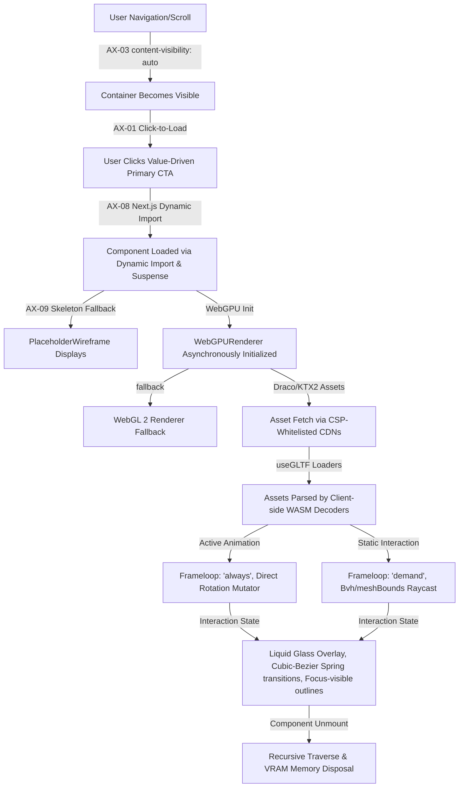
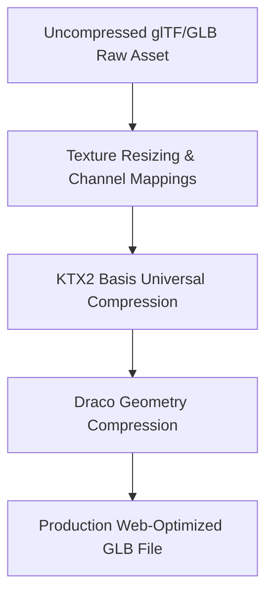

# VentHub World-Class Design and Engineering Master Blueprint

**Author:** Chief Standards Architect & Quality Auditor  
**Project:** VentHub HVAC Digital Twin & E-Commerce Platform  
**Target Status:** Production-Ready Standards (Unified WebGL/WebGPU & Creative UI/UX)  
**Security Classification:** Public Reference / VentHub Core Engineering Guidelines  

---

## Executive Summary & System Lifecycle

This Master Blueprint establishes the absolute design and engineering standards for the VentHub HVAC application. It integrates high-performance 3D WebGL/WebGPU rendering paradigms, Drei/R3F optimization architectures, and asset compilation pipelines with premium typography scales, Liquid Glass visual layers, physics-based micro-interactions, and keyboard-safe WCAG 2.2 AA accessibility architectures.

The core engineering lifecycle of a VentHub interactive component is mapped below, demonstrating how 3D rendering performance rules and UI/UX styling parameters converge into a unified flow.



---

## PART I: 3D WebGL, React Three Fiber & WebGPU Performance Optimization Standards

### 1. WebGPU & Three Shading Language (TSL) Modernization

Three.js (r165+) introduces modern WebGPU support through `WebGPURenderer` and the **Three Shading Language (TSL)**. TSL shifts shader writing from raw GLSL strings to structured, type-safe JavaScript/TypeScript node graphs that compile down to WGSL (WebGPU) or GLSL (WebGL fallback).

#### A. WebGPU Async Renderer Initialization in R3F
Because `WebGPURenderer` initialization is asynchronous (requiring GPU device requests under the hood), R3F handles its instantiation using an asynchronous factory function passed to the `gl` prop.

```tsx
import * as THREE from 'three/webgpu';
import { Canvas, extend } from '@react-three/fiber';

// Extend fiber elements to register new WebGPU-supported types
extend(THREE);

export default function WebGPUScene() {
  return (
    <Canvas
      // Force WebGPURenderer with automatic WebGL 2 fallback
      gl={async (canvasElementProps) => {
        const renderer = new THREE.WebGPURenderer(canvasElementProps);
        
        // Critical: The renderer backend must be initialized asynchronously
        // before R3F starts drawing the scene context
        await renderer.init();
        
        return renderer;
      }}
    >
      <ambientLight intensity={0.5} />
      <directionalLight position={[5, 5, 5]} />
      <ModernMesh />
    </Canvas>
  );
}
```

#### B. Node-Based Materials vs. Standard WebGL Materials
Under the WebGPU pipeline, standard WebGL materials (`MeshStandardMaterial`, `MeshBasicMaterial`) are internally mapped to node-based equivalents. To leverage the full power of TSL, you should explicitly use Node Materials:
*   `MeshStandardNodeMaterial` (WebGL equivalent: `MeshStandardMaterial`)
*   `MeshBasicNodeMaterial` (WebGL equivalent: `MeshBasicMaterial`)
*   `MeshPhysicalNodeMaterial` (WebGL equivalent: `MeshPhysicalMaterial`)

Instead of writing classic fragment/vertex shaders, you declare shader logic by assigning **Node Programs** to parameters like `colorNode`, `positionNode`, `roughnessNode`, or `normalNode`.

#### C. TSL Fundamentals and Code Patterns
TSL uses a functional API where operations return mathematical node instructions rather than executing CPU calculations immediately.

##### Key Nodes:
*   `positionLocal`: Represents the local mesh vertex positions.
*   `uv()`: Accesses UV mapping coordinates.
*   `time`: Accesses the running time uniform.
*   `Fn`: Function closure wrapper used to define custom, reusable node blocks.

##### 1. Custom Vertex Shader: Local Position Vertex Wave Displacement
Instead of vertex displacement via raw GLSL, we define a wave modifier using TSL's `Fn` and assign it to the material's `positionNode`:

```tsx
import { Fn, positionLocal, time, vec3 } from 'three/tsl';

function WaveDisplacedMesh() {
  // Define TSL-based vertex shader function
  const waveDisplacementNode = Fn(() => {
    const localPos = positionLocal;
    
    // Calculate wave based on Local Y position and uniform time
    // equivalent to: sin(y * 4.0 + time) * 0.15
    const wave = localPos.y.mul(4.0).add(time).sin().mul(0.15);
    
    // Displace vertex coordinates along the local X axis
    return vec3(localPos.x.add(wave), localPos.y, localPos.z);
  });

  return (
    <mesh>
      <boxGeometry args={[1, 3, 1, 32, 32, 32]} />
      <meshStandardNodeMaterial 
        color="royalblue" 
        roughness={0.2}
        // Bind displacement output directly to position node
        positionNode={waveDisplacementNode()} 
      />
    </mesh>
  );
}
```

##### 2. Custom Fragment Shader: UV-Based Pulsing Color
This TSL function uses UV coordinates and time to compute procedural gradient transitions:

```tsx
import { Fn, uv, time, vec3, color } from 'three/tsl';

function PulsingUVColorMesh() {
  const proceduralFragmentNode = Fn(() => {
    // Access UV coordinate node
    const uvCoords = uv();
    
    // Compute pulsing uniform: sin(time * 2.0) * 0.5 + 0.5 (pulsing scale 0 to 1)
    const pulseFactor = time.mul(2.0).sin().mul(0.5).add(0.5);
    
    // Mix coordinates into a procedural RGB output
    // Red: UV.x, Green: UV.y, Blue: dynamic time pulse
    return vec3(uvCoords.x, uvCoords.y, pulseFactor);
  });

  return (
    <mesh position={[2, 0, 0]}>
      <sphereGeometry args={[1, 64, 64]} />
      <meshBasicNodeMaterial 
        // Bind fragment color shader directly to colorNode
        colorNode={proceduralFragmentNode()} 
      />
    </mesh>
  );
}
```

> [!NOTE]
> Since TSL compiles node graphs dynamically, standard JavaScript control flows (`if`, `for`) cannot be evaluated inside a TSL function at shader execution time. You must use TSL-specific flow structures such as `If`, `Loop`, or `select()`.

---

### 2. Draw Call Reduction: BatchedMesh vs. InstancedMesh in R3F

Draw calls are the leading CPU bottleneck in e-commerce 3D rendering. When rendering multiple objects, selecting between `InstancedMesh` and `BatchedMesh` is crucial.

#### A. Comparison Matrix

| Optimization Feature | `InstancedMesh` | `BatchedMesh` |
| :--- | :--- | :--- |
| **Geometry Requirement** | **Identical** geometry (same vertex counts, dimensions) | **Varying** geometries (mix shapes like box, cylinder, torus) |
| **Material Requirement** | Single material instance shared across all instances | Single material instance shared across all elements |
| **Best Used For** | Massive counts of identical meshes (e.g. grass blades, standard bolts) | Groups of distinct e-commerce models (e.g. various product sizes, parts) |
| **Frustum Culling** | Culled as a single collective bounding box (all-or-nothing) | **Individual per-instance** frustum culling natively supported |
| **Matrix Modifications** | Re-upload whole buffer (`instanceMatrix.needsUpdate = true`) | Fine-grained updates on a per-sub-mesh basis |

#### B. InstancedMesh Implementation Pattern (Identical Geometries)
Use this pattern when drawing a large collection of structurally identical objects:

```tsx
import { useRef, useMemo } from 'react';
import { useFrame } from '@react-three/fiber';
import * as THREE from 'three';

export function InstancedFans({ count = 250 }) {
  const meshRef = useRef<THREE.InstancedMesh>(null);
  
  // Reusable object transformer placeholder to avoid per-frame allocations
  const tempObject = useMemo(() => new THREE.Object3D(), []);

  useFrame((state) => {
    if (!meshRef.current) return;
    const time = state.clock.getElapsedTime();

    for (let i = 0; i < count; i++) {
      // Calculate positions procedurally
      const x = (i % 15) * 2 - 15;
      const z = Math.floor(i / 15) * 2 - 15;
      
      tempObject.position.set(x, Math.sin(time + i) * 0.5, z);
      
      // Perform local rotation calculations (e.g. fan blade rotation)
      tempObject.rotation.y = time * 2;
      tempObject.updateMatrix();
      
      // Apply transform matrix to the specific instance
      meshRef.current.setMatrixAt(i, tempObject.matrix);
    }
    
    // Mark instance matrix attributes for update on the GPU
    meshRef.current.instanceMatrix.needsUpdate = true;
  });

  return (
    // Format: args=[geometry, material, count]
    <instancedMesh ref={meshRef} args={[null, null, count]} castShadow receiveShadow>
      <cylinderGeometry args={[0.5, 0.5, 0.2, 32]} />
      <meshStandardMaterial color="darkgray" metalness={0.8} roughness={0.2} />
    </instancedMesh>
  );
}
```

#### C. BatchedMesh Implementation Pattern (Varying Geometries)
Use this pattern when drawing multiple different geometries (e.g. varying HVAC fan rotor models, casing designs) using a single GPU draw call:

```tsx
import { useRef, useEffect, useMemo } from 'react';
import * as THREE from 'three';

export function BatchedHVACParts() {
  const batchedRef = useRef<THREE.BatchedMesh>(null);

  // Initialize unique geometries
  const geometries = useMemo(() => {
    return [
      new THREE.BoxGeometry(1, 1, 1),
      new THREE.CylinderGeometry(0.4, 0.4, 1.2, 16),
      new THREE.SphereGeometry(0.6, 16, 16)
    ];
  }, []);

  useEffect(() => {
    const batchedMesh = batchedRef.current;
    if (!batchedMesh) return;

    // 1. Add individual geometries to the BatchedMesh pool
    const geomIds = geometries.map((geom) => batchedMesh.addGeometry(geom));

    // 2. Instantiate elements referencing the pool geometries
    const instances: number[] = [];
    const tempMatrix = new THREE.Matrix4();
    
    // Create 9 dynamic instances
    for (let i = 0; i < 9; i++) {
      // Rotate geometry allocation ID
      const geometryId = geomIds[i % geometries.length];
      const instanceId = batchedMesh.addInstance(geometryId);
      instances.push(instanceId);

      // Set distinct positions
      const posX = (i % 3) * 2 - 2;
      const posY = Math.floor(i / 3) * 2 - 2;
      tempMatrix.makeTranslation(posX, posY, 0);
      
      batchedMesh.setMatrixAt(instanceId, tempMatrix);
    }

    // Clean up cache allocations on component unmount
    return () => {
      geometries.forEach(g => g.dispose());
    };
  }, [geometries]);

  return (
    // Arguments: [maxInstanceCount, maxVertexCount, maxIndexCount]
    // Crucial: Pre-allocate realistic sizes to prevent dynamic resizing overhead
    <batchedMesh ref={batchedRef} args={[16, 10000, 20000]} castShadow>
      <meshStandardMaterial color="silver" metalness={0.9} roughness={0.15} />
    </batchedMesh>
  );
}
```

#### D. Drei High-Level Helpers (`Instances` / `Merged`)
When working with R3F, `@react-three/drei` provides clean declarative wrappers to manage these configurations under the hood:

```tsx
import { Instances, Instance } from '@react-three/drei';

export function ModernInstancesList() {
  return (
    <Instances limit={100} castShadow>
      <boxGeometry />
      <meshStandardMaterial color="lightgreen" />
      
      {/* Declarative instances mapped inside the parent context */}
      <Instance position={[0, 0, 0]} rotation={[0.5, 0, 0]} />
      <Instance position={[2, 1, -2]} />
      <Instance position={[-2, -1, 3]} />
    </Instances>
  );
}
```

---

### 3. Asset Compression Pipelines: KTX2 Basis Universal & Draco

To ensure rapid initial load times (optimizing metrics like **LCP** and **FCP**), all e-commerce assets must pass through a strict geometry and texture compression pipeline.



#### A. CLI Pipelines with `gltf-Transform`
The Khronos group's `@gltf-transform/cli` is the standard tool for compressing, optimizing, and resizing assets.

##### Installation:
```bash
npm install --global @gltf-transform/cli
```
*Note: Make sure [KTX-Software](https://github.com/KhronosGroup/KTX-Software/releases) (which provides `toktx`) is installed on your machine and mapped to your system PATH.*

##### Sequential Compression Pipeline Commands:
```bash
# Step 1: Clamp texture resolutions to a maximum of 2048x2048 to prevent memory waste
gltf-transform resize input_raw.glb step1_resized.glb --width 2048 --height 2048

# Step 2: Compress metallic-roughness-occlusion (ORM) and normal maps using high-fidelity UASTC
gltf-transform uastc step1_resized.glb step2_textures.glb \
  --level 4 \
  --rdo \
  --zstd 18 \
  --slots "{normalTexture,occlusionTexture,metallicRoughnessTexture}"

# Step 3: Compress baseColor maps using etc1s (higher compression ratio, small GPU footprint)
gltf-transform etc1s step2_textures.glb step3_compressed.glb \
  --level 2 \
  --quality 128 \
  --slots "baseColorTexture"

# Step 4: Apply Draco geometry compression (compress mesh indices, vertices)
gltf-transform draco step3_compressed.glb production_asset.glb \
  --method edgebreaker \
  --quantizePosition 14 \
  --quantizeNormal 10
```

*Alternatively, you can run a single unified optimization sequence:*
```bash
gltf-transform optimize input_raw.glb production_asset.glb --texture-compress ktx2
```

#### B. Texture Encoding Options: UASTC vs. ETC1S
*   **UASTC**: Focuses on **extreme quality** and is highly recommended for normal maps, height maps, occlusion, metallic, and roughness maps. It prevents artifact errors on surface reflections but has a larger file size.
*   **ETC1S**: Focuses on **extreme compression**. Ideal for base color, diffuse, or emissive maps. It is about 3x smaller than UASTC but can introduce blocky compression artifacts on sharp gradients.

#### C. Integrating KTX2 & Draco Loaders in R3F
To parse optimized assets on the client-side, configure the loaders to fetch decoders from a static CDN (or your local public folder):

```tsx
import { useGLTF } from '@react-three/drei';

// Pre-configured paths for Web Assembly (Wasm) decoders
const DRACO_DECODER_PATH = 'https://www.gstatic.com/draco/versioned/decoders/1.5.7/';
const KTX2_DECODER_PATH = 'https://cdn.jsdelivr.net/gh/mrdoob/three.js@r165/examples/jsm/libs/basis/';

export function CompressedModelViewer({ modelUrl }: { modelUrl: string }) {
  // Pass configuration directly inside the R3F GLTF Loader Hook
  const { scene } = useGLTF(
    modelUrl,
    DRACO_DECODER_PATH,
    KTX2_DECODER_PATH
  );

  return <primitive object={scene} />;
}

// Preload assets for instant performance on transition
useGLTF.preload('/models/hvac_fan.glb', DRACO_DECODER_PATH, KTX2_DECODER_PATH);
```

---

### 4. GPU VRAM Memory Disposal & Component Lifecycles

Unlike general web assets, objects uploaded to the GPU (geometries, materials, textures, render targets) are **not automatically garbage collected** by the browser's JavaScript engine. Failing to clean them up when a React component unmounts leads to severe VRAM memory leaks.

```mermaid
graph TD
    A[React Component Unmount] --> B{Object Created via R3F JSX?}
    B -- Yes --> C[R3F Automatically calls .dispose()]
    B -- No / Primitive / Loaded Asset --> D{Shared / Cached Asset?}
    D -- Yes --> E[Keep in Cache or add dispose=null]
    D -- No --> F[Run Recursive Traverse & Dispose]
```

#### A. R3F Automatic Cleanup vs. The `<primitive>` Exception
1.  **Automatic Cleanup**: R3F automatically disposes of Three.js objects created **declaratively** (e.g. `<boxGeometry />` or `<meshStandardMaterial />`) when the component is unmounted.
2.  **The `<primitive>` Exception**: R3F **does not** automatically clean up assets loaded via `<primitive object={...} />`. The library assumes you (or an external caching loader) are managing its lifecycle. Leaving primitive objects unmounted without disposal leaves geometries and textures lingering in VRAM indefinitely.
3.  **Global Cache**: Hooks like `useGLTF` store models in a global cache. Simply unmounting the component does not clear the GPU references.

#### B. Recursive Disposal Helper Pattern
When unmounting a dynamically generated model or using raw `<primitive>` nodes, use the following traversal cleanup pattern inside a `useEffect` hook:

```tsx
import { useEffect, useRef } from 'react';
import * as THREE from 'three';

/**
 * Recursively disposes geometries, materials, and textures attached to a 3D object hierarchy
 */
export function disposeSceneObject(object: THREE.Object3D) {
  object.traverse((child) => {
    if ((child as THREE.Mesh).isMesh) {
      const mesh = child as THREE.Mesh;

      // 1. Dispose Geometry
      if (mesh.geometry) {
        mesh.geometry.dispose();
      }

      // 2. Dispose Material(s)
      if (mesh.material) {
        if (Array.isArray(mesh.material)) {
          mesh.material.forEach((mat) => cleanMaterialProperties(mat));
        } else {
          cleanMaterialProperties(mesh.material);
        }
      }
    }
  });
}

function cleanMaterialProperties(material: THREE.Material) {
  // Dispose the material itself
  material.dispose();

  // Dispose all associated textures to free up VRAM
  Object.keys(material).forEach((key) => {
    const prop = (material as any)[key];
    if (prop && typeof prop.dispose === 'function' && prop.isTexture) {
      prop.dispose();
    }
  });
}

// React Component Wrapper
export function ModelLifecycleManager({ modelScene }: { modelScene: THREE.Group }) {
  const modelRef = useRef<THREE.Group>(null);

  useEffect(() => {
    return () => {
      // Critical: Run manual recursive disposal upon component unmount
      if (modelScene) {
        disposeSceneObject(modelScene);
      }
    };
  }, [modelScene]);

  return <primitive ref={modelRef} object={modelScene} />;
}
```

#### C. Clearing Cached Assets and Dynamic Visibility Toggling
*   **Clearing Caches**: To completely purge a cached asset, use `useGLTF.clear(modelPath)`. Keep in mind this only clears the JavaScript cache reference; you must still traverse and call `.dispose()` on any existing instances to free VRAM.
*   **Visibility Toggling**: Mounting and unmounting 3D objects frequently is expensive because it triggers GPU memory allocations and uploads. If you need to hide/show objects frequently (e.g. toggling HVAC parts inside a viewer), toggle `visible={false}` instead of unmounting the component.

```tsx
// ✅ Recommended: Fast visibility toggling, no VRAM reallocation
<group visible={isRotorVisible}>
  <primitive object={rotorScene} />
</group>
```

---

### 5. VentHub HVAC Project DNA Standards & Performance Axioms

The following axioms are core design principles for the VentHub HVAC application. Violations will result in failure during automated quality audits (e.g. L8 Lighthouse, L10 Next.js 15 discipline checks).

#### AX-01: Click-to-Load Pattern (Initial Load Cost = Zero)
3D models (JetFanModel, HRVModel, SilentChannelFanModel, etc.) must not load automatically on initial page load. The model files (GLB) should only download after direct user interaction (e.g., clicking a "Load 3D Viewer" button) to protect the site's **LCP** score.
```tsx
// 3D model resources are not fetched until explicitly triggered
<ThreeDAuthority metadata={metadata} className="content-auto" />
```

#### AX-02: PCFSoftShadowMap — STRICTLY BLOCKED ❌
React Three Fiber `<Canvas>` elements must **never** use `PCFSoftShadowMap` for shadow rendering. The shadow map type must be configured as `'percentage'` to ensure high performance on mobile devices.
```tsx
// ✅ Correct
<Canvas shadows="percentage">

// ❌ Yasak / Blocked
<Canvas shadows={{ type: THREE.PCFSoftShadowMap }}>
```

#### AX-03: `content-visibility: auto` (`.content-auto`) Wrapping
Below-the-fold 3D canvas containers must be wrapped in a CSS container using `content-visibility: auto` (or the Tailwind `.content-auto` class) to bypass rendering overhead when the component is off-screen.
```tsx
<div className="content-auto">
  <Canvas shadows="percentage" frameloop="demand">
    <SceneContent />
  </Canvas>
</div>
```

#### AX-04: CSP Whitelists for 3D Assets
To prevent CORS and Content Security Policy (CSP) blocking on external assets, the following CDN domains must remain whitelisted in `next.config.mjs` under the `connect-src` header:
*   `raw.githubusercontent.com`
*   `raw.githack.com`

#### AX-05: React 19 Compiler Compatibility
React 19 automatically optimizes basic JSX components, making manual `useMemo` and `useCallback` calls on UI nodes unnecessary. 
*   **Exception**: Data VMs and context providers are exempt from this restriction. 
*   **Three.js Objects**: Core Three.js classes (`BufferGeometry`, `Material`, matrices) are not tracked by the React Compiler and **must** still be memoized manually to avoid recreating them on every render.

#### AX-06: `drei/Image` for Vitrine Textures
Multi-item showcases (`InfiniteProductsShowcase`, `OrbitalProductsShowcase`) must use the **`drei/Image`** helper rather than basic texture mapping loaders. This optimization reduces draw calls and mimics Next.js's native lazy-loading images inside the WebGL canvas.

#### AX-07: React Three Fiber Ecosystem Lock
Direct DOM manipulation of Three.js instances outside the React lifecycle is prohibited. All WebGL/WebGPU implementations must build on top of **React Three Fiber** and `@react-three/drei` primitives.

#### AX-08: Next.js 15 Dynamic Imports and Suspense
Do not use `React.lazy` to load heavy 3D components. Instead, use Next.js's dynamic imports with an explicit loading skeleton fallback:
```tsx
import dynamic from 'next/dynamic';
import { Suspense } from 'react';
import { Product3DViewerSkeleton } from '@/components/skeletons';

const Product3DViewer = dynamic(
  () => import('@/components/products/3d/Product3DViewer'),
  { ssr: false }
);

export function ProductPage() {
  return (
    <Suspense fallback={<Product3DViewerSkeleton />}>
      <Product3DViewer />
    </Suspense>
  );
}
```

#### AX-09: Placeholder Wireframes
To prevent visual layout shifts while large models load, sahneler must use temporary 3D elements:
*   `PlaceholderWireframe`: Displays a spinning wireframe representation of the asset.
*   `SuspendedCardMaterial`: A lightweight fallback material applied to cards while high-resolution textures load.

#### AX-10: Reuse Temporary Objects (Object Pooling)
To prevent garbage collection spikes in R3F frames, modular helpers (like `three-utils.ts`) must reuse local vector and matrix instances rather than allocating new ones.
```tsx
// Module scope: objects created once and pooled
const _tempVec3 = new THREE.Vector3();
const _tempBox3 = new THREE.Box3();

export function getMeshBounds(mesh: THREE.Mesh) {
  return _tempBox3.setFromObject(mesh);
}
```

#### AX-11: Raycast Optimization with `Bvh` & `meshBounds`
To prevent interactive raycasting from lagging the browser's main thread:
*   Use Drei's `<Bvh>` to wrap complex meshes, accelerating ray intersections.
*   Use `meshBounds` for simple geometries, enabling fast bounding-sphere hits.
```tsx
import { Bvh } from '@react-three/drei';

<Bvh>
  <mesh onClick={handleSelection}>
    <bufferGeometry />
    <meshStandardMaterial />
  </mesh>
</Bvh>
```

#### AX-12: WebGPU & Node Material Awareness
When authoring custom shaders, design them using **Node Materials** (`MeshStandardNodeMaterial`, etc.) and TSL. Avoid writing raw GLSL string shaders to facilitate smooth transitions as WebGPU becomes standard.

---
---

## PART II: UI/UX Creative Design & Accessibility Standards

### 6. Premium Typography Pairings & Fluid Type Scales

Professional typography honors hierarchy, readability, and responsiveness. Below are premium pairings and the modern CSS fluid typography model.

#### Premium Typography Pairings

| Font Family | Genre | Characteristics | Best Use Case | Recommended Pairings |
| :--- | :--- | :--- | :--- | :--- |
| **Satoshi** | Geometric Sans-Serif | Clean, high x-height, modernist elegance, sharp terminal cuts. | Heading sizes & UI typography. | **IBM Plex Mono** (technical/numbers), **Lora** (editorial body). |
| **General Sans** | Neo-Grotesque | Neutral, high readability, balanced metrics, minimal contrast. | Interface controls & dense body text. | **JetBrains Mono** (tabular data), **Source Serif 4** (long-form text). |
| **Outfit** | Geometric | Open counters, friendly curves, digital-first spacing. | Marketing display, product hero screens. | **Inter** (functional labels), **Fira Code** (monospaced details). |

#### The Bringhurst Typography Rules
*   **Point Size**: 16px (1rem) absolute minimum for body text; 14px floor for captions and labels.
*   **Line Length (Measure)**: Keep body content columns between 45–75 characters per line (66 characters is ideal). Use the CSS `max-w-prose` (~65ch) class.
*   **Line Spacing (Leading)**: 1.5–1.7 for body text; 1.1–1.3 for larger headings.
*   **Dark Mode Adjustment**: On dark backgrounds, reduce font weight slightly (e.g., use `font-weight: 350` instead of `400`) and apply antialiasing (`-webkit-font-smoothing: antialiased`) to prevent visual bleeding.

#### Fluid Typography System (CSS `clamp()`)
Fluid typography scales smoothly between breakpoints, avoiding abrupt media query shifts.

##### The Linear Scale Formula
To scale typography between a minimum size ($y_1$) at a minimum viewport width ($x_1$) and a maximum size ($y_2$) at a maximum viewport width ($x_2$):

$$\text{Slope} = \frac{y_2 - y_1}{x_2 - x_1}$$

$$\text{Y-Intercept} = y_1 - (\text{Slope} \times x_1)$$

$$\text{CSS Clamp} = \text{clamp}(y_1, \text{Y-Intercept} + (\text{Slope} \times 100\text{vw}), y_2)$$

##### Concrete CSS Fluid Tokens
Below are standardized, responsive typographic tokens.

```css
:root {
  /* Fluid Body: 16px (1rem) at 375px viewport to 18px (1.125rem) at 1440px viewport */
  --font-size-body: clamp(1rem, 0.956rem + 0.188vw, 1.125rem);
  
  /* Fluid H3: 20px (1.25rem) at 375px to 28px (1.75rem) at 1440px */
  --font-size-h3: clamp(1.25rem, 1.074rem + 0.751vw, 1.75rem);

  /* Fluid H2: 24px (1.5rem) at 375px to 36px (2.25rem) at 1440px */
  --font-size-h2: clamp(1.5rem, 1.236rem + 1.127vw, 2.25rem);

  /* Fluid H1: 32px (2rem) at 375px to 56px (3.5rem) at 1440px */
  --font-size-h1: clamp(2rem, 1.472rem + 2.254vw, 3.5rem);
}

/* Application Rules */
h1 {
  font-size: var(--font-size-h1);
  line-height: clamp(1.1, 1.3 - 0.1vw, 1.3);
  text-wrap: balance; /* Prevents orphan headings */
  letter-spacing: -0.02em;
}

p {
  font-size: var(--font-size-body);
  line-height: 1.6;
  text-wrap: pretty; /* Prevents orphan words */
}
```

---

### 7. Advanced Visual Styling: Liquid Glass

Liquid Glass represents a premium styling language combining multi-layered glassmorphic properties, physics-oriented animated backdrops, specular reflections, and SVG refraction.

#### 💎 Strict Token System (Tailwind Arbitrary Class Prohibition)
To align with VentHub interface guidelines:
1.  **Never use arbitrary/hardcoded Tailwind utility classes** like `w-[92vw]`, `bg-[#ff0000]`, or `backdrop-blur-[12px]`.
2.  All values must consume **HSL CSS Custom Properties** (e.g. `bg-background/80`, `border-border/30`) defined globally in the application theme.

#### Core Liquid Glass Component Spec
A premium Liquid Glass element relies on a nested stack of three primary layers:

```
┌─────────────────────────────────────────────────────────┐
│ SPECULAR REFLECTION (Border Highlight & Grain Layer)    │
├─────────────────────────────────────────────────────────┤
│ FROSTED SHIELD (backdrop-filter: blur() + HSL Overlay)   │
├─────────────────────────────────────────────────────────┤
│ LIQUID FLOW (Moving HSL Blobs & SVG Displace Filter)    │
└─────────────────────────────────────────────────────────┘
```

##### Layer 1: The Liquid Flow (Backdrop Blobs)
Create organic color blobs that float and distort dynamically using GPU-friendly transitions.

```html
<!-- Background container with dynamic flowing blobs -->
<div class="relative overflow-hidden w-full h-96 bg-background-dark">
  <!-- Dynamic Blobs -->
  <div class="absolute -top-12 -left-12 w-64 h-64 rounded-full bg-primary/30 blur-3xl animate-liquid-flow"></div>
  <div class="absolute -bottom-16 -right-16 w-80 h-80 rounded-full bg-secondary/20 blur-3xl animate-liquid-flow-reverse"></div>
  
  <!-- Glass Card Layer -->
  <div class="glass-card">
    <h3>Liquid Glass Console</h3>
    <p>Readings are processed through refracted lighting layers.</p>
  </div>
</div>
```

```css
/* Custom animation utility classes */
@keyframes liquidFlow {
  0% { transform: translate(0, 0) scale(1); }
  50% { transform: translate(15%, 10%) scale(1.15); }
  100% { transform: translate(0, 0) scale(1); }
}

@keyframes liquidFlowReverse {
  0% { transform: translate(0, 0) scale(1); }
  50% { transform: translate(-15%, -10%) scale(0.9); }
  100% { transform: translate(0, 0) scale(1); }
}

.animate-liquid-flow {
  animation: liquidFlow 12s infinite ease-in-out;
}

.animate-liquid-flow-reverse {
  animation: liquidFlowReverse 16s infinite ease-in-out;
}
```

##### Layer 2 & 3: The Frosted Shield & Specular Reflections
Using a dual-glow design border to simulate directional light reflection.

```css
/* Liquid Glass Card Styling */
.glass-card {
  position: relative;
  z-index: 10;
  border-radius: var(--radius-lg);
  
  /* Strict HSL Token-Based Frosted Fill */
  background: hsla(var(--background-card-hsl), 0.15);
  
  /* Specular Highlight Borders: Creates an illusion of thickness and refraction */
  border: 1px solid hsla(var(--border-hsl), 0.2);
  box-shadow: 
    inset 0 1px 1px hsla(var(--foreground-hsl), 0.15), /* Top specular light */
    0 8px 32px -4px hsla(var(--shadow-hsl), 0.3);       /* Deep soft drop shadow */
  
  /* Backdrop Blur */
  backdrop-filter: blur(24px);
  -webkit-backdrop-filter: blur(24px);
  
  /* Performance Optimization (Isolates paint area from layout calculations) */
  contain: paint; 
}
```

##### Advanced Specular Warp (SVG Displacement Map)
For a realistic fluid effect where the background visibly warps when sitting behind the glass:

```html
<!-- SVG Filter Definition (Hidden) -->
<svg class="sr-only" aria-hidden="true">
  <filter id="liquid-glass-warp">
    <feTurbulence type="fractalNoise" baseFrequency="0.015" numOctaves="3" result="noise" />
    <feDisplacementMap in="SourceGraphic" in2="noise" scale="25" xChannelSelector="R" yChannelSelector="G" />
  </filter>
</svg>
```

Applying the filter to backdrop structures:
```css
.liquid-warped-backdrop {
  filter: url(#liquid-glass-warp);
}
```

---

### 8. Fluid Micro-Interactions & Gestures

High-quality interfaces feel alive because their movements replicate physical properties (momentum, tension, dampening).

#### Custom Cubic-Bezier Curves & Durations
Avoid standard transitions like `ease` or `linear`. Implement custom bezier tokens:

| Curve Token | Value | Ideal Use Case | Visual Characteristics |
| :--- | :--- | :--- | :--- |
| `--ease-entrance` | `cubic-bezier(0.16, 1, 0.3, 1)` | Modals, panels, dropdown reveals. | Extremely fast start, long deceleration. |
| `--ease-exit` | `cubic-bezier(0.55, 0, 1, 0.45)` | Dismissing dialogs, slide outs. | Rapid acceleration off screen. |
| `--ease-spring` | `cubic-bezier(0.34, 1.56, 0.64, 1)` | Dynamic buttons, switches, toast updates. | Bounces and overshoots target (soft bounce). |
| `--ease-standard` | `cubic-bezier(0.65, 0, 0.35, 1)` | Color/opacity state morphing. | Symmetric acceleration/deceleration. |

#### Interaction Time Windows (Rule of 100-300ms)
*   **100ms–150ms**: Micro-actions (button hover, checkboxes, active state press).
*   **200ms–300ms**: Navigation panels, menus, tooltips.
*   **350ms–500ms**: Fullscreen transitions, bottom drawer slide-ups.

#### Gesture-Based UI Design Guidelines
1.  **Hardware Acceleration**: Only animate properties managed by the compositor (`transform` and `opacity`). Never animate layout shifting properties (`width`, `height`, `margin`, `top/left/right/bottom`).
2.  **Dynamic Drag Tracking**: Gesture tracking must feel instantaneous (zero delay). Bind to local CSS custom properties via JS on-pointer event updates.
3.  **Reduced Motion Adaptation**: Always wrap animations in `prefers-reduced-motion` media queries.

```css
/* Standard spring button hover */
.interactive-btn {
  transition: transform 250ms cubic-bezier(0.34, 1.56, 0.64, 1);
}
.interactive-btn:hover {
  transform: translateY(-2px) scale(1.02);
}

/* Respect user vestibular disorders */
@media (prefers-reduced-motion: reduce) {
  .interactive-btn {
    transition: none !important;
    transform: none !important;
  }
}
```

---

### 9. WCAG 2.2 AA Accessibility Compliance

Dynamic interfaces must be fully navigable and readable for assistive technologies and keyboard-only users.

#### Focus Rings & Visible States
*   **No `outline: none` without replacements**: Never disable focus indicators without adding a high-contrast focus ring.
*   **Focus Appearance Standards**:
    *   **Contrast**: The focus ring must have a minimum contrast ratio of **3:1** against the background and adjacent component boundary.
    *   **Sizing**: The focus indicator outline path should be at least **2px thick** to remain visually prominent.
    *   **Keyboard Only**: Use `:focus-visible` instead of `:focus` so click actions do not display the ring.

```css
/* Focus Ring System Class conforming to VentHub HSL standards */
.focus-ring {
  outline: 2px solid transparent;
  outline-offset: 2px;
  transition: outline-color 150ms var(--ease-standard);
}

.focus-ring:focus-visible {
  outline-color: hsla(var(--primary-hsl), 0.85);
  box-shadow: 0 0 0 4px hsla(var(--primary-hsl), 0.25);
}
```

#### Touch Targets (WCAG 2.5.8 Target Size)
*   **Minimum Dimensions**: All touch and click targets must be at least **24x24 CSS pixels** in area.
*   **Exceptions/Spacing**: If a target is smaller than 24x24px, its bounding box must have a circular margin such that a 24px diameter circle centered on the target does not overlap with any other interactive elements.
*   **Buttons vs Links**: Always use `<button>` for action buttons (which trigger script runs or state changes) and `<a>` (or `Link` frameworks) for page-level navigation. **Never attach `onClick` handlers to `div` elements.**

#### Keyboard Trap Management
A keyboard trap is an accessibility failure where a keyboard-only user tabs into a complex component (like a modal, menu, or date-picker) but cannot exit.

##### Focus Trapping Rules (e.g. Modals/Drawers)
1.  **Focus Trap**: When a modal is active, focus navigation (using `Tab` and `Shift + Tab`) must be confined strictly inside the modal contents.
2.  **Trap Exit**: The modal must allow immediate exit when the user presses the `Escape` key.
3.  **Focus Restoration**: When the modal is closed, keyboard focus must instantly return to the original element that opened the modal.

```javascript
// Example JS implementation for Escape key closing & focus restoration
function setupKeyboardTrap(modalElement, triggerElement) {
  const focusableElements = modalElement.querySelectorAll('button, [href], input, select, textarea, [tabindex="0"]');
  const firstFocusable = focusableElements[0];
  const lastFocusable = focusableElements[focusableElements.length - 1];

  // Instantly focus the modal trigger element's focus receiver
  firstFocusable.focus();

  modalElement.addEventListener('keydown', (e) => {
    if (e.key === 'Tab') {
      if (e.shiftKey) { // Shift + Tab
        if (document.activeElement === firstFocusable) {
          lastFocusable.focus();
          e.preventDefault();
        }
      } else { // Tab
        if (document.activeElement === lastFocusable) {
          firstFocusable.focus();
          e.preventDefault();
        }
      }
    }

    if (e.key === 'Escape') {
      // Close Modal logic...
      triggerElement.focus(); // Restore focus to trigger
    }
  });
}
```

#### Screen Reader Wrappers & Announcement States
Ensure screen readers are immediately updated regarding asynchronous client events.

##### Asynchronous Dynamic Content (`aria-live`)
When loading states resolve, error elements appear, or system toasts fire, screen readers must announce these changes without interrupting the user's manual navigation:
*   Use `aria-live="polite"` for non-critical status updates, validations, or notification alerts.
*   Use `aria-live="assertive"` **only** for high-risk error alerts or security warnings (which will immediately interrupt the screen reader's current flow).

```html
<!-- Toast container initialized with polite announcement settings -->
<div 
  id="toast-notification" 
  class="fixed bottom-4 right-4 z-50 pointer-events-none" 
  role="status" 
  aria-live="polite" 
  aria-atomic="true"
>
  <!-- Toast dynamic inserts appear here -->
</div>
```

##### Screen Reader Only Utility Class (`sr-only`)
Use a standard CSS `.sr-only` class to hide content visually while keeping it readable by screen readers (for example, giving description labels to icon-only control buttons).

```css
/* Screen Reader Only Utility */
.sr-only {
  position: absolute;
  width: 1px;
  height: 1px;
  padding: 0;
  margin: -1px;
  overflow: hidden;
  clip: rect(0, 0, 0, 0);
  white-space: nowrap;
  border-width: 0;
}
```

##### Icon Button Labeling Example:
```html
<button class="icon-button focus-ring">
  <svg aria-hidden="true" class="w-6 h-6">...</svg>
  <span class="sr-only">Close Modal Panel</span>
</button>
```
