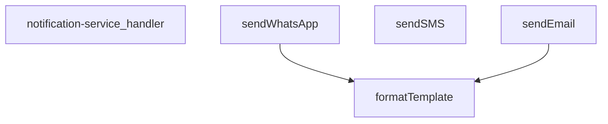
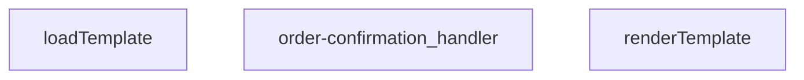
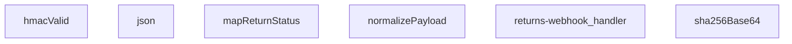
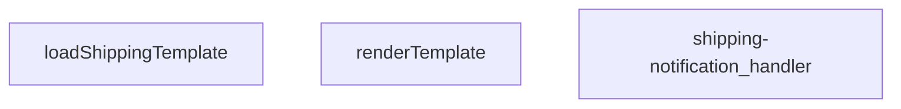
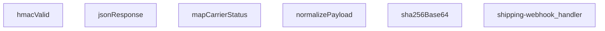
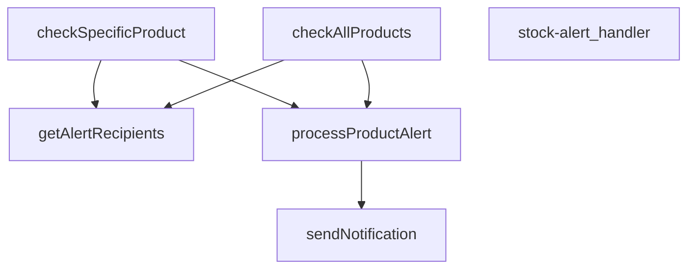
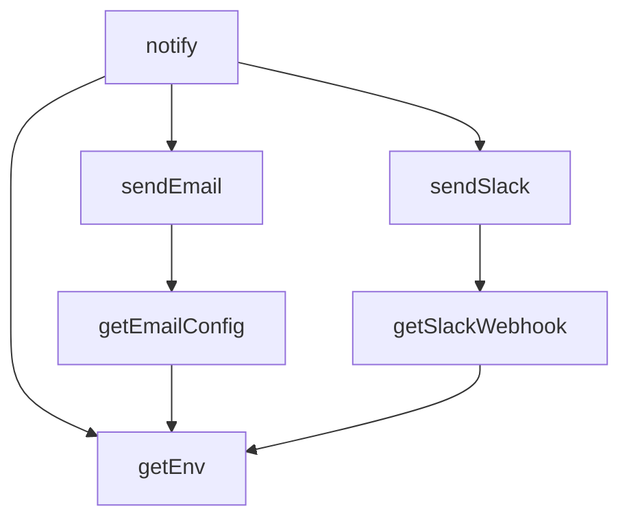
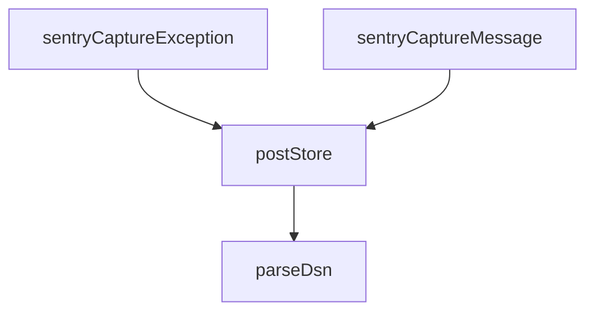

# SUPABASE FUNCTIONS MASTER

---
project_name: venthub-hvac
compiled_at: 2026-05-29T19:23:49.787286+00:00
total_compiled_files: 29
source: supabase/functions
---


---
# FILE: supabase\functions\admin-create-coupon\index.md

---
domain: general
source_type: doc
namespace_type: module
source_path: C:\Users\alize\venthub-hvac\supabase\functions\admin-create-coupon\index.ts
skeleton_hash: d670578debdc12bc
entity_hashes:
  func:admin-create-coupon_handler: 72913923d4da4715
  overview: 5cba6bb90779bd31
generated_at: 2026-05-29T11:39:37Z
---

## Genel Bakış
Bu modül, bir Supabase Edge Function olarak çalışan HTTP endpoint'idir. Yönetici paneli üzerinden yeni indirim kuponları oluşturulmasını sağlar. Gelen istekleri işleyerek kupon verilerini doğrular, veritabanına kaydeder ve uygun HTTP yanıtları döndürür.

## Fonksiyon Grupları
### Kupon Oluşturma İşlemleri
Tüm HTTP isteklerini yöneterek kupon oluşturma sürecini tek bir işleyici içinde yürütür. İstek doğrulama, yetki kontrolü, veri kaydı ve yanıt üretimini içerir.
- admin_create_coupon_handler

---

## AXIOMS – Mimari Varsayımlar

Bu modül, Supabase Edge Function平台上 çalışan bir HTTP endpoint'idir. Yalnızca yapısal unsurlardan (fonksiyon imzası ve sabitler) türetilen aksiyomlar aşağıdadır.

---

**[Aksiyom 1]:** Eğer `corsHeaders` sabiti tanımlı değilse veya boşsa, cross-origin istekler yanıt başlıklarında CORS kurallarına uygun şekilde işlenemez ve istemciler tarayıcı güvenlik politikası nedeniyle yanıta erişemez.

**[Aksiyom 2]:** Eğer `req` parametresi `Request` tipinde değilse (örn: `null`, `undefined` veya farklı bir tip), fonksiyon HTTP method, header veya body bilgisine erişemeden çalışma zamanı hatası verir.

**[Aksiyom 3]:** Eğer istek gövdesi (request body) geçerli bir JSON içermiyorsa veya `Content-Type` header'ı `application/json` olarak ayarlanmamışsa, kupon oluşturma verileri parse edilemez ve işlenemez.

**[Aksiyom 4]:** Eğer Supabase Edge Function runtime ortamı (Deno) müsait değilse veya fonksiyon deploy edilmemişse, HTTP istekleri bu endpoint'e yönlendirilemez ve bağlantı hatası oluşur.

---

## FONKSİYON DETAYLARI

### admin-create-coupon_handler

**Ne yapar**: Bu fonksiyon, administrative panel üzerinden yeni bir kupon oluşturma işlemini yöneten HTTP isteklerini işler. Supabase Edge Function yapısında yer alan bu handler, admin kullanıcılarının kupon sistemine yeni kayıtlar eklemesini sağlar.

**Nasıl yapar**: Fonksiyon, gelen HTTP Request nesnesini kabul eder ve ilgili isteği işleyerek bir Response döndürür. Supabase Edge Functions mimarisinde çalışır ve TypeScript tabanlıdır. İşlevin detaylı iç mantığı dokümanda belirtilmemiştir.

**Parametreler**:
- `req`: Request — İşlenecek HTTP istek nesnesi. İstek gövdesinde kupon verileri ve authentication bilgileri bulunmaktadır.

**Dönüş**: Response — İşlem sonucunu içeren HTTP yanıt nesnesi. Başarılı oluşturma durumunda onay, hata durumunda ise uygun hata mesajını döndürür.

**Not**: Fonksiyon docstring'i boş bırakılmış olup, detaylı iç mantık ve implementasyon bilgileri kaynak kodda mevcuttur. Belgeleme için kaynak kod incelenerek parametre şeması, validasyon kuralları ve hata yönetimi detayları eklenmelidir.

---

## SABİTLER
- **corsHeaders** (object) — `{

  'Access-Control-Allow-Headers': 'authorization, x-client-info, apikey, c...`

---

## AST POINTERS

### [N1_NASIL] AST Pointer: supabase/functions/admin-create-coupon/index.ts::admin-create-coupon_handler
- **params**: `(req: Request)` — gelen HTTP isteği
- **ic_degiskenler**:
  - `corsHeaders` — `getCorsHeaders(req)` ile elde edilen CORS başlık nesnesi, tüm yanıtlara eklenir
  - `cors` — `corsHeaders`'ın alias'ı olarak atanmış, fonksiyon gövdesinde tekrar kullanılmaz
  - `SUPABASE_URL` — `Deno.env.get('SUPABASE_URL')` ile okunan Supabase proje URL'i, istemci oluşturmada kullanılır
  - `SUPABASE_ANON_KEY` — `Deno.env.get('SUPABASE_ANON_KEY')` ile okunan anonim anahtar, kullanıcı bazlı Supabase istemcisi oluşturulurken kullanılır
  - `SUPABASE_SERVICE_ROLE_KEY` — `Deno.env.get('SUPABASE_SERVICE_ROLE_KEY')` ile okunan servis rolü anahtarı, admin Supabase istemcisi oluşturulurken kullanılır
  - `authHeader` — `req.headers.get('Authorization')` ile alınan Yetkilendirme başlığı, kullanıcı kimlik doğrulaması için kullanılır
  - `supabaseUser` — `createClient(SUPABASE_URL, SUPABASE_ANON_KEY, { global: { headers: { Authorization: authHeader } } })` ile oluşturulan kullanıcı Supabase istemcisi, `auth.getUser()` çağrısıyla kullanılır
  - `supabaseAdmin` — `createClient(SUPABASE_URL, SUPABASE_SERVICE_ROLE_KEY)` ile oluşturulan servis rolü Supabase istemcisi, profil sorgulama ve kupon ekleme işlemlerinde kullanılır
  - `userRes` — `supabaseUser.auth.getUser()` çağrısının `data` sonucu, kullanıcı bilgilerini içerir
  - `userErr` — `supabaseUser.auth.getUser()` çağrısının `error` sonucu, kimlik doğrulama hatası varsa doludur
  - `userId` — `userRes.user.id` değerinden alınan kimlik doğrulanmış kullanıcının UUID'si, profil sorgusu ve `created_by` alanına yazılır
  - `profile` — `supabaseAdmin.from('user_profiles').select('role').eq('id', userId).maybeSingle()` sorgusunun sonucu, kullanıcının rol bilgisini içerir
  - `profErr` — profil sorgusunun `error` sonucu, veritabanı hatası varsa doludur
  - `userRole` — `profile?.role` değerinden alınan kullanıcı rolü, `'user'` varsayılanı ile `'admin'`/`'superadmin'` kontrolü yapılır
  - `body` — `await req.json().catch(() => ({}))` ile parse edilen istek gövdesi, `CouponBody` arayüzü ile tiplendirilmiş (code, type, value, starts_at, ends_at, active, usage_limit alanları)
  - `code` — `String(body.code || '').trim()` ile temizlenmiş kupon kodu, 3-50 karakter arası olmalı
  - `type` — `String(body.type || '')` ile alınan indirim türü, `'percent'` veya `'fixed'` olmalı
  - `value` — `Number(body.value)` ile sayıya dönüştürülen indirim değeri, sıfırdan büyük olmalı
  - `starts_at` — `body.starts_at` varsa `String(body.starts_at)`, yoksa `null`; kupon geçerlilik başlangıç tarihi
  - `ends_at` — `body.ends_at` varsa `String(body.ends_at)`, yoksa `null`; kupon geçerlilik bitiş tarihi
  - `is_active` — `Boolean(body.active ?? true)` ile belirlenen aktiflik durumu, varsayılan `true`
  - `usage_limit` — `body.usage_limit`'ten parse edilen kullanım limiti, `null` olabilir (sınırsız), geçersiz değerlerde `null` atanır
  - `ul` — `Number(body.usage_limit)` ile parse edilen geçici kullanım limiti sayısı, `!Number.isFinite(ul) || ul < 1` kontrolü ile `null` veya geçerli sayıya dönüştürülür
  - `errs` — validasyon hatalarını toplayan `string[]` dizisi, geçersiz alan isimleri eklenir (`'code'`, `'type'`, `'value'`)
  - `payload` — `supabaseAdmin.from('coupons').insert(payload)` ile veritabanına yazılacak kupon nesnesi; alanları: `code`, `discount_type` (`'percentage'`/`'fixed_amount'`), `discount_value`, `valid_from` (ISO tarih), `valid_until` (ISO tarih), `is_active`, `usage_limit`, `used_count` (0), `created_by` (userId)
  - `data` — `supabaseAdmin.from('coupons').insert(payload).select('id, code, discount_type, discount_value, valid_from, valid_until, is_active, usage_limit, used_count, created_at').single()` çağrısının `data` sonucu, eklenen kuponun tam bilgilerini içerir
  - `insErr` — insert işleminin `error` sonucu, veritabanı ekleme hatası varsa doludur
  - `_e` — `catch` bloğu yakalama değişkeni, `unknown` tipinde, hata nesnesi veya string olabilir
  - `msg` — `_e instanceof Error ? _e.message : String(_e)` ile elde edilen hata mesajı, internal hata yanıtında `details` alanına yazılır
- **Dönüş**: `Response` — OPTIONS istekleri için 204, method hatası için 405, kimlik doğrulama hataları için 401, yetki hatası için 403, validasyon hataları için 400, başarılı kupon oluşturma için 200 (JSON ile kupon verisi), genel catch bloğu için 500

---

## NODE ID STANDARD

  file: supabase\functions\admin-create-coupon\index.ts
  function: supabase\functions\admin-create-coupon\index.ts::admin-create-coupon_handler

---

## DISA AKTARILANLAR (EXPORTS)
  export: admin-create-coupon_handler

---
# FILE: supabase\functions\admin-iyzico-reconcile\index.md

---
domain: general
source_type: doc
namespace_type: module
source_path: C:\Users\alize\venthub-hvac\supabase\functions\admin-iyzico-reconcile\index.ts
skeleton_hash: 2cafc6e476e015f8
entity_hashes:
  func:admin-iyzico-reconcile_handler: e8970eccf3f1fb90
  overview: b0badc73158954b7
generated_at: 2026-05-29T11:40:05Z
---

## Genel Bakış
Bu modül, Supabase Edge Functions平台上 üzerinde barındırılan bir admin API uç noktasıdır. Iyzico ödeme sistemi ile sistemdeki yerel kayıt arasındaki veri tutarlılığını (mutabakatı) denetlemek için kullanılır. Yetkilendirilmiş yöneticiler tarafından erişilen bu fonksiyon, ödeme uzlaşma işlemlerini koordine eder.

## Fonksiyon Grupları
### Ödeme Mutabakat İşleme
Iyzico ile yerel sistem arasındaki ödeme verilerini eşleştiren ve tutarsızlıkları tespit eden merkezi işleyici.
- admin-iyzico-reconcile_handler

---

## AXIOMS – Mimari Varsayımlar

Bu modül, Supabase Edge Function olarak çalışan bir HTTP handler'idır. Mimari varsayımlar fonksiyon imzası ve modül bağlamından türetilmiştir.

**[Aksiyom 1]:** Eğer `req` parametresi geçerli bir HTTP Request nesnesi değilse (null, undefined veya yanlış tipte ise), handler fonksiyonu beklenmedik hata fırlatır veya geçersiz yanıt döner.

**[Aksiyom 2]:** Eğer handler fonksiyonu bir HTTP Response nesnesi döndürmezse (return yoksa veya undefined dönerse), istemci tarafında bağlantısı kesilmemiş/belirsiz bir yanıt durumu oluşur ve client timeout'a uğrar.

**[Aksiyom 3]:** Eğer modül çalışması için gerekli olan Iyzico API kimlik bilgileri (API key, secret key vb.) ortam değişkenlerinde tanımlı değilse, mutabakat (reconcile) işlemi başarısız olur ve hata yanıtı döner.

**[Aksiyom 4]:** Eğer istek sahibi geçerli bir admin oturumuna (yetkilendirme token'ı) sahip değilse, fonksiyon isteği reddeder ve 401/403 hatası ile yanıt verir.

**[Aksiyom 5]:** Eğer istek gövdesi (request body) Iyzico ile yerel veritabanı arasındaki veri eşleştirmesi için gerekli parametreleri içermiyorsa (tarih aralığı, transaction ID vb.), mutabakat işlemi tamamlanamaz.

**[Aksiyom 6]:** Eğer Iyzico API'sine erişim kesintiye uğrarsa veya zaman aşımlı yanıt verirse, mutabakat işlemi kısmi veya tamamen başarısız olur.

**[Aksiyom 7]:** Eğer Supabase veritabanı bağlantısı kesikse veya tablolar (ödeme kayıtları) erişilebilir durumda değilse, yerel tarafın doğrulanması yapılamaz ve tutarsızlık raporlanamaz.

**[Aksiyom 8]:** Fonksiyon imzasında `req` dışında parametre tanımlanmamıştır; bu nedenle işlevsellik tamamen `req` nesnesinin içeriğine (header, body, query params) bağımlıdır.

---

> **Not:** Fonksiyon gövdesi (kod) paylaşılmadığı için, iç iş mantığına (örn: hangi API endpoint'lerinin çağrıldığı, hangi tabloların sorgulandığı, detaylı hata yönetimi) ilişkin aksiyomlar **bilinmiyor** olarak işaretlenmiştir.

---

## FONKSİYON DETAYLARI

### admin-iyzico-reconcile_handler

**Ne yapar**: Bu fonksiyon, iyzico ödeme platformu ile yapılan işlemlerin mutabakatını (reconciliation) gerçekleştirmek üzere tasarlanmış bir Supabase Edge Function handler'ıdır. Admin düzeyinde ödeme uzlaşma işlemlerini yönetir ve HTTP isteklerini işleyerek uygun yanıtları döndürür.

**Nasıl yapar**: Fonksiyon, gelen HTTP isteğini (`req`) alarak iyzico ödeme sistemi ile ilgili mutabakat işlemlerini yürütür. Bu tür fonksiyonlar genellikle iyzico API'sinden ödeme verilerini çeker, mevcut sistemdeki kayıtlarla karşılaştırır ve tutarsızlık durumlarında düzeltme veya raporlama yapar. Supabase Edge Function yapısı gereği, istek metodunu (GET, POST vb.) kontrol ederek ilgili mantığı çalıştırır.

**Parametreler**:
- `req`: Request (Supabase Request) — Gelen HTTP isteği nesnesi. İyzico mutabakat işlemi için gerekli parametreleri, başlıkları ve yetkilendirme bilgilerini içerir. Fonksiyon bu istek üzerinden admin işlem talimatlarını ve filtre kriterlerini alır.

**Dönüş**: Response — İşlem sonucunu içeren HTTP yanıt nesnesi. Mutabakat işleminin başarılı veya başarısız olduğunu belirten durum kodu (status code) ve gerekirse detaylı JSON verisi döndürür. Başarılı işlemlerde mutabakat sonuçları, başarısızlıklarda ise hata açıklamaları içerir.

---

## AST POINTERS

### [N1_NASIL] AST Pointer: supabase/functions/admin-iyzico-reconcile/index.ts::admin-iyzico-reconcile_handler
- **params**: `req` — gelen HTTP isteği (Request nesnesi)
- **ic_degiskenler**:
  - `corsHeaders` — getCorsHeaders(req) çağrısıyla elde edilen CORS başlıkları sözlüğü
  - `cors` — Cors header sözlüğü (Access-Control-Allow-Methods ve Headers ile sabit değerlerle yeniden tanımlanmış; OPTIONS yanıtında ve tüm Response header'larında kullanılır)
  - `supabaseUrl` — Deno.env.get('SUPABASE_URL') ile çevre değişkeninden alınan Supabase proje URL'i; tüm API istemleri için taban URL olarak kullanılır
  - `serviceRoleKey` — Deno.env.get('SUPABASE_SERVICE_ROLE_KEY') ile alınan servis rolü anahtarı; yetkili isteklerde Authorization ve apikey header'larında kullanılır
  - `anonKey` — Deno.env.get('SUPABASE_ANON_KEY') ile alınan anonim istemci anahtarı; authClient oluşturmada kullanılır
  - `authHeader` — req.headers.get('Authorization') ile gelen istekten alınan Bearer token; kullanıcı kimlik doğrulaması için kullanılır
  - `authClient` — createClient ile anonKey ve authHeader kullanılarak oluşturulan Supabase istemcisi; kullanıcının kimliğini doğrulamak için auth.getUser() çağrılır
  - `user` — authClient.auth.getUser() destructuring'inden gelen kullanıcı nesnesi; user.id ile kullanıcı rolü kontrolü yapılır
  - `authErr` — authClient.auth.getUser() destructuring'inden gelen hata nesnesi; hata varsa 401 yanıtı döner
  - `roleCheck` — user_profiles tablosuna fetch ile yapılan rol sorgusunun Response nesnesi; serviceRoleKey ile yetkilendirilmiş istek
  - `arr` — roleCheck.json().catch() ile parse edilen dizi; kullanıcı profil bilgilerini içerir
  - `role` — arr[0]?.role ile ilk kayıttan çıkarılan kullanıcı rolü stringi; 'admin' veya 'superadmin' olmalıdır
  - `_id` — POST body'sinden body?.id veya URL search params'dan url.searchParams.get('id') ile alınan sipariş ID filtresi; null olabilir
  - `conv` — POST body'sinden body?.conv veya URL search params'dan url.searchParams.get('conv') ile alınan conversation_id filtresi; null olabilir
  - `body` — req.json().catch() ile parse edilen POST isteği gövdesi; sadece POST methodunda kullanılır
  - `_limit` — Sabit sayısal değer 10; RPC sorgusunda döndürülecek maksimum sipariş sayısını belirler
  - `rpcListUrl` — `${supabaseUrl}/rest/v1/rpc/fn_admin_get_orders` ile oluşturulan RPC endpoint URL'i
  - `listBody` — RPC çağrısı için gönderilen parametre nesnesi; p_id, p_conv, p_limit ve p_status alanlarını içerir; _id ve conv yoksa p_status='pending', varsa p_status=null ayarlanır
  - `listResp` — fn_admin_get_orders RPC'sine POST ile yapılan isteğin Response nesnesi
  - `text` — listResp.text().catch() ile hata durumunda alınan yanıt gövdesi metni; hata detayı olarak döndürülür
  - `orders` — listResp.json().catch() ile parse edilen siparişler dizisi; her eleman bir sipariş kaydıdır
  - `fnHost` — IIFE içinde hesaplanan fonksiyon host URL'i; supabaseUrl'den host extract edilip ref adı çıkarılarak `${ref}.functions.supabase.co` formatında oluşturulur; iyzico-callback endpoint'i için taban URL olarak kullanılır
    - `su` — IIFE içinde supabaseUrl referansı (null assertion ile); URL parse edilir
    - `host` — new URL(su).host ile extract edilen hostname; domain adını içerir
    - `ref` — host.split('.')[0] ile hostname'den çıkarılan proje referans adı
  - `results` — Her siparişin işlenme sonucunu tutan dizi (Array<Record<string, unknown>>); nihai yanıtın results alanına yazılır
  - `o` — for...of döngüsünde orders dizisinden iterasyonla alınan tek bir sipariş nesnesi
  - `token` — o?.payment_token ile siparişten alınan iyzico ödeme token'ı; yoksa sipariş atlanır
  - `cbUrl` — `${fnHost}/iyzico-callback` ile oluşturulan callback endpoint URL'i
  - `cbResp` — iyzico-callback fonksiyonuna POST ile yapılan isteğin Response nesnesi; token, conversationId, orderId gönderilir
  - `cbJson` — cbResp.json().catch() ile parse edilen callback yanıt nesnesi; status alanını içerir
  - `st` — cbJson?.status ile alınan ödeme durumu stringi; yoksa 'pending' default'u kullanılır
  - `e` — for döngüsü içindeki try-catch ve ana catch bloklarında yakalanan hata nesnesi (unknown tipinde)
  - `msg` — e instanceof Error kontrolü ile hata nesnesinden çıkarılan mesaj stringi; hata yanıtlarında error alanına yazılır
- **Dönüş**: `Response` — JSON body ile HTTP Response nesnesi; duruma göre 200, 401, 403 veya 500 status kodları döner
  - OPTIONS isteklerinde 200 boş Response
  - Config eksikliğinde `{ error: 'CONFIG_MISSING' }` ile 500
  - Yetkilendirme hatalarında `{ error: 'unauthorized' }` ile 401
  - Rol yetersizliğinde `{ error: 'forbidden' }` ile 403
  - RPC başarısızlığında `{ ok: false, httpStatus, rpcUrl, body }` ile 200
  - Sipariş bulunamadığında `{ ok: false, processed: 0 }` ile 200
  - Başarılı işleme `{ ok: true, processed, results }` ile 200
  - Yakalanmış hatalarda `{ error: msg }` ile 500

---

## NODE ID STANDARD

  file: supabase\functions\admin-iyzico-reconcile\index.ts
  function: supabase\functions\admin-iyzico-reconcile\index.ts::admin-iyzico-reconcile_handler

---

## DISA AKTARILANLAR (EXPORTS)
  export: admin-iyzico-reconcile_handler

---
# FILE: supabase\functions\admin-order-inspect\index.md

---
domain: general
source_type: doc
namespace_type: module
source_path: C:\Users\alize\venthub-hvac\supabase\functions\admin-order-inspect\index.ts
skeleton_hash: 56a179869162a6f7
entity_hashes:
  func:admin-order-inspect_handler: 1ddac70ce14150b4
  overview: a75dc03846842f5a
generated_at: 2026-05-29T11:40:39Z
---

## Genel Bakış
Bu modül, Supabase Edge Function ortamında çalışan bir admin sipariş inceleme servisidir. Yetkilendirilmiş yöneticilerin sipariş detaylarını güvenli bir şekilde görüntülemesini sağlamak için kimlik doğrulama, yetkilendirme ve veri getirme adımlarını tek bir HTTP işleyicisinde yönetir.

## Fonksiyon Grupları
### HTTP İsteğe Bağlı İşleyici
Modülün dış dünyayla tek temas noktası olarak tüm istek akışını yönetir: kimlik doğrulamasını doğrular, sipariş verisini çeker ve sonucu HTTP yanıtı olarak döndürür.
- admin-order-inspect_handler

---


---

## FONKSİYON DETAYLARI

### admin-order-inspect_handler
**Ne yapar**: Bu fonksiyon, bir HTTP isteğini alarak bir admin sipariş inceleme işlemini yönetir ve uygun bir HTTP yanıtı döndürür. Genellikle bir web sunucusu veya sunucu tarafı bir çerçeve içinde istekleri yönlendirmek için bir dinleyici (handler) olarak kullanılır.

**Nasıl yapar**: Fonksiyon, gelen `Request` nesnesinden gerekli verileri (örneğin, istek gövdesi, parametreler, başlıklar) çıkarır. Ardından, bir admin siparişinin detaylarını doğrulama, yetkilendirme veya veritabanından getirme gibi bir dizi iş mantığını yürütür. İşlem sonucunda,成功或失败 durumuna uygun bir durum kodu ve gövde içeren bir `Response` nesnesi oluşturarak döndürür.

**Parametreler**:
- `req`: `Request` — Gelen HTTP isteğini temsil eden nesne. İstek metodu, URL, başlıklar ve gövde gibi verileri içerir.

**Dönüş**: `Response` — İşlemin sonucunu içeren HTTP yanıtı. Genellikle bir durum kodu (örneğin, 200 başarılı, 404 bulunamadı, 500 sunucu hatası) ve isteğe bağlı olarak bir JSON gövdesi veya metin içerir.

---

## AST POINTERS

### [N1_NASIL] AST Pointer: admin-order-inspect/index.ts::admin-order-inspect_handler
- **params**: (req: Request)
- **ic_degiskenler**:
  - `corsHeaders` — getCorsHeaders() ile elde edilen CORS başlık nesnesi
  - `cors` — İlk atamada corsHeaders'tan kopyalanan, sonra explicit CORS ayarlarıyla yeniden tanımlanan nesne
  - `supabaseUrl` — Deno.env.get('SUPABASE_URL') ile alınan Supabase proje URL'i
  - `serviceRoleKey` — Deno.env.get('SUPABASE_SERVICE_ROLE_KEY') ile alınan servis rolü anahtarı
  - `anonKey` — Deno.env.get('SUPABASE_ANON_KEY') ile alınan anonim anahtar
  - `authHeader` — req.headers.get('Authorization') ile alınan yetkilendirme başlığı
  - `supabaseUser` — Kullanıcı yetkilendirmesiyle yapılandırılmış Supabase istemcisi
  - `supabaseAdmin` — Servis rolü anahtarıyla yapılandırılmış Supabase istemcisi
  - `userRes` — supabaseUser.auth.getUser() çağrısının data sonucu
  - `userErr` — supabaseUser.auth.getUser() çağrısının hata sonucu
  - `profile` — user_profiles tablosundan çekilen kullanıcı profil verisi
  - `profErr` — user_profiles tablosu sorgusunun hata sonucu
  - `userRole` — profile.role değerinden elde edilen kullanıcı rolü
  - `id` — URL searchParams'dan veya request body'den alınan sipariş ID'si
  - `conv` — URL searchParams'dan veya request body'den alınan konuşma ID'si
  - `rpcUrl` — fn_admin_get_orders RPC fonksiyonunun tam URL'i
  - `body` — RPC çağrısı için gönderilen istek gövdesi
  - `resp` — fetch() çağrısının HTTP yanıt nesnesi
  - `_text` — resp.ok false olduğunda resp.text() ile alınan hata metni
  - `json` — resp.json() ile parse edilen JSON verisi
  - `row` — json array'inden alınan ilk eleman (varsa)
- **Dönüş**: Response (çeşitli durumlara göre JSON içeren HTTP yanıtları döner;成功 durumunda { ok: boolean, rpcUrl: string, row: object|null }, hata durumlarında error mesajı)

---

## NODE ID STANDARD

  file: supabase\functions\admin-order-inspect\index.ts
  function: supabase\functions\admin-order-inspect\index.ts::admin-order-inspect_handler

---

## DISA AKTARILANLAR (EXPORTS)
  export: admin-order-inspect_handler

---
# FILE: supabase\functions\admin-orders-latest\index.md

---
domain: general
source_type: doc
namespace_type: module
source_path: C:\Users\alize\venthub-hvac\supabase\functions\admin-orders-latest\index.ts
skeleton_hash: 6a020ed8c0cfc54c
entity_hashes:
  func:admin-orders-latest_handler: 9cf0e6c826d5f20e
  overview: 3bb02a7476b8fc62
generated_at: 2026-05-29T11:41:07Z
---

## Genel Bakış
Bu modül, yönetici paneli için son siparişleri getiren bir Supabase Edge Function olarak tasarlanmıştır. Tek bir HTTP endpoint sunarak, yöneticilerin en güncel sipariş verilerine hızlıca erişmesini sağlar.

## Fonksiyon Grupları
### Sipariş Listeleme
Modülün tek ve temel sorumluluğu, yöneticilerin görüntüleyebileceği en güncel sipariş listesini veritabanından çekip HTTP yanıtı olarak sunmaktır.
- admin-orders-latest_handler

---

## AXIOMS – Mimari Varsayımlar
Bu modül, admin-orders-latest_handler fonksiyonunun doğru çalışması için aşağıdaki zorunlu koşulları gerektirir.

[Aksiyom 1]: Eğer `req` parametresi sağlanmazsa veya geçerli bir HTTP isteği nesnesi (Request) değilse, fonksiyonun çalışması tanımsızdır.

[Aksiyom 2]: Eğer Supabase Edge Function runtime ortamı (Deno) mevcut değilse, fonksiyon hiç başlayamaz.

[Aksiyom 3]: Eğer veritabanı bağlantısı kesik veya erişilemez ise, fonksiyonun siparişleri getirme işlemi başarısız olur.

[Aksiyom 4]: Eğer veritabanında siparişlerle ilgili tablo veya view mevcut değilse, sorgu sonucu boş döner veya hata oluşur.

---

**Not:** Fonksiyon gövdesi (implementation) sağlanmadığı için, bu aksiyomlar yalnızca fonksiyon imzası ve modülün genel amacına dayanarak türetilmiştir. Detaylı mimari varsayımlar için fonksiyon gövdesinin analizi gereklidir.

---

## FONKSİYON DETAYLARI

### admin-orders-latest_handler
**Ne yapar**: Bu fonksiyon, HTTP isteklerini (request) alarak en güncel sipariş verilerini işleyen bir API endpoint'ini temsil eder. Genellikle bir web framework veya APIateway tarafından çağrılarak istekteki verileri işler ve uygun bir yanıt (response) döndürür.
**Nasıl yapar**: Fonksiyon, bir `Request` nesnesi alır ve bu isteği işleyerek sonucu bir `Response` nesnesi olarak paketler. İç mantığı, isteğin içeriğine göre sipariş veritabanını sorgulamak, filtrelemek ve en güncel kayıtları seçmek üzerinedir. Ancak verilen bilgiler dahilinde fonksiyonun tam iç işleyiş (mantığı) ayrıntılı olarak belgelenememektedir.
**Parametreler**:
- `req`: Request — İşlenecek HTTP istek nesnesi. İstek gövdesi, başlıkları ve URL parametreleri gibi verileri içerir.
**Dönüş**: Response — Fonksiyonun işlenen isteğe karşılık olarak döndürdüğü HTTP yanıt nesnesi. Başarılı durumlarda istenen verileri (sipariş listesi), hata durumunda ise uygun hata kodlarını ve mesajlarını içerir.

---

## AST POINTERS

### [N1_NASIL] AST Pointer: `supabase/functions/admin-orders-latest/index.ts::admin-orders-latest_handler`
- **params**: `(req)` — gelen HTTP isteği (Deno Request nesnesi)
- **ic_degiskenler**:
  - `corsHeaders` — `getCorsHeaders(req)` ile üretilen CORS başlık nesnesi
  - `cors` — `corsHeaders`'a eşitlenen kısaltma; ardından statik CORS başlıklarıyla yeniden tanımlanır (`Access-Control-Allow-Headers`, `Access-Control-Allow-Methods`)
  - `origin` — `req.headers.get('origin')` ile alınan istemci origin değeri; boşsa boş string
  - `allowed` — `Deno.env.get('ALLOWED_ORIGINS')` değerinin virgülle ayırılıp trim edilip filtrelenmiş hali; izin verilen origin listesi
  - `okOrigin` — `allowed` boşsa true, doluysa `origin`'in `allowed` listesinde olup olmadığı boolean kontrolü
  - `requestId` — `crypto.randomUUID()` ile üretilen benzersiz istek kimliği; `crypto.randomUUID` kullanılamazsa `Date.now()` string'e çevrilir
  - `supabaseUrl` — `Deno.env.get('SUPABASE_URL')` ile alınan Supabase proje URL'i
  - `serviceRoleKey` — `Deno.env.get('SUPABASE_SERVICE_ROLE_KEY')` ile alınan service role anahtarı
  - `authHeader` — `req.headers.get('Authorization')` ile alınan yetkilendirme başlığı
  - `anonKey` — `Deno.env.get('SUPABASE_ANON_KEY')` ile alınan anon key
  - `supabaseUser` — `createClient(supabaseUrl, anonKey, { global: { headers: { Authorization: authHeader } } })` ile kullanıcı token'lı Supabase istemcisi
  - `supabaseAdmin` — `createClient(supabaseUrl, serviceRoleKey)` ile admin yetkili Supabase istemcisi
  - `userRes` — `supabaseUser.auth.getUser()` çağrısının `data` sonucu; kimlik doğrulanmış kullanıcı nesnesi
  - `userErr` — `supabaseUser.auth.getUser()` çağrısının `error` sonucu
  - `profile` — `supabaseAdmin.from('user_profiles').select('role').eq('id', userRes.user.id).maybeSingle()` ile çekilen profil kaydı
  - `profErr` — profil sorgusunun `error` sonucu
  - `userRole` — `profile?.role` ile alınan kullanıcının rolü (admin/superadmin kontrolü yapılır)
  - `url` — `new URL(req.url)` ile parse edilmiş istek URL'i
  - `status` — `url.searchParams.get('status')` ile alınan sipariş durumu filtresi; trim edilmiş, boşsa boş string
  - `from` — `url.searchParams.get('from')` ile alınan başlangıç tarihi filtresi; trim edilmiş
  - `to` — `url.searchParams.get('to')` ile alınan bitiş tarihi filtresi; trim edilmiş
  - `q` — `url.searchParams.get('q')` ile alınan arama/sorgu parametresi; trim edilmiş
  - `preset` — `url.searchParams.get('preset')` ile alınan hazır filtre adı; trim edilmiş
  - `limitParam` — `url.searchParams.get('_limit')` değerinin parseInt ile 1-100 aralığına sıkıştırılmış hali; varsayılan 50
  - `pageParam` — `url.searchParams.get('page')` değerinin parseInt ile minimum 1'e sıkıştırılmış hali; varsayılan 1
  - `offset` — `(pageParam - 1) * limitParam` ile hesaplanan sayfalama offset'i
  - `params` — `new URLSearchParams()` ile oluşturulan PostgREST sorgu parametreleri nesnesi; `select`, `order` ve filtreler buna eklenir
  - `isPendingShipments` — `preset === 'pendingShipments'` kontrolü; bekleyen sevkiyat filtresi aktif mi
  - `requestUrl` — `${supabaseUrl}/rest/v1/venthub_orders?${params.toString()}` ile oluşturulan PostgREST API çağrı URL'i
  - `resp` — `fetch(requestUrl, ...)` ile yapılan HTTP isteğinin Response nesnesi; service role key ile yetkilendirilmiş
  - `rows` — `resp.json()` ile parse edilen sipariş satırları dizisi; parse hatasında boş dizi
  - `contentRange` — `resp.headers.get('content-range')` ile alınan içerik aralığı header'ı; yoksa `'0-0/0'`
  - `total` — `contentRange.split('/')[1]` parçasının `Number`'a çevrilmiş hali; toplam kayıt sayısı
- **ic_fonksiyonlar**:
  - `normalizeDateStart(d)` — YYYY-MM-DD formatındaki tarih string'ini ISO gün başlangıcı formatına dönüştürür
  - `normalizeDateEnd(d)` — YYYY-MM-DD formatındaki tarih string'ini ISO gün sonu formatına dönüştürür
- **Dönüş**: `Response` — JSON { total, page, _limit, rows } ile 200; hata durumunda JSON { error } ile 401/403/500

---

### [N2_NASIL] AST Pointer: `supabase/functions/admin-orders-latest/index.ts::normalizeDateStart`
- **params**: `(d)` — string, tarih değeri (YYYY-MM-DD veya ISO formatı)
- **ic_degiskenler**: (yok)
- **Dönüş**: `string` — girilen tarih `YYYY-MM-DD` formatındaysa `YYYY-MM-DDT00:00:00Z` formatında döner; aksi halde girdinin kendisi aynen döner

---

### [N3_NASIL] AST Pointer: `supabase/functions/admin-orders-latest/index.ts::normalizeDateEnd`
- **params**: `(d)` — string, tarih değeri (YYYY-MM-DD veya ISO formatı)
- **ic_degiskenler**: (yok)
- **Dönüş**: `string` — girilen tarih `YYYY-MM-DD` formatındaysa `YYYY-MM-DDT23:59:59Z` formatında döner; aksi halde girdinin kendisi aynen döner

---

## NODE ID STANDARD

  file: supabase\functions\admin-orders-latest\index.ts
  function: supabase\functions\admin-orders-latest\index.ts::admin-orders-latest_handler

---

## DISA AKTARILANLAR (EXPORTS)
  export: admin-orders-latest_handler

---
# FILE: supabase\functions\admin-update-order\index.md

---
domain: general
source_type: doc
namespace_type: module
source_path: C:\Users\alize\venthub-hvac\supabase\functions\admin-update-order\index.ts
skeleton_hash: 0340d9cc1fa5afae
entity_hashes:
  func:admin-update-order_handler: 046f5c7fec17e235
  overview: cc5b05e5e6c2045f
generated_at: 2026-05-29T11:41:38Z
---

## Genel Bakış
Bu modül, Supabase Edge Function olarakploye edilmiş bir HTTP servisidir. Tek bir asenkron handler fonksiyonu içerir. Temel sorumluluğu, admin panelinden gelen sipariş güncelleme isteklerini alıp doğrulamak, yetkilendirmeyi gerçekleştirmek ve ardından veritabanındaki ilgili sipariş kaydını güncelleyerek istemciye uygun bir durum koduyla yanıt dönmektir.

## Fonksiyon Grupları
### Admin Sipariş Güncelleme İşleyicisi
Modülün tek bileşeni olarak HTTP istek-yanıt döngüsünün tamamını yönetir. İsteğin gövdesinden sipariş verilerini ayrıştırır, admin yetkisini doğrular, Supabase veritabanı bağlantısı kurarak sipariş kaydını günceller ve operasyonun sonucuna göre başarı veya hata yanıtı üretir.
- admin-update-order_handler

---

## AXIOMS – Mimari Varsayımlar

Bu modül, bir yöneticinin mevcut bir siparişi güncellemesi için HTTP tabanlı bir API sunar ve bu işlem için kimlik doğrulama ile yetkilendirme gerektirir.

**[Aksiyom 1]:** Eğer geçerli bir HTTP Request nesnesi (`req`) sağlanmazsa, handler fonksiyonu düzgün çalışamaz ve hata yanıtı üretilir.

**[Aksiyom 2]:** Eğer istekte bulunan kullanıcının admin yetkisi yoksa, sipariş güncelleme işlemi gerçekleştirilmez ve yetkilendirme hatası döner.

**[Aksiyom 3]:** Eğer güncellenecek sipariş ID'si istek içinde sağlanmazsa veya geçersiz bir sipariş ID'si iletilirse, güncelleme başarısız olur.

**[Aksiyom 4]:** Eğer Supabase veritabanı bağlantısı kesikse veya veritabanı erişilemez durumdaysa, sipariş güncelleme işlemi başarısız olur.

**[Aksiyom 5]:** Eğer güncelleme için geçersiz veya eksik alanlar (örn: sipariş durumu, teslimat bilgileri vb.) sağlanırsa, doğrulama hatası üretilir.

**[Aksiyom 6]:** Eğer güncelleme işlemi veritabanında başarılı bir şekilde gerçekleştirilirse, istemciye success durum kodu ile onay yanıtı döner.

**[Aksiyom 7]:** Eğer güncelleme sırasında beklenmeyen bir sunucu hatası oluşursa, istemciye 500 seviyesinde bir hata yanıtı üretilir.

---

## FONKSİYON DETAYLARI

### admin-update-order_handler

**Ne yapar**: Bu fonksiyon, HTTP isteklerini alarak admin panelinden sipariş güncelleme işlemlerini yönetir. Supabase Edge Function yapısı içinde yer alan bu handler, Request nesnesini işler ve Response nesnesi döndürerek istemciye sonuç bildirir.

**Nasıl yapar**: `@ts-nocheck` directive'i ile TypeScript tip kontrolü devre dışı bırakılmıştır. Fonksiyon, bir HTTP Request nesnesini parametre olarak alır ve gerekli iş mantığını uygulayarak Response nesnesi ile sonuç döndürür. Edge Function mimarisi gereği, bu handler Sunucu Tarafı (server-side) çalışarak API uç noktasına gelen istekleri işler.

**Parametreler**:
- `req`: Request — İşlenecek HTTP istek nesnesi. İstemciden gelen HTTP method, header, body ve query parametrelerini içerir. Admin tarafından gönderilen sipariş güncelleme talimatlarını taşır.

**Dönüş**: Response — İşlem sonucunu içeren HTTP yanıt nesnesi. Başarı durumunda güncellenen sipariş bilgilerini, hata durumunda ise hata mesajını ve uygun HTTP durum kodunu döndürür.

---

## AST POINTERS

### [N1_NASIL] AST Pointer: supabase/functions/admin-update-order/index.ts::admin-update-order_handler
- **params**: (req: Request)
- **ic_degiskenler**: 
  - `corsHeaders` — getCorsHeaders fonksiyonundan dönen CORS başlıkları nesnesi
  - `origin` — HTTP isteğinin origin başlığı, CORS doğrulaması için kullanılır
  - `allowed` — ALLOWED_ORIGINS env değişkeninden split ile elde edilen izin verilen origin listesi
  - `okOrigin` — İsteğin origin'inin izin verilen originler listesinde olup olmadığını kontrol eden boolean
  - `requestId` — Benzersiz istek ID'si, crypto.randomUUID ile üretilir veya Date.now() ile oluşturulur
  - `ct` — Content-Type başlığının küçük harfli hali, JSON doğrulaması için kullanılır
  - `max` — Maksimum gövde boyutu (byte cinsinden), MAX_BODY_KB env değişkeninden hesaplanır
  - `cl` — Content-Length başlığının numeric değeri, payload boyut kontrolü için kullanılır
  - `supabaseUrl` — SUPABASE_URL env değişkeni
  - `serviceRoleKey` — SUPABASE_SERVICE_ROLE_KEY env değişkeni
  - `anonKey` — SUPABASE_ANON_KEY env değişkeni
  - `authHeader` — Authorization başlığının değeri
  - `authClient` — Anon key ile oluşturulan ve auth header eklenen Supabase istemcisi
  - `user` — authClient.auth.getUser() çağrısından dönen kullanıcı nesnesi
  - `authErr` — auth.getUser() çağrısındaki hata nesnesi
  - `roleCheck` — Kullanıcı rolünü kontrol etmek için yapılan fetch isteği
  - `arr` — roleCheck yanıtının JSON parse edilmiş hali (user_profiles tablosu satırı)
  - `role` — Kullanıcının rolü (arr[0]?.role)
  - `body` — İstek gövdesinin JSON parse edilmiş hali
  - `id` — body.id, sipariş ID'si
  - `conversation_id` — body.conversation_id, konuşma ID'si
  - `status` — body.status, yeni durum değeri
  - `display_code` — body.display_code, UI'da görülen son 8 hanelik kod
  - `newStatus` — status parametresinin string hali, varsayılan 'paid'
  - `resp` — PATCH isteğinin Response nesnesi
  - `ok` — resp.ok değerinden elde edilen boolean, işlemin başarılı olup olmadığını gösterir
  - `text` — resp.text() çağrısından dönen yanıt metni
- **Dönüş**: Response (JSON.stringify ile {ok, response} veya hata JSON'u)

### [N1_NASIL] AST Pointer: supabase/functions/admin-update-order/index.ts::patch
- **params**: (filter: string)
- **ic_degiskenler**: (yok - sadece fetch çağrısı yapıyor)
- **Dönüş**: Promise<Response> (fetch çağrısının response'u)

### [N1_NASIL] AST Pointer: supabase/functions/admin-update-order/index.ts::listRecent
- **params**: (_limit = 100)
- **ic_degiskenler**: 
  - `res` — VenthubOrders tablosundan son siparişleri çeken fetch isteğinin response'u
  - `txt` — res.text() çağrısından dönen ham JSON metni
  - `data` — txt'nin JSON parse edilmiş hali, dizi değilse boş diziye dönüşür
- **Dönüş**: Array<{id?: string, conversation_id?: string, created_at?: string}> (venthub_orders tablosundaki son kayıtlar)

---

## NODE ID STANDARD

  file: supabase\functions\admin-update-order\index.ts
  function: supabase\functions\admin-update-order\index.ts::admin-update-order_handler

---

## DISA AKTARILANLAR (EXPORTS)
  export: admin-update-order_handler

---
# FILE: supabase\functions\admin-update-shipping\index.md

---
domain: general
source_type: doc
namespace_type: module
source_path: C:\Users\alize\venthub-hvac\supabase\functions\admin-update-shipping\index.ts
skeleton_hash: ad1854674ef465fa
entity_hashes:
  func:admin-update-shipping_handler: fab3b88ab551f027
  overview: 4fd12c8678544e09
generated_at: 2026-05-29T11:42:15Z
---

## Genel Bakış
Bu modül, bir Supabase Edge Function olarak tasarlanmış, yetkili yönetici kullanıcıların sistemdeki kargo bilgilerini güncellemek için kullandığı merkezi bir HTTP API sunucusudur. Modülün temel amacı, gelen istekleri güvenli bir şekilde işleyerek, veritabanında kargo durumunu veya ilgili detayları güncellemektir.

## Fonksiyon Grupları
### İstek Giriş ve Güvenlik Katmanı
Bu grup, modülün dışarıya açılan kapısıdır. Gelen HTTP isteğini kabul eder, yöneticinin kimliğini doğrular ve yetki kontrolünden geçirerek isteğin güvenli bir şekilde işlenmesini sağlar.
- admin-update-shipping_handler

### İş Mantığı ve Veri İşleme
Bu grup, modülün çekirdek sorumluluğunu taşır. Doğrulanmış istekten gelen yeni kargo bilgilerini alır, veritabanı üzerindeki ilgili kaydı günceller ve işlemin başarı durumunu takip eder.
- admin-update-shipping_handler

### Yanıt Üretme
Bu grup, işlemin sonucunu dışarıya bildirir. Veritabanı güncelleme işleminin başarılı veya başarısız olmasına göre uygun HTTP durum kodu ve mesajı içeren bir yanıt nesnesi oluşturarak istemciye geri döner.
- admin-update-shipping_handler

---

## AXIOMS – Mimari Varsayımlar

Bu modül, bir Supabase Edge Fonksiyonu olarak kimlik doğrulama ve veritabanı erişimi üzerine inşa edilmiştir.

**[Aksiyom 1 – Kimlik Doğrulama Hizmeti Erişilebilirliği]:** Eğer Supabase kimlik doğrulama servisi (auth) erişilebilir değilse, isteklerin admin kullanıcısı olup doğrulanamaması nedeniyle tüm kargo güncelleme istekleri reddedilir.

**[Aksiyom 2 – Veritabanı Bağlantısı]:** Eğer Supabase veritabanı bağlantısı kesik veya erişilemezse, kargo bilgileri güncellenemez ve istek başarısızlık yanıtıyla sonuçlanır.

**[Aksiyom 3 – İstek Gövdesi Varlığı]:** Eğer gelen HTTP isteğinin gövdesi (body) yoksa veya geçerli JSON formatında değilse, güncellenecek kargo verileri ayrıştırılamaz ve işleyici hatalı istek (bad request) yanıtı döndürür.

**[Aksiyom 4 – Admin Rolü Gereksinimi]:** Eğer kimlik doğrulanan kullanıcının admin rolü yoksa, kargo güncelleme işlemi yetki hatası (forbidden) ile engellenir.

**[Aksiyom 5 – Supabase Edge Fonksiyon Ortamı]:** Eğer modül, Supabase Edge Fonksiyon runtime ortamında (Deno) çalışmıyorsa, Edge Fonksiyona özgü API'ler (örn: `Deno.serve`, `supabaseClient`) kullanılamaz ve işleyici başlatılamaz.

---

## FONKSİYON DETAYLARI

### admin-update-shipping_handler
**Ne yapar**: Bu fonksiyon, bir HTTP isteği alarak bir yanıt döndüren bir Supabase Edge Function istek işleyicisidir. Fonksiyonun adı, yöneticilerin kargo veya gönderi bilgilerini güncellemek üzere tasarlandığını belirtir.
**Nasıl yapar**: Fonksiyon, gelen HTTP istek nesnesini (req) alır, istek içeriğine göre kargo güncelleme işlemlerini başlatır ve sonuç olarak bir HTTP yanıt nesnesi (Response) oluşturur. İşlem mantığı, istek verilerine dayanarak arka uçta veri tabanı güncellemeleri yapmayı ve durum kodlarını ayarlamayı içerir.
**Parametreler**:
- req: Request — İşlenecek olan HTTP isteği nesnesi. İstek gövdesinde veya parametrelerinde kargo güncellemelerine ilişkin veriler taşır.
**Dönüş**: Response — İşlemin sonucunu belirten bir HTTP yanıtı. Başarılı bir güncelleme için uygun bir durum kodu (örn. 200 OK) ve gerekirse bir mesaj içerir; hata durumunda ise hata kodu ve açıklama döndürür.

---

## AST POINTERS

### [N1_NASIL] AST Pointer: supabase/functions/admin-update-shipping/index.ts::admin-update-shipping_handler
- **params**: `req` — Gelen HTTP isteği (Request objesi)
- **ic_degiskenler**:
  - `requestId` — Benzersiz istek tanımlayıcısı, crypto.randomUUID() veya timestamp'ten üretildi
  - `origin` — İsteğin origin header değeri, CORS doğrulamasında kullanılır
  - `allowed` — ALLOWED_ORIGINS ortam değişkeninden split edilmiş izinli originler dizisi
  - `okOrigin` — İsteğin origin'inin izinli listede olup olmadığı boolean sonucu
  - `cors` — HTTP yanıtlarına eklenecek CORS başlık nesnesi
  - `ct` — Content-Type header'ının lowercase hali, JSON doğrulamasında kullanılır
  - `max` — MAX_BODY_KB env'den okunan maksimum gövde boyutu (byte cinsinden)
  - `cl` — İstek Content-Length header değeri (byte cinsinden)
  - `_text` — Request body'nin ham metin olarak okunması
  - `parsed` — `_text`'in JSON.parse ile nesneye dönüştürülmüş hali; pick fonksiyonuyla alan okunur
  - `qs` — `new URL(req.url).searchParams` — URL query parametreleri, body fallback olarak kullanılır
  - `cancel` — Kargo iptali istenip istenmediğini belirleyen boolean; parsed body veya qs'den okunur
  - `order_id` — Sipariş ID'si; pick() ile body'den veya query string'den alınır
  - `carrier` — Kargo taşıyıcı adı; pick() ile body'den veya query string'den alınır
  - `tracking_number` — Kargo takip numarası; pick() ile body'den veya query string'den alınır
  - `tracking_url` — Kargo takip URL'i; pick() ile body'den veya query string'den alınır (opsiyonel)
  - `send_email` — Kargo bildirim emaili gönderilip gönderilmeyeceği boolean; parsed body veya qs'den fallback ile belirlenir, default true
  - `supabaseUrl` — SUPABASE_URL ortam değişkeni, API çağrıları için taban URL
  - `anonKey` — SUPABASE_ANON_KEY ortam değişkeni, kimlik doğrulama client'ı için kullanılır
  - `serviceKey` — SUPABASE_SERVICE_ROLE_KEY ortam değişkeni, yetkili API çağrıları için kullanılır
  - `authHeader` — İstekten okunan Authorization header değeri; yoksa 401 döner
  - `authClient` — AnonKey + Authorization header ile oluşturulmuş Supabase client; kullanıcının kimliğini doğrulamak için kullanılır
  - `user` — authClient.auth.getUser() sonucu doğrulanmış kullanıcı nesnesi; user.id ile rol kontrolü yapılır
  - `authErr` — auth.getUser() sonucu hata nesnesi; user ile birlikte unauthorized kontrolünde kullanılır
  - `roleCheck` — user_profiles tablosundan kullanıcının rolünü sorgulayan fetch response'u
  - `arr` — roleCheck yanıtının JSON parse edilmiş hali; rol array'ini tutar (arr[0]?.role)
  - `role` — Kullanıcının rol değeri; 'admin' veya 'superadmin' olmalı, değilse 403 döner
  - `isCurrentlyShipped` — Siparişin şu an kargoya verilip verilmediğini gösteren boolean; shipped_at != null veya status == 'shipped' kontrolü ile belirlenir
  - `cur` — Mevcut sipariş durumunu sorgulayan fetch response'u (isCurrentlyShipped hesaplama için)
  - `row` (cur) — cur yanıtının ilk satırı; row.shipped_at ve row.status alanları okunur
  - `wantCancel` — İptal akışına girilip girilmeyeceğini belirleyen boolean; cancel || (isCurrentlyShipped && (!carrier || !tracking_number))
  - `updCancel` — Kargo iptali için venthub_orders tablosuna PATCH yapan fetch response'u; carrier/tracking/shipped_at null, status 'confirmed' yapılır
  - `txt` (updCancel) — updCancel başarısızsa hata gövdesinin ham metin hali
  - `isFirstShip` — Siparişin ilk kez kargoya verilip verilmediğini gösteren boolean; shipped_at null ve status != 'shipped' ise true
  - `cur` (isFirstShip) — İlk sevkiyat kontrolü için mevcut sipariş durumunu sorgulayan fetch response'u
  - `row` (isFirstShip) — cur yanıtının ilk satırı; row.shipped_at ve row.status alanları kontrol edilir
  - `patchBody` — Kargo güncelleme PATCH gövdesi; carrier, tracking_number, tracking_url alanlarını içerir; isFirstShip ise shipped_at ve status de eklenir
  - `upd` — Kargo bilgilerini güncellemek için venthub_orders tablosuna PATCH yapan fetch response'u
  - `txt` (upd) — upd başarısızsa hata gövdesinin ham metin hali
  - `headerKey` — x-idempotency-key header'ından okunan istemci tarafı idempotency anahtarı
  - `derivedKey` — computeIdemKey() ile action, orderId, carrier, tn değerlerinden SHA-256 hash olarak türetilen idempotency anahtarı
  - `idemKey` — Kullanılacak idempotency anahtarı; headerKey varsa o, yoksa derivedKey kullanılır
  - `customer_email` — Müşterinin email adresi; Auth Admin API'den user nesnesinden alınır, bildirim emaili için kullanılır
  - `customer_name` — Müşterinin tam adı; user_metadata.full_name veya user_metadata.name'den alınır
  - `ordResp` — Siparişten user_id ve order_number alanlarını sorgulayan fetch response'u
  - `row` (ordResp) — ordResp yanıtının ilk satırı; row.user_id ve row.order_number alanlarını içerir
  - `uid` — row.user_id'den alınan sipariş sahibinin Supabase kullanıcı ID'si
  - `usrResp` — Auth Admin API ile kullanıcının detaylı bilgisini (email, user_metadata) çeken fetch response'u
  - `u` — usrResp JSON yanıtından parse edilmiş kullanıcı nesnesi; u.email, u.user_metadata.full_name, u.user_metadata.name alanlarını içerir
  - `metaName` — u.user_metadata'dan alınan tam ad; full_name veya name tercih sırasıyla kontrol edilir
  - `emailResult` — Email gönderim sonucunu tutan nesne; { sent: boolean, disabled: boolean } formatında
  - `resp` — shipping-notification edge function'ına POST isteği yapan fetch response'u
  - `j` — resp JSON yanıtından parse edilmiş { disabled?, subject?, result?: { id? } } nesnesi
  - `body` (email event) — shipping_email_events tablosuna kaydedilecek email event nesnesi; order_id, email_to, subject, provider, provider_message_id, carrier, tracking_number alanlarını içerir
- **Dönüş**: `Response` — Başarı durumunda `{ ok: true, email: { sent, disabled } }` JSON gövdesiyle 200; hata durumlarında ilgili HTTP status koduyla hata JSON'u

---

### [N2_NASIL] AST Pointer: supabase/functions/admin-update-shipping/index.ts::pick
- **params**: `keys: string[]` — Öncelik sırasına göre kontrol edilecek alan adları dizisi
- **ic_degiskenler**:
  - `k` — Döngüdeki mevcut anahtar adı
  - `v` — parsed nesnesinden k ile okunan değer; string ve trim edilmişse veya number ve finite ise string olarak döner
- **Dönüş**: `string | null` — İlk geçerli değeri trim edilmiş string olarak döner; hiçbir alan yoksa null

---

### [N3_NASIL] AST Pointer: supabase/functions/admin-update-shipping/index.ts::cancel IIFE
- **params**: yok
- **ic_degiskenler**:
  - `vRaw` — `parsed['cancel'] ?? qs.get('cancel')` ile elde edilen ham değer; boolean veya string olabilir
- **Dönüş**: `boolean` — cancel isteği true/false olarak normalized edilmiş hali

---

### [N4_NASIL] AST Pointer: supabase/functions/admin-update-shipping/index.ts::send_email IIFE
- **params**: yok
- **ic_degiskenler**:
  - `v` — `parsed['send_email'] ?? parsed['sendEmail'] ?? qs.get('send_email') ?? qs.get('sendEmail')` ile elde edilen ham değer; boolean veya string olabilir
- **Dönüş**: `boolean` — Email gönderilip gönderilmeyeceği; fallback olarak true

---

### [N5_NASIL] AST Pointer: supabase/functions/admin-update-shipping/index.ts::computeIdemKey
- **params**: `action: 'ship' | 'cancel'` — Gerçekleştirilen aksiyon türü, `orderId: string` — Sipariş ID'si, `carrier?: string | null` — Kargo taşıyıcı adı (opsiyonel), `tn?: string | null` — Takip numarası (opsiyonel)
- **ic_degiskenler**:
  - `raw` — Pipe karakteri ile birleştirilmiş ham string; `[action, orderId, carrier, tn]` elemanlarını içerir
  - `bytes` — raw string'in TextEncoder ile UTF-8 byte dizisine dönüştürülmüş hali; SHA-256 inputu
  - `hash` — crypto.subtle.digest ile hesaplanmış SHA-256 hash; ArrayBuffer formatında
- **Dönüş**: `string` — Hash'in hex string'e çevrilmiş hali (64 karakter); tekrarlanan istekleri önlemek için kullanılır

---

## NODE ID STANDARD

  file: supabase\functions\admin-update-shipping\index.ts
  function: supabase\functions\admin-update-shipping\index.ts::admin-update-shipping_handler

---

## DISA AKTARILANLAR (EXPORTS)
  export: admin-update-shipping_handler

---
# FILE: supabase\functions\apply-coupon\index.md

---
domain: general
source_type: doc
namespace_type: module
source_path: C:\Users\alize\venthub-hvac\supabase\functions\apply-coupon\index.ts
skeleton_hash: c8d35825cdb738d5
entity_hashes:
  func:apply-coupon_handler: a399f5149250ae7f
  func:buildCors: 317be5b9cff201e9
  overview: fb96f807c58d5b28
generated_at: 2026-05-29T11:42:34Z
---

## Genel Bakış
Bu modül, VentHub HVAC projesi için bir Supabase Edge Fonksiyonu olup, HTTP istekleriyle gelen kupon kodlarının doğrulanması ve uygulanması süreçlerini merkezi olarak yönetir. Cross-origin (çapraz köken) erişim güvenliğini sağlamak için tarayıcı politikalarına uygun CORS başlıklarını otomatik olarak yapılandırır ve kupon işleminin tüm iş akışını (doğrulama, uygulama ve yanıt oluşturma) koordine eder.

## Fonksiyon Grupları
### CORS Yapılandırma
HTTP istekleri arasındaki çapraz köken erişimlerini güvenli bir şekilde sağlamak için gerekli HTTP başlıklarını ve izin parametrelerini dinamik olarak üretir.
- buildCors

### Kupon İşleme İş Akışı
Gelen HTTP isteklerini analiz ederek kupon kodunu doğrular, ilgili iş mantığını yürütür, CORS yapılandırmasını entegre eder ve işlemin success veya hata durumuna göre uygun HTTP yanıtını oluşturup döndürür.
- apply-coupon_handler

---

## AXIOMS – Mimari Varsayımlar

Bu modül, HTTP istekleri üzerinden kupon kodu doğrulama ve uygulama işlevselliği sağlayan bir Supabase Edge Fonksiyonudur. Doğru çalışması için aşağıdaki mimari varsayımlar geçerlidir.

[Aksiyom 1]: Eğer `buildCors` fonksiyonu çağrılmaz veya geçerli bir `Request` nesnesi sağlanmazsa, yanıtın HTTP başlıklarında `Access-Control-Allow-Origin` gibi Cross-OriginResource-Sharing (CORS) başlıkları oluşturulamaz ve tarayıcı politikalarına uygunluk sağlanamaz; bu durumda istek tarayıcı tarafından engellenir.

[Aksiyom 2]: Eğer `apply-coupon_handler` fonksiyonuna geçerli bir `Request` nesnesi (örneğin, `method`, `url`, `headers` ve geçerli bir `body` içeren) ulaşmazsa, kupon kodu doğrulama ve uygulama iş akışı başlatılamaz ve istek geçersiz yanıt (örn: 400/405) ile sonuçlanır.

[Aksiyom 3]: Eğer istek, kupon kodunu içeren bir `body` veya doğru query parametreleri (örn: `code`, `cartId`) içermiyorsa veya bu veriler hatalıysa, kupon

---

## FONKSİYON DETAYLARI

### buildCors

**Ne yapar**: HTTP isteğinin origin (köken) adresini doğrular ve Cross-Origin Resource Sharing (CORS) politikasına uygun yanıt header'larını oluşturur. Fonksiyon, istek yapan kaynağın izin verilen origin listesinde yer alıp olmadığını kontrol ederek hem header'ları hem de doğrulama sonucunu birlikte döndürür.

**Nasıl yapar**: Fonksiyon首先 istek nesnesinden `origin` header'ını okur. Ardından `ALLOWED_ORIGINS` ortam değişkenini virgülle ayırarak izin verilen origin listesini oluşturur. Eğer izin verilen origin listesi boşsa veya istek gelen origin bu listede yer alıyorsa `ok` değeri `true` olur. Son olarak CORS header'ları; izin durumuna göre `Access-Control-Allow-Origin` değerini origin olarak veya `'null'` olarak ayarlayarak oluşturur.

**Parametreler**:
- `req`: Request — CORS kontrolü yapılacak olan HTTP isteği nesnesi. Bu nesneden `origin` header'ı çıkarılarak istemcinin kaynak adresi alınır.

**Dönüş**: `{ headers: Record<string, string>, ok: boolean }` — `headers` alanı, yanıtta kullanılacak CORS header'larını içerir (`Access-Control-Allow-Origin`, `Access-Control-Allow-Headers`, `Access-Control-Allow-Methods`). `ok` alanı ise origin doğrulamasının başarılı olup olmadığını belirtir; `true` ise istek izin verilen kaynaktan geliyor demektir.

**Notlar**:
- `Access-Control-Allow-Origin` header'ı, izin verilmeyen kaynaklarda `'null'` değerini alır ve bu durumda tarayıcı isteği engelleyecektir.
- `Access-Control-Allow-Headers` alanı `authorization`, `x-client-info`, `apikey` ve `content-type` header'larının istek içerisinde gönderilmesine izin verir.
- `Access-Control-Allow-Methods` alanı sadece `POST` ve `OPTIONS` (preflight) HTTP metodlarına izin verir.
- Eğer `ALLOWED_ORIGINS` ortam değişkeni tanımlı değilse veya boşsa, tüm origin'lere izin verilir (`allowed.length === 0` kontrolü).

### apply-coupon_handler
**Ne yapar**: Bu fonksiyon, kupon kodu uygulama işlemini yöneten ana istek işleyicisidir ve gelen istekleri işleyerek ilgili mantığı uygular.
**Nasıl yapar**: İstek içeriğinden kupon kodunu ve kullanıcı bağlamını ayıklar, kuponun geçerliliğini kontrol eder ve işlemin sonucuna göre başarılı veya hatalı bir HTTP yanıtı oluşturur.
**Parametreler**:
- req: Request — Kupon bilgilerini ve oturum verilerini içeren yükü barındıran gelen HTTP isteği nesnesi.
**Dönüş**: Response — Kupon uygulama işleminin sonucunu, durum kodlarını ve gerekli JSON verilerini içeren HTTP yanıt nesnesi.

---

## TYPE ALIASES

### CouponRow
```typescript
type CouponRow = {

  code: string

  discount_type: 'percentage' | 'fixed_amount'

  discount_value: number

  minimum_order_amount: number | null

  valid_from: string | null

  valid_until: string | null

  is_acti
```

### ApplyCouponReq
```typescript
type ApplyCouponReq = {

  code: string

  subtotal: number

}
```

### ApplyCouponResp
```typescript
type ApplyCouponResp = {

  val_id: boolean

  reason?: string

  discount_amount?: number

  final_total?: number

  normalized_code?: string

}
```

---

## AST POINTERS

### [N1_NASIL] AST Pointer: supabase/functions/apply-coupon/index.ts::buildCors
- **params**: (req: Request)
- **ic_degiskenler**:
  - `origin` — HTTP isteğinin origin başlığını alır, boş ise boş string kullanılır
  - `allowed` — Ortam değişkeninden ALLOWED_ORIGINS değerini alır, virgülle ayırıp temizlenmiş dizine dönüştürür
  - `ok` — Origin'in izin verilen listesinde olup olmadığını kontrol eder (allowed boşsa true kabul eder)
  - `headers` — CORS başlıklarını içeren nesne (Access-Control-Allow-Origin, Allow-Headers, Allow-Methods)
- **Dönüş**: { headers: Record<string,string>, ok: boolean } nesnesi

### [N2_NASIL] AST Pointer: supabase/functions/apply-coupon/index.ts::apply-coupon_handler
- **params**: (req: Request)
- **ic_degiskenler**:
  - `corsHeaders` — getCorsHeaders() çağrısından dönen CORS başlıkları nesnesi
  - `cors` — corsHeaders ile aynı değer (yeniden atama)
  - `requestId` — Benzersiz istek kimliği (crypto.randomUUID() veya Date.now())
  - `ct` — İstek başlığındaki content-type değeri (lowercase)
  - `max` — Maksimum gövde boyutu (byte cinsinden, MAX_BODY_KB ortam değişkeninden hesaplanır)
  - `cl` — İstek başlığındaki content-length değeri
  - `SUPABASE_URL` — Supabase servis URL'i ortam değişkeni
  - `SUPABASE_SERVICE_ROLE_KEY` — Supabase servis rolü anahtarı ortam değişkeni
  - `supabase` — createClient() ile oluşturulan Supabase istemcisi
  - `forwarded` — x-forwarded-for başlığı değeri (proxy durumları için)
  - `ip` — İstemci IP adresi (birden fazla başlıktan denenerek alınır)
  - `key` — Rate limit anahtarı (coupon:ip formatında)
  - `result` — checkRateLimit() sonucu (allowed, remaining, resetAt değerleri)
  - `rl` — Rate limit başlık nesnesi
  - `body` — JSON gövdesi (ApplyCouponReq tipinde)
  - `code` — body.code değerinden alınan temizlenmiş kupon kodu
  - `subtotal` — body.subtotal değerinden alınan ara toplam tutarı
  - `_data` — Supabase sorgusundan dönen veri (CouponRow tipinde)
  - `error` — Supabase sorgu hatası
  - `row` — _data cast edilmiş CouponRow nesnesi veya null
  - `now` — Şu anki zaman damgası (Date.now())
  - `startsOk` — Kuponun başlangıç tarihi kontrolü
  - `endsOk` — Kuponun bitiş tarihi kontrolü
  - `activeOk` — Kuponun aktif olup olmadığı kontrolü
  - `limitOk` — Kullanım limiti kontrolü (used_count < usage_limit)
  - `minOk` — Minimum sipariş tutarı kontrolü (subtotal >= minimum_order_amount)
  - `discount` — Hesaplanan indirim tutarı
  - `finalTotal` — İndirim uygulanmış nihai toplam tutar
  - `resp` — Yanıt nesnesi (ApplyCouponResp tipinde)
- **Dönüş**: Response (JSON içeriği ile HTTP yanıtı)

---

## NODE ID STANDARD

  file: supabase\functions\apply-coupon\index.ts
  function: supabase\functions\apply-coupon\index.ts::buildCors
  function: supabase\functions\apply-coupon\index.ts::apply-coupon_handler

---

## DISA AKTARILANLAR (EXPORTS)
  export: apply-coupon_handler
  export: buildCors

---
# FILE: supabase\functions\delivery-notification\index.md

---
domain: general
source_type: doc
namespace_type: module
source_path: C:\Users\alize\venthub-hvac\supabase\functions\delivery-notification\index.ts
skeleton_hash: 187d307a4730bcbb
entity_hashes:
  func:delivery-notification_handler: bbc4a3cdb5561a07
  func:loadTemplate: 4c5f3a8524c0bb12
  func:render: b6f065ff28ae59f4
  overview: 67feee8fa1af924d
generated_at: 2026-05-29T11:42:58Z
---

## Genel Bakış
Bu modül, bir Supabase Edge Function olarak teslimat tamamlandığında müşterilere otomatik e-posta bildirimi göndermekten sorumludur. Sipariş bilgilerini veritabanından çeker, önceden hazırlanmış şablonları bu verilerle dinamik olarak doldurur ve harici bir e-posta servisi üzerinden mesajı iletir; tüm işlem ise denetim ve loglama amaçlı kaydedilir.

## Fonksiyon Grupları
### Şablon İşleme
Bu grup, e-posta içeriğinin hazırlanmasıyla ilgili işlevleri kapsar. Dosya sisteminden şablon yüklenmesini ve bu şablonların sipariş verileriyle doldurulmasını sağlar.
- render, loadTemplate

### Ana İstek İşleyici
Bu grup, modülün dış dünya ile tek temas noktasıdır. Gelen HTTP isteklerini yönetir, iş akışını (veri çekme, şablon hazırlama, e-posta gönderimi ve loglama) koordine eder.
- delivery-notification_handler

---

## AXIOMS – Mimari Varsayımlar

Bu modül, teslimat tamamlanma olayını tetikleyerek müşteriye otomatik e‑posta bildirimi gönderen bir Supabase Edge Function'dır. Aşağıdaki varsayımlar fonksiyon imzaları ve genel bakıştan türetilmiştir.

**[Aksiyom 1 – Şablon Yükleme Altyapısı]:** Eğer `loadTemplate()` fonksiyonunun çağrıldığı anda şablon dosyasına erişilebilir bir depolama ortamı (dosya sistemi veya benzeri bir kaynak) yoksa, e‑posta içeriği oluşturulamaz ve bildirim gönderimi başarısız olur.

**[Aksiyom 2 – Render Girişleri]:** Eğer `render(tpl, _data)` fonksiyonuna geçilen `tpl` (şablon dizgesi) boş veya geçerli bir şablon yapısı içermiyor ya da `_data` (sipariş verisi sözlüğü) boş veya eksik ise, doldurulmuş geçerli bir e‑posta içeriği üretilemez.

**[Aksiyom 3 – Veritabanı Erişimi]:** Eğer `delivery-notification_handler(req)` çalışırken sipariş bilgilerini çekmek için kullanılan veritabanı bağlantısı mevcut değilse veya sorgu sonucu boş dönerse, bildirim için gerekli veriler temin edilemez ve işlem tamamlanamaz.

**[Aksiyom 4 – İstek Nesnesi]:** Eğer `delivery-notification_handler(req)` fonksiyonuna geçilen `req` nesnesi geçerli bir HTTP isteği içermiyor ya da zorunlu alanları (örn. teslimat olayını tetikleyen identifikasyon bilgisi) eksik ise, handler fonksiyonu doğru bir şekilde işleyemez ve bildirim tetiklenemez.

**[Aksiyom 5 – Harici E‑posta Servisi]:** Eğer e‑posta gönderimi için kullanılan harici e‑posta servisi (SMTP veya API tabanlı bir servis) erişilebilir durumda değilse veya istekleri reddederse, hazırlanmış bildirim mesajı müşteriye ulaşamaz; bu durum denetim loglarına kaydedilir.

**[Aksiyom 6 – Şablon-Veri Eşleşmesi]:** Eğer `render` fonksiyonuna verilen `_data` sözlüğündeki anahtarlar ile `tpl` şablonundaki yer tutucu alanlar (placeholder'lar) arasında uyumsuzluk varsa, şablon düzgün doldurulamaz ve eksik veya hatalı içerikli bir e‑posta oluşur.

---

## FONKSİYON DETAYLARI

### render
**Ne yapar**: Verilen bir şablon dizesindeki `{{anahtar}}` yapısındaki yer tutucuları, sağlanan veri nesnesindeki karşılıkları ile değiştirerek dinamik bir çıktı oluşturur.
**Nasıl yapar**: `String.prototype.replace` metodunu bir regex ile kullanarak `{{(\w+)}}` kalıplarını tespit eder. Eşleşen anahtarın (`k`) veri nesnesinde (`_data`) karşılığını arar ve bulamazsa boş bir dize kullanarak değişikliği uygular. Bu işlem, şablon motorları için basit bir değişken ekleme (interpolation) mekanizması sağlar.
**Parametreler**:
- `tpl`: string — Değiştirilecek şablon dizesi. İçerisinde `{{değişken_adı}}` formatında yer tutucular bulunmalıdır.
- `_data`: Record<string, unknown> — Şablondaki yer tutucuların değerlerini içeren nesne. Anahtarlar yer tutucu adlarıyla, değerler ise yerine konacak verilerle eşleşmelidir.
**Dönüş**: string — Yer tutucuların veri ile değiştirildiği yeni şablon dizesi.

### loadTemplate
**Ne yapar**: E-posta bildirimi için kullanılacak HTML şablonunu dosya sisteminden asenkron olarak yükler.
**Nasıl yapar**: `import.meta.url` referansını kullanarak `./templates/email/delivered.html` dosyasının tam yolunu bir `URL` nesnesine dönüştürür. Ardından Deno ortamının `readTextFile` fonksiyonu ile bu dosyanın içeriğini okur. Dosya bulunamazsa veya herhangi bir hata oluşursa, bir hata yakalama bloğu ile `null` değeri döndürerek uygulamanın çökmesini önler.
**Parametreler**: Parametre almaz.
**Dönüş**: Promise<string | null> — Başarılı olursa HTML şablonunun içeriğini, başarısız olursa `null` değerini döndürür.

### delivery-notification_handler
**Ne yapar**: Bir HTTP POST isteğini alır, istemciden gelen e-posta ve teslimat bilgilerini doğrular, şablonu doldurarak bir e-posta bildirim e-postası gönderir ve sonucu istemciye JSON yanıtı olarak döndürür.
**Nasıl yapar**: İsteğin gövdesini JSON olarak ayrıştırır ve `to` alanının varlığını kontrol eder. Eksikse 400 Bad Request yanıtı döner. `loadTemplate` ile şablonu yükleyemezse 500 Internal Server Error yanıtı döner. Şablonu `render` fonksiyonu ile gönderilen verilerle doldurur ve bir e-posta gönderimi için gerekli veri yapısını oluşturur (gerçek gönderim mantığı bu örnek kodda yer almaz). Son olarak, istemciye başarılı veya başarısız olduğu bilgisini içeren bir JSON yanıtı gönderir.
**Parametreler**:
- `req`: Request — Gelen HTTP istek nesnesi. Gövdesinde `to` (alıcı e-posta adresi), `subject` (konu) ve `data` (şablona eklenecek değişkenler) alanlarını içeren bir JSON nesnesi beklenir.
**Dönüş**: Promise<Response> — İşlem sonucuna göre farklı HTTP durum kodları ve JSON gövdeli bir Response nesnesi. Başarılı olursa `{ success: true, to: string, subject: string }`, başarısız olursa `{ success: false, error: string }` yapısında bir yanıt döner.

---

## INTERFACES

### DeliveryRequest
- `order_id: string`
- `customer_email?: string`
- `customer_name?: string`
- `order_number?: string`

---

## AST POINTERS

### [N1_NASIL] AST Pointer: `delivery-notification/index.ts`::render
- **params**: `tpl: string`, `_data: Record<string, unknown>`
- **ic_degiskenler**:
  (yok — parametre ve regex replace dışında ara değişken yok)
- **Dönüş**: `String` — tpl içindeki `{{key}}` placeholder'larını `_data` sözlüğündeki değerlerle değiştirilmiş sonuç döner

### [N2_NASIL] AST Pointer: `delivery-notification/index.ts`::loadTemplate
- **params**: (yok)
- **ic_degiskenler**:
  - `url` — `import.meta.url` referansıyla `./templates/email/delivered.html` dosyasının mutlak URL'ini tutar
- **Dönüş**: `string | null` — HTML template içeriği veya dosya bulunamazsa `null`

### [N3_NASIL] AST Pointer: `delivery-notification/index.ts`::delivery-notification_handler
- **params**: `req` (Deno Request nesnesi)
- **ic_degiskenler**:
  - `origin` — İstek header'ından `origin` değeri; yoksa `'*'` fallback
  - `corsHeaders` — CORS izin header'larını içeren nesne (Allow-Headers, Allow-Methods)
  - `supabaseUrl` — `SUPABASE_URL` ortam değişkeni; Supabase REST API çağrıları için temel URL
  - `serviceKey` — `SUPABASE_SERVICE_ROLE_KEY` ortam değişkeni; yetkili API çağrılarında bearer token olarak kullanılır
  - `authHeader` — İstekten alınan `Authorization` header değeri
  - `isAuthorized` — Kullanıcının yetkili olup olmadığını tutan boolean bayrak
  - `anonKey` — `SUPABASE_ANON_KEY` ortam değişkeni; anonim auth client oluşturmak için
  - `authClient` — Anonim key ile oluşturulmuş Supabase client; kullanıcı token'ını doğrulamak için
  - `user` — `authClient.auth.getUser()` sonucundan çıkarılan kullanıcı nesnesi; `user.id` ile rol sorgulanır
  - `roleCheck` — `user_profiles` tablosundaki rol bilgisini sorgulayan fetch sonucu (Response)
  - `arr` (ilk kullanım) — `roleCheck.json()` ile parse edilmiş rol yanıt dizisi
  - `role` — `arr[0]?.role` ifadesinden elde edilen kullanıcı rolü; `'admin'` veya `'superadmin'` ise yetkilendirme başarılı
  - `err` — Auth fallback try-catch bloğunda yakalanan hata nesnesi; `console.error` ile loglanır
  - `resendApiKey` — `RESEND_API_KEY` ortam değişkeni; Resend e-posta gönderim API anahtarı
  - `emailFrom` — `EMAIL_FROM` ortam değişkeni; gönderici e-posta adresi, yoksa `'VentHub <onboarding@resend.dev>'`
  - `body` — `req.json()` ile parse edilmiş istek gövdesi; `DeliveryRequest` tipinde
  - `order_id` — `body.order_id` — sipariş benzersiz tanımlayıcısı; sipariş sorgulama ve audit için kullanılır
  - `customer_email` — `body.customer_email` — müşteri e-posta adresi; e-posta gönderilecek alıcı
  - `customer_name` — `body.customer_name` — müşteri adı; e-posta içeriğinde selamlama için
  - `order_number` — `body.order_number` — sipariş numarası; e-posta konu satırında gösterilir
  - `o` — Eksik müşteri bilgilerini tamamlamak için `venthub_orders` tablosuna yapılan fetch sonucu (Response)
  - `arr` (ikinci kullanım) — `o.json()` ile parse edilmiş sipariş yanıt dizisi
  - `row` — `arr[0]` referansı; sipariş satırı nesnesi — `row.order_number`, `row.customer_name`, `row.customer_email` erişimleri ile eksik alanlar tamamlanır
  - `prettyOrderNo` — Formatlanmış sipariş numarası; `order_number` varsa `'#{ikinci_kısmı}'`, yoksa `order_id`'nin son 8 karakteri
  - `subject` — E-posta konu satırı; `"Siparişiniz teslim edildi - {prettyOrderNo}"` formatında
  - `html` — E-posta HTML içeriği; `loadTemplate()` sonucu template varsa `render()` ile doldurulur, yoksa fallback HTML string dizisi ile oluşturulur
  - `resp` — `https://api.resend.com/emails` POST isteği sonucu (Response); e-posta gönderim durumunu içerir
  - `t` — `resp._text()` ile alınan hata gövdesi metni; gönderim başarısızsa hata detayı olarak döner
  - `result` — `resp.json()` ile parse edilmiş Resend API yanıt nesnesi; `result.id` provider message ID olarak audit kaydına yazılır
  - `_e` — Ana try-catch bloğunda yakalanan hata nesnesi
  - `msg` — `_e` Error ise `_e.message`, değilse `String(_e)` dönüşümü; hata yanıtı gövdesi olarak kullanılır
- **Dönüş**: `Response` — JSON gövdeli HTTP yanıtı:
  - `200` + CORS headerları: OPTIONS Preflight, başarılı gönderim (`{ ok, order_id, subject, result }`), veya Resend API_KEY eksikse `{ disabled: true }`
  - `400`: `order_id` eksik (`{ error: 'missing_fields', missing: [...] }`) veya müşteri bilgileri eksik (`{ error: 'customer_info_missing' }`)
  - `405`: POST dışı HTTP method
  - `401`: Yetkilendirme başarısız
  - `500`: E-posta gönderim hatası veya genel Exception
  - **Yan etkiler**: Resend API'ye e-posta gönderir; `shipping_email_events` tablosuna audit kaydı inserted edilir

---


## MERMAID CALL GRAPH


## NODE ID STANDARD

  file: supabase\functions\delivery-notification\index.ts
  function: supabase\functions\delivery-notification\index.ts::render
  function: supabase\functions\delivery-notification\index.ts::loadTemplate
  function: supabase\functions\delivery-notification\index.ts::delivery-notification_handler

---

## DISA AKTARILANLAR (EXPORTS)
  export: delivery-notification_handler
  export: loadTemplate
  export: render

---
# FILE: supabase\functions\healthz\index.md

---
domain: general
source_type: doc
namespace_type: module
source_path: C:\Users\alize\venthub-hvac\supabase\functions\healthz\index.ts
skeleton_hash: 2f2f8d8c33239d20
entity_hashes:
  func:healthz_handler: 680c3be8d7d51d07
  overview: 7d9308860fa3cc5c
generated_at: 2026-05-28T22:43:56Z
---

## Genel Bakış
Bu modül, Supabase fonksiyonları içinde bir sağlık kontrolü (health‑check) endpointi sunar. Gelen bir HTTP isteğini alarak servisin ve bağlı veritabanının erişilebilirliğini test eder ve sonucu uygun bir HTTP durum koduyla (200 OK veya 503 Service Unavailable) bildirir.

## Fonksiyon Grupları
### Sağlık Kontrolü İşleyicisi
Bu grup, servisin çalışır durumda olup olmadığını doğrulayan tek işlevi içerir. Fonksiyon, isteği işler, hafif bir veritabanı sorgusu çalıştırır ve sonuca göre yanıt üretir.
- healthz_handler

---


---

## FONKSİYON DETAYLARI

### healthz_handler
**Ne yapar**: Servis sağlığını kontrol eden bir health check endpoint'i çalıştırır. İsteğe bağlı olarak veritabanı bağlantısını doğrulayan hafif bir sorgu gerçekleştirir ve uygulamanın çalışabilir durumda olup olmadığını belirler.

**Nasıl yapar**: Gelen HTTP isteğini alır ve opsiyonel olarak veritabanı bağlantısını test eden hafif bir sorgu başlatır. Veritabanı bağlantısı başarılıysa 200 (OK) durum koduyla yanıt dönerken, bağlantı başarısızsa veya servis kullanılamaz durumdaysa 503 (Service Unavailable) durum koduyla yanıt üretir.

**Parametreler**:
- `req`: Request — Health check isteğini temsil eden HTTP Request nesnesi. İsteğe bağlı veritabanı bağlantısı kontrolü için gerekli bilgileri taşır.

**Dönüş**: Response — HTTP Response nesnesi döner. Başarılı sağlık durumunda 200 status kodu, servis kullanılamaz durumda ise 503 status kodu içerir.

---

## AST POINTERS

### [N1_NASIL] AST Pointer: `supabase/functions/healthz/index.ts`::healthz_handler
- **params**: `req: Request` — Gelen HTTP isteği nesnesi; method kontrolü ve header erişimi için kullanılır
- **ic_degiskenler**:
  - `headers` — JSON content-type ve no-cache talimatlarını taşıyan standart HTTP response header sözlüğü
  - `req.method` — İsteğin HTTP method'u (OPTIONS/GET/HEAD/other); erişim kontrolünde kullanılır
  - `supabaseUrl` — `Deno.env.get('SUPABASE_URL')` tarafından sağlanan Supabase proje URL'i, DB sağlık kontrolü için kullanılır
  - `serviceKey` — `Deno.env.get('SUPABASE_SERVICE_ROLE_KEY')` tarafından sağlanan Supabase servis rolü anahtarı, yetkilendirme header'ında kullanılır
  - `release` — `Deno.env.get('SENTRY_RELEASE')` veya `Deno.env.get('RELEASE')` tarafından sağlanan release versiyon bilgisi, yanıt gövdesine dahil edilir
  - `commit` — `Deno.env.get('GITHUB_SHA')`, `Deno.env.get('COMMIT_SHA')` veya `Deno.env.get('VITE_COMMIT_SHA')` tarafından sağlanan Git commit SHA'si, yanıt gövdesine dahil edilir
  - `resp` — `fetch()` ile yapılan `/rest/v1/rpc/now` çağrısının döndürdüğü Response nesnesi; `resp.ok` ile DB erişilebilirliği kontrol edilir
  - `_e` — `catch` bloğu tarafından yakalanan hata nesnesi; Sentry'ye raporlama için kullanılır
- **Dönüş**: `Response` — 200 (sağlıklı), 405 (method izin verilmiyor) veya 53 (sağlıksız) durum kodlu HTTP Response nesnesi; JSON gövdesinde `ok`, `db`, `release`, `commit`, `time` alanları taşır

---

## NODE ID STANDARD

  file: supabase\functions\healthz\index.ts
  function: supabase\functions\healthz\index.ts::healthz_handler

---

## DISA AKTARILANLAR (EXPORTS)
  export: healthz_handler

---
# FILE: supabase\functions\iyzico-callback\index.md

---
domain: general
source_type: doc
namespace_type: module
source_path: C:\Users\alize\venthub-hvac\supabase\functions\iyzico-callback\index.ts
skeleton_hash: 808310d169bd9ad2
entity_hashes:
  func:iyzico-callback_handler: 14b42ca547fc6940
  overview: a4ecb35c6d2ec3a1
generated_at: 2026-05-29T11:43:13Z
---

## Genel Bakış
Bu modül, Supabase Edge Function olarak deployed edilmiş bir webhook handler'dır. İyzico ödeme sağlayıcısından gelen callback isteklerini merkezi olarak işler, imza doğrulama ile güvenliği sağlar ve ödeme durumuna göre veritabanı kayıtlarını günceller.

## Fonksiyon Grupları
### İyzico Callback İşleme
Gelen webhook isteklerinin imza doğrulaması, ödeme bilgilerinin ayrıştırılması ve ilgili sipariş/kayıt güncellemelerinin yapılması dahil tüm iş akışını yönetir.
- iyzico-callback_handler

---

## AXIOMS – Mimari Varsayımlar
Bu modül, İyzico ödeme sağlayıcısından gelen webhook callback isteklerini işleyen bir Supabase Edge fonksiyonudur. Fonksiyonun doğru çalışması için aşağıdaki mimari varsayımlar geçerlidir:

[Aksiyom 1]: Eğer `req` parametresi sağlanmazsa, fonksiyon istek verilerine erişemez ve callback işleme gerçekleştirilemez.

---

## FONKSİYON DETAYLARI

### iyzico-callback_handler
**Ne yapar**: VentHub HVAC projesinin Supabase altyapısında barındırılan, Iyzico ödeme sağlayıcısından gelen tüm callback isteklerini işleyen ana giriş fonksiyonudur. Gelen ödeme durum bildirimlerini alır, doğrular ve sistemdeki ilgili sipariş, kullanıcı ve ödeme kayıtlarını güncellemek için gerekli tüm iş süreçlerini yönetir.
**Nasıl yapar**: İlk olarak gelen isteğin yetkili kaynaklı olduğunu teyit etmek için Iyzico’nun standart imza doğrulama protokolünü uygular, isteğin başlıkları ve gövdesindeki güvenlik verilerini eşleştirerek sahte istekleri engeller. Doğrulama süreci başarılı olursa istek gövdesindeki ödeme bilgilerini ayrıştırır, Supabase veritabanı üzerinden ilgili kayıtlara erişerek ödeme durumunu (başarılı, başarısız, beklemede vb.) günceller. Tüm işlem akışı sonunda isteğin sonucuna uygun bir HTTP cevabı oluşturarak döndürür.
**Parametreler**:
- name: req, type: HTTP Request (Supabase Edge Function Request nesnesi) — Iyzico ödeme servisinden gelen callback isteğinin tüm meta verilerini, HTTP başlıklarını ve işlenecek ödeme bilgilerini içeren gövdesini barındıran istek nesnesi
**Dönüş**: Standart HTTP Response nesnesi. İsteğin işlenme durumuna uygun HTTP durum kodu, ilgili cevap başlıkları ve metin içeriği barındırır. Başarısız doğrulama durumunda 403 Yetkisiz Erişim, eksik veya hatalı istek verisinde 400 Hatalı İstek, sunucu tarafı işlem hatalarında 500 Sunucu Hatası kodları döndürür. Tüm süreçlerin başarılı tamamlanması halinde 200 Başarılı durum kodu ile Iyzico’ya onay mesajı içeren cevap gönderir.

---

## TYPE ALIASES

### CheckoutRetrieveResponse
```typescript
type CheckoutRetrieveResponse = {

  paymentStatus?: string;

  conversationId?: string;

  errorMessage?: string;

  paymentId?: string;

  cardFamily?: string;

  binNumber?: string;

  lastFourDigits?: string;

  [k: string]: unk
```

---

## AST POINTERS

### [N1_NASIL] AST Pointer: supabase/functions/iyzico-callback/index.ts::(resolve, reject) callback
- **params**: `(resolve, reject)` — Promise'ın resolve ve reject fonksiyonları
- **ic_degiskenler**:
  - `retrieveReq` — Iyzipay checkout form retrieve istek parametreleri (dışarıdan geliyor)
  - `sdk` — Iyzipay SDK nesnesi (dışarıdan geliyor, `sdk.checkoutForm.retrieve` çağrılıyor)
- **Dönüş**: Yok (Promise executor callback'i; `resolve(res)` veya `reject(err)` ile sonuç üretir)

### [N2_NASIL] AST Pointer: supabase/functions/iyzico-callback/index.ts::(err, res) callback
- **params**: `(err: unknown, res: CheckoutRetrieveResponse)` — Iyzipay retrieve sonucu; hata veya yanıt
- **ic_degiskenler**:
  - Fonksiyon gövdesinde ek değişken tanımlanmamıştır. Sadece parametreler kullanılır: `err` hata durumunda `reject(err)` ile reddeder, `res` başarı durumunda `resolve(res)` ile çözümlenir.
- **Dönüş**: Yok (callback; bir üst scope'taki `resolve`/`reject` üzerinden sonuç üretir)

### [N3_NASIL] AST Pointer: supabase/functions/iyzico-callback/index.ts::patchStatus
- **params**: `(newStatus: 'paid' | 'failed' | 'confirmed')` — Siparişe atanacak yeni durum değeri
- **ic_degiskenler**:
  - `filterById` — `orderId` mevcutsa `id=eq.{orderId}` formatında Supabase filtre sorgusu oluşturur; değilse boş string
  - `filterByConv` — `orderId` yoksa ve `result.conversationId` veya `conversationId` mevcutsa `conversation_id=eq.{id}` formatında filtre sorgusu oluşturur; değilse boş string
  - `filter` — `filterById` veya `filterByConv`'dan ilk dolu olanı alır; her ikisi de boşsa `null` döner (fonksiyon erken çıkar)
  - `resp` — Supabase REST API'ye PATCH isteği sonucu dönen `Response` nesnesi
  - `orderId` — Dış scope'tan gelen sipariş ID'si (null olabilir)
  - `result` — Iyzipay retrieve sonucu (`.conversationId` erişimi yapılır)
  - `conversationId` — Dış scope'tan gelen conversation ID'si (fallback olarak kullanılır)
  - `supabaseUrl` — Supabase proje URL'i, REST API endpoint'i için kullanılır
  - `serviceRoleKey` — Supabase service role anahtarı, Authorization ve apikey header'larında kullanılır
  - `debugInfo` — Ödeme debug bilgisi, `payment_debug` alanına JSON olarak kaydedilir
- **Dönüş**: `Response | null` — Supabase PATCH yanıtını döner; filtre oluşturulamazsa `null` döner

---

## NODE ID STANDARD

  file: supabase\functions\iyzico-callback\index.ts
  function: supabase\functions\iyzico-callback\index.ts::iyzico-callback_handler

---

## DISA AKTARILANLAR (EXPORTS)
  export: iyzico-callback_handler

---
# FILE: supabase\functions\iyzico-payment\index.md

---
domain: general
source_type: doc
namespace_type: module
source_path: C:\Users\alize\venthub-hvac\supabase\functions\iyzico-payment\index.ts
skeleton_hash: 8761b392fd3c1940
entity_hashes:
  func:iyzico-payment_handler: de31c29702dafb3c
  overview: e63f8c36df209855
generated_at: 2026-05-29T11:43:41Z
---

## Genel Bakış

Bu modül, İyzico ödeme altyapısıyla entegre çalışan bir Supabase Edge Function'dır. HTTP istekleri üzerinden ödeme başlatma, iptal etme ve durum sorgulama gibi temel ödeme operasyonlarını yönetir. Güvenlik kapsamında hassas ödeme verilerini (e-posta, adres bilgileri) maskeleyerek işler.

## Fonksiyon Grupları

### Ödeme İsteği Yönetimi
Bu grup, gelen HTTP isteklerini alır, istek metodunu ve içeriğini analiz ederek İyzico API'sine uygun ödeme akışını başlatır.
- iyzico_payment_handler

### Veri Hijyeni
Bu grup, İyzico'ya gönderilecek ödeme nesnelerindeki hassas alanları (e-posta, adres) maskeleyerek veri sızıntısını önler.
- sanitize_payment_obj

---

## AXIOMS – Mimari Varsayımlar

Bu modül için minimal ve doğrulanabilir aksiyomlar tanımlanmıştır.

---

**[Aksiyom 1]**: Eğer `req` parametresi (`Request` tipinde) sağlanmazsa veya geçersiz bir HTTP isteği gelirse, `iyzico_payment_handler` fonksiyonu çalıştırılamaz ve istemciye hata yanıtı döner.

**[Aksiyom 2]**: Eğer fonksiyon bir Supabase Edge Function ortamında çalıştırılmazsa (Edge Runtime mevcut değilse), iyzico API çağrıları ve HTTP response oluşturma işlemleri başarısız olur.

**[Aksiyom 3]**: Eğer iyzico API entegrasyonu için gerekli ortam değişkenleri (API key, secret vb.) tanımlı değilse, ödeme işlemleri başlatılamaz. *(Not: Bu değerler fonksiyon imzasında görünmeyen dış bağımlılıklardır; fonksiyon gövdesinde erişilip erişilmediği bilinmemektedir.)*

---

> **Not**: Fonksiyon gövdesi kodu paylaşılmadığı için, modül içi detaylı akış kuralları, hata yönetimi varsayımları veya domain-specific eşik değerleri çıkarılamamıştır. Mevcut aksiyonlar yalnızca fonksiyon imzası ve modülün yapısal bilgisine dayanmaktadır.

---

## FONKSİYON DETAYLARI

### iyzico-payment_handler

**Ne yapar**: Bu fonksiyon, gelen HTTP isteklerini işleyerek iyzico ödeme sistemiyle ilgili işlemlerin yürütülmesini sağlar. Supabase Edge Function yapısı kapsamında tanımlanmış bir HTTP handler fonksiyonudur. Fonksiyon, HTTP talebini alır ve uygun bir HTTP yanıtı döndürür.

**Nasıl yapar**: Fonksiyonun detaylı iç mantığı docstring'de belgelenmemiştir. Genel yapı itibarıyla, gelen HTTP Request nesnesini analiz ederek iyzico ödeme akışına uygun şekilde işler ve Response nesnesi oluşturarak istemciye geri dönüş yapar. Edge Function yapısı gereği asynchronous olarak çalışabilir.

**Parametreler**:
- `req`: Request — HTTP isteği nesnesi. İstemciden gelen tüm HTTP talep bilgilerini (headers, body, query params, method vb.) içerir. Bu nesne aracılığıyla isteğin içeriğine erişilir.

**Dönüş**: `Response` — Fonksiyonun döndürdüğü HTTP yanıt nesnesi. İşlem sonucuna göre istemciye uygun durum kodu ve içerik döndürülür.

---

## AST POINTERS

### [N1_NASIL] AST Pointer: supabase/functions/iyzico-payment/index.ts::mask_object
- **params**: `(obj: PaymentMin)` — маскировка yapılacak ödeme/kişisel veri nesnesi
- **ic_degiskenler**:
  - (dahili değişken yok — tüm işlem inline spread ile yapılır)
- **Dönüş**: Kişisel verileri maskelenmiş (`email`, `gsmNumber`, `registrationAddress`, `ip`, `address`) PaymentMin nesnesi; `buyer`, `shippingAddress`, `billingAddress` alanları varsa maskelenir, yoksa `undefined` döner

---

### [N2_NASIL] AST Pointer: supabase/functions/iyzico-payment/index.ts::mask
- **params**: `(k?: string | null)` — maskelenecek anahtar/metin değeri
- **ic_degiskenler**:
  - `s` — `k` değerinin `String()` ile garanti altına alınmış hal; uzunluk kontrolü ve dilimleme bu üzerinde yapılır
- **Dönüş**: `string` — değer yoksa `'(missing)'`, 10 karakter ve altıysa aynen, daha uzunsa ilk 6 + `…` + son 4 karakter formatında

---

### [N3_NASIL] AST Pointer: supabase/functions/iyzico-payment/index.ts::raw_to_order_item
- **params**: `(raw)` — ham sipariş satır verisi (veritabanından gelen ham kayıt)
- **ic_degiskenler**:
  - `_productId` — `raw.product_id` değerinin referansı; ürün kimliğini tutar
  - `unitPrice` — `raw.unit_price` değerinin `Number()` ile sayıya çevrilmiş hali; birim fiyatı temsil eder
  - `qty` — `raw.quantity` değerinin `Number()` ile çevrilip en az 1'e sabitlenmiş (Math.max) miktarı; sipariş adedini tutar
  - `safeUnit` — `unitPrice` sonsuz sayı değilse kendisi, değilse 0 olarak garanti altına alınmış birim fiyat
  - `p` — `prodMap` lookup haritasından `_productId` ile çekilen ürün nesnesi; ürün adı ve görseli fallback olarak kullanılır
  - `fid` — `_productId` değerinin `String()` ile garantiye alınmış hali; `nameMap` ve `imageMap` haritalarında lookup için kullanılır
  - `fallbackName` — ürün adı: önce `p.name`, sonra `nameMap.get(fid)`, son çare olarak `'Ürün'`
  - `fallbackImage` — ürün görseli: önce `p.image_url`, sonra `imageMap.get(fid)`, son çare olarak `null`
- **Dış değişken erişimleri**: `prodMap` (Map — ürün lookup haritası), `nameMap` (Map — ürün adı fallback haritası), `imageMap` (Map — ürün görseli fallback haritası), `dbOrderId` (sipariş veritabanı kimliği)
- **Dönüş**: `{ order_id, product_id, product_name, unit_price, quantity, total_price, price_at_time, product_image_url }` yapısında sipariş kalemi nesnesi

---

### [N4_NASIL] AST Pointer: supabase/functions/iyzico-payment/index.ts::item_to_basket_item
- **params**: `(item)` — sipariş kalemi nesnesi (order item)
- **ic_degiskenler**:
  - (dahili değişken yok — tüm değerler inline hesaplanır)
- **Dış değişken erişimleri**: `prodMap` (Map — ürün lookup haritası, `get` metodu ile ürün bilgisi çekilir), `to2` (sayıyı iki ondalık basamağa yuvarlayan yardımcı fonksiyon)
- **Dönüş**: `{ id, name, category1: 'HVAC', category2: 'Products', itemType: 'PHYSICAL', price }` yapısında iyzicoya gönderilecek sepet kalemi nesnesi

---

### [N5_NASIL] AST Pointer: supabase/functions/iyzico-payment/index.ts::build_callback_url
- **params**: yok
- **ic_degiskenler**:
  - `su` — `SUPABASE_URL` ortam değişkeninin değeri; boş string fallback'li olarak alınır
  - `host` — `su` URL'sinden çıkarılan hostname (ör. `tnofewwkwlyjsqgwjjga.supabase.co`)
  - `projectRef` — `host` stringinin ilk `.`'den önceki kısmı; Supabase proje referansı
- **Dönüş**: `string` — iyzico callback URL'i (`https://{projectRef}.functions.supabase.co/iyzico-callback`); `catch` bloğunda boş string `''` döner

---

### [N6_NASIL] AST Pointer: supabase/functions/iyzico-payment/index.ts::format_basket_item
- **params**: `(it)` — daha önce formatlanmış basket item nesnesi
- **ic_degiskenler**:
  - (dahili değişken yok — tüm alanlar inline atanır)
- **Dış değişken erişimleri**: `IYZI` (iyzico SDK sabitler objesi; `IYZI.BASKET_ITEM_TYPE?.PHYSICAL` erişimi yapılır, yoksa `'PHYSICAL'` fallback)
- **Dönüş**: `{ id, name, category1, category2, itemType, price }` yapısında iyzico SDK'nın beklediği formata göre düzenlenmiş sepet kalemi

---

### [N7_NASIL] AST Pointer: supabase/functions/iyzico-payment/index.ts::checkout_form_initialize
- **params**: `(resolve, reject)` — Promise executor callback'leri
- **ic_degiskenler**:
  - (dahili değişken yok)
- **Dış değişken erişimleri**: `sdk` (iyzico SDK nesnesi — `sdk.checkoutFormInitialize.create` metodu çağrılır), `sdkRequest` (iyzico'ya gönderilen istek parametreleri objesi)
- **Dönüş**: `void` — `sdk.checkoutFormInitialize.create` çağrısının sonucu `resolve(res)` ile çözülür; hata varsa `reject(err)` ile reddedilir

---

### [N8_NASIL] AST Pointer: supabase/functions/iyzico-payment/index.ts::checkout_form_callback
- **params**: `(err: unknown, res: { status?: string; token?: string; paymentPageUrl?: string; checkoutFormContent?: string; errorMessage?: string })` — iyzico SDK'nın asenkron callback parametreleri
- **ic_degiskenler**:
  - (dahili değişken yok)
- **Closure erişimleri**: `resolve` ve `reject` — üst fonksiyonun ([N7]) Promise executor kapsamından gelir
- **Dönüş**: `void` — hata varsa `reject(err)`, başarılıysa `resolve(res)` çağrılır

---

## NODE ID STANDARD

  file: supabase\functions\iyzico-payment\index.ts
  function: supabase\functions\iyzico-payment\index.ts::iyzico-payment_handler

---

## DISA AKTARILANLAR (EXPORTS)
  export: iyzico-payment_handler

---
# FILE: supabase\functions\iyzico-refund\index.md

---
domain: general
source_type: doc
namespace_type: module
source_path: C:\Users\alize\venthub-hvac\supabase\functions\iyzico-refund\index.ts
skeleton_hash: 55d9342253dad488
entity_hashes:
  func:iyzico-refund_handler: b3edad3bb6b5ef11
  overview: 86377044cea6469b
generated_at: 2026-05-29T11:44:16Z
---

## Genel Bakış
Bu modül, Supabase Functions ortamında çalışan bir HTTP endpoint'idir. Temel sorumluluğu, iyzico ödeme sistemi üzerinden gelen iade (refund) taleplerini almak, gerekli doğrulamaları yaparak iyzico API'sine iletmek ve işlem sonucunu istemciye bildirmektir.

## Fonksiyon Grupları
### İade İşlem İşleyicisi
Modülün tüm iş mantığını tek bir işleyicide merkezileştirir. Kimlik doğrulama, alan kontrolleri, iyzico SDK ile API iletişimi ve hata yönetimi adımlarını gerçekleştirerek iade işlemini tamamlar.
- iyzico-refund_handler

---

## AXIOMS – Mimari Varsayımlar

Bu modül, iyzico ödeme sistemi entegrasyonu ile çalışan bir HTTP endpoint'idir. Fonksiyon imzası ve modül amacına dayanan mimari varsayımlar aşağıdadır.

[Aksiyom 1]: Eğer `req` parametresi geçerli bir HTTP istek nesnesi değilse, istek işlenemez ve işleyici geçersiz giriş hatası döndürür.

[Aksiyom 2]: Eğer iyzico API kimlik bilgileri (API Key, Secret Key, base URL) ortam değişkenlerinde tanımlı değilse, iyzico SDK başlatılamaz ve iade işlemi başarısız olur.

[Aksiyom 3]: Eğer istek gövdesinde zorunlu alanlar (örn: iade talebine ilişkin bilgiler) eksikse, işleyici doğrulama hatası ile yanıt verir.

[Aksiyom 4]: Eğer Supabase Edge Functions runtime ortamında iyzico SDK modülü (veya eşdeğeri HTTP istemcisi) yüklü değilse, modül çalışmaz.

[Aksiyom 5]: Eğer istek kimlik doğrulama bilgisi içermiyorsa veya geçersizse, işleyici yetkilendirme hatası ile yanıt verir.

---

## FONKSİYON DETAYLARI

### iyzico-refund_handler
**Ne yapar**: HTTP isteklerini alarak iyzico ödeme sistemi üzerinden bir geri ödeme (refund) işlemi başlatır veya bu işlemle ilgili bir durum sorgulaması yapar.
**Nasıl yapar**: Fonksiyon, bir HTTP Request nesnesi alır. Bu isteğin gövdesindeki (body) verileri çıkararak iyzico'nun sunduğu geri ödeme API endpoint'ine gerekli parametrelerle bir istek gönderir. API'den dönen sonucu işleyerek uygun bir HTTP Response (başarı/hata durumu ile birlikte) oluşturur ve istemciye döner.
**Parametreler**:
- req: Request — Fonksiyonun işleyeceği HTTP istek nesnesi. İsteğin metodu, gövdesi (geri ödeme bilgileri) ve varsa başlık bilgilerini içerir.
**Dönüş**: Response — iyzico API'sinden alınan sonuca göre başarı veya hata durumunu belirten, JSON formatında bir HTTP yanıt nesnesi. Genellikle { success: boolean, data?: object, error?: string } yapısında bir gövdeye sahiptir.

---

## TYPE ALIASES

### PaymentTransaction
```typescript
type PaymentTransaction = { paymentTransactionId?: string }
```

### PaymentDebug
```typescript
type PaymentDebug = {

  refunded_total?: number;

  paymentId?: string;

  raw?: { paymentId?: string; itemTransactions?: PaymentTransaction[] };

  partial_refunds?: { amount: number; at: string }[];

  [k: string]: un
```

### IyziCancelResponse
```typescript
type IyziCancelResponse = { status?: string; [k: string]: unknown }
```

### IyziRefundResponse
```typescript
type IyziRefundResponse = { status?: string; [k: string]: unknown }
```

### IyziSdk
```typescript
type IyziSdk = {

  cancel: {

    create: (

      req: { locale?: unknown; paymentId: string | null; ip: string },

      cb: (err: unknown, res: IyziCancelResponse) => void

    ) => void;

  };

  refund: {

   
```

### IyziCtor
```typescript
type IyziCtor = new (args: { apiKey: string; secretKey: string; uri: string }) => IyziSdk
```

---

## AST POINTERS

### [N1_NASIL] AST Pointer: supabase/functions/iyzico-refund/index.ts::iyzico-refund_handler
- **params**: `req` — HTTP isteği (Request nesnesi, method, headers, json body içerir)
- **ic_degiskenler**:
  - `corsHeaders` — `getCorsHeaders(req)` ile alınan CORS başlık nesnesi
  - `cors` — `corsHeaders`'ın alias'ı, tekrar atama
  - `corsHeaders` (yeniden tanımlı) — Manuel oluşturulmuş CORS başlık Record'ı; allowed, origin ile dinamik origin ayarı, OPTIONS/POST metodları
  - `supabaseUrl` — `Deno.env.get("SUPABASE_URL")` ile alınan Supabase URL'i
  - `serviceKey` — `Deno.env.get("SUPABASE_SERVICE_ROLE_KEY")` ile alınan servis rol anahtarı
  - `IYZ_API` — `Deno.env.get("IYZICO_API_KEY")` ile alınan Iyzico API anahtarı
  - `IYZ_SEC` — `Deno.env.get("IYZICO_SECRET_KEY")` ile alınan Iyzico gizli anahtarı
  - `IYZ_URI` — `Deno.env.get("IYZICO_BASE_URL")` ile alınan Iyzico base URL'i, varsayılan `"https://sandbox-api.iyzipay.com"`
  - `body` — `req.json()` ile parse edilmiş istek gövdesi, hata olursa boş obje `{}`
  - `orderId` — `body?.order_id`, string tipinde sipariş ID'si, zorunlu alan
  - `amountReq` — `body?.amount`, number tipinde iade tutarı, opsiyonel
  - `_reason` — `body?.reason`, string tipinde iade sebebi, opsiyonel
  - `authHeader` — `req.headers.get("authorization")`, Bearer token içeren auth başlığı
  - `anonKey` — `Deno.env.get('SUPABASE_ANON_KEY')` ile alınan anon key, auth client oluşturulurken kullanılır
  - `authClient` — `createClient` ile anonKey + authHeader kullanılarak oluşturulmuş Supabase istemcisi
  - `user` — `authClient.auth.getUser()` ile alınmış authenticated kullanıcı nesnesi (id içerir)
  - `authErr` — getUser hatası veya null
  - `reqUserId` — `user.id`, isteği yapan kullanıcının UUID'si
  - `ordResp` — Supabase REST API ile `venthub_orders` tablosundan sipariş getirme yanıt nesnesi
  - `orders` — `ordResp.json()` ile parse edilmiş sipariş dizisi
  - `order` — `orders[0]`, ilk (ve tek beklenen) sipariş kaydı; id, user_id, status, payment_status, total_amount, payment_debug içerir
  - `isAdmin` — boolean, kullanıcının admin rolünde olup olmadığını tutar
  - `prof` — Supabase REST API ile `user_profiles` tablosundan rol sorgulama yanıt nesnesi
  - `arr` — `prof.json()` ile parse edilmiş profil dizisi (admin kontrolü kısmında)
  - `row` — `arr[0]`, ilk profil satırı; `role` alanını barındırır
  - `isOwner` — boolean, isteği yapan kullanıcının sipariş sahibi olup olmadığını tutar (`reqUserId === order.user_id`)
  - `totalAmount` — `Number(order.total_amount) || 0`, siparişin toplam tutarı
  - `prevDebug` — `order.payment_debug` cast edilmiş `PaymentDebug` nesnesi; önceki ödeme debug bilgileri (refunded_total, paymentId, partial_refunds vb.)
  - `refundedTotalPrev` — `Number(prevDebug?.refunded_total || 0)`, önceden iade edilen toplam tutar
  - `payId` — `order.payment_debug.paymentId` veya `order.payment_debug.raw.paymentId`, IyziCo payment ID'si
  - `transactions` — `order.payment_debug.raw.itemTransactions` dizisi, `PaymentTransaction[]` tipinde; her birinde paymentTransactionId bulunur
  - `Iyzi` — `Iyzipay`'ın `IyziCtor` tipine cast edilmiş hali, constructor referansı
  - `sdk` — `new Iyzi({apiKey, secretKey, uri})` ile oluşturulmuş IyziCo SDK örneği; cancel ve refund metodları barındırır
  - `targetAmount` — iade edilecek tutar; `amountReq` varsa ve sıfırdan büyükse `amountReq`, aksi halde `totalAmount`
  - `epsilon` — `0.0001`, floating-point karşılaştırma toleransı
  - `isFull` — boolean; tam iade (cancel) mi yoksa parsiyel iade (refund) mi olduğunu belirler
  - `iyzResult` — IyziCo API'den dönen `IyziCancelResponse` veya `IyziRefundResponse` sonucu
  - `LOCALE_TR` — IyziCo locale sabiti, `Iyzipay.LOCALE.TR` veya `'tr'`
  - `ptx` — `transactions[0].paymentTransactionId`, parsiyel iade için kullanılacak işlem ID'si
  - `ok` — boolean, `iyzResult.status === 'success'` kontrolü ile API başarısını tutar
  - `itemsResp` — tam iade yolunda `venthub_order_items` tablosundan sipariş kalemlerini getiren yanıt
  - `items` — sipariş kalemleri dizisi; her birinde `product_id` ve `quantity` bulunur
  - `it` — `for...of` döngüsündeki her bir sipariş kalemi
  - `pResp` — tam iade yolunda `products` tablosundan ürün bilgisi getiren yanıt
  - `arr` (ürün döngüsü içinde) — ürün sorgulama sonucu dizisi
  - `cur` — `arr[0]`, mevcut ürün kaydı; `stock_qty` alanını barındırır
  - `curStock` — `Number(cur?.stock_qty ?? 0)`, ürünün mevcut stok miktarı
  - `newStock` — `curStock + Number(it.quantity || 0)`, stok iadesi sonrası yeni stok miktarı
  - `newDebug` — tam iade sonrası güncellenmiş `PaymentDebug` nesnesi; refund_result, refund_type='cancel', refunded_total=totalAmount, manual_refund_applied=true, manual_refund_applied_at Zeitstempelı içerir
  - `newStatus` — tam iade sonrası sipariş durumu; shipped/delivered ise korunur, aksi halde `'cancelled'`
  - `partials` — `prevDebug.partial_refunds` dizisi, önceki parsiyel iade kayıtları
  - `newRefundedTotal` — `refundedTotalPrev + targetAmount`, güncellenmiş toplam iade tutarı
  - `newStatusPayment` — parsiyel iade sonrası payment_status; toplam iade tutarı sipariş tutarına eşit ise `'refunded'`, aksi halde `'partial_refunded'`
  - `dbg` — parsiyel iade sonrası güncellenmiş `PaymentDebug` nesnesi; refund_result, refund_type='refund', refund_amount, refunded_total, partial_refunds güncellenmiş dizi içerir
- **Dönüş**: `Response` — HTTP yanıt nesnesi; farklı durumlarda JSON body ile 200, 400, 401, 403, 404, 405, 500, 502 durum kodları döner. Başarılı tam iade durumunda `{ status: 'refunded', type: 'cancel', amount, order_id }`, parsiyel iade durumunda `{ status, type: 'refund', amount, refunded_total, order_id }`, zaten iade edilmişse `{ status: 'already_refunded', order_id }` döner. Yan etkiler: IyziCo API çağrısı (cancel/refund), stok güncelleme (tam iade yolunda), sipariş durumu ve payment_debug güncelleme.

---

## NODE ID STANDARD

  file: supabase\functions\iyzico-refund\index.ts
  function: supabase\functions\iyzico-refund\index.ts::iyzico-refund_handler

---

## DISA AKTARILANLAR (EXPORTS)
  export: iyzico-refund_handler

---
# FILE: supabase\functions\log-client-error\index.md

---
domain: general
source_type: doc
namespace_type: module
source_path: C:\Users\alize\venthub-hvac\supabase\functions\log-client-error\index.ts
skeleton_hash: a8d1daee693ba3a9
entity_hashes:
  func:log-client-error_handler: cec12c49f3b9435f
  overview: 4c2fb15476c4ecf3
generated_at: 2026-05-29T11:44:56Z
---

## Genel Bakış
Bu modül, istemci uygulamalarında oluşan hataları merkezi olarak toplayan ve kaydeden bir Supabase Edge Function'dur. Gelen HTTP isteklerinden hata verisini çıkarır, doğrular ve kalıcı bir şekilde depolar, ardından sonucu istemciye bildirir.

## Fonksiyon Grupları
### Hata İşleme ve Yanıt Oluşturma
Gelen hata raporunu işleyen tek işleyici; istek gövdesindeki veriyi doğrulayıp veritabanına yazar ve uygun HTTP yanıtını döndürerek sürecin tamamını yönetir.
- log_client_error_handler

---

## AXIOMS – Mimari Varsayımlar

Bu modül, istemci hatalarını toplayan bir Supabase Edge Function olup, HTTP istek-tabanlı bir işleyici yapısına sahiptir.

**[Aksiyom 1]**: Eğer geçerli bir `Request` nesnesi fonksiyona sağlanmazsa, işleyici işlevsiz kalır ve uygun hata yanıtı dönmez.

**[Aksiyom 2]**: Eğer `clientErrorSchema` tanımlı değilse veya modülün çalıştırılabilir ortamında mevcut değilse, istek gövdesinin doğrulanması başarısız olur.

**[Aksiyom 3]**: Eğer istek gövdesi (`req.body`) okunamaz veya_PARSE_edilemezse (örn: geçersiz JSON), hata kaydı gerçekleştirilemez.

**[Aksiyom 4]**: Eğer `clientErrorSchema` çağrısı (`(call)`) başarısız olursa (geçersiz hata verisi yapısı), modül kalıcı depolamaya yazma işleminden önce reddeder.

**[Aksiyom 5]**: Eğer kalıcı depolama (Supabase veritabanı) erişilebilir durumda değilse veya yazma işlemi başarısız olursa, istemciye hata durumu bildirilir.

**[Aksiyom 6]**: Eğer istek CORS politikalarını ihlal ediyorsa (örn: izin verilmeyen Origin), işlenmeden önce reddedilebilir — bu durum Supabase Edge Function ortamına bağlıdır.

**[Aksiyom 7]**: Eğer `req` nesnesinde HTTP metodu işleyici tarafından desteklenmiyorsa (örn: OPTIONS dışında bir yöntem), uygun HTTP durum kodu ile yanıt dönülür.

---

## FONKSİYON DETAYLARI

### log-client-error_handler

**Ne yapar**: Client tarafında oluşan hataların sunucu tarafında loglanmasını sağlayan bir Supabase Edge Function handler'ıdır. HTTP isteklerini alır, hata bilgilerini işler ve uygun HTTP yanıtını döndürür.

**Nasıl yapar**: Bu fonksiyon, bir HTTP Request nesnesini parametre olarak alarak çalışır. Adından anlaşılacağı üzere, client tarafındaki uygulama hatalarını yakalayıp sunucu tarafında merkezi olarak loglamak için kullanılır. Supabase Edge Functions yapısı içerisinde bir request handler olarak tanımlanmıştır.

**Parametreler**:
- `req`: Request — İşlenecek olan HTTP istek nesnesi. Client tarafından gönderilen hata bilgilerini ve gerekli header/body verilerini içerir.

**Dönüş**: `Response` — İşlem sonucuna göre bir HTTP yanıt nesnesi döndürür. Başarılı logging işlemi veya hata durumuna uygun status kodu ve mesaj içerebilir.

---

## SABİTLER
- **clientErrorSchema** (call) — `z.object({

  msg: z.string().default(''),

  stack: z.string().default(''),
...`

---

## AST POINTERS

### [N1_NASIL] AST Pointer: supabase/functions/log-client-error/index.ts::log-client-error_handler
- **params**: (req: Request)
- **ic_degiskenler**:
  - `corsHeaders` — CORS başlıklarını istekten elde eden fonksiyonun dönüş değeri
  - `cors` — CORS başlıkları nesnesi, istek için erişim izinlerini tanımlar
  - `requestId` — Benzersiz istek tanımlayıcısı, crypto.randomUUID() veya Date.now() ile üretilir
  - `supabaseUrl` — Deno ortam değişkeninden alınan Supabase proje URL'i
  - `serviceRoleKey` — Deno ortam değişkeninden alınan Supabase servis rol anahtarı
  - `allowedOrigins` — ALLOWED_ORIGINS ortam değişkeninden split edilerek oluşturulan izin verilen origin listesi
  - `originHeader` — İstekten alınan 'origin' başlık değeri
  - `originToCheck` — Kontrol edilecek origin, önce header'dan, yoksa referer'dan alınır
  - `requireAuth` — REQUIRE_AUTH ortam değişkeninden okunan boolean değer, kimlik doğrulama zorunluluğunu belirler
  - `supabase` — createClient ile oluşturulan Supabase istemcisi
  - `authHeader` — İstekten alınan authorization başlık değeri
  - `accessToken` — authHeader'dan slice ile çıkarılan Bearer token
  - `authData` — supabase.auth.getUser çağrısının dönüşündeki data nesnesi
  - `authErr` — supabase.auth.getUser çağrısının dönüşündeki error nesnesi
  - `rawBody` — req.json() ile parse edilen ham istek gövdesi
  - `parsed` — clientErrorSchema.safeParse ile doğrulanmış veri
  - `payload` — parsed.data'dan gelen doğrulanmış hata verisi
  - `mask` — PII маскировlama için iç fonksiyon, email ve uzun string'leri maskeler
  - `firstLine` — payload.stack'in ilk satırı, hata izini temsil eder
  - `urlObj` — payload.url'den oluşturulmaya çalışılan URL nesnesi
  - `_path` — urlObj pathname değeri, istek yolunu temsil eder
  - `signature` — Hata gruplandırma için imza, msg, firstLine ve _path'in maskelenmiş birleşimidir
  - `groupId` — error_groups tablosundan upsert ile elde edilen grup ID'si
  - `groupPayload` — error_groups tablosuna upsert edilecek nesne
  - `upsertRow` — error_groups upsert çağrısının dönüşündeki satır verisi
  - `q` — signature ile error_groups tablosundan ID sorgulama sonucu
  - `dedupSeconds` — DEDUP_SECONDS ortam değişkeninden okunan saniye cinsinden dedup penceresi
  - `since` — dedupSeconds kullanılarak hesaplanan ISO tarih stringi
  - `recent` — client_errors tablosundan son dedupSeconds içindeki aynı gruba ait hatalar
  - `row` — client_errors tablosuna insert edilecek satır verisi
  - `error` — client_errors insert çağrısının dönüşündeki hata nesnesi
  - `msg` — error nesnesinden çıkarılan hata mesajı stringi
  - `level` — payload.level değerinden alınan hata seviyesi stringi
  - `env` — payload.env değerinden alınan ortam bilgisi stringi
  - `notifyEnabled` — SLACK_WEBHOOK_URL ortam değişkeninin varlığını kontrol eden boolean
  - `isCritical` — level'ın 'fatal' veya 'error' olup olmadığını belirleyen boolean
  - `shortMsg` — payload.msg'nin ilk 200 karakteri, Slack bildirimi için kısaltılmış mesaj
  - `fields` — Slack bildirimi için alanlar dizisi (signature, level, env, URL, request-id)
- **Dönüş**: `Response` — HTTP yanıt nesnesi, farklı durumlarda değişik status kodları ile döner

---

## NODE ID STANDARD

  file: supabase\functions\log-client-error\index.ts
  function: supabase\functions\log-client-error\index.ts::log-client-error_handler

---

## DISA AKTARILANLAR (EXPORTS)
  export: log-client-error_handler

---
# FILE: supabase\functions\notification-service\index.md

---
domain: general
source_type: doc
namespace_type: module
source_path: C:\Users\alize\venthub-hvac\supabase\functions\notification-service\index.ts
skeleton_hash: da7f7dafddd06ae3
entity_hashes:
  func:formatTemplate: 77c1ba2f1d414d11
  func:notification-service_handler: dc7fd5d96878185c
  func:sendEmail: d1bf521769c184e8
  func:sendSMS: 569d0e2e89431898
  func:sendWhatsApp: 79c6e69b836b3ef4
  overview: 0a6f82f7094849a9
generated_at: 2026-05-29T11:45:26Z
---

## Genel Bakış
Bu modül, bir Supabase edge function olarak HTTP isteklerini karşılayan bildirim servisidir. WhatsApp, SMS ve e-posta olmak üzere üç farklı kanal üzerinden mesaj gönderimi yapar. İstek parametrelerine göre uygun kanalı seçer, gerekirse şablonları dinamik verilerle doldurur ve ilgili servis sağlayıcıya iletir.

## Fonksiyon Grupları
### İstek Yönetimi
Gelen HTTP isteklerini işleyen ana giriş noktasıdır. İstek içeriğini ayrıştırarak hangi bildirim kanalının kullanılacağını belirler ve ilgili gönderme fonksiyonunu çağırır.
- notification-service_handler

### Kanal Bazlı Bildirim Gönderimi
Farklı iletişim kanalları üzerinden mesaj iletmekten sorumlu fonksiyonlardır. Her biri ilgili servis sağlayıcıya (Twilio WhatsApp/SMS, e-posta API'si) bağlanarak mesajı hedef kullanıcıya iletir.
- sendWhatsApp, sendSMS, sendEmail

### Şablon Doldurma
Bildirim içeriklerindeki yer tutucuları gerçek verilerle değiştiren yardımcı fonksiyondur. Kişiselleştirilmiş mesajlar hazırlanırken gönderme fonksiyonları tarafından kullanılır.
- formatTemplate

---

## AXIOMS – Mimari Varsayımlar

Bu modül, HTTP istekleri alarak WhatsApp, SMS ve e-posta kanalları üzerinden bildirim gönderen bir Supabase fonksiyon servisidir. Aşağıdaki varsayımlar fonksiyon imzalarından türetilmiştir.

**[Aksiyom 1]:** Eğer `sendSMS` çağrısında `config: TwilioConfig` parametresi sağlanmamış veya geçersizse, SMS gönderimi başarısız olur.

**[Aksiyom 2]:** Eğer `sendEmail` çağrısında `config` parametresi içinde `apiKey` alanı boş veya geçersizse, e-posta gönderimi başarısız olur.

**[Aksiyom 3]:** Eğer `formatTemplate` çağrısında `template` parametresi boş string veya geçersiz bir şablon ise, `_data` ile birleştirme yapılamaz ve hata üretilir.

**[Aksiyom 4]:** Eğer `formatTemplate` çağrısında `_data: TemplateData` parametresi sağlanmamışsa, şablondaki dinamik alanlar doldurulamaz ve formatlanmamış ham şablon döner veya hata oluşur.

**[Aksiyom 5]:** Eğer `_stockAlertTemplates` sabiti boş bir nesne veya tanımsız ise, stok alert ile ilgili bildirim şablonları kullanılamaz; `formatTemplate` çağrısında ilgili şablon anahtarı bulunamaz.

**[Aksiyom 6]:** Eğer `sendWhatsApp` çağrısında `config?: TwilioConfig` parametresi sağlanmamışsa, fonksiyonun varsayılan bir Twilio yapılandırması kullanması beklenir; böyle bir varsayılan yapılandırma tanımlı değilse WhatsApp gönderimi başarısız olur.

**[Aksiyom 7]:** Eğer `notification-service_handler` çağrısında `req` parametresi geçerli bir HTTP request nesnesi değilse (örn: method, body, headers eksikse), istek işlenemez ve uygun hata yanıtı döner.

**[Aksiyom 8]:** Eğer `sendWhatsApp` çağrısında hem `message` hem `template` parametreleri sağlanmamışsa, gönderilecek içerik belirsiz olacağından WhatsApp mesajı gönderilemez.

---

## FONKSİYON DETAYLARI

### notification-service_handler
**Ne yapar**: Bu fonksiyon, HTTP isteklerini alarak bildirim servisinin ana işleyişini yöneten giriş noktasıdır (handler). Gelen isteğe göre doğru bildirim kanalını (WhatsApp, SMS veya e-posta) seçip ilgili gönderim fonksiyonunu çağırarak işlemi koordine eder.
**Nasıl yapar**: Fonksiyon, gelen HTTP isteğinin gövdesini (body) analiz eder, istenen bildirim türünü belirler ve gerekli parametreleri (alıcı, mesaj, şablon, yapılandırma bilgileri) çıkarır. Ardından, `sendWhatsApp`, `sendSMS` veya `sendEmail` fonksiyonlarından uygun olanını asenkron olarak çağırır ve sonucu döndürür. Hata yönetimi ve doğrulama mantığını içerir.
**Parametreler**:
- `req`: Request (veya benzeri bir nesne) — Gelen HTTP isteği nesnesi. Bildirim talebini ve gerekli tüm parametreleri taşır.
**Dönüş**: Response — İşlemin sonucunu (başarı/hata durumu) içeren HTTP yanıt nesnesi.

### sendWhatsApp
**Ne yapar**: Belirtilen alıcıya Twilio API'si üzerinden bir WhatsApp mesajı gönderir. İsteğe bağlı olarak bir mesaj şablonunu ve değişken verilerini kullanarak kişiselleştirilmiş mesajlar oluşturabilir.
**Nasıl yapar**: Fonksiyon, yapılandırma nesnesindeki (config) Twilio hesap bilgileriyle (accountSid, authToken, fromNumber) bir Basic Auth başlığı oluşturur. Alıcı numarasını `whatsapp:` önekine sahip olacak şekilde formatlar. Eğer bir şablon ve veri sağlandıysa, `formatTemplate` fonksiyonunu kullanarak son mesajı oluşturur. Ardından, Twilio'nun Messages endpoint'ine POST isteği göndererek mesajı iletir ve API yanıtını döndürür.
**Parametreler**:
- `to`: string — Mesajın gönderileceği alıcının WhatsApp numarası (örn: `+1234567890`).
- `message`: string — Gönderilecek düz metin mesajı. Şablon kullanılmadığında doğrudan gönderilir.
- `template?`: string (isteğe bağlı) — Değişken içeren mesaj şablonu (örn: `Merhaba {{name}}, durumunuz: {{status}}`).
- `_data?`: TemplateData (isteğe bağlı) — Şablondaki `{{değişken}}` alanlarını doldurmak için kullanılacak anahtar-değer çiftlerini içeren nesne.
- `config?`: TwilioConfig (isteğe bağlı) — Twilio API kimlik bilgilerini (`accountSid`, `authToken`, `fromNumber`) içeren yapılandırma nesnesi.
**Dönüş**: Promise<any> — Twilio API'sinden dönen JSON yanıtını çözer ve döndürür. Başarılı gönderimde mesaj bilgilerini içerir.

### sendSMS
**Ne yapar**: Twilio API'si kullanarak belirli bir alıcıya bir Short Message Service (SMS) metni gönderir.
**Nasıl yapar**: `sendWhatsApp` fonksiyonuna çok benzer bir mantıkla çalışır, ancak alıcı numarasına `whatsapp:` eki eklemez ve Twilio'nun SMS endpoint'ine doğrudan POST isteği gönderir. Yapılandırma nesnesindeki Twilio bilgilerini kullanarak Basic Auth ile kimlik doğrulaması yapar ve mesajı iletir.
**Parametreler**:
- `to`: string — SMS'in gönderileceği alıcının telefon numarası (örn: `+1234567890`).
- `message`: string — Gönderilecek metin mesajı.
- `config`: TwilioConfig — Twilio API kimlik bilgilerini (`accountSid`, `authToken`, `fromNumber`) içeren zorunlu yapılandırma nesnesi.
**Dönüş**: Promise<any> — Twilio API'sinden dönen JSON yanıtını çözer ve döndürür. Gönderilen mesajın SID'si gibi bilgileri içerir.

### sendEmail
**Ne yapar**: Resend API'si kullanarak belirtilen alıcıya bir e-posta gönderir. Düz metin veya HTML formatında mesaj gönderebilir ve isteğe bağlı olarak değişken içeren bir şablon kullanabilir.
**Nasıl yapar**: Fonksiyon, Resend API'sinin `/emails` endpoint'ine POST isteği gönderir. İstek gövdesini oluştururken, sağlanan şablonu `_data` nesnesiyle formatlayarak (`formatTemplate` kullanarak) final mesajını oluşturur. Bu mesajı hem `_text` (düz metin) hem de `html` (basit paragraf etiketleriyle) alanlarına yerleştirir. Varsayılan olarak "VentHub Bildirim" konu satırı ve `noreply@venthub.com` adresini kullanır, ancak bunlar `_data` veya `config` içindeki değerlerle değiştirilebilir.
**Parametreler**:
- `to`: string — E-postanın gönderileceği alıcının e-posta adresi.
- `message`: string — Gönderilecek düz metin mesajı. Şablon kullanılmadığında doğrudan gönderilir.
- `template?`: string (isteğe bağlı) — Değişken içeren e-posta şablonu.
- `_data?`: TemplateData (isteğe bağlı) — Şablondaki `{{değişken}}` alanlarını doldurmak için veri. Ek olarak `subject` ve `emailFrom` alanlarını da içerebilir.
- `config?`: { apiKey: string; from?: string } (isteğe bağlı) — Resend API anahtarını (`apiKey`) ve isteğe bağlı olarak gönderici adresini (`from`) içeren yapılandırma nesnesi.
**Dönüş**: Promise<any> — Resend API'sinden dönen JSON yanıtını çözer ve döndürür. Başarılı gönderimde e-posta ID'si gibi bilgileri içerir.

### formatTemplate
**Ne yapar**: Bir metin şablonunu, sağlanan veri nesnesindeki değerlerle eşleştirerek kişiselleştirilmiş bir metin dizesi oluşturur. `{{anahtar}}` biçimindeki yer tutucuları gerçek değerlerle değiştirir.
**Nasıl yapar**: Fonksiyon, `_data` nesnesinin tüm anahtarları üzerinde döngüye girer. Her anahtar için, şablon içindeki `{{anahtar}}` kalıbını (RegExp kullanarak, `g` flag'i ile tüm eşleşmeleri bulacak şekilde) bulur ve ilgili değerin string karşılığıyla değiştirir. Değerleri zorunlu olarak string'e dönüştürerek (String(_data[key])) tutarlılık sağlar.
**Parametreler**:
- `template`: string — Değişkenler içeren ham şablon metni (örn: `Sayın {{name}}, talebiniz {{status}} durumundadır.`).
- `_data`: TemplateData — Şablondaki yer tutuculara karşılık gelecek anahtar-değer çiftlerini içeren nesne (örn: `{ name: 'Ahmet', status: 'inceleniyor' }`).
**Dönüş**: string — Yer tutucuların değerlerle değiştirildiği, kullanıma hazır son metin dizesi.

---

## INTERFACES

### NotificationRequest
- `type: 'whatsapp' | 'sms' | 'email'`
- `to: string`
- `message: string`
- `priority: 'low' | 'medium' | 'high' | 'critical'`
- `template?: string`
- `_data?: TemplateData`

### _StockAlertData
- `productName: string`
- `currentStock: number`
- `threshold: number`
- `_productId: string`

### TwilioConfig
- `accountS_id: string`
- `authToken: string`
- `fromNumber: string`

---

## TYPE ALIASES

### TemplateData
```typescript
type TemplateData = Record<string, string | number | boolean>
```

---

## SABİTLER
- **_stockAlertTemplates** (object) — `{

  whatsapp: {

    low_stock: `🚨 STOK UYARISI 🚨

    

📦 Ürün: {{productNa...`

---

## AST POINTERS

### [N1_NASIL] AST Pointer: supabase/functions/notification-service/index.ts::notification-service_handler
- **params**: `req` — gelen HTTP isteği (Request nesnesi)
- **ic_degiskenler**:
  - `corsHeaders` — CORS başlık nesnesi, tüm yanıtlarda gönderilir
  - `supabaseUrl` — `Deno.env.get('SUPABASE_URL')` ile alınan Supabase proje URL'i
  - `serviceRoleKey` — `Deno.env.get('SUPABASE_SERVICE_ROLE_KEY')` ile alınan servis rolü anahtarı
  - `anonKey` — `Deno.env.get('SUPABASE_ANON_KEY')` ile alınan anonim anahtar
  - `authHeader` — `req.headers.get('Authorization')` ile alınan yetkilendirme header'ı
  - `authClient` — `createClient(supabaseUrl, anonKey, ...)` ile oluşturulan yetkilendirme istemcisi (sadece serviceRoleKey eşleşmediğinde)
  - `user` — `authClient.auth.getUser()` ile dönen kullanıcı nesnesi
  - `authErr` — `getUser()` çağrısından dönen hata nesnesi
  - `roleCheck` — `fetch(...)` ile `user_profiles` tablosundan rol sorgulama sonucu (Response)
  - `arr` — `roleCheck.json()` ile parse edilen rol yanıtı dizisi
  - `role` — `arr[0]?.role` ile alınan kullanıcının rolü (admin/superadmin kontrolü)
  - `body` — `req.json()` ile parse edilen istek gövdesi (NotificationRequest tipi)
  - `type` — `body.type` alanından gelen bildirim kanalı türü (whatsapp/sms/email)
  - `to` — `body.to` alanından gelen alıcı bilgisi
  - `message` — `body.message` alanından gelen mesaj içeriği
  - `priority` — `body.priority` alanından gelen öncelik seviyesi
  - `template` — `body.template` alanından gelen şablon adı
  - `_data` — `body._data` alanından gelen şablon değişken verileri
  - `twilioAccountSid` — `Deno.env.get('TWILIO_ACCOUNT_SID')` ile alınan Twilio hesap SID'i
  - `twilioAuthToken` — `Deno.env.get('TWILIO_AUTH_TOKEN')` ile alınan Twilio auth token'ı
  - `twilioWhatsAppNumber` — `Deno.env.get('TWILIO_WHATSAPP_NUMBER')` ile alınan Twilio WhatsApp numarası
  - `twilioPhoneNumber` — `Deno.env.get('TWILIO_PHONE_NUMBER')` ile alınan Twilio SMS numarası
  - `resendApiKey` — `Deno.env.get('RESEND_API_KEY')` ile alınan Resend API anahtarı
  - `emailFrom` — `Deno.env.get('EMAIL_FROM')` ile alınan veya varsayılan e-posta gönderici adresi
  - `notifyDebug` — `Deno.env.get('NOTIFY_DEBUG')` kontrolünden gelen debug bayrağı
  - `result` — bildirim gönderme işleminin sonucu (switch-case içinde atanır)
  - `isWhatsAppEnabled` — WhatsApp kanalının yapılandırma ile etkin olup olmadığı (boolean)
  - `isSmsEnabled` — SMS kanalının yapılandırma ile etkin olup olmadığı (boolean)
  - `isEmailEnabled` — Email kanalının yapılandırma ile etkin olup olmadığı (boolean)
  - `msg` — catch bloğunda `error instanceof Error` kontrolü ile elde edilen hata mesajı
- **Dönüş**: `Response` — JSON başarılı yanıt veya hata yanıtı

---

### [N2_NASIL] AST Pointer: supabase/functions/notification-service/index.ts::sendWhatsApp
- **params**: `to` (string) — alıcı telefon numarası; `message` (string) — gönderilecek mesaj; `template?` (string) — opsiyonel şablon adı; `_data?` (TemplateData) — opsiyonel şablon değişkenleri; `config?` (TwilioConfig) — Twilio yapılandırma nesnesi
- **ic_degiskenler**:
  - `finalMessage` — `template` varsa `formatTemplate(template, _data)` ile formatlanmış mesaj; yoksa doğrudan `message`
  - `formattedTo` — alıcı numarası `whatsapp:` prefix'i ile formatlanmış (zaten varsa tekrar eklenmez)
  - `twilioUrl` — Twilio Messages API endpoint URL'i (hesap SID ile dinamik)
  - `credentials` — `btoa(accountSid:authToken)` ile Base64 kodlanmış kimlik bilgileri
  - `response` — Twilio API'sine POST isteğiyle dönen fetch sonucu (Response)
  - `error` — `response._text()` ile alınan hata metni (response.ok false ise)
- **Dönüş**: Twilio API yanıt JSON'u

---

### [N3_NASIL] AST Pointer: supabase/functions/notification-service/index.ts::sendSMS
- **params**: `to` (string) — alıcı telefon numarası; `message` (string) — gönderilecek SMS mesajı; `config` (TwilioConfig) — Twilio yapılandırma nesnesi
- **ic_degiskenler**:
  - `twilioUrl` — Twilio Messages API endpoint URL'i (hesap SID ile dinamik)
  - `credentials` — `btoa(accountSid:authToken)` ile Base64 kodlanmış kimlik bilgileri
  - `response` — Twilio API'sine POST isteğiyle dönen fetch sonucu (Response)
  - `error` — `response._text()` ile alınan hata metni (response.ok false ise)
- **Dönüş**: Twilio API yanıt JSON'u

---

### [N4_NASIL] AST Pointer: supabase/functions/notification-service/index.ts::sendEmail
- **params**: `to` (string) — alıcı e-posta adresi; `message` (string) — gönderilecek mesaj; `template?` (string) — opsiyonel şablon adı; `_data?` (TemplateData) — opsiyonel şablon değişkenleri; `config?` (`{ apiKey: string; from?: string }`) — Resend API yapılandırması
- **ic_degiskenler**:
  - `subject` — `_data?.subject` varsa onu alır, yoksa `'VentHub Bildirim'` varsayılır
  - `finalMessage` — `template` varsa `formatTemplate(template, _data)` ile formatlanmış mesaj; yoksa doğrudan `message`
  - `from` — `config.from`, `_data.emailFrom` veya varsayılan `'VentHub <noreply@venthub.com>'` sırasıyla kontrol edilir
  - `response` — Resend API'sine POST isteğiyle dönen fetch sonucu (Response)
  - `error` — `response._text()` ile alınan hata metni (response.ok false ise)
- **Dönüş**: Resend API yanıt JSON'u

---

### [N5_NASIL] AST Pointer: supabase/functions/notification-service/index.ts::formatTemplate
- **params**: `template` (string) — `{{key}}` placeholder'ları içeren şablon metni; `_data` (TemplateData) — placeholder değerlerini içeren anahtar-değer nesnesi
- **ic_degiskenler**:
  - `formatted` — `template`'in `let` ile kopyası; her döngüde placeholder'lar değiştirilerek güncellenir
  - `key` — `Object.keys(_data).forEach` callback'indeki mevcut anahtar
  - `placeholder` — `new RegExp(\`{{${key}}}\`, 'g')` ile oluşturulan ve eşleşen placeholder'ı bulan regex nesnesi
  - `value` — `String(_data[key])` ile `_data[key]` değerinin string karşılığı
- **Dönüş**: `string` — placeholder'ların değerlerle değiştirilmiş nihai şablon metni

---


## MERMAID CALL GRAPH


## NODE ID STANDARD

  file: supabase\functions\notification-service\index.ts
  function: supabase\functions\notification-service\index.ts::notification-service_handler
  function: supabase\functions\notification-service\index.ts::sendWhatsApp
  function: supabase\functions\notification-service\index.ts::sendSMS
  function: supabase\functions\notification-service\index.ts::sendEmail
  function: supabase\functions\notification-service\index.ts::formatTemplate

---

## DISA AKTARILANLAR (EXPORTS)
  export: formatTemplate
  export: notification-service_handler
  export: sendEmail
  export: sendSMS
  export: sendWhatsApp

---
# FILE: supabase\functions\order-confirmation\index.md

---
domain: general
source_type: doc
namespace_type: module
source_path: C:\Users\alize\venthub-hvac\supabase\functions\order-confirmation\index.ts
skeleton_hash: 43beb69b89bb8357
entity_hashes:
  func:loadTemplate: 9bc4b1ff28af1df3
  func:order-confirmation_handler: 52ce43dfb5d8480d
  func:renderTemplate: 598e7353aec8e680
  overview: af6e7804c17b14b9
generated_at: 2026-05-29T11:45:59Z
---

## Genel Bakış
Bu modül, sipariş onayı e-postası gönderimi için tasarlanmış bir Supabase Edge Function'dır. Gelen HTTP isteklerini alarak sipariş detaylarını işler, e-posta şablonunu dinamik verilerle doldurur ve harici bir e-posta servisi üzerinden göndererek HTTP yanıtı üretir.

## Fonksiyon Grupları
### Şablon Motoru
Bu grup, HTML e-posta şablonlarının yüklenmesini ve veriyle doldurulmasını yönetir. Şablon dosyası diskten asenkron olarak okunarak işlenmeye hazır hale getirilir, ardından basit bir şablon motoru ile dinamik içeriğe dönüştürülür.
- loadTemplate, renderTemplate

### Ana İş Akışı ve E-posta Gönderimi
Bu grup, tüm iş akışını koordine eden merkezi işleyicidir. İsteği doğrulamadan şablon seçimine, veri hazırlamadan e-posta gönderimi ve yanıt üretimi dahil tüm adımları yönetir.
- order-confirmation_handler

---


---

## FONKSİYON DETAYLARI

### renderTemplate
**Ne yapar**: Verilen bir HTML/şablon dizesindeki koşullu blokları ve değişken yer tutucularını, sağlanan veri nesnesindeki değerlerle değiştirerek işlenmiş bir dize döndürür. Basit bir şablon motoru görevi görür.

**Nasıl yapar**: İlk olarak `{{#if key}}...{{/if}}` sözdizimini eşleştirir; ilgili `_data[key]` değeri truthy ise içeriği korur, aksi halde boş string ile değiştirir. Ardından kalan `{{key}}` yer tutucularını `_data[key]` değeriyle değiştirir; değer `null` veya `undefined` ise boş string döner, değilse `String()` ile dizeye dönüştürülür.

**Parametreler**:
- `tpl`: string — İşlenecek şablon dizesi. İçerisinde `{{#if}}...{{/if}}` koşullu blokları ve `{{değişken}}` yer tutucuları bulundurur.
- `_data`: Record<string, unknown> — Şablondaki yer tutuculara karşılık gelen değerleri içeren nesne. Anahtarlar şablondaki değişken isimleriyle eşleşmelidir.

**Dönüş**: string — İşlenmiş, tüm yer tutucuların değerlerle değiştirildiği veya koşullu blokların ayıklandığı sonuç dizesi.

### loadTemplate
**Ne yapar**: Dosya sisteminden veya uzaktan bir kaynaktan şablon dosyasını asenkron olarak okur ve içeriğini string olarak döndürür.  
**Nasıl yapar**: Promise tabanlı bir I/O operasyonu başlatır; dosya bulunamazsa `null` döner.  
**Parametreler**: *Yok*  
**Dönüş**: Promise<string | null> — Başarılı okuma durumunda şablon içeriği string, bulunamama durumunda `null`.

### order-confirmation_handler
**Ne yapar**: HTTP isteklerini alır, sipariş onayı şablonunu yükler, verileri şablona uygular ve yanıt olarak HTML içeriği döner.  
**Nasıl yapar**: Gelen `req` nesnesinden gerekli sipariş bilgilerini çıkarır, `loadTemplate` ile şablonu getirir, `renderTemplate` ile şablonu doldurur ve bir `Response` nesnesi oluşturur; hata durumunda uygun hata yanıtı üretir.  
**Parametreler**:
- req: any — HTTP istek nesnesi, içinde sipariş verileri ve diğer istek bilgileri bulunur.  
**Dönüş**: Response — HTTP yanıtı, genellikle `text/html` içerik tipinde ve doldurulmuş şablon metnini barındırır.

---

## AST POINTERS

### [N1_NASIL] AST Pointer: supabase/functions/order-confirmation/index.ts::renderTemplate
- **params**: `tpl: string, _data: Record<string, unknown>`
- **ic_degiskenler**:
  - `tpl` — İşlenecek HTML şablonu metni
  - `_data` — Şablondaki degiskenlerin degerlerini iceren dict
  - `_m` — Regex eslesmesinin tam eslesen metni (callback parametresi)
  - `key` — Şablondaki degisken/koşul adı (callback parametresi)
  - `inner` — `{{#if}}` blogunun icerigi (callback parametresi)
  - `v` — `_data[key]` ile elde edilen deger
  - `truthy` — Degerin truthy olup olmadigini gosteren boolean
- **Dönüş**: `string` — Islenmis şablon

### [N2_NASIL] AST Pointer: supabase/functions/order-confirmation/index.ts::loadTemplate
- **params**: (yok)
- **ic_degiskenler**:
  - `url` — Şablon dosyasinin tam URL'si
- **Dönüş**: `Promise<string | null>` — Şablon metni veya hata durumunda null

### [N3_NASIL] AST Pointer: supabase/functions/order-confirmation/index.ts::order-confirmation_handler
- **params**: `req`
- **ic_degiskenler**:
  - `requestOrigin` — HTTP isteginin Origin header'indaki deger
  - `allowedOrigins` — İzin verilen domainlerin listesi (env'den ayrilmis)
  - `originAllowed` — İstek origin'inin izin verilen listede olup olmadigi
  - `corsHeaders` — CORS yanit headarlari objesi
  - `_text` — Request body'nin ham metin olarak okunmasi
  - `parsed` — JSON parse edilmis request body objesi
  - `order_id` — parsed['order_id']'den alinan ve trim edilmis siparis ID'si
  - `supabaseUrl` — Supabase projesi URL'si
  - `serviceKey` — Supabase service role key
  - `authHeader` — Authorization header degeri
  - `isAuthorized` — Kullanicinin yetkili olup olmadigini gosteren boolean
  - `anonKey` — Supabase anon key (auth fallback icin kullanilir)
  - `authClient` — Supabase auth client (auth fallback icin kullanilir)
  - `user` — Auth client'tan alinan kullanici objesi
  - `roleCheck` — Kullanici rolunu kontrol icin fetch sonucu
  - `arr` — roleCheck.json() sonucu array
  - `role` — Kullanicinin rolu (arr[0]?.role)
  - `resendApiKey` — Resend email API key
  - `emailFrom` — Gonderen email adresi
  - `testMode` — Test modu aktif mi (env'den okunur)
  - `testTo` — Test modunda email alacagi adres
  - `bccList` — BCC listesi (env'den ayrilmis)
  - `brandName` — Marka adi
  - `brandPrimary` — Marka ana renk kodu
  - `brandLogoUrl` — Marka logo URL'si
  - `o` — Siparis verisini cekmek icin fetch sonucu
  - `arr` — Siparis verisi array (o.json() sonucu)
  - `row` — Siparis verisi satiri (arr[0])
  - `order_number` — Siparis numarasi (row'dan)
  - `customer_email` — Musteri emaili (row'dan veya auth user'dan)
  - `customer_name` — Musteri adi (row'dan veya auth user'dan)
  - `uid` — Kullanici ID'si (row.user_id)
  - `u` — Auth user verisini cekmek icin fetch sonucu
  - `uj` — Auth user verisi (u.json() sonucu)
  - `toList` — Email gonderilecek alici listesi
  - `bcc` — BCC listesi (gonderilecek)
  - `prettyOrderNo` — Gosterim icin formatlanmis siparis numarasi
  - `subject` — Email konu basligi
  - `tpl` — Yuklenen HTML sablonu
  - `html` — Islenmis veya fallback HTML icerigi
  - `resp` — Resend API'ye email gonderme sonucu
  - `txt` — Basarisiz gonderimde hata mesaji
  - `result` — Resend API yanit sonucu
- **Dönüş**: `Response` — HTTP yanit (JSON icerikli)

---


## MERMAID CALL GRAPH


## NODE ID STANDARD

  file: supabase\functions\order-confirmation\index.ts
  function: supabase\functions\order-confirmation\index.ts::renderTemplate
  function: supabase\functions\order-confirmation\index.ts::loadTemplate
  function: supabase\functions\order-confirmation\index.ts::order-confirmation_handler

---

## DISA AKTARILANLAR (EXPORTS)
  export: loadTemplate
  export: order-confirmation_handler
  export: renderTemplate

---
# FILE: supabase\functions\order-housekeeping\index.md

---
domain: general
source_type: doc
namespace_type: module
source_path: C:\Users\alize\venthub-hvac\supabase\functions\order-housekeeping\index.ts
skeleton_hash: d0c60f47a44415de
entity_hashes:
  func:order-housekeeping_handler: e38889ac24217d85
  overview: 179148bdc1561c4d
generated_at: 2026-05-29T11:46:18Z
---

## Genel Bakış
Bu modül, siparişlerle ilgili temizlik ve idame işlemlerini yöneten bir Supabase Edge Function'dır. Gelen HTTP isteklerini alarak kimlik doğrulama, CORS yönetimi ve Supabase veritabanı entegrasyonu gibi sunucu tarafı görevleri merkezi bir noktadan koordine eder.

## Fonksiyon Grupları
### HTTP İstek İşleme
Gelen isteklerin doğrulanması, yetkilendirilmesi ve ilgili sipariş temizlik işlemlerinin gerçekleştirilmesinden sorumludur.
- order-housekeeping_handler

---


---

## FONKSİYON DETAYLARI

### order-housekeeping_handler
**Ne yapar**: Bu fonksiyon, HTTP isteklerini alarak sipariş ev işleri (order housekeeping) işlemlerini yönetir. Ana işlevi, gelen isteği işleyip uygun bir Response nesnesi döndürmektir. Fonksiyon, bir Edge Function'ın giriş noktası olarak çalışır ve istek verilerini işleyerek sistemdeki siparişle ilgili ev işleri operasyonlarını tetikler.

**Nasıl yapar**: Fonksiyon, bir Request nesnesi alır ve bu isteği işler. İç mantığı, isteğin metodunu (GET, POST, vb.) ve gövdesini analiz ederek uygun bir iş akışı başlatır. İşlem sonucunda bir HTTP durum kodu ve mesajı içeren bir Response nesnesi oluşturur ve döndürür. Hata durumlarında uygun hata kodları ve mesajları ile yanıt verir.

**Parametreler**:
- req: Request — İşlenecek HTTP istek nesnesi. İstek metodunu, başlıklarını ve gövdesini içerir.

**Dönüş**: Response — İşlem sonucunu içeren HTTP yanıt nesnesi. Başarılı durumlarda 200 OK, hata durumlarında uygun HTTP durum kodlarıyla birlikte JSON formatında bir mesaj veya veri döner.

---

## AST POINTERS

### [N1_NASIL] AST Pointer: supabase/functions/order-housekeeping/index.ts::order-housekeeping_handler
- **params**: `(req)` — HTTP istek nesnesi (Request)
- **ic_degiskenler**:
  - `corsHeaders` — `getCorsHeaders(req)` ile elde edilen CORS başlık nesnesi
  - `cors` — CORS başlık nesnesi; OPTIONS ve hata yanıtlarında kullanılır (ilk önce `corsHeaders`'a eşitlenir, sonra literal olarak yeniden tanımlanır)
  - `supabaseUrl` — `Deno.env.get('SUPABASE_URL')` ile okunan Supabase proje URL'i
  - `serviceRoleKey` — `Deno.env.get('SUPABASE_SERVICE_ROLE_KEY')` ile okunan servis rolü anahtarı; Yetkili API isteklerinde kullanılır
  - `anonKey` — `Deno.env.get('SUPABASE_ANON_KEY')` ile okunan anonim istemci anahtarı; Kullanıcı auth istemcisi oluşturulurken kullanılır
  - `authHeader` — `req.headers.get('Authorization')` ile gelen Authorization başlık değeri
  - `authClient` — `createClient(supabaseUrl, anonKey, ...)` ile oluşturulan Supabase istemcisi; Kullanıcı token'ı ile auth doğrulaması yapar
  - `user` — `authClient.auth.getUser()` sonucundan destructure edilen kullanıcı nesnesi; `user.id` ile kullanıcı rolü sorgulanır
  - `authErr` — `authClient.auth.getUser()` sonucundaki hata; auth başarısızsa 401 döner
  - `roleCheck` — `fetch()` ile `user_profiles` tablosuna yapılan istek sonucu; Kullanıcının rolünü doğrular
  - `arr` — `roleCheck.json()` sonucu; `arr[0]?.role` erişimi ile ilk kaydın rolü alınır
  - `arr[0]` — `arr` dizisinin ilk elemanı; kullanıcının profil kaydıdır
  - `role` — `arr[0]?.role` ile elde edilen kullanıcı rolü stringi; `'admin'` veya `'superadmin'` olmalı
  - `now` — `Date.now()` ile alınan mevcut zaman damgası (ms)
  - `th30` — `now`'dan 30 dakika çıkarılıp ISO string'e çevrilmiş eşik zamanı; Token'ı olmayan siparişlerin iptali için kullanılır
  - `th15` — `now`'dan 15 dakika çıkarılıp ISO string'e çevrilmiş eşik zamanı; Token'ı olan bekleyen siparişlerin reconcile için kullanılır
  - `cancelResp` — Token'ı olmayan 30 dk'dan eski pending siparişleri `cancelled` yapmak için PATCH isteği sonucu
  - `cancelled` — `cancelResp.json()` sonucu; iptal edilen siparişlerin listesi, `cancelled.length` ile sayılır
  - `listResp` — Token'ı olan 15 dk'dan eski pending siparişleri listelemek için GET isteği sonucu
  - `pendWithToken` — `listResp.json()` sonucu; her eleman `{ id, created_at, payment_token, status }` yapısındadır
  - `fnHost` — IIFE ile `supabaseUrl`'den türetilen Edge Functions host adresi; `iyzico-callback` çağrısı için kullanılır
  - `reconciled` — `string[]` dizisi; reconcile sonrası `success` olan sipariş ID'lerini toplar
  - `failed` — `string[]` dizisi; reconcile sonrası başarısız olan veya hata alan sipariş ID'lerini toplar
  - `o` — `pendWithToken` dizisi üzerindeki `for` döngüsü değişkeni; her bir pending sipariş nesnesidir, `o.id` ile erişilir
  - `cb` — `iyzico-callback` fonksiyonuna POST isteği sonucu; ödeme durumu reconciliation sonucu
  - `body` — `cb.json()` sonucu; `body?.status` alanı `'success'` ise sipariş reconcile edilir, değilse `failed` durumuna çekilir
- **Dönüş**: `Response` — Başarı durumunda `{ ok: true, cancelled_count, reconciled, failed }` JSON'u (200); Hata durumunda `{ ok: false, error }` JSON'u (500); Auth hatalarında ilgili 401/403/500 yanıtları döner

---

## NODE ID STANDARD

  file: supabase\functions\order-housekeeping\index.ts
  function: supabase\functions\order-housekeeping\index.ts::order-housekeeping_handler

---

## DISA AKTARILANLAR (EXPORTS)
  export: order-housekeeping_handler

---
# FILE: supabase\functions\order-validate\index.md

---
domain: general
source_type: doc
namespace_type: module
source_path: C:\Users\alize\venthub-hvac\supabase\functions\order-validate\index.ts
skeleton_hash: 51c5353a83b2d85b
entity_hashes:
  func:order-validate_handler: 5404fb6b36c963fe
  overview: 583f7cd99c081500
generated_at: 2026-05-29T11:46:48Z
---

## Genel Bakış
Bu modül, VentHub HVAC projesi için bir Supabase Edge Function olarak tasarlanmış, merkezi bir sipariş doğrulama servisi sunar. Tek bir HTTP giriş noktası üzerinden tüm sipariş taleplerini karşılar, iş kurallarına uygunluk denetimlerini uygular ve sonucu istemciye standart bir HTTP yanıtı olarak iletir.

## Fonksiyon Grupları
### Sipariş Doğrulama İşlemi
Tüm sipariş doğrulama mantığını tek bir çağrı noktasında birleştirerek, istek ayrıştırma, yetkilendirme, veri doğrulama ve stok kontrolleri gibi adımları yönetir.
- order-validate_handler

---

## AXIOMS – Mimari Varsayımlar

Bu modül, bir HTTP isteğini alıp sipariş doğrulama işlemleri yapacak şekilde tasarlanmıştır.

[Aksiyom 1]: Eğer req nesnesi geçerli bir HTTP isteği içermiyorsa, fonksiyon uygun hata yanıtı (400 Bad Request) döner.

[Aksiyom 2]: Eğer istek içindeki sipariş verisi eksik veya hatalıysa, fonksiyon_VALIDASYON hatası ile yanıt verir.

[Aksiyom 3]: Eğer kullanıcının oturum bilgileri (token) geçerli değilse veya yoksa, fonksiyon_YETKİLENDİRME hatası (401/403) ile yanıt verir.

[Aksiyom 4]: Eğer stok kontrolü yapılıyorsa ve yeterli stok yoksa, fonksiyon stok yetersizliği hatası ile yanıt verir.

[Aksiyom 5]: Eğer tüm doğrulamalar başarılı

---

## FONKSİYON DETAYLARI

### order-validate_handler

**Ne yapar**: Bu fonksiyon, HTTP isteklerini alarak sipariş doğrulama işlemlerini yönetir ve uygun HTTP yanıtı (Response) döndürür. Supabase Edge Function yapısı içinde yer alan bir istek işleyicisidir.

**Nasıl yapar**: Fonksiyon, gelen HTTP istek nesnesini (req) parameter olarak alır. Sipariş doğrulama mantığını çalıştırarak isteğin durumuna göre uygun bir Response nesnesi oluşturur ve döndürür. Fonksiyonun iç detayları docstring'de belirtilmemiştir.

**Parametreler**:
- req: Request — Gelen HTTP istek nesnesi. Sipariş doğrulama için gerekli verileri ve header bilgilerini içerir.

**Dönüş**: Response — HTTP yanıt nesnesi. Doğrulama sonucuna göre başarı veya hata durumunu belirten yanıt döndürür.

---

## INTERFACES

### CartItem
- `product_id: string`
- `quantity: number | string`
- `unit_price?: number | string`
- `price_list_id?: string | null`

### Product
- `id: string`
- `price?: number | string`
- `stock_qty?: number | string`
- `stock?: number | string`
- `quantity_available?: number | string`
- `inventory?: number | string`
- `inventory_quantity?: number | string`
- `available?: number | string`
- `on_hand?: number | string`

### UserProfile
- `id: string`
- `role?: string`
- `organization_id?: string | null`

### Organization
- `id: string`
- `tier_level?: number | null`

### PriceList
- `id: string`
- `allowed_user_roles?: string[] | null`
- `organization_tiers?: number[] | null`
- `is_default?: boolean`
- `effective_from?: string | null`

### ProductPrice
- `base_price?: number | string | null`
- `sale_price?: number | string | null`
- `discount_percentage?: number | string | null`
- `is_active?: boolean`
- `valid_from?: string | null`
- `valid_until?: string | null`
- `price_list_id?: string | null`

### RecalcItem
- `product_id: string`
- `quantity: number`
- `unit_price: number`
- `price_list_id: string | null`

### MismatchItem
- `product_id: string`
- `had: unknown`
- `expected: number`
- `price_list_id: string | null`

### StockIssue
- `product_id: string`
- `requested: number`
- `available: number`

---

## AST POINTERS

### [N1_NASIL] AST Pointer: supabase/functions/order-validate/index.ts::order-validate_handler
- **params**: `req` — HTTP request nesnesi, method, headers ve body içerir
- **ic_degiskenler**:
  - `corsHeaders` — getCorsHeaders(req) ile elde edilen CORS başlık nesnesi
  - `cors` — corsHeaders'a eşitlenen kısaltma; OPTIONS ve hata yanıtlarında kullanılır
  - `supabaseUrl` — Deno.env.get('SUPABASE_URL') ile okunan Supabase URL adresi
  - `serviceRoleKey` — Deno.env.get('SUPABASE_SERVICE_ROLE_KEY') ile okunan service role anahtarı
  - `anonKey` — Deno.env.get('SUPABASE_ANON_KEY') ile okunan anon anahtar
  - `authHeader` — req.headers.get('Authorization') ile çekilen yetkilendirme başlığı
  - `authClient` — createClient ile anonKey + authHeader ile oluşturulan Supabase istemcisi (kullanıcı doğrulama için)
  - `user` — authClient.auth.getUser() sonucundan alınan authenticated kullanıcı nesnesi
  - `authErr` — auth.getUser() sırasında oluşan hata nesnesi
  - `headers` — serviceRoleKey ile oluşturulan HTTP başlık nesnesi, supabase REST API çağrılarında kullanılır
  - `body` — req.json().catch() ile parse edilen istek gövdesi (hata durumunda boş nesne)
  - `userId` — user.id değerinden alınan mevcut kullanıcının UUID'si
  - `cartId` — body.cart_id veya body.cartId'den okunan veya kullanıcının sepetinden çözümlenen sepet ID'si
  - `carts` — /rest/v1/shopping_carts sorgusu ile kullanıcının sepetleri (cartId yoksa çözümleme için)
  - `items` — /rest/v1/cart_items sorgusu ile cart_id'ye ait sepet ürünleri dizisi (CartItem[])
  - `_productIds` — items dizisinden uniq product_id'ler kümesi, ürünleri toplu sorgulamak için
  - `prods` — /rest/v1/products sorgusu ile çekilen ürün nesneleri dizisi (Product[])
  - `pmap` — prods dizisinden oluşturulan Map<productId, Product>, hızlı ürün erişimi için
  - `role` — kullanıcının rolü ('individual' varsayılan), user_profiles tablosundan yüklenir
  - `orgId` — kullanıcının organization_id'si, user_profiles tablosundan yüklenir
  - `tier` — organizasyonun tier_level'u, organizations tablosundan yüklenir
  - `prof` — /rest/v1/user_profiles sorgusu ile çekilen kullanıcı profil verisi (UserProfile[])
  - `org` — /rest/v1/organizations sorgusu ile çekilen organizasyon verisi (Organization[])
  - `n` — nowIso() ile elde edilen ISO formatlı şu anki zaman damgası
  - `lists` — aktif ve geçerli fiyat listelerinin tamamı (PriceList[])
  - `flists` — lists içinden role ve tier uygunluğuna göre filtrelenmiş ve sıralanmış fiyat listeleri
  - `chosenListId` — flists[0]?.id, kullanılacak birincil fiyat listesi ID'si
  - `recalculated` — her sepet ürünü için yeniden hesaplanmış fiyat/miktar bilgisi (RecalcItem[])
  - `mismatches` — mevcut unit_price ile hesaplanan fiyat arasındaki farklar (MismatchItem[])
  - `stockIssues` — stok yetersizliği tespit edilen ürünler (StockIssue[])
  - `to2` — sayıyı 2 ondalık basamağa yuvarlayan arrow fonksiyonu
  - `toCents` — sayıyı sent cinsine çeviren arrow fonksiyonu (100 ile çarpıp round)
  - `it` — for...of döngüsü içindeki her birCartItem (CartItem)
  - `product` — pmap.get(it.product_id) ile elde edilen ürün nesnesi
  - `pr` — priceFor(product) ile hesaplanan {unit, listId} nesnesi
  - `unit` — pr.unit, hesaplanan birim fiyat
  - `unitNorm` — to2(unit) ile 2 ondalığa yuvarlanmış birim fiyat
  - `equal` — mevcut unit_price ile unitNorm arasındaki farkın 0.005'ten küçük olup olmadığı
  - `available` — ürünün stok miktarı, product nesnesinin çeşitli alanlarından çözümlenir
  - `cand` — stok alanını temsil edebilecek potansiyel alan adları dizisi
  - `qty` — sepet ürünü miktarı (it.quantity)
  - `finalQty` — stok kontrolünden sonra kullanılacak nihai miktar
  - `subtotalCents` — recalculated dizisinin reduce ile toplanmış toplam tutarı (sent cinsinden)
  - `subtotal` — subtotalCents/100, toplam tutar (birim cinsinden)
  - `ok` — mismatches ve stockIssues dizilerinin ikisinin de boş olup olmadığı
- **Dönüş**: Response (JSON: { ok, items, mismatches, stock_issues, totals, cart_id })

### [N2_NASIL] AST Pointer: supabase/functions/order-validate/index.ts::getJson
- **params**: `_path: string` — Supabase REST API yol kesri
- **ic_degiskenler**:
  - `res` — fetch(supabaseUrl + _path, { headers }) çağrısından dönen Response nesnesi
  - `txt` — res._text() ile okunan ham yanıt metni
- **Dönüş**: `Promise<T>` — JSON.parse ile parse edilmiş泛型 veri; parse edilemezse null döner

### [N3_NASIL] AST Pointer: supabase/functions/order-validate/index.ts::priceFor
- **params**: `product: Product` — fiyat hesaplanacak ürün nesnesi
- **ic_degiskenler**:
  - `queries` — sorgulanacak price_list_id değerleri dizisi; chosenListId varsa [chosenListId, null], yoksa [null]
  - `q` — for...of döngüsündeki mevcut price_list_id sorgu değeri (string|null)
  - `basePath` — product_prices REST API sorgu yolunun ortak kısmı, is_active=eq.true filtresi dahil
  - `_path` — q değerine göre price_list_id parametresi eklenmiş nihai sorgu yolu
  - `rows` — getJson ile çekilen ProductPrice[] dizisi
  - `rows` içinden `pick` — valid_from/valid_until tarih aralığına uygun ilk satır veya ilk satır
  - `base` — pick.base_price sayısına dönüştürülmüş taban fiyat
  - `sale` — pick.sale_price varsa sayıya dönüştürülmüş indirimli satış fiyatı, yoksa null
  - `disc` — pick.discount_percentage sayısına dönüştürülmüş indirim yüzdesi
  - `v` — base*(1-disc/100) formülü ile hesaplanan indirimli fiyat (base > 0, disc > 0 durumu)
  - `fb` — product.price fallback değeri, hiçbir fiyat listesi bulunamazsa kullanılır
- **Dönüş**: `Promise<{unit: number, listId: string|null}>` — hesaplanan birim fiyat ve kullanılan fiyat listesi ID'si

### [N4_NASIL] AST Pointer: supabase/functions/order-validate/index.ts::(priceListFilter callback)
- **params**: `pl: PriceList` — filtrelenecek fiyat listesi nesnesi
- **ic_degiskenler**:
  - `rs` — pl.allowed_user_roles alanının string[] | null | undefined olarak cast edilmiş hali
  - `ts` — pl.organization_tiers alanının number[] | null | undefined olarak cast edilmiş hali
  - `roleOk` — mevcut kullanıcının rolünün fiyat listesinin izin verilen rolleri arasında olup olmadığı
  - `tierOk` — mevcut kullanıcının tier seviyesinin fiyat listesinin izin verilen tier'ları arasında olup olmadığı
- **Dönüş**: `boolean` — fiyat listesi kullanıcının rolüne ve tier'ına uygunsa true

### [N5_NASIL] AST Pointer: supabase/functions/order-validate/index.ts::(priceListSort comparator)
- **params**: `a: PriceList, b: PriceList` — sıralanacak iki fiyat listesi nesnesi
- **ic_degiskenler**:
  - `ad` — a.is_default true ise 1, değilse 0
  - `bd` — b.is_default true ise 1, değilse 0
  - `at` — a.effective_from tarihinden parse edilmiş milisaniye değeri (yoksa 0)
  - `bt` — b.effective_from tarihinden parse edilmiş milisaniye değeri (yoksa 0)
- **Dönüş**: `number` — sıralama skoru; önce default olmayanlar, sonra tarihi daha yeni olanlar üstte

### [N6_NASIL] AST Pointer: supabase/functions/order-validate/index.ts::nowIso
- **params**: (yok)
- **ic_degiskenler**: (yok)
- **Dönüş**: `string` — new Date().toISOString() ile elde edilen ISO formatlı zaman damgası

---

## NODE ID STANDARD

  file: supabase\functions\order-validate\index.ts
  function: supabase\functions\order-validate\index.ts::order-validate_handler

---

## DISA AKTARILANLAR (EXPORTS)
  export: order-validate_handler

---
# FILE: supabase\functions\refund-order-mock\index.md

---
domain: general
source_type: doc
namespace_type: module
source_path: C:\Users\alize\venthub-hvac\supabase\functions\refund-order-mock\index.ts
skeleton_hash: 0b1c330b99f2dfe6
entity_hashes:
  func:refund-order-mock_handler: 4c50c7cb50c6be68
  overview: b618c82b37f33caf
generated_at: 2026-05-29T11:47:08Z
---

## Genel Bakış
Bu modül, Supabase Edge Function olarak çalışan bir HTTP endpoint'tir. Dışarıdan gelen bir sipariş iade (refund) isteğini alır, basit bir mock (simüle edilmiş) iş mantığı uygular ve önceden tanımlı bir yanıt yapısıyla HTTP cevabı üretir.

## Fonksiyon Grupları
### İstek İşleme ve Mock Yanıt Üretimi
Bu grup, bir iade talebini kabul ederek simüle edilmiş bir iş sonucunu HTTP yanıtı olarak döndürmekten sorumludur.
- refund-order-mock_handler

---

## AXIOMS – Mimari Varsayımlar
Bu modül, bir Supabase Edge Function HTTP handler'ıdır; tek bir `req` parametresi alarak mock iade yanıtı üretir.

[Aksiyom 1]: Eğer `req` parametresi geçerli bir HTTP request nesnesi değilse, fonksiyon beklenmeyen bir hata ile karşılaşır veya geçersiz HTTP yanıtı döner.

[Aksiyom 2]: Eğer bu modül çağrılırsa, her zaman **mock (simüle edilmiş)** iade verisi döner; gerçek bir ödeme/iade işleçisi çalışmaz.

[Aksiyom 3]: Eğer istek başarıyla işlenirse, modül **önceden tanımlı bir veri yapısı** ile HTTP yanıt nesnesi üretir.

[Aksiyom 4]: Eğer istek işlenirken bir hata oluşursa, modülün bu duruma nasıl yanıt verdiği implementasyona bağlıdır (docstring'de hata senaryosu tanımlanmamıştır).

---

## FONKSİYON DETAYLARI

### refund-order-mock_handler
**Ne yapar**: Bu fonksiyon, bir siparişin geri ödemesi (refund) işlemini isteyen bir HTTP isteğini (request) ele alır. Fonksiyon, verilen bilgilere dayanarak bir geri ödeme işlemini **sahte (mock)** olarak simüle eder ve sonucu bildiren bir HTTP yanıtı (response) üretir. Bu, gerçek bir ödeme ağ geçidine (payment gateway) bağlanmadan test ve geliştirme süreçleri için kullanılan bir simülasyon fonksiyonudur.

**Nasıl yapar**: Fonksiyon, gelen isteğin (req) gövdesini (body) ayrıştırarak `order_id` ve `refund_reason` alanlarını bekler. Bu alanların varlığını ve türlerini doğrular. Doğrulama başarılı olursa, belirli bir geri ödeme işlemi iş mantığını (örneğin, bir veritabanı kaydını güncelleme) simüle eden bir dizi adım çalıştırır. İşlem的成功ızlıkla tamamlanırsa, succeeded: true durumu ile bir yanıt döner; herhangi bir hata (geçersiz parametre, eksik alan) oluşursa, succeeded: false ve bir hata mesajı içeren bir yanıt üretir.

**Parametreler**:
- `req`: Request — Supabase Edge Function tarafından sağlanan ve isteği temsil eden HTTP Request nesnesi. Fonksiyon bu nesnenin `body` özelliğinden JSON verisini okur.

**Dönüş**: Response — Fonksiyon, her durumda bir HTTP Response nesnesi döndürür. Başarılı simülasyon durumunda `200 OK` durum kodu ve `{ succeeded: true, message: string, order_id: string }` yapısında bir JSON gövdesi; hata durumunda `400 Bad Request` veya `500 Internal Server Error` durum kodu ve `{ succeeded: false, error: string }` yapısında bir JSON gövdesi döner.

---

## INTERFACES

### RefundRequest
- `order_id: string`
- `amount?: number`
- `reason?: string`

---

## AST POINTERS

### [N1_NASIL] AST Pointer: supabase/functions/refund-order-mock/index.ts::refund-order-mock_handler
- **params**: `(req)` — HTTP request nesnesi (Deno.Request), method, headers, body barındırır
- **ic_degiskenler**:
  - `origin` — `req.headers.get('origin')` ile alınan origin değeri, yoksa `'*'` fallback
  - `cors` — CORS başlık nesnesi; `Access-Control-Allow-Headers` ve `Access-Control-Allow-Methods` içerir
  - `supabaseUrl` — `Deno.env.get('SUPABASE_URL')` ile alınan Supabase URL'i, boş string fallback
  - `serviceKey` — `Deno.env.get('SUPABASE_SERVICE_ROLE_KEY')` ile alınan service role anahtarı, boş string fallback
  - `anonKey` — `Deno.env.get('SUPABASE_ANON_KEY')` ile alınan anon anahtarı, boş string fallback
  - `authHeader` — `req.headers.get('authorization')` ile alınan Authorization başlık değeri
  - `authClient` — `createClient(supabaseUrl, anonKey, {...})` ile oluşturulan Supabase istemcisi; auth header'ı global olarak eklenmiştir
  - `user` — `authClient.auth.getUser()` destructured `data.user`; kimliği doğrulanmış kullanıcı nesnesi
  - `authErr` — `authClient.auth.getUser()` destructured `error`; auth hatası veya null
  - `actorUserId` — `user.id` değerinden alınan işlem yapan kullanıcının UUID'si
  - `body` — `req.json()` ile parse edilen istek gövdesi, `RefundRequest` tipine cast; `order_id`, `amount`, `reason` alanlarını barındırır
  - `order_id` — `body.order_id` değerinin trim edilmiş hali; hedef siparişin UUID'si
  - `amount` — `body.amount` değerinden; sayı ve finite ise `Number(body.amount)`, değilse `undefined`
  - `reason` — `body.reason` değerinden; string ise ilk 140 karaktere kesilmiş iade sebebi
  - `ordResp` — `${supabaseUrl}/rest/v1/venthub_orders?id=eq.${order_id}&select=...` REST sorgusunun fetch yanıtı
  - `arr` — `ordResp.json()` sonucu; sipariş satırları dizisi veya boş dizi
  - `order` — `arr[0]` ilk sipariş kaydı veya null; `id`, `user_id`, `status`, `payment_status`, `total_amount`, `payment_debug` alanları içerir
  - `isAdmin` — boolean; `actorUserId` varsa `user_profiles` tablosundan rol kontrolü ile `true`/`false`
  - `prof` — `${supabaseUrl}/rest/v1/user_profiles?id=eq.${actorUserId}&select=role` REST sorgusunun fetch yanıtı
  - `prows` — `prof.json()` sonucu; profil satırları dizisi
  - `prow` — `prows[0]` ilk profil kaydı veya null; `role` alanını barındırır
  - `isOwner` — boolean; `actorUserId` ve `order.user_id` eşleşiyorsa `true`
  - `totalAmount` — `order.total_amount` değerinden `Number()` ile parse edilen toplam sipariş tutarı
  - `target` — iade hedef tutarı; `amount` geçerli pozitif sayıysa `amount`, değilse `totalAmount`
  - `isFull` — boolean; `target >= totalAmount` ise tam iade, değilse kısmi iade
  - `newPaymentStatus` — `'refunded'` (tam iade) veya `'partial_refunded'` (kısmi iade)
  - `newOrderStatus` — tam iadeyse ve sipariş `shipped`/`delivered` dışındaysa `'cancelled'`, aksi halde mevcut `order.status`
  - `dbg` — `order.payment_debug` değerinden mevcut ödeme debug nesnesi, boş nesne fallback
  - `newDebug` — `dbg` üzerine spread ile `mock_refund`, `mock_refund_reason`, `refund_type`, `refund_amount`, `refunded_total`, `partial_refunds` alanları eklenmiş güncellenmiş debug nesnesi
  - `itemsResp` — tam iade durumunda `${supabaseUrl}/rest/v1/venthub_order_items?order_id=eq.${order_id}&select=product_id,quantity` REST sorgusunun fetch yanıtı
  - `items` — `itemsResp.json()` sonucu; sipariş kalemleri dizisi
  - `it` — `items` dizisi üzerindeki `for` döngüsünün her elemanı; `product_id` ve `quantity` alanlarını barındırır
  - `upd` — `${supabaseUrl}/rest/v1/venthub_orders?id=eq.${order_id}` PATCH isteğinin fetch yanıtı; sipariş güncellemesi sonucu
  - `txt` — `upd` başarısızsa `upd._text()` ile alınan hata gövdesi metni
  - `payload` — audit insert için nesne: `{ order_id, amount: target, reason, actor_user_id }`
  - `_e` — `catch` bloğu yakalama değişkeni; `unknown` tipinde hata nesnesi
  - `msg` — `_e` Error ise `_e.message`, değilse `String(_e)` ile elde edilen hata mesajı stringi
- **Dönüş**: `Response` — her durumda HTTP Response döner; başarıda `{ ok: true, order_id, payment_status, amount }` JSON gövdesi, hatalarda farklı hata kodlarıyla hata JSON'u

---

## NODE ID STANDARD

  file: supabase\functions\refund-order-mock\index.ts
  function: supabase\functions\refund-order-mock\index.ts::refund-order-mock_handler

---

## DISA AKTARILANLAR (EXPORTS)
  export: refund-order-mock_handler

---
# FILE: supabase\functions\release-expired-reservations\index.md

---
domain: general
source_type: doc
namespace_type: module
source_path: C:\Users\alize\venthub-hvac\supabase\functions\release-expired-reservations\index.ts
skeleton_hash: 7b8da6bd0f25e4d8
entity_hashes:
  func:release-expired-reservations_handler: 2ee83a2fc9a11645
  overview: d6e6683c81c36dd3
generated_at: 2026-05-29T11:47:19Z
---

## Genel Bakış
Bu modül, süresi dolmuş rezervasyonları otomatik olarak serbest bırakan bir Supabase Edge Function'dır. Gelen HTTP istekleri aracılığıyla tetiklenerek veritabanındaki geçerlilik süresi dolan rezervasyon kayıtlarını tespit eder, bunların durumunu günceller ve ilişkili kaynakların yeniden kullanıma açılmasını sağlar.

## Fonksiyon Grupları

### HTTP İstek İşleyici
Tek bir HTTP endpoint üzerinden dışarıya açılan giriş noktasıdır; isteği alır, iş mantığını koordine eder ve sonucu yanıt olarak döner.
- release-expired-reservations_handler

---

## AXIOMS – Mimari Varsayımlar
Bu modül, Supabase Edge Functions ortamında HTTP tabanlı bir istek işleyicisi olarak yapılandırılmıştır.

[Aksiyom 1]: Eğer geçerli bir HTTP `Request` nesnesi (req parametresi) sağlanmazsa, fonksiyon başlatılamaz ve HTTP yanıtı üretilemez.

[Aksiyom 2]: Eğer `corsHeaders` sabiti (object) tanımlı değilse veya boş/eksik ise, istemcilere döndürülen HTTP yanıtlarında CORS başlıkları eksik kalır ve tarayıcı tarafı istekleri engellenebilir.

[Aksiyom 3]: Eğer Supabase Edge Functions çalışma ortamı (runtime) mevcut değilse, bu fonksiyon çalıştırılamaz — fonksiyon imzası `Request` tipine bağımlıdır.

[Aksiyom 4]: Eğer Supabase veritabanı bağlantısı (edge function ortamında otomatik sağlanan) erişilebilir durumda değilse, rezervasyon kayıtları sorgulanamaz ve süresi dolmuş kayıtlar tespit edilemez.

---

## FONKSİYON DETAYLARI

### release-expired-reservations_handler

**Ne yapar**: Süresi dolmuş rezervasyonları serbest bırakan HTTP istek işleyicisidir. Bu fonksiyon, belirli bir zaman dilimi içinde kullanılmamış veya son kullanma tarihi geçmiş rezervasyonları tespit edip iptal ederek ilgili kaynakları tekrar müsait hale getirir.

**Nasıl yapar**: Fonksiyon, bir Supabase Edge Function olarak HTTP isteklerini karşılar. Gelen isteği işler ve süresi dolmuş rezervasyonları veritabanında bulup serbest bırakma işlemini gerçekleştirir. İşlem sonucunda HTTP yanıt döndürür.

**Parametreler**:
- `req`: Request — Gelen HTTP istek nesnesi. İstek ile ilgili bilgileri (metot, gövde, başlıklar vb.) içerir ve fonksiyonun çalıştırılması için gerekli parametreleri taşır.

**Dönüş**: Response — İşlem sonucuna göre HTTP yanıt nesnesi döndürür. Başarı veya hata durumunu belirten durum kodu ve opsiyonel mesaj içerebilir.

---

## INTERFACES

### InventorySettings
- `reservation_timeout_hours: number`

### ExpiredOrder
- `id: string`
- `order_number: string | null`

### OrderItem
- `product_id: string`
- `quantity: number`

---

## SABİTLER
- **corsHeaders** (object) — `{

  'Access-Control-Allow-Headers': 'authorization, x-client-info, apikey, c...`

---

## NODE ID STANDARD

  file: supabase\functions\release-expired-reservations\index.ts
  function: supabase\functions\release-expired-reservations\index.ts::release-expired-reservations_handler

---

## DISA AKTARILANLAR (EXPORTS)
  export: release-expired-reservations_handler

---
# FILE: supabase\functions\return-status-notification\index.md

---
domain: general
source_type: doc
namespace_type: module
source_path: C:\Users\alize\venthub-hvac\supabase\functions\return-status-notification\index.ts
skeleton_hash: 5362ab7566420ae8
entity_hashes:
  func:return-status-notification_handler: 7d2592fd30deaf05
  overview: e61cf19dcdfa935c
generated_at: 2026-05-29T11:47:40Z
---

## Genel Bakış
Bu modül, bir Supabase Edge Function olarak iade (return) durum değişikliklerini yöneten HTTP tabanlı bir bildirim servisidir. Dış sistemlerden gelen istekleri kabul ederek, iade süreçlerindeki durum güncellemelerini işler ve CORS politikalarını uyguladıktan sonra uygun HTTP yanıtını döndürür.

## Fonksiyon Grupları
### İstek Yönetimi ve Bildirim Akışı
Modülün tek ve temel fonksiyonu olan bu işleyici, gelen HTTP isteklerini doğrulayarak iade durum bilgilerini işler ve operasyonun sonucuna göre bir yanıt üretir.
- return-status-notification_handler

---

## AXIOMS – Mimari Varsayımlar

Bu modül, bir Supabase Edge Function olarak iade durum bildirimlerini işleyen HTTP isteklerini karşılar. Doğru çalışması için aşağıdaki temel varsayımlar geçerlidir.

[Aksiyom 1]: Eğer istek HTTP gövdesi (request body) geçerli bir JSON formatında değilse veya zorunlu alanları (örn. return_id, status gibi) içermiyorsa, modül 400 Bad Request hatası ile yanıt verir.

[Aksiyom 2]: Eğer istek, modülün çalıştığı Supabase ortamında tanımlı olmayan bir HTTP metodu (GET, PUT, DELETE vb.) ile yapılıyorsa, modül 405 Method Not Allowed hatası ile yanıt verir.

[Aksiyom 3]: Eğer istek, modülün API rotası dışında bir yola yapılıyorsa, modül 404 Not Found hatası ile yanıt verir.

[Aksiyom 4]: Eğer istek tarayıcı kaynaklıysa (Origin header'ı mevcutsa) ve bu kaynak, modülün yapılandırılmış izinli CORS kaynakları listesinde (ALLOWED_ORIGINS) değilse, modül 403 Forbidden hatası ile yanıt verir.

[Aksiyom 5]: Eğer istek başarılı bir şekilde işlenir (iade durumu güncellenir veya bildirim kaydedilirse), modül 200 OK statüsü ile bir başarı yanıtı döner.

[Aksiyom 6]: Eğer istek işlenirken veritabanı bağlantısı kesilirse veya beklenmeyen bir sunucu iç hatası oluşursa, modül 500 Internal Server Error hatası ile yanıt verir.

---

## FONKSİYON DETAYLARI

### return-status-notification_handler

**Ne yapar**: Return (iade) durum değişikliklerini bildirim olarak işleyen bir HTTP istek yöneticisi fonksiyonudur. Supabase Edge Function yapısında çalışarak, iade taleplerinin durum güncelleme işlemlerini tetikleyen bildirimleri yönetir.

**Nasıl yapar**: Fonksiyon, gelen HTTP isteğini (`req` parametresi) alır ve bu istek içindeki iade durum bilgilerini işler. Edge Function mimarisi içinde çalışarak, istemci tarafından gönderilen iade durum değişikliğini alır, gerekli bildirim mantığını uygular ve bir `Response` nesnesi döndürerek işlem sonucunu iletir.

**Parametreler**:
- `req`: Request — HTTP istek nesnesi. İade durum bildirimi için gerekli verileri (iade ID'si, yeni durum, kullanıcı bilgileri vb.) içeren istek gövdesi ve meta bilgilerini barındırır.

**Dönüş**: `Response` — İşlem sonucunu içeren HTTP yanıt nesnesi. Başarılı bildirim gönderiminde onay mesajı, hata durumunda ise hata bilgisi ve uygun HTTP durum kodunu döndürür.

---

## INTERFACES

### ReturnStatusNotificationRequest
- `return_id: string`
- `order_id?: string`
- `order_number?: string`
- `customer_email?: string`
- `customer_name?: string`
- `old_status: string`
- `new_status: string`
- `reason: string`
- `description?: string | null`

---

## AST POINTERS

### [N1_NASIL] AST Pointer: return-status-notification/index.ts::return-status-notification_handler
- **params**: `(req: Request)` — gelen HTTP isteği
- **ic_degiskenler**:
  - `corsHeaders` — CORS izin header nesnesi, Access-Control-Allow-Headers ve Allow-Methods içerir
  - `body` — istek gövdesinin JSON parse edilmiş hali, `ReturnStatusNotificationRequest` tipinde
  - `return_id` — body'den destructure, iade talebi ID'si
  - `old_status` — body'den destructure, iadenin eski durumu
  - `new_status` — body'den destructure, iadenin yeni durumu
  - `reason` — body'den destructure, durum değişikliği sebebi
  - `description` — body'den destructure, opsiyonel açıklama metni
  - `order_id` — body'den destructure (let), sipariş ID'si; return_id'den resolves edilebilir
  - `order_number` — body'den destructure (let), sipariş numarası; veritabanından güncellenebilir
  - `supabaseUrl` — `Deno.env.get('SUPABASE_URL')` Supabase proje URL'i
  - `serviceKey` — `Deno.env.get('SUPABASE_SERVICE_ROLE_KEY')` service role anahtarı
  - `authHeader` — `req.headers.get('Authorization')` istekten gelen auth header'ı
  - `isAuthorized` — boolean, kullanıcının yetkili olup olmadığını tutar
  - `anonKey` — `Deno.env.get('SUPABASE_ANON_KEY')` anonim anahtar, auth client oluşturmak için
  - `authClient` — `createClient(...)` ile oluşturulan Supabase istemcisi, JWT ile auth doğrulaması yapar
  - `user` — `authClient.auth.getUser()` sonucundan elde edilen kullanıcı nesnesi
  - `roleCheck` — `fetch()` ile user_profiles tablosundan rol sorgulama yanıtı
  - `arr` — roleCheck JSON response'u, Rol array'i
  - `role` — `arr[0]?.role` kullanıcının rolü (admin/superadmin kontrolü)
  - `customer_email` — müşteri e-posta adresi (let, string|undefined), body veya DB'den çözümlenir
  - `customer_name` — müşteri adı (let, string|undefined), body veya DB'den çözümlenir
  - `user_id` — kullanıcı ID'si (let, string|undefined), return veya order kaydından çözümlenir
  - `retRes` — `fetch()` ile venthub_returns tablosundan iade kaydı sorgulama yanıtı
  - `retArr` — retRes JSON response'u, iade kayıtları array'i
  - `ret` — `retArr[0]` ilk iade kaydı; `ret.order_id` ve `ret.user_id` alanlarını içerir
  - `ordRes` — `fetch()` ile venthub_orders tablosundan sipariş kaydı sorgulama yanıtı
  - `ordArr` — ordRes JSON response'u, sipariş kayıtları array'i
  - `ord` — `ordArr[0]` ilk sipariş kaydı; order_number, customer_name, customer_email, user_id alanları
  - `authRes` — `fetch()` ile Supabase auth/v1/admin/users endpoint'inden kullanıcı bilgisi yanıtı
  - `u` — authRes JSON'undan gelen kullanıcı nesnesi, email ve user_metadata içerir
  - `meta` — `u.user_metadata` tipinde, `full_name` veya `name` alanlarını barındırır
  - `prettyOrderNo` — sipariş numarasının görsel formatlanmış hali (# prefixed, split ile)
  - `statusLabel` — `getStatusLabel(new_status)` çağrısıyla elde edilen Türkçe durum etiketi
  - `subject` — e-posta konu satırı, `İade durumu güncellendi - ${prettyOrderNo}`
  - `resendApiKey` — `Deno.env.get('RESEND_API_KEY')` Resend e-posta servisi API anahtarı
  - `emailFrom` — `Deno.env.get('EMAIL_FROM')` e-posta gönderen adresi
  - `emailResponse` — `fetch('https://api.resend.com/emails', ...)` ile gönderilen e-posta yanıtı
  - `errorText` — `await emailResponse.text()` başarısız e-posta yanıtının hata metni
  - `error` — catch bloğu yakalanan hata nesnesi (unknown)
  - `msg` — `error instanceof Error ? error.message : 'Unknown error'` hata mesajı stringi
- **Dönüş**: `Response` — JSON `{ success: true, return_id, new_status }` veya hata/hata yanıtları

---

### [N2_NASIL] AST Pointer: return-status-notification/index.ts::getStatusLabel
- **params**: `(status: string)` — iade durumu anahtarı (ör. "approved", "rejected")
- **ic_degiskenler**:
  - `labels` — `Record<string, string>` Türkçe durum etiketleri sözlüğü; requested→Talep Alındı, approved→Onaylandı, rejected→Reddedildi, in_transit→Kargoda (İade), received→İade Teslim Alındı, refunded→İade Ücreti Ödendi, cancelled→İptal Edildi
- **Dönüş**: `string` — `labels[status]` eşleşmezse ham status değeri döner

---

## NODE ID STANDARD

  file: supabase\functions\return-status-notification\index.ts
  function: supabase\functions\return-status-notification\index.ts::return-status-notification_handler

---

## DISA AKTARILANLAR (EXPORTS)
  export: return-status-notification_handler

---
# FILE: supabase\functions\returns-webhook\index.md

---
domain: general
source_type: doc
namespace_type: module
source_path: C:\Users\alize\venthub-hvac\supabase\functions\returns-webhook\index.ts
skeleton_hash: ac298a3bcf4e87f9
entity_hashes:
  func:hmacValid: bae4fb8fa6cd5b7a
  func:json: 4e590f90f0f94ac5
  func:mapReturnStatus: 50a6b4e8a348ea6a
  func:normalizePayload: 0c52ba9920336e17
  func:returns-webhook_handler: b4558e805d0a933f
  func:sha256Base64: 0784b35c5d8e45cb
  overview: e5ef4b7b7c178981
generated_at: 2026-05-28T22:49:17Z
---

## Genel Bakış
Bu modül, Supabase Edge Function平台上 çalışan bir iade (return) webhook işleyicisidir. Kargo firmalarından gelen iade durum bildirimlerini HMAC-SHA256 imza doğrulamasıyla güvenli bir şekilde alır, farklı kaynaklardan gelen verileri standart bir forma dönüştürür ve uygulama içi durum alanlarına eşler.

## Fonksiyon Grupları
### Yardımcı Yanıt ve Kriptografi
Temel yardımcı işlevleri içerir; JSON formatında HTTP yanıtları oluşturmak ve SHA-256 hash'lerini Base64 formatında üretmek için kullanılır.
- json, sha256Base64

### İmza Doğrulama
Gelen webhook isteklerinin HMAC-SHA256 imzasını doğrulayarak kaynağın güvenilirliğini teyit eder.
- hmacValid

### Veri Normalizasyonu ve Durum Haritalama
Kargo firmalarından gelen farklı formatlardaki payload'ları ortak bir yapıya dönüştürür ve firma bazlı durum kodlarını uygulama içi standart durum değerlerine eşler.
- normalizePayload, mapReturnStatus

### Ana Webhook İşleyici
HTTP isteğini alarak tüm iş akışını orkestra eder; imza doğrulaması, payload normalizasyonu ve durum eşleme adımlarını sırasıyla çalıştırarak JSON yanıtı döndürür.
- returns-webhook_handler

---

## AXIOMS – Mimari Varsayımlar

Bu modül, dış sistemlerden (kargo firmalarından) gelen webhook isteklerini güvenli bir şekilde doğrulayıp işleyen bir Supabase Edge Function modülüdür. Aşağıda, modülün doğru çalışması için gerekli olan temel mimari varsayımlar listelenmektedir.

[Aksiyom 1]: Eğer ortam değişkeni `RETURN_WEBHOOK_SECRET` tanımlı değilse veya boşsa, `hmacValid` fonksiyonu her zaman `false` döner ve tüm istekler reddedilir.

[Aksiyom 2]: Eğer `req.body` (ham istek gövdesi) `text()` fonksiyonu ile okunamazsa (örneğin body önceden tüketilmişse), `returns-webhook_handler` fonksiyonu geçerli bir JSON yanıtı üretemez ve istek işlenemez.

[Aksiyom 3]: Eğer `hmacValid` fonksiyonuna verilen `signatureHeader` parametresi, `sha256=` önekini içermiyorsa, HMAC-SHA256 imza karşılaştırması başarısız olur.

[Aksiyom 4]: Eğer `normalizePayload` fonksiyonuna verilen `obj` parametresi `null` veya `undefined` ise, fonksiyon varsayılan boş bir nesne `{}` döner; ancak `obj` bir nesne (`{}`) türünde değilse (örn: `string`, `number`, `array`), fonksiyon beklenmeyen bir davranış sergileyebilir.

[Aksiyom 5]: Eğer `mapReturnStatus` fonksiyonuna herhangi bir `input` parametresi verilmezse veya fonksiyonun haritasında eşleşmeyen bir değer gelirse, fonksiyon `"unknown"` döner.

[Aksiyom 6]: Eğer `sha256Base64` fonksiyonuna boş bir string (`""`) girilirse, geçerli bir Base64 formatında SHA-256 hash döner; ancak bu hash HMAC hesaplaması için beklenen formata uymaz ve imza doğrulaması başarısız olur.

[Aksiyom 7]: Eğer `json` yardımcı fonksiyonu `ResponseInit` parametresi verilmeden çağrılırsa, varsayılan olarak `Content-Type: application/json` başlığını ayarlar.

[Aksiyom 8]: Eğer `SKEW_MS` sabiti (binary_expression) tanımsız veya geçersiz bir sayısal değerse (örn: `NaN`, `undefined`), isteklerin zaman damgası doğrulaması bozulur ve istekler beklenmeyen şekilde reddedilebilir veya kabul edilebilir.

[Aksiyom 9]: Eğer `returns-webhook_handler` fonksiyonu, `req.body`'den ayrıştırılan JSON payload'u `normalizePayload` fonksiyonuna veremezse (örn: geçersiz JSON), ortak formatta bir veri üretilemez ve iş akışı kesilir.

---

## FONKSİYON DETAYLARI

### json
**Ne yapar**: Verilen gövdeyi ve yanıt başlatma seçeneklerini kullanarak, JSON formatında içerikli bir HTTP yanıtı oluşturur.
**Nasıl yapar**: Gelen `body` parametresini, iki boşluk girintili bir JSON dizesine dönüştürür. Varsayılan olarak `200` durum kodu ve `application/json; charset=utf-8` içerik türü ile bir `Response` nesnesi döndürür. Eklenen `init` parametresi ile durum kodu ve başlıklar özelleştirilebilir.
**Parametreler**:
- body: unknown — Yanıt gövdesi olarak kullanılacak veri. Herhangi bir tipte olabilir, JSON.stringify ile dizgeye dönüştürülür.
- init: ResponseInit — İsteğe bağlı. Durum kodu (`status`) ve başlıkları (`headers`) belirtmek için kullanılan standart ResponseInit nesnesi.
**Dönüş**: Response — Oluşturulan JSON içerikli HTTP yanıtı.

### hmacValid
**Ne yapar**: Verilen gizli anahtar, ham veri ve imza başlığını kullanarak bir HMAC-SHA256 imzasının geçerliliğini doğrular.
**Nasıl yapar**: Gizli anahtarı bir HMAC-SHA256 anahtarı olarak içe aktarır, ham veri ile bir imza hesaplar ve Base64 ile kodlanmış sonucu, gelen imza başlığındaki `sha256=` ön ekinden arındırılmış değer ile karşılaştırır. Doğrulama başarısız olursa `false` döner.
**Parametreler**:
- secret: string — HMAC imza hesaplamasında kullanılacak gizli anahtar.
- raw: string — İmza hesaplamasına giren ham veri (genellikle request body).
- signatureHeader: string — İsteğe gelen ve `sha256=...` formatında beklenen HMAC imzasını içeren başlık değeri.
**Dönüş**: Promise<boolean> — İmza geçerli ise `true`, değilse veya bir hata oluşursa `false` döner.

### mapReturnStatus
**Ne yapar**: Bir dize giriş değerini tanımlı bir durum nesnesine dönüştürür, nakliyede, teslim alınmış veya iptal edilmiş gibi durumları haritalandırır.
**Nasıl yapar**: Giriş dizesini küçük harfe dönüştürür ve tanımlı anahtar kelimeler listesine göre eşleştirir. 'in_transit' grubu için `in_transit` durumunu, 'received' grubu için `received` durumunu (ve `setReceived` flag'ini `true` yaparak) ve 'cancelled' grubu için `cancelled` durumunu döndürür. Tanınmayan bir değer girilirse, o değerin kendisi durum olarak kullanılır.
**Parametreler**:
- input: string | undefined — Haritalanacak ham durum dizesi.
**Dönüş**: { status?: string; setReceived?: boolean } — Eşlenen durum nesnesi. Giriş boşsa veya tanımsızsa boş bir nesne döner.

### normalizePayload
**Ne yapar**: Farklı isimlendirmelerle gelen girdi nesnesini standart, tek bir şemaya dönüştürür.
**Nasıl yapar**: Girdi nesnesinden `_return_id`, `order_id`, `carrier`, `tracking_number`, `status` ve `delivered_at` alanlarını çeşitli alternatif anahtar isimleri (`returnId`, `orderId`, `provider`, vb.) kullanarak arar ve bulduğu ilk geçerli değeri alır. Her alanı string'e dönüştürerek döndürür.
**Parametreler**:
- obj: unknown — Normalize edilecek girdi nesnesi. Obje değilse boş bir nesne muamelesi görür.
**Dönüş**: { _return_id: string; order_id: string; carrier: string; tracking_number: string; status: string; delivered_at: string } — Standart alan adlarına sahip normalize edilmiş nesne.

### sha256Base64
**Ne yapar**: Verilen girdi dizesinin Base64 ile kodlanmış SHA-256 karması değerini hesaplar.
**Nasıl yapar**: Girdi dizesini UTF-8 byte dizisine dönüştürür, crypto.subtle.digest fonksiyonu ile SHA-256 hash'ini hesaplar ve sonucu Base64 formatına kodlayarak döndürür.
**Parametreler**:
- input: string — Hash'lenecek girdi dizesi.
**Dönüş**: Promise<string> — Base64 kodlanmış SHA-256 hash dizesi.

### returns-webhook_handler
**Ne yapar**: Bir iade web kancası (webhook) isteğini işler, HMAC imzasını doğrular, payload'ı normalize eder, durumunu haritalar ve ilgili yanıt veya hata mesajını döndürür.
**Nasıl yapar**: Bu, modülün ana web kancası işleyicisidir. İstek gövdesini HMAC-SHA256 ile doğrulamak için `hmacValid` fonksiyonunu kullanır. Doğrulama başarılı olursa, gövdeyi `normalizePayload` ile standartlaştırıp `mapReturnStatus` ile durumunu haritalar. İşleme mantığı bu fonksiyon gövdesinde tanımlıdır (detaylı docstring verilmemiştir).
**Parametreler**:
- req: Request — İşlenecek gelen HTTP istek nesnesi.
**Dönüş**: Response — İşleme sonucuna göre oluşturulmuş HTTP yanıtı (örn: 200 OK, 401 Unauthorized vb.).

---

## SABİTLER
- **SKEW_MS** (binary_expression) — `5 * 60 * 1000`

---

## AST POINTERS

### [N1_NASIL] AST Pointer: supabase/functions/returns-webhook/index.ts::json
- **params**: `body: unknown`, `init: ResponseInit` (varsayılan `{}`)
- **ic_degiskenler**:
  _(değişken yok — doğrudan return içinde inline kullanılır)_
- **Dönüş**: `Response` — JSON.stringify ile serialize edilmiş body, status ve content-type header'ı ile

### [N2_NASIL] AST Pointer: supabase/functions/returns-webhook/index.ts::hmacValid
- **params**: `secret: string`, `raw: string`, `signatureHeader: string`
- **ic_degiskenler**:
  - `key` — `crypto.subtle.importKey` ile oluşturulmuş HMAC-SHA256 anahtarı, raw byte olarak import edilir
  - `sigBytes` — `crypto.subtle.sign` ile HMAC hesabından dönen imza byte dizisi
  - `computed` — `sigBytes`'ın base64'e çevrilmiş hali (btoa ile), hesaplanan imza
  - `given` — Header'dan gelen imzanın `sha256=` prefix'i temizlenmiş hali, karşılaştırma için hazırlanır
- **Dönüş**: `Promise<boolean>` — verilen imza ile hesaplanan imza eşleşirse `true`, hata olursa veya eşleşmezse `false`

### [N3_NASIL] AST Pointer: supabase/functions/returns-webhook/index.ts::mapReturnStatus
- **params**: `input?: string`
- **ic_degiskenler**:
  - `s` — `input`'ın küçük harfe çevrilmiş hali; boş/null gelirse boş string fallback ile normalize edilir
- **Dönüş**: `{ status?: string; setReceived?: boolean }` — transit durumları `'in_transit'`, received/delivered/returned/completed ise `'received'` (+ `setReceived: true`), cancelled/canceled ise `'cancelled'`, aksi halde ham değer

### [N4_NASIL] AST Pointer: supabase/functions/returns-webhook/index.ts::normalizePayload
- **params**: `obj: unknown`
- **ic_degiskenler**:
  - `rec` — `obj`'nin `Record<string, unknown>` olarak cast edilmiş hali; object değilse boş obje `{` fallback
  - `pick` — inner helper fonksiyon; verilen anahtar listesinden ilk tanımlı (null olmayan) değeri döndürür; payload'taki farklı isimlendirmeleri tekilleştirir
- **Dönüş**: `{ _return_id, order_id, carrier, tracking_number, status, delivered_at }` — tüm alanlar string, pick ile çoklu isim desteği (ör. `returnId`/`_return_id`/`rid` tek `return_id`'ye normalize)

### [N5_NASIL] AST Pointer: supabase/functions/returns-webhook/index.ts::sha256Base64
- **params**: `input: string`
- **ic_degiskenler**:
  - `bytes` — `TextEncoder().encode(input)` ile string'ten Uint8Array'e çevrilmiş veri
  - `hash` — `crypto.subtle.digest('SHA-256', bytes)` ile hesaplanmış 32 byte'lık hash sonucu
- **Dönüş**: `Promise<string>` — hash'in base64'e çevrilmiş hali (body integrity kontrolü için kullanılır)

### [N6_NASIL] AST Pointer: supabase/functions/returns-webhook/index.ts::(anonymous async handler)
- **params**: `req: Request`
- **ic_degiskenler**:
  - `raw` — `req.text()` ile okunan isteğin ham gövde metni; HMAC hesaplamasında ve body parse'da kullanılır
  - `body` — `JSON.parse(raw)` ile parse edilmiş istek gövdesi; başarısız olursa boş obje `{` kalır
  - `secret` — `Deno.env.get('RETURNS_WEBHOOK_SECRET')` ile alınan webhook HMAC gizli anahtarı
  - `token` — `Deno.env.get('RETURNS_WEBHOOK_TOKEN')` ile alınan fallback token değeri
  - `sign` — `req.headers.get('x-signature')` ile gelen HMAC imza header'ı
  - `tok` — `req.headers.get('x-webhook-token')` ile gelen token header'ı
  - `ok` — kimlik doğrulama bayrağı; HMAC veya token ile `true` olur
  - `tsHeader` — `x-timestamp` veya `x-event-time` header'ından alınan zaman damgası string'i; replay koruması için zorunlu
  - `t` — `tsHeader`'ın parse edilmiş milisaniye cinsinden zaman damgası; epoch ms veya ISO string desteklenir
  - `SUPABASE_URL` — `Deno.env.get('SUPABASE_URL')` Supabase proje URL'i; client oluşturma ve edge function çağrısı için
  - `SERVICE_KEY` — `Deno.env.get('SUPABASE_SERVICE_ROLE_KEY')` servis rolü anahtarı; yetkili DB ve API erişimi için
  - `supabase` — `createClient(SUPABASE_URL, SERVICE_KEY)` ile oluşturulmuş Supabase istemcisi
  - `p` — `normalizePayload(body)` ile normalize edilmiş payload; `_return_id`, `order_id`, `carrier`, `tracking_number`, `status`, `ivered_at` alanlarını içerir
  - `eventId` — `x-id` veya `x-event-id` header'ından alınan tekillik kontrol (dedup) ID'si; boşsa dedup atlanır
  - `returnId` — `p._return_id`'den çözülen veya `order_id` ile `venthub_returns` tablosundan bulunan geri dönüş kaydı ID'si
  - `cur` — `supabase.from('venthub_returns').select('id,status')...single()` sonucu; mevcut geri dönüş kaydının `id` ve `status` değerleri
  - `curErr` — `cur` sorgusundan dönen hata nesnesi; kayıp bulunamazsa 404 döner
  - `mapped` — `mapReturnStatus(p.status)` çağrısının sonucu; `status` ve opsiyonel `setReceived` alanlarını içerir
  - `patch` — DB güncelleme için hazırlanmış `Record<string, unknown>` nesnesi; sadece `mapped.status` tanımlıysa `status` alanı eklenir
  - `rank` — Durum sıralama haritası `{ requested:0, approved:1, rejected:1, in_transit:2, received:3, refunded:4, cancelled:4 }`; geriye doğru durum değişimini engellemek için
  - `curRank` — Mevcut durumun `rank` haritasındaki sıralama değeri; bilinmeyen durum ise `0`
  - `nextRank` — Patch içindeki yeni durumun sıralama değeri; patch yoksa `curRank`'e eşit
  - `updated` — DB güncelleme yapılıp yapılmadığını belirten boolean bayrak
  - `updErr` — `supabase.from('venthub_returns').update(patch)` sorgusundan dönen hata; varsa 500 döner
  - `bodyHash` — `sha256Base64(raw)` ile hesaplanmış istek gövdesinin SHA-256 hash'i; audit kaydı için
  - `nextStatus` — Uygulanacak son durum string'i; `patch['status']` varsa o, yoksa `cur.status`
  - `rOrderId` — Return details sorgusundan alınan veya `p.order_id`'den gelen sipariş ID'si; order ve user bilgisi yüklemek için
  - `reason` — `venthub_returns` tablosundan çekilen iade nedeni
  - `description` — `venthub_returns` tablosundan çekilen iade açıklaması
  - `orderNumber` — `venthub_orders` tablosundan çekilen sipariş numarası; müşteri bildirimi için
  - `userId` — `venthub_orders` tablosundan çekilen kullanıcı ID'si; Auth API ile email/name yüklemek için
  - `customerEmail` — Supabase Auth Admin API'den çekilen müşteri email adresi; bildirim e-postası alıcısı
  - `customerName` — Supabase Auth Admin API'den çekilen müşteri tam adı (`full_name` veya `name`); bildirim e-postası kişiselleştirmesi için
  - `r` — `venthub_returns` tablosuna yapılan `fetch` ile dönen Response; return detayları (order_id, reason, description) için
  - `arr` — `r.json()`'dan parse edilmiş dizi; return details satırları
  - `row` — `arr[0]` referansı; return details kaydı (order_id, reason, description alanı)
  - `o` — `venthub_orders` tablosuna yapılan `fetch` ile dönen Response; sipariş detayları için
  - `arr` (yeniden) — `o.json()`'dan parse edilmiş dizi; order details satırları
  - `row` (yeniden) — `arr[0]` referansı; order details kaydı (order_number, user_id alanı)
  - `u` — Supabase Auth Admin API (`/auth/v1/admin/users/`) çağrısıyla dönen Response; kullanıcı bilgileri için
  - `ju` — `u.json()`'dan parse edilmiş `UserResponse | null` nesnesi; email ve user_metadata içerir
  - `meta` — `ju.user_metadata`'den türetilmiş `UserMetadata` nesnesi; `full_name` veya `name` alanı
  - `_e` — dış try-catch'te yakalanan hata nesnesi; loglama ve error response için
- **Dönüş**: `Response` — İşlem sonucuna göre:
  - `405`: method POST değilse
  - `401`: HMAC/token doğrulama başarısızsa veya zaman damgası eksik/geçersizse
  - `500`: Supabase config eksikse veya DB güncelleme hatası olursa
  - `400`: `_return_id` çözümlenemezse
  - `404`: return kaydı bulunamazsa
  - `200`: `{ ok: true, _return_id, status }` başarılı yanıt; opsiyonel olarak `{ duplicate: true }` veya `{ unchanged: true, reason: 'regression_blocked' }`

---


## MERMAID CALL GRAPH


## NODE ID STANDARD

  file: supabase\functions\returns-webhook\index.ts
  function: supabase\functions\returns-webhook\index.ts::json
  function: supabase\functions\returns-webhook\index.ts::hmacValid
  function: supabase\functions\returns-webhook\index.ts::mapReturnStatus
  function: supabase\functions\returns-webhook\index.ts::normalizePayload
  function: supabase\functions\returns-webhook\index.ts::sha256Base64
  function: supabase\functions\returns-webhook\index.ts::returns-webhook_handler

---

## DISA AKTARILANLAR (EXPORTS)
  export: hmacValid
  export: json
  export: mapReturnStatus
  export: normalizePayload
  export: returns-webhook_handler
  export: sha256Base64

---
# FILE: supabase\functions\shipping-notification\index.md

---
domain: general
source_type: doc
namespace_type: module
source_path: C:\Users\alize\venthub-hvac\supabase\functions\shipping-notification\index.ts
skeleton_hash: bb666753dc1e660f
entity_hashes:
  func:loadShippingTemplate: 4b4a832183734352
  func:renderTemplate: 26cc0a301db3fae9
  func:shipping-notification_handler: 06ce613108984be4
  overview: 4c65afdf5b25052f
generated_at: 2026-05-29T11:48:14Z
---

## Genel Bakış
Bu modül, kargo bildirimlerinin dinamik olarak oluşturulmasını ve sunulmasını sağlayan bir HTTP fonksiyonudur. Depolama alanından yüklendiği şablon dosyalarını, gelen istek verileriyle birleştirerek kişiselleştirilmiş bildirim metinleri üretir ve bunları istemciye bir HTTP yanıtı olarak döndürür.

## Fonksiyon Grupları
### Şablon İşleme
Gerekli kargo bildirim şablonunu depolama alanından getirir ve bu şablonu, verilen veri setiyle birleştirerek nihai bildirim metnini üretir.
- loadShippingTemplate, renderTemplate

### Ana İşleyici ve Koordinasyon
Gelen HTTP isteklerini karşılar, şablon yükleme ve işleme adımlarını yöneterek tüm sürecin sonucunda istemciye uygun bir yanıt paketi oluşturur.
- shipping-notification_handler

---

## AXIOMS – Mimari Varsayımlar

Bu modül için fonksiyon imzalarından çıkarılabilecek mimari varsayımlar sınırlıdır.

**[Aksiyom 1]**: Eğer `renderTemplate` fonksiyonuna geçilen `tpl` parametresi geçerli bir string değilse, şablon işleme başarısız olur.

**[Aksiyom 2]**: Eğer `renderTemplate` fonksiyonuna geçilen `_data` parametresi `Record<string, unknown>` yapısına uygun değilse, yer tutucu değişkenlerin değerleri yanlış veya eksik olarak yerine konur.

**[Aksiyom 3]**: Eğer `loadShippingTemplate` fonksiyonunun çağrıldığı ortamda şablon kaynağı erişilebilir değilse, fonksiyon geçerli bir şablon döndüremez.

**[Aksiyom 4]**: Eğer `shipping-notification_handler` fonksiyonuna geçilen `req` parametresi geçerli bir HTTP istek nesnesi değilse, istek işlenemez.

**[Aksiyom 5]**: Eğer `shipping-notification_handler` isteği başarıyla işlerse, bir HTTP yanıt döndürmesi beklenir.

> **Not**: Fonksiyon imzalarında default değer tanımlanmamıştır ve modül sabitleri belirtilmemiştir; bu nedenle eşik değerleri veya spesifik kabul kriterleri belirlenememiştir.

---

## FONKSİYON DETAYLARI

### renderTemplate
**Ne yapar**: Bu fonksiyon, bir şablon dizesi içindeki değişkenleri ve koşullu blokları, sağlanan bir veri nesnesindeki değerlerle değiştirerek dinamik bir çıktı üretir. Temel olarak basit bir şablon motoru görevi görür.

**Nasıl yapar**: Fonksiyon, iki aşamalı bir string değiştirme işlemi uygular. İlk olarak, `{{#if key}}...{{/if}}` sözdizimindeki koşullu blokları işler: `key` değerinin varlığını ve truthy olup olmadığını kontrol eder, doğru ise bloğun içeriğini korur, aksi halde boş string ile değiştirir. İkinci aşamada, kalan `{{key}}` değişkenlerini bulur ve veri nesnesindeki karşılık gelen değerle değiştirir; değer `null` veya `undefined` ise boş string kullanır.

**Parametreler**:
- `tpl`: string — Değiştirilecek olan şablon dizesi. İçerisinde `{{#if ...}}` blokları ve `{{...}}` değişken yer tutucuları bulunabilir.
- `_data`: Record<string, unknown> — Şablondaki yer tutucularla eşleşecek anahtar-değer çiftlerini içeren veri nesnesi.

**Dönüş**: string — Değişkenlerin ve koşullu blokların işlendiği, sonuç şablon dizesi.

### loadShippingTemplate
**Ne yapar**: Bu asenkron fonksiyon, kargo bildirimleri için kullanılan bir HTML e-posta şablonunu dosya sisteminden yükler.

**Nasıl yapar**: Fonksiyon, çağrıldığı dosyanın bulunduğu dizine göreceli olarak `./templates/email/shipping.html` yolundaki dosyayı okumak için `Deno.readTextFile` yöntemini kullanır. Bir `URL` nesnesi oluşturarak doğru mutlak yolu hesaplar. Dosya okuma işlemi başarısız olursa (örn. dosya mevcut değilse), bir `try...catch` bloğu ile yakalanır ve `null` değeri döndürülür.

**Parametreler**: Bu fonksiyon herhangi bir parametre almaz.

**Dönüş**: Promise<string | null> — Başarılı olursa HTML şablonunun içeriğini (string), başarısız olursa `null` değerini içeren bir promise.

### shipping-notification_handler
**Ne yapar**: Bu fonksiyon, kargo bildirimleriyle ilgili HTTP isteklerini işleyen bir sunucu işleyicisidir (handler). Gelen bir POST isteğini alır, ilgili iş mantığını yürütür ve bir HTTP yanıtı döndürür.

**Nasıl yapar**: Fonksiyonun gövdesi verilmemiştir; bu nedenle iç mantığı hakkında kesin bir bilgi bulunmamaktadır. Ancak imzasından ve adından yola çıkarak, bu fonksiyonun bir web framework'ün (örn. Deno Oak, Hono) istek işleyici (request handler) yapısında olduğu ve `Request` nesnesini `Response` nesnesine dönüştürdüğü çıkarılabilir. Fonksiyonun, bir kargo durumu güncellendiğinde tetiklenen bir webhook veya API endpoint'i işlediği varsayılabilir.

**Parametreler**:
- `req`: Request — Gelen HTTP istek nesnesi. İstek gövdesi, başlıkları ve URL parametrelerini içerir.

**Dönüş**: Response — İşlenen istekle ilgili HTTP yanıt nesnesi. Durum kodu, başlıklar ve opsiyonel bir gövde (örn. JSON yanıtı) içerebilir.

---

## INTERFACES

### ShippingNotificationRequest
- `order_id: string`
- `customer_email: string`
- `customer_name: string`
- `order_number?: string`
- `carrier: string`
- `tracking_number: string`
- `tracking_url?: string | null`

---

## AST POINTERS

### [N1_NASIL] AST Pointer: supabase/functions/shipping-notification/index.ts::renderTemplate
- **params**: `tpl: string`, `_data: Record<string, unknown>`
- **ic_degiskenler**:
  - `v` (if-block callback içinde) — `_data[key]` değerini okur, if-block'un truthy olup olmadığını belirler
  - `truthy` — `v` değerinin truthy olup olmadığını boolean'a çevirir, if-block içeriğinin korunup korunmayacağını belirler
  - `v` (variable callback içinde) — `_data[key]` değerini okur, template değişkeninin yerine konacak değeri sağlar
- **Dönüş**: `string` — if-block'ları ve değişken placeholder'ları işlenmiş nihai şablon metni

### [N2_NASIL] AST Pointer: supabase/functions/shipping-notification/index.ts::loadShippingTemplate
- **params**: (parametre yok)
- **ic_degiskenler**:
  - `url` — `import.meta.url` referansıyla `'./templates/email/shipping.html'` dosyasının mutlak URL nesnesini oluşturur
- **Dönüş**: `Promise<string | null>` — şablon dosyasının içeriği; dosya bulunamazsa `null`

### [N3_NASIL] AST Pointer: supabase/functions/shipping-notification/index.ts::shipping-notification_handler
- **params**: `req` (Request nesnesi)
- **ic_degiskenler**:
  - `requestOrigin` — isteğin `origin` header'ından gelen kaynak URL, CORS izin kontrolü için kullanılır
  - `requestHeaders` — isteğin `access-control-request-headers` header'ı, CORS ön isteği bilgisi
  - `requestMethod` — isteğin `access-control-request-method` header'ı, CORS ön isteği yöntemi
  - `allowedOrigins` — `ALLOWED_ORIGINS` env değişkeninden virgülle ayrılmış izinli origin listesi, boşluklar temizlenmiş ve boş elemanlar filtrelenmiş
  - `originAllowed` — `requestOrigin`'in `allowedOrigins` listesinde olup olmadığını belirten boolean, CORS kaynak doğrulaması
  - `corsHeaders` — CORS response header'ları nesnesi, tüm response'lara eklenir
  - `body` — `req.json()` ile parse edilmiş request gövdesi, `ShippingNotificationRequest` tipinde
  - `order_id` — `body`'den destructure edilen sipariş ID'si, zorunlu alan
  - `customer_email` — `body`'den destructure edilen müşteri e-posta adresi, zorunlu alan
  - `customer_name` — `body`'den destructure edilen müşteri adı, zorunlu alan
  - `carrier` — `body`'den destructure edilen kargo firması adı, zorunlu alan
  - `tracking_number` — `body`'den destructure edilen kargo takip numarası, zorunlu alan
  - `tracking_url` — `body`'den destructure edilen kargo takip URL'i, opsiyonel alan
  - `order_number` — `body`'den destructure edilen sipariş numarası (let ile tanımlı, eksikse DB'den çözülür)
  - `missing` — zorunlu alanların hangilerinin eksik olduğunu belirten string dizisi, 400 hatasında döndürülür
  - `SUPABASE_URL` — `SUPABASE_URL` env değişkeninden okunan Supabase proje URL'i
  - `SERVICE_KEY` — `SUPABASE_SERVICE_ROLE_KEY` env değişkeninden okunan service role anahtarı
  - `authHeader` — isteğin `Authorization` header'ından okunan bearer token
  - `isAuthorized` — kullanıcının yetkilendirilip yetkilendirilmediğini tutan boolean bayrak
  - `anonKey` — `SUPABASE_ANON_KEY` env değişkeninden okunan anonim anahtar, auth client oluşturulmasında kullanılır
  - `createClient` — dinamik import ile yüklenen `@supabase/supabase-js` modülünden Supabase istemci oluşturucu fonksiyon
  - `authClient` — kullanıcı token'ı ile oluşturulan Supabase auth istemcisi, kullanıcı bilgisi almak için kullanılır
  - `user` — `authClient.auth.getUser()` sonucundan extract edilen kullanıcı nesnesi
  - `roleCheck` — `user_profiles` tablosundan kullanıcının rolünü sorgulayan fetch response'u
  - `arr` (roleCheck içinde) — `roleCheck.json()` sonucu, rol bilgisi dizisi
  - `arr[0]?.role` — kullanıcının rolü, `admin` veya `superadmin` ise yetkilendirme başarılı sayılır
  - `err` — auth fallback bloğundaki yakalanan hata, konsola loglanır
  - `RESEND_API_KEY` — `RESEND_API_KEY` env değişkeninden okunan Resend API anahtarı, e-posta gönderimi için gerekli
  - `EMAIL_FROM` — `EMAIL_FROM` env değişkeninden okunan gönderen e-posta adresi, varsayılan olarak `'VentHub <onboarding@resend.dev>'`
  - `o` — eksik `order_number`'i çözmek için `venthub_orders` tablosuna yapılan fetch sonucu
  - `arr` (order_number çözümleme içinde) — `venthub_orders` sorgu sonucu dizi, `arr[0].order_number` ile sipariş numarası alınır
  - `prettyOrderNo` — sipariş numarasının display formatı; `order_number` varsa `#XX` formatında, yoksa `order_id`'nin son 8 karakteri
  - `subject` — e-posta konu satırı, `prettyOrderNo` ile birlikte oluşturulur
  - `html` — e-posta HTML içeriği; şablon dosyası yüklenemezse inline fallback HTML ile, yüklenirse `renderTemplate` ile oluşturulur
  - `resp` — Resend API'ye gönderilen e-posta isteği sonucu response
  - `t` — Resend API hata durumunda okunan hata metin response'u
  - `result` — başarılı Resend API yanıtının JSON body'si, e-posta gönderim detaylarını içerir
  - `error` — try-catch yakalanan genel hata nesnesi
  - `msg` — hatanın message string'i veya string'e çevrilmiş hata değeri, error response body'de döndürülür
- **Dönüş**: `Response` — OPTIONS isteklerinde 200, yetkilendirme başarısızsa 401, alan eksikse 400, method izinsizse 405, Resend disabled ise 200+disabled, başarıyla e-posta gönderildiyse 200+success, hata durumunda 500

---


## MERMAID CALL GRAPH


## NODE ID STANDARD

  file: supabase\functions\shipping-notification\index.ts
  function: supabase\functions\shipping-notification\index.ts::renderTemplate
  function: supabase\functions\shipping-notification\index.ts::loadShippingTemplate
  function: supabase\functions\shipping-notification\index.ts::shipping-notification_handler

---

## DISA AKTARILANLAR (EXPORTS)
  export: loadShippingTemplate
  export: renderTemplate
  export: shipping-notification_handler

---
# FILE: supabase\functions\shipping-status\index.md

---
domain: general
source_type: doc
namespace_type: module
source_path: C:\Users\alize\venthub-hvac\supabase\functions\shipping-status\index.ts
skeleton_hash: bdf4bb8403cfeacb
entity_hashes:
  func:jsonResponse: 60e54d50747b3229
  func:shipping-status_handler: d099b53accac2970
  overview: 695bc1e855ae9226
generated_at: 2026-05-28T22:50:01Z
---

## Genel Bakış
Bu modül, kargo durumu sorgularını karşılayan bir Supabase edge function'dır. Gelen HTTP isteklerini işleyerek yapılandırılmış JSON yanıtları döndürür ve yanıt oluşturımında tutarlılık sağlamak için bir yardımcı işlev kullanır.

## Fonksiyon Grupları
### İstek İşleyicisi
Modülün ana giriş noktasıdır ve gelen kargo durumu isteklerini alarak işler, nihai yanıtı istemciye iletir.
- shipping-status_handler

### Yanıt Oluşturma Yardımcıları
HTTP yanıtlarını JSON formatında standartlaştırmak için kullanılan yardımcı işlevi içerir.
- jsonResponse

---

## AXIOMS – Mimari Varsayımlar
Bu modül, kargo durumu sorgularını işleyen bir Supabase Edge Function olarak tasarlanmıştır.

[Aksiyom 1]: Eğer `shipping-status_handler` fonksiyonuna geçilen `req` parametresi geçerli bir `Request` nesnesi değilse, fonksiyon beklenmeyen davranış sergiler veya hata fırlatır.

[Aksiyom 2]: Eğer `jsonResponse` fonksiyonuna geçilen `init` parametresi geçerli bir `ResponseInit` nesnesi değilse, yanıt oluşturulamaz.

[Aksiyom 3]: Eğer `shipping-status_handler` tarafından üretilen yanıt `jsonResponse` aracılığı ile döndürülmezse, istemciye standart JSON formatında yanıt ulaştırılamaz.

---

## FONKSİYON DETAYLARI

### jsonResponse
**Ne yapar**: Verilen veriyi JSON formatına dönüştürerek standart bir HTTP yanıtı oluşturur. Bu bir yardımcı fonksiyondur ve genellikle API uç noktalarından gönderilecek tutarlı ve doğru formatta yanıtları paketlemek için kullanılır.
**Nasıl yapar**: Fonksiyon, `JSON.stringify` metodu ile verilen `body` nesnesini iki boşluk girintili bir JSON dizgesine dönüştürür. Ardından, `new Response` constructor'ı ile bu dizgeyi gövde olarak, varsayılan `content-type` ve `cache-control` başlıklarını içeren, isteğe bağlı olarak其他 başlıklar ve durum kodu eklenebilen bir HTTP yanıtı nesnesi döndürür.
**Parametreler**:
- `body`: unknown — Yanıtın gövdesinde yer alacak olan veri. Fonksiyon tarafından JSON dizgesine dönüştürülür.
- `init`: ResponseInit — Response nesnesinin yapılandırma seçeneklerini içeren isteğe bir nesne. `headers` ve `status` özellikleri desteklenir. Varsayılan değer `{}`.
**Dönüş**: Response — Oluşturulan HTTP yanıtı nesnesi.

### shipping-status_handler
**Ne yapar**: shipping-status edge function'ının ana istek işleyici fonksiyonudur, kargo durumu sorguları için istemciden gelen tüm HTTP isteklerini alır, işler ve uygun cevabı döndürür. VentHub projesinin kargo takip modülünün sunucu tarafı çalışmasının temelini oluşturan bu fonksiyon, tüm gelen istekleri doğrulayıp ilgili iş akışını başlatır.
**Nasıl yapar**: Gelen HTTP Request nesnesini ayrıştırarak isteğin metodunu, gönderilen sorgu parametrelerini veya istek gövdesini kontrol eder, gerekli yetkilendirme ve veri doğrulama adımlarını tamamladıktan sonra ilgili kaynaktan kargo durum verisini çeker. jsonResponse yardımcı fonksiyonunu kullanarak aldığı veriyi standart JSON formatında istemciye iletecek şekilde HTTP cevabını oluşturur ve döndürür.
**Parametreler**:
- name: req, type: Request — İstemciden gelen HTTP isteğinin tüm detaylarını (url, istek metodu, başlıklar, gövde verisi) içeren standart web Request nesnesi
**Dönüş**: İşlenen isteğe ait tüm bilgileri ve kargo durumu verisini içeren standart HTTP Response nesnesi döndürür, bu cevap istemciye iletilmek üzere kullanılır.

---

## AST POINTERS

### [N1_NASIL] AST Pointer: shipping-status/index.ts::jsonResponse
- **params**: (body: unknown, init: ResponseInit = {})
- **ic_degiskenler**:
  (fonksiyon gövdesinde açıkça tanımlanmış yerel değişken yok)
- **Dönüş**: Response — JSON içeriği ile HTTP yanıt nesnesi oluşturur ve döndürür.

### [N2_NASIL] AST Pointer: shipping-status/index.ts::shipping-status_handler
- **params**: (req: Request)
- **ic_degiskenler**:
  - `SUPABASE_URL` — Deno ortamından alınan Supabase proje URL adresi.
  - `SERVICE_KEY` — Deno ortamından alınan Supabase servis rolü anahtarı.
  - `forwarded` — İstemcinin yönlendirme (forwarded-for) IP adresi başlığı değeri.
  - `ip` — İstemcinin gerçek IP adresi, various başlıklardan çözümlenir.
  - `key` — IP tabanlı rate limiting için benzersiz anahtar.
  - `result` — checkRateLimit fonksiyonunun döndüğü sonuç nesnesi, istek izin durumunu içerir.
  - `rlHeaders` — rateLimitHeaders fonksiyonu tarafından oluşturulan HTTP başlık nesnesi.
  - `url` — Request URL'sinden oluşturulan URL nesnesi, sorgu parametrelerine erişim sağlar.
  - `tracking` — Sorgu parametrelerinden alınan kargo takip numarası.
  - `supabase` — createClient ile oluşturulmuş Supabase istemci nesnesi.
  - `query` — Supabase veritabanı sorgusu, belirli takip numarasına ait sipariş bilgilerini seçer.
  - `data` — Supabase sorgusunun başarılı sonucu, sipariş veri nesnesi.
  - `error` — Supabase sorgusunun hata nesnesi, sorgu başarısız olduğunda dolu olur.
  - `_e` — Yakalanan genel hata nesnesi, try-catch bloğunda yakalanır.
- **Dönüş**: Response — Kargo durumu bilgisi veya hata mesajı ile HTTP yanıt nesnesi döndürür.

---

## NODE ID STANDARD

  file: supabase\functions\shipping-status\index.ts
  function: supabase\functions\shipping-status\index.ts::jsonResponse
  function: supabase\functions\shipping-status\index.ts::shipping-status_handler

---

## DISA AKTARILANLAR (EXPORTS)
  export: jsonResponse
  export: shipping-status_handler

---
# FILE: supabase\functions\shipping-webhook\index.md

---
domain: general
source_type: doc
namespace_type: module
source_path: C:\Users\alize\venthub-hvac\supabase\functions\shipping-webhook\index.ts
skeleton_hash: 163e85523394d404
entity_hashes:
  func:hmacValid: e5f4d85423ceba98
  func:jsonResponse: d167d2178aa5b5dd
  func:mapCarrierStatus: 19a0fe9013dc1c2f
  func:normalizePayload: 6091b60fb70ee727
  func:sha256Base64: 0784b35c5d8e45cb
  func:shipping-webhook_handler: b6676fdc25219168
  overview: de5fdd6e8cb4e867
generated_at: 2026-05-28T22:50:31Z
---

## Genel Bakış
Bu modül, kargo firmalarından gelen webhook taleplerini işleyen bir Supabase Edge Function'dur. Gelen farklı format ve yapılardaki kargo durumu güncellemelerini merkezi bir noktada toplayarak siparişlerin durumunu düzenli bir şekilde ilerletir. HMAC-SHA256 imza doğrulaması ile güvenli bir webhook altyapısı sunar.

## Fonksiyon Grupları
### HTTP Yanıtları ve Güvenlik Doğrulaması
Standart JSON yanıtlar oluşturma ve gelen isteklerin HMAC-SHA256 imzası ile otentikasyonunu sağlar. SHA-256 hash hesaplama fonksiyonu hem imza doğrulama hem de replay guard koruması için kullanılır.
- jsonResponse, hmacValid, sha256Base64

### Kargo Durumu Haritalama ve Normalizasyon
Birbirinden farklı kargo firmalarının durum kodlarını VentHub'ın kendi iç durum yapısına çevirir. Ayrıca her bir kargo firmasına özgü gelen payload'ları standart ve işlenebilir bir forma dönüştürür.
- mapCarrierStatus, normalizePayload

### Ana Webhook İşleyici
Modülün giriş noktasıdır; gelen HTTP isteklerini alarak güvenlik doğrulaması, payload normalizasyonu ve durum güncelleme adımlarını sırasıyla yönetir. İş akışının tüm aşamalarını koordine eder.
- shipping-webhook_handler

---

## AXIOMS – Mimari Varsayımlar

Bu modül, kargo firması webhook'larının güvenli şekilde alınıp normalize edilmesini sağlayan bir Edge Function'dur. Aşağıda modülün doğru çalışması için zorunlu olan mimari varsayımlar listelenmektedir.

**[Aksiyom 1]**: Eğer `hmacValid` fonksiyonuna geçirilen `secret` parametresi (webhook secret key) ortam değişkenlerinde tanımlı değilse veya boş string olarak geçilmişse, HMAC-SHA256 imza doğrulaması her zaman başarısız olur ve tüm webhook istekleri reddedilir.

**[Aksiyom 2]**: Eğer `SKEW_MS` sabiti (replay guard için izin verilen saat sapması) çok küçük bir değer olarak ayarlanmışsa, saat farkı nedeniyle meşru istekler haksız yere reddedilir; çok büyük bir değer olarak ayarlanmışsa, eski/replay isteklerin sisteme girmesine izin verilmiş olur.

**[Aksiyom 3]**: Eğer `hmacValid` fonksiyonuna geçirilen `signatureHeader` (isteğin `X-Signature` veya benzeri header'ı) request header'larından çıkarılamazsa (örn. header yoksa veya boşsa), imza doğrulama başarısız olur ve istek 401/403 ile reddedilir.

**[Aksiyom 4]**: Eğer `normalizePayload` fonksiyonuna geçirilen `carrierHint` parametresi, modülün bildiği bir kargo firması koduna karşılık gelmiyorsa, payload normalizasyonu ya varsayılan/genel bir şablona düşer ya da hata ile sonuçlanır — beklenmeyen alan haritası oluşur.

**[Aksiyom 5]**: Eğer `mapCarrierStatus` fonksiyonuna geçirilen `input` parametresi `undefined` veya `null` ise, fonksiyon bir varsayılan/durum-bilinmiyor değeri döndürmelidir; aksi halde downstream'de monoton ilerleme kontrolü (pending → paid → shipped → delivered) çalışamaz.

**[Aksiyom 6]**: Eğer `sha256Base64` fonksiyonuna boş string (`""`) geçirilirse, belirli ve tutarlı bir base64-encoded hash değeri üretmelidir; aksi halde replay guard'un benzersiz istek tespit mekanizması bozulur.

**[Aksiyom 7]**: Eğer `shipping-webhook_handler`'a geçirilen `Request` nesnesinin gövde (body) kısmı okunamaz (örn. body çoktan_consumed edilmişse veya stream kapanmışsa), webhook payload'ı extract edilemez ve istek hata ile sonuçlanır.

**[Aksiyom 8]**: Eğer `jsonResponse` fonksiyonuna geçilen `init.status` değeri success durumunda 2xx aralığında değilse (örn. webhook'u başarıyla işledikten sonra 500 dönürse), kargo firması tarafında gereksiz retry döngüsü tetiklenir.

**[Aksiyom 9]**: Eğer modülün monoton durum ilerleme mantığı (pending → paid → shipped → delivered) uygulanmıyorsa veya eski bir durum kodu yeni durumun üzerine yazılabilirse, sipariş durumu geriye doğru kayabilir ve teslim edilmiş bir sipariş "shipped" olarak görünür hale gelebilir.

---

## FONKSİYON DETAYLARI

### jsonResponse
**Ne yapar**: Bu fonksiyon, HTTP yanıtları için standart bir JSON formatı oluşturur. Gövdeyi JSON stringine dönüştürür ve uygun `content-type` başlığını ekler.
**Nasıl yapar**: `JSON.stringify` kullanarak gövdeyi formatlanmış (2 boşluk girintili) bir string'e çevirir. Ardından, `ResponseInit` nesnesinden gelen başlıkları ve durum kodunu (varsayılan olarak 200) kullanarak yeni bir `Response` nesnesi döndürür.
**Parametreler**:
- body: unknown — Yanıt gövdesi olarak kullanılacak herhangi bir veri. Fonksiyon tarafından JSON'a dönüştürülecektir.
- init: ResponseInit — `status`, `headers` ve diğer HTTP yanıt seçeneklerini içeren opsiyonel bir nesne. Boş nesne `{}` varsayılanıdır.
**Dönüş**: `Response` — JSON verisini, uygun başlığı ve HTTP durum kodunu içeren standart bir HTTP yanıt nesnesi.

### hmacValid
**Ne yapar**: Verilen bir HMAC-SHA256 imzasının geçerliliğini doğrular. Bu, webhook isteklerinin kimliğini doğrulamak için kullanılır.
**Nasıl yapar**: `crypto.subtle` API'sini kullanarak verilen `secret` anahtarıyla ham `raw` verisinin HMAC-SHA256 imzasını hesaplar. Hesaplanan imzayı base64 formatına dönüştürür. Gelen `signatureHeader` değerini normalleştirerek (başındaki "sha256=" kısmını ve boşlukları temizleyerek) hesaplanan imzayla karşılaştırır.
**Parametreler**:
- secret: string — HMAC imza hesaplamasında kullanılacak gizli anahtar.
- raw: string — İmzası doğrulanacak ham veri (çoğunlukla HTTP gövdesi).
- signatureHeader: string — İstekle birlikte gelen ve doğrulanacak imza değeri (ör. "sha256=...").
**Dönüş**: `Promise<boolean>` — İmza geçerliyse `true`, değilse veya bir hata oluştuysa `false` döner.

### mapCarrierStatus
**Ne yapar**: Farklı kargo şirketlerinin durum metinlerini, uygulama içinde tutarlı ve tanımlı bir durum setine ve ilgili bayraklara dönüştürür.
**Nasıl yapar**: Girdiyi küçük harfe çevirir ve tanımlı durum listelerine göre eşleştirmeler yapar. Her eşleşme, uygulamanın kendi `status` alanını ve siparişin shipped/delivered olarak işaretlenip işaretlenmeyeceğini (`setShipped`, `setDelivered`) belirten boolean bayrakları döndürür. Tanımlanmamış bir durum ise olduğu gibi döner.
**Parametreler**:
- input?: string — Harita dışı bırakılacak kargo şirketi durum metni (ör. "IN_TRANSIT", "delivered"). Opsiyoneldir.
**Dönüş**: `{ status?: string; setShipped?: boolean; setDelivered?: boolean }` — Eşlenen durum bilgisini ve bayrakları içeren bir nesne. Tanınmayan bir durum girdisi varsa, `status` alanı girdinin kendisi olur.

### normalizePayload
**Ne yapar**: Farklı kargo şirketlerinin farklı yapıdaki webhook yüklerini (payload), uygulamanın beklediği tek ve standart bir formata dönüştürür.
**Nasıl yapar**: `carrierHint` parametresinden veya nesnenin kendi `carrier` alanından kargo şirketini belirler. `pick` adlı bir iç fonksiyon ile, olası farklı alan adlarını (ör. `order_id`, `orderId`, `id`) sırasıyla kontrol ederek ilk bulunan değeri alır. Bu sayede gelen verinin yapısı ne olursa olsun, aynı çıktı alanlarına (`order_id`, `tracking_number`, `status` vb.) sahip düzgün bir nesne oluşturulur.
**Parametreler**:
- carrierHint: string — Kargo şirketi bilgisi (ör. "ups", "fedex"). Yük içindeki `carrier` alanından önce kontrol edilir veya onu tamamlar.
- obj: unknown — Webhook'tan gelen ham JSON nesnesi.
**Dönüş**: `Record<string, string>` — `order_id`, `order_number`, `carrier`, `tracking_number`, `tracking_url`, `status`, `shipped_at` ve `delivered_at` alanlarını içeren, değerleri string'e dönüştürülmüş standart bir nesne.

### sha256Base64
**Ne yapar**: Verilen bir girdi string'inin SHA-256 özetini hesaplar ve sonucu base64 formatında döndürür.
**Nasıl yapar**: `TextEncoder` kullanarak string'i byte dizisine dönüştürür. `crypto.subtle.digest` ile SHA-256 hash hesaplar. Elde edilen byte dizisini `btoa(String.fromCharCode(...))`-yardımıyla base64 formatına kodlar.
**Parametreler**:
- input: string — Hash'i hesaplanacak veri.
**Dönüş**: `Promise<string>` — Hesaplanan SHA-256 özetinin base64 encoded hali.

### shipping-webhook_handler
**Ne yapar**: Gelen HTTP isteğini (webhook) işleyerek, taşıyıcıdan gelen veriyi doğrular, normalleştirir ve uygun yanıtı döndürür.  
**Nasıl yapar**: İstek `req` nesnesinden okunur, HMAC doğrulaması `hmacValid` ile yapılır, payload `normalizePayload` ile standartlaştırılır, taşıyıcı durumu `mapCarrierStatus` ile yorumlanır ve sonuç `jsonResponse` aracılığıyla JSON formatında yanıt olarak gönderilir.  
**Parametreler**:
- req: Request — Webhook çağrısını temsil eden HTTP isteği nesnesi.  
**Dönüş**: Response — İşlem sonucunu içeren HTTP yanıtı.

---

## SABİTLER
- **SKEW_MS** (binary_expression) — `5 * 60 * 1000`

---

## AST POINTERS

### [N1_NASIL] AST Pointer: supabase/functions/shipping-webhook/index.ts::jsonResponse
- **params**: `(body: unknown, init: ResponseInit = {})`
- **ic_degiskenler**:
  - Değişken yok — parametreler doğrudan kullanılır
- **Dönüş**: `Response` — JSON.stringify ile serileştirilmiş body, content-type ve status ayarlanmış Response nesnesi

---

### [N2_NASIL] AST Pointer: supabase/functions/shipping-webhook/index.ts::hmacValid
- **params**: `(secret: string, raw: string, signatureHeader: string)`
- **ic_degiskenler**:
  - `key` — crypto.subtle.importKey ile HMAC-SHA256 anahtarına dönüştürülmüş raw secret
  - `sigBytes` — crypto.subtle.sign ile HMAC-SHA256 ile imzalanmış raw byte dizisi
  - `computed` — sigBytes'ın base64'e çevrilmiş hali (btoa ile)
  - `normalize` — signature string'ini temizleyip sha256= prefix'ini kaldıran yerel arrow fonksiyon
  - `given` — normalize edilmiş signatureHeader (verilen imza)
- **Dönüş**: `Promise<boolean>` — given === computed ise true, aksi halde false (catch bloğunda false döner)

---

### [N3_NASIL] AST Pointer: supabase/functions/shipping-webhook/index.ts::mapCarrierStatus
- **params**: `(input?: string)`
- **ic_degiskenler**:
  - `s` — input'un lowercase'e çevrilmiş hali, boşsa boş string
- **Dönüş**: `{ status?: string; setShipped?: boolean; setDelivered?: boolean }` — carrier durumuna göre status ve flag'ler

---

### [N4_NASIL] AST Pointer: supabase/functions/shipping-webhook/index.ts::normalizePayload
- **params**: `(carrierHint: string, obj: unknown)`
- **ic_degiskenler**:
  - `rec` — obj'nin Record<string, unknown> olarak cast edilmiş hali, obje değilse boş obje
  - `c` — carrierHint, rec.carrier veya boş string'den elde edilen normalize edilmiş carrier adı (lowercase, trim)
  - `pick` — inner helper arrow fonksiyon; verilen key dizisinde ilk mevcut ve null olmayan değeri döner (order_id, tracking_number vb. alanları bulmak için kullanılır)
  - `norm` — normalize edilmiş payload objesi; order_id, order_number, carrier, tracking_number, tracking_url, status, shipped_at, delivered_at alanlarını pick ile toplar
- **Dönüş**: `norm` objesi — { order_id, order_number, carrier, tracking_number, tracking_url, status, shipped_at, delivered_at }

---

### [N5_NASIL] AST Pointer: supabase/functions/shipping-webhook/index.ts::sha256Base64
- **params**: `(input: string)`
- **ic_degiskenler**:
  - `bytes` — input'un TextEncoder ile UTF-8 byte dizisine çevrilmiş hali
  - `hash` — crypto.subtle.digest('SHA-256', bytes) ile hesaplanmış SHA-256 hash byte dizisi
- **Dönüş**: `Promise<string>` — hash'in base64'e çevrilmiş string'i

---

### [N6_NASIL] AST Pointer: supabase/functions/shipping-webhook/index.ts::shipping-webhook_handler
- **params**: `(req: Request)`
- **ic_degiskenler**:
  - `raw` — `await req.text()` ile okunan ham HTTP body string'i; imza doğrulaması ve hash için kullanılır
  - `payload` — `JSON.parse(raw)` ile parse edilmiş JSON, parse edilemezse boş obje `{}`
  - `secret` — `Deno.env.get('SHIPPING_WEBHOOK_SECRET') || ''` — HMAC imza doğrulama için webhook secret key
  - `signature` — `req.headers.get('x-signature') || req.headers.get('x-carrier-signature') || ''` — gelen imza header'ı
  - `authorized` — boolean flag, HMAC veya token ile yetkilendirme durumu (başlangıçta false)
  - `token` — `req.headers.get('x-webhook-token') || ''` — legacy token header'ı (sandbox fallback)
  - `expected` — `Deno.env.get('SHIPPING_WEBHOOK_TOKEN') || ''` — beklenen webhook token değeri
  - `tsHeader` — `req.headers.get('x-timestamp') || req.headers.get('x-event-time') || ''` — replay guard için zaman damgası header'ı
  - `t` — tsHeader'dan parse edilmiş epoch ms timestamp (başlangıçta 0)
  - `d` — `Date.parse(tsHeader)` ile parse edilmiş ISO tarih sonucu
  - `SUPABASE_URL` — `Deno.env.get('SUPABASE_URL')` — Supabase proje URL'i
  - `SERVICE_KEY` — `Deno.env.get('SUPABASE_SERVICE_ROLE_KEY')` — Supabase service role key
  - `supabase` — `createClient(SUPABASE_URL, SERVICE_KEY)` ile oluşturulmuş Supabase istemcisi
  - `carrierHint` — `req.headers.get('x-carrier') || ''` — carrier identifier header'ı
  - `p` — `normalizePayload(carrierHint, payload)` çağrısından dönen normalize edilmiş payload objesi (order_id, order_number, carrier, tracking_number, tracking_url, status, shipped_at, delivered_at alanları)
  - `eventId` — `req.headers.get('x-id') || req.headers.get('x-event-id') || ''` — duplicate kontrol için event identifier (trim edilmiş)
  - `existing` — supabase `shipping_webhook_events` tablosundan eventId ile sorgulanan mevcut event kaydı (dedup kontrolü)
  - `orderId` — `(p.order_id || '').trim()` — sipariş identifier'ı
  - `data` — order_number ile `venthub_orders` tablosundan sorgulanan sipariş satırı (sadece id)
  - `error` — order_number sorgusundaki Supabase hatası
  - `current` — `venthub_orders` tablosundan orderId ile çekilen mevcut sipariş satırı (id, status, shipped_at, delivered_at, tracking_number, tracking_url, carrier)
  - `curErr` — current sorgusundaki Supabase hatası
  - `patch` — `Partial<OrderRow> & Record<string, unknown>` — güncelleme için birleştirilecek alanları tutan obje (carrier, tracking_number, tracking_url, status, shipped_at, delivered_at yazılabilir)
  - `mapped` — `mapCarrierStatus(p.status)` çağrısından dönen { status, setShipped, setDelivered } objesi
  - `curStatus` — `String(current.status || 'pending').toLowerCase()` — mevcut sipariş durumu (lowercase)
  - `next` — `mapped.status.toLowerCase()` — bir sonraki hedef durum
  - `curRank` — `RANK[curStatus] ?? 0` — mevcut durumun sıralama rank'ı
  - `nextRank` — `RANK[next] ?? curRank` — bir sonraki durumun sıralama rank'ı
  - `parseDate` — `(s?: string) => (s ? new Date(s).toISOString() : undefined)` — tarih string'ini ISO formatına çeviren inner arrow fonksiyon
  - `noChange` — boolean — patch ile mevcut durum karşılaştırması sonucu hiçbir etkili değişiklik olup olmadığını belirler (status, tracking_number, tracking_url, carrier, shipped_at, delivered_at kontrolü)
  - `bodyHash` — `await sha256Base64(raw)` — request body'sinin SHA-256 hash'i (audit log için)
  - `data` (update sonrası) — `venthub_orders` tablosunda update edilen satır (id, status, carrier, tracking_number, tracking_url, shipped_at, delivered_at, order_number, customer_email, customer_name)
  - `error` (update sonrası) — update sorgusundaki Supabase hatası
  - `msg` — `error?.message` veya `'Update failed'` — kullanıcıya dönen hata mesajı
  - `_e` — try-catch bloğundaki yakalanan genel exception (Error instance veya bilinmeyen tipte)
- **Dönüş**: `Response` — jsonResponse ile sarılmış yanıt; başarılı güncelleme sonrası `{ ok: true, order_id, shipping }`, hata durumlarında `{ error }` ve uygun HTTP status code

---


## MERMAID CALL GRAPH


## NODE ID STANDARD

  file: supabase\functions\shipping-webhook\index.ts
  function: supabase\functions\shipping-webhook\index.ts::jsonResponse
  function: supabase\functions\shipping-webhook\index.ts::hmacValid
  function: supabase\functions\shipping-webhook\index.ts::mapCarrierStatus
  function: supabase\functions\shipping-webhook\index.ts::normalizePayload
  function: supabase\functions\shipping-webhook\index.ts::sha256Base64
  function: supabase\functions\shipping-webhook\index.ts::shipping-webhook_handler

---

## DISA AKTARILANLAR (EXPORTS)
  export: hmacValid
  export: jsonResponse
  export: mapCarrierStatus
  export: normalizePayload
  export: sha256Base64
  export: shipping-webhook_handler

---
# FILE: supabase\functions\stock-alert\index.md

---
domain: general
source_type: doc
namespace_type: module
source_path: C:\Users\alize\venthub-hvac\supabase\functions\stock-alert\index.ts
skeleton_hash: 2d2461a51728c843
entity_hashes:
  func:checkAllProducts: 84cfac7d1bdd2b56
  func:checkSpecificProduct: 5027f709f9a40c80
  func:getAlertRecipients: b32f47ebd9b11ba3
  func:processProductAlert: c58aae9b08876f88
  func:sendNotification: 9d45549bdcd4429b
  func:stock-alert_handler: 9f0ae49f1a00dd49
  overview: f1961f87b9e63cad
generated_at: 2026-05-29T11:48:39Z
---

## Genel Bakış
VentHub HVAC platformu için tasarlanmış bir Supabase Edge Fonksiyonudur. Temel amacı, ürün stok seviyelerinin önceden tanımlı kritik eşik değerlerin altına düştüğünde otomatik uyarılar üreterek tedarik zinciri süreçlerini başlatmaktır. Modül, hem tüm ürün envanterini tarayan toplu kontrol hem de belirli bir ürünü hedefleyen tetikleme modları ile esnek bir uyarı yönetimi sunar.

## Fonksiyon Grupları
### İstek Kabul ve Yönlendirme
Gelen HTTP isteğini dinler, istek parametrelerini analiz eder ve verilen komuta bağlı olarak stok kontrol işinin doğru metodunu başlatır.
- stock-alert_handler

### Stok Kontrol ve Değerlendirme
Veritabanındaki ürün stoklarını çekerek definedik eşik değerleriyle karşılaştırır. İstenen kapsamda (tüm ürünler veya tek bir ürün) stok yetersizliği tespit eder.
- checkAllProducts, checkSpecificProduct

### Uyarı İşleme ve Bildirim Tetikleme
Stok uyarısı oluşturulan her bir ürün için ilgili alıcıların listesini çeker ve tanımlı bildirim kanalları üzerinden öncelik sırasına göre ulaşılabilir uyarılar gönderir.
- processProductAlert, getAlertRecipients, sendNotification

---

## AXIOMS – Mimari Varsayımlar

Bu modül, stok seviyeleri belirli bir eşiğin altına düştüğünde bildirim göndererek tedarik süreçlerini tetikler. Fonksiyon imzaları ve modül yapısı dikkate alınarak aşağıdaki aksiyomlar türetilmiştir:

[Aksiyom 1]: Eğer `stock-alert_handler` fonksiyonuna geçerli bir HTTP isteği (`Request`) ulaşmazsa, fonksiyon uygun bir hata yanıtı (örn. 400/405) döndürmeli veya işlenmemelidir; aksi halde beklenmeyen davranış veya çökme olur.

[Aksiyom 2]: Eğer `supabase` istemcisi (`SupabaseClient`) `checkAllProducts` veya `checkSpecificProduct` fonksiyonlarına başarıyla bağlanamazsa (örn. kimlik doğrulama hatası, ağ kesintisi), stok kontrolü yapılamaz ve dolayısıyla hiçbir uyarı bildirimi gönderilemez; bu durumda ilgili hata loglanmalı veya çağrıya hata ile dönülmelidir.

[Aksiyom 3]: Eğer `checkSpecificProduct` fonksiyonuna geçerli bir `_productId` parametresi verilmezse (boş string, null veya tanımsız), fonksiyon o ürünü işleyemez; bu durumda o ürüne ait uyarı kontrolü atlanır veya hata döndürülür.

[Aksiyom 4]: Eğer `processProductAlert` fonksiyonunda `product` nesnesi içinde stok seviyesi veya eşik değeri bilgisi eksikse (bu değerlerin hangisi olduğu bilinmiyor), ürünün düşük stoklu olup olmadığı değerlendirilemez; bu durumda o ürün için uyarı işlemi yapılamaz.

[Aksiyom 5]: Eğer `processProductAlert` fonksiyonuna verilen `recipients` listesi boşsa (`AlertRecipient[]` boş dizi), stok uyarısı için bildirim gönderilecek alıcı bulunmaz; bu durumda `sendNotification` çağrılmaz veya uyarı işlemi tamamlanmaz.

[Aksiyom 6]: Eğer `sendNotification` fonksiyonuna `priority` parametresi geçerli bir değer değilse (örn. tanımsız string, boş string), bildirimin önceliği belirlenemez; bu durumda bildirim ya gönderilemez ya da varsayılan

---

## FONKSİYON DETAYLARI

### stock-alert_handler
**Ne yapar**: Bu fonksiyon, stok alert sisteminin ana HTTP istek işleyicisidir. Gelen bir Request nesnesini alır ve ilgili iş mantığını (belirli bir ürünü veya tüm ürünleri kontrol etme) çağırarak bir Response nesnesi döndürür.
**Nasıl yapar**: Fonksiyonun gövdesi verilmemiştir, ancak adı ve parametreleri göz önüne alındığında, HTTP isteğinin içeriğine (örneğin bir `productId` parametresi varlığına) göre `checkSpecificProduct` veya `checkAllProducts` fonksiyonlarından birini çağıran bir yönlendirici (router) gibi davranması beklenir.
**Parametreler**:
- `req: Request` — Gelen HTTP isteği nesnesi, istemciden gelen verileri ve headers'ları içerir.
**Dönüş**: `Response` — İşlemin sonucunu içeren, istemciye gönderilecek HTTP yanıtı.

### checkAllProducts
**Ne yapar**: Veritabanındaki **tüm ürünleri** stok seviyelerine göre tarar, stok miktarı belirlenmiş eşik değerin (veya varsayılan 5 birim) altında veya eşitinde olan ürünler için uyarı sürecini başlatır.
**Nasıl yapar**: Supabase istemcisi aracılığıyla `products` tablosundan düşük stoklu olabilecek tüm ürünleri çeker. SQL tarafında karmaşık filtreleme yerine, JavaScript tarafında her bir ürünün `stock_qty` değerini, kendi `low_stock_threshold` alanı (yoksa 5) ile karşılaştırarak filtreler. Ardından, alıcıları tek seferde çekip (N+1 sorgu optimizasyonu) her uygun ürün için `processProductAlert` fonksiyonunu çağırarak sonuçları derler.
**Parametreler**:
- `supabase: SupabaseClient` — Veritabanı işlemleri için kullanılan Supabase istemcisi nesnesi.
**Dönüş**: `results` — Her bir işlenen ürün için `processProductAlert` fonksiyonunun döndüğü sonuç nesnelerinden oluşan bir dizi (array). Her sonuç, ürün adını, uyarı türünü, gönderilen bildirim sayısını ve başarı durumunu içerir.

### checkSpecificProduct
**Ne yapar**: Verilen **tek bir ürünün** stok seviyesini kontrol eder ve belirlenen eşik değerinin altındaysa uyarı sürecini başlatır.
**Nasıl yapar**: Supabase istemcisi ile belirtilen `_productId`'ye sahip ürünü `products` tablosundan çeker. Ürün bulunamazsa hata fırlatır. Ürünün stok miktarı, eşik değerinden yüksekse uyarı yapılmaz ve basit bir bilgi mesajı döndürülür. Düşük veya eşit ise, alıcıları çekerek `processProductAlert` fonksiyonunu çağırır ve sonucu döndürür.
**Parametreler**:
- `supabase: SupabaseClient` — Veritabanı işlemleri için kullanılan Supabase istemcisi nesnesi.
- `_productId: string` — Kontrol edilecek ürünün benzersiz kimliği (ID'si).
**Dönüş**: Uyarı yapıldığında, `processProductAlert` fonksiyonunun sonucunu içeren tek elemanlı bir dizi (array). Stok eşik değerinin üzerindeyse, `product.name` ve "Stock above threshold" mesajını içeren bir nesne dizisi.

### processProductAlert
**Ne yapar**: Belirli bir ürün için stok durumuna göre bir uyarı türü (`out_of_stock` veya `low_stock`) belirler ve öncelikli olarak tanımlanmış alıcılara bu uyarı bildirimlerini gönderir.
**Nasıl yapar**: Ürünün `stock_qty` değerine bakarak uyarı türünü ve önceliğini belirler. `alertData` adında bir nesne oluşturarak ürün detaylarını paketler. Sonra, her bir alıcının (`recipients`) tercih ettiği bildirim kanallarına (WhatsApp, SMS, Email) göre döngü yapar ve her bir kanal için `sendNotification` fonksiyonunu çağırarak bildirimleri gönderir. Fonksiyon, gönderilen bildirim sayısını ve tüm bildirimlerin başarılı olup olmadığını özetleyen bir sonuç nesnesi döndürür.
**Parametreler**:
- `supabase: SupabaseClient` — Veritabanı işlemleri için kullanılan Supabase istemcisi nesnesi.
- `product: Product` — Uyarı gönderilecek ürünün tüm detaylarını (id, name, stock_qty, low_stock_threshold) içeren nesne.
- `recipients: AlertRecipient[]` — Uyarı bildirimlerinin gönderileceği kişi/kişilerin listesi ve tercih ettikleri bildirim kanallarını tanımlayan dizi.
**Dönüş**: `{ product, alertType, notifications, success }` — İşlem sonucunu özetleyen bir nesne. `product` (ürün adı), `alertType` ('out_of_stock' veya 'low_stock'), `notifications` (gönderilen bildirim sayısı), `success` (tüm bildirimler başarılıysa true, değilse false).

### sendNotification
**Ne yapar**: Belirli bir iletişim kanalı (tip) üzerinden, belirli bir alıcıya (to), öncelikli bir stok uyarısı bildirimi göndermek için harici bir `notification-service` fonksiyonunu çağırır.
**Nasıl yapar**: Ortam değişkenlerinden (`SUPABASE_URL`, `SUPABASE_SERVICE_ROLE_KEY`) servis bilgilerini alır. `notification-service` edge fonksiyonuna bir HTTP POST isteği gönderir. İstek gövdesinde bildirim tipi, alıcı, öncelik ve ürün verileriyle birlikte bir `subject` alanı (ürün durumuna göre emoji ve başlık) oluşturur. İşlem sonucu (başarılı olup olmadığı) hakkında bir sonuç nesnesi döndürür veya hata durumunda başarısızlık sonucu döndürür.
**Parametreler**:
- `type: string` — Bildirim gönderilecek kanalın tipi (örn: 'whatsapp', 'sms', 'email').
- `to: string` — Bildirimin gönderileceği alıcının iletişim adresi (telefon numarası veya email).
- `data: AlertData` — Bildirim içeriğini oluşturan ürün detaylarını (ürün adı, id, stok miktarı, eşik, uyarı türü) içeren veri nesnesi.
- `priority: string` — Bildirimin öncelik seviyesi (örn: 'critical', 'high').
**Dönüş**: `{ type, recipient, success }` — Gönderim denemesinin sonucunu gösteren nesne. `type` (kanal), `recipient` (alıcı), `success` (istek başarılıysa true, değilse false).

### getAlertRecipients
**Ne yapar**: Stok uyarı bildirimlerinin gönderileceği alıcıların listesini veritabanından çeker. Varsayılan bir alıcı (sistem yöneticisi) sağlamaya çalışır ve bulamazsa sabit bir acil durum email adresi ile geri dönüş (fallback) yapar.
**Nasıl yapar**: `inventory_settings` tablosundan ana `alert_email` adresini çeker. Eğer bu adres mevcutsa, onu bir `AlertRecipient` nesnesine dönüştürüp listeye ekler. Eğer bu adrese ulaşılamazsa veya hiç alıcı bulunamazsa, `stok@venthub.com` adresini içeren sabit bir geri dönüş alıcısı oluşturur. Her iki durumda da alıcıya sadece email bildirimi enabled olan, düşük ve kritik stok uyarılarını da alan bir yapı atar.
**Parametreler**:
- `supabase: SupabaseClient` — Veritabanı işlemleri için kullanılan Supabase istemcisi nesnesi.
**Dönüş**: `Promise<AlertRecipient[]>` — Bildirim gönderilecek alıcıların (isim, telefon, email, whatsapp, rol, ve hangi bildirim türlerini/alıcıları istediği) listesini içeren asenkron dizi.

---

## INTERFACES

### Product
- `id: string`
- `name: string`
- `stock_qty: number`
- `low_stock_threshold: number`

### AlertRecipient
- `name: string`
- `phone: string`
- `email: string`
- `whatsapp: string`
- `role: 'admin' | 'manager' | 'buyer'`
- `notifications: {
`

### AlertData
- `productName: string`
- `_productId: string`
- `currentStock: number`
- `threshold: number`
- `alertType: 'out_of_stock' | 'low_stock'`

---

## SABİTLER
- **corsHeaders** (object) — `{

  'Access-Control-Allow-Headers': 'authorization, x-client-info, apikey, c...`

---

## AST POINTERS

### [N1_NASIL] AST Pointer: stock-alert/index.ts::stock-alert_handler
- **params**: (req: Request)
- **ic_degiskenler**:
  - `supabaseUrl` — Supabase proje URL'si, environment variable'dan alınır
  - `serviceRoleKey` — Supabase service role anahtarı, environment variable'dan alınır
  - `authHeader` — İsteğin Authorization header'ı
  - `isAuthorized` — Yetkilendirme durumunu takip eden boolean
  - `anonKey` — Supabase anon key, auth fallback için kullanılır
  - `createClientAuth` — Dinamik import ile yüklenen Supabase client factory
  - `authClient` — Kullanıcı doğrulama için oluşturulan Supabase client
  - `user` — Doğrulanmış kullanıcı nesnesi
  - `roleCheck` — Kullanıcı rolünü kontrol eden fetch isteği sonucu
  - `arr` — Rol kontrolü sonucu JSON array
  - `role` — Kullanıcının rolü (array[0].role)
  - `supabase` — Service role ile oluşturulan ana Supabase client
  - `alertResults` — İşlenen uyarı sonuçları dizisi
  - `_productId` — POST isteğinden gelen ürün ID'si
  - `error` — Try-catch bloğundaki yakalanan hata
- **Dönüş**: Response (JSON yanıt veya hata yanıtı)

### [N2_NASIL] AST Pointer: stock-alert/index.ts::checkAllProducts
- **params**: (supabase: SupabaseClient)
- **ic_degiskenler**:
  - `allLowStock` — Veritabanından çekilen düşük stoklu ürünler dizisi
  - `fetchErr` — Ürünleri çekerken oluşabilecek hata
  - `productsToAlert` — Eşik değerin altında kalan filtrelenmiş ürünler
  - `recipients` — Uyarı alıcıları dizisi
  - `results` — İşlenen ürünlerin sonuçlarını tutan dizi
- **Dönüş**: Promise<any[]> (işlenen uyarı sonuçları)

### [N3_NASIL] AST Pointer: stock-alert/index.ts::checkSpecificProduct
- **params**: (supabase: SupabaseClient, _productId: string)
- **ic_degiskenler**:
  - `product` — Tek bir ürünün verileri
  - `error` — Ürün çekerken oluşabilecek hata
  - `recipients` — Uyarı alıcıları dizisi
- **Dönüş**: Promise<any[]> (ürün işlenme sonucu)

### [N4_NASIL] AST Pointer: stock-alert/index.ts::processProductAlert
- **params**: (supabase: SupabaseClient, product: Product, recipients: AlertRecipient[])
- **ic_degiskenler**:
  - `alertType` — Uyarı türü ('out_of_stock' veya 'low_stock')
  - `priority` — Bildirim önceliği ('critical' veya 'high')
  - `alertData` — Uyarı verisi nesnesi
  - `notifications` — Bildirim sonuçları dizisi
- **Dönüş**: Promise<{product: string, alertType: string, notifications: number, success: boolean}>

### [N5_NASIL] AST Pointer: stock-alert/index.ts::sendNotification
- **params**: (type: string, to: string, data: AlertData, priority: string)
- **ic_degiskenler**:
  - `supabaseUrl` — Supabase URL'si
  - `serviceRoleKey` — Service role anahtarı
  - `response` — notification-service fonksiyonuna yapılan fetch isteği sonucu
  - `err` — Bildirim gönderirken oluşabilecek hata
- **Dönüş**: Promise<{type: string, recipient: string, success: boolean}>

### [N6_NASIL] AST Pointer: stock-alert/index.ts::getAlertRecipients
- **params**: (supabase: SupabaseClient)
- **ic_degiskenler**:
  - `settings` — inventory_settings tablosundan çekilen ayarlar
  - `recipients` — Alıcılar dizisi (varsayılan değerlerle)
- **Dönüş**: Promise<AlertRecipient[]> (alıcılar dizisi)

---


## MERMAID CALL GRAPH


## NODE ID STANDARD

  file: supabase\functions\stock-alert\index.ts
  function: supabase\functions\stock-alert\index.ts::stock-alert_handler
  function: supabase\functions\stock-alert\index.ts::checkAllProducts
  function: supabase\functions\stock-alert\index.ts::checkSpecificProduct
  function: supabase\functions\stock-alert\index.ts::processProductAlert
  function: supabase\functions\stock-alert\index.ts::sendNotification
  function: supabase\functions\stock-alert\index.ts::getAlertRecipients

---

## DISA AKTARILANLAR (EXPORTS)
  export: checkAllProducts
  export: checkSpecificProduct
  export: getAlertRecipients
  export: processProductAlert
  export: sendNotification
  export: stock-alert_handler

---
# FILE: supabase\functions\_shared\cors.md

---
domain: general
source_type: doc
namespace_type: module
source_path: C:\Users\alize\venthub-hvac\supabase\functions\_shared\cors.ts
skeleton_hash: 1151b66ec188024e
entity_hashes:
  func:getCorsHeaders: 1360a70a0a4d6694
  overview: 8eaad34e6f15ad7c
generated_at: 2026-05-29T11:39:05Z
---

## Genel Bakış
Bu modül, Supabase edge function'ları arasında paylaşılan CORS (Cross-Origin Resource Sharing) yönetimi sağlar. Farklı kaynaklardan gelen HTTP istekleri için uygun erişim başlıklarını oluşturarak, API'lerin güvenli bir şekilde çapraz kaynak taleplerine izin vermesini mümkün kılar.

## Fonksiyon Grupları
### CORS Başlık Yönetimi
HTTP isteklerine göre CORS politikalarını uygulayan başlık setini oluşturur. Bu başlıklar, isteklerin hangi kaynaklardan gelmesine izin verileceğini ve hangi HTTP metodlarının kullanılabileceğini belirler.
- getCorsHeaders

---

## AXIOMS – Mimari Varsayımlar
Bu modül, HTTP istekleri için CORS başlıkları döndüren bir fonksiyon içerir. Aşağıda, fonksiyonun doğru çalışması için gerekli temel mimari varsayımlar listelen

---

## FONKSİYON DETAYLARI

### getCorsHeaders

**Ne yapar**: HTTP isteğinin `Origin` başlığını kontrol ederek, istemcinin kaynak (origin) adresinin yerel geliştirme ortamı (`localhost`) veya Vercel deploy ortamı (`.vercel.app`) olup olmadığını belirler. Bu kontrole göre tarayıcılar tarafından uygulanacak olan CORS (Cross-Origin Resource Sharing) yanıt başlıklarını döndürür. Fonksiyon, güvenli olmayan kaynaklardan gelen istekleri engelleyerek yalnızca izin verilen ortamların API'ye erişmesini sağlar.

**Nasıl yapar**: Önce istek nesnesinin `Origin` başlığını okur, bulunamazsa boş bir dize kullanır. Ardından bu değeri iki koşul için test eder: `http://localhost:` ile başlayıp başlamadığını ve `.vercel.app` ile bitip bitmediğini kontrol eder. Koşullardan herhangi biri sağlanırsa istek kabul edilir ve istemcinin kendi `Origin` değeri `Access-Control-Allow-Origin` başlığına yazılır. Aksi halde varsayılan ve tek izinli üretim adresi olan `https://venthub-hvac-esite.vercel.app` kullanılır. Son olarak, izin verilen başlık türleri, HTTP metodları ve önbellek süresi (`86400` saniye = 24 saat) sabit değerler olarak ayarlanan standart bir CORS başlık nesnesi döndürülür.

**Parametreler**:
- `req`: `Request` — Tarayıcı veya istemciden gelen HTTP istek nesnesi. Bu nesne üzerindeki `headers` alanından `Origin` değeri okunarak isteğin kaynak adresi tespit edilir. Cloudflare Workers veya benzeri edge ortamlarında standart `Request` arayüzüne sahiptir.

**Dönüş**: `{ [key: string]: string }` — Tarayıcı tarafından işlenecek CORS başlıklarını içeren bir nesne. İçerik şu başlıklardan oluşur:
- `Access-Control-Allow-Origin`: İzin verilen kaynak adresi (istemci origin'i veya varsayılan üretim URL'i).
- `Access-Control-Allow-Headers`: İzin verilen özel istek başlıkları: `authorization`, `x-client-info`, `apikey`, `content-type`.
- `Access-Control-Allow-Methods`: İzin verilen HTTP metodları: `POST`, `GET`, `OPTIONS`, `PUT`, `DELETE`.
- `Access-Control-Max-Age`: Preflight isteklerinin tarayıcı tarafından kaç saniye önbelleğe alınacağı (86400 saniye).

---

## AST POINTERS

### [N1_NASIL] AST Pointer: _shared/cors.ts::getCorsHeaders
- **params**: (req: Request)
- **ic_degiskenler**:
  - `origin` — Request nesnesinin 'Origin' başlığını alır, eğer başlık yoksa boş dize kullanır
  - `isLocal` — origin değerinin 'http://localhost:' ile başlayıp başlamadığını kontrol eder
  - `isVercel` — origin değerinin '.vercel.app' ile bitip bitmediğini kontrol eder
  - `allowed` — isLocal veya isVercel durumlarından herhangi biri doğruysa true olan mantıksal değişken
- **Dönüş**: CORS başlıklarını içeren nesne (Access-Control-Allow-Origin, Access-Control-Allow-Headers, Access-Control-Allow-Methods, Access-Control-Max-Age anahtarlarını içerir)

---

## NODE ID STANDARD

  file: supabase\functions\_shared\cors.ts
  function: supabase\functions\_shared\cors.ts::getCorsHeaders

---

## DISA AKTARILANLAR (EXPORTS)
  export: getCorsHeaders

---
# FILE: supabase\functions\_shared\notify.md

---
domain: general
source_type: doc
namespace_type: module
source_path: C:\Users\alize\venthub-hvac\supabase\functions\_shared\notify.ts
skeleton_hash: 64c41a0f9af8f2d9
entity_hashes:
  func:getEmailConfig: d69ed27e1c404dc2
  func:getEnv: 6925671b32beb020
  func:getSlackWebhook: af55155b404cbcc6
  func:notify: 2a10b08a24b2db2c
  func:sendEmail: 2a2dc768ec5451fa
  func:sendSlack: cd61229d7922325b
  overview: be8ec04b8995d7cb
generated_at: 2026-05-28T22:51:19Z
---

## Genel Bakış
Bu modül, VentHub projesindeki Supabase Edge Fonksiyonları tarafından ortaklaşa kullanılmak üzere geliştirilmiş, merkezi bir bildirim yardımcısıdır. Dış kanallara (Slack ve e-posta) mesaj göndermek için gerekli tüm yapılandırma ve gönderim süreçlerini tek bir arayüzde toplar, kod tekrarını önler ve bildirimlerin güvenli iletimini sağlar.

## Fonksiyon Grupları
### Yapılandırma Yardımcıları
Modülün çalışması için gerekli olan tüm ayarları ve bağlantı bilgilerini ortam değişkenlerinden çekerek kullanıma hazır hale getirir.
- getEnv, getSlackWebhook, getEmailConfig

### Kanala Özel Bildirim Göndericileri
Hazırlanan yapılandırma bilgilerini kullanarak, belirli bir kanalın (Slack veya e-posta) teknik formatına uygun bildirimleri hazırlar ve ilgili servise iletir.
- sendSlack, sendEmail

### Merkezî Bildirim Koordinatörü
Tüm yapılandırma ve gönderim işlevlerini entegre ederek, modülün ana giriş noktasıdır; sadece bildirim içeriği girilerek tüm aktif kanallara eş zamanlı mesaj gönderilmesini koordine eder.
- notify

---

## AXIOMS – Mimari Varsayımlar

Bu modül, Supabase Edge Functions ortamında dış kanallara bildirim göndermek için yapılandırma ve gönderim fonksiyonları sağlar.

**[Aksiyom 1]:** Eğer runtime ortamında Slack webhook URL'i tanımlı değilse, `getSlackWebhook()` fonksiyonu geçerli bir yapılandırma nesni dönemz ve `sendSlack()` fonksiyonu çalışamaz.

**[Aksiyom 2]:** Eğer runtime ortamında e-posta SMTP yapılandırma değişkenleri (host, port, kullanıcı, şifre vb.) tanımlı değilse, `getEmailConfig()` fonksiyonu geçerli bir yapılandırma nesni dönemz ve `sendEmail()` fonksiyonu çalışamaz.

**[Aksiyom 3]:** Eğer `getEnv(key)` fonksiyonuna talep edilen anahtarın karşılığı ortam değişkenlerinde mevcut değilse, fonksiyon `null` veya `undefined` döner (veya hata fırlatır — implementasyona bağlıdır).

**[Aksiyom 4]:** Eğer `notify()` fonksiyonu çağrıldığında hem Slack hem e-posta yapılandırması eksikse, hiçbir kanala bildirim gönderilemez.

**[Aksiyom 5]:** Eğer `sendSlack()` veya `sendEmail()` çağrıldığında dış ağ erişimi (outbound HTTP) engelli ise, bildirim gönderimi başarısız olur.

**[Aksiyom 6]:** `NotifyField[]` parametresi opsiyonel olarak tanımlıdır; eğer verilmezse, bildirim yalnızca düz metin (`text`) içerir.

---

## FONKSİYON DETAYLARI

### getEnv
**Ne yapar**: Verilen anahtar adına sahip ortam değişkeninin değerini字符串 olarak döndürür. Uygulama yapılandırması için merkezi bir erişim noktası sağlar.

**Nasıl yapar**: Fonksiyon gövdesi doğrudan verilmemiş olup, adından ve kullanım bağlamından anlaşılacağı üzere process.env veya benzeri bir ortam kaynağından değer okur. Tip güvenliği için her zaman string dönüşü sağlar; değişken bulunamazsa boş string döndürmesi beklenir.

**Parametreler**:
- `key`: `string` — Okunacak ortam değişkeninin adı (ör. `'SLACK_WEBHOOK_URL'`, `'NOTIFY_EMAIL'`)

**Dönüş**: `string` — Ortam değişkeninin değeri. Değişken tanımsızsa boş string döner.

### getSlackWebhook
**Ne yapar**: Slack bildirimleri için kullanılacak webhook URL’sini ortam değişkenlerinden alır.
**Nasıl yapar**: `SLACK_WEBHOOK_URL` gibi sabit bir anahtarla `getEnv` çağrısı yapar veya doğrudan `Deno.env.get` kullanır. Eğer değişken tanımlanmamışsa `null` döndürür.
**Parametreler**: Yok.
**Dönüş**: `string | null` — Webhook URL’si veya yoksa `null`.

### getEmailConfig
**Ne yapar**: E-posta bildirimi göndermek için gerekli yapılandırma bilgilerini (alıcı adresi, Supabase URL ve hizmet anahtarı) bir nesne olarak döndürür.
**Nasıl yapar**: Ortam değişkenlerinden `NOTIFY_EMAIL_TO`, `SUPABASE_URL` ve `SUPABASE_SERVICE_KEY` değerlerini okuyarak `{ to, supabaseUrl, serviceKey }` şeklinde bir nesne oluşturur. Gerekli değişkenler eksikse hata verebilir.
**Parametreler**: Yok.
**Dönüş**: `{ to: string, supabaseUrl: string, serviceKey: string }` — E-posta bildirimi için gereken konfigürasyon.

### sendSlack
**Ne yapar**: Belirtilen metin ve ek alanları kullanarak bir Slack kanalına bildirim mesajı gönderir.
**Nasıl yapar**: `getSlackWebhook` ile alınan webhook URL’sine HTTP POST isteği yapar. İstek gövdesinde mesaj metni (`text`) ve varsa ek alanlar (`fields`) JSON formatında iletilir.
**Parametreler**:
- `text`: `string` — Gönderilecek mesajın ana metni.
- `fields?`: `NotifyField[]` (opsiyonel) — Mesaja eklenecek ek anahtar-değer çiftleri.
**Dönüş**: Yok (void).

### sendEmail
**Ne yapar**: Belirtilen konu, metin ve ek alanları kullanarak bir e-posta bildirimi gönderir.
**Nasıl yapar**: `getEmailConfig` ile alınan yapılandırmayı kullanarak Supabase’in e-posta gönderme servisini (örneğin `supabase.functions.invoke` veya doğrudan SMTP) çağırır. Mesaj içeriği `subject`, `text` ve varsa `fields` birleştirilerek oluşturulur.
**Parametreler**:
- `subject`: `string` — E-postanın konu satırı.
- `text`: `string` — E-postanın gövde metni.
- `fields?`: `NotifyField[]` (opsiyonel) — E-posta içeriğine eklenecek ek alanlar.
**Dönüş**: Yok (void).

### notify
**Ne yapar**: Merkezi bildirim işlevi; metin ve ek alanları kullanarak hem Slack hem de e-posta üzerinden bildirim gönderilmesini sağlar.
**Nasıl yapar**: Yapılandırmaya bağlı olarak (örneğin `SLACK_WEBHOOK_URL` tanımlıysa) `sendSlack`’i, e-posta ayarları tamamsa `sendEmail`’i çağırır. Oluşan hataları loglar.
**Parametreler**:
- `text`: `string` — Bildirim metni.
- `fields?`: `NotifyField[]` (opsiyonel) — İsteğe bağlı ek alanlar.
**Dönüş**: Yok (void).

---

## TYPE ALIASES

### NotifyField
```typescript
type NotifyField = { title: string; value: string; short?: boolean }
```

---

## SABİTLER
- **notify** (unknown)

---

## AST POINTERS

### [N1_NASIL] AST Pointer: `supabase/functions/_shared/notify.ts`::getEnv
- **params**: `key: string`
- **ic_degiskenler**:
  - (yok — parametre ve Deno.env.get haricinde degisken kullanilmiyor)
- **Dönüş**: `string` — ortam degiskeninin degerini veya bos string dondurur; key mevcut degilse `''` doner

---

### [N2_NASIL] AST Pointer: `supabase/functions/_shared/notify.ts`::getSlackWebhook
- **params**: (yok)
- **ic_degiskenler**:
  - `url` — `getEnv('SLACK_WEBHOOK_URL')` cagrisindan donen webhook URL degeri; `https://` ile baslayip baslamadigi kontrol edilir
- **Dönüş**: `string | null` — gecerli bir Slack webhook URL varsa onu, degilse `null` dondurur

---

### [N3_NASIL] AST Pointer: `supabase/functions/_shared/notify.ts`::getEmailConfig
- **params**: (yok)
- **ic_degiskenler**:
  - `to` — `getEnv('NOTIFY_EMAIL')` cagrisindan donen hedef e-posta adresi
  - `supabaseUrl` — `getEnv('SUPABASE_URL')` cagrisindan donen Supabase proje URL'i
  - `serviceKey` — `getEnv('SUPABASE_SERVICE_ROLE_KEY')` cagrisindan donen service role anahtari
- **Dönüş**: `{ to: string, supabaseUrl: string, serviceKey: string }` — e-posta konfigurasyon nesnesi dondurur

---

### [N4_NASIL] AST Pointer: `supabase/functions/_shared/notify.ts`::sendSlack
- **params**: `text: string`, `fields?: NotifyField[]`
- **ic_degiskenler**:
  - `url` — `getSlackWebhook()` cagrisindan donen webhook URL; `null` ise fonksiyon erken doner (`false`)
  - `payload` — `Record<string, unknown>` turunde Slack API gonderim govdesi; `text` alanini ve opsiyonel `attachments` (field basliklari, degerleri, short bayragi) icerir
- **Dönüş**: `boolean` — Slack'e basariyla gonderildiyse `true`, hata alindiysa veya URL yoksa `false`

---

### [N5_NASIL] AST Pointer: `supabase/functions/_shared/notify.ts`::sendEmail
- **params**: `subject: string`, `text: string`, `fields?: NotifyField[]`
- **ic_degiskenler**:
  - `to` — `getEmailConfig()` cagrisindan destructure edilen hedef e-posta adresi
  - `supabaseUrl` — `getEmailConfig()` cagrisindan destructure edilen Supabase URL
  - `serviceKey` — `getEmailConfig()` cagrisindan destructure edilen service role anahtari
  - `message` — `text` parametresinin kopyasi; fields mevcutsa `\n` ile birlestirilmis baslik:deger ciftleri eklenir
  - `payload` — e-posta gonderim govdesi; `type: 'email'`, `to`, `message`, `priority: 'high'`, `template: undefined`, `data.subject` alanlarini icerir
  - `resp` — `fetch()` sonucu `Response` nesnesi; `resp.ok` degeri ile basari kontrolu yapilir
- **Dönüş**: `boolean` — e-posta basariyla gonderildiyse (`resp.ok === true`) `true`, eksik konfigurasyon veya hata durumunda `false`

---

### [N6_NASIL] AST Pointer: `supabase/functions/_shared/notify.ts`::notify
- **params**: `text: string`, `fields?: NotifyField[]`
- **ic_degiskenler**:
  - `debug` — `getEnv('NOTIFY_DEBUG')` degerinin kucuk harfe cevirilmis hali `"true"` esitliginden donen `boolean`; debug loglarini aktif eder
  - `subject` — `text` parametresinin ilk 50 karakteri; e-posta konu basligi olarak kullanilir
  - `sent` — `boolean` tipinde basari bayragi; herhangi bir kanaldan (Slack veya Email) gonderim basarili olursa `true` olur
- **Dönüş**: `yok` (`void`) — fonksiyon dogrudan deger dondurmez; yan etki olarak Slack ve/veya e-posta gonderir, debug modunda `console.warn` ile log basar

---


## MERMAID CALL GRAPH


## NODE ID STANDARD

  file: supabase\functions\_shared\notify.ts
  function: supabase\functions\_shared\notify.ts::getEnv
  function: supabase\functions\_shared\notify.ts::getSlackWebhook
  function: supabase\functions\_shared\notify.ts::getEmailConfig
  function: supabase\functions\_shared\notify.ts::sendSlack
  function: supabase\functions\_shared\notify.ts::sendEmail
  function: supabase\functions\_shared\notify.ts::notify

---

## DISA AKTARILANLAR (EXPORTS)
  export: NotifyField
  export: getEmailConfig
  export: getEnv
  export: getSlackWebhook
  export: notify
  export: sendEmail
  export: sendSlack

---
# FILE: supabase\functions\_shared\rate_limit.md

---
domain: general
source_type: doc
namespace_type: module
source_path: C:\Users\alize\venthub-hvac\supabase\functions\_shared\rate_limit.ts
skeleton_hash: d2e039f95972e4b1
entity_hashes:
  func:checkRateLimit: eb2ddca9002ea24b
  func:rateLimitHeaders: 8e57db019805fbe0
  overview: 2d23853bbec3dccf
generated_at: 2026-05-28T22:51:38Z
---

## Genel Bakış
Bu modül, sunucusuz fonksiyonlara yönelik istekleri belirli bir zaman aralığında izin verilen eşik değerleri dahilinde tutarak kontrolsüz kullanımı önler. Supabase veritabanı üzerinde her istemci anahtarı için bir sayaç tutar ve bu sayaca dayanarak isteğin kabul edilip edilmeyeceğine karar verir. Kontrol sonucunda istemci tarafının anlayabileceği standart HTTP başlıkları üretilir.

## Fonksiyon Grupları
### İstek Kotası Doğrulama
Verilen istemci anahtarı ve servis bilgilerini kullanarak Supabase üzerindeki kota kaydını sorgular. Zaman penceresi içindeki istek sayısını kontrol eder ve limit aşılıp aşılmadığını döndürür.
- checkRateLimit

### Yanıt Başlığı Oluşturma
Kota kontrolü sonrasında elde edilen limit, kalan hak ve sıfırlanma zamanı değerlerini HTTP yanıt başlıklarına dönüştürür. Bu başlıklar istemci tarafında kota durumunu yorumlamak için kullanılır.
- rateLimitHeaders

---


---

## FONKSİYON DETAYLARI

### checkRateLimit
**Ne yapar**: Bir anahtar için hız limiti kontrolü yapar, isteklerin izin verilip verilmediğini belirler ve kalan kota ile sıfırlanma zamanını döndürür.

**Nasıl yapar**: Fonksiyon, belirtilen anahtar için veritabanındaki `bump_rate_limit` RPC fonksiyonunu çağırarak mevcut durumu sorgular ve kota sayacını artırır. Varsayılan olarak dakikada 60 istek limiti ve 60 saniyelik pencere süresi kullanılır; bu değerler `opts` parametresiyle veya ortam değişkenleriyle (`RATE_LIMIT_PER_MINUTE`, `RATE_LIMIT_WINDOW_SEC`) değiştirilebilir. Sınırlar geçersiz veya negatif olduğunda otomatik olarak 60 değerine geri döner. RPC çağrısı başarısız olursa bir hata fırlatır, veritabanından geçersiz bir yanıt alınırsa varsayılan olarak isteğe izin veren bir sonuç nesnesi oluşturulur.

**Parametreler**:
- key: string — Rate limit kontrolü yapılacak benzersiz anahtar; genellikle bir kullanıcı kimliği, IP adresi veya API anahtarı olabilir
- fetchBase: string — Supabase projesinin taban URL'si (örneğin `https://xyzcompany.supabase.co`); RPC çağrısı bu adres üzerinden yapılır
- serviceRoleKey: string — Supabase service_role anahtarı; yetkilendirme ve API kimlik doğrulama başlıklarında kullanılır
- opts: { limit?: number; windowSec?: number } — Opsiyonel yapılandırma nesnesi; limit dakika başına izin verilen maksimum istek sayısını, windowSec ise pencere süresini saniye cinsinden belirtir

**Dönüş**: `{ result: RateLimitResult, limit: number, windowSec: number }` — result nesnesi `allowed` (boolean, isteğe izin verilip verilmediği), `remaining` (number, pencerede kalan kota sayısı) ve `resetAt` (string, pencerenin sıfırlanacağı ISO 8601 zaman damgası) alanlarını içerir; limit ve windowSec ise hesaplamada kullanılan nihai parametre değerlerini temsil eder.

### rateLimitHeaders
**Ne yapar**: HTTP rate limit yanıtları için standart başlık anahtar-değer çiftlerinden oluşan bir nesne üretir.

**Nasıl yapar**: Verilen limit, kalan kota ve sıfırlanma zamanı değerlerini HTTP rate limit başlık formatına dönüştürür. `RateLimit-Remaining` değeri negatif olmasını engellemek için `Math.max(0, ...)` ile korunur; `RateLimit-Reset` değeri ise mevcut zamandan sıfırlanma zamanına kadar geçen saniye sayısını hesaplar ve minimum 1 saniye olmasını garantiler. Döndürülen nesne `Record<string, string>` tipindedir ve doğrudan HTTP yanıt başlıklarına eklenebilir.

**Parametreler**:
- limit: number — Pencere süresi boyunca izin verilen toplam istek sayısı
- remaining: number — Mevcut pencere süresi içinde hâlâ izin verilen istek sayısı
- resetAt: string — Pencere süresinin sona ereceği zaman; ISO 8601 formatında bir tarih dizesi olarak beklenir

**Dönüş**: `Record<string, string>` — `RateLimit-Limit` (toplam kota), `RateLimit-Remaining` (kalan kota, en az 0) ve `RateLimit-Reset` (sıfırlanmaya kalan saniye, en az 1) başlıklarını içeren anahtar-değer nesnesi.

---

## TYPE ALIASES

### RateLimitResult
```typescript
type RateLimitResult = { allowed: boolean; remaining: number; resetAt: string }
```

---

## AST POINTERS

### [N1_NASIL] AST Pointer: _shared/rate_limit.ts::checkRateLimit
- **params**: (key: string, fetchBase: string, serviceRoleKey: string, opts?: { limit?: number; windowSec?: number })
- **ic_degiskenler**:
  - `limit` — uygulanacak istek limiti; opts?.limit'ten, Deno.env['RATE_LIMIT_PER_MINUTE']'den veya varsayılan 60'tan alınır; geçersizse 60'a resetlenir
  - `windowSec` — rate limit penceresi (saniye); opts?.windowSec'ten, Deno.env['RATE_LIMIT_WINDOW_SEC']'den veya varsayılan 60'tan alınır; geçersizse 60'a resetlenir
  - `body` — Supabase RPC'ye gönderilen JSON body; p_key, p_limit, p_window_seconds alanlarını içerir
  - `resp` — fetch() çağrısının döndürdüğü Response nesnesi; ok değilse hata fırlatılır
  - `data` — resp.json() ile parse edilen yanıt; `{ allowed, remaining, reset_at }`物件ları içeren dizi
  - `row` — data[0] mevcutsa ilk satır, aksi halde varsayılan {allowed: true, remaining: limit-1, reset_at: ...} nesnesi
  - `result` — RateLimitResult nesnesi; allowed boolean, remaining number, resetAt string değerlerini tutar
- **Dönüş**: `{ result: RateLimitResult, limit: number, windowSec: number }`

---

### [N2_NASIL] AST Pointer: _shared/rate_limit.ts::rateLimitHeaders
- **params**: (limit: number, remaining: number, resetAt: string)
- **ic_degiskenler**: (yok)
- **Dönüş**: `Record<string,string>` — RateLimit-Limit, RateLimit-Remaining, RateLimit-Reset HTTP header'larını içeren nesne

---

## NODE ID STANDARD

  file: supabase\functions\_shared\rate_limit.ts
  function: supabase\functions\_shared\rate_limit.ts::checkRateLimit
  function: supabase\functions\_shared\rate_limit.ts::rateLimitHeaders

---

## DISA AKTARILANLAR (EXPORTS)
  export: RateLimitResult
  export: checkRateLimit
  export: rateLimitHeaders

---
# FILE: supabase\functions\_shared\sentry.md

---
domain: general
source_type: doc
namespace_type: module
source_path: C:\Users\alize\venthub-hvac\supabase\functions\_shared\sentry.ts
skeleton_hash: bf17e002e85319b5
entity_hashes:
  func:parseDsn: de6e6bd80de1e473
  func:postStore: baa7d375e0588daa
  func:sentryCaptureException: d3efed22b661b471
  func:sentryCaptureMessage: f1e4a7cbdea35542
  overview: a0aac1a163270d41
generated_at: 2026-05-28T22:51:56Z
---

## Genel Bakış
Bu modül, uygulamadan Sentry hata izleme servisine veri göndermek için gerekli temel araçları sağlar. DSN ayrıştırma, ham veri gönderimi ve geliştirici dostu yakalama arayüzlerini içererek hata ve mesaj raporlama döngüsünü tamamlar.

## Fonksiyon Grupları
### DSN İşlemleri
Sentry Data Source Name stringini ayrıştırarak sunucu, kimlik ve proje bilgilerini hazırlar.
- parseDsn

### Transport (Veri Gönderimi)
Ayrıştırılmış DSN bilgilerini kullanarak olay yükünü Sentry'nin alıcı sunucusuna asenkron olarak iletir.
- postStore

### Uygulama Yakalama API'leri
Geliştiricilerin uygulama içinden mesaj veya istisna yakalamasını kolaylaştırır; içlerinde DSN işleme ve veri gönderimini orkestra eder.
- sentryCaptureMessage, sentryCaptureException

---

## AXIOMS – Mimari Varsayımlar

Bu modül, fonksiyon gövdeleri paylaşılmadığı için yalnızca fonksiyon imzalarından ve modülün genel amacından çıkarılabilecek temel mimari varsayımları içerir.

**[Aksiyom 1]:** Eğer `parseDsn`'a verilen `dsn` parametresi geçerli bir Sentry DSN formatında (örn. `https://<public_key>@<host>/<project_id>`) değilse, ayrıştırma sonucu tutarsız veya eksik olur ve `postStore` tarafından gönderilen HTTP isteği hedefe ulaşamaz.

**[Aksiyom 2]:** Eğer `postStore` çağrıldığında ağ (network) bağlantısı mevcut değilse veya Sentry'nin store endpoint'i erişilemez durumda ise, hata raporu sunucuya ulaşamaz ve sessizce başarısız olur.

**[Aksiyom 3]:** Eğer `sentryCaptureMessage` veya `sentryCaptureException` çağrılmadan önce ortam değişkenlerinden veya uygun bir kaynaktan geçerli bir DSN (`dsn`) sağlanamıyorsa, bu fonksiyonlar raporlama yapamaz; çünkü arka planda `parseDsn` ve `postStore` zinciri bu değere bağlıdır.

**[Aksiyom 4]:** Eğer `sentryCaptureMessage` çağrısında `level` parametresi `SentryLevel` tipinin izin verdiği değerlerden biri (örn. `"error"`, `"warning"`, `"info"` vb.) dışındaysa, Sentry tarafında beklenmeyen bir davranış veya reddetme oluşur.

**[Aksiyom 5]:** Eğer `sentryCaptureException` çağrısında `_e` parametresi `null` veya geçersiz bir değer olarak sağlanırsa, modülün hata bilgisini anlamlı bir şekilde serialize edememesi ve raporlanamaması olur.

---

## FONKSİYON DETAYLARI

### parseDsn
**Ne yapar**: Verilen bir Sentry DSN (Data Source Name) dizesini ayrıştırarak bileşenlerine (host, publicKey, projectId) ayırır. Başarısız ayrıştırma durumunda `null` değerini döner.

**Nasıl yapar**: Girdi dizesini bir `URL` nesnesine dönüştürmeye çalışır. Dönüşüm başarılı olursa, URL nesnesinin `username`, `host` ve `pathname` özelliklerinden istenen değerleri çıkarır. `pathname`’den baştaki `/` karakteri kaldırılarak `projectId` elde edilir. Herhangi bir ayrıştırma hatası (geçersiz URL) veya gerekli alanların boş olması durumunda `null` döner.

**Parametreler**:
- `dsn: string` — Sentry projesine ait Data Source Name dizesi. Örnek format: `https://PUBLIC_KEY@o123456.ingest.sentry.io/987654`

**Dönüş**: `{ host: string; publicKey: string; projectId: string } | null` — Ayrıştırma başarılıysa host, anahtar ve proje ID’sini içeren bir nesne; aksi halde `null`.

### postStore
**Ne yapar**: Sağlanan DSN ve olay gövdesi kullanılarak Sentry’ye bir hata veya mesaj kaydı (store) göndermek için asenkron bir HTTP POST isteği başlatır. İletişim hatası durumunda sessizce devam eder.

**Nasıl yapar**: İlk olarak `parseDsn` fonksiyonuyla DSN’yi ayrıştırır. Ayrıştırma başarısız olursa hiçbir şey yapmaz. Başarılıysa, `https://{host}/api/{projectId}/store/` formatında bir endpoint URL’si oluşturur. Gerekli `X-Sentry-Auth` başlığını, Sentry API standardına uygun olarak versiyon, istemci anahtarı ve istemci adı bilgileriyle formatlar. Son olarak, `fetch` API’sini kullanarak JSON formatındaki gövdeyi ilgili URL’ye POST metoduyla gönderir. `try-catch` bloğu, ağ hataları veya diğer istisnaları yakalar ve yok sayar.

**Parametreler**:
- `dsn: string` — İsteğin gönderileceği Sentry projesinin DSN adresi.
- `body: unknown` — Gönderilecek olay verisi (JSON’laştırılabilir bir nesne).

**Dönüş**: `Promise<void>` — Fonksiyon asenkron olup, bir değer dönmez.

### sentryCaptureMessage
**Ne yapar**: Belirtilen metin mesajını ve seviyesini bir Sentry olayı olarak gönderir. Ortam değişkenlerinden DSN ve diğer yapılandırma değerlerini otomatik olarak okur.

**Nasıl yapar**: `globalThis` üzerinden Deno ortam değişkenlerine erişerek `SENTRY_DSN` değerini alır. Eğer DSN yoksa veya boşsa fonksiyon hemen sonlanır. DSN varsa, standart bir Sentry olay nesnesi oluşturur. Bu nesne platform, zaman damgası, seviye, mesaj, ek bilgiler (`extra`) ve opsiyonel olarak ortam ile sürüm bilgilerini içerir. Oluşturulan olay nesnesini `postStore` fonksiyonu aracılığıyla Sentry’ye iletir.

**Parametreler**:
- `message: string` — Raporlanacak hata veya durum mesajı.
- `level: SentryLevel` — Olay ciddiyeti (örn: 'error', 'warning', 'info'). Varsayılan `'error'`.
- `extra?: Record<string, unknown>` — Opsiyonel. Mesajla birlikte gönderilecek ek bağlam bilgileri.

**Dönüş**: `Promise<void>` — Fonksiyon asenkron olup, bir değer dönmez.

### sentryCaptureException
**Ne yapar**: Yakalanan bir hata (Error nesnesi veya bilinmeyen herhangi bir değer) hakkında detaylı bir Sentry olayı oluşturur ve gönderir. Hata istifasını (stack trace) mümkün olduğunca dahil eder.

**Nasıl yapar**: `SENTRY_DSN` ortam değişkenini okur; DSN yoksa hemen çıkılır. Girdi nesnesinin bir `Error` örneği olup olmadığını kontrol eder. Eğer bir `Error` ise, `message` ve `stack` özellikleri alınır; değilse, değer `String()` ile metne dönüştürülür. Sentry’nin beklediği `exception` yapısını oluşturur: hata türü, mesajı ve opsiyonel istifayı (`stacktrace.frames` içinde minimal bir çerçeve yapısıyla) içerir. Tam olay nesnesi, `postStore` ile iletilir.

**Parametreler**:
- `_e: unknown` — Yakalanan hata nesnesi veya herhangi bir değer. Bir `Error` instance’ı ise daha detaylı bilgi çıkarılır.
- `extra?: Record<string, unknown>` — Opsiyonel. İstisnayla ilişkilendirilecek ek bağlam bilgileri.

**Dönüş**: `Promise<void>` — Fonksiyon asenkron olup, bir değer dönmez.

---

## TYPE ALIASES

### SentryLevel
```typescript
type SentryLevel = 'fatal' | 'error' | 'warning' | 'info' | 'debug' | 'log'
```

---

## AST POINTERS

### [N1_NASIL] AST Pointer: _shared/sentry.ts::parseDsn
- **params**: `dsn: string` — Sentry DSN URL'i
- **ic_degiskenler**:
  - `u` — URL nesnesi, dsn string'inden parse edilmiş
  - `publicKey` — URL'den çıkarılan Sentry public key (u.username, trimlenmiş)
  - `host` — URL'den çıkarılan hostname (u.host)
  - `projectId` — URL path'inden çıkarılan proje ID'si (başındaki '/' kaldırılmış)
- **Dönüş**: `{ host: string; publicKey: string; projectId: string } | null` — parse başarılıysa nesne, başarısızsa null

### [N2_NASIL] AST Pointer: _shared/sentry.ts::postStore
- **params**: `dsn: string` — Sentry DSN URL'i, `body: unknown` — gönderilecek event verisi
- **ic_degiskenler**:
  - `parsed` — parseDsn ile parse edilmiş DSN bilgisi (host, publicKey, projectId) veya null
  - `url` — POST isteği yapılacak tam URL (`https://${parsed.host}/api/${parsed.projectId}/store/`)
  - `auth` — X-Sentry-Auth header değeri, virgülle ayrılmış kimlik bilgileri dizisi
- **Dönüş**: `Promise<void>` — yan etki: Sentry store endpoint'ine POST isteği gönderir, hata yutulur

### [N3_NASIL] AST Pointer: _shared/sentry.ts::sentryCaptureMessage
- **params**: `message: string` — yakalanacak mesaj, `level: SentryLevel = 'error'` — mesaj severity seviyesi (varsayılan 'error'), `extra?: Record<string, unknown>` — opsiyonel ek veri
- **ic_degiskenler**:
  - `dsn` — Deno env'den okunan SENTRY_DSN değeri, boş string fallback'li
  - `event` — Sentry'ye gönderilecek event nesnesi (platform, logger, timestamp, level, message, extra, environment, release alanlarını içerir)
- **Dönüş**: `yok` — yan etki: parseDsn ile DSN parse edilip postStore'a event gönderilir; DSN boşsa hiçbir şey yapmaz

### [N4_NASIL] AST Pointer: _shared/sentry.ts::sentryCaptureException
- **params**: `_e: unknown` — yakalanacak istisna/hata nesnesi, `extra?: Record<string, unknown>` — opsiyonel ek veri
- **ic_degiskenler**:
  - `dsn` — Deno env'den okunan SENTRY_DSN değeri, boş string fallback'li
  - `isErr` — _e'nin Error instance olup olmadığının kontrolü (boolean)
  - `message` — hata nesnesinden çıkarılan mesaj string'i (_e.message veya String(_e))
  - `stack` — hata nesnesinin stack trace'i (Error ise _e.stack, değilse undefined)
  - `event` — Sentry'ye gönderilecek event nesnesi (platform, logger, timestamp, level: 'error', message, exception, extra, environment, release alanlarını içerir); exception alanını stack varsa frames dizisi ile birlikte oluşturur
- **Dönüş**: `yok` — yan etki: parseDsn ile DSN parse edip postStore'a hata event'i gönderir; DSN boşsa hiçbir şey yapmaz

---


## MERMAID CALL GRAPH


## NODE ID STANDARD

  file: supabase\functions\_shared\sentry.ts
  function: supabase\functions\_shared\sentry.ts::parseDsn
  function: supabase\functions\_shared\sentry.ts::postStore
  function: supabase\functions\_shared\sentry.ts::sentryCaptureMessage
  function: supabase\functions\_shared\sentry.ts::sentryCaptureException

---

## DISA AKTARILANLAR (EXPORTS)
  export: SentryLevel
  export: parseDsn
  export: postStore
  export: sentryCaptureException
  export: sentryCaptureMessage