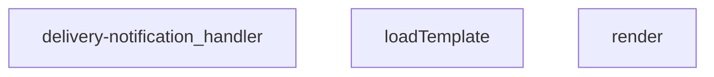
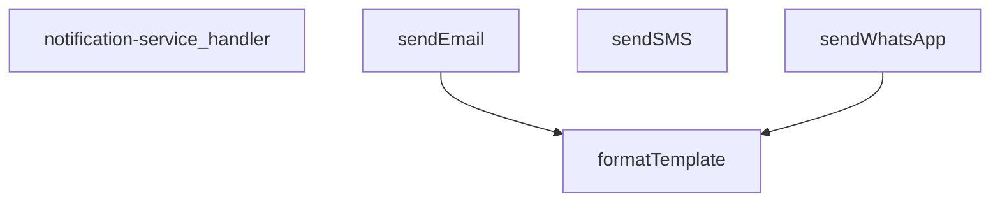
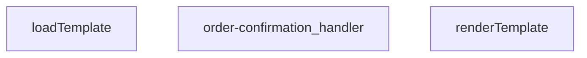
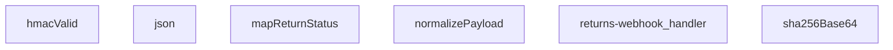
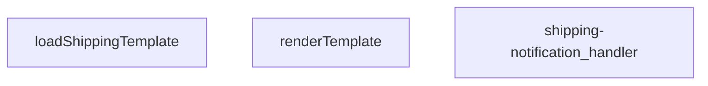
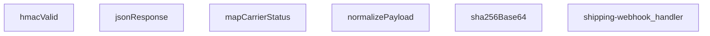
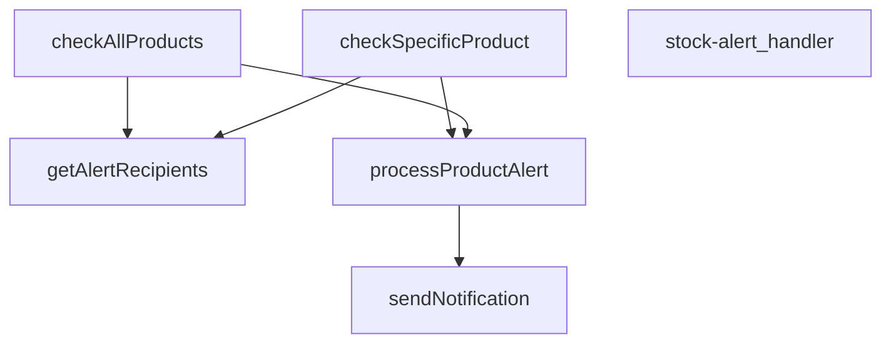
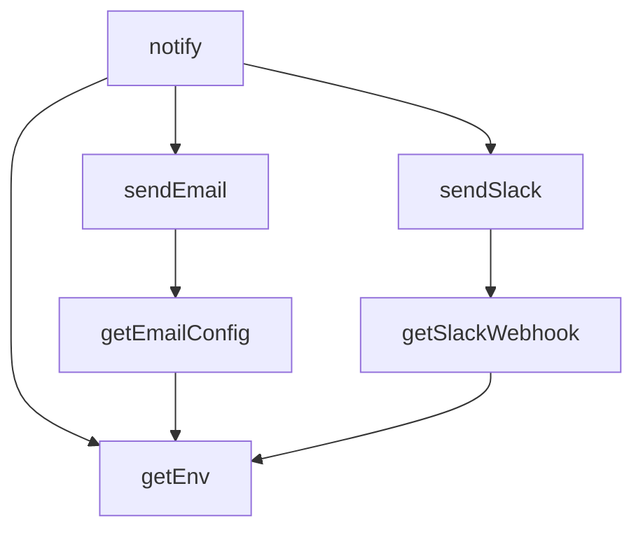
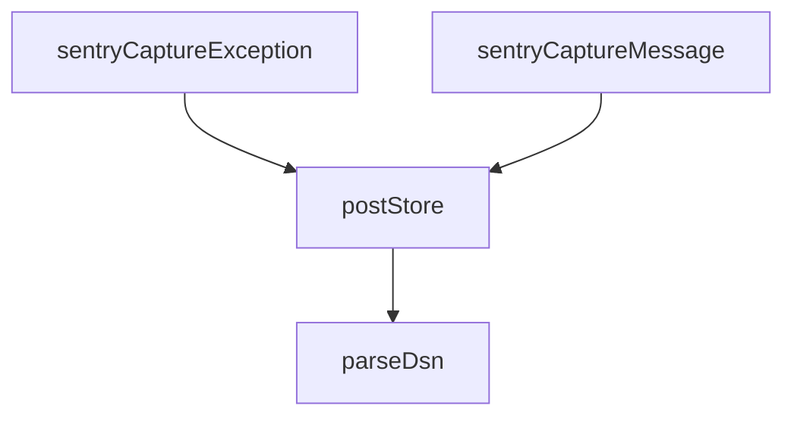

# SUPABASE FUNCTIONS MASTER

---
project_name: venthub-hvac
compiled_at: 2026-05-29T08:51:16.576320+00:00
total_compiled_files: 28
source: supabase/functions
---


---
# FILE: supabase\functions\admin-create-coupon\index.md

---
domain: general
source_type: doc
namespace_type: module
source_path: C:\Users\alize\venthub-hvac\supabase\functions\admin-create-coupon\index.ts
skeleton_hash: a957b854a7f7b2b2
entity_hashes:
  func:admin-create-coupon_handler: 72913923d4da4715
  overview: fe946b312ab86c27
generated_at: 2026-05-28T22:41:01Z
---

## Genel Bakış
Bu modül, Supabase Edge Function olarak çalışan bir HTTP endpoint'idir. Yöneticilerin sisteme yeni indirim kuponları oluşturmasını sağlar. Gelen isteklerdeki kupon verilerini doğrulayıp veritabanına kaydeder ve CORS uyumlu HTTP yanıt döndürür.

## Fonksiyon Grupları
### Kupon Oluşturma İşlemleri
HTTP isteklerini yöneterek kupon oluşturma sürecini yürütür. İstek doğrulama, yetki kontrolü, veri kaydı ve yanıt üretimini tek bir işleyici içinde gerçekleştirir.
- admin_create_coupon_handler

---

## AXIOMS – Mimari Varsayımlar
Bu modül, bir Supabase Edge Function olarak tanımlanmıştır ve yönetici tarafından indirim kuponu oluşturmak için kullanılır.

[Aksiyom 1]: Eğer `req` parametresi (HTTP isteği) sağlanmazsa veya geçerli bir HTTP isteği değilse, fonksiyon isteği işleyemez ve bir hata yanıtı döner.

[Aksiyom 2]: Eğer `corsHeaders` sabiti tanımlı değilse veya boş bir nesne ise, yanıtta CORS başlıkları ayarlanmaz ve tarayıcı tarafı çapraz kaynak istekleri engellenebilir.

[Aksiyom 3]: Eğer Supabase veritabanı bağlantısı (çevresel değişkenler aracılığıyla) sağlanmazsa veya bağlantı kesilirse, fonksiyon kuponu oluşturamaz ve bir hata yanıtı döner.

[Aksiy

---

## FONKSİYON DETAYLARI

### admin-create-coupon_handler

**Ne yapar**: Bu fonksiyon, administrative panel üzerinden yeni bir kupon oluşturma işlemini yöneten HTTP isteklerini işler. Supabase Edge Function yapısında yer alan bu handler, admin kullanıcılarının kupon sistemine yeni kayıtlar eklemesini sağlar.

**Nasıl yapar**: Fonksiyon, gelen HTTP Request nesnesini kabul eder ve ilgili isteği işleyerek bir Response döndürür. Supabase Edge Functions mimarisinde çalışır ve TypeScript tabanlıdır. İşlevin detaylı iç mantığı dokümanda belirtilmemiştir.

**Parametreler**:
- `req`: Request — İşlenecek HTTP istek nesnesi. İstek gövdesinde kupon verileri ve authentication bilgileri bulunmaktadır.

**Dönüş**: Response — İşlem sonucunu içeren HTTP yanıt nesnesi. Başarılı oluşturma durumunda onay, hata durumunda ise uygun hata mesajını döndürür.

**Not**: Fonksiyon docstring'i boş bırakılmış olup, detaylı iç mantık ve implementasyon bilgileri kaynak kodda mevcuttur. Belgeleme için kaynak kod incelenerek parametre şeması, validasyon kuralları ve hata yönetimi detayları eklenmelidir.

---

## SABİTLER
- **corsHeaders** (object) — `{

  'Access-Control-Allow-Origin': '*',

  'Access-Control-Allow-Headers': '...`

---

## AST POINTERS

### [N1_NASIL] AST Pointer: supabase/functions/admin-create-coupon/index.ts::admin-create-coupon_handler
- **params**: `(req: Request)`
- **ic_degiskenler**:
  - `SUPABASE_URL` — `Deno.env.get('SUPABASE_URL')` çağrısından alınan Supabase proje URL'si.
  - `SUPABASE_ANON_KEY` — `Deno.env.get('SUPABASE_ANON_KEY')` çağrısından alınan Supabase anonim anahtarı.
  - `SUPABASE_SERVICE_ROLE_KEY` — `Deno.env.get('SUPABASE_SERVICE_ROLE_KEY')` çağrısından alınan Supabase servis rolü anahtarı.
  - `authHeader` — `req.headers.get('Authorization')` çağrısından alınan kimlik doğrulama başlık değeri.
  - `supabaseUser` — Anonim anahtar ve kullanıcı kimlik bilgisiyle oluşturulan Supabase istemcisi, kullanıcı doğrulaması için kullanılır.
  - `supabaseAdmin` — Servis rolü anahtarıyla oluşturulan Supabase istemcisi, yönetimsel veritabanı işlemleri (rol kontrolü, insert) için kullanılır.
  - `userRes` — `supabaseUser.auth.getUser()` çağrısının sonucu, oturum açmış kullanıcının bilgilerini içerir.
  - `userId` — `userRes.user.id` değerinden提取的， kimliği doğrulanmış kullanıcının benzersiz ID'si.
  - `profile` — `supabaseAdmin.from('user_profiles').select('role')...` sorgusunun sonucu, kullanıcının rolünü içeren satır.
  - `userRole` — `profile?.role` değerinden elde edilen kullanıcı rolü (örn. 'admin', 'superadmin'), yoksa varsayılan 'user'.
  - `body` — `req.json()` çağrısından parse edilen istek gövdesi, `CouponBody` arayüzüne cast edilmiştir.
  - `code` — `body.code` değerinden temizlenmiş (trim) kupon kodu dizesi.
  - `type` — `body.type` değerinden elde edilen kupon türü ('percent' veya 'fixed').
  - `value` — `body.value` değerinden sayıya dönüştürülmüş indirim miktarı.
  - `starts_at` — `body.starts_at` varsa string'e dönüştürülmüş, yoksa null olan geçerlilik başlangıç tarihi.
  - `ends_at` — `body.ends_at` varsa string'e dönüştürülmüş, yoksa null olan geçerlilik bitiş tarihi.
  - `is_active` — `body.active` değerinin boolean karşılığı (true ise `true`, null/undefined ise `true`).
  - `usage_limit` — `body.usage_limit` değerinden işlenen, null veya pozitif bir tam sayı olabilen kullanım limiti.
  - `errs` — Doğrulama hatalarını toplayan string dizisi.
  - `payload` — `coupons` tablosuna eklenecek tüm alanları içeren, veritabanı için hazırlanmış nesne.
  - `data` — `supabaseAdmin.from('coupons').insert().select().single()` çağrısının başarı durumunda dönen inserted satır verisi.
  - `insErr` — Insert işleminde oluşabilecek hata nesnesi.
  - `_e` — `catch` bloğunda yakalanan ham hata nesnesi.
  - `msg` — `_e` nesnesinden elde edilen hata mesajı dizesi.
- **Dönüş**: `Response` (İstek methoduna göre 204, 405, 401, 403, 400, 500 veya 200 durum kodlu JSON gövdeli HTTP yanıt).

---

## NODE ID STANDARD

  file: supabase\functions\admin-create-coupon\index.ts
  function: supabase\functions\admin-create-coupon\index.ts::admin-create-coupon_handler

---

## DISA AKTARILANLAR (EXPORTS)
  export: admin-create-coupon_handler

---
# FILE: supabase\functions\admin-iyzico-reconcile\index.md

---
domain: general
source_type: doc
namespace_type: module
source_path: C:\Users\alize\venthub-hvac\supabase\functions\admin-iyzico-reconcile\index.ts
skeleton_hash: a45e063ea3065638
entity_hashes:
  func:admin-iyzico-reconcile_handler: e8970eccf3f1fb90
  overview: 76aa63321a7612fe
generated_at: 2026-05-28T22:41:21Z
---

## Genel Bakış
Bu modül, Supabase Edge Functions üzerinde çalışan bir admin API uç noktasıdır. Yetkilendirilmiş yöneticilerin Iyzico ödeme sistemi ile sistemdeki yerel kayıt arasındaki veri tutarlılığını denetlemesini sağlar. Güvenlik doğrulamasından sonra mutabakat işlemini koordine eder ve sonuçları istemciye döndürür.

## Fonksiyon Grupları
### Güvenlik ve Uzlaştırma Orkestrasyonu
Gelen HTTP isteklerinin güvenli bir şekilde işlenmesini sağlar. Kimlik doğrulama, yetkilendirme, CORS yönetimi ve Iyzico ile yerel sistem arasındaki veri eşleştirme işlemlerini merkezi olarak yönetir.
- admin-iyzico-reconcile_handler

---

## AXIOMS – Mimari Varsayımlar
Bu modül için fonksiyon gövdesi verilmediği için mimari aksiyomlar üretilememektedir.

---

## FONKSİYON DETAYLARI

### admin-iyzico-reconcile_handler

**Ne yapar**: Bu fonksiyon, iyzico ödeme platformu ile yapılan işlemlerin mutabakatını (reconciliation) gerçekleştirmek üzere tasarlanmış bir Supabase Edge Function handler'ıdır. Admin düzeyinde ödeme uzlaşma işlemlerini yönetir ve HTTP isteklerini işleyerek uygun yanıtları döndürür.

**Nasıl yapar**: Fonksiyon, gelen HTTP isteğini (`req`) alarak iyzico ödeme sistemi ile ilgili mutabakat işlemlerini yürütür. Bu tür fonksiyonlar genellikle iyzico API'sinden ödeme verilerini çeker, mevcut sistemdeki kayıtlarla karşılaştırır ve tutarsızlık durumlarında düzeltme veya raporlama yapar. Supabase Edge Function yapısı gereği, istek metodunu (GET, POST vb.) kontrol ederek ilgili mantığı çalıştırır.

**Parametreler**:
- `req`: Request (Supabase Request) — Gelen HTTP isteği nesnesi. İyzico mutabakat işlemi için gerekli parametreleri, başlıkları ve yetkilendirme bilgilerini içerir. Fonksiyon bu istek üzerinden admin işlem talimatlarını ve filtre kriterlerini alır.

**Dönüş**: Response — İşlem sonucunu içeren HTTP yanıt nesnesi. Mutabakat işleminin başarılı veya başarısız olduğunu belirten durum kodu (status code) ve gerekirse detaylı JSON verisi döndürür. Başarılı işlemlerde mutabakat sonuçları, başarısızlıklarda ise hata açıklamaları içerir.

---

## AST POINTERS

### [N1_NASIL] AST Pointer: `supabase/functions/admin-iyzico-reconcile/index.ts`::`admin-iyzico-reconcile_handler`

- **params**:
  - `req` — Request nesnesi; HTTP isteği (method, headers, body, url)

- **ic_degiskenler**:
  - `cors` — CORS başlık nesnesi;跨-origin isteklere izin vermek için (`Access-Control-Allow-Origin`, `Allow-Headers`, `Allow-Methods`)
  - `supabaseUrl` — `Deno.env.get('SUPABASE_URL')` ile alınan Supabase proje URL'i
  - `serviceRoleKey` — `Deno.env.get('SUPABASE_SERVICE_ROLE_KEY')` ile alınan servis rolü anahtarı; yetkili API çağrıları için
  - `anonKey` — `Deno.env.get('SUPABASE_ANON_KEY')` ile alınan anonim anahtar; auth client oluşturma için
  - `authHeader` — `req.headers.get('Authorization')` ile alınan JWT token; kullanıcı doğrulama için
  - `authClient` — `createClient(supabaseUrl, anonKey, ...)` ile oluşturulan Supabase istemcisi; anonKey + Authorization header ile kullanıcı doğrulama yapar
  - `user` — `authClient.auth.getUser()` yanıtından `data.user`; doğrulanmış kullanıcı nesnesi, `user.id` ile rol sorgusu yapılır
  - `authErr` — `authClient.auth.getUser()` yanıtından `error`; auth hatası varsa 401 döner
  - `roleCheck` — `fetch()` ile `user_profiles` tablosundan rol sorgulama yanıtı; admin/superadmin kontrolü için
  - `arr` — `roleCheck.json()` ile parse edilen JSON dizisi; kullanıcı profil verisini tutar
  - `role` — `arr[0]?.role` ile alınan kullanıcı rolü; `'admin'` veya `'superadmin'` değilse 403 döner
  - `_id` — POST body'sinden `body?.id` veya GET query'den `url.searchParams.get('id')` ile alınan sipariş ID filtresi; `null` olabilir
  - `conv` — POST body'sinden `body?.conv` veya GET query'den `url.searchParams.get('conv')` ile alınan conversation ID filtresi; `null` olabilir
  - `body` — `req.json().catch(()=>null)` ile parse edilen POST request body nesnesi; `_id` ve `conv` değerlerini içerir
  - `url` — `new URL(req.url)` ile oluşturulan URL nesnesi; GET isteklerinde query parametrelerini okumak için
  - `_limit` — Sabit `10`; RPC ile çekilecek maksimum sipariş sayısı
  - `rpcListUrl` — `${supabaseUrl}/rest/v1/rpc/fn_admin_get_orders` RPC endpoint URL'i
  - `listBody` — RPC istek gövdesi; `p_id`, `p_conv`, `p_limit`, `p_status` parametrelerini içerir
  - `listResp` — `fetch(rpcListUrl, ...)` ile dönen HTTP yanıtı; sipariş listesini barındırır
  - `text` — `listResp.text()` ile alınan hata metni; RPC başarısız olduğunda hata detayı için
  - `orders` — `listResp.json()` ile parse edilen sipariş dizisi; her eleman `id`, `conversation_id`, `payment_token` vb. alanlara sahiptir
  - `fnHost` — Supabase proje ref'inden türetilen Edge Functions host URL'i; callback endpoint'ini çağırmak için (`https://{ref}.functions.supabase.co`)
  - `results` — `Array<Record<string, unknown>>`; her sipariş için işlenme sonuçlarını toplar (id, status, error bilgisi)
  - `o` — `for...of` döngüsü içindeki mevcut sipariş nesnesi; `o.id`, `o.conversation_id`, `o.payment_token` alanlarına erişilir
  - `token` — `o?.payment_token`; iyzico ödeme token'ı; `null` ise sipariş atlanır
  - `cbUrl` — `${fnHost}/iyzico-callback` callback endpoint URL'i; her sipariş için ödeme durumu doğrulaması yapılır
  - `cbResp` — `fetch(cbUrl, ...)` ile dönen callback HTTP yanıtı
  - `cbJson` — `cbResp.json()` ile parse edilen callback yanıt JSON'u; `cbJson?.status` ödeme durumunu içerir
  - `st` — `cbJson?.status || 'pending'`; callback'ten dönen ödeme durumu
  - `e` — `catch` bloğundaki hata nesnesi (outer try)
  - `msg` — Hatanın `message` özelliği veya `String(e)` ile elde edilen hata metni

- **Dönüş**: `Response` nesnesi
  - OPTIONS istekleri → `200` (CORS preflight)
  - Config eksik → `500` `{ error: 'CONFIG_MISSING' }`
  - Auth header yok → `401` `{ error: 'unauthorized' }`
  - Token geçersiz → `401` `{ error: 'unauthorized' }`
  - Rol yetkisiz → `403` `{ error: 'forbidden' }`
  - Rol kontrolü başarısız → `500` `{ error: 'internal_error' }`
  - RPC başarısız → `200` `{ ok:false, httpStatus, rpcUrl, body }`
  - Sipariş bulunamadı → `200` `{ ok:false, processed:0, message:'no orders found' }`
  - Başarılı → `200` `{ ok:true, processed: number, results: Array }`
  - Hata (outer catch) → `500` `{ error: msg }`

- **Yan Etkiler**:
  - `iyzico-callback` Edge Function'ını her sipariş için `POST` ile çağırarak ödeme durumunu doğrular
  - `user_profiles` tablosundan `service_role_key` ile rol sorgular
  - `fn_admin_get_orders` RPC'si ile veritabanından sipariş listesi çeker

---

## NODE ID STANDARD

  file: supabase\functions\admin-iyzico-reconcile\index.ts
  function: supabase\functions\admin-iyzico-reconcile\index.ts::admin-iyzico-reconcile_handler

---

## DISA AKTARILANLAR (EXPORTS)
  export: admin-iyzico-reconcile_handler

---
# FILE: supabase\functions\admin-order-inspect\index.md

---
domain: general
source_type: doc
namespace_type: module
source_path: C:\Users\alize\venthub-hvac\supabase\functions\admin-order-inspect\index.ts
skeleton_hash: 16704d3ccdf6ab6d
entity_hashes:
  func:admin-order-inspect_handler: 1ddac70ce14150b4
  overview: 0cc3e3cc63074f53
generated_at: 2026-05-28T22:41:30Z
---

## Genel Bakış
Bu modül, Supabase Edge Function ortamında çalışan bir admin-only sipariş inceleme servisidir. Tek bir HTTP işleyici fonksiyonu aracılığıyla yetkili yöneticilerin sipariş detaylarını güvenli bir şekilde görüntülemesini sağlar — kimlik doğrulama, yetkilendirme ve veri sorgulama adımlarını tek bir akışta yönetir.

## Fonksiyon Grupları
### HTTP İsteğe Bağlı İşleyici
Modülün dış dünyayla tek temas noktası olarak tüm istek akışını yönetir: kimlik doğrulamasını doğrular, sipariş verisini çeker ve sonucu HTTP yanıtı olarak döndürür.
- admin-order-inspect_handler

---

## AXIOMS – Mimari Varsayımlar

Bu modül için yalnızca fonksiyon imzasından türetilebilen minimum aksiyomlar tanımlanmıştır.

[Aksiyom 1]: Eğer `req` parametresi (Request nesnesi) sağlanmamış veya `None`/`null`/`undefined` ise, `admin-order-inspect_handler` fonksiyonu düzgün çalışamaz ve istek işlenemez.

---

## FONKSİYON DETAYLARI

### admin-order-inspect_handler
**Ne yapar**: Bu fonksiyon, bir HTTP isteğini alarak bir admin sipariş inceleme işlemini yönetir ve uygun bir HTTP yanıtı döndürür. Genellikle bir web sunucusu veya sunucu tarafı bir çerçeve içinde istekleri yönlendirmek için bir dinleyici (handler) olarak kullanılır.

**Nasıl yapar**: Fonksiyon, gelen `Request` nesnesinden gerekli verileri (örneğin, istek gövdesi, parametreler, başlıklar) çıkarır. Ardından, bir admin siparişinin detaylarını doğrulama, yetkilendirme veya veritabanından getirme gibi bir dizi iş mantığını yürütür. İşlem sonucunda,成功或失败 durumuna uygun bir durum kodu ve gövde içeren bir `Response` nesnesi oluşturarak döndürür.

**Parametreler**:
- `req`: `Request` — Gelen HTTP isteğini temsil eden nesne. İstek metodu, URL, başlıklar ve gövde gibi verileri içerir.

**Dönüş**: `Response` — İşlemin sonucunu içeren HTTP yanıtı. Genellikle bir durum kodu (örneğin, 200 başarılı, 404 bulunamadı, 500 sunucu hatası) ve isteğe bağlı olarak bir JSON gövdesi veya metin içerir.

---

## AST POINTERS

### [N1_NASIL] AST Pointer: C:\Users\alize\venthub-hvac\supabase\functions\admin-order-inspect\index.ts::admin-order-inspect_handler
- **params**: (req: Request)
- **ic_degiskenler**:
  - `cors` — CORS başlıklarını içeren Record, tüm yanıtlara eklenir
  - `supabaseUrl` — Deno ortam değişkeninden okunan Supabase URL adresi
  - `serviceRoleKey` — Deno ortam değişkeninden okunan Supabase servis rol anahtarı
  - `anonKey` — Deno ortam değişkeninden okunan Supabase anonim anahtarı
  - `authHeader` — İstek başlığından okunan Authorization değeri
  - `supabaseUser` — Kullanıcı oturumuyla oluşturulmuş Supabase istemcisi (anonKey + auth header ile)
  - `supabaseAdmin` — Servis rol anahtarıyla oluşturulmuş Supabase admin istemcisi
  - `userRes` — `supabaseUser.auth.getUser()` çağrısının döndüğü data; kullanıcı nesnesini içerir
  - `userErr` — `getUser()` çağrısının hata nesnesi
  - `profile` — `user_profiles` tablosundan sorgulanan kullanıcının rol bilgisi
  - `profErr` — profil sorgusunun hata nesnesi
  - `userRole` — profile?.role'den elde edilen kullanıcının rol stringi (admin/superadmin kontrolü için)
  - `id` — Sorgu parametresinden veya POST body'den alınan sipariş ID değeri
  - `conv` — Sorgu parametresinden veya POST body'den alınan conversation/değerlendirme değeri
  - `url` — `req.url` stringinden oluşturulmuş URL nesnesi (searchParams erişimi için)
  - `body_param` — req.body'den parse edilmiş JSON nesnesi (POST/PUT durumunda id ve conv değerleri için)
  - `rpcUrl` — `fn_admin_get_orders` RPC fonksiyonunun tam URL adresi
  - `body` — RPC çağrısı için gönderilen istek gövdesi (_p_id, p_conv, p_status, p_limit alanları)
  - `resp` — fetch ile yapılan RPC çağrısının Response nesnesi
  - `_text` — RPC yanıtı başarısızsa okunan hata metni
  - `json` — RPC çağrısının başarılıysa döndürülen JSON verisi (dizi beklenir)
  - `row` — json dizisinin ilk elemanı, sipariş satırı verisi
  - `_e` — try-catch bloğunda yakalanan hata nesnesi
  - `msg` — _e Error instance'sa message alanı, değilse 'unknown' stringi
- **Dönüş**: Response — HTTP yanıtı; OPTIONS istekleri için 200 boş Response, yetkilendirme hataları için JSON hata yanıtları, başarılı sorgulamada `{ ok: boolean, rpcUrl: string, row: object | null }` JSON'u

---

## NODE ID STANDARD

  file: supabase\functions\admin-order-inspect\index.ts
  function: supabase\functions\admin-order-inspect\index.ts::admin-order-inspect_handler

---

## DISA AKTARILANLAR (EXPORTS)
  export: admin-order-inspect_handler

---
# FILE: supabase\functions\admin-orders-latest\index.md

---
domain: general
source_type: doc
namespace_type: module
source_path: C:\Users\alize\venthub-hvac\supabase\functions\admin-orders-latest\index.ts
skeleton_hash: b282b0917505ca5b
entity_hashes:
  func:admin-orders-latest_handler: 9cf0e6c826d5f20e
  overview: c84ffe0de5df59aa
generated_at: 2026-05-28T22:41:58Z
---

## Genel Bakış
Bu modül, yönetici paneli için son siparişleri getiren bir Supabase Edge Function'dır. Gelen HTTP isteklerini işleyerek veritabanından güncel sipariş listesini çeker ve istemciye yanıt olarak döndürür.

## Fonksiyon Grupları
### Ana İşlev
Modülün tek sorumluluğu, yönetici tarafından istenen en son siparişleri listeleyip HTTP yanıtı olarak sunmaktır.
- admin-orders-latest_handler

---

## AXIOMS – Mimari Varsayımlar
Bu modül, admin-orders-latest_handler fonksiyonunun doğru çalışması için aşağıdaki zorunlu koşulları gerektirir.

[Aksiyom 1]: Eğer req parametresi sağlanmazsa veya geçerli bir HTTP isteği nesnesi (Request) değilse, fonksiyonun çalışma zamanı davranışı bilinmiyor ve hata fırlatılabilir.

[Aksiyom 2]: Eğer Supabase veritabanı bağlantısı kurulamazsa veya veritabanı erişilemez durumda olursa, istenen sipariş verileri getirilemez ve hata yanıtı döndürülür.

[Aksiyom 3]: Eğer veritabanında sipariş kaydı bulunamazsa, boş bir dizi veya uygun bir boş veri yapısı döndürülür.

[Aksiyom 4]: Eğer istek yapan kullanıcının yönetici (admin) yetkisi yoksa veya Yetkilendirme (Authorization) başlığı geçersizse, istek reddedilir ve yetkilendirme hatası yanıtı döndürülür.

---

## FONKSİYON DETAYLARI

### admin-orders-latest_handler
**Ne yapar**: Bu fonksiyon, HTTP isteklerini (request) alarak en güncel sipariş verilerini işleyen bir API endpoint'ini temsil eder. Genellikle bir web framework veya APIateway tarafından çağrılarak istekteki verileri işler ve uygun bir yanıt (response) döndürür.
**Nasıl yapar**: Fonksiyon, bir `Request` nesnesi alır ve bu isteği işleyerek sonucu bir `Response` nesnesi olarak paketler. İç mantığı, isteğin içeriğine göre sipariş veritabanını sorgulamak, filtrelemek ve en güncel kayıtları seçmek üzerinedir. Ancak verilen bilgiler dahilinde fonksiyonun tam iç işleyiş (mantığı) ayrıntılı olarak belgelenememektedir.
**Parametreler**:
- `req`: Request — İşlenecek HTTP istek nesnesi. İstek gövdesi, başlıkları ve URL parametreleri gibi verileri içerir.
**Dönüş**: Response — Fonksiyonun işlenen isteğe karşılık olarak döndürdüğü HTTP yanıt nesnesi. Başarılı durumlarda istenen verileri (sipariş listesi), hata durumunda ise uygun hata kodlarını ve mesajlarını içerir.

---

## AST POINTERS

### [N1_NASIL] AST Pointer: supabase/functions/admin-orders-latest/index.ts::admin-orders-latest_handler
- **params**: `(req)` — Incoming HTTP request objesi (Deno Request)
- **ic_degiskenler**:
  - `origin` — `req.headers.get('origin')` ile alınan istek kaynağı origin'i, CORS doğrulamasında kullanılır
  - `allowed` — `Deno.env.get('ALLOWED_ORIGINS')` değerinin virgülle ayrılıp trim edilerek oluşturulmuş izinli origin listesi dizisi
  - `okOrigin` — origin'in allowed listesinde olup olmadığını veya listenin boş olup olmadığını belirleyen boolean flag
  - `requestId` — `crypto.randomUUID()` veya `Date.now()` ile üretilen benzersiz istek tanımlayıcısı, response header'larında `X-Request-Id` olarak döner
  - `cors` — `Access-Control-Allow-Origin`, `Access-Control-Allow-Headers`, `Access-Control-Allow-Methods` anahtarlarını tutan CORS header nesnesi, `Record<string, string>` tipinde
  - `supabaseUrl` — `Deno.env.get('SUPABASE_URL')` ile alınan Supabase proje URL'i
  - `serviceRoleKey` — `Deno.env.get('SUPABASE_SERVICE_ROLE_KEY')` ile alınan service role anahtarı
  - `authHeader` — `req.headers.get('Authorization')` ile alınan JWT bearer token, kullanıcı doğrulaması için kullanılır
  - `anonKey` — `Deno.env.get('SUPABASE_ANON_KEY')` ile alınan anon key, kullanıcı client'ı oluşturmak için kullanılır
  - `supabaseUser` — `createClient(supabaseUrl, anonKey, { global: { headers: { Authorization: authHeader } } })` ile oluşturulan, kullanıcı Yetkisiyle çalışan Supabase istemcisi
  - `supabaseAdmin` — `createClient(supabaseUrl, serviceRoleKey)` ile oluşturulan, service role yetkisiyle çalışan Supabase istemcisi
  - `userRes` — `supabaseUser.auth.getUser()` çağrısının data sonucu, `userRes.user.id` ile kullanıcının ID'sine erişilir
  - `userErr` — `supabaseUser.auth.getUser()` çağrısının hata sonucu, hata varsa 401 döner
  - `profile` — `supabaseAdmin.from('user_profiles').select('role')...maybeSingle()` sorgusunun data sonucu, `profile?.role` ile kullanıcının rolü alınır
  - `profErr` — user_profiles sorgusunun hata sonucu, hata varsa veya rol uyumsuzsa 403 döner
  - `userRole` — `profile?.role` değerinden alınan kullanıcı rolü字符串, `'admin'` veya `'superadmin'` olmalı
  - `url` — `new URL(req.url)` ile parse edilen istek URL nesnesi, query string parametrelerine erişim sağlar
  - `status` — `url.searchParams.get('status')?.trim() || ''` ile alınan sipariş durumu filtresi
  - `from` — `url.searchParams.get('from')?.trim() || ''` ile alınan tarih başlangıç filtresi
  - `to` — `url.searchParams.get('to')?.trim() || ''` ile alınan tarih bitiş filtresi
  - `q` — `url.searchParams.get('q')?.trim() || ''` ile alınan arama/arama sorgusu filtresi
  - `preset` — `url.searchParams.get('preset')?.trim() || ''` ile alınan hazır filtre adı (ör. `'pendingShipments'`)
  - `limitParam` — `Math.min(Math.max(parseInt(url.searchParams.get('_limit') || '50', 10) || 50, 1), 100)` ile hesaplanan sayfa başına kayıt limiti (1-100 arası, varsayılan 50)
  - `pageParam` — `Math.max(parseInt(url.searchParams.get('page') || '1', 10) || 1, 1)` ile parse edilen sayfa numarası (min 1)
  - `offset` — `(pageParam - 1) * limitParam` ile hesaplanan SQL offset değeri, pagination için kullanılır
  - `params` — `new URLSearchParams()` ile oluşturulan PostgREST sorgu parametreleri nesnesi, `select`, `order`, `status`, `created_at`, `or`, `order_number` etc. anahtarları set edilir
  - `isPendingShipments` — `preset === 'pendingShipments'` kontrolünden dönen boolean, bekleyen sevkiyat filtresinin aktif olup olmadığını belirler
  - `normalizeDateStart` — iç fonksiyon bildirimi, tarih stringini ISO gün başı formatına dönüştürür (`YYYY-MM-DD` → `YYYY-MM-DDT00:00:00Z`)
  - `normalizeDateEnd` — iç fonksiyon bildirimi, tarih stringini ISO gün sonu formatına dönüştürür (`YYYY-MM-DD` → `YYYY-MM-DDT23:59:59Z`)
  - `requestUrl` — `` `${supabaseUrl}/rest/v1/venthub_orders?${params.toString()}` `` ile oluşturulan PostgREST API tam istek URL'i
  - `resp` — `fetch(requestUrl, { headers: ... })` ile yapılan HTTP isteminin Response sonucu, `Prefer: _count=exact` ve `Range` header'ları ile sayfalama desteklenir
  - `rows` — `await resp.json().catch(() => [])` ile parse edilen sipariş satırları dizisi, hata durumunda boş dizi döner
  - `contentRange` — `resp.headers.get('content-range') || '0-0/0'` ile alınan content-range header değeri, toplam kayıt sayısını barındırır
  - `total` — `Number(contentRange.split('/')[1] || '0') || 0` ile content-range'den parse edilen toplam sipariş sayısı
  - `isUuid` — query `q` parametresinin UUID formatında olup olmadığını kontrol eden regex test sonucu boolean
  - `like` — `` `*${q}*` `` ile oluşturulan PostgREST ilike arama kalıbı, `order_number` sütununda kısmi eşleşme için kullanılır
  - `_e` — catch bloğu yakalama değişkeni, hata nesnesi (Error instance veya bilinmeyen değer)
- **Dönüş**: `Response` — Başarı durumunda `{ total, page, _limit, rows }` JSON gövdesi ve 200 status; hata durumlarında `{ error: string }` JSON gövdesi ve uygun HTTP status kodu (401, 403, 405, 500)

---

### [N2_NASIL] AST Pointer: supabase/functions/admin-orders-latest/index.ts::normalizeDateStart
- **params**: `(d: string)` — YYYY-MM-DD veya ISO formatında tarih stringi
- **ic_degiskenler**:
  - (yok)
- **Dönüş**: `string` — YYYY-MM-DD formatındaysa `${d}T00:00:00Z` olarak gün başı ISO string; aksi halde girdi olduğu gibi döner

---

### [N3_NASIL] AST Pointer: supabase/functions/admin-orders-latest/index.ts::normalizeDateEnd
- **params**: `(d: string)` — YYYY-MM-DD veya ISO formatında tarih stringi
- **ic_degiskenler**:
  - (yok)
- **Dönüş**: `string` — YYYY-MM-DD formatındaysa `${d}T23:59:59Z` olarak gün sonu ISO string; aksi halde girdi olduğu gibi döner

---

## NODE ID STANDARD

  file: supabase\functions\admin-orders-latest\index.ts
  function: supabase\functions\admin-orders-latest\index.ts::admin-orders-latest_handler

---

## DISA AKTARILANLAR (EXPORTS)
  export: admin-orders-latest_handler

---
# FILE: supabase\functions\admin-update-order\index.md

---
domain: general
source_type: doc
namespace_type: module
source_path: C:\Users\alize\venthub-hvac\supabase\functions\admin-update-order\index.ts
skeleton_hash: f52d9153a17ad7ad
entity_hashes:
  func:admin-update-order_handler: 046f5c7fec17e235
  overview: 105a307c9f13c203
generated_at: 2026-05-28T22:42:25Z
---

## Genel Bakış
Bu modül, Supabase Edge Function olarak çalışan tek bir HTTP handler içermektedir. Amacı, admin yetkisine sahip kullanıcıların mevcut bir siparişi güncellemesi talebini alarak doğrulama ve yetkilendirme işlemlerini gerçekleştirmek, ardından sipariş kaydını veritabanında güncelleyip sonucu istemciye bildirmektir.

## Fonksiyon Grupları
### Admin Sipariş Güncelleme Handler
Modülün tek ve ana bileşeni olarak, HTTP isteğinin tam yaşam döngüsünü yönetir: isteği alır, geçerliliğini ve admin yetkisini doğrular, güncelleme işlemini tetikler ve uygun HTTP yanıtını üretir.
- admin-update-order_handler

---

## AXIOMS – Mimari Varsayımlar

Bu modül, bir yöneticinin sipariş güncelleme isteğini işleyen bir HTTP handler fonksiyonudur. Aşağıdaki mimari varsayımlar modülün doğru çalışması için gereklidir:

---

**[Aksiyom 1]:** Eğer geçerli bir `Request` nesnesi (`req`) yoksa, handler fonksiyonu isteği işleyemez ve uygun bir hata yanıtı (400 Bad Request) döndürülmesi gerekir.

**[Aksiyom 2]:** Eğer isteği gönderen kullanıcının admin yetkisi doğrulanamıyorsa, handler fonksiyonu isteği reddetmeli ve 401 Unauthorized veya 403 Forbidden yanıtı döndürmelidir.

**[Aksiyom 3]:** Eğer güncellenecek siparişin ID'si istek içerisinde sağlanamıyorsa, handler fonksiyonu işlemi tamamlayamaz ve 400 Bad Request yanıtı döndürülmesi gerekir.

**[Aksiyom 4]:** Eğer belirtilen sipariş ID'sine sahip bir sipariş veritabanında mevcut değilse, handler fonksiyonu güncelleme yapamaz ve 404 NotFound yanıtı döndürülmesi gerekir.

**[Aksiyom 5]:** Eğer veritabanı bağlantısı (Supabase client) sağlanamıyorsa, handler fonksiyonu sipariş verisini okuyamaz veya güncelleyemez ve 500 Internal Server Error yanıtı döndürülmesi gerekir.

**[Aksiyom 6]:** Eğer istek gövdesindeki güncelleme verisi geçersiz veya bozuksa (örn: geçersiz JSON formatı), handler fonksiyonu veriyi işleyemez ve 400 Bad Request yanıtı döndürülmesi gerekir.

---

> **Not:** Bu modülde `request.body` formatı, izin verilen güncelleme alanları ve doğrulama kuralları fonksiyon gövdesinde tanımlı olmakla birlikte, verilen bilgilerde bu detaylar açıkça belirtilmemiştir. Eşik değerleri ve kabul kriterleri hakkında kesin bilgi mevcut değildir.

---

## FONKSİYON DETAYLARI

### admin-update-order_handler

**Ne yapar**: Bu fonksiyon, HTTP isteklerini alarak admin panelinden sipariş güncelleme işlemlerini yönetir. Supabase Edge Function yapısı içinde yer alan bu handler, Request nesnesini işler ve Response nesnesi döndürerek istemciye sonuç bildirir.

**Nasıl yapar**: `@ts-nocheck` directive'i ile TypeScript tip kontrolü devre dışı bırakılmıştır. Fonksiyon, bir HTTP Request nesnesini parametre olarak alır ve gerekli iş mantığını uygulayarak Response nesnesi ile sonuç döndürür. Edge Function mimarisi gereği, bu handler Sunucu Tarafı (server-side) çalışarak API uç noktasına gelen istekleri işler.

**Parametreler**:
- `req`: Request — İşlenecek HTTP istek nesnesi. İstemciden gelen HTTP method, header, body ve query parametrelerini içerir. Admin tarafından gönderilen sipariş güncelleme talimatlarını taşır.

**Dönüş**: Response — İşlem sonucunu içeren HTTP yanıt nesnesi. Başarı durumunda güncellenen sipariş bilgilerini, hata durumunda ise hata mesajını ve uygun HTTP durum kodunu döndürür.

---

## AST POINTERS

### [N1_NASIL] AST Pointer: admin-update-order/index.ts::admin-update-order_handler
- **params**: `(req: Request)`
- **ic_degiskenler**:
  - `origin` — Request'ten gelen origin header'ı, CORS kontrolü için kullanılır
  - `allowed` — Environment variable'dan split edilen izin verilen origin listesi
  - `okOrigin` — Origin'in allowed listesinde olup olmadığını kontrol eden boolean flag
  - `requestId` — Her istek için benzersiz UUID veya timestamp, response header'larında kullanılır
  - `cors` — CORS header'larını içeren object
  - `ct` — Content-Type header'ının lowercased hali, JSON kontrolü için kullanılır
  - `max` — Environment variable'dan alınan max body boyutu byte cinsinden
  - `cl` — Content-Length header'ı, byte cinsinden
  - `supabaseUrl` — Environment variable'dan alınan Supabase URL'i
  - `serviceRoleKey` — Environment variable'dan alınan service role key
  - `anonKey` — Environment variable'dan alınan anon key
  - `authHeader` — Authorization header'ı, kullanıcı doğrulama için kullanılır
  - `authClient` — Anon key ile oluşturulan Supabase client, kullanıcı doğrulaması için
  - `user` — authClient.auth.getUser() ile alınan kullanıcı objesi
  - `authErr` — authClient.auth.getUser() hata sonucu
  - `roleCheck` — Kullanıcı rolünü kontrol etmek için fetch sonucu Response
  - `arr` — roleCheck response'unun JSON parse sonucu array
  - `role` — Kullanıcının rolü, admin veya superadmin olmalı
  - `body` — req.json() ile parse edilen request body
  - `id` — Body'den alınan sipariş ID'si
  - `conversation_id` — Body'den alınan conversation ID'si
  - `status` — Body'den alınan yeni durum
  - `display_code` — Body'den alınan display kodu (ID'nin son 8 hanesi)
  - `newStatus` — status değerinin string representation'ı, varsayılan 'paid'
  - `resp` — patch fonksiyonu sonucu Response nesnesi
  - `ok` — resp'nin ok property'si, başarılı güncelleme kontrolü
  - `text` — resp'nin text body'si, yanıt mesajı
  - `_e` — catch bloğundaki hata nesnesi
- **Dönüş**: `Response`

### [N2_NASIL] AST Pointer: admin-update-order/index.ts::patch
- **params**: `(filter: string)`
- **ic_degiskenler**:
  - `filter` — VentHub orders tablosunda güncelleme yapılacak satırı filtreleyen WHERE clause parçası
- **Dönüş**: `Response` (fetch sonucu) — venthub_orders tablosunda status güncelleme sonucu

### [N3_NASIL] AST Pointer: admin-update-order/index.ts::listRecent
- **params**: `(_limit = 100)`
- **ic_degiskenler**:
  - `_limit` — Çekilecek maksimum sipariş sayısı, varsayılan 100
  - `res` — fetch sonucu Response nesnesi
  - `txt` — Response body'sinin text hali
  - `data` — txt'nin JSON parse sonucu array veya parse hatasında boş array
- **Dönüş**: `Array<{id?: string, conversation_id?: string, created_at?: string}>` — Son eklenen siparişlerin listesi

---

## NODE ID STANDARD

  file: supabase\functions\admin-update-order\index.ts
  function: supabase\functions\admin-update-order\index.ts::admin-update-order_handler

---

## DISA AKTARILANLAR (EXPORTS)
  export: admin-update-order_handler

---
# FILE: supabase\functions\admin-update-shipping\index.md

---
domain: general
source_type: doc
namespace_type: module
source_path: C:\Users\alize\venthub-hvac\supabase\functions\admin-update-shipping\index.ts
skeleton_hash: 7a7e3250996d2d50
entity_hashes:
  func:admin-update-shipping_handler: fab3b88ab551f027
  overview: 85e2231565ecbbaa
generated_at: 2026-05-28T22:42:59Z
---

## Genel Bakış
Bu modül, bir Supabase Edge Fonksiyonu olarak, yetkili admin kullanıcılarının sistemdeki kargo bilgilerini güncellemek için kullandığı tek bir HTTP işleyiciyi barındırır. Modülün temel sorumluluğu, gelen istekleri kimlik doğrulamasından geçirerek, doğrulanmış kargo güncelleme verilerini veritabanına yazmak ve işlemin sonucuna uygun bir HTTP yanıtı döndürmektir.

## Fonksiyon Grupları
### Kimlik Doğrulama ve İstek İşleme
Bu grup, modülün kapısını oluşturur. Gelen HTTP isteğinin güvenli ve yetkili olup olmadığını kontrol eder, ardından istek gövdesinden güncellenecek kargo bilgilerini ayrıştırır.
- admin-update-shipping_handler

---

## AXIOMS – Mimari Varsayımlar
Bu modül için özel aksiyom tanımlanmamıştır.

**Not:** Fonksiyon gövdesi (implementation body) paylaşılmadığından, modülün çalışma zamanı davranışına ilişkin mimari varsayımlar üretilememektedir. Mevcut bilgiler yalnızca fonksiyon imzası (`admin-update-shipping_handler(req)`) ve eski dokümanın eksik açıklamasından ibarettir. Fonksiyon gövdesi eklendiğinde revize edilmelidir.

---

## FONKSİYON DETAYLARI

### admin-update-shipping_handler
**Ne yapar**: Bu fonksiyon, bir HTTP isteği alarak bir yanıt döndüren bir Supabase Edge Function istek işleyicisidir. Fonksiyonun adı, yöneticilerin kargo veya gönderi bilgilerini güncellemek üzere tasarlandığını belirtir.
**Nasıl yapar**: Fonksiyon, gelen HTTP istek nesnesini (req) alır, istek içeriğine göre kargo güncelleme işlemlerini başlatır ve sonuç olarak bir HTTP yanıt nesnesi (Response) oluşturur. İşlem mantığı, istek verilerine dayanarak arka uçta veri tabanı güncellemeleri yapmayı ve durum kodlarını ayarlamayı içerir.
**Parametreler**:
- req: Request — İşlenecek olan HTTP isteği nesnesi. İstek gövdesinde veya parametrelerinde kargo güncellemelerine ilişkin veriler taşır.
**Dönüş**: Response — İşlemin sonucunu belirten bir HTTP yanıtı. Başarılı bir güncelleme için uygun bir durum kodu (örn. 200 OK) ve gerekirse bir mesaj içerir; hata durumunda ise hata kodu ve açıklama döndürür.

---

## AST POINTERS

### [N1_NASIL] AST Pointer: C:\Users\alize\venthub-hvac\supabase\functions\admin-update-shipping\index.ts::admin-update-shipping_handler
- **params**: `(req)` — gelen HTTP isteği (Deno Request nesnesi)
- **ic_degiskenler**:
  - `requestId` — benzersiz istek tanımlayıcısı, crypto.randomUUID() veya Date.now() ile oluşturulur
  - `origin` — isteğin Origin header değeri
  - `allowed` — izin verilen originlerin listesi (ALLOWED_ORIGINS env değişkeninden virgülle ayrılmış)
  - `okOrigin` — gelen origin'in izin listesinde olup olmadığı (boolean)
  - `cors` — CORS header'larını içeren dict (Access-Control-Allow-Origin, Allow-Headers, Allow-Methods, Max-Age)
  - `ct` — Content-Type header değeri küçük harfe çevrilmiş
  - `max` — MAX_BODY_KB env değişkeninden okunan maksimum gövde boyutu (byte cinsinden)
  - `cl` — Content-Length header değerinin integer karşılığı
  - `_text` — req._text() ile okunan ham gövde metni
  - `parsed` — _text'in JSON.parse ile ayrıştırılmış hali (Record<string, unknown>)
  - `qs` — req.url'den çıkarılmış URLSearchParams (query string parametreleri)
  - `cancel` — parsed body veya query string'den okunan cancel flag'i (boolean), siparişin kargo iptali için kullanılır
  - `order_id` — parsed body'den veya query string'den okunan sipariş ID'si (order_id veya orderId anahtarlarından)
  - `carrier` — kargo şirketi adı (parsed body veya query string'den)
  - `tracking_number` — kargo takip numarası (parsed body veya query string'den)
  - `tracking_url` — kargo takip URL'i (parsed body veya query string'den, opsiyonel)
  - `send_email` — bildirim e-postası gönderilsin mi flag'i (boolean, varsayılan true)
  - `supabaseUrl` — SUPABASE_URL env değişkeni
  - `anonKey` — SUPABASE_ANON_KEY env değişkeni
  - `serviceKey` — SUPABASE_SERVICE_ROLE_KEY env değişkeni, servis düzeyindeki tüm Supabase istekleri için kullanılır
  - `authHeader` — Authorization header değeri
  - `authClient` — anonKey + Authorization header ile oluşturulan Supabase client (kullanıcı doğrulama için)
  - `user` — authClient.auth.getUser() sonucundan dönen kullanıcı nesnesi (id alanı)
  - `authErr` — auth.getUser() hata nesnesi
  - `roleCheck` — user_profiles tablosunda rol kontrolü yapan fetch sonucu (Response)
  - `arr` — roleCheck yanıtının JSON dizisi (veya parse hatasında boş dizi)
  - `role` — kullanıcının rolü (arr[0]?.role, 'admin' veya 'superadmin' olmalı)
  - `isCurrentlyShipped` — siparişin şu an kargoya verilmiş olup olmadığı (boolean, shipped_at null değilse veya status 'shipped' ise true)
  - `wantCancel` — iptal isteği: cancel flag veya zaten kargoda ve carrier/tracking eksikse true
  - `updCancel` — iptal işlemi için PATCH isteği sonucu (venthub_orders tablosunda carrier, tracking_number, tracking_url, shipped_at alanlarını null'a çeker, status'ü 'confirmed'a set eder)
  - `txt` — updCancel._text() ile okunan hata gövde metni
  - `isFirstShip` — bu ilk kargo kaydı mı (boolean, shipped_at ilk kez set edilecekse true)
  - `patchBody` — venthub_orders tablosuna PATCH edilecek veri sözlüğü (carrier, tracking_number, tracking_url; isFirstShip ise shipped_at ve status eklenir)
  - `upd` — kargo güncelleme PATCH isteği sonucu
  - `headerKey` — x-idempotency-key header değeri (opsiyonel)
  - `derivedKey` — computeIdemKey ile türetilen idempotency anahtarı (SHA-256 hash, hex string)
  - `idemKey` — headerKey veya derivedKey, idempotency kaydı için kullanılır
  - `customer_email` — sipariş sahibinin e-posta adresi (bildirim için, Auth Admin API'den alınır)
  - `customer_name` — sipariş sahibinin adı (bildirim için, user_metadata.full_name veya name)
  - `ordResp` — venthub_orders tablosundan user_id ve order_number çeken fetch sonucu
  - `row` — ordResp yanıtının ilk satırı (user_id ve order_number alanları)
  - `uid` — sipariş sahibinin Supabase auth user ID'si (row?.user_id)
  - `usrResp` — Auth Admin API (/auth/v1/admin/users/{uid}) ile kullanıcı bilgisi çeken fetch sonucu
  - `u` — usrResp JSON yanıtı (email ve user_metadata alanlarını içerir)
  - `metaName` — user_metadata'dan full_name veya name alanı
  - `emailResult` — e-posta gönderim sonucu sözlüğü `{ sent: boolean, disabled: boolean }`
  - `resp` — shipping-notification edge function'ına yapılan POST isteği sonucu
  - `j` — resp JSON yanıtı (ShippingNotifyResponse: disabled, subject, result.id alanları)
  - `_e` — catch bloğu yakaladığı hata nesnesi (Error veya bilinmeyen)
  - `msg` — _e'nin message özelliği veya String(_e)
- **Dönüş**: `Response` — JSON gövdeli HTTP Response; başarı: `{ ok: true, email: emailResult }` (200), hata: `{ error: string, message?: string, missing?: string[] }` (400/401/403/405/413/415/500)

### [N2_NASIL] AST Pointer: C:\Users\alize\venthub-hvac\supabase\functions\admin-update-shipping\index.ts::pick
- **params**: `(keys: string[])` — parsed body içinden aranacak anahtarların dizisi
- **ic_degiskenler**:
  - `k` — döngüdeki mevcut anahtar
  - `v` — parsed[k] ile elde edilen değer (unknown)
- **Dönüş**: `string | null` — ilk geçerli değerin trimlenmiş string karşılığı veya null

### [N3_NASIL] AST Pointer: C:\Users\alize\venthub-hvac\supabase\functions\admin-update-shipping\index.ts::cancel (IIFE)
- **params**: yok (IIFE, parametre almaz; outer scope'tan parsed ve qs'yi kapanır)
- **ic_degiskenler**:
  - `vRaw` — parsed['cancel'] ?? qs.get('cancel') değerinin union karşılığı (boolean, string veya null/undefined)
- **Dönüş**: `boolean` — cancel isteği varsa true, aksi halde false

### [N4_NASIL] AST Pointer: C:\Users\alize\venthub-hvac\supabase\functions\admin-update-shipping\index.ts::send_email (IIFE)
- **params**: yok (IIFE, parametre almaz; outer scope'tan parsed ve qs'yi kapanır)
- **ic_degiskenler**:
  - `v` — parsed['send_email'] ?? parsed['sendEmail'] ?? qs.get('send_email') ?? qs.get('sendEmail') union karşılığı
- **Dönüş**: `boolean` — e-posta gönderilsin mi (varsayılan true)

### [N5_NASIL] AST Pointer: C:\Users\alize\venthub-hvac\supabase\functions\admin-update-shipping\index.ts::computeIdemKey
- **params**: `(action: 'ship' | 'cancel', orderId: string, carrier?: string | null, tn?: string | null)` — aksiyon türü, sipariş ID'si, kargo şirketi (opsiyonel), takip numarası (opsiyonel)
- **ic_degiskenler**:
  - `raw` — parametrelerin pipe-separated (`|`) birleştirilmiş ham stringi
  - `bytes` — raw string'in TextEncoder ile UTF-8 byte dizisine çevrilmiş hali
  - `hash` — crypto.subtle.digest('SHA-256', bytes) ile hashlenmiş ArrayBuffer
- **Dönüş**: `string` — hex formatında 64 karakterlik SHA-256 hash (idempotency anahtarı)

---

## NODE ID STANDARD

  file: supabase\functions\admin-update-shipping\index.ts
  function: supabase\functions\admin-update-shipping\index.ts::admin-update-shipping_handler

---

## DISA AKTARILANLAR (EXPORTS)
  export: admin-update-shipping_handler

---
# FILE: supabase\functions\apply-coupon\index.md

---
domain: general
source_type: doc
namespace_type: module
source_path: C:\Users\alize\venthub-hvac\supabase\functions\apply-coupon\index.ts
skeleton_hash: 9b98a0b5fd98d396
entity_hashes:
  func:apply-coupon_handler: a399f5149250ae7f
  func:buildCors: 9da93e5126db3247
  overview: ffd2f02daad367fc
generated_at: 2026-05-28T22:43:14Z
---

## Genel Bakış
Bu modül, VentHub HVAC projesi için bir Supabase Edge Fonksiyonu olarak kupon kodlarının doğrulanması ve uygulanması işlemlerini yönetir. Cross-origin istekleri için gerekli güvenlik başlıklarını yapılandırarak tarayıcı politikalarına uyum sağlar ve kupon işlemlerinin tam akışını yürütür.

## Fonksiyon Grupları
### CORS Yapılandırma Yardımcıları
HTTP istekleri arasındaki çapraz köken erişimlerini güvenli bir şekilde yönetmek için gerekli HTTP başlıklarını ve izin bayraklarını üretir.
- buildCors

### Kupon Uygulama İş Akışı
Gelen HTTP isteklerini alarak kupon doğrulama ve uygulama mantığını yürütür, CORS yapılandırmasını sağlar ve işlem sonucuna göre uygun HTTP yanıtını döndürür.
- apply-coupon_handler

---

## AXIOMS – Mimari Varsayımlar

Bu modül için verilen bilgiler (fonksiyon imzaları) sınırlıdır. Aşağıdaki aksiyomlar yalnızca fonksiyon imzalarından çıkarılabilir niteliktedir.

[Aksiyom 1]: Eğer `buildCors` fonksiyonuna geçerli bir `Request` nesnesi verilmezse, CORS başlıkları düzgün oluşturulamaz ve cross-origin istekler tarayıcı güvenlik kurallarına uygun yanıt alamaz.

[Aksiyom 2]: Eğer `apply-coupon_handler` fonksiyonuna geçerli bir `Request` nesnesi verilmezse, kupon uygulama iş akışı başlatılamaz.

[Aksiyom 3]: Eğer `Request` nesnesi üzerinde CORS yapılandırması için gerekli header bilgileri (örn: `Origin`) mevcut değilse, `buildCors` fonksiyonu uygun CORS başlıkları üretemeyebilir.

[Aksiyom 4]: Eğer `apply-coupon_handler` tarafından döndürülen yanıt, `buildCors` tarafından üretilen CORS başlıklarını içermiyorsa, tarayıcılar yanıtı engelleyebilir.

---

**Not:** Kupon kodu geçerliliği, süre kontrolü, kullanım limiti gibi iş mantığına ait aksiyomlar fonksiyon gövdeleri görüntülenmeden belirlenememiştir. Mevcut veri yalnızca fonksiyon imzalarını içermektedir.

---

## FONKSİYON DETAYLARI

### buildCors

**Ne yapar**: HTTP isteğinin origin (kaynak) bilgisini kontrol ederek CORS (Cross-Origin Resource Sharing) başlıklarını oluşturur. İzin verilen kaynaklar listesindeki originlere göre erişim izni verip verilmeyeceğini belirler.

**Nasıl yapar**: Fonksiyon, istekten gelen `origin` başlığını okur ve `ALLOWED_ORIGINS` ortam değişkeninden izin verilen kaynakları virgülle ayrılmış liste olarak parse eder. Eğer izin verilen kaynak listesi boşsa tüm kaynaklara izin verir; doluysa istek gelen origin'in bu listede olup olmadığını kontrol eder. Uygun CORS başlıklarını döndürürken, izin yoksa `Access-Control-Allow-Origin` başlığını `'null'` olarak ayarlar.

**Parametreler**:
- `req`: Request — CORS kontrolü yapılacak HTTP isteği nesnesi

**Dönüş**: `{ headers: Record<string, string>, ok: boolean }` — `headers`, yanıt için gereken CORS başlıklarını içerir; `ok`, istek edilen origin'in izin verilenler listesinde olup olmadığını belirtir

### apply-coupon_handler
**Ne yapar**: Bu fonksiyon, kupon kodu uygulama işlemini yöneten ana istek işleyicisidir ve gelen istekleri işleyerek ilgili mantığı uygular.
**Nasıl yapar**: İstek içeriğinden kupon kodunu ve kullanıcı bağlamını ayıklar, kuponun geçerliliğini kontrol eder ve işlemin sonucuna göre başarılı veya hatalı bir HTTP yanıtı oluşturur.
**Parametreler**:
- req: Request — Kupon bilgilerini ve oturum verilerini içeren yükü barındıran gelen HTTP isteği nesnesi.
**Dönüş**: Response — Kupon uygulama işleminin sonucunu, durum kodlarını ve gerekli JSON verilerini içeren HTTP yanıt nesnesi.

---

## TYPE ALIASES

### CouponRow
```typescript
type CouponRow = {

  code: string

  discount_type: 'percentage' | 'fixed_amount'

  discount_value: number

  minimum_order_amount: number | null

  valid_from: string | null

  valid_until: string | null

  is_acti
```

### ApplyCouponReq
```typescript
type ApplyCouponReq = {

  code: string

  subtotal: number

}
```

### ApplyCouponResp
```typescript
type ApplyCouponResp = {

  val_id: boolean

  reason?: string

  discount_amount?: number

  final_total?: number

  normalized_code?: string

}
```

---

## AST POINTERS

### [N1_NASIL] AST Pointer: C:\Users\alize\venthub-hvac\supabase\functions\apply-coupon\index.ts::buildCors
- **params**: (req: Request)
- **ic_degiskenler**:
  - `origin` — Request header'ından alınan Origin değeri veya boş string
  - `allowed` — ALLOWED_ORIGINS ortam değişkeninden split edilip trim edilen izin verilen originlerin dizisi
  - `ok` — origin'in izin verilenler listesinde olup olmadığını kontrol eden boolean
  - `headers` — CORS header'larını içeren nesne (Access-Control-Allow-Origin, Allow-Headers, Allow-Methods)
- **Dönüş**: `{ headers: Record<string,string>, ok: boolean }`

### [N2_NASIL] AST Pointer: C:\Users\alize\venthub-hvac\supabase\functions\apply-coupon\index.ts::apply-coupon_handler
- **params**: (req: Request)
- **ic_degiskenler**:
  - `requestId` — Her istek için benzersiz UUID veya timestamp tabanlı ID
  - `cors` — buildCors fonksiyonundan dönen CORS header'ları ve durum nesnesi
  - `ct` — Request'in Content-Type header'ının küçük harfe çevrilmiş hali
  - `max` — Maksimum gövde boyutu (KB cinsinden MAX_BODY_KB ortam değişkeninden okunur, byte'a çevrilir)
  - `cl` — Request'in Content-Length header'ı (sayıya çevrilmiş, 0 ise 0)
  - `SUPABASE_URL` — Supabase URL'si (ortam değişkeninden)
  - `SUPABASE_SERVICE_ROLE_KEY` — Supabase service role anahtarı (ortam değişkeninden)
  - `supabase` — createClient ile oluşturulan Supabase istemcisi
  - `forwarded` — x-forwarded-for header'ı
  - `ip` — İstemcinin IP adresi (birkaç header'dan denenerek belirlenir, yoksa 'unknown')
  - `key` — Rate limiting için anahtar (format: `coupon:${ip}`)
  - `result` — checkRateLimit fonksiyonundan dönen sonuç nesnesi (allowed, remaining, resetAt içerir)
  - `rl` — rateLimitHeaders fonksiyonu ile oluşturulan rate limit header'ları nesnesi
  - `body` — Request JSON gövdesi (ApplyCouponReq tipinde, parse edilemezse boş nesne)
  - `code` — body.code string'inden trim edilmiş kupon kodu
  - `subtotal` — body.subtotal sayısından parse edilen ara toplam
  - `_data` — Supabase sorgusundan dönen kupon verisi (CouponRow tipinde veya null)
  - `error` — Supabase sorgusu hata nesnesi
  - `row` — _data'nın CouponRow olarak cast edilmiş hali veya null
  - `now` — Mevcut zaman (Date.now())
  - `startsOk` — Kuponun geçerlilik başlangıç tarihinin kontrolü
  - `endsOk` — Kuponun geçerlilik bitiş tarihinin kontrolü
  - `activeOk` — Kuponun aktif olup olmadığının kontrolü
  - `limitOk` — Kupon kullanım limitinin dolup dolmadığının kontrolü
  - `minOk` — Minimum sipariş tutarı kontrolü
  - `discount` — Hesaplanan indirim miktarı
  - `finalTotal` — İndirim sonrası toplam tutar
  - `resp` — Yanıt nesnesi (ApplyCouponResp tipinde)
- **Dönüş**: Response nesnesi (JSON gövde ve HTTP status kodu ile)

---

## NODE ID STANDARD

  file: supabase\functions\apply-coupon\index.ts
  function: supabase\functions\apply-coupon\index.ts::buildCors
  function: supabase\functions\apply-coupon\index.ts::apply-coupon_handler

---

## DISA AKTARILANLAR (EXPORTS)
  export: apply-coupon_handler
  export: buildCors

---
# FILE: supabase\functions\delivery-notification\index.md

---
domain: general
source_type: doc
namespace_type: module
source_path: C:\Users\alize\venthub-hvac\supabase\functions\delivery-notification\index.ts
skeleton_hash: 43bb5a40d783a90f
entity_hashes:
  func:delivery-notification_handler: bbc4a3cdb5561a07
  func:loadTemplate: 4c5f3a8524c0bb12
  func:render: b6f065ff28ae59f4
  overview: 2a9f927139118f99
generated_at: 2026-05-28T22:43:39Z
---

## Genel Bakış
Bu modül, bir Supabase Edge Function olarak teslimat tamamlandığında müşterilere otomatik e‑posta bildirimi göndermekten sorumludur. Sipariş bilgilerini veritabanından çeker, önceden hazırlanmış şablonları bu verilerle dinamik olarak doldurur ve harici bir e‑posta servisi üzerinden mesajı iletir; tüm işlem ise denetim ve loglama amaçlı kaydedilir.

## Fonksiyon Grupları
### Şablon İşleme
Bu grup, e‑posta içeriğinin hazırlanmasıyla ilgili işlevleri kapsar. Dosya sisteminden şablon yüklenmesini ve bu şablonların sipariş verileriyle doldurulmasını sağlar.
- render, loadTemplate

### Ana İstek İşleyici
Bu grup, modülün dış dünya ile tek temas noktasıdır. Gelen HTTP isteklerini yönetir, iş akışını (veri çekme, şablon hazırlama, e‑posta gönderimi ve loglama) koordine eder.
- delivery-notification_handler

---

## AXIOMS – Mimari Varsayımlar

Bu modül için gerekli mimari varsayımlar, fonksiyon imzaları ve dokümandan elde edilen yapısal bilgilere dayanarak aşağıdaki gibi belirlenmiştir:

**[Aksiyom 1]**: Eğer `loadTemplate()` çağrıldığında erişilebilir bir şablon dosyası (tpl) yoksa, `render` fonksiyonuna geçerli bir şablon dizesi (string) iletilemez ve e-posta içeriği oluşturulamaz.

**[Aksiyom 2]**: Eğer `delivery-notification_handler` fonksiyonuna iletilen `req` nesnesi, işlenmek için gerekli verileri (örn: teslimat/sipariş tanımlayıcıları) içermiyorsa, sipariş verileri veritabanından başarıyla çekilemez ve bildirim gönderimi başarısız olur.

**[Aksiyom 3]**: Eğer `render(tpl, _data)` fonksiyonuna iletilen `_data` parametresi, şablon dizesinde (`tpl`) referans verilen tüm alanları içermiyorsa, şablon tutarsız veya eksik doldurulur.

**[Aksiyom 4]**: Eğer e-posta gönderimi için kullanılan harici e-posta servisi (SMTP/API) yapılandırılmamış veya erişilemez durumdaysa, `delivery-notification_handler` tarafından tetiklenen bildirim gönderimi başarısız olur.

**[Aksiyom 5]**: Eğer teslimat olayı tetiklendiğinde, ilgili sipariş/teslimat kaydı veritabanında mevcut değilse veya erişilemezse, bildirim için gerekli sipariş verileri alınamaz ve iş akışı durur.

---

## FONKSİYON DETAYLARI

### render
**Ne yapar**: Verilen bir şablon dizesindeki `{{anahtar}}` yapısındaki yer tutucuları, sağlanan veri nesnesindeki karşılıkları ile değiştirerek dinamik bir çıktı oluşturur.
**Nasıl yapar**: `String.prototype.replace` metodunu bir regex ile kullanarak `{{(\w+)}}` kalıplarını tespit eder. Eşleşen anahtarın (`k`) veri nesnesinde (`_data`) karşılığını arar ve bulamazsa boş bir dize kullanarak değişikliği uygular. Bu işlem, şablon motorları için basit bir değişken ekleme (interpolation) mekanizması sağlar.
**Parametreler**:
- `tpl`: string — Değiştirilecek şablon dizesi. İçerisinde `{{değişken_adı}}` formatında yer tutucular bulunmalıdır.
- `_data`: Record<string, unknown> — Şablondaki yer tutucuların değerlerini içeren nesne. Anahtarlar yer tutucu adlarıyla, değerler ise yerine konacak verilerle eşleşmelidir.
**Dönüş**: string — Yer tutucuların veri ile değiştirildiği yeni şablon dizesi.

### loadTemplate
**Ne yapar**: E-posta bildirimi için kullanılacak HTML şablonunu dosya sisteminden asenkron olarak yükler.
**Nasıl yapar**: `import.meta.url` referansını kullanarak `./templates/email/delivered.html` dosyasının tam yolunu bir `URL` nesnesine dönüştürür. Ardından Deno ortamının `readTextFile` fonksiyonu ile bu dosyanın içeriğini okur. Dosya bulunamazsa veya herhangi bir hata oluşursa, bir hata yakalama bloğu ile `null` değeri döndürerek uygulamanın çökmesini önler.
**Parametreler**: Parametre almaz.
**Dönüş**: Promise<string | null> — Başarılı olursa HTML şablonunun içeriğini, başarısız olursa `null` değerini döndürür.

### delivery-notification_handler
**Ne yapar**: Bir HTTP POST isteğini alır, istemciden gelen e-posta ve teslimat bilgilerini doğrular, şablonu doldurarak bir e-posta bildirim e-postası gönderir ve sonucu istemciye JSON yanıtı olarak döndürür.
**Nasıl yapar**: İsteğin gövdesini JSON olarak ayrıştırır ve `to` alanının varlığını kontrol eder. Eksikse 400 Bad Request yanıtı döner. `loadTemplate` ile şablonu yükleyemezse 500 Internal Server Error yanıtı döner. Şablonu `render` fonksiyonu ile gönderilen verilerle doldurur ve bir e-posta gönderimi için gerekli veri yapısını oluşturur (gerçek gönderim mantığı bu örnek kodda yer almaz). Son olarak, istemciye başarılı veya başarısız olduğu bilgisini içeren bir JSON yanıtı gönderir.
**Parametreler**:
- `req`: Request — Gelen HTTP istek nesnesi. Gövdesinde `to` (alıcı e-posta adresi), `subject` (konu) ve `data` (şablona eklenecek değişkenler) alanlarını içeren bir JSON nesnesi beklenir.
**Dönüş**: Promise<Response> — İşlem sonucuna göre farklı HTTP durum kodları ve JSON gövdeli bir Response nesnesi. Başarılı olursa `{ success: true, to: string, subject: string }`, başarısız olursa `{ success: false, error: string }` yapısında bir yanıt döner.

---

## INTERFACES

### DeliveryRequest
- `order_id: string`
- `customer_email?: string`
- `customer_name?: string`
- `order_number?: string`

---

## AST POINTERS

### [N1_NASIL] AST Pointer: supabase/functions/delivery-notification/index.ts::render
- **params**: `tpl` — şablon metni (string), `_data` — anahtar-değer çiftlerini içeren sözlük (Record<string, unknown>)
- **ic_degiskenler**:
  - Fonksiyon gövdesinde params dışında tanımlı iç değişken yoktur; `tpl.replace(...)` ifadesi doğrudan return edilir
- **Dönüş**: string — `{{anahtar}}` ifadelerinin `_data` sözlüğündeki değerlerle değiştirildiği şablon metni

### [N2_NASIL] AST Pointer: supabase/functions/delivery-notification/index.ts::loadTemplate
- **params**: yok
- **ic_degiskenler**:
  - `url` — `import.meta.url` referansıyla oluşturulan URL nesnesi; `./templates/email/delivered.html` dosyasının mutlak yolunu temsil eder
- **Dönüş**: string | null — dosya başarıyla okunursa HTML içeriği, başarısız olursa null

### [N3_NASIL] AST Pointer: supabase/functions/delivery-notification/index.ts::delivery-notification_handler
- **params**: `req` — gelen HTTP isteği (Request)
- **ic_degiskenler**:
  - `origin` — istek header'ından alınan ORIGIN değeri; yoksa `'*'` (CORS header'ı için kullanılır)
  - `corsHeaders` — CORS ile ilgili tüm header'ları tutan nesne; Access-Control-Allow-Origin, Vary, Allow-Headers, Allow-Methods, Max-Age içerir
  - `supabaseUrl` — `Deno.env.get('SUPABASE_URL')` ile okunan Supabase servis URL'i
  - `serviceKey` — `Deno.env.get('SUPABASE_SERVICE_ROLE_KEY')` ile okunan servis rolü anahtarı
  - `authHeader` — istekten okunan Authorization header değeri (string veya null)
  - `isAuthorized` — yetkilendirme durumunu tutan boolean bayrak; başlangıçta false
  - `anonKey` — `Deno.env.get('SUPABASE_ANON_KEY')` ile okunan Supabase anonim anahtarı
  - `authClient` — `createClient` ile oluşturulan geçici Supabase istemcisi; istemci tarafı token ile kimlik doğrulaması yapmak için kullanılır
  - `user` — `authClient.auth.getUser()` sonucundan destructure edilen kullanıcı nesnesi
  - `roleCheck` — Supabase REST API üzerinden `user_profiles` tablosunda rol sorgulama isteği sonucu (Response nesnesi)
  - `arr` (birinci kullanım) — `roleCheck.json()` sonucunun catch ile boş diziye fallback eden hali; kullanıcının profil satırlarını tutar
  - `role` — `arr[0]?.role` erişimi ile elde edilen kullanıcının rol değeri (admin, superadmin veya diğer)
  - `resendApiKey` — `Deno.env.get('RESEND_API_KEY')` ile okunan Resend e-posta servisi API anahtarı
  - `emailFrom` — `Deno.env.get('EMAIL_FROM')` ile okunan e-posta gönderici adresi; varsayılan `'VentHub <onboarding@resend.dev>'`
  - `body` — `req.json()` ile parse edilen istek gövdesi (DeliveryRequest tipinde)
  - `order_id` — `body.order_id` — teslimat bildirimi yapılacak siparişin benzersiz ID'si
  - `customer_email` — `body.customer_email` — müşteri e-posta adresi; eksikse veritabanından türetilir
  - `customer_name` — `body.customer_name` — müşteri tam adı; eksikse veritabanından türetilir
  - `order_number` — `body.order_number` — sipariş numarası; eksikse veritabanından türetilir
  - `o` — Supabase REST API üzerinden `venthub_orders` tablosunda sipariş bilgisi sorgulama isteği sonucu (Response)
  - `arr` (ikinci kullanım) — `o.json()` sonucunun catch ile boş diziye fallback eden hali; sipariş satırlarını tutar
  - `row` — `Array.isArray(arr) ? arr[0] : null` ile elde edilen ilk sipariş satırı nesnesi veya null; order_number, customer_name, customer_email alanlarını içerir
  - `prettyOrderNo` — insan tarafından okunabilir sipariş numarası; order_number varsa `#${order_number.split('-')[1]}`, yoksa sipariş ID'nin son 8 karakterinin büyük harfli hali
  - `subject` — e-posta konu satırı; `"Siparişiniz teslim edildi - {prettyOrderNo}"` formatında
  - `html` — gönderilecek e-postanın HTML içeriği; önce `loadTemplate()` ile yüklenir, başarısız olursa dizi.join ile satır satır oluşturulur
  - `resp` — `https://api.resend.com/emails` adresine POST isteği ile gönderilen e-posta gönderim sonucu (Response)
  - `t` — `resp._text()` ile okunan hata yanıtı metni; send_failed durumunda hata detayı olarak kullanılır
  - `result` — `resp.json()` ile parse edilen Resend API yanıt nesnesi; `result?.id` alanını içerir
  - `msg` — outer catch bloğunda yakalanan `_e` hatasının message değeri; Error ise `.message`, değilse `String(_e)` ile elde edilir
- **Dönüş**: Response — JSON gövdeli HTTP yanıtı; başarılı teslimde `{ ok: true, order_id, subject, result }`, hata durumunda `{ error: msg }` veya `{ error: 'method_not_allowed' }` veya `{ error: 'missing_fields', missing: [...] }` veya `{ error: 'customer_info_missing' }` veya `{ error: 'Unauthorized' }` veya `{ disabled: true }` veya `{ error: 'send_failed', body: t }` döner

---


## MERMAID CALL GRAPH


## NODE ID STANDARD

  file: supabase\functions\delivery-notification\index.ts
  function: supabase\functions\delivery-notification\index.ts::render
  function: supabase\functions\delivery-notification\index.ts::loadTemplate
  function: supabase\functions\delivery-notification\index.ts::delivery-notification_handler

---

## DISA AKTARILANLAR (EXPORTS)
  export: delivery-notification_handler
  export: loadTemplate
  export: render

---
# FILE: supabase\functions\healthz\index.md

---
domain: general
source_type: doc
namespace_type: module
source_path: C:\Users\alize\venthub-hvac\supabase\functions\healthz\index.ts
skeleton_hash: 2f2f8d8c33239d20
entity_hashes:
  func:healthz_handler: 680c3be8d7d51d07
  overview: 7d9308860fa3cc5c
generated_at: 2026-05-28T22:43:56Z
---

## Genel Bakış
Bu modül, Supabase fonksiyonları içinde bir sağlık kontrolü (health‑check) endpointi sunar. Gelen bir HTTP isteğini alarak servisin ve bağlı veritabanının erişilebilirliğini test eder ve sonucu uygun bir HTTP durum koduyla (200 OK veya 503 Service Unavailable) bildirir.

## Fonksiyon Grupları
### Sağlık Kontrolü İşleyicisi
Bu grup, servisin çalışır durumda olup olmadığını doğrulayan tek işlevi içerir. Fonksiyon, isteği işler, hafif bir veritabanı sorgusu çalıştırır ve sonuca göre yanıt üretir.
- healthz_handler

---


---

## FONKSİYON DETAYLARI

### healthz_handler
**Ne yapar**: Servis sağlığını kontrol eden bir health check endpoint'i çalıştırır. İsteğe bağlı olarak veritabanı bağlantısını doğrulayan hafif bir sorgu gerçekleştirir ve uygulamanın çalışabilir durumda olup olmadığını belirler.

**Nasıl yapar**: Gelen HTTP isteğini alır ve opsiyonel olarak veritabanı bağlantısını test eden hafif bir sorgu başlatır. Veritabanı bağlantısı başarılıysa 200 (OK) durum koduyla yanıt dönerken, bağlantı başarısızsa veya servis kullanılamaz durumdaysa 503 (Service Unavailable) durum koduyla yanıt üretir.

**Parametreler**:
- `req`: Request — Health check isteğini temsil eden HTTP Request nesnesi. İsteğe bağlı veritabanı bağlantısı kontrolü için gerekli bilgileri taşır.

**Dönüş**: Response — HTTP Response nesnesi döner. Başarılı sağlık durumunda 200 status kodu, servis kullanılamaz durumda ise 503 status kodu içerir.

---

## AST POINTERS

### [N1_NASIL] AST Pointer: `supabase/functions/healthz/index.ts`::healthz_handler
- **params**: `req: Request` — Gelen HTTP isteği nesnesi; method kontrolü ve header erişimi için kullanılır
- **ic_degiskenler**:
  - `headers` — JSON content-type ve no-cache talimatlarını taşıyan standart HTTP response header sözlüğü
  - `req.method` — İsteğin HTTP method'u (OPTIONS/GET/HEAD/other); erişim kontrolünde kullanılır
  - `supabaseUrl` — `Deno.env.get('SUPABASE_URL')` tarafından sağlanan Supabase proje URL'i, DB sağlık kontrolü için kullanılır
  - `serviceKey` — `Deno.env.get('SUPABASE_SERVICE_ROLE_KEY')` tarafından sağlanan Supabase servis rolü anahtarı, yetkilendirme header'ında kullanılır
  - `release` — `Deno.env.get('SENTRY_RELEASE')` veya `Deno.env.get('RELEASE')` tarafından sağlanan release versiyon bilgisi, yanıt gövdesine dahil edilir
  - `commit` — `Deno.env.get('GITHUB_SHA')`, `Deno.env.get('COMMIT_SHA')` veya `Deno.env.get('VITE_COMMIT_SHA')` tarafından sağlanan Git commit SHA'si, yanıt gövdesine dahil edilir
  - `resp` — `fetch()` ile yapılan `/rest/v1/rpc/now` çağrısının döndürdüğü Response nesnesi; `resp.ok` ile DB erişilebilirliği kontrol edilir
  - `_e` — `catch` bloğu tarafından yakalanan hata nesnesi; Sentry'ye raporlama için kullanılır
- **Dönüş**: `Response` — 200 (sağlıklı), 405 (method izin verilmiyor) veya 53 (sağlıksız) durum kodlu HTTP Response nesnesi; JSON gövdesinde `ok`, `db`, `release`, `commit`, `time` alanları taşır

---

## NODE ID STANDARD

  file: supabase\functions\healthz\index.ts
  function: supabase\functions\healthz\index.ts::healthz_handler

---

## DISA AKTARILANLAR (EXPORTS)
  export: healthz_handler

---
# FILE: supabase\functions\iyzico-callback\index.md

---
domain: general
source_type: doc
namespace_type: module
source_path: C:\Users\alize\venthub-hvac\supabase\functions\iyzico-callback\index.ts
skeleton_hash: 828e661b626678aa
entity_hashes:
  func:iyzico-callback_handler: 14b42ca547fc6940
  overview: bae576fb73387a70
generated_at: 2026-05-28T22:44:12Z
---

## Genel Bakış
Bu modül, VentHub HVAC projesinin Supabase altyapısında barındırılan bir edge fonksiyonudur. Tek bir merkezi işleyici aracılığıyla İyzico ödeme sağlayıcısından gelen webhook callback isteklerini alır, doğrular ve sistemdeki ilgili kayıtları günceller.

## Fonksiyon Grupları
### İyzico Callback İşleme
Bu grup, modülün tüm sorumluluğunu kapsar: Gelen İyzico webhook isteklerinin güvenli bir şekilde doğrulanması, ödeme durumuna göre veritabanı güncellemelerinin yapılması ve uygun HTTP yanıtlarının üretilmesini yönetir.
- iyzico-callback_handler

---

## AXIOMS – Mimari Varsayımlar
Bu modül için temel aksiyomlar aşağıdadır:

[Aksiyom 1]: Eğer `req` parametresi sağlanmazsa veya geçerli bir HTTP istek nesnesi (Request

---

## FONKSİYON DETAYLARI

### iyzico-callback_handler
**Ne yapar**: VentHub HVAC projesinin Supabase altyapısında barındırılan, Iyzico ödeme sağlayıcısından gelen tüm callback isteklerini işleyen ana giriş fonksiyonudur. Gelen ödeme durum bildirimlerini alır, doğrular ve sistemdeki ilgili sipariş, kullanıcı ve ödeme kayıtlarını güncellemek için gerekli tüm iş süreçlerini yönetir.
**Nasıl yapar**: İlk olarak gelen isteğin yetkili kaynaklı olduğunu teyit etmek için Iyzico’nun standart imza doğrulama protokolünü uygular, isteğin başlıkları ve gövdesindeki güvenlik verilerini eşleştirerek sahte istekleri engeller. Doğrulama süreci başarılı olursa istek gövdesindeki ödeme bilgilerini ayrıştırır, Supabase veritabanı üzerinden ilgili kayıtlara erişerek ödeme durumunu (başarılı, başarısız, beklemede vb.) günceller. Tüm işlem akışı sonunda isteğin sonucuna uygun bir HTTP cevabı oluşturarak döndürür.
**Parametreler**:
- name: req, type: HTTP Request (Supabase Edge Function Request nesnesi) — Iyzico ödeme servisinden gelen callback isteğinin tüm meta verilerini, HTTP başlıklarını ve işlenecek ödeme bilgilerini içeren gövdesini barındıran istek nesnesi
**Dönüş**: Standart HTTP Response nesnesi. İsteğin işlenme durumuna uygun HTTP durum kodu, ilgili cevap başlıkları ve metin içeriği barındırır. Başarısız doğrulama durumunda 403 Yetkisiz Erişim, eksik veya hatalı istek verisinde 400 Hatalı İstek, sunucu tarafı işlem hatalarında 500 Sunucu Hatası kodları döndürür. Tüm süreçlerin başarılı tamamlanması halinde 200 Başarılı durum kodu ile Iyzico’ya onay mesajı içeren cevap gönderir.

---

## TYPE ALIASES

### CheckoutRetrieveResponse
```typescript
type CheckoutRetrieveResponse = {

  paymentStatus?: string;

  conversationId?: string;

  errorMessage?: string;

  paymentId?: string;

  cardFamily?: string;

  binNumber?: string;

  lastFourDigits?: string;

  [k: string]: unk
```

---

## AST POINTERS

### [N1_NASIL] AST Pointer: iyzico-callback/index.ts::Promise_executor
- **params**: `resolve` — Promise resolve callback, `reject` — Promise reject callback
- **ic_degiskenler**:
  - `sdk` — closure'dan gelen Iyzipay SDK nesnesi, `checkoutForm.retrieve` metodu çağrılır
  - `retrieveReq` — closure'dan gelen checkout form retrieve istek parametreleri
  - `err` — retrieve callback'inden gelen hata nesnesi (unknown), varsa `reject(err)` ile fırlatılır
  - `res` — `CheckoutRetrieveResponse` tipinde başarılı yanıt, `resolve(res)` ile çözümlenir
- **Dönüş**: Promise resolve/reject ile `CheckoutRetrieveResponse` veya hata

### [N2_NASIL] AST Pointer: iyzico-callback/index.ts::retrieve_callback
- **params**: `err` — unknown tipinde hata nesnesi, `res` — `CheckoutRetrieveResponse` tipinde yanıt
- **ic_degiskenler**:
  - `reject` — closure'dan gelen Promise reject fonksiyonu, hata durumunda çağrılır
  - `resolve` — closure'dan gelen Promise resolve fonksiyonu, başarı durumunda çağrılır
- **Dönüş**: Yok (yan etki: `resolve(res)` veya `reject(err)` çağrılır)

### [N3_NASIL] AST Pointer: iyzico-callback/index.ts::patchStatus
- **params**: `newStatus` — `'paid' | 'failed' | 'confirmed'` tipinde, siparişin güncellenecek durumu
- **ic_degiskenler**:
  - `orderId` — closure'dan gelen sipariş ID'si, varsa `id=eq.${orderId}` filtresi oluşturulur
  - `result` — closure'dan gelenretrieve sonucu nesnesi, `result?.conversationId` erişimi yapılır
  - `conversationId` — closure'dan gelen conversation ID'si, `orderId` yoksa alternatif filtre olarak kullanılır
  - `filterById` — string, `orderId` varsa `id=eq.${orderId}` query string'i; boş string olabilir
  - `filterByConv` — string, `orderId` yoksa ve conversation ID mevcutsa `conversation_id=eq.${...}` query string'i; boş string olabilir
  - `filter` — string, `filterById || filterByConv` birleşimi; aktif filtre query parametresi
  - `supabaseUrl` — closure'dan gelen Supabase proje URL'i, REST API endpoint地址i oluşturmak için kullanılır
  - `serviceRoleKey` — closure'dan gelen Supabase service role anahtarı, `Authorization` ve `apikey` header'larında kullanılır
  - `debugInfo` — closure'dan gelen hata/ayıklama bilgisi, PATCH body'sinde `payment_debug` alanına yazılır
  - `resp` — `fetch` çağrısının döndürdüğü `Response` nesnesi, fonksiyon tarafından return edilir
- **Dönüş**: `Response | null` — fetch yanıtı veya filtre oluşturulamazsa `null`

---

## NODE ID STANDARD

  file: supabase\functions\iyzico-callback\index.ts
  function: supabase\functions\iyzico-callback\index.ts::iyzico-callback_handler

---

## DISA AKTARILANLAR (EXPORTS)
  export: iyzico-callback_handler

---
# FILE: supabase\functions\iyzico-payment\index.md

---
domain: general
source_type: doc
namespace_type: module
source_path: C:\Users\alize\venthub-hvac\supabase\functions\iyzico-payment\index.ts
skeleton_hash: e7449cae93703b16
entity_hashes:
  func:iyzico-payment_handler: de31c29702dafb3c
  overview: d39806382aa360a5
generated_at: 2026-05-28T22:44:38Z
---

## Genel Bakış
Bu modül, İyzico ödeme altyapısıyla entegre çalışan bir Supabase Edge Function'dır. Gelen HTTP isteklerini alarak ödeme işlemlerini başlatır, ilgili API süreçlerini yönetir ve sonucu istemciye yanıt olarak iletir.

## Fonksiyon Grupları
### Ödeme İşleme
Bu grup, gelen HTTP isteklerini işleyerek İyzico ile ödeme başlatma, doğrulama ve iptal gibi temel operasyonları yürütür.
- iyzico_payment_handler

---


---

## FONKSİYON DETAYLARI

### iyzico-payment_handler

**Ne yapar**: Bu fonksiyon, gelen HTTP isteklerini işleyerek iyzico ödeme sistemiyle ilgili işlemlerin yürütülmesini sağlar. Supabase Edge Function yapısı kapsamında tanımlanmış bir HTTP handler fonksiyonudur. Fonksiyon, HTTP talebini alır ve uygun bir HTTP yanıtı döndürür.

**Nasıl yapar**: Fonksiyonun detaylı iç mantığı docstring'de belgelenmemiştir. Genel yapı itibarıyla, gelen HTTP Request nesnesini analiz ederek iyzico ödeme akışına uygun şekilde işler ve Response nesnesi oluşturarak istemciye geri dönüş yapar. Edge Function yapısı gereği asynchronous olarak çalışabilir.

**Parametreler**:
- `req`: Request — HTTP isteği nesnesi. İstemciden gelen tüm HTTP talep bilgilerini (headers, body, query params, method vb.) içerir. Bu nesne aracılığıyla isteğin içeriğine erişilir.

**Dönüş**: `Response` — Fonksiyonun döndürdüğü HTTP yanıt nesnesi. İşlem sonucuna göre istemciye uygun durum kodu ve içerik döndürülür.

---

## AST POINTERS

### [N1_NASIL] AST Pointer: iyzico-payment/index.ts::sanitize_payment_obj
- **params**: `obj: PaymentMin`
- **ic_degiskenler**:
  - `obj` — Ödeme nesnesi; buyer, shippingAddress, billingAddress alanları maskelenir
  - `obj.buyer.email` — Alıcı e-posta adresi, `mask()` ile gizlenir
  - `obj.buyer.gsmNumber` — Alıcı telefon numarası, `mask()` ile gizlenir
  - `obj.shippingAddress.address` — Teslimat adresi, `'***'` ile gizlenir
  - `obj.billingAddress.address` — Fatura adresi, `'***'` ile gizlenir
- **Dönüş**: `PaymentMin` nesnesi (maskelenmiş alanlarla, spread ile kopyalanmış)

### [N2_NASIL] AST Pointer: iyzico-payment/index.ts::mask
- **params**: `k?: string | null`
- **ic_degiskenler**:
  - `k` — Masklanacak anahtar/veri stringi
  - `s` — `String(k)` dönüşümü ile elde edilen safe string kopyası
- **Dönüş**: `string` — Kızgın maskeleme sonucu; uzunluk ≤10 ise olduğu gibi, >10 ise ilk 6 karakter + `…` + son 4 karakter

### [N3_NASIL] AST Pointer: iyzico-payment/index.ts::map_raw_to_line_item
- **params**: `raw` (ham satır objesi)
- **ic_degiskenler**:
  - `raw.product_id` — Ham satırdaki ürün ID'si
  - `raw.unit_price` — Ham satırdaki birim fiyat
  - `raw.quantity` — Ham satırdaki miktar, `Number(raw.quantity ?? 1)` ile normalize edilir
  - `_productId` — `raw.product_id` değerinin atanması
  - `unitPrice` — `Number(raw.unit_price)` ile sayısal dönüşüm
  - `qty` — Miktar; `Math.max(1, ...)` ile minimum 1 garantisi
  - `safeUnit` — Geçerli sonsuz olmayan sayısal birim fiyat veya `0` fallback
  - `p` — `prodMap.get(_productId)` ile ürün haritasından eşleşen ürün nesnesi veya boş obje
  - `fid` — String ürün ID'si, `String(_productId || '')`
  - `fallbackName` — Ürün adı: önce `p.name`, sonra `nameMap.get(fid)`, sonra `'Ürün'`
  - `fallbackImage` — Ürün görseli: önce `p.image_url`, sonra `imageMap.get(fid)`, sonra `null`
  - `dbOrderId` — Dışarıdan gelen veritabanı sipariş ID'si
  - `prodMap` — Dışarıdan gelen ürün haritası (`Map`)
  - `nameMap` — Dışarıdan gelen ürün adı haritası (`Map`)
  - `imageMap` — Dışarıdan gelen ürün görseli haritası (`Map`)
- **Dönüş**: `{ order_id, product_id, product_name, unit_price, quantity, total_price, price_at_time, product_image_url }` nesnesi

### [N4_NASIL] AST Pointer: iyzico-payment/index.ts::to_iyzico_basket_item
- **params**: `item`
- **ic_degiskenler**:
  - `item.product_id` — Ürün ID'si
  - `item.unit_price` — Birim fiyat
  - `item.quantity` — Miktar
  - `prodMap` — Dışarıdan gelen ürün haritası; `item.product_id` ile `get()` çağrısı yapılarak name alınır
  - `to2` — Dışarıdan gelen sayısal yuvarlama yardımcı fonksiyonu
- **Dönüş**: `{ id, name, category1: 'HVAC', category2: 'Products', itemType: 'PHYSICAL', price }` — price ondalık iki basamaklı string

### [N5_NASIL] AST Pointer: iyzico-payment/index.ts::get_callback_url
- **params**: yok
- **ic_degiskenler**:
  - `su` — `Deno.env.get('SUPABASE_URL')` ile alınan Supabase URL'si, boş string fallback
  - `host` — `new URL(su).host` ile ayrıştırılan hostname
  - `projectRef` — `host.split('.')[0]` ile elde edilen Proje referansı
- **Dönüş**: `string` — `https://{projectRef}.functions.supabase.co/iyzico-callback` formatında callback URL; parse hatasında boş string

### [N6_NASIL] AST Pointer: iyzico-payment/index.ts::to_iyzico_basket_item_full
- **params**: `it`
- **ic_degiskenler**:
  - `it.id` — Basket item ID
  - `it.name` — Basket item adı
  - `it.category1` — Kategori 1
  - `it.category2` — Kategori 2
  - `IYZI.BASKET_ITEM_TYPE?.PHYSICAL` — IYZI sabitinden PHYSICAL item type; fallback `'PHYSICAL'`
  - `it.price` — Fiyat
- **Dönüş**: `{ id, name, category1, category2, itemType, price }` — Iyzipay SDK basket item formatı

### [N7_NASIL] AST Pointer: iyzico-payment/index.ts::init_checkout_form_promise_executor
- **params**: `resolve`, `reject`
- **ic_degiskenler**:
  - `sdk` — Dışarıdan gelen Iyzipay SDK instance'ı
  - `sdkRequest` — Dışarıdan gelen checkout form initialize istek nesnesi
  - `sdk.checkoutFormInitialize.create` — Iyzipay checkout form oluşturma API çağrısı
  - `err` — Callback hata nesnesi; varsa `reject(err)` ile reddedilir
  - `res` — Callback yanıt nesnesi (`{ status?, token?, paymentPageUrl?, checkoutFormContent?, errorMessage? }`)
- **Dönüş**: Promise executor — `resolve(res)` ile SDK yanıtını döner

### [N8_NASIL] AST Pointer: iyzico-payment/index.ts::checkout_form_callback
- **params**: `err: unknown`, `res: { status?: string; token?: string; paymentPageUrl?: string; checkoutFormContent?: string; errorMessage?: string }`
- **ic_degiskenler**:
  - `err` — Hata nesnesi;truthy ise `reject(err)` çağrılır
  - `res` — SDK yanıt nesnesi; içeriği `status`, `token`, `paymentPageUrl`, `checkoutFormContent`, `errorMessage` alanlarını barındırır
  - `reject` — Dışarıdan gelen Promise reject fonksiyonu
  - `resolve` — Dışarıdan gelen Promise resolve fonksiyonu
- **Dönüş**: yok (yan etki: `reject(err)` veya `resolve(res)` çağrısı)

---

## NODE ID STANDARD

  file: supabase\functions\iyzico-payment\index.ts
  function: supabase\functions\iyzico-payment\index.ts::iyzico-payment_handler

---

## DISA AKTARILANLAR (EXPORTS)
  export: iyzico-payment_handler

---
# FILE: supabase\functions\iyzico-refund\index.md

---
domain: general
source_type: doc
namespace_type: module
source_path: C:\Users\alize\venthub-hvac\supabase\functions\iyzico-refund\index.ts
skeleton_hash: 23b801bcc1720e1b
entity_hashes:
  func:iyzico-refund_handler: b3edad3bb6b5ef11
  overview: 47ea10031f1c462e
generated_at: 2026-05-28T22:45:06Z
---

## Genel Bakış
Bu modül, Supabase Functions ortamında iyzico ödeme sistemiyle entegre çalışan bir HTTP endpoint'idir. Temel sorumluluğu, gelen iade (refund) taleplerini doğrulamak, iyzico API'sine iletmek ve sonucu istemciye bildirmektir. Modül; kimlik doğrulama kontrolü, zorunlu alan doğrulaması ve hata yönetimi gibi temel güvenlik ve iş mantığı adımlarını tek bir işleyicide merkezileştirir.

## Fonksiyon Grupları

### İade İşlem İşleyicisi
Modülün tüm sorumluluğunu tek başına üstlenen ana işleyicidir. İstek doğrulamalarını (kimlik, alan kontrolleri) gerçekleştirir, iyzico SDK’sını kullanarak iade işlemini tetikler ve uygun HTTP durum koduyla sonucu döndürür.
- iyzico-refund_handler

---

## AXIOMS – Mimari Varsayımlar

Fonksiyon gövdesi (kaynak kod) paylaşılmadığı için, sadece fonksiyon imzasından çıkarılabilecek minimum varsayımlar:

[Aksiyom 1]: Eğer `req` parametresi geçilmezse, fonksiyon hata fırlatır veya beklenmeyen davranış gösterir.

[Aksiyom 2]: Fonksiyon bir HTTP istek nesnesi (`Request`) bekler; farklı bir tip verilirse, içindeki özelliklere (`.json()`, `.headers` vb.) erişim başarısız olur.

---

**Not:** Detaylı mimari aksiyomlar için fonksiyon gövdesi (index.ts içindeki `iyzico-refund_handler` fonksiyonunun implementasyonu) paylaşılmalıdır. Mevcut bilgilerle iyzico SDK kullanımı, hata yönetimi, yanıt formatı veya iş mantığı hakkında kesin aksiyom üretmek mümkün değildir.

---

## FONKSİYON DETAYLARI

### iyzico-refund_handler
**Ne yapar**: HTTP isteklerini alarak iyzico ödeme sistemi üzerinden bir geri ödeme (refund) işlemi başlatır veya bu işlemle ilgili bir durum sorgulaması yapar.
**Nasıl yapar**: Fonksiyon, bir HTTP Request nesnesi alır. Bu isteğin gövdesindeki (body) verileri çıkararak iyzico'nun sunduğu geri ödeme API endpoint'ine gerekli parametrelerle bir istek gönderir. API'den dönen sonucu işleyerek uygun bir HTTP Response (başarı/hata durumu ile birlikte) oluşturur ve istemciye döner.
**Parametreler**:
- req: Request — Fonksiyonun işleyeceği HTTP istek nesnesi. İsteğin metodu, gövdesi (geri ödeme bilgileri) ve varsa başlık bilgilerini içerir.
**Dönüş**: Response — iyzico API'sinden alınan sonuca göre başarı veya hata durumunu belirten, JSON formatında bir HTTP yanıt nesnesi. Genellikle { success: boolean, data?: object, error?: string } yapısında bir gövdeye sahiptir.

---

## TYPE ALIASES

### PaymentTransaction
```typescript
type PaymentTransaction = { paymentTransactionId?: string }
```

### PaymentDebug
```typescript
type PaymentDebug = {

  refunded_total?: number;

  paymentId?: string;

  raw?: { paymentId?: string; itemTransactions?: PaymentTransaction[] };

  partial_refunds?: { amount: number; at: string }[];

  [k: string]: un
```

### IyziCancelResponse
```typescript
type IyziCancelResponse = { status?: string; [k: string]: unknown }
```

### IyziRefundResponse
```typescript
type IyziRefundResponse = { status?: string; [k: string]: unknown }
```

### IyziSdk
```typescript
type IyziSdk = {

  cancel: {

    create: (

      req: { locale?: unknown; paymentId: string | null; ip: string },

      cb: (err: unknown, res: IyziCancelResponse) => void

    ) => void;

  };

  refund: {

   
```

### IyziCtor
```typescript
type IyziCtor = new (args: { apiKey: string; secretKey: string; uri: string }) => IyziSdk
```

---

## AST POINTERS

### [N1_NASIL] AST Pointer: supabase/functions/iyzico-refund/index.ts::iyzico-refund_handler
- **params**: (req: Request)
- **ic_degiskenler**: 
  - `corsHeaders` — CORS başlık nesnesi, isteklerin cross-origin erişimine izin verir
  - `supabaseUrl` — Supabase projesi URL'i, ortam değişkeninden alınır
  - `serviceKey` — Supabase servis rolü anahtarı, veritabanı işlemleri için kullanılır
  - `IYZ_API` — Iyzipay API anahtarı, ödeme sistemi bağlantısı için kullanılır
  - `IYZ_SEC` — Iyzipay gizli anahtarı, ödeme sistemi bağlantısı için kullanılır
  - `IYZ_URI` — Iyzipay API URI adresi, sandbox veya production endpointi
  - `body` — İstek gövdesi JSON verisi, order_id, amount ve reason alanlarını içerir
  - `orderId` — İade edilecek siparişin benzersiz tanımlayıcısı
  - `amountReq` — İsteğe bağlı iade tutarı, belirtilmemişse sipariş toplamı kullanılır
  - `_reason` — İade nedeni (loglama için, işlevde doğrudan kullanılmıyor)
  - `authHeader` — Authorization başlığı, kimlik doğrulama için gerekli token
  - `anonKey` — Supabase anonim anahtarı, kimlik doğrulama istemcisi için kullanılır
  - `authClient` — Kimlik doğrulama için Supabase istemcisi, kullanıcı token'ını doğrular
  - `user` — Doğrulanmış kullanıcı nesnesi, kullanıcı bilgilerini içerir
  - `authErr` — Kimlik doğrulama hatası, kullanıcı doğrulanamazsa oluşur
  - `reqUserId` — Kimliği doğrulanmış kullanıcının ID'si
  - `ordResp` — Sipariş verisi için HTTP yanıt nesnesi
  - `orders` — Sipariş verisi dizisi, veritabanından gelen sipariş kayıtları
  - `order` — İlk sipariş nesnesi, işlenecek olan sipariş
  - `isAdmin` — Kullanıcının admin olup olmadığını belirten bayrak
  - `prof` — Kullanıcı profil verisi için HTTP yanıt nesnesi
  - `arr` — Kullanıcı profil dizisi, veritabanından gelen profil kayıtları
  - `row` — İlk profil satırı, kullanıcının rolünü içerir
  - `isOwner` — Kullanıcının siparişin sahibi olup olmadığını belirten bayrak
  - `totalAmount` — Sipariş toplam tutarı, iade miktarı için referans
  - `prevDebug` — Önceki ödeme debug bilgisi, iade geçmişi için kullanılır
  - `refundedTotalPrev` — Daha önce iade edilen toplam tutar
  - `payId` — Iyzipay ödeme ID'si, tam iptal işlemi için gerekli
  - `transactions` — Ödeme işlemleri dizisi, parsiyel iade için işlem ID'leri
  - `Iyzi` — Iyzipay yapıcı fonksiyonu, SDK nesnesi oluşturmak için kullanılır
  - `sdk` — Iyzipay SDK nesnesi, ödeme iptal/iade işlemleri için kullanılır
  - `targetAmount` — Hedef iade tutarı, tam veya parsiyel iade miktarı
  - `epsilon` — Kayan nokta hassasiyeti, tam iade kontrolü için kullanılır
  - `isFull` — Tam iptal işlemi mi yoksa parsiyel iade mi olduğunu belirler
  - `iyzResult` — Iyzipay API yanıt nesnesi, iade/iptal işleminin sonucu
  - `LOCALE_TR` — Türkçe dil ayarı, Iyzipay API çağrıları için kullanılır
  - `ptx` — Ödeme işlem ID'si, parsiyel iade için gerekli
  - `ok` — Iyzipay işleminin başarılı olup olmadığını belirten bayrak
  - `itemsResp` — Sipariş kalemleri için HTTP yanıt nesnesi
  - `items` — Sipariş kalemleri dizisi, stok iadesi için kullanılır
  - `it` — Döngü içindeki her bir sipariş kalemi
  - `pResp` — Ürün bilgisi için HTTP yanıt nesnesi
  - `cur` — Mevcut ürün nesnesi, stok bilgisi içerir
  - `curStock` — Ürünün mevcut stok miktarı
  - `newStock` — Stok iadesi sonrası yeni stok miktarı
  - `newDebug` — Güncellenmiş ödeme debug bilgisi, tam iptal sonrası
  - `newStatus` — Sipariş durumu güncelleme (shipped/delivered hariç cancelled)
  - `partials` — Daha önceki parsiyel iadeler dizisi
  - `newRefundedTotal` — Yeni toplam iade tutarı (parsiyel iade sonrası)
  - `newStatusPayment` — Yeni ödeme durumu (refunded veya partial_refunded)
  - `dbg` — Güncellenmiş ödeme debug bilgisi, parsiyel iade sonrası
- **Dönüş**: Response — JSON yanıt nesnesi, farklı durumlara göre farklı mesajlar ve HTTP durum kodları döner:
  - Başarılı tam iptal: `{ status: 'refunded', type: 'cancel', amount: targetAmount, order_id: orderId }`
  - Başarılı parsiyel iade: `{ status: newStatusPayment, type: 'refund', amount: targetAmount, refunded_total: newRefundedTotal, order_id: orderId }`
  - Hata durumları: `{ error: { code: string, message: string } }` formatında hata mesajları
  - Önceden işlenmiş iade: `{ status: 'already_refunded', order_id: orderId }`

---

## NODE ID STANDARD

  file: supabase\functions\iyzico-refund\index.ts
  function: supabase\functions\iyzico-refund\index.ts::iyzico-refund_handler

---

## DISA AKTARILANLAR (EXPORTS)
  export: iyzico-refund_handler

---
# FILE: supabase\functions\log-client-error\index.md

---
domain: general
source_type: doc
namespace_type: module
source_path: C:\Users\alize\venthub-hvac\supabase\functions\log-client-error\index.ts
skeleton_hash: 9f88485c49506986
entity_hashes:
  func:log-client-error_handler: cec12c49f3b9435f
  overview: b60c4199e4d653a2
generated_at: 2026-05-28T22:45:26Z
---

## Genel Bakış
Bu modül, istemci tarafında oluşan hataları merkezi bir uç noktada toplamak ve kaydetmek için kullanılan bir Supabase Edge Function'dur. Gelen HTTP isteğindeki hata verisini ayrıştırır, doğrular ve kalıcı depolamaya yazarak uygun HTTP yanıtı döndürür.

## Fonksiyon Grupları
### Hata Kaydı ve HTTP Yanıt Yönetimi
Gelen hata bildirimini işleyen tek bir işleyici; istek gövdesinden veriyi çıkarır, Zod şemasıyla doğrular, kalıcı depolamaya yazar ve CORS başlıkları dahil uygun bir yanıt oluşturur.
- log_client_error_handler

---

## AXIOMS – Mimari Varsayımlar

Bu modül, istemci hatalarını toplayan bir Supabase Edge Function olup, HTTP istek-tabanlı bir işleyici yapısına sahiptir.

---

**[Aksiyom 1]:** Eğer `req` parametresi geçerli bir `Request` nesnesi olarak sağlanmazsa (null, undefined veya yanlış türde ise), fonksiyon çağrısı çalışma zamanında hata ile başarısız olur.

**[Aksiyom 2]:** Eğer `clientErrorSchema` tarafından istek gövdesi doğrulanamazsa (geçersiz veya eksik alanlar), işlenmemeli ve uygun hata yanıtı döndürülür.

**[Aksiyom 3]:** Eğer Supabase veritabanı bağlantısı kesintiye uğrarsa veya yazma işlemi başarısız olursa, hata kaydı gerçekleşmez ve istemciye hata durumu bildirilir.

**[Aksiyom 4]:** Eğer gelen istek CORS (Cross-Origin Resource Sharing) kurallarını karşılamıyorsa veya uygun başlıklar dahil edilmiyorsa, tarayıcı tabanlı istemci uygulamalarından gelen istekler engellenir.

**[Aksiyom 5]:** Eğer fonksiyon başarılı şekilde çalışırsa, istemciye `2xx` aralığında bir HTTP durum kodu ile yanıt döndürmelidir; aksi halde istemci hatanın kaydedilip kaydedilmediğini bilemez.

**[Aksiyom 6]:** Eğer `log-client-error_handler` fonksiyonu çağrılmazsa (örn. yanlış endpoint), istemci hataları merkezi olarak toplanamaz ve kaybolur.

**[Aksiyom 7]:** Eğer `clientErrorSchema` yapısı değişirse (alan eklenir/çıkarılır), mevcut istemci sürümlerinden gelen eski format hatalar reddedilebilir; bu durum uyumluluk sorunu yaratır.

---

## FONKSİYON DETAYLARI

### log-client-error_handler

**Ne yapar**: Client tarafında oluşan hataların sunucu tarafında loglanmasını sağlayan bir Supabase Edge Function handler'ıdır. HTTP isteklerini alır, hata bilgilerini işler ve uygun HTTP yanıtını döndürür.

**Nasıl yapar**: Bu fonksiyon, bir HTTP Request nesnesini parametre olarak alarak çalışır. Adından anlaşılacağı üzere, client tarafındaki uygulama hatalarını yakalayıp sunucu tarafında merkezi olarak loglamak için kullanılır. Supabase Edge Functions yapısı içerisinde bir request handler olarak tanımlanmıştır.

**Parametreler**:
- `req`: Request — İşlenecek olan HTTP istek nesnesi. Client tarafından gönderilen hata bilgilerini ve gerekli header/body verilerini içerir.

**Dönüş**: `Response` — İşlem sonucuna göre bir HTTP yanıt nesnesi döndürür. Başarılı logging işlemi veya hata durumuna uygun status kodu ve mesaj içerebilir.

---

## SABİTLER
- **clientErrorSchema** (call) — `z.object({

  msg: z.string().default(''),

  stack: z.string().default(''),
...`

---

## AST POINTERS

### [N1_NASIL] AST Pointer: supabase/functions/log-client-error/index.ts::log-client-error_handler
- **params**: (req: Request)
- **ic_degiskenler**:
  - `requestId` — İstek tanımlayıcısı, crypto.randomUUID veya Date.now'dan üretilen benzersiz ID
  - `cors` — CORS başlık objesi, Access-Control-Allow-Origin ve diğer başlıkları içerir
  - `allowedOrigins` — İzin verilen kökler listesi, ALLOWED_ORIGINS环境変数ından split ile ayrıştırılmış
  - `originHeader` — İstek başlığından alınan origin değeri
  - `originToCheck` — Kontrol edilecek kök, origin header veya referer'den elde edilir
  - `requireAuth` — Auth zorunluluğu flag'i, REQUIRE_AUTH环境変数ından okunur
  - `supabase` — Supabase istemcisi, createClient ile service role key ile oluşturulur
  - `authHeader` — Authorization başlığı değeri
  - `accessToken` — Bearer token'ın kendisi (authHeader.slice(7))
  - `authData` — supabase.auth.getUser sonucundaki data objesi
  - `authErr` — supabase.auth.getUser sonucundaki error objesi
  - `rawBody` — İstek gövdesinden parse edilmiş ham JSON verisi
  - `parsed` — clientErrorSchema.safeParse sonucu {success, data} objesi
  - `payload` — Zod ile doğrulanmış güvenli veri (parsed.data)
  - `mask` — Stringleri gizleyen sanitizer fonksiyonu, email ve uzun token'ları maskeleyen
  - `firstLine` — Stack trace'in ilk satırı, payload.stack.split('\n')[0]
  - `urlObj` — payload.url'den oluşturulmuş URL objesi, try-catch ile
  - `_path` — URL'nin pathname kısmı (urlObj.pathname)
  - `signature` — Hata imzası, message + firstLine + _path kombinasyonunun maskelenmiş hali
  - `groupId` — Hata grubu ID'si, error_groups tablosundan upsert ile elde edilir
  - `groupPayload` — error_groups tablosuna upsert edilecek veri objesi
  - `upsertRow` — error_groups.upsert sonucu dönen satır (id ve _count içerebilir)
  - `q` — error_groups tablosundan signature ile id sorgulama sonucu
  - `dedupSeconds` — Deduplication süresi (saniye), DEDUP_SECONDS环境変数ından
  - `since` — Deduplication zaman damgası, Date.now()-dedupSeconds*1000
  - `recent` — client_errors tablosundan son dedup süresindeki kayıtlar
  - `row` — client_errors tablosuna eklenecek satır objesi
  - `error` — client_errors.insert sonucu hata objesi
  - `msg` — Hatanın message string'i (error.message veya String(error))
  - `level` — payload.level'den alınan hata seviyesi (error, fatal vb.)
  - `env` — payload.env'den alınan ortam bilgisi
  - `notifyEnabled` — Slack bildirimi aktif mi flag'i (SLACK_WEBHOOK_URL tanımlı mı)
  - `isCritical` — Kritik hata seviyesi flag'i (level === 'fatal' || level === 'error')
  - `shortMsg` — payload.msg'nin ilk 200 karakterlik kısaltılmış hali
  - `fields` — Slack bildirimi için alanlar dizisi
  - `_e` — Outer catch bloğu yakalama değişkeni
- **Dönüş**: Response (OK, Bad Request, Unauthorized, Forbidden, veya error JSON)

---

## NODE ID STANDARD

  file: supabase\functions\log-client-error\index.ts
  function: supabase\functions\log-client-error\index.ts::log-client-error_handler

---

## DISA AKTARILANLAR (EXPORTS)
  export: log-client-error_handler

---
# FILE: supabase\functions\notification-service\index.md

---
domain: general
source_type: doc
namespace_type: module
source_path: C:\Users\alize\venthub-hvac\supabase\functions\notification-service\index.ts
skeleton_hash: bf6bd24dc8a9ce81
entity_hashes:
  func:formatTemplate: 77c1ba2f1d414d11
  func:notification-service_handler: dc7fd5d96878185c
  func:sendEmail: d1bf521769c184e8
  func:sendSMS: 569d0e2e89431898
  func:sendWhatsApp: 79c6e69b836b3ef4
  overview: eaf397895821a796
generated_at: 2026-05-28T22:45:53Z
---

## Genel Bakış
Bu modül, bir Supabase fonksiyonu olarak dışarıdan gelen HTTP isteklerini karşılar ve belirtilen kanallar (WhatsApp, SMS, e‑posta) üzerinden bildirim gönderilmesini sağlar. İstek parametrelerine göre uygun iletişim kanalını seçer, gerekirse şablonları dinamik verilerle doldurur ve ilgili servisi çağırarak mesajı iletir.

## Fonksiyon Grupları
### Ana İşlem Kontrolü
Gelen HTTP isteklerini işleyen giriş noktasıdır. İstek içeriğini analiz ederek hangi bildirim kanalının kullanılacağını belirler ve ilgili gönderme fonksiyonunu çağırır.
- notification-service_handler

### Bildirim Gönderme İşlemleri
Farklı iletişim kanalları üzerinden mesaj göndermekten sorumlu fonksiyonlardır. Her biri ilgili servis sağlayıcısına (Twilio WhatsApp/SMS, e‑posta API'si) istenen parametreleri ileterek gönderimi gerçekleştirir.
- sendWhatsApp, sendSMS, sendEmail

### Şablon Hazırlama
Metin şablonlarının dinamik verilerle doldurulmasını sağlayan yardımcı fonksiyondur. Bildirim içerikleri kişiselleştirilmesi gerektiğinde gönderme fonksiyonları tarafından kullanılır.
- formatTemplate

---

## AXIOMS – Mimari Varsayımlar

Bu modül, Twilio tabanlı WhatsApp/SMS ve özel servisli e-posta gönderimi yapan bir Supabase fonksiyonudur. Aşağıdaki varsayımlar fonksiyon imzalarından türetilmiştir.

---

**[Aksiyom 1]:** Eğer `sendSMS` çağrısında `config` parametresi (TwilioConfig) sağlanmazsa, SMS gönderimi başarısız olur.

*Gerekçe:* `sendSMS` imzasında `config?:` değil, `config: TwilioConfig` olarak zorunlu tanımlanmıştır.

---

**[Aksiyom 2]:** Eğer `sendEmail` çağrısında `config` parametresi sağlanmazsa ve modül içinde varsayılan bir e-posta yapılandırması mevcut değilse, e-posta gönderimi başarısız olur.

*Gerekçe:* `config` opsiyonel (`?`) olarak tanımlanmıştır, ancak içindeki `apiKey` alanı zorunludur. Varsayılan bir yapılandırma olup olmadığı fonksiyon gövdesinden bilinmemektedir.

---

**[Aksiyom 3]:** Eğer `sendWhatsApp` çağrısında `config` parametresi sağlanmazsa, modülün çalışması için varsayılan bir `TwilioConfig` yapılandırmasının mevcut olması gerekir, aksi takdirde WhatsApp gönderimi başarısız olur.

*Gerekçe:* `config` opsiyonel (`?`) olarak tanımlanmıştır. Varsayılan config'in nereden geldiği (modül sabiti, ortam değişkeni vb.) fonksiyon imzasından bilinmemektedir.

---

**[Aksiyom 4]:** Eğer `formatTemplate` fonksiyonu `_data` parametresi olmadan çağrılırsa, şablon değişkenleri dolmayacak veya fonksiyon hata verecektir.

*Gerekçe:* `_data: TemplateData` parametresi zorunludur (opsiyonel `?` işareti yoktur).

---

**[Aksiyom 5]:** Eğer `notification-service_handler`'a gelen `req` nesnesi geçerli bir bildirim kanalı bilgisi (WhatsApp, SMS veya e-posta) içermiyorsa, hangi gönderme fonksiyonunun çağrılacağı belirsiz kalır ve işlenemeyen bir istek oluşur.

*Gerekçe:* Handler'ın hangi kanalı seçeceğine dair zorunlu alan adları ve yapıları fonksiyon imzasından bilinmemektedir; sadece `req` parametresi alınmaktadır.

---

**[Aksiyom 6]:** Eğer `sendWhatsApp` veya `sendEmail` fonksiyonunda `template` parametresi sağlanırsa, `formatTemplate` fonksiyonunun çağrılabilmesi için `formatTemplate`'in `template` ve `_data` parametreleriyle uyumlu olması gerekir; aksi takdirde şablon doldurma hatası oluşur.

*Gerekçe:* Hem `sendWhatsApp` hem `sendEmail`'de `template?: string` ve `_data?: TemplateData` opsiyoneldir; `formatTemplate(template: string, _data: TemplateData)` ise her iki parametreyi de zorunlu olarak bekler.

---

**[Aksiyom 7]:** `_stockAlertTemplates` sabitinin anahtarları ile `sendWhatsApp`/`sendEmail`'e geçirilebilecek `template` değerleri arasında eşleşme olmalıdır; eşleşmeyen bir template anahtarı kullanılırsa şablon bulunamaz ve hata oluşur.

*Gerekçe:* `_stockAlertTemplates` bir nesne olarak tanımlıdır; hangi anahtarlara sahip olduğu ve formatTemplate ile nasıl eşleştiği fonksiyon gövdesinden bilinmemektedir.

---

## FONKSİYON DETAYLARI

### notification-service_handler
**Ne yapar**: Bu fonksiyon, HTTP isteklerini alarak bildirim servisinin ana işleyişini yöneten giriş noktasıdır (handler). Gelen isteğe göre doğru bildirim kanalını (WhatsApp, SMS veya e-posta) seçip ilgili gönderim fonksiyonunu çağırarak işlemi koordine eder.
**Nasıl yapar**: Fonksiyon, gelen HTTP isteğinin gövdesini (body) analiz eder, istenen bildirim türünü belirler ve gerekli parametreleri (alıcı, mesaj, şablon, yapılandırma bilgileri) çıkarır. Ardından, `sendWhatsApp`, `sendSMS` veya `sendEmail` fonksiyonlarından uygun olanını asenkron olarak çağırır ve sonucu döndürür. Hata yönetimi ve doğrulama mantığını içerir.
**Parametreler**:
- `req`: Request (veya benzeri bir nesne) — Gelen HTTP isteği nesnesi. Bildirim talebini ve gerekli tüm parametreleri taşır.
**Dönüş**: Response — İşlemin sonucunu (başarı/hata durumu) içeren HTTP yanıt nesnesi.

### sendWhatsApp
**Ne yapar**: Belirtilen alıcıya Twilio API'si üzerinden bir WhatsApp mesajı gönderir. İsteğe bağlı olarak bir mesaj şablonunu ve değişken verilerini kullanarak kişiselleştirilmiş mesajlar oluşturabilir.
**Nasıl yapar**: Fonksiyon, yapılandırma nesnesindeki (config) Twilio hesap bilgileriyle (accountSid, authToken, fromNumber) bir Basic Auth başlığı oluşturur. Alıcı numarasını `whatsapp:` önekine sahip olacak şekilde formatlar. Eğer bir şablon ve veri sağlandıysa, `formatTemplate` fonksiyonunu kullanarak son mesajı oluşturur. Ardından, Twilio'nun Messages endpoint'ine POST isteği göndererek mesajı iletir ve API yanıtını döndürür.
**Parametreler**:
- `to`: string — Mesajın gönderileceği alıcının WhatsApp numarası (örn: `+1234567890`).
- `message`: string — Gönderilecek düz metin mesajı. Şablon kullanılmadığında doğrudan gönderilir.
- `template?`: string (isteğe bağlı) — Değişken içeren mesaj şablonu (örn: `Merhaba {{name}}, durumunuz: {{status}}`).
- `_data?`: TemplateData (isteğe bağlı) — Şablondaki `{{değişken}}` alanlarını doldurmak için kullanılacak anahtar-değer çiftlerini içeren nesne.
- `config?`: TwilioConfig (isteğe bağlı) — Twilio API kimlik bilgilerini (`accountSid`, `authToken`, `fromNumber`) içeren yapılandırma nesnesi.
**Dönüş**: Promise<any> — Twilio API'sinden dönen JSON yanıtını çözer ve döndürür. Başarılı gönderimde mesaj bilgilerini içerir.

### sendSMS
**Ne yapar**: Twilio API'si kullanarak belirli bir alıcıya bir Short Message Service (SMS) metni gönderir.
**Nasıl yapar**: `sendWhatsApp` fonksiyonuna çok benzer bir mantıkla çalışır, ancak alıcı numarasına `whatsapp:` eki eklemez ve Twilio'nun SMS endpoint'ine doğrudan POST isteği gönderir. Yapılandırma nesnesindeki Twilio bilgilerini kullanarak Basic Auth ile kimlik doğrulaması yapar ve mesajı iletir.
**Parametreler**:
- `to`: string — SMS'in gönderileceği alıcının telefon numarası (örn: `+1234567890`).
- `message`: string — Gönderilecek metin mesajı.
- `config`: TwilioConfig — Twilio API kimlik bilgilerini (`accountSid`, `authToken`, `fromNumber`) içeren zorunlu yapılandırma nesnesi.
**Dönüş**: Promise<any> — Twilio API'sinden dönen JSON yanıtını çözer ve döndürür. Gönderilen mesajın SID'si gibi bilgileri içerir.

### sendEmail
**Ne yapar**: Resend API'si kullanarak belirtilen alıcıya bir e-posta gönderir. Düz metin veya HTML formatında mesaj gönderebilir ve isteğe bağlı olarak değişken içeren bir şablon kullanabilir.
**Nasıl yapar**: Fonksiyon, Resend API'sinin `/emails` endpoint'ine POST isteği gönderir. İstek gövdesini oluştururken, sağlanan şablonu `_data` nesnesiyle formatlayarak (`formatTemplate` kullanarak) final mesajını oluşturur. Bu mesajı hem `_text` (düz metin) hem de `html` (basit paragraf etiketleriyle) alanlarına yerleştirir. Varsayılan olarak "VentHub Bildirim" konu satırı ve `noreply@venthub.com` adresini kullanır, ancak bunlar `_data` veya `config` içindeki değerlerle değiştirilebilir.
**Parametreler**:
- `to`: string — E-postanın gönderileceği alıcının e-posta adresi.
- `message`: string — Gönderilecek düz metin mesajı. Şablon kullanılmadığında doğrudan gönderilir.
- `template?`: string (isteğe bağlı) — Değişken içeren e-posta şablonu.
- `_data?`: TemplateData (isteğe bağlı) — Şablondaki `{{değişken}}` alanlarını doldurmak için veri. Ek olarak `subject` ve `emailFrom` alanlarını da içerebilir.
- `config?`: { apiKey: string; from?: string } (isteğe bağlı) — Resend API anahtarını (`apiKey`) ve isteğe bağlı olarak gönderici adresini (`from`) içeren yapılandırma nesnesi.
**Dönüş**: Promise<any> — Resend API'sinden dönen JSON yanıtını çözer ve döndürür. Başarılı gönderimde e-posta ID'si gibi bilgileri içerir.

### formatTemplate
**Ne yapar**: Bir metin şablonunu, sağlanan veri nesnesindeki değerlerle eşleştirerek kişiselleştirilmiş bir metin dizesi oluşturur. `{{anahtar}}` biçimindeki yer tutucuları gerçek değerlerle değiştirir.
**Nasıl yapar**: Fonksiyon, `_data` nesnesinin tüm anahtarları üzerinde döngüye girer. Her anahtar için, şablon içindeki `{{anahtar}}` kalıbını (RegExp kullanarak, `g` flag'i ile tüm eşleşmeleri bulacak şekilde) bulur ve ilgili değerin string karşılığıyla değiştirir. Değerleri zorunlu olarak string'e dönüştürerek (String(_data[key])) tutarlılık sağlar.
**Parametreler**:
- `template`: string — Değişkenler içeren ham şablon metni (örn: `Sayın {{name}}, talebiniz {{status}} durumundadır.`).
- `_data`: TemplateData — Şablondaki yer tutuculara karşılık gelecek anahtar-değer çiftlerini içeren nesne (örn: `{ name: 'Ahmet', status: 'inceleniyor' }`).
**Dönüş**: string — Yer tutucuların değerlerle değiştirildiği, kullanıma hazır son metin dizesi.

---

## INTERFACES

### NotificationRequest
- `type: 'whatsapp' | 'sms' | 'email'`
- `to: string`
- `message: string`
- `priority: 'low' | 'medium' | 'high' | 'critical'`
- `template?: string`
- `_data?: TemplateData`

### _StockAlertData
- `productName: string`
- `currentStock: number`
- `threshold: number`
- `_productId: string`

### TwilioConfig
- `accountS_id: string`
- `authToken: string`
- `fromNumber: string`

---

## TYPE ALIASES

### TemplateData
```typescript
type TemplateData = Record<string, string | number | boolean>
```

---

## SABİTLER
- **_stockAlertTemplates** (object) — `{

  whatsapp: {

    low_stock: `🚨 STOK UYARISI 🚨

    

📦 Ürün: {{productNa...`

---

## AST POINTERS

### [N1_NASIL] AST Pointer: supabase/functions/notification-service/index.ts::notification-service_handler
- **params**: `(req)` — HTTP Request nesnesi, gelen istek
- **ic_degiskenler**:
  - `corsHeaders` — CORS başlık nesnesi, tüm response'larda erişim izinleri tanımlar
  - `supabaseUrl` — `Deno.env.get('SUPABASE_URL') || ''` ile alınan Supabase URL'i
  - `serviceRoleKey` — `Deno.env.get('SUPABASE_SERVICE_ROLE_KEY') || ''` ile alınan service role anahtarı
  - `anonKey` — `Deno.env.get('SUPABASE_ANON_KEY') || ''` ile alınan anon anahtar
  - `authHeader` — `req.headers.get('Authorization')` ile gelen yetkilendirme başlığı
  - `authClient` — `createClient(supabaseUrl, anonKey, { global: { headers: { Authorization: authHeader } } })` ile oluşturulan yetkilendirme istemcisi
  - `user` — `authClient.auth.getUser()` sonucundaki kullanıcı nesnesi (`{ data: { user } }` destructuring)
  - `authErr` — `authClient.auth.getUser()` sonucundaki hata nesnesi
  - `roleCheck` — `fetch` ile `user_profiles` tablosundan rol sorgulama sonucu (HTTP Response)
  - `arr` — `roleCheck.json()` sonucu, rol array'i
  - `role` — `arr[0]?.role` ile çekilen kullanıcı rolü string'i
  - `body` — `req.json()` ile parse edilen `NotificationRequest` gövdesi
  - `type` — `body.type`, bildirim türü (whatsapp/sms/email)
  - `to` — `body.to`, alıcı iletişim bilgisi
  - `message` — `body.message`, gönderilecek mesaj içeriği
  - `priority` — `body.priority`, bildirim önceliği
  - `template` — `body.template`, opsiyonel mesaj şablonu
  - `_data` — `body._data`, opsiyonel şablon veri sözlüğü
  - `twilioAccountSid` — `Deno.env.get('TWILIO_ACCOUNT_SID')`, Twilio hesap SID'i
  - `twilioAuthToken` — `Deno.env.get('TWILIO_AUTH_TOKEN')`, Twilio auth token'ı
  - `twilioWhatsAppNumber` — `Deno.env.get('TWILIO_WHATSAPP_NUMBER')`, Twilio WhatsApp gönderici numarası
  - `twilioPhoneNumber` — `Deno.env.get('TWILIO_PHONE_NUMBER')`, Twilio SMS gönderici numarası
  - `resendApiKey` — `Deno.env.get('RESEND_API_KEY')`, Resend e-posta API anahtarı
  - `emailFrom` — `Deno.env.get('EMAIL_FROM') || 'VentHub <noreply@venthub.com>'`, e-posta gönderici adresi
  - `notifyDebug` — `Deno.env.get('NOTIFY_DEBUG') === 'true'`, debug modu bayrağı
  - `result` — bildirim gönderme sonucu (başlangıç: `{ success: false, note: undefined }`)
  - `isWhatsAppEnabled` — WhatsApp kanalının aktif olup olmadığını belirleyen boolean (`!!(twilioAccountSid && twilioAuthToken && twilioWhatsAppNumber)`)
  - `isSmsEnabled` — SMS kanalının aktif olup olmadığını belirleyen boolean (`!!(twilioAccountSid && twilioAuthToken && twilioPhoneNumber)`)
  - `isEmailEnabled` — Email kanalının aktif olup olmadığını belirleyen boolean (`!!resendApiKey`)
  - `error` — catch bloğundaki yakalanan hata nesnesi
  - `msg` — `error instanceof Error ? error.message : 'Unknown error'` ile elde edilen hata mesajı string'i
- **Dönüş**: `Response` — JSON body `{ success, result, type, priority, timestamp }` veya hata Response'u

---

### [N2_NASIL] AST Pointer: supabase/functions/notification-service/index.ts::sendWhatsApp
- **params**: `(to: string, message: string, template?: string, _data?: TemplateData, config?: TwilioConfig)` — alıcı, mesaj, opsiyonel şablon, opsiyonel veri, opsiyonel Twilio yapılandırması
- **ic_degiskenler**:
  - `finalMessage` — `template ? formatTemplate(template, _data) : message`, şablon varsa formatlanmış mesaj yoksa ham mesaj
  - `formattedTo` — `to.startsWith('whatsapp:') ? to : 'whatsapp:${to}'`, WhatsApp formatına dönüştürülmüş alıcı numarası
  - `twilioUrl` — `https://api.twilio.com/2010-04-01/Accounts/${config.accountSid}/Messages.json`, Twilio Messages API endpoint'i
  - `credentials` — `btoa(${config.accountSid}:${config.authToken})`, Base64编码lenmiş Basic Auth credential'ı
  - `response` — `fetch(twilioUrl, ...)` ile Twilio API'ye POST isteği sonucu gelen Response nesnesi
  - `error` — `response.text()` ile okunan hata gövdesi (response.ok false ise)
- **Dönüş**: `response.json()` — Twilio API yanıt nesnesi

---

### [N3_NASIL] AST Pointer: supabase/functions/notification-service/index.ts::sendSMS
- **params**: `(to: string, message: string, config: TwilioConfig)` — alıcı, mesaj, Twilio yapılandırması
- **ic_degiskenler**:
  - `twilioUrl` — `https://api.twilio.com/2010-04-01/Accounts/${config.accountSid}/Messages.json`, Twilio Messages API endpoint'i
  - `credentials` — `btoa(${config.accountSid}:${config.authToken})`, Base64编码lenmiş Basic Auth credential'ı
  - `response` — `fetch(twilioUrl, ...)` ile Twilio API'ye POST isteği sonucu gelen Response nesnesi
  - `error` — `response.text()` ile okunan hata gövdesi (response.ok false ise)
- **Dönüş**: `response.json()` — Twilio API yanıt nesnesi

---

### [N4_NASIL] AST Pointer: supabase/functions/notification-service/index.ts::sendEmail
- **params**: `(to: string, message: string, template?: string, _data?: TemplateData, config?: { apiKey: string; from?: string })` — alıcı, mesaj, opsiyonel şablon, opsiyonel veri, opsiyonel Resend yapılandırması
- **ic_degiskenler**:
  - `subject` — `_data?.subject || 'VentHub Bildirim'`, e-posta konu satırı
  - `finalMessage` — `template ? formatTemplate(template, _data) : message`, şablon varsa formatlanmış mesaj yoksa ham mesaj
  - `from` — `config?.from || _data?.emailFrom || 'VentHub <noreply@venthub.com>'`, e-posta gönderici adresi
  - `response` — `fetch('https://api.resend.com/emails', ...)` ile Resend API'ye POST isteği sonucu gelen Response nesnesi
  - `error` — `response.text()` ile okunan hata gövdesi (response.ok false ise)
- **Dönüş**: `response.json()` — Resend API yanıt nesnesi

---

### [N5_NASIL] AST Pointer: supabase/functions/notification-service/index.ts::formatTemplate
- **params**: `(template: string, _data: TemplateData)` — ham şablon string'i ve placeholder verileri sözlüğü
- **ic_degiskenler**:
  - `formatted` — `template`'ten başlayarak her döngüde güncellenen formatlanmış sonuç string'i
  - `key` — `Object.keys(_data).forEach` callback parametresi, mevcut placeholder anahtarı
  - `placeholder` — `` new RegExp(`{{${key}}}`, 'g') `` ile oluşturulan Regex nesnesi, `{{key}}` pattern'ini eşler
  - `value` — `String(_data[key])`, placeholder'ın yerine konacak string değer
- **Dönüş**: `string` — placeholder'ların değerlerle değiştirilmiş nihai şablon metni

---


## MERMAID CALL GRAPH


## NODE ID STANDARD

  file: supabase\functions\notification-service\index.ts
  function: supabase\functions\notification-service\index.ts::notification-service_handler
  function: supabase\functions\notification-service\index.ts::sendWhatsApp
  function: supabase\functions\notification-service\index.ts::sendSMS
  function: supabase\functions\notification-service\index.ts::sendEmail
  function: supabase\functions\notification-service\index.ts::formatTemplate

---

## DISA AKTARILANLAR (EXPORTS)
  export: formatTemplate
  export: notification-service_handler
  export: sendEmail
  export: sendSMS
  export: sendWhatsApp

---
# FILE: supabase\functions\order-confirmation\index.md

---
domain: general
source_type: doc
namespace_type: module
source_path: C:\Users\alize\venthub-hvac\supabase\functions\order-confirmation\index.ts
skeleton_hash: d36ea4f635b936cd
entity_hashes:
  func:loadTemplate: 9bc4b1ff28af1df3
  func:order-confirmation_handler: 52ce43dfb5d8480d
  func:renderTemplate: 598e7353aec8e680
  overview: 9331abe1828bd6b9
generated_at: 2026-05-28T22:46:25Z
---

## Genel Bakış
Bu modül, bir sipariş onayı e-postası göndermekle sorumlu bir Supabase Edge Function'ıdır. Gelen HTTP isteğini işleyerek sipariş ve müşteri bilgilerini alır, ilgili HTML e-posta şablonunu diskten yükler, verilerle doldurur ve Resend API kullanarak e-postayı gönderir.

## Fonksiyon Grupları
### Şablon İşleme
Bu grup, e-posta şablonunun yüklenmesini ve dinamik verilerle doldurulmasını sağlar. Şablon dosyası asenkron olarak okunur ve bir veri haritası kullanılarak kişiselleştirilmiş HTML içeriğine dönüştürülür.
- loadTemplate, renderTemplate

### İstek Yönetimi ve E-posta Gönderimi
Ana iş akışını kontrol eden bu grup, gelen isteği doğrular, gerekli verileri elde eder, şablon işleme adımlarını tetikler, e-postayı gönderir ve sonuç durumunu içeren HTTP yanıtını oluşturur.
- order-confirmation_handler

---


---

## FONKSİYON DETAYLARI

### renderTemplate
**Ne yapar**: Verilen bir HTML/şablon dizesindeki koşullu blokları ve değişken yer tutucularını, sağlanan veri nesnesindeki değerlerle değiştirerek işlenmiş bir dize döndürür. Basit bir şablon motoru görevi görür.

**Nasıl yapar**: İlk olarak `{{#if key}}...{{/if}}` sözdizimini eşleştirir; ilgili `_data[key]` değeri truthy ise içeriği korur, aksi halde boş string ile değiştirir. Ardından kalan `{{key}}` yer tutucularını `_data[key]` değeriyle değiştirir; değer `null` veya `undefined` ise boş string döner, değilse `String()` ile dizeye dönüştürülür.

**Parametreler**:
- `tpl`: string — İşlenecek şablon dizesi. İçerisinde `{{#if}}...{{/if}}` koşullu blokları ve `{{değişken}}` yer tutucuları bulundurur.
- `_data`: Record<string, unknown> — Şablondaki yer tutuculara karşılık gelen değerleri içeren nesne. Anahtarlar şablondaki değişken isimleriyle eşleşmelidir.

**Dönüş**: string — İşlenmiş, tüm yer tutucuların değerlerle değiştirildiği veya koşullu blokların ayıklandığı sonuç dizesi.

### loadTemplate
**Ne yapar**: Dosya sisteminden veya uzaktan bir kaynaktan şablon dosyasını asenkron olarak okur ve içeriğini string olarak döndürür.  
**Nasıl yapar**: Promise tabanlı bir I/O operasyonu başlatır; dosya bulunamazsa `null` döner.  
**Parametreler**: *Yok*  
**Dönüş**: Promise<string | null> — Başarılı okuma durumunda şablon içeriği string, bulunamama durumunda `null`.

### order-confirmation_handler
**Ne yapar**: HTTP isteklerini alır, sipariş onayı şablonunu yükler, verileri şablona uygular ve yanıt olarak HTML içeriği döner.  
**Nasıl yapar**: Gelen `req` nesnesinden gerekli sipariş bilgilerini çıkarır, `loadTemplate` ile şablonu getirir, `renderTemplate` ile şablonu doldurur ve bir `Response` nesnesi oluşturur; hata durumunda uygun hata yanıtı üretir.  
**Parametreler**:
- req: any — HTTP istek nesnesi, içinde sipariş verileri ve diğer istek bilgileri bulunur.  
**Dönüş**: Response — HTTP yanıtı, genellikle `text/html` içerik tipinde ve doldurulmuş şablon metnini barındırır.

---

## AST POINTERS

### [N1_NASIL] AST Pointer: supabase/functions/order-confirmation/index.ts::renderTemplate
- **params**: (`tpl`: string, `_data`: Record<string, unknown>)
- **ic_degiskenler**:
  - `_m` — regex eşleşme sonucu (ilk callback'te: {{#if}} kalıbının tüm eşleşmesi, ikinci callback'te: {{key}} kalıbının tüm eşleşmesi)
  - `key` — regex tarafından yakalanan değişken adı (şablon içindeki `{{key}}` veya `{{#if key}}` ifadesinden gelir)
  - `inner` — `{{#if key}}...{{/if}}` bloğunun içeriği (yalnızca birinci replace callback'inde)
  - `v` — `_data[key]` ile şablon verisi sözlüğünden ilgili değerin okunması
  - `truthy` — `v` değerinin truthy olup olmadığını belirleyen boolean (string ise !=='' kontrolü, diğer tipler için doğrudan)
- **Dönüş**: string (değiştirilmiş/yer tutucuları doldurulmuş şablon)

### [N2_NASIL] AST Pointer: supabase/functions/order-confirmation/index.ts::loadTemplate
- **params**: (yok)
- **ic_degiskenler**:
  - `url` — `new URL('./templates/email/order_confirmation.html', import.meta.url)` ile hesaplanan dosya yolu referansı;模板 HTML dosyasının konumunu belirtir
- **Dönüş**: `Promise<string | null>` — şablon içeriği başarıyla okunursa string, hata olursa null

### [N3_NASIL] AST Pointer: supabase/functions/order-confirmation/index.ts::order-confirmation_handler
- **params**: (`req`: Request)
- **ic_degiskenler**:
  - `requestOrigin` — HTTP isteğinin `Origin` header değerinin string karşılığı; CORS doğrulamasında kullanılır
  - `allowedOrigins` — `ALLOWED_ORIGINS` env değişkeninin virgülle ayrılmış, trim edilmiş, boş olmayan string dizisi; izin veren köklerin listesi
  - `originAllowed` — boolean; istek kökünün izin listesinde olup olmadığını veya listenin boş olup olmadığını belirler
  - `corsHeaders` — `Record<string, string>`; tüm HTTP yanıtlarına eklenecek CORS başlıkları sözlüğü (`Access-Control-Allow-Origin`, `Vary`, `Access-Control-Allow-Headers`, `Access-Control-Allow-Methods`, `Access-Control-Max-Age` alanlarını içerir)
  - `_text` — `await req._text()` ile okunan ham istek gövdesi (string); JSON.parse'a girdi olarak verilir
  - `parsed` — `_text`'in `JSON.parse` ile çözümlemesi; `Record<string, unknown>` tipinde sözlük, istek parametrelerini tutar
  - `order_id` — IIFE `((): string | null => {...})()` ile `parsed['order_id']`'den çıkarılan ve trim edilmiş sipariş ID'si; null olabilir
  - `supabaseUrl` — `SUPABASE_URL` env değişkeninden okunan Supabase proje URL'i; tüm API çağrıları için temel URL
  - `serviceKey` — `SUPABASE_SERVICE_ROLE_KEY` env değişkeninden okunan servis anahtarı; yetkili API istekleri için Bearer token olarak kullanılır
  - `authHeader` — `req.headers.get('Authorization')` ile gelen Authorization header değeri; kimlik doğrulama için kullanılır
  - `isAuthorized` — boolean; istek yapanın yetkili olup olmadığını tutar; başlangıçta false
  - `anonKey` — `SUPABASE_ANON_KEY` env değişkeninden okunan anonim anahtar; fallback auth istemcisi oluşturulurken kullanılır
  - `authClient` — `createClient(supabaseUrl, anonKey, {...})` ile oluşturulan Supabase istemcisi; anonim anahtarla ama gelen Authorization header'ı ile kimlik doğrulama yapılır
  - `user` — `await authClient.auth.getUser()` sonucundan gelen kullanıcının bilgileri (`{ id, ... }`); null olabilir, yetkilendirme kontrolü için kullanılır
  - `roleCheck` — `fetch(...)` ile `user_profiles` tablosundan rol sorgulama sonucu (Response); admin/superadmin rolü kontrol edilir
  - `arr` — `roleCheck.json()` çözümlemesinden gelen dizi (hata durumunda boş dizi); kullanıcı profil satırlarını tutar
  - `role` — `arr[0]?.role` ile erişilen kullanıcının rol string'i; `'admin'` veya `'superadmin'` ise yetkilendirme yapılır
  - `resendApiKey` — `RESEND_API_KEY` env değişkeninden okunan Resend API anahtarı; e-posta gönderimi için Bearer token
  - `emailFrom` — `EMAIL_FROM` env değişkeninden okunan gönderici e-posta adresi/bilgisi; `'VentHub Test <onboarding@resend.dev>'` varsayılır
  - `testMode` — `EMAIL_TEST_MODE` env değişkeninin boolean karşılığı; küçük harfe çevirip `'true'` ise test modu aktif
  - `testTo` — `EMAIL_TEST_TO` env değişkeninden okunan test alıcı e-postası; test modunda e-posta buraya gider
  - `bccList` — `SHIP_EMAIL_BCC` env değişkeninin virgülle ayrılmış, trim edilmiş, boş olmayan string dizisi; BCC alıcı listesi
  - `brandName` — `BRAND_NAME` env değişkeninden okunan marka adı; şablon ve konu satırında kullanılır
  - `brandPrimary` — `BRAND_PRIMARY_COLOR` env değişkeninden okunan marka ana rengi (hex); şablon içindeki renk referansları için
  - `brandLogoUrl` — `BRAND_LOGO_URL` env değişkeninden okunan marka logo URL'i; şablon değişkenlerine aktarılır
  - `customer_email` — sipariş kaydından veya auth kullanıcısından elde edilen müşteri e-posta adresi; başlangıçta null, DB sorgusuyla doldurulur
  - `customer_name` — sipariş kaydından veya auth kullanıcısından elde edilen müşteri tam adı; başlangıçta null, DB sorgusuyla doldurulur
  - `order_number` — sipariş kaydından elde edilen sipariş numarası string'i; null olabilir
  - `o` — `fetch(...)` ile `venthub_orders` tablosundan sipariş bilgisi sorgulama sonucu (Response)
  - `arr` — `o.json()` çözümlemesinden gelen sipariş satırları dizisi; boş dizi olabilir (hata durumunda)
  - `row` — `arr[0]` satır nesnesi; `user_id`, `customer_email`, `customer_name`, `order_number` alanlarını içerir; null olabilir
  - `uid` — `row.user_id` değerinin string karşılığı; müşteri bilgileri eksikse auth API'den bilgi çekmek için kullanılır
  - `u` — `fetch(...)` ile Supabase auth admin API'den kullanıcı bilgisi sorgulama sonucu (Response)
  - `uj` — `u.json()` çözümlemesinden gelen kullanıcı nesnesi (`UserResponse`); `email`, `user_metadata.full_name`, `user_metadata.name` alanlarını içerebilir
  - `metaName` — `uj.user_metadata.full_name` veya `uj.user_metadata.name` değerinden elde edilen isim; `customer_name` eksikse tamamlamak için kullanılır
  - `toList` — `string[]` tipinde e-posta alıcıları dizisi; test modunda `testTo`, normalde `customer_email` eklenir; boşsa BCC'den ilk eleman alınır
  - `bcc` — `bccList`'in kopyası (`[...bccList]`); alıcı listesi boşsa ilk elemanı `toList`'a taşınır, kalanı BCC olarak kalır
  - `prettyOrderNo` — `order_number` varsa `#` prefix + tire sonrasındaki kısım, yoksa son 8 karakter büyük harf + `#` prefix olarak formatlanmış sipariş numarası; konu satırı ve şablon için kullanılır
  - `subject` — e-posta konu satırı; `"${brandName} | Siparişiniz alındı - ${prettyOrderNo}"` formatında oluşturulur
  - `tpl` — `await loadTemplate()` ile yüklenen ham HTML şablonu; null olabilir
  - `html` — `renderTemplate(tpl, {...})` çağrısıyla doldurulmuş nihai HTML içerik; şablon yüklenemezse inline fallback HTML ile oluşturulur
  - `send` — inner async fonksiyon; Resend API'ye POST isteği atarak e-posta gönderir, closure üzerinden `resendApiKey`, `emailFrom`, `toList`, `bcc`, `subject`, `html` değişkenlerini kullanır
  - `resp` — `send()` çağrısından dönen Response nesnesi; `resp.ok` ile başarı kontrolü yapılır
  - `txt` — `resp._text()` ile okunan hata yanıtı metni; `'domain'` ve `'verify'` içeriği kontrol edilerek auto-retry (fallback sender) mantığı çalıştırılır
  - `result` — `resp.json()` çözümlemesinden gelen Resend API yanıt nesnesi; `result.id` veya `result._data.id` ile message ID alınır
- **Dönüş**: `Response` — JSON gövdeli HTTP yanıtı; başarı: `{ success, subject, result }` (200), hata: çeşitli error nesneleri (400/401/403/405/500)

### [N4_NASIL] AST Pointer: supabase/functions/order-confirmation/index.ts::send (inner function, handler içinde)
- **params**: (yok)
- **ic_degiskenler**:
  — (inner fonksiyon olup closure üzerinden dış kapsamdaki `resendApiKey`, `emailFrom`, `toList`, `bcc`, `subject`, `html` değişkenlerine erişir; kendi içinde ek değişken tanımlamaz)
- **Dönüş**: `Promise<Response>` — Resend API yanıt response nesnesi

---


## MERMAID CALL GRAPH


## NODE ID STANDARD

  file: supabase\functions\order-confirmation\index.ts
  function: supabase\functions\order-confirmation\index.ts::renderTemplate
  function: supabase\functions\order-confirmation\index.ts::loadTemplate
  function: supabase\functions\order-confirmation\index.ts::order-confirmation_handler

---

## DISA AKTARILANLAR (EXPORTS)
  export: loadTemplate
  export: order-confirmation_handler
  export: renderTemplate

---
# FILE: supabase\functions\order-housekeeping\index.md

---
domain: general
source_type: doc
namespace_type: module
source_path: C:\Users\alize\venthub-hvac\supabase\functions\order-housekeeping\index.ts
skeleton_hash: ef1bd632b4cee85c
entity_hashes:
  func:order-housekeeping_handler: e38889ac24217d85
  overview: 193b5e166e5f1ee7
generated_at: 2026-05-28T22:46:55Z
---

## Genel Bakış
Bu modül, siparişlerle ilgili temizlik ve idame (order housekeeping) işlemlerini yöneten bir Supabase Edge Function'dur. Tek bir HTTP istek işleyicisi aracılığıyla, gelen istekleri alıp işleyerek sipariş temizliği ile ilgili tüm sunucu tarafı görevleri (CORS yönetimi, kimlik doğrulama, Supabase entegrasyonu vb.) merkezi bir noktadan koordine eder ve uygun HTTP yanıtlarını döndürür.

## Fonksiyon Grupları
### Sipariş Temizlik İşleyici
Modülün tek sorumluluğu, gelen HTTP isteklerini işleyerek sipariş temizliği ile ilgili tüm yönetimsel ve operasyonel görevleri yerine getirmektir.
- order-housekeeping_handler

---

## AXIOMS – Mimari Varsayımlar
[order-housekeeping_handler fonksiyonu, HTTP isteklerini işleyerek sipariş temizliği işlemlerini yöneten bir Supabase sunucu fonksiyonudur.]

[Aksiyom 1]: Eğer req parametresi geçerli bir HTTP Request nesnesi yoksa, fonksiyon isteği işleyemez ve uygun hata yanıtı dönmelidir.

[Aksiyom 2]: Eğer Supabase servis anahtarı yapılandırması eksikse, veritabanı bağlantısı kurulamaz ve fonksiyon Supabase ile entegrasyon sağlayamaz.

[Aksiyom 3]: Eğer istek için geçerli kimlik bilgileri yoksa veya kimlik doğrulama başarısız olursa, kullanıcı yetkilendirilmemiş olarak değerlendirilmeli ve 401/403 hatası döndürülmelidir.

[Aksiyom 4]: Eğer istek farklı bir origin'den geliyorsa ve CORS politikası buna izin vermiyorsa, tarayıcı isteği engeller ve fonksiyon yanıtı istemciye ulaşamaz.

---

**Not:** Bu modül için elde mevcut olan bilgiler sadece fonksiyon imzası ve eski dokümandır. Fonksiyon gövdesi verilmediği için, yukarıdaki aksiyomlar fonksiyonun temel HTTP handler yapısına ve eski dokümandaki açıklamalara (CORS yönetimi, kimlik doğrulama, Supabase entegrasyonu) dayanarak çıkarılmıştır. Fonksiyon gövdesi mevcut olsaydı, daha spesifik ve doğrulanabilir aksiyomlar üretilebilirdi.

---

## FONKSİYON DETAYLARI

### order-housekeeping_handler
**Ne yapar**: Bu fonksiyon, HTTP isteklerini alarak sipariş ev işleri (order housekeeping) işlemlerini yönetir. Ana işlevi, gelen isteği işleyip uygun bir Response nesnesi döndürmektir. Fonksiyon, bir Edge Function'ın giriş noktası olarak çalışır ve istek verilerini işleyerek sistemdeki siparişle ilgili ev işleri operasyonlarını tetikler.

**Nasıl yapar**: Fonksiyon, bir Request nesnesi alır ve bu isteği işler. İç mantığı, isteğin metodunu (GET, POST, vb.) ve gövdesini analiz ederek uygun bir iş akışı başlatır. İşlem sonucunda bir HTTP durum kodu ve mesajı içeren bir Response nesnesi oluşturur ve döndürür. Hata durumlarında uygun hata kodları ve mesajları ile yanıt verir.

**Parametreler**:
- req: Request — İşlenecek HTTP istek nesnesi. İstek metodunu, başlıklarını ve gövdesini içerir.

**Dönüş**: Response — İşlem sonucunu içeren HTTP yanıt nesnesi. Başarılı durumlarda 200 OK, hata durumlarında uygun HTTP durum kodlarıyla birlikte JSON formatında bir mesaj veya veri döner.

---

## AST POINTERS

### [N1_NASIL] AST Pointer: `supabase/functions/order-housekeeping/index.ts`::order-housekeeping_handler
- **params**:
  - `req` — Edge Function'a gelen HTTP isteği nesnesi (Deno standard Request)
- **ic_degiskenler**:
  - `cors` — Tüm HTTP yanıtlarına eklenecek CORS izin başlıkları sözlüğü
  - `supabaseUrl` — Deno.env ortam değişkeninden alınan Supabase servis URL'i
  - `serviceRoleKey` — Deno.env ortam değişkeninden alınan Supabase service role key (admin erişimi)
  - `anonKey` — Deno.env ortam değişkeninden alınan Supabase anon/public key
  - `authHeader` — `req.headers.get('Authorization')` ile istekten çıkarılan yetkilendirme başlığı
  - `authClient` — `createClient()` ile oluşturulan, istek sahibi kullanıcının token'ını taşıyan Supabase istemcisi
  - `user` — `authClient.auth.getUser()` sonucundan destructure edilen doğrulanmış kullanıcı nesnesi (`data.user`)
  - `authErr` — `authClient.auth.getUser()` sonucundan destructure edilen hata nesnesi (`data.error`)
  - `roleCheck` — Kullanıcının `user_profiles` tablosundaki rolünü sorgulamak için `fetch()` ile yapılan REST API isteği yanıtı
  - `arr` — `roleCheck.json()` sonucu; kullanıcı profil nesnelerini içeren dizi
  - `arr[0]` — `arr` dizisinin ilk elemanı; kullanıcının profil nesnesi (satır bazlı subscript erişimi)
  - `role` — `arr[0]?.role` ifadesinden çıkarılan kullanıcının rolü (`admin` veya `superadmin` olmalı)
  - `now` — `Date.now()` ile alınan mevcut zaman damgası (milisaniye cinsinden)
  - `th30` — 30 dakika öncesinin ISO timestamp stringi; token'ı olmayan siparişler için süre eşik değeri
  - `th15` — 15 dakika öncesinin ISO timestamp stringi; token'ı olan bekleyen siparişler için süre eşik değeri
  - `cancelResp` — Token'ı olmayan (`payment_token is null`) ve 30 dk'dan eski bekleyen siparişleri `cancelled` statüsüne çeken PATCH isteği yanıtı
  - `cancelled` — `cancelResp.json()` sonucu; iptal edilen siparişlerin dizisi (yanıt başarısızsa boş dizi)
  - `listResp` — Token'ı olan (`payment_token not null`) ve 15 dk'dan eski bekleyen siparişleri listeleyen GET isteği yanıtı
  - `pendWithToken` — `listResp.json()` sonucu; token'ı olan bekleyen siparişlerin dizisi (`{id, created_at, payment_token, status}` alanları)
  - `fnHost` — IIFE ile `supabaseUrl`'den türetilen Edge Functions host URL'i (örn: `https://<ref>.functions.supabase.co`)
  - `reconciled` — Reconcile işlemi başarılı olan sipariş ID'lerinin toplandığı string dizisi
  - `failed` — Reconcile işlemi başarısız olup `failed` statüsüne çekilen sipariş ID'lerinin toplandığı string dizisi
  - `o` — `pendWithToken` dizisi üzerindeki `for...of` döngüsünün her iterasyonundaki tekil sipariş nesnesi
  - `cb` — `iyzico-callback` Edge Fonksiyonuna sipariş ID'si ile POST isteği yapan yanıt nesnesi
  - `body` — `cb.json()` sonucu; callback yanıt gövdesi (alan: `status`)
  - `body?.status` — Callback yanıtının `status` alanı; `success` ise reconcile başarılı sayılır (dict erişimi)
  - `o.id` — Döngü içindeki mevcut siparişin benzersiz tanımlayıcısı (dizin alan erişimi)
  - `_e` — Dış `catch` bloğu tarafından yakalanan hata nesnesi
  - `msg` — `_e`'nin `message` özelliği (Error ise) veya string karşılığı; hata mesajı olarak döndürülür
- **Dönüş**: `Response` — JSON gövdeli HTTP yanıtı. Başarılı durumda `{ ok: true, cancelled_count, reconciled, failed }`, hata durumunda `{ ok: false, error }`, yetkilendirme hatalarında `{ error, message }` döner. Tüm yanıtlarda CORS başlıkları ve `Content-Type: application/json` bulunur.

---

## NODE ID STANDARD

  file: supabase\functions\order-housekeeping\index.ts
  function: supabase\functions\order-housekeeping\index.ts::order-housekeeping_handler

---

## DISA AKTARILANLAR (EXPORTS)
  export: order-housekeeping_handler

---
# FILE: supabase\functions\order-validate\index.md

---
domain: general
source_type: doc
namespace_type: module
source_path: C:\Users\alize\venthub-hvac\supabase\functions\order-validate\index.ts
skeleton_hash: bf6740246d4dc074
entity_hashes:
  func:order-validate_handler: 5404fb6b36c963fe
  overview: d54381bf08b3aab6
generated_at: 2026-05-28T22:47:26Z
---

## Genel Bakış
Bu modül, VentHub HVAC projesi kapsamında Supabase Edge Function olarak deploy edilmiş bir sipariş doğrulama servisidir. Tek bir HTTP işleyicisi aracılığıyla gelen sipariş istemlerini merkezi olarak karşılar, iş kurallarına uygunluk denetimlerini gerçekleştirir ve sonucu istemciye standart HTTP yanıtı olarak iletir.

## Fonksiyon Grupları
### Sipariş Doğrulama İşlemi
Gelen HTTP isteğinin ayrıştırılmasından başlayarak kullanıcının yetkilendirilmesi, sipariş verilerinin doğrulanması, hesaplamaların kontrol edilmesi ve stok uygunluğunun tespit edilmesi de dahil olmak üzere tüm doğrulama yaşam döngüsünü tek bir çağrı noktası üzerinden yönetir.
- order_validate_handler

---

## AXIOMS – Mimari Varsayımlar

Bu modül, Supabase Edge Function ortamında çalışan bir HTTP istek işleyicisidir. Aşağıdaki mimari varsayımlar, fonksiyon imzası ve modül yapısından türetilmiştir.

---

**[Aksiyom 1]:** Eğer `req` parametresi sağlanmazsa, fonksiyon isteği işleyemez ve hata oluşur.

> **Gerekçe:** `order-validate_handler(req)` fonksiyonu tek bir zorunlu parametre alır ve bu parametre için varsayılan bir değer tanımlanmamıştır.

---

**[Aksiyom 2]:** Eğer `req` geçerli bir HTTP istek nesnesi (Request formatı) değilse, fonksiyon beklenmeyen davranış sergileyebilir veya hata fırlatabilir.

> **Gerekçe:** Modül, Supabase Edge Function ortamında çalışmaktadır ve HTTP yanıtı döndürmektedir. Bu nedenle girdinin HTTP istek formatında olması gerekmektedir.

---

**[Aksiyom 3]:** Eğer fonksiyon bir HTTP yanıtı döndüremezse (network hatası, timeout vb.), istemci geçersiz veya eksik yanıt alır.

> **Gerekçe:** Fonksiyonun temel amacı isteği işleyip HTTP yanıtı iletmektir; yanıt iletimi başarısız olursa istemci tarafında hata yönetimi devreye girer.

---

**Not:** Fonksiyon gövdesi (implementation) paylaşılmadığı için, sipariş doğrulama mantığına ilişkin spesifik kurallar (eşik değerleri, geçerlilik kriterleri vb.) belirlenememiştir.

---

## FONKSİYON DETAYLARI

### order-validate_handler

**Ne yapar**: Bu fonksiyon, HTTP isteklerini alarak sipariş doğrulama işlemlerini yönetir ve uygun HTTP yanıtı (Response) döndürür. Supabase Edge Function yapısı içinde yer alan bir istek işleyicisidir.

**Nasıl yapar**: Fonksiyon, gelen HTTP istek nesnesini (req) parameter olarak alır. Sipariş doğrulama mantığını çalıştırarak isteğin durumuna göre uygun bir Response nesnesi oluşturur ve döndürür. Fonksiyonun iç detayları docstring'de belirtilmemiştir.

**Parametreler**:
- req: Request — Gelen HTTP istek nesnesi. Sipariş doğrulama için gerekli verileri ve header bilgilerini içerir.

**Dönüş**: Response — HTTP yanıt nesnesi. Doğrulama sonucuna göre başarı veya hata durumunu belirten yanıt döndürür.

---

## INTERFACES

### CartItem
- `product_id: string`
- `quantity: number | string`
- `unit_price?: number | string`
- `price_list_id?: string | null`

### Product
- `id: string`
- `price?: number | string`
- `stock_qty?: number | string`
- `stock?: number | string`
- `quantity_available?: number | string`
- `inventory?: number | string`
- `inventory_quantity?: number | string`
- `available?: number | string`
- `on_hand?: number | string`

### UserProfile
- `id: string`
- `role?: string`
- `organization_id?: string | null`

### Organization
- `id: string`
- `tier_level?: number | null`

### PriceList
- `id: string`
- `allowed_user_roles?: string[] | null`
- `organization_tiers?: number[] | null`
- `is_default?: boolean`
- `effective_from?: string | null`

### ProductPrice
- `base_price?: number | string | null`
- `sale_price?: number | string | null`
- `discount_percentage?: number | string | null`
- `is_active?: boolean`
- `valid_from?: string | null`
- `valid_until?: string | null`
- `price_list_id?: string | null`

### RecalcItem
- `product_id: string`
- `quantity: number`
- `unit_price: number`
- `price_list_id: string | null`

### MismatchItem
- `product_id: string`
- `had: unknown`
- `expected: number`
- `price_list_id: string | null`

### StockIssue
- `product_id: string`
- `requested: number`
- `available: number`

---

## AST POINTERS

### [N1_NASIL] AST Pointer: supabase/functions/order-validate/index.ts::order-validate_handler
- **params**: `req` — HTTP Request nesnesi, method ve body içerir
- **ic_degiskenler**:
  - `cors` — CORS başlık nesnesi, tüm Response'larda kullanılır
  - `supabaseUrl` — Deno.env'den alınan Supabase proje URL'i
  - `serviceRoleKey` — Deno.env'den alınan service role anahtarı (admin erişimi)
  - `anonKey` — Deno.env'den alınan anon (public) anahtar
  - `authHeader` — req.headers.get('Authorization') ile alınan token
  - `authClient` — anonKey + kullanıcı token'ı ile oluşturulmuş Supabase client
  - `user` — authClient.auth.getUser() sonucundaki authenticated kullanıcı nesnesi
  - `authErr` — auth kontrolünden dönen hata (null ise başarılı)
  - `headers` — serviceRoleKey ile service-role seviyesinde API çağrısı için başlıklar
  - `body` — req.json() ile parse edilmiş request gövdesi
  - `userId` — user.id, oturum açmış kullanıcının ID'si
  - `cartId` — body'den gelen veya user'a göre çözümlenmiş sepet ID'si
  - `carts` — user_id ile shopping_carts tablosundan getirilen sepet kayıtları
  - `items` — cart_items tablosundan getirilen sepet ürünleri dizisi
  - `_productIds` — items içinden benzersiz product_id'ler kümesi
  - `prods` — products tablosundan getirilen ürün kayıtları
  - `pmap` — product_id -> Product eşlemesi yapan Map (hızlı arama için)
  - `role` — user_profiles tablosundaki kullanıcının rolü (varsayılan 'individual')
  - `orgId` — user_profiles tablosundaki organization_id (yoksa null)
  - `tier` — organizations tablosundaki tier_level (yoksa null)
  - `prof` — user_profiles tablosundan getirilen profil verisi
  - `org` — organizations tablosundan getirilen organizasyon verisi
  - `n` — şu anki ISO zaman damgası (price_lists filtresi için)
  - `lists` — aktif ve tarih filtresinden geçmiş price_lists kayıtları
  - `flists` — role ve tier uyumuna göre filtrelenmiş price lists
  - `chosenListId` — flists içinden seçilen ilk price list ID'si (yoksa null)
  - `recalculated` — yeniden hesaplanmış sepet ürünleri dizisi
  - `mismatches` — fiyat uyuşmazlıkları dizisi
  - `stockIssues` — stok sorunları dizisi
  - `to2` — sayıyı 2 ondalık basamağa yuvarlayan yardımcı fonksiyon
  - `toCents` — sayıyı kuruşa çeviren yardımcı fonksiyon
  - `it` — items döngüsündeki mevcut sepet öğesi
  - `product` — pmap'ten looked up ürün nesnesi
  - `pr` — priceFor() sonucu {unit, listId} nesnesi
  - `unit` — priceFor() sonucundaki birim fiyat
  - `unitNorm` — unit'in 2 ondalığa yuvarlanmış hali
  - `equal` — mevcut fiyat ile beklenen fiyat arasındaki fark < 0.005 ise true
  - `available` — ürün stok miktarı (product nesnesinin various alanlarından çözümlenir)
  - `cand` — stok miktarı için aday alanların dizisi
  - `c` — cand döngüsündeki mevcut aday alan değeri
  - `qty` — sepetteki talep edilen miktar
  - `finalQty` - stok durumuna göre nihai miktar (stok yetersizse available'a düşürülür)
  - `_e` — catch bloğu yakaladığı hata nesnesi
- **Dönüş**: `Response` — JSON gövdeli HTTP yanıtı (200, 400, 401, 405 veya 500)

### [N2_NASIL] AST Pointer: supabase/functions/order-validate/index.ts::getJson
- **params**: `_path: string` — Supabase REST API yolu (supabaseUrl sonrası kısım)
- **ic_degiskenler**:
  - `res` — fetch() çağrısından dönen Response nesnesi
  - `txt` — res._text() ile alınan ham yanıt metni
- **Dönüş**: `Promise<T>` — parse edilmiş JSON verisi veya hata fırlatır

### [N3_NASIL] AST Pointer: supabase/functions/order-validate/index.ts::nowIso
- **params**: (yok)
- **ic_degiskenler**: (yok)
- **Dönüş**: `string` — new Date().toISOString() ile şu anki UTC zaman damgası

### [N4_NASIL] AST Pointer: supabase/functions/order-validate/index.ts::priceFor
- **params**: `product: Product` — fiyat hesaplanacak ürün nesnesi
- **ic_degiskenler**:
  - `queries` — price list ID sorguları dizisi (chosenListId ve/veya null)
  - `q` — döngüdeki mevcut price list ID'si veya null
  - `basePath` — product_prices REST API için temel sorgu yolu
  - `_path` — price_list_id filtresi eklenmiş tam API yolu
  - `rows` — product_prices tablosundan dönen fiyat satırları
  - `pick` — geçerli tarih aralığındaki ilk fiyat satırı (yoksa rows[0])
  - `base` — pick.base_price'dan convert edilmiş taban fiyat
  - `sale` — pick.sale_price'dan convert edilmiş indirimli fiyat (null olabilir)
  - `disc` — pick.discount_percentage'dan convert edilmiş indirim yüzdesi
  - `v` — base * (1 - disc/100) ile hesaplanan indirimli fiyat
  - `fb` — product.price alanından fallback fiyat (fallback senaryosu)
- **Dönüş**: `{unit: number, listId: string|null}` — hesaplanan birim fiyat ve kullanılan price list ID

### [N5_NASIL] AST Pointer: supabase/functions/order-validate/index.ts::flists_filter
- **params**: `pl: PriceList` — filtrelenecek fiyat listesi
- **ic_degiskenler**:
  - `rs` — pl.allowed_user_roles alanının string[] | null | undefined olarak cast'i
  - `ts` — pl.organization_tiers alanının number[] | null | undefined olarak cast'i
  - `roleOk` — rol kontrolü sonucu (rs yoksa veya boşsa veya role içeriyorsa true)
  - `tierOk` — tier kontrolü sonucu (tier null ise veya ts yoksa veya tier içeriyorsa true)
- **Dönüş**: `boolean` — pl'nin role ve tier ile uyumlu olup olmadığı

### [N6_NASIL] AST Pointer: supabase/functions/order-validate/index.ts::flists_sort
- **params**: `a: PriceList`, `b: PriceList` — sıralanacak iki fiyat listesi
- **ic_degiskenler**:
  - `ad` — a.is_default değerinin sayısal karşılığı (true→1, false→0)
  - `bd` — b.is_default değerinin sayısal karşılığı (true→1, false→0)
  - `at` — a.effective_from'un Date.parse ile timestamp'e çevirimi (yoksa 0)
  - `bt` — b.effective_from'un Date.parse ile timestamp'e çevirimi (yoksa 0)
- **Dönüş**: `number` — sıralama karşılaştırma sonucu (önce default olmayanlar, sonra tarihe göre azalan)

---

## NODE ID STANDARD

  file: supabase\functions\order-validate\index.ts
  function: supabase\functions\order-validate\index.ts::order-validate_handler

---

## DISA AKTARILANLAR (EXPORTS)
  export: order-validate_handler

---
# FILE: supabase\functions\refund-order-mock\index.md

---
domain: general
source_type: doc
namespace_type: module
source_path: C:\Users\alize\venthub-hvac\supabase\functions\refund-order-mock\index.ts
skeleton_hash: f6440556e54dc688
entity_hashes:
  func:refund-order-mock_handler: 4c50c7cb50c6be68
  overview: d0409d334529cfc2
generated_at: 2026-05-28T22:47:52Z
---

## Genel Bakış
Bu modül, Supabase üzerinde bir HTTP endpoint olarak çalışır ve bir sipariş iade (refund) sürecini simüle eden (mock) bir yanıt üretir. Tek bir asenkron işleyici aracılığıyla dışarıdan gelen isteği kabul eder, basit bir iş mantığı uygular ve önceden tanımlı bir veri yapısıyla HTTP yanıtını oluşturur.

## Fonksiyon Grupları
### İstek İşleme ve Mock Yanıt Üretimi
Bu grup, dışarıdan bir iade talebini alarak simulated (simüle edilmiş) bir iş sonucu döndüren tek sorumluluğu taşır.
- refund-order-mock_handler

---

## AXIOMS – Mimari Varsayımlar
Bu modül, bir Supabase Edge Function HTTP handler'ıdır; tek bir `req` parametresi alarak mock iade yanıtı üretir.

[Aksiyom 1]: Eğer `req` argümanı sağlanmazsa, fonksiyon `req` parameteresini işleyemez ve çalışması başarısız olur.

[Aksiyom 2]: Eğer `req` geçerli bir HTTP istek nesnesi (Request) formunda değilse, handler beklenen HTTP özelliklerini (header, body vb.) okuyamaz ve hata oluşur.

[Aksiyom 3]: Eğer handler bir `Response` nesnesi döndürmezse, Supabase Edge Function runtime'ı geçerli bir HTTP yanıtı üretemez ve istemci tarafında bağlantı hatası oluşur.

---

**Not:** Fonksiyon gövdesi (iç实现) paylaşılmadığı için, modül içindeki olası iç doğrulama kuralları, hata yönetimi mantığı veya mock veri yapıları hakkında aksiyom üretilmemiştir.

---

## FONKSİYON DETAYLARI

### refund-order-mock_handler
**Ne yapar**: Bu fonksiyon, bir siparişin geri ödemesi (refund) işlemini isteyen bir HTTP isteğini (request) ele alır. Fonksiyon, verilen bilgilere dayanarak bir geri ödeme işlemini **sahte (mock)** olarak simüle eder ve sonucu bildiren bir HTTP yanıtı (response) üretir. Bu, gerçek bir ödeme ağ geçidine (payment gateway) bağlanmadan test ve geliştirme süreçleri için kullanılan bir simülasyon fonksiyonudur.

**Nasıl yapar**: Fonksiyon, gelen isteğin (req) gövdesini (body) ayrıştırarak `order_id` ve `refund_reason` alanlarını bekler. Bu alanların varlığını ve türlerini doğrular. Doğrulama başarılı olursa, belirli bir geri ödeme işlemi iş mantığını (örneğin, bir veritabanı kaydını güncelleme) simüle eden bir dizi adım çalıştırır. İşlem的成功ızlıkla tamamlanırsa, succeeded: true durumu ile bir yanıt döner; herhangi bir hata (geçersiz parametre, eksik alan) oluşursa, succeeded: false ve bir hata mesajı içeren bir yanıt üretir.

**Parametreler**:
- `req`: Request — Supabase Edge Function tarafından sağlanan ve isteği temsil eden HTTP Request nesnesi. Fonksiyon bu nesnenin `body` özelliğinden JSON verisini okur.

**Dönüş**: Response — Fonksiyon, her durumda bir HTTP Response nesnesi döndürür. Başarılı simülasyon durumunda `200 OK` durum kodu ve `{ succeeded: true, message: string, order_id: string }` yapısında bir JSON gövdesi; hata durumunda `400 Bad Request` veya `500 Internal Server Error` durum kodu ve `{ succeeded: false, error: string }` yapısında bir JSON gövdesi döner.

---

## INTERFACES

### RefundRequest
- `order_id: string`
- `amount?: number`
- `reason?: string`

---

## AST POINTERS

### [N1_NASIL] AST Pointers: supabase/functions/refund-order-mock/index.ts::refund-order-mock_handler
- **params**: (req)
- **ic_degiskenler**:
  - `origin` — İstek başlığından alınan origin değeri, CORS için kullanılır
  - `cors` — CORS başlık nesnesi, tüm yanıtlara eklenir
  - `supabaseUrl` — Ortam değişkeninden alınan Supabase URL'si
  - `serviceKey` — Ortam değişkeninden alınan Supabase service role anahtarı
  - `anonKey` — Ortam değişkeninden alınan Supabase anon anahtarı
  - `authHeader` — İstek başlığındaki Authorization değeri
  - `authClient` — Kimlik doğrulama için oluşturulan Supabase istemcisi
  - `authErr` — Kimlik doğrulama hatası
  - `user` — Kimlik doğrulanan kullanıcı nesnesi
  - `actorUserId` — Kimlik doğrulanan kullanıcının ID'si (user.id)
  - `body` — İstek gövdesi JSON olarak ayrıştırılmış
  - `order_id` — Gövdeden alınan sipariş ID'si (boşlukları temizlenmiş)
  - `amount` — Gövdeden alınan iade tutarı (sayı ise)
  - `reason` — Gövdeden alınan iade nedeni (maksimum 140 karakter)
  - `ordResp` — Sipariş detaylarını çeken REST API yanıt nesnesi
  - `arr` — Sipariş yanıtının JSON dizisi
  - `order` — Sipariş nesnesi (dizinin ilk elemanı)
  - `isAdmin` — Kullanıcının admin olup olmadığı
  - `prof` — Kullanıcı profilini çeken REST API yanıt nesnesi
  - `prows` — Profil yanıtının JSON dizisi
  - `prow` — Profil nesnesi (dizinin ilk elemanı)
  - `isOwner` — Kullanıcının sipariş sahibi olup olmadığı
  - `totalAmount` — Siparişin toplam tutarı (Number dönüşümü)
  - `target` — Hedef iade tutarı (amount veya totalAmount)
  - `isFull` — Tam iade olup olmadığı (target >= totalAmount)
  - `newPaymentStatus` — Yeni ödeme durumu ('refunded' veya 'partial_refunded')
  - `newOrderStatus` — Yeni sipariş durumu (koşullu değişiklik)
  - `dbg` — Mevcut ödeme debug nesnesi
  - `newDebug` — Güncellenmiş ödeme debug nesnesi
  - `itemsResp` — Sipariş kalemlerini çeken REST API yanıt nesnesi
  - `items` — Sipariş kalemleri JSON dizisi
  - `it` — Döngü değişkeni, tek bir sipariş kalemi
  - `upd` — Siparişi güncelleyen REST API yanıt nesnesi
  - `txt` — Güncelleme başarısız olduğunda hata metni
  - `payload` — Audit insert için veri yükü
  - `_e` — Dış try-catch bloğunda yakalanan hata
  - `msg` — Hatanın string temsili
- **Dönüş**: Response (200, 400, 401, 403, 404, 405, 500 durum kodlarıyla)

---

## NODE ID STANDARD

  file: supabase\functions\refund-order-mock\index.ts
  function: supabase\functions\refund-order-mock\index.ts::refund-order-mock_handler

---

## DISA AKTARILANLAR (EXPORTS)
  export: refund-order-mock_handler

---
# FILE: supabase\functions\release-expired-reservations\index.md

---
domain: general
source_type: doc
namespace_type: module
source_path: C:\Users\alize\venthub-hvac\supabase\functions\release-expired-reservations\index.ts
skeleton_hash: 76ff1858bfa4c1bf
entity_hashes:
  func:release-expired-reservations_handler: 2ee83a2fc9a11645
  overview: d1d2ca21ba221e38
generated_at: 2026-05-28T22:48:13Z
---

## Genel Bakış
Bu modül, süresi dolmuş rezervasyonları otomatik olarak serbest bırakmak için bir Supabase Edge Function olarak çalışır. Gelen HTTP isteklerini işleyerek veritabanındaki süresi dolmuş rezervasyon kayıtlarını tespit eder, bunların durumunu günceller ve kaynakların yeniden kullanılabilir hale gelmesini sağlar.

## Fonksiyon Grupları
### Ana HTTP İşleyici
Modülün tüm temel işlevlerini yerine getiren tek bir HTTP istek işleyicisi grubudur; isteği alır, iş mantığını yürütür ve sonucu HTTP yanıtı olarak döner.
- release-expired-reservations_handler

---

## AXIOMS – Mimari Varsayımlar
Bu modül, Supabase Edge Functions ortamında süresi dolmuş rezervasyonları serbest bırakan bir HTTP istek işleyicisidir.

[Aksiyom 1]: Eğer `req: Request` parametresi geçerli bir HTTP isteği nesnesi değilse, fonksiyon çalıştırılamaz.

[Aksiyom 2]: Eğer `corsHeaders` sabit objesi tanımlı değilse, HTTP yanıtlarında Cross-Origin Resource Sharing başlıkları eksik olur ve istemci tarafı tarayıcı engeli yaşar.

[Aksiyom 3]: Eğer veritabanı bağlantısı (Supabase istemcisi) kullanılamıyorsa, süresi dolmuş rezervasyonlar sorgulanamaz ve serbest bırakma işlemi gerçekleşmez.

[Aksiyom 4]: Eğer "süresi dolmuş rezervasyon" tanımı için veritabanında geçerlilik süresi alanı (örn: `expires_at`, `reservation_end_time`) yoksa veya doğru indekslenmemişse, süresi dolmuş rezervasyonların tespiti başarısız olur veya performans düşüklüğü oluşur.

[Aksiyom 5]: Eğer rezervasyon durumu alanı güncellemeye kapalı (readonly) ise veya durum alanı farklı bir değer bekliyorsa (örn: sadece 'pending' durumdaki rezervasyonlar serbest bırakılacaksa), serbest bırakma işlemi istenen sonucu vermez.

[Aksiyom 6]: Eğer HTTP isteği POST/GET yöntemiyle gelmiyorsa veya beklenmeyen bir yöntem kullanılıyorsa, fonksiyon uygun HTTP durum koduyla yanıt dönmelidir; aksi halde istemci uygun hata bilgisini alamaz.

---

## FONKSİYON DETAYLARI

### release-expired-reservations_handler

**Ne yapar**: Süresi dolmuş rezervasyonları serbest bırakan HTTP istek işleyicisidir. Bu fonksiyon, belirli bir zaman dilimi içinde kullanılmamış veya son kullanma tarihi geçmiş rezervasyonları tespit edip iptal ederek ilgili kaynakları tekrar müsait hale getirir.

**Nasıl yapar**: Fonksiyon, bir Supabase Edge Function olarak HTTP isteklerini karşılar. Gelen isteği işler ve süresi dolmuş rezervasyonları veritabanında bulup serbest bırakma işlemini gerçekleştirir. İşlem sonucunda HTTP yanıt döndürür.

**Parametreler**:
- `req`: Request — Gelen HTTP istek nesnesi. İstek ile ilgili bilgileri (metot, gövde, başlıklar vb.) içerir ve fonksiyonun çalıştırılması için gerekli parametreleri taşır.

**Dönüş**: Response — İşlem sonucuna göre HTTP yanıt nesnesi döndürür. Başarı veya hata durumunu belirten durum kodu ve opsiyonel mesaj içerebilir.

---

## INTERFACES

### InventorySettings
- `reservation_timeout_hours: number`

### ExpiredOrder
- `id: string`
- `order_number: string | null`

### OrderItem
- `product_id: string`
- `quantity: number`

---

## SABİTLER
- **corsHeaders** (object) — `{

    'Access-Control-Allow-Origin': '*',

    'Access-Control-Allow-Headers...`

---

## AST POINTERS

### [N1_NASIL] AST Pointer: `supabase/functions/release-expired-reservations/index.ts`::release-expired-reservations_handler
- **params**: `(req: Request)` — gelen HTTP isteği, CORS handling, yetkilendirme header'ı ve method kontrolü için kullanılır
- **ic_degiskenler**:
  - `supabaseUrl` — `Deno.env.get('SUPABASE_URL')` ile okunan Supabase proje URL'i, tüm API çağrılarında base URL olarak kullanılır
  - `supabaseKey` — `Deno.env.get('SUPABASE_SERVICE_ROLE_KEY')` ile okunan service role anahtarı, yetkilendirme ve Supabase client oluşturma için kullanılır
  - `authHeader` — `req.headers.get('Authorization')` ile istekten alınan Authorization header'ı, Bearer token doğrulaması için kullanılır
  - `isAuthorized` — boolean flag, kullanıcının yetkili olup olmadığını tutar, başlangıçta `false`'dur
  - `anonKey` — `Deno.env.get('SUPABASE_ANON_KEY')` ile okunan anon key, fallback auth client oluşturma için kullanılır
  - `createClientAuth` — dinamik `import()` ile `@supabase/supabase-js`'den alınan `createClient` fonksiyonu, auth client oluşturmada kullanılır
  - `authClient` — anon key ve Authorization header ile oluşturulan Supabase client, `authClient.auth.getUser()` ile kullanıcı doğrulaması yapılır
  - `user` — `authClient.auth.getUser()` sonucundaki `data.user` objesi, `user.id` ile user_profiles tablosunda rol sorgulanır
  - `roleCheck` — `fetch()` ile `user_profiles` tablosuna yapılan rol sorgulamasının Response objesi, `roleCheck.ok` ile başarı kontrolü yapılır
  - `arr` — `roleCheck.json()` parse sonucu (array), `arr[0]?.role` ile ilk elemanın rolü alınır
  - `role` — `arr[0]?.role` ifadesinden çıkarılan rol stringi, `'admin'` veya `'superadmin'` kontrolü yapılır
  - `supabase` — `createClient(supabaseUrl, supabaseKey)` ile oluşturulan service-role Supabase client'ı, tüm veritabanı işlemleri bu üzerinden yürütülür
  - `settingsData` — `supabase.from('inventory_settings').select('reservation_timeout_hours').maybeSingle()` sonucu, ayar satırını tutar
  - `settings` — `settingsData`'nın `InventorySettings | null` type'ına cast hali, `settings?.reservation_timeout_hours` erişimi için kullanılır
  - `hours` — `settings?.reservation_timeout_hours || 24` hesaplaması ile belirlenen timeout süresi (saat cinsinden), zaman eşiği hesabında kullanılır
  - `timeoutDate` — `new Date()` üzerine `setHours(getHours() - hours)` yapılarak hesaplanan Date objesi, bu tarihten önceki siparişler "süresi dolmuş" kabul edilir
  - `expiredOrders` — `supabase.from('venthub_orders').select('id, order_number').eq('status','pending').eq('payment_status','pending').lt('created_at', timeoutDate.toISOString())._limit(100)` sorgusunun result data'sı, süresi dolmuş siparişlerin listesi
  - `findErr` — expiredOrders sorgusunun `error` değeri, hata varsa `throw` ile dış fırlatılır
  - `releasedCount` — `0`'dan başlayarak her başarılı iptalde artan sayaç, sonuç mesajında kullanılır
  - `order` — `expiredOrders` dizisi üzerindeki `for...of` döngüsünün her iterasyonundaki sipariş objesi, `order.id` ve `order.order_number` alanlarına erişilir
  - `updateErr` — `supabase.from('venthub_orders').update(...).eq('id', order.id)` çağrısının error değeri, sipariş iptal işleminin başarısızlığını yakalar
  - `itemsRaw` — `supabase.from('venthub_order_items').select('product_id, quantity').eq('order_id', order.id)` sorgusunun result data'sı, siparişin kalemlerini tutar
  - `items` — `itemsRaw`'ın `OrderItem[]` type'ına cast hali, `items` ve `items.length > 0` kontrolü ile üzerinde döngü yapılır
  - `item` — `items` dizisi üzerindeki `for...of` döngüsünün her iterasyonundaki kalem objesi, `item.product_id` ve `item.quantity` alanları kullanılır
  - `rpcErr` — `supabase.rpc('adjust_stock_v2', { p_product_id, p_delta })` çağrısının error değeri, stok iade işleminin başarısızlığını yakalar
  - `orderErr` — inner try-catch'te yakalanan hata, tekil sipariş iptal sürecindeki kritik hataları loglar
  - `error` — outer try-catch'te yakalanan genel hata, `'[FATAL] Edge Function Error'` olarak loglanır
- **Dönüş**: `Response` — üç farklı durumda döner:
  1. OPTIONS isteği → `200 ok` + corsHeaders
  2. Yetkisiz istek → `401 { error: 'Unauthorized' }`
  3. Eksik config → `500 { error: 'Missing Supabase Config' }`
  4. Süresi dolmuş sipariş yoksa → `200 { message, released: 0 }`
  5. Başarılı sonuç → `200 { success, released_count, message }`
  6. Fatal hata → `500 { error: 'internal_error' }`

---

## NODE ID STANDARD

  file: supabase\functions\release-expired-reservations\index.ts
  function: supabase\functions\release-expired-reservations\index.ts::release-expired-reservations_handler

---

## DISA AKTARILANLAR (EXPORTS)
  export: release-expired-reservations_handler

---
# FILE: supabase\functions\return-status-notification\index.md

---
domain: general
source_type: doc
namespace_type: module
source_path: C:\Users\alize\venthub-hvac\supabase\functions\return-status-notification\index.ts
skeleton_hash: 23ba0ccb2f46a67a
entity_hashes:
  func:return-status-notification_handler: 7d2592fd30deaf05
  overview: 54a0239dcbdbb346
generated_at: 2026-05-28T22:48:43Z
---

## Genel Bakış
Bu modül, ürün iadelerindeki durum değişikliklerini izleyen bir Supabase Edge Function'dır. Dış sistemlerden gelen HTTP isteklerini karşılayarak iade bildirim akışını yönetir, CORS politikalarını uygular ve işlemlerin sonucuna göre uygun HTTP yanıtları üretir.

## Fonksiyon Grupları
### İstek İşleme ve Yanıt Oluşturma
Dış sistemlerden gelen iade durum bildirimlerini kabul eder, istek doğrulamalarını ve CORS yapılandırmalarını yöneterek HTTP yanıtını üretir.
- return-status-notification_handler

---


---

## FONKSİYON DETAYLARI

### return-status-notification_handler

**Ne yapar**: Return (iade) durum değişikliklerini bildirim olarak işleyen bir HTTP istek yöneticisi fonksiyonudur. Supabase Edge Function yapısında çalışarak, iade taleplerinin durum güncelleme işlemlerini tetikleyen bildirimleri yönetir.

**Nasıl yapar**: Fonksiyon, gelen HTTP isteğini (`req` parametresi) alır ve bu istek içindeki iade durum bilgilerini işler. Edge Function mimarisi içinde çalışarak, istemci tarafından gönderilen iade durum değişikliğini alır, gerekli bildirim mantığını uygular ve bir `Response` nesnesi döndürerek işlem sonucunu iletir.

**Parametreler**:
- `req`: Request — HTTP istek nesnesi. İade durum bildirimi için gerekli verileri (iade ID'si, yeni durum, kullanıcı bilgileri vb.) içeren istek gövdesi ve meta bilgilerini barındırır.

**Dönüş**: `Response` — İşlem sonucunu içeren HTTP yanıt nesnesi. Başarılı bildirim gönderiminde onay mesajı, hata durumunda ise hata bilgisi ve uygun HTTP durum kodunu döndürür.

---

## INTERFACES

### ReturnStatusNotificationRequest
- `return_id: string`
- `order_id?: string`
- `order_number?: string`
- `customer_email?: string`
- `customer_name?: string`
- `old_status: string`
- `new_status: string`
- `reason: string`
- `description?: string | null`

---

## AST POINTERS

### [N1_NASIL] AST Pointer: supabase/functions/return-status-notification/index.ts::return-status-notification_handler
- **params**: (req: Request)
- **ic_degiskenler**:
  - `corsHeaders` — CORS başlık nesnesi, izin verilen origins, headers ve methods tanımlar
  - `body` — Request JSON gövdesinden parse edilmiş ReturnStatusNotificationRequest tipinde veri
  - `return_id` — body.return_id'den alınan iade talebi ID'si
  - `old_status` — body.old_status'ten alınan önceki durum
  - `new_status` — body.new_status'ten alınan yeni durum
  - `reason` — body.reason'dan alınan iade sebebi
  - `description` — body.description'dan alınan iade açıklaması (opsiyonel)
  - `order_id` — body.order_id'den alınan sipariş ID'si (sonradan güncellenebilir)
  - `order_number` — body.order_number'dan alınan sipariş numarası (sonradan güncellenebilir)
  - `supabaseUrl` — Deno.env.get('SUPABASE_URL') ile alınan Supabase URL'i
  - `serviceKey` — Deno.env.get('SUPABASE_SERVICE_ROLE_KEY') ile alınan servis rolü anahtarı
  - `authHeader` — req.headers.get('Authorization') ile alınan yetkilendirme başlığı
  - `isAuthorized` — Yetkilendirme durumunu tutan boolean bayrak
  - `anonKey` — Deno.env.get('SUPABASE_ANON_KEY') ile alınan anonim anahtar (yalnızca auth fallback'de kullanılır)
  - `authClient` — Supabase istemcisi, anonim anahtar ile oluşturulur
  - `user` — authClient.auth.getUser() sonucu elde edilen kullanıcı nesnesi
  - `roleCheck` — Kullanıcı rolünü kontrol etmek için yapılan fetch isteği sonucu
  - `arr` — roleCheck yanıtının JSON array'i
  - `role` — arr[0]?.role ile alınan kullanıcı rolü
  - `customer_email` — Müşteri e-posta adresi, çeşitli kaynaklardan güncellenebilir
  - `customer_name` — Müşteri adı, çeşitli kaynaklardan güncellenebilir
  - `user_id` — Kullanıcı ID'si, çeşitli kaynaklardan güncellenebilir
  - `retRes` — venthub_returns tablosundan iade bilgisi sorgulama isteği sonucu
  - `retArr` — retRes yanıtının JSON array'i
  - `ret` — retArr dizisinin ilk elemanı veya null
  - `ordRes` — venthub_orders tablosundan sipariş bilgisi sorgulama isteği sonucu
  - `ordArr` — ordRes yanıtının JSON array'i
  - `ord` — ordArr dizisinin ilk elemanı veya null
  - `authRes` — auth/v1/admin/users API'sinden kullanıcı bilgisi alma isteği sonucu
  - `u` — authRes yanıtının JSON nesnesi veya null
  - `meta` — u.user_metadata nesnesi, full_name veya name alanlarını içerir
  - `getStatusLabel` — Durum kodunu Türkçe etikete dönüştüren iç fonksiyon
  - `statusLabel` — getStatusLabel(new_status) ile elde edilen durum etiketi
  - `subject` — E-posta konusu, sipariş numarası ile formatlanmış
  - `resendApiKey` — Deno.env.get('RESEND_API_KEY') ile alınan Resend API anahtarı
  - `emailFrom` — Deno.env.get('EMAIL_FROM') ile alınan e-posta gönderici adresi
  - `emailResponse` — Resend API'ye e-posta gönderme isteği sonucu
  - `errorText` — emailResponse başarısız olduğunda alınan hata metni
  - `msg` — Yakalanan hata nesnesinin message özelliği
- **Dönüş**: Response (JSON içinde success: true ve return_id, new_status alanları) veya hata Response'ları

---

## NODE ID STANDARD

  file: supabase\functions\return-status-notification\index.ts
  function: supabase\functions\return-status-notification\index.ts::return-status-notification_handler

---

## DISA AKTARILANLAR (EXPORTS)
  export: return-status-notification_handler

---
# FILE: supabase\functions\returns-webhook\index.md

---
domain: general
source_type: doc
namespace_type: module
source_path: C:\Users\alize\venthub-hvac\supabase\functions\returns-webhook\index.ts
skeleton_hash: ac298a3bcf4e87f9
entity_hashes:
  func:hmacValid: bae4fb8fa6cd5b7a
  func:json: 4e590f90f0f94ac5
  func:mapReturnStatus: 50a6b4e8a348ea6a
  func:normalizePayload: 0c52ba9920336e17
  func:returns-webhook_handler: b4558e805d0a933f
  func:sha256Base64: 0784b35c5d8e45cb
  overview: e5ef4b7b7c178981
generated_at: 2026-05-28T22:49:17Z
---

## Genel Bakış
Bu modül, Supabase Edge Function平台上 çalışan bir iade (return) webhook işleyicisidir. Kargo firmalarından gelen iade durum bildirimlerini HMAC-SHA256 imza doğrulamasıyla güvenli bir şekilde alır, farklı kaynaklardan gelen verileri standart bir forma dönüştürür ve uygulama içi durum alanlarına eşler.

## Fonksiyon Grupları
### Yardımcı Yanıt ve Kriptografi
Temel yardımcı işlevleri içerir; JSON formatında HTTP yanıtları oluşturmak ve SHA-256 hash'lerini Base64 formatında üretmek için kullanılır.
- json, sha256Base64

### İmza Doğrulama
Gelen webhook isteklerinin HMAC-SHA256 imzasını doğrulayarak kaynağın güvenilirliğini teyit eder.
- hmacValid

### Veri Normalizasyonu ve Durum Haritalama
Kargo firmalarından gelen farklı formatlardaki payload'ları ortak bir yapıya dönüştürür ve firma bazlı durum kodlarını uygulama içi standart durum değerlerine eşler.
- normalizePayload, mapReturnStatus

### Ana Webhook İşleyici
HTTP isteğini alarak tüm iş akışını orkestra eder; imza doğrulaması, payload normalizasyonu ve durum eşleme adımlarını sırasıyla çalıştırarak JSON yanıtı döndürür.
- returns-webhook_handler

---

## AXIOMS – Mimari Varsayımlar

Bu modül, dış sistemlerden (kargo firmalarından) gelen webhook isteklerini güvenli bir şekilde doğrulayıp işleyen bir Supabase Edge Function modülüdür. Aşağıda, modülün doğru çalışması için gerekli olan temel mimari varsayımlar listelenmektedir.

[Aksiyom 1]: Eğer ortam değişkeni `RETURN_WEBHOOK_SECRET` tanımlı değilse veya boşsa, `hmacValid` fonksiyonu her zaman `false` döner ve tüm istekler reddedilir.

[Aksiyom 2]: Eğer `req.body` (ham istek gövdesi) `text()` fonksiyonu ile okunamazsa (örneğin body önceden tüketilmişse), `returns-webhook_handler` fonksiyonu geçerli bir JSON yanıtı üretemez ve istek işlenemez.

[Aksiyom 3]: Eğer `hmacValid` fonksiyonuna verilen `signatureHeader` parametresi, `sha256=` önekini içermiyorsa, HMAC-SHA256 imza karşılaştırması başarısız olur.

[Aksiyom 4]: Eğer `normalizePayload` fonksiyonuna verilen `obj` parametresi `null` veya `undefined` ise, fonksiyon varsayılan boş bir nesne `{}` döner; ancak `obj` bir nesne (`{}`) türünde değilse (örn: `string`, `number`, `array`), fonksiyon beklenmeyen bir davranış sergileyebilir.

[Aksiyom 5]: Eğer `mapReturnStatus` fonksiyonuna herhangi bir `input` parametresi verilmezse veya fonksiyonun haritasında eşleşmeyen bir değer gelirse, fonksiyon `"unknown"` döner.

[Aksiyom 6]: Eğer `sha256Base64` fonksiyonuna boş bir string (`""`) girilirse, geçerli bir Base64 formatında SHA-256 hash döner; ancak bu hash HMAC hesaplaması için beklenen formata uymaz ve imza doğrulaması başarısız olur.

[Aksiyom 7]: Eğer `json` yardımcı fonksiyonu `ResponseInit` parametresi verilmeden çağrılırsa, varsayılan olarak `Content-Type: application/json` başlığını ayarlar.

[Aksiyom 8]: Eğer `SKEW_MS` sabiti (binary_expression) tanımsız veya geçersiz bir sayısal değerse (örn: `NaN`, `undefined`), isteklerin zaman damgası doğrulaması bozulur ve istekler beklenmeyen şekilde reddedilebilir veya kabul edilebilir.

[Aksiyom 9]: Eğer `returns-webhook_handler` fonksiyonu, `req.body`'den ayrıştırılan JSON payload'u `normalizePayload` fonksiyonuna veremezse (örn: geçersiz JSON), ortak formatta bir veri üretilemez ve iş akışı kesilir.

---

## FONKSİYON DETAYLARI

### json
**Ne yapar**: Verilen gövdeyi ve yanıt başlatma seçeneklerini kullanarak, JSON formatında içerikli bir HTTP yanıtı oluşturur.
**Nasıl yapar**: Gelen `body` parametresini, iki boşluk girintili bir JSON dizesine dönüştürür. Varsayılan olarak `200` durum kodu ve `application/json; charset=utf-8` içerik türü ile bir `Response` nesnesi döndürür. Eklenen `init` parametresi ile durum kodu ve başlıklar özelleştirilebilir.
**Parametreler**:
- body: unknown — Yanıt gövdesi olarak kullanılacak veri. Herhangi bir tipte olabilir, JSON.stringify ile dizgeye dönüştürülür.
- init: ResponseInit — İsteğe bağlı. Durum kodu (`status`) ve başlıkları (`headers`) belirtmek için kullanılan standart ResponseInit nesnesi.
**Dönüş**: Response — Oluşturulan JSON içerikli HTTP yanıtı.

### hmacValid
**Ne yapar**: Verilen gizli anahtar, ham veri ve imza başlığını kullanarak bir HMAC-SHA256 imzasının geçerliliğini doğrular.
**Nasıl yapar**: Gizli anahtarı bir HMAC-SHA256 anahtarı olarak içe aktarır, ham veri ile bir imza hesaplar ve Base64 ile kodlanmış sonucu, gelen imza başlığındaki `sha256=` ön ekinden arındırılmış değer ile karşılaştırır. Doğrulama başarısız olursa `false` döner.
**Parametreler**:
- secret: string — HMAC imza hesaplamasında kullanılacak gizli anahtar.
- raw: string — İmza hesaplamasına giren ham veri (genellikle request body).
- signatureHeader: string — İsteğe gelen ve `sha256=...` formatında beklenen HMAC imzasını içeren başlık değeri.
**Dönüş**: Promise<boolean> — İmza geçerli ise `true`, değilse veya bir hata oluşursa `false` döner.

### mapReturnStatus
**Ne yapar**: Bir dize giriş değerini tanımlı bir durum nesnesine dönüştürür, nakliyede, teslim alınmış veya iptal edilmiş gibi durumları haritalandırır.
**Nasıl yapar**: Giriş dizesini küçük harfe dönüştürür ve tanımlı anahtar kelimeler listesine göre eşleştirir. 'in_transit' grubu için `in_transit` durumunu, 'received' grubu için `received` durumunu (ve `setReceived` flag'ini `true` yaparak) ve 'cancelled' grubu için `cancelled` durumunu döndürür. Tanınmayan bir değer girilirse, o değerin kendisi durum olarak kullanılır.
**Parametreler**:
- input: string | undefined — Haritalanacak ham durum dizesi.
**Dönüş**: { status?: string; setReceived?: boolean } — Eşlenen durum nesnesi. Giriş boşsa veya tanımsızsa boş bir nesne döner.

### normalizePayload
**Ne yapar**: Farklı isimlendirmelerle gelen girdi nesnesini standart, tek bir şemaya dönüştürür.
**Nasıl yapar**: Girdi nesnesinden `_return_id`, `order_id`, `carrier`, `tracking_number`, `status` ve `delivered_at` alanlarını çeşitli alternatif anahtar isimleri (`returnId`, `orderId`, `provider`, vb.) kullanarak arar ve bulduğu ilk geçerli değeri alır. Her alanı string'e dönüştürerek döndürür.
**Parametreler**:
- obj: unknown — Normalize edilecek girdi nesnesi. Obje değilse boş bir nesne muamelesi görür.
**Dönüş**: { _return_id: string; order_id: string; carrier: string; tracking_number: string; status: string; delivered_at: string } — Standart alan adlarına sahip normalize edilmiş nesne.

### sha256Base64
**Ne yapar**: Verilen girdi dizesinin Base64 ile kodlanmış SHA-256 karması değerini hesaplar.
**Nasıl yapar**: Girdi dizesini UTF-8 byte dizisine dönüştürür, crypto.subtle.digest fonksiyonu ile SHA-256 hash'ini hesaplar ve sonucu Base64 formatına kodlayarak döndürür.
**Parametreler**:
- input: string — Hash'lenecek girdi dizesi.
**Dönüş**: Promise<string> — Base64 kodlanmış SHA-256 hash dizesi.

### returns-webhook_handler
**Ne yapar**: Bir iade web kancası (webhook) isteğini işler, HMAC imzasını doğrular, payload'ı normalize eder, durumunu haritalar ve ilgili yanıt veya hata mesajını döndürür.
**Nasıl yapar**: Bu, modülün ana web kancası işleyicisidir. İstek gövdesini HMAC-SHA256 ile doğrulamak için `hmacValid` fonksiyonunu kullanır. Doğrulama başarılı olursa, gövdeyi `normalizePayload` ile standartlaştırıp `mapReturnStatus` ile durumunu haritalar. İşleme mantığı bu fonksiyon gövdesinde tanımlıdır (detaylı docstring verilmemiştir).
**Parametreler**:
- req: Request — İşlenecek gelen HTTP istek nesnesi.
**Dönüş**: Response — İşleme sonucuna göre oluşturulmuş HTTP yanıtı (örn: 200 OK, 401 Unauthorized vb.).

---

## SABİTLER
- **SKEW_MS** (binary_expression) — `5 * 60 * 1000`

---

## AST POINTERS

### [N1_NASIL] AST Pointer: supabase/functions/returns-webhook/index.ts::json
- **params**: `body: unknown`, `init: ResponseInit` (varsayılan `{}`)
- **ic_degiskenler**:
  _(değişken yok — doğrudan return içinde inline kullanılır)_
- **Dönüş**: `Response` — JSON.stringify ile serialize edilmiş body, status ve content-type header'ı ile

### [N2_NASIL] AST Pointer: supabase/functions/returns-webhook/index.ts::hmacValid
- **params**: `secret: string`, `raw: string`, `signatureHeader: string`
- **ic_degiskenler**:
  - `key` — `crypto.subtle.importKey` ile oluşturulmuş HMAC-SHA256 anahtarı, raw byte olarak import edilir
  - `sigBytes` — `crypto.subtle.sign` ile HMAC hesabından dönen imza byte dizisi
  - `computed` — `sigBytes`'ın base64'e çevrilmiş hali (btoa ile), hesaplanan imza
  - `given` — Header'dan gelen imzanın `sha256=` prefix'i temizlenmiş hali, karşılaştırma için hazırlanır
- **Dönüş**: `Promise<boolean>` — verilen imza ile hesaplanan imza eşleşirse `true`, hata olursa veya eşleşmezse `false`

### [N3_NASIL] AST Pointer: supabase/functions/returns-webhook/index.ts::mapReturnStatus
- **params**: `input?: string`
- **ic_degiskenler**:
  - `s` — `input`'ın küçük harfe çevrilmiş hali; boş/null gelirse boş string fallback ile normalize edilir
- **Dönüş**: `{ status?: string; setReceived?: boolean }` — transit durumları `'in_transit'`, received/delivered/returned/completed ise `'received'` (+ `setReceived: true`), cancelled/canceled ise `'cancelled'`, aksi halde ham değer

### [N4_NASIL] AST Pointer: supabase/functions/returns-webhook/index.ts::normalizePayload
- **params**: `obj: unknown`
- **ic_degiskenler**:
  - `rec` — `obj`'nin `Record<string, unknown>` olarak cast edilmiş hali; object değilse boş obje `{` fallback
  - `pick` — inner helper fonksiyon; verilen anahtar listesinden ilk tanımlı (null olmayan) değeri döndürür; payload'taki farklı isimlendirmeleri tekilleştirir
- **Dönüş**: `{ _return_id, order_id, carrier, tracking_number, status, delivered_at }` — tüm alanlar string, pick ile çoklu isim desteği (ör. `returnId`/`_return_id`/`rid` tek `return_id`'ye normalize)

### [N5_NASIL] AST Pointer: supabase/functions/returns-webhook/index.ts::sha256Base64
- **params**: `input: string`
- **ic_degiskenler**:
  - `bytes` — `TextEncoder().encode(input)` ile string'ten Uint8Array'e çevrilmiş veri
  - `hash` — `crypto.subtle.digest('SHA-256', bytes)` ile hesaplanmış 32 byte'lık hash sonucu
- **Dönüş**: `Promise<string>` — hash'in base64'e çevrilmiş hali (body integrity kontrolü için kullanılır)

### [N6_NASIL] AST Pointer: supabase/functions/returns-webhook/index.ts::(anonymous async handler)
- **params**: `req: Request`
- **ic_degiskenler**:
  - `raw` — `req.text()` ile okunan isteğin ham gövde metni; HMAC hesaplamasında ve body parse'da kullanılır
  - `body` — `JSON.parse(raw)` ile parse edilmiş istek gövdesi; başarısız olursa boş obje `{` kalır
  - `secret` — `Deno.env.get('RETURNS_WEBHOOK_SECRET')` ile alınan webhook HMAC gizli anahtarı
  - `token` — `Deno.env.get('RETURNS_WEBHOOK_TOKEN')` ile alınan fallback token değeri
  - `sign` — `req.headers.get('x-signature')` ile gelen HMAC imza header'ı
  - `tok` — `req.headers.get('x-webhook-token')` ile gelen token header'ı
  - `ok` — kimlik doğrulama bayrağı; HMAC veya token ile `true` olur
  - `tsHeader` — `x-timestamp` veya `x-event-time` header'ından alınan zaman damgası string'i; replay koruması için zorunlu
  - `t` — `tsHeader`'ın parse edilmiş milisaniye cinsinden zaman damgası; epoch ms veya ISO string desteklenir
  - `SUPABASE_URL` — `Deno.env.get('SUPABASE_URL')` Supabase proje URL'i; client oluşturma ve edge function çağrısı için
  - `SERVICE_KEY` — `Deno.env.get('SUPABASE_SERVICE_ROLE_KEY')` servis rolü anahtarı; yetkili DB ve API erişimi için
  - `supabase` — `createClient(SUPABASE_URL, SERVICE_KEY)` ile oluşturulmuş Supabase istemcisi
  - `p` — `normalizePayload(body)` ile normalize edilmiş payload; `_return_id`, `order_id`, `carrier`, `tracking_number`, `status`, `ivered_at` alanlarını içerir
  - `eventId` — `x-id` veya `x-event-id` header'ından alınan tekillik kontrol (dedup) ID'si; boşsa dedup atlanır
  - `returnId` — `p._return_id`'den çözülen veya `order_id` ile `venthub_returns` tablosundan bulunan geri dönüş kaydı ID'si
  - `cur` — `supabase.from('venthub_returns').select('id,status')...single()` sonucu; mevcut geri dönüş kaydının `id` ve `status` değerleri
  - `curErr` — `cur` sorgusundan dönen hata nesnesi; kayıp bulunamazsa 404 döner
  - `mapped` — `mapReturnStatus(p.status)` çağrısının sonucu; `status` ve opsiyonel `setReceived` alanlarını içerir
  - `patch` — DB güncelleme için hazırlanmış `Record<string, unknown>` nesnesi; sadece `mapped.status` tanımlıysa `status` alanı eklenir
  - `rank` — Durum sıralama haritası `{ requested:0, approved:1, rejected:1, in_transit:2, received:3, refunded:4, cancelled:4 }`; geriye doğru durum değişimini engellemek için
  - `curRank` — Mevcut durumun `rank` haritasındaki sıralama değeri; bilinmeyen durum ise `0`
  - `nextRank` — Patch içindeki yeni durumun sıralama değeri; patch yoksa `curRank`'e eşit
  - `updated` — DB güncelleme yapılıp yapılmadığını belirten boolean bayrak
  - `updErr` — `supabase.from('venthub_returns').update(patch)` sorgusundan dönen hata; varsa 500 döner
  - `bodyHash` — `sha256Base64(raw)` ile hesaplanmış istek gövdesinin SHA-256 hash'i; audit kaydı için
  - `nextStatus` — Uygulanacak son durum string'i; `patch['status']` varsa o, yoksa `cur.status`
  - `rOrderId` — Return details sorgusundan alınan veya `p.order_id`'den gelen sipariş ID'si; order ve user bilgisi yüklemek için
  - `reason` — `venthub_returns` tablosundan çekilen iade nedeni
  - `description` — `venthub_returns` tablosundan çekilen iade açıklaması
  - `orderNumber` — `venthub_orders` tablosundan çekilen sipariş numarası; müşteri bildirimi için
  - `userId` — `venthub_orders` tablosundan çekilen kullanıcı ID'si; Auth API ile email/name yüklemek için
  - `customerEmail` — Supabase Auth Admin API'den çekilen müşteri email adresi; bildirim e-postası alıcısı
  - `customerName` — Supabase Auth Admin API'den çekilen müşteri tam adı (`full_name` veya `name`); bildirim e-postası kişiselleştirmesi için
  - `r` — `venthub_returns` tablosuna yapılan `fetch` ile dönen Response; return detayları (order_id, reason, description) için
  - `arr` — `r.json()`'dan parse edilmiş dizi; return details satırları
  - `row` — `arr[0]` referansı; return details kaydı (order_id, reason, description alanı)
  - `o` — `venthub_orders` tablosuna yapılan `fetch` ile dönen Response; sipariş detayları için
  - `arr` (yeniden) — `o.json()`'dan parse edilmiş dizi; order details satırları
  - `row` (yeniden) — `arr[0]` referansı; order details kaydı (order_number, user_id alanı)
  - `u` — Supabase Auth Admin API (`/auth/v1/admin/users/`) çağrısıyla dönen Response; kullanıcı bilgileri için
  - `ju` — `u.json()`'dan parse edilmiş `UserResponse | null` nesnesi; email ve user_metadata içerir
  - `meta` — `ju.user_metadata`'den türetilmiş `UserMetadata` nesnesi; `full_name` veya `name` alanı
  - `_e` — dış try-catch'te yakalanan hata nesnesi; loglama ve error response için
- **Dönüş**: `Response` — İşlem sonucuna göre:
  - `405`: method POST değilse
  - `401`: HMAC/token doğrulama başarısızsa veya zaman damgası eksik/geçersizse
  - `500`: Supabase config eksikse veya DB güncelleme hatası olursa
  - `400`: `_return_id` çözümlenemezse
  - `404`: return kaydı bulunamazsa
  - `200`: `{ ok: true, _return_id, status }` başarılı yanıt; opsiyonel olarak `{ duplicate: true }` veya `{ unchanged: true, reason: 'regression_blocked' }`

---


## MERMAID CALL GRAPH


## NODE ID STANDARD

  file: supabase\functions\returns-webhook\index.ts
  function: supabase\functions\returns-webhook\index.ts::json
  function: supabase\functions\returns-webhook\index.ts::hmacValid
  function: supabase\functions\returns-webhook\index.ts::mapReturnStatus
  function: supabase\functions\returns-webhook\index.ts::normalizePayload
  function: supabase\functions\returns-webhook\index.ts::sha256Base64
  function: supabase\functions\returns-webhook\index.ts::returns-webhook_handler

---

## DISA AKTARILANLAR (EXPORTS)
  export: hmacValid
  export: json
  export: mapReturnStatus
  export: normalizePayload
  export: returns-webhook_handler
  export: sha256Base64

---
# FILE: supabase\functions\shipping-notification\index.md

---
domain: general
source_type: doc
namespace_type: module
source_path: C:\Users\alize\venthub-hvac\supabase\functions\shipping-notification\index.ts
skeleton_hash: ac9d43fe59818021
entity_hashes:
  func:loadShippingTemplate: 4b4a832183734352
  func:renderTemplate: 26cc0a301db3fae9
  func:shipping-notification_handler: 06ce613108984be4
  overview: 6415456e6af3190a
generated_at: 2026-05-28T22:49:38Z
---

## Genel Bakış
Bu modül, kargo bildirimlerinin otomatik olarak hazırlanmasını ve HTTP istekleri üzerinden sunulmasını sağlar. Şablon dosyalarını dinamik olarak yükler, verilerle birleştirerek bildirim içeriği üretir ve gelen isteklere bu içerikle yanıt verir.

## Fonksiyon Grupları
### Şablon Yönetimi
Depolama alanından gerekli kargo bildirim şablonunu getirir ve metin içindeki yer tutucuları, sağlanan veri setine göre dinamik olarak doldurarak nihai bildirim metnini üretir.
- loadShippingTemplate, renderTemplate

### Ana İşleyici ve Koordinasyon
Gelen HTTP isteklerini karşılar, şablon yükleme ve işleme adımlarını yönetir. Tüm sürecin sonucu olarak oluşturulan bildirim içeriğini ve durum kodlarını paketleyerek istemciye uygun bir HTTP yanıtı döndürür.
- shipping-notification_handler

---

## AXIOMS – Mimari Varsayımlar

Bu modül, kargo bildirimlerini oluşturmak için şablon tabanlı bir içerik üretim mekanizması kullanır ve HTTP isteklerini işleyerek yanıt üretir.

[Aksiyom 1]: Eğer `renderTemplate` fonksiyonuna `tpl` parametresi olarak geçerli bir string verilmezse, şablon işleme başarısız olur ve geçersiz çıktı üretilir.

[Aksiyom 2]: Eğer `renderTemplate` fonksiyonuna `data` parametresi olarak `Record<string, unknown>` yapısında bir nesne verilmezse, şablon içindeki veri alanları doğru şekilde doldurulamaz.

[Aksiyom 3]: Eğer `loadShippingTemplate` fonksiyonu tarafından erişilebilir bir depolama alanı (storage) mevcut değilse veya kargo şablonu dosyası depolama alanında bulunmuyorsa, fonksiyon gerekli şablonu yükleyemez.

[Aksiyom 4]: Eğer `shipping-notification_handler` fonksiyonuna geçerli bir HTTP istek nesnesi (`req`) verilmezse, istek işlenemez ve uygun hata yanıtı üretilmesi gerekir.

[Aksiyom 5]: Eğer `loadShippingTemplate`成功 ile çalışırsa, `renderTemplate` tarafından işlenebilir bir şablon dizesi (string) döndürmesi beklenir.

[Aksiyom 6]: Eğer `shipping-notification_handler`fonksiyonu içinde şablon yükleme başarısız olursa, handler'ın hata durumunu idare ederek istemciye uygun bir HTTP hata yanıtı (ör. 500) dönmesi gerekir.

---

## FONKSİYON DETAYLARI

### renderTemplate
**Ne yapar**: Bu fonksiyon, bir şablon dizesi içindeki değişkenleri ve koşullu blokları, sağlanan bir veri nesnesindeki değerlerle değiştirerek dinamik bir çıktı üretir. Temel olarak basit bir şablon motoru görevi görür.

**Nasıl yapar**: Fonksiyon, iki aşamalı bir string değiştirme işlemi uygular. İlk olarak, `{{#if key}}...{{/if}}` sözdizimindeki koşullu blokları işler: `key` değerinin varlığını ve truthy olup olmadığını kontrol eder, doğru ise bloğun içeriğini korur, aksi halde boş string ile değiştirir. İkinci aşamada, kalan `{{key}}` değişkenlerini bulur ve veri nesnesindeki karşılık gelen değerle değiştirir; değer `null` veya `undefined` ise boş string kullanır.

**Parametreler**:
- `tpl`: string — Değiştirilecek olan şablon dizesi. İçerisinde `{{#if ...}}` blokları ve `{{...}}` değişken yer tutucuları bulunabilir.
- `_data`: Record<string, unknown> — Şablondaki yer tutucularla eşleşecek anahtar-değer çiftlerini içeren veri nesnesi.

**Dönüş**: string — Değişkenlerin ve koşullu blokların işlendiği, sonuç şablon dizesi.

### loadShippingTemplate
**Ne yapar**: Bu asenkron fonksiyon, kargo bildirimleri için kullanılan bir HTML e-posta şablonunu dosya sisteminden yükler.

**Nasıl yapar**: Fonksiyon, çağrıldığı dosyanın bulunduğu dizine göreceli olarak `./templates/email/shipping.html` yolundaki dosyayı okumak için `Deno.readTextFile` yöntemini kullanır. Bir `URL` nesnesi oluşturarak doğru mutlak yolu hesaplar. Dosya okuma işlemi başarısız olursa (örn. dosya mevcut değilse), bir `try...catch` bloğu ile yakalanır ve `null` değeri döndürülür.

**Parametreler**: Bu fonksiyon herhangi bir parametre almaz.

**Dönüş**: Promise<string | null> — Başarılı olursa HTML şablonunun içeriğini (string), başarısız olursa `null` değerini içeren bir promise.

### shipping-notification_handler
**Ne yapar**: Bu fonksiyon, kargo bildirimleriyle ilgili HTTP isteklerini işleyen bir sunucu işleyicisidir (handler). Gelen bir POST isteğini alır, ilgili iş mantığını yürütür ve bir HTTP yanıtı döndürür.

**Nasıl yapar**: Fonksiyonun gövdesi verilmemiştir; bu nedenle iç mantığı hakkında kesin bir bilgi bulunmamaktadır. Ancak imzasından ve adından yola çıkarak, bu fonksiyonun bir web framework'ün (örn. Deno Oak, Hono) istek işleyici (request handler) yapısında olduğu ve `Request` nesnesini `Response` nesnesine dönüştürdüğü çıkarılabilir. Fonksiyonun, bir kargo durumu güncellendiğinde tetiklenen bir webhook veya API endpoint'i işlediği varsayılabilir.

**Parametreler**:
- `req`: Request — Gelen HTTP istek nesnesi. İstek gövdesi, başlıkları ve URL parametrelerini içerir.

**Dönüş**: Response — İşlenen istekle ilgili HTTP yanıt nesnesi. Durum kodu, başlıklar ve opsiyonel bir gövde (örn. JSON yanıtı) içerebilir.

---

## INTERFACES

### ShippingNotificationRequest
- `order_id: string`
- `customer_email: string`
- `customer_name: string`
- `order_number?: string`
- `carrier: string`
- `tracking_number: string`
- `tracking_url?: string | null`

---

## AST POINTERS

### [N1_NASIL] AST Pointer: shipping-notification/index.ts::renderTemplate
- **params**: (tpl: string, _data: Record<string, unknown>)
- **ic_degiskenler**:
  - `_m` — `replace` metoduna sağlanan eşleşme nesnesi (gerçekte kullanılmaz).
  - `key` — if-blok veya değişken kalıbından çıkarılan anahtar adı (örn. `customer_name`).
  - `inner` — if-blok kalıbının içeriği, sadece ilgili `_data[key]`_truthy ise korunur.
  - `v` — `_data[key]` değerini temsil eder, hem if-blok mantık kontrolünde hem de değişken değiştirme için kullanılır.
  - `truthy` — `v` değerinin truthy (gerçeğe dönüştürülebilir) olup olmadığını belirler; if-blok içeriğinin basılıp basılmayacağına karar verir.
- **Dönüş**: string (işlenmiş şablon)

### [N2_NASIL] AST Pointer: shipping-notification/index.ts::loadShippingTemplate
- **params**: (parametre yok)
- **ic_degiskenler**:
  - `url` — Şablon dosyasının (`shipping.html`) tam dosya yolunu temsil eden URL nesnesi; `import.meta.url` referansıyla göreceli yolu çözer.
- **Dönüş**: Promise<string | null> (şablon içeriği veya okuma hatalanırsa null)

### [N3_NASIL] AST Pointer: shipping-notification/index.ts::shipping-notification_handler
- **params**: (req)
- **ic_degiskenler**:
  - `requestOrigin` — Gelen HTTP isteğinin `Origin` başlığından alınan değer; CORS izinleri için kontrol edilir.
  - `requestHeaders` — `Access-Control-Request-Headers` başlığından alınan değer; CORS yanıt başlıklarında kullanılır.
  - `requestMethod` — `Access-Control-Request-Method` başlığından alınan değer; CORS yanıt başlıklarında kullanılır.
  - `allowedOrigins` — `ALLOWED_ORIGINS` ortam değişkeninden virgülle ayrılmış izin verilen orijinler dizisi; boşsa tüm orijinlere izin verilir.
  - `originAllowed` — `requestOrigin` değerinin `allowedOrigins` dizisinde bulunup bulunmadığını veya listenin boş olup olmadığını belirten mantıksal değer.
  - `corsHeaders` — CORS ile ilgili tüm yanıt başlıklarını içeren nesne.
  - `body` — İstek gövdesinden (`req.json()`) parse edilmiş `ShippingNotificationRequest` nesnesi.
  - `order_id` — `body` nesnesinden destructure edilen sipariş kimliği.
  - `customer_email` — `body` nesnesinden destructure edilen müşteri e-posta adresi.
  - `customer_name` — `body` nesnesinden destructure edilen müşteri adı.
  - `carrier` — `body` nesnesinden destructure edilen kargo firması adı.
  - `tracking_number` — `body` nesnesinden destructure edilen kargo takip numarası.
  - `tracking_url` — `body` nesnesinden destructure edilen kargo takip URL'si.
  - `order_number` — `body` nesnesinden destructure edilen sipariş numarası (başlangıçta tanımsız olabilir, sonradan çözümlenir).
  - `missing` — Doğrulamada eksik olan alanların isimlerini tutan dizi; hata yanıtı için kullanılır.
  - `SUPABASE_URL` — `SUPABASE_URL` ortam değişkeninden alınan veritabanı URL'si.
  - `SERVICE_KEY` — `SUPABASE_SERVICE_ROLE_KEY` ortam değişkeninden alınan servis anahtarı; yetkilendirme ve veritabanı istekleri için kullanılır.
  - `authHeader` — Gelen isteğin `Authorization` başlığı.
  - `isAuthorized` — Kullanıcının yetkili olup olmadığını belirten mantıksal bayrak; başlangıçta `false`.
  - `anonKey` — `SUPABASE_ANON_KEY` ortam değişkeninden alınan anonim anahtar; `createClient` için kullanılır.
  - `authClient` — Supabase istemcisi; kullanıcı kimlik doğrulaması için kullanılır.
  - `roleCheck` — Kullanıcı rolünü kontrol etmek için `user_profiles` tablosuna yapılan fetch isteğinin yanıtı.
  - `arr` — `roleCheck` yanıtından parse edilen JSON dizisi (kullanıcı profil verisi).
  - `role` — `arr[0]` nesnesinden alınan kullanıcı rolü; `admin` veya `superadmin` ise yetki verilir.
  - `RESEND_API_KEY` — `RESEND_API_KEY` ortam değişkeninden alınan Resend API anahtarı; e-posta gönderimi için kullanılır.
  - `EMAIL_FROM` — `EMAIL_FROM` ortam değişkeninden alınan gönderici e-posta adresi.
  - `o` — Sipariş numarasını çözmek için `venthub_orders` tablosuna yapılan fetch isteğinin yanıtı.
  - `prettyOrderNo` — Kullanıcıya gösterilecek biçimlendirilmiş sipariş numarası (örn. `#123`); `order_number` varsa ondan, yoksa `order_id`'den üretilir.
  - `subject` — E-posta konu başlığı.
  - `html` — E-posta gövdesinin HTML içeriği; şablon yüklenemezse inline olarak oluşturulur, yüklenirse `renderTemplate` ile işlenir.
  - `resp` — Resend API'sine gönderilen e-posta isteğinin yanıtı.
  - `result` — `resp` yanıtından parse edilen JSON sonucu; başarılı gönderim bilgisini içerir.
  - `error` — `catch` bloğunda yakalanan hata nesnesi; hata mesajı olarak kullanılır.
  - `msg` — `error` nesnesinden çıkarılan hata mesajı dizesi.
- **Dönüş**: Response (JSON başarı/hata yanıtı)

---


## MERMAID CALL GRAPH


## NODE ID STANDARD

  file: supabase\functions\shipping-notification\index.ts
  function: supabase\functions\shipping-notification\index.ts::renderTemplate
  function: supabase\functions\shipping-notification\index.ts::loadShippingTemplate
  function: supabase\functions\shipping-notification\index.ts::shipping-notification_handler

---

## DISA AKTARILANLAR (EXPORTS)
  export: loadShippingTemplate
  export: renderTemplate
  export: shipping-notification_handler

---
# FILE: supabase\functions\shipping-status\index.md

---
domain: general
source_type: doc
namespace_type: module
source_path: C:\Users\alize\venthub-hvac\supabase\functions\shipping-status\index.ts
skeleton_hash: bdf4bb8403cfeacb
entity_hashes:
  func:jsonResponse: 60e54d50747b3229
  func:shipping-status_handler: d099b53accac2970
  overview: 695bc1e855ae9226
generated_at: 2026-05-28T22:50:01Z
---

## Genel Bakış
Bu modül, kargo durumu sorgularını karşılayan bir Supabase edge function'dır. Gelen HTTP isteklerini işleyerek yapılandırılmış JSON yanıtları döndürür ve yanıt oluşturımında tutarlılık sağlamak için bir yardımcı işlev kullanır.

## Fonksiyon Grupları
### İstek İşleyicisi
Modülün ana giriş noktasıdır ve gelen kargo durumu isteklerini alarak işler, nihai yanıtı istemciye iletir.
- shipping-status_handler

### Yanıt Oluşturma Yardımcıları
HTTP yanıtlarını JSON formatında standartlaştırmak için kullanılan yardımcı işlevi içerir.
- jsonResponse

---

## AXIOMS – Mimari Varsayımlar
Bu modül, kargo durumu sorgularını işleyen bir Supabase Edge Function olarak tasarlanmıştır.

[Aksiyom 1]: Eğer `shipping-status_handler` fonksiyonuna geçilen `req` parametresi geçerli bir `Request` nesnesi değilse, fonksiyon beklenmeyen davranış sergiler veya hata fırlatır.

[Aksiyom 2]: Eğer `jsonResponse` fonksiyonuna geçilen `init` parametresi geçerli bir `ResponseInit` nesnesi değilse, yanıt oluşturulamaz.

[Aksiyom 3]: Eğer `shipping-status_handler` tarafından üretilen yanıt `jsonResponse` aracılığı ile döndürülmezse, istemciye standart JSON formatında yanıt ulaştırılamaz.

---

## FONKSİYON DETAYLARI

### jsonResponse
**Ne yapar**: Verilen veriyi JSON formatına dönüştürerek standart bir HTTP yanıtı oluşturur. Bu bir yardımcı fonksiyondur ve genellikle API uç noktalarından gönderilecek tutarlı ve doğru formatta yanıtları paketlemek için kullanılır.
**Nasıl yapar**: Fonksiyon, `JSON.stringify` metodu ile verilen `body` nesnesini iki boşluk girintili bir JSON dizgesine dönüştürür. Ardından, `new Response` constructor'ı ile bu dizgeyi gövde olarak, varsayılan `content-type` ve `cache-control` başlıklarını içeren, isteğe bağlı olarak其他 başlıklar ve durum kodu eklenebilen bir HTTP yanıtı nesnesi döndürür.
**Parametreler**:
- `body`: unknown — Yanıtın gövdesinde yer alacak olan veri. Fonksiyon tarafından JSON dizgesine dönüştürülür.
- `init`: ResponseInit — Response nesnesinin yapılandırma seçeneklerini içeren isteğe bir nesne. `headers` ve `status` özellikleri desteklenir. Varsayılan değer `{}`.
**Dönüş**: Response — Oluşturulan HTTP yanıtı nesnesi.

### shipping-status_handler
**Ne yapar**: shipping-status edge function'ının ana istek işleyici fonksiyonudur, kargo durumu sorguları için istemciden gelen tüm HTTP isteklerini alır, işler ve uygun cevabı döndürür. VentHub projesinin kargo takip modülünün sunucu tarafı çalışmasının temelini oluşturan bu fonksiyon, tüm gelen istekleri doğrulayıp ilgili iş akışını başlatır.
**Nasıl yapar**: Gelen HTTP Request nesnesini ayrıştırarak isteğin metodunu, gönderilen sorgu parametrelerini veya istek gövdesini kontrol eder, gerekli yetkilendirme ve veri doğrulama adımlarını tamamladıktan sonra ilgili kaynaktan kargo durum verisini çeker. jsonResponse yardımcı fonksiyonunu kullanarak aldığı veriyi standart JSON formatında istemciye iletecek şekilde HTTP cevabını oluşturur ve döndürür.
**Parametreler**:
- name: req, type: Request — İstemciden gelen HTTP isteğinin tüm detaylarını (url, istek metodu, başlıklar, gövde verisi) içeren standart web Request nesnesi
**Dönüş**: İşlenen isteğe ait tüm bilgileri ve kargo durumu verisini içeren standart HTTP Response nesnesi döndürür, bu cevap istemciye iletilmek üzere kullanılır.

---

## AST POINTERS

### [N1_NASIL] AST Pointer: shipping-status/index.ts::jsonResponse
- **params**: (body: unknown, init: ResponseInit = {})
- **ic_degiskenler**:
  (fonksiyon gövdesinde açıkça tanımlanmış yerel değişken yok)
- **Dönüş**: Response — JSON içeriği ile HTTP yanıt nesnesi oluşturur ve döndürür.

### [N2_NASIL] AST Pointer: shipping-status/index.ts::shipping-status_handler
- **params**: (req: Request)
- **ic_degiskenler**:
  - `SUPABASE_URL` — Deno ortamından alınan Supabase proje URL adresi.
  - `SERVICE_KEY` — Deno ortamından alınan Supabase servis rolü anahtarı.
  - `forwarded` — İstemcinin yönlendirme (forwarded-for) IP adresi başlığı değeri.
  - `ip` — İstemcinin gerçek IP adresi, various başlıklardan çözümlenir.
  - `key` — IP tabanlı rate limiting için benzersiz anahtar.
  - `result` — checkRateLimit fonksiyonunun döndüğü sonuç nesnesi, istek izin durumunu içerir.
  - `rlHeaders` — rateLimitHeaders fonksiyonu tarafından oluşturulan HTTP başlık nesnesi.
  - `url` — Request URL'sinden oluşturulan URL nesnesi, sorgu parametrelerine erişim sağlar.
  - `tracking` — Sorgu parametrelerinden alınan kargo takip numarası.
  - `supabase` — createClient ile oluşturulmuş Supabase istemci nesnesi.
  - `query` — Supabase veritabanı sorgusu, belirli takip numarasına ait sipariş bilgilerini seçer.
  - `data` — Supabase sorgusunun başarılı sonucu, sipariş veri nesnesi.
  - `error` — Supabase sorgusunun hata nesnesi, sorgu başarısız olduğunda dolu olur.
  - `_e` — Yakalanan genel hata nesnesi, try-catch bloğunda yakalanır.
- **Dönüş**: Response — Kargo durumu bilgisi veya hata mesajı ile HTTP yanıt nesnesi döndürür.

---

## NODE ID STANDARD

  file: supabase\functions\shipping-status\index.ts
  function: supabase\functions\shipping-status\index.ts::jsonResponse
  function: supabase\functions\shipping-status\index.ts::shipping-status_handler

---

## DISA AKTARILANLAR (EXPORTS)
  export: jsonResponse
  export: shipping-status_handler

---
# FILE: supabase\functions\shipping-webhook\index.md

---
domain: general
source_type: doc
namespace_type: module
source_path: C:\Users\alize\venthub-hvac\supabase\functions\shipping-webhook\index.ts
skeleton_hash: 163e85523394d404
entity_hashes:
  func:hmacValid: e5f4d85423ceba98
  func:jsonResponse: d167d2178aa5b5dd
  func:mapCarrierStatus: 19a0fe9013dc1c2f
  func:normalizePayload: 6091b60fb70ee727
  func:sha256Base64: 0784b35c5d8e45cb
  func:shipping-webhook_handler: b6676fdc25219168
  overview: de5fdd6e8cb4e867
generated_at: 2026-05-28T22:50:31Z
---

## Genel Bakış
Bu modül, kargo firmalarından gelen webhook taleplerini işleyen bir Supabase Edge Function'dur. Gelen farklı format ve yapılardaki kargo durumu güncellemelerini merkezi bir noktada toplayarak siparişlerin durumunu düzenli bir şekilde ilerletir. HMAC-SHA256 imza doğrulaması ile güvenli bir webhook altyapısı sunar.

## Fonksiyon Grupları
### HTTP Yanıtları ve Güvenlik Doğrulaması
Standart JSON yanıtlar oluşturma ve gelen isteklerin HMAC-SHA256 imzası ile otentikasyonunu sağlar. SHA-256 hash hesaplama fonksiyonu hem imza doğrulama hem de replay guard koruması için kullanılır.
- jsonResponse, hmacValid, sha256Base64

### Kargo Durumu Haritalama ve Normalizasyon
Birbirinden farklı kargo firmalarının durum kodlarını VentHub'ın kendi iç durum yapısına çevirir. Ayrıca her bir kargo firmasına özgü gelen payload'ları standart ve işlenebilir bir forma dönüştürür.
- mapCarrierStatus, normalizePayload

### Ana Webhook İşleyici
Modülün giriş noktasıdır; gelen HTTP isteklerini alarak güvenlik doğrulaması, payload normalizasyonu ve durum güncelleme adımlarını sırasıyla yönetir. İş akışının tüm aşamalarını koordine eder.
- shipping-webhook_handler

---

## AXIOMS – Mimari Varsayımlar

Bu modül, kargo firması webhook'larının güvenli şekilde alınıp normalize edilmesini sağlayan bir Edge Function'dur. Aşağıda modülün doğru çalışması için zorunlu olan mimari varsayımlar listelenmektedir.

**[Aksiyom 1]**: Eğer `hmacValid` fonksiyonuna geçirilen `secret` parametresi (webhook secret key) ortam değişkenlerinde tanımlı değilse veya boş string olarak geçilmişse, HMAC-SHA256 imza doğrulaması her zaman başarısız olur ve tüm webhook istekleri reddedilir.

**[Aksiyom 2]**: Eğer `SKEW_MS` sabiti (replay guard için izin verilen saat sapması) çok küçük bir değer olarak ayarlanmışsa, saat farkı nedeniyle meşru istekler haksız yere reddedilir; çok büyük bir değer olarak ayarlanmışsa, eski/replay isteklerin sisteme girmesine izin verilmiş olur.

**[Aksiyom 3]**: Eğer `hmacValid` fonksiyonuna geçirilen `signatureHeader` (isteğin `X-Signature` veya benzeri header'ı) request header'larından çıkarılamazsa (örn. header yoksa veya boşsa), imza doğrulama başarısız olur ve istek 401/403 ile reddedilir.

**[Aksiyom 4]**: Eğer `normalizePayload` fonksiyonuna geçirilen `carrierHint` parametresi, modülün bildiği bir kargo firması koduna karşılık gelmiyorsa, payload normalizasyonu ya varsayılan/genel bir şablona düşer ya da hata ile sonuçlanır — beklenmeyen alan haritası oluşur.

**[Aksiyom 5]**: Eğer `mapCarrierStatus` fonksiyonuna geçirilen `input` parametresi `undefined` veya `null` ise, fonksiyon bir varsayılan/durum-bilinmiyor değeri döndürmelidir; aksi halde downstream'de monoton ilerleme kontrolü (pending → paid → shipped → delivered) çalışamaz.

**[Aksiyom 6]**: Eğer `sha256Base64` fonksiyonuna boş string (`""`) geçirilirse, belirli ve tutarlı bir base64-encoded hash değeri üretmelidir; aksi halde replay guard'un benzersiz istek tespit mekanizması bozulur.

**[Aksiyom 7]**: Eğer `shipping-webhook_handler`'a geçirilen `Request` nesnesinin gövde (body) kısmı okunamaz (örn. body çoktan_consumed edilmişse veya stream kapanmışsa), webhook payload'ı extract edilemez ve istek hata ile sonuçlanır.

**[Aksiyom 8]**: Eğer `jsonResponse` fonksiyonuna geçilen `init.status` değeri success durumunda 2xx aralığında değilse (örn. webhook'u başarıyla işledikten sonra 500 dönürse), kargo firması tarafında gereksiz retry döngüsü tetiklenir.

**[Aksiyom 9]**: Eğer modülün monoton durum ilerleme mantığı (pending → paid → shipped → delivered) uygulanmıyorsa veya eski bir durum kodu yeni durumun üzerine yazılabilirse, sipariş durumu geriye doğru kayabilir ve teslim edilmiş bir sipariş "shipped" olarak görünür hale gelebilir.

---

## FONKSİYON DETAYLARI

### jsonResponse
**Ne yapar**: Bu fonksiyon, HTTP yanıtları için standart bir JSON formatı oluşturur. Gövdeyi JSON stringine dönüştürür ve uygun `content-type` başlığını ekler.
**Nasıl yapar**: `JSON.stringify` kullanarak gövdeyi formatlanmış (2 boşluk girintili) bir string'e çevirir. Ardından, `ResponseInit` nesnesinden gelen başlıkları ve durum kodunu (varsayılan olarak 200) kullanarak yeni bir `Response` nesnesi döndürür.
**Parametreler**:
- body: unknown — Yanıt gövdesi olarak kullanılacak herhangi bir veri. Fonksiyon tarafından JSON'a dönüştürülecektir.
- init: ResponseInit — `status`, `headers` ve diğer HTTP yanıt seçeneklerini içeren opsiyonel bir nesne. Boş nesne `{}` varsayılanıdır.
**Dönüş**: `Response` — JSON verisini, uygun başlığı ve HTTP durum kodunu içeren standart bir HTTP yanıt nesnesi.

### hmacValid
**Ne yapar**: Verilen bir HMAC-SHA256 imzasının geçerliliğini doğrular. Bu, webhook isteklerinin kimliğini doğrulamak için kullanılır.
**Nasıl yapar**: `crypto.subtle` API'sini kullanarak verilen `secret` anahtarıyla ham `raw` verisinin HMAC-SHA256 imzasını hesaplar. Hesaplanan imzayı base64 formatına dönüştürür. Gelen `signatureHeader` değerini normalleştirerek (başındaki "sha256=" kısmını ve boşlukları temizleyerek) hesaplanan imzayla karşılaştırır.
**Parametreler**:
- secret: string — HMAC imza hesaplamasında kullanılacak gizli anahtar.
- raw: string — İmzası doğrulanacak ham veri (çoğunlukla HTTP gövdesi).
- signatureHeader: string — İstekle birlikte gelen ve doğrulanacak imza değeri (ör. "sha256=...").
**Dönüş**: `Promise<boolean>` — İmza geçerliyse `true`, değilse veya bir hata oluştuysa `false` döner.

### mapCarrierStatus
**Ne yapar**: Farklı kargo şirketlerinin durum metinlerini, uygulama içinde tutarlı ve tanımlı bir durum setine ve ilgili bayraklara dönüştürür.
**Nasıl yapar**: Girdiyi küçük harfe çevirir ve tanımlı durum listelerine göre eşleştirmeler yapar. Her eşleşme, uygulamanın kendi `status` alanını ve siparişin shipped/delivered olarak işaretlenip işaretlenmeyeceğini (`setShipped`, `setDelivered`) belirten boolean bayrakları döndürür. Tanımlanmamış bir durum ise olduğu gibi döner.
**Parametreler**:
- input?: string — Harita dışı bırakılacak kargo şirketi durum metni (ör. "IN_TRANSIT", "delivered"). Opsiyoneldir.
**Dönüş**: `{ status?: string; setShipped?: boolean; setDelivered?: boolean }` — Eşlenen durum bilgisini ve bayrakları içeren bir nesne. Tanınmayan bir durum girdisi varsa, `status` alanı girdinin kendisi olur.

### normalizePayload
**Ne yapar**: Farklı kargo şirketlerinin farklı yapıdaki webhook yüklerini (payload), uygulamanın beklediği tek ve standart bir formata dönüştürür.
**Nasıl yapar**: `carrierHint` parametresinden veya nesnenin kendi `carrier` alanından kargo şirketini belirler. `pick` adlı bir iç fonksiyon ile, olası farklı alan adlarını (ör. `order_id`, `orderId`, `id`) sırasıyla kontrol ederek ilk bulunan değeri alır. Bu sayede gelen verinin yapısı ne olursa olsun, aynı çıktı alanlarına (`order_id`, `tracking_number`, `status` vb.) sahip düzgün bir nesne oluşturulur.
**Parametreler**:
- carrierHint: string — Kargo şirketi bilgisi (ör. "ups", "fedex"). Yük içindeki `carrier` alanından önce kontrol edilir veya onu tamamlar.
- obj: unknown — Webhook'tan gelen ham JSON nesnesi.
**Dönüş**: `Record<string, string>` — `order_id`, `order_number`, `carrier`, `tracking_number`, `tracking_url`, `status`, `shipped_at` ve `delivered_at` alanlarını içeren, değerleri string'e dönüştürülmüş standart bir nesne.

### sha256Base64
**Ne yapar**: Verilen bir girdi string'inin SHA-256 özetini hesaplar ve sonucu base64 formatında döndürür.
**Nasıl yapar**: `TextEncoder` kullanarak string'i byte dizisine dönüştürür. `crypto.subtle.digest` ile SHA-256 hash hesaplar. Elde edilen byte dizisini `btoa(String.fromCharCode(...))`-yardımıyla base64 formatına kodlar.
**Parametreler**:
- input: string — Hash'i hesaplanacak veri.
**Dönüş**: `Promise<string>` — Hesaplanan SHA-256 özetinin base64 encoded hali.

### shipping-webhook_handler
**Ne yapar**: Gelen HTTP isteğini (webhook) işleyerek, taşıyıcıdan gelen veriyi doğrular, normalleştirir ve uygun yanıtı döndürür.  
**Nasıl yapar**: İstek `req` nesnesinden okunur, HMAC doğrulaması `hmacValid` ile yapılır, payload `normalizePayload` ile standartlaştırılır, taşıyıcı durumu `mapCarrierStatus` ile yorumlanır ve sonuç `jsonResponse` aracılığıyla JSON formatında yanıt olarak gönderilir.  
**Parametreler**:
- req: Request — Webhook çağrısını temsil eden HTTP isteği nesnesi.  
**Dönüş**: Response — İşlem sonucunu içeren HTTP yanıtı.

---

## SABİTLER
- **SKEW_MS** (binary_expression) — `5 * 60 * 1000`

---

## AST POINTERS

### [N1_NASIL] AST Pointer: supabase/functions/shipping-webhook/index.ts::jsonResponse
- **params**: `(body: unknown, init: ResponseInit = {})`
- **ic_degiskenler**:
  - Değişken yok — parametreler doğrudan kullanılır
- **Dönüş**: `Response` — JSON.stringify ile serileştirilmiş body, content-type ve status ayarlanmış Response nesnesi

---

### [N2_NASIL] AST Pointer: supabase/functions/shipping-webhook/index.ts::hmacValid
- **params**: `(secret: string, raw: string, signatureHeader: string)`
- **ic_degiskenler**:
  - `key` — crypto.subtle.importKey ile HMAC-SHA256 anahtarına dönüştürülmüş raw secret
  - `sigBytes` — crypto.subtle.sign ile HMAC-SHA256 ile imzalanmış raw byte dizisi
  - `computed` — sigBytes'ın base64'e çevrilmiş hali (btoa ile)
  - `normalize` — signature string'ini temizleyip sha256= prefix'ini kaldıran yerel arrow fonksiyon
  - `given` — normalize edilmiş signatureHeader (verilen imza)
- **Dönüş**: `Promise<boolean>` — given === computed ise true, aksi halde false (catch bloğunda false döner)

---

### [N3_NASIL] AST Pointer: supabase/functions/shipping-webhook/index.ts::mapCarrierStatus
- **params**: `(input?: string)`
- **ic_degiskenler**:
  - `s` — input'un lowercase'e çevrilmiş hali, boşsa boş string
- **Dönüş**: `{ status?: string; setShipped?: boolean; setDelivered?: boolean }` — carrier durumuna göre status ve flag'ler

---

### [N4_NASIL] AST Pointer: supabase/functions/shipping-webhook/index.ts::normalizePayload
- **params**: `(carrierHint: string, obj: unknown)`
- **ic_degiskenler**:
  - `rec` — obj'nin Record<string, unknown> olarak cast edilmiş hali, obje değilse boş obje
  - `c` — carrierHint, rec.carrier veya boş string'den elde edilen normalize edilmiş carrier adı (lowercase, trim)
  - `pick` — inner helper arrow fonksiyon; verilen key dizisinde ilk mevcut ve null olmayan değeri döner (order_id, tracking_number vb. alanları bulmak için kullanılır)
  - `norm` — normalize edilmiş payload objesi; order_id, order_number, carrier, tracking_number, tracking_url, status, shipped_at, delivered_at alanlarını pick ile toplar
- **Dönüş**: `norm` objesi — { order_id, order_number, carrier, tracking_number, tracking_url, status, shipped_at, delivered_at }

---

### [N5_NASIL] AST Pointer: supabase/functions/shipping-webhook/index.ts::sha256Base64
- **params**: `(input: string)`
- **ic_degiskenler**:
  - `bytes` — input'un TextEncoder ile UTF-8 byte dizisine çevrilmiş hali
  - `hash` — crypto.subtle.digest('SHA-256', bytes) ile hesaplanmış SHA-256 hash byte dizisi
- **Dönüş**: `Promise<string>` — hash'in base64'e çevrilmiş string'i

---

### [N6_NASIL] AST Pointer: supabase/functions/shipping-webhook/index.ts::shipping-webhook_handler
- **params**: `(req: Request)`
- **ic_degiskenler**:
  - `raw` — `await req.text()` ile okunan ham HTTP body string'i; imza doğrulaması ve hash için kullanılır
  - `payload` — `JSON.parse(raw)` ile parse edilmiş JSON, parse edilemezse boş obje `{}`
  - `secret` — `Deno.env.get('SHIPPING_WEBHOOK_SECRET') || ''` — HMAC imza doğrulama için webhook secret key
  - `signature` — `req.headers.get('x-signature') || req.headers.get('x-carrier-signature') || ''` — gelen imza header'ı
  - `authorized` — boolean flag, HMAC veya token ile yetkilendirme durumu (başlangıçta false)
  - `token` — `req.headers.get('x-webhook-token') || ''` — legacy token header'ı (sandbox fallback)
  - `expected` — `Deno.env.get('SHIPPING_WEBHOOK_TOKEN') || ''` — beklenen webhook token değeri
  - `tsHeader` — `req.headers.get('x-timestamp') || req.headers.get('x-event-time') || ''` — replay guard için zaman damgası header'ı
  - `t` — tsHeader'dan parse edilmiş epoch ms timestamp (başlangıçta 0)
  - `d` — `Date.parse(tsHeader)` ile parse edilmiş ISO tarih sonucu
  - `SUPABASE_URL` — `Deno.env.get('SUPABASE_URL')` — Supabase proje URL'i
  - `SERVICE_KEY` — `Deno.env.get('SUPABASE_SERVICE_ROLE_KEY')` — Supabase service role key
  - `supabase` — `createClient(SUPABASE_URL, SERVICE_KEY)` ile oluşturulmuş Supabase istemcisi
  - `carrierHint` — `req.headers.get('x-carrier') || ''` — carrier identifier header'ı
  - `p` — `normalizePayload(carrierHint, payload)` çağrısından dönen normalize edilmiş payload objesi (order_id, order_number, carrier, tracking_number, tracking_url, status, shipped_at, delivered_at alanları)
  - `eventId` — `req.headers.get('x-id') || req.headers.get('x-event-id') || ''` — duplicate kontrol için event identifier (trim edilmiş)
  - `existing` — supabase `shipping_webhook_events` tablosundan eventId ile sorgulanan mevcut event kaydı (dedup kontrolü)
  - `orderId` — `(p.order_id || '').trim()` — sipariş identifier'ı
  - `data` — order_number ile `venthub_orders` tablosundan sorgulanan sipariş satırı (sadece id)
  - `error` — order_number sorgusundaki Supabase hatası
  - `current` — `venthub_orders` tablosundan orderId ile çekilen mevcut sipariş satırı (id, status, shipped_at, delivered_at, tracking_number, tracking_url, carrier)
  - `curErr` — current sorgusundaki Supabase hatası
  - `patch` — `Partial<OrderRow> & Record<string, unknown>` — güncelleme için birleştirilecek alanları tutan obje (carrier, tracking_number, tracking_url, status, shipped_at, delivered_at yazılabilir)
  - `mapped` — `mapCarrierStatus(p.status)` çağrısından dönen { status, setShipped, setDelivered } objesi
  - `curStatus` — `String(current.status || 'pending').toLowerCase()` — mevcut sipariş durumu (lowercase)
  - `next` — `mapped.status.toLowerCase()` — bir sonraki hedef durum
  - `curRank` — `RANK[curStatus] ?? 0` — mevcut durumun sıralama rank'ı
  - `nextRank` — `RANK[next] ?? curRank` — bir sonraki durumun sıralama rank'ı
  - `parseDate` — `(s?: string) => (s ? new Date(s).toISOString() : undefined)` — tarih string'ini ISO formatına çeviren inner arrow fonksiyon
  - `noChange` — boolean — patch ile mevcut durum karşılaştırması sonucu hiçbir etkili değişiklik olup olmadığını belirler (status, tracking_number, tracking_url, carrier, shipped_at, delivered_at kontrolü)
  - `bodyHash` — `await sha256Base64(raw)` — request body'sinin SHA-256 hash'i (audit log için)
  - `data` (update sonrası) — `venthub_orders` tablosunda update edilen satır (id, status, carrier, tracking_number, tracking_url, shipped_at, delivered_at, order_number, customer_email, customer_name)
  - `error` (update sonrası) — update sorgusundaki Supabase hatası
  - `msg` — `error?.message` veya `'Update failed'` — kullanıcıya dönen hata mesajı
  - `_e` — try-catch bloğundaki yakalanan genel exception (Error instance veya bilinmeyen tipte)
- **Dönüş**: `Response` — jsonResponse ile sarılmış yanıt; başarılı güncelleme sonrası `{ ok: true, order_id, shipping }`, hata durumlarında `{ error }` ve uygun HTTP status code

---


## MERMAID CALL GRAPH


## NODE ID STANDARD

  file: supabase\functions\shipping-webhook\index.ts
  function: supabase\functions\shipping-webhook\index.ts::jsonResponse
  function: supabase\functions\shipping-webhook\index.ts::hmacValid
  function: supabase\functions\shipping-webhook\index.ts::mapCarrierStatus
  function: supabase\functions\shipping-webhook\index.ts::normalizePayload
  function: supabase\functions\shipping-webhook\index.ts::sha256Base64
  function: supabase\functions\shipping-webhook\index.ts::shipping-webhook_handler

---

## DISA AKTARILANLAR (EXPORTS)
  export: hmacValid
  export: jsonResponse
  export: mapCarrierStatus
  export: normalizePayload
  export: sha256Base64
  export: shipping-webhook_handler

---
# FILE: supabase\functions\stock-alert\index.md

---
domain: general
source_type: doc
namespace_type: module
source_path: C:\Users\alize\venthub-hvac\supabase\functions\stock-alert\index.ts
skeleton_hash: a4a0d80cc3de8a97
entity_hashes:
  func:checkAllProducts: 84cfac7d1bdd2b56
  func:checkSpecificProduct: 5027f709f9a40c80
  func:getAlertRecipients: b32f47ebd9b11ba3
  func:processProductAlert: c58aae9b08876f88
  func:sendNotification: 9d45549bdcd4429b
  func:stock-alert_handler: 9f0ae49f1a00dd49
  overview: 84f6600311f3bf60
generated_at: 2026-05-28T22:50:56Z
---

## Genel Bakış
Bu modül, VentHub HVAC platformu için bir Supabase Edge Fonksiyonu olarak stok uyarıları yönetir. Stok seviyeleri belirli bir eşiğin altına düştüğünde, ilgili alıcılara bildirim göndermek suretiyle tedarik süreçlerinin zamanında başlatılmasını sağlar. Modül, HTTP istekleriyle tetiklenir ve ürün bazlı veya toplu stok kontrolü yapabilir.

## Fonksiyon Grupları
### İstek Kabul ve Yönlendirme
Gelen HTTP isteğini analiz ederek hangi stok kontrol methodunun çalıştırılacağına karar verir ve işlem sonucunu HTTP yanıtı olarak döndürür.
- stock-alert_handler

### Stok Kontrol ve Değerlendirme
Veritabanındaki ürünlerin stok seviyelerini eşik değerleriyle karşılaştırır. Tüm ürünleri tarayabileceği gibi tek bir belirli ürünü de kontrol edebilir.
- checkAllProducts, checkSpecificProduct

### Uyarı İşleme ve Bildirim Tetikleme
Stok uyarısı gereken ürünler için alıcı listesini çeker ve her bir alıcıya uygun bildirimleri gönderir.
- processProductAlert, getAlertRecipients, sendNotification

---


---

## FONKSİYON DETAYLARI

### stock-alert_handler
**Ne yapar**: Bu fonksiyon, stok alert sisteminin ana HTTP istek işleyicisidir. Gelen bir Request nesnesini alır ve ilgili iş mantığını (belirli bir ürünü veya tüm ürünleri kontrol etme) çağırarak bir Response nesnesi döndürür.
**Nasıl yapar**: Fonksiyonun gövdesi verilmemiştir, ancak adı ve parametreleri göz önüne alındığında, HTTP isteğinin içeriğine (örneğin bir `productId` parametresi varlığına) göre `checkSpecificProduct` veya `checkAllProducts` fonksiyonlarından birini çağıran bir yönlendirici (router) gibi davranması beklenir.
**Parametreler**:
- `req: Request` — Gelen HTTP isteği nesnesi, istemciden gelen verileri ve headers'ları içerir.
**Dönüş**: `Response` — İşlemin sonucunu içeren, istemciye gönderilecek HTTP yanıtı.

### checkAllProducts
**Ne yapar**: Veritabanındaki **tüm ürünleri** stok seviyelerine göre tarar, stok miktarı belirlenmiş eşik değerin (veya varsayılan 5 birim) altında veya eşitinde olan ürünler için uyarı sürecini başlatır.
**Nasıl yapar**: Supabase istemcisi aracılığıyla `products` tablosundan düşük stoklu olabilecek tüm ürünleri çeker. SQL tarafında karmaşık filtreleme yerine, JavaScript tarafında her bir ürünün `stock_qty` değerini, kendi `low_stock_threshold` alanı (yoksa 5) ile karşılaştırarak filtreler. Ardından, alıcıları tek seferde çekip (N+1 sorgu optimizasyonu) her uygun ürün için `processProductAlert` fonksiyonunu çağırarak sonuçları derler.
**Parametreler**:
- `supabase: SupabaseClient` — Veritabanı işlemleri için kullanılan Supabase istemcisi nesnesi.
**Dönüş**: `results` — Her bir işlenen ürün için `processProductAlert` fonksiyonunun döndüğü sonuç nesnelerinden oluşan bir dizi (array). Her sonuç, ürün adını, uyarı türünü, gönderilen bildirim sayısını ve başarı durumunu içerir.

### checkSpecificProduct
**Ne yapar**: Verilen **tek bir ürünün** stok seviyesini kontrol eder ve belirlenen eşik değerinin altındaysa uyarı sürecini başlatır.
**Nasıl yapar**: Supabase istemcisi ile belirtilen `_productId`'ye sahip ürünü `products` tablosundan çeker. Ürün bulunamazsa hata fırlatır. Ürünün stok miktarı, eşik değerinden yüksekse uyarı yapılmaz ve basit bir bilgi mesajı döndürülür. Düşük veya eşit ise, alıcıları çekerek `processProductAlert` fonksiyonunu çağırır ve sonucu döndürür.
**Parametreler**:
- `supabase: SupabaseClient` — Veritabanı işlemleri için kullanılan Supabase istemcisi nesnesi.
- `_productId: string` — Kontrol edilecek ürünün benzersiz kimliği (ID'si).
**Dönüş**: Uyarı yapıldığında, `processProductAlert` fonksiyonunun sonucunu içeren tek elemanlı bir dizi (array). Stok eşik değerinin üzerindeyse, `product.name` ve "Stock above threshold" mesajını içeren bir nesne dizisi.

### processProductAlert
**Ne yapar**: Belirli bir ürün için stok durumuna göre bir uyarı türü (`out_of_stock` veya `low_stock`) belirler ve öncelikli olarak tanımlanmış alıcılara bu uyarı bildirimlerini gönderir.
**Nasıl yapar**: Ürünün `stock_qty` değerine bakarak uyarı türünü ve önceliğini belirler. `alertData` adında bir nesne oluşturarak ürün detaylarını paketler. Sonra, her bir alıcının (`recipients`) tercih ettiği bildirim kanallarına (WhatsApp, SMS, Email) göre döngü yapar ve her bir kanal için `sendNotification` fonksiyonunu çağırarak bildirimleri gönderir. Fonksiyon, gönderilen bildirim sayısını ve tüm bildirimlerin başarılı olup olmadığını özetleyen bir sonuç nesnesi döndürür.
**Parametreler**:
- `supabase: SupabaseClient` — Veritabanı işlemleri için kullanılan Supabase istemcisi nesnesi.
- `product: Product` — Uyarı gönderilecek ürünün tüm detaylarını (id, name, stock_qty, low_stock_threshold) içeren nesne.
- `recipients: AlertRecipient[]` — Uyarı bildirimlerinin gönderileceği kişi/kişilerin listesi ve tercih ettikleri bildirim kanallarını tanımlayan dizi.
**Dönüş**: `{ product, alertType, notifications, success }` — İşlem sonucunu özetleyen bir nesne. `product` (ürün adı), `alertType` ('out_of_stock' veya 'low_stock'), `notifications` (gönderilen bildirim sayısı), `success` (tüm bildirimler başarılıysa true, değilse false).

### sendNotification
**Ne yapar**: Belirli bir iletişim kanalı (tip) üzerinden, belirli bir alıcıya (to), öncelikli bir stok uyarısı bildirimi göndermek için harici bir `notification-service` fonksiyonunu çağırır.
**Nasıl yapar**: Ortam değişkenlerinden (`SUPABASE_URL`, `SUPABASE_SERVICE_ROLE_KEY`) servis bilgilerini alır. `notification-service` edge fonksiyonuna bir HTTP POST isteği gönderir. İstek gövdesinde bildirim tipi, alıcı, öncelik ve ürün verileriyle birlikte bir `subject` alanı (ürün durumuna göre emoji ve başlık) oluşturur. İşlem sonucu (başarılı olup olmadığı) hakkında bir sonuç nesnesi döndürür veya hata durumunda başarısızlık sonucu döndürür.
**Parametreler**:
- `type: string` — Bildirim gönderilecek kanalın tipi (örn: 'whatsapp', 'sms', 'email').
- `to: string` — Bildirimin gönderileceği alıcının iletişim adresi (telefon numarası veya email).
- `data: AlertData` — Bildirim içeriğini oluşturan ürün detaylarını (ürün adı, id, stok miktarı, eşik, uyarı türü) içeren veri nesnesi.
- `priority: string` — Bildirimin öncelik seviyesi (örn: 'critical', 'high').
**Dönüş**: `{ type, recipient, success }` — Gönderim denemesinin sonucunu gösteren nesne. `type` (kanal), `recipient` (alıcı), `success` (istek başarılıysa true, değilse false).

### getAlertRecipients
**Ne yapar**: Stok uyarı bildirimlerinin gönderileceği alıcıların listesini veritabanından çeker. Varsayılan bir alıcı (sistem yöneticisi) sağlamaya çalışır ve bulamazsa sabit bir acil durum email adresi ile geri dönüş (fallback) yapar.
**Nasıl yapar**: `inventory_settings` tablosundan ana `alert_email` adresini çeker. Eğer bu adres mevcutsa, onu bir `AlertRecipient` nesnesine dönüştürüp listeye ekler. Eğer bu adrese ulaşılamazsa veya hiç alıcı bulunamazsa, `stok@venthub.com` adresini içeren sabit bir geri dönüş alıcısı oluşturur. Her iki durumda da alıcıya sadece email bildirimi enabled olan, düşük ve kritik stok uyarılarını da alan bir yapı atar.
**Parametreler**:
- `supabase: SupabaseClient` — Veritabanı işlemleri için kullanılan Supabase istemcisi nesnesi.
**Dönüş**: `Promise<AlertRecipient[]>` — Bildirim gönderilecek alıcıların (isim, telefon, email, whatsapp, rol, ve hangi bildirim türlerini/alıcıları istediği) listesini içeren asenkron dizi.

---

## INTERFACES

### Product
- `id: string`
- `name: string`
- `stock_qty: number`
- `low_stock_threshold: number`

### AlertRecipient
- `name: string`
- `phone: string`
- `email: string`
- `whatsapp: string`
- `role: 'admin' | 'manager' | 'buyer'`
- `notifications: {
`

### AlertData
- `productName: string`
- `_productId: string`
- `currentStock: number`
- `threshold: number`
- `alertType: 'out_of_stock' | 'low_stock'`

---

## SABİTLER
- **corsHeaders** (object) — `{

    'Access-Control-Allow-Origin': '*',

    'Access-Control-Allow-Headers...`

---

## AST POINTERS

### [N1_NASIL] AST Pointer: supabase/functions/stock-alert/index.ts::stock-alert_handler
- **params**: (req: Request)
- **ic_degiskenler**:
  - `supabaseUrl` — Supabase URL'sini ortam değişkeninden alır
  - `serviceRoleKey` — Supabase service role key'ini ortam değişkeninden alır
  - `authHeader` — İstek başlığındaki Authorization değerini alır
  - `isAuthorized` — Kimlik doğrulama durumunu tutar (başlangıçta false)
  - `authClient` — Anonymous key ile oluşturulan kimlik doğrulama istemcisi
  - `user` — Kimlik doğrulanmış kullanıcı nesnesi
  - `roleCheck` — Kullanıcı rolünü kontrol eden REST API isteği sonucu
  - `arr` — roleCheck JSON yanıtını parse eder
  - `role` — Kullanıcının rolü (arr[0]?.role)
  - `supabase` — Service role key ile oluşturulan Supabase istemcisi
  - `alertResults` — İşlenen uyarı sonuçları dizisi
  - `_productId` — POST isteğinden gelen ürün ID'si
  - `error` — Try-catch bloğunda yakalanan hata
  - `msg` — Hata mesajı stringi
- **Dönüş**: Response (farklı durumlarda farklı Response nesneleri)

### [N2_NASIL] AST Pointer: supabase/functions/stock-alert/index.ts::checkAllProducts
- **params**: (supabase: SupabaseClient)
- **ic_degiskenler**:
  - `allLowStock` — products tablosundan çekilen düşük stoklu ürünler verisi
  - `fetchErr` — Supabase sorgusu hata nesnesi
  - `productsToAlert` — Eşik değerin altında kalan ürünler (JS tarafında filtrelenmiş)
  - `recipients` — Uyarı alıcıları listesi (getAlertRecipients fonksiyonundan)
  - `results` — İşlenen uyarı sonuçlarını toplayan dizi
  - `product` — Döngüdeki her bir ürün nesnesi (Product tipinde)
- **Dönüş**: results dizisi (ProductAlertResult[])

### [N3_NASIL] AST Pointer: supabase/functions/stock-alert/index.ts::checkSpecificProduct
- **params**: (supabase: SupabaseClient, _productId: string)
- **ic_degiskenler**:
  - `product` — Belirli bir ürünün verisi (Supabase'den çekilen)
  - `error` — Supabase sorgusu hata nesnesi
  - `recipients` — Uyarı alıcıları listesi (getAlertRecipients fonksiyonundan)
- **Dönüş**: Dizi (ProductAlertResult[])

### [N4_NASIL] AST Pointer: supabase/functions/stock-alert/index.ts::processProductAlert
- **params**: (supabase: SupabaseClient, product: Product, recipients: AlertRecipient[])
- **ic_degiskenler**:
  - `alertType` — Uyarı türü (out_of_stock veya low_stock)
  - `priority` — Öncelik seviyesi (critical veya high)
  - `alertData` — Uyarı verisi nesnesi (productName, _productId, currentStock, threshold, alertType içerir)
  - `notifications` — Gönderilen bildirim sonuçlarını toplayan dizi
  - `recipient` — Döngüdeki her bir alıcı (AlertRecipient tipinde)
- **Dönüş**: { product, alertType, notifications, success }

### [N5_NASIL] AST Pointer: supabase/functions/stock-alert/index.ts::sendNotification
- **params**: (type: string, to: string, data: AlertData, priority: string)
- **ic_degiskenler**:
  - `supabaseUrl` — Supabase URL'sini ortam değişkeninden alır
  - `serviceRoleKey` — Supabase service role key'ini ortam değişkeninden alır
  - `response` — notification-service fonksiyonuna yapılan fetch isteği sonucu
  - `err` — Try-catch bloğunda yakalanan hata
- **Dönüş**: { type, recipient, success }

### [N6_NASIL] AST Pointer: supabase/functions/stock-alert/index.ts::getAlertRecipients
- **params**: (supabase: SupabaseClient)
- **ic_degiskenler**:
  - `settings` — inventory_settings tablosundan çekilen ayarlar verisi
  - `recipients` — Uyarı alıcıları dizisi (başlangıçta boş)
- **Dönüş**: Promise<AlertRecipient[]>

---


## MERMAID CALL GRAPH


## NODE ID STANDARD

  file: supabase\functions\stock-alert\index.ts
  function: supabase\functions\stock-alert\index.ts::stock-alert_handler
  function: supabase\functions\stock-alert\index.ts::checkAllProducts
  function: supabase\functions\stock-alert\index.ts::checkSpecificProduct
  function: supabase\functions\stock-alert\index.ts::processProductAlert
  function: supabase\functions\stock-alert\index.ts::sendNotification
  function: supabase\functions\stock-alert\index.ts::getAlertRecipients

---

## DISA AKTARILANLAR (EXPORTS)
  export: checkAllProducts
  export: checkSpecificProduct
  export: getAlertRecipients
  export: processProductAlert
  export: sendNotification
  export: stock-alert_handler

---
# FILE: supabase\functions\_shared\notify.md

---
domain: general
source_type: doc
namespace_type: module
source_path: C:\Users\alize\venthub-hvac\supabase\functions\_shared\notify.ts
skeleton_hash: 64c41a0f9af8f2d9
entity_hashes:
  func:getEmailConfig: d69ed27e1c404dc2
  func:getEnv: 6925671b32beb020
  func:getSlackWebhook: af55155b404cbcc6
  func:notify: 2a10b08a24b2db2c
  func:sendEmail: 2a2dc768ec5451fa
  func:sendSlack: cd61229d7922325b
  overview: be8ec04b8995d7cb
generated_at: 2026-05-28T22:51:19Z
---

## Genel Bakış
Bu modül, VentHub projesindeki Supabase Edge Fonksiyonları tarafından ortaklaşa kullanılmak üzere geliştirilmiş, merkezi bir bildirim yardımcısıdır. Dış kanallara (Slack ve e-posta) mesaj göndermek için gerekli tüm yapılandırma ve gönderim süreçlerini tek bir arayüzde toplar, kod tekrarını önler ve bildirimlerin güvenli iletimini sağlar.

## Fonksiyon Grupları
### Yapılandırma Yardımcıları
Modülün çalışması için gerekli olan tüm ayarları ve bağlantı bilgilerini ortam değişkenlerinden çekerek kullanıma hazır hale getirir.
- getEnv, getSlackWebhook, getEmailConfig

### Kanala Özel Bildirim Göndericileri
Hazırlanan yapılandırma bilgilerini kullanarak, belirli bir kanalın (Slack veya e-posta) teknik formatına uygun bildirimleri hazırlar ve ilgili servise iletir.
- sendSlack, sendEmail

### Merkezî Bildirim Koordinatörü
Tüm yapılandırma ve gönderim işlevlerini entegre ederek, modülün ana giriş noktasıdır; sadece bildirim içeriği girilerek tüm aktif kanallara eş zamanlı mesaj gönderilmesini koordine eder.
- notify

---

## AXIOMS – Mimari Varsayımlar

Bu modül, Supabase Edge Functions ortamında dış kanallara bildirim göndermek için yapılandırma ve gönderim fonksiyonları sağlar.

**[Aksiyom 1]:** Eğer runtime ortamında Slack webhook URL'i tanımlı değilse, `getSlackWebhook()` fonksiyonu geçerli bir yapılandırma nesni dönemz ve `sendSlack()` fonksiyonu çalışamaz.

**[Aksiyom 2]:** Eğer runtime ortamında e-posta SMTP yapılandırma değişkenleri (host, port, kullanıcı, şifre vb.) tanımlı değilse, `getEmailConfig()` fonksiyonu geçerli bir yapılandırma nesni dönemz ve `sendEmail()` fonksiyonu çalışamaz.

**[Aksiyom 3]:** Eğer `getEnv(key)` fonksiyonuna talep edilen anahtarın karşılığı ortam değişkenlerinde mevcut değilse, fonksiyon `null` veya `undefined` döner (veya hata fırlatır — implementasyona bağlıdır).

**[Aksiyom 4]:** Eğer `notify()` fonksiyonu çağrıldığında hem Slack hem e-posta yapılandırması eksikse, hiçbir kanala bildirim gönderilemez.

**[Aksiyom 5]:** Eğer `sendSlack()` veya `sendEmail()` çağrıldığında dış ağ erişimi (outbound HTTP) engelli ise, bildirim gönderimi başarısız olur.

**[Aksiyom 6]:** `NotifyField[]` parametresi opsiyonel olarak tanımlıdır; eğer verilmezse, bildirim yalnızca düz metin (`text`) içerir.

---

## FONKSİYON DETAYLARI

### getEnv
**Ne yapar**: Verilen anahtar adına sahip ortam değişkeninin değerini字符串 olarak döndürür. Uygulama yapılandırması için merkezi bir erişim noktası sağlar.

**Nasıl yapar**: Fonksiyon gövdesi doğrudan verilmemiş olup, adından ve kullanım bağlamından anlaşılacağı üzere process.env veya benzeri bir ortam kaynağından değer okur. Tip güvenliği için her zaman string dönüşü sağlar; değişken bulunamazsa boş string döndürmesi beklenir.

**Parametreler**:
- `key`: `string` — Okunacak ortam değişkeninin adı (ör. `'SLACK_WEBHOOK_URL'`, `'NOTIFY_EMAIL'`)

**Dönüş**: `string` — Ortam değişkeninin değeri. Değişken tanımsızsa boş string döner.

### getSlackWebhook
**Ne yapar**: Slack bildirimleri için kullanılacak webhook URL’sini ortam değişkenlerinden alır.
**Nasıl yapar**: `SLACK_WEBHOOK_URL` gibi sabit bir anahtarla `getEnv` çağrısı yapar veya doğrudan `Deno.env.get` kullanır. Eğer değişken tanımlanmamışsa `null` döndürür.
**Parametreler**: Yok.
**Dönüş**: `string | null` — Webhook URL’si veya yoksa `null`.

### getEmailConfig
**Ne yapar**: E-posta bildirimi göndermek için gerekli yapılandırma bilgilerini (alıcı adresi, Supabase URL ve hizmet anahtarı) bir nesne olarak döndürür.
**Nasıl yapar**: Ortam değişkenlerinden `NOTIFY_EMAIL_TO`, `SUPABASE_URL` ve `SUPABASE_SERVICE_KEY` değerlerini okuyarak `{ to, supabaseUrl, serviceKey }` şeklinde bir nesne oluşturur. Gerekli değişkenler eksikse hata verebilir.
**Parametreler**: Yok.
**Dönüş**: `{ to: string, supabaseUrl: string, serviceKey: string }` — E-posta bildirimi için gereken konfigürasyon.

### sendSlack
**Ne yapar**: Belirtilen metin ve ek alanları kullanarak bir Slack kanalına bildirim mesajı gönderir.
**Nasıl yapar**: `getSlackWebhook` ile alınan webhook URL’sine HTTP POST isteği yapar. İstek gövdesinde mesaj metni (`text`) ve varsa ek alanlar (`fields`) JSON formatında iletilir.
**Parametreler**:
- `text`: `string` — Gönderilecek mesajın ana metni.
- `fields?`: `NotifyField[]` (opsiyonel) — Mesaja eklenecek ek anahtar-değer çiftleri.
**Dönüş**: Yok (void).

### sendEmail
**Ne yapar**: Belirtilen konu, metin ve ek alanları kullanarak bir e-posta bildirimi gönderir.
**Nasıl yapar**: `getEmailConfig` ile alınan yapılandırmayı kullanarak Supabase’in e-posta gönderme servisini (örneğin `supabase.functions.invoke` veya doğrudan SMTP) çağırır. Mesaj içeriği `subject`, `text` ve varsa `fields` birleştirilerek oluşturulur.
**Parametreler**:
- `subject`: `string` — E-postanın konu satırı.
- `text`: `string` — E-postanın gövde metni.
- `fields?`: `NotifyField[]` (opsiyonel) — E-posta içeriğine eklenecek ek alanlar.
**Dönüş**: Yok (void).

### notify
**Ne yapar**: Merkezi bildirim işlevi; metin ve ek alanları kullanarak hem Slack hem de e-posta üzerinden bildirim gönderilmesini sağlar.
**Nasıl yapar**: Yapılandırmaya bağlı olarak (örneğin `SLACK_WEBHOOK_URL` tanımlıysa) `sendSlack`’i, e-posta ayarları tamamsa `sendEmail`’i çağırır. Oluşan hataları loglar.
**Parametreler**:
- `text`: `string` — Bildirim metni.
- `fields?`: `NotifyField[]` (opsiyonel) — İsteğe bağlı ek alanlar.
**Dönüş**: Yok (void).

---

## TYPE ALIASES

### NotifyField
```typescript
type NotifyField = { title: string; value: string; short?: boolean }
```

---

## SABİTLER
- **notify** (unknown)

---

## AST POINTERS

### [N1_NASIL] AST Pointer: `supabase/functions/_shared/notify.ts`::getEnv
- **params**: `key: string`
- **ic_degiskenler**:
  - (yok — parametre ve Deno.env.get haricinde degisken kullanilmiyor)
- **Dönüş**: `string` — ortam degiskeninin degerini veya bos string dondurur; key mevcut degilse `''` doner

---

### [N2_NASIL] AST Pointer: `supabase/functions/_shared/notify.ts`::getSlackWebhook
- **params**: (yok)
- **ic_degiskenler**:
  - `url` — `getEnv('SLACK_WEBHOOK_URL')` cagrisindan donen webhook URL degeri; `https://` ile baslayip baslamadigi kontrol edilir
- **Dönüş**: `string | null` — gecerli bir Slack webhook URL varsa onu, degilse `null` dondurur

---

### [N3_NASIL] AST Pointer: `supabase/functions/_shared/notify.ts`::getEmailConfig
- **params**: (yok)
- **ic_degiskenler**:
  - `to` — `getEnv('NOTIFY_EMAIL')` cagrisindan donen hedef e-posta adresi
  - `supabaseUrl` — `getEnv('SUPABASE_URL')` cagrisindan donen Supabase proje URL'i
  - `serviceKey` — `getEnv('SUPABASE_SERVICE_ROLE_KEY')` cagrisindan donen service role anahtari
- **Dönüş**: `{ to: string, supabaseUrl: string, serviceKey: string }` — e-posta konfigurasyon nesnesi dondurur

---

### [N4_NASIL] AST Pointer: `supabase/functions/_shared/notify.ts`::sendSlack
- **params**: `text: string`, `fields?: NotifyField[]`
- **ic_degiskenler**:
  - `url` — `getSlackWebhook()` cagrisindan donen webhook URL; `null` ise fonksiyon erken doner (`false`)
  - `payload` — `Record<string, unknown>` turunde Slack API gonderim govdesi; `text` alanini ve opsiyonel `attachments` (field basliklari, degerleri, short bayragi) icerir
- **Dönüş**: `boolean` — Slack'e basariyla gonderildiyse `true`, hata alindiysa veya URL yoksa `false`

---

### [N5_NASIL] AST Pointer: `supabase/functions/_shared/notify.ts`::sendEmail
- **params**: `subject: string`, `text: string`, `fields?: NotifyField[]`
- **ic_degiskenler**:
  - `to` — `getEmailConfig()` cagrisindan destructure edilen hedef e-posta adresi
  - `supabaseUrl` — `getEmailConfig()` cagrisindan destructure edilen Supabase URL
  - `serviceKey` — `getEmailConfig()` cagrisindan destructure edilen service role anahtari
  - `message` — `text` parametresinin kopyasi; fields mevcutsa `\n` ile birlestirilmis baslik:deger ciftleri eklenir
  - `payload` — e-posta gonderim govdesi; `type: 'email'`, `to`, `message`, `priority: 'high'`, `template: undefined`, `data.subject` alanlarini icerir
  - `resp` — `fetch()` sonucu `Response` nesnesi; `resp.ok` degeri ile basari kontrolu yapilir
- **Dönüş**: `boolean` — e-posta basariyla gonderildiyse (`resp.ok === true`) `true`, eksik konfigurasyon veya hata durumunda `false`

---

### [N6_NASIL] AST Pointer: `supabase/functions/_shared/notify.ts`::notify
- **params**: `text: string`, `fields?: NotifyField[]`
- **ic_degiskenler**:
  - `debug` — `getEnv('NOTIFY_DEBUG')` degerinin kucuk harfe cevirilmis hali `"true"` esitliginden donen `boolean`; debug loglarini aktif eder
  - `subject` — `text` parametresinin ilk 50 karakteri; e-posta konu basligi olarak kullanilir
  - `sent` — `boolean` tipinde basari bayragi; herhangi bir kanaldan (Slack veya Email) gonderim basarili olursa `true` olur
- **Dönüş**: `yok` (`void`) — fonksiyon dogrudan deger dondurmez; yan etki olarak Slack ve/veya e-posta gonderir, debug modunda `console.warn` ile log basar

---


## MERMAID CALL GRAPH


## NODE ID STANDARD

  file: supabase\functions\_shared\notify.ts
  function: supabase\functions\_shared\notify.ts::getEnv
  function: supabase\functions\_shared\notify.ts::getSlackWebhook
  function: supabase\functions\_shared\notify.ts::getEmailConfig
  function: supabase\functions\_shared\notify.ts::sendSlack
  function: supabase\functions\_shared\notify.ts::sendEmail
  function: supabase\functions\_shared\notify.ts::notify

---

## DISA AKTARILANLAR (EXPORTS)
  export: NotifyField
  export: getEmailConfig
  export: getEnv
  export: getSlackWebhook
  export: notify
  export: sendEmail
  export: sendSlack

---
# FILE: supabase\functions\_shared\rate_limit.md

---
domain: general
source_type: doc
namespace_type: module
source_path: C:\Users\alize\venthub-hvac\supabase\functions\_shared\rate_limit.ts
skeleton_hash: d2e039f95972e4b1
entity_hashes:
  func:checkRateLimit: eb2ddca9002ea24b
  func:rateLimitHeaders: 8e57db019805fbe0
  overview: 2d23853bbec3dccf
generated_at: 2026-05-28T22:51:38Z
---

## Genel Bakış
Bu modül, sunucusuz fonksiyonlara yönelik istekleri belirli bir zaman aralığında izin verilen eşik değerleri dahilinde tutarak kontrolsüz kullanımı önler. Supabase veritabanı üzerinde her istemci anahtarı için bir sayaç tutar ve bu sayaca dayanarak isteğin kabul edilip edilmeyeceğine karar verir. Kontrol sonucunda istemci tarafının anlayabileceği standart HTTP başlıkları üretilir.

## Fonksiyon Grupları
### İstek Kotası Doğrulama
Verilen istemci anahtarı ve servis bilgilerini kullanarak Supabase üzerindeki kota kaydını sorgular. Zaman penceresi içindeki istek sayısını kontrol eder ve limit aşılıp aşılmadığını döndürür.
- checkRateLimit

### Yanıt Başlığı Oluşturma
Kota kontrolü sonrasında elde edilen limit, kalan hak ve sıfırlanma zamanı değerlerini HTTP yanıt başlıklarına dönüştürür. Bu başlıklar istemci tarafında kota durumunu yorumlamak için kullanılır.
- rateLimitHeaders

---


---

## FONKSİYON DETAYLARI

### checkRateLimit
**Ne yapar**: Bir anahtar için hız limiti kontrolü yapar, isteklerin izin verilip verilmediğini belirler ve kalan kota ile sıfırlanma zamanını döndürür.

**Nasıl yapar**: Fonksiyon, belirtilen anahtar için veritabanındaki `bump_rate_limit` RPC fonksiyonunu çağırarak mevcut durumu sorgular ve kota sayacını artırır. Varsayılan olarak dakikada 60 istek limiti ve 60 saniyelik pencere süresi kullanılır; bu değerler `opts` parametresiyle veya ortam değişkenleriyle (`RATE_LIMIT_PER_MINUTE`, `RATE_LIMIT_WINDOW_SEC`) değiştirilebilir. Sınırlar geçersiz veya negatif olduğunda otomatik olarak 60 değerine geri döner. RPC çağrısı başarısız olursa bir hata fırlatır, veritabanından geçersiz bir yanıt alınırsa varsayılan olarak isteğe izin veren bir sonuç nesnesi oluşturulur.

**Parametreler**:
- key: string — Rate limit kontrolü yapılacak benzersiz anahtar; genellikle bir kullanıcı kimliği, IP adresi veya API anahtarı olabilir
- fetchBase: string — Supabase projesinin taban URL'si (örneğin `https://xyzcompany.supabase.co`); RPC çağrısı bu adres üzerinden yapılır
- serviceRoleKey: string — Supabase service_role anahtarı; yetkilendirme ve API kimlik doğrulama başlıklarında kullanılır
- opts: { limit?: number; windowSec?: number } — Opsiyonel yapılandırma nesnesi; limit dakika başına izin verilen maksimum istek sayısını, windowSec ise pencere süresini saniye cinsinden belirtir

**Dönüş**: `{ result: RateLimitResult, limit: number, windowSec: number }` — result nesnesi `allowed` (boolean, isteğe izin verilip verilmediği), `remaining` (number, pencerede kalan kota sayısı) ve `resetAt` (string, pencerenin sıfırlanacağı ISO 8601 zaman damgası) alanlarını içerir; limit ve windowSec ise hesaplamada kullanılan nihai parametre değerlerini temsil eder.

### rateLimitHeaders
**Ne yapar**: HTTP rate limit yanıtları için standart başlık anahtar-değer çiftlerinden oluşan bir nesne üretir.

**Nasıl yapar**: Verilen limit, kalan kota ve sıfırlanma zamanı değerlerini HTTP rate limit başlık formatına dönüştürür. `RateLimit-Remaining` değeri negatif olmasını engellemek için `Math.max(0, ...)` ile korunur; `RateLimit-Reset` değeri ise mevcut zamandan sıfırlanma zamanına kadar geçen saniye sayısını hesaplar ve minimum 1 saniye olmasını garantiler. Döndürülen nesne `Record<string, string>` tipindedir ve doğrudan HTTP yanıt başlıklarına eklenebilir.

**Parametreler**:
- limit: number — Pencere süresi boyunca izin verilen toplam istek sayısı
- remaining: number — Mevcut pencere süresi içinde hâlâ izin verilen istek sayısı
- resetAt: string — Pencere süresinin sona ereceği zaman; ISO 8601 formatında bir tarih dizesi olarak beklenir

**Dönüş**: `Record<string, string>` — `RateLimit-Limit` (toplam kota), `RateLimit-Remaining` (kalan kota, en az 0) ve `RateLimit-Reset` (sıfırlanmaya kalan saniye, en az 1) başlıklarını içeren anahtar-değer nesnesi.

---

## TYPE ALIASES

### RateLimitResult
```typescript
type RateLimitResult = { allowed: boolean; remaining: number; resetAt: string }
```

---

## AST POINTERS

### [N1_NASIL] AST Pointer: _shared/rate_limit.ts::checkRateLimit
- **params**: (key: string, fetchBase: string, serviceRoleKey: string, opts?: { limit?: number; windowSec?: number })
- **ic_degiskenler**:
  - `limit` — uygulanacak istek limiti; opts?.limit'ten, Deno.env['RATE_LIMIT_PER_MINUTE']'den veya varsayılan 60'tan alınır; geçersizse 60'a resetlenir
  - `windowSec` — rate limit penceresi (saniye); opts?.windowSec'ten, Deno.env['RATE_LIMIT_WINDOW_SEC']'den veya varsayılan 60'tan alınır; geçersizse 60'a resetlenir
  - `body` — Supabase RPC'ye gönderilen JSON body; p_key, p_limit, p_window_seconds alanlarını içerir
  - `resp` — fetch() çağrısının döndürdüğü Response nesnesi; ok değilse hata fırlatılır
  - `data` — resp.json() ile parse edilen yanıt; `{ allowed, remaining, reset_at }`物件ları içeren dizi
  - `row` — data[0] mevcutsa ilk satır, aksi halde varsayılan {allowed: true, remaining: limit-1, reset_at: ...} nesnesi
  - `result` — RateLimitResult nesnesi; allowed boolean, remaining number, resetAt string değerlerini tutar
- **Dönüş**: `{ result: RateLimitResult, limit: number, windowSec: number }`

---

### [N2_NASIL] AST Pointer: _shared/rate_limit.ts::rateLimitHeaders
- **params**: (limit: number, remaining: number, resetAt: string)
- **ic_degiskenler**: (yok)
- **Dönüş**: `Record<string,string>` — RateLimit-Limit, RateLimit-Remaining, RateLimit-Reset HTTP header'larını içeren nesne

---

## NODE ID STANDARD

  file: supabase\functions\_shared\rate_limit.ts
  function: supabase\functions\_shared\rate_limit.ts::checkRateLimit
  function: supabase\functions\_shared\rate_limit.ts::rateLimitHeaders

---

## DISA AKTARILANLAR (EXPORTS)
  export: RateLimitResult
  export: checkRateLimit
  export: rateLimitHeaders

---
# FILE: supabase\functions\_shared\sentry.md

---
domain: general
source_type: doc
namespace_type: module
source_path: C:\Users\alize\venthub-hvac\supabase\functions\_shared\sentry.ts
skeleton_hash: bf17e002e85319b5
entity_hashes:
  func:parseDsn: de6e6bd80de1e473
  func:postStore: baa7d375e0588daa
  func:sentryCaptureException: d3efed22b661b471
  func:sentryCaptureMessage: f1e4a7cbdea35542
  overview: a0aac1a163270d41
generated_at: 2026-05-28T22:51:56Z
---

## Genel Bakış
Bu modül, uygulamadan Sentry hata izleme servisine veri göndermek için gerekli temel araçları sağlar. DSN ayrıştırma, ham veri gönderimi ve geliştirici dostu yakalama arayüzlerini içererek hata ve mesaj raporlama döngüsünü tamamlar.

## Fonksiyon Grupları
### DSN İşlemleri
Sentry Data Source Name stringini ayrıştırarak sunucu, kimlik ve proje bilgilerini hazırlar.
- parseDsn

### Transport (Veri Gönderimi)
Ayrıştırılmış DSN bilgilerini kullanarak olay yükünü Sentry'nin alıcı sunucusuna asenkron olarak iletir.
- postStore

### Uygulama Yakalama API'leri
Geliştiricilerin uygulama içinden mesaj veya istisna yakalamasını kolaylaştırır; içlerinde DSN işleme ve veri gönderimini orkestra eder.
- sentryCaptureMessage, sentryCaptureException

---

## AXIOMS – Mimari Varsayımlar

Bu modül, fonksiyon gövdeleri paylaşılmadığı için yalnızca fonksiyon imzalarından ve modülün genel amacından çıkarılabilecek temel mimari varsayımları içerir.

**[Aksiyom 1]:** Eğer `parseDsn`'a verilen `dsn` parametresi geçerli bir Sentry DSN formatında (örn. `https://<public_key>@<host>/<project_id>`) değilse, ayrıştırma sonucu tutarsız veya eksik olur ve `postStore` tarafından gönderilen HTTP isteği hedefe ulaşamaz.

**[Aksiyom 2]:** Eğer `postStore` çağrıldığında ağ (network) bağlantısı mevcut değilse veya Sentry'nin store endpoint'i erişilemez durumda ise, hata raporu sunucuya ulaşamaz ve sessizce başarısız olur.

**[Aksiyom 3]:** Eğer `sentryCaptureMessage` veya `sentryCaptureException` çağrılmadan önce ortam değişkenlerinden veya uygun bir kaynaktan geçerli bir DSN (`dsn`) sağlanamıyorsa, bu fonksiyonlar raporlama yapamaz; çünkü arka planda `parseDsn` ve `postStore` zinciri bu değere bağlıdır.

**[Aksiyom 4]:** Eğer `sentryCaptureMessage` çağrısında `level` parametresi `SentryLevel` tipinin izin verdiği değerlerden biri (örn. `"error"`, `"warning"`, `"info"` vb.) dışındaysa, Sentry tarafında beklenmeyen bir davranış veya reddetme oluşur.

**[Aksiyom 5]:** Eğer `sentryCaptureException` çağrısında `_e` parametresi `null` veya geçersiz bir değer olarak sağlanırsa, modülün hata bilgisini anlamlı bir şekilde serialize edememesi ve raporlanamaması olur.

---

## FONKSİYON DETAYLARI

### parseDsn
**Ne yapar**: Verilen bir Sentry DSN (Data Source Name) dizesini ayrıştırarak bileşenlerine (host, publicKey, projectId) ayırır. Başarısız ayrıştırma durumunda `null` değerini döner.

**Nasıl yapar**: Girdi dizesini bir `URL` nesnesine dönüştürmeye çalışır. Dönüşüm başarılı olursa, URL nesnesinin `username`, `host` ve `pathname` özelliklerinden istenen değerleri çıkarır. `pathname`’den baştaki `/` karakteri kaldırılarak `projectId` elde edilir. Herhangi bir ayrıştırma hatası (geçersiz URL) veya gerekli alanların boş olması durumunda `null` döner.

**Parametreler**:
- `dsn: string` — Sentry projesine ait Data Source Name dizesi. Örnek format: `https://PUBLIC_KEY@o123456.ingest.sentry.io/987654`

**Dönüş**: `{ host: string; publicKey: string; projectId: string } | null` — Ayrıştırma başarılıysa host, anahtar ve proje ID’sini içeren bir nesne; aksi halde `null`.

### postStore
**Ne yapar**: Sağlanan DSN ve olay gövdesi kullanılarak Sentry’ye bir hata veya mesaj kaydı (store) göndermek için asenkron bir HTTP POST isteği başlatır. İletişim hatası durumunda sessizce devam eder.

**Nasıl yapar**: İlk olarak `parseDsn` fonksiyonuyla DSN’yi ayrıştırır. Ayrıştırma başarısız olursa hiçbir şey yapmaz. Başarılıysa, `https://{host}/api/{projectId}/store/` formatında bir endpoint URL’si oluşturur. Gerekli `X-Sentry-Auth` başlığını, Sentry API standardına uygun olarak versiyon, istemci anahtarı ve istemci adı bilgileriyle formatlar. Son olarak, `fetch` API’sini kullanarak JSON formatındaki gövdeyi ilgili URL’ye POST metoduyla gönderir. `try-catch` bloğu, ağ hataları veya diğer istisnaları yakalar ve yok sayar.

**Parametreler**:
- `dsn: string` — İsteğin gönderileceği Sentry projesinin DSN adresi.
- `body: unknown` — Gönderilecek olay verisi (JSON’laştırılabilir bir nesne).

**Dönüş**: `Promise<void>` — Fonksiyon asenkron olup, bir değer dönmez.

### sentryCaptureMessage
**Ne yapar**: Belirtilen metin mesajını ve seviyesini bir Sentry olayı olarak gönderir. Ortam değişkenlerinden DSN ve diğer yapılandırma değerlerini otomatik olarak okur.

**Nasıl yapar**: `globalThis` üzerinden Deno ortam değişkenlerine erişerek `SENTRY_DSN` değerini alır. Eğer DSN yoksa veya boşsa fonksiyon hemen sonlanır. DSN varsa, standart bir Sentry olay nesnesi oluşturur. Bu nesne platform, zaman damgası, seviye, mesaj, ek bilgiler (`extra`) ve opsiyonel olarak ortam ile sürüm bilgilerini içerir. Oluşturulan olay nesnesini `postStore` fonksiyonu aracılığıyla Sentry’ye iletir.

**Parametreler**:
- `message: string` — Raporlanacak hata veya durum mesajı.
- `level: SentryLevel` — Olay ciddiyeti (örn: 'error', 'warning', 'info'). Varsayılan `'error'`.
- `extra?: Record<string, unknown>` — Opsiyonel. Mesajla birlikte gönderilecek ek bağlam bilgileri.

**Dönüş**: `Promise<void>` — Fonksiyon asenkron olup, bir değer dönmez.

### sentryCaptureException
**Ne yapar**: Yakalanan bir hata (Error nesnesi veya bilinmeyen herhangi bir değer) hakkında detaylı bir Sentry olayı oluşturur ve gönderir. Hata istifasını (stack trace) mümkün olduğunca dahil eder.

**Nasıl yapar**: `SENTRY_DSN` ortam değişkenini okur; DSN yoksa hemen çıkılır. Girdi nesnesinin bir `Error` örneği olup olmadığını kontrol eder. Eğer bir `Error` ise, `message` ve `stack` özellikleri alınır; değilse, değer `String()` ile metne dönüştürülür. Sentry’nin beklediği `exception` yapısını oluşturur: hata türü, mesajı ve opsiyonel istifayı (`stacktrace.frames` içinde minimal bir çerçeve yapısıyla) içerir. Tam olay nesnesi, `postStore` ile iletilir.

**Parametreler**:
- `_e: unknown` — Yakalanan hata nesnesi veya herhangi bir değer. Bir `Error` instance’ı ise daha detaylı bilgi çıkarılır.
- `extra?: Record<string, unknown>` — Opsiyonel. İstisnayla ilişkilendirilecek ek bağlam bilgileri.

**Dönüş**: `Promise<void>` — Fonksiyon asenkron olup, bir değer dönmez.

---

## TYPE ALIASES

### SentryLevel
```typescript
type SentryLevel = 'fatal' | 'error' | 'warning' | 'info' | 'debug' | 'log'
```

---

## AST POINTERS

### [N1_NASIL] AST Pointer: _shared/sentry.ts::parseDsn
- **params**: `dsn: string` — Sentry DSN URL'i
- **ic_degiskenler**:
  - `u` — URL nesnesi, dsn string'inden parse edilmiş
  - `publicKey` — URL'den çıkarılan Sentry public key (u.username, trimlenmiş)
  - `host` — URL'den çıkarılan hostname (u.host)
  - `projectId` — URL path'inden çıkarılan proje ID'si (başındaki '/' kaldırılmış)
- **Dönüş**: `{ host: string; publicKey: string; projectId: string } | null` — parse başarılıysa nesne, başarısızsa null

### [N2_NASIL] AST Pointer: _shared/sentry.ts::postStore
- **params**: `dsn: string` — Sentry DSN URL'i, `body: unknown` — gönderilecek event verisi
- **ic_degiskenler**:
  - `parsed` — parseDsn ile parse edilmiş DSN bilgisi (host, publicKey, projectId) veya null
  - `url` — POST isteği yapılacak tam URL (`https://${parsed.host}/api/${parsed.projectId}/store/`)
  - `auth` — X-Sentry-Auth header değeri, virgülle ayrılmış kimlik bilgileri dizisi
- **Dönüş**: `Promise<void>` — yan etki: Sentry store endpoint'ine POST isteği gönderir, hata yutulur

### [N3_NASIL] AST Pointer: _shared/sentry.ts::sentryCaptureMessage
- **params**: `message: string` — yakalanacak mesaj, `level: SentryLevel = 'error'` — mesaj severity seviyesi (varsayılan 'error'), `extra?: Record<string, unknown>` — opsiyonel ek veri
- **ic_degiskenler**:
  - `dsn` — Deno env'den okunan SENTRY_DSN değeri, boş string fallback'li
  - `event` — Sentry'ye gönderilecek event nesnesi (platform, logger, timestamp, level, message, extra, environment, release alanlarını içerir)
- **Dönüş**: `yok` — yan etki: parseDsn ile DSN parse edilip postStore'a event gönderilir; DSN boşsa hiçbir şey yapmaz

### [N4_NASIL] AST Pointer: _shared/sentry.ts::sentryCaptureException
- **params**: `_e: unknown` — yakalanacak istisna/hata nesnesi, `extra?: Record<string, unknown>` — opsiyonel ek veri
- **ic_degiskenler**:
  - `dsn` — Deno env'den okunan SENTRY_DSN değeri, boş string fallback'li
  - `isErr` — _e'nin Error instance olup olmadığının kontrolü (boolean)
  - `message` — hata nesnesinden çıkarılan mesaj string'i (_e.message veya String(_e))
  - `stack` — hata nesnesinin stack trace'i (Error ise _e.stack, değilse undefined)
  - `event` — Sentry'ye gönderilecek event nesnesi (platform, logger, timestamp, level: 'error', message, exception, extra, environment, release alanlarını içerir); exception alanını stack varsa frames dizisi ile birlikte oluşturur
- **Dönüş**: `yok` — yan etki: parseDsn ile DSN parse edip postStore'a hata event'i gönderir; DSN boşsa hiçbir şey yapmaz

---


## MERMAID CALL GRAPH


## NODE ID STANDARD

  file: supabase\functions\_shared\sentry.ts
  function: supabase\functions\_shared\sentry.ts::parseDsn
  function: supabase\functions\_shared\sentry.ts::postStore
  function: supabase\functions\_shared\sentry.ts::sentryCaptureMessage
  function: supabase\functions\_shared\sentry.ts::sentryCaptureException

---

## DISA AKTARILANLAR (EXPORTS)
  export: SentryLevel
  export: parseDsn
  export: postStore
  export: sentryCaptureException
  export: sentryCaptureMessage