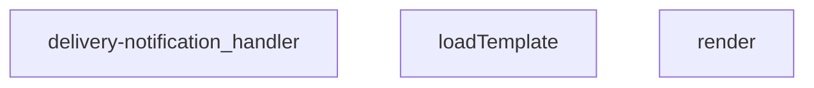
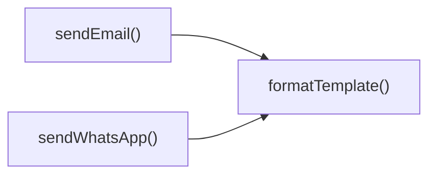
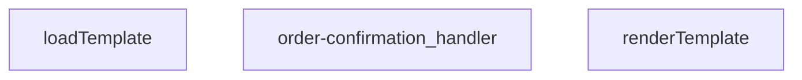
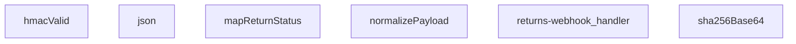
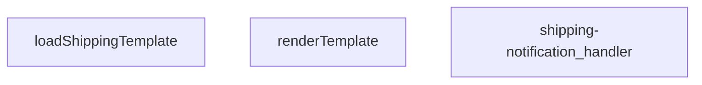
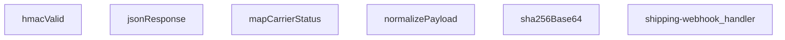
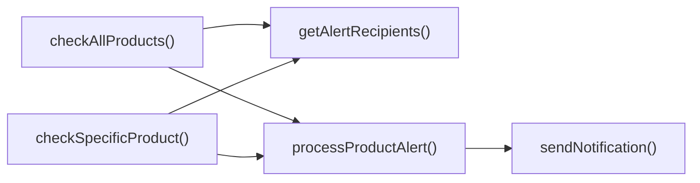
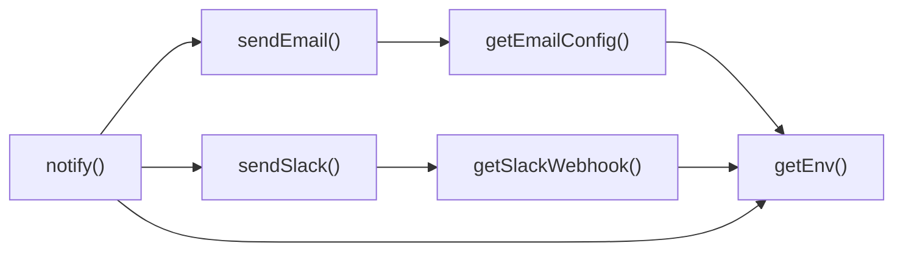
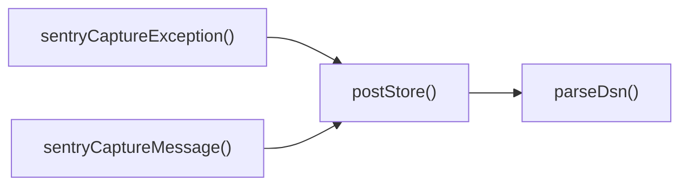

# SUPABASE FUNCTIONS MASTER

---
project_name: venthub-hvac
compiled_at: 2026-05-27T17:46:58.502345+00:00
total_compiled_files: 28
source: supabase/functions
---


---
# FILE: supabase\functions\admin-create-coupon\index.md

---
domain: general
source_type: doc
namespace_type: module
source_path: C:\Users\alize\venthub-hvac\supabase\functions\admin-create-coupon\index.ts
skeleton_hash: a957b854a7f7b2b2
generated_at: 2026-05-24T10:44:25Z
---

## Genel Bakış
Bu modül, Supabase Edge ortamında çalışan bir HTTP endpoint’idir ve yöneticinin yeni bir indirim kuponu oluşturmasını sağlar. Gelen istekten kupon verilerini alır, gerekli doğrulamaları yapar, veritabanına kaydeder ve CORS başlıkları eklenmiş bir yanıt döndürür.

## Fonksiyon Grupları
### Kupon Oluşturma ve Yanıt Üretimi
İstek verilerini işleyerek kupon kaydını gerçekleştirir ve işlem sonucuna göre uygun HTTP yanıtını (başarı veya hata) üretir.  
- admin-create-coupon_handler   (tekil fonksiyon)

---

## AXIOMS – Mimari Varsayımlar
Bu modül için özel aksiyom tanımlanmamıştır.

---

## FONKSIYON DETAYLARI

### admin-create-coupon_handler
**Ne yapar**: Bu fonksiyon, yönetici yetkisine sahip kullanıcıların indirim kuponları oluşturması için tasarlanmış Supabase Edge Function işleyicisidir. Gelen HTTP isteklerini alır, gerekli doğrulama ve kontrolleri gerçekleştirir, yeni kupon kayıtları oluşturur ve işlem sonucuna uygun yanıtlar döndürür.
**Nasıl yapar**: Öncelikle gelen isteğin kimlik doğrulamasını ve yönetici yetki seviyesini doğrular. İstek gövdesinden kupon oluşturmak için gerekli parametreleri ayrıştırır ve geçerliliğini kontrol eder. Doğrulanmış verilerle Supabase veritabanına yeni kupon kaydı ekler. İşlem başarılı olursa oluşturulan kupon verisini içeren yanıt döndürür, herhangi bir hata durumunda ilgili hata kodu ve mesajı ile yanıt oluşturur.
**Parametreler**:
- req: Request — İşlenecek HTTP isteği nesnesi. İstek gövdesinde kuponun detayları (örneğin kupon kodu, indirim yüzdesi/tutarı, son kullanma tarihi, maksimum kullanım sayısı vb.) bulunmalıdır.
**Dönüş**: Response — Yapılandırılmış HTTP yanıt nesnesi. Başarılı bir oluşturma işlemi durumunda 201 Created statüsü ve oluşturulan kupon verisini içeren JSON yanıtı döndürür. Yetkisiz erişim durumunda 401 Unauthorized, geçersiz istek verileri durumunda 400 Bad Request, sunucu taraflı hatalarda 500 Internal Server Error statüleri ile ilgili hata mesajları döndürülür.

---

## SABİTLER
- **corsHeaders** (object) — `{

  'Access-Control-Allow-Origin': '*',

  'Access-Control-Allow-Headers': '...`

---

## AST POINTERS

### [N1_NASIL] AST Pointer: C:\Users\alize\venthub-hvac\supabase\functions\admin-create-coupon\index.ts::admin-create-coupon_handler

- **params**: `req: Request`

- **ic_degiskenler**:
  - `SUPABASE_URL` — Supabase proje URL'si, `Deno.env.get('SUPABASE_URL')` ile alınır
  - `SUPABASE_ANON_KEY` — Supabase anonim anahtar, `Deno.env.get('SUPABASE_ANON_KEY')` ile alınır
  - `SUPABASE_SERVICE_ROLE_KEY` — Supabase servis rol anahtarı, `Deno.env.get('SUPABASE_SERVICE_ROLE_KEY')` ile alınır
  - `authHeader` — İstek Authorization başlığı değeri, `req.headers.get('Authorization')` ile alınır
  - `supabaseUser` — Kullanıcı tarafında doğrulama için anonim anahtar ve authorization başlığı ile oluşturulmuş Supabase istemcisi
  - `supabaseAdmin` — Yönetici işlemleri için servis rol anahtarı ile oluşturulmuş Supabase istemcisi
  - `userRes` — `supabaseUser.auth.getUser()` çağrısından dönen veri; `.user.id` ile kullanıcı ID'si alınır
  - `userErr` — `supabaseUser.auth.getUser()` çağrısından dönen hata
  - `userId` — Kimliği doğrulanmış kullanıcının UUID değeri (`userRes.user.id`)
  - `profile` — `supabaseAdmin.from('user_profiles').select('role').eq('id', userId).maybeSingle()` sorgusundan dönen profil satırı
  - `profErr` — Profil sorgusu sırasında oluşan hata
  - `userRole` — Kullanıcının rolü, `profile?.role` değeri veya varsayılan `'user'`
  - `body` — İstek gövdesinden JSON olarak ayrıştırılmış kupon verileri ( `await req.json().catch(() => ({}))` ), şu alanlara erişilir: `body.code`, `body.type`, `body.value`, `body.starts_at`, `body.ends_at`, `body.active`, `body.usage_limit`
  - `code` — Kupon kodu, `String(body.code || '').trim()` ile normalize edilmiş
  - `type` — İndirim türü (`'percent'` veya `'fixed'`), `String(body.type || '')`
  - `value` — İndirim değeri, `Number(body.value)` ile sayıya dönüştürülmüş
  - `starts_at` — Kupon başlangıç zamanı (string veya `null`), `body.starts_at` varsa `String(body.starts_at)` ile alınır
  - `ends_at` — Kupon bitiş zamanı (string veya `null`), `body.ends_at` varsa `String(body.ends_at)` ile alınır
  - `is_active` — Kuponun aktif olup olmadığı, `Boolean(body.active ?? true)`
  - `usage_limit` — Kullanım limiti (sayı veya `null`), `body.usage_limit` üzerinden hesaplanır
  - `errs` — Doğrulama hatalarını toplayan dizi (`string[]`)
  - `payload` — Veritabanına eklenecek kupon nesnesi, şu alanları içerir: `code`, `discount_type`, `discount_value`, `valid_from`, `valid_until`, `is_active`, `usage_limit`, `used_count`, `created_by`
  - `data` — `supabaseAdmin.from('coupons').insert(payload).select(...).single()` çağrısından dönen eklenmiş kupon satırı
  - `insErr` — Ekleme işlemi sırasında oluşan hata
  - `_e` — `catch` bloğunda yakalanan hata nesnesi
  - `msg` — Hata mesajı, `_e instanceof Error ? _e.message : String(_e)` ile elde edilir

- **Dönüş**: `Response` — Başarılı durumda 200, eksik çevre değişkenlerinde 500, kimlik doğrulama hatasında 401, yetki hatasında 403, doğrulama hatasında 400, ekleme hatasında 400, genel hata durumunda 500 döner. OPTIONS isteklerine 204, POST dışındaki metotlara 405 yanıtı verilir.

---

## NODE ID STANDARD

  file: supabase\functions\admin-create-coupon\index.ts
  function: supabase\functions\admin-create-coupon\index.ts::admin-create-coupon_handler

---

## DISA AKTARILANLAR (EXPORTS)
  export: admin-create-coupon_handler

---
# FILE: supabase\functions\admin-iyzico-reconcile\index.md

---
domain: general
source_type: doc
namespace_type: module
source_path: C:\Users\alize\venthub-hvac\supabase\functions\admin-iyzico-reconcile\index.ts
skeleton_hash: a45e063ea3065638
generated_at: 2026-05-24T10:44:24Z
---

## Genel Bakış
Bu modül, Supabase Edge Functions altyapısı üzerinde çalışan, yalnızca yetkilendirilmiş yöneticilerin Iyzico ödeme sistemi ile iç sistem kayıtları arasındaki veri tutarlılığını denetlemek için kullandığı bir API uç noktasıdır. Gelen HTTP isteğini alarak önce güvenlik katmanından (CORS yönetimi, kullanıcı doğrulama ve yetkilendirme) geçirir, ardından belirlenen uzlaştırma (reconcile) mantığını yürütür ve işlem sonucunu istemciye döndürür.

## Fonksiyon Grupları
### Güvenlik ve Reconciliasyon Orkestrasyonu
Bu grup, gelen admin API çağrılarının güvenli bir şekilde işlenmesini sağlar. Kimlik doğrulama, yetkilendirme, CORS başlıklarının yönetimi ve Iyzico ile sistem arasındaki veri uzlaştırma işlemlerini koordine eder.
- admin-iyzico-reconcile_handler

---

## AXIOMS – Mimari Varsayımlar
Bu modül için özel aksiyom tanımlanmamıştır.

---

---

## FONKSIYON DETAYLARI

### admin-iyzico-reconcile_handler
**Ne yapar**: VentHub HVAC projesinde Supabase altyapısında çalışan, sadece yetkili admin kullanıcıların erişebildiği Iyzico ödeme sistemi mutabakat işlemini yöneten ana giriş noktasıdır. Iyzico üzerinden gerçekleşen tüm ödeme işlemleri ile sistemde kayıtlı yerel ödeme verilerini karşılaştırarak ödeme mutabakatı sağlama iş akışını başlatır ve sonuçlarını kullanıcıya iletir.
**Nasıl yapar**: Öncelikle gelen HTTP talebini işleyerek talep sahibinin admin yetkisine sahip olup olmadığını doğrular. Yetki kontrolü başarılı olduğunda Iyzico ödeme servisinin API'lerini kullanarak mutabakat için gerekli tüm işlem kayıtlarını çeker, ardından bu kayıtları sistemdeki yerel veritabanında kayıtlı ödeme verileriyle eşleştirir. Eşleşme ve doğrulama süreçleri sonrası oluşan mutabakat raporunu standart HTTP yanıt formatında döndürür, yetkisiz erişim denemelerinde ise erişim engeli yanıtı üretir.
**Parametreler**:
- name: req — type: Request — Gelen HTTP isteği nesnesi, isteğin kimlik doğrulama başlıklarını, istek gövdesinde iletilen özel filtreleme parametrelerini ve talep sahibi kullanıcının sistemdeki kimlik bilgilerini içerir.
**Dönüş**: Response — İşlem sonucu oluşan standart HTTP yanıt nesnesi. Mutabakat işlemi başarılı olursa işlemin özeti, eşleşen ve eşleşmeyen kayıt sayıları gibi detayları içeren JSON yükünü; hata oluşması halinde hata kodu ve açıklamasını içeren yanıtı döndürür.

---

## AST POINTERS

### [N1_NASIL] AST Pointer: C:\Users\alize\venthub-hvac\supabase\functions\admin-iyzico-reconcile\index.ts::admin-iyzico-reconcile_handler
- **params**: (req)
- **ic_degiskenler**:
  - `cors` — CORS header set returned in every `Response`.
  - `supabaseUrl` — Supabase project URL read from environment variable `SUPABASE_URL`.
  - `serviceRoleKey` — Supabase service‑role key read from environment variable `SUPABASE_SERVICE_ROLE_KEY`.
  - `anonKey` — Supabase anon key read from environment variable `SUPABASE_ANON_KEY`.
  - `authHeader` — Value of the `Authorization` header from the incoming request.
  - `authClient` — Supabase client created with `supabaseUrl`, `anonKey`, and the request’s `Authorization` header.
  - `user` — Authenticated user object returned by `authClient.auth.getUser()`.
  - `authErr` — Error object returned by `authClient.auth.getUser()` if authentication fails.
  - `roleCheck` — `Response` from the fetch call that verifies the user’s role.
  - `arr` — Parsed JSON array from `roleCheck` containing role information.
  - `role` — Role string extracted from `arr[0]?.role`.
  - `body` — Parsed JSON body of the request when `req.method === 'POST'`.
  - `_id` — Order identifier extracted from request body or query string; `null` if absent.
  - `conv` — Conversation identifier extracted from request body or query string; `null` if absent.
  - `url` — `URL` instance built from `req.url` when the method is not `POST`.
  - `_limit` — Fixed pagination limit (`10`) used for the RPC call.
  - `rpcListUrl` — Full URL string for the Supabase RPC endpoint `fn_admin_get_orders`.
  - `listBody` — Payload object sent to the RPC endpoint; contains `p_id`, `p_conv`, `p_limit`, and conditional `p_status`.
  - `listResp` — `Response` from the RPC fetch request.
  - `text` — Textual body of a failed RPC response (fallback to empty string).
  - `orders` — Array of order records returned by the RPC call.
  - `su` — Temporary variable holding `supabaseUrl!` inside the IIFE that builds `fnHost`.
  - `host` — `URL` object created from `su` inside the IIFE.
  - `ref` — Subdomain part of `host.host` used to construct the function host URL.
  - `fnHost` — Base URL of the Supabase Edge Function host derived from the project URL.
  - `results` — Accumulator array that stores processing outcome for each order.
  - `o` — Individual order object iterated from `orders`.
  - `token` — Payment token extracted from the current order; `null` if missing.
  - `cbUrl` — Callback endpoint URL constructed from `fnHost`.
  - `cbResp` — `Response` from the callback POST request.
  - `cbJson` — Parsed JSON body of the callback response.
  - `st` — Status string obtained from `cbJson?.status`; defaults to `'pending'`.
  - `e` — Caught error object in both outer and inner `try‑catch` blocks.
  - `msg` — Human‑readable error message derived from `e`.
- **Dönüş**: `Response` object containing a JSON payload and appropriate HTTP status; the function performs external fetches, role verification, RPC calls, and callback invocations before returning the final response.

---

## NODE ID STANDARD

  file: supabase\functions\admin-iyzico-reconcile\index.ts
  function: supabase\functions\admin-iyzico-reconcile\index.ts::admin-iyzico-reconcile_handler

---

## DISA AKTARILANLAR (EXPORTS)
  export: admin-iyzico-reconcile_handler

---
# FILE: supabase\functions\admin-order-inspect\index.md

---
domain: general
source_type: doc
namespace_type: module
source_path: C:\Users\alize\venthub-hvac\supabase\functions\admin-order-inspect\index.ts
skeleton_hash: 16704d3ccdf6ab6d
generated_at: 2026-05-24T10:44:45Z
---

## Genel Bakış
Bu modül, VentHub HVAC projesinde Supabase üzerinde çalışan, yalnızca yetkili yöneticilerin erişebildiği sipariş inceleme servisidir. Gelen HTTP isteklerinden yetkilendirme verilerini ve incelenecek sipariş kimliğini ayrıştırarak tüm güvenlik ve geçerlilik kontrollerini gerçekleştirir. Doğrulama sonrası ilgili siparişin detaylarını başarı yanıtıyla, hata durumlarında ise uygun hata kodları ve mesajları içeren yanıtı istemciye iletir.

## Fonksiyon Grupları
### Ana HTTP İşleyicisi
Modülün tüm dış istekler için tek giriş noktası olarak görev alır, yönetici sipariş inceleme iş akışının tüm aşamalarını yönetir ve nihai HTTP yanıtını üretir.
- admin-order-inspect_handler

---

## AXIOMS – Mimari Varsayımlar
Bu modül için özel aksiyom tanımlanmamıştır.

---

---

## FONKSIYON DETAYLARI

### admin-order-inspect_handler
**Ne yapar**: Bu fonksiyon, Supabase Edge Function ortamında çalışan admin-order-inspect uç noktasının ana HTTP işleyicisidir. Yöneticilerin siparişleri denetlemesine olanak tanıyan işlemleri yürütür.

**Nasıl yapar**: Gelen `Request` nesnesini alır, istek yolunu ve metodunu analiz eder, gerekli kimlik doğrulama ve yetkilendirme kontrollerini gerçekleştirir. Ardından ilgili iş mantığını çalıştırır (örneğin Supabase veritabanından sipariş verilerini sorgulama veya güncelleme) ve sonucu bir `Response` nesnesi olarak döndürür.

**Parametreler**:
- req: `Request` — İstemciden gelen HTTP isteğini temsil eden nesne. İstek başlıkları, sorgu parametreleri, gövde ve kimlik bilgilerini içerir.

**Dönüş**: `Response` — İstemciye gönderilen HTTP yanıtı. Durum kodu, başlıklar ve isteğin sonucuna göre JSON formatında veri ya da hata mesajı içerir.

---

## AST POINTERS

### [N1_NASIL] AST Pointer: C:\Users\alize\venthub-hvac\supabase\functions\admin-order-inspect\index.ts::admin-order-inspect_handler
- **params**: (req: Request)
- **ic_degiskenler**:
  - `cors` — CORS başlıklarını içeren, yanıtların `headers` alanına eklenecek sabit nesne.
  - `supabaseUrl` — Ortam değişkeni `SUPABASE_URL` değerini tutar; Supabase istemcisi ve RPC URL'si oluşturmak için kullanılır.
  - `serviceRoleKey` — Ortam değişkeni `SUPABASE_SERVICE_ROLE_KEY` değerini tutar; yönetici yetkili Supabase istemcisi ve RPC çağrısı yetkilendirmesi için kullanılır.
  - `anonKey` — Ortam değişkeni `SUPABASE_ANON_KEY` değerini tutar; anonim Supabase istemcisi (kullanıcı kimlik doğrulaması) için kullanılır.
  - `authHeader` — Gelen istekten `Authorization` başlığını alır; kullanıcı kimliğini doğrulamak için Supabase istemcisine aktarılır.
  - `supabaseUser` — `createClient(supabaseUrl, anonKey, { global: { headers: { Authorization: authHeader } } })` ile oluşturulan anonim Supabase istemcisi; kullanıcı oturumunu sorgulamak için kullanılır.
  - `supabaseAdmin` — `createClient(supabaseUrl, serviceRoleKey)` ile oluşturulan yönetici yetkili Supabase istemcisi; veri tabanı sorguları (ör. `user_profiles`) için kullanılır.
  - `userRes` — `supabaseUser.auth.getUser()` çağrısının başarılı sonucunda dönen veri; içinde `user` nesnesi bulunur.
  - `userErr` — `supabaseUser.auth.getUser()` çağrısının hata nesnesi; hata durumunda yetkisiz yanıt döndürülür.
  - `profile` — `supabaseAdmin.from('user_profiles').select('role').eq('id', userRes.user.id).maybeSingle()` sorgusunun başarılı sonucunda dönen satır; kullanıcının rolünü içerir.
  - `profErr` — Yukarıdaki sorgunun hata nesnesi; hata durumunda yetkisiz yanıt döndürülür.
  - `userRole` — `profile?.role` değerinin `string | undefined` tipine dönüştürülmüş hali; rol kontrolü için kullanılır.
  - `id` — İstek URL sorgu parametresi `id` veya POST/PUT gövdesinden alınan `id`; sipariş kimliğini temsil eder.
  - `conv` — İstek URL sorgu parametresi `conv` veya POST/PUT gövdesinden alınan `conv`; konuşma kimliğini temsil eder.
  - `url` — `new URL(req.url)` ile oluşturulan URL nesnesi; sorgu parametrelerini okumak için kullanılır.
  - `body` — İstek gövdesi (`await req.json()`) veya RPC çağrısı gövdesi (`{ _p_id: id, p_conv: conv, p_status: null, p_limit: 1 }`); iki farklı bağlamda farklı içerik taşır.
  - `rpcUrl` — Supabase RPC endpoint’i: ``${supabaseUrl}/rest/v1/rpc/fn_admin_get_orders``; siparişleri getirmek için POST istek yapılır.
  - `resp` — `fetch(rpcUrl, {...})` çağrısının döndürdüğü `Response` nesnesi; HTTP durum ve veri kontrolü için kullanılır.
  - `_text` — `resp.text()` sonucundan elde edilen ham metin; RPC hatalı döndüğünde yanıt gövdesi olarak raporlanır.
  - `json` — `resp.json()` sonucundan elde edilen JSON veri; başarılı RPC yanıtı ise dizi/objektif içerik.
  - `row` — `json` bir dizi ise ilk elemanı (`json[0]`), aksi takdirde `null`; istenen sipariş kaydını temsil eder.
- **Dönüş**: `Response` — Fonksiyon, CORS başlıkları eklenmiş JSON içeren bir `Response` nesnesi döndürür; hata, yetki, parametre eksikliği, RPC hatası veya başarılı veri bulunması durumlarına göre farklı HTTP durum kodları ve içerikler üretir.

---

## NODE ID STANDARD

  file: supabase\functions\admin-order-inspect\index.ts
  function: supabase\functions\admin-order-inspect\index.ts::admin-order-inspect_handler

---

## DISA AKTARILANLAR (EXPORTS)
  export: admin-order-inspect_handler

---
# FILE: supabase\functions\admin-orders-latest\index.md

---
domain: general
source_type: doc
namespace_type: module
source_path: C:\Users\alize\venthub-hvac\supabase\functions\admin-orders-latest\index.ts
skeleton_hash: b282b0917505ca5b
generated_at: 2026-05-24T10:45:32Z
---

## Genel Bakış
Bu modül, yönetici paneli üzerinden en son siparişlerin getirilmesini sağlayan tek bir işlev içerir. Gelen HTTP isteğini işleyerek Supabase veritabanından güncel sipariş verilerini çeker ve bu veriyi bir HTTP yanıtı olarak döndürür.

## Fonksiyon Grupları
### Ana İşlev
Modülün tek sorumluluğu, yönetici tarafından istenen en son siparişleri listelemek ve bu veriyi istemciye iletmektir.
- admin-orders-latest_handler

---

## AXIOMS – Mimari Varsayımlar
Bu modül, tek bir zorunlu req parametresi alan admin-orders-latest_handler işlevini içerir.

[Aksiyom 1]: Eğer admin-orders-latest_handler fonksiyonu çağrılırken req parametresi sağlanmazsa, fonksiyonun çalışma zamanı davranışı bilinmiyor ve hata fırlatılabilir.
[Aksiyom 2]: Eğer admin-orders-latest_handler fonksiyonuna verilen req parametresi null veya undefined ise, fonksiyonun davranışı belirsizdir ve hata fırlatılabilir.

---

## FONKSIYON DETAYLARI

### admin-orders-latest_handler
**Ne yapar**: Fonksiyonun amacı kod içinde açıklanmadığı için belirlenememiştir.  
**Nasıl yapar**: İç mantığı kodda tanımlanmadığı için açıklanamaz.  
**Parametreler**:
- req: any — Fonksiyonun işleyebilmesi için gelen istek nesnesi.  
**Dönüş**: Response — Fonksiyonun ürettiği yanıt nesnesi.

---

## AST POINTERS

### [N1_NASIL] AST Pointer: C:\Users\alize\venthub-hvac\supabase\functions\admin-orders-latest\index.ts::admin-orders-latest_handler
- **params**: `req`
- **ic_degiskenler**:
  - `origin` — request header `origin` value or empty string if not present
  - `allowed` — array of allowed origins parsed from `ALLOWED_ORIGINS` environment variable
  - `okOrigin` — boolean indicating whether the request origin is allowed
  - `requestId` — unique identifier for the request, generated by `crypto.randomUUID()` or fallback to current timestamp
  - `cors` — object containing CORS headers to be applied to all responses
  - `supabaseUrl` — Supabase project URL from `SUPABASE_URL` environment variable
  - `serviceRoleKey` — Supabase service role key from `SUPABASE_SERVICE_ROLE_KEY` environment variable
  - `authHeader` — `Authorization` header value from the request
  - `anonKey` — Supabase anonymous key from `SUPABASE_ANON_KEY` environment variable
  - `supabaseUser` — Supabase client instance authenticated with the request's `Authorization` header
  - `supabaseAdmin` — Supabase client instance authenticated with the service role key
  - `userRes` — result of `supabaseUser.auth.getUser()` containing user information
  - `userErr` — error returned from `supabaseUser.auth.getUser()`
  - `profile` — result of querying `user_profiles` table for the current user’s role
  - `profErr` — error returned from the profile query
  - `userRole` — role of the current user extracted from `profile`
  - `url` — `URL` object constructed from the request URL
  - `status` — `status` query parameter value trimmed or empty string
  - `from` — `from` query parameter value trimmed or empty string
  - `to` — `to` query parameter value trimmed or empty string
  - `q` — `q` query parameter value trimmed or empty string
  - `preset` — `preset` query parameter value trimmed or empty string
  - `limitParam` — numeric limit for pagination, clamped between 1 and 100
  - `pageParam` — numeric page number, at least 1
  - `offset` — offset for pagination calculated from `pageParam` and `limitParam`
  - `params` — `URLSearchParams` instance used to build the Supabase REST query
  - `isPendingShipments` — boolean indicating if the `preset` is `pendingShipments`
  - `requestUrl` — full URL for the Supabase REST request including query parameters
  - `resp` — response object returned by `fetch(requestUrl, …)`
  - `rows` — array of order records parsed from the response body
  - `contentRange` — `content-range` header value from the response
  - `total` — total number of matching records extracted from `content-range`
- **Dönüş**: `Response` object containing JSON payload `{ total, page, _limit, rows }` with status 200, or error responses with appropriate status codes and CORS headers.

### [N2_NASIL] AST Pointer: C:\Users\alize\venthub-hvac\supabase\functions\admin-orders-latest\index.ts::normalizeDateStart
- **params**: `d`
- **ic_degiskenler**:
  - `d` — date string in either `YYYY-MM-DD` or ISO format
- **Dönüş**: ISO string representing the start of the day (`YYYY-MM-DDT00:00:00Z`) if `d` matches `YYYY-MM-DD`; otherwise returns `d` unchanged.

### [N3_NASIL] AST Pointer: C:\Users\alize\venthub-hvac\supabase\functions\admin-orders-latest\index.ts::normalizeDateEnd
- **params**: `d`
- **ic_degiskenler**:
  - `d` — date string in either `YYYY-MM-DD` or ISO format
- **Dönüş**: ISO string representing the end of the day (`YYYY-MM-DDT23:59:59Z`) if `d` matches `YYYY-MM-DD`; otherwise returns `d` unchanged.

---

## NODE ID STANDARD

  file: supabase\functions\admin-orders-latest\index.ts
  function: supabase\functions\admin-orders-latest\index.ts::admin-orders-latest_handler

---

## DISA AKTARILANLAR (EXPORTS)
  export: admin-orders-latest_handler

---
# FILE: supabase\functions\admin-update-order\index.md

---
domain: general
source_type: doc
namespace_type: module
source_path: C:\Users\alize\venthub-hvac\supabase\functions\admin-update-order\index.ts
skeleton_hash: f52d9153a17ad7ad
generated_at: 2026-05-24T10:44:51Z
---

## Genel Bakış
Bu modül, yönetici (admin) yetkisine sahip bir kullanıcının bir siparişi güncelleme talebini işleyen tek bir HTTP handler fonksiyonunu barındırır. Gelen istek doğrulanır, ilgili sipariş verisi güncellenir ve işlem sonucuna göre uygun bir HTTP yanıtı döndürülür.

## Fonksiyon Grupları
### İstek İşleme ve Yanıt Üretimi
Modülün temel sorumluluğu, admin tarafından gönderilen sipariş güncelleme isteğini alıp işlemek, gerekli veri güncellemelerini gerçekleştirmek ve sonucu istemciye HTTP yanıtı olarak iletmektir.  
- admin-update-order_handler

### Yardımcı İşlevler (İç Fonksiyonlar)
Bu yardımcı fonksiyonlar, ana handler içinde tanımlanarak güncelleme işleminin farklı aşamalarını soyutlar: bir siparişin belirli alanlarını yama (patch) işlemiyle güncellemek ve güncellenen siparişin son durumunu elde etmek için en yeni sipariş kaydını listelemek.  
- patch, listRecent

---

## AXIOMS – Mimari Varsayımlar
Bu modülün doğru çalışması için aşağıdaki koşulların sağlanması gerekir.

**Aksiyom 1**: Eğer `req` parametresi sağlanmazsa, fonksiyon çalıştırılamaz ve bir hata (ör. `TypeError`/`BadRequest`) fırlatılır.  

**Aksiyom 2**: Eğer `req` nesnesi, HTTP isteğiyle ilgili zorunlu özellikleri (ör. `method`, `headers`, `body`) içermiyorsa, fonksiyon istek doğrulamasını geçemez ve uygun bir HTTP 400 (Bad Request) yanıtı döndürür.  

**Aksiyom 3**: Eğer `req.headers` içinde geçerli bir admin kimlik doğrulama tokenı (`Authorization` başlığı) bulunmazsa, fonksiyon yetkilendirme hatası verir ve HTTP 401 (Unauthorized) yanıtı döndürür.  

**Aksiyom 4**: Eğer `req.body` içinde güncellenmesi gereken siparişin kimliği (`orderId`) ve güncellenebilir alanlar (`status`, `details` vb.) eksik ya da geçersiz biçimdeyse, fonksiyon veri doğrulama hatası üretir ve HTTP 422 (Unprocessable Entity) yanıtı döndürür.  

**Aksiyom 5**: Eğer veri katmanı (ör. veritabanı/ Supabase) erişilemez ya da güncelleme işlemi başarısız olursa, fonksiyon bir iç hata (HTTP 500) döndürür.  

**Aksiyom 6**: Eğer tüm doğrulama ve güncelleme adımları başarılı bir şekilde tamamlanırsa, fonksiyon HTTP 200 (OK) ya da uygun bir başarı kodu (ör. 204 No Content) ile güncellenmiş sipariş bilgisini yanıt olarak döndürür.  

**Aksiyom 7**: Eğer `req` nesnesi beklenen `Request` tipinde değilse (ör. farklı bir sınıf ya da yapı), fonksiyon tip uyumsuzluğu nedeniyle çalışamaz ve bir tip hatası (`TypeError`) fırlatır.

---

## FONKSIYON DETAYLARI

### admin-update-order_handler
**Ne yapar**: Bu fonksiyon, VentHub HVAC projesinin Supabase admin-update-order fonksiyonunun ana istek işleyicisidir; gelen HTTP isteğini alarak sipariş güncelleme işlemlerini yönetir ve uygun bir HTTP yanıtı üretir. @ts-nocheck etiketi nedeniyle TypeScript derleyici kontrollerinden muaf tutulur.
**Nasıl yapar**: Fonksiyon, giriş olarak bir HTTP Request nesnesi alır, sipariş güncellemeyle ilgili temel işlemleri (kaynak koddaki spesifik mantık detayları verilmemiş olsa da) yürütür ve sonuç olarak bir Response nesnesi döndürür. TypeScript'in tip güvenliği kontrolleri bu fonksiyon için devre dışıdır.
**Parametreler**:
- name: req — type: Request — Bu, fonksiyona gelen HTTP isteğini temsil eden nesnedir; sipariş güncelleme için gerekli istek gövdesi, başlıklar, kimlik doğrulama bilgileri veya sorgu parametreleri gibi verileri içerebilir.
**Dönüş**: Response türünde bir nesne döndürür; bu, sipariş güncelleme işleminin sonucunu (başarı veya başarısızlık durumu, ilgili mesajlar, güncellenen sipariş verileri vb.) içeren HTTP yanıtını ifade eder.

---

## AST POINTERS

### [N1_NASIL] AST Pointer: C:\Users\alize\venthub-hvac\supabase\functions\admin-update-order\index.ts::admin-update-order_handler
- **params**: `req: Request`
- **ic_degiskenler**:
  - `origin` — `req.headers.get('origin')` sonucunu tutar; CORS kontrolü için kullanılır.
  - `allowed` — ortam değişkeni `ALLOWED_ORIGINS`ten virgülle ayrılmış izinli origin listesi.
  - `okOrigin` — gelen `origin` izinli mi yoksa tüm originlere izin veriliyor mu kontrolü.
  - `requestId` — isteği izlemek için oluşturulan benzersiz kimlik; `crypto.randomUUID()` veya zaman damgası.
  - `cors` — CORS yanıt başlıklarını içeren nesne.
  - `ct` — `content-type` başlığının düşük harfli değeri; JSON olup olmadığını kontrol eder.
  - `max` — ortam değişkeni `MAX_BODY_KB` (KB) değerinin byte’a çevrilmiş sınırı.
  - `cl` — `content-length` başlığının sayısal değeri; istek gövdesi boyut kontrolü.
  - `supabaseUrl` — ortam değişkeni `SUPABASE_URL`.
  - `serviceRoleKey` — ortam değişkeni `SUPABASE_SERVICE_ROLE_KEY`.
  - `anonKey` — ortam değişkeni `SUPABASE_ANON_KEY`.
  - `authHeader` — `Authorization` başlığı; kimlik doğrulama için zorunlu.
  - `authClient` — `createClient(supabaseUrl, anonKey, {global:{headers:{Authorization:authHeader}}})` ile oluşturulan Supabase istemcisi.
  - `user` — `authClient.auth.getUser()` çağrısından elde edilen doğrulanmış kullanıcı nesnesi.
  - `authErr` — `authClient.auth.getUser()` çağrısının hata nesnesi.
  - `roleCheck` — Kullanıcının rolünü sorgulamak için yapılan `fetch` isteği.
  - `arr` — `roleCheck.json()` sonucundan elde edilen dizi; boşsa `[]`.
  - `role` — `arr[0]?.role`; kullanıcının rolü.
  - `body` — `await req.json()` sonucu; JSON parse hatası durumunda `{}`.
  - `id` — `body.id`; güncellenecek siparişin tekil kimliği.
  - `conversation_id` — `body.conversation_id`; alternatif kimlik.
  - `status` — `body.status`; yeni durum değeri (varsayılan `'paid'`).
  - `display_code` — `body.display_code`; UI’da gösterilen son 8 hane kodu.
  - `newStatus` — `status` değerinin string temsili; güncelleme için kullanılacak.
  - `resp` — `Response | null`; `patch` fonksiyonundan dönen yanıt.
  - `ok` — `resp && resp.ok`; PATCH isteğinin başarılı olup olmadığını gösterir.
  - `text` — `resp ? await resp.text() : ''`; PATCH yanıtının gövdesi.
- **Dönüş**: `Response` – CORS başlıkları ve `X-Request-Id` içeren JSON yanıt döner; hata durumlarında ilgili HTTP durum kodlarıyla yanıt verir.

### [N2_NASIL] AST Pointer: C:\Users\alize\venthub-hvac\supabase\functions\admin-update-order\index.ts::patch
- **params**: `filter: string`
- **ic_degiskenler**:
  - `supabaseUrl` — dış kapsamdan (ana fonksiyon) alınan Supabase URL.
  - `serviceRoleKey` — dış kapsamdan alınan servis rol anahtarı.
  - `newStatus` — dış kapsamdan alınan güncellenmek istenen sipariş durumu.
- **Dönüş**: `Promise<Response>` – PATCH isteği sonucunda Supabase'den gelen `Response` nesnesi.

### [N3_NASIL] AST Pointer: C:\Users\alize\venthub-hvac\supabase\functions\admin-update-order\index.ts::listRecent
- **params**: `_limit = 100`
- **ic_degiskenler**:
  - `supabaseUrl` — dış kapsamdan alınan Supabase URL.
  - `serviceRoleKey` — dış kapsamdan alınan servis rol anahtarı.
  - `res` — `fetch` ile alınan yanıt nesnesi.
  - `txt` — `res.text()` ile elde edilen yanıt gövdesi (string).
  - `data` — `txt` JSON parse edilerek elde edilen dizi; parse hatası durumunda `[]`.
- **Dönüş**: `Promise<Array<any>>` – Sipariş kayıtlarını içeren dizi; hatalı parse durumunda boş dizi.

---

## NODE ID STANDARD

  file: supabase\functions\admin-update-order\index.ts
  function: supabase\functions\admin-update-order\index.ts::admin-update-order_handler

---

## DISA AKTARILANLAR (EXPORTS)
  export: admin-update-order_handler

---
# FILE: supabase\functions\admin-update-shipping\index.md

---
domain: general
source_type: doc
namespace_type: module
source_path: C:\Users\alize\venthub-hvac\supabase\functions\admin-update-shipping\index.ts
skeleton_hash: 7a7e3250996d2d50
generated_at: 2026-05-24T10:47:56Z
---

## Genel Bakış
Bu modül, Supabase üzerindeki admin güncelleme işlevini sağlayan bir HTTP işleyicidir. Admin tarafından gönderilen kargo bilgisi güncelleme isteklerini alır, doğrular ve ilgili veri tabanı güncelleme işlemini tetikler.

---

## AXIOMS – Mimari Varsayımlar
Bu modül için özel aksiyom tanımlanmamıştır.

---

## FONKSIYON DETAYLARI

### admin-update-shipping_handler
**Ne yapar**: Bu Supabase Edge Fonksiyonu, yetkili admin kullanıcılarının sistemdeki mevcut kargo bilgilerini güncellemek için kullanılan ana işleyici fonksiyondur. Gelen HTTP isteklerini alır, gerekli doğrulama ve işleme adımlarını gerçekleştirir ve güncelleme işleminin sonucuna uygun bir yanıt döndürür.

**Nasıl yapar**: Öncelikle gelen isteğin kimlik doğrulama bilgilerini kontrol ederek admin yetkisine sahip olup olmadığını doğrular. Eğer yetki geçersizse hemen yetkisiz erişim yanıtı döndürür. Geçerli yetki durumunda isteğin gövdesinden güncellenecek kargo kaydının kimliği ve yeni kargo bilgilerini çıkarır. Ardından Supabase veritabanı bağlantısını kullanarak ilgili kargo kaydını bulur, alınan yeni verilerle günceller. İşlem sırasında herhangi bir hata oluşursa uygun hata kodu ve açıklama içeren yanıt döndürür, başarılı bir güncelleme sonrası ise onay mesajı ve güncellenmiş kargo verisini içeren yanıt gönderir.

**Parametreler**:
- req: Request — Fonksiyona iletilen standart HTTP istek nesnesi, kimlik doğrulama token'ları, istek gövdesi, başlık bilgileri ve diğer istekle ilgili tüm verileri barındırır.

**Dönüş**: Response — İşlem sonucunu belirten HTTP durum kodları ve ilgili veriler içeren yanıt nesnesi. Başarılı durumda 200 OK kodu ile güncellenmiş kargo bilgilerini döndürür; yetkisiz erişimde 401 Unauthorized, geçersiz istek verilerinde 400 Bad Request ve sunucu taraflı hatalarda 500 Internal Server Error kodları ile açıklayıcı mesajlar içerir.

---

## AST POINTERS

### [N1_NASIL] AST Pointer: C:\Users\alize\venthub-hvac\supabase\functions\admin-update-shipping\index.ts::admin-update-shipping_handler
- **params**: `req: Request`
- **ic_degiskenler**:
  - `requestId` — Unique request identifier generated via `crypto.randomUUID()` or current timestamp as fallback
  - `origin` — Value of the `Origin` request header, defaults to empty string
  - `allowed` — Trimmed, filtered list of allowed CORS origins from `ALLOWED_ORIGINS` environment variable
  - `okOrigin` — Boolean indicating if the request origin is permitted via CORS rules
  - `cors` — Object containing standard CORS response headers
  - `ct` — Lowercased `Content-Type` request header value, defaults to empty string
  - `max` — Maximum allowed request body size in bytes, derived from `MAX_BODY_KB` environment variable (default 200KB)
  - `cl` — Request body content length from header, defaults to 0 if missing/unparseable
  - `_text` — Raw plaintext body of the incoming request, awaited from the request
  - `parsed` — Parsed JSON request body, defaults to empty object if parsing fails
  - `pick` — Nested helper function to extract valid parameter values from parsed body or query params
  - `qs` — URL search parameters extracted from the request URL
  - `cancel` — Boolean flag indicating if shipping should be canceled, derived from request body or query params
  - `order_id` — Unique identifier for the target order, pulled from body or query params
  - `carrier` — Shipping carrier name, pulled from body or query params
  - `tracking_number` — Package tracking number, pulled from body or query params
  - `tracking_url` — Direct tracking URL for the package, pulled from body or query params
  - `send_email` — Boolean flag indicating if customer notification email should be sent, defaults to true
  - `supabaseUrl` — Supabase project URL from `SUPABASE_URL` environment variable
  - `anonKey` — Supabase anonymous public key from `SUPABASE_ANON_KEY` environment variable
  - `serviceKey` — Supabase service role key from `SUPABASE_SERVICE_ROLE_KEY` environment variable
  - `authHeader` — Value of the `Authorization` request header
  - `authClient` — Authenticated Supabase client instance using the request's authorization header
  - `authErr` — Error returned from the Supabase auth getUser call
  - `user` — Authenticated user data returned from Supabase auth
  - `roleCheck` — Fetch response from Supabase REST API to verify the user's role
  - `arr` — Parsed JSON array from the roleCheck API response, defaults to empty array on failure
  - `role` — User's role from the user_profiles table entry
  - `isCurrentlyShipped` — Boolean indicating if the order is already marked as shipped
  - `wantCancel` — Combined cancel condition, true if explicitly requested or order is already shipped without carrier/tracking
  - `updCancel` — Fetch response from Supabase REST API to cancel order shipping
  - `txt` — Raw text response from failed cancel update request
  - `isFirstShip` — Boolean indicating if this is the first time the order is being marked as shipped
  - `cur` — Fetch response from Supabase REST API to get current order status
  - `row` — First entry from the current order status API response array
  - `patchBody` — Object containing fields to update on the venthub_orders table
  - `upd` — Fetch response from Supabase REST API to update order shipping details
  - `headerKey` — Idempotency key from the `x-idempotency-key` request header
  - `derivedKey` — SHA-256 hashed idempotency key computed from request parameters
  - `idemKey` — Final idempotency key, uses headerKey if present otherwise derivedKey
  - `ordResp` — Fetch response from Supabase REST API to get order user details
  - `uid` — User ID associated with the target order
  - `usrResp` — Fetch response from Supabase Auth Admin API to get customer details
  - `u` — Parsed user data from the Auth Admin API response
  - `customer_email` — Customer's email address fetched from Auth Admin API
  - `customer_name` — Customer's full name from user metadata
  - `emailResult` — Object tracking the status of the shipping notification email
  - `resp` — Fetch response from the shipping-notification edge function
  - `j` — Parsed JSON response from the shipping-notification function
  - `body` — JSON body for logging the shipping email event
  - `_e` — Caught error in the top-level try/catch block
  - `msg` — Extracted error message from the caught exception
- **Dönüş**: `Response` (HTTP response object with appropriate status, headers, and body)

---

### [N2_NASIL] AST Pointer: C:\Users\alize\venthub-hvac\supabase\functions\admin-update-shipping\index.ts::pick
- **params**: `keys: string[]` (array of parameter keys to search for)
- **ic_degiskenler**:
  - `k` — Current key being iterated over from the input keys array
  - `v` — Value associated with the current key in the parsed request body
- **Dönüş**: `string | null` (Trimmed valid parameter value or null if no valid value found)

---

### [N3_NASIL] AST Pointer: C:\Users\alize\venthub-hvac\supabase\functions\admin-update-shipping\index.ts::cancel_flag_getter
- **params**: (no input parameters)
- **ic_degiskenler**:
  - `vRaw` — Raw cancel value pulled from parsed request body or URL query params
- **Dönüş**: `boolean` (Parsed boolean cancel flag, defaults to false if no valid value found)

---

### [N4_NASIL] AST Pointer: C:\Users\alize\venthub-hvac\supabase\functions\admin-update-shipping\index.ts::send_email_flag_getter
- **params**: (no input parameters)
- **ic_degiskenler**:
  - `v` — Raw send_email value pulled from parsed request body or URL query params
- **Dönüş**: `boolean` (Parsed boolean send email flag, defaults to true if no valid value found)

---

### [N5_NASIL] AST Pointer: C:\Users\alize\venthub-hvac\supabase\functions\admin-update-shipping\index.ts::computeIdemKey
- **params**: `action: 'ship' | 'cancel'`, `orderId: string`, `carrier?: string|null`, `tn?: string|null`
- **ic_degiskenler**:
  - `raw` — Concatenated raw string of all input parameters for hashing
  - `bytes` — UTF-8 encoded binary data of the raw string
  - `hash` — SHA-256 cryptographic hash of the raw byte data
- **Dönüş**: `Promise<string>` (Hex-encoded SHA-256 hash string used as idempotency key)

---

## NODE ID STANDARD

  file: supabase\functions\admin-update-shipping\index.ts
  function: supabase\functions\admin-update-shipping\index.ts::admin-update-shipping_handler

---

## DISA AKTARILANLAR (EXPORTS)
  export: admin-update-shipping_handler

---
# FILE: supabase\functions\apply-coupon\index.md

---
domain: general
source_type: doc
namespace_type: module
source_path: C:\Users\alize\venthub-hvac\supabase\functions\apply-coupon\index.ts
skeleton_hash: 9b98a0b5fd98d396
generated_at: 2026-05-24T10:44:57Z
---

## Genel Bakış
Bu modül, VentHub HVAC projesi için bir Supabase Edge Fonksiyonu olarak kupon uygulama işlemlerini yönetir. Farklı kökenlerden (cross-origin) gelen isteklerin tarayıcı güvenlik kurallarına uygun çalışması için CORS başlıkları yapılandırması yapar ve kupon doğrulama ile uygulama süreçlerini yürütüp uygun yanıtlar döndürür.

## Fonksiyon Grupları
### CORS Yapılandırma Yardımcıları
Farklı kökenlerden gelen HTTP isteklerinin tarayıcı güvenlik kurallarına uygun işlenmesi için gerekli CORS başlıklarını oluşturur ve yapılandırır.
- buildCors

### Kupon Uygulama Ana İş Akışı
Kupon uygulama işleminin temel iş akışını yönetir; gelen HTTP isteğini alır, CORS başlıkları oluşturmak için yardımcı fonksiyonları kullanır, gerekli doğrulama ve işleme adımlarını yürütür ve işlem sonucunu uygun bir yanıt olarak döndürür.
- apply-coupon_handler

---

## AXIOMS – Mimari Varsayımlar
Bu modül için özel aksiyom tanımlanmamıştır.

---

## FONKSIYON DETAYLARI

### buildCors
**Ne yapar**: Bu fonksiyon, gelen HTTP isteği için Cross-Origin Resource Sharing (CORS) başlıklarını oluşturur ve tarayıcı güvenlik politikalarını yönetir.
**Nasıl yapar**: Gelen istek nesnesini inceleyerek izin verilen kökenleri (origins) ve HTTP metodlarını belirler, ardından uygun başlık bilgilerini ve bir doğrulama bayrağını içeren bir nesne döndürür.
**Parametreler**:
- req: Request — CORS politikalarının değerlendirilmesi için gerekli meta verilere ve başlıklara sahip gelen HTTP isteği nesnesi.
**Dönüş**: { headers, ok } — CORS başlıklarını ve işlemin başarılı olup olmadığını belirten bir boolean değer içeren nesne.

### apply-coupon_handler
**Ne yapar**: Bu fonksiyon, kupon kodu uygulama işlemini yöneten ana istek işleyicisidir ve gelen istekleri işleyerek ilgili mantığı uygular.
**Nasıl yapar**: İstek içeriğinden kupon kodunu ve kullanıcı bağlamını ayıklar, kuponun geçerliliğini kontrol eder ve işlemin sonucuna göre başarılı veya hatalı bir HTTP yanıtı oluşturur.
**Parametreler**:
- req: Request — Kupon bilgilerini ve oturum verilerini içeren yükü barındıran gelen HTTP isteği nesnesi.
**Dönüş**: Response — Kupon uygulama işleminin sonucunu, durum kodlarını ve gerekli JSON verilerini içeren HTTP yanıt nesnesi.

---

## TYPE ALIASES

### CouponRow
```typescript
type CouponRow = {

  code: string

  discount_type: 'percentage' | 'fixed_amount'

  discount_value: number

  minimum_order_amount: number | null

  valid_from: string | null

  valid_until: string | null

  is_acti
```

### ApplyCouponReq
```typescript
type ApplyCouponReq = {

  code: string

  subtotal: number

}
```

### ApplyCouponResp
```typescript
type ApplyCouponResp = {

  val_id: boolean

  reason?: string

  discount_amount?: number

  final_total?: number

  normalized_code?: string

}
```

---

## AST POINTERS

### [N1_NASIL] AST Pointer: C:\Users\alize\venthub-hvac\supabase\functions\apply-coupon\index.ts::buildCors
- **params**: `req: Request` — Gelen HTTP isteği nesnesi
- **ic_degiskenler**:
  - `origin` — İstekten alınan Origin HTTP başlığı, başlık yoksa boş string olarak atanır
  - `allowed` — ALLOWED_ORIGINS ortam değişkeninden ayrıştırılan, virgülle ayrılmış izin verilen origin listesi, her elemanın boşlukları temizlenmiş ve boş stringler filtrelenmiş
  - `ok` — İstek origin'i izin verilen listede ise true, aksi takdirde false; eğer izin listesi boşsa her zaman true
  - `headers` — CORS yanıt başlıklarını içeren Record<string, string> tipinde nesne
- **Dönüş**: `{ headers: Record<string, string>, ok: boolean }` — CORS başlıkları ve izin durumu içeren nesne

---

### [N2_NASIL] AST Pointer: C:\Users\alize\venthub-hvac\supabase\functions\apply-coupon\index.ts::apply-coupon_handler
- **params**: `req: Request` — Gelen HTTP isteği nesnesi
- **ic_degiskenler**:
  - `requestId` — Benzersiz istek kimliği, `crypto.randomUUID()` ile üretilir, eğer bu fonksiyon yoksa `Date.now()` string olarak kullanılır
  - `cors` — `buildCors(req)` çağrısından dönen CORS yapılandırma nesnesi
  - `ct` — İstekten alınan `Content-Type` başlığının küçük harfe çevrilmiş hali, başlık yoksa boş string
  - `max` — İzin verilen maksimum istek gövdesi boyutu (bayt cinsinden), `MAX_BODY_KB` ortam değişkeninden alınır, varsayılan değer 100 KB'dir
  - `cl` — İstekten alınan `Content-Length` başlığının tam sayıya çevrilmiş hali, başlık yoksa 0 değeri kullanılır
  - `SUPABASE_URL` — Supabase proje URL'si, `SUPABASE_URL` ortam değişkeninden alınır
  - `SUPABASE_SERVICE_ROLE_KEY` — Supabase servis rolü anahtarı, `SUPABASE_SERVICE_ROLE_KEY` ortam değişkeninden alınır
  - `supabase` — `createClient()` fonksiyonu ile başlatılan Supabase istemci nesnesi
  - `forwarded` — İstekten alınan `x-forwarded-for` başlığı, başlık yoksa boş string
  - `ip` — İstemci IP adresi, `x-real-ip`, `cf-connecting-ip` başlıkları veya `x-forwarded-for`'un ilk parçası ile alınır, hiçbiri yoksa `unknown` değeri kullanılır
  - `key` — Hız sınırı kontrolü için kullanılan önbellek anahtarı, `coupon:${ip}` formatında oluşturulur
  - `checkRateLimit` — `../_shared/rate_limit.ts` dosyasından ithal edilen hız sınırı kontrol fonksiyonu
  - `rateLimitHeaders` — `../_shared/rate_limit.ts` dosyasından ithal edilen hız sınırı yanıt başlıkları üreten fonksiyon
  - `result` — Hız sınırı kontrolünün sonucu, izin verildi mi?, kalan istek sayısı ve sıfırlama zamanı bilgilerini içerir
  - `body` — İstekten ayrıştırılan JSON gövdesi, ayrıştırma hatası olursa boş nesne kullanılır
  - `code` — İstek gövdesinden alınan kupon kodu, baştaki ve sondaki boşluklar temizlenmiş, değer yoksa boş string kullanılır
  - `subtotal` — İstek gövdesinden alınan sipariş alt toplamı, değer yoksa 0 değeri kullanılır
  - `_data` — Supabase `coupons` tablosu sorgusundan dönen ham veri
  - `error` — Supabase sorgusundan dönen hata nesnesi
  - `row` — Supabase sorgusundan dönen kupon satırı, `CouponRow` tipi veya `null` değeri
  - `now` — Mevcut Unix zaman damgası (milisaniye cinsinden)
  - `startsOk` — Kuponun geçerlilik başlangıç zamanı kontrol sonucu, kuponun başlangıç tarihi yoksa her zaman true
  - `endsOk` — Kuponun geçerlilik bitiş zamanı kontrol sonucu, kuponun bitiş tarihi yoksa her zaman true
  - `activeOk` — Kuponun aktif durumu kontrol sonucu
  - `limitOk` — Kuponun kullanım limiti kontrol sonucu, limiti tanımlanmamışsa her zaman true
  - `minOk` — Sipariş alt toplamının kuponun minimum sipariş tutarını karşılama kontrol sonucu, minimum tutar tanımlanmamışsa her zaman true
  - `discount` — Hesaplanan indirim miktarı, kupon tipine göre yüzde veya sabit miktar olarak hesaplanır
  - `finalTotal` — İndirim uygulandıktan sonra son sipariş toplamı, iki ondalık basamağa yuvarlanmış
  - `resp` — Kupon doğrulama sonucunu içeren yanıt nesnesi, `ApplyCouponResp` tipi
  - `_e` — Üst seviye `try/catch` bloğunda yakalanan hata nesnesi
  - `msg` — Yakalanan hatanın string olarak çevrilmiş hali, eğer hata bir Error nesnesi ise mesajı, aksi takdirde hatanın kendisini string olarak çevirir
- **Dönüş**: `Response` — HTTP yanıt nesnesi, durum kodu, içerik türü ve CORS başlıkları ile birlikte gönderilir

---

## NODE ID STANDARD

  file: supabase\functions\apply-coupon\index.ts
  function: supabase\functions\apply-coupon\index.ts::buildCors
  function: supabase\functions\apply-coupon\index.ts::apply-coupon_handler

---

## DISA AKTARILANLAR (EXPORTS)
  export: apply-coupon_handler
  export: buildCors

---
# FILE: supabase\functions\delivery-notification\index.md

---
domain: general
source_type: doc
namespace_type: module
source_path: C:\Users\alize\venthub-hvac\supabase\functions\delivery-notification\index.ts
skeleton_hash: 43bb5a40d783a90f
generated_at: 2026-05-25T12:53:42Z
---

## Genel Bakış
Bu modül, bir Supabase Edge Function olarak teslimat tamamlandığında müşterilere otomatik e‑posta bildirimi gönderir. Sipariş verilerini veritabanından çeker, önceden hazırlanmış şablonları doldurur ve harici bir e‑posta servisi üzerinden mesajı iletir; işlem sonucu ise denetim amaçlı kaydedilir.

## Fonksiyon Grupları
### Şablon İşleme
E‑posta şablonlarının dosya sisteminden okunmasını ve sipariş bilgileriyle dinamik olarak doldurulmasını sağlar.
- loadTemplate, render

### Ana İstek İşleyici
Gelen HTTP isteklerini alır, yetkilendirmeyi kontrol eder, sipariş verilerini veritabanından çeker, şablon doldurma ve e‑posta gönderimi adımlarını koordine eder ve işlem sonuçlarını loglar.
- delivery-notification_handler

---

## AXIOMS – Mimari Varsayımlar
Bu modülün doğru çalışması için veritabanı bağlantısı, harici e-posta servisi yapılandırması ve dosya sistemi üzerinde şablon dosyasının varlığı gereklidir.

[Veritabanı Bağlantısı]: Eğer veritabanı erişimi yoksa, sipariş bilgileri çekilemez ve işlem denetim kaydı oluşturulamaz.
[E-posta Servisi]: Eğer harici e-posta servisi yapılandırması (API anahtarı vb.) yoksa, müşteriye bildirim gönderilemez.
[Şablon Dosyası]: Eğer `loadTemplate` fonksiyonu tarafından hedeflenen şablon dosyası yoksa, e-posta içeriği oluşturulamaz.
[İstek Nesnesi]: Eğer `delivery-notification_handler` fonksiyonuna geçerli bir istek nesnesi (`req`) sağlanmazsa, işlem başlatılamaz.

---

## FONKSIYON DETAYLARI

### render
**Ne yapar**: Dinamik içerikli metin şablonlarındaki placeholder'ları verilen veri nesnesindeki değerlerle değiştirerek, kullanıma hazır işlenmiş bir metin oluşturur. Temel olarak bildirim e-postası gibi dinamik içeriklerin üretilmesi için geliştirilmiş küçük şablon motorudur.
**Nasıl yapar**: JavaScript'in yerel replace metodu ve `/{{(\w+)}}/g` regex'i ile şablon metnindeki tüm `{{anahtar}}` formatındaki placeholder'ları bulur. Her eşleşen anahtar için veri nesnesindeki karşılığı alır, eğer veri nesnesinde ilgili anahtar yoksa varsayılan olarak boş string kullanır. Orijinal şablon metnini değiştirmeden yeni bir işlenmiş string döndürür.
**Parametreler**:
- name: tpl — type: string — İşlenecek placeholder'ları içeren ham şablon metni, içeriğinde `{{ornek_anahtar}}` formatında dinamik alanlar barındırır
- name: _data — type: Record<string, unknown> — Şablondaki placeholder anahtarlarının değerlerini tutan nesne, şablondaki her kelime anahtarı bu nesnede karşılık bir değere sahip olmalıdır
**Dönüş**: string — Tüm placeholder'ları veri nesnesindeki değerlerle değiştirilmiş, kullanıma hazır işlenmiş şablon metni

### loadTemplate
**Ne yapar**: Proje dizininde yer alan teslimat bildirimi e-posta şablonunu dosya sisteminden okuyup ham metin olarak döndürür, şablonun render fonksiyonu tarafından işlenmeden önce yüklenmesini sağlar. Sadece proje içindeki sabit e-posta şablonunu okumak için tasarlanmıştır.
**Nasıl yapar**: `import.meta.url` referansını kullanarak şablon dosyasının proje içindeki konumunu doğru bir şekilde çözümler, `./templates/email/delivered.html` yolunu mutlak URL'ye dönüştürür. Deno çalışma zamanının `readTextFile` metodu ile dosya içeriğini asenkron olarak okur, herhangi bir okuma hatası veya dosyanın bulunamaması durumunda hata fırlatmak yerine null döndürerek hata durumunu yönetir.
**Parametreler**: Bu fonksiyonun herhangi bir parametresi bulunmamaktadır
**Dönüş**: Promise<string | null> — Başarılı dosya okuma işlemi sonucunda şablonun ham metin içeriğini içeren string, herhangi bir hatada null döndüren asenkron promise nesnesi

### delivery-notification_handler
**Ne yapar**: Supabase Edge Function olarak çalışan teslimat bildirimi servisinin ana giriş noktasıdır, servise gelen tüm HTTP isteklerini alır, iş akışını yönetir ve kullanıcıya uygun bir HTTP yanıtı döndürür. Tüm bildirim gönderimi sürecinin merkezi yönetim fonksiyonudur.
**Nasıl yapar**: Gelen isteği alarak gerekli doğrulamaları yapar, ardından bildirim için gerekli kullanıcı ve teslimat verilerini toplar, loadTemplate fonksiyonu ile e-posta şablonunu yükler, render fonksiyonu ile şablonu dinamik verilerle işler, son olarak bildirimin ilgili kanallardan gönderilmesini sağlar. Tüm iş akışı sırasında oluşabilecek hataları yakalayıp uygun HTTP durum kodlarıyla yanıt döndürerek hata yönetimini gerçekleştirir.
**Parametreler**:
- name: req — type: Request — Servise gelen HTTP isteği nesnesi, isteğin metodu, başlıkları, gövdesi ve kaynak bilgileri gibi tüm isteğe ait verileri içerir
**Dönüş**: Response — İsteğin işlenme sonucunu içeren HTTP yanıtı nesnesi, başarılı işlemde 200 gibi başarı durum kodlarıyla, oluşan hatalarda ise uygun hata durum kodlarıyla yanıt döndürür

---

## INTERFACES

### DeliveryRequest
- `order_id: string`
- `customer_email?: string`
- `customer_name?: string`
- `order_number?: string`

---

## AST POINTERS

### [N1_NASIL] AST Pointer: C:\Users\alize\venthub-hvac\supabase\functions\delivery-notification\index.ts::render
- **params**: (tpl: string, _data: Record<string, unknown>)
- **ic_degiskenler**:
  - `tpl` — şablon metni, içinde `{{key}}` biçiminde yer tutucular bulunur.
  - `_data` — yer tutucuların değerlerini sağlayan `Record<string, unknown>` nesnesi.
- **Dönüş**: string (yer tutucular doldurulmuş şablon).

### [N2_NASIL] AST Pointer: C:\Users\alize\venthub-hvac\supabase\functions\delivery-notification\index.ts::loadTemplate
- **params**: ()
- **ic_degiskenler**:
  - `url` — `new URL('./templates/email/delivered.html', import.meta.url)` ifadesiyle oluşturulan, şablon dosyasının konumunu gösteren `URL` nesnesi.
- **Dönüş**: string | null (başarılıysa şablon içeriği, hata durumunda `null`).

### [N3_NASIL] AST Pointer: C:\Users\alize\venthub-hvac\supabase\functions\delivery-notification\index.ts::delivery-notification_handler
- **params**: (req)
- **ic_degiskenler**:
  - `origin` — `req.headers.get('origin') ?? '*'` ifadesiyle alınan istek kaynağı, CORS başlığında kullanılır.
  - `corsHeaders` — CORS yanıt başlıklarını içeren nesne.
  - `supabaseUrl` — `Deno.env.get('SUPABASE_URL') || ''` ifadesiyle ortam değişkeninden okunan Supabase URL’si.
  - `serviceKey` — `Deno.env.get('SUPABASE_SERVICE_ROLE_KEY') || ''` ifadesiyle ortam değişkeninden okunan servis rol anahtarı.
  - `authHeader` — `req.headers.get('Authorization')` ile alınan yetkilendirme başlığı.
  - `isAuthorized` — isteğin yetkilendirilip yetkilendirilmediğini gösteren boolean flag.
  - `anonKey` — `Deno.env.get('SUPABASE_ANON_KEY') || ''` ifadesiyle okunan anonim anahtar.
  - `createClient` — `await import('https://esm.sh/@supabase/supabase-js@2.45.4')` sonucundan alınan Supabase istemci oluşturma fonksiyonu.
  - `authClient` — `createClient(supabaseUrl, anonKey, { global: { headers: { Authorization: authHeader } } })` ile oluşturulan Supabase istemcisi.
  - `user` — `await authClient.auth.getUser()` sonucundan elde edilen oturum kullanıcısı.
  - `roleCheck` — Kullanıcının rolünü sorgulamak için yapılan `fetch` isteği.
  - `arr` — `await roleCheck.json().catch(() => [])` ile elde edilen JSON dizi yanıtı.
  - `role` — `arr[0]?.role` ifadesiyle elde edilen kullanıcı rolü.
  - `resendApiKey` — `Deno.env.get('RESEND_API_KEY') || ''` ifadesiyle okunan Resend API anahtarı.
  - `emailFrom` — `Deno.env.get('EMAIL_FROM') || 'VentHub <onboarding@resend.dev>'` ifadesiyle okunan gönderen e‑posta adresi.
  - `body` — `await req.json().catch(()=>({})) as DeliveryRequest` ifadesiyle istek gövdesinin `DeliveryRequest` tipine dönüştürülmüş hali.
  - `order_id` — `body.order_id`; sipariş kimliği.
  - `customer_email` — `body.customer_email`; alıcı e‑posta adresi (değiştirilebilir).
  - `customer_name` — `body.customer_name`; alıcı adı (değiştirilebilir).
  - `order_number` — `body.order_number`; sipariş numarası (değiştirilebilir).
  - `o` — Supabase üzerinden sipariş detaylarını çekmek için yapılan `fetch` isteği.
  - `row` — `Array.isArray(arr) ? arr[0] : null` ifadesiyle elde edilen sipariş kaydı nesnesi.
  - `prettyOrderNo` — Sipariş numarasının okunabilir hâli (`#${order_number.split('-')[1]}` veya `#${order_id.slice(-8).toUpperCase()}`).
  - `subject` — E‑posta konu satırı, `Siparişiniz teslim edildi - ${prettyOrderNo}`.
  - `html` — E‑posta içeriği; şablon dosyasından (`loadTemplate`) ya da varsayılan HTML dizisinden oluşturulur.
  - `resp` — Resend API’ye gönderilen e‑posta isteğinin `fetch` yanıtı.
  - `t` — `await resp._text().catch(()=> '')` ile alınan hata metni (başarısız gönderimde).
  - `result` — `await resp.json().catch(()=>({}))` ile alınan Resend API yanıtı.
  - `msg` — Yakalanan istisna durumunda hata mesajı.
- **Dönüş**: Response (HTTP yanıtı, başarılı, hata veya yetkilendirme durumuna göre farklı içerik ve durum kodları).

---

---


## MERMAID CALL GRAPH


## NODE ID STANDARD

  file: supabase\functions\delivery-notification\index.ts
  function: supabase\functions\delivery-notification\index.ts::render
  function: supabase\functions\delivery-notification\index.ts::loadTemplate
  function: supabase\functions\delivery-notification\index.ts::delivery-notification_handler

---

## DISA AKTARILANLAR (EXPORTS)
  export: delivery-notification_handler
  export: loadTemplate
  export: render

---
# FILE: supabase\functions\healthz\index.md

---
domain: general
source_type: doc
namespace_type: module
source_path: C:\Users\alize\venthub-hvac\supabase\functions\healthz\index.ts
skeleton_hash: 2f2f8d8c33239d20
generated_at: 2026-05-24T10:44:48Z
---

## Genel Bakış  
Bu modül, Supabase fonksiyonları içinde basit bir sağlık kontrolü (health‑check) endpoint’i sağlar. Tek bir HTTP işleyici fonksiyonu, gelen isteği alır, veritabanına hafif bir sorgu göndererek bağlantının durumunu test eder ve buna göre 200 veya 503 yanıtı döndürür.

## Fonksiyon Grupları  
### Sağlık Kontrolü İşleyicisi  
Bu grup, hizmetin çalışır durumda olup olmadığını belirleyen tek işlevi içerir.  
- healthz_handler

---

## AXIOMS – Mimari Varsayımlar
Bu modülün çalışması için bir **Request** nesnesi sağlanması gerekir.

**Aksiyom 1**: Eğer `healthz_handler` fonksiyonuna bir **Request** argümanı verilmezse, fonksiyon çalıştırılırken bir **TypeError** fırlatılır.

---

## FONKSIYON DETAYLARI

### healthz_handler
**Ne yapar**: HTTP isteklerini alarak servis sağlık kontrolü gerçekleştirir; isteğe bağlı olarak hafif bir veritabanı sorgusu yapar ve hizmetin erişilebilirliğini 200 OK ya da 503 Service Unavailable durum kodlarıyla bildirir.  

**Nasıl yapar**: Gelen `Request` nesnesini inceler, konfigürasyona göre bir DB bağlantısı kurar ve basit bir SELECT ya da ping sorgusu çalıştırır. Sorgu başarılıysa `Response` nesnesi 200 durum kodu ve “OK” mesajı içerir; hata oluşursa 503 durum kodu ve hata açıklaması döndürülür.  

**Parametreler**:
- req: Request — HTTP isteğini temsil eden nesne; metod, başlıklar ve isteğe bağlı gövde içerir.  

**Dönüş**: Response — HTTP yanıtını temsil eden nesne; durum kodu, başlıklar ve yanıt gövdesi içerir.

---

## AST POINTERS

### [N1_NASIL] AST Pointer: C:\Users\alize\venthub-hvac\supabase\functions\healthz\index.ts::healthz_handler
- **params**: (req)
- **ic_degiskenler**:
  - `headers` — HTTP yanıt başlıklarını tutan `Record<string,string>` nesnesi; `Content-Type` ve `Cache-Control` ayarlarını içerir.
  - `supabaseUrl` — `SUPABASE_URL` ortam değişkeninin değeri; bulunamazsa boş string.
  - `serviceKey` — `SUPABASE_SERVICE_ROLE_KEY` ortam değişkeninin değeri; bulunamazsa boş string.
  - `release` — `SENTRY_RELEASE` veya `RELEASE` ortam değişkenlerinden alınan sürüm bilgisi; bulunamazsa boş string.
  - `commit` — `GITHUB_SHA`, `COMMIT_SHA` veya `VITE_COMMIT_SHA` ortam değişkenlerinden alınan commit hash’i; bulunamazsa boş string.
  - `resp` — Supabase REST/RPC çağrısının `fetch` sonucu; `await` ile alınır, yanıtın `ok` olup olmadığı kontrol edilir.
  - `sentryCaptureException` — Dinamik olarak `../_shared/sentry.ts` modülünden içe aktarılan fonksiyon; hata yakalandığında Sentry’ye rapor gönderir.
- **Dönüş**: `Response` nesnesi.  
  - `OPTIONS` isteği için 200 durum kodu ve `headers`.  
  - `GET`/`HEAD` dışındaki metodlar için 405 ve hata mesajı.  
  - Supabase bağlantısı başarılıysa 200 ve `{ok:true, db:'ok', release, commit, time}` JSON’u.  
  - Supabase bağlantısı yoksa 200 ve `{ok:true, release, commit, time}` JSON’u.  
  - Hata durumunda (catch) 503 ve `{ok:false, error:'unhealthy'}` JSON’u.

---

## NODE ID STANDARD

  file: supabase\functions\healthz\index.ts
  function: supabase\functions\healthz\index.ts::healthz_handler

---

## DISA AKTARILANLAR (EXPORTS)
  export: healthz_handler

---
# FILE: supabase\functions\iyzico-callback\index.md

---
domain: general
source_type: doc
namespace_type: module
source_path: C:\Users\alize\venthub-hvac\supabase\functions\iyzico-callback\index.ts
skeleton_hash: 828e661b626678aa
generated_at: 2026-05-24T10:46:37Z
---

## Genel Bakış
Bu modül, VentHub HVAC projesi için tasarlanmış Supabase Edge Fonksiyonudur ve İyzico ödeme sağlayıcısından gelen webhook geri çağrı isteklerini işler. Tek bir ana işleyici aracılığıyla gelen istekleri doğrular, ödeme durumuna göre gerekli güncellemeler yapar ve uygun HTTP yanıtlarını döndürür.

## Fonksiyon Grupları
### İyzico Callback İşleme
Bu grup, modülün tek sorumluluğunu kapsar: Gelen İyzico webhook isteklerini alır, gönderilen verileri doğrular, ödeme durumunu kontrol eder, ilgili veritabanı kayıtlarını günceller ve işlem sonucuna göre uygun HTTP yanıtını döndürür.
- iyzico-callback_handler

---

## AXIOMS – Mimari Varsayımlar
Bu modül için özel aksiyom tanımlanmıştır.

[Aksiyom 1]: Eğer `iyzico-callback_handler` fonksiyonuna `req` parametresi sağlanmazsa, fonksiyon iyzico callback verilerini işleyemez ve beklenen yanıt üretilemez.

---

## FONKSIYON DETAYLARI

### iyzico-callback_handler
**Ne yapar**: VentHub HVAC projesinin Supabase altyapısında barındırılan, Iyzico ödeme sağlayıcısından gelen tüm callback isteklerini işleyen ana giriş fonksiyonudur. Gelen ödeme durum bildirimlerini alır, doğrular ve sistemdeki ilgili sipariş, kullanıcı ve ödeme kayıtlarını güncellemek için gerekli tüm iş süreçlerini yönetir.
**Nasıl yapar**: İlk olarak gelen isteğin yetkili kaynaklı olduğunu teyit etmek için Iyzico’nun standart imza doğrulama protokolünü uygular, isteğin başlıkları ve gövdesindeki güvenlik verilerini eşleştirerek sahte istekleri engeller. Doğrulama süreci başarılı olursa istek gövdesindeki ödeme bilgilerini ayrıştırır, Supabase veritabanı üzerinden ilgili kayıtlara erişerek ödeme durumunu (başarılı, başarısız, beklemede vb.) günceller. Tüm işlem akışı sonunda isteğin sonucuna uygun bir HTTP cevabı oluşturarak döndürür.
**Parametreler**:
- name: req, type: HTTP Request (Supabase Edge Function Request nesnesi) — Iyzico ödeme servisinden gelen callback isteğinin tüm meta verilerini, HTTP başlıklarını ve işlenecek ödeme bilgilerini içeren gövdesini barındıran istek nesnesi
**Dönüş**: Standart HTTP Response nesnesi. İsteğin işlenme durumuna uygun HTTP durum kodu, ilgili cevap başlıkları ve metin içeriği barındırır. Başarısız doğrulama durumunda 403 Yetkisiz Erişim, eksik veya hatalı istek verisinde 400 Hatalı İstek, sunucu tarafı işlem hatalarında 500 Sunucu Hatası kodları döndürür. Tüm süreçlerin başarılı tamamlanması halinde 200 Başarılı durum kodu ile Iyzico’ya onay mesajı içeren cevap gönderir.

---

## TYPE ALIASES

### CheckoutRetrieveResponse
```typescript
type CheckoutRetrieveResponse = {

  paymentStatus?: string;

  conversationId?: string;

  errorMessage?: string;

  paymentId?: string;

  cardFamily?: string;

  binNumber?: string;

  lastFourDigits?: string;

  [k: string]: unk
```

---

## AST POINTERS

### [N1_NASIL] AST Pointer: iyzico-callback/index.ts::<anonymous>
- **params**: resolve, reject
- **ic_degiskenler**: 
  - `retrieveReq` — the request payload sent to Iyzipay checkoutForm.retrieve to retrieve payment details.
  - `sdk` — the initialized Iyzipay SDK instance used to call checkoutForm.retrieve.
- **Dönüş**: yok

### [N2_NASIL] AST Pointer: iyzico-callback/index.ts::<anonymous>
- **params**: err, res
- **ic_degiskenler**: 
  - `reject` — function to reject the outer Promise when Iyzipay retrieval fails.
  - `resolve` — function to resolve the outer Promise with the retrieval result.
- **Dönüş**: yok

### [N3_NASIL] AST Pointer: iyzico-callback/index.ts::patchStatus
- **params**: newStatus
- **ic_degiskenler**: 
  - `orderId` — the unique identifier of the order whose payment status is being updated.
  - `result` — the Iyzipay payment response object that may contain a conversationId.
  - `conversationId` — fallback conversation ID used when orderId is not available.
  - `supabaseUrl` — base URL of the Supabase project's REST API.
  - `serviceRoleKey` — Supabase service role key used for authenticating API requests.
  - `debugInfo` — additional debugging information to store in the payment_debug column.
  - `filterById` — Supabase filter string for matching by order ID; empty if orderId is falsy.
  - `filterByConv` — Supabase filter string for matching by conversation ID; empty if conditions not satisfied.
  - `filter` — combined filter string (filterById || filterByConv) used to construct the request URL; if empty, the function returns null.
  - `resp` — the Response object returned by the fetch call that patches the order status.
- **Dönüş**: Response | null

---

## NODE ID STANDARD

  file: supabase\functions\iyzico-callback\index.ts
  function: supabase\functions\iyzico-callback\index.ts::iyzico-callback_handler

---

## DISA AKTARILANLAR (EXPORTS)
  export: iyzico-callback_handler

---
# FILE: supabase\functions\iyzico-payment\index.md

---
domain: general
source_type: doc
namespace_type: module
source_path: C:\Users\alize\venthub-hvac\supabase\functions\iyzico-payment\index.ts
skeleton_hash: e7449cae93703b16
generated_at: 2026-05-24T10:45:59Z
---

## Genel Bakış
Bu modül, İyzico ödeme altyapısı ile entegrasyonu sağlayan bir Supabase Edge Function olarak çalışır. Gelen HTTP isteklerini kabul ederek ödeme işlemlerini başlatır, gerekli parametreleri işler ve sonucu istemciye yanıt olarak döner.

## Fonksiyon Grupları
### Ödeme İşleme
Bu grup, gelen HTTP isteklerini alır, İyzico API'si ile gerekli ödeme işlemlerini gerçekleştirir ve işlem sonucuna göre uygun yanıtı hazırlar.
- iyzico-payment_handler

---

## AXIOMS – Mimari Varsayımlar
Bu modül için özel aksiyom tanımlanmamıştır.

---

## FONKSIYON DETAYLARI

### iyzico-payment_handler
**Ne yapar**: İyzico ödeme sistemi ile entegre çalışan bir HTTP istek işleyicisidir. Gelen ödeme taleplerini alır, ilgili iyzico API süreçlerini yönetir ve sonucu HTTP yanıtı olarak döndürür.

**Nasıl yapar**: Supabase Edge Function olarak çalışan bu handler, gelen HTTP isteğini alır, istek içeriğine göre gerekli ödeme adımlarını (doğrulama, provizyon, iptal vb.) başlatır ve işlemin sonucunu bir Response nesnesi ile geri döndürür.

**Parametreler**:
- req: Request — Gelen HTTP isteğini temsil eden Request nesnesi. İstek gövdesi (body), başlıkları (headers) ve HTTP metodu (method) bu nesne üzerinden erişilir.

**Dönüş**: Response — İşlem sonucunda oluşturulan HTTP yanıtı. Başarılı veya başarısız durumu belirten, gerekirse hata mesajı veya ödeme bilgilerini içeren bir Response nesnesi döndürür.

---

## AST POINTERS

### [N1_NASIL] AST Pointer: supabase/functions/iyzico-payment/index.ts

---

## NODE ID STANDARD

  file: supabase\functions\iyzico-payment\index.ts
  function: supabase\functions\iyzico-payment\index.ts::iyzico-payment_handler

---

## DISA AKTARILANLAR (EXPORTS)
  export: iyzico-payment_handler

---
# FILE: supabase\functions\iyzico-refund\index.md

---
domain: general
source_type: doc
namespace_type: module
source_path: C:\Users\alize\venthub-hvac\supabase\functions\iyzico-refund\index.ts
skeleton_hash: 23b801bcc1720e1b
generated_at: 2026-05-24T10:45:53Z
---

## Genel Bakış
Bu modül, Supabase ortamında çalışan bir HTTP endpoint’i olarak iyzico ödeme sistemine ait iade (refund) işlemlerini yürütür. Gelen istekleri alır, gerekli doğrulamaları ve iyzico SDK çağrılarını gerçekleştirir, ardından işlem sonucunu HTTP yanıtı olarak döndürür.

## Fonksiyon Grupları
### İade İşlem İşleyicisi
Modülün tek sorumluluğu, iade talebini işleyerek iyzico API’siyle etkileşime geçmek ve sonucu istemciye iletmektir.  
- iyzico‑refund_handler

---

## AXIOMS – Mimari Varsayımlar

Bu modül için özel aksiyom tanımlanmamıştır.

---

## Önerilen Mimari Varsayımlar (fonksiyon gövdesine dayalı)

[Aksiyom 1]: Eğer `req` nesnesi `undefined` veya `null` ise, fonksiyon HTTP 400 (Bad Request) yanıtı döndürür.  
[Aksiyom 2]: Eğer `req.body` içinde `paymentId` alanı yoksa, fonksiyon HTTP 400 (Bad Request) yanıtı döndürür.  
[Aksiyom 3]: Eğer `req.body` içinde `amount` alanı yoksa, fonksiyon HTTP 400 (Bad Request) yanıtı döndürür.  
[Aksiyom 4]: Eğer iyzico API çağrısı başarısız olursa (örneğin 4xx/5xx yanıtı alırsa), fonksiyon HTTP 502 (Bad Gateway) yanıtı döndürür.  
[Aksiyom 5]: Eğer iyzico API çağrısı başarılı olursa, fonksiyon HTTP 200 (OK) yanıtı döndürür ve yanıt gövdesinde iyzico’dan gelen veri yer alır.  
[Aksiyom 6]: Eğer `req.headers` içinde `Authorization` veya benzeri kimlik doğrulama başlığı yoksa, fonksiyon HTTP 401 (Unauthorized) yanıtı döndürür.  

> **Not:** Yukarıdaki aksiyomlar, fonksiyonun gövdesinde yer alan temel kontrol akışına dayanmaktadır. Gerçek uygulamada, ek alanlar, hata kodları veya özel iş kuralları eklenmiş olabilir; bu durumda aksiyomlar güncellenmelidir.

---

## FONKSIYON DETAYLARI

### iyzico-refund_handler
**Ne yapar**: İyzico ödeme sistemine yönelik iade (refund) işlemlerini işleyen bir HTTP istek yöneticisidir.  

**Nasıl yapar**: Gelen `req` nesnesini alır, iade işlemi için gerekli doğrulamaları ve İyzico API çağrılarını gerçekleştirir, ardından bir `Response` nesnesi döndürür. (İç mantığı kod içinde tanımlı olduğu için burada özetlenmiştir.)  

**Parametreler**:
- `req`: any — HTTP istek nesnesi; iade talebine ilişkin veri ve başlıkları içerir.  

**Dönüş**: `Response` — İade işleminin sonucunu ve ilgili HTTP durum kodunu içeren yanıt nesnesi.

---

## TYPE ALIASES

### PaymentTransaction
```typescript
type PaymentTransaction = { paymentTransactionId?: string }
```

### PaymentDebug
```typescript
type PaymentDebug = {

  refunded_total?: number;

  paymentId?: string;

  raw?: { paymentId?: string; itemTransactions?: PaymentTransaction[] };

  partial_refunds?: { amount: number; at: string }[];

  [k: string]: un
```

### IyziCancelResponse
```typescript
type IyziCancelResponse = { status?: string; [k: string]: unknown }
```

### IyziRefundResponse
```typescript
type IyziRefundResponse = { status?: string; [k: string]: unknown }
```

### IyziSdk
```typescript
type IyziSdk = {

  cancel: {

    create: (

      req: { locale?: unknown; paymentId: string | null; ip: string },

      cb: (err: unknown, res: IyziCancelResponse) => void

    ) => void;

  };

  refund: {

   
```

### IyziCtor
```typescript
type IyziCtor = new (args: { apiKey: string; secretKey: string; uri: string }) => IyziSdk
```

---

## AST POINTERS

### [N1_NASIL] AST Pointer: C:\Users\alize\venthub-hvac\supabase\functions\iyzico-refund\index.ts::iyzico-refund_handler
- **params**: (req)
- **ic_degiskenler**:
  - `corsHeaders` — CORS yanıt başlıklarını içeren sabit bir nesne.
  - `supabaseUrl` — Supabase proje URL’si, ortam değişkeninden alınır.
  - `serviceKey` — Supabase servis rol anahtarı, ortam değişkeninden alınır.
  - `IYZ_API` — İyzico API anahtarı, ortam değişkeninden alınır.
  - `IYZ_SEC` — İyzico gizli anahtarı, ortam değişkeninden alınır.
  - `IYZ_URI` — İyzico temel URL’si, ortam değişkeninden alınır; yoksa sandbox URL’si kullanılır.
  - `body` — İstek gövdesinin JSON olarak ayrıştırılmış hali; ayrıştırma hatasında boş nesne.
  - `orderId` — `body?.order_id` üzerinden alınan sipariş kimliği (string | undefined).
  - `amountReq` — `body?.amount` sayısal olarak dönüştürülmüş tutar (number | undefined).
  - `_reason` — İptal/geri ödeme nedeni (`body?.reason`), isteğe bağlı.
  - `authHeader` — İstek başlığından alınan `authorization` değeri.
  - `anonKey` — Supabase anonim anahtarı, ortam değişkeninden alınır.
  - `authClient` — Supabase istemcisi, `createClient` ile oluşturulur; `Authorization` başlığı authHeader ile set edilir.
  - `user` — AuthClient üzerinden `auth.getUser()` çağrısı sonucu elde edilen kullanıcı nesnesi.
  - `authErr` — Kullanıcı doğrulama sırasında oluşan hata.
  - `reqUserId` — Doğrulanan kullanıcının ID’si (`user.id`), `string | null`.
  - `ordResp` — Sipariş verisini Supabase REST API üzerinden çeken `fetch` yanıtı.
  - `orders` — `ordResp` yanıtının JSON olarak ayrıştırılmış hali; dizi.
  - `order` — `orders[0]` olarak alınan tek sipariş nesnesi; bulunamazsa `null`.
  - `isAdmin` — Kullanıcının admin rolüne sahip olup olmadığını gösteren boolean.
  - `prof` — Kullanıcı profilini Supabase üzerinden çeken `fetch` yanıtı.
  - `arr` — `prof` yanıtının JSON olarak ayrıştırılmış hali; dizi.
  - `row` — `arr[0]` olarak alınan profil nesnesi; admin kontrolü için kullanılır.
  - `isOwner` — `reqUserId` mevcutsa ve siparişin `user_id`siyle eşleşiyorsa `true`.
  - `totalAmount` — Siparişin toplam tutarı (`order.total_amount`) sayısal değere dönüştürülmüş hali.
  - `prevDebug` — Siparişin önceki ödeme debug bilgisi (`order.payment_debug`) tip güvenliğiyle `PaymentDebug`.
  - `refundedTotalPrev` — Önceden iade edilen toplam tutar (`prevDebug.refunded_total`), sayısal.
  - `payId` — İyzico ödeme kimliği; `order.payment_debug.paymentId` veya `order.payment_debug.raw.paymentId` üzerinden alınır.
  - `transactions` — İyzico işlem listesi; `order.payment_debug.raw.itemTransactions` dizisi.
  - `Iyzi` — `Iyzipay` paketinin tip güvenliğiyle `IyziCtor` olarak cast edilmiş sınıf.
  - `sdk` — `Iyzi` sınıfından oluşturulan İyzico SDK örneği (`apiKey`, `secretKey`, `uri` ile yapılandırılmış).
  - `targetAmount` — İade edilecek tutar; istek tutarı varsa onu, yoksa siparişin toplam tutarını kullanır.
  - `epsilon` — Kayan nokta karşılaştırması için tolerans değeri (0.0001).
  - `isFull` — Tam iade mi yoksa kısmi iade mi olduğunu belirleyen boolean.
  - `iyzResult` — İyzico’dan gelen yanıt (`IyziCancelResponse` veya `IyziRefundResponse`), hata durumunda `null`.
  - `LOCALE_TR` — İyzico SDK için Türkçe locale değeri; paket içinde tanımlı değilse `'tr'`.
  - `ptx` — Kısmi iade için kullanılan `paymentTransactionId` (ilk transaction’dan alınır).
  - `ok` — İyzico yanıtının başarı durumunu gösteren boolean (`status` `'success'` veya `'SUCCESS'`).
  - `itemsResp` — Tam iade durumunda sipariş kalemlerini çeken `fetch` yanıtı.
  - `items` — `itemsResp` JSON çıktısı; dizi.
  - `it` — `items` dizisindeki tek bir sipariş kalemi nesnesi (`product_id`, `quantity`).
  - `pResp` — Ürün stok bilgisini çeken `fetch` yanıtı.
  - `arr` *(product fetch)* — `pResp` JSON çıktısı; dizi.
  - `cur` — `arr[0]` olarak alınan ürün nesnesi; mevcut stok bilgisi içerir.
  - `curStock` — Mevcut stok miktarı (`cur.stock_qty`) sayısal.
  - `newStock` — Güncellenmiş stok miktarı (`curStock + it.quantity`).
  - `newDebug` — Tam iade sonrası güncellenmiş `payment_debug` nesnesi (refund bilgileri eklenir).
  - `newStatus` — Siparişin yeni durumu; gönderilmemişse `'cancelled'`, aksi halde mevcut durum korunur.
  - `partials` — Önceki kısmi iade kayıtları (`prevDebug.partial_refunds`) dizisi.
  - `newRefundedTotal` — Kısmi iade sonrası toplam iade tutarı.
  - `newStatusPayment` — Kısmi iade sonrası ödeme durumu (`'refunded'` veya `'partial_refunded'`).
  - `dbg` — Kısmi iade sonrası güncellenmiş `payment_debug` nesnesi (yeni iade kaydı eklenir).
- **Dönüş**: `Response` — HTTP yanıtı döner; başarılı, hata veya yönlendirme durumlarına göre farklı JSON gövdeleri ve uygun status kodları içerir.

---

## NODE ID STANDARD

  file: supabase\functions\iyzico-refund\index.ts
  function: supabase\functions\iyzico-refund\index.ts::iyzico-refund_handler

---

## DISA AKTARILANLAR (EXPORTS)
  export: iyzico-refund_handler

---
# FILE: supabase\functions\log-client-error\index.md

---
domain: general
source_type: doc
namespace_type: module
source_path: C:\Users\alize\venthub-hvac\supabase\functions\log-client-error\index.ts
skeleton_hash: 9f88485c49506986
generated_at: 2026-05-25T09:15:00Z
---

## Genel Bakış
Bu modül, istemci tarafında oluşan hataları merkezi bir uç noktada toplamak ve kaydetmek için kullanılan bir Supabase Edge Function'dur. Gelen HTTP isteğindeki hata verisini ayrıştırır, geçerliliğini denetler, sisteme kaydeder ve sonuç olarak uygun bir HTTP yanıtı döndürür.

## Fonksiyon Grupları
### Hata Kaydı ve HTTP Yanıt Yönetimi
Gelen hata bildirimini işleyen tek bir işleyici; istek gövdesinden veriyi çıkarır, doğrular, kalıcı depolamaya yazar ve CORS başlıkları dahil uygun bir yanıt oluşturur.
- log-client-error_handler

---

## AXIOMS – Mimari Varsayımlar
Bu modül için özel aksiyom tanımlanmamıştır.

[Aksiyom 1]: Eğer `req` parametresi sağlanmazsa, fonksiyon çağrısı TypeError ile başarısız olur.  
[Aksiyom 2]: Eğer `req` değeri `null` veya `undefined` ise, fonksiyon bir hata fırlatır ve hata kaydı ya da yanıt üretilemez.

---

---

## FONKSIYON DETAYLARI

### log-client-error_handler
**Ne yapar**: Bu fonksiyon, istemci tarafında oluşan hataları kaydetmek için gelen HTTP isteğini ele alır. İstemci uygulamasından gönderilen hata verilerini almak ve işlemek üzere tasarlanmıştır.
**Nasıl yapar**: Fonksiyon, `req` parametresi üzerinden gelen isteği kabul eder ve işleyerek bir `Response` nesnesi döner. İstek içeriğini analiz ederek uygun bir yanıt oluşturur.
**Parametreler**:
- req: Request — Gelen HTTP isteği nesnesidir.
**Dönüş**: Response — İşlem sonucunda oluşturulan HTTP yanıt nesnesidir.

---

## SABİTLER
- **clientErrorSchema** (call) — `z.object({

  msg: z.string().default(''),

  stack: z.string().default(''),
...`

---

## AST POINTERS

### [N1_NASIL] AST Pointer: C:\Users\alize\venthub-hvac\supabase\functions\log-client-error\index.ts::log-client-error_handler
- **params**: (req: Request) — Gelen HTTP isteği nesnesi
- **ic_degiskenler**:
  - `requestId` — İsteği takip etmek için üretilen benzersiz kimlik, tüm response header'larına eklenir
  - `cors` — CORS politikalarını tanımlayan header nesnesi, izin verilen origin, header ve methodları içerir
  - `supabaseUrl` — Supabase proje URL'si, ortam değişkeninden alınır
  - `serviceRoleKey` — Supabase servis rolü yetki anahtarı, ortam değişkeninden alınır
  - `allowedOrigins` — İsteğe izin verilen origin listesi, ortam değişkeninden virgülle ayrılmış şekilde işlenir
  - `originHeader` — İsteğin origin header değerini, origin kontrolü için kullanılır
  - `originToCheck` — Doğrulanacak origin değeri, origin header yoksa referer URL'sinden çıkarılır
  - `ref` — İsteğin referer header değeri, origin header eksikse origin çıkarmak için kullanılır
  - `requireAuth` — Kimlik doğrulama zorunluluğunu belirten bayrak, ortam değişkeninden alınır, varsayılan true
  - `supabase` — Oluşturulan Supabase istemcisi, tüm veritabanı ve kimlik doğrulama işlemleri için kullanılır
  - `authHeader` — İsteğin authorization header değeri, kullanıcı doğrulamak için kullanılır
  - `accessToken` — Bearer token'dan çıkarılan erişim anahtarı, Supabase kullanıcı doğrulaması için gönderilir
  - `authData` — Supabase'den dönen kullanıcı doğrulama verisi, token geçerliliğini kontrol etmek için kullanılır
  - `authErr` — Kullanıcı doğrulama sırasında oluşan hata nesnesi
  - `rawBody` — İsteğin ham JSON gövdesi, parse başarısız olursa null döner
  - `parsed` — Zod şemasıyla doğrulanmış istek verisi, başarı durumu ve işlenmiş veriyi içerir
  - `payload` — Doğrulama sonrası geçerli hata verisi, tüm istemci hata detaylarını barındırır
  - `mask` — PII verilerini (e-posta, uzun tokenler) maskelemek için kullanılan iç yardımcı fonksiyon
  - `firstLine` — Hata stack izininin ilk satırı, hata grubu imzası oluşturmak için kullanılır
  - `urlObj` — İstekten gelen URL'den oluşturulan URL nesnesi, pathname çıkarmak için kullanılır
  - `_path` — URL'den çıkarılan pathname, hata grubu imzası oluşturulurken kullanılır
  - `signature` — Hata grubunu benzersiz tanımlayan imza, mesaj, stack ilk satırı ve path'ten oluşturulur
  - `groupId` - Hatanın ait olduğu hata grubu kayıt kimliği, veritabanı upsert sonrası alınır
  - `groupPayload` — `error_groups` tablosuna eklenecek hata grubu verisi, tüm grup metriklerini içerir
  - `upsertRow` — `error_groups` tablosuna upsert işlemi sonrası dönen kayıt verisi, grup kimliği almak için kullanılır
  - `q` — Upsert sonrası grup kimliği alınamazsa imzaya göre yapılan sorgudan dönen kayıt verisi
  - `dedupSeconds` — Yinelenen hata kayıtlarını engellemek için bekleme süresi, ortam değişkeninden alınır, varsayılan 5 saniye
  - `since` — Son eklenen hataları sorgulamak için zaman aralığı başlangıcı, dedup süresine göre hesaplanır
  - `recent` — Dedup süresi içinde aynı gruba ait kayıt olup olmadığını kontrol etmek için dönen veritabanı sonucu
  - `row` — `client_errors` tablosuna eklenecek bireysel hata kaydı, tüm hata detaylarını içerir
  - `error` — `client_errors` tablosuna ekleme sırasında oluşan hata nesnesi
  - `level` — Hata seviyesi, Slack bildirimi gönderim koşulunu kontrol etmek için kullanılır
  - `env` — Hatanın oluştuğu ortam değeri, Slack bildiriminde kullanılır
  - `notifyEnabled` — Slack bildirimlerinin etkin olup olmadığını belirten bayrak, webhook URL varlığına göre ayarlanır
  - `isCritical` — Hata seviyesinin kritik olup olmadığını kontrol eden bayrak (fatal/error)
  - `slackNotify` — Slack'e bildirim göndermek için import edilen yardımcı fonksiyon
  - `shortMsg` — Slack bildiriminde kullanılacak kısaltılmış hata mesajı, ilk 200 karakteri alınır
  - `fields` — Slack bildirimine eklenen ek detay alanları, imza, seviye, ortam gibi bilgileri içerir
  - `_e` — Dış try-catch bloğunda yakalanan genel hata nesnesi, fonksiyonun genel hatasını loglamak için kullanılır
  - `msg` — Yakalanan hatanın kullanıcıya dönülecek mesajı, log ve cevap olarak kullanılır
- **Dönüş**: HTTP Response nesnesi, tüm isteklere uygun durum kodu ve header'larla döner

### [N2_NASIL] AST Pointer: C:\Users\alize\venthub-hvac\supabase\functions\log-client-error\index.ts::mask
- **params**: (s: string) — Maskeleme işlemi uygulanacak girdi metni
- **ic_degiskenler**: (yok)
- **Dönüş**: PII verileri masklenmiş, uzunluğu kırpılmış string değeri

---

## NODE ID STANDARD

  file: supabase\functions\log-client-error\index.ts
  function: supabase\functions\log-client-error\index.ts::log-client-error_handler

---

## DISA AKTARILANLAR (EXPORTS)
  export: log-client-error_handler

---
# FILE: supabase\functions\notification-service\index.md

---
domain: general
source_type: doc
namespace_type: module
source_path: C:\Users\alize\venthub-hvac\supabase\functions\notification-service\index.ts
skeleton_hash: bf6bd24dc8a9ce81
generated_at: 2026-05-24T10:45:35Z
---

## Genel Bakış
Bu modül, bir Supabase fonksiyonu olarak gelen istekleri alıp, belirtilen kanallar üzerinden (WhatsApp, SMS, e‑posta) bildirim gönderme işlemini yürütür. İstek içeriğine göre uygun gönderme fonksiyonunu seçer, gerekirse şablonları doldurur ve yanıt döndürür.

## Fonksiyon Grupları
### Ana İşlem Kontrolü
Modülün giriş noktası olan fonksiyon, gelen HTTP isteklerini işler, hangi bildirim kanalının kullanılacağını belirler ve ilgili gönderme işlemini tetikler.
- notification-service_handler

### Bildirim Gönderme İşlemleri
Farklı iletişim kanallarına mesaj göndermekten sorumlu fonksiyonlar bulunur. Her biri, ilgili servise (Twilio için WhatsApp ve SMS, özel sağlayıcı için e‑posta) gerekli parametreleri hazırlayıp gönderimi gerçekleştirir.
- sendWhatsApp
- sendSMS
- sendEmail

### Şablon Hazırlama
Metin şablonlarının dinamik verilerle doldurulmasını sağlayan yardımcı fonksiyondur. Bildirim gönderme fonksiyonları, içerik kişiselleştirmesi gerektiğinde bu fonksiyonu kullanır.
- formatTemplate

---

## AXIOMS – Mimari Varsayımlar
Bu modülün doğru çalışması için harici iletişim servislerine (Twilio, E-posta sağlayıcısı) ait yapılandırma bilgilerinin ve geçerli istek parametrelerinin varlığı gereklidir.

[Aksiyom 1]: Eğer `notification-service_handler` fonksiyonuna geçerli bir istek (req) nesnesi sağlanmazsa, bildirim süreci başlatılamaz.
[Aksiyom 2]: Eğer `sendWhatsApp` veya `sendSMS` fonksiyonlarına geçerli bir `TwilioConfig` nesnesi (kimlik bilgilerini içeren) iletilmezse, ilgili mesaj gönderilemez.
[Aksiyom 3]: Eğer `sendEmail` fonksiyonunun `config` parametresi içinde `apiKey` değeri bulunamazsa, e-posta gönderimi gerçekleştirilemez.
[Aksiyom 4]: Eğer `formatTemplate` fonksiyonu için istenen şablon tanımlı kaynaklarda (örn: `_stockAlertTemplates`) mevcut değilse, mesaj formatlaması başarısız olur.

---

## FONKSIYON DETAYLARI

### notification-service_handler  
**Ne yapar**: Supabase Edge Function için ana giriş noktasıdır. Gelen HTTP isteğini alır, kanalına (WhatsApp, SMS, e-posta) göre yönlendirir ve ilgili servisi çağırır.  
**Nasıl yapar**: İstekteki `channel` veya `type` alanını analiz ederek uygun gönderme fonksiyonunu (`sendWhatsApp`, `sendSMS`, `sendEmail`) seçer; şablonlu mesajları `formatTemplate` ile işler. Hata durumlarını yakalayarak uygun HTTP yanıtı döndürür.  
**Parametreler**:  
- `req: Request` — Gelen HTTP isteği; body’sinde `to`, `message`, `template`, `data` gibi alanlar bulunur.  
**Dönüş**: `Response` — Başarılı durumda mesajın JSON çıktısını, hata durumunda ise hatayı içeren bir HTTP yanıtı.

### sendWhatsApp  
**Ne yapar**: Twilio API üzerinden WhatsApp mesajı gönderir. İsteğe bağlı şablon desteği sunar.  
**Nasıl yapar**: Sağlanan `config` ile Twilio istemcisi oluşturur; `template` varsa `formatTemplate` ile mesajı biçimlendirir. POST isteğiyle Twilio’nun WhatsApp mesajlaşma uç noktasına gönderir ve JSON yanıtını döndürür.  
**Parametreler**:  
- `to: string` — Alıcı numarası (uluslararası format, “whatsapp:+90…” gibi).  
- `message: string` — Düz metin mesaj içeriği (şablon kullanılmazsa gönderilir).  
- `template?: string` — Kullanılacak şablonun adı; belirtilirse `_data` ile birleşir.  
- `_data?: TemplateData` — Şablon değişkenlerini içeren sözlük; `template` ile birlikte kullanılır.  
- `config?: TwilioConfig` — Twilio hesap bilgileri (`accountSid`, `authToken`, `from`).  
**Dönüş**: `Promise<any>` — Twilio API’sinden gelen JSON yanıtı (başarılıysa mesaj SID’si vb.).

### sendSMS  
**Ne yapar**: Twilio API aracılığıyla SMS gönderir.  
**Nasıl yapar**: `config` bilgileriyle Twilio istemcisini yapılandırır; mesajı metin olarak alır ve SMS uç noktasına POST eder. Yanıtın JSON hâlini döndürür.  
**Parametreler**:  
- `to: string` — Alıcı telefon numarası (ör. “+905551234567”).  
- `message: string` — Gönderilecek SMS metni.  
- `config: TwilioConfig` — Twilio kimlik bilgileri (`accountSid`, `authToken`, `from`).  
**Dönüş**: `Promise<any>` — Twilio API yanıtının JSON nesnesi.

### sendEmail  
**Ne yapar**: Bir e-posta servisi (ör. SendGrid, SMTP) üzerinden e-posta gönderir.  
**Nasıl yapar**: `config` içinde belirtilen API anahtarı ve gönderici adresini kullanarak bir HTTP POST isteği hazırlar; `template` varsa `formatTemplate` ile içerik oluşturulur. E-posta servisinin ilgili uç noktasına gönderir ve sonucu JSON olarak alır.  
**Parametreler**:  
- `to: string` — Alıcı e-posta adresi.  
- `message: string` — E-posta gövdesi (düz metin veya HTML).  
- `template?: string` — Kullanılacak şablon adı (isteğe bağlı).  
- `_data?: TemplateData` — Şablona eklenecek değişken değerleri.  
- `config?: { apiKey: string; from?: string }` — E-posta servisinin API anahtarı ve isteğe bağlı gönderici adresi.  
**Dönüş**: `Promise<any>` — E-posta servisinden dönen JSON yanıtı.

### formatTemplate  
**Ne yapar**: Bir şablon dizisi içindeki `{{değişken}}` yer tutucularını `_data` sözlüğündeki değerlerle değiştirir.  
**Nasıl yapar**: `template` üzerinde düzenli ifade veya string replace ile her anahtarı `_data`’daki karşılığıyla değiştirir. Şablonda tanımlı olmayan anahtarlar boş bırakılır.  
**Parametreler**:  
- `template: string` — Değişken yer tutucuları içeren şablon metni.  
- `_data: TemplateData` — Anahtar-değer çiftlerinden oluşan veri sözlüğü.  
**Dönüş**: `string` — Değişkenlerin doldurulmuş hâliyle oluşan son metin.

---

## INTERFACES

### NotificationRequest
- `type: 'whatsapp' | 'sms' | 'email'`
- `to: string`
- `message: string`
- `priority: 'low' | 'medium' | 'high' | 'critical'`
- `template?: string`
- `_data?: TemplateData`

### _StockAlertData
- `productName: string`
- `currentStock: number`
- `threshold: number`
- `_productId: string`

### TwilioConfig
- `accountS_id: string`
- `authToken: string`
- `fromNumber: string`

---

## TYPE ALIASES

### TemplateData
```typescript
type TemplateData = Record<string, string | number | boolean>
```

---

## SABİTLER
- **_stockAlertTemplates** (object) — `{

  whatsapp: {

    low_stock: `🚨 STOK UYARISI 🚨

    

📦 Ürün: {{productNa...`

---

## AST POINTERS

### [N1_NASIL] AST Pointer: C:\Users\alize\venthub-hvac\supabase\functions\notification-service\index.ts::notification-service_handler
- **params**: req — Gelen HTTP istek nesnesi
- **ic_degiskenler**:
  - `corsHeaders` — CORS politikası tanımlayan header nesnesi, tüm cevaplara eklenir
  - `supabaseUrl` — Ortam değişkeninden alınan Supabase proje URL'si
  - `serviceRoleKey` — Ortam değişkeninden alınan Supabase servis rolü yetki anahtarı
  - `anonKey` — Ortam değişkeninden alınan Supabase anonim kullanıcı anahtarı
  - `authHeader` — İstekten alınan Authorization başlığı, yetki doğrulama için kullanılır
  - `authClient` — Kullanıcı kimlik doğrulaması için oluşturulan Supabase istemcisi
  - `user` — Kimliği doğrulanan oturum açmış kullanıcı nesnesi
  - `authErr` — Kullanıcı doğrulaması sırasında oluşabilecek hata nesnesi
  - `roleCheck` - Kullanıcının admin rolü olup olmadığını kontrol etmek için yapılan fetch isteği cevabı
  - `arr` — roleCheck cevabından dönen JSON verisi, kullanıcı profilini içerir
  - `arr[0]` — Kullanıcının profil verisini içeren ilk dizi elemanı
  - `role` — Kullanıcının sistemdeki rolü (admin/superadmin/diğer)
  - `body` — İstekten alınan JSON formatında bildirim isteği nesnesi
  - `type` — Bildirim kanalı türü (whatsapp/sms/email)
  - `to` — Bildirimin gönderileceği alıcı adresi/numarası
  - `message` — Gönderilecek ham bildirim metni
  - `priority` — Bildirimin öncelik seviyesi
  - `template` — Kullanılacak şablon metni, varsa
  - `_data` — Şablon doldurulacak veriler nesnesi
  - `twilioAccountSid` — Ortam değişkeninden alınan Twilio hesap kimliği
  - `twilioAuthToken` — Ortam değişkeninden alınan Twilio yetkilendirme anahtarı
  - `twilioWhatsAppNumber` — Ortam değişkeninden alınan Twilio WhatsApp gönderim numarası
  - `twilioPhoneNumber` — Ortam değişkeninden alınan Twilio SMS gönderim numarası
  - `resendApiKey` — Ortam değişkeninden alınan Resend e-posta servisi API anahtarı
  - `emailFrom` — E-postaların gönderileceği varsayılan adres, ortam değişkeninden alınır
  - `notifyDebug` — Hata ayıklama modu durumu, ortam değişkeninden alınan boolean değer
  - `result` — Bildirim gönderim işleminin sonucunu saklayan nesne
  - `isWhatsAppEnabled` — WhatsApp kanalının kullanılabilir olup olmadığını belirten bayrak
  - `isSmsEnabled` — SMS kanalının kullanılabilir olup olmadığını belirten bayrak
  - `isEmailEnabled` — E-posta kanalının kullanılabilir olup olmadığını belirten bayrak
  - `error` — try bloğu içinde oluşan tüm hataları yakalayan hata nesnesi
  - `msg` — Yakalanan hatanın okunabilir mesajı
- **Dönüş**: HTTP Response nesnesi, başarı/hata durumu ve JSON verisi içerir

### [N2_NASIL] AST Pointer: C:\Users\alize\venthub-hvac\supabase\functions\notification-service\index.ts::sendWhatsApp
- **params**: to (alıcı WhatsApp numarası), message (gönderilecek mesaj), template (şablon metni, opsiyonel), _data (şablon verileri, opsiyonel), config (Twilio yapılandırma nesnesi, opsiyonel)
- **ic_degiskenler**:
  - `config?.accountSid` — Twilio hesap kimliği, yapılandırma nesnesinden alınır
  - `config?.authToken` — Twilio yetki anahtarı, yapılandırma nesnesinden alınır
  - `config?.fromNumber` — Gönderici WhatsApp numarası, yapılandırma nesnesinden alınır
  - `finalMessage` — Şablon işlendikten sonra oluşan son gönderilecek mesaj
  - `formattedTo` — WhatsApp formatına uygun hale getirilmiş alıcı numarası (whatsapp: öneki eklenmiş)
  - `twilioUrl` — Twilio Mesajlar API'sinin tam adresi
  - `credentials` — Base64 kodlu Twilio hesap kimliği ve yetki anahtarı, temel yetkilendirme için kullanılır
  - `response` — Twilio API'ye yapılan fetch isteğinin cevap nesnesi
  - `error` — API isteği başarısız olursa döndürülen hata metni
- **Dönüş**: Twilio API'den dönen JSON cevabı

### [N3_NASIL] AST Pointer: C:\Users\alize\venthub-hvac\supabase\functions\notification-service\index.ts::sendSMS
- **params**: to (alıcı telefon numarası), message (gönderilecek SMS metni), config (Twilio yapılandırma nesnesi)
- **ic_degiskenler**:
  - `config?.accountSid` — Twilio hesap kimliği, yapılandırma nesnesinden alınır
  - `config?.authToken` — Twilio yetki anahtarı, yapılandırma nesnesinden alınır
  - `config?.fromNumber` — Gönderici telefon numarası, yapılandırma nesnesinden alınır
  - `twilioUrl` — Twilio Mesajlar API'sinin tam adresi
  - `credentials` — Base64 kodlu Twilio hesap kimliği ve yetki anahtarı, temel yetkilendirme için kullanılır
  - `response` — Twilio API'ye yapılan fetch isteğinin cevap nesnesi
  - `error` — API isteği başarısız olursa döndürülen hata metni
- **Dönüş**: Twilio API'den dönen JSON cevabı

### [N4_NASIL] AST Pointer: C:\Users\alize\venthub-hvac\supabase\functions\notification-service\index.ts::sendEmail
- **params**: to (alıcı e-posta adresi), message (gönderilecek e-posta metni), template (şablon metni, opsiyonel), _data (şablon verileri, opsiyonel), config (Resend e-posta servisi yapılandırma nesnesi, opsiyonel)
- **ic_degiskenler**:
  - `config?.apiKey` — Resend servisi API anahtarı, yapılandırma nesnesinden alınır
  - `subject` — E-postanın konu başlığı, _data'den alınır veya varsayılan değer kullanılır
  - `finalMessage` — Şablon işlendikten sonra oluşan son gönderilecek e-posta metni
  - `from` — Gönderici e-posta adresi, yapılandırma veya varsayılan değerden alınır
  - `_data?.emailFrom` — Gönderici adresi, istek verisinden alınabilir
  - `response` — Resend API'ye yapılan fetch isteğinin cevap nesnesi
  - `error` — API isteği başarısız olursa döndürülen hata metni
- **Dönüş**: Resend API'den dönen JSON cevabı

### [N5_NASIL] AST Pointer: C:\Users\alize\venthub-hvac\supabase\functions\notification-service\index.ts::formatTemplate
- **params**: template (işlenecek şablon metni), _data (şablon içindeki yer tutucuları dolduracak veriler nesnesi)
- **ic_degiskenler**:
  - `formatted` — Şablonun tüm yer tutucuları doldurulduktan sonra oluşan son metin
  - `key` — _data nesnesinin her bir anahtarı, döngü içinde işlenir
  - `placeholder` — Şablon içindeki {{anahtar}} desenini eşleştiren regex nesnesi
  - `value` — Yer tutucunun yerine yazılacak string'e çevrilmiş veri değeri
- **Dönüş**: Tüm yer tutucuları doldurulmuş son string metin

---

## Çağrı Haritası

### Dışarıya Çağrılar (Outgoing)
- `sendWhatsApp()` fonksiyonu, şablonu hazırlamak için `formatTemplate()` fonksiyonunu çağırır.  
- `sendEmail()` fonksiyonu, aynı şekilde şablonu hazırlamak için `formatTemplate()` fonksiyonunu çağırır.

### Dışarıdan Çağrılanlar (Incoming)
- Verilen veri setinde bu modülü çağıran dış bir fonksiyon veya modül bulunmamaktadır.

### İç İçe Fonksiyonlar (Nested)
- Yok

---

## DOSYA-İÇİ ÇAĞRI GRAFİĞİ
  sendEmail() → formatTemplate()
  sendWhatsApp() → formatTemplate()



---

## NODE ID STANDARD

  file: supabase\functions\notification-service\index.ts
  function: supabase\functions\notification-service\index.ts::notification-service_handler
  function: supabase\functions\notification-service\index.ts::sendWhatsApp
  function: supabase\functions\notification-service\index.ts::sendSMS
  function: supabase\functions\notification-service\index.ts::sendEmail
  function: supabase\functions\notification-service\index.ts::formatTemplate

---

## DISA AKTARILANLAR (EXPORTS)
  export: formatTemplate
  export: notification-service_handler
  export: sendEmail
  export: sendSMS
  export: sendWhatsApp

---
# FILE: supabase\functions\order-confirmation\index.md

---
domain: general
source_type: doc
namespace_type: module
source_path: C:\Users\alize\venthub-hvac\supabase\functions\order-confirmation\index.ts
skeleton_hash: d36ea4f635b936cd
generated_at: 2026-05-24T10:46:04Z
---

## Genel Bakış
Bu modül, sipariş onayı sürecinde tetiklenen bir Edge Function’dur. Gelen istekten sipariş ve müşteri bilgilerini alır, e‑posta şablonunu yükleyip verilerle doldurur ve son olarak oluşturulan HTML’i Resend API aracılığıyla alıcıya gönderir. Fonksiyonlar arasında şablon yükleme → şablon işleme → yanıt oluşturma akışı bulunur.  

## Fonksiyon Grupları
### Şablon Yönetimi
Şablon dosyasını diskteki konumundan asenkron olarak okur ve dinamik verilerle birleştirerek son HTML içeriğini üretir.  
- loadTemplate, renderTemplate  

### İstek İşleme ve Yanıt Oluşturma
Gelen HTTP isteğini doğrular, gerekli verileri veri tabanından çeker, şablonu işler ve e‑posta gönderim fonksiyonunu (dış API) çağırarak sonuç yanıtını döner.  
- order-confirmation_handler

---

## AXIOMS – Mimari Varsayımlar
Bu modül için özel aksiyom tanımlanmamıştır.

---

## FONKSIYON DETAYLARI

### renderTemplate
**Ne yapar**: Verilen şablon (template) metnini, sağlanan veri nesnesiyle birleştirerek sonuç stringini üretir.  
**Nasıl yapar**: Şablon içinde tanımlı değişken yer tutucularını `_data` nesnesindeki karşılık gelen değerlerle değiştirir; eksik değerler varsa boş string olarak bırakabilir.  
**Parametreler**:
- tpl: string — Şablon metni, içinde değişken yer tutucularını barındırır.  
- _data: Record<string, unknown> — Şablondaki yer tutuculara karşılık gelen değerleri içeren anahtar‑değer haritası.  
**Dönüş**: string — İşlenmiş ve veriyle doldurulmuş şablon metni.

### loadTemplate
**Ne yapar**: Dosya sisteminden veya uzaktan bir kaynaktan şablon dosyasını asenkron olarak okur ve içeriğini string olarak döndürür.  
**Nasıl yapar**: Promise tabanlı bir I/O operasyonu başlatır; dosya bulunamazsa `null` döner.  
**Parametreler**: *Yok*  
**Dönüş**: Promise<string | null> — Başarılı okuma durumunda şablon içeriği string, bulunamama durumunda `null`.

### order-confirmation_handler
**Ne yapar**: HTTP isteklerini alır, sipariş onayı şablonunu yükler, verileri şablona uygular ve yanıt olarak HTML içeriği döner.  
**Nasıl yapar**: Gelen `req` nesnesinden gerekli sipariş bilgilerini çıkarır, `loadTemplate` ile şablonu getirir, `renderTemplate` ile şablonu doldurur ve bir `Response` nesnesi oluşturur; hata durumunda uygun hata yanıtı üretir.  
**Parametreler**:
- req: any — HTTP istek nesnesi, içinde sipariş verileri ve diğer istek bilgileri bulunur.  
**Dönüş**: Response — HTTP yanıtı, genellikle `text/html` içerik tipinde ve doldurulmuş şablon metnini barındırır.

---

## AST POINTERS

### [N1_NASIL] AST Pointer: C:\Users\alize\venthub-hvac\supabase\functions\order-confirmation\index.ts::renderTemplate
- **params**: (tpl: string, _data: Record<string, unknown>)
- **ic_degiskenler**:
  - `tpl` — şablon metni; fonksiyon içinde güncellenerek döndürülür.
  - `_data` — şablondaki değişkenlerin değerlerini tutan nesne.
  - `v` — `_data[key]` ifadesinden elde edilen geçici değer; if‑else bloklarında kullanılır.
  - `truthy` — `v` değerinin boolean karşılığı; `{{#if …}}` bloğunun gösterilip gösterilmeyeceğini belirler.
  - `key` — regex tarafından yakalanan değişken adı (string).
  - `inner` — `{{#if key}} … {{/if}}` bloğunun içeriği (string).
- **Dönüş**: string (işlenmiş şablon)

### [N2_NASIL] AST Pointer: C:\Users\alize\venthub-hvac\supabase\functions\order-confirmation\index.ts::loadTemplate
- **params**: (none)
- **ic_degiskenler**:
  - `url` — `import.meta.url` temel alınarak şablon dosyasının tam yolu (URL).
- **Dönüş**: Promise<string | null> (başarılıysa şablon içeriği, hata durumunda null)

### [N3_NASIL] AST Pointer: C:\Users\alize\venthub-hvac\supabase\functions\order-confirmation\index.ts::(anonymous handler)
- **params**: (req)
- **ic_degiskenler**:
  - `requestOrigin` — `req.headers.get('origin')` ile alınan isteğin Origin başlığı (string).
  - `allowedOrigins` — ortam değişkeni `ALLOWED_ORIGINS`ten virgülle ayrılmış liste (string[]).
  - `originAllowed` — istek origininin izinli olup olmadığını gösteren flag (boolean).
  - `corsHeaders` — CORS yanıt başlıklarını içeren nesne.
  - `_text` — `await req._text()` ile elde edilen istek gövdesi (string).
  - `parsed` — JSON parse edilmiş istek gövdesi (Record<string, unknown>).
  - `order_id` — `parsed['order_id']` den alınan ve temizlenen sipariş kimliği (string | null).
  - `supabaseUrl` — ortam değişkeni `SUPABASE_URL` (string).
  - `serviceKey` — ortam değişkeni `SUPABASE_SERVICE_ROLE_KEY` (string).
  - `authHeader` — `Authorization` başlığı (string | null).
  - `isAuthorized` — isteğin yetkilendirilip edilmediğini gösteren flag (boolean).
  - `anonKey` — ortam değişkeni `SUPABASE_ANON_KEY` (string).
  - `authClient` — Supabase istemcisi (createClient sonucu).
  - `user` — `authClient.auth.getUser()` sonucundaki kullanıcı objesi (any).
  - `roleCheck` — kullanıcı rolünü sorgulayan fetch isteği (Response).
  - `arr` — `roleCheck.json()` çıktısı (any[]).
  - `role` — `arr[0]?.role` (string | undefined).
  - `resendApiKey` — ortam değişkeni `RESEND_API_KEY` (string).
  - `emailFrom` — ortam değişkeni `EMAIL_FROM` (string).
  - `testMode` — `EMAIL_TEST_MODE` env değeri true ise (boolean).
  - `testTo` — ortam değişkeni `EMAIL_TEST_TO` (string).
  - `bccList` — `SHIP_EMAIL_BCC` env değerinden elde edilen BCC adres listesi (string[]).
  - `brandName` — ortam değişkeni `BRAND_NAME` (string).
  - `brandPrimary` — ortam değişkeni `BRAND_PRIMARY_COLOR` (string).
  - `brandLogoUrl` — ortam değişkeni `BRAND_LOGO_URL` (string).
  - `customer_email` — siparişten/ kullanıcıdan alınan müşteri e‑posta adresi (string | null).
  - `customer_name` — siparişten/ kullanıcıdan alınan müşteri adı (string | null).
  - `order_number` — sipariş numarası (string | null).
  - `uid` — sipariş kaydındaki `user_id` (string | null).
  - `u` — kullanıcı detaylarını getiren fetch isteği (Response).
  - `uj` — `u.json()` çıktısı, kullanıcı bilgileri (object | null).
  - `metaName` — kullanıcı metadata’sından alınan isim (string | null).
  - `toList` — gönderilecek e‑posta alıcıları listesi (string[]).
  - `bcc` — BCC adresleri (string[]), `toList` boşsa birincisi alıcıya taşınır.
  - `prettyOrderNo` — okunabilir sipariş numarası (string).
  - `subject` — e‑posta başlığı (string).
  - `html` — şablondan üretilen e‑posta içeriği (string).
  - `tpl` — `loadTemplate()` sonucu şablon metni (string | null).
  - `send` — iç içe tanımlı async fonksiyon; e‑posta gönderimini gerçekleştirir (function).
  - `resp` — `send()` çağrısının fetch yanıtı (Response).
  - `txt` — hata durumunda yanıt gövdesi (string).
  - `result` — `resp.json()` çıktısı (object).
  - `row` — `arr[0]` olarak elde edilen sipariş kaydı (any | null).
  - `order_number` (row[0] gibi ayrı gösterilmez; `row.order_number` kullanılır)
  - `customer_email` (row[0] gibi ayrı gösterilmez)
  - `customer_name` (row[0] gibi ayrı gösterilmez)
  - `uid` (row[0] gibi ayrı gösterilmez)
- **Dönüş**: Response (HTTP yanıtı; başarılıda JSON `{success:true, subject, result}`; hata durumlarında ilgili hata kodu ve mesaj)

### [N4_NASIL] AST Pointer: C:\Users\alize\venthub-hvac\supabase\functions\order-confirmation\index.ts::send
- **params**: (none) – `send` fonksiyonu üstteki anonim handler içinde tanımlıdır ve dışarıdan erişilmez.
- **ic_degiskenler**:
  - `resendApiKey` — dış çevreden yakalanan ortam değişkeni (string).
  - `emailFrom` — dış çevreden yakalanan ortam değişkeni (string).
  - `toList` — dış çevreden gelen alıcı listesi (string[]).
  - `bcc` — dış çevreden gelen BCC listesi (string[]).
  - `subject` — dış çevreden gelen e‑posta başlığı (string).
  - `html` — dış çevreden gelen e‑posta içeriği (string).
- **Dönüş**: Promise<Response> (Resend API’ye yapılan POST isteğinin yanıtı)

---


## MERMAID CALL GRAPH


## NODE ID STANDARD

  file: supabase\functions\order-confirmation\index.ts
  function: supabase\functions\order-confirmation\index.ts::renderTemplate
  function: supabase\functions\order-confirmation\index.ts::loadTemplate
  function: supabase\functions\order-confirmation\index.ts::order-confirmation_handler

---

## DISA AKTARILANLAR (EXPORTS)
  export: loadTemplate
  export: order-confirmation_handler
  export: renderTemplate

---
# FILE: supabase\functions\order-housekeeping\index.md

---
domain: general
source_type: doc
namespace_type: module
source_path: C:\Users\alize\venthub-hvac\supabase\functions\order-housekeeping\index.ts
skeleton_hash: ef1bd632b4cee85c
generated_at: 2026-05-24T10:45:43Z
---

## Genel Bakış
Bu modül, Supabase üzerinde çalışan bir sunucu fonksiyonu olarak siparişlerle ilgili temizlik/idame (order housekeeping) işlemlerini yöneten tek giriş noktası sağlar. Gelen HTTP isteklerini alır, CORS yönetimi, kimlik doğrulama ve Supabase ile entegrasyon gibi gerekli adımları tamamlayıp uygun bir yanıt döndürür.

## Fonksiyon Grupları
### Sipariş Temizlik İşleyici
Modülün tek sorumluluğu, gelen HTTP isteklerini işleyip sipariş temizliğiyle ilgili işlemleri (CORS başlıkları yönetimi, Supabase servis anahtarları ile entegrasyon, kimlik doğrulama kontrolü gibi) gerçekleştirmektir.
- order-housekeeping_handler

---

## AXIOMS – Mimari Varsayımlar
Bu modül için özel aksiyom tanımlanmamıştır.

---

## FONKSIYON DETAYLARI

### order-housekeeping_handler
**Ne yapar**: Bu fonksiyon, Supabase Edge Function olarak dağıtılan sipariş temizliği işlevinin ana işleyicisidir. Gelen HTTP isteklerini alır, sipariş temizliği ile ilgili tüm yönetimsel ve operasyonel görevleri yürütmek için gerekli adımları başlatır ve sonucunda uygun bir HTTP yanıtı döndürür.
**Nasıl yapar**: Öncelikle gelen istek nesnesini alır, isteğin geçerliliğini, yetkilendirme durumunu ve istenen işlem türünü doğrular. Ardından tanımlanmış sipariş temizliği prosedürlerini çalıştırarak gereken temizlik işlemlerini gerçekleştirir. İşlem sonucuna göre başarılı veya hata durumlarını belirten bir HTTP yanıtı formatlar ve istemciye iletir.
**Parametreler**:
- req: Request — Fonksiyona iletilen standart HTTP isteği nesnesi, isteğin HTTP yöntemi, başlıkları, gövdesi ve yol bilgilerini içerir.
**Dönüş**: Response — İşlem sonucunu temsil eden standart HTTP yanıt nesnesi. Başarılı işlemler için genellikle 200 aralığında durum kodları ve işlem detayları içeren bir gövde döndürür, hata durumlarında ise 400 veya 500 aralığında durum kodları ve ilgili hata açıklamaları içerir.

---

## AST POINTERS

### [N1_NASIL] AST Pointer: C:\Users\alize\venthub-hvac\supabase\functions\order-housekeeping\index.ts::order-housekeeping_handler
- **params**: (req)
- **ic_degiskenler**:
  - `cors` — CORS başlıklarını içeren sabit nesne, tüm yanıtlar için kullanılacak.
  - `req.method` — Gelen isteğin HTTP metodunu belirler; `OPTIONS` ise erken dönen yanıt.
  - `supabaseUrl` — `SUPABASE_URL` ortam değişkeninden alınan Supabase URL’si; yoksa boş string.
  - `serviceRoleKey` — `SUPABASE_SERVICE_ROLE_KEY` ortam değişkeninden alınan servis rolü anahtarı; yoksa boş string.
  - `anonKey` — `SUPABASE_ANON_KEY` ortam değişkeninden alınan anonim anahtar; yoksa boş string.
  - `authHeader` — İstek başlıklarından `Authorization` değeri; yoksa 401 yanıtı döner.
  - `authClient` — `createClient` ile oluşturulan Supabase istemcisi, anonim anahtar ve gelen auth header ile yapılandırılmış.
  - `data.user` — `authClient.auth.getUser()` çağrısının döndürdüğü kullanıcı nesnesi.
  - `authErr` — `authClient.auth.getUser()` çağrısının hatası.
  - `roleCheck` — Kullanıcının rolünü sorgulayan `fetch` isteğinin yanıt nesnesi.
  - `arr` — `roleCheck.json()` ile elde edilen dizi; rol bilgisi içerir.
  - `role` — `arr[0]?.role` ifadesiyle elde edilen kullanıcı rolü.
  - `now` — `Date.now()` ile elde edilen milisaniye cinsinden zaman damgası.
  - `th30` — 30 dakika öncesi ISO stringi; `cancelResp` için filtre.
  - `th15` — 15 dakika öncesi ISO stringi; `listResp` için filtre.
  - `cancelResp` — 30 dk önce oluşturulmuş ve tokeni olmayan pending siparişleri `cancelled` olarak işaretleyen `fetch` isteğinin yanıtı.
  - `cancelled` — `cancelResp.ok` ise JSON olarak parse edilen dizi; aksi halde boş dizi.
  - `listResp` — 15 dk önce oluşturulmuş ve tokeni olan pending siparişlerin listesi için `fetch` isteğinin yanıtı.
  - `pendWithToken` — `listResp.ok` ise JSON olarak parse edilen dizi; aksi halde boş dizi.
  - `fnHost` — `supabaseUrl`’dan türetilen fonksiyon host URL’si; hatalı URL durumunda boş string.
  - `reconciled` — Başarılı olarak reconcile edilen sipariş ID’lerini tutan dizi.
  - `failed` — Başarısız veya hatalı olarak işaretlenen sipariş ID’lerini tutan dizi.
  - `o` — `pendWithToken` dizisindeki her sipariş nesnesi; `id` alanı kullanılır.
  - `cb` — `fnHost/iyzico-callback`’a yapılan POST isteğinin yanıtı.
  - `body` — `cb.json()` ile parse edilen nesne; `status` alanı kontrol edilir.
  - `_e` — `try...catch` bloğunda yakalanan hata nesnesi.
  - `msg` — `_e`’nin mesajı veya string temsili; hata yanıtında kullanılır.
- **Dönüş**: `Response` nesnesi; başarılı ise `{ ok: true, cancelled_count, reconciled, failed }`, hata durumunda `{ ok: false, error: msg }`.

---

## NODE ID STANDARD

  file: supabase\functions\order-housekeeping\index.ts
  function: supabase\functions\order-housekeeping\index.ts::order-housekeeping_handler

---

## DISA AKTARILANLAR (EXPORTS)
  export: order-housekeeping_handler

---
# FILE: supabase\functions\order-validate\index.md

---
domain: general
source_type: doc
namespace_type: module
source_path: C:\Users\alize\venthub-hvac\supabase\functions\order-validate\index.ts
skeleton_hash: bf6740246d4dc074
generated_at: 2026-05-24T10:46:38Z
---

## Genel Bakış
Bu modül, Supabase ortamında çalışan bir HTTP işlevidir. Gelen sipariş doğrulama isteklerini alır, gerekli kontrolleri yapar ve sonucu bir HTTP yanıtı olarak döndürür. Tek bir işleyici ile sipariş geçerliliğini sağlamak için merkezi bir nokta sunar.

## Fonksiyon Grupları
### Sipariş Doğrulama İşlemi
Sipariş verilerinin alınması, doğrulanması ve istemciye uygun yanıtın iletilmesi sorumluluğunu üstlenir.
- order-validate_handler

---

## AXIOMS – Mimari Varsayımlar
Bu modül için özel aksiyom tanımlanmamıştır.

---

## FONKSIYON DETAYLARI

### order-validate_handler
**Ne yapar**: VentHub HVAC projesi bünyesinde Supabase üzerinde çalışan sipariş doğrulama fonksiyonunun ana giriş noktasıdır. İstemciden gelen sipariş doğrulama isteklerini alıp işleyerek, ilgili siparişin tüm sistem kurallarına ve iş mantığına uygun olup olmadığını tespit eder. Doğrulama işleminin sonucunu standart HTTP yanıtı formatında istemciye iletir.
**Nasıl yapar**: Gelen HTTP isteği üzerinden tüm gerekli bilgileri ayrıştırır, öncelikle isteği gönderen kullanıcının yetkilendirme kontrollerini yapar. Ardından istek gövdesindeki sipariş verilerini okuyarak sırasıyla zorunlu alan dolulukları, sipariş tutarı hesaplamalarının doğruluğu, siparişteki ürünlerin stok durumu gibi tüm doğrulama adımlarını çalıştırır. Tüm kontrollerden geçen siparişler için başarılı yanıt, hatası tespit edilen siparişler için uygun hata kodlu yanıt üretir.
**Parametreler**:
- req: Request — Supabase Edge Function standartlarına uygun, fonksiyona gelen tüm HTTP isteği verilerini barındıran Request nesnesidir. İsteğin başlıkları, gövdesi, kaynak adresi gibi tüm bilgilere erişim sağlar.
**Dönüş**: Response — Doğrulama işleminin sonucunu içeren standart HTTP Response nesnesidir. Başarılı doğrulama durumunda 200 OK durum koduyla birlikte onaylanmış sipariş detaylarını, hata durumunda 400 (geçersiz istek), 401 (yetkisiz erişim), 500 (sunucu hatası) gibi uygun HTTP durum kodu ve açıklayıcı hata mesajını içerir.

---

## INTERFACES

### CartItem
- `product_id: string`
- `quantity: number | string`
- `unit_price?: number | string`
- `price_list_id?: string | null`

### Product
- `id: string`
- `price?: number | string`
- `stock_qty?: number | string`
- `stock?: number | string`
- `quantity_available?: number | string`
- `inventory?: number | string`
- `inventory_quantity?: number | string`
- `available?: number | string`
- `on_hand?: number | string`

### UserProfile
- `id: string`
- `role?: string`
- `organization_id?: string | null`

### Organization
- `id: string`
- `tier_level?: number | null`

### PriceList
- `id: string`
- `allowed_user_roles?: string[] | null`
- `organization_tiers?: number[] | null`
- `is_default?: boolean`
- `effective_from?: string | null`

### ProductPrice
- `base_price?: number | string | null`
- `sale_price?: number | string | null`
- `discount_percentage?: number | string | null`
- `is_active?: boolean`
- `valid_from?: string | null`
- `valid_until?: string | null`
- `price_list_id?: string | null`

### RecalcItem
- `product_id: string`
- `quantity: number`
- `unit_price: number`
- `price_list_id: string | null`

### MismatchItem
- `product_id: string`
- `had: unknown`
- `expected: number`
- `price_list_id: string | null`

### StockIssue
- `product_id: string`
- `requested: number`
- `available: number`

---

## AST POINTERS

### [N1_NASIL] AST Pointer: C:\Users\alize\venthub-hvac\supabase\functions\order-validate\index.ts::order-validate_handler
- **params**: (req: Request)
- **ic_degiskenler**:
  - `cors` — CORS politikasını tanımlayan header nesnesi, tüm HTTP yanıtlarında kullanılır
  - `supabaseUrl` — Deno ortam değişkeninden alınan Supabase proje URL'si
  - `serviceRoleKey` — Deno ortam değişkeninden alınan admin yetkili Supabase servis rolü anahtarı
  - `anonKey` — Deno ortam değişkeninden alınan herkese açık anonim Supabase istemci anahtarı
  - `authHeader` — İstekten alınan Authorization başlığı, kullanıcı kimlik doğrulaması için kullanılır
  - `authClient` — Kullanıcı oturumunu doğrulamak için oluşturulan anonim yetkili Supabase istemcisi
  - `user` — authClient ile alınan doğrulanmış kullanıcı nesnesi
  - `authErr` — Kullanıcı bilgisi alınırken oluşan hata nesnesi
  - `headers` — Servis rolü ile yetkilendirilmiş API istekleri için kullanılan header nesnesi
  - `body` — İstekten parse edilen JSON gövdesi, parse hatasında boş nesne olarak atanır
  - `userId` — Doğrulanmış kullanıcının benzersiz ID'si
  - `cartId` — İstekten alınan veya kullanıcıya ait sepet ID'si, string formatına standartlaştırılır
  - `getJson` — İç içe tanımlanan, Supabase REST API'sinden tipli JSON verisi çeken async yardımcı fonksiyon
  - `nowIso` — İç içe tanımlanan, şu anki zamanı ISO string formatında döndüren zaman yardımcısı
  - `carts` — Kullanıcıya ait sepetleri çeken dizi, kullanıcıya ait tek sepeti almak için kullanılır
  - `carts[0]` — Kullanıcının ilk sepet nesnesi, ID'si cartId'ye atanır
  - `items` — Sepete ait ürünleri içeren cart_items dizisi, boş olursa boş cevap döndürülür
  - `_productIds` — Sepetteki benzersiz ürün ID'leri dizisi, ürünleri toplu çekmek için kullanılır
  - `prods` — Sepetteki ürünlerin detaylarını içeren products dizisi
  - `pmap` — Ürün ID'si ile ürün nesnesini eşleştiren Map nesnesi, hızlı erişim sağlar
  - `role` — Kullanıcının rolü, varsayılan 'individual', kullanıcı profiline göre güncellenir
  - `orgId` — Kullanıcının ait olduğu kuruluşun ID'si, null varsayılanı ile başlar
  - `tier` — Kullanıcının kuruluşunun seviye puanı, null varsayılanı ile başlar
  - `prof` — Kullanıcının profilini içeren user_profiles dizisi
  - `prof[0]` — Kullanıcının ilk profil nesnesi, rolü ve kuruluş ID'si alınır
  - `org` — Kullanıcının kuruluş detaylarını içeren organizations dizisi
  - `org[0]` — Kullanıcının ilk kuruluş nesnesi, tier_level değeri alınır
  - `n` — Şu anki zamanın ISO string formatındaki değeri, fiyat listeleri filtrelemek için kullanılır
  - `lists` — Tüm aktif fiyat listelerini içeren price_lists dizisi
  - `flists` — Kullanıcının rolü ve kuruluş seviyesine göre filtrelenmiş geçerli fiyat listeleri dizisi
  - `chosenListId` — Sıralama sonrası seçilen ilk fiyat listesinin ID'si
  - `priceFor` — İç içe tanımlanan, bir ürün için geçerli birim fiyatını hesaplayan async yardımcı fonksiyon
  - `recalculated` — Yeniden hesaplanan sepet öğelerini tutan dizi, son cevapta gönderilir
  - `mismatches` — Sepetteki kayıtlı fiyat ile hesaplanan gerçek fiyat arasındaki uyumsuzlukları tutan dizi
  - `stockIssues` - Stokta yeterli ürün olmayan öğeler için oluşan sorunları tutan dizi
  - `to2` - Sayıyı 2 ondalık basamağa yuvarlayan yardımcı fonksiyon
  - `toCents` - Tutarı sent cinsine çevirmek için 100 ile çarpıp yuvarlayan yardımcı fonksiyon
  - `it` - Döngüde işlenen her bir sepet öğesi
  - `product` - pmap'ten alınan mevcut öğeye ait ürün nesnesi
  - `pr` - priceFor ile hesaplanan ürünün birim fiyatı ve kullandığı fiyat listesi bilgisi
  - `unitNorm` - 2 ondalık basamağa yuvarlanmış standartlaştırılmış birim fiyat
  - `equal` - Sepetteki kayıtlı fiyat ile hesaplanan fiyatın uyumlu olup olmadığını gösteren boolean
  - `available` - Ürünün mevcut stok miktarı, ürün nesnesindeki yaygın stok alanlarından alınır
  - `cand` - Ürün nesnesinde stok miktarını bulmak için kontrol edilen alan isimleri listesi
  - `c` - Döngüde kontrol edilen her bir stok alanı değeri
  - `qty` - Sepette istenen ürün miktarı, sayıya dönüştürülür
  - `finalQty` - Stok durumuna göre önerilen nihai ürün miktarı, yetersiz stokta mevcut miktara ayarlanır
  - `subtotalCents` - Tüm yeniden hesaplanan öğelerin sent cinsinden toplam tutarı
  - `subtotal` - Sent cinsinden toplamın ana para birimi cinsinden değeri
  - `ok` - Tüm uyumsuzlukların ve stok sorunlarının sıfır olduğunu gösteren boolean
  - `_e` - Ana try bloğunda yakalanan genel hata nesnesi
  - `msg` - Hata nesnesinden alınan okunabilir hata mesajı
- **Dönüş**: Response, tüm sipariş doğrulama sonuçlarını veya hata mesajlarını içeren HTTP yanıtı

### [N2_NASIL] AST Pointer: C:\Users\alize\venthub-hvac\supabase\functions\order-validate\index.ts::getJson
- **params**: (_path: string)
- **ic_degiskenler**:
  - `res` - Supabase REST API'ye yapılan fetch isteğinin cevap nesnesi
  - `txt` - API cevabından okunan ham metin içeriği
- **Dönüş**: Promise<T>, Generic tipinde parse edilmiş JSON verisi, parse hatası durumunda null döner

### [N3_NASIL] AST Pointer: C:\Users\alize\venthub-hvac\supabase\functions\order-validate\index.ts::flists_filter_cb
- **params**: (pl: PriceList)
- **ic_degiskenler**:
  - `rs` - Fiyat listesinin izin verilen kullanıcı rolleri dizisi, null/undefined olabilir
  - `ts` - Fiyat listesinin izin verilen kuruluş seviyeleri dizisi, null/undefined olabilir
  - `roleOk` - Kullanıcının rolü fiyat listesine uygun mu diye kontrol eden boolean
  - `tierOk` - Kullanıcının kuruluş seviyesi fiyat listesine uygun mu diye kontrol eden boolean
- **Dönüş**: boolean, fiyat listesinin kullanıcı için geçerli olup olmadığını belirtir

### [N4_NASIL] AST Pointer: C:\Users\alize\venthub-hvac\supabase\functions\order-validate\index.ts::flists_sort_cb
- **params**: (a: PriceList, b: PriceList)
- **ic_degiskenler**:
  - `ad` - a fiyat listesinin varsayılan olup olmadığını belirten sayısal değer (1: varsayılan, 0: değil)
  - `bd` - b fiyat listesinin varsayılan olup olmadığını belirten sayısal değer
  - `at` - a fiyat listesinin geçerlilik başlangıç zamanının timestamp değeri
  - `bt` - b fiyat listesinin geçerlilik başlangıç zamanının timestamp değeri
- **Dönüş**: number, sıralama için karşılaştırma sonucu, negatif/pozitif/sıfır olarak sıralamayı yönlendirir

### [N5_NASIL] AST Pointer: C:\Users\alize\venthub-hvac\supabase\functions\order-validate\index.ts::priceFor
- **params**: (product: Product)
- **ic_degiskenler**:
  - `queries` - Sırayla denenecek fiyat listesi ID'leri, önce seçilen liste sonra null (genel fiyatlar)
  - `q` - Döngüde denenen her bir fiyat listesi ID'si
  - `basePath` - Ürün fiyatlarını çekmek için kullanılan ortak API yolunun başlangıcı
  - `_path` - Sorguya göre tam olarak oluşturulmuş ürün fiyatları API yolu
  - `rows` - getJson ile çekilen ürün fiyatları dizisi
  - `pick` - Geçerlilik tarihlerine göre seçilen ilk uygun fiyat nesnesi, bulunamazsa ilk öğe seçilir
  - `r` - rows.find içinde kontrol edilen her bir fiyat nesnesi
  - `f` - Fiyatın geçerlilik başlangıç tarihinin mevcut zamandan önce olup olmadığını kontrol eden boolean
  - `t` - Fiyatın geçerlilik bitiş tarihinin mevcut zamandan sonra olup olmadığını kontrol eden boolean
  - `base` - Fiyatın temel fiyatı, sayıya dönüştürülür
  - `sale` - Fiyatın indirimli satış fiyatı, null olabilir
  - `disc` - Fiyatın yüzdesel indirim oranı, sayıya dönüştürülür
  - `v` - İndirim uygulandıktan sonra hesaplanan ara fiyat değeri
  - `fb` - Hiçbir uygun fiyat bulunamazsa ürün nesnesindeki varsayılan fiyat
- **Dönüş**: Promise<{unit: number, listId: string|null}>, Hesaplanan birim fiyatı ve kullanılan fiyat listesi ID'sini içeren nesne

---

---

## NODE ID STANDARD

  file: supabase\functions\order-validate\index.ts
  function: supabase\functions\order-validate\index.ts::order-validate_handler

---

## DISA AKTARILANLAR (EXPORTS)
  export: order-validate_handler

---
# FILE: supabase\functions\refund-order-mock\index.md

---
domain: general
source_type: doc
namespace_type: module
source_path: C:\Users\alize\venthub-hvac\supabase\functions\refund-order-mock\index.ts
skeleton_hash: f6440556e54dc688
generated_at: 2026-05-24T10:46:22Z
---

## Genel Bakış
Bu modül, Supabase ortamında çalışan bir HTTP endpoint’i olarak tasarlanmıştır; amacı, bir siparişin iade sürecini taklit eden (mock) bir yanıt üretmektir. Tek bir asenkron işleyici fonksiyon (`refund-order-mock_handler`) gelen isteği alır, gerekli doğrulamaları (varsa) yapar ve önceden tanımlanmış mock veriyle bir `Response` döndürür.

## Fonksiyon Grupları
### İstek İşleme ve Mock Yanıt Üretimi
Bu grup, dışarıdan gelen HTTP isteğini alıp mock iade mantığını çalıştırarak HTTP yanıtı oluşturan tek sorumluluğu taşır.  
- refund-order-mock_handler   (tek giriş‑çıkış noktası)

---

## AXIOMS – Mimari Varsayımlar
Bu modül, tek bir parametre olan `req` ile çalışan bir handler fonksiyonunu içerir.

[Aksiyom 1]: Eğer `req` argümanı sağlanmazsa, fonksiyon çalıştırılırken bir hata (örneğin TypeError) oluşur.  
[Aksiyom 2]: Eğer `req` bir nesne değilse, fonksiyonun davranışı belirsizdir (tanımsız).  
[Aksiyom 3]: Eğer `req` içinde fonksiyonun işleme yapması için beklenen veri yapısı eksikse, fonksiyonun sonucu veya hata durumu belirsizdir.

---

---

## FONKSIYON DETAYLARI

### refund-order-mock_handler
**Ne yapar**: Gelen `req` (istek) nesnesini işleyerek bir iade (refund) siparişine ait taklit (mock) yanıtı üretir ve `Response` nesnesi olarak döndürür.  

**Nasıl yapar**: Fonksiyon, `req` içeriğini alır, iade siparişine ilişkin iş mantığını taklit eder ve uygun HTTP durum kodu, başlık ve gövdeyle bir `Response` nesnesi oluşturur.  

**Parametreler**:
- `req`: *any* — İade siparişinin taklit edilmesi için gelen istek nesnesi.  

**Dönüş**: `Response` — İsteğe karşılık oluşturulan HTTP yanıtını temsil eden nesne.

---

## INTERFACES

### RefundRequest
- `order_id: string`
- `amount?: number`
- `reason?: string`

---

## AST POINTERS

### [N1_NASIL] AST Pointer: C:\Users\alize\venthub-hvac\supabase\functions\refund-order-mock\index.ts::refund-order-mock_handler
- **params**: (req)
- **ic_degiskenler**:
  - `origin` — `req.headers.get('origin')` sonucundan gelen değer; yoksa `'*'` kullanılır, CORS başlıkları için.
  - `cors` — CORS yanıt başlıklarını içeren nesne; `origin` ve istek başlıklarından türetilir.
  - `supabaseUrl` — `Deno.env.get('SUPABASE_URL')` ortam değişkeni; boş ise hata döner.
  - `serviceKey` — `Deno.env.get('SUPABASE_SERVICE_ROLE_KEY')` ortam değişkeni; boş ise hata döner.
  - `anonKey` — `Deno.env.get('SUPABASE_ANON_KEY')` ortam değişkeni; boş ise hata döner.
  - `authHeader` — `req.headers.get('authorization')` sonucu; yoksa yetkisiz yanıt döner.
  - `authClient` — `createClient(supabaseUrl, anonKey, { global: { headers: { Authorization: authHeader } } })` ile oluşturulan Supabase istemcisi.
  - `user` — `authClient.auth.getUser()` çağrısının başarılı sonucunda elde edilen kullanıcı nesnesi.
  - `authErr` — `authClient.auth.getUser()` çağrısının hata nesnesi.
  - `actorUserId` — `user.id`; işlem yapan kullanıcının kimliği.
  - `body` — `await req.json().catch(()=>({}))` ile elde edilen istek gövdesi, `RefundRequest` tipinde.
  - `order_id` — `body.order_id` değerinin boşlukları temizlenmiş hali; zorunlu alan.
  - `amount` — `body.amount` sayısal ve geçerli ise `Number(body.amount)`; aksi takdirde `undefined`.
  - `reason` — `body.reason` string ise ilk 140 karakteri; aksi takdirde `undefined`.
  - `ordResp` — Sipariş bilgilerini getirmek için yapılan `fetch` isteği.
  - `arr` — `ordResp.json()` sonucunda elde edilen dizi; hata durumunda boş dizi.
  - `order` — `arr[0]` (ilk eleman) eğer dizi ise; yoksa `null`.
  - `isAdmin` — Başlangıçta `false`; profil sorgulaması sonrası admin/superadmin rolü varsa `true`.
  - `prof` — Kullanıcı profilini getirmek için yapılan `fetch` isteği.
  - `prows` — `prof.json()` sonucunda elde edilen dizi; hata durumunda boş dizi.
  - `prow` — `prows[0]` (ilk eleman) eğer dizi ise; yoksa `null`.
  - `isOwner` — `actorUserId` mevcut ve `order.user_id` ile eşleşiyorsa `true`.
  - `totalAmount` — `order.total_amount` değerinin sayısal karşılığı; yoksa `0`.
  - `target` — `amount` pozitif bir sayı ise `amount`; aksi takdirde `totalAmount`.
  - `isFull` — `target >= totalAmount`; tam iade mi yoksa kısmi iade mi olduğunu belirler.
  - `newPaymentStatus` — `isFull` ise `'refunded'`, değilse `'partial_refunded'`.
  - `newOrderStatus` — `isFull` ve sipariş durumu `shipped`/`delivered` değilse `'cancelled'`, aksi takdirde mevcut `order.status`.
  - `dbg` — `order.payment_debug` nesnesi; yoksa boş nesne.
  - `newDebug` — Güncellenmiş ödeme debug nesnesi; iade türü, miktarı, neden vb. bilgileri içerir.
  - `itemsResp` — Tam iade durumunda stok geri eklemek için sipariş öğelerini getiren `fetch` isteği.
  - `items` — `itemsResp.json()` sonucunda elde edilen dizi; hata durumunda boş dizi.
  - `it` — `items` dizisindeki tek bir öğe; `product_id` ve `quantity` alanları vardır.
  - `upd` — Siparişin `payment_status`, `status` ve `payment_debug` alanlarını güncelleyen `PATCH` `fetch` isteği.
  - `txt` — `upd._text()` çağrısının sonucu; güncelleme hatası mesajı.
  - `payload` — Audit kaydı için oluşturulan nesne: `{ order_id, amount: target, reason, actor_user_id }`.
  - `msg` — `catch` bloğunda yakalanan hata mesajı; `Error` ise `message`, değilse `String(_e)`.
- **Dönüş**: `Response` nesnesi. Fonksiyon, CORS başlıkları eklenmiş JSON yanıtları döner; başarılı işlemde `{ ok: true, order_id, payment_status, amount }`, hata durumlarında ilgili hata kodu ve mesajı içerir.

---

## NODE ID STANDARD

  file: supabase\functions\refund-order-mock\index.ts
  function: supabase\functions\refund-order-mock\index.ts::refund-order-mock_handler

---

## DISA AKTARILANLAR (EXPORTS)
  export: refund-order-mock_handler

---
# FILE: supabase\functions\release-expired-reservations\index.md

---
domain: general
source_type: doc
namespace_type: module
source_path: C:\Users\alize\venthub-hvac\supabase\functions\release-expired-reservations\index.ts
skeleton_hash: 76ff1858bfa4c1bf
generated_at: 2026-05-24T10:46:27Z
---

## Genel Bakış
Bu modül, Supabase Edge Functions ortamında çalışan ve süresi dolmuş rezervasyonları otomatik olarak serbest bırakmak için tasarlanmış bir HTTP işleyici modülüdür. Gelen HTTP isteklerini işleyerek veritabanındaki geçerlilik süresi tamamlanmış rezervasyonları tespit eder, durumlarını güncelleyerek sistem kaynaklarının yeniden kullanılabilir hale gelmesini sağlar.

## Fonksiyon Grupları
### Ana HTTP İşleyici
Modülün tüm temel işlevlerini yerine getiren tek gruptur; gelen HTTP isteklerini işler, süresi dolmuş rezervasyonları tespit ederek kaynakları boşaltır ve işlem sonucunu içeren HTTP yanıtı döndürür.
- release-expired-reservations_handler

---

## AXIOMS – Mimari Varsayımlar
Bu modül, Supabase Edge Functions ortamında bir HTTP isteği (`req`) alıp, süresi dolmuş rezervasyonları veritabanında güncelleyerek serbest bırakmak için çalışır. İşlemin başarılı olabilmesi için aşağıdaki koşulların mevcut olması gerekir.

**Aksiyom 1**: Eğer `req` parametresi sağlanmazsa (null/undefined), işlem **400 Bad Request** yanıtı döner ve rezervasyonlar serbest bırakılmaz.  
**Aksiyom 2**: Eğer `req` nesnesi içinde geçerli bir HTTP yöntemi (`GET`, `POST`, vb.) bulunmazsa, işlem **405 Method Not Allowed** yanıtı döner.  
**Aksiyom 3**: Eğer `req` içinde beklenen JSON gövdesi (`req.body`) yoksa veya geçersiz JSON ise, JSON ayrıştırma hatası oluşur ve işlem **400 Bad Request** yanıtı verir.  
**Aksiyom 4**: Eğer `corsHeaders` sabiti tanımlı değilse (undefined), yanıtın CORS başlıkları eklenemez; bu durumda tarayıcı tarafı **CORS** hatası alır ve istek başarısız olur.  
**Aksiyom 5**: Eğer Supabase istemcisi (veritabanı bağlantısı) erişilemez ya da kimlik doğrulama başarısız olursa, süresi dolmuş rezervasyonları sorgulama ve güncelleme adımları yürütülemez; sonuçta **500 Internal Server Error** döner ve hiçbir rezervasyon serbest bırakılmaz.  
**Aksiyom 6**: Eğer veritabanında “süresi dolmuş” rezervasyonları belirlemek için kullanılan tarih‑saat alanı (`expires_at` vb.) eksik ya da hatalı biçimde saklanmışsa, süresi dolmuş kayıtların tespiti yapılamaz; bu durumda **0** rezervasyon güncellenir ve işlem **200 OK** yanıtı döner (ancak hiçbir değişiklik yapılmaz).  

*Domain‑specific kural*: Süresi dolmuş rezervasyonların tespiti, veritabanındaki `expires_at` (veya benzeri) zaman damgasının **şu anki UTC zamanından** önce olması koşuluna dayanır. Bu zaman damgasının formatı ve saat dilimi **bilinmiyor**; ancak doğru karşılaştırma yapılabilmesi için UTC‑standardına uygun bir tarih‑saat değeri gereklidir.

---

## FONKSIYON DETAYLARI

### release-expired-reservations_handler
**Ne yapar**: Gelen HTTP isteğini alır ve süresi dolmuş rezervasyonları serbest bırakma işlemini gerçekleştirir.  
**Nasıl yapar**: İsteği analiz eder, ilgili veritabanı sorgularını çalıştırır ve sonuçları HTTP yanıtı olarak döndürür.  
**Parametreler**:
- req: Request — HTTP isteği nesnesi, içinde gerekli başlıklar ve gövde verileri bulunur.  
**Dönüş**: Response — İşlemin sonucunu içeren HTTP yanıtı.

---

## INTERFACES

### InventorySettings
- `reservation_timeout_hours: number`

### ExpiredOrder
- `id: string`
- `order_number: string | null`

### OrderItem
- `product_id: string`
- `quantity: number`

---

## SABİTLER
- **corsHeaders** (object) — `{

    'Access-Control-Allow-Origin': '*',

    'Access-Control-Allow-Headers...`

---

## AST POINTERS

### [N1_NASIL] AST Pointer: C:\Users\alize\venthub-hvac\supabase\functions\release-expired-reservations\index.ts::release-expired-reservations_handler
- **params**: (req: Request)
- **ic_degiskenler**:
  - `corsHeaders` — CORS başlıklarını içeren sabit nesne, tüm yanıt başlıklarında kullanılır
  - `supabaseUrl` — `Deno.env.get('SUPABASE_URL')` ile alınan Supabase proje URL'si, veritabanı erişimi için kullanılır
  - `supabaseKey` — `Deno.env.get('SUPABASE_SERVICE_ROLE_KEY')` ile alınan Supabase hizmet rolü anahtarı, yetkili API erişimi için kullanılır
  - `authHeader` — İstek başlığından alınan `Authorization` başlığı, kimlik doğrulama işlemleri için kullanılır
  - `isAuthorized` — Kullanıcının yetkili olup olmadığını belirten boolean değer, başlangıçta `false` olarak ayarlanır
  - `anonKey` — `Deno.env.get('SUPABASE_ANON_KEY')` ile alınan anonim Supabase anahtarı, yedek kimlik doğrulama için kullanılır, varsayılan olarak boş string değeri alır
  - `createClientAuth` — `https://esm.sh/@supabase/supabase-js@2.45.4` modülünden içe aktarılan `createClient` fonksiyonu, yedek kimlik doğrulama istemcisi oluşturmak için kullanılır
  - `authClient` — `supabaseUrl` ve `anonKey` ile oluşturulan Supabase istemcisi, kullanıcı kimlik doğrulama işlemleri için kullanılır
  - `user` — `authClient.auth.getUser()` ile alınan doğrulanmış kullanıcı nesnesi
  - `roleCheck` — Kullanıcının rolüni kontrol etmek için yapılan REST API çağrısı sonucu, `supabaseUrl/rest/v1/user_profiles` endpoint'ine yapılan istek sonucudur
  - `arr` — `roleCheck.json()` ile dönen kullanıcı profili verileri dizisi, hata durumunda boş dizi ile ele alınır, `arr[0]` ile ilk profili alınır
  - `role` — Kullanıcının rolü, `arr[0]?.role` ile alınan değerdir
  - `err` — Kimlik doğrulama yedek yolunda oluşan hata nesnesi, konsola `Auth fallback error:` mesajı ile birlikte yazdırılır
  - `supabase` — `createClient(supabaseUrl, supabaseKey)` ile oluşturulan ana Supabase istemcisi, tüm veritabanı ve RPC işlemleri için kullanılır
  - `settingsData` — `inventory_settings` tablosundan alınan ayar verisi, `maybeSingle()` ile tek satır olarak alınır
  - `settings` — `settingsData`'nın `InventorySettings` türüne dönüştürülmüş hali, `null` olabilir
  - `hours` — Rezervasyon timeout saati, `settings?.reservation_timeout_hours` değerinden alınır, eğer bu değer yoksa varsayılan olarak 24 kullanılır
  - `timeoutDate` — Süresi dolmuş siparişleri bulmak için kullanılan tarih nesnesi, mevcut saatten `hours` kadar geriye gidilmiş değere sahiptir
  - `expiredOrders` — Süresi dolmuş "pending" durumundaki siparişler listesi, `venthub_orders` tablosundan sorgulanır
  - `findErr` — `expiredOrders` sorgusu sırasında oluşan hata nesnesi
  - `releasedCount` — İptal edilen ve stokları iade edilen başarılı sipariş sayısı, başlangıçta 0 olarak ayarlanır
  - `order` — Döngüdeki mevcut sipariş nesnesi, `expiredOrders` dizisinden alınır
  - `updateErr` — Siparişi "cancelled" ve "failed" durumuna güncellerken oluşan hata nesnesi
  - `itemsRaw` — Sipariş kalemleri verisi, `venthub_order_items` tablosundan `order.id` ile sorgulanır
  - `items` — `itemsRaw`'ın `OrderItem` türüne dönüştürülmüş hali
  - `item` — Döngüdeki mevcut sipariş kalemi nesnesi, `items` dizisinden alınır
  - `rpcErr` — Stok ayarlama RPC çağrısı (`adjust_stock_v2`) sırasında oluşan hata nesnesi
  - `orderErr` — Bireysel sipariş işleme sırasında oluşan hata nesnesi, iç içe `catch` bloğunda yakalanır
  - `error` — Genel hata nesnesi, en dıştaki `catch` bloğunda yakalanır
- **Dönüş**: `Response` türünde nesne döner. Durum kodları 200 (başarılı), 401 (yetkisiz erişim) ve 500 (sunucu hatası) aralığında olabilir. Yanıt içeriği ya plain text 'ok' ya da JSON formatında mesaj ve veri içerir.

---

## NODE ID STANDARD

  file: supabase\functions\release-expired-reservations\index.ts
  function: supabase\functions\release-expired-reservations\index.ts::release-expired-reservations_handler

---

## DISA AKTARILANLAR (EXPORTS)
  export: release-expired-reservations_handler

---
# FILE: supabase\functions\return-status-notification\index.md

---
domain: general
source_type: doc
namespace_type: module
source_path: C:\Users\alize\venthub-hvac\supabase\functions\return-status-notification\index.ts
skeleton_hash: 23ba0ccb2f46a67a
generated_at: 2026-05-24T10:46:31Z
---

## Genel Bakış
Bu modül, ürün iadelerindeki durum değişikliklerini ele alan ve bildirim akışını yöneten bir Supabase fonksiyonudur. Gelen HTTP isteklerini karşılayarak iade detaylarını işler, CORS yapılandırmasını uygular ve uygun bir yanıt döner.

## Fonksiyon Grupları
### İstek İşleme
Bu grup, dış sistemlerden gelen iade durum bildirimlerini kabul etmek, gerekli başlık ayarlarını yönetmek ve yanıt üretmekten sorumludur.
- return-status-notification_handler

---

## AXIOMS – Mimari Varsayımlar
Bu modül, işlevin doğru çalışabilmesi için bir HTTP isteği nesnesi (`req`) sağlanmasını varsayar.

[Aksiyom 1]: Eğer `req` parametresi fonksiyona geçirilmezse veya `undefined`/`null` ise, fonksiyon içindeki `req` üzerindeki özellik erişimleri hata (örneğin `TypeError: Cannot read property ... of undefined`) verebilir.  
[Aksiyom 2]: Eğer `req` bir obje değilse (örneğin string, sayı, boolean), fonksiyonun `req` üzerindeki özellik okuma işlemleri çalışma zamanında hata fırlatabilir.

---

## FONKSIYON DETAYLARI

### return-status-notification_handler
**Ne yapar**:  
Bu fonksiyon, `return-status-notification` Supabase Edge Function'ına gelen HTTP isteklerini işleyen ana işleyicidir. İstek içeriğine bağlı olarak ilgili mantığı çalıştırır ve uygun bir HTTP yanıtı döndürür. Fonksiyon, dönüş durumu bildirimleriyle ilgili süreçleri yönetmek üzere tasarlanmıştır.

**Nasıl yapar**:  
İşlev, bir istek nesnesi (`Request`) alarak başlar. Bu isteği ayrıştırır, gerekli doğrulamaları yapar ve iş mantığını yürütür. Ardından, işlemin sonucuna göre bir `Response` nesnesi oluşturup geri döndürür. Detaylı uygulama içeriği bu dokümantasyon kapsamında sağlanmamıştır.

**Parametreler**:  
- **req**: Request — Gelen HTTP isteğini temsil eden standart Request nesnesi. İsteğin gövdesi, başlıkları ve diğer özelliklerine erişim sağlar.

**Dönüş**:  
**Response** — HTTP yanıtı olarak döndürülen Response nesnesi. Yanıt, işlemin başarı veya başarısızlık durumuna göre uygun status code ve body ile oluşturulur.

---

## INTERFACES

### ReturnStatusNotificationRequest
- `return_id: string`
- `order_id?: string`
- `order_number?: string`
- `customer_email?: string`
- `customer_name?: string`
- `old_status: string`
- `new_status: string`
- `reason: string`
- `description?: string | null`

---

## AST POINTERS

### [N1_NASIL] AST Pointer: C:\Users\alize\venthub-hvac\supabase\functions\return-status-notification\index.ts::return-status-notification_handler
- **params**: [req: Request]
- **ic_degiskenler**:
  - `corsHeaders` — CORS izinlerini tanımlayan header objesi, tüm API cevaplarında kullanılır
  - `body` - İstek gövdesinden parse edilen JSON nesnesi, ReturnStatusNotificationRequest tipinde tip dönüşümü yapılmıştır
  - `return_id` - İade kaydının benzersiz kimliği, istek gövdesinden ayrıştırılmıştır
  - `old_status` - İadenin önceki durumu, istek gövdesinden ayrıştırılmıştır
  - `new_status` - İadenin güncellendiği yeni durumu, istek gövdesinden ayrıştırılmıştır
  - `reason` - İade durumu değişikliğinin sebebi, istek gövdesinden ayrıştırılmıştır
  - `description` - İade durumu değişikliği için ek açıklama, istek gövdesinden ayrıştırılmıştır
  - `order_id` - İadenin ait olduğu siparişin kimliği, önce istek gövdesinden alınır, sonradan Supabase'den güncellenir
  - `order_number` - İadenin ait olduğu siparişin numarası, önce istek gövdesinden alınır, sonradan Supabase'den güncellenir
  - `supabaseUrl` - Supabase proje URL'i, ortam değişkeninden alınır
  - `serviceKey` - Supabase servis rolü erişim anahtarı, ortam değişkeninden alınır
  - `authHeader` - İstekten alınan Authorization header değeri, yetki kontrolü için kullanılır
  - `isAuthorized` - İsteği yapan kullanıcının işleme erişim yetkisi olup olmadığını tutan boolean değer
  - `anonKey` - Supabase anon erişim anahtarı, yetki kontrolü sırasında kullanılır
  - `createClient` - Supabase istemci nesnesi oluşturma fonksiyonu, dinamik olarak import edilir
  - `authClient` - Kullanıcı oturumunu doğrulamak için oluşturulan Supabase istemcisi
  - `user` - Oturumu doğrulanmış kullanıcı nesnesi, Supabase auth servisinden alınır
  - `roleCheck` - Kullanıcının admin rolünü sorgulamak için veritabanına yapılan fetch isteği cevabı
  - `arr` - Rol sorgusundan dönen JSON dizisi
  - `role` - Kullanıcının veritabanındaki rolü, yetki kontrolü için kullanılır
  - `err` - Yetki kontrolü sırasında oluşan hatayı tutan değişken
  - `customer_email` - Bildirimin gönderileceği müşterinin email adresi, istek gövdesinden veya Supabase'den alınır
  - `customer_name` - Bildirimin gönderileceği müşterinin adı, istek gövdesinden veya Supabase'den alınır
  - `user_id` - Müşterinin platformdaki kullanıcı kimliği, iade/sipariş kaydından alınır
  - `retRes` - İade kaydını veritabanından çekmek için yapılan fetch isteği cevabı
  - `retArr` - İade sorgusundan dönen JSON dizisi
  - `ret` - İade kaydı nesnesi, sorgu sonucu dönen dizinin ilk elemanı
  - `ordRes` - Sipariş kaydını veritabanından çekmek için yapılan fetch isteği cevabı
  - `ordArr` - Sipariş sorgusundan dönen JSON dizisi
  - `ord` - Sipariş kaydı nesnesi, sorgu sonucu dönen dizinin ilk elemanı
  - `authRes` - Kullanıcı bilgilerini Supabase auth API'den çekmek için yapılan fetch isteği cevabı
  - `u` - Auth API'den dönen kullanıcı nesnesi
  - `meta` - Kullanıcının auth servisindeki metadata'sı, müşteri adını almak için kullanılır
  - `prettyOrderNo` - Kullanıcıya gösterilmek üzere formatlanmış okunabilir sipariş numarası
  - `getStatusLabel` - Statü kodlarını Türkçe etiketlere çeviren tanımlı iç fonksiyon
  - `statusLabel` - Yeni iade durumu için elde edilen insan okunabilir etiket
  - `subject` - Gönderilecek emailin konusu
  - `resendApiKey` - Resend email servisi API anahtarı, ortam değişkeninden alınır
  - `emailFrom` - Bildirim emailinin gönderici adresi, ortam değişkeninden alınır
  - `emailResponse` - Resend API'ye email göndermek için yapılan POST isteği cevabı
  - `errorText` - Email gönderme hatasında API'den dönen hata mesajı
  - `error` - Ana işlem bloğunda oluşan genel hata nesnesi
  - `msg` - Hata nesnesinden çıkarılan okunabilir hata mesajı
- **Dönüş**: Response

### [N2_NASIL] AST Pointer: C:\Users\alize\venthub-hvac\supabase\functions\return-status-notification\index.ts::getStatusLabel
- **params**: [status: string]
- **ic_degiskenler**:
  - `labels` - İade statü kodlarını Türkçe insan okunabilir etiketlere eşleyen sözlük, tüm olası statülerin çevirisini içerir
- **Dönüş**: string

---

## NODE ID STANDARD

  file: supabase\functions\return-status-notification\index.ts
  function: supabase\functions\return-status-notification\index.ts::return-status-notification_handler

---

## DISA AKTARILANLAR (EXPORTS)
  export: return-status-notification_handler

---
# FILE: supabase\functions\returns-webhook\index.md

---
domain: general
source_type: doc
namespace_type: module
source_path: C:\Users\alize\venthub-hvac\supabase\functions\returns-webhook\index.ts
skeleton_hash: ac298a3bcf4e87f9
generated_at: 2026-05-25T09:16:32Z
---

## Genel Bakış
Bu modül, Supabase Edge Function ortamında çalışan bir webhook işleyicisidir. Dış sistemlerden (kargo firmalarından) gelen iade durum bildirimlerini alır, HMAC‑SHA256 imzasını doğrular, payload’u ortak bir forma dönüştürür ve yanıtı JSON olarak döndürür.

## Fonksiyon Grupları
### Yardımcı Yanıt ve Kriptografi
Temel yardımcı işlevleri içerir; HTTP yanıtı oluşturmak ve SHA‑256 hash’ini Base64 formatında üretmek için kullanılır.  
- json, sha256Base64  

### İmza Doğrulama
Gelen isteğin `signatureHeader` değerini, paylaşılan `secret` ve ham istek gövdesi (`raw`) ile hesaplanan HMAC‑SHA256 imzası ile karşılaştırarak güvenliği sağlar.  
- hmacValid  

### Veri Normalizasyonu ve Durum Haritalama
Farklı kargo firmalarından gelen payload’ları ortak bir nesneye dönüştürür ve firmaya özgü durum kodlarını uygulama içinde kullanılan standart durum alanına (`status`, `setReceived`) eşler.  
- normalizePayload, mapReturnStatus  

### Ana Webhook İşleyici
HTTP isteğini alır, imza doğrulamasını başlatır, payload’u normalleştirir, durum haritalamasını uygular ve sonuçları JSON yanıtı olarak döndürür.  
- returns-webhook_handler

---

## AXIOMS – Mimari Varsayımlar
Bu modül için özel aksiyom tanımlanmamıştır.

---

---

## FONKSIYON DETAYLARI

### json
**Ne yapar**: HTTP yanıtı oluşturmak için JSON formatında bir gövde ve isteğe bağlı başlık bilgilerini işler.  
**Nasıl yapar**: `body` parametresi JSON serileştirilebilir bir veri olarak kabul edilir; `init` parametresi ise `ResponseInit` tipinde yanıt başlıklarını ve durum kodunu içerir. Fonksiyon, bu iki bilgiyi birleştirerek bir `Response` nesnesi üretir.  
**Parametreler**:
- body: unknown — JSON’a dönüştürülecek veri.
- init: ResponseInit — Yanıtın başlıkları, durum kodu ve diğer seçenekleri.
**Dönüş**: void (yanıt nesnesi oluşturulur, ancak fonksiyon kendisi bir değer döndürmez).

### hmacValid
**Ne yapar**: Gelen isteğin HMAC imzasını doğrular ve imzanın geçerli olup olmadığını belirler.  
**Nasıl yapar**: Paylaşılan `secret` anahtarıyla `raw` verisinin HMAC‑SHA256 imzası hesaplanır; bu imza, `signatureHeader` içinde gelen imza ile karşılaştırılır. Sonuç bir `Promise<boolean>` olarak döndürülür.  
**Parametreler**:
- secret: string — HMAC hesaplamasında kullanılan ortak anahtar.
- raw: string — İmzalanacak ham veri.
- signatureHeader: string — İstemciden gelen HMAC imzası.
**Dönüş**: Promise<boolean> — İmzanın geçerli olup olmadığını belirten bir promise.

### mapReturnStatus
**Ne yapar**: İsteğe bağlı bir durum kodu dizesini, daha anlamlı bir status nesnesine dönüştürür.  
**Nasıl yapar**: `input` parametresi sağlanırsa, bu değer belirli bir status anahtarına eşlenir; aynı zamanda `setReceived` bayrağı da gerektiğinde true olarak ayarlanır.  
**Parametreler**:
- input?: string — Dönüştürülecek durum kodu (isteğe bağlı).
**Dönüş**: { status?: string; setReceived?: boolean } — Status ve alındı işaretçisi içeren bir nesne.

### normalizePayload
**Ne yapar**: Gelen payload verisini standart bir forma getirir.  
**Nasıl yapar**: `obj` parametresi üzerinde tip kontrolü ve gerekli dönüşümler uygulanarak veri tutarlılığı sağlanır. Fonksiyon, dönüşümün yan etkileriyle çalışır ve doğrudan bir değer döndürmez.  
**Parametreler**:
- obj: unknown — Normalizasyon işlemi uygulanacak veri.
**Dönüş**: void (veri yerinde normalize edilir).

### sha256Base64
**Ne yapar**: Verilen metni SHA‑256 algoritmasıyla hashleyip, sonucu Base64 formatına çevirir.  
**Nasıl yapar**: `input` stringi önce SHA‑256 hash fonksiyonuna gönderilir; elde edilen ikili hash daha sonra Base64 kodlamasına tabi tutulur. Sonuç bir `Promise<string>` olarak döndürülür.  
**Parametreler**:
- input: string — Hashlenecek metin.
**Dönüş**: Promise<string> — Base64 kodlu SHA‑256 hash değeri.

### returns-webhook_handler
**Ne yapar**: Webhook isteğini alır, doğrulama ve işleme adımlarını yürütür, ardından uygun bir HTTP yanıtı üretir.  
**Nasıl yapar**: Gelen `Request` nesnesi `hmacValid` ile imza doğrulaması yapılır; payload `normalizePayload` ile normalize edilir; iş mantığı `mapReturnStatus` ve `json` fonksiyonlarıyla yanıt hazırlanır. Sonuç bir `Response` nesnesi olarak döndürülür.  
**Parametreler**:
- req: Request — Webhook isteğini temsil eden HTTP isteği nesnesi.
**Dönüş**: Response — İşlem sonucunu içeren HTTP yanıtı.

---

## SABİTLER
- **SKEW_MS** (binary_expression) — `5 * 60 * 1000`

---

## AST POINTERS

### [N1_NASIL] AST Pointer: C:\Users\alize\venthub-hvac\supabase\functions\returns-webhook\index.ts::json
- **params**: (body: unknown, init: ResponseInit = {})
- **ic_degiskenler**:
  - `init` — `ResponseInit` nesnesi, varsayılan olarak boş obje; `status` ve `headers` değerleri burada okunur.
- **Dönüş**: `Response` (JSON stringi ve uygun başlıklarla yeni Response nesnesi döner)

### [N2_NASIL] AST Pointer: C:\Users\alize\venthub-hvac\supabase\functions\returns-webhook\index.ts::hmacValid
- **params**: (secret: string, raw: string, signatureHeader: string)
- **ic_degiskenler**:
  - `key` — `CryptoKey` nesnesi, `secret` ile HMAC‑SHA256 imzası oluşturmak için kullanılır.
  - `sigBytes` — `ArrayBuffer`, `raw` verisinin HMAC imzası.
  - `computed` — `string`, `sigBytes` base64 kodlu hali.
  - `given` — `string`, `signatureHeader` başlığından alınan ve `sha256=` öneki temizlenmiş imza.
- **Dönüş**: `Promise<boolean>` (hesaplanan imza verilen imza ile eşleşiyorsa `true`, hata durumunda `false`)

### [N3_NASIL] AST Pointer: C:\Users\alize\venthub-hvac\supabase\functions\returns-webhook\index.ts::mapReturnStatus
- **params**: (input?: string)
- **ic_degiskenler**:
  - `s` — `string`, `input` değeri boşsa `''`, aksi takdirde küçük harfe dönüştürülmüş hali.
- **Dönüş**: `{ status?: string; setReceived?: boolean }` (girdi durumuna göre uygun status ve opsiyonel `setReceived` bayrağı)

### [N4_NASIL] AST Pointer: C:\Users\alize\venthub-hvac\supabase\functions\returns-webhook\index.ts::normalizePayload
- **params**: (obj: unknown)
- **ic_degiskenler**:
  - `rec` — `Record<string, unknown>`; `obj` bir nesne ise ona cast edilir, aksi takdirde boş obje.
  - `pick` — `(…keys: string[]) => unknown` fonksiyonu; verilen anahtarlar içinde ilk mevcut ve null olmayan değeri döndürür.
- **Dönüş**: `yok` (normalizasyon sonucu obje döndürülür; fonksiyonun dönüş tipi `void` olarak belirtilmiş)

### [N5_NASIL] AST Pointer: C:\Users\alize\venthub-hvac\supabase\functions\returns-webhook\index.ts::sha256Base64
- **params**: (input: string)
- **ic_degiskenler**:
  - `bytes` — `Uint8Array`, `input` metninin UTF‑8 kodlaması.
  - `hash` — `ArrayBuffer`, `bytes` üzerinde SHA‑256 hash’i.
- **Dönüş**: `Promise<string>` (hash’in base64 kodlu temsili)

### [N6_NASIL] AST Pointer: C:\Users\alize\venthub-hvac\supabase\functions\returns-webhook\index.ts::(anonymous) (returns-webhook_handler)
- **params**: (req: Request)
- **ic_degiskenler**:
  - `raw` — `string`, istek gövdesinin metin hali (`await req.text()`).
  - `body` — `unknown`, `raw` JSON parse edilirse elde edilen obje, aksi takdirde boş obje.
  - `secret` — `string`, ortam değişkeni `RETURNS_WEBHOOK_SECRET` değeri.
  - `token` — `string`, ortam değişkeni `RETURNS_WEBHOOK_TOKEN` değeri.
  - `sign` — `string`, istek başlığından `x-signature` değeri.
  - `tok` — `string`, istek başlığından `x-webhook-token` değeri.
  - `ok` — `boolean`, kimlik doğrulama sonucunu tutar.
  - `tsHeader` — `string`, `x-timestamp` veya `x-event-time` başlığının değeri.
  - `t` — `number`, zaman damgasının milisaniye cinsinden sayısal değeri.
  - `SUPABASE_URL` — `string | undefined`, ortam değişkeni `SUPABASE_URL`.
  - `SERVICE_KEY` — `string | undefined`, ortam değişkeni `SUPABASE_SERVICE_ROLE_KEY`.
  - `supabase` — Supabase client, `createClient(SUPABASE_URL, SERVICE_KEY)` ile oluşturulur.
  - `p` — `{ _return_id?: string; order_id?: string; carrier?: string; tracking_number?: string; status?: string; delivered_at?: string }`, `normalizePayload(body)` sonucu.
  - `eventId` — `string`, `x-id` veya `x-event-id` başlığının temizlenmiş değeri.
  - `exist` — `any`, `returns_webhook_events` tablosunda aynı `event_id` var mı kontrolü sonucu.
  - `returnId` — `string`, `_return_id` ya da `order_id` üzerinden sorgulanan dönüş kimliği.
  - `data` — `any`, `venthub_returns` tablosundan `order_id` eşleşmesiyle alınan ilk satır.
  - `cur` — `any`, mevcut dönüş kaydı (`id` ve `status` alanları).
  - `curErr` — `any`, mevcut kayıt sorgusundaki olası hata.
  - `mapped` — `{ status?: string; setReceived?: boolean }`, `mapReturnStatus(p.status)` sonucu.
  - `patch` — `Record<string, unknown>`, güncellenecek alanları tutar (`status` varsa eklenir).
  - `rank` — `Record<string, number>`, statusların ilerleme sıralaması.
  - `curRank` — `number`, mevcut statusun sıralaması.
  - `nextRank` — `number`, yeni statusun sıralaması.
  - `updated` — `boolean`, veritabanı güncellemesi başarılı olduysa `true`.
  - `bodyHash` — `string`, gelen gövdenin SHA‑256 base64 hash’i.
  - `nextStatus` — `string`, güncellenmiş ya da mevcut status.
  - `rOrderId` — `string`, dönüş kaydından elde edilen `order_id`.
  - `reason` — `string`, dönüş kaydının `reason` alanı.
  - `description` — `string`, dönüş kaydının `description` alanı.
  - `orderNumber` — `string`, sipariş kaydının `order_number` alanı.
  - `userId` — `string`, sipariş kaydının `user_id` alanı.
  - `customerEmail` — `string`, kullanıcı kaydının `email` alanı.
  - `customerName` — `string`, kullanıcı kaydının `full_name` veya `name` alanı.
  - `row` — `any`, fetch sonuçlarından alınan tek satır (örnek: `row.order_id`, `row.user_id` gibi alt alanlar ayrı değişken olarak listelenmez; sadece `row` üzerinden erişilir).
- **Dönüş**: `Response` (başarılı işlemde `{ ok: true, _return_id, status }` JSON’u, hata durumlarında ilgili hata mesajı ve HTTP kodu içeren JSON Response)

---


## MERMAID CALL GRAPH


## NODE ID STANDARD

  file: supabase\functions\returns-webhook\index.ts
  function: supabase\functions\returns-webhook\index.ts::json
  function: supabase\functions\returns-webhook\index.ts::hmacValid
  function: supabase\functions\returns-webhook\index.ts::mapReturnStatus
  function: supabase\functions\returns-webhook\index.ts::normalizePayload
  function: supabase\functions\returns-webhook\index.ts::sha256Base64
  function: supabase\functions\returns-webhook\index.ts::returns-webhook_handler

---

## DISA AKTARILANLAR (EXPORTS)
  export: hmacValid
  export: json
  export: mapReturnStatus
  export: normalizePayload
  export: returns-webhook_handler
  export: sha256Base64

---
# FILE: supabase\functions\shipping-notification\index.md

---
domain: general
source_type: doc
namespace_type: module
source_path: C:\Users\alize\venthub-hvac\supabase\functions\shipping-notification\index.ts
skeleton_hash: ac9d43fe59818021
generated_at: 2026-05-24T10:46:45Z
---

## Genel Bakış
Bu modül, Supabase Edge Functions olarak çalışan bir kargo bildirim işleyicisidir. Kargo bildirimlerinin içeriğini hazırlamak için şablon dosyalarını yükler, şablonları ilgili verilerle doldurur ve gelen HTTP isteklerine uygun yanıt üretir.

## Fonksiyon Grupları
### Şablon İşleme
Kargo bildirim şablonlarını depolama alanından yükler ve sağlanan verilerle doldurarak nihai bildirim metnini oluşturur.
- loadShippingTemplate, renderTemplate

### Ana İşleyici
Gelen HTTP isteklerini alır, şablon yükleme ve doldurma işlemlerini koordine eder, elde edilen içerikle uygun HTTP yanıtını döndürür.
- shipping-notification_handler

---

## AXIOMS – Mimari Varsayımlar
Bu modül, fonksiyonların doğru çalışabilmesi için giriş parametrelerinin tiplerinin ve dış bağımlılıkların mevcut olmasını varsayar.

**Aksiyom 1**: Eğer `renderTemplate` fonksiyonuna verilen **`tpl`** parametresi **string** türünde değilse, şablon işleme hatası oluşur.  
**Aksiyom 2**: Eğer `renderTemplate` fonksiyonuna verilen **`_data`** parametresi **Record<string, unknown>** (yani anahtar‑değer çiftlerinden oluşan bir nesne) tipinde değilse, şablon doldurma hatası oluşur.  
**Aksiyom 3**: Eğer `loadShippingTemplate` fonksiyonu çalıştırıldığında şablon dosyası (örneğin bir `.tpl` veya `.html` dosyası) **bulunmuyorsa** veya **erişilemezse**, şablon yükleme hatası meydana gelir.  
**Aksiyom 4**: Eğer `shipping-notification_handler` fonksiyonuna gelen **`req`** nesnesi **tanımlı değilse** veya **beklenen HTTP istek yapısını (örneğin `body`, `headers` vb.) içermiyorsa**, istek işleme hatası oluşur ve uygun bir HTTP yanıtı üretilemez.  
**Aksiyom 5**: Eğer `shipping-notification_handler` içinde `loadShippingTemplate` çağrısı başarısız olursa (örneğin şablon dosyası eksikse), handler şablon oluşturamadan yanıt döndürür ve hata durumu raporlanır.  
**Aksiyom 6**: Eğer `shipping-notification_handler` içinde `renderTemplate` çağrısı başarısız olursa (örneğin `tpl` tipi hatalıysa veya `_data` uygun formatta değilse), oluşturulan mesaj geçersiz olur ve gönderim hatası meydana gelir.

---

## FONKSIYON DETAYLARI

### renderTemplate
**Ne yapar**: Verilen şablon metninde yer alan değişken yer tutucularını, `_data` nesnesindeki karşılık gelen değerlerle değiştirir ve sonuç olarak doldurulmuş bir metin döndürür.  
**Nasıl yapar**: Şablon metninde `${...}` biçimindeki yer tutucuları tarar, her birini `_data` içinde aynı anahtara sahip değere çevirir. Değer bulunamazsa yer tutucu olduğu gibi bırakılır.  
**Parametreler**:
- tpl: string — Şablon metni, içinde değişken yer tutucuları barındırır.
- _data: Record<string, unknown> — Şablonda kullanılacak anahtar‑değer çiftlerini içeren nesne.  
**Dönüş**: string — Değişkenler yerleştirilmiş, tamamlanmış metin.

### loadShippingTemplate
**Ne yapar**: Sunucudaki sabit dosya sisteminden “shipping” şablon dosyasını okur ve içeriğini döndürür.  
**Nasıl yapar**: Dosya yolu sabit olarak belirlenir, `fs.promises.readFile` ile UTF‑8 olarak okunur. Dosya bulunamazsa `null` döndürülür.  
**Parametreler**: yok  
**Dönüş**: Promise<string | null> — Okunan şablon metni veya dosya yoksa `null`.

### shipping-notification_handler
**Ne yapar**: Gelen HTTP isteğini alır, taşıma bildirimine ilişkin verileri işler ve uygun yanıtı döndürür.  
**Nasıl yapar**:  
1. `req.body`’dan taşıma bilgilerini alır.  
2. `loadShippingTemplate` ile şablon okunur; eğer şablon yoksa 500 hatası döndürülür.  
3. `renderTemplate` ile şablon ve veri birleştirilir.  
4. Oluşturulan mesajı bir e-posta servisine gönderir (örnek: `sendEmail`).  
5. İşlem başarılı ise 200 OK, hata durumunda uygun hata kodu ile yanıt döndürülür.  
**Parametreler**:
- req: any — HTTP isteği nesnesi, içinde `body` alanı bulunur.  
**Dönüş**: Response — HTTP yanıt nesnesi, durum kodu ve isteğe bağlı mesaj içerir.

---

## INTERFACES

### ShippingNotificationRequest
- `order_id: string`
- `customer_email: string`
- `customer_name: string`
- `order_number?: string`
- `carrier: string`
- `tracking_number: string`
- `tracking_url?: string | null`

---

## AST POINTERS

### [N1_NASIL] AST Pointer: C:\Users\alize\venthub-hvac\supabase\functions\shipping-notification\index.ts::renderTemplate
- **params**: (tpl: string, _data: Record<string, unknown>)
- **ic_degiskenler**:
  - `tpl` — Şablon stringi; fonksiyon içinde replace işlemleriyle güncellenir ve sonunda döndürülür.
  - `_data` — Şablondaki değişkenlerin değerlerini tutan nesne; `{{key}}` ve `{{#if key}}` ifadelerinde okunur.
  - `v` — `_data[key]` sonucunda elde edilen değer; if‑bloğu ve değişken ikamesi için geçici tutucu.
  - `truthy` — `v` değerinin boolean karşılığı; string ise boş olup olmadığı, diğer tiplerde doğrudan boolean dönüşümü.
  - `inner` — `{{#if key}}...{{/if}}` bloğunun içeriği; koşul sağlanıyorsa döndürülür.
- **Dönüş**: `string` (işlenmiş şablon)

### [N2_NASIL] AST Pointer: C:\Users\alize\venthub-hvac\supabase\functions\shipping-notification\index.ts::loadShippingTemplate
- **params**: ()
- **ic_degiskenler**:
  - `url` — `import.meta.url` temel alınarak `./templates/email/shipping.html` dosyasının mutlak URL’si.
- **Dönüş**: `Promise<string | null>` (dosya içeriği okunursa string, hata durumunda null)

### [N3_NASIL] AST Pointer: C:\Users\alize\venthub-hvac\supabase\functions\shipping-notification\index.ts::(anonymous handler)
- **params**: (req)
- **ic_degiskenler**:
  - `requestOrigin` — `req.headers.get('origin')` sonucu; yoksa boş string.
  - `requestHeaders` — `req.headers.get('access-control-request-headers')` sonucu; yoksa varsayılan header listesi.
  - `requestMethod` — `req.headers.get('access-control-request-method')` sonucu; yoksa varsayılan method listesi.
  - `allowedOrigins` — `Deno.env.get('ALLOWED_ORIGINS')` env değişkeninden virgülle ayrılmış liste.
  - `originAllowed` — `allowedOrigins` boş mu veya `requestOrigin` izinli mi kontrolü.
  - `corsHeaders` — CORS yanıt başlıklarını içeren nesne.
  - `body` — `await req.json()` ile elde edilen istek gövdesi; parse hatası durumunda boş nesne.
  - `order_id`, `customer_email`, `customer_name`, `carrier`, `tracking_number`, `tracking_url` — `body` içinden çıkarılan zorunlu alanlar.
  - `order_number` — `body` içinden çıkarılan opsiyonel alan; eksikse daha sonra Supabase’dan çekilir.
  - `missing` — Eksik zorunlu alanların isimlerini tutan dizi.
  - `SUPABASE_URL` — `Deno.env.get('SUPABASE_URL')` env değişkeni.
  - `SERVICE_KEY` — `Deno.env.get('SUPABASE_SERVICE_ROLE_KEY')` env değişkeni.
  - `authHeader` — `req.headers.get('Authorization')` sonucu.
  - `isAuthorized` — Yetkilendirme durumunu belirten boolean.
  - `anonKey` — `Deno.env.get('SUPABASE_ANON_KEY')` env değişkeni.
  - `createClient` — Dinamik import ile elde edilen Supabase client factory fonksiyonu.
  - `authClient` — `createClient` ile oluşturulan Supabase istemcisi (anon key ve auth header ile).
  - `user` — `authClient.auth.getUser()` sonucunda elde edilen kullanıcı objesi.
  - `roleCheck` — Kullanıcının rolünü sorgulayan fetch isteği.
  - `arr` — `roleCheck.json()` dönüşü; rol bilgisi içeren dizi.
  - `role` — `arr[0]?.role` ile elde edilen rol stringi.
  - `RESEND_API_KEY` — `Deno.env.get('RESEND_API_KEY')` env değişkeni.
  - `EMAIL_FROM` — `Deno.env.get('EMAIL_FROM')` env değişkeni; varsayılan değer `'VentHub <onboarding@resend.dev>'`.
  - `o` — `order_number` eksikse Supabase’dan order_number çekmek için yapılan fetch isteği.
  - `prettyOrderNo` — Görsel amaçlı formatlanmış sipariş numarası (`#` ile başlayan).
  - `subject` — E‑posta konu satırı; `prettyOrderNo` içerir.
  - `html` — Şablon içeriği; `loadShippingTemplate()` sonucu veya fallback HTML.
  - `tracking_url` — `body.tracking_url`; varsa link eklenir, yoksa `#`.
  - `resp` — Resend API’ye gönderilen POST isteği sonucu.
  - `t` — `resp.text()` hatalı yanıt içeriği.
  - `result` — `resp.json()` başarılı yanıtı.
  - `msg` — Yakalanan hata nesnesinin mesajı.
- **Dönüş**: `Response` (HTTP yanıtı; başarılı, hata, CORS, yetkisiz vb. durumları kapsar)

---


## MERMAID CALL GRAPH


## NODE ID STANDARD

  file: supabase\functions\shipping-notification\index.ts
  function: supabase\functions\shipping-notification\index.ts::renderTemplate
  function: supabase\functions\shipping-notification\index.ts::loadShippingTemplate
  function: supabase\functions\shipping-notification\index.ts::shipping-notification_handler

---

## DISA AKTARILANLAR (EXPORTS)
  export: loadShippingTemplate
  export: renderTemplate
  export: shipping-notification_handler

---
# FILE: supabase\functions\shipping-status\index.md

---
domain: general
source_type: doc
namespace_type: module
source_path: C:\Users\alize\venthub-hvac\supabase\functions\shipping-status\index.ts
skeleton_hash: bdf4bb8403cfeacb
generated_at: 2026-05-24T10:48:08Z
---

## Genel Bakış
Bu modül, kargo durumu sorgularını karşılamak üzere tasarlanmış bir sunucusuz fonksiyon görevi görür. Gelen HTTP isteklerini işler ve yapılandırılmış JSON yanıtları oluşturmak için bir yardımcı işlevden yararlanarak sonuçları döndürür.

## Fonksiyon Grupları
### Yanıt Oluşturma Yardımcıları
Bu grup, HTTP yanıtlarını JSON formatında standartlaştırmak ve başlıkları yönetmek için kullanılan yardımcı işlevi içerir.
- jsonResponse

### İstek İşleyicisi
Bu grup, gelen kargo durumu isteklerini karşılayan, işleyen ve nihai yanıtı istemciye ileten ana mantığı barındırır.
- shipping-status_handler

---

## AXIOMS – Mimari Varsayımlar
Bu modül, sağlanan iki fonksiyonun imzalarına uygun olarak çalışacak şekilde tasarlanmıştır.

[Aksiyom 1]: Eğer shipping-status_handler fonksiyonuna Request türünde olmayan bir argüman geçilirse, fonksiyon doğru şekilde çalışamaz.
[Aksiyom 2]: Eğer jsonResponse fonksiyonuna beklenenden az veya çok sayıda argüman geçilirse, fonksiyon doğru şekilde çalışamaz.
[Aksiyom 3]: Eğer jsonResponse fonksiyonuna init parametresi olarak ResponseInit türünden olmayan bir değer geçilirse, fonksiyon doğru şekilde çalışamaz.
[Aksiyom 4]: Eğer jsonResponse fonksiyonuna body parametresi olarak unknown türünden olmayan bir değer geçilirse, bilinmiyor.

---

## FONKSIYON DETAYLARI

### jsonResponse
**Ne yapar**: VentHub HVAC projesinin Supabase tabanlı shipping-status edge function'ı içinde kullanılan bir yardımcı fonksiyondur, gelen içerik ve ayarlara uygun standart JSON formatlı HTTP cevapları oluşturmak için tasarlanmıştır. Tüm JSON cevaplarının proje içinde tutarlı bir formatta sunulmasını sağlamak amacıyla geliştirilmiştir.
**Nasıl yapar**: Aldığı ham içerik verisini JSON string formatına dönüştürür, gelen cevap ayarlarıyla birleştirirken otomatik olarak JSON içeriği için gerekli Content-Type başlığını cevaba ekler. Proje genelinde standartlaştırılmış cevap yapısını korumak için tüm JSON cevabı oluşturma sürecini tek bir noktada yönetir.
**Parametreler**:
- name: body, type: unknown — JSON formatına dönüştürülerek cevap gövdesi olarak kullanılacak, herhangi bir tipte içerik verisi
- name: init, type: ResponseInit — HTTP cevabının durum kodu, özel başlıkları gibi ek yapılandırma ayarlarını içeren standart web ResponseInit nesnesi
**Dönüş**: Fonksiyona ait kesin dönüş tipi belirtilmemiştir, oluşturduğu JSON formatlı cevabı kullandığı ana işleyici fonksiyona iletmek üzere çalıştığı varsayılmaktadır.

### shipping-status_handler
**Ne yapar**: shipping-status edge function'ının ana istek işleyici fonksiyonudur, kargo durumu sorguları için istemciden gelen tüm HTTP isteklerini alır, işler ve uygun cevabı döndürür. VentHub projesinin kargo takip modülünün sunucu tarafı çalışmasının temelini oluşturan bu fonksiyon, tüm gelen istekleri doğrulayıp ilgili iş akışını başlatır.
**Nasıl yapar**: Gelen HTTP Request nesnesini ayrıştırarak isteğin metodunu, gönderilen sorgu parametrelerini veya istek gövdesini kontrol eder, gerekli yetkilendirme ve veri doğrulama adımlarını tamamladıktan sonra ilgili kaynaktan kargo durum verisini çeker. jsonResponse yardımcı fonksiyonunu kullanarak aldığı veriyi standart JSON formatında istemciye iletecek şekilde HTTP cevabını oluşturur ve döndürür.
**Parametreler**:
- name: req, type: Request — İstemciden gelen HTTP isteğinin tüm detaylarını (url, istek metodu, başlıklar, gövde verisi) içeren standart web Request nesnesi
**Dönüş**: İşlenen isteğe ait tüm bilgileri ve kargo durumu verisini içeren standart HTTP Response nesnesi döndürür, bu cevap istemciye iletilmek üzere kullanılır.

---

## AST POINTERS

### [N1_NASIL] AST Pointer: shipping-status/functions/jsonResponse
- **params**: body, init
- **ic_degiskenler**: 
  - `yok` — fonksiyon gövdesinde ek bir değişken tanımı yoktur; sadece parametreler kullanılır.
- **Dönüş**: Response

### [N2_NASIL] AST Pointer: shipping-status/functions/shipping-status_handler
- **params**: req
- **ic_degiskenler**: 
  - `SUPABASE_URL` — `Deno.env.get('SUPABASE_URL')` ile ortam değişkeninden alınan Supabase proje URL’si.
  - `SERVICE_KEY` — `Deno.env.get('SUPABASE_SERVICE_ROLE_KEY')` ile ortam değişkeninden alınan Supabase service role anahtarı.
  - `forwarded` — `req.headers.get('x-forwarded-for')` değeri (boş string olabilir); IP‑based rate limiting için kullanılır.
  - `ip` — İstemci IP adresi; `x-real-ip`, `cf-connecting-ip` veya `forwarded` başlığından türetilir, bulunamazsa `'unknown'`.
  - `key` — Rate‑limit anahtarı; `"shipping-status:${ip}"` biçiminde IP’ye özgü bir önbellek anahtarı.
  - `checkRateLimit` — `../_shared/rate_limit.ts` modülünden içe aktarılan, belirtilen anahtar için sınır kontrolünü yapan async fonksiyon.
  - `rateLimitHeaders` — Aynı modülden içe aktarılan, mevcut sınır durumunu yansıttı HTTP başlıkları oluştururan fonksiyon.
  - `result` — `checkRateLimit` çağrısının döndürdüğü nesne; `{ allowed, remaining, resetAt }` alanlarını içerir.
  - `rlHeaders` — `rateLimitHeaders` fonksiyonuyla üretilen, 429 (Too Many Requests) yanıtına eklenmek üzere hazırlanan başlık nesnesi.
  - `e` — İç try/catch bloğunda yakalanan hata; rate_limit modülü yükleme veya çalıştırma hatasını loglamak için kullanılır.
  - `url` — `new URL(req.url)` ile oluşturulan URL nesnesi; sorgu parametrelerine erişim sağlar.
  - `tracking` — `url.searchParams.get('tracking_number')` değeri (boş string olabilir); kullanıcı tarafından sağlanan takip numarası.
  - `supabase` — `createClient(SUPABASE_URL, SERVICE_KEY)` ile oluşturulan Supabase istemci örneği.
  - `query` — `supabase.from('venthub_orders')` ile başlayan ve `select`, `eq`, `limit` zincirleme işlemleriyle oluşturulan sorgu oluşturucusu.
  - `data` — `query.single()` çağrısının başarılı sonucunda döndürülen kayıt nesnesi (order bilgileri) veya `null`.
  - `error` — `query.single()` çağrısının hata durumunda döndürülen Supabase hata nesnesi.
  - `_e` — Dış try/catch bloğunda yakalanan genel istisna; hata yanıtı üretmek ve konsola loglamak için kullanılır.
- **Dönüş**: Response (her kod yolu `jsonResponse` üzerinden bir `Response` nesnesi döndürür)

---

## NODE ID STANDARD

  file: supabase\functions\shipping-status\index.ts
  function: supabase\functions\shipping-status\index.ts::jsonResponse
  function: supabase\functions\shipping-status\index.ts::shipping-status_handler

---

## DISA AKTARILANLAR (EXPORTS)
  export: jsonResponse
  export: shipping-status_handler

---
# FILE: supabase\functions\shipping-webhook\index.md

---
domain: general
source_type: doc
namespace_type: module
source_path: C:\Users\alize\venthub-hvac\supabase\functions\shipping-webhook\index.ts
skeleton_hash: 163e85523394d404
generated_at: 2026-05-24T10:47:17Z
---

## Genel Bakış
Bu modül, kargo firmalarından gelen webhook taleplerini işleyen bir Edge Function'dur. Gelen farklı formattaki kargo durumlarını normalleştirerek sipariş durumunu monoton bir şekilde ilerletir (pending → paid → shipped → delivered) ve geri dönüşleri engeller. HMAC-SHA256 imza doğrulaması, replay guard koruması ve teslimat tamamlandığında otomatik bildirim tetikleme gibi güvenlik ve iş akışı özelliklerini içerir.

## Fonksiyon Grupları
### HTTP Yanıtları ve Güvenlik
Standart JSON yanıtlar oluşturma, isteklerin HMAC-SHA256 imzasını doğrulama ve replay guard için SHA-256 hash hesaplama işlemlerini yapar.
- jsonResponse, hmacValid, sha256Base64

### Kargo Durumu Haritalama ve Normalizasyon
Birden çok kargo firmasının durum kodlarını VentHub iç durumuna çevirir ve gelen payload'ları standart bir yapıya dönüştürür.
- mapCarrierStatus, normalizePayload

### Ana Webhook İşleyici
Tüm webhook isteklerini karşılayan ana fonksiyondur; doğrulama, durum güncelleme ve gerektiğinde bildirim tetikleme sürecini yönetir.
- shipping-webhook_handler

---

## AXIOMS – Mimari Varsayımlar
Bu modül için özel aksiyom tanımlanmamıştır.

---

## FONKSIYON DETAYLARI

### jsonResponse
**Ne yapar**: HTTP yanıtı oluşturmak için verilen gövdeyi ve isteğe bağlı başlıkları (init) kullanır.  
**Nasıl yapar**: `body` parametresi JSON olarak serileştirilir ve `Response` nesnesi `init` ayarlarıyla birlikte döndürülür.  
**Parametreler**:
- body: unknown — Yanıt gövdesi, JSON serileştirilebilir herhangi bir veri tipi.
- init: ResponseInit — HTTP yanıtının durum kodu, başlıkları ve diğer seçeneklerini içeren nesne.  
**Dönüş**: void (fonksiyon yanıtı doğrudan gönderir veya yanıt nesnesi oluşturur, dönüş değeri yoktur).

### hmacValid
**Ne yapar**: Gelen isteğin HMAC imzasını doğrular.  
**Nasıl yapar**: Paylaşılan `secret` anahtarıyla `raw` verisinin HMAC‑SHA256 imzası hesaplanır, ardından bu imza `signatureHeader` içinde gelen imza ile karşılaştırılır; eşleşme sonucu bir boolean değer olarak döndürülür.  
**Parametreler**:
- secret: string — HMAC hesaplamasında kullanılan gizli anahtar.
- raw: string — İmzalanacak ham veri (genellikle istek gövdesi).
- signatureHeader: string — İsteğin `Signature` başlığında gelen HMAC imzası.  
**Dönüş**: Promise<boolean> — İmzanın geçerli olup olmadığını belirten asenkron sonuç.

### mapCarrierStatus
**Ne yapar**: Taşıyıcıdan gelen durum kodunu uygulama içinde kullanılan daha anlamlı bir duruma dönüştürür.  
**Nasıl yapar**: Gelen `input` değerine göre bir nesne döndürülür; bu nesne `status` metni ve `setShipped`, `setDelivered` bayraklarını içerir.  
**Parametreler**:
- input: string (opsiyonel) — Taşıyıcıdan gelen durum kodu veya metni.  
**Dönüş**: { status?: string; setShipped?: boolean; setDelivered?: boolean } — Durumun haritalandığı nesne; alanlar isteğe bağlıdır.

### normalizePayload
**Ne yapar**: Farklı taşıyıcıların gönderdiği veri yapısını tek tip bir formata dönüştürür.  
**Nasıl yapar**: `carrierHint` parametresi taşıyıcı tipini belirler, ardından `obj` içindeki alanlar bu tip için tanımlı kurallara göre yeniden yapılandırılır; sonuç `norm` adlı standartlaştırılmış nesne olur.  
**Parametreler**:
- carrierHint: string — Veri hangi taşıyıcıdan geldiğini belirten ipucu.
- obj: unknown — Normalleştirilecek ham veri nesnesi.  
**Dönüş**: norm — Normalleştirilmiş ve uygulama içinde kullanılabilecek tutarlı veri yapısı (tipi belirtilmemiştir).

### sha256Base64
**Ne yapar**: Verilen metni SHA‑256 algoritmasıyla hashleyip, sonucu Base64 formatına çevirir.  
**Nasıl yapar**: `input` metni önce UTF‑8 olarak kodlanır, SHA‑256 hash fonksiyonu uygulanır ve elde edilen ikili veri Base64 stringine dönüştürülür; işlem asenkron olarak gerçekleştirilir.  
**Parametreler**:
- input: string — Hashlenmesi istenen metin.  
**Dönüş**: Promise<string> — Base64 kodlu SHA‑256 hash değeri.

### shipping-webhook_handler
**Ne yapar**: Gelen HTTP isteğini (webhook) işleyerek, taşıyıcıdan gelen veriyi doğrular, normalleştirir ve uygun yanıtı döndürür.  
**Nasıl yapar**: İstek `req` nesnesinden okunur, HMAC doğrulaması `hmacValid` ile yapılır, payload `normalizePayload` ile standartlaştırılır, taşıyıcı durumu `mapCarrierStatus` ile yorumlanır ve sonuç `jsonResponse` aracılığıyla JSON formatında yanıt olarak gönderilir.  
**Parametreler**:
- req: Request — Webhook çağrısını temsil eden HTTP isteği nesnesi.  
**Dönüş**: Response — İşlem sonucunu içeren HTTP yanıtı.

---

## SABİTLER
- **SKEW_MS** (binary_expression) — `5 * 60 * 1000`

---

`## AST POINTERS

### [N1_jsonResponse_NASIL] AST Pointer: supabase/functions/shipping-webhook/index.ts::jsonResponse
- **params**:
  - `body` (unknown) — JSON.stringify ile stringleştirilecek veri
  - `init` (ResponseInit, default `{}`) — HTTP yanıtını yapılandıran nesne (status, headers)
- **ic_degiskenler**: yok
- **Dönüş**: Response

### [N2_hmacValid_NASIL] AST Pointer: supabase/functions/shipping-webhook/index.ts::hmacValid
- **params**:
  - `secret` (string) — HMAC imzasını doğrulamak için kullanılan gizli anahtar
  - `raw` (string) — imzalanmış ham istek gövdesi
  - `signatureHeader` (string) — gelen imza değeri (base64 veya hex, isteğe bağlı `sha256=` öneki ile)
- **ic_degiskenler**:
  - `key` — `crypto.subtle.importKey` ile oluşturulmuş HMAC anahtarı (CryptoKey)
  - `sigBytes` — `crypto.subtle.sign` ile üretilmiş HMAC imza baytları (ArrayBuffer)
  - `computed` — imzanın base64 kodlanmış hali (string)
  - `normalize` — gelen imza başlığını temizleyen ve normalize eden ok fonksiyonu (s: string) => string
  - `given` — `normalize` fonksiyonundan geçirilmiş gelen imza (string)
- **Dönüş**: Promise\<boolean\>

### [N3_mapCarrierStatus_NASIL] AST Pointer: supabase/functions/shipping-webhook/index.ts::mapCarrierStatus
- **params**:
  - `input` (string, optional) — kargo firmasından gelen ham durum
- **ic_degiskenler**:
  - `s` — `input` boş ise boş string, değilse küçük harfe dönüştürülmüş hali (string)
- **Dönüş**: { status?: string; setShipped?: boolean; setDelivered?: boolean }

### [N4_normalizePayload_NASIL] AST Pointer: supabase/functions/shipping-webhook/index.ts::normalizePayload
- **params**:
  - `carrierHint` (string) — kargo firması ipucu (genellikle `x-carrier` header’ından)
  - `obj` (unknown) — normalize edilecek ham yük (JSON ayrıştırılmış nesne)
- **ic_degiskenler**:
  - `rec` — `obj` bir obje ise `obj`’nin `Record<string, unknown>` cast edilmiş hali, değilse boş obje
  - `c` — `carrierHint` veya `rec.carrier`’dan türetilmiş, trim edilmiş, küçük harfe çevrilmiş carrier değeri (string)
  - `pick` — verilen anahtar listesinde `rec` içinde ilk null olmayan değeri döndüren ok fonksiyonu ((...keys: string[]) => unknown)
  - `norm` — normalize edilmiş payload nesnesi; alanlar: order_id, order_number, carrier, tracking_number, tracking_url, status, shipped_at, delivered_at (her biri string)
- **Dönüş**: Record\<string, string\> (norm nesnesi)

### [N5_pick_NASIL] AST Pointer: supabase/functions/shipping-webhook/index.ts::pick (normalizePayload iç fonksiyonu)
- **params**:
  - `keys` (rest parameter, string[]) — aranacak anahtar listesi
- **ic_degiskenler**:
  - `k` — `keys` dizisinden her bir anahtar (string)
  - `v` — `rec` nesnesinde `k` anahtarına karşılık gelen değer (unknown)
- **Dönüş**: unknown (değer bulunursa ilgili değer, bulunamazsa `undefined`)

### [N6_sha256Base64_NASIL] AST Pointer: supabase/functions/shipping-webhook/index.ts::sha256Base64
- **params**:
  - `input` (string) — hash’i hesaplanacak metin
- **ic_degiskenler**:
  - `bytes` — `input`’un `TextEncoder` ile UTF-8 kodlanmış hali (Uint8Array)
  - `hash` — `crypto.subtle.digest` ile üretilmiş SHA-256 imza baytları (ArrayBuffer)
- **Dönü

---


## MERMAID CALL GRAPH


## NODE ID STANDARD

  file: supabase\functions\shipping-webhook\index.ts
  function: supabase\functions\shipping-webhook\index.ts::jsonResponse
  function: supabase\functions\shipping-webhook\index.ts::hmacValid
  function: supabase\functions\shipping-webhook\index.ts::mapCarrierStatus
  function: supabase\functions\shipping-webhook\index.ts::normalizePayload
  function: supabase\functions\shipping-webhook\index.ts::sha256Base64
  function: supabase\functions\shipping-webhook\index.ts::shipping-webhook_handler

---

## DISA AKTARILANLAR (EXPORTS)
  export: hmacValid
  export: jsonResponse
  export: mapCarrierStatus
  export: normalizePayload
  export: sha256Base64
  export: shipping-webhook_handler

---
# FILE: supabase\functions\stock-alert\index.md

---
domain: general
source_type: doc
namespace_type: module
source_path: C:\Users\alize\venthub-hvac\supabase\functions\stock-alert\index.ts
skeleton_hash: a4a0d80cc3de8a97
generated_at: 2026-05-25T09:18:23Z
---

## Genel Bakış
Bu modül, VentHub HVAC platformu için geliştirilen Supabase Edge Fonksiyonudur. Stok seviyeleri eşik değerinin altına düştüğünde ilgili kişilere otomatik bildirim gönderme işlevini yerine getirir. Gelen HTTP istekleriyle tetiklenir, ürün stok kontrolü ve bildirim iletimi süreçlerini koordine eder.

## Fonksiyon Grupları
### İstek İşleme ve Koordinasyon
Gelen HTTP isteğini alır, isteğin parametrelerine göre tüm ürünleri ya da tek bir ürünü stok kontrolü için seçer ve ilgili fonksiyonları tetikler. İşlem sonucunu uygun HTTP yanıtı olarak döndürür.
- stock-alert_handler, checkAllProducts, checkSpecificProduct

### Ürün Stok Değerlendirmesi ve Uyarı İşleme
Veritabanından ürün verilerini çeker, stok seviyelerini önceden tanımlanmış eşik değerleri ile karşılaştırır. Uyarı koşulu sağlanan ürünler için bildirim oluşturma sürecini başlatır.
- processProductAlert, checkAllProducts, checkSpecificProduct

### Bildirim ve Alıcı Yönetimi
Uyarı alıcılarının listesini veritabanından çeker, belirlenen tip, öncelik ve içerikteki bildirimleri ilgili alıcılara iletir.
- sendNotification, getAlertRecipients

---

## AXIOMS – Mimari Varsayımlar
Bu modül için özel aksiyom tanımlanmamıştır.

---

## FONKSIYON DETAYLARI

### stock-alert_handler
**Ne yapar**: Gelen HTTP isteğini alır ve stok uyarı sistemi için uygun yanıtı üretir.  
**Nasıl yapar**: `Request` nesnesini işleyerek gerekli kontrolleri ve veri çekme işlemlerini başlatır, ardından bir `Response` nesnesi döndürür.  
**Parametreler**:
- req: Request — HTTP isteği nesnesi, içinde sorgu ve gövde bilgileri bulunur.  
**Dönüş**: Response — İşlem sonucunu içeren HTTP yanıtı.  

### checkAllProducts
**Ne yapar**: Supabase veritabanındaki tüm ürünleri tarar ve stok durumlarını değerlendirir.  
**Nasıl yapar**: Sağlanan `SupabaseClient` üzerinden ürün tablosuna sorgu gönderir, her ürün için uyarı koşullarını kontrol eder ve sonuçları toplar.  
**Parametreler**:
- supabase: SupabaseClient — Supabase veritabanına erişim sağlayan istemci nesnesi.  
**Dönüş**: results — Tüm ürünlerin kontrol sonuçlarını içeren veri yapısı (tam tipi belirtilmemiştir).  

### checkSpecificProduct
**Ne yapar**: Belirli bir ürünün stok durumunu inceler ve gerekirse uyarı sürecini başlatır.  
**Nasıl yapar**: `supabase` istemcisi ile verilen `_productId` üzerinden ürün kaydını çeker, ardından `processProductAlert` fonksiyonunu asenkron olarak çalıştırarak uyarı oluşturur.  
**Parametreler**:
- supabase: SupabaseClient — Supabase veritabanına erişim sağlayan istemci.  
- _productId: string — Kontrol edilecek ürünün benzersiz kimliği.  
**Dönüş**: `processProductAlert` fonksiyonunun döndürdüğü değer (genellikle bir uyarı raporu).  

### processProductAlert
**Ne yapar**: Bir ürün için uyarı oluşturur, alıcıları belirler ve bildirimleri gönderir.  
**Nasıl yapar**: Ürün bilgilerini ve alıcı listesini alır, uyarı tipini belirler, `sendNotification` ile her alıcıya bildirim gönderir ve gönderilen bildirim sayısını sayar; sonunda bir sonuç nesnesi döndürür.  
**Parametreler**:
- supabase: SupabaseClient — Veritabanı işlemleri için kullanılan istemci.  
- product: Product — Uyarı oluşturulacak ürün nesnesi.  
- recipients: AlertRecipient[] — Bildirim gönderilecek alıcıların listesi.  
**Dönüş**: Bir nesne — `{ product: product.name, alertType, notifications: notifications.length, success }` şeklinde, ürün adı, uyarı tipi, gönderilen bildirim sayısı ve işlem başarısı bilgilerini içerir.  

### sendNotification
**Ne yapar**: Belirtilen alıcıya, seçilen tipte bir uyarı mesajı gönderir.  
**Nasıl yapar**: `type`, `to`, `data` ve `priority` parametrelerini kullanarak uygun iletişim kanalını (ör. e‑posta, SMS) seçer ve mesajı iletir; işlem sonucunu geri döndürmez.  
**Parametreler**:
- type: string — Bildirim tipini tanımlayan değer (ör. "email", "sms").  
- to: string — Bildirimin gönderileceği alıcı adresi veya kimliği.  
- data: AlertData — Bildirim içeriğini taşıyan veri nesnesi.  
- priority: string — Bildirimin öncelik seviyesi (ör. "high", "normal").  
**Dönüş**: void veya bilinmeyen — Fonksiyonun dönüş tipi belirtilmemiştir.  

### getAlertRecipients
**Ne yapar**: Uyarı alıcılarının listesini veritabanından çeker ve asenkron olarak döndürür.  
**Nasıl yapar**: `supabase` istemcisi üzerinden alıcı tablosuna sorgu gönderir, sonuçları `AlertRecipient` nesneleri olarak toplar ve bir `Promise` içinde sunar.  
**Parametreler**:
- supabase: SupabaseClient — Supabase veritabanına erişim sağlayan istemci.  
**Dönüş**: Promise<AlertRecipient[]> — Alıcı nesnelerinin bir dizisini içeren asenkron sonuç.

---

## INTERFACES

### Product
- `id: string`
- `name: string`
- `stock_qty: number`
- `low_stock_threshold: number`

### AlertRecipient
- `name: string`
- `phone: string`
- `email: string`
- `whatsapp: string`
- `role: 'admin' | 'manager' | 'buyer'`
- `notifications: {
`

### AlertData
- `productName: string`
- `_productId: string`
- `currentStock: number`
- `threshold: number`
- `alertType: 'out_of_stock' | 'low_stock'`

---

## SABİTLER
- **corsHeaders** (object) — `{

    'Access-Control-Allow-Origin': '*',

    'Access-Control-Allow-Headers...`

---

## AST POINTERS

### [N1_NASIL] AST Pointer: C:\Users\alize\venthub-hvac\supabase\functions\stock-alert\index.ts::stock-alert_handler
- **params**: req: Request
- **ic_degiskenler**:
  - `supabaseUrl` — Deno.env.get('SUPABASE_URL') ile alınan Supabase proje URL'si, konfigürasyon kontrolü ve istemci oluşturma için kullanılır
  - `serviceRoleKey` — Deno.env.get('SUPABASE_SERVICE_ROLE_KEY') ile alınan Supabase servis rolü anahtarı, yetkilendirme ve istemci oluşturma için kullanılır
  - `authHeader` — req.headers.get('Authorization') ile alınan istek Authorization başlığı, yetkilendirme kontrolü için kullanılır
  - `isAuthorized` — İstek sahibinin yetkili olup olmadığını tutan boolean bayrak, erişim kontrolü için kullanılır
  - `anonKey` — Deno.env.get('SUPABASE_ANON_KEY') ile alınan Supabase anonim anahtarı, anonim istemci oluşturma için kullanılır
  - `createClientAuth` — Dinamik import edilen @supabase/supabase-js'in createClient fonksiyonu, yetkilendirme istemcisi oluşturmak için kullanılır
  - `authClient` — anonKey ve authHeader ile oluşturulan Supabase istemcisi, kullanıcı doğrulaması için kullanılır
  - `user` — authClient.auth.getUser() ile dönen doğrulanmış kullanıcı nesnesi, rol kontrolü için kullanılır
  - `roleCheck` — user_profiles tablosundan kullanıcı rolünü çekmek için yapılan fetch isteğinin Response nesnesi
  - `arr` — roleCheck.json() ile dönen kullanıcı profilleri dizisi, rol değerini almak için kullanılır
  - `role` — arr[0]?.role ile alınan kullanıcı rolü, admin/superadmin yetkisi kontrolü için kullanılır
  - `supabase` — supabaseUrl ve serviceRoleKey ile oluşturulan ana Supabase istemcisi, işlevlerde kullanılır
  - `alertResults` — İşlenen stok uyarısı sonuçlarını tutan dizi, yanıt olarak döndürülür
  - `_productId` — POST isteğinde req.json() ile alınan spesifik ürün ID'si, ilgili ürün kontrolü için kullanılır
  - `error` — try-catch bloğunda yakalanan genel hata nesnesi, hata yanıtı oluşturmak için kullanılır
  - `msg` — error nesnesinin mesajını string'e çeviren değer, hata yanıtında kullanılır
- **Dönüş**: Response (OPTIONS, yetkisiz, başarılı, hata yanıtları)

### [N2_NASIL] AST Pointer: C:\Users\alize\venthub-hvac\supabase\functions\stock-alert\index.ts::checkAllProducts
- **params**: supabase: SupabaseClient
- **ic_degiskenler**:
  - `allLowStock` — Supabase products tablosundan çekilen, stock_qty <= 10 olan ürünler verisi
  - `fetchErr` — Ürünleri çekerken oluşan Supabase hatası nesnesi
  - `productsToAlert` — allLowStock içinden, stok_miktarı <= low_stock_threshold (veya 5) olan filtrelenmiş ürünler dizisi
  - `recipients` — getAlertRecipients(supabase) ile alınan uyarı alıcıları dizisi
  - `results` — Her ürün için processProductAlert sonuçlarını tutan dizi
  - `product` — productsToAlert dizisi üzerinde döngüdeki her ürün nesnesi
- **Dönüş**: results (her ürün için uyarı sonuçlarını içeren dizi)

### [N3_NASIL] AST Pointer: C:\Users\alize\venthub-hvac\supabase\functions\stock-alert\index.ts::checkSpecificProduct
- **params**: supabase: SupabaseClient, _productId: string
- **ic_degiskenler**:
  - `product` — Supabase products tablosundan _productId ile çekilen tek ürün nesnesi
  - `error` — Ürünü çekerken oluşan Supabase hatası nesnesi
  - `recipients` — getAlertRecipients(supabase) ile alınan uyarı alıcıları dizisi
- **Dönüş**: Tek elemanlı dizi (ya stok eşik üstü mesajı ya da processProductAlert sonucu)

### [N4_NASIL] AST Pointer: C:\Users\alize\venthub-hvac\supabase\functions\stock-alert\index.ts::processProductAlert
- **params**: supabase: SupabaseClient, product: Product, recipients: AlertRecipient[]
- **ic_degiskenler**:
  - `alertType` — Ürün stock_qty <= 0 ise 'out_of_stock', değilse 'low_stock' olan uyarı tipi
  - `priority` — alertType 'out_of_stock' ise 'critical', değilse 'high' olan bildirim önceliği
  - `alertData` — Ürün adı, ID, güncel stok, eşik değer ve alertType içeren AlertData nesnesi
  - `notifications` — Gönderilen her bildirimin sonucunu tutan dizi
  - `recipient` — recipients dizisi üzerinde döngüdeki her uyarı alıcısı nesnesi
  - `recipient.notifications[alertType]` — Alıcının ilgili uyarı tipini alıp almayacağını kontrol eden boolean değer
  - `recipient.notifications.whatsapp` — Alıcının WhatsApp bildirimlerini alıp almayacağını kontrol eden boolean
  - `recipient.whatsapp` — Alıcının WhatsApp iletişim numarası
  - `recipient.notifications.sms` — Alıcının SMS bildirimlerini alıp almayacağını kontrol eden boolean
  - `recipient.phone` — Alıcının telefon numarası
  - `recipient.notifications.email` — Alıcının e-posta bildirimlerini alıp almayacağını kontrol eden boolean
  - `recipient.email` — Alıcının e-posta adresi
- **Dönüş**: { product: string, alertType: string, notifications: number, success: boolean } tipinde nesne

### [N5_NASIL] AST Pointer: C:\Users\alize\venthub-hvac\supabase\functions\stock-alert\index.ts::sendNotification
- **params**: type: string, to: string, data: AlertData, priority: string
- **ic_degiskenler**:
  - `supabaseUrl` — Deno.env.get('SUPABASE_URL') ile alınan Supabase URL'si, notification-service çağrısı için kullanılır
  - `serviceRoleKey` — Deno.env.get('SUPABASE_SERVICE_ROLE_KEY') ile alınan servis rolü anahtarı, yetkilendirme için kullanılır
  - `response` — notification-service'e yapılan POST fetch isteğinin Response nesnesi
  - `err` — try-catch bloğunda yakalanan bildirim gönderme hatası nesnesi
- **Dönüş**: { type: string, recipient: string, success: boolean } tipinde nesne

### [N6_NASIL] AST Pointer: C:\Users\alize\venthub-hvac\supabase\functions\stock-alert\index.ts::getAlertRecipients
- **params**: supabase: SupabaseClient
- **ic_degiskenler**:
  - `settings` — Supabase inventory_settings tablosundan çekilen alert_email ayarını içeren nesne
  - `recipients` — Oluşturulan uyarı alıcıları dizisi (en az bir alıcı olacak şekilde yapılandırılır)
  - `settings.alert_email` — inventory_settings'den alınan yönetici uyarı e-postası
- **Dönüş**: Promise<AlertRecipient[]> (uyarı alıcıları dizisi)

---

## ÇAĞRI HARİTASI

### Disariya Cagrilar (Outgoing)
- **checkAllProducts()**, ürün uyarılarını işlemek ve alıcı listesini almak için `processProductAlert` ve `getAlertRecipients` fonksiyonlarını çağırır.  
- **checkSpecificProduct()**, benzer şekilde belirli bir ürünün uyarılarını işlemek ve alıcıları almak için `processProductAlert` ve `getAlertRecipients` fonksiyonlarını çağırır.  
- **processProductAlert()**, oluşturulan uyarıyı kullanıcıya iletmek için `sendNotification` fonksiyonunu çağırır.

### Disaridan Cagrilanlar (Incoming)
Verilen çağrı grafiğinde bu modülü çağıran dış bir fonksiyon veya modül bilgisi bulunmamaktadır.

### Ic Ice Fonksiyonlar (Nested)
Yok

---

## DOSYA-İÇİ ÇAĞRI GRAFİĞİ
  checkAllProducts() → getAlertRecipients()
  checkAllProducts() → processProductAlert()
  checkSpecificProduct() → getAlertRecipients()
  checkSpecificProduct() → processProductAlert()
  processProductAlert() → sendNotification()



---

## NODE ID STANDARD

  file: supabase\functions\stock-alert\index.ts
  function: supabase\functions\stock-alert\index.ts::stock-alert_handler
  function: supabase\functions\stock-alert\index.ts::checkAllProducts
  function: supabase\functions\stock-alert\index.ts::checkSpecificProduct
  function: supabase\functions\stock-alert\index.ts::processProductAlert
  function: supabase\functions\stock-alert\index.ts::sendNotification
  function: supabase\functions\stock-alert\index.ts::getAlertRecipients

---

## DISA AKTARILANLAR (EXPORTS)
  export: checkAllProducts
  export: checkSpecificProduct
  export: getAlertRecipients
  export: processProductAlert
  export: sendNotification
  export: stock-alert_handler

---
# FILE: supabase\functions\_shared\notify.md

---
domain: general
source_type: doc
namespace_type: module
source_path: C:\Users\alize\venthub-hvac\supabase\functions\_shared\notify.ts
skeleton_hash: 64c41a0f9af8f2d9
generated_at: 2026-05-24T10:45:00Z
---

## Genel Bakış
Bu modül, VentHub projesindeki tüm Supabase Edge Fonksiyonları tarafından ortaklaşa kullanılmak üzere geliştirilmiş paylaşımlı bir bildirim yardımcısıdır. Slack ve e-posta gibi dış kanallara mesaj göndermek için tek merkezli bir arayüz sunar, tüm yapılandırma süreçlerini ortam değişkenlerinden yöneterek kod tekrarını ortadan kaldırır. Sadece bildirim içeriğinin girilmesiyle tüm kanallara güvenli şekilde mesaj iletilmesini sağlar.

## Fonksiyon Grupları
### Yapılandırma Yardımcıları
Modülün çalışması için gereken tüm ayarları ortam değişkenlerinden çeker, kanallara özel bağlantı bilgilerini kullanıma hazır hale getirir.
- getEnv, getSlackWebhook, getEmailConfig

### Kanala Özel Bildirim Göndericileri
Hazırlanan yapılandırma verilerini kullanarak, Slack ve e-posta gibi belirli kanallara bildirim mesajlarını formatlayıp iletmekten sorumludur.
- sendSlack, sendEmail

### Merkezî Bildirim Koordinatörü
Tüm yapılandırma ve gönderim işlevlerini birleştirerek, modülün ana giriş noktası olarak tek bir çağrı ile tüm uygun kanallara bildirim gönderilmesini yönetir.
- notify

---

## AXIOMS – Mimari Varsayımlar
Bu modül, Slack ve E-posta bildirimlerini gerçekleştirmek için dış servislerin yapılandırma bilgilerinin (webhook URL'leri, SMTP ayarları vb.) ortam değişkenleri üzerinden erişilebilir olmasına bağımlıdır.

[Aksiyom 1]: Eğer çalışma zamanı ortamında (environment) gerekli yapılandırma değişkenleri tanımlı değilse, getEnv, getSlackWebhook veya getEmailConfig fonksiyonları gerekli bağlantı bilgilerini sağlayamaz.
[Aksiyom 2]: Eğer Slack webhook URL'si geçerli bir formatta değilse, sendSlack fonksiyonu bildirimi iletme girişiminde başarısız olur.
[Aksiyom 3]: Eğer E-posta sunucusu yapılandırma bilgileri (host, port, auth vb.) eksik veya hatalıysa, sendEmail fonksiyonu bildirimi iletme girişiminde başarısız olur.
[Aksiyom 4]: Eğer notify, sendSlack veya sendEmail fonksiyonlarına metin (text) parametresi sağlanmazsa, bildirim içeriği boş olduğu için gönderim işlemi gerçekleştirilemez.

---

## FONKSİYON DETAYLARI

### getEnv
**Ne yapar**: Ortam değişkenlerinden bir değeri okur ve string olarak döndürür.
**Nasıl yapar**: Verilen anahtar (`key`) ile `Deno.env.get()` veya `process.env` kullanarak ilgili ortam değişkenini alır. Değişken tanımlı değilse hata fırlatır.
**Parametreler**:
- `key`: `string` — Okunacak ortam değişkeninin adı.
**Dönüş**: `string` — Ortam değişkeninin değeri.

### getSlackWebhook
**Ne yapar**: Slack bildirimleri için kullanılacak webhook URL’sini ortam değişkenlerinden alır.
**Nasıl yapar**: `SLACK_WEBHOOK_URL` gibi sabit bir anahtarla `getEnv` çağrısı yapar veya doğrudan `Deno.env.get` kullanır. Eğer değişken tanımlanmamışsa `null` döndürür.
**Parametreler**: Yok.
**Dönüş**: `string | null` — Webhook URL’si veya yoksa `null`.

### getEmailConfig
**Ne yapar**: E-posta bildirimi göndermek için gerekli yapılandırma bilgilerini (alıcı adresi, Supabase URL ve hizmet anahtarı) bir nesne olarak döndürür.
**Nasıl yapar**: Ortam değişkenlerinden `NOTIFY_EMAIL_TO`, `SUPABASE_URL` ve `SUPABASE_SERVICE_KEY` değerlerini okuyarak `{ to, supabaseUrl, serviceKey }` şeklinde bir nesne oluşturur. Gerekli değişkenler eksikse hata verebilir.
**Parametreler**: Yok.
**Dönüş**: `{ to: string, supabaseUrl: string, serviceKey: string }` — E-posta bildirimi için gereken konfigürasyon.

### sendSlack
**Ne yapar**: Belirtilen metin ve ek alanları kullanarak bir Slack kanalına bildirim mesajı gönderir.
**Nasıl yapar**: `getSlackWebhook` ile alınan webhook URL’sine HTTP POST isteği yapar. İstek gövdesinde mesaj metni (`text`) ve varsa ek alanlar (`fields`) JSON formatında iletilir.
**Parametreler**:
- `text`: `string` — Gönderilecek mesajın ana metni.
- `fields?`: `NotifyField[]` (opsiyonel) — Mesaja eklenecek ek anahtar-değer çiftleri.
**Dönüş**: Yok (void).

### sendEmail
**Ne yapar**: Belirtilen konu, metin ve ek alanları kullanarak bir e-posta bildirimi gönderir.
**Nasıl yapar**: `getEmailConfig` ile alınan yapılandırmayı kullanarak Supabase’in e-posta gönderme servisini (örneğin `supabase.functions.invoke` veya doğrudan SMTP) çağırır. Mesaj içeriği `subject`, `text` ve varsa `fields` birleştirilerek oluşturulur.
**Parametreler**:
- `subject`: `string` — E-postanın konu satırı.
- `text`: `string` — E-postanın gövde metni.
- `fields?`: `NotifyField[]` (opsiyonel) — E-posta içeriğine eklenecek ek alanlar.
**Dönüş**: Yok (void).

### notify
**Ne yapar**: Merkezi bildirim işlevi; metin ve ek alanları kullanarak hem Slack hem de e-posta üzerinden bildirim gönderilmesini sağlar.
**Nasıl yapar**: Yapılandırmaya bağlı olarak (örneğin `SLACK_WEBHOOK_URL` tanımlıysa) `sendSlack`’i, e-posta ayarları tamamsa `sendEmail`’i çağırır. Oluşan hataları loglar.
**Parametreler**:
- `text`: `string` — Bildirim metni.
- `fields?`: `NotifyField[]` (opsiyonel) — İsteğe bağlı ek alanlar.
**Dönüş**: Yok (void).

---

## TYPE ALIASES

### NotifyField
```typescript
type NotifyField = { title: string; value: string; short?: boolean }
```

---

## SABİTLER
- **notify** (unknown)

---

## AST POINTERS

### [N1_NASIL] AST Pointer: C:\Users\alize\venthub-hvac\supabase\functions\_shared\notify.ts::getEnv
- **params**: (key: string)
- **ic_degiskenler**:
  - `key` — ortam değişkeni adını tutan string parametresi.
- **Dönüş**: string – belirtilen ortam değişkeninin değeri; bulunamazsa boş string döner.

### [N2_NASIL] AST Pointer: C:\Users\alize\venthub-hvac\supabase\functions\_shared\notify.ts::getSlackWebhook
- **params**: (parametre yok)
- **ic_degiskenler**:
  - `url` — `getEnv('SLACK_WEBHOOK_URL')` çağrısının sonucu; Slack webhook URL’si ya da boş string.
- **Dönüş**: string | null – geçerli bir `https://` URL’si ise o URL, aksi takdirde `null`.

### [N3_NASIL] AST Pointer: C:\Users\alize\venthub-hvac\supabase\functions\_shared\notify.ts::getEmailConfig
- **params**: (parametre yok)
- **ic_degiskenler**:
  - `to` — `getEnv('NOTIFY_EMAIL')` sonucunda elde edilen alıcı e‑posta adresi.
  - `supabaseUrl` — `getEnv('SUPABASE_URL')` sonucunda elde edilen Supabase proje URL’si.
  - `serviceKey` — `getEnv('SUPABASE_SERVICE_ROLE_KEY')` sonucunda elde edilen servis rol anahtarı.
- **Dönüş**: object – `{ to, supabaseUrl, serviceKey }` şeklinde yapılandırılmış e‑posta ve Supabase bilgileri.

### [N4_NASIL] AST Pointer: C:\Users\alize\venthub-hvac\supabase\functions\_shared\notify.ts::sendSlack
- **params**: (text: string, fields?: NotifyField[])
- **ic_degiskenler**:
  - `url` — `getSlackWebhook()` çağrısının döndürdüğü webhook URL; yoksa fonksiyon `false` döner.
  - `payload` — Slack mesajı gövdesi; `{ text }` ile başlar, `fields` var ise `attachments` eklenir.
  - `fields` — isteğe bağlı `NotifyField[]`; var ise her alan `title`, `value`, `short` özelliklerine dönüştürülür.
- **Dönüş**: yok (fonksiyon `boolean` döndürür; `true` başarılı gönderim, `false` hata veya yapılandırma eksikliği).

### [N5_NASIL] AST Pointer: C:\Users\alize\venthub-hvac\supabase\functions\_shared\notify.ts::sendEmail
- **params**: (subject: string, text: string, fields?: NotifyField[])
- **ic_degiskenler**:
  - `to` — `getEmailConfig()` sonucundan alınan alıcı e‑posta adresi.
  - `supabaseUrl` — `getEmailConfig()` sonucundan alınan Supabase URL’si.
  - `serviceKey` — `getEmailConfig()` sonucundan alınan servis rol anahtarı.
  - `message` — temel `text` değeri; `fields` varsa ek bilgi satırlarıyla birleştirilir.
  - `payload` — e‑posta gönderim isteği gövdesi; `type`, `to`, `message`, `priority`, `template`, `data` alanlarını içerir.
  - `resp` — `fetch` çağrısının yanıtı; `resp.ok` değeri fonksiyonun dönüş değeri olarak kullanılır.
- **Dönüş**: yok (fonksiyon `boolean` döndürür; `true` e‑posta başarılı gönderildi, `false` hata veya eksik yapılandırma).

### [N6_NASIL] AST Pointer: C:\Users\alize\venthub-hvac\supabase\functions\_shared\notify.ts::notify
- **params**: (text: string, fields?: NotifyField[])
- **ic_degiskenler**:
  - `debug` — `getEnv('NOTIFY_DEBUG')` değerinin `'true'` (küçük harf) olup olmadığını belirten boolean.
  - `subject` — `text`’in ilk 50 karakteri; e‑posta başlığı olarak kullanılır.
  - `sent` — mesajın gönderilip gönderilmediğini izleyen boolean; başlangıçta `false`.
  - `text` — bildirim içeriği (parametre).
  - `fields` — isteğe bağlı ek alanlar (parametre).
- **Dönüş**: yok (fonksiyon yan etki olarak Slack ve/veya Email üzerinden bildirim gönderir; `debug` aktifse konsola uyarı mesajları yazar).

---

## DOSYA-İÇİ ÇAĞRI GRAFİĞİ
  getEmailConfig() → getEnv()
  getSlackWebhook() → getEnv()
  notify() → getEnv()
  notify() → sendEmail()
  notify() → sendSlack()
  sendEmail() → getEmailConfig()
  sendSlack() → getSlackWebhook()



---

## NODE ID STANDARD

  file: supabase\functions\_shared\notify.ts
  function: supabase\functions\_shared\notify.ts::getEnv
  function: supabase\functions\_shared\notify.ts::getSlackWebhook
  function: supabase\functions\_shared\notify.ts::getEmailConfig
  function: supabase\functions\_shared\notify.ts::sendSlack
  function: supabase\functions\_shared\notify.ts::sendEmail
  function: supabase\functions\_shared\notify.ts::notify

---

## DISA AKTARILANLAR (EXPORTS)
  export: NotifyField
  export: getEmailConfig
  export: getEnv
  export: getSlackWebhook
  export: notify
  export: sendEmail
  export: sendSlack

---
# FILE: supabase\functions\_shared\rate_limit.md

---
domain: general
source_type: doc
namespace_type: module
source_path: C:\Users\alize\venthub-hvac\supabase\functions\_shared\rate_limit.ts
skeleton_hash: d2e039f95972e4b1
generated_at: 2026-05-24T10:45:21Z
---

## Genel Bakış
Bu modül, sunucusuz fonksiyonlara gelen isteklerin belirli bir zaman dilimi içinde izin verilen eşiği aşmasını engelleyen bir hız sınırlama sistemi sağlar. Her istemci için benzersiz bir anahtar ve Supabase servis rolü anahtarı kullanarak güvenli bir şekilde sınır kontrolü yapar. Kontrol sonucu, istemci tarafında yorumlanabilmesi için standart HTTP başlıklarına dönüştürülür.

## Fonksiyon Grupları
### Hız Sınırı Karar Mekanizması
İstek anahtarını ve hizmet konfigürasyonunu kullanarak Supabase üzerinde ilgili kaydı sorgular ve isteğin geçerli zaman penceresinde kabul edilip edilmeyeceğine karar verir.
- checkRateLimit

### Yanıt Başlıkları Üreticisi
Hız sınırı kontrolü sonucunda elde edilen limit, kalan hak ve sıfırlanma zamanı bilgilerini standart HTTP başlık formatına dönüştürür.
- rateLimitHeaders

---

## AXIOMS – Mimari Varsayımlar
Bu modül için özel aksiyom tanımlanmamıştır.

[Aksiyom 1]: Eğer `key` boş bir string ise, `checkRateLimit` işlevi geçerli bir istemci kimliği sağlayamadığı için sınır kontrolü yapılamaz.  
[Aksiyom 2]: Eğer `fetchBase` boş bir string ise, Supabase endpointine ulaşılmadığı için istek gönderilemez ve fonksiyon hataya yol açar.  
[Aksiyom 3]: Eğer `serviceRoleKey` boş bir string ise, Supabase servisiyle yetkisiz erişim denemesi yapıldığı için işlem yetkisiz reddedilir.  
[Aksiyom 4]: Eğer `opts` nesnesi sağlanıyorsa ve `opts.limit` tanımlıysa, bu değer sıfır veya negatif bir sayı ise, sınırlama mantığı anlamını yitirir ve geçersiz bir sınır değeri kabul edilir.  
[Aksiyom 5]: Eğer `opts` nesnesi sağlanıyorsa ve `opts.windowSec` tanımlıysa, bu değer sıfır veya negatif bir sayı ise, zaman penceresinin geçerli bir süre olmadığı için sınırlama kontrolü doğru çalışmaz.  
[Aksiyom 6]: Eğer `rateLimitHeaders` fonksiyonuna `limit` parametresi negatif bir sayı geçerse, başlıkta bildirilen izin verilen istek sayısı anlamsız olur.  
[Aksiyom 7]: Eğer `rateLimitHeaders` fonksiyonuna `remaining` parametresi negatif bir sayı geçerse, kalan hak değeri mantıksız olur ve istemciye yanlış bilgi iletilir.  
[Aksiyom 8]: Eğer `rateLimitHeaders` fonksiyonuna `resetAt` parametresi geçerli bir tarih‑saat stringi (ISO 8601 vb.) değilse, başlıkta sıfırlanma zamanı bilgisi istemci tarafından çözülemez.  
[Aksiyom 9]: Eğer `rateLimitHeaders` fonksiyonuna `remaining` değeri `limit` değerinden büyükse, kalan hak izin verilen sınırı aşmış olur; bu durum sistem tutarsızlığını gösterir ve başlık bilgisi güvenilir değildir.

---

---

## FONKSIYON DETAYLARI

### checkRateLimit
**Ne yapar**: Belirtilen anahtar (`key`) için, verilen temel URL (`fetchBase`) ve servis rolü anahtarı (`serviceRoleKey`) kullanarak, bir rate limit kontrolü gerçekleştirir. Bu kontrol, isteğin geçerli limit içinde olup olmadığını belirler ve kalan izinli istek sayısını döndürür.  
**Nasıl yapar**: Fonksiyon, `fetchBase` üzerinden bir HTTP isteği göndererek ilgili servisden rate limit bilgilerini alır. Gelen yanıtın içinde limit, pencere süresi ve kalan istek sayısı bulunur. Opsiyonel `opts` parametresi ile limit ve pencere süresi üzerine geçersiz kılma (override) yapılabilir. İstek başarılı ise, `result` alanı `true` olarak işaretlenir; aksi takdirde `false` döner.  
**Parametreler**:
- key: string — Rate limit kontrolü yapılacak benzersiz anahtar (örneğin kullanıcı ID veya IP adresi).
- fetchBase: string — Rate limit bilgilerini almak için kullanılan temel API URL’si.
- serviceRoleKey: string — API’ye erişim için kullanılan servis rolü anahtarı.
- opts?: { limit?: number; windowSec?: number } — Opsiyonel yapılandırma nesnesi; `limit` ile maksimum istek sayısı, `windowSec` ile pencere süresi (saniye cinsinden) belirlenebilir.
**Dönüş**: `{ result, limit, windowSec }` — `result` (boolean) istek limit içinde olup olmadığını gösterir; `limit` (number) geçerli limit değeri; `windowSec` (number) geçerli pencere süresi.

### rateLimitHeaders
**Ne yapar**: Rate limit ile ilgili bilgileri HTTP yanıt başlıklarına ekler. Bu başlıklar, istemcinin kalan istek sayısı, limit ve reset zamanını bilmesini sağlar.  
**Nasıl yapar**: Fonksiyon, `limit`, `remaining` ve `resetAt` parametrelerini alarak, uygun başlık adlarını (`X-RateLimit-Limit`, `X-RateLimit-Remaining`, `X-RateLimit-Reset`) oluşturur ve bunları yanıt nesnesine ekler. Başlıkların formatı, standart rate limit uygulamalarına uygun olarak belirlenir.  
**Parametreler**:
- limit: number — Günlük veya periyodik maksimum istek sayısı.
- remaining: number — Şu anda kalan izinli istek sayısı.
- resetAt: string — Limitin sıfırlanacağı zaman dilimini ISO 8601 formatında gösterir.  
**Dönüş**: `void` — Fonksiyon yanıt başlıklarını günceller, doğrudan bir değer döndürmez.

---

## TYPE ALIASES

### RateLimitResult
```typescript
type RateLimitResult = { allowed: boolean; remaining: number; resetAt: string }
```

---

## AST POINTERS

### [N1_NASIL] AST Pointer: supabase/functions/_shared/rate_limit.ts::checkRateLimit
- **params**: key: string, fetchBase: string, serviceRoleKey: string, opts?: { limit?: number; windowSec?: number }
- **ic_degiskenler**:
  - `limit` — number derived from opts?.limit or env var RATE_LIMIT_PER_MINUTE (default 60), clamped to minimum 1
  - `windowSec` — number derived from opts?.windowSec or env var RATE_LIMIT_WINDOW_SEC (default 60), clamped to minimum 1
  - `body` — RPC payload object { p_key: key, p_limit: limit, p_window_seconds: windowSec } sent to the Supabase function
  - `resp` — Response from fetch to the bump_rate_limit RPC endpoint
  - `data` — parsed JSON array from resp.json(); fallback to empty array on error
  - `row` — first element of data if present, otherwise a fallback object with allowed true, remaining limit-1, reset_at set to now+windowSec seconds
  - `result` — RateLimitResult object containing allowed (boolean), remaining (number), resetAt (ISO string) extracted from row
- **Dönüş**: { result: RateLimitResult, limit: number, windowSec: number }

### [N2_NASIL] AST Pointer: supabase/functions/_shared/rate_limit.ts::rateLimitHeaders
- **params**: limit: number, remaining: number, resetAt: string
- **ic_degiskenler**: - (yok)
- **Dönüş**: Record<string,string> containing RateLimit-Limit, RateLimit-Remaining, RateLimit-Reset headers

---

## NODE ID STANDARD

  file: supabase\functions\_shared\rate_limit.ts
  function: supabase\functions\_shared\rate_limit.ts::checkRateLimit
  function: supabase\functions\_shared\rate_limit.ts::rateLimitHeaders

---

## DISA AKTARILANLAR (EXPORTS)
  export: RateLimitResult
  export: checkRateLimit
  export: rateLimitHeaders

---
# FILE: supabase\functions\_shared\sentry.md

---
domain: general
source_type: doc
namespace_type: module
source_path: C:\Users\alize\venthub-hvac\supabase\functions\_shared\sentry.ts
skeleton_hash: bf17e002e85319b5
generated_at: 2026-05-24T10:44:45Z
---

## Genel Bakış
Bu modül, Sentry hata izleme servisiyle iletişimi sağlamak için DSN ayrıştırma, veri gönderimi ve yüksek seviyeli yakalama işlevlerini bir araya getirir. `parseDsn` fonksiyonu DSN’i bileşenlerine ayırırken, `postStore` bu bilgileri kullanarak olay yükünü Sentry’nin store endpoint’ine gönderir. `sentryCaptureMessage` ve `sentryCaptureException` ise uygulama kodundan mesaj ve istisna yakalamak için kullanıcı dostu arayüzler sunar; içlerinde düşük seviyeli fonksiyonları çağırarak tam bir raporlama döngüsü tamamlar.

## Fonksiyon Grupları
### DSN Ayrıştırma
- Sentry DSN string’ini host, public key ve proje ID gibi ayrı parçalara ayırarak sonraki adımlarda gerekli endpoint ve kimlik bilgilerini hazırlar.
- `parseDsn`

### Veri Gönderimi (Transport)
- Ayrıştırılmış DSN bilgilerini kullanarak Sentry’nin store endpoint’ine JSON formatında olay yükünü gönderir; bu işlem asenkron olarak gerçekleşir.
- `postStore`

### Yakalama API’leri
- Uygulama geliştiricilerinin mesaj ve istisna yakalamasını basitleştirir; içlerinde `parseDsn` ve `postStore` fonksiyonlarını çağırarak veri gönderimini gerçekleştirir.
- `sentryCaptureMessage`
- `sentryCaptureException`

---

## AXIOMS – Mimari Varsayımlar
Bu modül için özel aksiyom tanımlanmamıştır.

---

## FONKSIYON DETAYLARI

### parseDsn
**Ne yapar**: Verilen DSN (Data Source Name) stringini ayrıştırarak Sentry sunucusunun host adresi, public anahtarı ve proje kimliğini içeren bir nesne döndürür. Ayrıştırma başarısız olursa `null` döner.  
**Nasıl yapar**: DSN stringi belirli bir formatta (`https://publicKey@host/projectId` gibi) beklenir; bu formatta host, publicKey ve projectId bölümleri regex veya string bölme işlemleriyle çıkarılır ve bir nesneye yerleştirilir.  
**Parametreler**:
- dsn: string — Ayrıştırılacak DSN ifadesi.  
**Dönüş**: `{ host: string; publicKey: string; projectId: string } | null` — Başarılı ayrıştırmada host, publicKey ve projectId alanlarını içeren nesne, aksi takdirde `null`.

### postStore
**Ne yapar**: Sentry’ye veri göndererek bir olay (event) kaydı oluşturur. DSN bilgisiyle hedef sunucu belirlenir ve `body` içeriği HTTP POST isteğiyle gönderilir.  
**Nasıl yapar**: `parseDsn` fonksiyonunu kullanarak DSN’den host ve proje bilgileri elde edilir, ardından uygun Sentry API uç noktasına (`/api/{projectId}/store/`) JSON olarak `body` gönderilir. İstek asenkron olduğundan bir `Promise<void>` döndürür.  
**Parametreler**:
- dsn: string — Sentry projesine ait DSN.  
- body: unknown — Sentry’ye gönderilecek olay verisi; genellikle JSON serileştirilebilir bir nesnedir.  
**Dönüş**: `Promise<void>` — İsteğin tamamlanmasını temsil eden bir promise; hata oluşursa promise reddedilir.

### sentryCaptureMessage
**Ne yapar**: Belirtilen mesajı ve isteğe bağlı ek verileri Sentry’ye göndererek bir mesaj (log) kaydı oluşturur. Mesajın öncelik seviyesi (`level`) de iletilir.  
**Nasıl yapar**: `parseDsn` ile DSN’den alınan bilgilerle `postStore` fonksiyonunu çağırarak mesajı Sentry’nin “store” endpointine paketler; mesaj, seviye ve ek bilgiler bir JSON gövdesi içinde gönderilir.  
**Parametreler**:
- message: string — Kaydedilecek mesaj metni.  
- level: SentryLevel — Mesajın öncelik seviyesi (ör. `error`, `warning`, `info`).  
- extra?: Record<string, unknown> — İsteğe bağlı ek veri; anahtar‑değer çiftleri şeklinde gönderilir.  
**Dönüş**: void — Fonksiyon asenkron bir işlem başlatır ancak geri dönüş değeri yoktur.

### sentryCaptureException
**Ne yapar**: Yakalanan bir istisna nesnesini ve isteğe bağlı ek bilgileri Sentry’ye göndererek hata kaydı oluşturur.  
**Nasıl yapar**: İstisna nesnesi (`_e`) ve ek bilgiler (`extra`) bir JSON yapısına dönüştürülür; ardından `parseDsn` ile elde edilen DSN bilgileriyle `postStore` aracılığıyla Sentry’ye iletilir.  
**Parametreler**:
- _e: unknown — Yakalanan istisna nesnesi; genellikle `Error` tipinde olur.  
- extra?: Record<string, unknown> — İsteğe bağlı ek veri; hata bağlamı hakkında ek bilgiler içerir.  
**Dönüş**: void — İşlem tamamlandığında fonksiyon bir değer döndürmez.

---

## TYPE ALIASES

### SentryLevel
```typescript
type SentryLevel = 'fatal' | 'error' | 'warning' | 'info' | 'debug' | 'log'
```

---

## AST POINTERS

### [N1_NASIL] AST Pointer: C:\Users\alize\venthub-hvac\supabase\functions\_shared\sentry.ts::parseDsn
- **params**: (dsn: string)
- **ic_degiskenler**:
  - `u` — `new URL(dsn)` if `dsn` is a valid URL, used to extract components.
  - `publicKey` — `u.username` trimmed; the public key part of the DSN.
  - `host` — `u.host`; the host part of the DSN.
  - `projectId` — `u.pathname` with leading slash removed; the project identifier.
- **Dönüş**: `{ host: string; publicKey: string; projectId: string } | null` – returns an object with extracted DSN fields or `null` on failure.

### [N2_NASIL] AST Pointer: C:\Users\alize\venthub-hvac\supabase\functions\_shared\sentry.ts::postStore
- **params**: (dsn: string, body: unknown)
- **ic_degiskenler**:
  - `parsed` — result of `parseDsn(dsn)`; contains `host`, `publicKey`, `projectId` or `null`.
  - `url` — constructed store endpoint URL using `parsed.host` and `parsed.projectId`.
  - `auth` — authentication header string composed of Sentry version, key, and client identifier.
- **Dönüş**: `Promise<void>` – performs an HTTP POST to Sentry store endpoint; no value returned.

### [N3_NASIL] AST Pointer: C:\Users\alize\venthub-hvac\supabase\functions\_shared\sentry.ts::sentryCaptureMessage
- **params**: (message: string, level: SentryLevel = 'error', extra?: Record<string, unknown>)
- **ic_degiskenler**:
  - `dsn` — Sentry DSN obtained from `globalThis.Deno?.env?.get('SENTRY_DSN')`; empty string if not set.
  - `event` — object containing Sentry event data: platform, logger, timestamp, level, message, extra, environment, release.
- **Dönüş**: `Promise<void>` – builds an event and forwards it to `postStore`; no value returned.

### [N4_NASIL] AST Pointer: C:\Users\alize\venthub-hvac\supabase\functions\_shared\sentry.ts::sentryCaptureException
- **params**: (_e: unknown, extra?: Record<string, unknown>)
- **ic_degiskenler**:
  - `dsn` — Sentry DSN obtained from `globalThis.Deno?.env?.get('SENTRY_DSN')`; empty string if not set.
  - `isErr` — boolean indicating whether `_e` is an `Error` instance.
  - `message` — error message string derived from `_e`.
  - `stack` — stack trace string if `_e` is an `Error` and has a stack.
  - `event` — Sentry event object containing platform, logger, timestamp, level, message, optional exception details, extra, environment, release.
- **Dönüş**: `Promise<void>` – creates an exception event and forwards it to `postStore`; no value returned.

---

## ÇAĞRI HARİTASI

### Disariya Cagrilar (Outgoing)
- **postStore()** fonksiyonu, DSN (Data Source Name) ayrıştırması yapmak için **parseDsn** fonksiyonunu çağırır.  
- **sentryCaptureMessage()** fonksiyonu, mesajı Sentry’ye göndermek için **postStore** fonksiyonunu çağırır.  
- **sentryCaptureException()** fonksiyonu, istisna bilgisini Sentry’ye iletmek için **postStore** fonksiyonunu çağırır.

### Disaridan Cagrilanlar (Incoming)
- Bu modüle dış dosyalar veya fonksiyonlar tarafından yapılan çağrılar verilmemiştir. → **Yok**

### Ic Ice Fonksiyonlar (Nested)
- **Yok**

---

## DOSYA-İÇİ ÇAĞRI GRAFİĞİ
  postStore() → parseDsn()
  sentryCaptureException() → postStore()
  sentryCaptureMessage() → postStore()



---

## NODE ID STANDARD

  file: supabase\functions\_shared\sentry.ts
  function: supabase\functions\_shared\sentry.ts::parseDsn
  function: supabase\functions\_shared\sentry.ts::postStore
  function: supabase\functions\_shared\sentry.ts::sentryCaptureMessage
  function: supabase\functions\_shared\sentry.ts::sentryCaptureException

---

## DISA AKTARILANLAR (EXPORTS)
  export: SentryLevel
  export: parseDsn
  export: postStore
  export: sentryCaptureException
  export: sentryCaptureMessage