# SUPABASE FUNCTIONS MASTER

---
project_name: venthub-hvac
compiled_at: 2026-08-17T11:53:18.708817+00:00
total_compiled_files: 34
source: supabase/functions
---


---
# FILE: supabase\functions\admin-create-coupon\index.md

---
domain: general
source_type: doc
namespace_type: module
source_path: C:\Users\alize\venthub-hvac\supabase\functions\admin-create-coupon\index.ts
skeleton_hash: a243f283d118bf5d
entity_hashes:
  func:admin-create-coupon_handler: 72913923d4da4715
  overview: cd57faa16c1d1db9
generated_at: 2026-08-17T11:34:31Z
---

## Genel Bakış
Bu modül, bir Supabase Edge Function olarak çalışan bir HTTP endpoint'idir. Tek bir işleyici fonksiyon aracılığıyla, yöneticilerin yeni indirim kuponu oluşturma isteklerini alır, doğrular ve veritabanına kaydederek uygun HTTP yanıtını döndürür.

## Fonksiyon Grupları
### Kupon Oluşturma İşleyicisi
Tek bir endpoint olarak, tüm HTTP isteklerini yöneten kapsamlı bir işleyici fonksiyonu barındırır. Yetkilendirme kontrolü, istek doğrulama, veritabanına yazma ve yanıt oluşturma adımlarını tek bir akışta gerçekleştirir.
- admin-create-coupon_handler

---

## AXIOMS – Mimari Varsayımlar

Bu modül, bir HTTP isteği alıp yanıt döndüren bir Edge Function handler'ıdır. Fonksiyon gövdesi paylaşılmadığı için somut implementasyon detaylarına dayalı aksiyomlar üretilememektedir.

**Bilinenler:**
- Fonksiyon imzası: `admin-create-coupon_handler(req: Request) -> Response`

**Eğer [geçerli bir HTTP Request nesnesi] yoksa, [fonksiyon uygun bir hata yanıtı veya istisna döndürür] olur.**

---

## FONKSİYON DETAYLARI

### admin-create-coupon_handler

**Ne yapar**: Bu fonksiyon, administrative panel üzerinden yeni bir kupon oluşturma işlemini yöneten HTTP isteklerini işler. Supabase Edge Function yapısında yer alan bu handler, admin kullanıcılarının kupon sistemine yeni kayıtlar eklemesini sağlar.

**Nasıl yapar**: Fonksiyon, gelen HTTP Request nesnesini kabul eder ve ilgili isteği işleyerek bir Response döndürür. Supabase Edge Functions mimarisinde çalışır ve TypeScript tabanlıdır. İşlevin detaylı iç mantığı dokümanda belirtilmemiştir.

**Parametreler**:
- `req`: Request — İşlenecek HTTP istek nesnesi. İstek gövdesinde kupon verileri ve authentication bilgileri bulunmaktadır.

**Dönüş**: Response — İşlem sonucunu içeren HTTP yanıt nesnesi. Başarılı oluşturma durumunda onay, hata durumunda ise uygun hata mesajını döndürür.

**Not**: Fonksiyon docstring'i boş bırakılmış olup, detaylı iç mantık ve implementasyon bilgileri kaynak kodda mevcuttur. Belgeleme için kaynak kod incelenerek parametre şeması, validasyon kuralları ve hata yönetimi detayları eklenmelidir.

---

## İTHALATLAR (IMPORTS)
- import: ../_shared/cors.ts::getCorsHeaders
- import: ../_shared/tenant.ts::TenantMismatchError
- import: ../_shared/tenant.ts::tenantFromVerifiedUser
- import: https://esm.sh/@supabase/supabase-js@2.45.4::createClient

---

## AST POINTERS

### [N1_NASIL] AST Pointer: `supabase/functions/admin-create-coupon/index.ts`::`admin-create-coupon_handler`

- **params**:
  - `req: Request` — gelen HTTP istek nesnesi; method, headers ve JSON body içerir

- **ic_degiskenler**:
  - `corsHeaders` — `getCorsHeaders(req)` çağrısıyla elde edilen CORS başlıkları nesnesi, tüm Response'lara eklenir
  - `SUPABASE_URL` — `Deno.env.get('SUPABASE_URL')` ile okunan ortam değişkeni; Supabase proje URL'i
  - `SUPABASE_ANON_KEY` — `Deno.env.get('SUPABASE_ANON_KEY')` ile okunan ortam değişkeni; Supabase anonim anahtarı
  - `SUPABASE_SERVICE_ROLE_KEY` — `Deno.env.get('SUPABASE_SERVICE_ROLE_KEY')` ile okunan ortam değişkeni; Supabase servis rolü anahtarı, admin izinleriyle istemci oluşturmak için kullanılır
  - `authHeader` — `req.headers.get('Authorization')` ile istek başlığından okunan Bearer token
  - `supabaseUser` — `createClient(SUPABASE_URL, SUPABASE_ANON_KEY, ...)` ile oluşturulan Supabase istemcisi; kullanıcının kendi tokenıyla Yetkilendirme istekleri yapar (getUser)
  - `supabaseAdmin` — `createClient(SUPABASE_URL, SUPABASE_SERVICE_ROLE_KEY)` ile oluşturulan Supabase admin istemcisi; servis rolüyle veritabanı sorguları ve insert işlemleri yapar
  - `userRes` — `supabaseUser.auth.getUser(...)` çağrısının `data` alanından destructure edilen kullanıcı sonucu; `userRes.user` içinde authenticated kullanıcı bilgisi tutulur
  - `userErr` — `supabaseUser.auth.getUser(...)` çağrısının `error` alanından destructure edilen hata nesnesi
  - `userId` — `userRes.user.id`; doğrulanmış kullanıcının UUID'isi, profil sorgusu ve payload.created_by için kullanılır
  - `profile` — `supabaseAdmin.from('user_profiles').select('role, tenant_id').eq('id', userId).maybeSingle()` sorgusunun `data` sonucu; kullanıcının rolü ve tenant_id bilgisi tutulur
  - `profErr` — aynı sorgunun `error` sonucu
  - `userRole` — `profile?.role` değerinden türetilen kullanıcı rolü; `'user'` fallback'li string, `['admin', 'superadmin']` kontrolü için kullanılır
  - `tenantId` — `tenantFromVerifiedUser({ id: userId, app_metadata: userRes.user.app_metadata ?? null }, profile)` çağrısıyla elde edilen kiracı UUID'isi; `TenantMismatchError` fırlatılabilir, `payload.tenant_id` için kullanılır
  - `body` — `req.json()` ile parse edilen request body; `CouponBody` arayüzüne cast edilmiş nesne
  - `code` — `body.code` değerinden `String(...).trim()` ile temizlenmiş kupon kodu; 3-50 karakter arası olmalı
  - `type` — `body.type` değerinden elde edilen indirim türü; `'percent'` veya `'fixed'` olmalı
  - `value` — `Number(body.value)` ile parse edilen indirim miktarı; 0'dan büyük olmalı
  - `starts_at` — `body.starts_at` varsa `String(...)` ile string'e çevrilmiş geçerlilik başlangıç tarihi, yoksa `null`
  - `ends_at` — `body.ends_at` varsa `String(...)` ile string'e çevrilmiş geçerlilik bitiş tarihi, yoksa `null`
  - `is_active` — `Boolean(body.active ?? true)` ile belirlenen aktiflik durumu; varsayılan `true`
  - `usage_limit` — `body.usage_limit`'tenparse edilen maksimum kullanım sayısı; `null`, geçersiz veya <1 ise `null`落とす
  - `ul` — `usage_limit` hesaplama içinde `Number(body.usage_limit)` ile elde edilen geçici numeric değer
  - `errs` — validasyon hatalarını toplayan `string[]` dizisi; hatalı alan isimleri eklenir
  - `payload` — `coupons` tablosuna insert edilecek veri objesi; `code`, `discount_type`, `discount_value`, `valid_from`, `valid_until`, `is_active`, `usage_limit`, `used_count`, `created_by`, `tenant_id` alanlarını içerir
  - `data` — `supabaseAdmin.from('coupons').insert(payload).select(...).single()` çağrısının `data` sonucu; inserted kuponun tüm alanlarıyla birlikte dönendir
  - `insErr` — insert çağrısının `error` sonucu

- **Dönüş**: `Response` — Success: `200` ile insert edilmiş kupon objesi JSON; Hata durumlarına göre `405` (method_not_allowed), `500` (missing_env, profile_error, internal), `401` (unauthenticated, unauthorized), `403` (forbidden: admin_only veya tenant_mismatch), `400` (bad_request: validasyon hataları veya insert_failed). Try-catch `_e` yakalayıp `500 internal` dönerek tüm yakalanmamış istisnaları yönetir.

---

## NODE ID STANDARD

  file: supabase\functions\admin-create-coupon\index.ts
  function: supabase\functions\admin-create-coupon\index.ts::admin-create-coupon_handler

---

## DISA AKTARILANLAR (EXPORTS)
  export: admin-create-coupon_handler

---
# FILE: supabase\functions\admin-iyzico-reconcile\index.md

---
domain: general
source_type: doc
namespace_type: module
source_path: C:\Users\alize\venthub-hvac\supabase\functions\admin-iyzico-reconcile\index.ts
skeleton_hash: 0820861d4bdb27b9
entity_hashes:
  func:admin-iyzico-reconcile_handler: e8970eccf3f1fb90
  overview: b0badc73158954b7
generated_at: 2026-08-17T11:34:31Z
---

## Genel Bakış
Bu modül, Supabase Edge Functions平台上 üzerinde barındırılan bir admin API uç noktasıdır. Iyzico ödeme sistemi ile sistemdeki yerel kayıt arasındaki veri tutarlılığını (mutabakatı) denetlemek için kullanılır. Yetkilendirilmiş yöneticiler tarafından erişilen bu fonksiyon, ödeme uzlaşma işlemlerini koordine eder.

## Fonksiyon Grupları
### Ödeme Mutabakat İşleme
Iyzico ile yerel sistem arasındaki ödeme verilerini eşleştiren ve tutarsızlıkları tespit eden merkezi işleyici.
- admin-iyzico-reconcile_handler

---

## AXIOMS – Mimari Varsayımlar

Bu modül, Supabase Edge Function olarak çalışan bir HTTP handler'idır. Mimari varsayımlar fonksiyon imzası ve modül bağlamından türetilmiştir.

**[Aksiyom 1]:** Eğer `req` parametresi geçerli bir HTTP Request nesnesi değilse (null, undefined veya yanlış tipte ise), handler fonksiyonu beklenmedik hata fırlatır veya geçersiz yanıt döner.

**[Aksiyom 2]:** Eğer handler fonksiyonu bir HTTP Response nesnesi döndürmezse (return yoksa veya undefined dönerse), istemci tarafında bağlantısı kesilmemiş/belirsiz bir yanıt durumu oluşur ve client timeout'a uğrar.

**[Aksiyom 3]:** Eğer modül çalışması için gerekli olan Iyzico API kimlik bilgileri (API key, secret key vb.) ortam değişkenlerinde tanımlı değilse, mutabakat (reconcile) işlemi başarısız olur ve hata yanıtı döner.

**[Aksiyom 4]:** Eğer istek sahibi geçerli bir admin oturumuna (yetkilendirme token'ı) sahip değilse, fonksiyon isteği reddeder ve 401/403 hatası ile yanıt verir.

**[Aksiyom 5]:** Eğer istek gövdesi (request body) Iyzico ile yerel veritabanı arasındaki veri eşleştirmesi için gerekli parametreleri içermiyorsa (tarih aralığı, transaction ID vb.), mutabakat işlemi tamamlanamaz.

**[Aksiyom 6]:** Eğer Iyzico API'sine erişim kesintiye uğrarsa veya zaman aşımlı yanıt verirse, mutabakat işlemi kısmi veya tamamen başarısız olur.

**[Aksiyom 7]:** Eğer Supabase veritabanı bağlantısı kesikse veya tablolar (ödeme kayıtları) erişilebilir durumda değilse, yerel tarafın doğrulanması yapılamaz ve tutarsızlık raporlanamaz.

**[Aksiyom 8]:** Fonksiyon imzasında `req` dışında parametre tanımlanmamıştır; bu nedenle işlevsellik tamamen `req` nesnesinin içeriğine (header, body, query params) bağımlıdır.

---

## FONKSİYON DETAYLARI

### admin-iyzico-reconcile_handler

**Ne yapar**: Bu fonksiyon, iyzico ödeme platformu ile yapılan işlemlerin mutabakatını (reconciliation) gerçekleştirmek üzere tasarlanmış bir Supabase Edge Function handler'ıdır. Admin düzeyinde ödeme uzlaşma işlemlerini yönetir ve HTTP isteklerini işleyerek uygun yanıtları döndürür.

**Nasıl yapar**: Fonksiyon, gelen HTTP isteğini (`req`) alarak iyzico ödeme sistemi ile ilgili mutabakat işlemlerini yürütür. Bu tür fonksiyonlar genellikle iyzico API'sinden ödeme verilerini çeker, mevcut sistemdeki kayıtlarla karşılaştırır ve tutarsızlık durumlarında düzeltme veya raporlama yapar. Supabase Edge Function yapısı gereği, istek metodunu (GET, POST vb.) kontrol ederek ilgili mantığı çalıştırır.

**Parametreler**:
- `req`: Request (Supabase Request) — Gelen HTTP isteği nesnesi. İyzico mutabakat işlemi için gerekli parametreleri, başlıkları ve yetkilendirme bilgilerini içerir. Fonksiyon bu istek üzerinden admin işlem talimatlarını ve filtre kriterlerini alır.

**Dönüş**: Response — İşlem sonucunu içeren HTTP yanıt nesnesi. Mutabakat işleminin başarılı veya başarısız olduğunu belirten durum kodu (status code) ve gerekirse detaylı JSON verisi döndürür. Başarılı işlemlerde mutabakat sonuçları, başarısızlıklarda ise hata açıklamaları içerir.

---

## İTHALATLAR (IMPORTS)
- import: ../_shared/cors.ts::getCorsHeaders
- import: https://esm.sh/@supabase/supabase-js@2.45.4::createClient

---

## AST POINTERS

### [N1_NASIL] AST Pointer: supabase/functions/admin-iyzico-reconcile/index.ts::admin-iyzico-reconcile_handler
- **params**: `req` — gelen HTTP isteği (Request nesnesi)
- **ic_degiskenler**:
  - `corsHeaders` — getCorsHeaders(req) çağrısıyla elde edilen CORS başlıkları sözlüğü
  - `cors` — Cors header sözlüğü (Access-Control-Allow-Methods ve Headers ile sabit değerlerle yeniden tanımlanmış; OPTIONS yanıtında ve tüm Response header'larında kullanılır)
  - `supabaseUrl` — Deno.env.get('SUPABASE_URL') ile çevre değişkeninden alınan Supabase proje URL'i; tüm API istemleri için taban URL olarak kullanılır
  - `serviceRoleKey` — Deno.env.get('SUPABASE_SERVICE_ROLE_KEY') ile alınan servis rolü anahtarı; yetkili isteklerde Authorization ve apikey header'larında kullanılır
  - `anonKey` — Deno.env.get('SUPABASE_ANON_KEY') ile alınan anonim istemci anahtarı; authClient oluşturmada kullanılır
  - `authHeader` — req.headers.get('Authorization') ile gelen istekten alınan Bearer token; kullanıcı kimlik doğrulaması için kullanılır
  - `authClient` — createClient ile anonKey ve authHeader kullanılarak oluşturulan Supabase istemcisi; kullanıcının kimliğini doğrulamak için auth.getUser() çağrılır
  - `user` — authClient.auth.getUser() destructuring'inden gelen kullanıcı nesnesi; user.id ile kullanıcı rolü kontrolü yapılır
  - `authErr` — authClient.auth.getUser() destructuring'inden gelen hata nesnesi; hata varsa 401 yanıtı döner
  - `roleCheck` — user_profiles tablosuna fetch ile yapılan rol sorgusunun Response nesnesi; serviceRoleKey ile yetkilendirilmiş istek
  - `arr` — roleCheck.json().catch() ile parse edilen dizi; kullanıcı profil bilgilerini içerir
  - `role` — arr[0]?.role ile ilk kayıttan çıkarılan kullanıcı rolü stringi; 'admin' veya 'superadmin' olmalıdır
  - `_id` — POST body'sinden body?.id veya URL search params'dan url.searchParams.get('id') ile alınan sipariş ID filtresi; null olabilir
  - `conv` — POST body'sinden body?.conv veya URL search params'dan url.searchParams.get('conv') ile alınan conversation_id filtresi; null olabilir
  - `body` — req.json().catch() ile parse edilen POST isteği gövdesi; sadece POST methodunda kullanılır
  - `_limit` — Sabit sayısal değer 10; RPC sorgusunda döndürülecek maksimum sipariş sayısını belirler
  - `rpcListUrl` — `${supabaseUrl}/rest/v1/rpc/fn_admin_get_orders` ile oluşturulan RPC endpoint URL'i
  - `listBody` — RPC çağrısı için gönderilen parametre nesnesi; p_id, p_conv, p_limit ve p_status alanlarını içerir; _id ve conv yoksa p_status='pending', varsa p_status=null ayarlanır
  - `listResp` — fn_admin_get_orders RPC'sine POST ile yapılan isteğin Response nesnesi
  - `text` — listResp.text().catch() ile hata durumunda alınan yanıt gövdesi metni; hata detayı olarak döndürülür
  - `orders` — listResp.json().catch() ile parse edilen siparişler dizisi; her eleman bir sipariş kaydıdır
  - `fnHost` — IIFE içinde hesaplanan fonksiyon host URL'i; supabaseUrl'den host extract edilip ref adı çıkarılarak `${ref}.functions.supabase.co` formatında oluşturulur; iyzico-callback endpoint'i için taban URL olarak kullanılır
    - `su` — IIFE içinde supabaseUrl referansı (null assertion ile); URL parse edilir
    - `host` — new URL(su).host ile extract edilen hostname; domain adını içerir
    - `ref` — host.split('.')[0] ile hostname'den çıkarılan proje referans adı
  - `results` — Her siparişin işlenme sonucunu tutan dizi (Array<Record<string, unknown>>); nihai yanıtın results alanına yazılır
  - `o` — for...of döngüsünde orders dizisinden iterasyonla alınan tek bir sipariş nesnesi
  - `token` — o?.payment_token ile siparişten alınan iyzico ödeme token'ı; yoksa sipariş atlanır
  - `cbUrl` — `${fnHost}/iyzico-callback` ile oluşturulan callback endpoint URL'i
  - `cbResp` — iyzico-callback fonksiyonuna POST ile yapılan isteğin Response nesnesi; token, conversationId, orderId gönderilir
  - `cbJson` — cbResp.json().catch() ile parse edilen callback yanıt nesnesi; status alanını içerir
  - `st` — cbJson?.status ile alınan ödeme durumu stringi; yoksa 'pending' default'u kullanılır
  - `e` — for döngüsü içindeki try-catch ve ana catch bloklarında yakalanan hata nesnesi (unknown tipinde)
  - `msg` — e instanceof Error kontrolü ile hata nesnesinden çıkarılan mesaj stringi; hata yanıtlarında error alanına yazılır
- **Dönüş**: `Response` — JSON body ile HTTP Response nesnesi; duruma göre 200, 401, 403 veya 500 status kodları döner
  - OPTIONS isteklerinde 200 boş Response
  - Config eksikliğinde `{ error: 'CONFIG_MISSING' }` ile 500
  - Yetkilendirme hatalarında `{ error: 'unauthorized' }` ile 401
  - Rol yetersizliğinde `{ error: 'forbidden' }` ile 403
  - RPC başarısızlığında `{ ok: false, httpStatus, rpcUrl, body }` ile 200
  - Sipariş bulunamadığında `{ ok: false, processed: 0 }` ile 200
  - Başarılı işleme `{ ok: true, processed, results }` ile 200
  - Yakalanmış hatalarda `{ error: msg }` ile 500

---

## NODE ID STANDARD

  file: supabase\functions\admin-iyzico-reconcile\index.ts
  function: supabase\functions\admin-iyzico-reconcile\index.ts::admin-iyzico-reconcile_handler

---

## DISA AKTARILANLAR (EXPORTS)
  export: admin-iyzico-reconcile_handler

---
# FILE: supabase\functions\admin-order-inspect\index.md

---
domain: general
source_type: doc
namespace_type: module
source_path: C:\Users\alize\venthub-hvac\supabase\functions\admin-order-inspect\index.ts
skeleton_hash: fe4682511784f4f0
entity_hashes:
  func:admin-order-inspect_handler: 1ddac70ce14150b4
  overview: a75dc03846842f5a
generated_at: 2026-08-17T11:34:31Z
---

## Genel Bakış
Bu modül, Supabase Edge Function ortamında çalışan bir admin sipariş inceleme servisidir. Yetkilendirilmiş yöneticilerin sipariş detaylarını güvenli bir şekilde görüntülemesini sağlamak için kimlik doğrulama, yetkilendirme ve veri getirme adımlarını tek bir HTTP işleyicisinde yönetir.

## Fonksiyon Grupları
### HTTP İsteğe Bağlı İşleyici
Modülün dış dünyayla tek temas noktası olarak tüm istek akışını yönetir: kimlik doğrulamasını doğrular, sipariş verisini çeker ve sonucu HTTP yanıtı olarak döndürür.
- admin-order-inspect_handler

---

## AXIOMS – Mimari Varsayımlar
- Bu modül davranışsal mantık içermez (salt veri / konfigürasyon / tip tanımı).
- [Aksiyom 1]: Modülün dışa açtığı yapı (anahtar kümesi / şema) bir sözleşmedir; tüketiciler bu sabit yapıya bağlıdır — kırıcı değişiklik tüm tüketicileri etkiler.
- [Aksiyom 2]: Bir öğe ekleme/çıkarma yapısal-uyumlu olmalı; ilgili tipler ve seçiciler aynı commit'te güncel tutulmalıdır.

---

## FONKSİYON DETAYLARI

### admin-order-inspect_handler
**Ne yapar**: Bu fonksiyon, bir HTTP isteğini alarak bir admin sipariş inceleme işlemini yönetir ve uygun bir HTTP yanıtı döndürür. Genellikle bir web sunucusu veya sunucu tarafı bir çerçeve içinde istekleri yönlendirmek için bir dinleyici (handler) olarak kullanılır.

**Nasıl yapar**: Fonksiyon, gelen `Request` nesnesinden gerekli verileri (örneğin, istek gövdesi, parametreler, başlıklar) çıkarır. Ardından, bir admin siparişinin detaylarını doğrulama, yetkilendirme veya veritabanından getirme gibi bir dizi iş mantığını yürütür. İşlem sonucunda,成功或失败 durumuna uygun bir durum kodu ve gövde içeren bir `Response` nesnesi oluşturarak döndürür.

**Parametreler**:
- `req`: `Request` — Gelen HTTP isteğini temsil eden nesne. İstek metodu, URL, başlıklar ve gövde gibi verileri içerir.

**Dönüş**: `Response` — İşlemin sonucunu içeren HTTP yanıtı. Genellikle bir durum kodu (örneğin, 200 başarılı, 404 bulunamadı, 500 sunucu hatası) ve isteğe bağlı olarak bir JSON gövdesi veya metin içerir.

---

## İTHALATLAR (IMPORTS)
- import: ../_shared/cors.ts::getCorsHeaders
- import: https://esm.sh/@supabase/supabase-js@2.45.4::createClient

---

## AST POINTERS

### [N1_NASIL] AST Pointer: admin-order-inspect/index.ts::admin-order-inspect_handler
- **params**: (req: Request)
- **ic_degiskenler**:
  - `corsHeaders` — getCorsHeaders() ile elde edilen CORS başlık nesnesi
  - `cors` — İlk atamada corsHeaders'tan kopyalanan, sonra explicit CORS ayarlarıyla yeniden tanımlanan nesne
  - `supabaseUrl` — Deno.env.get('SUPABASE_URL') ile alınan Supabase proje URL'i
  - `serviceRoleKey` — Deno.env.get('SUPABASE_SERVICE_ROLE_KEY') ile alınan servis rolü anahtarı
  - `anonKey` — Deno.env.get('SUPABASE_ANON_KEY') ile alınan anonim anahtar
  - `authHeader` — req.headers.get('Authorization') ile alınan yetkilendirme başlığı
  - `supabaseUser` — Kullanıcı yetkilendirmesiyle yapılandırılmış Supabase istemcisi
  - `supabaseAdmin` — Servis rolü anahtarıyla yapılandırılmış Supabase istemcisi
  - `userRes` — supabaseUser.auth.getUser() çağrısının data sonucu
  - `userErr` — supabaseUser.auth.getUser() çağrısının hata sonucu
  - `profile` — user_profiles tablosundan çekilen kullanıcı profil verisi
  - `profErr` — user_profiles tablosu sorgusunun hata sonucu
  - `userRole` — profile.role değerinden elde edilen kullanıcı rolü
  - `id` — URL searchParams'dan veya request body'den alınan sipariş ID'si
  - `conv` — URL searchParams'dan veya request body'den alınan konuşma ID'si
  - `rpcUrl` — fn_admin_get_orders RPC fonksiyonunun tam URL'i
  - `body` — RPC çağrısı için gönderilen istek gövdesi
  - `resp` — fetch() çağrısının HTTP yanıt nesnesi
  - `_text` — resp.ok false olduğunda resp.text() ile alınan hata metni
  - `json` — resp.json() ile parse edilen JSON verisi
  - `row` — json array'inden alınan ilk eleman (varsa)
- **Dönüş**: Response (çeşitli durumlara göre JSON içeren HTTP yanıtları döner;成功 durumunda { ok: boolean, rpcUrl: string, row: object|null }, hata durumlarında error mesajı)

---

## NODE ID STANDARD

  file: supabase\functions\admin-order-inspect\index.ts
  function: supabase\functions\admin-order-inspect\index.ts::admin-order-inspect_handler

---

## DISA AKTARILANLAR (EXPORTS)
  export: admin-order-inspect_handler

---
# FILE: supabase\functions\admin-orders-latest\index.md

---
domain: general
source_type: doc
namespace_type: module
source_path: C:\Users\alize\venthub-hvac\supabase\functions\admin-orders-latest\index.ts
skeleton_hash: 1885bb9863f5ba09
entity_hashes:
  func:admin-orders-latest_handler: 9cf0e6c826d5f20e
  overview: 3bb02a7476b8fc62
generated_at: 2026-08-17T11:34:31Z
---

## Genel Bakış
Bu modül, yönetici paneli için son siparişleri getiren bir Supabase Edge Function olarak tasarlanmıştır. Tek bir HTTP endpoint sunarak, yöneticilerin en güncel sipariş verilerine hızlıca erişmesini sağlar.

## Fonksiyon Grupları
### Sipariş Listeleme
Modülün tek ve temel sorumluluğu, yöneticilerin görüntüleyebileceği en güncel sipariş listesini veritabanından çekip HTTP yanıtı olarak sunmaktır.
- admin-orders-latest_handler

---

## AXIOMS – Mimari Varsayımlar
Bu modül, admin-orders-latest_handler fonksiyonunun doğru çalışması için aşağıdaki zorunlu koşulları gerektirir.

[Aksiyom 1]: Eğer `req` parametresi sağlanmazsa veya geçerli bir HTTP isteği nesnesi (Request) değilse, fonksiyonun çalışması tanımsızdır.

[Aksiyom 2]: Eğer Supabase Edge Function runtime ortamı (Deno) mevcut değilse, fonksiyon hiç başlayamaz.

[Aksiyom 3]: Eğer veritabanı bağlantısı kesik veya erişilemez ise, fonksiyonun siparişleri getirme işlemi başarısız olur.

[Aksiyom 4]: Eğer veritabanında siparişlerle ilgili tablo veya view mevcut değilse, sorgu sonucu boş döner veya hata oluşur.

---

## FONKSİYON DETAYLARI

### admin-orders-latest_handler
**Ne yapar**: Bu fonksiyon, HTTP isteklerini (request) alarak en güncel sipariş verilerini işleyen bir API endpoint'ini temsil eder. Genellikle bir web framework veya APIateway tarafından çağrılarak istekteki verileri işler ve uygun bir yanıt (response) döndürür.
**Nasıl yapar**: Fonksiyon, bir `Request` nesnesi alır ve bu isteği işleyerek sonucu bir `Response` nesnesi olarak paketler. İç mantığı, isteğin içeriğine göre sipariş veritabanını sorgulamak, filtrelemek ve en güncel kayıtları seçmek üzerinedir. Ancak verilen bilgiler dahilinde fonksiyonun tam iç işleyiş (mantığı) ayrıntılı olarak belgelenememektedir.
**Parametreler**:
- `req`: Request — İşlenecek HTTP istek nesnesi. İstek gövdesi, başlıkları ve URL parametreleri gibi verileri içerir.
**Dönüş**: Response — Fonksiyonun işlenen isteğe karşılık olarak döndürdüğü HTTP yanıt nesnesi. Başarılı durumlarda istenen verileri (sipariş listesi), hata durumunda ise uygun hata kodlarını ve mesajlarını içerir.

---

## İTHALATLAR (IMPORTS)
- import: ../_shared/cors.ts::getCorsHeaders
- import: https://esm.sh/@supabase/supabase-js@2.45.4::createClient

---

## AST POINTERS

### [N1_NASIL] AST Pointer: `supabase/functions/admin-orders-latest/index.ts::admin-orders-latest_handler`
- **params**: `(req)` — gelen HTTP isteği (Deno Request nesnesi)
- **ic_degiskenler**:
  - `corsHeaders` — `getCorsHeaders(req)` ile üretilen CORS başlık nesnesi
  - `cors` — `corsHeaders`'a eşitlenen kısaltma; ardından statik CORS başlıklarıyla yeniden tanımlanır (`Access-Control-Allow-Headers`, `Access-Control-Allow-Methods`)
  - `origin` — `req.headers.get('origin')` ile alınan istemci origin değeri; boşsa boş string
  - `allowed` — `Deno.env.get('ALLOWED_ORIGINS')` değerinin virgülle ayırılıp trim edilip filtrelenmiş hali; izin verilen origin listesi
  - `okOrigin` — `allowed` boşsa true, doluysa `origin`'in `allowed` listesinde olup olmadığı boolean kontrolü
  - `requestId` — `crypto.randomUUID()` ile üretilen benzersiz istek kimliği; `crypto.randomUUID` kullanılamazsa `Date.now()` string'e çevrilir
  - `supabaseUrl` — `Deno.env.get('SUPABASE_URL')` ile alınan Supabase proje URL'i
  - `serviceRoleKey` — `Deno.env.get('SUPABASE_SERVICE_ROLE_KEY')` ile alınan service role anahtarı
  - `authHeader` — `req.headers.get('Authorization')` ile alınan yetkilendirme başlığı
  - `anonKey` — `Deno.env.get('SUPABASE_ANON_KEY')` ile alınan anon key
  - `supabaseUser` — `createClient(supabaseUrl, anonKey, { global: { headers: { Authorization: authHeader } } })` ile kullanıcı token'lı Supabase istemcisi
  - `supabaseAdmin` — `createClient(supabaseUrl, serviceRoleKey)` ile admin yetkili Supabase istemcisi
  - `userRes` — `supabaseUser.auth.getUser()` çağrısının `data` sonucu; kimlik doğrulanmış kullanıcı nesnesi
  - `userErr` — `supabaseUser.auth.getUser()` çağrısının `error` sonucu
  - `profile` — `supabaseAdmin.from('user_profiles').select('role').eq('id', userRes.user.id).maybeSingle()` ile çekilen profil kaydı
  - `profErr` — profil sorgusunun `error` sonucu
  - `userRole` — `profile?.role` ile alınan kullanıcının rolü (admin/superadmin kontrolü yapılır)
  - `url` — `new URL(req.url)` ile parse edilmiş istek URL'i
  - `status` — `url.searchParams.get('status')` ile alınan sipariş durumu filtresi; trim edilmiş, boşsa boş string
  - `from` — `url.searchParams.get('from')` ile alınan başlangıç tarihi filtresi; trim edilmiş
  - `to` — `url.searchParams.get('to')` ile alınan bitiş tarihi filtresi; trim edilmiş
  - `q` — `url.searchParams.get('q')` ile alınan arama/sorgu parametresi; trim edilmiş
  - `preset` — `url.searchParams.get('preset')` ile alınan hazır filtre adı; trim edilmiş
  - `limitParam` — `url.searchParams.get('_limit')` değerinin parseInt ile 1-100 aralığına sıkıştırılmış hali; varsayılan 50
  - `pageParam` — `url.searchParams.get('page')` değerinin parseInt ile minimum 1'e sıkıştırılmış hali; varsayılan 1
  - `offset` — `(pageParam - 1) * limitParam` ile hesaplanan sayfalama offset'i
  - `params` — `new URLSearchParams()` ile oluşturulan PostgREST sorgu parametreleri nesnesi; `select`, `order` ve filtreler buna eklenir
  - `isPendingShipments` — `preset === 'pendingShipments'` kontrolü; bekleyen sevkiyat filtresi aktif mi
  - `requestUrl` — `${supabaseUrl}/rest/v1/venthub_orders?${params.toString()}` ile oluşturulan PostgREST API çağrı URL'i
  - `resp` — `fetch(requestUrl, ...)` ile yapılan HTTP isteğinin Response nesnesi; service role key ile yetkilendirilmiş
  - `rows` — `resp.json()` ile parse edilen sipariş satırları dizisi; parse hatasında boş dizi
  - `contentRange` — `resp.headers.get('content-range')` ile alınan içerik aralığı header'ı; yoksa `'0-0/0'`
  - `total` — `contentRange.split('/')[1]` parçasının `Number`'a çevrilmiş hali; toplam kayıt sayısı
- **ic_fonksiyonlar**:
  - `normalizeDateStart(d)` — YYYY-MM-DD formatındaki tarih string'ini ISO gün başlangıcı formatına dönüştürür
  - `normalizeDateEnd(d)` — YYYY-MM-DD formatındaki tarih string'ini ISO gün sonu formatına dönüştürür
- **Dönüş**: `Response` — JSON { total, page, _limit, rows } ile 200; hata durumunda JSON { error } ile 401/403/500

---

## NODE ID STANDARD

  file: supabase\functions\admin-orders-latest\index.ts
  function: supabase\functions\admin-orders-latest\index.ts::admin-orders-latest_handler

---

## DISA AKTARILANLAR (EXPORTS)
  export: admin-orders-latest_handler

---
# FILE: supabase\functions\admin-update-order\index.md

---
domain: general
source_type: doc
namespace_type: module
source_path: C:\Users\alize\venthub-hvac\supabase\functions\admin-update-order\index.ts
skeleton_hash: 2864b93f4cca4e0a
entity_hashes:
  func:admin-update-order_handler: 401e11b0dc3cc59d
  func:firstProfileRow: a0e6e5d01b903221
  overview: e4e143931d01e33c
generated_at: 2026-08-17T11:35:10Z
---

## Genel Bakış
Bu modül, Supabase Edge Function olarak deployed bir HTTP API servisidir. Yöneticilerin mevcut siparişleri güncellemek için kullandığı bir uç nokta sağlar; gelen istekleri doğrular, yönetici yetkilendirmesini kontrol eder ve veritabanında ilgili sipariş kaydını günceller.

## Fonksiyon Grupları
### Sipariş Güncelleme İşleyicisi
Modülün ana giriş noktası olarak tüm HTTP istek-yanıt döngüsünü, kimlik doğrulamayı ve iş mantığını yönetir. Gelen isteği alarak yönetici rolünü doğrular, Supabase istemcisi aracılığıyla sipariş güncellemesini gerçekleştirir ve uygun HTTP yanıtını döner.
- admin-update-order_handler

### Yardımcı Veri İşlevleri
Gelen veri setinden belirli alanları (örneğin yönetici rolü ve kiracı kimliği) çıkaran ve işleyici tarafından iç yardımcı olarak kullanılan fonksiyonları barındırır. Bu işlevler, handler içindeki karmaşık mantığı basitleştirmek ve veri dönüşümünü merkezileştirmek için tasarlanmıştır.
- firstProfileRow

---

## AXIOMS – Mimari Varsayımlar

Bu modül için aksiyomlar, fonksiyon gövdesindeki mantıksal akışa dayanarak türetilmiştir.

[Aksiyom 1]: Eğer istek geçerli bir JSON gövdesi içermiyorsa veya gerekli alanlar (order_id, updates) eksikse, istek 400 hata koduyla reddedilir.

[Aksiyom 2]: Eğer istek başlığındaki Authorization token'ı (Bearer) yoksa veya geçerli bir Supabase JWT içermiyorsa, istek 401 Unauthorized ile reddedilir.

[Aksiyom 3]: Eğer JWT'den çıkarılan kullanıcıya ait bir profil kaydı (profiles tablosu) bulunamazsa, istek 403 Forbidden ile reddedilir.

[Aksiyom 4]: Eğer kullanıcının profilindeki `role` alanı `admin` veya `super_admin` değerlerinden birine sahip değilse, istek 403 Forbidden ile reddedilir.

[Aksiyom 5]: Eğer kullanıcının profilindeki `tenant_id` değeri null ise, istek 403 Forbidden ile reddedilir (çünkü çoklu kiracı modelinde hangi kiracıya ait olduğunu bilemez).

[Aksiyom 6]: Eğer güncellenecek sipariş (order_id ile) veritabanında bulunamazsa, istek 404 Not Found ile reddedilir.

[Aksiyom 7]: Eğer güncellemeye çalışılan siparişin `tenant_id` alanı, isteği yapan kullanıcının `tenant_id` alanı ile eşleşmiyorsa, istek 403 Forbidden ile reddedilir (kiracı izolasyonu ihlali).

[Aksiyom 8]: Eğer Supabase veritabanı bağlantısı (URL veya anon key) kurulamazsa veya sorgu sırasında bir veritabanı hatası oluşursa, istek 500 Internal Server Error ile reddedilir.

[Aksiyom 9]: Eğer `firstProfileRow` fonksiyonu beklenmedik bir veri yapısı (null dışı, ancak `role` veya `tenant_id` alanlarını içermeyen bir nesne) döndürürse, bu durum beklenmeyen bir sistem hatası olarak değerlendirilir ve istek 500 ile reddedilir.

---

## FONKSİYON DETAYLARI

### firstProfileRow

**Ne yapar**: PostgREST API yanıtından dönen tipi belirsiz (`unknown`) JSON dizisinden ilk profil satırını alarak `{ role, tenant_id }` yapısına dönüştürür.-runtime'da tip güvenliği sağlayarak, `fetch(...).json()` çağrısının doğal olarak tipsiz döndüğü durumlarda güvenli bir şekilde profil verisini çıkarır.

**Nasıl yapar**: Fonksiyon, gelen `unknown` değerinin bir dizi olup olmadığını ve boş olmadığını kontrol eder. Dizinin ilk elemanının nesne (object) türünde ve null olmadığını doğrular. Ardından bu nesneyi `Record<string, unknown>` olarak adlandırıp `role` ve `tenant_id` alanlarını tek tek `typeof` kontrolüyle doğrular — string ise değeri korur, değilse `null` döner. Bu desen, `_shared/caller.ts` içindeki `toProfileRow` fonksiyonuyla aynı runtime tip daraltma (narrowing) stratejisini izler ve tip uydurma (`as Type`) yerine savunmacı doğrulama kullanır.

**Parametreler**:
- `value`: `unknown` — PostgREST dizisinden (`fetch().json()`) dönen ham veri. Herhangi bir tipte olabilir; fonksiyon kendi içinde type narrowing uygular.

**Dönüş**: `{ role: string | null; tenant_id: string | null } | null` — Dizi boşsa, ilk eleman geçerli bir nesne değilse veya girdi dizi değilse `null` döner. Aksi halde `role` ve `tenant_id` alanlarının her biri string ise gerçek değeri, değilse `null` dönen bir nesne döner.

### admin-update-order_handler
**Ne yapar**: Bu fonksiyon, bir HTTP POST isteği alarak, bir siparişin (order) güncellenmesi işlemini tetikleyen bir Supabase Edge Function'ın ana giriş noktasıdır (handler). Genellikle bir yönetici (admin) yetkisiyle çalışması beklenen bu fonksiyon, istek gövdesinden gelen verileri işleyerek ilgili sipariş kaydını veritabanında günceller.

**Nasıl yapar**: Fonksiyon, `@serve(Deno.serve)` dekoratörü ile işaretlenmiştir. Bu dekoratör, fonksiyonu bir Deno HTTP sunucusu işleyicisi (request handler) olarak kaydeder; bu sayede gelen bir HTTP isteği (`Request` nesnesi) bu fonksiyona yönlendirilir. Fonksiyon, asenkron (`async`) olarak çalışır, isteği işler ve bir `Response` nesnesi döndürerek HTTP yanıtını oluşturur.

**Parametreler**:
- `req`: `Request` — Gelen HTTP isteğini temsil eder. Standart web API Request nesnesidir. Genellikle gövdesinde (`req.json()` kullanarak) güncellenecek siparişin ID'si ve yeni değerleri gibi JSON verileri barındırır.

**Dönüş**: `Response` — İşlem sonucunu içeren bir HTTP yanıt nesnesi. Başarılı bir güncelleme sonrası genellikle HTTP 200 OK durum kodu ve güncellenen siparişin verilerini veya bir başarı mesajını JSON formatında gövdesinde barındırır. Bir hata durumunda ise uygun HTTP hata kodları (örn. 400, 403, 500) ve hata açıklamasını içeren bir yanıt döner.

---

## İTHALATLAR (IMPORTS)
- import: ../_shared/cors.ts::getCorsHeaders
- import: ../_shared/tenant.ts::TenantMismatchError
- import: ../_shared/tenant.ts::tenantFromVerifiedUser
- import: https://esm.sh/@supabase/supabase-js@2.45.4::createClient

---

## AST POINTERS

### [N1_NASIL] AST Pointer: supabase/functions/admin-update-order/index.ts::firstProfileRow
- **params**: `(value: unknown)`
- **ic_degiskenler**:
  - `first` — `value[0]` olarak alınan array'in ilk elemanı, tip kontrolü yapılmamış raw değer
  - `record` — `first`'in `Record<string, unknown>` olarak cast edilmiş hali; `role` ve `tenant_id` alanlarına erişim için kullanılır
- **Dönüş**: `{ role: string | null; tenant_id: string | null } | null` — profil satırından role ve tenant_id çıkarır, geçersiz/boş input için `null` döner

---

### [N2_NASIL] AST Pointer: supabase/functions/admin-update-order/index.ts::admin-update-order_handler
- **params**: `(req: Request)`
- **ic_degiskenler**:
  - `corsHeaders` — `getCorsHeaders(req)` ile üretilen CORS başlık nesnesi, tüm response'lara eklenir
  - `cors` — `corsHeaders`'ın alias'ı, same reference
  - `origin` — `req.headers.get('origin')` ile alınan istemci origin değeri; boş stringse CORS kontrolüypass olur
  - `allowed` — `ALLOWED_ORIGINS` environment variable'ının virgülle ayrılıp trim edilmiş izinli origin listesi
  - `okOrigin` — origin'in `allowed` listesinde olup olmadığını belirleyen boolean; liste boşsa her zaman `true`
  - `requestId` — `crypto.randomUUID()` veya `Date.now()` ile üretilen eşsiz istek tanımlayıcısı, response header'lara `X-Request-Id` olarak eklenir
  - `ct` — `req.headers.get('content-type')` değerinin lowercase hali; JSON olup olmadığını kontrol eder
  - `max` — `MAX_BODY_KB` env var'ından okunan ve byte'a çevrilen maksimum gövde boyutu (varsayılan 100KB)
  - `cl` — `content-length` header'ından parse edilen istek gövdesi boyutu (byte cinsinden)
  - `supabaseUrl` — `SUPABASE_URL` env var'ı, Supabase REST API ve auth endpoint taban URL'i
  - `serviceRoleKey` — `SUPABASE_SERVICE_ROLE_KEY` env var'ı, servis hesabı anahtarı; yetkili API çağrıları için kullanılır
  - `anonKey` — `SUPABASE_ANON_KEY` env var'ı, anon Supabase client oluşturmak için kullanılır
  - `authHeader` — `req.headers.get('Authorization')` ile alınan Bearer token; yoksa 401 döner
  - `authClient` — `createClient(supabaseUrl, anonKey, ...)` ile oluşturulan Supabase client; Authorization header'ı global olarak ayarlanmış, kullanıcı doğrulama için kullanılır
  - `user` — `authClient.auth.getUser()` ile doğrulanmış kullanıcı nesnesi (`user.id`, `user.app_metadata` alanlarını içerir)
  - `authErr` — `getUser` çağrısından dönen hata nesnesi; null değilse token geçersizdir
  - `roleCheck` — `fetch()` ile `user_profiles` tablosundan `role` ve `tenant_id` sorgulayan HTTP response; `serviceRoleKey` ile yetkilendirilmiş
  - `profileRow` — `firstProfileRow()` ile parse edilmiş profil satırı; `role` ve `tenant_id` alanlarını içerir
  - `role` — `profileRow?.role` değerinden çıkarılmış kullanıcı rolü; `'admin'` veya `'super_admin'` değilse 403 döner
  - `tenantId` — `tenantFromVerifiedUser()` ile doğrulanmış tenant ID string'i; `TenantMismatchError` fırlatırsa 403 döner
  - `body` — `req.json()` ile parse edilmiş request gövdesi; hata olursa boş obje `{}` döner
  - `id` — `body.id`, siparişin doğrudan UUID'si
  - `conversation_id` — `body.conversation_id`, siparişin konuşma ID'si üzerinden eşleme için kullanılır
  - `status` — `body.status`, yeni sipariş durumu değeri
  - `display_code` — `body.display_code`, UI'da görünen sipariş kodunun son 8 hanesi
  - `newStatus` — `status`'ün string'e çevrilmiş hali, yoksa `'paid'` varsayılır; PATCH gövdesindeki `status` değeri
  - `resp` — `patch()` çağrısından dönen HTTP Response nesnesi; hangi identifier kullanılırsa kullanılsın PATCH sonucunu taşır
  - `ok` — `resp?.ok` boolean'ı, PATCH işleminin başarılı olup olmadığını belirler
  - `text` — `resp` body'sinin string karşılığı; API yanıtının ham gövdesi
- **Dönüş**: `Response` — JSON `{ ok, response }` gövdesiyle 200/500/400/401/403/405/413/415/404 döner

---

### [N3_NASIL] AST Pointer: supabase/functions/admin-update-order/index.ts::patch (nested)
- **params**: `(filter: string)` — REST API query string filtresi (ör. `id=eq.xxx`)
- **ic_degiskenler**:
  - _(yerel değişken yok; closure'dan erişilen değişkenler: `supabaseUrl`, `tenantId`, `serviceRoleKey`, `newStatus`)_
    - `supabaseUrl` — closure'dan: Supabase REST API taban URL'i
    - `tenantId` — closure'dan: doğrulanmış tenant ID, filtrede `tenant_id=eq.` olarak eklenir
    - `serviceRoleKey` — closure'dan: Authorization ve apikey header'ları için servis hesabı anahtarı
    - `newStatus` — closure'dan: PATCH ile güncellenecek yeni durum değeri
- **Dönüş**: `Promise<Response>` — `fetch()` ile PATCH sonucu; `Prefer: return=representation` ile temsilci yanıt döner

---

### [N4_NASIL] AST Pointer: supabase/functions/admin-update-order/index.ts::listRecent (nested)
- **params**: `(_limit = 100)` — çekilecek maksimum sipariş sayısı
- **ic_degiskenler**:
  - `res` — `fetch()` ile son siparişleri sorgulayan HTTP response
  - `txt` — `res.text()` ile alınan ham JSON string'i; parse edilemese bile hata fırlatmaz
  - `data` — IIFE ile `JSON.parse(txt)` sonucu; parse hatası olursa boş dizi `[]` döner; array değilse yine `[]` döner
- _(closure'dan erişilen değişkenler: `supabaseUrl`, `tenantId`, `serviceRoleKey`)_
- **Dönüş**: `Promise<Array<{id?: string, conversation_id?: string, created_at?: string}>>` — sipariş listesi; boş dizi veya最多 100 satırlık ordered array

---

## NODE ID STANDARD

  file: supabase\functions\admin-update-order\index.ts
  function: supabase\functions\admin-update-order\index.ts::firstProfileRow
  function: supabase\functions\admin-update-order\index.ts::admin-update-order_handler

---

## DISA AKTARILANLAR (EXPORTS)
  export: admin-update-order_handler
  export: firstProfileRow

---
# FILE: supabase\functions\admin-update-shipping\index.md

---
domain: general
source_type: doc
namespace_type: module
source_path: C:\Users\alize\venthub-hvac\supabase\functions\admin-update-shipping\index.ts
skeleton_hash: 1b87d8d49ed0a5df
entity_hashes:
  func:admin-update-shipping_handler: fab3b88ab551f027
  func:firstProfileRow: a0e6e5d01b903221
  overview: 36b9e64a0a5f328f
generated_at: 2026-08-17T11:35:10Z
---

## Genel Bakış
Bu modül, Supabase Edge Function olarak çalışan bir kargo güncelleme servisidir. Yönetici kullanıcıların siparişlere ait kargo bilgilerini güvenli bir şekilde güncellemesini sağlar. Tek bir HTTP istek işleyicisi üzerinden kimlik doğrulama, yetki kontrolü ve veritabanı güncelleme işlemlerini yönetir.

## Fonksiyon Grupları
### İstek İşleme ve Yanıt Üretme
Gelen HTTP isteklerini alır, yönetici kimliğini doğrular ve yetki kontrolünü gerçekleştirir. İşlem sonucuna göre başarılı veya hatalı bir HTTP yanıtı döndürerek istemciye geri bildirim sağlar.
- admin-update-shipping_handler, firstProfileRow

---

## AXIOMS – Mimari Varsayımlar
- Bu modül davranışsal mantık içermez (salt veri / konfigürasyon / tip tanımı).
- [Aksiyom 1]: Modülün dışa açtığı yapı (anahtar kümesi / şema) bir sözleşmedir; tüketiciler bu sabit yapıya bağlıdır — kırıcı değişiklik tüm tüketicileri etkiler.
- [Aksiyom 2]: Bir öğe ekleme/çıkarma yapısal-uyumlu olmalı; ilgili tipler ve seçiciler aynı commit'te güncel tutulmalıdır.

---

## FONKSİYON DETAYLARI

### firstProfileRow
**Ne yapar**: Bu fonksiyon, PostgREST API'inden dönen ve ham bir JSON verisi olan `unknown` tipindeki bir değeri alır. Fonksiyon, bu değerin bir dizi (array) olup olmadığını ve ilk elemanının geçerli bir profil nesnesi (belirli alanlara sahip bir nesne) olup olmadığını kontrollü bir şekilde doğrular. Doğrulama başarılı ise ilk profil satırından `role` ve `tenant_id` alanlarını çıkararak tip güvenli bir nesne olarak döndürür; aksi takdirde `null` döner.

**Nasıl yapar**: Fonksiyon, gelen `value` parametresi üzerinde bir dizi runtime kontrolü uygular. Önce değerin bir dizi olup olmadığını ve boş olmadığını kontrol eder. Ardından dizinin ilk elemanının bir nesne (`object`) olup olmadığını doğrular. Bu kontrollerden geçerse, ilkel bir `Record<string, unknown>` tipine dönüştürdüğü bu nesnenin `role` ve `tenant_id` alanlarının string tipinde olup olmadığını test eder. Bu alanların mevcut ve doğru tipte olmaları durumunda ilgili değerleri, değilse `null` değerlerini içeren tip güvenli bir nesne oluşturur. Bu desen, tip uydurmaya (`type casting`) dayanmayan, dinamik ve güvenli bir veri çıkarma yöntemi sunar.

**Parametreler**:
- value: unknown — PostgREST dizisi (`fetch().json()` çağrısından dönen) veya herhangi bir veriyi temsil eder. Fonksiyon, bu değerin dizin ilk elemanının `role` ve `tenant_id` alanlarını içermesini bekler.

**Dönüş**: `{ role: string | null; tenant_id: string | null } | null` — Doğrulama başarılı ise, `role` ve `tenant_id` alanlarını (her ikisi de `string` veya `null` olabilir) içeren bir nesne döner. Doğrulama başarısız olursa (gelen değer diz değilse, boş dizi ise veya ilk eleman geçerli bir nesne/yapı değilse) `null` döner.

### admin-update-shipping_handler
**Ne yapar**: Bu fonksiyon, bir HTTP isteği alarak bir yanıt döndüren bir Supabase Edge Function istek işleyicisidir. Fonksiyonun adı, yöneticilerin kargo veya gönderi bilgilerini güncellemek üzere tasarlandığını belirtir.
**Nasıl yapar**: Fonksiyon, gelen HTTP istek nesnesini (req) alır, istek içeriğine göre kargo güncelleme işlemlerini başlatır ve sonuç olarak bir HTTP yanıt nesnesi (Response) oluşturur. İşlem mantığı, istek verilerine dayanarak arka uçta veri tabanı güncellemeleri yapmayı ve durum kodlarını ayarlamayı içerir.
**Parametreler**:
- req: Request — İşlenecek olan HTTP isteği nesnesi. İstek gövdesinde veya parametrelerinde kargo güncellemelerine ilişkin veriler taşır.
**Dönüş**: Response — İşlemin sonucunu belirten bir HTTP yanıtı. Başarılı bir güncelleme için uygun bir durum kodu (örn. 200 OK) ve gerekirse bir mesaj içerir; hata durumunda ise hata kodu ve açıklama döndürür.

---

## İTHALATLAR (IMPORTS)
- import: ../_shared/cors.ts::getCorsHeaders
- import: ../_shared/tenant.ts::TenantMismatchError
- import: ../_shared/tenant.ts::tenantFromVerifiedUser
- import: https://deno.land/std@0.168.0/http/server.ts::serve
- import: https://esm.sh/@supabase/supabase-js@2.45.4::createClient

---

## AST POINTERS

### [N1_NASIL] AST Pointer: supabase/functions/admin-update-shipping/index.ts::firstProfileRow
- **params**: `(value: unknown)`
- **ic_degiskenler**: 
  - `first` — value[0] indisinden alınan ilk eleman, array olup olmadığı ve eleman tipi kontrolü için kullanılır
  - `record` — first nesnesi Record<string, unknown> tipine dönüştürülmüş kayıt, role ve tenant_id alanları bu nesneden okunur
- **Dönüş**: `{ role: string | null; tenant_id: string | null } | null`

### [N2_NASIL] AST Pointer: supabase/functions/admin-update-shipping/index.ts::admin-update-shipping_handler
- **params**: `(req: Request)`
- **ic_degiskenler**: 
  - `requestId` — Her istek için benzersiz tanımlayıcı, crypto.randomUUID veya Date.now ile oluşturulur
  - `origin` — İstek header'ından gelen origin değeri, CORS kontrolü için kullanılır
  - `allowed` — ALLOWED_ORIGINS env değişkeninden split edilmiş izin verilen origin listesi
  - `okOrigin` — Mevcut origin'in izin verilen listede olup olmadığını kontrol eden boolean
  - `cors` — getCorsHeaders ile elde edilen CORS başlık nesnesi
  - `ct` — Content-Type header'ının lowercased hali, JSON olup olmadığının kontrolü için
  - `max` — MAX_BODY_KB env değişkeninden hesaplanan maksimum gövde boyutu (bayt)
  - `cl` — Content-Length header'ından alınan mevcut gövde boyutu (bayt)
  - `_text` — req.text() ile okunan ham istek gövdesi metni
  - `parsed` — _text'in JSON.parse ile ayrıştırılmış hali, request parametreleri için
  - `pick` — İç içe fonksiyon, parsed objesinde belirli anahtarlar arayan yardımcı fonksiyon
  - `qs` — req.url'den oluşturulan URL searchParams nesnesi
  - `cancel` — iptal isteği boolean değeri, parsed veya query'den alınır
  - `order_id` — Sipariş ID'si, parsed veya query'den alınır
  - `carrier` — Kargo şirketi, parsed veya query'den alınır
  - `tracking_number` — Kargo takip numarası, parsed veya query'den alınır
  - `tracking_url` — Kargo takip URL'i, parsed veya query'den alınır
  - `send_email` — E-posta gönderilip gönderilmeyeceğini belirleyen boolean, parsed veya query'den alınır
  - `supabaseUrl` — SUPABASE_URL env değişkeninden alınan Supabase URL'i
  - `anonKey` — SUPABASE_ANON_KEY env değişkeninden alınan Supabase anon anahtarı
  - `serviceKey` — SUPABASE_SERVICE_ROLE_KEY env değişkeninden alınan Supabase servis rolü anahtarı
  - `authHeader` — İstek header'ından alınan Authorization başlığı
  - `authClient` — anonKey ile oluşturulan Supabase istemcisi, JWT ile kimlik doğrulama için
  - `jwt` — Authorization header'ından çıkarılan JWT token'ı
  - `user` — authClient.auth.getUser ile doğrulanmış kullanıcı nesnesi
  - `authErr` — Kimlik doğrulama sırasında oluşan hata
  - `roleCheck` — Kullanıcı rolünü kontrol etmek için yapılan fetch isteği yanıtı
  - `profileRow` — firstProfileRow ile elde edilen kullanıcı profil satırı
  - `role` — profileRow?.role değerinden alınan kullanıcı rolü
  - `tenantId` — tenantFromVerifiedUser ile elde edilen tenant ID'si
  - `isCurrentlyShipped` — Siparişin mevcut durumunun shipped olup olmadığını belirleyen boolean
  - `wantCancel` — İptal isteği boolean değeri, cancel parametresi veya mevcut duruma göre belirlenir
  - `updCancel` — İptal işlemini gerçekleştiren PATCH isteği yanıtı
  - `txt` — updCancel başarısız olduğunda alınan hata metni
  - `isFirstShip` — İlk kez kargo gönderimi yapılıp yapılmadığını belirleyen boolean
  - `cur` — Mevcut sipariş durumunu getiren fetch isteği yanıtı
  - `arr` — cur.json() ile elde edilen dizi (sipariş satırları)
  - `row` — arr[0] indisinden alınan ilk sipariş satırı
  - `computeIdemKey` — İdempotens anahtarı hesaplayan iç içe fonksiyon
  - `patchBody` — Sipariş güncellemesi için gönderilecek JSON gövdesi
  - `upd` — Sipariş güncellemesini gerçekleştiren PATCH isteği yanıtı
  - `txt` — upd başarısız olduğunda alınan hata metni
  - `headerKey` — İstek header'ından gelen x-idempotency-key değeri
  - `derivedKey` — computeIdemKey ile hesaplanan idempotens anahtarı
  - `idemKey` — Son idempotens anahtarı (headerKey veya derivedKey)
  - `customer_email` — Müşteri e-posta adresi, bildirim için kullanılır
  - `customer_name` — Müşteri adı, bildirim için kullanılır
  - `ordResp` — Sipariş detaylarını getiren fetch isteği yanıtı
  - `arr` — ordResp.json() ile elde edilen dizi
  - `row` — arr[0] indisinden alınan sipariş satırı
  - `uid` — row?.user_id değerinden alınan kullanıcı ID'si
  - `usrResp` — Kullanıcı bilgilerini getiren Auth Admin API isteği yanıtı
  - `u` — usrResp.json() ile elde edilen kullanıcı nesnesi
  - `metaName` — u.user_metadata.full_name veya u.user_metadata.name değerinden alınan isim
  - `emailResult` — E-posta gönderim sonucunu tutan nesne {sent: boolean, disabled: boolean}
  - `resp` — shipping-notification fonksiyonuna yapılan istek yanıtı
  - `j` — resp.json() ile elde edilen JSON yanıtı (ShippingNotifyResponse)
  - `_e` — catch bloğunda yakalanan hata nesnesi
  - `msg` — _e.message veya String(_e) ile elde edilen hata mesajı
- **Dönüş**: `Response` (çeşitli HTTP durum kodlarıyla)

### [N3_NASIL] AST Pointer: supabase/functions/admin-update-shipping/index.ts::pick
- **params**: `(keys: string[])`
- **ic_degiskenler**: 
  - `k` — Döngü değişkeni, keys dizisindeki her anahtar
  - `v` — parsed objesinden k ile alınan değer
- **Dönüş**: `string | null`

### [N4_NASIL] AST Pointer: supabase/functions/admin-update-shipping/index.ts::cancel
- **params**: `(yok)`
- **ic_degiskenler**: 
  - `vRaw` — parsed['cancel'] veya qs.get('cancel') değerinden alınan ham değer
- **Dönüş**: `boolean`

### [N5_NASIL] AST Pointer: supabase/functions/admin-update-shipping/index.ts::send_email
- **params**: `(yok)`
- **ic_degiskenler**: 
  - `v` — parsed['send_email'] veya qs.get('send_email') değerinden alınan değer
- **Dönüş**: `boolean`

### [N6_NASIL] AST Pointer: supabase/functions/admin-update-shipping/index.ts::computeIdemKey
- **params**: `(action: 'ship' | 'cancel', orderId: string, carrier?: string|null, tn?: string|null)`
- **ic_degiskenler**: 
  - `raw` — Parametrelerin '|' ile birleştirilmesiyle oluşturulan ham string
  - `bytes` — raw string'in TextEncoder ile bayt dizisine dönüştürülmüş hali
  - `hash` — crypto.subtle.digest ile hesaplanan SHA-256 hash'i
- **Dönüş**: `string` (16 baytlık hex string)

---

## NODE ID STANDARD

  file: supabase\functions\admin-update-shipping\index.ts
  function: supabase\functions\admin-update-shipping\index.ts::firstProfileRow
  function: supabase\functions\admin-update-shipping\index.ts::admin-update-shipping_handler

---

## DISA AKTARILANLAR (EXPORTS)
  export: admin-update-shipping_handler
  export: firstProfileRow

---
# FILE: supabase\functions\apply-coupon\index.md

---
domain: general
source_type: doc
namespace_type: module
source_path: C:\Users\alize\venthub-hvac\supabase\functions\apply-coupon\index.ts
skeleton_hash: 0f843675c7f6ae1f
entity_hashes:
  func:apply-coupon_handler: a399f5149250ae7f
  func:buildCors: 317be5b9cff201e9
  overview: fb96f807c58d5b28
generated_at: 2026-08-13T07:40:32Z
---

## Genel Bakış
Bu modül, VentHub HVAC projesi için bir Supabase Edge Fonksiyonu olup, HTTP istekleriyle gelen kupon kodlarının doğrulanması ve uygulanması süreçlerini merkezi olarak yönetir. Cross-origin (çapraz köken) erişim güvenliğini sağlamak için tarayıcı politikalarına uygun CORS başlıklarını otomatik olarak yapılandırır ve kupon işleminin tüm iş akışını (doğrulama, uygulama ve yanıt oluşturma) koordine eder.

## Fonksiyon Grupları
### CORS Yapılandırma
HTTP istekleri arasındaki çapraz köken erişimlerini güvenli bir şekilde sağlamak için gerekli HTTP başlıklarını ve izin parametrelerini dinamik olarak üretir.
- buildCors

### Kupon İşleme İş Akışı
Gelen HTTP isteklerini analiz ederek kupon kodunu doğrular, ilgili iş mantığını yürütür, CORS yapılandırmasını entegre eder ve işlemin success veya hata durumuna göre uygun HTTP yanıtını oluşturup döndürür.
- apply-coupon_handler

---

## AXIOMS – Mimari Varsayımlar

Bu modül, HTTP istekleri üzerinden kupon kodu doğrulama ve uygulama işlevselliği sağlayan bir Supabase Edge Fonksiyonudur. Doğru çalışması için aşağıdaki mimari varsayımlar geçerlidir.

[Aksiyom 1]: Eğer `buildCors` fonksiyonu çağrılmaz veya geçerli bir `Request` nesnesi sağlanmazsa, yanıtın HTTP başlıklarında `Access-Control-Allow-Origin` gibi Cross-OriginResource-Sharing (CORS) başlıkları oluşturulamaz ve tarayıcı politikalarına uygunluk sağlanamaz; bu durumda istek tarayıcı tarafından engellenir.

[Aksiyom 2]: Eğer `apply-coupon_handler` fonksiyonuna geçerli bir `Request` nesnesi (örneğin, `method`, `url`, `headers` ve geçerli bir `body` içeren) ulaşmazsa, kupon kodu doğrulama ve uygulama iş akışı başlatılamaz ve istek geçersiz yanıt (örn: 400/405) ile sonuçlanır.

[Aksiyom 3]: Eğer istek, kupon kodunu içeren bir `body` veya doğru query parametreleri (örn: `code`, `cartId`) içermiyorsa veya bu veriler hatalıysa, kupon

---

## FONKSİYON DETAYLARI

### buildCors

**Ne yapar**: HTTP isteğinin origin (köken) adresini doğrular ve Cross-Origin Resource Sharing (CORS) politikasına uygun yanıt header'larını oluşturur. Fonksiyon, istek yapan kaynağın izin verilen origin listesinde yer alıp olmadığını kontrol ederek hem header'ları hem de doğrulama sonucunu birlikte döndürür.

**Nasıl yapar**: Fonksiyon首先 istek nesnesinden `origin` header'ını okur. Ardından `ALLOWED_ORIGINS` ortam değişkenini virgülle ayırarak izin verilen origin listesini oluşturur. Eğer izin verilen origin listesi boşsa veya istek gelen origin bu listede yer alıyorsa `ok` değeri `true` olur. Son olarak CORS header'ları; izin durumuna göre `Access-Control-Allow-Origin` değerini origin olarak veya `'null'` olarak ayarlayarak oluşturur.

**Parametreler**:
- `req`: Request — CORS kontrolü yapılacak olan HTTP isteği nesnesi. Bu nesneden `origin` header'ı çıkarılarak istemcinin kaynak adresi alınır.

**Dönüş**: `{ headers: Record<string, string>, ok: boolean }` — `headers` alanı, yanıtta kullanılacak CORS header'larını içerir (`Access-Control-Allow-Origin`, `Access-Control-Allow-Headers`, `Access-Control-Allow-Methods`). `ok` alanı ise origin doğrulamasının başarılı olup olmadığını belirtir; `true` ise istek izin verilen kaynaktan geliyor demektir.

**Notlar**:
- `Access-Control-Allow-Origin` header'ı, izin verilmeyen kaynaklarda `'null'` değerini alır ve bu durumda tarayıcı isteği engelleyecektir.
- `Access-Control-Allow-Headers` alanı `authorization`, `x-client-info`, `apikey` ve `content-type` header'larının istek içerisinde gönderilmesine izin verir.
- `Access-Control-Allow-Methods` alanı sadece `POST` ve `OPTIONS` (preflight) HTTP metodlarına izin verir.
- Eğer `ALLOWED_ORIGINS` ortam değişkeni tanımlı değilse veya boşsa, tüm origin'lere izin verilir (`allowed.length === 0` kontrolü).

### apply-coupon_handler
**Ne yapar**: Bu fonksiyon, kupon kodu uygulama işlemini yöneten ana istek işleyicisidir ve gelen istekleri işleyerek ilgili mantığı uygular.
**Nasıl yapar**: İstek içeriğinden kupon kodunu ve kullanıcı bağlamını ayıklar, kuponun geçerliliğini kontrol eder ve işlemin sonucuna göre başarılı veya hatalı bir HTTP yanıtı oluşturur.
**Parametreler**:
- req: Request — Kupon bilgilerini ve oturum verilerini içeren yükü barındıran gelen HTTP isteği nesnesi.
**Dönüş**: Response — Kupon uygulama işleminin sonucunu, durum kodlarını ve gerekli JSON verilerini içeren HTTP yanıt nesnesi.

---

## İTHALATLAR (IMPORTS)
- import: ../_shared/cors.ts::getCorsHeaders
- import: https://esm.sh/@supabase/supabase-js@2.45.4::createClient

---

## TYPE ALIASES

### CouponRow
```typescript
type CouponRow = {
  code: string
  discount_type: 'percentage' | 'fixed_amount'
  discount_value: number
  minimum_order_amount: number | null
  valid_from: string | null
  valid_until: string | null
  is_acti
```

### ApplyCouponReq
```typescript
type ApplyCouponReq = {
  code: string
  subtotal: number
}
```

### ApplyCouponResp
```typescript
type ApplyCouponResp = {
  val_id: boolean
  reason?: string
  discount_amount?: number
  final_total?: number
  normalized_code?: string
}
```

---

## AST POINTERS

### [N1_NASIL] AST Pointer: supabase/functions/apply-coupon/index.ts::buildCors
- **params**: (req: Request)
- **ic_degiskenler**:
  - `origin` — HTTP isteğinin origin başlığını alır, boş ise boş string kullanılır
  - `allowed` — Ortam değişkeninden ALLOWED_ORIGINS değerini alır, virgülle ayırıp temizlenmiş dizine dönüştürür
  - `ok` — Origin'in izin verilen listesinde olup olmadığını kontrol eder (allowed boşsa true kabul eder)
  - `headers` — CORS başlıklarını içeren nesne (Access-Control-Allow-Origin, Allow-Headers, Allow-Methods)
- **Dönüş**: { headers: Record<string,string>, ok: boolean } nesnesi

### [N2_NASIL] AST Pointer: supabase/functions/apply-coupon/index.ts::apply-coupon_handler
- **params**: (req: Request)
- **ic_degiskenler**:
  - `corsHeaders` — getCorsHeaders() çağrısından dönen CORS başlıkları nesnesi
  - `cors` — corsHeaders ile aynı değer (yeniden atama)
  - `requestId` — Benzersiz istek kimliği (crypto.randomUUID() veya Date.now())
  - `ct` — İstek başlığındaki content-type değeri (lowercase)
  - `max` — Maksimum gövde boyutu (byte cinsinden, MAX_BODY_KB ortam değişkeninden hesaplanır)
  - `cl` — İstek başlığındaki content-length değeri
  - `SUPABASE_URL` — Supabase servis URL'i ortam değişkeni
  - `SUPABASE_SERVICE_ROLE_KEY` — Supabase servis rolü anahtarı ortam değişkeni
  - `supabase` — createClient() ile oluşturulan Supabase istemcisi
  - `forwarded` — x-forwarded-for başlığı değeri (proxy durumları için)
  - `ip` — İstemci IP adresi (birden fazla başlıktan denenerek alınır)
  - `key` — Rate limit anahtarı (coupon:ip formatında)
  - `result` — checkRateLimit() sonucu (allowed, remaining, resetAt değerleri)
  - `rl` — Rate limit başlık nesnesi
  - `body` — JSON gövdesi (ApplyCouponReq tipinde)
  - `code` — body.code değerinden alınan temizlenmiş kupon kodu
  - `subtotal` — body.subtotal değerinden alınan ara toplam tutarı
  - `_data` — Supabase sorgusundan dönen veri (CouponRow tipinde)
  - `error` — Supabase sorgu hatası
  - `row` — _data cast edilmiş CouponRow nesnesi veya null
  - `now` — Şu anki zaman damgası (Date.now())
  - `startsOk` — Kuponun başlangıç tarihi kontrolü
  - `endsOk` — Kuponun bitiş tarihi kontrolü
  - `activeOk` — Kuponun aktif olup olmadığı kontrolü
  - `limitOk` — Kullanım limiti kontrolü (used_count < usage_limit)
  - `minOk` — Minimum sipariş tutarı kontrolü (subtotal >= minimum_order_amount)
  - `discount` — Hesaplanan indirim tutarı
  - `finalTotal` — İndirim uygulanmış nihai toplam tutar
  - `resp` — Yanıt nesnesi (ApplyCouponResp tipinde)
- **Dönüş**: Response (JSON içeriği ile HTTP yanıtı)

---

## NODE ID STANDARD

  file: supabase\functions\apply-coupon\index.ts
  function: supabase\functions\apply-coupon\index.ts::buildCors
  function: supabase\functions\apply-coupon\index.ts::apply-coupon_handler

---

## DISA AKTARILANLAR (EXPORTS)
  export: apply-coupon_handler
  export: buildCors

---
# FILE: supabase\functions\delivery-notification\index.md

---
domain: general
source_type: doc
namespace_type: module
source_path: C:\Users\alize\venthub-hvac\supabase\functions\delivery-notification\index.ts
skeleton_hash: 44b35facce8206b9
entity_hashes:
  func:callerFailure: c2855766de0bfe8b
  func:delivery-notification_handler: bbc4a3cdb5561a07
  func:loadTemplate: 4c5f3a8524c0bb12
  func:render: b6f065ff28ae59f4
  overview: a2afc365f1245edc
generated_at: 2026-08-17T11:35:43Z
---

## Genel Bakış
Bu modül, bir Supabase Edge Function olup sipariş teslimatı tamamlandığında müşteriye otomatik e-posta bildirimi göndermekle görevlidir. Harici e-posta servisini kullanarak, dinamik verilerle doldurulmuş bir HTML şablonunu iletir. Modülün tek dışa açık giriş noktası gelen HTTP isteklerini işleyen bir web hook'tur.

## Fonksiyon Grupları
### Ana İşleyici ve Hata Yönetimi
Modülün dışa açılan tek giriş noktası olan istek işleyicisini ve oluşabilecek hataları tutarlı biçimde ele almayı sağlayan yardımcı fonksiyonları barındırır. Bu grup, isteğin işlenmesi, veri toplanması ve hata senaryolarının merkezi yönetiminden sorumludur.
- delivery-notification_handler, callerFailure

### Şablon İşleme
E-posta içeriğinin dinamik olarak hazırlanmasıyla ilgili işlevleri kapsar. Dosya sisteminden gerekli HTML şablonunun asenkron yüklenmesini ve bu şablonun sipariş verisiyle birleştirilerek son e-posta metninin elde edilmesini sağlar.
- render, loadTemplate

---

## AXIOMS – Mimari Varsayımlar

Bu modül, bir Supabase Edge Function olup sipariş teslimatı tamamlandığında müşteriye e-posta bildirimi gönderen bir yapıya sahiptir. Aşağıda bu yapının doğru çalışması için gerekli mimari varsayımlar listelenmektedir.

**[Aksiyom 1]:** Eğer `loadTemplate()` fonksiyonu çağrıldığında geçerli bir e-posta şablon dosyası yolu erişilebilir konumda (dosya sisteminde) yoksa, `render()` fonksiyonu geçersiz veya boş bir şablon ile çalışır ve gönderilen e-posta içeriği hatalı ya da boş olur.

**[Aksiyom 2]:** Eğer `render()` fonksiyonuna geçersiz bir şablon string'i (`tpl`) veya boş/geçersiz `_data` parametresi verilirse, şablon işleme başarısız olur ve `callerFailure()` aracılığıyla hata yanıtı üretilir.

**[Aksiyom 3]:** Eğer `delivery-notification_handler` isteği çağrıldığında harici e-posta servisi (SMTP veya API tabanlı) yapılandırılmamış veya erişilebilir değilse, e-posta gönderimi başarısız olur ve istemciye hata durumu döner.

**[Aksiyom 4]:** Eğer `delivery-notification_handler` fonksiyonuna geçersiz veya eksik istek (`req`) verisi gelirse, handler fonksiyonu işlenemez ve `callerFailure()` aracılığıyla uygun hata koduyla yanıt döner.

**[Aksiyom 5]:** Eğer `callerFailure()` fonksiyonu bir hata nesnesi alırsa, her durumda `{ status: number; error: string }` formatında tutarlı bir hata yanıtı veya `null` döndürmelidir; aksi takdirde üst düzey handler'da yakalanamayan istisnai durum oluşur.

---

## FONKSİYON DETAYLARI

### callerFailure
**Ne yapar**: Bir hata nesnesini alır ve bu hatanın belirli bir uygulama hata türü olup olmadığını kontrol eder. Eğer öyleyse, ilgili HTTP durum kodu ve standart bir hata mesajı içeren bir nesne döndürerek dışarıya uyumlu bir hata yanıtı oluşturur. Bu fonksiyon, çağrı hatalarını HTTP dünyasının anlayacağı formatlara dönüştürerek API uç noktası için merkezi bir hata eleme mekanizması sağlar.

**Nasıl yapar**: Gelen `error` parametresinin `instanceof` kontrolü ile belirli hata sınıflarını (`TenantMismatchError`, `CallerConfigError`, `CallerLookupError`) tespit eder. Her eşleşme için, proje içi bir standart olan belirli bir HTTP durum kodu (403, 500, 503) ve hata tanımlayıcısı (string) ile bir nesne döndürür. Hiçbir hata türüyle eşleşmezse `null` değeri döner, bu da çağrıcının hatanın bilinmediğini ve başka bir eleme yoluna başvurması gerektiğini belirtir.

**Parametreler**:
- error: `unknown` — Fonksiyona gelen ve hata türünün bilinmediği (herhangi bir fırlatılmış obje olabileceği) hata nesnesi.

**Dönüş**: `{ status: number; error: string } | null` — Eşleşen bir hata türü varsa, `status` alanı ilgili HTTP durum kodunu, `error` alanı ise standart bir hata tanımlayıcısını tutan bir nesne döner. Eşleşme yoksa `null` döner.

### render
**Ne yapar**: Bir şablon dizesindeki (`tpl`) yer tutucu değişkenleri (`{{değişken_adı}}` formatında), verilen bir veri nesnesindeki (`_data`) karşılıkları ile değiştirerek dinamik bir metin oluşturur. Bu basit bir şablon motoru işlevi看到erek, HTML e-posta şablonları gibi içeriklerin kişiselleştirilmesini sağlar.

**Nasıl yapar**: Bir正则表达式 (`/{{(\w+)}}/g`) kullanarak şablon dizgesindeki tüm `{{...}}` kalıplarını tarar. Her eşleşme için, parantez içinde yakalanan değişken adını (`k`) `_data` nesnesindeki ilgili özellikten (`_data[k]`) alır. Eğer bu özellik mevcut değilse (`undefined` veya `null` ise) boş bir string (`''`) ile değiştirir. Sonuç olarak, tüm yer tutucuların substituted edildiği yeni bir dizesi döndürür.

**Parametreler**:
- tpl: `string` — Değiştirme yapılacak orijinal şablon dizgesi.
- _data: `Record<string, unknown>` — Şablondaki yer tutucuların değerlerini tutan anahtar-değer çiftlerinden oluşan nesne.

**Dönüş**: `string` — Tüm yer tutucuların verilen değerlerle veya boş stringlerle değiştirilmiş haliyle güncellenmiş şablon dizgesi.

### loadTemplate
**Ne yapar**: Asenktron bir şekilde, fonksiyonun bulunduğu dizine göreli bir yoldan bir HTML şablon dosyasının içeriğini okur ve döndürür. Bu, e-posta gönderimi için kullanılacak olan dışsal HTML yapısını uygulamaya dahil etmek için kullanılır.

**Nasıl yapar**: `import.meta.url` referansını kullanarak fonksiyonun bulunduğu dizini (`./templates/email/delivered.html`) temel alan mutlak bir URL nesnesi oluşturur. Ardından Deno runtime'ın `Dosya okuma API`'sini (`Deno.readTextFile`) çağırarak bu URL'deki dosyanın tüm içeriğini asenktron olarak okur. Okuma işlemi başarılı olursa dosya içeriği (bir `string`) döndürülür. Bir `try-catch` bloğu ile dosya bulunamazsa veya okunamazsa hata yutulur ve `null` değeri döndürülerek üst katmanın şablon bulunamadığını idare etmesi sağlanır.

**Parametreler**: Bu fonksiyonun parametresi yoktur.

**Dönüş**: `Promise<string | null>` — Başarılı okuma durumunda dosyanın tam metin içeriğini (`string`), hata (dosya bulunamama vb.) durumunda ise `null` değerini döndürür.

### delivery-notification_handler
**Ne yapar**: Bir HTTP POST isteğini alır, istemciden gelen e-posta ve teslimat bilgilerini doğrular, şablonu doldurarak bir e-posta bildirim e-postası gönderir ve sonucu istemciye JSON yanıtı olarak döndürür.
**Nasıl yapar**: İsteğin gövdesini JSON olarak ayrıştırır ve `to` alanının varlığını kontrol eder. Eksikse 400 Bad Request yanıtı döner. `loadTemplate` ile şablonu yükleyemezse 500 Internal Server Error yanıtı döner. Şablonu `render` fonksiyonu ile gönderilen verilerle doldurur ve bir e-posta gönderimi için gerekli veri yapısını oluşturur (gerçek gönderim mantığı bu örnek kodda yer almaz). Son olarak, istemciye başarılı veya başarısız olduğu bilgisini içeren bir JSON yanıtı gönderir.
**Parametreler**:
- `req`: Request — Gelen HTTP istek nesnesi. Gövdesinde `to` (alıcı e-posta adresi), `subject` (konu) ve `data` (şablona eklenecek değişkenler) alanlarını içeren bir JSON nesnesi beklenir.
**Dönüş**: Promise<Response> — İşlem sonucuna göre farklı HTTP durum kodları ve JSON gövdeli bir Response nesnesi. Başarılı olursa `{ success: true, to: string, subject: string }`, başarısız olursa `{ success: false, error: string }` yapısında bir yanıt döner.

---

## İTHALATLAR (IMPORTS)
- import: ../_shared/cors.ts::getCorsHeaders
- import: ../_shared/tenant_config.ts::getTenantBranding
- import: https://deno.land/std@0.168.0/http/server.ts::serve

---

## INTERFACES

### DeliveryRequest
- `order_id: string`
- `customer_email?: string`
- `customer_name?: string`
- `order_number?: string`
- `tenant_id?: string`

---

## AST POINTERS

### [N1_NASIL] AST Pointer: delivery-notification/index.ts::callerFailure
- **params**: `(error: unknown)`
- **ic_degiskenler**:
  _(değişken yok — doğrudan parametre ve instanceof kontrolleri ile return)_
- **Dönüş**: `{ status: number; error: string } | null`
  - `error instanceof TenantMismatchError` → `{ status: 403, error: 'tenant_mismatch' }`
  - `error instanceof CallerConfigError` → `{ status: 500, error: 'CONFIG_MISSING' }`
  - `error instanceof CallerLookupError` → `{ status: 503, error: 'profile_lookup_failed' }`
  - Hiçbiri eşleşmezse → `null`

### [N2_NASIL] AST Pointer: delivery-notification/index.ts::render
- **params**: `(tpl: string, _data: Record<string, unknown>)`
- **ic_degiskenler**:
  _(değişken yok — parametreler doğrudan `replace` içinde kullanılır)_
- **Dönüş**: `string` — `tpl` içindeki `{{key}}` placeholder'larını `_data[key]` değerleriyle değiştirilmiş olarak döner

### [N3_NASIL] AST Pointer: delivery-notification/index.ts::loadTemplate
- **params**: _(yok)_
- **ic_degiskenler**:
  - `url` — `new URL('./templates/email/delivered.html', import.meta.url)` ile oluşturulan dosya yolu; email şablonunun bulunduğu mutlak URL
- **Dönüş**: `string | null` — dosya okunursa HTML içeriği, başarısız olursa `null`

### [N4_NASIL] AST Pointer: delivery-notification/index.ts::delivery-notification_handler
- **params**: `(req: Request)`
- **ic_degiskenler**:
  - `corsHeaders` — `getCorsHeaders(req)` çağrısı ile elde edilen CORS başlık nesnesi, tüm response'lara eklenir
  - `supabaseUrl` — `Deno.env.get('SUPABASE_URL')` ile okunan Supabase API URL'i, sipariş sorgusu ve audit INSERT için kullanılır
  - `serviceKey` — `Deno.env.get('SUPABASE_SERVICE_ROLE_KEY')` ile okunan service role anahtarı, Supabase REST isteklerinde `Authorization` ve `apikey` header'larında kullanılır
  - `body` — `await req.json()` ile parse edilen istek gövdesi, `DeliveryRequest` tipinde
  - `order_id` — `body.order_id` erişiminden elde edilen sipariş ID'si, sipariş sorgusu ve audit kaydı için kullanılır
  - `customer_email` — `body.customer_email` erişiminden elde edilen müşteri e-posta adresi, email gönderimi ve audit kaydı için kullanılır
  - `customer_name` — `body.customer_name` erişiminden elde edilen müşteri adı, email içeriğinde `Merhaba <strong>` kısmında kullanılır
  - `order_number` — `body.order_number` erişiminden elde edilen sipariş numarası, eksikse veritabanından türetilir
  - `ctx` — `await resolveCaller(req, body)` çağrısı ile elde edilen `CallerContext` nesnesi; `.kind`, `.role`, `.tenantId` alanlarıyla yetki kapısı kararları alınır
  - `failure` — `callerFailure(err)` çağrısının döndüğü `{ status, error }` veya `null`; yetki hatası durumunda hata response'u üretilir
  - `tenantId` — `ctx.tenantId` erişiminden elde edilen kiracı ID'si; branding sorgusu ve sipariş filtresi için kullanılır
  - `branding` — `await getTenantBranding(tenantId)` çağrısı ile elde edilen kiracı branding nesnesi; `.emailFrom`, `.brandName`, `.brandPrimaryColor`, `.brandLogoUrl` alanları kullanılır
  - `resendApiKey` — `Deno.env.get('RESEND_API_KEY')` ile okunan Resend API anahtarı; yoksa email gönderimi devre dışı (200 `{ disabled: true }`) döner
  - `emailFrom` — `branding.emailFrom` erişiminden elde edilen gönderici e-posta adresi, Resend API çağrısında `from` alanı olarak kullanılır
  - `o` — `fetch()` ile Supabase REST API'den sipariş kaydı sorgulanması sonucu dönen `Response` nesnesi; `.ok` kontrolü ile başarı denetlenir
  - `arr` — `await o.json()` ile parse edilen sorgu sonucu dizi; `Array.isArray` kontrolü yapılır
  - `row` — `arr[0]` erişiminden elde edilen ilk (ve tek) sipariş satırı; `row.order_number`, `row.customer_name`, `row.customer_email` alanlarıyla eksik bilgiler tamamlanır
  - `brandName` — `branding.brandName` erişiminden elde edilen marka adı; email konu satırı ve HTML içerikte kullanılır
  - `brandPrimary` — `branding.brandPrimaryColor` erişiminden elde edilen marka rengi; HTML fallback'te `<h2 style="color: ...">` içinde kullanılır
  - `brandLogoUrl` — `branding.brandLogoUrl` erişiminden elde edilen marka logo URL'i, `render` çağrısında `brand_logo_url` olarak geçilir
  - `prettyOrderNo` — Sipariş numarasının okunabilir formatı; `order_number` varsa `#${order_number.split('-')[1]}`, yoksa `#${order_id.slice(-8).toUpperCase()}`
  - `subject` — Email konu satırı; `${brandName} | Siparişiniz teslim edildi - ${prettyOrderNo}` formatında oluşturulur
  - `html` — Email HTML gövdesi; `loadTemplate()` başarısız olursa hardcoded fallback HTML, başarılıysa `render()` ile şablon değişkenleri değiştirilir
  - `resp` — `fetch('https://api.resend.com/emails', ...)` çağrısı ile Resend API'ye email gönderim isteği sonucu dönen `Response` nesnesi
  - `t` — `await resp.text()` ile okunan hata durumunda API yanıt metni; `send_failed` hatası ile birlikte döner
  - `result` — `await resp.json()` ile parse edilen Resend API başarı yanıtı; `.id` alanı audit kaydında `provider_message_id` olarak kullanılır
  - `_e` — outer `catch` bloğu parametresi; `Error` ise `.message`, değilse `String(_e)` ile hata mesajı üretilir
- **Dönüş**: `Response` — JSON gövdeli HTTP yanıtları:
  - `200 { ok: true, order_id, subject, result }` — başarı
  - `200 { disabled: true }` — Resend API key eksik
  - `400 { error: 'missing_fields', missing: [...] }` — `order_id` eksik
  - `400 { error: 'customer_info_missing' }` — email/ad eksik
  - `401 { error: 'unauthorized' }` — anonim çağıran
  - `403 { error: 'forbidden' }` — yetkisiz kullanıcı
  - `405 { error: 'method_not_allowed' }` — POST dışı method
  - `500 { error: 'send_failed', body: t }` — email gönderim hatası
  - `500 { error: msg }` — genel yakalanan hata

---


## MERMAID CALL GRAPH
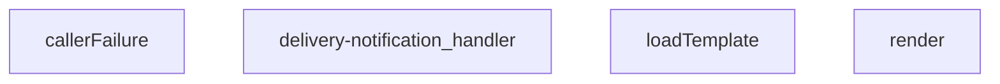

## NODE ID STANDARD

  file: supabase\functions\delivery-notification\index.ts
  function: supabase\functions\delivery-notification\index.ts::callerFailure
  function: supabase\functions\delivery-notification\index.ts::render
  function: supabase\functions\delivery-notification\index.ts::loadTemplate
  function: supabase\functions\delivery-notification\index.ts::delivery-notification_handler

---

## DISA AKTARILANLAR (EXPORTS)
  export: callerFailure
  export: delivery-notification_handler
  export: loadTemplate
  export: render

---
# FILE: supabase\functions\healthz\index.md

---
domain: general
source_type: doc
namespace_type: module
source_path: C:\Users\alize\venthub-hvac\supabase\functions\healthz\index.ts
skeleton_hash: 4693e10412249aa1
entity_hashes:
  func:healthz_handler: 680c3be8d7d51d07
  overview: 7d9308860fa3cc5c
generated_at: 2026-08-13T07:40:32Z
---

## Genel Bakış
Bu modül, Supabase fonksiyonları içinde bir sağlık kontrolü (health‑check) endpointi sunar. Gelen bir HTTP isteğini alarak servisin ve bağlı veritabanının erişilebilirliğini test eder ve sonucu uygun bir HTTP durum koduyla (200 OK veya 503 Service Unavailable) bildirir.

## Fonksiyon Grupları
### Sağlık Kontrolü İşleyicisi
Bu grup, servisin çalışır durumda olup olmadığını doğrulayan tek işlevi içerir. Fonksiyon, isteği işler, hafif bir veritabanı sorgusu çalıştırır ve sonuca göre yanıt üretir.
- healthz_handler

---

## AXIOMS – Mimari Varsayımlar

Bu modül, bir Supabase Edge Function health-check endpoint'ini temsil eder. Doğru çalışması için aşağıdaki mimari varsayımlar geçerlidir.

[Aksiyom 1]: Eğer gelen HTTP isteği (`req`) geçerli bir `Request` nesnesi değilse (örn: null, undefined veya yanlış tipte), fonksiyon beklenmeyen bir hata fırlatır veya işlenemeyen bir istek ile karşılaşır.

[Aksiyom 2]: Eğer healthz_handler tarafından erişilmesi beklenen veritabanı bağlantısı (veya ilgili servis) mevcut değilse veya bağlantı kesilmişse, fonksiyon istemciye **503 Service Unavailable** HTTP durum koduyla yanıt verir.

[Aksiyom 3]: Eğer fonksiyon, isteği başarıyla işleyip veritabanı erişilebilirliğini doğrulayamazsa (örn: timeout, bağlantı hatası), servis durumu "sağlıksız" olarak sınıflandırılır ve **503** döner; başarılı olursa **200 OK** döner.

[Aksiyom 4]: Fonksiyonun çalışması için, ortam değişkenleri (environment variables) aracılığıyla veritabanı bağlantısı yapılandırması (örn: `SUPABASE_URL`, `SUPABASE_KEY` veya benzeri) sunucu tarafında tanımlı olmalıdır; aksi takdirde veritabanı sorgusu çalıştırılamaz ve fonksiyon hata verir.

[Aksiyom 5]: Fonksiyon her çağrıda bağımsız (stateless) çalışır; önceki isteklerin durumu veya oturum bilgisi saklanmaz. Her health-check isteği tek başına değerlendirilir.

**Not:** Fonksiyon gövdesi (gövde kodu)paylaşılmadığı için, somut uygulama detayları (örn: veritabanı sorgusunun türü, zaman aşımları, ek header'lar) hakkında kesin bilgi bulunmamaktadır. Yukarıdaki varsayımlar, fonksiyon imzası ve genel sağlık kontrolü tasarımından çıkarılmıştır.

---

## FONKSİYON DETAYLARI

### healthz_handler
**Ne yapar**: Servis sağlığını kontrol eden bir health check endpoint'i çalıştırır. İsteğe bağlı olarak veritabanı bağlantısını doğrulayan hafif bir sorgu gerçekleştirir ve uygulamanın çalışabilir durumda olup olmadığını belirler.

**Nasıl yapar**: Gelen HTTP isteğini alır ve opsiyonel olarak veritabanı bağlantısını test eden hafif bir sorgu başlatır. Veritabanı bağlantısı başarılıysa 200 (OK) durum koduyla yanıt dönerken, bağlantı başarısızsa veya servis kullanılamaz durumdaysa 503 (Service Unavailable) durum koduyla yanıt üretir.

**Parametreler**:
- `req`: Request — Health check isteğini temsil eden HTTP Request nesnesi. İsteğe bağlı veritabanı bağlantısı kontrolü için gerekli bilgileri taşır.

**Dönüş**: Response — HTTP Response nesnesi döner. Başarılı sağlık durumunda 200 status kodu, servis kullanılamaz durumda ise 503 status kodu içerir.

---

## AST POINTERS

### [N1_NASIL] AST Pointer: `supabase/functions/healthz/index.ts`::healthz_handler
- **params**: `req: Request` — Gelen HTTP isteği nesnesi; method kontrolü ve header erişimi için kullanılır
- **ic_degiskenler**:
  - `headers` — JSON content-type ve no-cache talimatlarını taşıyan standart HTTP response header sözlüğü
  - `req.method` — İsteğin HTTP method'u (OPTIONS/GET/HEAD/other); erişim kontrolünde kullanılır
  - `supabaseUrl` — `Deno.env.get('SUPABASE_URL')` tarafından sağlanan Supabase proje URL'i, DB sağlık kontrolü için kullanılır
  - `serviceKey` — `Deno.env.get('SUPABASE_SERVICE_ROLE_KEY')` tarafından sağlanan Supabase servis rolü anahtarı, yetkilendirme header'ında kullanılır
  - `release` — `Deno.env.get('SENTRY_RELEASE')` veya `Deno.env.get('RELEASE')` tarafından sağlanan release versiyon bilgisi, yanıt gövdesine dahil edilir
  - `commit` — `Deno.env.get('GITHUB_SHA')`, `Deno.env.get('COMMIT_SHA')` veya `Deno.env.get('VITE_COMMIT_SHA')` tarafından sağlanan Git commit SHA'si, yanıt gövdesine dahil edilir
  - `resp` — `fetch()` ile yapılan `/rest/v1/rpc/now` çağrısının döndürdüğü Response nesnesi; `resp.ok` ile DB erişilebilirliği kontrol edilir
  - `_e` — `catch` bloğu tarafından yakalanan hata nesnesi; Sentry'ye raporlama için kullanılır
- **Dönüş**: `Response` — 200 (sağlıklı), 405 (method izin verilmiyor) veya 53 (sağlıksız) durum kodlu HTTP Response nesnesi; JSON gövdesinde `ok`, `db`, `release`, `commit`, `time` alanları taşır

---

## NODE ID STANDARD

  file: supabase\functions\healthz\index.ts
  function: supabase\functions\healthz\index.ts::healthz_handler

---

## DISA AKTARILANLAR (EXPORTS)
  export: healthz_handler

---
# FILE: supabase\functions\iyzico-callback\index.md

---
domain: general
source_type: doc
namespace_type: module
source_path: C:\Users\alize\venthub-wt-hotfix\supabase\functions\iyzico-callback\index.ts
skeleton_hash: c260c26f88f6a678
entity_hashes:
  func:iyzico-callback_handler: 14b42ca547fc6940
  overview: 8d4bc59faa090782
generated_at: 2026-08-15T09:03:13Z
---

## Genel Bakış
Bu modül, Supabase Edge Function olarak deploy edilmiş bir webhook endpoint'idir. İyzico ödeme sağlayıcısından gelen callback isteklerini merkezi olarak işler. İmza doğrulama ile güvenliği sağlar, ödeme durumunu ayrıştırır ve veritabanındaki sipariş kayıtlarını buna göre günceller.

## Fonksiyon Grupları
### Webhook İşleme
Gelen İyzico callback isteklerinin tam yaşam döngüsünü yönetir: imza doğrulama, ödeme bilgilerinin ayrıştırılması ve ilgili sistem kayıtlarının güncellenmesi.
- iyzico-callback_handler

---

## AXIOMS – Mimari Varsayımlar

Bu modül için yalnızca fonksiyon imzasından çıkarılabilecek temel varsayımlar tanımlanabilmektedir. Fonksiyon gövdesi paylaşılmadığından, detaylı iş mantığı varsayımları belirlenememiştir.

[Aksiyom 1]: Eğer `req` parametresi istemciden gelen geçerli bir HTTP isteği (Request) nesnesi olarak sağlanmazsa, işleyici (handler) çalışmaz veya hata ile sonuçlanır.
[Aksiyom 2]: Eğer işleyici başarılı bir şekilde çalışırsa, istemciye (`Response` türünde) bir HTTP yanıtı döndürmek zorundadır.
[Aksiyom 3]: Eğer istek bir webhook callback'i olarak işlenecekse, işleyicinin işlevsel mantığı (örn. imza doğrulama, veri ayrıştırma) fonksiyon gövdesinde tanımlı olmalıdır, ancak bu mantık imza bilgisinden çıkarılamaz.

---

## FONKSİYON DETAYLARI

### iyzico-callback_handler
**Ne yapar**: VentHub HVAC projesinin Supabase altyapısında barındırılan, Iyzico ödeme sağlayıcısından gelen tüm callback isteklerini işleyen ana giriş fonksiyonudur. Gelen ödeme durum bildirimlerini alır, doğrular ve sistemdeki ilgili sipariş, kullanıcı ve ödeme kayıtlarını güncellemek için gerekli tüm iş süreçlerini yönetir.
**Nasıl yapar**: İlk olarak gelen isteğin yetkili kaynaklı olduğunu teyit etmek için Iyzico’nun standart imza doğrulama protokolünü uygular, isteğin başlıkları ve gövdesindeki güvenlik verilerini eşleştirerek sahte istekleri engeller. Doğrulama süreci başarılı olursa istek gövdesindeki ödeme bilgilerini ayrıştırır, Supabase veritabanı üzerinden ilgili kayıtlara erişerek ödeme durumunu (başarılı, başarısız, beklemede vb.) günceller. Tüm işlem akışı sonunda isteğin sonucuna uygun bir HTTP cevabı oluşturarak döndürür.
**Parametreler**:
- name: req, type: HTTP Request (Supabase Edge Function Request nesnesi) — Iyzico ödeme servisinden gelen callback isteğinin tüm meta verilerini, HTTP başlıklarını ve işlenecek ödeme bilgilerini içeren gövdesini barındıran istek nesnesi
**Dönüş**: Standart HTTP Response nesnesi. İsteğin işlenme durumuna uygun HTTP durum kodu, ilgili cevap başlıkları ve metin içeriği barındırır. Başarısız doğrulama durumunda 403 Yetkisiz Erişim, eksik veya hatalı istek verisinde 400 Hatalı İstek, sunucu tarafı işlem hatalarında 500 Sunucu Hatası kodları döndürür. Tüm süreçlerin başarılı tamamlanması halinde 200 Başarılı durum kodu ile Iyzico’ya onay mesajı içeren cevap gönderir.

---

## İTHALATLAR (IMPORTS)
- import: ../_shared/cors.ts::getCorsHeaders
- import: ../_shared/tenant.ts::tenantFromRow
- import: npm:iyzipay::Iyzipay

---

## TYPE ALIASES

### CheckoutRetrieveResponse
```typescript
type CheckoutRetrieveResponse = {
  paymentStatus?: string;
  conversationId?: string;
  errorMessage?: string;
  paymentId?: string;
  cardFamily?: string;
  binNumber?: string;
  lastFourDigits?: string;
  [k: string]: unk
```

---

## AST POINTERS

### [N1_NASIL] AST Pointer: supabase/functions/iyzico-callback/index.ts::iyzico-callback_handler
- **params**: `(req)` — gelen HTTP isteği (Request nesnesi)
- **ic_degiskenler**: fonksiyon gövdesinin tamamı paylaşımda verilmemiştir; alt parçalarda referanslanan kapsama değişkenleri aşağıda listelenir
  - `sdk` — Iyzipay SDK örneği, checkoutForm işlemleri için kullanılır
  - `retrieveReq` — sdk.checkoutForm.retrieve çağrısına verilen istek parametreleri
  - `orderId` — güncellenecek siparişin ID'si, Supabase filtrelemede kullanılır
  - `conversationId` — Iyzico conversation ID'si, orderId yoksa filtreleme anahtarıdır
  - `result` — Iyzico checkoutForm.retrieve yanıt nesnesi, conversationId ve ödeme bilgilerini içerir
  - `supabaseUrl` — Supabase proje URL'i, REST API çağrıları için temel URL
  - `serviceRoleKey` — Supabase service role anahtarı, yetkilendirme header'ında kullanılır
  - `orderTenantFilter` — kiracı bazlı filtre sorgusu, RLS benzeri filtreleme ekler
  - `debugInfo` — ödeme sürecin_debug bilgisi, payment_debug alanına yazılır
  - `conversationId` (fallback) — result?.conversationId alınmazsa `conversationId!` non-null assertion ile kullanılır
- **Dönüş**: `Response` — HTTP yanıt nesnesi

### [N2_NASIL] AST Pointer: supabase/functions/iyzico-callback/index.ts::patchStatus
- **params**: `(newStatus: 'paid' | 'failed' | 'confirmed')` — siparişe atanacak yeni ödeme durumu
- **ic_degiskenler**:
  - `filterById` — `orderId` mevcutsa `id=eq.{orderId}` formatında filtre sorgusu oluşturur
  - `filterByConv` — `orderId` yoksa ve `result?.conversationId` veya `conversationId` mevcutsa `conversation_id=eq.{conversationId}` formatında filtre sorgusu oluşturur
  - `filter` — `filterById` veya `filterByConv`'dan ilk dolu olanı tutar; her ikisi de boşsa `null` dönülür
  - `resp` — Supabase REST API PATCH istek yanıtını (Response) tutar
- **Kapsama (closure) değişkenleri** (fonksiyon gövdesinden erişilen):
  - `orderId` — filterById filtreleme değeri olarak kullanılır
  - `result` — `result?.conversationId` optional zincir ile conversationId okunur
  - `conversationId` — result conversationId'si yoksa fallback olarak kullanılır (non-null assertion)
  - `orderTenantFilter` — filtre sorgusunun sonuna eklenen kiracı kısıtlaması
  - `supabaseUrl` — PATCH isteği için temel REST API URL'i
  - `serviceRoleKey` — Authorization ve apikey header değerleri için kullanılır
  - `debugInfo` — PATCH body'sinde `payment_debug` alanına yazılır
- **Dönüş**: `Response | null` — successful PATCH yanıtı veya filtre bulunamazsa `null`

### [N3_NASIL] AST Pointer: supabase/functions/iyzico-callback/index.ts::(resolve, reject) => Promise callback
- **params**: `(resolve, reject)` — Promise constructor callback parametreleri
- **ic_degiskenler**:
  - `retrieveReq` — sdk.checkoutForm.retrieve metoduna verilen istek nesnesi
- **Kapsama (closure) değişkenleri**:
  - `sdk` — Iyzipay SDK örneği, `sdk.checkoutForm.retrieve` çağrısı yapılır
- **Dönüş**: `void` — Promise resolve/reject ile sonuçlanır; retrieve başarılıysa `CheckoutRetrieveResponse` resolve edilir, hata varsa reject edilir

### [N4_NASIL] AST Pointer: supabase/functions/iyzico-callback/index.ts::(err, res) => retrieve callback
- **params**: `(err: unknown, res: CheckoutRetrieveResponse)` — retrieve callback hata ve yanıt parametreleri
- **ic_degiskenler**: (yok)
- **Kapsama (closure) değişkenleri**:
  - `resolve` — Promise resolve fonksiyonu, `res` ile çağrılır
  - `reject` — Promise reject fonksiyonu, `err` ile çağrılır
- **Dönüş**: `void` — hata varsa `reject(err)`, başarılıysa `resolve(res)` ile sonuçlanır

---

## NODE ID STANDARD

  file: supabase\functions\iyzico-callback\index.ts
  function: supabase\functions\iyzico-callback\index.ts::iyzico-callback_handler

---

## DISA AKTARILANLAR (EXPORTS)
  export: iyzico-callback_handler

---
# FILE: supabase\functions\iyzico-payment\index.md

---
domain: general
source_type: doc
namespace_type: module
source_path: C:\Users\alize\venthub-wt-hotfix\supabase\functions\iyzico-payment\index.ts
skeleton_hash: debf4ca0e0179b96
entity_hashes:
  func:iyzico-payment_handler: de31c29702dafb3c
  overview: e7caf5244e4f3d30
generated_at: 2026-08-15T09:05:02Z
---

## Genel Bakış
Bu modül, İyzico ödeme altyapısını kullanarak güvenli online ödeme süreçlerini yöneten bir Supabase Edge Function'dır. Tek bir HTTP handler fonksiyonu aracılığıyla, istemciden gelen isteklere göre ödeme başlatma, iptal etme ve durum sorgulama gibi temel finansal operasyonları merkezi ve güvenli bir şekilde yürütür.

## Fonksiyon Grupları
### HTTP İstek İşleme ve Yönlendirme
Gelen tüm HTTP isteklerini alarak, istek metoduna ve içeriğine göre ilgili İyzico ödeme işlemini başlatır ve sonucunu istemciye iletir.
- iyzico-payment_handler

---

## AXIOMS – Mimari Varsayımlar
Bu modül için özel aksiyom tanımlanmamıştır.

---

## FONKSİYON DETAYLARI

### iyzico-payment_handler

**Ne yapar**: Bu fonksiyon, gelen HTTP isteklerini işleyerek iyzico ödeme sistemiyle ilgili işlemlerin yürütülmesini sağlar. Supabase Edge Function yapısı kapsamında tanımlanmış bir HTTP handler fonksiyonudur. Fonksiyon, HTTP talebini alır ve uygun bir HTTP yanıtı döndürür.

**Nasıl yapar**: Fonksiyonun detaylı iç mantığı docstring'de belgelenmemiştir. Genel yapı itibarıyla, gelen HTTP Request nesnesini analiz ederek iyzico ödeme akışına uygun şekilde işler ve Response nesnesi oluşturarak istemciye geri dönüş yapar. Edge Function yapısı gereği asynchronous olarak çalışabilir.

**Parametreler**:
- `req`: Request — HTTP isteği nesnesi. İstemciden gelen tüm HTTP talep bilgilerini (headers, body, query params, method vb.) içerir. Bu nesne aracılığıyla isteğin içeriğine erişilir.

**Dönüş**: `Response` — Fonksiyonun döndürdüğü HTTP yanıt nesnesi. İşlem sonucuna göre istemciye uygun durum kodu ve içerik döndürülür.

---

## İTHALATLAR (IMPORTS)
- import: ../_shared/cors.ts::getCorsHeaders
- import: npm:iyzipay::Iyzipay

---

## AST POINTERS

### [N1_NASIL] AST Pointer: iyzico-payment/index.ts::maskPaymentInfo
- **params**: `(obj: PaymentMin)` — Ödeme bilgisi nesnesi
- **ic_degiskenler**:
  - yok — Spread operasyonları ile doğrudan dönüş yapılıyor
- **Dönüş**: Maskelenmiş `PaymentMin` nesnesi (buyer.email, buyer.gsmNumber masked; registrationAddress, ip ve shipping/billing address'ler `'***'` ile değiştirilmiş)

---

## NODE ID STANDARD

  file: supabase\functions\iyzico-payment\index.ts
  function: supabase\functions\iyzico-payment\index.ts::iyzico-payment_handler

---

## DISA AKTARILANLAR (EXPORTS)
  export: iyzico-payment_handler

---
# FILE: supabase\functions\iyzico-payment\iyzico-real.md

---
domain: general
source_type: doc
namespace_type: module
source_path: C:\Users\alize\venthub-hvac\supabase\functions\iyzico-payment\iyzico-real.ts
skeleton_hash: 7d70c2aaef2028cd
generated_at: 2026-08-13T07:40:32.807714+00:00
---

## Genel Bakış

This module has been intentionally removed. Reason: contained hardcoded sandbox credentials and is not used by the active edge function (index.ts). If you need a real İyzico integration helper, create a new module that reads all secrets from environment variables and NEVER commit secrets to the repo

## AXIOMS – Mimari Varsayımlar
- [Aksiyom 1]: Bu modül yan-etki için yüklenir; kaldırılması veya yan-etkisinin değişmesi onu import eden giriş noktalarını etkiler.
- [Aksiyom 2]: Dışa açılan API olmadığından tüketiciler doğrudan çağrıyla değil, yalnızca yükleme sırası/yan-etkisi üzerinden bağımlıdır.

## AST POINTERS
(Dışa açılan çağrılabilir öğe yok — modül-düzeyi yan-etki; AST işaretçisi gerektiren fonksiyon/metot yok.)

## NODE ID STANDARD
file: C:\Users\alize\venthub-hvac\supabase\functions\iyzico-payment\iyzico-real.ts


---
# FILE: supabase\functions\iyzico-refund\index.md

---
domain: general
source_type: doc
namespace_type: module
source_path: C:\Users\alize\venthub-hvac\supabase\functions\iyzico-refund\index.ts
skeleton_hash: 3710a32089c2b3d4
entity_hashes:
  func:iyziConstructor: 453f90194c6b2913
  func:iyziLocaleTr: 8f6545591aa2f566
  func:iyzico-refund_handler: b3edad3bb6b5ef11
  overview: 37fb019c541fa285
generated_at: 2026-08-17T11:17:09Z
---

## Genel Bakış
Bu modül, Supabase Edge Functions ortamında çalışan bir HTTP endpoint'idir. Temel sorumluluğu, iyzico ödeme sistemi üzerinden gelen iade (refund) taleplerini almak, işlenmek üzere iyzico istemcisini yapılandırmak ve istemciye sonuç döndürmektir.

## Fonksiyon Grupları
### İade İşlem İşleyicisi
Modülün dışarıya açık olan ve HTTP isteklerini doğrudan alan kısmıdır. Gelen istekleri işleyerek iyzico refund akışını başlatır veya sonuçları sorgular.
- iyzico-refund_handler

### Yardımcı Fonksiyonlar
Iyzico entegrasyonu için gerekli olan istemci yapısını oluşturur ve dil ayarlarını yönetir. Bu fonksiyonlar, ana işleyici tarafından çağrılarak iyzico API ile iletişim için gerekli nesneyi ve yapılandırmayı sağlar.
- iyziConstructor, iyziLocaleTr

---

## AXIOMS – Mimari Varsayımlar

Bu modül, iyzico ödeme sistemi entegrasyonu ile çalışan bir Supabase HTTP endpoint'idir.

**[Aksiyom 1]**: Eğer `iyziConstructor` fonksiyonuna geçilen `mod` parametresi geçerli bir iyzico SDK modülü değilse, `IyziCtor` türünde geçerli bir constructor nesnesi oluşturulamaz.

**[Aksiyom 2]**: Eğer `iyziLocaleTr` fonksiyonuna geçilen `mod` parametresi geçerli bir iyzico locale modülü değilse, Türkçe locale string'i döndürülemez.

**[Aksiyom 3]**: Eğer `iyzico-refund_handler` fonksiyonuna geçilen `req` nesnesi geçerli bir HTTP Request (Deno.Request) değilse, `Response` nesnesi üretilemez.

**[Aksiyom 4]**: Eğer `iyzico-refund_handler`受ilesi `Response` türünde bir sonuç dönmezse, `@serve(Deno.serve)` dekoratörü aracılığıyla istemciye geçerli bir HTTP yanıtı iletilemez.

**[Aksiyom 5]**: Eğer `iyziConstructor` veya `iyziLocaleTr` çağrılmadan önce `iyzico-refund_handler` çalıştırılırsa, iyzico API iletişimi için gerekli yapılandırma nesneleri hazır olmaz.

---

## FONKSİYON DETAYLARI

### iyziConstructor
**Ne yapar**: `npm:iyzipay` paketinden gelen modülün constructor fonksiyonunu alır ve derleyici için güvenli bir `IyziCtor` tipine dönüştürür. Fonksiyon, girdinin beklenen formda (bir constructor fonksiyonu) olup olmadığını kontrol ederek tip dönüşümü öncesinde bir çalışma zamanı doğrulaması yapar.
**Nasıl yapar**: Fonksiyon, parametre olarak aldığı `mod` değişkeninin `function` türünde olup olmadığını `typeof` operatörü ile kontrol eder. Eğer değilse bir hata fırlatır. Eğer doğru tipteyse, `mod` değişkenini `IyziCtor` türüne tip açımı (type assertion) ile dönüştürür ve döndürür. Bu işlem, eski sürümdeki çift dönüşümü (önce `unknown`'a, sonra hedef tipe) önlemek ve tip güvenliğini artırmak için tasarlanmıştır.
**Parametreler**:
- `mod`: `unknown` — `iyzipay` npm paketinden gelen ve bir constructor fonksiyonu olduğu beklenen ham modül nesnesi.
**Dönüş**: `IyziCtor` — Parametrenin bir fonksiyon olduğu doğrulandıktan sonra, `IyziCtor` arayüzüne güvenli bir şekilde dönüştürülmüş hali. Bu dönüşüm, ilerleyen kodda iyzico API çağrılarının tip güvenli bir şekilde yapılmasını sağlar.

### iyziLocaleTr
**Ne yapar**: Verilen bir nesneden (`iyzipay` modülü olabilir) Türkçe (`TR`) yerel ayar (locale) değerini çıkarmaya çalışır; eğer değer bulunamazsa veya geçerli bir string değilse varsayılan olarak `'tr'` dizesini döndürür. Bu, API çağrılarında dil parametresinin her zaman tanımlı olmasını garanti eder.
**Nasıl yapar**: Fonksiyon, `mod` parametresini `null` olabilen ve `LOCALE` özelliğine sahip bir nesne olarak varsayar. Opsiyonel zincirleme (`?.`) kullanarak `mod.LOCALE.TR` değerine erişmeye çalışır. Elde edilen değerin `string` türünde olup olmadığını kontrol eder; eğer böyleyse bu değeri, aksi halde `'tr'` sabit dizgesini döndürür. Bu yaklaşım, `mod` nesnesinin yapısı belirsiz olsa bile hatasız çalışmayı sağlar.
**Parametreler**:
- `mod`: `unknown` — Üzerinde `LOCALE.TR` özelliği aranacak nesne (genellikle `iyzipay` modülünün kendisi olabilir). Fonksiyon, bu nesnenin yapısını güvenli bir şekildealgılar.
**Dönüş**: `string` — Bulunan yerel ayar dizgesi (örn: `"tr"`) veya hiçbir geçerli değer bulunamadığında varsayılan `"tr"` dizgesi. Dönüş değeri her zaman tanımlı ve geçerli bir locale kodudur.

### iyzico-refund_handler
**Ne yapar**: HTTP isteklerini alarak iyzico ödeme sistemi üzerinden bir geri ödeme (refund) işlemi başlatır veya bu işlemle ilgili bir durum sorgulaması yapar.
**Nasıl yapar**: Fonksiyon, bir HTTP Request nesnesi alır. Bu isteğin gövdesindeki (body) verileri çıkararak iyzico'nun sunduğu geri ödeme API endpoint'ine gerekli parametrelerle bir istek gönderir. API'den dönen sonucu işleyerek uygun bir HTTP Response (başarı/hata durumu ile birlikte) oluşturur ve istemciye döner.
**Parametreler**:
- req: Request — Fonksiyonun işleyeceği HTTP istek nesnesi. İsteğin metodu, gövdesi (geri ödeme bilgileri) ve varsa başlık bilgilerini içerir.
**Dönüş**: Response — iyzico API'sinden alınan sonuca göre başarı veya hata durumunu belirten, JSON formatında bir HTTP yanıt nesnesi. Genellikle { success: boolean, data?: object, error?: string } yapısında bir gövdeye sahiptir.

---

## İTHALATLAR (IMPORTS)
- import: ../_shared/cors.ts::getCorsHeaders
- import: ../_shared/refund_guard.ts::claimRefund
- import: ../_shared/refund_guard.ts::fullCancelKey
- import: ../_shared/refund_guard.ts::settleRefund
- import: ../_shared/revenue_alarm.ts::raiseRevenueAlarm
- import: https://esm.sh/@supabase/supabase-js@2.45.4::createClient
- import: npm:iyzipay::Iyzipay

---

## TYPE ALIASES

### PaymentTransaction
```typescript
type PaymentTransaction = { paymentTransactionId?: string }
```

### PaymentDebug
```typescript
type PaymentDebug = {
  refunded_total?: number;
  paymentId?: string;
  raw?: { paymentId?: string; itemTransactions?: PaymentTransaction[] };
  partial_refunds?: { amount: number; at: string }[];
  [k: string]: un
```

### IyziResponse
```typescript
type IyziResponse = { status?: string; [k: string]: unknown }
```

### IyziSdk
```typescript
type IyziSdk = {
  cancel: {
    create: (
      req: { locale?: unknown; paymentId: string; ip: string },
      cb: (err: unknown, res: IyziResponse) => void
    ) => void;
  };
  refund: {
    create: (
 
```

### IyziCtor
```typescript
type IyziCtor = new (args: { apiKey: string; secretKey: string; uri: string }) => IyziSdk
```

---

## AST POINTERS

### [N1_NASIL] AST Pointer: supabase/functions/iyzico-refund/index.ts::iyziConstructor
- **params**: `(mod: unknown)` — modül referansı, Iyzipay constructor olup olmadığı kontrol edilir
- **ic_degiskenler**:
  - *(yok — fonksiyon gövdesinde yerel değişken tanımlanmaz, doğrudan kontrol ve return yapılır)*
- **Dönüş**: `IyziCtor` — modül bir function ise cast edilerek Iyzipay constructor olarak döner; değilse `Error` fırlatır

### [N2_NASIL] AST Pointer: supabase/functions/iyzico-refund/index.ts::iyziLocaleTr
- **params**: `(mod: unknown)` — modül nesnesi, LOCALE.TRA erişilmeye çalışılır
- **ic_degiskenler**:
  - `locale` — `(mod as { LOCALE?: { TR?: string } } | null)?.LOCALE?.TR` ifadesinden çıkarılan yerel ayar stringi; string değilse `undefined` kalır
- **Dönüş**: `string` — `locale` string ise o değer, değilse `'tr'` default'u döner

### [N3_NASIL] AST Pointer: supabase/functions/iyzico-refund/index.ts::iyzico-refund_handler
- **params**: `(req)` — gelen HTTP istek nesnesi (Deno.serve tarafından sağlanır)
- **ic_degiskenler** *(anonim callback gövdelerinde referans edilen dış kapsam değişkenleri)*:
  - `sdk` — Iyzipay SDK instance; `sdk.cancel.create()` ve `sdk.refund.create()` çağrılarında kullanılır
  - `LOCALE_TR` — Türkçe locale sabiti; cancel ve refund API çağrılarında `locale` parametresine iletilir
  - `payId` — `string` olarak cast edilen payment ID; cancel işleminde `paymentId` parametresine kullanılır
  - `callerIp` — istemci IP adresi; hem cancel hem refund çağrılarında `ip` parametresine iletilir
  - `ptx` — `string` olarak cast edilen payment transaction ID; refund işleminde `paymentTransactionId` parametresine kullanılır
  - `targetAmount` — iade edilecek tutar; `String(targetAmount)` ile string'e çevrilip refund'un `price` parametresine iletilir
- **Dönüş**: `Response` — HTTP yanıt nesnesi; iade/iptal işlemi sonucu döner *(fonksiyon gövdesinin tamamı görünmediği için dönüş mantığı fragment'lardan türetilmiştir)*

---


## MERMAID CALL GRAPH
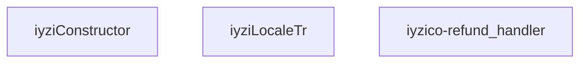

## NODE ID STANDARD

  file: supabase\functions\iyzico-refund\index.ts
  function: supabase\functions\iyzico-refund\index.ts::iyziConstructor
  function: supabase\functions\iyzico-refund\index.ts::iyziLocaleTr
  function: supabase\functions\iyzico-refund\index.ts::iyzico-refund_handler

---

## DISA AKTARILANLAR (EXPORTS)
  export: iyziConstructor
  export: iyziLocaleTr
  export: iyzico-refund_handler

---
# FILE: supabase\functions\log-client-error\index.md

---
domain: general
source_type: doc
namespace_type: module
source_path: C:\Users\alize\venthub-wt-hotfix\supabase\functions\log-client-error\index.ts
skeleton_hash: d40202c9d638d96f
entity_hashes:
  func:log-client-error_handler: cec12c49f3b9435f
  overview: 38ce599da378ec18
generated_at: 2026-08-15T07:33:59Z
---

## Genel Bakış
Bu modül, istemci tarafı uygulamalarda oluşan hataların merkezi olarak toplanmasını ve kaydedilmesini sağlayan bir Supabase Edge Function'dır. Gelen HTTP istekleri aracılığıyla hata verisini alır, doğrular ve veritabanına kalıcı olarak yazarak hata izleme ve teşhis süreçlerini destekler.

## Fonksiyon Grupları
### Hata Kayıt İşleyicisi
Gelen hata raporu isteklerini işleyen ve yanıt oluşturan tek sorumlu bileşen; istek gövdesinden hata verisini çıkarıp doğrular, Supabase veritabanına yazar ve istemciye durum bildirimi döndürür.
- log_client_error_handler

---

## AXIOMS – Mimari Varsayımlar
Bu modül, istemci hatalarını almak için bir HTTP endpoint'idir ve `clientErrorSchema` kullanarak gelen veriyi doğrular.

[Aksiyom 1]: Eğer istek gövdesi (`req.body`) JSON formatında ayrıştırılamıyorsa, istek reddedilir (HTTP 400 Bad Request).

[Aksiyom 2]: Eğer istek gövdesi `clientErrorSchema` ile doğrulanamıyorsa, istek reddedilir (HTTP 400 Bad Request).

[Aksiyom 3]: Eğer istek yöntemi (`req.method`) POST değilse, istek reddedilir (HTTP 405 Method Not Allowed).

[Aksiyom 4]: Eğer veritabanına yazma işlemi başarısız olursa, sunucu hatası yanıtı dönülür (HTTP 500 Internal Server Error).

[Aksiyom 5]: Eğer `clientErrorSchema` tanımı (çağrısı) başarısız olursa veya geçerli bir doğrulama şeması sağlanamıyorsa, modül herhangi bir isteği başarıyla işleyemez.

[Aksiyom 6]: Eğer istek gövdesindeki veri `clientErrorSchema` tarafından tanımlanan alanları içermiyorsa (eksik alanlar), istek reddedilir (HTTP 400 Bad Request).

---

## FONKSİYON DETAYLARI

### log-client-error_handler

**Ne yapar**: Client tarafında oluşan hataların sunucu tarafında loglanmasını sağlayan bir Supabase Edge Function handler'ıdır. HTTP isteklerini alır, hata bilgilerini işler ve uygun HTTP yanıtını döndürür.

**Nasıl yapar**: Bu fonksiyon, bir HTTP Request nesnesini parametre olarak alarak çalışır. Adından anlaşılacağı üzere, client tarafındaki uygulama hatalarını yakalayıp sunucu tarafında merkezi olarak loglamak için kullanılır. Supabase Edge Functions yapısı içerisinde bir request handler olarak tanımlanmıştır.

**Parametreler**:
- `req`: Request — İşlenecek olan HTTP istek nesnesi. Client tarafından gönderilen hata bilgilerini ve gerekli header/body verilerini içerir.

**Dönüş**: `Response` — İşlem sonucuna göre bir HTTP yanıt nesnesi döndürür. Başarılı logging işlemi veya hata durumuna uygun status kodu ve mesaj içerebilir.

---

## İTHALATLAR (IMPORTS)
- import: ../_shared/cors.ts::getCorsHeaders
- import: https://esm.sh/@supabase/supabase-js@2.45.4::createClient
- import: https://esm.sh/zod@3.23.8::z

---

## SABİTLER
- **clientErrorSchema** (call) — `z.object({
  msg: z.string().default(''),
  stack: z.string().default(''),
...`

---

## AST POINTERS

### [N1_NASIL] AST Pointer: supabase/functions/log-client-error/index.ts::log-client-error_handler
- **params**: `(req: Request)`
- **ic_degiskenler**:
  - `corsHeaders` — getCorsHeaders(req) çağrısıyla elde edilen CORS başlıkları
  - `cors` — corsHeaders değişkeninin takma adı (alias)
  - `requestId` — crypto.randomUUID() veya Date.now() ile üretilen benzersiz istek tanımlayıcısı
  - `supabaseUrl` — Deno.env.get('SUPABASE_URL') ile okunan Supabase servis URL'i
  - `serviceRoleKey` — Deno.env.get('SUPABASE_SERVICE_ROLE_KEY') ile okunan servis rol anahtarı
  - `allowedOrigins` — Deno.env.get('ALLOWED_ORIGINS') virgülle ayrılmış izin verilen origin listesi, split/map/filter ile temizlenmiş
  - `originHeader` — req.headers.get('origin') ile gelen Origin başlığı
  - `originToCheck` — kontrol edilecek origin; originHeader yoksa referer'dan URL.parse ile türetilir
  - `ref` — req.headers.get('referer') ile gelen referer başlığı
  - `requireAuth` — Deno.env.get('REQUIRE_AUTH') değerinden türetilen boolean; true ise yetkilendirme zorunlu
  - `supabase` — createClient(supabaseUrl, serviceRoleKey) ile oluşturulan Supabase istemcisi
  - `authHeader` — req.headers.get('authorization') veya req.headers.get('Authorization') ile gelen yetkilendirme başlığı
  - `accessToken` — authHeader içinden 'Bearer ' ön ekini atarak çıkarılan token
  - `authData` — supabase.auth.getUser(accessToken) sonucundaki data nesnesi
  - `authErr` — supabase.auth.getUser(accessToken) sonucundaki hata nesnesi
  - `rawBody` — req.json() ile okunan ham istek gövdesi, parse edilemezse null
  - `parsed` — clientErrorSchema.safeParse(rawBody) ile Zod doğrulama sonucu
  - `payload` — parsed.data; Zod doğrulamasından geçmiş güvenli veri nesnesi
  - `mask` — inline arrow fonksiyon; stringleri 4000 karakterle kısaltıp email ve uzun token'ları maskeleyen sanitizasyon fonksiyonu
  - `firstLine` — payload.stack değerinin ilk satırı (stack trace'in ilk çizgisi)
  - `urlObj` — payload.url değerinden URL nesnesi oluşturulmaya çalışılır, başarısızsa null
  - `_path` — urlObj.pathname veya boş string; hata imzası için URL yolu
  - `signature` — msg + firstLine + _path bileşenlerinden maskelenmiş ve birleştirilmiş hata imzası (error_groups tablosunda onConflict anahtarı)
  - `groupId` — upsert veya select ile bulunan error_groups tablosu satır ID'si; bulunamazsa null
  - `groupPayload` — error_groups tablosuna upsert edilecek nesne (signature, level, last_message, url_sample, env, release, last_seen alanları)
  - `upsertRow` — error_groups tablosuna upsert sonrası select('id') ile dönen satır
  - `q` — groupId bulunamadığda signature ile error_groups tablosundan select('id') sorgu sonucu
  - `dedupSeconds` — Deno.env.get('DEDUP_SECONDS') değerinden parseInt ile okunan dedup pencere süresi (saniye cinsinden)
  - `since` — dedup kontrolü için Date.now() - dedupSeconds*1000 hesaplanmış ISO zaman damgası
  - `recent` — client_errors tablosundan group_id ve at filtresiyle son dedup süresi içindeki kayıtlar (id, at alanları)
  - `row` — client_errors tablosuna insert edilecek tüm alanları içeren kayıt nesnesi (at, url, message, stack, user_agent, release, env, level, extra, opsiyonel group_id)
  - `error` — supabase.from('client_errors').insert(row) sonucundaki hata nesnesi
  - `msg` — insert hatasından veya outer catch'ten türetilen hata mesajı stringi
  - `level` — payload.level değerinden türetilen küçük harfli hata seviyesi
  - `env` — payload.env değerinden türetilen ortam bilgisi stringi
  - `notifyEnabled` — SLACK_WEBHOOK_URL env var'ının boş olup olmadığına göre boolean
  - `isCritical` — level değerinin 'fatal' veya 'error' olup olmadığına göre boolean
  - `shortMsg` — payload.msg değerinden 200 karaktere kısaltılmış mesaj
  - `fields` — slackNotify fonksiyonuna aktarılacak alanlar dizisi (Signature, Level, Env, URL, Request-Id)
  - `_e` — outer try-catch bloğunda yakalanan hata nesnesi
- **Dinamik import**: `../_shared/notify.ts` → `slackNotify` fonksiyonu (Slack webhook ile bildirim gönderir, sadece kritik seviyelerde ve notifyEnabled ise çağrılır; ayrıca outer catch bloğunda hata bildirimi için de import edilir)
- **Yan etkiler**: Supabase veritabanına `error_groups` tablosuna upsert, `client_errors` tablosuna insert, `increment_error_group_count` RPC çağrısı; opsiyonel Slack webhook bildirimi
- **Dönüş**: `Response` — başarı durumunda 200 'ok', hata durumlarında 400/401/403/405/500 ile JSON hata mesajı

---

## NODE ID STANDARD

  file: supabase\functions\log-client-error\index.ts
  function: supabase\functions\log-client-error\index.ts::log-client-error_handler

---

## DISA AKTARILANLAR (EXPORTS)
  export: log-client-error_handler

---
# FILE: supabase\functions\notification-service\index.md

---
domain: general
source_type: doc
namespace_type: module
source_path: C:\Users\alize\venthub-hvac\supabase\functions\notification-service\index.ts
skeleton_hash: 377373eb700c54bd
entity_hashes:
  func:callerFailure: c2855766de0bfe8b
  func:formatTemplate: 36d51a549d587400
  func:notification-service_handler: dc7fd5d96878185c
  func:sendEmail: 3b14fffe2f71320a
  func:sendSMS: ac40e3c349cc9550
  func:sendWhatsApp: 5493a673e140abb2
  overview: c0915b77cd91b2b7
generated_at: 2026-08-17T11:36:32Z
---

## Genel Bakış
Bu modül, bir Supabase edge function olarak hizmet veren merkezi bir bildirim servisidir. Tek bir HTTP giriş noktası üzerinden WhatsApp, SMS ve e-posta olmak üzere üç farklı kanala mesaj gönderimi sağlar. İstekleri işler, uygun iletişim kanalını seçer, mesaj içeriklerini şablonlar ile kişiselleştirir ve sonuçları standart bir format ile döndürür.

## Fonksiyon Grupları
### İstek Yönetimi ve Hata İşleme
Gelen HTTP isteklerini karşılayan ana işleyicidir. İstek verilerini ayrıştırır, gerekli kanal ve parametreleri belirler ve oluşabilecek hataları merkezi bir hata nesnesine dönüştürerek istemciye döner.
- notification-service_handler, callerFailure

### Kanal Bazlı Mesaj Gönderimi
Her biri farklı bir harici servis (ör. Twilio, bir e-posta sağlayıcısı) ile entegre çalışan gönderim fonksiyonlarıdır. Hedef, mesaj içeriği ve servis yapılandırmasını alarak doğrudan ilgili iletişim kanalı üzerinden teslimatı gerçekleştirir.
- sendWhatsApp, sendSMS, sendEmail

### İçerik Hazırlama
Mesaj metinlerindeki dinamik yer tutucuları, sağlanan veri nesnesindeki değerlerle eşleştirerek kişiselleştirilmiş ve nihai metni oluşturan yardımcı fonksiyondur. Gönderim öncesinde metin hazırlığının merkezi noktasıdır.
- formatTemplate

---

## AXIOMS – Mimari Varsayımlar
Bu modül, HTTP isteklerini alarak WhatsApp, SMS ve e-posta gibi farklı iletişim kanallarına mesaj gönderen merkezi bir bildirim servisidir. Doğru çalışması için, isteklerin doğru formatlanması, gerekli yapılandırmaların sağlanması ve harici servislerin erişilebilir olması gerekmektedir.

[Aksiyom 1]: Eğer `notification-service_handler` fonksiyonuna geçerli bir HTTP isteği (Request)到达mazsa, modül uygun bir hata yanıtı (callerFailure ile) dönemez veya istek başarısız olur.

[Aksiyom 2]: Eğer `sendWhatsApp`, `sendSMS` veya `sendEmail` fonksiyonları için Twilio veya e-posta API yapılandırması (ilgili `config` parametresi) sağlanmazsa, mesaj gönderimi başarısız olur veya varsayılan yapılandırma kullanılamaz.

[Aksiyom 3]: Eğer `formatTemplate` fonksiyonu, beklenen formatta olmayan bir şablon veya veri tipiyle (data) çağrılırsa, hatalı bir çıktı üretir veya hata fırlatır.

[Aksiyom 4]: Eğer `_stockAlertTemplates` sabiti tanımlı değilse veya er

---

## FONKSİYON DETAYLARI

### callerFailure
**Ne yapar**: Kapi hatalarini ( TenantMismatchError, CallerConfigError, CallerLookupError ) eslesme bir HTTP durum kodu ve anlamlı bir hata mesajina donusturerek API yanitlarini standartlastirir. Bu, servis katmanindan gelen ozel siniflarin istemcilere uygun sekilde iletilmesini saglayan bir hata haritasi gorevi gorur.

**Nasil yapar**: Gelen `error` nesnesi `instanceof` operatoru ile sirayla uclu ozel hata sinifina karsilik getirilir. Eslesme olursa onceden tanimli status kodu (403, 500 veya 503) ve ilgili hata anahtari (ornegin 'tenant_mismatch') birlikte dondurulur. Hicbir sinifla eslesme olmazsa `null` dondurulerek hatanin bu fonksiyon tarafindan islenmedigi belirtilir; boylece ust katmandaki genel hata yakalama mekanizmasi devreye girebilir.

**Parametreler**:
- error: unknown — Islenmesi gereken hata nesnesi. Farkli hata siniflarindan biri olabilir veya taninmayan bir hata olabilir.

**Donus**: `{ status: number; error: string } | null` — Eger gelen hata taninmis bir sinifsa, ilgili HTTP durum kodunu ve standartlastirilmis hata mesajini iceren bir nesne; aksi takdirde `null`.

### notification-service_handler
**Ne yapar**: Bu fonksiyon, HTTP isteklerini alarak bildirim servisinin ana işleyişini yöneten giriş noktasıdır (handler). Gelen isteğe göre doğru bildirim kanalını (WhatsApp, SMS veya e-posta) seçip ilgili gönderim fonksiyonunu çağırarak işlemi koordine eder.
**Nasıl yapar**: Fonksiyon, gelen HTTP isteğinin gövdesini (body) analiz eder, istenen bildirim türünü belirler ve gerekli parametreleri (alıcı, mesaj, şablon, yapılandırma bilgileri) çıkarır. Ardından, `sendWhatsApp`, `sendSMS` veya `sendEmail` fonksiyonlarından uygun olanını asenkron olarak çağırır ve sonucu döndürür. Hata yönetimi ve doğrulama mantığını içerir.
**Parametreler**:
- `req`: Request (veya benzeri bir nesne) — Gelen HTTP isteği nesnesi. Bildirim talebini ve gerekli tüm parametreleri taşır.
**Dönüş**: Response — İşlemin sonucunu (başarı/hata durumu) içeren HTTP yanıt nesnesi.

### sendWhatsApp
**Ne yapar**: Twilio API'sini kullanarak belirtilen telefona WhatsApp uzerinden bir mesaj veya sablon gonderir. Iletisim kanali olarak WhatsApp'i secen uygulamalar icin temel gonderim fonksiyonudur.

**Nasil yapar**: Oncelikle `config` icindeki Twilio hesap bilgilerinin (accountSid, authToken, fromNumber) varligini kontrol eder; eksikse hata firlatir. Eger bir `template` ve ilgili `data` saglanmissa, `formatTemplate` yardimiyla mesajin nihali olusturulur; aksi takdirde dogrudan `message` kullanilir. Alici telefon numarasi WhatsApp formatinda degistirilir (gerekirse 'whatsapp:' on ekini ekler). Ardindan Twilio'nun Messages endpoint'ine Base64 kodlanmis kimlik dogrulamasi ile POST istegi atilir. Istek basarisiz olursa API'den donen hata metni ile birlikte bir Error firlatilir; basarili olursa Twilio'nun JSON yaniti dondurulur.

**Parametreler**:
- to: string — Alici telefon numarasi. 'whatsapp:' on eki ile veya olmadan saglanabilir; fonksiyon tarafindan gerekli format duzeltmesi yapilir.
- message: string — Gonderilecek mesaj icerigi. Sablon kullanilmiyorsa dogrudan bu metin gonderilir.
- template: string (istege bagli) — Degisken iceren sablon metni. Ornegin "Merhaba {{name}}, siparisiniz hazir." gibi. Saglanirsa `data` ile birlikte formatlanarak kullanilir.
- data: TemplateData (istege bagli) — Sablon icindeki {{key}} ifadelerinin yerine konacak degerlerin eslesmesi. Ayrica 'subject', 'emailFrom' gibi ek alanlari da iceren genisletilmis veri yapisi.
- config: TwilioConfig (istege bagli) — Twilio API kimlik bilgileri ve gonderici numarasi. accountSid, authToken ve fromNumber alanlarini icerir.

**Donus**: Twilio API'sinden donen JSON yaniti. Gonderim basarili ise mesaj detaylarini, basarisiz ise bir Error firlatilir.

### sendSMS
**Ne yapar**: Twilio API'sini kullanarak belirtilen telefona klasik bir SMS mesaji gonderir. WhatsApp yerine dogrudan SMS kanalini tercih eden senaryolar icin kullanilir.

**Nasil yapar**: `config` parametresindeki Twilio hesap bilgilerinin (accountSid, authToken, fromNumber) zorunlu oldugunu dogrular; eksikse hata firlatir. Dogrudan `to` ve `message` degerleri kullanilarak Twilio'nun Messages endpoint'ine Base64 kodlanmis kimlik dogrulamasi ile POST istegi gonderilir. Isteğin HTTP durum kodu kontrol edilir; basarisizsa API hata metni ile birlikte bir Error firlatilir; basarili ise Twilio'nun JSON yaniti dondurulur. Bu fonksiyon sablon isleme icermez, ham mesaji dogrudan gonderir.

**Parametreler**:
- to: string — Alici telefon numarasi. Uluslararasi formatta (ornegin +90...) olmalidir.
- message: string — Gonderilecek SMS metni.
- config: TwilioConfig — Twilio API kimlik bilgileri ve gonderici numarasi. accountSid, authToken ve fromNumber alanlarini zorunlu olarak icerir.

**Donus**: Twilio API'sinden donen JSON yaniti. Gonderim basarili ise mesaj detaylarini, basarisiz ise bir Error firlatilir.

### sendEmail
**Ne yapar**: Resend API'sini kullanarak belirtilen e-posta adresine bir e-posta gonderir. Sablon destegi sunar ve hem duz metin hem de HTML formatinda icerik olusturur.

**Nasil yapar**: Oncelikle `config` icindeki Resend API anahtarinin varligini dogrular; eksikse hata firlatir. E-posta konusu `data.subject` alanindan veya varsayilan olarak "VentHub Bildirim" olarak belirlenir. Eger `template` ve `data` saglanmissa, `formatTemplate` ile icerik formatlanir; aksi takdirde dogrudan `message` kullanilir. Gonderen adresi `config.from`, `data.emailFrom` veya varsayilan "VentHub <noreply@venthub.com>" sirasiyla tercih edilerek belirlenir. Son olarak Resend API'sine JSON formatinda POST istegi gonderilir; istek basarisizsa hata metni ile birlikte bir Error firlatilir, basarili ise API yaniti dondurulur.

**Parametreler**:
- to: string — Alici e-posta adresi.
- message: string — E-posta icerigi. Sablon kullanilmiyorsa dogrudan bu metin gonderilir.
- template: string (istege bagli) — Degisken iceren sablon metni. Saglanirsa `data` ile birlikte formatlanarak kullanilir.
- data: TemplateData (istege bagli) — Sablon icindeki {{key}} ifadelerinin yerine konacak degerler. Ayrica 'subject' ve 'emailFrom' gibi e-posta ozel alanlarini da icerir.
- config: { apiKey: string; from?: string } (istege bagli) — Resend API anahtari ve istege bagli gonderen e-posta adresi. `apiKey` zorunludur.

**Donus**: Resend API'sinden donen JSON yaniti. Gonderim basarili ise e-posta ID'si ve detaylarini, basarisiz ise bir Error firlatilir.

### formatTemplate
**Ne yapar**: Bir sablon stringi icindeki {{key}} bicimindeki yer tutuculari (placeholder), verilen veri nesnesindeki degerler ile degistirerek nihali metni olusturur. Tum gonderim fonksiyonlarinin ortak bir yardimcisidir.

**Nasil yapar**: Eger `data` saglanmamissa veya bos ise, sablonun aynisi dondurulur. Aksi takdirde, `data` nesnesinin tum anahtarlari uzerinde donulur. Her anahtar icin, sablon icindeki `{{anahtar}}` deseni, `RegExp` kullanilarak (g flag'i ile tum eslesmeleri yakalamak uzere) bulunan deger ile degistirilir. Degerin `String()` ile donusturulmesi sayesinde farkli tiplerden (sayi, boolean vb.) degerler de guvenle metne cevrilebilir. Islem tum anahtarlar icin sirayla yapilir ve formatlanmis metin dondurulur.

**Parametreler**:
- template: string — Degisken iceren sablon metni. Ornek: "Merhaba {{name}}, durumunuz: {{status}}".
- data: TemplateData (istege bagli) — Sablon anahtarlarinin karsilik degerlerini eslesen nesne. Anahtar-deger ciftleri seklinde verilmelidir.

**Donus**: string — Tum yer tutuculari degerler ile degistirilmis nihali metin.

---

## İTHALATLAR (IMPORTS)
- import: ../_shared/cors.ts::getCorsHeaders
- import: ../_shared/tenant_config.ts::getTenantBranding
- import: https://deno.land/std@0.168.0/http/server.ts::serve

---

## INTERFACES

### NotificationRequest
- `type: 'whatsapp' | 'sms' | 'email'`
- `to: string`
- `message: string`
- `priority: 'low' | 'medium' | 'high' | 'critical'`
- `template?: string`
- `data?: TemplateData`
- `tenant_id?: string`

### _StockAlertData
- `productName: string`
- `currentStock: number`
- `threshold: number`
- `_productId: string`

### TwilioConfig
- `accountSid: string`
- `authToken: string`
- `fromNumber: string`

---

## TYPE ALIASES

### TemplateData
```typescript
type TemplateData = Record<string, string | number | boolean>
```

---

## SABİTLER
- **_stockAlertTemplates** (object) — `{
  whatsapp: {
    low_stock: `🚨 STOK UYARISI 🚨
    
📦 Ürün: {{productNa...`

---

## AST POINTERS

### [N1_NASIL] AST Pointer: supabase/functions/notification-service/index.ts::callerFailure
- **params**: `(error: unknown)`
- **ic_degiskenler**:
  - Parametre değişkeni olarak kullanılır, iç değişken yoktur
- **Dönüş**: `{ status: number; error: string } | null` — Hata türüne göre HTTP status kodu ve error anahtarı döner; bilinmeyen hatalarda `null` döner

### [N2_NASIL] AST Pointer: supabase/functions/notification-service/index.ts::notification-service_handler
- **params**: `(req: Request)` — HTTP istek nesnesi
- **ic_degiskenler**:
  - `corsHeaders` — `getCorsHeaders(req)` ile üretilen CORS başlık nesnesi, tüm yanıtlara eklenir
  - `body` — İstek gövdesi JSON'dan parse edilen `NotificationRequest` nesnesi; hata olursa boş obje fallback eder
  - `type` — `body`'den destructured bildirim kanalı türü (`'whatsapp'`, `'sms'`, `'email'`)
  - `to` — `body`'den destructured alıcı iletişim bilgisi
  - `message` — `body`'den destructured gönderilecek mesaj içeriği
  - `priority` — `body`'den destructured bildirim öncelik seviyesi
  - `template` — `body`'den destructured şablon adı/metni (opsiyonel)
  - `data` — `body`'den destructured şablon değişkenleri sözlüğü (opsiyonel)
  - `ctx` — `resolveCaller(req, body)` sonucu elde edilen `CallerContext` nesnesi; kimlik, rol ve tenant bilgisi taşır
  - `tenantId` — `ctx.tenantId` değerinden atanan kiracı tanımlayıcısı, branding ve token okumalarında kullanılır
  - `branding` — `getTenantBranding(tenantId)` ile çekilen kiracıya özel marka bilgileri (`emailFrom`, `brandName`, `brandPrimaryColor`)
  - `twilioAccountSid` — `Deno.env.get('TWILIO_ACCOUNT_SID')` ile okunan Twilio hesap SID'i
  - `twilioAuthToken` — `Deno.env.get('TWILIO_AUTH_TOKEN')` ile okunan Twilioyetkili jetonu
  - `twilioWhatsAppNumber` — `Deno.env.get('TWILIO_WHATSAPP_NUMBER')` ile okunan WhatsApp gönderici numarası
  - `twilioPhoneNumber` — `Deno.env.get('TWILIO_PHONE_NUMBER')` ile okunan SMS gönderici numarası
  - `resendApiKey` — `Deno.env.get('RESEND_API_KEY')` ile okunan Resend e-posta API anahtarı
  - `emailFrom` — `branding.emailFrom` değerinden atanan e-posta gönderici adresi
  - `notifyDebug` — `Deno.env.get('NOTIFY_DEBUG') === 'true'` ile hesaplanan debug modu bayrağı
  - `result` — Gönderim sonrası sonucu tutan `unknown` değişken; başlangıçta `{ success: false, note: undefined }`
  - `isWhatsAppEnabled` — WhatsApp kanalının aktif olup olmadığını belirleyen boolean; Twilio ortam değişkenlerinin varlığına bağlı
  - `isSmsEnabled` — SMS kanalının aktif olup olmadığını belirleyen boolean; Twilio ortam değişkenlerinin varlığına bağlı
  - `isEmailEnabled` — E-posta kanalının aktif olup olmadığını belirleyen boolean; Resend API anahtarı varlığına bağlı
  - `msg` — `catch` bloğunda hata mesajını string'e dönüştüren ara değişken
- **Dönüş**: `Response` — Başarıyla 200 JSON yanıtı veya hata durumunda uygun HTTP status kodu ile JSON yanıtı döner

### [N3_NASIL] AST Pointer: supabase/functions/notification-service/index.ts::sendWhatsApp
- **params**: `(to: string, message: string, template?: string, data?: TemplateData, config?: TwilioConfig)`
- **ic_degiskenler**:
  - `finalMessage` — Şablon varsa `formatTemplate(template, data)` ile üretilen nihai mesaj; yoksa doğrudan `message`
  - `formattedTo` — WhatsApp protokolüne uygun formata dönüştürülen alıcı numarası; zaten `whatsapp:` ön eki varsa aynen korunur, yoksa eklenir
  - `twilioUrl` — Twilio Messages API endpoint URL'i; `config.accountSid` ile dinamik oluşturulur
  - `credentials` — `config.accountSid` ve `config.authToken` değerlerinin `btoa()` ile Base64 kodlanmış hali, HTTP Basic Auth için kullanılır
  - `response` — `fetch` ile Twilio API'ye yapılan POST isteğinin dönüş nesnesi
  - `error` — `response.ok` false ise `response.text()` ile okunan hata metni
- **Dönüş**: Twilio API yanıtının JSON parse edilmiş nesnesi (`response.json()`)

### [N4_NASIL] AST Pointer: supabase/functions/notification-service/index.ts::sendSMS
- **params**: `(to: string, message: string, config: TwilioConfig)`
- **ic_degiskenler**:
  - `twilioUrl` — Twilio Messages API endpoint URL'i; `config.accountSid` ile dinamik oluşturulur
  - `credentials` — `config.accountSid` ve `config.authToken` değerlerinin `btoa()` ile Base64 kodlanmış hali, HTTP Basic Auth için kullanılır
  - `response` — `fetch` ile Twilio API'ye yapılan POST isteğinin dönüş nesnesi
  - `error` — `response.ok` false ise `response.text()` ile okunan hata metni
- **Dönüş**: Twilio API yanıtının JSON parse edilmiş nesnesi (`response.json()`)

### [N5_NASIL] AST Pointer: supabase/functions/notification-service/index.ts::sendEmail
- **params**: `(to: string, message: string, template?: string, data?: TemplateData, config?: { apiKey: string; from?: string })`
- **ic_degiskenler**:
  - `subject` — E-posta konusu; `data?.subject` varsa onu kullanır, yoksa `'VentHub Bildirim'` sabitini döner
  - `finalMessage` — Şablon varsa `formatTemplate(template, data)` ile üretilen nihai mesaj; yoksa doğrudan `message`
  - `from` — Gönderici adresi; öncelik sırasıyla `config.from`, `data.emailFrom`, `'VentHub <noreply@venthub.com>'` fallback
  - `response` — Resend API'ye (`https://api.resend.com/emails`) yapılan POST isteğinin dönüş nesnesi
  - `error` — `response.ok` false ise `response.text()` ile okunan hata metni
- **Dönüş**: Resend API yanıtının JSON parse edilmiş nesnesi (`response.json()`)

### [N6_NASIL] AST Pointer: supabase/functions/notification-service/index.ts::formatTemplate
- **params**: `(template: string, data?: TemplateData)`
- **ic_degiskenler**:
  - `formatted` — İşlenmiş şablon metni; başlangıçta `template` değerini alır, her anahtar-çift için sırasıyla replace edilir
  - `key` — `Object.keys(data)` döngüsündeki mevcut anahtar adı
  - `placeholder` — `{{key}}` kalıbını eşleştiren RegExp nesnesi; `g` flag ile tüm eşleşmeleri yakalar
  - `value` — `data[key]` değerinin `String()` ile string'e dönüştürülmüş hali
- **Dönüş**: `string` — Değişkenler yerine konulmuş nihai şablon metni

---


## MERMAID CALL GRAPH
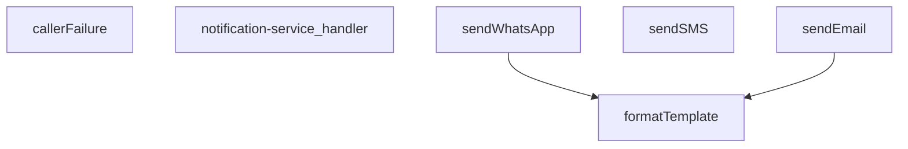

## NODE ID STANDARD

  file: supabase\functions\notification-service\index.ts
  function: supabase\functions\notification-service\index.ts::callerFailure
  function: supabase\functions\notification-service\index.ts::notification-service_handler
  function: supabase\functions\notification-service\index.ts::sendWhatsApp
  function: supabase\functions\notification-service\index.ts::sendSMS
  function: supabase\functions\notification-service\index.ts::sendEmail
  function: supabase\functions\notification-service\index.ts::formatTemplate

---

## DISA AKTARILANLAR (EXPORTS)
  export: callerFailure
  export: formatTemplate
  export: notification-service_handler
  export: sendEmail
  export: sendSMS
  export: sendWhatsApp

---
# FILE: supabase\functions\order-confirmation\index.md

---
domain: general
source_type: doc
namespace_type: module
source_path: C:\Users\alize\venthub-hvac\supabase\functions\order-confirmation\index.ts
skeleton_hash: 19667472dd6fb335
entity_hashes:
  func:callerFailure: c2855766de0bfe8b
  func:loadTemplate: 9bc4b1ff28af1df3
  func:order-confirmation_handler: 52ce43dfb5d8480d
  func:renderTemplate: 598e7353aec8e680
  overview: f37144b7f3a3d49b
generated_at: 2026-08-17T11:37:25Z
---

## Genel Bakış
Bu modül, Supabase Edge Function olarak çalışan bir sipariş onayı e-posta gönderim servisidir. Gelen HTTP isteklerini işleyerek sipariş bilgilerini alır, HTML e-posta şablonunu yükler ve dinamik verilerle doldurarak kullanıcılara sipariş onay e-postası gönderir. Modül, hata yönetimi ve şablon işleme süreçlerini merkezi olarak koordine eder.

## Fonksiyon Grupları

### Ana İstek İşleyici
Sipariş onayı için gelen HTTP isteklerini karşılayan ve tüm sürecin akışını yöneten ana Entry Point noktasıdır.
- order-confirmation_handler

### Şablon İşleme
E-posta gönderimi için HTML şablonlarının diskten yüklenmesi ve sipariş verileriyle dinamik olarak doldurulması işlemlerini yürütür.
- loadTemplate, renderTemplate

### Hata Yönetimi
İşlem sırasında oluşan hataları yakalayarak standart ve tutarlı HTTP hata yanıtları üretir; başarılı durumlarda ise boş değer dönerek devam edilmesini sağlar.
- callerFailure

---

## Mimari Notlar
- **Dış Bağımlılık:** Şablon dosyaları harici dosya sisteminden (disk) yüklenir; bu nedenle modül çalışma zamanında dosya erişimine bağımlıdır.
- **Lazy Yüklenen Modüller:** E-posta şablonları dinamik olarak istek anında yüklenir, önceden belleğe alınmaz.
- **API Sözleşmesi:** Modül, @serve dekoratörü aracılığıyla HTTP isteklerine yanıt veren bir Supabase Edge Function olarak konuşlandırılır ve Sync/Async dönüşüm döngüsüyle çalışır.

---

## AXIOMS – Mimari Varsayımlar

Bu modül, sipariş onayı e-postası gönderimi için bir Supabase Edge Function olup, şablon yükleme ve HTTP istek işleme süreçlerini kapsar.

**[Aksiyom 1]:** Eğer `loadTemplate()`fonksiyonu `null` değer döndürürse, e-posta şablonu yüklenememiş olur ve `renderTemplate` çağrısı için geçerli bir şablon metni mevcut değildir.

**[Aksiyom 2]:** Eğer `renderTemplate` fonksiyonuna boş (empty) veya geçersiz bir `tpl` parametresi verilirse, çıktı olarak anlamsız veya boş bir string oluşur.

**[Aksiyom 3]:** Eğer `renderTemplate` fonksiyonuna verilen `_data` parametresi, şablondaki dinamik alanları (placeholder'ları) karşılamıyorsa, şablondaki değişkenler doldurulmamış olarak kalır.

**[Aksiyom 4]:** Eğer `order-confirmation_handler` içinde bir hata oluşursa ve `callerFailure` fonksiyonu `null` döndürürse, handler'dan geçerli bir HTTP hata yanıtı üretilemez.

**[Aksiyom 5]:** Eğer HTTP isteği (`req`) beklenmeyen bir formattaysa veya gerekli verileri içermiyorsa, `order-confirmation_handler` fonksiyonu hata ile karşılaşır ve `callerFailure` aracılığıyla hata yanıtı döndürülür.

**[Aksiyom 6]:** Eğer `callerFailure` fonksiyonu bir hata işlerse, döndürülen yanıt nesnesinin `status` alanı pozitif bir tamsayı ve `error` alanı non-empty bir string olmalıdır.

---

## FONKSİYON DETAYLARI

### callerFailure
**Ne yapar**: Sistemde oluşan belirli hata türlerini HTTP yanıt kodlarına ve standart hata mesajlarına dönüştürerek API'ye döndürülecek bir hata nesnesi oluşturur. Bu, çağrı tarafı hatalarını (kiralama uyumsuzluğu, eksik yapılandırma, profil arama hataları) merkezi ve tutarlı bir şekilde ele almayı sağlar.

**Nasıl yapar**: Fonksiyon, gelen `error` nesnesinin belirlizano hata sınıflarını (`TenantMismatchError`, `CallerConfigError`, `CallerLookupError`) `instanceof` operatörüyle kontrol eder. Eşleşme sağlanırsa, tanımlı bir HTTP durum kodu (403, 500, 503) ve bir hata anahtarı dizesi içeren bir nesne döndürür. Hiçbir hata türü eşleşmezse `null` döndürerek hatanın bu seviyede ele alınmadığını belirtir.

**Parametreler**:
- error: unknown — İşlenmesi beklenen hata nesnesi. Herhangi bir tipte olabilir, ancak fonksiyon yalnızca tanımlızano hata sınıflarını işler.

**Dönüş**: `{ status: number; error: string } | null` — Hata işlendiyse, HTTP durum kodunu ve hata anahtarını içeren bir nesne; aksi takdirde `null`. Dönen nesne, API yanıt gövdesi olarak doğrudan kullanılabilir.

### renderTemplate
**Ne yapar**: Basit bir şablon motoru görevi görerek, bir HTML şablonu dizgesindeki değişken yer tutucularını ve koşullu blokları veri nesnesiyle doldurur. Bu, e-posta gibi dinamik içeriklerin oluşturulmasını sağlar.

**Nasıl yapar**: Fonksiyon, iki aşamalı bir `String.replace` işlemi uygular. İlk aşamada, `{{#if variableName}}...{{/if}}` sözdizimindeki koşullu blokları `RegExp` ile bulur ve ilgili değişkenin `_data` nesnesindeki değerinin "truthy" (doğrulanabilir) olup kontrol eder. Değer truthy ise bloğun içeriğini korur, aksi takdirde boş dize ile değiştirir. İkinci aşamada, `{{variableName}}` sözdizimindeki basit değişkenleri bulur ve değerlerini dizeye dönüştürerek yerine koyar. `null` veya `undefined` değerleri boş dize ile değiştirilir.

**Parametreler**:
- tpl: string — Değiştirilecek şablon dizgesi. `{{#if ...}}` ve `{{...}}` sözdizimini içerir.
- _data: Record<string, unknown> — Şablondaki değişken isimlerini anahtar, değerleri ise değer olarak eşleştiren nesne. `unknown` tipi, değerlerin herhangi bir tipte olabileceğini belirtir.

**Dönüş**: string — Değişkenlerin ve koşulların işlendiği, son HTML içeriğini temsil eden dize.

### loadTemplate
**Ne yapar**: Sipariş onay e-postası için kullanılacak HTML şablon dosyasını asenkron olarak dosya sisteminden yükler. Modülün bulunduğu dizine göre göreli bir yol kullanarak şablonun konumunu bağımsız hale getirir.

**Nasıl yapar**: Fonksiyon, `import.meta.url` değerini temel alarak şablon dosyasının mutlak URL'sini `URL` yapısıyla oluşturur. Bu, kodun hangi ortamda çalıştığına (örn. Supabase Edge Function) bağlı olarak doğru dosya yolunu dinamik olarak belirlemeyi sağlar. Ardından `Deno.readTextFile` ile dosya içeriğini okumaya çalışır. Okuma başarılı olursa dize döndürülür; dosya bulunamazsa veya herhangi bir okuma hatası oluşursa yakalama bloğu tarafından `null` döndürülerek sessizce hata yönetimi yapılır.

**Parametreler**: Parametre almaz.

**Dönüş**: `Promise<string | null>` — Asenkron bir `Promise`. Başarılı olursa şablonun HTML içeriğini; başarısız olursa `null` değerini resolve eder.

### order-confirmation_handler
**Ne yapar**: HTTP isteklerini alır, sipariş onayı şablonunu yükler, verileri şablona uygular ve yanıt olarak HTML içeriği döner.  
**Nasıl yapar**: Gelen `req` nesnesinden gerekli sipariş bilgilerini çıkarır, `loadTemplate` ile şablonu getirir, `renderTemplate` ile şablonu doldurur ve bir `Response` nesnesi oluşturur; hata durumunda uygun hata yanıtı üretir.  
**Parametreler**:
- req: any — HTTP istek nesnesi, içinde sipariş verileri ve diğer istek bilgileri bulunur.  
**Dönüş**: Response — HTTP yanıtı, genellikle `text/html` içerik tipinde ve doldurulmuş şablon metnini barındırır.

---

## İTHALATLAR (IMPORTS)
- import: ../_shared/cors.ts::getCorsHeaders
- import: ../_shared/sentry.ts::sentryCaptureException
- import: ../_shared/tenant_config.ts::getTenantBranding
- import: https://deno.land/std@0.168.0/http/server.ts::serve

---

## AST POINTERS

### [N1_NASIL] AST Pointer: supabase/functions/order-confirmation/index.ts::callerFailure
- **params**: (error: unknown)
- **ic_degiskenler**:
  - `error` — sınıflandırılacak hata nesnesi; instanceof kontrolleri ile farklı hata türleri tanımlanır
- **Dönüş**: { status: number; error: string } | null — hata türüne göre uygun HTTP durum kodu ve hata mesajı döndürür veya null

### [N2_NASIL] AST Pointer: supabase/functions/order-confirmation/index.ts::renderTemplate
- **params**: (tpl: string, _data: Record<string, unknown>)
- **ic_degiskenler**:
  - `tpl` — işlenecek HTML şablonu, replace işlemleri ile güncellenir
  - `_data` — şablondaki değişkenleri tutan key-value sözlüğü
- **Dönüş**: string — değiştirilmiş HTML şablonu

### [N3_NASIL] AST Pointer: supabase/functions/order-confirmation/index.ts::loadTemplate
- **params**: (yok)
- **ic_degiskenler**:
  - `url` — şablon dosyasının mutlak URL'i, import.meta.url referanslı
- **Dönüş**: Promise<string | null> — şablon içeriği veya okuma hatasında null

### [N4_NASIL] AST Pointer: supabase/functions/order-confirmation/index.ts::order-confirmation_handler
- **params**: (req: Request)
- **ic_degiskenler**:
  - `requestOrigin` — istekten gelen Origin başlığı, CORS doğrulaması için kullanılır
  - `allowedOrigins` — virgülle ayrılmış izin verilen origin listesi, env'den okunur
  - `originAllowed` — mevcut origin'in izin listesinde olup olmadığı kontrolü
  - `corsHeaders` — getCorsHeaders() ile üretilen CORS başlıkları
  - `_text` — request body'nin ham metin karşılığı
  - `parsed` — JSON.parse ile çözümlenmiş request body nesnesi
  - `order_id` — IIFE ile parsed['order_id']'den çıkarılan sipariş ID'si
  - `supabaseUrl` — Supabase API base URL'i, env'den okunur
  - `serviceKey` — Supabase service role anahtarı, env'den okunur
  - `ctx` — resolveCaller() ile elde edilen çağrıcı bağlam bilgisi
  - `tenantId` — ctx.tenantId'den gelen kiracı ID'si
  - `branding` — getTenantBranding() ile gelen marka bilgileri
  - `resendApiKey` — Resend e-posta servis API anahtarı, env'den okunur
  - `emailFrom` — e-posta gönderen adresi, branding'den alınır
  - `testMode` — test modu aktif mi kontrolü, env'den okunur
  - `testTo` — test modunda kullanılacak alıcı e-posta adresi
  - `bccList` — BCC alıcı listesi, env'den okunur
  - `brandName` — marka adı, branding'den alınır
  - `brandPrimary` — marka ana renk kodu, branding'den alınır
  - `brandLogoUrl` — marka logo URL'i, branding'den alınır
  - `customer_email` — sipariş sahibinin e-posta adresi, API'den çekilen sipariş verisinden alınır
  - `customer_name` — sipariş sahibinin adı, API'den çekilen sipariş veya kullanıcı verisinden alınır
  - `order_number` — sipariş numarası, API'den çekilen sipariş verisinden alınır
  - `o` — venthub_orders tablosuna yapılan fetch isteği yanıtı
  - `arr` — o.json() ile çözümlenmiş sipariş dizisi
  - `row` — arr[0] ile elde edilen ilk sipariş kaydı
  - `uid` — siparişin user_id alanı, kullanıcı bilgisi için kullanılır
  - `u` — auth/v1/admin/users endpoint'ine yapılan fetch isteği yanıtı
  - `uj` — u.json() ile çözümlenmiş kullanıcı nesnesi
  - `toList` — e-posta alıcı listesi
  - `bcc` — BCC alıcı listesinin kopyası
  - `prettyOrderNo` — formato uyan sipariş numarası (ör: #123)
  - `subject` — e-posta konu satırı
  - `tpl` — loadTemplate() ile yüklenen ham şablon
  - `html` — renderTemplate() ile işlenmiş veya fallback HTML içeriği
  - `send` — Resend API'ye e-posta gönderen inner async fonksiyon
  - `resp` — send() fonksiyonunun döndürdüğü Response nesnesi
  - `txt` — resp.text() ile okunan hata mesajı metni (hata durumunda)
  - `result` — resp.json() ile çözümlenmiş API yanıt nesnesi
- **Dönüş**: Response — JSON formatında başarı/hata yanıtı

---


## MERMAID CALL GRAPH
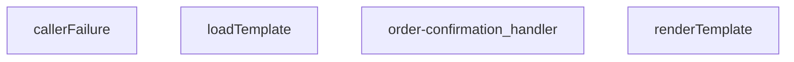

## NODE ID STANDARD

  file: supabase\functions\order-confirmation\index.ts
  function: supabase\functions\order-confirmation\index.ts::callerFailure
  function: supabase\functions\order-confirmation\index.ts::renderTemplate
  function: supabase\functions\order-confirmation\index.ts::loadTemplate
  function: supabase\functions\order-confirmation\index.ts::order-confirmation_handler

---

## DISA AKTARILANLAR (EXPORTS)
  export: callerFailure
  export: loadTemplate
  export: order-confirmation_handler
  export: renderTemplate

---
# FILE: supabase\functions\order-housekeeping\index.md

---
domain: general
source_type: doc
namespace_type: module
source_path: C:\Users\alize\venthub-hvac\supabase\functions\order-housekeeping\index.ts
skeleton_hash: 1d024d7c4264226b
entity_hashes:
  func:order-housekeeping_handler: e38889ac24217d85
  overview: 179148bdc1561c4d
generated_at: 2026-08-17T11:37:25Z
---

## Genel Bakış
Bu modül, siparişlerle ilgili temizlik ve idame işlemlerini yöneten bir Supabase Edge Function'dır. Gelen HTTP isteklerini alarak kimlik doğrulama, CORS yönetimi ve Supabase veritabanı entegrasyonu gibi sunucu tarafı görevleri merkezi bir noktadan koordine eder.

## Fonksiyon Grupları
### HTTP İstek İşleme
Gelen isteklerin doğrulanması, yetkilendirilmesi ve ilgili sipariş temizlik işlemlerinin gerçekleştirilmesinden sorumludur.
- order-housekeeping_handler

---

## AXIOMS – Mimari Varsayımlar

Bu modül, bir Supabase Edge Function olan `order-housekeeping_handler` HTTP handler'ı için aşağıdaki mimari varsayımları içerir. Bu varsayımlar, fonksiyon gövdesindeki akış kontrollerine dayanmaktadır.

[Aksiyom 1]: Eğer istek HTTP METHOD'u "OPTIONS" ise, fonksiyon boş bir 200 OK yanıtı ile (CORS başlıklarıyla) döner ve hiçbir iş mantığı çalışmaz.
[Aksiyom 2]: Eğer istek HTTP METHOD'u "POST" değilse, fonksiyon 405 Method Not Allowed yanıtı ile döner.
[Aksiyom 3]: Eğer istek gövdesi ("request body") parse edilemezse (JSON formatında değilse), fonksiyon 400 Bad Request yanıtı ile döner.
[Aksiyom 4]: Eğer istek gövdesinde "action" alanı yoksa veya boşsa, fonksiyon 400 Bad Request yanıtı ile döner.
[Aksiyom 5]: Eğer "Authorization" header'ı yoksa veya "Bearer " prefix'ini içermiyorsa, fonksiyon 401 Unauthorized yanıtı ile döner.
[Aksiyom 6]: Eğer Bearer token ile Supabase istemcisi (Supabase client) oluşturulamazsa veya token geçersizse, fonksiyon 401 Unauthorized yanıtı ile döner.
[Aksiyom 7]: Eğer "action" değeri "create" ise, fonksiyon veritabanına yeni bir "housekeeping_order" kaydı eklemeye çalışır.
[Aksiyom 8]: Eğer "action" değeri "create" olarak geldiyse ve veritabanı insert işlemi başarısız olursa (Supabase insert error), fonksiyon 500 Internal Server Error yanıtı ile döner.
[Aksiyom 9]: Eğer "action" değeri ne "create" ne de "cancel" ise (bilinmeyen bir action), fonksiyon 400 Bad Request yanıtı ile döner.
[Aksiyom 10]: Eğer "action" değeri "cancel" ise, fonksiyon mevcut bir sipariş kaydını bulmaya çalışır (id ile). Eğer kayıt bulunamazsa (data boşsa veya hata oluşursa), fonksiyon 404 Not Found yanıtı ile döner.
[Aksiyom 11]: Eğer "action" değeri "cancel" olarak geldiyse ve veritabanı sorgulama/güncelleme işlemi başarısız olursa, fonksiyon 500 Internal Server Error yanıtı ile döner.
[Aksiyom 12]: Eğer tüm iş mantığı (action'a göre DB işlemi) başarıyla tamamlanırsa, fonksiyon 200 OK yanıtı ile JSON formatında bir yanıt döner. Yanıtın "success" alanı true olmalıdır.
[Aksiyom 13]: Fonksiyon, tüm HTTP yanıtlarında CORS başlıklarını ayarlar (Access-Control-Allow-Origin: *).

---

## FONKSİYON DETAYLARI

### order-housekeeping_handler
**Ne yapar**: Bu fonksiyon, HTTP isteklerini alarak sipariş ev işleri (order housekeeping) işlemlerini yönetir. Ana işlevi, gelen isteği işleyip uygun bir Response nesnesi döndürmektir. Fonksiyon, bir Edge Function'ın giriş noktası olarak çalışır ve istek verilerini işleyerek sistemdeki siparişle ilgili ev işleri operasyonlarını tetikler.

**Nasıl yapar**: Fonksiyon, bir Request nesnesi alır ve bu isteği işler. İç mantığı, isteğin metodunu (GET, POST, vb.) ve gövdesini analiz ederek uygun bir iş akışı başlatır. İşlem sonucunda bir HTTP durum kodu ve mesajı içeren bir Response nesnesi oluşturur ve döndürür. Hata durumlarında uygun hata kodları ve mesajları ile yanıt verir.

**Parametreler**:
- req: Request — İşlenecek HTTP istek nesnesi. İstek metodunu, başlıklarını ve gövdesini içerir.

**Dönüş**: Response — İşlem sonucunu içeren HTTP yanıt nesnesi. Başarılı durumlarda 200 OK, hata durumlarında uygun HTTP durum kodlarıyla birlikte JSON formatında bir mesaj veya veri döner.

---

## İTHALATLAR (IMPORTS)
- import: ../_shared/cors.ts::getCorsHeaders
- import: https://esm.sh/@supabase/supabase-js@2.45.4::createClient

---

## AST POINTERS

### [N1_NASIL] AST Pointer: supabase/functions/order-housekeeping/index.ts::order-housekeeping_handler
- **params**: `(req)` — HTTP istek nesnesi (Request)
- **ic_degiskenler**:
  - `corsHeaders` — `getCorsHeaders(req)` ile elde edilen CORS başlık nesnesi
  - `cors` — CORS başlık nesnesi; OPTIONS ve hata yanıtlarında kullanılır (ilk önce `corsHeaders`'a eşitlenir, sonra literal olarak yeniden tanımlanır)
  - `supabaseUrl` — `Deno.env.get('SUPABASE_URL')` ile okunan Supabase proje URL'i
  - `serviceRoleKey` — `Deno.env.get('SUPABASE_SERVICE_ROLE_KEY')` ile okunan servis rolü anahtarı; Yetkili API isteklerinde kullanılır
  - `anonKey` — `Deno.env.get('SUPABASE_ANON_KEY')` ile okunan anonim istemci anahtarı; Kullanıcı auth istemcisi oluşturulurken kullanılır
  - `authHeader` — `req.headers.get('Authorization')` ile gelen Authorization başlık değeri
  - `authClient` — `createClient(supabaseUrl, anonKey, ...)` ile oluşturulan Supabase istemcisi; Kullanıcı token'ı ile auth doğrulaması yapar
  - `user` — `authClient.auth.getUser()` sonucundan destructure edilen kullanıcı nesnesi; `user.id` ile kullanıcı rolü sorgulanır
  - `authErr` — `authClient.auth.getUser()` sonucundaki hata; auth başarısızsa 401 döner
  - `roleCheck` — `fetch()` ile `user_profiles` tablosuna yapılan istek sonucu; Kullanıcının rolünü doğrular
  - `arr` — `roleCheck.json()` sonucu; `arr[0]?.role` erişimi ile ilk kaydın rolü alınır
  - `arr[0]` — `arr` dizisinin ilk elemanı; kullanıcının profil kaydıdır
  - `role` — `arr[0]?.role` ile elde edilen kullanıcı rolü stringi; `'admin'` veya `'superadmin'` olmalı
  - `now` — `Date.now()` ile alınan mevcut zaman damgası (ms)
  - `th30` — `now`'dan 30 dakika çıkarılıp ISO string'e çevrilmiş eşik zamanı; Token'ı olmayan siparişlerin iptali için kullanılır
  - `th15` — `now`'dan 15 dakika çıkarılıp ISO string'e çevrilmiş eşik zamanı; Token'ı olan bekleyen siparişlerin reconcile için kullanılır
  - `cancelResp` — Token'ı olmayan 30 dk'dan eski pending siparişleri `cancelled` yapmak için PATCH isteği sonucu
  - `cancelled` — `cancelResp.json()` sonucu; iptal edilen siparişlerin listesi, `cancelled.length` ile sayılır
  - `listResp` — Token'ı olan 15 dk'dan eski pending siparişleri listelemek için GET isteği sonucu
  - `pendWithToken` — `listResp.json()` sonucu; her eleman `{ id, created_at, payment_token, status }` yapısındadır
  - `fnHost` — IIFE ile `supabaseUrl`'den türetilen Edge Functions host adresi; `iyzico-callback` çağrısı için kullanılır
  - `reconciled` — `string[]` dizisi; reconcile sonrası `success` olan sipariş ID'lerini toplar
  - `failed` — `string[]` dizisi; reconcile sonrası başarısız olan veya hata alan sipariş ID'lerini toplar
  - `o` — `pendWithToken` dizisi üzerindeki `for` döngüsü değişkeni; her bir pending sipariş nesnesidir, `o.id` ile erişilir
  - `cb` — `iyzico-callback` fonksiyonuna POST isteği sonucu; ödeme durumu reconciliation sonucu
  - `body` — `cb.json()` sonucu; `body?.status` alanı `'success'` ise sipariş reconcile edilir, değilse `failed` durumuna çekilir
- **Dönüş**: `Response` — Başarı durumunda `{ ok: true, cancelled_count, reconciled, failed }` JSON'u (200); Hata durumunda `{ ok: false, error }` JSON'u (500); Auth hatalarında ilgili 401/403/500 yanıtları döner

---

## NODE ID STANDARD

  file: supabase\functions\order-housekeeping\index.ts
  function: supabase\functions\order-housekeeping\index.ts::order-housekeeping_handler

---

## DISA AKTARILANLAR (EXPORTS)
  export: order-housekeeping_handler

---
# FILE: supabase\functions\order-validate\index.md

---
domain: general
source_type: doc
namespace_type: module
source_path: C:\Users\alize\venthub-wt-hotfix\supabase\functions\order-validate\index.ts
skeleton_hash: c5992e8b629d24ba
entity_hashes:
  func:order-validate_handler: 5404fb6b36c963fe
  func:segmentFromUser: 705d18e6eb2ea250
  overview: 07239b761dcc7b2d
generated_at: 2026-08-14T22:03:26Z
---

## Genel Bakış
Bu modül, VentHub HVAC sistemi için bir Supabase Edge Function olarak implemente edilmiş, merkezi sipariş doğrulama servisidir. Tek bir HTTP istek noktası üzerinden tüm sipariş taleplerini alarak, iş kurallarına dayalı kapsamlı doğrulama adımlarını uygular ve sonucu istemciye standart bir HTTP yanıtı olarak geri döndürür. Modül, fiyatlandırma segmentasyonu gibi yardımcı işlevleri de entegre ederek doğrulama sürecini destekler.

## Fonksiyon Grupları
### Ana Sipariş Doğrulama İşleyicisi
Modülün dış dünyayla (HTTP istekleri) tek etkileşim noktasıdır. Gelen tüm istekleri dinler, işler ve uygun HTTP yanıtlarını (başarı, hata kodları) üreterek sonuçlandırır.
- order-validate_handler

### Yardımcı Fiyatlandırma ve Segmentasyon
Kullanıcı bilgilerinden yola çıkarak siparişin hangi fiyat segmentine (ör. perakende, toptan) ait olduğunu belirlemek gibi destekleyici mantığı yürütür. Ana işleyici tarafından çağrılarak doğrulama sürecine zenginlik katar.
- segmentFromUser

---

## AXIOMS – Mimari Varsayımlar

Bu modül, bir HTTP isteğini alıp sipariş doğrulama işlemleri yapacak şekilde tasarlanmıştır.

[Aksiyom 1]: Eğer `u` parametresi `null` olarak geçirilirse, `segmentFromUser` fonksiyonu yine de geçerli bir `PriceSegment` değeri döndürmelidir; çünkü fonksiyon imzası `null`ı açıkça kabul etmektedir.

[Aksiyom 2]: Eğer `u.app_metadata` alanı mevcut değilse, `segmentFromUser` fonksiyonu bu durumu işleyebilmeli (undefined erişimi olmadan çalışabilmelidir); çünkü `app_metadata` imzada `Record<string, unknown>` olarak **opsiyonel** (`?`) tanımlanmıştır.

[Aksiyom 3]: Eğer `req` parametresi geçerli bir HTTP isteği içermiyorsa, `order-validate_handler` geçerli bir `Response` nesnesi döndüremeyebilir; çünkü handler'ın girdisi olarak yalnızca `req` alınmaktadır ve dönüş tipi `Response`'tur.

---

## FONKSİYON DETAYLARI

### segmentFromUser
**Ne yapar**: Bu fonksiyon, bir kullanıcının fiyat segmentini (PriceSegment) belirler. Kullanıcı nesnesinin `app_metadata` alanındaki `price_segment` veya `user_role` özelliklerini kontrol ederek, kullanıcının bireysel (individual), bayi (dealer) veya kurumsal (corporate) müşteri olup olmadığını döndürür.

**Nasıl yapar**: Fonksiyon, verilen kullanıcı nesnesinden `app_metadata` alanını alır veya nesne null ise boş bir nesne kullanır. Ardından `price_segment` ve `user_role` alanlarını sırasıyla kontrol eder. Bu alanlardan herhangi biri `'dealer'` veya `'corporate'` değerine sahipse, bu değeri doğrudan `PriceSegment` olarak döndürür. Bu koşullar sağlanmazsa varsayılan olarak `'individual'` değerini döndürür.

**Parametreler**:
- `u`: `{ app_metadata?: Record<string, unknown> } | null` — İşlem yapılacak kullanıcı nesnesi. `app_metadata` alanı opsiyoneldir ve nesne herself null olabilir.

**Dönüş**: `PriceSegment` — Kullanıcının belirlenen fiyat segmenti. `'individual'`, `'dealer'` veya `'corporate'` değerlerinden biri olabilir.

### order-validate_handler

**Ne yapar**: Bu fonksiyon, HTTP isteklerini alarak sipariş doğrulama işlemlerini yönetir ve uygun HTTP yanıtı (Response) döndürür. Supabase Edge Function yapısı içinde yer alan bir istek işleyicisidir.

**Nasıl yapar**: Fonksiyon, gelen HTTP istek nesnesini (req) parameter olarak alır. Sipariş doğrulama mantığını çalıştırarak isteğin durumuna göre uygun bir Response nesnesi oluşturur ve döndürür. Fonksiyonun iç detayları docstring'de belirtilmemiştir.

**Parametreler**:
- req: Request — Gelen HTTP istek nesnesi. Sipariş doğrulama için gerekli verileri ve header bilgilerini içerir.

**Dönüş**: Response — HTTP yanıt nesnesi. Doğrulama sonucuna göre başarı veya hata durumunu belirten yanıt döndürür.

---

## İTHALATLAR (IMPORTS)
- import: ../_shared/cors.ts::getCorsHeaders
- import: https://esm.sh/@supabase/supabase-js@2.45.4::createClient

---

## INTERFACES

### CartItem
- `product_id: string`
- `quantity: number | string`
- `unit_price?: number | string`
- `price_list_id?: string | null`

### Product
- `id: string`
- `price?: number | string`
- `stock_qty?: number | string`
- `stock?: number | string`
- `quantity_available?: number | string`
- `inventory?: number | string`
- `inventory_quantity?: number | string`
- `available?: number | string`
- `on_hand?: number | string`

### PriceList
- `id: string`
- `user_type?: string | null`
- `effective_from?: string | null`

### ProductPrice
- `base_price?: number | string | null`
- `sale_price?: number | string | null`
- `discount_percentage?: number | string | null`
- `is_active?: boolean`
- `valid_from?: string | null`
- `valid_until?: string | null`
- `price_list_id?: string | null`
- `net_price?: number | string | null`
- `gross_price?: number | string | null`

### RecalcItem
- `product_id: string`
- `quantity: number`
- `unit_price: number`
- `price_list_id: string | null`

### MismatchItem
- `product_id: string`
- `had: unknown`
- `expected: number`
- `price_list_id: string | null`

### StockIssue
- `product_id: string`
- `requested: number`
- `available: number`

---

## TYPE ALIASES

### PriceSegment
```typescript
type PriceSegment = 'individual' | 'dealer' | 'corporate'
```

---

## AST POINTERS

### [N1_NASIL] AST Pointer: supabase/functions/order-validate/index.ts::segmentFromUser
- **params**: `u: { app_metadata?: Record<string, unknown> } | null` — JWT user objesi, app_metadata içerebilir
- **ic_degiskenler**:
  - `md` — u?.app_metadata değerini alır, null/undefined ise boş obje {} fallback'lidir; price_segment ve user_role alanlarını barındırır
  - `c` — for döngüsü iterasyon değişkeni; önce md['price_segment'] sonra md['user_role'] değerlerini sırayla kontrol eder
- **Dönüş**: PriceSegment — 'dealer', 'corporate' veya 'individual'

### [N2_NASIL] AST Pointer: supabase/functions/order-validate/index.ts::order-validate_handler
- **params**: `req` — gelen HTTP Request objesi, method/headers/body taşır
- **ic_degiskenler**:
  - `cors` — getCorsHeaders(req) ile üretilen CORS header objesi, her yanıtta kullanılır
  - `supabaseUrl` — Deno.env.get('SUPABASE_URL') ortam değişkeni, Supabase API temel URL'i
  - `serviceRoleKey` — Deno.env.get('SUPABASE_SERVICE_ROLE_KEY'), servis seviyesi yetkilendirme anahtarı
  - `anonKey` — Deno.env.get('SUPABASE_ANON_KEY'), anonim kullanıcı anahtarı
  - `authHeader` — req.headers.get('Authorization'), Bearer token taşıyan başlık
  - `authClient` — createClient ile anonKey + authHeader ile oluşturulan Supabase istemcisi, kullanıcı doğrulaması için kullanılır
  - `user` — authClient.auth.getUser() sonucu dönen authenticated kullanıcı objesi; user.id sepet çözümlemesinde kullanılır
  - `authErr` — authClient.auth.getUser() hata sonucu; hata varsa veya user null ise 401 döner
  - `headers` — serviceRoleKey ile API istekleri için Authorization, apikey ve Content-Type barındıran header objesi
  - `body` — req.json().catch(()=>({})) ile parse edilen istek gövdesi, cart_id/cartId içerebilir
  - `userId` — user.id değerinden türetilen kullanıcının UUID'si
  - `cartId` — body.cart_id veya body.cartId'den çözülen alışveriş sepeti ID'si; boşsa user_id ile sorgulanır
  - `carts` — /rest/v1/shopping_carts sorgusundan dönen kullanıcının sepetleri dizisi
  - `items` — /rest/v1/cart_items sorgusundan dönen CartItem[] dizisi; product_id, quantity, unit_price, price_list_id taşır
  - `_productIds` — items dizisinden map ile çıkarılıp Set ile benzersizleştirilmiş product_id'ler dizisi
  - `prods` — /rest/v1/products sorgusundan dönen Product[] dizisi, _productIds ile filtrelenmiş
  - `pmap` — product.id → Product eşlemesi yapan Map, ürünleri hızlı erişim için indeksler
  - `segment` — segmentFromUser(user) çağrısıyla JWT'den çıkarılan fiyat segmenti ('individual'/'dealer'/'corporate')
  - `n` — nowIso() çağrısıyla elde edilen mevcut ISO zaman damgası, fiyat listesi geçerlilik kontrolünde kullanılır
  - `lists` — /rest/v1/price_lists sorgusundan dönen PriceList[] dizisi; is_active=true, effective_from<=now, effective_to>=now veya null filtresi uygulanmış
  - `flists` — lists'ten segment'e eşleşen veya user_type'ı olmayan (genel) listeleri filtreleyip sıralayan dizi; spesifik user_type önce, sonra en yeni effective_from
  - `chosenListId` — flists[0]?.id, sıralama sonrası seçilen fiyat listesinin ID'si; null ise fallback fiyat kullanılır
  - `recalculated` — RecalcItem[] dizisi, her kalem için yeniden hesaplanan birim fiyat ve miktarı tutar
  - `mismatches` — MismatchItem[] dizisi, sepetteki unit_price ile hesaplanan fiyat arasındaki farkları kaydeder
  - `stockIssues` — StockIssue[] dizisi, istenen miktarın mevcut stoktan fazla olduğu durumları kaydeder
  - `to2` — (n:number) => Number(Number(n).toFixed(2)), sayıyı 2 ondalık basamağa yuvarlayan yardımcı fonksiyon
  - `toCents` — (n:number) => Math.round(Number(n)*100), sayıyı sent cinsine çeviren yardımcı fonksiyon
  - `it` — for...of items döngüsü iterasyon değişkeni,her bir CartItem
  - `product` — pmap.get(it.product_id) ile elde edilen ürün objesi; bulunamazsa döngü atlanır
  - `pr` — await priceFor(product) sonucu {unit, listId} nesnesi, hesaplanan birim fiyat ve kullanılan liste ID'si
  - `unit` — pr.unit, priceFor fonksiyonundan dönen hesaplanmış birim fiyat
  - `unitNorm` — to2(unit), 2 ondalık basamağa yuvarlanmış birim fiyat
  - `equal` — it.unit_price ile unitNorm arasındaki mutlak farkın 0.005'ten küçük olup olmadığını test eden boolean
  - `available` — ürünün stok miktarı; product nesnesinin stock_qty/stock/quantity_available/inventory/inventory_quantity/available/on_hand alanlarından ilk geçerli sayısal değer
  - `cand` — stok alanı adlarının dizisi, product nesnesinden stok değerini çözmek için sırayla kontrol edilir
  - `c` — cand döngüsü iterasyon değişkeni, her bir potansiyel stok alanı adı
  - `qty` — Number(it.quantity)||0, istenen kalem miktarı
  - `finalQty` — stok kısıtlamasıyla belirlenen nihai miktar; available varsa ve qty>available ise available'a düşürülür
  - `subtotalCents` — recalculated.reduce ile hesaplanan toplam tutarın sent cinsinden değeri
  - `subtotal` — subtotalCents/100, toplam tutarın birim cinsinden değeri
  - `ok` — mismatches.length===0 && stockIssues.length===0, siparişin fiyat ve stok açısından uyumlu olduğunu gösteren boolean
- **Dönüş**: Response — JSON { ok, items, mismatches, stock_issues, totals, cart_id }

### [N3_NASIL] AST Pointer: supabase/functions/order-validate/index.ts::getJson (inner)
- **params**: `_path: string` — Supabase REST API'ye yapılacak istek yolu (ör: /rest/v1/cart_items?...)
- **ic_degiskenler**:
  - `res` — fetch(supabaseUrl + _path, { headers }) çağrısından dönen Response objesi
  - `txt` — res.text() ile elde edilen response body'sinin ham metin hali; hata durumunda da loglanır
- **Dönüş**: Promise<T> — JSON.parse(txt) ile çözülen泛型 nesne; parse hatasında null cast edilir

### [N4_NASIL] AST Pointer: supabase/functions/order-validate/index.ts::nowIso (inner)
- **params**: (yok)
- **ic_degiskenler**: (yok)
- **Dönüş**: string — new Date().toISOString() ile elde edilen güncel ISO 8601 zaman damgası

### [N5_NASIL] AST Pointer: supabase/functions/order-validate/index.ts::priceFor (inner)
- **params**: `product: Product` — fiyat hesaplanacak ürün nesnesi; product.id ve product.price fallback olarak kullanılır
- **ic_degiskenler**:
  - `_path` — /rest/v1/product_prices sorgusu için oluşturulan URL; product_id, is_active=true, price_list_id=chosenListId filtreleri uygulanmış
  - `rows` — getJson<ProductPrice[]>(_path) ile dönen fiyat kayıtları dizisi
  - `pick` — rows içinden valid_from<=now && valid_until>=now koşulunu sağlayan ilk kayıt; yoksa rows[0] fallback
  - `net` — pick.net_price null değilse Number(pick.net_price), aksi halde null; B2B (net/KDV-harici) fiyat
  - `gross` — pick.gross_price null değilse Number(pick.gross_price), aksi halde null; B2C (gross/KDV-dahil) fiyat
  - `derived` — segment==='individual' ise gross??net, aksi halde net??gross; segment'e göre türetilen fiyat
  - `base` — Number(pick.base_price||0), taban fiyat
  - `sale` — pick.sale_price null değilse Number(pick.sale_price), aksi halde null; indirimli satış fiyatı
  - `disc` — Number(pick.discount_percentage||0), indirim yüzdesi (0-100)
  - `v` — base*(1-disc/100) ile hesaplanan indirim uygulanmış fiyat
  - `fb` — Number(product.price||0), fiyat listesinde kayıt bulunamazsa kullanılan fallback ürün fiyatı
- **Dönüş**: Promise<{unit: number, listId: string | null}> — hesaplanmış birim fiyat ve kullanılan fiyat listesi ID'si

### [N6_NASIL] AST Pointer: supabase/functions/order-validate/index.ts::sort_comparator (anonymous)
- **params**: `a: PriceList` — karşılaştırılacak ilk fiyat listesi, `b: PriceList` — karşılaştırılacak ikinci fiyat listesi
- **ic_degiskenler**:
  - `at` — a.effective_from Date.parse() sonucu milisaniye cinsinden tarih; null/parse edilemezse 0
  - `bt` — b.effective_from Date.parse() sonucu milisaniye cinsinden tarih; null/parse edilemezse 0
- **Dönüş**: number — negatif ise a önce gelir; spesifik user_type olan önce, sonra en yeni effective_from önce gelir (azalan sıra)

---

## NODE ID STANDARD

  file: supabase\functions\order-validate\index.ts
  function: supabase\functions\order-validate\index.ts::segmentFromUser
  function: supabase\functions\order-validate\index.ts::order-validate_handler

---

## DISA AKTARILANLAR (EXPORTS)
  export: order-validate_handler
  export: segmentFromUser

---
# FILE: supabase\functions\refund-order-mock\index.md

---
domain: general
source_type: doc
namespace_type: module
source_path: C:\Users\alize\venthub-wt-hotfix\supabase\functions\refund-order-mock\index.ts
skeleton_hash: 4b351dda23d540b3
entity_hashes:
  func:refund-order-mock_handler: 4c50c7cb50c6be68
  overview: b618c82b37f33caf
generated_at: 2026-08-14T22:02:42Z
---

## Genel Bakış
Bu modül, Supabase Edge Function olarak çalışan bir HTTP endpoint'tir. Dışarıdan gelen bir sipariş iade (refund) isteğini alır, basit bir mock (simüle edilmiş) iş mantığı uygular ve önceden tanımlı bir yanıt yapısıyla HTTP cevabı üretir.

## Fonksiyon Grupları
### İstek İşleme ve Mock Yanıt Üretimi
Bu grup, bir iade talebini kabul ederek simüle edilmiş bir iş sonucunu HTTP yanıtı olarak döndürmekten sorumludur.
- refund-order-mock_handler

---

## AXIOMS – Mimari Varsayımlar
Bu modül, bir Supabase Edge Function HTTP handler'ıdır; tek bir `req` parametresi alarak mock iade yanıtı üretir.

[Aksiyom 1]: Eğer `req` parametresi geçerli bir HTTP request nesnesi değilse, fonksiyon beklenmeyen bir hata ile karşılaşır veya geçersiz HTTP yanıtı döner.

[Aksiyom 2]: Eğer bu modül çağrılırsa, her zaman **mock (simüle edilmiş)** iade verisi döner; gerçek bir ödeme/iade işleçisi çalışmaz.

[Aksiyom 3]: Eğer istek başarıyla işlenirse, modül **önceden tanımlı bir veri yapısı** ile HTTP yanıt nesnesi üretir.

[Aksiyom 4]: Eğer istek işlenirken bir hata oluşursa, modülün bu duruma nasıl yanıt verdiği implementasyona bağlıdır (docstring'de hata senaryosu tanımlanmamıştır).

---

## FONKSİYON DETAYLARI

### refund-order-mock_handler
**Ne yapar**: Bu fonksiyon, bir siparişin geri ödemesi (refund) işlemini isteyen bir HTTP isteğini (request) ele alır. Fonksiyon, verilen bilgilere dayanarak bir geri ödeme işlemini **sahte (mock)** olarak simüle eder ve sonucu bildiren bir HTTP yanıtı (response) üretir. Bu, gerçek bir ödeme ağ geçidine (payment gateway) bağlanmadan test ve geliştirme süreçleri için kullanılan bir simülasyon fonksiyonudur.

**Nasıl yapar**: Fonksiyon, gelen isteğin (req) gövdesini (body) ayrıştırarak `order_id` ve `refund_reason` alanlarını bekler. Bu alanların varlığını ve türlerini doğrular. Doğrulama başarılı olursa, belirli bir geri ödeme işlemi iş mantığını (örneğin, bir veritabanı kaydını güncelleme) simüle eden bir dizi adım çalıştırır. İşlem的成功ızlıkla tamamlanırsa, succeeded: true durumu ile bir yanıt döner; herhangi bir hata (geçersiz parametre, eksik alan) oluşursa, succeeded: false ve bir hata mesajı içeren bir yanıt üretir.

**Parametreler**:
- `req`: Request — Supabase Edge Function tarafından sağlanan ve isteği temsil eden HTTP Request nesnesi. Fonksiyon bu nesnenin `body` özelliğinden JSON verisini okur.

**Dönüş**: Response — Fonksiyon, her durumda bir HTTP Response nesnesi döndürür. Başarılı simülasyon durumunda `200 OK` durum kodu ve `{ succeeded: true, message: string, order_id: string }` yapısında bir JSON gövdesi; hata durumunda `400 Bad Request` veya `500 Internal Server Error` durum kodu ve `{ succeeded: false, error: string }` yapısında bir JSON gövdesi döner.

---

## İTHALATLAR (IMPORTS)
- import: ../_shared/cors.ts::getCorsHeaders
- import: https://deno.land/std@0.168.0/http/server.ts::serve
- import: https://esm.sh/@supabase/supabase-js@2.45.4::createClient

---

## INTERFACES

### RefundRequest
- `order_id: string`
- `amount?: number`
- `reason?: string`

---

## AST POINTERS

### [N1_NASIL] AST Pointer: supabase/functions/refund-order-mock/index.ts::refund-order-mock_handler
- **params**: `(req)` — HTTP request nesnesi (Deno.Request), method, headers, body barındırır
- **ic_degiskenler**:
  - `origin` — `req.headers.get('origin')` ile alınan origin değeri, yoksa `'*'` fallback
  - `cors` — CORS başlık nesnesi; `Access-Control-Allow-Headers` ve `Access-Control-Allow-Methods` içerir
  - `supabaseUrl` — `Deno.env.get('SUPABASE_URL')` ile alınan Supabase URL'i, boş string fallback
  - `serviceKey` — `Deno.env.get('SUPABASE_SERVICE_ROLE_KEY')` ile alınan service role anahtarı, boş string fallback
  - `anonKey` — `Deno.env.get('SUPABASE_ANON_KEY')` ile alınan anon anahtarı, boş string fallback
  - `authHeader` — `req.headers.get('authorization')` ile alınan Authorization başlık değeri
  - `authClient` — `createClient(supabaseUrl, anonKey, {...})` ile oluşturulan Supabase istemcisi; auth header'ı global olarak eklenmiştir
  - `user` — `authClient.auth.getUser()` destructured `data.user`; kimliği doğrulanmış kullanıcı nesnesi
  - `authErr` — `authClient.auth.getUser()` destructured `error`; auth hatası veya null
  - `actorUserId` — `user.id` değerinden alınan işlem yapan kullanıcının UUID'si
  - `body` — `req.json()` ile parse edilen istek gövdesi, `RefundRequest` tipine cast; `order_id`, `amount`, `reason` alanlarını barındırır
  - `order_id` — `body.order_id` değerinin trim edilmiş hali; hedef siparişin UUID'si
  - `amount` — `body.amount` değerinden; sayı ve finite ise `Number(body.amount)`, değilse `undefined`
  - `reason` — `body.reason` değerinden; string ise ilk 140 karaktere kesilmiş iade sebebi
  - `ordResp` — `${supabaseUrl}/rest/v1/venthub_orders?id=eq.${order_id}&select=...` REST sorgusunun fetch yanıtı
  - `arr` — `ordResp.json()` sonucu; sipariş satırları dizisi veya boş dizi
  - `order` — `arr[0]` ilk sipariş kaydı veya null; `id`, `user_id`, `status`, `payment_status`, `total_amount`, `payment_debug` alanları içerir
  - `isAdmin` — boolean; `actorUserId` varsa `user_profiles` tablosundan rol kontrolü ile `true`/`false`
  - `prof` — `${supabaseUrl}/rest/v1/user_profiles?id=eq.${actorUserId}&select=role` REST sorgusunun fetch yanıtı
  - `prows` — `prof.json()` sonucu; profil satırları dizisi
  - `prow` — `prows[0]` ilk profil kaydı veya null; `role` alanını barındırır
  - `isOwner` — boolean; `actorUserId` ve `order.user_id` eşleşiyorsa `true`
  - `totalAmount` — `order.total_amount` değerinden `Number()` ile parse edilen toplam sipariş tutarı
  - `target` — iade hedef tutarı; `amount` geçerli pozitif sayıysa `amount`, değilse `totalAmount`
  - `isFull` — boolean; `target >= totalAmount` ise tam iade, değilse kısmi iade
  - `newPaymentStatus` — `'refunded'` (tam iade) veya `'partial_refunded'` (kısmi iade)
  - `newOrderStatus` — tam iadeyse ve sipariş `shipped`/`delivered` dışındaysa `'cancelled'`, aksi halde mevcut `order.status`
  - `dbg` — `order.payment_debug` değerinden mevcut ödeme debug nesnesi, boş nesne fallback
  - `newDebug` — `dbg` üzerine spread ile `mock_refund`, `mock_refund_reason`, `refund_type`, `refund_amount`, `refunded_total`, `partial_refunds` alanları eklenmiş güncellenmiş debug nesnesi
  - `itemsResp` — tam iade durumunda `${supabaseUrl}/rest/v1/venthub_order_items?order_id=eq.${order_id}&select=product_id,quantity` REST sorgusunun fetch yanıtı
  - `items` — `itemsResp.json()` sonucu; sipariş kalemleri dizisi
  - `it` — `items` dizisi üzerindeki `for` döngüsünün her elemanı; `product_id` ve `quantity` alanlarını barındırır
  - `upd` — `${supabaseUrl}/rest/v1/venthub_orders?id=eq.${order_id}` PATCH isteğinin fetch yanıtı; sipariş güncellemesi sonucu
  - `txt` — `upd` başarısızsa `upd._text()` ile alınan hata gövdesi metni
  - `payload` — audit insert için nesne: `{ order_id, amount: target, reason, actor_user_id }`
  - `_e` — `catch` bloğu yakalama değişkeni; `unknown` tipinde hata nesnesi
  - `msg` — `_e` Error ise `_e.message`, değilse `String(_e)` ile elde edilen hata mesajı stringi
- **Dönüş**: `Response` — her durumda HTTP Response döner; başarıda `{ ok: true, order_id, payment_status, amount }` JSON gövdesi, hatalarda farklı hata kodlarıyla hata JSON'u

---

## NODE ID STANDARD

  file: supabase\functions\refund-order-mock\index.ts
  function: supabase\functions\refund-order-mock\index.ts::refund-order-mock_handler

---

## DISA AKTARILANLAR (EXPORTS)
  export: refund-order-mock_handler

---
# FILE: supabase\functions\release-expired-reservations\index.md

---
domain: general
source_type: doc
namespace_type: module
source_path: C:\Users\alize\venthub-hvac\supabase\functions\release-expired-reservations\index.ts
skeleton_hash: c2a450c13521e732
entity_hashes:
  func:release-expired-reservations_handler: 0483cb3fe89757db
  overview: 8dbd32b37d35fd0b
generated_at: 2026-08-17T11:37:56Z
---

## Genel Bakış
Bu modül, süresi dolmuş rezervasyonları otomatik olarak serbest bırakan bir Supabase Edge Function'dır. Tek bir HTTP endpoint üzerinden tetiklenerek veritabanındaki geçerlilik süresi dolmuş rezervasyon kayıtlarını tespit eder, bunların durumunu günceller ve ilişkili kaynakların yeniden kullanıma açılmasını sağlar.

## Fonksiyon Grupları
### HTTP İstek İşleyici
Modülün dış dünyaya açılan tek giriş noktasıdır; HTTP isteğini alır, rezervasyon serbest bırakma iş mantığını koordine eder ve sonucu yanıt olarak döner.
- release-expired-reservations_handler

---

## AXIOMS – Mimari Varsayımlar
Bu modül, Supabase Edge Functions ortamında çalışan HTTP tabanlı bir rezervasyon serbest bırakma fonksiyonudur.

**[Aksiyom 1]:** Eğer geçerli bir HTTP Request nesnesi (`req: Request`) sağlanmazsa, fonksiyon yanıt üretilemez ve işlenemeyen istek durumunda hata döner.

**[Aksiyom 2]:** Eğer Supabase Edge Functions çalışma ortamı (runtime) mevcut değilse veya `@serve` dekoratörü düzgün yapılandırılmamışsa, fonksiyon hiç tetiklenemez.

**[Aksiyom 3]:** Eğer fonksiyon başarılı bir şekilde çalışırsa, her durumda bir `Response` nesnesi dönmelidir; aksi halde istemci yanıt alamaz ve zaman aşımı hatası oluşur.

**[Aksiyom 4]:** Eğer veritabanı bağlantısı (Supabase client) yapılandırılmamışsa, rezervasyon kayıtlarına erişim sağlanamaz ve süresi dolmuş rezervasyonlar tespit edilemez.

**[Aksiyom 5]:** Eğer veritabanında `reservations` tablosu veya ilgili tablo mevcut değilse, sorgu başarısız olur ve hiçbir rezervasyon güncellenemez.

---

**Not:** Bu modül için belirtilen fonksiyon gövdesi (implementation body) paylaşılmadığından, iş mantığına ilişkin spesifik aksiyomlar (eşik değerleri, rezervasyon durumu transition kuralları, kaynak kilitleme mantığı vb.) **bilinmiyor** olarak değerlendirilmiştir.

---

## FONKSİYON DETAYLARI

### release-expired-reservations_handler
**Ne yapar**: Süresi dolmuş rezervasyonları serbest bırakma işlemini yöneten HTTP endpoint handler'ıdır. Bu fonksiyon, Supabase Edge Function olarak tanımlı olup HTTP isteklerini karşılar ve rezervasyon serbest bırakma sürecini başlatır.

**Nasıl yapar**:
- `@serve` dekoratörü kullanılarak HTTP request/response döngüsüne dahil edilmiştir. Bu dekoratör, fonksiyonu dışarıya açık bir HTTP endpoint olarak sunar ve isteklerin işlenmesini sağlar.
- Fonksiyon asenkron (`async`) olarak tanımlanmıştır, bu sayede uzun sürebilecek veritabanı işlemlerini bloklamadan bekleyebilir.
- Docstring'e göre `inventory_movements` tablosundaki kanıtları kontrol eder. Bu kontrole T052-VH kodlu kanıt referans verilmiştir.

**Parametreler**:
- `req`: `Request` — Gelen HTTP isteği nesnesi. İstek body, header, query parametreleri ve diğer HTTP bilgilerini içerir. Fonksiyon bu nesne üzerinden istek verilerine erişir.

**Dönüş**: `Response` — HTTP yanıt nesnesi. İşlem sonucuna göre istemciye döndürülecek yanıt (başarı/hata durumu, mesaj vb.) bu nesne ile paketlenir ve gönderilir.

---

## İTHALATLAR (IMPORTS)
- import: ../_shared/cors.ts::getCorsHeaders
- import: https://deno.land/std@0.177.0/http/server.ts::serve
- import: https://esm.sh/@supabase/supabase-js@2.45.4::createClient

---

## INTERFACES

### InventorySettings
- `reservation_timeout_hours: number`

### ExpiredOrder
- `id: string`
- `order_number: string | null`

---

## AST POINTERS

### [N1_NASIL] AST Pointer: release-expired-reservations\index.ts::release-expired-reservations_handler
- **params**: `req: Request` — gelen HTTP isteği
- **ic_degiskenler**:
  - `corsHeaders` — `getCorsHeaders(req)` ile üretilen CORS başlık nesnesi; tüm Response'larda kullanılır
  - `supabaseUrl` — `Deno.env.get('SUPABASE_URL')`, Supabase proje URL'i
  - `supabaseKey` — `Deno.env.get('SUPABASE_SERVICE_ROLE_KEY')`, servis rolü anahtarı
  - `authHeader` — `req.headers.get('Authorization')`, istek başlığındaki JWT token
  - `isAuthorized` — boolean, kullanıcının yetkilendirilip yetkilendirilmediğini tutar; başlangıçta `false`
  - `anonKey` — `Deno.env.get('SUPABASE_ANON_KEY')`, anonim Supabase anahtarı, boş string fallback'li (auth bloğu içinde)
  - `createClientAuth` — `await import(...)` ile lazy import edilen `createClient` fonksiyonu; auth bloğu içinde
  - `authClient` — kullanıcı token'ı ile oluşturulmuş geçici Supabase istemcisi; `createClientAuth(supabaseUrl, anonKey, { global: { headers: { Authorization: authHeader } } })`
  - `user` — `authClient.auth.getUser()` sonucundan destructure edilen kullanıcı nesnesi; `const { data: { user } } = ...`
  - `roleCheck` — `fetch()` ile `user_profiles` tablosundan rol sorgulama sonucu (Response nesnesi)
  - `arr` — `roleCheck.json().catch(() => [])` sonucu; `arr[0]?.role` ile ilk elemanın rolu erişilir
  - `role` — `arr[0]?.role` ifadesinden çıkarılan kullanıcı rolü string'i
  - `supabase` — `createClient(supabaseUrl, supabaseKey)` ile oluşturulan ana Supabase istemcisi
  - `settingsData` — `supabase.from('inventory_settings').select('reservation_timeout_hours').maybeSingle()` sonucu; `InventorySettings | null` olabilir
  - `settings` — `settingsData as InventorySettings | null` olarak tip-lendirilmiş ayarlar nesnesi; `settings?.reservation_timeout_hours` erişimi yapılır
  - `hours` — `settings?.reservation_timeout_hours || 24`, rezervasyon zaman aşımı süresi (saat cinsinden, varsayılan 24)
  - `timeoutDate` — `new Date()` üzerine `hours` kadar saat geri gidilerek hesaplanan eşik tarihi; `timeoutDate.toISOString()` olarak kullanılır
  - `expiredOrders` — `supabase.from('venthub_orders').select('id, order_number').eq('status', 'pending').eq('payment_status', 'pending').lt('created_at', timeoutDate.toISOString()).limit(100)` sorgusunun sonucu; `ExpiredOrder[]` tipinde dizi
  - `findErr` — `expiredOrders` sorgusundaki `error` alanı; varsa `throw` edilir
  - `releasedCount` — başarıyla serbest bırakılan sipariş sayısı sayaç değişkeni, başlangıçta `0`
  - `order` — `for...of` döngüsünde her iterasyondaki `ExpiredOrder` nesnesi; `order.id` ve `order.order_number` erişimleri yapılır
  - `updateErr` — `supabase.from('venthub_orders').update(...).eq('id', order.id)` sorgusundaki `error` alanı
  - `restoreRaw` — `supabase.rpc('process_order_stock_restore', { p_order_id: order.id, p_reason: 'order_expire' })` sonucunun `data` alanı; `{ success?: boolean; error?: string; restored_count?: number; restored_units?: number } | null` olarak tip-lendirilir (`restore` adıyla)
  - `restoreErr` — `process_order_stock_restore` RPC çağrısındaki `error` alanı
  - `restore` — `restoreRaw as { success?: boolean; error?: string; restored_count?: number; restored_units?: number } | null`, RPC sonuç nesnesi; `restore?.success`, `restore?.error`, `restore?.restored_count`, `restore?.restored_units` alanları okunur
  - `orderErr` — inner try-catch bloğundaki yakalanan hata nesnesi; her sipariş işlemenin individual hata yönetimi için
- **Dönüş**: `Response` — JSON body ile:
  - CORS OPTIONS isteği: `{ message: 'ok' }`, status 200
  - Eksik config: `{ error: 'Missing Supabase Config' }`, status 500
  - Yetkisiz: `{ error: 'Unauthorized' }`, status 401
  - Süresi dolmuş sipariş yoksa: `{ message: 'No expired reservations found.', released: 0 }`, status 200
  - Başarılı: `{ success: true, released_count: releasedCount, message: ... }`, status 200
  - Fatal hata: `{ error: 'internal_error' }`, status 500

---

## NODE ID STANDARD

  file: supabase\functions\release-expired-reservations\index.ts
  function: supabase\functions\release-expired-reservations\index.ts::release-expired-reservations_handler

---

## DISA AKTARILANLAR (EXPORTS)
  export: release-expired-reservations_handler

---
# FILE: supabase\functions\return-status-notification\index.md

---
domain: general
source_type: doc
namespace_type: module
source_path: C:\Users\alize\venthub-hvac\supabase\functions\return-status-notification\index.ts
skeleton_hash: 5a6df8fe3834d7ad
entity_hashes:
  func:callerFailure: c2855766de0bfe8b
  func:return-status-notification_handler: 7d2592fd30deaf05
  overview: 60ed89a145e03aa3
generated_at: 2026-08-17T11:39:14Z
---

## Genel Bakış
Bu modül, Supabase Edge Function olarak iade (return) süreçlerindeki durum değişikliklerini işleyen ve bildiren tek amaçlı bir HTTP servisidir. Gelen istekleri doğrulayıp işler, uygun yanıtlar döndürür ve hata senaryolarında tutarlı bir geri bildirim sağlar. Basit ve odaklı bir mimari ile istek-yanıt döngüsü üzerine kurulmuştur.

## Fonksiyon Grupları
### Ana İstek İşleyici
Modülün merkezi sorumluluğunu yerine getirir: Gelen HTTP isteklerini kabul eder, CORS politikalarını uygular, istek metodunu ve gövdesini doğrular, iş mantığını yürütür ve uygun HTTP durum kodlarıyla yanıt üretir.
- return-status-notification_handler

### Hata Yönetimi
İşlem akışı boyunca oluşabilecek öngörülemeyen hataları yakalar ve standart, yapılandırılmış bir hata yanıtı (nesne) üretir. Bu sayede istemcilere tutarlı ve programatik olarak işlenebilir hata bilgisi sunulmasını sağlar.
- callerFailure

---

## AXIOMS – Mimari Varsayımlar

[Bu modül, bir Supabase Edge Function olarak çalışır ve HTTP istekleri üzerinden iade durum bildirimlerini işler.]

[Aksiyom 1]: Eğer `callerFailure` fonksiyonuna geçerli bir `error` parametresi sağlanmazsa, fonksiyon `null` döner ve hata bilgisi yapılandırılamaz.

[Aksiyom 2]: Eğer `return-status-notification_handler` fonksiyonuna geçerli bir HTTP `req` (Request) nesnesi sağlanmazsa, handler Response nesnesi üretemez ve istek başarısız olur.

[Aksiyom 3]: Eğer `callerFailure` tarafından döndürülen hata nesnesinin `status` alanı sayısal değer içermiyorsa, HTTP yanıt kodu hatalı olur.

[Aksiyom 4]: Eğer `callerFailure` tarafından döndürülen hata nesnesinin `error` alanı string değer içermiyorsa, yanıt gövdesi geçersiz olur.

[Aksiyom 5]: Eğer Supabase serve ortamı (runtime) mevcut değilse veya `@serve` dekoratörü düzgün çalışmıyorsa, handler fonksiyonu hiç çağrılamaz.

---

## FONKSİYON DETAYLARI

### callerFailure

**Ne yapar**: Çağrııcı (caller) tarafında oluşan hataları HTTP durum kodları ve anlamlı hata metinleriyle eşler. Three custom error sınıfını (`TenantMismatchError`, `CallerConfigError`, `CallerLookupError`) tanır ve her birini ilgili HTTP yanıt durumuna dönüştürür. Eşleşmeyen hatalarda `null` dönererek üst katmanın varsayılan hata işleyişine devretmesini sağlar.

**Nasıl yapar**: Fonksiyon gelen `error` nesnesi üzerinde `instanceof` kontrol zinciri uygular. Öncelik sırasıyla sırasıyla `TenantMismatchError` (403), `CallerConfigError` (500) ve `CallerLookupError` (503) sınıflarını test eder. İlk eşleşen sınıf için ilgili `{ status, error }` nesnesini döndürür; hiçbir sınıfa uymayan hatalarda `null` döner. Bu yapı sayesinde fonksiyon tek bir錯誤 eşleme noktası oluşturur ve BEŞ bildirim ucunda tutarlı HTTP haritalaması sağlar. `TenantMismatchError`, claim ile profil arasındaki uyumsuzluğu; `CallerConfigError`, ortam değişkeni eksikliğini (sistemin kendi hatası); `CallerLookupError` ise profil sorgulama başarısızlığını temsil eder.

**Parametreler**:
- `error`: `unknown` — Yakalanan hata nesnesi. Herhangi bir türde olabilir; fonksiyon bunu `instanceof` zinciriyle güvenli bir şekilde test eder.

**Dönüş**: `{ status: number; error: string } | null` — Eşleşen bir hata sınıfı bulunduğunda, HTTP durum kodu (`status`) ve insani tarafından okunabilir hata tanımlayıcısı (`error`) içeren bir nesne döner. `TenantMismatchError` → `403` / `'tenant_mismatch'`, `CallerConfigError` → `500` / `'CONFIG_MISSING'`, `CallerLookupError` → `503` / `'profile_lookup_failed'`. Tanınmayan hata türleri için `null` döner; bu durumda çağrııcı kendi varsayılan hata yönetim mantığını devreye alır.

### return-status-notification_handler

**Ne yapar**: Return (iade) durum değişikliklerini bildirim olarak işleyen bir HTTP istek yöneticisi fonksiyonudur. Supabase Edge Function yapısında çalışarak, iade taleplerinin durum güncelleme işlemlerini tetikleyen bildirimleri yönetir.

**Nasıl yapar**: Fonksiyon, gelen HTTP isteğini (`req` parametresi) alır ve bu istek içindeki iade durum bilgilerini işler. Edge Function mimarisi içinde çalışarak, istemci tarafından gönderilen iade durum değişikliğini alır, gerekli bildirim mantığını uygular ve bir `Response` nesnesi döndürerek işlem sonucunu iletir.

**Parametreler**:
- `req`: Request — HTTP istek nesnesi. İade durum bildirimi için gerekli verileri (iade ID'si, yeni durum, kullanıcı bilgileri vb.) içeren istek gövdesi ve meta bilgilerini barındırır.

**Dönüş**: `Response` — İşlem sonucunu içeren HTTP yanıt nesnesi. Başarılı bildirim gönderiminde onay mesajı, hata durumunda ise hata bilgisi ve uygun HTTP durum kodunu döndürür.

---

## İTHALATLAR (IMPORTS)
- import: ../_shared/cors.ts::getCorsHeaders
- import: ../_shared/tenant_config.ts::getTenantBranding
- import: https://deno.land/std@0.168.0/http/server.ts::serve

---

## INTERFACES

### ReturnStatusNotificationRequest
- `return_id: string`
- `order_id?: string`
- `order_number?: string`
- `customer_email?: string`
- `customer_name?: string`
- `old_status: string`
- `new_status: string`
- `reason: string`
- `description?: string | null`
- `tenant_id?: string`

### ResendResult
- `id?: string`

---

## AST POINTERS

### [N1_NASIL] AST Pointer: supabase/functions/return-status-notification/index.ts::callerFailure
- **params**: `(error: unknown)`
- **ic_degiskenler**: (parametre dışında değişken yok — tüm mantık `error` parametresi üzerine kurulu)
- **Dönüş**: `{ status: number; error: string } | null` — `error`'ın türüne göre uygun HTTP hata nesnesi döndürür; tanınmayan hatalarda `null` döner
- **Kullanılan Sınıflar**: `TenantMismatchError` (→ 403/`tenant_mismatch`), `CallerConfigError` (→ 500/`CONFIG_MISSING`), `CallerLookupError` (→ 503/`profile_lookup_failed`) — bu sınıflar bu dosyada tanımlı değil, dışarıdan import edilmiş

---

### [N2_NASIL] AST Pointer: supabase/functions/return-status-notification/index.ts::return-status-notification_handler
- **params**: `(req: Request)`
- **ic_degiskenler**:
  - `corsHeaders` — `getCorsHeaders(req)` ile elde edilen CORS başlık nesnesi; tüm Response'lara eklenir
  - `body` — `req.json()` ile parse edilmiş POST body'si (`ReturnStatusNotificationRequest` tipinde); alanların ana kaynağı
  - `return_id` — `body`'den const destructured, iade talebi ID'si; DB sorgusu ve e-posta içeriğinde kullanılır
  - `old_status` — `body`'den const destructured, iade eski durumu; log mesajında kullanılır
  - `new_status` — `body`'den const destructured, iade yeni durumu; validasyon, etiket çözümü, mesaj üretimi ve response'da kullanılır
  - `reason` — `body`'den const destructured, iade sebebi; e-posta gövdesinde gösterilir
  - `description` — `body`'den const destructured, iade açıklaması (opsiyonel); e-posta gövdesinde koşullu gösterilir
  - `order_id` — `body`'den let destructured, sipariş ID'si; `venthub_returns` sorgusuyla mutate edilebilir, `venthub_orders` sorgusunda kullanılır
  - `order_number` — `body`'den let destructured, sipariş numarası; `venthub_orders` sorgusuyla mutate edilebilir, `prettyOrderNo` formatlamasında kullanılır
  - `supabaseUrl` — `Deno.env.get('SUPABASE_URL')`, Supabase REST API kök URL'i; DB fetch'lerinde base URL olarak kullanılır
  - `serviceKey` — `Deno.env.get('SUPABASE_SERVICE_ROLE_KEY')`, Supabase service role anahtarı; tüm DB ve Auth fetch'lerinde `Authorization` ve `apikey` header'ında kullanılır
  - `ctx` — `resolveCaller(req, body)` sonucu (`CallerContext`); yetkilendirme bağlamı, `kind`/`role`/`tenantId` alanları kontrol edilir
  - `failure` — `callerFailure(err)` sonucu; resolveCaller hatası tanınabilir hata ise `{ status, error }` nesnesi, değilse `null` (null ise hata yeniden throw edilir)
  - `tenantId` — `ctx.tenantId`, doğrulanmış tenant ID'si; DB sorgularında `tenant_id=eq` filtresinde ve `getTenantBranding` çağrısında kullanılır
  - `branding` — `getTenantBranding(tenantId)` sonucu, tenant'a ait marka bilgileri (`brandName`, `brandPrimaryColor`, `brandLogoUrl`, `emailFrom` alanları Extract edilir)
  - `customer_email` — `string | undefined`, müşteri e-posta adresi; DB çözümlerinden veya `body.customer_email` fallback'inden doldurulur, e-posta gönderiminde `to` olarak kullanılır
  - `customer_name` — `string | undefined`, müşteri tam adı; DB çözümlerinden veya `body.customer_name` fallback'inden doldurulur, e-posta içeriğinde selamlama ve metinlerde kullanılır
  - `user_id` — `string | undefined`, Supabase Auth kullanıcı ID'si; `venthub_returns` veya `venthub_orders` sorgusundan çözümlenir, Auth API çağrısında kullanılır
  - `retRes` — `fetch()` sonucu, `venthub_returns` tablosuna yapılan sorgu Response'u
  - `retArr` — `retRes.json()` sonucu (catch ile `[]` fallback), iade kayıtları dizisi
  - `ret` — `retArr[0]`, ilk iade kaydı nesnesi; `ret.order_id` ve `ret.user_id` alanları `order_id`/`user_id` değişkenlerini günceller
  - `ordRes` — `fetch()` sonucu, `venthub_orders` tablosuna yapılan sorgu Response'u
  - `ordArr` — `ordRes.json()` sonucu (catch ile `[]` fallback), sipariş kayıtları dizisi
  - `ord` — `ordArr[0]`, ilk sipariş kaydı nesnesi; `order_number`, `customer_email`, `customer_name`, `user_id` alanlarını günceller
  - `authRes` — `fetch()` sonucu, Supabase Auth `/auth/v1/admin/users/{user_id}` endpoint'ine yapılan istek Response'u
  - `u` — `authRes.json()` sonucu (catch ile `null` fallback), Supabase Auth kullanıcı nesnesi; `u.email` ve `u.user_metadata` alanları çözümlenir
  - `meta` — `u.user_metadata`'dan türetilen `{ full_name?: string; name?: string }` nesnesi; `customer_name` fallback'inde kullanılır
  - `missing` — zorunlu alanların eksik isimlerinden filtrelenmiş dizi (`string[]`); 400 hata response'unda `missing` field'ında döndürülür
  - `brandName` — `branding.brandName`, marka adı; e-posta konusu, selamlama ve imza satırlarında kullanılır
  - `brandPrimary` — `branding.brandPrimaryColor`, marka ana rengi hex kodu; HTML e-postada `color` ve `border-left` stillerinde kullanılır
  - `brandLogoUrl` — `branding.brandLogoUrl`, marka logo URL'i; HTML e-postada `` tag'inde koşullu olarak gösterilir
  - `prettyOrderNo` — formatlanmış sipariş numarası (`#XXXX`); `order_number` varsa `#` + ikinci tireden sonraki kısım, yoksa `order_id`'nin son 8 karakteri, hiçbir şey yoksa `#N/A`
  - `getStatusLabel` — inline arrow fonksiyonu `(status: string): string`; durum kodunu (`approved`, `rejected`, vb.) Türkçe insan-okunabilir etikete çevirir; eşleşmeyen durumlarda ham string'i döndürür
  - `statusLabel` — `getStatusLabel(new_status)` sonucu, Türkçe durum etiketi; e-posta konusu ve gövdesinde kullanılır
  - `subject` — e-posta konu satırı string'i; `"${brandName} | İade durumu güncellendi - ${prettyOrderNo}"` formatındadır
  - `getStatusMessage` — inline arrow fonksiyonu `(status: string): { message: string; nextSteps?: string }`; duruma göre müşteriye yönelik mesaj ve opsiyonel "Sonraki Adımlar" metni döndürür; `approved`, `rejected`, `in_transit`, `received`, `refunded`, `cancelled` case'leri ve default dalı vardır
  - `message` — `getStatusMessage(new_status)` destructured sonucu, müşteriye gösterilecek ana mesaj metni
  - `nextSteps` — `getStatusMessage(new_status)` destructured sonucu (`string | undefined`), müşteriye gösterilecek sonraki adımlar metni (opsiyonel)
  - `emailContent` — template literal ile oluşturulmuş düz metin e-posta gövdesi; Resend API `text` parametresinde kullanılır
  - `html` — template literal ile oluşturulmuş HTML e-posta gövdesi; Resend API `html` parametresinde kullanılır
  - `resendApiKey` — `Deno.env.get('RESEND_API_KEY')`, Resend e-posta servisi API anahtarı; yoksa e-posta gönderimi devre dışı bırakılır
  - `emailFrom` — `branding.emailFrom`, Resend API'de kullanılacak gönderici e-posta adresi
  - `notifyDebug` — `Deno.env.get('NOTIFY_DEBUG') === 'true'`, debug loglama flag'i; e-posta devre dışı kaldığında `console.warn` ile bilgilendirme yapar
  - `emailResponse` — `fetch('https://api.resend.com/emails', ...)` sonucu, Resend API Response'u; `ok` kontrolü yapılır, başarısızsa `Error` fırlatılır
  - `result` — `emailResponse.json()` sonucu (`ResendResult`), Resend API yanıt nesnesi; başarı response'unda döndürülür
  - `msg` — catch bloğunda `error instanceof Error ? error.message : 'Unknown error'` ile elde edilen hata mesajı string'i; 500 response'unda `error` field'ında döndürülür
- **Erişilen İçe Aktarımlar**: `resolveCaller` (çağrı analizi fonksiyonu), `ADMIN_ROLES` (admin rol dizisi, `ctx.role` kontrolünde kullanılır)
- **Erişilen Deno API'leri**: `Deno.env.get()` (4 kez: `SUPABASE_URL`, `SUPABASE_SERVICE_ROLE_KEY`, `RESEND_API_KEY`, `NOTIFY_DEBUG`)
- **Erişilen Harici Servisler**: Supabase REST API (`/rest/v1/venthub_returns`, `/rest/v1/venthub_orders`), Supabase Auth Admin API (`/auth/v1/admin/users/{id}`), Resend Email API (`https://api.resend.com/emails`)
- **Dönüş**: `Response` — başarı durumunda `200 + { success, result, return_id, customer_email, new_status, timestamp }`, çeşitli hata durumlarında `400/401/403/405/500` HTTP status kodlu JSON response'lar

---

## NODE ID STANDARD

  file: supabase\functions\return-status-notification\index.ts
  function: supabase\functions\return-status-notification\index.ts::callerFailure
  function: supabase\functions\return-status-notification\index.ts::return-status-notification_handler

---

## DISA AKTARILANLAR (EXPORTS)
  export: callerFailure
  export: return-status-notification_handler

---
# FILE: supabase\functions\returns-webhook\index.md

---
domain: general
source_type: doc
namespace_type: module
source_path: C:\Users\alize\venthub-wt-hotfix\supabase\functions\returns-webhook\index.ts
skeleton_hash: 4e06503055bc479e
entity_hashes:
  func:hmacValid: bae4fb8fa6cd5b7a
  func:json: 4e590f90f0f94ac5
  func:mapReturnStatus: 50a6b4e8a348ea6a
  func:normalizePayload: b648e72d362ae551
  func:returns-webhook_handler: b4558e805d0a933f
  func:sha256Base64: 0784b35c5d8e45cb
  overview: 8a02b4a164141090
generated_at: 2026-08-15T09:03:35Z
---

## Genel Bakış
Bu modül, kargo firmalarından gelen iade webhook isteklerini güvenli bir şekilde işleyen bir Supabase Edge Function'dır. HMAC-SHA256 imza doğrulaması ile kaynağın güvenilirliğini teyit ederek, farklı formatlardaki payload verilerini standart bir forma dönüştürür ve uygulama içi iade durum alanlarına eşler. Tek bir HTTP giriş noktası üzerinden tüm iş akışını orkestra eder.

## Fonksiyon Grupları
### Kriptografik Doğrulama
Webhook isteklerinin HMAC-SHA256 imzasını doğrulayarak kaynağın güvenilirliğini ve veri bütünlüğünü teyit eder.
- sha256Base64, hmacValid

### Veri Normalizasyonu ve Haritalama
Kargo firmalarından gelen farklı formatlı payload verilerini ortak bir yapıya dönüştürür ve firma bazlı durum kodlarını uygulama içi standart değerlerle eşler.
- normalizePayload, mapReturnStatus

### Yanıt Oluşturma
HTTP yanıtlarını JSON formatında ve uygun HTTP durum kodlarıyla paketler.
- json

### Ana Webhook İşleyici
HTTP isteğini alarak tüm iş akışını yönetir; imza doğrulaması, payload normalizasyonu ve durum eşleme adımlarını sırasıyla çalıştırarak nihai yanıtı üretir.
- returns-webhook_handler

---

## AXIOMS – Mimari Varsayımlar

Bu modül, kargo firmalarından gelen iade webhook isteklerini HMAC-SHA256 imza doğrulamasıyla güvenli bir şekilde işler, payload'ları normalize eder ve durum eşlemesi yapar.

[Aksiyom 1]: Eğer HMAC_SECRET_KEY ortam değişkeni yoksa veya boşsa, `hmacValid` fonksiyonu HMAC-SHA256 imza doğrulamasını doğru şekilde gerçekleştirilemez ve imza karşılaştırması tutarsız sonuç verebilir.

[Aksiyom 2]: Eğer HTTP isteğinde `X-Hub-Signature-256` header'ı yoksa veya boşsa, `hmacValid` fonksiyonu `signatureHeader` parametresine boş string olarak işlenir ve HMAC doğrulaması başarısız olur.

[Aksiyom 3]: Eğer `SKEW_MS` sabiti tanımlı değilse veya negatif bir değer alırsa, zaman damgası doğrulamasında (varsa) tolerans penceresi hatalı çalışır, geçerli istekler reddedilebilir veya geçersiz istekler kabul edilebilir.

[Aksiyom 4]: Eğer HTTP istek body'si geçerli bir JSON içermiyorsa (örn: bozuk JSON, boş body, veya non-JSON format), `normalizePayload` fonksiyonu veya `returns-webhook_handler` içindeki JSON parsing hata fırlatır.

[Aksiyom 5]: Eğer `mapReturnStatus` fonksiyonuna beklenmeyen veya eşlenmemiş bir `input` değeri verilirse, dönen `{ status, setReceived }` nesnesinde `status` alanı `undefined` olur.

[Aksiyom 6]: Eğer istek POST methoduyla gelmiyorsa, `returns-webhook_handler` fonksiyonu 405 Method Not Allowed yanıtı döndürmelidir (bu, handler'ın HTTP method kontrolüne dayalı bir varsayımdır).

[Aksiyom 7]: Eğer `normalizePayload` fonksiyonuna `null` veya `undefined` bir `obj` parametresi verilirse, fonksiyonun davranışı tanımsızdır (beklenen: null değerlerin korunması veya boş obje dönülmesi).

[Aksiyom 8]: Eğer `sha256Base64` fonksiyonuna boş string (`""`) girilirse, boş bir Base64 hash döndürülür (SHA256 boş string için tanımlı bir çıktı üretir).

[Aksiyom 9]: Eğer HMAC secret'ı ve imza doğru eşleşmiyorsa (geçersiz imza), `returns-webhook_handler` fonksiyonu 401 Unauthorized yanıtı döndürmelidir ve payload işlenmez.

[Aksiyom 10]: Eğer payload'da zorunlu alanlar eksikse (örn: `return_id`, `status` gibi alanlar), `normalizePayload` eksik alanları `undefined` olarak bırakır ve sonraki aşama bu alanları işleyemeyebilir.

---

## FONKSİYON DETAYLARI

### json
**Ne yapar**: Verilen gövdeyi ve yanıt başlatma seçeneklerini kullanarak, JSON formatında içerikli bir HTTP yanıtı oluşturur.
**Nasıl yapar**: Gelen `body` parametresini, iki boşluk girintili bir JSON dizesine dönüştürür. Varsayılan olarak `200` durum kodu ve `application/json; charset=utf-8` içerik türü ile bir `Response` nesnesi döndürür. Eklenen `init` parametresi ile durum kodu ve başlıklar özelleştirilebilir.
**Parametreler**:
- body: unknown — Yanıt gövdesi olarak kullanılacak veri. Herhangi bir tipte olabilir, JSON.stringify ile dizgeye dönüştürülür.
- init: ResponseInit — İsteğe bağlı. Durum kodu (`status`) ve başlıkları (`headers`) belirtmek için kullanılan standart ResponseInit nesnesi.
**Dönüş**: Response — Oluşturulan JSON içerikli HTTP yanıtı.

### hmacValid
**Ne yapar**: Verilen gizli anahtar, ham veri ve imza başlığını kullanarak bir HMAC-SHA256 imzasının geçerliliğini doğrular.
**Nasıl yapar**: Gizli anahtarı bir HMAC-SHA256 anahtarı olarak içe aktarır, ham veri ile bir imza hesaplar ve Base64 ile kodlanmış sonucu, gelen imza başlığındaki `sha256=` ön ekinden arındırılmış değer ile karşılaştırır. Doğrulama başarısız olursa `false` döner.
**Parametreler**:
- secret: string — HMAC imza hesaplamasında kullanılacak gizli anahtar.
- raw: string — İmza hesaplamasına giren ham veri (genellikle request body).
- signatureHeader: string — İsteğe gelen ve `sha256=...` formatında beklenen HMAC imzasını içeren başlık değeri.
**Dönüş**: Promise<boolean> — İmza geçerli ise `true`, değilse veya bir hata oluşursa `false` döner.

### mapReturnStatus
**Ne yapar**: Bir dize giriş değerini tanımlı bir durum nesnesine dönüştürür, nakliyede, teslim alınmış veya iptal edilmiş gibi durumları haritalandırır.
**Nasıl yapar**: Giriş dizesini küçük harfe dönüştürür ve tanımlı anahtar kelimeler listesine göre eşleştirir. 'in_transit' grubu için `in_transit` durumunu, 'received' grubu için `received` durumunu (ve `setReceived` flag'ini `true` yaparak) ve 'cancelled' grubu için `cancelled` durumunu döndürür. Tanınmayan bir değer girilirse, o değerin kendisi durum olarak kullanılır.
**Parametreler**:
- input: string | undefined — Haritalanacak ham durum dizesi.
**Dönüş**: { status?: string; setReceived?: boolean } — Eşlenen durum nesnesi. Giriş boşsa veya tanımsızsa boş bir nesne döner.

### normalizePayload

**Ne yapar**: Gelen ham webhook payload'unu standart bir iç formata dönüştürür. Farklı kaynaklardan gelen ve alan isimleri birbirinden farklı olabilen (örneğin snake_case veya camelCase varyasyonları) veriyi, sistemin beklediği tek tip ve tutarlı bir nesne yapısına normalizasyon yapar.

**Nasıl yapar**: Fonksiyon önce girdinin nesne olup olmadığını kontrol eder; eğer nesne ise `Record<string, unknown>` olarak ele alır, aksi takdirde boş bir nesne kullanır. Ardından dahili bir `pick` yardımcı fonksiyonu tanımlar: bu yardımcı, sıralı olarak verilen anahtar dizisinde ilk bulunan ve `null`/`undefined` olmayan değeri döndürür. Böylece farklı webhook sağlayıcılarının aynı bilgiyi farklı anahtarlarla (örneğin `return_id` vs `returnId` vs `rid`) göndermesi senaryosu sorunsuz şekilde ele alınır. Her bir zorunlu alan (`return_id`, `order_id`, `carrier`, `tracking_number`, `status`, `delivered_at`) için bu `pick` mekanizması çağrılır ve bulunan değer `.toString()` ile string'e çevrilir; hiçbir anahtar eşleşmezse boş string (`''`) varsayılan değer olarak kullanılır.

**Parametreler**:
- `obj`: `unknown` — Webhook'tan gelen ham payload verisi. Herhangi bir tipte olabilir; fonksiyon güvenli şekilde nesne olmayan durumları boş nesne olarak işler.

**Dönüş**: `{ return_id: string; order_id: string; carrier: string; tracking_number: string; status: string; delivered_at: string; }` — Standartlaştırılmış altı alandan oluşan bir nesne. Her alan her zaman bir string değer taşır; ham veride ilgili alan bulunamazsa boş string (`''`) döner.

### sha256Base64
**Ne yapar**: Verilen girdi dizesinin Base64 ile kodlanmış SHA-256 karması değerini hesaplar.
**Nasıl yapar**: Girdi dizesini UTF-8 byte dizisine dönüştürür, crypto.subtle.digest fonksiyonu ile SHA-256 hash'ini hesaplar ve sonucu Base64 formatına kodlayarak döndürür.
**Parametreler**:
- input: string — Hash'lenecek girdi dizesi.
**Dönüş**: Promise<string> — Base64 kodlanmış SHA-256 hash dizesi.

### returns-webhook_handler
**Ne yapar**: Bir iade web kancası (webhook) isteğini işler, HMAC imzasını doğrular, payload'ı normalize eder, durumunu haritalar ve ilgili yanıt veya hata mesajını döndürür.
**Nasıl yapar**: Bu, modülün ana web kancası işleyicisidir. İstek gövdesini HMAC-SHA256 ile doğrulamak için `hmacValid` fonksiyonunu kullanır. Doğrulama başarılı olursa, gövdeyi `normalizePayload` ile standartlaştırıp `mapReturnStatus` ile durumunu haritalar. İşleme mantığı bu fonksiyon gövdesinde tanımlıdır (detaylı docstring verilmemiştir).
**Parametreler**:
- req: Request — İşlenecek gelen HTTP istek nesnesi.
**Dönüş**: Response — İşleme sonucuna göre oluşturulmuş HTTP yanıtı (örn: 200 OK, 401 Unauthorized vb.).

---

## İTHALATLAR (IMPORTS)
- import: ../_shared/tenant.ts::tenantFromRow
- import: https://esm.sh/@supabase/supabase-js@2.45.4::createClient

---

## SABİTLER
- **SKEW_MS** (binary_expression) — `5 * 60 * 1000`

---

## AST POINTERS

### [N1_NASIL] AST Pointer: C:\Users\alize\venthub-wt-hotfix\supabase\functions\returns-webhook\index.ts::json
- **params**: (body: unknown, init: ResponseInit = {})
- **ic_degiskenler**: (yok)
- **Dönüş**: Response

### [N2_NASIL] AST Pointer: C:\Users\alize\venthub-wt-hotfix\supabase\functions\returns-webhook\index.ts::hmacValid
- **params**: (secret: string, raw: string, signatureHeader: string)
- **ic_degiskenler**:
  - `key` — HMAC-SHA256 anahtarı olarak kullanılmak üzere crypto.subtle.importKey ile oluşturulmuş WebCrypto anahtar nesnesi
  - `sigBytes` — raw verisi HMAC-SHA256 ile imzalandığında elde edilen byte dizisi
  - `computed` — sigBytes'in base64 formatında string karşılığı, karşılaştırma için hesaplanan imza
  - `given` — signatureHeader içinden "sha256=" prefix'i temizlenmiş ve trim edilmiş verilen imza değeri
- **Dönüş**: Promise<boolean> — imzalar eşleşiyorsa true, değilse veya hata oluştuysa false

### [N3_NASIL] AST Pointer: C:\Users\alize\venthub-wt-hotfix\supabase\functions\returns-webhook\index.ts::mapReturnStatus
- **params**: (input?: string)
- **ic_degiskenler**:
  - `s` — input parametresinin küçük harfe dönüştürülmüş hali, status eşleştirmelerinde kullanılır
- **Dönüş**: { status?: string; setReceived?: boolean } — eşleşen duruma göre status ve setReceived flag'leri

### [N4_NASIL] AST Pointer: C:\Users\alize\venthub-wt-hotfix\supabase\functions\returns-webhook\index.ts::normalizePayload
- **params**: (obj: unknown)
- **ic_degiskenler**:
  - `rec` — obj parametresinin Record<string, unknown> tipine dönüştürülmüş hali, key-value erişimi için
  - `pick` — rec içinden birden fazla anahtardan ilk bulunan değeri seçen iç fonksiyon, parametre olarak key listesi alır
- **Dönüş**: { return_id: string; order_id: string; carrier: string; tracking_number: string; status: string; delivered_at: string } — normalize edilmiş payload objesi

### [N5_NASIL] AST Pointer: C:\Users\alize\venthub-wt-hotfix\supabase\functions\returns-webhook\index.ts::sha256Base64
- **params**: (input: string)
- **ic_degiskenler**:
  - `bytes` — input string'in TextEncoder ile byte dizisine dönüştürülmüş hali
  - `hash` — bytes dizisinin SHA-256 hash'ini içeren ArrayBuffer
- **Dönüş**: Promise<string> — hash değerinin base64 formatında string karşılığı

### [N6_NASIL] AST Pointer: C:\Users\alize\venthub-wt-hotfix\supabase\functions\returns-webhook\index.ts::returns-webhook_handler
- **params**: (req: Request)
- **ic_degiskenler**:
  - `raw` — req.text() ile alınan ham request gövdesi, HMAC imzalama ve JSON parse için kullanılır
  - `body` — raw string'in JSON.parse ile parse edilmiş hali, webhook payload'ı
  - `secret` — Deno.env.get('RETURNS_WEBHOOK_SECRET') ile alınan HMAC secret anahtarı
  - `token` — Deno.env.get('RETURNS_WEBHOOK_TOKEN') ile alınan webhook token değeri
  - `sign` — req.headers.get('x-signature') ile alınan imza header'ı
  - `tok` — req.headers.get('x-webhook-token') ile alınan token header'ı
  - `ok` — HMAC veya token doğrulaması başarılıysa true olan boolean flag
  - `tsHeader` — req.headers.get('x-timestamp') veya req.headers.get('x-event-time') ile alınan timestamp header'ı
  - `t` — tsHeader'dan parse edilmiş epoch millisecond değeri, replay guard kontrolü için
  - `SUPABASE_URL` — Deno.env.get('SUPABASE_URL') ile alınan Supabase URL'i
  - `SERVICE_KEY` — Deno.env.get('SUPABASE_SERVICE_ROLE_KEY') ile alınan service role anahtarı
  - `supabase` — createClient(SUPABASE_URL, SERVICE_KEY) ile oluşturulmuş Supabase istemcisi
  - `p` — normalizePayload(body) ile normalize edilmiş webhook payload'ı
  - `eventId` — req.headers.get('x-id') veya req.headers.get('x-event-id') ile alınan olay ID'si
  - `returnId` — payload'dan veya order_id ile veritabanından çözülmüş iade ID'si
  - `cur` — venthub_returns tablosundan mevcut iade satırının id, status, tenant_id alanları
  - `tenantId` — tenantFromRow(cur) ile iade satırından türetilen tenant ID'si
  - `tenantSource` — tenantFromRow(cur) ile elde edilen tenant kaynağının belirteci (resource_row veya default)
  - `orderTenantFilter` — tenantSource resource_row ise tenant filtresi string'i, değilse boş string
  - `mapped` — mapReturnStatus(p.status) ile eşleştirilmiş durum nesnesi
  - `patch` — venthub_returns tablosuna uygulanacak güncelleme alanlarını içeren nesne
  - `rank` — durum sıralama haritası, progression kontrolü için
  - `curRank` — mevcut durumun rank değeri
  - `nextRank` — patch durumunun rank değeri
  - `updated` — veritabanı güncelleme başarılıysa true olan boolean flag
  - `rOrderId` — iade detayı sorgusundan alınan order_id (fallback olarak payload'dan)
  - `reason` — iade sebebi, returns tablosundan
  - `description` — iade açıklaması, returns tablosundan
  - `row` — returns sorgusundan dönen ilk satır
  - `orderNumber` — sipariş numarası, orders tablosundan
  - `userId` — kullanıcı ID'si, orders tablosundan
  - `row` — orders sorgusundan dönen ilk satır
  - `customerEmail` — müşteri e-postası, Auth Admin API'den
  - `customerName` — müşteri tam adı, Auth Admin API'den user_metadata'dan
  - `ju` — Auth Admin API yanıtının JSON'u
- **Dönüş**: Response — json() helper fonksiyonu ile oluşturulmuş HTTP yanıtı

---


## MERMAID CALL GRAPH
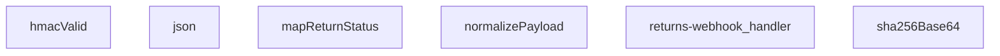

## NODE ID STANDARD

  file: supabase\functions\returns-webhook\index.ts
  function: supabase\functions\returns-webhook\index.ts::json
  function: supabase\functions\returns-webhook\index.ts::hmacValid
  function: supabase\functions\returns-webhook\index.ts::mapReturnStatus
  function: supabase\functions\returns-webhook\index.ts::normalizePayload
  function: supabase\functions\returns-webhook\index.ts::sha256Base64
  function: supabase\functions\returns-webhook\index.ts::returns-webhook_handler

---

## DISA AKTARILANLAR (EXPORTS)
  export: hmacValid
  export: json
  export: mapReturnStatus
  export: normalizePayload
  export: returns-webhook_handler
  export: sha256Base64

---
# FILE: supabase\functions\shipping-notification\index.md

---
domain: general
source_type: doc
namespace_type: module
source_path: C:\Users\alize\venthub-hvac\supabase\functions\shipping-notification\index.ts
skeleton_hash: d4af80c736bfb8a8
entity_hashes:
  func:callerFailure: c2855766de0bfe8b
  func:loadShippingTemplate: 4b4a832183734352
  func:renderTemplate: 4c617457ca4b097d
  func:shipping-notification_handler: 06ce613108984be4
  overview: 58d6822191f20509
generated_at: 2026-08-17T11:39:47Z
---

## Genel Bakış
Bu modül, bir Supabase Edge Function olarak kargo takip bildirimlerini dışarıya sunan bir HTTP API uç noktasıdır. Gelen istek verilerini alır, depolama alanından dinamik bir bildirim şablonu yükler, bu şablonu istek bilgileriyle doldurarak kişiselleştirilmiş bir içerik üretir ve istemciye yanıt olarak döndürür.

## Fonksiyon Grupları
### Şablon İşleme
Bu grup, bildirim içeriğinin dinamik ve yeniden kullanılabilir olmasını sağlayan temel mantığı barındırır. Dış depolama alanından ham şablon metni çekilir ve veri alanlarıyla birleştirilerek nihai, okunabilir bildirim metni üretilir.
- `loadShippingTemplate`, `renderTemplate`

### İstek Koordinasyonu
Bu grup, modülün dış dünya ile tek temas noktasıdır ve tüm gelen HTTP isteklerinin yaşam döngüsünü yönetir. İsteği alır, şablon işlemlerini sırasıyla çağırarak iş akışını koordine eder ve istemciye uygun durum koduyla birlikte yanıt döndürür.
- `shipping-notification_handler`

### Hata Yönetimi
Bu grup, modül genelinde oluşabilecek beklenmedik durumları yakalayıp standart bir hata yanıtı formatında dışarıya sunar. Fonksiyon, hata türünü analiz ederek anlamlı ve tutarlı bir geri bildirim üretir.
- `callerFailure`

---

## AXIOMS – Mimari Varsayımlar
Bu modül, bir Supabase Edge Function olarak çalıştırıldığında, talep edilen kargo bildirim şablonunu depolama alanından yükleyip, gelen istek verileriyle doldurarak bir HTTP yanıt döndürür.

[Aksiyom 1]: Eğer `loadShippingTemplate` fonksiyonu çalıştırıldığında depolama alanına erişilemez veya şablon dosyası belirtilen konumda mevcut değilse, fonksiyon `null` değeri döner.

[Aksiyom 2]: Eğer `renderTemplate` fonksiyonuna geçersiz bir şablon dizesi (tpl) veya şablonun gerektirdiği alanları içermeyen bir veri nesnesi (data) verilirse, fonksiyon bir hata fırlatır veya geçersiz bir dize döndürür.

[Aksiyom 3]: Eğer `shipping-notification_handler` fonksiyonu çalıştırıldığında geçerli bir HTTP isteği (req) sağlanmazsa, modül bir yanıt üretmekte başarısız olur.

[Aksiyom 4]: Eğer `callerFailure` fonksiyonuna bir hata (error) parametresi olarak null veya tanımsız bir değer verilirse ve bu değer bir hata nesnesine dönüştürülemiyorsa, fonksiyon `null` döner.

---

## FONKSİYON DETAYLARI

### callerFailure
**Ne yapar**: Bir hata nesnesini HTTP durum kodu ve hata mesajı içeren bir nesneye eşler. Çağrı istemcisinden kaynaklanmayan sistem hatalarını (yetki eksikliği, yapılandırma eksikliği, profil bulunamaması) HTTP yanıt kodlarına dönüştürerek,servislerin tutarlı hata yanıtları vermesini sağlar.

**Nasıl yapar**: Fonksiyon, parametre olarak gelen `error` nesnesinin `instanceof` kontrolü ile belirli hata sınıflarını (TenantMismatchError, CallerConfigError, CallerLookupError) sırasıyla test eder. Eşleşen ilk hata türüne göre tanımlı HTTP durum kodunu ve bir hata anahtarını içeren bir nesne döndürür. Hiçbir hata sınıfıyla eşleşme sağlanamazsa `null` değerini döndürerek hatanın farklı bir şekilde ele alınması gerektiğini belirtir.

**Parametreler**:
- error: unknown — İşlenmek istenen hata nesnesi. Fonksiyon, bu nesnenin belirli özel hata sınıflarından biri olup olmadığını kontrol eder. Tanınmayan bir hata türü geldiğinde `null` döner.

**Dönüş**: { status: number; error: string } | null — Eşleşme sağlanırsa, HTTP durum kodunu (403, 500, 503) ve anlamlandırılmış bir hata anahtarını ('tenant_mismatch', 'CONFIG_MISSING', 'profile_lookup_failed') içeren bir nesne; aksi takdirde `null` döner.

### renderTemplate
**Ne yapar**: Basit bir değişken yerleştirme ve koşullu blok_motoru olarak çalışır. Verilen bir şablon dizesi içindeki `{{değişken}}` ve `{{#if değişken}}...{{/if}}` yapılarını, sağlanan veri nesnesindeki değerlerle değiştirerek dinamik bir çıktı üretir.

**Nasıl yapar**: Fonksiyon, iki aşamalı bir regex dönüşümü uygular. İlk olarak, `{{#if key}}...{{/if}}` bloklarını bulur ve `data` nesnesindeki ilgili `key` değerinin varlığını ve "truthy" olup olmadığını kontrol eder. Değer truthy ise bloğun içeriğini korur, aksi takdirde bloğu tamamen kaldırır. İkinci aşamada, kalan `{{key}}` değişkenlerini bulur ve `data` objesindeki karşılık gelen değerle (`null` veya `undefined` ise boş dize) değiştirir. Bu, şablonların esnek ve duruma göre özelleştirilmesini sağlar.

**Parametreler**:
- tpl: string — İşlenecek şablon dizesi. İçerisinde `{{değişken}}` ve `{{#if değişken}}...{{/if}}` sözdizimi bulunur.
- data: Record<string, unknown> — Şablondaki değişkenlerin değerlerini sağlayan anahtar-değer çiftleri nesnesi. Değerler `unknown` tipinde olup, fonksiyon tarafından `truthy` ve `String` dönüşümlerine tabi tutulurlar.

**Dönüş**: string — Değişkenlerin ve koşullu blokların işlendiği, hazır şablon dizesi.

### loadShippingTemplate
**Ne yapar**: Kargo bildirimleri için kullanılan e-posta şablon dosyasını (`shipping.html`) asenkron olarak dosya sisteminden yükler. Şablonun mevcut olup olmadığını kontrol ederek servisin başlatılmasında esneklik sağlar.

**Nasıl yapar**: Fonksiyon, `import.meta.url` referansı kullanarak调用 dosyasının bulunduğu göreceli bir URL nesnesi oluşturur. Bu URL'yi `Deno.readTextFile` fonksiyonuna vererek dosya içeriğini okumaya çalışır. İşlem başarılı olursa HTML içeriğini bir `Promise<string>` olarak çözer. Herhangi bir dosya okuma hatası (dosya bulunamaz, erişim reddedilir vb.) oluşursa, `try-catch` bloğu hatayı yakalar ve `null` değeriyle çözer. Bu, şablonun opsiyonel olmasını ve eksik olma durumunda servisin çökmemesini garanti altına alır.

**Parametreler**: Bu fonksiyon hiçbir parametre almaz.

**Dönüş**: Promise<string> | null — Başarılı okuma durumunda HTML şablonunun içeriği (string); dosya bulunamadığı veya okunamadığı durumda `null` döner.

### shipping-notification_handler
**Ne yapar**: Bu fonksiyon, kargo bildirimleriyle ilgili HTTP isteklerini işleyen bir sunucu işleyicisidir (handler). Gelen bir POST isteğini alır, ilgili iş mantığını yürütür ve bir HTTP yanıtı döndürür.

**Nasıl yapar**: Fonksiyonun gövdesi verilmemiştir; bu nedenle iç mantığı hakkında kesin bir bilgi bulunmamaktadır. Ancak imzasından ve adından yola çıkarak, bu fonksiyonun bir web framework'ün (örn. Deno Oak, Hono) istek işleyici (request handler) yapısında olduğu ve `Request` nesnesini `Response` nesnesine dönüştürdüğü çıkarılabilir. Fonksiyonun, bir kargo durumu güncellendiğinde tetiklenen bir webhook veya API endpoint'i işlediği varsayılabilir.

**Parametreler**:
- `req`: Request — Gelen HTTP istek nesnesi. İstek gövdesi, başlıkları ve URL parametrelerini içerir.

**Dönüş**: Response — İşlenen istekle ilgili HTTP yanıt nesnesi. Durum kodu, başlıklar ve opsiyonel bir gövde (örn. JSON yanıtı) içerebilir.

---

## İTHALATLAR (IMPORTS)
- import: ../_shared/cors.ts::getCorsHeaders
- import: ../_shared/sentry.ts::sentryCaptureException
- import: ../_shared/tenant_config.ts::getTenantBranding
- import: https://deno.land/std@0.168.0/http/server.ts::serve

---

## INTERFACES

### ShippingNotificationRequest
- `order_id: string`
- `customer_email: string`
- `customer_name: string`
- `order_number?: string`
- `carrier: string`
- `tracking_number: string`
- `tracking_url?: string | null`
- `tenant_id?: string`

### OrderRow
- `user_id?: string | null`
- `order_number?: string | null`
- `carrier?: string | null`
- `tracking_number?: string | null`
- `tracking_url?: string | null`

### AuthAdminUser
- `email?: string | null`
- `user_metadata?: { full_name?: string | null; name?: string | null } | null`

### ResendResult
- `id?: string`

---

## AST POINTERS

### [N1_NASIL] AST Pointer: supabase/functions/shipping-notification/index.ts::callerFailure
- **params**: (error: unknown)
- **ic_degiskenler**: yok
- **Dönüş**: { status: number; error: string } | null

### [N2_NASIL] AST Pointer: supabase/functions/shipping-notification/index.ts::renderTemplate
- **params**: (tpl: string, data: Record<string, unknown>)
- **ic_degiskenler**: yok
- **Dönüş**: string

### [N3_NASIL] AST Pointer: supabase/functions/shipping-notification/index.ts::loadShippingTemplate
- **params**: ()
- **ic_degiskenler**:
  - `url` — Template dosyasının tam yolunu temsil eder, `import.meta.url` kullanarak göreli yolu mutlak URL'ye çevirir
- **Dönüş**: Promise<string | null>

### [N4_NASIL] AST Pointer: supabase/functions/shipping-notification/index.ts::shipping-notification_handler
- **params**: (req: Request)
- **ic_degiskenler**:
  - `parsed` — Request body'sinden parse edilen JSON verisi
  - `keys` — `parsed` objesinde aranacak sıralı anahtar listesi
  - `v` — Döngüde her bir `key` için parsed objesinden alınan değer
  - `s` — String değerden trim edilmiş versiyonu (boşluklar temizlenmiş)
  - `fromAddr` — Gönderen email adresi (parsed["from_addr"] veya varsayılan)
  - `to` — Alıcı email adresleri dizisi (parsed["to"] olarak parse edilir)
  - `bccArr` — BCC alıcıları dizisi (parsed["bcc"] olarak parse edilir)
  - `template` — Yüklenen email template içeriği
  - `emailContent` — Template ile data birleştirilerek oluşturulan final email içeriği
  - `html` — Template ile data birleştirilerek oluşturulan HTML versiyonu
  - `resendResp` — Resend API'ye gönderilen email isteği sonucu
- **Dönüş**: Response

---


## MERMAID CALL GRAPH
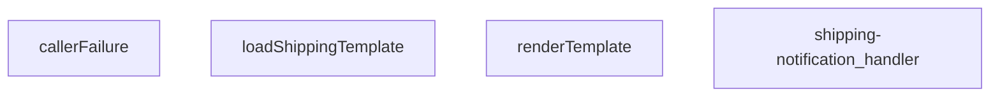

## NODE ID STANDARD

  file: supabase\functions\shipping-notification\index.ts
  function: supabase\functions\shipping-notification\index.ts::callerFailure
  function: supabase\functions\shipping-notification\index.ts::renderTemplate
  function: supabase\functions\shipping-notification\index.ts::loadShippingTemplate
  function: supabase\functions\shipping-notification\index.ts::shipping-notification_handler

---

## DISA AKTARILANLAR (EXPORTS)
  export: callerFailure
  export: loadShippingTemplate
  export: renderTemplate
  export: shipping-notification_handler

---
# FILE: supabase\functions\shipping-status\index.md

---
domain: general
source_type: doc
namespace_type: module
source_path: C:\Users\alize\venthub-wt-hotfix\supabase\functions\shipping-status\index.ts
skeleton_hash: c75e333122af75fd
entity_hashes:
  func:jsonResponse: 60e54d50747b3229
  func:shipping-status_handler: d099b53accac2970
  overview: 41fd0f2fe1f6fb98
generated_at: 2026-08-15T07:34:14Z
---

## Genel Bakış
Bu modül, kargo durumu sorgularını işleyen bir Supabase edge function olarak tasarlanmıştır. Gelen HTTP isteklerini alır, işler ve istemciye standart JSON formatında yanıt döndürür. Yanıt oluşturumunda tutarlılık için yardımcı bir fonksiyon kullanır.

## Fonksiyon Grupları
### Ana İstek İşleyicisi
Modülün ana giriş noktasıdır ve gelen kargo durumu isteklerini işleyerek nihai yanıtı üretir.
- shipping-status_handler

### Yanıt Yardımcıları
HTTP yanıtlarını JSON formatında paketlemek için kullanılan yardımcı fonksiyonları içerir.
- jsonResponse

---

## AXIOMS – Mimari Varsayımlar

Bu modül, Supabase Edge Function平台上 kargo durumu sorgularını işleyen bir HTTP istek handler'ıdır.

**[Aksiyom 1]:** Eğer `req` parametresi geçerli bir `Request` nesnesi değilse veya `null/undefined` ise, `shipping-status_handler` isteği işleyemez ve fonksiyon hata ile sonuçlanır.

**[Aksiyom 2]:** Eğer `jsonResponse` fonksiyonuna `body` parametresi olarak JSON-serializable olmayan bir değer verilirse, HTTP yanıt gövdesi oluşturulamaz ve istemci geçersiz bir yanıt alır.

**[Aksiyom 3]:** Eğer `shipping-status_handler` tarafından döndürülen `Response` nesnesi (`jsonResponse` veya doğrudan `Response` constructor ile) oluşturulamazsa, Supabase Edge Function runtime'ıvarsayılan bir hata yanıtı üretir.

**[Aksiyom 4]:** Eğer `jsonResponse` fonksiyonu çağrılmazsa ve handler doğrudan `new Response()` kullanarak JSON yanıtı döndürmeye çalışırsa, yanıt formatı tutarsız olur ve istemci tarafında parse hataları oluşabilir.

**[Aksiyom 5]:** Eğer `ResponseInit` parametresi (`init`) geçerli HTTP header veya status code içermiyorsa, döndürülen yanıt varsayılan `200 OK` durum kodu ile gönderilir.

---

> **Not:** Fonksiyon gövdeleri sağlandığında (örn: request body parsing, auth kontrolü, veritabanı sorgusu mantığı), aksiyomlar genişletilebilir ve veri doğrulama eşikleri, yetkilendirme gereksinimleri gibi domain-specific kurallar eklenebilir.

---

## FONKSİYON DETAYLARI

### jsonResponse
**Ne yapar**: Verilen veriyi JSON formatına dönüştürerek standart bir HTTP yanıtı oluşturur. Bu bir yardımcı fonksiyondur ve genellikle API uç noktalarından gönderilecek tutarlı ve doğru formatta yanıtları paketlemek için kullanılır.
**Nasıl yapar**: Fonksiyon, `JSON.stringify` metodu ile verilen `body` nesnesini iki boşluk girintili bir JSON dizgesine dönüştürür. Ardından, `new Response` constructor'ı ile bu dizgeyi gövde olarak, varsayılan `content-type` ve `cache-control` başlıklarını içeren, isteğe bağlı olarak其他 başlıklar ve durum kodu eklenebilen bir HTTP yanıtı nesnesi döndürür.
**Parametreler**:
- `body`: unknown — Yanıtın gövdesinde yer alacak olan veri. Fonksiyon tarafından JSON dizgesine dönüştürülür.
- `init`: ResponseInit — Response nesnesinin yapılandırma seçeneklerini içeren isteğe bir nesne. `headers` ve `status` özellikleri desteklenir. Varsayılan değer `{}`.
**Dönüş**: Response — Oluşturulan HTTP yanıtı nesnesi.

### shipping-status_handler
**Ne yapar**: shipping-status edge function'ının ana istek işleyici fonksiyonudur, kargo durumu sorguları için istemciden gelen tüm HTTP isteklerini alır, işler ve uygun cevabı döndürür. VentHub projesinin kargo takip modülünün sunucu tarafı çalışmasının temelini oluşturan bu fonksiyon, tüm gelen istekleri doğrulayıp ilgili iş akışını başlatır.
**Nasıl yapar**: Gelen HTTP Request nesnesini ayrıştırarak isteğin metodunu, gönderilen sorgu parametrelerini veya istek gövdesini kontrol eder, gerekli yetkilendirme ve veri doğrulama adımlarını tamamladıktan sonra ilgili kaynaktan kargo durum verisini çeker. jsonResponse yardımcı fonksiyonunu kullanarak aldığı veriyi standart JSON formatında istemciye iletecek şekilde HTTP cevabını oluşturur ve döndürür.
**Parametreler**:
- name: req, type: Request — İstemciden gelen HTTP isteğinin tüm detaylarını (url, istek metodu, başlıklar, gövde verisi) içeren standart web Request nesnesi
**Dönüş**: İşlenen isteğe ait tüm bilgileri ve kargo durumu verisini içeren standart HTTP Response nesnesi döndürür, bu cevap istemciye iletilmek üzere kullanılır.

---

## İTHALATLAR (IMPORTS)
- import: https://esm.sh/@supabase/supabase-js@2.45.4::createClient

---

## AST POINTERS

### [N1_NASIL] AST Pointers: supabase/functions/shipping-status/index.ts::jsonResponse
- **params**: `body: unknown` — Döndürülecek JSON verisi, `init: ResponseInit` — Response nesnesi için ek ayarlar (varsayılan: {})
- **ic_degiskenler**: (yok — parametreler doğrudan kullanılır)
- **Dönüş**: `Response` — JSON verisini içeren HTTP Response nesnesi

### [N2_NASIL] AST Pointer: supabase/functions/shipping-status/index.ts::shipping-status_handler
- **params**: `req: Request` — Gelen HTTP isteği nesnesi
- **ic_degiskenler**:
  - `SUPABASE_URL` — Ortam değişkeninden alınan Supabase projesi URL'i
  - `SERVICE_KEY` — Ortam değişkeninden alınan Supabase servis rolü anahtarı
  - `forwarded` — x-forwarded-for header değerinden istemci IP adreslerini ayırır
  - `ip` — İstemcinin gerçek IP adresi (birden fazla header'dan deneyerek)
  - `key` — Rate limiting için benzersiz anahtar (IP adresine göre)
  - `checkRateLimit` — Dinamik import ile yüklenen rate limiting kontrol fonksiyonu
  - `rateLimitHeaders` — Dinamik import ile yüklenen rate limiting başlıkları oluşturma fonksiyonu
  - `url` — İsteğin URL nesnesi, query parametrelerini okumak için
  - `tracking` — URL'den alınan tracking_number parametresi
  - `supabase` — Supabase istemcisi (createClient ile oluşturulan)
  - `query` — Supabase sorgu nesnesi (venthub_orders tablosundan veri çekmek için)
  - `data` — Sorgu sonucundan gelen sipariş verileri
  - `error` — Sorgu sonucundan gelen hata nesnesi
  - `_e` — Try-catch bloğunda yakalanan hata nesnesi
- **Dönüş**: `Response` — JSON yanıt nesnesi

---

## NODE ID STANDARD

  file: supabase\functions\shipping-status\index.ts
  function: supabase\functions\shipping-status\index.ts::jsonResponse
  function: supabase\functions\shipping-status\index.ts::shipping-status_handler

---

## DISA AKTARILANLAR (EXPORTS)
  export: jsonResponse
  export: shipping-status_handler

---
# FILE: supabase\functions\shipping-webhook\index.md

---
domain: general
source_type: doc
namespace_type: module
source_path: C:\Users\alize\venthub-wt-hotfix\supabase\functions\shipping-webhook\index.ts
skeleton_hash: a944f858a34ac8ff
entity_hashes:
  func:hmacValid: e5f4d85423ceba98
  func:jsonResponse: d167d2178aa5b5dd
  func:mapCarrierStatus: 19a0fe9013dc1c2f
  func:normalizePayload: 6091b60fb70ee727
  func:sha256Base64: 0784b35c5d8e45cb
  func:shipping-webhook_handler: b6676fdc25219168
  overview: 757d37eeb58d50b6
generated_at: 2026-08-15T09:03:13Z
---

## Genel Bakış
Bu modül, kargo firmalarından gelen webhook bildirimlerini alıp işleyen merkezi bir Supabase Edge Function'dur. HMAC-SHA256 imza doğrulaması ile güvenli kabul edilen istekleri işler, farklı kargo firmalarının değişken veri yapılarını standart bir forma dönüştürerek siparişlerin kargo durumunu günceller. Mimari açıdan, tüm kargo entegrasyonları için tek bir giriş noktası ve veri normalizasyon katmanı sunarak bakım ve genişletmeyi kolaylaştırır.

## Fonksiyon Grupları
### Güvenlik ve Yanıt Yardımcıları
Bu grup, webhook isteklerinin otentikasyonu için kriptografik imza doğrulamasını ve standart JSON HTTP yanıtlarının oluşturulmasını sağlar.
- hmacValid, sha256Base64, jsonResponse

### Veri Dönüştürme ve Durum Haritalama
Farklı kargo firmalarının özel payload yapılarını merkezi ve işlenebilir bir normalize forma çevirir; ayrıca firma bazlı durum kodlarını modülün iç durum yapısına eşleyerek çoklu kargo desteği sağlar.
- normalizePayload, mapCarrierStatus

### Ana Webhook İşleyici
Modülün giriş noktasıdır; gelen HTTP isteğini alarak güvenlik doğrulaması, payload normalizasyonu, durum haritalama ve nihai güncelleme yanıtı oluşturma adımlarını orkestra eder.
- shipping-webhook_handler

---

## AXIOMS – Mimari Varsayımlar

Bu modül, kargo firması webhook'larını HMAC-SHA256 ile doğrulayıp, çoklu kargo firması formatlarını standart forma dönüştürerek kargo durumunu güncellemek üzere tasarlanmıştır.

**[Aksiyom 1 - HMAC Doğrulama Zinciri]:** Eğer `hmacValid` fonksiyonuna geçerli bir `secret`, orijinal `raw` gövde ve geçerli bir `signatureHeader` sağlanmazsa, istek HMAC-SHA256 doğrulamasından geçemez ve webhook işlenemez.

**[Aksiyom 2 - Kargo Firması Durum Eşleme]:** Eğer `mapCarrierStatus` fonksiyonuna bilinmeyen veya eşlenemeyen bir kargo durumu `input` değeri girilirse, dönen nesnede `status`, `setShipped` ve `setDelivered` alanlarının tamamı `undefined` kalır; sipariş durumu güncellenemez.

**[Aksiyom 3 - Payload Normalizasyonu]:** Eğer `normalizePayload` fonksiyonuna geçerli bir `carrierHint` (tanınmış kargo firması kodu) sağlanmazsa veya `obj` beklenen formatta bir payload içermiyorsa, payload standart forma normalize edilemez.

**[Aksiyom 4 - Zaman Kayması Toleransı]:** Eğer `SKEW_MS` sabiti (binary expression ile hesaplanan eşik değeri) HMAC zaman damgası doğrulamasında kullanılmazsa, geçerli istekler zaman aşımı nedeniyle reddedilebilir veya süresi dolmuş istekler kabul edilebilir.

**[Aksiyom 5 - Yanıt Formatı]:** Eğer `jsonResponse` fonksiyonu, geçerli bir HTTP `init` (status code, headers) ile çağrılmazsa, webhook istemcisi geçerli bir JSON yanıt alamaz ve hata durumu bildirilemez.

**[Aksiyom 6 - SHA256 Hash Hesaplama]:** Eğer `sha256Base64` fonksiyonuna geçerli bir string `input` sağlanmazsa, HMAC imza hesaplaması başarısız olur ve dolayısıyla tüm webhook istekleri reddedilir.

**[Aksiyom 7 - Ana Handler Akışı]:** Eğer `shipping-webhook_handler` fonksiyonu geçerli bir `Request` nesnesi almazsa veya istek gövdesi (body) okunamazsa, HMAC doğrulaması ve payload normalizasyonu gerçekleştirilemez; işlenmemiş bir hata yanıtı döner.

---

## FONKSİYON DETAYLARI

### jsonResponse
**Ne yapar**: Bu fonksiyon, HTTP yanıtları için standart bir JSON formatı oluşturur. Gövdeyi JSON stringine dönüştürür ve uygun `content-type` başlığını ekler.
**Nasıl yapar**: `JSON.stringify` kullanarak gövdeyi formatlanmış (2 boşluk girintili) bir string'e çevirir. Ardından, `ResponseInit` nesnesinden gelen başlıkları ve durum kodunu (varsayılan olarak 200) kullanarak yeni bir `Response` nesnesi döndürür.
**Parametreler**:
- body: unknown — Yanıt gövdesi olarak kullanılacak herhangi bir veri. Fonksiyon tarafından JSON'a dönüştürülecektir.
- init: ResponseInit — `status`, `headers` ve diğer HTTP yanıt seçeneklerini içeren opsiyonel bir nesne. Boş nesne `{}` varsayılanıdır.
**Dönüş**: `Response` — JSON verisini, uygun başlığı ve HTTP durum kodunu içeren standart bir HTTP yanıt nesnesi.

### hmacValid
**Ne yapar**: Verilen bir HMAC-SHA256 imzasının geçerliliğini doğrular. Bu, webhook isteklerinin kimliğini doğrulamak için kullanılır.
**Nasıl yapar**: `crypto.subtle` API'sini kullanarak verilen `secret` anahtarıyla ham `raw` verisinin HMAC-SHA256 imzasını hesaplar. Hesaplanan imzayı base64 formatına dönüştürür. Gelen `signatureHeader` değerini normalleştirerek (başındaki "sha256=" kısmını ve boşlukları temizleyerek) hesaplanan imzayla karşılaştırır.
**Parametreler**:
- secret: string — HMAC imza hesaplamasında kullanılacak gizli anahtar.
- raw: string — İmzası doğrulanacak ham veri (çoğunlukla HTTP gövdesi).
- signatureHeader: string — İstekle birlikte gelen ve doğrulanacak imza değeri (ör. "sha256=...").
**Dönüş**: `Promise<boolean>` — İmza geçerliyse `true`, değilse veya bir hata oluştuysa `false` döner.

### mapCarrierStatus
**Ne yapar**: Farklı kargo şirketlerinin durum metinlerini, uygulama içinde tutarlı ve tanımlı bir durum setine ve ilgili bayraklara dönüştürür.
**Nasıl yapar**: Girdiyi küçük harfe çevirir ve tanımlı durum listelerine göre eşleştirmeler yapar. Her eşleşme, uygulamanın kendi `status` alanını ve siparişin shipped/delivered olarak işaretlenip işaretlenmeyeceğini (`setShipped`, `setDelivered`) belirten boolean bayrakları döndürür. Tanımlanmamış bir durum ise olduğu gibi döner.
**Parametreler**:
- input?: string — Harita dışı bırakılacak kargo şirketi durum metni (ör. "IN_TRANSIT", "delivered"). Opsiyoneldir.
**Dönüş**: `{ status?: string; setShipped?: boolean; setDelivered?: boolean }` — Eşlenen durum bilgisini ve bayrakları içeren bir nesne. Tanınmayan bir durum girdisi varsa, `status` alanı girdinin kendisi olur.

### normalizePayload
**Ne yapar**: Farklı kargo şirketlerinin farklı yapıdaki webhook yüklerini (payload), uygulamanın beklediği tek ve standart bir formata dönüştürür.
**Nasıl yapar**: `carrierHint` parametresinden veya nesnenin kendi `carrier` alanından kargo şirketini belirler. `pick` adlı bir iç fonksiyon ile, olası farklı alan adlarını (ör. `order_id`, `orderId`, `id`) sırasıyla kontrol ederek ilk bulunan değeri alır. Bu sayede gelen verinin yapısı ne olursa olsun, aynı çıktı alanlarına (`order_id`, `tracking_number`, `status` vb.) sahip düzgün bir nesne oluşturulur.
**Parametreler**:
- carrierHint: string — Kargo şirketi bilgisi (ör. "ups", "fedex"). Yük içindeki `carrier` alanından önce kontrol edilir veya onu tamamlar.
- obj: unknown — Webhook'tan gelen ham JSON nesnesi.
**Dönüş**: `Record<string, string>` — `order_id`, `order_number`, `carrier`, `tracking_number`, `tracking_url`, `status`, `shipped_at` ve `delivered_at` alanlarını içeren, değerleri string'e dönüştürülmüş standart bir nesne.

### sha256Base64
**Ne yapar**: Verilen bir girdi string'inin SHA-256 özetini hesaplar ve sonucu base64 formatında döndürür.
**Nasıl yapar**: `TextEncoder` kullanarak string'i byte dizisine dönüştürür. `crypto.subtle.digest` ile SHA-256 hash hesaplar. Elde edilen byte dizisini `btoa(String.fromCharCode(...))`-yardımıyla base64 formatına kodlar.
**Parametreler**:
- input: string — Hash'i hesaplanacak veri.
**Dönüş**: `Promise<string>` — Hesaplanan SHA-256 özetinin base64 encoded hali.

### shipping-webhook_handler
**Ne yapar**: Gelen HTTP isteğini (webhook) işleyerek, taşıyıcıdan gelen veriyi doğrular, normalleştirir ve uygun yanıtı döndürür.  
**Nasıl yapar**: İstek `req` nesnesinden okunur, HMAC doğrulaması `hmacValid` ile yapılır, payload `normalizePayload` ile standartlaştırılır, taşıyıcı durumu `mapCarrierStatus` ile yorumlanır ve sonuç `jsonResponse` aracılığıyla JSON formatında yanıt olarak gönderilir.  
**Parametreler**:
- req: Request — Webhook çağrısını temsil eden HTTP isteği nesnesi.  
**Dönüş**: Response — İşlem sonucunu içeren HTTP yanıtı.

---

## İTHALATLAR (IMPORTS)
- import: ../_shared/tenant.ts::tenantFromRow
- import: https://esm.sh/@supabase/supabase-js@2.45.4::createClient

---

## SABİTLER
- **SKEW_MS** (binary_expression) — `5 * 60 * 1000`

---

## AST POINTERS

### [N1_NASIL] AST Pointer: `C:\Users\alize\venthub-wt-hotfix\supabase\functions\shipping-webhook\index.ts`::jsonResponse
- **params**: (body: unknown, init: ResponseInit = {})
- **ic_degiskenler**:
  - `body` — JSON'laştırılacak gövde
  - `init` — Response başlatma seçenekleri (status, headers)
- **Dönüş**: Response nesnesi

### [N2_NASIL] AST Pointer: `C:\Users\alize\venthub-wt-hotfix\supabase\functions\shipping-webhook\index.ts`::hmacValid
- **params**: (secret: string, raw: string, signatureHeader: string)
- **ic_degiskenler**:
  - `key` — HMAC-SHA256 için gizli anahtar
  - `sigBytes` — Hesaplanan imza baytları
  - `computed` — Base64'e kodlanmış hesaplanan imza
  - `normalize` — İmza başlığını normalleştiren fonksiyon (sha256= ön ekini kaldırır)
  - `given` — Verilen imza başlığı
- **Dönüş**: boolean (imza geçerli mi)

### [N3_NASIL] AST Pointer: `C:\Users\alize\venthub-wt-hotfix\supabase\functions\shipping-webhook\index.ts`::mapCarrierStatus
- **params**: (input?: string)
- **ic_degiskenler**:
  - `s` — Kullanıcı girdisinin küçük harfli versiyonu
- **Dönüş**: { status?: string; setShipped?: boolean; setDelivered?: boolean }

### [N4_NASIL] AST Pointer: `C:\Users\alize\venthub-wt-hotfix\supabase\functions\shipping-webhook\index.ts`::normalizePayload
- **params**: (carrierHint: string, obj: unknown)
- **ic_degiskenler**:
  - `rec` — obj'nin Record<string, unknown> tipine dönüştürülmüş hali
  - `c` — Kargo sağlayıcı adı (küçük harf, trim)
  - `pick` — birden fazla anahtar arasından ilk mevcut değeri alan fonksiyon
  - `norm` — normalize edilmiş payload nesnesi
  - `carrierHint` parametresi — istek başlığından gelen kargo ipucu
  - `obj` parametresi — ham payload verisi
- **Dönüş**: norm objesi (order_id, order_number, carrier, tracking_number, tracking_url, status, shipped_at, delivered_at alanlarını içerir)

### [N5_NASIL] AST Pointer: `C:\Users\alize\venthub-wt-hotfix\supabase\functions\shipping-webhook\index.ts`::sha256Base64
- **params**: (input: string)
- **ic_degiskenler**:
  - `bytes` — input'un TextEncoder ile kodlanmış hali
  - `hash` — SHA-256 hash'i
- **Dönüş**: Promise<string> (base64'e kodlanmış hash)

### [N6_NASIL] AST Pointer: `C:\Users\alize\venthub-wt-hotfix\supabase\functions\shipping-webhook\index.ts`::shipping-webhook_handler
- **params**: (req: Request)
- **ic_degiskenler**:
  - `raw` — İsteğin ham gövdesi (string)
  - `payload` — JSON'dan ayrıştırılmış veri
  - `secret` — SHIPPING_WEBHOOK_SECRET ortam değişkeni
  - `signature` — x-signature veya x-carrier-signature başlığı
  - `authorized` — Yetkilendirme durumu (boolean)
  - `token` — x-webhook-token başlığı (legacy fallback)
  - `expected` — SHIPPING_WEBHOOK_TOKEN ortam değişkeni
  - `tsHeader` — x-timestamp veya x-event-time başlığı
  - `t` — Zaman damgası (epoch ms)
  - `SUPABASE_URL` — SUPABASE_URL ortam değişkeni
  - `SERVICE_KEY` — SUPABASE_SERVICE_ROLE_KEY ortam değişkeni
  - `supabase` — Supabase istemcisi
  - `carrierHint` — x-carrier başlığı
  - `p` — normalizePayload ile normalize edilmiş payload
  - `eventId` — x-id veya x-event-id başlığı (dedup için)
  - `existing` — tekrar kontrolü için mevcut event satırları
  - `orderId` — Sipariş ID'si (p.order_id veya veritabanından türetilmiş)
  - `data` — venthub_orders tablosundan sipariş satırı (orderId araması için)
  - `error` — Supabase sorgu hatası (orderId araması için)
  - `current` — Mevcut sipariş satırı (id, tenant_id, status, shipped_at, delivered_at, tracking_number, tracking_url, carrier alanlarını içerir)
  - `curErr` — Supabase sorgu hatası (mevcut sipariş araması için)
  - `tenantId` — tenantFromRow ile türetilen kiracı ID'si
  - `patch` — Güncellenecek alanlar
  - `mapped` — mapCarrierStatus ile eşleştirilmiş durum
  - `curStatus` — Mevcut sipariş durumu (lowercase)
  - `next` — Sıradaki durum (lowercase)
  - `curRank` — Mevcut durum sırası
  - `nextRank` — Sıradaki durum sırası
  - `parseDate` — Tarih string'ini ISO formatına dönüştüren fonksiyon
  - `noChange` — Değişiklik olup olmadığını kontrol eden boolean
  - `bodyHash` — Ham gövdenin SHA-256 hash'i
  - `msg` — Hata mesajı
  - `t` (zaman damgası bloğu içinde) — Epoch ms olarak zaman damgası
  - `d` (t bloğu içinde) — Date.parse ile parse edilmiş zaman
- **Dönüş**: Response (JSON yanıtlar veya hata yanıtları)

---


## MERMAID CALL GRAPH
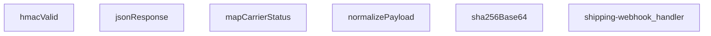

## NODE ID STANDARD

  file: supabase\functions\shipping-webhook\index.ts
  function: supabase\functions\shipping-webhook\index.ts::jsonResponse
  function: supabase\functions\shipping-webhook\index.ts::hmacValid
  function: supabase\functions\shipping-webhook\index.ts::mapCarrierStatus
  function: supabase\functions\shipping-webhook\index.ts::normalizePayload
  function: supabase\functions\shipping-webhook\index.ts::sha256Base64
  function: supabase\functions\shipping-webhook\index.ts::shipping-webhook_handler

---

## DISA AKTARILANLAR (EXPORTS)
  export: hmacValid
  export: jsonResponse
  export: mapCarrierStatus
  export: normalizePayload
  export: sha256Base64
  export: shipping-webhook_handler

---
# FILE: supabase\functions\stock-alert\index.md

---
domain: general
source_type: doc
namespace_type: module
source_path: C:\Users\alize\venthub-hvac\supabase\functions\stock-alert\index.ts
skeleton_hash: 658cb4f9bb823728
entity_hashes:
  func:checkAllProducts: d480a73d7246f019
  func:checkSpecificProduct: 5027f709f9a40c80
  func:getAlertRecipients: ef8d3e778c7b2d81
  func:processProductAlert: c58aae9b08876f88
  func:sendNotification: 9cdc9ad48f9dd1f6
  func:stock-alert_handler: 9f0ae49f1a00dd49
  overview: ceacc7ea6aad6120
generated_at: 2026-08-17T11:40:32Z
---

## Genel Bakış
VentHub HVAC stok yönetim sisteminin tetikleyici bir bileşenidir. Modül, ürün stoklarının kritik seviyelere düşmesi durumunda otomatik uyarılar üreterek tedarik ve sipariş süreçlerini başlatır. Esnek yapısı sayesinde hem toplu envanter taraması hem de belirli bir ürüne yönelik tetiklemeler desteklenmektedir.

## Fonksiyon Grupları
### İstek Yönlendirme ve Başlatma
Gelen HTTP isteklerini karşılar, istek içeriğine göre ilgili stok kontrol iş akışını başlatır. Modülün dışarıya açılan tek kapısıdır.
- stock_alert_handler

### Stok Değerlendirme ve Tespit
Veritabanındaki ürün stok seviyelerini çeker ve tanımlı kritik eşik değerlerle karşılaştırır. Uyarı gerektiren ürünleri tespit eder.
- check_all_products, check_specific_product

### Uyarı Yönetimi ve Bildirim Gönderimi
Tespit edilen her kritik stok durumu için uygun alıcıları belirler ve seçilen bildirim kanalı aracılığıyla öncelik sırasına göre bilgilendirme yapar.
- process_product_alert, get_alert_recipients, send_notification

---

## AXIOMS – Mimari Varsayımlar

Bu modül, stok uyarı sistemi için HTTP isteklerini işleyen bir Supabase Edge Fonksiyonu olarak tasarlanmıştır. Fonksiyon imzalarından çıkarılabilecek mimari varsayımlar aşağıdadır.

**[Aksiyom 1]**: Eğer `checkAllProducts` veya `checkSpecificProduct` için geçerli bir `SupabaseClient` bağlantısı yoksa, ürün sorgulama işlemleri başarısız olur.

**[Aksiyom 2]**: Eğer `checkSpecificProduct` için geçerli bir `_productId` değeri (geçersiz veya boş) yoksa, belirli ürüne ait uyarı kontrolü çalıştırılamaz.

**[Aksiyom 3]**: Eğer `processProductAlert` için geçerli bir `Product` nesnesi veya en az bir `AlertRecipient` alıcısı (`recipients` boş dizi) yoksa, ürün uyarı işleme süreci tamamlanamaz.

**[Aksiyom 4]**: Eğer `sendNotification` için `type` veya `to` parametreleri boş/geçersizse, bildirim gönderme işlemi başarısız olur.

**[Aksiyom 5]**: Eğer `sendNotification` için `priority` parametresi belirtilmemişse, varsayılan olarak `"normal"` öncelik kullanılır.

**[Aksiyom 6]**: Eğer `getAlertRecipients` için geçerli bir `SupabaseClient` bağlantısı yoksa, uyarı alıcıları listesi alınamaz.

---

## FONKSİYON DETAYLARI

### stock-alert_handler
**Ne yapar**: Bu fonksiyon, stok alert sisteminin ana HTTP istek işleyicisidir. Gelen bir Request nesnesini alır ve ilgili iş mantığını (belirli bir ürünü veya tüm ürünleri kontrol etme) çağırarak bir Response nesnesi döndürür.
**Nasıl yapar**: Fonksiyonun gövdesi verilmemiştir, ancak adı ve parametreleri göz önüne alındığında, HTTP isteğinin içeriğine (örneğin bir `productId` parametresi varlığına) göre `checkSpecificProduct` veya `checkAllProducts` fonksiyonlarından birini çağıran bir yönlendirici (router) gibi davranması beklenir.
**Parametreler**:
- `req: Request` — Gelen HTTP isteği nesnesi, istemciden gelen verileri ve headers'ları içerir.
**Dönüş**: `Response` — İşlemin sonucunu içeren, istemciye gönderilecek HTTP yanıtı.

### checkAllProducts
**Ne yapar**: Veritabanındaki tüm ürünleri kontroleder ve eşik değerinin altına düşen ürünler için uyarı sürecini başlatır. Stok uyarı sisteminin ana toplu iş (batch job) fonksiyonudur.

**Nasıl yapar**: Fonksiyon, öncelikle veritabanındaki en yüksek `low_stock_threshold` değerini sorgulayarak dinamik bir ön-filtre eşiği belirler. PostgREST'in iki kolonu (ör. `stock_qty` ve `low_stock_threshold`) doğrudan karşılaştıramaması nedeniyle, sınır veriden türetilir. Bu sayede, eşik değeri 10'dan büyük olan ürünlerin (ör. hızlı tüketilen filtre için `low_stock_threshold = 40`) stoğu 25'e düştüğünde bile uyarı üretebilmesi sağlanır. Ardından, belirlenen en büyük eşik değerine göre `stock_qty <= enBuyukEsik` filtresi uygulanarak potansiyel adaylar çekilir ve JavaScript tarafında her ürünün kendi `low_stock_threshold` değerine göre nihai filtreleme yapılır. Alıcı listesi bir kez çekildikten sonra (`getAlertRecipients`), uyarı üretilecek her ürün için `processProductAlert` fonksiyonu sırasıyla çağrılır. Alıcı listesi boşsa ve uyarı üretilecek ürün varsa, bilinçli olarak hata fırlatılır; böylece alıcı yapılandırılmamış durum bilinçli olarak raporlanır.

**Parametreler**:
- `supabase`: `SupabaseClient` — Supabase istemcisi; veritabanı sorguları ve RPC çağrıları için kullanılır.

**Dönüş**: `Promise<Array<{product: string, alertType: string, notifications: number, success: boolean}>>` — Her bir işlenen ürün için uyarı sonucunu içeren dizi. Her sonuç, ürün adı, uyarı türü (out_of_stock veya low_stock), gönderilen bildirim sayısı ve tüm bildirimlerin başarı durumunu belirtir.

### checkSpecificProduct
**Ne yapar**: Verilen **tek bir ürünün** stok seviyesini kontrol eder ve belirlenen eşik değerinin altındaysa uyarı sürecini başlatır.
**Nasıl yapar**: Supabase istemcisi ile belirtilen `_productId`'ye sahip ürünü `products` tablosundan çeker. Ürün bulunamazsa hata fırlatır. Ürünün stok miktarı, eşik değerinden yüksekse uyarı yapılmaz ve basit bir bilgi mesajı döndürülür. Düşük veya eşit ise, alıcıları çekerek `processProductAlert` fonksiyonunu çağırır ve sonucu döndürür.
**Parametreler**:
- `supabase: SupabaseClient` — Veritabanı işlemleri için kullanılan Supabase istemcisi nesnesi.
- `_productId: string` — Kontrol edilecek ürünün benzersiz kimliği (ID'si).
**Dönüş**: Uyarı yapıldığında, `processProductAlert` fonksiyonunun sonucunu içeren tek elemanlı bir dizi (array). Stok eşik değerinin üzerindeyse, `product.name` ve "Stock above threshold" mesajını içeren bir nesne dizisi.

### processProductAlert
**Ne yapar**: Belirli bir ürün için stok durumuna göre bir uyarı türü (`out_of_stock` veya `low_stock`) belirler ve öncelikli olarak tanımlanmış alıcılara bu uyarı bildirimlerini gönderir.
**Nasıl yapar**: Ürünün `stock_qty` değerine bakarak uyarı türünü ve önceliğini belirler. `alertData` adında bir nesne oluşturarak ürün detaylarını paketler. Sonra, her bir alıcının (`recipients`) tercih ettiği bildirim kanallarına (WhatsApp, SMS, Email) göre döngü yapar ve her bir kanal için `sendNotification` fonksiyonunu çağırarak bildirimleri gönderir. Fonksiyon, gönderilen bildirim sayısını ve tüm bildirimlerin başarılı olup olmadığını özetleyen bir sonuç nesnesi döndürür.
**Parametreler**:
- `supabase: SupabaseClient` — Veritabanı işlemleri için kullanılan Supabase istemcisi nesnesi.
- `product: Product` — Uyarı gönderilecek ürünün tüm detaylarını (id, name, stock_qty, low_stock_threshold) içeren nesne.
- `recipients: AlertRecipient[]` — Uyarı bildirimlerinin gönderileceği kişi/kişilerin listesi ve tercih ettikleri bildirim kanallarını tanımlayan dizi.
**Dönüş**: `{ product, alertType, notifications, success }` — İşlem sonucunu özetleyen bir nesne. `product` (ürün adı), `alertType` ('out_of_stock' veya 'low_stock'), `notifications` (gönderilen bildirim sayısı), `success` (tüm bildirimler başarılıysa true, değilse false).

### sendNotification
**Ne yapar**: Bu fonksiyon, belirtilen türde bir bildirim (e-posta, SMS vb.) alıcısına göndermek için Supabase'deki `notification-service` edge fonksiyonunu çağırır. Temel olarak, stok uyarıları gibi belirli bir veri setini alarak harici bir hizmete iletir.

**Nasıl yapar**: Fonksiyon, ortam değişkenlerinden `SUPABASE_URL` ve `SUPABASE_SERVICE_ROLE_KEY` değerlerini okur. Ardından, `notification-service` endpoint'ine `POST` isteği göndermek için `fetch` kullanır. İstek gövdesi, bildirim türü, alıcı, öncelik, zorunlu bir `message` alanı ve orijinal veriyi genişleten bir `data` nesnesi içerir. `message` alanı, `data.alertType` değerine göre dinamik olarak oluşturulur; bu, notification-service'in şablon olmadığında kullanacağı gövdeyi tanımlar ve önceki bir hatayı (`.replace()` çağrısının 500 hatası vermesi) önler. İşlem başarıyla tamamlanırsa `{ type, recipient, success: true }` döner, bir hata yakalanırsa hata günlüğe yazılır ve `{ success: false }` döner.

**Parametreler**:
- `type`: string — Gönderilecek bildirim türünü belirtir (örn: "email", "sms").
- `to`: string — Bildirimin gönderileceği alıcının adresi veya numarası.
- `data`: AlertData — Bildirim için gerekli tüm verileri (ürün adı, mevcut stok, eşik değeri, uyarı türü) içeren bir nesne.
- `priority`: string — Bildirimin öncelik seviyesini belirtir (örn: "high", "low").

**Dönüş**: `Promise<{ type: string; recipient: string; success: boolean }>` — Bildirim denemesinin sonucunu ve alıcıyı içeren bir nesne döner.

### getAlertRecipients
**Ne yapar**: Stok uyarı bildirimlerinin gönderileceği alıcıların listesini veritabanından çeker. Varsayılan bir alıcı (sistem yöneticisi) sağlamaya çalışır ve bulamazsa sabit bir acil durum email adresi ile geri dönüş (fallback) yapar.
**Nasıl yapar**: `inventory_settings` tablosundan ana `alert_email` adresini çeker. Eğer bu adres mevcutsa, onu bir `AlertRecipient` nesnesine dönüştürüp listeye ekler. Eğer bu adrese ulaşılamazsa veya hiç alıcı bulunamazsa, `stok@venthub.com` adresini içeren sabit bir geri dönüş alıcısı oluşturur. Her iki durumda da alıcıya sadece email bildirimi enabled olan, düşük ve kritik stok uyarılarını da alan bir yapı atar.
**Parametreler**:
- `supabase: SupabaseClient` — Veritabanı işlemleri için kullanılan Supabase istemcisi nesnesi.
**Dönüş**: `Promise<AlertRecipient[]>` — Bildirim gönderilecek alıcıların (isim, telefon, email, whatsapp, rol, ve hangi bildirim türlerini/alıcıları istediği) listesini içeren asenkron dizi.

---

## İTHALATLAR (IMPORTS)
- import: ../_shared/cors.ts::getCorsHeaders
- import: https://deno.land/std@0.168.0/http/server.ts::serve
- import: https://esm.sh/@supabase/supabase-js@2.45.4::SupabaseClient
- import: https://esm.sh/@supabase/supabase-js@2.45.4::createClient

---

## INTERFACES

### Product
- `id: string`
- `name: string`
- `stock_qty: number`
- `low_stock_threshold: number`

### AlertRecipient
- `name: string`
- `phone: string`
- `email: string`
- `whatsapp: string`
- `role: 'admin' | 'manager' | 'buyer'`
- `notifications: {
`

### AlertData
- `productName: string`
- `_productId: string`
- `currentStock: number`
- `threshold: number`
- `alertType: 'out_of_stock' | 'low_stock'`

---

## AST POINTERS

### [N1_NASIL] AST Pointer: stock-alert::index.ts::stock-alert_handler
- **params**: `(req: Request)`
- **ic_degiskenler**:
  - `corsHeaders` — getCorsHeaders(req) ile üretilen CORS başlıkları, tüm HTTP yanıtlarına eklenir
  - `supabaseUrl` — `Deno.env.get('SUPABASE_URL')` ile okunan Supabase URL'si
  - `serviceRoleKey` — `Deno.env.get('SUPABASE_SERVICE_ROLE_KEY')` ile okunan servis rolü anahtarı
  - `authHeader` — `req.headers.get('Authorization')` ile gelen istek başlığındaki token
  - `isAuthorized` — yetkilendirme durumunu tutan boolean bayrak, başlangıçta false
  - `anonKey` — `Deno.env.get('SUPABASE_ANON_KEY')` ile okunan anonim anahtar (auth fallback için)
  - `createClientAuth` — `await import('https://esm.sh/@supabase/supabase-js@2.45.4')` dinamik import'undan gelen createClient fonksiyonu (auth client oluşturmak için)
  - `authClient` — kullanıcı token'ı ile oluşturulan Supabase client (`createClientAuth(supabaseUrl, anonKey, ...)`)
  - `user` — `authClient.auth.getUser()` sonucu elde edilen kullanıcı nesnesi (destructure: `{ data: { user } }`)
  - `roleCheck` — `fetch()` ile user_profiles tablosundan rol sorgulama sonucu (Response nesnesi)
  - `arr` — `roleCheck.json()` ile parse edilen JSON dizisi, rol verisini içerir
  - `role` — `arr[0]?.role` ile alınan kullanıcının rol string'i ('admin' veya 'super_admin' kontrolü)
  - `supabase` — `createClient(supabaseUrl, serviceRoleKey)` ile oluşturulan Supabase servis client'ı
  - `alertResults` — `checkAllProducts` veya `checkSpecificProduct` çağrılarından dönen sonuç dizisi
  - `_productId` — `req.json()` POST body'sinden destructure ile alınan ürün ID'si
  - `error` — try-catch yakaladığı hata nesnesi
  - `msg` — `error instanceof Error ? error.message : String(error)` ile üretilen hata mesajı string'i
- **Dönüş**: `Response` — OPTIONS için 'ok', hata durumlarında JSON error, başarıda JSON success yanıtı

### [N2_NASIL] AST Pointer: stock-alert::index.ts::checkAllProducts
- **params**: `(supabase: SupabaseClient)`
- **ic_degiskenler**:
  - `esikSatiri` — products tablosundan `low_stock_threshold` sütununu en büyükten küçüğe sıralayıp ilk satırı `maybeSingle()` ile okuyan sorgu sonucu (veriden türetilen eşik için)
  - `esikErr` — esikSatiri sorgusundan dönen hata nesnesi
  - `enBuyukEsik` — `Math.max(Number(esikSatiri?.low_stock_threshold ?? 0) || 0, VARSAYILAN_ESIK)` ile hesaplanan en büyük eşik değeri, PostgREST ön-filtresi için kullanılır
  - `allLowStock` — products tablosundan `stock_qty <= enBuyukEsik` filtresiyle çekilen düşük stoklu ürün dizisi (`id, name, stock_qty, low_stock_threshold` alanları)
  - `fetchErr` — allLowStock sorgusundan dönen hata nesnesi
  - `productsToAlert` — `allLowStock` dizisi üzerinde `filter(p => p.stock_qty <= (p.low_stock_threshold || VARSAYILAN_ESIK))` uygulanmasıyla elde edilen gerçekten uyarı gereken ürünler
  - `recipients` — `getAlertRecipients(supabase)` ile elde edilen alıcı listesi
  - `results` — `processProductAlert` çağrılarının döndüğü sonuç nesnelerini toplayan dizi
  - `product` — `for...of productsToAlert` döngüsündeki her bir ürün nesnesi
- **Dönüş**: `results` dizisi (her eleman: `{ product, alertType, notifications, success }` nesnesi)

### [N3_NASIL] AST Pointer: stock-alert::index.ts::checkSpecificProduct
- **params**: `(supabase: SupabaseClient, _productId: string)`
- **ic_degiskenler**:
  - `product` — `supabase.from('products').select(...).eq('id', _productId).single()` sorgusundan dönen tek ürün nesnesi (`id, name, stock_qty, low_stock_threshold`)
  - `error` — product sorgusundan dönen hata nesnesi
  - `recipients` — `getAlertRecipients(supabase)` ile elde edilen alıcı listesi
- **Dönüş**: `[{ product: product.name, message: 'Stock above threshold' }]` (eşik üstüyse) veya `[await processProductAlert(...)]` sonucu (eşik altındaysa)

### [N4_NASIL] AST Pointer: stock-alert::index.ts::processProductAlert
- **params**: `(supabase: SupabaseClient, product: Product, recipients: AlertRecipient[])`
- **ic_degiskenler**:
  - `alertType` — `product.stock_qty <= 0` koşuluna göre `'out_of_stock'` veya `'low_stock'` string'i
  - `priority` — `product.stock_qty <= 0` koşuluna göre `'critical'` veya `'high'` string'i
  - `alertData` — AlertData nesnesi, içeriği: `productName` (product.name), `_productId` (product.id), `currentStock` (product.stock_qty), `threshold` (product.low_stock_threshold || 5), `alertType`
  - `notifications` — her recipient için gönderilen bildirim sonuçlarını toplayan dizi
  - `recipient` — `for...of recipients` döngüsündeki her bir AlertRecipient nesnesi
- **Dönüş**: `{ product: product.name, alertType, notifications: notifications.length, success: notifications.every(n => n.success) }`

### [N5_NASIL] AST Pointer: stock-alert::index.ts::sendNotification
- **params**: `(type: string, to: string, data: AlertData, priority: string)`
- **ic_degiskenler**:
  - `supabaseUrl` — `Deno.env.get('SUPABASE_URL')` ile okunan Supabase URL'si
  - `serviceRoleKey` — `Deno.env.get('SUPABASE_SERVICE_ROLE_KEY')` ile okunan servis rolü anahtarı
  - `response` — `fetch()` ile `${supabaseUrl}/functions/v1/notification-service` endpoint'ine yapılan POST isteğinin Response sonucu; body'de type, to, priority, message (data.alertType'a göre üretilen string), data (spread + subject) gönderilir
  - `err` — try-catch yakaladığı hata nesnesi
- **Dönüş**: `{ type, recipient: to, success: response.ok }` (başarılı) veya `{ type, recipient: to, success: false }` (hata)

### [N6_NASIL] AST Pointer: stock-alert::index.ts::getAlertRecipients
- **params**: `(supabase: SupabaseClient)`
- **ic_degiskenler**:
  - `settings` — `supabase.from('inventory_settings').select('alert_email').maybeSingle()` sorgusundan dönen ayarlar nesnesi
  - `recipients` — AlertRecipient dizisi, `settings?.alert_email` varsa yapılandırılmış bir alıcı eklenir (name: 'Sistem Yöneticisi', email: settings.alert_email, notifications: `{ low_stock: true, out_of_stock: true, sms: false, whatsapp: false, email: true }`)
- **Dönüş**: `AlertRecipient[]` — yapılandırılmış alıcı dizisi (boş olabilir; alıcı yoksa boş döner ve çağrı前者 tarafından hata fırlatılır)

---


## MERMAID CALL GRAPH
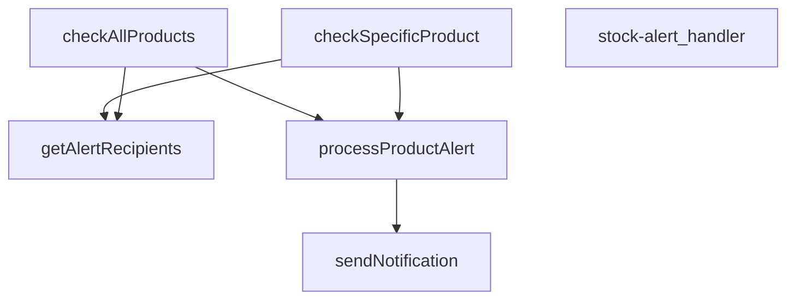

## NODE ID STANDARD

  file: supabase\functions\stock-alert\index.ts
  function: supabase\functions\stock-alert\index.ts::stock-alert_handler
  function: supabase\functions\stock-alert\index.ts::checkAllProducts
  function: supabase\functions\stock-alert\index.ts::checkSpecificProduct
  function: supabase\functions\stock-alert\index.ts::processProductAlert
  function: supabase\functions\stock-alert\index.ts::sendNotification
  function: supabase\functions\stock-alert\index.ts::getAlertRecipients

---

## DISA AKTARILANLAR (EXPORTS)
  export: checkAllProducts
  export: checkSpecificProduct
  export: getAlertRecipients
  export: processProductAlert
  export: sendNotification
  export: stock-alert_handler

---
# FILE: supabase\functions\tcmb-rates-sync\index.md

---
domain: general
source_type: doc
namespace_type: module
source_path: C:\Users\alize\venthub-wt-hotfix\supabase\functions\tcmb-rates-sync\index.ts
skeleton_hash: 154a8f6d9cd8d94f
entity_hashes:
  func:parseBulletin: 22e4e4d4e126232a
  func:tcmb-rates-sync_handler: 091085454d214b21
  overview: 79862a3904613170
generated_at: 2026-08-15T07:33:55Z
---

## Genel Bakış
Bu modül, Türkiye Cumhuriyet Merkez Bankası (TCMB) tarafından yayımlanan döviz kuru ve faiz oranları bültenlerini otomatik olarak senkronize etmek için tasarlanmış bir Supabase Edge Function'dır. Dışarıdan bir HTTP isteği ile tetiklenen modül, gelen XML bültenini analiz ederek yapılandırılmış bir veriye dönüştürür ve işlenen verilerin veritabanına kaydedilmesini koordine eder.

## Fonksiyon Grupları
### HTTP İstek Koordinasyonu
Modülün dış etkileşim noktasıdır; isteği doğrular, XML bültenini alır ve iş akışını başlatarak parse etme, veritabanı güncelleme gibi tüm adımları yönetir.
- tcmb-rates-sync_handler

### XML Bülten Analizi
Ham TCMB XML verisini alıp, doğrudan kullanılabilecek yapılandırılmış bir JavaScript nesnesine (döviz kurları, faiz oranları) dönüştürmekten sorumludur.
- parseBulletin

---

## AXIOMS – Mimari Varsayımlar

Bu modül, TCMB döviz kuru XML bültenlerini işleyerek veritabanını güncelleyen bir veri senkronizasyon modülüdür.

[Aksiyom 1]: Eğer `parseBulletin` fonksiyonuna geçersiz veya beklenen TCMB XML formatında olmayan bir string girilirse, `ParsedBulletin | null` dönüş tanımı gereği `null` döner.

[Aksiyom 2]: Eğer `parseBulletin` başarılı bir şekilde XML'yi parse ederse, yapılandırılmış bir `ParsedBulletin` nesnesi döner.

[Aksiyom 3]: Eğer `tcmb-rates-sync_handler` fonksiyonu bir hata ile karşılaşırsa bile, fonksiyon imzası gereği her zaman geçerli bir `Response` nesnesi dönmelidir.

[Aksiyom 4]: Eğer `tcmb-rates-sync_handler` fonksiyonu `async` olarak tanımlanmamışsa, içeresindeki I/O işlemleri (HTTP istekleri, veritabanı yazma) bloklanarak hata oluşur.

[Aksiyom 5]: Eğer handler'a geçersiz bir `Request` nesnesi girilse bile, fonksiyon response döndürme zorunluluğundadır (hata response'u dahil).

[Aksiyom 6]: Modül, TCMB XML bültenlerinin belirli bir şemaya sahip olduğunu varsayar; bu şema değişirse `ParsedBulletin` yapısı da güncellenmelidir.

---

## FONKSİYON DETAYLARI

### parseBulletin
**Ne yapar**: Bu fonksiyon, Türkiye Cumhuriyet Merkez Bankası'ndan gelen bir XML dizesini (muhtemelen döviz kurları bülteni) alır, bu XML'den etkin kur tarihini ve belirli para birimleri için döviz kurlarını çıkararak yapılandırılmış bir nesne olarak döndürür.

**Nasıl yapar**: Fonksiyon öncelikle verilen XML string'i üzerinde bir regular expression (regex) kullanarak `Tarih_Date` elemanındaki `Date` özniteliğini arar ve tarih bilgisini (ay, gün, yıl) çıkarır. Tarih bulunamazsa `null` döner. Ardından, önceden tanımlı `QUOTE_CURRENCIES` dizisindeki her bir para birimi kodu için XML'de ilgili `<Currency>` bloğunu regex ile bulur. Her blok içinde `BanknoteSelling` etiketinden (kağıt para satış fiyatı) kuru almaya çalışır; bu değer geçerli ve sıfırdan büyük değilse `ForexSelling` etiketinden (döviz kuru) kuru almaya çalışır. Geçerli bir kur elde edildiğinde bu kuru `rates` nesnesine ekler. Tüm para birimleri işlendikten sonra, eğer hiçbir geçerli kur bulunamamışsa (`rates` nesnesinin anahtarları boşsa) `null` döner; aksi halde etkin tarih (YYYY-AA-GG formatında) ve kurlar nesnesini içeren `ParsedBulletin` nesnesini döndürür.

**Parametreler**:
- `xml`: `string` — TCMB'den alınan döviz kurları bültenini içeren ham XML verisi. Fonksiyon bu string'i doğrudan düzenli ifadelerle ayrıştırır.

**Dönüş**: `ParsedBulletin | null` — İşleme başarılıysa, `effectiveDate` (string, YYYY-AA-GG formatında) ve `rates` (döviz kodlarını anahtar, kur değerlerini sayı olarak tutan nesne) alanlarını içeren bir nesne döner. Tarih bilgisi XML'de bulunamazsa veya hiçbir para birimi için geçerli bir kur extracts edilemezse `null` döner. `ParsedBulletin` tipinin yapısı `{ effectiveDate: string; rates: Record<string, number> }` şeklindedir.

### tcmb-rates-sync_handler
**Ne yapar**: Bu fonksiyon, HTTP isteklerini karşılayan asenkron bir sunucu işleyicisidir. TCMB döviz kurlarının senkronizasyonunu tetikleyen veya bu işlemle ilgili bir API endpoint'ini temsil eder.

**Nasıl yapar**: Fonksiyon, `@serve(serve)` dekoratörü ile işaretlenmiştir. Bu dekoratör, fonksiyonu bir HTTP sunucusu işlevine dönüştürür; belirli bir rotaya (URL yoluna) bağlanmasını sağlar ve gelen istekleri otomatik olarak işlevin `req` parametresine iletir. İşlevin asenkron (`async`) yapısı, potansiyel olarak uzun sürebilecek ağ tabanlı bir senkronizasyon işlemini engellemeden gerçekleştirmesine olanak tanır. Fonksiyonun gövdesi verilmediğinden, iş mantığı bilinmemektedir; ancak imzası ve dekoratörü, bunun bir tetikleyici veya senkronizasyon endpoint'i olduğunu gösterir.

**Parametreler**:
- req: Request — HTTP isteği nesnesi. İstekle ilgili header, body ve URL bilgilerini içerir.

**Dönüş**: Response — HTTP yanıt nesnesi. İşlem sonucuna göre bir durum kodu ve muhtemelen bir yanıt gövdesi (örn: başarı/hata mesajı, senkronize edilen veriler) içerir.

---

## İTHALATLAR (IMPORTS)
- import: https://deno.land/std@0.177.0/http/server.ts::serve
- import: https://esm.sh/@supabase/supabase-js@2.45.4::createClient

---

## INTERFACES

### ParsedBulletin
- `effectiveDate: string`
- `rates: Record<string, number>`

---

## AST POINTERS

### [N1_NASIL] AST Pointer: supabase/functions/tcmb-rates-sync/index.ts::parseBulletin
- **params**: `(xml: string)`
- **ic_degiskenler**:
  - `dateMatch` — xml içinden Tarih_Date etiketinin Date özniteliğini eşleştiren regex sonucu (tarih bilgisi)
  - `month` — dateMatch[1] erişimi ile elde edilen ay bilgisi (2 haneli string)
  - `day` — dateMatch[2] erişimi ile elde edilen gün bilgisi (2 haneli string)
  - `year` — dateMatch[3] erişimi ile elde edilen yıl bilgisi (4 haneli string)
  - `rates` — para birimi kodlarına karşılık gelen kurları tutan nesne
  - `code` — QUOTE_CURRENCIES dizisindeki her bir para birimi kodu
  - `block` — xml içinde belirli bir para birimi bloğunu eşleştiren regex sonucu
  - `pick` — Belirli bir XML etiketinin (BanknoteSelling/ForexSelling) içeriğini çıkaran iç fonksiyon
  - `m` — pick fonksiyonu içindeki regex eşleşme sonucu
  - `banknote` — BanknoteSelling değerini pick ile çıkaran değişken (sayısal)
  - `forex` — ForexSelling değerini pick ile çıkaran değişken (sayısal)
  - `rate` — banknote veya forex'ten uygun olanı seçip hesaplanan kur
- **Dönüş**: `ParsedBulletin | null` (tarih ve kurlar nesnesi veya parse başarısızsa null)

### [N2_NASIL] AST Pointer: supabase/functions/tcmb-rates-sync/index.ts::tcmb-rates-sync_handler
- **params**: `(req: Request)`
- **ic_degiskenler**:
  - `supabaseUrl` — Deno ortam değişkeninden alınan SUPABASE_URL
  - `serviceKey` — Deno ortam değişkeninden alınan SUPABASE_SERVICE_ROLE_KEY
  - `supabase` — createClient ile oluşturulan Supabase istemcisi
  - `xml` — TCMB API'sinden çekilen XML verisi (başlangıçta boş string)
  - `res` — TCMB_URL adresine yapılan fetch isteği sonucu
  - `bulletin` — parseBulletin ile işlenmiş TCMB bülteni (tarih ve kurlar)
  - `tenants` — 'tenants' tablosundan çekilen tüm kiracılar
  - `tenantsError` — tenants sorgusu hatası
  - `inserted` — başarıyla eklenen kur sayısı
  - `skipped` — atlanan (mevcut veya hata nedeniyle eklenmeyen) kur sayısı
  - `errors` — hata mesajlarını tutan dizi
  - `tenant` — tenants dizisindeki her bir kiracı nesnesi (id alanı)
  - `code` — bulletin.rates nesnesindeki her bir para birimi kodu
  - `rate` — bulletin.rates[code] erişimi ile elde edilen kur değeri
  - `existing` — 'currency_rates' tablosunda aynı kiracı/kur/tarih/kaynak kombinasyonu olup olmadığını kontrol eden sorgu sonucu
  - `readError` — existing sorgusundaki hata
  - `insertError` — currency_rates tablosuna insert işlemindeki hata
- **Dönüş**: `Response` (JSON formatında sonuç: tarih, eklenen/atlanan kur sayıları ve hatalar)

---

## NODE ID STANDARD

  file: supabase\functions\tcmb-rates-sync\index.ts
  function: supabase\functions\tcmb-rates-sync\index.ts::parseBulletin
  function: supabase\functions\tcmb-rates-sync\index.ts::tcmb-rates-sync_handler

---

## DISA AKTARILANLAR (EXPORTS)
  export: parseBulletin
  export: tcmb-rates-sync_handler

---
# FILE: supabase\functions\_shared\caller.md

---
domain: general
source_type: doc
namespace_type: module
source_path: C:\Users\alize\venthub-wt-hotfix\supabase\functions\_shared\caller.ts
skeleton_hash: 1786dd98086f2ad7
entity_hashes:
  func:CallerConfigError:constructor: 2df262acad1e2532
  func:CallerLookupError:constructor: c39ad0691366dd52
  func:bearerToken: 18e59fc759883901
  func:resolveCaller: 6c800b5173dd6844
  func:timingSafeEquals: eb2223c212f00bf2
  func:toProfileRow: 118a6d0d17986102
  overview: 4282ac6b2e73e507
generated_at: 2026-08-15T07:40:59Z
---

## Genel Bakış
Bu modül, Supabase Edge Functions ortamında HTTP isteklerinden çağrıyı (kullanıcı veya servis) çözmekten sorumlu merkezi bir yardımcı modüldür. Temel olarak kimlik doğrulama token'larını çıkarmak, güvenli karşılaştırmalar yapmak ve çağrı bağlamını oluşturmak için gerekli araçları sağlar. Modül, paylaşılan fonksiyonlar arasında ortak bir sorumluluk olarak kimlik doğrulama ve yetkilendirme süreçlerini merkezileştirir.

## Fonksiyon Grupları
### Token İşlemleri
HTTP isteklerinden kimlik doğrulama token'larını çıkarmak ve güvenli bir şekilde doğrulamak için temel araçları sağlar.
- bearerToken, timingSafeEquals

### Veri Dönüştürme
API'den gelen ham verileri uygulama tarafından tanımlanan tiplere (örneğin profil satırı) dönüştürür ve doğrular.
- toProfileRow

### Çağrı Çözme
Verilen HTTP isteğine göre çağrının kimliğini ve bağlamını çözen ana işlevi yürütür; bu süreç, token çıkarma ve veri dönüştürme gibi alt araçları bir araya getirerek dinamik bir kimlik doğrulama akışı oluşturur.
- resolveCaller

### Hata Yönetimi
Çağrı çözme sürecinde oluşabilecek yapılandırma veya arama hatalarını temsil eden özel hata sınıfları sunarak hatıralama ve hata yayma mekanizmalarını standartlaştırır.
- CallerConfigError, CallerLookupError

---

## AXIOMS – Mimari Varsayımlar

Bu modül, bir istekten (Request) çağrı sahibini (CallerContext) çıkaran paylaşımlı bir yardımcı modüldür.

**[Aksiyom 1]**: Eğer `resolveCaller` için geçerli bir `Request` nesnesi yoksa, `CallerContext` oluşturulamaz.

**[Aksiyom 2]**: Eğer `bearerToken` fonksiyonu bir token çıkaramıyorsa (null dönerse), modül bir yedek mekanizma kullanmalıdır (ANONYMOUS sabiti mevcuttur, bu amaçla kullanılır).

**[Aksiyom 3]**: Eğer `toProfileRow` fonksiyonu geçersiz bir `unknown` değeri alıysa, `TenantProfileRow | null` olarak `null` döner ve profil bilgisi kullanılamaz.

**[Aksiyom 4]**: Eğer `CallerConfigError` fırlatılıyorsa, modülün çalışması için gerekli bir yapılandırma (konfigürasyon) eksiktir ve modül çalışamaz.

**[Aksiyom 5]**: Eğer `CallerLookupError` fırlatılıyorsa, çağrı sahibi arama/çözümleme işleminde bir hata oluşmuştur ve detay bilgisi mevcuttur.

**[Aksiyom 6]**: Eğer `parsedBody` parametresi `resolveCaller`'a verilmezse (undefined), fonksiyon yine de çalışmalıdır (parametre opsiyoneldir).

**[Aksiyom 7]**: Eğer iki string karşılaştırması güvenlikli bir şekilde yapılması gerekiyorsa, `timingSafeEquals` kullanılmalıdır — zamanlama (timing) tabanlı saldırıları önlemek için.

**[Aksiyom 8]**: Eğer Authorization başlığındaki token `BEARER_PREFIX_RE` desenine uymuyorsa, token geçersiz kabul edilmelidir.

---

## FONKSİYON DETAYLARI

### bearerToken
**Ne yapar**: HTTP isteğinin `Authorization` başlığındaki taşıyıcı (bearer) jetonunu çıkarır. Başlık yoksa veya jeton boşsa `null` döner.
**Nasıl yapar**: `Request` nesnesinin başlıklarından `Authorization` başlığını büyük/küçük harf duyarsız olarak alır. Sabit bir regex deseni (`BEARER_PREFIX_RE`) kullanarak "Bearer " ön ekini temizler, kalan metni `trim()` ile boşluklardan arındırır ve uzunluğu sıfırdan büyükse jetonu, değilse `null` döner.
**Parametreler**:
- request: Request — Jetonun çıkarılacağı HTTP isteği nesnesi.
**Dönüş**: string | null — Doğrulanmış ve temizlenmiş jeton dizisi veya bulunamadığında `null`.

### timingSafeEquals
**Ne yapar**: İki dizeyi (string) sabit-zamanlı (timing-safe) bir şekilde karşılaştırır. Bu, zamanlama bilgisinin (örn. ne kadar çabuk farklılaştıkları) dışarı sızmasını engelleyerek hassas veri karşılaştırmalarını koruma altına alır.
**Nasıl yapar**: Her iki girdiyi de `TextEncoder` ile byte dizisine dönüştürür. Başlangıçta `diff` değişkenini iki uzunluğun XOR'una ayarlayarak uzunluk farkını hesaba katar. Daha sonra, her iki dizinin de byte'larını sırayla karşılaştırırken, olası uzunluk farklarını telafi etmek için eksik byte'ları `0` olarak işler. Her karşılaştırmada oluşan farkı `diff` üzerine OR ile biriktirir. Döngü, uzun olan dizinin boyunca çalışarak zamanlama sızıntısını önler. Sonunda `diff` sıfıra eşitse diziler özdeştir.
**Parametreler**:
- a: string — Karşılaştırılacak birinci dize.
- b: string — Karşılaştırılacak ikinci dize.
**Dönüş**: boolean — Diziler özdeş ise `true`, değilse `false`.

### toProfileRow
**Ne yapar**: PostgREST'ten (veya benzeri bir Veritabanı SDK'sından) dönen tipsiz (unknown) veri nesnesini, projenin tanımlı `TenantProfileRow` yapısına daraltır ve doğrular. Proje kuralı gereği tip uyumsuzluğu.runtime'da yakalanır.
**Nasıl yapar**: Girdi değerinin bir `object` olup olmadığını ve `null` olmadığını kontrol eder. Ardından, `role` ve `tenant_id` alanlarının varlığını ve string tipinde olduğunu doğrular. Sadece bu koşullar sağlanırsa ilgili alanları içeren bir nesne döner, aksi halde `null` döner.
**Parametreler**:
- value: unknown — Veritabanı sorgusundan dönen, önceden bilinmeyen (tipsiz) satır verisi.
**Dönüş**: TenantProfileRow | null — Doğrulanmış ve daraltılmış profil satırı nesnesi veya geçersiz veri durumunda `null`.

### resolveCaller
**Ne yapar**: Çağrı yapan (client) tarafın kimliğini, yetkisini ve ait olduğu kiracıyı (tenant) doğrular. Tüm kimlik doğrulama ve yetkilendirme mantığını merkezi olarak yöneten asenkron bir fonksiyondur.
**Nasıl yapar**: Kesin bir sırayla çalışır: 1) Ortam değişkenlerini yükler ve eksiklikler hata fırlatır. 2) `bearerToken` ile jetonu çıkarır, yoksa `anon` döner. 3) Jetonun `service_role` anahtarına sabit-zamanlı eşleşme ile eşleşip eşleşmediğini kontrol eder. Eşleşirse, istek gövdesinden (`parsedBody`) kiracı bilgisini (`tenantFromServiceBody`) çıkararak `service_role` bağlamı döner. 4) Eşleşmezse, `anonKey` ile Supabase Auth istemcisi oluşturup `getUser` ile jetonun geçerliliğini doğrular. Geçersizse yine `anon` döner. 5) Geçerli kullanıcı bulunursa, servis anahtarı ile `admin` istemcisi oluşturarak `user_profiles` tablosundan kullanıcının `role` ve `tenant_id` bilgisini tek bir sorguyla çeker (`toProfileRow` ile doğrular). 6) Son olarak, `tenantFromVerifiedUser` fonksiyonunu kullanarak nihai kiracı kararını verir ve `user` bağlamını döner.
**Parametreler**:
- request: Request — Çağrı yapanın HTTP isteği.
- parsedBody?: unknown — (Opsiyonel) service_role çağrısı için kiracı bilgisini içerebilecek, önceden ayrıştırılmış istek gövdesi.
**Dönüş**: Promise<CallerContext> — Çağrının kimliğini, türünü (`kind`), kullanıcısını (`user`), rolünü (`role`) ve ait olduğu kiracı (`tenantId`) ile kaynağı (`source`) içeren bağlam nesnesi.

### constructor
**Ne yapar**: Geliştirildi ancak detay üretilemedi.

### CallerLookupError.constructor
**Ne yapar**: Aynı `CallerLookupError` sınıfının, farklı bir varyasyonunu veya aynı oluşturucunun tekrarını temsil eder. Belirtilen girdiyle bir hata nesnesi başlatır.
**Nasıl yapar**: Önceki ile aynı mantığı izler: Eksik bilgiyi `CONFIG_MISSING:` formatında bir hata mesajına dönüştürerek üst sınıfa iletir ve sınıf adını ayarlar. Bu, kodda aynı hata sınıfının birden fazla kez (veya farklı bir yerde) kullanıldığını gösterebilir.
**Parametreler**:
- missing: string — Hatanın kaynağını belirten eksik bileşen veya anahtar adı.
**Dönüş**: N/A (Yapıcı fonksiyon).

---

## İTHALATLAR (IMPORTS)
- import: https://esm.sh/@supabase/supabase-js@2.45.4::createClient

---

## INTERFACES

### CallerContext
- `readonly kind: CallerKind`
- `readonly user: VerifiedUser | null`
- `readonly role?: string`
- `readonly tenantId: string`
- `readonly source: TenantSource`

---

## TYPE ALIASES

### CallerKind
Cetvel §2'nin sınıflarının RUNTIME karşılığı: `service_role` → sınıf (b) · `user` → sınıf (a) · `anon` → kanıtsız çağıran. Sınıf (c)/(d) burada YOKTUR: onların kanıtı HMAC imzası/`pg_cron`'dur, `Authorization` başlığı değil. O uçlar `resolveCaller` kullanmaz, `tenantFromRow`'u kullanır.
```typescript
type CallerKind = 'service_role' | 'user' | 'anon'
```

---

## SABİTLER
- **BEARER_PREFIX_RE** (regex) — `/^Bearer\s+/i`
- **ANONYMOUS** (object) — `{
  kind: 'anon',
  user: null,
  tenantId: DEFAULT_TENANT_ID,
  source: 'def...`

---

## AST POINTERS

### [N1_NASIL] AST Pointer: `_shared/caller.ts::CallerConfigError.constructor`
- **params**: `(missing: string)` — eksik olan config anahtarının adı
- **ic_degiskenler**:
  - *(parametre harici iç değişken yok — `this.name` ve `super()` çağrıları mevcut)*
- **Dönüş**: yok (yan etki: `this.name = 'CallerConfigError'` ayarlanır, super'e `CONFIG_MISSING:{missing}` mesajı iletilir)

### [N2_NASIL] AST Pointer: `_shared/caller.ts::CallerLookupError.constructor`
- **params**: `(detail: string)` — profil arama hata detayı
- **ic_degiskenler**:
  - *(parametre harici iç değişken yok — `this.name` ve `super()` çağrıları mevcut)*
- **Dönüş**: yok (yan etki: `this.name = 'CallerLookupError'` ayarlanır, super'e `PROFILE_LOOKUP_FAILED:{detail}` mesajı iletilir)

### [N3_NASIL] AST Pointer: `_shared/caller.ts::bearerToken`
- **params**: `(request: Request)` — HTTP isteği nesnesi
- **ic_degiskenler**:
  - `header` — `request.headers.get('Authorization')` ile alınan Authorization header değeri; yoksa null döner
  - `token` — `header`'dan `BEARER_PREFIX_RE` regex'i ile "Bearer " ön ekini kaldırıp trim edilmiş ham token stringi
- **Dönüş**: `string | null` — token varsa ve boş değilse string, aksi halde null

### [N4_NASIL] AST Pointer: `_shared/caller.ts::timingSafeEquals`
- **params**: `(a: string, b: string)` — karşılaştırılacak iki string (token veya key)
- **ic_degiskenler**:
  - `encoder` — `new TextEncoder()` — stringleri byte dizisine çeviren TextEncoder örneği
  - `left` — `encoder.encode(a)` ile elde edilen `a` string'inin byte dizisi
  - `right` — `encoder.encode(b)` ile elde edilen `b` string'inin byte dizisi
  - `diff` — iki byte dizisi arasındaki XOR fark bitmask'ı; başlangıçta `left.length ^ right.length` ile uzunluk farkını da taşır
  - `length` — `Math.max(left.length, right.length)` — uzun dizenin uzunluğu; döngü üst sınırı
  - `i` — for döngüsü sayacı; her byte pozisyonunu tarar
- **Dönüş**: `boolean` — `diff === 0` ise stringler eşittir (zamanlama-sağlam karşılaştırma)

### [N5_NASIL] AST Pointer: `_shared/caller.ts::toProfileRow`
- **params**: `(value: unknown)` — ham veritabanı satırı (Supabase `maybeSingle()` dönüşü)
- **ic_degiskenler**:
  - `record` — `value`'nin `Record<string, unknown>` olarak tip 캐스팅 hali; `role` ve `tenant_id` alanlarına erişim için kullanılır
- **Dönüş**: `TenantProfileRow | null` — `role` ve `tenant_id` alanlarını içeren obje veya geçersiz girişte null

### [N6_NASIL] AST Pointer: `_shared/caller.ts::resolveCaller`
- **params**: `(request: Request, parsedBody?: unknown)` — HTTP isteği ve opsiyonel parse edilmiş gövde (service_role karar verme için)
- **ic_degiskenler**:
  - `supabaseUrl` — `Deno.env.get('SUPABASE_URL')` ile alınan Supabase proje URL'i; boşsa `CallerConfigError` fırlatılır
  - `serviceRoleKey` — `Deno.env.get('SUPABASE_SERVICE_ROLE_KEY')` ile alınan service role anahtarı; boşsa `CallerConfigError` fırlatılır
  - `anonKey` — `Deno.env.get('SUPABASE_ANON_KEY')` ile alınan anon (public) anahtar; boşsa `CallerConfigError` fırlatılır
  - `token` — `bearerToken(request)` çağrısıyla Authorization header'dan çıkarılan ham JWT token; null ise `ANONYMOUS` döner
  - `authClient` — `createClient(supabaseUrl, anonKey, ...)` ile oluşturulan Supabase istemcisi; `persistSession: false` ile tarayıcı oturumu depolanmaz, sadece token doğrulama (`getUser`) için kullanılır
  - `userData` — `authClient.auth.getUser(token)` destructuring'inden gelen `{ data }` — Supabase auth kullanıcısı bilgisi
  - `userError` — `authClient.auth.getUser(token)` destructuring'inden gelen `{ error }` — auth hata nesnesi (JWT geçersizse dolu)
  - `authUser` — `userData?.user ?? null` ile çıkarılan Supabase AuthUser nesnesi veya null
  - `user` — `{ id: authUser.id, app_metadata: authUser.app_metadata ?? null }` yapısında `VerifiedUser` objesi; doğrulanmış kullanıcının ID ve metadata bilgisi
  - `admin` — `createClient(supabaseUrl, serviceRoleKey, ...)` ile oluşturulan Supabase istemcisi; service role yetkisiyle veritabanı sorguları (rol ve tenant okuma) için kullanılır
  - `profileData` — `admin.from('user_profiles').select('role, tenant_id').eq('id', user.id).maybeSingle()` destructuring'inden gelen `{ data }` — kullanıcının `role` ve `tenant_id` değerlerini içeren satır
  - `profileError` — aynı sorgudan gelen `{ error }` — profil sorgulama hatası; doluysa `CallerLookupError` fırlatılır
  - `profile` — `toProfileRow(profileData)` çağrısıyla dönüştürülmüş `TenantProfileRow | null`; kullanıcının rolü ve tenant ID'si
  - `decision` — iki farklı kolda atanır: service_role kolunda `tenantFromServiceBody(parsedBody)` ile (parsedBody'den tenant ID ve source çıkarılır), user kolunda `tenantFromVerifiedUser(user, profile)` ile (doğrulanmış kullanıcı ve profilden tenant ID ve source çıkarılır)
- **Dönüş**: `Promise<CallerContext>` — `{ kind, user, tenantId, source, role? }` yapısında çağırıcı bağlamı; three possibble kind değeri: `'anonymous'` (ANONYMOUS sabiti), `'service_role'`, `'user'`

---


## MERMAID CALL GRAPH
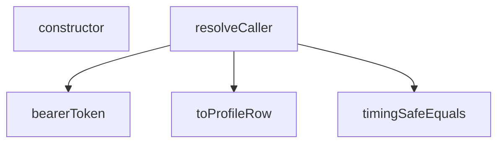

## NODE ID STANDARD

  file: supabase\functions\_shared\caller.ts
  function: supabase\functions\_shared\caller.ts::bearerToken
  function: supabase\functions\_shared\caller.ts::timingSafeEquals
  function: supabase\functions\_shared\caller.ts::toProfileRow
  function: supabase\functions\_shared\caller.ts::resolveCaller
  class: supabase\functions\_shared\caller.ts::CallerConfigError
  class: supabase\functions\_shared\caller.ts::CallerLookupError

---

## DISA AKTARILANLAR (EXPORTS)
  export: CallerConfigError
  export: CallerContext
  export: CallerKind
  export: CallerLookupError
  export: bearerToken
  export: resolveCaller
  export: timingSafeEquals
  export: toProfileRow

---
# FILE: supabase\functions\_shared\cors.md

---
domain: general
source_type: doc
namespace_type: module
source_path: C:\Users\alize\venthub-wt-hotfix\supabase\functions\_shared\cors.ts
skeleton_hash: f5323f7621d54120
entity_hashes:
  func:getCorsHeaders: 73642dabf029645c
  overview: 8eaad34e6f15ad7c
generated_at: 2026-08-14T13:19:43Z
---

## Genel Bakış
Bu modül, Supabase edge function'ları arasında paylaşılan CORS (Cross-Origin Resource Sharing) yönetimi sağlar. Farklı kaynaklardan gelen HTTP istekleri için uygun erişim başlıklarını oluşturarak, API'lerin güvenli bir şekilde çapraz kaynak taleplerine izin vermesini mümkün kılar.

## Fonksiyon Grupları
### CORS Başlık Yönetimi
HTTP isteklerine göre CORS politikalarını uygulayan başlık setini oluşturur. Bu başlıklar, isteklerin hangi kaynaklardan gelmesine izin verileceğini ve hangi HTTP metodlarının kullanılabileceğini belirler.
- getCorsHeaders

---

## AXIOMS – Mimari Varsayımlar
Bu modül, HTTP istekleri için CORS başlıkları döndüren bir fonksiyon içerir. Aşağıda, fonksiyonun doğru çalışması için gerekli temel mimari varsayımlar listelen

---

## FONKSİYON DETAYLARI

### getCorsHeaders

**Ne yapar**: HTTP isteklerine yanıt olarak Cross-Origin Resource Sharing (CORS) politika başlıklarını dinamik olarak oluşturur. Fonksiyon, gelen isteğin kaynak adresine (Origin) göre izin verilen domain listesini belirler ve standart CORS başlıklarını içeren bir nesne döndürür. Bu sayede frontend uygulamaları farklı bir domain'den API isteklerini güvenli bir şekilde gerçekleştirebilir.

**Nasıl yapar**: Fonksiyon, HTTP isteğinin `Origin` başlığını çıkararak başlar. Bu değeri kullanarak üç temel kontrol gerçekleştirir: kaynağın `localhost` ile başlayıp başlamadığını (geliştirme ortamı), `.vercel.app` ile bitip bitmediğini (Vercel deployment ortamı), ve her iki koşulun da sağlanıp sağlanmadığını kontrol eder. Kaynak izin listesinde yer alıyorsa, `Access-Control-Allow-Origin` başlığını isteğin kendi Origin değeriyle döndürür; aksi halde_prodüksiyon URL'ini (`https://venthub-hvac-esite.vercel.app`) kullanır. Ek olarak, izin verilen HTTP yöntemlerini, başlıkları ve preflight isteklerinin önbellek süresini (86400 saniye) ayarlar.

**Parametreler**:
- `req: Request` — CORS başlıklarının çıkarılacağı HTTP istek nesnesi. Standart Fetch API Request nesnesi olup, `headers` özelliği üzerinden HTTP başlıklarına erişim sağlar

**Dönüş**: `Record<string, string>` — Dört anahtar-değer çiftinden oluşan CORS başlık nesnesi döndürür:
- `Access-Control-Allow-Origin`: İzin verilen kaynak domain (dinamik veya sabit prodüksiyon URL'i)
- `Access-Control-Allow-Headers`: İzin verilen istek başlıkları listesi (authorization, x-client-info, apikey, content-type)
- `Access-Control-Allow-Methods`: İzin verilen HTTP yöntemleri (POST, GET, OPTIONS, PUT, DELETE)
- `Access-Control-Max-Age`: Preflight isteklerinin tarayıcı tarafından önbelleğe alınma süresi (saniye cinsinden 86400)

---

## AST POINTERS

### [N1_NASIL] AST Pointer: _shared/cors.ts::getCorsHeaders
- **params**: (req: Request)
- **ic_degiskenler**:
  - `origin` — Request'ten alınan Origin header değeri; mevcut değilse boş string kullanılır
  - `isLocal` — origin'in `http://localhost:` ile başlayıp başlamadığını kontrol eder;本地 geliştirme ortamı tespiti için kullanılır
  - `isVercel` — origin'in `.vercel.app` ile bitip bitmediğini kontrol eder; Vercel deploy ortamı tespiti için kullanılır
  - `allowed` — isLocal veya isVercel değerlerinin OR mantığı ile sonuçlanan布尔 değişken; istek yapan origin'in izinli olup olmadığını belirler
- **Dönüş**: `{ 'Access-Control-Allow-Origin': string, 'Access-Control-Allow-Headers': string, 'Access-Control-Allow-Methods': string, 'Access-Control-Max-Age': string }` — CORS header nesnesi döndürür; allowed true ise gelen origin'e izin verir, false ise sabit Vercel URL'ine izin verir

---

## NODE ID STANDARD

  file: supabase\functions\_shared\cors.ts
  function: supabase\functions\_shared\cors.ts::getCorsHeaders

---

## DISA AKTARILANLAR (EXPORTS)
  export: getCorsHeaders

---
# FILE: supabase\functions\_shared\notify.md

---
domain: general
source_type: doc
namespace_type: module
source_path: C:\Users\alize\venthub-hvac\supabase\functions\_shared\notify.ts
skeleton_hash: a166635d19f0ad89
entity_hashes:
  func:getEmailConfig: d69ed27e1c404dc2
  func:getEnv: 6925671b32beb020
  func:getSlackWebhook: af55155b404cbcc6
  func:notify: 2a10b08a24b2db2c
  func:sendEmail: 2a2dc768ec5451fa
  func:sendSlack: cd61229d7922325b
  overview: be8ec04b8995d7cb
generated_at: 2026-08-13T07:40:33Z
---

## Genel Bakış
Bu modül, VentHub projesindeki Supabase Edge Fonksiyonları tarafından ortaklaşa kullanılmak üzere geliştirilmiş, merkezi bir bildirim yardımcısıdır. Dış kanallara (Slack ve e-posta) mesaj göndermek için gerekli tüm yapılandırma ve gönderim süreçlerini tek bir arayüzde toplar, kod tekrarını önler ve bildirimlerin güvenli iletimini sağlar.

## Fonksiyon Grupları
### Yapılandırma Yardımcıları
Modülün çalışması için gerekli olan tüm ayarları ve bağlantı bilgilerini ortam değişkenlerinden çekerek kullanıma hazır hale getirir.
- getEnv, getSlackWebhook, getEmailConfig

### Kanala Özel Bildirim Göndericileri
Hazırlanan yapılandırma bilgilerini kullanarak, belirli bir kanalın (Slack veya e-posta) teknik formatına uygun bildirimleri hazırlar ve ilgili servise iletir.
- sendSlack, sendEmail

### Merkezî Bildirim Koordinatörü
Tüm yapılandırma ve gönderim işlevlerini entegre ederek, modülün ana giriş noktasıdır; sadece bildirim içeriği girilerek tüm aktif kanallara eş zamanlı mesaj gönderilmesini koordine eder.
- notify

---

## AXIOMS – Mimari Varsayımlar

Bu modül, Supabase Edge Functions ortamında dış kanallara bildirim göndermek için yapılandırma ve gönderim fonksiyonları sağlar.

**[Aksiyom 1]:** Eğer runtime ortamında Slack webhook URL'i tanımlı değilse, `getSlackWebhook()` fonksiyonu geçerli bir yapılandırma nesni dönemz ve `sendSlack()` fonksiyonu çalışamaz.

**[Aksiyom 2]:** Eğer runtime ortamında e-posta SMTP yapılandırma değişkenleri (host, port, kullanıcı, şifre vb.) tanımlı değilse, `getEmailConfig()` fonksiyonu geçerli bir yapılandırma nesni dönemz ve `sendEmail()` fonksiyonu çalışamaz.

**[Aksiyom 3]:** Eğer `getEnv(key)` fonksiyonuna talep edilen anahtarın karşılığı ortam değişkenlerinde mevcut değilse, fonksiyon `null` veya `undefined` döner (veya hata fırlatır — implementasyona bağlıdır).

**[Aksiyom 4]:** Eğer `notify()` fonksiyonu çağrıldığında hem Slack hem e-posta yapılandırması eksikse, hiçbir kanala bildirim gönderilemez.

**[Aksiyom 5]:** Eğer `sendSlack()` veya `sendEmail()` çağrıldığında dış ağ erişimi (outbound HTTP) engelli ise, bildirim gönderimi başarısız olur.

**[Aksiyom 6]:** `NotifyField[]` parametresi opsiyonel olarak tanımlıdır; eğer verilmezse, bildirim yalnızca düz metin (`text`) içerir.

---

## FONKSİYON DETAYLARI

### getEnv
**Ne yapar**: Verilen anahtar adına sahip ortam değişkeninin değerini字符串 olarak döndürür. Uygulama yapılandırması için merkezi bir erişim noktası sağlar.

**Nasıl yapar**: Fonksiyon gövdesi doğrudan verilmemiş olup, adından ve kullanım bağlamından anlaşılacağı üzere process.env veya benzeri bir ortam kaynağından değer okur. Tip güvenliği için her zaman string dönüşü sağlar; değişken bulunamazsa boş string döndürmesi beklenir.

**Parametreler**:
- `key`: `string` — Okunacak ortam değişkeninin adı (ör. `'SLACK_WEBHOOK_URL'`, `'NOTIFY_EMAIL'`)

**Dönüş**: `string` — Ortam değişkeninin değeri. Değişken tanımsızsa boş string döner.

### getSlackWebhook
**Ne yapar**: Slack bildirimleri için kullanılacak webhook URL’sini ortam değişkenlerinden alır.
**Nasıl yapar**: `SLACK_WEBHOOK_URL` gibi sabit bir anahtarla `getEnv` çağrısı yapar veya doğrudan `Deno.env.get` kullanır. Eğer değişken tanımlanmamışsa `null` döndürür.
**Parametreler**: Yok.
**Dönüş**: `string | null` — Webhook URL’si veya yoksa `null`.

### getEmailConfig
**Ne yapar**: E-posta bildirimi göndermek için gerekli yapılandırma bilgilerini (alıcı adresi, Supabase URL ve hizmet anahtarı) bir nesne olarak döndürür.
**Nasıl yapar**: Ortam değişkenlerinden `NOTIFY_EMAIL_TO`, `SUPABASE_URL` ve `SUPABASE_SERVICE_KEY` değerlerini okuyarak `{ to, supabaseUrl, serviceKey }` şeklinde bir nesne oluşturur. Gerekli değişkenler eksikse hata verebilir.
**Parametreler**: Yok.
**Dönüş**: `{ to: string, supabaseUrl: string, serviceKey: string }` — E-posta bildirimi için gereken konfigürasyon.

### sendSlack
**Ne yapar**: Belirtilen metin ve ek alanları kullanarak bir Slack kanalına bildirim mesajı gönderir.
**Nasıl yapar**: `getSlackWebhook` ile alınan webhook URL’sine HTTP POST isteği yapar. İstek gövdesinde mesaj metni (`text`) ve varsa ek alanlar (`fields`) JSON formatında iletilir.
**Parametreler**:
- `text`: `string` — Gönderilecek mesajın ana metni.
- `fields?`: `NotifyField[]` (opsiyonel) — Mesaja eklenecek ek anahtar-değer çiftleri.
**Dönüş**: Yok (void).

### sendEmail
**Ne yapar**: Belirtilen konu, metin ve ek alanları kullanarak bir e-posta bildirimi gönderir.
**Nasıl yapar**: `getEmailConfig` ile alınan yapılandırmayı kullanarak Supabase’in e-posta gönderme servisini (örneğin `supabase.functions.invoke` veya doğrudan SMTP) çağırır. Mesaj içeriği `subject`, `text` ve varsa `fields` birleştirilerek oluşturulur.
**Parametreler**:
- `subject`: `string` — E-postanın konu satırı.
- `text`: `string` — E-postanın gövde metni.
- `fields?`: `NotifyField[]` (opsiyonel) — E-posta içeriğine eklenecek ek alanlar.
**Dönüş**: Yok (void).

### notify
**Ne yapar**: Merkezi bildirim işlevi; metin ve ek alanları kullanarak hem Slack hem de e-posta üzerinden bildirim gönderilmesini sağlar.
**Nasıl yapar**: Yapılandırmaya bağlı olarak (örneğin `SLACK_WEBHOOK_URL` tanımlıysa) `sendSlack`’i, e-posta ayarları tamamsa `sendEmail`’i çağırır. Oluşan hataları loglar.
**Parametreler**:
- `text`: `string` — Bildirim metni.
- `fields?`: `NotifyField[]` (opsiyonel) — İsteğe bağlı ek alanlar.
**Dönüş**: Yok (void).

---

## TYPE ALIASES

### NotifyField
```typescript
type NotifyField = { title: string; value: string; short?: boolean }
```

---

## SABİTLER
- **notify** (unknown)

---

## AST POINTERS

### [N1_NASIL] AST Pointer: `supabase/functions/_shared/notify.ts`::getEnv
- **params**: `key: string`
- **ic_degiskenler**:
  - (yok — parametre ve Deno.env.get haricinde degisken kullanilmiyor)
- **Dönüş**: `string` — ortam degiskeninin degerini veya bos string dondurur; key mevcut degilse `''` doner

---


## MERMAID CALL GRAPH
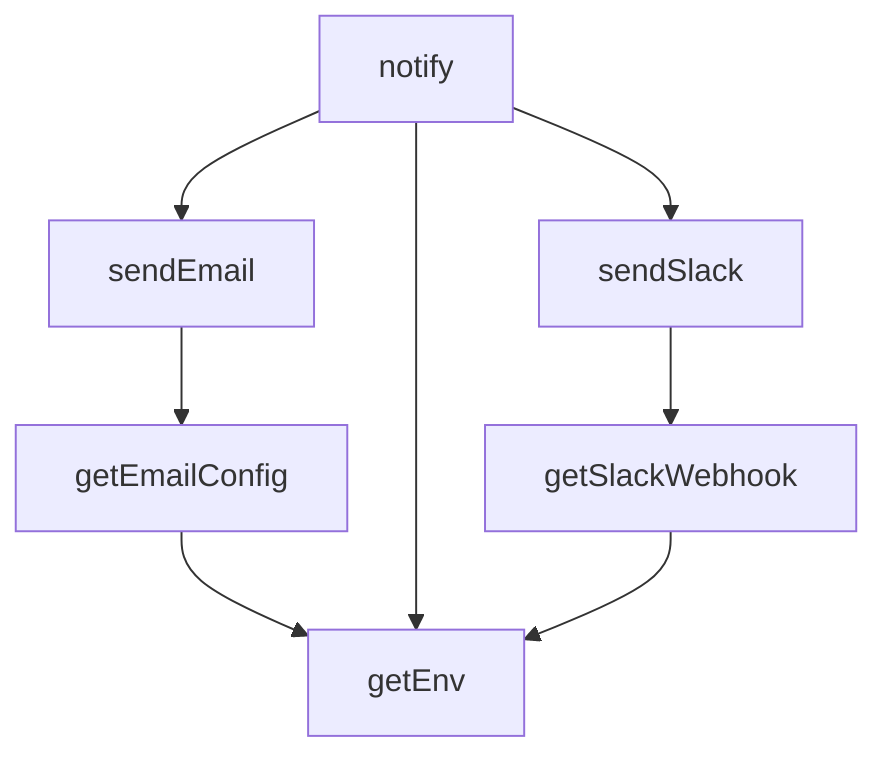

## NODE ID STANDARD

  file: supabase\functions\_shared\notify.ts
  function: supabase\functions\_shared\notify.ts::getEnv
  function: supabase\functions\_shared\notify.ts::getSlackWebhook
  function: supabase\functions\_shared\notify.ts::getEmailConfig
  function: supabase\functions\_shared\notify.ts::sendSlack
  function: supabase\functions\_shared\notify.ts::sendEmail
  function: supabase\functions\_shared\notify.ts::notify

---

## DISA AKTARILANLAR (EXPORTS)
  export: NotifyField
  export: getEmailConfig
  export: getEnv
  export: getSlackWebhook
  export: notify
  export: sendEmail
  export: sendSlack

---
# FILE: supabase\functions\_shared\rate_limit.md

---
domain: general
source_type: doc
namespace_type: module
source_path: C:\Users\alize\venthub-hvac\supabase\functions\_shared\rate_limit.ts
skeleton_hash: 40c1c3cb655dae2c
entity_hashes:
  func:checkRateLimit: eb2ddca9002ea24b
  func:rateLimitHeaders: 8e57db019805fbe0
  overview: 2d23853bbec3dccf
generated_at: 2026-08-13T07:40:33Z
---

## Genel Bakış
Bu modül, sunucusuz fonksiyonlara yönelik istekleri belirli bir zaman aralığında izin verilen eşik değerleri dahilinde tutarak kontrolsüz kullanımı önler. Supabase veritabanı üzerinde her istemci anahtarı için bir sayaç tutar ve bu sayaca dayanarak isteğin kabul edilip edilmeyeceğine karar verir. Kontrol sonucunda istemci tarafının anlayabileceği standart HTTP başlıkları üretilir.

## Fonksiyon Grupları
### İstek Kotası Doğrulama
Verilen istemci anahtarı ve servis bilgilerini kullanarak Supabase üzerindeki kota kaydını sorgular. Zaman penceresi içindeki istek sayısını kontrol eder ve limit aşılıp aşılmadığını döndürür.
- checkRateLimit

### Yanıt Başlığı Oluşturma
Kota kontrolü sonrasında elde edilen limit, kalan hak ve sıfırlanma zamanı değerlerini HTTP yanıt başlıklarına dönüştürür. Bu başlıklar istemci tarafında kota durumunu yorumlamak için kullanılır.
- rateLimitHeaders

---

## AXIOMS – Mimari Varsayımlar

Bu modül için özel aksiyom tanımlanmamıştır. Modülün doğru çalışması için zorunlu olan tek conditions, fonksiyon imzasında belirtilen parametrelerin geçerli değerler (örn: geçerli bir URL, geçerli bir anahtar, pozitif sayısal değerler) olmasıdır; bu durum genel programlama kuralıdır ve modüle özgü bir aksiyom olarak tanımlanmaz.

---

## FONKSİYON DETAYLARI

### checkRateLimit
**Ne yapar**: Bir anahtar için hız limiti kontrolü yapar, isteklerin izin verilip verilmediğini belirler ve kalan kota ile sıfırlanma zamanını döndürür.

**Nasıl yapar**: Fonksiyon, belirtilen anahtar için veritabanındaki `bump_rate_limit` RPC fonksiyonunu çağırarak mevcut durumu sorgular ve kota sayacını artırır. Varsayılan olarak dakikada 60 istek limiti ve 60 saniyelik pencere süresi kullanılır; bu değerler `opts` parametresiyle veya ortam değişkenleriyle (`RATE_LIMIT_PER_MINUTE`, `RATE_LIMIT_WINDOW_SEC`) değiştirilebilir. Sınırlar geçersiz veya negatif olduğunda otomatik olarak 60 değerine geri döner. RPC çağrısı başarısız olursa bir hata fırlatır, veritabanından geçersiz bir yanıt alınırsa varsayılan olarak isteğe izin veren bir sonuç nesnesi oluşturulur.

**Parametreler**:
- key: string — Rate limit kontrolü yapılacak benzersiz anahtar; genellikle bir kullanıcı kimliği, IP adresi veya API anahtarı olabilir
- fetchBase: string — Supabase projesinin taban URL'si (örneğin `https://xyzcompany.supabase.co`); RPC çağrısı bu adres üzerinden yapılır
- serviceRoleKey: string — Supabase service_role anahtarı; yetkilendirme ve API kimlik doğrulama başlıklarında kullanılır
- opts: { limit?: number; windowSec?: number } — Opsiyonel yapılandırma nesnesi; limit dakika başına izin verilen maksimum istek sayısını, windowSec ise pencere süresini saniye cinsinden belirtir

**Dönüş**: `{ result: RateLimitResult, limit: number, windowSec: number }` — result nesnesi `allowed` (boolean, isteğe izin verilip verilmediği), `remaining` (number, pencerede kalan kota sayısı) ve `resetAt` (string, pencerenin sıfırlanacağı ISO 8601 zaman damgası) alanlarını içerir; limit ve windowSec ise hesaplamada kullanılan nihai parametre değerlerini temsil eder.

### rateLimitHeaders
**Ne yapar**: HTTP rate limit yanıtları için standart başlık anahtar-değer çiftlerinden oluşan bir nesne üretir.

**Nasıl yapar**: Verilen limit, kalan kota ve sıfırlanma zamanı değerlerini HTTP rate limit başlık formatına dönüştürür. `RateLimit-Remaining` değeri negatif olmasını engellemek için `Math.max(0, ...)` ile korunur; `RateLimit-Reset` değeri ise mevcut zamandan sıfırlanma zamanına kadar geçen saniye sayısını hesaplar ve minimum 1 saniye olmasını garantiler. Döndürülen nesne `Record<string, string>` tipindedir ve doğrudan HTTP yanıt başlıklarına eklenebilir.

**Parametreler**:
- limit: number — Pencere süresi boyunca izin verilen toplam istek sayısı
- remaining: number — Mevcut pencere süresi içinde hâlâ izin verilen istek sayısı
- resetAt: string — Pencere süresinin sona ereceği zaman; ISO 8601 formatında bir tarih dizesi olarak beklenir

**Dönüş**: `Record<string, string>` — `RateLimit-Limit` (toplam kota), `RateLimit-Remaining` (kalan kota, en az 0) ve `RateLimit-Reset` (sıfırlanmaya kalan saniye, en az 1) başlıklarını içeren anahtar-değer nesnesi.

---

## TYPE ALIASES

### RateLimitResult
```typescript
type RateLimitResult = { allowed: boolean; remaining: number; resetAt: string }
```

---

## AST POINTERS

### [N1_NASIL] AST Pointer: _shared/rate_limit.ts::checkRateLimit
- **params**: (key: string, fetchBase: string, serviceRoleKey: string, opts?: { limit?: number; windowSec?: number })
- **ic_degiskenler**:
  - `limit` — uygulanacak istek limiti; opts?.limit'ten, Deno.env['RATE_LIMIT_PER_MINUTE']'den veya varsayılan 60'tan alınır; geçersizse 60'a resetlenir
  - `windowSec` — rate limit penceresi (saniye); opts?.windowSec'ten, Deno.env['RATE_LIMIT_WINDOW_SEC']'den veya varsayılan 60'tan alınır; geçersizse 60'a resetlenir
  - `body` — Supabase RPC'ye gönderilen JSON body; p_key, p_limit, p_window_seconds alanlarını içerir
  - `resp` — fetch() çağrısının döndürdüğü Response nesnesi; ok değilse hata fırlatılır
  - `data` — resp.json() ile parse edilen yanıt; `{ allowed, remaining, reset_at }`物件ları içeren dizi
  - `row` — data[0] mevcutsa ilk satır, aksi halde varsayılan {allowed: true, remaining: limit-1, reset_at: ...} nesnesi
  - `result` — RateLimitResult nesnesi; allowed boolean, remaining number, resetAt string değerlerini tutar
- **Dönüş**: `{ result: RateLimitResult, limit: number, windowSec: number }`

---

## NODE ID STANDARD

  file: supabase\functions\_shared\rate_limit.ts
  function: supabase\functions\_shared\rate_limit.ts::checkRateLimit
  function: supabase\functions\_shared\rate_limit.ts::rateLimitHeaders

---

## DISA AKTARILANLAR (EXPORTS)
  export: RateLimitResult
  export: checkRateLimit
  export: rateLimitHeaders

---
# FILE: supabase\functions\_shared\sentry.md

---
domain: general
source_type: doc
namespace_type: module
source_path: C:\Users\alize\venthub-hvac\supabase\functions\_shared\sentry.ts
skeleton_hash: 4a1eb17c4a08a475
entity_hashes:
  func:parseDsn: de6e6bd80de1e473
  func:postStore: baa7d375e0588daa
  func:sentryCaptureException: d3efed22b661b471
  func:sentryCaptureMessage: f1e4a7cbdea35542
  overview: a0aac1a163270d41
generated_at: 2026-08-13T07:40:33Z
---

## Genel Bakış
Bu modül, uygulamadan Sentry hata izleme servisine veri göndermek için gerekli temel araçları sağlar. DSN ayrıştırma, ham veri gönderimi ve geliştirici dostu yakalama arayüzlerini içererek hata ve mesaj raporlama döngüsünü tamamlar.

## Fonksiyon Grupları
### DSN İşlemleri
Sentry Data Source Name stringini ayrıştırarak sunucu, kimlik ve proje bilgilerini hazırlar.
- parseDsn

### Transport (Veri Gönderimi)
Ayrıştırılmış DSN bilgilerini kullanarak olay yükünü Sentry'nin alıcı sunucusuna asenkron olarak iletir.
- postStore

### Uygulama Yakalama API'leri
Geliştiricilerin uygulama içinden mesaj veya istisna yakalamasını kolaylaştırır; içlerinde DSN işleme ve veri gönderimini orkestra eder.
- sentryCaptureMessage, sentryCaptureException

---

## AXIOMS – Mimari Varsayımlar

Bu modül, fonksiyon gövdeleri paylaşılmadığı için yalnızca fonksiyon imzalarından ve modülün genel amacından çıkarılabilecek temel mimari varsayımları içerir.

**[Aksiyom 1]:** Eğer `parseDsn`'a verilen `dsn` parametresi geçerli bir Sentry DSN formatında (örn. `https://<public_key>@<host>/<project_id>`) değilse, ayrıştırma sonucu tutarsız veya eksik olur ve `postStore` tarafından gönderilen HTTP isteği hedefe ulaşamaz.

**[Aksiyom 2]:** Eğer `postStore` çağrıldığında ağ (network) bağlantısı mevcut değilse veya Sentry'nin store endpoint'i erişilemez durumda ise, hata raporu sunucuya ulaşamaz ve sessizce başarısız olur.

**[Aksiyom 3]:** Eğer `sentryCaptureMessage` veya `sentryCaptureException` çağrılmadan önce ortam değişkenlerinden veya uygun bir kaynaktan geçerli bir DSN (`dsn`) sağlanamıyorsa, bu fonksiyonlar raporlama yapamaz; çünkü arka planda `parseDsn` ve `postStore` zinciri bu değere bağlıdır.

**[Aksiyom 4]:** Eğer `sentryCaptureMessage` çağrısında `level` parametresi `SentryLevel` tipinin izin verdiği değerlerden biri (örn. `"error"`, `"warning"`, `"info"` vb.) dışındaysa, Sentry tarafında beklenmeyen bir davranış veya reddetme oluşur.

**[Aksiyom 5]:** Eğer `sentryCaptureException` çağrısında `_e` parametresi `null` veya geçersiz bir değer olarak sağlanırsa, modülün hata bilgisini anlamlı bir şekilde serialize edememesi ve raporlanamaması olur.

---

## FONKSİYON DETAYLARI

### parseDsn
**Ne yapar**: Verilen bir Sentry DSN (Data Source Name) dizesini ayrıştırarak bileşenlerine (host, publicKey, projectId) ayırır. Başarısız ayrıştırma durumunda `null` değerini döner.

**Nasıl yapar**: Girdi dizesini bir `URL` nesnesine dönüştürmeye çalışır. Dönüşüm başarılı olursa, URL nesnesinin `username`, `host` ve `pathname` özelliklerinden istenen değerleri çıkarır. `pathname`’den baştaki `/` karakteri kaldırılarak `projectId` elde edilir. Herhangi bir ayrıştırma hatası (geçersiz URL) veya gerekli alanların boş olması durumunda `null` döner.

**Parametreler**:
- `dsn: string` — Sentry projesine ait Data Source Name dizesi. Örnek format: `https://PUBLIC_KEY@o123456.ingest.sentry.io/987654`

**Dönüş**: `{ host: string; publicKey: string; projectId: string } | null` — Ayrıştırma başarılıysa host, anahtar ve proje ID’sini içeren bir nesne; aksi halde `null`.

### postStore
**Ne yapar**: Sağlanan DSN ve olay gövdesi kullanılarak Sentry’ye bir hata veya mesaj kaydı (store) göndermek için asenkron bir HTTP POST isteği başlatır. İletişim hatası durumunda sessizce devam eder.

**Nasıl yapar**: İlk olarak `parseDsn` fonksiyonuyla DSN’yi ayrıştırır. Ayrıştırma başarısız olursa hiçbir şey yapmaz. Başarılıysa, `https://{host}/api/{projectId}/store/` formatında bir endpoint URL’si oluşturur. Gerekli `X-Sentry-Auth` başlığını, Sentry API standardına uygun olarak versiyon, istemci anahtarı ve istemci adı bilgileriyle formatlar. Son olarak, `fetch` API’sini kullanarak JSON formatındaki gövdeyi ilgili URL’ye POST metoduyla gönderir. `try-catch` bloğu, ağ hataları veya diğer istisnaları yakalar ve yok sayar.

**Parametreler**:
- `dsn: string` — İsteğin gönderileceği Sentry projesinin DSN adresi.
- `body: unknown` — Gönderilecek olay verisi (JSON’laştırılabilir bir nesne).

**Dönüş**: `Promise<void>` — Fonksiyon asenkron olup, bir değer dönmez.

### sentryCaptureMessage
**Ne yapar**: Belirtilen metin mesajını ve seviyesini bir Sentry olayı olarak gönderir. Ortam değişkenlerinden DSN ve diğer yapılandırma değerlerini otomatik olarak okur.

**Nasıl yapar**: `globalThis` üzerinden Deno ortam değişkenlerine erişerek `SENTRY_DSN` değerini alır. Eğer DSN yoksa veya boşsa fonksiyon hemen sonlanır. DSN varsa, standart bir Sentry olay nesnesi oluşturur. Bu nesne platform, zaman damgası, seviye, mesaj, ek bilgiler (`extra`) ve opsiyonel olarak ortam ile sürüm bilgilerini içerir. Oluşturulan olay nesnesini `postStore` fonksiyonu aracılığıyla Sentry’ye iletir.

**Parametreler**:
- `message: string` — Raporlanacak hata veya durum mesajı.
- `level: SentryLevel` — Olay ciddiyeti (örn: 'error', 'warning', 'info'). Varsayılan `'error'`.
- `extra?: Record<string, unknown>` — Opsiyonel. Mesajla birlikte gönderilecek ek bağlam bilgileri.

**Dönüş**: `Promise<void>` — Fonksiyon asenkron olup, bir değer dönmez.

### sentryCaptureException
**Ne yapar**: Yakalanan bir hata (Error nesnesi veya bilinmeyen herhangi bir değer) hakkında detaylı bir Sentry olayı oluşturur ve gönderir. Hata istifasını (stack trace) mümkün olduğunca dahil eder.

**Nasıl yapar**: `SENTRY_DSN` ortam değişkenini okur; DSN yoksa hemen çıkılır. Girdi nesnesinin bir `Error` örneği olup olmadığını kontrol eder. Eğer bir `Error` ise, `message` ve `stack` özellikleri alınır; değilse, değer `String()` ile metne dönüştürülür. Sentry’nin beklediği `exception` yapısını oluşturur: hata türü, mesajı ve opsiyonel istifayı (`stacktrace.frames` içinde minimal bir çerçeve yapısıyla) içerir. Tam olay nesnesi, `postStore` ile iletilir.

**Parametreler**:
- `_e: unknown` — Yakalanan hata nesnesi veya herhangi bir değer. Bir `Error` instance’ı ise daha detaylı bilgi çıkarılır.
- `extra?: Record<string, unknown>` — Opsiyonel. İstisnayla ilişkilendirilecek ek bağlam bilgileri.

**Dönüş**: `Promise<void>` — Fonksiyon asenkron olup, bir değer dönmez.

---

## TYPE ALIASES

### SentryLevel
```typescript
type SentryLevel = 'fatal' | 'error' | 'warning' | 'info' | 'debug' | 'log'
```

---

## AST POINTERS

### [N1_NASIL] AST Pointer: _shared/sentry.ts::parseDsn
- **params**: `dsn: string` — Sentry DSN URL'i
- **ic_degiskenler**:
  - `u` — URL nesnesi, dsn string'inden parse edilmiş
  - `publicKey` — URL'den çıkarılan Sentry public key (u.username, trimlenmiş)
  - `host` — URL'den çıkarılan hostname (u.host)
  - `projectId` — URL path'inden çıkarılan proje ID'si (başındaki '/' kaldırılmış)
- **Dönüş**: `{ host: string; publicKey: string; projectId: string } | null` — parse başarılıysa nesne, başarısızsa null

### [N2_NASIL] AST Pointer: _shared/sentry.ts::postStore
- **params**: `dsn: string` — Sentry DSN URL'i, `body: unknown` — gönderilecek event verisi
- **ic_degiskenler**:
  - `parsed` — parseDsn ile parse edilmiş DSN bilgisi (host, publicKey, projectId) veya null
  - `url` — POST isteği yapılacak tam URL (`https://${parsed.host}/api/${parsed.projectId}/store/`)
  - `auth` — X-Sentry-Auth header değeri, virgülle ayrılmış kimlik bilgileri dizisi
- **Dönüş**: `Promise<void>` — yan etki: Sentry store endpoint'ine POST isteği gönderir, hata yutulur

### [N3_NASIL] AST Pointer: _shared/sentry.ts::sentryCaptureMessage
- **params**: `message: string` — yakalanacak mesaj, `level: SentryLevel = 'error'` — mesaj severity seviyesi (varsayılan 'error'), `extra?: Record<string, unknown>` — opsiyonel ek veri
- **ic_degiskenler**:
  - `dsn` — Deno env'den okunan SENTRY_DSN değeri, boş string fallback'li
  - `event` — Sentry'ye gönderilecek event nesnesi (platform, logger, timestamp, level, message, extra, environment, release alanlarını içerir)
- **Dönüş**: `yok` — yan etki: parseDsn ile DSN parse edilip postStore'a event gönderilir; DSN boşsa hiçbir şey yapmaz

### [N4_NASIL] AST Pointer: _shared/sentry.ts::sentryCaptureException
- **params**: `_e: unknown` — yakalanacak istisna/hata nesnesi, `extra?: Record<string, unknown>` — opsiyonel ek veri
- **ic_degiskenler**:
  - `dsn` — Deno env'den okunan SENTRY_DSN değeri, boş string fallback'li
  - `isErr` — _e'nin Error instance olup olmadığının kontrolü (boolean)
  - `message` — hata nesnesinden çıkarılan mesaj string'i (_e.message veya String(_e))
  - `stack` — hata nesnesinin stack trace'i (Error ise _e.stack, değilse undefined)
  - `event` — Sentry'ye gönderilecek event nesnesi (platform, logger, timestamp, level: 'error', message, exception, extra, environment, release alanlarını içerir); exception alanını stack varsa frames dizisi ile birlikte oluşturur
- **Dönüş**: `yok` — yan etki: parseDsn ile DSN parse edip postStore'a hata event'i gönderir; DSN boşsa hiçbir şey yapmaz

---


## MERMAID CALL GRAPH
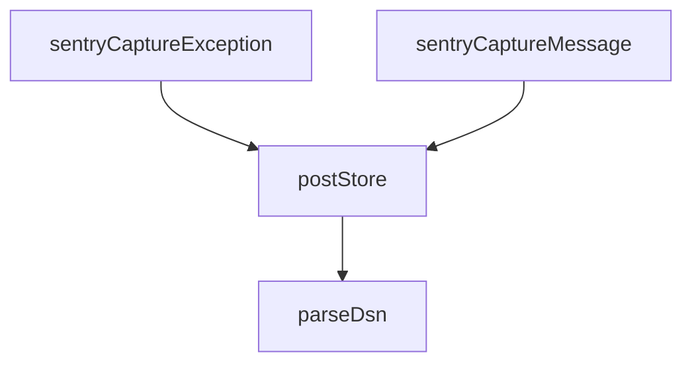

## NODE ID STANDARD

  file: supabase\functions\_shared\sentry.ts
  function: supabase\functions\_shared\sentry.ts::parseDsn
  function: supabase\functions\_shared\sentry.ts::postStore
  function: supabase\functions\_shared\sentry.ts::sentryCaptureMessage
  function: supabase\functions\_shared\sentry.ts::sentryCaptureException

---

## DISA AKTARILANLAR (EXPORTS)
  export: SentryLevel
  export: parseDsn
  export: postStore
  export: sentryCaptureException
  export: sentryCaptureMessage

---
# FILE: supabase\functions\_shared\tenant.md

---
domain: general
source_type: doc
namespace_type: module
source_path: C:\Users\alize\venthub-wt-hotfix\supabase\functions\_shared\tenant.ts
skeleton_hash: 3968d998bd619807
entity_hashes:
  func:TenantMismatchError:constructor: e1338c721ec51a0d
  func:asTenantId: c2ff5c564490bb06
  func:readTenantField: 4d35c0e558a986d4
  func:tenantFromRow: c90159523a95e369
  func:tenantFromServiceBody: 66ed2d9436ec1651
  func:tenantFromVerifiedUser: 1aa2c618793ac476
  overview: 4177b2bce8b584b0
generated_at: 2026-08-15T07:40:57Z
---

## Genel Bakış
Bu modül, çok kiracılı bir Supabase Edge Functions yapısında kiracı (tenant) kararlarının alınması için merkezi yardımcı işlevleri sunar. Farklı kaynaklardan (doğrulanmış kullanıcı profilleri, HTTP istek gövdeleri veya veritabanı satırları) gelen kiracı bilgisini standart bir `TenantDecision` formatına dönüştürerek tutarlı bir karar üretmeyi ve kiracı eşleşmeyen durumlarda hata yönetimi sağlamayı amaçlar.

## Fonksiyon Grupları
### Temel Dönüştürücü ve Yardımcılar
Bu grup, ham veya değişken tipteki girdileri geçerli bir kiracı tanımlayıcısına (tenant ID) dönüştüren ve kaynak nesnelerden kiracı alanlarını okuyan düşük seviyeli yardımcı fonksiyonları içerir.
- asTenantId, readTenantField

### Karar Üreticileri
Bu grup, farklı kaynaklardan (doğrulanmış kullanıcı, servis gövdesi veya veritabanı satırı) kiracı bilgisini çıkararak standart bir karar nesnesi üreten ana mantık fonksiyonlarını barındırır.
- tenantFromVerifiedUser, tenantFromServiceBody, tenantFromRow

### Hata ve Uyumsuzluk Yönetimi
Bu grup, kiracı kimlikleri arasındaki tutarsızlıkları yakalamak ve bağlam hakkında bilgi veren anlamlı hata mesajları üretmek için özel bir hata sınıfını tanımlar.
- TenantMismatchError (sınıf ve yapılandırıcısı)

---

## AXIOMS – Mimari Varsayımlar

Bu modül, çoklu kiracılı (multi-tenant) sistemlerde kiracılık (tenant) kimliğini doğrulamak ve karar üretmek için kullanılır.

[Aksiyom 1]: Eğer `TENANT_UUID_RE` regex sabiti tanımlı değilse veya geçerli bir UUID deseni içermiyorsa, `asTenantId` fonksiyonu hiçbir zaman geçerli bir tenant ID döndüremez.

[Aksiyom 2]: Eğer `user` parametresi `VerifiedUser` tipinde değilse veya `profile` parametresi `null` ise, `tenantFromVerifiedUser` fonksiyonunun tenant kararını doğru üretmesi garanti edilemez.

[Aksiyom 3]: Eğer `parsedBody` parametresi `tenant_id` alanı içermeyen bir yapıda ise, `tenantFromServiceBody` fonksiyonu `TenantDecision`'da tenant bilgisini `null` olarak döndürür.

[Aksiyom 4]: Eğer `row` parametresi `null` ise veya `row.tenant_id` alanı mevcut değilse, `tenantFromRow` fonksiyonu tenant bilgisi içermeyen bir `TenantDecision` döndürür.

[Aksiyom 5]: Eğer `profileTenantId` ile `claimTenantId` değerleri birbirinden farklı ise, `TenantMismatchError` hatası fırlatılır — bu, profil ile doğrulanmış kullanıcı arasındaki tenant uyumsuzluğunu işaret eder.

[Aksiyom 6]: Eğer `tenantFromVerifiedUser` fonksiyonu hem `user`'da hem `profile`'da tenant bilgisi bulursa ve ikisi farklı ise, bu durum bir uyumsuzluk (mismatch) olarak işlenir ve muhtemelen hata fırlatılır.

[Aksiyom 7]: Eğer `asTenantId` fonksiyonuna verilen `value` parametresi `TENANT_UUID_RE` regex deseniyle eşleşmiyorsa, fonksiyon `null` döndürür.

[Aksiyom 8]: Eğer `TenantMismatchError` constructor'ına `profileTenantId` olarak `null` değer verilir ve `claimTenantId` geçerli bir UUID ise, hata yine de fırlatılır çünkü claim edilen tenant ile profil tenantı eşleşmemektedir.

---

## FONKSİYON DETAYLARI

### asTenantId
**Ne yapar**: Verilen değerin geçerli bir tenant UUID'si olup olmadığını kontrol eder ve geçerliyse normalize eder.
**Nasıl yapar**: Değerin bir string olup olmadığını kontrol eder, değiliyse `null` döner. String ise başındaki ve sonundaki boşlukları temizledikten sonra `TENANT_UUID_RE`正则 ifadesiyle eşleşip eşleşmediğini test eder. Eşleşiyorsa küçük harflere dönüştürerek normalize edilmiş UUID'yi, eşleşmiyorsa `null` döner.
**Parametreler**:
- `value`: `unknown` — Değerlendirilecek herhangi bir tipteki girdi.
**Dönüş**: `string | null` — Geçerli ve normalize edilmiş (küçük harf) UUID stringi veya geçersiz değer için `null`.

### readTenantField
**Ne yapar**: Serbest biçimli bir nesneden, önceden tanımlı alan anahtarları (`TENANT_FIELD_KEYS`) arasında dolaşarak geçerli bir tenant alanını okur.
**Nasıl yapar**: Girdi bir nesne veya null ise doğrudan `null` döner. Nesneyi `Record<string, unknown>` tipine daraltarak (proje kuralı gereği `any` kullanılmaz), `TENANT_FIELD_KEYS` dizisi üzerinde döngü başlatır. Her bir anahtar için değeri `asTenantId` fonksiyonuyla doğrular. İlk geçerli tenant alanını bulduğunda onu döndürür, hiçbirini bulamazsa `null` döner.
**Parametreler**:
- `source`: `unknown` — Tenant alanının aranacağı nesne. Nesne dışı değerler için `null` döner.
**Dönüş**: `string | null` — Bulunan geçerli tenant ID'si veya hiçbir alan geçerli değilse `null`.

### tenantFromVerifiedUser
**Ne yapar**: Doğrulanmış bir kullanıcı ve profili için tenant kararını (ID ve kaynağı) belirler.
**Nasıl yapar**: Kullanıcının `app_metadata` alanından (`fromClaim`) ve profil satırından (`fromProfile`) olası tenant değerlerini okur. Eğer claim mevcutsa ve profille eşleşmiyorsa, bir `TenantMismatchError` fırlatır (uyumsuzluk durumu). Profilden geçerli bir tenant ID okunabildiyse onu ve kaynağını (`user_profile`) döndürür. Hiçbiri yoksa varsayılan tenant ID'sini ve kaynağını (`default`) döndürür. Bu fonksiyon, otorite olarak `user_profiles.tenant_id`'yi kabul eder.
**Parametreler**:
- `user`: `VerifiedUser` — Kimliği doğrulanmış kullanıcı nesnesi. `app_metadata` alanı içerebilir.
- `profile`: `TenantProfileRow | null` — Kullanıcının `user_profiles` tablosundaki satırı veya null olabilir.
**Dönüş**: `TenantDecision` — `{ tenantId: string, source: 'user_profile' | 'default' }` formatında bir nesne. Tenant ID ve bu kararın hangi kaynaktan geldiği bilgisini içerir.

### tenantFromServiceBody
**Ne yapar**: service_role ile çağrılan bir fonksiyonun, doğrulama sonrası istek gövdesinden tenant kararını belirler.
**Nasıl yapar**: ÖN KOŞUL: Bu fonksiyon çağrılmadan önce, `Authorization` başlığının service_role anahtarı olduğu sabit-zamanlı karşılaştırmayla doğrulanmış olmalıdır. `parsedBody` üzerinden `readTenantField` ile bir tenant ID arar. Bulursa onu ve kaynağını (`service_body`) döndürür, bulamazsa varsayılan tenant ID'sini ve kaynağını (`default`) döndürür. Anahtarın kendisi tenant bilgisi içermez; bu nedenle gövdeden okuma yapılır.
**Parametreler**:
- `parsedBody`: `unknown` — service_role çağrısının istek gövdesi (parsed JSON).
**Dönüş**: `TenantDecision` — `{ tenantId: string, source: 'service_body' | 'default' }` formatında bir nesne.

### tenantFromRow
**Ne yapar**: HMAC imzası doğrulanmış bir isteğin işaret ettiği veritabanı satırından (örn. sipariş veya iade satırı) tenant kararını belirler.
**Nasıl yapar**: Harici bir sağlayıcı (kargo/ödeme) bizim tenant UUID'lerimizi bilmez, bu yüzden istekten tenant okumak yerine, imzalı istein işaret ettiği (`order_id`, `tracking_number` vb.) satırın kendi `tenant_id` alanını kullanır. `asTenantId` ile satırdaki `tenant_id` alanını doğrular. Geçerliyse onu ve kaynağını (`resource_row`) döndürür, değilse varsayılan tenant ID'sini ve kaynağını (`default`) döndürür.
**Parametreler**:
- `row`: `{ tenant_id?: string | null } | null` — `venthub_orders` veya `venthub_returns` gibi tablolardan gelen, `tenant_id` alanı opsiyonel olabilen satır nesnesi veya null.
**Dönüş**: `TenantDecision` — `{ tenantId: string, source: 'resource_row' | 'default' }` formatında bir nesne.

### TenantMismatchError.constructor
**Ne yapar**: Tenant uyuşmazlığı hata nesnesini başlatır ve hata detaylarını saklar.
**Nasıl yapar**: `super('tenant_mismatch')` çağrısıyla üst sınıf (Error) constructor'ını çalıştırarak hata mesajını ayarlar. Hata adını (`name`) 'TenantMismatchError' olarak belirler. Profilden gelen (`profileTenantId`) ve claim'den gelen (`claimTenantId`) tenant ID'lerini nesne özellikleri olarak saklar, bu da hata ayıklama ve loglama için faydalı bilgiler sağlar.
**Parametreler**:
- `profileTenantId`: `string | null` — Profil tablosundan (`user_profiles.tenant_id`) okunan tenant ID'si veya null.
- `claimTenantId`: `string` — Kullanıcı claim'inden (`app_metadata`) okunan ve profille uyuşmayan tenant ID'si.
**Dönüş**: `TenantMismatchError` — Bu bir constructor olduğu için dönüş tipi doğrudan nesnenin kendisidir. Önceden tanımlanmış `tenant_mismatch` mesajı ve her iki tenant ID'sini içeren bir Error nesnesi oluşturur.

---

## INTERFACES

### TenantDecision
- `readonly tenantId: string`
- `readonly source: TenantSource`

### VerifiedUser
`auth.getUser(jwt)`'in döndürdüğü kullanıcının bu modülün ihtiyaç duyduğu dar yüzü. Supabase'in tam `User` tipini import etmiyoruz: bu dosyanın ağ/SDK bağımlılığı olmamalı ki saf kalsın ve testte düz nesneyle çağrılabilsin.
- `readonly id: string`
- `readonly app_metadata?: Record<string, unknown> | null`

### TenantProfileRow
Sınıf (a) rol sorgusunun döndürdüğü satır: `select role, tenant_id`. İkisinin AYNI satırdan gelmesi bilinçli — cetvel §3.2 rolü, §3.9 tenant'ı ister ve eski kod bunları iki ayrı kaynaktan alıp "önce tenant'ı bul ki profili filtreleyeyim" döngüsüne düşüyordu.
- `readonly role?: string | null`
- `readonly tenant_id?: string | null`

---

## TYPE ALIASES

### TenantSource
Kararın NEREDEN geldiği. Log/telemetri için değil, DENETİM için: bir uç beklenmedik bir kaynağa düşüyorsa (ör. sınıf-(a) ucunda `'default'`) bu, kapının çalışmadığının işaretidir ve çağıran bunu görüp reddedebilir.
```typescript
type TenantSource = 'user_profile' | 'service_body' | 'resource_row' | 'default'
```

---

## SABİTLER
- **TENANT_UUID_RE** (regex) — `/^[0-9a-f]{8}-[0-9a-f]{4}-[0-9a-f]{4}-[0-9a-f]{4}-[0-9a-f]{12}$/i`

---

## AST POINTERS

### [N1_NASIL] AST Pointer: supabase\functions\_shared\tenant.ts::TenantMismatchError.constructor
- **params**: (profileTenantId: string | null, claimTenantId: string)
- **ic_degiskenler**: (yok — parametreler doğrudan atanır)
- **Dönüş**: yok — class instance başlatır

### [N2_NASIL] AST Pointer: supabase\functions\_shared\tenant.ts::asTenantId
- **params**: (value: unknown)
- **ic_degiskenler**:
  - `trimmed` — value'nun boşlukları temizlenmiş hali
- **Dönüş**: string | null

### [N3_NASIL] AST Pointer: supabase\functions\_shared\tenant.ts::readTenantField
- **params**: (source: unknown)
- **ic_degiskenler**:
  - `record` — source'un Record<string, unknown> tipine dönüştürülmüş hali
  - `key` — TENANT_FIELD_KEYS dizisindeki her bir alan adı
  - `candidate` — record[key] değerinin asTenantId ile işlenmiş hali
- **Dönüş**: string | null

### [N4_NASIL] AST Pointer: supabase\functions\_shared\tenant.ts::tenantFromVerifiedUser
- **params**: (user: VerifiedUser, profile: TenantProfileRow | null)
- **ic_degiskenler**:
  - `fromProfile` — profile.tenant_id değerinin asTenantId ile işlenmiş hali
  - `fromClaim` — user.app_metadata değerinin readTenantField ile işlenmiş hali
- **Dönüş**: TenantDecision object

### [N5_NASIL] AST Pointer: supabase\functions\_shared\tenant.ts::tenantFromServiceBody
- **params**: (parsedBody: unknown)
- **ic_degiskenler**:
  - `claimed` — parsedBody değerinin readTenantField ile işlenmiş hali
- **Dönüş**: TenantDecision object

### [N6_NASIL] AST Pointer: supabase\functions\_shared\tenant.ts::tenantFromRow
- **params**: (row: { tenant_id?: string | null } | null)
- **ic_degiskenler**:
  - `fromRow` — row?.tenant_id değerinin asTenantId ile işlenmiş hali
- **Dönüş**: TenantDecision object

---


## MERMAID CALL GRAPH
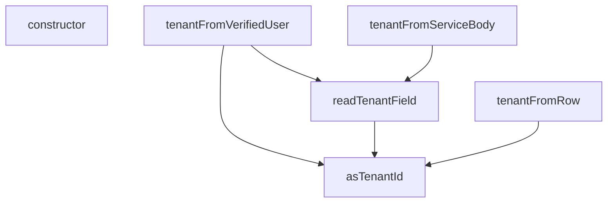

## NODE ID STANDARD

  file: supabase\functions\_shared\tenant.ts
  function: supabase\functions\_shared\tenant.ts::asTenantId
  function: supabase\functions\_shared\tenant.ts::readTenantField
  function: supabase\functions\_shared\tenant.ts::tenantFromVerifiedUser
  function: supabase\functions\_shared\tenant.ts::tenantFromServiceBody
  function: supabase\functions\_shared\tenant.ts::tenantFromRow
  class: supabase\functions\_shared\tenant.ts::TenantMismatchError

---

## DISA AKTARILANLAR (EXPORTS)
  export: TenantDecision
  export: TenantMismatchError
  export: TenantProfileRow
  export: TenantSource
  export: VerifiedUser
  export: asTenantId
  export: readTenantField
  export: tenantFromRow
  export: tenantFromServiceBody
  export: tenantFromVerifiedUser

---

## BILEŞIM (CONTAINS)
  contains: string
  contains: string | null

---
# FILE: supabase\functions\_shared\tenant_config.md

---
domain: general
source_type: doc
namespace_type: module
source_path: C:\Users\alize\venthub-wt-hotfix\supabase\functions\_shared\tenant_config.ts
skeleton_hash: 865a8d4b605a94c6
entity_hashes:
  func:getTenantBranding: 6ae9f5f873d6872c
  overview: 727819c400487687
generated_at: 2026-08-15T09:05:28Z
---

## Genel Bakış
Bu modül, Supabase edge fonksiyonları arasında kiracıya (tenant) özel yapılandırma bilgilerini sağlamak için paylaşımlı yardımcı fonksiyonlar sunar. Temel olarak, HTTP isteklerinden kiracı tanımlayıcısının çıkarılması ve bu tanımlayıcıya karşılık gelen kiracının marka bilgilerinin merkezi olarak getirilmesi işlemlerini yönetir.

## Fonksiyon Grupları
### Kiracı Kimlik Yönetimi
HTTP isteklerinden kiracı tanımlayıcısını analiz edip standart bir biçime dönüştürerek, sistem genelinde kullanılabilir hale getirir.
- resolveTenantId

### Kiracı Marka Bilgisi Sağlama
Belirli bir kiracı tanımlayıcısına ait marka ve görsel yapılandırma bilgilerini asenkron olarak getirerek, kiracıya özel arayüzlerin dinamik olarak oluşturulmasını destekler.
- getTenantBranding

---

## AXIOMS – Mimari Varsayımlar

Bu modül için **fonksiyon gövdesi (function body) paylaşılmamıştır**. Axiom'lar sadece fonksiyon gövdesinden üretilebilir.

---

## FONKSİYON DETAYLARI

### getTenantBranding
**Ne yapar**: Belirli bir kiracıya (tenant) ait marka yapılandırmasını (branding) asenkron olarak getirir. İşlem, veritabanı yapılandırması, ortam değişkenleri ve sabit kodlanmış varsayılan değerler之间ında kademeli bir fallback mekanizması uygular.

**Nasıl yapar**: Fonksiyon, Supabase service role anahtarı ile bir istemci oluşturarak veritabanından kiracının `config` alanını çeker. Elde edilen veritabanı yapılandırması (hem `snake_case` hem de `camelCase` anahtarlarla kontrol edilir) önceliklidir. Eğer veritabanında değer bulunamazsa, sırasıyla Deno ortam değişkenleri (`BRAND_NAME`, `BRAND_LOGO_URL`, vb.) ve en son olarak sabit kodlanmış VentHub varsayılan değerleri kullanılır. Bu fallback zinciri, her bir marka özelliği için ayrı ayrı uygulanır.

**Parametreler**:
- `tenantId`: `string` — Marka yapılandırması getirilecek kiracının benzersiz tanımlayıcısı.

**Dönüş**: `Promise<TenantBranding>` — Kiracının resolved edilmiş marka yapılandırmasını içeren bir nesne döndürür. `TenantBranding` tipinin şu özelliklere sahip olduğu varsayılır: `brandName: string`, `brandLogoUrl: string`, `brandPrimaryColor: string`, `emailFrom: string`.

---

## İTHALATLAR (IMPORTS)
- import: https://esm.sh/@supabase/supabase-js@2.45.4::createClient

---

## INTERFACES

### TenantBranding
- `brandName: string`
- `brandLogoUrl: string`
- `brandPrimaryColor: string`
- `emailFrom: string`

---

## AST POINTERS

### [N1_NASIL] AST Pointer: _shared/tenant_config.ts::getTenantBranding
- **params**: (tenantId: string)
- **ic_degiskenler**:
    - `supabaseUrl` — Supabase proje URL'si, environment variable'dan alınır, Supabase istemcisi oluşturmada kullanılır
    - `serviceKey` — Supabase servis rolü anahtarı, environment variable'dan alınır, yetkilendirme için kullanılır
    - `dbConfig` — Tenant yapılandırması için boş bir nesne olarak başlatılır, veritabanından yüklenen config verisi burada saklanır
    - `supabase` — createClient fonksiyonu ile oluşturulan Supabase istemcisi, veritabanı sorguları yapmak için kullanılır
    - `data` — Supabase sorgusundan dönen veri, tenant'ın config alanını içerir (başarılı olursa)
    - `error` — Supabase sorgusundan dönen hata nesnesi (başarısız olursa)
    - `brandName` — Marka adı, dbConfig'den veya environment variable'dan çözümlenir, fallback olarak 'VentHub' kullanılır
    - `brandLogoUrl` — Marka logo URL'si, dbConfig'den veya environment variable'dan çözümlenir, varsayılan VentHub logosu kullanılır
    - `brandPrimaryColor` — Marka birincil rengi, dbConfig'den veya environment variable'dan çözümlenir, varsayılan '#2563eb' kullanılır
    - `emailFrom` — E-posta gönderen adresi, dbConfig'den veya environment variable'dan çözümlenir, varsayılan VentHub adresi kullanılır
- **Dönüş**: TenantBranding nesnesi (brandName, brandLogoUrl, brandPrimaryColor, emailFrom alanlarını içerir)

---

## NODE ID STANDARD

  file: supabase\functions\_shared\tenant_config.ts
  function: supabase\functions\_shared\tenant_config.ts::getTenantBranding

---

## DISA AKTARILANLAR (EXPORTS)
  export: TenantBranding
  export: getTenantBranding