# SUPABASE FUNCTIONS MASTER

---
project_name: venthub-hvac
compiled_at: 2026-08-28T08:10:51.120417+00:00
total_compiled_files: 39
source_commit: baad363a
source: supabase/functions
---


---
# FILE: supabase\functions\admin-create-coupon\index.md

---
domain: general
source_type: doc
namespace_type: module
source_path: C:\tmp\wt-supurme\supabase\functions\admin-create-coupon\index.ts
skeleton_hash: 5b8fe91e8f0455cf
entity_hashes:
  func:admin-create-coupon_handler: 72913923d4da4715
  overview: cd57faa16c1d1db9
generated_at: 2026-08-25T07:32:52Z
---

## Genel Bakış

Bu modül, Supabase Edge Function altyapısı üzerinde çalışan bir yönetici kupon oluşturma uç noktasıdır. Gelen HTTP isteklerini `Deno.serve` aracılığıyla dinler ve yönetici yetkisine sahip kullanıcıların yeni kupon kayıtları oluşturmasına olanak tanır. Modül tek bir işlevden oluşur ve bağımsız bir servis olarak çalışır.

## Fonksiyon Grupları

### Ana İşleyici

Gelen HTTP isteğini karşılayıp yönetici kuponu oluşturma işlemini yürüten tek sorumlu işlevdir. Supabase'in `serve` dekoratörü ile dış dünyaya açılan bu fonksiyon, istek gövdesini çözümleyip kupon verisini işler ve sonuç olarak bir HTTP yanıtı döndürür.

- admin-create-coupon_handler

---

## AXIOMS – Mimari Varsayımlar

Bu modül için özel aksiyom tanımlanmamıştır.

**Gerekçe:** Fonksiyon gövdesi sağlanmadığından, yalnızca `admin-create-coupon_handler(req: Request) -> Response` imzası mevcuttur. Aksiyomlar yalnızca fonksiyon gövdesinden üretilebilir; gövde verilmediği için modüle özgü bir varsayımda bulunulamaz.

---

## FONKSİYON DETAYLARI

### admin-create-coupon_handler
**Ne yapar**: Fonksiyonun görevi belirtilmemiştir. Docstring boş olduğundan ne iş yaptığı bilinmiyor.

**Nasıl yapar**: `@serve(Deno.serve)` dekoratörü ile tanımlanmıştır. Bu dekoratör, fonksiyonu Deno'nun yerleşik HTTP sunucusuna bağlayarak bir Supabase Edge Function olarak çalışmasını sağlar. Fonksiyon asenkron (`async`) olarak tanımlanmıştır. İç mantığı hakkında docstring veya kaynak kod bilgisi bulunmadığından detay bilinmiyor.

**Parametreler**:
- req: Request — Gelen HTTP isteğini temsil eden nesne. Detaylı alan bilgisi verilmemiştir.

**Dönüş**: Response — HTTP yanıtını temsil eden nesne döndürür. Yanıtın içeriği ve yapısı hakkında bilgi verilmemiştir.

---

## İTHALATLAR (IMPORTS)
- import: ../_shared/cors.ts::getCorsHeaders
- import: ../_shared/tenant.ts::TenantMismatchError
- import: ../_shared/tenant.ts::tenantFromVerifiedUser
- import: https://esm.sh/@supabase/supabase-js@2.45.4::createClient

---

## AST POINTERS

### [N1_NASIL] AST Pointer: supabase/functions/admin-create-coupon/index.ts::admin-create-coupon_handler
- **params**: `req: Request` — gelen HTTP isteği
- **ic_degiskenler**:
  - `corsHeaders` — `getCorsHeaders(req)` çağrısından dönen CORS başlıkları; tüm yanıtlarda kullanılır
  - `SUPABASE_URL` — `Deno.env.get('SUPABASE_URL')` ile alınan ortam değişkeni; Supabase proje URL'si
  - `SUPABASE_ANON_KEY` — `Deno.env.get('SUPABASE_ANON_KEY')` ile alınan ortam değişkeni; anonim erişim anahtarı
  - `SUPABASE_SERVICE_ROLE_KEY` — `Deno.env.get('SUPABASE_SERVICE_ROLE_KEY')` ile alınan ortam değişkeni; yönetici erişim anahtarı
  - `authHeader` — `req.headers.get('Authorization')` ile alınan yetkilendirme başlığı; yoksa 401 döner
  - `supabaseUser` — `createClient(SUPABASE_URL, SUPABASE_ANON_KEY, ...)` ile oluşturulan Supabase istemcisi; kullanıcı oturumunu doğrulamak için `authHeader` başlığıyla yapılandırılır
  - `supabaseAdmin` — `createClient(SUPABASE_URL, SUPABASE_SERVICE_ROLE_KEY)` ile oluşturulan Supabase istemcisi; yönetici ayrıcalıklarıyla veritabanı işlemleri yapar
  - `userRes` — `supabaseUser.auth.getUser(authHeader.replace(...))` sonucundaki `data`; doğrulanmış kullanıcı bilgisini içerir
  - `userErr` — `supabaseUser.auth.getUser(...)` sonucundaki hata; varsa 401 döner
  - `userId` — `userRes.user.id`; doğrulanmış kullanıcının benzersiz kimliği
  - `profile` — `supabaseAdmin.from('user_profiles').select('role, tenant_id').eq('id', userId).maybeSingle()` sonucundaki `data`; kullanıcının rolü ve kiracı kimliğini içerir
  - `profErr` — profil sorgusu hatası; varsa 500 döner
  - `userRole` — `profile?.role` değeri, string olarak atanır; yoksa `'user'` varsayılır. `['admin', 'super_admin']` içinde değilse 403 döner
  - `tenantId` — `tenantFromVerifiedUser(...)` fonksiyonundan dönen `tenantId`; doğrulanmış kullanıcı ve profil bilgisinden çıkarılan kiracı kimliği. `TenantMismatchError` yakalanırsa 403 döner
  - `tenantErr` — `tenantFromVerifiedUser(...)` çağrısında oluşan hata; `TenantMismatchError` türünde ise 403, diğer durumlarda yeniden fırlatılır
  - `body` — `req.json().catch(() => ({}))` ile parse edilen istek gövdesi; `CouponBody` arayüzüne uygun
  - `code` — `String(body.code || '').trim()` ile elde edilen kupon kodu; 3–50 karakter arası olmalı
  - `type` — `String(body.type || '')` ile elde edilen kupon tipi; `'percent'` veya `'fixed'` olmalı
  - `value` — `Number(body.value)` ile elde edilen kupon değeri; sıfırdan büyük olmalı
  - `starts_at` — `body.starts_at` varsa `String(body.starts_at)`, yoksa `null`; kupon geçerlilik başlangıcı
  - `ends_at` — `body.ends_at` varsa `String(body.ends_at)`, yoksa `null`; kupon geçerlilik bitişi
  - `is_active` — `Boolean(body.active ?? true)` ile elde edilen kupon aktiflik durumu
  - `usage_limit` — kullanım limiti; `body.usage_limit` null/undefined/boş ise `null`, aksi halde `Number(body.usage_limit)` sonucu. Sonuç sonlu değilse veya 1'den küçükse `null` atanır
  - `ul` — `Number(body.usage_limit)` sonucu; geçerlilik kontrolünde kullanılır
  - `errs` — validasyon hatalarını toplayan `string[]` dizi; boş değilse 400 döner
  - `payload` — veritabanına eklenecek kupon kaydı objesi; `code`, `discount_type`, `discount_value`, `valid_from`, `valid_until`, `is_active`, `usage_limit`, `used_count` (0), `created_by` (userId), `tenant_id` alanlarını içerir
  - `data` — `supabaseAdmin.from('coupons').insert(payload).select(...).single()` sonucundaki `data`; eklenen kuponun seçili alanlarını içerir
  - `insErr` — insert işlemi hatası; varsa 400 döner
  - `_e` — `catch` bloğundaki yakalanan hata; `Error` türünde ise `message`, aksi halde `String(_e)` ile mesaj çıkarılır
- **Dönüş**: `Response` — duruma göre: 200 (başarılı kupon oluşturma, `data` JSON), 204 (OPTIONS), 400 (validasyon/insert hatası), 401 (yetkisiz), 403 (yasak), 405 (yanlış metod), 500 (sunucu/ortam hatası)

---

## NODE ID STANDARD

  file: index.ts
  function: index.ts::admin-create-coupon_handler

---

## DISA AKTARILANLAR (EXPORTS)
  export: admin-create-coupon_handler

---
# FILE: supabase\functions\admin-iyzico-reconcile\index.md

---
domain: general
source_type: doc
namespace_type: module
source_path: C:\tmp\wt-supurme\supabase\functions\admin-iyzico-reconcile\index.ts
skeleton_hash: a9fe4c7afba6313c
entity_hashes:
  func:admin-iyzico-reconcile_handler: e8970eccf3f1fb90
  overview: b0badc73158954b7
generated_at: 2026-08-25T07:33:07Z
---

## Genel Bakış

Bu modül, Supabase Edge Function olarak çalışan bir admin mutabakat (reconciliation) servisidir. iyzico ödeme sağlayıcısı ile sistem arasındaki işlem kayıtlarını karşılaştırarak uyumsuzlukları tespit etme ve düzeltme amacıyla kullanılır. Modül, gelen HTTP isteklerini tek bir handler üzerinden işler.

## Fonksiyon Grupları

### Ana Handler

Gelen HTTP isteklerini karşılayan ve iyzico mutabakat sürecini tetikleyen tek giriş noktasıdır. Supabase'in `serve` dekoratörü ile tanımlanmış olup, istek parametrelerini alıp uygun mutabakat işlemlerini yürütür ve sonuç olarak bir Response döndürür.

- admin-iyzico-reconcile_handler

### Dış Bağımlılıklar

Modül, Supabase Edge Function altyapısına (`Deno.serve` ve `@serve` dekoratörü) bağlıdır. iyzico API'si ile iletişim kurması beklenmektedir; ancak kaynak kodda bu iletişimi sağlayan yardımcı fonksiyon veya modül ayrıntıları verilmemiştir.

---

## AXIOMS – Mimari Varsayımlar

Bu modül için özel aksiyom tanımlanmamıştır.

**Gerekçe:** Fonksiyon gövdesi verilmediğinden, modülün doğru çalışması için hangi koşulların (örneğin harici API erişimi, veritabanı bağlantısı, yetkilendirme mekanizması, eşik değerleri vb.) gerektiğini belirleyecek kaynak bilgi bulunmamaktadır. Yalnızca fonksiyon imzası (`req` alır, `Response` döndürür) ve çalıştırma ortamı (`@serve(Deno.serve)`) bilinmektedir; bunlar genel çerçeve varsayımlarıdır, modüle özgü aksiyom değildir.

---

## FONKSİYON DETAYLARI

### admin-iyzico-reconcile_handler
**Ne yapar**: iyzico ödeme sistemi ile mutabakat (reconciliation) işlemini gerçekleştiren bir HTTP sunucu fonksiyonudur. Supabase Edge Function ortamında çalışır ve gelen HTTP isteklerini işleyerek iyzico mutabakat sürecini yönetir.

**Nasıl yapar**: `@serve(Deno.serve)` dekoratörü ile Dono runtime'ında bir HTTP handler olarak kaydedilir. Bu dekoratör, fonksiyonun dışarıdan gelen HTTP isteklerini dinlemesini ve yanıt üretmesini sağlar. Fonksiyon `async` olarak tanımlanmıştır, bu sayede asenkron işlemler (veritabanı sorguları, harici API çağrıları vb.) gerçekleştirilebilir. Fonksiyonun iç mantığı hakkında verilen kaynakta detaylı bilgi bulunmamaktadır.

**Parametreler**:
- req: Request — Gelen HTTP isteğini temsil eder. İstek gövdesi, başlıkları ve diğer HTTP verilerini içerir.

**Dönüş**: Response — Fonksiyon, HTTP yanıt nesnesi döndürür. Yanıt durum kodu, başlıklar ve isteğe bağlı yanıt gövdesi içerir.

---

## İTHALATLAR (IMPORTS)
- import: ../_shared/cors.ts::getCorsHeaders
- import: https://esm.sh/@supabase/supabase-js@2.45.4::createClient

---

## AST POINTERS

### [N1_NASIL] AST Pointer: supabase/functions/admin-iyzico-reconcile/index.ts::admin-iyzico-reconcile_handler
- **params**: `req` — gelen HTTP isteği nesnesi
- **ic_degiskenler**:
  - `corsHeaders` — `getCorsHeaders(req)` çağrısından dönen CORS başlık nesnesi
  - `cors` — `corsHeaders` değişkeninin kısa alias'ı; tüm yanıt başlıklarında kullanılır
  - `supabaseUrl` — `Deno.env.get('SUPABASE_URL')` ile alınan Supabase proje URL'i; ortam değişkeni yoksa CONFIG_MISSING hatası döner
  - `serviceRoleKey` — `Deno.env.get('SUPABASE_SERVICE_ROLE_KEY')` ile alınan servis rol anahtarı; RPC ve rol kontrolü fetch'lerinde Authorization başlığında kullanılır
  - `anonKey` — `Deno.env.get('SUPABASE_ANON_KEY')` ile alınan anonim anahtar; `authClient` oluşturmak için kullanılır
  - `authHeader` — `req.headers.get('Authorization')` ile alınan yetkilendirme başlığı; yoksa 401 döner
  - `authClient` — `createClient(supabaseUrl, anonKey, ...)` ile oluşturulan Supabase istemcisi; `authHeader` global header olarak eklenir, kullanıcı doğrulaması için kullanılır
  - `user` — `authClient.auth.getUser(...)` sonucu destructuring ile alınan kullanıcı nesnesi; `user.id` rol kontrolünde kullanılır
  - `authErr` — `authClient.auth.getUser(...)` sonucu destructuring ile alınan hata; varsa veya `user` yoksa 401 döner
  - `roleCheck` — `fetch` ile `${supabaseUrl}/rest/v1/user_profiles?id=eq.${user.id}&select=role` endpoint'ine yapılan HTTP yanıtı; kullanıcının rolünü doğrulamak için kullanılır
  - `arr` — `roleCheck.json().catch(() => [])` sonucu dönen dizi; `.catch` ile JSON parse hatasında boş dizi döner
  - `role` — `arr[0]?.role` ile alınan kullanıcı rolü string'i; `'admin'` veya `'super_admin'` değilse 403 döner
  - `id` — sipariş filtreleme için kullanılan ID; POST isteğinde `body?.id`, diğer durumlarda `url.searchParams.get('id')` ile alınır; başlangıçta `null`
  - `conv` — sipariş filtreleme için kullanılan conversation ID; POST isteğinde `body?.conv`, diğer durumlarda `url.searchParams.get('conv')` ile alınır; başlangıçta `null`
  - `body` — POST isteğinde `req.json().catch(() => null)` ile parse edilen istek gövdesi; `id` ve `conv` değerleri buradan çıkarılır
  - `url` — `new URL(req.url)` ile oluşturulan URL nesnesi; GET isteğinde query parametrelerini (`id`, `conv`, `limit`) okumak için kullanılır
  - `l` — `url.searchParams.get('limit')` ile alınan limit string'i; varsa `parseInt` ile sayıya dönüştürülür
  - `limit` — sipariş listeleme limiti; varsayılan `10`, `Math.max(1, Math.min(100, ...))` ile 1-100 aralığına kısıtlanır
  - `rpcListUrl` — `${supabaseUrl}/rest/v1/rpc/fn_admin_get_orders` RPC endpoint URL'i
  - `listBody` — RPC'ye POST ile gönderilen istek gövdesi; `{ p_id, p_conv, p_limit, p_status }` alanlarını içerir. `id` ve `conv` yoksa `p_status = 'pending'`, varsa `p_status = null` atanır
  - `listResp` — `fetch(rpcListUrl, ...)` ile yapılan RPC yanıt nesnesi; `serviceRoleKey` ile yetkilendirilir
  - `text` — `listResp.text().catch(() => '')` ile alınan hata metni; RPC başarısız olduğunda yanıt gövdesinde döndürülür
  - `orders` — `listResp.json().catch(() => [])` ile alınan sipariş dizisi; boş veya dizi değilse "no orders found" döner
  - `fnHost` — IIFE ile hesaplanan Supabase Functions host URL'i; `supabaseUrl`'den host çıkarılarak `https://{ref}.functions.supabase.co` formatında oluşturulur, parse hatasında boş string döner
  - `results` — `Array<Record<string, unknown>>` tipinde sonuç dizisi; her sipariş için `{ id, conversation_id, status/skipped/error, ... }` nesneleri eklenir
  - `o` — `orders` dizisi üzerindeki `for...of` döngüsündeki her bir sipariş nesnesi
  - `token` — `o?.payment_token || null` ile alınan ödeme token'ı; yoksa sipariş `skipped:'no_token'` ile atlanır
  - `cbUrl` — `${fnHost}/iyzico-callback` callback fonksiyon URL'i
  - `cbResp` — `fetch(cbUrl, ...)` ile callback fonksiyonuna yapılan HTTP yanıtı; `token`, `conversationId`, `orderId` gönderilir
  - `cbJson` — `cbResp.json().catch(() => ({}))` ile alınan callback JSON yanıtı
  - `st` — `cbJson?.status || 'pending'` ile alınan ödeme durumu; sonuç dizisine `from:'callback'` ile eklenir
  - `e` — `catch` bloğundaki hata nesnesi; `unknown` tipindedir
  - `msg` — `e instanceof Error ? e.message : String(e ?? '')` ile elde edilen hata mesajı string'i; hem üst `catch` bloğunda hem de döngü içi `catch` bloğunda kullanılır
- **Dönüş**: `Response` nesnesi — tüm durumlarda JSON gövdeli HTTP yanıtı döner (200, 401, 403, 500)

---

## NODE ID STANDARD

  file: index.ts
  function: index.ts::admin-iyzico-reconcile_handler

---

## DISA AKTARILANLAR (EXPORTS)
  export: admin-iyzico-reconcile_handler

---
# FILE: supabase\functions\admin-order-inspect\index.md

---
domain: general
source_type: doc
namespace_type: module
source_path: C:\tmp\wt-supurme\supabase\functions\admin-order-inspect\index.ts
skeleton_hash: e1c7f65b55cccdfb
entity_hashes:
  func:admin-order-inspect_handler: 1ddac70ce14150b4
  overview: a75dc03846842f5a
generated_at: 2026-08-25T07:33:00Z
---

## Genel Bakış

Bu modül, Supabase Edge Function altyapısı üzerinde çalışan bir HTTP handler içerir. `@serve(Deno.serve)` decorator'ı ile işaretlenmiş tek bir asenkron fonksiyon aracılığıyla gelen HTTP isteklerini işler ve yanıt üretir. Modülün adı, admin kullanıcılarına yönelik sipariş inceleme amaçlı bir uç nokta olduğunu gösterir.

## Fonksiyon Grupları

### Ana HTTP Handler
Gelen HTTP isteklerini karşılayan ve yanıt döndüren tek sorumlu fonksiyon. Supabase'in sunucu tarafı fonksiyon altyapısı (Deno runtime) ile entegre çalışarak istek-yanıt döngüsünü yönetir.
- admin-order-inspect_handler

## Notlar

- Modülde yalnızca tek bir fonksiyon bulunduğu için fonksiyonlar arası çağrı ilişkisi bulunmamaktadır.
- Dış bağımlılıklar ve iç modül yapıları kaynak kodda belirtilmemiştir; bu nedenle bilinmemektedir.

---

## AXIOMS – Mimari Varsayımlar

Bu modül için özel aksiyom tanımlanmamıştır.

**Gerekçe:** Fonksiyon gövdesi verilmediğinden, modülün doğru çalışması için gerekli koşullar tespit edilememektedir. Yalnızca fonksiyon imzası (`admin-order-inspect_handler`) mevcut olup, bu imza yalnızca bir `Request` alıp `Response` döndüren genel bir Supabase Edge Function yapısı göstermektedir. Modüle özgü aksiyom üretilebilmesi için fonksiyon gövdesinin incelenmesi gerekmektedir.

---

## FONKSİYON DETAYLARI

### admin-order-inspect_handler
**Ne yapar**: Supabase Edge Function olarak çalışan bir HTTP istek işleyicisidir. Fonksiyon adından yola çıkarak sipariş inceleme/denetleme işlemi gerçekleştirdiği anlaşılmaktadır; ancak docstring boş olduğu için kesin görev tanımı bilinmemektedir.

**Nasıl yapar**: `@serve(Deno.serve)` dekoratörü ile donatılmıştır. Bu dekoratör, fonksiyonun Supabase Edge Functions altyapısı üzerinde bir HTTP uç noktası olarak sunulmasını sağlar; `Deno.serve` kullanarak gelen HTTP isteklerini dinler ve bu fonksiyona yönlendirir. Fonksiyon `async` olarak tanımlanmıştır, bu da asenkron işlemlere (veritabanı sorguları, harici API çağrıları vb.) izin verdiği anlamına gelir. Ancak fonksiyonun iç mantığı hakkında verilen kaynakta herhangi bir bilgi bulunmamaktadır.

**Parametreler**:
- `req`: `Request` — Gelen HTTP isteğini temsil eden nesne. İstek gövdesi, başlıkları, URL bilgisi ve HTTP metodu gibi bilgileri içerir.

**Dönüş**: `Response` — HTTP yanıtını temsil eden nesne. Durum kodu, yanıt başlıkları ve yanıt gövdesi gibi bilgileri içerir.

---

## İTHALATLAR (IMPORTS)
- import: ../_shared/cors.ts::getCorsHeaders
- import: https://esm.sh/@supabase/supabase-js@2.45.4::createClient

---

## AST POINTERS

### [N1_NASIL] AST Pointer: supabase/functions/admin-order-inspect/index.ts::admin-order-inspect_handler
- **params**:
  - `req` — gelen HTTP isteği (Request nesnesi)
- **ic_degiskenler**:
  - `corsHeaders` — `getCorsHeaders(req)` çağrısından dönen CORS başlık nesnesi; OPTIONS ve tüm yanıtlarda kullanılır
  - `cors` — `corsHeaders` değişkeninin kısaltması; tüm Response nesnelerinin headers alanına aktarılır
  - `supabaseUrl` — `Deno.env.get('SUPABASE_URL')` ile okunan ortam değişkeni; Supabase proje URL'si
  - `serviceRoleKey` — `Deno.env.get('SUPABASE_SERVICE_ROLE_KEY')` ile okunan ortam değişkeni; yönetici rol anahtarı
  - `anonKey` — `Deno.env.get('SUPABASE_ANON_KEY')` ile okunan ortam değişkeni; anonim erişim anahtarı
  - `authHeader` — `req.headers.get('Authorization')` ile alınan yetkilendirme başlık değeri; yoksa 401 döner
  - `supabaseUser` — `createClient(supabaseUrl, anonKey, ...)` ile oluşturulan Supabase istemcisi; kullanıcı oturumunu doğrulamak için `authHeader` global header olarak eklenir
  - `supabaseAdmin` — `createClient(supabaseUrl, serviceRoleKey)` ile oluşturulan Supabase istemcisi; yönetici yetkisiyle veritabanı sorguları yapar
  - `userRes` — `supabaseUser.auth.getUser(...)` sonucundaki `data` alanı; `userRes.user` ile kullanıcı nesnesine erişilir
  - `userErr` — `supabaseUser.auth.getUser(...)` sonucundaki `error` alanı; hata varsa 401 döner
  - `profile` — `supabaseAdmin.from('user_profiles').select('role').eq('id', userRes.user.id).maybeSingle()` sorgusundan dönen `data`; kullanıcının profil kaydı
  - `profErr` — profil sorgusundaki `error` alanı; hata varsa 403 döner
  - `userRole` — `profile?.role` değeri `string | undefined` olarak atanır; `['admin', 'super_admin']` dizisinde yoksa 403 döner
  - `id` — URL query parametresi `?id=` ile gelen sipariş kimliği; yoksa POST/PUT body'deki `body?.id`'den alınır
  - `conv` — URL query parametresi `?conv=` ile gelen konuşma kimliği; yoksa POST/PUT body'deki `body?.conv`'den alınır
  - `url` — `new URL(req.url)` ile oluşturulan URL nesnesi; `searchParams.get()` ile `id` ve `conv` okunur
  - `body` — POST veya PUT isteklerinde `req.json().catch(()=>null)` ile parse edilen istek gövdesi; `body?.id` ve `body?.conv` alanlarından değer alınır
  - `rpcUrl` — `` `${supabaseUrl}/rest/v1/rpc/fn_admin_get_orders` `` ile oluşturulan Supabase RPC endpoint URL'si
  - `body` (rpc) — RPC fonksiyonuna gönderilen parametre objesi: `{ p_id: id, p_conv: conv, p_status: null, p_limit: 1 }`
  - `resp` — `fetch(rpcUrl, ...)` ile yapılan POST isteğinin Response nesnesi; `resp.ok` durum kontrolü yapılır
  - `_text` — RPC yanıt başarısızsa `resp.text().catch(()=>'' )` ile okunan hata gövdesi; hata yanıtında `body` alanına atanır
  - `json` — `resp.json().catch(()=>[])` ile parse edilen RPC yanıt verisi; dizi olarak beklenir
  - `row` — `Array.isArray(json) ? json[0] : null` ile RPC yanıt dizisinin ilk elemanı; sipariş kaydı
  - `_e` — `catch` bloğundaki yakalanan hata nesnesi (`unknown` tipinde); `console.error` ile loglanır
  - `msg` — `_e instanceof Error ? _e.message : 'unknown'` ile çıkarılan hata mesajı; 500 yanıtında döndürülür
- **Dönüş**: `Response` nesnesi — duruma göre: OPTIONS ise 200 (boş gövde), konfigürasyon eksikse 500 (`CONFIG_MISSING`), yetkilendirme yoksa 401 (`unauthenticated`), yetki yoksa 401 (`unauthorized`) veya 403 (`forbidden`), parametre eksikse 400 (`MISSING_ID_OR_CONV`), RPC başarısızsa 200 (`ok:false` ile hata detayı), başarılıysa 200 (`ok:true` ile `row` verisi), genel hata durumunda 500 (hata mesajı ile)

---

## NODE ID STANDARD

  file: index.ts
  function: index.ts::admin-order-inspect_handler

---

## DISA AKTARILANLAR (EXPORTS)
  export: admin-order-inspect_handler

---
# FILE: supabase\functions\admin-orders-latest\index.md

---
domain: general
source_type: doc
namespace_type: module
source_path: C:\Users\alize\venthub-wt-hotfix\supabase\functions\admin-orders-latest\index.ts
skeleton_hash: c61d40cd807e5dcd
entity_hashes:
  func:admin-orders-latest_handler: 9cf0e6c826d5f20e
  overview: 3bb02a7476b8fc62
generated_at: 2026-08-14T22:02:42Z
---

## Genel Bakış
Bu modül, yönetici paneli için son siparişleri getiren bir Supabase Edge Function olarak tasarlanmıştır. Tek bir HTTP endpoint sunarak, yöneticilerin en güncel sipariş verilerine hızlıca erişmesini sağlar.

## Fonksiyon Grupları
### Sipariş Listeleme
Modülün tek ve temel sorumluluğu, yöneticilerin görüntüleyebileceği en güncel sipariş listesini veritabanından çekip HTTP yanıtı olarak sunmaktır.
- admin-orders-latest_handler

---

## AXIOMS – Mimari Varsayımlar
Bu modül, admin-orders-latest_handler fonksiyonunun doğru çalışması için aşağıdaki zorunlu koşulları gerektirir.

[Aksiyom 1]: Eğer `req` parametresi sağlanmazsa veya geçerli bir HTTP isteği nesnesi (Request) değilse, fonksiyonun çalışması tanımsızdır.

[Aksiyom 2]: Eğer Supabase Edge Function runtime ortamı (Deno) mevcut değilse, fonksiyon hiç başlayamaz.

[Aksiyom 3]: Eğer veritabanı bağlantısı kesik veya erişilemez ise, fonksiyonun siparişleri getirme işlemi başarısız olur.

[Aksiyom 4]: Eğer veritabanında siparişlerle ilgili tablo veya view mevcut değilse, sorgu sonucu boş döner veya hata oluşur.

---

## FONKSİYON DETAYLARI

### admin-orders-latest_handler
**Ne yapar**: Bu fonksiyon, HTTP isteklerini (request) alarak en güncel sipariş verilerini işleyen bir API endpoint'ini temsil eder. Genellikle bir web framework veya APIateway tarafından çağrılarak istekteki verileri işler ve uygun bir yanıt (response) döndürür.
**Nasıl yapar**: Fonksiyon, bir `Request` nesnesi alır ve bu isteği işleyerek sonucu bir `Response` nesnesi olarak paketler. İç mantığı, isteğin içeriğine göre sipariş veritabanını sorgulamak, filtrelemek ve en güncel kayıtları seçmek üzerinedir. Ancak verilen bilgiler dahilinde fonksiyonun tam iç işleyiş (mantığı) ayrıntılı olarak belgelenememektedir.
**Parametreler**:
- `req`: Request — İşlenecek HTTP istek nesnesi. İstek gövdesi, başlıkları ve URL parametreleri gibi verileri içerir.
**Dönüş**: Response — Fonksiyonun işlenen isteğe karşılık olarak döndürdüğü HTTP yanıt nesnesi. Başarılı durumlarda istenen verileri (sipariş listesi), hata durumunda ise uygun hata kodlarını ve mesajlarını içerir.

---

## İTHALATLAR (IMPORTS)
- import: ../_shared/cors.ts::getCorsHeaders
- import: https://esm.sh/@supabase/supabase-js@2.45.4::createClient

---

## AST POINTERS

### [N1_NASIL] AST Pointer: `supabase/functions/admin-orders-latest/index.ts::admin-orders-latest_handler`
- **params**: `(req)` — gelen HTTP isteği (Deno Request nesnesi)
- **ic_degiskenler**:
  - `corsHeaders` — `getCorsHeaders(req)` ile üretilen CORS başlık nesnesi
  - `cors` — `corsHeaders`'a eşitlenen kısaltma; ardından statik CORS başlıklarıyla yeniden tanımlanır (`Access-Control-Allow-Headers`, `Access-Control-Allow-Methods`)
  - `origin` — `req.headers.get('origin')` ile alınan istemci origin değeri; boşsa boş string
  - `allowed` — `Deno.env.get('ALLOWED_ORIGINS')` değerinin virgülle ayırılıp trim edilip filtrelenmiş hali; izin verilen origin listesi
  - `okOrigin` — `allowed` boşsa true, doluysa `origin`'in `allowed` listesinde olup olmadığı boolean kontrolü
  - `requestId` — `crypto.randomUUID()` ile üretilen benzersiz istek kimliği; `crypto.randomUUID` kullanılamazsa `Date.now()` string'e çevrilir
  - `supabaseUrl` — `Deno.env.get('SUPABASE_URL')` ile alınan Supabase proje URL'i
  - `serviceRoleKey` — `Deno.env.get('SUPABASE_SERVICE_ROLE_KEY')` ile alınan service role anahtarı
  - `authHeader` — `req.headers.get('Authorization')` ile alınan yetkilendirme başlığı
  - `anonKey` — `Deno.env.get('SUPABASE_ANON_KEY')` ile alınan anon key
  - `supabaseUser` — `createClient(supabaseUrl, anonKey, { global: { headers: { Authorization: authHeader } } })` ile kullanıcı token'lı Supabase istemcisi
  - `supabaseAdmin` — `createClient(supabaseUrl, serviceRoleKey)` ile admin yetkili Supabase istemcisi
  - `userRes` — `supabaseUser.auth.getUser()` çağrısının `data` sonucu; kimlik doğrulanmış kullanıcı nesnesi
  - `userErr` — `supabaseUser.auth.getUser()` çağrısının `error` sonucu
  - `profile` — `supabaseAdmin.from('user_profiles').select('role').eq('id', userRes.user.id).maybeSingle()` ile çekilen profil kaydı
  - `profErr` — profil sorgusunun `error` sonucu
  - `userRole` — `profile?.role` ile alınan kullanıcının rolü (admin/superadmin kontrolü yapılır)
  - `url` — `new URL(req.url)` ile parse edilmiş istek URL'i
  - `status` — `url.searchParams.get('status')` ile alınan sipariş durumu filtresi; trim edilmiş, boşsa boş string
  - `from` — `url.searchParams.get('from')` ile alınan başlangıç tarihi filtresi; trim edilmiş
  - `to` — `url.searchParams.get('to')` ile alınan bitiş tarihi filtresi; trim edilmiş
  - `q` — `url.searchParams.get('q')` ile alınan arama/sorgu parametresi; trim edilmiş
  - `preset` — `url.searchParams.get('preset')` ile alınan hazır filtre adı; trim edilmiş
  - `limitParam` — `url.searchParams.get('_limit')` değerinin parseInt ile 1-100 aralığına sıkıştırılmış hali; varsayılan 50
  - `pageParam` — `url.searchParams.get('page')` değerinin parseInt ile minimum 1'e sıkıştırılmış hali; varsayılan 1
  - `offset` — `(pageParam - 1) * limitParam` ile hesaplanan sayfalama offset'i
  - `params` — `new URLSearchParams()` ile oluşturulan PostgREST sorgu parametreleri nesnesi; `select`, `order` ve filtreler buna eklenir
  - `isPendingShipments` — `preset === 'pendingShipments'` kontrolü; bekleyen sevkiyat filtresi aktif mi
  - `requestUrl` — `${supabaseUrl}/rest/v1/venthub_orders?${params.toString()}` ile oluşturulan PostgREST API çağrı URL'i
  - `resp` — `fetch(requestUrl, ...)` ile yapılan HTTP isteğinin Response nesnesi; service role key ile yetkilendirilmiş
  - `rows` — `resp.json()` ile parse edilen sipariş satırları dizisi; parse hatasında boş dizi
  - `contentRange` — `resp.headers.get('content-range')` ile alınan içerik aralığı header'ı; yoksa `'0-0/0'`
  - `total` — `contentRange.split('/')[1]` parçasının `Number`'a çevrilmiş hali; toplam kayıt sayısı
- **ic_fonksiyonlar**:
  - `normalizeDateStart(d)` — YYYY-MM-DD formatındaki tarih string'ini ISO gün başlangıcı formatına dönüştürür
  - `normalizeDateEnd(d)` — YYYY-MM-DD formatındaki tarih string'ini ISO gün sonu formatına dönüştürür
- **Dönüş**: `Response` — JSON { total, page, _limit, rows } ile 200; hata durumunda JSON { error } ile 401/403/500

---

## NODE ID STANDARD

  file: supabase\functions\admin-orders-latest\index.ts
  function: supabase\functions\admin-orders-latest\index.ts::admin-orders-latest_handler

---

## DISA AKTARILANLAR (EXPORTS)
  export: admin-orders-latest_handler

---
# FILE: supabase\functions\admin-update-order\index.md

---
domain: general
source_type: doc
namespace_type: module
source_path: C:\Users\alize\venthub-wt-hotfix\supabase\functions\admin-update-order\index.ts
skeleton_hash: 8dabcdea4ab361bb
entity_hashes:
  func:admin-update-order_handler: 401e11b0dc3cc59d
  func:firstProfileRow: 401596132e3baec8
  overview: e4e143931d01e33c
generated_at: 2026-08-15T09:05:02Z
---

## Genel Bakış
Bu modül, Supabase Edge Function olarak deployed bir HTTP API servisidir. Yöneticilerin mevcut siparişleri güncellemek için kullandığı bir uç nokta sağlar; gelen istekleri doğrular, yönetici yetkilendirmesini kontrol eder ve veritabanında ilgili sipariş kaydını günceller.

## Fonksiyon Grupları
### Sipariş Güncelleme İşleyicisi
Modülün ana giriş noktası olarak tüm HTTP istek-yanıt döngüsünü, kimlik doğrulamayı ve iş mantığını yönetir. Gelen isteği alarak yönetici rolünü doğrular, Supabase istemcisi aracılığıyla sipariş güncellemesini gerçekleştirir ve uygun HTTP yanıtını döner.
- admin-update-order_handler

### Yardımcı Veri İşlevleri
Gelen veri setinden belirli alanları (örneğin yönetici rolü ve kiracı kimliği) çıkaran ve işleyici tarafından iç yardımcı olarak kullanılan fonksiyonları barındırır. Bu işlevler, handler içindeki karmaşık mantığı basitleştirmek ve veri dönüşümünü merkezileştirmek için tasarlanmıştır.
- firstProfileRow

---

## AXIOMS – Mimari Varsayımlar

Bu modül için aksiyomlar, fonksiyon gövdesindeki mantıksal akışa dayanarak türetilmiştir.

[Aksiyom 1]: Eğer istek geçerli bir JSON gövdesi içermiyorsa veya gerekli alanlar (order_id, updates) eksikse, istek 400 hata koduyla reddedilir.

[Aksiyom 2]: Eğer istek başlığındaki Authorization token'ı (Bearer) yoksa veya geçerli bir Supabase JWT içermiyorsa, istek 401 Unauthorized ile reddedilir.

[Aksiyom 3]: Eğer JWT'den çıkarılan kullanıcıya ait bir profil kaydı (profiles tablosu) bulunamazsa, istek 403 Forbidden ile reddedilir.

[Aksiyom 4]: Eğer kullanıcının profilindeki `role` alanı `admin` veya `super_admin` değerlerinden birine sahip değilse, istek 403 Forbidden ile reddedilir.

[Aksiyom 5]: Eğer kullanıcının profilindeki `tenant_id` değeri null ise, istek 403 Forbidden ile reddedilir (çünkü çoklu kiracı modelinde hangi kiracıya ait olduğunu bilemez).

[Aksiyom 6]: Eğer güncellenecek sipariş (order_id ile) veritabanında bulunamazsa, istek 404 Not Found ile reddedilir.

[Aksiyom 7]: Eğer güncellemeye çalışılan siparişin `tenant_id` alanı, isteği yapan kullanıcının `tenant_id` alanı ile eşleşmiyorsa, istek 403 Forbidden ile reddedilir (kiracı izolasyonu ihlali).

[Aksiyom 8]: Eğer Supabase veritabanı bağlantısı (URL veya anon key) kurulamazsa veya sorgu sırasında bir veritabanı hatası oluşursa, istek 500 Internal Server Error ile reddedilir.

[Aksiyom 9]: Eğer `firstProfileRow` fonksiyonu beklenmedik bir veri yapısı (null dışı, ancak `role` veya `tenant_id` alanlarını içermeyen bir nesne) döndürürse, bu durum beklenmeyen bir sistem hatası olarak değerlendirilir ve istek 500 ile reddedilir.

---

## FONKSİYON DETAYLARI

### firstProfileRow

**Ne yapar**: PostgREST API yanıtlarından dönen dizilerden ilk profil satırını güvenli bir şekilde çıkarır ve `role` ile `tenant_id` alanlarını içeren tip-güvenli bir nesneye dönüştürür. Bu fonksiyon, `fetch(...).json()` çağrısının tipsiz (any) dönüş değerini runtime seviyesinde doğrulayarak güvenlik sağlar.

**Nasıl yapar**: Fonksiyon, gelen `unknown` türündeki değeri aşamalı olarak doğrular: önce değerin bir dizi olup olmadığını ve boş olmadığını kontrol eder, ardından dizinin ilk elemanının bir nesne olup olmadığını ve `null` olmadığını doğrular. Tüm kontroller geçildikten sonra, `Record<string, unknown>` türüne genişletilen kayıt nesnesinden `role` ve `tenant_id` alanlarını tek tek çıkarır. Her alan için `typeof` kontrolü yapılır; alan mevcut ve `string` tipindeyse değeri korunur, aksi takdirde `null` döner. Bu desen `_shared/caller.ts` modülündeki `toProfileRow` fonksiyonuyla aynı güvenlik yaklaşımını izler — tip ataması yerine runtime doğrulama tercih edilir.

**Parametreler**:
- `value: unknown` — PostgREST veya benzeri bir API'den `fetch().json()` ile alınan, bilinmeyen tipteki ham yanıt verisi. Dizi (array) formatında olması beklenir ve dizinin ilk elemanının `role` ile `tenant_id` alanlarını içermesi gerekir.

**Dönüş**: `{ role: string | null; tenant_id: string | null } | null` — Doğrulama başarılıysa `role` ve `tenant_id` alanlarını içeren bir nesne döner. Her iki alan da opsiyoneldir ve `string` veya `null` olabilir. Gelen değer geçerli bir dizi değilse, dizi boşsa, ilk eleman geçerli bir nesne değilse ya da alanlar bulunamıyorsa `null` döner.

### admin-update-order_handler
**Ne yapar**: Bu fonksiyon, bir HTTP POST isteği alarak, bir siparişin (order) güncellenmesi işlemini tetikleyen bir Supabase Edge Function'ın ana giriş noktasıdır (handler). Genellikle bir yönetici (admin) yetkisiyle çalışması beklenen bu fonksiyon, istek gövdesinden gelen verileri işleyerek ilgili sipariş kaydını veritabanında günceller.

**Nasıl yapar**: Fonksiyon, `@serve(Deno.serve)` dekoratörü ile işaretlenmiştir. Bu dekoratör, fonksiyonu bir Deno HTTP sunucusu işleyicisi (request handler) olarak kaydeder; bu sayede gelen bir HTTP isteği (`Request` nesnesi) bu fonksiyona yönlendirilir. Fonksiyon, asenkron (`async`) olarak çalışır, isteği işler ve bir `Response` nesnesi döndürerek HTTP yanıtını oluşturur.

**Parametreler**:
- `req`: `Request` — Gelen HTTP isteğini temsil eder. Standart web API Request nesnesidir. Genellikle gövdesinde (`req.json()` kullanarak) güncellenecek siparişin ID'si ve yeni değerleri gibi JSON verileri barındırır.

**Dönüş**: `Response` — İşlem sonucunu içeren bir HTTP yanıt nesnesi. Başarılı bir güncelleme sonrası genellikle HTTP 200 OK durum kodu ve güncellenen siparişin verilerini veya bir başarı mesajını JSON formatında gövdesinde barındırır. Bir hata durumunda ise uygun HTTP hata kodları (örn. 400, 403, 500) ve hata açıklamasını içeren bir yanıt döner.

---

## İTHALATLAR (IMPORTS)
- import: ../_shared/cors.ts::getCorsHeaders
- import: ../_shared/tenant.ts::TenantMismatchError
- import: ../_shared/tenant.ts::tenantFromVerifiedUser
- import: https://esm.sh/@supabase/supabase-js@2.45.4::createClient

---

## AST POINTERS

### [N1_NASIL] AST Pointer: `supabase/functions/admin-update-order/index.ts`::firstProfileRow
- **params**: `(value: unknown)`
- **ic_degiskenler**:
  - `first` — `value` indis 0'dan alınan ilk eleman; dizi elemanının referansı
  - `record` — `first`'in `Record<string, unknown>` türüne cast edilmiş hali; `role` ve `tenant_id` alanlarına erişim sağlar
- **Dönüş**: `{ role: string | null; tenant_id: string | null } | null` — dizinin ilk elemanından `role` ve `tenant_id` alanlarını çıkarır; geçersiz veya boş input gelirse `null` döner

---

## NODE ID STANDARD

  file: supabase\functions\admin-update-order\index.ts
  function: supabase\functions\admin-update-order\index.ts::firstProfileRow
  function: supabase\functions\admin-update-order\index.ts::admin-update-order_handler

---

## DISA AKTARILANLAR (EXPORTS)
  export: admin-update-order_handler
  export: firstProfileRow

---
# FILE: supabase\functions\admin-update-shipping\index.md

---
domain: general
source_type: doc
namespace_type: module
source_path: C:\Users\alize\venthub-wt-hotfix\supabase\functions\admin-update-shipping\index.ts
skeleton_hash: 8826e4eb433f0803
entity_hashes:
  func:admin-update-shipping_handler: fab3b88ab551f027
  func:firstProfileRow: a0e6e5d01b903221
  overview: 36b9e64a0a5f328f
generated_at: 2026-08-15T09:03:36Z
---

## Genel Bakış
Bu modül, Supabase Edge Function olarak çalışan bir kargo güncelleme servisidir. Yönetici kullanıcıların siparişlere ait kargo bilgilerini güvenli bir şekilde güncellemesini sağlar. Tek bir HTTP istek işleyicisi üzerinden kimlik doğrulama, yetki kontrolü ve veritabanı güncelleme işlemlerini yönetir.

## Fonksiyon Grupları
### İstek İşleme ve Yanıt Üretme
Gelen HTTP isteklerini alır, yönetici kimliğini doğrular ve yetki kontrolünü gerçekleştirir. İşlem sonucuna göre başarılı veya hatalı bir HTTP yanıtı döndürerek istemciye geri bildirim sağlar.
- admin-update-shipping_handler, firstProfileRow

---

## AXIOMS – Mimari Varsayımlar
- Bu modül davranışsal mantık içermez (salt veri / konfigürasyon / tip tanımı).
- [Aksiyom 1]: Modülün dışa açtığı yapı (anahtar kümesi / şema) bir sözleşmedir; tüketiciler bu sabit yapıya bağlıdır — kırıcı değişiklik tüm tüketicileri etkiler.
- [Aksiyom 2]: Bir öğe ekleme/çıkarma yapısal-uyumlu olmalı; ilgili tipler ve seçiciler aynı commit'te güncel tutulmalıdır.

---

## FONKSİYON DETAYLARI

### firstProfileRow
**Ne yapar**: Bu fonksiyon, PostgREST API'inden dönen ve ham bir JSON verisi olan `unknown` tipindeki bir değeri alır. Fonksiyon, bu değerin bir dizi (array) olup olmadığını ve ilk elemanının geçerli bir profil nesnesi (belirli alanlara sahip bir nesne) olup olmadığını kontrollü bir şekilde doğrular. Doğrulama başarılı ise ilk profil satırından `role` ve `tenant_id` alanlarını çıkararak tip güvenli bir nesne olarak döndürür; aksi takdirde `null` döner.

**Nasıl yapar**: Fonksiyon, gelen `value` parametresi üzerinde bir dizi runtime kontrolü uygular. Önce değerin bir dizi olup olmadığını ve boş olmadığını kontrol eder. Ardından dizinin ilk elemanının bir nesne (`object`) olup olmadığını doğrular. Bu kontrollerden geçerse, ilkel bir `Record<string, unknown>` tipine dönüştürdüğü bu nesnenin `role` ve `tenant_id` alanlarının string tipinde olup olmadığını test eder. Bu alanların mevcut ve doğru tipte olmaları durumunda ilgili değerleri, değilse `null` değerlerini içeren tip güvenli bir nesne oluşturur. Bu desen, tip uydurmaya (`type casting`) dayanmayan, dinamik ve güvenli bir veri çıkarma yöntemi sunar.

**Parametreler**:
- value: unknown — PostgREST dizisi (`fetch().json()` çağrısından dönen) veya herhangi bir veriyi temsil eder. Fonksiyon, bu değerin dizin ilk elemanının `role` ve `tenant_id` alanlarını içermesini bekler.

**Dönüş**: `{ role: string | null; tenant_id: string | null } | null` — Doğrulama başarılı ise, `role` ve `tenant_id` alanlarını (her ikisi de `string` veya `null` olabilir) içeren bir nesne döner. Doğrulama başarısız olursa (gelen değer diz değilse, boş dizi ise veya ilk eleman geçerli bir nesne/yapı değilse) `null` döner.

### admin-update-shipping_handler
**Ne yapar**: Bu fonksiyon, bir HTTP isteği alarak bir yanıt döndüren bir Supabase Edge Function istek işleyicisidir. Fonksiyonun adı, yöneticilerin kargo veya gönderi bilgilerini güncellemek üzere tasarlandığını belirtir.
**Nasıl yapar**: Fonksiyon, gelen HTTP istek nesnesini (req) alır, istek içeriğine göre kargo güncelleme işlemlerini başlatır ve sonuç olarak bir HTTP yanıt nesnesi (Response) oluşturur. İşlem mantığı, istek verilerine dayanarak arka uçta veri tabanı güncellemeleri yapmayı ve durum kodlarını ayarlamayı içerir.
**Parametreler**:
- req: Request — İşlenecek olan HTTP isteği nesnesi. İstek gövdesinde veya parametrelerinde kargo güncellemelerine ilişkin veriler taşır.
**Dönüş**: Response — İşlemin sonucunu belirten bir HTTP yanıtı. Başarılı bir güncelleme için uygun bir durum kodu (örn. 200 OK) ve gerekirse bir mesaj içerir; hata durumunda ise hata kodu ve açıklama döndürür.

---

## İTHALATLAR (IMPORTS)
- import: ../_shared/cors.ts::getCorsHeaders
- import: ../_shared/tenant.ts::TenantMismatchError
- import: ../_shared/tenant.ts::tenantFromVerifiedUser
- import: https://deno.land/std@0.168.0/http/server.ts::serve
- import: https://esm.sh/@supabase/supabase-js@2.45.4::createClient

---

## AST POINTERS

### [N1_NASIL] AST Pointer: supabase/functions/admin-update-shipping/index.ts::firstProfileRow
- **params**: `(value: unknown)`
- **ic_degiskenler**: 
  - `first` — value[0] indisinden alınan ilk eleman, array olup olmadığı ve eleman tipi kontrolü için kullanılır
  - `record` — first nesnesi Record<string, unknown> tipine dönüştürülmüş kayıt, role ve tenant_id alanları bu nesneden okunur
- **Dönüş**: `{ role: string | null; tenant_id: string | null } | null`

### [N2_NASIL] AST Pointer: supabase/functions/admin-update-shipping/index.ts::admin-update-shipping_handler
- **params**: `(req: Request)`
- **ic_degiskenler**: 
  - `requestId` — Her istek için benzersiz tanımlayıcı, crypto.randomUUID veya Date.now ile oluşturulur
  - `origin` — İstek header'ından gelen origin değeri, CORS kontrolü için kullanılır
  - `allowed` — ALLOWED_ORIGINS env değişkeninden split edilmiş izin verilen origin listesi
  - `okOrigin` — Mevcut origin'in izin verilen listede olup olmadığını kontrol eden boolean
  - `cors` — getCorsHeaders ile elde edilen CORS başlık nesnesi
  - `ct` — Content-Type header'ının lowercased hali, JSON olup olmadığının kontrolü için
  - `max` — MAX_BODY_KB env değişkeninden hesaplanan maksimum gövde boyutu (bayt)
  - `cl` — Content-Length header'ından alınan mevcut gövde boyutu (bayt)
  - `_text` — req.text() ile okunan ham istek gövdesi metni
  - `parsed` — _text'in JSON.parse ile ayrıştırılmış hali, request parametreleri için
  - `pick` — İç içe fonksiyon, parsed objesinde belirli anahtarlar arayan yardımcı fonksiyon
  - `qs` — req.url'den oluşturulan URL searchParams nesnesi
  - `cancel` — iptal isteği boolean değeri, parsed veya query'den alınır
  - `order_id` — Sipariş ID'si, parsed veya query'den alınır
  - `carrier` — Kargo şirketi, parsed veya query'den alınır
  - `tracking_number` — Kargo takip numarası, parsed veya query'den alınır
  - `tracking_url` — Kargo takip URL'i, parsed veya query'den alınır
  - `send_email` — E-posta gönderilip gönderilmeyeceğini belirleyen boolean, parsed veya query'den alınır
  - `supabaseUrl` — SUPABASE_URL env değişkeninden alınan Supabase URL'i
  - `anonKey` — SUPABASE_ANON_KEY env değişkeninden alınan Supabase anon anahtarı
  - `serviceKey` — SUPABASE_SERVICE_ROLE_KEY env değişkeninden alınan Supabase servis rolü anahtarı
  - `authHeader` — İstek header'ından alınan Authorization başlığı
  - `authClient` — anonKey ile oluşturulan Supabase istemcisi, JWT ile kimlik doğrulama için
  - `jwt` — Authorization header'ından çıkarılan JWT token'ı
  - `user` — authClient.auth.getUser ile doğrulanmış kullanıcı nesnesi
  - `authErr` — Kimlik doğrulama sırasında oluşan hata
  - `roleCheck` — Kullanıcı rolünü kontrol etmek için yapılan fetch isteği yanıtı
  - `profileRow` — firstProfileRow ile elde edilen kullanıcı profil satırı
  - `role` — profileRow?.role değerinden alınan kullanıcı rolü
  - `tenantId` — tenantFromVerifiedUser ile elde edilen tenant ID'si
  - `isCurrentlyShipped` — Siparişin mevcut durumunun shipped olup olmadığını belirleyen boolean
  - `wantCancel` — İptal isteği boolean değeri, cancel parametresi veya mevcut duruma göre belirlenir
  - `updCancel` — İptal işlemini gerçekleştiren PATCH isteği yanıtı
  - `txt` — updCancel başarısız olduğunda alınan hata metni
  - `isFirstShip` — İlk kez kargo gönderimi yapılıp yapılmadığını belirleyen boolean
  - `cur` — Mevcut sipariş durumunu getiren fetch isteği yanıtı
  - `arr` — cur.json() ile elde edilen dizi (sipariş satırları)
  - `row` — arr[0] indisinden alınan ilk sipariş satırı
  - `computeIdemKey` — İdempotens anahtarı hesaplayan iç içe fonksiyon
  - `patchBody` — Sipariş güncellemesi için gönderilecek JSON gövdesi
  - `upd` — Sipariş güncellemesini gerçekleştiren PATCH isteği yanıtı
  - `txt` — upd başarısız olduğunda alınan hata metni
  - `headerKey` — İstek header'ından gelen x-idempotency-key değeri
  - `derivedKey` — computeIdemKey ile hesaplanan idempotens anahtarı
  - `idemKey` — Son idempotens anahtarı (headerKey veya derivedKey)
  - `customer_email` — Müşteri e-posta adresi, bildirim için kullanılır
  - `customer_name` — Müşteri adı, bildirim için kullanılır
  - `ordResp` — Sipariş detaylarını getiren fetch isteği yanıtı
  - `arr` — ordResp.json() ile elde edilen dizi
  - `row` — arr[0] indisinden alınan sipariş satırı
  - `uid` — row?.user_id değerinden alınan kullanıcı ID'si
  - `usrResp` — Kullanıcı bilgilerini getiren Auth Admin API isteği yanıtı
  - `u` — usrResp.json() ile elde edilen kullanıcı nesnesi
  - `metaName` — u.user_metadata.full_name veya u.user_metadata.name değerinden alınan isim
  - `emailResult` — E-posta gönderim sonucunu tutan nesne {sent: boolean, disabled: boolean}
  - `resp` — shipping-notification fonksiyonuna yapılan istek yanıtı
  - `j` — resp.json() ile elde edilen JSON yanıtı (ShippingNotifyResponse)
  - `_e` — catch bloğunda yakalanan hata nesnesi
  - `msg` — _e.message veya String(_e) ile elde edilen hata mesajı
- **Dönüş**: `Response` (çeşitli HTTP durum kodlarıyla)

### [N3_NASIL] AST Pointer: supabase/functions/admin-update-shipping/index.ts::pick
- **params**: `(keys: string[])`
- **ic_degiskenler**: 
  - `k` — Döngü değişkeni, keys dizisindeki her anahtar
  - `v` — parsed objesinden k ile alınan değer
- **Dönüş**: `string | null`

### [N4_NASIL] AST Pointer: supabase/functions/admin-update-shipping/index.ts::cancel
- **params**: `(yok)`
- **ic_degiskenler**: 
  - `vRaw` — parsed['cancel'] veya qs.get('cancel') değerinden alınan ham değer
- **Dönüş**: `boolean`

### [N5_NASIL] AST Pointer: supabase/functions/admin-update-shipping/index.ts::send_email
- **params**: `(yok)`
- **ic_degiskenler**: 
  - `v` — parsed['send_email'] veya qs.get('send_email') değerinden alınan değer
- **Dönüş**: `boolean`

### [N6_NASIL] AST Pointer: supabase/functions/admin-update-shipping/index.ts::computeIdemKey
- **params**: `(action: 'ship' | 'cancel', orderId: string, carrier?: string|null, tn?: string|null)`
- **ic_degiskenler**: 
  - `raw` — Parametrelerin '|' ile birleştirilmesiyle oluşturulan ham string
  - `bytes` — raw string'in TextEncoder ile bayt dizisine dönüştürülmüş hali
  - `hash` — crypto.subtle.digest ile hesaplanan SHA-256 hash'i
- **Dönüş**: `string` (16 baytlık hex string)

---

## NODE ID STANDARD

  file: supabase\functions\admin-update-shipping\index.ts
  function: supabase\functions\admin-update-shipping\index.ts::firstProfileRow
  function: supabase\functions\admin-update-shipping\index.ts::admin-update-shipping_handler

---

## DISA AKTARILANLAR (EXPORTS)
  export: admin-update-shipping_handler
  export: firstProfileRow

---
# FILE: supabase\functions\apply-coupon\index.md

---
domain: general
source_type: doc
namespace_type: module
source_path: C:\tmp\wt-supurme\supabase\functions\apply-coupon\index.ts
skeleton_hash: 17910a863d285283
entity_hashes:
  func:apply-coupon_handler: a399f5149250ae7f
  func:buildCors: 317be5b9cff201e9
  overview: ffd2f02daad367fc
generated_at: 2026-08-25T07:33:26Z
---

## Genel Bakış

Bu modül, Supabase Edge Function altyapısı üzerinde çalışan bir kupon uygulama servisidir. Gelen HTTP isteklerini karşılayarak kupon uygulama işlemini gerçekleştirir ve istemci tarafı erişim politikasını yönetir.

## Fonksiyon Grupları

### CORS Yapılandırması
İstemcilerden gelen isteklerin tarayıcı güvenlik politikalarına uygun şekilde yanıtlanabilmesi için gerekli CORS başlıklarını oluşturur.
- buildCors

### Ana İşlem Handler'ı
Servisin giriş noktasıdır. Gelen HTTP isteklerini işleyerek kupon uygulama mantığını çalıştırır ve istemciye uygun yanıtı döndürür. Deno sunucusu tarafından çağrılır.
- apply-coupon_handler

## Bağımlılıklar

**Dış Bağımlılıklar:**
- Deno çalışma zamanı (serve fonksiyonu aracılığıyla)
- Supabase platformu (Edge Function altyapısı)

**İç Bağımlılıklar:**
- apply-coupon_handler, CORS başlıklarını oluşturmak için buildCors fonksiyonunu çağırır.

---

## AXIOMS – Mimari Varsayımlar

Bu modül için fonksiyon gövdeleri sağlanmadığından, yalnızca imzalardan çıkarılabilecek sınırlı varsayımlar mevcuttur.

**[Aksiyom 1]**: Eğer `buildCors` fonksiyonuna geçerli bir `Request` nesnesi sağlanmazsa, CORS header'ları oluşturulamaz ve tarayıcı tabanlı istemciler bu fonksiyona erişemez.

**[Aksiyom 2]**: Eğer `apply-coupon_handler` fonksiyonuna geçerli bir `Request` nesnesi sağlanmazsa, kupon uygulama işlemi gerçekleştirilemez ve bir `Response` üretilmez.

**[Aksiyom 3]**: Eğer bu modül Deno runtime ortamında (`@serve(Deno.serve)` decorator'ü) çalıştırılmazsa, fonksiyon çağrılamaz.

---

**Not**: Fonksiyon gövdeleri (iç mantık, veritabanı bağlantıları, eşik değerleri, hata yönetimi vb.) sağlanmadığından, bu modülün işlevsel davranışına ilişkin daha detaylı aksiyomlar belirlenememiştir. Detaylı aksiyomlar için fonksiyon gövdesi kodu gereklidir.

---

## FONKSİYON DETAYLARI

### buildCors
**Ne yapar**: Gelen HTTP isteğinin kaynağını (origin) kontrol ederek, CORS (Cross-Origin Resource Sharing) politikasına uygun başlıkları ve isteğin izin verilip verilmediğini gösteren bir `ok` durumunu döndürür.
**Nasıl yapar**: Fonksiyon, isteğin `origin` başlığını alır. Ardından `ALLOWED_ORIGINS` ortam değişkenini okuyarak virgülle ayrılmış izin verilen origin listesini oluşturur. Eğer bu liste boşsa tüm originlere izin verilir; doluysa gelen origin'in bu listede olup olmadığı kontrol edilir. Sonuç olarak, `Access-Control-Allow-Origin`, `Access-Control-Allow-Headers` ve `Access-Control-Allow-Methods` başlıklarını içeren bir nesne ile birlikte isteğin geçerli olup olmadığını belirten `ok` değerini döndürür.
**Parametreler**:
- req: Request — CORS başlıklarının oluşturulması için kontrol edilecek gelen HTTP isteği nesnesi.
**Dönüş**: `{ headers: Record<string, string>, ok: boolean }` — `headers` alanı, CORS yanıt başlıklarını; `ok` alanı ise isteğin izin verilen bir kaynaktan gelip gelmediğini gösterir.

### apply-coupon_handler
**Ne yapar**: `@serve(Deno.serve)` dekoratörü ile tanımlanmış, bir HTTP isteğini işleyerek yanıt döndüren ana işleyici fonksiyondur. Görevi, kupon uygulama mantığını yürütmektir.
**Nasıl yapar**: Fonksiyonun gövdesi verilen kaynakta yer almadığı için iç mantığı bilinmiyor. Ancak `@serve(Deno.serve)` dekoratörü, bu fonksiyonun Deno'nun yerleşik HTTP sunucusu tarafından bir istek işleyici (handler) olarak kaydedilmesini sağlar. Fonksiyon, bir `Request` nesnesi alıp bir `Response` nesnesi döndürecek şekilde tasarlanmıştır.
**Parametreler**:
- req: Request — Fonksiyon tarafından işlenecek gelen HTTP isteği nesnesi.
**Dönüş**: Response — Fonksiyonun işlediği isteğe karşılık olarak döndürülen HTTP yanıt nesnesi.

---

## İTHALATLAR (IMPORTS)
- import: https://esm.sh/@supabase/supabase-js@2.45.4::createClient

---

## TYPE ALIASES

### CouponRow
```typescript
type CouponRow = {
  code: string
  discount_type: 'percentage' | 'fixed_amount'
  discount_value: number
  minimum_order_amount: number | null
  valid_from: string | null
  valid_until: string | null
  is_acti
```

### ApplyCouponReq
```typescript
type ApplyCouponReq = {
  code: string
  subtotal: number
}
```

### ApplyCouponResp
```typescript
type ApplyCouponResp = {
  valid: boolean
  reason?: string
  discount_amount?: number
  final_total?: number
  normalized_code?: string
  details?: string
}
```

---

## AST POINTERS

### [N1_NASIL] AST Pointer: supabase/functions/apply-coupon/index.ts::buildCors
- **params**: `req: Request` — gelen HTTP isteği
- **ic_degiskenler**:
  - `origin` — `req.headers.get('origin')` sonucu; boş string fallback ile CORS kaynak başlığı
  - `allowed` — `Deno.env.get('ALLOWED_ORIGINS')` ortam değişkeninin virgülle ayrılmış, trimlenmiş, boş olmayan değerler dizisi
  - `ok` — `allowed` dizisi boşsa true; değilse `origin` değerinin `allowed` dizisinde bulunup bulunmadığı boolean'ı
  - `headers` — CORS yanıt başlıklarını içeren nesne: `Access-Control-Allow-Origin`, `Access-Control-Allow-Headers`, `Access-Control-Allow-Methods`
- **Dönüş**: `{ headers, ok }` — CORS başlıkları ve origin doğrulama sonucu

### [N2_NASIL] AST Pointer: supabase/functions/apply-coupon/index.ts::apply-coupon_handler
- **params**: `req: Request` — gelen HTTP isteği
- **ic_degiskenler**:
  - `requestId` — `crypto.randomUUID()` varsa onu, yoksa `String(Date.now())` ile oluşturulan benzersiz istek tanımlayıcısı
  - `cors` — `buildCors(req)` çağrısının dönüşü; `{ headers, ok }` nesnesi
  - `ct` — `req.headers.get('content-type')` sonucu, `.toLowerCase()` ile küçük harfe dönüştürülmüş content-type değeri
  - `max` — `Deno.env.get('MAX_BODY_KB')` ortam değişkeninden parseInt ile parse edilen, 1024 ile çarpılarak bayta dönüştürülen maksimum gövde boyutu (varsayılan 100KB)
  - `cl` — `req.headers.get('content-length')` sonucu parseInt ile sayıya dönüştürülmüş istek gövdesi uzunluğu
  - `SUPABASE_URL` — `Deno.env.get('SUPABASE_URL')` ortam değişkeni
  - `SUPABASE_SERVICE_ROLE_KEY` — `Deno.env.get('SUPABASE_SERVICE_ROLE_KEY')` ortam değişkeni
  - `supabase` — `createClient(SUPABASE_URL, SUPABASE_SERVICE_ROLE_KEY)` ile oluşturulan Supabase istemcisi
  - `forwarded` — `req.headers.get('x-forwarded-for')` sonucu; proxy zincirindeki IP adresleri
  - `ip` — `x-real-ip`, `cf-connecting-ip` veya `forwarded` başlıklarından çıkarılan istemci IP adresi; bulunamazsa `'unknown'`
  - `key` — rate limiting için `` `coupon:${ip}` `` formatında anahtar
  - `checkRateLimit` — `../_shared/rate_limit.ts` modülünden dinamik import edilen rate limit kontrol fonksiyonu
  - `rateLimitHeaders` — `../_shared/rate_limit.ts` modülünden dinamik import edilen rate limit başlık üreten fonksiyon
  - `result` — `checkRateLimit` fonksiyonunun dönüşü; `result.allowed`, `result.remaining`, `result.resetAt` alanlarını içerir
  - `rl` — `rateLimitHeaders` fonksiyonundan dönen rate limit yanıt başlıkları
  - `body` — `req.json()` ile parse edilen istek gövdesi; `ApplyCouponReq` tipinde cast edilmiş
  - `code` — `body?.code` alanının `String()` ile dönüştürülüp `.trim()` edilmiş kupon kodu
  - `subtotal` — `body?.subtotal` alanının `Number()` ile dönüştürülmüş sipariş ara toplamı
  - `data` — Supabase `coupons` tablosundan dönen sorgu sonucu veri
  - `error` — Supabase sorgusundan dönen hata nesnesi
  - `row` — `data` değişkeninin `CouponRow | null` tipinde cast edilmiş hali; kupon satırı
  - `now` — `Date.now()` ile elde edilen mevcut zaman damgası (milisaniye)
  - `startsOk` — `row.valid_from` yoksa true; varsa `new Date(row.valid_from).getTime() <= now` kontrolü
  - `endsOk` — `row.valid_until` yoksa true; varsa `new Date(row.valid_until).getTime() > now` kontrolü
  - `activeOk` — `row.is_active` alanının boolean dönüşümü
  - `limitOk` — `row.usage_limit` null ise true; değilse `row.used_count < row.usage_limit` kontrolü
  - `minOk` — `row.minimum_order_amount` null ise true; değilse `subtotal >= row.minimum_order_amount` kontrolü
  - `discount` — hesaplanan indirim miktarı; `discount_type` `'percentage'` ise `(subtotal * discount_value) / 100`, değilse `discount_value` doğrudan kullanılır; subtotal'ı aşamaz
  - `finalTotal` — `(subtotal - discount).toFixed(2)` ile hesaplanan iki ondalıklı nihai tutar
  - `resp` — başarılı yanıt nesnesi: `{ valid: true, discount_amount, final_total, normalized_code }` (`ApplyCouponResp` tipinde)
  - `_e` — `catch` bloğunda yakalanan hata nesnesi
  - `msg` — `_e` Error ise `.message`, değilse `String(_e)` ile elde edilen hata mesajı
- **Dönüş**: `Response` — durum kodu ve JSON gövdesi içeren HTTP yanıtı

---

## NODE ID STANDARD

  file: index.ts
  function: index.ts::buildCors
  function: index.ts::apply-coupon_handler

---

## DISA AKTARILANLAR (EXPORTS)
  export: apply-coupon_handler
  export: buildCors

---
# FILE: supabase\functions\delivery-notification\index.md

---
domain: general
source_type: doc
namespace_type: module
source_path: C:\tmp\wt-supurme\supabase\functions\delivery-notification\index.ts
skeleton_hash: a4f1c788d062c8e6
entity_hashes:
  func:callerFailure: c2855766de0bfe8b
  func:delivery-notification_handler: bbc4a3cdb5561a07
  func:loadTemplate: 4c5f3a8524c0bb12
  func:render: b6f065ff28ae59f4
  overview: a2afc365f1245edc
generated_at: 2026-08-25T07:50:39Z
---

## Genel Bakış
Bu modül, Supabase Edge Function altyapısı üzerinde çalışan bir teslimat bildirim servisidir. Gelen HTTP isteklerini işleyerek e-posta veya bildirim şablonlarını yükler, veriyle birleştirip render eder ve sonucu istemciye döndürür. Hata durumlarında ise standart bir hata yanıtı üretir.

## Fonksiyon Grupları

### Ana İstek İşleyici
Gelen HTTP isteğini karşılayan ve tüm işlem akışını yöneten giriş noktasıdır. Şablon yükleme, render ve hata yakalama adımlarını sırayla çalıştırarak sonucu Response olarak döndürür.
- delivery-notification_handler

### Şablon Yönetimi
Bildirim şablonunu dosya sisteminden yükler ve verilen veriyle birleştirerek çıktı üretir. Bu iki fonksiyon birlikte çalışarak dinamik içerik oluşturma sorumluluğunu üstlenir.
- loadTemplate, render

### Hata Yönetimi
İşlem sırasında oluşan hataları yakalayarak standart bir HTTP durum kodu ve hata mesajı içeren yanıt nesnesi üretir. Başarısız durumların tutarlı biçimde raporlanmasını sağlar.
- callerFailure

---

## AXIOMS – Mimari Varsayımlar
- Bu modül davranışsal mantık içermez (salt veri / konfigürasyon / tip tanımı).
- [Aksiyom 1]: Modülün dışa açtığı yapı (anahtar kümesi / şema) bir sözleşmedir; tüketiciler bu sabit yapıya bağlıdır — kırıcı değişiklik tüm tüketicileri etkiler.
- [Aksiyom 2]: Bir öğe ekleme/çıkarma yapısal-uyumlu olmalı; ilgili tipler ve seçiciler aynı commit'te güncel tutulmalıdır.

---

## FONKSİYON DETAYLARI

### callerFailure
**Ne yapar**: Verilen hata nesnesinin türüne göre karşılık gelen HTTP durum kodu ve hata tanımlayıcısını içeren bir nesne döndürür. Bilinen hata türlerinden biriyle eşleşmeyen durumlarda `null` döndürür. Docstring'e göre bu eşleme, beş bildirim ucunda birebir aynı şekilde kullanılmaktadır.

**Nasıl yapar**: Gelen `error` parametresinin `instanceof` operatörüyle türü kontrol edilir. Sırasıyla `TenantMismatchError`, `CallerConfigError` ve `CallerLookupError` sınıfları denenir. İlk eşleşen hata türüne göre sabit bir HTTP durum kodu ve hata dizesi içeren nesne döndürülür. Hiçbiri eşleşmezse `null` döndürülür. Docstring'te belirtilen eşleme şeması şöyledir: `TenantMismatchError` → 403 (claim ile profil çelişiyor; kullanıcı o tenant'a ait değil), `CallerConfigError` → 500 (ortam değişkeni eksik — çağıranın değil, uygulamanın hatası), `CallerLookupError` → 503 (profil sorgulama başarısız).

**Parametreler**:
- error: unknown — eşleştirilecek hata nesnesi. Türü bilinmediğinden `unknown` olarak belirtilmiştir.

**Dönüş**: `{ status: number; error: string } | null` — Eşleşen hata türü varsa HTTP durum kodu ve hata tanımlayıcısı içeren nesne; yoksa `null`.

### render
**Ne yapar**: Geliştirildi ancak detay üretilemedi.

### loadTemplate
**Ne yapar**: Geliştirildi ancak detay üretilemedi.

### delivery-notification_handler
**Ne yapar**: Geliştirildi ancak detay üretilemedi.

---

## İTHALATLAR (IMPORTS)
- import: ../_shared/cors.ts::getCorsHeaders
- import: ../_shared/tenant_config.ts::getTenantBranding
- import: https://deno.land/std@0.168.0/http/server.ts::serve

---

## INTERFACES

### DeliveryRequest
- `order_id: string`
- `customer_email?: string`
- `customer_name?: string`
- `order_number?: string`
- `tenant_id?: string`

---

## AST POINTERS

### [N1_NASIL] AST Pointer: supabase/functions/delivery-notification/index.ts::callerFailure
- **params**: `error: unknown`
- **ic_degiskenler**: yok
- **Dönüş**: `{ status: number; error: string } | null` — `error` bir `TenantMismatchError` ise `{ status: 403, error: 'tenant_mismatch' }`, `CallerConfigError` ise `{ status: 500, error: 'CONFIG_MISSING' }`, `CallerLookupError` ise `{ status: 503, error: 'profile_lookup_failed' }`, diğer durumlarda `null` döner

### [N2_NASIL] AST Pointer: supabase/functions/delivery-notification/index.ts::render
- **params**: `tpl: string`, `_data: Record<string, unknown>`
- **ic_degiskenler**: yok
- **Dönüş**: `string` — `tpl` içindeki `{{anahtar}}` kalıplarını `_data[anahtar]` değeriyle değiştirir; eşleşen değer yoksa boş dize kullanır

### [N3_NASIL] AST Pointer: supabase/functions/delivery-notification/index.ts::loadTemplate
- **params**: yok
- **ic_degiskenler**:
  - `url` — `new URL('./templates/email/delivered.html', import.meta.url)` ile oluşturulan dosya yolu; `Deno.readTextFile` ile okunur
- **Dönüş**: `string | null` — dosya başarıyla okunursa içerik dizesi, hata olursa `null`

### [N4_NASIL] AST Pointer: supabase/functions/delivery-notification/index.ts::delivery-notification_handler
- **params**: `req`
- **ic_degiskenler**:
  - `corsHeaders` — `getCorsHeaders(req)` çağrısının dönüşü; tüm yanıtlarda başlık olarak kullanılır
  - `supabaseUrl` — `Deno.env.get('SUPABASE_URL')` ortam değişkeni; boş ise `''` atanır
  - `serviceKey` — `Deno.env.get('SUPABASE_SERVICE_ROLE_KEY')` ortam değişkeni; boş ise `''` atanır
  - `body` — `await req.json().catch(()=>({}))` ile çözümlenen istek gövdesi; `DeliveryRequest` tipine cast edilir
  - `order_id` — `body.order_id`; sipariş kimliği
  - `customer_email` — `body.customer_email`; müşteri e-posta adresi, eksikse veritabanından türetilir
  - `customer_name` — `body.customer_name`; müşteri adı, eksikse veritabanından türetilir
  - `order_number` — `body.order_number`; sipariş numarası, eksikse veritabanından türetilir
  - `ctx` — `await resolveCaller(req, body)` çağrısının dönüşü olan `CallerContext`; çağıranın türünü (`kind`), rolünü (`role`) ve kiracı kimliğini (`tenantId`) içerir
  - `failure` — `callerFailure(err)` çağrısının dönüşü; `null` değilse hata durumunu ve HTTP durum kodunu barındırır
  - `tenantId` — `ctx.tenantId`; doğrulanmış çağırandan gelen kiracı kimliği
  - `branding` — `await getTenantBranding(tenantId)` çağrısının dönüşü; kiracıya özgü marka bilgilerini içerir
  - `resendApiKey` — `Deno.env.get('RESEND_API_KEY')` ortam değişkeni; boş ise `''` atanır
  - `emailFrom` — `branding.emailFrom`; gönderici e-posta adresi
  - `o` — `venthub_orders` tablosuna yapılan REST sorgusunun yanıt nesnesi (`fetch` dönüşü)
  - `arr` — `await o.json().catch(()=>[])` ile çözümlenen yanıt dizisi
  - `row` — `Array.isArray(arr) ? arr[0] : null`; sorgu sonucunun ilk satırı
  - `brandName` — `branding.brandName`; marka adı
  - `brandPrimary` — `branding.brandPrimaryColor`; marka birincil rengi
  - `brandLogoUrl` — `branding.brandLogoUrl`; marka logosu URL'si
  - `prettyOrderNo` — `order_number` varsa `#${order_number.split('-')[1]}`, yoksa `#${order_id.slice(-8).toUpperCase()}` ile biçimlendirilmiş sipariş numarası
  - `subject` — `${brandName} | Siparişiniz teslim edildi - ${prettyOrderNo}` formatında e-posta konu satırı
  - `html` — `loadTemplate()` dönüşü; boş ise varsayılan HTML dizesi oluşturulur, dolu ise `render` ile işlenir
  - `resp` — `https://api.resend.com/emails` adresine yapılan POST isteğinin yanıt nesnesi
  - `t` — `await resp.text().catch(()=> '')`; gönderim başarısız olduğunda yanıt gövdesi
  - `result` — `await resp.json().catch(()=>({}))`; başarılı gönderim sonrası Resend yanıt nesnesi
  - `msg` — `_e instanceof Error ? _e.message : String(_e)`; yakalanan hata mesajı
- **Dönüş**: `Response` — OPTIONS isteğine `200`, POST dışındaki yöntemlere `405`, anonim çağıranlara `401`, yetkisiz çağıranlara `403`, eksik alanlara `400`, müşteri bilgisi eksikliğine `400`, `RESEND_API_KEY` yoksa `{ disabled: true }` ile `200`, gönderim hatasına `500`, genel hatalara `500`, başarılı gönderime `{ ok: true, order_id, subject, result }` ile `200` döner; her durumda `corsHeaders` ve uygun `Content-Type` başlıkları eklenir

---


## MERMAID CALL GRAPH
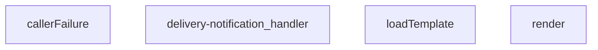

## NODE ID STANDARD

  file: index.ts
  function: index.ts::callerFailure
  function: index.ts::render
  function: index.ts::loadTemplate
  function: index.ts::delivery-notification_handler

---

## DISA AKTARILANLAR (EXPORTS)
  export: callerFailure
  export: delivery-notification_handler
  export: loadTemplate
  export: render

---
# FILE: supabase\functions\healthz\index.md

---
domain: general
source_type: doc
namespace_type: module
source_path: C:\Users\alize\venthub-hvac\supabase\functions\healthz\index.ts
skeleton_hash: 4693e10412249aa1
entity_hashes:
  func:healthz_handler: 680c3be8d7d51d07
  overview: 7d9308860fa3cc5c
generated_at: 2026-08-13T07:40:32Z
---

## Genel Bakış
Bu modül, Supabase fonksiyonları içinde bir sağlık kontrolü (health‑check) endpointi sunar. Gelen bir HTTP isteğini alarak servisin ve bağlı veritabanının erişilebilirliğini test eder ve sonucu uygun bir HTTP durum koduyla (200 OK veya 503 Service Unavailable) bildirir.

## Fonksiyon Grupları
### Sağlık Kontrolü İşleyicisi
Bu grup, servisin çalışır durumda olup olmadığını doğrulayan tek işlevi içerir. Fonksiyon, isteği işler, hafif bir veritabanı sorgusu çalıştırır ve sonuca göre yanıt üretir.
- healthz_handler

---

## AXIOMS – Mimari Varsayımlar

Bu modül, bir Supabase Edge Function health-check endpoint'ini temsil eder. Doğru çalışması için aşağıdaki mimari varsayımlar geçerlidir.

[Aksiyom 1]: Eğer gelen HTTP isteği (`req`) geçerli bir `Request` nesnesi değilse (örn: null, undefined veya yanlış tipte), fonksiyon beklenmeyen bir hata fırlatır veya işlenemeyen bir istek ile karşılaşır.

[Aksiyom 2]: Eğer healthz_handler tarafından erişilmesi beklenen veritabanı bağlantısı (veya ilgili servis) mevcut değilse veya bağlantı kesilmişse, fonksiyon istemciye **503 Service Unavailable** HTTP durum koduyla yanıt verir.

[Aksiyom 3]: Eğer fonksiyon, isteği başarıyla işleyip veritabanı erişilebilirliğini doğrulayamazsa (örn: timeout, bağlantı hatası), servis durumu "sağlıksız" olarak sınıflandırılır ve **503** döner; başarılı olursa **200 OK** döner.

[Aksiyom 4]: Fonksiyonun çalışması için, ortam değişkenleri (environment variables) aracılığıyla veritabanı bağlantısı yapılandırması (örn: `SUPABASE_URL`, `SUPABASE_KEY` veya benzeri) sunucu tarafında tanımlı olmalıdır; aksi takdirde veritabanı sorgusu çalıştırılamaz ve fonksiyon hata verir.

[Aksiyom 5]: Fonksiyon her çağrıda bağımsız (stateless) çalışır; önceki isteklerin durumu veya oturum bilgisi saklanmaz. Her health-check isteği tek başına değerlendirilir.

**Not:** Fonksiyon gövdesi (gövde kodu)paylaşılmadığı için, somut uygulama detayları (örn: veritabanı sorgusunun türü, zaman aşımları, ek header'lar) hakkında kesin bilgi bulunmamaktadır. Yukarıdaki varsayımlar, fonksiyon imzası ve genel sağlık kontrolü tasarımından çıkarılmıştır.

---

## FONKSİYON DETAYLARI

### healthz_handler
**Ne yapar**: Servis sağlığını kontrol eden bir health check endpoint'i çalıştırır. İsteğe bağlı olarak veritabanı bağlantısını doğrulayan hafif bir sorgu gerçekleştirir ve uygulamanın çalışabilir durumda olup olmadığını belirler.

**Nasıl yapar**: Gelen HTTP isteğini alır ve opsiyonel olarak veritabanı bağlantısını test eden hafif bir sorgu başlatır. Veritabanı bağlantısı başarılıysa 200 (OK) durum koduyla yanıt dönerken, bağlantı başarısızsa veya servis kullanılamaz durumdaysa 503 (Service Unavailable) durum koduyla yanıt üretir.

**Parametreler**:
- `req`: Request — Health check isteğini temsil eden HTTP Request nesnesi. İsteğe bağlı veritabanı bağlantısı kontrolü için gerekli bilgileri taşır.

**Dönüş**: Response — HTTP Response nesnesi döner. Başarılı sağlık durumunda 200 status kodu, servis kullanılamaz durumda ise 503 status kodu içerir.

---

## AST POINTERS

### [N1_NASIL] AST Pointer: `supabase/functions/healthz/index.ts`::healthz_handler
- **params**: `req: Request` — Gelen HTTP isteği nesnesi; method kontrolü ve header erişimi için kullanılır
- **ic_degiskenler**:
  - `headers` — JSON content-type ve no-cache talimatlarını taşıyan standart HTTP response header sözlüğü
  - `req.method` — İsteğin HTTP method'u (OPTIONS/GET/HEAD/other); erişim kontrolünde kullanılır
  - `supabaseUrl` — `Deno.env.get('SUPABASE_URL')` tarafından sağlanan Supabase proje URL'i, DB sağlık kontrolü için kullanılır
  - `serviceKey` — `Deno.env.get('SUPABASE_SERVICE_ROLE_KEY')` tarafından sağlanan Supabase servis rolü anahtarı, yetkilendirme header'ında kullanılır
  - `release` — `Deno.env.get('SENTRY_RELEASE')` veya `Deno.env.get('RELEASE')` tarafından sağlanan release versiyon bilgisi, yanıt gövdesine dahil edilir
  - `commit` — `Deno.env.get('GITHUB_SHA')`, `Deno.env.get('COMMIT_SHA')` veya `Deno.env.get('VITE_COMMIT_SHA')` tarafından sağlanan Git commit SHA'si, yanıt gövdesine dahil edilir
  - `resp` — `fetch()` ile yapılan `/rest/v1/rpc/now` çağrısının döndürdüğü Response nesnesi; `resp.ok` ile DB erişilebilirliği kontrol edilir
  - `_e` — `catch` bloğu tarafından yakalanan hata nesnesi; Sentry'ye raporlama için kullanılır
- **Dönüş**: `Response` — 200 (sağlıklı), 405 (method izin verilmiyor) veya 53 (sağlıksız) durum kodlu HTTP Response nesnesi; JSON gövdesinde `ok`, `db`, `release`, `commit`, `time` alanları taşır

---

## NODE ID STANDARD

  file: supabase\functions\healthz\index.ts
  function: supabase\functions\healthz\index.ts::healthz_handler

---

## DISA AKTARILANLAR (EXPORTS)
  export: healthz_handler

---
# FILE: supabase\functions\iyzico-callback\index.md

---
domain: general
source_type: doc
namespace_type: module
source_path: C:\Users\alize\venthub-wt-hotfix\supabase\functions\iyzico-callback\index.ts
skeleton_hash: c260c26f88f6a678
entity_hashes:
  func:iyzico-callback_handler: 14b42ca547fc6940
  overview: 8d4bc59faa090782
generated_at: 2026-08-15T09:03:13Z
---

## Genel Bakış
Bu modül, Supabase Edge Function olarak deploy edilmiş bir webhook endpoint'idir. İyzico ödeme sağlayıcısından gelen callback isteklerini merkezi olarak işler. İmza doğrulama ile güvenliği sağlar, ödeme durumunu ayrıştırır ve veritabanındaki sipariş kayıtlarını buna göre günceller.

## Fonksiyon Grupları
### Webhook İşleme
Gelen İyzico callback isteklerinin tam yaşam döngüsünü yönetir: imza doğrulama, ödeme bilgilerinin ayrıştırılması ve ilgili sistem kayıtlarının güncellenmesi.
- iyzico-callback_handler

---

## AXIOMS – Mimari Varsayımlar

Bu modül için yalnızca fonksiyon imzasından çıkarılabilecek temel varsayımlar tanımlanabilmektedir. Fonksiyon gövdesi paylaşılmadığından, detaylı iş mantığı varsayımları belirlenememiştir.

[Aksiyom 1]: Eğer `req` parametresi istemciden gelen geçerli bir HTTP isteği (Request) nesnesi olarak sağlanmazsa, işleyici (handler) çalışmaz veya hata ile sonuçlanır.
[Aksiyom 2]: Eğer işleyici başarılı bir şekilde çalışırsa, istemciye (`Response` türünde) bir HTTP yanıtı döndürmek zorundadır.
[Aksiyom 3]: Eğer istek bir webhook callback'i olarak işlenecekse, işleyicinin işlevsel mantığı (örn. imza doğrulama, veri ayrıştırma) fonksiyon gövdesinde tanımlı olmalıdır, ancak bu mantık imza bilgisinden çıkarılamaz.

---

## FONKSİYON DETAYLARI

### iyzico-callback_handler
**Ne yapar**: VentHub HVAC projesinin Supabase altyapısında barındırılan, Iyzico ödeme sağlayıcısından gelen tüm callback isteklerini işleyen ana giriş fonksiyonudur. Gelen ödeme durum bildirimlerini alır, doğrular ve sistemdeki ilgili sipariş, kullanıcı ve ödeme kayıtlarını güncellemek için gerekli tüm iş süreçlerini yönetir.
**Nasıl yapar**: İlk olarak gelen isteğin yetkili kaynaklı olduğunu teyit etmek için Iyzico’nun standart imza doğrulama protokolünü uygular, isteğin başlıkları ve gövdesindeki güvenlik verilerini eşleştirerek sahte istekleri engeller. Doğrulama süreci başarılı olursa istek gövdesindeki ödeme bilgilerini ayrıştırır, Supabase veritabanı üzerinden ilgili kayıtlara erişerek ödeme durumunu (başarılı, başarısız, beklemede vb.) günceller. Tüm işlem akışı sonunda isteğin sonucuna uygun bir HTTP cevabı oluşturarak döndürür.
**Parametreler**:
- name: req, type: HTTP Request (Supabase Edge Function Request nesnesi) — Iyzico ödeme servisinden gelen callback isteğinin tüm meta verilerini, HTTP başlıklarını ve işlenecek ödeme bilgilerini içeren gövdesini barındıran istek nesnesi
**Dönüş**: Standart HTTP Response nesnesi. İsteğin işlenme durumuna uygun HTTP durum kodu, ilgili cevap başlıkları ve metin içeriği barındırır. Başarısız doğrulama durumunda 403 Yetkisiz Erişim, eksik veya hatalı istek verisinde 400 Hatalı İstek, sunucu tarafı işlem hatalarında 500 Sunucu Hatası kodları döndürür. Tüm süreçlerin başarılı tamamlanması halinde 200 Başarılı durum kodu ile Iyzico’ya onay mesajı içeren cevap gönderir.

---

## İTHALATLAR (IMPORTS)
- import: ../_shared/cors.ts::getCorsHeaders
- import: ../_shared/tenant.ts::tenantFromRow
- import: npm:iyzipay::Iyzipay

---

## TYPE ALIASES

### CheckoutRetrieveResponse
```typescript
type CheckoutRetrieveResponse = {
  paymentStatus?: string;
  conversationId?: string;
  errorMessage?: string;
  paymentId?: string;
  cardFamily?: string;
  binNumber?: string;
  lastFourDigits?: string;
  [k: string]: unk
```

---

## AST POINTERS

### [N1_NASIL] AST Pointer: supabase/functions/iyzico-callback/index.ts::iyzico-callback_handler
- **params**: `(req)` — gelen HTTP isteği (Request nesnesi)
- **ic_degiskenler**: fonksiyon gövdesinin tamamı paylaşımda verilmemiştir; alt parçalarda referanslanan kapsama değişkenleri aşağıda listelenir
  - `sdk` — Iyzipay SDK örneği, checkoutForm işlemleri için kullanılır
  - `retrieveReq` — sdk.checkoutForm.retrieve çağrısına verilen istek parametreleri
  - `orderId` — güncellenecek siparişin ID'si, Supabase filtrelemede kullanılır
  - `conversationId` — Iyzico conversation ID'si, orderId yoksa filtreleme anahtarıdır
  - `result` — Iyzico checkoutForm.retrieve yanıt nesnesi, conversationId ve ödeme bilgilerini içerir
  - `supabaseUrl` — Supabase proje URL'i, REST API çağrıları için temel URL
  - `serviceRoleKey` — Supabase service role anahtarı, yetkilendirme header'ında kullanılır
  - `orderTenantFilter` — kiracı bazlı filtre sorgusu, RLS benzeri filtreleme ekler
  - `debugInfo` — ödeme sürecin_debug bilgisi, payment_debug alanına yazılır
  - `conversationId` (fallback) — result?.conversationId alınmazsa `conversationId!` non-null assertion ile kullanılır
- **Dönüş**: `Response` — HTTP yanıt nesnesi

### [N2_NASIL] AST Pointer: supabase/functions/iyzico-callback/index.ts::patchStatus
- **params**: `(newStatus: 'paid' | 'failed' | 'confirmed')` — siparişe atanacak yeni ödeme durumu
- **ic_degiskenler**:
  - `filterById` — `orderId` mevcutsa `id=eq.{orderId}` formatında filtre sorgusu oluşturur
  - `filterByConv` — `orderId` yoksa ve `result?.conversationId` veya `conversationId` mevcutsa `conversation_id=eq.{conversationId}` formatında filtre sorgusu oluşturur
  - `filter` — `filterById` veya `filterByConv`'dan ilk dolu olanı tutar; her ikisi de boşsa `null` dönülür
  - `resp` — Supabase REST API PATCH istek yanıtını (Response) tutar
- **Kapsama (closure) değişkenleri** (fonksiyon gövdesinden erişilen):
  - `orderId` — filterById filtreleme değeri olarak kullanılır
  - `result` — `result?.conversationId` optional zincir ile conversationId okunur
  - `conversationId` — result conversationId'si yoksa fallback olarak kullanılır (non-null assertion)
  - `orderTenantFilter` — filtre sorgusunun sonuna eklenen kiracı kısıtlaması
  - `supabaseUrl` — PATCH isteği için temel REST API URL'i
  - `serviceRoleKey` — Authorization ve apikey header değerleri için kullanılır
  - `debugInfo` — PATCH body'sinde `payment_debug` alanına yazılır
- **Dönüş**: `Response | null` — successful PATCH yanıtı veya filtre bulunamazsa `null`

### [N3_NASIL] AST Pointer: supabase/functions/iyzico-callback/index.ts::(resolve, reject) => Promise callback
- **params**: `(resolve, reject)` — Promise constructor callback parametreleri
- **ic_degiskenler**:
  - `retrieveReq` — sdk.checkoutForm.retrieve metoduna verilen istek nesnesi
- **Kapsama (closure) değişkenleri**:
  - `sdk` — Iyzipay SDK örneği, `sdk.checkoutForm.retrieve` çağrısı yapılır
- **Dönüş**: `void` — Promise resolve/reject ile sonuçlanır; retrieve başarılıysa `CheckoutRetrieveResponse` resolve edilir, hata varsa reject edilir

### [N4_NASIL] AST Pointer: supabase/functions/iyzico-callback/index.ts::(err, res) => retrieve callback
- **params**: `(err: unknown, res: CheckoutRetrieveResponse)` — retrieve callback hata ve yanıt parametreleri
- **ic_degiskenler**: (yok)
- **Kapsama (closure) değişkenleri**:
  - `resolve` — Promise resolve fonksiyonu, `res` ile çağrılır
  - `reject` — Promise reject fonksiyonu, `err` ile çağrılır
- **Dönüş**: `void` — hata varsa `reject(err)`, başarılıysa `resolve(res)` ile sonuçlanır

---

## NODE ID STANDARD

  file: supabase\functions\iyzico-callback\index.ts
  function: supabase\functions\iyzico-callback\index.ts::iyzico-callback_handler

---

## DISA AKTARILANLAR (EXPORTS)
  export: iyzico-callback_handler

---
# FILE: supabase\functions\iyzico-payment\index.md

---
domain: general
source_type: doc
namespace_type: module
source_path: C:\Users\alize\venthub-wt-hotfix\supabase\functions\iyzico-payment\index.ts
skeleton_hash: debf4ca0e0179b96
entity_hashes:
  func:iyzico-payment_handler: de31c29702dafb3c
  overview: e7caf5244e4f3d30
generated_at: 2026-08-15T09:05:02Z
---

## Genel Bakış
Bu modül, İyzico ödeme altyapısını kullanarak güvenli online ödeme süreçlerini yöneten bir Supabase Edge Function'dır. Tek bir HTTP handler fonksiyonu aracılığıyla, istemciden gelen isteklere göre ödeme başlatma, iptal etme ve durum sorgulama gibi temel finansal operasyonları merkezi ve güvenli bir şekilde yürütür.

## Fonksiyon Grupları
### HTTP İstek İşleme ve Yönlendirme
Gelen tüm HTTP isteklerini alarak, istek metoduna ve içeriğine göre ilgili İyzico ödeme işlemini başlatır ve sonucunu istemciye iletir.
- iyzico-payment_handler

---

## AXIOMS – Mimari Varsayımlar
Bu modül için özel aksiyom tanımlanmamıştır.

---

## FONKSİYON DETAYLARI

### iyzico-payment_handler

**Ne yapar**: Bu fonksiyon, gelen HTTP isteklerini işleyerek iyzico ödeme sistemiyle ilgili işlemlerin yürütülmesini sağlar. Supabase Edge Function yapısı kapsamında tanımlanmış bir HTTP handler fonksiyonudur. Fonksiyon, HTTP talebini alır ve uygun bir HTTP yanıtı döndürür.

**Nasıl yapar**: Fonksiyonun detaylı iç mantığı docstring'de belgelenmemiştir. Genel yapı itibarıyla, gelen HTTP Request nesnesini analiz ederek iyzico ödeme akışına uygun şekilde işler ve Response nesnesi oluşturarak istemciye geri dönüş yapar. Edge Function yapısı gereği asynchronous olarak çalışabilir.

**Parametreler**:
- `req`: Request — HTTP isteği nesnesi. İstemciden gelen tüm HTTP talep bilgilerini (headers, body, query params, method vb.) içerir. Bu nesne aracılığıyla isteğin içeriğine erişilir.

**Dönüş**: `Response` — Fonksiyonun döndürdüğü HTTP yanıt nesnesi. İşlem sonucuna göre istemciye uygun durum kodu ve içerik döndürülür.

---

## İTHALATLAR (IMPORTS)
- import: ../_shared/cors.ts::getCorsHeaders
- import: npm:iyzipay::Iyzipay

---

## AST POINTERS

### [N1_NASIL] AST Pointer: iyzico-payment/index.ts::maskPaymentInfo
- **params**: `(obj: PaymentMin)` — Ödeme bilgisi nesnesi
- **ic_degiskenler**:
  - yok — Spread operasyonları ile doğrudan dönüş yapılıyor
- **Dönüş**: Maskelenmiş `PaymentMin` nesnesi (buyer.email, buyer.gsmNumber masked; registrationAddress, ip ve shipping/billing address'ler `'***'` ile değiştirilmiş)

---

## NODE ID STANDARD

  file: supabase\functions\iyzico-payment\index.ts
  function: supabase\functions\iyzico-payment\index.ts::iyzico-payment_handler

---

## DISA AKTARILANLAR (EXPORTS)
  export: iyzico-payment_handler

---
# FILE: supabase\functions\iyzico-payment\iyzico-real.md

---
domain: general
source_type: doc
namespace_type: module
source_path: C:\Users\alize\venthub-hvac\supabase\functions\iyzico-payment\iyzico-real.ts
skeleton_hash: 7d70c2aaef2028cd
generated_at: 2026-08-13T07:40:32.807714+00:00
---

## Genel Bakış

This module has been intentionally removed. Reason: contained hardcoded sandbox credentials and is not used by the active edge function (index.ts). If you need a real İyzico integration helper, create a new module that reads all secrets from environment variables and NEVER commit secrets to the repo

## AXIOMS – Mimari Varsayımlar
- [Aksiyom 1]: Bu modül yan-etki için yüklenir; kaldırılması veya yan-etkisinin değişmesi onu import eden giriş noktalarını etkiler.
- [Aksiyom 2]: Dışa açılan API olmadığından tüketiciler doğrudan çağrıyla değil, yalnızca yükleme sırası/yan-etkisi üzerinden bağımlıdır.

## AST POINTERS
(Dışa açılan çağrılabilir öğe yok — modül-düzeyi yan-etki; AST işaretçisi gerektiren fonksiyon/metot yok.)

## NODE ID STANDARD
file: C:\Users\alize\venthub-hvac\supabase\functions\iyzico-payment\iyzico-real.ts


---
# FILE: supabase\functions\iyzico-refund\index.md

---
domain: general
source_type: doc
namespace_type: module
source_path: C:\Users\alize\venthub-wt-hotfix\supabase\functions\iyzico-refund\index.ts
skeleton_hash: 08f598d2cf9e96a2
entity_hashes:
  func:iyzico-refund_handler: b3edad3bb6b5ef11
  overview: 86377044cea6469b
generated_at: 2026-08-14T22:02:42Z
---

## Genel Bakış
Bu modül, Supabase Functions ortamında çalışan bir HTTP endpoint'idir. Temel sorumluluğu, iyzico ödeme sistemi üzerinden gelen iade (refund) taleplerini almak, gerekli doğrulamaları yaparak iyzico API'sine iletmek ve işlem sonucunu istemciye bildirmektir.

## Fonksiyon Grupları
### İade İşlem İşleyicisi
Modülün tüm iş mantığını tek bir işleyicide merkezileştirir. Kimlik doğrulama, alan kontrolleri, iyzico SDK ile API iletişimi ve hata yönetimi adımlarını gerçekleştirerek iade işlemini tamamlar.
- iyzico-refund_handler

---

## AXIOMS – Mimari Varsayımlar

Bu modül, iyzico ödeme sistemi entegrasyonu ile çalışan bir HTTP endpoint'idir. Fonksiyon imzası ve modül amacına dayanan mimari varsayımlar aşağıdadır.

[Aksiyom 1]: Eğer `req` parametresi geçerli bir HTTP istek nesnesi değilse, istek işlenemez ve işleyici geçersiz giriş hatası döndürür.

[Aksiyom 2]: Eğer iyzico API kimlik bilgileri (API Key, Secret Key, base URL) ortam değişkenlerinde tanımlı değilse, iyzico SDK başlatılamaz ve iade işlemi başarısız olur.

[Aksiyom 3]: Eğer istek gövdesinde zorunlu alanlar (örn: iade talebine ilişkin bilgiler) eksikse, işleyici doğrulama hatası ile yanıt verir.

[Aksiyom 4]: Eğer Supabase Edge Functions runtime ortamında iyzico SDK modülü (veya eşdeğeri HTTP istemcisi) yüklü değilse, modül çalışmaz.

[Aksiyom 5]: Eğer istek kimlik doğrulama bilgisi içermiyorsa veya geçersizse, işleyici yetkilendirme hatası ile yanıt verir.

---

## FONKSİYON DETAYLARI

### iyzico-refund_handler
**Ne yapar**: HTTP isteklerini alarak iyzico ödeme sistemi üzerinden bir geri ödeme (refund) işlemi başlatır veya bu işlemle ilgili bir durum sorgulaması yapar.
**Nasıl yapar**: Fonksiyon, bir HTTP Request nesnesi alır. Bu isteğin gövdesindeki (body) verileri çıkararak iyzico'nun sunduğu geri ödeme API endpoint'ine gerekli parametrelerle bir istek gönderir. API'den dönen sonucu işleyerek uygun bir HTTP Response (başarı/hata durumu ile birlikte) oluşturur ve istemciye döner.
**Parametreler**:
- req: Request — Fonksiyonun işleyeceği HTTP istek nesnesi. İsteğin metodu, gövdesi (geri ödeme bilgileri) ve varsa başlık bilgilerini içerir.
**Dönüş**: Response — iyzico API'sinden alınan sonuca göre başarı veya hata durumunu belirten, JSON formatında bir HTTP yanıt nesnesi. Genellikle { success: boolean, data?: object, error?: string } yapısında bir gövdeye sahiptir.

---

## İTHALATLAR (IMPORTS)
- import: ../_shared/cors.ts::getCorsHeaders
- import: https://esm.sh/@supabase/supabase-js@2.45.4::createClient
- import: npm:iyzipay::Iyzipay

---

## TYPE ALIASES

### PaymentTransaction
```typescript
type PaymentTransaction = { paymentTransactionId?: string }
```

### PaymentDebug
```typescript
type PaymentDebug = {
  refunded_total?: number;
  paymentId?: string;
  raw?: { paymentId?: string; itemTransactions?: PaymentTransaction[] };
  partial_refunds?: { amount: number; at: string }[];
  [k: string]: unknown
```

### IyziCancelResponse
```typescript
type IyziCancelResponse = { status?: string; [k: string]: unknown }
```

### IyziRefundResponse
```typescript
type IyziRefundResponse = { status?: string; [k: string]: unknown }
```

### IyziSdk
```typescript
type IyziSdk = {
  cancel: {
    create: (
      req: { locale?: unknown; paymentId: string | null; ip: string },
      cb: (err: unknown, res: IyziCancelResponse) => void
    ) => void;
  };
  refund: {
    create:
```

### IyziCtor
```typescript
type IyziCtor = new (args: { apiKey: string; secretKey: string; uri: string }) => IyziSdk
```

---

## AST POINTERS

### [N1_NASIL] AST Pointer: supabase/functions/iyzico-refund/index.ts::iyzico-refund_handler
- **params**: `req` — HTTP isteği (Request nesnesi, method, headers, json body içerir)
- **ic_degiskenler**:
  - `corsHeaders` — `getCorsHeaders(req)` ile alınan CORS başlık nesnesi
  - `cors` — `corsHeaders`'ın alias'ı, tekrar atama
  - `corsHeaders` (yeniden tanımlı) — Manuel oluşturulmuş CORS başlık Record'ı; allowed, origin ile dinamik origin ayarı, OPTIONS/POST metodları
  - `supabaseUrl` — `Deno.env.get("SUPABASE_URL")` ile alınan Supabase URL'i
  - `serviceKey` — `Deno.env.get("SUPABASE_SERVICE_ROLE_KEY")` ile alınan servis rol anahtarı
  - `IYZ_API` — `Deno.env.get("IYZICO_API_KEY")` ile alınan Iyzico API anahtarı
  - `IYZ_SEC` — `Deno.env.get("IYZICO_SECRET_KEY")` ile alınan Iyzico gizli anahtarı
  - `IYZ_URI` — `Deno.env.get("IYZICO_BASE_URL")` ile alınan Iyzico base URL'i, varsayılan `"https://sandbox-api.iyzipay.com"`
  - `body` — `req.json()` ile parse edilmiş istek gövdesi, hata olursa boş obje `{}`
  - `orderId` — `body?.order_id`, string tipinde sipariş ID'si, zorunlu alan
  - `amountReq` — `body?.amount`, number tipinde iade tutarı, opsiyonel
  - `_reason` — `body?.reason`, string tipinde iade sebebi, opsiyonel
  - `authHeader` — `req.headers.get("authorization")`, Bearer token içeren auth başlığı
  - `anonKey` — `Deno.env.get('SUPABASE_ANON_KEY')` ile alınan anon key, auth client oluşturulurken kullanılır
  - `authClient` — `createClient` ile anonKey + authHeader kullanılarak oluşturulmuş Supabase istemcisi
  - `user` — `authClient.auth.getUser()` ile alınmış authenticated kullanıcı nesnesi (id içerir)
  - `authErr` — getUser hatası veya null
  - `reqUserId` — `user.id`, isteği yapan kullanıcının UUID'si
  - `ordResp` — Supabase REST API ile `venthub_orders` tablosundan sipariş getirme yanıt nesnesi
  - `orders` — `ordResp.json()` ile parse edilmiş sipariş dizisi
  - `order` — `orders[0]`, ilk (ve tek beklenen) sipariş kaydı; id, user_id, status, payment_status, total_amount, payment_debug içerir
  - `isAdmin` — boolean, kullanıcının admin rolünde olup olmadığını tutar
  - `prof` — Supabase REST API ile `user_profiles` tablosundan rol sorgulama yanıt nesnesi
  - `arr` — `prof.json()` ile parse edilmiş profil dizisi (admin kontrolü kısmında)
  - `row` — `arr[0]`, ilk profil satırı; `role` alanını barındırır
  - `isOwner` — boolean, isteği yapan kullanıcının sipariş sahibi olup olmadığını tutar (`reqUserId === order.user_id`)
  - `totalAmount` — `Number(order.total_amount) || 0`, siparişin toplam tutarı
  - `prevDebug` — `order.payment_debug` cast edilmiş `PaymentDebug` nesnesi; önceki ödeme debug bilgileri (refunded_total, paymentId, partial_refunds vb.)
  - `refundedTotalPrev` — `Number(prevDebug?.refunded_total || 0)`, önceden iade edilen toplam tutar
  - `payId` — `order.payment_debug.paymentId` veya `order.payment_debug.raw.paymentId`, IyziCo payment ID'si
  - `transactions` — `order.payment_debug.raw.itemTransactions` dizisi, `PaymentTransaction[]` tipinde; her birinde paymentTransactionId bulunur
  - `Iyzi` — `Iyzipay`'ın `IyziCtor` tipine cast edilmiş hali, constructor referansı
  - `sdk` — `new Iyzi({apiKey, secretKey, uri})` ile oluşturulmuş IyziCo SDK örneği; cancel ve refund metodları barındırır
  - `targetAmount` — iade edilecek tutar; `amountReq` varsa ve sıfırdan büyükse `amountReq`, aksi halde `totalAmount`
  - `epsilon` — `0.0001`, floating-point karşılaştırma toleransı
  - `isFull` — boolean; tam iade (cancel) mi yoksa parsiyel iade (refund) mi olduğunu belirler
  - `iyzResult` — IyziCo API'den dönen `IyziCancelResponse` veya `IyziRefundResponse` sonucu
  - `LOCALE_TR` — IyziCo locale sabiti, `Iyzipay.LOCALE.TR` veya `'tr'`
  - `ptx` — `transactions[0].paymentTransactionId`, parsiyel iade için kullanılacak işlem ID'si
  - `ok` — boolean, `iyzResult.status === 'success'` kontrolü ile API başarısını tutar
  - `itemsResp` — tam iade yolunda `venthub_order_items` tablosundan sipariş kalemlerini getiren yanıt
  - `items` — sipariş kalemleri dizisi; her birinde `product_id` ve `quantity` bulunur
  - `it` — `for...of` döngüsündeki her bir sipariş kalemi
  - `pResp` — tam iade yolunda `products` tablosundan ürün bilgisi getiren yanıt
  - `arr` (ürün döngüsü içinde) — ürün sorgulama sonucu dizisi
  - `cur` — `arr[0]`, mevcut ürün kaydı; `stock_qty` alanını barındırır
  - `curStock` — `Number(cur?.stock_qty ?? 0)`, ürünün mevcut stok miktarı
  - `newStock` — `curStock + Number(it.quantity || 0)`, stok iadesi sonrası yeni stok miktarı
  - `newDebug` — tam iade sonrası güncellenmiş `PaymentDebug` nesnesi; refund_result, refund_type='cancel', refunded_total=totalAmount, manual_refund_applied=true, manual_refund_applied_at Zeitstempelı içerir
  - `newStatus` — tam iade sonrası sipariş durumu; shipped/delivered ise korunur, aksi halde `'cancelled'`
  - `partials` — `prevDebug.partial_refunds` dizisi, önceki parsiyel iade kayıtları
  - `newRefundedTotal` — `refundedTotalPrev + targetAmount`, güncellenmiş toplam iade tutarı
  - `newStatusPayment` — parsiyel iade sonrası payment_status; toplam iade tutarı sipariş tutarına eşit ise `'refunded'`, aksi halde `'partial_refunded'`
  - `dbg` — parsiyel iade sonrası güncellenmiş `PaymentDebug` nesnesi; refund_result, refund_type='refund', refund_amount, refunded_total, partial_refunds güncellenmiş dizi içerir
- **Dönüş**: `Response` — HTTP yanıt nesnesi; farklı durumlarda JSON body ile 200, 400, 401, 403, 404, 405, 500, 502 durum kodları döner. Başarılı tam iade durumunda `{ status: 'refunded', type: 'cancel', amount, order_id }`, parsiyel iade durumunda `{ status, type: 'refund', amount, refunded_total, order_id }`, zaten iade edilmişse `{ status: 'already_refunded', order_id }` döner. Yan etkiler: IyziCo API çağrısı (cancel/refund), stok güncelleme (tam iade yolunda), sipariş durumu ve payment_debug güncelleme.

---

## NODE ID STANDARD

  file: supabase\functions\iyzico-refund\index.ts
  function: supabase\functions\iyzico-refund\index.ts::iyzico-refund_handler

---

## DISA AKTARILANLAR (EXPORTS)
  export: iyzico-refund_handler

---
# FILE: supabase\functions\log-client-error\index.md

---
domain: general
source_type: doc
namespace_type: module
source_path: C:\Users\alize\venthub-wt-hotfix\supabase\functions\log-client-error\index.ts
skeleton_hash: d40202c9d638d96f
entity_hashes:
  func:log-client-error_handler: cec12c49f3b9435f
  overview: 38ce599da378ec18
generated_at: 2026-08-15T07:33:59Z
---

## Genel Bakış
Bu modül, istemci tarafı uygulamalarda oluşan hataların merkezi olarak toplanmasını ve kaydedilmesini sağlayan bir Supabase Edge Function'dır. Gelen HTTP istekleri aracılığıyla hata verisini alır, doğrular ve veritabanına kalıcı olarak yazarak hata izleme ve teşhis süreçlerini destekler.

## Fonksiyon Grupları
### Hata Kayıt İşleyicisi
Gelen hata raporu isteklerini işleyen ve yanıt oluşturan tek sorumlu bileşen; istek gövdesinden hata verisini çıkarıp doğrular, Supabase veritabanına yazar ve istemciye durum bildirimi döndürür.
- log_client_error_handler

---

## AXIOMS – Mimari Varsayımlar
Bu modül, istemci hatalarını almak için bir HTTP endpoint'idir ve `clientErrorSchema` kullanarak gelen veriyi doğrular.

[Aksiyom 1]: Eğer istek gövdesi (`req.body`) JSON formatında ayrıştırılamıyorsa, istek reddedilir (HTTP 400 Bad Request).

[Aksiyom 2]: Eğer istek gövdesi `clientErrorSchema` ile doğrulanamıyorsa, istek reddedilir (HTTP 400 Bad Request).

[Aksiyom 3]: Eğer istek yöntemi (`req.method`) POST değilse, istek reddedilir (HTTP 405 Method Not Allowed).

[Aksiyom 4]: Eğer veritabanına yazma işlemi başarısız olursa, sunucu hatası yanıtı dönülür (HTTP 500 Internal Server Error).

[Aksiyom 5]: Eğer `clientErrorSchema` tanımı (çağrısı) başarısız olursa veya geçerli bir doğrulama şeması sağlanamıyorsa, modül herhangi bir isteği başarıyla işleyemez.

[Aksiyom 6]: Eğer istek gövdesindeki veri `clientErrorSchema` tarafından tanımlanan alanları içermiyorsa (eksik alanlar), istek reddedilir (HTTP 400 Bad Request).

---

## FONKSİYON DETAYLARI

### log-client-error_handler

**Ne yapar**: Client tarafında oluşan hataların sunucu tarafında loglanmasını sağlayan bir Supabase Edge Function handler'ıdır. HTTP isteklerini alır, hata bilgilerini işler ve uygun HTTP yanıtını döndürür.

**Nasıl yapar**: Bu fonksiyon, bir HTTP Request nesnesini parametre olarak alarak çalışır. Adından anlaşılacağı üzere, client tarafındaki uygulama hatalarını yakalayıp sunucu tarafında merkezi olarak loglamak için kullanılır. Supabase Edge Functions yapısı içerisinde bir request handler olarak tanımlanmıştır.

**Parametreler**:
- `req`: Request — İşlenecek olan HTTP istek nesnesi. Client tarafından gönderilen hata bilgilerini ve gerekli header/body verilerini içerir.

**Dönüş**: `Response` — İşlem sonucuna göre bir HTTP yanıt nesnesi döndürür. Başarılı logging işlemi veya hata durumuna uygun status kodu ve mesaj içerebilir.

---

## İTHALATLAR (IMPORTS)
- import: ../_shared/cors.ts::getCorsHeaders
- import: https://esm.sh/@supabase/supabase-js@2.45.4::createClient
- import: https://esm.sh/zod@3.23.8::z

---

## SABİTLER
- **clientErrorSchema** (call) — `z.object({
  msg: z.string().default(''),
  stack: z.string().default(''),
...`

---

## AST POINTERS

### [N1_NASIL] AST Pointer: supabase/functions/log-client-error/index.ts::log-client-error_handler
- **params**: `(req: Request)`
- **ic_degiskenler**:
  - `corsHeaders` — getCorsHeaders(req) çağrısıyla elde edilen CORS başlıkları
  - `cors` — corsHeaders değişkeninin takma adı (alias)
  - `requestId` — crypto.randomUUID() veya Date.now() ile üretilen benzersiz istek tanımlayıcısı
  - `supabaseUrl` — Deno.env.get('SUPABASE_URL') ile okunan Supabase servis URL'i
  - `serviceRoleKey` — Deno.env.get('SUPABASE_SERVICE_ROLE_KEY') ile okunan servis rol anahtarı
  - `allowedOrigins` — Deno.env.get('ALLOWED_ORIGINS') virgülle ayrılmış izin verilen origin listesi, split/map/filter ile temizlenmiş
  - `originHeader` — req.headers.get('origin') ile gelen Origin başlığı
  - `originToCheck` — kontrol edilecek origin; originHeader yoksa referer'dan URL.parse ile türetilir
  - `ref` — req.headers.get('referer') ile gelen referer başlığı
  - `requireAuth` — Deno.env.get('REQUIRE_AUTH') değerinden türetilen boolean; true ise yetkilendirme zorunlu
  - `supabase` — createClient(supabaseUrl, serviceRoleKey) ile oluşturulan Supabase istemcisi
  - `authHeader` — req.headers.get('authorization') veya req.headers.get('Authorization') ile gelen yetkilendirme başlığı
  - `accessToken` — authHeader içinden 'Bearer ' ön ekini atarak çıkarılan token
  - `authData` — supabase.auth.getUser(accessToken) sonucundaki data nesnesi
  - `authErr` — supabase.auth.getUser(accessToken) sonucundaki hata nesnesi
  - `rawBody` — req.json() ile okunan ham istek gövdesi, parse edilemezse null
  - `parsed` — clientErrorSchema.safeParse(rawBody) ile Zod doğrulama sonucu
  - `payload` — parsed.data; Zod doğrulamasından geçmiş güvenli veri nesnesi
  - `mask` — inline arrow fonksiyon; stringleri 4000 karakterle kısaltıp email ve uzun token'ları maskeleyen sanitizasyon fonksiyonu
  - `firstLine` — payload.stack değerinin ilk satırı (stack trace'in ilk çizgisi)
  - `urlObj` — payload.url değerinden URL nesnesi oluşturulmaya çalışılır, başarısızsa null
  - `_path` — urlObj.pathname veya boş string; hata imzası için URL yolu
  - `signature` — msg + firstLine + _path bileşenlerinden maskelenmiş ve birleştirilmiş hata imzası (error_groups tablosunda onConflict anahtarı)
  - `groupId` — upsert veya select ile bulunan error_groups tablosu satır ID'si; bulunamazsa null
  - `groupPayload` — error_groups tablosuna upsert edilecek nesne (signature, level, last_message, url_sample, env, release, last_seen alanları)
  - `upsertRow` — error_groups tablosuna upsert sonrası select('id') ile dönen satır
  - `q` — groupId bulunamadığda signature ile error_groups tablosundan select('id') sorgu sonucu
  - `dedupSeconds` — Deno.env.get('DEDUP_SECONDS') değerinden parseInt ile okunan dedup pencere süresi (saniye cinsinden)
  - `since` — dedup kontrolü için Date.now() - dedupSeconds*1000 hesaplanmış ISO zaman damgası
  - `recent` — client_errors tablosundan group_id ve at filtresiyle son dedup süresi içindeki kayıtlar (id, at alanları)
  - `row` — client_errors tablosuna insert edilecek tüm alanları içeren kayıt nesnesi (at, url, message, stack, user_agent, release, env, level, extra, opsiyonel group_id)
  - `error` — supabase.from('client_errors').insert(row) sonucundaki hata nesnesi
  - `msg` — insert hatasından veya outer catch'ten türetilen hata mesajı stringi
  - `level` — payload.level değerinden türetilen küçük harfli hata seviyesi
  - `env` — payload.env değerinden türetilen ortam bilgisi stringi
  - `notifyEnabled` — SLACK_WEBHOOK_URL env var'ının boş olup olmadığına göre boolean
  - `isCritical` — level değerinin 'fatal' veya 'error' olup olmadığına göre boolean
  - `shortMsg` — payload.msg değerinden 200 karaktere kısaltılmış mesaj
  - `fields` — slackNotify fonksiyonuna aktarılacak alanlar dizisi (Signature, Level, Env, URL, Request-Id)
  - `_e` — outer try-catch bloğunda yakalanan hata nesnesi
- **Dinamik import**: `../_shared/notify.ts` → `slackNotify` fonksiyonu (Slack webhook ile bildirim gönderir, sadece kritik seviyelerde ve notifyEnabled ise çağrılır; ayrıca outer catch bloğunda hata bildirimi için de import edilir)
- **Yan etkiler**: Supabase veritabanına `error_groups` tablosuna upsert, `client_errors` tablosuna insert, `increment_error_group_count` RPC çağrısı; opsiyonel Slack webhook bildirimi
- **Dönüş**: `Response` — başarı durumunda 200 'ok', hata durumlarında 400/401/403/405/500 ile JSON hata mesajı

---

## NODE ID STANDARD

  file: supabase\functions\log-client-error\index.ts
  function: supabase\functions\log-client-error\index.ts::log-client-error_handler

---

## DISA AKTARILANLAR (EXPORTS)
  export: log-client-error_handler

---
# FILE: supabase\functions\notification-service\index.md

---
domain: general
source_type: doc
namespace_type: module
source_path: C:\tmp\wt-supurme\supabase\functions\notification-service\index.ts
skeleton_hash: 6b9d4f173c8e4fc5
entity_hashes:
  func:callerFailure: c2855766de0bfe8b
  func:formatTemplate: 36d51a549d587400
  func:notification-service_handler: dc7fd5d96878185c
  func:sendEmail: 3b14fffe2f71320a
  func:sendSMS: ac40e3c349cc9550
  func:sendWhatsApp: 5493a673e140abb2
  overview: c0915b77cd91b2b7
generated_at: 2026-08-25T07:33:41Z
---

## Genel Bakış

Bu modül, Supabase Edge Function olarak çalışan bir bildirim servisidir. Gelen HTTP isteklerini işleyerek WhatsApp, SMS ve e-posta olmak üzere üç farklı kanal üzerinden bildirim gönderimini yönetir. Şablon tabanlı mesaj oluşturma ve hata yönetimi gibi yardımcı işlevler de içerir.

## Fonksiyon Grupları

### Ana İşlemci

Gelen HTTP isteklerini karşılayan ve uygun bildirim kanalına yönlendiren giriş noktasıdır. Supabase'in `serve` dekoratörü ile tanımlanmış tek handler fonksiyonu içerir.

- notification-service_handler

### Bildirim Göndericileri

Farklı iletişim kanalları üzerinden mesaj gönderimini gerçekleştiren fonksiyonlardır. Her biri kendi kanalına özgü yapılandırma parametreleri alır; WhatsApp ve SMS TwilioConfig kullanırken e-posta kendi apiKey yapılandırmasını gerektirir. Şablon ve veri parametreleri opsiyoneldir.

- sendWhatsApp, sendSMS, sendEmail

### Yardımcı İşlevler

Şablon formatlama ve hata işleme gibi destekleyici görevleri yerine getirir. `formatTemplate`, şablon dizgisi içindeki yer tutucuları veri ile doldurur; `callerFailure` ise hata durumlarını standart bir yanıt yapısına dönüştürür.

- formatTemplate, callerFailure

---

## AXIOMS – Mimari Varsayımlar
- Bu modül davranışsal mantık içermez (salt veri / konfigürasyon / tip tanımı).
- [Aksiyom 1]: Modülün dışa açtığı yapı (anahtar kümesi / şema) bir sözleşmedir; tüketiciler bu sabit yapıya bağlıdır — kırıcı değişiklik tüm tüketicileri etkiler.
- [Aksiyom 2]: Bir öğe ekleme/çıkarma yapısal-uyumlu olmalı; ilgili tipler ve seçiciler aynı commit'te güncel tutulmalıdır.

---

## FONKSİYON DETAYLARI

### callerFailure
**Ne yapar**: Kapı hatalarını (gateway errors) HTTP durum kodlarına eşleyen bir hata haritalama fonksiyonudur. Üç farklı hata türünü birebir karşılık gelen HTTP durum kodlarına dönüştürür ve tanımlanmamış hatalar için `null` döndürür.

**Nasıl yapar**: Gelen `error` parametresinin `instanceof` kontrolü ile türünü belirler. `TenantMismatchError` durumunda 403, `CallerConfigError` durumunda 500, `CallerLookupError` durumunda 503 HTTP durum kodu ve karşılık gelen hata mesajı içeren bir nesne döndürür. Bu hata sınıflarından hiçbiri eşleşmezse `null` döner; bu durum çağırıcının hatayı kendi başına ele alması gerektiği anlamına gelir.

**Parametreler**:
- error: unknown — eşlenecek hata nesnesi. Türü bilinmediği için `unknown` olarak tanımlanmıştır.

**Dönüş**: `{ status: number; error: string } | null` — Eşleşme varsa HTTP durum kodu ve hata tanımlayıcısı içeren nesne; eşleşme yoksa `null`.

### notification-service_handler
**Ne yapar**: Geliştirildi ancak detay üretilemedi.

### sendWhatsApp
**Ne yapar**: Geliştirildi ancak detay üretilemedi.

### sendSMS
**Ne yapar**: Geliştirildi ancak detay üretilemedi.

### sendEmail
**Ne yapar**: Geliştirildi ancak detay üretilemedi.

### formatTemplate
**Ne yapar**: Geliştirildi ancak detay üretilemedi.

---

## İTHALATLAR (IMPORTS)
- import: ../_shared/cors.ts::getCorsHeaders
- import: ../_shared/tenant_config.ts::getTenantBranding
- import: https://deno.land/std@0.168.0/http/server.ts::serve

---

## INTERFACES

### NotificationRequest
- `type: 'whatsapp' | 'sms' | 'email'`
- `to: string`
- `message: string`
- `priority: 'low' | 'medium' | 'high' | 'critical'`
- `template?: string`
- `data?: TemplateData`
- `tenant_id?: string`

### _StockAlertData
- `productName: string`
- `currentStock: number`
- `threshold: number`
- `_productId: string`

### TwilioConfig
- `accountSid: string`
- `authToken: string`
- `fromNumber: string`

---

## TYPE ALIASES

### TemplateData
```typescript
type TemplateData = Record<string, string | number | boolean>
```

---

## SABİTLER
- **_stockAlertTemplates** (object) — `{
  whatsapp: {
    low_stock: `🚨 STOK UYARISI 🚨
    
📦 Ürün: {{productNa...`

---

## AST POINTERS

### [N1_NASIL] AST Pointer: supabase/functions/notification-service/index.ts::callerFailure
- **params**: `error: unknown`
- **ic_degiskenler**: yok
- **Dönüş**: `{ status: number; error: string } | null` — `error` bir `TenantMismatchError` ise `{ status: 403, error: 'tenant_mismatch' }`, `CallerConfigError` ise `{ status: 500, error: 'CONFIG_MISSING' }`, `CallerLookupError` ise `{ status: 503, error: 'profile_lookup_failed' }`, diğer durumlarda `null` döner

### [N2_NASIL] AST Pointer: supabase/functions/notification-service/index.ts::notification-service_handler
- **params**: `req`
- **ic_degiskenler**:
  - `corsHeaders` — `getCorsHeaders(req)` ile elde edilen CORS başlıkları nesnesi
  - `body` — `req.json().catch(()=>({}))` ile parse edilen istek gövdesi, `NotificationRequest` tipinde
  - `type` — `body`'den destructure edilen bildirim kanalı türü (`'whatsapp'`, `'sms'`, `'email'`)
  - `to` — `body`'den destructure edilen alıcı adresi/numarası
  - `message` — `body`'den destructure edilen bildirim mesajı
  - `priority` — `body`'den destructure edilen öncelik değeri
  - `template` — `body`'den destructure edilen opsiyonel şablon dizesi
  - `data` — `body`'den destructure edilen opsiyonel şablon verisi (`TemplateData`)
  - `ctx` — `resolveCaller(req, body)` ile elde edilen `CallerContext` nesnesi; çağıranın türünü (`kind`), rolünü (`role`) ve kiracı kimliğini (`tenantId`) içerir
  - `failure` — `callerFailure(err)` ile elde edilen hata sınıflandırma sonucu; `null` ise hata bilinmiyor demektir
  - `tenantId` — `ctx.tenantId`'den alınan doğrulanmış kiracı kimliği
  - `branding` — `getTenantBranding(tenantId)` ile elde edilen kiracı marka bilgileri nesnesi; `emailFrom`, `brandName`, `brandPrimaryColor` alanlarını içerir
  - `twilioAccountSid` — `Deno.env.get('TWILIO_ACCOUNT_SID')` ile alınan Twilio hesap SID'si
  - `twilioAuthToken` — `Deno.env.get('TWILIO_AUTH_TOKEN')` ile alınan Twilio kimlik doğrulama token'ı
  - `twilioWhatsAppNumber` — `Deno.env.get('TWILIO_WHATSAPP_NUMBER')` ile alınan WhatsApp gönderici numarası
  - `twilioPhoneNumber` — `Deno.env.get('TWILIO_PHONE_NUMBER')` ile alınan SMS gönderici numarası
  - `resendApiKey` — `Deno.env.get('RESEND_API_KEY')` ile alınan Resend e-posta servisi API anahtarı
  - `emailFrom` — `branding.emailFrom`'dan alınan e-posta gönderici adresi
  - `notifyDebug` — `Deno.env.get('NOTIFY_DEBUG') === 'true'` kontrolü; `true` ise hata ayıklama uyarıları konsola yazılır
  - `result` — bildirim gönderme işleminin sonucu; varsayılan `{ success: false, note: undefined }`, switch bloğunda her kanal için güncellenir
  - `isWhatsAppEnabled` — `twilioAccountSid`, `twilioAuthToken` ve `twilioWhatsAppNumber` üçünün de varlığını kontrol eden boolean
  - `isSmsEnabled` — `twilioAccountSid`, `twilioAuthToken` ve `twilioPhoneNumber` üçünün de varlığını kontrol eden boolean
  - `isEmailEnabled` — `resendApiKey` varlığını kontrol eden boolean
  - `msg` — catch bloğunda `error instanceof Error ? error.message : 'Unknown error'` ile elde edilen hata mesajı dizesi
- **Dönüş**: `Response` — başarılıysa 200 ve `{ success, result, type, priority, timestamp }` JSON gövdesi; yetki reddedilirse 401/403; yöntem uyumsuzsa 405; hata durumunda 500

### [N3_NASIL] AST Pointer: supabase/functions/notification-service/index.ts::sendWhatsApp
- **params**: `to: string`, `message: string`, `template?: string`, `data?: TemplateData`, `config?: TwilioConfig`
- **ic_degiskenler**:
  - `finalMessage` — `template` varsa `formatTemplate(template, data)` ile üretilen dize, yoksa doğrudan `message`
  - `formattedTo` — `to`'nun `whatsapp:` ön eki içerip içermediğine göre düzenlenen alıcı numarası; içermiyorsa `whatsapp:${to}` eklenir
  - `twilioUrl` — `config.accountSid` ile oluşturulan Twilio Messages API URL'si
  - `credentials` — `btoa(`${config.accountSid}:${config.authToken}`)` ile oluşturulan Base64 kimlik bilgisi dizesi
  - `response` — `fetch` ile Twilio API'ye yapılan POST isteğinin yanıtı
  - `error` — `response.text()` ile alınan hata mesajı; `response.ok` false ise fırlatılır
- **Dönüş**: `Promise<any>` — Twilio API yanıtının JSON.parse edilmiş hali

### [N4_NASIL] AST Pointer: supabase/functions/notification-service/index.ts::sendSMS
- **params**: `to: string`, `message: string`, `config: TwilioConfig`
- **ic_degiskenler**:
  - `twilioUrl` — `config.accountSid` ile oluşturulan Twilio Messages API URL'si
  - `credentials` — `btoa(`${config.accountSid}:${config.authToken}`)` ile oluşturulan Base64 kimlik bilgisi dizesi
  - `response` — `fetch` ile Twilio API'ye yapılan POST isteğinin yanıtı
  - `error` — `response.text()` ile alınan hata mesajı; `response.ok` false ise fırlatılır
- **Dönüş**: `Promise<any>` — Twilio API yanıtının JSON.parse edilmiş hali

### [N5_NASIL] AST Pointer: supabase/functions/notification-service/index.ts::sendEmail
- **params**: `to: string`, `message: string`, `template?: string`, `data?: TemplateData`, `config?: { apiKey: string; from?: string }`
- **ic_degiskenler**:
  - `subject` — `data?.subject` varsa onu kullanır, yoksa `'VentHub Bildirim'` varsayılan değerini alır
  - `finalMessage` — `template` varsa `formatTemplate(template, data)` ile üretilen dize, yoksa doğrudan `message`
  - `from` — `config?.from` varsa onu kullanır, yoksa `data?.emailFrom`, o da yoksa `'VentHub <noreply@venthub.com>'` varsayılan değerini alır
  - `response` — `fetch` ile Resend API'ye (`https://api.resend.com/emails`) yapılan POST isteğinin yanıtı
  - `error` — `response.text()` ile alınan hata mesajı; `response.ok` false ise fırlatılır
- **Dönüş**: `Promise<any>` — Resend API yanıtının JSON.parse edilmiş hali

### [N6_NASIL] AST Pointer: supabase/functions/notification-service/index.ts::formatTemplate
- **params**: `template: string`, `data?: TemplateData`
- **ic_degiskenler**:
  - `formatted` — `template`'in kopyası; `data` içindeki her anahtar için `{{anahtar}}` yer tutucuları ilgili değerle değiştirilir
  - `key` — `Object.keys(data)` ile elde edilen dizi üzerinde döngüdeki mevcut anahtar dizesi
  - `placeholder` — `` new RegExp(`{{${key}}}`, 'g') `` ile oluşturulan global RegExp nesnesi; `{{key}}` kalıbını eşleştirir
  - `value` — `String(data[key])` ile elde edilen, mevcut anahtara karşılık gelen değerin dize temsili
- **Dönüş**: `string` — tüm yer tutucuları değiştirilmiş nihai dize

---


## MERMAID CALL GRAPH
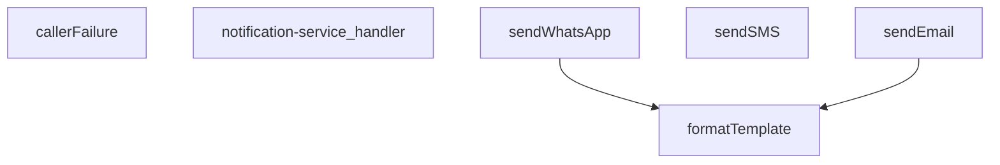

## NODE ID STANDARD

  file: index.ts
  function: index.ts::callerFailure
  function: index.ts::notification-service_handler
  function: index.ts::sendWhatsApp
  function: index.ts::sendSMS
  function: index.ts::sendEmail
  function: index.ts::formatTemplate

---

## DISA AKTARILANLAR (EXPORTS)
  export: callerFailure
  export: formatTemplate
  export: notification-service_handler
  export: sendEmail
  export: sendSMS
  export: sendWhatsApp

---
# FILE: supabase\functions\order-confirmation\index.md

---
domain: general
source_type: doc
namespace_type: module
source_path: C:\tmp\wt-supurme\supabase\functions\order-confirmation\index.ts
skeleton_hash: e4a2f6ec62f2dba1
entity_hashes:
  func:callerFailure: c2855766de0bfe8b
  func:loadTemplate: 9bc4b1ff28af1df3
  func:order-confirmation_handler: 52ce43dfb5d8480d
  func:renderTemplate: 598e7353aec8e680
  overview: f37144b7f3a3d49b
generated_at: 2026-08-25T07:33:41Z
---

## Genel Bakış

Bu modül, Supabase Edge Function olarak çalışan bir sipariş onay işleyicisidir. Gelen HTTP isteklerini alır, bir şablon yükleyip veriyle render ederek yanıt üretir. Hata durumlarını yakalayıp uygun HTTP durum kodu ve hata mesajıyla sonuçlandıran bir yapıya sahiptir.

## Fonksiyon Grupları

### Ana İşleyici

Gelen HTTP isteğini karşılayan, şablon yükleme ve işleme adımlarını sırayla çalıştırarak sonucu Response olarak döndüren ana giriş noktasıdır.

- order-confirmation_handler

### Şablon İşleme

Şablon dosyasını yükleyen ve yüklenen şablonu verilen veriyle birlikte işleyerek çıktı üreten fonksiyonları içerir. `loadTemplate` şablonu asenkron olarak okur, `renderTemplate` ise şablon ve veri alarak sonuç string üretir.

- loadTemplate, renderTemplate

### Hata Yönetimi

Hata durumlarını değerlendirip uygun HTTP durum kodu ve hata mesajı içeren bir nesne döndüren yardımcı fonksiyondur. Hata çözümlenemezse null değer döndürür.

- callerFailure

---

## AXIOMS – Mimari Varsayımlar

[Aksiyom 1]: Eğer `loadTemplate` null döndürürse, sipariş onay e-postası gönderilemez çünkü template dosyası yüklenememiştir.

[Aksiyom 2]: Eğer `callerFailure` null döndürürse, istemciye hata bilgisi döndürülemez çünkü hata response'u oluşturulamamıştır.

[Aksiyom 3]: `renderTemplate` fonksiyonu her zaman string döndürür; null dönmez. Eğer template ve veri sağlanmışsa, render işlemi başarısız olmaz.

[Aksiyom 4]: `order-confirmation_handler` fonksiyonu her zaman bir Response nesnesi döndürmelidir; null veya undefined dönemez.

[Aksiyom 5]: Eğer `loadTemplate` başarılı olursa (null olmayan string dönerse), bu template `renderTemplate` fonksiyonuna birinci parametre olarak verilebilir.

[Aksiyom 6]: Eğer `callerFailure` null olmayan bir değer döndürürse, bu değer `{ status: number; error: string }` formatındadır ve doğrudan Response oluşturmak için kullanılabilir.

---

## FONKSİYON DETAYLARI

### callerFailure
**Ne yapar**: Kapı katmanında oluşan hataları HTTP durum kodlarına eşleyen bir hata haritalama fonksiyonudur. Üç farklı hata türünü tanımlı HTTP yanıtlarına dönüştürür; bilinmeyen hata türlerinde `null` döner. Docstring'e göre bu eşleme, beş bildirim ucunda birebir aynı şekilde kullanılmaktadır.

**Nasıl yapar**: Gelen `error` parametresinin `instanceof` kontrolüyle türü belirlenir. `TenantMismatchError` durumunda 403 (claim ile profil çelişiyor; kullanıcı o tenant'a ait değil), `CallerConfigError` durumunda 500 (ortam değişkeni eksik — bizim hatamız, çağıranın değil), `CallerLookupError` durumunda 503 durum kodu döner. Hiçbiri eşleşmezse `null` döndürülür.

**Parametreler**:
- error: unknown — eşlenecek hata nesnesi; türü bilinmeyen bir değer olarak kabul edilir

**Dönüş**: `{ status: number; error: string } | null` — Eşleşen hata varsa HTTP durum kodu ve hata anahtarını içeren nesne; eşleşme yoksa `null`

### renderTemplate
**Ne yapar**: Geliştirildi ancak detay üretilemedi.

### loadTemplate
**Ne yapar**: Geliştirildi ancak detay üretilemedi.

### order-confirmation_handler
**Ne yapar**: Geliştirildi ancak detay üretilemedi.

---

## İTHALATLAR (IMPORTS)
- import: ../_shared/cors.ts::getCorsHeaders
- import: ../_shared/sentry.ts::sentryCaptureException
- import: ../_shared/tenant_config.ts::getTenantBranding
- import: https://deno.land/std@0.168.0/http/server.ts::serve

---

## AST POINTERS

### [N1_NASIL] AST Pointer: callerFailure
- **params**: `error: unknown`
- **ic_degiskenler**: yok
- **Dönüş**: `{ status: number; error: string } | null` — `TenantMismatchError` ise 403/tenant_mismatch, `CallerConfigError` ise 500/CONFIG_MISSING, `CallerLookupError` ise 503/profile_lookup_failed, diğer durumda `null`

### [N2_NASIL] AST Pointer: renderTemplate
- **params**: `tpl: string`, `_data: Record<string, unknown>`
- **ic_degiskenler**:
  - `_m` — regex eşleşmesinin tam metni (kullanılmaz, atlanır)
  - `key` — `{{#if key}}` veya `{{key}}` bloğundaki değişken adı
  - `inner` — `{{#if}}` bloğunun içeriği (koşul sağlanırsa korunur)
  - `v` — `_data[key]` ile elde edilen değer
  - `truthy` — `v`'nin truthy olup olmadığını gösteren boolean; string ise kendisi, değilse `!!v` ile dönüştürülür
- **Dönüş**: `string` — `{{#if key}}...{{/if}}` blokları truthy ise inner, değilse boş string; `{{key}}` yerleri `v`'nin string karşılığı veya boş string ile değiştirilmiş tpl

### [N3_NASIL] AST Pointer: loadTemplate
- **params**: yok
- **ic_degiskenler**:
  - `url` — `import.meta.url`'e göre `./templates/email/order_confirmation.html` yolunun tam URL'si
- **Dönüş**: `Promise<string | null>` — dosya okunursa HTML string, hata olursa `null`

### [N4_NASIL] AST Pointer: order-confirmation_handler
- **params**: `req` (serve dekoratörü ile)
- **ic_degiskenler**:
  - `requestOrigin` — `req.headers.get('origin')` ile alınan istek kökeni, yoksa boş string
  - `allowedOrigins` — `Deno.env.get('ALLOWED_ORIGINS')` virgülle ayrılmış, trimlenmiş, boş olmayan dizi
  - `originAllowed` — `allowedOrigins` boşsa true, değilse `requestOrigin`'in listede olup olmadığı
  - `corsHeaders` — `getCorsHeaders(req)` ile üretilen CORS başlıkları
  - `_text` — `req.text()` ile okunan ham istek gövdesi
  - `parsed` — `_text`'in JSON.parse sonucu, boşsa `{}`, parse hatasında `{}`
  - `order_id` — IIFE ile `parsed['order_id']`'den çıkarılan trimlenmiş string veya `null`
  - `supabaseUrl` — `Deno.env.get('SUPABASE_URL')` veya boş string
  - `serviceKey` — `Deno.env.get('SUPABASE_SERVICE_ROLE_KEY')` veya boş string
  - `ctx` — `resolveCaller(req, parsed)` ile dönen `CallerContext`
  - `failure` — `callerFailure(err)` sonucu; null değilse hata yanıtı döndürülür
  - `tenantId` — `ctx.tenantId` ile doğrulanmış tenant kimliği
  - `branding` — `getTenantBranding(tenantId)` ile alınan tenant marka bilgileri
  - `resendApiKey` — `Deno.env.get('RESEND_API_KEY')` veya boş string
  - `emailFrom` — `branding.emailFrom` başlangıç değeri; domain doğrulama hatasında `onboarding@resend.dev`'e düşer
  - `testMode` — `Deno.env.get('EMAIL_TEST_MODE')`'in `'true'` olup olmadığını gösteren boolean
  - `testTo` — `Deno.env.get('EMAIL_TEST_TO')` veya `'delivered@resend.dev'`
  - `bccList` — `Deno.env.get('SHIP_EMAIL_BCC')` virgülle ayrılmış, trimlenmiş, boş olmayan dizi
  - `brandName` — `branding.brandName`
  - `brandPrimary` — `branding.brandPrimaryColor`
  - `brandLogoUrl` — `branding.brandLogoUrl`
  - `customer_email` — siparişten veya auth.users'dan alınan müşteri e-postası, `null` olabilir
  - `customer_name` — siparişten veya auth.users.user_metadata'dan alınan müşteri adı, `null` olabilir
  - `order_number` — sipariş numarası, `null` olabilir
  - `o` — `venthub_orders` tablosuna fetch sonucu Response
  - `arr` — `o.json()` sonucu dizi, parse hatasında `[]`
  - `arr[0]` — sipariş satırı objesi veya `null`
  - `row` — `arr[0]` ile aynı; `order_number`, `customer_email`, `customer_name`, `user_id` alanlarına erişilir
  - `uid` — `row.user_id` veya `null`; müşteri bilgisi eksikse auth.users sorgusu tetikler
  - `u` — `auth/v1/admin/users/{uid}` fetch sonucu Response
  - `uj` — `u.json()` sonucu `UserResponse | null`; `email`, `user_metadata.full_name`, `user_metadata.name` alanlarına erişilir
  - `metaName` — `uj.user_metadata.full_name` veya `uj.user_metadata.name` veya `null`
  - `toList` — alıcı e-posta dizisi; test modunda `testTo`, değilse `customer_email`; ikisi de yoksa `bccList[0]`'dan taşınır
  - `bcc` — `bccList`'in kopyası; `toList` boşsa ilk elemanı taşındıktan sonra kısaltılır
  - `prettyOrderNo` — `order_number` varsa `#` + tire sonrasındaki kısım, yoksa `order_id`'nin son 8 karakteri büyük harf
  - `subject` — `"${brandName} | Siparişiniz alındı - ${prettyOrderNo}"`
  - `html` — `loadTemplate()` + `renderTemplate()` ile üretilen HTML; template yoksa inline fallback HTML
  - `tpl` — `loadTemplate()` sonucu template string veya `null`
  - `resp` — `send()` sonucu Resend API Response; ilk deneme başarısızsa domain doğrulama hatası kontrolü ile yeniden denenir
  - `txt` — başarısız `resp.text()` sonucu; domain doğrulama tetikleyicisi olarak kullanılır
  - `result` — başarılı `resp.json()` sonucu; `id` veya `data.id` alanına erişilir
  - `_e` — yakalanan hata; `sentryCaptureException`'a gönderilir
  - `msg` — `_e.message` veya `String(_e)`
- **Dönüş**: `Response` — 200/success, 400/missing_fields, 401/unauthorized, 403/forbidden, 403/forbidden_origin, 405/method_not_allowed, 500/CONFIG_MISSING, 500/send_failed, 500/unexpected

### [N5_NASIL] AST Pointer: send (iç fonksiyon)
- **params**: yok
- **ic_degiskenler**: yok (dış scope değişkenlerini kullanır: `resendApiKey`, `emailFrom`, `toList`, `bcc`, `subject`, `html`)
- **Dönüş**: `Promise<Response>` — `https://api.resend.com/emails` POST sonucu Response

---


## MERMAID CALL GRAPH
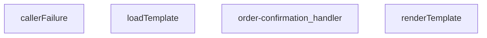

## NODE ID STANDARD

  file: index.ts
  function: index.ts::callerFailure
  function: index.ts::renderTemplate
  function: index.ts::loadTemplate
  function: index.ts::order-confirmation_handler

---

## DISA AKTARILANLAR (EXPORTS)
  export: callerFailure
  export: loadTemplate
  export: order-confirmation_handler
  export: renderTemplate

---
# FILE: supabase\functions\order-housekeeping\index.md

---
domain: general
source_type: doc
namespace_type: module
source_path: C:\Users\alize\venthub-wt-hotfix\supabase\functions\order-housekeeping\index.ts
skeleton_hash: 0581d0462a26915d
entity_hashes:
  func:order-housekeeping_handler: e38889ac24217d85
  overview: 179148bdc1561c4d
generated_at: 2026-08-14T22:02:42Z
---

## Genel Bakış
Bu modül, siparişlerle ilgili temizlik ve idame işlemlerini yöneten bir Supabase Edge Function'dır. Gelen HTTP isteklerini alarak kimlik doğrulama, CORS yönetimi ve Supabase veritabanı entegrasyonu gibi sunucu tarafı görevleri merkezi bir noktadan koordine eder.

## Fonksiyon Grupları
### HTTP İstek İşleme
Gelen isteklerin doğrulanması, yetkilendirilmesi ve ilgili sipariş temizlik işlemlerinin gerçekleştirilmesinden sorumludur.
- order-housekeeping_handler

---

## AXIOMS – Mimari Varsayımlar

Bu modül, bir Supabase Edge Function olan `order-housekeeping_handler` HTTP handler'ı için aşağıdaki mimari varsayımları içerir. Bu varsayımlar, fonksiyon gövdesindeki akış kontrollerine dayanmaktadır.

[Aksiyom 1]: Eğer istek HTTP METHOD'u "OPTIONS" ise, fonksiyon boş bir 200 OK yanıtı ile (CORS başlıklarıyla) döner ve hiçbir iş mantığı çalışmaz.
[Aksiyom 2]: Eğer istek HTTP METHOD'u "POST" değilse, fonksiyon 405 Method Not Allowed yanıtı ile döner.
[Aksiyom 3]: Eğer istek gövdesi ("request body") parse edilemezse (JSON formatında değilse), fonksiyon 400 Bad Request yanıtı ile döner.
[Aksiyom 4]: Eğer istek gövdesinde "action" alanı yoksa veya boşsa, fonksiyon 400 Bad Request yanıtı ile döner.
[Aksiyom 5]: Eğer "Authorization" header'ı yoksa veya "Bearer " prefix'ini içermiyorsa, fonksiyon 401 Unauthorized yanıtı ile döner.
[Aksiyom 6]: Eğer Bearer token ile Supabase istemcisi (Supabase client) oluşturulamazsa veya token geçersizse, fonksiyon 401 Unauthorized yanıtı ile döner.
[Aksiyom 7]: Eğer "action" değeri "create" ise, fonksiyon veritabanına yeni bir "housekeeping_order" kaydı eklemeye çalışır.
[Aksiyom 8]: Eğer "action" değeri "create" olarak geldiyse ve veritabanı insert işlemi başarısız olursa (Supabase insert error), fonksiyon 500 Internal Server Error yanıtı ile döner.
[Aksiyom 9]: Eğer "action" değeri ne "create" ne de "cancel" ise (bilinmeyen bir action), fonksiyon 400 Bad Request yanıtı ile döner.
[Aksiyom 10]: Eğer "action" değeri "cancel" ise, fonksiyon mevcut bir sipariş kaydını bulmaya çalışır (id ile). Eğer kayıt bulunamazsa (data boşsa veya hata oluşursa), fonksiyon 404 Not Found yanıtı ile döner.
[Aksiyom 11]: Eğer "action" değeri "cancel" olarak geldiyse ve veritabanı sorgulama/güncelleme işlemi başarısız olursa, fonksiyon 500 Internal Server Error yanıtı ile döner.
[Aksiyom 12]: Eğer tüm iş mantığı (action'a göre DB işlemi) başarıyla tamamlanırsa, fonksiyon 200 OK yanıtı ile JSON formatında bir yanıt döner. Yanıtın "success" alanı true olmalıdır.
[Aksiyom 13]: Fonksiyon, tüm HTTP yanıtlarında CORS başlıklarını ayarlar (Access-Control-Allow-Origin: *).

---

## FONKSİYON DETAYLARI

### order-housekeeping_handler
**Ne yapar**: Bu fonksiyon, HTTP isteklerini alarak sipariş ev işleri (order housekeeping) işlemlerini yönetir. Ana işlevi, gelen isteği işleyip uygun bir Response nesnesi döndürmektir. Fonksiyon, bir Edge Function'ın giriş noktası olarak çalışır ve istek verilerini işleyerek sistemdeki siparişle ilgili ev işleri operasyonlarını tetikler.

**Nasıl yapar**: Fonksiyon, bir Request nesnesi alır ve bu isteği işler. İç mantığı, isteğin metodunu (GET, POST, vb.) ve gövdesini analiz ederek uygun bir iş akışı başlatır. İşlem sonucunda bir HTTP durum kodu ve mesajı içeren bir Response nesnesi oluşturur ve döndürür. Hata durumlarında uygun hata kodları ve mesajları ile yanıt verir.

**Parametreler**:
- req: Request — İşlenecek HTTP istek nesnesi. İstek metodunu, başlıklarını ve gövdesini içerir.

**Dönüş**: Response — İşlem sonucunu içeren HTTP yanıt nesnesi. Başarılı durumlarda 200 OK, hata durumlarında uygun HTTP durum kodlarıyla birlikte JSON formatında bir mesaj veya veri döner.

---

## İTHALATLAR (IMPORTS)
- import: ../_shared/cors.ts::getCorsHeaders
- import: https://esm.sh/@supabase/supabase-js@2.45.4::createClient

---

## AST POINTERS

### [N1_NASIL] AST Pointer: supabase/functions/order-housekeeping/index.ts::order-housekeeping_handler
- **params**: `(req)` — HTTP istek nesnesi (Request)
- **ic_degiskenler**:
  - `corsHeaders` — `getCorsHeaders(req)` ile elde edilen CORS başlık nesnesi
  - `cors` — CORS başlık nesnesi; OPTIONS ve hata yanıtlarında kullanılır (ilk önce `corsHeaders`'a eşitlenir, sonra literal olarak yeniden tanımlanır)
  - `supabaseUrl` — `Deno.env.get('SUPABASE_URL')` ile okunan Supabase proje URL'i
  - `serviceRoleKey` — `Deno.env.get('SUPABASE_SERVICE_ROLE_KEY')` ile okunan servis rolü anahtarı; Yetkili API isteklerinde kullanılır
  - `anonKey` — `Deno.env.get('SUPABASE_ANON_KEY')` ile okunan anonim istemci anahtarı; Kullanıcı auth istemcisi oluşturulurken kullanılır
  - `authHeader` — `req.headers.get('Authorization')` ile gelen Authorization başlık değeri
  - `authClient` — `createClient(supabaseUrl, anonKey, ...)` ile oluşturulan Supabase istemcisi; Kullanıcı token'ı ile auth doğrulaması yapar
  - `user` — `authClient.auth.getUser()` sonucundan destructure edilen kullanıcı nesnesi; `user.id` ile kullanıcı rolü sorgulanır
  - `authErr` — `authClient.auth.getUser()` sonucundaki hata; auth başarısızsa 401 döner
  - `roleCheck` — `fetch()` ile `user_profiles` tablosuna yapılan istek sonucu; Kullanıcının rolünü doğrular
  - `arr` — `roleCheck.json()` sonucu; `arr[0]?.role` erişimi ile ilk kaydın rolü alınır
  - `arr[0]` — `arr` dizisinin ilk elemanı; kullanıcının profil kaydıdır
  - `role` — `arr[0]?.role` ile elde edilen kullanıcı rolü stringi; `'admin'` veya `'superadmin'` olmalı
  - `now` — `Date.now()` ile alınan mevcut zaman damgası (ms)
  - `th30` — `now`'dan 30 dakika çıkarılıp ISO string'e çevrilmiş eşik zamanı; Token'ı olmayan siparişlerin iptali için kullanılır
  - `th15` — `now`'dan 15 dakika çıkarılıp ISO string'e çevrilmiş eşik zamanı; Token'ı olan bekleyen siparişlerin reconcile için kullanılır
  - `cancelResp` — Token'ı olmayan 30 dk'dan eski pending siparişleri `cancelled` yapmak için PATCH isteği sonucu
  - `cancelled` — `cancelResp.json()` sonucu; iptal edilen siparişlerin listesi, `cancelled.length` ile sayılır
  - `listResp` — Token'ı olan 15 dk'dan eski pending siparişleri listelemek için GET isteği sonucu
  - `pendWithToken` — `listResp.json()` sonucu; her eleman `{ id, created_at, payment_token, status }` yapısındadır
  - `fnHost` — IIFE ile `supabaseUrl`'den türetilen Edge Functions host adresi; `iyzico-callback` çağrısı için kullanılır
  - `reconciled` — `string[]` dizisi; reconcile sonrası `success` olan sipariş ID'lerini toplar
  - `failed` — `string[]` dizisi; reconcile sonrası başarısız olan veya hata alan sipariş ID'lerini toplar
  - `o` — `pendWithToken` dizisi üzerindeki `for` döngüsü değişkeni; her bir pending sipariş nesnesidir, `o.id` ile erişilir
  - `cb` — `iyzico-callback` fonksiyonuna POST isteği sonucu; ödeme durumu reconciliation sonucu
  - `body` — `cb.json()` sonucu; `body?.status` alanı `'success'` ise sipariş reconcile edilir, değilse `failed` durumuna çekilir
- **Dönüş**: `Response` — Başarı durumunda `{ ok: true, cancelled_count, reconciled, failed }` JSON'u (200); Hata durumunda `{ ok: false, error }` JSON'u (500); Auth hatalarında ilgili 401/403/500 yanıtları döner

---

## NODE ID STANDARD

  file: supabase\functions\order-housekeeping\index.ts
  function: supabase\functions\order-housekeeping\index.ts::order-housekeeping_handler

---

## DISA AKTARILANLAR (EXPORTS)
  export: order-housekeeping_handler

---
# FILE: supabase\functions\order-validate\index.md

---
domain: general
source_type: doc
namespace_type: module
source_path: C:\tmp\wt-supurme\supabase\functions\order-validate\index.ts
skeleton_hash: c26fe237bc27679d
entity_hashes:
  func:order-validate_handler: 5404fb6b36c963fe
  func:segmentFromUser: 75769b5088e7f187
  overview: 07239b761dcc7b2d
generated_at: 2026-08-25T07:34:04Z
---

## Genel Bakış
Bu modül, Supabase Edge Function olarak çalışan bir sipariş doğrulama servisidir. Deno runtime'ında `@serve` dekoratörüyle tanımlanmış bir HTTP istek işleyicisi içerir. Kullanıcı bilgilerinden fiyat segmenti çıkararak sipariş doğrulama işlemini gerçekleştirir.

## Fonksiyon Grupları

### Ana İşlemci
Gelen HTTP isteklerini karşılar ve sipariş doğrulama sürecini yönetir. Supabase'in `Deno.serve` altyapısıyla entegre çalışarak yanıt üretir.
- order-validate_handler

### Yardımcı Fonksiyonlar
Kullanıcı nesnesinin `app_metadata` alanından fiyat segmenti (`PriceSegment`) değerini çözümlemekten sorumludur. Kullanıcı bilgisi null olabilir; bu durumda uygun bir varsayılan değer döndürür.
- segmentFromUser

---

## AXIOMS – Mimari Varsayımlar

[Aksiyom 1]: Eğer Deno runtime'ı mevcut değilse, `@serve(Deno.serve)` decorator'ı çalışamaz ve modül başlatılamaz.

[Aksiyom 2]: Eğer `PriceSegment` tipi tanımlı değilse, `segmentFromUser` fonksiyonu derlenemez ve çalıştırılamaz.

[Aksiyom 3]: Eğer `segmentFromUser` fonksiyonuna `null` değer gelir ve fonksiyon null durumunu işlemiyorsa, beklenmeyen bir hata oluşur. Ancak fonksiyon imzası `null` kabul ettiğinden, null durumunu işlediği varsayılabilir; kesin davranış fonksiyon gövdesi bilinmediğinden belirlenemez.

[Aksiyom 4]: Eğer `req` parametresi geçerli bir HTTP isteği içermiyorsa, `order-validate_handler` fonksiyonu beklenen şekilde çalış

---

## FONKSİYON DETAYLARI

### segmentFromUser
**Ne yapar**: Verilen kullanıcı nesnesinin `app_metadata` alanını inceleyerek kullanıcının fiyat segmentini belirler. Dealer, corporate veya individual segmentlerinden birini döndürür.
**Nasıl yapar**: Fonksiyon, öncelikle kullanıcının `app_metadata` nesnesini alır (eğer kullanıcı null ise boş bir nesne kullanır). Ardından bu metadata içindeki `price_segment` ve `user_role` anahtarlarını sırasıyla kontrol eder. Eğer bu anahtarlardan herhangi birinin değeri `'dealer'` veya `'corporate'` ise, o değeri hemen döndürür. Eğer bu kontrollerin hiçbiri eşleşmezse, varsayılan olarak `'individual'` segmentini döndürür.
**Parametreler**:
- u: `{ app_metadata?: Record<string, unknown> } | null` — Kullanıcı nesnesi. `app_metadata` alanı isteğe bağlıdır ve içinde key-value çiftleri barındırabilir. Null olabilir.
**Dönüş**: `PriceSegment` — Kullanıcının belirlenen fiyat segmentini temsil eden bir değer. `'dealer'`, `'corporate'` veya `'individual'` olabilir.

### order-validate_handler
**Ne yapar**: Gelen HTTP isteklerini işleyen bir sunucu fonksiyonudur. Sipariş doğrulama mantığını uygulamak için bir giriş noktası olarak görev yapar.
**Nasıl yapar**: Fonksiyon, `@serve(Deno.serve)` dekoratörü ile işaretlenmiştir. Bu dekoratör, fonksiyonun Deno'nun yerleşik HTTP sunucusu (`Deno.serve`) tarafından çağrılacak bir istek işleyicisi (handler) olmasını sağlar. Fonksiyonun gövdesi verilen kaynakta yer almadığından, iç mantığı hakkında bilgi verilemez.
**Parametreler**:
- req: `Request` — Gelen HTTP isteğini temsil eden nesne. Fonksiyonun gövdesi bilinmediğinden, bu parametrenin nasıl kullanıldığı bilinmiyor.
**Dönüş**: `Response` — Fonksiyonun isteğe yanıt olarak döndürdüğü HTTP yanıt nesnesi.

---

## İTHALATLAR (IMPORTS)
- import: ../_shared/cors.ts::getCorsHeaders
- import: https://esm.sh/@supabase/supabase-js@2.45.4::createClient

---

## INTERFACES

### CartItem
- `product_id: string`
- `quantity: number | string`
- `unit_price?: number | string`
- `price_list_id?: string | null`

### Product
- `id: string`
- `price?: number | string`
- `stock_qty?: number | string`
- `stock?: number | string`
- `quantity_available?: number | string`
- `inventory?: number | string`
- `inventory_quantity?: number | string`
- `available?: number | string`
- `on_hand?: number | string`

### PriceList
- `id: string`
- `user_type?: string | null`
- `effective_from?: string | null`

### ProductPrice
- `base_price?: number | string | null`
- `sale_price?: number | string | null`
- `discount_percentage?: number | string | null`
- `is_active?: boolean`
- `valid_from?: string | null`
- `valid_until?: string | null`
- `price_list_id?: string | null`
- `net_price?: number | string | null`
- `gross_price?: number | string | null`

### RecalcItem
- `product_id: string`
- `quantity: number`
- `unit_price: number`
- `price_list_id: string | null`

### MismatchItem
- `product_id: string`
- `had: unknown`
- `expected: number`
- `price_list_id: string | null`

### StockIssue
- `product_id: string`
- `requested: number`
- `available: number`

---

## TYPE ALIASES

### PriceSegment
```typescript
type PriceSegment = 'individual' | 'dealer' | 'corporate'
```

---

## AST POINTERS

### [N1_NASIL] AST Pointer: supabase/functions/order-validate/index.ts::segmentFromUser
- **params**: `u` — null olabilen bir nesne; `app_metadata` alanı `Record<string, unknown>` tipinde isteğe bağlıdır
- **ic_degiskenler**:
  - `md` — `u?.app_metadata ?? {}` ifadesiyle elde edilen kullanıcı meta verisi; `u` null ise boş nesne kullanılır
  - `c` — `for` döngüsünde `md['price_segment']` ve `md['user_role']` değerlerini sırayla kontrol eden döngü değişkeni
- **Dönüş**: `PriceSegment` — `'dealer'`, `'corporate'` veya `'individual'` değerlerinden biri

---

### [N2_NASIL] AST Pointer: supabase/functions/order-validate/index.ts::order-validate_handler
- **params**: `req` — gelen HTTP isteği nesnesi
- **ic_degiskenler**:
  - `cors` — `getCorsHeaders(req)` çağrısıyla elde edilen CORS başlıkları nesnesi
  - `supabaseUrl` — `Deno.env.get('SUPABASE_URL')` ile alınan ortam değişkeni; yoksa boş string
  - `serviceRoleKey` — `Deno.env.get('SUPABASE_SERVICE_ROLE_KEY')` ile alınan ortam değişkeni; yoksa boş string
  - `anonKey` — `Deno.env.get('SUPABASE_ANON_KEY')` ile alınan ortam değişkeni; yoksa boş string
  - `authHeader` — `req.headers.get('Authorization')` ile alınan yetkilendirme başlığı
  - `authClient` — `createClient(supabaseUrl, anonKey, ...)` ile oluşturulan Supabase istemcisi; `authHeader` global başlık olarak eklenir
  - `user` — `authClient.auth.getUser(...)` sonucundaki `data.user` nesnesi; kimliği doğrulanmış kullanıcıyı temsil eder
  - `authErr` — `authClient.auth.getUser(...)` sonucundaki hata; yetkilendirme başarısızlığında dolu olur
  - `headers` — `serviceRoleKey` ile oluşturulan API istek başlıkları nesnesi (`Authorization`, `apikey`, `Content-Type`)
  - `body` — `req.json().catch(()=>({}))` ile parse edilen istek gövdesi; parse hatasında boş nesne
  - `userId` — `user.id` ile alınan kullanıcı kimliği
  - `cartId` — `body?.cart_id || body?.cartId` değerinden elde edilen sepet kimliği; bulunamazsa kullanıcı kimliğiyle sorgulanır
  - `carts` — `getJson` ile `/rest/v1/shopping_carts` endpoint'inden alınan sepet listesi; `cartId` boşken kullanıcı kimliğiyle sorgulanır
  - `items` — `getJson` ile `/rest/v1/cart_items` endpoint'inden alınan sepet ürünleri dizisi (`CartItem[]`)
  - `_productIds` — `items` dizisinden çıkarılan benzersiz `product_id` değerlerinden oluşan `Set`
  - `prods` — `getJson` ile `/rest/v1/products` endpoint'inden alınan ürünler dizisi (`Product[]`)
  - `pmap` — `prods` dizisinden oluşturulan `Map<string, Product>`; ürün kimliğini Product nesnesine eşler
  - `segment` — `segmentFromUser(user)` çağrısıyla belirlenen fiyat segmenti (`'dealer'`, `'corporate'` veya `'individual'`)
  - `n` — `nowIso()` ile elde edilen mevcut zaman damgası (ISO 8601 formatında)
  - `lists` — `getJson` ile `/rest/v1/price_lists` endpoint'inden alınan fiyat listeleri dizisi (`PriceList[]`); `is_active=true`, `effective_from<=n` ve geçerlilik süresi koşullarıyla filtrelenmiş
  - `flists` — `lists` dizisinin `segment` değerine göre filtrelenmiş hali; `user_type` segment ile eşleşen veya `user_type` boş olan listeler
  - `chosenListId` — `flists` dizisinin sıralama sonrası ilk elemanının `id` değeri; yoksa `null`
  - `recalculated` — `RecalcItem[]` tipinde, yeniden hesaplanmış sepet ürünlerini tutan dizi
  - `mismatches` — `MismatchItem[]` tipinde, fiyat uyumsuzluklarını tutan dizi
  - `stockIssues` — `StockIssue[]` tipinde, stok sorunlarını tutan dizi
  - `to2` — aldığı sayıyı `Number(n).toFixed(2)` ile iki ondalık basamağa yuvarlayan fonksiyon
  - `toCents` — aldığı sayıyı `Math.round(Number(n)*100)` ile kuruş birimine çeviren fonksiyon
  - `it` — `items` dizisi üzerinde `for...of` ile iterasyon yapılan her bir sepet kalemi
  - `product` — `pmap.get(it.product_id)` ile elde edilen Product nesnesi; eşleşme yoksa `undefined`
  - `pr` — `priceFor(product)` çağrısıyla elde edilen fiyat bilgisi (`{unit, listId}`)
  - `unit` — `pr.unit` ile alınan birim fiyat
  - `unitNorm` — `to2(unit)` ile normalize edilmiş birim fiyat (iki ondalık basamak)
  - `equal` — `it.unit_price` ile `unitNorm` arasındaki farkın 0.005'ten küçük olup olmadığını gösteren boolean
  - `available` — ürünün mevcut stok miktarı; `product` nesnesindeki `stock_qty`, `stock`, `quantity_available`, `inventory`, `inventory_quantity`, `available`, `on_hand` alanlarından bulunan ilk sayısal değer
  - `cand` — stok bilgisi için kontrol edilen alan adları dizisi (`product.stock_qty`, `product.stock`, `product.quantity_available`, `product.inventory`, `product.inventory_quantity`, `product.available`, `product.on_hand`)
  - `c` — `cand` dizisi üzerinde `for...of` ile iterasyon yapılan her bir stok alanı adayı
  - `qty` — `Number(it.quantity) || 0` ile elde edilen sepet kaleminin miktarı
  - `finalQty` — stok kontrolü sonrası nihai miktar; stok yetersizse `available` değerine düşürülür
  - `subtotalCents` — `recalculated` dizisi üzerinde `reduce` ile hesaplanan toplam tutar (kuruş cinsinden)
  - `subtotal` — `subtotalCents / 100` ile elde edilen toplam tutar (TL cinsinden)
  - `ok` — `mismatches.length === 0 && stockIssues.length === 0` koşulunu gösteren boolean; fiyat uyumsuzluğu ve stok sorunu yoksa `true`
- **Dönüş**: `Response` — durum kodu 200 (başarılı), 400 (eksik sepet), 401 (yetkisiz), 405 (izin verilmeyen yöntem), 500 (yapılandırma/hata) olabilen HTTP yanıtı; gövde JSON formatında

---

### [N3_NASIL] AST Pointer: supabase/functions/order-validate/index.ts::getJson
- **params**: `_path` — Supabase REST API endpoint yolunu içeren string
- **ic_degiskenler**:
  - `res` — `fetch(\`${supabaseUrl}${_path}\`, { headers })` çağrısıyla elde edilen HTTP yanıt nesnesi
  - `txt` — `res.text()` ile yanıt gövdesinin string olarak okunmuş hali
- **Dönüş**: `Promise<T>` — yanıt gövdesinin `JSON.parse` ile parse edilmiş hali; parse hatasında `null as unknown as T` döner; HTTP hatasında `Error` fırlatır

---

### [N4_NASIL] AST Pointer: supabase/functions/order-validate/index.ts::nowIso
- **params**: (parametre yok)
- **ic_degiskenler**: (yok)
- **Dönüş**: `string` — `new Date().toISOString()` ile elde edilen mevcut zaman damgası (ISO 8601 formatında)

---

### [N5_NASIL] AST Pointer: supabase/functions/order-validate/index.ts::flists.sort (sıralama fonksiyonu)
- **params**: `a` — `PriceList` tipinde birinci fiyat listesi; `b` — `PriceList` tipinde ikinci fiyat listesi
- **ic_degiskenler**:
  - `at` — `a.effective_from` varsa `Date.parse(a.effective_from)`, yoksa `0` değeri
  - `bt` — `b.effective_from` varsa `Date.parse(b.effective_from)`, yoksa `0` değeri
- **Dönüş**: `number` — sıralama sonucu; `user_type` spesifik olan önce gelir, ardından `effective_from` tarihine göre azalan sıralama

---

### [N6_NASIL] AST Pointer: supabase/functions/order-validate/index.ts::priceFor
- **params**: `product` — `Product` tipinde fiyatlandırılacak ürün nesnesi
- **ic_degiskenler**:
  - `_path` — `/rest/v1/product_prices` endpoint'ine yapılacak sorgunun URL'si; `product.id` ve `chosenListId` ile filtrelenmiş
  - `rows` — `getJson<ProductPrice[]>(_path)` ile alınan fiyat kayıtları dizisi
  - `pick` — `rows` dizisinde geçerlilik tarih aralığındaki (`valid_from <= Date.now()` ve `valid_until >= Date.now()`) ilk kayıt; bulunamazsa `rows[0]`
  - `net` — `pick.net_price` değerinin `Number()` ile sayıya çevrilmiş hali; `null` ise `null`
  - `gross` — `pick.gross_price` değerinin `Number()` ile sayıya çevrilmiş hali; `null` ise `null`
  - `derived` — segment `'individual'` ise `gross ?? net`, değilse `net ?? gross` ile belirlenen fiyat
  - `base` — `Number(pick.base_price || 0)` ile elde edilen temel fiyat
  - `sale` — `pick.sale_price` değerinin `Number()` ile sayıya çevrilmiş hali; `null` ise `null`
  - `disc` — `Number(pick.discount_percentage || 0)` ile elde edilen indirim yüzdesi
  - `v` — `base * (1 - disc / 100)` ile hesaplanan indirimli fiyat
  - `fb` — `Number(product.price || 0)` ile elde edilen ürünün varsayılan fiyatı (fallback)
- **Dönüş**: `Promise<{unit: number, listId: string | null}>` — hesaplanan birim fiyat ve kullanılan fiyat listesi kimliği

---

## NODE ID STANDARD

  file: index.ts
  function: index.ts::segmentFromUser
  function: index.ts::order-validate_handler

---

## DISA AKTARILANLAR (EXPORTS)
  export: order-validate_handler
  export: segmentFromUser

---
# FILE: supabase\functions\refund-order-mock\index.md

---
domain: general
source_type: doc
namespace_type: module
source_path: C:\tmp\wt-supurme\supabase\functions\refund-order-mock\index.ts
skeleton_hash: fe76510d71cb5d1a
entity_hashes:
  func:refund-order-mock_handler: bfeb382a1bbbb61d
  overview: 592926aa304ddd04
generated_at: 2026-08-25T07:33:19Z
---

## Genel Bakış

Bu modül, Supabase Edge Function altyapısı üzerinde çalışan bir sipariş iadesi (refund) simülasyon fonksiyonudur. Modül adındaki "mock" ibaresinden, gerçek ödeme sistemine dokunmadan iade sürecinin test veya geliştirme amaçlı taklit edildiği anlaşılmaktadır. Tek bir istek işleyici fonksiyondan oluşur ve gelen HTTP isteğini alıp bir yanıt döndürür.

## Fonksiyon Grupları

### Ana İstek İşleyici

Supabase'in `serve` yardımcısıyla dış dünyaya açılan tek giriş noktasıdır. Gelen HTTP isteğini alır, sipariş iadesi simülasyonunu yürütür ve sonuç olarak bir HTTP yanıtı üretir.

- refund-order-mock_handler

### Dış Bağımlılıklar

- **Supabase Edge Functions altyapısı**: `serve` yardımcısı bu platform tarafından sağlanır ve fonksiyonun bir HTTP uç nokta olarak çalışmasını mümkün kılar. Modülün kendisi harici bir kütüphane veya başka bir yerel modül içe aktarmamaktadır (kaynakta görünen tek bağımlılık `serve`'dir).

---

## AXIOMS – Mimari Varsayımlar

Bu modül için özel aksiyom tanımlanmamıştır.

**Gerekçe:** Fonksiyon gövdesi verilmediğinden, yalnızca fonksiyon imzası (`refund-order-mock_handler(req: Request) -> Response`) ve `@serve` decorator bilgisi mevcuttur. Aksiyomlar yalnızca fonksiyon gövdesinden üretilebilir; fonksiyon adından, decorator'dan veya imzadan çıkarım yapılmaz.

---

## FONKSİYON DETAYLARI

### refund-order-mock_handler
**Ne yapar**: Supabase Edge Function ortamında çalışan bir HTTP istek işleyicisidir. Fonksiyon adındaki "refund-order-mock" ifadesinden, sipariş iade/refund işleminin sahte (mock) bir uygulaması olduğu anlaşılmaktadır. Gelen HTTP isteklerini alıp bir HTTP yanıtı döndürmekle görevlidir.

**Nasıl yapar**: `@serve` dekoratörü ile süslenmiştir. Bu dekoratör, Supabase Edge Functions altyapısında fonksiyonun bir HTTP endpoint olarak sunulmasını sağlar; gelen istekleri yakalayarak ilgili handler fonksiyonuna yönlendirir. Fonksiyonun iç mantığı hakkında verilen kaynakta başka bilgi bulunmamaktadır.

**Parametreler**:
- `req`: `Request` — Gelen HTTP isteğini temsil eden nesne. İstek gövdesi, başlıkları, URL bilgisi ve HTTP metodu gibi bilgileri içerir.

**Dönüş**: `Response` — Fonksiyonun istemciye döndürdüğü HTTP yanıtını temsil eder. Yanıt durum kodu, başlıklar ve gövde bilgisi içerir.

---

## İTHALATLAR (IMPORTS)
- import: ../_shared/cors.ts::getCorsHeaders
- import: https://deno.land/std@0.168.0/http/server.ts::serve

---

## AST POINTERS

### [N1_NASIL] AST Pointer: supabase/functions/refund-order-mock/index.ts::refund-order-mock_handler
- **params**:
  - `req` — `Request` tipinde, gelen HTTP isteğini temsil eder; `req.method` ile HTTP metodu okunur, `getCorsHeaders` fonksiyonuna parametre olarak geçilir
- **ic_degiskenler**:
  - `cors` — `getCorsHeaders(req)` çağrısının dönüş değeri; OPTIONS ve ana yanıtta header olarak kullanılır
- **Dönüş**: `Response` nesnesi — iki durumda döner:
  1. `req.method === 'OPTIONS'` ise: `new Response(null, { status: 200, headers: cors })` — tarayıcı preflight isteğine 200 ile yanıt
  2. Diğer tüm metodlar: `new Response(JSON.stringify({...}), { status: 410, headers: { ...cors, 'Content-Type': 'application/json' } })` — 410 Gone durumuyla endpoint'in emekliye ayrıldığını belirten JSON gövde; gövdede `error`, `message`, `replacement`, `contract` ve `ref` alanları yer alır

---

## NODE ID STANDARD

  file: index.ts
  function: index.ts::refund-order-mock_handler

---

## DISA AKTARILANLAR (EXPORTS)
  export: refund-order-mock_handler

---
# FILE: supabase\functions\release-expired-reservations\index.md

---
domain: general
source_type: doc
namespace_type: module
source_path: C:\Users\alize\venthub-wt-hotfix\supabase\functions\release-expired-reservations\index.ts
skeleton_hash: a7cae81d35deed42
entity_hashes:
  func:release-expired-reservations_handler: 2ee83a2fc9a11645
  overview: 6bf610a5523c7d5f
generated_at: 2026-08-15T07:34:00Z
---

## Genel Bakış
Bu modül, süresi dolmuş rezervasyonları otomatik olarak serbest bırakan bir Supabase Edge Function'dır. Gelen HTTP istekleri aracılığıyla tetiklenerek veritabanındaki geçerlilik süresi dolan rezervasyon kayıtlarını tespit eder, bunların durumunu günceller ve ilişkili kaynakların yeniden kullanıma açılmasını sağlar.

## Fonksiyon Grupları
### HTTP İstek İşleyici
Tek bir HTTP endpoint üzerinden dışarıya açılan giriş noktasıdır; isteği alır, iş mantığını koordine eder ve sonucu yanıt olarak döner.
- release-expired-reservations_handler

---

## AXIOMS – Mimari Varsayımlar
Bu modül, Supabase Edge Functions ortamında HTTP tabanlı bir istek işleyici olarak yapılandırılmıştır.

**[Aksiyom 1]:** Eğer Supabase Edge Functions runtime ortamı (Deno) yoksa, fonksiyon çalıştırılamaz ve HTTP 500 hata yanıtı döner.

**[Aksiyom 2]:** Eğer `@serve` dekoratörü doğru yapılandırılmamışsa (örn. yanlış endpoint rotası), HTTP istekleri bu handler'a yönlendirilemez ve istemci tarafında bağlantı hatası oluşur.

**[Aksiyom 3]:** Eğer `req: Request` parametresi geçerli bir HTTP isteği içermiyorsa (örn. bozuk/eksik header-lar), iş mantığı beklenmedik davranış gösterebilir.

**[Aksiyom 4]:** Eğer modülün erişim izni olduğu veritabanı bağlantısı (Supabase client) yoksa veya erişim izni reddedilirse, rezervasyon sorgulama/güncelleme işlemleri başarısız olur.

**[Aksiyom 5]:** Fonksiyon asenkron (`async`) olarak tanımlanmıştır; eğer await edilen bir operasyon (DB sorgusu, HTTP çağrısı vb.) zaman aşımına uğrarsa, fonksiyon zaman aşımı hatası ile sonlanır.

> **Not:** Fonksiyon gövdesi (implementation body) paylaşılmadığından, iş mantığına ilişkin aksiyomlar (örn: hangi eşik değerine göre rezervasyon "süresi dolmuş" kabul edilir, hangi tablolar güncellenir, ne tür kaynaklar serbest bırakılır vb.) belirlenememiştir. Bu bilgiler için fonksiyon gövdesinin incelenmesi gereklidir.

---

## FONKSİYON DETAYLARI

### release-expired-reservations_handler

**Ne yapar**: Süresi dolmuş rezervasyonları serbest bırakan HTTP istek işleyicisidir. Bu fonksiyon, belirli bir zaman dilimi içinde kullanılmamış veya son kullanma tarihi geçmiş rezervasyonları tespit edip iptal ederek ilgili kaynakları tekrar müsait hale getirir.

**Nasıl yapar**: Fonksiyon, bir Supabase Edge Function olarak HTTP isteklerini karşılar. Gelen isteği işler ve süresi dolmuş rezervasyonları veritabanında bulup serbest bırakma işlemini gerçekleştirir. İşlem sonucunda HTTP yanıt döndürür.

**Parametreler**:
- `req`: Request — Gelen HTTP istek nesnesi. İstek ile ilgili bilgileri (metot, gövde, başlıklar vb.) içerir ve fonksiyonun çalıştırılması için gerekli parametreleri taşır.

**Dönüş**: Response — İşlem sonucuna göre HTTP yanıt nesnesi döndürür. Başarı veya hata durumunu belirten durum kodu ve opsiyonel mesaj içerebilir.

---

## İTHALATLAR (IMPORTS)
- import: ../_shared/cors.ts::getCorsHeaders
- import: https://deno.land/std@0.177.0/http/server.ts::serve
- import: https://esm.sh/@supabase/supabase-js@2.45.4::createClient

---

## INTERFACES

### InventorySettings
- `reservation_timeout_hours: number`

### ExpiredOrder
- `id: string`
- `order_number: string | null`

### OrderItem
- `product_id: string`
- `quantity: number`

---

## AST POINTERS

### [N1_NASIL] AST Pointer: `supabase/functions/release-expired-reservations/index.ts`::release-expired-reservations_handler
- **params**: `(req: Request)`
- **ic_degiskenler**:
  - `corsHeaders` — İsteğin origin'ine göre ayarlanmış CORS başlıkları nesnesi.
  - `supabaseUrl` — Ortam değişkeninden alınan Supabase proje URL'si.
  - `supabaseKey` — Ortam değişkeninden alınan Supabase service role anahtarı.
  - `authHeader` — İstek başlığından alınan `Authorization` değeri.
  - `isAuthorized` — İstek yapan kullanıcının yetkili olup olmadığını belirleyen boolean bayrak.
  - `anonKey` — Ortam değişkeninden alınan Supabase anonim anahtar (auth istemcisi için).
  - `createClientAuth` — Dinamik import ile yüklenen Supabase istemci oluşturucu fonksiyonu.
  - `authClient` — Kullanıcı kimlik doğrulaması için oluşturulan geçici Supabase istemcisi.
  - `user` — `authClient.auth.getUser` çağrısından dönen kullanıcı nesnesi.
  - `roleCheck` — Kullanıcının rolünü kontrol etmek için Supabase REST API'sine yapılan fetch isteğinin sonucu.
  - `arr` — `roleCheck.json()` çağrısından dönen, kullanıcı rollerini içeren dizi.
  - `role` — `arr` dizisinin ilk elemanından alınan rol string'i (`'admin'` veya `'superadmin'`).
  - `supabase` — Ana Supabase istemcisi, service role anahtarıyla oluşturulmuş.
  - `settingsData` — `inventory_settings` tablosundan sorgulanan rezervasyon ayarları verisi.
  - `settings` — `settingsData`'nın tip güvenli hali (InventorySettings veya null).
  - `hours` — Rezervasyon zaman aşımı süresi (saat cinsinden, varsayılan 24).
  - `timeoutDate` — Mevcut saatten `hours` kadar önceki zamanı temsil eden Date nesnesi.
  - `expiredOrders` — Zaman aşımına uğramış ve `pending` durumundaki siparişlerin listesi.
  - `findErr` — Süresi dolmuş siparişleri sorgulama hata nesnesi.
  - `releasedCount` — Başarıyla iptal edilen ve stokları iade edilen sipariş sayacı.
  - `order` — `expiredOrders` dizisi üzerindeki döngüde mevcut sipariş nesnesi.
  - `updateErr` — Sipariş durumunu güncelleme (iptal etme) hata nesnesi.
  - `itemsRaw` — Siparişin ürünlerini (miktar ve ürün ID) içeren ham veri.
  - `items` — `itemsRaw`'ın tip güvenli hali (OrderItem[]).
  - `item` — `items` dizisi üzerindeki döngüde mevcut sipariş kalemi.
  - `rpcErr` — `adjust_stock_v2` RPC çağrısından dönen hata nesnesi.
- **Dönüş**: `Promise<Response>` — İşlem sonucuna göre farklı HTTP Response nesneleri döndürülür:
  - OPTIONS istekleri için `200 'ok'`.
  - Eksik Supabase konfigürasyonu için `500` hatalı JSON.
  - Yetkisiz erişim için `401` hatalı JSON.
  - Süresi dolmuş sipariş bulunamadığında `200` başarılı JSON.
  - İşlem başarılı olduğunda `200` başarılı JSON (içerik: released_count, message).
  - İç hatalarda `500` hatalı JSON.

---

## NODE ID STANDARD

  file: supabase\functions\release-expired-reservations\index.ts
  function: supabase\functions\release-expired-reservations\index.ts::release-expired-reservations_handler

---

## DISA AKTARILANLAR (EXPORTS)
  export: release-expired-reservations_handler

---
# FILE: supabase\functions\return-status-notification\index.md

---
domain: general
source_type: doc
namespace_type: module
source_path: C:\Users\alize\venthub-wt-hotfix\supabase\functions\return-status-notification\index.ts
skeleton_hash: 340203669ee1476f
entity_hashes:
  func:callerFailure: 86e71a59bf4b25a1
  func:return-status-notification_handler: 7d2592fd30deaf05
  overview: 270876d5561f5a24
generated_at: 2026-08-15T09:03:31Z
---

## Genel Bakış
Supabase Edge Function olarak çalışan bu modül, iade (return) süreçlerindeki durum değişikliklerini dışarıdan gelen HTTP istekleriyle bildirmek üzere tasarlanmış tek amaçlı bir servistir. İstek doğrulama, CORS yönetimi ve hata ele alma mekanizmalarını içeren modül, basit bir istek-yanıt döngüsüyle çalışır.

## Fonksiyon Grupları
### Ana İstek İşleyici
Gelen HTTP isteklerini yöneten merkezi işleyicidir. CORS doğrulaması yapar, istek metodunu kontrol eder, gövdeyi parse eder ve durum bildirimini işleyerek uygun HTTP yanıt kodunu döndürür.

- return-status-notification_handler

### Hata Yönetimi
İşlem sırasında oluşan hataları yakalayan ve standart bir hata yanıt nesnesi üreten yardımcı fonksiyondur. Ana işleyici tarafından hata senaryolarında çağrılarak tutarlı hata formatı sağlar.

- callerFailure

---

## AXIOMS – Mimari Varsayımlar

Bu modül, bir Supabase Edge Function olarak iade durum bildirimlerini işleyen bir HTTP servisidir.

[Aksiyom 1]: Eğer `req` parametresi geçerli bir HTTP istek nesnesi (method, header, body içeren) değilse, `return-status-notification_handler` tanımsız davranış gösterir veya hata fırlatır.

[Aksiyom 2]: Eğer istek metodu POST değilse (örn. GET, PUT, DELETE), modül 405 (Method Not Allowed) yanıtı döndürür.

[Aksiyom 3]: Eğer istek gövdesi (body) geçerli bir JSON içermiyorsa veya iade durum bilgisi gerekli alanları eksik/biçimsizse, modül 400 (Bad Request) yanıtı döndürür.

[Aksiyom 4]: Eğer istek kaynaklı CORS politikasını ihlal ediyorsa (örn. izin verilmeyen origin'den geliyorsa), modül 403 (Forbidden) yanıtı döndürür.

[Aksiyom 5]: Eğer `callerFailure` fonksiyonu `null` dışındaki bir değer döndürüyorsa, içinde `status` (number) ve `error` (string) alanları bulunan bir nesne olmalıdır; aksi halde üst seviye hata yakalama mekanizması bozulur.

[Aksiyom 6]: Eğer `@serve(serve)` dekoratörü Supabase Edge Function runtime ortamında çalışmıyorsa veya `serve` utility'si sağlanamıyorsa, modül hiç çalışmaz.

[Aksiyom 7]: Eğer istek başarılı şekilde işlenirse (iade durumu geçerli ve tamamlandıysa), modül 200 (OK) yanıtı döndürür.

[Aksiyom 8]: Eğer istek hedeflediğim iade/kaynak bulunamıyorsa, modül 404 (Not Found) yanıtı döndürür.

---

## FONKSİYON DETAYLARI

### callerFailure
**Ne yapar**: Bu fonksiyon, bir hata nesnesini alır ve tanımlı API hata türlerine karşılık gelen HTTP durum kodu ile standart bir hata mesajı içeren bir nesneye dönüştürür. Amaç, farklı hata kaynaklarını (örneğin, yetkilendirme veya yapılandırma hatalarını) tutarlı bir HTTP yanıt formatında dışarıya sunmaktır.

**Nasıl yapar**: Fonksiyon, gelen `error` parametresinin belirli özel hata sınıfları (`TenantMismatchError`, `CallerConfigError`, `CallerLookupError`) ile eşleşip eşleşmediğini `instanceof` operatörü ile kontrol eder. Eşleşme sağlandığında, ilgili HTTP durum kodu ve sembolik hata string'ini içeren bir nesne döndürür. Hiçbir eşleşme bulunamazsa, fonksiyon `null` değeri dönerek hatanın bu fonksiyon tarafından ele alınamayacağını belirtir. Fonksiyon safdır ve yan etkisi yoktur, sadece girdiye göre bir eşleme yapar.

**Parametreler**:
- error: `unknown` — İşlenmek istenen hata nesnesi. Fonksiyon, bu parametrenin çalışma zamanında hangi sınıfa ait olduğunu (`instanceof` kontrolü ile) belirler ve ona göre davranır. `unknown` tipi, herhangi bir türde hata gelebileceğine işaret eder.

**Dönüş**: `{ status: number; error: string } | null` — Eğer gelen hata, desteklenen üç özel hata türünden birine aitse, `status` alanı HTTP durum kodunu (403, 500 veya 503), `error` alanı ise okunabilir veya standart bir hata mesajını ("tenant_mismatch", "CONFIG_MISSING", "profile_lookup_failed") içeren bir nesne döner. Desteklenmeyen bir hata gelirse `null` dönerek çağrıcının hatanın bu düzeyde ele alınamayacağını anlamasını sağlar.

### return-status-notification_handler

**Ne yapar**: Return (iade) durum değişikliklerini bildirim olarak işleyen bir HTTP istek yöneticisi fonksiyonudur. Supabase Edge Function yapısında çalışarak, iade taleplerinin durum güncelleme işlemlerini tetikleyen bildirimleri yönetir.

**Nasıl yapar**: Fonksiyon, gelen HTTP isteğini (`req` parametresi) alır ve bu istek içindeki iade durum bilgilerini işler. Edge Function mimarisi içinde çalışarak, istemci tarafından gönderilen iade durum değişikliğini alır, gerekli bildirim mantığını uygular ve bir `Response` nesnesi döndürerek işlem sonucunu iletir.

**Parametreler**:
- `req`: Request — HTTP istek nesnesi. İade durum bildirimi için gerekli verileri (iade ID'si, yeni durum, kullanıcı bilgileri vb.) içeren istek gövdesi ve meta bilgilerini barındırır.

**Dönüş**: `Response` — İşlem sonucunu içeren HTTP yanıt nesnesi. Başarılı bildirim gönderiminde onay mesajı, hata durumunda ise hata bilgisi ve uygun HTTP durum kodunu döndürür.

---

## İTHALATLAR (IMPORTS)
- import: ../_shared/cors.ts::getCorsHeaders
- import: ../_shared/tenant_config.ts::getTenantBranding
- import: https://deno.land/std@0.168.0/http/server.ts::serve

---

## INTERFACES

### ReturnStatusNotificationRequest
- `return_id: string`
- `order_id?: string`
- `order_number?: string`
- `customer_email?: string`
- `customer_name?: string`
- `old_status: string`
- `new_status: string`
- `reason: string`
- `description?: string | null`
- `tenant_id?: string`

### ResendResult
- `id?: string`

---

## AST POINTERS

### [N1_NASIL] AST Pointer: C:\Users\alize\venthub-wt-hotfix\supabase\functions\return-status-notification\index.ts::callerFailure
- **params**: (error: unknown)
- **ic_degiskenler**:
  - (yok — sadece parametre ve return kullanılır)
- **Dönüş**: `{ status: number; error: string } | null`

### [N2_NASIL] AST Pointer: C:\Users\alize\venthub-wt-hotfix\supabase\functions\return-status-notification\index.ts::return-status-notification_handler
- **params**: (req: Request)
- **ic_degiskenler**:
  - `corsHeaders` — getCorsHeaders(req) ile elde edilen HTTP CORS başlıkları
  - `body` — req.json() ile parse edilen istek gövdesi (ReturnStatusNotificationRequest tipinde)
  - `return_id` — body.return_id, iade ID'si
  - `old_status` — body.old_status, güncellenmeden önceki durum
  - `new_status` — body.new_status, güncellenen yeni durum
  - `reason` — body.reason, iade sebebi
  - `description` — body.description, iade açıklaması
  - `order_id` — body.order_id, sipariş ID'si (sonra API'den güncellenebilir)
  - `order_number` — body.order_number, sipariş numarası (sonra API'den güncellenebilir)
  - `supabaseUrl` — Deno.env.get('SUPABASE_URL'), Supabase proje URL'si
  - `serviceKey` — Deno.env.get('SUPABASE_SERVICE_ROLE_KEY'), service role anahtarı
  - `ctx` — resolveCaller(req, body) ile elde edilen CallerContext (kimlik bilgileri)
  - `tenantId` — ctx.tenantId, doğrulanmış tenant identifier
  - `branding` — getTenantBranding(tenantId) ile elde edilen tenant branding konfigürasyonu
  - `customer_email` — müşteri e-posta adresi (başlangıçta undefined, API'lerden veya body'den doldurulur)
  - `customer_name` — müşteri adı (aynı şekilde doldurulur)
  - `user_id` — Supabase Auth kullanıcı ID'si (API'lerden doldurulur)
  - `brandName` — branding.brandName, marka adı
  - `brandPrimary` — branding.brandPrimaryColor, marka birincil rengi
  - `brandLogoUrl` — branding.brandLogoUrl, marka logo URL'si
  - `prettyOrderNo` — sipariş numarasının görsel formatlanmış hali (# ile)
  - `statusLabel` — getStatusLabel(new_status) çağrısı ile elde edilen durum etiketi
  - `subject` — e-posta konu satırı (marka adı ve sipariş numarası içerir)
  - `message` — getStatusMessage(new_status).message, müşteriye özel durum mesajı
  - `nextSteps` — getStatusMessage(new_status).nextSteps, sonraki adımlar (opsiyonel)
  - `emailContent` — düz metin e-posta gövdesi (Resend text: alanı için)
  - `html` — HTML formatında e-posta gövdesi
  - `resendApiKey` — Deno.env.get('RESEND_API_KEY'), Resend API anahtarı
  - `emailFrom` — branding.emailFrom, gönderen e-posta adresi
  - `notifyDebug` — Deno.env.get('NOTIFY_DEBUG') === 'true', debug modu flag'i
  - `emailResponse` — Resend API POST yanıt Response nesnesi
  - `result` — emailResponse.json() ile parse edilen Resend sonucu
  - `retArr` — venthub_returns sorgusundan dönen dizi
  - `ret` — retArr[0], venthub_returns tablosundaki ilk kayıt (order_id ve user_id içerir)
  - `ordArr` — venthub_orders sorgusundan dönen dizi
  - `ord` — ordArr[0], venthub_orders tablosundaki ilk kayıt (order_number, customer_email, customer_name, user_id içerir)
  - `u` — Supabase Auth admin/users yanıtından elde edilen kullanıcı objesi
  - `meta` — u.user_metadata, kullanıcının profil metadata'sı (full_name veya name içerir)
  - `missing` — eksik alanların listesi (return_id/new_status kontrolünde)
  - `msg` — catch bloğunda error.message veya 'Unknown error' (hata mesajı)
- **Dönüş**: Response (HTTP yanıtı, JSON payload ile)

### [N3_NASIL] AST Pointer: C:\Users\alize\venthub-wt-hotfix\supabase\functions\return-status-notification\index.ts::getStatusLabel
- **params**: (status: string)
- **ic_degiskenler**:
  - `labels` — durum kodlarını Türkçe etiketlere eşleyen nesne (Record<string, string>)
- **Dönüş**: string (durum etiketi veya orijinal status)

### [N4_NASIL] AST Pointer: C:\Users\alize\venthub-wt-hotfix\supabase\functions\return-status-notification\index.ts::getStatusMessage
- **params**: (status: string)
- **ic_degiskenler**:
  - (yok — sadece switch-case ve return)
- **Dönüş**: `{ message: string; nextSteps?: string }` (müşteriye özel mesaj ve opsiyonel sonraki adımlar)

---

## NODE ID STANDARD

  file: supabase\functions\return-status-notification\index.ts
  function: supabase\functions\return-status-notification\index.ts::callerFailure
  function: supabase\functions\return-status-notification\index.ts::return-status-notification_handler

---

## DISA AKTARILANLAR (EXPORTS)
  export: callerFailure
  export: return-status-notification_handler

---
# FILE: supabase\functions\returns-webhook\index.md

---
domain: general
source_type: doc
namespace_type: module
source_path: C:\Users\alize\venthub-wt-hotfix\supabase\functions\returns-webhook\index.ts
skeleton_hash: 4e06503055bc479e
entity_hashes:
  func:hmacValid: bae4fb8fa6cd5b7a
  func:json: 4e590f90f0f94ac5
  func:mapReturnStatus: 50a6b4e8a348ea6a
  func:normalizePayload: b648e72d362ae551
  func:returns-webhook_handler: b4558e805d0a933f
  func:sha256Base64: 0784b35c5d8e45cb
  overview: 8a02b4a164141090
generated_at: 2026-08-15T09:03:35Z
---

## Genel Bakış
Bu modül, kargo firmalarından gelen iade webhook isteklerini güvenli bir şekilde işleyen bir Supabase Edge Function'dır. HMAC-SHA256 imza doğrulaması ile kaynağın güvenilirliğini teyit ederek, farklı formatlardaki payload verilerini standart bir forma dönüştürür ve uygulama içi iade durum alanlarına eşler. Tek bir HTTP giriş noktası üzerinden tüm iş akışını orkestra eder.

## Fonksiyon Grupları
### Kriptografik Doğrulama
Webhook isteklerinin HMAC-SHA256 imzasını doğrulayarak kaynağın güvenilirliğini ve veri bütünlüğünü teyit eder.
- sha256Base64, hmacValid

### Veri Normalizasyonu ve Haritalama
Kargo firmalarından gelen farklı formatlı payload verilerini ortak bir yapıya dönüştürür ve firma bazlı durum kodlarını uygulama içi standart değerlerle eşler.
- normalizePayload, mapReturnStatus

### Yanıt Oluşturma
HTTP yanıtlarını JSON formatında ve uygun HTTP durum kodlarıyla paketler.
- json

### Ana Webhook İşleyici
HTTP isteğini alarak tüm iş akışını yönetir; imza doğrulaması, payload normalizasyonu ve durum eşleme adımlarını sırasıyla çalıştırarak nihai yanıtı üretir.
- returns-webhook_handler

---

## AXIOMS – Mimari Varsayımlar

Bu modül, kargo firmalarından gelen iade webhook isteklerini HMAC-SHA256 imza doğrulamasıyla güvenli bir şekilde işler, payload'ları normalize eder ve durum eşlemesi yapar.

[Aksiyom 1]: Eğer HMAC_SECRET_KEY ortam değişkeni yoksa veya boşsa, `hmacValid` fonksiyonu HMAC-SHA256 imza doğrulamasını doğru şekilde gerçekleştirilemez ve imza karşılaştırması tutarsız sonuç verebilir.

[Aksiyom 2]: Eğer HTTP isteğinde `X-Hub-Signature-256` header'ı yoksa veya boşsa, `hmacValid` fonksiyonu `signatureHeader` parametresine boş string olarak işlenir ve HMAC doğrulaması başarısız olur.

[Aksiyom 3]: Eğer `SKEW_MS` sabiti tanımlı değilse veya negatif bir değer alırsa, zaman damgası doğrulamasında (varsa) tolerans penceresi hatalı çalışır, geçerli istekler reddedilebilir veya geçersiz istekler kabul edilebilir.

[Aksiyom 4]: Eğer HTTP istek body'si geçerli bir JSON içermiyorsa (örn: bozuk JSON, boş body, veya non-JSON format), `normalizePayload` fonksiyonu veya `returns-webhook_handler` içindeki JSON parsing hata fırlatır.

[Aksiyom 5]: Eğer `mapReturnStatus` fonksiyonuna beklenmeyen veya eşlenmemiş bir `input` değeri verilirse, dönen `{ status, setReceived }` nesnesinde `status` alanı `undefined` olur.

[Aksiyom 6]: Eğer istek POST methoduyla gelmiyorsa, `returns-webhook_handler` fonksiyonu 405 Method Not Allowed yanıtı döndürmelidir (bu, handler'ın HTTP method kontrolüne dayalı bir varsayımdır).

[Aksiyom 7]: Eğer `normalizePayload` fonksiyonuna `null` veya `undefined` bir `obj` parametresi verilirse, fonksiyonun davranışı tanımsızdır (beklenen: null değerlerin korunması veya boş obje dönülmesi).

[Aksiyom 8]: Eğer `sha256Base64` fonksiyonuna boş string (`""`) girilirse, boş bir Base64 hash döndürülür (SHA256 boş string için tanımlı bir çıktı üretir).

[Aksiyom 9]: Eğer HMAC secret'ı ve imza doğru eşleşmiyorsa (geçersiz imza), `returns-webhook_handler` fonksiyonu 401 Unauthorized yanıtı döndürmelidir ve payload işlenmez.

[Aksiyom 10]: Eğer payload'da zorunlu alanlar eksikse (örn: `return_id`, `status` gibi alanlar), `normalizePayload` eksik alanları `undefined` olarak bırakır ve sonraki aşama bu alanları işleyemeyebilir.

---

## FONKSİYON DETAYLARI

### json
**Ne yapar**: Verilen gövdeyi ve yanıt başlatma seçeneklerini kullanarak, JSON formatında içerikli bir HTTP yanıtı oluşturur.
**Nasıl yapar**: Gelen `body` parametresini, iki boşluk girintili bir JSON dizesine dönüştürür. Varsayılan olarak `200` durum kodu ve `application/json; charset=utf-8` içerik türü ile bir `Response` nesnesi döndürür. Eklenen `init` parametresi ile durum kodu ve başlıklar özelleştirilebilir.
**Parametreler**:
- body: unknown — Yanıt gövdesi olarak kullanılacak veri. Herhangi bir tipte olabilir, JSON.stringify ile dizgeye dönüştürülür.
- init: ResponseInit — İsteğe bağlı. Durum kodu (`status`) ve başlıkları (`headers`) belirtmek için kullanılan standart ResponseInit nesnesi.
**Dönüş**: Response — Oluşturulan JSON içerikli HTTP yanıtı.

### hmacValid
**Ne yapar**: Verilen gizli anahtar, ham veri ve imza başlığını kullanarak bir HMAC-SHA256 imzasının geçerliliğini doğrular.
**Nasıl yapar**: Gizli anahtarı bir HMAC-SHA256 anahtarı olarak içe aktarır, ham veri ile bir imza hesaplar ve Base64 ile kodlanmış sonucu, gelen imza başlığındaki `sha256=` ön ekinden arındırılmış değer ile karşılaştırır. Doğrulama başarısız olursa `false` döner.
**Parametreler**:
- secret: string — HMAC imza hesaplamasında kullanılacak gizli anahtar.
- raw: string — İmza hesaplamasına giren ham veri (genellikle request body).
- signatureHeader: string — İsteğe gelen ve `sha256=...` formatında beklenen HMAC imzasını içeren başlık değeri.
**Dönüş**: Promise<boolean> — İmza geçerli ise `true`, değilse veya bir hata oluşursa `false` döner.

### mapReturnStatus
**Ne yapar**: Bir dize giriş değerini tanımlı bir durum nesnesine dönüştürür, nakliyede, teslim alınmış veya iptal edilmiş gibi durumları haritalandırır.
**Nasıl yapar**: Giriş dizesini küçük harfe dönüştürür ve tanımlı anahtar kelimeler listesine göre eşleştirir. 'in_transit' grubu için `in_transit` durumunu, 'received' grubu için `received` durumunu (ve `setReceived` flag'ini `true` yaparak) ve 'cancelled' grubu için `cancelled` durumunu döndürür. Tanınmayan bir değer girilirse, o değerin kendisi durum olarak kullanılır.
**Parametreler**:
- input: string | undefined — Haritalanacak ham durum dizesi.
**Dönüş**: { status?: string; setReceived?: boolean } — Eşlenen durum nesnesi. Giriş boşsa veya tanımsızsa boş bir nesne döner.

### normalizePayload

**Ne yapar**: Gelen ham webhook payload'unu standart bir iç formata dönüştürür. Farklı kaynaklardan gelen ve alan isimleri birbirinden farklı olabilen (örneğin snake_case veya camelCase varyasyonları) veriyi, sistemin beklediği tek tip ve tutarlı bir nesne yapısına normalizasyon yapar.

**Nasıl yapar**: Fonksiyon önce girdinin nesne olup olmadığını kontrol eder; eğer nesne ise `Record<string, unknown>` olarak ele alır, aksi takdirde boş bir nesne kullanır. Ardından dahili bir `pick` yardımcı fonksiyonu tanımlar: bu yardımcı, sıralı olarak verilen anahtar dizisinde ilk bulunan ve `null`/`undefined` olmayan değeri döndürür. Böylece farklı webhook sağlayıcılarının aynı bilgiyi farklı anahtarlarla (örneğin `return_id` vs `returnId` vs `rid`) göndermesi senaryosu sorunsuz şekilde ele alınır. Her bir zorunlu alan (`return_id`, `order_id`, `carrier`, `tracking_number`, `status`, `delivered_at`) için bu `pick` mekanizması çağrılır ve bulunan değer `.toString()` ile string'e çevrilir; hiçbir anahtar eşleşmezse boş string (`''`) varsayılan değer olarak kullanılır.

**Parametreler**:
- `obj`: `unknown` — Webhook'tan gelen ham payload verisi. Herhangi bir tipte olabilir; fonksiyon güvenli şekilde nesne olmayan durumları boş nesne olarak işler.

**Dönüş**: `{ return_id: string; order_id: string; carrier: string; tracking_number: string; status: string; delivered_at: string; }` — Standartlaştırılmış altı alandan oluşan bir nesne. Her alan her zaman bir string değer taşır; ham veride ilgili alan bulunamazsa boş string (`''`) döner.

### sha256Base64
**Ne yapar**: Verilen girdi dizesinin Base64 ile kodlanmış SHA-256 karması değerini hesaplar.
**Nasıl yapar**: Girdi dizesini UTF-8 byte dizisine dönüştürür, crypto.subtle.digest fonksiyonu ile SHA-256 hash'ini hesaplar ve sonucu Base64 formatına kodlayarak döndürür.
**Parametreler**:
- input: string — Hash'lenecek girdi dizesi.
**Dönüş**: Promise<string> — Base64 kodlanmış SHA-256 hash dizesi.

### returns-webhook_handler
**Ne yapar**: Bir iade web kancası (webhook) isteğini işler, HMAC imzasını doğrular, payload'ı normalize eder, durumunu haritalar ve ilgili yanıt veya hata mesajını döndürür.
**Nasıl yapar**: Bu, modülün ana web kancası işleyicisidir. İstek gövdesini HMAC-SHA256 ile doğrulamak için `hmacValid` fonksiyonunu kullanır. Doğrulama başarılı olursa, gövdeyi `normalizePayload` ile standartlaştırıp `mapReturnStatus` ile durumunu haritalar. İşleme mantığı bu fonksiyon gövdesinde tanımlıdır (detaylı docstring verilmemiştir).
**Parametreler**:
- req: Request — İşlenecek gelen HTTP istek nesnesi.
**Dönüş**: Response — İşleme sonucuna göre oluşturulmuş HTTP yanıtı (örn: 200 OK, 401 Unauthorized vb.).

---

## İTHALATLAR (IMPORTS)
- import: ../_shared/tenant.ts::tenantFromRow
- import: https://esm.sh/@supabase/supabase-js@2.45.4::createClient

---

## SABİTLER
- **SKEW_MS** (binary_expression) — `5 * 60 * 1000`

---

## AST POINTERS

### [N1_NASIL] AST Pointer: C:\Users\alize\venthub-wt-hotfix\supabase\functions\returns-webhook\index.ts::json
- **params**: (body: unknown, init: ResponseInit = {})
- **ic_degiskenler**: (yok)
- **Dönüş**: Response

### [N2_NASIL] AST Pointer: C:\Users\alize\venthub-wt-hotfix\supabase\functions\returns-webhook\index.ts::hmacValid
- **params**: (secret: string, raw: string, signatureHeader: string)
- **ic_degiskenler**:
  - `key` — HMAC-SHA256 anahtarı olarak kullanılmak üzere crypto.subtle.importKey ile oluşturulmuş WebCrypto anahtar nesnesi
  - `sigBytes` — raw verisi HMAC-SHA256 ile imzalandığında elde edilen byte dizisi
  - `computed` — sigBytes'in base64 formatında string karşılığı, karşılaştırma için hesaplanan imza
  - `given` — signatureHeader içinden "sha256=" prefix'i temizlenmiş ve trim edilmiş verilen imza değeri
- **Dönüş**: Promise<boolean> — imzalar eşleşiyorsa true, değilse veya hata oluştuysa false

### [N3_NASIL] AST Pointer: C:\Users\alize\venthub-wt-hotfix\supabase\functions\returns-webhook\index.ts::mapReturnStatus
- **params**: (input?: string)
- **ic_degiskenler**:
  - `s` — input parametresinin küçük harfe dönüştürülmüş hali, status eşleştirmelerinde kullanılır
- **Dönüş**: { status?: string; setReceived?: boolean } — eşleşen duruma göre status ve setReceived flag'leri

### [N4_NASIL] AST Pointer: C:\Users\alize\venthub-wt-hotfix\supabase\functions\returns-webhook\index.ts::normalizePayload
- **params**: (obj: unknown)
- **ic_degiskenler**:
  - `rec` — obj parametresinin Record<string, unknown> tipine dönüştürülmüş hali, key-value erişimi için
  - `pick` — rec içinden birden fazla anahtardan ilk bulunan değeri seçen iç fonksiyon, parametre olarak key listesi alır
- **Dönüş**: { return_id: string; order_id: string; carrier: string; tracking_number: string; status: string; delivered_at: string } — normalize edilmiş payload objesi

### [N5_NASIL] AST Pointer: C:\Users\alize\venthub-wt-hotfix\supabase\functions\returns-webhook\index.ts::sha256Base64
- **params**: (input: string)
- **ic_degiskenler**:
  - `bytes` — input string'in TextEncoder ile byte dizisine dönüştürülmüş hali
  - `hash` — bytes dizisinin SHA-256 hash'ini içeren ArrayBuffer
- **Dönüş**: Promise<string> — hash değerinin base64 formatında string karşılığı

### [N6_NASIL] AST Pointer: C:\Users\alize\venthub-wt-hotfix\supabase\functions\returns-webhook\index.ts::returns-webhook_handler
- **params**: (req: Request)
- **ic_degiskenler**:
  - `raw` — req.text() ile alınan ham request gövdesi, HMAC imzalama ve JSON parse için kullanılır
  - `body` — raw string'in JSON.parse ile parse edilmiş hali, webhook payload'ı
  - `secret` — Deno.env.get('RETURNS_WEBHOOK_SECRET') ile alınan HMAC secret anahtarı
  - `token` — Deno.env.get('RETURNS_WEBHOOK_TOKEN') ile alınan webhook token değeri
  - `sign` — req.headers.get('x-signature') ile alınan imza header'ı
  - `tok` — req.headers.get('x-webhook-token') ile alınan token header'ı
  - `ok` — HMAC veya token doğrulaması başarılıysa true olan boolean flag
  - `tsHeader` — req.headers.get('x-timestamp') veya req.headers.get('x-event-time') ile alınan timestamp header'ı
  - `t` — tsHeader'dan parse edilmiş epoch millisecond değeri, replay guard kontrolü için
  - `SUPABASE_URL` — Deno.env.get('SUPABASE_URL') ile alınan Supabase URL'i
  - `SERVICE_KEY` — Deno.env.get('SUPABASE_SERVICE_ROLE_KEY') ile alınan service role anahtarı
  - `supabase` — createClient(SUPABASE_URL, SERVICE_KEY) ile oluşturulmuş Supabase istemcisi
  - `p` — normalizePayload(body) ile normalize edilmiş webhook payload'ı
  - `eventId` — req.headers.get('x-id') veya req.headers.get('x-event-id') ile alınan olay ID'si
  - `returnId` — payload'dan veya order_id ile veritabanından çözülmüş iade ID'si
  - `cur` — venthub_returns tablosundan mevcut iade satırının id, status, tenant_id alanları
  - `tenantId` — tenantFromRow(cur) ile iade satırından türetilen tenant ID'si
  - `tenantSource` — tenantFromRow(cur) ile elde edilen tenant kaynağının belirteci (resource_row veya default)
  - `orderTenantFilter` — tenantSource resource_row ise tenant filtresi string'i, değilse boş string
  - `mapped` — mapReturnStatus(p.status) ile eşleştirilmiş durum nesnesi
  - `patch` — venthub_returns tablosuna uygulanacak güncelleme alanlarını içeren nesne
  - `rank` — durum sıralama haritası, progression kontrolü için
  - `curRank` — mevcut durumun rank değeri
  - `nextRank` — patch durumunun rank değeri
  - `updated` — veritabanı güncelleme başarılıysa true olan boolean flag
  - `rOrderId` — iade detayı sorgusundan alınan order_id (fallback olarak payload'dan)
  - `reason` — iade sebebi, returns tablosundan
  - `description` — iade açıklaması, returns tablosundan
  - `row` — returns sorgusundan dönen ilk satır
  - `orderNumber` — sipariş numarası, orders tablosundan
  - `userId` — kullanıcı ID'si, orders tablosundan
  - `row` — orders sorgusundan dönen ilk satır
  - `customerEmail` — müşteri e-postası, Auth Admin API'den
  - `customerName` — müşteri tam adı, Auth Admin API'den user_metadata'dan
  - `ju` — Auth Admin API yanıtının JSON'u
- **Dönüş**: Response — json() helper fonksiyonu ile oluşturulmuş HTTP yanıtı

---


## MERMAID CALL GRAPH
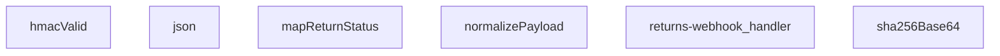

## NODE ID STANDARD

  file: supabase\functions\returns-webhook\index.ts
  function: supabase\functions\returns-webhook\index.ts::json
  function: supabase\functions\returns-webhook\index.ts::hmacValid
  function: supabase\functions\returns-webhook\index.ts::mapReturnStatus
  function: supabase\functions\returns-webhook\index.ts::normalizePayload
  function: supabase\functions\returns-webhook\index.ts::sha256Base64
  function: supabase\functions\returns-webhook\index.ts::returns-webhook_handler

---

## DISA AKTARILANLAR (EXPORTS)
  export: hmacValid
  export: json
  export: mapReturnStatus
  export: normalizePayload
  export: returns-webhook_handler
  export: sha256Base64

---
# FILE: supabase\functions\shipping-notification\index.md

---
domain: general
source_type: doc
namespace_type: module
source_path: C:\Users\alize\venthub-wt-hotfix\supabase\functions\shipping-notification\index.ts
skeleton_hash: 79dbab1fd8c75acf
entity_hashes:
  func:callerFailure: 86e71a59bf4b25a1
  func:loadShippingTemplate: f08a6d8b632a3fdf
  func:renderTemplate: 1558cee1949920ff
  func:shipping-notification_handler: 06ce613108984be4
  overview: 52bbb74d5e434069
generated_at: 2026-08-15T09:21:14Z
---

## Genel Bakış
Bu modül, bir Supabase Edge Function olarak kargo takip bildirimlerini dışarıya sunan bir HTTP API uç noktasıdır. Gelen istek verilerini alır, depolama alanından dinamik bir bildirim şablonu yükler, bu şablonu istek bilgileriyle doldurarak kişiselleştirilmiş bir içerik üretir ve istemciye yanıt olarak döndürür.

## Fonksiyon Grupları

### Şablon İşleme
Bu grup, bildirim içeriğinin dinamik ve yeniden kullanılabilir olmasını sağlayan temel mantığı barındırır. Dış depolama alanından ham şablon metni çekilir ve veri alanlarıyla birleştirilerek nihai, okunabilir bildirim metni üretilir.
- `loadShippingTemplate`, `renderTemplate`

### İstek Koordinasyonu
Bu grup, modülün dış dünya ile tek temas noktasıdır ve tüm gelen HTTP isteklerinin yaşam döngüsünü yönetir. İsteği alır, şablon işlemlerini sırasıyla çağırarak iş akışını koordine eder ve istemciye uygun durum koduyla birlikte yanıt döndürür.
- `shipping-notification_handler`

### Hata Yönetimi
Bu grup, modül genelinde oluşabilecek beklenmedik durumları yakalayıp standart bir hata yanıtı formatında dışarıya sunar. Fonksiyon, hata türünü analiz ederek anlamlı ve tutarlı bir geri bildirim üretir.
- `callerFailure`

---

## AXIOMS – Mimari Varsayımlar

Bu modül, bir Supabase Edge Function olarak kargo bildirim şablonlarını yükleyip, gelen HTTP istekleriyle birleştirerek kişiselleştirilmiş bildirim metni üreten bir API servisidir.

[Aksiyom 1]: Eğer `loadShippingTemplate` fonksiyonu depolama alanından bir şablon yükleyemezse (dosya yoksa, erişim hatası oluşursa veya depolama servisi müsait değilse), `null` değeri döndürür.
[Aksiyom 2]: Eğer `renderTemplate` fonksiyonuna geçersiz bir şablon deseni verilirse (sözdizimi hatalıysa), fonksiyon hata fırlatır veya beklenmeyen çıktı üretir.
[Aksiyom 3]: Eğer `renderTemplate` fonksiyonuna verilen `data` nesnesi, şablondaki değişken isimlerini karşılamıyorsa (eksik değişken varsa), fonksiyon hata fırlatır veya eksik değişkenleri boş/varsayılan değerle değiştirir.
[Aksiyom 4]: Eğer `shipping-notification_handler` isteği işlerken `loadShippingTemplate` fonksiyonu `null` döndürürse, handler istemciye bir hata yanıtı (muhtemelen 500) döndürür.
[Aksiyom 5]: Eğer `shipping-notification_handler` isteği işlerken `renderTemplate` fonksiyonu bir hata fırlatırsa, handler bu hatayı yakalar ve `callerFailure` aracılığıyla istemciye bir hata yanıtı döndürür.
[Aksiyom 6]: Eğer `callerFailure` fonksiyonuna bir `error` nesnesi verilirse, bu hata istemciler için güvenli bir hata mesajı ve uygun HTTP durum kodu içeren bir nesne döndürür; ancak bu hata nesnesi hakkında detaylı bilgi (hangi durum kodunu döndürdüğü) bilinmiyor.
[Aksiyom 7]: `shipping-notification_handler`'ın çağrıldığı `req` nesnesinin, handler'ın işleyebileceği geçerli bir HTTP isteği olduğu varsayılır.
[Aksiyom 8]: `renderTemplate` fonksiyonu, `tpl` parametresinin bir string ve `data` parametresinin key-value çiftlerinden oluşan bir nesne olduğunu varsayar; aksi takdirde fonksiyon hata fırlatır.

---

## FONKSİYON DETAYLARI

### callerFailure
**Ne yapar**: Bu fonksiyon, `shipping-notification` fonksiyonunun çağrılmasında oluşabilecek belirli hata türlerini yakalar ve bunları uygun HTTP durum kodlarıyla eşler. Temel amacı, çağrıcıya (HTTP istemcisine) anlamlı ve standartlaştırılmış bir hata yanıtı döndürerek sorunun kaynağını belirtmektir. Örneğin, bir kullanıcının yetkilendirilmemiş olduğu bir kiralamaya (tenant) erişmeye çalışması durumunda 403 Forbidden hatası üretir.

**Nasıl yapar**: Fonksiyon, gelen `error` nesnesinin türünü `instanceof` operatörünü kullanarak kontrol eden bir dizi koşullu ifade (if-else) bloğu çalıştırır. Her bir özel hata sınıfı (`TenantMismatchError`, `CallerConfigError`, `CallerLookupError`) için önceden tanımlanmış bir HTTP durum kodu ve bir hata mesajı içeren bir nesne döndürür. Eşleşmeyen veya bilinmeyen bir hata türü gelmesi durumunda, hiçbir eşleşme yapılamaz ve `null` değeri döndürülerek üst seviye hata işleyicinin devreye girmesi sağlanır.

**Parametreler**:
- `error: unknown` — Fonksiyona iletilen ve işlenmesi gereken hata nesnesi. Bu nesne, fonksiyonun içinde kontrol edilen `TenantMismatchError`, `CallerConfigError` veya `CallerLookupError` sınıflarından birine ait olabilir veya farklı bir hata türü olabilir. Tipi `unknown` olarak belirlenerek fonksiyonun her türlü hata girdisini kabul etmesi sağlanmıştır.

**Dönüş**: Fonksiyon, bir hata eşleşmesi bulunduğunda `{ status: number; error: string }` tipinde bir nesne döndürür. `status` alanı, HTTP durum kodunu (403, 500 veya 503), `error` alanı ise harici API yanıtlarında kullanılan kısa bir hata tanımlayıcısını (`tenant_mismatch`, `CONFIG_MISSING`, `profile_lookup_failed`) içerir. Hata eşleşmesi bulunamazsa `null` değeri döndürülür.

### renderTemplate

**Ne yapar**: Verilen bir şablon dizesindeki değişkenleri ve koşullu blokları (`{{#if ...}}`) gerçek verilerle değiştirerek nihai render edilmiş metni üretir. Basit bir şablon motoru görevi görür.

**Nasıl yapar**: Fonksiyon iki aşamalı bir regex tabanlı işleme uygular. Birinci aşamada, `{{#if KEY}}...{{/if}}` veya `{{#if KEY}}...{{if}}` kalıplarını eşleştirir; eğer `data` nesnesindeki ilgili anahtarın değeri truthy ise içeriği korur, aksi halde boş string ile değiştirir. İkinci aşamada, kalan `{{KEY}}` değişken kalıplarını eşleştirir ve `data` nesnesindeki karşılık gelen değeri (null veya undefined ise boş string, değilse `String()` ile dönüştürülmüş hali) ile değiştirir. Her iki aşama da `String.prototype.replace` ile global regex kullanılarak gerçekleştirilir.

**Parametreler**:
- `tpl`: `string` — İşlenecek şablon dizesi. İçerisinde `{{#if anahtar}}...{{/if}}` koşullu blokları ve `{{anahtar}}` değişken referansları barındırır.
- `data`: `Record<string, unknown>` — Şablondaki anahtar isimlerine karşılık gelen değerleri içeren nesne. Değerler herhangi bir tipte (`unknown`) olabilir; truthy/falsy kontrolü ve string dönüştürme buna göre yapılır.

**Dönüş**: `string` — Değişkenleri ve koşullu blokları işlenmiş, nihai render edilmiş metin döner.

### loadShippingTemplate
**Ne yapar**: Bu asenkron fonksiyon, kargo bildirimleri için kullanılan bir HTML e-posta şablonunu dosya sisteminden yükler.

**Nasıl yapar**: Fonksiyon, çağrıldığı dosyanın bulunduğu dizine göreceli olarak `./templates/email/shipping.html` yolundaki dosyayı okumak için `Deno.readTextFile` yöntemini kullanır. Bir `URL` nesnesi oluşturarak doğru mutlak yolu hesaplar. Dosya okuma işlemi başarısız olursa (örn. dosya mevcut değilse), bir `try...catch` bloğu ile yakalanır ve `null` değeri döndürülür.

**Parametreler**: Bu fonksiyon herhangi bir parametre almaz.

**Dönüş**: Promise<string | null> — Başarılı olursa HTML şablonunun içeriğini (string), başarısız olursa `null` değerini içeren bir promise.

### shipping-notification_handler
**Ne yapar**: Bu fonksiyon, kargo bildirimleriyle ilgili HTTP isteklerini işleyen bir sunucu işleyicisidir (handler). Gelen bir POST isteğini alır, ilgili iş mantığını yürütür ve bir HTTP yanıtı döndürür.

**Nasıl yapar**: Fonksiyonun gövdesi verilmemiştir; bu nedenle iç mantığı hakkında kesin bir bilgi bulunmamaktadır. Ancak imzasından ve adından yola çıkarak, bu fonksiyonun bir web framework'ün (örn. Deno Oak, Hono) istek işleyici (request handler) yapısında olduğu ve `Request` nesnesini `Response` nesnesine dönüştürdüğü çıkarılabilir. Fonksiyonun, bir kargo durumu güncellendiğinde tetiklenen bir webhook veya API endpoint'i işlediği varsayılabilir.

**Parametreler**:
- `req`: Request — Gelen HTTP istek nesnesi. İstek gövdesi, başlıkları ve URL parametrelerini içerir.

**Dönüş**: Response — İşlenen istekle ilgili HTTP yanıt nesnesi. Durum kodu, başlıklar ve opsiyonel bir gövde (örn. JSON yanıtı) içerebilir.

---

## İTHALATLAR (IMPORTS)
- import: ../_shared/cors.ts::getCorsHeaders
- import: ../_shared/sentry.ts::sentryCaptureException
- import: ../_shared/tenant_config.ts::getTenantBranding
- import: https://deno.land/std@0.168.0/http/server.ts::serve

---

## INTERFACES

### ShippingNotificationRequest
- `order_id: string`
- `customer_email: string`
- `customer_name: string`
- `order_number?: string`
- `carrier: string`
- `tracking_number: string`
- `tracking_url?: string | null`
- `tenant_id?: string`

### OrderRow
- `user_id?: string | null`
- `order_number?: string | null`
- `carrier?: string | null`
- `tracking_number?: string | null`
- `tracking_url?: string | null`

### AuthAdminUser
- `email?: string | null`
- `user_metadata?: { full_name?: string | null; name?: string | null } | null`

### ResendResult
- `id?: string`

---

## AST POINTERS

### [N1_NASIL] AST Pointer: supabase/functions/shipping-notification/index.ts::callerFailure
- **params**: `error: unknown`
- **ic_degiskenler**: (yok)
- **Dönüş**: `{ status: number; error: string } | null`

---


## MERMAID CALL GRAPH
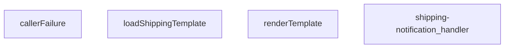

## NODE ID STANDARD

  file: supabase\functions\shipping-notification\index.ts
  function: supabase\functions\shipping-notification\index.ts::callerFailure
  function: supabase\functions\shipping-notification\index.ts::renderTemplate
  function: supabase\functions\shipping-notification\index.ts::loadShippingTemplate
  function: supabase\functions\shipping-notification\index.ts::shipping-notification_handler

---

## DISA AKTARILANLAR (EXPORTS)
  export: callerFailure
  export: loadShippingTemplate
  export: renderTemplate
  export: shipping-notification_handler

---
# FILE: supabase\functions\shipping-status\index.md

---
domain: general
source_type: doc
namespace_type: module
source_path: C:\tmp\wt-supurme\supabase\functions\shipping-status\index.ts
skeleton_hash: 555f4d6fe3ab64af
entity_hashes:
  func:shipping-status_handler: f862630b7b2b3763
  overview: eb8c635ee40800f8
generated_at: 2026-08-25T07:33:30Z
---

## Genel Bakış

Bu modül, Supabase Edge Function altyapısı üzerinde Deno runtime ile çalışan bir gönderi durumu (shipping-status) servisidir. Modül, gelen HTTP isteklerini karşılayıp yanıt döndüren tek bir handler fonksiyonundan oluşur. Modülün iç mantığı ve dış bağımlılıkları hakkında kaynakta ek bilgi bulunmamaktadır.

## Fonksiyon Grupları

### HTTP İstek İşleyici

Gelen HTTP isteklerini karşılar ve gönderi durumuyla ilgili yanıt üretir. `@serve(Deno.serve)` decorator'ı ile işaretlenerek Supabase Edge Function uç noktası olarak tanımlanmıştır.

- shipping-status_handler

---

## AXIOMS – Mimari Varsayımlar

Bu modül için özel aksiyom tanımlanmamıştır.

**Gerekçe:** Fonksiyon gövdesi verilmediğinden, modülün doğru çalışması için hangi koşulların var olması gerektiği belirlenememektedir. Yalnızca fonksiyon imzası (`shipping-status_handler(req: Request) -> Response`) ve çalıştırıcı dekoratörü (`@serve(Deno.serve)`) bilinmektedir; bu bilgiler tek başına modüle özgü bir aksiyom üretmeye yeterli değildir.

---

## FONKSİYON DETAYLARI

### shipping-status_handler

**Ne yapar**: Gelen HTTP isteklerini işleyerek bir yanıt döndüren bir Supabase Edge Function işleyicisidir. Fonksiyonun docstring'i boş bırakılmıştır; bu nedenle işlevsel amacı yalnızca fonksiyon adından ("shipping-status") kısmen çıkarılabilir ancak kesin bir açıklama mevcut değildir.

**Nasıl yapar**: `@serve(Deno.serve)` dekoratörü ile tanımlanmıştır. Bu dekoratör, fonksiyonu Deno runtime'ının yerleşik HTTP sunucusuna kaydeder ve Supabase Edge Functions altyapısının bu fonksiyonu bir HTTP uç noktası olarak sunmasını sağlar. Fonksiyon gövdesi verilen kaynakta yer almadığından iç mantık bilinmemektedir.

**Parametreler**:
- req: Request — Deno'nun yerleşik `Request` nesnesi; gelen HTTP isteğinin tüm bilgilerini (metot, başlıklar, gövde, URL vb.) içerir.

**Dönüş**: Response — Deno'nun yerleşik `Response` nesnesi; istemciye gönderilecek HTTP yanıtını (durum kodu, başlıklar, gövde vb.) temsil eder.

---

## İTHALATLAR (IMPORTS)
- import: ../_shared/cors.ts::getCorsHeaders

---

## AST POINTERS

### [N1_NASIL] AST Pointer: supabase/functions/shipping-status/index.ts::shipping-status_handler
- **params**: `req` (Request)
- **ic_degiskenler**:
  - `cors` — `getCorsHeaders(req)` fonksiyonundan dönen CORS başlıkları; her iki yanıt durumunda da kullanılır.
  - `req.method` — gelen istek methodunu kontrol etmek için kullanılır; `'OPTIONS'` ise 200 durum koduyla yanıt döndürülür.
- **Dönüş**: Response nesnesi. OPTIONS isteği için 200 durum kodu ve boş gövde, diğer istekler için 410 durum kodu ve `error`, `message`, `ref` alanlarını içeren JSON gövde döndürülür.

---

## NODE ID STANDARD

  file: index.ts
  function: index.ts::shipping-status_handler

---

## DISA AKTARILANLAR (EXPORTS)
  export: shipping-status_handler

---
# FILE: supabase\functions\shipping-webhook\index.md

---
domain: general
source_type: doc
namespace_type: module
source_path: C:\Users\alize\venthub-wt-hotfix\supabase\functions\shipping-webhook\index.ts
skeleton_hash: a944f858a34ac8ff
entity_hashes:
  func:hmacValid: e5f4d85423ceba98
  func:jsonResponse: d167d2178aa5b5dd
  func:mapCarrierStatus: 19a0fe9013dc1c2f
  func:normalizePayload: 6091b60fb70ee727
  func:sha256Base64: 0784b35c5d8e45cb
  func:shipping-webhook_handler: b6676fdc25219168
  overview: 757d37eeb58d50b6
generated_at: 2026-08-15T09:03:13Z
---

## Genel Bakış
Bu modül, kargo firmalarından gelen webhook bildirimlerini alıp işleyen merkezi bir Supabase Edge Function'dur. HMAC-SHA256 imza doğrulaması ile güvenli kabul edilen istekleri işler, farklı kargo firmalarının değişken veri yapılarını standart bir forma dönüştürerek siparişlerin kargo durumunu günceller. Mimari açıdan, tüm kargo entegrasyonları için tek bir giriş noktası ve veri normalizasyon katmanı sunarak bakım ve genişletmeyi kolaylaştırır.

## Fonksiyon Grupları
### Güvenlik ve Yanıt Yardımcıları
Bu grup, webhook isteklerinin otentikasyonu için kriptografik imza doğrulamasını ve standart JSON HTTP yanıtlarının oluşturulmasını sağlar.
- hmacValid, sha256Base64, jsonResponse

### Veri Dönüştürme ve Durum Haritalama
Farklı kargo firmalarının özel payload yapılarını merkezi ve işlenebilir bir normalize forma çevirir; ayrıca firma bazlı durum kodlarını modülün iç durum yapısına eşleyerek çoklu kargo desteği sağlar.
- normalizePayload, mapCarrierStatus

### Ana Webhook İşleyici
Modülün giriş noktasıdır; gelen HTTP isteğini alarak güvenlik doğrulaması, payload normalizasyonu, durum haritalama ve nihai güncelleme yanıtı oluşturma adımlarını orkestra eder.
- shipping-webhook_handler

---

## AXIOMS – Mimari Varsayımlar

Bu modül, kargo firması webhook'larını HMAC-SHA256 ile doğrulayıp, çoklu kargo firması formatlarını standart forma dönüştürerek kargo durumunu güncellemek üzere tasarlanmıştır.

**[Aksiyom 1 - HMAC Doğrulama Zinciri]:** Eğer `hmacValid` fonksiyonuna geçerli bir `secret`, orijinal `raw` gövde ve geçerli bir `signatureHeader` sağlanmazsa, istek HMAC-SHA256 doğrulamasından geçemez ve webhook işlenemez.

**[Aksiyom 2 - Kargo Firması Durum Eşleme]:** Eğer `mapCarrierStatus` fonksiyonuna bilinmeyen veya eşlenemeyen bir kargo durumu `input` değeri girilirse, dönen nesnede `status`, `setShipped` ve `setDelivered` alanlarının tamamı `undefined` kalır; sipariş durumu güncellenemez.

**[Aksiyom 3 - Payload Normalizasyonu]:** Eğer `normalizePayload` fonksiyonuna geçerli bir `carrierHint` (tanınmış kargo firması kodu) sağlanmazsa veya `obj` beklenen formatta bir payload içermiyorsa, payload standart forma normalize edilemez.

**[Aksiyom 4 - Zaman Kayması Toleransı]:** Eğer `SKEW_MS` sabiti (binary expression ile hesaplanan eşik değeri) HMAC zaman damgası doğrulamasında kullanılmazsa, geçerli istekler zaman aşımı nedeniyle reddedilebilir veya süresi dolmuş istekler kabul edilebilir.

**[Aksiyom 5 - Yanıt Formatı]:** Eğer `jsonResponse` fonksiyonu, geçerli bir HTTP `init` (status code, headers) ile çağrılmazsa, webhook istemcisi geçerli bir JSON yanıt alamaz ve hata durumu bildirilemez.

**[Aksiyom 6 - SHA256 Hash Hesaplama]:** Eğer `sha256Base64` fonksiyonuna geçerli bir string `input` sağlanmazsa, HMAC imza hesaplaması başarısız olur ve dolayısıyla tüm webhook istekleri reddedilir.

**[Aksiyom 7 - Ana Handler Akışı]:** Eğer `shipping-webhook_handler` fonksiyonu geçerli bir `Request` nesnesi almazsa veya istek gövdesi (body) okunamazsa, HMAC doğrulaması ve payload normalizasyonu gerçekleştirilemez; işlenmemiş bir hata yanıtı döner.

---

## FONKSİYON DETAYLARI

### jsonResponse
**Ne yapar**: Bu fonksiyon, HTTP yanıtları için standart bir JSON formatı oluşturur. Gövdeyi JSON stringine dönüştürür ve uygun `content-type` başlığını ekler.
**Nasıl yapar**: `JSON.stringify` kullanarak gövdeyi formatlanmış (2 boşluk girintili) bir string'e çevirir. Ardından, `ResponseInit` nesnesinden gelen başlıkları ve durum kodunu (varsayılan olarak 200) kullanarak yeni bir `Response` nesnesi döndürür.
**Parametreler**:
- body: unknown — Yanıt gövdesi olarak kullanılacak herhangi bir veri. Fonksiyon tarafından JSON'a dönüştürülecektir.
- init: ResponseInit — `status`, `headers` ve diğer HTTP yanıt seçeneklerini içeren opsiyonel bir nesne. Boş nesne `{}` varsayılanıdır.
**Dönüş**: `Response` — JSON verisini, uygun başlığı ve HTTP durum kodunu içeren standart bir HTTP yanıt nesnesi.

### hmacValid
**Ne yapar**: Verilen bir HMAC-SHA256 imzasının geçerliliğini doğrular. Bu, webhook isteklerinin kimliğini doğrulamak için kullanılır.
**Nasıl yapar**: `crypto.subtle` API'sini kullanarak verilen `secret` anahtarıyla ham `raw` verisinin HMAC-SHA256 imzasını hesaplar. Hesaplanan imzayı base64 formatına dönüştürür. Gelen `signatureHeader` değerini normalleştirerek (başındaki "sha256=" kısmını ve boşlukları temizleyerek) hesaplanan imzayla karşılaştırır.
**Parametreler**:
- secret: string — HMAC imza hesaplamasında kullanılacak gizli anahtar.
- raw: string — İmzası doğrulanacak ham veri (çoğunlukla HTTP gövdesi).
- signatureHeader: string — İstekle birlikte gelen ve doğrulanacak imza değeri (ör. "sha256=...").
**Dönüş**: `Promise<boolean>` — İmza geçerliyse `true`, değilse veya bir hata oluştuysa `false` döner.

### mapCarrierStatus
**Ne yapar**: Farklı kargo şirketlerinin durum metinlerini, uygulama içinde tutarlı ve tanımlı bir durum setine ve ilgili bayraklara dönüştürür.
**Nasıl yapar**: Girdiyi küçük harfe çevirir ve tanımlı durum listelerine göre eşleştirmeler yapar. Her eşleşme, uygulamanın kendi `status` alanını ve siparişin shipped/delivered olarak işaretlenip işaretlenmeyeceğini (`setShipped`, `setDelivered`) belirten boolean bayrakları döndürür. Tanımlanmamış bir durum ise olduğu gibi döner.
**Parametreler**:
- input?: string — Harita dışı bırakılacak kargo şirketi durum metni (ör. "IN_TRANSIT", "delivered"). Opsiyoneldir.
**Dönüş**: `{ status?: string; setShipped?: boolean; setDelivered?: boolean }` — Eşlenen durum bilgisini ve bayrakları içeren bir nesne. Tanınmayan bir durum girdisi varsa, `status` alanı girdinin kendisi olur.

### normalizePayload
**Ne yapar**: Farklı kargo şirketlerinin farklı yapıdaki webhook yüklerini (payload), uygulamanın beklediği tek ve standart bir formata dönüştürür.
**Nasıl yapar**: `carrierHint` parametresinden veya nesnenin kendi `carrier` alanından kargo şirketini belirler. `pick` adlı bir iç fonksiyon ile, olası farklı alan adlarını (ör. `order_id`, `orderId`, `id`) sırasıyla kontrol ederek ilk bulunan değeri alır. Bu sayede gelen verinin yapısı ne olursa olsun, aynı çıktı alanlarına (`order_id`, `tracking_number`, `status` vb.) sahip düzgün bir nesne oluşturulur.
**Parametreler**:
- carrierHint: string — Kargo şirketi bilgisi (ör. "ups", "fedex"). Yük içindeki `carrier` alanından önce kontrol edilir veya onu tamamlar.
- obj: unknown — Webhook'tan gelen ham JSON nesnesi.
**Dönüş**: `Record<string, string>` — `order_id`, `order_number`, `carrier`, `tracking_number`, `tracking_url`, `status`, `shipped_at` ve `delivered_at` alanlarını içeren, değerleri string'e dönüştürülmüş standart bir nesne.

### sha256Base64
**Ne yapar**: Verilen bir girdi string'inin SHA-256 özetini hesaplar ve sonucu base64 formatında döndürür.
**Nasıl yapar**: `TextEncoder` kullanarak string'i byte dizisine dönüştürür. `crypto.subtle.digest` ile SHA-256 hash hesaplar. Elde edilen byte dizisini `btoa(String.fromCharCode(...))`-yardımıyla base64 formatına kodlar.
**Parametreler**:
- input: string — Hash'i hesaplanacak veri.
**Dönüş**: `Promise<string>` — Hesaplanan SHA-256 özetinin base64 encoded hali.

### shipping-webhook_handler
**Ne yapar**: Gelen HTTP isteğini (webhook) işleyerek, taşıyıcıdan gelen veriyi doğrular, normalleştirir ve uygun yanıtı döndürür.  
**Nasıl yapar**: İstek `req` nesnesinden okunur, HMAC doğrulaması `hmacValid` ile yapılır, payload `normalizePayload` ile standartlaştırılır, taşıyıcı durumu `mapCarrierStatus` ile yorumlanır ve sonuç `jsonResponse` aracılığıyla JSON formatında yanıt olarak gönderilir.  
**Parametreler**:
- req: Request — Webhook çağrısını temsil eden HTTP isteği nesnesi.  
**Dönüş**: Response — İşlem sonucunu içeren HTTP yanıtı.

---

## İTHALATLAR (IMPORTS)
- import: ../_shared/tenant.ts::tenantFromRow
- import: https://esm.sh/@supabase/supabase-js@2.45.4::createClient

---

## SABİTLER
- **SKEW_MS** (binary_expression) — `5 * 60 * 1000`

---

## AST POINTERS

### [N1_NASIL] AST Pointer: `C:\Users\alize\venthub-wt-hotfix\supabase\functions\shipping-webhook\index.ts`::jsonResponse
- **params**: (body: unknown, init: ResponseInit = {})
- **ic_degiskenler**:
  - `body` — JSON'laştırılacak gövde
  - `init` — Response başlatma seçenekleri (status, headers)
- **Dönüş**: Response nesnesi

### [N2_NASIL] AST Pointer: `C:\Users\alize\venthub-wt-hotfix\supabase\functions\shipping-webhook\index.ts`::hmacValid
- **params**: (secret: string, raw: string, signatureHeader: string)
- **ic_degiskenler**:
  - `key` — HMAC-SHA256 için gizli anahtar
  - `sigBytes` — Hesaplanan imza baytları
  - `computed` — Base64'e kodlanmış hesaplanan imza
  - `normalize` — İmza başlığını normalleştiren fonksiyon (sha256= ön ekini kaldırır)
  - `given` — Verilen imza başlığı
- **Dönüş**: boolean (imza geçerli mi)

### [N3_NASIL] AST Pointer: `C:\Users\alize\venthub-wt-hotfix\supabase\functions\shipping-webhook\index.ts`::mapCarrierStatus
- **params**: (input?: string)
- **ic_degiskenler**:
  - `s` — Kullanıcı girdisinin küçük harfli versiyonu
- **Dönüş**: { status?: string; setShipped?: boolean; setDelivered?: boolean }

### [N4_NASIL] AST Pointer: `C:\Users\alize\venthub-wt-hotfix\supabase\functions\shipping-webhook\index.ts`::normalizePayload
- **params**: (carrierHint: string, obj: unknown)
- **ic_degiskenler**:
  - `rec` — obj'nin Record<string, unknown> tipine dönüştürülmüş hali
  - `c` — Kargo sağlayıcı adı (küçük harf, trim)
  - `pick` — birden fazla anahtar arasından ilk mevcut değeri alan fonksiyon
  - `norm` — normalize edilmiş payload nesnesi
  - `carrierHint` parametresi — istek başlığından gelen kargo ipucu
  - `obj` parametresi — ham payload verisi
- **Dönüş**: norm objesi (order_id, order_number, carrier, tracking_number, tracking_url, status, shipped_at, delivered_at alanlarını içerir)

### [N5_NASIL] AST Pointer: `C:\Users\alize\venthub-wt-hotfix\supabase\functions\shipping-webhook\index.ts`::sha256Base64
- **params**: (input: string)
- **ic_degiskenler**:
  - `bytes` — input'un TextEncoder ile kodlanmış hali
  - `hash` — SHA-256 hash'i
- **Dönüş**: Promise<string> (base64'e kodlanmış hash)

### [N6_NASIL] AST Pointer: `C:\Users\alize\venthub-wt-hotfix\supabase\functions\shipping-webhook\index.ts`::shipping-webhook_handler
- **params**: (req: Request)
- **ic_degiskenler**:
  - `raw` — İsteğin ham gövdesi (string)
  - `payload` — JSON'dan ayrıştırılmış veri
  - `secret` — SHIPPING_WEBHOOK_SECRET ortam değişkeni
  - `signature` — x-signature veya x-carrier-signature başlığı
  - `authorized` — Yetkilendirme durumu (boolean)
  - `token` — x-webhook-token başlığı (legacy fallback)
  - `expected` — SHIPPING_WEBHOOK_TOKEN ortam değişkeni
  - `tsHeader` — x-timestamp veya x-event-time başlığı
  - `t` — Zaman damgası (epoch ms)
  - `SUPABASE_URL` — SUPABASE_URL ortam değişkeni
  - `SERVICE_KEY` — SUPABASE_SERVICE_ROLE_KEY ortam değişkeni
  - `supabase` — Supabase istemcisi
  - `carrierHint` — x-carrier başlığı
  - `p` — normalizePayload ile normalize edilmiş payload
  - `eventId` — x-id veya x-event-id başlığı (dedup için)
  - `existing` — tekrar kontrolü için mevcut event satırları
  - `orderId` — Sipariş ID'si (p.order_id veya veritabanından türetilmiş)
  - `data` — venthub_orders tablosundan sipariş satırı (orderId araması için)
  - `error` — Supabase sorgu hatası (orderId araması için)
  - `current` — Mevcut sipariş satırı (id, tenant_id, status, shipped_at, delivered_at, tracking_number, tracking_url, carrier alanlarını içerir)
  - `curErr` — Supabase sorgu hatası (mevcut sipariş araması için)
  - `tenantId` — tenantFromRow ile türetilen kiracı ID'si
  - `patch` — Güncellenecek alanlar
  - `mapped` — mapCarrierStatus ile eşleştirilmiş durum
  - `curStatus` — Mevcut sipariş durumu (lowercase)
  - `next` — Sıradaki durum (lowercase)
  - `curRank` — Mevcut durum sırası
  - `nextRank` — Sıradaki durum sırası
  - `parseDate` — Tarih string'ini ISO formatına dönüştüren fonksiyon
  - `noChange` — Değişiklik olup olmadığını kontrol eden boolean
  - `bodyHash` — Ham gövdenin SHA-256 hash'i
  - `msg` — Hata mesajı
  - `t` (zaman damgası bloğu içinde) — Epoch ms olarak zaman damgası
  - `d` (t bloğu içinde) — Date.parse ile parse edilmiş zaman
- **Dönüş**: Response (JSON yanıtlar veya hata yanıtları)

---


## MERMAID CALL GRAPH
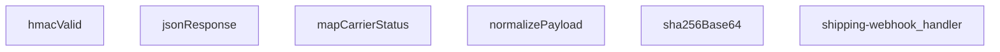

## NODE ID STANDARD

  file: supabase\functions\shipping-webhook\index.ts
  function: supabase\functions\shipping-webhook\index.ts::jsonResponse
  function: supabase\functions\shipping-webhook\index.ts::hmacValid
  function: supabase\functions\shipping-webhook\index.ts::mapCarrierStatus
  function: supabase\functions\shipping-webhook\index.ts::normalizePayload
  function: supabase\functions\shipping-webhook\index.ts::sha256Base64
  function: supabase\functions\shipping-webhook\index.ts::shipping-webhook_handler

---

## DISA AKTARILANLAR (EXPORTS)
  export: hmacValid
  export: jsonResponse
  export: mapCarrierStatus
  export: normalizePayload
  export: sha256Base64
  export: shipping-webhook_handler

---
# FILE: supabase\functions\stock-alert\index.md

---
domain: general
source_type: doc
namespace_type: module
source_path: C:\tmp\wt-supurme\supabase\functions\stock-alert\index.ts
skeleton_hash: 353ddadfd71bd5fc
entity_hashes:
  func:callerFailure: fde9d7f7ce5e2c8f
  func:checkAllProducts: d480a73d7246f019
  func:checkSpecificProduct: 5027f709f9a40c80
  func:getAlertRecipients: ef8d3e778c7b2d81
  func:processProductAlert: c58aae9b08876f88
  func:sendNotification: 9cdc9ad48f9dd1f6
  func:stock-alert_handler: 9f0ae49f1a00dd49
  overview: 7d8f90a52cfdc8ef
generated_at: 2026-08-25T07:34:04Z
---

## Genel Bakış
Bu modül, Supabase üzerinde çalışan bir stok uyarı fonksiyonudur. Ürün stoklarını kontrol eder ve belirlenen alıcılara bildirim göndererek otomatik bir uyarı sistemi sağlar. Modül, hem toplu hem de tekil ürün kontrolü yapabilir ve hata yönetimini içerir.

## Fonksiyon Grupları
### İstek İşleme ve Hata Yönetimi
Gelen HTTP isteklerini karşılar, yönlendirir ve oluşabilecek hataları standart bir formatta işleyerek yanıt üretir.
- stock-alert_handler, callerFailure

### Stok Kontrolü
Veritabanındaki tüm ürünleri veya belirli bir ürünü stok durumuna göre kontrol ederek uyarı tetikleme koşullarını belirler.
- checkAllProducts, checkSpecificProduct

### Uyarı Oluşturma ve Bildirim
Uyarı alıcılarını getirir, kontrol edilen ürünler için uyarıları işler ve harici bildirim servisleri aracılığıyla bildirim gönderir.
- getAlertRecipients, processProductAlert, sendNotification

---

## AXIOMS – Mimari Varsayımlar
- Bu modül davranışsal mantık içermez (salt veri / konfigürasyon / tip tanımı).
- [Aksiyom 1]: Modülün dışa açtığı yapı (anahtar kümesi / şema) bir sözleşmedir; tüketiciler bu sabit yapıya bağlıdır — kırıcı değişiklik tüm tüketicileri etkiler.
- [Aksiyom 2]: Bir öğe ekleme/çıkarma yapısal-uyumlu olmalı; ilgili tipler ve seçiciler aynı commit'te güncel tutulmalıdır.

---

## FONKSİYON DETAYLARI

### callerFailure
**Ne yapar**: Kapı katmanında yakalanan hataları HTTP durum kodlarına eşler. Beş bildirim ucuyla birebir aynı metni kullanarak `TenantMismatchError` → 403, `CallerConfigError` → 500, `CallerLookupError` → 503 eşleştirmesi yapar. Fonksiyon `null` dönerse hata bu kapıya ait değildir ve yeniden fırlatılması gerekir; dıştaki catch bloğu bu durumda 500 döner.

**Nasıl yapar**: Gelen `error` parametresinin `instanceof` kontrolüyle hangi özel hata sınıfına ait olduğunu belirler. Her hata türü için sabit bir HTTP durum kodu ve hata anahtarı içeren nesne döndürür. Üç bilinen hata sınıfından hiçbiriyle eşleşmezse `null` döndürerek hatanın bu kapıya ait olmadığını işaret eder.

**Parametreler**:
- error: unknown — Yakalanan hata nesnesi; `TenantMismatchError`, `CallerConfigError` veya `CallerLookupError` türlerinden biri olabilir.

**Dönüş**: `{ status: number; error: string } | null` — Eşleşen hata için HTTP durum kodu ve hata anahtarı içeren nesne; eşleşme yoksa `null`.

### stock-alert_handler
**Ne yapar**: Geliştirildi ancak detay üretilemedi.

### checkAllProducts
**Ne yapar**: Geliştirildi ancak detay üretilemedi.

### checkSpecificProduct
**Ne yapar**: Geliştirildi ancak detay üretilemedi.

### processProductAlert
**Ne yapar**: Geliştirildi ancak detay üretilemedi.

### sendNotification
**Ne yapar**: Geliştirildi ancak detay üretilemedi.

### getAlertRecipients
**Ne yapar**: Geliştirildi ancak detay üretilemedi.

---

## İTHALATLAR (IMPORTS)
- import: ../_shared/cors.ts::getCorsHeaders
- import: https://deno.land/std@0.168.0/http/server.ts::serve
- import: https://esm.sh/@supabase/supabase-js@2.45.4::SupabaseClient
- import: https://esm.sh/@supabase/supabase-js@2.45.4::createClient

---

## INTERFACES

### Product
- `id: string`
- `name: string`
- `stock_qty: number`
- `low_stock_threshold: number`

### AlertRecipient
- `name: string`
- `phone: string`
- `email: string`
- `whatsapp: string`
- `role: 'admin' | 'manager' | 'buyer'`
- `notifications: {
`

### AlertData
- `productName: string`
- `_productId: string`
- `currentStock: number`
- `threshold: number`
- `alertType: 'out_of_stock' | 'low_stock'`

---

## AST POINTERS

### [N1_NASIL] AST Pointer: supabase/functions/stock-alert/index.ts::callerFailure
- **params**: `error` (unknown)
- **ic_degiskenler**: yok — fonksiyon gövdesinde yalnızca ardışık `instanceof` kontrolleri ve sabit dönüş nesneleri var; atanmış bir değişken yok
- **Dönüş**: `{ status: number; error: string } | null` — `error` bir `TenantMismatchError` ise `{ status: 403, error: 'tenant_mismatch' }`, `CallerConfigError` ise `{ status: 500, error: 'CONFIG_MISSING' }`, `CallerLookupError` ise `{ status: 503, error: 'profile_lookup_failed' }`; bunların hiçbiri değilse `null`

---

### [N2_NASIL] AST Pointer: supabase/functions/stock-alert/index.ts::stock-alert_handler
- **params**: `req` (Request)
- **ic_degiskenler**:
  - `corsHeaders` — `getCorsHeaders(req)` çağrısından dönen, `req`'e özgü CORS başlık nesnesi
  - `supabaseUrl` — `Deno.env.get('SUPABASE_URL')` ile okunan ortam değişkeni; yoksa 500 dönülür
  - `serviceRoleKey` — `Deno.env.get('SUPABASE_SERVICE_ROLE_KEY')` ile okunan ortam değişkeni; yoksa 500 dönülür
  - `ctx` — `resolveCaller(req, {})` ile üretilen `CallerContext` nesnesi; `ctx.kind` ve `ctx.role` alanları yetki denetiminde kullanılır
  - `failure` — `callerFailure(err)` çağrısının dönüşü; `null` değilse hata HTTP yanıtı olarak döndürülür
  - `supabase` — `createClient(supabaseUrl, serviceRoleKey)` ile oluşturulan `SupabaseClient` örneği
  - `alertResults` — `unknown[]` türünde, `checkAllProducts` veya `checkSpecificProduct` dönüşlerini tutan dizi
  - `_productId` — `req.json()` ile POST gövdesinden çıkarılan ürün kimliği; yoksa hata fırlatılır
  - `error` — `catch` bloğunda yakalanan hata nesnesi
  - `msg` — `error instanceof Error` ise `error.message`, aksi halde `String(error)` ile üretilen hata mesajı dizesi
- **Dönüş**: `Response` — OPTIONS isteğine `200 'ok'`, başarılı işleme `200` ile JSON (`success`, `alerts_processed`, `results`, `timestamp`), yetki reddine `401`/`403`, yapılandırma eksikliğine `500`, yakalanan hatalara `500` ile `{ error, success: false }`

---

### [N3_NASIL] AST Pointer: supabase/functions/stock-alert/index.ts::checkAllProducts
- **params**: `supabase` (SupabaseClient)
- **ic_degiskenler**:
  - `esikSatiri` — `supabase.from('products').select('low_stock_threshold').order(...).limit(1).maybeSingle()` ile alınan, en yüksek eşik değerini içeren satır; `esikSatiri?.low_stock_threshold` okunur
  - `esikErr` — eşik sorgusunun hatası; varsa throw edilir
  - `enBuyukEsik` — `Math.max(Number(esikSatiri?.low_stock_threshold ?? 0) || 0, VARSAYILAN_ESIK)` ile hesaplanan ön-filtre sınırı
  - `allLowStock` — `supabase.from('products').select('id, name, stock_qty, low_stock_threshold').filter('stock_qty', 'lte', enBuyukEsik)` ile alınan ürün dizisi
  - `fetchErr` — ürün sorgusunun hatası; varsa throw edilir
  - `productsToAlert` — `allLowStock` üzerinde `p.stock_qty <= (p.low_stock_threshold || VARSAYILAN_ESIK)` koşuluyla filtrelenmiş `Product[]` dizisi
  - `recipients` — `getAlertRecipients(supabase)` ile alınan `AlertRecipient[]` dizisi; boşsa ve ürün varsa hata fırlatılır
  - `results` — her ürün için `processProductAlert` çağrılarının dönüşlerini biriktiren dizi
  - `product` — `for` döngüsünde kullanılan tekil `Product` nesnesi
- **Dönüş**: `results` dizisi (her eleman `processProductAlert` dönüşü)

---

### [N4_NASIL] AST Pointer: supabase/functions/stock-alert/index.ts::checkSpecificProduct
- **params**: `supabase` (SupabaseClient), `_productId` (string)
- **ic_degiskenler**:
  - `product` — `supabase.from('products').select('id, name, stock_qty, low_stock_threshold').eq('id', _productId).single()` ile alınan tekil ürün; bulunamazsa hata fırlatılır
  - `error` — ürün sorgusunun hatası; varsa throw edilir
  - `recipients` — `getAlertRecipients(supabase)` ile alınan `AlertRecipient[]` dizisi
- **Dönüş**: dizi — `product.stock_qty` eşik üstündeyse `[{ product: product.name, message: 'Stock above threshold' }]`, değilse `[processProductAlert(supabase, product, recipients)]`

---

### [N5_NASIL] AST Pointer: supabase/functions/stock-alert/index.ts::processProductAlert
- **params**: `supabase` (SupabaseClient), `product` (Product), `recipients` (AlertRecipient[])
- **ic_degiskenler**:
  - `alertType` — `product.stock_qty <= 0` ise `'out_of_stock'`, aksi halde `'low_stock'`
  - `priority` — `product.stock_qty <= 0` ise `'critical'`, aksi halde `'high'`
  - `alertData` — `AlertData` nesnesi; `productName`, `_productId`, `currentStock`, `threshold`, `alertType` alanlarını içerir
  - `notifications` — `sendNotification` çağrılarının dönüşlerini biriktiren dizi
  - `recipient` — `for` döngüsünde kullanılan tekil `AlertRecipient` nesnesi; `recipient.notifications[alertType]` false ise atlanır; `recipient.notifications.whatsapp`, `recipient.notifications.sms`, `recipient.notifications.email` ve karşılık gelen iletişim alanları (`whatsapp`, `phone`, `email`) kontrol edilerek bildirim gönderilir
- **Dönüş**: `{ product: string, alertType: string, notifications: number, success: boolean }` — `success`, `notifications.every(n => n.success)` ile belirlenir

---

### [N6_NASIL] AST Pointer: supabase/functions/stock-alert/index.ts::sendNotification
- **params**: `type` (string), `to` (string), `data` (AlertData), `priority` (string)
- **ic_degiskenler**:
  - `supabaseUrl` — `Deno.env.get('SUPABASE_URL')` ile okunan ortam değişkeni
  - `serviceRoleKey` — `Deno.env.get('SUPABASE_SERVICE_ROLE_KEY')` ile okunan ortam değişkeni
  - `response` — `fetch` ile `${supabaseUrl}/functions/v1/notification-service` adresine POST yapılan isteğin sonucu; gövdede `type`, `to`, `priority`, `message` (alertType'a göre koşullu metin), `data` (orijinal data + `subject` alanı) gönderilir
  - `err` — `catch` bloğunda yakalanan hata; konsola yazılır
- **Dönüş**: `{ type: string, recipient: string, success: boolean }` — başarılıysa `response.ok`, hata durumunda `false`

---

### [N7_NASIL] AST Pointer: supabase/functions/stock-alert/index.ts::getAlertRecipients
- **params**: `supabase` (SupabaseClient)
- **ic_degiskenler**:
  - `settings` — `supabase.from('inventory_settings').select('alert_email').maybeSingle()` ile alınan satır; `settings?.alert_email` okunur
  - `recipients` — `AlertRecipient[]` türünde dizi; `settings.alert_email` varsa tek elemanlı (`name: 'Sistem Yöneticisi'`, `email: settings.alert_email`, `role: 'manager'`, `notifications: { low_stock: true, out_of_stock: true, sms: false, whatsapp: false, email: true }`); yoksa boş
- **Dönüş**: `AlertRecipient[]` — boş liste döndürülebilir; yedek/gömülü adres yok

---


## MERMAID CALL GRAPH
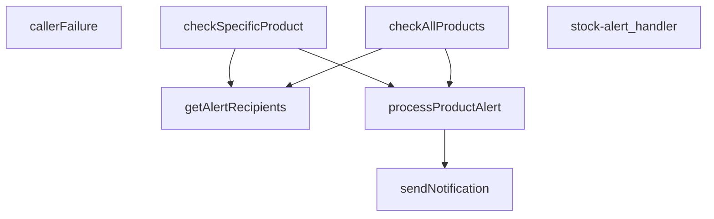

## NODE ID STANDARD

  file: index.ts
  function: index.ts::callerFailure
  function: index.ts::stock-alert_handler
  function: index.ts::checkAllProducts
  function: index.ts::checkSpecificProduct
  function: index.ts::processProductAlert
  function: index.ts::sendNotification
  function: index.ts::getAlertRecipients

---

## DISA AKTARILANLAR (EXPORTS)
  export: callerFailure
  export: checkAllProducts
  export: checkSpecificProduct
  export: getAlertRecipients
  export: processProductAlert
  export: sendNotification
  export: stock-alert_handler

---
# FILE: supabase\functions\tcmb-rates-sync\index.md

---
domain: general
source_type: doc
namespace_type: module
source_path: C:\Users\alize\venthub-wt-hotfix\supabase\functions\tcmb-rates-sync\index.ts
skeleton_hash: 154a8f6d9cd8d94f
entity_hashes:
  func:parseBulletin: 22e4e4d4e126232a
  func:tcmb-rates-sync_handler: 091085454d214b21
  overview: 79862a3904613170
generated_at: 2026-08-15T07:33:55Z
---

## Genel Bakış
Bu modül, Türkiye Cumhuriyet Merkez Bankası (TCMB) tarafından yayımlanan döviz kuru ve faiz oranları bültenlerini otomatik olarak senkronize etmek için tasarlanmış bir Supabase Edge Function'dır. Dışarıdan bir HTTP isteği ile tetiklenen modül, gelen XML bültenini analiz ederek yapılandırılmış bir veriye dönüştürür ve işlenen verilerin veritabanına kaydedilmesini koordine eder.

## Fonksiyon Grupları
### HTTP İstek Koordinasyonu
Modülün dış etkileşim noktasıdır; isteği doğrular, XML bültenini alır ve iş akışını başlatarak parse etme, veritabanı güncelleme gibi tüm adımları yönetir.
- tcmb-rates-sync_handler

### XML Bülten Analizi
Ham TCMB XML verisini alıp, doğrudan kullanılabilecek yapılandırılmış bir JavaScript nesnesine (döviz kurları, faiz oranları) dönüştürmekten sorumludur.
- parseBulletin

---

## AXIOMS – Mimari Varsayımlar

Bu modül, TCMB döviz kuru XML bültenlerini işleyerek veritabanını güncelleyen bir veri senkronizasyon modülüdür.

[Aksiyom 1]: Eğer `parseBulletin` fonksiyonuna geçersiz veya beklenen TCMB XML formatında olmayan bir string girilirse, `ParsedBulletin | null` dönüş tanımı gereği `null` döner.

[Aksiyom 2]: Eğer `parseBulletin` başarılı bir şekilde XML'yi parse ederse, yapılandırılmış bir `ParsedBulletin` nesnesi döner.

[Aksiyom 3]: Eğer `tcmb-rates-sync_handler` fonksiyonu bir hata ile karşılaşırsa bile, fonksiyon imzası gereği her zaman geçerli bir `Response` nesnesi dönmelidir.

[Aksiyom 4]: Eğer `tcmb-rates-sync_handler` fonksiyonu `async` olarak tanımlanmamışsa, içeresindeki I/O işlemleri (HTTP istekleri, veritabanı yazma) bloklanarak hata oluşur.

[Aksiyom 5]: Eğer handler'a geçersiz bir `Request` nesnesi girilse bile, fonksiyon response döndürme zorunluluğundadır (hata response'u dahil).

[Aksiyom 6]: Modül, TCMB XML bültenlerinin belirli bir şemaya sahip olduğunu varsayar; bu şema değişirse `ParsedBulletin` yapısı da güncellenmelidir.

---

## FONKSİYON DETAYLARI

### parseBulletin
**Ne yapar**: Bu fonksiyon, Türkiye Cumhuriyet Merkez Bankası'ndan gelen bir XML dizesini (muhtemelen döviz kurları bülteni) alır, bu XML'den etkin kur tarihini ve belirli para birimleri için döviz kurlarını çıkararak yapılandırılmış bir nesne olarak döndürür.

**Nasıl yapar**: Fonksiyon öncelikle verilen XML string'i üzerinde bir regular expression (regex) kullanarak `Tarih_Date` elemanındaki `Date` özniteliğini arar ve tarih bilgisini (ay, gün, yıl) çıkarır. Tarih bulunamazsa `null` döner. Ardından, önceden tanımlı `QUOTE_CURRENCIES` dizisindeki her bir para birimi kodu için XML'de ilgili `<Currency>` bloğunu regex ile bulur. Her blok içinde `BanknoteSelling` etiketinden (kağıt para satış fiyatı) kuru almaya çalışır; bu değer geçerli ve sıfırdan büyük değilse `ForexSelling` etiketinden (döviz kuru) kuru almaya çalışır. Geçerli bir kur elde edildiğinde bu kuru `rates` nesnesine ekler. Tüm para birimleri işlendikten sonra, eğer hiçbir geçerli kur bulunamamışsa (`rates` nesnesinin anahtarları boşsa) `null` döner; aksi halde etkin tarih (YYYY-AA-GG formatında) ve kurlar nesnesini içeren `ParsedBulletin` nesnesini döndürür.

**Parametreler**:
- `xml`: `string` — TCMB'den alınan döviz kurları bültenini içeren ham XML verisi. Fonksiyon bu string'i doğrudan düzenli ifadelerle ayrıştırır.

**Dönüş**: `ParsedBulletin | null` — İşleme başarılıysa, `effectiveDate` (string, YYYY-AA-GG formatında) ve `rates` (döviz kodlarını anahtar, kur değerlerini sayı olarak tutan nesne) alanlarını içeren bir nesne döner. Tarih bilgisi XML'de bulunamazsa veya hiçbir para birimi için geçerli bir kur extracts edilemezse `null` döner. `ParsedBulletin` tipinin yapısı `{ effectiveDate: string; rates: Record<string, number> }` şeklindedir.

### tcmb-rates-sync_handler
**Ne yapar**: Bu fonksiyon, HTTP isteklerini karşılayan asenkron bir sunucu işleyicisidir. TCMB döviz kurlarının senkronizasyonunu tetikleyen veya bu işlemle ilgili bir API endpoint'ini temsil eder.

**Nasıl yapar**: Fonksiyon, `@serve(serve)` dekoratörü ile işaretlenmiştir. Bu dekoratör, fonksiyonu bir HTTP sunucusu işlevine dönüştürür; belirli bir rotaya (URL yoluna) bağlanmasını sağlar ve gelen istekleri otomatik olarak işlevin `req` parametresine iletir. İşlevin asenkron (`async`) yapısı, potansiyel olarak uzun sürebilecek ağ tabanlı bir senkronizasyon işlemini engellemeden gerçekleştirmesine olanak tanır. Fonksiyonun gövdesi verilmediğinden, iş mantığı bilinmemektedir; ancak imzası ve dekoratörü, bunun bir tetikleyici veya senkronizasyon endpoint'i olduğunu gösterir.

**Parametreler**:
- req: Request — HTTP isteği nesnesi. İstekle ilgili header, body ve URL bilgilerini içerir.

**Dönüş**: Response — HTTP yanıt nesnesi. İşlem sonucuna göre bir durum kodu ve muhtemelen bir yanıt gövdesi (örn: başarı/hata mesajı, senkronize edilen veriler) içerir.

---

## İTHALATLAR (IMPORTS)
- import: https://deno.land/std@0.177.0/http/server.ts::serve
- import: https://esm.sh/@supabase/supabase-js@2.45.4::createClient

---

## INTERFACES

### ParsedBulletin
- `effectiveDate: string`
- `rates: Record<string, number>`

---

## AST POINTERS

### [N1_NASIL] AST Pointer: supabase/functions/tcmb-rates-sync/index.ts::parseBulletin
- **params**: `(xml: string)`
- **ic_degiskenler**:
  - `dateMatch` — xml içinden Tarih_Date etiketinin Date özniteliğini eşleştiren regex sonucu (tarih bilgisi)
  - `month` — dateMatch[1] erişimi ile elde edilen ay bilgisi (2 haneli string)
  - `day` — dateMatch[2] erişimi ile elde edilen gün bilgisi (2 haneli string)
  - `year` — dateMatch[3] erişimi ile elde edilen yıl bilgisi (4 haneli string)
  - `rates` — para birimi kodlarına karşılık gelen kurları tutan nesne
  - `code` — QUOTE_CURRENCIES dizisindeki her bir para birimi kodu
  - `block` — xml içinde belirli bir para birimi bloğunu eşleştiren regex sonucu
  - `pick` — Belirli bir XML etiketinin (BanknoteSelling/ForexSelling) içeriğini çıkaran iç fonksiyon
  - `m` — pick fonksiyonu içindeki regex eşleşme sonucu
  - `banknote` — BanknoteSelling değerini pick ile çıkaran değişken (sayısal)
  - `forex` — ForexSelling değerini pick ile çıkaran değişken (sayısal)
  - `rate` — banknote veya forex'ten uygun olanı seçip hesaplanan kur
- **Dönüş**: `ParsedBulletin | null` (tarih ve kurlar nesnesi veya parse başarısızsa null)

### [N2_NASIL] AST Pointer: supabase/functions/tcmb-rates-sync/index.ts::tcmb-rates-sync_handler
- **params**: `(req: Request)`
- **ic_degiskenler**:
  - `supabaseUrl` — Deno ortam değişkeninden alınan SUPABASE_URL
  - `serviceKey` — Deno ortam değişkeninden alınan SUPABASE_SERVICE_ROLE_KEY
  - `supabase` — createClient ile oluşturulan Supabase istemcisi
  - `xml` — TCMB API'sinden çekilen XML verisi (başlangıçta boş string)
  - `res` — TCMB_URL adresine yapılan fetch isteği sonucu
  - `bulletin` — parseBulletin ile işlenmiş TCMB bülteni (tarih ve kurlar)
  - `tenants` — 'tenants' tablosundan çekilen tüm kiracılar
  - `tenantsError` — tenants sorgusu hatası
  - `inserted` — başarıyla eklenen kur sayısı
  - `skipped` — atlanan (mevcut veya hata nedeniyle eklenmeyen) kur sayısı
  - `errors` — hata mesajlarını tutan dizi
  - `tenant` — tenants dizisindeki her bir kiracı nesnesi (id alanı)
  - `code` — bulletin.rates nesnesindeki her bir para birimi kodu
  - `rate` — bulletin.rates[code] erişimi ile elde edilen kur değeri
  - `existing` — 'currency_rates' tablosunda aynı kiracı/kur/tarih/kaynak kombinasyonu olup olmadığını kontrol eden sorgu sonucu
  - `readError` — existing sorgusundaki hata
  - `insertError` — currency_rates tablosuna insert işlemindeki hata
- **Dönüş**: `Response` (JSON formatında sonuç: tarih, eklenen/atlanan kur sayıları ve hatalar)

---

## NODE ID STANDARD

  file: supabase\functions\tcmb-rates-sync\index.ts
  function: supabase\functions\tcmb-rates-sync\index.ts::parseBulletin
  function: supabase\functions\tcmb-rates-sync\index.ts::tcmb-rates-sync_handler

---

## DISA AKTARILANLAR (EXPORTS)
  export: parseBulletin
  export: tcmb-rates-sync_handler

---
# FILE: supabase\functions\_shared\caller.md

---
domain: general
source_type: doc
namespace_type: module
source_path: C:\tmp\ops-t165\supabase\functions\_shared\caller.ts
skeleton_hash: cf9b0e6268e5d2fb
entity_hashes:
  func:CallerConfigError:constructor: df8483ebfe5b3e3d
  func:CallerLookupError:constructor: 40e6e78eced3dceb
  func:bearerToken: aa758b7d4952ea44
  func:resolveCaller: 3eb070512438494a
  func:timingSafeEquals: 1b5ce2b599ee24ff
  func:toProfileRow: d0e3271a9b376f12
  overview: 79f5642c4bc11b77
generated_at: 2026-08-27T07:09:06Z
---

## Genel Bakış
Bu modül, Supabase fonksiyonlarına gelen isteklerden çağrıcı (caller) bağlamını çözümlemek için temel yardımcı fonksiyonları ve hata sınıflarını içerir. Bearer token çıkarma, güvenli string karşılaştırma ve profil satırına dönüştürme gibi işlemleri gerçekleştirir. Modül, çağrıcı kimliğini doğrulama ve yapılandırma hatalarını yönetme süreçlerinde kritik bir rol oynar.

## Fonksiyon Grupları
### Token ve Kimlik Doğrulama
Gelen HTTP isteğinden Bearer token bilgisini çıkarır ve döndürür.
- bearerToken

### Güvenlik ve Karşılaştırma
İki string değerini zamanlama saldırılarına karşı güvenli bir şekilde eşit olup olmadıklarını kontrol eder.
- timingSafeEquals

### Veri Dönüşümü
Bilinmeyen bir değeri `TenantProfileRow` türüne dönüştürmeye çalışar; başarısız olursa `null` döndürür.
- toProfileRow

### Ana Çözümleme
Gelen istekten ve isteğe bağlı olarak ayrıştırılmış gövdeden çağrıcı bağlamını çözümleyerek bir `CallerContext` nesnesi oluşturur.
- resolveCaller

### Hata Sınıfları
Yapılandırma eksikliklerinde ve çağrıcı arama hatalarında fırlatılmak üzere özel hata sınıfları tanımlar.
- CallerConfigError, CallerLookupError

---

## AXIOMS – Mimari Varsayımlar
- Bu modül davranışsal mantık içermez (salt veri / konfigürasyon / tip tanımı).
- [Aksiyom 1]: Modülün dışa açtığı yapı (anahtar kümesi / şema) bir sözleşmedir; tüketiciler bu sabit yapıya bağlıdır — kırıcı değişiklik tüm tüketicileri etkiler.
- [Aksiyom 2]: Bir öğe ekleme/çıkarma yapısal-uyumlu olmalı; ilgili tipler ve seçiciler aynı commit'te güncel tutulmalıdır.

---

## FONKSİYON DETAYLARI

### bearerToken
**Ne yapar**: HTTP isteğinin `Authorization` başlığındaki Bearer token'ı çıkarır. Başlık yoksa veya token boşsa `null` döner. Başlık adı büyük/küçük harf duyarsız olarak aranır.

**Nasıl yapar**: `request.headers.get('Authorization')` ile başlığı okur. Başlık yoksa `null` döner. Başlık varsa, tanımlı `BEARER_PREFIX_RE` düzenli ifadesiyle "Bearer " önekini kaldırır ve kalan kısmı boşluklardan arındırır (`trim`). Elde edilen token'ın uzunluğu sıfırdan büyükse token'ı, değilse `null` döndürür.

**Parametreler**:
- request: Request — HTTP isteği nesnesi. `Authorization` başlığı bu nesne üzerinden okunur.

**Dönüş**: `string | null` — Bulunan token dizesi ya da başlık yoksa/boşsa `null`.

### timingSafeEquals
**Ne yapar**: Geliştirildi ancak detay üretilemedi.

### toProfileRow
**Ne yapar**: Geliştirildi ancak detay üretilemedi.

### resolveCaller
**Ne yapar**: Geliştirildi ancak detay üretilemedi.

### constructor
**Ne yapar**: `CallerLookupError` sınıfının yapıcı metodudur. Yapılandırma bilgisi eksik olduğunda fırlatılacak hata nesnesini başlatır ve hata mesajını standart bir formatta oluşturur.

**Nasıl yapar**: Üst sınıfın (`Error`) yapıcı metodunu `super()` aracılığıyla çağırır ve `CONFIG_MISSING:` öneki ile birlikte eksik yapılandırma bilgisini hata mesajı olarak iletir. Ardından `this.name` özelliğini `'CallerConfigError'` olarak ayarlayarak hatanın türünü tanımlar.

**Parametreler**:
- missing: string — Eksik olan yapılandırma bilgisinin adını veya tanımlayıcısını içerir. Bu değer hata mesajına `CONFIG_MISSING:{missing}` formatında eklenir.

**Dönüş**: void — Yapıcı metodlar bir değer döndürmez, nesne örneğini başlatır.

### constructor
**Ne yapar**: `CallerLookupError` sınıfının yapıcı metodudur. Yapılandırma bilgisi eksik olduğunda fırlatılacak hata nesnesini başlatır ve hata mesajını standart bir formatta oluşturur.

**Nasıl yapar**: Üst sınıfın (`Error`) yapıcı metodunu `super()` aracılığıyla çağırır ve `CONFIG_MISSING:` öneki ile birlikte eksik yapılandırma bilgisini hata mesajı olarak iletir. Ardından `this.name` özelliğini `'CallerConfigError'` olarak ayarlayarak hatanın türünü tanımlar.

**Parametreler**:
- missing: string — Eksik olan yapılandırma bilgisinin adını veya tanımlayıcısını içerir. Bu değer hata mesajına `CONFIG_MISSING:{missing}` formatında eklenir.

**Dönüş**: void — Yapıcı metodlar bir değer döndürmez, nesne örneğini başlatır.

---

## İTHALATLAR (IMPORTS)
- import: https://esm.sh/@supabase/supabase-js@2.45.4::createClient

---

## INTERFACES

### CallerContext
- `readonly kind: CallerKind`
- `readonly user: VerifiedUser | null`
- `readonly role?: string`
- `readonly tenantId: string`
- `readonly source: TenantSource`

---

## TYPE ALIASES

### CallerKind
Cetvel §2'nin sınıflarının RUNTIME karşılığı: `service_role` → sınıf (b) · `user` → sınıf (a) · `anon` → kanıtsız çağıran. Sınıf (c)/(d) burada YOKTUR: onların kanıtı HMAC imzası/`pg_cron`'dur, `Authorization` başlığı değil. O uçlar `resolveCaller` kullanmaz, `tenantFromRow`'u kullanır.
```typescript
type CallerKind = 'service_role' | 'user' | 'anon'
```

---

## SABİTLER
- **BEARER_PREFIX_RE** (regex) — `/^Bearer\s+/i`
- **ANONYMOUS** (object) — `{
  kind: 'anon',
  user: null,
  tenantId: DEFAULT_TENANT_ID,
  source: ...`

---

## AST POINTERS

### [N1_NASIL] AST Pointer: caller.ts::CallerConfigError.constructor
- **params**: `missing: string`
- **ic_degiskenler**: yok
- **Dönüş**: yok (constructor; `this.name` alanını `'CallerConfigError'` olarak atar, üst sınıfa `CONFIG_MISSING:${missing}` mesajı iletir)

### [N2_NASIL] AST Pointer: caller.ts::CallerLookupError.constructor
- **params**: `detail: string`
- **ic_degiskenler**: yok
- **Dönüş**: yok (constructor; `this.name` alanını `'CallerLookupError'` olarak atar, üst sınıfa `PROFILE_LOOKUP_FAILED:${detail}` mesajı iletir)

### [N3_NASIL] AST Pointer: caller.ts::bearerToken
- **params**: `request: Request`
- **ic_degiskenler**:
  - `header` — `request.headers.get('Authorization')` sonucu; Authorization başlığının ham değeri
  - `token` — `header` değerinden `BEARER_PREFIX_RE` ile eşleşen önek çıkarılıp `trim()` uygulanmış hali
- **Dönüş**: `string | null` — başlık yoksa `null`, önek çıkarıldıktan sonra boş string ise `null`, aksi halde token string'i

### [N4_NASIL] AST Pointer: caller.ts::timingSafeEquals
- **params**: `a: string`, `b: string`
- **ic_degiskenler**:
  - `encoder` — `new TextEncoder()` örneği; string'leri byte dizisine dönüştürmek için
  - `left` — `encoder.encode(a)` sonucu; `a` parametresinin Uint8Array karşılığı
  - `right` — `encoder.encode(b)` sonucu; `b` parametresinin Uint8Array karşılığı
  - `diff` — başlangıçta `left.length ^ right.length` (uzunluk farkı XOR); döngüde her byte çiftinin OR birikimli XOR farkı
  - `length` — `Math.max(left.length, right.length)`; döngü üst sınırı
  - `i` — döngü sayacı; `0`'dan `length`'e kadar iterasyon indeksi
- **Dönüş**: `boolean` — `diff === 0` ise `true` (değerler eşit), aksi halde `false`

### [N5_NASIL] AST Pointer: caller.ts::toProfileRow
- **params**: `value: unknown`
- **ic_degiskenler**:
  - `record` — `value`'nun `Record<string, unknown>` olarak cast edilmiş hali; `role` ve `tenant_id` alanlarına erişim için kullanılır
- **Dönüş**: `TenantProfileRow | null` — `value` nesne değilse veya `null` ise `null`; aksi halde `role` (string ise, değilse `null`) ve `tenant_id` (string ise, değilse `null`) alanlarından oluşan nesne

### [N6_NASIL] AST Pointer: caller.ts::resolveCaller
- **params**: `request: Request`, `parsedBody?: unknown`
- **ic_degiskenler**:
  - `supabaseUrl` — `Deno.env.get('SUPABASE_URL') ?? ''` sonucu; boş ise `CallerConfigError` fırlatır
  - `serviceRoleKey` — `Deno.env.get('SUPABASE_SERVICE_ROLE_KEY') ?? ''` sonucu; boş ise `CallerConfigError` fırlatır
  - `anonKey` — `Deno.env.get('SUPABASE_ANON_KEY') ?? ''` sonucu; boş ise `CallerConfigError` fırlatır
  - `token` — `bearerToken(request)` sonucu; `null` ise `ANONYMOUS` döner
  - `authClient` — `createClient(supabaseUrl, anonKey, { auth: { persistSession: false } })` ile oluşturulan Supabase istemcisi; JWT doğrulaması için
  - `userData` — `authClient.auth.getUser(token)` yanıtının `data` kısmı
  - `userError` — `authClient.auth.getUser(token)` yanıtının `error` kısmı; varsa `ANONYMOUS` döner
  - `authUser` — `userData?.user ?? null`; doğrulanmış kullanıcı nesnesi, yoksa `ANONYMOUS` döner
  - `user` — `{ id: authUser.id, app_metadata: authUser.app_metadata ?? null }` biçimindeki `VerifiedUser` nesnesi
  - `admin` — `createClient(supabaseUrl, serviceRoleKey, { auth: { persistSession: false } })` ile oluşturulan Supabase istemcisi; profil sorgusu için
  - `profileData` — `admin.from('user_profiles').select('role, tenant_id').eq('id', user.id).maybeSingle()` sorgusunun `data` kısmı
  - `profileError` — aynı sorgunun `error` kısmı; varsa `CallerLookupError` fırlatır
  - `profile` — `toProfileRow(profileData)` sonucu; `role` ve `tenant_id` alanlarını içeren nesne veya `null`
  - `decision` — service_role yolunda `tenantFromServiceBody(parsedBody)`, user yolunda `tenantFromVerifiedUser(user, profile)` sonucu; `tenantId` ve `source` alanlarını içerir
- **Dönüş**: `Promise<CallerContext>` — `kind` (`'service_role'` veya `'user'`), `user` (service_role'da `null`, user'da `VerifiedUser`), `role` (sadece user yolunda, `profile?.role`), `tenantId`, `source` alanlarından oluşan nesne

---


## MERMAID CALL GRAPH
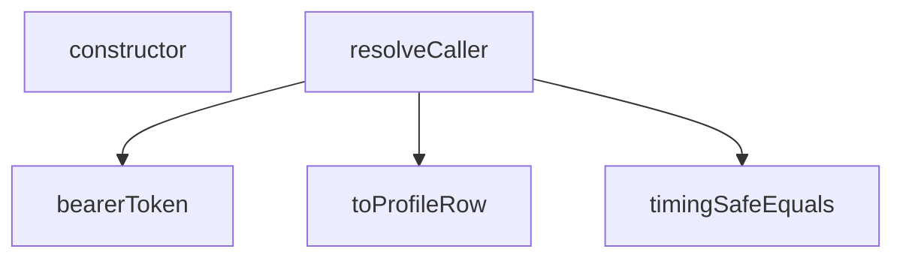

## NODE ID STANDARD

  file: supabase\functions\_shared\caller.ts
  function: supabase\functions\_shared\caller.ts::bearerToken
  function: supabase\functions\_shared\caller.ts::timingSafeEquals
  function: supabase\functions\_shared\caller.ts::toProfileRow
  function: supabase\functions\_shared\caller.ts::resolveCaller
  class: supabase\functions\_shared\caller.ts::CallerConfigError
  class: supabase\functions\_shared\caller.ts::CallerLookupError

---

## DISA AKTARILANLAR (EXPORTS)
  export: CallerConfigError
  export: CallerContext
  export: CallerKind
  export: CallerLookupError
  export: bearerToken
  export: resolveCaller
  export: timingSafeEquals
  export: toProfileRow

## Tasarım Gerekçeleri (kaynaktan BİREBİR)

> Bu bölüm LLM tarafından **yazılmadı**; kaynaktaki işaretli bloklardan
> birebir kopyalandı. Özetlenmesi veya yeniden ifade edilmesi YASAKTIR —
> gerekçenin değeri tam olarak kelimelerindedir.


```text
NİÇİN BU DOSYA VAR
-----------------
Cetvel §3.2/§3.3'ün kanonik kapısı ("kimlik → yetki → ancak sonra service_role")
bugün 5 bildirim ucunda + 3 admin ucunda KOPYALA-YAPIŞTIR hâlde duruyor ve her kopya
birbirinden biraz farklı: kimi `getUser`'ı tenant çözümünden SONRA çağırıyor, kimi rol
satırını `tenant_id` ile filtreliyor, kimi hata dalında sessizce devam ediyor. Sekiz
kopya = sekiz farklı güvenlik duruşu; birini düzeltmek diğer yediyi düzeltmiyor.
Bu modül o kapıyı TEK yere indirir: `resolveCaller(request, parsedBody)`.

NİÇİN ROL VE TENANT AYNI SORGUDAN
----------------------------------
Eski kod önce tenant'ı çözüyor, sonra profili `id=eq.<x>&tenant_id=eq.<tenant>` ile
filtreliyordu — yani "kullanıcının tenant'ını öğrenmek için tenant'ı bilmek" gerekiyordu.
Bu döngü, tenant'ın istekten okunmasının GEREKÇESİYDİ. Döngüyü kırmanın tek yolu:
filtre YALNIZ doğrulanmış `user.id`, `select` ise `role, tenant_id` — tek satır, tek
round-trip, sıfır ek maliyet. Tenant artık sorgunun GİRDİSİ değil, SONUCU.

NİÇİN `getUser` EN FAZLA BİR KEZ
---------------------------------
12 çağıranın 8'i zaten kendi `getUser`'ını çağırıyor. Tenant modülü kendi başına bir
`getUser` daha yapsaydı o 8 uçta İKİNCİ bir Auth round-trip'i doğardı (performans
regresyonu). Burada tek çağrı var ve sonucu (`user` + `role` + `tenantId`) çağırana
birlikte veriliyor; çağıranın ayrıca `getUser` çağırmasına gerek kalmaz.

NİÇİN SABİT-ZAMANLI ANAHTAR KARŞILAŞTIRMASI
--------------------------------------------
`authHeader === 'Bearer ' + serviceKey` erken çıkışlı bir karşılaştırmadır; teorik
olarak anahtar baytları zamanlamayla sızdırılabilir. Sır karşılaştırmasında sabit-zamanlı
olmak cetvel §3.5'in webhook imzaları için zaten dayattığı disiplin — service_role
anahtarı ondan daha değerli olduğu için aynı disiplin burada da uygulanır.

NE YAPMAZ
---------
Karar VERMEZ, yalnız KANITI TOPLAR. "Bu `kind`/`role` bu ucu çağırabilir mi?" sorusunu
çağıran uç yanıtlar (401/403 onun sorumluluğu) — çünkü cevap uca göre değişir:
sınıf (a) uçları rol ister, sınıf (a+b) uçları service_role'ü de kabul eder.
```


---
# FILE: supabase\functions\_shared\config_audit.md

---
domain: general
source_type: doc
namespace_type: module
source_path: C:\tmp\ops-t165\supabase\functions\_shared\config_audit.ts
skeleton_hash: f66aa31448f66932
entity_hashes:
  func:auditConfig: 0b81bbc5f84a6825
  func:konak: 4a6152e01a973bdf
  func:resolveIyzicoBase: 5fb522cb5fdbe4e9
  func:siteKonagi: c447c416b41fe314
  func:yerelMi: e46588c3d5d6d331
  overview: c188b443ebb2af39
generated_at: 2026-08-27T07:09:08Z
---

## Genel Bakış
Bu modül, uygulama konfigürasyonunun doğruluğunu ve tutarlılığını denetlemekten sorumludur. Ortam değişkenlerinden hostname çözümleme, yerel ortam tespiti ve Iyzico ödeme altyapısı yapılandırmasının kontrolü gibi işlemleri gerçekleştirir. `auditConfig` fonksiyonu, tüm bu kontrolleri bir araya getirerek kapsamlı bir yapılandırma raporu üretir.

## Fonksiyon Grupları

### Hostname İşleme
Ham hostname verisini çözümlemek, site hostname'ini ortam değişkenlerinden almak ve verilen bir adresin yerel (localhost) ortama ait olup olmadığını tespit etmekle sorumludur.
- `konak`, `siteKonagi`, `yerelMi`

### Ödeme Altyapısı Yapılandırması
Iyzico ödeme sisteminin base URL'ini ve çalışılacak ortamı (prod veya sandbox) ortam değişkenlerine göre çözümlemekten sorumludur.
- `resolveIyzicoBase`

### Konfigürasyon Denetimi
Tüm yapılandırma bileşenlerini (hostname, ödeme altyapısı vb.) denetleyerek bir `ConfigRaporu` üretmekten sorumludur. Bu fonksiyon, modülün ana giriş noktasıdır ve diğer fonksiyonları koordine eder.
- `auditConfig`

---

## AXIOMS – Mimari Varsayımlar
- Bu modül davranışsal mantık içermez (salt veri / konfigürasyon / tip tanımı).
- [Aksiyom 1]: Modülün dışa açtığı yapı (anahtar kümesi / şema) bir sözleşmedir; tüketiciler bu sabit yapıya bağlıdır — kırıcı değişiklik tüm tüketicileri etkiler.
- [Aksiyom 2]: Bir öğe ekleme/çıkarma yapısal-uyumlu olmalı; ilgili tipler ve seçiciler aynı commit'te güncel tutulmalıdır.

---

## FONKSİYON DETAYLARI

### konak
**Ne yapar**: Verilen bir URL dizesinden konak (host) adını çıkarır. Geçerli bir `http:` veya `https:` protokolüne sahip olmayan ya da ayrıştırılamayan değerler için `null` döner.

**Nasıl yapar**: Önce gelen değeri boşluklardan arındırır; boşsa `null` döndürür. Ardından `new URL()` ile dizeyi ayrıştırmaya çalışır. Protokol yalnızca `http:` veya `https:` ise `u.host` değerini döndürür; diğer protokollerde `null` döner. Ayrıştırma hatası oluşursa yakalanır ve `null` döndürülür.

**Parametreler**:
- raw: `string | undefined` — Ayrıştırılacak ham URL dizesi. `undefined` olabilir; bu durumda boş dize olarak ele alınır.

**Dönüş**: `string | null` — Geçerli bir konak adı bulunduysa o dizeyi, aksi halde `null` döndürür.

### resolveIyzicoBase
**Ne yapar**: Geliştirildi ancak detay üretilemedi.

### siteKonagi
**Ne yapar**: Geliştirildi ancak detay üretilemedi.

### yerelMi
**Ne yapar**: Geliştirildi ancak detay üretilemedi.

### auditConfig
**Ne yapar**: Geliştirildi ancak detay üretilemedi.

---

## INTERFACES

### ConfigBulgu
- `ad: string`
- `hukum: Hukum`
- `not: string`

### ConfigRaporu
- `olculdu: boolean`
- `odemeOrtami: 'prod' | 'sandbox' | 'bilinmiyor'`
- `siteOrtami: 'prod' | 'yerel' | 'bilinmiyor'`
- `bulgular: ConfigBulgu[]`
- `saglikli: boolean`

---

## TYPE ALIASES

### Hukum
```typescript
type Hukum = 'ok' | 'eksik' | 'gecersiz' | 'tutarsiz'
```

### Env
```typescript
type Env = Record<string, string | undefined>
```

---

## SABİTLER
- **SANDBOX_IPUCU** (regex) — `/sandbox/i`

---

## AST POINTERS

### [N1_NASIL] AST Pointer: config_audit.ts::konak
- **params**: `raw: string | undefined`
- **ic_degiskenler**:
  - `v` — `raw` parametresinin `??` ile boş string'e düşürülüp `.trim()` ile boşluklardan arındırılmış hali; boşsa fonksiyon `null` döner
  - `u` — `v` string'inden `new URL(v)` ile oluşturulan URL nesnesi; protokol `http:` veya `https:` değilse `null` döner
- **Dönüş**: `string | null` — geçerli bir URL ise `u.host` (protokolsüz alan adı + port), aksi halde `null`

### [N2_NASIL] AST Pointer: config_audit.ts::resolveIyzicoBase
- **params**: `env: Env`
- **ic_degiskenler**:
  - `ham` — `env.IYZICO_BASE_URL` değerinin `??` ile boş string'e düşürülüp `.trim()` edilmiş hali; boşsa fonksiyon `null` döner
  - `h` — `ham` string'inden `konak(ham)` çağrılarak çıkarılan host bilgisi; `null` ise fonksiyon `null` döner
- **Dönüş**: `{ base: string; ortam: 'prod' | 'sandbox' } | null` — `base`: sondaki eğik çizgileri temizlenmiş ham URL (`ham.replace(/\/+$/, '')`); `ortam`: `h` üzerinde `SANDBOX_IPUCU` regex'i test edilerek `'sandbox'` veya `'prod'` belirlenir; geçersizse `null`

### [N3_NASIL] AST Pointer: config_audit.ts::siteKonagi
- **params**: `env: Env`
- **ic_degiskenler**: yok — doğrudan zincirleme `??` operatörleriyle tek ifade döndürülür
- **Dönüş**: `string | null` — `konak(env.PUBLIC_SITE_URL)` başarılıysa onu, değilse `konak(env.FRONTEND_URL)`, o da değilse `konak(env.SITE_URL)` sonucunu döner; üçü de `null` ise `null`

### [N4_NASIL] AST Pointer: config_audit.ts::yerelMi
- **params**: `host: string`
- **ic_degiskenler**: yok — doğrudan regex test sonucu döndürülür
- **Dönüş**: `boolean` — `host` parametresi `localhost`, `127.0.0.1`, `0.0.0.0` veya `[::1]` ile başlayıp opsiyonel `:port` içeriyorsa `true`, aksi halde `false`; büyük/küçük harf duyarsız (`i` flag)

### [N5_NASIL] AST Pointer: config_audit.ts::auditConfig
- **params**: `env: Env`
- **ic_degiskenler**:
  - `bulgular` — `ConfigBulgu[]` tipinde dizi; tüm denetim bulgularını toplar, fonksiyon sonunda `ConfigRaporu.bulgular` olarak döner
  - `iyz` — `resolveIyzicoBase(env)` çağrısının sonucu; ödeme ucu yapılandırmasını temsil eder, `null` ise ödeme ucu çözülememiştir
  - `odemeOrtami` — `ConfigRaporu['odemeOrtami']` tipinde; `iyz` varsa `iyz.ortam` (`'prod'` veya `'sandbox'`), yoksa `'bilinmiyor'`
  - `ad` — `for` döngüsünde `'IYZICO_API_KEY'` ve `'IYZICO_SECRET_KEY'` değerlerini sırayla alan değişken
  - `dolu` — `env[ad]` değerinin `??` ile boş string'e düşürülüp `.trim().length > 0` ile kontrol edilen boolean; anahtarın tanımlı olup olmadığını belirtir
  - `site` — `siteKonagi(env)` çağrısının sonucu; kanonik site host bilgisi
  - `siteOrtami` — `ConfigRaporu['siteOrtami']` tipinde; `site` varsa `yerelMi(site)` sonucuna göre `'yerel'` veya `'prod'`, yoksa `'bilinmiyor'`
  - `origins` — `env.ALLOWED_ORIGINS` değerinin `??` ile boş string'e düşürülüp `.split(',')` ile ayrıştırılması, `.map(s => s.trim())` ile temizlenmesi ve `.filter(Boolean)` ile boş olmayanların filtrelenmesi sonucu oluşan string dizisi
  - `saglikli` — `bulgular.every(b => b.hukum === 'ok')` sonucu; tüm bulgular `'ok'` ise `true`, aksi halde `false`
- **Dönüş**: `ConfigRaporu` — `{ olculdu: true, odemeOrtami, siteOrtami, bulgular, saglikli }` yapısında rapor nesnesi

---


## MERMAID CALL GRAPH
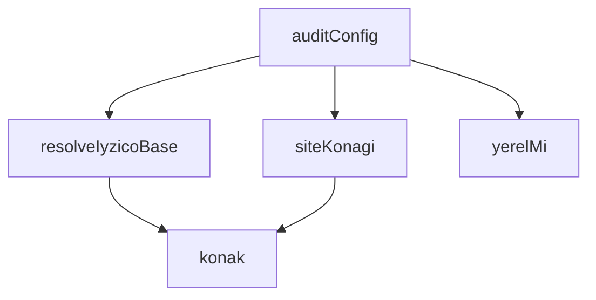

## NODE ID STANDARD

  file: supabase\functions\_shared\config_audit.ts
  function: supabase\functions\_shared\config_audit.ts::konak
  function: supabase\functions\_shared\config_audit.ts::resolveIyzicoBase
  function: supabase\functions\_shared\config_audit.ts::siteKonagi
  function: supabase\functions\_shared\config_audit.ts::yerelMi
  function: supabase\functions\_shared\config_audit.ts::auditConfig

---

## DISA AKTARILANLAR (EXPORTS)
  export: ConfigBulgu
  export: ConfigRaporu
  export: Hukum
  export: auditConfig
  export: konak
  export: resolveIyzicoBase
  export: siteKonagi
  export: yerelMi

## Tasarım Gerekçeleri (kaynaktan BİREBİR)

> Bu bölüm LLM tarafından **yazılmadı**; kaynaktaki işaretli bloklardan
> birebir kopyalandı. Özetlenmesi veya yeniden ifade edilmesi YASAKTIR —
> gerekçenin değeri tam olarak kelimelerindedir.


```text
NİÇİN VAR (T100-VH · 2026-08-19)
--------------------------------
Bu depoda yapılandırma kusurları defalarca **sessizce** yaşadı. Tekrarlayan desen şu:
bir değişken okunur, yoksa "makul bir varsayılan" devreye girer, iş yeşil döner ve
sistem BAŞKA BİR ŞEY YAPMAYA başlar. Kimse bir hata görmediği için kimse bakmaz.

Ölçülen üç somut hâl (hepsi master'dan okundu, tahmin değil):

1. IYZICO_BASE_URL yoksa üç uç birden **sandbox'a** düşüyordu. Hemen alt satırda
IYZICO_API_KEY / IYZICO_SECRET_KEY için fail-CLOSED kontrol vardı: anahtar
eksikse duruyoruz, ama UÇ eksikse başka bir ortama gidiyoruz. iyzico-callback
içindeki T022-VH yorumu tehlikeyi zaten adıyla anlatıyordu ("para çekilir, sipariş
doğrulanamaz"); o düzeltme sabit-kodu env'e taşırken **sandbox varsayılanını
korumuştu**. Sınıf kapanmamış, yalnızca yer değiştirmişti.
2. healthz ölçemediğinde ok:true dönüyordu — "ölçülemedi" yalnızca bir ETİKETTİ.
3. Site adresi dört değişkende yaşıyor; hepsi boşsa ödeme sonrası yönlendirme hiç
yapılmıyor ve bu durum hiçbir yere yazılmıyor.

TASARIM KARARI — "yok" ile "ölçülemedi" ile "yanlış" AYRI ÜÇ CEVAPTIR.
Bu modül hüküm verir, karar vermez: çağıran uç hükme bakıp fail-closed davranır.
Hiçbir sır DEĞERİ döndürülmez — yalnızca varlık/tutarlılık hükmü ve (URL'ler için)
konak adı. Konak adı sır değildir ve teşhisin tamamı ona bağlıdır.
```


---
# FILE: supabase\functions\_shared\cors.md

---
domain: general
source_type: doc
namespace_type: module
source_path: C:\tmp\ops-t165\supabase\functions\_shared\cors.ts
skeleton_hash: 77b5503d4a2f1053
entity_hashes:
  func:getCorsHeaders: 73642dabf029645c
  overview: 8eaad34e6f15ad7c
generated_at: 2026-08-27T07:09:10Z
---

## Genel Bakış
Bu modül, Cross-Origin Resource Sharing (CORS) politikalarını uygulamak için gerekli HTTP başlıklarını yönetir. Modül, gelen isteklere göre uygun CORS başlıklarını oluşturarak çapraz kaynak erişimlerini kontrol eder. Tek bir fonksiyonla bu sorumluluğu yerine getirir.

## Fonksiyon Grupları
### CORS Başlık Üretimi
Bu grup, gelen HTTP isteğini analiz ederek tarayıcının çapraz kaynak isteklerini kabul etmesi için gerekli başlıkları üretir.
- getCorsHeaders

---

## AXIOMS – Mimari Varsayımlar

Bu modül için özel aksiyom tanımlanmamıştır.

**Gerekçe:** Fonksiyon gövdesi sağlanmadığından, `getCorsHeaders` fonksiyonunun çalışma mantığı bilinmemektedir. Aksiyomlar yalnızca fonksiyon gövdesinden üretilebilir.

---

## FONKSİYON DETAYLARI

### getCorsHeaders
**Ne yapar**: Gelen HTTP isteğinin `Origin` başlığını kontrol ederek uygun CORS (Cross-Origin Resource Sharing) başlıklarını oluşturan ve döndüren bir fonksiyondur. İzin verilen kaynaklardan gelen isteklerde gerçek origin kullanılırken, diğer kaynaklardan gelen istekler için varsayılan bir Vercel domain adresi atanır.

**Nasıl yapar**: Fonksiyon öncelikle isteğin `Origin` başlığını okur; başlık yoksa boş string kullanır. Ardından bu origin'in `http://localhost:` ile başlayıp başlamadığını (`isLocal`) ve `.vercel.app` ile bitip bitmediğini (`isVercel`) kontrol eder. Bu iki koşuldan herhangi biri sağlanırsa origin izinli kabul edilir ve `Access-Control-Allow-Origin` olarak gerçek origin değeri atanır; sağlanmazsa sabit değer `https://venthub-hvac-esite.vercel.app` kullanılır. Ayrıca sabit CORS başlıkları olarak `authorization, x-client-info, apikey, content-type` izin verilen başlıklar, `POST, GET, OPTIONS, PUT, DELETE` izin verilen HTTP metodları ve `86400` saniye (24 saat) önbellek süresi tanımlanır.

**Parametreler**:
- `req`: `Request` — CORS başlıklarının belirlenmesi için kullanılan gelen HTTP isteği nesnesi. Fonksiyon bu nesnenin `headers` özelliğinden `Origin` başlığını okur.

**Dönüş**: Dört anahtar-değer çiftinden oluşan bir nesne döndürür. Bu nesne; `Access-Control-Allow-Origin`, `Access-Control-Allow-Headers`, `Access-Control-Allow-Methods` ve `Access-Control-Max-Age` CORS başlıklarını içerir. Dönüş tipi kod üzerinde açıkça belirtilmemiştir.

---

## AST POINTERS

### [N1_NASIL] AST Pointer: supabase/functions/_shared/cors.ts::getCorsHeaders
- **params**:
  - `req` — Request nesnesi; tarayıcıdan gelen HTTP isteğini temsil eder
- **ic_degiskenler**:
  - `origin` — `req.headers.get('Origin')` ile alınan istek kaynağının Origin header değeri; header yoksa boş string atanır
  - `isLocal` — `origin` değişkeninin `http://localhost:` ile başlayıp başlamadığını kontrol eden boolean; yerel geliştirme ortamından gelen istekleri belirler
  - `isVercel` — `origin` değişkeninin `.vercel.app` ile bitip bitmediğini kontrol eden boolean; Vercel üzerindeki deployment'lardan gelen istekleri belirler
  - `allowed` — `isLocal` veya `isVercel` değerlerinden herhangi biri true ise true olan boolean; istek kaynağının izin verilen bir origin olup olmadığını belirler
- **Dönüş**: Obje — CORS header'larını içeren bir nesne döndürür:
  - `Access-Control-Allow-Origin` — `allowed` true ise gelen `origin` değeri, false ise sabit `'https://venthub-hvac-esite.vercel.app'` atanır
  - `Access-Control-Allow-Headers` — sabit değer: `'authorization, x-client-info, apikey, content-type'`
  - `Access-Control-Allow-Methods` — sabit değer: `'POST, GET, OPTIONS, PUT, DELETE'`
  - `Access-Control-Max-Age` — sabit değer: `'86400'`

---

## NODE ID STANDARD

  file: supabase\functions\_shared\cors.ts
  function: supabase\functions\_shared\cors.ts::getCorsHeaders

---

## DISA AKTARILANLAR (EXPORTS)
  export: getCorsHeaders

---
# FILE: supabase\functions\_shared\notify.md

---
domain: general
source_type: doc
namespace_type: module
source_path: C:\tmp\ops-t165\supabase\functions\_shared\notify.ts
skeleton_hash: 0a4a7f997f54901f
entity_hashes:
  func:getEmailConfig: d69ed27e1c404dc2
  func:getEnv: 6925671b32beb020
  func:getSlackWebhook: af55155b404cbcc6
  func:notify: 2a10b08a24b2db2c
  func:sendEmail: 2a2dc768ec5451fa
  func:sendSlack: cd61229d7922325b
  overview: be8ec04b8995d7cb
generated_at: 2026-08-27T07:09:11Z
---

## Genel Bakış

Bu modül, uygulama genelinde bildirim gönderme işlemlerini merkezi olarak yönetir. Slack ve e-posta olmak üzere iki farklı kanal üzerinden bildirim iletimi sağlar. Ortam değişkenlerinden yapılandırma bilgilerini okuyarak ilgili servislere erişim gerçekleştirir.

## Fonksiyon Grupları

### Yapılandırma ve Ortam Değişkeni Okuyucuları
Ortam değişkenlerini ve harici servis bağlantı bilgilerini okuyarak diğer fonksiyonlara temel yapılandırma sağlar.
- getEnv, getSlackWebhook, getEmailConfig

### Kanal Bazlı Gönderim
Belirtilen mesaj ve alan bilgilerini ilgili harici servise (Slack veya e-posta) gönderir. Her biri tek bir iletişim kanalına yönelik çalışır.
- sendSlack, sendEmail

### Ana Bildirim Arayüzü
Üst düzey bir bildirim fonksiyonu olarak, metin ve alan bilgilerini alır ve bildirim gönderimini başlatır. Modülün dış dünyaya açılan ana giriş noktasıdır.
- notify

---

## AXIOMS – Mimari Varsayımlar

[Aksiyom 1]: Eğer `getEnv` fonksiyonuna verilen `key` parametresine karşılık gelen ortam değişkeni tanımlı değilse, fonksiyonun davranışı belirsizdir (dönüş tipi `string` olarak tanımlı, null dönüş izni yok).

[Aksiyom 2]: Eğer Slack webhook yapılandırması mevcut değilse, `getSlackWebhook()` fonksiyonu `null` döner ve Slack bildirimleri gönderilemez.

[Aksiyom 3]: Eğer `sendSlack` fonksiyonuna boş `text` verilirse, Slack API'sinin bu isteği kabul edip etmeyeceği bilinmiyor.

[Aksiyom 4]: Eğer `sendEmail` fonksiyonuna boş `subject` veya boş `text` verilirse, e-posta gönderiminin başarılı olup olmayacağı bilinmiyor.

[Aksiyom 5]: Eğer `notify` fonksiyonu çağrıldığında Slack webhook yapılandırması mevcut değilse, Slack bildirimi gönderilmez (sessizce atlanır mı yoksa hata mı üretir bilinmiyor).

[Aksiyom 6]: Eğer `notify` fonksiyonu çağrıldığında e-posta yapılandırması mevcut değilse, e-posta bildirimi gönderilmez (sessizce atlanır mı yoksa hata mı üretir bilinmiyor).

[Aksiyom 7]: Eğer harici servisler (Slack API, e-posta sunucusu) erişilemezse, ilgili `sendSlack` veya `sendEmail` fonksiyonu başarısız olur.

[Aksiyom 8]: `fields` parametresi opsiyoneldir; verilmediğinde bildirim düz metin olarak gönderilir.

---

## FONKSİYON DETAYLARI

### getEnv
**Ne yapar**: Verilen bir ortam değişkeni anahtarına karşılık gelen değeri döndüren yardımcı fonksiyondur. Fonksiyonun gövdesi bu kaynak dosyada tanımlanmamış olup yalnızca imzası belirtilmiştir.

**Nasıl yapar**: Gövde mevcut olmadığından iç mantık bilinmiyor. Çağrıldığı yerlerden anlaşıldığı kadarıyla ortam değişkenlerini (environment variables) okuyup string olarak döndürmektedir.

**Parametreler**:
- key: string — Okunacak ortam değişkeninin adı

**Dönüş**: string — İlgili ortam değişkeninin değeri

### getSlackWebhook
**Ne yapar**: Geliştirildi ancak detay üretilemedi.

### getEmailConfig
**Ne yapar**: Geliştirildi ancak detay üretilemedi.

### sendSlack
**Ne yapar**: Geliştirildi ancak detay üretilemedi.

### sendEmail
**Ne yapar**: Geliştirildi ancak detay üretilemedi.

### notify
**Ne yapar**: Geliştirildi ancak detay üretilemedi.

---

## TYPE ALIASES

### NotifyField
```typescript
type NotifyField = { title: string; value: string; short?: boolean }
```

---

## SABİTLER
- **notify** (unknown)

---

## AST POINTERS

### [N1_NASIL] AST Pointer: supabase/functions/_shared/notify.ts::getEnv
- **params**: `key: string` — ortam değişkeni adı
- **ic_degiskenler**: yok
- **Dönüş**: `string` — ortam değişkeni değeri; bulunamazsa veya hata oluşursa boş string (`''`)

### [N2_NASIL] AST Pointer: supabase/functions/_shared/notify.ts::getSlackWebhook
- **params**: yok
- **ic_degiskenler**:
  - `url` — `getEnv('SLACK_WEBHOOK_URL')` ile alınan Slack webhook URL değeri
- **Dönüş**: `string | null` — URL `https://` ile başlıyorsa URL, aksi halde `null`

### [N3_NASIL] AST Pointer: supabase/functions/_shared/notify.ts::getEmailConfig
- **params**: yok
- **ic_degiskenler**:
  - `to` — `getEnv('NOTIFY_EMAIL')` ile alınan bildirim e-posta adresi
  - `supabaseUrl` — `getEnv('SUPABASE_URL')` ile alınan Supabase proje URL'i
  - `serviceKey` — `getEnv('SUPABASE_SERVICE_ROLE_KEY')` ile alınan servis rol anahtarı
- **Dönüş**: `{ to, supabaseUrl, serviceKey }` — e-posta gönderimi için gerekli yapılandırma objesi

### [N4_NASIL] AST Pointer: supabase/functions/_shared/notify.ts::sendSlack
- **params**: `text: string`, `fields?: NotifyField[]`
- **ic_degiskenler**:
  - `url` — `getSlackWebhook()` ile alınan Slack webhook URL'i; yoksa fonksiyon `false` döner
  - `payload` — Slack API'ye gönderilecek JSON gövdesi; `text` alanını içerir
  - `payload.attachments` — `fields` dizisi doluysa oluşturulur; her eleman `title` (String), `value` (String), `short` (boolean) alanlarından oluşur; renk `'#e01e5a'`
- **Dönüş**: `boolean` — başarılıysa `true`, URL yoksa veya fetch hatası olursa `false`

### [N5_NASIL] AST Pointer: supabase/functions/_shared/notify.ts::sendEmail
- **params**: `subject: string`, `text: string`, `fields?: NotifyField[]`
- **ic_degiskenler**:
  - `to` — `getEmailConfig()` ile alınan e-posta alıcı adresi; yoksa fonksiyon `false` döner
  - `supabaseUrl` — `getEmailConfig()` ile alınan Supabase URL'i; yoksa fonksiyon `false` döner
  - `serviceKey` — `getEmailConfig()` ile alınan servis anahtarı; yoksa fonksiyon `false` döner
  - `message` — `text` parametresi; `fields` doluysa her elemanın `title` ve `value` alanları `\n` ile eklenerek genişletilir
  - `payload` — notification-service fonksiyonuna gönderilecek JSON gövdesi; `type: 'email'`, `to`, `message`, `priority: 'high'`, `template: undefined`, `data.subject` (`"VentHub Alert: "` + subject) alanlarını içerir
  - `resp` — `fetch` çağrısının yanıt objesi; `resp.ok` durumu kontrol edilir
- **Dönüş**: `boolean` — `resp.ok` ise `true`, hata durumunda `false`

### [N6_NASIL] AST Pointer: supabase/functions/_shared/notify.ts::notify
- **params**: `text: string`, `fields?: NotifyField[]`
- **ic_degiskenler**:
  - `debug` — `getEnv('NOTIFY_DEBUG')` değerinin küçük harfe çevrilip `'true'` olup olmadığının sonucu; konsola uyarı mesajı yazdırma kontrolü
  - `subject` — `text` parametresinin ilk 50 karakteri; e-posta konusu olarak kullanılır
  - `sent` — bildirimin herhangi bir kanaldan gönderilip gönderilmediğini takip eden boolean; başlangıçta `false`
- **Dönüş**: yok — yan etki olarak Slack ve/veya e-posta gönderimi gerçekleştirir; `debug` aktifse konsola uyarı yazar

---


## MERMAID CALL GRAPH
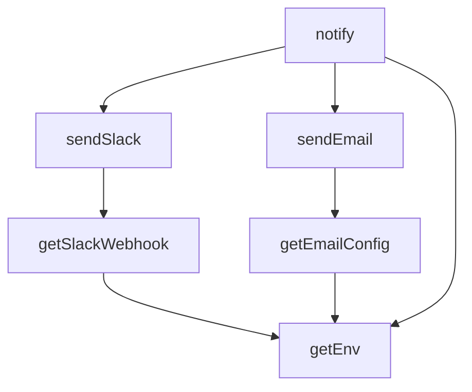

## NODE ID STANDARD

  file: supabase\functions\_shared\notify.ts
  function: supabase\functions\_shared\notify.ts::getEnv
  function: supabase\functions\_shared\notify.ts::getSlackWebhook
  function: supabase\functions\_shared\notify.ts::getEmailConfig
  function: supabase\functions\_shared\notify.ts::sendSlack
  function: supabase\functions\_shared\notify.ts::sendEmail
  function: supabase\functions\_shared\notify.ts::notify

---

## DISA AKTARILANLAR (EXPORTS)
  export: NotifyField
  export: getEmailConfig
  export: getEnv
  export: getSlackWebhook
  export: notify
  export: sendEmail
  export: sendSlack

---
# FILE: supabase\functions\_shared\origins.md

---
domain: general
source_type: doc
namespace_type: module
source_path: C:\tmp\ops-t165\supabase\functions\_shared\origins.ts
skeleton_hash: a2700fdc4dd05e12
entity_hashes:
  func:buildAllowedOrigins: 5e2ca73674ab1ca1
  func:isAllowedRedirectTarget: 889b440b22fb49ce
  func:isOriginAccepted: 376316bbccde212c
  func:normalizeOrigin: b40e1fd79e5225ba
  func:pickRedirectOrigin: e6d67aa2dc05c209
  overview: c7c2d674fb6c1287
generated_at: 2026-08-27T07:09:13Z
---

## Genel Bakış

Bu modül, web isteklerinde CORS (Cross-Origin Resource Sharing) ve yönlendirme (redirect) güvenliğini sağlayan yardımcı bir modüldür. Ortam değişkenlerinden izin verilen origin listesini oluşturur, gelen isteklerin origin bilgisini normalize eder ve bu origin'in izin verilen listede olup olmadığını doğrular. Supabase Edge Functions altyapısında paylaşılan (_shared) bir güvenlik katmanı olarak konumlanır.

## Fonksiyon Grupları

### Origin Normalizasyonu
Ham origin değerini standart bir formata dönüştürerek diğer fonksiyonların tutarlı veriyle çalışmasını sağlar.
- normalizeOrigin

### Allowlist Oluşturma
Ortam değişkenlerinden (env) izin verilen origin listesini derleyerek modülün diğer fonksiyonlarına temel girdi sağlar.
- buildAllowedOrigins

### Origin ve Yonlendirme Dogrulama
Gelen isteklerin origin bilgisini ve yönlendirme hedeflerini, önceden oluşturulmuş izin listesiyle karşılaştırarak güvenlik kontrolü yapar. `isOriginAccepted` bir istek origin'inin kabul edilip edilmediğini, `pickRedirectOrigin` izin listeden uygun bir redirect origin seçer, `isAllowedRedirectTarget` ise yönlendirme hedefinin güvenli olup olmadığını belirler.
- isOriginAccepted, pickRedirectOrigin, isAllowedRedirectTarget

---

## AXIOMS – Mimari Varsayımlar

Fonksiyon gövdeleri sağlanmadığından, yalnızca imzalardan çıkarılabilecek varsayımlar belirlenebilir. Gövde bilgisi olmadan kesin aksiyom üretmek mümkün değildir.

[Aksiyom 1]: Eğer `normalizeOrigin` fonksiyonuna `null` veya `undefined` değerli `raw` parametresi verilirse, sonuç `null` olur (dönüş tipi `string | null` olduğundan).

[Aksiyom 2]: Eğer `buildAllowedOrigins` fonksiyonuna sağlanan `env` kaydında ilgili anahtarlar yoksa, boş `string[]` döner (dönüş tipi `string[]` — null veya undefined içermez).

[Aksiyom 3]: Eğer `isOriginAccepted` fonksiyonuna `null` veya `undefined` değerli `requestOrigin` verilirse, fonksiyon `false` döner (parametre `string | null | undefined` kabul eder ancak bir origin eşleşmesi yapılamaz).

[Aksiyom 4]: Eğer `pickRedirectOrigin` fonksiyonunda allowlist içinde uygun bir origin bulunamazsa, sonuç `null` olur (dönüş tipi `string | null`).

[Aksiyom 5]: Eğer `isAllowedRedirectTarget` fonksiyonuna `null` veya `undefined` değerli `target` verilirse, fonksiyon `false` döner (parametre `string | null | undefined` kabul eder ancak bir hedef eşleşmesi yapılamaz).

[Aksiyom 6]: Eğer `isOriginAccepted`, `pickRedirectOrigin` veya `isAllowedRedirectTarget` fonksiyonlarına verilen `allowlist` parametresi `readonly` olarak tanımlanmışsa, bu fonksiyonlar allowlist'i değiştirmez (yalnızca okuma amaçlı kullanır).

---

## FONKSİYON DETAYLARI

### normalizeOrigin
**Ne yapar**: Bir URL veya origin dizesini kanonik `scheme://host[:port]` biçimine indirger. Geçersiz protokollere sahip, boş veya ayrıştırılamayan girdiler için `null` döner.

**Nasıl yapar**: Girdiyi önce boşluklardan arındırır (`trim`). Boş ise `null` döndürür. Ardından `new URL()` ile ayrıştırmaya çalışır. Protokol yalnızca `http:` veya `https:` ise `u.origin` değerini döndürür; diğer protokollerde `null` döner. Ayrıştırma hatası oluşursa yakalanır ve `null` döndürülür.

**Parametreler**:
- `raw`: `string | null | undefined` — Ayrıştırılacak ham URL veya origin dizesi. `null` veya `undefined` olabilir.

**Dönüş**: `string | null` — Başarılı ayrıştırma sonucu elde edilen kanonik origin dizesi (`scheme://host[:port]`). Geçersiz girdi durumunda `null`.

### buildAllowedOrigins
**Ne yapar**: Geliştirildi ancak detay üretilemedi.

### isOriginAccepted
**Ne yapar**: Geliştirildi ancak detay üretilemedi.

### pickRedirectOrigin
**Ne yapar**: Geliştirildi ancak detay üretilemedi.

### isAllowedRedirectTarget
**Ne yapar**: Geliştirildi ancak detay üretilemedi.

---

## AST POINTERS

### [N1_NASIL] AST Pointer: supabase/functions/_shared/origins.ts::normalizeOrigin
- **params**: `raw` — string | null | undefined
- **ic_degiskenler**:
  - `v` — `raw` değerinin nullish coalescing (`??`) ile boş string'e dönüştürülüp `trim()` ile boşluklardan arındırılmış hali; boşsa fonksiyon null döner
  - `u` — `v` string'inden `new URL(v)` ile oluşturulan URL nesnesi; `u.protocol` kontrol edilir, `u.origin` dönüş değeri olarak kullanılır
- **Dönüş**: string | null — geçerli http/https protokolü varsa `u.origin`, aksi halde null

### [N2_NASIL] AST Pointer: supabase/functions/_shared/origins.ts::buildAllowedOrigins
- **params**: `env` — Record<string, string | undefined>
- **ic_degiskenler**:
  - `out` — biriktirilen origin'lerin tutulduğu string dizisi; başlangıçta boş
  - `push` — `candidate` parametresi alan arrow fonksiyon; `normalizeOrigin(candidate)` çağırır, dönen değer null değilse ve `out` içinde yoksa `out.push(n)` ile ekler
  - `candidate` — `push` fonksiyonunun parametresi; string | null | undefined
  - `n` — `push` içinde `normalizeOrigin(candidate)` dönüş değeri
  - `part` — `env.ALLOWED_ORIGINS` değerinin virgülle ayrılmış parçaları; her parça `push(part)` ile işlenir
- **Dönüş**: string[] — normalize edilmiş ve tekrarsız origin listesi; `env.PUBLIC_SITE_URL`, `env.FRONTEND_URL`, `env.SITE_URL` önce, ardından `env.ALLOWED_ORIGINS` virgülle ayrılmış parçaları eklenir

### [N3_NASIL] AST Pointer: supabase/functions/_shared/origins.ts::isOriginAccepted
- **params**: `allowlist` — readonly string[], `requestOrigin` — string | null | undefined
- **ic_degiskenler**:
  - `n` — `normalizeOrigin(requestOrigin)` dönüş değeri; null ise origin reddedilir
- **Dönüş**: boolean — `allowlist` boşsa true döner; aksi halde `n` null değilse ve `allowlist` içinde varsa true

### [N4_NASIL] AST Pointer: supabase/functions/_shared/origins.ts::pickRedirectOrigin
- **params**: `allowlist` — readonly string[], `requestOrigin` — string | null | undefined
- **ic_degiskenler**:
  - `n` — `normalizeOrigin(requestOrigin)` dönüş değeri; null değilse ve `allowlist` içinde varsa bu değer döner
- **Dönüş**: string | null — `n` geçerli ve listedeyse `n`, aksi halde `allowlist[0]` (yoksa null)

### [N5_NASIL] AST Pointer: supabase/functions/_shared/origins.ts::isAllowedRedirectTarget
- **params**: `allowlist` — readonly string[], `target` — string | null | undefined
- **ic_degiskenler**:
  - `n` — `normalizeOrigin(target)` dönüş değeri; null ise hedef reddedilir
- **Dönüş**: boolean — `n` null değilse ve `allowlist` içinde varsa true

---


## MERMAID CALL GRAPH
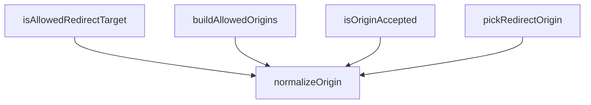

## NODE ID STANDARD

  file: supabase\functions\_shared\origins.ts
  function: supabase\functions\_shared\origins.ts::normalizeOrigin
  function: supabase\functions\_shared\origins.ts::buildAllowedOrigins
  function: supabase\functions\_shared\origins.ts::isOriginAccepted
  function: supabase\functions\_shared\origins.ts::pickRedirectOrigin
  function: supabase\functions\_shared\origins.ts::isAllowedRedirectTarget

---

## DISA AKTARILANLAR (EXPORTS)
  export: buildAllowedOrigins
  export: isAllowedRedirectTarget
  export: isOriginAccepted
  export: normalizeOrigin
  export: pickRedirectOrigin

## Tasarım Gerekçeleri (kaynaktan BİREBİR)

> Bu bölüm LLM tarafından **yazılmadı**; kaynaktaki işaretli bloklardan
> birebir kopyalandı. Özetlenmesi veya yeniden ifade edilmesi YASAKTIR —
> gerekçenin değeri tam olarak kelimelerindedir.


```text
NİÇİN VAR (T043-VH · 2026-08-15)

Ödeme yolunda köken denetimi iki yerde birden gerekiyordu ve ikisi de eksikti:

1. `iyzico-payment` — `ALLOWED_ORIGINS` boşsa köken denetimi TAMAMEN kapanıyordu
(`allowed.length === 0 || ...` = fail-open).
2. `iyzico-payment` ödeme sonrası dönülecek adresi (`successUrl`) doğrudan isteğin
**`Origin`/`Referer` başlığından** türetip İyzico'ya gönderiyordu; `iyzico-callback`
da o adresi query'den okuyup **hiçbir kontrol yapmadan** `location.replace` ile
açıyordu.

İkisi birleşince şu zincir oluşuyordu: saldırgan `Origin: https://evil.tld` ile ödeme
başlatır → İyzico'ya giden callback URL'ine `successUrl=https://evil.tld/...` gömülür →
**gerçek ödeme tamamlandıktan sonra** müşterinin tarayıcısı saldırganın sayfasına
yönlendirilir. Müşterinin "ödeme başarısız, kartınızı tekrar girin" ekranına en çok
inanacağı an tam olarak orasıdır. Bu, CORS meselesi değil, kimlik avı vektörüdür.

TASARIM KARARI — güvenlik özelliği YAPILANDIRMAYA BAĞLI OLMAMALI.
Hiçbir ortam değişkeni tanımlı değilse bile saldırganın seçtiği adrese yönlendirme
YAPILMAZ: allowlist boşsa istekten gelen aday tamamen yok sayılır ve yalnız ortamdan
türetilen kanonik adres kullanılır (o da yoksa yönlendirme hiç yapılmaz).
Alternatif olan "allowlist boşsa her şeyi reddet" tasarımı, değişken tanımsızsa ödemeyi
tümden kırardı — güvenlik uğruna açığı kapatıp sistemi durdurmak kabul edilebilir bir
takas değil; burada ikisine de gerek yok.
```


---
# FILE: supabase\functions\_shared\rate_limit.md

---
domain: general
source_type: doc
namespace_type: module
source_path: C:\tmp\ops-t165\supabase\functions\_shared\rate_limit.ts
skeleton_hash: ab4c12eebd37adf1
entity_hashes:
  func:checkRateLimit: eb2ddca9002ea24b
  func:rateLimitHeaders: 8e57db019805fbe0
  overview: 2d23853bbec3dccf
generated_at: 2026-08-27T07:09:15Z
---

## Genel Bakış
Bu modül, API isteklerinin hız sınırlaması (rate limit) kontrolünü yapar ve sonuç bilgilerini HTTP yanıt başlıklarına dönüştürür. Supabase tabanlı bir harici rate limiting servisiyle iletişim kurarak istek limitlerini denetler.

## Fonksiyon Grupları
### Rate Limit Kontrolü
Belirtilen anahtar için hız sınırlaması durumunu harici bir servisten sorgular. Opsiyonel olarak limit sayısı ve zaman penceresi belirtilebilir.
- checkRateLimit

### HTTP Başlık Oluşturma
Rate limit sonucundaki limit, kalan hak ve sıfırlanma zamanı bilgilerini HTTP yanıt başlıklarına uygun formata çevirir.
- rateLimitHeaders

---

## AXIOMS – Mimari Varsayımlar
- Bu modül davranışsal mantık içermez (salt veri / konfigürasyon / tip tanımı).
- [Aksiyom 1]: Modülün dışa açtığı yapı (anahtar kümesi / şema) bir sözleşmedir; tüketiciler bu sabit yapıya bağlıdır — kırıcı değişiklik tüm tüketicileri etkiler.
- [Aksiyom 2]: Bir öğe ekleme/çıkarma yapısal-uyumlu olmalı; ilgili tipler ve seçiciler aynı commit'te güncel tutulmalıdır.

---

## FONKSİYON DETAYLARI

### checkRateLimit
**Ne yapar**: Belirli bir anahtar (key) için istek oran sınırlaması (rate limit) kontrolü yapan asenkron bir fonksiyondur. Supabase veritabanında tanımlı bir RPC fonksiyonunu çağırarak isteğin izin verilip verilmediğini, kalan istek hakkını ve sıfırlanma zamanını döndürür.

**Nasıl yapar**: Fonksiyon öncelikle `limit` ve `windowSec` değerlerini belirler. Bu değerler ya doğrudan `opts` parametresinden ya da ortam değişkenlerinden (`RATE_LIMIT_PER_MINUTE` ve `RATE_LIMIT_WINDOW_SEC`) okunur; her ikisi de yoksa varsayılan olarak 60 kullanılır. Geçersiz (sonlu olmayan veya sıfır/negatif) değerler tespit edilirse 60'a sıfırlanır. Ardından Supabase'in `/rest/v1/rpc/bump_rate_limit` endpoint'ine POST isteği gönderilir. İstek gövdesinde `p_key`, `p_limit` ve `p_window_seconds` alanları yer alır. `serviceRoleKey` hem `Authorization` başlığında hem de `apikey` başlığında gönderilir; `Prefer: return=representation` ile yanıtın temsilî veri olarak dönmesi istenir. Yanıt başarısız olursa hata fırlatılır. Yanıt JSON'u ayrıştırılamazsa boş dizi varsayılır; dizi geçerli değilse veya boşsa, `allowed: true`, `remaining: limit-1` ve `reset_at` olarak şu anki zamandan `windowSec` saniye sonrasını içeren varsayılan bir nesne kullanılır. Sonuç, `allowed` (boolean), `remaining` (number) ve `resetAt` (string) alanlarını içeren bir nesneye dönüştürülerek `limit` ve `windowSec` değerleriyle birlikte döndürülür.

**Parametreler**:
- key: string — Rate limit kontrolünün yapılacağı benzersiz anahtar (örneğin kullanıcı kimliği veya IP adresi)
- fetchBase: string — Supabase API'sinin temel URL'si (örneğin `https://xxx.supabase.co`)
- serviceRoleKey: string — Supabase service role anahtarı; yetkilendirme ve kimlik doğrulama için kullanılır
- opts?: { limit?: number; windowSec?: number } — İsteğe bağlı ayarlar nesnesi. `limit`: pencere başına izin verilen maksimum istek sayısı. `windowSec`: rate limit penceresinin saniye cinsinden süresi

**Dönüş**: `{ result: RateLimitResult, limit: number, windowSec: number }` — `result` alanı `allowed` (boolean), `remaining` (number) ve `resetAt` (string) özelliklerini içerir. `limit` ve `windowSec` ise kullanılan nihai değerleri yansıtır.

### rateLimitHeaders
**Ne yapar**: Geliştirildi ancak detay üretilemedi.

---

## TYPE ALIASES

### RateLimitResult
```typescript
type RateLimitResult = { allowed: boolean; remaining: number; resetAt: string }
```

---

## AST POINTERS

### [N1_NASIL] AST Pointer: supabase/functions/_shared/rate_limit.ts::checkRateLimit
- **params**: `key: string`, `fetchBase: string`, `serviceRoleKey: string`, `opts?: { limit?: number; windowSec?: number }`
- **ic_degiskenler**:
  - `limit` — `opts?.limit` değeri varsa onu kullanır; yoksa `Deno.env.get('RATE_LIMIT_PER_MINUTE')` ortam değişkenini okur; o da yoksa 60 varsayılır. Sonuç `Number()` ile sayıya dönüştürülür. `Number.isFinite` kontrolü başarısız olursa veya değer 0'dan küçük/eşitse 60'a sıfırlanır.
  - `windowSec` — `opts?.windowSec` değeri varsa onu kullanır; yoksa `Deno.env.get('RATE_LIMIT_WINDOW_SEC')` ortam değişkenini okur; o da yoksa 60 varsayılır. Sonuç `Number()` ile sayıya dönüştürülür. `Number.isFinite` kontrolü başarısız olursa veya değer 0'dan küçük/eşitse 60'a sıfırlanır.
  - `body` — Supabase RPC endpoint'ine POST olarak gönderilecek JSON gövdesi. `p_key`, `p_limit`, `p_window_seconds` alanlarını içerir; `Record<string, unknown>` tipindedir.
  - `resp` — `fetchBase/rest/v1/rpc/bump_rate_limit` adresine POST isteği yapılarak elde edilen `Response` nesnesi. `Authorization` ve `apikey` başlıklarında `serviceRoleKey`, `Content-Type` olarak `application/json`, `Prefer` olarak `return=representation` gönderilir.
  - `data` — `resp.json()` ile ayrıştırılan yanıt gövdesi. `.catch(()=> [])` ile hata durumunda boş dizi döner. `Array<{ allowed: boolean; remaining: number; reset_at: string }>` tipindedir.
  - `row` — `data` dizisinin ilk elemanı (`data[0]`). Dizi değilse veya ilk eleman yoksa varsayılan değer kullanılır: `{ allowed: true, remaining: limit-1, reset_at: şu anki zaman + windowSec saniye }`.
  - `result` — `RateLimitResult` tipinde nesne. `row.allowed` boolean'a, `row.remaining` sayıya (0 fallback ile), `row.reset_at` string'e dönüştürülerek atanır.
- **Dönüş**: `{ result: RateLimitResult, limit: number, windowSec: number }` — rate limit sonucu, kullanılan limit değeri ve pencere süresi. Hata durumunda `Error` fırlatır (`rate_limit_rpc_failed:{durum kodu}`).

### [N2_NASIL] AST Pointer: supabase/functions/_shared/rate_limit.ts::rateLimitHeaders
- **params**: `limit: number`, `remaining: number`, `resetAt: string`
- **ic_degiskenler**:
  - *(yok — doğrudan return ifadesi içinde hesaplamalar yapılır)*
- **Dönüş**: `Record<string, string>` — üç HTTP başlığı içeren nesne:
  - `RateLimit-Limit` — `limit` değerinin string hali
  - `RateLimit-Remaining` — `remaining` ile `Math.max(0, remaining)` arasındaki minimum (negatifse 0'a düşürülür), string hali
  - `RateLimit-Reset` — `resetAt` tarihinden şu anki zaman çıkarılıp 1000'e bölünerek saniye cinsinden kalan süre hesaplanır; `Math.ceil` ile yukarı yuvarlanır; `Math.max(1, ...)` ile en az 1 saniye garanti edilir; string hali

---

## NODE ID STANDARD

  file: supabase\functions\_shared\rate_limit.ts
  function: supabase\functions\_shared\rate_limit.ts::checkRateLimit
  function: supabase\functions\_shared\rate_limit.ts::rateLimitHeaders

---

## DISA AKTARILANLAR (EXPORTS)
  export: RateLimitResult
  export: checkRateLimit
  export: rateLimitHeaders

---
# FILE: supabase\functions\_shared\refund_guard.md

---
domain: general
source_type: doc
namespace_type: module
source_path: C:\tmp\ops-t165\supabase\functions\_shared\refund_guard.ts
skeleton_hash: 2478cd3b45859103
entity_hashes:
  func:claimRefund: f4f88d95931f9978
  func:fetchAttempt: 5a8da5c20b5d55d6
  func:fullCancelKey: 1c8e4d4af31e5e92
  func:restHeaders: 3f515e0e3e1cd72a
  func:settleRefund: a43193d7e46764d2
  overview: 282bb5e46d33367e
generated_at: 2026-08-27T07:09:17Z
---

## Genel Bakış

Bu modül, sipariş iade ve iptal işlemlerinin idempotency (aynı işlemin tekrar tekrar güvenle yapılabilirliği) prensibiyle yönetilmesinden sorumludur. İade taleplerinin oluşturulması, mevcut denemelerin sorgulanması ve ödeme servis sağlayıcısından gelen sonuçların kaydedilmesi süreçlerini kapsar. Supabase Edge Functions ortamında paylaşılan (_shared) bir yardımcı modül olarak, diğer fonksiyonlar tarafından çağrılır.

## Fonksiyon Grupları

### Yardımcı ve Altyapı Fonksiyonları
REST istekleri için gerekli HTTP başlıklarının oluşturulması ve sipariş bazlı idempotency anahtarlarının üretilmesi gibi temel yardımcı işlemleri sağlar. Bu fonksiyonlar diğer iade fonksiyonları tarafından dolaylı olarak kullanılır.
- fullCancelKey, restHeaders

### İade Talep ve Takip Yönetimi
İade veya iptal taleplerinin yaşam döngüsünü yönetir: mevcut bir iade denemesinin veritabanından sorgulanması, yeni bir talebin idempotency kontrolüyle birlikte oluşturulması ve ödeme sağlayıcısından dönen sonucun (başarılı veya başarısız) ilgili deneme kaydına yazılması. `claimRefund` fonksiyonu, talep oluşturmadan önce `fetchAttempt` ile mevcut denemeyi kontrol edebilir; `settleRefund` ise sürecin son adımında sonucu kalıcı hale getirir.
- fetchAttempt, claimRefund, settleRefund

---

## AXIOMS – Mimari Varsayımlar
- Bu modül davranışsal mantık içermez (salt veri / konfigürasyon / tip tanımı).
- [Aksiyom 1]: Modülün dışa açtığı yapı (anahtar kümesi / şema) bir sözleşmedir; tüketiciler bu sabit yapıya bağlıdır — kırıcı değişiklik tüm tüketicileri etkiler.
- [Aksiyom 2]: Bir öğe ekleme/çıkarma yapısal-uyumlu olmalı; ilgili tipler ve seçiciler aynı commit'te güncel tutulmalıdır.

---

## FONKSİYON DETAYLARI

### fullCancelKey
**Ne yapar**: Tam iptal (full cancel) işlemi için sunucu tarafından türetilen idempotency anahtarı oluşturur. Bu anahtar, bir siparişin yaşam döngüsü boyunca yalnızca bir kez tam iade yapılabilmesini garanti altına alır. Çift tıklama, sekme yenileme ve ağ tekrar denemeleri aynı anahtara düşer; çağıran tarafın herhangi bir durum bilgisi tutmasına gerek kalmaz. Parçalı iade (partial refund) için bile bu anahtar kullanılır.

**Nasıl yapar**: Verilen sipariş kimliğini (`orderId`) `"full:"` önekiyle birleştirerek deterministik bir string üretir. Herhangi bir hash veya rastgelelik içermez; aynı sipariş kimliği her zaman aynı anahtarı verir.

**Parametreler**:
- `orderId`: `string` — Tam iptal yapılacak siparişin benzersiz kimliği.

**Dönüş**: `string` — `"full:{orderId}"` biçiminde, tam iptal işlemine özel idempotency anahtarı.

### restHeaders
**Ne yapar**: Geliştirildi ancak detay üretilemedi.

### fetchAttempt
**Ne yapar**: Geliştirildi ancak detay üretilemedi.

### claimRefund
**Ne yapar**: Geliştirildi ancak detay üretilemedi.

### settleRefund
**Ne yapar**: Geliştirildi ancak detay üretilemedi.

---

## İTHALATLAR (IMPORTS)
- import: ./tenant.ts::tenantFromRow

---

## TYPE ALIASES

### RefundAttemptState
```typescript
type RefundAttemptState = 'in_flight' | 'succeeded' | 'failed'
```

### RefundAttemptRow
```typescript
type RefundAttemptRow = {
  id: string
  order_id: string
  idempotency_key: string
  kind: 'cancel' | 'refund'
  amount: number
  state: RefundAttemptState
  psp_reference: string | null
  failure_code: string | nul
```

### ClaimResult
```typescript
type ClaimResult = /** Talep bize ait — PSP çağrısı YAPILABİLİR. */
```

### Ctx
```typescript
type Ctx = { supabaseUrl: string; serviceRoleKey: string }
```

---

## AST POINTERS

### [N1_NASIL] AST Pointer: _shared/refund_guard.ts::fullCancelKey
- **params**: `orderId` — iptal edilecek siparişin kimliği
- **ic_degiskenler**: yok
- **Dönüş**: `string` — `"full:{orderId}"` formatında tam iptal anahtarı

### [N2_NASIL] AST Pointer: _shared/refund_guard.ts::restHeaders
- **params**:
  - `serviceRoleKey` — Supabase service_role anahtarı
  - `extra` — üzerine yayılacak ek header'lar (varsayılan: `{}`)
- **ic_degiskenler**: yok
- **Dönüş**: `Record<string, string>` — Authorization, apikey, Content-Type ve extra alanlarını içeren HTTP header objesi

### [N3_NASIL] AST Pointer: _shared/refund_guard.ts::fetchAttempt
- **params**:
  - `ctx` — Supabase bağlantı bilgilerini (`supabaseUrl`, `serviceRoleKey`) taşıyan bağlam nesnesi
  - `orderId` — sorgulanacak sipariş kimliği
  - `key` — sorgulanacak idempotency anahtarı
- **ic_degiskenler**:
  - `url` — `ctx.supabaseUrl` tabanlı Supabase REST endpoint'i; `order_id`, `idempotency_key` filtreleri ve `select` parametresiyle birlikte tam sorgu URL'si
  - `resp` — `restHeaders(ctx.serviceRoleKey)` ile yapılan `fetch` çağrısının yanıtı
  - `rows` — `resp.json()` ile parse edilen yanıt dizisi; JSON parse hatasında boş diziye düşer
- **Dönüş**: `RefundAttemptRow | null` — `resp.ok` değilse `null`; dizi içinde satır varsa ilk satırı `RefundAttemptRow` olarak, yoksa `null`

### [N4_NASIL] AST Pointer: _shared/refund_guard.ts::claimRefund
- **params**:
  - `ctx` — Supabase bağlantı bilgilerini (`supabaseUrl`, `serviceRoleKey`) taşıyan bağlam nesnesi
  - `input.orderId` — refund talep edilen sipariş kimliği
  - `input.idempotencyKey` — tekrar koruması için benzersiz anahtar
  - `input.kind` — `'cancel'` veya `'refund'`
  - `input.amount` — iade tutarı
  - `input.actorUserId` — işlemi yapan kullanıcı kimliği (opsiyonel, null olabilir)
  - `input.reason` — iade nedeni (opsiyonel, null olabilir)
- **ic_degiskenler**:
  - `ordResp` — `venthub_orders` tablosundan `tenant_id` çekmek için yapılan `fetch` yanıtı; hata durumunda `null`'a düşer
  - `ordRows` — `ordResp.json()` ile parse edilen sipariş satırları dizisi; parse hatasında boş dizi
  - `ordRow` — dizideki ilk satır (`{ tenant_id?: string | null }`); yoksa `null`
  - `tenantId` — `tenantFromRow(ordRow)` çağrısından dönen tenant kimliği
  - `tenantSource` — `tenantFromRow(ordRow)` çağrısından dönen kaynak bilgisi (`'resource_row'` ise satırdan türetilmiş)
  - `row` — `refund_attempts` tablosuna INSERT edilecek satır; `order_id`, `idempotency_key`, `kind`, `amount`, `state` (`'in_flight'`), `actor_user_id`, `reason` alanlarını içerir; `tenantSource === 'resource_row'` ise `tenant_id` alanı da eklenir
  - `resp` — `refund_attempts` tablosuna POST yapılan `fetch` yanıtı; `Prefer: 'return=representation'` header'ı ile gönderilir
  - `created` — başarılı POST sonrası parse edilen yanıt dizisinin ilk elemanı; `created?.id` varsa `RefundAttemptRow` olarak kullanılır
  - `bodyText` — başarısız yanıtın metin gövdesi; parse hatasında boş string
  - `existing` — 409 çakışması durumunda `fetchAttempt(ctx, input.orderId, input.idempotencyKey)` ile okunan mevcut satır
- **Dönüş**: `ClaimResult` — duruma göre:
  - `{ outcome: 'claimed', attempt: RefundAttemptRow }` — yeni satır başarıyla oluşturulduysa
  - `{ outcome: 'in_flight', attempt: RefundAttemptRow }` — çakışma var ve mevcut satır `'in_flight'` durumundaysa
  - `{ outcome: 'settled', attempt: RefundAttemptRow }` — çakışma var ve mevcut satır zaten sonuçlanmışsa
  - `{ outcome: 'unavailable', status: number, message: string }` — hata, belirsizlik veya satır okunamama durumunda

### [N5_NASIL] AST Pointer: _shared/refund_guard.ts::settleRefund
- **params**:
  - `ctx` — Supabase bağlantı bilgilerini (`supabaseUrl`, `serviceRoleKey`) taşıyan bağlam nesnesi
  - `attemptId` — sonuçlandırılacak refund denemesinin kimliği
  - `outcome.state` — `'succeeded'` veya `'failed'`
  - `outcome.pspReference` — ödeme sağlayıcı referansı (opsiyonel, null olabilir)
  - `outcome.pspResult` — ödeme sağlayıcı sonuç detayı (opsiyonel, `unknown` tipinde)
  - `outcome.failureCode` — hata kodu (opsiyonel, null olabilir)
- **ic_degiskenler**:
  - `resp` — `refund_attempts` tablosuna PATCH yapılan `fetch` yanıtı; `Prefer: 'return=minimal'` header'ı ile gönderilir; gövde `state`, `psp_reference`, `psp_result`, `failure_code`, `settled_at` alanlarını içerir
  - `detail` — başarısız PATCH yanıtının metin gövdesi; parse hatasında boş string
- **Dönüş**: `{ ok: true } | { ok: false; message: string }` — PATCH başarılıysa `{ ok: true }`; HTTP hatası veya exception durumunda `{ ok: false, message: ... }`

---


## MERMAID CALL GRAPH
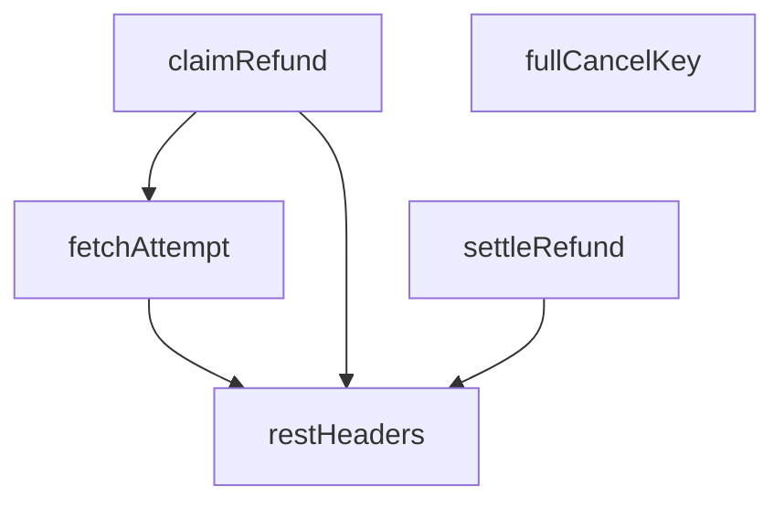

## NODE ID STANDARD

  file: supabase\functions\_shared\refund_guard.ts
  function: supabase\functions\_shared\refund_guard.ts::fullCancelKey
  function: supabase\functions\_shared\refund_guard.ts::restHeaders
  function: supabase\functions\_shared\refund_guard.ts::fetchAttempt
  function: supabase\functions\_shared\refund_guard.ts::claimRefund
  function: supabase\functions\_shared\refund_guard.ts::settleRefund

---

## DISA AKTARILANLAR (EXPORTS)
  export: ClaimResult
  export: RefundAttemptRow
  export: RefundAttemptState
  export: claimRefund
  export: fetchAttempt
  export: fullCancelKey
  export: restHeaders
  export: settleRefund

## Tasarım Gerekçeleri (kaynaktan BİREBİR)

> Bu bölüm LLM tarafından **yazılmadı**; kaynaktaki işaretli bloklardan
> birebir kopyalandı. Özetlenmesi veya yeniden ifade edilmesi YASAKTIR —
> gerekçenin değeri tam olarak kelimelerindedir.


```text
NİÇİN VAR (T053-VH · 2026-08-15 operasyon döngüsü denetimi §3)

`iyzico-refund` dosyasının başlığında 2025'ten beri "Idempotent" yazıyordu. Kodda
idempotency YOKTU. Tek koruma şuydu:

if (order.payment_status === 'refunded') return already_refunded

Bu bir **read-then-act**: okuma ile İyzico çağrısı arasındaki pencerede ikinci bir
istek aynı okumayı yapar, aynı guard'ı geçer ve GERÇEK PARA ikinci kez çıkar. Aynı
dosyada `manual_refund_applied` diye bir bayrak yazılıyordu ama **hiçbir yerde
okunmuyordu** — yorum "idempotent by flag" diyordu, bayrak ölüydü.

Daha sinsi ikinci yol: PSP çağrısından SONRAKİ sipariş güncellemesi boş `catch {}`
içindeydi. Yazma düşerse fonksiyon yine `200 {status:'refunded'}` dönüyordu; veritabanı
iadeyi hiç görmüyordu, dolayısıyla bir sonraki çağrı guard'ı geçip parayı TEKRAR iade
ediyordu. Yani "para çıktı ama kayıt düştü" hâli, kendi başına bir çift-iade üreteciydi.

── Çözümün şekli ───────────────────────────────────────────────────────────────
Uygulama katmanında çözülemez: iki ayrı istek arasındaki yarışı ancak ortak bir
serileştirme noktası kapatır. Burada o nokta veritabanının benzersiz indeksidir
(`refund_attempts_key_uniq`). Sıra BİLİNÇLİ olarak şudur:

1. talebi YAZ      → unique çakıştıysa İyzico'ya HİÇ GİTME
2. İyzico'yu çağır
3. sonucu aynı satıra işle

"Önce yaz" kısmı kritiktir. Tersi (önce çağır, sonra yaz) tam olarak bugünkü hatadır:
yazma düşerse para hareketinin hiçbir izi kalmaz.

── Takılı kalan talep OTOMATİK açılmaz ─────────────────────────────────────────
Süreç 1. ve 3. adım arasında ölürse satır `in_flight` kalır. Bu, "para çıktı mı
BİLMİYORUZ" demektir. Zaman aşımıyla otomatik serbest bırakmak, kapatmaya çalıştığımız
çift-iade penceresini geri açar — üstelik en kötü anda, yani PSP'nin yavaş olduğu anda.
Bu yüzden burada fail-closed davranış, İNSAN kararı istemektir: 409 + gelir alarmı.
```


---
# FILE: supabase\functions\_shared\return_transitions.md

---
domain: general
source_type: doc
namespace_type: module
source_path: C:\tmp\ops-t165\supabase\functions\_shared\return_transitions.ts
skeleton_hash: da1baae346bd8120
entity_hashes:
  func:canCarrierTransition: 319f7f80006cd5c4
  func:isTerminalReturnStatus: b970cffbe2eea904
  overview: e4a16fc5919e804b
generated_at: 2026-08-27T07:09:18Z
---

## Genel Bakış
Bu modül, iade (return) süreçlerindeki durum geçişlerini doğrulayan paylaşımlı bir yardımcı modüldür. `_shared` klasöründe yer aldığı için birden fazla Supabase Edge Function tarafından ortak kullanılır. Bir iade durumunun süreç akışında son nokta olup olmadığını ve taşıyıcının belirli bir durumdan başka bir duruma geçiş yapıp yapamayacağını kontrol eder.

## Fonksiyon Grupları

### Durum Sınıflandırma
Bir iade durumunun terminal (son) durum olup olmadığını belirleyerek sürecin sonlanıp sonlanmadığını tespit eder.
- isTerminalReturnStatus

### Geçiş Kontrolü
Taşıyıcının mevcut iade durumundan hedef duruma geçişinin kurallara uygun olup olmadığını değerlendirir ve bir geçiş kararı (verdict) döndürür.
- canCarrierTransition

## Bağımlılıklar ve Mimari Notlar

- `TransitionVerdict` tipi bu modülde tanımlı değildir; dışarıdan sağlanan bir türdür.
- Fonksiyonlar arasındaki çağrı ilişkisi verilen kaynakta belirtilmemiştir; bilinmiyor.
- Modül `_shared` altında konumlandığından, iadeyle ilgili tüm Edge Function'lar tarafından kullanılması amaçlanmıştır.

---

## AXIOMS – Mimari Varsayımlar

Bu modül için özel aksiyom tanımlanmamıştır.

**Neden:** Fonksiyon gövdeleri verilmediği için, modülün doğru çalışması için gerekli koşullar belirlenememektedir. Yalnızca fonksiyon imzaları ve sabit adları mevcut olup, bu bilgilerden aksiyom üretimi mümkün değildir.

---

## FONKSİYON DETAYLARI

### isTerminalReturnStatus
**Ne yapar**: Verilen bir iade durumunun (return status) terminal (son) durum olup olmadığını kontrol eder. Terminal durumlar, artık başka bir duruma geçiş yapılamayacak noktaları ifade eder.

**Nasıl yapar**: `TERMINAL_RETURN_STATUSES` sabit dizisini `readonly string[]` tipine dönüştürerek, verilen `status` parametresinin bu dizide yer alıp almadığını `includes` metoduyla sorgular. Durum dizide varsa `true`, yoksa `false` döner.

**Parametreler**:
- status: string — Kontrol edilecek iade durumu değeri

**Dönüş**: boolean — Durum terminal bir durumsa `true`, değilse `false` döner.

### canCarrierTransition
**Ne yapar**: Geliştirildi ancak detay üretilemedi.

---

## TYPE ALIASES

### ReturnStatus
```typescript
type ReturnStatus = (typeof RETURN_STATUSES)[number]
```

### TransitionVerdict
```typescript
type TransitionVerdict = | { allowed: true }
  | { allowed: false; reason: 'terminal' | 'not_allowed' | 'unknown_current' | 'unknown_next' }
```

---

## SABİTLER
- **RETURN_STATUSES** (as_expression) — `[
  'requested',
  'approved',
  'rejected',
  'in_transit',
  'received...`
- **CARRIER_ALLOWED_TRANSITIONS** (object) — `{
  requested: ['cancelled'],
  approved: ['in_transit', 'cancelled'],
  i...`

---

## AST POINTERS

### [N1_NASIL] AST Pointer: _shared/return_transitions.ts::isTerminalReturnStatus
- **params**: `status` (string)
- **ic_degiskenler**:
  - `TERMINAL_RETURN_STATUSES` — `as readonly string[]` ile tür dönüşümü uygulanmış sabit dizi; `status` parametresinin bu dizide bulunup bulunmadığı kontrol edilir
- **Dönüş**: boolean — `status` terminal dönüş durumlarından biriyse `true`, değilse `false`

### [N2_NASIL] AST Pointer: _shared/return_transitions.ts::canCarrierTransition
- **params**: `current` (string), `next` (string)
- **ic_degiskenler**:
  - `current` — mevcut dönüş durumu; `next` ile aynı olup olmadığı kontrol edilir, `RETURN_STATUSES` dizisinde yer alıp almadığı denetlenir, `isTerminalReturnStatus` fonksiyonuna argüman olarak gönderilir, `CARRIER_ALLOWED_TRANSITIONS` nesnesinde anahtar olarak kullanılır
  - `next` — hedef dönüş durumu; `RETURN_STATUSES` dizisinde yer alıp almadığı denetlenir, `allowed` dizisinde `includes` ile aranır
  - `RETURN_STATUSES` — `as readonly string[]` ile tür dönüşümü uygulanmış sabit dizi; hem `current` hem `next` parametrelerinin geçerli birer dönüş durumu olup olmadığını denetlemek için kullanılır
  - `isTerminalReturnStatus(current)` — `current` parametresinin terminal bir dönüş durumu olup olmadığını döndüren fonksiyon çağrısı; terminal ise geçişe izin verilmez
  - `allowed` — `CARRIER_ALLOWED_TRANSITIONS[current as ReturnStatus]` ifadesiyle elde edilen dizi; `current` durumundan izin verilen hedef durumları içerir
  - `CARRIER_ALLOWED_TRANSITIONS` — `current` durumunu anahtar olarak alan nesne; her anahtarın değeri, o durumdan geçiş yapılabilecek hedef durumların dizisidir
- **Dönüş**: TransitionVerdict — `{ allowed: true }` veya `{ allowed: false, reason: string }` biçiminde nesne; `reason` değerleri: `'unknown_current'`, `'unknown_next'`, `'terminal'`, `'not_allowed'`

---

## NODE ID STANDARD

  file: supabase\functions\_shared\return_transitions.ts
  function: supabase\functions\_shared\return_transitions.ts::isTerminalReturnStatus
  function: supabase\functions\_shared\return_transitions.ts::canCarrierTransition

---

## DISA AKTARILANLAR (EXPORTS)
  export: CARRIER_ALLOWED_TRANSITIONS
  export: RETURN_STATUSES
  export: ReturnStatus
  export: TransitionVerdict
  export: canCarrierTransition
  export: isTerminalReturnStatus

## Tasarım Gerekçeleri (kaynaktan BİREBİR)

> Bu bölüm LLM tarafından **yazılmadı**; kaynaktaki işaretli bloklardan
> birebir kopyalandı. Özetlenmesi veya yeniden ifade edilmesi YASAKTIR —
> gerekçenin değeri tam olarak kelimelerindedir.


```text
NİÇİN VAR (T057-VH · 2026-08-15 operasyon döngüsü denetimi §3)

Denetim, iade statüsü için **üç çelişen otorite** buldu:

1. `src/lib/admin/returnStatusMachine.ts` — istemci geçiş tablosu (admin UI'ı üretir)
2. `returns-webhook/index.ts` — bir SIRALAMA (rank) haritası
3. Veritabanı — hiçbir geçiş trigger'ı yok; PostgREST'ten her geçiş mümkün

İkincisi bu dosyanın kapattığı yerdir. Eski kod statüleri sayısal bir sıraya diziyordu:

{ requested:0, approved:1, rejected:1, in_transit:2, received:3, refunded:4, cancelled:4 }
if (nextRank < curRank) -> engelle

Buradaki hata, **iade akışının bir sıra olmadığıdır.** `rejected` bir SONLANMA durumudur
ama sıralamada ortada (1) durur; dolayısıyla kargo firmasının gönderdiği bir `in_transit`
(2) mesajı "ilerleme" sayılır ve REDDEDİLMİŞ bir iadeyi yeniden canlandırır. Aynı şekilde
`refunded` ve `cancelled` eşit rütbededir (4 = 4) ve `4 < 4` yanlış olduğu için parası
iade edilmiş bir iade `cancelled`'a çevrilebilir. İkisi de ölçüldü, ikisi de guard'dan
geçiyordu.

Doğrusu bir sıra değil, AÇIK bir geçiş tablosudur; sonlanma durumları SOĞURUCUDUR:
oradan çıkış yoktur, ne ileri ne geri.

── Kargo firması neyi söyleyebilir, neyi söyleyemez ────────────────────────────
Bu tablo, istemci makinesinin İZİN VERDİKLERİNİN BİR ALT KÜMESİDİR ve bilinçli olarak
daha dardır. Fark tek bir yerde: `received -> refunded` istemcide vardır, burada YOKTUR.
Çünkü `refunded` bir PARA kararıdır; onu admin verir, kargo firması değil. Bir kargo
webhook'unun "iade edildi" diyebilmesi, dış bir sistemin ödeme durumunu ilan etmesi
demek olurdu. Bu ayrım INV-RETURN-1 testiyle sabitlenmiştir.
```


---
# FILE: supabase\functions\_shared\revenue_alarm.md

---
domain: general
source_type: doc
namespace_type: module
source_path: C:\tmp\ops-t165\supabase\functions\_shared\revenue_alarm.ts
skeleton_hash: 45e6b9644b93d093
entity_hashes:
  func:raiseRevenueAlarm: 583400307b182d35
  overview: ed4be68d95228a99
generated_at: 2026-08-27T07:09:20Z
---

## Genel Bakış
Bu modül, gelir ile ilgili durumlarda alarm tetiklemekten sorumludur. Supabase bağlantısı için gerekli kimlik bilgilerini ve alarm verisini alarak bir gelir alarmı oluşturur. Modül `_shared` altında yer aldığından, Supabase Edge Functions arasında ortak kullanılan paylaşımlı bir yardımcı niteliğindedir.

## Fonksiyon Grupları

### Gelir Alarmı Yönetimi
Supabase ortamında tanımlı bir gelir alarmını tetikler. Fonksiyon, verilen Supabase URL ve servis rol anahtarıyla bağlantı kurarak sağlanan `RevenueAlarmInput` verisine dayalı alarm işlemini başlatır; herhangi bir değer döndürmez.
- raiseRevenueAlarm

---

## AXIOMS – Mimari Varsayımlar

Fonksiyon gövdesi verilmediğinden, çalışma mantığı hakkında kesin hüküm verilemez. Ancak imzadan çıkarılabilecek temel varsayımlar aşağıdadır:

**[Aksiyom 1]**: Eğer `supabaseUrl` parametresi yoksa (boş veya tanımsız), fonksiyonun Supabase'e bağlanması mümkün olmaz; sonuç bilinmiyor (fonksiyon gövdesi verilmediği için hata fırlatıp fırlatmadığı belirlenemez).

**[Aksiyom 2]**: Eğer `serviceRoleKey` parametresi yoksa (boş veya tanımsız), yetkili bir Supabase istemcisi oluşturulamaz; sonuç bilinmiyor.

**[Aksiyom 3]**: Eğer `input` parametresi `RevenueAlarmInput` tipine uymuyorsa, fonksiyonun beklediği veri yapısı sağlanmamış olur; sonuç bilinmiyor.

**[Aksiyom 4]**: Bu fonksiyon `async` olarak tanımlıdır. Eğer çağrılan ortam `async` işlevleri desteklemiyorsa (veya `await` ile çağrılmıyorsa), `Promise<void>` döndürüldüğünden sonuç beklenen şekilde alınamaz.

**Not**: `RevenueAlarmInput` tipinin yapısı ve eşik değerleri hakkında bilgi verilmediğinden, domain-specific kurallar belirlenememiştir.

---

## FONKSİYON DETAYLARI

### raiseRevenueAlarm
**Ne yapar**: Gelir yolunu kesen bir arızayı kalıcı ve görünür bir yere yazar. Fonksiyon, hem konsola hata logu düşer hem de Supabase veritabanındaki `client_errors` tablosuna kaydeder. Bu sayede arıza hem platform loglarında hem de veritabanında izlenebilir hale gelir.

**Nasıl yapar**: Fonksiyon önce `SOURCE` sabiti ile birlikte bir hata mesajı oluşturur ve `console.error` ile platform loguna yazar; bu sayede veritabanı yazımı başarısız olsa bile bir iz kalır. Ardından `supabaseUrl` ve `serviceRoleKey` parametrelerinin varlığını kontrol eder; eksikse hata loglayıp erken dönüş yapar. Parametreler mevcutsa Supabase REST API'sine `client_errors` tablosuna POST isteği gönderir. Mesaj, `error_groups` mekanizmasının aynı arızayı tek grupta toplayabilmesi için sabit bir `[GELIR-YOLU]` öneki taşır. İstek başarısız olursa veya bir istisna fırlatılırsa, hata detayları `console.error` ile loglanır ve fonksiyon sessizce sonlanır.

**Parametreler**:
- supabaseUrl: string — Supabase projesinin REST API URL'i. Boş veya tanımsız ise fonksiyon veritabanı yazımı yapmaz, yalnızca konsola hata logu düşer.
- serviceRoleKey: string — Supabase servis rol anahtarı. Hem `Authorization` başlığında `Bearer` token olarak hem de `apikey` başlığında kullanılır. Boş veya tanımsız ise fonksiyon veritabanı yazımı yapmaz.
- input: RevenueAlarmInput — Arıza bilgilerini taşıyan nesne. Aşağıdaki alanları içerir:
  - input.fn: string — Arızanın gerçekleştiği fonksiyon adı. Hata mesajında ve `url` alanında (`edge://<fn>` formatında) kullanılır.
  - input.code: string — Arıza kodu. Hata mesajında ve `extra` alanında yer alır.
  - input.message: string — Arıza açıklaması. Hata mesajının ana metnini oluşturur.
  - input.extra: Record<string, unknown> | undefined — Ek bağlam bilgileri. `console.error` çağrısında ve veritabanı kaydının `extra` alanına eklenir. Tanımsızsa boş nesne olarak işlenir.

**Dönüş**: Promise<void> — Fonksiyon asenkron çalışır ancak anlamlı bir değer döndürmez. Başarılı veya başarısız tüm senaryolarda `undefined` ile çözümlenir; hata fırlatmaz.

---

## TYPE ALIASES

### RevenueAlarmInput
```typescript
type RevenueAlarmInput = {
  /** Kesintiye uğrayan işlev, ör. `iyzico-payment`. */
  fn: string
  /** Makine-okunur sebep, ör. `VALIDATION_UNAVAILABLE`. Gruplama bunun üzerinden yapılır. */
  code: string
  /** İnsan içi
```

---

## AST POINTERS

### [N1_NASIL] AST Pointer: _shared/revenue_alarm.ts::raiseRevenueAlarm
- **params**:
  - `supabaseUrl` — Supabase projesinin REST API taban URL'si
  - `serviceRoleKey` — Supabase service_role anahtarı (yetkili erişim)
  - `input` — `RevenueAlarmInput` tipinde alarm verisi; `fn`, `code`, `message` ve opsiyonel `extra` alanlarını taşır
- **ic_degiskenler**:
  - `line` — Konsol çıktısı için biçimlendirilmiş alarm satırı; `[SOURCE]` öneki, `input.fn`, `input.code` ve `input.message` değerlerini birleştirir
  - `input.fn` — Alarmı tetikleyen fonksiyon adı; hem `line` içinde hem de `body` içinde `url` ve `extra` alanlarında kullanılır
  - `input.code` — Hata kodu; `line` içinde ve `body` içinde `message` ile `extra` alanlarında kullanılır
  - `input.message` — Hata mesajı; `line` içinde ve `body` içinde `message` alanının parçası olarak kullanılır
  - `input.extra` — Opsiyonel ek veri; `line` konsol çıktısında ve `body` içinde `extra` alanına yayılır (`?? {}` ile varsayılan boş nesne)
  - `resp` — `fetch` çağrısının döndürdüğü `Response` nesnesi; `resp.ok` ile başarısızlık kontrolü, `resp.status` ile durum kodu okunur
  - `detail` — Başarısız yanıt durumunda `resp.text()` ile elde edilen hata detay metni; `.catch(() => '')` ile sessiz fallback, `.slice(0, 200)` ile kırpılır
  - `e` — `catch` bloğunda yakalanan istisna nesnesi; konsola yazdırılır
- **Dönüş**: `Promise<void>` — yan etki tabanlı fonksiyon, değer döndürmez

**Yan etkiler**:
1. `console.error(line, input.extra ?? {})` — platform logu olarak konsola yazar (DB yazımı başarısız olsa bile iz kalır)
2. `supabaseUrl` veya `serviceRoleKey` boşsa `console.error` ile uyarı yazdırır ve erken döner
3. `fetch` ile `supabaseUrl/rest/v1/client_errors` adresine POST isteği gönderir; gövde `message` (sabit `[GELIR-YOLU]` önekli), `level: 'error'`, `url: edge://...`, `env: 'edge'`, `extra` alanlarını içerir
4. Yanıt başarısızsa (`!resp.ok`) `console.error` ile durum kodu ve detay yazar
5. `fetch` istisna fırlatırsa `catch` bloğunda `console.error` ile hata yazar

---

## NODE ID STANDARD

  file: supabase\functions\_shared\revenue_alarm.ts
  function: supabase\functions\_shared\revenue_alarm.ts::raiseRevenueAlarm

---

## DISA AKTARILANLAR (EXPORTS)
  export: RevenueAlarmInput
  export: raiseRevenueAlarm

## Tasarım Gerekçeleri (kaynaktan BİREBİR)

> Bu bölüm LLM tarafından **yazılmadı**; kaynaktaki işaretli bloklardan
> birebir kopyalandı. Özetlenmesi veya yeniden ifade edilmesi YASAKTIR —
> gerekçenin değeri tam olarak kelimelerindedir.


```text
NİÇİN VAR (T045-VH · 2026-08-15)

Ödeme akışının iki yarısı da bağımsız olarak **fail-closed** yapıldı:
• ön yüz (`useCheckoutPayment`) — `validateServerCart` düşerse ödeme başlatmaz (#536)
• sunucu (`iyzico-payment`)     — `order-validate` düşerse ödeme başlatmaz (T041-VH)

Her iki karar da tek başına DOĞRU: alternatifi, tahsil edilecek tutarı tarayıcının
belirlemesiydi. Ama ikisi birleşince yeni bir sınıf doğdu — bir eş-Controller panodan
tam olarak bunu işaret etti: **`order-validate` düşerse kimse satın alamaz ve kimse
fark etmez.** İki taraf da ayrı ayrı doğru, dikiş yeri sessizce kopuyor.

Sessizliğin sebebi, arızanın "hata" gibi görünmemesidir: kullanıcı bir uyarı görür ve
vazgeçer, sunucu 502 döner ve unutur. Ortada patlayan bir şey yok, yalnız ciro yok.
Sıfır sipariş, "bugün kimse almadı"dan ayırt edilemez.

BU YÜZDEN ALARM, SENTRY'YE BAĞLI DEĞİL. `_shared/sentry.ts` `SENTRY_DSN` yoksa
SESSİZCE hiçbir şey yapmaz ve bu projede DSN hiçbir `.env*.example` dosyasında YOK
(`T014-VH`). Sentry'ye yaslanan bir alarm, kapatılmış bir alarmdır. Kayıt bu yüzden
`client_errors` tablosuna yazılır: admin panelindeki **Hata Grupları** ekranı zaten
oraya bakar, yani insanın gözünün değdiği bir yüzey.

Yazma BEST-EFFORT'tur ve ASLA fırlatmaz: alarm mekanizması, alarmı kuran işlemi
düşürmemelidir. Ama sessizce yutulmaz da — başarısız olursa `console.error` ile
platform loglarına düşer.
```


---
# FILE: supabase\functions\_shared\sentry.md

---
domain: general
source_type: doc
namespace_type: module
source_path: C:\tmp\ops-t165\supabase\functions\_shared\sentry.ts
skeleton_hash: 9ae3c67ed80ac3f9
entity_hashes:
  func:parseDsn: de6e6bd80de1e473
  func:postStore: baa7d375e0588daa
  func:sentryCaptureException: d3efed22b661b471
  func:sentryCaptureMessage: f1e4a7cbdea35542
  overview: a0aac1a163270d41
generated_at: 2026-08-27T07:09:22Z
---

## Genel Bakış
Bu modül, uygulamadan Sentry hata izleme servisine veri göndermek için gerekli temel araçları sağlar. DSN ayrıştırma, ham veri gönderimi ve geliştirici dostu yakalama arayüzlerini içererek hata ve mesaj raporlama döngüsünü tamamlar.

## Fonksiyon Grupları
### DSN İşlemleri
Sentry Data Source Name stringini ayrıştırarak sunucu, kimlik ve proje bilgilerini hazırlar.
- parseDsn

### Transport (Veri Gönderimi)
Ayrıştırılmış DSN bilgilerini kullanarak olay yükünü Sentry'nin alıcı sunucusuna asenkron olarak iletir.
- postStore

### Uygulama Yakalama API'leri
Geliştiricilerin uygulama içinden mesaj veya istisna yakalamasını kolaylaştırır; içlerinde DSN işleme ve veri gönderimini orkestra eder.
- sentryCaptureMessage, sentryCaptureException

---

## AXIOMS – Mimari Varsayımlar

Bu modül, fonksiyon gövdeleri paylaşılmadığı için yalnızca fonksiyon imzalarından ve modülün genel amacından çıkarılabilecek temel mimari varsayımları içerir.

**[Aksiyom 1]:** Eğer `parseDsn`'a verilen `dsn` parametresi geçerli bir Sentry DSN formatında (örn. `https://<public_key>@<host>/<project_id>`) değilse, ayrıştırma sonucu tutarsız veya eksik olur ve `postStore` tarafından gönderilen HTTP isteği hedefe ulaşamaz.

**[Aksiyom 2]:** Eğer `postStore` çağrıldığında ağ (network) bağlantısı mevcut değilse veya Sentry'nin store endpoint'i erişilemez durumda ise, hata raporu sunucuya ulaşamaz ve sessizce başarısız olur.

**[Aksiyom 3]:** Eğer `sentryCaptureMessage` veya `sentryCaptureException` çağrılmadan önce ortam değişkenlerinden veya uygun bir kaynaktan geçerli bir DSN (`dsn`) sağlanamıyorsa, bu fonksiyonlar raporlama yapamaz; çünkü arka planda `parseDsn` ve `postStore` zinciri bu değere bağlıdır.

**[Aksiyom 4]:** Eğer `sentryCaptureMessage` çağrısında `level` parametresi `SentryLevel` tipinin izin verdiği değerlerden biri (örn. `"error"`, `"warning"`, `"info"` vb.) dışındaysa, Sentry tarafında beklenmeyen bir davranış veya reddetme oluşur.

**[Aksiyom 5]:** Eğer `sentryCaptureException` çağrısında `_e` parametresi `null` veya geçersiz bir değer olarak sağlanırsa, modülün hata bilgisini anlamlı bir şekilde serialize edememesi ve raporlanamaması olur.

---

## FONKSİYON DETAYLARI

### parseDsn
**Ne yapar**: Verilen bir Sentry DSN (Data Source Name) dizesini ayrıştırarak bileşenlerine (host, publicKey, projectId) ayırır. Başarısız ayrıştırma durumunda `null` değerini döner.

**Nasıl yapar**: Girdi dizesini bir `URL` nesnesine dönüştürmeye çalışır. Dönüşüm başarılı olursa, URL nesnesinin `username`, `host` ve `pathname` özelliklerinden istenen değerleri çıkarır. `pathname`’den baştaki `/` karakteri kaldırılarak `projectId` elde edilir. Herhangi bir ayrıştırma hatası (geçersiz URL) veya gerekli alanların boş olması durumunda `null` döner.

**Parametreler**:
- `dsn: string` — Sentry projesine ait Data Source Name dizesi. Örnek format: `https://PUBLIC_KEY@o123456.ingest.sentry.io/987654`

**Dönüş**: `{ host: string; publicKey: string; projectId: string } | null` — Ayrıştırma başarılıysa host, anahtar ve proje ID’sini içeren bir nesne; aksi halde `null`.

### postStore
**Ne yapar**: Sağlanan DSN ve olay gövdesi kullanılarak Sentry’ye bir hata veya mesaj kaydı (store) göndermek için asenkron bir HTTP POST isteği başlatır. İletişim hatası durumunda sessizce devam eder.

**Nasıl yapar**: İlk olarak `parseDsn` fonksiyonuyla DSN’yi ayrıştırır. Ayrıştırma başarısız olursa hiçbir şey yapmaz. Başarılıysa, `https://{host}/api/{projectId}/store/` formatında bir endpoint URL’si oluşturur. Gerekli `X-Sentry-Auth` başlığını, Sentry API standardına uygun olarak versiyon, istemci anahtarı ve istemci adı bilgileriyle formatlar. Son olarak, `fetch` API’sini kullanarak JSON formatındaki gövdeyi ilgili URL’ye POST metoduyla gönderir. `try-catch` bloğu, ağ hataları veya diğer istisnaları yakalar ve yok sayar.

**Parametreler**:
- `dsn: string` — İsteğin gönderileceği Sentry projesinin DSN adresi.
- `body: unknown` — Gönderilecek olay verisi (JSON’laştırılabilir bir nesne).

**Dönüş**: `Promise<void>` — Fonksiyon asenkron olup, bir değer dönmez.

### sentryCaptureMessage
**Ne yapar**: Belirtilen metin mesajını ve seviyesini bir Sentry olayı olarak gönderir. Ortam değişkenlerinden DSN ve diğer yapılandırma değerlerini otomatik olarak okur.

**Nasıl yapar**: `globalThis` üzerinden Deno ortam değişkenlerine erişerek `SENTRY_DSN` değerini alır. Eğer DSN yoksa veya boşsa fonksiyon hemen sonlanır. DSN varsa, standart bir Sentry olay nesnesi oluşturur. Bu nesne platform, zaman damgası, seviye, mesaj, ek bilgiler (`extra`) ve opsiyonel olarak ortam ile sürüm bilgilerini içerir. Oluşturulan olay nesnesini `postStore` fonksiyonu aracılığıyla Sentry’ye iletir.

**Parametreler**:
- `message: string` — Raporlanacak hata veya durum mesajı.
- `level: SentryLevel` — Olay ciddiyeti (örn: 'error', 'warning', 'info'). Varsayılan `'error'`.
- `extra?: Record<string, unknown>` — Opsiyonel. Mesajla birlikte gönderilecek ek bağlam bilgileri.

**Dönüş**: `Promise<void>` — Fonksiyon asenkron olup, bir değer dönmez.

### sentryCaptureException
**Ne yapar**: Yakalanan bir hata (Error nesnesi veya bilinmeyen herhangi bir değer) hakkında detaylı bir Sentry olayı oluşturur ve gönderir. Hata istifasını (stack trace) mümkün olduğunca dahil eder.

**Nasıl yapar**: `SENTRY_DSN` ortam değişkenini okur; DSN yoksa hemen çıkılır. Girdi nesnesinin bir `Error` örneği olup olmadığını kontrol eder. Eğer bir `Error` ise, `message` ve `stack` özellikleri alınır; değilse, değer `String()` ile metne dönüştürülür. Sentry’nin beklediği `exception` yapısını oluşturur: hata türü, mesajı ve opsiyonel istifayı (`stacktrace.frames` içinde minimal bir çerçeve yapısıyla) içerir. Tam olay nesnesi, `postStore` ile iletilir.

**Parametreler**:
- `_e: unknown` — Yakalanan hata nesnesi veya herhangi bir değer. Bir `Error` instance’ı ise daha detaylı bilgi çıkarılır.
- `extra?: Record<string, unknown>` — Opsiyonel. İstisnayla ilişkilendirilecek ek bağlam bilgileri.

**Dönüş**: `Promise<void>` — Fonksiyon asenkron olup, bir değer dönmez.

---

## TYPE ALIASES

### SentryLevel
```typescript
type SentryLevel = 'fatal' | 'error' | 'warning' | 'info' | 'debug' | 'log'
```

---

## AST POINTERS

### [N1_NASIL] AST Pointer: _shared/sentry.ts::parseDsn
- **params**: `dsn: string` — Sentry DSN URL'i
- **ic_degiskenler**:
  - `u` — URL nesnesi, dsn string'inden parse edilmiş
  - `publicKey` — URL'den çıkarılan Sentry public key (u.username, trimlenmiş)
  - `host` — URL'den çıkarılan hostname (u.host)
  - `projectId` — URL path'inden çıkarılan proje ID'si (başındaki '/' kaldırılmış)
- **Dönüş**: `{ host: string; publicKey: string; projectId: string } | null` — parse başarılıysa nesne, başarısızsa null

### [N2_NASIL] AST Pointer: _shared/sentry.ts::postStore
- **params**: `dsn: string` — Sentry DSN URL'i, `body: unknown` — gönderilecek event verisi
- **ic_degiskenler**:
  - `parsed` — parseDsn ile parse edilmiş DSN bilgisi (host, publicKey, projectId) veya null
  - `url` — POST isteği yapılacak tam URL (`https://${parsed.host}/api/${parsed.projectId}/store/`)
  - `auth` — X-Sentry-Auth header değeri, virgülle ayrılmış kimlik bilgileri dizisi
- **Dönüş**: `Promise<void>` — yan etki: Sentry store endpoint'ine POST isteği gönderir, hata yutulur

### [N3_NASIL] AST Pointer: _shared/sentry.ts::sentryCaptureMessage
- **params**: `message: string` — yakalanacak mesaj, `level: SentryLevel = 'error'` — mesaj severity seviyesi (varsayılan 'error'), `extra?: Record<string, unknown>` — opsiyonel ek veri
- **ic_degiskenler**:
  - `dsn` — Deno env'den okunan SENTRY_DSN değeri, boş string fallback'li
  - `event` — Sentry'ye gönderilecek event nesnesi (platform, logger, timestamp, level, message, extra, environment, release alanlarını içerir)
- **Dönüş**: `yok` — yan etki: parseDsn ile DSN parse edilip postStore'a event gönderilir; DSN boşsa hiçbir şey yapmaz

### [N4_NASIL] AST Pointer: _shared/sentry.ts::sentryCaptureException
- **params**: `_e: unknown` — yakalanacak istisna/hata nesnesi, `extra?: Record<string, unknown>` — opsiyonel ek veri
- **ic_degiskenler**:
  - `dsn` — Deno env'den okunan SENTRY_DSN değeri, boş string fallback'li
  - `isErr` — _e'nin Error instance olup olmadığının kontrolü (boolean)
  - `message` — hata nesnesinden çıkarılan mesaj string'i (_e.message veya String(_e))
  - `stack` — hata nesnesinin stack trace'i (Error ise _e.stack, değilse undefined)
  - `event` — Sentry'ye gönderilecek event nesnesi (platform, logger, timestamp, level: 'error', message, exception, extra, environment, release alanlarını içerir); exception alanını stack varsa frames dizisi ile birlikte oluşturur
- **Dönüş**: `yok` — yan etki: parseDsn ile DSN parse edip postStore'a hata event'i gönderir; DSN boşsa hiçbir şey yapmaz

---


## MERMAID CALL GRAPH
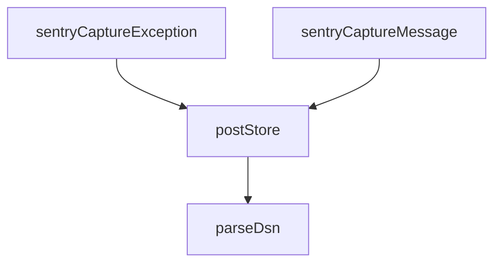

## NODE ID STANDARD

  file: supabase\functions\_shared\sentry.ts
  function: supabase\functions\_shared\sentry.ts::parseDsn
  function: supabase\functions\_shared\sentry.ts::postStore
  function: supabase\functions\_shared\sentry.ts::sentryCaptureMessage
  function: supabase\functions\_shared\sentry.ts::sentryCaptureException

---

## DISA AKTARILANLAR (EXPORTS)
  export: SentryLevel
  export: parseDsn
  export: postStore
  export: sentryCaptureException
  export: sentryCaptureMessage

---
# FILE: supabase\functions\_shared\tenant.md

---
domain: general
source_type: doc
namespace_type: module
source_path: C:\tmp\ops-t165\supabase\functions\_shared\tenant.ts
skeleton_hash: 0f8724e000a12424
entity_hashes:
  func:TenantMismatchError:constructor: aa4b9629eb1115c1
  func:asTenantId: 22012e035e1c5ed1
  func:readTenantField: eb2af82f1a376a67
  func:tenantFromRow: e7cf2c7a816dbc07
  func:tenantFromServiceBody: 81173f01c019d0b4
  func:tenantFromVerifiedUser: 03f6724101c13164
  overview: 4177b2bce8b584b0
generated_at: 2026-08-27T07:09:56Z
---

## Genel Bakış
Bu modül, çok kiracılı (multi-tenant) sistemlerde tenant (kiracı) bilgilerini yönetmek için kullanılır. Tenant ID'yi farklı kaynaklardan güvenli bir şekilde çıkarmak, doğrulamak ve tenant ile ilgili hata durumlarını tanımlamak gibi temel sorumlulukları vardır.

## Fonksiyon Grupları
### Tenant ID Çıkarma ve Okuma
Bu grup, ham değerlerden veya veri kaynaklarından tenant ID'yi çıkarmak ve okumak için kullanılır.
- asTenantId, readTenantField

### Tenant Karar Üretme
Bu grup, farklı kaynaklardan (doğrulanmış kullanıcı, servis isteği gövdesi, veritabanı satırı) tenant ile ilgili kararlar üretir.
- tenantFromVerifiedUser, tenantFromServiceBody, tenantFromRow

### Hata Yönetimi
Bu grup, tenant bilgileri arasındaki uyumsuzlukları yakalamak ve bildirmek için özel hata sınıfını tanımlar.
- TenantMismatchError (sınıf ve constructor metodu)

---

## AXIOMS – Mimari Varsayımlar
- Bu modül davranışsal mantık içermez (salt veri / konfigürasyon / tip tanımı).
- [Aksiyom 1]: Modülün dışa açtığı yapı (anahtar kümesi / şema) bir sözleşmedir; tüketiciler bu sabit yapıya bağlıdır — kırıcı değişiklik tüm tüketicileri etkiler.
- [Aksiyom 2]: Bir öğe ekleme/çıkarma yapısal-uyumlu olmalı; ilgili tipler ve seçiciler aynı commit'te güncel tutulmalıdır.

---

## FONKSİYON DETAYLARI

### asTenantId
**Ne yapar**: Verilen değerin geçerli bir tenant UUID'si olup olmadığını kontrol eder. Geçerliyse küçük harflere normalize edilmiş UUID string'ini, geçersizse `null` döndürür.

**Nasıl yapar**: Önce girdinin `string` tipinde olup olmadığını kontrol eder; değilse `null` döner. String ise baştaki ve sondaki boşlukları temizler. Temizlenmiş değer üzerinde `TENANT_UUID_RE` düzenli ifadesiyle eşleşme testi yapar. Eşleşiyorsa değeri `toLowerCase()` ile küçük harfe çevirip döndürür, eşleşmiyorsa `null` döner.

**Parametreler**:
- value: unknown — Kontrol edilecek değer; herhangi bir tipte olabilir.

**Dönüş**: string | null — Geçerli bir UUID ise küçük harf normalize edilmiş hali, aksi takdirde `null`.

### readTenantField
**Ne yapar**: Geliştirildi ancak detay üretilemedi.

### tenantFromVerifiedUser
**Ne yapar**: Geliştirildi ancak detay üretilemedi.

### tenantFromServiceBody
**Ne yapar**: Geliştirildi ancak detay üretilemedi.

### tenantFromRow
**Ne yapar**: Geliştirildi ancak detay üretilemedi.

### constructor
**Ne yapar**: `TenantMismatchError` sınıfının yapıcı metodudur. Tenant (kiracı) uyumsuzluğu durumunda fırlatılacak hata nesnesini başlatır ve ilgili tenant kimlik bilgilerini hata nesnesine kaydeder.

**Nasıl yapar**: Üst sınıfın constructor'ını `super('tenant_mismatch')` çağrısıyla başlatır; bu sayede hata mesajı olarak `'tenant_mismatch'` değerini kullanır. Ardından `this.name` özelliğini `'TenantMismatchError'` olarak ayarlayarak hata türünü tanımlar. Son olarak gelen `profileTenantId` ve `claimTenantId` parametrelerini ilgili örnek özelliklerine atar, böylece hata yakalandığında hangi tenant kimliklerinin uyuşmadığı bilgisine erişilebilir.

**Parametreler**:
- `profileTenantId`: `string | null` — Profil kaydındaki tenant kimliğini temsil eder. Profil kaydı bulunamadığında `null` olabilir.
- `claimTenantId`: `string` — JWT claim'lerindeki tenant kimliğini temsil eder. Bu değer her zaman bir string olarak beklenir.

**Dönüş**: Bilinmiyor. Constructor metotlarının dönüş tipi kaynak kodda belirtilmemiştir.

---

## INTERFACES

### TenantDecision
- `readonly tenantId: string`
- `readonly source: TenantSource`

### VerifiedUser
`auth.getUser(jwt)`'in döndürdüğü kullanıcının bu modülün ihtiyaç duyduğu dar yüzü. Supabase'in tam `User` tipini import etmiyoruz: bu dosyanın ağ/SDK bağımlılığı olmamalı ki saf kalsın ve testte düz nesneyle çağrılabilsin.
- `readonly id: string`
- `readonly app_metadata?: Record<string, unknown> | null`

### TenantProfileRow
Sınıf (a) rol sorgusunun döndürdüğü satır: `select role, tenant_id`. İkisinin AYNI satırdan gelmesi bilinçli — cetvel §3.2 rolü, §3.9 tenant'ı ister ve eski kod bunları iki ayrı kaynaktan alıp "önce tenant'ı bul ki profili filtreleyeyim" döngüsüne düşüyordu.
- `readonly role?: string | null`
- `readonly tenant_id?: string | null`

---

## TYPE ALIASES

### TenantSource
Kararın NEREDEN geldiği. Log/telemetri için değil, DENETİM için: bir uç beklenmedik bir kaynağa düşüyorsa (ör. sınıf-(a) ucunda `'default'`) bu, kapının çalışmadığının işaretidir ve çağıran bunu görüp reddedebilir.
```typescript
type TenantSource = 'user_profile' | 'service_body' | 'resource_row' | 'default'
```

---

## SABİTLER
- **TENANT_UUID_RE** (regex) — `/^[0-9a-f]{8}-[0-9a-f]{4}-[0-9a-f]{4}-[0-9a-f]{4}-[0-9a-f]{12}$/i`

---

## AST POINTERS

### [N1_NASIL] AST Pointer: tenant.ts::TenantMismatchError.constructor
- **params**: `profileTenantId: string | null`, `claimTenantId: string`
- **ic_degiskenler**: yok
- **Dönüş**: yok (constructor; `super('tenant_mismatch')` çağrısı yapar, `this.name` alanını `'TenantMismatchError'` olarak atar, `this.profileTenantId` ve `this.claimTenantId` alanlarını parametrelerden doldurur)

### [N2_NASIL] AST Pointer: tenant.ts::asTenantId
- **params**: `value: unknown`
- **ic_degiskenler**:
  - `trimmed` — `value` string ise `value.trim()` sonucu; UUID regex testine sokulan temizlenmiş değer
- **Dönüş**: `string | null` — `value` string değilse `null`; `trimmed` `TENANT_UUID_RE` regex'ine uymuyorsa `null`; uyuyorsa `trimmed.toLowerCase()` (küçük harfe çevrilmiş UUID)

### [N3_NASIL] AST Pointer: tenant.ts::readTenantField
- **params**: `source: unknown`
- **ic_degiskenler**:
  - `record` — `source` object ve null değilse `source as Record<string, unknown>` ile dönüştürülen kayıt
  - `key` — `TENANT_FIELD_KEYS` dizisi üzerinde döngüdeki mevcut anahtar
  - `candidate` — `asTenantId(record[key])` çağrısının dönüş değeri; her anahtar için kontrol edilen tenant ID adayı
- **Dönüş**: `string | null` — `source` object değilse `null`; `TENANT_FIELD_KEYS` içindeki anahtarlardan biri geçerli bir tenant ID döndürüyorsa o değer; hiçbiri bulamazsa `null`

### [N4_NASIL] AST Pointer: tenant.ts::tenantFromVerifiedUser
- **params**: `user: VerifiedUser`, `profile: TenantProfileRow | null`
- **ic_degiskenler**:
  - `fromProfile` — `asTenantId(profile?.tenant_id ?? null)` çağrısının dönüş değeri; profilden okunan tenant ID
  - `fromClaim` — `readTenantField(user.app_metadata ?? null)` çağrısının dönüş değeri; kullanıcı claim'inden okunan tenant ID
- **Dönüş**: `TenantDecision` — `fromClaim` ve `fromProfile` farklı ve ikisi de null değilse `TenantMismatchError` fırlatır; `fromProfile` null değilse `{ tenantId: fromProfile, source: 'user_profile' }`; aksi halde `{ tenantId: DEFAULT_TENANT_ID, source: 'default' }`

### [N5_NASIL] AST Pointer: tenant.ts::tenantFromServiceBody
- **params**: `parsedBody: unknown`
- **ic_degiskenler**:
  - `claimed` — `readTenantField(parsedBody)` çağrısının dönüş değeri; servis gövdesinden okunan tenant ID
- **Dönüş**: `TenantDecision` — `claimed` null değilse `{ tenantId: claimed, source: 'service_body' }`; aksi halde `{ tenantId: DEFAULT_TENANT_ID, source: 'default' }`

### [N6_NASIL] AST Pointer: tenant.ts::tenantFromRow
- **params**: `row: { tenant_id?: string | null } | null`
- **ic_degiskenler**:
  - `fromRow` — `asTenantId(row?.tenant_id ?? null)` çağrısının dönüş değeri; satırdan okunan tenant ID
- **Dönüş**: `TenantDecision` — `fromRow` null değilse `{ tenantId: fromRow, source: 'resource_row' }`; aksi halde `{ tenantId: DEFAULT_TENANT_ID, source: 'default' }`

---


## MERMAID CALL GRAPH
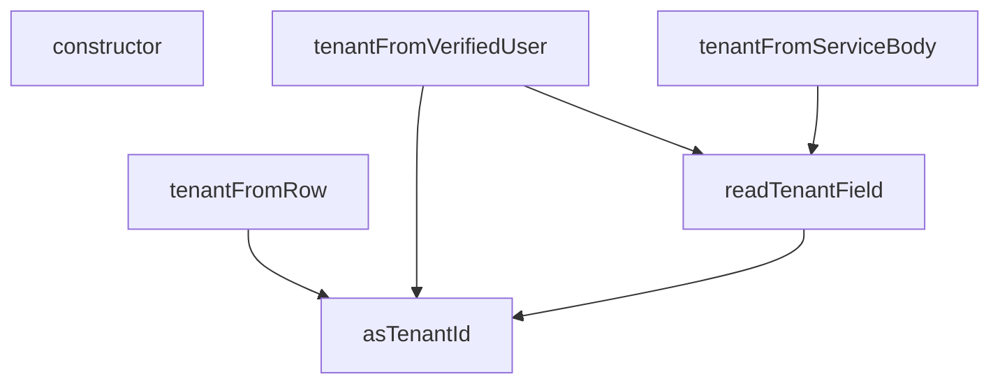

## NODE ID STANDARD

  file: supabase\functions\_shared\tenant.ts
  function: supabase\functions\_shared\tenant.ts::asTenantId
  function: supabase\functions\_shared\tenant.ts::readTenantField
  function: supabase\functions\_shared\tenant.ts::tenantFromVerifiedUser
  function: supabase\functions\_shared\tenant.ts::tenantFromServiceBody
  function: supabase\functions\_shared\tenant.ts::tenantFromRow
  class: supabase\functions\_shared\tenant.ts::TenantMismatchError

---

## DISA AKTARILANLAR (EXPORTS)
  export: TenantDecision
  export: TenantMismatchError
  export: TenantProfileRow
  export: TenantSource
  export: VerifiedUser
  export: asTenantId
  export: readTenantField
  export: tenantFromRow
  export: tenantFromServiceBody
  export: tenantFromVerifiedUser

---

## BILEŞIM (CONTAINS)
  contains: string
  contains: string | null

## Tasarım Gerekçeleri (kaynaktan BİREBİR)

> Bu bölüm LLM tarafından **yazılmadı**; kaynaktaki işaretli bloklardan
> birebir kopyalandı. Özetlenmesi veya yeniden ifade edilmesi YASAKTIR —
> gerekçenin değeri tam olarak kelimelerindedir.


```text
NİÇİN BU DOSYA VAR
-----------------
Eski `_shared/tenant_config.ts::resolveTenantId` tenant sınırını ÜÇ ayrı istek
alanından çiziyordu: `?tenant_id=` query'si (her şeyden önce), imzası hiç
doğrulanmadan elle çözülmüş JWT payload'ı, ve gövde. Üçü de saldırganın yazdığı yerler
— yani tenant sınırı pratikte YOKTU. Fonksiyonlar bu değeri PostgREST filtresine
(`tenant_id=eq.${tenantId}`) koyduğu için etki "başka tenant'ın satırını oku/yaz"a
kadar gidiyordu (cetvel §3.9 · CLAUDE.md §12 "data bleeding = felaket").

NİÇİN HTTP İSTEK NESNESİNİ HİÇ GÖRMÜYOR (stil tercihi DEĞİL, yapısal kilit)
---------------------------------------------------------------------------
Kök sebep "sıra yanlıştı" değil, **tenant modülünün istek nesnesine erişebilmesiydi**.
Erişim durdukça birileri er ya da geç yeniden "hızlıca şu query'yi de okuyalım" der.
Bu yüzden dosya SAF tutulur: istek nesnesi, istek başlıkları, query parametreleri ve
elle JWT çözme bu dosyada GEÇMEZ — hiçbiri, yorum içinde bile. Karar verirken elde
yalnız ÇAĞIRANIN ZATEN DOĞRULADIĞI girdiler olur; doğrulamak çağıranın işidir
(bkz. `_shared/caller.ts`).
(`tenant-id-hardening-2026-08-15.md` §7-B bunu ileride statik kural olarak bağlayacak;
kural ham dosyayı tarasa bile bu dosya temiz kalsın diye yasak diziler yazılmadı.)

NİÇİN SINIF BAŞINA AYRI FONKSİYON ("JWT kazanır" tek başına yetmez)
-------------------------------------------------------------------
Cetvel §2'deki çağıran sınıflarının kanıtı FARKLIDIR, dolayısıyla tenant kaynağı da
farklı olmak zorundadır:
(a) oturumlu kullanıcı  → `user_profiles.tenant_id` (rol ile AYNI sorgudan)
(b) service_role        → anahtar doğrulandıktan SONRA gövdedeki alan
(c) harici sistem       → imza doğrulandıktan SONRA kaynağın KENDİ satırından
Tek bir `resolveTenantId` bu üçünü aynı kaba koyduğu için en zayıf halka (query)
hepsinin duruşunu belirliyordu. Üç ayrı fonksiyon, çağıranı sınıfını beyan etmeye
zorlar; yanlış sınıfı kullanmak kodda görünür hâle gelir.

NİÇİN "claim YOKSA hata değil" (ölçüme dayanır, tercihe değil)
---------------------------------------------------------------
2026-08-15 prod ölçümü: `auth.users` = 2 kullanıcı, İKİSİNİN DE
`raw_app_meta_data->>'tenant_id'` alanı NULL; `user_profiles` = 2 satır, distinct
tenant = 1. Yani `app_metadata.tenant_id` bugün HİÇBİR kullanıcıda yok. "Claim yoksa
reddet" deseydik bugün canlı iki kullanıcının ikisi de kilitlenirdi. Bu yüzden claim
bir OTORİTE değil, bir ÇAPRAZ KONTROLdür: yoksa profil kazanır, varsa profille
UYUŞMAK ZORUNDADIR (plan R5).
```


---
# FILE: supabase\functions\_shared\tenant_config.md

---
domain: general
source_type: doc
namespace_type: module
source_path: C:\tmp\ops-t165\supabase\functions\_shared\tenant_config.ts
skeleton_hash: 5206c89ec698fe34
entity_hashes:
  func:getTenantBranding: bde2d3819c7904af
  overview: 727819c400487687
generated_at: 2026-08-27T07:09:58Z
---

## Genel Bakış

Bu modül, çok kiracılı (multi-tenant) mimaride kiracıya özel yapılandırma bilgilerini sağlayan bir yardımcı modüldür. Supabase Edge Functions paylaşımlı (_shared) alanında yer alır ve kiracı kimliğine göre marka bilgilerini getirme işlevini üstlenir. Modül, dış sistemlerden veya veritabanından kiracı yapılandırmasını okuyarak üst katmanlara sunar.

## Fonksiyon Grupları

### Kiracı Marka Bilgisi Erişimi

Verilen bir kiracı kimliğine (tenantId) karşılık gelen marka bilgilerini (TenantBranding) asenkron olarak getirir. Bu fonksiyon, kiracıya özel tema, logo, renk gibi marka ayarlarını dış dünyaya açan tek erişim noktasıdır.

- getTenantBranding

---

## AXIOMS – Mimari Varsayımlar

Bu modül için özel aksiyom tanımlanmamıştır.

**Neden:** Fonksiyon gövdesi verilmemiştir. Yalnızca fonksiyon imzası (`getTenantBranding(tenantId: string) -> Promise<TenantBranding>`) mevcuttur. Mimari varsayımlar yalnızca fonksiyon gövdesinden türetilir; imzadan aksiyom çıkarımı yapılamaz.

---

## FONKSİYON DETAYLARI

### getTenantBranding
**Ne yapar**: Verilen `tenantId` için marka (branding) yapılandırma değerlerini dinamik olarak getirir. Sıralı bir geri dönüş (fallback) mekanizması kullanır: önce kiracının veritabanındaki yapılandırmasına bakar, bulamazsa Deno ortam değişkenlerine başvurur, orada da yoksa sabit sistem varsayılanlarını döndürür.

**Nasıl yapar**: Fonksiyon önce `SUPABASE_URL` ve `SUPABASE_SERVICE_ROLE_KEY` ortam değişkenlerini okur. Eğer bu değerler ve `tenantId` mevcutsa, `persistSession: false` seçeneğiyle bir Supabase istemcisi oluşturur ve `tenants` tablosundan ilgili kiracının `config` alanını sorgular. Sorgu başarılı olursa elde edilen yapılandırma `dbConfig` değişkenine atanır; hata oluşursa `console.warn` ile uyarı mesajı yazdırılır. Try-catch bloğu içinde yakalanan beklenmedik hatalar ise `console.error` ile loglanır. Ardından her bir marka değeri (`brandName`, `brandLogoUrl`, `brandPrimaryColor`, `emailFrom`) için hiyerarşik çözümleme yapılır: önce `dbConfig` içindeki snake_case varyantı, sonra camelCase varyantı, ardından ilgili Deno ortam değişkeni, en sonunda da sabit varsayılan değer kullanılır. Bu sayede kiracıya özel yapılandırma, sistem geneli yapılandırma ve varsayılan değerler arasında esnek bir öncelik sırası oluşturulur.

**Parametreler**:
- `tenantId`: `string` — Marka yapılandırması getirilecek kiracının benzersiz kimlik numarası. Boş veya tanımsız olursa veritabanı sorgusu atlanır ve doğrudan ortam değişkenleri veya varsayılan değerlere geçilir.

**Dönüş**: `Promise<TenantBranding>` — Aşağıdaki dört alanı içeren bir nesne döndürür:
- `brandName`: Marka adı. Veritabanında `brand_name` veya `brandName` anahtarı, ortam değişkeninde `BRAND_NAME`, varsayılan olarak `'VentHub'`.
- `brandLogoUrl`: Marka logosunun URL adresi. Veritabanında `brand_logo_url` veya `brandLogoUrl` anahtarı, ortam değişkeninde `BRAND_LOGO_URL`, varsayılan olarak `'https://venthub-hvac-esite.vercel.app/images/logo.png'`.
- `brandPrimaryColor`: Markanın birincil renk kodu. Veritabanında `brand_primary_color` veya `brandPrimaryColor` anahtarı, ortam değişkeninde `BRAND_PRIMARY_COLOR`, varsayılan olarak `'#2563eb'`.
- `emailFrom`: E-posta gönderici adresi ve görünen adı. Veritabanında `email_from` veya `EMAIL_FROM` anahtarı, ortam değişkeninde `EMAIL_FROM`, varsayılan olarak `'VentHub <onboarding@resend.dev>'`.

---

## İTHALATLAR (IMPORTS)
- import: https://esm.sh/@supabase/supabase-js@2.45.4::createClient

---

## INTERFACES

### TenantBranding
- `brandName: string`
- `brandLogoUrl: string`
- `brandPrimaryColor: string`
- `emailFrom: string`

---

## AST POINTERS

### [N1_NASIL] AST Pointer: supabase/functions/_shared/tenant_config.ts::getTenantBranding
- **params**: `tenantId` — string tipinde, kiraci (tenant) kimligi
- **ic_degiskenler**:
  - `supabaseUrl` — `Deno.env.get('SUPABASE_URL')` ile alinan ortam degiskeni; bos string ile fallback'lenir
  - `serviceKey` — `Deno.env.get('SUPABASE_SERVICE_ROLE_KEY')` ile alinan ortam degiskeni; bos string ile fallback'lenir
  - `dbConfig` — `Record<string, string>` tipinde, veritabanindan gelen kiraci konfigurasyonunu tutan nesne; baslangicta bos obje olarak tanimlanir
  - `supabase` — `createClient(supabaseUrl, serviceKey, { auth: { persistSession: false } })` ile olusturulan Supabase istemcisi; oturum kaldirilmasi devre disi
  - `data` — `supabase.from('tenants').select('config').eq('id', tenantId).single()` sorgusundan donen veri; `data?.config` ile `config` alanina erisilir ve `dbConfig`'a atanir
  - `error` — ayni sorgudan donen hata nesnesi; hata varsa `console.warn` ile uyarisi yazdirilir
  - `err` — `catch` blokunda yakalanan genel hata; `console.error` ile yazdirilir
  - `brandName` — hiyerarsik cozumleme: once `dbConfig.brand_name`, sonra `dbConfig.brandName`, sonra `Deno.env.get('BRAND_NAME')`, en son `'VentHub'` varsayilan degeri
  - `brandLogoUrl` — hiyerarsik cozumleme: once `dbConfig.brand_logo_url`, sonra `dbConfig.brandLogoUrl`, sonra `Deno.env.get('BRAND_LOGO_URL')`, en son `'https://venthub-hvac-esite.vercel.app/images/logo.png'` varsayilan degeri
  - `brandPrimaryColor` — hiyerarsik cozumleme: once `dbConfig.brand_primary_color`, sonra `dbConfig.brandPrimaryColor`, sonra `Deno.env.get('BRAND_PRIMARY_COLOR')`, en son `'#2563eb'` varsayilan degeri
  - `emailFrom` — hiyerarsik cozumleme: once `dbConfig.email_from`, sonra `dbConfig.EMAIL_FROM`, sonra `Deno.env.get('EMAIL_FROM')`, en son `'VentHub <onboarding@resend.dev>'` varsayilan degeri
- **Dönüş**: `TenantBranding` tipinde nesne — `{ brandName, brandLogoUrl, brandPrimaryColor, emailFrom }` alanlarini icerir

---

## NODE ID STANDARD

  file: supabase\functions\_shared\tenant_config.ts
  function: supabase\functions\_shared\tenant_config.ts::getTenantBranding

---

## DISA AKTARILANLAR (EXPORTS)
  export: TenantBranding
  export: getTenantBranding