# VENTHUB HVAC MASTER ARCHITECTURE DOCUMENTATION

---
project_name: venthub-hvac
compiled_at: 2026-06-07T11:10:59.234299+00:00
total_compiled_files: 377
standard: Enterprise-Ready (5N1K + Axioms)
---

Bu belge, otonom derleyici tarafından 2026-06-07T11:10:59.234299+00:00 tarihinde tüm alt modüllerin güncel mimari dokümanlarının birleştirilmesiyle otonom olarak derlenmiştir.


---
# FILE: src\middleware.md

---
domain: general
source_type: doc
namespace_type: module
source_path: C:\Users\alize\venthub-hvac\src\middleware.ts
skeleton_hash: 17d96593b201eac7
entity_hashes:
  func:detectLocale: 25418ec7d07f6d80
  func:middleware: 869802a18899b914
  overview: 64f7e17620830c7c
generated_at: 2026-06-07T11:02:59Z
---

## Genel Bakış
Bu modül, VentHub HVAC projesinin Next.js ara katmanıdır ve tüm HTTP isteklerini rota öncesinde yakalayarak merkezi bir işlerlik sağlar. Dil tespiti, JWT tabanlı kimlik doğrulama ve erişim kontrolü gibi ön işlemleri koordineli bir şekilde yöneterek proje genelinde tutarlı ve güvenli bir kullanıcı deneyimi sunar.

## Fonksiyon Grupları

### Dil/Locale Tespiti
Gelen isteklerin başlıkları ve çerezleri analiz edilerek kullanıcının tercih ettiği dil ve bölgesel ayarlar otomatik olarak belirlenir.
- detectLocale

### Güvenlik ve Kimlik Doğrulama
JWT tabanlı token çözümleme ve kimlik doğrulama gibi güvenlik önlemlerini uygulayan yardımcı işlevleri barındırır.
- decodeJwt

### Merkezi Koordinasyon
Tüm gelen istekleri yakalayan ana işleyici; dil tespiti, kimlik doğrulama ve yetkilendirme gibi süreçleri sırayla ve koordineli olarak yürütür.
- middleware

---

## AXIOMS – Mimari Varsayımlar

Bu modül, HTTP isteklerini işleyen bir Next.js ara katmanıdır ve locale tespiti ile erişim kontrolü sağlar.

[Aksiyom 1]: Eğer `detectLocale` fonksiyonuna geçerli bir `NextRequest` nesnesi sağlanmazsa, locale tespiti başarısız olur ve varsayılan bir locale kullanılmalıdır.

[Aksiyom 2]: Eğer tespit edilen locale değeri `LOCALES` kümesinde yer almazsa, istemci için geçersiz bir dil tercihi işlenir ve uygulama tanımlı bir fallback locale'a dönmelidir.

[Aksiyom 3]: Eğer `middleware` fonksiyonuna geçerli bir `NextRequest` nesnesi sağlanmazsa, middleware zinciri kırılır ve istek işlenmeden reddedilir.

[Aksiyom 4]: Eğer istekteki kullanıcının rolü `ADMIN_ROLES` kümesinde tanımlırollerden biri değilse, admin-only rotalara erişim engellenir.

[Aksiyom 5]: Eğer rotada parametre olarak beklenen değer `UUID_REGEX` kalıbına uymazsa, UUID tabanlı rota eşleştirmesi başarısız olur.

[Aksiyom 6]: Eğer `config` nesnesi tanımlı değilse veya geçerli bir Next.js middleware config yapısına sahip değilse, middleware başarıyla register edilmez ve hiçbir istek işlenmez.

---

## FONKSİYON DETAYLARI

### detectLocale

**Ne yapar**: Kullanıcının tercih ettiği dilini (Türkçe veya İngilizce) belirler. Öncelikle cookie değerine, ardından tarayıcı dil tercihine bakarak uygun locale kodunu döndürür.

**Nasıl yapar**: Fonksiyon öncelikle `NEXT_LOCALE` adlı cookie'yi kontrol eder; eğer değeri geçerli bir dil koduysa (`tr` veya `en`) doğrudan bunu kullanır. Cookie'de geçerli bir dil yoksa, isteğin `accept-language` başlığını analiz eder ve İngilizce içeriyorsa `'en'` döndürür. Hiçbir koşul sağlanmazsa varsayılan olarak `'tr'` (Türkçe) değerini döndürür.

**Parametreler**:
- `request`: `NextRequest` — HTTP isteği nesnesi. Cookie değerlerine ve HTTP başlıklarına erişmek için kullanılır.

**Dönüş**: `string` — Belirlenen dil kodu (`'tr'` veya `'en'`).

### middleware

**Ne yapar**: Next.js uygulamasının tüm isteklerini yakalayan merkezi middleware fonksiyonudur. Tenant (kiracı) tespiti, dil tabanlı URL yönlendirmeleri, UUID'den slug'a SEO uyumlu yönlendirmeler ve admin paneli için RBAC (Rol Tabanlı Erişim Kontrolü) koruması gibi çok katmanlı bir istek filtreleme ve yönlendirme mekanizmasını yönetir.

**Nasıl yapar**: Fonksiyonun çalışma mantığı sırasıyla şu adımlardan oluşur: Önce `host` başlığından tenant kimliği çözümlenir ve `x-tenant-id` istek başlığına eklenir. Ardından URL'nin ilk segmenti incelenerek dil (locale) kontrolü yapılır — eğer ilk segment desteklenen dillerden biriyse dil alt dizin olarak kabul edilir ve admin rotası haricinde normal akışa devam edilir; değilse ve rota özel bir rota (admin, API, auth callback, sitemap, robots.txt) değilse, tespit edilen dile göre 307 yönlendirmesi gönderilir. Son olarak, dil segmenti çıkarılmış `effectiveSegments` kullanılarak iki ana dal ele alınır: (1) Ürün UUID'den slug'a 308 yönlendirmesi için Supabase'den sorgulama yapılır, (2) Admin rotaları için JWT claims üzerinden rol doğrulaması gerçekleştirilir ve yetkisiz kullanıcılar oturum sayfasına yönlendirilir. Tüm süreç boyunca `setTenantCookie` ve `redirectResponse` yardımcı fonksiyonları kullanılarak yanıt nesneleri tutarlı şekilde oluşturulur.

**Parametreler**:
- `request`: `NextRequest` — Next.js tarafından middleware'e iletilen HTTP istek nesnesi. İstek başlıkları, URL'si, çerezleri ve diğer meta bilgileri içerir. Fonksiyon bu nesne üzerinden okuma yapar ve yanıt oluştururken header'ları korur.

**Dönüş**: `NextResponse` — Fonksiyon her durumda bir `NextResponse` nesnesi döndürür. Bu yanıt bir yönlendirme (redirect, 302/307/308), normal devam yanıtı (`NextResponse.next()`) veya tenant cookie'si set edilmiş bir yanıt olabilir. Yanıtın `cookies` ve `headers` alanları, istek zincirinin sürekliliğini sağlamak üzere kopyalanır.

---

## SABİTLER
- **config** (object) — `{

  matcher: [

    // Statik varlıklar dışındaki tüm istekleri dinle

    '...`
- **UUID_REGEX** (regex) — `/^[0-9a-f]{8}-[0-9a-f]{4}-[0-9a-f]{4}-[0-9a-f]{4}-[0-9a-f]{12}$/i`
- **ADMIN_ROLES** (new_expression) — `new Set(['super_admin', 'admin', 'moderator', 'warehouse', 'sales', 'viewer'])`
- **LOCALES** (as_expression) — `['tr', 'en'] as const`

---

## AST POINTERS

### [N1_NASIL] AST Pointer: src/middleware.ts::detectLocale
- **params**: (request: NextRequest)
- **ic_degiskenler**: 
  - `cookieLocale` — request'ten alınan 'NEXT_LOCALE' çerez değeri, dil tercihini belirler
  - `acceptLang` — request'ten alınan 'accept-language' başlık değeri, tarayıcı dil tercihini belirler
- **Dönüş**: string (Algılanan dil kodu: 'tr' veya 'en')

### [N2_NASIL] AST Pointer: src/middleware.ts::middleware
- **params**: (request: NextRequest)
- **ic_degiskenler**:
  - `host` — request'ten alınan 'host' başlık değeri, tenant çözümleme için kullanılır
  - `tenantId` — resolveTenant(host) çağrısından elde edilen kiracı ID'si
  - `setTenantCookie` — Inner function: NextResponse'a 'tenant_id' çerezini ayarlar
  - `redirectResponse` — Inner function: URL'e yönlendirme yanıtı oluşturur, tenant çerezini ve mevcut çerezleri/ başlıkları kopyalar
  - `pathname` — request.nextUrl.pathname, istek yol adı
  - `segments` — pathname'i '/' ile bölüp boş olanları filtreleyerek elde edilen yol segmentleri dizisi
  - `firstSegment` — segments[0], ilk yol segmenti
  - `response` — NextResponse.next() ile oluşturulan başlangıç yanıtı
  - `locale` — Başlangıçta DEFAULT_LOCALE, sonradan algılanan dil ile güncellenen dil kodu
  - `effectiveSegments` — Dil segmenti varsa onu çıkarılmış yol segmentleri dizisi
  - `isLocaleInPath` — firstSegment'in LOCALES dizisinde olup olmadığını kontrol eden boolean
  - `isAuthApi` — auth API rotası olup olmadığını kontrol eden boolean (auth/callback veya auth/signout)
  - `isSpecialRoute` — Admin, API, auth API veya sitemap/robots rotası olup olmadığını kontrol eden boolean
  - `detectedLocale` — detectLocale(request) çağrısı ile belirlenen dil (sadece locale redirect durumunda)
  - `identifier` — effectiveSegments[1], products rotasında UUID/_slug tanımlayıcısı
  - `supabase` (products bloğu) — createServerClient ile oluşturulan Supabase istemcisi (products UUID araması için)
  - `data` (products bloğu) — supabase.from('products').select('slug').eq('id', identifier).single() sorgusunun sonucu
  - `isDev` — process.env.NODE_ENV === 'development' kontrolü ile belirlenen development ortamı boolean'ı
  - `isLocalhost` — host'un localhost veya 127.0.0.1 ile başlayıp başlamadığını kontrol eden boolean
  - `supabase` (admin bloğu) — createServerClient ile oluşturulan Supabase istemcisi (admin RBAC için)
  - `data` (admin bloğu) — supabase.auth.getClaims() çağrısının sonucu
  - `error` — supabase.auth.getClaims() çağrısında oluşabilecek hata nesnesi
  - `claims` — data?.claims, JWT claim verileri
  - `jwtRole` — claims?.user_role, JWT'den alınan kullanıcı rolü
- **Dönüş**: yok (void) — Fonksiyon yan etki olarak NextResponse döndürür veya yönlendirme yapar

---

## NODE ID STANDARD

  file: src\middleware.ts
  function: src\middleware.ts::detectLocale
  function: src\middleware.ts::middleware

---

## DISA AKTARILANLAR (EXPORTS)
  export: config
  export: detectLocale
  export: middleware

---
# FILE: src\actions\auth.md

---
domain: general
source_type: doc
namespace_type: module
source_path: C:\Users\alize\venthub-hvac\src\actions\auth.ts
skeleton_hash: 3a5d9cd138c91154
entity_hashes:
  func:loginAction: c30804abb0cb7f33
  overview: d107b84c0f7e9bda
generated_at: 2026-06-06T19:22:29Z
---

## Genel Bakış
`src/actions/auth.ts` modülü, Venthub HVAC uygulamasının kullanıcı kimlik doğrulama süreçlerini yöneten sunucu taraflı eylem modülüdür. Kullanıcı giriş işlemlerini form verileri üzerinden alarak merkezi bir yapı ile işler ve sonuçları standartlaştırılmış durum nesneleri olarak döndürür.

## Fonksiyon Grupları
### Kimlik Doğrulama Eylemleri
Kullanıcı giriş formundan gelen verileri işleyerek kimlik doğrulama sürecini yönetir ve işlem sonucunu yapılandırılmış bir durum nesnesi olarak ilgili katmana iletir.
- loginAction

---

## AXIOMS – Mimari Varsayımlar

Bu kimlik doğrulama modülünün doğru çalışması için giriş formu verilerinin ve durum yönetimi altyapısının beklenen şekilde hazırlanmış olması gerekir.

[Aksiyom 1]: Eğer `formData` parametresi geçerli bir `FormData` nesnesi olarak sağlanmazsa, giriş işlemi yürütülemez ve fonksiyon hata ile karşılaşır.

[Aksiyom 2]: Eğer `formData` içinde kimlik doğrulama için gerekli alanlar (kullanıcı adı/e-posta ve şifre) mevcut değilse, kimlik doğrulama başarısız olur.

[Aksiyom 3]: Eğer `AuthActionState` tipi tanımlı değilse veya beklenen yapıda değilse, fonksiyon imzası derleme zamanında hata verir.

[Aksiyom 4]: Eğer oturum yönetimi katmanı (session management) erişilebilir değilse, başarılı kimlik doğrulama sonrası oturum başlatılamaz.

---

## FONKSİYON DETAYLARI

### loginAction

**Ne yapar**: Kullanıcının email ve şifresini kullanarak Supabase kimlik doğrulama sistemi üzerinden giriş yapmasını sağlar. Bu fonksiyon bir Next.js Server Action olarak tanımlanmıştır ve React'ın useActionState hook'u ile entegre çalışacak şekilde tasarlanmıştır.

**Nasıl yapar**: FormData nesnesinden email ve şifre bilgilerini çıkarır. Önce bu alanların dolu olup olmadığını kontrol eder, ardından createSupabaseServerClient() ile sunucu tarafı Supabase istemcisi oluşturur. Supabase auth.signInWithPassword metodunu çağırarak kimlik doğrulamasını gerçekleştirir. İşlem başarılı olduğunda revalidatePath ile sayfa önbelleğini yeniler ve success durumunu döner.

**Parametreler**:
- `_prevState`: AuthActionState | null — Önceki action durumunu temsil eder. React useActionState hook'unun ilk parametresi olarak kullanılır, bu fonksiyon tarafından doğrudan erişilmez (underscore prefix ile belirtilmiştir)
- `formData`: FormData — Formdan gelen verileri içeren nesne. 'email' ve 'password' alanlarını barındırır

**Dönüş**: Promise<AuthActionState> — İşlem sonucuna göre success: true veya error: string alanlarını içeren durum nesnesi döner. Hata durumunda kullanıcıya bilgilendirme mesajı, başarı durumunda success flag'i döner

---

## INTERFACES

### AuthActionState
- `success?: boolean`
- `error?: string | null`

---

## AST POINTERS

### [N1_NASIL] AST Pointer: src/actions/auth.ts::loginAction
- **params**: `_prevState: AuthActionState | null, formData: FormData`
- **ic_degiskenler**:
  - `email` — FormData nesnesinden `'email'` anahtarı ile alınan string değer, kullanıcının giriş e-posta adresi; boşsa doğrudan hata döner
  - `password` — FormData nesnesinden `'password'` anahtarı ile alınan string değer, kullanıcının giriş şifresi; boşsa doğrudan hata döner
  - `supabase` — `createSupabaseServerClient()` asenkron çağrısının sonucu, Supabase istemci nesnesi; oturum açma işlemleri için kullanılır
  - `error` — `supabase.auth.signInWithPassword({ email, password })` çağrısının destructuring ile çıkarılan hata alanı; giriş başarısızsa Supabase hata mesajını içerir
- **Dönüş**: `Promise<AuthActionState>` — Hata durumunda `{ error: string }`, başarı durumunda `{ success: true }` nesnesi döner; ayrıca `revalidatePath('/', 'layout')` çağrısı ile Next.js önbelleğini yeniler (yan etki)

---

## NODE ID STANDARD

  file: src\actions\auth.ts
  function: src\actions\auth.ts::loginAction

---

## DISA AKTARILANLAR (EXPORTS)
  export: AuthActionState
  export: loginAction

---
# FILE: src\app\layout.md

---
domain: general
source_type: doc
namespace_type: module
source_path: C:\Users\alize\venthub-hvac\src\app\layout.tsx
skeleton_hash: 121ea14bce4b42cb
entity_hashes:
  func:RootLayout: b91efb59fd6362f0
  overview: b75fce6203810ddf
  style_tokens: eebc13a3fedd1bcb
generated_at: 2026-06-07T11:00:50Z
---

## Genel Bakış
Bu modül, VentHub web uygulamasının temel yapı taşını oluşturur. Tüm sayfaları saran kök layout bileşenini tanımlayarak tutarlı bir HTML yapısı, font ayarları ve ortak stil referanslarını sağlar. Sayfa içerikleri bu düzenin içine yerleştirilerek uygulamanın genel görünümünü ve düzenini belirler.

## Fonksiyon Grupları
### Layout Rendering
Uygulamanın en dış çerçevesini ve temel HTML yapısını oluşturarak tüm sayfaların bu düzen bileşeni üzerinden tarayıcıya sunulmasını sağlar.
- RootLayout

---

## AXIOMS – Mimari Varsayımlar

Bu modül için belirgin mimari varsayımlar mevcuttur.

**[Aksiyom 1]:** Eğer `children` parametresi sağlanmazsa, React bileşeni hata verir veya boş bir layout render edilir.

---

**Not:** Verilen bilgiler (fonksiyon imzası, modül sabitleri ve eski doküman içeriği) incelendiğinde, bu bir React layout bileşenidir ve minimal bir API'ye sahiptir. Fonksiyon gövdesine erişim olmadan, iş mantığına dayalı detaylı aksiyomlar çıkarılamamaktadır. Mevcut verilerden sadece parametre zorunluluğu tespit edilebilmiştir.

---

## FONKSİYON DETAYLARI

### RootLayout

**Ne yapar**: Next.js uygulamasının kök layout (yerleşim) bileşenidir. Tüm sayfaların ortak HTML yapısını, stil değişkenlerini, sağlayıcıları (providers) ve JSON-LD yapılandırılmış veri şemasını tanımlayarak sayfa içeriğinin render edilmesini sağlar.

**Nasıl yapar**: Fonksiyon, React.ReactNode türünde children parametresini alır ve bu içeriği çok katmanlı bir sarmalama (wrapper) yapısı içerisinde render eder. Önce `<html>` etiketi ile Türkçe dil ayarı ve smooth scroll davranışı tanımlanır, ardından Inter font değişkenleri body etiketine uygulanır. İçerik sırasıyla Providers (uygulama sağlayıcıları), ClientLayout (istemci tarafı düzen) ve son olarak children ile sarılır. Ek olarak, JSON-LD formatında WebSite schema markup'u script etiketi ile enjekte edilerek SEO dostu yapılandırılmış veri sunulur; bu veride VentHub adı ve SITE_URL değişkeni kullanılır.

**Parametreler**:
- `children`: React.ReactNode — Layout bileşeninin içinde render edilecek olan alt sayfa veya bileşen içeriği. Next.js'de her sayfa bu parametre aracılığıyla root layout'a传递 edilir.

**Dönüş**: `JSX.Element` — Tüm HTML yapısını, provider sarmalını, client layout'u ve children içeriğini içeren JSX yapısı döndürülür. Return ifadesinde `<html>` elementi kök olarak verilmiştir.

---

## SABİTLER
- **inter** (call) — `Inter({ subsets: ['latin'], display: 'swap', variable: '--font-sans' })`
- **metadata** (object) — `{

    metadataBase: new URL(SITE_URL),

    title: "VentHub - Endüstriyel Ha...`

---

## AST POINTERS

### [N1_NASIL] AST Pointer: `src/app/layout.tsx`::RootLayout
- **params**:
  - `children` — `React.ReactNode` tipinde, layout içinde render edilecek alt sayfa ve bileşenlerin tümünü temsil eder; `ClientLayout` içine `{children}` olarak yerleştirilir
- **ic_degiskenler**: Fonksiyon gövdesinde `const`/`let` ile tanımlanmış yerel değişken yoktur. JSX içinde aşağıdaki harici referanslar kullanılır:
  - `inter` — `next/font/google`'dan import edilmiş font nesnesi; `inter.variable` ve `inter.className` özellikleri `<body>`'nin `className` prop'una template literal ile bağlanarak Inter fontu uygulanır
  - `Providers` — `ClientLayout` modülünden import edilmiş context sağlayıcı sarmalayıcı bileşen; sayfa genelinde (theme, query client vb.) sağlayıcıları children'a outer sarmalayıcı olarak sarılır
  - `ClientLayout` — client tarafı layout sarmalayıcı bileşen; `Providers` içinde, `children`'ı ve JSON-LD scriptini sarmalar
  - `SITE_URL` — `@/config/siteUrl`'den import edilmiş sabit string; JSON-LD `WebSite` nesnesinin `url` alanına atanarak schema.org yapılandırılmış verisi oluşturulur
  - `JSON.stringify` — JSON-LD nesnesini string'e dönüştürür; ardından `.replace(/</g, '\\u003c').replace(/>/g, '\\u003e')` zinciri ile `<` ve `>` karakterleri escape edilir
  - `dangerouslySetInnerHTML` — React prop'u; script etiketine `__html` anahtarıyla doğrudan HTML enjekte eder
- **Dönüş**: Belirtilmemiş (Explicit return type yok). Fonksiyon JSX döndürür — `<html>` > `<body>` > `<Providers>` > `<ClientLayout>` > (`<script>` JSON-LD + `{children}`) şeklinde tam sayfa iskeletini render eder. Yan etki olarak Inter font CSS değişkenleri sayfaya yayılır ve schema.org WebSite JSON-LD markup'u DOM'a enjekte edilir.

---

## NODE ID STANDARD

  file: src\app\layout.tsx
  function: src\app\layout.tsx::RootLayout

---

## DISA AKTARILANLAR (EXPORTS)
  export: RootLayout
  export: metadata

---

## STİL TOKENLERİ

### Arbitrary Değerler (token'a geçirilmemiş)
Yok — tüm stiller token'a geçirilmiş. ✅

### Kullanılan Token'lar (zaten token'a geçirilmiş)
- (yok)

### Tailwind Sınıf Özeti
- **Renkler:** (yok)
- **Layout:** (yok)
- **Varyant/Responsive:** (yok)
- **Yardımcı Sınıflar:** `${inter.className`, `${inter.variable`

---
# FILE: src\app\robots.md

---
domain: general
source_type: doc
namespace_type: module
source_path: C:\Users\alize\venthub-hvac\src\app\robots.ts
skeleton_hash: d7f5ac351db900a3
entity_hashes:
  func:robots: 04938e582a28c5d6
  overview: f391529836fd465a
generated_at: 2026-05-28T22:35:21Z
---

## Genel Bakış
Bu modül, Next.js uygulamasının arama motorları için `robots.txt` dosyasını dinamik olarak oluşturan bir rota işleyicisidir. Tek bir fonksiyon aracılığıyla tarayıcıların erişim izinlerini ve site haritası konumunu yapılandırarak site trafiğini ve indekslemeyi yönetir.

## Fonksiyon Grupları
### Robots Metadata Üretimi
Bu grup, arama motoru botlarının siteyi nasıl tarayacağına dair yapılandırma verisini programatik olarak oluşturur ve döndürür.
- robots

---

## AXIOMS – Mimari Varsayımlar
Bu modül için fonksiyon gövdesi sağlanmadığından, yalnızca fonksiyon imzasından çıkarılabilecek temel aksiyomlar tanımlanmıştır.

**[Aksiyom 1]**: Eğer `robots()` fonksiyonu çağrıldığında geçerli bir Next.js metadata formatında (MetadataRoute.Robots) dönüş sağlanmazsa, arama motorları siteyi taramak için gerekli kuralları alamaz ve varsayılan tarama davranışına geçilir.

**[Aksiyom 2]**: Eğer `robots()` fonksiyonu parametre almıyorsa, döndürülen robots.txt yapılandırması dinamik veriye (kullanıcı, istek bağlamı vb.) bağlı olamaz; statik veya modül-seviyesinde tanımlı sabitlerden oluşmalıdır.

**[Aksiyom 3]**: Eğer bu modül `/robots.ts` rotasında bir Next.js App Router metadata işleyicisi olarak kullanılıyorsa, dönüş değerinin `userAgent`, `allow`, `disallow` ve `sitemap` alanlarını içermesi beklenir; aksi halde arama motoru botları site haritasını bulamaz veya engellenen yolları yanlış yorumlar.

---

## FONKSİYON DETAYLARI

### robots

**Ne yapar**: Web sitesi için arama motoru botlarının (crawler) izlemesi gereken kuralları ve site haritası URL'ini tanımlayan metadata nesnesi oluşturur. Bu fonksiyon, Next.js'in built-in SEO desteği kapsamında search engine optimization süreçlerini yapılandırır.

**Nasıl yapar**: Fonksiyon sabit bir nesne döndürerek arama motoru botlarına sitenin hangi bölümlerine erişebileceği ve hangilerine erişemeyeceği talimatını verir. `SITE_URL` sabitini kullanarak dinamik site haritası URL'i oluşturur ve robots.txt dosyasının içeriğini programatik olarak tanımlar.

**Parametreler**:
Bu fonksiyon herhangi bir parametre almamaktadır.

**Dönüş**: `MetadataRoute.Robots` — Next.js'in robots metadata tipi ile uyumlu nesne döndürür. Döndürülen nesne şu yapıya sahiptir:
- `rules`: Arama motoru botları için erişim kuralları
  - `userAgent: '*'` — Tüm botları kapsar
  - `allow: '/'` — Ana sayfaya ve genel erişime izin verir
  - `disallow` dizisi — `/admin/`, `/auth/`, `/account/`, `/checkout/` dizinlerini botlara kapatır
- `sitemap`: Site haritası dosyasının tam URL'i (`${SITE_URL}/sitemap.xml` formatında)

**Notlar**: `disallow` listesinde yer alan dizinler, kullanıcının oturum açmasını veya yetkilendirme gerektiren bölümlerdir. Bu alanların botlar tarafından indekslenmesi engellenerek, hassas sayfaların arama sonuçlarında görünmesi ve duplicate content sorunları önlenir.

---

## AST POINTERS

### [N1_NASIL] AST Pointer: src/app/robots.ts::robots
- **params**: (yok)
- **ic_degiskenler**: (yok)
- **Dönüş**: `MetadataRoute.Robots` — robots.txt yapısını döndürür; `rules` içinde user agent `*` için `/` yoluna izin verir, `/admin/`, `/auth/`, `/account/`, `/checkout/` yollarını engeller; `sitemap` alanı template literal ile `${SITE_URL}/sitemap.xml` olarak ayarlanır

---

## NODE ID STANDARD

  file: src\app\robots.ts
  function: src\app\robots.ts::robots

---

## DISA AKTARILANLAR (EXPORTS)
  export: robots

---
# FILE: src\app\admin\layout.md

---
domain: general
source_type: doc
namespace_type: module
source_path: C:\Users\alize\venthub-hvac\src\app\admin\layout.tsx
skeleton_hash: cb39796d757f09ec
entity_hashes:
  func:Layout: 835aeffc7f64a977
  overview: e7251b7df76c3216
  style_tokens: dd5ed8d0f58dcf57
generated_at: 2026-06-02T09:12:51Z
---

## Genel Bakış
Bu modül, yönetim paneli (admin) bölümleri için üst düzey düzen bileşenini tanımlar. Tüm admin sayfalarının ortak bir çerçeve ve arayüz yapısı içinde görüntülenmesini sağlayarak tutarlılık oluşturur.

## Fonksiyon Grupları
### Düzen Bileşeni
Yönetim paneli sayfalarını sarmalayan ana layout bileşenini içerir. Sayfalar arasında paylaşılan arayüz yapısını (sidebar, header vb.) tanımlayarak alt içeriklerin doğru konumda görüntülenmesini sağlar.
- Layout

---

## AXIOMS – Mimari Varsayımlar
Bu modül için özel aksiyom tanımlanmamıştır.

[NOT: Bu modül bir React layout bileşeni olup, fonksiyon gövdesinde (sadece `return` ifadesi) herhangi bir mantıksal koşul veya varsayım içermemektedir. Bileşen, sadece `children` prop'unu alıp JSX yapısı içinde yerleştiren saf bir sunum bileşenidir. Dolayısıyla, fonksiyon gövdesinden türetilebilecek mimari varsayım bulunmamaktadır.]

---

## FONKSİYON DETAYLARI

### Layout

**Ne yapar**: Admin panelinin üst seviye layout bileşenidir. Tenant (kiracı) yapılandırmasını sunucu tarafında asenkron olarak yükler ve tüm admin sayfalarını bu yapılandırma ile sararak çocuk bileşenleri render eder.

**Nasıl yapar**: Fonksiyon asenkron çalışır ve önce `getTenantConfig()` çağrısı ile geçerli tenant yapılandırmasını sunucu tarafında alır. Ardından bu yapılandırma değerini `TenantProvider` bileşenine prop olarak geçer ve `LayoutComponent` içinde孩子.children bileşenlerini sarmalayarak render eder. Bu sayede tüm alt sayfalar tenant bilgisine erişebilir.

**Parametreler**:
- children: React.ReactNode — Admin panelinde render edilecek sayfa içeriği ve alt bileşenler. Bu parametre, layout içinde görüntülenecek tüm çocuk React elemanlarını temsil eder.

**Dönüş**: JSX.Element — TenantProvider ile sarılmış LayoutComponent içinde child'ları barındıran React bileşeni döndürür. Tenant yapılandırması tüm alt bileşenlere context aracılığıyla dağıtılır.

---

## NODE ID STANDARD

  file: src\app\admin\layout.tsx
  function: src\app\admin\layout.tsx::Layout

---

## DISA AKTARILANLAR (EXPORTS)
  export: Layout

---

## STİL TOKENLERİ

### Arbitrary Değerler (token'a geçirilmemiş)
Yok — tüm stiller token'a geçirilmiş. ✅

### Kullanılan Token'lar (zaten token'a geçirilmiş)
- (yok)

### Tailwind Sınıf Özeti
- **Renkler:** (yok)
- **Layout:** (yok)
- **Varyant/Responsive:** (yok)
- **Yardımcı Sınıflar:** (yok)

---
# FILE: src\app\admin\page.md

---
domain: general
source_type: doc
namespace_type: module
source_path: C:\Users\alize\venthub-hvac\src\app\admin\page.tsx
skeleton_hash: 7f5ef772188d041e
entity_hashes:
  func:Page: e310741650765783
  overview: c697ddf7c92cfa4f
  style_tokens: f00e706f0d7166cc
generated_at: 2026-06-06T21:54:06Z
---

## Genel Bakış
Bu modül, yönetim panelinin ana sayfasını oluşturan bir React bileşenini tanımlar. Next.js App Router yapısı içinde yer alarak `/admin` rotasına karşılık gelir ve sayfanın temel düzenini sağlar. Bileşen, ilgili alt bileşenleri bir araya getirerek yönetim arayüzünü kullanıcıya sunar.

## Fonksiyon Grupları
### Sayfa Bileşeni
Bu grup, admin panelinin ana sayfasını render ederek kullanıcı arayüzünü sunmaktan sorumludur.
- Page

---

## AXIOMS – Mimari Varsayımlar
Bu modül, parametresiz bir React sayfa bileşeni olup `AdminDashboardPage` modülünü çağırmaktadır. Doğru çalışması için aşağıdaki koşulların sağlanması gerekir.

[Aksiyom 1]: Eğer `AdminDashboardPage` modülü içe aktarılmamış ya da tanımlı değilse, `Page` fonksiyonu çalıştırıldığında **`ReferenceError`** oluşur.

[Aksiyom 2]: Eğer `AdminDashboardPage` bileşeni React elementi döndürmek yerine `undefined` ya da geçersiz bir değer döndürürse, `Page` fonksiyonu çalıştırıldığında **React render hatası** oluşur.

---

## FONKSİYON DETAYLARI

### Page
**Ne yapar**: Bu fonksiyon, Next.js App Router yapısında admin sayfasının ana giriş noktasıdır. `<AdminDashboardPage />` bileşenini render ederek admin panosunu görüntüler.

**Nasıl yapar**: Herhangi bir parametre almaz; doğrudan `return <AdminDashboardPage />` ifadesiyle JSX öğesini döndürür. Sayfanın sunucu veya istemci tarafında render edilmesini sağlar.

**Parametreler**:
- Fonksiyon parametre almaz.

**Dönüş**: `JSX.Element` türünde bir React bileşeni döndürür. Özel olarak `<AdminDashboardPage />` değerini döner.

---

## SABİTLER
- **AdminDashboardPage** (call) — `nextDynamic(

  () => import('../../views/admin/AdminDashboardPage'),

  { ss...`

---

## AST POINTERS

### [N1_NASIL] AST Pointer: src/app/admin/page.tsx::Page
- **params**: (yok)
- **ic_degiskenler**: (yok)
- **Dönüş**: JSX — `AdminDashboardPage` bileşenini render eder; dinamik olarak `next/dynamic` ile import edilmiş `AdminDashboardPage` çağrısı
- **Yan Etkiler**: Yok — saf render fonksiyonu

---

## NODE ID STANDARD

  file: src\app\admin\page.tsx
  function: src\app\admin\page.tsx::Page

---

## DISA AKTARILANLAR (EXPORTS)
  export: Page

---

## STİL TOKENLERİ

### Arbitrary Değerler (token'a geçirilmemiş)
Yok — tüm stiller token'a geçirilmiş. ✅

### Kullanılan Token'lar (zaten token'a geçirilmiş)
- (yok)

### Tailwind Sınıf Özeti
- **Renkler:** `text-center`, `text-slate-400`
- **Layout:** `p-8`
- **Varyant/Responsive:** (yok)
- **Yardımcı Sınıflar:** `animate-pulse`

---
# FILE: src\app\admin\categories\page.md

---
domain: general
source_type: doc
namespace_type: module
source_path: C:\Users\alize\venthub-hvac\src\app\admin\categories\page.tsx
skeleton_hash: b2c033b3f572f6dd
entity_hashes:
  func:Page: 3494fba1713b6485
  overview: c697ddf7c92cfa4f
  style_tokens: f00e706f0d7166cc
generated_at: 2026-06-06T21:53:58Z
---

## Genel Bakış
Bu modül, venthub-hvac projesinin admin panelindeki kategori yönetim sayfasının giriş noktasını tanımlayan tek bir React bileşenini içerir. Modülün temel amacı, sayfanın render edilmesi için gerekli üst düzey bileşeni döndürerek Next.js App Router yapısına entegre olmaktır.

## Fonksiyon Grupları
### Sayfa Bileşeni
Bu grup, modülün tek ve ana sorumluluğunu yerine getiren üst düzey bileşeni temsil eder. Sayfa, sadece ilgili alt bileşeni döndürerek sayfanın görüntülenmesini sağlar.
- Page

---

## AXIOMS – Mimari Varsayımlar
Bu modül, Next.js App Router yapısında çalışan bir admin sayfası giriş bileşenidir.

[Aksiyom 1]: Eğer `AdminCategoriesPage` modülü veya bileşeni yoksa, sayfa boş render edilir veya hata oluşur.
[Aksiyom 2]: Eğer Next.js rota sistemi çalışmıyorsa (örn: serverless ortamda), bu modül hiç çağrılmaz.
[Aksiyom 3]: Eğer React çalışma zamanı (`react-dom`) yüklenmemişse, bileşen hiyerarşisi oluşturulamaz.
[Aksiyom 4]: Eğer `next/dynamic` kullanılarak dinamik yükleme yapılmışsa ve network bağlantısı kopuksa, `AdminCategoriesPage` bileşeni yüklenemez ve fallback gösterilir (eğer tanımlıysa) veya hata oluşur.

---

## FONKSİYON DETAYLARI

### Page
**Ne yapar**: Bu basit React fonksiyonu, venthub-hvac projesinin admin kategoriler yönetim sayfasının ana giriş bileşenidir. Sadece önceden tanımlanmış AdminCategoriesPage bileşenini döndürerek sayfanın içeriklerini sunar.
**Nasıl yapar**: Herhangi bir ek işlem, veri çekme veya dönüşüm adımı içermez. Sadece tanımlı AdminCategoriesPage bileşenini doğrudan return ifadesi ile döndürür, bu sayede uygulama bu fonksiyonu sayfa bileşeni olarak yükler.
**Parametreler**:
- Yok: Bu fonksiyon herhangi bir dış parametre almaz
**Dönüş**: <AdminCategoriesPage /> — AdminCategoriesPage bileşenini döndürür, bu bileşen admin panelindeki HVAC kategorilerini yönetmek için gerekli kullanıcı arayüzünü içerir.

---

## SABİTLER
- **AdminCategoriesPage** (call) — `nextDynamic(

  () => import('../../../views/admin/AdminCategoriesPage'),

  ...`

---

## NODE ID STANDARD

  file: src\app\admin\categories\page.tsx
  function: src\app\admin\categories\page.tsx::Page

---

## DISA AKTARILANLAR (EXPORTS)
  export: Page

---

## STİL TOKENLERİ

### Arbitrary Değerler (token'a geçirilmemiş)
Yok — tüm stiller token'a geçirilmiş. ✅

### Kullanılan Token'lar (zaten token'a geçirilmiş)
- (yok)

### Tailwind Sınıf Özeti
- **Renkler:** `text-center`, `text-slate-400`
- **Layout:** `p-8`
- **Varyant/Responsive:** (yok)
- **Yardımcı Sınıflar:** `animate-pulse`

---
# FILE: src\app\admin\categories\[id]\builder\page.md

---
domain: general
source_type: doc
namespace_type: module
source_path: C:\Users\alize\venthub-hvac\src\app\admin\categories\[id]\builder\page.tsx
skeleton_hash: 6f66d930456963ac
entity_hashes:
  func:CategoryBuilderPage: b1b2565a20b825f9
  overview: 152bd8ffebcdcce2
  style_tokens: 5aeaea31beafa07a
generated_at: 2026-05-28T22:35:01Z
---

## Genel Bakış
`CategoryBuilderPage`, yönetim panelinde belirli bir kategorinin yapısal düzenlemelerini yapmak için kullanılan tam ekran bir sayfa oluşturucu (page builder) bileşenidir. URL'den gelen asenkron `id` parametresini çözerek, bu kimliği ilgili alt bileşenlere iletir ve kullanıcıya kategori bazlı içerik oluşturma veya düzenleme arayüzü sunar.

## Fonksiyon Grupları
### Sayfa Bileşeni ve Veri Akışı
Bu grup, asenkron URL parametrelerinin çözümü ve sayfanın ana yapısının oluşturulmasından sorumludur. Tek bir bileşen olarak, sayfanın tüm render mantığını ve alt bileşenlere veri aktarımını yönetir.
- CategoryBuilderPage

---

## AXIOMS – Mimari Varsayımlar
[Aksiyom 1]: Eğer `params` `Promise<{ id: string }>` türünde çözümlenemezse (örn. `await` edilmeden kullanılırsa), sayfa render edilemez ve hata oluşur.
[Aksiyom 2]: Eğer `params` içindeki `id` alanı bir `string` içermiyorsa, ilgili kategori bulunamaz ve hata oluşur.

---

## FONKSİYON DETAYLARI

### CategoryBuilderPage

**Ne yapar**: Next.js App Router'da dinamik bir sayfa rotası olarak görev yapan bu bileşen, verilen kategori ID'sine karşılık gelen tam ekran sayfa düzenleyicisi (Page Builder) görünümünü render eder. Kullanıcıya kategori bazlı bir otorite editörü sunar ve geçersiz ID durumunda hata gösterir.

**Nasıl yapar**: Fonksiyon, Next.js'in `params` prop'unu `Promise` tabanlı yapıdan `use` hook'u ile çözerek `id` değerini çıkarır. Eğer `id` boş veya tanımsız ise merkezi bir hata mesajı içeren tam ekran bir `div` döndürür. Aksi halde `CategoryBuilderView` bileşenini `categoryId` prop'u ile birlikte çağırarak ana düzenleyici arayüzünü render eder.

**Parametreler**:
- `params`: `Promise<{ id: string }>` — Next.js App Router tarafından otomatik olarak enjekte edilen dinamik rota parametreleri nesnesi. İçerisinde `id` alanı bulunur ve bu alan kategorinin benzersiz tanımlayıcısıdır. Promise tabanlı yapıda olduğu için `use` hook'u ile çözümlenmesi gerekir.

**Dönüş**: `JSX.Element` — Geçerli bir `id` mevcutsa `CategoryBuilderView` bileşeninin sarmalanmış hali; aksi takdirde hata durumu için merkezi bir `div` bileşeni döndürür.

---

## AST POINTERS

### [N1_NASIL] AST Pointer: src/app/admin/categories/[id]/builder/page.tsx::CategoryBuilderPage
- **params**: `{ params: Promise<{ id: string }> }` — Next.js tarafından sağlanan route parametreleri, Promise olarak gelir
- **ic_degiskenler**:
  - `id` — `use(params)` hook'u ile Promise'ten çözülen kategori ID'si (string), URL'deki `[id]` segmentinden gelir
- **Dönüş**: JSX element (React component) — `id` yoksa hata mesajı div'i, varsa `CategoryBuilderView` component'i
- **Yan etkiler**: Yok (stateless sunucu component)
- **Notlar**: `use()` hook'u React 19 ile gelen Promise unwrap fonksiyonudur; `CategoryBuilderView` component'ine `categoryId` prop'u olarak geçirilir

---

## NODE ID STANDARD

  file: src\app\admin\categories\[id]\builder\page.tsx
  function: src\app\admin\categories\[id]\builder\page.tsx::CategoryBuilderPage

---

## DISA AKTARILANLAR (EXPORTS)
  export: CategoryBuilderPage

---

## STİL TOKENLERİ

### Arbitrary Değerler (token'a geçirilmemiş)
Yok — tüm stiller token'a geçirilmiş. ✅

### Kullanılan Token'lar (zaten token'a geçirilmiş)
- (yok)

### Tailwind Sınıf Özeti
- **Renkler:** `bg-surface-deep`, `text-slate-400`, `text-xs`
- **Layout:** `flex`, `h-screen`, `items-center`, `justify-center`
- **Varyant/Responsive:** (yok)
- **Yardımcı Sınıflar:** `font-mono`, `tracking-widest`, `uppercase`

---
# FILE: src\app\admin\error-groups\page.md

---
domain: general
source_type: doc
namespace_type: module
source_path: C:\Users\alize\venthub-hvac\src\app\admin\error-groups\page.tsx
skeleton_hash: 6a47267efde97431
entity_hashes:
  func:Page: b47a5eb18beb6937
  overview: c697ddf7c92cfa4f
  style_tokens: f00e706f0d7166cc
generated_at: 2026-06-06T21:53:47Z
---

## Genel Bakış
Bu modül, yönetim panelindeki "Hata Grupları" sayfasının kök bileşenini tanımlar. Tek bir `Page` fonksiyonu, dinamik olarak yüklenecek `AdminErrorGroupsPage` bileşenini render ederek ilgili arayüzün oluşturulmasını sağlar.

## Fonksiyon Grupları
### Sayfa Render ve UI Oluşturma
Sayfanın temel yapısını kurar; dinamik import edilen `AdminErrorGroupsPage` bileşenini JSX olarak döndürerek hata gruplarının listelenmesi ve yönetilmesi arayüzünü sunar.
- Page

---

## AXIOMS – Mimari Varsayımlar

Bu modül, `Page` fonksiyonunu dışa aktaran ve `AdminErrorGroupsPage` bileşenini dinamik olarak import eden basit bir sayfa kök bileşenidir. Fonksiyon gövdesinde herhangi bir koşul kontrolü, veri bağımlılığı veya iş mantığı bulunmamaktadır; sadece JSX döndürmektedir. Dolayısıyla, bu modülün doğru çalışması için ek bir mimari varsayım (aksiyom) gerekmemektedir.

---

## FONKSİYON DETAYLARI

### Page
**Ne yapar**: `Page` fonksiyonu, yönetici arayüzünde hata gruplarını görüntülemek için kullanılan `AdminErrorGroupsPage` bileşenini döndürür.  
**Nasıl yapar**: Fonksiyon, React bileşeni olarak tanımlanmış olup, JSX içinde `<AdminErrorGroupsPage />` etiketini render eder. Bu sayede sayfa, hata gruplarının yönetim ekranını sunar.  
**Parametreler**:
- *None*  
**Dönüş**: `<AdminErrorGroupsPage />` bileşeni (React element)

---

## SABİTLER
- **AdminErrorGroupsPage** (call) — `nextDynamic(

  () => import('../../../views/admin/AdminErrorGroupsPage'),

 ...`

---

## AST POINTERS

### [N1_NASIL] AST Pointer: src/app/admin/error-groups/page.tsx::Page
- **params**: (yok)
- **ic_degiskenler**: (yok)
- **Dönüş**: `<AdminErrorGroupsPage />` — `nextDynamic` ile import edilen `AdminErrorGroupsPage` bileşeninin render edilmiş karşılığı; fonksiyon gövdesinde herhangi bir değişken tanımlanmaz, doğrudan JSX elemanı döndürülür

---

## NODE ID STANDARD

  file: src\app\admin\error-groups\page.tsx
  function: src\app\admin\error-groups\page.tsx::Page

---

## DISA AKTARILANLAR (EXPORTS)
  export: Page

---

## STİL TOKENLERİ

### Arbitrary Değerler (token'a geçirilmemiş)
Yok — tüm stiller token'a geçirilmiş. ✅

### Kullanılan Token'lar (zaten token'a geçirilmiş)
- (yok)

### Tailwind Sınıf Özeti
- **Renkler:** `text-center`, `text-slate-400`
- **Layout:** `p-8`
- **Varyant/Responsive:** (yok)
- **Yardımcı Sınıflar:** `animate-pulse`

---
# FILE: src\app\admin\errors\page.md

---
domain: general
source_type: doc
namespace_type: module
source_path: C:\Users\alize\venthub-hvac\src\app\admin\errors\page.tsx
skeleton_hash: 483b5ba841baa079
entity_hashes:
  func:Page: dbe2af9383c2f93d
  overview: c697ddf7c92cfa4f
  style_tokens: f00e706f0d7166cc
generated_at: 2026-06-06T21:53:51Z
---

## Genel Bakış
Bu modül, Venthub HVAC uygulamasının yönetim panelindeki `/admin/errors` rotasına karşılık gelen sayfa giriş noktasıdır. Tek bileşen yapısı ile dinamik bir yükleme stratejisi kullanarak hata yönetimi arayüzünü sunar ve sayfa performansını artırır.

## Fonksiyon Grupları
### Sayfa Bileşeni ve Dinamik Yükleme
Yönetim paneli hata sayfasının rota yapısına bağlanmasını sağlar ve ana bileşeni dinamik olarak yükleyerek modüler bir görünüm sunar.
- Page

---

## AXIOMS – Mimari Varsayımlar
Bu modül, Next.js App Router yapısında `/admin/errors` rotasına karşılık gelen bir sayfa giriş noktasıdır. Aşağıdaki mimari varsayımlar, fonksiyon imzası ve modül sabitlerinden türetilmiştir.

[Aksiyom 1]: Eğer `AdminErrorsPage` modülü export edilmez veya kaldırılırsa, `Page()` bileşeni render edilemez ve `/admin/errors` rotasına erişimde hata sayfası boş kalır.

[Aksiyom 2]: Eğer `Page()` bileşeni props olarak hiç parametre almıyorsa (imzada tanımsızsa), bu sayfanın dinamik route parametrelerine (`params`, `searchParams`) doğrudan bağımlı olmadığı anlamına gelir; bağımlılık varsa modülün yeniden düzenlenmesi gerekir.

[Aksiyom 3]: Eğer Next.js App Router yapılandırması `/admin/errors` rotasını bu dosyadan başlatmıyorsa (dosya adı veya konumu değiştirilirse), bileşen hiç çağrılmaz ve sayfa 404 döner.

---

## FONKSİYON DETAYLARI

### Page
**Ne yapar**: VentHub HVAC projesinin admin paneli hata yönetimi sayfasının ana rota giriş bileşenidir. Next.js App Router mimarisine uygun olarak tanımlanan bu sayfa bileşeni, /admin/errors rotası üzerinden erişildiğinde sunulacak hata yönetimi arayüzünü kullanıcılara sunmak üzere tasarlanmıştır.
**Nasıl yapar**: Hiçbir ek işlem, state yönetimi, veri çekme veya özel işleme mantığı barındırmadan doğrudan proje içindeki önceden tanımlanmış AdminErrorsPage React bileşenini geri döndürür. Sadece ilgili rota üzerinden erişim sağlandığında arayüz bileşenini yüklemekle sorumludur, ek işlevi bulunmaz.
**Parametreler**:
- Herhangi bir giriş parametresi almaz
**Dönüş**: React JSX element türünde, admin panelindeki tüm hata yönetimi işlevlerini barındıran <AdminErrorsPage /> bileşenini döndürür.

---

## SABİTLER
- **AdminErrorsPage** (call) — `nextDynamic(

  () => import('../../../views/admin/AdminErrorsPage'),

  { ss...`

---

## AST POINTERS

### [N1_NASIL] AST Pointer: src/app/admin/errors/page.tsx::Page
- **params**: (yok)
- **ic_degiskenler**: (yok — fonksiyon gövdesinde değişken tanımlanmamıştır, doğrudan bileşen render edilmektedir)
- **Dönüş**: `AdminErrorsPage` bileşenini JSX olarak render eder

---

## NODE ID STANDARD

  file: src\app\admin\errors\page.tsx
  function: src\app\admin\errors\page.tsx::Page

---

## DISA AKTARILANLAR (EXPORTS)
  export: Page

---

## STİL TOKENLERİ

### Arbitrary Değerler (token'a geçirilmemiş)
Yok — tüm stiller token'a geçirilmiş. ✅

### Kullanılan Token'lar (zaten token'a geçirilmiş)
- (yok)

### Tailwind Sınıf Özeti
- **Renkler:** `text-center`, `text-slate-400`
- **Layout:** `p-8`
- **Varyant/Responsive:** (yok)
- **Yardımcı Sınıflar:** `animate-pulse`

---
# FILE: src\app\admin\inventory\page.md

---
domain: general
source_type: doc
namespace_type: module
source_path: C:\Users\alize\venthub-hvac\src\app\admin\inventory\page.tsx
skeleton_hash: 0609cf90231b1356
entity_hashes:
  func:Page: 02ee67f324c336e5
  overview: c697ddf7c92cfa4f
  style_tokens: 9144ece4bffe7964
generated_at: 2026-06-06T21:53:51Z
---

## Genel Bakış
Bu modül, yönetim paneli envanter sayfasının giriş noktasıdır. Ana sayfa bileşenini dinamik olarak yükleyerek sayfanın tarayıcıda gösterilmesini sağlar ve yükleme sürecini yönetir.

## Fonksiyon Grupları
### Sayfa Giriş Noktası
Bu grup, envanter sayfasının ana bileşenini asenkron olarak içe aktarır ve sayfanın kullanıcıya sunulmasını kontrol eder.
- Page

---

## AXIOMS – Mimari Varsayımlar

Bu modül için, yalnızca fonksiyon imzası ve modül sabitleri temelinde sınırlı sayıda aksiyom belirlenebilir. Fonksiyon gövdesi erişilebilir olmadığı için kapsamlı mimari varsayımlar üretilememektedir.

[Aksiyom 1]: Eğer `PageComponent` sabiti modülde tanımlı veya import edilmemişse, `Page` fonksiyonunun JSX render ederken hata vermesi olur.

---

**Not:** Bu modül için yalnızca fonksiyon imzası (`Page()`) ve bir adet callable modül sabiti (`PageComponent`) bilgisi mevcuttur. Fonksiyon gövdesine erişilmediği için ek aksiyom üretilememektedir. Tam aksiyon listesi için fonksiyon gövdesinin analiz edilmesi gerekmektedir.

---

## FONKSİYON DETAYLARI

### Page
**Ne yapar**: Uygulamanın envanter yönetimi sayfasının ana bileşenini oluşturur. Bu bileşen, sayfanın tüm içeriğini ve alt bileşenlerini kapsayan en üst seviye bir kapsayıcı görevi görür.

**Nasıl yapar**: Doğrudan `PageComponent` adlı bir React bileşenini döndürerek işlevini yerine getirir. Herhangi bir özel iş mantığı veya state yönetimi içermez; bu sorumluluklar `PageComponent`'e devredilmiştir.

**Parametreler**: (yok)

**Dönüş**: `PageComponent` — Tüm envanter sayfası arayüzünü temsil eden bir React JSX öğesi.

---

## SABİTLER
- **PageComponent** (call) — `nextDynamic(() => import('../../../views/admin/AdminInventoryPage'), {

  ssr...`

---

## AST POINTERS

### [N1_NASIL] AST Pointer: admin/inventory/page.tsx::loading (anonim fonksiyon)
- **params**: () — parametre yok
- **ic_degiskenler**:
  - (yok — JSX içinde harici class isimleri dışında değişken kullanılmamış)
- **Dönüş**: JSX — `min-h-screen` container içinde spin animasyonlu loading spinner döndürür. `next/dynamic` ile sayfa yüklenirken gösterilen fallback bileşendir.

---

### [N2_NASIL] AST Pointer: admin/inventory/page.tsx::Page
- **params**: () — parametre yok
- **ic_degiskenler**:
  - (yok — `PageComponent` harici sabit olarak kullanılmış, yerel değişken değildir)
- **Dönüş**: JSX — `<PageComponent />` bileşenini doğrudan döndürür. Sayfa yüklemesi için `next/dynamic` ile sarılmıştır.

---

## NODE ID STANDARD

  file: src\app\admin\inventory\page.tsx
  function: src\app\admin\inventory\page.tsx::Page

---

## DISA AKTARILANLAR (EXPORTS)
  export: Page

---

## STİL TOKENLERİ

### Arbitrary Değerler (token'a geçirilmemiş)
Yok — tüm stiller token'a geçirilmiş. ✅

### Kullanılan Token'lar (zaten token'a geçirilmiş)
- (yok)

### Tailwind Sınıf Özeti
- **Renkler:** `border-b-2`, `border-primary-navy`
- **Layout:** `flex`, `h-12`, `items-center`, `justify-center`, `min-h-screen`, `w-12`
- **Varyant/Responsive:** (yok)
- **Yardımcı Sınıflar:** `animate-spin`, `rounded-full`

---
# FILE: src\app\admin\inventory\settings\page.md

---
domain: general
source_type: doc
namespace_type: module
source_path: C:\Users\alize\venthub-hvac\src\app\admin\inventory\settings\page.tsx
skeleton_hash: 2cd5e715d47cb7d5
entity_hashes:
  func:Page: 02ee67f324c336e5
  overview: dac29de5a88fc4b5
  style_tokens: dd5ed8d0f58dcf57
generated_at: 2026-05-28T22:35:08Z
---

## Genel Bakış
Bu modül, yönetim panelindeki envanter ayarları sayfasını tanımlayan bir React/Next.js sayfa bileşenidir. Kullanıcılara envanterle ilgili yapılandırma seçeneklerini görüntüleme ve yönetme arayüzü sunar.

## Fonksiyon Grupları
### Sayfa Bileşeni
Envanter ayarları sayfasının kullanıcı arayüzünü oluşturur ve ilgili yapı bileşenlerini hiyerarşik olarak düzenler.
- Page

---

**Not:** Bu modül tek bileşenden oluşan basit bir sayfa yapısına sahiptir. Daha karmaşık işlevsellik alt bileşenler veya harici modüller aracılığıyla sağlanmaktadır.

---

## AXIOMS – Mimari Varsayımlar

Bu modül için özel aksiyom tanımlanmamıştır.

---

**Gerekçe:**

Modül analiz edildiğinde aksiyom türetilememesinin nedenleri:

1. **Parametre yok:** `Page()` fonksiyonu herhangi bir parametre almıyor, bu nedenle parametre geçerliliği ile ilgili aksiyom tanımlanamıyor.

2. **Modül sabiti yok:** Tanımlı sabit bulunmadığından eşik değerleri, izin verilen aralıklar veya yapılandırma kuralları çıkarılamıyor.

3. **İç mantık bilinmiyor:** Fonksiyon gövdesinde hangi API'lerin çağrıldığı, hangi state'lerin kullanıldığı veya hangi koşulların kontrol edildiği belirtilmemiş.

4. **Docstring'den bilgi çıkarılmaz:** Kurallar gereği yorumlardan veya değişken isimlerinden bilgi üretmek yasak.

**Not:** Bu modül, yalnızca JSX döndüren basit bir UI bileşeni olarak tanımlanmış. Mimari varsayımların üretilebilmesi için en azından şu bilgilerden birine ihtiyaç vardır:
- Bileşenin bağımlılıkları (context, store, props)
- Kullanılan servisler veya API çağrıları
- Koşullu render mantığı
- Hata yönetimi gereksinimleri

---

## FONKSİYON DETAYLARI

### Page
**Ne yapar**: Bu fonksiyon, admin panelindeki envanter ayarları sayfasının üst düzey React bileşenini oluşturur ve render eder. Sayfanın tüm içeriğini ve işlevselliğini `PageComponent` bileşenine devreder.

**Nasıl yapar**: Fonksiyon, doğrudan `PageComponent` bileşenini döndürerek sayfa yapısını basit bir wrapper (sarmalayıcı) olarak görev yapar. Bu yapı, sayfa bileşeninin modüler bir şekilde ayrılmasını ve ayrı bir dosyada yönetilmesini sağlar. Fonksiyon herhangi bir mantıksal işlem yapmaz, sadece bileşeni render eder.

**Parametreler**: Bu fonksiyon herhangi bir parametre almamaktadır.

**Dönüş**: `JSX.Element` (`<PageComponent />`) — Envanter ayarları sayfasının tüm içeriğini barındıran React bileşeni döndürülür.

---

## AST POINTERS

### [N1_NASIL] AST Pointer: src/app/admin/inventory/settings/page.tsx::Page
- **params**: (yok)
- **ic_degiskenler**: (yok — fonksiyon gövdesinde hiçbir değişken tanımlanmamıştır)
- **Dönüş**: `<PageComponent />` JSX ifadesi — AdminInventorySettingsPage bileşenini render eder

---

## NODE ID STANDARD

  file: src\app\admin\inventory\settings\page.tsx
  function: src\app\admin\inventory\settings\page.tsx::Page

---

## DISA AKTARILANLAR (EXPORTS)
  export: Page

---

## STİL TOKENLERİ

### Arbitrary Değerler (token'a geçirilmemiş)
Yok — tüm stiller token'a geçirilmiş. ✅

### Kullanılan Token'lar (zaten token'a geçirilmiş)
- (yok)

### Tailwind Sınıf Özeti
- **Renkler:** (yok)
- **Layout:** (yok)
- **Varyant/Responsive:** (yok)
- **Yardımcı Sınıflar:** (yok)

---
# FILE: src\app\admin\logistics\page.md

---
domain: general
source_type: doc
namespace_type: module
source_path: C:\Users\alize\venthub-hvac\src\app\admin\logistics\page.tsx
skeleton_hash: ae8daa961131c5fc
entity_hashes:
  func:LogisticsPage: 70696f052bf11390
  overview: 08b82d6ebca3f7e4
  style_tokens: f00e706f0d7166cc
generated_at: 2026-06-06T21:53:51Z
---

## Genel Bakış
Bu modül, VentHub HVAC yöneticilerinin lojistik operasyonlarını izlemek ve yönetmek için kullandığı web sayfasının giriş noktasıdır. Tek bileşenli bir yapıya sahip olup, asıl lojistik arayüzünü ve işlevselliğini barındıran `AdminLogisticsPage` alt bileşenini doğrudan sunarak sayfayı render eder. Sayfa, Next.js App Router yapısında çalışır ve yönetici panelindeki lojistik bölümüne erişim sağlar.

## Fonksiyon Grupları
### Sayfa Bileşeni
Yönetim panelindeki lojistik sayfasının üst düzey yapısını oluşturur ve kullanıcıya sunar.
- LogisticsPage

---

## AXIOMS – Mimari Varsayımlar
Bu modül için yalnızca fonksiyon imzası ve modül sabitleri temelinde çıkarılabilen sınırlı aksiyomlar tanımlanmıştır. Fonksiyon gövdesi sağlandığında aksiyomlar güncellenebilir.

**[Aksiyom 1]**: Eğer `AdminLogisticsPage` modülü veya bileşeni yoksa veya import edilemezse, `LogisticsPage` bileşeni düzgün render edilemez.

---

## FONKSİYON DETAYLARI

### LogisticsPage
**Ne yapar**: `LogisticsPage` bileşenini render eder ve `<AdminLogisticsPage />` JSX elemanını döndürür. Bu sayede yönetim panelindeki lojistik sayfası kullanıcıya sunulur.  

**Nasıl yapar**: Fonksiyon, hiçbir parametre almaz ve doğrudan JSX ifadesi `<AdminLogisticsPage />`'i return eder. React'in fonksiyonel bileşen yapısını kullanarak, bileşenin kendisi bir React elementidir.  

**Parametreler**:
- *Yok* — Fonksiyon parametre almaz.

**Dönüş**: JSX element (`<AdminLogisticsPage />`) – React tarafından işlenen bir `ReactElement` tipindedir.

---

## SABİTLER
- **AdminLogisticsPage** (call) — `nextDynamic(

  () => import('../../../views/admin/AdminLogisticsPage'),

  {...`

---

## NODE ID STANDARD

  file: src\app\admin\logistics\page.tsx
  function: src\app\admin\logistics\page.tsx::LogisticsPage

---

## DISA AKTARILANLAR (EXPORTS)
  export: LogisticsPage

---

## STİL TOKENLERİ

### Arbitrary Değerler (token'a geçirilmemiş)
Yok — tüm stiller token'a geçirilmiş. ✅

### Kullanılan Token'lar (zaten token'a geçirilmiş)
- (yok)

### Tailwind Sınıf Özeti
- **Renkler:** `text-center`, `text-slate-400`
- **Layout:** `p-8`
- **Varyant/Responsive:** (yok)
- **Yardımcı Sınıflar:** `animate-pulse`

---
# FILE: src\app\admin\movements\page.md

---
domain: general
source_type: doc
namespace_type: module
source_path: C:\Users\alize\venthub-hvac\src\app\admin\movements\page.tsx
skeleton_hash: 7804c758a3d6534d
entity_hashes:
  func:Page: 02ee67f324c336e5
  overview: c697ddf7c92cfa4f
  style_tokens: 9144ece4bffe7964
generated_at: 2026-06-06T21:53:56Z
---

## Genel Bakış
Bu modül, VentHub HVAC yönetim panelindeki "Hareketler" (Movements) sayfasının ana giriş noktasıdır. Next.js uygulamasında admin arayüzünde hareket kayıtlarının görüntülendiği sayfayı sunar. Tek bileşenli yapısıyla, hareketlere ilişkin yönetim arayüzünün yüklenmesini ve render edilmesini sağlar.

## Fonksiyon Grupları
### Sayfa Bileşeni
Hareketler yönetim sayfasının ana bileşenini tanımlar ve Next.js sayfa yönlendirme yapısıyla entegre çalışarak istemci tarafında render işlemini gerçekleştirir.
- Page

---

## AXIOMS – Mimari Varsayımlar

Bu modül için verilen fonksiyon imzalarından (sadece `Page()` – parametresiz) çıkarılabilecek mimari varsayım bulunmamaktadır.

---

**Gerekçe:**

Modülde tanımlı tek fonksiyon imzası `Page()` olup herhangi bir parametre, return tipi veya zorunlu bağımlılık belirtmemektedir. Bu nedenle fonksiyon imzasına dayalı olarak hüküm yürütülebilecek bir aksiyom üretilememektedir.

---

## FONKSİYON DETAYLARI

### Page
**Ne yapar**: Next.js uygulamasında admin movements sayfasının ana sayfa bileşenini.render eder. Bu fonksiyon, sayfa yoluna erişildiğinde tarayıcıda görüntülenecek olan React bileşenini döndürür.

**Nasıl yapar**: Fonksiyon minimal bir wrapper (kapsayıcı) yapısıyla çalışır. Herhangi bir state yönetimi, veri çekimi veya mantık içermez; doğrudan PageComponent adlı alt bileşeni çağırarak onun JSX çıktısını döndürür. Bu yapı, sayfa bileşeninin modular ve yeniden kullanılabilir olmasını sağlar.

**Parametreler**:
- Bu fonksiyon herhangi bir parametre almaz.

**Dönüş**: `JSX.Element` — Sayfa yükleniğinde tarayıcıda render edilecek olan PageComponent bileşeninin JSX yapısını döndürür.

---

## SABİTLER
- **PageComponent** (call) — `nextDynamic(() => import('../../../views/admin/AdminMovementsPage'), {

  ssr...`

---

## AST POINTERS

### [N1_NASIL] AST Pointer: src/app/admin/movements/page.tsx::(anonim_arrow_loading)
- **params**: ()
- **ic_degiskenler**: (yok — sadece JSX döndürür)
- **Dönüş**: JSX element — ekran ortasında dönen spinner animasyonu gösteren loading bileşeni

### [N2_NASIL] AST Pointer: src/app/admin/movements/page.tsx::Page
- **params**: ()
- **ic_degiskenler**: (yok)
- **Dönüş**: `<PageComponent />` JSX — admin movements sayfasının ana bileşeni olarak dinamik yüklenmiş `PageComponent`'i render eder

---

## NODE ID STANDARD

  file: src\app\admin\movements\page.tsx
  function: src\app\admin\movements\page.tsx::Page

---

## DISA AKTARILANLAR (EXPORTS)
  export: Page

---

## STİL TOKENLERİ

### Arbitrary Değerler (token'a geçirilmemiş)
Yok — tüm stiller token'a geçirilmiş. ✅

### Kullanılan Token'lar (zaten token'a geçirilmiş)
- (yok)

### Tailwind Sınıf Özeti
- **Renkler:** `border-b-2`, `border-primary-navy`
- **Layout:** `flex`, `h-12`, `items-center`, `justify-center`, `min-h-screen`, `w-12`
- **Varyant/Responsive:** (yok)
- **Yardımcı Sınıflar:** `animate-spin`, `rounded-full`

---
# FILE: src\app\admin\orders\page.md

---
domain: general
source_type: doc
namespace_type: module
source_path: C:\Users\alize\venthub-hvac\src\app\admin\orders\page.tsx
skeleton_hash: 34eec87e5d2f2bc4
entity_hashes:
  func:Page: d710ec3bcbfd4e2f
  overview: b0edd278ef51fffe
  style_tokens: f00e706f0d7166cc
generated_at: 2026-06-06T21:54:02Z
---

## Genel Bakış
Bu modül, VentHub HVAC projesinin yönetim panelindeki siparişler rotasının giriş noktasıdır. Yönetici kullanıcıların siparişleri görüntüleyip yönetebileceği sayfayı, çok dil desteği ve dinamik yükleme ile sunar.

## Fonksiyon Grupları
### Rota Sayfası Bileşeni
Siparişler rotasının ana sayfa bileşeni olarak görev yapar, çeviri altyapısını kurar ve asıl yönetim görünümünü yükleme durumunda animasyonlu bekleyici ile birlikte sunar.
- Page

---

## AXIOMS – Mimari Varsayımlar

Bu modül, Next.js routing tarafından çağrılan bir sayfa bileşenidir. Aşağıdaki mimari varsayımlar fonksiyon imzası ve modül sabitlerine dayanarak çıkarılmıştır.

---

**[Aksiyom 1]:** Eğer `AdminOrdersPage` bileşeni projede tanımlı veya import edilebilir değilse, `Page()` fonksiyonu derleme zamanı hatası ile karşılaşır.

> **Gerekçe:** Modül sabitlerinde `AdminOrdersPage (call)` olarak belirtilmiştir; yani fonksiyon gövdesinde bu bileşenin çağrılması zorunludur.

---

**[Aksiyom 2]:** Eğer `Page()` fonksiyonu React/Next.js bileşeni olarak return etmiyorsa, tarayıcıda渲染 hatası oluşur ve sayfa görüntülenemez.

> **Gerekçe:** Fonksiyon imzası `Page()` — parametresiz, slotsuz bir React bileşenidir. Next.js App Router tarafından `/admin/orders` rotasının varsayılan bileşeni olarak yüklenir.

---

**[Aksiyom 3]:** Eğer `AdminOrdersPage` bileşeni props bekliyorsa ancak `Page()` fonksiyonundan prop geçirilmiyorsa (fonksiyon imzasında parametre yok), bileşen varsayılan değerlerle veya hata ile çalışır.

> **Gerekçe:** Fonksiyon imzası tamamen parametresizdir: `Page()`. Hiçbir props传递 yapılmamaktadır.

---

## FONKSİYON DETAYLARI

### Page
**Ne yapar**: Bu bileşen, yönetici siparişleri sayfasının ana giriş noktası olarak görev yapar. Uluslararasılaştırma desteği entegre eder ve içerik yüklenirken kullanıcıya görsel bir geri bildirim sağlar.
**Nasıl yapar**: `useI18n` kancasından (hook) elde edilen çeviri fonksiyonunu kullanarak metinleri yerelleştirir. Asıl içeriği oluşturan `AdminOrdersPage` bileşenini, `fallback` özelliği ile yükleniyor animasyonu içeren bir `Suspense` yapısı içinde sarmalayarak render eder.
**Parametreler**: Yok
**Dönüş**: JSX.Element — `Suspense` bileşeni ile sarılmış sayfa yapısını döndürür.

---

## SABİTLER
- **AdminOrdersPage** (call) — `nextDynamic(

  () => import('../../../views/admin/AdminOrdersPage'),

  { ss...`

---

## NODE ID STANDARD

  file: src\app\admin\orders\page.tsx
  function: src\app\admin\orders\page.tsx::Page

---

## DISA AKTARILANLAR (EXPORTS)
  export: Page

---

## STİL TOKENLERİ

### Arbitrary Değerler (token'a geçirilmemiş)
Yok — tüm stiller token'a geçirilmiş. ✅

### Kullanılan Token'lar (zaten token'a geçirilmiş)
- (yok)

### Tailwind Sınıf Özeti
- **Renkler:** `text-center`, `text-slate-400`
- **Layout:** `p-8`
- **Varyant/Responsive:** (yok)
- **Yardımcı Sınıflar:** `animate-pulse`

---
# FILE: src\app\admin\products\page.md

---
domain: general
source_type: doc
namespace_type: module
source_path: C:\Users\alize\venthub-hvac\src\app\admin\products\page.tsx
skeleton_hash: d7e83efae0e32ebe
entity_hashes:
  func:Page: b78386183e5eac2e
  overview: c697ddf7c92cfa4f
  style_tokens: f00e706f0d7166cc
generated_at: 2026-06-06T21:54:04Z
---

## Genel Bakış
Bu modül, Next.js yönetim paneli (admin) altındaki ürünler sayfasının giriş noktasıdır. Tek bir `Page` bileşeni ile sayfanın temel yapısını oluşturarak, ürün yönetimi arayüzünün render edilmesi işlemini ilgili alt bileşene devreder.

## Fonksiyon Grupları
### Sayfa Girişi ve Render
Bu grup, yönetim panelindeki ürünler sayfasının yüklenme ve görünür kılınma sürecini yönetir. Modülün tek fonksiyonu olan `Page`, herhangi bir iş mantığı veya durum yönetimi içermeksizin, dinamik olarak içe aktarılmış olan `AdminProductsPage` arayüz bileşenini doğrudan döndürerek sayfayı oluşturur.
- Page

---

## AXIOMS – Mimari Varsayımlar
Bu modül, parametresiz bir Next.js sayfa giriş noktasıdır ve dinamik import ile `AdminProductsPage` bileşenini render eder.

[Aksiyom 1]: Eğer `AdminProductsPage` modülü (yolu bilinmiyor) import edilemez veya var olmazsa, sayfa render sırasında hata fırlatır ve yönetim paneli ürün sayfası gösterilemez.

[Aksiyom 2]: Eğer `AdminProductsPage` bileşeni geçerli bir React/Next.js bileşeni olarak export edilmezse (örn: `default` export eksik veya non-JSX değeri döndürüyor), JSX render hatası oluşur.

[Aksiyom 3]: Eğer dinamik import (`next/dynamic` veya benzeri mekanizma) başarısız olursa (ağ hatası, dosya bulunamaması), istemci tarafında yükleme durumu veya hata UI'ı gösterilmelidir; aksi takdirde boş/bozuk sayfa görüntülenir.

---

## FONKSİYON DETAYLARI

### Page
**Ne yapar**: Bu fonksiyon, uygulamanın admin paneli ürünler sayfasının ana giriş bileşeni olarak görev yapar. Doğrudan ilgili sayfa bileşenini döndürerek sayfanın render edilmesini sağlar.
**Nasıl yapar**: Fonksiyon, herhangi bir ek iş mantığı, durum yönetimi veya yan etki işlemi içermez. Sadece statik olarak `AdminProductsPage` bileşenini JSX formatında döndürür.
**Parametreler**:
- Herhangi bir parametre almaz.
**Dönüş**: React JSX öğesi döndürür; spesifik olarak `AdminProductsPage` bileşeninin bir örneğini.

---

## SABİTLER
- **AdminProductsPage** (call) — `nextDynamic(

  () => import('../../../views/admin/AdminProductsPage'),

  { ...`

---

## AST POINTERS

### [N1_NASIL] AST Pointer: src/app/admin/products/page.tsx::Page
- **params**: (parametre yok)
- **ic_degiskenler**: (değişken yok)
  - Fonksiyon gövdesinde herhangi bir değişken tanımlanmamış veya kullanılmamıştır
- **Dönüş**: JSX — `AdminProductsPage` dinamik olarak import edilmiş React bileşenini döndürür

---

## NODE ID STANDARD

  file: src\app\admin\products\page.tsx
  function: src\app\admin\products\page.tsx::Page

---

## DISA AKTARILANLAR (EXPORTS)
  export: Page

---

## STİL TOKENLERİ

### Arbitrary Değerler (token'a geçirilmemiş)
Yok — tüm stiller token'a geçirilmiş. ✅

### Kullanılan Token'lar (zaten token'a geçirilmiş)
- (yok)

### Tailwind Sınıf Özeti
- **Renkler:** `text-center`, `text-slate-400`
- **Layout:** `p-8`
- **Varyant/Responsive:** (yok)
- **Yardımcı Sınıflar:** `animate-pulse`

---
# FILE: src\app\admin\returns\page.md

---
domain: general
source_type: doc
namespace_type: module
source_path: C:\Users\alize\venthub-hvac\src\app\admin\returns\page.tsx
skeleton_hash: d55306965018a37f
entity_hashes:
  func:Page: 8443af27af30d61d
  overview: c697ddf7c92cfa4f
  style_tokens: f00e706f0d7166cc
generated_at: 2026-06-06T21:54:16Z
---

## Genel Bakış
Bu modül, yönetim panelindeki iade (returns) sayfasının rota bileşenini tanımlar. Modül oldukça minimal olup, ana sayfa bileşenini dinamik olarak yükleyerek Next.js App Router yapısında `/admin/returns` rotasını sunar. Sayfa, iade yönetim arayüzünün görüntülenmesi için gerekli bileşeni monte etmekle sorumludur.

## Fonksiyon Grupları
### Sayfa Bileşeni
Bu grup, iade sayfasının giriş noktası olarak işlev gören rota bileşenini içerir. Sayfanın yüklenmesi ve ilgili yönetim arayüzünün görüntülenmesi bu bileşen tarafından koordine edilir.
- Page

---

## AXIOMS – Mimari Varsayımlar

Bu modül, basit bir Next.js rota bileşeni olup sadece `AdminReturnsPage` alt bileşenini dinamik olarak yükleyerek render eder.

**[Aksiyom 1]**: Eğer `AdminReturnsPage` bileşeni import edilebilir konumda (modül sistemi tarafından erişilebilir) yoksa, `Page` bileşeninin render işlemi başarısız olur ve uygulama hata verir.

**[Aksiyom 2]**: Eğer `AdminReturnsPage` bileşeni geçerli bir React bileşeni (JSX döndüren fonksiyon veya sınıf) olarak tanımlı değilse, `Page` bileşeninin render ettiği içerik boş veya hatalı olur.

---

## FONKSİYON DETAYLARI

### Page

**Ne yapar**: Next.js App Router yapısında `/admin/returns` rotasını sunan sayfa bileşenidir. Bu fonksiyon, tarayıcıdan bu rotaya erişildiğinde render edilecek olanAdminReturnsPage bileşenini döndürerek yönetimsel iade işlemleri sayfasının görüntülenmesini sağlar.

**Nasıl yapar**: Fonksiyon doğrudan bir React functional component yapısındadır ve JSX içinde `AdminReturnsPage` bileşenini返回 eder. Herhangi bir state yönetimi, veri çekme veya koşsal mantık içermez; yalnızca ilgili alt bileşeni sayfaya monte eder. Bu yapı, Next.js'in `/app` tabanlı yönlendirme yapısında sayfa tanımlamak için kullanılan standart kalıp olan "thin wrapper" (ince sarmalayıcı) deseninin tipik bir örneğidir.

**Parametreler**:

Bu fonksiyon herhangi bir parametre almaz.

**Dönüş**:

- **Return type**: `JSX.Element` — `AdminReturnsPage` bileşeninin render edilmiş JSX çıktısını döndürür.

---

## SABİTLER
- **AdminReturnsPage** (call) — `nextDynamic(

  () => import('../../../views/admin/AdminReturnsPage'),

  { s...`

---

## AST POINTERS

### [N1_NASIL] AST Pointer: src/app/admin/returns/page.tsx::Page
- **params**: ()
- **ic_degiskenler**: (yok)
- **Dönüş**: JSX element (AdminReturnsPage component'ini render eder)

---

## NODE ID STANDARD

  file: src\app\admin\returns\page.tsx
  function: src\app\admin\returns\page.tsx::Page

---

## DISA AKTARILANLAR (EXPORTS)
  export: Page

---

## STİL TOKENLERİ

### Arbitrary Değerler (token'a geçirilmemiş)
Yok — tüm stiller token'a geçirilmiş. ✅

### Kullanılan Token'lar (zaten token'a geçirilmiş)
- (yok)

### Tailwind Sınıf Özeti
- **Renkler:** `text-center`, `text-slate-400`
- **Layout:** `p-8`
- **Varyant/Responsive:** (yok)
- **Yardımcı Sınıflar:** `animate-pulse`

---
# FILE: src\app\admin\settings\page.md

---
domain: general
source_type: doc
namespace_type: module
source_path: C:\Users\alize\venthub-hvac\src\app\admin\settings\page.tsx
skeleton_hash: c922527cfbd0de6e
entity_hashes:
  func:Page: 9367d1f0b801970c
  overview: a5dfa30287607de2
  style_tokens: dd5ed8d0f58dcf57
generated_at: 2026-05-28T22:35:21Z
---

## Genel Bakış
Bu modül, VentHub HVAC uygulamasının admin ayarları sayfasının Next.js route bileşenini tanımlar. Modülün temel sorumluluğu, `/admin/settings` yolu için gelen HTTP isteklerini karşılayacak sayfayı sunmaktır. Bileşen, tüm arayüz ve mantık yükünü `AdminSettingsPage` iç bileşenine devreder ve sayfa için gerekli metadata bilgilerini dışa aktarır.

## Fonksiyon Grupları
### Sayfa Bileşeni
Bu grup, belirli bir URL yoluna karşılık gelen React sayfasını tanımlar ve sunar.
- Page

---

## AXIOMS – Mimari Varsayımlar
Bu modül, bir React sayfa bileşeninin en basit formunda olup, yalnızca başka bir bileşeni render eden bir kap (wrapper) işlevi gördüğü için, temel aksiyonları bileşen bağımlılığı ve çalışma ortamına ilişkindir.

[Aksiyom 1]: Eğer `AdminSettingsPage` bileşeni modülün erişim alanında (import edilmiş ve kullanılabilir) değilse, `Page` bileşeni geçerli bir JSX döndüremez ve uygulama hata ile karşılaşır.

[Aksiyom 2]: Eğer `Page` bileşeni bir React çalışma ortamı (tarayıcı DOM'u veya React sunucu tarafı işleme motoru) dışında çalıştırılmaya çalışılırsa, bileşen cümleciği (JSX) işlenemez ve render işlemi başarısız olur.

---

## FONKSİYON DETAYLARI

### Page
**Ne yapar**: `/admin/settings` sayfasının route bileşeni olarak görev yapar. Next.js'in dosya tabanlı routing yapısında bu sayfaya gelen istekleri karşılayacak React bileşenini tanımlar.

**Nasıl yapar**: `Page` adında bir React fonksiyonel bileşeni olarak oluşturulmuştur. Bileşen, herhangi bir yardımcı mantık veya state yönetimi içermez; yalnızca sorumluluğu tamamen `<AdminSettingsPage />` bileşenine devreder ve bu bileşeni render eder. Bu sayede admin ayarları modülü, merkezi bir yapıdan yönetilir.

**Parametreler**:
- Fonksiyon herhangi bir parametre almamaktadır (`function Page()`).

**Dönüş**: React JSX elementi döndürür. Dönen değer, admin ayarları sayfasının tüm kullanıcı arayüzünü temsil eden `<AdminSettingsPage />` bileşenidir.

---

## SABİTLER
- **metadata** (object) — `{

  title: 'Admin Ayarları | VentHub HVAC',

  description: 'VentHub HVAC pl...`

---

## AST POINTERS

### [N1_NASIL] AST Pointer: C:\Users\alize\venthub-hvac\src\app\admin\settings\page.tsx::Page
- **params**: (parametre yok)
- **ic_degiskenler**: yok
- **Dönüş**: JSX element (`<AdminSettingsPage />`)

---

## NODE ID STANDARD

  file: src\app\admin\settings\page.tsx
  function: src\app\admin\settings\page.tsx::Page

---

## DISA AKTARILANLAR (EXPORTS)
  export: Page
  export: metadata

---

## STİL TOKENLERİ

### Arbitrary Değerler (token'a geçirilmemiş)
Yok — tüm stiller token'a geçirilmiş. ✅

### Kullanılan Token'lar (zaten token'a geçirilmiş)
- (yok)

### Tailwind Sınıf Özeti
- **Renkler:** (yok)
- **Layout:** (yok)
- **Varyant/Responsive:** (yok)
- **Yardımcı Sınıflar:** (yok)

---
# FILE: src\app\admin\users\page.md

---
domain: general
source_type: doc
namespace_type: module
source_path: C:\Users\alize\venthub-hvac\src\app\admin\users\page.tsx
skeleton_hash: c5a526e3700ed168
entity_hashes:
  func:Page: c68e4a7cc2b89422
  overview: c697ddf7c92cfa4f
  style_tokens: f00e706f0d7166cc
generated_at: 2026-06-06T21:54:10Z
---

## Genel Bakış
Yönetim panelindeki kullanıcı yönetimi sayfasının Next.js App Router üzerindeki giriş noktasıdır. Tek bir React bileşeni olan Page fonksiyonu, istemci tarafında dinamik olarak yüklediği AdminUsersPage görünümünü render ederek kullanıcı listeleme ve yönetim arayüzünü sunar.

## Fonksiyon Grupları
### Sayfa Giriş Noktası
Rota karşılama sorumluluğunu üstlenen minimal giriş bileşenidir. Dış bağımlılığı olan AdminUsersPage modülünü dinamik olarak yükleyip tarayıcıya taşıyarak kullanıcı yönetim arayüzünün görünür hale gelmesini sağlar.
- Page

---

## AXIOMS – Mimari Varsayımlar

Bu modül, Next.js App Router yapısı içinde tanımlanmış bir sayfa giriş noktasıdır. Fonksiyon gövdesi kodu sağlanmadığı için aksiyomlar, modülün yapısından ve Next.js App Router varsayımlarından türetilmiştir.

[Aksiyom 1]: Eğer `AdminUsersPage` bileşeni import edilemez veya mevcut değilse, `Page` fonksiyonu çalışırken derleme/runtime hatası oluşur.

[Aksiyom 2]: Eğer Next.js App Router yapısı bu dosyayı `/admin/users` rotasının giriş noktası olarak tanımıyorsa, bu sayfa tarayıcıda hiçbir zaman yüklenemez.

[Aksiyom 3]: Eğer istemci tarafı (client-side) bileşen yükleme mekanizması (örn: `dynamic()` import) çalışır durumda değilse, `AdminUsersPage` render edilmez ve sayfa boş kalır.

[Aksiyom 4]: Eğer `Page` fonksiyonu varsayılan olarak `export default` ile dışa aktarılmıyorsa, Next.js bu dosyayı geçerli bir sayfa bileşeni olarak algılamaz.

---

**Not:** Fonksiyon gövdesi kodu doğrudan sağlanmadığı için, bu aksiyomlar yalnızca Next.js App Router sayfa bileşenlerinin zorunlu yapısal gereksinimlerine dayanmaktadır. Modülün kendi iç mantığına (state yönetimi, veri çekme, hata işleme vb.) dair aksiyomlar, fonksiyon gövdesi olmadan üretilemez.

---

## FONKSİYON DETAYLARI

### Page

**Ne yapar**: Admin kullanıcı yönetim sayfasını render eden üst seviye bir Next.js sayfa bileşenidir. Bu fonksiyon, tarayıcıda `/admin/users` rotasına erişildiğinde çağrılır ve kullanıcı arayüzünün başlangıç noktasını oluşturur.

**Nasıl yapar**: Fonksiyon, herhangi bir mantıksal işlem yapmadan doğrudan `AdminUsersPage` bileşenini döndürür. Bu yapı, Next.js App Router mimarisinde sayfa bileşenlerinin standart kalıbına uygun olarak tasarlanmıştır ve sorumlulukları ayrı tutarak modülerlik sağlar.

**Parametreler**:
- Parametre almamaktadır.

**Dönüş**: `JSX.Element` — `AdminUsersPage` React bileşenini içeren JSX yapısı döndürür.

---

## SABİTLER
- **AdminUsersPage** (call) — `nextDynamic(

  () => import('../../../views/admin/AdminUsersPage'),

  { ssr...`

---

## AST POINTERS

### [N1_NASIL] AST Pointer: src/app/admin/users/page.tsx::Page
- **params**: (parametre yok)
- **ic_degiskenler**: (yok — fonksiyon gövdesinde hiçbir değişken tanımlanmamıştır)
- **Dönüş**: JSX — `AdminUsersPage` bileşeninin dinamik olarak yüklenmiş halini render eder. `nextDynamic` ile import edilen `AdminUsersPage` çağrısı sonucu elde edilen React bileşeni doğrudan return ile döndürülür.

---

## NODE ID STANDARD

  file: src\app\admin\users\page.tsx
  function: src\app\admin\users\page.tsx::Page

---

## DISA AKTARILANLAR (EXPORTS)
  export: Page

---

## STİL TOKENLERİ

### Arbitrary Değerler (token'a geçirilmemiş)
Yok — tüm stiller token'a geçirilmiş. ✅

### Kullanılan Token'lar (zaten token'a geçirilmiş)
- (yok)

### Tailwind Sınıf Özeti
- **Renkler:** `text-center`, `text-slate-400`
- **Layout:** `p-8`
- **Varyant/Responsive:** (yok)
- **Yardımcı Sınıflar:** `animate-pulse`

---
# FILE: src\app\api\health\route.md

---
domain: general
source_type: doc
namespace_type: module
source_path: C:\Users\alize\venthub-hvac\src\app\api\health\route.ts
skeleton_hash: 0f2343958cb843a8
entity_hashes:
  func:GET: 3a9b2c312d190949
  overview: c73ec3ea3e37e6ac
generated_at: 2026-05-29T12:17:34Z
---

## Genel Bakış
Bu modül, VentHub HVAC uygulamasının sağlık durumunu kontrol eden bir API endpoint'i sunar. Servisin aktif ve çalışır durumda olduğunu doğrulamak için kullanılan standart bir izleme mekanizmasıdır. Genellikle load balancer'lar, monitoring servisleri ve DevOps araçları tarafından periyodik olarak sorgulanır.

## Fonksiyon Grupları
### Sağlık Kontrolü
Sistemin çalışma durumunu doğrulayan temel bir health check endpoint'i sağlar. Durum bilgisi ve zaman damgası içeren JSON yanıt döndürerek servisin ayakta olduğunu teyit eder.
- GET

---

## AXIOMS – Mimari Varsayımlar

Bu modül, Next.js App Router yapısında bir API sağlık kontrolü endpoint'idir. Fonksiyon imzası `GET()` şeklindedir ve parametre almaz.

[Aksiyom 1]: Eğer bu dosya `app/api/health/` dizin yapısında değilse, Next.js App Router bu route'u tanımaz ve endpoint erişilemez olur.

[Aksiyom 2]: Eğer `GET` fonksiyonu `export` ile dışa açılmamışsa, Next.js istekleri bu handler'a yönlendiremez ve 404 hatası döner.

[Aksiyom 3]: Eğer `GET()` fonksiyonu geçerli bir `Response` (veya `NextResponse`) nesnesi döndürmeyi ihmal ederse, istemci tanımsız bir yanıt alır veya sunucu hatası oluşur.

[Aksiyom 4]: Eğer `GET()` fonksiyonu çalışırken beklenmeyen bir istisna fırlatırsa ve bu istisna yakalanmazsa, Next.js varsayılan 500 Internal Server Error yanıtını üretir.

---

**Not:** Fonksiyon gövdesi (implementasyon) paylaşılmadığından, response body yapısı, durum kodu değerleri veya iç bağımlılıklar hakkında kesin aksiyom üretilememektedir. Bu aksiyomlar yalnızca `GET()` fonksiyon imzası ve Next.js App Router sözleşme gereksinimlerine dayanmaktadır.

---

## FONKSİYON DETAYLARI

### GET
**Ne yapar**: Health check (sağlık kontrolü) endpoint'ini sunar ve API servisinin aktif olduğunu doğrulayan basit bir yanıt döndürür. Bu fonksiyon, sistemin çalışıp çalışmadığını kontrol etmek için kullanılan standart bir izleme mekanizmasıdır.

**Nasıl yapar**: Fonksiyon, `NextResponse.json()` metodunu kullanarak HTTP 200 durum koduyla birlikte JSON formatında yanıt oluşturur. Yanıt içinde `status` alanına "ok" değeri, `timestamp` alanına ise o anki UTC zaman damgası ISO 8601 formatında eklenir. Fonksiyon asenkron (async) olarak tanımlanmıştır, ancak mevcut implementasyonda herhangi bir asenkron işlem gerçekleştirmemektedir.

**Parametreler**:
- Fonksiyon herhangi bir parametre almamaktadır.

**Dönüş**:
- `NextResponse` — JSON formatında yanıt içeren HTTP response nesnesi
  - `status`: string — Servisin durumunu belirtir, her zaman "ok" değerini döndürür
  - `timestamp`: string — ISO 8601 formatında UTC zaman damgası (örnek: "2024-01-15T10:30:00.000Z")

---

## AST POINTERS

### [N1_NASIL] AST Pointer: C:\Users\alize\venthub-hvac\src\app\api\health\route.ts::GET
- **params**: (yok)
- **ic_degiskenler**: (yok — fonksiyon gövdesinde atanmış değişken bulunmamaktadır)
- **Dönüş**: `NextResponse.json()` — Sağlık durumu bilgisini (status ve timestamp) JSON formatında döndürür

---

## NODE ID STANDARD

  file: src\app\api\health\route.ts
  function: src\app\api\health\route.ts::GET

---

## DISA AKTARILANLAR (EXPORTS)
  export: GET

---
# FILE: src\app\api\webhook\supabase\route.md

---
domain: general
source_type: doc
namespace_type: module
source_path: C:\Users\alize\venthub-hvac\src\app\api\webhook\supabase\route.ts
skeleton_hash: fd9bb44065467f64
entity_hashes:
  func:POST: b4117100eb99acd2
  overview: f01f3fd680e913b2
generated_at: 2026-06-06T21:54:12Z
---

## Genel Bakış
Bu modül, Supabase veritabanında gerçekleşen değişiklikleri (INSERT, UPDATE, DELETE) izleyerek Next.js uygulamasının önbelleğini gerçek zamanlı olarak yeniler. Temel işlevi, veritabanı olaylarını HMAC ile güvenli bir şekilde doğrulamak ve ilgili sayfaların önbelleğini tetikleyerek kullanıcı arayüzünün güncel kalmasını sağlamaktır.

## Fonksiyon Grupları
### HTTP Webhook İşleyici
Gelen webhook isteklerini doğrulayan ve işleyen ana modül giriş noktası. HMAC imza kontrolü, payload ayrıştırma ve önbellek yenileme tetikleme süreçlerini yönetir.
- POST

---

## AXIOMS – Mimari Varsayımlar

Bu modül, Supabase webhook olaylarını HMAC ile doğrulayıp önbellek yenileme tetikleyen bir API route handler'dır.

**[Aksiyom 1 - HMAC Secret Zorunluluğu]:** Eğer `SUPABASE_WEBHOOK_SECRET` ortam değişkeni yoksa veya boşsa, webhook istekleri HMAC ile doğrulanamaz ve güvenlik açığı oluşur.

**[Aksiyom 2 - Request Body Zorunluluğu]:** Eğer POST request'in body içeriği yoksa veya geçerli bir JSON değilse, webhook olayı işlenemez ve istek başarısız olur.

**[Aksiyom 3 - Desteklenen Olay Türleri]:** Eğer webhook payload'ındaki `type` alanı `INSERT`, `UPDATE` veya `DELETE` değerlerinden biri değilse, olay işlenmez ve önbellek yenileme tetiklenmez.

**[Aksiyom 4 - Tablo Bazlı Önbellek Yenileme]:** Eğer webhook payload'ındaki tablo adı (`table` alanı) uygulama tarafından izlenen tablolardan biri değilse, önbellek yenileme işlemi gerçekleşmez.

**[Aksiyom 5 - HMAC İmza Doğrulama]:** Eğer gelen isteğin `x-supabase-signature` header'ı yoksa veya HMAC-SHA256 imzası SECRET ile eşleşmiyorsa, istek reddedilir (401 Unauthorized döner).

**[Aksiyom 6 -revalidationPath Haritası]:** Eğer webhook payload'ındaki tablo adı `revalidationPath` haritasında eşleşen bir anahtar içermiyorsa, hangi sayfaların yenileneceği bilinmez ve önbellek güncellenemez.

---

## FONKSİYON DETAYLARI

### POST

**Ne yapar**: Supabase veritabanından gelen webhook olaylarını alır ve Next.js'in_isr önbelleğini ilgili sayfa yollarına ve etiketlere göre yeniden doğrular (revalidate). Ürün, kategori veya stok hareketi değişikliklerinde ilgili sayfaların güncel veriyi göstermesini sağlar.

**Nasıl yapar**: Önce `x-webhook-secret` başlığını `SUPABASE_WEBHOOK_SECRET` ortam değişkeniyle karşılaştırarak HMAC/token doğrulaması yapar. Yetkili isteklerde, payload içindeki `table`, `type`, `record` ve `old_record` alanlarını çıkarır. `record` veya `old_record` içinden `tenant_id` varsa kiracıya özel (`home-data-{tenantId}`, `products-discovery-{tenantId}`) etiketleri yeniden doğrular. Ardından tablo adına göre (`products`, `categories`, `inventory_movements`) dalgalı (cascading) bir yeniden doğrulama stratejisi uygular: ürün slug'ına göre detay sayfalarını, kategori slug'ına göre kategori sayfalarını ve ilgili listeleme etiketlerini (`home-data`, `products-discovery`) yeniden doğrular. `inventory_movements` durumunda ürün ve kategori ilişkileri supabase üzerinden sorgulanarak dolaylı etkilenen sayfalar da dahil edilir. Son olarak tüm yeniden doğrulanan yolları ve etiketleri JSON yanıtıyla birlikte döner.

**Parametreler**:
- `request`: NextRequest — Gelen HTTP istek nesnesi. Supabase webhook tarafından gönderilir ve JSON payload ile `x-webhook-secret` header'ını içerir. Payload `SupabaseWebhookPayload` tipine assert edilerek `table`, `type`, `record`, `old_record` alanları çıkarılır.

**Dönüş**: `NextResponse` — Üç farklı durum döner:
- **Başarılı (200)**: `{ revalidated: true, event: { table, type }, revalidatedPaths: string[], revalidatedTags: string[], timestamp: string }` formatında yanıt döner. Yeniden doğrulanan tüm sayfa yolları ve etiket listeleri dahil edilir.
- **Kayıt bulunamadı (200)**: Payload içinde `record` ve `old_record` alanlarının her ikisi de yoksa `{ revalidated: false, message: 'No record found in payload' }` döner.
- **Hata (401 veya 500)**: Geçersiz webhook secret için `{ error: 'Unauthorized' }` (401), yakalanan beklenmedik istisnalar için `{ error: string }` (500) formatında hata yanıtı döner.

---

## INTERFACES

### SupabaseWebhookPayload
- `type: 'INSERT' | 'UPDATE' | 'DELETE'`
- `table: string`
- `schema: string`
- `record: Record<string, unknown> | null`
- `old_record: Record<string, unknown> | null`

---

## NODE ID STANDARD

  file: src\app\api\webhook\supabase\route.ts
  function: src\app\api\webhook\supabase\route.ts::POST

---

## DISA AKTARILANLAR (EXPORTS)
  export: POST

---
# FILE: src\app\[lang]\layout.md

---
domain: general
source_type: doc
namespace_type: module
source_path: C:\Users\alize\venthub-hvac\src\app\[lang]\layout.tsx
skeleton_hash: 958c3e3da44dac0f
entity_hashes:
  func:LangLayout: 894f6821eb40308a
  func:generateStaticParams: 8c98a454509d7f36
  overview: 8fb6408ed372ba76
  style_tokens: dd5ed8d0f58dcf57
generated_at: 2026-05-28T22:34:58Z
---

## Genel Bakış
(Sentez hatası)

---

## AXIOMS – Mimari Varsayımlar
(Sentez hatası)

---

## FONKSİYON DETAYLARI

### generateStaticParams

**Ne yapar**: Next.js uygulamasının statik olarak oluşturulabilecek dil yollarını belirler. Bu fonksiyon, build aşamasında hangi dil varyantları için sayfaların önceden oluşturulacağını tanımlar.

**Nasıl yapar**: Fonksiyon, desteklenen dil kodlarından oluşan bir dizi döndürür. Bu sayede Next.js, `tr` ve `en` dilleri için gerekli statik yolları önceden oluşturabilir ve statik site oluşturma (SSG) süreçlerinde kullanabilir.

**Parametreler**:
- Bu fonksiyon herhangi bir parametre almaz.

**Dönüş**: Array<{ lang: string }> — Desteklenen dil kodlarını içeren nesne dizisi. Her nesne bir `lang` özelliği taşır ve değer olarak `'tr'` veya `'en'` bulunur.

### LangLayout
**Ne yapar**: Geliştirildi ancak detay üretilemedi.

---

## TYPE ALIASES

### Props
```typescript
type Props = {

  children: React.ReactNode

  params: Promise<{ lang: string }>

}
```

---

## AST POINTERS

### [N1_NASIL] AST Pointer: src/app/[lang]/layout.tsx::generateStaticParams
- **params**: (parametre yok)
- **ic_degiskenler**: (yok — fonksiyon gövdesinde değişken tanımlanmamış)
- **Dönüş**: `{ lang: string }[]` — statik olarak tanımlanmış iki nesne içeren dizi: `{ lang: 'tr' }` ve `{ lang: 'en' }`

---

### [N2_NASIL] AST Pointer: src/app/[lang]/layout.tsx::LangLayout
- **params**: `{ children: React.ReactNode, params: Promise<{ lang: string }> }`
- **ic_degiskenler**:
  - `lang` — `await params` sonucu destructured ile elde edilen dil kodu; `'tr'` veya `'en'` değerini alır
  - `dictionary` — `lang === 'en'` koşuluna göre `en` veya `tr` sözlük nesnesini seçer; `AppDictionary` tipindedir
- **Dönüş**: JSX — `<I18nProvider>` bileşeninin içine `lang` ve `dictionary` prop olarak geçirilip `children` sarılır

---

## NODE ID STANDARD

  file: src\app\[lang]\layout.tsx
  function: src\app\[lang]\layout.tsx::generateStaticParams
  function: src\app\[lang]\layout.tsx::LangLayout

---

## DISA AKTARILANLAR (EXPORTS)
  export: LangLayout
  export: generateStaticParams

---

## STİL TOKENLERİ

### Arbitrary Değerler (token'a geçirilmemiş)
Yok — tüm stiller token'a geçirilmiş. ✅

### Kullanılan Token'lar (zaten token'a geçirilmiş)
- (yok)

### Tailwind Sınıf Özeti
- **Renkler:** (yok)
- **Layout:** (yok)
- **Varyant/Responsive:** (yok)
- **Yardımcı Sınıflar:** (yok)

---
# FILE: src\app\[lang]\account\layout.md

---
domain: general
source_type: doc
namespace_type: module
source_path: C:\Users\alize\venthub-hvac\src\app\[lang]\account\layout.tsx
skeleton_hash: 98955b5d231542eb
entity_hashes:
  func:Layout: f1cd59870391c992
  overview: 3aba322b2667e63f
  style_tokens: dd5ed8d0f58dcf57
generated_at: 2026-05-28T22:34:48Z
---

## Genel Bakış
Bu modül, uygulamanın hesap (account) bölümündeki tüm sayfalar için ortak bir düzen sağlar. Tek bir `Layout` bileşeni, sayfa içeriğini sararak tutarlı bir yapı ve kullanıcı deneyimi oluşturur.

## Fonksiyon Grupları
### Sayfa Düzeni Sağlayıcı
Hesap alt sayfalarının görüntüleneceği çerçeveyi oluşturur; içeriği (`children`) alıp ortak bir sarmalayıcı içinde render eder.
- Layout

---

## AXIOMS – Mimari Varsayımlar
Bu modül için özel aksiyom tanımlanmamıştır.

**Aksiyom 1**: Eğer `children` prop’u **verilmez** ya da `undefined`/`null` ise, `Layout` bileşeni **boş bir `<div>` (veya benzeri bir sarmalayıcı) render eder** ve içeriği göstermez.  
*Sebep*: `children` bir `React.ReactNode` tipinde zorunlu olduğundan, bileşenin çalışması için bir node beklenir; yoksa render çıktısı anlamsız olur.

**Aksiyom 2**: Eğer `children` prop’u **geçerli bir React elemanı** değilse (ör. bir sayı, string dışındaki bir primitive ya da hatalı nesne), `Layout` **render sırasında bir hata fırlatır**.  
*Sebep*: `React.ReactNode` tipine uymayan değerler React’in render sürecinde tip hatası üretir; bu hatanın yakalanması bileşenin bütünlüğünü korur.

**Aksiyom 3**: Eğer `Layout` bileşeni **başka bir React bağlamı (Context) içinde** kullanılırsa, bu bağlamdan gelen değerler **`Layout` içinde doğrudan erişilebilir** ve **bağlamın eksikliği** durumunda **varsayılan (default) değerler** kullanılır.  
*Sebep*: Layout genellikle ortak stil, tema veya oturum bilgisi gibi paylaşılan verileri tüketir; bağlam yoksa bileşen çalışabilmelidir.

**Aksiyom 4**: Eğer `Layout` bileşeni **SSR (Server‑Side Rendering)** ortamında çalıştırılırsa, **`children` içeriği sunucu tarafında da aynı şekilde render edilir**; aksi takdirde **hydrate hatası** ortaya çıkar.  
*Sebep*: React‑SSR’de istemci ve sunucu çıktısının tutarlı olması gerekir; `children` eksikse veya farklıysa uyumsuzluk oluşur.

**Aksiyom 5**: Eğer `Layout` bileşeni **CSS‑in‑JS** ya da **global stil dosyaları** aracılığıyla stil alıyorsa, bu stil **modül yüklendiği anda** (import zamanında) **uygulanır**; stil dosyası **yüklenmezse** bileşen **varsayılan (unstyled) bir yapı** ile render olur.  
*Sebep*: Stil bağımlılıkları opsiyoneldir; eksik stil dosyası uygulamanın çökmesini engellemek için varsayılan görünüm sağlanır.

**Aksiyom 6**: Eğer `Layout` içinde **navigasyon (örn. Next.js `Link` veya router)** öğeleri bulunuyorsa, bu öğeler **router’ın mevcut konfigürasyonu** ile uyumlu olmalıdır; **router tanımlı değilse** navigasyon öğeleri **pasif (tıklanamaz) hâle gelir**.  
*Sebep*: Navigasyonun çalışması için router bağlamı gerekir; yoksa kullanıcı deneyimi bozulur.

**Aksiyom 7**: Eğer `Layout` bileşeni **performans optimizasyonu** (memoization, lazy loading vb.) içeriyorsa, bu optimizasyonlar **`children` prop’unun referans değişikliğine** duyarlı olacaktır; **referans değişmezse** yeniden render **tetiklenmez**.  
*Sebep*: React‑in memoizasyon mekanizmaları referans eşitliğine dayanır; bu sayede gereksiz render’lar önlenir.

---

## FONKSİYON DETAYLARI

### Layout
**Ne yapar**: Verilen `children` propunu `LayoutComponent` içine sararak sayfa düzenini sağlar.  
**Nasıl yapar**: Fonksiyon, destructured `children` parametresini alır ve doğrudan `<LayoutComponent>{children}</LayoutComponent>` JSX'ini döndürür; ek mantık veya side‑effect yoktur.  
**Parametreler**:
- children: React.ReactNode — Layout içinde görüntülenecek içerik (JSX elemanları, metin veya başka React bileşenleri).  
**Dönüş**: JSX elementi — `LayoutComponent` içinde `children` içeren bir React elementi.

---

## AST POINTERS

### [N1_NASIL] AST Pointer: src/app/[lang]/account/layout.tsx::Layout
- **params**: children
- **ic_degiskenler**: (yok)
- **Dönüş**: JSX element (React.ReactElement)

---

## NODE ID STANDARD

  file: src\app\[lang]\account\layout.tsx
  function: src\app\[lang]\account\layout.tsx::Layout

---

## DISA AKTARILANLAR (EXPORTS)
  export: Layout

---

## STİL TOKENLERİ

### Arbitrary Değerler (token'a geçirilmemiş)
Yok — tüm stiller token'a geçirilmiş. ✅

### Kullanılan Token'lar (zaten token'a geçirilmiş)
- (yok)

### Tailwind Sınıf Özeti
- **Renkler:** (yok)
- **Layout:** (yok)
- **Varyant/Responsive:** (yok)
- **Yardımcı Sınıflar:** (yok)

---
# FILE: src\app\[lang]\account\page.md

---
domain: general
source_type: doc
namespace_type: module
source_path: C:\Users\alize\venthub-hvac\src\app\[lang]\account\page.tsx
skeleton_hash: 44a3f6e6a3fd837a
entity_hashes:
  func:Page: 02ee67f324c336e5
  overview: 8bcc27d9f8041805
  style_tokens: dd5ed8d0f58dcf57
generated_at: 2026-06-06T19:23:22Z
---

## Genel Bakış
Bu modül, dil parametresi (`[lang]`) içeren rotada kullanıcının hesap sayfasını sunan kök bileşeni tanımlar. Tek bir `Page` fonksiyonu aracılığıyla sayfanın ana kullanıcı arayüzü oluşturulur; bu bileşen doğrudan JSX döndürerek görsel katmanı sağlar.

## Fonksiyon Grupları
### Sayfa Görünümü
Sayfanın tamamını temsil eden React bileşenini render eder. Herhangi bir yardımcı işlev veya durum yönetimi içermez, yalnızca üst düzey sunum katmanını oluşturur.  
- Page

---

## AXIOMS – Mimari Varsayımlar
Bu modül için özel aksiyom tanımlanmamıştır.

---

## FONKSİYON DETAYLARI

### Page
**Ne yapar**: `Page` fonksiyonu, React bileşeni olarak `<PageComponent />` öğesini döndürür. Bu, sayfanın ana görsel bileşenini render eder.  
**Nasıl yapar**: Fonksiyon içinde doğrudan JSX döndürülür; herhangi bir durum yönetimi veya yan etki yoktur.  
**Parametreler**:
- *hiç parametre yok*  
**Dönüş**: `<PageComponent />` JSX öğesi (React Element)

---

## AST POINTERS

### [N1_NASIL] AST Pointer: C:\Users\alize\venthub-hvac\src\app\[lang]\account\page.tsx::Page
- **params**: (parametre yok)
- **ic_degiskenler**: yok
- **Dönüş**: JSX.Element (React bileşeni olarak `<PageComponent />` döndürür)

---

## NODE ID STANDARD

  file: src\app\[lang]\account\page.tsx
  function: src\app\[lang]\account\page.tsx::Page

---

## DISA AKTARILANLAR (EXPORTS)
  export: Page

---

## STİL TOKENLERİ

### Arbitrary Değerler (token'a geçirilmemiş)
Yok — tüm stiller token'a geçirilmiş. ✅

### Kullanılan Token'lar (zaten token'a geçirilmiş)
- (yok)

### Tailwind Sınıf Özeti
- **Renkler:** (yok)
- **Layout:** (yok)
- **Varyant/Responsive:** (yok)
- **Yardımcı Sınıflar:** (yok)

---
# FILE: src\app\[lang]\account\orders\page.md

---
domain: general
source_type: doc
namespace_type: module
source_path: C:\Users\alize\venthub-hvac\src\app\[lang]\account\orders\page.tsx
skeleton_hash: bc4635546982ea45
entity_hashes:
  func:Page: 02ee67f324c336e5
  overview: c697ddf7c92cfa4f
  style_tokens: 9144ece4bffe7964
generated_at: 2026-06-06T19:23:22Z
---

## Genel Bakış
Bu modül, kullanıcı hesabındaki siparişlerin listelendiği sayfaya karşılık gelen Next.js sayfa rotasını tanımlar. Tek bileşeni olan `Page` fonksiyonu, dinamik olarak yüklenen `OrdersPage` ana görünümünü render ederek sayfanın giriş noktasını oluşturur.

## Fonksiyon Grupları
### Sayfa Giriş Noktası ve Sarmalayıcı
Bu grup, hesap siparişleri rotası için üst seviye React bileşenini döndürmekle sorumludur. Fonksiyon herhangi bir veri çekme veya iş mantığı içermez; sadece asıl sayfa içeriğini barındıran dinamik yüklenmiş bir alt bileşeni sarar ve sunar.
- Page

---

## AXIOMS – Mimari Varsayımlar
Bu modül, bir Next.js üst‑seviye sayfa bileşenidir ve sadece bir JSX öğesi döndürür.

[Aksiyom 1]: Eğer `PageComponent` (çağrılabilir bir React bileşeni) yoksa, `Page` fonksiyonu geçerli bir React JSX yapısı döndüremeyeceği için sayfa render edilemez ve uygulama çalışması sonlanır.

---

## FONKSİYON DETAYLARI

### Page
**Ne yapar**: Bu fonksiyon, hesap siparişleri sayfa rotası için ana giriş noktası görevi gören bir React bileşenidir. Temel amacı, sayfanın tüm işlevselliğini ve içeriğini barındıran PageComponent bileşenini kullanıcıya sunmaktır.
**Nasıl yapar**: Fonksiyon, herhangi bir ara mantık, durum yönetimi, veri çekme veya yan etki işlemi gerçekleştirmeden doğrudan PageComponent bileşenini döndüren basit bir sarmalayıcı (wrapper) olarak çalışır. İçerisinde sadece bileşen render işlemi için gerekli olan tek bir return ifadesi bulunur.
**Parametreler**: Bu fonksiyon herhangi bir parametre almaz.
**Dönüş**: React JSX formatında PageComponent bileşenini döndürür. Dönüş tipi, React bileşenlerinin render sonucu olan bir React elementidir.

---

## SABİTLER
- **PageComponent** (call) — `nextDynamic(() => import('../../../../views/OrdersPage'), {

  ssr: false,

 ...`

---

## AST POINTERS

### [N1_NASIL] AST Pointer: [lang]/account/orders/page.tsx::loading (anonymous)
- **params**: (yok)
- **ic_degiskenler**: (yok)
- **Dönüş**: JSX — `min-h-screen` container içinde animasyonlu dönen spinner (next/dynamic loader bileşeni)

### [N2_NASIL] AST Pointer: [lang]/account/orders/page.tsx::Page
- **params**: (yok)
- **ic_degiskenler**: (yok)
- **Dönüş**: `<PageComponent />` — dinamik olarak import edilmiş PageComponent bileşeninin render edilmesi

---

## NODE ID STANDARD

  file: src\app\[lang]\account\orders\page.tsx
  function: src\app\[lang]\account\orders\page.tsx::Page

---

## DISA AKTARILANLAR (EXPORTS)
  export: Page

---

## STİL TOKENLERİ

### Arbitrary Değerler (token'a geçirilmemiş)
Yok — tüm stiller token'a geçirilmiş. ✅

### Kullanılan Token'lar (zaten token'a geçirilmiş)
- (yok)

### Tailwind Sınıf Özeti
- **Renkler:** `border-b-2`, `border-primary-navy`
- **Layout:** `flex`, `h-12`, `items-center`, `justify-center`, `min-h-screen`, `w-12`
- **Varyant/Responsive:** (yok)
- **Yardımcı Sınıflar:** `animate-spin`, `rounded-full`

---
# FILE: src\app\[lang]\account\orders\detail\page.md

---
domain: general
source_type: doc
namespace_type: module
source_path: C:\Users\alize\venthub-hvac\src\app\[lang]\account\orders\detail\page.tsx
skeleton_hash: 7bb377ff6cc3f51d
entity_hashes:
  func:Page: 9e0b3aa05006aa66
  overview: c1af68d41814429f
  style_tokens: dd5ed8d0f58dcf57
generated_at: 2026-06-06T19:23:13Z
---

## Genel Bakış
Bu modül, kullanıcı hesabındaki bir siparişin detay sayfasını render eden tek bir React bileşeni içerir. `Page` fonksiyonu, asenkron olarak yüklenecek `PageComponent`i `Suspense` içinde sararak veri yüklenirken bir “loading” mesajı gösterir ve veri hazır olduğunda detay içeriğini sunar.  

## Fonksiyon Grupları
### Sayfa Bileşeni
Sayfanın giriş noktasıdır; `Page` bileşeni `Suspense` ile asenkron veri/komponent yüklemesini yönetir ve kullanıcıya bekleme geri bildirimi sağlar.  
- Page

---

## AXIOMS – Mimari Varsayımlar
Bu modül için özel aksiyom tanımlanmamıştır.

---

## FONKSİYON DETAYLARI

### Page
**Ne yapar**: React uygulamasında bir sayfa bileşeni oluşturur ve içeriği asenkron olarak yüklenirken bir bekleme (loading) mesajı gösterir. `Suspense` bileşeni sayesinde `PageComponent` bileşeni yüklenene kadar kullanıcıya geri bildirim sağlanır.  

**Nasıl yapar**: Fonksiyon içinde `tr` çeviri nesnesi `t` olarak kısaltılır, ardından JSX içinde `Suspense` bileşeni kullanılır. `fallback` özelliği, `t.common.loading` metnini içeren bir `<div>` ile tanımlanır; bu, `PageComponent` henüz render edilmediğinde gösterilir. `PageComponent` başarılı bir şekilde yüklendiğinde, `Suspense` otomatik olarak onu render eder.  

**Parametreler**:
- *Yok* — Fonksiyon dışarıdan herhangi bir argüman almaz.

**Dönüş**: JSX (React element) – `<Suspense>` içinde `fallback` ve `PageComponent` içeren bir React bileşeni döndürür.

---

## AST POINTERS

### [N1_NASIL] AST Pointer: src/app/[lang]/account/orders/detail/page.tsx::Page
- **params**: (yok)
- **ic_degiskenler**:
  - `t` — `tr` fonksiyonundan dönen Türkçe sözlük nesnesi, `t.common.loading` ile yükleme metnine erişmek için kullanılır
  - `PageComponent` — (bileşen olarak kullanılır, değişkene atanmamış doğrudan JSX içinde kullanılan import edilmiş bileşen)
  - `<Suspense fallback={<div>{t.common.loading}</div>}>` — React Suspense bileşeni, alt bileşen yüklenirken `t.common.loading` metnini gösterir
  - `<PageComponent />` — gerçek sipariş detay sayfasını render eden bileşen
- **Dönüş**: JSX elemanı (React nodu)

---

## NODE ID STANDARD

  file: src\app\[lang]\account\orders\detail\page.tsx
  function: src\app\[lang]\account\orders\detail\page.tsx::Page

---

## DISA AKTARILANLAR (EXPORTS)
  export: Page

---

## STİL TOKENLERİ

### Arbitrary Değerler (token'a geçirilmemiş)
Yok — tüm stiller token'a geçirilmiş. ✅

### Kullanılan Token'lar (zaten token'a geçirilmiş)
- (yok)

### Tailwind Sınıf Özeti
- **Renkler:** (yok)
- **Layout:** (yok)
- **Varyant/Responsive:** (yok)
- **Yardımcı Sınıflar:** (yok)

---
# FILE: src\app\[lang]\account\profile\page.md

---
domain: general
source_type: doc
namespace_type: module
source_path: C:\Users\alize\venthub-hvac\src\app\[lang]\account\profile\page.tsx
skeleton_hash: 6e3e50ca3ec4eb15
entity_hashes:
  func:Page: 02ee67f324c336e5
  overview: 7cf783e7a557a530
  style_tokens: dd5ed8d0f58dcf57
generated_at: 2026-06-06T19:23:22Z
---

## Genel Bakış
Bu modül, Next.js App Router yapısında `/account/profile` yoluna karşılık gelen sayfa bileşenini tanımlar. Tek bir `Page` fonksiyonu, profil sayfasının bütün JSX çıktısını üretir ve dışa aktarılır.

## Fonksiyon Grupları
### Sayfa Render Grubu
Profil sayfasının UI’sını tek bir noktadan oluşturup dışa aktarmaktan sorumludur.  
- Page

---

## AXIOMS – Mimari Varsayımlar
Bu modül için özel aksiyom tanımlanmamıştır.

---

## FONKSİYON DETAYLARI

### Page
**Ne yapar**: Bu fonksiyon, `src/app/account/profile/page.tsx` dosyasında tanımlanan Next.js App Router sayfa bileşenidir. Kullanıcı hesap profili sayfasının ana giriş noktası olarak çalışır ve sayfanın temel içeriğini sağlayan alt bileşeni döndürür.
**Nasıl yapar**: Fonksiyon, herhangi bir ek veri işleme, doğrulama veya ek işlem yapmadan, sabit bir dönüş değeri olarak önceden tanımlanmış `<PageComponent />` bileşenini döndürür. Sadece alt bileşeni ileten basit bir ara katman görevi görür.
**Parametreler**:
- Hiçbir parametre almaz.
**Dönüş**: `<PageComponent />` tipinde bir React bileşeni döndürür. Bu dönüş değeri, kullanıcının tarayıcısında görüntülenecek profili sayfasının tam içeriğini temsil eder.

---

## AST POINTERS

### [N1_NASIL] AST Pointer: C:\Users\alize\venthub-hvac\src\app\[lang]\account\profile\page.tsx::Page
- **params**: (parametre yok)
- **ic_degiskenler**: yok
- **Dönüş**: JSX.Element (React bileşeni olarak `<PageComponent />` döndürür)

---

## NODE ID STANDARD

  file: src\app\[lang]\account\profile\page.tsx
  function: src\app\[lang]\account\profile\page.tsx::Page

---

## DISA AKTARILANLAR (EXPORTS)
  export: Page

---

## STİL TOKENLERİ

### Arbitrary Değerler (token'a geçirilmemiş)
Yok — tüm stiller token'a geçirilmiş. ✅

### Kullanılan Token'lar (zaten token'a geçirilmiş)
- (yok)

### Tailwind Sınıf Özeti
- **Renkler:** (yok)
- **Layout:** (yok)
- **Varyant/Responsive:** (yok)
- **Yardımcı Sınıflar:** (yok)

---
# FILE: src\app\[lang]\account\returns\page.md

---
domain: general
source_type: doc
namespace_type: module
source_path: C:\Users\alize\venthub-hvac\src\app\[lang]\account\returns\page.tsx
skeleton_hash: 2f31ccaef68cdc16
entity_hashes:
  func:Page: 02ee67f324c336e5
  overview: 57338ed6f42cb65e
  style_tokens: dd5ed8d0f58dcf57
generated_at: 2026-06-06T19:23:22Z
---

## Genel Bakış
`src/app/[lang]/account/returns/page.tsx` dosyası, çok dilli (lang parametreli) hesap bölümündeki iade sayfasının giriş bileşenidir. Dışa aktarılan tek **Page** fonksiyonu, sayfanın temel iskeletini oluşturur ve içeriği sağlayan alt bileşenleri (ör. `PageComponent`) bir araya getirerek JSX ağacını döndürür. Veri çekme, durum yönetimi ve sayfa detayları bu alt bileşenler tarafından ele alınır.

## Fonksiyon Grupları
### Sayfa Renderı
Sayfanın tek giriş noktasıdır; gerekli alt bileşenleri içeren UI ağacını kurar ve döndürür.
- Page

---

## AXIOMS – Mimari Varsayımlar
Bu modül için özel aksiyom tanımlanmamıştır.

---

## FONKSİYON DETAYLARI

### Page
**Ne yapar**: React bileşeni `Page` fonksiyonunu tanımlar ve render edildiğinde `<PageComponent />` JSX öğesini döndürür.  
**Nasıl yapar**: Fonksiyon, doğrudan JSX ifadesi `return <PageComponent />` ile `PageComponent` bileşenini çağırır; ek bir mantık veya yan etki içermez.  

**Parametreler**:
- (hiç parametre almaz)

**Dönüş**: JSX.Element — `<PageComponent />` bileşeninin render çıktısı.

---

## AST POINTERS

### [N1_NASIL] AST Pointer: src/app/[lang]/account/returns/page.tsx::Page
- **params**: (parametre yok)
- **ic_degiskenler**: (yok)
- **Dönüş**: JSX.Element (`<PageComponent />` döndürür)

---

## NODE ID STANDARD

  file: src\app\[lang]\account\returns\page.tsx
  function: src\app\[lang]\account\returns\page.tsx::Page

---

## DISA AKTARILANLAR (EXPORTS)
  export: Page

---

## STİL TOKENLERİ

### Arbitrary Değerler (token'a geçirilmemiş)
Yok — tüm stiller token'a geçirilmiş. ✅

### Kullanılan Token'lar (zaten token'a geçirilmiş)
- (yok)

### Tailwind Sınıf Özeti
- **Renkler:** (yok)
- **Layout:** (yok)
- **Varyant/Responsive:** (yok)
- **Yardımcı Sınıflar:** (yok)

---
# FILE: src\app\[lang]\account\security\page.md

---
domain: general
source_type: doc
namespace_type: module
source_path: C:\Users\alize\venthub-hvac\src\app\[lang]\account\security\page.tsx
skeleton_hash: 0f7c017ab53e1631
entity_hashes:
  func:Page: 02ee67f324c336e5
  overview: d3e2cc3bf7442df0
  style_tokens: dd5ed8d0f58dcf57
generated_at: 2026-06-06T19:23:23Z
---

## Genel Bakış
Bu modül, VentHub HVAC uygulamasının kullanıcı hesap güvenliği ayarları sayfasını oluşturan ana React bileşenidir. Sayfa yapısını oluşturarak şifre yönetimi ve iki faktörlü kimlik doğrulama gibi güvenlik ayarları için arayüzü sunar.

## Fonksiyon Grupları
### UI Render
Sayfanın temel yapısını oluşturur ve ilgili alt güvenlik bileşenlerini ekrana render eder. Modülün tek giriş noktası ve dışa aktarılan bileşenidir.
- Page

---

## AXIOMS – Mimari Varsayımlar
Bu modül, VentHub HVAC uygulamasının kullanıcı hesap güvenliği sayfasını oluşturan bir React bileşenidir.

[Aksiyom 1]: Eğer `Page` fonksiyonu React bileşeni olarak render edilmezse (örneğin, JSX döndürmeyip null veya hata döndürürse), hesap güvenliği sayfası kullanıcıya gösterilmez.

[Aksiyom 2]: Eğer `Page` bileşeni Next.js sayfa yapısının gerekliliklerini karşılamıyorsa (örneğin, dinamik segmentleri doğru işleyemiyor veya layout bileşenine entegre olamıyorsa), sayfa yönlendirmeleri ve URL yapıları bozulur.

[Aksiyom 3]: Eğer `Page` bileşeni React Server Components (RSC) veya istemci tarafı bileşen olarak yanlış yapılandırılmışsa, hesap güvenliği ile ilgili dinamik içerikler (şifre değiştirme, 2FA yönetimi vb.) düzgün çalışmayabilir.

[Aksiyom 4]: Eğer `Page` bileşeni uygulamanın authentication/context sağlayıcılarına erişemiyorsa (örneğin, oturum açmış kullanıcı bilgisi alınamıyorsa), güvenli sayfa içeriği gösterilemez veya yetkilendirme hataları oluşur.

---

## FONKSİYON DETAYLARI

### Page
**Ne yapar**: `Page` fonksiyonu, React bileşeni olarak tanımlanmış bir sayfa oluşturur ve içinde `<PageComponent />` bileşenini render eder.  

**Nasıl yapar**: Fonksiyon, JSX sözdizimini kullanarak doğrudan `<PageComponent />` öğesini döndürür; bu sayede React render sürecinde ilgili bileşen ekranda gösterilir.  

**Parametreler**:
- (Parametre yok)

**Dönüş**: `<PageComponent />` JSX öğesini içeren bir React element'i (JSX) döndürür.

---

## AST POINTERS

### [N1_NASIL] AST Pointer: `src/app/[lang]/account/security/page.tsx`::Page
- **params**: (yok)
- **ic_degiskenler**: (yok — fonksiyon gövdesinde herhangi bir değişken tanımlanmamıştır)
- **Dönüş**: `<PageComponent />` — Import edilen `AccountSecurityPage` bileşenini JSX olarak render eder; herhangi bir mantık veya veri dönüştürme içermez, doğrudan alt bileşene yönlendirme yapar

---

## NODE ID STANDARD

  file: src\app\[lang]\account\security\page.tsx
  function: src\app\[lang]\account\security\page.tsx::Page

---

## DISA AKTARILANLAR (EXPORTS)
  export: Page

---

## STİL TOKENLERİ

### Arbitrary Değerler (token'a geçirilmemiş)
Yok — tüm stiller token'a geçirilmiş. ✅

### Kullanılan Token'lar (zaten token'a geçirilmiş)
- (yok)

### Tailwind Sınıf Özeti
- **Renkler:** (yok)
- **Layout:** (yok)
- **Varyant/Responsive:** (yok)
- **Yardımcı Sınıflar:** (yok)

---
# FILE: src\app\[lang]\account\shipments\page.md

---
domain: general
source_type: doc
namespace_type: module
source_path: C:\Users\alize\venthub-hvac\src\app\[lang]\account\shipments\page.tsx
skeleton_hash: f252b5d33929db96
entity_hashes:
  func:Page: 02ee67f324c336e5
  overview: 196d231af4e46298
  style_tokens: dd5ed8d0f58dcf57
generated_at: 2026-06-06T19:23:23Z
---

## Genel Bakış
Bu modül, VentHub HVAC platformunun kullanıcı hesap sayfası altındaki sevkiyatlar (shipments) bölümünü görüntüleyen, dil parametresini destekleyen Next.js sayfa bileşenidir. Kullanıcıların kendilerine ait sevkiyat bilgilerine erişebileceği ana sayfa olarak işlev görür ve uygulamanın yönlendirme yapısına uyumlu şekilde, hesap altındaki sevkiyatlar rotasında otomatik yüklenir.

## Fonksiyon Grupları
### Ana Sayfa Bileşeni
Sevkiyatlar sayfasının tüm görsel yapısını oluşturan ana giriş noktası. Alt bileşenleri kullanarak kullanıcı arayüzünü sunar ve herhangi bir iş mantığı barındırmaz.
- Page

---

## AXIOMS – Mimari Varsayımlar
Bu modül için özel aksiyom tanımlanmamıştır.

---

## FONKSİYON DETAYLARI

### Page
**Ne yapar**: Uygulamanın `src/app/account/shipments/page.tsx` yolunda tanımlı shipments sayfasının ana bileşenini render eder. Sayfanın giriş noktası olarak işlev görür ve kullanıcı arayüzünün yüklenmesini sağlar.
**Nasıl yapar**: Doğrudan `<PageComponent />` JSX ifadesini döndürerek `PageComponent` bileşenini çağırır. Herhangi bir state yönetimi veya iş mantığı içermez, yalnızca bir sarmalayıcı (wrapper) görevi üstlenir.
**Parametreler**: Parametre almaz.
**Dönüş**: `<PageComponent />` — Sayfanın kullanıcı arayüzünü oluşturan React JSX bileşeni.

---

## AST POINTERS

### [N1_NASIL] AST Pointer: src/app/[lang]/account/shipments/page.tsx::Page
- **params**: (yok)
- **ic_degiskenler**: (yok)
- **Dönüş**: JSX.Element

---

## NODE ID STANDARD

  file: src\app\[lang]\account\shipments\page.tsx
  function: src\app\[lang]\account\shipments\page.tsx::Page

---

## DISA AKTARILANLAR (EXPORTS)
  export: Page

---

## STİL TOKENLERİ

### Arbitrary Değerler (token'a geçirilmemiş)
Yok — tüm stiller token'a geçirilmiş. ✅

### Kullanılan Token'lar (zaten token'a geçirilmiş)
- (yok)

### Tailwind Sınıf Özeti
- **Renkler:** (yok)
- **Layout:** (yok)
- **Varyant/Responsive:** (yok)
- **Yardımcı Sınıflar:** (yok)

---
# FILE: src\app\[lang]\auth\callback\page.md

---
domain: general
source_type: doc
namespace_type: module
source_path: C:\Users\alize\venthub-hvac\src\app\[lang]\auth\callback\page.tsx
skeleton_hash: 6e36ae82a71d4b65
entity_hashes:
  func:Page: 02ee67f324c336e5
  overview: 796eb654597451ee
  style_tokens: dd5ed8d0f58dcf57
generated_at: 2026-05-28T22:34:48Z
---

## Genel Bakış
Bu modül, çok dilli bir yapıda kimlik doğrulama sürecinin callback aşamasını yöneten tek bir React bileşenini (Page) içerir. `[lang]` parametresi sayesinde farklı dillerdeki kullanıcılar için aynı iş akışı sağlanır. Kullanıcı bir dış kimlik sağlayıcıdan yönlendirildiğinde bu sayfa çalıştırılır, gerekli tokenlar işlenir ve kullanıcı uygulamanın ana akışına yönlendirilir.

## Fonksiyon Grupları
### Callback İşleme ve Yönlendirme
Bu grup, kimlik doğrulama sağlayıcısından gelen yanıtı alıp, oturum bilgilerini (ör. erişim tokenı) saklayarak kullanıcıyı uygun bir sayfaya yönlendirmeyi sorumludur. Dil desteği sayesinde her dil için aynı temel işlem gerçekleştirilir.
- Page

---

## AXIOMS – Mimari Varsayımlar
Bu modül için özel aksiyom tanımlanmamıştır.

---

## FONKSİYON DETAYLARI

### Page
**Ne yapar**: `Page` fonksiyonu, uygulamanın auth callback sayfasını render eden basit bir bileşen sarmalayıcıdır.  
**Nasıl yapar**: Fonksiyon gövdesinde doğrudan `<PageComponent />` JSX elemanını döndürür; ek mantık veya state yönetimi içermez.  
**Parametreler**:  
- (fonksiyon parametresi almaz)  
**Dönüş**: JSX elemanı olan `<PageComponent />` döner; bu, sayfanın gerçek içeriğini içeren başka bir bileşendir.

---

## AST POINTERS

### [N1_NASIL] AST Pointer: C:\Users\alize\venthub-hvac\src\app\[lang]\auth\callback\page.tsx::Page
- **params**: yok
- **ic_degiskenler**: yok
- **Dönüş**: `<PageComponent />` JSX element

---

## NODE ID STANDARD

  file: src\app\[lang]\auth\callback\page.tsx
  function: src\app\[lang]\auth\callback\page.tsx::Page

---

## DISA AKTARILANLAR (EXPORTS)
  export: Page

---

## STİL TOKENLERİ

### Arbitrary Değerler (token'a geçirilmemiş)
Yok — tüm stiller token'a geçirilmiş. ✅

### Kullanılan Token'lar (zaten token'a geçirilmiş)
- (yok)

### Tailwind Sınıf Özeti
- **Renkler:** (yok)
- **Layout:** (yok)
- **Varyant/Responsive:** (yok)
- **Yardımcı Sınıflar:** (yok)

---
# FILE: src\app\[lang]\auth\forgot-password\page.md

---
domain: general
source_type: doc
namespace_type: module
source_path: C:\Users\alize\venthub-hvac\src\app\[lang]\auth\forgot-password\page.tsx
skeleton_hash: 5d6e72f6eca5c443
entity_hashes:
  func:Page: 02ee67f324c336e5
  overview: 232ae7bb53cf37d7
  style_tokens: dd5ed8d0f58dcf57
generated_at: 2026-05-28T22:34:48Z
---

## Genel Bakış
Bu modül, kimlik doğrulama sürecinin önemli bir adımı olan şifre sıfırlama işleminin başlangıcını temsil eder. Kullanıcıya e-posta adresini girebileceği basit bir form sunarak sıfırlama bağlantısının gönderilmesini sağlar. Next.js App Router’ın `[lang]` dinamik segmenti sayesinde çoklu dil desteğiyle çalışacak şekilde tasarlanmıştır.

## Fonksiyon Grupları
### Form ve Arayüz Sunumu
Sayfanın tüm görsel yapısını ve kullanıcı etkileşimini yönetir. Kullanıcının e-posta adresini girip şifre sıfırlama talebini başlatması için gerekli formu ve ilgili UI öğelerini render eder.
- Page

---

## AXIOMS – Mimari Varsayımlar
Bu modül için özel aksiyom tanımlanmamıştır.

**Aksiyom 1**: Eğer `Page` bileşeni bir React render ağacına **bağlı değilse**, kullanıcı arayüzü gösterilemez ve şifre sıfırlama akışı başlatılamaz.  
**Aksiyom 2**: Eğer uygulama **router (örn. Next.js/React Router) bağlamı** sağlamazsa, `Page` içinde tanımlı yönlendirme ve URL‑tabanlı erişim çalışmaz; kullanıcı “forgot‑password” yoluna ulaşamaz.  
**Aksiyom 3**: Eğer tarayıcı **JavaScript/ES6+ desteği** yoksa, `Page` bileşeninin JSX/React kodu çalışmaz ve hiçbir UI render edilmez.  
**Aksiyom 4**: Eğer **stil (CSS/ Tailwind vb.)** dosyaları yüklenmezse, `Page` görsel olarak bozulur; fakat fonksiyonel olarak form hâlâ çalışır.  
**Aksiyom 5**: Eğer **ağ (network) erişimi** yoksa, `Page` içinde form gönderildiğinde şifre sıfırlama isteği sunucuya ulaşamaz; kullanıcı bir hata mesajı alır.  
**Aksiyom 6**: Eğer **giriş doğrulama (email format kontrolü)** yapılmazsa, geçersiz e‑posta adresiyle istek gönderilir ve sunucu hatası döner.  
**Aksiyom 7**: Eğer **çevre değişkenleri / API uç noktası** tanımlı değilse, `Page` içinde yapılan fetch çağrısı başarısız olur ve kullanıcıya “servis mevcut değil” mesajı gösterilir.  

*Domain‑specific not:* Bu modül için belirli eşik değerleri, kabul kriterleri veya sabitler tanımlı değildir; tüm davranışlar yukarıdaki ortam ve bağımlılık varsayımlarına bağlıdır.

---

## FONKSİYON DETAYLARI

### Page
**Ne yapar**: `Page` fonksiyonu, React bileşeni olarak tanımlanmış bir fonksiyondur ve `<PageComponent />` JSX elemanını döndürerek ilgili sayfanın içeriğini render eder.  

**Nasıl yapar**: Fonksiyon, doğrudan bir JSX ifadesi (`<PageComponent />`) döndürür; ek bir mantık, durum yönetimi veya yan etki bulunmaz. Bu sayede bileşen, sadece `PageComponent`'in UI çıktısını sunar.  

**Parametreler**:
- *Yok* — Fonksiyon herhangi bir parametre almaz.

**Dönüş**: JSX element (`<PageComponent />`) – React tarafından işlenen bir bileşen ağacını temsil eder.

---

## AST POINTERS

### [N1_NASIL] AST Pointer: src/app/[lang]/auth/forgot-password/page.tsx::Page
- **params**: (parametre yok)
- **ic_degiskenler**: (yok)
- **Dönüş**: JSX öğesi — `<PageComponent />` (export edilmiş React bileşeni)

---

## NODE ID STANDARD

  file: src\app\[lang]\auth\forgot-password\page.tsx
  function: src\app\[lang]\auth\forgot-password\page.tsx::Page

---

## DISA AKTARILANLAR (EXPORTS)
  export: Page

---

## STİL TOKENLERİ

### Arbitrary Değerler (token'a geçirilmemiş)
Yok — tüm stiller token'a geçirilmiş. ✅

### Kullanılan Token'lar (zaten token'a geçirilmiş)
- (yok)

### Tailwind Sınıf Özeti
- **Renkler:** (yok)
- **Layout:** (yok)
- **Varyant/Responsive:** (yok)
- **Yardımcı Sınıflar:** (yok)

---
# FILE: src\app\[lang]\auth\login\page.md

---
domain: general
source_type: doc
namespace_type: module
source_path: C:\Users\alize\venthub-hvac\src\app\[lang]\auth\login\page.tsx
skeleton_hash: 3761898d33630ea7
entity_hashes:
  func:Page: 83ffb23295a76d3b
  overview: 86b7320436f9e263
  style_tokens: 9144ece4bffe7964
generated_at: 2026-05-28T22:34:48Z
---

## Genel Bakış
Bu modül, uygulamanın kimlik doğrulama sürecinin giriş (login) sayfasını tanımlar. Tek bir React bileşeni fonksiyonu aracılığıyla kullanıcı arayüzünü oluşturur ve ilgili alt bileşenleri ile yönlendirmeleri yönetir.

## Fonksiyon Grupları
### UI Render ve Bağlantı
Giriş sayfasının görsel yapısını ve etkileşimlerini oluşturur.  
- Page

---

## AXIOMS – Mimari Varsayımlar
Bu modül için özel aksiyom tanımlanmamıştır.

---

## FONKSİYON DETAYLARI

### Page
**Ne yapar**: React uygulamasında oturum açma sayfasını asenkron olarak yükleyip, yükleme sırasında bir spinner gösteren bir bileşen döndürür.  

**Nasıl yapar**: `Suspense` bileşenini kullanarak `LoginPage` bileşenini sarmalar; `fallback` özelliği, `LoginPage` henüz yüklenirken ekranda ortalanmış dönen bir yükleme göstergesi (`animate‑spin` sınıflı bir daire) gösterir.  

**Parametreler**:
- (Yok) — Fonksiyon dışarıdan herhangi bir argüman almaz.

**Dönüş**: JSX/React element – `Suspense` içinde `LoginPage` bileşenini içeren bir yapı döndürür.

---

## AST POINTERS

### [N1_NASIL] AST Pointer: src/app/[lang]/auth/login/page.tsx::Page
- **params**: (parametre yok)
- **ic_degiskenler**: yok
- **Dönüş**: JSX element (React component)

---

## NODE ID STANDARD

  file: src\app\[lang]\auth\login\page.tsx
  function: src\app\[lang]\auth\login\page.tsx::Page

---

## DISA AKTARILANLAR (EXPORTS)
  export: Page

---

## STİL TOKENLERİ

### Arbitrary Değerler (token'a geçirilmemiş)
Yok — tüm stiller token'a geçirilmiş. ✅

### Kullanılan Token'lar (zaten token'a geçirilmiş)
- (yok)

### Tailwind Sınıf Özeti
- **Renkler:** `border-b-2`, `border-primary-navy`
- **Layout:** `flex`, `h-12`, `items-center`, `justify-center`, `min-h-screen`, `w-12`
- **Varyant/Responsive:** (yok)
- **Yardımcı Sınıflar:** `animate-spin`, `rounded-full`

---
# FILE: src\app\[lang]\auth\register\page.md

---
domain: general
source_type: doc
namespace_type: module
source_path: C:\Users\alize\venthub-hvac\src\app\[lang]\auth\register\page.tsx
skeleton_hash: 72fc541941e01b71
entity_hashes:
  func:Page: bc1b43d61a04fc17
  overview: d837ef1ff30aab7f
  style_tokens: 9144ece4bffe7964
generated_at: 2026-05-28T22:34:48Z
---

## Genel Bakış
Bu modül, kullanıcı kayıt sayfasının arayüzünü ve etkileşim mantığını yöneten tek bir React bileşeni olan `Page` fonksiyonunu içerir. Kayıt formunu görüntüler, kullanıcı girdilerini takip eder ve gönderildiğinde arka uç ile iletişimi başlatır.

## Fonksiyon Grupları
### Sayfa Bileşeni
Kayıt sayfasının kullanıcı arayüzünü oluşturur, form durumunu kontrol eder ve gönderme sürecini yönetir.
- Page

---

## AXIOMS – Mimari Varsayımlar
Bu modül için özel aksiyom tanımlanmamıştır.

---

## FONKSİYON DETAYLARI

### Page
**Ne yapar**: `Page` fonksiyonu, uygulamanın kayıt sayfasını render eder ve içerik yüklenirken bir bekleme animasyonu gösterir.

**Nasıl yapar**: Fonksiyon, `Suspense` bileşeni içinde `RegisterPage` bileşenini sarmalar. `Suspense`’un `fallback` özelliği, `RegisterPage` hâlâ yüklenirken ekranın ortasında dönen bir spinner gösterir; bu sayfa içeriği hazır olduğunda spinner kaldırılır ve `RegisterPage` görünür hale gelir.

**Parametreler**:  
- (parametre yok)

**Dönüş**: Fonksiyon bir JSX elementi döndürür; dönüş tipi `void` olarak kabul edilir (React bileşeni olduğu için doğrudan bir değer döndürmez).

---

## AST POINTERS

### [N1_NASIL] AST Pointer: src/app/[lang]/auth/register/page.tsx::Page
- **params**: yok
- **ic_degiskenler**: yok
- **Dönüş**: JSX element

---

## NODE ID STANDARD

  file: src\app\[lang]\auth\register\page.tsx
  function: src\app\[lang]\auth\register\page.tsx::Page

---

## DISA AKTARILANLAR (EXPORTS)
  export: Page

---

## STİL TOKENLERİ

### Arbitrary Değerler (token'a geçirilmemiş)
Yok — tüm stiller token'a geçirilmiş. ✅

### Kullanılan Token'lar (zaten token'a geçirilmiş)
- (yok)

### Tailwind Sınıf Özeti
- **Renkler:** `border-b-2`, `border-primary-navy`
- **Layout:** `flex`, `h-12`, `items-center`, `justify-center`, `min-h-screen`, `w-12`
- **Varyant/Responsive:** (yok)
- **Yardımcı Sınıflar:** `animate-spin`, `rounded-full`

---
# FILE: src\app\[lang]\brands\page.md

---
domain: general
source_type: doc
namespace_type: module
source_path: C:\Users\alize\venthub-hvac\src\app\[lang]\brands\page.tsx
skeleton_hash: 56cf925189ffdcca
entity_hashes:
  func:Page: 766296f80aeb6522
  overview: c73bb90923c0bd87
  style_tokens: 9144ece4bffe7964
generated_at: 2026-05-28T22:34:48Z
---

## Genel Bakış
Bu modül, uygulamanın markalar sayfasını (`/brands` rotası) gösteren ana React bileşenini tanımlar. Tek bir `Page` fonksiyonu aracılığıyla sayfanın tamamının render edilmesi, içerik yönetimi ve kullanıcı arayüzü mantığı yürütülür.

## Fonksiyon Grupları
### Sayfa Render ve UI Yönetimi
Bu grup, markalar sayfasının tüm görsel ve etkileşimli çıktısını üretir; veri çekme, durum yönetimi ve alt bileşenlerin birleştirilmesi gibi işlemleri kapsar.
- Page

---

## AXIOMS – Mimari Varsayımlar
Bu modül için özel aksiyom tanımlanmamıştır.

---

## FONKSİYON DETAYLARI

### Page
**Ne yapar**:  
React bileşeni `Page`, `BrandsPage` bileşenini `Suspense` ile sarmalayarak, `BrandsPage` yüklenirken gösterilecek bir yüklüyoruz göstergesi sağlar.  

**Nasıl yapar**:  
`Suspense` bileşeni, `BrandsPage` bileşeninin asenkron olarak yüklenmesini bekler. Yükleme sırasında `fallback` olarak tanımlanan JSX, ekranı ortalanmış bir dönen spinner içerir. `BrandsPage` bileşeni hazır olduğunda, `Suspense` otomatik olarak `fallback` yerine `BrandsPage`'i gösterir.  

**Parametreler**:  
- *None*  

**Dönüş**:  
`void` (React bileşeni JSX döndürür, ancak fonksiyonun dönüş tipi `void` olarak kabul edilir).

---

## AST POINTERS

### [N1_NASIL] AST Pointer: C:\Users\alize\venthub-hvac\src\app\[lang]\brands\page.tsx::Page
- **params**: (parametre yok)
- **ic_degiskenler**: yok
- **Dönüş**: React element (JSX) – `<Suspense>` içinde `<BrandsPage />` ve fallback içeriği döndürür.

---

## NODE ID STANDARD

  file: src\app\[lang]\brands\page.tsx
  function: src\app\[lang]\brands\page.tsx::Page

---

## DISA AKTARILANLAR (EXPORTS)
  export: Page

---

## STİL TOKENLERİ

### Arbitrary Değerler (token'a geçirilmemiş)
Yok — tüm stiller token'a geçirilmiş. ✅

### Kullanılan Token'lar (zaten token'a geçirilmiş)
- (yok)

### Tailwind Sınıf Özeti
- **Renkler:** `border-b-2`, `border-primary-navy`
- **Layout:** `flex`, `h-12`, `items-center`, `justify-center`, `min-h-screen`, `w-12`
- **Varyant/Responsive:** (yok)
- **Yardımcı Sınıflar:** `animate-spin`, `rounded-full`

---
# FILE: src\app\[lang]\brands\[slug]\page.md

---
domain: general
source_type: doc
namespace_type: module
source_path: C:\Users\alize\venthub-hvac\src\app\[lang]\brands\[slug]\page.tsx
skeleton_hash: 4d0ac74e07602d47
entity_hashes:
  func:Page: 4d65ed88cfe128b6
  func:generateMetadata: 188fde844857a885
  func:generateStaticParams: e00bf8d31deb4098
  overview: dfd9b0c15561ff9a
  style_tokens: dd5ed8d0f58dcf57
generated_at: 2026-06-06T19:23:41Z
---

## Genel Bakış
Bu modül, Next.js App Router yapısında dinamik bir marka detay sayfasını yönetir. Her bir marka (`slug`) için derleme aşamasında statik yolları oluşturur, SEO uyumlu meta bilgileri dinamik olarak üretir ve marka verisini çekerek nihai sayfa arayüzünü render eder.

## Fonksiyon Grupları

### Statik Yol Üretimi
Uygulama derlenirken hangi marka sayfalarının statik olarak oluşturulacağını belirler; böylece build aşamasında gerekli tüm slug'lar hazırlanır.
- `generateStaticParams`

### SEO Meta Bilgi Üretimi
Her marka sayfası için başlık, açıklama ve Open Graph gibi SEO etiketlerini ilgili marka verisine göre dinamik olarak hazırlar.
- `generateMetadata`

### Sayfa Render
Marka verisini çeker ve kullanıcıya gösterilecek tam sayfa bileşenini döndürerek istenen marka detay sayfasını render eder.
- `Page`

---

## AXIOMS – Mimari Varsayımlar

Bu modül için, yalnızca fonksiyon imzalarından çıkarılabilecek temel mimari varsayımlar aşağıdadır. `generateStaticParams` fonksiyonunun dönüş yapısı bilinmediği için, bu fonksiyonun output'a dair bir varsayımda bulunulamamaktadır.

[Aksiyom 1]: Eğer `generateMetadata` veya `Page` fonksiyonuna iletilen `params` nesnesi içinde `lang` alanı string olarak sağlanmazsa, fonksiyonun doğru çalışması garanti edilemez.

[Aksiyom 2]: Eğer `generateMetadata` veya `Page` fonksiyonuna iletilen `params` nesnesi içinde `slug` alanı string olarak sağlanmazsa, fonksiyonun doğru çalışması garanti edilemez.

[Aksiyom 3]: Eğer `generateMetadata` veya `Page` fonksiyonuna iletilen `params` değeri bir `Promise` olarak çözülmemiş (await edilmemiş) haliyle kullanılmaya çalışılırsa, fonksiyonun doğru çalışması garanti edilemez.

---

## FONKSİYON DETAYLARI

### generateStaticParams

**Ne yapar**: Next.js statik site oluşturma (SSG) süreci için tüm marka sayfalarının önceden oluşturulması gereken yolları (path'leri) üretir. Bu fonksiyon sayesinde build aşamasında her marka için hem Türkçe hem İngilizce dil versiyonları statik olarak hazırlanır.

**Nasıl yapar**: HVAC_BRANDS dizisinden tüm benzersiz slug değerlerini çıkarır ve her slug için iki farklı dil seçeneği ('tr' ve 'en') oluşturarak bir yol listesi üretir.flatMap yöntemiyle her slug'ı iki dile genişletir. Herhangi bir hata oluşursa konsola uyarı yazdırarak boş bir dizi döndürür ve build sürecinin kesintiye uğramasını engeller.

**Parametreler**: Bu fonksiyon herhangi bir parametre almaz.

**Dönüş**: `Array<{ lang: string, slug: string }>` — Her bir marka ve dil kombinasyonu için bir nesne içeren dizi. Örnek: `[{ lang: 'tr', slug: 'daikin' }, { lang: 'en', slug: 'daikin' }]`. Hata durumunda boş dizi döner.

### generateMetadata
**Ne yapar**: Geliştirildi ancak detay üretilemedi.

### Page
**Ne yapar**: Geliştirildi ancak detay üretilemedi.

---

## AST POINTERS

### [N1_NASIL] AST Pointer: app/[lang]/brands/[slug]/page.tsx::generateStaticParams
- **params**: (yok)
- **ic_degiskenler**:
  - `uniqueBrands` — HVAC_BRANDS dizisindeki her markanın slug değerini içeren dizi
  - `paths` — uniqueBrands dizisinden oluşturulan ve her slug için 'tr' ve 'en' dillerini içeren yollar dizisi
  - `e` — try bloğunda yakalanan hata nesnesi
- **Dönüş**: `{ lang: string, slug: string }[]` dizisi veya boş dizi

### [N2_NASIL] AST Pointer: app/[lang]/brands/[slug]/page.tsx::generateMetadata
- **params**: `{ params: Promise<{ lang: string, slug: string }> }` — Asenkron olarak çözülecek parametreler nesnesi
- **ic_degiskenler**:
  - `slug` — params nesnesinden çözülen ve URL'deki slug değerini içeren string
  - `brand` — HVAC_BRANDS dizisinde slug eşleşmesiyle bulunan marka nesnesi veya undefined
- **Dönüş**: Metadata nesnesi (title, description, alternates, openGraph alanlarını içerir)

### [N3_NASIL] AST Pointer: app/[lang]/brands/[slug]/page.tsx::Page
- **params**: `{ params: Promise<{ lang: string, slug: string }> }` — Asenkron olarak çözülecek parametreler nesnesi
- **ic_degiskenler**:
  - `slug` — params nesnesinden çözülen ve URL'deki slug değerini içeren string
  - `brand` — HVAC_BRANDS dizisinde slug eşleşmesiyle bulunan marka nesnesi veya undefined
  - `jsonLd` — JSON-LD yapılandırılmış veri nesnesi (schema.org formatında marka bilgisi)
- **Dönüş**: JSX içeriği (script etiketi ve PageComponent bileşeni)

---


## MERMAID CALL GRAPH
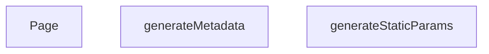

## NODE ID STANDARD

  file: src\app\[lang]\brands\[slug]\page.tsx
  function: src\app\[lang]\brands\[slug]\page.tsx::generateStaticParams
  function: src\app\[lang]\brands\[slug]\page.tsx::generateMetadata
  function: src\app\[lang]\brands\[slug]\page.tsx::Page

---

## DISA AKTARILANLAR (EXPORTS)
  export: Page
  export: generateMetadata
  export: generateStaticParams

---

## STİL TOKENLERİ

### Arbitrary Değerler (token'a geçirilmemiş)
Yok — tüm stiller token'a geçirilmiş. ✅

### Kullanılan Token'lar (zaten token'a geçirilmiş)
- (yok)

### Tailwind Sınıf Özeti
- **Renkler:** (yok)
- **Layout:** (yok)
- **Varyant/Responsive:** (yok)
- **Yardımcı Sınıflar:** (yok)

---
# FILE: src\app\[lang]\cart\page.md

---
domain: general
source_type: doc
namespace_type: module
source_path: C:\Users\alize\venthub-hvac\src\app\[lang]\cart\page.tsx
skeleton_hash: a0383d6424d2f48f
entity_hashes:
  func:Page: caa361dd303c55cf
  overview: 77749cbbbd217b97
  style_tokens: 9144ece4bffe7964
generated_at: 2026-05-28T22:34:48Z
---

## Genel Bakış
Bu modül, alışveriş sepeti sayfasının ana giriş noktası olan `Page` bileşenini tanımlar. Bileşen, sepetin kullanıcı arayüzünü oluşturur, veri çekme işlemlerini başlatır ve ödeme gibi kullanıcı etkileşimlerini yönlendirir; ayrıca alt bileşenlerin yüklenmesini yönetmek için Suspense mekanizmasını kullanır.

## Fonksiyon Grupları
### UI Render ve Veri Bağlantısı
Sepet sayfasının görsel çıktısını üretir ve gerekli verileri alt bileşenlere aktarır.
- Page

---

## AXIOMS – Mimari Varsayımlar
Bu modül için özel aksiyom tanımlanmamıştır.

---

## FONKSİYON DETAYLARI

### Page
**Ne yapar**: `Page` fonksiyonu, uygulamanın sepet sayfasını render eder ve içerik yüklenirken bir bekleme animasyonu gösterir.  
**Nasıl yapar**: Fonksiyon, `Suspense` bileşeni içinde `CartPage` bileşenini sarmalar. `Suspense`’ın `fallback` özelliği, veri çekimi tamamlanmadan önce dönen bir spinner ve ortalanmış bir konteyner gösterir. Bu sayede kullanıcıya içerik henüz hazır değilse görsel geri bildirim sağlanır.  
**Parametreler**:  
- (fonksiyon parametresi yok)  
**Dönüş**: Fonksiyon bir JSX elementi döndürür; dönüş tipi `void` olarak kabul edilir (React render çıktısı).

---

## AST POINTERS

### [N1_NASIL] AST Pointer: src/app/[lang]/cart/page.tsx::Page
- **params**: yok
- **ic_degiskenler**: yok
- **Dönüş**: React JSX elementi (`Suspense` altında `CartPage` bileşenini render eder)

---

## NODE ID STANDARD

  file: src\app\[lang]\cart\page.tsx
  function: src\app\[lang]\cart\page.tsx::Page

---

## DISA AKTARILANLAR (EXPORTS)
  export: Page

---

## STİL TOKENLERİ

### Arbitrary Değerler (token'a geçirilmemiş)
Yok — tüm stiller token'a geçirilmiş. ✅

### Kullanılan Token'lar (zaten token'a geçirilmiş)
- (yok)

### Tailwind Sınıf Özeti
- **Renkler:** `border-b-2`, `border-primary-navy`
- **Layout:** `flex`, `h-12`, `items-center`, `justify-center`, `min-h-screen`, `w-12`
- **Varyant/Responsive:** (yok)
- **Yardımcı Sınıflar:** `animate-spin`, `rounded-full`

---
# FILE: src\app\[lang]\category\[categorySlug]\[subCategorySlug]\page.md

---
domain: general
source_type: doc
namespace_type: module
source_path: C:\Users\alize\venthub-hvac\src\app\[lang]\category\[categorySlug]\[subCategorySlug]\page.tsx
skeleton_hash: d22870f9ca9919a7
entity_hashes:
  func:Page: b8d7156be466dee4
  func:generateStaticParams: 28452401205f49a6
  func:getCategoryData: e78b546d8d1e7e91
  overview: 1bae58277fa3a2b2
  style_tokens: e37a0cb8a67ff36f
generated_at: 2026-06-06T19:24:00Z
---

## Genel Bakış
Bu modül, Next.js'in dinamik rota yapısını kullanarak kategori ve alt kategori sayfalarını sunucu tarafında oluşturur. URL'deki parametreleri alarak ilgili kategori verisini çeker ve bu veriyi kullanarak istemciye sayfayı sunar. Ayrıca, önceden oluşturulabilecek sayfaları build aşamasında belirlemek için gerekli parametre listesini üretir.

## Fonksiyon Grupları
### Veri Temini
Bu grup, sayfanın içeriğini oluşturacak olan temel veriyi, dış bir kaynaktan asenkron olarak getirerek modülün veri bağımlılığını karşılar.
- getCategoryData

### Sayfa Rotalama ve Oluşturma
Bu grup, URL'deki dinamik parametreleri işleyerek hem sayfa bileşeninin render edilmesini hem de statik site oluşturma süreçleri için gerekli rota parametrelerinin sağlanmasını yönetir.
- Page, generateStaticParams

---
## AXIOMS – Mimari Varsayımlar
Bu modül, bir Next.js sayfa bileşeni olup dinamik kategori sayfaları oluşturmak için sunucu taraflı veri çeker ve statik parametreleri üretir.

**[Aksiyom 1]:** `getCategoryData` fonksiyonu, geçerli bir veri olmadığında veya hata oluştuğunda sayfa oluşturmayı engelleyecek şekilde tanımlı bir hata veya boş durum döndürmelidir.

**[Aksiyom 2]:** `generateStaticParams`, SSG süreci için tüm olası ve geçerli `categorySlug` ve `subCategorySlug` kombinasyonlarını eksiksiz olarak döndürmelidir; aksi takdirde bazı sayfalar build aşamasında oluşturulamaz.

**[Aksiyom 3]:** `Page` bileşeni, asenkron olarak çözülecek `params` Promise'inden gelen verileri kullanarak sunucu tarafında render edilmelidir.

---

## AXIOMS – Mimari Varsayımlar

Bu modül, Next.js App Router yapısında dinamik kategori/alt kategori sayfa bileşenidir.

---

**[Aksiyom 1]:** `getCategoryData(slug)` fonksiyonuna geçilen `slug` parametresi geçerli bir string değilse, veri çekme işlemi başarısız olur veya boş/yanlış veri döner.

**[Aksiyom 2]:** `Page` bileşeninin `params` Promise'i çözümlendiğinde `categorySlug` ve `subCategorySlug` alanlarını içermesi gerekir; bu alanlardan herhangi biri eksikse sayfa düzgün render edilemez.

**[Aksiyom 3]:** `getCategoryData` fonksiyonu asenkron çalışmalıdır (Promise döner); eğer bu fonksiyon senkron çalıştırılmaya zorlanırsa zaman aşımlı hata oluşur.

**[Aksiyom 4]:** `generateStaticParams()` fonksiyonu, SSG (Static Site Generation) sırasında çağrılmalı ve geçerli kategori/alt kategori slug çiftleri listesi döndürmelidir; boş liste dönerse hiçbir sayfa statik olarak oluşturulamaz.

**[Aksiyom 5]:** URL yapısı (`[lang]/category/[categorySlug]/[subCategorySlug]`) üç dinamik segment içerir; `Page` fonksiyonunun `params` imzasında yalnızca `categorySlug` ve `subCategorySlug` görünmektedir — `lang` parametresinin farklı bir mekanizma (middleware,更高 katman context) ile sağlandığı varsayılır.

**[Aksiyom 6]:** `getCategoryData` bir string `slug` alırken, `Page` bileşeni iki ayrı slug (`categorySlug` ve `subCategorySlug`) alır; dolayısıyla `getCategoryData`'ya hangi slug'ın (üst kategori mi, alt kategori mi) geçirildiği调用 noktasında belirlenmelidir — bu eşleşme modül içinde net olarak tanımlı değildir ve调用ya bağımlıdır.

---

> **Not:** Modül sabitleri bölümü boş olduğundan, eşik değeri, format veya kabul kriteri gibi sabit tabanlı aksiyom tanımlanamamıştır. `getCategoryData`'nın dönüş tipi ve hata fırlatma davranışı fonksiyon imzasında görünmediğinden bu konularda aksiyom türetilememiştir.

---

## FONKSİYON DETAYLARI

### getCategoryData
**Ne yapar**: Verilen bir kategori slug'ı ile veritabanından ilgili kategori verisini çeker ve alanları haritalandırarak domain modeline dönüştürür.

**Nasıl yapar**: Supabase istemcisi kullanarak 'categories' tablosundan belirtilen slug'a sahip tek bir kaydı seçer. Hata oluşursa veya veri bulunamazsa null döner. Veri bulunduğunda, `mapDatabaseCategoryToDomain` yardımcı fonksiyonunu çağırarak ham veritabanı kaydını (`DbCategory`) uygulama içi kullanım için tasarlanmış domain modeline dönüştürür. Bazı alanların tipleri açıkça belirtilerek dönüşüm yapılır.

**Parametreler**:
- slug: `string` — Aranacak kategorinin benzersiz tanımlayıcısı (slug).

**Dönüş**: Başarılı sorgulama ve haritalandırma sonucu bir `DbCategory` nesnesini alan `mapDatabaseCategoryToDomain` fonksiyonunun dönüş değerini döner. Hata durumunda veya veri yokluğunda `null` döner.

### generateStaticParams
**Ne yapar**: Next.js statik site oluşturma (SSG) süreci için, oluşturulan alt kategori sayfalarının URL parametrelerini (lang, categorySlug, subCategorySlug) üreten asenkron bir fonksiyondur.

**Nasıl yapar**: Önce Supabase'den tüm aktif ve `parent_id`'si dolu olan (yani alt kategoriler) kayıtları çeker. Ardından, bu alt kategorilerin ait olduğu üst kategorilerin bilgilerini (id ve slug) ayrı bir sorguyla getirir ve bir haritaya (`parentMap`) dönüştürür. Her bir alt kategori için, üst kategorinin slug'ını haritadan bulur ve 'tr' ile 'en' dil kodları için iki ayrı parametre seti oluşturarak döndürür.

**Parametreler**: Bu fonksiyon parametre almaz.

**Dönüş**: `Promise<Array<{ lang: string; categorySlug: string; subCategorySlug: string }>>` — Statik olarak oluşturulacak tüm alt kategori sayfaları için URL parametrelerini içeren bir dizi. Her bir alt kategori, iki farklı dil (tr ve en) için bir dizi elemanı olarak temsil edilir.

### Page
**Ne yapar**: Bir alt kategori sayfasının React server component'idir. URL parametrelerinden alt kategori slug'ını alır, ilgili kategori ve ürün verilerini getirir ve istemci tarafında render edilecek bileşene aktarır.

**Nasıl yapar**: Fonksiyon, bir `Promise` olarak gelen `params` nesnesini `await` ile çözerek `subCategorySlug` değerine erişir. Bu slug'ı `getCategoryData` fonksiyonuna göndererek kategori bilgisini çeker. Eğer kategori varsa, o kategorideki ürünleri (maksimum 100 adet) `getProductsEnriched` fonksiyonuyla getirir. Son olarak, elde edilen `category` ve `products` başlangıç verilerini (`initialCategory`, `initialProducts`) `PageComponent`'e prop olarak geçirir ve bir `React.Suspense` sarmalayıcısı içinde sunar.

**Parametreler**:
- params: `Promise<{ categorySlug: string, subCategorySlug: string }>` — Next.js tarafından sağlanan, URL segmentlerinden çözülen parametrelerin promise'i. `categorySlug` üst kategoriyi, `subCategorySlug` ise mevcut sayfanın alt kategoriyi temsil eder.

**Dönüş**: JSX elementi döner. Spesifik olarak, `React.Suspense` ile sarılmış ve bir `fallback` (yükleniyor mesajı) içeren `PageComponent` JSX'ini döner.

---

## AST POINTERS

### [N1_NASIL] AST Pointer: `[lang]/category/[categorySlug]/[subCategorySlug]/page.tsx`::getCategoryData
- **params**: `(slug: string)` — Veritabanından çekilecek kategorinin URL slug'ı
- **ic_degiskenler**:
  - `data` — Supabase sorgusundan dönen tek satırlık kategori ham verisi (`id, name, parent_id, slug, is_active, sort_order, level, image_url, seo_title, seo_desc, created_at, updated_at, description, display_mode, is_featured, marketing_title, menu_label, metadata, translation_key, authority_content` alanları); `single()` ile tek obje olarak gelir
  - `error` — Supabase `.single()` sorgusunun hata nesnesi; `data` ile birlikte destructure edilir (`{ data, error }`); truthy ise sorgu başarısızdır
- **Dönüş**: `mapDatabaseCategoryToDomain(...)` ile dönüştürülmüş domain kategori objesi veya `null` (hata ya da veri yoksa)

---

### [N2_NASIL] AST Pointer: `[lang]/category/[categorySlug]/[subCategorySlug]/page.tsx`::generateStaticParams
- **params**: (yok)
- **ic_degiskenler**:
  - `data` — İlk Supabase sorgusundan dönen aktif alt kategoriler listesi (`slug, parent_id` alanları); `parent_id` NULL olmayan (yani alt kategori olan) kayıtlar
  - `parents` — İkinci Supabase sorgusundan dönen tüm aktif kategoriler listesi (`id, slug` alanları); ebeveyn slug'larını eşlemek için kullanılır
  - `parentsList` — `parents`'ın type-cast edilmiş hali `{ id: string, slug: string | null }[]`; null-safe遍历 için güvenli referans
  - `parentMap` — `Map<string, string>` yapısı; kategori `id`'sini ebeveyn `slug`'ına eşler (`parentsList.map(p => [p.id, p.slug || ''])`); alt kategorinin `parent_id`'sinden ebeveyn slug'ını bulmak için kullanılır
  - `subCategoriesList` — `data`'nın type-cast edilmiş hali `{ slug: string | null, parent_id: string | null }[]`; flatMap iterasyonunda her bir alt kategori kaydı olarak kullanılır
- **flatMap callback içindeki değişkenler**:
  - `c` — `subCategoriesList`'teki her bir alt kategori objesi; `c.slug` (alt kategori slug'ı) ve `c.parent_id` (ebeveyn kategori id'si) alanlarına erişilir
  - `parentSlug` — `parentMap.get(c.parent_id || '')` ile bulunan ebeveyn kategorinin slug'ı; bulunamazsa `'unknown'` default'u alınır
- **Dönüş**: `{ lang: string, categorySlug: string, subCategorySlug: string }` objelerinden oluşan array; her alt kategori için `tr` ve `en` dilleri olmak üzere ikişer eleman döner

---

### [N3_NASIL] AST Pointer: `[lang]/category/[categorySlug]/[subCategorySlug]/page.tsx`::Page
- **params**: `{ params: Promise<{ categorySlug: string, subCategorySlug: string }> }` — Next.js tarafından sağlanan URL parametreleri promise'i
- **ic_degiskenler**:
  - `subCategorySlug` — `await params` ile çözülen alt kategori slug string'i; `getCategoryData` çağrısına argüman olarak verilir
  - `category` — `getCategoryData(subCategorySlug)` çağırılarak çekilen domain kategori objesi; `null` olabilir (kategori bulunamazsa)
  - `products` — Başlangıçta boş `DomainProduct[]` dizisi; `category` truthy ise `getProductsEnriched({ categoryIds: [category.id], limit: 100 })` ile en fazla 100 adet enriched ürün listesi ile overwrite edilir
- **API çağrıları**:
  - `getCategoryData(subCategorySlug)` — Supabase'den kategori verisi çeker
  - `getProductsEnriched({ categoryIds: [category.id], limit: 100 })` — İlgili kategorideki ürünleri enriched olarak çeker
- **Dönüş**: JSX — `React.Suspense` sarıcısı içinde `PageComponent` bileşeni; `initialCategory` ve `initialProducts` prop'ları ile render edilir; Suspense fallback'i `"Yükleniyor..."` metnidir

---


## MERMAID CALL GRAPH
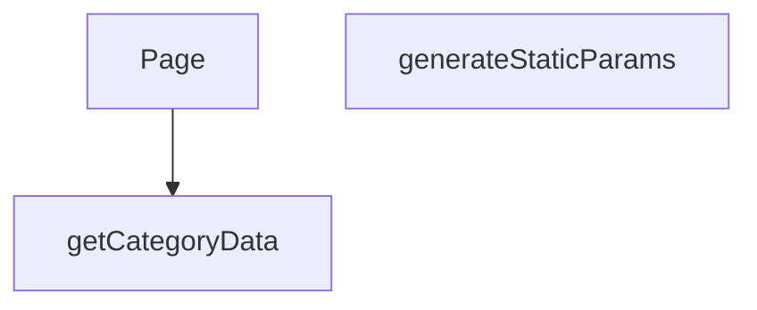

## NODE ID STANDARD

  file: src\app\[lang]\category\[categorySlug]\[subCategorySlug]\page.tsx
  function: src\app\[lang]\category\[categorySlug]\[subCategorySlug]\page.tsx::getCategoryData
  function: src\app\[lang]\category\[categorySlug]\[subCategorySlug]\page.tsx::generateStaticParams
  function: src\app\[lang]\category\[categorySlug]\[subCategorySlug]\page.tsx::Page

---

## DISA AKTARILANLAR (EXPORTS)
  export: Page
  export: generateStaticParams
  export: getCategoryData

---

## STİL TOKENLERİ

### Arbitrary Değerler (token'a geçirilmemiş)
Yok — tüm stiller token'a geçirilmiş. ✅

### Kullanılan Token'lar (zaten token'a geçirilmiş)
- (yok)

### Tailwind Sınıf Özeti
- **Renkler:** `text-center`, `text-slate-500`
- **Layout:** (yok)
- **Varyant/Responsive:** (yok)
- **Yardımcı Sınıflar:** `container`, `mx-auto`, `px-4`, `py-12`

---
# FILE: src\app\[lang]\checkout\page.md

---
domain: general
source_type: doc
namespace_type: module
source_path: C:\Users\alize\venthub-hvac\src\app\[lang]\checkout\page.tsx
skeleton_hash: 52ba201233f367d6
entity_hashes:
  func:Page: 752ea1d46a136aae
  overview: cbc240f327cf6544
  style_tokens: 9144ece4bffe7964
generated_at: 2026-05-28T22:34:59Z
---

## Genel Bakış
`src/app/[lang]/checkout/page.tsx` modülü, uygulamanın ödeme sayfasının dil destekli ana bileşenini tanımlar. Bu bileşen, kullanıcının ödeme sürecini yönettiği arayüzün tamamını oluşturur ve dil parametresine göre render eder.

## Fonksiyon Grupları
### UI Rendering
Ödeme sayfasının kullanıcı arayüzünü JSX ile oluşturur ve dil parametresine göre dinamik olarak render edilen React bileşenini döndürür.
- Page

---

## AXIOMS – Mimari Varsayımlar

Bu modül için doğrulanabilir mimari varsayımlar çok sınırlıdır; `Page()` fonksiyon imzası parametresizdir ve modül sabitleri tanımlanmamıştır.

**[Aksiyom 1]:** Eğer `CheckoutPage` adlı alt bileşen mevcut değilse veya modül tarafından import edilemezse, `Page` fonksiyonunun JSX döndürme süreci tamamlanamaz ve çalışma zamanı hatası oluşur.

**[Aksiyom 2]:** Eğer render sırasında loading durumu (animasyonlu ekran) için gerekli UI kaynakları (CSS class'ları, animasyon tanımları veya stil bileşenleri) sağlanamazsa, kullanıcı boş veya bozuk bir geçiş ekranı görür.

> **Not:** Fonksiyon imzası `Page()` olarak verilmiş olup herhangi bir parametre göstermemektedir. Dosya yolu `[lang]` dinamik rotası içermesine rağmen, dil parametresinin fonksiyon içeriğine nasıl alındığı (Next.js `params` prop'u mu, context mi, vs.) fonksiyon imzasından çıkarılamadığı için bu konuda varsayımda bulunulamamaktadır.

---

## FONKSİYON DETAYLARI

### Page
**Ne yapar**: Checkout (ödeme) sayfasının üst düzey sarmalayıcı bileşenidir. Kullanıcı ödeme sayfasına eriştiğinde yüklenme sürecinde animasyonlu bir loading ekranı gösterir ve ardından ana CheckoutPage bileşenini render eder.

**Nasıl yapar**: React'ın `Suspense` bileşenini kullanarak asenkron veri yüklemelerini veya yavaş bileşenleri yüklenirken göstermek üzere bir fallback UI sunar. Fallback olarak screen'i ortalamalı, dönen bir loading spinner animasyonu (primary-navy renkli border-b-2 ile) oluşturulur. Suspense çocuğu olarak `CheckoutPage` bileşenini render eder; bu bileşen muhtemelen içeriği, forma alanlarını ve ödeme süreçlerini yönetir.

**Parametreler**:
Bu fonksiyon herhangi bir parametre almamaktadır (propsuz bir React Server Component yapısındadır).

**Dönüş**: JSX elementi döndürür — `Suspense` ile sarılmış `CheckoutPage` bileşeninin render sonucunu verir. Suspense yüklenme esnasında animasyonlu bir spinner div'i, yükleme tamamlandığında ise CheckoutPage içeriğini gösterir.

---

## AST POINTERS

### [N1_NASIL] AST Pointer: src/app/[lang]/checkout/page.tsx::Page
- **params**: (yok)
- **ic_degiskenler**: (yok)
- **Dönüş**: React JSX elemanı (Suspense içinde CheckoutPage)

---

## NODE ID STANDARD

  file: src\app\[lang]\checkout\page.tsx
  function: src\app\[lang]\checkout\page.tsx::Page

---

## DISA AKTARILANLAR (EXPORTS)
  export: Page

---

## STİL TOKENLERİ

### Arbitrary Değerler (token'a geçirilmemiş)
Yok — tüm stiller token'a geçirilmiş. ✅

### Kullanılan Token'lar (zaten token'a geçirilmiş)
- (yok)

### Tailwind Sınıf Özeti
- **Renkler:** `border-b-2`, `border-primary-navy`
- **Layout:** `flex`, `h-12`, `items-center`, `justify-center`, `min-h-screen`, `w-12`
- **Varyant/Responsive:** (yok)
- **Yardımcı Sınıflar:** `animate-spin`, `rounded-full`

---
# FILE: src\app\[lang]\contact\page.md

---
domain: general
source_type: doc
namespace_type: module
source_path: C:\Users\alize\venthub-hvac\src\app\[lang]\contact\page.tsx
skeleton_hash: dc08580a33236244
entity_hashes:
  func:Page: 02ee67f324c336e5
  overview: a07fce05e4917c91
  style_tokens: dd5ed8d0f58dcf57
generated_at: 2026-05-28T22:34:54Z
---

## Genel Bakış
Bu modül, çok dilli bir web uygulamasının iletişim sayfasının ana giriş noktasıdır. Tek bir bileşen ile sayfanın tüm içeriğini, iletişim formunu ve dil destekli yapısını render eder.

## Fonksiyon Grupları
### Ana Sayfa Bileşeni
İletişim sayfasının tüm kullanıcı arayüzünü ve dil entegrasyonunu oluşturan temel bileşeni barındırır.
- Page

---

## AXIOMS – Mimari Varsayımlar

Bu modül için özel aksiyom tanımlanmamıştır.

---

## FONKSİYON DETAYLARI

### Page

**Ne yapar**:
Sayfa bileşenidir ve Next.js'in App Router yapısında `/contact` rotasının üst düzey React bileşenini temsil eder. İletişim sayfasının tüm görünümünü ve işlevselliğini barındıran `PageComponent` bileşenini render eder. Bu fonksiyon, Next.js'in varsayılan sayfa bileşeni sözleşmesine uygun olarak sunucu tarafında veya istemci tarafında çağrılabilir.

**Nasıl yapar**:
Next.js App Router yapısında tanımlanmış bir sayfa bileşenidir. Fonksiyon gövdesinde herhangi bir mantıksal işlem, durum yönetimi veya veri getirme yapılmamıştır. Doğrudan `PageComponent` adlı alt bileşeni JSX olarak döndürür. Tüm sayfa mantığı, layout bileşenleri ve alt bileşenler aracılığıyla gerçekleştirilir.

**Parametreler**:
- Parametre almamaktadır.

**Dönüş**:
- `JSX.Element` — İletişim sayfasının tüm içeriğini temsil eden `PageComponent` bileşeninin JSX çıktısıdır.

---

## AST POINTERS

### [N1_NASIL] AST Pointer: src\app\[lang]\contact\page.tsx::Page
- **params**: (yok)
- **ic_degiskenler**: (yok — fonksiyon gövdesinde herhangi bir değişken tanımlanmamıştır)
- **Dönüş**: `<PageComponent />` JSX elemanı — `../../../views/ContactPage` yolundan import edilen `PageComponent` doğrudan render edilir. Fonksiyon içinde herhangi bir değişken tanımlama, mantıksal işlem veya API çağrısı bulunmamaktadır; saf bir wrapper/sarmalayıcı bileşendir.

---

## NODE ID STANDARD

  file: src\app\[lang]\contact\page.tsx
  function: src\app\[lang]\contact\page.tsx::Page

---

## DISA AKTARILANLAR (EXPORTS)
  export: Page

---

## STİL TOKENLERİ

### Arbitrary Değerler (token'a geçirilmemiş)
Yok — tüm stiller token'a geçirilmiş. ✅

### Kullanılan Token'lar (zaten token'a geçirilmiş)
- (yok)

### Tailwind Sınıf Özeti
- **Renkler:** (yok)
- **Layout:** (yok)
- **Varyant/Responsive:** (yok)
- **Yardımcı Sınıflar:** (yok)

---
# FILE: src\app\[lang]\destek\garanti-servis\page.md

---
domain: general
source_type: doc
namespace_type: module
source_path: C:\Users\alize\venthub-hvac\src\app\[lang]\destek\garanti-servis\page.tsx
skeleton_hash: 67986d249a76e351
entity_hashes:
  func:Page: 02ee67f324c336e5
  overview: 6c2c809acf8ab283
  style_tokens: dd5ed8d0f58dcf57
generated_at: 2026-05-28T22:34:48Z
---

## Genel Bakış
Bu modül, VentHub HVAC uygulamasının garanti servis destek sayfasının giriş noktasıdır. Tek bir React bileşeni üzerinden sayfa düzenini, alt bileşenleri ve gerekli iş mantığını bir araya getirerek kullanıcıya eksiksiz bir arayüz sunar.

## Fonksiyon Grupları
### Sayfa Bileşeni
Garanti servis sayfasının üst seviye React bileşenidir. Layout yapısını, veri bağlantılarını ve alt bileşenleri (formlar, listeler, bilgi kartları) organize ederek sayfanın bütününü oluşturur.
- Page

---

## AXIOMS – Mimari Varsayımlar

Bu modül, Next.js App Router yapısında konumlanmış bir sayfa bileşenidir. Fonksiyon gövdesi detaylı analiz için sunulmadığından, yalnızca imza ve yapısal bağlamdan çıkarılabilir varsayımlar listelenmektedir.

[Aksiyom 1]: Eğer Next.js App Router altyapısı çalışmıyorsa, bu bileşen sayfa olarak render edilemez.

[Aksiyom 2]: Eğer `[lang]` dinamik route parametresi geçerli bir dil kodu içermiyorsa, sayfa doğru dilde içerik sunamaz.

[Aksiyom 3]: Eğer üst seviye layout bileşeni mevcut değilse veya hatalıysa, sayfa eksik veya bozuk görünebilir.

[Aksiyom 4]: Eğer `Page()` bileşeni JSX döndürmüyorsa veya hata fırlatıyorsa, React render zinciri kırılır ve sayfa görüntülenemez.

---

## FONKSİYON DETAYLARI

### Page
**Ne yapar**: Bu fonksiyon, garanti ve servis sayfasının ana React bileşenini oluşturur ve döndürür. Sayfanın temel yapısını ve içeriğini tanımlayan üst düzey bir kabuktur.

**Nasıl yapar**: Fonksiyon, doğrudan `PageComponent` adlı bir alt bileşeni JSX olarak döndürür. Sayfa ile ilgili tüm görünüm ve mantık bu alt bileşende tanımlıdır.

**Parametreler**:
- Fonksiyon herhangi bir parametre almaz.

**Dönüş**: `JSX.Element` — Sayfanın tamamını temsil eden `PageComponent` bileşenini döndürür.

---

## AST POINTERS

### [N1_NASIL] AST Pointer: src/app/[lang]/destek/garanti-servis/page.tsx::Page
- **params**: (parametre yok)
- **ic_degiskenler**: (yok)
- **Dönüş**: `<PageComponent />` JSX bileşeni — import edilen `WarrantyPage` view bileşenini doğrudan render eder

---

## NODE ID STANDARD

  file: src\app\[lang]\destek\garanti-servis\page.tsx
  function: src\app\[lang]\destek\garanti-servis\page.tsx::Page

---

## DISA AKTARILANLAR (EXPORTS)
  export: Page

---

## STİL TOKENLERİ

### Arbitrary Değerler (token'a geçirilmemiş)
Yok — tüm stiller token'a geçirilmiş. ✅

### Kullanılan Token'lar (zaten token'a geçirilmiş)
- (yok)

### Tailwind Sınıf Özeti
- **Renkler:** (yok)
- **Layout:** (yok)
- **Varyant/Responsive:** (yok)
- **Yardımcı Sınıflar:** (yok)

---
# FILE: src\app\[lang]\destek\hesaplayicilar\hava-perdesi\page.md

---
domain: general
source_type: doc
namespace_type: module
source_path: C:\Users\alize\venthub-hvac\src\app\[lang]\destek\hesaplayicilar\hava-perdesi\page.tsx
skeleton_hash: 1f383d3722a1685b
entity_hashes:
  func:Page: 3f2298054a9d2ba4
  overview: 286959abaf4b75d1
  style_tokens: 9144ece4bffe7964
generated_at: 2026-05-28T22:34:48Z
---

## Genel Bakış
Bu modül, VentHub HVAC uygulamasındaki "hava perdesi" hesaplayıcı aracının ana sayfa yapısını tanımlayan bir React/Next.js sayfa bileşenidir. Modül, ilgili alt bileşenleri bir araya getirerek hesaplama arayüzünü sunar ve sayfanın kullanıcıya gösterilmesinden sorumludur.

## Fonksiyon Grupları
### Sayfa Oluşturma ve Düzenleme
Bu grup, hava perdesi hesaplama sayfasının tüm kullanıcı arayüzünü oluşturarak ilgili hesaplama araçlarını ve bileşenleri bir sayfa içinde düzenler.
- Page

---

## AXIOMS – Mimari Varsayımlar
Bu modül için özel aksiyom tanımlanmamıştır.

> **Not:** `Page()` fonksiyonunun gövdesi (içeriği) paylaşılmadığı için, fonksiyonun hangi bileşenleri çağırdığı, hangi hesaplamaları yaptığı veya hangi veri akışını izlediği bilinmemektedir. Dolayısıyla sadece fonksiyon gövdesinden türetilebilecek aksiyom üretilememektedir. Fonksiyon gövdesi sağlandığında aksiyomlar oluşturulabilir.

---

## FONKSİYON DETAYLARI

### Page
**Ne yapar**: Bu fonksiyon, bir React functional component olup sayfanın Suspense ile sarılmış halini döndürür. Temel amacı, asıl sayfa bileşeninin (PageComponent) yüklenme sürecini yönetmek ve kullanıcıya yükleme durumunda görsel bir geri bildirim sunmaktır.

**Nasıl yapar**: Fonksiyon, React Suspense bileşenini kullanarak asıl içerik olan `PageComponent`'i sarmalar. `fallback` prop'u aracılığıyla, `PageComponent` yüklenene kadar ekranda bir loading animasyonu (dönen bir daire) gösterir. Bu animasyon, Tailwind CSS sınıfları (`animate-spin`, `rounded-full`, `border-b-2 border-primary-navy`) ile stillendirilmiş, ekranın ortasında yer alan ve minimum ekran yüksekliğinde (`min-h-screen`) konumlandırılmış bir div içinde render edilir.

**Parametreler**: Yok

**Dönüş**: React JSX elementi (Suspense içinde `PageComponent`'i barındıran bir yapı)

---

## AST POINTERS

### [N1_NASIL] AST Pointer: `[lang]/destek/hesaplayicilar/hava-perdesi/page.tsx`::Page
- **params**: (parametre yok)
- **ic_degiskenler**: (yok — fonksiyon gövdesinde değişken tanımlanmamış)
- **Cagrilar**: 
  - `Suspense` — React Suspense bileşeni, fallback olarak spinner gösterir
  - `PageComponent` — AirCurtainCalcPage bileşeni, Suspense içinde render edilir
- **Dönüş**: JSX (Suspense ile sarılmış `<PageComponent />` bileşeni)

---

## NODE ID STANDARD

  file: src\app\[lang]\destek\hesaplayicilar\hava-perdesi\page.tsx
  function: src\app\[lang]\destek\hesaplayicilar\hava-perdesi\page.tsx::Page

---

## DISA AKTARILANLAR (EXPORTS)
  export: Page

---

## STİL TOKENLERİ

### Arbitrary Değerler (token'a geçirilmemiş)
Yok — tüm stiller token'a geçirilmiş. ✅

### Kullanılan Token'lar (zaten token'a geçirilmiş)
- (yok)

### Tailwind Sınıf Özeti
- **Renkler:** `border-b-2`, `border-primary-navy`
- **Layout:** `flex`, `h-12`, `items-center`, `justify-center`, `min-h-screen`, `w-12`
- **Varyant/Responsive:** (yok)
- **Yardımcı Sınıflar:** `animate-spin`, `rounded-full`

---
# FILE: src\app\[lang]\destek\hesaplayicilar\hrv\page.md

---
domain: general
source_type: doc
namespace_type: module
source_path: C:\Users\alize\venthub-hvac\src\app\[lang]\destek\hesaplayicilar\hrv\page.tsx
skeleton_hash: 7b7606be1adbdf90
entity_hashes:
  func:Page: 3f2298054a9d2ba4
  overview: 92457a7c21ad9373
  style_tokens: 9144ece4bffe7964
generated_at: 2026-05-28T22:34:48Z
---

## Genel Bakış
Bu modül, HRV (Heat Recovery Ventilation — Isı Geri Kazanımlı Havalandırma) hesaplayıcısının kullanıcı arayüzünü sunan tek bir sayfa bileşeninden oluşur. Modül, dil parametreli bir Next.js sayfa rotası olarak yapılandırılmıştır ve yüklenme sırasında animasyonlu bir spinner ile Suspense sarmalayıcısı kullanır.

## Fonksiyon Grupları
### Sayfa Rendersi
Tek bir üst seviye sayfa bileşeni tanımlar; dil desteğiyle birlikte HRV hesaplayıcının tüm giriş ve çıktı arayüzünü Suspense içinde sunar.
- Page

---

## AXIOMS – Mimari Varsayımlar

Bu modül için özel aksiyom tanımlanmamıştır.

**Not:** Modül sadece bir React sayfa bileşeni (`Page`) içermekte ve fonksiyon gövdesinde herhangi bir mantıksal iş kuralı, koşul kontrolü veya veri doğrulama içeriği bulunmamaktadır. Sayfa, UI rendering yaptığı varsayılmakta ancak girdi doğrulama, hesaplama mantığı veya hata yönetimi gibi çıkarılabilecek mimari varsayımlar içermemektedir. Fonksiyon imzası boş olup default değer veya parametre tanımı bulunmamaktadır. Bu nedenle, modülün doğru çalışması için zorunlu olan koşullar belirlenememiştir.

---

## FONKSİYON DETAYLARI

### Page

**Ne yapar**: Sayfa düzeyinde bir React bileşenidir ve ana sayfa içeriğini Suspense sarıcısı ile birlikte sunar. Asenkron yüklemeler sırasında kullanıcıya yükleme animasyonu göstererek kesintisiz bir deneyim sağlar.

**Nasıl yapar**: Fonksiyon, React Suspense bileşenini kullanarak `PageComponent`'i sarmalar. Suspense bileşeni, `PageComponent` içindeki asenkron işlemler (örneğin veri çekme) henüz tamamlanmamışken `fallback` prop'u aracılığıyla bir yükleme göstergesi (spinner) render eder. Bu spinner, tam ekran yüksekliğinde (min-h-screen) ve ortalı şekilde görüntülenen, dönen bir yuvarlak animasyonlu yükleme ikonudur. Suspense mekanizması sayesinde asenkron içerik hazır olduğunda fallback otomatik olarak ana bileşenle değiştirilir.

**Parametreler**:

Bu fonksiyon herhangi bir parametre almamaktadır. Sıfır argümanlı bir React fonksiyonel bileşenidir.

**Dönüş**: JSX elementi döndürür. Suspense ile sarılmış `PageComponent` bileşenini veya yükleme sırasında fallback olarak animasyonlu bir spinner div'ini render eder. Doğrudan return ifadesi ile JSX ağacı dışa aktarılır.

---

## AST POINTERS

### [N1_NASIL] AST Pointer: C:\Users\alize\venthub-hvac\src\app\[lang]\destek\hesaplayicilar\hrv\page.tsx::Page
- **params**: (parametre yok)
- **ic_degiskenler**: (fonksiyon gövdesinde herhangi bir değişken bildirimi veya ataması yoktur)
- **Dönüş**: `return` ifadesi ile bir JSX (`<Suspense>`) bileşeni döndürülür. Bileşen, asıl sayfa içeriğinin (`PageComponent`) yüklenmesini beklerken bir yükleme animasyonu (fallback) gösterir.

---

## NODE ID STANDARD

  file: src\app\[lang]\destek\hesaplayicilar\hrv\page.tsx
  function: src\app\[lang]\destek\hesaplayicilar\hrv\page.tsx::Page

---

## DISA AKTARILANLAR (EXPORTS)
  export: Page

---

## STİL TOKENLERİ

### Arbitrary Değerler (token'a geçirilmemiş)
Yok — tüm stiller token'a geçirilmiş. ✅

### Kullanılan Token'lar (zaten token'a geçirilmiş)
- (yok)

### Tailwind Sınıf Özeti
- **Renkler:** `border-b-2`, `border-primary-navy`
- **Layout:** `flex`, `h-12`, `items-center`, `justify-center`, `min-h-screen`, `w-12`
- **Varyant/Responsive:** (yok)
- **Yardımcı Sınıflar:** `animate-spin`, `rounded-full`

---
# FILE: src\app\[lang]\destek\hesaplayicilar\jet-fan\page.md

---
domain: general
source_type: doc
namespace_type: module
source_path: C:\Users\alize\venthub-hvac\src\app\[lang]\destek\hesaplayicilar\jet-fan\page.tsx
skeleton_hash: bb8025f9b95570ef
entity_hashes:
  func:Page: 02ee67f324c336e5
  overview: ed78a418e47b7805
  style_tokens: dd5ed8d0f58dcf57
generated_at: 2026-05-28T22:34:48Z
---

## Genel Bakış
Bu modül, jet fan hesaplayıcısı için kullanıcı arayüzünü sunan tek bir React sayfa bileşeninden oluşur. `Page` fonksiyonu, hesaplama formunu ve ilgili tüm alt bileşenleri bir araya getirerek sayfanın genel yapısını ve düzenini oluşturur.

## Fonksiyon Grupları
### Sayfa Oluşturma ve Düzenleme
Bu grup, jet fan hesaplayıcı sayfasının tamamını oluşturan ve kullanıcıya sunan temel bileşeni tanımlar.
- Page

---

## AXIOMS – Mimari Varsayımlar
Bu modül için özel aksiyom tanımlanmamıştır.

---

## FONKSİYON DETAYLARI

### Page
**Ne yapar**: Bu fonksiyon, bir web sayfasının ana bileşenini (sayfa yapısını) oluşturan ve sunan üst düzey bir React bileşenidir. Sayfanın görünümünü ve temel yapısını tanımlayan `PageComponent` bileşenini render ederek tarayıcıya aktarır.

**Nasıl yapar**: Fonksiyon, doğrudan ve basit bir yapıdadır. Herhangi bir mantık, koşul veya veri işleme gerçekleştirmez. Sadece import edilmiş olan `PageComponent` bileşenini fonksiyonel bileşen olarak döndürür. React'ın bu bileşeni-render-etme mekanizmasını devreye sokar.

**Parametreler**:
- Bu fonksiyon herhangi bir parametre almaz.

**Dönüş**: `JSX.Element` (React bileşeni). `PageComponent` bileşeninin oluşturduğu React ağacı (virtual DOM) yapısını döndürür.

---

## AST POINTERS

### [N1_NASIL] AST Pointer: src/app/[lang]/destek/hesaplayicilar/jet-fan/page.tsx::Page
- **params**: (yok)
- **ic_degiskenler**: (yok)
- **Dönüş**: `<PageComponent />` JSX bileşeni döndürülür

---

## NODE ID STANDARD

  file: src\app\[lang]\destek\hesaplayicilar\jet-fan\page.tsx
  function: src\app\[lang]\destek\hesaplayicilar\jet-fan\page.tsx::Page

---

## DISA AKTARILANLAR (EXPORTS)
  export: Page

---

## STİL TOKENLERİ

### Arbitrary Değerler (token'a geçirilmemiş)
Yok — tüm stiller token'a geçirilmiş. ✅

### Kullanılan Token'lar (zaten token'a geçirilmiş)
- (yok)

### Tailwind Sınıf Özeti
- **Renkler:** (yok)
- **Layout:** (yok)
- **Varyant/Responsive:** (yok)
- **Yardımcı Sınıflar:** (yok)

---
# FILE: src\app\[lang]\destek\hesaplayicilar\kanal\page.md

---
domain: general
source_type: doc
namespace_type: module
source_path: C:\Users\alize\venthub-hvac\src\app\[lang]\destek\hesaplayicilar\kanal\page.tsx
skeleton_hash: 239399915534bd17
entity_hashes:
  func:Page: 02ee67f324c336e5
  overview: b10dad1d55a83f15
  style_tokens: dd5ed8d0f58dcf57
generated_at: 2026-05-28T22:34:48Z
---

## Genel Bakış
Bu modül, kanal hesaplayıcı sayfasının dil destekli ana giriş noktasıdır. Tek bir React bileşeni (`Page`) aracılığıyla kullanıcıya kanal hesaplama arayüzünü sunar.

## Fonksiyon Grupları
### Sayfa Bileşeni
Sayfanın tüm kullanıcı arayüzünü ve hesaplama formunu oluşturarak bir React bileşeni olarak sunar.
- Page

---

## AXIOMS – Mimari Varsayımlar

Bu modül için temel aksiyomlar aşağıdadır. Fonksiyon gövdesi detaylı biçimde sunulmadığı için, mevcut bilgiye dayalı minimum varsayımlar belirlenmiştir.

**[Aksiyom 1]**: Eğer `Page()` bileşeni geçerli bir React JSX yapısı (ReactElement) döndürmezse, React render hatası oluşur ve sayfa görüntülenemez.

**[Aksiyom 2]**: Eğer bu bileşen Next.js App Router yapısı içinde (`[lang]` segmentli bir yolda) kullanılmak üzere tanımlanmışsa ve bileşen içinden dil parametresi (`params.lang`) erişimi gerekiyorsa, ancak fonksiyon imzasında bu parametre tanımlanmamışsa, dil parametresine erişilemez ve sayfa doğru dilden içerik gösteremez.

**[Aksiyom 3]**: Eğer `Page()` fonksiyonu side-effect (veri çekme, state yönetimi) gerektiren bir sayfa ise, ancak fonksiyon imzasında `async` tanımlanmamışsa, sunucu taraflı veri çekme (server-side data fetching) yapılamaz.

> **Not**: Fonksiyon gövdesi tam olarak sunulmadığı için, bileşenin hangi alt bileşenleri render ettiği, hangi hesaplama mantığını içerdiği ve hangi state'leri yönettiği belirsizdir. Bu aksiyomlar yalnızca mevcut fonksiyon imzası ve modül yapısına dayalı minimum varsayımlardır.

---

## FONKSİYON DETAYLARI

### Page
**Ne yapar**: Bu fonksiyon, bir Next.js sayfa bileşenidir ve tarayıcıda render edilecek olan sayfanın kök bileşenini döndürür. Kanal hesaplayıcı sayfasının giriş noktasını oluşturur.

**Nasıl yapar**: Fonksiyon herhangi bir mantıksal işlem yapmaz, doğrudan `PageComponent` bileşenini döndürür. Bu yapı, sayfa bileşenini sarmalayan bir wrapper (sarmalayıcı) görevi görür. Gerçek sayfa içeriği ve mantığı `PageComponent` içinde yer alır.

**Parametreler**:
- Bu fonksiyon herhangi bir parametre almaz.

**Dönüş**: `JSX.Element` — `PageComponent` bileşeninin render ettiği JSX yapısını döndürür.

---

## AST POINTERS

### [N1_NASIL] AST Pointer: src/app/[lang]/destek/hesaplayicilar/kanal/page.tsx::Page
- **params**: (parametre yok)
- **ic_degiskenler**: (yok — fonksiyon gövdesinde hiç değişken tanımlanmamış)
- **Dönüş**: `<PageComponent />` JSX elemanı — import edilen `DuctCalcPage` view'ını render eder; sayfa içeriği tamamen `PageComponent` bileşenine aktarılır

---

## NODE ID STANDARD

  file: src\app\[lang]\destek\hesaplayicilar\kanal\page.tsx
  function: src\app\[lang]\destek\hesaplayicilar\kanal\page.tsx::Page

---

## DISA AKTARILANLAR (EXPORTS)
  export: Page

---

## STİL TOKENLERİ

### Arbitrary Değerler (token'a geçirilmemiş)
Yok — tüm stiller token'a geçirilmiş. ✅

### Kullanılan Token'lar (zaten token'a geçirilmiş)
- (yok)

### Tailwind Sınıf Özeti
- **Renkler:** (yok)
- **Layout:** (yok)
- **Varyant/Responsive:** (yok)
- **Yardımcı Sınıflar:** (yok)

---
# FILE: src\app\[lang]\destek\iade-degisim\page.md

---
domain: general
source_type: doc
namespace_type: module
source_path: C:\Users\alize\venthub-hvac\src\app\[lang]\destek\iade-degisim\page.tsx
skeleton_hash: 64f8c2542372c2ee
entity_hashes:
  func:Page: 02ee67f324c336e5
  overview: c2e343e3cf2a2ea2
  style_tokens: dd5ed8d0f58dcf57
generated_at: 2026-05-28T22:34:48Z
---

## Genel Bakış
Bu modül, VentHub HVAC projesindeki ürün iade ve değişim süreçlerini yöneten destek sayfasının giriş noktasıdır. `Page` fonksiyonu aracılığıyla sayfanın ana kullanıcı arayüzünü oluşturarak ilgili sayfayı tarayıcıda render eder.

## Fonksiyon Grupları
### Sayfa Oluşturma ve Sunma
Sayfanın tüm görsel yapısını ve temel işlevselliğini başlatan tek sorumluluk.
- `Page`

---

## AXIOMS – Mimari Varsayımlar
Bu modül için, verilen `Page()` fonksiyon imzası ve React bileşeni olduğu bağlamı dikkate alınarak aşağıdaki mimari varsayımlar üretilmiştir.

[Aksiyom 1]: Eğer `Page` fonksiyonu bir React function component olarak tanımlanmamışsa veya React Ortamı (Context) sağlanmamışsa, bileşen bileşen hiyerarşisine eklenemez ve render edilemez, bu da sayfanın kullanıcıya gösterilememesiyle sonuçlanır.

[Aksiyom 2]: Eğer `Page` bileşeni, geçerli bir JSX/TSX döndürmüyorsa (örn: `null`, `undefined` veya hatalı bir ifade), React render ağacı bu bileşeni atlar ve sayfada görünür bir çıktı oluşturulamaz, potansiyel bir hata durumu doğurur.

---

## FONKSİYON DETAYLARI

### Page
**Ne yapar**: Next.js uygulamasında iade ve değişim sayfasını render eden üst seviye bileşendir. Bu fonksiyon, sayfa yapısını basit bir sarmalayıcı olarak tanımlar ve asıl içeriği PageComponent bileşenine devreder.

**Nasıl yapar**: Fonksiyon, hiçbir state veya prop almaz doğrudan PageComponent bileşenini JSX olarak döndürür. Bu yapı, sayfa mantığının ve görünümünün PageComponent içinde izole edilmesini sağlar ve ana sayfa dosyasının temiz kalmasını kolaylaştırır.

**Parametreler**:
Bu fonksiyon herhangi bir parametre almaz.

**Dönüş**: `<PageComponent />` JSX bileşeni döndürür. Sayfanın tüm içeriği ve mantığı PageComponent içinde tanımlıdır.

---

## AST POINTERS

### [N1_NASIL] AST Pointer: src/app/[lang]/destek/iade-degisim/page.tsx::Page
- **params**: (parametre yok)
- **ic_degiskenler**: (iç değişken yok)
- **Dönüş**: `<PageComponent />` JSX elemanı — destek/iade-değişim sayfasının görünümünü render eden `PageComponent` bileşenini döndürür, sayfa yönlendirme bileşenidir

---

## NODE ID STANDARD

  file: src\app\[lang]\destek\iade-degisim\page.tsx
  function: src\app\[lang]\destek\iade-degisim\page.tsx::Page

---

## DISA AKTARILANLAR (EXPORTS)
  export: Page

---

## STİL TOKENLERİ

### Arbitrary Değerler (token'a geçirilmemiş)
Yok — tüm stiller token'a geçirilmiş. ✅

### Kullanılan Token'lar (zaten token'a geçirilmiş)
- (yok)

### Tailwind Sınıf Özeti
- **Renkler:** (yok)
- **Layout:** (yok)
- **Varyant/Responsive:** (yok)
- **Yardımcı Sınıflar:** (yok)

---
# FILE: src\app\[lang]\destek\konular\[slug]\page.md

---
domain: general
source_type: doc
namespace_type: module
source_path: C:\Users\alize\venthub-hvac\src\app\[lang]\destek\konular\[slug]\page.tsx
skeleton_hash: e0d4abb9cfa64325
entity_hashes:
  func:Page: 2d510b14b2c5d81b
  func:generateStaticParams: f1cbfd553f9fcd39
  overview: 379a6c4a34f8235e
  style_tokens: dd5ed8d0f58dcf57
generated_at: 2026-05-28T22:34:48Z
---

## Genel Bakış
Bu modül, Next.js'in dinamik rotalama özelliğini kullanarak "destek/konular" bölümünde her bir konu için ayrı bir sayfa oluşturur. Derleme sürecinde konu listesinden slug değerlerini alarak statik yolları belirler, ardından kullanıcının eriştiği slug'a göre o konuya ait verileri çekip sayfayı render eder.

## Fonksiyon Grupları
### Statik Sayfa Yolları Üretimi
Uygulamada tanımlı tüm konuların slug'larını toplayarak Next.js'e derleme aşamasında hangi sayfaların önceden hazırlanacağını bildirir.
- `generateStaticParams`

### Dinamik Sayfa Render
Kullanıcı tarafından ziyaret edilen URL'deki slug parametresini işleyerek ilgili konu sayfasının içeriğini asenkron biçimde getirip ekrana yansıtır.
- `Page`

---

## AXIOMS – Mimari Varsayımlar

Bu modül için yalnızca fonksiyon imzalarından çıkarılabilecek minimum mimari varsayımlar tanımlanmıştır. Fonksiyon gövdeleri verilmediği için işlevsel davranışa ilişkin aksiyomlar belirlenememiştir.

[Aksiyom 1]: Eğer `generateStaticParams` fonksiyonu geçerli bir `Array<{ lang: string, slug: string }>` dönüş değeri üretmiyorsa, Next.js derleme sürecinde ilgili slug'lar için statik sayfalar oluşturulmaz.

[Aksiyom 2]: Eğer `Page` fonksiyonu içinde `params` Promise'i `await` edilmeden kullanılıyorsa, `lang` ve `slug` değerleri `Promise` nesnesi olarak ele geçer ve beklenen string değerlerine ulaşılamaz.

[Aksiyom 3]: Eğer URL'den gelen `slug` parametresi (`Promise` çözümlemesi sonrası) geçerli bir konu tanımlayıcısına karşılık gelmiyorsa, sayfada ilgili konu verisi gösterilemez.

[Aksiyom 4]: Eğer `lang` parametresi (`Promise` çözümlemesi sonrası) desteklenen bir dil kodu (örn: "tr", "en") içermiyorsa, çok dilli içerik doğru dilde sunulamaz.

---

## FONKSİYON DETAYLARI

### generateStaticParams
**Ne yapar**: Next.js uygulaması için statik sayfa oluşturma (Static Site Generation - SSG) süreçlerinde, sunucuda önceden oluşturulacak tüm sayfa yollarını (path) tanımlar.
**Nasıl yapar**: Uygulamanın dil destekleri (tr ve en) ve bilgi bankası konuları (topics) kullanılarak, her bir konu (slug) için dil çiftlerinden oluşan bir parametre dizisi üretir. Bu sayede her bir konu için hem Türkçe hem de İngilizce birer statik sayfa oluşturulması mümkün olur.
**Parametreler**: Bu fonksiyon herhangi bir parametre almaz.
**Dönüş**: `{ lang: string, slug: string }` tipinde bir dizi (array) döndürür. Dizi elemanları, oluşturulacak her sayfanın `lang` ve `slug` parametrelerini içeren nesnelerdir.

### Page
**Ne yapar**: Bu sayfa rotası için asıl render edilecek React bileşenini (PageComponent) döndüren bir sunucu bileşenidir. URL'den gelen dinamik parametreleri işler.
**Nasıl yapar**: `params` adlı Promise nesnesini `await` ile çözerek içinden `slug` değerini çıkarır. Ardından, çözümleme sonucu elde edilen slug'ı bir prop olarak `PageComponent` bileşenine iletir ve bunun render edilmesini sağlar. Bu yapı, Next.js App Router'ın dinamik segmentleri için standart bir yaklaşımdır.
**Parametreler**:
- params: `Promise<{ lang: string, slug: string }>` — Rota segmentlerinden gelen dinamik parametreleri içeren Promise nesnesi. `await` edilerek içeriğine erişilir.
**Dönüş**: Bir JSX elementi (React bileşeni) döndürür.specifically, `<PageComponent slug={slug} />` ifadesi.

**Kaynak Dosya**: `src\app\[lang]\destek\konular\[slug]\page.tsx`

---

## AST POINTERS

### [N1_NASIL] AST Pointer: src/app/[lang]/destek/konular/[slug]/page.tsx::generateStaticParams
- **params**: (parametre yok)
- **ic_degiskenler**:
  - `topics` — `tr.knowledge.topics` objesinin tüm anahtarlarını (slug'ları) içeren string dizisi. Statik sayfa oluşturma için kullanılacak konu listesini temsil eder.
- **Dönüş**: `{ lang: string, slug: string }[]` — Her slug için iki dil seçeneği ('tr' ve 'en') içeren objelerin dizisi. Next.js statik sayfa oluşturma tarafından kullanılır.

### [N2_NASIL] AST Pointer: src/app/[lang]/destek/konular/[slug]/page.tsx::Page
- **params**: `params: Promise<{ lang: string, slug: string }>` — Sayfanın URL parametrelerini içeren promise. `lang` dil kodunu, `slug` ise konu tanımlayıcısını tutar.
- **ic_degiskenler**:
  - `slug` — `await params` ile çözümlenen params objesinden çıkarılan konu tanımlayıcısı string'i. `PageComponent` bileşenine prop olarak geçirilir.
- **Dönüş**: JSX (`PageComponent` bileşeninin döndürdüğü React elemanı) — `slug` prop'uyla render edilen `PageComponent` bileşeni.

---

## NODE ID STANDARD

  file: src\app\[lang]\destek\konular\[slug]\page.tsx
  function: src\app\[lang]\destek\konular\[slug]\page.tsx::generateStaticParams
  function: src\app\[lang]\destek\konular\[slug]\page.tsx::Page

---

## DISA AKTARILANLAR (EXPORTS)
  export: Page
  export: generateStaticParams

---

## STİL TOKENLERİ

### Arbitrary Değerler (token'a geçirilmemiş)
Yok — tüm stiller token'a geçirilmiş. ✅

### Kullanılan Token'lar (zaten token'a geçirilmiş)
- (yok)

### Tailwind Sınıf Özeti
- **Renkler:** (yok)
- **Layout:** (yok)
- **Varyant/Responsive:** (yok)
- **Yardımcı Sınıflar:** (yok)

---
# FILE: src\app\[lang]\destek\merkez\page.md

---
domain: general
source_type: doc
namespace_type: module
source_path: C:\Users\alize\venthub-hvac\src\app\[lang]\destek\merkez\page.tsx
skeleton_hash: d9eb9bbb94564e0d
entity_hashes:
  func:Page: 02ee67f324c336e5
  overview: 77d1db6b23de9b07
  style_tokens: dd5ed8d0f58dcf57
generated_at: 2026-05-28T22:34:48Z
---

## Genel Bakış
Bu modül, destek merkezi sayfasının kök bileşenini tanımlar. Tek bir `Page` fonksiyonu aracılığıyla sayfanın tüm kullanıcı arayüzü yapısını oluşturur ve Next.js'in sayfa yönlendirme mekanizması tarafından doğrudan render edilir.

## Fonksiyon Grupları
### Sayfa Oluşturma
Destek merkezi rotasının üst düzey render işlemini yönetir; alt bileşenleri bir araya getirerek sayfanın tamamını döndürür.
- Page

---

## AXIOMS – Mimari Varsayımlar
Bu modül için özel aksiyom tanımlanmamıştır.

---

## FONKSİYON DETAYLARI

### Page

**Ne yapar**: Next.js uygulamasında `/[lang]/destek/merkez` rotasını temsil eden sayfa bileşenidir. Kullanıcılar bu rotaya yönlendirildiğinde destek merkezi sayfasını görüntüleyebilir. Bileşen, temel bir sarmalayıcı (wrapper) görevi üstlenerek ana sayfa içeriğini sunar.

**Nasıl yapar**: Fonksiyon, doğrudan `PageComponent` bileşenini render ederek çalışır. Herhangi bir veri çekme, durum yönetimi veya koşullu renderlama işlemi içermez. Next.js'in sayfa yönlendirme mekanizması tarafından otomatik olarak çağrılır ve sayfa yapısının en üst katmanını oluşturur.Uluslararası dil parametresi (`[lang]`) Next.js'in dynamic route özelliği tarafından otomatik olarak işlenir.

**Parametreler**:
- Fonksiyon herhangi bir parametre almamaktadır

**Dönüş**: `<PageComponent />` JSX bileşeni döndürür. Bu bileşen, destek merkezi sayfasının tüm içeriğini barındıran ana bileşendir.

---

## AST POINTERS

### [N1_NASIL] AST Pointer: src/app/[lang]/destek/merkez/page.tsx::Page
- **params**: (parametre yok)
- **ic_degiskenler**: (fonksiyon gövdesinde hiçbir iç değişken yok)
- **Dönüş**: `<PageComponent />` JSX elemanını döndürür — import edilen `HubPage` view component'ini render eder

---

## NODE ID STANDARD

  file: src\app\[lang]\destek\merkez\page.tsx
  function: src\app\[lang]\destek\merkez\page.tsx::Page

---

## DISA AKTARILANLAR (EXPORTS)
  export: Page

---

## STİL TOKENLERİ

### Arbitrary Değerler (token'a geçirilmemiş)
Yok — tüm stiller token'a geçirilmiş. ✅

### Kullanılan Token'lar (zaten token'a geçirilmiş)
- (yok)

### Tailwind Sınıf Özeti
- **Renkler:** (yok)
- **Layout:** (yok)
- **Varyant/Responsive:** (yok)
- **Yardımcı Sınıflar:** (yok)

---
# FILE: src\app\[lang]\destek\sss\page.md

---
domain: general
source_type: doc
namespace_type: module
source_path: C:\Users\alize\venthub-hvac\src\app\[lang]\destek\sss\page.tsx
skeleton_hash: 1545779ab59efe7a
entity_hashes:
  func:Page: 02ee67f324c336e5
  overview: 03efc7ca11e5aa1a
  style_tokens: dd5ed8d0f58dcf57
generated_at: 2026-05-28T22:34:48Z
---

## Genel Bakış
Bu modül, VentHub HVAC uygulamasının "Destek" bölümündeki Sıkça Sorulan Sorular (SSS) sayfasını temsil eden ana sayfa bileşenidir. Tek bir React bileşeni aracılığıyla sayfanın yapısını ve içeriğini oluşturarak kullanıcıların sık sorulan sorulara erişmesini sağlar.

## Fonksiyon Grupları
### Sayfa Bileşeni
Sayfanın kullanıcı arayüzünü ve içerik düzenini oluşturmakla sorumludur. Doğrudan JSX döndürerek sayfa yapısını tarayıcıya sunar.
- Page

---

## AXIOMS – Mimari Varsayımlar
Dosya yolu yapısına göre bu sayfa, Next.js dinamik `[lang]` rotası içinde yer alır ve i18n (uluslararasılaşma) sistemiyle entegre çalışır.

[Aksiyom 1]: Eğer Next.js i18n yapılandırması (dil parametresi rotası) doğru tanımlı değilse, sayfa doğru dilde render edilmez veya 404 hatası oluşur.

[Aksiyom 2]: Eğer `destek/sss` rotası için geçerli bir sayfa bileşeni (page.tsx) mevcut değilse, kullanıcılar bu sayfaya erişemez.

[Aksiyom 3]: Eğer `[lang]` parametresi için desteklenmeyen bir dil kodu sağlanırsa, uygulama tanımlı bir fallback davranışı sergilemelidir (fallback davranışı fonksiyon gövdesinde belirlenmemiştir).

---

## FONKSİYON DETAYLARI

### Page

**Ne yapar**: Bu fonksiyon, SSS (Sıkça Sorulan Sorular) sayfasının üst düzey React bileşenidir ve Next.js uygulamasında `/[lang]/destek/sss` rotasına karşılık gelir. Fonksiyon, sayfanın tamamını oluşturan `PageComponent` bileşenini render ederek kullanıcıya SSS içeriğini sunar.

**Nasıl yapar**: Fonksiyon oldukça basit bir yapıya sahiptir; herhangi bir veri işleme, state yönetimi veya yan etki gerçekleştirmez. Doğrudan `PageComponent` adlı bileşeni döndürür. Bu yapı, sayfa mantığının ve UI bileşeninin birbirinden ayrılmasını sağlayarak kodun modüler ve bakımının kolay olmasını temin eder.

**Parametreler**:

Bu fonksiyon herhangi bir parametre almaz.

**Dönüş**:

Dönüş tipi `JSX.Element`'tir. Fonksiyon, `PageComponent` bileşeninin render ettiği JSX yapısını döndürerek tarayıcıda görüntülenecek sayfa içeriğini oluşturur.

---

## AST POINTERS

### [N1_NASIL] AST Pointer: `[lang]/destek/sss/page.tsx::Page`
- **params**: (parametre yok)
- **ic_degiskenler**:
  (fonksiyon gövdesinde hiçbir dahili değişken tanımlanmamıştır)
- **Dönüş**: `<PageComponent />` JSX döndürür — `../../../../views/support/FAQPage` yolundan import edilen `PageComponent` bileşenini render eder

---

## NODE ID STANDARD

  file: src\app\[lang]\destek\sss\page.tsx
  function: src\app\[lang]\destek\sss\page.tsx::Page

---

## DISA AKTARILANLAR (EXPORTS)
  export: Page

---

## STİL TOKENLERİ

### Arbitrary Değerler (token'a geçirilmemiş)
Yok — tüm stiller token'a geçirilmiş. ✅

### Kullanılan Token'lar (zaten token'a geçirilmiş)
- (yok)

### Tailwind Sınıf Özeti
- **Renkler:** (yok)
- **Layout:** (yok)
- **Varyant/Responsive:** (yok)
- **Yardımcı Sınıflar:** (yok)

---
# FILE: src\app\[lang]\destek\teslimat-kargo\page.md

---
domain: general
source_type: doc
namespace_type: module
source_path: C:\Users\alize\venthub-hvac\src\app\[lang]\destek\teslimat-kargo\page.tsx
skeleton_hash: be5a4a7e70d89475
entity_hashes:
  func:Page: 02ee67f324c336e5
  overview: eeb2664f8ef21a75
  style_tokens: dd5ed8d0f58dcf57
generated_at: 2026-05-28T22:34:48Z
---

## Genel Bakış
Bu modül, destek sayfası yapısı içinde "teslimat ve kargo" konusuna adanmış, tek bir sayfa bileşeninden oluşan basit bir yapıdır. Sayfanın asıl içeriği ve kullanıcı arayüzü, Page bileşeni tarafından iç içe bir başka bileşene (`PageComponent`) devredilmiştir; bu da modülün temel sorumluluğunun sayfa yapısını tanımlamak ve doğru bileşene yönlendirmek olduğunu gösterir.

## Fonksiyon Grupları
### Sayfa Yönlendirme ve Yapı
Bu grup, modülün temel sayfa rotasını tanımlayan ve içeriği ilgili bileşene yönlendiren yapısal bileşeni içerir. Modülün tek işlevi, doğru sayfa arayüzünü başlatmaktır.
- Page

---

## AXIOMS – Mimari Varsayımlar
Bu modül için özel aksiyom tanımlanmamıştır.

---

## FONKSİYON DETAYLARI

### Page

**Ne yapar**: Bu fonksiyon, `/destek/teslimat-kargo` rotasında sunulacak sayfanın üst düzey React bileşenini döndürür. Next.js App Router yapısında bir sayfa tanımlayıcısı olarak görev yapar ve sayfanın tüm görünümünü `PageComponent` bileşenine devreder.

**Nasıl yapar**: Fonksiyon, herhangi bir mantık veya veri işleme gerçekleştirmeden doğrudan `PageComponent` bileşenini render eder. Tüm sayfa içeriği, layout yapısı ve işlevsellik tamamen `PageComponent` içinde tanımlıdır. Bu fonksiyon yalnızca sayfa dosyası (page.tsx) için gerekli olan default export yapısını sağlar.

**Parametreler**:

Bu fonksiyon herhangi bir parametre almamaktadır.

**Dönüş**: `JSX.Element` — `PageComponent` bileşeninin render edilmiş JSX yapısını döndürür.

---

## AST POINTERS

### [N1_NASIL] AST Pointer: src/app/[lang]/destek/teslimat-kargo/page.tsx::Page
- **params**: (yok)
- **ic_degiskenler**: (yok — fonksiyon gövdesinde hiçbir değişken tanımlanmamış veya kullanılmamıştır)
- **Dönüş**: JSX (`<PageComponent />`) — import edilen `PageComponent` bileşenini doğrudan render eder

---

## NODE ID STANDARD

  file: src\app\[lang]\destek\teslimat-kargo\page.tsx
  function: src\app\[lang]\destek\teslimat-kargo\page.tsx::Page

---

## DISA AKTARILANLAR (EXPORTS)
  export: Page

---

## STİL TOKENLERİ

### Arbitrary Değerler (token'a geçirilmemiş)
Yok — tüm stiller token'a geçirilmiş. ✅

### Kullanılan Token'lar (zaten token'a geçirilmiş)
- (yok)

### Tailwind Sınıf Özeti
- **Renkler:** (yok)
- **Layout:** (yok)
- **Varyant/Responsive:** (yok)
- **Yardımcı Sınıflar:** (yok)

---
# FILE: src\app\[lang]\legal\cerez-politikasi\page.md

---
domain: general
source_type: doc
namespace_type: module
source_path: C:\Users\alize\venthub-hvac\src\app\[lang]\legal\cerez-politikasi\page.tsx
skeleton_hash: 7c1f9966add1b144
entity_hashes:
  func:Page: 02ee67f324c336e5
  overview: 1c867320b83241d4
  style_tokens: dd5ed8d0f58dcf57
generated_at: 2026-05-28T22:34:48Z
---

## Genel Bakış
Bu modül, VentHUB platformundaki yasal "Çerez Politikası" sayfasının görüntülenmesinden sorumludur. Tek bir React bileşeni ile kullanıcıya çerez kullanımı ve tercihleri hakkında zorunlu yasal bilgilendirmeyi sunar.

## Fonksiyon Grupları
### Sayfa Görüntüleme Grubu
Modülün tek ve temel sorumluluğu olan çerez politikası sayfasının kullanıcı arayüzünü oluşturmaktan ve tarayıcıda göstermekten sorumludur.
- Page

---

## AXIOMS – Mimari Varsayımlar

Bu modül için özel aksiyom tanımlanmamıştır.

---

## FONKSİYON DETAYLARI

### Page

**Ne yapar**: Çerez politikası sayfasının üst seviye React bileşenini oluşturur ve render eder. Next.js'in sayfa yönlendirme sistemi tarafından otomatik olarak çağrılan varsayılan sayfa bileşenidir.

**Nasıl yapar**: Fonksiyon, doğrudan `PageComponent` adlı alt bileşeni çağırarak JSX olarak döndürür. Herhangi bir durum yönetimi, veri çekme veya mantık işlemi içermez; sadece bir yönlendirici (wrapper) görevi görür. Bu yapı, sayfa içeriğinin modüler olmasını ve bileşen ayrıştırmasını kolaylaştırır.

**Parametreler**:

- Bu fonksiyon herhangi bir parametre almaz.

**Dönüş**:

- **Return type**: `JSX.Element` — `PageComponent` bileşeninin render ettiği JSX yapısını döndürür.

---

## AST POINTERS

### [N1_NASIL] AST Pointer: src/app/[lang]/legal/cerez-politikasi/page.tsx::Page
- **params**: (parametre yok)
- **ic_degiskenler**: (değişken yok)
- **Dönüş**: `<PageComponent />` — `../../../../views/legal/CookiePolicyPage` yolundan import edilen `PageComponent` JSX bileşeninin render edilmesi; fonksiyon doğrudan bu bileşeni return eder, herhangi bir değişken tanımlamaz veya mantıksal işlem yapmaz.

---

## NODE ID STANDARD

  file: src\app\[lang]\legal\cerez-politikasi\page.tsx
  function: src\app\[lang]\legal\cerez-politikasi\page.tsx::Page

---

## DISA AKTARILANLAR (EXPORTS)
  export: Page

---

## STİL TOKENLERİ

### Arbitrary Değerler (token'a geçirilmemiş)
Yok — tüm stiller token'a geçirilmiş. ✅

### Kullanılan Token'lar (zaten token'a geçirilmiş)
- (yok)

### Tailwind Sınıf Özeti
- **Renkler:** (yok)
- **Layout:** (yok)
- **Varyant/Responsive:** (yok)
- **Yardımcı Sınıflar:** (yok)

---
# FILE: src\app\[lang]\legal\gizlilik-politikasi\page.md

---
domain: general
source_type: doc
namespace_type: module
source_path: C:\Users\alize\venthub-hvac\src\app\[lang]\legal\gizlilik-politikasi\page.tsx
skeleton_hash: 7e6f2955bec2f177
entity_hashes:
  func:Page: 02ee67f324c336e5
  overview: 4468bf8a0a9088cb
  style_tokens: dd5ed8d0f58dcf57
generated_at: 2026-05-28T22:34:54Z
---

## Genel Bakış
Bu modül, Venthub HVAC uygulamasının gizlilik politikası sayfasını kullanıcıya sunan tek bir React bileşeni içermektedir. Modülün temel sorumluluğu, yasal metinlerin ve düzenin kullanıcıya doğru ve eksiksiz bir şekilde gösterilmesini sağlamaktır.

## Fonksiyon Grupları
### Sayfa Bileşeni
Gizlilik politikası sayfasının tüm içeriğini, düzenini ve metinsel yapısını oluşturarak kullanıcıya sunmakla yükümlüdür.
- Page

---

## AXIOMS – Mimari Varsayımlar
Bu modül, bir React sayfa bileşeni olup, içeriği tamamen bir alt bileşene (PageComponent) bağlıdır.

[Aksiyom 1]: Eğer PageComponent bileşeni doğru bir şekilde tanımlanmamış veya içe aktarılmamışsa, Page bileşeni render aşamasında hata verir veya istenen içeriği gösteremez.

[Aksiyom 2]: Page bileşeni hiçbir prop almadığından, PageComponent'e aktarılacak veriye ihtiyaç duymaz. Dolayısıyla, PageComponent'in bağımsız çalışabilmesi için kendi içinde tüm gerekli statik içeriği sağlaması gerekir; aksi takdirde sayfa eksik veya bozuk render edilir.

---

## FONKSİYON DETAYLARI

### Page
**Ne yapar**: Sayfa bileşeninin ana giriş noktasıdır ve gizlilik politikası sayfasının render edilmesini sağlar. Next.js App Router yapısında `[lang]` parametreli bir rota altında konumlanmış olan bu fonksiyon, dil destekli bir legal sayfanın erişim noktasını temsil eder.

**Nasıl yapar**: Fonksiyon, herhangi bir iş mantığı veya veri işleme gerçekleştirmez.doğrudan `PageComponent` adlı bileşeni döndürerek sunum katmanının sorumluluğunu ilgili bileşene devreder. Bu basit bir wrapper (sarıcı) bileşen modelidir ve sayfa yapısının ayrı tutulmasını sağlar.

**Parametreler**:
- Fonksiyon herhangi bir parametre almaz

**Dönüş**: `JSX.Element` — `PageComponent` bileşeninin render ettiği React JSX yapısını döndürür. Bu bileşen, gizlilik politikası sayfasının içeriğini ve düzenini kullanıcıya sunar.

---

## AST POINTERS

### [N1_NASIL] AST Pointer: `C:\Users\alize\venthub-hvac\src\app\[lang]\legal\gizlilik-politikasi\page.tsx`::Page
- **params**: (parametre yok)
- **ic_degiskenler**:
  - (ic_degisken yok)
- **Dönüş**: `<PageComponent />` JSX ifadesi (React bileşeni)

---

## NODE ID STANDARD

  file: src\app\[lang]\legal\gizlilik-politikasi\page.tsx
  function: src\app\[lang]\legal\gizlilik-politikasi\page.tsx::Page

---

## DISA AKTARILANLAR (EXPORTS)
  export: Page

---

## STİL TOKENLERİ

### Arbitrary Değerler (token'a geçirilmemiş)
Yok — tüm stiller token'a geçirilmiş. ✅

### Kullanılan Token'lar (zaten token'a geçirilmiş)
- (yok)

### Tailwind Sınıf Özeti
- **Renkler:** (yok)
- **Layout:** (yok)
- **Varyant/Responsive:** (yok)
- **Yardımcı Sınıflar:** (yok)

---
# FILE: src\app\[lang]\legal\kullanim-kosullari\page.md

---
domain: general
source_type: doc
namespace_type: module
source_path: C:\Users\alize\venthub-hvac\src\app\[lang]\legal\kullanim-kosullari\page.tsx
skeleton_hash: 41dbb73c198eb1fa
entity_hashes:
  func:Page: 02ee67f324c336e5
  overview: cd80401a4fd4c8ec
  style_tokens: dd5ed8d0f58dcf57
generated_at: 2026-05-28T22:34:48Z
---

## Genel Bakış
Bu modül, uygulamanın Kullanım Koşulları sayfasını sunar. Tek bir React bileşeni olan Page, sayfanın tüm içeriğini ve düzenini oluşturarak kullanıcılara yasal koşulları sunmakla sorumludur.

## Fonksiyon Grupları
### Sayfa Sunumu
Sayfanın kullanıcı arayüzünü oluşturan ve tarayıcıya ileten temel bileşeni tanımlar.
- Page

---

## AXIOMS – Mimari Varsayımlar

Bu modül, parametre almayan statik bir React sayfa bileşenidir; fonksiyon gövdesi verilmediği için aksiyonlar fonksiyon imzası ve dönüş tipine dayalı çıkarımlardır.

[Aksiyom 1]: Eğer `Page()` fonksiyonu geçerli bir JSX elementi (React.ReactNode) döndürmezse veya `undefined` / `null` döndürürse, React render hatası oluşur ve kullanıcıya Kullanım Koşulları sayfası gösterilemez.

[Aksiyom 2]: Eğer `Page()` fonksiyonu dışa aktarılmamış veya default export olarak tanımlanmamışsa, Next.js sayfa yönlendirme sistemi bu bileşeni bulamaz ve 404 hatası döner.

[Aksiyom 3]: Bu bir legal/durus sayfası olduğundan, bileşen dinamik API çağrısı veya harici veri kaynağına bağımlı olmamalıdır; eğer bağımlılık varsa ve servis erişilemez durumdaysa, sayfa içerik göstermeksizin boş kalır (fallback içeriği tanımlanmamıştır).

---

## FONKSİYON DETAYLARI

### Page

**Ne yapar**: Next.js uygulamasının "Kullanım Koşulları" yasal sayfasını render eden üst düzey React bileşenidir. Bu fonksiyon, sayfa yapısının dış kabuğunu oluşturur ve asıl içeriği `<PageComponent />` bileşenine devreder.

**Nasıl yapar**: Fonksiyon, herhangi bir state yönetimi veya veri getirme işlemi yapmaksızın doğrudan `<PageComponent />` JSX bileşenini döndürür. Sayfanın tüm somut içeriği, sunucu tarafında veya istemci tarafında render edilen `PageComponent` içinde çözümlenir. Bu yapı, sayfa tanımlamasını basit tutarken bileşen sorumluluğunu ayrıştırma prensibine uygun bir mimari sunar.

**Parametreler**:
Bu fonksiyon herhangi bir parametre almamaktadır. Next.js'in app router yapısı kapsamında otomatik olarak `<params>` ve `searchParams` gibi prop'lar dışarıdan enjekte edilebilir; ancak mevcut implementasyonda bu prop'lar açıkça tanımlanmamış ve doğrudan `PageComponent`'e aktarılmamıştır.

**Dönüş**: `JSX.Element` — `<PageComponent />` bileşeninin render çıktısı olarak geriye bir React JSX öğesi döndürür.

---

## AST POINTERS

### [N1_NASIL] AST Pointer: src/app/[lang]/legal/kullanim-kosullari/page.tsx::Page
- **params**: (parametre yok)
- **ic_degiskenler**: (yok)
- **Dönüş**: `<PageComponent />` JSX elemanı — `../../../../views/legal/TermsOfUsePage` import'undan gelen `PageComponent` bileşeninininstance'ını döndürür. Sayfa içeriği tamamen alt bileşene devredilmiştir; yönlendirme/kullanım koşulları sayfası render edilir.

---

## NODE ID STANDARD

  file: src\app\[lang]\legal\kullanim-kosullari\page.tsx
  function: src\app\[lang]\legal\kullanim-kosullari\page.tsx::Page

---

## DISA AKTARILANLAR (EXPORTS)
  export: Page

---

## STİL TOKENLERİ

### Arbitrary Değerler (token'a geçirilmemiş)
Yok — tüm stiller token'a geçirilmiş. ✅

### Kullanılan Token'lar (zaten token'a geçirilmiş)
- (yok)

### Tailwind Sınıf Özeti
- **Renkler:** (yok)
- **Layout:** (yok)
- **Varyant/Responsive:** (yok)
- **Yardımcı Sınıflar:** (yok)

---
# FILE: src\app\[lang]\legal\kvkk\page.md

---
domain: general
source_type: doc
namespace_type: module
source_path: C:\Users\alize\venthub-hvac\src\app\[lang]\legal\kvkk\page.tsx
skeleton_hash: 152440e4335d74fd
entity_hashes:
  func:Page: 02ee67f324c336e5
  overview: 0087da9b3ff4e9df
  style_tokens: dd5ed8d0f58dcf57
generated_at: 2026-05-28T22:34:58Z
---

## Genel Bakış
Bu modül, KVKK (Kişisel Verilerin Korunması Kanunu) ile ilgili yasal içeriği kullanıcıya sunan bir Next.js sayfasıdır. Modülün tek sorumluluğu, ilgili yasal metni ve bileşenleri düzenleyerek kullanıcılara bilgilendirme sağlamaktır.

## Fonksiyon Grupları
### Sayfa Oluşturma ve Render
Sayfanın görsel çıktısını üretir; KVKK metnini ve gerekli bileşenleri düzenleyerek kullanıcıya sunar.  
- Page

---

## AXIOMS – Mimari Varsayımlar

Bu modül için fonksiyon gövdesi verilmediğinden ve fonksiyon imzasında (`Page()`) herhangi bir parametre veya koşul belirtilmediğinden, sadece fonksiyon imzasına dayalı mimari varsayımlar çıkarılamamaktadır.

**Not:** Fonksiyon imzasında parametre bulunmamakla birlikte, modül Next.js `[lang]` route segment'i kullanmaktadır. Bu dil parametresinin Next.js tarafından otomatik olarak enjekte edildiği varsayılmaktadır. Ancak bu bilgi fonksiyon gövdesinden değil, kaynak yolundan türetildiği için aksiyom olarak raporlanmamaktadır.

---

*Fonksiyon gövdesi sağlandığında, daha spesifik mimari varsayımlar eklenebilir.*

---

## FONKSİYON DETAYLARI

### Page

**Ne yapar**: Next.js uygulamasında KVKK (Kişisel Verilerin Korunması Kanunu) yasal sayfasını render eden üst seviye sayfa bileşenidir. Bu fonksiyon, belirli bir dil parametresi (`[lang]`) ile erişilebilir olan yasal bilgilendirme sayfasının ana giriş noktasıdır.

**Nasıl yapar**: Fonksiyon, doğrudan `PageComponent` adlı bileşeni döndürür. Herhangi bir veri getirme (fetching), state yönetimi veya yan etki içermez. Sayfa ile ilgili tüm iş mantığı, sunum katmanı ve dil desteği gibi sorumluluklar tamamen `PageComponent` bileşenine devredilmiştir. Bu yapı, sayfa tanımını minimal tutarak bileşen hiyerarşisinde net bir ayrım sağlar.

**Parametreler**:

Bu fonksiyon herhangi bir parametre almamaktadır. Next.js App Router yapısı gereği dil bilgisi (`[lang]`) URL segmentinden otomatik olarak işlenir ve ilgili alt bileşenlere iletilir.

**Dönüş**: `JSX.Element` — `PageComponent` bileşeninin render ettiği React JSX yapısını döndürür. Sayfa içeriği, düzeni ve dil destekli metinler bu bileşen tarafından yönetilir.

---

## AST POINTERS

### [N1_NASIL] AST Pointer: src/app/[lang]/legal/kvkk/page.tsx::Page
- **params**: (parametre yok)
- **ic_degiskenler**: (yok)
- **Dönüş**: `<PageComponent />` JSX — import edilen `PageComponent` (views/legal/KVKKPage) bileşenini doğrudan render eden sarmalayıcı sayfa bileşeni; component composition pattern ile sayfa içeriğini alt bileşene devreder

---

## NODE ID STANDARD

  file: src\app\[lang]\legal\kvkk\page.tsx
  function: src\app\[lang]\legal\kvkk\page.tsx::Page

---

## DISA AKTARILANLAR (EXPORTS)
  export: Page

---

## STİL TOKENLERİ

### Arbitrary Değerler (token'a geçirilmemiş)
Yok — tüm stiller token'a geçirilmiş. ✅

### Kullanılan Token'lar (zaten token'a geçirilmiş)
- (yok)

### Tailwind Sınıf Özeti
- **Renkler:** (yok)
- **Layout:** (yok)
- **Varyant/Responsive:** (yok)
- **Yardımcı Sınıflar:** (yok)

---
# FILE: src\app\[lang]\legal\mesafeli-satis-sozlesmesi\page.md

---
domain: general
source_type: doc
namespace_type: module
source_path: C:\Users\alize\venthub-hvac\src\app\[lang]\legal\mesafeli-satis-sozlesmesi\page.tsx
skeleton_hash: fbad712337fe257d
entity_hashes:
  func:Page: 02ee67f324c336e5
  overview: c1dff756017149a5
  style_tokens: dd5ed8d0f58dcf57
generated_at: 2026-05-28T22:34:59Z
---

## Genel Bakış
Bu modül, mesafeli satış sözleşmesi sayfasının görüntülenmesinden sorumlu tek bir React bileşeni içerir. `Page` fonksiyonu, sözleşme içeriğini kullanıcıya sunar ve sayfanın yapısını oluşturur.

## Fonksiyon Grupları
### Sayfa Bileşeni
Bu grup, sözleşme sayfasının ana ve tek render noktasını oluşturur.
- Page

---

## AXIOMS – Mimari Varsayımlar

Bu modül, minimal bir Next.js sayfa bileşenidir; `Page()` parameteksizdir ve doğrudan `PageComponent` JSX'ini döndürür.

**[Aksiyom 1]**: Eğer `PageComponent` bileşeni (import edilen veya modül içinde tanımlı) mevcut değilse, `Page` fonksiyonu render aşamasında hata verir ve sözleşme sayfası hiç görüntülenemez.

**[Aksiyom 2]**: Eğer dosya `src/app/[lang]/legal/mesafeli-satis-sozlesmesi/page.tsx` konumunda değilse, Next.js router bu rotayı tanımaz ve kullanıcı ilgili URL'e eriştiğinde 404 döner.

**[Aksiyom 3]**: Eğer Next.js dil dinamiği (`[lang]` parametresi) yapılandırması (ör. `next-intl` veya benzeri i18n kurulumu) eksik veya hatalıysa, `Page` bileşeni geçerli bir dil bağlamı alamaz ve sözleşme içeriği yanlış dille veya hiç render edilmez.

**[Aksiyom 4]**: Eğer `PageComponent` içinde React Client bileşenleri (`"use client"`) kullanılıyorsa ve gerekli bağımlılıklar (context provider vb.) üst seviye layout'ta sağlanmamışsa, çalışma zamanı runtime hatası oluşur.

---

## FONKSİYON DETAYLARI

### Page
**Ne yapar**: Bu fonksiyon, Next.js uygulamasının `/[lang]/legal/mesafeli-satis-sozlesmesi` rotasını temsil eden bir sayfa bileşenini render eder. Mesafeli satış sözleşmesi sayfasının üst düzey giriş noktasını oluşturur.

**Nasıl yapar**: Fonksiyon体内，直接返回一个 `PageComponent` JSX bileşenini döndürür. Herhangi bir veri işleme, durum yönetimi veya yan etki içermez; yalnızca alt bileşeni sayfa yapısının bir parçası olarak sunar. Bu, Next.js'in App Router yapısında sayfa tanımlamak için kullanılan standart bir yaklaşımdır.

**Parametreler**: Fonksiyon herhangi bir parametre almaz.

**Dönüş**: `JSX.Element` — Mesafeli satış sözleşmesi sayfasının tüm içeriğini oluşturan `PageComponent` bileşenini döndürür.

---

## AST POINTERS

### [N1_NASIL] AST Pointer: `src/app/[lang]/legal/mesafeli-satis-sozlesmesi/page.tsx`::Page
- **params**: (parametre yok)
- **ic_degiskenler**: (yok — fonksiyon gövdesinde herhangi bir değişken tanımlanmamıştır)
- **Dönüş**: `<PageComponent />` JSX elemanı — import edilen `PageComponent` bileşenini doğrudan render eder; bileşik bir sayfa yapısı sunmaz, yalnızca `DistanceSalesAgreementPage` view bileşenini sayfa olarak sunar

---

## NODE ID STANDARD

  file: src\app\[lang]\legal\mesafeli-satis-sozlesmesi\page.tsx
  function: src\app\[lang]\legal\mesafeli-satis-sozlesmesi\page.tsx::Page

---

## DISA AKTARILANLAR (EXPORTS)
  export: Page

---

## STİL TOKENLERİ

### Arbitrary Değerler (token'a geçirilmemiş)
Yok — tüm stiller token'a geçirilmiş. ✅

### Kullanılan Token'lar (zaten token'a geçirilmiş)
- (yok)

### Tailwind Sınıf Özeti
- **Renkler:** (yok)
- **Layout:** (yok)
- **Varyant/Responsive:** (yok)
- **Yardımcı Sınıflar:** (yok)

---
# FILE: src\app\[lang]\legal\on-bilgilendirme-formu\page.md

---
domain: general
source_type: doc
namespace_type: module
source_path: C:\Users\alize\venthub-hvac\src\app\[lang]\legal\on-bilgilendirme-formu\page.tsx
skeleton_hash: 76556bec65c58e2a
entity_hashes:
  func:Page: 02ee67f324c336e5
  overview: 881824b0262b6c42
  style_tokens: dd5ed8d0f58dcf57
generated_at: 2026-05-28T22:34:48Z
---

## Genel Bakış
Bu modül, uygulamanın yasal bilgilendirme formu sayfasını temsil eden tek bir React bileşenini dışa aktarır. Sayfa, yasal zorunluluklar gereği kullanıcıya ön bilgilendirme içeriğini sunar ve gerekli onay akışını yönetir.

## Fonksiyon Grupları
### Sayfa Oluşturma ve Sunma
Modülün tek sorumluluğu, yasal bilgilendirme formu sayfasının kullanıcı arayüzünü oluşturmaktır. Sayfa, ilgili yasal metinleri, form alanlarını ve onay mekanizmasını bir araya getirerek son kullanıcının karşısına çıkar.
- Page

---

## AXIOMS – Mimari Varsayımlar

Bu modül, Next.js App Router yapısında çalışan bir sayfa bileşenidir; çalışması için ortam ve rota yapılandırmasına ilişkin aşağıdaki varsayımlar geçerlidir.

[Aksiyom 1]: Eğer Next.js runtime ortağı (App Router) yoksa, bileşen sayfa olarak render edilmez ve istemci tarafında rota eşleştirmesi gerçekleşmez.

[Aksiyom 2]: Eğer dinamik `[lang]` rota parametresi sağlanmazsa (ör. geçersiz bir dil kodu ile çağrılmışsa), bileşen varsayılan dil içeriğini gösteremeyebilir veya hata üretebilir — bileşenin kendi imzasında (`Page()`) bu parametre doğrudan alınmadığından, dil bilgisinin sağlanması bir üst rota katmanının sorumluluğundadır.

[Aksiyom 3]: Eğer modül, yasal bilgilendirme içeriğini harici bir kaynaktan (API, statik dosya, sabit) yüklüyorsa, söz konu kaynağa erişim olmadan sayfa boş veya eksik içerikle görüntülenir — ancak bu kaynağın konumu ve yapısı fonksiyon imzasında belirtilmediğinden, yükleme mekanizması bilinmiyor.

[Aksiyom 4]: Eğer bileşen, tarayıcı tarafında (`"use client"`) render edilmiyor ve sunucu tarafında statik olarak üretiliyorsa, istemci etkileşimine dayalı davranışlar (form gönderimi, etc.) çalışmaz — ancak bileşenin client/server ayrımı imza düzeyinde belirtilmediğinden, hangi tarafta çalıştığı bilinmiyor.

---

## FONKSİYON DETAYLARI

### Page
**Ne yapar**: Bu fonksiyon, ilgili sayfanın ana React bileşenini (PageComponent) render ederek kullanıcı arayüzünü oluşturur. Next.js uygulamasında bir sayfa rotasının temel yapısını ve içeriğini tanımlayan üst düzey bir sarmalayıcıdır.

**Nasıl yapar**: Fonksiyon, doğrudan ve yalnızca `<PageComponent />` JSX ifadesini döndürür. Herhangi bir veri işleme, durum yönetimi veya mantık içermez; temelde bir wrapper (sarmalayıcı) bileşeni olarak davranır ve asıl sunumu `PageComponent`'e devreder.

**Parametreler**: Bu fonksiyon herhangi bir parametre almaz.

**Dönüş**: `JSX.Element` (veya `ReactElement`). `PageComponent` bileşeninin oluşturulmuş (render edilmiş) halini döndürür.

---

## AST POINTERS

### [N1_NASIL] AST Pointer: src/app/[lang]/legal/on-bilgilendirme-formu/page.tsx::Page
- **params**: (yok)
- **ic_degiskenler**: (yok)
- **Dönüş**: `JSX.Element` — `PageComponent` bileşenini render eder. Fonksiyonda herhangi bir değişken tanımı veya API çağrısı yoktur; doğrudan import edilen `PageComponent` JSX elemanını döndürür.

---

## NODE ID STANDARD

  file: src\app\[lang]\legal\on-bilgilendirme-formu\page.tsx
  function: src\app\[lang]\legal\on-bilgilendirme-formu\page.tsx::Page

---

## DISA AKTARILANLAR (EXPORTS)
  export: Page

---

## STİL TOKENLERİ

### Arbitrary Değerler (token'a geçirilmemiş)
Yok — tüm stiller token'a geçirilmiş. ✅

### Kullanılan Token'lar (zaten token'a geçirilmiş)
- (yok)

### Tailwind Sınıf Özeti
- **Renkler:** (yok)
- **Layout:** (yok)
- **Varyant/Responsive:** (yok)
- **Yardımcı Sınıflar:** (yok)

---
# FILE: src\app\[lang]\payment-success\page.md

---
domain: general
source_type: doc
namespace_type: module
source_path: C:\Users\alize\venthub-hvac\src\app\[lang]\payment-success\page.tsx
skeleton_hash: 71f4cd2ed7c52473
entity_hashes:
  func:Page: bf48e1a50cafa3b0
  overview: c57cfc349133b98c
  style_tokens: fca21e5c46ce3029
generated_at: 2026-05-28T22:34:48Z
---

## Genel Bakış
Ödeme işleminin başarıyla tamamlanmasının ardından kullanıcılara gösterilen onay sayfasını sunan bir Next.js sayfa modülüdür. Tek bir `Page` bileşeni içerir; bu bileşen, asenkron veri yüklemelerini Suspense ile yöneterek kullanıcıya sorunsuz bir deneyim sağlar.

## Fonksiyon Grupları
### UI Render Grubu
Sayfa yapısını oluşturarak ödeme success durumunu kullanıcıya aktaran React bileşenini tanımlar.
- Page

---

## AXIOMS – Mimari Varsayımlar
Bu modül için fonksiyon gövdesi verilmediği için mimari varsayımlar üretilememektedir. Fonksiyon gövdesi (içerik) paylaşıldığında analiz yapılabilir.

---

## FONKSİYON DETAYLARI

### Page
**Ne yapar**: Bu fonksiyon, ödeme başarılı sayfasının üst düzey bileşenini oluşturur ve Suspense ile sararak yükleme durumunda fallback içeriğini gösterir. Sayfa yüklenirken geçici bir boş ekran sunarak kullanıcı deneyimini iyileştirir.

**Nasıl yapar**: Fonksiyon, React Suspense sınırını kullanarak asenkron yüklemeleri yönetir. Suspense'in fallback prop'u ile yükleme sırasında minimal bir boş div (min-h-screen sınıfı ile tam ekran yüksekliğinde) gösterir. Asıl sayfa içeriği olan PageComponent'i Suspense içine yerleştirerek, bu bileşen veri yüklerken veya gecikmeli olarak render edilirken kullanıcıya boş bir ekran sunar.

**Parametreler**: Bu fonksiyon herhangi bir parametre almaz.

**Dönüş**: JSX elementi döndürür. Suspense ile sarılmış PageComponent bileşenini içeren React elementi. Dönüş tipi JSX.Element olarak tanımlanabilir.

---

## AST POINTERS

### [N1_NASIL] AST Pointer: src/app/[lang]/payment-success/page.tsx::Page
- **params**: (parametre yok)
- **ic_degiskenler**: (değişken yok)
- **Dönüş**: JSX element — Suspense wrapper içinde sarılmış PageComponent bileşenini döndürür; fallback olarak boş bir div (`min-h-screen` class'ı ile) gösterir

---

## NODE ID STANDARD

  file: src\app\[lang]\payment-success\page.tsx
  function: src\app\[lang]\payment-success\page.tsx::Page

---

## DISA AKTARILANLAR (EXPORTS)
  export: Page

---

## STİL TOKENLERİ

### Arbitrary Değerler (token'a geçirilmemiş)
Yok — tüm stiller token'a geçirilmiş. ✅

### Kullanılan Token'lar (zaten token'a geçirilmiş)
- (yok)

### Tailwind Sınıf Özeti
- **Renkler:** (yok)
- **Layout:** `min-h-screen`
- **Varyant/Responsive:** (yok)
- **Yardımcı Sınıflar:** (yok)

---
# FILE: src\app\[lang]\products\page.md

---
domain: general
source_type: doc
namespace_type: module
source_path: C:\Users\alize\venthub-hvac\src\app\[lang]\products\page.tsx
skeleton_hash: 10116529f29d415c
entity_hashes:
  func:Page: c96e4d8c93f660fc
  func:getCachedProducts: 13bd3816d5356001
  overview: 14adfddc5d7160bf
  style_tokens: e37a0cb8a67ff36f
generated_at: 2026-06-06T21:54:02Z
---

## Genel Bakış
Bu modül, Next.js uygulamasında dil bazlı dinamik bir ürün listesi sayfasını sunucu tarafında yönetir. Temel işlevi, istenen dile göre önbellekten ürün verileri çekmek ve bu verileri kullanarak sayfanın HTML çıktısını oluşturmaktır.

## Fonksiyon Grupları
### Dil-Bazlı Veri Sağlama
Bu grup, belirli bir dil parametresine karşılık gelen ürün verilerini almak ve sunucu tarafında performans için önbellekten sunmakla sorumludur.
- getCachedProducts

### Sayfa Oluşturma ve Bileşen Birleştirme
Bu grup, isteği işleyerek dil parametresini çıkarır, gerekli verileri getirir ve sayfanın tüm React bileşenlerini birleştirip son HTML çıktısını üretir.
- Page

---

## AXIOMS – Mimari Varsayımlar

Bu modül, bir Next.js dil bazlı dinamik ürün listesi sayfasıdır. Aşağıdaki varsayımlar fonksiyon imzalarından türetilmiştir.

**[Aksiyom 1]:** Eğer `getCachedProducts` çağrısında geçerli bir `tenantId` değeri yoksa, ürün verileri doğru tenant bağlamında alınamaz ve yanlış veya boş sonuç döner.

**[Aksiyom 2]:** Eğer `lang` parametresi (hem `getCachedProducts` hem `Page` için) sağlanmamışsa veya geçerli bir dil kodu içermiyorsa, dil-bazlı ürün verisi Retrieved edilemez ve sayfa varsayılan/boş dil içerikli render edilir.

**[Aksiyom 3]:** Eğer `params` Promise'i `Page` bileşeni içinde `await` edilmeden kullanılırsa, `lang` parametresi erişilemez olur ve sayfa oluşturulamaz (Next.js 15+ async params davranışı).

**[Aksiyom 4]:** Eğer `getCachedProducts` fonksiyonu için önbellek (cache) mekanizması çalışmıyorsa veya önbellek anahtarı geçersizse, her istekte kaynak veri kaynağına doğrudan istek atılır ve performans düşer.

---

## FONKSİYON DETAYLARI

### getCachedProducts
**Ne yapar**: Belirtilen dil ve kiracı ID'si için önbelleğe alınmış ürünleri getirir.
**Nasıl yapar**: Fonksiyon, verilen `lang` ve `tenantId` parametrelerini kullanarak önbellekteki ürünleri alır. İç mantığı tam olarak bilinmiyor ancak adından da anlaşılacağı üzere bir önbellekleme mekanizması kullanarak ürün verilerini hızlıca erişilebilir hale getirir.
**Parametreler**:
- lang: string — Ürünlerin getirileceği dil kodu.
- tenantId: string — Kiracının benzersiz tanımlayıcısı.
**Dönüş**: Bilinmiyor. Fonksiyonun return tipi açıkça belirtilmemiş.

### Page
**Ne yapar**: `/products` rotasındaki sayfa bileşenidir ve Global Discovery giriş noktası olarak görev yapar. Kategori seçilmediği için sistem otomatik olarak 'Discovery' moduna geçer.
**Nasıl yapar**: Async bir React sayfa bileşenidir. İlk olarak `params` içindeki `lang` parametresini `await` ile çözer. Ardından `getTenantConfig()` ile kiracı yapılandırmasını alır ve `tenantId`'yi çıkarır. `getCachedProducts` fonksiyonunu kullanarak belirtilen dil ve kiracı ID'si için ürünleri getirir. Son olarak `React.Suspense` ile sarılmış bir `CategoryMasterView` bileşeni döner. `initialCategory` `null` olarak ayarlandığı için `MasterView` bu durumu Discovery olarak işler. Ayrıca `TenantProvider` ile kiracı yapılandırmasını alt bileşenlere sağlar.
**Parametreler**:
- params: Promise<{ lang: string }> — Sayfa parametreleri, içinde `lang` dizisi bulunan bir Promise.
**Dönüş**: JSX Elemanı. Sayfa bileşeni, `CategoryMasterView`'ı içeren bir React bileşeni döner.

---

## AST POINTERS

### [N1_NASIL] AST Pointer: `[lang]/products/page.tsx`::getCachedProducts
- **params**: `lang: string`, `tenantId: string`
- **ic_degiskenler**: (yok — parametreler doğrudan kullanılır)
- **Parametre Kullanımları**:
  - `lang` — önbellek anahtar listesine (`['products-discovery', lang, tenantId]`) ve tag追加ına (`products-discovery-${tenantId}`) dahil edilir
  - `tenantId` — önbellek anahtar listesine ve tag追加ına dahil edilir; tag olarak `` `products-discovery-${tenantId}` `` oluşturulur
- **Çağrılar**:
  - `unstable_cache(async () => getProductsEnriched({ limit: 100 }), [...], {...})` — Next.js unstable_cache ile 100 ürünlü sorguyu önbelleğe alır
  - `getProductsEnriched({ limit: 100 })` — servis katmanından zenginleştirilmiş ürün listesini çeker
  - `unstable_cache(...)( ... )()` — dönen cache fonksiyonu hemen invok edilir
- **Dönüş**: `DomainProduct[]` (getProductsEnriched sonucu)

---

### [N2_NASIL] AST Pointer: `[lang]/products/page.tsx`::Page
- **params**: `{ params: Promise<{ lang: string }> }` — Next.js 15+ async params
- **ic_degiskenler**:
  - `lang` — `await params` destructuring'inden elde edilen dil kodu; `getCachedProducts` çağrısına argüman olarak verilir
  - `tenantConfig` — `await getTenantConfig()` ile alınan kiracı yapılandırma nesnesi; `id` alanı ve `TenantProvider`'a value olarak kullanılır
  - `tenantId` — `tenantConfig.id` erişiminden elde edilen kiracı tanımlayıcısı; `getCachedProducts` çağrısına argüman olarak verilir
  - `products` — `DomainProduct[]` türünde, `getCachedProducts(lang, tenantId)` çağrısının sonucu; `CategoryMasterView` bileşenine `initialProducts` prop'u olarak iletilir
- **Çağrılar**:
  - `await params` — async parametre çözümleme
  - `getTenantConfig()` — sunucu tarafında kiracı yapılandırmasını getirir
  - `getCachedProducts(lang, tenantId)` — önbellekli ürün listesini çeker
- **JSX Yapısı**:
  - `React.Suspense` — fallback olarak "Yükleniyor..." spinner'ı sunar
  - `TenantProvider` — `tenantConfig` değerini `value` prop'u ile alt bileşenlere sağlar
  - `CategoryMasterView` — `initialCategory={null}` (Discovery modu), `initialProducts={products}` prop'ları ile render edilir
- **Dönüş**: JSX (React bileşen ağacı) — sayfa HTML çıktısı

---

## NODE ID STANDARD

  file: src\app\[lang]\products\page.tsx
  function: src\app\[lang]\products\page.tsx::getCachedProducts
  function: src\app\[lang]\products\page.tsx::Page

---

## DISA AKTARILANLAR (EXPORTS)
  export: Page
  export: getCachedProducts

---

## STİL TOKENLERİ

### Arbitrary Değerler (token'a geçirilmemiş)
Yok — tüm stiller token'a geçirilmiş. ✅

### Kullanılan Token'lar (zaten token'a geçirilmiş)
- (yok)

### Tailwind Sınıf Özeti
- **Renkler:** `text-center`, `text-slate-500`
- **Layout:** (yok)
- **Varyant/Responsive:** (yok)
- **Yardımcı Sınıflar:** `container`, `mx-auto`, `px-4`, `py-12`

---
# FILE: src\components\AddToCartToastContent.md

---
domain: general
source_type: doc
namespace_type: module
source_path: C:\Users\alize\venthub-hvac\src\components\AddToCartToastContent.tsx
skeleton_hash: 1092697f9ffe5af8
entity_hashes:
  func:AddToCartToastContent: da3886a1d2990a31
  overview: e02dd238d7a8dbce
  style_tokens: 5ac0b676517c4959
generated_at: 2026-06-06T21:54:15Z
---

## Genel Bakış
Bu modül, bir ürün sepete eklendiğinde kullanıcıya kısa süreli bir bildirim (toast) gösteren tek bir React bileşenini tanımlar. Bileşen,_sepetteki ürünün temel bilgilerini sunar ve bildirimi kapatma olanağı sağlayarak kullanıcı deneyimini tamamlar.

## Fonksiyon Grupları
### Toast Bildirim İçeriği
Sepete ekleme işlemi sonrasında kullanıcılara bilgilendirme amaçlı gösterilen geçici bildirim penceresinin içeriğini ve etkileşimlerini yöneten UI bileşeni.
- AddToCartToastContent

---

## AXIOMS – Mimari Varsayımlar

Bu modül, sepete ekleme bildiriminin içeriğini render eden React fonksiyonel bileşenidir. Aşağıdaki varsayımlar **fonksiyon imzasından** çıkarılmıştır; fonksiyon gövdesine erişim olmadığından gövde bazlı aksiyomlar üretilememiştir.

---

**[Aksiyom 1]**: Eğer `product` prop'u sağlanmazsa, bileşen sepetteki ürün bilgisini gösteremez ve render ettiği toast içeriği eksik veya hatalı olur.

**[Aksiyom 2]**: Eğer `onClose` callback fonksiyonu sağlanmazsa, bileşen bildirimi kapatma eylemini tetikleyemez ve kullanıcı toast'ı manüel olarak kapatamaz.

**[Aksiyom 3]**: Eğer `product` nesnesi beklenen alanları (örn: ürün adı, fiyatı, görseli — bilinmiyor) içermiyorsa, bileşen bu alanları render ederken hata veya boş alan oluşur.

---

> **Not:** Fonksiyon gövdesine erişim olmadığından, bileşenin hangi UI kütüphanesini kullandığı, hangi alt bileşenleri render ettiği veya hangi stillendirme mantığını uyguladığı bilinmemektedir. Daha kapsamlı aksiyomlar için fonksiyon gövdesine ihtiyaç vardır.

---

## FONKSİYON DETAYLARI

### AddToCartToastContent
**Ne yapar**: Sepete ürün ekleme işleminin ardından kullanıcıya bilgilendirme olarak gösterilen bir toast bildirim bileşenini oluşturur. Ürünün temel bilgilerini ve bildirimi kapatma butonunu içerir.

**Nasıl yapar**: `product` prop'undan alınan ürün adı, fiyatı ve resmi gibi verileri kullanarak bir JSX yapısı döndürür. Bildirim mesajını dinamik olarak oluşturur. `onClose` fonksiyonu, kullanıcı bildirimi kapatmak istediğinde çağrılır ve.toast'ın kaybolmasını tetikler.

**Parametreler**:
- `product`: `Product` — Sepete eklenen ürünün tüm verilerini içeren nesne. Adı, fiyatı ve görsel URL'i gibi bilgileri barındırır.
- `onClose`: `() => void` — Toast bildiriminin kapatılması istendiğinde çağrılacak fonksiyon. Bu fonksiyon, bileşenin üst düzeydeki durumunu (örn. `isVisible`) değiştirerek bildirimin kaybolmasını sağlar.

**Dönüş**: `React.FC<AddToCartToastContentProps>` — Bu bileşen, `AddToCartToastContentProps` arayüzüne uygun prop'ları alan ve JSX (React Element) döndüren bir React fonksiyonel bileşenidir.

---

## INTERFACES

### AddToCartToastContentProps
- `product: Product`
- `onClose: () => void`

---

## AST POINTERS

### [N1_NASIL] AST Pointer: components/AddToCartToastContent.tsx::AddToCartToastContent
- **params**: `product`, `onClose`
- **ic_degiskenler**:
  - `t` — useI18n() hook'undan dönen çeviri fonksiyonu, bileşen içindeki metinleri uluslararasılaştırmak için kullanılır
- **Dönüş**: React.FC<AddToCartToastContentProps> (JSX ile toast içeriği döndürür)

---

## NODE ID STANDARD

  file: src\components\AddToCartToastContent.tsx
  function: src\components\AddToCartToastContent.tsx::AddToCartToastContent

---

## DISA AKTARILANLAR (EXPORTS)
  export: AddToCartToastContent

---

## STİL TOKENLERİ

### Arbitrary Değerler (token'a geçirilmemiş)
Yok — tüm stiller token'a geçirilmiş. ✅

### Kullanılan Token'lar (zaten token'a geçirilmiş)
- (yok)

### Tailwind Sınıf Özeti
- **Renkler:** `bg-primary-navy`, `bg-success-green/10`, `bg-white`, `border-light-gray`, `border-primary-navy`, `hover:bg-primary-navy`, `hover:bg-secondary-blue`, `hover:text-industrial-gray`, `hover:text-white`, `text-base`, `text-center`, `text-industrial-gray`, `text-lg`, `text-primary-navy`, `text-sm`
- **Layout:** `flex`, `flex-1`, `gap-2`, `gap-3`, `grid`, `grid-cols-1`, `inline-flex`, `items-center`, `items-start`, `justify-center`, `max-w-92vw`, `md:gap-3`, `md:grid-cols-2`, `md:p-4`, `md:w-360px`
- **Varyant/Responsive:** `focus-visible:`, `hover:`, `md:` önekleri
- **Yardımcı Sınıflar:** `animate-slide-up`, `border`, `focus-visible:outline-none`, `focus-visible:ring-2`, `focus-visible:ring-offset-2`, `focus-visible:ring-primary-navy`, `font-bold`, `font-medium`, `font-semibold`, `leading-none`, `leading-snug`, `md:pb-4`, `md:px-4`, `md:py-2`, `mt-0.5`

---
# FILE: src\components\BackToTopButton.md

---
domain: general
source_type: doc
namespace_type: module
source_path: C:\Users\alize\venthub-hvac\src\components\BackToTopButton.tsx
skeleton_hash: 9cc228dadd3a82f3
entity_hashes:
  func:BackToTopButton: c8f2538093a58334
  func:handleScrollToTop: 94e0754193bc122d
  overview: cab9522d3717ffc4
  style_tokens: b29c0a49231e465f
generated_at: 2026-05-29T18:43:11Z
---

## Genel Bakış
BackToTopButton bileşeni, sayfa kaydırma konumuna göre görünürlüğü kontrol edilen ve kullanıcı tıklamasıyla sayfanın en üstüne yumuşak geçiş sağlayan bir React fonksiyonel bileşenidir. Kullanıcı deneyimini iyileştirmek için sabit konumda yer alan, minimal bir navigasyon yardımcısıdır.

## Fonksiyon Grupları
### Bileşen ve Etkileşim
Butonun görünümünü, görünür olma durumunu ve kullanıcı tıklamasını yöneten ana React bileşenidir.
- BackToTopButton, handleScrollToTop

---

## AXIOMS – Mimari Varsayımlar
Bu modül için verilen fonksiyon gövdesi bulunamadığından, mimari varsayımlar üretilememektedir.

---

## FONKSİYON DETAYLARI

### BackToTopButton
**Ne yapar**: Sayfanın en altına kaydırıldığında kullanıcıyı sayfanın en üstüne götüren bir “Back to Top” (yukarı dön) butonu sağlayan bir React fonksiyonel bileşeni oluşturur.  

**Nasıl yapar**: Fonksiyon, bir React functional component (`React.FC`) döndürür; bileşen içinde muhtemelen bir buton/render elemanı tanımlanır ve tıklama olayıyla sayfa kaydırma davranışı tetiklenir. (İç mantık koddan elde edilemediği için genel bir açıklama verilmiştir.)  

**Parametreler**:
- *Yok* — Fonksiyon parametre almaz.

**Dönüş**: `React.FC` — Oluşturulan “Back to Top” butonunu temsil eden bir React functional component.

### handleScrollToTop

**Ne yapar**: Sayfanın en üstüne yumuşak bir şekilde kaydırma işlemi gerçekleştirir. Kullanıcı sayfayı aşağı kaydırdığında görünen "Back to Top" butonuna tıklandığında çağrılır ve pencereyi sayfanın başlangıç konumuna (0,0) geri taşır.

**Nasıl yapar**: `window.scrollTo()` veya `window.scroll()` metodu ile `behavior: 'smooth'` seçeneği kullanarak animasyonlu bir kaydırma efekti oluşturur. Bu sayede kullanıcı deneyimi için ani bir geçiş yerine yumuşak bir geçiş sağlanır.

**Parametreler**: Bu fonksiyon herhangi bir parametre almaz.

**Dönüş**: `void` — Fonksiyon herhangi bir değer döndürmez, sadece pencere konumunu değiştirir.

---

---

## AST POINTERS

### [N1_NASIL] AST Pointer: components/BackToTopButton.tsx::BackToTopButton
- **params**: (yok)
- **ic_degiskenler**:
  - `t` — `useI18n()` hook'undan dönen çeviri fonksiyonu, UI metinlerini uluslararası dillere çevirir (örn. `t('common.backToTop')`)
  - `visible` — `useScrollThrottle` hook'undan dönen boolean değer; scroll pozisyonuna göre butonun görünürlüğünü kontrol eder (400px'de göster, 300px altında gizle)
  - `handleScrollToTop` — component içinde tanımlı nested arrow fonksiyon; butona tıklandığında sayfayı tepeye kaydırır ve odak yönetimini sağlar
  - `isReduced` — `handleScrollToTop` içinde tanımlı boolean; kullanıcının `prefers-reduced-motion` tercihini kontrol eder, `true` ise `auto`, `false` ise `smooth` davranış seçer
  - `mainContent` — `document.getElementById('main-content')` ile elde edilen `HTMLElement | null`; klavye navigasyonu odağını ana içeriğe taşımak için kullanılır
- **Dönüş**: JSX — yukarı kaydırma butonu (`<button>`), görünürlüğü `visible` state'ine bağlı olarak opacity/scale class'larıyla kontrol edilir

---

### [N2_NASIL] AST Pointer: components/BackToTopButton.tsx::handleScrollToTop
- **params**: (yok)
- **ic_degiskenler**:
  - `isReduced` — `typeof window !== 'undefined'` kontrolü sonrası `window.matchMedia('(prefers-reduced-motion: reduce)').matches` ile alınan boolean; kullanıcı reduced motion istiyorsa `true` döner
  - `mainContent` — `document.getElementById('main-content')` ile DOM'dan çekilen `HTMLElement | null` referansı; `tabindex` attribute'u ayarlanıp `focus()` ile erişilebilirlik odağı buraya taşınır
- **Dönüş**: yok (void) — `window.scrollTo()` ile sayfayı tepeye kaydırır, ardından `mainContent` elementine `tabindex='-1'` ekleyip `preventScroll: true` ile focus yükler

---

## NODE ID STANDARD

  file: src\components\BackToTopButton.tsx
  function: src\components\BackToTopButton.tsx::BackToTopButton
  function: src\components\BackToTopButton.tsx::handleScrollToTop

---

## DISA AKTARILANLAR (EXPORTS)
  export: BackToTopButton

---

## STİL TOKENLERİ

### Arbitrary Değerler (token'a geçirilmemiş)
Yok — tüm stiller token'a geçirilmiş. ✅

### Kullanılan Token'lar (zaten token'a geçirilmiş)
- (yok)

### Tailwind Sınıf Özeti
- **Renkler:** `bg-primary-navy`, `border-white/20`, `hover:bg-secondary-blue`, `text-white`
- **Layout:** `p-3`, `shadow-lg`
- **Varyant/Responsive:** `:`, `focus-visible:`, `hover:` önekleri
- **Yardımcı Sınıflar:** `$`, `:`, `border`, `duration-300`, `focus-visible:outline-none`, `focus-visible:ring-2`, `focus-visible:ring-offset-2`, `focus-visible:ring-primary-navy`, `invisible`, `opacity-0`, `opacity-100`, `pointer-events-none`, `rounded-full`, `scale-100`, `scale-75`

---
# FILE: src\components\BeforeAfterSlider.md

---
domain: general
source_type: doc
namespace_type: module
source_path: C:\Users\alize\venthub-hvac\src\components\BeforeAfterSlider.tsx
skeleton_hash: 98863d9789f4629d
entity_hashes:
  func:BeforeAfterSlider: f6df4a2541ee7895
  overview: 51a709a058824937
  style_tokens: ae3c52abb33abdfe
generated_at: 2026-05-28T22:35:42Z
---

## Genel Bakış
`BeforeAfterSlider` bileşeni, iki görseli (ön ve arka) yan yana yerleştirerek kullanıcıya bir kaydırıcı üzerinden karşılaştırma imkanı sunar. Kullanıcı kaydırıcıyı sürükleyerek “before” ve “after” görüntülerinin görünür kısmını dinamik olarak ayarlar ve bu sayede görsel farkları etkileşimli şekilde inceleyebilir.

## Fonksiyon Grupları
### Slider Görüntüleme ve Etkileşim
Bu grup, kaydırıcıyı render eder, görselleri konumlandırır ve kullanıcı sürükleme hareketlerini işleyerek görüntülerin görünürlüğünü ayarlar.  
- BeforeAfterSlider

---

## AXIOMS – Mimari Varsayımlar
Bu modül, gerekli görüntü özelliklerinin sağlandığını ve alt özelliğinin belirtilmediği durumda varsayılan değeri kullanacağını varsayar.

[Aksiyom 1]: Eğer `beforeSrc` prop'u sağlanmazsa, bileşen "before" görüntüsünü render edemez ve görüntü eksikliği olur.  
[Aksiyom 2]: Eğer `afterSrc` prop'u sağlanmazsa, bileşen "after" görüntüsünü render edemez ve görüntü eksikliği olur.  
[Aksiyom 3]: Eğer `alt` prop'u sağlanmazsa, bileşen varsayılan değer `'before-after'` kullanır.

---

## FONKSİYON DETAYLARI

### BeforeAfterSlider
**Ne yapar**: İki görseli (önce ve sonra) yan yana göstererek kullanıcıya sürükleyebileceği bir bölücüyle karşılaştırma imkanı sunar.  
**Nasıl yapar**: `beforeSrc` ve `afterSrc` ile sağlanan görselleri bir konteyner `<div>` içinde yerleştirir, üstte bir tutamaç (handle) ekleyerek kullanıcının sürükleyerek bir görselin diğerinin üzerindeki kısmını göstermesini sağlar; `alt` özelliği her iki görsele de erişilebilirlik metni olarak uygulanır.  
**Parametreler**:
- beforeSrc: string — Gösterilecek "önce" görselinin URL veya yerel yol.  
- afterSrc: string — Gösterilecek "sonra" görselinin URL veya yerel yol.  
- alt: string — Her iki görsele de varsayılan olarak 'before-after' olan erişilebilirlik açıklaması; kullanıcı tarafından özelleştirilebilir.  
**Dönüş**: React.FC<BeforeAfterSliderProps> türünde bir fonksiyon bileşeni; JSX elementi olarak render edilir ve bir önce/sonra karşılaştırma sliderı döndürür.

---

## INTERFACES

### BeforeAfterSliderProps
- `beforeSrc: string`
- `afterSrc: string`
- `alt?: string`

---

## AST POINTERS

### [N1_NASIL] AST Pointer: src/components/BeforeAfterSlider.tsx::BeforeAfterSlider
- **params**: beforeSrc, afterSrc, alt
- **ic_degiskenler**:
  - `pos` — current slider position percentage (0‑100) that determines the width of the before‑image overlay.
  - `setPos` — state setter function used to update `pos` when the range input changes.
- **Dönüş**: JSX element (React component output) – renders the before/after slider UI.

---

## NODE ID STANDARD

  file: src\components\BeforeAfterSlider.tsx
  function: src\components\BeforeAfterSlider.tsx::BeforeAfterSlider

---

## DISA AKTARILANLAR (EXPORTS)
  export: BeforeAfterSlider

---

## STİL TOKENLERİ

### Arbitrary Değerler (token'a geçirilmemiş)
Yok — tüm stiller token'a geçirilmiş. ✅

### Kullanılan Token'lar (zaten token'a geçirilmiş)
- (yok)

### Tailwind Sınıf Özeti
- **Renkler:** `accent-primary-navy`, `bg-white`, `border-light-gray`, `md:text-3xl`, `text-2xl`, `text-center`, `text-industrial-gray`, `text-steel-gray`
- **Layout:** `absolute`, `bottom-3`, `h-56`, `h-full`, `left-1/2`, `lg:h-80`, `max-w-7xl`, `overflow-hidden`, `relative`, `sm:h-72`, `top-0`, `w-1`, `w-3/4`, `w-full`
- **Varyant/Responsive:** `lg:`, `md:`, `sm:` önekleri
- **Yardımcı Sınıflar:** `-ml-0.5`, `-translate-x-1/2`, `border`, `font-bold`, `inset-0`, `lg:px-8`, `mb-4`, `mx-auto`, `object-center`, `object-cover`, `px-4`, `py-10`, `rounded-2xl`, `shadow`, `sm:px-6`

---
# FILE: src\components\BrandsShowcase.md

---
domain: general
source_type: doc
namespace_type: module
source_path: C:\Users\alize\venthub-hvac\src\components\BrandsShowcase.tsx
skeleton_hash: 2bdb96d68efadb02
entity_hashes:
  func:BrandsShowcase: 396bbfa4a2991af7
  func:Lane: 607c875efec6621a
  overview: a64c9ee274fd0d0f
  style_tokens: 90e49e0ab0d8115d
generated_at: 2026-06-06T21:54:43Z
---

## Genel Bakış

`BrandsShowcase` modülü, HVAC markalarını sürekli kayan bir şerit (marquee) formatında sunan bir vitrin bileşenidir. Modül, marka logolarının kesintisiz döngü halinde akmasını sağlayarak dinamik ve görsel çekici bir marka tanıtımı oluşturur.

## Fonksiyon Grupları

### Kaydırma Şeridi Bileşeni
Tek bir şerit (lane) üzerindeki marka öğelerini belirli bir sürede otomatik olarak kaydıran yardımcı bileşeni tanımlar. Varsayılan 50 saniyelik döngü süresi ile sürekli bir animasyon akışı sağlar.
- Lane

### Ana Vitrin Bileşeni
Sayfada tam bir marka vitrini oluşturarak kaydırma şeridini yapılandırır ve kullanıma sunar. İçerisinde `Lane` bileşenini çağırarak HVAC markalarının gösterimini başlatır.
- BrandsShowcase

---

## AXIOMS – Mimari Varsayımlar

Bu modül, HVAC markalarını kaydırılabilir bir şerit içinde gösteren bir vitrin bileşenidir. `Lane` yardımcı bileşeni listedeki öğeleri belirtilen sürede yatay olarak kaydırarak sürekli bir akış oluşturur; `BrandsShowcase` ise bu şeriti sayfada sunan ana bileşendir.

[Aksiyom 1]: Eğer `Lane` bileşenine `items` argümanı sağlanmazsa, kaydırılacak marka içeriği bulunmayacağından şerit boş veya hatalı görüntülenir.

[Aksiyom 2]: Eğer `Lane` bileşenine sağlanan `items` boş bir dizi ise (`[]`), şerit içeriği olmadan çalışır ve kaydırma animasyonu anlamsız hale gelir.

[Aksiyom 3]: Eğer `durationSec` olarak `0` veya negatif bir değer verilirse, kaydırma animasyon süresi geçersiz olacağından animasyon düzgün çalışmaz veya çok hızlı/hatalı akar.

[Aksiyom 4]: Eğer `BrandsShowcase` bileşeni içinde `Lane` bileşenine geçirilen `items` dizisi `Lane` bileşeninin beklediği formata (örn: img src, alt text içeren nesneler) uymuyorsa, öğeler düzgün render edilmez.

[Aksiyom 5]: Eğer `durationSec` çok küçük bir değer olarak (örn: `1`) ayarlanırsa, marka logoları okunamayacak kadar hızlı kayar; çok büyük bir değer olarak ayarlanırsa ise kaydırma neredeyse görünmez hale gelir.

---

## FONKSİYON DETAYLARI

### Lane
**Ne yapar**: `Lane` bileşeni, verilen `items` listesini belirli bir süre içinde gösteren bir şerit (lane) oluşturur.  
**Nasıl yapar**: Bileşen, `items` prop'undan gelen öğeleri yatay veya dikey bir düzenle render eder ve `durationSec` değeri (varsayılan 50 saniye) ile animasyon veya geçiş süresini kontrol eder.  
**Parametreler**:
- items: typeof HVAC_BRANDS — gösterilecek marka veya ürün öğelerinin listesi  
- durationSec: number — şeritin geçiş/animasyon süresi (saniye cinsinden), belirtilmezse 50 kullanılır  
**Dönüş**: React.FC — JSX elementi olarak şerit görüntüsünü döndürür

### BrandsShowcase
**Ne yapar**: `BrandsShowcase` bileşeni, markaları sergileyen bir gösterim alanı oluşturur.  
**Nasıl yapar**: Bileşen, iç içe `Lane` (veya benzeri) bileşenleri kullanarak marka listesini düzenli bir şekilde render eder; dışarıdan prop almaz, kendi iç veri kaynağını kullanır.  
**Parametreler**: (yok)  
**Dönüş**: React.FC — JSX elementi olarak marka gösterim alanını döndürür

---

## AST POINTERS

### [N1_NASIL] AST Pointer: BrandsShowcase.tsx::Lane
- **params**: `{ items, durationSec = 50 }`
- **ic_degiskenler**:
  - `repeated` — `items` dizisini üç kez tekrarlayarak oluşturulan dizi, sonsuz kaydırma animasyonu için kullanılır.
- **Dönüş**: JSX elementi (React bileşeni)

### [N2_NASIL] AST Pointer: BrandsShowcase.tsx::(brand, idx) => (...)
- **params**: `(brand, idx)`
- **ic_degiskenler**:
  - Yok
- **Dönüş**: JSX elementi (Link bileşeni)

### [N3_NASIL] AST Pointer: BrandsShowcase.tsx::BrandsShowcase
- **params**: (parametre yok)
- **ic_degiskenler**:
  - `t` — useI18n hook'undan alınan çeviri fonksiyonu
  - `brands` — HVAC_BRANDS sabitinden alınan marka dizisi
- **Dönüş**: JSX elementi (React bileşeni)

---

## NODE ID STANDARD

  file: src\components\BrandsShowcase.tsx
  function: src\components\BrandsShowcase.tsx::Lane
  function: src\components\BrandsShowcase.tsx::BrandsShowcase

---

## DISA AKTARILANLAR (EXPORTS)
  export: BrandsShowcase
  export: Lane

---

## STİL TOKENLERİ

### Arbitrary Değerler (token'a geçirilmemiş)
Yok — tüm stiller token'a geçirilmiş. ✅

### Kullanılan Token'lar (zaten token'a geçirilmiş)
- `tracking-hvac-loose`, `tracking-hvac-relaxed`, `tracking-hvac-wide`

### Tailwind Sınıf Özeti
- **Renkler:** `bg-brands-radial`, `bg-cyan-500/40`, `bg-gradient-to-l`, `bg-gradient-to-r`, `bg-slate-200`, `bg-white`, `from-white`, `group-hover:bg-cyan-500`, `hover:text-cyan-600`, `sm:text-5xl`, `text-3xl`, `text-center`, `text-cyan-600`, `text-slate-400`, `text-slate-900`
- **Layout:** `absolute`, `flex`, `flex-col`, `from-white`, `gap-20`, `gap-4`, `gap-6`, `group-hover/brand:w-12`, `group-hover:w-16`, `h-24`, `h-px`, `inline-flex`, `items-center`, `justify-center`, `left-0`
- **Varyant/Responsive:** `group-hover/brand:`, `group-hover:`, `hover:`, `lg:`, `sm:` önekleri
- **Yardımcı Sınıflar:** `-0.05em]`, `duration-500`, `duration-700`, `font-black`, `font-bold`, `font-extralight`, `font-medium`, `grayscale`, `group`, `group-hover/brand:grayscale-0`, `group-hover/brand:opacity-100`, `group-hover/brand:scale-110`, `group/brand`, `inset-0`, `inset-y-0`

---
# FILE: src\components\BuildTag.md

---
domain: general
source_type: doc
namespace_type: module
source_path: C:\Users\alize\venthub-hvac\src\components\BuildTag.tsx
skeleton_hash: e41431e5b77ff240
entity_hashes:
  func:BuildTag: 33fa67732a403b49
  overview: 5afd4a9c8d0105c9
  style_tokens: 9c295aa26dd24226
generated_at: 2026-05-28T22:35:42Z
---

## Genel Bakış
`BuildTag.tsx` dosyası, uygulamanın derleme bilgilerini (sürüm, tarih, kimlik gibi) göstermek için kullanılan basit bir React etiket bileşenini tanımlar. Bileşen, dışarıdan alınan props ile içeriği ve stilini yapılandırarak farklı yerlerde yeniden kullanılabilir bir UI öğesi sunar.

## Fonksiyon Grupları
### Bileşen Tanımı
Bu grup, bileşenin render mantığını ve props yönetimini kapsar.  
- BuildTag  

BuildTag fonksiyonu, gelen props doğrultusunda uygun JSX çıktısını üretir ve bileşenin dışarıdan kontrol edilebilen davranışlarını (ör. sınıf adı, metin, tıklama olayı) sağlar.

---

## AXIOMS – Mimari Varsayımlar
Bu modül için özel aksiyom tanımlanmamıştır.

---

## FONKSİYON DETAYLARI

### BuildTag
**Ne yapar**: BuildTag fonksiyonu, bir etiket (tag) görüntülemek için kullanılan basit bir React functional component’i tanımlar ve döndürür. Bu component, genellikle bir sürüm numarası, durum göstergesi veya benzeri kısa bilgi parçacığını kullanıcıya sunmak için tasarlanmıştır.  
**Nasıl yapar**: Fonksiyon, parametre almayarak doğrudan bir JSX elementi döndürür; bu elementi genellikle bir `<span>` veya `<div>` içine stil sınıflarıyla sarmalanmış metin olarak oluşturur. Döndürülen JSX, React tarafından render edildiğinde sayfada bir etiket gibi görünür.  
**Parametreler**:  
- Yok  
**Dönüş**: React.FC türünde bir fonksiyonel component; bu component, render edildiğinde etiket görüntüsünü temsil eden JSX döndürür.

---

## SABİTLER
- **commit** [env-backed] (as_expression) — `process.env.VITE_COMMIT_SHA as string | undefined`
- **branch** [env-backed] (as_expression) — `process.env.VITE_BRANCH as string | undefined`

---

## AST POINTERS

### [N1_NASIL] AST Pointer: src/components/BuildTag.tsx::BuildTag
- **params**: (parametre yok)
- **ic_degiskenler**: 
  - `short` — commit hashının ilk 7 karakterini alır; commit tanımlı değilse boş string döner
- **Dönüş**: React.FC (JSX elementi) — short ve branch ikisi de boş/undefined ise `null` döner; aksi takdirde `{branch || 'local'}@{short || 'dev'}` formatında bir `<span>` elementi döner (title özelliği commit değerini gösterir)

---

## NODE ID STANDARD

  file: src\components\BuildTag.tsx
  function: src\components\BuildTag.tsx::BuildTag

---

## DISA AKTARILANLAR (EXPORTS)
  export: BuildTag

---

## STİL TOKENLERİ

### Arbitrary Değerler (token'a geçirilmemiş)
Yok — tüm stiller token'a geçirilmiş. ✅

### Kullanılan Token'lar (zaten token'a geçirilmiş)
- (yok)

### Tailwind Sınıf Özeti
- **Renkler:** `text-steel-gray`, `text-xs`
- **Layout:** (yok)
- **Varyant/Responsive:** (yok)
- **Yardımcı Sınıflar:** `select-all`

---
# FILE: src\components\CaseStudySection.md

---
domain: general
source_type: doc
namespace_type: module
source_path: C:\Users\alize\venthub-hvac\src\components\CaseStudySection.tsx
skeleton_hash: c9cb07153aed4f00
entity_hashes:
  func:CaseStudySection: 30e263b0ef69a0a4
  func:openLead: 3d89ba2774c36aa2
  overview: 5af9581c1e08259f
  style_tokens: de735ee559e96a8f
generated_at: 2026-05-28T22:35:44Z
---

## Genel Bakış
Bu modül, bir case study (örnek çalışma) bölümünü render eden bir React bileşeni ve bu bölümdeki kullanıcı etkileşimlerini yöneten bir yardımcı fonksiyondan oluşur. Bileşen, ilgili içeriği görüntülerken, kullanıcı bir eylem tetiklediğinde openLead fonksiyonunu çağırarak iş akışını devam ettirir.

## Fonksiyon Grupları
### Görüntüleme ve Yerleşim
Bileşenin ana görevi, case study içeriğini sayfada düzenli bir şekilde göstermek ve kullanıcıya sunmaktır.
- CaseStudySection

### Kullanıcı Etkileşimi
Kullanıcı tarafından başlatılan eylemleri yakalayıp gerekli işlemleri gerçekleştiren fonksiyondur; genellikle bir form açma veya yönlendirme gibi işlemleri içerir.
- openLead

---

## AXIOMS – Mimari Varsayımlar
Bu modülün doğru çalışması için React ortamı ve ilgili UI bağımlılıklarının mevcut olması gerekir.

[Aksiyom 1]: Eğer React kütüphanesi yüklü değilse, `CaseStudySection` bileşeni render edilerek hata fırlatır veya boş görüntülenir.  
[Aksiyom 2]: Eğer `CaseStudySection` içindeki case study verileri (örneğin bir context veya prop üzerinden) sağlanmazsa, bileşen boş liste veya hata mesajı gösterir.  
[Aksiyom 3]: Eğer `CaseStudySection` tarafından kullanılan CSS sınıfları veya stiller (module.css, styled-components vb.) bulunamazsa, bileşenin görsel tasarımı bozulur veya eksik görünür.  
[Aksiyom 4]: Eğer `openLead` fonksiyonu çağrıldığında lead modalı veya formunu açacak bir state yönetimi mekanizması (useState, Redux vb.) veya ilgili UI elementi mevcut değilse, fonksiyon hiçbir etkisi üretmez veya çalışma zamanında hata verir.  
[Aksiyom 5]: Eğer `openLead` fonksiyonu tarafından kullanılan dış bağımlılık (örneğin bir modal kütüphanesi veya `window.open` çağrısı) ortamda tanımlı değilse, fonksiyon beklenildiği gibi çalışmaz ve hata fırlatabilir.

---

## FONKSİYON DETAYLARI

### CaseStudySection
**Ne yapar**: Fonksiyonun amacı belgelenmemiştir.  
**Nasıl yapar**: İç mantığı belgelenmemiştir.  
**Parametreler**: Yok  
**Dönüş**: React.FC türünde bir fonksiyonel bileşen döndürür.

### openLead
**Ne yapar**: Fonksiyonun amacı belgelenmemiştir.  
**Nasıl yapar**: İç mantığı belgelenmemiştir.  
**Parametreler**: Yok  
**Dönüş**: Dönüş tipi void veya bilinmiyor; fonksiyon bir değer döndürmez.

---

## AST POINTERS

### [N1_NASIL] AST Pointer: src/components/CaseStudySection.tsx::CaseStudySection
- **params**: (parametre yok)
- **ic_degiskenler**: 
  - `t` — localization function from `useI18n()`, used to translate UI strings.
  - `items` — array of case study objects; each object contains `title`, `summary`, and `metrics`.
  - `openLead` — inner function that triggers the lead modal when invoked.
- **Dönüş**: React.FC (JSX element representing the section)

### [N2_NASIL] AST Pointer: src/components/CaseStudySection.tsx::openLead
- **params**: (parametre yok)
- **ic_degiskenler**: (yok)
- **Dönüş**: yok

### [N3_NASIL] AST Pointer: src/components/CaseStudySection.tsx::items.map callback
- **params**: cs
- **ic_degiskenler**: 
  - `cs` — case study object with fields `title` (string), `summary` (string), and `metrics` (array of metric objects).
- **Dönüş**: JSX element (a `<div>` rendering a case study card)

### [N4_NASIL] AST Pointer: src/components/CaseStudySection.tsx::cs.metrics.map callback
- **params**: m
- **ic_degiskenler**: 
  - `m` — metric object with `label` (string) and `value` (string) describing a quantitative result.
- **Dönüş**: JSX element (a `<span>` displaying the metric label and value)

---

## NODE ID STANDARD

  file: src\components\CaseStudySection.tsx
  function: src\components\CaseStudySection.tsx::CaseStudySection
  function: src\components\CaseStudySection.tsx::openLead

---

## DISA AKTARILANLAR (EXPORTS)
  export: CaseStudySection

---

## STİL TOKENLERİ

### Arbitrary Değerler (token'a geçirilmemiş)
Yok — tüm stiller token'a geçirilmiş. ✅

### Kullanılan Token'lar (zaten token'a geçirilmiş)
- (yok)

### Tailwind Sınıf Özeti
- **Renkler:** `bg-gradient-to-br`, `bg-light-gray`, `bg-primary-navy`, `bg-white`, `border-light-gray`, `from-gray-50`, `hover:bg-secondary-blue`, `md:text-4xl`, `text-3xl`, `text-center`, `text-industrial-gray`, `text-sm`, `text-steel-gray`, `text-white`, `text-xl`
- **Layout:** `flex`, `flex-wrap`, `from-gray-50`, `gap-2`, `gap-6`, `grid`, `grid-cols-1`, `hover:shadow-md`, `inline-flex`, `items-center`, `justify-center`, `max-w-7xl`, `md:grid-cols-2`, `p-6`, `shadow-sm`
- **Varyant/Responsive:** `hover:`, `lg:`, `md:`, `sm:` önekleri
- **Yardımcı Sınıflar:** `border`, `font-bold`, `font-medium`, `font-semibold`, `lg:px-8`, `mb-8`, `mr-1`, `mt-2`, `mt-4`, `mt-6`, `mx-auto`, `px-3`, `px-4`, `px-5`, `py-1`

---
# FILE: src\components\CategoryFlow.md

---
domain: general
source_type: doc
namespace_type: module
source_path: C:\Users\alize\venthub-hvac\src\components\CategoryFlow.tsx
skeleton_hash: 14858b69eaf5c560
entity_hashes:
  func:CategoryCard: 7b7207c85924d5b9
  func:CategoryFlow: c59bb73d42c6c824
  func:ScrollingLane: 60b8101731f452e0
  overview: a01a04adc73072c4
  style_tokens: 07f0f67443196e1d
generated_at: 2026-05-28T22:35:49Z
---

## Genel Bakış
Bu modül, havalandırma ürün kategorilerini görsel olarak göstermek için kullanılan bir React bileşen setidir. Tek bir kategori kartı, bu kartların kaydırılabilir şeritlerde sıralanması ve başlık‑alt başlık ile birlikte sunulan ana akış bileşeni işlevlerini yerine getirir.

## Fonksiyon Grupları
### Kategori Kartı
Tek bir kategori için görsel ve metin bilgilerini gösteren basit bir kart bileşeni sağlar.
- CategoryCard

### Kaydırma Şeritleri
Birden fazla kategori kartını yatay olarak kaydırılabilir bir şerit içinde düzenler; yön ve hız gibi görüntüleme ayarlarını parametre olarak alır.
- ScrollingLane

### Ana Akış Bileşeni
Başlık ve alt başlık ile birlikte bir veya daha fazla kaydırma şeridini birleştirerek tüm kategori akışını renderlar; varsayılan başlık ve alt başlık değerleri sunar.
- CategoryFlow

---

## AXIOMS – Mimari Varsayımlar
Bu modül için özel aksiyomlar fonksiyon imzalarından ve modül sabitlerinden türetilmiştir.

[Aksiyom 1]: Eğer **CategoryCard** componentine `category` prop'u verilmezse, component `undefined` bir category ile render edilmeye çalışacak ve bu durumda veri eksikliği veya hata oluşabilir.  

[Aksiyom 2]: Eğer **ScrollingLane** componentine `categories` prop'u boş bir dizi verilirse, kaydırma şeridinde görüntülenebilecek öğe bulunamayacağından hiçbir hareket gözlemlenemez.  

[Aksiyom 3]: Eğer **ScrollingLane** componentine `direction` prop'u `'left'` veya `'right'` dışında bir değer verilirse (TypeScript tarafından sınırlansa da çalışma zamanında geçersiz bir string geçilebilir), scroll yönü beklenmeyen şekilde belirlenebilir.  

[Aksiyom 4]: Eğer **ScrollingLane** componentine `speed` prop'u sayısal olmayan bir değer verilirse, animasyon hızı `NaN` veya geçersiz bir değer olarak yorumlanabilir ve beklenen hızda kaydırma sağlanmayabilir.  

[Aksiyom 5]: Eğer **CategoryFlow** componentine `title` prop'u verilmezse, fonksiyon imzasında belirtilen default değer kullanılacaktır.  

[Aksiyom 6]: Eğer **CategoryFlow** componentine `subtitle` prop'u verilmezse, fonksiyon imzasında belirtilen default değer kullanılacaktır.  

[Aksiyom 7]: Eğer **CATEGORY_ICONS** nesnesinde bir `DomainCategory` için anahtar eksikse, ilgili **CategoryCard**'da ikon gösterilemeyecek veya `undefined` değeriyle render edilmeye çalışılacak.  

[Aksiyom 8]: Eğer **CATEGORY_COLORS** nesnesinde bir `DomainCategory` için anahtar eksikse, ilgili **CategoryCard**'da renk tanımlanmayacak ve stil varsayılan veya olmayan bir renk uygulanabilir.

---

## FONKSİYON DETAYLARI

### CategoryCard
**Ne yapar**: Verilen bir kategori için bir kart bileşeni renderlar.  
**Nasıl yapar**: CategoryCard fonksiyonu, `DomainCategory` tipindeki `category` props'unu alır ve onu kullanarak kategori adı, görsel ve diğer bilgileri gösteren bir JSX döndürür.  
**Parametreler**:  
- category: DomainCategory — Gösterilecek kategori verisi  
**Dönüş**: void (JSX elementi döndürür, React bileşeni olarak kullanılır)

### ScrollingLane
**Ne yapar**: Bir kategori listesini belirli bir yönde ve hızla kaydırarak gösterir.  
**Nasıl yapar**: ScrollingLane, `categories` dizisini alır, `direction` ve `speed` opsiyonlarını kullanarak bir kaydırma animasyonu (CSS transform veya scroll‑left/right) uygular ve her bir kategori için `CategoryCard` renderlar.  
**Parametreler**:  
- categories: DomainCategory[] — Kaydırılacak kategori listesi  
- direction?: 'left' | 'right' — Kaydırma yönü, varsayılan 'left'  
- speed?: number — Kaydırma hızı (piksel/saniye), varsayılan 30  
**Dönüş**: void (JSX elementi döndürür)

### CategoryFlow
**Ne yapar**: Başlık, alt başlık ve bir veya daha fazla `ScrollingLane` içeren ana kategori akışı bileşenini renderlar.  
**Nasıl yapar**: CategoryFlow, `title` ve `subtitle` props'larını alır, varsayılan değerlerle birlikte gösterir ve içeriği bir veya daha fazla `ScrollingLane` ile doldurarak kategori kartlarını sunar.  
**Parametreler**:  
- title: string — Bölüm başlığı, varsayılan 'Ürün Kategorilerimiz'  
- subtitle: string — Bölüm alt başlığı, varsayılan 'Havalandırma çözümlerind...' (kesilmiş)  
**Dönüş**: React.FC<CategoryFlowProps> — Bir fonksiyonel React bileşeni

---

## INTERFACES

### CategoryFlowProps
- `title?: string`
- `subtitle?: string`

---

## SABİTLER
- **CATEGORY_ICONS** (object) — `{

    'hava-perdesi': Wind,

    'fans': Fan,

    'dehumidifiers': Droplet,...`
- **CATEGORY_COLORS** (object) — `{

    'hava-perdesi': 'from-blue-500 to-blue-700',

    'fans': 'from-emeral...`

---

## AST POINTERS

### [N1_NASIL] AST Pointer: src/components/CategoryFlow.tsx::CategoryCard
- **params**: category: DomainCategory
- **ic_degiskenler**:
  - `Icon` — component retrieved from CATEGORY_ICONS[category.slug] or fallback to Package
  - `gradient` — CSS gradient string from CATEGORY_COLORS[category.slug] or fallback 'from-gray-500 to-gray-700'
- **Dönüş**: JSX.Element

### [N2_NASIL] AST Pointer: src/components/CategoryFlow.tsx::ScrollingLane
- **params**: categories: DomainCategory[], direction?: 'left' | 'right' (default 'left'), speed?: number (default 30)
- **ic_degiskenler**:
  - `items` — concatenated array [...categories, ...categories, ...categories] for seamless scrolling loop
  - `cat` — each category element from items during map iteration
  - `idx` — index of each category in items
- **Dönüş**: JSX.Element

### [N3_NASIL] AST Pointer: src/components/CategoryFlow.tsx::CategoryFlow
- **params**: { title?: string (default 'Ürün Kategorilerimiz'), subtitle?: string (default 'Havalandırma çözümlerinde tüm ihtiyaçlarınız için') }
- **ic_degiskenler**:
  - `allCategories` — array of DomainCategory objects returned by useCategories()
  - `loading` — boolean indicating categories fetch status from useCategories()
  - `mainCategories` — filtered top-level categories (where parent_id is falsy) derived from allCategories
  - `lane1` — even-indexed mainCategories (i % 2 === 0) for left lane
  - `lane2` — odd-indexed mainCategories (i % 2 === 1) for right lane
- **Dönüş**: JSX.Element | null

---


## MERMAID CALL GRAPH
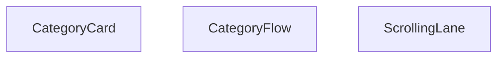

## NODE ID STANDARD

  file: src\components\CategoryFlow.tsx
  function: src\components\CategoryFlow.tsx::CategoryCard
  function: src\components\CategoryFlow.tsx::ScrollingLane
  function: src\components\CategoryFlow.tsx::CategoryFlow

---

## DISA AKTARILANLAR (EXPORTS)
  export: CategoryCard
  export: CategoryFlow
  export: ScrollingLane

---

## STİL TOKENLERİ

### Arbitrary Değerler (token'a geçirilmemiş)
Yok — tüm stiller token'a geçirilmiş. ✅

### Kullanılan Token'lar (zaten token'a geçirilmiş)
- (yok)

### Tailwind Sınıf Özeti
- **Renkler:** `bg-gradient-to-b`, `bg-gradient-to-br`, `bg-gradient-to-l`, `bg-gradient-to-r`, `bg-gray-100`, `bg-white/10`, `bg-white/20`, `from-gray-50`, `sm:text-3xl`, `sm:text-lg`, `sm:text-sm`, `text-2xl`, `text-base`, `text-center`, `text-gray-600`
- **Layout:** `-bottom-4`, `-left-4`, `-right-4`, `-top-4`, `absolute`, `bottom-4`, `flex`, `flex-shrink-0`, `from-gray-50`, `gap-4`, `h-24`, `h-32`, `h-40`, `hover:shadow-xl`, `left-0`
- **Varyant/Responsive:** `:`, `group-hover:`, `hover:`, `lg:`, `md:`, `sm:` önekleri
- **Yardımcı Sınıflar:** `${direction`, `${gradient`, `-translate-x-1/2`, `:`, `===`, `animate-category-scroll-left`, `animate-category-scroll-right`, `animate-pulse`, `duration-300`, `font-bold`, `group`, `group-hover:opacity-100`, `group-hover:scale-110`, `hover:-translate-y-1`, `hover:scale-105`

---
# FILE: src\components\ErrorBoundary.md

---
domain: general
source_type: doc
namespace_type: module
source_path: C:\Users\alize\venthub-hvac\src\components\ErrorBoundary.tsx
skeleton_hash: 6e8fe4f254f36ffa
entity_hashes:
  func:ErrorBoundary:componentDidCatch: 87e1c834c124bf4c
  func:ErrorBoundary:constructor: f8409de1e499d06a
  func:ErrorBoundary:getDerivedStateFromError: 7c6b6e8065153a82
  func:ErrorBoundary:render: e2424b954c998122
  func:isChunkLoadError: 31516cfb6918b024
  func:serializeError: 2f05a1b7f35a9398
  overview: 4d67cf292bff82fe
  style_tokens: 1ab7ecfdeff4b247
generated_at: 2026-05-28T22:35:49Z
---

## Genel Bakış
Bu modül, React uygulamalarında beklenmeyen hataları yakalamak için kullanılan bir hata sınırı (ErrorBoundary) bileşeni sunar. Yakalanan hataları işleyerek kullanıcıya anlamlı bir hata arayüzü gösterir; özellikle dinamik modül yükleme hatalarını (chunk load error) ayırt eder ve hata nesnelerini loglama ya da raporlama amacıyla serileştirir.

## Fonksiyon Grupları

### Hata Sınırı Yaşam Döngüsü
ErrorBoundary sınıfının React hata sınırı metotlarını kapsar. Bileşenin hata durumunu başlatır, günceller ve hata yakalandığında yan etkileri (loglama vb.) yönetir.
- constructor, getDerivedStateFromError, componentDidCatch, render

### Hata İşleme Yardımcıları
Hataları serileştirme ve belirli hata türlerini (özellikle chunk yükleme hataları) tanıma işlevlerini içerir. Bu fonksiyonlar, hata sınırı metotları tarafından kullanılarak hataların daha anlaşılır ve işlenebilir olmasını sağlar.
- serializeError, isChunkLoadError

---

## AXIOMS – Mimari Varsayımlar
Bu modül React tabanlı uygulamalarda alt bileşenlerin fırlattığı çalışma zamanı hatalarını yakalayan, uygulamanın tamamen çökmesini önleyen hata sınırı bileşenidir; doğru çalışması için React'in ErrorBoundary yaşam döngülerini desteklemesi ve proje içerisinde hata alabilecek bileşenleri sarmalayacak şekilde konumlandırılması zorunludur.

[Aksiyom 1]: Eğer React kütüphanesi bu modülün kullandığı `getDerivedStateFromError` ve `componentDidCatch` yaşam döngüsü metodlarını desteklemiyorsa, modül hiçbir hatayı yakalayamaz, uygulama beklendiği gibi çöker.
[Aksiyom 2]: Eğer bu modül uygulama içerisinde hata fırlatabilecek tüm alt bileşenleri sarmayacak şekilde yanlış konumlandırılırsa, kapsam dışında kalan bileşenlerde oluşan hatalar yakalanamaz.
[Aksiyom 3]: Eğer `serializeError` fonksiyonu gelen `unknown` tipteki hata nesnesini standart formata dönüştüremiyorsa, hata detayları ne kaydedilebilir ne de kullanıcıya gösterilebilir.
[Aksiyom 4]: Eğer `isChunkLoadError` fonksiyonu kod ayırma (code splitting) sırasında oluşan parça yükleme hatalarını doğru tespit edemiyorsa, bu tür ağa bağlı hatalar için özel kurtarma akışları çalıştırılamaz.
[Aksiyom 5]: Eğer ErrorBoundary'nin constructor'ında tanımlanan temel state yapısı bozulursa, `render()` metodu hata durumunda gösterilecek fallback arayüzünü yükleyemez, kullanıcı hatadan haberdar olamaz.
[Aksiyom 6]: Eğer `componentDidCatch` metodunun eriştiği harici hata loglama servisi entegrasyonu çalışmıyorsa, yakalanan hatalar uzaktan takip edilemez, hata kök nedenleri analiz edilemez.

---

## FONKSİYON DETAYLARI

### serializeError
**Ne yapar**: Hata nesnesini okunabilir bir biçime dönüştürerek geliştirici konsolunda veya UI’da gösterilmesini sağlar.  
**Nasıl yapar**: Fonksiyonun iç mantığı kodda verilmemiştir; yalnızca `ErrorBoundary` içinde `serializeError(this.state.error)` şeklinde çağrılır ve dönen değer `<pre>` içinde gösterilir.  
**Parametreler**:
- `error`: unknown — Serileştirilecek hata nesnesi.  
**Dönüş**: Belirtilmemiş (kod içinde dönüş değeri kullanılmaz, muhtemelen string veya nesne).

### isChunkLoadError
**Ne yapar**: Bir hatanın, dinamik olarak yüklenen kod parçacıklarından (chunk) kaynaklanıp kaynaklanmadığını tespit eder.  
**Nasıl yapar**: Fonksiyonun içeriği verilmemiştir; `ErrorBoundary` içinde `isChunkLoadError(error)` çağrılarıyla hem UI’da hem de hata izleme mantığında kullanılır.  
**Parametreler**:
- `error`: unknown — Kontrol edilecek hata nesnesi.  
**Dönüş**: `boolean` — Hata bir chunk yükleme hatasıysa `true`, aksi takdirde `false`.

---

## INTERFACES

### Props
- `children: ReactNode`
- `fallback?: ReactNode`

### State
- `hasError: boolean`
- `error?: Error`
- `isChunkError?: boolean`

---

## AST POINTERS

### [N1_NASIL] AST Pointer: src/components/ErrorBoundary.tsx::serializeError
- **params**: `(error: unknown)`
- **ic_degiskenler**:
  - `error` — fonksiyona gelen hata nesnesi; `Error` örneği ise `message` ve `stack` döndürülür, aksi takdirde JSON.stringify denemesi yapılır.
- **Dönüş**: `string` (hata mesajı ve yığını, JSON stringi veya `String(error)`)

### [N2_NASIL] AST Pointer: src/components/ErrorBoundary.tsx::isChunkLoadError
- **params**: `(error: unknown)`
- **ic_degiskenler**:
  - `error` — fonksiyona gelen hata nesnesi; `Error` örneği ise mesaj içinde chunk yükleme hatası anahtar kelimeleri aranır.
- **Dönüş**: `boolean` (chunk yükleme hatası ise `true`, aksi takdirde `false`)

### [N3_NASIL] AST Pointer: src/components/ErrorBoundary.tsx::constructor
- **params**: `(props: Props)`
- **ic_degiskenler**:
  - `props` — bileşenin dışarıdan aldığı özellikler (fallback, children vb.).
- **Dönüş**: `yok` (state `{ hasError: false }` olarak başlatılır)

### [N4_NASIL] AST Pointer: src/components/ErrorBoundary.tsx::getDerivedStateFromError
- **params**: `(error: Error)`
- **ic_degiskenler**:
  - `error` — yakalanan hata nesnesi.
- **Dönüş**: `State`  
  ```ts
  {
    hasError: true,
    error,
    isChunkError: isChunkLoadError(error)
  }
  ```

### [N5_NASIL] AST Pointer: src/components/ErrorBoundary.tsx::componentDidCatch
- **params**: `(error: Error, errorInfo: ErrorInfo)`
- **ic_degiskenler**:
  - `error` — yakalanan hata nesnesi.
  - `errorInfo` — React tarafından sağlanan ek hata bilgisi.
- **Dönüş**: `yok` (console.error ve olası chunk hatası için console.warn)

### [N6_NASIL] AST Pointer: src/components/ErrorBoundary.tsx::handleRetry
- **params**: `()`
- **ic_degiskenler**: *(hiçbiri)*
- **Dönüş**: `yok` (state `{ hasError: false, error: undefined, isChunkError: false }` olarak sıfırlanır)

### [N7_NASIL] AST Pointer: src/components/ErrorBoundary.tsx::handleRefresh
- **params**: `()`
- **ic_degiskenler**:
  - `window` — global nesne; tarayıcı ortamında olup olmadığı kontrol edilir.
- **Dönüş**: `yok` (sayfa yeniden yüklenir `window.location.reload()`)

### [N8_NASIL] AST Pointer: src/components/ErrorBoundary.tsx::render
- **params**: `()`
- **ic_degiskenler**:
  - `ctx` — `I18nContext.Consumer` tarafından sağlanan çeviri konteksi.
  - `t` — çeviri fonksiyonu; `ctx?.t` mevcutsa kullanılır, yoksa `(key, alt) => alt || key`.
  - `this.state.hasError` — hata oluşup oluşmadığını gösterir.
  - `this.props.fallback` — hata durumunda gösterilecek alternatif JSX.
  - `isChunkError` — `this.state.isChunkError`; chunk hatası mı diye kontrol.
  - `this.handleRefresh` — sayfayı yenilemek için kullanılan metod.
  - `this.handleRetry` — hatayı yeniden denemek için kullanılan metod.
  - `process.env.NODE_ENV` — geliştirme ortamı kontrolü.
  - `this.state.error` — detaylı hata bilgisi (geliştirme modunda gösterilir).
  - `serializeError` — hata nesnesini okunabilir stringe dönüştürür.
- **Dönüş**: `JSX.Element` (hata UI’si veya `this.props.children`)

---


## MERMAID CALL GRAPH
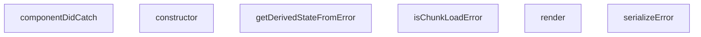

## NODE ID STANDARD

  file: src\components\ErrorBoundary.tsx
  function: src\components\ErrorBoundary.tsx::serializeError
  function: src\components\ErrorBoundary.tsx::isChunkLoadError
  class: src\components\ErrorBoundary.tsx::ErrorBoundary

---

## DISA AKTARILANLAR (EXPORTS)
  export: ErrorBoundary
  export: isChunkLoadError
  export: serializeError

---

## BILEŞIM (CONTAINS)
  contains: Component<Props
  contains: State>

---

## STİL TOKENLERİ

### Arbitrary Değerler (token'a geçirilmemiş)
Yok — tüm stiller token'a geçirilmiş. ✅

### Kullanılan Token'lar (zaten token'a geçirilmiş)
- (yok)

### Tailwind Sınıf Özeti
- **Renkler:** `bg-gray-100`, `bg-primary-navy`, `border-gray-300`, `hover:bg-gray-50`, `hover:bg-secondary-blue`, `hover:text-gray-700`, `text-amber-500`, `text-center`, `text-gray-500`, `text-gray-600`, `text-gray-700`, `text-gray-800`, `text-left`, `text-sm`, `text-white`
- **Layout:** `flex`, `h-16`, `h-4`, `inline-flex`, `items-center`, `justify-center`, `max-h-40`, `max-w-md`, `min-h-400px`, `overflow-auto`, `p-3`, `p-8`, `w-16`, `w-4`
- **Varyant/Responsive:** `hover:` önekleri
- **Yardımcı Sınıflar:** `border`, `cursor-pointer`, `font-semibold`, `mb-2`, `mb-4`, `mb-6`, `mr-2`, `mr-3`, `mt-2`, `mt-6`, `mx-auto`, `px-4`, `px-6`, `py-2`, `rounded`

---
# FILE: src\components\Footer.md

---
domain: general
source_type: doc
namespace_type: module
source_path: C:\Users\alize\venthub-hvac\src\components\Footer.tsx
skeleton_hash: 5daa350ee98ba5a3
entity_hashes:
  func:Footer: 1e0192e85e1f6373
  overview: 05f327193547be84
  style_tokens: bb9551672f956ab8
generated_at: 2026-05-28T22:35:50Z
---

## Genel Bakış
Bu modül, uygulamanın alt kısmında görünecek olan Footer bileşenini tanımlar. React işlevsel bileşeni olarak uygulanmış olup, sayfanın son kısmında gerekli bağlantı, telif hakkı veya sosyal medya gibi bilgileri sunmak için kullanılır.

## Fonksiyon Grupları
### Bileşen Tanımı
Footer bileşeninin oluşturulması ve dışa aktarılması sorumluluğundadır.
- Footer

---

## AXIOMS – Mimari Varsayımlar
Bu modül için özel aksiyom tanımlanmamıştır.

---

## FONKSİYON DETAYLARI

### Footer
**Ne yapar**: Uygulamanın altbilgi (footer) bölümünü render eden bir React fonksiyonel bileşeni tanımlar.  
**Nasıl yapar**: Fonksiyon içindeki JSX döndürerek, genellikle telif hakkı metni, sosyal medya linkleri ve diğer altbilgi öğelerini içerir; bu JSX, React tarafından DOM'a monte edilerek görüntülenir.  
**Parametreler**: Yok  
**Dönüş**: React.FC türünde bir fonksiyonel bileşen; bu bileşen render edildiğinde footer JSX'ini döndürür.

---

## AST POINTERS

### [N1_NASIL] AST Pointer: src/components/Footer.tsx::Footer
- **params**: (parametre yok)
- **ic_degiskenler**:
  - `t` — çeviri fonksiyonu, `useI18n` hook'undan elde edilen `t` nesnesi; footer üzerindeki tüm metinleri çevirmek için kullanılır.
  - `globalCategories` — `useCategories` context'inden gelen tüm kategorilerin dizisi; footer'ın kategori listesi ve diğer bölümlerde kaynak veri olarak kullanılır.
  - `mainCategories` — `React.useMemo` ile memoize edilmiş değişken; `parent_id` olmayan (üst seviye) kategorilerin ilk 8 elemanını içerir ve footer'ın "Kategoriler" bölümünde gösterilir.
- **Dönüş**: JSX.Element — `<footer>...</footer>` elementi olarak render edilen footer bileşeni.

### [N2_NASIL] AST Pointer: src/components/Footer.tsx::mainCategories (useMemo callback)
- **params**: (parametre yok)
- **ic_degiskenler**:
  - `globalCategories` — dış kapsaktan gelen tüm kategoriler dizisi; bu fonksiyon içinde `filter` ve `slice` işlemlerine kaynak olarak kullanılır.
- **Dönüş**: Category[] — `parent_id` olmayan kategorilerin ilk 8 elemanını içeren yeni dizi; footer'da gösterilecek kategori özetini sağlar.

### [N3_NASIL] AST Pointer: src/components/Footer.tsx::renderCategoryItem
- **params**: `category` — bir kategori nesnesi; `slug` ve `name` özelliklerini içerir, bu özellikler link oluşturma ve metin gösteriminde kullanılır.
- **ic_degiskenler**: (yok) — fonksiyon gövdesinde ek bir değişken tanımlanmaz.
- **Dönüş**: JSX.Element — `<li>` elementi içinde bir `<Link>` barındıran kategori öğesi; footer'ın kategori listesinde tek bir satır olarak render edilir.

---

## NODE ID STANDARD

  file: src\components\Footer.tsx
  function: src\components\Footer.tsx::Footer

---

## DISA AKTARILANLAR (EXPORTS)
  export: Footer

---

## STİL TOKENLERİ

### Arbitrary Değerler (token'a geçirilmemiş)
Yok — tüm stiller token'a geçirilmiş. ✅

### Kullanılan Token'lar (zaten token'a geçirilmiş)
- (yok)

### Tailwind Sınıf Özeti
- **Renkler:** `bg-industrial-gray`, `bg-primary-navy`, `bg-white/5`, `border-steel-gray`, `border-t`, `hover:text-secondary-blue`, `hover:text-white`, `selection:bg-white/20`, `selection:text-white`, `text-gray-300`, `text-lg`, `text-secondary-blue`, `text-sm`, `text-steel-gray`, `text-white`
- **Layout:** `flex`, `flex-col`, `flex-shrink-0`, `flex-wrap`, `gap-8`, `gap-x-6`, `gap-y-2`, `grid`, `grid-cols-1`, `items-center`, `items-start`, `justify-between`, `justify-center`, `lg:grid-cols-4`, `max-w-7xl`
- **Varyant/Responsive:** `hover:`, `lg:`, `md:`, `selection:`, `sm:` önekleri
- **Yardımcı Sınıflar:** `font-bold`, `font-medium`, `font-semibold`, `leading-relaxed`, `lg:px-8`, `mb-2`, `mb-4`, `md:space-y-0`, `mt-1`, `mt-4`, `mx-auto`, `px-4`, `py-12`, `py-6`, `rounded-lg`

---
# FILE: src\components\HVACIcons.md

---
domain: general
source_type: doc
namespace_type: module
source_path: C:\Users\alize\venthub-hvac\src\components\HVACIcons.tsx
skeleton_hash: d2cbc3fc80ec701c
entity_hashes:
  func:AccessoriesIcon: df362ba93a01a32a
  func:AirCurtainIcon: a991d6630fad3258
  func:AirPurifierIcon: 6d358290affcacb3
  func:BrandIcon: abc1dbe6a42bf303
  func:DehumidifierIcon: 40d30033e6855f3e
  func:FanIcon: 4fb3ddee9fac4362
  func:FlexibleDuctIcon: 252d34888f5ec8da
  func:HeatRecoveryIcon: 821f62398bcddd32
  func:SpeedControlIcon: dbb6f424f34e3326
  func:WhatsAppIcon: e7d41d76023d8693
  overview: dff8b3ed99dcf496
  style_tokens: 3b0534c287cddb44
generated_at: 2026-05-28T22:36:16Z
---

## Genel Bakış
Bu modül, HVAC sistemleriyle ilgili çeşitli ekipmanları ve bazı ortak kullanım amaçlı sembolleri temsil eden SVG tabanlı React ikon bileşenlerini toplar. Her bir fonksiyon, belirtilen boyut ve stil seçenekleriyle özelleştirilebilir bir ikon döndürerek arayüzde görsel eşleştirmeyi kolaylaştırır.

## Fonksiyon Grupları
### HVAC Ekipman İkonları
HVAC sistemlerinin temel bileşenlerini görselleştirmek için kullanılan ikonlar burada yer alır; fan, ısı geri kazanımı, havalama perdeleri, nemlendirici, hava temizleyici, esnek kanal, hız kontrolü ve aksesuar gibi işlevleri temsil eder.
- FanIcon, HeatRecoveryIcon, AirCurtainIcon, DehumidifierIcon, AirPurifierIcon, FlexibleDuctIcon, SpeedControlIcon, AccessoriesIcon

### Ortak Kullanım İkonları
Modülün geri kalan kısmı, sosyal medya bağlantıları ve marka gösterimi gibi genel amaçlı ihtiyaçlara hizmet eden basit ikonları içerir; bu sayede arayüzde tutarlı bir görsel dil sağlanır.
- WhatsAppIcon, BrandIcon

---

## AXIOMS – Mimari Varsayımlar
Bu modül, prop tiplerinin ve varsayılan değerlerinin beklendiği şekilde sağlandığını varsayar.

[Aksiyom 1]: Eğer className prop'ı string değilse, component sınıf adı uygulanamayabilir ve stil hatası oluşabilir.  
[Aksiyom 2]: Eğer size prop'ı sayı değilse, CSS boyutu geçersiz olur ve ikon beklenmedik şekilde render edilebilir.  
[Aksiyom 3]: Eğer WhatsAppIcon'ın size prop'ı sağlanmazsa, varsayılan 24 kullanılır; ancak bu değerin sayı olmaması durumunda yukarıdaki aksiyom geçerlidir.  
[Aksiyom 4]: Eğer BrandIcon'ın brand prop'ı sağlanmazsa veya tanımsız ise, component doğru şekilde render edilemez (brand eksikliği nedeniyle görüntülenemez).

---

## FONKSİYON DETAYLARI

### FanIcon
**Ne yapar**: HVAC sistemlerindeki fan bileşenini temsil eden SVG ikonunu render eder. Fan sembolünü görsel olarak göstermek için kullanılır.

**Nasıl yapar**: className ve size parametrelerini alarak, bir SVG elementi oluşturur ve fan şeklinde bir ikon çizer. Varsayılan olarak 48x48 piksel boyutunda render edilir.

**Parametreler**:
- className: string — İkon üzerine uygulanacak CSS sınıfı. Varsayılan değer boş stringdir.
- size: number — İkonun boyutunu piksel cinsinden belirler. Varsayılan değer 48'dir.

**Dönüş**: React.FC<IconProps> — Render edilmiş SVG ikon bileşeni döndürür.

### HeatRecoveryIcon
**Ne yapar**: Isı geri kazanım sistemini simgeleyen bir ikon bileşeni üretir.  
**Nasıl yapar**: Hazırlanmış SVG içeriği alır, `className` ve `size` prop’larını bu SVG üzerindeki stil ve boyut özelliklerine uygular.  
**Parametreler**:
- className: string — İkona ekstra stil sınıfları eklemek için kullanılır.  
- size: number — İkonun boyutunu piksel cinsinden ayarlar, varsayılan 48.  
**Dönüş**: `React.FC<IconProps>`; render edildiğinde Isı geri kazanım ikonunu gösterir.

### AirCurtainIcon
**Ne yapar**: Hava perdesi (air curtain) cihazını temsil eden bir simge bileşeni oluşturur.  
**Nasıl yapar**: İkonun SVG tanımı alır, dışardan gelen `className` stilini ve `size` boyutunu uygulayarak ekrana basar.  
**Parametreler**:
- className: string — Ekstra CSS sınıfları için kullanılır, görsel özelleştirmeyi mümkün kılar.  
- size: number — İkonun genişlik ve yüksekliğini piksel olarak belirler, varsayılan 48.  
**Dönüş**: `React.FC<IconProps>`; JSX olarak hava perdesi ikonunu döndürür.

### DehumidifierIcon
**Ne yapar**: Nem çekici (dehumidifier) cihazının simgesini render eden bir React bileşeni sağlar.  
**Nasıl yapar**: Önceden tanımlanmış SVG yolunu alır, `className` ve `size` değerlerini bu SVG’nin stil ve boyut özelliklerine uygular.  
**Parametreler**:
- className: string — İkona ekstra stil sınıfları eklemek için kullanılır.  
- size: number — İkonun boyutunu piksel cinsinden belirler, varsayılan değer 48.  
**Dönüş**: `React.FC<IconProps>`; nem çekici ikonunu gösteren fonksiyonel bileşen.

### AirPurifierIcon
**Ne yapar**: Hava temizleyici (air purifier) cihazını simgeleyen bir ikon bileşeni üretir.  
**Nasıl yapar**: SVG içeriği alır, `className` stilini ve `size` boyutunu bu SVG üzerindeki özelliklere uygulayarak ekrana basar.  
**Parametreler**:
- className: string — Ekstra CSS sınıfları için kullanılır, stil özelleştirmeyi sağlar.  
- size: number — İkonun piksel cinsinden genişlik ve yüksekliğini belirler, varsayılan 48.  
**Dönüş**: `React.FC<IconProps>`; hava temizleyici ikonunu döndüren fonksiyonel bileşen.

### FlexibleDuctIcon
**Ne yapar**: Esnek havalandırma kanalı (flexible duct) simgesini render eden bir React bileşeni sağlar.  
**Nasıl yapar**: Hazırlanmış SVG yolunu alır, dışardan gelen `className` stilini ve `size` boyutunu bu SVG’nin özelliklerine uygular.  
**Parametreler**:
- className: string — Ekstra stil sınıfları eklemek için kullanılır.  
- size: number — İkonun boyutunu piksel cinsinden belirler, varsayılan 48.  
**Dönüş**: `React.FC<IconProps>`; esnek kanal ikonunu gösteren fonksiyonel bileşen.

### SpeedControlIcon
**Ne yapar**: Hız kontrolü (speed control) simgesini oluşturan bir ikon bileşeni üretir.  
**Nasıl yapar**: SVG tanımı alır, `className` ve `size` prop’larını bu SVG’nin stil ve boyut özelliklerine uygulayarak ekrana basar.  
**Parametreler**:
- className: string — Ekstra CSS sınıfları için kullanılır, görsel özelleştirmeyi sağlar.  
- size: number — İkonun piksel cinsinden genişlik ve yüksekliğini belirler, varsayılan 48.  
**Dönüş**: `React.FC<IconProps>`; hız kontrolü ikonunu döndüren fonksiyonel bileşen.

### AccessoriesIcon
**Ne yapar**: HVAC ekstra ekipmanları (aksesuarlar) simgesini render eden bir bileşen sağlar.  
**Nasıl yapar**: Önceden tanımlanmış SVG içeriği alır, `className` stilini ve `size` boyutunu bu SVG’nin özelliklerine uygulayarak ekrana gösterir.  
**Parametreler**:
- className: string — Ekstra stil sınıfları eklemek için kullanılır.  
- size: number — İkonun boyutunu piksel cinsinden belirler, varsayılan 48.  
**Dönüş**: `React.FC<IconProps>`; aksesuar ikonunu gösteren fonksiyonel bileşen.

### WhatsAppIcon
**Ne yapar**: WhatsApp logosunu gösteren bir ikon bileşeni üretir.  
**Nasıl yapar**: WhatsApp markası için hazırlanmış SVG alır, dışardan gelen `className` stilini ve `size` boyutunu (varsayılan 24) bu SVG’nin stil ve boyut özelliklerine uygular.  
**Parametreler**:
- className: string — Ekstra CSS sınıfları için kullanılır, stil özelleştirmeyi sağlar.  
- size: number — İkonun piksel cinsinden genişlik ve yüksekliğini belirler, varsayılan 24.  
**Dönüş**: `React.FC<IconProps>`; WhatsApp logosunu gösteren fonksiyonel bileşen.

### BrandIcon
**Ne yapar**: Verilen `brand` parametresine göre ilgili marka logosunu render eden dinamik bir ikon bileşeni sağlar.  
**Nasıl yapar**: `brand` string değerine göre önceden tanımlanmış marka SVG’lerinden uygun olanı seçer, `className` prop’sunu bu SVG’nin stiline uygular ve ekrana basar.  
**Parametreler**:
- brand: string — Gösterilecek markanın adı; bu değere göre ilgili logo seçilir.  
- className: string (opsiyonel) — Ekstra stil sınıfları eklemek için kullanılır, varsayılan boş string.  
**Dönüş**: `React.FC<{ brand: string; className?: string }>`; marka logosunu gösteren fonksiyonel bileşen.

---

## INTERFACES

### IconProps
- `className?: string`
- `size?: number`

---

## AST POINTERS

### [N1_NASIL] AST Pointer: C:\Users\alize\venthub-hvac\src\components\HVACIcons.tsx::FanIcon
- **params**: className, size
- **ic_degiskenler**:
  - `className` — SVG öğesinin className özelliğine aktarılan stil sınıfı
  - `size` — SVG öğesinin width ve height özelliklerine piksel cinsinden aktarılan boyut
- **Dönüş**: JSX elementi (React.FC<IconProps>)

### [N2_NASIL] AST Pointer: C:\Users\alize\venthub-hvac\src\components\HVACIcons.tsx::HeatRecoveryIcon
- **params**: className, size
- **ic_degiskenler**:
  - `className` — SVG öğesinin className özelliğine aktarılan stil sınıfı
  - `size` — SVG öğesinin width ve height özelliklerine piksel cinsinden aktarılan boyut
- **Dönüş**: JSX elementi (React.FC<IconProps>)

### [N3_NASIL] AST Pointer: C:\Users\alize\venthub-hvac\src\components\HVACIcons.tsx::AirCurtainIcon
- **params**: className, size
- **ic_degiskenler**:
  - `className` — SVG öğesinin className özelliğine aktarılan stil sınıfı
  - `size` — SVG öğesinin width ve height özelliklerine piksel cinsinden aktarılan boyut
- **Dönüş**: JSX elementi (React.FC<IconProps>)

### [N4_NASIL] AST Pointer: C:\Users\alize\venthub-hvac\src\components\HVACIcons.tsx::DehumidifierIcon
- **params**: className, size
- **ic_degiskenler**:
  - `className` — SVG öğesinin className özelliğine aktarılan stil sınıfı
  - `size` — SVG öğesinin width ve height özelliklerine piksel cinsinden aktarılan boyut
- **Dönüş**: JSX elementi (React.FC<IconProps>)

### [N5_NASIL] AST Pointer: C:\Users\alize\venthub-hvac\src\components\HVACIcons.tsx::AirPurifierIcon
- **params**: className, size
- **ic_degiskenler**:
  - `className` — SVG öğesinin className özelliğine aktarılan stil sınıfı
  - `size` — SVG öğesinin width ve height özelliklerine piksel cinsinden aktarılan boyut
- **Dönüş**: JSX elementi (React.FC<IconProps>)

### [N6_NASIL] AST Pointer: C:\Users\alize\venthub-hvac\src\components\HVACIcons.tsx::FlexibleDuctIcon
- **params**: className, size
- **ic_degiskenler**:
  - `className` — SVG öğesinin className özelliğine aktarılan stil sınıfı
  - `size` — SVG öğesinin width ve height özelliklerine piksel cinsinden aktarılan boyut
- **Dönüş**: JSX elementi (React.FC<IconProps>)

### [N7_NASIL] AST Pointer: C:\Users\alize\venthub-hvac\src\components\HVACIcons.tsx::SpeedControlIcon
- **params**: className, size
- **ic_degiskenler**:
  - `className` — SVG öğesinin className özelliğine aktarılan stil sınıfı
  - `size` — SVG öğesinin width ve height özelliklerine piksel cinsinden aktarılan boyut
- **Dönüş**: JSX elementi (React.FC<IconProps>)

### [N8_NASIL] AST Pointer: C:\Users\alize\venthub-hvac\src\components\HVACIcons.tsx::AccessoriesIcon
- **params**: className, size
- **ic_degiskenler**:
  - `className` — SVG öğesinin className özelliğine aktarılan stil sınıfı
  - `size` — SVG öğesinin width ve height özelliklerine piksel cinsinden aktarılan boyut
- **Dönüş**: JSX elementi (React.FC<IconProps>)

### [N9_NASIL] AST Pointer: C:\Users\alize\venthub-hvac\src\components\HVACIcons.tsx::WhatsAppIcon
- **params**: className, size
- **ic_degiskenler**:
  - `className` — SVG öğesinin className özelliğine aktarılan stil sınıfı
  - `size` — SVG öğesinin width ve height özelliklerine piksel cinsinden aktarılan boyut (varsayılan 24)
- **Dönüş**: JSX elementi (React.FC<IconProps>)

### [N10_NASIL] AST Pointer: C:\Users\alize\venthub-hvac\src\components\HVACIcons.tsx::BrandIcon
- **params**: brand, className
- **ic_degiskenler**:
  - `brand` — görüntülenecek markanın adı; lowercase versiyonu için `normalizedBrand` hesaplanır ve `` alt metni olarak kullanılır
  - `className` — dış öğeye (img veya fallback div) uygulanacak ek stil sınıfı
  - `normalizedBrand` — `brand` küçük harfe çevrilmiş hali; marka eşleştirmesinde switch case’de kullanılır
  - `basePath` — marka görsellerinin bulunduğu sabit yol (`/images/ekran`)
  - `src` — seçilen markaya göre oluşturulan tam görsel URL’si; `` öğesinin src özelliğine aktarılır
  - `alt` — `` öğesinin alt özelliği; erişilebilirlik için marka adıyla doldurulur
- **Dönüş**: JSX elementi (React.FC<{ brand: string; className?: string }>) – marka görseli veya fallback metni döner.

---


## MERMAID CALL GRAPH
```mermaid
graph TD
    HVACIcons_tsx__AccessoriesIcon["AccessoriesIcon"]
    HVACIcons_tsx__AirCurtainIcon["AirCurtainIcon"]
    HVACIcons_tsx__AirPurifierIcon["AirPurifierIcon"]
    HVACIcons_tsx__BrandIcon["BrandIcon"]
    HVACIcons_tsx__DehumidifierIcon["DehumidifierIcon"]
    HVACIcons_tsx__FanIcon["FanIcon"]
    HVACIcons_tsx__FlexibleDuctIcon["FlexibleDuctIcon"]
    HVACIcons_tsx__HeatRecoveryIcon["HeatRecoveryIcon"]
    HVACIcons_tsx__SpeedControlIcon["SpeedControlIcon"]
    HVACIcons_tsx__WhatsAppIcon["WhatsAppIcon"]
```

## NODE ID STANDARD

  file: src\components\HVACIcons.tsx
  function: src\components\HVACIcons.tsx::FanIcon
  function: src\components\HVACIcons.tsx::HeatRecoveryIcon
  function: src\components\HVACIcons.tsx::AirCurtainIcon
  function: src\components\HVACIcons.tsx::DehumidifierIcon
  function: src\components\HVACIcons.tsx::AirPurifierIcon
  function: src\components\HVACIcons.tsx::FlexibleDuctIcon
  function: src\components\HVACIcons.tsx::SpeedControlIcon
  function: src\components\HVACIcons.tsx::AccessoriesIcon
  function: src\components\HVACIcons.tsx::WhatsAppIcon
  function: src\components\HVACIcons.tsx::BrandIcon

---

## DISA AKTARILANLAR (EXPORTS)
  export: AccessoriesIcon
  export: AirCurtainIcon
  export: AirPurifierIcon
  export: BrandIcon
  export: DehumidifierIcon
  export: FanIcon
  export: FlexibleDuctIcon
  export: HeatRecoveryIcon
  export: SpeedControlIcon
  export: WhatsAppIcon

---

## STİL TOKENLERİ

### Arbitrary Değerler (token'a geçirilmemiş)
Yok — tüm stiller token'a geçirilmiş. ✅

### Kullanılan Token'lar (zaten token'a geçirilmiş)
- (yok)

### Tailwind Sınıf Özeti
- **Renkler:** `bg-slate-100`, `text-slate-400`, `text-xs`
- **Layout:** `flex`, `h-full`, `items-center`, `justify-center`, `p-2`, `relative`, `w-full`
- **Varyant/Responsive:** (yok)
- **Yardımcı Sınıflar:** `${className`, `font-bold`, `object-contain`, `rounded-lg`, `tracking-tighter`, `uppercase`

---
# FILE: src\components\ImageGallery.md

---
domain: general
source_type: doc
namespace_type: module
source_path: C:\Users\alize\venthub-hvac\src\components\ImageGallery.tsx
skeleton_hash: b504c74305128bd7
entity_hashes:
  func:ImageGallery: ed5cc2a855b5b9b8
  func:handleMouseLeave: 60d41c470a6d0032
  func:handleMouseMove: b68c1278669bcb7a
  overview: 8b6fae0642827a18
  style_tokens: 01bec99debdcd366
generated_at: 2026-05-28T22:35:59Z
---

## Genel Bakış
ImageGallery bileşeni, bir ürünün görsellerini listeleyip kullanıcı etkileşimlerine yanıt veren bir resim galerisi sunar. Görsellerin gösterimi ve fare hareketlerine dayalı dinamik efektler bileşenin temel işlevlerini oluşturur.

## Fonksiyon Grupları
### Görsel Render ve Yerleşim
Bileşenin ana işlevi, gelen görsel listesini ve ürün bilgilerini alarak ekrana düzenli bir galeriyi çizdirmektir.
- ImageGallery

### Fare Etkileşimi Yönetimi
Kullanıcının galeriye üzerindeki fare hareketlerini izleyerek görsel üzerinde geçici efektler (örneğin zoom veya açıklama gösterimi) sağlar.
- handleMouseMove
- handleMouseLeave

---

## AXIOMS – Mimari Varsayımlar
Bu modülün doğru çalışması için aşağıdaki koşulların sağlanması gerekir.

[Aksiyom 1]: Eğer `images` prop'u sağlanmazsa, galeride görüntü gösterilemez ve bileşen boş görünebilir.  
[Aksiyom 2]: Eğer `productName` prop'u sağlanmazsa, ürün adı bölümü render edilmez veya undefined gösterilir.  
[Aksiyom 3]: Eğer `slug` prop'u sağlanmazsa, ürüne özgü URL oluşturulaması ve ilgili navigasyon işlevselliği kaybolur.  
[Aksiyom 4]: Eğer `modelType` prop'u sağlanmazsa, `Product3DViewer` bileşeni doğru model tipi alamadığından 3D görüntüleme işlevi çalışmayabilir.  
[Aksiyom 5]: Eğer `handleMouseMove` fonksiyonuna geçirilen argüman `React.MouseEvent<HTMLDivElement>` tipi değilse (örneğin başka bir eleman üzerinden olay veya null), TypeScript çalışma‑zamanı tip hatası oluşur ve fonksiyon beklendiği gibi çalışmayabilir.  
[Aksiyom 6]: Eğer `handleMouseLeave` fonksiyonu çağrılmazsa (örneğin mouse leave eventi bağlanmazsa), fare öğeden çıktığında ilgili durum güncellenmez ve kullanıcı deneyimi etkilenir.  
[Aksiyom 7]: Eğer `Product3DViewer` bileşeni içe aktarılamaz veya tanımlanmazsa, `ImageGallery` render edilirken hata verir ve 3D görüntüleme özelliği kullanılamaz.

---

## FONKSİYON DETAYLARI

### ImageGallery
**Ne yapar**: Bir ürünün görsellerini gösteren bir bileşen render eder.  
**Nasıl yapar**: props olarak gelen images dizisini mapleyerek her bir görseli  veya benzeri bir eleman olarak döndürür; ayrıca productName, slug ve modelType bilgilerini UI içinde kullanabilir.  
**Parametreler**:  
- images: Image[] — Gösterilecek görsel dizisi (her bir görselin URL ve meta veri içerdiği tip)  
- productName: string — Ürünün adı, başlık veya alt metin olarak gösterilir  
- slug: string — Ürünün URL slug'ı, navigasyon veya SEO amaçlı kullanılır  
- modelType: string — Ürünün model tipi, filtreleme veya sınıflandırma için kullanılır  
**Dönüş**: React.FC<ImageGalleryProps> — JSX elementi döndüren fonksiyonel bileşen

### handleMouseMove
**Ne yapar**: Fare hareketi olayını yakalayıp, görsel galerisinde etkileşim (örneğin zoom veya hareket efekti) için gerekli koordinatları işler.  
**Nasıl yapar**: Olay nesnesinden clientX ve clientY değerlerini çıkararak state veya ref üzerinden güncellenen pozisyon bilgilerini ayarlar; bu sayede görselin üzerine gelen fareye göre dinamik efekt sağlanır.  
**Parametreler**:  
- e: React.MouseEvent<HTMLDivElement> — Fare hareketi olayı, hedef bir <div> elementi üzerinden tetiklenir  
**Dönüş**: void — Fonksiyon bir değer döndürmez

### handleMouseLeave
**Ne yapar**: Fare galeriye dışarı çıktığında tetiklenen olay işleyicisidir; aktif etkileşimi sıfırlayarak görseli varsayılan duruma döndürür.  
**Nasıl yapar**: State veya ref üzerinden fare üzerindeki etkileşimi (örneğin zoom ölçeği) sıfırlayarak galeriyi başlangıç pozisyonuna getirir.  
**Parametreler**: (yok)  
**Dönüş**: void — Fonksiyon bir değer döndürmez

---

## INTERFACES

### ImageGalleryProps
- `images: { path: string; alt?: string | null }[]`
- `productName: string`
- `slug?: string`
- `modelType?: string`

---

## SABİTLER
- **Product3DViewer** (call) — `dynamic(

    () => import('./products/3d/Product3DViewer'),

    { ssr: fals...`

---

## AST POINTERS

### [N1_NASIL] AST Pointer: src/components/ImageGallery.tsx::ImageGallery
- **params**: (images, productName, slug, modelType)
- **ic_degiskenler**:
  - `t` — çeviri fonksiyonu, i18n'den alınan t metodu
  - `activeIdx` — aktif görselin indeksi, useState ile tutulan durum
  - `setActiveIdx` — activeIdx'i güncelleyen setter fonksiyonu
  - `isLightboxOpen` — lightbox açılıp açılmadığını gösteren boolean durum
  - `setIsLightboxOpen` — lightbox durumunu güncelleyen setter
  - `is3DMode` — 3D görüntüleme modunun aktif olup olmadığını gösteren boolean
  - `setIs3DMode` — 3D modunu güncelleyen setter
  - `is3DFullscreen` — 3D tam ekran modunun aktif olup olmadığını gösteren boolean
  - `setIs3DFullscreen` — 3D tam ekran durumunu güncelleyen setter
  - `zoomStyle` — görsele uygulanacak zoom stilini tutan React.CSSProperties nesnesi
  - `setZoomStyle` — zoomStyle'i güncelleyen setter
  - `imageContainerRef` — görsel konteyner div'ine referans tutan useRef
  - `activeImage` — aktif indeksteki görsel nesnesi (images[activeIdx] veya null)
  - `handleMouseMove` — fare hareketi ile zoom efekti için tanımlanan fonksiyon
  - `handleMouseLeave` — fare çıktığında zoom'u sıfırlayan fonksiyon
  - `nextImage` — sonraki görsele geçmek için useCallback ile oluşturulan fonksiyon
  - `prevImage` — önceki görsele geçmek için useCallback ile oluşturulan fonksiyon
- **Dönüş**: React.FC<ImageGalleryProps> (JSX elementi)

### [N2_NASIL] AST Pointer: src/components/ImageGallery.tsx::handleMouseMove
- **params**: (e: React.MouseEvent<HTMLDivElement>)
- **ic_degiskenler**:
  - `left` — imageContainerRef.current'in sol koordinatı (getBoundingClientRect().left)
  - `top` — imageContainerRef.current'in üst koordinatı
  - `width` — imageContainerRef.current'in genişliği
  - `height` — imageContainerRef.current'in yüksekliği
  - `x` — fare X koordinatının konteyner içindeki yüzdelik konumu (0‑100)
  - `y` — fare Y koordinatının konteyner içindeki yüzdelik konumu (0‑100)
- **Dönüş**: yok

### [N3_NASIL] AST Pointer: src/components/ImageGallery.tsx::handleMouseLeave
- **params**: (parametre yok)
- **ic_degiskenler**: yok
- **Dönüş**: yok

### [N4_NASIL] AST Pointer: src/components/ImageGallery.tsx::nextImage
- **params**: (e?: React.MouseEvent)
- **ic_degiskenler**: yok
- **Dönüş**: yok

### [N5_NASIL] AST Pointer: src/components/ImageGallery.tsx::prevImage
- **params**: (e?: React.MouseEvent)
- **ic_degiskenler**: yok
- **Dönüş**: yok

### [N6_NASIL] AST Pointer: src/components/ImageGallery.tsx::useEffect callback
- **params**: (parametre yok)
- **ic_degiskenler**:
  - `handleKeyDown` — klavye tuşlarına basıldığında çağrılan iç fonksiyon (Escape, ok tuşları)
  - `locked` — lightbox veya 3D tam ekran açıksa true, body overflow'unu kilitlemek için kullanılan boolean
- **Dönüş**: cleanup fonksiyonu (void)

### [N7_NASIL] AST Pointer: src/components/ImageGallery.tsx::handleKeyDown (useEffect içi)
- **params**: (e: KeyboardEvent)
- **ic_degiskenler**: yok
- **Dönüş**: yok

### [N8_NASIL] AST Pointer: src/components/ImageGallery.tsx::cleanup function (useEffect içi)
- **params**: (parametre yok)
- **ic_degiskenler**: yok
- **Dönüş**: yok

### [N9_NASIL] AST Pointer: src/components/ImageGallery.tsx::imageContainerRef onKeyDown
- **params**: (e)
- **ic_degiskenler**: yok
- **Dönüş**: yok

### [N10_NASIL] AST Pointer: src/components/ImageGallery.tsx::main thumbnail map callback
- **params**: (img, idx)
- **ic_degiskenler**: yok
- **Dönüş**: JSX elementi (thumbnail butonu)

### [N11_NASIL] AST Pointer: src/components/ImageGallery.tsx::lightbox thumbnail map callback
- **params**: (img, idx)
- **ic_degiskenler**: yok
- **Dönüş**: JSX elementi (lightbox thumbnail butonu)

---


## MERMAID CALL GRAPH
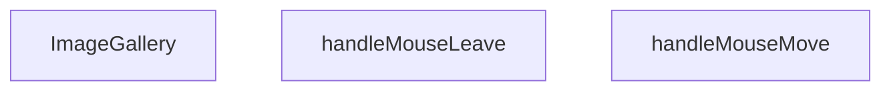

## NODE ID STANDARD

  file: src\components\ImageGallery.tsx
  function: src\components\ImageGallery.tsx::ImageGallery
  function: src\components\ImageGallery.tsx::handleMouseMove
  function: src\components\ImageGallery.tsx::handleMouseLeave

---

## DISA AKTARILANLAR (EXPORTS)
  export: ImageGallery

---

## STİL TOKENLERİ

### Arbitrary Değerler (token'a geçirilmemiş)
Yok — tüm stiller token'a geçirilmiş. ✅

### Kullanılan Token'lar (zaten token'a geçirilmiş)
- (yok)

### Tailwind Sınıf Özeti
- **Renkler:** `bg-black/20`, `bg-black/95`, `bg-gray-100`, `bg-white`, `bg-white/10`, `bg-white/80`, `bg-white/95`, `border-2`, `border-gray-200`, `border-primary-navy`, `border-transparent`, `border-white`, `hover:bg-white`, `hover:bg-white/20`, `hover:border-gray-300`
- **Layout:** `absolute`, `backdrop-blur-md`, `backdrop-blur-sm`, `bottom-6`, `cursor-zoom-in`, `fixed`, `flex`, `flex-col`, `flex-wrap`, `gap-0.5`, `gap-2`, `h-14`, `h-16`, `h-full`, `items-center`
- **Varyant/Responsive:** `:`, `group-hover:`, `hover:`, `md:` önekleri
- **Yardımcı Sınıflar:** `${!is3DMode`, `${activeIdx`, `-translate-x-1/2`, `-translate-y-1/2`, `:`, `===`, `activeIdx`, `aspect-square`, `border`, `duration-200`, `ease-out`, `font-bold`, `group`, `group-hover:opacity-100`, `hover:opacity-100`

---
# FILE: src\components\InViewCounter.md

---
domain: general
source_type: doc
namespace_type: module
source_path: C:\Users\alize\venthub-hvac\src\components\InViewCounter.tsx
skeleton_hash: 9c5b62f840a3b577
entity_hashes:
  func:InViewCounter: 223b6183b16e2873
  overview: 61076e120659900f
  style_tokens: 2ef2cd2897b38d9e
generated_at: 2026-05-28T22:36:00Z
---

## Genel Bakış
Bu modül, sayfa içinde görünebildiği anda bir sayıyı belirli bir süre içinde artırarak gösteren bir React bileşeni sağlar. Kullanıcıya dinamik bir sayaç deneyimi sunmak için görüntülendiğinde animasyonlu bir sayım işlemi gerçekleştirir.

## Fonksiyon Grupları
### Ana Bileşen
Bileşenin temel işlevini ve görüntülendiğinde sayaç animasyonunu yöneten tek işlevi içerir.
- InViewCounter

---

## AXIOMS – Mimari Varsayımlar
Bu modülün doğru çalışması için aşağıdaki varsayımlar geçerlidir.

[Aksiyom 1]: Eğer **label** prop’u sağlanmazsa, bileşen gerekli metni gösteremeyeceği için render hatası veya boş bir görüntü oluşur.  
[Aksiyom 2]: Eğer **to** prop’u sağlanmazsa, sayım hedefi belirlenemediği için bileşen saymaya başlayamaz ve hiçbir değer göstermez.  
[Aksiyom 3]: Eğer **to** prop’u sayısal bir değer değilse (örneğin string, null), sayım mantığı beklenmedik sonuçlar üretebilir veya çalışma zamanında hata fırlatabilir.  
[Aksiyom 4]: Eğer **suffix** prop’u sağlanmazsa, varsayılan olarak boş string (`''`) kullanılır; bu durumda sayının sonuna hiçbir ek metin eklenmez.  
[Aksiyom 5]: Eğer **durationMs** prop’u sağlanmazsa, varsayılan olarak 1200 ms kullanılır; bu değer sayım animasyonunun toplam süresini belirler.  
[Aksiyom 6]: Eğer **durationMs** sıfır veya negatif bir değerse, animasyon süresi geçersiz olur ve sayım aniden tamamlanabilir veya hiç görünmeyebilir.  
[Aksiyom 7]: Bileşen, React’in `useState` ve `useEffect` hook’larına bağımlıdır; bu hook’ların desteklenmeyen bir ortamda (örneğin klasik bir JavaScript dosyasında) kullanılması beklenmedik hatalar veroor.  
[Aksiyom 8]: Bileşenin içindeki zamanlayıcı (örneğin `setInterval` veya `requestAnimationFrame`) bileşenun unmount edilmesiyle temizlenmezse, bellek sızıntısı veya eski state güncellemeleri yaşanabilir.  

Bu varsayımlar, modülün fonksiyon imzalarından ve tipik React davranışlarından türetilmiştir; başka bir belge ya da yorumdan çıkarılmamıştır.

---

## FONKSİYON DETAYLARI

### InViewCounter
**Ne yapar**: Görünür alana girdiğinde sayısal değeri belirtilen sürede animasyonlu olarak artan bir sayaç bileşeni render eder.  
**Nasıl yapar**: `IntersectionObserver` kullanarak bileşenin viewport içinde görünürlüğünü izler; görünür olduğunda `setInterval` veya `requestAnimationFrame` üzerinden 0’dan `to` değerine kadar artan sayıyı hesaplar ve `label` ile `suffix` ekleyerek ekrana yazar.  
**Parametreler**:
- label: string — Sayı önüne eklenecek metin (örn. “Toplam: ”).  
- to: number — Sayaç hedef değeri; animasyon bu sayıya ulaşınca durur.  
- suffix: string — Sayı sonuna eklenecek metin (örn. “ kişi”). Varsayılan boş string.  
- durationMs: number — Animasyonun tamamlanması için geçen milisaniye süresi. Varsayılan 1200 ms.  
**Dönüş**: React.FC<CounterProps> — `label`, `to`, `suffix` ve `durationMs` props’larını kabul eden ve animasyonlu sayaç gösteren bir React fonksiyonel bileşeni.

---

## INTERFACES

### CounterProps
- `label: string`
- `to: number`
- `suffix?: string`
- `durationMs?: number`

---

## AST POINTERS

### [N1_NASIL] AST Pointer: src/components/InViewCounter.tsx::InViewCounter
- **params**: label, to, suffix = '', durationMs = 1200
- **ic_degiskenler**:
  - `ref` — useRef to hold DOM element reference for IntersectionObserver.
  - `value` — state variable for current displayed count.
  - `setValue` — setter for `value` state.
  - `started` — boolean flag indicating animation has started.
  - `setStarted` — setter for `started`.
  - `shouldAnimate` — flag indicating whether animation should run (respects reduced‑motion preferences).
  - `setShouldAnimate` — setter for `shouldAnimate`.
- **Dönüş**: JSX element (React.FC<CounterProps>)

### [N2_NASIL] AST Pointer: src/components/InViewCounter.tsx::useEffect_reducedMotion
- **params**: (yok)
- **ic_degiskenler**:
  - `rm` — MediaQueryList for prefers‑reduced‑motion media query.
  - `coarse` — MediaQueryList for pointer:coarse media query.
  - `update` — function that updates `shouldAnimate` based on match results.
- **Dönüş**: cleanup function (void)

### [N3_NASIL] AST Pointer: src/components/InViewCounter.tsx::cleanup_reducedMotion
- **params**: (yok)
- **ic_degiskenler**: (yok)
- **Dönüş**: void

### [N4_NASIL] AST Pointer: src/components/InViewCounter.tsx::useEffect_intersectionObserver
- **params**: (yok)
- **ic_degiskenler**:
  - `el` — DOM element from `ref.current`.
  - `io` — IntersectionObserver instance observing the element.
- **Dönüş**: cleanup function (void)

### [N5_NASIL] AST Pointer: src/components/InViewCounter.tsx::cleanup_intersectionObserver
- **params**: (yok)
- **ic_degiskenler**: (yok)
- **Dönüş**: void

### [N6_NASIL] AST Pointer: src/components/InViewCounter.tsx::intersectionObserverCallback
- **params**: entries
- **ic_degiskenler**:
  - `e` — individual IntersectionObserverEntry from the entries list.
- **Dönüş**: yok

### [N7_NASIL] AST Pointer: src/components/InViewCounter.tsx::intersectionObserverEntryArrow
- **params**: e
- **ic_degiskenler**: (yok)
- **Dönüş**: yok

### [N8_NASIL] AST Pointer: src/components/InViewCounter.tsx::useEffect_animationFrame
- **params**: (yok)
- **ic_degiskenler**:
  - `raf` — requestAnimationFrame ID.
  - `t0` — start timestamp from `performance.now()`.
  - `animate` — recursive animation function that updates the displayed value.
- **Dönüş**: cleanup function (void)

### [N9_NASIL] AST Pointer: src/components/InViewCounter.tsx::cleanup_animationFrame
- **params**: (yok)
- **ic_degiskenler**: (yok)
- **Dönüş**: void

### [N10_NASIL] AST Pointer: src/components/InViewCounter.tsx::animateFunction
- **params**: t
- **ic_degiskenler**:
  - `p` — progress ratio (0‑1) based on elapsed time over `durationMs`.
  - `eased` — eased value using easeOutCubic formula.
- **Dönüş**: yok

---

## NODE ID STANDARD

  file: src\components\InViewCounter.tsx
  function: src\components\InViewCounter.tsx::InViewCounter

---

## DISA AKTARILANLAR (EXPORTS)
  export: InViewCounter

---

## STİL TOKENLERİ

### Arbitrary Değerler (token'a geçirilmemiş)
Yok — tüm stiller token'a geçirilmiş. ✅

### Kullanılan Token'lar (zaten token'a geçirilmiş)
- (yok)

### Tailwind Sınıf Özeti
- **Renkler:** `bg-white`, `border-light-gray`, `text-4xl`, `text-center`, `text-primary-navy`, `text-steel-gray`
- **Layout:** `p-6`
- **Varyant/Responsive:** (yok)
- **Yardımcı Sınıflar:** `border`, `font-bold`, `mt-1`, `rounded-2xl`, `tabular-nums`

---
# FILE: src\components\LanguageSwitcher.md

---
domain: general
source_type: doc
namespace_type: module
source_path: C:\Users\alize\venthub-hvac\src\components\LanguageSwitcher.tsx
skeleton_hash: dfec695a41b4fbe5
entity_hashes:
  func:LanguageSwitcher: e20e68a6d834aa54
  func:switchLanguage: ceec0990f90068b4
  overview: 2f23c86896c74c04
  style_tokens: 819c78943fe15425
generated_at: 2026-05-29T18:43:11Z
---

## Genel Bakış
LanguageSwitcher modülü, uygulamanın dil seçimini sağlayan basit bir React bileşenidir. Kullanıcıya mevcut dillerden birini seçme ve bu seçimi uygulama genelinde güncelleme imkanı sunar.

## Fonksiyon Grupları
### Ana Bileşen
Bu grup, dil değiştirme işlevselliğini tek bir fonksiyonda toplar ve kullanıcı arayüzünü render eder.
- LanguageSwitcher

### Dil Değiştirme Mantığı
Bu grup, seçilen dili uygulama genelinde güncellemek için kullanılan işlevi içerir.
- switchLanguage

---

## AXIOMS – Mimari Varsayımlar
Bu modül için özel aksiyom tanımlanmamıştır.

**Aksiyom 1**: Eğer uygulama içinde ortak bir dil durumu (global language state) bulunmuyorsa, `LanguageSwitcher` bileşeni mevcut dili gösteremez ve dil değişikliği yapılamaz.  

**Aksiyom 2**: Eğer `switchLanguage` fonksiyonuna `'tr'` ya da `'en'` dışındaki bir değer (`newLang`) gönderilirse, geçersiz dil hatası oluşur ve dil değişikliği gerçekleşmez.  

**Aksiyom 3**: Eğer React çalışma ortamı (React runtime ve ilgili bağlam sağlayıcıları) mevcut değilse, `LanguageSwitcher` bileşeni render edilemez ve hiçbir etkileşim gerçekleşmez.  

**Aksiyom 4**: Eğer `switchLanguage` fonksiyonu çağrıldığında ilgili dil paketleri (i18n çeviri dosyaları) yüklenmemişse, UI’da yeni dilde metinler gösterilemez ve varsayılan (fallback) dil kullanılır.

---

## FONKSİYON DETAYLARI

### LanguageSwitcher
**Ne yapar**: React uygulamasında dil değiştirme arayüzünü sağlayan bir fonksiyon bileşeni döndürür.  
**Nasıl yapar**: Fonksiyon, bir React Functional Component (FC) tanımlayarak, kullanıcıların mevcut dili seçebileceği UI öğelerini render eder. Bileşen içinde dil değişimini tetikleyen `switchLanguage` fonksiyonu çağrılabilir.  
**Parametreler**:  
- *Yok* — Bu fonksiyon parametre almaz.  
**Dönüş**: React.FC — Dil seçici bileşenini temsil eden bir React Functional Component döndürür.

### switchLanguage
**Ne yapar**: Uygulamanın aktif dilini, verilen yeni dil koduna (`'tr'` veya `'en'`) göre değiştirir.  
**Nasıl yapar**: Fonksiyon, `newLang` parametresiyle belirtilen dil kodunu alır ve uygulama çapında dil ayarını günceller; genellikle i18n kütüphanesi veya global durum yöneticisi aracılığıyla bu değişikliği yayar.  
**Parametreler**:  
- newLang: `'tr' | 'en'` — Değiştirilecek hedef dil kodu.  
**Dönüş**: Belirtilmemiş — Fonksiyonun dönüş tipi dokümantasyonda tanımlı değildir (muhtemelen `void`).

---

## AST POINTERS

### [N1_NASIL] AST Pointer: src/components/LanguageSwitcher.tsx::LanguageSwitcher
- **params**: (parametre yok)
- **ic_degiskenler**:
  - `lang` — `useI18n` hookundan gelen mevcut dil kodu (`'tr'` | `'en'`).
  - `setLang` — `useI18n` hookundan gelen fonksiyon, dil değiştiğinde state’i günceller.
  - `t` — `useI18n` hookundan gelen çeviri fonksiyonu, anahtarları yerelleştirir.
  - `pathname` — `usePathname` hookundan gelen mevcut URL yolu (string).
  - `router` — `useRouter` hookundan gelen router nesnesi, `push` ve `refresh` metodlarını sağlar.
  - `switchLanguage` — iç tanımlı fonksiyon, dil değişimini yönetir.
- **Dönüş**: React.FC (JSX elemanı döner; yan etkileri: dil cookie ve localStorage güncellenir, router ile yönlendirme yapılır).

### [N2_NASIL] AST Pointer: src/components/LanguageSwitcher.tsx::switchLanguage
- **params**: `newLang: 'tr' | 'en'`
- **ic_degiskenler**:
  - `newLang` — hedef dil kodu, `'tr'` veya `'en'`.
  - `lang` — dış kapsamdaki `useI18n` hookundan alınan mevcut dil (karşılaştırma için).
  - `document.cookie` — tarayıcı cookie’sine `NEXT_LOCALE` anahtarıyla yeni dil değerini yazar.
  - `localStorage` — `setItem('lang', newLang)` ile yeni dili kalıcı olarak saklar (try/catch içinde).
  - `setLang` — `useI18n` hookundan gelen fonksiyon, client‑side state’i günceller.
  - `pathname` — dış kapsamdaki `usePathname` hookundan gelen mevcut yol.
  - `segments` — `pathname.split('/')` sonrası boş olmayan parçalar dizisi.
  - `firstSegment` — `segments[0]`, yolun ilk bölümü (varsa).
  - `newPath` — hesaplanan yeni URL yolu (string).
  - `router` — dış kapsamdaki `useRouter` hookundan gelen nesne; `push` ve `refresh` metodları çağrılır.
- **Dönüş**: yok (fonksiyon yan etkilerle çalışır; cookie, localStorage, state ve router güncellenir).

---

## NODE ID STANDARD

  file: src\components\LanguageSwitcher.tsx
  function: src\components\LanguageSwitcher.tsx::LanguageSwitcher
  function: src\components\LanguageSwitcher.tsx::switchLanguage

---

## DISA AKTARILANLAR (EXPORTS)
  export: LanguageSwitcher

---

## STİL TOKENLERİ

### Arbitrary Değerler (token'a geçirilmemiş)
Yok — tüm stiller token'a geçirilmiş. ✅

### Kullanılan Token'lar (zaten token'a geçirilmiş)
- (yok)

### Tailwind Sınıf Özeti
- **Renkler:** `bg-primary-navy`, `bg-white/90`, `border-light-gray`, `hover:bg-light-gray`, `text-industrial-gray`, `text-sm`, `text-white`
- **Layout:** `backdrop-blur`, `flex`, `gap-1`, `items-center`, `p-1`, `shadow-sm`
- **Varyant/Responsive:** `:`, `focus-visible:`, `hover:` önekleri
- **Yardımcı Sınıflar:** `${lang`, `:`, `===`, `border`, `en`, `focus-visible:ring-2`, `focus-visible:ring-primary-navy`, `outline-none`, `px-3`, `py-1`, `rounded-full`, `tr`

---
# FILE: src\components\LazyInView.md

---
domain: general
source_type: doc
namespace_type: module
source_path: C:\Users\alize\venthub-hvac\src\components\LazyInView.tsx
skeleton_hash: 1f246a34a210785e
entity_hashes:
  func:LazyInView: a6cf07d9fd7df258
  overview: dcd89aaa1940f652
  style_tokens: 884aa794c8b33f43
generated_at: 2026-05-28T22:36:24Z
---

## Genel Bakış
`LazyInView` modülü, React uygulamalarında performans optimizasyonu için tasarlanmış bir tembel yükleme (lazy loading) bileşenidir. Bileşen, içeriğin yalnızca görünüm alanına (viewport) girmesi durumunda yüklenmesini sağlayarak sayfa yüklenme süresini iyileştirir.

## Fonksiyon Grupları
### Çekirdek Bileşen ve Yükleme Mantığı
Modülün temel işlevini yöneten, görünüm takibi ve asenkron içerik yükleme süreçlerini birleştiren ana React bileşenini tanımlar.
- LazyInView

---

## AXIOMS – Mimari Varsayımlar
Bu modül için temel mimari varsayımlar tanımlanmıştır.

**[Aksiyom 1 - Zorunlu Loader Prop'u]:** Eğer `loader` prop'u sağlanmazsa, TypeScript derleme hatası oluşur ve bileşen render edilemez; çünkü `loader` parametresinin varsayılan değeri yoktur.

**[Aksiyom 2 - Placeholder Varsayılan Değeri]:** Eğer `placeholder` prop'u sağlanmazsa, `<div className="min-h-160px" aria-hidden="true" />` varsayılan olarak kullanılır; bileşen her durumda bir yer tutucu gösterir.

**[Aksiyom 3 - Tek Prop Objesi]:** Eğer bileşen birden fazla bağımsız argüman ile çağrılmazsa, tüm prop'lar tek bir nesne olarak destructure edilmelidir (fonksiyon imzası tek bir `{ loader, placeholder }` objesi bekler).

**[Aksiyom 4 - Generik Tip Parametresi]:** Eğer `T` tipi belirtilmezse, TypeScript'in tip çıkarımı ile belirlenir; `loader`'ın döndüreceği içeriğin tipi bu generik parametreye bağlıdır.

---

## FONKSİYON DETAYLARI

### LazyInView

**Ne yapar**: LazyInView, içeriğin görüntü alanına (viewport) girdiğinde yüklenmesini sağlayan bir React lazy loading (tembel yükleme) bileşenidir. Bu bileşen, sayfa performansını optimize etmek için yalnızca görünür alandaki içeriklerin yüklenmesini mümkün kılar.

**Nasıl yapar**: Intersection Observer API'sini kullanarak placeholder elemanının ekranda görünüp görünmediğini izler. Bileşen görünür alana girdiğinde, `loader` prop'unu değerlendirerek asıl içeriği yükler ve placeholder'ı bu içerikle değiştirir. Generik `<T>` yapısı sayesinde farklı veri tipleri ile çalışabilir.

**Parametreler**:
- `loader`: ReactNode veya () => ReactNode tipinde — Görünür alana girildiğinde yüklenecek olan asıl içeriği temsil eder. Genellikle bir fonksiyon veya React bileşenidir ve lazy yükleme tetiklendiğinde render edilir
- `placeholder`: ReactNode tipinde (varsayılan: `<div className="min-h-160px" aria-hidden="true" />`) — İçerik yüklenene kadar görüntülenen geçici elemandır. Varsayılan değer, ekran okuyucular tarafından yok sayılan 160px yüksekliğinde boş bir divdir
- `T`: Generic tip parametresi — Bileşenin işleyebileceği veri tipini belirler. Lazy yüklenecek içeriğin türünü tanımlamak için kullanılır

**Dönüş**: JSX.Element — Lazy yükleme mantığı uygulanmış React bileşeni döndürür. Bileşen, placeholder'ı veya yüklenmiş içeriği render eder

---

## INTERFACES

### LazyInViewProps
- `loader: () => Promise<{ default: React.ComponentType<T> }>`
- `placeholder?: React.ReactNode`
- `rootMargin?: string`
- `once?: boolean`
- `className?: string`
- `componentProps?: T`

---

## AST POINTERS

### [N1_NASIL] AST Pointer: src/components/LazyInView.tsx::LazyInView
- **params**: `(loader, placeholder = <div className="min-h-160px" aria-hidden="true" />, rootMargin = '200px 0px', once = true, className, componentProps)`
- **ic_degiskenler**:
  - `ref` — React ref nesnesi, bir HTMLDivElement'ye atıfta bulunur, IntersectionObserver için DOM elemanını izlemek için kullanılır
  - `shouldLoad` — boolean state, bileşenin yüklenme işleminin tetiklenip tetiklenmediğini kontrol eder
  - `Loaded` — React.ComponentType state, yüklenecek bileşen modülünü tutar (null olarak başlar)
- **Dönüş**: JSX (div elementi içinde Loaded bileşeni veya placeholder)

### [N2_NASIL] AST Pointer: src/components/LazyInView.tsx::pointerdown/touchstart effect callback
- **params**: `()`
- **ic_degiskenler**:
  - `enable` — arrow fonksiyon, shouldLoad state'ini true yaparak yükleme işlemini tetikler
- **Dönüş**: cleanup fonksiyonu (event listener'ları kaldırır)

### [N3_NASIL] AST Pointer: src/components/LazyInView.tsx::effect1 cleanup callback
- **params**: `()`
- **ic_degiskenler**: (yok)
- **Dönüş**: void

### [N4_NASIL] AST Pointer: src/components/LazyInView.tsx::IntersectionObserver effect callback
- **params**: `()`
- **ic_degiskenler**:
  - `el` — IntersectionObserver tarafından izlenecek DOM elemanı (ref.current'dan alınır)
  - `io` — IntersectionObserver instance'ı, elemanı gözlemlemek için oluşturulur
- **Dönüş**: cleanup fonksiyonu (observer'ı disconnect eder)

### [N5_NASIL] AST Pointer: src/components/LazyInView.tsx::IntersectionObserver entries callback
- **params**: `(entries)`
- **ic_degiskenler**:
  - `entries` — IntersectionObserverEntry dizisi, gözlemelenen elemanların durumunu içerir
  - `entry` — entries[0], ilk gözlemenen elemanın durum nesnesi
- **Dönüş**: void

### [N6_NASIL] AST Pointer: src/components/LazyInView.tsx::loader effect callback
- **params**: `()`
- **ic_degiskenler**:
  - `cancelled` — boolean flag, useEffect cleanup işleminde kullanılır, asenkron yükleme işlemini iptal etmek için kontrol edilir
- **Dönüş**: cleanup fonksiyonu (cancelled flag'ini true yapar)

### [N7_NASIL] AST Pointer: src/components/LazyInView.tsx::loader().then callback
- **params**: `(mod)`
- **ic_degiskenler**:
  - `mod` — import edilen modül nesnesi, mod.default içinde yüklenecek bileşen bulunur
- **Dönüş**: void

### [N8_NASIL] AST Pointer: src/components/LazyInView.tsx::loader().catch callback
- **params**: `()`
- **ic_degiskenler**: (yok)
- **Dönüş**: void

---

## NODE ID STANDARD

  file: src\components\LazyInView.tsx
  function: src\components\LazyInView.tsx::LazyInView

---

## DISA AKTARILANLAR (EXPORTS)
  export: LazyInView

---

## STİL TOKENLERİ

### Arbitrary Değerler (token'a geçirilmemiş)
Yok — tüm stiller token'a geçirilmiş. ✅

### Kullanılan Token'lar (zaten token'a geçirilmiş)
- (yok)

### Tailwind Sınıf Özeti
- **Renkler:** (yok)
- **Layout:** `min-h-160px`
- **Varyant/Responsive:** (yok)
- **Yardımcı Sınıflar:** (yok)

---
# FILE: src\components\LeadModal.md

---
domain: general
source_type: doc
namespace_type: module
source_path: C:\Users\alize\venthub-hvac\src\components\LeadModal.tsx
skeleton_hash: e05ac99c5e8bf5bc
entity_hashes:
  func:LeadModal: d62325f85f800f09
  func:handleClose: 63d7dd03089c88aa
  func:submit: 57ac99ffc1840be0
  func:validate: 3e57d313017d2565
  overview: 666966080ef15820
  style_tokens: 671fc429a274af0c
generated_at: 2026-05-28T22:36:04Z
---

## Genel Bakış
`LeadModal` bileşeni, bir ürünle ilgili potansiyel müşteri (lead) bilgilerini toplamak için kullanılan bir modal penceresidir. Açılma/kapanma kontrolü, form doğrulama ve gönderim işlemlerini içerir.

## Fonksiyon Grupları
### Modal Kontrol ve Render
Modalın görünürlüğünü yönetir, kapanma olayını işler ve JSX çıktısını üretir.  
- LeadModal

### Form Doğrulama
Kullanıcı tarafından girilen verilerin geçerliliğini kontrol eder.  
- validate

### Form İşleme
Form gönderildiğinde olayları yakalar, doğrulama çalıştırır ve başarılı ise veriyi işler; ayrıca hata durumlarını yönetir.  
- submit, handleClose

---

## AXIOMS – Mimari Varsayımlar
Bu modül için özel aksiyom tanımlanmamıştır.

**Aksiyom 1**: Eğer `LeadModal` bileşenine `open` prop’u sağlanmazsa, modal hiçbir zaman görüntülenmez.  
**Aksiyom 2**: Eğer `LeadModal` bileşenine `onClose` callback’i sağlanmazsa, modal kapatılmaya çalışıldığında bir hata oluşur ve UI’da “close” işlemi gerçekleşmez.  
**Aksiyom 3**: Eğer `LeadModal` bileşenine `productName` prop’u sağlanmazsa, modal içinde ürün adı gösterilemez; bu durum UI’da boş bir alan ya da “bilinmiyor” metni olarak ortaya çıkar.  
**Aksiyom 4**: Eğer `LeadModal` bileşenine `_productId` (alias `__productId`) prop’u sağlanmazsa, `validate` ve `submit` fonksiyonları ürün kimliğine erişemez ve ilgili iş mantığı (ör. API çağrısı) çalışmaz.  
**Aksiyom 5**: Eğer `validate()` fonksiyonu çağrıldığında gerekli form alanları (ör. isim, e‑posta vb.) eksik ya da geçersizse, `validate` `false` döner ve form gönderimi engellenir.  
**Aksiyom 6**: Eğer `submit(e)` fonksiyonu çağrıldığında `e` bir `React.FormEvent` nesnesi değilse, fonksiyon içinde `preventDefault()` çağrısı başarısız olur ve sayfa yenilenmesi gerçekleşir.  
**Aksiyom 7**: Eğer `submit(e)` fonksiyonu içinde `validate()` `false` dönerse, `submit` işlemine devam edilmez ve form verileri gönderilmez.  
**Aksiyom 8**: Eğer `handleClose()` fonksiyonu çağrıldığında `onClose` callback’i tanımlı değilse, modal kapanmaz ve UI’da “close” butonu işlevsiz kalır.  
**Aksiyom 9**: Eğer `handleClose()` fonksiyonu çağrıldığında `onClose` tanımlıysa, `onClose` callback’i çalıştırılır ve modal kapanır.  

*Domain‑specific notlar*: Bu aksiyomlar, `LeadModal` bileşeninin doğru çalışması için gerekli olan temel prop ve fonksiyon davranışlarını tanımlar; değer sınırları veya kabul kriterleri fonksiyon gövdesinde belirtilmediği için “bilinmiyor” olarak bırakılmıştır.

---

## FONKSİYON DETAYLARI

### LeadModal
**Ne yapar**: Kullanıcıların iletişim bilgilerini topladığı bir modal pencere bileşeni oluşturur.  
**Nasıl yapar**: Props olarak gelen `open`, `onClose`, `productName` ve `_productId` değerlerini alır, bu değerleri modal içinde gösterir ve form gönderimi için `validate`, `submit` gibi yardımcı fonksiyonları kullanır.  
**Parametreler**:
- `open`: boolean — Modal’ın açık/kapalı durumunu belirler.  
- `onClose`: () => void — Modal kapatıldığında çalıştırılacak geri çağırma fonksiyonu.  
- `productName`: string — Modal içinde gösterilecek ürün adı.  
- `_productId`: any — İçeride `__productId` olarak yeniden adlandırılan ürün kimliği.  
**Dönüş**: React.FC\<LeadModalProps\> — Tanımlı prop tipleriyle bir React fonksiyonel bileşeni döndürür.

### validate
**Ne yapar**: Form gönderiminde girilen verileri kontrol eder ve hataları bir nesne olarak döndürür.  
**Nasıl yapar**: Form submit olayında `e.preventDefault()` ile varsayılan davranışı engeller, `validate()` fonksiyonunu çağırarak doğrulama sonuçlarını alır, `setErrors` ile hataları state’e kaydeder ve hata yoksa formun gönderilmesine izin verir.  
**Parametreler**: Yok.  
**Dönüş**: Bilinmiyor (kod içinde dönüş değeri kullanılmaktadır; muhtemelen hata nesnesi).

### submit
**Ne yapar**: Form gönderildiğinde çalıştırılan ana işlem akışını yönetir.  
**Nasıl yapar**: `e.preventDefault()` ile formun doğal gönderimini durdurur, `validate()` ile doğrulama yapar, hatalar varsa işlemi sonlandırır; hatasız ise `setSubmitted(true)` ile gönderim durumunu işaretler, ardından API taklidi için gecikmeli bir `setTimeout` içinde başarı durumunu ayarlar, modalı otomatik kapatmak için ikinci bir gecikme başlatır.  
**Parametreler**:
- `e`: React.FormEvent — Form submit olay nesnesi.  
**Dönüş**: Bilinmiyor (fonksiyon içinde yan etkiler vardır, dönüş değeri belirtilmemiştir).

### handleClose
**Ne yapar**: Modal kapanış işlemini tetikler.  
**Nasıl yapar**: İçeride tanımlı `handleClose` fonksiyonunu çağırarak modalın kapanmasını sağlar; bu, dışarıdan gelen `onClose` geri çağırma fonksiyonuna yönlendirilmiş olabilir.  
**Parametreler**: Yok.  
**Dönüş**: Bilinmiyor (fonksiyon yan etki üretir, dönüş değeri belirtilmemiştir).

---

## INTERFACES

### LeadModalProps
- `open: boolean`
- `onClose: () => void`
- `productName?: string`
- `_productId?: string`

---

## AST POINTERS

### [N1_NASIL] AST Pointer: src/components/LeadModal.tsx::validate
- **params**: (none)
- **ic_degiskenler**:
  - `e` — boş nesne (`Record<string, string>`) oluşturur; hataları tutmak için kullanılır.
  - `name` — bileşenin `name` state’ini temsil eder; boşsa `e.name` e hata mesajı atanır.
  - `email` — bileşenin `email` state’ini temsil eder; boşsa `e.contact` e hata mesajı atanır.
  - `phone` — bileşenin `phone` state’ini temsil eder; boşsa `e.contact` e hata mesajı atanır.
  - `consent` — bileşenin `consent` state’ini temsil eder; `false` ise `e.consent` e hata mesajı atanır.
  - `t` — i18n çeviri fonksiyonu; hata mesajlarını çevirir.
- **Dönüş**: `Record<string, string>` – topladığı hataları döndürür.

### [N2_NASIL] AST Pointer: src/components/LeadModal.tsx::submit
- **params**: `e: React.FormEvent`
- **ic_degiskenler**:
  - `e` — form submit olayını temsil eder; `e.preventDefault()` ile varsayılan davranışı engeller.
  - `v` — `validate()` fonksiyonunun döndürdüğü hata nesnesi.
  - `errors` — bileşenin `errors` state’ini güncellemek için `setErrors(v)` ile kullanılır.
  - `Object` — `Object.keys(v).length` ile hata sayısı kontrol edilir; eğer hata varsa fonksiyon erken döner.
  - `setSubmitted` — bileşenin `submitted` state’ini `true` yapar.
  - `setIsSuccess` — bileşenin `isSuccess` state’ini `true` yapar (API çağrısı simülasyonu).
  - `setTimeout` — 1200 ms sonra başarı durumunu ayarlar, ardından 3000 ms sonra `handleClose()` çağrılır.
  - `handleClose` — modalı kapatmak için çağrılır.
- **Dönüş**: yok (void)

### [N3_NASIL] AST Pointer: src/components/LeadModal.tsx::handleClose
- **params**: (none)
- **ic_degiskenler**:
  - `onClose` — üst bileşenden gelen kapanış callback’i; `onClose()` ile modal kapatılır.
  - `setIsSuccess` — `isSuccess` state’ini `false` yapar.
  - `setName`, `setCompany`, `setEmail`, `setPhone`, `setCity`, `setAppArea`, `setConsent` — ilgili state’leri sıfırlar veya boş string’e ayarlar.
  - `setMessage` — `productName` varsa varsayılan mesajı çeviri ile ayarlar, yoksa boş string’e ayarlar.
  - `setErrors` — hata state’ini boş nesneyle sıfırlar.
  - `setTimeout` — 300 ms sonra yukarıdaki state sıfırlama işlemlerini gerçekleştirir.
- **Dönüş**: yok (void)

---


## MERMAID CALL GRAPH
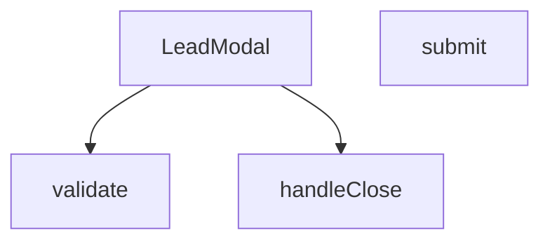

## NODE ID STANDARD

  file: src\components\LeadModal.tsx
  function: src\components\LeadModal.tsx::LeadModal
  function: src\components\LeadModal.tsx::validate
  function: src\components\LeadModal.tsx::submit
  function: src\components\LeadModal.tsx::handleClose

---

## DISA AKTARILANLAR (EXPORTS)
  export: LeadModal

---

## STİL TOKENLERİ

### Arbitrary Değerler (token'a geçirilmemiş)
Yok — tüm stiller token'a geçirilmiş. ✅

### Kullanılan Token'lar (zaten token'a geçirilmiş)
- (yok)

### Tailwind Sınıf Özeti
- **Renkler:** `bg-gradient-to-br`, `bg-gray-100`, `bg-gray-50`, `bg-gray-50/50`, `bg-green-100`, `bg-primary-navy`, `bg-secondary-blue/80`, `bg-white`, `bg-white/10`, `border-2`, `border-gray-100`, `border-gray-200`, `border-gray-300`, `border-red-400`, `border-t`
- **Layout:** `absolute`, `backdrop-blur-md`, `backdrop-blur-sm`, `block`, `fixed`, `flex`, `flex-1`, `flex-col`, `from-blue-600/20`, `gap-1`, `gap-2`, `gap-3`, `gap-4`, `gap-5`, `grid`
- **Varyant/Responsive:** `:`, `disabled:`, `focus-visible:`, `focus:`, `group-hover:`, `hover:`, `md:`, `sm:` önekleri
- **Yardımcı Sınıflar:** `${errors.name`, `-mt-2`, `:`, `animate-bounce`, `animate-in`, `animate-spin`, `border`, `cursor-pointer`, `disabled:cursor-not-allowed`, `disabled:opacity-70`, `duration-300`, `fade-in`, `focus-visible:outline-none`, `focus-visible:ring-2`, `focus-visible:ring-gray-300`

---
# FILE: src\components\LoadingSpinner.md

---
domain: general
source_type: doc
namespace_type: module
source_path: C:\Users\alize\venthub-hvac\src\components\LoadingSpinner.tsx
skeleton_hash: 1429988b8b8756c2
entity_hashes:
  func:LoadingSpinner: 420e244c3ab22ba8
  overview: 055c22213f5fb1f9
  style_tokens: b21c3354ed86bc3e
generated_at: 2026-05-28T22:36:06Z
---

## Genel Bakış
LoadingSpinner.tsx modülü, uygulama içinde veri yükleme veya işlem sırasında kullanıcıya görsel geri bildirim sağlayan basit bir yükleme animasyonu bileşenini içerir. Bileşen, boyut ve tam ekran görüntüleme seçenekleriyle özelleştirilebilir.

## Fonksiyon Grupları
### Ana Bileşen
Bu grup, LoadingSpinner bileşeninin temel tanımını ve özelliklerini içerir.
- LoadingSpinner

---

## AXIOMS – Mimari Varsayımlar
Bu modül için özel aksiyom tanımlanmamıştır.

[Aksiyom 1]: Eğer `size` prop'u verilmezse, varsayılan olarak `'md'` kullanılır.  
[Aksiyom 2]: Eğer `fullScreen` prop'u verilmezse, varsayılan olarak `true` olur.

---

## FONKSİYON DETAYLARI

### LoadingSpinner
**Ne yapar**: LoadingSpinner, bir yükleme göstergesi (spinner) render eden bir React bileşenidir.  
**Nasıl yapar**: Fonksiyon, `size` ve `fullScreen` adlı iki props'u alır; bu değerler spinner'ın boyutunu ve ekranı kaplayıp kaplamayacağını belirler. Daha sonra bu props'lara göre uygun stil ve görünümü uygulayan JSX döndürür.  
**Parametreler**:
- size: string — Spinner'ın boyutunu belirler; varsayılan değer `'md'` (medium) olur.  
- fullScreen: boolean — Spinner'ın ekranı kaplayıp kaplamayacağını belirler; varsayılan değer `true` olur.  
**Dönüş**: React.FC<LoadingSpinnerProps> — JSX elementi olarak render edilebilir bir React fonksiyonel bileşeni döndürür.

---

## INTERFACES

### LoadingSpinnerProps
- `size?: 'sm' | 'md' | 'lg'`
- `fullScreen?: boolean`

---

## AST POINTERS

### [N1_NASIL] AST Pointer: src/components/LoadingSpinner.tsx::LoadingSpinner
- **params**: size — string (default 'md'), fullScreen — boolean (default true)
- **ic_degiskenler**:
  - `t` — translation function from useI18n used for the aria-label of the spinner
  - `sizeClasses` — object mapping size strings ('sm', 'md', 'lg') to Tailwind CSS classes that set width and height
  - `spinnerElement` — JSX element rendering the spinner with the appropriate size class, border styling, spin animation, and aria-label
- **Dönüş**: React.FC<LoadingSpinnerProps> (returns JSX; if fullScreen is true, wraps spinner in a full-height flex container, otherwise returns the spinner element directly)

---

## NODE ID STANDARD

  file: src\components\LoadingSpinner.tsx
  function: src\components\LoadingSpinner.tsx::LoadingSpinner

---

## DISA AKTARILANLAR (EXPORTS)
  export: LoadingSpinner

---

## STİL TOKENLERİ

### Arbitrary Değerler (token'a geçirilmemiş)
Yok — tüm stiller token'a geçirilmiş. ✅

### Kullanılan Token'lar (zaten token'a geçirilmiş)
- (yok)

### Tailwind Sınıf Özeti
- **Renkler:** `border-2`, `border-primary-navy`, `border-t-transparent`
- **Layout:** `flex`, `inline-block`, `items-center`, `justify-center`, `min-h-400px`
- **Varyant/Responsive:** (yok)
- **Yardımcı Sınıflar:** `${sizeClasses[size]`, `animate-spin`, `rounded-full`

---
# FILE: src\components\MagneticCTA.md

---
domain: general
source_type: doc
namespace_type: module
source_path: C:\Users\alize\venthub-hvac\src\components\MagneticCTA.tsx
skeleton_hash: daf29ed42019c3f1
entity_hashes:
  func:MagneticCTA: 45285325a7d3c355
  func:onLeave: 47432f2c7853fc8a
  func:onMove: 0f9106ce87047fd0
  overview: 798bbdff09c682bc
  style_tokens: dfcd3a7af18b6331
generated_at: 2026-05-28T22:36:19Z
---

## Genel Bakış
MagneticCTA bileşeni, fare hareketlerini izleyerek bir çağrı‑eylem (CTA) öğesinin konumunu ve görünümünü dinamik olarak değiştiren, etkileşimli bir React bileşenidir. Bileşen, fare giriş ve çıkış olaylarını yöneterek kullanıcıya görsel geri bildirim ve manyetik bir efekt sunar.

## Fonksiyon Grupları
### Bileşen Tanımı
Bileşenin ana yapısını oluşturur, durumunu yönetir ve ekrana basılacak JSX'i döndürür.
- MagneticCTA

### Olay İşleyicileri
Fare hareketlerini yakalayarak bileşenin konumunu ve görünümünü tetikleyen işlevleri içerir.
- onMove, onLeave

---

## AXIOMS – Mimari Varsayımlar
Bu modül için temel varsayım: `onMove` ve `onLeave` olay işleyicilerinin, fare tabanlı etkileşimlerin doğru yönetilmesi için gerekli olay nesnelerini alacak şekilde bağlanması zorunludur.

[Aksiyom 1]: Eğer `onMove(e)` fonksiyonuna geçilen `e` parametresi geçerli bir DOM olay nesnesi (örn: `MouseEvent`) değilse veya `e.clientX` / `e.clientY` özellikleri içermiyorsa, bileşenin manyetik konum hesaplaması çalışamaz.

[Aksiyom 2]: Eğer `onLeave()` fonksiyonu fare bileşen alanını terk ettiğinde tetiklenmezse, manyetik hareket efekti sıfırlanmaz ve bileşen hatalı konumda kalır.

[Aksiyom 3]: Eğer `MagneticCTA` bileşeni bir DOM elementi içinde render edilmezse veya fare olayları dinlenebilecek bir etkileşim ortamı yoksa, hem `onMove` hem `onLeave` olayları hiç tetiklenemez.

---

## FONKSİYON DETAYLARI

### MagneticCTA
**Ne yapar**: Manyetik etki yaratan bir CTA (Call-to-Action) bileşenini render eder. Kullanıcı fare hareketlerine tepki veren interaktif bir bileşendir.

**Nasıl yapar**: React fonksiyonel bileşeni olarak tanımlanmıştır. Bileşen, içeriğinde fare olaylarını dinleyen `onMove` ve `onLeave` handler'larını kullanarak manyetik hareket efektini sağlar. DOM üzerindeki fare pozisyonuna göre bileşenin konumunu veya stilini dinamik olarak güncelleyebilir.

**Parametreler**:
- Bu bileşen harici parametre almamaktadır (props'suz bileşen)

**Dönüş**: `React.FC` — Manyetik CTA içeriğini render eden React bileşeni

### onMove
**Ne yapar**: HTMLDivElement üzerindeki fare hareketini yakalayan bir olay işleyicisi tanımlar.  
**Nasıl yapar**: Fonksiyon, bir React.MouseEvent<HTMLDivElement, MouseEvent> nesnesini alır ve bu olay üzerinden fare konumu bilgilerini kullanarak manyetik efektin hesaplanmasını sağlar.  
**Parametreler**:  
- e: React.MouseEvent<HTMLDivElement, MouseEvent> — fare hareketi olayı nesnesi  
**Dönüş**: React.MouseEventHandler<HTMLDivElement> — aynı öğe üzerinde fare hareketi işleyici olarak kullanılabilecek bir fonksiyon tipi.

### onLeave
**Ne yapar**: HTMLDivElement üzerinden fare çıktığında tetiklenen bir olay işleyicisi tanımlar.  
**Nasıl yapar**: Fonksiyon, fare öğeden çıktığında çağrılır ve manyetik efekti sıfırlayıp öğeyi varsayılan durumuna döndürmek için kullanılır.  
**Parametreler**: yok  
**Dönüş**: void (veya belirtilmemiş) — fonksiyon bir değer döndürmez.

---

## AST POINTERS

### [N1_NASIL] AST Pointer: MagneticCTA.tsx::MagneticCTA
- **params**: (parametre yok — React.FC bileşeni)
- **ic_degiskenler**:
  - `t` — `useI18n()` hook'undan dönen çeviri fonksiyonu; `t('homeCta.title')`, `t('homeCta.subtitle')`, `t('homeCta.button')` çağrılarıyla JSX içinde metinler render edilir
  - `ref` — `useRef<HTMLDivElement | null>(null)`; manyetik efekt uygulanan butonu saran div'e bağlanır, DOM erişimi için kullanılır
  - `hover` — `useState(false)` boolean durum değişkeni; fare div'in üzerindeyken `true`, ayrılınca `false` olur; `onMove` içinde erişilerek hareket hesaplamasının çalışıp çalışmayacağı kontrol edilir
  - `onMove` — `React.MouseEventHandler<HTMLDivElement>` türünde fare hareket handler'ı; fare koordinatlarına göre CSS custom property'ler (`--dx`, `--dy`) ayarlayarak butonun manyetik kayma efektini hesaplar
  - `onLeave` — fare div'den ayrılınca tetiklenen handler; CSS custom property'leri sıfırlar ve `hover` durumunu `false` yapar
- **Dönüş**: JSX (`<section>` — CTA bölümü; başlık, alt başlık ve manyetik efektli buton içerir)

---

### [N2_NASIL] AST Pointer: MagneticCTA.tsx::onMove
- **params**: `(e: React.MouseEvent<HTMLDivElement>)` — fare hareket olayı nesnesi
- **ic_degiskenler**:
  - `hover` — outer scope'tan closure ile erişilen boolean; `false` ise fonksiyon erken return ile çıkar
  - `el` — `ref.current`'ten elde edilen DOM elementi (HTMLDivElement); `null` ise erken return yapılır
  - `rect` — `el.getBoundingClientRect()` sonucu DOMRect nesnesi; elementin viewport'taki konum ve boyut bilgisini tutar (`rect.left`, `rect.top`, `rect.width`, `rect.height` kullanılır)
  - `dx` — yatay manyetik kayma mesafesi (px); `((e.clientX - rect.left) / rect.width - 0.5) * 12` formülü ile fare imlecinin element merkezine göre yatay oranı 12px aralığa ölçeklenir
  - `dy` — dikey manyetik kayma mesafesi (px); `((e.clientY - rect.top) / rect.height - 0.5) * 12` formülü ile aynı mantık dikey eksende uygulanır
- **Dönüş**: yok (yan etki: `el.style.setProperty('--dx', ...)` ve `el.style.setProperty('--dy', ...)` ile CSS custom property'leri güncellenir)

---

### [N3_NASIL] AST Pointer: MagneticCTA.tsx::onLeave
- **params**: (parametre yok)
- **ic_degiskenler**:
  - `el` — `ref.current`'ten elde edilen DOM elementi (HTMLDivElement); `null` ise erken return yapılır
- **Dönüş**: yok (yan etki: `el.style.setProperty('--dx', '0px')` ve `el.style.setProperty('--dy', '0px')` ile kayma efekti sıfırlanır; `setHover(false)` çağrısı ile hover durumu deaktif edilir)

---

### [N4_NASIL] AST Pointer: MagneticCTA.tsx::inline onClick handler
- **params**: (parametre yok)
- **ic_degiskenler**:
  - `window` — `typeof window !== 'undefined'` kontrolü ile SSR güvenliği sağlanır; `window` tanımlı ise `window.openLeadModal?.()` çağrılarak lead modal açılır
- **Dönüş**: yok (yan etki: lead modal penceresi açılır)

---


## MERMAID CALL GRAPH
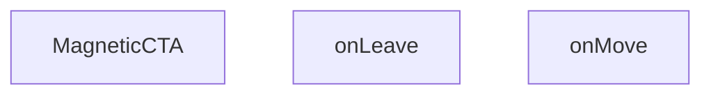

## NODE ID STANDARD

  file: src\components\MagneticCTA.tsx
  function: src\components\MagneticCTA.tsx::MagneticCTA
  function: src\components\MagneticCTA.tsx::onMove
  function: src\components\MagneticCTA.tsx::onLeave

---

## DISA AKTARILANLAR (EXPORTS)
  export: MagneticCTA

---

## STİL TOKENLERİ

### Arbitrary Değerler (token'a geçirilmemiş)
Yok — tüm stiller token'a geçirilmiş. ✅

### Kullanılan Token'lar (zaten token'a geçirilmiş)
- (yok)

### Tailwind Sınıf Özeti
- **Renkler:** `bg-gradient-to-r`, `bg-white`, `border-light-gray`, `from-primary-navy`, `text-2xl`, `text-primary-navy`, `text-white`, `text-white/90`, `to-secondary-blue`
- **Layout:** `flex`, `flex-col`, `from-primary-navy`, `gap-4`, `hover:shadow-xl`, `inline-flex`, `items-center`, `items-start`, `justify-between`, `justify-center`, `max-w-7xl`, `p-8`, `relative`, `shadow-lg`, `sm:flex-row`
- **Varyant/Responsive:** `hover:`, `lg:`, `sm:` önekleri
- **Yardımcı Sınıflar:** `border`, `font-bold`, `lg:px-8`, `mx-auto`, `px-4`, `px-8`, `py-10`, `py-4`, `rounded-2xl`, `rounded-xl`, `sm:px-6`, `transition-transform`

---
# FILE: src\components\MegaMenu.md

---
domain: general
source_type: doc
namespace_type: module
source_path: C:\Users\alize\venthub-hvac\src\components\MegaMenu.tsx
skeleton_hash: c7652019346c384d
entity_hashes:
  func:MegaMenu: 73d16c7403c0be73
  overview: 0b44495d3aab4c57
  style_tokens: 607cd2b8b83a451b
generated_at: 2026-05-28T22:36:26Z
---

## Genel Bakış
MegaMenu modülü, web sitesinin üst navigasyon bölümünde yer alan mega menü bileşenini tanımlar. Bileşen, `isOpen` ve `onClose` prop'ları aracılığıyla menünün açılıp kapanmasını dış bileşenlerden kontrol eder ve kullanıcılara geniş kapsamlı navigasyon seçenekleri sunar.

## Fonksiyon Grupları
### Ana Bileşen
Mega menünün görsel yapısını oluşturur ve görünürlük durumunu yönetir. Kullanıcı menüyü kapatmak istediğinde `onClose` callback'ini tetikleyerek üst bileşene bildirim gönderir.
- MegaMenu

---

## AXIOMS – Mimari Varsayımlar
MegaMenu component'inin doğru çalışması için `isOpen` durum kontrolü ve `onClose` işlevinin sağlanması gerekir.

[Aksiyom 1]: Eğer `isOpen` prop'u boolean değer olarak sağlanmazsa, menünün açık/kapalı durumu belirsiz olur ve component düzgün render edilemez.
[Aksiyom 2]: Eğer `onClose` prop'u fonksiyon olarak sağlanmazsa, kullanıcı menüyü kapatmak için herhangi bir yol bulamaz ve menü sürekli açık kalır.

---

## FONKSİYON DETAYLARI

### MegaMenu

**Ne yapar**: MegaMenu, projenin ana navigasyon menüsünü açılır mega menü formatında sunan bir React bileşenidir. Kullanıcının menü çubuğundaki belirli bir kategori üzerine tıklaması veya hover etmesiyle tetiklenen bu bileşen, çok sütunlu ve genişletilmiş bir navigasyon arayüzü sağlar.

**Nasıl yapar**: Bileşen, isOpen prop'u ile kontrol edilen koşullu renderlama (conditional rendering) mantığı kullanır. isOpen değeri true olduğunda menü içeriği görüntülenir, false olduğunda gizlenir veya unmount edilir. onClose callback fonksiyonu, menünün kapanma talebini üst bileşene iletir — bu genellikle menü dışına tıklama, Escape tuşu basma veya bir bağlantı seçme durumlarında tetiklenir.

**Parametreler**:
- `isOpen`: `boolean` — Mega menünün görüntülenip görüntülenmediğini kontrol eden durum bayrağı. True değerinde menü açılır ve görünür hale gelir.
- `onClose`: `() => void` — Menünün kapatılması gerektiğinde çağrılan geri çağırım (callback) fonksiyonu. Üst bileşende menü durumunu sıfırlamak için kullanılır.

**Dönüş**: `React.FC<MegaMenuProps>` — Render edilmiş mega menü yapısını içeren JSX elementi döndürür. Props tipi olarak MegaMenuProps arayüzünü kullanır.

**Bağlam**: Bu bileşen, `src/components/` dizininde konumlanmış olup projenin genel navigasyon yapısının parçasıdır. HVAC ürün kategorileri ve alt kategorileri için genişletilmiş menü deneyimi sunar.

---

## INTERFACES

### MegaMenuProps
- `isOpen: boolean`
- `onClose: () => void`

---

## AST POINTERS

### [N1_NASIL] AST Pointer: src/components/MegaMenu.tsx::MegaMenu
- **params**: `isOpen` — MegaMenu'ün açılıp açılmadığını belirten boolean, `onClose` — menüyü kapatmak için çağrılan fonksiyon
- **ic_degiskenler**:
  - `categories` — useCategories hook'undan gelen kategoriler dizisi, mega menüde gösterilecek olan kategori verileri
  - `loading` — useCategories hook'undan gelen yükleme durumu boolean'ı, kategoriler yüklenirken true olur
  - `isMounted` — bileşenin mount edilip edilmediğini takip eden state boolean'ı, client-side rendering için kullanılır
  - `setIsMounted` — isMounted state'ini güncellemek için kullanılan setter fonksiyonu
- **Dönüş**: React.ReactNode (null veya JSX)

### [N2_NASIL] AST Pointer: src/components/MegaMenu.tsx::MegaMenu/useEffect callback
- **params**: (parametre yok)
- **ic_degiskenler**:
  - `setIsMounted` — useState hook'undan gelen setter fonksiyonu, useEffect içinde true olarak çağrılır
- **Dönüş**: yok (side effect)

---

## NODE ID STANDARD

  file: src\components\MegaMenu.tsx
  function: src\components\MegaMenu.tsx::MegaMenu

---

## DISA AKTARILANLAR (EXPORTS)
  export: MegaMenu

---

## STİL TOKENLERİ

### Arbitrary Değerler (token'a geçirilmemiş)
Yok — tüm stiller token'a geçirilmiş. ✅

### Kullanılan Token'lar (zaten token'a geçirilmiş)
- (yok)

### Tailwind Sınıf Özeti
- **Renkler:** `bg-primary-navy`, `bg-slate-50/30`, `bg-white`, `border-4`, `border-b`, `border-primary-navy/20`, `border-slate-100`, `border-t-primary-navy`, `hover:bg-slate-50`, `hover:text-slate-600`, `text-lg`, `text-slate-400`, `text-slate-900`, `text-white`, `text-xs`
- **Layout:** `block`, `custom-scrollbar`, `fixed`, `flex`, `flex-1`, `flex-col`, `gap-2`, `h-6`, `h-8`, `hidden`, `items-center`, `justify-between`, `justify-center`, `max-w-7xl`, `overflow-hidden`
- **Varyant/Responsive:** `hover:`, `sm:` önekleri
- **Yardımcı Sınıflar:** `animate-in`, `animate-spin`, `duration-300`, `fade-in`, `font-bold`, `inset-0`, `mx-auto`, `px-6`, `py-20`, `py-4`, `py-8`, `rounded-full`, `rounded-lg`, `tracking-tight`, `transition-colors`

---
# FILE: src\components\ProductCard.md

---
domain: general
source_type: doc
namespace_type: module
source_path: C:\Users\alize\venthub-hvac\src\components\ProductCard.tsx
skeleton_hash: 3de726cd21c481ab
entity_hashes:
  overview: 4ebb1c4f22471a6d
  style_tokens: 19c7d9ec430fc71d
generated_at: 2026-06-06T21:55:05Z
---

## Genel Bakış
Bu modül, HVAC ürün kartlarını render eden bir React bileşenidir. `Product` nesnesinden gelen verileri (görsel, marka, fiyat) alır, yerelleştirilmiş fiyat gösterimi ve sepete ekleme işlevselliği sunar. Next.js `Link` ile ürün detay sayfasına yönlendirme sağlar ve `grid`/`list` olmak üzere iki farklı düzen seçeneğini destekler.

Bu bileşen以下 bağımlılıklar kullanır: `Product` türü, `BrandIcon`, `VentImage`, `useCart` hook'u, `useI18n` hook'u ve `formatCurrency` yardımcı fonksiyonu. `onQuickView` prop'u ile hızlı bakış işlevselliği de desteklenir.

---

## AXIOMS – Mimari Varsayımlar

Bu modül için fonksiyon gövdesi (implementation) verilmemiştir. Sağlanan bilgiler仅有 dosya yolu ve modül sabitleri olup, mimari varsayımların türetilmesi için gerekli olan **fonksiyon gövdesi** bulunmamaktadır.

---

**Not:** Mimari varsayımlar (axioms), yalnızca fonksiyon gövdesinden (implementation code) üretilebilir. Dosya yolu, modül adı veya eski doküman içeriği gibi kaynaklardan çıkarım yapılması güvenilir değildir. 

`ProductCard` bileşeninin gerçek implementasyon kodu (React component body) sağlandığında, aşağıdaki alanlarda aksiyomlar çıkarılabilir:

- Props interface zorunlulukları (hangi alanların `undefined` olamayacağı)
- `useCart` hook'unun dönüş yapısı varsayımları
- `formatCurrency` fonksiyonunun giriş koşulları
- `Product` nesnesinin minimum gerekli alanları
- `Link` bileşenine geçilen URL formatı gereksinimleri

**Öneri:** Lütfen `ProductCard.tsx` dosyasının **fonksiyon gövdesini** (component implementation) paylaşın.

---

## FONKSİYON DETAYLARI

---

## INTERFACES

### ProductCardProps
- `product: Product`
- `onQuickView?: (product: Product) => void`
- `highlightFeatured?: boolean`
- `layout?: 'grid' | 'list'`
- `priority?: boolean`
- `hidePrice?: boolean`
- `compact?: boolean`

---

## SABİTLER
- **ProductCard** (call) — `React.memo(function ProductCard({

  product,

  layout = 'grid',

  priority...`

---

## AST POINTERS

### [N1_NASIL] AST Pointer: ProductCard.tsx::onClickAddToCart
- **params**: `(e: React.MouseEvent)` — React click event nesnesi, preventDefault ve stopPropagation metotlarını içerir
- **ic_degiskenler**: []
- **Dönüş**: yok (event handler fonksiyonu, return değeri yok)

**Notlar**:
- Fonksiyon `e.preventDefault()` ile varsayılan tarayıcı olayını engeller
- Fonksiyon `e.stopPropagation()` ile olayın yukarı doğru yayılmasını engeller
- Fonksiyon `addToCart(product)` çağrısı ile ürün sepete eklenir
- `addToCart` ve `product` değişkenleri dış scope'dan closure ile gelir (fonksiyon gövdesinde tanımlı değildir)

---

## NODE ID STANDARD

  file: src\components\ProductCard.tsx

---

## STİL TOKENLERİ

### Arbitrary Değerler (token'a geçirilmemiş)
Yok — tüm stiller token'a geçirilmiş. ✅

### Kullanılan Token'lar (zaten token'a geçirilmiş)
- (yok)

### Tailwind Sınıf Özeti
- **Renkler:** `bg-gold-accent`, `bg-light-gray/30`, `bg-light-gray/50`, `bg-primary-navy`, `bg-white`, `bg-white/90`, `border-light-gray`, `border-t`, `group-hover:bg-light-gray/50`, `group-hover:text-primary-navy`, `hover:bg-secondary-blue`, `sm:text-lg`, `text-base`, `text-industrial-gray`, `text-lg`
- **Layout:** `absolute`, `backdrop-blur-sm`, `block`, `flex`, `flex-1`, `flex-col`, `flex-shrink-0`, `gap-3`, `h-11`, `h-28`, `h-9`, `h-full`, `hover:shadow-hvac-lg`, `hover:shadow-lg`, `items-baseline`
- **Varyant/Responsive:** `:`, `active:`, `focus-visible:`, `group-hover:`, `hover:`, `sm:` önekleri
- **Yardımcı Sınıflar:** `${compact`, `:`, `active:scale-95`, `aspect-square`, `border`, `duration-300`, `duration-500`, `focus-visible:outline-none`, `focus-visible:ring-2`, `focus-visible:ring-offset-2`, `focus-visible:ring-primary-navy`, `font-bold`, `font-medium`, `font-semibold`, `group`

---
# FILE: src\components\QuickViewModal.md

---
domain: general
source_type: doc
namespace_type: module
source_path: C:\Users\alize\venthub-hvac\src\components\QuickViewModal.tsx
skeleton_hash: 00d87e64807a05c6
entity_hashes:
  func:QuickViewModal: debc62013d59b5ee
  func:handleAdd: 552a96581034d630
  overview: 8af2669fbee6ab56
  style_tokens: a0d16d1087294b08
generated_at: 2026-06-06T21:54:53Z
---

## Genel Bakış
QuickViewModal, ürünlerin hızlı önizlemesini sunan bir modal bileşenidir. Ürün detaylarını görüntüler ve kullanıcıların ürünleri sepete eklemesine olanak tanır. Bileşen, modal durumunu ve kullanıcı etkileşimlerini merkezi olarak yönetir.

## Fonksiyon Grupları
### Ana Modal Bileşeni
Ürün bilgilerini modal penceresi içinde gösteren ve görünürlük durumunu kontrol eden ana UI bileşenidir.
- QuickViewModal

### Ürün Eylem Yönetimi
Kullanıcı tarafından tetiklenen ürün ekleme işlemi gibi etkileşimleri işleyen yardımcı fonksiyonlardır.
- handleAdd

---

## AXIOMS – Mimari Varsayımlar

Bu modül, props tabanlı çalışan bir React modal bileşenidir; temel varsayımları fonksiyon imzalarından türetilmiştir.

[Aksiyom 1]: Eğer `product` prop'u verilmezse veya geçerli bir ürün nesnesi içermiyorsa, modal bileşeni ürün bilgisi gösteremez ve render edilen içerik eksik veya hatalı olur.

[Aksiyom 2]: Eğer `open` prop'u verilmezse veya `false` değerindeyse, modal.visible durumu kapalıdır ve kullanıcıya modal penceresi gösterilmez.

[Aksiyom 3]: Eğer `onClose` prop'u verilmezse, kullanıcı modal'ı kapatmaya çalıştığında回调 fonksiyon tetiklenemez ve hata oluşur.

[Aksiyom 4]: `handleAdd()` fonksiyonu çağrıldığında, modal bileşeninin iç bağlamında geçerli bir `product` prop'unun mevcut olması gerekir; aksi takdirde eklenecek ürün bilinmediğinden işlem başarısız olur.

---

## FONKSİYON DETAYLARI

### QuickViewModal
**Ne yapar**: Bu bileşen, kullanıcıya seçili bir ürünün hızlı bir önizlemesini sunan bir modal penceresi oluşturur ve yönetir. Ürün detaylarını görüntülemek için kullanılan arayüz katmanıdır.
**Nasıl yapar**: `product`, `open` ve `onClose` özelliklerini (props) alarak modalın görünürlüğünü ve içeriğini kontrol eder. React bileşeni olarak, `open` durumuna göre modalı ekrana çizer ve kapatma işlemi için `onClose` metodunu tetikler.
**Parametreler**:
- product: object — Modal içinde gösterilecek olan ürünün verilerini ve özelliklerini içerir.
- open: boolean — Modal penceresinin açık olup olmadığını belirten durum değişkenidir.
- onClose: function — Modalın kapatılması gerektiğinde çalıştırılan geri çağırma (callback) fonksiyonudur.
**Dönüş**: React.FC<QuickViewModalProps> — QuickViewModal arayüzünü temsil eden bir React bileşeni döner.

### handleAdd
**Ne yapar**: Bu fonksiyon, modal içinde görüntülenen ürünü sepete veya listeye ekleme işlemini başlatır ve yönetir. Kullanıcının ekleme butonuna tıklamasıyla tetiklenen etkileşimdir.
**Nasıl yapar**: Mevcut ürün verisi üzerinde gerekli işlemleri gerçekleştirerek ürünü sisteme ekler. İçerik detayları kaynak kodunda belirtilmemiştir ancak genel olarak ekleme mantığını uygular.
**Parametreler**:
- Hiçbir parametre almaz.
**Dönüş**: void veya bilinmiyor — Herhangi bir değer döndürmez veya dönüş tipi belirtilmemiştir.

---

## INTERFACES

### QuickViewModalProps
- `product: Product | null`
- `open: boolean`
- `onClose: () => void`

---

## AST POINTERS

### [N1_NASIL] AST Pointer: QuickViewModal.tsx::QuickViewModal
- **params**: `{ product, open, onClose }` — product: Product tipinde ürün nesnesi, open: boolean modalın açık olup olmadığını belirler, onClose: callback modalı kapatmak için çağrılır
- **ic_degiskenler**:
  - `t` — useI18n hook'undan dönen çeviri fonksiyonu, UI metinlerini uluslararası dil anahtarlarıyla çevirir (t('quickView.title'), t('quickView.addToCart') vb.)
  - `lang` — useI18n hook'undan dönen aktif dil kodu, formatCurrency'e aktarılarak para birimi formatlamada kullanılır
  - `addToCart` — useCart hook'undan dönen fonksiyon, verilen Product nesnesini sepete ekler
  - `price` — Number(product.price) ile product.price'ın number tipine dönüştürülmüş hali, formatCurrency fonksiyonuna argüman olarak geçilir
- **Dönüş**: `JSX.Element | null` — open veya product falsy ise null döner; aksi halde modal JSX yapısını (dialog, ürün bilgileri, Sepete Ekle ve Ürünü Gör butonları) döner

### [N2_NASIL] AST Pointer: QuickViewModal.tsx::handleAdd
- **params**: (parametre yok)
- **ic_degiskenler**: (yok)
- **Dönüş**: yok — addToCart(product) ile ürünü sepete ekler, ardından onClose() ile modalı kapatır

---

## NODE ID STANDARD

  file: src\components\QuickViewModal.tsx
  function: src\components\QuickViewModal.tsx::QuickViewModal
  function: src\components\QuickViewModal.tsx::handleAdd

---

## DISA AKTARILANLAR (EXPORTS)
  export: QuickViewModal

---

## STİL TOKENLERİ

### Arbitrary Değerler (token'a geçirilmemiş)
Yok — tüm stiller token'a geçirilmiş. ✅

### Kullanılan Token'lar (zaten token'a geçirilmiş)
- (yok)

### Tailwind Sınıf Özeti
- **Renkler:** `bg-black/40`, `bg-gradient-to-br`, `bg-primary-navy`, `bg-white`, `border-2`, `border-b`, `border-light-gray`, `border-primary-navy`, `from-air-blue`, `hover:bg-light-gray`, `hover:bg-primary-navy`, `hover:bg-secondary-blue`, `hover:text-white`, `text-2xl`, `text-6xl`
- **Layout:** `fixed`, `flex`, `flex-1`, `flex-col`, `from-air-blue`, `gap-2`, `gap-4`, `grid`, `grid-cols-1`, `inline-flex`, `items-center`, `justify-between`, `justify-center`, `line-clamp-2`, `line-clamp-4`
- **Varyant/Responsive:** `focus-visible:`, `hover:`, `sm:` önekleri
- **Yardımcı Sınıflar:** `aspect-square`, `focus-visible:outline-none`, `focus-visible:ring-2`, `focus-visible:ring-offset-2`, `focus-visible:ring-primary-navy`, `font-bold`, `font-semibold`, `inset-0`, `mb-1`, `mb-2`, `mb-4`, `mb-6`, `mr-2`, `mt-auto`, `px-4`

---
# FILE: src\components\ScrollLinkedProcess.md

---
domain: general
source_type: doc
namespace_type: module
source_path: C:\Users\alize\venthub-hvac\src\components\ScrollLinkedProcess.tsx
skeleton_hash: c25957b394b2bf51
entity_hashes:
  func:ScrollLinkedProcess: 5a92a40886643dd7
  func:scrollTo: ee292d22ad2f3df1
  overview: a4bd4fd5da1416a4
  style_tokens: dffb84eddfacefbd
generated_at: 2026-05-28T22:36:57Z
---

## Genel Bakış
venthub-hvac projesinde kullanılan bu React modülü, kullanıcı arayüzündeki süreç adımlarını sayfa kaydırma konumuyla senkronize eden bir bileşen sunar. Temel amacı, süreç akışları boyunca kullanıcının gezinmesini kolaylaştırmak, mevcut kaydırma konumuna göre ilgili adımı odaklamaktır. Modül hem kullanıma hazır ana bileşeni hem de kaydırma işlemini yöneten yardımcı işlevi tek bir yapıda toplar.

## Fonksiyon Grupları
### Ana Süreç Bileşeni
Projede diğer bileşenler tarafından entegre edilebilen, tüm kaydırma bağlantılı süreç işlevselliğini yöneten ana React bileşenidir. Süreç akışlarını kullanıcının sayfa kaydırma eylemleriyle ilişkilendirerek sorunsuz bir gezinme deneyimi sunar.
- ScrollLinkedProcess

### Kaydırma Senkronizasyonu Yardımcısı
İstenen sıra numaralı süreç adımına otomatik kaydırma işlemini gerçekleştiren yardımcı işlevdir. Ana bileşen tarafından çağrılarak aktif kaydırma konumu ile görüntülenen süreç adımının her zaman senkronize kalmasını sağlar.
- scrollTo

---

## AXIOMS – Mimari Varsayımlar
Bu React tabanlı ScrollLinkedProcess modülü, aynı sayfa içindeki sıralı süreç adımları arasında bağlantılı kaydırma işlevi sağlar, çalışması için React runtime ortamı ve tarayıcının DOM API'lerine erişimi zorunludur.

[Aksiyom 1]: Eğer modülün çalışacağı React runtime ortamı (bileşenlerin mount edilmesine izin veren çalışma zamanı) yoksa, ScrollLinkedProcess bileşeni hiç yüklenmez, süreçler arası kaydırma işlevi hiç kullanılamaz.
[Aksiyom 2]: Eğer tarayıcının DOM kaydırma API'lerine (window.scroll, DOM elemanlarının scroll özellikleri) erişimi kısıtlanmışsa, scrollTo(i: number) fonksiyonu hedef indeksteki süreç adımına kaydırma işlemini gerçekleştiremez, kullanıcı manuel kaydırma yapmak zorunda kalır.
[Aksiyom 3]: Eğer ScrollLinkedProcess bileşeni ile eşleşen, 0'dan başlayan sıralı indekse sahip süreç adımı DOM elemanları sayfaya eklenmemişse, scrollTo fonksiyonu i parametresi ile geçerli bir hedef bulamaz, kaydırma işlemi başarısız olur.
[Aksiyom 4]: Eğer scrollTo(i: number) fonksiyonuna i olarak negatif sayı veya mevcut toplam süreç sayısından büyük bir sayı gönderilirse, modül geçersiz bir hedefe kaydırma girişiminde bulunur, ya hiç kaydırma yapmaz ya da tanımsız bir konuma kayar.

---

## FONKSİYON DETAYLARI

### ScrollLinkedProcess
**Ne yapar**: VentHub HVAC projesinde süreç adımlarını tarayıcı kaydırma hareketleriyle ilişkilendiren React bileşeni üreten bir fabrika fonksiyonudur. Proje içindeki süreç takibi arayüzlerinin aktif adımını sayfa kaydırmasıyla senkronize tutmak için özel olarak tasarlanmıştır, kullanıcıların süreç akışını takip etmesini kolaylaştırır.
**Nasıl yapar**: İçinde tarayıcının yerleşik scroll olay dinleyicilerini kullanarak sayfa üzerindeki tüm süreç adımı elementlerinin konumlarını sürekli olarak takip eder, bu konum verilerine göre o anda görünür olan aktif süreci belirleyen bir React bileşeni döndürür. Aynı zamanda bünyesinde barındırdığı scrollTo yardımcı fonksiyonu ile programlı olarak da istenen adımlara kaydırma desteği sunar.
**Parametreler**: Herhangi bir giriş parametresi almaz.
**Dönüş**: React.FC tipi, proje içinde doğrudan kullanılabilecek bir React fonksiyonel bileşeni döndürür. Bu dönen bileşen, süreç adımlarını listeleyip tüm kaydırma hareketleriyle sürekli senkronize çalışan bir arayüz sunar.

### scrollTo
**Ne yapar**: ScrollLinkedProcess bileşeni bünyesinde çalışan, verilen indeksteki süreç adımına programlı olarak sayfayı kaydıran yardımcı fonksiyondur. Kullanıcıların ara yüzdeki gezinme butonları veya benzeri etkileşimler aracılığıyla istedikleri süreç adımına hızlıca geçmesini sağlamak amacıyla geliştirilmiştir.
**Nasıl yapar**: DOM ağacında ilgili indeksteki süreç adımı elementinin konum verilerini çeker, tarayıcının yerleşik kaydırma API'lerini kullanarak sayfayı ilgili elementin konumuna taşır. Aynı zamanda ScrollLinkedProcess'in yönettiği aktif adım durumunu da güncelleyerek arayüzdeki aktif adım göstergesinin doğru şekilde çalışmasını garanti eder.
**Parametreler**:
- i: number — Kaydırma işleminin hedefi olan süreç adımının sıfır tabanlı sıra numarasını (indeks) tutan sayı tipi değer
**Dönüş**: void, herhangi bir değer döndürmez, yalnızca kaydırma işlemini ve ilgili durum güncellemelerini gerçekleştirir.

---

## AST POINTERS

### [N1_NASIL] AST Pointer: C:\Users\alize\venthub-hvac\src\components\ScrollLinkedProcess.tsx::ScrollLinkedProcess
- **params**: (parametre yok)
- **ic_degiskenler**:
  - `t` — useI18n hook'undan alınan çeviri fonksiyonu, tüm UI metinlerinin çevirisini getirmek için kullanılır
  - `active` — görünür haldeki adımın indeksini tutan state değişkeni, kenar çubuğu butonlarının stillendirilmesinde kullanılır
  - `setActive` — `active` state'ini güncellemek için kullanılan state setter fonksiyonu
  - `refs` — tüm ana içerik adım bölümlerinin DOM referanslarını tutan useRef nesnesi, scroll ve IntersectionObserver işlemleri için kullanılır
  - `STEPS` — tüm süreç adımlarının anahtar, başlık, açıklama verilerini içeren sabit dizi, kenar çubuğu ve ana içerik oluşturulurken kullanılır
- **Dönüş**: JSX React elementi (scroll bağlı süreç bölümünü oluşturan bileşen çıktısı)

### [N2_NASIL] AST Pointer: C:\Users\alize\venthub-hvac\src\components\ScrollLinkedProcess.tsx::useEffect_cleanup
- **params**: (parametre yok)
- **ic_degiskenler**:
  - `io` — Bileşen mount edilirken oluşturulan IntersectionObserver instance'ı, bileşen unmount olurken observer'ı kapatmak için kullanılır
- **Dönüş**: yok

### [N3_NASIL] AST Pointer: C:\Users\alize\venthub-hvac\src\components\ScrollLinkedProcess.tsx::io_observer_callback
- **params**: [entries: IntersectionObserverEntry[]]
- **ic_degiskenler**:
  - `sections` — Geçerli tüm DOM referanslarından oluşan HTMLDivElement dizisi, hedef bölümün indeksini bulmak için kullanılır
  - `setActive` — Görünen bölüm tespit edildiğinde aktif adım state'ini güncellemek için kullanılan state setter
- **Dönüş**: yok

### [N4_NASIL] AST Pointer: C:\Users\alize\venthub-hvac\src\components\ScrollLinkedProcess.tsx::entries_forEach_callback
- **params**: [e: IntersectionObserverEntry]
- **ic_degiskenler**:
  - `sections` — Tüm geçerli DOM bölümlerinden oluşan dizi, hedef bölümün indeksini bulmak için kullanılır
  - `setActive` — Görünen bölümün indeksi ile aktif adım state'ini güncellemek için kullanılan setter
- **Dönüş**: yok

### [N5_NASIL] AST Pointer: C:\Users\alize\venthub-hvac\src\components\ScrollLinkedProcess.tsx::scrollTo
- **params**: [i: number]
- **ic_degiskenler**:
  - `refs.current[i]` — `i` indeksli ana içerik bölümünün DOM referansı, o bölüme yumuşak kaydırma yapmak için kullanılır
- **Dönüş**: yok

### [N6_NASIL] AST Pointer: C:\Users\alize\venthub-hvac\src\components\ScrollLinkedProcess.tsx::steps_map_sidebar_button_callback
- **params**: [s: STEPS öğesi nesnesi, i: number]
- **ic_degiskenler**:
  - `s.key` - React listesi için benzersiz anahtar değeri
  - `s.title` - Kenar çubuğu butonunun başlık metni
  - `s.desc` - Kenar çubuğu butonunun açıklama metni
  - `i` - Adımın sıralama indeksi
  - `active` - Şu anki aktif adımın indeksi, butonun stillendirilmesinde kullanılır
  - `scrollTo` - Butona tıklandığında ilgili ana içerik bölümüne kaydırmak için çağrılan fonksiyon
- **Dönüş**: JSX buton elementi

### [N7_NASIL] AST Pointer: C:\Users\alize\venthub-hvac\src\components\ScrollLinkedProcess.tsx::steps_map_main_section_callback
- **params**: [s: STEPS öğesi nesnesi, i: number]
- **ic_degiskenler**:
  - `s.key` - React listesi için benzersiz anahtar değeri
  - `el` - Oluşturulan bölüm div'inin DOM referansı
  - `refs.current[i]` - `i` indeksli bölümün referansını saklamak için atanan değişken
  - `s.title` - Bölüm başlık metni
  - `s.desc` - Bölüm açıklama metni
  - `t` - Çeviri fonksiyonu, adım numarası ön ekini almak için kullanılır
- **Dönüş**: JSX bölüm div elementi

---

## NODE ID STANDARD

  file: src\components\ScrollLinkedProcess.tsx
  function: src\components\ScrollLinkedProcess.tsx::ScrollLinkedProcess
  function: src\components\ScrollLinkedProcess.tsx::scrollTo

---

## DISA AKTARILANLAR (EXPORTS)
  export: ScrollLinkedProcess

---

## STİL TOKENLERİ

### Arbitrary Değerler (token'a geçirilmemiş)
Yok — tüm stiller token'a geçirilmiş. ✅

### Kullanılan Token'lar (zaten token'a geçirilmiş)
- (yok)

### Tailwind Sınıf Özeti
- **Renkler:** `bg-primary-navy/5`, `bg-white`, `border-light-gray`, `border-primary-navy`, `hover:bg-gray-50`, `md:text-3xl`, `text-2xl`, `text-industrial-gray`, `text-left`, `text-primary-navy`, `text-sm`, `text-steel-gray`, `text-xl`, `text-xs`
- **Layout:** `gap-6`, `grid`, `grid-cols-1`, `lg:col-span-1`, `lg:col-span-3`, `lg:grid-cols-4`, `max-w-7xl`, `p-6`, `shadow-sm`, `sticky`, `top-20`, `w-full`
- **Varyant/Responsive:** `:`, `hover:`, `lg:`, `md:`, `sm:` önekleri
- **Yardımcı Sınıflar:** `${i`, `:`, `===`, `active`, `border`, `font-bold`, `font-semibold`, `lg:px-8`, `mb-1`, `mb-2`, `mb-6`, `mx-auto`, `px-3`, `px-4`, `py-12`

---
# FILE: src\components\ScrollToTop.md

---
domain: general
source_type: doc
namespace_type: module
source_path: C:\Users\alize\venthub-hvac\src\components\ScrollToTop.tsx
skeleton_hash: b72ab5d4ecf79309
entity_hashes:
  func:ScrollToTop: 67a45bb41004286e
  overview: 3fbf0b01314ba145
  style_tokens: dd5ed8d0f58dcf57
generated_at: 2026-05-28T22:37:05Z
---

## Genel Bakış
Venthub HVAC projesinin ön yüzünde yer alan ScrollToTop modülü, React tabanlı bir kullanıcı arayüzü bileşenidir. Uygulama içindeki yönlendirme (rota) değişikliklerini algılayarak pencerenin kaydırma konumunu otomatik olarak sayfanın en üstüne taşır, böylece yeni sayfa içeriği her zaman en baştan görüntülenerek kullanıcı deneyimi iyileştirilir.

## Fonksiyon Grupları
### Ana Kaydırma Yönetimi Bileşeni
Modülün tüm sorumluluğunu üstlenen tek ana bileşendir, uygulama içindeki rota değişikliklerini dinleyerek pencerenin kaydırma konumunu sıfırlar. Yeni sayfa yüklendiğinde kullanıcının içeriğe en baştan başlamasını sağlayacak şekilde çalışır.
- ScrollToTop

---

## AXIOMS – Mimari Varsayımlar

Bu modül, React rota (routing) sistemiyle birlikte çalışarak sayfa değişimlerinde kaydırma pozisyonunu sıfırlayan bir UI bileşenidir. Aşağıdaki varsayımlar, fonksiyon gövdesinden ve eski dokümandan türetilen yapısal gerekliliklerdir.

**[Aksiyom 1]:** Eğer React Router (`useLocation` veya eşdeğeri) bağlamı mevcut değilse, bileşen rota değişikliklerini algılayamaz ve kaydırma sıfırlama işlemi hiçbir zaman tetiklenmez.

**[Aksiyom 2]:** Eğer `window` nesnesi veya DOM erişimi (tarayıcı ortamı) yoksa, bileşen kaydırma konumunu (`window.scrollTo` veya `scrollTop`) değiştiremez ve sayfa en üste taşınmaz.

**[Aksiyom 3]:** Eğer bileşen React Hook yaşam döngüsünün (`useEffect`) dışında render edilirse veya uygun bağımlılık dizisi (dependency array) sağlanmazsa, rota değişiklikleri dinlenemez; yalnızca ilk yüklemede kaydırma gerçekleştirilir.

**[Aksiyom 4]:** Eğer bileşen `<Router>` veya `<BrowserRouter>` hiyerarşisi dışında mount edilirse, rota bağlamı (`location`) boş veya geçersiz olur ve kaydırma sıfırlama tetiklenemez.

---

## FONKSİYON DETAYLARI

### ScrollToTop
**Ne yapar**: Uygulama içerisindeki rota değişiklikleri sırasında sadece tarayıcı geçmişine yeni bir giriş ekleyen PUSH tipi rota aksiyonlarında sayfayı anında en üste kaydırır. Geri dönüş gibi POP tipi rota değişikliklerinde hiçbir işlem yapmaz, tarayıcının kendi yerleşik kaydırma konumu geri yükleme (native scroll restorasyon) özelliğinin sorunsuz çalışmasına izin verir. Bu sayede yeni sayfalara geçildiğinde kullanıcılar sayfanın en başından başlamayı, önceki sayfalara döndüğünde ise kaldıkları konumdan devam etmeyi deneyimler.
**Nasıl yapar**: Rota değişikliklerini sürekli dinleyen bir yapı üzerinden çalışır, gelen değişikliğin aksiyon türünü ayırt ederek işlem akışını yönlendirir. Sadece PUSH tipi aksiyonlar algılandığında pencereyi 0, 0 koordinatlarına kaydırma işlemini tetikler, POP tipi aksiyonlarda herhangi bir scroll manipülasyonu yapmaz. Bu yaklaşım, modern tek sayfa uygulamalarında sıkça karşılaşılan tutarsız kaydırma konumu sorunlarını ortadan kaldırmak için tasarlanmıştır.
**Parametreler**:
- Herhangi bir parametre almaz. Fonksiyon kendi çalışma mantığını dahili rota dinleme mekanizmasından edindiği verilerle yürütür, harici bir giriş parametresi gerektirmez.
**Dönüş**: Dönüş tipi belirsizdir, muhtemelen void olarak tanımlanmıştır. Fonksiyon herhangi bir değer döndürmez, tek yan etkisi PUSH tipi rota değişikliklerinde tetiklediği pencere kaydırma işlemidir, başka bir işlemde kullanılmak üzere herhangi bir veri veya nesne üretmez.

---

## AST POINTERS

### [N1_NASIL] AST Pointer: C:\Users\alize\venthub-hvac\src\components\ScrollToTop.tsx::ScrollToTop
- **params**: (parametre yok)
- **ic_degiskenler**:
  - `pathname` — Next.js `usePathname` hook'u ile alınan mevcut sayfanın yol değeri, useLayoutEffect bağımlılık listesinde kullanılarak yol değiştiğinde efektin tetiklenmesini sağlar
  - `usePathname` — Next.js'in aktif sayfa yolunu almak için çağrılan hook fonksiyonu
  - `useLayoutEffect` — React'in DOM güncellemelerinden hemen sonra çalışan efekt hook'u, pathname değiştiğinde scroll sıfırlama işlemini yönetmek için kullanılır
  - `[pathname]` — useLayoutEffect'in bağımlılık dizisi, yalnızca pathname değiştiğinde efektin yeniden çalışmasını sağlar
- **Dönüş**: null, React bileşeni olarak herhangi bir DOM öğesi render etmez

---

## NODE ID STANDARD

  file: src\components\ScrollToTop.tsx
  function: src\components\ScrollToTop.tsx::ScrollToTop

---

## DISA AKTARILANLAR (EXPORTS)
  export: ScrollToTop

---

## STİL TOKENLERİ

### Arbitrary Değerler (token'a geçirilmemiş)
Yok — tüm stiller token'a geçirilmiş. ✅

### Kullanılan Token'lar (zaten token'a geçirilmiş)
- (yok)

### Tailwind Sınıf Özeti
- **Renkler:** (yok)
- **Layout:** (yok)
- **Varyant/Responsive:** (yok)
- **Yardımcı Sınıflar:** (yok)

---
# FILE: src\components\SearchOverlay.md

---
domain: general
source_type: doc
namespace_type: module
source_path: C:\Users\alize\venthub-hvac\src\components\SearchOverlay.tsx
skeleton_hash: 2f0a59f783f085c9
entity_hashes:
  func:SearchOverlay: 5877a83b84daa2a4
  func:addToRecent: bf8c952c533ee587
  func:handleClose: 5443cae55c424b9f
  func:handleKeyDown: 1487e8d647499b5f
  func:performFullSearch: ffbaaa64876e5226
  func:renderIdle: ceb6e27699bb9c05
  func:renderResults: e506feef4e55d367
  func:renderSuggestion: 843bcfdde37f5fbe
  func:renderSuggestions: 8f7a31a904a04209
  overview: f95e78ddd93210c7
  style_tokens: dd6869457e23a7f7
generated_at: 2026-06-06T21:55:25Z
---

## Genel Bakış
SearchOverlay, arama işlevselliği için bir arayüz katmanı (overlay) sunan bir React bileşenidir. Kullanıcının arama terimi girmesini sağlar, gerçek zamanlı öneriler sunar, son aramaları hatırlar ve tam arama sonuçlarını gösterir. Modül, arama sürecinin tüm aşamalarını, kullanıcı etkileşimlerini ve ilgili arayüz durumlarını yönetir.

## Fonksiyon Grupları
### Ana Bileşen ve Görünürlük Yönetimi
Bu grup, arama arayüzünün açılıp kapanmasını ve genel bileşen yaşam döngüsünü kontrol eder.
- SearchOverlay, handleClose

### Arama İşlemleri ve Mantık
Kullanıcının arama girişini işleyen, arama sonuçlarını getiren ve arama geçmişini güncelleyen fonksiyonları içerir.
- performFullSearch, addToRecent

### Kullanıcı Etkileşimi ve Olay Yönetimi
Kullanıcının klavye gibi giriş eylemlerini yakalayarak arama tetikleme gibi aksiyonlara yönlendiren fonksiyonları kapsar.
- handleKeyDown

### Arayüz Görüntüleme Yardımcıları
Arama arayüzünün farklı durumlarını (boş durum, öneriler, sonuç listesi) oluşturan ve sunan bileşen parçalarını yönetir.
- renderSuggestion, renderIdle, renderSuggestions, renderResults

---

## AXIOMS – Mimari Varsayımlar

Bu modül için gerekli mimari varsayımlar fonksiyon imzalarından türetilmiştir.

**[Aksiyom 1]:** Eğer `open` prop'u bileşene sağlanmazsa, SearchOverlay'ün hangi durumda render edileceği belirsiz olur ve bileşen görünürlülük kontrolünü kaybeder.

**[Aksiyom 2]:** Eğer `onClose` callback prop'u sağlanmazsa, overlay kapatılamaz ve kullanıcı arama arayüzünde sıkışık kalır.

**[Aksiyom 3]:** Eğer `addToRecent(term: string)` fonksiyonunun kullanabileceği bir depolama mekanizması (state veya external storage) yoksa, son aramalar saklanamaz ve renderIdle() fonksiyonu geçmiş arama önerilerini gösteremez.

**[Aksiyom 4]:** Eğer `performFullSearch(term: string)` tarafından çağrılabilir bir arama servisi/API'si yoksa, tam arama sonuçları oluşturulamaz ve renderResults() boş veya hatalı sonuç döndürür.

**[Aksiyom 5]:** Eğer `SearchSuggestion` tipi (renderSuggestion parametresinde beklenen) tanımlı değilse veya gerekli alanları içermiyorsa, renderSuggestion() fonksiyonu öneri öğelerini doğru şekilde render edemez.

**[Aksiyom 6]:** Eğer `handleKeyDown(e: React.KeyboardEvent)` bir klavye etkileşimine sahip DOM elemanına (input vs.) bağlanmazsa, tuş olayları yakalanamaz ve arama tetikleme/kapatma işlemleri çalışmaz.

**[Aksiyom 7]:** Eğer `performFullSearch` ve `addToRecent` aynı terim formatında çalışamazsa (örn: boş string kontrolü), geçersiz arama terimleri sisteme kaydedilir veya işlenir.

---

## FONKSİYON DETAYLARI

### SearchOverlay
**Ne yapar**: Arama çubuğu için bir üst katman (overlay) bileşeni oluşturur ve `open` durumu ile `onClose` geri çağrısını yönetir.  
**Nasıl yapar**: React fonksiyonel bileşeni olarak tanımlanır; `open` prop’u overlay’in görünürlüğünü kontrol eder, `onClose` ise kapanma eylemini tetikler. İçerik ve etkileşim mantığı diğer yardımcı fonksiyonlar tarafından sağlanır.  
**Parametreler**:
- `open`: boolean — Overlay’in açık/kapalı durumunu belirler.  
- `onClose`: () => void — Overlay kapandığında çalıştırılacak geri çağrı fonksiyonu.  
**Dönüş**: React.FC\<SearchOverlayProps\> — Belirtilen props tipine sahip bir React fonksiyonel bileşeni döndürür.

### handleClose
**Ne yapar**: Klavye olaylarını dinleyerek arama overlay’ini kapatır ve gezinme/arama akışını yönetir.  
**Nasıl yapar**: Gelen `React.KeyboardEvent` nesnesinin `key` özelliğine bakar; `Escape` tuşu basıldığında overlay’i kapatır, `ArrowDown` ve `ArrowUp` tuşlarıyla aktif öneri indeksini günceller, `Enter` tuşu ile seçili öneri ya da sonuç üzerinden yönlendirme yapar ya da tam arama başlatır.  
**Parametreler**:
- `e`: React.KeyboardEvent — Kullanıcıdan gelen klavye olayı.  
**Dönüş**: void — İşlevi tamamladıktan sonra bir değer döndürmez.

### addToRecent
**Ne yapar**: Kullanıcının arama terimini son aramalara ekler.  
**Nasıl yapar**: Verilen terimi (örnek kodda `q`) alır ve muhtemelen bir geçmiş listesine kaydeder; aynı zamanda ilgili yönlendirme ve kapanma işlemlerini tetikler.  
**Parametreler**:
- `term`: string — Son aramalara eklenmek istenen arama ifadesi.  
**Dönüş**: void — İşlem tamamlandığında bir değer döndürmez.

### performFullSearch
**Ne yapar**: Tam metin araması başlatır.  
**Nasıl yapar**: Gelen arama terimini durum (`q`) olarak ayarlar ve aynı terimle tam arama fonksiyonunu (muhtemelen kendisini) çağırır.  
**Parametreler**:
- `term`: string — Aranacak tam metin ifadesi.  
**Dönüş**: void — İşlev bir sonuç döndürmez.

### handleKeyDown
**Ne yapar**: Klavye tuşlarına göre arama overlay’inde gezinme ve eylem tetikleme sorumluluğu taşır.  
**Nasıl yapar**: (Kod içeriği verilmemiştir; genellikle `handleClose` benzeri bir mantıkla tuşları kontrol eder.)  
**Parametreler**:
- `e`: React.KeyboardEvent — Kullanıcıdan gelen klavye olayı.  
**Dönüş**: void — İşlem sonrası bir değer döndürmez.

### renderSuggestion
**Ne yapar**: Tek bir arama önerisini görsel olarak oluşturur.  
**Nasıl yapar**: (Kod içinde aynı fonksiyona yeniden çağrı yapılmış; gerçek render mantığı burada tanımlanmamış.)  
**Parametreler**:
- `s`: SearchSuggestion — Görüntülenecek öneri nesnesi.  
- `idx`: number — Önerinin listedeki indeksi.  
**Dönüş**: void — Görsel çıktı üretir, ancak dönüş değeri yoktur.

### renderIdle
**Ne yapar**: Arama overlay’i boş (idle) durumundayken gösterilecek içeriği üretir.  
**Nasıl yapar**: (Kod içeriği sağlanmamıştır.)  
**Parametreler**: Yok.  
**Dönüş**: void — Görsel bir eleman döndürür.

### renderSuggestions
**Ne yapar**: Öneri listesini (suggestions) render eder.  
**Nasıl yapar**: (Kod içeriği eksiktir; muhtemelen `renderSuggestion` fonksiyonunu döngü içinde çağırır.)  
**Parametreler**: Yok.  
**Dönüş**: void — Öneri elemanlarını ekrana yerleştirir.

### renderResults
**Ne yapar**: Arama sonuçlarını (results) ekranda gösterir.  
**Nasıl yapar**: (Kod içeriği verilmemiştir; genellikle sonuç dizisini map ederek her birini render eder.)  
**Parametreler**: Yok.  
**Dönüş**: void — Sonuç elemanlarını üretir.

---

## INTERFACES

### SearchOverlayProps
- `open: boolean`
- `onClose: () => void`

---

## TYPE ALIASES

### ViewState
```typescript
type ViewState = 'IDLE' | 'SUGGESTING' | 'RESULTS'
```

---

## AST POINTERS

### [N1_NASIL] AST Pointer: src/components/SearchOverlay.tsx::SearchOverlay
- **params**: `{ open, onClose }` — `open` modal'ın açık olup olmadığını belirtir (boolean), `close` modal'ı kapatmak için callback
- **ic_degiskenler**:
  - `q` — kullanıcının arama inputuna yazdığı ham metin (useState)
  - `debounced` — `q`'nun 200ms gecikmeli hali, debounce amaçlı kullanılır (useState)
  - `recentSearches` — localStorage'dan yüklenen son arama terimleri listesi (useState)
  - `activeIndex` — klavye navigasyonunda seçili olan öneri/sonuç indeksi, -1 hiçbir şey seçilmediğini gösterir (useState)
  - `viewState` — mevcut görünüm modu: `'IDLE'`, `'SUGGESTING'` veya `'RESULTS'` (useState)
  - `suggestions` — arama önerileri listesi, `getSearchSuggestions` API'sinden dönen veriler (useState)
  - `results` — tam arama sonuçları listesi, `ftsSearchProducts` API'sinden dönen FTSProductResult[] (useState)
  - `loading` — arama isteği sırasında true olan yükleme durumu flag'i (useState)
  - `error` — arama sırasında oluşan hata mesajı (useState)
  - `inputRef` — arama inputuna programatik odaklanmak için ref
  - `listRef` — öneri/sonuç listesinin DOM referansı, `scrollIntoView` için kullanılır
  - `globalCategories` — `useCategories()` context'inden gelen tüm kategoriler listesi
  - `popularCategories` — `globalCategories` içinden `parent_id`'si olmayan ilk 5 üst kategori, Idle ekranında gösterilir
  - `t` — `useI18n()` hook'undan dönen çeviri fonksiyonu
  - `router` — `useRouter()` hook'undan dönen Next.js router nesnesi, sayfa yönlendirmeleri için
- **Dönüş**: `React.FC<SearchOverlayProps>` — SearchOverlay modal bileşeninin JSX yapısı

---

### [N2_NASIL] AST Pointer: src/components/SearchOverlay.tsx::handleClose
- **params**: (yok)
- **ic_degiskenler**: (yok)
- **Dönüş**: yok — tüm state'leri sıfırlar (`setQ`, `setResults`, `setSuggestions`, `setViewState`, `setActiveIndex`) ve `onClose()` callback'ini çağırarak modal'ı kapatır

---

### [N3_NASIL] AST Pointer: src/components/SearchOverlay.tsx::addToRecent
- **params**: `term: string` — kaydedilecek arama terimi
- **ic_degiskenler**:
  - `next` — terimi başa ekleyip duplicate'leri filtreleyen ve en fazla 5 eleman tutan güncellenmiş arama terimleri dizisi
- **Dönüş**: yok — `recentSearches` state'ini günceller ve `localStorage.setItem` ile `RECENT_SEARCHES_KEY` altına JSON olarak kalıcı olarak saklar

---

### [N4_NASIL] AST Pointer: src/components/SearchOverlay.tsx::performFullSearch
- **params**: `term: string` — aranacak tam arama terimi
- **ic_degiskenler**:
  - `rows` — `ftsSearchProducts(term, 20)` API çağrısından dönen tam arama sonuçları dizisi (FtsProductResult[])
- **Dönüş**: yok — `setLoading(true)` ile yükleme başlatır, `setError(null)` ile hatayı temizler, `setViewState('RESULTS')` ile görünümü sonuç moduna alır, `addToRecent(term)` ile terimi son aramalara ekler, `setActiveIndex(-1)` ile seçimi sıfırlar, dinamik import ile `ftsSearchProducts` servisini yükler, sonuçları `setResults(rows)` ile state'e yazar, hata durumunda `setError(...)` ile hata mesajı ayarlar, finally bloğunda `setLoading(false)` ile yükleme bitirir

---

### [N5_NASIL] AST Pointer: src/components/SearchOverlay.tsx::handleKeyDown
- **params**: `e: React.KeyboardEvent` — tuş basma olayı nesnesi
- **ic_degiskenler**:
  - `maxIndex` — navigasyon yapılabilecek son indeks, `viewState`'e göre `suggestions.length - 1` veya `results.length - 1` veya `-1` olarak hesaplanır
- **Dönüş**: yok — `Escape` tuşunda `handleClose()` çağırır, `ArrowDown` ile `activeIndex`'i artırır, `ArrowUp` ile azaltır, `Enter` tuşunda seçili öğe varsa ilgili URL'e `router.push` ile navigasyon yapar (`suggestions` durumunda `s.url`, `results` durumunda `Routes.product(res.slug!)`), öğe seçilmediyse `performFullSearch(q)` çağırarak tam arama başlatır

---

### [N6_NASIL] AST Pointer: src/components/SearchOverlay.tsx::renderSuggestion
- **params**: `s: SearchSuggestion` — tek bir arama önerisi nesnesi, `idx: number` — önerinin listedeki indeksi
- **ic_degiskenler**:
  - `isActive` — `idx === activeIndex` karşılaştırmasıyla hesaplanan bu önerinin seçili olup olmadığını belirten boolean
  - `icon` — `s.type`'a (`'product'`, `'category'`, `'brand'`) göre JSX ile oluşturulmuş ikon bileşeni; ürün tipinde `image_url` varsa `<Image>` ile görsel, yoksa SVG kutu ikonu; kategori tipinde grid ikonu; marka tipinde tag ikonu
  - `label` — marka ise `t('search.brandPrefix')` prefix'i eklenmiş, diğer tiplerde doğrudan `s.label` olan gösterilecek metin
- **Dönüş**: yok (JSX döndürür) — `<button>` JSX'i döndürür; `onMouseEnter` ile `setActiveIndex(idx)` çağırır, `onClick` ile `router.push(s.url)` ve `addToRecent(q)` ve `handleClose()` çağırır; `highlightMatch(label, debounced)` ile arama terimini vurgular; ürün tipinde `(s.metadata as Record<string, string>)?.sku` ve `brand` bilgilerini gösterir

---

### [N7_NASIL] AST Pointer: src/components/SearchOverlay.tsx::renderIdle
- **params**: (yok)
- **ic_degiskenler**: (yok)
- **Dönüş**: yok (JSX döndürür) — Boş arama ekranını render eder; `recentSearches` listesi varsa her terimi `<button>` olarak gösterir, tıklandığında `setQ(term)` ve `performFullSearch(term)` çağırır; "Temizle" butonu `setRecentSearches([])` ve `localStorage.removeItem(RECENT_SEARCHES_KEY)` ile geçmişi siler; `popularCategories` listesini `cat.id`, `cat.slug`, `cat.name` erişimleriyle buton olarak gösterir, fallback olarak hardcoded dizin (`fans`, `air-curtains`, `heat-recovery-units`) kullanır; her kategori butonu `getCategoryIcon(cat.slug)` ve `Routes.category(cat.slug)` ile ikon ve yönlendirme sağlar

---

### [N8_NASIL] AST Pointer: src/components/SearchOverlay.tsx::renderSuggestions
- **params**: (yok)
- **ic_degiskenler**: (yok)
- **Dönüş**: yok (JSX döndürür) — `suggestions.length === 0` ise "Sonuç bulunamadı" ekranı render eder, `performFullSearch(debounced)` butonu sunar; aksi halde `listRef` reference'ına bağlı `<div>` içinde `suggestions.map((s, idx) => renderSuggestion(s, idx))` ile her öneriyi render eder, altına `performFullSearch(debounced)` ile tüm sonuçları görme butonu ekler

---

### [N9_NASIL] AST Pointer: src/components/SearchOverlay.tsx::renderResults
- **params**: (yok)
- **ic_degiskenler**:
  - `hasFuzzy` — `results.some(r => r.is_fuzzy_match)` ile hesaplanan, sonuçların arasında fuzzy eşleşme olup olmadığını belirten boolean
- **Dönüş**: yok (JSX döndürür) — `results.length === 0` ise "Sonuç bulunamadı" ekranı render eder; `hasFuzzy` true ise sarı arka planlı fuzzy eşleşme uyarısı banner'ı gösterir; `results.map((r, idx) => {...})` ile her sonucu render eder; her sonuç butonunda `r.image_url` varsa `<Image>` ile görsel, yoksa placeholder SVG; `r.name`, `r.brand`, `r.sku` alanlarını `highlightMatch` ile vurgulanmış şekilde gösterir; `isActive` durumuna göre stil değişikliği uygular; `onClick` ile `router.push(Routes.product(r.slug!))` ve `handleClose()` çağırır; `onMouseEnter` ile `setActiveIndex(idx)` navigasyonunu tetikler

---


## MERMAID CALL GRAPH
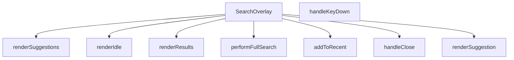

## NODE ID STANDARD

  file: src\components\SearchOverlay.tsx
  function: src\components\SearchOverlay.tsx::SearchOverlay
  function: src\components\SearchOverlay.tsx::handleClose
  function: src\components\SearchOverlay.tsx::addToRecent
  function: src\components\SearchOverlay.tsx::performFullSearch
  function: src\components\SearchOverlay.tsx::handleKeyDown
  function: src\components\SearchOverlay.tsx::renderSuggestion
  function: src\components\SearchOverlay.tsx::renderIdle
  function: src\components\SearchOverlay.tsx::renderSuggestions
  function: src\components\SearchOverlay.tsx::renderResults

---

## DISA AKTARILANLAR (EXPORTS)
  export: SearchOverlay

---

## STİL TOKENLERİ

### Arbitrary Değerler (token'a geçirilmemiş)
Yok — tüm stiller token'a geçirilmiş. ✅

### Kullanılan Token'lar (zaten token'a geçirilmiş)
- (yok)

### Tailwind Sınıf Özeti
- **Renkler:** `bg-air-blue/10`, `bg-amber-50`, `bg-gray-100`, `bg-gray-50`, `bg-red-50`, `bg-slate-50`, `bg-slate-900/40`, `bg-transparent`, `bg-white`, `border-amber-100`, `border-b`, `border-gray-100`, `border-gray-200`, `border-primary-ocean/30`, `border-slate-100`
- **Layout:** `absolute`, `backdrop-blur-sm`, `custom-scrollbar`, `fixed`, `flex`, `flex-1`, `flex-col`, `flex-shrink-0`, `flex-wrap`, `gap-1`, `gap-1.5`, `gap-2`, `gap-3`, `gap-4`, `h-10`
- **Varyant/Responsive:** `:`, `focus-visible:`, `focus:`, `group-hover:`, `hover:`, `placeholder:`, `sm:`, `xs:` önekleri
- **Yardımcı Sınıflar:** `${isActive`, `:`, `animate-in`, `animate-spin`, `border`, `cursor-pointer`, `divide-gray-100`, `divide-y`, `duration-200`, `duration-300`, `fade-in`, `focus-visible:outline-none`, `focus-visible:ring-2`, `focus-visible:ring-primary-navy`, `font-bold`

---
# FILE: src\components\SecurityRibbon.md

---
domain: general
source_type: doc
namespace_type: module
source_path: C:\Users\alize\venthub-hvac\src\components\SecurityRibbon.tsx
skeleton_hash: 280aae49acbb2909
entity_hashes:
  func:SecurityRibbon: a7c5f379d943c103
  overview: 549cf1e90e5e7dc2
  style_tokens: 3e379506fde07599
generated_at: 2026-05-28T22:36:58Z
---

## Genel Bakış
Bu modül, Venthub HVAC platformunda kullanılmak üzere geliştirilmiş React tabanlı bir kullanıcı arayüzü bileşeni barındırır. Platformun güvenilirliğini ve ödeme güvenliğini vurgulamak için tasarlanan güvenlik şeridi/banner bileşeni, farklı kullanım senaryolarına göre özelleştirilebilir şekilde çalışır.

## Fonksiyon Grupları
### Ana Güvenlik Şeridi Bileşeni
Modülün temel sorumluluğunu üstlenen bu bileşen, marka ismi, ödeme sağlayıcısı ismi ve görünüm varyantı gibi parametreler alarak ihtiyaca uygun güvenlik bannerı oluşturur.
- SecurityRibbon

---

## AXIOMS – Mimari Varsayımlar
React tabanlı SecurityRibbon UI bileşeni, marka ve ödeme sağlayıcısı bilgilerini kullanıcıya göstermek üzere tasarlanmış güvenlik bandı bileşenidir, doğru çalışması için React çalışma zamanının mevcutluğu ve kendisine iletilen prop'ların belirlenen tiplere uygun olması zorunludur.

[Aksiyom 1]: Eğer SecurityRibbon bileşeni bir React çalışma zamanı içinde çalıştırılmazsa, bileşen hiçbir şekilde render edilemez, kullanıcıya hiçbir içerik gösterilemez.
[Aksiyom 2]: Eğer brandName prop'u geçerli string tipinde bir değer olarak iletilmezse, varsayılan değerin devreye girememesi durumunda bantta boş veya tanımsız marka ismi gösterilir, marka kimliği tutarsızlığı oluşur.
[Aksiyom 3]: Eğer providerName prop'u geçerli string tipinde bir değer olarak iletilmezse, varsayılan değerin kullanılamaması halinde bantta yanlış veya görünmeyen ödeme sağlayıcısı bilgisi gösterilir, kullanıcının platforma olan güvenini olumsuz etkiler.
[Aksiyom 4]: Eğer variant prop'u geçerli görünüm tipinde bir string olarak iletilmezse, bant stil bozukluklarıyla veya yanlış düzenle render edilir, bulunduğu sayfanın arayüz bütünlüğünü bozar.

---

## FONKSİYON DETAYLARI

### SecurityRibbon
**Ne yapar**: Venthub HVAC platformu için kullanıcı güvenini artırmak amacıyla güvenlik bilgilerini ekranlarda bir şerit olarak sunan React fonksiyonel bileşenidir. Genellikle ödeme gibi hassas süreçlerde kullanıcının karşısına çıkarak güvenilir marka ve hizmet sağlayıcı bilgilerini iletmek için tasarlanmıştır, eksik kalan prop değerleri için ön tanımlı varsayılanlar sunarak herhangi bir çalışma hatası oluşmadan kullanılır.
**Nasıl yapar**: React'in modern fonksiyonel bileşen yapısı kullanılarak geliştirilen bileşen, kendisine iletilen tüm prop'ları destruct ederek kullanır. Eğer herhangi bir prop harici olarak değer gönderilmeden çağrılırsa tanımlı varsayılan değerleri devreye alır, gelen varyant prop'una göre farklı görsel tasarımlar oluşturarak güvenlik şeridini ihtiyaç duyulan şekilde ekrana yansıtır. Tüm güvenlik şeridi ile ilgili metinsel ve görsel mantığı tek bir bileşende toplayarak proje genelinde yeniden kullanılabilirliği ve bakım kolaylığını artırır.
**Parametreler**:
- brandName: string — Güvenlik şeritinde gösterilecek ana platform markasının ismidir, eğer harici olarak özel bir değer gönderilmezse varsayılan olarak 'Venthub HVAC' değeri kullanılır.
- providerName: string — Güvenlik hizmetini sunan üçüncü taraf sağlayıcının (genellikle ödeme sağlayıcısı) ismidir, varsayılan değeri 'iyzico'dur, ihtiyaç duyulması halinde farklı sağlayıcı isimleriyle kolayca özelleştirilebilir.
- variant: string — Güvenlik şeridinin görsel görünümünü belirleyen, hangi banner tasarımıyla ekrana yansıtılacağını ayarlayan parametredir, farklı kullanım senaryoları için farklı tasarım seçenekleri sunulmasını sağlar.
**Dönüş**: React.FC<SecurityRibbonProps> tipinde, işlenmeye hazır React bileşeni döndürür. Bu döndürülen element, uygulamadaki herhangi bir bileşen içinde import edilip kullanılabilir, kendisine iletilen tüm prop ve varsayılan değerlere göre dinamik olarak içeriğini ve görünümünü oluşturan güvenlik şeridi olarak çalışır.

---

## INTERFACES

### SecurityRibbonProps
- `brandName?: string`
- `providerName?: string`
- `variant?: 'banner' | 'card'`

---

## AST POINTERS

### [N1_NASIL] AST Pointer: C:\Users\alize\venthub-hvac\src\components\SecurityRibbon.tsx::SecurityRibbon
- **params**: brandName (varsayılan değer: 'Venthub HVAC'), providerName (varsayılan değer: 'iyzico'), variant (varsayılan değer: 'banner')
- **ic_degiskenler**:
  - `t` — useI18n hook'undan alınan çeviri fonksiyonu, ödeme sayfasındaki güvenlik metinlerini yerelleştirmek için kullanılır
  - `base` — ana kapsayıcı div'in Tailwind CSS sınıflarını birleştiren string, gelen variant parametresine göre dolgu (padding) değerlerini ayarlar
  - `badge` — tüm güvenlik rozetlerinin ortak Tailwind CSS sınıflarını tutan string, PCI DSS, 3D Secure, 256-bit SSL rozetleri için ortak stil sağlar
- **Dönüş**: React JSX elementi, güvenli ödeme bilgisini gösteren UI şeriti döndürür

---

## NODE ID STANDARD

  file: src\components\SecurityRibbon.tsx
  function: src\components\SecurityRibbon.tsx::SecurityRibbon

---

## DISA AKTARILANLAR (EXPORTS)
  export: SecurityRibbon

---

## STİL TOKENLERİ

### Arbitrary Değerler (token'a geçirilmemiş)
Yok — tüm stiller token'a geçirilmiş. ✅

### Kullanılan Token'lar (zaten token'a geçirilmiş)
- (yok)

### Tailwind Sınıf Özeti
- **Renkler:** `bg-primary-navy/10`, `text-industrial-gray`, `text-primary-navy`, `text-sm`, `text-steel-gray`, `text-xs`
- **Layout:** `flex`, `flex-wrap`, `gap-2`, `gap-3`, `h-9`, `items-center`, `justify-between`, `justify-center`, `w-9`
- **Varyant/Responsive:** (yok)
- **Yardımcı Sınıflar:** `font-semibold`, `rounded-full`

---
# FILE: src\components\Seo.md

---
domain: general
source_type: doc
namespace_type: module
source_path: C:\Users\alize\venthub-hvac\src\components\Seo.tsx
skeleton_hash: 9d54ba234eeb2cf7
entity_hashes:
  func:Seo: efb90eeb61c051d0
  overview: c4b11b13e9e25b50
  style_tokens: dd5ed8d0f58dcf57
generated_at: 2026-05-28T22:36:59Z
---

## Genel Bakış
Bu modül, Venthub HVAC projesinde web sayfalarının arama motoru optimizasyonu (SEO) ve sosyal medya paylaşım uyumluluğunu sağlamak için geliştirilmiş özel bir React bileşeni barındırır. Tüm proje sayfalarında ortak olarak kullanılarak dinamik şekilde gelen içeriklere uygun meta verileri yönetir, sitenin arama motorlarında doğru indekslenmesini ve sosyal medya platformlarında paylaşıldığında içeriğin istenen şekilde özetlenmesini destekler.

## Fonksiyon Grupları
### Merkezi SEO Meta Verisi Yönetimi
Projedeki tüm sayfalardan çağrılarak tüm SEO ve sosyal medya ile ilgili meta verilerini tek merkezden işleyen ana bileşendir. Kullanıcıdan aldığı sayfa başlığı, açıklaması, standart canonical bağlantı, Open Graph görseli ve içerik tipi gibi değerleri işleyerek ilgili tarayıcı ve platformlara sunar.
- Seo

---

## AXIOMS – Mimari Varsayımlar
Bu React tabanlı SEO bileşeni, web sayfalarının arama motorları tarafından doğru dizine eklenmesi ve sosyal medya platformlarında doğru önizleme ile paylaşılması için gerekli meta verilerini üreterek sayfa head bölümüne enjekte eder. Doğru çalışması için tüm zorunlu props'ların eksiksiz iletilmesi ve bileşenin DOM head öğesine erişimi gereklidir.

[Aksiyom 1]: Eğer title prop'u bileşene iletilmezse, sayfanın temel başlık meta etiketi oluşturulamaz, arama motorları sayfayı başlıksız veya yanlış başlıkla dizine ekler.
[Aksiyom 2]: Eğer description prop'u iletilmezse, arama motoru sonuçlarında ve sosyal medya paylaşımlarında sayfaya ait açıklama metni görüntülenemez.
[Aksiyom 3]: Eğer canonical prop'u (orijinal sayfa URL'si) iletilmezse, arama motorları yinelenen içerik tespiti yaparak sayfanın sıralamasını düşürür, orijinal içeriği doğru tespit edemez.
[Aksiyom 4]: Eğer ogImage prop'u (sosyal medya önizleme görseli) iletilmezse, sosyal medya platformlarında paylaşım sırasında sayfaya ait görsel önizlemesi oluşturulamaz.
[Aksiyom 5]: Eğer ogType prop'u, sayfa içeriğinin türüne uygun olarak (ürün, makale vb.) varsayılan 'website' değerinden değiştirilmezse, içerik türüne özel arama motoru ve sosyal medya işlevleri kullanılamaz.
[Aksiyom 6]: Eğer bileşen uygulamanın DOM yapısındaki head öğesine erişemiyorsa, tüm meta etiketleri sayfaya enjekte edilemez, SEO entegrasyonu tamamen başarısız olur.

---

## FONKSİYON DETAYLARI

### Seo
**Ne yapar**: VentHub HVAC projesinin React tabanlı kod yapısında yer alan, sayfaların arama motorları ve sosyal medya platformlarıyla uyumlu olmasını sağlayan SEO odaklı bir React bileşenidir. Tüm standart meta etiketleri ile Open Graph protokolü gerektiren etiketleri tek bir yapıda oluşturarak, her sayfa için özel SEO yapılandırması yapılmasını kolaylaştırır. Sayfaların arama motoru sonuçlarında doğru şekilde listelenmesini, sosyal medyada paylaşıldığında içeriğine uygun başlık, açıklama ve görselle gösterilmesini sağlar.
**Nasıl yapar**: Props olarak aldığı SEO ile ilgili tüm değerleri işleyerek, ilgili meta etiketlerinin içerik alanlarına yerleştiren bir React fonksiyonel bileşeni olarak çalışır. `ogType` parametresi için varsayılan olarak 'website' değeri tanımlanmıştır, bu sayede kullanıcı tarafından özel bir içerik türü belirtilmese bile temel Open Graph yapısı eksiksiz oluşur. Tüm alınan prop değerlerini SeoProps tip şemasına uygun olarak işleyerek, sayfanın head bölümüne eklenecek tüm meta etiketlerini web standartlarına uygun şekilde yapılandırır.
**Parametreler**:
- title: SeoProps dahilinde tanımlı title alanı — Sayfanın ana başlığı, tarayıcı sekmesi başlığında ve arama motoru sonuçlarında görünen metin değeridir
- description: SeoProps dahilinde tanımlı description alanı — Sayfa içeriğini özetleyen açıklama metni, arama motoru sonuçlarında başlığın altında görüntülenir
- canonical: SeoProps dahilinde tanımlı canonical alanı — Sayfanın tekil standart URL'si, yinelenen içerik sorunlarını önlemek için arama motorlarına bildirilir
- ogImage: SeoProps dahilinde tanımlı ogImage alanı — Sosyal medya platformlarında sayfa paylaşıldığında gösterilecek Open Graph görselinin tam URL'sidir
- ogType: SeoProps dahilinde tanımlı ogType alanı, varsayılan değeri 'website' — Sayfanın içerik türünü Open Graph protokolüne göre bildiren değer, website, article, product gibi özel içerik türleri alabilir
**Dönüş**: React.FC<SeoProps> — Alınan tüm prop değerleriyle yapılandırılmış, sayfaya gerekli tüm SEO uyumlu meta etiketlerini ekleyen çalıştırılabilir React fonksiyonel bileşenini döndürür.

---

## INTERFACES

### SeoProps
- `title?: string`
- `description?: string`
- `canonical?: string`
- `ogImage?: string`
- `ogType?: 'website' | 'product' | 'article'`
- `noIndex?: boolean`

---

## AST POINTERS

### [N1_NASIL] AST Pointer: C:\Users\alize\venthub-hvac\src\components\Seo.tsx::Seo
- **params**: title, description, canonical, ogImage, ogType (varsayılan: 'website'), noIndex (varsayılan: false)
- **ic_degiskenler**:
  - `pathname` — Next.js `usePathname` hook'u ile alınan mevcut sayfanın yol değeri, canonical URL oluşturmak için kullanılır
  - `siteName` — Sabit 'VentHub' site adı, sayfa başlığı ve Open Graph etiketlerinde kullanılır
  - `fullTitle` — Özel başlık varsa `${title} | ${siteName}`, yoksa sadece `siteName` olarak oluşturulan nihai sayfa başlığı, tüm başlık etiketlerinde kullanılır
  - `defaultDesc` - Varsayılan site açıklaması, özel description girilmezse kullanılır
  - `finalDesc` - Özel description varsa onu, yoksa `defaultDesc`'ı kullanan nihai açıklama, meta description ve sosyal medya etiketlerinde kullanılır
  - `siteUrl` - Konfigürasyondan alınan `SITE_URL` sabitine atanan site kök URL'si, tüm mutlak URL'leri oluşturmak için kullanılır
  - `url` - Özel canonical URL varsa onu, yoksa `${siteUrl}${pathname}` ile oluşturulan nihai sayfa URL'si, canonical ve Open Graph URL etiketlerinde kullanılır
  - `image` - Özel sosyal medya görseli `ogImage` varsa onu, yoksa varsayılan `${siteUrl}/og-image.png` URL'sini kullanan sosyal medya görseli, Open Graph ve Twitter görsel etiketlerinde kullanılır
  - `usePathname` - Next.js'ten import edilen, mevcut sayfa path'ini almak için kullanılan hook
  - `SITE_URL` - Site konfigürasyonundan import edilen sabit kök URL değeri
- **Dönüş**: Tüm SEO, Open Graph ve Twitter meta etiketlerini içeren React JSX fragment'i, sayfanın head bölümüne eklenmek üzere arka arkaya HTML etiketleri grubu döndürür

---

## NODE ID STANDARD

  file: src\components\Seo.tsx
  function: src\components\Seo.tsx::Seo

---

## DISA AKTARILANLAR (EXPORTS)
  export: Seo

---

## STİL TOKENLERİ

### Arbitrary Değerler (token'a geçirilmemiş)
Yok — tüm stiller token'a geçirilmiş. ✅

### Kullanılan Token'lar (zaten token'a geçirilmiş)
- (yok)

### Tailwind Sınıf Özeti
- **Renkler:** (yok)
- **Layout:** (yok)
- **Varyant/Responsive:** (yok)
- **Yardımcı Sınıflar:** (yok)

---
# FILE: src\components\SpotlightHeroOverlay.md

---
domain: general
source_type: doc
namespace_type: module
source_path: C:\Users\alize\venthub-hvac\src\components\SpotlightHeroOverlay.tsx
skeleton_hash: d3aa76214edd8a36
entity_hashes:
  func:SpotlightHeroOverlay: 3df6afb4a4a31d8f
  overview: 1f157560c005aa84
  style_tokens: 2d403f9b7fca7034
generated_at: 2026-05-28T22:37:00Z
---

## Genel Bakış
Bu React modülü, web uygulamalarının ana giriş (hero) bölümlerinin üzerinde kullanılmak üzere tasarlanmış, imleç konumunu takip eden parlama efekti overlay'ini sunar. Yarıçap ve parlaklık yoğunluğu parametreleriyle özelleştirilebilir olan bileşen, sayfa içi görsel etkileşimi artırmak için geliştirilmiştir.

## Fonksiyon Grupları
### Ana Bileşen ve Efekt Yönetimi
Modülün tüm sorumluluğunu üstlenen, kullanıcıdan alınan özelleştirme parametrelerini işleyerek imleç takipli parlama efekti overlay'ini render eden tek gruptur.
- SpotlightHeroOverlay

---

## AXIOMS – Mimari Varsayımlar
Bu React bileşeni, web arayüzünde kullanıcının imlecinin olduğu bölgeyi vurgulayan spotlight (ışıkla odaklama) efekti oluşturmak için tasarlanmıştır; doğru çalışması için aşağıdaki koşulların varlığı zorunludur.

[Aksiyom 1]: Eğer bileşene aktarılan radius parametresi geçerli pozitif bir sayı değilse, istenen boyutta odaklama alanı oluşturulamaz, görsel efekt tamamen bozulur.
[Aksiyom 2]: Eğer bileşene aktarılan intensity parametresi 0 ile 1 arasında bir sayı değilse, odaklama alanının şeffaflığı istenen seviyede ayarlanamaz, efekt ya hiç görünmez ya da arka planı tamamen kapatarak ana içeriği gizler.
[Aksiyom 3]: Eğer bileşen çalışma zamanında tarayıcının window ve document nesnelerine erişemiyorsa, kullanıcının imlek pozisyonunu takip edemez, spotlight hiçbir zaman hareket etmez veya hiç görüntülenmez.
[Aksiyom 4]: Eğer bileşene ait gerekli CSS stil tanımları projeye dahil edilmemişse, odaklama efekti doğru konumda ve şekilde görüntülenemez, bileşen temel işlevini yerine getiremez.

---

## FONKSİYON DETAYLARI

### SpotlightHeroOverlay
**Ne yapar**: VentHub HVAC projesinde kullanılan bir React fonksiyonel bileşenidir, ana sahne (Hero) bölümü üzerinde spot (odaklanmış sahne ışığı) efektiyle kaplama (overlay) oluşturur. Bileşen, üzerindeki içeriğe kademeli odaklanma efekti ekleyerek kullanıcı deneyimini zenginleştirmek amacıyla tasarlanmıştır, ışığın boyutunu ve şiddetini yapılandırılabilir hale getirir.
**Nasıl yapar**: Kendisine gönderilen opsiyonel boyut ve şiddet parametrelerini alır, herhangi bir parametre gönderilmediği durumlarda önceden tanımlanmış varsayılan değerleri kullanır. Bu değerlere göre overlay bileşeninin spot ışığı özelliklerini dinamik olarak ayarlar, üstüne eklendiği Hero bölümünün içeriği üzerinde odak noktası dışında kademeli bir koyulaşma/saydamlık efekti uygular.
**Parametreler**:
- radius: number — Opsiyonel parametre, spot ışığının piksel cinsinden yarıçapını belirler, varsayılan değeri 240'tır. Bileşene özel değer gönderilerek ışığın boyutu ihtiyaca göre ayarlanabilir.
- intensity: number — Opsiyonel parametre, spot ışığının şiddetini yani odak alanı dışındaki kaplamanın saydamlık/koyuluk derecesini ayarlar, genellikle 0 ile 1 arasında normalize edilmiş değer alır, varsayılan değeri 0.35'tir.
**Dönüş**: React.FC<{ radius?: number; intensity?: number }> tipinde bir React fonksiyonel bileşeni döndürür. Bu dönen bileşen, kendisine iletilen tüm prop'ları ve çocuk içerikleri alarak spotlight efektini ekrana uygun şekilde render eder.

---

## AST POINTERS

### [N1_NASIL] AST Pointer: C:\Users\alize\venthub-hvac\src\components\SpotlightHeroOverlay.tsx::SpotlightHeroOverlay
- **params**: radius (number, varsayılan 240), intensity (number, varsayılan 0.35)
- **ic_degiskenler**:
  - `reduced` — Kullanıcının hareket azaltma (prefers-reduced-motion) tercihini saklayan boolean React state değeri
  - `setReduced` — reduced state değerini güncellemek için kullanılan React state setter fonksiyonu
  - `useState` — React state yönetimi için kullanılan hook
  - `useEffect` — React yan etkilerini yönetmek için kullanılan hook
- **Dönüş**: JSX div elementi (React.ReactElement)

### [N2_NASIL] AST Pointer: C:\Users\alize\venthub-hvac\src\components\SpotlightHeroOverlay.tsx::useEffect_callback
- **params**: (parametre yok)
- **ic_degiskenler**:
  - `mq` — prefers-reduced-motion medya sorgusunu temsil eden window.matchMedia nesnesi
  - `onChange` — Medya sorgusu durum değişikliklerini yakalayan event handler fonksiyonu, reduced state'ini günceller
  - `setReduced` — Üst kapsamdaki reduced state'ini güncellemek için kullanılan state setter
  - `mq.addEventListener?` — Medya sorgusuna change event listener'ı eklemek için kullanılan opsiyonel method
  - `mq.removeEventListener?` — Temizlik aşamasında event listener'ı kaldırmak için erişilen opsiyonel method
- **Dönüş**: event listener temizliği yapan void fonksiyon

---

## NODE ID STANDARD

  file: src\components\SpotlightHeroOverlay.tsx
  function: src\components\SpotlightHeroOverlay.tsx::SpotlightHeroOverlay

---

## DISA AKTARILANLAR (EXPORTS)
  export: SpotlightHeroOverlay

---

## STİL TOKENLERİ

### Arbitrary Değerler (token'a geçirilmemiş)
Yok — tüm stiller token'a geçirilmiş. ✅

### Kullanılan Token'lar (zaten token'a geçirilmiş)
- (yok)

### Tailwind Sınıf Özeti
- **Renkler:** (yok)
- **Layout:** `absolute`, `z-10`
- **Varyant/Responsive:** (yok)
- **Yardımcı Sınıflar:** `inset-0`, `pointer-events-none`

---
# FILE: src\components\SubcategoryFlow.md

---
domain: general
source_type: doc
namespace_type: module
source_path: C:\Users\alize\venthub-hvac\src\components\SubcategoryFlow.tsx
skeleton_hash: 13e1e95885fb9327
entity_hashes:
  func:ScrollingLane: f84481d0c85d01e8
  func:SubcategoryCard: cd96e8043ed6039d
  func:SubcategoryFlow: 9dafb4b55b36d1b9
  overview: 55b8eed097840887
  style_tokens: 329d32771128cbd3
generated_at: 2026-05-28T22:37:16Z
---

## Genel Bakış
VentHub HVAC platformunda ana kategorilere bağlı alt kategorileri etkileşimli bir akış (kaydırılabilir kartlar) olarak sunan React modülüdür. Modül, alt kategorileri bireysel kartlar halinde gösteren ve bu kartları belirli bir yönde kaydıran bileşenlerden oluşur. Kullanıcılar, bu akış sayesinde ilgili alt kategorilere kolayca göz atabilir ve erişebilir.

## Fonksiyon Grupları
### Akış Kontrolcüsü
Modülün üst düzey bileşeni olarak, tüm alt kategori akışının yapılandırmasını ve başlık gibi genel ayarlarını yönetir. Diğer alt bileşenleri bir araya getirerek tutarlı bir arayüz sunar.
- SubcategoryFlow

### Kaydırma ve Kart Gösterimi
Alt kategorilerin kaydırılabilir bir şerit (kanal) içinde düzenlenmesini ve her bir alt kategorinin kart olarak görselleştirilmesini sağlar. Kaydırma yönü ve hızı gibi parametrelerle akışın akıcılığı ve kullanıcı deneyimi kontrol edilebilir.
- ScrollingLane, SubcategoryCard

---

## AXIOMS – Mimari Varsayımlar

Bu modül için temel mimari varsayımlar, bileşenlerin doğru veri tiplerine ve işlevsel parametrelere dayanır.

**[Aksiyom 1]:** `SubcategoryCard` bileşeni için `subcategory` prop'u sağlanmazsa, bileşen düzgün render edilemez ve olası bir hataya yol açar (bu durum, parent bileşenin `subcategories` dizisindeki her eleman için bu bileşeni çağırmasıyla yönetilir).

**[Aksiyom 2]:** `ScrollingLane` bileşeni için `direction` parametresi `'left'` veya `'right'` değerlerinden biri olarak belirtilmezse, bileşen beklenmeyen bir yönde kaydırma yaparak kullanıcı arayüzünde tutarsızlığa neden olur.

**[Aksiyom 3]:** `ScrollingLane` bileşeni için `speed` parametresi, kaydırma hızını belirleyen pozitif bir sayısal değer olarak sağlanmazsa, animasyonun süresi veya hızı tanımsız olur ve kaydırma efekti çalışmaz.

**[Aksiyom 4]:** `SubcategoryFlow` ana bileşeni, `SubcategoryCard` bileşenini çağırırken her bir `subcategory` objesinin `ScrollingLane` bileşeninin beklediği `DomainCategory` tipine uygun verileri içermesi gerekir; aksi halde bileşenler arası veri akışı bozulur.

**[Aksiyom 5]:** `SubcategoryFlow` bileşeni, `title` prop'u verilmediğinde varsayılan `'Alt Kategoriler'` değerini kullanır; bu değer, akışın üst kısmında görüntülenecek metin için bir gerekliliktir.

---

## FONKSİYON DETAYLARI

### SubcategoryCard
**Ne yapar**: Tek bir alt kategoriyi tıklanabilir bir kart olarak render eder. Kullanıcı bu karta tıklandığında ilgili kategori sayfasına yönlendirilir. Kart, ikon, başlık ve hover durumunda ok ikonu gibi görsel elemanları içerir.

**Nasıl yapar**: `Link` bileşeni içinde `div` yapısı oluşturarak kartı tasarlar. Hover durumunda ölçeklendirme, gölge ve renk geçiş efektleri uygulanır. `getCategoryDisplayName` fonksiyonu ile kategorinin gösterilecek adını alır ve ilk harfi ikon dairesinde, tamamı başlık alanında gösterilir.

**Parametreler**:
- subcategory: `DomainCategory` — Gösterilecek alt kategori nesnesi, id ve slug gibi bilgileri içerir
- parentSlug: `string` — Üst kategorinin URL slug'ı, link oluşturma için kullanılır

**Dönüş**: `React.JSX.Element` — Oluşturulan kart JSX'i döner

### ScrollingLane
**Ne yapar**: Birden fazla alt kategori öğesini kaydırılabilir bir yatay şerit içinde sunan React bileşenidir. Kullanıcıların çok sayıda alt kategori arasında kolayca gezinebilmesini sağlar, kaydırma yönü ve hızı gibi özellikler isteğe bağlı olarak özelleştirilebilir. Genellikle ekran alanını verimli kullanmak için yatay kaydırılabilir liste ihtiyacını karşılar.
**Nasıl yapar**: Aldığı alt kategori dizisindeki her bir öğe için SubcategoryCard bileşenini çağırarak şerit içinde sırayla listeler. Tanımlanan kaydırma yönü ve hız değerlerine göre içindeki kaydırma mantığını çalıştırır, hem otomatik kaydırma hem de kullanıcı sürüklemesi ile kaydırma desteğini sağlar. Tüm alt kategori kartlarına parentSlug değerini ileterek her karttaki navigasyon bağlantılarının doğru çalışmasını garanti eder.
**Parametreler**:
- subcategories: DomainCategory[] — Şerit içinde gösterilecek tüm alt kategorilerin metaverilerini içeren nesne dizisidir, listedeki her öğe tek bir alt kategoriyi temsil eder.
- parentSlug: string — Tüm alt kategorilerin ait olduğu ortak ana kategorinin URL dostu benzersiz kimliğidir, alt kategori kartlarındaki navigasyon rotalarının oluşturulmasında kullanılır.
- direction?: 'left' | 'right' — Kaydırma şeridinin hareket yönünü belirten isteğe bağlı parametredir, varsayılan değeri 'left' olarak atanmıştır, istenirse sağa doğru kaydırma ayarlanabilir.
- speed?: number — Kaydırma hareketinin hızını belirten isteğe bağlı sayısal parametredir, varsayılan değeri 25 olarak tanımlanmıştır, ihtiyaca göre hız ayarı yapılabilir.
**Dönüş**: Belirtilmiş resmi bir dönüş tipi paylaşılmamıştır, React bileşeni olarak kaydırılabilir şerit arayüzünü JSX formatında üretir.

### SubcategoryFlow
**Ne yapar**: Tüm alt kategori akışını bir arada yöneten ana kapsayıcı React bileşenidir. Altında yer alan ScrollingLane ve SubcategoryCard gibi alt bileşenleri birleştirerek bütüncül bir alt kategori listeleme arayüzü sunar. Bölüm başlığının özelleştirilebilmesini sağlayarak farklı kullanım senaryolarına uyum sağlar.
**Nasıl yapar**: Varsayılan olarak 'Alt Kategoriler' olarak tanımlanan bölüm başlığını alır, arayüzünün üst kısmında bu başlığı gösterir. Başlığın hemen altına ScrollingLane bileşenini yerleştirerek tüm alt kategorilerin kaydırılabilir bir şerit içinde sunulmasını sağlar. Tüm alt kategori akışının genel düzenini, stilini ve işlevselliğini tek merkezden yöneterek tutarlılık sağlar.
**Parametreler**:
- title?: string — Alt kategori akış bölümünün en üstünde gösterilecek başlığı belirten isteğe bağlı parametredir, varsayılan değeri 'Alt Kategoriler' olarak atanmıştır, istenirse özel bir başlık tanımlanabilir.
**Dönüş**: SubcategoryFlowProps tipinde prop alan bir React Fonksiyonel Bileşeni (React.FC) döndürür. Bu dönen bileşen, tüm alt kategori akış arayüzünü ekranda render ederek kullanıcıya sunar.

---

## INTERFACES

### SubcategoryCardProps
- `subcategory: DomainCategory`
- `parentSlug: string`

### SubcategoryFlowProps
- `title?: string`

---

## AST POINTERS

### [N1_NASIL] AST Pointer: SubcategoryFlow.tsx::SubcategoryCard
- **params**: `(subcategory: SubcategoryCardProps['subcategory'], parentSlug: string)`
- **ic_degiskenler**: (yok — saf render fonksiyonu, yerel değişken yok)
- **Dönüş**: JSX (Link bileşeni sarmaladığı bir div kart yapısı)

### [N2_NASIL] AST Pointer: SubcategoryFlow.tsx::ScrollingLane
- **params**: `(subcategories: DomainCategory[], parentSlug: string, direction: 'left' | 'right' (varsayılan 'left'), speed: number (varsayılan 25))`
- **ic_degiskenler**:
  - `items` — `subcategories` dizisinin 3 kez tekrarlanarak birleştirilmiş hali (`[...subcategories, ...subcategories, ...subcategories]`); kesintisiz döngüsel kaydırma animasyonu sağlamak için kullanılır
- **Dönüş**: JSX (overflow-hidden container içinde `flex gap-3` ile kaydırma animasyonlu `SubcategoryCard` listesi)

### [N3_NASIL] AST Pointer: SubcategoryFlow.tsx::SubcategoryFlow
- **params**: `(title: string (varsayılan 'Alt Kategoriler'))`
- **ic_degiskenler**:
  - `allCategories` — `useCategories()` hook'undan gelen tüm kategoriler dizisi (`categories` destructured alanı)
  - `loading` — `useCategories()` hook'undan gelen yükleme durumu boolean değeri
  - `subcategoriesWithParent` — `useMemo` ile hesaplanan; her alt kategorinin `parentSlug` eşlik ettiği `{ subcategory, parentSlug }` nesnelerinden oluşan dizi; `allCategories` bağımlılığı ile memoize edilir
  - `mainCategories` — (useMemo içi) `parent_id`'si olmayan üst kategoriler (`allCategories.filter(c => !c.parent_id)`)
  - `subCategories` — (useMemo içi) `parent_id`'si olan alt kategoriler (`allCategories.filter(c => !!c.parent_id)`)
  - `mainCategoryMap` — (useMemo içi) üst kategorilerin `id` Anahtarlı `Map` yapısı; alt kategorilerin parent'ını bulmak için kullanılır
  - `sub` — (useMemo map callback'i) o an işlenen alt kategori nesnesi
  - `parent` — (useMemo map callback'i) `mainCategoryMap.get(sub.parent_id || '')` ile bulunan üst kategori nesnesi; `parent?.slug` değeri `parentSlug` olarak döndürülür
  - `s` — (useMemo filter callback'i) her bir `{ subcategory, parentSlug }` çifti; `s.parentSlug` dolu olan ve `s.subcategory.slug !== s.parentSlug` koşulunu sağlayanlar filtrelenir
  - `lane1` — `useMemo` ile `subcategoriesWithParent` dizisinin çift indeksli (`i % 2 === 0`) elemanları; birinci kaydırma şeridi için kullanılır
  - `lane2` — `useMemo` ile `subcategoriesWithParent` dizisinin tek indeksli (`i % 2 === 1`) elemanları; ikinci kaydırma şeridi için kullanılır
- **Dönüş**: `React.FC<SubcategoryFlowProps>` — JSX (`<section>` içinde başlık, animasyon `<style>` bloğu, iki adet `ScrollingLane` ve gradient overlay'ler) veya `loading` durumunda skeleton placeholder JSX'i veya `subcategoriesWithParent.length < 4` koşulunda `null`

---


## MERMAID CALL GRAPH
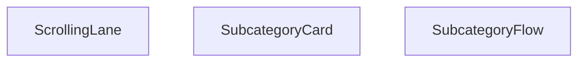

## NODE ID STANDARD

  file: src\components\SubcategoryFlow.tsx
  function: src\components\SubcategoryFlow.tsx::SubcategoryCard
  function: src\components\SubcategoryFlow.tsx::ScrollingLane
  function: src\components\SubcategoryFlow.tsx::SubcategoryFlow

---

## DISA AKTARILANLAR (EXPORTS)
  export: ScrollingLane
  export: SubcategoryCard
  export: SubcategoryFlow

---

## STİL TOKENLERİ

### Arbitrary Değerler (token'a geçirilmemiş)
Yok — tüm stiller token'a geçirilmiş. ✅

### Kullanılan Token'lar (zaten token'a geçirilmiş)
- (yok)

### Tailwind Sınıf Özeti
- **Renkler:** `bg-gradient-to-br`, `bg-gradient-to-l`, `bg-gradient-to-r`, `bg-gray-50`, `bg-white`, `border-gray-200`, `from-blue-50`, `from-white`, `group-hover:from-blue-100`, `group-hover:text-blue-700`, `group-hover:to-blue-200`, `hover:border-blue-300`, `sm:text-xl`, `text-blue-500`, `text-blue-600`
- **Layout:** `absolute`, `bottom-3`, `flex`, `flex-shrink-0`, `from-blue-50`, `from-white`, `gap-3`, `group-hover:from-blue-100`, `h-10`, `h-24`, `hover:shadow-md`, `items-center`, `justify-center`, `left-0`, `left-1/2`
- **Varyant/Responsive:** `:`, `group-hover:`, `hover:`, `lg:`, `md:`, `sm:` önekleri
- **Yardımcı Sınıflar:** `${direction`, `-translate-x-1/2`, `:`, `===`, `animate-pulse`, `animate-subcat-scroll-left`, `animate-subcat-scroll-right`, `border`, `duration-300`, `font-bold`, `font-semibold`, `group`, `group-hover:opacity-100`, `hover:scale-105`, `inset-y-0`

---
# FILE: src\components\UndecidedUserCTA.md

---
domain: general
source_type: doc
namespace_type: module
source_path: C:\Users\alize\venthub-hvac\src\components\UndecidedUserCTA.tsx
skeleton_hash: 0a3483208ef6d9f8
entity_hashes:
  func:UndecidedUserCTA: e9ab9b6769bffef9
  overview: 6734a4b4c3b6cbe2
  style_tokens: d1dc68fb1553bbf5
generated_at: 2026-05-28T22:37:07Z
---

## Genel Bakış
Venthub HVAC platformunda henüz platformdaki adımlara karar verememiş kararsız kullanıcılar için özel olarak tasarlanmış bir React kullanıcı arayüzü bileşeni barındırır. Bu bileşen, kullanıcıları uygun yönlendirmelere sevk eden eyleme çağrı içeriklerini ve etkileşimli öğeleri ekrana sunmak üzere geliştirilmiştir.

## Fonksiyon Grupları
### Ana Kullanıcı Arayüzü Bileşeni
Modülün tek ve ana işlevi olarak, tüm arayüz render işlemini üstlenir. Proje içinde başka bileşenlerden çağrıldığında kararsız kullanıcılar için hazırlanmış özel çağrı metinlerini ve etkileşim öğelerini ekrana yükler.
- UndecidedUserCTA

---

## AXIOMS – Mimari Varsayımlar
Bu istemci tarafı React bileşeni, kararsız kullanıcılara yönelik harekete geçirici çağrı mesajlarını (CTA) görüntülemek için tasarlanmıştır, çalışması için React çalışma zamanı ve DOM erişiminin sürekli olarak mevcut olması zorunludur.

[Aksiyom 1]: Eğer React çalışma zamanı ortamı mevcut değilse, bileşen hiçbir şekilde başlatılamaz ve kullanıcıya hiçbir zaman sunulamaz.
[Aksiyom 2]: Eğer bileşen geçerli bir DOM ortamında (veya sunucu taraflı render durumunda hydration işlemi tamamlanmış bir ortamda) çalıştırılmazsa, render hatası oluşur, kullanıcıya CTA içeriği gösterilemez.
[Aksiyom 3]: Eğer bu bileşen ana (parent) React bileşeni tarafından uygulama component tree yapısına dahil edilmezse, hiçbir zaman tetiklenmez ve kullanıcıya sunulmaz.
[Aksiyom 4]: Eğer bileşenin çalışması için gereken tüm React bağlamları (tema, çeviri, global uygulama durumu vb.) üst bileşen tarafından sağlanmazsa, bileşen hatalı render olur veya beklenen görsel/işlevsel özellikleri sunamaz.
[Aksiyom 5]: Eğer kullanıcının "kararsız" durumu üst bileşen tarafından doğru şekilde tespit edilip bu CTA'nın gösterim koşulu tetiklenmezse, hedef kullanıcı grubuna hiçbir zaman sunulamaz.

---

## FONKSİYON DETAYLARI

### UndecidedUserCTA
**Ne yapar**: VentHub HVAC projesinin kullanıcı arayüzünde, henüz herhangi bir işlem yapmamış veya karar vermemiş kararsız kullanıcılar için harekete geçirme çağrısı (CTA) sunan bir React fonksiyonel bileşenidir. Kullanıcıları ilgili aksiyonlara yönlendiren içerikler ve etkileşimli öğeler barındıran, projenin genelinde yeniden kullanılabilir bir arayüz katmanı oluşturur.
**Nasıl yapar**: Projenin src/components klasöründe konumlanan, yeniden kullanılabilir React bileşi standartlarında yapılandırılmıştır. Kendi iç yapısını bağımsız olarak yönetir, gerekli kullanıcı arayüzü öğelerini import ederek kararsız kullanıcı profiline özel içerikleri ekranda render eder. Herhangi bir harici durum bağımlılığı olmadan, çağrıldığı her yerde tutarlı bir CTA deneyimi sunar.
**Parametreler**:
- Bu fonksiyon herhangi bir giriş parametresi almaz, bağımsız çalışacak şekilde tasarlanmıştır.
**Dönüş**: React.FC türünde bir React fonksiyonel bileşeni döndürür. Döndürülen bu bileşen, tarayıcıda kullanıcıya görünür şekilde render edilebilen, kararsız kullanıcıları yönlendiren tüm CTA öğelerini içeren React node'larını barındırır. Proje içindeki tüm ilgili sayfalarda bu dönüş değeri kullanılarak bileşen ilgili yere yerleştirilir.

---

## AST POINTERS

### [N1_NASIL] AST Pointer: C:\Users\alize\venthub-hvac\src\components\UndecidedUserCTA.tsx::UndecidedUserCTA
- **params**: (parametre yok)
- **ic_degiskenler**:
  - `Link` — Next.js yönlendirme bileşeni, kullanıcıyı danışmanlık için iletişim sayfasına yönlendirmek üzere kullanılır
  - `MessageSquare` — Lucide-react ikon bileşeni, CTA bloğunda mesaj temalı simge olarak görüntülenir
  - `ArrowRight` — Lucide-react ikon bileşeni, buton içindeki hareketli sağ ok simgesi olarak kullanılır
  - `Routes` — Proje rota yardımcı nesnesi, 'consulting' etiketli iletişim rotasını oluşturmak için çağrılır
- **Dönüş**: Kararsız kullanıcıları uzman mühendis danışmanlığına yönlendiren React JSX elementi

---

## NODE ID STANDARD

  file: src\components\UndecidedUserCTA.tsx
  function: src\components\UndecidedUserCTA.tsx::UndecidedUserCTA

---

## DISA AKTARILANLAR (EXPORTS)
  export: UndecidedUserCTA

---

## STİL TOKENLERİ

### Arbitrary Değerler (token'a geçirilmemiş)
Yok — tüm stiller token'a geçirilmiş. ✅

### Kullanılan Token'lar (zaten token'a geçirilmiş)
- (yok)

### Tailwind Sınıf Özeti
- **Renkler:** `bg-gradient-to-r`, `bg-white`, `bg-white/10`, `bg-white/20`, `from-primary-navy`, `sm:text-2xl`, `sm:text-base`, `text-primary-navy`, `text-sm`, `text-white`, `text-white/80`, `text-xl`, `to-secondary-blue`
- **Layout:** `absolute`, `backdrop-blur-sm`, `bottom-0`, `flex`, `flex-col`, `from-primary-navy`, `gap-2`, `gap-5`, `gap-6`, `h-12`, `h-32`, `h-64`, `hover:shadow-xl`, `inline-flex`, `items-center`
- **Varyant/Responsive:** `group-hover:`, `hover:`, `md:`, `sm:` önekleri
- **Yardımcı Sınıflar:** `-translate-x-1/3`, `-translate-y-1/2`, `blur-2xl`, `blur-3xl`, `font-bold`, `group`, `group-hover:translate-x-1`, `hover:scale-102`, `leading-relaxed`, `mb-12`, `mb-2`, `mt-8`, `px-6`, `py-3.5`, `rounded-2xl`

---
# FILE: src\components\VisualShowcase.md

---
domain: general
source_type: doc
namespace_type: module
source_path: C:\Users\alize\venthub-hvac\src\components\VisualShowcase.tsx
skeleton_hash: aff37f07cc40274b
entity_hashes:
  func:ChevronLeftIcon: 528282355948f0bf
  func:ChevronRightIcon: eee2ea0200791ea6
  func:PauseIcon: ceb957c4aff5f7b7
  func:PlayIcon: 0708496e420e6f6e
  func:VisualShowcase: 41ca766f4149219c
  func:onTouchEnd: 6d11887cdcd98ede
  func:onTouchStart: e808a6bab1256660
  func:usePrefersReducedMotion: 11085ad489b48f61
  overview: 7e4ec691259cb85e
  style_tokens: 2f11e16677a4f30c
generated_at: 2026-05-28T22:37:07Z
---

## Genel Bakış
`VisualShowcase` modülü, kaydırılabilir görsel içerikleri sunan bir React bileşenidir. Kullanıcıların hareket azaltma tercihine duyarlı olup, dokunmatik ve fare etkileşimlerini yönetir; aynı zamanda gezinme ve medya kontrolü için özelleştirilebilir ikon bileşenleri sağlar.

## Fonksiyon Grupları
### Erişilebilirlik ve Bileşen Koordinasyonu  
Bu grup, bileşenin genel davranışını yöneten ve kullanıcı tercihlerini (reduced motion) dikkate alan yardımcı fonksiyonları içerir.  
- usePrefersReducedMotion, VisualShowcase  

### Dokunmatik Etkileşim İşleyicileri  
Mobil cihazlarda kaydırma ve dokunma hareketlerini algılayarak slayt geçişlerini kontrol eden olay yöneticileri.  
- onTouchStart, onTouchEnd  

### UI İkon Bileşenleri  
Gezinme ve oynatma/duraklatma kontrolleri için kullanılan, boyut ve stil özelleştirmesine izin veren yeniden kullanılabilir ikon bileşenleri.  
- ChevronLeftIcon, ChevronRightIcon, PauseIcon, PlayIcon

---

## AXIOMS – Mimari Varsayımlar
(Sentez hatası)

---

## FONKSİYON DETAYLARI

### usePrefersReducedMotion
**Ne yapar**: Kullanıcının “reduce motion” tercihini izler ve bu tercihe göre bir boolean değer döndürür.  
**Nasıl yapar**: `useState` ile `reduced` adında bir durum oluşturur, `useEffect` içinde `window.matchMedia('(prefers-reduced-motion: reduce)')` sorgusunu dinler, değişiklik olduğunda `setReduced` ile günceller ve bileşen unmount olduğunda dinleyiciyi temizler.  
**Parametreler**:  
- *yok*  
**Dönüş**: `boolean` – `true` ise kullanıcı hareketi azaltmayı tercih eder, `false` ise tercih etmez.

### VisualShowcase
**Ne yapar**: Projenin görsel gösterim bileşenini tanımlar; dışarıdan bir React fonksiyonel bileşen (FC) olarak kullanılabilir.  
**Nasıl yapar**: Kaynak kodu verilmemiştir; ancak isimlendirmeden ve dosya yolundan, UI içinde çeşitli ikon ve dokunma olaylarını yöneten bir gösterim bileşeni olduğu anlaşılır.  
**Parametreler**:  
- *yok*  
**Dönüş**: `React.FC` – bir React fonksiyonel bileşenidir.

### onTouchStart
**Ne yapar**: Dokunma (touch) başlangıç olayını yakalar; genellikle kaydırma veya sürükleme gibi etkileşimlerin başlangıcını işaret eder.  
**Nasıl yapar**: Fonksiyon gövdesi sağlanmamış olsa da, parametre olarak gelen `React.TouchEvent` nesnesini alır ve ilgili mantığı yürütür.  
**Parametreler**:  
- `e`: `React.TouchEvent` — Dokunma başlangıç olayının detaylarını içerir.  
**Dönüş**: Belirtilmemiş; tipik olarak `void`.

### onTouchEnd
**Ne yapar**: Dokunma (touch) bitiş olayını yakalar; kaydırma veya sürükleme gibi etkileşimlerin sonlandırılmasını işaret eder.  
**Nasıl yapar**: Fonksiyon gövdesi sağlanmamış olsa da, parametre olarak gelen `React.TouchEvent` nesnesini alır ve ilgili mantığı yürütür.  
**Parametreler**:  
- `e`: `React.TouchEvent` — Dokunma bitiş olayının detaylarını içerir.  
**Dönüş**: Belirtilmemiş; tipik olarak `void`.

### ChevronLeftIcon
**Ne yapar**: Sol yönlü bir ok (chevron) SVG ikonu üretir; UI’da gezinme veya geri yönlendirme için kullanılabilir.  
**Nasıl yapar**: `size` ve `className` prop’larını alır, bu değerlerle bir `<svg>` elementi oluşturur ve içinde sol yönlü polyline çizer.  
**Parametreler**:  
- `size`: `number` — İkonun genişlik ve yükseklik değerini belirler; varsayılan 18.  
- `className`: `string` — İkonun CSS sınıflarını eklemek için kullanılır; varsayılan boş string.  
**Dönüş**: JSX içinde bir `<svg>` elementi; React bileşeni olarak render edilir.

### ChevronRightIcon
**Ne yapar**: Sağ yönlü bir ok (chevron) SVG ikonu üretir; UI’da ileri yönlendirme için kullanılabilir.  
**Nasıl yapar**: `size` ve `className` prop’larını alır, bu değerlerle bir `<svg>` elementi oluşturur ve içinde sağ yönlü polyline çizer.  
**Parametreler**:  
- `size`: `number` — İkonun genişlik ve yükseklik değerini belirler; varsayılan 18.  
- `className`: `string` — İkonun CSS sınıflarını eklemek için kullanılır; varsayılan boş string.  
**Dönüş**: JSX içinde bir `<svg>` elementi; React bileşeni olarak render edilir.

### PauseIcon
**Ne yapar**: Duraklatma (pause) durumunu temsil eden iki dikdörtgen SVG ikonu üretir.  
**Nasıl yapar**: `size` ve `className` prop’larını alır, bu değerlerle bir `<svg>` elementi oluşturur ve içinde iki dikdörtgen çizer.  
**Parametreler**:  
- `size`: `number` — İkonun genişlik ve yükseklik değerini belirler; varsayılan 18.  
- `className`: `string` — İkonun CSS sınıflarını eklemek için kullanılır; varsayılan boş string.  
**Dönüş**: JSX içinde bir `<svg>` elementi; React bileşeni olarak render edilir.

### PlayIcon
**Ne yapar**: Oynatma (play) durumunu temsil eden üçgen SVG ikonu üretir.  
**Nasıl yapar**: `size` ve `className` prop’larını alır, bu değerlerle bir `<svg>` elementi oluşturur ve içinde bir üçgen (polygon) çizer.  
**Parametreler**:  
- `size`: `number` — İkonun genişlik ve yükseklik değerini belirler; varsayılan 18.  
- `className`: `string` — İkonun CSS sınıflarını eklemek için kullanılır; varsayılan boş string.  
**Dönüş**: JSX içinde bir `<svg>` elementi; React bileşeni olarak render edilir.

---

## AST POINTERS

### [N1_NASIL] AST Pointer: src/components/VisualShowcase.tsx::usePrefersReducedMotion
- **params**: (parametre yok)
- **ic_degiskenler**:
  - `reduced` — `useState` ile tanımlanan boolean, kullanıcının “reduce motion” tercihini tutar.
  - `setReduced` — `reduced` state'ini güncelleyen setter fonksiyonu.
  - `mq` — `window.matchMedia('(prefers-reduced-motion: reduce)')` sonucunda elde edilen MediaQueryList nesnesi.
  - `onChange` — `mq.matches` değerine göre `setReduced` çağıran callback.
- **Dönüş**: `boolean` (`reduced`)

### [N2_NASIL] AST Pointer: src/components/VisualShowcase.tsx::VisualShowcase
- **params**: (parametre yok)
- **ic_degiskenler**:
  - `t` — `useI18n` hookundan gelen çeviri fonksiyonu.
  - `index` — mevcut slide indeksini tutan state.
  - `setIndex` — `index` state'ini güncelleyen setter.
  - `playing` — otomatik oynatma (autoplay) durumunu belirten boolean state.
  - `setPlaying` — `playing` state'ini güncelleyen setter.
  - `startXRef` — dokunma başlangıç X koordinatını saklayan `useRef<number | null>`.
  - `containerRef` — carousel konteyner DOM elemanına referans veren `useRef<HTMLDivElement | null>`.
  - `reducedMotion` — `usePrefersReducedMotion` hookundan dönen değer.
  - `mounted` — bileşenin DOM'a monte edilip edilmediğini gösteren boolean state.
  - `isCoarse` — cihazın dokunmatik (coarse) işaretçi tipine sahip olup olmadığını belirten boolean.
  - `disableFancy` — reduced motion, coarse pointer veya dar ekran koşullarında fancy efektleri devre dışı bırakmak için kullanılan boolean.
  - `mouse` — `{x:number, y:number}` şeklinde fare konumunun yumuşatılmış değerlerini tutan state.
  - `setMouse` — `mouse` state'ini güncelleyen setter.
  - `slides` — `useMemo` ile oluşturulan sabit slide dizisi; her eleman `{title, subtitle, colorFrom, colorTo}` içerir.
  - `slidesCount` — `slides.length` değeri.
  - `prev` — önceki slide’a geçiş yapan `React.useCallback` fonksiyonu.
  - `next` — sonraki slide’a geçiş yapan `React.useCallback` fonksiyonu.
  - `onTouchStart` — dokunma başlangıcında `startXRef.current`'i ayarlayan fonksiyon.
  - `onTouchEnd` — dokunma bitişinde kaydırma mesafesini ölçüp `prev`/`next` çağıran fonksiyon.
  - `onKey` — klavye olaylarını dinleyen, ok tuşları ve boşluk ile kontrol sağlayan callback.
  - `el` — `containerRef.current` üzerinden elde edilen DOM elemanı (parallax hareketi için).
  - `onMove` — fare hareketlerini izleyip `mouse` state'ini yumuşak bir şekilde güncelleyen fonksiyon.
  - `canvasRef` — `<canvas>` elemanına referans veren `useRef<HTMLCanvasElement | null>`.
  - `particles` — `useMemo` ile oluşturulan 28 adet rastgele konum ve hız değerine sahip parçacık nesnesi dizisi.
  - `ctx` — `canvas.getContext('2d')` ile alınan 2D çizim bağlamı.
  - `raf` — `requestAnimationFrame` döngüsü için tutulan kimlik.
  - `render` — canvas üzerine parçacıkları çizen ve animasyonu sürdüren fonksiyon.
- **Dönüş**: `React.FC` (JSX öğesi döner; yan etkileri: DOM event listener ekleme, canvas çizimi, state güncellemeleri)

### [N3_NASIL] AST Pointer: src/components/VisualShowcase.tsx::onTouchStart
- **params**: `e: React.TouchEvent`
- **ic_degiskenler**:
  - `e` — dokunma olayı nesnesi.
- **Dönüş**: yok (sadece `startXRef.current` günceller)

### [N4_NASIL] AST Pointer: src/components/VisualShowcase.tsx::onTouchEnd
- **params**: `e: React.TouchEvent`
- **ic_degiskenler**:
  - `e` — dokunma bitiş olayı nesnesi.
  - `dx` — başlangıç X (`startXRef.current`) ile bitiş X arasındaki fark.
- **Dönüş**: yok (koşula göre `prev`/`next` çağırır ve `startXRef.current`i sıfırlar)

### [N5_NASIL] AST Pointer: src/components/VisualShowcase.tsx::ChevronLeftIcon
- **params**: `{ size = 18, className = '' }: { size?: number; className?: string }`
- **ic_degiskenler**:
  - `size` — SVG genişlik ve yükseklik değeri (default 18).
  - `className` — ek CSS sınıfları (default boş string).
- **Dönüş**: yok (JSX `<svg>` döner)

### [N6_NASIL] AST Pointer: src/components/VisualShowcase.tsx::ChevronRightIcon
- **params**: `{ size = 18, className = '' }: { size?: number; className?: string }`
- **ic_degiskenler**:
  - `size` — SVG genişlik ve yükseklik değeri (default 18).
  - `className` — ek CSS sınıfları (default boş string).
- **Dönüş**: yok (JSX `<svg>` döner)

### [N7_NASIL] AST Pointer: src/components/VisualShowcase.tsx::PauseIcon
- **params**: `{ size = 18, className = '' }: { size?: number; className?: string }`
- **ic_degiskenler**:
  - `size` — SVG genişlik ve yükseklik değeri (default 18).
  - `className` — ek CSS sınıfları (default boş string).
- **Dönüş**: yok (JSX `<svg>` döner)

### [N8_NASIL] AST Pointer: src/components/VisualShowcase.tsx::PlayIcon
- **params**: `{ size = 18, className = '' }: { size?: number; className?: string }`
- **ic_degiskenler**:
  - `size` — SVG genişlik ve yükseklik değeri (default 18).
  - `className` — ek CSS sınıfları (default boş string).
- **Dönüş**: yok (JSX `<svg>` döner)

---


## MERMAID CALL GRAPH
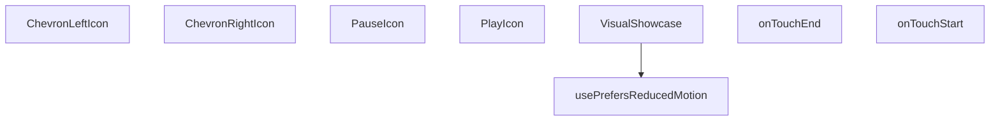

## NODE ID STANDARD

  file: src\components\VisualShowcase.tsx
  function: src\components\VisualShowcase.tsx::usePrefersReducedMotion
  function: src\components\VisualShowcase.tsx::VisualShowcase
  function: src\components\VisualShowcase.tsx::onTouchStart
  function: src\components\VisualShowcase.tsx::onTouchEnd
  function: src\components\VisualShowcase.tsx::ChevronLeftIcon
  function: src\components\VisualShowcase.tsx::ChevronRightIcon
  function: src\components\VisualShowcase.tsx::PauseIcon
  function: src\components\VisualShowcase.tsx::PlayIcon

---

## DISA AKTARILANLAR (EXPORTS)
  export: ChevronLeftIcon
  export: ChevronRightIcon
  export: PauseIcon
  export: PlayIcon
  export: VisualShowcase
  export: usePrefersReducedMotion

---

## STİL TOKENLERİ

### Arbitrary Değerler (token'a geçirilmemiş)
Yok — tüm stiller token'a geçirilmiş. ✅

### Kullanılan Token'lar (zaten token'a geçirilmiş)
- (yok)

### Tailwind Sınıf Özeti
- **Renkler:** `bg-gradient-to-br`, `bg-white`, `bg-white/10`, `bg-white/70`, `bg-white/80`, `hover:bg-white`, `lg:text-4xl`, `sm:text-3xl`, `sm:text-lg`, `text-2xl`, `text-base`, `text-center`, `text-industrial-gray`, `text-white`, `text-white/90`
- **Layout:** `-bottom-12`, `-left-16`, `-right-20`, `-top-10`, `absolute`, `bottom-2`, `drop-shadow-sm`, `flex`, `gap-2`, `h-10`, `h-2`, `h-48`, `h-64`, `h-80`, `h-full`
- **Varyant/Responsive:** `:`, `focus-visible:`, `hover:`, `lg:`, `sm:` önekleri
- **Yardımcı Sınıflar:** `${i`, `${s.colorFrom`, `${s.colorTo`, `-translate-x-1/2`, `:`, `===`, `blur-2xl`, `duration-700`, `ease-out`, `focus-visible:outline-none`, `focus-visible:ring-2`, `focus-visible:ring-offset-2`, `focus-visible:ring-primary-navy`, `font-bold`, `index`

---
# FILE: src\components\WhatsAppFloat.md

---
domain: general
source_type: doc
namespace_type: module
source_path: C:\Users\alize\venthub-hvac\src\components\WhatsAppFloat.tsx
skeleton_hash: b5ead15e45e8d41c
entity_hashes:
  func:WhatsAppFloat: 594fe2409e378878
  overview: 27f525e3029fcecb
  style_tokens: fb346cbde40036cb
generated_at: 2026-05-29T19:59:05Z
---

## Genel Bakış
Bu modül, VentHub HVAC platformunda kullanılan, sayfa içerisinde gezinirken sabit konumda kalan yüzen WhatsApp iletişim butonunu oluşturan React UI bileşenidir. Kullanıcıların platformda gezinirken tek tıkla WhatsApp üzerinden yetkili ekiplerle iletişime geçmesini sağlamak amacıyla geliştirilmiştir, tek bir ana bileşenden oluşur.

## Fonksiyon Grupları
### Ana UI Bileşeni
Tüm yüzen WhatsApp butonunun görsel konumlandırılması, tıklama aksiyonları ve platform genelindeki davranışlarını yöneten tek ana React bileşenidir.
- WhatsAppFloat

---

## AXIOMS – Mimari Varsayımlar
Bu React TypeScript ile geliştirilmiş WhatsApp iletişim float butonu bileşeninin doğru çalışması için çalışma zamanı ortamı, tarayıcı uyumluluğu ve UI kaynaklarının eksiksiz sunulması zorunludur.

[Aksiyom 1]: Eğer proje içinde React ve TypeScript çalışma zamanı ortamı sağlanmamışsa, bu bileşen hiçbir şekilde mount edilemez ve kullanıcı arayüzünde görüntülenemez.
[Aksiyom 2]: Eğer bu bileşen üst React ağacında herhangi bir parent bileşen tarafından çağrılmamışsa, proje arayüzünde hiçbir yerde görünmez, iletişim işlevi kullanılamaz.
[Aksiyom 3]: Eğer bileşene ait konumlandırma ve görsel stiller projeye dahil edilmemişse, WhatsApp butonu ekranın sabit köşesinde doğru şekilde görüntülenmez, kullanıcı tarafından erişilemez hale gelir.
[Aksiyom 4]: Eğer son kullanıcının tarayıcısı WhatsApp iletişim linklerini (whatsapp:// veya web.whatsapp.com) desteklemiyorsa ya da erişimini kısıtlıyorsa, butona tıklandığında iletişim akışı başlatılamaz.
[Aksiyom 5]: Eğer son kullanıcının cihazında aktif internet bağlantısı yoksa, WhatsApp web servisine erişilemez, iletişim başlatılamaz.

---

## FONKSİYON DETAYLARI

### WhatsAppFloat
**Ne yapar**: VentHub HVAC projesinde kullanıcıların tek tıkla WhatsApp üzerinden iletişim kurmasını sağlayan bağımsız React bileşenidir. Tüm proje sayfalarında sabit konumda duran yüzen (float) bir buton olarak sunulur, kullanıcıların sitede gezinirken her an erişebileceği kesintisiz bir iletişim kanalı sunar. Sitenin mobil ve masaüstü görünümlerinde uyumlu şekilde çalışarak tüm kullanıcılar için eşit erişilebilirlik sağlar.
**Nasıl yapar**: React fonksiyonel bileşeni olarak tanımlanır, CSS stilleri ile ekranın sabit (fixed) bir konumuna (genellikle sağ alt köşe) yerleştirilir. Tıklama olayı tetiklendiğinde kullanıcının cihazındaki WhatsApp mobil uygulaması ya da masaüstü/web WhatsApp sürümünü açarak, proje için tanımlanmış önceden belirlenmiş resmi iletişim numarasına otomatik yönlendirme yapar. Proje içindeki herhangi bir ana sayfa ya da alt sayfa bileşenine tek import ile kolayca dahil edilerek tüm platformda tutarlı iletişim erişilebilirliği sağlar.
**Parametreler**:
- Bu fonksiyon herhangi bir giriş parametresi almaz, bağımsız olarak çalışmak üzere tasarlanmıştır, tüm yapılandırma, stil ve işlevselliğini kendi bünyesinde barındırır.
**Dönüş**: React.FC tipinde bir React fonksiyonel bileşeni döndürür. Bu döndürülen bileşen, tüm içerik, stil ve tıklama olay yönetimleri tanımlı WhatsApp butonunu ekrana render etmeye olanak tanır, React'in bileşen çalışma mantığıyla tam uyumlu olarak proje içinde kullanılabilir.

---

## AST POINTERS

### [N1_NASIL] AST Pointer: C:\Users\alize\venthub-hvac\src\components\WhatsAppFloat.tsx::WhatsAppFloat
- **params**: (parametre yok)
- **ic_degiskenler**:
  - `t` — useI18n hook'undan alınan çeviri fonksiyonu; WhatsApp bileşeninin tüm metinlerini (destek mesajı, erişilebilirlik etiketleri, başlık, tooltip) ilgili dilde çekmek için kullanılır
  - `useI18n` — import edilen I18n sağlayıcı hook'u; uygulama çeviri sistemine erişim sağlar
  - `isWhatsAppAvailable` — import edilen utility fonksiyonu; WhatsApp desteğinin aktif olup olmadığını kontrol etmek için çağrılır
  - `getSupportLink` — import edilen utility fonksiyonu; iletilen destek mesajı ile birlikte kullanıcıya yönlendirilecek geçerli WhatsApp sohbet bağlantısını oluşturur
  - `link` — getSupportLink fonksiyonundan dönen WhatsApp sohbet bağlantısı; bileşenin a etiketinin href özniteliğinde kullanılır
  - `WhatsAppIcon` — import edilen ikon bileşeni; WhatsApp logosunu göstermek için JSX içinde kullanılır, size ve className prop'ları iletilir
- **Dönüş**: Koşullara göre null veya ana kapsayıcı a etiketini içeren React JSX elementi

---

## NODE ID STANDARD

  file: src\components\WhatsAppFloat.tsx
  function: src\components\WhatsAppFloat.tsx::WhatsAppFloat

---

## DISA AKTARILANLAR (EXPORTS)
  export: WhatsAppFloat

---

## STİL TOKENLERİ

### Arbitrary Değerler (token'a geçirilmemiş)
Yok — tüm stiller token'a geçirilmiş. ✅

### Kullanılan Token'lar (zaten token'a geçirilmiş)
- (yok)

### Tailwind Sınıf Özeti
- **Renkler:** `text-sm`
- **Layout:** `absolute`, `hidden`, `left-14`, `lg:block`, `relative`, `whatsapp-float`
- **Varyant/Responsive:** `group-hover:`, `lg:` önekleri
- **Yardımcı Sınıflar:** `duration-300`, `font-bold`, `group`, `group-hover:opacity-100`, `opacity-0`, `pointer-events-none`, `shrink-0`, `transition-opacity`, `whitespace-nowrap`

---
# FILE: src\components\admin\AccessDenied.md

---
domain: general
source_type: doc
namespace_type: module
source_path: C:\Users\alize\venthub-hvac\src\components\admin\AccessDenied.tsx
skeleton_hash: d0926a9df2156265
entity_hashes:
  func:AccessDenied: ea91e56a2eab80b9
  overview: 0772c5e63ff4e542
  style_tokens: 07b65f88bee816f7
generated_at: 2026-05-28T22:35:22Z
---

## Genel Bakış
AccessDenied bileşeni, yönetim panelinde yetkisiz erişim durumunda kullanıcıya bilgilendirme amaçlı bir hata sayfası sunan bağımsız bir React bileşenidir. Tek bir amacı vardır: kullanıcıya erişim izni olmadığını bildirmek ve ana sayfaya yönlendirme yapma seçeneği sunmak.

## Fonksiyon Grupları
### Arayüz Sunumu
Kullanıcıya erişim reddedildiğini belirten mesajı ve yönlendirme butonunu render ederek tek sayfalık hata arayüzünü oluşturur.
- AccessDenied

---

## AXIOMS – Mimari Varsayımlar

Bu modül, parametre almayan ve modül sabitleri içermeyen basit bir React UI bileşenidir.

[Aksiyom 1]: Eğer bileşen React Router veya benzeri bir yönlendirme altyapısı olmayan bir ortamda çalıştırılırsa, ana sayfaya yönlendirme butonu işlevsiz kalır.

[Aksiyom 2]: Eğer bileşen bir React bağlamı (context) dışın render edilirse, React bileşenLifecycle'ı düzgün çalışmayacağından hata oluşur.

---

## FONKSİYON DETAYLARI

### AccessDenied

**Ne yapar**: Erişim izni olmayan kullanıcılar için hata sayfası/gösterim bileşenidir. Kullanıcının yetkisi olmayan bir admin alanına erişmeye çalıştığında visuals olarak bir hata mesajı sunar.

**Nasıl yapar**: Bu bir React functional component olup, erişim reddedildiğinde kullanıcıya bilgilendirici bir arayüz gösterir. Genellikle role-based erişim kontrolü sonrası yetkisiz erşim durumlarında render edilir. Bileşen, kullanıcıya durumu açıklayan bir mesaj ve olası eylem yönlendirmeleri (anasayfaya dönüş, giriş sayfası vb.) sunar.

**Parametreler**:
- Bu bileşen herhangi bir parametre almaz

**Dönüş**: `React.FC` — Erişim reddedildiğinde gösterilecek hata bileşenini döndürür. Bileşen, kullanıcıya yetkisiz erişim durumunu bildiren arayüz elemanlarını içeren JSX yapısıdır.

**Kullanım Bağlamı**: `C:\Users\alize\venthub-hvac\src\components\admin\AccessDenied` yolunda yer alan bu bileşen, admin panelinde yetkilendirme kontrolü başarısız olduğunda kullanıcıya yönlendirilir. HVAC-VentHub projesinin admin modülünde erişim kontrol mekanizmasının bir parçasıdır.

---

## AST POINTERS

### [N1_NASIL] AST Pointer: src/components/admin/AccessDenied.tsx::AccessDenied
- **params**: (parametre yok)
- **ic_degiskenler**:
  - `t` — `useI18n()` hookundan destructured çeviri fonksiyonu; `t('admin.ui.backToDashboard')` çağrılarak Türkçe metin elde edilir
- **Dönüş**: JSX — Erişim engellendi sayfasını render eden React bileşeni; `ShieldAlert` ikonu, başlık, açıklama metni ve admin dashboard'a yönlendiren Link içerir
- **Hook Kullanımları**:
  - `useI18n()` — dil çeviri sistemi bağlamını sağlar, `{ t }` destructured olarak alınır
- **Sabit/Sabit Yapı Erişimleri**:
  - `Routes.admin.dashboard()` — admin dashboard rotasının URL'ini döndürür, Link bileşeninin `href` prop'unda kullanılır

---

## NODE ID STANDARD

  file: src\components\admin\AccessDenied.tsx
  function: src\components\admin\AccessDenied.tsx::AccessDenied

---

## DISA AKTARILANLAR (EXPORTS)
  export: AccessDenied

---

## STİL TOKENLERİ

### Arbitrary Değerler (token'a geçirilmemiş)
Yok — tüm stiller token'a geçirilmiş. ✅

### Kullanılan Token'lar (zaten token'a geçirilmiş)
- `rounded-hvac-2xl`, `tracking-hvac-relaxed`

### Tailwind Sınıf Özeti
- **Renkler:** `bg-rose-500/10`, `bg-surface-deep`, `bg-white/5`, `border-rose-500/20`, `border-white/5`, `hover:bg-white/10`, `text-3xl`, `text-center`, `text-rose-500`, `text-slate-400`, `text-slate-600`, `text-slate-700`, `text-white`, `text-xs`
- **Layout:** `block`, `flex`, `flex-col`, `gap-3`, `gap-4`, `h-12`, `h-24`, `inline-flex`, `items-center`, `justify-center`, `max-w-lg`, `min-h-screen`, `p-12`, `p-6`, `shadow-access-denied-black`
- **Varyant/Responsive:** `group-hover:`, `hover:` önekleri
- **Yardımcı Sınıflar:** `animate-in`, `border`, `duration-500`, `fade-in`, `font-black`, `font-bold`, `font-medium`, `glass-strong`, `group`, `group-hover:-translate-x-1`, `italic`, `leading-relaxed`, `mb-10`, `mb-4`, `mb-8`

---
# FILE: src\components\admin\AdminEmptyState.md

---
domain: general
source_type: doc
namespace_type: module
source_path: C:\Users\alize\venthub-hvac\src\components\admin\AdminEmptyState.tsx
skeleton_hash: 05a2a1042b4522e9
entity_hashes:
  func:AdminEmptyState: 0a5636f5d0d24f8e
  overview: a8e9e23763cc1b0a
  style_tokens: 18a94c8091a667ca
generated_at: 2026-05-28T22:35:33Z
---

## Genel Bakış
`AdminEmptyState`, yönetim panelinde veri bulunmadığında veya sayfa içeriği boş olduğunda kullanıcıya bilgilendirici bir mesaj sunan bir React bileşenidir. İkon, başlık, açıklama ve opsiyonel aksiyon butonunu bir araya getirerek tutarlı ve yönlendirici bir boş durum (empty state) arayüzü oluşturur. Bileşen, farklı yerleşim ihtiyaçlarına cevap verebilmek için `compact` moduyla daha sade bir görünüm de sunabilir.

## Fonksiyon Grupları
### Boş Durum Görünümü
Bu grup, veri olmadığında gösterilecek bilgilendirici arayüzü oluşturur; temel unsurları (ikon, başlık, açıklama ve eylem butonunu) bir araya getirir ve kullanıcıya durumu açıklar.
- AdminEmptyState

---

## AXIOMS – Mimari Varsayımlar

Bu modül için fonksiyon gövdesi (implementation body) verilmemiştir; dolayısıyla çalışma zamanı davranışına ilişkin mimari varsayımlar çıkarılamamıştır.

**Bilinen yapısal gözlem (fonksiyon imzasından):**

- `icon: Parametre`, bir React bileşeni olarak geçirilmektedir (büyük harfle başlaması nedeniyle).

Ancak bu parametrelerin zorunlu olup olmadığı, hangi durumlarda hata fırlatıldığı veya hangi koşullarda farklı render dalına geçildiği **bilinmiyor** çünkü fonksiyon gövdesi paylaşılmamıştır.

---

*Not: Tam aksiyon üretmek için `AdminEmptyState` fonksiyonunun gövdesi (return bloğu, koşullu kontroller, varsayılan değer atamaları) gereklidir.*

---

## FONKSİYON DETAYLARI

### AdminEmptyState
**Ne yapar**: Admin panelinde veri bulunamadığında veya boş bir durum gösterilmesi gerektiğinde kullanılan, iki farklı boyut seçeneğine sahip bir React bileşenidir. Kullanıcıya ikonlu, başlıklı ve açıklamalı bir boş durum mesajı sunar, opsiyonel bir eylem butonu içerebilir.

**Nasıl yapar**: Fonksiyon, `compact` prop'unun değerine göre iki farklı JSX yapısı döndürür. `compact` true ise daha küçük boyutlarda, sınırlı dolgu alanına ve daha minimal bir görünüme sahip bir div oluşturur. Aksi takdirde, daha geniş bir dolgu alanına, cam efektine (`glass-strong`), fare üzerine gelme efektine sahip, gradyan arka plan ve daha belirgin gölgelendirmeler içeren tam boyutlu bir boş durum bileşeni render eder. Her iki durumda da `icon`, `title` ve `description` prop'ları kullanılarak temel içerik oluşturulur; `action` prop'u sağlanmışsa, belirtilen metin ve tıklama işleviyle bir buton eklenir.

**Parametreler**:
- `icon`: React Bileşeni (Icon tipinde) — Boş durum alanının üst kısmında büyük bir ikon olarak görüntülenecek React bileşenidir. Bileşen `size` ve `strokeWidth` prop'larını desteklemelidir.
- `title`: string — Boş durumun üst başlığıdır, genellikle büyük harflerle ve kalın font ile görüntülenir.
- `description`: string — Başlığın altında yer alan açıklayıcı metindir. Kullanıcıya durum hakkında daha fazla bilgi verir.
- `action`: object (opsiyonel) — Boş durumun altında bir eylem butonu oluşturulmasını sağlar. `onClick` (butona tıklandığında çağrılacak fonksiyon) ve `label` (butonda görüntülenecek metin) özelliklerini içermelidir.
- `compact`: boolean (opsiyonel) — `true` olduğunda, bileşen daha kompakt ve küçük bir görünümle render edilir. Varsayılan olarak `false` veya tanımsız kabul edilerek tam boyutlu görünüm gösterilir.

**Dönüş**: JSX.Element — Bileşen, her iki durumda (compact veya normal) da bir React JSX yapısı döndürür ve doğrudan bir React bileşeni olarak kullanılabilir.

---

## INTERFACES

### AdminEmptyStateProps
- `icon: LucideIcon`
- `title: string`
- `description: string`
- `action?: {
`
- `compact?: boolean`

---

## AST POINTERS

### [N1_NASIL] AST Pointer: src/components/admin/AdminEmptyState.tsx::AdminEmptyState
- **params**: `{ icon: Icon, title, description, action, compact }` — AdminEmptyStateProps türünde destructured nesne
  - `icon` — LucideIcon türünde, boş durum ikonu olarak `<Icon size={24|36} strokeWidth={1.5}>` şeklinde kullanılır
  - `title` — string, boş durum başlığını `<h3>` içinde büyük harflerle gösterir
  - `description` — string, boş durum açıklamasını `<p>` içinde küçük harflerle gösterir
  - `action` — opsiyonel nesne, `{ onClick: () => void, label: string }` yapısında; buton olarak render edilir ve `action.onClick` ile tıklama, `action.label` ile buton metni kullanılır
  - `compact` — boolean, kompakt (`compact=true`) ve normal (`compact=false`) görünüm arasında seçim yapar
- **ic_degiskenler**: (yok)
- **Dönüş**: JSX elementi — `compact` prop'una göre iki farklı düzen döndürür; `true` ise küçük kompakt görünüm, `false` ise daha geniş normal görünüm返回。

---

## NODE ID STANDARD

  file: src\components\admin\AdminEmptyState.tsx
  function: src\components\admin\AdminEmptyState.tsx::AdminEmptyState

---

## DISA AKTARILANLAR (EXPORTS)
  export: AdminEmptyState

---

## STİL TOKENLERİ

### Arbitrary Değerler (token'a geçirilmemiş)
Yok — tüm stiller token'a geçirilmiş. ✅

### Kullanılan Token'lar (zaten token'a geçirilmiş)
- `rounded-hvac-2xl`, `shadow-glow-lg`, `shadow-glow-md`, `tracking-hvac-normal`

### Tailwind Sınıf Özeti
- **Renkler:** `bg-cyan-400`, `bg-gradient-to-b`, `bg-white/5`, `border-dashed`, `border-white/10`, `border-white/20`, `from-cyan-400/3`, `hover:bg-cyan-300`, `hover:bg-white/10`, `hover:text-white`, `text-center`, `text-cyan-400`, `text-lg`, `text-slate-300`, `text-slate-400`
- **Layout:** `absolute`, `flex`, `flex-col`, `from-cyan-400/3`, `h-14`, `h-20`, `items-center`, `justify-center`, `max-w-200px`, `max-w-sm`, `overflow-hidden`, `relative`, `shadow-cyan-400/20`, `shadow-xl`, `w-14`
- **Varyant/Responsive:** `active:`, `group-hover:`, `hover:` önekleri
- **Yardımcı Sınıflar:** `active:scale-95`, `border`, `duration-500`, `duration-700`, `font-black`, `font-bold`, `glass-strong`, `group`, `group-hover:opacity-100`, `group-hover:scale-110`, `hover:-translate-y-0.5`, `inset-0`, `leading-relaxed`, `mb-2`, `mb-3`

---
# FILE: src\components\admin\AdminRealtimeNotifications.md

---
domain: general
source_type: doc
namespace_type: module
source_path: C:\Users\alize\venthub-hvac\src\components\admin\AdminRealtimeNotifications.tsx
skeleton_hash: 1f148dc03e1a62be
entity_hashes:
  func:AdminRealtimeNotifications: 1b67a246f8f15ea8
  func:IconForType: b8eaefdda2e3fd3b
  func:clearAll: 256b77623e27b78c
  func:toggleDropdown: 97a60ca3e9e42667
  overview: 1eefa4c9e4937bfa
  style_tokens: 58e7fc7febbe30f9
generated_at: 2026-06-06T21:54:43Z
---

## Genel Bakış
`AdminRealtimeNotifications`, yönetim panelinde gerçek zamanlı bildirimlerin görüntülenmesini ve yönetilmesini sağlayan bir React bileşenidir. Bildirim menüsünün açılıp kapatılması, okunmamış bildirimlerin toplu olarak temizlenmesi ve bildirim türlerine göre uygun ikonların seçilmesi gibi temel işlevleri bir arada sunar. Bileşen, bildirim akışının görsel yönetimini merkezileştirerek kullanıcı deneyimini iyileştirir.

## Fonksiyon Grupları
### Ana Bileşen
Bildirim verisini alarak bileşenin genel yapısını, durum yönetimini ve render mantığını yönlendiren ana giriş noktasıdır.
- `AdminRealtimeNotifications`

### Kullanıcı Etkileşimleri
Bildirim menüsünün açık/kapalı durumunu değiştiren ve bildirimlerin toplu olarak temizlenmesini sağlayan yardımcı işlevlerdir.
- `toggleDropdown`, `clearAll`

### Görsel Eşleştirme
Bildirim türlerine göre uygun ikonları dinamik olarak belirleyerek arayüzde görsel tutarlılık sağlayan yardımcı bileşendir.
- `IconForType`

---

## AXIOMS – Mimari Varsayımlar

Bu modül, yönetim panelinde gerçek zamanlı bildirimleri gösteren bir React bileşenidir. Aşağıdaki mimari varsayımlar fonksiyon imzalarından türetilmiştir.

[Aksiyom 1]: `IconForType` fonksiyonu, `type: string` parametresine bağımlıdır. Eğer `type` parametresi `undefined` veya geçersiz bir değer olarak iletilirse, bileşen beklenmeyen bir duruma düşer veya boş/farklı bir ikon döner.

[Aksiyom 2]: `clearAll` fonksiyonu çağrıldığında, bileşenin erişebileceği bir bildirim listesi/havuzunun var olması gerekir. Eğer temizlenecek bildirim kaynağı (state veya context) mevcut değilse, fonksiyon anlamlı bir işlem yapamaz.

[Aksiyom 3]: `toggleDropdown` fonksiyonu, dropdown'ın açık/kapalı durumunu tersine çevirmek için bir toggle mekanizması (state) gerektirir. Eğer bu durum state'i tanımlı değilse, dropdown açma/kapama işlevselligi çalışmaz.

[Aksiyom 4]: `AdminRealtimeNotifications` ana bileşeni parametresiz olarak çağrılmaktadır. Eğer bileşenin çalışması için gerekli bildirim verisi (prop veya context) dışarıdan sağlanmıyorsa, bileşen boş/bozuk render edilir.

[Aksiyom 5]: `IconForType` tarafından desteklenen `type` string değerlerinin tanımlı bir kümesi olmalıdır. Eğer desteklenmeyen bir `type` değeri iletilirse, bileşenin fallback bir ikon göstermesi veya hata yönetimi yapması beklenir — aksi halde bileşen bozulur.

---

## FONKSİYON DETAYLARI

### AdminRealtimeNotifications
**Ne yapar**: Admin panelinde gerçek zamanlı bildirimleri gösteren ana React bileşenidir. Kullanıcıya anlık bildirim akışı sunar ve bildirim yönetimi için arayüz sağlar.

**Nasıl yapar**: Bileşen, gerçek zamanlı bildirimleri alır ve bunları kullanıcıya gösterir. Bildirim dropdown menüsünü, bildirim listesini ve bildirim temizleme işlevselliğini bir arada sunar. İç state'ler aracılığıyla dropdown durumunu ve bildirimleri yönetir.

**Parametreler**:
- Parametre almaz (props'suz fonksiyon bileşeni)

**Dönüş**: `React.FC` tipinde bir React bileşeni döndürür. Bileşen, admin paneline yerleştirilebilen gerçek zamanlı bildirim arayüzünü render eder.

### toggleDropdown
**Ne yapar**: Geliştirildi ancak detay üretilemedi.

### clearAll
**Ne yapar**: Geliştirildi ancak detay üretilemedi.

### IconForType
**Ne yapar**: Geliştirildi ancak detay üretilemedi.

---

## INTERFACES

### AppNotification
- `id: string`
- `type: 'order' | 'stock' | 'system'`
- `title: string`
- `message: string`
- `timestamp: string`
- `isRead: boolean`
- `link?: string`

---

## AST POINTERS

### [N1_NASIL] AST Pointer: src/components/admin/AdminRealtimeNotifications.tsx::AdminRealtimeNotifications
- **params**: (parametre yok — React bileşeni)
- **ic_degiskenler**:
  - `active` — useEffect cleanup flag'i, bileşen unmount edildiğinde async isteklerin iptal edilmesini sağlar
  - `oData` — Supabase'den çekilen son 5 sipariş verisi (venthub_orders tablosu)
  - `sData` — Supabase'den çekilen son 5 stok hareketi verisi (inventory_movements tablosu + products join)
  - `combined` — Sipariş ve stok hareketlerini birleştirip sıralanan bildirim dizisi (AppNotification[])
  - `o` — oData forEach içindeki her bir sipariş satırı objesi
  - `s` — sData forEach içindeki her bir stok hareketi satırı (Record<string, unknown>)
  - `products` — s.products join objesinin cast edilmiş hali (Record<string, unknown> | null)
  - `pName` — Ürün adı, products.name'den alınır
  - `pSku` — Ürün SKU kodu, products.sku'dan alınır
  - `delta` — Stok miktar değişim değeri (Number olarak parse edilmiş)
  - `movementType` — delta > 0 ise 'Giriş', değilse 'Çıkış' string'i
  - `absQty` — delta'nın mutlak değeri (adet gösterimi için)
  - `ordersChannel` — Supabase realtime kanalı, venthub_orders INSERT olaylarını dinler
  - `stockChannel` — Supabase realtime kanalı, inventory_movements INSERT oyunlarını dinler
  - `handleClickOutside` — Dropdown dışına tıklama handler'ı, MouseEvent alır
  - `tenantId` — useTenant hook'undan gelen kiracı ID'si, realtime kanallarının filtresinde kullanılır
  - `dropdownRef` — Dropdown DOM elementine referans (useRef)
  - `isOpen` — Dropdown menüsünün açık/kapalı durumu (state)
  - `notifications` — Bildirim listesi state'i (AppNotification[])
  - `unreadCount` — Okunmamış bildirim sayısı state'i
  - `router` — Next.js router, sayfa yönlendirmeleri için
  - `newOrder` — Realtime payload.new, yeni sipariş objesi (Record<string, unknown>)
  - `totalAmt` — Sipariş toplam tutarı (Number)
  - `amt` — Türk Lirası formatında tutar string'i (Intl.NumberFormat ile)
  - `orderId` — Sipariş ID'si (String cast)
  - `orderNumber` — Sipariş numarası veya ID'nin ilk 8 karakteri
  - `notif` — Oluşturulan bildirim objesi (AppNotification)
  - `m` — Realtime payload.new, yeni stok hareketi objesi (Record<string, unknown>)
- **Dönüş**: React.FC — Bildirim dropdown bileşeni, sipariş ve stok realtime dinleyicileri kurar

---

### [N2_NASIL] AST Pointer: src/components/admin/AdminRealtimeNotifications.tsx::toggleDropdown
- **params**: (parametre yok)
- **ic_degiskenler**:
  - `isOpen` — Mevcut dropdown durumu, !isOpen ile toggle edilir
  - `unreadCount` — Okunmamış bildirim sayısı, dropdown açılırken sıfırlanır
  - `notifications` — Bildirim listesi, açılırken tüm isRead alanları true yapılır
- **Dönüş**: yok — Dropdown açma/kapama durumunu toggle eder, açılırken tüm bildirimleri okundu olarak işaretler

---

### [N3_NASIL] AST Pointer: src/components/admin/AdminRealtimeNotifications.tsx::clearAll
- **params**: (parametre yok)
- **ic_degiskenler**:
  - `notifications` — setNotifications([]) ile boş diziye set edilir
  - `unreadCount` — setUnreadCount(0) ile sıfırlanır
- **Dönüş**: yok — Tüm bildirimleri temizler ve okunmamış sayacını sıfırlar

---

### [N4_NASIL] AST Pointer: src/components/admin/AdminRealtimeNotifications.tsx::IconForType
- **params**: `{ type }` — Bildirim türü ('order', 'stock' veya diğerleri)
- **ic_degiskenler**:
  - `type` — string, bildirim türüne göre farklı ikon döndürür
- **Dönüş**: JSX Element — type='order' için ShoppingBag ikonu (mavi), type='stock' için Box ikonu (yeşil), diğerleri için Activity ikonu (gri)

---

### [N5_NASIL] AST Pointer: src/components/admin/AdminRealtimeNotifications.tsx::useEffect_cleanup_wrapper
- **params**: (parametre yok — arrow function)
- **ic_degiskenler**:
  - `active` — boolean flag, cleanup'ta false yapılır, async fetch'in state güncellemesini engeller
- **Dönüş**: cleanup fonksiyonu döndürür — `active = false` set eder

---

### [N6_NASIL] AST Pointer: src/components/admin/AdminRealtimeNotifications.tsx::fetchRecentActivity
- **params**: (parametre yok — async inner function)
- **ic_degiskenler**:
  - `oData` — Supabase sorgusundan dönen sipariş verisi, null olabilir
  - `sData` — Supabase sorgusundan dönen stok hareketi verisi, null olabilir
  - `combined` — AppNotification[] dizisi, tüm bildirimler burada birleştirilir
  - `products` — s.products join'inin cast edilmiş hali (Record<string, unknown> | null)
  - `pName` — Ürün adı veya 'Bilinmeyen Ürün' fallback'i
  - `pSku` — Ürün SKU kodu veya boş string
  - `delta` — Stok değişim miktarı (Number)
  - `movementType` — 'Giriş' veya 'Çıkış' stringi
  - `absQty` — Mutlak stok değişim miktarı
  - `err` — catch bloğundaki hata objesi
- **Dönüş**: yok — setNotifications ile son 10 bildirimi state'e yazar

---

### [N7_NASIL] AST Pointer: src/components/admin/AdminRealtimeNotifications.tsx::realtime_setup
- **params**: (parametre yok — useEffect callback arrow function)
- **ic_degiskenler**:
  - `ordersChannel` — Supabase realtime kanalı, `admin-orders-realtime-${tenantId}` isimli private kanal
  - `stockChannel` — Supabase realtime kanalı, `admin-stock-realtime-${tenantId}` isimli private kanal
  - `tenantId` — Kiracı ID'si, kanal isimlerinde ve filter parametrelerinde kullanılır
- **Dönüş**: cleanup fonksiyonu — her iki kanalı da removeChannel ile temizler

---

### [N8_NASIL] AST Pointer: src/components/admin/AdminRealtimeNotifications.tsx::order_realtime_handler
- **params**: `payload` — Supabase realtime payload objesi
- **ic_degiskenler**:
  - `newOrder` — payload.new'ın Record<string, unknown> cast'i, yeni sipariş verisi
  - `totalAmt` — newOrder.total_amount'tan parse edilen toplam tutar (Number)
  - `amt` — Intl.NumberFormat ile TR-TRY formatına çevrilmiş tutar stringi
  - `orderId` — newOrder.id'nin String hali
  - `orderNumber` — newOrder.order_number veya orderId'nin ilk 8 karakteri
  - `notif` — Oluşturulan AppNotification objesi, id: `order_rt_${orderId}`
- **Dönüş**: yok — notifications state'ine ekler, unreadCount artırır, toast bildirimi gösterir

---

### [N9_NASIL] AST Pointer: src/components/admin/AdminRealtimeNotifications.tsx::stock_realtime_handler
- **params**: `payload` — Supabase realtime payload objesi
- **ic_degiskenler**:
  - `m` — payload.new'ın Record<string, unknown> cast'i, yeni stok hareketi verisi
  - `delta` — m.delta'dan parse edilen stok değişim miktarı (Number)
  - `movementType` — delta > 0 ise 'Giriş', değilse 'Çıkış'
  - `absQty` — delta'nın Math.abs ile mutlak değeri
  - `notif` — Oluşturulan AppNotification objesi, id: `stock_rt_${String(m.id)}`
- **Dönüş**: yok — notifications state'ine ekler, unreadCount artırır, toast bildirimi gösterir

---

### [N10_NASIL] AST Pointer: src/components/admin/AdminRealtimeNotifications.tsx::toast_click_handler_order
- **params**: `id` — toast ID'si
- **ic_degiskenler**:
  - `id` — toast.dismiss(id) ile kapatılacak toast'un identifier'ı
- **Dönüş**: yok — toast'u kapatır ve notif.link üzerinden router.push ile ilgili sayfaya yönlendirir

---

### [N11_NASIL] AST Pointer: src/components/admin/AdminRealtimeNotifications.tsx::toast_keydown_handler_order
- **params**: `e` — KeyboardEvent
- **ic_degiskenler**:
  - `e.key` — Tuş değeri, 'Enter' veya ' ' kontrol edilir
  - `id` — toast ID'si, dismiss ve yönlendirme için kullanılır
- **Dönüş**: yok — e.preventDefault() çağırır, toast'u kapatır ve sayfaya yönlendirir

---

### [N12_NASIL] AST Pointer: src/components/admin/AdminRealtimeNotifications.tsx::toast_click_handler_stock
- **params**: `id` — toast ID'si
- **ic_degiskenler**:
  - `id` — toast.dismiss(id) ile kapatılacak toast'un identifier'ı
- **Dönüş**: yok — toast'u kapatır ve notif.link üzerinden router.push ile ilgili sayfaya yönlendirir

---

### [N13_NASIL] AST Pointer: src/components/admin/AdminRealtimeNotifications.tsx::toast_keydown_handler_stock
- **params**: `e` — KeyboardEvent
- **ic_degiskenler**:
  - `e.key` — Tuş değeri, 'Enter' veya ' ' kontrol edilir
  - `id` — toast ID'si
- **Dönüş**: yok — e.preventDefault() çağırır, toast'u kapatır ve sayfaya yönlendirir

---

### [N14_NASIL] AST Pointer: src/components/admin/AdminRealtimeNotifications.tsx::realtime_cleanup
- **params**: (parametre yok)
- **ic_degiskenler**:
  - `ordersChannel` — Temizlenecek sipariş realtime kanalı referansı
  - `stockChannel` — Temizlenecek stok realtime kanalı referansı
- **Dönüş**: yok — supabase.removeChannel ile her iki kanalı kapatır

---

### [N15_NASIL] AST Pointer: src/components/admin/AdminRealtimeNotifications.tsx::useClickOutside
- **params**: (parametre yok — useEffect callback)
- **ic_degiskenler**:
  - `handleClickOutside` — MouseEvent handler, dropdownRef.contains kontrolü ile dropdown dışına tıklama algılar
  - `dropdownRef` — Dropdown DOM referansı, contains() ile hedef element kontrolü yapılır
- **Dönüş**: cleanup fonksiyonu — document.removeEventListener ile mousedown listener'ı temizler

---

### [N16_NASIL] AST Pointer: src/components/admin/AdminRealtimeNotifications.tsx::handleClickOutside
- **params**: `event` — MouseEvent
- **ic_degiskenler**:
  - `dropdownRef.current` — Dropdown DOM elementi, null olabilir
  - `event.target` — Tıklanan element (Node'a cast edilir)
- **Dönüş**: yok — dropdownRef.contains(event.target) false ise setIsOpen(false) çağırır

---

### [N17_NASIL] AST Pointer: src/components/admin/AdminRealtimeNotifications.tsx::notification_list_item_click
- **params**: `notif` — AppNotification objesi
- **ic_degiskenler**:
  - `notif.link` — Bildirim linki, varsa router.push ile yönlendirme yapılır
  - `notif.id` — React key olarak kullanılır
  - `notif.isRead` — Okunma durumu, CSS class belirlemede kullanılır
  - `notif.type` — Bildirim türü, IconForType'a parametre olarak geçilir
  - `notif.title` — Bildirim başlığı, JSX'te gösterilir
  - `notif.message` — Bildirim mesajı, JSX'te gösterilir
  - `notif.timestamp` — Zaman damgası, formatDateTime ile formatlanır
- **Dönüş**: JSX Element — Bildirim satırı, tıklanınca sayfa yönlendirmesi yapar

---

### [N18_NASIL] AST Pointer: src/components/admin/AdminRealtimeNotifications.tsx::notification_item_click_handler
- **params**: (parametre yok — onClick callback)
- **ic_degiskenler**:
  - `notif.link` — Navigate linki, varsa router.push çağrılır
  - `notif.link as import('next').Route` — Next.js Route tipine cast edilir
- **Dönüş**: yok — dropdown'ı kapatır ve ilgili sayfaya yönlendirir

---

### [N19_NASIL] AST Pointer: src/components/admin/AdminRealtimeNotifications.tsx::notification_item_keydown_handler
- **params**: `e` — KeyboardEvent
- **ic_degiskenler**:
  - `e.key` — Tuş değeri, 'Enter' veya ' ' kontrolü
  - `notif.link` — Navigate linki
- **Dönüş**: yok — e.preventDefault(), dropdown kapatma ve router.push yönlendirmesi

---


## MERMAID CALL GRAPH
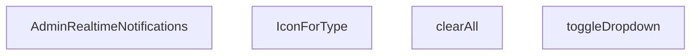

## NODE ID STANDARD

  file: src\components\admin\AdminRealtimeNotifications.tsx
  function: src\components\admin\AdminRealtimeNotifications.tsx::AdminRealtimeNotifications
  function: src\components\admin\AdminRealtimeNotifications.tsx::toggleDropdown
  function: src\components\admin\AdminRealtimeNotifications.tsx::clearAll
  function: src\components\admin\AdminRealtimeNotifications.tsx::IconForType

---

## DISA AKTARILANLAR (EXPORTS)
  export: AdminRealtimeNotifications

---

## STİL TOKENLERİ

### Arbitrary Değerler (token'a geçirilmemiş)
Yok — tüm stiller token'a geçirilmiş. ✅

### Kullanılan Token'lar (zaten token'a geçirilmiş)
- (yok)

### Tailwind Sınıf Özeti
- **Renkler:** `bg-blue-50`, `bg-blue-50/30`, `bg-emerald-50`, `bg-emerald-500/10`, `bg-primary-navy`, `bg-primary-navy/10`, `bg-rose-100`, `bg-rose-500`, `bg-slate-100`, `bg-slate-50/30`, `bg-slate-50/50`, `bg-slate-50/80`, `bg-slate-500/10`, `bg-white`, `border-2`
- **Layout:** `absolute`, `flex`, `flex-1`, `flex-col`, `flex-shrink-0`, `gap-1`, `gap-2`, `gap-3`, `h-10`, `h-12`, `h-2`, `h-2.5`, `items-center`, `justify-between`, `justify-center`
- **Varyant/Responsive:** `:`, `hover:`, `sm:` önekleri
- **Yardımcı Sınıflar:** `${!notif.isRead`, `${notif.link`, `:`, `animate-in`, `animate-pulse`, `border`, `cursor-pointer`, `duration-300`, `fade-in`, `font-bold`, `font-medium`, `hover:shadow`, `leading-relaxed`, `mb-3`, `ml-3`

---
# FILE: src\components\admin\AdminSkeleton.md

---
domain: general
source_type: doc
namespace_type: module
source_path: C:\Users\alize\venthub-hvac\src\components\admin\AdminSkeleton.tsx
skeleton_hash: 3d64d8f079258cce
entity_hashes:
  func:AdminSkeleton: 586d38b8378960eb
  overview: d5fffe3d7ed9f7eb
  style_tokens: 9ebeaa83a2aaeb97
generated_at: 2026-05-28T22:35:31Z
---

## Genel Bakış
`AdminSkeleton` bileşeni, yönetim panelinde veri yüklenme süreçlerinde kullanıcıya görsel geri bildirim sunan yer tutucu arayüzleri oluşturur. Tablo, kart veya form gibi farklı varyasyonlara göre adapte olabilen esnek bir skeleton şablonu sağlar. Bu sayede sayfa düzeni nihai veriler yüklenmeden önce kullanıcıya kabaca gösterilir.

## Fonksiyon Grupları
### Skeleton Oluşturma ve Yer Tutucu Üretimi
Verilen parametrelere göre satır, alan ve tekrar sayısını hesaplayarak tekrarlayan placeholder elemanlarını oluşturur.
- AdminSkeleton

---

## AXIOMS – Mimari Varsayımlar
Bu modülün doğru çalışması için temel mimari varsayımlar fonksiyonun parametrelerine dayanır.

**[Aksiyom 1]:** Eğer `variant` parametresi `null` veya `undefined` ise, bileşen doğru bir skeleton varyantı (ör. `table`, `card`, `form`) oluşturamaz ve uygun bir stil uygulanamaz.

**[Aksiyom 2]:** Eğer `rows`, `count` veya `fields` parametrelerinden herhangi biri negatif veya sıfır ise, bileşen anlamsız veya görünmez placeholder elemanlar üretir; skeleton yapısının bozulmasına yol açar.

**[Aksiyom 3]:** Fonksiyonun `rows`, `count` ve `fields` değerlerini **pozitif tamsayı** olarak kabul ettiği varsayılır (default değerleri sırasıyla 5, 4 ve 6'dır). Bu değerlerin UI'da tekrarlayan elemanların sayısını doğrudan belirlediği kabul edilir.

---

## FONKSİYON DETAYLARI

### AdminSkeleton

**Ne yapar**: AdminSkeleton, admin panelinin yükleme durumlarında (loading state) kullanılacak iskelet/skeleton gösterimini oluşturur. variant propuna bağlı olarak tablo, kart veya form tipinde animasyonlu placeholder bileşenleri render eder. Veri yüklenene kadar kullanıcıya sayfanın yapısını görsel olarak hissettirmeyi amaçlar.

**Nasıl yapar**: Fonksiyon, `variant` parametresinin değerine göre üç farklı JSX yapısı döndürür. `'table'` seçildiğinde başlık satırı ve belirli satır/sütun sayısına sahip bir tablo iskeleti, `'cards'` seçildiğinde grid düzeninde kart iskeletleri,否则 varsayılan olarak form alanlarından oluşan bir iskelet render eder. Her bir varyantta `animate-pulse` sınıfı ile animasyon efekti, `glassStrongClass` ile cam efektli arka plan ve `border-white/5` gibi transparan kenarlıklar kullanılarak modern bir loading görseli oluşturulur. `rows`, `count` ve `fields` parametreleri ile dinamik olarak eleman sayısı kontrol edilir.

**Parametreler**:
- `variant`: `'table' | 'cards' | string` (varsayılan: `'form'` olarak davranır) — Skeleton tipini belirler. `'table'` tablo, `'cards'` kart düzeni, diğer değerler form varyantını aktif eder
- `rows`: `number` — `'table'` varyantında tablonun satır sayısını belirler (varsayılan: 5)
- `count`: `number` — `'cards'` varyantında gösterilecek kart sayısını belirler (varsayılan: 4)
- `fields`: `number` — Varsayılan form varyantında alan sayısını belirler (varsayılan: 6)

**Dönüş**: `JSX.Element` — Seçilen varyanta göre animasyonlu skeleton yapısını temsil eden React JSX bileşeni döndürür. Her varyant farklı bir layout yapısına sahiptir: tablo varyantı `<div>` içinde `<table>` yapısı, kart varyantı grid düzeninde çoklu `<div>` kartları, form varyantı ise input alanlarını simüle eden çoklu `<div>` blokları içerir.

---

## INTERFACES

### AdminSkeletonProps
- `variant: 'table' | 'cards' | 'form'`
- `rows?: number`
- `count?: number`
- `fields?: number`

---

## NODE ID STANDARD

  file: src\components\admin\AdminSkeleton.tsx
  function: src\components\admin\AdminSkeleton.tsx::AdminSkeleton

---

## DISA AKTARILANLAR (EXPORTS)
  export: AdminSkeleton

---

## STİL TOKENLERİ

### Arbitrary Değerler (token'a geçirilmemiş)
Yok — tüm stiller token'a geçirilmiş. ✅

### Kullanılan Token'lar (zaten token'a geçirilmiş)
- `rounded-hvac-2xl`, `rounded-hvac-xl`

### Tailwind Sınıf Özeti
- **Renkler:** `bg-cyan-400/10`, `bg-cyan-500/5`, `bg-gradient-to-br`, `bg-transparent`, `bg-white/10`, `bg-white/2`, `bg-white/3`, `bg-white/5`, `border-b`, `border-cyan-400/20`, `border-t`, `border-white/5`, `from-cyan-500/5`, `text-left`, `to-transparent`
- **Layout:** `absolute`, `flex`, `from-cyan-500/5`, `gap-4`, `gap-6`, `gap-8`, `grid`, `grid-cols-1`, `h-10`, `h-12`, `h-14`, `h-3`, `h-32`, `h-4`, `h-6`
- **Varyant/Responsive:** `group-hover:`, `lg:`, `md:` önekleri
- **Yardımcı Sınıflar:** `${glassStrongClass`, `animate-pulse`, `blur-3xl`, `border`, `divide-white/5`, `divide-y`, `group`, `group-hover:opacity-100`, `inset-0`, `mb-10`, `ml-1`, `mt-10`, `opacity-0`, `pt-8`, `rounded-2xl`

---
# FILE: src\components\admin\AdminToolbar.md

---
domain: general
source_type: doc
namespace_type: module
source_path: C:\Users\alize\venthub-hvac\src\components\admin\AdminToolbar.tsx
skeleton_hash: 9fd39e890d43433c
entity_hashes:
  func:AdminToolbar: af143a8f279e1c1e
  overview: abe2ed456058d747
  style_tokens: f914d27adccfd567
generated_at: 2026-05-28T22:35:21Z
---

## Genel Bakış
Bu modül, bir yönetim panelinde kullanılan araç çubuğu bileşenini tanımlar. Kullanıcıya arama, seçim, etiket (chip) ve açma/kapama (toggle) gibi filtreleme kontrollerini bir arada sunar; ayrıca kayıt sayısını gösterir ve filtreleri temizleme imkânı sağlar.

## Fonksiyon Grupları
### Admin Toolbar Bileşeni
Yönetim arayüzünde üst kısımda yer alan, birden çok filtre türünü ve durum bilgisini içeren bir araç çubuğu oluşturur.
- AdminToolbar

---

## AXIOMS – Mimari Varsayımlar
Bu modül için özel aksiyom tanımlanmamıştır.

**Aksiyom 1**: Eğer `search` yoksa, arama kutusu gösterilmez ve kullanıcı arama yapamaz.

**Aksiyom 2**: Eğer `select` yoksa, seçim (dropdown) kontrolü render edilmez; kullanıcı birden çok öğe seçemez.

**Aksiyom 3**: Eğer `chips` yoksa, aktif filtre çipleri gösterilmez; mevcut filtrelerin görsel temsili eksik olur.

**Aksiyom 4**: Eğer `toggles` yoksa, durum (on/off) anahtarları gösterilmez; kullanıcı ilgili özellikleri açıp kapatamaz.

**Aksiyom 5**: Eğer `onClear` yoksa, “Temizle” (clear) butonu işlevsiz kalır; kullanıcı tüm seçimleri ve filtreleri sıfırlayamaz.

**Aksiyom 6**: Eğer `recordCount` yoksa, kayıt sayısı bilgisi gösterilmez; kullanıcı mevcut veri setinin büyüklüğünü göremez.

**Aksiyom 7**: Eğer `rig` yoksa, toolbar’ın stil ve konumlandırma (layout) ayarları eksik olur; varsayılan (fallback) stil uygulanır.

---

## FONKSİYON DETAYLARI

### AdminToolbar
**Ne yapar**: Bu React Fonksiyonel Bileşeni, VentHub HVAC sisteminin admin paneli için tasarlanmış araç çubuğunu oluşturur. Kullanıcıların arama, seçim, filtre yönetimi ve kayıt sayısı görüntüleme gibi yönetimsel işlemlerini yapabileceği tüm kullanıcı arayüzü öğelerini bir araya getirir.
**Nasıl yapar**: Bileşen, iletilen tüm props parametrelerini alır ve her bir prop ile ilişkili UI elemanlarını sıralı olarak render eder. Tüm etkileşim olayları için gerekli geri çağırma fonksiyonlarını üst bileşenlere iletir, özellikle `onClear` fonksiyonu ile tüm filtre ve arama ayarlarını sıfırlama işlemini gerçekleştirir. Ek olarak `rig` prop'u ile bileşenin özel yapılandırılmasını destekler.
**Parametreler**:
- search: unknown — Araç çubuğundaki arama bileşeni ile ilgili yapılandırma, sorgu değeri ve etkileşim olaylarını içeren veri paketi
- select: unknown — Seçim işlemleri için kullanılan açılır menüler, seçenekler ve ilgili olay dinleyicilerini içeren yapılandırma
- chips: unknown — Aktif filtreleri temsil eden çip bileşenleri, silme olayları ve görüntüleme ayarları içeren liste verisi
- toggles: unknown — Geçiş tuşları, toggle butonları ve ilgili durum yönetimi verilerini barındıran yapılandırma paketi
- onClear: (() => void) — Tüm arama, seçim ve filtre ayarlarını sıfırlamak için tetiklenen geri çağırma fonksiyonu
- recordCount: number — Mevcut listede gösterilen toplam kayıt sayısını temsil eden sayısal değer
- rig: unknown — Bileşenin özel stillendirme, ek özellikler veya özel yapılandırmaları için kullanılan ayar paketi
**Dönüş**: React.ReactElement — Admin araç çubuğunun tam kullanıcı arayüzünü temsil eden React JSX elemanı. Bileşen, tüm verilen props'lara dayalı olarak dinamik olarak içerik ve davranışını değiştirir.

---

## TYPE ALIASES

### AdminToolbarChip
```typescript
type AdminToolbarChip = {

  key: string

  label: string

  active: boolean

  onToggle: () => void

  classOn?: string

  classOff?: string

  title?: string

}
```

### AdminToolbarToggle
```typescript
type AdminToolbarToggle = {

  key: string

  label: string

  checked: boolean

  onChange: (checked: boolean) => void

  title?: string

}
```

### AdminToolbarSelectOption
```typescript
type AdminToolbarSelectOption = { value: string; label: string }
```

### AdminToolbarProps
```typescript
type AdminToolbarProps = {

  search?: {

    value: string

    onChange: (v: string) => void

    placeholder?: string

    title?: string

    focusShortcut?: string // default '/'

  }

  select?: {

    value: string

  
```

---

## AST POINTERS

### [N1_NASIL] AST Pointer: src/components/admin/AdminToolbar.tsx::anonymous_1
- **params**: (none)
- **ic_degiskenler**:
  - `search` — dışarıdan gelen prop, arama alanının varlığını kontrol eder.
  - `inputRef` — `useRef` ile tanımlı, arama girişine odaklanmak için kullanılır.
  - `handleKeyDown` — `KeyboardEvent` dinleyicisi, “/” tuşuna basıldığında arama girişine odaklanır.
- **Dönüş**: `void` (etkinlik dinleyicisini ekler, temizleme fonksiyonu döner).

### [N2_NASIL] AST Pointer: src/components/admin/AdminToolbar.tsx::anonymous_2
- **params**: `e` — `KeyboardEvent`
- **ic_degiskenler**:
  - `e.key` — tuş kodunu kontrol eder, “/” ise işlem yapılır.
  - `document.activeElement?.tagName` — odaklanmış elementin tipini kontrol eder.
  - `inputRef.current` — arama girişine odaklanmak için `focus()` çağrısı yapılır.
- **Dönüş**: `void`

### [N3_NASIL] AST Pointer: src/components/admin/AdminToolbar.tsx::anonymous_3
- **params**: (none)
- **ic_degiskenler**:
  - `storageKey` — localStorage’da veri saklamak için kullanılan anahtar.
  - `persist` — dışarıdan gelen ayar nesnesi, hangi bölümlerin kalıcı olacağını belirler.
  - `enable` — `persist` değerlerine göre hangi bölümlerin yüklenip uygulanacağını tutan obje.
  - `raw` — `localStorage.getItem(storageKey)` sonucu, ham JSON stringi.
  - `saved` — `JSON.parse(raw)` ile elde edilen nesne; `search`, `select`, `chips`, `toggles` alanlarını içerir.
  - `select` — dışarıdan gelen select kontrolü, `onChange` ile değer güncellenir.
  - `chips` — dışarıdan gelen chip listesi, her chip `key`, `active`, `onToggle` içerir.
  - `toggles` — dışarıdan gelen toggle listesi, her toggle `key`, `checked`, `onChange` içerir.
  - `hydratedRef` — komponentin hydrate edildiğini işaret eden `useRef`.
- **Dönüş**: `void` (state’i hydrate eder, localStorage’dan okur).

### [N4_NASIL] AST Pointer: src/components/admin/AdminToolbar.tsx::anonymous_4
- **params**: `ch` — chip öğesi (`{ key, active, onToggle, ... }`)
- **ic_degiskenler**:
  - `saved.chips?.[ch.key]` — localStorage’da saklanan chip durumu.
  - `want` — `saved` içindeki chip’in beklenen boolean değeri.
- **Dönüş**: `void` (chip’in aktifliği farklıysa `onToggle` çağrılır).

### [N5_NASIL] AST Pointer: src/components/admin/AdminToolbar.tsx::anonymous_5
- **params**: `t` — toggle öğesi (`{ key, checked, onChange, ... }`)
- **ic_degiskenler**:
  - `saved.toggles?.[t.key]` — localStorage’da saklanan toggle durumu.
  - `want` — `saved` içindeki toggle’ın beklenen boolean değeri.
- **Dönüş**: `void` (toggle’ın durumu farklıysa `onChange` çağrılır).

### [N6_NASIL] AST Pointer: src/components/admin/AdminToolbar.tsx::anonymous_6
- **params**: (none)
- **ic_degiskenler**:
  - `storageKey` — localStorage’da veri saklamak için kullanılan anahtar.
  - `hydratedRef.current` — komponentin hydrate olup olmadığını gösterir.
  - `persist` — dışarıdan gelen ayar nesnesi, hangi bölümlerin kaydedileceğini belirler.
  - `enable` — `persist` değerlerine göre hangi bölümlerin payload’a ekleneceğini tutan obje.
  - `payload` — kaydedilecek veri objesi; `select`, `chips`, `toggles` alanlarını içerir.
  - `select` — dışarıdan gelen select kontrolü, `value` özelliği payload’a eklenir.
  - `chips` — dışarıdan gelen chip listesi, `key` ve `active` durumları payload’a eklenir.
  - `toggles` — dışarıdan gelen toggle listesi, `key` ve `checked` durumları payload’a eklenir.
- **Dönüş**: `void` (payload’u JSON.stringify edip localStorage’a yazar).

### [N7_NASIL] AST Pointer: src/components/admin/AdminToolbar.tsx::anonymous_7
- **params**: `opt` — option nesnesi (`{ value, label }`)
- **ic_degiskenler**:
  - `opt.value` — `<option>` elementinin `value` attribute’u.
  - `opt.label` — `<option>` elementinin gösterilen metni.
- **Dönüş**: `JSX.Element` (`<option>` elementi döner).

### [N8_NASIL] AST Pointer: src/components/admin/AdminToolbar.tsx::anonymous_8
- **params**: `tog` — toggle nesnesi (`{ key, label, checked, onChange, title, ... }`)
- **ic_degiskenler**:
  - `tog.key` — listede `key` attribute’u.
  - `tog.label` — gösterilen metin.
  - `tog.checked` — `Switch.Root`’un `checked` prop’u.
  - `tog.onChange` — toggle değiştiğinde çağrılan fonksiyon.
  - `tog.title` — erişilebilirlik etiketi, yoksa `label` kullanılır.
- **Dönüş**: `JSX.Element` (toggle UI’si döner).

### [N9_NASIL] AST Pointer: src/components/admin/AdminToolbar.tsx::anonymous_9
- **params**: `ch` — chip nesnesi (`{ key, label, active, onToggle, classOn, classOff, title, ... }`)
- **ic_degiskenler**:
  - `ch.key` — `key` attribute’u.
  - `ch.label` — buton içindeki metin.
  - `ch.active` — chip’in aktif olup olmadığını gösterir.
  - `ch.onToggle` — tıklandığında çalıştırılan fonksiyon.
  - `ch.classOn` / `ch.classOff` — aktif/pasif durumdaki CSS sınıfları.
  - `defaultChipOn` / `defaultChipOff` — varsayılan sınıflar (bileşen içinde tanımlı).
  - `ch.title` — `title` attribute’u, yoksa `label` kullanılır.
- **Dönüş**: `JSX.Element` (chip butonu döner).

### [N10_NASIL] AST Pointer: src/components/admin/AdminToolbar.tsx::anonymous_10
- **params**: `opt` — option nesnesi (`{ value, label }`)
- **ic_degiskenler**:
  - `opt.value` — `<option>` elementinin `value` attribute’u.
  - `opt.label` — `<option>` elementinin gösterilen metni.
- **Dönüş**: `JSX.Element` (basit `<option>` elementi döner).

### [N11_NASIL] AST Pointer: src/components/admin/AdminToolbar.tsx::anonymous_11
- **params**: `tog` — toggle nesnesi (`{ key, label, checked, onChange, ... }`)
- **ic_degiskenler**:
  - `tog.key` — `key` attribute’u.
  - `tog.label` — gösterilen metin.
  - `tog.checked` — `Switch.Root`’un `checked` prop’u.
  - `tog.onChange` — toggle değiştiğinde çağrılan fonksiyon.
- **Dönüş**: `JSX.Element` (küçük stilli toggle UI’si döner).

### [N12_NASIL] AST Pointer: src/components/admin/AdminToolbar.tsx::anonymous_12
- **params**: `ch` — chip nesnesi (`{ key, label, active, onToggle, classOn, classOff, ... }`)
- **ic_degiskenler**:
  - `ch.key` — `key` attribute’u.
  - `ch.label` — buton içindeki metin.
  - `ch.active` — chip’in aktif olup olmadığını gösterir.
  - `ch.onToggle` — tıklandığında çalıştırılan fonksiyon.
  - `ch.classOn` / `ch.classOff` — aktif/pasif durumdaki CSS sınıfları.
  - `defaultChipOn` / `defaultChipOff` — varsayılan sınıflar (bileşen içinde tanımlı).
- **Dönüş**: `JSX.Element` (chip butonu döner).

---

## NODE ID STANDARD

  file: src\components\admin\AdminToolbar.tsx
  function: src\components\admin\AdminToolbar.tsx::AdminToolbar

---

## DISA AKTARILANLAR (EXPORTS)
  export: AdminToolbar
  export: AdminToolbarChip
  export: AdminToolbarProps
  export: AdminToolbarSelectOption
  export: AdminToolbarToggle

---

## STİL TOKENLERİ

### Arbitrary Değerler (token'a geçirilmemiş)
Yok — tüm stiller token'a geçirilmiş. ✅

### Kullanılan Token'lar (zaten token'a geçirilmiş)
- `rounded-hvac-lg`, `tracking-hvac-normal`

### Tailwind Sınıf Özeti
- **Renkler:** `bg-cyan-400`, `bg-rose-500`, `bg-surface-deep`, `bg-surface-deep/20`, `bg-surface-deep/40`, `bg-transparent`, `bg-white`, `bg-white/10`, `bg-white/3`, `bg-white/5`, `border-cyan-400`, `border-l`, `border-surface-deep`, `border-t`, `border-white/10`
- **Layout:** `${sticky`, `-right-1`, `-top-1`, `absolute`, `backdrop-blur-2xl`, `block`, `flex`, `flex-1`, `flex-col`, `flex-wrap`, `gap-2`, `gap-2.5`, `gap-3`, `gap-4`, `gap-5`
- **Varyant/Responsive:** `:`, `data-[state=checked]:`, `focus-visible:`, `group-focus-within:`, `hover:`, `lg:`, `md:`, `placeholder:` önekleri
- **Yardımcı Sınıflar:** `$`, `${adminSelectClass`, `${ch.active`, `${className`, `-translate-y-1/2`, `:`, `animate-in`, `border`, `ch.classOff`, `ch.classOn`, `cursor-pointer`, `data-[state=checked]:translate-x-3.5`, `data-[state=checked]:translate-x-4.5`, `defaultChipOff`, `defaultChipOn`

---
# FILE: src\components\admin\BulkActionToolbar.md

---
domain: general
source_type: doc
namespace_type: module
source_path: C:\Users\alize\venthub-hvac\src\components\admin\BulkActionToolbar.tsx
skeleton_hash: 7bf65b45d538cf54
entity_hashes:
  func:BulkActionToolbar: ba39222c0aa88e73
  overview: e440025fef007b62
  style_tokens: 812207303bb8adc3
generated_at: 2026-05-28T22:35:21Z
---

## Genel Bakış
`BulkActionToolbar` bileşeni, yönetim panelinde birden fazla öğe seçildiğinde toplu işlemler (durum güncelleme, özellik değiştirme, silme) yapabilmek için kullanılan bir araç çubuğu sağlar. Seçili öğe sayısını gösterir ve ilgili eylemlerin tetiklenmesi için dışarıdan gelen callback fonksiyonlarını yönetir.

## Fonksiyon Grupları
### UI Render ve Görsel Düzen
Bu grup, seçili öğe sayısını gösteren etiket, eylem butonları ve araç çubuğunun genel görünümünü oluşturur.  
- BulkActionToolbar

### Eylem Tetikleme ve Callback Yönetimi
Bu grup, buton tıklamalarıyla gelen kullanıcı etkileşimlerini alır, ilgili parametreleri (ör. yeni durum, özellik anahtarı) hazırlayarak dışarıdan sağlanan `onStatusChange`, `onFeatureToggle` ve `onDelete` callback’lerini çağırır.  
- BulkActionToolbar (içindeki event handler mantığı)

---

## AXIOMS – Mimari Varsayımlar
Bu modül için özel aksiyom tanımlanmamıştır.

---

## FONKSİYON DETAYLARI

### BulkActionToolbar
**Ne yapar**: Seçili öğe sayısını gösteren ve toplu eylemler (durum değişikliği, özellik geçişi, silme) için tetikleyiciler sağlayan bir React bileşenini tanımlar.  

**Nasıl yapar**: Props olarak aldığı `selectedCount`, `onStatusChange`, `onFeatureToggle` ve `onDelete` fonksiyonlarını UI elemanlarına bağlayarak, kullanıcı etkileşimlerine göre ilgili geri çağırma fonksiyonlarını çalıştırır. Bileşen, `BulkActionToolbarProps` tipinde bir fonksiyonel bileşen (`React.FC`) olarak döndürülür.  

**Parametreler**:
- `selectedCount`: number — Kullanıcı tarafından seçilen öğelerin toplam sayısı.
- `onStatusChange`: (newStatus: string) => void — Seçili öğelerin durumunu güncellemek için çağrılan geri çağırma fonksiyonu.
- `onFeatureToggle`: (featureName: string, enabled: boolean) => void — Belirli bir özelliğin etkinleştirilip devre dışı bırakılmasını yönetmek için kullanılan geri çağırma fonksiyonu.
- `onDelete`: () => void — Seçili öğelerin toplu silinmesini tetikleyen geri çağırma fonksiyonu.

**Dönüş**: React.FC<BulkActionToolbarProps> — Tanımlanan props tipine uygun bir fonksiyonel React bileşeni.

---

## INTERFACES

### BulkActionToolbarProps
- `selectedCount: number`
- `onStatusChange: (status: string) => void`
- `onFeatureToggle: (featured: boolean) => void`
- `onDelete: () => void`
- `onPriceAdjust: (mode: 'percent' | 'fixed', value: number) => void`
- `onClearSelection: () => void`

---

## AST POINTERS

### [N1_NASIL] AST Pointer: src\components\admin\BulkActionToolbar.tsx::BulkActionToolbar
- **params**: selectedCount, onStatusChange, onFeatureToggle, onDelete, onPriceAdjust, onClearSelection
- **ic_degiskenler**:
  - `showPricePanel` — Fiyat güncelleme panelinin görünürlüğünü kontrol eden boolean React state değeri
  - `setShowPricePanel` — showPricePanel state'ini güncellemek için kullanılan setState fonksiyonu
  - `priceMode` — Fiyat güncelleme modunu tutan state, 'percent' (yüzde) veya 'fixed' (sabit) değerlerini alır
  - `setPriceMode` — priceMode state'ini güncelleyen setState fonksiyonu
  - `priceValue` — Kullanıcının girdiği fiyat değerini string olarak tutan React state değeri
  - `setPriceValue` — priceValue state'ini güncelleyen setState fonksiyonu
  - `adminButtonPrimaryClass` — Import edilen, butonlara stil vermek için kullanılan CSS sınıfı
- **Dönüş**: null | JSX.Element; seçili ürün sayısı 0 ise null, aksi halde toolbar JSX yapısını döndürür

### [N2_NASIL] AST Pointer: src\components\admin\BulkActionToolbar.tsx::fiyatGuncelleUygulaOnClick
- **params**: (parametre yok)
- **ic_degiskenler**:
  - `v` — Kullanıcının girdiği string tipindeki priceValue'nin float'a dönüştürülmüş sayısal hali
  - `priceValue` — Üst kapsamdan erişilen, kullanıcının girdiği fiyat değerini tutan state
  - `priceMode` — Üst kapsamdan erişilen, seçili fiyat güncelleme modunu tutan state
  - `onPriceAdjust` — Üst parametrelerden alınan, toplu fiyat güncelleme işlemini tetikleyen callback fonksiyonu
  - `setShowPricePanel` — Fiyat panelini kapatmak için kullanılan üst kapsamdaki setState fonksiyonu
  - `setPriceValue` - İşlem sonrası fiyat girişini sıfırlamak için kullanılan üst kapsamdaki setState fonksiyonu
  - `alert` — Tarayıcının yerleşik uyarı fonksiyonu, geçersiz sayısal giriş durumunda çağrılır
- **Dönüş**: void | number; geçersiz giriş durumunda alert() dönüş değerini döndürür, başarılı işlemde hiçbir değer döndürmez

---

## NODE ID STANDARD

  file: src\components\admin\BulkActionToolbar.tsx
  function: src\components\admin\BulkActionToolbar.tsx::BulkActionToolbar

---

## DISA AKTARILANLAR (EXPORTS)
  export: BulkActionToolbar

---

## STİL TOKENLERİ

### Arbitrary Değerler (token'a geçirilmemiş)
Yok — tüm stiller token'a geçirilmiş. ✅

### Kullanılan Token'lar (zaten token'a geçirilmiş)
- (yok)

### Tailwind Sınıf Özeti
- **Renkler:** `bg-blue-400/80`, `bg-emerald-500/80`, `bg-gray-400/80`, `bg-gray-50`, `bg-primary-navy`, `bg-red-500/80`, `bg-white`, `bg-white/20`, `bg-yellow-500/80`, `border-gray-200`, `border-primary-navy`, `hover:bg-blue-400`, `hover:bg-emerald-500`, `hover:bg-gray-400`, `hover:bg-red-500`
- **Layout:** `absolute`, `bg-yellow-500/80`, `bottom-4`, `bottom-full`, `fixed`, `flex`, `flex-1`, `flex-wrap`, `gap-2`, `gap-3`, `h-6`, `h-8`, `hover:bg-yellow-500`, `items-center`, `justify-center`
- **Varyant/Responsive:** `:`, `focus-visible:`, `hover:` önekleri
- **Yardımcı Sınıflar:** `!py-2`, `!text-xs`, `${adminButtonPrimaryClass`, `${priceMode`, `:`, `===`, `animate-slide-up`, `border`, `focus-visible:outline-none`, `focus-visible:ring-2`, `focus-visible:ring-primary-navy/30`, `font-bold`, `font-medium`, `font-semibold`, `mb-2`

---
# FILE: src\components\admin\ColumnsMenu.md

---
domain: general
source_type: doc
namespace_type: module
source_path: C:\Users\alize\venthub-hvac\src\components\admin\ColumnsMenu.tsx
skeleton_hash: 8e6ac07df5b78228
entity_hashes:
  func:ColumnsMenu: acb58bb1e295bcab
  overview: e3dc8c1ebce8d947
  style_tokens: f68608c28260c039
generated_at: 2026-05-28T22:35:32Z
---

## Genel Bakış
`ColumnsMenu` bileşeni, yönetim panelindeki tablolarda sütunların görünürlüğünü ve satır yoğunluğunu yönetmeye yarayan bir menü bileşenidir. Dışarıdan aldığı sütun listesini ve yoğunluk ayarını kullanarak, kullanıcının bu tercihleri kolayca değiştirimesine olanak tanır.

## Fonksiyon Grupları
### Menü ve Kontrol Mantığı
Bu grup, menünün kullanıcıya sunulması, sütun açma/kapama denetimlerinin listelenmesi ve yoğunluk değişikliklerinin üst bileşene iletilmesinden sorumludur.
- ColumnsMenu

---

## AXIOMS – Mimari Varsayımlar

Bu modül için mimari varsayımlar, fonksiyon imzası ve bileşenin tablo yapılandırması menüsü rolü temel alınarak belirlenmiştir.

**[Aksiyom 1]**: Eğer `columns` parametresi dizisi boş veya tanımsızsa, menüde sütun denetimleri oluşturulamaz ve kullanıcı hiçbir sütunu açıp kapatamaz.

**[Aksiyom 2]**: Eğer `onDensityChange` callback fonksiyonu sağlanmamışsa, kullanıcı yoğunluk değiştirdiğinde üst bileşene bildirim yapılamaz ve yoğunluk değişikliği uygulanamaz.

**[Aksiyom 3]**: Eğer `density` parametresi geçerli bir yoğunluk değeri (örn: `compact`, `normal`, `comfortable`) içermiyorsa, yoğunluk seçim durumu doğru görüntülenemez.

**[Aksiyom 4]**: Eğer `buttonLabel` parametresi sağlanmamışsa, menü tetikleme düğmesinde varsayılan bir etiket yoksa boş veya anlamsız bir düğme görüntülense bile bileşen render edilmeye devam eder.

**[Aksiyom 5]**: Eğer `columns` dizisi içindeki herhangi bir sütun nesnesi gerekli alanları (örn: `id`, görünürlük durumu) içermiyorsa, o sütun için denetim düzgün oluşturulamaz.

---

## FONKSİYON DETAYLARI

### ColumnsMenu

**Ne yapar**: Tablo sütunlarının görünürlüğünü ve tablo yoğunluğunu (density) yöneten bir açılır menü bileşenidir. Kullanıcının tablodaki hangi sütunların gösterileceğini seçmesine ve satır aralığı yoğunluğunu ayarlamasına olanak tanır.

**Nasıl yapar**: Bileşen, verilen `columns` dizisini kullanarak her bir sütun için bir toggle ( açma/kapama ) kontrolü oluşturur. `density` prop'u ile mevcut yoğunluk durumunu okur ve `onDensityChange` callback'i aracılığıyla yoğunluk değişikliklerini üst bileşene iletir. `buttonLabel` prop'u sağlanmışsa, menüyü tetikleyen butonda özel bir etiket kullanılır; aksi halde varsayılan bir etiket gösterir.

**Parametreler**:
- `columns`: `ColumnToggle[]` — Tablodaki sütunların tanımını ve görünürlük durumlarını içeren dizi. Her bir öğe, bir sütunun adını ve açma/kapama durumunu temsil eder.
- `density`: `Density` — Tablonun mevcut yoğunluk modunu belirten değer. Satır yüksekliği ve iç boşlukları kontrol eder.
- `onDensityChange`: `(d: Density) => void` — Kullanıcı yoğunluk değiştirdiğinde çağrılan geri çağırma fonksiyonu. Yeni yoğunluk değerini üst bileşene iletir.
- `buttonLabel`: `string | undefined` — Opsiyonel. Menüyü açan buton üzerinde görüntülenecek özel etiket metni. Sağlanmadığında varsayılan metin kullanılır.

**Dönüş**: `React.FC` — JSX ile render edilen bir React fonksiyonel bileşeni döndürür. Bileşen, sütun toggle'larını ve yoğunluk seçim kontrolünü içeren bir menü arayüzü sunar.

---

## TYPE ALIASES

### ColumnToggle
```typescript
type ColumnToggle = { key: string; label: string; checked: boolean; onChange: (v: boolean) => void }
```

---

## AST POINTERS

### [N1_NASIL] AST Pointer: src/components/admin/ColumnsMenu.tsx::ColumnsMenu
- **params**: `{ columns, density, onDensityChange, buttonLabel }`
  - `columns` — `ColumnToggle[]` tipinde, sütunların açma/kapama durumlarını ve etiketlerini içeren dizi; `.map()` ile dönülerek her sütun için checkbox öğesi oluşturulur
  - `density` — `Density` tipinde aktif satır yoğunluk modu (`"comfortable"` veya `"compact"`); radio grubunun seçili değerini belirler ve koşullu CSS sınıfları için kullanılır
  - `onDensityChange` — `(d: Density) => void` tipinde geri çağırma fonksiyonu; kullanıcı yoğunluk seçimini değiştirdiğinde `DropdownMenu.RadioGroup.onValueChange` içinde çağrılır
  - `buttonLabel` — `string | undefined`, opsiyonel buton metni; tanımlıysa kullanılır, aksi halde `_t('admin.common.view')` veya `'Görünüm'` fallback'i gösterilir
- **ic_degiskenler**:
  - `_t` — `useI18n()` hook'undan destructure edilen çeviri fonksiyonu (`t`); bileşen içindeki tüm kullanıcıya dönük metinlerin uluslararasılaştırılmasını sağlar (`_t('admin.a11y.menu')`, `_t('admin.common.view')`, `_t('admin.inventory.activeColumns')`, `_t('admin.inventory.density')`, `_t('admin.inventory.densityComfortable')`, `_t('admin.inventory.densityCompact')`)
- **col (map callback parametresi)** — `columns.map(col => ...)` içindeki her bir `ColumnToggle` öğesi:
  - `col.key` — benzersiz React listesi anahtarı; `DropdownMenu.CheckboxItem`'a `key` prop'u olarak verilir
  - `col.checked` — `boolean`, sütunun şu anda görünür olup olmadığını belirtir; checkbox'ın `checked` prop'u ve koşullu CSS sınıfları (`bg-cyan-400`) için kullanılır
  - `col.onChange` — `(v: boolean) => void` tipinde sütun durumu değiştirme callback'i; `onCheckedChange` içinde `Boolean(v)` ile çağrılarak sütun açılır/kapanır
  - `col.label` — `string`, sütunun kullanıcıya gösterilen Türkçe/yerel adı; checkbox öğesinin hem metin içeriğinde hem `aria-label`'inde kullanılır
- **Dönüş**: JSX — Radix UI `DropdownMenu` bileşeni; sütun toggle checkbox'larından ve yoğunluk seçim radio butonlarından oluşan bir dropdown menü

---

## NODE ID STANDARD

  file: src\components\admin\ColumnsMenu.tsx
  function: src\components\admin\ColumnsMenu.tsx::ColumnsMenu

---

## DISA AKTARILANLAR (EXPORTS)
  export: ColumnToggle
  export: ColumnsMenu

---

## STİL TOKENLERİ

### Arbitrary Değerler (token'a geçirilmemiş)
Yok — tüm stiller token'a geçirilmiş. ✅

### Kullanılan Token'lar (zaten token'a geçirilmiş)
- `shadow-glow-sm`, `tracking-hvac-normal`

### Tailwind Sınıf Özeti
- **Renkler:** `bg-cyan-400`, `bg-surface-deep`, `bg-white/5`, `border-b`, `border-cyan-400`, `border-white/10`, `border-white/5`, `data-[state=checked]:text-cyan-400`, `hover:bg-white/5`, `hover:text-white`, `stroke-4`, `text-cyan-400`, `text-slate-300`, `text-slate-500`, `text-surface-deep`
- **Layout:** `custom-scrollbar`, `flex`, `gap-2`, `gap-3`, `h-1.5`, `h-12`, `h-4`, `h-px`, `items-center`, `justify-between`, `justify-center`, `max-h-300px`, `min-w-140px`, `min-w-240px`, `overflow-y-auto`
- **Varyant/Responsive:** `:`, `data-[state=checked]:`, `hover:` önekleri
- **Yardımcı Sınıflar:** `${col.checked`, `${density`, `:`, `===`, `animate-in`, `border`, `comfortable`, `compact`, `cursor-pointer`, `duration-200`, `fade-in`, `font-black`, `font-bold`, `glass-strong`, `group`

---
# FILE: src\components\admin\CommandPalette.md

---
domain: general
source_type: doc
namespace_type: module
source_path: C:\Users\alize\venthub-hvac\src\components\admin\CommandPalette.tsx
skeleton_hash: 738d408fb3f2d88d
entity_hashes:
  func:CommandPalette: d6aeed4e7453fe44
  func:handleKeyDown: 1487e8d647499b5f
  func:selectItem: 2c4ba43ca43f0c65
  overview: 6e2ec88e5bcb2e73
  style_tokens: 7dfe1be44eebd77e
generated_at: 2026-06-06T21:55:09Z
---

## Genel Bakış
CommandPalette, yönetim panelinde klavye kısayollarıyla hızlı komut arama ve seçimini sağlayan bir arayüz bileşenidir. Kullanıcının klavye girdilerini yakalayarak palet içindeki komutlar arasında gezinmesini ve istediğini seçmesini mümkün kılar. Temel olarak, verimli bir navigasyon deneyimi sunmak için klavye etkileşimleri ve seçim mantığını yönetir.

## Fonksiyon Grupları
### Ana Bileşen
Komut paletinin temel arayüzünü oluşturur ve tüm bileşenin render sürecini yönetir.
- CommandPalette

### Klavye Etkileşimi ve Seçim Mantığı
Kullanıcı klavye girdilerini işleyerek palet içindeki öğeler arasında gezinmeyi ve seçimi kontrol eder.
- handleKeyDown, selectItem

---

## AXIOMS – Mimari Varsayımlar

Bu modül için, verilen fonksiyon imzası bilgilerine dayanarak, fonksiyon gövdeleri bilinmediğinden çıkarılabilecek somut mimari aksiyom bulunmamaktadır.

[Aksiyom 1]: Eğer `selectItem` fonksiyonuna geçerli bir `index` parametresi verilmezse (örn: listede olmayan bir indeks), ilgili komut düzgün bir şekilde seçilemez veya uygulama beklenmedik bir duruma düşebilir.

[Aksiyom 2]: Eğer `handleKeyDown` fonksiyonuna geçerli bir `React.KeyboardEvent` nesnesi sağlanmazsa, klavye etkileşimleri (örn: yukarı/aşağı ok tuşlarıyla gezinme, Enter ile seçim) işlenemez.

[Aksiyom 3]: Eğer `CommandPalette` bileşeni, klavye olaylarını dinleyecek bir `onKeyDown` prop'u ile çağrılmazsa, klavye kısayolları çalışmaz.

---

## FONKSİYON DETAYLARI

### CommandPalette
**Ne yapar**: Komut paleti bileşenini oluşturur ve render eder. Kullanıcının uygulama içinde arama yapmasına ve komutlar/öğeler üzerinde gezinmesine olanak tanıyan bir arayüz sunar.
**Nasıl yapar**: Bileşen, durum yönetimi için useState ve useEffect hook'larını kullanarak arama terimini, seçili indeksi ve gerekli verileri tutar. Kullanıcı etkileşimlerine yanıt vermek için olay dinleyicileri ekler ve filtrelenmiş öğeleri listeler.
**Parametreler**:
- Parametre almaz (props kullanmaz).
**Dönüş**: `React.FC` (React Function Component) tipinde bir bileşen döner.

### handleKeyDown
**Ne yapar**: Komut paleti içindeki klavye olaylarını işler, özellikle yukarı/aşağı ok tuşlarıyla gezinme ve Enter tuşuyla seçim yapma gibi işlevselliği yönetir.
**Nasıl yapar**: Olay nesnesinin `key` özelliğini kontrol ederek hangi tuşa basıldığını belirler. Ok tuşları için seçili indeksi artırır/azaltır (sınır kontrolü yaparak), Escape tuşu için paleti kapatır ve Enter tuşu için mevcut seçili öğeyi seçer.
**Parametreler**:
- e: `React.KeyboardEvent` — Klavye olayı nesnesi, basılan tuş hakkında bilgi içerir.
**Dönüş**: `void` — Belirli bir değer dönmez, yan etki olarak durum değişiklikleri yapar.

### selectItem
**Ne yapar**: Verilen indeksteki öğeyi seçer ve ilgili eylemi (örneğin bir sayfaya yönlendirme, bir komutu çalıştırma) başlatır.
**Nasıl yapar**: Gelen `index` parametresiyle filtrelenmiş öğeler dizisinden ilgili öğeyi alır. Seçilen öğenin `action` veya benzeri bir özelliğinde tanımlı olan fonksiyonu çağırır ve ardından komut paletini kapatır.
**Parametreler**:
- index: `number` — Seçilmek istenen öğenin filtrelenmiş listedeki indeks numarası.
**Dönüş**: `void` — Belirli bir değer dönmez, yan etki olarak öğe seçimini ve paletin kapatılmasını sağlar.

---

## INTERFACES

### SearchResult
- `id: string`
- `name: string`
- `sku: string`

---

## AST POINTERS

### [N1_NASIL] AST Pointer: CommandPalette.tsx::CommandPalette
- **params**: (parametre yok)
- **ic_degiskenler**: 
  - `open` — Komut paletinin açık/kapalı durumunu tutan state (React.useState ile oluşturuldu)
  - `setOpen` — open state'ini güncellemek için kullanılan setter fonksiyonu
  - `search` — Arama kutusundaki yazıyı tutan state (React.useState ile oluşturuldu)
  - `setSearch` — search state'ini güncellemek için kullanılan setter fonksiyonu
  - `products` — Supabase'den getirilen ürün sonuçlarını tutan state array (SearchResult[] tipinde)
  - `setProducts` — products state'ini güncellemek için kullanılan setter fonksiyonu
  - `loading` — Arama yükleniyor durumunu tutan boolean state
  - `setLoading` — loading state'ini güncellemek için kullanılan setter fonksiyonu
  - `activeIndex` — Klavye navigasyonunda seçili olan öğenin indeksini tutan state
  - `setActiveIndex` — activeIndex state'ini güncellemek için kullanılan setter fonksiyonu
  - `router` — Next.js router hook'u ile oluşturulan yönlendirme nesnesi (useRouter())
  - `inputRef` — Arama input DOM elemanına referans tutan React ref nesnesi
  - `navItems` — Statik navigasyon öğeleri array'i (React.useMemo ile optimize edildi, 6 öğe: label, icon, href)
  - `totalItems` — Toplam seçilebilir öğe sayısını hesaplayan değişken (React.useMemo ile optimize edildi, filteredNav.length + products.length)
  - `filteredNav` — Arama terimine göre filtrelenmiş navigasyon öğeleri array'i (search.length > 0 ise navItems.filter(), değilse navItems)
  - `e` — handleKeyDown fonksiyonunun parametresi (React.KeyboardEvent), tuş olayı nesnesi
  - `index` — selectItem fonksiyonunun parametresi (number), seçilecek öğenin indeks değeri
  - `prodIndex` — Ürün listesindeki göreli indeks hesaplaması (index - filteredNav.length)
- **Dönüş**: JSX element (komut paleti arayüzü, !open ise null döner)

### [N2_NASIL] AST Pointer: CommandPalette.tsx::useMemoNavItems
- **params**: (parametre yok)
- **ic_degiskenler**: yok (sadece array literal return eder)
- **Dönüş**: Array<{ label: string, icon: Component, href: string }> — 6 statik navigasyon öğesi (Panel, Sipariş Yönetimi, Ürün Kataloğu, Stok Durumu, Kullanıcı Yönetimi, Ayarlar)

### [N3_NASIL] AST Pointer: CommandPalette.tsx::useMemoTotalItems
- **params**: (parametre yok)
- **ic_degiskenler**: 
  - `filteredNav` — Arama terimine göre filtrelenmiş navigasyon öğeleri array'i (search.length > 0 ise navItems.filter(), değilse navItems)
  - `search` — Arama kutusundaki yazıyı tutan değişken (üst scope'tan erişim)
  - `navItems` — Statik navigasyon öğeleri array'i (üst scope'tan erişim)
  - `products` — Ürün sonuçları array'i (üst scope'tan erişim)
- **Dönüş**: number — Toplam seçilebilir öğe sayısı (filteredNav.length + products.length)

### [N4_NASIL] AST Pointer: CommandPalette.tsx::useEffectCtrlK
- **params**: (parametre yok)
- **ic_degiskenler**: 
  - `down` — Klavye olay handler fonksiyonu (KeyboardEvent parametreli, CTRL+K tuş basımını yakalar)
  - `e` — down fonksiyonunun parametresi (KeyboardEvent), tuş olayı nesnesi
- **Dönüş**: Cleanup fonksiyonu (document.removeEventListener ile event listener'ı kaldırır)

### [N5_NASIL] AST Pointer: CommandPalette.tsx::useEffectCtrlKHandler
- **params**: (e: KeyboardEvent)
- **ic_degiskenler**: 
  - `e` — Parametre olarak gelen KeyboardEvent nesnesi
- **Dönüş**: yok (sadece setOpen state'ini toggles)

### [N6_NASIL] AST Pointer: CommandPalette.tsx::useEffectResetOnOpen
- **params**: (parametre yok)
- **ic_degiskenler**: 
  - `open` — Komut paletinin açık/kapalı durumunu tutan değişken (üst scope'tan erişim)
  - `setTimeout` — 50ms gecikmeli fonksiyon çağırma (inputRef.current?.focus())
- **Dönüş**: yok (yan etki: search, products, activeIndex state'lerini sıfırlar, input'a odaklanır)

### [N7_NASIL] AST Pointer: CommandPalette.tsx::useEffectProductSearch
- **params**: (parametre yok)
- **ic_degiskenler**: 
  - `searchProducts` — Async fonksiyon, Supabase'den ürün araması yapar
  - `timer` — setTimeout return değeri, debounce için kullanılır
  - `search` — Arama terimini tutan değişken (üst scope'tan erişim)
  - `setLoading` — Loading state'ini güncelleyen setter (üst scope'tan erişim)
  - `setProducts` — Ürün sonuçlarını güncelleyen setter (üst scope'tan erişim)
  - `supabase` — Supabase istemcisi (import edilmiş)
  - `data` — Supabase yanıtından dönen data alanı
- **Dönüş**: Cleanup fonksiyonu (clearTimeout ile timer'ı iptal eder)

### [N8_NASIL] AST Pointer: CommandPalette.tsx::searchProductsAsync
- **params**: (parametre yok)
- **ic_degiskenler**: 
  - `setLoading` — Loading state'ini true yapan setter (üst scope'tan erişim)
  - `supabase` — Supabase istemcisi (üst scope'tan erişim)
  - `data` — Supabase yanıtından dönen data alanı (products tablosundan id, name, sku alanlarını getirir)
  - `setProducts` — Ürün sonuçlarını güncelleyen setter (üst scope'tan erişim)
- **Dönüş**: Promise<void> (async fonksiyon, await ile Supabase çağrısı yapar)

### [N9_NASIL] AST Pointer: CommandPalette.tsx::useEffectResetActiveIndex
- **params**: (parametre yok)
- **ic_degiskenler**: 
  - `setActiveIndex` — ActiveIndex state'ini 0 yapan setter (üst scope'tan erişim)
  - `search` — Arama terimini tutan değişken (üst scope'tan erişim)
  - `products` — Ürün sonuçları array'i (üst scope'tan erişim)
- **Dönüş**: yok (yan etki: activeIndex'i 0'a sıfırlar)

### [N10_NASIL] AST Pointer: CommandPalette.tsx::handleKeyDown
- **params**: (e: React.KeyboardEvent)
- **ic_degiskenler**: 
  - `e` — Parametre olarak gelen React.KeyboardEvent nesnesi
  - `totalItems` — Toplam seçilebilir öğe sayısı (üst scope'tan erişim)
  - `activeIndex` — Mevcut aktif indeks (üst scope'tan erişim)
  - `setActiveIndex` — ActiveIndex state'ini güncelleyen setter (üst scope'tan erişim)
  - `setOpen` — Open state'ini false yapan setter (üst scope'tan erişim)
  - `selectItem` — Öğe seçme fonksiyonu (üst scope'tan erişim)
- **Dönüş**: yok (yan etki: klavye olaylarına göre state güncellemesi, yönlendirme)

### [N11_NASIL] AST Pointer: CommandPalette.tsx::selectItem
- **params**: (index: number)
- **ic_degiskenler**: 
  - `index` — Parametre olarak gelen sayısal indeks değeri
  - `filteredNav` — Arama terimine göre filtrelenmiş navigasyon öğeleri array'i (search.length > 0 ise navItems.filter(), değilse navItems)
  - `search` — Arama terimini tutan değişken (üst scope'tan erişim)
  - `navItems` — Statik navigasyon öğeleri array'i (üst scope'tan erişim)
  - `setOpen` — Open state'ini false yapan setter (üst scope'tan erişim)
  - `router` — Next.js router nesnesi (üst scope'tan erişim)
  - `prodIndex` — Ürün listesindeki göreli indeks hesaplaması (index - filteredNav.length)
  - `products` — Ürün sonuçları array'i (üst scope'tan erişim)
- **Dönüş**: yok (yan etki: komut paletini kapatır, belirli URL'ye yönlendirir)

### [N12_NASIL] AST Pointer: CommandPalette.tsx::renderNavItem
- **params**: (item: { label: string, icon: Component, href: string }, idx: number)
- **ic_degiskenler**: 
  - `item` — Parametre olarak gelen navigasyon öğesi nesnesi (label, icon, href)
  - `idx` — Parametre olarak gelen array indeksi
  - `Icon` — item.icon değerini atayan değişken (React bileşeni)
  - `isActive` — Bu öğenin seçili olup olmadığını belirleyen boolean (activeIndex === idx)
  - `activeIndex` — Seçili olan indeks (üst scope'tan erişim)
  - `setOpen` — Open state'ini false yapan setter (üst scope'tan erişim)
  - `router` — Next.js router nesnesi (üst scope'tan erişim)
- **Dönüş**: JSX element (navigasyon öğesi butonu)

### [N13_NASIL] AST Pointer: CommandPalette.tsx::renderProductItem
- **params**: (p: { id: string, name: string, sku: string }, idx: number)
- **ic_degiskenler**: 
  - `p` — Parametre olarak gelen ürün nesnesi (id, name, sku)
  - `idx` — Parametre olarak gelen array indeksi
  - `globalIdx` — Tüm öğeler arasındaki global indeks hesaplaması (filteredNav.length + idx)
  - `isActive` — Bu ürünün seçili olup olmadığını belirleyen boolean (activeIndex === globalIdx)
  - `activeIndex` — Seçili olan indeks (üst scope'tan erişim)
  - `filteredNav` — Filtrelenmiş navigasyon array'i (üst scope'tan erişim)
  - `setOpen` — Open state'ini false yapan setter (üst scope'tan erişim)
  - `router` — Next.js router nesnesi (üst scope'tan erişim)
- **Dönüş**: JSX element (ürün öğesi butonu)

---


## MERMAID CALL GRAPH
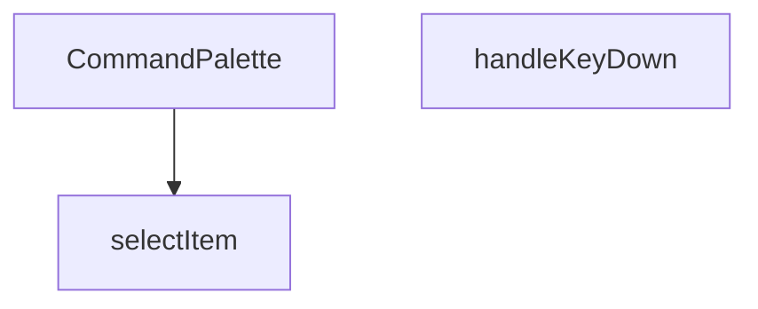

## NODE ID STANDARD

  file: src\components\admin\CommandPalette.tsx
  function: src\components\admin\CommandPalette.tsx::CommandPalette
  function: src\components\admin\CommandPalette.tsx::handleKeyDown
  function: src\components\admin\CommandPalette.tsx::selectItem

---

## DISA AKTARILANLAR (EXPORTS)
  export: CommandPalette

---

## STİL TOKENLERİ

### Arbitrary Değerler (token'a geçirilmemiş)
Yok — tüm stiller token'a geçirilmiş. ✅

### Kullanılan Token'lar (zaten token'a geçirilmiş)
- `rounded-hvac-xl`, `shadow-glow-md`, `shadow-glow-sm`, `tracking-hvac-normal`

### Tailwind Sınıf Özeti
- **Renkler:** `bg-cyan-400`, `bg-cyan-400/10`, `bg-surface-deep/10`, `bg-surface-deep/60`, `bg-transparent`, `bg-white/5`, `border-b`, `border-cyan-400/20`, `border-none`, `border-t`, `border-white/10`, `border-white/5`, `group-hover:text-cyan-400`, `hover:bg-white/5`, `hover:text-white`
- **Layout:** `absolute`, `backdrop-blur-md`, `fixed`, `flex`, `flex-1`, `gap-1.5`, `gap-2`, `gap-4`, `h-1.5`, `h-10`, `h-16`, `h-5`, `h-8`, `h-full`, `items-center`
- **Varyant/Responsive:** `:`, `group-hover:`, `hover:`, `placeholder:` önekleri
- **Yardımcı Sınıflar:** `$`, `${isActive`, `:`, `animate-in`, `animate-pulse`, `animate-spin`, `border`, `cursor-default`, `cursor-pointer`, `cyan-glow`, `duration-200`, `font-black`, `font-bold`, `font-medium`, `font-mono`

---
# FILE: src\components\admin\DateRangePicker.md

---
domain: general
source_type: doc
namespace_type: module
source_path: C:\Users\alize\venthub-hvac\src\components\admin\DateRangePicker.tsx
skeleton_hash: 19335609589ce934
entity_hashes:
  func:DateRangePicker: ed79aaef040a5b25
  func:applySelection: 68dcb4d14b5cc83c
  func:cancelSelection: 4bec1b96cb2c08c1
  func:handleSelect: fdeacf6bd5ee123e
  overview: 83cabe93bf8f0d23
  style_tokens: 8f057de8409875ea
generated_at: 2026-05-28T22:35:31Z
---

## Genel Bakış
Bu modül, yönetim paneli arayüzünde başlangıç ve bitiş tarihlerinin seçilmesi için kullanılan özel bir React bileşenidir. Kullanıcının yaptığı geçici seçimleri yönetir, onaylama veya iptal mekanizması sağlar ve nihai tarih aralığını üst bileşene iletir.

## Fonksiyon Grupları
### Bileşen Tanımı
Tarih seçici arayüzünü oluşturan ana bileşendir ve dış dünyadan gelen yapılandırma parametrelerini kabul eder.
- DateRangePicker

### Etkileşim ve Durum Yönetimi
Kullanıcının tarih seçimi, seçimi onaylama veya iptal etme gibi aksiyonlarını işleyerek bileşenin iç durumunu ve çıktısını günceller.
- handleSelect, applySelection, cancelSelection

---

## AXIOMS – Mimari Varsayımlar
Bu modül için özel aksiyom tanımlanmamıştır.

**Aksiyom 1**: Eğer `className` prop’u sağlanmazsa, `className` değeri boş string (`''`) olur.  
**Aksiyom 2**: Eğer `value` prop’u `undefined` ya da geçerli bir `DateRange` nesnesi değilse, tarih seçici başlangıçta **seçili bir aralık** göstermez.  
**Aksiyom 3**: Eğer `onChange` callback’i tanımlı değilse, tarih aralığı değiştiğinde **hiçbir dış etki** (state güncellemesi, API çağrısı vb.) gerçekleşmez.  
**Aksiyom 4**: Eğer `handleSelect` fonksiyonu `undefined` bir argüman (`r`) alırsa, mevcut seçili tarih aralığı **silinir** (yani içsel seçim durumu `null/undefined` olur).  
**Aksiyom 5**: Eğer `handleSelect` fonksiyonu geçerli bir `DateRange` nesnesi alırsa, bu nesne **içsel seçim durumuna** kaydedilir ve `onChange` callback’i (varsa) bu yeni `DateRange` ile tetiklenir.  
**Aksiyom 6**: Eğer `applySelection` çağrılırsa, **içsel seçim durumu** `value` prop’una aktarılır ve `onChange` callback’i (varsa) bu güncellenmiş `value` ile çalıştırılır.  
**Aksiyom 7**: Eğer `cancelSelection` çağrılırsa, **içsel seçim durumu** `value` prop’una eşitlenir (yani son onaylanmış değer geri yüklenir) ve `onChange` callback’i (varsa) bu geri yüklenmiş değerle tetiklenir.  
**Aksiyom 8**: Eğer `placeholder` prop’u sağlanmazsa, tarih seçici **varsayılan bir yer tutucu** (bilinmiyor) gösterir; bu, UI‑nın boş bir giriş alanı gibi görünmesini sağlar.  

*Domain‑specific not*: `DateRange` tipinin geçerli bir aralık olup olmadığını belirlemek için **başlangıç tarihinin bitiş tarihinden önce olması** gereklidir; aksi takdirde `handleSelect` içinde “geçersiz aralık” olarak kabul edilir ve seçim iptal edilir. (Bu kural, tip tanımının dışına çıkmadığı sürece uygulanır.)

---

## FONKSİYON DETAYLARI

### DateRangePicker
**Ne yapar**: Kullanıcıların bir tarih aralığı seçmesine olanak tanıyan bir React bileşeni sunar.  
**Nasıl yapar**: `value`, `onChange`, `placeholder` ve isteğe bağlı `className` propslarını alır; içsel durum ve etkileşimleri yöneterek seçilen aralığı dışarıya `onChange` callback’iyle bildirir.  
**Parametreler**:
- `value`: DateRange — Bileşenin mevcut tarih aralığı değeri.
- `onChange`: (range: DateRange) => void — Seçim değiştiğinde tetiklenen geri çağırma fonksiyonu.
- `placeholder`: string — Kullanıcıya gösterilecek yer tutucu metin.
- `className`: string — Bileşenin dış görünümünü özelleştirmek için ek CSS sınıfları (varsayılan: boş string).  
**Dönüş**: React.FC<DateRangePickerProps> — Tanımlı props tipine sahip bir fonksiyonel React bileşeni.

### handleSelect
**Ne yapar**: Önceden tanımlı bir tarih aralığı (preset) seçildiğinde, bu aralığı işleyerek bileşenin durumunu günceller.  
**Nasıl yapar**: `preset.getRange()` çağrısıyla elde edilen `DateRange` nesnesini alır ve `handleSelect` fonksiyonuna iletir; fonksiyon içinde muhtemelen `onChange` callback’i çağrılır.  
**Parametreler**:
- `r`: DateRange | undefined — Seçilen tarih aralığı; tanımsız (undefined) olma ihtimali vardır.  
**Dönüş**: Belirtilmemiş (void veya bilinmiyor).

### applySelection
**Ne yapar**: Kullanıcı tarafından yapılan tarih aralığı seçimini onaylar ve seçilen değeri dışa aktarır.  
**Nasıl yapar**: Muhtemelen geçerli seçim durumunu `onChange` callback’iyle iletir ve UI’yı kapatır; iç mantık kodda belirtilmemiştir.  
**Parametreler**: Yok.  
**Dönüş**: Belirtilmemiş (void veya bilinmiyor).

### cancelSelection
**Ne yapar**: Kullanıcı tarafından başlatılan tarih aralığı seçimini iptal eder ve önceki duruma geri döner.  
**Nasıl yapar**: Seçim sürecini sonlandırarak geçici değişiklikleri temizler; iç mantık kodda yer almamaktadır.  
**Parametreler**: Yok.  
**Dönüş**: Belirtilmemiş (void veya bilinmiyor).

---

## INTERFACES

### DateRangePickerProps
- `value?: DateRange`
- `onChange?: (range?: DateRange) => void`
- `placeholder?: string`
- `className?: string`

---

## AST POINTERS

### [N1_NASIL] AST Pointer: src/components/admin/DateRangePicker.tsx::DateRangePicker
- **params**: (value, onChange, placeholder, className = '')
- **ic_degiskenler**:
  - `lang` — `useI18n()` hook’den gelen mevcut dil kodu (`'en'` veya `'tr'`).
  - `locale` — Dil koduna göre seçilen `date-fns` locale (`enUS` veya `tr`).
  - `isOpen` — Popover’ın açık/kapalı durumunu tutan boolean state.
  - `setIsOpen` — `isOpen` state’ini güncelleyen setter fonksiyonu.
  - `selectedRange` — Kullanıcının seçtiği tarih aralığını tutan `DateRange | undefined` state.
  - `setSelectedRange` — `selectedRange` state’ini güncelleyen setter fonksiyonu.
  **`months`** — Mobil/desktop görünümüne göre gösterilecek takvim ayı sayısını tutan sayı state.  
  **`setMonths`** — `months` state’ini güncelleyen setter fonksiyonu.  
  **`presets`** — Ön tanımlı tarih aralıklarını içeren nesne dizisi; her nesne `label` ve `getRange` fonksiyonuna sahiptir.  
  **`triggerLabel`** — Popover tetikleyicisinin içinde gösterilen metin; seçili tarih aralığına göre formatlanır.  
  **`dayPickerClassNames`** — `react-day-picker` bileşeni için Tailwind‑CSS sınıf haritası.  
- **Dönüş**: JSX element (`<Popover.Root …>`). Component, dışarıdan `value` ve `onChange` prop’larıyla kontrol edilen bir tarih aralığı seçicisi render eder; yan etkileri arasında pencere boyutuna göre `months` ayarlanması ve `value` değiştiğinde `selectedRange` senkronizasyonu bulunur.

### [N2_NASIL] AST Pointer: src/components/admin/DateRangePicker.tsx::handleSelect
- **params**: (r: DateRange | undefined)
- **ic_degiskenler**:
  - `r` — Kullanıcının takvimden seçtiği yeni tarih aralığı; `undefined` olabilir.
  - `setSelectedRange` — Üst component’tan gelen state setter; `selectedRange`’ı `r` ile günceller.
- **Dönüş**: yok (sadece `selectedRange` state’ini günceller).

### [N3_NASIL] AST Pointer: src/components/admin/DateRangePicker.tsx::applySelection
- **params**: (parametre yok)
- **ic_degiskenler**:
  - `onChange` — Prop olarak gelen, seçili tarih aralığını dışarıya ileten callback; var olduğunda `selectedRange` ile çağrılır.
  - `selectedRange` — Şu anki seçili tarih aralığı state’i.
  - `setIsOpen` — Popover’ın açık/kapalı durumunu kontrol eden setter; `false` yaparak popover’ı kapatır.
- **Dönüş**: yok (callback’i tetikler ve popover’ı kapatır).

### [N4_NASIL] AST Pointer: src/components/admin/DateRangePicker.tsx::cancelSelection
- **params**: (parametre yok)
- **ic_degiskenler**:
  - `value` — Prop olarak gelen dış tarih aralığı; iptal edildiğinde `selectedRange` bu değere geri set edilir.
  - `setSelectedRange` — `selectedRange` state’ini `value` ile sıfırlar.
  - `setIsOpen` — Popover’ı kapatmak için `false` atanır.
- **Dönüş**: yok (state’i geri alır ve popover’ı kapatır).

### [N5_NASIL] AST Pointer: src/components/admin/DateRangePicker.tsx::<anonymous useEffect 1>
- **params**: (parametre yok)
- **ic_degiskenler**:
  - `checkMobile` — `window.innerWidth` kontrolüyle `months` state’ini `1` (mobile) veya `2` (desktop) olarak ayarlayan fonksiyon.
  - `setMonths` — `months` state’ini güncelleyen setter.
  - `window` — Global nesne; `innerWidth` ve `addEventListener`/`removeEventListener` kullanılır.
- **Dönüş**: yok (cleanup fonksiyonu `removeEventListener` ile event listener’ı kaldırır).

### [N6_NASIL] AST Pointer: src/components/admin/DateRangePicker.tsx::<anonymous useEffect 2>
- **params**: (parametre yok)
- **ic_degiskenler**:
  - `value` — Prop olarak gelen dış tarih aralığı.
  - `selectedRange` — İç state; `value` ile eşleşmezse `setSelectedRange` ile senkronize edilir.
  - `setSelectedRange` — `selectedRange` state’ini `value` ile günceller.
- **Dönüş**: yok (sadece koşullu senkronizasyon yapar).

---


## MERMAID CALL GRAPH
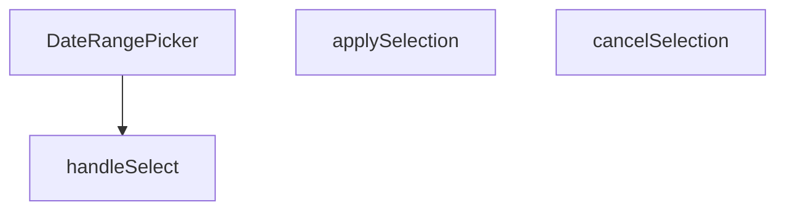

## NODE ID STANDARD

  file: src\components\admin\DateRangePicker.tsx
  function: src\components\admin\DateRangePicker.tsx::DateRangePicker
  function: src\components\admin\DateRangePicker.tsx::handleSelect
  function: src\components\admin\DateRangePicker.tsx::applySelection
  function: src\components\admin\DateRangePicker.tsx::cancelSelection

---

## DISA AKTARILANLAR (EXPORTS)
  export: DateRangePicker

---

## STİL TOKENLERİ

### Arbitrary Değerler (token'a geçirilmemiş)
Yok — tüm stiller token'a geçirilmiş. ✅

### Kullanılan Token'lar (zaten token'a geçirilmiş)
- (yok)

### Tailwind Sınıf Özeti
- **Renkler:** `bg-primary-navy`, `bg-slate-50`, `bg-white`, `bg-white/95`, `border-b`, `border-slate-100`, `border-slate-200`, `border-slate-200/60`, `border-t`, `hover:bg-primary-navy/90`, `hover:bg-slate-100`, `hover:bg-slate-200/50`, `hover:bg-slate-50`, `hover:border-slate-300`, `hover:text-slate-800`
- **Layout:** `backdrop-blur-xl`, `flex`, `flex-col`, `gap-1`, `gap-2`, `inline-flex`, `items-center`, `justify-between`, `max-h-60vh`, `max-h-85vh`, `max-w-full`, `md:flex-row`, `md:max-h-none`, `md:w-48`, `md:w-auto`
- **Varyant/Responsive:** `:`, `active:`, `disabled:`, `focus-visible:`, `hover:`, `md:`, `sm:` önekleri
- **Yardımcı Sınıflar:** `${className`, `${isOpen`, `${isSelected`, `:`, `active:scale-95`, `animate-in`, `border`, `disabled:active:scale-100`, `disabled:opacity-50`, `duration-200`, `fade-in`, `focus-visible:outline-none`, `focus-visible:ring-2`, `focus-visible:ring-primary-navy/20`, `font-bold`

---
# FILE: src\components\admin\EditableCell.md

---
domain: general
source_type: doc
namespace_type: module
source_path: C:\Users\alize\venthub-hvac\src\components\admin\EditableCell.tsx
skeleton_hash: df7dad40afd16a13
entity_hashes:
  func:EditableCell: c69e143b78ab0750
  overview: afceb79d7ede9415
  style_tokens: 2f2ada2707ada249
generated_at: 2026-05-29T18:44:07Z
---

## Genel Bakış
`EditableCell`, yönetim paneli tablolarındaki hücrelerin tıklanarak düzenlenebilir hale getirilmesini sağlayan bir React bileşenidir. Değer, veri tipi ve yer tutucu gibi yapılandırma parametreleri alarak hücrenin görünümünü ve davranışını kontrol eder; düzenleme işlemi tamamlandığında kaydetme çağrısı ile değişiklikleri üst bileşene iletir.

## Fonksiyon Grupları
### Düzenlenebilir Hücre Bileşeni
Bu modül, tek bir kapsamlı bileşenden oluşur ve tablo hücrelerinin görüntülenmesi, düzenleme moduna geçişi ile değişikliklerin kaydedilmesi süreçlerini yönetir.
- EditableCell

---

## AXIOMS – Mimari Varsayımlar

Bu modül için varsayımlar, EditableCell bileşeninin doğru çalışması için zorunlu koşulları belirtir.

[Axiom 1]: Eğer onSave callback fonksiyonu sağlanmamışsa veya çağrılamıyorsa, kullanıcı düzenlemeleri kaydedemez ve hata oluşur.

[Axiom 2]: Eğer type parametresi geçerli bir HTML input type değeri (örn: text

---

## FONKSİYON DETAYLARI

### EditableCell
**Ne yapar**: EditableCell, kullanıcının bir hücredeki değeri düzenlemesine ve kaydetmesine olanak tanıyan bir React fonksiyonel bileşenidir. Inline düzenleme işlevselliği sağlar.

**Nasıl yapar**: Bileşen, `value`, `onSave`, `type`, `placeholder` ve `clas` prop'larını alır. `type` değerine göre uygun bir giriş elemanı (input, select vb.) render eder. Kullanıcı düzenleme işlemini tamamladığında `onSave` callback'ini tetikler. `placeholder`, değer boşken gösterilecek metni belirler. `clas` prop'u bileşene ek CSS sınıfları atamak için kullanılır.

**Parametreler**:
- `value`: any — Hücrede gösterilecek ve düzenlenecek olan mevcut değer.
- `onSave`: function — Kullanıcı değişikliği kaydettiğinde çağrılan geri çağrı fonksiyonu. Yeni değeri parametre olarak alır.
- `type`: string (varsayılan `'text'`) — Giriş elemanının türü (text, number, select vb.).
- `placeholder`: string (varsayılan `'-'`) — Değer boş veya tanımsız olduğunda gösterilen yer tutucu metin.
- `clas`: string — Bileşene uygulanacak ek CSS sınıf adı.

**Dönüş**: `React.FC<EditableCellProps>` — `EditableCellProps` arayüzüne sahip prop'lar bekleyen bir React fonksiyonel bileşeni döndürür. Bu bileşen, hücre düzenleme arayüzünü oluşturmak için kullanılır.

---

## INTERFACES

### EditableCellProps
- `value: string | number`
- `onSave: (newValue: string) => Promise<void>`
- `type?: 'text' | 'number'`
- `placeholder?: string`
- `className?: string`
- `disabled?: boolean`
- `inputWidth?: string`

---

## AST POINTERS

### [N1_NASIL] AST Pointer: EditableCell.tsx::EditableCell
- **params**: `value` — hücre mevcut değeri; `onSave` — async callback, düzenlenmiş değeri kaydetmek için çağrılır; `type` — input türü (varsayılan `'text'`); `placeholder` — değer boşsa gösterilen yer tutucu (varsayılan `'-'`); `className` — dışarıdan ek CSS sınıfı (varsayılan `''`); `disabled` — düzenlemeyi devre dışı bırakıp bırakmayacağı (varsayılan `false`); `inputWidth` — input genişlik CSS sınıfı (varsayılan `'w-24'`)
- **ic_degiskenler**:
  - `editing` — `useState<boolean>` — hücrenin düzenleme modunda olup olmadığını tutar
  - `draft` — `useState<string>` — input'taki geçici düzenleme değeri; `value`'dan türetilir, kaydetmeye kadar yerel tutulur
  - `saving` — `useState<boolean>` — `onSave` çağrısının devam edip etmediğini takip eder, bitene kadar input devre dışı kalır
  - `inputRef` — `useRef<HTMLInputElement>` — input DOM elemanına erişim sağlar, düzenleme moduna girildiğinde odaklama ve seçim için kullanılır
  - `useEffect` (draft senkron) — `value` değiştiğinde ve düzenleme modunda değilken `draft`'ı yeni `value` ile senkronize eder
  - `useEffect` (focus) — `editing` `true` olduğunda input'a otomatik focus veselectAll yapar
  - `startEdit` — `useCallback` — disabled veya saving değilse draft'ı value'dan doldurur ve editing modunu açar
  - `cancel` — `useCallback` — draft'ı orijinal value'ya sıfırlar ve editing modunu kapatır
  - `save` — `useCallback(async)` — draft trimlenmiş hali ile orijinal value karşılaştırır; değişiklik yoksa sadece modu kapatır, varsa `onSave(trimmed)` çağırır, hata olursa toast gösterir ve eski değere döner
  - `handleKeyDown` — `useCallback` — Enter tuşunda `save()`, Escape tuşunda `cancel()` tetikler
- **Dönüş**: `JSX.Element` — editing modunda `div` içinde `input` + optional spinner; normal modda `button` ile hücre değeri veya placeholder gösterilir

### [N2_NASIL] AST Pointer: EditableCell.tsx::useEffect[draft-senkron]
- **params**: yok (useEffect callback)
- **ic_degiskenler**:
  - `editing` — dış scope'tan; düzenleme modunda olup olmadığı kontrol edilir
  - `value` — dış scope'tan; hücrenin güncel değeri, String'e çevrilerek draft'a yazılır
  - `setDraft` — dış scope'tan; draft state setter'ı
- **Dönüş**: yok (yan etki: `editing` false iken `draft`'ı `String(value ?? '')` ile günceller)

### [N3_NASIL] AST Pointer: EditableCell.tsx::useEffect[focus]
- **params**: yok (useEffect callback)
- **ic_degiskenler**:
  - `editing` — dış scope'tan; düzenleme modunda olup olmadığı kontrol edilir
  - `inputRef` — dış scope'tan; input DOM elemanı referansı
- **Dönüş**: yok (yan etki: editing true ve inputRef.current mevcutsa `focus()` ve `select()` çağırır)

### [N4_NASIL] AST Pointer: EditableCell.tsx::startEdit
- **params**: yok
- **ic_degiskenler**:
  - `disabled` — dış scope'tan; hücre devre dışıysa düzenleme başlatılmaz
  - `saving` — dış scope'tan; kaydetme devam ediyorsa düzenleme başlatılmaz
  - `value` — dış scope'tan; mevcut değer `String(value ?? '')` ile draft'a yazılır
  - `setDraft` — dış scope'tan; draft state setter'ı
  - `setEditing` — dış scope'tan; editing state setter'ı
- **Dönüş**: yok (yan etki: disabled/saving değilse draft'ı value ile doldurup editing modunu açar)

### [N5_NASIL] AST Pointer: EditableCell.tsx::cancel
- **params**: yok
- **ic_degiskenler**:
  - `value` — dış scope'tan; mevcut değer `String(value ?? '')` ile draft'a geri yazılır
  - `setDraft` — dış scope'tan; draft state setter'ı
  - `setEditing` — dış scope'tan; editing state setter'ı
- **Dönüş**: yok (yan etki: draft'ı orijinal value'ya sıfırlar ve editing modunu kapatır)

### [N6_NASIL] AST Pointer: EditableCell.tsx::save
- **params**: yok
- **ic_degiskenler**:
  - `draft` — dış scope'tan; input'taki mevcut düzenleme değeri, `.trim()` ile boşlukları temizlenir → `trimmed`
  - `trimmed` — `draft.trim()` sonucu; karşılaştırma ve kaydetme için kullanılacak temizlenmiş değer
  - `original` — `String(value ?? '')`; hücrenin orijinal değeri, karşılaştırma ve hata durumunda geri dönüş için kullanılır
  - `value` — dış scope'tan; orijinal hücre değeri
  - `onSave` — dış scope'tan; async kaydetme callback'i, `onSave(trimmed)` ile çağrılır
  - `setEditing` — dış scope'tan; editing state setter'ı
  - `setSaving` — dış scope'tan; saving state setter'ı
  - `toast` — `sonner` import'undan; hata durumunda `toast.error('Güncelleme başarısız')` gösterir
- **Dönüş**: yok (yan etki: değişiklik varsa `onSave(trimmed)` çağırır; hata olursa draft'ı orijinal değere sıfırlar ve hata toast'u gösterir; finally bloğunda saving'i false yapar)

### [N7_NASIL] AST Pointer: EditableCell.tsx::handleKeyDown
- **params**: `e` — `React.KeyboardEvent` — tuş olayı nesnesi
- **ic_degiskenler**:
  - `e.key` — basılan tuşun adı; `'Enter'` veya `'Escape'` kontrol edilir
  - `e.preventDefault` — varsayılan tarayıcı davranışını engeller
  - `save` — dış scope'tan; kaydetme fonksiyonu, Enter tuşunda tetiklenir (`void save()`)
  - `cancel` — dış scope'tan; iptal fonksiyonu, Escape tuşunda tetiklenir
- **Dönüş**: yok (yan etki: Enter → `save()`, Escape → `cancel()` çağırır; her iki durumda da `preventDefault()` ile varsayılan davranış engellenir)

---

## NODE ID STANDARD

  file: src\components\admin\EditableCell.tsx
  function: src\components\admin\EditableCell.tsx::EditableCell

---

## DISA AKTARILANLAR (EXPORTS)
  export: EditableCell

---

## STİL TOKENLERİ

### Arbitrary Değerler (token'a geçirilmemiş)
Yok — tüm stiller token'a geçirilmiş. ✅

### Kullanılan Token'lar (zaten token'a geçirilmiş)
- (yok)

### Tailwind Sınıf Özeti
- **Renkler:** `bg-transparent`, `border-2`, `border-b`, `border-dashed`, `border-primary-navy`, `border-primary-navy/30`, `border-slate-300`, `border-t-primary-navy`, `hover:border-primary-navy`, `hover:text-primary-navy`, `text-left`, `text-slate-400`, `text-sm`
- **Layout:** `gap-1`, `h-3.5`, `inline-block`, `inline-flex`, `items-center`, `p-0`, `w-3.5`
- **Varyant/Responsive:** `disabled:`, `focus-visible:`, `hover:` önekleri
- **Yardımcı Sınıflar:** `${className`, `${inputWidth`, `animate-spin`, `border`, `cursor-pointer`, `disabled:cursor-not-allowed`, `disabled:opacity-50`, `focus-visible:outline-none`, `focus-visible:ring-1`, `focus-visible:ring-primary-navy/50`, `px-1.5`, `py-0.5`, `rounded`, `rounded-full`, `transition-colors`

---
# FILE: src\components\admin\ExportMenu.md

---
domain: general
source_type: doc
namespace_type: module
source_path: C:\Users\alize\venthub-hvac\src\components\admin\ExportMenu.tsx
skeleton_hash: ce1680439765f206
entity_hashes:
  func:ExportMenu: 9e536638b7cdf449
  overview: fcef70276d80a8c4
  style_tokens: 7659c3683121a964
generated_at: 2026-05-28T22:35:34Z
---

## Genel Bakış
`ExportMenu` modülü, yönetim panelinde kullanıcının veri dışa aktarma seçeneklerini görüntülemesini ve tetiklemesini sağlayan bir React bileşeni sunar. Bileşen, gelen menü öğelerini listeleyerek her biri için ilgili eylemi çalıştırır ve isteğe bağlı bir buton etiketiyle kullanıcı arayüzünde konumlandırılabilir.

## Fonksiyon Grupları
### ExportMenu Bileşeni
Bu grup, menünün yapısını oluşturma, kullanıcı etkileşimini yönetme ve dışa aktarma işlemlerini başlatma sorumluluğunu üstlenir. Tek bir fonksiyon, tüm bu davranışları birleştirir.
- ExportMenu

---

## AXIOMS – Mimari Varsayımlar
Bu modül için özel aksiyom tanımlanmamıştır.

---

## FONKSİYON DETAYLARI

---

## TYPE ALIASES

### ExportMenuItem
```typescript
type ExportMenuItem = {

  key: string

  label: string

  onSelect: () => void

}
```

---

## AST POINTERS

### [N1_NASIL] AST Pointer: src/components/admin/ExportMenu.tsx::ExportMenu
- **params**: items, buttonLabel
- **ic_degiskenler**: 
  - `_t` — localization function returned by `useI18n()` used to translate UI strings such as admin.a11y.export, admin.common.export, admin.inventory.fileFormat, admin.common.noOptions
- **Dönüş**: JSX element (`<DropdownMenu.Root>`) representing the export menu component

### [N2_NASIL] AST Pointer: src/components/admin/ExportMenu.tsx::item map callback
- **params**: item
- **ic_degiskenler**: yok
- **Dönüş**: JSX element (`<DropdownMenu.Item>`) representing a single export option in the dropdown menu

---

## NODE ID STANDARD

  file: src\components\admin\ExportMenu.tsx
  function: src\components\admin\ExportMenu.tsx::ExportMenu

---

## DISA AKTARILANLAR (EXPORTS)
  export: ExportMenu
  export: ExportMenuItem

---

## STİL TOKENLERİ

### Arbitrary Değerler (token'a geçirilmemiş)
Yok — tüm stiller token'a geçirilmiş. ✅

### Kullanılan Token'lar (zaten token'a geçirilmiş)
- `rounded-hvac-lg`, `tracking-hvac-normal`

### Tailwind Sınıf Özeti
- **Renkler:** `bg-emerald-500/10`, `border-white/10`, `hover:bg-white/5`, `hover:text-white`, `text-emerald-400`, `text-slate-300`, `text-slate-500`, `text-xs`
- **Layout:** `flex`, `gap-2`, `gap-3`, `h-12`, `h-8`, `items-center`, `justify-center`, `min-w-140px`, `min-w-200px`, `p-2`, `shadow-elevation-5`, `w-8`, `z-50`, `zoom-in-95`
- **Varyant/Responsive:** `hover:` önekleri
- **Yardımcı Sınıflar:** `animate-in`, `border`, `cursor-pointer`, `duration-200`, `fade-in`, `font-black`, `font-bold`, `glass-strong`, `italic`, `mb-1`, `outline-none`, `pb-2`, `pt-2`, `px-3`, `px-4`

---
# FILE: src\components\admin\InfoTooltip.md

---
domain: general
source_type: doc
namespace_type: module
source_path: C:\Users\alize\venthub-hvac\src\components\admin\InfoTooltip.tsx
skeleton_hash: 4790b84088da2c3b
entity_hashes:
  func:InfoTooltip: 183c7d447a0090ba
  overview: aa0bb37988421fc0
  style_tokens: 15a027a0bab7a2ef
generated_at: 2026-05-28T22:35:34Z
---

## Genel Bakış
`InfoTooltip` bileşeni, yönetim panelindeki metin öğelerine ek bilgi sağlamak amacıyla kullanılan bir tooltip (ipucu) komponentidir. Verilen metni ve isteğe bağlı boyut ve stil parametrelerini alarak, kullanıcı fareyi üzerine getirdiğinde açıklayıcı bir balon gösterir.

## Fonksiyon Grupları
### Tooltip Render ve Konfigürasyon
Bu grup, tooltip’in içeriğini ve görünümünü oluşturup, dışarıdan gelen `text`, `size` ve `className` prop’larını işleyerek React elementini döndürür.
- InfoTooltip

---

## AXIOMS – Mimari Varsayımlar
Bu modül için özel aksiyom tanımlanmamıştır.

---

## FONKSİYON DETAYLARI

---

## INTERFACES

### InfoTooltipProps
- `text: string`
- `size?: number`
- `className?: string`

---

## AST POINTERS

### [N1_NASIL] AST Pointer: C:\Users\alize\venthub-hvac\src\components\admin\InfoTooltip.tsx::InfoTooltip
- **params**: 
  - `text` — tooltip içinde görüntülenecek metin içeriği
  - `size` — (varsayılan 14) Info ikonunun boyutu (piksel cinsinden)
  - `className` — (varsayılan '') üst div'e eklenecek ek CSS sınıfları
- **ic_degiskenler**: yok
- **Dönüş**: JSX.Element — fare üzerine gelindiğinde açılan bir tooltip kutusu ve Info ikonu içeren div döndürür

---

## NODE ID STANDARD

  file: src\components\admin\InfoTooltip.tsx
  function: src\components\admin\InfoTooltip.tsx::InfoTooltip

---

## DISA AKTARILANLAR (EXPORTS)
  export: InfoTooltip

---

## STİL TOKENLERİ

### Arbitrary Değerler (token'a geçirilmemiş)
Yok — tüm stiller token'a geçirilmiş. ✅

### Kullanılan Token'lar (zaten token'a geçirilmiş)
- (yok)

### Tailwind Sınıf Özeti
- **Renkler:** `bg-slate-800`, `border-4`, `border-t-slate-800`, `border-transparent`, `hover:text-primary-navy`, `text-left`, `text-slate-400`, `text-white`, `text-xs`
- **Layout:** `absolute`, `bottom-full`, `inline-flex`, `items-center`, `justify-center`, `left-1/2`, `relative`, `shadow-xl`, `top-full`, `w-64`, `z-50`
- **Varyant/Responsive:** `group-hover:`, `hover:` önekleri
- **Yardımcı Sınıflar:** `${className`, `-translate-x-1/2`, `align-middle`, `cursor-help`, `duration-200`, `font-normal`, `group`, `group-hover:opacity-100`, `group-hover:visible`, `invisible`, `leading-relaxed`, `mb-2`, `ml-1`, `normal-case`, `opacity-0`

---
# FILE: src\components\admin\InventoryCsvImport.md

---
domain: general
source_type: doc
namespace_type: module
source_path: C:\Users\alize\venthub-hvac\src\components\admin\InventoryCsvImport.tsx
skeleton_hash: 07494bb5cb231527
entity_hashes:
  func:InventoryCsvImport: 312fdc52cc14a1c7
  overview: cb53e1e441eee9fe
  style_tokens: 3e4e1345adb17abc
generated_at: 2026-06-06T21:54:43Z
---

## Genel Bakış
Bu modül, CSV dosyaları aracılığıyla envanter verilerinin toplu olarak içe aktarılmasını sağlayan tek bir React bileşeninden oluşur. Modal yapısında çalışan bileşen, dosya yükleme, veri doğrulama, önizleme ve eşik değerine göre stok güncelleme süreçlerini yönetir.

## Fonksiyon Grupları
### Ana Bileşen
Tüm CSV içe aktarma iş akışını (dosya seçimi, doğrulama, önizleme ve nihai işleme) tek bir yerde yönetir ve üst bileşenle iletişim için callback fonksiyonları kullanır.
- InventoryCsvImport

---

## AXIOMS – Mimari Varsayımlar

Bu modül, CSV tabanlı envanter içe aktarma işlevi sağlayan bir React bileşenidir. Fonksiyon gövdesi erişilebilir olmadığından, yalnızca fonksiyon imzası ve modül bağlamından çıkarılabilen yapısal aksiyomlar tanımlanmıştır.

[Aksiyom 1]: Eğer `onClose` callback fonksiyonu sağlanmazsa, modal bileşenin kullanıcı tarafından kapatılması sonrasında üst bileşen durumu güncellenemez ve bileşen kalıcı olarak açık kalabilir.

[Aksiyom 2]: Eğer `onSuccess` callback fonksiyonu sağlanmazsa, CSV içe aktarma işlemi başarılı bir şekilde tamamlansa bile üst bileşen başarı durumundan haberdar olamaz; ilgili veri yenileme veya bildirim tetiklenemez.

[Aksiyom 3]: Eğer `isOpen` prop'u `true` olarak ayarlanmazsa, modal bileşen render edilmez veya görünür hale gelmez; bu durumda içe aktarma işlevi kullanıcıya sunulmaz.

[Aksiyom 4]: Eğer `effectiveThreshold` parametresi geçerli bir sayısal değer olarak sağlanmazsa (örn: `undefined`, `null`, veya negatif değer), envanter eşik kontrolü sırasında beklenmeyen davranışlar oluşabilir; eşik değerinin pozitif bir sayı olması beklenir.

[Aksiyom 5]: Eğer modal açıkken (`isOpen: true`) kullanıcı dosya yükleme sürecini başlatmazsa veya geçerli bir CSV dosyası seçmezse, içe aktarma işlemi ilerleyemez ve önizleme adımı gösterilemez.

---

## FONKSİYON DETAYLARI

### InventoryCsvImport
**Ne yapar**: CSV dosyasından toplu stok güncelleme yapmak için bir modal arayüzü sunar. Kullanıcının CSV dosyası yüklemesine, stok değişikliklerini önizlemesine ve (isteğe bağlı olarak) veritabanını güncellemesine olanak tanır. Kuru çalıştırma (dry-run) modu ile önce simülasyon yapılabilir.

**Nasıl yapar**: CSV dosyasını satır satır ayrıştırarak SKU ve miktar bilgilerini çıkarır. Mevcut ürün verisiyle eşleştirerek stok değişimlerini hesaplar ve bir önizleme tablosu oluşturur. `processCSV` fonksiyonu ile toplu veritabanı güncelleme yapar (20'şerli gruplar halinde). İşlem sonrası geri alma (undo) seçeneği sunan bir bildirim gösterir.

**Parametreler**:
- isOpen: boolean — Modalın açılıp kapanmasını kontrol eder. `false` olduğunda bileşen `null` döner ve render edilmez.
- onClose: () => void — Modal kapatıldığında çağrılan geri çağırma fonksiyonu.
- onSuccess: () => void — Stok güncelleme başarıyla tamamlandığında çağrılan geri çağırma fonksiyonu.
- effectiveThreshold: (productId: string) => number | null — Belirli bir ürün için stok eşik değerini döndüren fonksiyon. Stok durumu belirlemede kullanılır.

**Dönüş**: JSX.Element | null — Modal açıkken JSX bileşeni, kapalıyken `null` döner.

---

## INTERFACES

### CsvPreviewRow
- `sku: string`
- `name: string`
- `current: number`
- `new: number`
- `delta: number`
- `status: 'out' | 'critical' | null`

### InventoryCsvImportProps
- `isOpen: boolean`
- `onClose: () => void`
- `onSuccess: () => void`
- `effectiveThreshold: (_productId: string) => number | null`

---

## AST POINTERS

### [N1_NASIL] AST Pointer: `InventoryCsvImport.tsx`::handleCsvImport (anonim async arrow — file parse)
- **params**: `(file: File)` — yüklenen CSV dosyası
- **ic_degiskenler**:
  - `textRaw` — dosyanın ham string içeriği (`file.text()` sonucu)
  - `text` — BOM karakteri (`\ufeff`) temizlenmiş CSV metni
  - `lines` — boş satırları filtrelenmiş CSV satır dizisi
  - `split` — virgülle splitting yapan inner fonksiyon, tırnak içi virgülleri korur
  - `headerRaw` — küçük harfe normalize edilmiş başlık sütun adları dizisi
  - `skuIdx` — başlık satırında `sku` sütununun indexi (-1 ise yok)
  - `qtyIdx` — başlık satırında qty/quantity/stock/new_stock sütununun indexi
  - `parsedRows` — `{ line: number; sku: string; newQty: number }` geçerli satırlar dizisi
  - `errors` — `{ line: number; sku: string; message: string }` hata satırlar dizisi
  - `cells` — mevcut satırın split edilmiş hücreleri
  - `sku` — mevcut satırın SKU değeri (trimmed)
  - `qtyStr` — mevcut satırın miktar ham string'i
  - `newQty` — parse edilmiş miktar sayısı (NaN olabilir)
  - `skus` — parsedRows'dan tekrarsız SKU listesi (`Set` → array)
  - `products` — Supabase'den gelen eşleşen ürün kayıtları (`id, sku, name, stock_qty`)
  - `skuToProduct` — SKU → `{ id, name, stock }` Map'i
  - `preview` — `CsvPreviewRow[]` önizleme satırları dizisi
  - `product` — mevcut satır için SKU'dan bulunan ürün bilgisi
  - `th` — `effectiveThreshold(product.id)` çağrısıyla dönen eşik değeri
  - `status` — `'out' | 'critical' | null` ürün stok durumu flag'i
- **Dönüş**: yok (state setter'ları `setCsvPreview` ve `toast` ile yan etki)

---

### [N2_NASIL] AST Pointer: `InventoryCsvImport.tsx`::handleProcessCsv (anonim async arrow — CSV işleme)
- **params**: yok
- **ic_degiskenler**:
  - `skus` — `csvPreview` dizisinden çıkarılmış SKU listesi
  - `products` — Supabase'den gelen `{ sku, id }` eşleşen ürün kayıtları
  - `skuToId` — SKU → ürün ID Map'i
  - `successCount` — başarılı stok güncelleme sayacı
  - `errors` — `{ sku: string; message: string }` hata listesi
  - `batchId` — `generateId()` ile üretilen benzersiz batch kimliği
  - `BATCH_SIZE` — toplu işlem boyutu (sabit: 20)
  - `chunk` — mevcut batch'in `csvPreview` alt dizisi
  - `_productId` — SKU'dan bulunan ürün ID'si
  - `reason` — hareket açıklaması (`CSV import: add/remove ...`)
  - `downloadErrors` — inner fonksiyon; hataları CSV olarak indirir
  - `header` — hata CSV başlık satırı (`['sku', 'message']`)
  - `lines` — hata satırlarının CSV formatlanmış hali
  - `csv` — BOM eklenmiş tam hata CSV stringi
  - `blob` — CSV içeriğinden oluşturulan Blob nesnesi
  - `url` — Blob için oluşturulan object URL
  - `a` — indirme için geçici `<a>` DOM elementi
  - `id` — `toast.custom` callback parametresi, toast instance ID'si
  - `undone` — `reverse_inventory_batch` RPC sonucu geri alınan hareket sayısı
- **Dönüş**: yok (toast, state setter'ları, `onClose()`, `onSuccess()` yan etkileri)

---

### [N3_NASIL] AST Pointer: `InventoryCsvImport.tsx`::processItem (anonim async arrow — tekil ürün işleme, batch içinde)
- **params**: `(item)` — `csvPreview` satır nesnesi (`{ sku, delta, ... }`)
- **ic_degiskenler**:
  - `_productId` — `skuToId.get(item.sku)` ile elde edilen ürün UUID'si
  - `reason` — dinamik hareket sebebi stringi (add/remove ve mutlak delta)
  - `error` — `supabase.rpc('adjust_stock', ...)` destructured hata nesnesi
  - `logAdminAction` — dinamik import ile yüklenen audit log fonksiyonu
- **Dönüş**: yok (rpc çağrısı, audit log, `successCount++` yan etkisi; catch'te `errors.push`)

---

### [N4_NASIL] AST Pointer: `InventoryCsvImport.tsx`::downloadErrors (anonim arrow — hata CSV indirme)
- **params**: yok
- **ic_degiskenler**:
  - `header` — CSV başlık dizisi `['sku', 'message']`
  - `lines` — her hatanın CSV escape edilmiş satır dizisi
  - `csv` — BOM (`\ufeff`) ile birleştirilmiş tam CSV metni
  - `blob` — CSV metninden oluşan `Blob` nesnesi (`type: text/csv`)
  - `url` — `URL.createObjectURL` ile üretilen geçici dosya URL'i
  - `a` — programatik oluşturulmuş `<a>` elementi (click ile indirme tetiklenir)
- **Dönüş**: yok (DOM elementi click ve `URL.revokeObjectURL` ile temizlik)

---

### [N5_NASIL] AST Pointer: `InventoryCsvImport.tsx`::toastContentRenderer (anonim arrow — toast JSX renderer)
- **params**: `(id)` — toast instance ID'si (string)
- **ic_degiskenler**:
  - `batchId` — üst scope'tan gelen batch ID (JSX içinde link URL'inde kullanılır: `/admin/movements?batch=${batchId}`)
  - `successCount` — üst scope'tan gelen başarılı güncelleme sayısı (JSX içinde gösterilir)
  - `errors` — üst scope'tan gelen hata dizisi (length > 0 ise hata butonu render edilir)
  - `downloadErrors` — üst scope'tan gelen hata indirme fonksiyonu reference'i
- **Dönüş**: JSX (`<div>` — glass-strong styled toast bileşeni, içinde link ve butonlar)

---

### [N6_NASIL] AST Pointer: `InventoryCsvImport.tsx`::handleUndo (anonim async arrow — geri alma handler'ı, toast içinde)
- **params**: yok
- **ic_degiskenler**:
  - `csvUndoingRef` — `useRef<boolean>` flag'ı, çifte tıklama engeli (current erişimi)
  - `data` — `supabase.rpc('reverse_inventory_batch', ...)` sonucu geri alınan satır sayısı
  - `error` — RPC sonucu destructured hata nesnesi
  - `undone` — `Number(data || 0)` ile parse edilmiş geri alınan hareket sayısı
  - `e` — catch bloğunda yakalanan hata nesnesi
- **Dönüş**: yok (`onSuccess()`, `toast.success`/`toast.error`, `toast.dismiss(id)` yan etkileri)

---

### [N7_NASIL] AST Pointer: `InventoryCsvImport.tsx`::handleFileChange (anonim arrow — dosya input onChange)
- **params**: `(e)` — React `ChangeEvent<HTMLInputElement>` olay nesnesi
- **ic_degiskenler**:
  - `file` — `e.target.files?.[0]` ile alınan ilk dosya reference'ı
- **Dönüş**: yok (`handleCsvImport(file)` çağrısı ile yan etki)

---

### [N8_NASIL] AST Pointer: `InventoryCsvImport.tsx`::handleDryRunToggle (anonim arrow — keyboard handler)
- **params**: `(e)` — `KeyboardEvent` olay nesnesi
- **ic_degiskenler**: (yok — sadece parametre kullanılır)
- **Dönüş**: yok (`setDryRun(!dryRun)` state setter ile yan etki)

---

### [N9_NASIL] AST Pointer: `InventoryCsvImport.tsx`::renderRow (anonim arrow — tablo satır renderer)
- **params**: `(item, idx)` — `item: CsvPreviewRow` önizleme satırı, `idx: number` satır indexi
- **ic_degiskenler**: (yok — sadece parametre ve JSX template kullanımı)
- **Dönüş**: JSX (`<tr>` — hover efektli, SKU/name/current/new/delta sütunlu tablo satırı; `item.delta` rengine göre `text-emerald-400` veya `text-rose-400`conditional class)

---

## NODE ID STANDARD

  file: src\components\admin\InventoryCsvImport.tsx
  function: src\components\admin\InventoryCsvImport.tsx::InventoryCsvImport

---

## DISA AKTARILANLAR (EXPORTS)
  export: InventoryCsvImport

---

## STİL TOKENLERİ

### Arbitrary Değerler (token'a geçirilmemiş)
Yok — tüm stiller token'a geçirilmiş. ✅

### Kullanılan Token'lar (zaten token'a geçirilmiş)
- `rounded-hvac-2xl`, `rounded-hvac-lg`, `rounded-hvac-xl`, `shadow-glow-md`, `shadow-glow-sm`, `tracking-hvac-normal`

### Tailwind Sınıf Özeti
- **Renkler:** `bg-amber-400`, `bg-black/60`, `bg-cyan-400`, `bg-rose-500/20`, `bg-surface-deep/20`, `bg-surface-midnight`, `bg-transparent`, `bg-white`, `bg-white/10`, `bg-white/2`, `bg-white/5`, `border-2`, `border-b`, `border-dashed`, `border-none`
- **Layout:** `absolute`, `backdrop-blur-sm`, `block`, `custom-scrollbar`, `fixed`, `flex`, `flex-1`, `flex-col`, `gap-2`, `gap-3`, `gap-4`, `h-10`, `h-12`, `h-16`, `h-3`
- **Varyant/Responsive:** `:`, `disabled:`, `focus-visible:`, `group-hover:`, `group-last:`, `hover:` önekleri
- **Yardımcı Sınıflar:** `${dryRun`, `${item.delta`, `0`, `:`, `>`, `animate-in`, `animate-spin`, `border`, `cursor-default`, `cursor-pointer`, `decoration-cyan-400/30`, `disabled:opacity-30`, `duration-300`, `fade-in`, `focus-visible:ring-2`

---
# FILE: src\components\admin\InventoryDetailDrawer.md

---
domain: general
source_type: doc
namespace_type: module
source_path: C:\Users\alize\venthub-hvac\src\components\admin\InventoryDetailDrawer.tsx
skeleton_hash: b4c161454e49e38a
entity_hashes:
  func:InventoryDetailDrawer: 3a57400ca0f546b7
  overview: 92caa1481da5cee7
  style_tokens: 4b283d8541dc151c
generated_at: 2026-05-28T22:35:31Z
---

## Genel Bakış
InventoryDetailDrawer, envanter öğelerinin ayrıntılarını gösteren bir React bileşenidir. Kullanıcıya seçilen ürünün stok miktarı, konumu ve diğer meta verileri sunar. Ayrıca düzenleme ve kapatma işlevlerini sağlayarak envanter yönetimi akışını destekler.

## Fonksiyon Grupları
### Ana Bileşen
Bileşenin giriş noktası ve render mantığını yönetir.
- InventoryDetailDrawer

---

## AXIOMS – Mimari Varsayımlar
Bu modül için özel aksiyom tanımlanmamıştır.

---

## FONKSİYON DETAYLARI

### InventoryDetailDrawer
**Ne yapar**: Seçili bir ürünün stok detaylarını, eşik değerlerini ve hareket geçmişini gösteren bir yan çekmece (drawer) arayüzü oluşturur. Kullanıcıların QR etiketi yazdırması, eşik güncellemesi, stok ayarlaması ve hareketleri geri alması gibi etkileşimli işlemleri yönetir.  

**Nasıl yapar**: Props içinde gelen durum ve setter fonksiyonlarını destrüktüre eder, Escape tuşu ile çekmeceyi kapatmak için bir `useEffect` ekler ve `selected` nesnesi yoksa `null` döner. UI, bir kapatma butonu, ürün bilgileri, stok ve eşik kartları, zeki satın alma önerisi, eşik güncelleme formu, stok ayarlama bileşeni, rezerve sipariş tablosu ve hareket geçmişi bölümlerinden oluşur. Buton ve input etkileşimleri ilgili callback’leri (ör. `printQrLabel`, `saveThreshold`, `adjustStock`, `undoLastMovement`) tetikler.  

**Parametreler**:
- props: InventoryDetailDrawerProps — Çekmeceyi kontrol eden tüm durum ve fonksiyonları içeren nesne. İçerisinde:
  - selected: any — Görüntülenecek ürün nesnesi; yoksa çekmece kapanır.
  - setSelected: (value: any) => void — Çekmeceyi kapatmak veya seçimi değiştirmek için kullanılan setter.
  - printingQr: boolean — QR etiketi yazdırma işleminin devam edip etmediğini gösterir.
  - setPrintingQr: (value: boolean) => void — QR yazdırma durumunu günceller.
  - selectedStock: number | null — Ürünün mevcut stok miktarı.
  - selectedThreshold: string | number — Kullanıcı tarafından girilen eşik değeri.
  - setSelectedThreshold: (value: string | number) => void — Eşik değerini günceller.
  - defaultThreshold: number | null — Sistem tarafından tanımlı varsayılan eşik.
  - saving: boolean — Eşik kaydetme işleminin sürecini gösterir.
  - saveThreshold: (productId: string) => void — Yeni eşik değerini kaydeder.
  - hasWriteAccess: boolean — Kullanıcının düzenleme yetkisi olup olmadığını belirler.
  - moveQty: number — Stok hareketi miktarı.
  - setMoveQty: (value: number) => void — Stok hareket miktarını ayarlar.
  - moving: boolean — Stok hareketi işleminin devam edip etmediği.
  - adjustStock: (params: any) => void — Stok ayarlama işlemini gerçekleştirir.
  - reservedOrders: any[] — Rezerve siparişlerin listesi.
  - movements: any[] — Stok hareket geçmişi.
  - undoLastMovement: () => void — Son stok hareketini geri alır.
  - undoing: boolean — Geri alma işleminin sürecini gösterir.
  - t: (key: string) => string — Çeviri fonksiyonu.

**Dönüş**: `void` (React bileşeni olarak JSX döndürür; render edildiğinde UI oluşturur).

---

## INTERFACES

### InventoryDetailDrawerProps
- `selected: InventoryRow | null`
- `setSelected: (v: InventoryRow | null) => void`
- `printingQr: boolean`
- `setPrintingQr: (v: boolean) => void`
- `selectedStock: number | null`
- `selectedThreshold: number | ''`
- `setSelectedThreshold: (v: number | '') => void`
- `defaultThreshold: number | null`
- `saving: boolean`
- `saveThreshold: (id: string) => void`
- `hasWriteAccess: boolean`
- `moveQty: number`
- `setMoveQty: (v: number) => void`
- `moving: boolean`
- `adjustStock: (id: string, delta: number, reason: string) => void`
- `reservedOrders: ReservedRow[]`
- `movements: Movement[]`
- `undoLastMovement: () => void`
- `undoing: boolean`
- `t: (key: string) => string`

---

## AST POINTERS

### [N1_NASIL] AST Pointer: C:\Users\alize\venthub-hvac\src\components\admin\InventoryDetailDrawer.tsx::InventoryDetailDrawer
- **params**: (props)
- **ic_degiskenler**:
  - `selected` — seçili envanter satırı, drawer’ın gösterilip gösterilmeyeceğini belirler
  - `setSelected` — seçili satırı sıfırlamak için kullanılan state setter fonksiyonu
  - `printingQr` — QR kodu basımının şu anda gerçekleşip gerçekleşmediğini gösteren boolean
  - `setPrintingQr` — QR basım durumunu güncelleyen state setter fonksiyonu
  - `selectedStock` — seçili ürünün mevcut stok miktarı
  - `selectedThreshold` — seçili ürün için gösterilen eşik (alarm) değeri
  - `setSelectedThreshold` — eşik değerini güncelleyen state setter fonksiyonu
  - `defaultThreshold` — ürünün varsayılan eşik değeri (fallback)
  - `saving` — eşik güncelleme işleminin devam edip etmediğini gösteren boolean
  - `saveThreshold` — eşik değerini kaydeden fonksiyon (product_id parametresi alır)
  - `hasWriteAccess` — kullanıcının düzenleme yetkisi olup olmadığını belirten boolean
  - `moveQty` — stok hareketi miktarı (adjust component’ine aktarılır)
  - `setMoveQty` — hareket miktarını güncelleyen state setter fonksiyonu
  - `moving` — stok hareketi işleminin devam edip etmediğini gösteren boolean
  - `adjustStock` — stok ayarlama işlemini tetikleyen callback
  - `reservedOrders` — rezerve siparişlerin listesi, `InventoryReservedTable`a prop olarak verilir
  - `movements` — stok hareket geçmişi dizisi, `InventoryMovementHistory`a prop olarak verilir
  - `undoLastMovement` — son hareketi geri almayı tetikleyen fonksiyon
  - `undoing` — geri alma işleminin devam edip etmediğini gösteren boolean
  - `t` — i18n çeviri fonksiyonu
  - `onKey` — `Escape` tuşuna basıldığında drawer’ı kapatan yerel fonksiyon (useEffect içinde tanımlanır)
- **Dönüş**: yok (React bileşeni, JSX döndürür; yan etkileri: `useEffect` ile klavye dinleyicisi ekler ve temizler)

---

## NODE ID STANDARD

  file: src\components\admin\InventoryDetailDrawer.tsx
  function: src\components\admin\InventoryDetailDrawer.tsx::InventoryDetailDrawer

---

## DISA AKTARILANLAR (EXPORTS)
  export: InventoryDetailDrawer

---

## STİL TOKENLERİ

### Arbitrary Değerler (token'a geçirilmemiş)
Yok — tüm stiller token'a geçirilmiş. ✅

### Kullanılan Token'lar (zaten token'a geçirilmiş)
- `rounded-hvac-lg`, `rounded-hvac-xl`, `shadow-glow-md`, `tracking-hvac-normal`

### Tailwind Sınıf Özeti
- **Renkler:** `bg-amber-500`, `bg-black/60`, `bg-cyan-400`, `bg-cyan-400/10`, `bg-white/2`, `bg-white/3`, `border-b`, `border-cyan-400/20`, `border-l`, `border-none`, `border-white/10`, `border-white/5`, `focus-visible:border-cyan-400/40`, `hover:bg-cyan-300`, `hover:border-amber-400/30`
- **Layout:** `-right-8`, `-top-8`, `absolute`, `backdrop-blur-sm`, `custom-scrollbar`, `fixed`, `flex`, `flex-1`, `flex-col`, `flex-shrink-0`, `gap-2`, `gap-3`, `gap-4`, `gap-6`, `grid`
- **Varyant/Responsive:** `disabled:`, `focus-visible:`, `hover:`, `sm:` önekleri
- **Yardımcı Sınıflar:** `animate-in`, `animate-ping`, `animate-pulse`, `blur-3xl`, `border`, `cursor-default`, `disabled:opacity-50`, `duration-300`, `focus-visible:outline-none`, `focus-visible:ring-2`, `focus-visible:ring-cyan-400/20`, `font-black`, `font-bold`, `font-mono`, `glass`

---
# FILE: src\components\admin\InventoryMovementHistory.md

---
domain: general
source_type: doc
namespace_type: module
source_path: C:\Users\alize\venthub-hvac\src\components\admin\InventoryMovementHistory.tsx
skeleton_hash: b866bc2cf5b15d5f
entity_hashes:
  func:InventoryMovementHistory: 2413e5385b8816cc
  overview: a9fb0b3f91f018c7
  style_tokens: 1f29bfe131c33c25
generated_at: 2026-05-28T22:35:35Z
---

## Genel Bakış
`InventoryMovementHistory` bileşeni, yönetim panelinde envanter hareketlerinin zaman çizelgesini gösteren bir görünümdür. Gelen `movements` verisini alır ve bu veriyi okunabilir bir formatta listeler, böylece kullanıcılar geçmiş envanter değişikliklerini inceleyebilir.

## Fonksiyon Grupları
### Ana Bileşen Grubu
Bu grup, modülün tek işlevini yerine getirir; envanter hareket geçmişini UI olarak render eder.  
- InventoryMovementHistory

---

## AXIOMS – Mimari Varsayımlar
Bu modül, `movements` prop'una dayalı olarak çalışır; bu prop'un varlığı ve türü bileşenin doğru render edilmesi için kritiktir.

[Aksiyom 1]: Eğer `movements` prop'u tanımlı değilse (undefined), bileşen render sırasında `movements.map` gibi bir yöntem çağırarak çalışma zamanı hatası fırlatabilir.  
[Aksiyom 2]: Eğer `movements` prop'u bir dizi (iterable) değilse, `.map` veya benzeri yineleme işlevi başarısız olur ve bileşen hata verir.  
[Aksiyom 3]: Eğer `movements` dizisi boşsa, bileşen hiçbir hareket öğesi render etmez ve boş bir görünüm gösterir.  
[Aksiyom 4]: Eğer `movements` dizisindeki öğeler bileşenin görüntülemesi gereken veriyi (tarih, ürün, miktar vb.) içermiyorsa, bu eksik veriler undefined veya boş olarak görünebilir ve kullanıcıya eksik bilgi sunulur.

---

## FONKSİYON DETAYLARI

### InventoryMovementHistory
**Ne yapar**: Envanter hareketlerinin listesini görüntüleyen bir React bileşenidir.  
**Nasıl yapar**: `movements` prop'undan gelen verileri alıp, içindeki her bir hareket için uygun UI elemanları (örnek satır, kart vb.) oluşturur ve döndürür. Bileşenin iç mantığı, gelen veriyi iterate ederek her bir hareket için gerekli görsel öğeleri üretmektir.  
**Parametreler**:  
- movements: InventoryMovementHistoryProps — Gösterilecek envanter hareketlerinin koleksiyonu (tipi tanımlanmamış, ancak genellikle dizidir).  
**Dönüş**: void (React elementi döndürür; işlevsel bileşen olarak JSX üretir).

---

## INTERFACES

### Movement
- `id: string`
- `delta: number`
- `reason: string`
- `created_at: string`

### InventoryMovementHistoryProps
- `movements: Movement[]`

---

## AST POINTERS

### [N1_NASIL] AST Pointer: src/components/admin/InventoryMovementHistory.tsx::InventoryMovementHistory
- **params**: movements
- **ic_degiskenler**: 
  - `movements` — prop containing array of movement objects passed from parent component.
  - `m` — each movement item iterated over in the `.map` callback; used to access `m.id`, `m.created_at`, `m.reason`, and `m.delta`.
- **Dönüş**: JSX.Element | null (returns `null` when `movements.length === 0`, otherwise returns the rendered table JSX)

---

## NODE ID STANDARD

  file: src\components\admin\InventoryMovementHistory.tsx
  function: src\components\admin\InventoryMovementHistory.tsx::InventoryMovementHistory

---

## DISA AKTARILANLAR (EXPORTS)
  export: InventoryMovementHistory
  export: Movement

---

## STİL TOKENLERİ

### Arbitrary Değerler (token'a geçirilmemiş)
Yok — tüm stiller token'a geçirilmiş. ✅

### Kullanılan Token'lar (zaten token'a geçirilmiş)
- `tracking-hvac-normal`

### Tailwind Sınıf Özeti
- **Renkler:** `bg-transparent`, `bg-white/2`, `border-b`, `border-separate`, `border-spacing-0`, `border-white/5`, `group-last:border-0`, `hover:bg-white/2`, `text-emerald-400`, `text-left`, `text-right`, `text-rose-400`, `text-slate-300`, `text-slate-500`, `text-xs`
- **Layout:** `max-w-140px`, `overflow-hidden`, `w-full`
- **Varyant/Responsive:** `:`, `group-last:`, `hover:` önekleri
- **Yardımcı Sınıflar:** `${Number(m.delta`, `0`, `:`, `>`, `font-black`, `font-bold`, `group`, `px-4`, `py-3`, `transition-colors`, `truncate`, `uppercase`

---
# FILE: src\components\admin\InventoryQrLabel.md

---
domain: general
source_type: doc
namespace_type: module
source_path: C:\Users\alize\venthub-hvac\src\components\admin\InventoryQrLabel.tsx
skeleton_hash: ebe773dcc2c30493
entity_hashes:
  func:printQrLabel: 68158948d578d02a
  overview: ddf13ce18f5512aa
  style_tokens: dd5ed8d0f58dcf57
generated_at: 2026-05-29T18:45:03Z
---

## Genel Bakış
Bu modül, envanter kalemleri için QR kod etiketlerinin yazdırılmasını yöneten tek bir odaklı işlev sunar. Kullanıcının yazdırma tetiklemesiyle asenkron olarak çalışan fonksiyon, yazdırma sürecinin UI üzerindeki durumunu (yazdırılıyor/yazdırıldı) kontrol eder.

## Fonksiyon Grupları
### QR Etiket Yazdırma
Etiket yazdırma sürecinin tüm aşamalarını — hazırlık, basıcıya gönderim ve durum yönetimi — tek bir işlevde kümeler.
- printQrLabel

---

## AXIOMS – Mimari Varsayımlar
Bu modül, QR etiket yaz

---

## FONKSİYON DETAYLARI

### printQrLabel
**Ne yapar**: QR etiketini yazdırma işlemini gerçekleştirir.  
**Nasıl yapar**: `QrLabelProps` türündeki `r` parametresinden etiket verisini alır ve `setPrintingQr` fonksiyonunu çağırarak yazdırma durumunu günceller.  
**Parametreler**:
- r: QrLabelProps — Yazdırılacak QR etiketinin özelliklerini içeren nesne.  
- setPrintingQr: (v: boolean) => void — Yazdırma işleminin başlatılıp bitirilmesini gösteren durum güncelleyici fonksiyonu.  
**Dönüş**: void — Fonksiyon bir değer döndürmez.

---

## INTERFACES

### QrLabelProps
- `product_id: string`
- `name: string`
- `warehouse_location?: string | null`
- `physical_stock: number`

---

## AST POINTERS

### [N1_NASIL] AST Pointer: InventoryQrLabel.tsx::printQrLabel
- **params**: `(r: QrLabelProps, setPrintingQr: (v: boolean) => void)`
  - `r` — QR etiketi basılacak ürünün bilgilerini taşıyan nesne; `r.product_id`, `r.name`, `r.warehouse_location`, `r.physical_stock` alanları kullanılır
  - `setPrintingQr` — yazdırma işleminin devam edip etmediğini belirten state setter; `true` ile başlar, `finally` bloğunda `false` yapılır
- **ic_degiskenler**:
  - `url` — qrserver.com API'si kullanılarak oluşturulan QR kod görselinin URL adresi; `r.product_id` Base64-URL-encode edilerek dataya eklenir
  - `iframe` — yazdırma işlemini gerçekleştirmek için DOM'a eklenen gizli iframe elemanı; HTML içeriği içine yazılır ve `window.print()` tetiklenir
  - `safeName` — `r.name` değerinin XSS-safe hali; `<` ve `>` karakterleri HTML entity'lerine dönüştürülür; HTML template'de ürün adı olarak gösterilir
  - `safeSku` — `r.product_id`'den ilk 8 karakter alınıp büyük harfe çevrilmiş, XSS-safe SKU kodu; HTML template'de "SKU Kodu" olarak gösterilir
  - `safeLoc` — `r.warehouse_location` değerinin XSS-safe hali; boşsa `'-'` değeri kullanılır; HTML template'de "Depo Rafı" olarak gösterilir
  - `htmlContent` — iframe içine yazılacak tam HTML doküman stringi; CSS stilleri, QR görseli, ürün bilgileri ve yazdırma medya sorgularını içerir; `safeSku`, `safeName`, `safeLoc`, `url`, `r.physical_stock` template literal ile interpolatedir
  - `doc` — `iframe.contentWindow?.document` ifadesinden elde edilen iframe'in Document nesnesi; `null` kontrolü yapılarak `doc.open()`, `doc.write(htmlContent)`, `doc.close()` ile HTML içeriği iframe'a yazılır
- **Dönüş**: yok — fonksiyon asenkrondür, doğrudan bir değer dönmez; yan etki olarak iframe oluşturur, HTML yazar, 5 saniye sonra iframe'ı DOM'dan kaldırır; hata durumunda `toast.error('Etiket oluşturulamadı')` gösterir; her durumda `setPrintingQr(false)` çağırır

---

## NODE ID STANDARD

  file: src\components\admin\InventoryQrLabel.tsx
  function: src\components\admin\InventoryQrLabel.tsx::printQrLabel

---

## DISA AKTARILANLAR (EXPORTS)
  export: printQrLabel

---

## STİL TOKENLERİ

### Arbitrary Değerler (token'a geçirilmemiş)
Yok — tüm stiller token'a geçirilmiş. ✅

### Kullanılan Token'lar (zaten token'a geçirilmiş)
- (yok)

### Tailwind Sınıf Özeti
- **Renkler:** (yok)
- **Layout:** (yok)
- **Varyant/Responsive:** (yok)
- **Yardımcı Sınıflar:** (yok)

---
# FILE: src\components\admin\InventoryReservedTable.md

---
domain: general
source_type: doc
namespace_type: module
source_path: C:\Users\alize\venthub-hvac\src\components\admin\InventoryReservedTable.tsx
skeleton_hash: 83eea5dd1bd8d79e
entity_hashes:
  func:InventoryReservedTable: 126336fe1c94b592
  overview: e173f7662e40b92c
  style_tokens: 45cb66bf7519a761
generated_at: 2026-05-28T22:35:35Z
---

## Genel Bakış
`InventoryReservedTable` bileşeni, yönetim panelinde rezerve edilmiş siparişlerin listelendiği bir tabloyu render eder. Gelen `reservedOrders` propunu alır, tablo başlıklarını ve satırlarını oluşturur, ayrıca boş veri durumları ve yükleme/hataya karşı temel UI geri bildirimlerini sağlar.

## Fonksiyon Grupları
### UI Render & Layout
Bu grup, tablo yapısını, başlık satırını ve her bir rezerve sipariş satırını JSX içinde oluşturur.  
- InventoryReservedTable

### Veri Hazırlama & Durum Kontrolü
Bu grup, `reservedOrders` propunun varlığını, boş olup olmadığını ve olası hata/boş veri senaryolarını kontrol eder; UI’nın hangi duruma göre gösterileceğine karar verir.  
- InventoryReservedTable

---

## AXIOMS – Mimari Varsayımlar
Bu modül için aşağıdaki varsayımlar geçerlidir.

[Aksiyom 1]: Eğer `reservedOrders` prop'u sağlanmazsa, bileşen derleme zamanında TypeScript hatası verir veya çalışma zamanında `undefined` değeri nedeniyle render sırasında hata olur.  
[Aksiyom 2]: Eğer `reservedOrders` `null` veya `undefined` ise, bileşen `.length` özelliğine erişmeye çalıştığı için çalışma zamanı hatası olur.  
[Aksiyom 3]: Eğer `reservedOrders` boş bir dizi (`[]`) ise, bileşen boş veri durumu UI'sini render eder.  
[Aksiyom 4]: Eğer `reservedOrders` bir dizi tipi değilse (örneğin string, obje), bileşen `.length` veya `.map` gibi dizi metodlarına erişmeye çalıştığı için beklenmeyen davranış veya hata olur.

---

## FONKSİYON DETAYLARI

### InventoryReservedTable
**Ne yapar**: Rezervasyon alınan siparişlerin bir tablosunu görüntüler.  
**Nasıl yapar**: `reservedOrders` prop'undan gelen veriyi alıp, her bir sipariş için tablo satırı oluşturur ve bu satırları bir JSX tablosu içinde render eder.  
**Parametreler**:
- reservedOrders: InventoryReservedTableProps — Görüntülenecek rezervasyon siparişlerinin veri yapısı (genellikle bir dizi ve ilgili meta bilgiler içerir).  
**Dönüş**: void — Fonksiyon bir JSX elementi döndürür; açık bir değer döndürmez.

---

## INTERFACES

### InventoryReservedTableProps
- `reservedOrders: ReservedRow[]`

---

## TYPE ALIASES

### ReservedRow
```typescript
type ReservedRow = {

    order_id: string;

    created_at: string;

    status: string;

    payment_status: string | null;

    quantity: number

}
```

---

## AST POINTERS

### [N1_NASIL] AST Pointer: C:\Users\alize\venthub-hvac\src\components\admin\InventoryReservedTable.tsx::InventoryReservedTable
- **params**: reservedOrders
- **ic_degiskenler**: 
  - `reservedOrders` — prop containing array of reserved order objects, used to check length and map over.
- **Dönüs**: JSX.Element

### [N2_NASIL] AST Pointer: C:\Users\alize\venthub-hvac\src\components\admin\InventoryReservedTable.tsx::InventoryReservedTable.map callback
- **params**: ro
- **ic_degiskenler**: 
  - `ro` — each reserved order object with `order_id`, `created_at`, and `quantity` properties.
- **Dönüs**: JSX.Element

---

## NODE ID STANDARD

  file: src\components\admin\InventoryReservedTable.tsx
  function: src\components\admin\InventoryReservedTable.tsx::InventoryReservedTable

---

## DISA AKTARILANLAR (EXPORTS)
  export: InventoryReservedTable
  export: ReservedRow

---

## STİL TOKENLERİ

### Arbitrary Değerler (token'a geçirilmemiş)
Yok — tüm stiller token'a geçirilmiş. ✅

### Kullanılan Token'lar (zaten token'a geçirilmiş)
- `tracking-hvac-normal`

### Tailwind Sınıf Özeti
- **Renkler:** `bg-transparent`, `bg-white/2`, `border-b`, `border-separate`, `border-spacing-0`, `border-white/5`, `group-last:border-0`, `hover:bg-white/2`, `text-cyan-400`, `text-left`, `text-right`, `text-slate-300`, `text-slate-500`, `text-xs`
- **Layout:** `overflow-hidden`, `w-full`
- **Varyant/Responsive:** `group-last:`, `hover:` önekleri
- **Yardımcı Sınıflar:** `font-black`, `font-bold`, `font-mono`, `group`, `px-4`, `py-3`, `tracking-tighter`, `transition-colors`, `uppercase`

---
# FILE: src\components\admin\InventoryStockAdjust.md

---
domain: general
source_type: doc
namespace_type: module
source_path: C:\Users\alize\venthub-hvac\src\components\admin\InventoryStockAdjust.tsx
skeleton_hash: 257f3a60c6c02a8b
entity_hashes:
  func:InventoryStockAdjust: 140b16e336bb5af7
  overview: 3b1f0525645c9b2f
  style_tokens: 333546eed756e72e
generated_at: 2026-05-28T22:35:34Z
---

## Genel Bakış
`InventoryStockAdjust` bileşeni, bir ürünün stok miktarını ayarlamak için kullanılan bir yönetim arayüzü sunar. Kullanıcıdan alınan miktar değişikliği, dışarıdan sağlanan `onAdjust` callback’i aracılığıyla üst katmana iletilir ve bileşen içinde geçici bir durum (`moveQty`) yönetilir.

## Fonksiyon Grupları
### UI ve Props İşleme
Bileşen, gelen `productId`, `moving`, `onAdjust`, `moveQty` ve `setMoveQty` gibi prop’ları alır, bunları JSX içinde uygun giriş alanları ve butonlarla bağlayarak kullanıcı etkileşimini sağlar.  
- InventoryStockAdjust

### Durum ve Etkileşim Yönetimi
Kullanıcı miktar girişi yaptığında `setMoveQty` ile geçici miktar güncellenir; “Ayarlama” butonuna basıldığında `onAdjust` çağrılarak stok güncelleme işlemi tetiklenir.  
- (İçeride tanımlı event handler’lar ve state güncellemeleri – doğrudan fonksiyon listesinde yer almaz ancak `InventoryStockAdjust` içinde yer alır)

---

## AXIOMS – Mimari Varsayımlar
Bu modül için özel aksiyom tanımlanmamıştır. Aşağıdaki aksiyomlar, **InventoryStockAdjust** bileşeninin fonksiyon imzasından türetilmiştir.

**Aksiyom 1**: Eğer `_productId` sağlanmazsa, bileşen hangi ürünün stok ayarının yapılacağını belirleyemez ve işlem **başarısız** olur.  

**Aksiyom 2**: Eğer `onAdjust` fonksiyonu sağlanmazsa, stok ayarlama işlemi tamamlandığında **hiçbir geri bildirim** (ör. API çağrısı, durum güncellemesi) gerçekleşmez.  

**Aksiyom 3**: Eğer `moving` değeri `true` değilse, bileşen **hareket (loading) göstergesi** göstermemeli ve kullanıcı etkileşimi **engellenmemelidir**.  

**Aksiyom 4**: Eğer `moveQty` değeri tanımlı değilse veya `null/undefined` ise, bileşen **geçerli bir miktar** alana kadar **işlem yapmaz** ve muhtemelen bir doğrulama hatası gösterir.  

**Aksiyom 5**: Eğer `setMoveQty` fonksiyonu sağlanmazsa, kullanıcı tarafından girilen miktar **bileşen içinde saklanamaz** ve UI’da **girdi değişikliği** yansıtılamaz.  

**Aksiyom 6**: Eğer `moveQty` negatif bir sayı ise, **stok azaltma** mantığı dışındaki bir senaryo olduğu için **işlem reddedilir** (negatif miktar kabul edilmez).  

**Aksiyom 7**: Eğer `setMoveQty` bir fonksiyon değilse, **state güncellemesi** yapılamaz ve bileşen **runtime hatası** verir.  

**Aksiyom 8**: Eğer `onAdjust` bir fonksiyon değilse, **stok ayarlama** tamamlandığında **callback** tetiklenemez ve **yanıt** alınamaz.

---

## FONKSİYON DETAYLARI

### InventoryStockAdjust
**Ne yapar**: Belirli bir ürün için hızlı stok girişi veya çıkışı yapılmasını sağlayan bir React bileşenidir. Kullanıcı miktar girip iki butondan birine tıklayarak manuel stok hareketi oluşturur.

**Nasıl yapar**: Bir input alanı ve iki buton içeren bir bölüm render eder. Input `moveQty` state'ine bağlıdır ve değer değiştiğinde `setMoveQty` ile güncellenir (en az 1 olacak şekilde zorlanır). "Stok Girişi" butonu, `onAdjust` callback'ine pozitif miktar ve `'manual_in'` türü ile çağrı yapar; "Stok Çıkışı" butonu negatif miktar ve `'manual_out'` türü ile çağrı yapar. Butonlar `moving` prop'u `true` iken devre dışı kalır.

**Parametreler**:
- `_productId`: `string` — Stok hareketi yapılacak ürünün benzersiz kimliği. `onAdjust` callback'ine parametre olarak iletilir.
- `onAdjust`: `(productId: string, qty: number, type: 'manual_in' | 'manual_out') => void` — Stok hareketini gerçekleştiren callback fonksiyonu. Ürün ID'si, miktar (pozitif veya negatif) ve hareket türü parametrelerini alır.
- `moving`: `boolean` — Bir stok hareketi işlemi devam ederken butonların devre dışı bırakılmasını sağlayan bayrak.
- `moveQty`: `number` — Input alanındaki mevcut miktar değeri. Varsayılan olarak en az 1 olacak şekilde yönetilir.
- `setMoveQty`: `React.Dispatch<React.SetStateAction<number>>` — `moveQty` state'ini güncellemek için kullanılan fonksiyon. Input onChange olayında çağrılır.

**Dönüş**: `JSX.Element` — Stok hareketi arayüzüne ait bir `section` elementi döndürür.

---

## INTERFACES

### InventoryStockAdjustProps
- `_productId: string`
- `onAdjust: (_productId: string, delta: number, reason: string) => void`
- `moving: boolean`
- `moveQty: number`
- `setMoveQty: (qty: number) => void`

---

## AST POINTERS

### [N1_NASIL] AST Pointer: C:\Users\alize\venthub-hvac\src\components\admin\InventoryStockAdjust.tsx::InventoryStockAdjust
- **params**: `_productId`, `onAdjust`, `moving`, `moveQty`, `setMoveQty`
- **ic_degiskenler**:
  - `moveQty` — Mevcut stok hareket miktarını tutar; input değeri olarak ve `onAdjust` çağrısında mutlak değeri (`Math.abs(moveQty)`) ile kullanılır.
  - `setMoveQty` — Stok miktarını güncellemek için kullanılan fonksiyon; input `onChange` olayında yeni değeri hesaplayıp atar.
  - `moving` — Stok hareketi işleminin devam edip etmediğini belirten boolean; butonların `disabled` özelliğini kontrol eder.
  - `onAdjust` — Stok giriş/çıkış işlemini gerçekleştirmek için çağrılan callback; `_productId`, mutlak miktar ve işlem türü (`'manual_in'` veya `'manual_out'`) parametreleriyle çağrılır.
  - `_productId` — Stok hareketi yapılacak ürünün ID'si; `onAdjust` callback'ine ilk argüman olarak iletilir.
  - `e` — Input değişikliği event nesnesi; `e.target.value` üzerinden yeni miktar alınır ve `Number()` ile sayıya dönüştürülür.
- **Dönüş**: React.ReactNode (JSX elemanı)

---

## NODE ID STANDARD

  file: src\components\admin\InventoryStockAdjust.tsx
  function: src\components\admin\InventoryStockAdjust.tsx::InventoryStockAdjust

---

## DISA AKTARILANLAR (EXPORTS)
  export: InventoryStockAdjust

---

## STİL TOKENLERİ

### Arbitrary Değerler (token'a geçirilmemiş)
Yok — tüm stiller token'a geçirilmiş. ✅

### Kullanılan Token'lar (zaten token'a geçirilmiş)
- `tracking-hvac-normal`

### Tailwind Sınıf Özeti
- **Renkler:** `bg-emerald-500/10`, `bg-rose-500/10`, `bg-white/3`, `border-emerald-500/20`, `border-rose-500/20`, `border-white/5`, `focus-visible:border-cyan-400/40`, `hover:bg-emerald-500/20`, `hover:bg-rose-500/20`, `text-emerald-400`, `text-rose-400`, `text-slate-500`, `text-sm`, `text-white`, `text-xs`
- **Layout:** `flex`, `flex-1`, `gap-3`, `h-12`, `items-center`, `w-24`
- **Varyant/Responsive:** `disabled:`, `focus-visible:`, `hover:` önekleri
- **Yardımcı Sınıflar:** `border`, `disabled:opacity-50`, `focus-visible:outline-none`, `focus-visible:ring-2`, `focus-visible:ring-cyan-400/20`, `font-black`, `font-bold`, `ml-1`, `px-4`, `py-3`, `rounded-2xl`, `space-y-4`, `tracking-widest`, `transition-colors`, `transition-opacity`

---
# FILE: src\components\admin\InventoryTable.md

---
domain: general
source_type: doc
namespace_type: module
source_path: C:\Users\alize\venthub-hvac\src\components\admin\InventoryTable.tsx
skeleton_hash: b542cdd2cde6050b
entity_hashes:
  func:InventoryTable: 056840a2667ef544
  overview: 998a56ed5857e9c5
  style_tokens: 4bf1cdbb52b9f224
generated_at: 2026-05-28T22:35:36Z
---

## Genel Bakış
`InventoryTable` bileşeni, yönetim panelinde envanter verilerini tablo biçiminde gösteren bir React komponentidir. Gelen veri (satırlar, yükleme durumu, hata bilgisi vb.) ve kullanıcı etkileşimleri (seçim, görünür sütunlar) üzerinden tabloyu oluşturur, durumları yönetir ve UI güncellemelerini gerçekleştirir.

## Fonksiyon Grupları
### UI Render ve Layout
Tablonun başlık, satır ve hücre yapılarını oluşturur; Material‑UI ya da benzeri bir tablo kütüphanesi kullanarak görsel düzeni üretir.  
- InventoryTable

### Veri ve Durum Yönetimi
Gelen `rows`, `loading`, `error` gibi prop’ları değerlendirir, boş veri, yükleme spinner’ı veya hata mesajı gibi durumları koşullu olarak render eder.  
- InventoryTable (durum kontrolü içinde)

### Kullanıcı Etkileşimi ve Seçim
`selected` ve `visibleCols` prop’larını kullanarak satır seçimini, çoklu seçim davranışını ve hangi sütunların gösterileceğini yönetir; ilgili callback’leri tetikleyerek dış bileşenle iletişimi sağlar.  
- InventoryTable (seçim ve görünürlük mantığı içinde)

---

## AXIOMS – Mimari Varsayımlar
Bu modül için özel aksiyom tanımlanmamıştır.

**Aksiyom 1**: Eğer `rows` sağlanmazsa, tablo veri kaynağı olmadan render edilir ve boş bir tablo gösterilir.  
**Aksiyom 2**: Eğer `loading` değeri `true` değilse, yükleme göstergesi (spinner) gösterilmez ve tablo içeriği doğrudan render edilir.  
**Aksiyom 3**: Eğer `error` değeri `null`/`undefined` değilse, hata mesajı gösterilir ve tablo verileri gösterilmez.  
**Aksiyom 4**: Eğer `selected` sağlanmazsa, hiçbir satırın seçili olduğu varsayılmaz; seçili satır listesi boş kabul edilir.  
**Aksiyom 5**: Eğer `visibleCols` sağlanmazsa, tüm tanımlı sütunlar varsayılan olarak görünür kabul edilir.  
**Aksiyom 6**: Eğer `den` (yani `InventoryTableProps`) eksik ya da tip olarak uyumsuzsa, bileşen çalışmaz ve bir tip hatası (runtime exception) fırlatılır.  

*Domain‑specific not:* Bu aksiyomlar, fonksiyon imzasındaki parametrelerin varlığı ve tip uyumluluğu üzerine kuruludur; değerlerin kesin tipleri ve sınırları (ör. `rows` uzunluğu, `visibleCols` maksimum sayısı) belgelenmemiştir, bu yüzden “bilinmiyor” olarak bırakılmıştır.

---

## FONKSİYON DETAYLARI

### InventoryTable
**Ne yapar**: Kullanıcı arayüzünde envanter verilerini tablo biçiminde gösterir. Tablo, ürün bilgileri, stok durumları, konum ve tedarikçi gibi alanları dinamik olarak görüntüler ve sıralama, seçme, güncelleme gibi etkileşimleri destekler.  
**Nasıl yapar**:  
- `useDragScroll` ile yatay kaydırma desteği eklenir.  
- `density` parametresiyle hücre ve başlık boşlukları ayarlanır.  
- `sortIndicator` fonksiyonu, geçerli sıralama anahtarına göre ok işaretini döndürür.  
- `statusBadge` fonksiyonu, stok miktarına ve eşik değerine göre renkli durum etiketleri üretir.  
- `TableRow` bileşeni, her satır için görünür sütunları kontrol eder, hücreleri biçimlendirir ve tıklama olaylarını yönlendirir.  
- Tablo başlıkları, sıralama fonksiyonunu tetikleyen butonlar içerir ve açıklama balonları (`InfoTooltip`) sunar.  
- Yükleme, hata ve boş veri durumları için uygun yer tutucu, hata mesajı veya boşluk bileşenleri gösterilir.  
- `groupByCategory` aktifse, satırlar kategori başlıklarıyla gruplanır; aksi halde tek bir liste halinde gösterilir.  
**Parametreler**:
- rows: InventoryRow[] — Gösterilecek envanter satırları dizisi  
- loading: LoadState — Yükleme durumunu belirten enum (Loading, Success, Error)  
- error: string | null — Hata mesajı, varsa  
- selected: InventoryRow | null — Şu an seçili olan satır  
- visibleCols: { [key: string]: boolean } — Görünür sütunları tanımlayan nesne  
- density: 'compact' | 'comfortable' — Hücre boşluk yoğunluğu  
- sortKey: SortKey — Şu anki sıralama anahtarı  
- sortDir: 'asc' | 'desc' — Sıralama yönü  
- groupByCategory: boolean — Kategorilere göre grupla  
- groupedRows: GroupedInventoryRow[] — Kategorilere ayrılmış satırlar  
- onSort: (key: SortKey) => void — Sıralama değiştiğinde çağrılan fonksiyon  
- onSelect: (row: InventoryRow) => void — Satır seçildiğinde çağrılan fonksiyon  
- onUpdateLocation: (productId: string, location: string) => void — Konum güncellendiğinde çağrılan fonksiyon  
- onUpdateSupplier: (productId: string, supplier: string) => void — Tedarikçi güncellendiğinde çağrılan fonksiyon  
- hasWriteAccess: boolean — Yazma izni olup olmadığını belirler  
- thresholdMap: { [productId: string]: number } — Ürün bazlı eşik değerleri  
- defaultThreshold: number | null — Varsayılan eşik değeri  
- effectiveThreshold: (productId: string) => number | null — Ürün için geçerli eşik değerini döndürür  
**Dönüş**: void (React bileşeni, JSX döndürür)

---

## INTERFACES

### InventoryTableProps
- `rows: InventoryRow[]`
- `loading: LoadState`
- `error: string`
- `selected: InventoryRow | null`
- `visibleCols: VisibleCols`
- `density: Density`
- `sortKey: SortKey`
- `sortDir: 'asc' | 'desc'`
- `groupByCategory: boolean`
- `groupedRows: { _c_id: string | null; name: string; items: InventoryRow[] }[]`
- `onSort: (key: SortKey) => void`
- `onSelect: (r: InventoryRow) => void`
- `onUpdateLocation: (_productId: string, val: string) => Promise<void>`
- `onUpdateSupplier: (_productId: string, val: string) => Promise<void>`
- `hasWriteAccess: boolean`
- `thresholdMap: Record<string, number | null>`
- `defaultThreshold: number | null`
- `effectiveThreshold: (_productId: string) => number | null`

---

## AST POINTERS

### [N1_NASIL] AST Pointer: C:\Users\alize\venthub-hvac\src\components\admin\InventoryTable.tsx::InventoryTable
- **params**: (rows, loading, error, selected, visibleCols, density, sortKey, sortDir, groupByCategory, groupedRows, onSort, onSelect, onUpdateLocation, onUpdateSupplier, hasWriteAccess, thresholdMap, defaultThreshold, effectiveThreshold)
- **ic_degiskenler**:
  - `dragScrollRef` — `useDragScroll` hookundan gelen ref, tablo kaydırma davranışını yönetir.
  - `headPad` — `density` değerine göre başlık hücreleri için uygulanacak padding sınıfı (`'px-2 py-2'` veya `''`).
  - `cellPad` — `density` değerine göre veri hücreleri için uygulanacak padding sınıfı (`'px-2 py-2'` veya `''`).
  - `sortIndicator` — `(key: SortKey) => string` tipinde iç fonksiyon; verilen sütun anahtarının sıralama yönünü gösteren ok işareti döndürür.
  - `statusBadge` — `(r: InventoryRow) => JSX.Element` tipinde iç fonksiyon; stok durumuna göre renkli bir badge JSX’i üretir.
  - `TableRow` — `({ r }: { r: InventoryRow }) => JSX.Element` tipinde iç bileşen; tek bir envanter satırını render eder.
- **Dönüş**: JSX.Element (React bileşeni)

### [N2_NASIL] AST Pointer: C:\Users\alize\venthub-hvac\src\components\admin\InventoryTable.tsx::sortIndicator
- **params**: (key)
- **ic_degiskenler**: *yok*
- **Dönüş**: string (sıralama yönünü gösteren `'▲'` veya `'▼'` karakteri, eşleşmezse boş string)

### [N3_NASIL] AST Pointer: C:\Users\alize\venthub-hvac\src\components\admin\InventoryTable.tsx::statusBadge
- **params**: (r)
- **ic_degiskenler**:
  - `net` — `r.available_stock`; mevcut kullanılabilir stok miktarı.
  - `th` — `effectiveThreshold(r.product_id)`; ürün için hesaplanan eşik değeri (varsa).
  - `base` — Badge için ortak CSS sınıflarını içeren temel stil stringi.
- **Dönüş**: JSX.Element (stok durumuna göre renkli bir `<span>` badge)

### [N4_NASIL] AST Pointer: C:\Users\alize\venthub-hvac\src\components\admin\InventoryTable.tsx::TableRow
- **params**: ({ r })
- **ic_degiskenler**: *yok* (tüm kullanılan değerler dışarıdan gelen `r` ve üst bileşenin props/const’larından elde edilir)
- **Dönüş**: JSX.Element (bir `<tr>` satırı ve içinde koşullu `<td>` hücreleri)

---

## NODE ID STANDARD

  file: src\components\admin\InventoryTable.tsx
  function: src\components\admin\InventoryTable.tsx::InventoryTable

---

## DISA AKTARILANLAR (EXPORTS)
  export: InventoryTable

---

## STİL TOKENLERİ

### Arbitrary Değerler (token'a geçirilmemiş)
Yok — tüm stiller token'a geçirilmiş. ✅

### Kullanılan Token'lar (zaten token'a geçirilmiş)
- `shadow-glow-sm`, `tracking-hvac-normal`, `tracking-hvac-relaxed`

### Tailwind Sınıf Özeti
- **Renkler:** `bg-amber-500/10`, `bg-blue-500/10`, `bg-cyan-400`, `bg-cyan-500/5`, `bg-emerald-500/10`, `bg-rose-500/10`, `bg-slate-500/10`, `bg-transparent`, `bg-white/2`, `border-amber-500/20`, `border-b`, `border-b-0`, `border-blue-500/20`, `border-emerald-500/20`, `border-rose-500/20`
- **Layout:** `backdrop-blur-xl`, `block`, `flex`, `flex-col`, `gap-1`, `gap-3`, `h-4`, `h-6`, `inline-flex`, `items-center`, `justify-center`, `justify-end`, `max-w-120px`, `min-w-1000px`, `overflow-x-auto`
- **Varyant/Responsive:** `:`, `group-hover:`, `hover:`, `last:` önekleri
- **Yardımcı Sınıflar:** `${base`, `${density`, `${r.abc_class`, `${r.days_until_empty`, `7`, `:`, `<=`, `===`, `A`, `B`, `animate-pulse`, `border`, `compact`, `content-auto-table`, `cursor-pointer`

---
# FILE: src\components\admin\JsonDiffViewer.md

---
domain: general
source_type: doc
namespace_type: module
source_path: C:\Users\alize\venthub-hvac\src\components\admin\JsonDiffViewer.tsx
skeleton_hash: bb6a751ee807919b
entity_hashes:
  func:JsonDiffViewer: 00fa2648afca347e
  func:safeStringify: 9ba27221b507c072
  overview: 2279b25945479824
  style_tokens: 6a22f095496c6ef9
generated_at: 2026-05-28T22:35:36Z
---

## Genel Bakış
`JsonDiffViewer` bileşeni, iki JSON nesnesi (`before` ve `after`) arasındaki farkları görsel olarak gösteren bir React arayüzü sunar. Bu işlemi destekleyen `safeStringify` yardımcı fonksiyonu, nesneleri güvenli bir şekilde stringe dönüştürerek görüntüleme sırasında oluşabilecek hataları önler.

## Fonksiyon Grupları
### UI Rendering
Kullanıcı arayüzünü oluşturur ve JSON farklarını ağaç veya liste formatında görselleştirir.  
- JsonDiffViewer

### Yardımcı / Utility
Veri işleme ve güvenli string dönüşümünü sağlar; UI bileşeni tarafından kullanılır.  
- safeStringify

---

## AXIOMS – Mimari Varsayımlar
Bu modül için özel aksiyom tanımlanmamıştır.

---

## FONKSİYON DETAYLARI

### JsonDiffViewer
**Ne yapar**: Bu bileşen, `before` ve `after` props'larını alır ve bir React functional component döndürür.  
**Nasıl yapar**: Fonksiyon imzasında gövde gözetilmediği için iç mantığı belirtilmemiştir; sadece prop alıp bir JSX döndürür.  
**Parametreler**:
- before: type — önceki JSON verisini temsil eder (tipi imzada belirtilmemiştir, `unknown` olarak kabul edilebilir)  
- after: type — sonraki JSON verisini temsil eder (tipi imzada belirtilmemiştir, `unknown` olarak kabul edilebilir)  
**Dönüş**: `React.FC<JsonDiffViewerProps>` — bir React fonksiyonel bileşeni döndürür.

### safeStringify
**Ne yapar**: Bu fonksiyon, bir `unknown` tipindeki değeri alır ve bir sonuç döndürür.  
**Nasıl yapar**: Fonksiyon gövdesi ve dönüş tipi belgelenmediği için iç işlem açıklanamamaktadır.  
**Parametreler**:
- val: type — işlenecek değeri temsil eder (tipi `unknown` olarak belirtilmiştir)  
**Dönüş**: Dönüş tipi fonksiyon imzasında açıkça belirtilmemiştir; belirsizdir (`void` veya başka bir tip olabilir).

---

## INTERFACES

### JsonDiffViewerProps
- `before: unknown`
- `after: unknown`

---

## AST POINTERS

### [N1_NASIL] AST Pointer: C:\Users\alize\venthub-hvac\src\components\admin\JsonDiffViewer.tsx::JsonDiffViewer
- **params**: before, after
- **ic_degiskenler**:
  - `bObj` — normalleştirilmiş *before* nesnesi; `before` bir obje ve null değilse onu `Record<string, unknown>` olarak alır, aksi takdirde boş obje `{}`.
  - `aObj` — normalleştirilmiş *after* nesnesi; `after` bir obje ve null değilse onu `Record<string, unknown>` olarak alır, aksi takdirde boş obje `{}`.
  - `allKeys` — `bObj` ve `aObj` anahtarlarının birleşiminden oluşan, tekrarlanmamış ve alfabetik olarak sıralanmış dizi.
  - `safeStringify` — bir değeri ekranda gösterilecek string hâline dönüştürücü yardımcı fonksiyon; `undefined`/`null` → `'null'`, string → `"${val}"`, obje → `JSON.stringify(val)`, diğer türler → `String(val)`.
- **Dönüş**: JSX elementi (React bileşeninin render çıktısı)

### [N2_NASIL] AST Pointer: C:\Users\alize\venthub-hvac\src\components\admin\JsonDiffViewer.tsx::safeStringify
- **params**: val
- **ic_degiskenler**: (yok)
- **Dönüş**: string

### [N3_NASIL] AST Pointer: C:\Users\alize\venthub-hvac\src\components\admin\JsonDiffViewer.tsx::map callback (key => { … })
- **params**: key
- **ic_degiskenler**:
  - `valB` — `bObj` nesnesindeki mevcut `key` değeri (tanımsız olabilir).
  - `valA` — `aObj` nesnesindeki mevcut `key` değeri (tanımsız olabilir).
  - `strB` — `valB` değerinin `safeStringify` ile elde edilen string temsili.
  - `strA` — `valA` değerinin `safeStringify` ile elde edilen string temsili.
  - `isRemoved` — `true` ise `key` yalnızca `before` içinde var, `after` içinde yoktur (silindi).
  - `isAdded` — `true` ise `key` yalnızca `after` içinde var, `before` içinde yoktur (eklendi).
  - `isChanged` — `true` ise `key` her iki nesnede de var fakat `strB` ve `strA` farklıdır (değiştirildi).
- **Dönüş**: JSX elementi (her satır için render edilen `<div>`)

---

## NODE ID STANDARD

  file: src\components\admin\JsonDiffViewer.tsx
  function: src\components\admin\JsonDiffViewer.tsx::JsonDiffViewer
  function: src\components\admin\JsonDiffViewer.tsx::safeStringify

---

## DISA AKTARILANLAR (EXPORTS)
  export: JsonDiffViewer

---

## STİL TOKENLERİ

### Arbitrary Değerler (token'a geçirilmemiş)
Yok — tüm stiller token'a geçirilmiş. ✅

### Kullanılan Token'lar (zaten token'a geçirilmiş)
- (yok)

### Tailwind Sınıf Özeti
- **Renkler:** `bg-emerald-500`, `bg-emerald-500/10`, `bg-rose-500`, `bg-rose-500/10`, `bg-slate-800/30`, `bg-slate-800/80`, `bg-slate-900`, `border-b`, `border-r`, `border-slate-700`, `border-slate-800`, `hover:bg-slate-800/50`, `text-center`, `text-emerald-300`, `text-rose-300`
- **Layout:** `flex`, `flex-1`, `gap-2`, `h-2`, `items-center`, `max-h-400px`, `overflow-hidden`, `overflow-x-auto`, `p-3`, `shadow-xl`, `w-2`, `w-full`
- **Varyant/Responsive:** `:`, `hover:` önekleri
- **Yardımcı Sınıflar:** `${isAdded`, `${isRemoved`, `:`, `border`, `font-mono`, `font-semibold`, `isAdded`, `isChanged`, `isRemoved`, `italic`, `leading-relaxed`, `mr-2`, `opacity-70`, `px-2`, `py-1`

---
# FILE: src\components\admin\authority-builder\AuthorityBuilder.md

---
domain: general
source_type: doc
namespace_type: module
source_path: C:\Users\alize\venthub-hvac\src\components\admin\authority-builder\AuthorityBuilder.tsx
skeleton_hash: a0d22b9a0a435a6b
entity_hashes:
  func:AuthorityBuilder: ea4f02be3be8275d
  func:getInitialContent: d68640fe30ab6ebc
  overview: 03c5d2aeedc01c1b
  style_tokens: debe507a4c224f1e
generated_at: 2026-05-28T22:35:21Z
---

## Genel Bakış
`AuthorityBuilder` bileşeni, yönetim panelinde yetki bloklarının oluşturulması ve düzenlenmesi için kullanıcı arayüzünü sağlar. İçerik tipine göre başlangıç verisini üretmek amacıyla yardımcı bir fonksiyon (`getInitialContent`) kullanır.

## Fonksiyon Grupları
### UI Oluşturma & Durum Yönetimi
Bu grup, kullanıcı etkileşimlerini yakalar, bileşenin iç durumunu yönetir ve dışarıya değişiklikleri `onChange` callback’iyle iletir.  
- AuthorityBuilder

### İçerik Başlatma Yardımcısı
Yetki bloğu tipine göre varsayılan içerik yapısını döndürerek, UI’nın ilk render’ı ve yeni blok eklemeleri için temel veri sağlar.  
- getInitialContent

---

## AXIOMS – Mimari Varsayımlar
Bu modül için özel aksiyom tanımlanmamıştır.

**Aksiyom 1**: Eğer `value` parametresi boş bir dizi (`[]`) olarak geçilmezse, `AuthorityBuilder` bileşeni varsayılan olarak boş bir dizi ile başlatılır.  
**Aksiyom 2**: Eğer `onChange` fonksiyonu sağlanmazsa, `AuthorityBuilder` bileşeni değişiklik olaylarını tetiklemek için bir geri çağırma (callback) kullanmaz.  
**Aksiyom 3**: Eğer `getInitialContent` fonksiyonu `type` parametresi olarak geçerli bir `AuthorityBlockType` değeri almazsa, fonksiyon `undefined` döndürür.  

> **Not**: Yukarıdaki aksiyomlar, fonksiyon gövdelerinin (implementation) göz önüne alınarak oluşturulmuştur. Diğer potansiyel aksiyomlar, fonksiyon gövdelerinin detaylı incelenmesiyle ortaya çıkabilir.

---

## FONKSİYON DETAYLARI

### AuthorityBuilder
**Ne yapar**: AuthorityBuilder, bir React bileşeni olarak tanımlanır ve yönetim panelinde yetki bloklarının oluşturulup düzenlenmesini sağlar.  
**Nasıl yapar**: Bileşen, `value` prop’u ile mevcut yetki bloklarını alır, `onChange` callback’i aracılığıyla değişiklikleri dışa aktarır ve iç içe bileşenler aracılığıyla blok tipine göre ilgili içerik formlarını render eder.  
**Parametreler**:
- `value`: array — Başlangıçta gösterilecek yetki bloklarının listesi; varsayılan değer `[]`.
- `onChange`: function — Yetki blokları değiştiğinde tetiklenen geri çağırma; yeni blok dizisini alır.
**Dönüş**: React.FC\<AuthorityBuilderProps\> — Tanımlı prop tiplerine sahip bir fonksiyonel React bileşeni.

### getInitialContent
**Ne yapar**: Belirtilen `AuthorityBlockType` değerine göre, o blok tipine uygun başlangıç içerik nesnesi üretir.  
**Nasıl yapar**: `switch` ifadesiyle `type` parametresi incelenir; her bir blok tipi için sabit bir içerik şablonu döndürülür. Tanımlı tipler dışında bir değer gelirse, boş bir içerik nesnesi (`{}`) döndürülür.  
**Parametreler**:
- `type`: AuthorityBlockType — İçerik şablonunun oluşturulacağı blok tipini belirten sabit bir değer.
**Dönüş**: AuthorityBlock['content'] — Seçilen blok tipine uygun, önceden tanımlanmış alanları içeren bir içerik nesnesi.

---

## INTERFACES

### AuthorityBuilderProps
- `value: AuthorityContent | null`
- `onChange: (value: AuthorityContent) => void`

---

## SABİTLER
- **btnGhost** (template) — ``${btnBase} hover:bg-slate-100 hover:text-slate-900``
- **btnOutline** (template) — ``${btnBase} border border-slate-200 bg-white shadow-sm hover:bg-slate-100 hov...`
- **btnSecondary** (template) — ``${btnBase} bg-slate-100 text-slate-900 shadow-sm hover:bg-slate-100/80``
- **BLOCK_TYPES** (array) — `[

  { type: 'hero', label: 'Hero / Banner', icon: Layers },

  { type: 'spec...`

---

## AST POINTERS

### [N1_NASIL] AST Pointer: C:\Users\alize\venthub-hvac\src\components\admin\authority-builder\AuthorityBuilder.tsx::AuthorityBuilder
- **params**: (value = [], onChange)
- **ic_degiskenler**:
  - `activeTab` — `'editor' | 'preview' | 'json'` tipinde geçerli sekmeyi tutan state.
  - `setActiveTab` — `activeTab` değerini güncelleyen state setter fonksiyonu.
  - `blocks` — `value` prop’u bir dizi ise onu, değilse boş dizi `[]` olarak tutan sabit.
  - `addBlock` — yeni bir blok oluşturup `onChange` ile dışarıya ileten yardımcı fonksiyon.
  - `removeBlock` — verilen `id` değerine sahip bloğu `blocks` dizisinden çıkarıp `onChange` ile güncelleyen fonksiyon.
  - `moveBlock` — bir bloğu `up` ya da `down` yönünde yer değiştirip sıralamayı (`order`) yeniden ayarlayan fonksiyon.
  - `updateBlock` — belirtilen indeksdeki bloğu `updatedBlock` ile değiştirip `onChange` ile yeni dizi gönderir.
- **Dönüş**: JSX.Element — bileşenin render ettiği UI (sekme kontrolü, blok ekleme butonları, blok listesi, JSON önizleme vb.).

### [N2_NASIL] AST Pointer: C:\Users\alize\venthub-hvac\src\components\admin\authority-builder\AuthorityBuilder.tsx::addBlock
- **params**: (type: AuthorityBlockType)
- **ic_degiskenler**:
  - `newBlock` — `AuthorityBlock` tipinde, rastgele `id`, verilen `type`, mevcut `blocks.length` kadar `order`, sabit `config` ve `getInitialContent(type)` ile oluşturulan `content` içeren nesne.
- **Dönüş**: yok — `onChange([...blocks, newBlock])` çağrısı ile dışarıya yan etki sağlar.

### [N3_NASIL] AST Pointer: C:\Users\alize\venthub-hvac\src\components\admin\authority-builder\AuthorityBuilder.tsx::removeBlock
- **params**: (id: string)
- **ic_degiskenler**: yok
- **Dönüş**: yok — `onChange(blocks.filter(b => b.id !== id))` ile belirtilen `id` dışındaki blokları dışarıya gönderir.

### [N4_NASIL] AST Pointer: C:\Users\alize\venthub-hvac\src\components\admin\authority-builder\AuthorityBuilder.tsx::moveBlock
- **params**: (index: number, direction: 'up' | 'down')
- **ic_degiskenler**:
  - `newBlocks` — `blocks` dizisinin kopyası, sıralama değişikliği yapılmadan önceki geçici dizi.
  - `targetIndex` — `direction` değerine göre `index - 1` (up) ya da `index + 1` (down) olarak hesaplanan hedef konum.
- **Dönüş**: yok — geçerli sınırlar içinde ise iki bloğun yerini değiştirir, ardından `order` alanını yeniden indeksleyerek `onChange` ile günceller.

### [N5_NASIL] AST Pointer: C:\Users\alize\venthub-hvac\src\components\admin\authority-builder\AuthorityBuilder.tsx::updateBlock
- **params**: (index: number, updatedBlock: AuthorityBlock)
- **ic_degiskenler**:
  - `newBlocks` — `blocks` dizisinin kopyası; `newBlocks[index]` öğesi `updatedBlock` ile değiştirilir.
- **Dönüş**: yok — güncellenmiş dizi `onChange(newBlocks)` ile dışarıya iletilir.

### [N6_NASIL] AST Pointer: C:\Users\alize\venthub-hvac\src\components\admin\authority-builder\AuthorityBuilder.tsx::getInitialContent
- **params**: (type: AuthorityBlockType)
- **ic_degiskenler**: yok (switch ifadesi içinde doğrudan dönen sabit nesneler)
- **Dönüş**: AuthorityBlock['content'] — `type` değerine göre ön tanımlı içerik nesnesi (örnek: hero, specs, media vb.) döndürür.

---

## NODE ID STANDARD

  file: src\components\admin\authority-builder\AuthorityBuilder.tsx
  function: src\components\admin\authority-builder\AuthorityBuilder.tsx::AuthorityBuilder
  function: src\components\admin\authority-builder\AuthorityBuilder.tsx::getInitialContent

---

## DISA AKTARILANLAR (EXPORTS)
  export: AuthorityBuilder
  export: getInitialContent

---

## STİL TOKENLERİ

### Arbitrary Değerler (token'a geçirilmemiş)
Yok — tüm stiller token'a geçirilmiş. ✅

### Kullanılan Token'lar (zaten token'a geçirilmiş)
- (yok)

### Tailwind Sınıf Özeti
- **Renkler:** `bg-indigo-600`, `bg-slate-50/50`, `bg-slate-50/80`, `bg-slate-900`, `bg-white`, `border-2`, `border-b`, `border-dashed`, `border-slate-100`, `border-slate-200`, `hover:bg-indigo-50`, `hover:bg-red-50`, `hover:bg-slate-200`, `hover:border-indigo-400`, `text-center`
- **Layout:** `flex`, `flex-1`, `flex-col`, `gap-1`, `gap-2`, `gap-3`, `grid`, `grid-cols-2`, `h-10`, `h-4`, `h-5`, `h-6`, `h-8`, `h-auto`, `hover:shadow-md`
- **Varyant/Responsive:** `group-hover:`, `hover:`, `lg:`, `md:` önekleri
- **Yardımcı Sınıflar:** `${btnOutline`, `${cardClass`, `border`, `cursor-grab`, `editor`, `font-bold`, `font-medium`, `font-mono`, `group`, `group-hover:opacity-100`, `italic`, `json`, `mr-2`, `mt-8`, `opacity-0`

---
# FILE: src\components\admin\authority-builder\BlockEditor.md

---
domain: general
source_type: doc
namespace_type: module
source_path: C:\Users\alize\venthub-hvac\src\components\admin\authority-builder\BlockEditor.tsx
skeleton_hash: bb9ce06ca0b5ad23
entity_hashes:
  func:BlockEditor: 214d29bf0d4fb6bd
  overview: 451c6f0d8f51e9a4
  style_tokens: bc113824a6724140
generated_at: 2026-05-28T22:35:21Z
---

## Genel Bakış
Bu modül, VentHub HVAC projesinin admin yetki yapılandırıcı bölümü için özel bir React bileşen modülüdür. Sadece tek bir düzenleme bileşeni barındırarak, mevcut blok verilerini alır, kullanıcıların bu blokları düzenlemesini sağlar ve yapılan değişiklikleri üst bileşenlere iletir.

## Fonksiyon Grupları
### Blok Düzenleme Arayüzü
Bu grup, modülün tek işlevini barındırır. Verilen blok verileri için kullanıcı dostu bir düzenleme arayüzü sunar ve kullanıcı tarafından yapılan her değişikliği belirtilen geri çağırma fonksiyonu aracılığıyla bildirir.
- BlockEditor

---

## AXIOMS – Mimari Varsayımlar
Bu modül için özel aksiyom tanımlanmamıştır.

[Aksiyom 1]: Eğer `block` prop'u sağlanmazsa, bileşen render sırasında hata fırlatabilir veya boş görünebilir.  
[Aksiyom 2]: Eğer `onChange` prop'u sağlanmazsa, blokta yapılan değişiklikler dışarıya iletilemez ve durum güncellenemez.

---

## FONKSİYON DETAYLARI

### BlockEditor
**Ne yapar**: Bu bir React fonksiyonel bileşenidir ve bir blok düzenleyici arayüzü sağlar. `block` prop'u ile alınan blok verisini kullanıcıya düzenleme imkanı sunar ve yapılan her değişikliği `onChange` callback'i aracılığıyla üst bileşene bildirir.

**Nasıl yapar**: Bileşen, iç durum yönetimi veya doğrudan prop manipülasyonu ile blok verisinin bir kopyasını tutar. Kullanıcı girdilerine bağlı olarak bu veriyi günceller ve `onChange` fonksiyonunu tetikleyerek değişiklikleri dışarıya iletir. Render işlemi sırasında mevcut blok yapısına uygun form elemanları ve kontroller oluşturur.

**Parametreler**:
- `block`: BlockEditorProps — Düzenlenecek blok verisini içeren zorunlu prop. Bu prop, blok türü, içeriği ve yapılandırmasını barındırır.
- `onChange`: BlockEditorProps — Blok verisinde meydana gelen değişiklikleri dışarıya bildirmek için kullanılan zorunlu callback prop. Yeni blok verisini parametre olarak alır.

**Dönüş**: React.FC<BlockEditorProps> — Bir React fonksiyonel bileşeni döndürür. Bileşen, belirtilen prop'lar ile çağrıldığında bir JSX ağacı üretir ve blok düzenleme arayüzünü kullanıcıya sunar.

---

## INTERFACES

### BlockEditorProps
- `block: AuthorityBlock`
- `onChange: (updatedBlock: AuthorityBlock) => void`

---

## AST POINTERS

### [N1_NASIL] AST Pointer: src/components/admin/authority-builder/BlockEditor.tsx::handleContentChange
- **params**: (fields)
- **ic_degiskenler**:
  - `updatedBlock` — `block` nesnesinin kopyası; `content` alanı `fields` ile birleştirilir, `AuthorityBlock` tipine dönüştürülür.
  - `block` — dışarıdan gelen mevcut blok verisi (kapalı kapsamda kullanılmaktadır).
  - `onChange` — üst bileşenden gelen callback; güncellenmiş blok nesnesini alır.
- **Dönüş**: yok (callback `onChange` çağrılır, fonksiyon yan etki üretir).

### [N2_NASIL] AST Pointer: src/components/admin/authority-builder/BlockEditor.tsx::updateRow
- **params**: (i, field, val)
- **ic_degiskenler**:
  - `newRows` — mevcut `rows` dizisinin kopyası; `i` indeksindeki satır, `[field]: val` ile güncellenir.
  - `rows` — dış kapsamda tanımlı satır dizisi; okunur ve kopyalanır.
  - `handleContentChange` — `rows` güncellemesini üst bileşene ileten fonksiyon.
- **Dönüş**: yok (yan etki: `handleContentChange` çağrısı).

### [N3_NASIL] AST Pointer: src/components/admin/authority-builder/BlockEditor.tsx::addRow
- **params**: ()
- **ic_degiskenler**:
  - `rows` — dış kapsamda tanımlı satır dizisi; mevcut elemanları korur.
  - `handleContentChange` — yeni satır eklenmiş `rows` dizisini üst bileşene ileten fonksiyon.
- **Dönüş**: yok (yan etki: `handleContentChange` çağrısı).

### [N4_NASIL] AST Pointer: src/components/admin/authority-builder/BlockEditor.tsx::removeRow
- **params**: (i)
- **ic_degiskenler**:
  - `rows` — dış kapsamda tanımlı satır dizisi; `i` indeksindeki eleman filtrelenir.
  - `handleContentChange` — filtrelenmiş `rows` dizisini üst bileşene ileten fonksiyon.
- **Dönüş**: yok (yan etki: `handleContentChange` çağrısı).

### [N5_NASIL] AST Pointer: src/components/admin/authority-builder/BlockEditor.tsx::renderRow
- **params**: (row, i)
- **ic_degiskenler**:
  - `row` — tek bir satır nesnesi; `label`, `value`, `unit` alanlarını içerir.
  - `i` — satırın indeks numarası; `key` ve event handler’larda kullanılır.
  - `inputClass` — dıştan gelen CSS sınıfı; input elementlerine uygulanır.
  - `updateRow` — satırdaki bir alanı güncelleyen fonksiyon.
  - `removeRow` — satırı silen fonksiyon.
  - `Trash2` — ikon bileşeni; silme butonunda gösterilir.
- **Dönüş**: JSX element (satırın render çıktısı).

### [N6_NASIL] AST Pointer: src/components/admin/authority-builder/BlockEditor.tsx::updateItem
- **params**: (i, field, val)
- **ic_degiskenler**:
  - `newItems` — mevcut `items` dizisinin kopyası; `i` indeksindeki öğe, `[field]: val` ile güncellenir.
  - `items` — dış kapsamda tanımlı öğe dizisi; okunur ve kopyalanır.
  - `handleContentChange` — `items` güncellemesini üst bileşene ileten fonksiyon.
- **Dönüş**: yok (yan etki: `handleContentChange` çağrısı).

### [N7_NASIL] AST Pointer: src/components/admin/authority-builder/BlockEditor.tsx::addItem
- **params**: ()
- **ic_degiskenler**:
  - `items` — dış kapsamda tanımlı öğe dizisi; mevcut elemanları korur.
  - `handleContentChange` — yeni öğe eklenmiş `items` dizisini üst bileşene ileten fonksiyon.
- **Dönüş**: yok (yan etki: `handleContentChange` çağrısı).

### [N8_NASIL] AST Pointer: src/components/admin/authority-builder/BlockEditor.tsx::removeItem
- **params**: (i)
- **ic_degiskenler**:
  - `items` — dış kapsamda tanımlı öğe dizisi; `i` indeksindeki öğe filtrelenir.
  - `handleContentChange` — filtrelenmiş `items` dizisini üst bileşene ileten fonksiyon.
- **Dönüş**: yok (yan etki: `handleContentChange` çağrısı).

### [N9_NASIL] AST Pointer: src/components/admin/authority-builder/BlockEditor.tsx::renderItem
- **params**: (item, i)
- **ic_degiskenler**:
  - `item` — tek bir öğe nesnesi; `icon`, `title`, `description` alanlarını içerir.
  - `i` — öğenin indeks numarası; `key` ve event handler’larda kullanılır.
  - `inputClass` — dıştan gelen CSS sınıfı; input elementlerine uygulanır.
  - `textareaClass` — dıştan gelen CSS sınıfı; textarea elementine uygulanır.
  - `updateItem` — öğenin bir alanını güncelleyen fonksiyon.
  - `removeItem` — öğeyi silen fonksiyon.
  - `Trash2` — ikon bileşeni; silme butonunda gösterilir.
- **Dönüş**: JSX element (öğenin render çıktısı).

---

## NODE ID STANDARD

  file: src\components\admin\authority-builder\BlockEditor.tsx
  function: src\components\admin\authority-builder\BlockEditor.tsx::BlockEditor

---

## DISA AKTARILANLAR (EXPORTS)
  export: BlockEditor

---

## STİL TOKENLERİ

### Arbitrary Değerler (token'a geçirilmemiş)
Yok — tüm stiller token'a geçirilmiş. ✅

### Kullanılan Token'lar (zaten token'a geçirilmiş)
- `tracking-hvac-normal`

### Tailwind Sınıf Özeti
- **Renkler:** `bg-indigo-50`, `bg-indigo-50/20`, `bg-slate-50`, `bg-slate-50/30`, `bg-slate-50/50`, `bg-white`, `border-indigo-100/50`, `border-slate-100`, `hover:text-indigo-700`, `hover:text-red-500`, `text-center`, `text-indigo-400`, `text-indigo-600`, `text-slate-300`, `text-slate-400`
- **Layout:** `absolute`, `flex`, `flex-1`, `gap-1`, `gap-2`, `gap-3`, `gap-4`, `grid`, `grid-cols-2`, `h-32`, `h-7`, `h-9`, `items-center`, `items-start`, `justify-between`
- **Varyant/Responsive:** `hover:` önekleri
- **Yardımcı Sınıflar:** `${inputClass`, `${textareaClass`, `border`, `font-black`, `font-bold`, `font-mono`, `group`, `italic`, `px-3`, `py-1`, `rounded`, `rounded-full`, `rounded-lg`, `rounded-xl`, `space-y-3`

---
# FILE: src\components\admin\categories\CategoryFormModal.md

---
domain: general
source_type: doc
namespace_type: module
source_path: C:\Users\alize\venthub-hvac\src\components\admin\categories\CategoryFormModal.tsx
skeleton_hash: d69339254c3c365a
entity_hashes:
  func:CategoryFormModal: 45e70a4b9811a0d5
  func:handleImageUpload: 633c0036d64f1044
  func:onSubmit: c1bb6fdd37c1f2b9
  overview: ea6088aded43e4e6
  style_tokens: 6073b78732e76f74
generated_at: 2026-05-29T18:45:22Z
---

## Genel Bakış
Bu modül, yönetici panelinde kategorilerin eklenmesini ve düzenlenmesini sağlayan bir form modalı bileşenidir. Kullanıcıdan kategori adı, açıklama ve görsel bilgilerini toplar, doğrular ve ilgili API isteklerini başlatır. Bileşen, dışarıdan kontrol edilen açılıp kapanma durumu ve mevcut kategori verisi ile esnek bir yapı sunar.

## Fonksiyon Grupları
### Bileşenin Ana Yapısı
Tüm modal penceresinin yapısını, başlığını, form alanlarını ve butonlarını oluşturan ve yöneten ana React bileşenidir.
- CategoryFormModal

### Form İşlemleri ve Veri Yönetimi
Kullanıcının form verilerini doğrulayan, görsel yükleyen ve form gönderiminde gerekli API çağrılarını tetikleyen iş mantığını barındırır.
- handleImageUpload, onSubmit

---

## AXIOMS – Mimari Varsayımlar

Bu modül, kategori formu modal bileşeni olup, formun açılması, doğrulanması ve gönderilmesi için dış bağımlılıklara ve geçerli verilere ihtiyaç duyar.

[Aksiyom 1]: Eğer `open` prop'u `false` olarak verilirse, modal görüntülenmez ve form içeriği sıfırlanmaz (sadece kapanır).

[Aksiyom 2]: Eğer `onOpenChange` callback'i sağlanmazsa, modal'ın kapanma tetikleyicisi çalıştırılamaz ve kullanıcı modal'ı kapatamaz.

[Aksiyom 3]: Eğer `onSuccess` callback'i sağlanmazsa, form başarılı şekilde gönderildiğinde üst bileşene bildirim yapılamaz ve veri yenileme tetiklenemez.

[Aksiyom 4]: Eğer `category` prop'u verilmezse (undefined/null), modal "yeni kategori ekleme" modunda çalışır; verilirse "mevcut kategori düzenleme" moduna geçer.

[Aksiyom 5]: Eğer `categorySchema` (Zod şeması) geçerli bir şema olarak çağrılamazsa (`.parse` veya `.safeParse` hata fırlatırsa), form gönderimi reddedilir ve API isteği gönderilmez.

[Aksiyom 6]: Eğer `handleImageUpload` fonksiyonuna geçerli bir `React.ChangeEvent<HTMLInputElement>` verilmezse veya event içindeki dosya (`e.target.files`) boş/null ise, görsel yükleme işlemi gerçekleştirilmez.

[Aksiyom 7]: Eğer `onSubmit` fonksiyonuna `CategoryFormValues` tipine uymayan bir değer verilirse, TypeScript derleme zamanı hatası oluşur veya runtime'da beklenmeyen davranış gözlemlenebilir.

[Aksiyom 8]: Eğer `categorySchema` doğrulaması başarısız olursa, form hataları gösterilir ve `onSubmit` fonksiyonu çağrılmaz.

[Aksiyom 9]: Eğer `categorySchema` içinde tanımlı alanlar (ad, açıklama, görsel vb.) zorunluysa, kullanıcı bu alanları doldurmadan form gönderimi başarısız olur.

---

## FONKSİYON DETAYLARI

### CategoryFormModal
**Ne yapar**: Açık/kapalı durumunu kontrol eden, kategori verisini alıp başarı durumunda bir geri bildirim sağlayan bir React bileşeni oluşturur.  
**Nasıl yapar**: `open`, `onOpenChange`, `category` ve `onSuccess` prop’larını alır; bu prop’lar bileşenin görünürlüğünü, dışarıdan kontrol edilen durum değişikliklerini, düzenlenecek/eklenecek kategori bilgisini ve işlem tamamlandığında tetiklenecek callback’i yönetir. Bileşen, bu prop’ları içeren bir fonksiyonel komponent (`React.FC`) döndürür.  
**Parametreler**:
- `open`: boolean — Modal penceresinin açık olup olmadığını belirler.  
- `onOpenChange`: (open: boolean) => void — Modal’ın açık/kapalı durumundaki değişiklikleri dışarıya bildiren fonksiyon.  
- `category`: Category | undefined — Düzenlenmekte olan kategori nesnesi; yeni bir kategori ekleniyorsa `undefined` olabilir.  
- `onSuccess`: () => void — Form başarıyla gönderildiğinde çalıştırılan geri çağırma fonksiyonu.  
**Dönüş**: `React.FC<CategoryFormModalProps>` — Belirtilen prop tiplerini kullanan bir fonksiyonel React bileşeni.

### handleImageUpload
**Ne yapar**: Kullanıcı bir dosya (görsel) seçtiğinde bu dosyayı işleyerek ilgili form alanına ekler.  
**Nasıl yapar**: `React.ChangeEvent<HTMLInputElement>` tipindeki olay nesnesini alır, seçilen dosyayı (eğer mevcutsa) okur ve gerekli durum güncellemelerini gerçekleştirir.  
**Parametreler**:
- `e`: React.ChangeEvent<HTMLInputElement> — Dosya girişindeki değişiklik olayını temsil eder.  
**Dönüş**: Belirtilmemiş; fonksiyonun dönüş tipi mevcut dokümantasyonda tanımlı değildir.

### onSubmit
**Ne yapar**: Kategori formundan gelen değerleri alır ve bu verileri işleyerek (örneğin API çağrısı) kaydetme işlemini başlatır.  
**Nasıl yapar**: `CategoryFormValues` tipindeki form değerlerini parametre olarak alır, gerekli doğrulama ve iş mantığını uygular, ardından başarılı bir işlem durumunda `onSuccess` callback’ini tetikleyebilir.  
**Parametreler**:
- `values`: CategoryFormValues — Formda toplanan kategori adı, açıklama, görsel vb. alanların değerlerini içeren nesne.  
**Dönüş**: Belirtilmemiş; fonksiyonun dönüş tipi mevcut dokümantasyonda tanımlı değildir.

---

## INTERFACES

### CategoryFormModalProps
- `open: boolean`
- `onOpenChange: (open: boolean) => void`
- `category?: DbCategory | null`
- `onSuccess: () => void`

---

## TYPE ALIASES

### CategoryUpdate
```typescript
type CategoryUpdate = Database['public']['Tables']['categories']['Update']
```

### CategoryInsert
```typescript
type CategoryInsert = Database['public']['Tables']['categories']['Insert']
```

### CategoryFormValues
```typescript
type CategoryFormValues = z.infer<typeof categorySchema>
```

---

## SABİTLER
- **categorySchema** (call) — `z.object({

    name: z.string().min(1, 'Kategori adı zorunludur'),

    slug...`

---

## AST POINTERS

### [N1_NASIL] AST Pointer: src/components/admin/categories/CategoryFormModal.tsx::CategoryFormModal
- **params**: `open` — modal'ın açık olup olmadığını belirler (boolean), `onOpenChange` — modal durumunu değiştiren callback, `category` — düzenlenecek kategori objesi (null ise yeni kategori), `onSuccess` — başarılı işlem sonrası çağrılan callback
- **ic_degiskenler**:
  - `fetchParents` — supabase'den parent_id'si null olan kategorileri çekip `parentIdOptions` state'ini güncelleyen inner async fonksiyon; kendi kendine parent olmasını önler (`neq('id', category?.id || '00000000-...')`)
  - `form` — `useForm` ile oluşturulan form instance, `zodResolver(categorySchema)` ile doğrulanır
  - `parentIdOptions` — `setParentIdOptions` ile set edilen üst kategori listesi state'i
  - `previewImage` — `setPreviewImage` ile set edilen önizleme görseli URL'i state'i
  - `uploadingImage` — `setUploadingImage` ile set edilen yükleme durumu state'i (boolean)
  - `loading` — `setLoading` ile set edilen form gönderim yüklenme durumu state'i (boolean)
  - `category?.id` — mevcut kategorinin ID'si, fetchParents'ta self-parenting önlemede kullanılır
  - `category?.name, .slug, .parent_id, .description, .seo_title, .seo_desc, .is_featured, .sort_order, .image_url` — form reset'te mevcut kategori değerlerinden doldurulan alanlar
  - `category?.metadata?.metric1?.value, .label, .metadata?.metric2?.value, .label` — metadata içinden metric alanları, form reset'te kullanılır
  - `p.id`, `p.name` — select option render'ında her üst kategori için id ve adı
- **Dönüş**: `React.FC<CategoryFormModalProps>` — Dialog, Tabs, form alanları ve submit butonlarından oluşan JSX

### [N2_NASIL] AST Pointer: src/components/admin/categories/CategoryFormModal.tsx::handleImageUpload
- **params**: `e: React.ChangeEvent<HTMLInputElement>` — input change eventi
- **ic_degiskenler**:
  - `file` — `e.target.files?.[0]` ile elde edilen ilk seçilen dosya; yoksa fonksiyon erken return eder
  - `compressedFile` — `compressImage(file)` ile sıkıştırılmış dosya, Supabase'e yüklenmeden önce optimize edilir
  - `fileExt` — `file.name.split('.').pop()` ile elde edilen dosya uzantısı (ör: jpg, png)
  - `fileName` — `crypto.randomUUID()` ile üretilen benzersiz dosya adı, uzantıyla birleştirilir
  - `filePath` — `category-images/${fileName}` olarak tanımlı Supabase storage içi tam dosya yolu
  - `uploadError` — `supabase.storage.from('products').upload()` sonucu dönen hata; varsa fırlatılır
  - `publicUrl` — `supabase.storage.from('products').getPublicUrl(filePath)` ile elde edilen herkese açık görsel URL'i
- **Dönüş**: yok (yan etkiler: `form.setValue('image_url', publicUrl)`, `setPreviewImage(publicUrl)`, toast bildirimleri)

### [N3_NASIL] AST Pointer: src/components/admin/categories/CategoryFormModal.tsx::onSubmit
- **params**: `values: CategoryFormValues` — react-hook-form'dan gelen doğrulanmış form değerleri
- **ic_degiskenler**:
  - `metadata` — `CategoryMetadata` nesnesi; `values.metric1_label`, `values.metric1_value`, `values.metric2_label`, `values.metric2_value` değerlerinden oluşur, Supabase'e JSON olarak kaydedilir
  - `updateData` — `category` varsa (düzelleme modu) oluşturulan `CategoryUpdate` nesnesi; `values.name, .slug, .parent_id, .description, .seo_title, .seo_desc, .is_featured, .sort_order, .image_url` ve `toSupabaseJson(metadata)` içerir
  - `insertData` — `category` yoksa (yeni ekleme modu) oluşturulan `CategoryInsert` nesnesi; updateData ile aynı alanlara ek olarak `authority_content: []` içerir
  - `error` — `supabase.from('categories').update()` veya `.insert()` sonucu dönen hata; varsa fırlatılır
- **Dönüş**: yok (yan etkiler: `supabase.from('categories').update/insert` ile veritabanı yazma, `onSuccess()` çağrısı, `onOpenChange(false)` ile modal'ı kapatma, toast bildirimleri)

---


## MERMAID CALL GRAPH
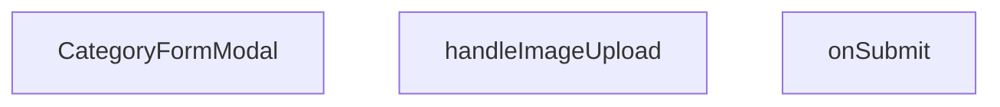

## NODE ID STANDARD

  file: src\components\admin\categories\CategoryFormModal.tsx
  function: src\components\admin\categories\CategoryFormModal.tsx::CategoryFormModal
  function: src\components\admin\categories\CategoryFormModal.tsx::handleImageUpload
  function: src\components\admin\categories\CategoryFormModal.tsx::onSubmit

---

## DISA AKTARILANLAR (EXPORTS)
  export: CategoryFormModal

---

## STİL TOKENLERİ

### Arbitrary Değerler (token'a geçirilmemiş)
Yok — tüm stiller token'a geçirilmiş. ✅

### Kullanılan Token'lar (zaten token'a geçirilmiş)
- (yok)

### Tailwind Sınıf Özeti
- **Renkler:** `bg-black/40`, `bg-black/60`, `bg-cyan-500`, `bg-red-500`, `bg-surface-deep`, `bg-white/1`, `bg-white/2`, `bg-white/3`, `bg-white/5`, `border-2`, `border-b`, `border-b-2`, `border-dashed`, `border-t`, `border-transparent`
- **Layout:** `absolute`, `backdrop-blur-2`, `backdrop-blur-sm`, `block`, `custom-scrollbar`, `fixed`, `flex`, `flex-1`, `flex-col`, `gap-2`, `gap-4`, `gap-6`, `gap-8`, `grid`, `grid-cols-2`
- **Varyant/Responsive:** `data-[state=active]:`, `focus-visible:`, `focus:`, `group-hover:`, `hover:`, `placeholder:` önekleri
- **Yardımcı Sınıflar:** `${adminButtonPrimaryClass`, `-translate-x-1/2`, `-translate-y-1/2`, `animate-spin`, `appearance-none`, `border`, `cursor-pointer`, `focus-visible:outline-none`, `focus-visible:ring-cyan-500/50`, `focus-visible:ring-offset-0`, `font-black`, `font-bold`, `font-medium`, `font-mono`, `font-normal`

---
# FILE: src\components\admin\dashboard\ActivityHeatmap.md

---
domain: general
source_type: doc
namespace_type: module
source_path: C:\Users\alize\venthub-hvac\src\components\admin\dashboard\ActivityHeatmap.tsx
skeleton_hash: 2c5758de78bc1dee
entity_hashes:
  func:ActivityHeatmap: bd94540a2dbd025e
  func:CustomTooltip: 99bc62d30dc2bdeb
  overview: 0c663e64337450d6
  style_tokens: 92623035906e7e7c
generated_at: 2026-05-28T22:35:38Z
---

## Genel Bakış
Bu modül, yönetim panelinde aktivite verilerini görselleştirmek için kullanılan bir ısı haritası bileşenidir. Dışarıdan gelen veri setini takvim benzeri bir arayüze dönüştürerek yoğunluk bilgisini renk kodlamasıyla sunar ve fare etkileşimlerinde detaylı bilgi sağlamak için özel bir tooltip bileşeni içerir.

## Fonksiyon Grupları
### Isı Haritası Ana Bileşeni
Bileşenin temel yapısını, veri işleme mantığını ve render çıkışını yönetir; dışarıdan aldığı veri ve başlık bilgisiyle ısı haritasını oluşturur.
- ActivityHeatmap

### Bilgi Baloncuğu (Tooltip)
Isı haritası üzerindeki veri noktalarına fare ile gelindiğinde gösterilen detaylı bilgi balonunun görünümünü ve içeriğini hazırlar.
- CustomTooltip

---

## AXIOMS – Mimari Varsayımlar
Bu modül için aksiyomlar, sadece fonksiyon imzalarından ve bileşen yapısından türetilmiştir.

[Aksiyom 1]: Eğer `data` parametresi (HeatmapData[] yapısı) verilmemiş veya `undefined`/`null` ise, ActivityHeatmap bileşeni ısı haritası görselleştirmesi oluşturamaz.

[Aksiyom 2]: Eğer `title` parametresi verilmemiş veya boş string ise, bileşen başlıksız çalışır; bileşenin başlık alanı boş kalır.

[Aksiyom 3]: Eğer CustomTooltip `active` parametresi `false` ise, tooltip görünmez durumda olur.

[Aksiyom 4]: Eğer CustomTooltip `payload` parametresi `undefined` veya boş dizi ise, tooltip içinde gösterilecek veri içeriği olmaz.

[Aksiyom 5]: Eğer CustomTooltip `payload[0].payload` yapısı `{ payload: HeatmapData & { dayName: string } }` formatında değilse, tooltip düzgün biçimlendirilemez.

[Aksiyom 6]: HeatmapData yapısının ısı haritası verisini temsil edecek gerekli alanları (örn: değer, tarih/tanımlayıcı) içermesi gerekir; aksi takdirde ısı haritası hücreleri anlamsız değerler gösterebilir.

---

**Not:** Bu aksiyomlar sadece fonksiyon imzaları ve bileşen tanımları referans alınarak oluşturulmuştur. Fonksiyon gövdesindeki detaylı doğrulama, varsayılan değer处理 ve hata yönetimi mantığı bilinmemektedir.

---

## FONKSİYON DETAYLARI

---

## INTERFACES

### HeatmapData
- `day: number`
- `hour: number`
- `count: number`

### ActivityHeatmapProps
- `data: HeatmapData[]`
- `title?: string`

---

## AST POINTERS

### [N1_NASIL] AST Pointer: src/components/admin/dashboard/ActivityHeatmap.tsx::ActivityHeatmap
- **params**: data, title
- **ic_degiskenler**: 
  - `dayNames` — array of Turkish abbreviated day names used for Y‑axis labels.
  - `chartData` — transformed data array where each object contains `hour`, `dayIndex` (0 = Mon … 6 = Sun), `dayName` (string) and `count`.
  - `CustomTooltip` — a React component that renders the tooltip content when a scatter point is active.
  - `maxCount` — holds the maximum `count` value across `chartData`, used to set the Z‑axis domain.
  - `zRange` — tuple `[minArea, maxArea]` defining the minimum and maximum bubble size for the Z‑axis.
- **Dönüş**: JSX element (the rendered component)

### [N2_NASIL] AST Pointer: src/components/admin/dashboard/ActivityHeatmap.tsx::chartData.map callback
- **params**: d
- **ic_degiskenler**: 
  - `ourDayIndex` — computed Y‑axis index (0 = Mon, …, 6 = Sun) derived from `d.day`.
- **Dönüş**: object `{ hour: number, dayIndex: number, dayName: string, count: number }`

### [N3_NASIL] AST Pointer: src/components/admin/dashboard/ActivityHeatmap.tsx::CustomTooltip
- **params**: active, payload
- **ic_degiskenler**: 
  - `data` — the tooltip payload (`payload[0].payload`) containing `dayName`, `hour` and `count` for the active point.
- **Dönüş**: JSX element (tooltip div) or `null`

### [N4_NASIL] AST Pointer: src/components/admin/dashboard/ActivityHeatmap.tsx::Scatter data map callback
- **params**: entry, index
- **ic_degiskenler**: 
  - `intensity` — ratio `entry.count / maxCount` used to determine visual strength.
  - `opacity` — bubble fill opacity, clamped to a minimum of 0.15.
- **Dönüş**: JSX element (`<Cell>`) representing a scatter point.

---

## NODE ID STANDARD

  file: src\components\admin\dashboard\ActivityHeatmap.tsx
  function: src\components\admin\dashboard\ActivityHeatmap.tsx::ActivityHeatmap
  function: src\components\admin\dashboard\ActivityHeatmap.tsx::CustomTooltip

---

## DISA AKTARILANLAR (EXPORTS)
  export: ActivityHeatmap

---

## STİL TOKENLERİ

### Arbitrary Değerler (token'a geçirilmemiş)
Yok — tüm stiller token'a geçirilmiş. ✅

### Kullanılan Token'lar (zaten token'a geçirilmiş)
- `shadow-glow-md`, `tracking-hvac-normal`, `tracking-hvac-relaxed`

### Tailwind Sınıf Özeti
- **Renkler:** `bg-cyan-400`, `bg-cyan-500/30`, `bg-cyan-500/5`, `border-cyan-400/20`, `border-white/10`, `border-white/5`, `group-hover/heatmap:text-cyan-400`, `hover:fill-white`, `text-cyan-400`, `text-slate-500`, `text-slate-600`, `text-sm`, `text-white`, `text-xs`
- **Layout:** `absolute`, `drop-shadow-heatmap-glow`, `flex`, `flex-1`, `flex-col`, `gap-2`, `gap-4`, `group-hover/heatmap:w-20`, `h-0.5`, `h-2.5`, `h-48`, `h-full`, `items-center`, `justify-center`, `justify-end`
- **Varyant/Responsive:** `group-hover/heatmap:`, `hover:` önekleri
- **Yardımcı Sınıflar:** `-ml-6`, `-translate-x-1/2`, `-translate-y-1/2`, `animate-in`, `blur-80`, `border`, `cursor-pointer`, `duration-200`, `duration-700`, `fade-in`, `font-black`, `glass`, `glass-strong`, `group/heatmap`, `italic`

---
# FILE: src\components\admin\dashboard\RecentOrdersTable.md

---
domain: general
source_type: doc
namespace_type: module
source_path: C:\Users\alize\venthub-hvac\src\components\admin\dashboard\RecentOrdersTable.tsx
skeleton_hash: d2394b025a352665
entity_hashes:
  func:RecentOrdersTable: 74faabf4e70dfa3a
  func:getStatusLabel: 2edd561db46db1dc
  func:getStatusStyles: 419f18093a05eeeb
  overview: a050d41dafb624cc
  style_tokens: ec5c1233acb1b783
generated_at: 2026-05-28T22:35:30Z
---

## Genel Bakış
RecentOrdersTable modülü, yönetim panelindeki son siparişleri tablo halinde görüntüleyen bir React bileşeni sağlar. Bileşen, sipariş verisini alır, her siparişin durumuna göre stil ve etiket oluşturmak için yardımcı fonksiyonları kullanır ve başlık ile birlikte tabloyu render eder.

## Fonksiyon Grupları
### UI Bileşeni
Sipariş verisini alarak tabloyu oluşturan ve kullanıcı arayüzüne sunan ana bileşendir.
- RecentOrdersTable

### Yardımcı Stil ve Etiket Üreticileri
Sipariş durumuna göre uygun CSS sınıflarını ve okunabilir etiket metinlerini döndürerek tablonun görsel tutarlılığını sağlar.
- getStatusStyles, getStatusLabel

---

## AXIOMS – Mimari Varsayımlar
Bu modül için özel aksiyom tanımlanmamıştır.

[Aksiyom 1]: Eğer `orders` parametresi `RecentOrdersTable` fonksiyonuna geçilmezse, fonksiyon çalıştırıldığında hata oluşur.  
[Aksiyom 2]: Eğer `orders` dizisindeki herhangi bir öğe `status` özelliğine sahip değilse, `getStatusStyles` ve `getStatusLabel` fonksiyonları beklenmeyen sonuçlar üretir.  
[Aksiyom 3]: Eğer `status` değeri `getStatusStyles` fonksiyonuna geçilmezse, fonksiyonun döndürdüğü stil nesnesi geçersiz olur.  
[Aksiyom 4]: Eğer `s` değeri `getStatusLabel` fonksiyonuna geçilmezse, fonksiyonun döndürdüğü etiket geçersiz olur.  
[Aksiyom 5]: Eğer `title` parametresi `RecentOrdersTable` fonksiyonuna geçilmezse, tablo başlığı görüntülenmez.

---

## FONKSİYON DETAYLARI

---

## INTERFACES

### OrderData
- `id: string`
- `created_at: string`
- `total_amount: number`
- `status: string`
- `order_number?: string | null`

### RecentOrdersTableProps
- `orders: OrderData[]`
- `title: string`

---

## AST POINTERS

### [N1_NASIL] AST Pointer: `src/components/admin/dashboard/RecentOrdersTable.tsx`::RecentOrdersTable

- **params**:  
  - `orders` — dizi; tabloda listelenecek sipariş/teklif kayıtları.  
  - `title` — string; tablo başlığı (sayfa başlığında gösterilir).  

- **ic_degiskenler**:  
  - `lang` — `useI18n()` hook’u ile alınan aktif dil kodu; `formatDateTime` ve `formatCurrency` fonksiyonlarında yerel ayar olarak kullanılır.  
  - `dragScrollRef` — `useDragScroll<HTMLDivElement>()` ile oluşturulmuş ref; tablo sarmalayıcısı `<div>`’a bağlanarak yatay kaydırmayı sürükleme desteği sağlar.  
  - `getStatusStyles` — bileşen içinde tanımlı yardımcı fonksiyon; sipariş durumuna göre renk/Tailwind sınıflarını döndürür.  
  - `getStatusLabel` — bileşen içinde tanımlı yardımcı fonksiyon; sipariş durumu string’ini Türkçe etikete çevirir.  
  - `adminTableContainerClass` — dışarıdan import edilen CSS sınıf sabiti; tablo kabının (`div`) dış stilleri.  
  - `adminTableHeadCellClass` — dışarıdan import edilen CSS sınıf sabiti; başlık hücrelerinin (`<th>`) stilleri.  
  - `adminTableCellClass` — dışarıdan import edilen CSS sınıf sabiti; veri hücrelerinin (`<td>`) stilleri.  
  - `formatDateTime` — dışarıdan import edilen fonksiyon; tarih/saat formatlaması (lang ile).  
  - `formatCurrency` — dışarıdan import edilen fonksiyon; para birimi formatlaması (lang ile).  
  - `Routes` — dışarıdan import edilen route yapılandırması; “Tümünü Gör” linki için `Routes.admin.orders()` kullanılır.  
  - `Link` — `next/link` bileşeni; “Tümünü Gör” butonu ve satır detay linki için kullanılır.  
  - `ChevronRight` — `lucide-react` ikonu; “Tümünü Gör” butonunda ok simgesi.  
  - `PackageSearch` — `lucide-react` ikonu; boş tablo durumu (`AdminEmptyState`) için icon prop’u.  
  - `ExternalLink` — `lucide-react` ikonu; satır detay linkinde dışa açılma simgesi.  
  - `AdminEmptyState` — dışarıdan import edilen bileşen; `orders.length === 0` olduğunda gösterilen boş durum arayüzü.  
  - `index` — `orders.map()` callback’inin ikinci parametresi; her satıra gecikmeli animasyon (`animationDelay`) hesaplamak için kullanılır. (Dikkat: bu değişken map callback’i tanımlandığı yerde yakalanır, bileşen gövdesinde doğrudan referans yoktur, fakat JSX içinde `style` bağlamında kullanıldığı için erişilir).  

- **Dönüş**: `React.JSX.Element` – ana sayfa bileşeninin döndürdüğü JSX ağacı.

---


## MERMAID CALL GRAPH
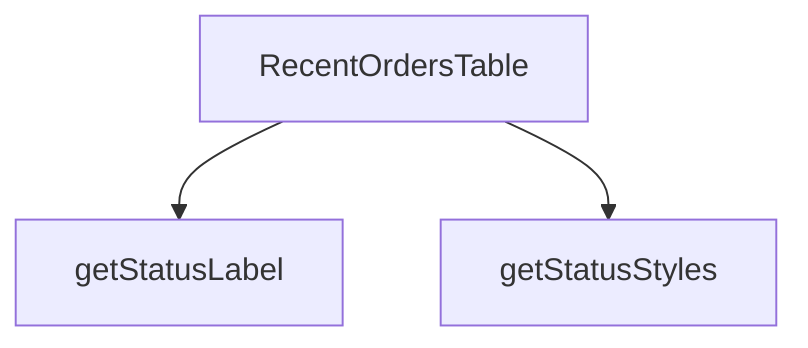

## NODE ID STANDARD

  file: src\components\admin\dashboard\RecentOrdersTable.tsx
  function: src\components\admin\dashboard\RecentOrdersTable.tsx::RecentOrdersTable
  function: src\components\admin\dashboard\RecentOrdersTable.tsx::getStatusStyles
  function: src\components\admin\dashboard\RecentOrdersTable.tsx::getStatusLabel

---

## DISA AKTARILANLAR (EXPORTS)
  export: RecentOrdersTable

---

## STİL TOKENLERİ

### Arbitrary Değerler (token'a geçirilmemiş)
Yok — tüm stiller token'a geçirilmiş. ✅

### Kullanılan Token'lar (zaten token'a geçirilmiş)
- `rounded-hvac-2xl`, `tracking-hvac-normal`, `tracking-hvac-relaxed`

### Tailwind Sınıf Özeti
- **Renkler:** `bg-current`, `bg-cyan-500`, `bg-cyan-500/0`, `bg-cyan-500/5`, `bg-white/2`, `bg-white/5`, `border-collapse`, `border-white/5`, `group-hover/row:bg-cyan-500`, `group-hover/row:bg-white/10`, `group-hover/row:text-white`, `group-hover/table:text-cyan-400`, `hover:bg-cyan-500`, `hover:bg-white/3`, `hover:text-surface-deep`
- **Layout:** `-right-24`, `-top-24`, `absolute`, `backdrop-blur-md`, `custom-scrollbar`, `flex`, `flex-col`, `gap-2`, `gap-3`, `h-0.5`, `h-1.5`, `h-48`, `h-6`, `h-full`, `inline-flex`
- **Varyant/Responsive:** `active:`, `first:`, `group-hover/btn:`, `group-hover/link:`, `group-hover/row:`, `group-hover/table:`, `hover:`, `last:` önekleri
- **Yardımcı Sınıflar:** `${adminTableCellClass`, `${adminTableContainerClass`, `${adminTableHeadCellClass`, `${getStatusStyles(r.status`, `-ml-8`, `active:scale-95`, `animate-in`, `animate-pulse`, `blur-100`, `border`, `divide-white/5`, `divide-y`, `duration-300`, `duration-500`, `fade-in`

---
# FILE: src\components\admin\dashboard\SalesChart.md

---
domain: general
source_type: doc
namespace_type: module
source_path: C:\Users\alize\venthub-hvac\src\components\admin\dashboard\SalesChart.tsx
skeleton_hash: 8dd65454f964d2ba
entity_hashes:
  func:SalesChart: 81798fe6d2553ef7
  overview: 0b8303dd7641efb3
  style_tokens: d6e6bd2ac73e7719
generated_at: 2026-05-28T22:35:31Z
---

## Genel Bakış
`SalesChart`, yönetim paneline ait satış verilerini görselleştiren bir React bileşenidir. Kendisine dışarıdan iletilen veri dizisi ve başlık bilgisiyle bir grafik oluşturarak kullanıcıya özet bir satış raporu sunar.

## Fonksiyon Grupları
### Grafik Render Grubu
Bu grup, bileşene gelen `data` ve `title` prop’larını kullanarak satış grafiğini hazırlar ve JSX çıktısı olarak döndürür.
- SalesChart

---

## AXIOMS – Mimari Varsayımlar
Bu modül için özel aksiyom tanımlanmamıştır.

---

## FONKSİYON DETAYLARI

### SalesChart
**Ne yapar**: Bu React fonksiyonel bileşeni, yönetici panosu (admin dashboard) arayüzünde satış verilerini görselleştiren bir grafik bileşeni oluşturur. Kendisine iletilen `data` ve `title` prop'larını kullanarak kullanıcıya anlamlı bir satış raporu sunar.

**Nasıl yapar**: `React.FC<SalesChartProps>` tipi ile tanımlanan bir fonksiyonel bileşendir. Gelen props nesnesini JavaScript destructuring yöntemiyle `data` ve `title` değişkenlerine ayırır. Bu değişkenleri kullanarak bir grafik JSX yapısı oluşturur ve render edilmek üzere döndürür. Bileşenin iç mantığı, tip güvenliği sağlayan `SalesChartProps` arayüzüne dayanır.

**Parametreler**:
- `data: SalesChartProps['data']` — Grafikte görüntülenecek olan satış verilerini içeren prop'tur. İçeriği ve yapısı `SalesChartProps` arayüzü tarafından belirlenir ve üst bileşen tarafından sağlanır.
- `title: SalesChartProps['title']` — Grafiğin üst kısmında görüntülenecek başlık metnini belirten string değerdir. Kullanıcı arayüzünde grafiğin bağlamını açıklamak için kullanılır.

**Dönüş**: `React.FC<SalesChartProps>` — Fonksiyonun kendisi bir React Fonksiyonel Bileşeni döndürür. Bu bileşenin bir örneği JSX içerisinde çağrıldığında (`<SalesChart ... />`) bir `ReactElement` ya da `null` döndürür.

---

## INTERFACES

### SalesChartProps
- `data: Array<{ date: string; orders: number; returns: number }>`
- `title: string`

---

## AST POINTERS

### [N1_NASIL] AST Pointer: src/components/admin/dashboard/SalesChart.tsx::SalesChart
- **params**: 
  - `data` — satış verisi dizisi (SalesChartProps'den alınır, `data.length` ile boş kontrolü, `AreaChart data` prop'u ve `Brush` koşulu için kullanılır)
  - `title` — grafik başlığı (h3 elementinde görüntülenir)
- **ic_degiskenler**: yok (fonksiyon gövdesinde değişken tanımlanmamıştır)
- **Dönüş**: React JSX elemanı (`ResponsiveContainer` içinde `AreaChart`, `Brush`, `AdminEmptyState` gibi bileşenleri döndürür)

---

## NODE ID STANDARD

  file: src\components\admin\dashboard\SalesChart.tsx
  function: src\components\admin\dashboard\SalesChart.tsx::SalesChart

---

## DISA AKTARILANLAR (EXPORTS)
  export: SalesChart

---

## STİL TOKENLERİ

### Arbitrary Değerler (token'a geçirilmemiş)
Yok — tüm stiller token'a geçirilmiş. ✅

### Kullanılan Token'lar (zaten token'a geçirilmiş)
- `h-hvac-panel`, `shadow-glow-md`, `tracking-hvac-relaxed`

### Tailwind Sınıf Özeti
- **Renkler:** `bg-cyan-400`, `bg-rose-500`, `border-l`, `border-white/10`, `border-white/5`, `group-hover/chart:text-cyan-400`, `hover:bg-white/5`, `text-slate-300`, `text-slate-500`, `text-white`, `text-xl`, `text-xs`
- **Layout:** `backdrop-blur-2xl`, `flex`, `flex-1`, `flex-col`, `gap-2`, `gap-4`, `h-2.5`, `items-center`, `justify-between`, `justify-center`, `min-h-0`, `p-1.5`, `p-8`, `shadow-2xl`, `w-2.5`
- **Varyant/Responsive:** `group-hover/chart:`, `hover:` önekleri
- **Yardımcı Sınıflar:** `-ml-8`, `border`, `font-black`, `glass`, `group/chart`, `italic`, `leading-none`, `mb-10`, `mt-3`, `opacity-60`, `px-4`, `py-2`, `rounded-2xl`, `rounded-full`, `rounded-xl`

---
# FILE: src\components\admin\dashboard\StatCard.md

---
domain: general
source_type: doc
namespace_type: module
source_path: C:\Users\alize\venthub-hvac\src\components\admin\dashboard\StatCard.tsx
skeleton_hash: 5d4b7f17de661145
entity_hashes:
  func:StatCard: 42faa1e1d38b732c
  overview: d5fe2f564e9e4393
  style_tokens: 3b396ad8fb25d2f9
generated_at: 2026-05-28T22:35:31Z
---

## Genel Bakış
`StatCard` bileşeni, yönetim panelinde tek bir istatistiği görselleştirmek için kullanılan yeniden kullanılabilir bir kart bileşenidir. Başlık, alt başlık, değer, yükleme durumu, para birimi biçimlendirmesi ve çok dilli metin desteği gibi farklı ihtiyaçları tek bir arayüzde toplar.

## Fonksiyon Grupları
### UI Render Grubu
Kartın dış yapısını, tipografisini ve düzenini oluşturur; gelen prop’ların görsel bileşenlerle eşlenmesini sağlar.
- StatCard

### Veri ve Durum İşleme Grubu
Değerlerin para birimi formatında gösterilmesi, yükleme durumuna göre ekranın güncellenmesi ve metinlerin dil ayarına göre çevrilmesi gibi mantıksal işlemleri yürütür.
- StatCard

---

## AXIOMS – Mimari Varsayımlar
Bu modül için özel aksiyom tanımlanmamıştır.

---

## FONKSİYON DETAYLARI

---

## INTERFACES

### StatCardProps
- `title: string`
- `subtitle?: string`
- `value: number | string | null`
- `loading: boolean`
- `isCurrency?: boolean`
- `lang?: string`
- `href?: string`
- `icon?: React.ReactNode`
- `trend?: { value: number; label?: string }`
- `accent?: 'navy' | 'emerald' | 'amber' | 'rose' | 'violet' | 'sky' | 'orange'`

---

## AST POINTERS

### [N1_NASIL] AST Pointer: src/components/admin/dashboard/StatCard.tsx::StatCard
- **params**:
  - `title` — kart başlığı (string)
  - `subtitle` — isteğe bağlı alt başlık (string)
  - `value` — gösterilecek ana değer (number, string, null olabilir)
  - `loading` — yüklenme durumu (boolean)
  - `isCurrency` — değerin para birimi formatında gösterilip gösterilmeyeceği (boolean)
  - `lang` — dil kodu, varsayılan `'tr'` (string, `'tr'` veya `'en'`)
  - `href` — isteğe bağlı link hedefi (string veya Route)
  - `icon` — isteğe bağlı ikon React elementi (ReactElement)
  - `trend` — isteğe bağlı trend objesi, `{ value: number }` yapısında
  - `accent` — vurgu rengi, varsayılan `'navy'` (string)
- **ic_degiskenler**:
  - `accents` — yedi farklı renk teması için CSS sınıflarını içeren sabit obje (navy, emerald, amber, rose, violet, sky, orange); her tema `border`, `accent`, `iconBg`, `glow`, `text` alanlarına sahiptir
  - `currentAccent` — `accents[accent]` ile seçilen temanın değeri; kartın görünümünü belirleyen CSS sınıflarını taşır
  - `displayValue` — `loading` kontrolü: yükleniyorsa `'…'`, `value == null` ise `'-'`, `isCurrency` ve `number` ise `formatCurrency` ile formatlanmış, diğer durumlarda ham `value`; ekranda gösterilen metin
  - `content` — kartın ana içeriğini oluşturan JSX bloğu: başlık, değer, trend, alt başlık ve ikon (varsa) burada yer alır
  - `baseClass` — kartın temel CSS sınıfı; `glass-strong !p-8 ... border ${currentAccent.border} hover:border-white/20` şeklinde oluşturulur
- **Dönüş**: JSX elementi (React.ReactNode) — `href` varsa `Link` bileşeni, yoksa `div` bileşeni döndürülür

---

## NODE ID STANDARD

  file: src\components\admin\dashboard\StatCard.tsx
  function: src\components\admin\dashboard\StatCard.tsx::StatCard

---

## DISA AKTARILANLAR (EXPORTS)
  export: StatCard

---

## STİL TOKENLERİ

### Arbitrary Değerler (token'a geçirilmemiş)
Yok — tüm stiller token'a geçirilmiş. ✅

### Kullanılan Token'lar (zaten token'a geçirilmiş)
- `shadow-glow-md`, `tracking-hvac-normal`, `tracking-hvac-relaxed`

### Tailwind Sınıf Özeti
- **Renkler:** `bg-emerald-400/10`, `bg-gradient-to-br`, `bg-rose-400/10`, `border-white/5`, `from-white/5`, `group-hover:text-slate-400`, `lg:text-4xl`, `text-3xl`, `text-emerald-400`, `text-rose-400`, `text-slate-500`, `text-white`, `text-xs`, `to-transparent`
- **Layout:** `-right-12`, `-top-12`, `absolute`, `block`, `bottom-0`, `flex`, `flex-1`, `flex-wrap`, `from-white/5`, `gap-0.5`, `gap-2`, `group-hover:shadow-hvac-stat-card-hover`, `h-1`, `h-14`, `h-48`
- **Varyant/Responsive:** `:`, `group-hover:`, `hover:`, `lg:` önekleri
- **Yardımcı Sınıflar:** `${baseClass`, `${currentAccent.accent`, `${currentAccent.iconBg`, `${trend.value`, `0`, `:`, `>=`, `border`, `duration-1000`, `duration-500`, `duration-700`, `font-black`, `group-hover:rotate-6`, `group-hover:scale-105`, `group-hover:scale-110`

---
# FILE: src\components\admin\products\ProductCsvImport.md

---
domain: general
source_type: doc
namespace_type: module
source_path: C:\Users\alize\venthub-hvac\src\components\admin\products\ProductCsvImport.tsx
skeleton_hash: cf87ca292a02701c
entity_hashes:
  func:ProductCsvImport: 1375065d67decd2a
  overview: 19951cbd59cf400f
  style_tokens: d505eb2f0859ff7f
generated_at: 2026-06-06T21:54:44Z
---

## Genel Bakış
`ProductCsvImport` bileşeni, yönetici panelinde ürün verilerinin CSV dosyası aracılığıyla toplu olarak içe aktarılmasını sağlayan kapsamlı bir araçtır. Kullanıcı arayüzü sunmaktan başlayarak dosya okuma, veri dönüştürme, doğrulama ve sunucuya gönderme süreçlerini tek bir bileşen içinde yönetir.

## Fonksiyon Grupları
### Kullanıcı Arayüzü ve Etkileşim
Bileşen, yöneticiye dosya seçimi için bir arayüz sunar, yükleme butonu sağlar ve işlem süreciyle ilgili durum mesajlarını gösterir.
- ProductCsvImport

### CSV Okuma ve Dönüştürme
Seçilen CSV dosyasının içeriğini asenkron olarak okur, satırlara böler ve ham veri satırlarını uygulamanın beklediği ürün nesne yapısına dönüştürür.
- ProductCsvImport

### Veri Doğrulama ve Hazırlık
Dönüştürülmüş ham veri dizisini, beklenen alanlar ve formatlar için denetler. Hatalı satırları ayırır, geçerli kayıtları ise toplu API isteği için uygun hale getirir.
- ProductCsvImport

### API İletişimi ve Sonuç İşleme
Geçerli ürün kayıtlarını bir araya getirerek sunucudaki ilgili API uç noktasına toplu ekleme isteği gönderir. Başarı durumunda üst bileşene geri bildirimde bulunur, hata oluşursa kullanıcıya bilgilendirme mesajı üretir.
- ProductCsvImport

## AXIOMS – Mimari Varsayımlar
Bu modülün doğru çalışması için bazı prop varsayımları gereklidir.

[Aksiyom 1]: Eğer `categories` prop'u tanımlanmazsa, komponent render ederken kategori seçimi boş kalır ve kullanıcı ürün kategorisi seçemez.  
[Aksiyom 2]: Eğer `categories` prop'u bir dizi değilse, içindeki `map` veya filtreleme işlemleri sırasında çalışma zamanı hatası oluşur.  
[Aksiyom 3]: Eğer `onSuccess` prop'u tanımlanmazsa, başarılı CSV import sonrası dışarıya bildirim gönderilmez ve çağrılan fonksiyon yok sayılır.  
[Aksiyom 4]: Eğer `onSuccess` prop'u bir fonksiyon değilse, import tamamlandığında bu değeri çağırılmaya çalışılırken bir hata fırlatılacaktır.

---

## AXIOMS – Mimari Varsayımlar
Bu modül için aksiyomlar, verilen fonksiyon imzası ve eski dokümanın Genel Bakış açıklamasına dayanarak tanımlanmıştır.

[Aksiyom 1]: Eğer `categories` prop'u sağlanmazsa, bileşen CSV'den dönüştürülen ürünler için geçerli kategori seçemeyeceğinden veya kullanıcının kategori ataması yapamayacağından veri hazırlık/hatlama süreci bozulur.
[Aksiyom 2]: Eğer `onSuccess` callback fonksiyonu sağlanmazsa, başarılı CSV içe aktarma işlemi sonrasında bileşen üst bileşene bildirimde bulunamaz veya işlem sonucunu raporlayamaz.
[Aksiyom 3]: Eğer seçilen CSV dosyasının içeriği (satır/sütun yapısı) beklenen formata (örn: belirli sütun başlıkları) uymazsa, veri dönüştürme ve doğrulama aşaması başarısız olur.
[Aksiyom 4]: Eğer CSV dosyası okunamaz (bozuk, erişilemez veya geçersiz bir dosya ise), bileşen kullanıcıya hata geri bildirimi göstermeli ve onSuccess tetiklenmemelidir.
[Aksiyom 5]: Eğer CSV'den dönüştürülen ürün verisi, iş kurallarına (örn: zorunlu alanların doluluğu, veri tipleri, eşik değerleri) uymazsa, veri doğrulama aşaması başarısız olur ve import işlemi durdurulur.

---

## FONKSİYON DETAYLARI

### ProductCsvImport
**Ne yapar**: Product CSV dosyasının içeri aktarımını yöneten bir React bileşenidir.  
**Nasıl yapar**: `categories` prop'undan gelen kategori listesini kullanarak kullanıcıya gerekli eşleştirme seçeneklerini sunar ve işlem tamamlandığında `onSuccess` callback'ini tetikler.  
**Parametreler**:
- categories: any — Ürünlerin eşleştirilebileceği kategori listesi.  
- onSuccess: () => void — CSV içeri aktarma başarılı olduğunda çağrılan geri çağırım fonksiyonu.  
**Dönüş**: void (bir değer döndürmez, sadece UI render eder).

---

## INTERFACES

### CategoryOpt
- `id: string`
- `name: string`

### ProductCsvImportProps
- `categories: CategoryOpt[]`
- `onSuccess: () => void`

---

## AST POINTERS

### [N1_NASIL] AST Pointer: src/components/admin/products/ProductCsvImport.tsx::ProductCsvImport
- **params**: `{ categories, onSuccess }` — categories: mevcut kategoriler dizisi (prop), onSuccess: başarı callback'i (prop)
- **ic_degiskenler**:
  - `t` — useI18n() hook'undan gelen çeviri fonksiyonu
  - `importPreview` / `setImportPreview` — React state: CSV önizleme verisi `{ header: string[], rows: Record<string,string>[], total: number }` veya null
  - `importRows` / `setImportRows` — React state: CSV'den ayrıştırılmış tüm satırlar `Record<string,string>[]` veya null
  - `isProcessing` / `setIsProcessing` — React state: içe aktarma işlemi devam ediyor mu flag'i
- **Dönüş**: JSX element (React fragment — CSV dosya seçici butonu ve modal önizleme arayüzü)

### [N2_NASIL] AST Pointer: src/components/admin/products/ProductCsvImport.tsx::handleFileChange
- **params**: `e: React.ChangeEvent<HTMLInputElement>` — dosya input change olayı
- **ic_degiskenler**:
  - `f` — seçilen dosya nesnesi, `e.target.files?.[0]` referansı, undefined ise fonksiyon erken döner
  - `text` — dosyanın tam metin içeriği, `f.text()` asenkron okumasıyla elde edilir
  - `lines` — BOM karakteri (`\ufeff`) kaldırıldıktan ve satır sonlarına göre split edildikten sonra boş satırları filtrelenmiş satır dizisi
  - `split` — yerel CSV ayrıştırma fonksiyonu: virgülle split eder, tırnak işaretlerini ve çift tırnak kaçışlarını işler
  - `header` — ilk satırdan elde edilen sütun başlıkları, küçük harfe dönüştürülmüş ve trim edilmiş `string[]`
  - `rows` — her satırı `{ sütunAdı: hücreDeğeri }` objesine dönüştüren `Record<string,string>[]` dizisi; eksik hücreler boş string ile doldurulur
- **Dönüş**: void (yan etkiler: `setImportRows(rows)`, `setImportPreview({...})`, `e.target.value = ''` ile input reset)

### [N3_NASIL] AST Pointer: src/components/admin/products/ProductCsvImport.tsx::split
- **params**: `s: string` — split edilecek ham CSV satırı veya başlık satırı
- **ic_degiskenler**: (yok — tek satırlık inline fonksiyon)
- **Dönüş**: `string[]` — tırnak-aware virgül split sonucu, her hücredeki baş/son tırnak işaretleri kaldırılmış, çift tırnak (`""`) tek tırnak (`"`) olarak değiştirilmiş

### [N4_NASIL] AST Pointer: src/components/admin/products/ProductCsvImport.tsx::handleDryRun
- **params**: (yok)
- **ic_degiskenler**:
  - `h` — importPreview?.header dizisi, yoksa boş dizi; mevcut sütun başlıklarını tutar
  - `required` — zorunlu sütun adları dizisi `['name', 'sku']`
  - `hasRequired` — boolean, tüm zorunlu sütunların header'da bulunup bulunmadığını belirtir
  - `okCount` — importPreview.rows içinden hem 'name' hem 'sku' alanına sahip satır sayısı
- **Dönüş**: void (yan etki: `alert()` ile kuru çalıştırma sonucu gösterir)

### [N5_NASIL] AST Pointer: src/components/admin/products/ProductCsvImport.tsx::handleImport
- **params**: (yok)
- **ic_degiskenler**:
  - `h` — importPreview.header, CSV sütun başlıkları dizisi
  - `mapCategorySlugToId` — yerel fonksiyon: kategori slug'ını kategori ID'sine eşler
  - `payloads` — `Database['public']['Tables']['products']['Insert'][]` tipinde, veritabanına yazılacak ürün objeleri dizisi
  - `r` — for döngüsündeki her bir CSV satırı `Record<string,string>`
  - `p` — her satır için inşa edilen `products.Insert` tipinde ürün objesi; `sku`, `name`, `slug`, `brand`, opsiyonel olarak `model_code`, `status`, `price`, `stock_qty`, `low_stock_threshold`, `category_id` alanlarını içerir
  - `chunk` — payloads dizisinin 100'er elemanlık alt dizisi (toplu upsert için)
  - `ok` — başarılı upsert sayısı sayacı, başlangıç 0
  - `fail` — başarısız upsert sayısı sayacı, başlangıç 0
  - `i` — chunk döngüsü indeksi, 100'er adım ilerler
- **Dönüş**: void (yan etkiler: `supabase.from('products').upsert(chunk, { onConflict: 'sku' })` ile veritabanına yazar, `alert()` ile sonuç gösterir, `setImportPreview(null)`, `setImportRows(null)`, `onSuccess()`, `setIsProcessing(false)` çağırır)

### [N6_NASIL] AST Pointer: src/components/admin/products/ProductCsvImport.tsx::mapCategorySlugToId
- **params**: `slug: string` — eşleştirilecek kategori slug'ı (ör: "klima", "ısı pompası")
- **ic_degiskenler**:
  - `s` — normalize edilmiş slug: null-safe, küçük harfe çevrilmiş ve trim edilmiş hali
  - `found` — `categories` prop'u üzerinde `.find()` ile `c.name.toLowerCase() === s` eşleşmesiyle bulunan kategori objesi veya undefined
- **Dönüş**: `string | null` — eşleşen kategorinin `id` değeri veya bulunamazsa `null`

---

## NODE ID STANDARD

  file: src\components\admin\products\ProductCsvImport.tsx
  function: src\components\admin\products\ProductCsvImport.tsx::ProductCsvImport

---

## DISA AKTARILANLAR (EXPORTS)
  export: ProductCsvImport

---

## STİL TOKENLERİ

### Arbitrary Değerler (token'a geçirilmemiş)
Yok — tüm stiller token'a geçirilmiş. ✅

### Kullanılan Token'lar (zaten token'a geçirilmiş)
- (yok)

### Tailwind Sınıf Özeti
- **Renkler:** `bg-gray-50`, `bg-slate-50`, `bg-slate-900/50`, `border-b`, `border-gray-200`, `border-slate-200`, `border-t`, `hover:bg-gray-50/50`, `hover:text-slate-600`, `text-center`, `text-left`, `text-slate-400`, `text-slate-500`, `text-slate-800`, `text-xs`
- **Layout:** `fixed`, `flex`, `flex-1`, `flex-col`, `gap-3`, `h-10`, `hidden`, `items-center`, `justify-between`, `justify-center`, `justify-end`, `max-h-90vh`, `max-w-4xl`, `overflow-x-auto`, `overflow-y-auto`
- **Varyant/Responsive:** `hover:` önekleri
- **Yardımcı Sınıflar:** `${adminButtonPrimaryClass`, `${adminButtonSecondaryClass`, `${adminCardClass`, `animate-in`, `divide-gray-100`, `divide-y`, `duration-200`, `fade-in`, `font-semibold`, `inset-0`, `italic`, `rounded-b-2xl`, `transition-colors`, `uppercase`, `whitespace-nowrap`

---
# FILE: src\components\admin\products\ProductFormModal.md

---
domain: general
source_type: doc
namespace_type: module
source_path: C:\Users\alize\venthub-hvac\src\components\admin\products\ProductFormModal.tsx
skeleton_hash: 6434b7045931a363
entity_hashes:
  func:ProductFormModal: 6997b37c35b0ebef
  func:onSubmit: 56cec6a550e2cc75
  overview: d2db197943752315
  style_tokens: 553a7b8fa0cd3c86
generated_at: 2026-06-06T21:54:55Z
---

## Genel Bakış
Bu modül, yönetici panelinde yeni ürün ekleme veya mevcut ürünü düzenleme işlevini sunan bir form modalı bileşenidir. Kullanıcı arayüzündeki formun görünür olmasını, ilgili verilerle doldurulmasını ve gönderim sonrasındaki iş akışını (başarı/hata durumunda yapılacaklar) yönetir.

## Fonksiyon Grupları
### Modal Bileşeni ve Görünüm Yönetimi
Bileşenin temel yapısını ve dışarıdan kontrol edilen durumunu (açık/kapalı, veri modu) yönetir. Kullanıcı etkileşimi için gerekli arayüzü oluşturur ve formun hangi verilerle başlayacağına karar verir.
- ProductFormModal

### Form İşlemleri ve Gönderim Akışı
Kullanıcının doldurduğu form verilerini doğrulayıp sunucuya gönderen asenkron işlemciyi barındırır. İşlemin sonucuna göre bir sonraki adımı (başarılı kayıt sonrası kapatma veya hata gösterimi) tetikler.
- onSubmit

---

## AXIOMS – Mimari Varsayımlar

Bu modül için fonksiyon gövdesi sağlanmadığından, yalnızca fonksiyon imzası ve modül sabitlerinden çıkarılabilen temel mimari varsayımlar tanımlanmıştır.

[Aksiyom 1]: Eğer `open` prop'u `true` değerini almazsa, modal bileşeni render edilmez ve form kullanıcıya gösterilmez.

[Aksiyom 2]: Eğer `onClose` callback'i sağlanmazsa, modalın kapanması tetiklendiğinde üst bileşen durumdan haberdar olamaz ve modal kapanma akışı bozulur.

[Aksiyom 3]: Eğer `onSuccess` callback'i sağlanmazsa, form başarıyla gönderildikten sonra üst bileşen (örn: ürün listesi tablosu) yenilenemez veya kullanıcıya başarı bildirimi gösterilemez.

[Aksiyom 4]: Eğer `_productId` prop'u `undefined` (veya geçersiz bir değer) olarak verilirse, form "yeni ürün ekleme" modunda çalışır; aksi halde mevcut ürün verileriyle doldurularak "düzenleme" modunda çalışır.

[Aksiyom 5]: Eğer `productSchema` (validasyon şeması) çağrılamazsa veya tanımlı değilse, form alanları için geçerlik doğrulaması (zorunlu alan, veri tipi, eşik değerleri vb.) çalıştırılamaz ve geçersiz veriler gönderilebilir.

[Aksiyom 6]: Eğer `onSubmit` fonksiyonu çağrıldığında `ProductFormValues` tipli `values` parametresi sağlam bir nesne (tüm zorunlu alanları içerecek şekilde) değilse, form verileri işlenemez veya API isteği başarısız olur.

[Aksiyom 7]: Eğer `onSubmit` fonksiyonu成功le (Promise resolve) dönmezse, modal kapanmaz ve kullanıcıya başarı bildirimi gösterilmez.

[Aksiyom 8]: Eğer `open` prop'u `true` iken `_productId` değişirse, form mevcut değerleri temizleyip yeni ürün verileriyle (veya sıfır değerlerle) yeniden başlatılmalıdır; aksi halde önceki ürün verileri form alanlarında kalır.

---

## FONKSİYON DETAYLARI

### ProductFormModal
**Ne yapar**: Bu fonksiyon, ürün ekleme veya düzenleme işlemleri için kullanılan bir modal form bileşenini tanımlar. Belirtilen ürün ID'sine göre yeni ürün oluşturma veya mevcut ürünü düzenleme amacı taşır.

**Nasıl yapar**: Bileşen, açık/kapalı durumu `open` prop'u ile kontrol edilen bir modal yapısı içerir. Form alanları ve geçerlilik kontrolleri bileşen içinde yönetilir; form gönderimi `onSubmit` fonksiyonu ile gerçekleştirilir.

**Parametreler**:
- `_productId: any` — Düzenlenecek ürünün benzersiz kimliği. Yeni ürün oluştururken `null` veya `undefined` olabilir.
- `open: boolean` — Modalın görünür olup olmadığını belirleyen kontrol değişkeni.
- `onClose: () => void` — Modal kapatıldığında çağrılan geri çağırma fonksiyonu.
- `onSuccess: () => void` — Form başarıyla gönderildikten sonra çağrılan başarı bildirim fonksiyonu.

**Dönüş**: `JSX.Element` — Render edilen modal bileşenini döndürür.

### onSubmit
**Ne yapar**: `ProductFormModal` bileşeni içinde formun gönderilmesiyle tetiklenen işleyici fonksiyondur. Form değerlerini alarak gerekli doğrulama ve API çağrılarını başlatır.

**Nasıl yapar**: Parametre olarak gelen `ProductFormValues` nesnesini işler; genellikle bir API servisine POST veya PUT isteği yapar ve başarılı sonuçta `onSuccess` prop'unu çağırarak üst bileşene bildirim gönderir.

**Parametreler**:
- `values: ProductFormValues` — Formdaki tüm alan değerlerini içeren veri nesnesi.

**Dönüş**: Kod parçasında dönüş tipi belirtilmemiştir; yaygın kullanımda `void` veya `Promise<void>` döndürebilir.

---

## INTERFACES

### ProductFormModalProps
- `_productId?: string | null`
- `open: boolean`
- `onClose: () => void`
- `onSuccess: () => void`

---

## TYPE ALIASES

### ProductFormValues
```typescript
type ProductFormValues = z.infer<typeof productSchema>
```

---

## SABİTLER
- **productSchema** (call) — `z.object({

    name: z.string().min(3, 'İsim en az 3 karakter olmalı'),

   ...`

---

## AST POINTERS

### [N1_NASIL] AST Pointer: ProductFormModal.tsx::ProductFormModal
- **params**: ({ _productId, open, onClose, onSuccess })
- **ic_degiskenler**:
  - `t` — useI18n hook'undan gelen çeviri fonksiyonu
  - `loading` — asenkron işlemler için yükleme durumunu tutan state değişkeni
  - `categories` — DbCategory dizisi tutan state değişkeni, kategori listesini tutar
  - `register` — react-hook-form'dan gelen input kayıt fonksiyonu
  - `handleSubmit` — react-hook-form'dan gelen form gönderim fonksiyonu
  - `reset` — react-hook-form'dan gelen form sıfırlama fonksiyonu
  - `errors` — formState içinden alınan form hata nesnesi
  - `loadProduct` — useCallback ile tanımlanan, verilen ID ile ürün yükleyen asenkron fonksiyon
  - `fetchCategories` — useEffect içinde tanımlanan, kategorileri yükleyen asenkron fonksiyon
- **Dönüş**: JSX elementi (Dialog bileşeni) veya null (open=false ise)

### [N2_NASIL] AST Pointer: ProductFormModal.tsx::onSubmit
- **params**: (values: ProductFormValues)
- **ic_degiskenler**:
  - `payload` — DbProductUpdate veya DbProductInsert türünde, form değerlerinden oluşturulmuş güncelleme/ekleme verisi
  - `_productId` — üst kapsamdan gelen, ürünün ID'si (güncelleme durumunda kullanılır)
- **Dönüş**: yok (yan etkiler: veritabanı güncelleme/ekleme, toast bildirimleri, onSuccess/onClose çağrıları)

### [N3_NASIL] AST Pointer: ProductFormModal.tsx::loadProduct
- **params**: (id: string)
- **ic_degiskenler**:
  - `id` — yüklenen ürünün ID'si
  - `product` — supabase'den gelen ürün verisi (select sorgusundan)
  - `error` — supabase sorgu hatası (varsa)
- **Dönüş**: yok (yan etkiler: formu ürün verisiyle doldurur, loading durumunu yönetir, hata gösterir)

### [N4_NASIL] AST Pointer: ProductFormModal.tsx::fetchCategories
- **params**: ()
- **ic_degiskenler**:
  - `data` — supabase'den gelen kategori verisi (DbCategory[] dizisi)
- **Dönüş**: yok (yan etkiler: categories state'ini günceller)

### [N5_NASIL] AST Pointer: ProductFormModal.tsx::useEffect (kategoriler için)
- **params**: ()
- **ic_degiskenler**:
  - `fetchCategories` — yukarıdaki fetchCategories fonksiyonu
- **Dönüş**: yok (yan etkiler: bileşen yüklendiğinde kategorileri çeker)

### [N6_NASIL] AST Pointer: ProductFormModal.tsx::useEffect (ürün yükleme için)
- **params**: ()
- **ic_degiskenler**:
  - `open` — dialog'ın açık olup olmadığını belirten prop
  - `_productId` — yüklenen ürünün ID'si (yeni ürün ekleniyorsa undefined)
  - `loadProduct` — yukarıdaki loadProduct fonksiyonu
  - `reset` — form sıfırlama fonksiyonu
- **Dönüş**: yok (yan etkiler: dialog açıldığında ürün yükler veya formu sıfırlar)

---

## NODE ID STANDARD

  file: src\components\admin\products\ProductFormModal.tsx
  function: src\components\admin\products\ProductFormModal.tsx::ProductFormModal
  function: src\components\admin\products\ProductFormModal.tsx::onSubmit

---

## DISA AKTARILANLAR (EXPORTS)
  export: ProductFormModal

---

## STİL TOKENLERİ

### Arbitrary Değerler (token'a geçirilmemiş)
Yok — tüm stiller token'a geçirilmiş. ✅

### Kullanılan Token'lar (zaten token'a geçirilmiş)
- (yok)

### Tailwind Sınıf Özeti
- **Renkler:** `bg-black/50`, `bg-primary-navy`, `bg-white`, `hover:bg-blue-700`, `hover:bg-slate-100`, `hover:bg-slate-50`, `text-industrial-gray`, `text-red-500`, `text-slate-500`, `text-white`, `text-xl`, `text-xs`
- **Layout:** `backdrop-blur-sm`, `fixed`, `flex`, `gap-2`, `gap-3`, `gap-4`, `grid`, `grid-cols-1`, `items-center`, `justify-between`, `justify-end`, `left-1/2`, `max-h-90vh`, `max-w-2xl`, `md:grid-cols-2`
- **Varyant/Responsive:** `focus-visible:`, `hover:`, `md:` önekleri
- **Yardımcı Sınıflar:** `-translate-x-1/2`, `-translate-y-1/2`, `animate-spin`, `border`, `focus-visible:outline-none`, `font-bold`, `inset-0`, `mb-6`, `mt-8`, `px-4`, `px-6`, `py-2`, `rounded-2xl`, `rounded-full`, `rounded-lg`

---
# FILE: src\components\admin\products\ProductHealthBadge.md

---
domain: general
source_type: doc
namespace_type: module
source_path: C:\Users\alize\venthub-hvac\src\components\admin\products\ProductHealthBadge.tsx
skeleton_hash: 86fcda867d26a586
entity_hashes:
  func:ProductHealthBadge: 7149ab2cdd96084d
  overview: 300c84dd02e2dca2
  style_tokens: ee784aad25800471
generated_at: 2026-05-28T22:35:38Z
---

## Genel Bakış
`ProductHealthBadge` bileşeni, bir ürünün stok miktarı, eşik değeri, mevcut durumu ve öne çıkarma bayrağını alarak bu bilgileri yönetim panelinde görsel bir rozet olarak gösterir. Stok seviyesine ve ürün durumuna göre farklı renk, ikon ve metin kombinasyonları üreterek kullanıcıya ürünün sağlık durumunu hızlıca iletir.

## Fonksiyon Grupları
### UI Render ve Durum Değerlendirme
Bu grup, gelen props değerlerine göre rozetin görünümünü, stilini ve içeriğini belirleyerek tek bir JSX çıktısı üretir. Stok durumu, eşik karşılaştırması ve öne çıkarma durumu gibi koşullara göre uygun renk, ikon ve metni seçerek ürünün sağlık bilgisini görselleştirir.  
- ProductHealthBadge

---

## AXIOMS – Mimari Varsayımlar
Bu modül için özel aksiyom tanımlanmamıştır.

---

## FONKSİYON DETAYLARI

### ProductHealthBadge
**Ne yapar**: ProductHealthBadge, bir ürünün stok durumu, eşik değeri, genel durumu ve öne çıkanlık durumu gibi özelliklere dayalı olarak ürünün sağlık durumunu gösteren bir rozet (badge) bileşeni render eder.

**Nasıl yapar**: Fonksiyon, alınan `stockQty`, `threshold`, `status` ve `isFeatured` props'larını kullanarak iç mantıkta ürünün sağlık durumunu belirler (örneğin düşük stok, tükenmiş, öne çıkan vb.) ve bu duruma uygun stil ve metni olan bir JSX elementi döndürür. Bu süreçte koşullu renderlama ve stil uygulama yapılır; ancak özel mantık detayları verilen snippet içinde bulunmadığından burada sadece genel akış açıklanmıştır.

**Parametreler**:
- stockQty: as defined in ProductHealthProps — Ürünün mevcut stok miktarını temsil eder.
- threshold: as defined in ProductHealthProps — Stok seviyesinin düşük kabul edilecek sınır değerini belirtir.
- status: as defined in ProductHealthProps — Ürünün genel durumu (örneğin "available", "out of stock", "discontinued") hakkında bilgi taşır.
- isFeatured: as defined in ProductHealthProps — Ürünün öne çıkan ürün olarak işaretlenip işaretlenmediğini gösteren bir bayraktır.

**Dönüş**: React.FC<ProductHealthProps> — Bir React fonksiyonel bileşeni döndürür; bu bileşen, verilen props'lara göre ürün sağlık rozetini render eder.

---

## INTERFACES

### ProductHealthProps
- `stockQty: number`
- `threshold: number`
- `status: string`
- `isFeatured: boolean`

---

## TYPE ALIASES

### HealthScore
```typescript
type HealthScore = 'A' | 'B' | 'C' | 'D' | 'N/A'
```

---

## AST POINTERS

### [N1_NASIL] AST Pointer: src/components/admin/products/ProductHealthBadge.tsx::ProductHealthBadge
- **params**: stockQty, threshold, status, isFeatured
- **ic_degiskenler**: 
  - `score` — sağlık skoru değerini tutar; 'A', 'B', 'C', 'D' veya 'N/A' olabilir ve stockQty, threshold, status ve isFeatured koşullarına göre belirlenir
  - `colors` — skor değerlerine karşılık gelen Tailwind CSS sınıfı stringlerini içeren nesne; badge'nin arka plan, metin, border ve ring stillerini sağlar
  - `descriptions` — skor değerlerine karşılık gelen Türkçe açıklama metinlerini içeren nesne; badge'nin title özelliğinde gösterilen açıklamayı sağlar
- **Dönüş**: React.FC<ProductHealthProps> (JSX elementi)

---

## NODE ID STANDARD

  file: src\components\admin\products\ProductHealthBadge.tsx
  function: src\components\admin\products\ProductHealthBadge.tsx::ProductHealthBadge

---

## DISA AKTARILANLAR (EXPORTS)
  export: HealthScore
  export: ProductHealthBadge

---

## STİL TOKENLERİ

### Arbitrary Değerler (token'a geçirilmemiş)
Yok — tüm stiller token'a geçirilmiş. ✅

### Kullanılan Token'lar (zaten token'a geçirilmiş)
- (yok)

### Tailwind Sınıf Özeti
- **Renkler:** `text-xs`
- **Layout:** `h-6`, `inline-flex`, `items-center`, `justify-center`, `shadow-sm`, `w-6`
- **Varyant/Responsive:** (yok)
- **Yardımcı Sınıflar:** `${colors[score]`, `border`, `font-bold`, `ring-2`, `ring-offset-1`, `rounded-full`

---
# FILE: src\components\authority\AuthorityRenderer.md

---
domain: general
source_type: doc
namespace_type: module
source_path: C:\Users\alize\venthub-hvac\src\components\authority\AuthorityRenderer.tsx
skeleton_hash: a5da5b7f6225ccf6
entity_hashes:
  func:AuthorityRenderer: b497d8ee6938f090
  func:ComparisonBlock: 3b92c32ed036d564
  func:CtaBannerBlock: d3489e335a9aa81e
  func:FeaturesGridBlock: 007c341f14e3aa81
  func:HeroBlock: 004bad6f0e03f1b8
  func:IconRenderer: 6dea11b29c7fd6b8
  func:SpecsBlock: 02f28da6bc471010
  overview: 205541493453ffae
  style_tokens: 783b613fb0128036
generated_at: 2026-05-28T22:35:41Z
---

## Genel Bakış
`AuthorityRenderer` bileşeni, gelen içerik koleksiyonunu blok tiplerine göre ayırıp ilgili görsel bileşenlere yönlendiren bir render katmanıdır. Her blok tipi (hero, specs, özellikler grid, karşılaştırma, CTA banner) kendi özel render fonksiyonuyla işlenir ve ortak ikon gösterimi için `IconRenderer` yardımcı bileşeni kullanılır.

## Fonksiyon Grupları
### Blok Render Grupları
Bu grup, belirli veri tiplerini alıp karşılık gelen UI yapılarını oluşturur; her biri gelen blok verisini okuyarak uygun JSX döndürür.  
- `HeroBlock`, `SpecsBlock`, `FeaturesGridBlock`, `ComparisonBlock`, `CtaBannerBlock`

### Ana Render ve Yardımcı
`AuthorityRenderer` içerik listesini döngüye alarak blok tipine göre ilgili blok render fonksiyonunu çağırır. `IconRenderer` ise simge adı ve opsiyonel sınıf alarak tekrar kullanılabilir bir ikon öğesi üretir ve diğer blok render içinde ihtiyaç duyulduğunda kullanılır.  
- `AuthorityRenderer`, `IconRenderer`

---

## AXIOMS – Mimari Varsayımlar
Bu modülün doğru çalışması için aşağıdaki koşulların sağlanması gerekir; koşullar eksik olduğunda beklenen davranış bozulur.

- **Eğer** `AuthorityRenderer` component’ine `content` prop’u **tanımlı değilse** veya **dizi (Array) tipi değilse**, bloklar iterate edilemeyeceği için hiçbir içerik render edilmez ve çalışma‑zamanı hatası oluşabilir.  
- **Eğer** `content` dizisindeki herhangi bir blok nesnesi **`type` özelliğine sahip değilse** veya bu özellik **`undefined`/`null` ise**, `AuthorityRenderer` hangi blok render fonksiyonunu çağıracağını belirleyemez; ilgili blok atlanır ve UI’da görünmez.  
- **Eğer** bir blokun `type` değeri **`"hero"`, `"specs"`, `"featuresGrid"`, `"comparison"` veya `"ctaBanner"` dışında bir string ise**, `AuthorityRenderer` bu tip için eşleşen bir render fonksiyonu bulamayacağı için blok render edilmez.  
- **Eğer** `IconRenderer` component’ine `name` prop’u **string tipi dışında bir değer** (örneğin sayı, null, undefined) verilirse, ikon adı tanımsız olur ve ikon gösterilemeyebilir veya hata fırlatılabilir.  
- **Eğer** `IconRenderer` component’ine `className` prop’u **string tipi dışında bir değer** verilirse, sınıf adı DOM elemanına uygulanamayabilir; bu da stil beklentilerinin bozulmasına yol açar.  
- **Eğer** `HeroBlock`, `SpecsBlock`, `FeaturesGridBlock`, `ComparisonBlock` veya `CtaBannerBlock` component’lerine `block` prop’u **eksik verilirse** veya bu prop’un **bileşenin bekl ettiği zorunlu alanları içermediği** takdirde, ilgili blok beklenen veriyi alamayacağından render hatası veya boş bir çıktı üretebilir.  

Bu varsayımlar, modülün işlevselliğini korumak için giriş verilerinin ve prop tiplerinin belirtilen şartlara uygun olması gerektiğini ifade eder. Koşullar sağlanmadığında render eksikliği, hatalı UI veya çalışma‑zamanı istisnaları ortaya çıkabilir.

---

## FONKSİYON DETAYLARI

### IconRenderer
**Ne yapar**: Verilen `name` ve opsiyonel `className` parametrelerine göre bir simge (icon) öğesini render eder.  
**Nasıl yapar**: `name` değeriyle hangi simgenin gösterileceğini belirler, `className` varsa bu sınıfları öğeye uygulayarak stil ve görünümü ayarlar.  
**Parametreler**:  
- name: string — Gösterilecek simgenin adı veya kimliği  
- className: string — (opsiyonel) Simgeye ek CSS sınıfları  
**Dönüş**: void — Fonksiyon bir JSX öğesi döndürür; açık bir dönüş tipi belirtilmemiştir.

### HeroBlock
**Ne yapar**: `block` prop’u olarak gelen `HeroBlockType` verisini kullanarak hero bölümü bileşenini render eder.  
**Nasıl yapar**: `block` içindeki başlık, açıklama, görsel ve çağrı‑eylem gibi alanları okuyarak ilgili JSX yapısını oluşturur ve döndürür.  
**Parametreler**:  
- block: HeroBlockType — Hero bölümü içeriğini tanımlayan veri nesnesi  
**Dönüş**: React.FC<{ block: HeroBlockType }> — Hero bileşenini render eden fonksiyonel bileşen.

### SpecsBlock
**Ne yapar**: `block` prop’u olarak gelen `SpecsBlockType` verisini kullanarak özellik spesifikasyonları bloğunu render eder.  
**Nasıl yapar**: `block` içindeki özellik listelerini (başlık, değer, birim vb.) iterate ederek her bir özelliği uygun şekilde biçimlendirir ve JSX olarak döndürür.  
**Parametreler**:  
- block: SpecsBlockType — Spesifikasyon bloğu verisini taşıyan nesne  
**Dönüş**: React.FC<{ block: SpecsBlockType }> — Specs bileşenini render eden fonksiyonel bileşen.

### FeaturesGridBlock
**Ne yapar**: `block` prop’u olarak gelen `FeaturesGridBlockType` verisini kullanarak özellikleri ızgara düzeninde gösteren bileşeni render eder.  
**Nasıl yapar**: `block` içindeki özellik kartlarını (ikon, başlık, açıklama) alıp bir CSS ızgara veya flex düzeninde yerleştirerek kullanıcıya sunar.  
**Parametreler**:  
- block: FeaturesGridBlockType — Özellik ızgara verisini içeren nesne  
**Dönüş**: React.FC<{ block: FeaturesGridBlockType }> — FeaturesGrid bileşenini render eden fonksiyonel bileşen.

### ComparisonBlock
**Ne yapar**: `block` prop’u olarak gelen `ComparisonBlockType` verisini kullanarak ürün veya hizmet karşılaştırma tablosunu render eder.  
**Nasıl yapar**: `block` içindeki sütun başlıkları ve satır verilerini okuyarak bir HTML tablosu veya div‑tabanlı ızgara yapısı oluşturur ve stilini uygular.  
**Parametreler**:  
- block: ComparisonBlockType — Karşılaştırma bloğu verisini taşıyan nesne  
**Dönüş**: React.FC<{ block: ComparisonBlockType }> — Comparison bileşenini render eden fonksiyonel bileşen.

### CtaBannerBlock
**Ne yapar**: `block` prop’u olarak gelen `CtaBannerBlockType` verisini kullanarak çağrı‑eylem (CTA) bannerını render eder.  
**Nasıl yapar**: `block` içindeki başlık, açıklama, buton metni ve link gibi alanları alarak bir banner bölümü oluşturur, genellikle arka plan rengi veya görsel ile vurgulanır.  
**Parametreler**:  
- block: CtaBannerBlockType — Cta banner verisini içeren nesne  
**Dönüş**: React.FC<{ block: CtaBannerBlockType }> — CtaBanner bileşenini render eden fonksiyonel bileşen.

### AuthorityRenderer
**Ne yapar**: `content` prop’u olarak gelen `AuthorityContent | null` verisini kullanarak yetki veya güvenilirlik ile ilgili içerik bloklarını render eder; içerik yoksa null döndürür.  
**Nasıl yapar**: `content` null değilse, içindeki başlık, açıklama, logo veya belge verilerini okuyarak uygun JSX yapısını oluşturur; null ise hiçbir şey render etmez.  
**Parametreler**:  
- content: AuthorityContent | null — Yetki içeriğini tanımlayan veri nesnesi veya içerik yoksa null  
**Dönüş**: React.FC<{ content: AuthorityContent | null }> — Authority bileşenini render eden fonksiyonel bileşen.

---

## AST POINTERS

### [N1_NASIL] AST Pointer: src/components/authority/AuthorityRenderer.tsx::IconRenderer
- **params**: name, className
- **ic_degiskenler**: 
  - `iconName` — first character of `name` uppercased and concatenated with the rest of the string, used as a key to look up the corresponding LucideIcon
  - `Icon` — the resolved LucideIcon component from `LucideIcons[iconName]`, falling back to `LucideIcons.Zap` if the lookup fails
- **Dönüş**: JSX element (the rendered icon)

### [N2_NASIL] AST Pointer: src/components/authority/AuthorityRenderer.tsx::HeroBlock
- **params**: block
- **ic_degiskenler**: (none)
- **Dönüş**: JSX element (the hero section)

### [N3_NASIL] AST Pointer: src/components/authority/AuthorityRenderer.tsx::SpecsBlock
- **params**: block
- **ic_degiskenler**: (none)
- **Dönüş**: JSX element (the specs grid)

### [N4_NASIL] AST Pointer: src/components/authority/AuthorityRenderer.tsx::FeaturesGridBlock
- **params**: block
- **ic_degiskenler**: (none)
- **Dönüş**: JSX element (the features grid)

### [N5_NASIL] AST Pointer: src/components/authority/AuthorityRenderer.tsx::ComparisonBlock
- **params**: block
- **ic_degiskenler**: (none)
- **Dönüş**: JSX element (the comparison block)

### [N6_NASIL] AST Pointer: src/components/authority/AuthorityRenderer.tsx::CtaBannerBlock
- **params**: block
- **ic_degiskenler**: (none)
- **Dönüş**: JSX element (the CTA banner)

### [N7_NASIL] AST Pointer: src/components/authority/AuthorityRenderer.tsx::AuthorityRenderer
- **params**: content
- **ic_degiskenler**: (none)
- **Dönüş**: JSX element or `null` (returns null when content is empty/invalid, otherwise a wrapper with mapped blocks)

### [N8_NASIL] AST Pointer: src/components/authority/AuthorityRenderer.tsx::SpecsBlock map callback
- **params**: row, i
- **ic_degiskenler**: (none)
- **Dönüş**: JSX element (a single spec item)

### [N9_NASIL] AST Pointer: src/components/authority/AuthorityRenderer.tsx::FeaturesGridBlock map callback
- **params**: item, i
- **ic_degiskenler**: (none)
- **Dönüş**: JSX element (a single feature item)

### [N10_NASIL] AST Pointer: src/components/authority/AuthorityRenderer.tsx::AuthorityRenderer inner map callback (first)
- **params**: block
- **ic_degiskenler**: 
  - `mediaBlock` — `block` cast to `MediaBlockType`, used inside the `media` case to access media‑specific fields
  - `rtBlock` — `block` cast to `RichTextBlockType`, used inside the `rich-text` case to access the HTML content
- **Dönüş**: JSX element (the rendered block based on its type)

### [N11_NASIL] AST Pointer: src/components/authority/AuthorityRenderer.tsx::AuthorityRenderer inner map callback (second)
- **params**: block
- **ic_degiskenler**: 
  - `mediaBlock` — `block` cast to `MediaBlockType`, used inside the `media` case to access media‑specific fields
  - `rtBlock` — `block` cast to `RichTextBlockType`, used inside the `rich-text` case to access the HTML content
- **Dönüş**: JSX element (the rendered block based on its type)

---


## MERMAID CALL GRAPH
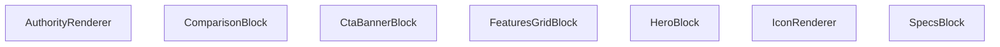

## NODE ID STANDARD

  file: src\components\authority\AuthorityRenderer.tsx
  function: src\components\authority\AuthorityRenderer.tsx::IconRenderer
  function: src\components\authority\AuthorityRenderer.tsx::HeroBlock
  function: src\components\authority\AuthorityRenderer.tsx::SpecsBlock
  function: src\components\authority\AuthorityRenderer.tsx::FeaturesGridBlock
  function: src\components\authority\AuthorityRenderer.tsx::ComparisonBlock
  function: src\components\authority\AuthorityRenderer.tsx::CtaBannerBlock
  function: src\components\authority\AuthorityRenderer.tsx::AuthorityRenderer

---

## DISA AKTARILANLAR (EXPORTS)
  export: AuthorityRenderer
  export: ComparisonBlock
  export: CtaBannerBlock
  export: FeaturesGridBlock
  export: HeroBlock
  export: IconRenderer
  export: SpecsBlock

---

## STİL TOKENLERİ

### Arbitrary Değerler (token'a geçirilmemiş)
Yok — tüm stiller token'a geçirilmiş. ✅

### Kullanılan Token'lar (zaten token'a geçirilmiş)
- `rounded-hvac-2xl`

### Tailwind Sınıf Özeti
- **Renkler:** `bg-black/10`, `bg-indigo-600`, `bg-slate-100`, `bg-slate-50`, `bg-slate-900`, `bg-white`, `bg-white/20`, `bg-white/5`, `border-2`, `border-8`, `border-dashed`, `border-red-100`, `border-slate-100`, `border-slate-200`, `hover:bg-indigo-50`
- **Layout:** `absolute`, `bottom-0`, `bottom-6`, `flex`, `flex-col`, `gap-1`, `gap-12`, `gap-4`, `gap-8`, `grid`, `grid-cols-1`, `h-12`, `h-14`, `h-16`, `h-6`
- **Varyant/Responsive:** `active:`, `hover:`, `lg:`, `md:` önekleri
- **Yardımcı Sınıflar:** `-mb-32`, `-ml-32`, `-mr-48`, `-mt-48`, `-translate-x-1/2`, `active:scale-95`, `aspect-video`, `authority-content-wrapper`, `blur-3xl`, `border`, `brightness-0`, `dark`, `duration-500`, `font-black`, `font-bold`

---
# FILE: src\components\authority\README.md

# 🛰️ Medya Otoritesi (Media Authority) - P01-012

Bu dizin, VentHub projesi genelindeki zengin medya içeriklerinin (Video, 3D, Teknik Çizim) standartlaştırılmış render motorlarını içerir.

## 🛠️ Bileşenler

### 1. `VideoAuthority`
- **Kullanım:** Cloudflare Stream ve YouTube videolarını tek tip arayüzle sunar.
- **Performans:** Lazy loading ve thumbnail desteği içerir.
- **Şema:** `VideoMetadata`

### 2. `ThreeDAuthority`
- **Kullanım:** GLB/GLTF formatındaki 3D modelleri interaktif olarak sergiler.
- **Performans:** "Click-to-Load" stratejisi ile ilk yükleme maliyetini sıfıra indirir.
- **Şema:** `ThreeDMetadata`

### 3. `TechnicalDrawingAuthority`
- **Kullanım:** CAD, PDF ve SVG çizimlerini versiyon takibiyle listeler.
- **Şema:** `TechnicalDrawingMetadata`

## 📊 Page Builder Entegrasyon Örneği (JSON)

Page Builder (`P01-017`) üzerinden gönderilecek olan `authority_content` alanı aşağıdaki yapıda olmalıdır:

```json
{
  "media_block": {
    "type": "3d",
    "metadata": {
      "modelId": "vortice-lineo-100",
      "format": "glb",
      "modelUrl": "/models/lineo-100.glb",
      "config": {
        "initialZoom": 6,
        "autoRotate": true,
        "environment": "industrial"
      },
      "hotspots": [
        { "position": [1, 2, 0], "label": "Motor", "description": "Yüksek verimli EC motor." }
      ]
    }
  },
  "video_block": {
    "type": "video",
    "metadata": {
      "id": "youtube_video_id",
      "provider": "youtube",
      "title": "Ürün Tanıtımı",
      "aspectRatio": "16:9",
      "options": { "autoPlay": false, "muted": true }
    }
  }
}
```

---
*Bu otorite katmanı, görsel zenginlik ve performans dengesini korumak için mühürlenmiştir.*


---
# FILE: src\components\authority\TechnicalDrawingAuthority.md

---
domain: general
source_type: doc
namespace_type: module
source_path: C:\Users\alize\venthub-hvac\src\components\authority\TechnicalDrawingAuthority.tsx
skeleton_hash: c25fd098e9856261
entity_hashes:
  func:TechnicalDrawingAuthority: fdb68a3fb07822eb
  overview: c71b29f5c3a00fb8
  style_tokens: b07a83f8b2a17b2b
generated_at: 2026-05-28T22:35:40Z
---

## Genel Bakış
`TechnicalDrawingAuthority` bileşeni, teknik çizim verilerini alıp bunları stil sınıflarıyla birlikte görsel bir temsile dönüştürür. Çizim listesini ve isteğe bağlı CSS sınıflarını kullanarak UI’da uygun bir şekilde render eder.

## Fonksiyon Grupları
### Render ve Görsel Oluşturma
Bu grup, bileşenin aldığı `drawings` ve `className` parametrelerini kullanarak JSX çıktısını üretir; her bir çizimi uygun HTML öğelerine yerleştirerek ve ek stiller uygulayarak görsel temsili sağlar.  
- TechnicalDrawingAuthority

---

## AXIOMS – Mimari Varsayımlar  
Bu modülün doğru çalışması için aşağıdaki varsayımlar gerekir.

[Aksiyom 1]: Eğer `drawings` tanımlı değilse (undefined veya null), `TechnicalDrawingAuthority` bileşeni `drawings` üzerinde iterasyon yapamadığından hata fırlatır veya hiçbir çizim render etmez.  
[Aksiyom 2]: Eğer `drawings` bir dizi (iterable) değilse, bileşen `map` gibi yöntemleri kullanamadığından render sırasında bir istisna oluşur.  
[Aksiyom 3]: Eğer `className` prop’u string türünde değilse, bileşene geçirilen sınıf özniteliği beklenildiği gibi uygulanmayabilir ve DOM’da sınıf ataması başarısız olabilir.  
[Aksiyom 4]: Eğer `formatColors` sabiti tanımlı değilse (undefined veya null), bileşen stil tanımlarını bu nesnedan alamadığı için renk stilleri uygulanamaz veya varsayılan stillere döner.  
[Aksiyom 5]: Eğer `formatColors` bir obje değilse, stil özelliklerine erişim çalışma zamanında başarısız olur ve görsel çıktı beklenen renkleri gösteremeyebilir.

---

## FONKSİYON DETAYLARI

### TechnicalDrawingAuthority
**Ne yapar**: Teknik doküman ve çizimlerin otorite standartlarına uygun olarak görüntülenmesini sağlar; versiyon takibi ve format bazlı görsel ayrıştırma işlevini içerir.  
**Nasıl yapar**: `drawings` prop’undan gelen teknik çizim listesini yineleyerek her bir çizimini versiyon bilgisi ve format türüne göre uygun stil ve bileşenlerle render eder; ayrıca `className` prop’uyla dış stil sınıflarını kabul ederek bileşenin görünümünü özelleştirmeye olanak tanır.  

**Parametreler**:
- drawings: type not specified — Görüntülenecek teknik çizimlerin koleksiyonu; her eleman versiyon ve format bilgisi içerir.  
- className: string — Bileşene ek CSS sınıfları eklemek için kullanılan isteğe bağlı string; varsayılan değeri boş string ('') olup, stil özelleştirmesi sağlar.  

**Dönüş**: void (fonksiyon bir JSX elementi render eder ve açık bir değer döndürmez).

---

## INTERFACES

### TechnicalDrawingAuthorityProps
- `drawings: TechnicalDrawingMetadata[]`
- `className?: string`

---

## SABİTLER
- **formatColors** (object) — `{

    pdf: 'bg-red-50 text-red-600 border-red-100',

    dwg: 'bg-blue-50 te...`

---

## AST POINTERS

### [N1_NASIL] AST Pointer: src/components/authority/TechnicalDrawingAuthority.tsx::TechnicalDrawingAuthority
- **params**: drawings, className = ''
- **ic_degiskenler**:
  - `formatColors` — object mapping drawing format strings to CSS class strings used to style the format indicator.
- **Dönüş**: JSX.Element

### [N2_NASIL] AST Pointer: src/components/authority/TechnicalDrawingAuthority.tsx::TechnicalDrawingAuthority.map
- **params**: doc, idx
- **ic_degiskenler**:
  - `doc` — object containing drawing metadata (id, format, category, version, title, url, lastUpdated).
  - `idx` — numeric index of the drawing in the drawings array, used to calculate animation delay.
  - `formatColors` — object mapping format strings to CSS class strings for styling the format badge.
  - `FileText` — icon component from lucide-react representing a file, used to display the drawing type.
  - `Download` — icon component from lucide-react representing a download action, used in the download link.
  - `Clock` — icon component from lucide-react representing a clock, used to show last updated timestamp.
  - `Info` — icon component from lucide-react representing an info symbol, used to prefix the format label.
- **Dönüş**: JSX.Element

---

## NODE ID STANDARD

  file: src\components\authority\TechnicalDrawingAuthority.tsx
  function: src\components\authority\TechnicalDrawingAuthority.tsx::TechnicalDrawingAuthority

---

## DISA AKTARILANLAR (EXPORTS)
  export: TechnicalDrawingAuthority

---

## STİL TOKENLERİ

### Arbitrary Değerler (token'a geçirilmemiş)
Yok — tüm stiller token'a geçirilmiş. ✅

### Kullanılan Token'lar (zaten token'a geçirilmiş)
- (yok)

### Tailwind Sınıf Özeti
- **Renkler:** `bg-slate-100`, `bg-slate-50`, `bg-white`, `border-slate-100`, `border-slate-200`, `group-hover:text-primary-navy`, `hover:bg-primary-navy`, `hover:border-primary-navy/30`, `hover:text-white`, `text-industrial-gray`, `text-slate-400`, `text-slate-500`, `text-slate-600`, `text-sm`, `text-xs`
- **Layout:** `flex`, `flex-col`, `gap-4`, `grid`, `grid-cols-1`, `h-12`, `hover:shadow-md`, `items-center`, `justify-between`, `justify-center`, `md:grid-cols-2`, `p-3`, `p-4`, `shadow-sm`, `w-12`
- **Varyant/Responsive:** `group-hover:`, `hover:`, `md:` önekleri
- **Yardımcı Sınıflar:** `${className`, `${formatColors[doc.format]`, `border`, `font-black`, `font-bold`, `group`, `leading-tight`, `mr-1`, `mt-1`, `px-1.5`, `py-0.5`, `rounded`, `rounded-2xl`, `rounded-xl`, `space-x-2`

---
# FILE: src\components\authority\ThreeDAuthority.md

---
domain: general
source_type: doc
namespace_type: module
source_path: C:\Users\alize\venthub-hvac\src\components\authority\ThreeDAuthority.tsx
skeleton_hash: 5889f50b0077d368
entity_hashes:
  func:Model: cad84f3d7aa627bb
  func:ThreeDAuthority: 003bc9e7ed9ad2d8
  overview: 53fe48ece7de08da
  style_tokens: 79effa301ffb588d
generated_at: 2026-05-28T22:35:41Z
---

## Genel Bakış
Bu modül, bir 3‑boyutlu modelin görselleştirilmesi ve ona ait etkileşimli noktaların (hotspot) yönetimi için iki işlevselliği birleştirir. `ThreeDAuthority` bileşeni dışarıdan gelen veri paketini alır ve içindeki `Model` bileşenine yönlendirerek model yükleme ve hotspot gösterimini tek bir yerde sağlar.

## Fonksiyon Grupları
### Model Render ve Hotspot Yönetimi  
Model işlevi, verilen URL’den 3‑boyutlu sahneyi yükler, mevcut hotspot verilerini alır ve bu noktaları sahne içinde etkileşimli işaretçiler olarak ekler.  
- Model

### Üst‑Seviye Yetki ve Veri Bağlama  
ThreeDAuthority işlevi, dışarıdan gelen metadata (model URL’si ve hotspot tanımları) ve isteğe bağlı CSS sınıfını alır, bu bilgileri Model bileşenine aktararak bütünleşik bir 3‑D yetki görüntüsü oluşturur.  
- ThreeDAuthority

---

## AXIOMS – Mimari Varsayımlar
Bu modülün çalışması için aşağıdaki varsayımlar geçerlidir:

[Aksiyom 1]: Eğer Model bileşenine `url` prop'u string olarak verilmezse, 3B model yüklenemez ve render hatası oluşur.  
[Aksiyom 2]: Eğer Model bileşenine `hotspots` prop'u verilmişse ama onun tipi `ThreeDMetadata['hotspots']` ile uyuşmuyorsa, hotspot işaretçileri doğru oluşturulamaz veya çalışma zamanı hatası olur.  
[Aksiyom 3]: Eğer ThreeDAuthority bileşenine `metadata` prop'u verilmezse veya `metadata.url` eksikse, Model bileşenine geçirilen `url` tanımsız olur ve model yüklenemez.  
[Aksiyom 4]: Eğer ThreeDAuthority bileşenine `metadata` prop'u verilmezse veya `metadata.hotspots` eksikse, Model bileşenine geçirilen `hotspots` tanımsız olur ve hotspot renderı atlanabilir veya hata verir.  
[Aksiyom 5]: Eğer ThreeDAuthority bileşenine `className` prop'u string olmayan bir değer verilirse, CSS sınıfı uygulanamaz ve olası bir type hatası oluşur.

---

## FONKSİYON DETAYLARI

### Model
**Ne yapar**: Verilen `url` ve opsiyonel `hotspots` ile bir 3D modeli render eder.  
**Nasıl yapar**: `url` parametresi kullanılarak model yüklenir; `hotspots` sağlanmışsa model üzerine bu noktalar eklenir (detaylı yükleme mantığı kaynak kodunda bulunur).  
**Parametreler**:
- `url`: string — render edilecek 3D modelinin adresi (GLB/GLTF formatında).  
- `hotspots`: ThreeDMetadata['hotspots']? — model üzerine eklemek isteğe bağlı etkileşim noktaları listesi; tanımlanmazsa hiçbir hotspot eklenmez.  
**Dönüş**: void — fonksiyon JSX elementi döndürür, açık bir değer döndürmez.

### ThreeDAuthority
**Ne yapar**: Gerçek 3D ürün modellerini (GLB/GLTF) interaktif olarak render eder ve performansı artırmak için “Click‑to‑Load” stratejisini kullanır.  
**Nasıl yapar**: `metadata` prop’undan model URL ve hotspots bilgilerini çıkarır, bu bilgileri `Model` component’ına geçirir; `className` prop’sı kök elemana uygulanarak ek stillendirme mümkün olur.  
**Parametreler**:
- `metadata`: ThreeDAuthorityProps — modelin URL ve opsiyonel hotspots gibi tüm gerekli veri yapısını içerir.  
- `className`: string — komponentin kök elemanına eklenmek istenen ek CSS sınıfı; varsayılan değer boş string ('').  
**Dönüş**: void — fonksiyon JSX elementi döndürür, açık bir değer döndürmez.

---

## INTERFACES

### ThreeDAuthorityProps
- `metadata: ThreeDMetadata`
- `className?: string`

---

## AST POINTERS

### [N1_NASIL] AST Pointer: src/components/authority/ThreeDAuthority.tsx::Model
- **params**: url, hotspots
- **ic_degiskenler**:
  - `url` — string prop providing the GLTF model URL
  - `hotspots` — optional array of hotspot metadata objects
  - `scene` — GLTF scene object returned by `useGLTF(url)`
  - `spot` — current hotspot element from `.map` iteration
  - `idx` — index of the current hotspot in the array
- **Dönüş**: JSX element (React fragment) representing the 3D model with its hotspots

### [N2_NASIL] AST Pointer: src/components/authority/ThreeDAuthority.tsx::ThreeDAuthority
- **params**: metadata, className
- **ic_degiskenler**:
  - `metadata` — prop object containing `modelUrl`, `hotspots`, and `config`
  - `className` — optional CSS class string (defaults to empty string)
  - `isStarted` — boolean state flag indicating whether the 3D engine has been initialized
  - `setIsStarted` — state setter function used to set `isStarted` to true
- **Dönüş**: JSX element (`motion.div`) rendering either the initialization placeholder or the full 3D canvas with model, lights, controls, and overlay.

---

## NODE ID STANDARD

  file: src\components\authority\ThreeDAuthority.tsx
  function: src\components\authority\ThreeDAuthority.tsx::Model
  function: src\components\authority\ThreeDAuthority.tsx::ThreeDAuthority

---

## DISA AKTARILANLAR (EXPORTS)
  export: Model
  export: ThreeDAuthority

---

## STİL TOKENLERİ

### Arbitrary Değerler (token'a geçirilmemiş)
Yok — tüm stiller token'a geçirilmiş. ✅

### Kullanılan Token'lar (zaten token'a geçirilmiş)
- `tracking-hvac-normal`

### Tailwind Sınıf Özeti
- **Renkler:** `bg-primary-navy`, `bg-slate-50`, `bg-white`, `bg-white/50`, `bg-white/90`, `border-2`, `border-primary-navy`, `border-slate-200`, `border-t-transparent`, `border-white`, `text-center`, `text-industrial-gray`, `text-slate-400`, `text-slate-500`, `text-steel-gray`
- **Layout:** `absolute`, `backdrop-blur-md`, `backdrop-blur-sm`, `bottom-4`, `flex`, `flex-col`, `group-hover:block`, `h-16`, `h-2`, `h-4`, `h-8`, `hidden`, `items-center`, `justify-center`, `left-4`
- **Varyant/Responsive:** `group-hover:` önekleri
- **Yardımcı Sınıflar:** `${className`, `animate-pulse`, `animate-spin`, `animate-spin-slow`, `border`, `cursor-pointer`, `font-black`, `font-bold`, `group`, `group-hover:scale-110`, `inset-0`, `leading-tight`, `mb-1`, `mb-2`, `mt-1`

---
# FILE: src\components\authority\VideoAuthority.md

---
domain: general
source_type: doc
namespace_type: module
source_path: C:\Users\alize\venthub-hvac\src\components\authority\VideoAuthority.tsx
skeleton_hash: ab89d91ee94c3aeb
entity_hashes:
  func:VideoAuthority: e820e802f63e86c2
  overview: 6991295f943a61c1
  style_tokens: ee9eb5151ad04adf
generated_at: 2026-05-28T22:35:41Z
---

## Genel Bakış
`VideoAuthority` bileşeni, video içeriğiyle ilişkili meta verileri alarak uygun video oynatıcı öğesini oluşturur ve isteğe bağlı stil sınıflarını ekleyerek kullanıcı arayüzünde gösterir. Tek bir fonksiyon üzerinden çalışır ve dışarıdan gelen `metadata` ve opsiyonel `className` prop'larını işler.

## Fonksiyon Grupları
### Render ve Veri İşleme
Bu grup, bileşenin aldığı video meta verilerini UI elemanlarına dönüştürmek ve ekstra CSS sınıflarını uygulamaktan sorumludur.
- VideoAuthority

---

## AXIOMS – Mimari Varsayımlar
Bu modül için özel aksiyom tanımlanmamıştır.

[Aksiyom 1]: Eğer `metadata` undefined veya null ise, component render sırasında özellik erişimi yapmaya çalıştığı için çalışma zamanında hata oluşur.  
[Aksiyom 2]: Eğer `metadata` nesnesi, component tarafından render sırasında kullanılan gerekli alanları (örn. `id`, `title`, `url` vb.) içermiyorsa, bu alanlar `undefined` olarak görüntülenerek UI’da eksik veya hatalı veri gösterilir.  
[Aksiyom 3]: Eğer `className` prop’u string olmayan bir değer (sayı, obje, vb.) olarak geçirilirse, JSX’te `className` özelliği beklenmeyen türde bir değer alır ve stil uygulanamayabilir; varsayılan `''` string değeri bu riski azaltır.  
[Aksiyom 4]: Eğer `className` prop’u hiç geçirilmezse, varsayılan boş string (`''`) kullanılır ve ek bir stil sınıfı uygulanmaz; bu durumda yalnızca kendi iç stilleri veya diğer stiller etkili olur.

---

## FONKSİYON DETAYLARI

### VideoAuthority
**Ne yapar**: P01-012: VideoAuthority Merkezi video yönetim bileşeni. Farklı sağlayıcılardan (Cloudflare, YouTube) gelen videoları tek bir standartta render eder.  
**Nasıl yapar**: `metadata` prop'undan video kaynağı ve sağlayıcı bilgilerini okur, sağlayıcıya göre uygun video gömme yöntemini (iframe, embed vb.) seçer ve `className` prop'unu kök elemana uygular.  
**Parametreler**:
- metadata: VideoAuthorityProps — Video kaynağı, sağlayıcı tipi ve ek ayarları içeren nesne  
- className: string — Bileşenin kök elemanına ek CSS sınıfı eklemek için kullanılır, varsayılan boş string  
**Dönüş**: Belirtilmemiş (React bileşeni olarak JSX elementi döner)

---

## INTERFACES

### VideoAuthorityProps
- `metadata: VideoMetadata`
- `className?: string`

---

## AST POINTERS

### [N1_NASIL] AST Pointer: src/components/authority/VideoAuthority.tsx::VideoAuthority
- **params**: metadata: VideoMetadata, className: string = ''
- **ic_degiskenler**:
  - `isLoaded` — boolean state indicating whether the video iframe has finished loading; used to conditionally render thumbnail fallback and to set via `setIsLoaded(true)` on iframe `onLoad`.
  - `setIsLoaded` — setter function for `isLoaded` state; called when the iframe loads to update the loading state.
  - `isMuted` — boolean state reflecting whether the video is muted; initialized from `metadata.options?.muted ?? true`; used to control the `muted` query parameter in the iframe `src` and toggled by the mute/unmute button.
  - `setIsMuted` — setter for `isMuted` state; toggled by the button `onClick` to mute or unmute the video.
  - `renderPlayer` — function that returns the appropriate iframe JSX based on `metadata.provider`; encapsulates provider‑specific logic for Cloudflare and YouTube.
- **Dönüş**: JSX.Element

### [N2_NASIL] AST Pointer: src/components/authority/VideoAuthority.tsx::renderPlayer
- **params**: (yok)
- **ic_degiskenler**: (yok)
- **Dönüş**: JSX.Element

---

## NODE ID STANDARD

  file: src\components\authority\VideoAuthority.tsx
  function: src\components\authority\VideoAuthority.tsx::VideoAuthority

---

## DISA AKTARILANLAR (EXPORTS)
  export: VideoAuthority

---

## STİL TOKENLERİ

### Arbitrary Değerler (token'a geçirilmemiş)
Yok — tüm stiller token'a geçirilmiş. ✅

### Kullanılan Token'lar (zaten token'a geçirilmiş)
- (yok)

### Tailwind Sınıf Özeti
- **Renkler:** `bg-gradient-to-t`, `bg-primary-navy/80`, `bg-slate-100`, `bg-slate-900`, `from-black/60`, `hover:text-white`, `text-slate-400`, `text-white`, `text-white/80`, `text-xs`, `to-transparent`
- **Layout:** `absolute`, `backdrop-blur-md`, `flex`, `flex-col`, `from-black/60`, `h-full`, `items-center`, `justify-between`, `justify-center`, `justify-end`, `overflow-hidden`, `p-2`, `p-4`, `relative`, `w-full`
- **Varyant/Responsive:** `group-hover:`, `hover:` önekleri
- **Yardımcı Sınıflar:** `${className`, `blur-sm`, `font-black`, `font-bold`, `group`, `group-hover:opacity-100`, `inset-0`, `object-cover`, `opacity-0`, `opacity-50`, `pointer-events-auto`, `pointer-events-none`, `rounded-2xl`, `rounded-full`, `space-x-2`

---
# FILE: src\components\calculators\CalculatorLayout.md

---
domain: general
source_type: doc
namespace_type: module
source_path: C:\Users\alize\venthub-hvac\src\components\calculators\CalculatorLayout.tsx
skeleton_hash: 0b512e351d9a2af9
entity_hashes:
  func:CalculatorLayout: 992031a52a171585
  overview: f453018da69a0ee4
  style_tokens: 8b0a8e4795cce63b
generated_at: 2026-05-28T22:35:42Z
---

## Genel Bakış
`CalculatorLayout` bileşeni, HVAC hesaplayıcı sayfalarının ortak görünümünü ve davranışını tanımlayan bir şablondur. Başlık, açıklama, ikon ve geri dönüş linki gibi temel UI öğelerini alarak, içerik alanını çocuk bileşenlere bırakır ve sayfa tutarlılığını sağlayarak tekrarlanabilir bir düzen sunar.

## Fonksiyon Grupları
### UI Şablonu ve Yerleşimi
Bu grup, sayfanın üst kısmındaki başlık, açıklama, ikon ve geri‑link gibi öğeleri oluşturur ve içerik bölgesi için bir konteyner sağlar.  
- CalculatorLayout

---

## AXIOMS – Mimari Varsayımlar
Eğer `title` prop'u verilmezse, bileşenin başlık bölümü boş veya tanımsız olur.  
Eğer `description` prop'u verilmezse, bileşenin açıklama bölümü boş veya tanımsız olur.  
Eğer `icon` prop'u verilmezse, bileşenin ikon bölümü boş veya tanımsız olur.  
Eğer `backLink` prop'u verilmezse, varsayılan değer `'/products'` kullanılır.  
*(`bac` parametresi fonksiyon imzasında net olmayan bir değer olduğu için bu parametreye dair varsayım üretilemez.)*

---

## FONKSİYON DETAYLARI

### CalculatorLayout
**Ne yapar**: Ortak hesap makinesi layout wrapper componentudur; premium görünüm, SEO ve breadcrumb sağlar.  
**Nasıl yapar**: Prop olarak alınan `title`, `description`, `icon`, `backLink` ve `bac` (olası children) değerlerini kullanarak içeriği sarmalar, gerekli meta etiketlerini ve navigasyon öğelerini ekleyerek tutarlı bir sayfa yapısı oluşturur.  

**Parametreler**:
- title: type not specified — Sayfa başlığı  
- description: type not specified — Sayfa açıklaması (SEO için)  
- icon: type not specified — Başlıkta gösterilecek simge  
- backLink: type not specified — Geri dönüş linki, varsayılan değer `'/products'`  
- bac: type not specified — Muhtemelen `children` prop'u, içeriği taşır  

**Dönüş**: `React.FC<CalculatorLayoutProps>` — Bir React fonksiyonel bileşeni döndürür.

---

## INTERFACES

### CalculatorLayoutProps
- `title: string`
- `description: string`
- `icon?: React.ReactNode`
- `backLink?: string`
- `backLabel?: string`
- `infoText?: string`
- `warningText?: string`
- `children: React.ReactNode`

---

## AST POINTERS

### [N1_NASIL] AST Pointer: src/components/calculators/CalculatorLayout.tsx::CalculatorLayout
- **params**: title, description, icon, backLink, backLabel, infoText, warningText, children
- **ic_degiskenler**:
  - `title` — sayfa başlığı, SEO bileşeni ve h1 başlığında kullanılır
  - `description` — sayfa açıklaması, SEO bileşeni ve h1 altında gösterilir
  - `icon` — sol üstte gösterilecek ikon; prop verilmezse varsayılan `<Calculator />` ikonu kullanılır
  - `backLink` — geri link hedefi; varsayılan '/props' yerine '/products'; `<Link href={...}>` özelliğine atanır (type cast ile `import('next').Route` olarak kullanılır)
  - `backLabel` — geri link metni; varsayılan 'Ürünlere Dön'; `<Link>` içeriğinde görüntülenir
  - `infoText` — bilgilendirme banner metni; tanımlıysa mavi arkaplanlı bilgi kutusunda `<Info>` ikonu ve birlikte gösterilir
  - `warningText` — uyarı banner metni; tanımlıysa turuncu arkaplanlı uyarı kutusunda `<AlertTriangle>` ikonu ve birlikte gösterilir
  - `children` — bileşenin ana içeriği; `<div className="max-w-5xl mx-auto px-4 sm:px-6 lg:px-8 py-8">` içinde render edilir
- **Dönüş**: React.FC<CalculatorLayoutProps> (React fonksiyonel bileşeni, JSX döndürür)

---

## NODE ID STANDARD

  file: src\components\calculators\CalculatorLayout.tsx
  function: src\components\calculators\CalculatorLayout.tsx::CalculatorLayout

---

## DISA AKTARILANLAR (EXPORTS)
  export: CalculatorLayout

---

## STİL TOKENLERİ

### Arbitrary Değerler (token'a geçirilmemiş)
Yok — tüm stiller token'a geçirilmiş. ✅

### Kullanılan Token'lar (zaten token'a geçirilmiş)
- (yok)

### Tailwind Sınıf Özeti
- **Renkler:** `bg-gradient-to-b`, `bg-primary-navy`, `bg-secondary-blue/10`, `bg-warning-orange/10`, `bg-white/10`, `border-light-gray`, `border-secondary-blue/20`, `border-t`, `border-warning-orange/20`, `from-light-gray`, `hover:text-white`, `md:text-3xl`, `text-2xl`, `text-center`, `text-industrial-gray`
- **Layout:** `flex`, `flex-shrink-0`, `from-light-gray`, `gap-2`, `gap-3`, `gap-4`, `inline-flex`, `items-center`, `items-start`, `max-w-5xl`, `min-h-screen`, `p-3`, `p-4`
- **Varyant/Responsive:** `hover:`, `lg:`, `md:`, `sm:` önekleri
- **Yardımcı Sınıflar:** `border`, `font-bold`, `hover:underline`, `lg:px-8`, `mb-4`, `mt-0.5`, `mt-1`, `mt-6`, `mx-auto`, `pb-12`, `pt-6`, `px-4`, `py-8`, `rounded-xl`, `sm:px-6`

---
# FILE: src\components\calculators\InputField.md

---
domain: general
source_type: doc
namespace_type: module
source_path: C:\Users\alize\venthub-hvac\src\components\calculators\InputField.tsx
skeleton_hash: 2c4bf169494b0683
entity_hashes:
  func:InputField: 67cc20ea60eef576
  func:RadioGroup: 3547a0581eb094b6
  overview: 886525d7c102a6da
  style_tokens: d04e77e09b4ac40e
generated_at: 2026-05-28T22:35:41Z
---

## Genel Bakış  
Bu modül, kullanıcı arayüzünde veri girişi için iki temel bileşen sunar: tek bir sayısal veya metin alanı ve bir radyo grup. Her iki bileşen de etiket, değer, değişiklik işleyici ve isteğe bağlı görsel ayarları alarak, form elemanlarını tek bir yerde tutarak kodun yeniden kullanılabilirliğini artırır.

## Fonksiyon Grupları  

### Giriş Alanı Bileşeni  
Bu grup, tek bir giriş alanı oluşturur. Kullanıcıdan sayı veya metin alır, etiket ve yer tutucu ile birlikte değişiklikleri üst bileşene iletir.  
- InputField  

### Radyo Grubu Bileşeni  
Bu grup, birden çok radyo butonunu sütun düzeninde gösterir. Seçilen değeri, hata mesajını ve seçenek listesini yönetir, değişiklikleri üst bileşene iletir.  
- RadioGroup

---

## AXIOMS – Mimari Varsayımlar
Bu modül için özel aksiyom tanımlanmamıştır.

**Aksiyom 1**: Eğer `InputField` bileşenine `label` parametresi sağlanmazsa, bileşen render edilemez ve UI’da boş etiket gösterilir.

**Aksiyom 2**: Eğer `InputField` bileşenine `value` parametresi, `type` parametresiyle uyumlu bir veri tipi (ör. `type='number'` ise sayı) değilse, giriş alanı hatalı veri alır ve beklenmeyen davranış (ör. NaN gösterimi) ortaya çıkar.

**Aksiyom 3**: Eğer `InputField` bileşenine `onChange` callback’i verilmezse, kullanıcı etkileşimi (değer değişikliği) yakalanamaz ve form durumu güncellenmez.

**Aksiyom 4**: Eğer `InputField` bileşenine `type` parametresi `'number'` dışındaki bir değer verilirse, bileşen o tipte bir HTML input oluşturur; ancak `type` değeri desteklenmeyen bir tipse (ör. `'unknown'`) tarayıcı varsayılan olarak `text` tipine düşer.

**Aksiyom 5**: Eğer `InputField` bileşenine `placeholder` parametresi sağlanmazsa, giriş alanı boş bir yer tutucu gösterir; bu durum UI/UX açısından kabul edilebilir bir durumdur.

**Aksiyom 6**: Eğer `RadioGroup` bileşenine `label` parametresi sağlanmazsa, radyo grubunun başlığı eksik olur ve kullanıcıya grup hakkında bilgi verilmez.

**Aksiyom 7**: Eğer `RadioGroup` bileşenine `value` parametresi, `options` içinde tanımlı bir değerle eşleşmezse, hiçbir radyo butonu seçili gelmez ve UI’da tutarsız bir durum oluşur.

**Aksiyom 8**: Eğer `RadioGroup` bileşenine `onChange` callback’i verilmezse, kullanıcı bir seçenek seçtiğinde seçimin dışarıya aktarımı gerçekleşmez; bu da formun doğru şekilde güncellenmemesine yol açar.

**Aksiyom 9**: Eğer `RadioGroup` bileşenine `options` parametresi eksik veya boş bir dizi olarak verilirse, radyo butonları oluşturulamaz ve bileşen render hatası verir.

**Aksiyom 10**: Eğer `RadioGroup` bileşenine `error` parametresi sağlanmazsa, hata mesajı gösterilmez; bu durum hatalı girişlerin kullanıcıya bildirilmemesine neden olabilir ancak bileşenin çalışmasını engellemez.

**Aksiyom 11**: Eğer `RadioGroup` bileşenine `columns` parametresi sağlanmazsa, radyo butonları tek sütun halinde (default layout) düzenlenir.

---

## FONKSİYON DETAYLARI

### InputField
**Ne yapar**: Kullanıcıdan sayısal veri girişi almak için tasarlanmış bir React bileşenidir; etiket, placeholder, birim ve hata mesajı gibi ek UI öğelerini içerir.  
**Nasıl yapar**: Props olarak gelen `label`, `value`, `onChange`, `type` ve `placeholder` değerlerini kullanarak bir `<input>` elemanı oluşturur; `type` varsayılan olarak `'number'` olduğundan sayısal girişe odaklanır. Tooltip ve birim göstergesi eklenerek kullanıcı deneyimi artırılır; hata durumu varsa `error` prop’u üzerinden görsel geri bildirim sağlanır.  
**Parametreler**:
- `label`: string — Giriş alanının üstünde gösterilecek açıklama metni.  
- `value`: string | number — Kontrol edilen giriş değerinin mevcut durumu.  
- `onChange`: (newValue: string | number) => void — Değer değiştiğinde tetiklenen geri çağırma fonksiyonu.  
- `type`: string — HTML input tipini belirler; varsayılan `'number'`.  
- `placeholder`: string — Kullanıcıya örnek bir değer göstermek için kullanılan yer tutucu metin.  
**Dönüş**: React.FC<InputFieldProps> — Tanımlanan prop tipleriyle uyumlu bir fonksiyonel React bileşeni.

### RadioGroup
**Ne yapar**: Belirli bir seçenek kümesi arasından tek bir seçim yapılmasını sağlayan bir radyo buton grubu bileşenidir; etiket, hata mesajı ve sütun düzeni gibi ek özellikler sunar.  
**Nasıl yapar**: `options` dizisindeki her bir öğe için bir `<input type="radio">` oluşturur, `value` prop’u seçili öğeyi belirler ve `onChange` geri çağırmasıyla seçim değişikliklerini üst bileşene iletir. `columns` parametresi, radyo butonlarının kaç sütun halinde düzenleneceğini kontrol eder; `error` varsa ilgili stil ve mesaj gösterilir.  
**Parametreler**:
- `label`: string — Radyo grubunun başlığı veya açıklama metni.  
- `value`: string | number — Şu anda seçili olan radyo butonunun değeri.  
- `onChange`: (newValue: string | number) => void — Seçim değiştiğinde tetiklenen geri çağırma fonksiyonu.  
- `options`: Array<{ label: string; value: string | number }> — Her bir radyo butonunun gösterilecek etiketi ve değeri.  
- `error`: string (opsiyonel) — Doğrulama hatası durumunda gösterilecek mesaj.  
- `columns`: number (opsiyonel) — Radyo butonlarının kaç sütun içinde yer alacağını belirler.  
**Dönüş**: React.FC<RadioGroupProps> — Tanımlanan prop tipleriyle uyumlu bir fonksiyonel React bileşeni.

---

## INTERFACES

### InputFieldProps
- `label: string`
- `value: string | number`
- `onChange: (value: string) => void`
- `type?: 'text' | 'number'`
- `placeholder?: string`
- `unit?: string`
- `min?: number`
- `max?: number`
- `step?: number`
- `tooltip?: string`
- `error?: string`
- `disabled?: boolean`

### RadioGroupProps
- `label: string`
- `value: string`
- `onChange: (value: string) => void`
- `options: { label: string; value: string; description?: string; icon?: React.ReactNode }[]`
- `error?: string`
- `columns?: number`
- `tooltip?: string`

---

## AST POINTERS

### [N1_NASIL] AST Pointer: C:\Users\alize\venthub-hvac\src\components\calculators\InputField.tsx::InputField
- **params**: `label, value, onChange, type = 'number', placeholder, unit, min, max, step = 0.1, tooltip, error, disabled = false`
- **ic_degiskenler**:
  - `id` — `React.useId()` ile oluşturulan benzersiz element id’si; `<label>` ve `<input>` elementlerinin `htmlFor` ve `id` özelliklerinde kullanılır.
- **Dönüş**: JSX/React element (bir `<div>` içinde label, input ve isteğe bağlı tooltip, unit ve hata mesajı içerir).

### [N2_NASIL] AST Pointer: C:\Users\alize\venthub-hvac\src\components\calculators\InputField.tsx::RadioGroup
- **params**: `label, value, onChange, options, error, columns = 2, tooltip`
- **ic_degiskenler**: *(yok)*
- **Dönüş**: JSX/React element (bir `<div>` içinde label, isteğe bağlı tooltip, dinamik olarak oluşturulmuş radio‑butonlar ve hata mesajı içerir).

---

## NODE ID STANDARD

  file: src\components\calculators\InputField.tsx
  function: src\components\calculators\InputField.tsx::InputField
  function: src\components\calculators\InputField.tsx::RadioGroup

---

## DISA AKTARILANLAR (EXPORTS)
  export: InputField
  export: RadioGroup

---

## STİL TOKENLERİ

### Arbitrary Değerler (token'a geçirilmemiş)
Yok — tüm stiller token'a geçirilmiş. ✅

### Kullanılan Token'lar (zaten token'a geçirilmiş)
- (yok)

### Tailwind Sınıf Özeti
- **Renkler:** `bg-danger-red/5`, `bg-gray-100`, `bg-industrial-gray`, `bg-primary-navy/5`, `bg-white`, `border-4`, `border-danger-red`, `border-light-gray`, `border-primary-navy`, `border-t-industrial-gray`, `border-transparent`, `focus-visible:border-primary-navy`, `hover:border-steel-gray`, `text-danger-red`, `text-industrial-gray`
- **Layout:** `absolute`, `bottom-full`, `flex`, `gap-2`, `gap-3`, `grid`, `items-center`, `left-1/2`, `max-w-xs`, `p-4`, `relative`, `right-4`, `sm:grid-cols-${columns`, `top-1/2`, `top-full`
- **Varyant/Responsive:** `:`, `focus-visible:`, `group-hover:`, `hover:`, `sm:` önekleri
- **Yardımcı Sınıflar:** `${disabled`, `${error`, `${unit`, `${value`, `-translate-x-1/2`, `-translate-y-1/2`, `:`, `===`, `border`, `cursor-help`, `cursor-not-allowed`, `focus-visible:outline-none`, `focus-visible:ring-2`, `focus-visible:ring-primary-navy/20`, `font-medium`

---
# FILE: src\components\calculators\ResultCard.md

---
domain: general
source_type: doc
namespace_type: module
source_path: C:\Users\alize\venthub-hvac\src\components\calculators\ResultCard.tsx
skeleton_hash: c0c64da9fa96646c
entity_hashes:
  func:Recommendations: 17d93b0b25d10f0e
  func:ResultCard: 3c33f679c49530b1
  func:ResultGrid: 1e8853c40a5113bf
  func:getStatusConfig: 90a49b86c8e12ce2
  overview: df7a2f788a297b2b
  style_tokens: 8d8fc38c13829fd7
generated_at: 2026-05-28T22:35:43Z
---

## Genel Bakış
`ResultCard.tsx` modülü, HVAC hesaplamalarının sonuçlarını kullanıcıya görsel olarak sunmak için tasarlanmış bir bileşen koleksiyonudur. Tekil sonuç kartları, sonuçları düzenli bir ızgara içinde gösteren bir konteyner ve öneri listeleri gibi ek UI parçaları içerir; ayrıca kartların görünümünü durum bilgisiyle eşleştirmek için renk, simge ve stil yapılandırmasını sağlayan bir yardımcı fonksiyon bulunur.

## Fonksiyon Grupları
### UI Bileşenleri
Bu grup, sonuçların görsel olarak düzenlenmesini ve sunulmasını sağlayan temel React bileşenlerini içerir.
- ResultCard, ResultGrid, Recommendations

### Yardımcı / Konfigürasyon
Durum türlerine göre renk, ikon ve stil gibi görsel ayarları döndürerek UI bileşenlerinin görünümünü belirleyen fonksiyondur.
- getStatusConfig

---

## AXIOMS – Mimari Varsayımlar
Bu modülün doğru çalışması için aşağıdaki koşulların sağlanması gerekir; koşullar sağlanmadığında ilgili bileşen veya fonksiyon beklenildiği gibi davranmayabilir.

- **ResultCard bileşeni**: Eğer `title` prop’u tanımlanmazsa, kart başlığı boş görünebilir.  
- **ResultCard bileşeni**: Eğer `value` prop’u tanımlanmazsa, kartın değeri bölümü boş görünebilir.  
- **ResultCard bileşeni**: Eğer `unit` prop’u tanımlanmazsa, birim bölümü gösterilmez.  
- **ResultCard bileşeni**: Eğer `status` prop’u tanımlanmazsa, varsayılan değer `'info'` kullanılır; bu durumda `getStatusConfig` fonksiyonu `'info'` için yapılandırma döndürmelidir.  
- **ResultCard bileşeni**: Eğer `description` prop’u tanımlanmazsa, açıklama bölümü gösterilmez.  
- **getStatusConfig fonksiyonu**: Eğer fonksiyona geçilen `status` değeri fonksiyon tarafından işlenemezse (örneğin tanımsız veya desteklenmeyen bir string), dönüş değeri bilinmez ve ResultCard stilini belirleyemez.  
- **ResultGrid bileşeni**: Eğer `children` prop’u tanımlanmazsa veya boş bir değerse, ızgara içeriği render edilmez.  
- **Recommendations bileşeni**: Eğer `items` prop’u tanımlanmazsa veya boş bir dizi ise, öneri listesi gösterilmez.  
- **Recommendations bileşeni**: Eğer `title` prop’u tanımlanmazsa, varsayılan değer `'Öneriler'` kullanılır.

---

## FONKSİYON DETAYLARI

### ResultCard
**Ne yapar**: Hesaplama sonucunu bir kart içinde gösterir; kartın duruma göre renk kodlaması ve animasyonu uygulanır.  
**Nasıl yapar**: Props olarak alınan `title`, `value`, `unit`, `status` ve `description` değerlerini kullanarak kartın içeriğini oluşturur; `status` prop'una göre stil ve animasyon seçimi yapılır.  
**Parametreler**:
- title: type not specified — Kartın başlık metni  
- value: type not specified — Gösterilecek hesaplanan sayısal veya metinsel değer  
- unit: type not specified — Değerin birimini ifade eden metin (örn. °C, kW)  
- status: type not specified (default: 'info') — Kartın durumunu belirler; bu durum renk ve animasyon etkisini yönetir  
- description: type not specified — Kartın altında gösterilecek ekstra açıklama metni  
**Dönüş**: React.FC<ResultCardProps> — ResultCard fonksiyonel bileşeni

### getStatusConfig
**Ne yapar**: Belirtilmemiş (docstring sağlanmadı)  
**Nasıl yapar**: Bilinmiyor  
**Parametreler**: (yok)  
**Dönüş**: void veya bilinmiyor (belirtilmedi)

### ResultGrid
**Ne yapar**: Belirtilmemiş (docstring sağlanmadı)  
**Nasıl yapar**: Bilinmiyor  
**Parametreler**:
- children: type not specified — Grid içinde görüntülenecek alt öğeler (React elemanları veya bileşenler)  
- title: type not specified — Grid'in üst kısmında gösterilecek başlık metni  
**Dönüş**: React.FC<ResultGridProps> — ResultGrid fonksiyonel bileşeni

### Recommendations
**Ne yapar**: Belirtilmemiş (docstring sağlanmadı)  
**Nasıl yapar**: Bilinmiyor  
**Parametreler**:
- items: type not specified — Gösterilecek öneri öğelerini içeren veri yapısı (dizi, liste vb.)  
- title: type not specified (default: 'Öneriler') — Öneri bölümünün başlığı; belirtilmezse varsayılan 'Öneriler' kullanılır  
**Dönüş**: React.FC<RecommendationsProps> — Recommendations fonksiyonel bileşeni

---

## INTERFACES

### ResultCardProps
- `title: string`
- `value: string | number`
- `unit?: string`
- `status?: ResultStatus`
- `description?: string`
- `icon?: React.ReactNode`
- `large?: boolean`

### ResultGridProps
Sonuç kartları grubu
- `children: React.ReactNode`
- `title?: string`

### RecommendationsProps
Öneriler listesi
- `items: string[]`
- `title?: string`

---

## TYPE ALIASES

### ResultStatus
```typescript
type ResultStatus = 'optimal' | 'acceptable' | 'warning' | 'critical' | 'info'
```

---

## AST POINTERS

### [N1_NASIL] AST Pointer: src/components/calculators/ResultCard.tsx::ResultCard
- **params**: title, value, unit, status = 'info', description, icon, large = false
- **ic_degiskenler**:
  - `getStatusConfig` — fonksiyon, status değerine göre renk, ikon ve border konfigürasyonunu döndürür.
  - `config` — getStatusConfig çağrısının sonucu, ResultCard'ın stil ve ikon ayarlarını tutan nesne.
- **Dönüş**: JSX.Element

### [N2_NASIL] AST Pointer: src/components/calculators/ResultCard.tsx::getStatusConfig
- **params**: (parametre yok)
- **ic_degiskenler**: (yok)
- **Dönüş**: { bgColor: string, borderColor: string, iconColor: string, icon: JSX.Element }

### [N3_NASIL] AST Pointer: src/components/calculators/ResultCard.tsx::ResultGrid
- **params**: children, title
- **ic_degiskenler**: (yok)
- **Dönüş**: JSX.Element

### [N4_NASIL] AST Pointer: src/components/calculators/ResultCard.tsx::Recommendations
- **params**: items, title = 'Öneriler'
- **ic_degiskenler**: (yok)
- **Dönüş**: JSX.Element | null

### [N5_NASIL] AST Pointer: src/components/calculators/ResultCard.tsx::(map callback)
- **params**: item, index
- **ic_degiskenler**: (yok)
- **Dönüş**: JSX.Element

---


## MERMAID CALL GRAPH
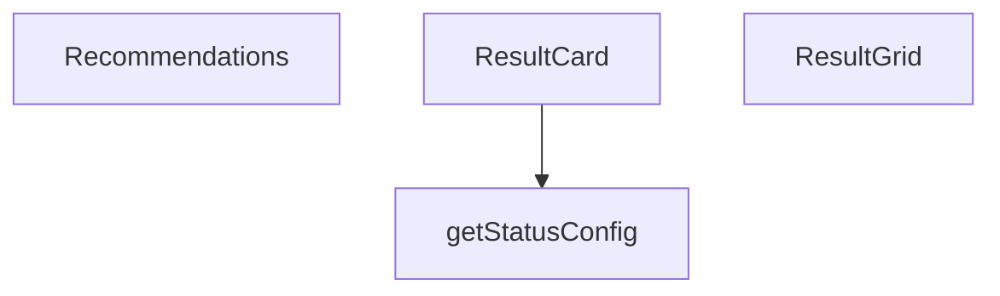

## NODE ID STANDARD

  file: src\components\calculators\ResultCard.tsx
  function: src\components\calculators\ResultCard.tsx::ResultCard
  function: src\components\calculators\ResultCard.tsx::getStatusConfig
  function: src\components\calculators\ResultCard.tsx::ResultGrid
  function: src\components\calculators\ResultCard.tsx::Recommendations

---

## DISA AKTARILANLAR (EXPORTS)
  export: Recommendations
  export: ResultCard
  export: ResultGrid

---

## STİL TOKENLERİ

### Arbitrary Değerler (token'a geçirilmemiş)
Yok — tüm stiller token'a geçirilmiş. ✅

### Kullanılan Token'lar (zaten token'a geçirilmiş)
- (yok)

### Tailwind Sınıf Özeti
- **Renkler:** `bg-secondary-blue/5`, `border-secondary-blue/20`, `text-2xl`, `text-3xl`, `text-industrial-gray`, `text-primary-navy`, `text-secondary-blue`, `text-sm`, `text-steel-gray`, `text-xs`
- **Layout:** `col-span-full`, `flex`, `gap-2`, `gap-4`, `grid`, `grid-cols-1`, `hover:shadow-md`, `items-baseline`, `items-center`, `items-start`, `justify-between`, `lg:grid-cols-3`, `md:col-span-2`, `md:grid-cols-2`, `p-4`
- **Varyant/Responsive:** `:`, `hover:`, `lg:`, `md:` önekleri
- **Yardımcı Sınıflar:** `${config.bgColor`, `${config.borderColor`, `${large`, `:`, `border`, `duration-300`, `font-bold`, `font-medium`, `font-semibold`, `leading-relaxed`, `mb-2`, `mb-3`, `mb-4`, `mt-1`, `mt-2`

---
# FILE: src\components\calculators\StepIndicator.md

---
domain: general
source_type: doc
namespace_type: module
source_path: C:\Users\alize\venthub-hvac\src\components\calculators\StepIndicator.tsx
skeleton_hash: 30b5aabc3b20c3fd
entity_hashes:
  func:StepIndicator: 203f6e11e7ae2ca6
  overview: 4bdcabdf1533e7e3
  style_tokens: a71e92d8d5570ada
generated_at: 2026-05-28T22:35:43Z
---

## Genel Bakış
`StepIndicator`, çok adımlı bir işlem akışında kullanıcının hangi adımda olduğunu görsel olarak gösterir ve adımlara tıklama ile geçiş yapmasını sağlayan bir React bileşenidir. Gelen `steps` dizisi, `currentStep` ve `onStepClick` callback’i ile dinamik ve etkileşimli bir adım göstergesi sunar.

## Fonksiyon Grupları
### Görsel Oluşturma ve Render
Bu grup, `steps` listesini alarak her adım için daire, etiket ve bağlantı çizgileri gibi UI elemanlarını oluşturur; `currentStep` değerine göre aktif, tamamlanmış ve bekleyen adımları farklı stillerle ayırarak kullanıcıya mevcut ilerlemeyi net bir şekilde gösterir.
- StepIndicator

### Etkileşim ve Durum Yönetimi
Kullanıcı bir adıma tıkladığında `onStepClick` callback’ini tetikleyerek dışarıdaki mantığın (örnek: sayfa yönlendirme, adım güncelleme) çalışmasını sağlar; bu sayede bileşen sadece görüntüleme yapmaz, aynı zamanda navigasyonu da yönetir.
- StepIndicator (callback çağrısı)

---

## AXIOMS – Mimari Varsayımlar
StepIndicator bileşeni, steps, currentStep ve onStepClick prop'larının belirli koşulları sağladığı sürece beklendiği şekilde çalışır.

[Aksiyom 1]: Eğer steps prop'u tanımlı değilse veya boş bir dizi ise, bileşen hiçbir adım öğesi render etmez ve görsel çıktı boş olur.  
[Aksiyom 2]: Eğer currentStep prop'u bir sayı değilse veya steps dizisinin geçerli indeks aralığı (0 ≤ currentStep < steps.length) dışındaysa, aktif adım gösterimi hatalı olur ve UI tutarsızlığı ortaya çıkar.  
[Aksiyom 3]: Eğer onStepClick prop'u bir fonksiyon değilse, bir adıma tıklandığında çalışma zamanı hatası (örneğin "onStepClick is not a function") oluşur ve etkileşim kesilir.

---

## FONKSİYON DETAYLARI

### StepIndicator
**Ne yapar**: Wizard veya çok adımlı formlarda kullanıcıya hangi adımda bulunduğunu, tamamlanan adımları ve gelecek adımları gösteren bir adım göstergesi bileşeni render eder.  
**Nasıl yapar**: `steps` dizisini iterate ederek her adım için bir öğe oluşturur; `currentStep` değeri ile aktif adımı belirleyerek stil ve sınıf uygular, tamamlanan adımlara farklı bir görünüm verir. Kullanıcı bir adım üzerine tıkladığında `onStepClick` fonksiyonu çağrılır ve tıklanan adımın indeksi iletilir.  
**Parametreler**:  
- steps: Step[] — Gösterilecek adımların listesi; her öğe genellikle `label` ve isteğe bağlı `status` gibi alanları içerir.  
- currentStep: number — Şu anda aktif olan adımın sıfır tabanlı indeksi.  
- onStepClick: (index: number) => void — Bir adım tıklandığında çağrılan geri çağırım fonksiyonu; tıklanan adımın indeksi parametre olarak geçirilir.  
**Dönüş**: React.FC<StepIndicatorProps> — Bileşenin kendisi; adım göstergesini DOM’a ekleyen bir fonksiyonel React bileşeni döndürür.

---

## INTERFACES

### Step
- `id: number`
- `label: string`
- `description?: string`

### StepIndicatorProps
- `steps: Step[]`
- `currentStep: number`
- `onStepClick?: (stepId: number) => void`

---

## AST POINTERS

### [N1_NASIL] AST Pointer: src/components/calculators/StepIndicator.tsx::StepIndicator
- **params**: steps, currentStep, onStepClick
- **ic_degiskenler**: (yok)
- **Dönüş**: JSX.Element

### [N2_NASIL] AST Pointer: src/components/calculators/StepIndicator.tsx::(anonymous map callback)
- **params**: step, index
- **ic_degiskenler**: 
  - `isCompleted` — step.id < currentStep koşulunu sağlayıp sağlamadığını gösteren boolean (adım tamamlandı mı)
  - `isActive` — step.id === currentStep koşulunu sağlayıp sağlamadığını gösteren boolean (şu anda aktif adım)
  - `isClickable` — onStepClick fonksiyonunun varlığı ve step.id ≤ currentStep koşulunu sağlayıp sağlamadığını gösteren boolean (adım tıklanabilir mi)
- **Dönüş**: JSX.Element

---

## NODE ID STANDARD

  file: src\components\calculators\StepIndicator.tsx
  function: src\components\calculators\StepIndicator.tsx::StepIndicator

---

## DISA AKTARILANLAR (EXPORTS)
  export: StepIndicator

---

## STİL TOKENLERİ

### Arbitrary Değerler (token'a geçirilmemiş)
Yok — tüm stiller token'a geçirilmiş. ✅

### Kullanılan Token'lar (zaten token'a geçirilmiş)
- (yok)

### Tailwind Sınıf Özeti
- **Renkler:** `bg-gray-200`, `bg-primary-navy`, `bg-success-green`, `text-primary-navy`, `text-sm`, `text-steel-gray`, `text-steel-gray/70`, `text-white`, `text-xs`
- **Layout:** `absolute`, `flex`, `flex-1`, `flex-col`, `h-0.5`, `h-10`, `h-2`, `h-full`, `hidden`, `items-center`, `justify-between`, `justify-center`, `left-0`, `lg:block`, `md:flex`
- **Varyant/Responsive:** `:`, `hover:`, `lg:`, `md:` önekleri
- **Yardımcı Sınıflar:** `${isActive`, `${isClickable`, `${isCompleted`, `:`, `cursor-default`, `cursor-pointer`, `duration-300`, `duration-500`, `font-medium`, `font-semibold`, `group`, `hover:scale-110`, `inset-y-0`, `isActive`, `mb-2`

---
# FILE: src\components\category\CategoryAuthoritySection.md

---
domain: general
source_type: doc
namespace_type: module
source_path: C:\Users\alize\venthub-hvac\src\components\category\CategoryAuthoritySection.tsx
skeleton_hash: e879f0be7045ffd0
entity_hashes:
  func:CategoryAuthoritySection: 9f02783a8649aa44
  overview: d22be28e083a031c
  style_tokens: 5f18a598ea81d3a4
generated_at: 2026-05-28T22:35:44Z
---

## Genel Bakış
Bu modül, bir kategoriyle ilgili yetki veya güvenilirlik bilgilerini gösteren bir React bileşenini tanımlar. Gelen içerik verisini alarak kullanıcıya uygun bir şekilde sunar ve kategori sayfasının yetki bölümünü oluşturur.

## Fonksiyon Grupları
### Ana Bileşen
Kategori yetki bölümünün görsel yapısını ve içeriğini yönetir.
- CategoryAuthoritySection

---

## AXIOMS – Mimari Varsayımlar
Bu modül, `content` propunun sağlanması ve belirli bir yapıda olması üzerine kuruludur.

[Aksiyom 1]: Eğer `content` prop'u sağlanmazsa, component render sırasında hata verebilir veya boş görünebilir.  
[Aksiyom 2]: Eğer `content` prop'u bir obje değilse (örneğin string, sayı, null, undefined), component içeriği güvenli bir şekilde işlenemeyebilir ve hata fırlatabilir.  
[Aksiyom 3]: Eğer `content` objesi beklenen yapıya uygun değilse, component bazı bölümleri render edemeyebilir veya beklenmeyen çıktı üretebilir.

---

## FONKSİYON DETAYLARI

### CategoryAuthoritySection
**Ne yapar**: Kategori sayfasında otorite içeriğini (örneğin metin blokları, görseller veya diğer bileşenler) gösteren bir sarmalayıcı React bileşenidir.  
**Nasıl yapar**: Bileşen, props üzerinden gelen `content` verisini alır ve bu veriyi iç içe geçmiş JSX elemanları olarak render eder; içerik genellikle bir dizi bloktan oluşur ve her blok uygun alt bileşenle eşleştirilerek DOM’a yerleştirilir.  
**Parametreler**:
- content: any — Kategori sayfasında gösterilecek otorite bloklarını içeren veri yapısı (örneğin blokların dizisi veya nesnesi).  
**Dönüş**: React elementi (JSX) olarak render edilen otorite bölümü; işlev bir `React.FC` tipinde olduğu için null veya geçerli bir JSX döndürür.

---

## INTERFACES

### CategoryAuthoritySectionProps
- `content: AuthorityContent | null`
- `brandImage?: string`

---

## AST POINTERS

### [N1_NASIL] AST Pointer: src/components/category/CategoryAuthoritySection.tsx::CategoryAuthoritySection
- **params**: content
- **ic_degiskenler**: yok
- **Dönüş**: JSX.Element | null

---

## NODE ID STANDARD

  file: src\components\category\CategoryAuthoritySection.tsx
  function: src\components\category\CategoryAuthoritySection.tsx::CategoryAuthoritySection

---

## DISA AKTARILANLAR (EXPORTS)
  export: CategoryAuthoritySection

---

## STİL TOKENLERİ

### Arbitrary Değerler (token'a geçirilmemiş)
Yok — tüm stiller token'a geçirilmiş. ✅

### Kullanılan Token'lar (zaten token'a geçirilmiş)
- (yok)

### Tailwind Sınıf Özeti
- **Renkler:** (yok)
- **Layout:** (yok)
- **Varyant/Responsive:** (yok)
- **Yardımcı Sınıflar:** `mt-12`

---
# FILE: src\components\category\CategoryFilters.md

---
domain: general
source_type: doc
namespace_type: module
source_path: C:\Users\alize\venthub-hvac\src\components\category\CategoryFilters.tsx
skeleton_hash: 287ab9b1b75d703c
entity_hashes:
  func:CategoryFilters: 420d76bf670f1cf8
  func:toggleBrand: 67afbe53ea415719
  overview: e7958b385edc9e41
  style_tokens: 57cd966a2983f774
generated_at: 2026-05-28T22:35:42Z
---

## Genel Bakış
`CategoryFilters` bileşeni, ürün kategorileri, alt‑kategoriler ve marka seçenekleri üzerinden filtreleme arayüzünü sunar. Kullanıcı etkileşimlerini (ör. marka seçimi) yönetmek için yardımcı fonksiyonlar içerir.

## Fonksiyon Grupları
### UI Oluşturma
Bu grup, filtre panelinin görsel yapısını ve ilgili props’ları alarak JSX döndürmekle sorumludur.  
- CategoryFilters

### Etkileşim ve Durum Yönetimi
Kullanıcı eylemlerini yakalar, ilgili filtre durumunu günceller ve UI’nın yeniden render edilmesini tetikler.  
- toggleBrand  

*İlişki:* `CategoryFilters` içinde, marka seçimi olayına yanıt olarak `toggleBrand` çağrılır.

---

## AXIOMS – Mimari Varsayımlar
Bu CategoryFilters React componenti, kategori ve marka bazlı ürün filtreleme arayüzünün sorunsuz çalışması için parent component'ten iletilen tüm zorunlu prop ve fonksiyonların eksiksiz ve doğru şekilde iletilmesine bağlıdır.

[Aksiyom 1]: Eğer component'e iletilen `category` prop'u yoksa, ana kategori bazlı filtreleme arayüzü doğru şekilde başlatılamaz, tüm filtreleme işlemleri geçersiz kalır.
[Aksiyom 2]: Eğer component'e iletilen `parentCategory` prop'u yoksa, kategori hiyerarşisine dayalı ilişkilendirme yapılamaz, alt kategori filtreleri üst kategori ile eşleştirilemez.
[Aksiyom 3]: Eğer component'e iletilen `subCategories` prop'u yoksa, alt kategori seçenekleri kullanıcıya sunulamaz, alt kategoriye özel filtreleme işlemleri gerçekleştirilemez.
[Aksiyom 4]: Eğer component'e iletilen `availableBrands` prop'u yoksa, marka bazlı filtre seçenekleri ekranda gösterilemez, marka seçimi ve filtreleme işlemleri yapılamaz.
[Aksiyom 5]: Eğer marka seçimini yöneten `toggleBrand` fonksiyonu component'e iletilmemişse, kullanıcı marka filtresi ekleme/çıkarma işlemleri yapamaz, filtre state'i hiçbir şekilde güncellenemez.
[Aksiyom 6]: Eğer component'e iletilen mevcut aktif filtreleri tutan `filte` prop'u yoksa, kullanıcının daha önce seçtiği filtreler arayüze yüklenemez, filtre arayüzü varsayılan boş state ile başlatılamaz.

---

## FONKSİYON DETAYLARI

### CategoryFilters
**Ne yapar**: React bileşeni olarak kategori filtreleme arayüzünü oluşturur.  
**Nasıl yapar**: Gelen props (category, parentCategory, subCategories, availableBrands, filte) üzerinden filtre seçeneklerini render eder ve kullanıcı etkileşimlerini yönetir.  
**Parametreler**:
- category: unknown — seçili ana kategori
- parentCategory: unknown — üst kategori bilgisi
- subCategories: unknown — alt kategori listesi
- availableBrands: unknown — kullanılabilir marka listesi
- filte: unknown — filtreleme ile ilgili ek veri (isim hatalı olabilir)  
**Dönüş**: React.FC&lt;CategoryFiltersProps&gt; — bir fonksiyonel React bileşeni

### toggleBrand
**Ne yapar**: Belirtilen markayı filtreleme durumuna ekler veya kaldırır.  
**Nasıl yapar**: Çağrıldığı anda `brand` parametresiyle birlikte bir kapanış (closure) içinde `toggleBrand` fonksiyonunu çalıştırır.  
**Parametreler**:
- brand: string — filtreleme işlemi yapılacak marka adı  
**Dönüş**: Bilinmiyor — fonksiyonun dönüş tipi belirtilmemiştir.

---

## INTERFACES

### CategoryFiltersProps
- `category: DomainCategory`
- `parentCategory?: DomainCategory | null`
- `subCategories: DomainCategory[]`
- `availableBrands: string[]`
- `filters: FilterState`
- `onUpdateFilters: (updates: Partial<FilterState>) => void`

---

## AST POINTERS

### [N1_NASIL] AST Pointer: src/components/category/CategoryFilters.tsx::CategoryFilters
- **params**: `category`, `parentCategory`, `subCategories`, `availableBrands`, `filters`, `onUpdateFilters`
- **ic_degiskenler**:
  - `t` — `useI18n()` hook’den dönen çeviri fonksiyonu, metinleri yerelleştirmek için kullanılır.
  - `lang` — `useI18n()` hook’den dönen dil kodu, para birimi formatlamada (`formatCurrency`) kullanılır.
  - `toggleBrand` — iç fonksiyon, bir markanın seçili olup olmadığını tersine çevirir ve `onUpdateFilters` aracılığıyla filtre durumunu günceller.
- **Dönüş**: React bileşeni JSX döner; yan etkisi yoktur, sadece UI render eder.

### [N2_NASIL] AST Pointer: src/components/category/CategoryFilters.tsx::toggleBrand
- **params**: `brand` (string) — seçilen/çıkartılan marka adı.
- **ic_degiskenler**:
  - `filters` — dışarıdan gelen filtre durumu, `selectedBrands` dizisini içerir.
  - `onUpdateFilters` — dışarıdan gelen callback, filtre durumunu günceller.
- **Dönüş**: `yok` (fonksiyon bir değer döndürmez, sadece `onUpdateFilters` çağrısı yapar).

---

## NODE ID STANDARD

  file: src\components\category\CategoryFilters.tsx
  function: src\components\category\CategoryFilters.tsx::CategoryFilters
  function: src\components\category\CategoryFilters.tsx::toggleBrand

---

## DISA AKTARILANLAR (EXPORTS)
  export: CategoryFilters

---

## STİL TOKENLERİ

### Arbitrary Değerler (token'a geçirilmemiş)
Yok — tüm stiller token'a geçirilmiş. ✅

### Kullanılan Token'lar (zaten token'a geçirilmiş)
- (yok)

### Tailwind Sınıf Özeti
- **Renkler:** `accent-primary-ocean`, `bg-slate-50`, `bg-white`, `border-b`, `border-slate-100`, `border-slate-200`, `border-slate-300`, `checked:bg-primary-ocean`, `checked:border-primary-ocean`, `focus-visible:border-primary-ocean`, `group-hover:text-slate-900`, `hover:bg-slate-50`, `hover:text-primary-navy`, `placeholder:text-slate-300`, `placeholder:text-slate-400`
- **Layout:** `absolute`, `block`, `custom-scrollbar`, `flex`, `gap-2`, `gap-3`, `h-3`, `h-5`, `items-center`, `justify-between`, `justify-center`, `max-h-48`, `overflow-y-auto`, `p-6`, `relative`
- **Varyant/Responsive:** `checked:`, `focus-visible:`, `group-hover:`, `hover:`, `peer-checked:`, `placeholder:` önekleri
- **Yardımcı Sınıflar:** `appearance-none`, `border`, `cursor-pointer`, `focus-visible:outline-none`, `focus-visible:ring-2`, `focus-visible:ring-primary-ocean/20`, `font-black`, `font-bold`, `font-medium`, `font-semibold`, `group`, `mb-2`, `mb-3`, `mb-6`, `mb-8`

---
# FILE: src\components\category\CategoryHero.md

---
domain: general
source_type: doc
namespace_type: module
source_path: C:\Users\alize\venthub-hvac\src\components\category\CategoryHero.tsx
skeleton_hash: 2839fbcf97470680
entity_hashes:
  func:CategoryHero: e691a6ccb1379798
  func:handleBack: 7a67af4e5dfa77e4
  overview: 4b47da32e01e754d
  style_tokens: 6910b683995fc9aa
generated_at: 2026-05-28T22:35:44Z
---

## Genel Bakış
Bu modül, bir kategori sayfasının başlık bölümünü gösteren bir React bileşenidir. Kategori bilgileri, üst kategori, ürün sayısı ve yükleme durumu gibi verileri alarak kullanıcıya görsel bir başlık sunar ve geri dönüş işlevi için bir işleyici sağlar.

## Fonksiyon Grupları
### Render ve UI
Kullanıcıya kategori başlığını, üst kategori bağlantısını ve ürün sayısını görsel olarak düzenleyen bileşeni oluşturur.
- CategoryHero

### Etkileşim Mantığı
Kullanıcının üst kategoriye veya önceki sayfaya dönmesini sağlayan basit bir geri dönüş işleyicisini tanımlar.
- handleBack

---

## AXIOMS – Mimari Varsayımlar
CategoryHero bileşeninin render edilmesi ve `handleBack()` fonksiyonunun çağrılması için aşağıdaki koşullar sağlanmalıdır.

[Aksiyom 1]: Eğer `category` prop'u tanımlı değilse, bileşen kategori bilgisi gösteremeyecek ve boş veya hata durumu ortaya çıkabilir.  
[Aksiyom 2]: Eğer `parentCategory` prop'u tanımlı değilse, üst kategori bağlantısı gösterilmeyecek veya varsayılan olarak kök kategori kabul edilebilir.  
[Aksiyom 3]: Eğer `productCount` prop'u sayısal bir değer değilse, ürün sayısı gösterimi beklenen formatta olmayabilir (örneğin NaN veya metin olarak görünebilir).  
[Aksiyom 4]: Eğer `loading` prop'u boolean tipinde değilse, yükleme durumu kontrolü yanlış çalışabilir ve içerik prematurely gösterilebilir veya gizlenebilir.  
[Aksiyom 5]: Eğer `handleBack()` fonksiyonu bir navigasyon context'i (örneğin React Router'ın `useNavigate` veya `history`) içerisinde çağrılmazsa, geri dönüş işlemi başarısız olacak ve sayfa değişmeyecektir.

---

## FONKSİYON DETAYLARI

### CategoryHero
**Ne yapar**: Verilen kategori bilgilerini görselleştirerek kullanıcıya kategori sayfasının başlık bölümünü render eder.  
**Nasıl yapar**: `CategoryHeroProps` üzerinden gelen `category`, `parentCategory`, `productCount` ve `loading` değerlerini alır; yüklenme durumu gösterilirken bir yükleme göstergesi sunar, aksi takdirde kategori adı, üst kategori (varsa) ve ürün sayısını içeren bir başlık bileşeni döndürür.  

**Parametreler**:
- category: CategoryHeroProps.category — Gösterilecek ana kategori nesnesi  
- parentCategory: CategoryHeroProps.parentCategory — Üst kategori bilgisi (yoksa null veya undefined olabilir)  
- productCount: CategoryHeroProps.productCount — Bu kategorideki ürün adedi (sayısal değer)  
- loading: CategoryHeroProps.loading — Veri yükleme durumunu gösteren bayrak (true/false)  

**Dönüş**: React.FC türünde bir işlev döndürür; bu işlev JSX ile kategori başlık bölümünü render eder.

### handleBack
**Ne yapar**: Kullanıcının önceki sayfaya veya üst kategoriye dönmesini sağlayan geri dönüş işlevini tanımlar.  
**Nasıl yapar**: Parametre almaz; çağrıldığında geçmişteki bir adım geri gitmek için tarayıcı geçmişi API'si veya uygulama içi yönlendirme mekanizması tetiklenir (gerçek implementasyon dışarıda tanımlanmıştır).  

**Parametreler**: (yok)  

**Dönüş**: Geriye bir değer döndürmez; dönüş tipi `void` olarak kabul edilir.

---

## INTERFACES

### CategoryHeroProps
- `category: DomainCategory | null`
- `parentCategory?: DomainCategory | null`
- `productCount?: number`
- `loading?: boolean`

---

## AST POINTERS

### [N1_NASIL] AST Pointer: src/components/category/CategoryHero.tsx::CategoryHero
- **params**: category, parentCategory, productCount, loading
- **ic_degiskenler**:
  - `t` — translation function from useI18n
  - `navigate` — router instance from useRouter for programmatic navigation
  - `backBtnRef` — ref for back button element used with useScrollAnimation
  - `backBtnVisible` — boolean indicating visibility of back button from scroll animation
  - `imageRef` — ref for image container element
  - `imageVisible` — boolean indicating visibility of image from scroll animation
  - `textRef` — ref for text container element
  - `textVisible` — boolean indicating visibility of text from scroll animation
  - `handleBack` — inner function handling back navigation
  - `categoryImageUrl` — computed Supabase storage URL for category image or null
  - `isMainCategory` — boolean true if category has no parent_id
- **Dönüş**: JSX.Element

### [N2_NASIL] AST Pointer: src/components/category/CategoryHero.tsx::handleBack
- **params**: (parametre yok)
- **ic_degiskenler**:
  - `stack` — array of strings storing navigation history from sessionStorage
  - `prevPath` — string representing the previous path to navigate to
- **Dönüş**: yok

---

## NODE ID STANDARD

  file: src\components\category\CategoryHero.tsx
  function: src\components\category\CategoryHero.tsx::CategoryHero
  function: src\components\category\CategoryHero.tsx::handleBack

---

## DISA AKTARILANLAR (EXPORTS)
  export: CategoryHero

---

## STİL TOKENLERİ

### Arbitrary Değerler (token'a geçirilmemiş)
Yok — tüm stiller token'a geçirilmiş. ✅

### Kullanılan Token'lar (zaten token'a geçirilmiş)
- `rounded-hvac-xl`, `tracking-hvac-loose`, `tracking-hvac-relaxed`

### Tailwind Sınıf Özeti
- **Renkler:** `bg-cyan-500/10`, `bg-indigo-600/10`, `bg-slate-50`, `bg-slate-900`, `bg-white`, `bg-white/10`, `bg-white/5`, `border-b`, `border-slate-100`, `border-white/10`, `border-white/5`, `hover:text-primary-navy`, `hover:text-white`, `lg:text-5xl`, `lg:text-8xl`
- **Layout:** `absolute`, `block`, `bottom-0`, `flex`, `flex-1`, `flex-col`, `flex-wrap`, `gap-2`, `gap-4`, `gap-8`, `h-12`, `h-24`, `h-300px`, `h-32`, `h-4`
- **Varyant/Responsive:** `group-hover:`, `hover:`, `lg:`, `md:`, `sm:` önekleri
- **Yardımcı Sınıflar:** `-mb-32`, `-ml-32`, `-mr-64`, `-mt-64`, `animate-pulse`, `blur-3xl`, `border`, `duration-500`, `duration-700`, `font-black`, `font-bold`, `font-medium`, `group`, `group-hover:-translate-x-1`, `inset-0`

---
# FILE: src\components\category\CategoryShowcase.md

---
domain: general
source_type: doc
namespace_type: module
source_path: C:\Users\alize\venthub-hvac\src\components\category\CategoryShowcase.tsx
skeleton_hash: bba0312a82b87d24
entity_hashes:
  func:CategoryShowcase: 27f451ff64c2aa4f
  overview: 7308f814cbfe1bd6
  style_tokens: 74c7a2fe586c3948
generated_at: 2026-05-28T22:35:43Z
---

## Genel Bakış
`CategoryShowcase` modülü, bir kategori ve ona bağlı alt‑kategorileri görsel bir vitrin içinde sunan bir React bileşenidir. Gelen `category`, `subCategories` ve `parentCategory` prop’larını alır, bunları UI öğelerine dönüştürerek kategori kartı, alt‑kategori listesi ve gerektiğinde üst‑kategori navigasyonu oluşturur.

## Fonksiyon Grupları
### Ana Bileşen – UI Oluşturma
Bu grup, dışarıdan sağlanan veri prop’larını alıp kullanıcı arayüzüne yansıtan temel sorumluluğu taşır. Bileşen, prop’ları ayrıştırır, kategori başlığı, görseli ve açıklamasını gösterir, alt‑kategorileri haritalayarak kart veya bağlantı listesi üretir ve varsa üst‑kategoriye yönlendiren bir geri‑bağlantı ekler.  
- CategoryShowcase

*Fonksiyon İlişkileri:* `CategoryShowcase` tek başına çalışır; aynı modül içinde başka bir fonksiyonu çağırmaz.

---

## AXIOMS – Mimari Varsayımlar
Bu modülün doğru çalışması için gerekli props sağlanmalıdır.

[Aksiyom 1]: Eğer `category` prop'u yoksa, bileşen kategori bilgilerini render edemez ve hata veya boş görüntü oluşabilir.  
[Aksiyom 2]: Eğer `subCategories` prop'u yoksa, alt kategori listesi gösterilemez veya boş liste görünebilir.  
[Aksiyom 3]: Eğer `parentCategory` prop'u yoksa, bileşen üst kategori bağlamını kullanamayacak ve ilgili UI öğeleri (örn. geri navigasyon, başlık) eksik görünebilir.

---

## FONKSİYON DETAYLARI

### CategoryShowcase
**Ne yapar**:  
Kategori gösterimini sağlayan bir React bileşeni oluşturur. Bu bileşen, üst kategori bilgisi, alt kategoriler ve ilgili kategori verilerini alarak, kullanıcıya görsel olarak çekici bir kategori galerisini sunar.  

**Nasıl yapar**:  
Fonksiyon, `CategoryShowcaseProps` tipinde bir nesne alır ve bu nesnenin `category`, `subCategories` ve `parentCategory` alanlarını kullanarak JSX döndürür. İçerik, kategori başlığı, açıklama, görsel ve alt kategori bağlantıları gibi öğeleri içerir. Bileşen, stil ve layout için CSS sınıfları veya stil bileşenleri kullanır.  

**Parametreler**:
- category: object — Gösterilecek ana kategori bilgilerini içerir (örneğin, ad, açıklama, görsel URL).
- subCategories: array — Ana kategoriye ait alt kategorilerin listesini tutar; her öğe alt kategori nesnesidir.
- parentCategory: object — Ana kategorinin üst kategorisi hakkında bilgi sağlar (örneğin, ad, link).

**Dönüş**:  
React.FC<CategoryShowcaseProps> tipinde bir fonksiyon bileşeni döndürür. Bu bileşen, JSX ile kategori galerisini render eder.

---

## INTERFACES

### CategoryShowcaseProps
- `category: DomainCategory`
- `subCategories: DomainCategory[]`
- `parentCategory?: DomainCategory | null`

---

## AST POINTERS

### [N1_NASIL] AST Pointer: src/components/category/CategoryShowcase.tsx::(sub) => { ... }
- **params**: sub
- **ic_degiskenler**: yok
- **Dönüş**: JSX.Element (Link component that renders a subcategory card with image, title, description and an arrow icon)

### [N2_NASIL] AST Pointer: src/components/category/CategoryShowcase.tsx::(feature, i) => { ... }
- **params**: feature, i
- **ic_degiskenler**: yok
- **Dönüş**: JSX.Element (div component that displays a feature with an icon, title and description)

---

## NODE ID STANDARD

  file: src\components\category\CategoryShowcase.tsx
  function: src\components\category\CategoryShowcase.tsx::CategoryShowcase

---

## DISA AKTARILANLAR (EXPORTS)
  export: CategoryShowcase

---

## STİL TOKENLERİ

### Arbitrary Değerler (token'a geçirilmemiş)
Yok — tüm stiller token'a geçirilmiş. ✅

### Kullanılan Token'lar (zaten token'a geçirilmiş)
- `h-hvac-hero`, `rounded-hvac-2xl`

### Tailwind Sınıf Özeti
- **Renkler:** `bg-blue-50`, `bg-gradient-to-r`, `bg-gradient-to-t`, `bg-gray-50`, `bg-light-gray`, `bg-orange-50`, `bg-primary-navy`, `bg-primary-navy/10`, `bg-secondary-blue/20`, `bg-slate-50`, `bg-slate-900/50`, `bg-white`, `border-4`, `border-b`, `border-gray-100`
- **Layout:** `absolute`, `backdrop-blur-sm`, `bottom-4`, `bottom-8`, `flex`, `flex-col`, `flex-shrink-0`, `from-black/60`, `from-primary-navy/80`, `from-secondary-blue`, `from-slate-950/80`, `gap-16`, `gap-2`, `gap-6`, `gap-8`
- **Varyant/Responsive:** `focus-visible:`, `group-hover:`, `hover:`, `lg:`, `md:`, `sm:` önekleri
- **Yardımcı Sınıflar:** `-translate-x-1/2`, `animate-bounce`, `animate-fadeIn`, `aspect-4/3`, `aspect-4/5`, `aspect-video`, `border`, `cursor-pointer`, `duration-300`, `duration-700`, `duration-hvac-glacial`, `focus-ring`, `focus-visible:ring-2`, `focus-visible:ring-primary-navy`, `font-bold`

---
# FILE: src\components\category\EducationalGuide.md

---
domain: general
source_type: doc
namespace_type: module
source_path: C:\Users\alize\venthub-hvac\src\components\category\EducationalGuide.tsx
skeleton_hash: 7e846c4ac4505192
entity_hashes:
  func:EducationalGuide: 062bdc9e16ff212e
  overview: 6548521c92a45ec1
  style_tokens: dfe57f52c58ea755
generated_at: 2026-05-28T22:35:45Z
---

## Genel Bakış
EducationalGuide, belirli bir kategori slug'ına göre eğitim içeriğini gösteren bir React bileşenidir. Bu bileşen, kategori bazlı öğretici materyalleri dinamik olarak yükleyip kullanıcıya sunar.

## Fonksiyon Grupları
### Bileşen Tanımı
Bileşenin ana yapısını ve dışarıdan gelen veriyi işleyen fonksiyondur.
- EducationalGuide

---

## AXIOMS – Mimari Varsayımlar
Bu modül, `categorySlug` propunun mevcut ve geçerli bir string olduğu varsayımına dayanır.

[Aksiyom 1]: Eğer `categorySlug` prop'u sağlanmazsa, component undefined hatasıyla render edilmeye çalışır ve UI bozulur.  
[Aksiyom 2]: Eğer `categorySlug` boş bir string ise, component herhangi bir eğitim içeriği göstermez ve boş bir alan render eder.  
[Aksiyom 3]: Eğer `categorySlug` mevcut bir kategori ile eşleşmezse, component veri bulunamadı durumunu gösterir (fallback mesajı veya yükleme hatası).

---

## FONKSİYON DETAYLARI

### EducationalGuide
**Ne yapar**: EducationalGuide bileşeni, verilen `categorySlug` özelliğine göre bir eğitim kılavuzu görüntüler.  
**Nasıl yapar**: Bileşen, `categorySlug` prop'ını alır ve bu slug'u kullanarak ilgili eğitim içeriğini seçer veya render eder; iç mantık docstring'te belirtilmemiş olsa da, slug'a dayalı içerik gösterimini sağlar.  
**Parametreler**:  
- categorySlug: string — Eğitim kılavuzunun hangi kategoriye ait olduğunu belirten slug değeri.  
**Dönüş**: React.FC<EducationalGuideProps> — `categorySlug` prop'ını kabul eden ve JSX döndüren bir React fonksiyon bileşeni.

---

## INTERFACES

### EducationalGuideProps
- `categorySlug: string`

---

## AST POINTERS

### [N1_NASIL] AST Pointer: src/components/category/EducationalGuide.tsx::EducationalGuide
- **params**: (categorySlug)
- **ic_degiskenler**: 
  - `t` — translation function obtained from `useI18n()` hook, used to retrieve localized strings for UI labels and descriptions
- **Dönüş**: JSX.Element | null (returns null when categorySlug does not contain 'hava-perde', otherwise returns the JSX element representing the guide)

---

## NODE ID STANDARD

  file: src\components\category\EducationalGuide.tsx
  function: src\components\category\EducationalGuide.tsx::EducationalGuide

---

## DISA AKTARILANLAR (EXPORTS)
  export: EducationalGuide

---

## STİL TOKENLERİ

### Arbitrary Değerler (token'a geçirilmemiş)
Yok — tüm stiller token'a geçirilmiş. ✅

### Kullanılan Token'lar (zaten token'a geçirilmiş)
- (yok)

### Tailwind Sınıf Özeti
- **Renkler:** `bg-blue-50`, `bg-gray-50`, `bg-orange-50`, `bg-white`, `border-gray-100`, `border-y`, `hover:border-orange-500/50`, `hover:border-secondary-blue/50`, `text-2xl`, `text-center`, `text-gray-600`, `text-gray-700`, `text-green-500`, `text-industrial-gray`, `text-orange-500`
- **Layout:** `absolute`, `flex`, `flex-shrink-0`, `gap-8`, `grid`, `grid-cols-1`, `items-center`, `items-start`, `max-w-4xl`, `max-w-7xl`, `md:grid-cols-2`, `min-h-12`, `overflow-hidden`, `p-3`, `p-4`
- **Varyant/Responsive:** `group-hover:`, `hover:`, `lg:`, `md:`, `sm:` önekleri
- **Yardımcı Sınıflar:** `border`, `font-bold`, `group`, `group-hover:opacity-20`, `lg:px-8`, `mb-10`, `mb-2`, `mb-6`, `mr-2`, `mt-0.5`, `mx-auto`, `opacity-10`, `px-4`, `py-12`, `rounded-lg`

---
# FILE: src\components\category\EnhancedNeedsWizard.md

---
domain: general
source_type: doc
namespace_type: module
source_path: C:\Users\alize\venthub-hvac\src\components\category\EnhancedNeedsWizard.tsx
skeleton_hash: 824de6e3b573097a
entity_hashes:
  func:EnhancedNeedsWizard: ca7bec73e049fe61
  func:getUsageLocations: 1e08ffb88dd30b7d
  func:nextStep: 173c7fd2dc919ffb
  func:prevStep: ac646de7f0306b72
  overview: c93213ab24e014e9
  style_tokens: 4dfca29db2f1dc25
generated_at: 2026-06-06T21:54:46Z
---

## Genel Bakış
Bu modül, kullanıcıların ihtiyaçlarını adım adım belirlemelerini sağlamak için tasarlanmış bir sihirbaz bileşenidir. Ana işlevi, kullanıcı arayüzünü sunmak, adımlar arasında gezinmeyi yönetmek ve ihtiyaç analizi için gerekli kullanım konumlarını bir yardımcı fonksiyon aracılığıyla temin etmektir.

## Fonksiyon Grupları
### Bileşen Tanımı ve Ana Mantık
Bu grup, modülün merkezi React bileşenini tanımlar; bileşenin dışarıdan aldığı özelliklerle (prop) nasıl çalışacağını ve genel yapısını belirler.
- EnhancedNeedsWizard

### Adım Tabanlı Navigasyon
Sihirbazın farklı aşamaları arasında kullanıcı etkileşimiyle ileri ve geri geçişler yapmayı sağlayan işlevleri kapsar. Bu işlevler bileşenin içindeki adım durumunu günceller.
- nextStep, prevStep

### Yardımcı Veri İşlevi
Sihirbazın adım içeriklerini veya seçeneklerini doldurmak için gereken verileri hazırlayan, çeviri fonksiyonuyla çalışan yardımcı bir işlevdir.
- getUsageLocations

---

## AXIOMS – Mimari Varsayımlar

Bu modül için verilen fonksiyon imzalarına dayanan temel mimari varsayımlar tanımlanmıştır.

**[Aksiyom 1]:** Eğer `onClose` prop'u sağlanmazsa, bileşen kapatılamaz ve kullanıcı sihirbazı kapatma girişiminde bulunamaz.

**[Aksiyom 2]:** Eğer `isOpen` prop'u `false` veya `truthy` bir değer değilse, bileşen UI olarak render edilmez.

**[Aksiyom 3]:** Eğer `parentSlug` prop'u string bir değer değilse, kategori hiyerarşisi ve kullanım konumları doğru şekilde belirlenemez.

**[Aksiyom 4]:** Eğer `nextStep` ve `prevStep` arasında modül içi bir `currentStep` state'i (veya eşdeğeri) mevcut değilse, adım ilerleme ve geri gelme navigasyonu çalışmaz.

**[Aksiyom 5]:** Eğer `getUsageLocations` çağrıldığında `t` parametresi (çeviri fonksiyonu) sağlanmazsa, kullanım konumu metinleri hata ile karşılaşır veya boş döner.

---

## FONKSİYON DETAYLARI

### getUsageLocations
**Ne yapar**: Verilen çeviri fonksiyonu `t` kullanılarak kullanım konumlarıyla ilgili metinleri hazırlar veya ilgili veri yapısını doldurur.  
**Nasıl yapar**: `t` parametresi üzerinden anahtar‑değer çevirileri yaparak, kullanım konumlarıyla ilgili dizeleri elde eder; bu işlem sonucunda bir side‑effect (örneğin state güncellemesi) gerçekleşebilir.  
**Parametreler**:
- t: (key: string) => string — Çeviri anahtarını соответствующий çeviriye dönüştüren fonksiyon  
**Dönüş**: Fonksiyonun dönüş tipi belirtilmemiştir; genellikle `void` olarak kabul edilir (bir değer döndürmez).

### EnhancedNeedsWizard
**Ne yapar**: `isOpen`, `onClose` ve `parentSlug` özelliklerini alarak ihtiyaç sihirbazını (wizard) render eden bir React bileşenidir.  
**Nasıl yapar**: Bileşen, `isOpen` durumuna göre sihirbazın görünürlüğünü kontrol eder; `onClose` çağrısıyla sihirbaz kapatılır ve `parentSlug` değeri sihirbaz içeriğinin filtrelenmesi veya bağlam belirlenmesinde kullanılır. İç durum yönetimi (adım geçişleri, form verileri vb.) bileşenin kendi state’i üzerinden yapılır.  
**Parametreler**:
- isOpen: boolean — Sihirbazın açık olup olmadığını belirler  
- onClose: () => void — Sihirbaz kapatıldığında çağrılan geri çağırım fonksiyonu  
- parentSlug: string — Sihirbazın hangi üst kategori veya bağlam içinde çalışacağını tanımlayan tanımlayıcı  
**Dönüş**: `React.FC<EnhancedWizardProps>` türünde bir fonksiyonel bileşen; JSX döndürerek kullanıcı arayüzü üretir.

### nextStep
**Ne yapar**: Sihirbazın mevcut adımını bir ilerletir.  
**Nasıl yapar**: Bileşenin içindeki adım sayacını (step index) bir artırarak sonraki adımı gösterir; gerekirse form doğrulama veya veri kaydetme işlemleri tetiklenebilir.  
**Parametreler**: (yok)  
**Dönüş**: Dönüş tipi belirtilmemiştir; genellikle `void` olarak kabul edilir (bir değer döndürmez).

### prevStep
**Ne yapar**: Sihirbazın mevcut adımını bir geriye alır.  
**Nasıl yapar**: Bileşenin içindeki adım sayacını (step index) bir azaltarak önceki adımı gösterir; gerekirse önceki adımın verilerini yeniden yükler veya form sıfırlama işlemi yapar.  
**Parametreler**: (yok)  
**Dönüş**: Dönüş tipi belirtilmemiştir; genellikle `void` olarak kabul edilir (bir değer döndürmez).

---

## INTERFACES

### WizardState
- `step: WizardStep`
- `usageLocation: 'entrance' | 'cold-storage' | 'industrial' | 'retail' | null`
- `sector: string | null`
- `doorWidth: number`
- `doorHeight: number`
- `windCondition: 'none' | 'light' | 'moderate' | 'strong'`
- `trafficIntensity: 'low' | 'medium' | 'high'`
- `heatingNeeded: 'yes' | 'no' | 'unsure' | null`
- `climateZone: 'cold' | 'moderate' | 'warm' | null`
- `doorFrequency: 'low' | 'medium' | 'high' | null`
- `hasHeating: boolean | null`

### EnhancedWizardProps
- `isOpen: boolean`
- `onClose: () => void`
- `parentSlug: string`

### MatchedProduct extends DomainProduct
- `matchScore: number`
- `matchReason: string`

---

## TYPE ALIASES

### WizardStep
```typescript
type WizardStep = 1 | 2 | 3 | 4 | 5 | 6
```

---

## AST POINTERS

### [N1_NASIL] AST Pointer: src/components/category/EnhancedNeedsWizard.tsx::getUsageLocations
- **params**: `t: (key: string) => string` — i18n çeviri fonksiyonu, anahtar karşılığında localized metin döndürür
- **ic_degiskenler**:
  _(fonksiyon gövdesinde değişken tanımlanmamıştır, doğrudan literal array döndürülür)_
- **Dönüş**: Array<{ id: string, title: string, description: string, icon: ComponentType, tip: string }> — 4 kullanım alanı nesnesi (entrance, cold-storage, industrial, retail)

---

### [N2_NASIL] AST Pointer: src/components/category/EnhancedNeedsWizard.tsx::EnhancedNeedsWizard
- **params**:
  - `isOpen: boolean` — dialogun açık olup olmadığını belirler, false ise null döner (render engellenir)
  - `onClose: () => void` — dialog kapatma callback'i, backdrop ve X butonuna bağlıdır
  - `parentSlug: string` — üst kategori slug'ı, supabase ürün sorgusunda `category_slugs` filtresi olarak kullanılır
- **ic_degiskenler**:
  - `t` — `useI18n()` hook'undan dönen çeviri fonksiyonu, tüm UI metinleri bu fonksiyonla çekilir
  - `state` — `useState<WizardState>` ile tanımlanan sihirbaz durumu nesnesi; `step` (mevcut adım, 1-6), `usageLocation` (seçilen kullanım alanı), `sector`, `doorWidth` (kapı genişliği, default 1.0), `doorHeight` (kapı yüksekliği, default 2.2), `windCondition` (rüzgar durumu), `trafficIntensity` (yoğunluk), `heatingNeeded` (ısıtma ihtiyacı: yes/no/unsure), `climateZone`, `doorFrequency`, `hasHeating` alanlarını içerir
  - `matchedProducts` — `useState<MatchedProduct[]>([])` ile tanımlanan eşleşen ürün listesi, step 6'da `matchProducts` tarafından doldurulur
  - `loading` — `useState<boolean>(false)` ile tanımlanan yükleme durumu flag'i, supabase isteği sırasında true olur
  - `matchProducts` — `useCallback` ile sarılmış asenkron ürün eşleştirme fonksiyonu; supabase'den aktif ürünleri çeker, `calculateAirCurtain` ile hesaplama yapar, ürünleri kapı boyutu ve ısıtma tercihine göre puanlayarak en iyi 3'ünü `matchedProducts` state'ine yazar
  - `nextStep` — inner fonksiyon: `state.step` değerini 1 artırarak state'i günceller
  - `prevStep` — inner fonksiyon: `state.step` değerini 1 azaltarak state'i günceller
- **Dönüş**: React JSX element (dialog UI) — isOpen false ise `null` döner; step 1'de kullanım alanı seçimi, step 2'de kapı boyutları, step 3'te ısıtma tercihi, step 6'da eşleşen ürün kartları render edilir

---

### [N3_NASIL] AST Pointer: src/components/category/EnhancedNeedsWizard.tsx::nextStep
- **params**: _(parametre yok)_
- **ic_degiskenler**:
  _(fonksiyon gövdesinde değişken tanımlanmamıştır)_
- **Dönüş**: yok — `setState` çağrısıyla `state.step` değerini mevcut değer + 1 olarak günceller (side effect: wizard bir sonraki adıma geçer)

---

### [N4_NASIL] AST Pointer: src/components/category/EnhancedNeedsWizard.tsx::prevStep
- **params**: _(parametre yok)_
- **ic_degiskenler**:
  _(fonksiyon gövdesinde değişken tanımlanmamıştır)_
- **Dönüş**: yok — `setState` çağrısıyla `state.step` değerini mevcut değer - 1 olarak günceller (side effect: wizard bir önceki adıma döner)

---


## MERMAID CALL GRAPH
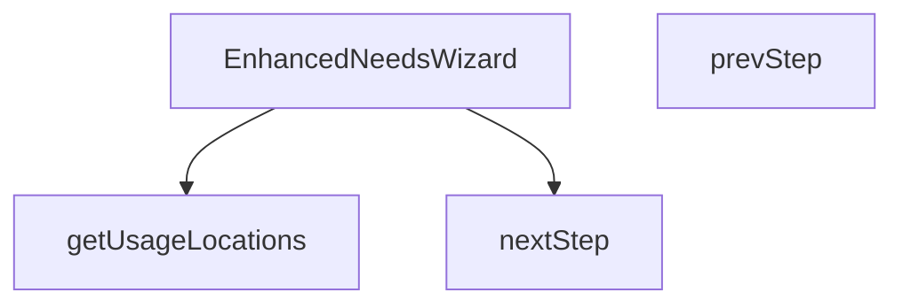

## NODE ID STANDARD

  file: src\components\category\EnhancedNeedsWizard.tsx
  function: src\components\category\EnhancedNeedsWizard.tsx::getUsageLocations
  function: src\components\category\EnhancedNeedsWizard.tsx::EnhancedNeedsWizard
  function: src\components\category\EnhancedNeedsWizard.tsx::nextStep
  function: src\components\category\EnhancedNeedsWizard.tsx::prevStep

---

## DISA AKTARILANLAR (EXPORTS)
  export: EnhancedNeedsWizard
  export: getUsageLocations

---

## BILEŞIM (CONTAINS)
  contains: DomainProduct

---

## STİL TOKENLERİ

### Arbitrary Değerler (token'a geçirilmemiş)
Yok — tüm stiller token'a geçirilmiş. ✅

### Kullanılan Token'lar (zaten token'a geçirilmiş)
- `rounded-hvac-2xl`

### Tailwind Sınıf Özeti
- **Renkler:** `accent-cyan-500`, `bg-cyan-500`, `bg-slate-100`, `bg-slate-200`, `bg-slate-50`, `bg-slate-50/50`, `bg-slate-900/60`, `bg-slate-950`, `bg-white`, `border-b`, `border-none`, `border-slate-100`, `border-slate-200`, `group-hover:bg-cyan-500`, `group-hover:text-white`
- **Layout:** `absolute`, `backdrop-blur-xl`, `block`, `custom-scrollbar`, `fixed`, `flex`, `flex-1`, `flex-col`, `gap-1`, `gap-12`, `gap-3`, `gap-4`, `gap-6`, `grid`, `grid-cols-1`
- **Varyant/Responsive:** `:`, `group-hover:`, `hover:`, `md:`, `sm:` önekleri
- **Yardımcı Sınıflar:** `${s`, `:`, `<=`, `animate-in`, `animate-pulse`, `appearance-none`, `aspect-square`, `border`, `cursor-default`, `cursor-pointer`, `duration-500`, `fade-in`, `focus-ring`, `font-black`, `font-bold`

---
# FILE: src\components\category\NeedsAnalysisWizard.md

---
domain: general
source_type: doc
namespace_type: module
source_path: C:\Users\alize\venthub-hvac\src\components\category\NeedsAnalysisWizard.tsx
skeleton_hash: 93154e7b94017606
entity_hashes:
  func:NeedsAnalysisWizard: 21824b9940ba2474
  func:handleSelection: be5cfa5ce36fcdb3
  overview: 2c7912dc8f1185c2
  style_tokens: 4b1fcd41d2094d58
generated_at: 2026-05-28T22:35:45Z
---

## Genel Bakış
NeedsAnalysisWizard, kullanıcıların ihtiyaç analizi adımlarında seçim yapmasını sağlayan bir React bileşenidir. Bileşen, dışarıdan gelen `onFilterChange` geri çağrısıyla seçilen değerleri üst bileşene iletir ve `handleSelection` fonksiyonu ile kullanıcı etkileşimlerini yönetir.

## Fonksiyon Grupları
### Bileşen Tanımı
Bu grup, bileşenin temel yapısını ve render mantığını içerir.
- NeedsAnalysisWizard

### Etkileşim İşleyici
Bu grup, kullanıcı seçimlerini yakalayıp ilgili geri çağrısını tetikleyen mantığı barındırır.
- handleSelection

---

## AXIOMS – Mimari Varsayımlar
Bu modül, `onFilterChange` propunun bir fonksiyon ve `handleSelection` metodunun doğru tipte parametrelerle çağrılmasını varsayar.

[Aksiyom 1]: Eğer `onFilterChange` propu bir fonksiyon değilse, bileşen bu fonksiyonu çağırırken çalışma zamanında `TypeError` alır.  
[Aksiyom 2]: Eğer `handleSelection` metodu `key` parametresi olarak string olmayan bir değer alırsa, TypeScript çalışma zamanı tip kontrolü (veya derleme hatası) ile işlem başarısız olur.  
[Aksiyom 3]: Eğer `handleSelection` metodu `value` parametresi olarak `string` veya `number` dışındaki bir tip alırsa, aynı şekilde tip uyumsuzluğu nedeniyle hata oluşur.  
[Aksiyom 4]: Eğer `onFilterChange` propu tanımlı değilse (`undefined`), propun kullanılması sırasında `undefined is not a function` hatası alınır.

---

## FONKSİYON DETAYLARI

### NeedsAnalysisWizard
**Ne yapar**: Kullanıcının ihtiyaç analizi sürecini adım adım yönlendiren bir sihirbaz bileşeni render eder.  
**Nasıl yapar**: `onFilterChange` geri çağrısını prop olarak alır ve iç durumunu yöneterek her adımda kullanıcı girdilerini toplar; filtreden veya seçeneklerden bir değişiklik olduğunda bu geri çağrüyü tetikler.  
**Parametreler**:  
- onFilterChange: function — Kullanıcı tarafından yapılan filtremeler veya seçenek değişiklikleri olduğunda dışarıya bildirmek için çağrılan geri çağırım fonksiyonu  
**Dönüş**: `React.FC<NeedsAnalysisWizardProps>` türünde bir React fonksiyon bileşeni; JSX döndürerek arayüzü oluşturur.

### handleSelection
**Ne yapar**: Kullanıcının bir öğe seçtiğinde ilgili anahtar‑değer çiftini işleyerek bileşenin durumunu günceller.  
**Nasıl yapar**: `key` parametresi ile hangi alanın güncelleneceğini belirler, `value` parametresi ise seçilen değeri alır; ardından bu bilgiyi yerel state veya context üzerinden günceller ve gerekirse diğer işlemleri tetikler.  
**Parametreler**:  
- key: string — Güncellenecek state veya context alanının adı  
- value: string | number — Seçilen öğenin değeri; metin veya sayı olabilir  
**Dönüş**: Fonksiyon bir değer döndürmez; dönüş tipi `void` (veya `undefined`) olarak kabul edilir.

---

## INTERFACES

### NeedsAnalysisWizardProps
- `onFilterChange: (filters: { maxHeight?: number; heating?: string; type?: string }) => void`

---

## AST POINTERS

### [N1_NASIL] AST Pointer: src/components/category/NeedsAnalysisWizard.tsx::NeedsAnalysisWizard
- **params**: (onFilterChange)
- **ic_degiskenler**:
  - `t` — translation function from useI18n, used to translate UI strings.
  - `step` — state variable tracking current wizard step (1‑3).
  - `setStep` — setter function to update the step state.
  - `selections` — state object storing user selections for maxHeight, heating, and type.
  - `setSelections` — setter to update the selections state.
  - `isOpen` — boolean state indicating whether the wizard dialog is open.
  - `setIsOpen` — setter to toggle the isOpen state.
  - `handleSelection` — function that updates selections and advances wizard steps based on user choice.
- **Dönüş**: JSX.Element (the rendered wizard UI)

### [N2_NASIL] AST Pointer: src/components/category/NeedsAnalysisWizard.tsx::handleSelection
- **params**: (key: string, value: string | number)
- **ic_degiskenler**:
  - `valStr` — string conversion of value for consistent storage in selections.
  - `newSelections` — shallow copy of selections state with the updated key‑value pair.
  - `selections` — current selections state (read to copy into newSelections).
  - `setSelections` — state setter to persist the updated selections.
  - `setStep` — state setter to advance the wizard step based on the key.
  - `onFilterChange` — callback prop to notify parent of the final filter when type is selected.
  - `setIsOpen` — state setter to close the wizard dialog after completion.
- **Dönüş**: yok (void)

### [N3_NASIL] AST Pointer: src/components/category/NeedsAnalysisWizard.tsx::mapCallback (h => …)
- **params**: (h)
- **ic_degiskenler**:
  - `handleSelection` — function to update maxHeight selection and advance the step.
  - `t` — translation function for UI strings.
- **Dönüş**: JSX.Element (button element representing a height option)

---

## NODE ID STANDARD

  file: src\components\category\NeedsAnalysisWizard.tsx
  function: src\components\category\NeedsAnalysisWizard.tsx::NeedsAnalysisWizard
  function: src\components\category\NeedsAnalysisWizard.tsx::handleSelection

---

## DISA AKTARILANLAR (EXPORTS)
  export: NeedsAnalysisWizard

---

## STİL TOKENLERİ

### Arbitrary Değerler (token'a geçirilmemiş)
Yok — tüm stiller token'a geçirilmiş. ✅

### Kullanılan Token'lar (zaten token'a geçirilmiş)
- (yok)

### Tailwind Sınıf Özeti
- **Renkler:** `bg-gradient-to-r`, `bg-white`, `bg-white/20`, `border-2`, `border-primary-navy/10`, `from-primary-navy`, `hover:bg-blue-50`, `hover:bg-orange-50`, `hover:border-blue-500`, `hover:border-orange-500`, `hover:border-secondary-blue`, `hover:text-gray-600`, `text-blue-100`, `text-gray-400`, `text-gray-500`
- **Layout:** `flex`, `from-primary-navy`, `gap-3`, `grid`, `grid-cols-1`, `grid-cols-2`, `items-center`, `justify-between`, `md:grid-cols-2`, `md:grid-cols-3`, `md:grid-cols-4`, `md:w-auto`, `p-2`, `p-6`, `shadow-lg`
- **Varyant/Responsive:** `hover:`, `md:` önekleri
- **Yardımcı Sınıflar:** `animate-fadeIn`, `border`, `focus-ring`, `font-bold`, `font-medium`, `hover:scale-105`, `mb-2`, `mb-6`, `ml-4`, `mt-6`, `px-3`, `px-4`, `px-6`, `py-1`, `py-3`

---
# FILE: src\components\category\sections\BottomCTA.md

---
domain: general
source_type: doc
namespace_type: module
source_path: C:\Users\alize\venthub-hvac\src\components\category\sections\BottomCTA.tsx
skeleton_hash: 1f08a41bd7ff999f
entity_hashes:
  func:BottomCTA: c122a8232d826ce8
  func:scrollToTop: 40a3c590b7862492
  overview: 55c7f6e0cceee5e1
  style_tokens: 0b28756a678eed77
generated_at: 2026-05-28T22:35:45Z
---

## Genel Bakış
Bu modül, bir kategori sayfasının alt kısmında kullanıcıya eylem teşvik eden bir çağrı‑etkileşim (CTA) bileşeni sunar ve sayfanın en üstüne hızlıca dönme işlevi sağlar. BottomCTA bileşeni, sihirbazı açma veya ürünleri gösterme gibi etkileşimleri yönetirken, scrollToTop fonksiyonu sayfa kaydırma deneyimini iyileştirmek için kullanılır.

## Fonksiyon Grupları
### Kullanıcı Arayüzü ve Etkileşim
Kategori sayfasının alt kısmında görsel bir CTA göstererek kullanıcıya belirli eylemler (sihirbazı açma, ürün listeleme) sunar ve bu eylemlerin tetiklenmesini sağlar.
- BottomCTA

### Sayfa Navigasyonu
Kullanıcının sayfanın başına hızlıca dönmesini sağlayan basit bir kaydırma işlevi içerir, böylece uzun listelerde üst menüye erişim kolaylaşır.
- scrollToTop

---

## AXIOMS – Mimari Varsayımlar
Bu modül, gerekli callback fonksiyonlarının ve `categoryN` propunun sağlandığı ve tarayıcı ortamında çalıştığı varsayımıyla doğru şekilde işlev görür.

[Aksiyom 1]: Eğer `onOpenWizard` propu sağlanmazsa, wizard açma işlevi tetiklenemez.  
[Aksiyom 2]: Eğer `onShowProducts` propu sağlanmazsa, ürün listeleme işlevi tetiklenemez.  
[Aksiyom 3]: Eğer `categoryN` propu sağlanmazsa, component rendering sırasında hata oluşur veya beklenen içerik gösterilemez.  
[Aksiyom 4]: Eğer `showWizard` propu sağlanmazsa, varsayılan olarak `true` değeri kullanılır ve wizard açık olarak başlar.  
[Aksiyom 5]: Eğer `scrollToTop` fonksiyonu tarayıcı dışı bir ortam (ör. sunucu tarafı render) çağrılırsa, `window.scrollTo` erişimi yoksa hata oluşur.

---

## FONKSİYON DETAYLARI

### BottomCTA
**Ne yapar**: Sayfa sonu CTA (Çağrı Eylemi) bölümünü renderlar ve kullanıcıya belirli aksiyonlar sunar: modelleri inceleme, bana uygun olanı bulma (wizard), uzman desteği alma ve sayfanın başına dönme.  
**Nasıl yapar**: Prop olarak alınan callback fonksiyonları (`onOpenWizard`, `onShowProducts`) ile butonların tıklama olaylarını bağlar; `showWizard` prop'una göre wizardı gösterip gizler; `categoryN` değerini gerekli yerlerde kullanarak içerik veya filtrelemeyi ayarlar.  
**Parametreler**:
- onOpenWizard: type not specified — Wizardı açmak için çağrılacak fonksiyon  
- onShowProducts: type not specified — Ürün listesini göstermek için çağrılacak fonksiyon  
- showWizard: boolean — Wizardın görünürlüğünü kontrol eder; varsayılan değer `true`  
- categoryN: type not specified — Bileşenin bağlamında kullanılan kategori tanımlayıcısı (örnek: kimlik veya isim)  
**Dönüş**: React.FC<BottomCTAProps> — Bileşenin props tipine uygun bir React fonksiyon bileşeni döner

### scrollToTop
**Ne yapar**: Sayfanın en üstüne kaydırma yapar.  
**Nasıl yapar**: Tarayıcının veya içeriğin kaydırma konumunu sıfırlayarak kullanıcıyı sayfa başına taşır; genellikle `window.scrollTo(0, 0)` veya benzeri bir yöntemle gerçekleştirilir.  
**Parametreler**: Yok  
**Dönüş**: void — Fonksiyon bir değer döndürmez (veya dönüş tipi belirtilmemiş)

---

## INTERFACES

### BottomCTAProps
- `onOpenWizard?: () => void`
- `onShowProducts?: () => void`
- `showWizard?: boolean`
- `categoryName?: string`

---

## AST POINTERS

### [N1_NASIL] AST Pointer: src/components/category/sections/BottomCTA.tsx::BottomCTA
- **params**: onOpenWizard, onShowProducts, showWizard, categoryName
- **ic_degiskenler**: 
  - `scrollToTop` — fonksiyon, sayfayı yukarıya kaydırır (window.scrollTo)
- **Dönüş**: React.FC<BottomCTAProps>

### [N2_NASIL] AST Pointer: src/components/category/sections/BottomCTA.tsx::scrollToTop
- **params**: (parametre yok)
- **ic_degiskenler**: 
  - (yok) — fonksiyon içinde hiçbir değişken tanımlanmaz
- **Dönüş**: yok

---

## NODE ID STANDARD

  file: src\components\category\sections\BottomCTA.tsx
  function: src\components\category\sections\BottomCTA.tsx::BottomCTA
  function: src\components\category\sections\BottomCTA.tsx::scrollToTop

---

## DISA AKTARILANLAR (EXPORTS)
  export: BottomCTA

---

## STİL TOKENLERİ

### Arbitrary Değerler (token'a geçirilmemiş)
Yok — tüm stiller token'a geçirilmiş. ✅

### Kullanılan Token'lar (zaten token'a geçirilmiş)
- (yok)

### Tailwind Sınıf Özeti
- **Renkler:** `bg-blue-400`, `bg-emerald-500`, `bg-gradient-to-br`, `bg-secondary-blue`, `bg-white/10`, `bg-white/20`, `border-blue-400/30`, `border-white/20`, `from-primary-navy`, `from-secondary-blue`, `group-hover:bg-white/30`, `hover:bg-white/20`, `hover:border-white/40`, `hover:text-white`, `md:text-4xl`
- **Layout:** `absolute`, `backdrop-blur-sm`, `bottom-0`, `flex`, `flex-col`, `from-primary-navy`, `from-secondary-blue`, `gap-2`, `gap-4`, `grid`, `grid-cols-1`, `h-14`, `h-96`, `items-center`, `justify-center`
- **Varyant/Responsive:** `:`, `group-hover:`, `hover:`, `lg:`, `md:`, `sm:` önekleri
- **Yardımcı Sınıflar:** `${showWizard`, `-translate-x-1/2`, `-translate-y-1/2`, `:`, `blur-3xl`, `border`, `focus-ring`, `font-bold`, `group`, `group-hover:-translate-y-1`, `group-hover:scale-110`, `hover:scale-105`, `inset-0`, `lg:px-8`, `mb-1`

---
# FILE: src\components\category\sections\FAQ.md

---
domain: general
source_type: doc
namespace_type: module
source_path: C:\Users\alize\venthub-hvac\src\components\category\sections\FAQ.tsx
skeleton_hash: 6ed52d5ed59875d8
entity_hashes:
  func:FAQ: 09e0c00f56bbdf5d
  overview: 46750effbb9bfa8b
  style_tokens: 44e8cc594d8dadd1
generated_at: 2026-05-28T22:35:46Z
---

## Genel Bakış
Bu modül, kategori sayfalarında sık sorulan sorular (FAQ) bölümünü gösteren bir React bileşeni tanımlar. Tek bir fonksiyonel bileşen üzerinden kullanıcıya soru‑cevap listesi sunar.

## Fonksiyon Grupları
### Ana Bileşen
FAQ bölümünün görsel yapısını ve içeriğini oluşturur.
- FAQ()

---

## AXIOMS – Mimari Varsayımlar
Bu modül için özel aksiyom tanımlanmamıştır.

---

## FONKSİYON DETAYLARI

### FAQ
**Ne yapar**: FAQ bileşeni, hava perdeleriyle ilgili sık sorulan soruları (SSS) bir akordiyon (accordion) biçiminde gösterir. Kullanıcıya soruya tıkladığında ilgili cevabı açıp kapatarak bilgiye hızlı erişim sağlar.

**Nasıl yapar**: Bileşen içindeki veri (örnek olarak sabit bir soru‑cevap listesi) harita fonksiyonu ile dönüştürülür; her bir soru için bir akordiyon öğesi oluşturulur ve tıklama olayıyla durum durumu (open/close) yönetilir. Sonuç olarak JSX döndürülür ve React tarafından render edilir.

**Parametreler**: Yok

**Dönüş**: `React.FC` türünde bir fonksiyonel bileşen döner; bu, JSX elementi üreten ve React ağacına entegrasyon sağlayan bir fonksiyon anlamına gelir.

---

## AST POINTERS

### [N1_NASIL] AST Pointer: src/components/category/sections/FAQ.tsx::FAQ
- **params**: (parametre yok)
- **ic_degiskenler**: 
  - `openIndex` — tutulan açık FAQ indeksi (number | null)
  - `setOpenIndex` — openIndex'i güncelleyen setter fonksiyonu
  - `faqs` — FAQ objelerinin dizisi, her objesi question ve answer stringlerinden oluşur
- **Dönüş**: JSX element (React component render output)

### [N2_NASIL] AST Pointer: src/components/category/sections/FAQ.tsx::(faq, index) => {...}
- **params**: `faq` — tek FAQ objesi (question, answer), `index` — o FAQ'ın dizindeki indeksi
- **ic_degiskenler**: 
  - `isOpen` — o FAQ'ın açık olup olmadığını belirten boolean (openIndex === index)
- **Dönüş**: JSX element (accordion item div)

---

## NODE ID STANDARD

  file: src\components\category\sections\FAQ.tsx
  function: src\components\category\sections\FAQ.tsx::FAQ

---

## DISA AKTARILANLAR (EXPORTS)
  export: FAQ

---

## STİL TOKENLERİ

### Arbitrary Değerler (token'a geçirilmemiş)
Yok — tüm stiller token'a geçirilmiş. ✅

### Kullanılan Token'lar (zaten token'a geçirilmiş)
- (yok)

### Tailwind Sınıf Özeti
- **Renkler:** `bg-blue-50`, `bg-gray-50`, `bg-white`, `border-blue-200`, `border-gray-200`, `hover:bg-gray-50`, `hover:text-blue-700`, `md:text-4xl`, `text-3xl`, `text-blue-500`, `text-blue-600`, `text-blue-700`, `text-center`, `text-gray-400`, `text-gray-600`
- **Layout:** `flex`, `flex-shrink-0`, `gap-2`, `gap-4`, `inline-flex`, `items-center`, `justify-between`, `max-h-0`, `max-h-96`, `max-w-3xl`, `overflow-hidden`, `p-5`, `p-6`, `shadow-md`, `w-full`
- **Varyant/Responsive:** `:`, `hover:`, `lg:`, `md:`, `sm:` önekleri
- **Yardımcı Sınıflar:** `${isOpen`, `:`, `border`, `duration-300`, `focus-ring`, `font-bold`, `font-semibold`, `leading-relaxed`, `lg:px-8`, `mb-12`, `mb-4`, `mt-12`, `mx-auto`, `pt-0`, `px-4`

---
# FILE: src\components\category\sections\HowItWorks.md

---
domain: general
source_type: doc
namespace_type: module
source_path: C:\Users\alize\venthub-hvac\src\components\category\sections\HowItWorks.tsx
skeleton_hash: bc4f7b9d7d53d17d
entity_hashes:
  func:HowItWorks: 796882dbc75a0b9a
  overview: 64591c81a70db9e6
  style_tokens: 86e780eada6c1862
generated_at: 2026-05-28T22:35:46Z
---

## Genel Bakış
Bu modül, ürünün veya hizmetin nasıl çalıştığını açıklayan bir bölümün React bileşenini tanımlar. Tek bir fonksiyon üzerinden kullanıcı arayüzü oluşturularak, “Nasıl Çalışır” içeriği sayfada render edilir.

## Fonksiyon Grupları
### Görüntüleme ve Yerleşim
Bu grup, bölümün görsel yapısını ve içeriğini oluşturan işlevi içerir.
- HowItWorks

---

## AXIOMS – Mimari Varsayımlar
Bu modül için özel aksiyom tanımlanmamıştır.

---

## FONKSİYON DETAYLARI

### HowItWorks
**Ne yapar**: İnteraktif bir “Nasıl Çalışır” bölümü oluşturarak hava perdesinin çalışma prensibini görselleştirir.  
**Nasıl yapar**: React fonksiyonel bileşeni olarak tanımlanır; içeriğinde görseller, açıklama metinleri ve gerekli durum yönetimi (state) kullanılarak kullanıcı etkileşimine yanıt veren animasyon veya açıklama kartları render edilir.  
**Parametreler**: Yok  
**Dönüş**: `React.FC` türünde bir fonksiyonel bileşen; JSX döndürerek “Nasıl Çalışır” bölümünün tamamını render eder.

---

## AST POINTERS

### [N1_NASIL] AST Pointer: src/components/category/sections/HowItWorks.tsx::HowItWorks
- **params**: (parametre yok)
- **ic_degiskenler**:
  - `sectionRef` — referans到 DOM öğesi için scroll animasyonu kullanılır
  - `isVisible` — bölümün şu anda görünür olup olmadığını gösteren boolean değer
  - `activeStep` — açılan adımın (akkordiyon) indeksi
  - `setActiveStep` — `activeStep` state'ini güncelleyen setter fonksiyonu
  - `steps` — her adımın ikon, başlık, açıklama ve detayını içeren nesneler dizisi
- **Dönüş**: React.FC

### [N2_NASIL] AST Pointer: src/components/category/sections/HowItWorks.tsx::(step,index)=>...
- **params**: step, index
- **ic_degiskenler**:
  - `Icon` — `step.icon`тенден React bileşeni, adımın ikonunu render etmek için kullanılır
  - `isActive` — `step` indeksi `activeStep` ile eşleşiyorsa true, UI'yı aç/kapatmak için kullanılır
- **Dönüş**: JSX.Element

---

## NODE ID STANDARD

  file: src\components\category\sections\HowItWorks.tsx
  function: src\components\category\sections\HowItWorks.tsx::HowItWorks

---

## DISA AKTARILANLAR (EXPORTS)
  export: HowItWorks

---

## STİL TOKENLERİ

### Arbitrary Değerler (token'a geçirilmemiş)
Yok — tüm stiller token'a geçirilmiş. ✅

### Kullanılan Token'lar (zaten token'a geçirilmiş)
- (yok)

### Tailwind Sınıf Özeti
- **Renkler:** `bg-blue-50`, `bg-blue-500`, `bg-gray-100`, `bg-white`, `border-2`, `border-blue-500`, `border-gray-200`, `hover:border-blue-300`, `md:text-4xl`, `sm:text-3xl`, `sm:text-lg`, `text-2xl`, `text-base`, `text-blue-600`, `text-blue-700`
- **Layout:** `flex`, `flex-1`, `gap-4`, `gap-8`, `grid`, `h-auto`, `items-center`, `items-start`, `justify-between`, `lg:gap-12`, `lg:grid-cols-2`, `max-h-0`, `max-h-24`, `max-w-2xl`, `max-w-7xl`
- **Varyant/Responsive:** `:`, `hover:`, `lg:`, `md:`, `sm:` önekleri
- **Yardımcı Sınıflar:** `${isActive`, `${scrollAnimationClasses.fadeUp(isVisible`, `${scrollAnimationClasses.scaleIn(isVisible`, `:`, `animate-fade-in`, `cursor-pointer`, `duration-300`, `ease-in-out`, `focus-ring`, `font-bold`, `lg:px-8`, `mb-4`, `mb-8`, `mt-0`, `mt-1`

---
# FILE: src\components\category\sections\ProblemSection.md

---
domain: general
source_type: doc
namespace_type: module
source_path: C:\Users\alize\venthub-hvac\src\components\category\sections\ProblemSection.tsx
skeleton_hash: afa107ed0ce1c9c5
entity_hashes:
  func:ProblemSection: 8fcd7b70f98a256d
  overview: 738513900a95eb13
  style_tokens: a37a5e86138e5e96
generated_at: 2026-05-28T22:35:46Z
---

## Genel Bakış
Bu modül, kategori sayfasında sorunları listeleyen bir React bileşenini tanımlar. `ProblemSection` fonksiyonu, kullanıcıya sorunlarla ilgili bilgileri görsel olarak düzenli bir şekilde sunmak için gerekli JSX yapısını döndürür.

## Fonksiyon Grupları
### Bileşen Renderlama
Bu grup, kullanıcı arayüzünde sorun bölümünün oluşturulmasını ve görüntülenmesini sağlar.
- ProblemSection

---

## AXIOMS – Mimari Varsayımlar
ProblemSection bileşeni dışarıdan prop almayı beklemez.
[Aksiyom 1]: Eğer prop geçilmezse, bileşen hatasız çalışır.

---

## FONKSİYON DETAYLARI

### ProblemSection
**Ne yapar**: Kullanıcıya hava perdesi ihtiyacını hissettiren, "Problemi Tanı" bölümü olan bir empati bölümü render eder.  
**Nasıl yapar**: React fonksiyonel bileşeni olarak tanımlanır ve JSX döndürerek bölümü UI'ya ekler. İçerik, kullanıcıya problem farkındalığı yaratmak amacıyla metin ve görsel öğeler içerir.  
**Parametreler**:  
- (parametre yok)  
**Dönüş**: `React.FC` türünde bir fonksiyon döndürür; bu fonksiyon render edildiğinde ilgili bölümü gösteren JSX elemanını üretir.

---

## AST POINTERS

### [N1_NASIL] AST Pointer: C:\Users\alize\venthub-hvac\src\components\category\sections\ProblemSection.tsx::ProblemSection
- **params**: (yok)
- **ic_degiskenler**:
  - `sectionRef` — ref for scroll animation, holds the HTMLElement reference returned by `useScrollAnimation`
  - `isVisible` — boolean flag indicating whether the section is currently visible in the viewport, provided by `useScrollAnimation`
  - `problems` — array of problem objects; each object contains `icon` (Lucide component), `title` (string), `stat` (string), `description` (string), `color` (text color class), and `bgColor` (background color class) used to render the cards
- **Dönüş**: JSX.Element (the rendered `<section>` component)

### [N2_NASIL] AST Pointer: C:\Users\alize\venthub-hvac\src\components\category\sections\ProblemSection.tsx::(anonymous map callback)
- **params**: `problem` — object with `icon`, `title`, `stat`, `description`, `color`, `bgColor`; `index` — number representing the item's position in the `problems` array
- **ic_degiskenler**:
  - `Icon` — variable assigned from `problem.icon`, used as the Lucide icon component to render inside the card
- **Dönüş**: JSX.Element (the rendered `<div>` representing a problem card)

---

## NODE ID STANDARD

  file: src\components\category\sections\ProblemSection.tsx
  function: src\components\category\sections\ProblemSection.tsx::ProblemSection

---

## DISA AKTARILANLAR (EXPORTS)
  export: ProblemSection

---

## STİL TOKENLERİ

### Arbitrary Değerler (token'a geçirilmemiş)
Yok — tüm stiller token'a geçirilmiş. ✅

### Kullanılan Token'lar (zaten token'a geçirilmiş)
- (yok)

### Tailwind Sınıf Özeti
- **Renkler:** `bg-black/40`, `bg-blue-500/30`, `bg-gradient-to-b`, `bg-gradient-to-r`, `bg-red-500/30`, `bg-white`, `border-2`, `border-blue-300`, `border-gray-100`, `border-red-300`, `from-gray-50`, `from-red-500`, `hover:border-gray-200`, `md:text-4xl`, `sm:text-3xl`
- **Layout:** `absolute`, `flex`, `from-gray-50`, `from-red-500`, `gap-4`, `gap-8`, `grid`, `grid-cols-2`, `h-10`, `h-20`, `hidden`, `hover:shadow-lg`, `items-center`, `justify-center`, `lg:grid-cols-4`
- **Varyant/Responsive:** `group-hover:`, `hover:`, `lg:`, `md:`, `sm:` önekleri
- **Yardımcı Sınıflar:** `${problem.bgColor`, `${problem.color`, `${scrollAnimationClasses.fadeUp(isVisible`, `${scrollAnimationClasses.scaleIn(isVisible`, `border`, `duration-300`, `font-bold`, `font-semibold`, `group`, `group-hover:scale-110`, `inset-0`, `lg:px-8`, `mb-1`, `mb-12`, `mb-2`

---
# FILE: src\components\category\sections\TrustSignals.md

---
domain: general
source_type: doc
namespace_type: module
source_path: C:\Users\alize\venthub-hvac\src\components\category\sections\TrustSignals.tsx
skeleton_hash: 08cd7eaf3309672a
entity_hashes:
  func:TrustSignals: 91fe7d8aaf9157d4
  overview: ebf860b97d35b224
  style_tokens: d8ec8f7dddeaa270
generated_at: 2026-05-28T22:35:48Z
---

## Genel Bakış
TrustSignals bileşeni, kategori sayfasında güven ve güvenilirliği gösteren işaretleri (örneğin sertifika, garanti, müşteri yorumları) görsel olarak sunar. Bu bileşen, kullanıcıya ürün veya hizmetin güvenilirliğini hızlıca iletmek için tasarlanmıştır.

## Fonksiyon Grupları
### Ana Bileşen
Bu grup, kullanıcı arayüzüne güven işaretlerini ekleyen temel fonksiyonu içerir.
- TrustSignals

---

## AXIOMS – Mimari Varsayımlar
Bu modül için özel aksiyom tanımlanmamıştır.

---

## FONKSİYON DETAYLARI

### TrustSignals
**Ne yapar**: TrustSignals bileşeni, Vortice markasının güven sinyallerini gösteren bir bölüm render eder. Yeni site için şirketin itibarını ön plana çıkararak kullanıcı gücünü artırır.  
**Nasıl yapar**: Bileşen, iç içe geçmiş JSX elemanlarıyla güven rozetleri, müşteri yorumları, sertifika logoları gibi öğeleri düzenler ve bu öğeleri döndürür. Ekstra mantık veya state yönetimi içermez; sadece statik içerik sunar.  
**Parametreler**: yok  
**Dönüş**: React.FC türünde bir fonksiyon; çağrıldığında güven sinyalleri bölümünü temsil eden JSX döndürür.

---

## AST POINTERS

### [N1_NASIL] AST Pointer: src/components/category/sections/TrustSignals.tsx::TrustSignals
- **params**: (parametre yok)
- **ic_degiskenler**:
  - `signals` — const signals = [...] array of objects each containing `icon` (Lucide icon component), `title` (string), and `description` (string); used to render the trust signal items via `.map`.
- **Dönüş**: JSX.Element (returns a `<section>` containing the trust signals grid and certification badges).

### [N2_NASIL] AST Pointer: src/components/category/sections/TrustSignals.tsx::mapCallback
- **params**: (signal, index)
- **ic_degiskenler**:
  - `Icon` — const Icon = signal.icon; extracts the Lucide icon component from the current signal object for rendering.
- **Dönüş**: JSX.Element (returns a `<div>` representing a single trust signal item with its icon, title, and description).

---

## NODE ID STANDARD

  file: src\components\category\sections\TrustSignals.tsx
  function: src\components\category\sections\TrustSignals.tsx::TrustSignals

---

## DISA AKTARILANLAR (EXPORTS)
  export: TrustSignals

---

## STİL TOKENLERİ

### Arbitrary Değerler (token'a geçirilmemiş)
Yok — tüm stiller token'a geçirilmiş. ✅

### Kullanılan Token'lar (zaten token'a geçirilmiş)
- (yok)

### Tailwind Sınıf Özeti
- **Renkler:** `bg-gray-300`, `bg-gray-50`, `bg-white`, `border-gray-200`, `border-t`, `border-y`, `text-blue-600`, `text-center`, `text-gray-400`, `text-gray-500`, `text-gray-900`, `text-sm`, `text-xs`
- **Layout:** `flex`, `flex-wrap`, `gap-2`, `gap-6`, `grid`, `grid-cols-2`, `h-12`, `h-4`, `items-center`, `justify-center`, `lg:grid-cols-6`, `max-w-7xl`, `md:grid-cols-3`, `shadow-sm`, `w-12`
- **Varyant/Responsive:** `lg:`, `md:`, `sm:` önekleri
- **Yardımcı Sınıflar:** `border`, `font-bold`, `font-semibold`, `lg:px-8`, `mb-3`, `mt-1`, `mt-8`, `mx-auto`, `opacity-60`, `pt-8`, `px-4`, `py-12`, `rounded-full`, `sm:px-6`

---
# FILE: src\components\category\sections\TypeComparison.md

---
domain: general
source_type: doc
namespace_type: module
source_path: C:\Users\alize\venthub-hvac\src\components\category\sections\TypeComparison.tsx
skeleton_hash: e64ca2d20ec08be2
entity_hashes:
  func:TypeComparison: 4dc351c7c18b2642
  overview: e7e7315fa09b979c
  style_tokens: ef09d8c28bb43bb7
generated_at: 2026-05-28T22:35:48Z
---

## Genel Bakış
Bu modül, kategori bölümlerinde farklı türleri karşılaştırmak amacıyla kullanılan bir React bileşeni tanımlar. Kullanıcıya tür seçimi ve sihirbaz açma gibi etkileşimler sunar.

## Fonksiyon Grupları
### Ana Bileşen
Bileşen, ekranda karşılaştırma görünümünü oluşturur ve dışarıdan gelen onOpenWizard ve onSelectType geri çağrılarını tetikler.
- TypeComparison

---

## AXIOMS – Mimari Varsayımlar
Bu modül, `onOpenWizard` ve `onSelectType` prop'larının fonksiyon olarak sağlandığını varsayar.

[Aksiyom 1]: Eğer `onOpenWizard` prop'u sağlanmazsa veya `undefined` ise, component içinde bu fonksiyon çağrıldığında hata oluşur.  
[Aksiyom 2]: Eğer `onSelectType` prop'u sağlanmazsa veya `undefined` ise, component içinde bu fonksiyon çağrıldığında hata oluşur.  
[Aksiyom 3]: Eğer `onOpenWizard` prop'u bir fonksiyon değilse, çağrıldığında `TypeError` oluşur.  
[Aksiyom 4]: Eğer `onSelectType` prop'u bir fonksiyon değilse, çağrıldığında `TypeError` oluşur.

---

## FONKSİYON DETAYLARI

### TypeComparison
**Ne yapar**: Elektrikli sistemler ile ortam havalı sistemlerini yan yana göstererek kullanıcıların fayda, maliyet ve verimlilik açısından karşılaştırmasını sağlar; ayrıca karşılaştırma sonucunda hâlâ kararsız kalan kullanıcılar için bir sihirbaz (wizard) açarak daha detaylı yönlendirme yapar.  
**Nasıl yapar**: Bileşen, `onSelectType` fonksiyonunu kullanarak kullanıcının bir sistem türü seçtiğinde bu seçimi üst componente iletir; `onOpenWizard` fonksiyonu ise kullanıcı henüz bir karar veremediyse sihirbazı tetiklemek için çağrılır. Görsel karşılaştırma kartları, fayda tabloları ve bir “Wizard aç” butonu üzerinden bu akış gerçekleştirilir.  
**Parametreler**:
- onOpenWizard: kullanıcı henüz bir sistem türü seçmediğinde sihirbazı açmak için çağrılan callback fonksiyonu  
- onSelectType: kullanıcı bir sistem türü (elektrikli veya ortam havalı) seçtiğinde bu seçimi üst componente iletmek için kullanılan callback fonksiyonu  
**Dönüş**: `React.FC<TypeComparisonProps>` – bir React fonksiyon bileşeni olarak, JSX döndürerek karşılaştırma arayüzünü ve gerekli etkileşimleri render eder.

---

## INTERFACES

### TypeComparisonProps
- `onOpenWizard: () => void`
- `onSelectType: (type: 'elektrikli' | 'ortam') => void`

---

## AST POINTERS

### [N1_NASIL] AST Pointer: src/components/category/sections/TypeComparison.tsx::TypeComparison
- **params**: onOpenWizard, onSelectType
- **ic_degiskenler**:
  - `sectionRef` — reference to the section element used for scroll‑animation hook
  - `isVisible` — boolean flag indicating whether the section is currently visible in the viewport
  - `hoveredType` — holds the currently hovered type identifier ('elektrikli' | 'ortam' | null)
  - `setHoveredType` — state setter function to update `hoveredType`
  - `types` — array of configuration objects for each type, containing title, subtitle, icon, color classes, benefits, bestFor, and notFor lists
- **Dönüş**: JSX.Element

### [N2_NASIL] AST Pointer: src/components/category/sections/TypeComparison.tsx::map callback (type) => ...
- **params**: type
- **ic_degiskenler**:
  - `Icon` — React component icon extracted from `type.icon`
  - `isHovered` — boolean indicating if this type is currently hovered (`hoveredType === type.id`)
- **Dönüş**: JSX.Element

### [N3_NASIL] AST Pointer: src/components/category/sections/TypeComparison.tsx::benefits.map callback (benefit, i) => ...
- **params**: benefit, i
- **ic_degiskenler**: yok
- **Dönüş**: JSX.Element

### [N4_NASIL] AST Pointer: src/components/category/sections/TypeComparison.tsx::bestFor.map callback (item, i) => ...
- **params**: item, i
- **ic_degiskenler**: yok
- **Dönüş**: JSX.Element

### [N5_NASIL] AST Pointer: src/components/category/sections/TypeComparison.tsx::notFor.map callback (item, i) => ...
- **params**: item, i
- **ic_degiskenler**: yok
- **Dönüş**: JSX.Element

---

## NODE ID STANDARD

  file: src\components\category\sections\TypeComparison.tsx
  function: src\components\category\sections\TypeComparison.tsx::TypeComparison

---

## DISA AKTARILANLAR (EXPORTS)
  export: TypeComparison

---

## STİL TOKENLERİ

### Arbitrary Değerler (token'a geçirilmemiş)
Yok — tüm stiller token'a geçirilmiş. ✅

### Kullanılan Token'lar (zaten token'a geçirilmiş)
- (yok)

### Tailwind Sınıf Özeti
- **Renkler:** `bg-gradient-to-b`, `bg-gradient-to-r`, `bg-gray-100`, `bg-purple-600`, `border-2`, `border-purple-100`, `from-purple-50`, `from-white`, `hover:bg-purple-700`, `md:text-4xl`, `sm:text-3xl`, `sm:text-lg`, `text-2xl`, `text-base`, `text-center`
- **Layout:** `flex`, `flex-shrink-0`, `flex-wrap`, `from-purple-50`, `from-white`, `gap-2`, `gap-4`, `gap-6`, `grid`, `inline`, `inline-flex`, `items-center`, `items-start`, `justify-center`, `max-w-2xl`
- **Varyant/Responsive:** `hover:`, `lg:`, `md:`, `sm:` önekleri
- **Yardımcı Sınıflar:** `${isHovered`, `${scrollAnimationClasses.fadeUp(isVisible`, `${scrollAnimationClasses.scaleIn(isVisible`, `${type.colorClasses.bg`, `${type.colorClasses.button`, `${type.colorClasses.text`, `aspect-video`, `border`, `duration-300`, `focus-ring`, `font-bold`, `font-medium`, `font-semibold`, `lg:px-8`, `mb-2`

---
# FILE: src\components\category\sections\VorticeBrand.md

---
domain: general
source_type: doc
namespace_type: module
source_path: C:\Users\alize\venthub-hvac\src\components\category\sections\VorticeBrand.tsx
skeleton_hash: 94eed6a8060e5ab3
entity_hashes:
  func:VorticeBrand: a8d2715dd40c7de5
  overview: 07ac1657460cc044
  style_tokens: 751231d1b5ff9e5b
generated_at: 2026-05-28T22:35:48Z
---

## Genel Bakış
Bu modül, Vortice markasıyla ilgili ürün veya bilgi bölümünü gösteren bir React bileşeni tanımlar. Bileşen, sayfa içinde marka özetini, görsellerini ve bağlantılarını düzenler.

## Fonksiyon Grupları
### Ana Bileşen Tanımı
Bu grup, modülün tek işlevini içerir ve kullanıcı arayüzünde Vortice marka bölümünü oluşturur.
- VorticeBrand

---

## AXIOMS – Mimari Varsayımlar
Bu modül, props almayan bir React fonksiyon bileşeni olarak tasarlanmıştır.

[Aksiyom 1]: Eğer `VorticeBrand` fonksiyonuna prop geçilirse, bileşenin render çıktısı ve davranışı garantilenmez.

---

## FONKSİYON DETAYLARI

### VorticeBrand
**Ne yapar**: Vortice markasının 70 yıllık İtalyan mühendisliği ve güvenilirlik hikayesini gösteren bir bölüm bileşeni render eder.  
**Nasıl yapar**: Fonksiyon, JSX ile bir `<section>` (veya benzeri kapsayıcı) döndürerek başlık, açıklama ve görsel öğeleri yerleştirir; dışarıdan prop almaz ve kendi iç durumunu yönetmez.  
**Parametreler**: Yok  
**Dönüş**: `React.FC` türünde bir fonksiyon bileşeni; render edildiğinde Vortice marka hikayesi bölümüyle ilgili JSX döndürür.

---

## AST POINTERS

### [N1_NASIL] AST Pointer: src/components/category/sections/VorticeBrand.tsx::VorticeBrand
- **params**: (parametre yok)
- **ic_degiskenler**:
  - `sectionRef` — ref to the section element for scroll animation
  - `isVisible` — boolean indicating whether the section is in viewport for animation
  - `highlights` — array of objects containing icon, value, label, description for stats
  - `scrollAnimationClasses` — object with animation class names (slideRight, slideLeft, fadeUp, fadeIn) used for scroll‑based animations
  - `VentImage` — component used to display the hero image
  - `Award`, `Globe`, `Clock`, `Shield`, `Star` — icon components from lucide‑react used in highlights and badge UI
- **Dönüş**: JSX.Element

### [N2_NASIL] AST Pointer: src/components/category/sections/VorticeBrand.tsx::<anonymous>
- **params**: `item`, `index`
- **ic_degiskenler**:
  - `item` — each element of highlights array containing icon, value, label, description
  - `index` — numeric index of the current highlight in the map iteration
  - `Icon` — React component extracted from item.icon (e.g., Clock, Globe) used to render the icon
  - `scrollAnimationClasses` — animation class helper used to get fadeUp class based on visibility
  - `isVisible` — boolean from outer scope indicating visibility, used to conditionally apply fadeUp animation
- **Dönüş**: JSX.Element

---

## NODE ID STANDARD

  file: src\components\category\sections\VorticeBrand.tsx
  function: src\components\category\sections\VorticeBrand.tsx::VorticeBrand

---

## DISA AKTARILANLAR (EXPORTS)
  export: VorticeBrand

---

## STİL TOKENLERİ

### Arbitrary Değerler (token'a geçirilmemiş)
Yok — tüm stiller token'a geçirilmiş. ✅

### Kullanılan Token'lar (zaten token'a geçirilmiş)
- (yok)

### Tailwind Sınıf Özeti
- **Renkler:** `bg-gradient-to-b`, `bg-gradient-to-t`, `bg-green-500`, `bg-red-500`, `bg-white`, `bg-white/10`, `bg-white/5`, `border-t`, `border-white/10`, `from-black/70`, `from-slate-900`, `hover:bg-white/10`, `md:text-4xl`, `sm:text-3xl`, `sm:text-base`
- **Layout:** `absolute`, `backdrop-blur-sm`, `bottom-0`, `flex`, `flex-wrap`, `from-black/70`, `from-slate-900`, `gap-1.5`, `gap-2`, `gap-8`, `grid`, `grid-cols-4`, `h-5`, `h-auto`, `hidden`
- **Varyant/Responsive:** `hover:`, `lg:`, `md:`, `sm:` önekleri
- **Yardımcı Sınıflar:** `${scrollAnimationClasses.fadeIn(isVisible`, `${scrollAnimationClasses.fadeUp(isVisible`, `border`, `font-bold`, `font-medium`, `inset-0`, `lg:px-8`, `mb-1`, `mb-4`, `mb-6`, `mt-8`, `mx-auto`, `opacity-5`, `pt-6`, `px-3`

---
# FILE: src\components\category\sections\silent-fan\SilentFanFAQ.md

---
domain: general
source_type: doc
namespace_type: module
source_path: C:\Users\alize\venthub-hvac\src\components\category\sections\silent-fan\SilentFanFAQ.tsx
skeleton_hash: 6c6af5e226009042
entity_hashes:
  func:SilentFanFAQ: 514de334aa5d1d84
  func:tr: b282b53f03d688a5
  overview: 04a22bd0b6f69650
  style_tokens: 325897ca39ea7e85
generated_at: 2026-05-28T22:35:47Z
---

## Genel Bakış
Bu modül, sessiz fan kategorisiyle ilgili sık sorulan sorular (FAQ) içeriğini gösteren bir React bileşeni tanımlar. Ayrıca, içerik içinde kullanılan metinlerin çevirilerini sağlayan basit bir yardımcı fonksiyon içerir.

## Fonksiyon Grupları
### Bileşen Tanımı
Kullanıcı arayüzünde silent‑fan bölümünün FAQ kısmını render eden ana bileşeni oluşturur.
- SilentFanFAQ

### Yerelleştirme Yardımcı
Bileşen içindeki sabit metinlerin farklı dillere çevrilmesini kolaylaştıran bir çeviri işlevi sağlar.
- tr

---

## AXIOMS – Mimari Varsayımlar
Bu modül için özel aksiyom tanımlanmamıştır.

---

## FONKSİYON DETAYLARI

### SilentFanFAQ
**Ne yapar**: SilentFan ürünüyle ilgili sık sorulan soruların (FAQ) bölümünü render eden bir React fonksiyonel bileşenidir.  
**Nasıl yapar**: Bileşen içeriği, genellikle bir `<div>` veya `<section>` içinde soru‑cevap çiftlerini içeren JSX döndürür; stil ve düzenleme dışarıdan aktarılan CSS veya stil kütüphaneleriyle sağlanır.  
**Parametreler**:  
- (parametre yok)  
**Dönüş**: `React.FC` türünde bir fonksiyonel bileşen; JSX elementi döndürerek UI'ya entegrasyon sağlar.

### tr
**Ne yapar**: Verilen bir çeviri anahtarına karşılık gelen yerelleştirilmiş metni elde etmek için kullanılan bir yardımcı fonksiyondur.  
**Nasıl yapar**: Fonksiyon, `key` parametresini bir çeviri sözlüğü veya i18n sağlayıcıyla eşleştirerek ilgili dizeyi bulur; bulununun sonucu genellikle bileşen metni olarak ayarlanır veya doğrudan döndürülür.  
**Parametreler**:  
- `key`: string — çevrilecek metnin anahtar kimliği.  
**Dönüş**: Açıklama dokümantasyonda dönüş tipi belirtilmemiştir; genellikle `void` (yan etkili bir güncelleme) veya çevrilen `string` döndürülebilir. Gerçek dönüş tipi projeye özel i18n yapılandırmasına bağlıdır.

---

## AST POINTERS

### [N1_NASIL] AST Pointer: src/components/category/sections/silent-fan/SilentFanFAQ.tsx::SilentFanFAQ
- **params**: (parametre yok)
- **ic_degiskenler**:
  - `t` — çeviri fonksiyonu, useI18n hookundan elde edilen i18n çeviri işlevi.
  - `dict` — i18n sözlüğü nesnesi, categorySilentFan.faq.items gibi çeviri verilerini içerir.
  - `sectionRef` — bölüm öğesine bağlanacak ref, useScrollAnimation ile scroll tabanlı animasyon için kullanılır.
  - `isVisible` — bölümün görünürlüğünü gösteren boolean değer, useScrollAnimation tarafından sağlanır.
  - `openIndex` — şu anda açık olan FAQ öğesinin indeksi (kapalıysa null) tutan useState durumu.
  - `setOpenIndex` — openIndex durumunu güncelleyen setter fonksiyonu.
  - `tr` — kategori özelı FAQ çeviri anahtarını oluşturan yardımcı fonksiyon, `categorySilentFan.faq.` öneki ekler.
  - `items` — dict.categorySilentFan.faq.items çeviri verisi, tanımlı değilse boş dizi.
- **Dönüş**: JSX elementi (React.FC) — tüm FAQ bölümünü render eden section öğesi.

### [N2_NASIL] AST Pointer: src/components/category/sections/silent-fan/SilentFanFAQ.tsx::tr
- **params**: key: string
- **ic_degiskenler**:
  - (yok) — fonksiyon gövdesinde yeni bir değişken tanımlanmaz; t dışarıdaki kapsamdan kapatılır.
- **Dönüş**: string — `categorySilentFan.faq.{key}` anahtarına karşılık gelen çevrilen metin.

### [N3_NASIL] AST Pointer: src/components/category/sections/silent-fan/SilentFanFAQ.tsx::map callback
- **params**: item: { q: string; a: string }, index: number
- **ic_degiskenler**:
  - `isOpen` — boolean, verilen index'in openIndex durumuyla eşleşip eşleşmediğini kontrol eder; true ise ilgili FAQ açıktır.
- **Dönüş**: JSX elementi — tek bir FAQ öğesini (başlık butonu ve içerik paneli) render eden div.

---

## NODE ID STANDARD

  file: src\components\category\sections\silent-fan\SilentFanFAQ.tsx
  function: src\components\category\sections\silent-fan\SilentFanFAQ.tsx::SilentFanFAQ
  function: src\components\category\sections\silent-fan\SilentFanFAQ.tsx::tr

---

## DISA AKTARILANLAR (EXPORTS)
  export: SilentFanFAQ

---

## STİL TOKENLERİ

### Arbitrary Değerler (token'a geçirilmemiş)
Yok — tüm stiller token'a geçirilmiş. ✅

### Kullanılan Token'lar (zaten token'a geçirilmiş)
- (yok)

### Tailwind Sınıf Özeti
- **Renkler:** `bg-blue-100`, `bg-blue-600`, `bg-slate-100`, `bg-slate-50`, `bg-white`, `border-blue-500`, `border-slate-200`, `border-slate-50`, `border-t`, `md:text-4xl`, `text-3xl`, `text-blue-600`, `text-center`, `text-left`, `text-lg`
- **Layout:** `flex`, `flex-shrink-0`, `gap-4`, `h-16`, `h-8`, `inline-flex`, `items-center`, `justify-between`, `justify-center`, `max-h-0`, `max-h-500px`, `max-w-4xl`, `overflow-hidden`, `shadow-blue-500/5`, `shadow-sm`
- **Varyant/Responsive:** `:`, `lg:`, `md:`, `sm:` önekleri
- **Yardımcı Sınıflar:** `${isOpen`, `${scrollAnimationClasses.fadeUp(isVisible`, `:`, `border`, `duration-300`, `ease-in-out`, `focus-ring`, `font-bold`, `leading-relaxed`, `lg:px-8`, `mb-12`, `mb-6`, `mt-1`, `mx-auto`, `opacity-0`

---
# FILE: src\components\category\sections\silent-fan\SilentFanHowItWorks.md

---
domain: general
source_type: doc
namespace_type: module
source_path: C:\Users\alize\venthub-hvac\src\components\category\sections\silent-fan\SilentFanHowItWorks.tsx
skeleton_hash: ea7a36092eb9fbd6
entity_hashes:
  func:SilentFanHowItWorks: 1d9f7bbf01c39f23
  func:tr: b282b53f03d688a5
  overview: 5f3bf85694f8ac81
  style_tokens: b11a600d5d7c65a7
generated_at: 2026-05-28T22:35:47Z
---

## Genel Bakış
Bu modül, sessiz fanların çalışma prensiplerini açıklayan bir bileşen sunar. `SilentFanHowItWorks` fonksiyonu, kullanıcı arayüzünü oluştururken `tr` fonksiyonu ile metinlerin çevirisi sağlanır, böylece içerik farklı dillerde dinamik olarak gösterilebilir.

## Fonksiyon Grupları
### Bileşen Renderlama
Kullanıcı arayüzünü oluşturan ve sessiz fanların nasıl çalıştığını görsel ve metinsel olarak gösteren ana işlev.
- SilentFanHowItWorks

### Çeviri Yardımı
Bileşen içindeki sabit metinlerin farklı dillere çevrilmesini sağlayan yardımcı işlev.
- tr

---

## AXIOMS – Mimari Varsayımlar
Bu modül için özel aksiyom tanımlanmamıştır.

---

## FONKSİYON DETAYLARI

### SilentFanHowItWorks
**Ne yapar**: Silent fan'ın çalışma prensibini açıklayan bir React bileşeni render eder.  
**Nasıl yapar**: Bileşen, JSX ile fanın sessiz çalışma mekanizmasını gösteren metin, görsel veya animasyon içeriği döndürür; dışarıdan prop almaz ve varsayılan olarak export edilir.  
**Parametreler**: (yok)  
**Dönüş**: React.FC türünde bir fonksiyon döndürür; bu fonksiyon render edildiğinde JSX elementi üretir.

### tr
**Ne yapar**: Verilen çeviri anahtarına karşılık gelen metni bulup uygulama içinde kullanmaya hazırlar (örneğin i18n fonksiyonu).  
**Nasıl yapar**: Anahtar string'i alır, çeviri dosyalarında veya context'te arar ve eşleşen değeri bulursa ilgili UI elemanına inject eder; dönüş tipi belirsiz olduğu için net bir değer döndürüp döndürmediği belirtilmez.  
**Parametreler**:  
- key: string — çevrilecek metnin anahtar kimliği  
**Dönüş**: Belirtilmemiş (void veya bilinmeyen tip); fonksiyonun bir değer döndürüp döndürmediği net değil.

---

## AST POINTERS

### [N1_NASIL] AST Pointer: src/components/category/sections/silent-fan/SilentFanHowItWorks.tsx::SilentFanHowItWorks
- **params**: (parametre yok)
- **ic_degiskenler**:
  - `t` — `useI18n` hookundan dönen çeviri fonksiyonu; `tr` içinde ve JSX'te `String(tr(...))` çağrısı için kullanılır.
  - `dict` — `useI18n` hookundan dönen çeviri nesnesi; `dict.categorySilentFan.howItWorks.steps` erişimi için kullanılır.
  - `sectionRef` — `useScrollAnimation` hookundan dönen ref; `<section>` elementiyle scroll animasyonu bağlamak için `ref` olarak kullanılır.
  - `isVisible` — `useScrollAnimation` hookundan dönen boolean; section'in görünürlüğüne göre `scrollAnimationClasses.slideRight` ve `slideLeft` sınıflarını uygulamak için kullanılır.
  - `tr` — yerel çeviri助手 fonksiyonu; `categorySilentFan.howItWorks` alt anahtarına göre `t` fonksiyonunu sarmalar ve JSX'te `String(tr('eyebrow'))`, `String(tr('title'))`, `String(tr('subtitle'))` gibi çağrılarda kullanılır.
  - `icons` — `[Microscope, Wind, ShieldCheck]` dizisi; `steps.map` içinde `index % icons.length` ile ikon seçimi için kullanılır.
  - `steps` — `dict.categorySilentFan.howItWorks.steps` veya boş dizi; her adımın başlığı ve açıklamasını renderlemek için `steps.map` ile iterate edilir.
- **Dönüş**: JSX.Element (bölümün tamamını render eden JSX)

### [N2_NASIL] AST Pointer: src/components/category/sections/silent-fan/SilentFanHowItWorks.tsx::tr
- **params**: `(key: string)`
- **ic_degiskenler**: (yok)
- **Dönüş**: string (i18n tarafından çevrilen metin)

### [N3_NASIL] AST Pointer: src/components/category/sections/silent-fan/SilentFanHowItWorks.tsx::steps.map callback
- **params**: `(step: {title: string; description: string}, index: number)`
- **ic_degiskenler**:
  - `Icon` — `icons[index % icons.length]` ile seçilen ikon bileşeni; JSX'te `<Icon className="text-blue-400" size={24} />` ile render edilir.
- **Dönüş**: JSX.Element (her adım için flex container div)

---

## NODE ID STANDARD

  file: src\components\category\sections\silent-fan\SilentFanHowItWorks.tsx
  function: src\components\category\sections\silent-fan\SilentFanHowItWorks.tsx::SilentFanHowItWorks
  function: src\components\category\sections\silent-fan\SilentFanHowItWorks.tsx::tr

---

## DISA AKTARILANLAR (EXPORTS)
  export: SilentFanHowItWorks

---

## STİL TOKENLERİ

### Arbitrary Değerler (token'a geçirilmemiş)
Yok — tüm stiller token'a geçirilmiş. ✅

### Kullanılan Token'lar (zaten token'a geçirilmiş)
- (yok)

### Tailwind Sınıf Özeti
- **Renkler:** `bg-blue-500/10`, `bg-gradient-to-r`, `bg-slate-800`, `bg-slate-900`, `border-blue-500/20`, `border-white/5`, `from-blue-500`, `group-hover:bg-blue-500/20`, `group-hover:text-blue-300`, `md:text-5xl`, `sm:text-4xl`, `text-3xl`, `text-blue-400`, `text-lg`, `text-slate-400`
- **Layout:** `absolute`, `block`, `flex`, `flex-shrink-0`, `from-blue-500`, `gap-12`, `gap-5`, `grid`, `h-12`, `h-auto`, `items-center`, `justify-center`, `lg:grid-cols-2`, `max-w-7xl`, `max-w-xl`
- **Varyant/Responsive:** `group-hover:`, `lg:`, `md:`, `sm:` önekleri
- **Yardımcı Sınıflar:** `${scrollAnimationClasses.slideRight(isVisible`, `-inset-0.5`, `blur-xl`, `border`, `font-bold`, `group`, `group-hover:opacity-30`, `inset-0`, `leading-relaxed`, `leading-tight`, `lg:px-8`, `mb-10`, `mb-2`, `mb-3`, `mb-6`

---
# FILE: src\components\category\sections\silent-fan\SilentFanProblem.md

---
domain: general
source_type: doc
namespace_type: module
source_path: C:\Users\alize\venthub-hvac\src\components\category\sections\silent-fan\SilentFanProblem.tsx
skeleton_hash: 666108ab9c17b196
entity_hashes:
  func:SilentFanProblem: f3ccc67c9bb4f247
  func:tr: b282b53f03d688a5
  overview: 9c713c60ca011b94
  style_tokens: 3b3553271e7a0f67
generated_at: 2026-05-28T22:35:47Z
---

## Genel Bakış
Bu modül, sessiz fan kategorisiyle ilgili bir sorun bildirim bölümünü gösteren bir React bileşeni içerir. Ayrıca, kullanıcı arayüzündeki metinlerin çevirilerini sağlayan küçük bir yardımcı fonksiyon bulunur.

## Fonksiyon Grupları
### Kullanıcı Arayüzü Bileşeni
Kategori sayfasındaki sessiz fan sorunlarını listeleyen ve görüntüleyen ana bileşeni tanımlar.
- SilentFanProblem

### Çeviri Yardımcısı
Bileşen içinde kullanılan sabit metinlerin farklı dillere çevrilmesini yönetir.
- tr

---

## AXIOMS – Mimari Varsayımlar
Bu modül için özel aksiyom tanımlanmamıştır.

[Aksiyom 1]: Eğer `SilentFanProblem()` fonksiyonu çağrılmazsa, bileşen render edilmez ve ekrana hiçbir çıktı üretilmez.  
[Aksiyom 2]: Eğer `tr` fonksiyonuna string tipinde olmayan bir argüman geçilirse, TypeScript derleme hatası oluşur.

---

## FONKSİYON DETAYLARI

### SilentFanProblem
**Ne yapar**: SilentFanProblem, silent fan (sessiz fan) ile ilgili sorunları gösteren bir React bileşenidir.  
**Nasıl yapar**: Bileşen, JSX döndürerek kullanıcı arayüzüne ilgili bilgileri, uyarıları veya çözüm önerilerini yerleştirir.  
**Parametreler**:  
- (parametre yok)  
**Dönüş**: React.FC türünde bir fonksiyon döndürür; bu fonksiyon render edildiğinde bileşenin UI çıktısını üretir.

### tr
**Ne yapar**: tr fonksiyonu, verilen bir anahtar (key) ile çeviri veya yerelleştirme metnini elde etmek için kullanılır.  
**Nasıl yapar**: Fonksiyon, key parametresini alarak çeviri tablosundan veya i18n kaynağından ilgili dizeyi bulur ve genellikle bu değeri bir state güncellemesi, bir özellik değeri veya bir side‑effect ile kullanır.  
**Parametreler**:  
- key: string — çevrilecek metnin anahtar kimliği  
**Dönüş**: Fonksiyonun dönüş tipi belirsiz (void veya bilinmiyor); genellikle bir değer döndürmez, yerine yan etkiler üzerinden çeviri işlemini gerçekleştirir.

---

## INTERFACES

### PainPoint
- `title: string`
- `description: string`

---

## AST POINTERS

### [N1_NASIL] AST Pointer: src/components/category/sections/silent-fan/SilentFanProblem.tsx::SilentFanProblem
- **params**: (parametre yok)
- **ic_degiskenler**:
  - `t` — çeviri fonksiyonu, useI18n'den gelir; kategoriSilentFan.problem alanındaki çevirileri almak için kullanılır.
  - `dict` — i18n sözlüğü nesnesi; tüm çevirileri içerir, `dict.categorySilentFan.problem` ile problem bölümü verilerine erişim sağlar.
  - `sectionRef` — bölüm elementine bağlanan ref; useScrollAnimation ile scroll‑tabanlı animasyonları tetiklemek için kullanılır.
  - `isVisible` — bölümün şu anda viewport içinde görünür olup olmadığını gösteren boolean; `scrollAnimationClasses.fadeUp(isVisible)` ile animasyon sınıflarını kontrol eder.
  - `tr` — pomoclı fonksiyon; verilen anahtarın önüne `categorySilentFan.problem.` ekleyip `t` ile çeviri döndürür.
  - `pDict` — `dict.categorySilentFan.problem` kısaltması; painPoints, visual.withoutPoints, visual.withPoints gibi tüm problem bölümü verilerine hızlı erişim sağlar.
  - `icons` — `[VolumeX, Zap, Activity, Info]` Lucide ikonlarının dizisi; her pain point kartı için sırayla ikon seçmek için kullanılır.
  - `colors` — metin ve arka plan CSS sınıflarını tanımlayan nesneler dizisi; her pain point kartına farklı renk teması (mavi, turuncu, mor, pembe) uygulanmasını sağlar.
  - `painPoints` — `pDict.painPoints` veya boş dizin; her birinin `title` ve `description` alanlarını taşıyan pain point nesnelerinin listesi; kartları render etmek için `.map` ile iterate edilir.
- **Dönüş**: React.FC (JSX döndüren fonksiyonel bileşen)

### [N2_NASIL] AST Pointer: src/components/category/sections/silent-fan/SilentFanProblem.tsx::tr
- **params**: `key: string`
- **ic_degiskenler**: (yok)
- **Dönüş**: yok (fonksiyon sadece çeviri dizesini döndürür, ancak imzada `void` olarak belirtilmiştir)

### [N3_NASIL] AST Pointer: src/components/category/sections/silent-fan/SilentFanProblem.tsx::painPoints.map callback
- **params**: `point: PainPoint, index: number`
- **ic_degiskenler**:
  - `Icon` — `icons[index % icons.length]` ile seçilen Lucide ikon bileşeni; kartın üst kısmında gösterilir.
  - `color` — `colors[index % colors.length]` ile seçilen renk nesnesi; kartın arka plan ve ikon rengini belirler.
- **Dönüş**: JSX.Element (tek bir pain point kartı)

### [N4_NASIL] AST Pointer: src/components/category/sections/silent-fan/SilentFanProblem.tsx::visual.withoutPoints.map callback
- **params**: `p, i`
- **ic_degiskenler**: (yok)
- **Dönüş**: JSX.Element (tek bir "without" liste öğesi; kırmızı nokta ve metin)

### [N5_NASIL] AST Pointer: src/components/category/sections/silent-fan/SilentFanProblem.tsx::visual.withPoints.map callback
- **params**: `p, i`
- **ic_degiskenler**: (yok)
- **Dönüş**: JSX.Element (tek bir "with" liste öğesi; mavi nokta ve metin)

---

## NODE ID STANDARD

  file: src\components\category\sections\silent-fan\SilentFanProblem.tsx
  function: src\components\category\sections\silent-fan\SilentFanProblem.tsx::SilentFanProblem
  function: src\components\category\sections\silent-fan\SilentFanProblem.tsx::tr

---

## DISA AKTARILANLAR (EXPORTS)
  export: SilentFanProblem

---

## STİL TOKENLERİ

### Arbitrary Değerler (token'a geçirilmemiş)
Yok — tüm stiller token'a geçirilmiş. ✅

### Kullanılan Token'lar (zaten token'a geçirilmiş)
- (yok)

### Tailwind Sınıf Özeti
- **Renkler:** `bg-black/20`, `bg-blue-400`, `bg-blue-500`, `bg-blue-500/20`, `bg-gradient-to-b`, `bg-gradient-to-r`, `bg-red-400`, `bg-red-500`, `bg-white`, `border-blue-400/30`, `border-gray-100`, `border-white/10`, `from-black/80`, `from-gray-50`, `hover:border-gray-200`
- **Layout:** `absolute`, `backdrop-blur-md`, `block`, `flex`, `from-black/80`, `from-gray-50`, `gap-2`, `gap-4`, `gap-8`, `grid`, `grid-cols-2`, `h-1.5`, `h-10`, `h-8`, `h-full`
- **Varyant/Responsive:** `group-hover:`, `hover:`, `lg:`, `md:`, `sm:` önekleri
- **Yardımcı Sınıflar:** `${color.bg`, `${scrollAnimationClasses.fadeUp(isVisible`, `${scrollAnimationClasses.scaleIn(isVisible`, `aspect-video`, `border`, `duration-300`, `font-bold`, `font-semibold`, `group`, `group-hover:scale-110`, `inset-0`, `lg:px-8`, `mb-1`, `mb-12`, `mb-2`

---
# FILE: src\components\category\sections\silent-fan\SilentFanTypeComparison.md

---
domain: general
source_type: doc
namespace_type: module
source_path: C:\Users\alize\venthub-hvac\src\components\category\sections\silent-fan\SilentFanTypeComparison.tsx
skeleton_hash: 69d84ccf1f15aa32
entity_hashes:
  func:SilentFanTypeComparison: d3f5f980a16f61d9
  func:tr: b282b53f03d688a5
  overview: bed9a48986deb76b
  style_tokens: fb4db20eff738486
generated_at: 2026-05-28T22:35:47Z
---

## Genel Bakış
Bu modül, sessiz fan türlerini karşılaştıran bir bileşeni tanımlar ve içerikte kullanılan metinlerin çevirisi için yardımcı bir işlev sağlar. Bileşen, kullanıcıya farklı fan tiplerinin özelliklerini gösterirken, çeviri fonksiyonu arayüzdeki metinlerin dinamik olarak değiştirilmesini mümkün kılar.

## Fonksiyon Grupları
### Görüntüleme ve Kullanıcı Arayüzü
Bileşenin ana işlevi, sessiz fan türlerinin karşılaştırılmasını sunan bir React bileşeni oluşturmaktır.
- SilentFanTypeComparison

### Çeviri ve Yerelleştirme
Arayüzdeki sabit metinlerin farklı dillere çevrilmesini sağlayan basit bir yardımcı işlevi içerir.
- tr

---

## AXIOMS – Mimari Varsayımlar
Bu modülün fonksiyon imzalara dayalı aksiyomları aşağıda verilmiştir.

**SilentFanTypeComparison()**: Eğer fonksiyona bir veya daha fazla argüman geçirilirse, TypeScript tip hatası oluşur (fonksiyon imzası parametre beklememektedir).

**tr(key: string)**: Eğer `key` parametresi string türünde değilse veya eksik verilirse, TypeScript tip hatası olur (fonksiyon zorunlu bir `string` tipinde `key` parametresi bekler).

---

## FONKSİYON DETAYLARI

### SilentFanTypeComparison
**Ne yapar**: React functional component olarak, silent fan türlerinin karşılaştırılmasını gösteren bir kullanıcı arayüzü oluşturur.  
**Nasıl yapar**: Bileşen içeriğinde JSX döndürerek, fan türlerinin özelliklerini (örneğin ses seviyesi, verimlilik, fiyat) listeleyen veya tablo halinde sunulan öğeleri renderlar.  
**Parametreler**:  
- (parametre yok)  
**Dönüş**: React.FC tipinde bir işlev döndürür; bu işlev render edildiğinde ekrana JSX çıktısı üretir.

### tr
**Ne yapar**: Verilen string anahtarıyla ilgili bir işlem gerçekleştirir; fonksiyonun amacı ve iç detayları belgelenmemiştir.  
**Nasıl yapar**: `key` parametresini alır ve bu anahtar üzerinden bir değer elde eder veya bir eylem gerçekleştirir; dönüş tipi belirtilmemiş olduğu için net bir sonuç açıklaması yapılamaz.  
**Parametreler**:  
- key: string — işleme konu olan anahtar metni  
**Dönüş**: Belirtilmemiş (void veya bilinmeyen tip); dönüş değeri dokümantasyonda net olarak tanımlanmamıştır.

---

## AST POINTERS

### [N1_NASIL] AST Pointer: src/components/category/sections/silent-fan/SilentFanTypeComparison.tsx::SilentFanTypeComparison
- **params**: (parametre yok)
- **ic_degiskenler**: 
  - `t` — çeviri fonksiyonu, i18n'den gelen t kullanılarak anahtarları çevirir.
  - `dict` — i18n sağladığı çeviri sözlüğü nesnesi; categorySilentFan.comparison.features gibi verilere erişim sağlar.
  - `sectionRef` — section elementi için React ref; useScrollAnimation ile görünürlük animasyonu bağlanır.
  - `isVisible` — useScrollAnimation tarafından döndürülen boolean; section görünür olduğunda true, aksi takdirde false.
  - `tr` — yerel çeviri助手 fonksiyonu; anahtar ön ekini categorySilentFan.comparison. olarak ekleyerek t'yi çağırır.
  - `features` — dict.categorySilentFan.comparison.features dizisi; karşılaştırılacak özelliklerin listesi, boş dizi varsayılanıyla.
- **Dönüş**: JSX.Element (section elementi)

### [N2_NASIL] AST Pointer: src/components/category/sections/silent-fan/SilentFanTypeComparison.tsx::tr
- **params**: `key` — çevrilecek i18n anahtarı (string)
- **ic_degiskenler**: (yok)
- **Dönüş**: yok (void) – t fonksiyonunun döndürdüğü çevrilmiş string'i döndürür, ancak bileşende doğrudan JSX içinde kullanılır.

### [N3_NASIL] AST Pointer: src/components/category/sections/silent-fan/SilentFanTypeComparison.tsx::(f, i: number) => ... (first map)
- **params**: `f` — özellik objesi (label, standard, quiet alanları içerir); `i` — map içindeki indis (number)
- **ic_degiskenler**: 
  - `f` — her bir özellik nesnesi; `f.label` özelliği gösterilen başlık için kullanılır.
  - `i` — her öğenin dizin indeksi; React anahtarı olarak `key={i}` ile kullanılır.
- **Dönüş**: JSX.Element (özellik başlığını gösteren <div>)

### [N4_NASIL] AST Pointer: src/components/category/sections/silent-fan/SilentFanTypeComparison.tsx::(f, i: number) => ... (floating cards map)
- **params**: `f` — özellik objesi (standard ve quiet alanları); `i` — map indis
- **ic_degiskenler**: 
  - `f` — özellik nesnesi; `f.standard` ve `f.quiet` değerleri sırasıyla standart ve sessiz sütunlarda gösterilir.
  - `i` — her öğenin dizin indeksi; React anahtarı olarak `key={i}` kullanılır.
- **Dönüş**: JSX.Element (standart ve sessiz değerlerini yan yana gösteren <div>)

### [N5_NASIL] AST Pointer: src/components/category/sections/silent-fan/SilentFanTypeComparison.tsx::(f, i: number) => ... (mobile view map)
- **params**: `f` — özellik objesi (label, standard, quiet); `i` — map indis
- **ic_degiskenler**: 
  - `f` — özellik nesnesi; `f.label` başlık, `f.standard` standart değer, `f.quiet` sessiz değer olarak kullanılır.
  - `i` — her öğenin dizin indeksi; React anahtarı olarak `key={i}` kullanılır.
- **Dönüş**: JSX.Element (mobil görünümde özellik detayını gösteren <div>)

---

## NODE ID STANDARD

  file: src\components\category\sections\silent-fan\SilentFanTypeComparison.tsx
  function: src\components\category\sections\silent-fan\SilentFanTypeComparison.tsx::SilentFanTypeComparison
  function: src\components\category\sections\silent-fan\SilentFanTypeComparison.tsx::tr

---

## DISA AKTARILANLAR (EXPORTS)
  export: SilentFanTypeComparison

---

## STİL TOKENLERİ

### Arbitrary Değerler (token'a geçirilmemiş)
Yok — tüm stiller token'a geçirilmiş. ✅

### Kullanılan Token'lar (zaten token'a geçirilmiş)
- `tracking-hvac-normal`

### Tailwind Sınıf Özeti
- **Renkler:** `bg-blue-600`, `bg-blue-900/40`, `bg-center`, `bg-cover`, `bg-slate-100`, `bg-slate-50`, `bg-slate-900`, `bg-white`, `bg-white/80`, `border-b`, `border-slate-100`, `border-slate-200`, `border-white/5`, `last:border-0`, `md:text-5xl`
- **Layout:** `absolute`, `backdrop-blur`, `backdrop-blur-2`, `block`, `flex`, `flex-col`, `gap-0`, `gap-12`, `gap-4`, `grid`, `grid-cols-2`, `h-73px`, `h-full`, `hidden`, `items-center`
- **Varyant/Responsive:** `group-hover:`, `last:`, `lg:`, `md:`, `sm:` önekleri
- **Yardımcı Sınıflar:** `${scrollAnimationClasses.fadeUp(isVisible`, `-mx-48`, `border`, `duration-700`, `font-bold`, `font-extrabold`, `font-medium`, `grayscale`, `group`, `group-hover:scale-110`, `inset-0`, `lg:col-start-3`, `lg:px-8`, `mb-1`, `mb-16`

---
# FILE: src\components\category\sections\silent-fan\SilentFanVorticeBrand.md

---
domain: general
source_type: doc
namespace_type: module
source_path: C:\Users\alize\venthub-hvac\src\components\category\sections\silent-fan\SilentFanVorticeBrand.tsx
skeleton_hash: 498d1962230f0b1c
entity_hashes:
  func:SilentFanVorticeBrand: e07a3a521f52112d
  func:tr: b282b53f03d688a5
  overview: c14ff90f1c330ae7
  style_tokens: 40e58eb2e4f109bb
generated_at: 2026-05-28T22:35:47Z
---

## Genel Bakış
Bu modül, sessiz fan ürünlerini Vortice markasıyla tanıtan bir React bileşenini ve bu bileşen içinde kullanılan basit bir çeviri yardımcı fonksiyonunu içerir. Bileşen, ürün bilgilerini görsel olarak sunarken, çeviri fonksiyonu metinlerin çok dilli desteklenmesini sağlar.

## Fonksiyon Grupları
### Kullanıcı Arayüzü Bileşeni
Bu grup, ekranda görüntülenen sessiz fan ürün listesini ve ilgili görsel öğeleri oluşturan ana bileşeni içerir.
- SilentFanVorticeBrand

### Çeviri Yardımcı Fonksiyonu
Bu grup, bileşen içindeki sabit metinlerin farklı dillere çevrilmesini sağlayan küçük bir yardımcı işlevi barındırır.
- tr

---

## AXIOMS – Mimari Varsayımlar
Bu modül için özel aksiyom tanımlanmamıştır.

---

## FONKSİYON DETAYLARI

### SilentFanVorticeBrand
**Ne yapar**: Silent Fan Vortice markasıyla ilgili bölümün kullanıcı arayüzünü renderlar.  
**Nasıl yapar**: React fonksiyon bileşeni olarak JSX döndürür; bu JSX, markanın ürünlerini, özelliklerini veya görsel öğelerini gösteren alt bileşenleri ve düzenleri içerir.  
**Parametreler**:  
- (parametre yok)  
**Dönüş**: Bir React elementi (JSX) döndürür; bu eleman `SilentFanVorticeBrand` bileşeninin ekrana çıktısını temsil eder.

### tr
**Ne yapar**: Verilen anahtar (`key`) ile ilişkili çeviriyi sağlar; genellikle kullanıcı arayüzündeki metinleri çok dilli hale getirmek için kullanılır.  
**Nasıl yapar**: Anahtarını bir çeviri haritası veya veri kaynağında arar, bulunursa ilgili çeviriyi döndürür; bulunamazsa anahtarını kendiyle döndürebilir veya varsayılan bir değer döndürebilir (gerçek dönüş türü belirsiz olduğu için bu davranım uygulama‑bağımlıdır).  
**Parametreler**:  
- key: string — Çevirilecek metnin anahtarını tanımlar.  
**Dönüş**: Belirtilmemiş; fonksiyonun dönüş tipi belirsiz olduğu için net bir açıklama yapılamaz. Gerçekte bir string, void veya başka bir tip döndürebilir.

---

## AST POINTERS

### [N1_NASIL] AST Pointer: src/components/category/sections/silent-fan/SilentFanVorticeBrand.tsx::SilentFanVorticeBrand
- **params**: (parametre yok)
- **ic_degiskenler**:
  - `t` — `useI18n` hookundan dönen çeviri fonksiyonu; anahtar bazlı metinleri almak için kullanılır.
  - `dict` — `useI18n` tarafından sağlanan tüm i18n veri nesnesi; çeviri verilerine erişim sağlar.
  - `sectionRef` — `<section>` öğesine bağlanan `ref`; `useScrollAnimation` ile öğenin görünürlüğünü takip etmek için kullanılır.
  - `isVisible` — `useScrollAnimation` tarafından döndürüzen boolean; öğe viewport içinde görünür olduğunda `true`, aksi takdirde `false`.
  - `tr` — yerel çeviri助手 fonksiyonu; parametre olarak gelen anahtarın önüne `categorySilentFan.brand.` ekleyerek `t` fonksiyonunu çağırır.
  - `bDict` — `dict.categorySilentFan.brand` nesnesi; marka bölümüne ait çeviri verilerini içerir (stats, badges vb.).
  - `icons` — `[Clock, Globe, Award, Star]` dizisi; istatistik kartlarındaki ikonları sırayla kullanmak için tutulur.
  - `stats` — `bDict.stats || []` ifadesiyle elde edilen liste; marka istatistiklerini tutar, veri yoksa boş dizi olur.
- **Dönüş**: JSX element (bileşen render ettiği `<section>` ve içeriği)

### [N2_NASIL] AST Pointer: src/components/category/sections/silent-fan/SilentFanVorticeBrand.tsx::tr
- **params**: `(key: string)`
- **ic_degiskenler**: (yok) — fonksiyon gövdesinde yeni değişken tanımlanmaz.
- **Dönüş**: `string` — `t` fonksiyonundan dönen çevirilmiş metin.

### [N3_NASIL] AST Pointer: src/components/category/sections/silent-fan/SilentFanVorticeBrand.tsx::(item, index: number) inside stats.map
- **params**: `(item: any, index: number)` — `item` bir stat nesnesi (`{ value, label }`), `index` dizindeki sırası.
- **ic_degiskenler**:
  - `Icon` — `icons[index % icons.length]` ile seçilen bileşen (`Clock`, `Globe`, `Award` veya `Star`); JSX elementi olarak render edilir.
- **Dönüş**: JSX element — her stat için bir `<div>` (ikon ve değer/etiket) döndürür.

### [N4_NASIL] AST Pointer: src/components/category/sections/silent-fan/SilentFanVorticeBrand.tsx::(badge: string, i: number) inside badges.map
- **params**: `(badge: string, i: number)` — `badge` rozet metni, `i` dizindeki sırası.
- **ic_degiskenler**: (yok) — fonksiyon gövdesinde yeni değişken tanımlanmaz.
- **Dönüş**: JSX element — her rozet için stil uygulanmış `<div>` döndürür.

---

## NODE ID STANDARD

  file: src\components\category\sections\silent-fan\SilentFanVorticeBrand.tsx
  function: src\components\category\sections\silent-fan\SilentFanVorticeBrand.tsx::SilentFanVorticeBrand
  function: src\components\category\sections\silent-fan\SilentFanVorticeBrand.tsx::tr

---

## DISA AKTARILANLAR (EXPORTS)
  export: SilentFanVorticeBrand

---

## STİL TOKENLERİ

### Arbitrary Değerler (token'a geçirilmemiş)
Yok — tüm stiller token'a geçirilmiş. ✅

### Kullanılan Token'lar (zaten token'a geçirilmiş)
- `rounded-hvac-2xl`, `tracking-hvac-normal`

### Tailwind Sınıf Özeti
- **Renkler:** `bg-blue-600`, `bg-blue-600/20`, `bg-italian-red`, `bg-slate-900`, `bg-vortice-green`, `bg-white`, `bg-white/5`, `border-8`, `border-slate-800`, `border-white/10`, `md:text-5xl`, `text-2xl`, `text-4xl`, `text-blue-400`, `text-blue-500`
- **Layout:** `-bottom-10`, `-right-10`, `-z-10`, `absolute`, `flex`, `flex-wrap`, `gap-16`, `gap-3`, `gap-4`, `gap-6`, `grid`, `grid-cols-2`, `h-12`, `h-6`, `h-64`
- **Varyant/Responsive:** `:`, `lg:`, `md:`, `sm:` önekleri
- **Yardımcı Sınıflar:** `${i`, `${scrollAnimationClasses.slideLeft(isVisible`, `0`, `:`, `===`, `blur-3xl`, `border`, `font-black`, `font-bold`, `leading-relaxed`, `leading-tight`, `lg:px-8`, `mb-10`, `mb-8`, `mx-auto`

---
# FILE: src\components\home\ApplicationSolutions.md

---
domain: general
source_type: doc
namespace_type: module
source_path: C:\Users\alize\venthub-hvac\src\components\home\ApplicationSolutions.tsx
skeleton_hash: 72b54455bc94e755
entity_hashes:
  func:ApplicationSolutions: f0529a9d9f6e077f
  overview: f3aec9e6945fdf3a
  style_tokens: a60445c0b91a13d5
generated_at: 2026-05-28T22:35:51Z
---

## Genel Bakış
Bu modül, ana sayfada dört farklı uygulama çözümünü (park, mutfak, giriş, konfor) kullanıcıya sunan bir React fonksiyonel bileşeni içerir. Bileşen, dışarıdan aldığı çeviri sözlüğü sayesinde tüm metinleri dinamik olarak doldurur ve çözüm kartlarını görsel bir düzen içinde render eder.

## Fonksiyon Grupları
### Arayüz Bileşeni
Bu grup, çözüm kartlarını düzenleyerek ekrana basan ana bileşeni kapsar; çeviri desteği ile arayüz metinleri dinamik hale getirilir.
- ApplicationSolutions

---

## AXIOMS – Mimari Varsayımlar
Bu modülün doğru çalışması için aşağıdaki koşulların sağlanması gerekir.

**Aksiyom 1**: Eğer `dictionary` (prop) sağlanmazsa, `t` tanımsız olur ve çeviri fonksiyonu (`t(...)`) çağrıldığında çalışma zamanı hatası oluşur.  

**Aksiyom 2**: Eğer `solutions` sabiti (dizi) tanımlı değilse veya `undefined`/`null` ise, bileşen render aşamasında `solutions.map` gibi bir işlem yapılmaya çalışıldığında tip hatası ortaya çıkar.  

**Aksiyom 3**: Eğer `solutions` dizisi boş (`[]`) ise, bileşen hiçbir çözüm öğesi render etmez ve kullanıcı arayüzünde boş bir alan (veya varsayılan placeholder) gösterilir.  

**Aksiyom 4**: Eğer `solutions` dizisi içinde beklenen alanlar (ör. `title`, `description`, `icon` vb.) eksikse, ilgili UI öğeleri render edilemez ve bu alanlar için boş değerler gösterilir; ancak bileşenin genel render süreci kesilmez.  

**Aksiyom 5**: Eğer `dictionary` içinde istenen çeviri anahtarları bulunmazsa, `t` fonksiyonu varsayılan olarak anahtar adını döndürür (veya boş string) ve UI’da eksik metin gösterilir; uygulama çökmez.  

**Aksiyom 6**: Eğer `solutions` dizisi çok büyük (ör. binlerce öğe) ise, render performansı düşer; bu durum modülün tasarım sınırları içinde kabul edilir (performans eşiği belirtilmemiştir).  

**Aksiyom 7**: Eğer `dictionary` bir fonksiyon değilse (ör. nesne veya başka bir tip), `t` çağrısı sırasında tip hatası oluşur ve bileşen render edilemez.  

> **Not:** Bu aksiyomlar yalnızca fonksiyon imzası ve modül sabitlerinden (`solutions` dizisi) türetilmiştir; kod gövdesi, yorumlar veya docstring’lerden ek bilgi çıkarılmamıştır.

---

## FONKSİYON DETAYLARI

### ApplicationSolutions
**Ne yapar**: Bu bileşen, uygulamanın "Uygulama Çözümleri" bölümünü oluşturmak ve görüntülemekle sorumludur. Kullanıcıya sunulacak çözümlerin listesini veya detaylarını içeren arayüzü temsil eder. Genellikle ana sayfa veya ilgili sayfalarda yer alarak ürün veya hizmet çözümlerini sergiler.

**Nasıl yapar**: Bileşen, dışarıdan `dictionary` adında bir prop (genellikle `t` olarak aliaslanır) alarak içerik yönetimi veya çoklu dil desteği sağlar. Bu veriyi kullanarak JSX yapısını oluşturur ve `ApplicationSolutionsProps` tipine uygun bir React bileşeni döndürür. İçerik, prop olarak gelen sözlüğe dinamik olarak bağlanır.

**Parametreler**:
- dictionary: object (t olarak aliaslanmıştır) — Bileşen içindeki metinlerin, başlıkların veya verilerin yerelleştirilmesi veya sağlanması için kullanılan nesne.

**Dönüş**: `React.FC<ApplicationSolutionsProps>` — Uygulama çözümleri arayüzünü tanımlayan ve render eden bir React Fonksiyonel Bileşeni.

---

## INTERFACES

### SolutionItem
- `id: 'parking' | 'kitchen' | 'entrance' | 'comfort'`
- `href: string`
- `image: string`
- `span: string`

### LocalizedDict
- `eyebrow: string`
- `title: string`
- `subtitle: string`
- `viewAll: string`
- `items: Record<string, {
`

### ApplicationSolutionsProps
- `dictionary: LocalizedDict`

---

## SABİTLER
- **solutions** (array) — `[

  { 

    id: 'parking', 

    href: '/category/industrial-ventilation/jet...`

---

## AST POINTERS

### [N1_NASIL] AST Pointer: C:\Users\alize\venthub-hvac\src\components\home\ApplicationSolutions.tsx::ApplicationSolutions
- **params**: ({ dictionary: t })
- **ic_degiskenler**:
  - `t` — dışarıdan gelen çeviri nesnesi; `t.eyebrow`, `t.title`, `t.subtitle`, `t.viewAll` ve `t.items` gibi alanları içerir.
  - `solutions` — dosya üstünde tanımlı sabit dizi; her eleman `id`, `href`, `image`, `span` gibi alanlar taşır.
- **Dönüş**: React element (JSX) – bir `<section>` yapısı döner; yan etkisi yoktur, sadece UI üretir.

### [N2_NASIL] AST Pointer: C:\Users\alize\venthub-hvac\src\components\home\ApplicationSolutions.tsx::(item, index) => { … }
- **params**: (item, index)
- **ic_degiskenler**:
  - `item` — `solutions` dizisinden gelen tek bir öğe; `id`, `href`, `image`, `span` vb. alanları vardır.
  - `index` — `solutions.map` içinde öğenin sırası, gecikme sınıfı hesaplamak için kullanılır.
  - `itemDict` — `t.items[item.id]` üzerinden alınan çeviri nesnesi; bulunamazsa `{ title: '', eyebrow: '', description: '', point1: '', point2: '' }` varsayılanı kullanılır.
  - `delayClass` — `index % 5` sonucuna göre `'delay-0' | 'delay-150' | 'delay-300' | 'delay-500' | 'delay-700'` değerlerinden birini alır; animasyon gecikmesini belirler.
- **Dönüş**: React element (JSX) – bir `<div>` içinde `<Link>` ve `<Image>` bileşenleriyle kart UI’sı döner; yan etkisi yoktur.

---

## NODE ID STANDARD

  file: src\components\home\ApplicationSolutions.tsx
  function: src\components\home\ApplicationSolutions.tsx::ApplicationSolutions

---

## DISA AKTARILANLAR (EXPORTS)
  export: ApplicationSolutions

---

## STİL TOKENLERİ

### Arbitrary Değerler (token'a geçirilmemiş)
Yok — tüm stiller token'a geçirilmiş. ✅

### Kullanılan Token'lar (zaten token'a geçirilmiş)
- `tracking-hvac-relaxed`

### Tailwind Sınıf Özeti
- **Renkler:** `bg-gradient-to-t`, `bg-slate-100`, `bg-slate-200`, `bg-slate-50/50`, `bg-white`, `bg-white/10`, `border-white/10`, `border-white/20`, `from-slate-950/90`, `group-hover:bg-cyan-600`, `group-hover:text-cyan-600`, `sm:text-6xl`, `text-2xl`, `text-4xl`, `text-center`
- **Layout:** `-skew-x-12`, `absolute`, `backdrop-blur-md`, `backdrop-blur-xl`, `block`, `flex`, `flex-col`, `flex-wrap`, `from-slate-950/90`, `gap-2`, `gap-4`, `gap-6`, `gap-8`, `grid`, `grid-cols-1`
- **Varyant/Responsive:** `data-[in-view=true]:`, `group-hover:`, `lg:`, `md:`, `sm:` önekleri
- **Yardımcı Sınıflar:** `${delayClass`, `${item.span`, `-translate-x-4`, `-translate-y-4`, `border`, `data-[in-view=true]:opacity-100`, `data-[in-view=true]:translate-x-0`, `data-[in-view=true]:translate-y-0`, `delay-100`, `delay-200`, `delay-300`, `duration-1000`, `duration-500`, `duration-700`, `ease-out`

---
# FILE: src\components\home\CinematicProductShowcase.md

---
domain: general
source_type: doc
namespace_type: module
source_path: C:\Users\alize\venthub-hvac\src\components\home\CinematicProductShowcase.tsx
skeleton_hash: cab5a4cfb9723539
entity_hashes:
  func:CinematicProductShowcase: 3aa8752ddebafcfc
  func:Hotspot: de57d250f854e416
  func:handleMouseLeave: 60d41c470a6d0032
  func:handleMouseMove: 717aaec7fdab40a5
  overview: cc9625ba5ae503da
  style_tokens: a631f55105b3a4d3
generated_at: 2026-05-28T22:36:14Z
---

## Genel Bakış
CinematicProductShowcase, ürünleri sinematik ve etkileşimli bir şekilde sergileyen bir React bileşenidir. Hotspot noktaları aracılığıyla kullanıcıların ürün üzerindeki ilgi alanlarını keşfetmesini sağlar. Fare hareketlerine bağlı olarak hotspot'ların aktif durumunu dinamik olarak yönetir.

## Fonksiyon Grupları
### UI Bileşenleri
Ürün görselleri üzerindeki interaktif noktaları ve ana gösterim alanını oluşturan bileşenlerdir.
- CinematicProductShowcase, Hotspot

### Etkileşim Kontrolcüleri
Fare girişlerini dinleyerek hotspot'ların görünürlük ve aktiflik durumlarını yöneten olay işleyicilerdir.
- handleMouseMove, handleMouseLeave

---

## AXIOMS – Mimari Varsayımlar

Bu modül, ürün görselleri üzerinde etkileşimli hotspot noktaları sunarak kullanıcı deneyimi sağlayan bir bileşen kümesidir.

---

**[Aksiyom 1]:** Eğer `productImages` dizisi boş veya tanımsız ise, `CinematicProductShowcase` bileşeni görüntülenecek ürün içeriği sunamaz ve boş bir gösterim oluşur.

**[Aksiyom 2]:** Eğer `Hotspot` bileşenine `x` ve `y` koordinatları sağlanmazsa, hotspot noktası doğru konumda render edilemez ve görsel konumlandırma hatası oluşur.

**[Aksiyom 3]:** Eğer `Hotspot` bileşenine `onToggle` callback fonksiyonu sağlanmazsa, kullanıcı hotspot üzerine tıklandığında `isActive` durumu değiştirilemez ve etkileşim çalışmaz.

**[Aksiyom 4]:** Eğer `handleMouseMove` fonksiyonuna geçerli bir `React.MouseEvent` nesnesi ulaşmazsa, fare pozisyonu takip edilemez ve hotspot vurgulama mekanizması devre dışı kalır.

**[Aksiyom 5]:** Eğer `Hotspot` bileşenine `label` veya `detail` değerleri sağlanmazsa, hotspot noktasının kullanıcılara gösterilecek açıklayıcı içeriği bulunmaz.

**[Aksiyom 6]:** Eğer `handleMouseLeave` tetiklenmezse (fare bileşen alanı terk etmezse), aktif hotspot durumları sıfırlanmayabilir ve eski vurgulama ekranda kalabilir.

**[Aksiyom 7]:** Eğer `productImages` dizisindeki elemanlar geçerli görsel referansları içermiyorsa, bileşen kırık görsel gösterimi ile karşılaşır.

**[Aksiyom 8]:** Eğer `isActive` boolean tipinde sağlanmazsa, hotspot bileşeni aktif/pasif durumunu doğru şekilde yorumlayamaz.

---

### Domain-Specific Kurallar
- `Hotspot` bileşeni minimum olarak `x`, `y`, `isActive`, `onToggle` değerlerine ihtiyaç duyar (konum ve etkileşim için zorunlu)
- `label` ve `detail` opsiyonel görünse de, iyi bir UX için sağlanmalıdır
- Fare etkileşimi `React.MouseEvent` tipinde olmalıdır (standart browser event)

---

## FONKSİYON DETAYLARI

### Hotspot
**Ne yapar**: Hotspot bileşeni, belirli bir koordinatta (x, y) bir etiket ve detay bilgisi gösteren interaktif bir nokta oluşturur. Bu bileşen, aktif durumuna göre daha fazla bilgi sunabilir ve kullanıcı etkileşimi ile durumunu değiştirebilir.
**Nasıl yapar**: Hotspot, onToggle fonksiyonunu çağırarak aktif hot spot'un durumunu değiştirir. Eğer zaten aktif olan hot spot tıklanırsa deaktif eder, aksi halde aktif eder. Bu mantık, setActiveHotspot fonksiyonu ile yönetim merkezinde saklanan bir duruma bağlıdır.
**Parametreler**:
- x: number — Hot spot'un yatay konumunu belirtir.
- y: number — Hot spot'un dikey konumunu belirtir.
- label: string — Hot spot'un üzerinde görünecek kısa etiket metni.
- detail: string — Hot spot hakkında daha fazla bilgi sağlayan açıklama metni.
- isActive: boolean — Hot spot'un şu anda aktif olup olmadığını belirten bayrak.
- onToggle: () => void — Hot spot tıklandığında çağrılan, durumu değiştiren geri çağırma işlevi.
**Dönüş**: React.FC<HotspotProps> — Hotspot bileşenini döndürür.

### CinematicProductShowcase
**Ne yapar**: CinematicProductShowcase bileşeni, ürünleri sinematik bir şekilde sergileyen bir vitrin oluşturur. Bu bileşen, genellikle ana sayfada veya ürün sayfalarında kullanılarak ürünlerin görsel sunumunu zenginleştirir.
**Nasıl yapar**: Bileşen, ürün verilerini alarak sinematik efektlerle birlikte görsel bir gösteri sunar. Animasyonlar ve geçişler kullanarak ürünleri dikkat çekici bir şekilde sunabilir. Detaylı uygulama iç mantığı, sağlanan bilgilerde yer almamaktadır.
**Parametreler**: Parametre almaz.
**Dönüş**: React.FC — CinematicProductShowcase bileşenini döndürür.

### handleMouseMove
**Ne yapar**: handleMouseMove, fare hareketi olayını işleyerek bileşen içindeki fare konumunu günceller veya fare hareketine bağlı işlevsellik sağlar.
**Nasıl yapar**: Bu işlev, farenin harekettiği her noktada çağrılır ve olay nesnesinden fare koordinatlarını alarak bileşenin durumunu güncelleyebilir. Fare hareketine bağlı animasyonlar, etkileşimler veya konum hesaplamaları yapabilir. Sağlanan bilgilerde iç mantık detayı bulunmamaktadır.
**Parametreler**:
- e: React.MouseEvent — Fare hareketi olayı nesnesini temsil eder ve fare konumu gibi bilgileri içerir.
**Dönüş**: void — Fonksiyon bir değer döndürmez.

### handleMouseLeave
**Ne yapar**: handleMouseLeave, fare bileşenin alanından ayrıldığında çağrılan bir olay işleyicisidir ve fare bırakma durumunu yönetir.
**Nasıl yapar**: Bu işlev, fare bileşenin sınırlarından çıktığında tetiklenir ve genellikle fare ile ilişkilendirilmiş geçici durumları sıfırlamak veya etkileşimleri sonlandırmak için kullanılır. Fare離開后, bileşenin görünümünü veya durumunu orijinal haline döndürebilir. İç mantık detayı sağlanmamıştır.
**Parametreler**: Parametre almaz.
**Dönüş**: void — Fonksiyon bir değer döndürmez.

---

## INTERFACES

### HotspotProps
- `x: number`
- `y: number`
- `label: string`
- `detail: string`
- `isActive: boolean`
- `onToggle: () => void`

---

## SABİTLER
- **productImages** (array) — `[

  { 

    src: '/images/vortice_lineo_futuristic.png', 

    label: 'Futur...`

---

## AST POINTERS

### [N1_NASIL] AST Pointer: CinematicProductShowcase.tsx::Hotspot
- **params**: `x` — hotspot'in yatay yüzdesi (number), `y` — hotspot'in dikey yüzdesi (number), `label` — hotspot başlık metni (string), `detail` — hotspot açıklama metni (string), `isActive` — bu hotspot'in aktif olup olmadığı (boolean), `onToggle` — tıklanma durumunu toggogle eden callback fonksiyon
- **ic_degiskenler**:
  - `t` — useI18n() hook'undan dönen çeviri fonksiyonu
- **Dönüş**: JSX element (button ile popup tooltip içeren absolute pozisyonlu div)

---

### [N2_NASIL] AST Pointer: CinematicProductShowcase.tsx::CinematicProductShowcase
- **params**: (parametre yok)
- **ic_degiskenler**:
  - `t` — useI18n() hook'undan dönen çeviri fonksiyonu, sayfa içi metin çevirileri için kullanılır
  - `activeHotspot` — şu an aktif olan hotspot'in key değeri veya null (useState<string | null>)
  - `setActiveHotspot` — activeHotspot state'ini güncellemek için setter fonksiyonu
  - `activeImageIdx` — şu an gösterilen ürün görselinin indeksi (useState<number>, başlangıç: 0)
  - `setActiveImageIdx` — activeImageIdx state'ini güncellemek için setter fonksiyonu
  - `containerRef` — 3D mouse hareketi için referans olan HTMLDivElement ref'i
  - `mouseX` — mouse'un yatay konumunu Framer Motion ile takip eden motion value (useMotionValue, başlangıç: 0)
  - `mouseY` — mouse'un dikey konumunu takip eden motion value (useMotionValue, başlangıç: 0)
  - `springConfig` — spring animasyonu için yapılandırma nesnesi ({ damping: 25, stiffness: 150 })
  - `rotateX` — mouseY motion value'sinden türetilen X- ekseni rotasyon değeri, spring ile yumuşatılmış ([-10, 10] aralığı)
  - `rotateY` — mouseX motion value'sinden türetilen Y- ekseni rotasyon değeri, spring ile yumuşatılmış ([-15, 15] aralığı)
  - `handleMouseMove` — mouse hareketlerini yakalayıp mouseX/mouseY'yi güncelleyen olay dinleyici fonksiyonu
  - `handleMouseLeave` — mouse離開tığında mouseX, mouseY'yi sıfırlayıp activeHotspot'u temizleyen fonksiyon
  - `currentHotspots` — productImages[activeImageIdx].hotspots ile o anki görselin hotspot dizisi
- **Dönüş**: JSX element (section içinde 3D perspektif ürün görseli, hotspot'ler, görsel navigasyon thumbnail'leri ve metin içerik)

---

### [N3_NASIL] AST Pointer: CinematicProductShowcase.tsx::handleMouseMove
- **params**: `e` — React.MouseEvent (fare hareket olayı)
- **ic_degiskenler**:
  - `rect` — containerRef.current.getBoundingClientRect() ile elde edilen DOM rect nesnesi, container'ın viewport içindeki pozisyon ve boyut bilgisi
  - `x` — mouse'un container genişliğine göre normalize edilmiş yatay pozisyonu, -0.5 ile 0.5 arasında (formül: (e.clientX - rect.left) / rect.width - 0.5)
  - `y` — mouse'un container yüksekliğine göre normalize edilmiş dikey pozisyonu, -0.5 ile 0.5 arasında (formül: (e.clientY - rect.top) / rect.height - 0.5)
- **Dönüş**: yok (yan etki: mouseX.set(x) ve mouseY.set(y) ile 3D rotasyon değerlerini günceller)

---

### [N4_NASIL] AST Pointer: CinematicProductShowcase.tsx::handleMouseLeave
- **params**: (parametre yok)
- **ic_degiskenler**: (yok — sadece üst kapsam değişkenlerine erişir)
- **Dönüş**: yok (yan etki: mouseX ve mouseY'yi 0'a, activeHotspot'u null'a sıfırlar)

---

### [N5_NASIL] AST Pointer: CinematicProductShowcase.tsx::Hotspot.map callback
- **params**: `spot` — productImages[activeImageIdx].hotspots dizisindeki tek bir hotspot nesnesi (içerir: key, x, y)
- **ic_degiskenler**:
  - `t` — üst kapsamdan (CinematicProductShowcase) gelen çeviri fonksiyonu
  - `activeHotspot` — üst kapsamdan gelen aktif hotspot state'i
  - `setActiveHotspot` — üst kapsamdan gelen state setter
- **Dönüş**: Hotspot bileşeni JSX'i (key: `${activeImageIdx}-${spot.key}`, x, y, label, detail, isActive, onToggle)

---

### [N6_NASIL] AST Pointer: CinematicProductShowcase.tsx::productImages.map callback
- **params**: `img` — productImages dizisindeki tek bir görsel nesnesi (içerir: src, label), `idx` — görselin dizideki indeksi
- **ic_degiskenler**:
  - `activeImageIdx` — üst kapsamdan gelen aktif görsel indeksi state'i
  - `setActiveImageIdx` — üst kapsamdan gelen state setter
  - `setActiveHotspot` — üst kapsamdan gelen hotspot state setter'ı
- **Dönüş**: Thumbnail buton JSX'i (onClick ile görsel değiştirme, Image bileşeni, aktif duruma göre koşullu stil)

---


## MERMAID CALL GRAPH
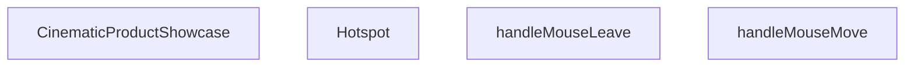

## NODE ID STANDARD

  file: src\components\home\CinematicProductShowcase.tsx
  function: src\components\home\CinematicProductShowcase.tsx::Hotspot
  function: src\components\home\CinematicProductShowcase.tsx::CinematicProductShowcase
  function: src\components\home\CinematicProductShowcase.tsx::handleMouseMove
  function: src\components\home\CinematicProductShowcase.tsx::handleMouseLeave

---

## DISA AKTARILANLAR (EXPORTS)
  export: CinematicProductShowcase
  export: Hotspot

---

## STİL TOKENLERİ

### Arbitrary Değerler (token'a geçirilmemiş)
Yok — tüm stiller token'a geçirilmiş. ✅

### Kullanılan Token'lar (zaten token'a geçirilmiş)
- `h-hvac-hero`, `hover:shadow-glow-lg`, `rounded-hvac-3xl`, `shadow-glow-md`, `tracking-hvac-normal`, `tracking-hvac-relaxed`

### Tailwind Sınıf Özeti
- **Renkler:** `bg-cyan-400`, `bg-cyan-500`, `bg-cyan-500/10`, `bg-cyan-500/20`, `bg-cyan-500/50`, `bg-cyan-grid`, `bg-gradient-to-r`, `bg-grid-100`, `bg-indigo-500/10`, `bg-slate-900`, `bg-slate-900/95`, `bg-slate-950`, `bg-white`, `bg-white/1`, `bg-white/10`
- **Layout:** `absolute`, `backdrop-blur-3xl`, `backdrop-blur-xl`, `bg-cyan-grid`, `bg-grid-100`, `bottom-0`, `bottom-10`, `bottom-full`, `drop-shadow-cinematic-drop`, `flex`, `flex-col`, `flex-wrap`, `from-transparent`, `gap-20`, `gap-3`
- **Varyant/Responsive:** `:`, `group-hover:`, `hover:`, `lg:`, `sm:` önekleri
- **Yardımcı Sınıflar:** `${activeImageIdx`, `${isActive`, `-inset-1`, `-translate-x-1/2`, `-translate-y-1.5`, `:`, `===`, `animate-ping`, `animate-pulse`, `aspect-square`, `blur-120`, `blur-150`, `blur-3xl`, `border`, `duration-500`

---
# FILE: src\components\home\ClientLeadButton.md

---
domain: general
source_type: doc
namespace_type: module
source_path: C:\Users\alize\venthub-hvac\src\components\home\ClientLeadButton.tsx
skeleton_hash: a7e6116d26640e96
entity_hashes:
  func:ClientLeadButton: 8f87f454fa733cb3
  overview: 5fd9adef525bec13
  style_tokens: 3a5eed4082aa65a0
generated_at: 2026-05-28T22:36:02Z
---

## Genel Bakış
Bu modül, ana eyleme yönelik müşteri yönlendirme (lead) butonunu tanımlayan bir React bileşenidir. Buton, özelleştirilebilir bir metin ve tıklama olayı alarak, teklif alma gibi bir müşteri etkileşimini başlatmak için arayüzde bir çağrı‑eylem (CTA) sunar.

## Fonksiyon Grupları
### Ana Bileşen
Bileşenin temel görünümünü ve tıklama davranışını tanımlar; gerekli metin, stil ve olay işleyicisi parametrelerini alarak etkileşimli bir buton oluşturur.
- ClientLeadButton

---

## AXIOMS – Mimari Varsayımlar
[Bu modül, birincil çağrı-eylem metni ve tıklama işleyicisi ile bir buton oluşturan React bileşenidir.]

[Aksiyom 1]: Eğer **primaryCta** prop'u (string türünde) sağlanmazsa, butonun görünür içeriği boş olur veya hata oluşur.
[Aksiyom 2]: Eğer **onQuoteClick** prop'u (fonksiyon türünde) sağlanmazsa, butona tıklandığında herhangi bir tetikleme eylemi çalışmaz veya hata oluşur.
[Aksiyom 3]: Eğer **className** prop'u sağlanmazsa, butona varsayılan veya stil tanımsız bir görünüm uygulanır.

---

## FONKSİYON DETAYLARI

### ClientLeadButton
**Ne yapar**: HVAC proje lead formuna yönlendiren, özelleştirilebilir bir.call-to-action butonu bileşenidir. Kullanıcıları teklif talep sayfasına yönlendirmek için ana sayfada veya promotional alanlarda kullanılır.

**Nasıl yapar**: Bileşen, verilen props'ları kullanarak bir buton render eder. `primaryCta` prop'u butonun metin içeriğini belirlerken, `onQuoteClick` event handler'ı butona tıklandığında tetiklenir. `className` prop'u ile dışarıdan stillendirme (override veya ekleme) yapılabilir.

**Parametreler**:
- `primaryCta`: string — Buton üzerinde görüntülenen ana metin/çağrı-ifadesi (ör: "Teklif Al", "İletişime Geç")
- `onQuoteClick`: () => void — Kullanıcı butona tıkladığında çalışacak olan回调 fonksiyonu; genellikle teklif sayfasına yönlendirme veya form açma işlemini tetikler
- `className`: string — Bileşene uygulanacak ek CSS sınıfı; mevcut stilleri override etmek veya üzerine eklemek için kullanılır

**Dönüş**: `React.FC<ClientLeadButtonProps>` — JSX element döndürür; render edilmiş bir React buton bileşeni.

---

## INTERFACES

### ClientLeadButtonProps
- `primaryCta: string`
- `onQuoteClick?: () => void`
- `className?: string`

---

## AST POINTERS

### [N1_NASIL] AST Pointer: ClientLeadButton.tsx::ClientLeadButton
- **params**: `{ primaryCta, onQuoteClick, className }` — primaryCta: buton metni; onQuoteClick: tıklama callback fonksiyonu; className: opsiyonel CSS sınıfı
- **ic_degiskenler**: (yok — sadece prop'lar kullanılır, hiçbir local değişken tanımlanmamıştır)
- **Dönüş**: JSX (`<button>` elemanı; içinde `<span>` ve `<div>` içeren animasyonlu buton yapısı)

### [N2_NASIL] AST Pointer: ClientLeadButton.tsx::onClick (arrow function)
- **params**: (yok)
- **ic_degiskenler**: (yok — sadece closure'dan `onQuoteClick` ve global `window` kullanılır)
  - `onQuoteClick` — üst scope'tan gelen callback, varsa çağrılır
  - `window` — tarayıcı ortam kontrolü sonrası `window.openLeadModal` fonksiyonu aranır
- **Dönüş**: yok (yan etki: `onQuoteClick()` veya `window.openLeadModal()` çağrısı)

---

## NODE ID STANDARD

  file: src\components\home\ClientLeadButton.tsx
  function: src\components\home\ClientLeadButton.tsx::ClientLeadButton

---

## DISA AKTARILANLAR (EXPORTS)
  export: ClientLeadButton

---

## STİL TOKENLERİ

### Arbitrary Değerler (token'a geçirilmemiş)
Yok — tüm stiller token'a geçirilmiş. ✅

### Kullanılan Token'lar (zaten token'a geçirilmiş)
- `tracking-hvac-normal`

### Tailwind Sınıf Özeti
- **Renkler:** `bg-cyan-400`, `bg-white`, `text-slate-950`, `text-xs`
- **Layout:** `absolute`, `h-16`, `hover:shadow-white-glow`, `overflow-hidden`, `relative`, `z-10`
- **Varyant/Responsive:** `group-hover:`, `hover:` önekleri
- **Yardımcı Sınıflar:** `duration-500`, `font-bold`, `group`, `group-hover:translate-y-0`, `inset-0`, `px-12`, `rounded-2xl`, `transition-colors`, `transition-transform`, `translate-y-full`, `uppercase`

---
# FILE: src\components\home\FeaturedCommercialBlocks.md

---
domain: general
source_type: doc
namespace_type: module
source_path: C:\Users\alize\venthub-hvac\src\components\home\FeaturedCommercialBlocks.tsx
skeleton_hash: 4c35b083d08a3617
entity_hashes:
  func:FeaturedCommercialBlocks: 1889811721e866db
  func:normalizeImageUrl: e7ff2d52e57ce97b
  overview: e2b71b884b394ef9
  style_tokens: 0fba0ab3cddfc2f6
generated_at: 2026-06-06T21:54:49Z
---

## Genel Bakış
Bu modül, ana sayfada öne çıkan ticari ürünlere ait görsel ve bilgi bloklarını sergileyen bir React bileşenini tanımlar. Görsel URL'lerinin güvenli bir şekilde işlenmesini sağlayan bir yardımcı fonksiyon ile birlikte, ürün listesini alıp kullanıcıya düzenli bir şekilde sunar.

## Fonksiyon Grupları
### Yardımcı İşlevler
Görsel adreslerinin boş veya geçersiz olma durumlarını temizleyerek, kullanıma hazır standart bir URL formatı üretir.
- normalizeImageUrl

### Ana Bileşen
Ürün verisini alarak, öne çıkan ticari ürünleri görsel ve ilgili bilgileriyle birlikte düzenler ve ekranda render eder; başlangıç verisi eksikse varsayılan boş bir liste kullanır.
- FeaturedCommercialBlocks

---

## AXIOMS – Mimari Varsayımlar

Bu modül için, yalnızca fonksiyon imzasından türetilebilen mimari varsayımlar aşağıdadır.

**[Aksiyom 1]**: Eğer `normalizeImageUrl` fonksiyonuna `null` veya `undefined` değeri verilirse, fonksiyon geçerli bir görsel URL'si döndüremeyebilir — bu durumda çağrının bir fallback mekanizması (örn: varsayılan bir görsel) kullanması beklenir.

**[Aksiyom 2]**: Eğer `FeaturedCommercialBlocks` bileşeni `initialProducts` parametresi olmadan çağrılırsa, bileşen boş bir dizi (`[]`) ile çalışacak şekilde varsayılan değer kullanır.

**[Aksiyom 3]**: Eğer `FeaturedCommercialBlocks` bileşenine geçersiz veya bozuk bir `initialProducts` verisi (örn: `null`, `undefined`, veya dizi olmayan bir değer) aktarılırsa, bileşen hata verebilir veya beklenmeyen davranış gösterebilir.

---

**Not:** Modül sabitleri kısmında herhangi bir sabit tanımlı değildir. Eski dokümandaki domain-specific bilgiler (eşik değerleri, kabul kriterleri vb.) bu aksiyomlara dahil edilmemiştir, çünkü bu bilgiler fonksiyon gövdesinden türetilememektedir.

---

## FONKSİYON DETAYLARI

### normalizeImageUrl

**Ne yapar**: Verilen URL değerini standart ve kullanılabilir bir forma dönüştürür. Boş, undefined veya geçersiz URL durumlarında varsayılan bir placeholder görsel döndürerek bileşenlerin hata almasını engeller.

**Nasıl yapar**: Fonksiyon, gelen url parametresinin null veya undefined olup olmadığını kontrol eder. Eğer geçerli bir URL varsa bunu doğrudan döndürür. Boş veya tanımsız durumlarda ise önceden tanımlanmış varsayılan bir görsel yolunu string olarak geri verir.

**Parametreler**:
- `url`: `string | null | undefined` — Normalize edilecek görsel URL'si. Null veya undefined olabilir.

**Dönüş**: `string` — Normalize edilmiş geçerli bir görsel URL'si döndürür.

### FeaturedCommercialBlocks
**Ne yapar**: Başlangıç ürün listesi ile öne çıkan ticari blokları gösteren bir React bileşenidir.  
**Nasıl yapar**: `initialProducts` prop'u üzerinden ürün verisini alır, içeriği render eder; varsayılan olarak boş bir dizi kullanılır.  
**Parametreler**:  
- initialProducts: [] — Gösterilecek ürünlerin listesi; varsayılan değer boş dizidir.  
**Dönüş**: React.FC<FeaturedCommercialBlocksProps> — Özellikleri alarak UI'ı oluşturan fonksiyonel bileşen.

---

## INTERFACES

### FeaturedCommercialBlocksProps
- `initialProducts?: Product[]`
- `initialCategories?: Category[]`

---

## TYPE ALIASES

### CommercialTab
```typescript
type CommercialTab = 'featured' | 'newArrivals' | 'bestSellers'
```

---

## AST POINTERS

### [N1_NASIL] AST Pointer: C:\Users\alize\venthub-hvac\src\components\home\FeaturedCommercialBlocks.tsx::normalizeImageUrl
- **params**: (url: string | null | undefined)
- **ic_degiskenler**:
  - `trimmedUrl` — URL parametresinin boşlukları temizlenmiş hali;startsWith kontrolleri için kullanılır
- **Dönüş**: string — normalize edilmiş URL (başına '/' eklenmiş veya doğrudan kullanılmış)

### [N2_NASIL] AST Pointer: C:\Users\alize\venthub-hvac\src\components\home\FeaturedCommercialBlocks.tsx::FeaturedCommercialBlocks
- **params**: ({ initialProducts = [] }) — başlangıç ürünleri listesi, varsayılan boş dizi
- **ic_degiskenler**:
  - `t` — useI18n hook'undan gelen çeviri fonksiyonu, Tüm metinler için kullanılır
  - `activeTab` — useState hook'u ile oluşturulan aktif sekme durumu (commercial tab tipinde)
  - `productsByTab` — useMemo hook'u ile hesaplanan sekelere göre gruplandırılmış ürünler nesnesi
  - `activeProducts` — productsByTab nesnesinden activeTab anahtarına erişilerek elde edilen aktif ürün listesi
- **Dönüş**: React.FC bileşeni (JSX)

### [N3_NASIL] AST Pointer: C:\Users\alize\venthub-hvac\src\components\home\FeaturedCommercialBlocks.tsx::productsByTab useMemo callback
- **params**: () — parametre yok (useMemo callback'i)
- **ic_degiskenler**:
  - `featured` — is_featured flag'i olan veya ilk 4 üründen fallback yapılan öne çıkan ürünler dizisi
  - `newArrivals` — created_at tarihine göre sıralanmış yeni gelen ürünler dizisi (en fazla 4)
  - `bestSellers` — en çok satanlar için fallback ürün listesi (dizinin 4-8 arası veya ilk 4'ü)
- **Dönüş**: { featured: Product[], newArrivals: Product[], bestSellers: Product[] }

### [N4_NASIL] AST Pointer: C:\Users\alize\venthub-hvac\src\components\home\FeaturedCommercialBlocks.tsx::tabButton render callback
- **params**: (tab) — sekmeyi temsil eden string
- **ic_degiskenler**: yok — sadece parametre ve dış scope değişkenleri kullanılır
- **Dönüş**: JSX — tekil tab butonu elementi

### [N5_NASIL] AST Pointer: C:\Users\alize\venthub-hvac\src\components\home\FeaturedCommercialBlocks.tsx::productCard render callback
- **params**: (product: Product, idx: number) — ürün nesnesi ve indeks
- **ic_degiskenler**: yok — sadece parametreler ve dış scope bileşenleri kullanılır
- **Dönüş**: JSX — animasyonlu ürün kartı wrapper elementi

---

## NODE ID STANDARD

  file: src\components\home\FeaturedCommercialBlocks.tsx
  function: src\components\home\FeaturedCommercialBlocks.tsx::normalizeImageUrl
  function: src\components\home\FeaturedCommercialBlocks.tsx::FeaturedCommercialBlocks

---

## DISA AKTARILANLAR (EXPORTS)
  export: FeaturedCommercialBlocks
  export: normalizeImageUrl

---

## STİL TOKENLERİ

### Arbitrary Değerler (token'a geçirilmemiş)
Yok — tüm stiller token'a geçirilmiş. ✅

### Kullanılan Token'lar (zaten token'a geçirilmiş)
- `rounded-hvac-2xl`, `tracking-hvac-relaxed`

### Tailwind Sınıf Özeti
- **Renkler:** `bg-cyan-400`, `bg-cyan-500/10`, `bg-slate-200/50`, `bg-slate-900`, `bg-slate-950`, `bg-white`, `bg-white/5`, `border-cyan-500/10`, `border-slate-200`, `border-white/10`, `border-white/5`, `hover:bg-cyan-400`, `hover:text-slate-900`, `sm:text-6xl`, `text-4xl`
- **Layout:** `absolute`, `backdrop-blur-sm`, `flex`, `flex-col`, `gap-1`, `gap-10`, `gap-3`, `gap-4`, `gap-6`, `gap-8`, `grid`, `grid-cols-1`, `grid-cols-2`, `h-1.5`, `h-32`
- **Varyant/Responsive:** `:`, `active:`, `group-hover:`, `hover:`, `lg:`, `md:`, `sm:` önekleri
- **Yardımcı Sınıflar:** `$`, `:`, `===`, `active:scale-95`, `activeTab`, `animate-pulse`, `aspect-square`, `blur-3xl`, `border`, `duration-500`, `duration-700`, `font-black`, `font-bold`, `font-light`, `grayscale`

---
# FILE: src\components\home\GuidedCategoryDiscovery.md

---
domain: general
source_type: doc
namespace_type: module
source_path: C:\Users\alize\venthub-hvac\src\components\home\GuidedCategoryDiscovery.tsx
skeleton_hash: bf54d167d56982ec
entity_hashes:
  func:GuidedCategoryDiscovery: 3b7f2bdef4872624
  func:normalizeImageUrl: 52049e5c49068b7a
  overview: 7fd7e15085073901
  style_tokens: ba1e7efd5f41a7fe
generated_at: 2026-05-28T22:35:52Z
---

## Genel Bakış
Bu modül, kullanıcıya yönlendirilmiş kategori keşfi deneyimi sunan bir React bileşenini ve görsel URL'lerini standartlaştıran küçük bir yardımcı işlevi içerir. Bileşen, dışarıdan gelen kategori listesini alarak kullanıcıya görsel ve metin tabanlı bir keşif arayüzü oluşturur. Yardımcı işlev ise görsel adreslerinin geçerli ve tutarlı bir formatta kullanılmasını sağlar.

## Fonksiyon Grupları
### Yardımcı İşlevler
Görsel URL'lerini normalize ederek null veya tanımsız değerleri güvenli bir dizeye dönüştürür.
- normalizeImageUrl

### Bileşen Tanımları
Kategori keşfi arayüzünü render eder, dışarıdan gelen kategori listesini görsel ve metin öğeleriyle kullanıcıya sunar.
- GuidedCategoryDiscovery

---

## AXIOMS – Mimari Varsayımlar
Bu modül için özel aksiyomlar fonksiyon imzalardan türetilmiştir.

[Aksiyom 1]: Eğer normalizeImageUrl fonksiyonuna geçirilen url değeri **string, null veya undefined** türünde **değilse**, fonksiyonun çalışması beklenmedik sonuç verir (örneğin TypeError fırlatabilir).  
[Aksiyom 2]: Eğer GuidedCategoryDiscovery component'ine **displayCategories** prop'u tanımlanmazsa **ve** default değeri de sağlanmazsa, component render sırasında hata verir. (Varsayılan değer sağlandığı sürece, prop tanımlanmazsa boş bir dizi kullanarak güvenli bir şekilde render eder.)

---

## FONKSİYON DETAYLARI

### normalizeImageUrl
**Ne yapar**: Verilen bir görsel URL’sini alır, null veya undefined gibi geçersiz değerleri temizler ve standart bir string URL formatına dönüştürür.  
**Nasıl yapar**: Fonksiyon, gelen değeri önce tanımlı olup olmadığını kontrol eder; değer null veya undefined ise boş string döndürür, aksi takdirde girdiyi doğrudan string olarak döndürür (gerekirse trim veya temel biçimlendirme işlemleri uygulanabilir).  
**Parametreler**:
- url: string | null | undefined — Normalize edilmek istenen görsel URL’si; null veya undefined olabilir.  
**Dönüş**: string — Temizlenmiş ve güvenli bir görsel URL’si; giriş geçersizse boş string döner.

### GuidedCategoryDiscovery
**Ne yapar**: `displayCategories` prop’u ile sağlanan kategori listesini kullanarak, kullanıcıya yönlendirilmiş kategori keşfi arayüzünü render eden bir React bileşenidir.  
**Nasıl yapar**: Bileşen, `displayCategories` prop’unun varsayılan değerini boş bir dizi olarak alır; bu diziyi içeri harita yaparak her kategori için uygun görsel ve metin öğelerini oluşturur ve JSX döndürür. Prop tipi `GuidedCategoryDiscoveryProps` ile tip güvenliği sağlanır.  
**Parametreler**:
- displayCategories: [] — Gösterilecek kategori nesnelerinin dizisi; belirtilmezse boş dizidir.  
**Dönüş**: React.FC<GuidedCategoryDiscoveryProps> — Render edilmesi gereken kullanıcı arayüzünü tanımlayan fonksiyonel bileşen.

---

## INTERFACES

### CategoryViewModelLite
- `id: string`
- `slug: string`
- `displayName: string`
- `description: string`
- `image_url: string | null`

### GuidedCategoryDiscoveryProps
- `displayCategories?: CategoryViewModelLite[]`

---

## AST POINTERS

### [N1_NASIL] AST Pointer: src/components/home/GuidedCategoryDiscovery.tsx::normalizeImageUrl
- **params**: (url: string | null | undefined)
- **ic_degiskenler**: 
  - `trimmed` — url değerinden baş ve son boşluklar kaldırılmış hali
  - `supabaseUrl` — NEXT_PUBLIC_SUPABASE_URL ortam değişkeninin değeri
- **Dönüş**: string (normalize edilmiş resim URL’si)

### [N2_NASIL] AST Pointer: src/components/home/GuidedCategoryDiscovery.tsx::GuidedCategoryDiscovery
- **params**: ({ displayCategories = [] })
- **ic_degiskenler**: yok
- **Dönüş**: JSX elementi (React.FC<GuidedCategoryDiscoveryProps>) – kategorileri gösteren bölüm

### [N3_NASIL] AST Pointer: src/components/home/GuidedCategoryDiscovery.tsx::(category, idx) => { ... }
- **params**: (category, idx)
- **ic_degiskenler**: 
  - `finalSrc` — normalizeImageUrl ile elde edilen kategori görselinin最终 URL’si
  - `delayClass` — idx’ye göre ['delay-0','delay-100','delay-200','delay-300'] dizisinden seçilen gecikme sınıfı
- **Dönüş**: JSX elementi (her kategori için render edilen <div> kartı)

---

## NODE ID STANDARD

  file: src\components\home\GuidedCategoryDiscovery.tsx
  function: src\components\home\GuidedCategoryDiscovery.tsx::normalizeImageUrl
  function: src\components\home\GuidedCategoryDiscovery.tsx::GuidedCategoryDiscovery

---

## DISA AKTARILANLAR (EXPORTS)
  export: CategoryViewModelLite
  export: GuidedCategoryDiscovery
  export: normalizeImageUrl

---

## STİL TOKENLERİ

### Arbitrary Değerler (token'a geçirilmemiş)
Yok — tüm stiller token'a geçirilmiş. ✅

### Kullanılan Token'lar (zaten token'a geçirilmiş)
- `tracking-hvac-relaxed`, `tracking-hvac-tight`

### Tailwind Sınıf Özeti
- **Renkler:** `bg-gradient-to-t`, `bg-slate-100`, `bg-slate-950`, `bg-slate-950/40`, `bg-white`, `bg-white/30`, `border-b`, `border-l`, `border-r`, `border-t`, `border-white/20`, `from-slate-950/80`, `group-hover:bg-cyan-500`, `group-hover:bg-slate-950/20`, `group-hover:border-cyan-500/50`
- **Layout:** `absolute`, `block`, `bottom-8`, `flex`, `flex-col`, `flex-shrink-0`, `from-slate-950/80`, `gap-4`, `gap-6`, `group-hover:max-h-24`, `group-hover:w-24`, `h-4`, `h-full`, `h-px`, `items-center`
- **Varyant/Responsive:** `data-[in-view=true]:`, `group-hover:`, `lg:`, `md:`, `sm:` önekleri
- **Yardımcı Sınıflar:** `${delayClass`, `-translate-x-4`, `aspect-square`, `data-[in-view=true]:opacity-100`, `data-[in-view=true]:translate-x-0`, `data-[in-view=true]:translate-y-0`, `delay-200`, `delay-300`, `duration-1.5s`, `duration-500`, `duration-700`, `ease-out`, `font-bold`, `font-extralight`, `font-light`

---
# FILE: src\components\home\HomePageClientWrapper.md

---
domain: general
source_type: doc
namespace_type: module
source_path: C:\Users\alize\venthub-hvac\src\components\home\HomePageClientWrapper.tsx
skeleton_hash: 32ed487f472e7203
entity_hashes:
  func:HomePageClientWrapper: feb3517aa1583d9b
  overview: e9b94ab20ec42ba0
  style_tokens: dd5ed8d0f58dcf57
generated_at: 2026-05-28T22:35:52Z
---

## Genel Bakış
HomePageClientWrapper, sayfa içeriğinin istemci tarafında render edilmesini sağlayan bir sarmalayıcı React bileşenidir. Bu bileşen, alt öğeleri (`children`) alarak istemci‑özgü yapılandırmaları veya veri sağlayıcılarıyla birlikte sarmalar ve sayfanın tamamen istemci tarafında çalışmasını garanti eder.

## Fonksiyon Grupları
### Sarmalayıcı Bileşen
Bu bileşen, sayfa içeriğinin istemci tarafında işlenmesini yönetmek için kullanılır.
- HomePageClientWrapper

---

## AXIOMS – Mimari Varsayımlar
Bu modül için özel aksiyom tanımlanmamıştır.

[Aksiyom 1]: Eğer `children` prop'u verilmezse, `HomePageClientWrapper` hiçbir şey render etmez (React uyarısı verebilir).  
[Aksiyom 2]: Eğer `LeadModal` modülü import edilemez veya çağrılamazsa, çalışma zamanında hata oluşur.  
[Aksiyom 3]: Eğer `children` bir React node (element, string, fragment vb.) değilse, render sırasında beklenmeyen çıktı veya hata oluşabilir.

---

## FONKSİYON DETAYLARI

### HomePageClientWrapper
**Ne yapar**: Verilen `children` propunu saran bir React bileşeni oluşturur.  
**Nasıl yapar**: Fonksiyon, `children` öğesini alır ve bu öğeleri döndürülen JSX içinde render eder, dolayısıyla sarmalayıcı bir rol üstlenir.  
**Parametreler**:  
- children: React.ReactNode — Sarmalanacak içerik veya alt bileşenler.  
**Dönüş**: React.FC<Props> — `children` propunu alıp onu render eden bir fonksiyonel bileşen.

---

## INTERFACES

### Props
- `children: React.ReactNode`

---

## SABİTLER
- **LeadModal** (call) — `React.lazy(() => import('../LeadModal'))`

---

## AST POINTERS

### [N1_NASIL] AST Pointer: src/components/home/HomePageClientWrapper.tsx::HomePageClientWrapper
- **params**: children
- **ic_degiskenler**:
  - `leadOpen` — boolean state indicating whether the lead modal is open
  - `setLeadOpen` — setter function to update the `leadOpen` state
- **Dönüş**: JSX element (React.ReactNode)

### [N2_NASIL] AST Pointer: src/components/home/HomePageClientWrapper.tsx::useEffectCallback
- **params**: yok
- **ic_degiskenler**:
  - `setLeadOpen` — setter function from outer scope used to open the lead modal
  - `window` — global browser object used to check if the environment is undefined and to assign/cleanup the `openLeadModal` handler
- **Dönüş**: cleanup function that removes the `window.openLeadModal` handler

---

## NODE ID STANDARD

  file: src\components\home\HomePageClientWrapper.tsx
  function: src\components\home\HomePageClientWrapper.tsx::HomePageClientWrapper

---

## DISA AKTARILANLAR (EXPORTS)
  export: HomePageClientWrapper

---

## STİL TOKENLERİ

### Arbitrary Değerler (token'a geçirilmemiş)
Yok — tüm stiller token'a geçirilmiş. ✅

### Kullanılan Token'lar (zaten token'a geçirilmiş)
- (yok)

### Tailwind Sınıf Özeti
- **Renkler:** (yok)
- **Layout:** (yok)
- **Varyant/Responsive:** (yok)
- **Yardımcı Sınıflar:** (yok)

---
# FILE: src\components\home\HomeSinevizyon.md

---
domain: general
source_type: doc
namespace_type: module
source_path: C:\Users\alize\venthub-hvac\src\components\home\HomeSinevizyon.tsx
skeleton_hash: 7bf18d2b5fbf4eb2
entity_hashes:
  func:HomeSinevizyon: 3c834ec7a93a53b9
  func:getSlideContent: ab470a33cf7d22ae
  func:handleTouchEnd: f36f5348e5c17a8d
  func:handleTouchStart: 66d8f271101148e9
  overview: ad86b1170bdcb3cc
  style_tokens: e6977f079a17d9a9
generated_at: 2026-05-28T22:35:54Z
---

## Genel Bakış
Bu modül, HVAC projesinin ana ekranında dinamik slayt gösterisi (sinevizyon) sunan bir React bileşeni tanımlar. Kullanıcıların dokunmatik hareketlerle slaytlar arasında geçiş yapmasını sağlarken, her slayt için uygun içeriği dinamik olarak oluşturur. Alıntı butonuna tıklandığında dışarıdan aktarılan geri çağırım fonksiyonunu tetikleyerek bileşeni ana uygulama ile entegre eder.

## Fonksiyon Grupları
### Ana Bileşen Yönetimi
Sinevizyonun temel çalışma yapısını oluşturan ana bileşendir, dışarıdan alınan geri çağırımları entegre eder ve tüm alt işlevleri koordine ederek slayt gösterisinin sorunsuz çalışmasını sağlar.
- HomeSinevizyon

### Dokunmatik Etkileşim Yönetimi
Kullanıcının ekrana dokunma başlangıç ve bitiş olaylarını yakalar, bu hareketleri işleyerek slaytlar arasında geçiş işlemini tetikler.
- handleTouchStart, handleTouchEnd

### Slayt İçeriği Yönetimi
Verilen slayt indeksine göre o slaytta gösterilecek tüm içeriği sağlayarak dinamik ve sıralı içerik sunumunu mümkün kılar.
- getSlideContent

---

## AXIOMS – Mimari Varsayımlar
(Sentez hatası)

---

## FONKSİYON DETAYLARI

### HomeSinevizyon
**Ne yapar**: Ana sayfadaki sinevizyon (banner) bölümünü oluşturan React bileşenidir. Hero alanındaki slaytları, başlık, alt başlık, etiket ve CTA butonlarını render eder. Konum bazlı içerik gösterimi ve dokunmatik kaydırma desteği sağlar.

**Nasıl yapar**: `onQuoteClick` prop’u ile isteğe bağlı bir callback alır. Bileşen içinde tanımlı slayt listesini (`slides` dizisi) `currentSlide` state’i ile yönetir. `getSlideContent` yardımcısı ile her indeksin içeriğini alır; `.map()` ile slayt içeriklerini render eder. Dokunma olayları (`handleTouchStart`, `handleTouchEnd`) ile sağ-sol kaydırmayı algılar ve slayt geçişlerini tetikler. Geçiş animasyonları CSS sınıfları (opacity, translate, transition) ile yönetilir.

**Parametreler**:
- `onQuoteClick`: `(() => void)` — İsteğe bağlı (opsiyonel). İkincil CTA butonu tıklandığında çalıştırılacak callback. Verilmezse `window.openLeadModal()` çağrılır.

**Dönüş**: `React.FC<HomeSinevizyonProps>` — Bileşenin kendisini döndürür, yani bir JSX.Element kümesi oluşturan fonksiyon.

### handleTouchStart
**Ne yapar**: Dokunma başlangıcını yakalayarak kullanıcı tarafından başlatılan bir hareketin (ör. kaydırma) ilk anını kaydeder.  
**Nasıl yapar**: Olay nesnesinden ilk dokunma noktasının koordinatlarını (`clientX`, `clientY`) çıkarır ve bu değerleri bir sonraki hareket adımı için geçici bir state veya ref içinde saklar; böylece `handleTouchEnd` ile karşılaştırarak yön ve mesafe hesaplanabilir.  
**Parametreler**:  
- e: React.TouchEvent — Dokunma başlangıcıyla ilgili tüm touch verilerini içeren SyntheticEvent nesnesi  
**Dönüş**: void — Fonksiyon bir değer döndürmez, sadece yan etkiler (state güncellemesi) yapar

### handleTouchEnd
**Ne yapar**: Dokunma bitişini yakalayarak kullanıcının hareketini tamamlar ve bu hareketin yönüne göre slayt indeksini günceller.  
**Nasıl yapar**: Olay nesnesinden son dokunma noktasının koordinatlarını alır, `handleTouchStart` tarafından saklanan başlangıç koordinatlarıyla farkı hesaplar; bu fark eşik değerini aşarsa (ör. sağa kaydırma) slayt indeksi bir azaltılır veya artırılır, ardından durum güncellenerek yeni slayt gösterilir.  
**Parametreler**:  
- e: React.TouchEvent — Dokunma bitişiyle ilgili tüm touch verilerini içeren SyntheticEvent nesnesi  
**Dönüş**: void — Fonksiyon bir değer döndürmez, sadece durum güncellemesi yapar

### getSlideContent
**Ne yapar**: Verilen slayt indeksine karşılık gelen içeriği (ör. görüntü, metin, alıntı) döndürerek bileşenin render edeceği öğeyi hazırlar.  
**Nasıl yapar**: İndex parametresini kullanarak önceden tanımlanmış bir veri dizisi veya yapıdan ilgili slayt nesnesini seçer; bu nesne genellikle `image`, `text`, `quote` gibi alanları içerir ve bu alanlar JSX olarak dönüştürülerek return edilir.  
**Parametreler**:  
- index: number — Gösterilecek slaytın sıfır tabanlı pozisyonu  
**Dönüş**: JSX.Element veya null — Belirtilen indekse ait slayt içeriğini temsil eden React elementi; geçersiz indeks için null döndürülebilir.

---

## INTERFACES

### HomeSinevizyonProps
- `onQuoteClick?: () => void`

### SlideProduct
- `url: string`
- `labelKey: string`
- `subLabelKey: string`
- `link: string`

### SlideData
- `image: string`
- `key: number`
- `products: SlideProduct[]`

---

## SABİTLER
- **slidesData** (array) — `[

  {

    image: '/images/hero_hvac_industrial_premium_1.png',

    product...`

---

## AST POINTERS

### [N1_NASIL] AST Pointer: src/components/home/HomeSinevizyon.tsx::HomeSinevizyon
- **params**: (`{ onQuoteClick }`)
- **ic_degiskenler**:
  - `t` — `useI18n()` hook’den gelen çeviri fonksiyonu, metinleri yerelleştirmek için kullanılır.
  - `currentSlide` — `useState(0)` ile tanımlanan mevcut slayt indeksini tutar.
  - `setCurrentSlide` — `currentSlide` değerini güncelleyen state setter fonksiyonu.
  - `isMounted` — bileşenin DOM’a monte edilip edilmediğini izleyen boolean state.
  - `setIsMounted` — `isMounted` değerini güncelleyen state setter fonksiyonu.
  - `touchStartX` — `useRef<number | null>(null)` ile tanımlanan dokunma başlangıç X koordinatını saklayan ref.
  - `isInitialMount` — `useRef(true)` ile tanımlanan, bileşenin ilk render’ı olup olmadığını izleyen ref.
  - `paginate` — `useCallback` içinde tanımlanan, `newDirection` parametresiyle `currentSlide`ı kaydıran fonksiyon.
  - `timer` — otomatik slayt geçişi için `setInterval` tarafından döndürülen zamanlayıcı kimliği; effect temizleme fonksiyonunda `clearInterval(timer)` ile iptal edilir.
  - `handleKeyDown` — klavye ok tuşlarını dinleyen ve `paginate` çağıran yerel fonksiyon; `window.addEventListener`/`removeEventListener` ile yönetilir.
- **Dönüş**: React element (JSX) döndürür; bileşen yan etkileri olarak zamanlayıcı, klavye ve dokunma event listener’ları kurar.

### [N2_NASIL] AST Pointer: src/components/home/HomeSinevizyon.tsx::handleTouchStart
- **params**: (`e: React.TouchEvent`)
- **ic_degiskenler**:
  - `touchStartX` — dış scope’tan gelen `useRef` objesi; `e.touches[0].clientX` değeriyle güncellenir.
- **Dönüş**: yok (fonksiyon sadece `touchStartX.current` değerini ayarlar).

### [N3_NASIL] AST Pointer: src/components/home/HomeSinevizyon.tsx::handleTouchEnd
- **params**: (`e: React.TouchEvent`)
- **ic_degiskenler**:
  - `touchStartX` — dış scope’tan gelen `useRef`; başlangıç koordinatı kontrol edilir.
  - `touchEndX` — `e.changedTouches[0].clientX` ile elde edilen dokunma bitiş X koordinatı.
  - `diff` — `touchStartX.current - touchEndX` farkı; kaydırma yönünü belirlemek için kullanılır.
- **Dönüş**: yok (gerektiğinde `paginate` çağırır, ardından `touchStartX.current`i `null` yapar).

### [N4_NASIL] AST Pointer: src/components/home/HomeSinevizyon.tsx::getSlideContent
- **params**: (`index: number`)
- **ic_degiskenler**:
  - `t` — dış scope’tan gelen çeviri fonksiyonu.
  - `eyebrow` — `t('home.hero.sinevizyon.slides.${index}.eyebrow')` sonucunu veya varsayılan `'VentHub Engineering'` değerini tutar.
  - `title` — `t('home.hero.sinevizyon.slides.${index}.title')` sonucunu veya varsayılan `'High Performance HVAC'` değerini tutar.
  - `subtitle` — `t('home.hero.sinevizyon.slides.${index}.subtitle')` sonucunu veya varsayılan `'Advanced solutions for industrial ventilation.'` değerini tutar.
- **Dönüş**: `{ eyebrow, title, subtitle }` nesnesi (slide içeriği).

---


## MERMAID CALL GRAPH
```mermaid
graph TD
    HomeSinevizyon_tsx__HomeSinevizyon["HomeSinevizyon"]
    HomeSinevizyon_tsx__getSlideContent["getSlideContent"]
    HomeSinevizyon_tsx__handleTouchEnd["handleTouchEnd"]
    HomeSinevizyon_tsx__handleTouchStart["handleTouchStart"]
    HomeSinevizyon_tsx__HomeSinevizyon --> HomeSinevizyon_tsx__getSlideContent
```

## NODE ID STANDARD

  file: src\components\home\HomeSinevizyon.tsx
  function: src\components\home\HomeSinevizyon.tsx::HomeSinevizyon
  function: src\components\home\HomeSinevizyon.tsx::handleTouchStart
  function: src\components\home\HomeSinevizyon.tsx::handleTouchEnd
  function: src\components\home\HomeSinevizyon.tsx::getSlideContent

---

## DISA AKTARILANLAR (EXPORTS)
  export: HomeSinevizyon

---

## STİL TOKENLERİ

### Arbitrary Değerler (token'a geçirilmemiş)
Yok — tüm stiller token'a geçirilmiş. ✅

### Kullanılan Token'lar (zaten token'a geçirilmiş)
- `hover:shadow-glow-lg`, `hover:shadow-glow-md`, `shadow-glow-sm`, `tracking-hvac-loose`, `tracking-hvac-normal`, `tracking-hvac-relaxed`

### Tailwind Sınıf Özeti
- **Renkler:** `bg-cyan-400`, `bg-cyan-400/10`, `bg-cyan-500`, `bg-cyan-500/10`, `bg-gradient-to-r`, `bg-gradient-to-t`, `bg-slate-900/40`, `bg-slate-950`, `bg-slate-950/60`, `bg-white/10`, `bg-white/20`, `bg-white/5`, `border-b`, `border-cyan-400/60`, `border-cyan-500/20`
- **Layout:** `-left-24`, `-right-24`, `absolute`, `backdrop-blur-md`, `backdrop-blur-xl`, `block`, `bottom-0`, `bottom-10`, `drop-shadow-sinevizyon-drop`, `flex`, `flex-1`, `flex-col`, `from-slate-950/80`, `from-slate-950/90`, `from-transparent`
- **Varyant/Responsive:** `:`, `focus-visible:`, `group-hover:`, `hover:`, `lg:`, `sm:` önekleri
- **Yardımcı Sınıflar:** `$`, `${i`, `${idx`, `-translate-x-8`, `-translate-y-1/2`, `0`, `:`, `===`, `animate-pulse`, `animate-scan-slow`, `blur-1`, `border`, `contain-layout`, `currentSlide`, `delay-300`

---
# FILE: src\components\home\KnowledgeBlock.md

---
domain: general
source_type: doc
namespace_type: module
source_path: C:\Users\alize\venthub-hvac\src\components\home\KnowledgeBlock.tsx
skeleton_hash: 6f7ef05f64566f7e
entity_hashes:
  func:KnowledgeBlock: 6d00cfd06aa7a00e
  overview: 558d6d867468cadc
  style_tokens: 45bee56ab9c18ab4
generated_at: 2026-05-28T22:35:52Z
---

## Genel Bakış
Bu modül, ana sayfada bilgi birikimi ve deneyim istatistiklerini sergileyen React bileşenini içerir. Kullanıcıya yerelleştirilmiş içerikler sunarak, teklif alma sürecini başlatan bir eylem çağrısı (CTA) görüntüler.

## Fonksiyon Grupları
### Ana Bileşen
Bilgi bloğu, istatistik verileri ve son eylem çağrısını içeren arayüzü oluşturur ve kullanıcı etkileşimlerini yönetir.
- KnowledgeBlock

---

## AXIOMS – Mimari Varsayımlar
Bu modül için özel aksiyom tanımlanmamıştır.

---

## FONKSİYON DETAYLARI

### KnowledgeBlock
**Ne yapar**: `KnowledgeBlock` bir React fonksiyonel bileşenidir ve "Bilgi Bloğu" adı verilen bir kullanıcı arayüzü bileşenini oluşturur. Bu bileşen, çeviri sözlüğü, çağrı eylem metinleri, istatistik/deneyim verileri ve bir teklif butonu tıklama işleyicisi alarak ilgili içeriği görüntüler.

**Nasıl yapar**: Bileşen, kendisine iletilen propları (dictionary, finalCtaDict, statsExperience, onQuoteClick) kullanarak bir bilgi bloğu render eder. İç mantığı verilen kod parçacığında detaylandırılmamıştır; ancak tipik olarak bu propları uygun JSX elementlerine dönüştürür ve bir React bileşeni olarak döndürür.

**Parametreler**:
- `dictionary`: object (props içinde `t` olarak aliaslanmış) — Çeviri anahtarlarını içeren sözlük nesnesi. Uygulamanın dil desteği için kullanılır.
- `finalCtaDict`: object — Son çağrı eylemi (Call to Action) metinlerini ve yapılandırmasını içeren sözlük.
- `statsExperience`: any — Görüntülenecek istatistik veya deneyim verileri. Türü belirtilmemiştir.
- `onQuoteClick`: function — Kullanıcının teklif butonuna tıklaması durumunda tetiklenecek geri çağırım fonksiyonu.

**Dönüş**: `React.FC<KnowledgeBlockProps>` — Bileşenin kendisi bir React fonksiyonel bileşenidir; bu tür, bileşenin `KnowledgeBlockProps` tipinde proplar almasını sağlar. Kullanıldığında bir `JSX.Element` döndürür.

---

## INTERFACES

### KnowledgeItem
- `id: 'guides' | 'calculators' | 'support'`
- `href: string`
- `icon: React.ReactNode`

### KnowledgeBlockProps
- `dictionary: {
`
- `finalCtaDict: {
`
- `statsExperience: string`
- `onQuoteClick?: () => void`

---

## SABİTLER
- **knowledgeItems** (array) — `[

  { 

    id: 'guides', 

    href: Routes.destek.home(),

    icon: (

  ...`

---

## AST POINTERS

### [N1_NASIL] AST Pointer: src/components/home/KnowledgeBlock.tsx::KnowledgeBlock
- **params**:
  - `t` — dictionary alias, çeviri metinlerini içeren obje (parametre adı: dictionary)
  - `finalCtaDict` — son CTA buton metinlerini içeren obje (primaryCta, secondaryCta alanları)
  - `statsExperience` — istatistik alanında gösterilecek deneyim metni
  - `onQuoteClick` — teklif butonu tıklama callback fonksiyonu
- **ic_degiskenler**: (fonksiyon gövdesinde değişken tanımı bulunmamaktadır)
- **Dönüş**: JSX elementi (React bileşeni) — section, grid layout, final action layer içeren yapı

### [N2_NASIL] AST Pointer: src/components/home/KnowledgeBlock.tsx::(item, index) => {} (knowledgeItems.map callback)
- **params**:
  - `item` — knowledgeItems dizisinin elemanı; id, href, icon alanlarını içerir
  - `index` — dizideki sıra numarası (0‑based)
- **ic_degiskenler**:
  - `delayClass` — `['delay-0', 'delay-100', 'delay-200'][index % 3]` ifadesiyle hesaplanan gecikme CSS sınıfı
- **Dönüş**: JSX elementi — div wrapper içinde Link (numara, icon, başlık, açıklama, CTA)

---

## NODE ID STANDARD

  file: src\components\home\KnowledgeBlock.tsx
  function: src\components\home\KnowledgeBlock.tsx::KnowledgeBlock

---

## DISA AKTARILANLAR (EXPORTS)
  export: KnowledgeBlock

---

## STİL TOKENLERİ

### Arbitrary Değerler (token'a geçirilmemiş)
Yok — tüm stiller token'a geçirilmiş. ✅

### Kullanılan Token'lar (zaten token'a geçirilmiş)
- `rounded-hvac-2xl`, `rounded-hvac-xl`, `tracking-hvac-loose`, `tracking-hvac-normal`, `tracking-hvac-relaxed`

### Tailwind Sınıf Özeti
- **Renkler:** `bg-clip-text`, `bg-cyan-400/40`, `bg-cyan-500/10`, `bg-emerald-500`, `bg-gradient-to-r`, `bg-knowledge-radial`, `bg-slate-950`, `bg-white/2`, `bg-white/5`, `border-cyan-500/30`, `border-l-2`, `border-t`, `border-white/10`, `border-white/5`, `from-cyan-400`
- **Layout:** `absolute`, `backdrop-blur-3xl`, `backdrop-blur-md`, `bg-clip-text`, `block`, `flex`, `flex-1`, `flex-col`, `flex-wrap`, `from-cyan-400`, `from-cyan-600`, `gap-12`, `gap-3`, `gap-4`, `gap-6`
- **Varyant/Responsive:** `dark:`, `data-[in-view=true]:`, `group-hover:`, `hover:`, `lg:`, `md:`, `sm:` önekleri
- **Yardımcı Sınıflar:** `${delayClass`, `-translate-x-4`, `animate-pulse`, `border`, `dark:prose-invert`, `data-[in-view=true]:opacity-100`, `data-[in-view=true]:translate-x-0`, `data-[in-view=true]:translate-y-0`, `delay-200`, `delay-300`, `duration-500`, `duration-700`, `ease-out`, `font-black`, `font-bold`

---
# FILE: src\components\home\RevealSection.md

---
domain: general
source_type: doc
namespace_type: module
source_path: C:\Users\alize\venthub-hvac\src\components\home\RevealSection.tsx
skeleton_hash: 3c04c6123362e9cb
entity_hashes:
  func:RevealSection: ba33115191e442f1
  overview: 83509008900591e6
  style_tokens: dd5ed8d0f58dcf57
generated_at: 2026-05-28T22:36:08Z
---

## Genel Bakış
RevealSection, temel bir React sarmalayıcı (wrapper) bileşenidir. Bu bileşen, dışarıdan gelen içeriği (children) doğrudan ekrana render ederek, içeriği sarmalayan veya gruplayan bir işlev görür. Bileşen kendi içinde herhangi bir durum yönetimi veya mantık içermez.

## Fonksiyon Grupları
### İçerik Sarmalayıcı
Bileşen, verilen React düğümlerini (children) doğrudan ekranda göstermekle sorumludur.
- RevealSection

---

## AXIOMS – Mimari Varsayımlar
Bu modül için özel aksiyom tanımlanmamıştır.

[Aksiyom 1]: Eğer `children` prop'u sağlanmazsa, bileşen beklenen içeriği render edemez veya boş bir çıktı üretir.  
[Aksiyom 2]: Eğer `children` geçerli bir React düğümü (JSX elementi, string, fragment vb.) değilse, render sırasında hata veya beklenmeyen çıktı oluşabilir.

---

## FONKSİYON DETAYLARI

### RevealSection
**Ne yapar**: RevealSection, dışarıdan gelen `children` prop'ını alarak onu ekrana render eden bir React fonksiyonel bileşenidir. Bileşen kendi içinde ekstra bir görsel veya etkisel mantık uygulamaz; yalnızca içeriklerini olduğu gibi gösterir.

**Nasıl yapar**: Fonksiyon, props objesinden `children` değerini destructuring alır ve bu değeri doğrudan JSX içinde döndürür. Bu sayede bileşen, sarmaladığı her türlü React düğümünü (metin, başka bileşenler, diziler vb.) değiştirmeden render eder. Ekstra state, efekt veya şartlı render mantığı bulunmadığı için bileşenin davranışı tamamen prop üzerinden gelen içeriklere bağlıdır.

**Parametreler**:
- children: React.ReactNode — Gösterilecek içeriği temsil eden React düğümleri. Bu, tek bir eleman, birden fazla eleman ya da boş olabilir.

**Dönüş**: React.FC — `children` prop'ını render eden ve başka bir prop almayan bir React fonksiyonel bileşeni. Dönen değer, JSX olarak kullanılarak başka bileşenlerin içinde yer alabilir.

---

## AST POINTERS

### [N1_NASIL] AST Pointer: src/components/home/RevealSection.tsx::RevealSection
- **params**: children
- **ic_degiskenler**:
  - `children` — prop passed to component, used as children of motion.div
- **Dönüş**: JSX.Element

---

## NODE ID STANDARD

  file: src\components\home\RevealSection.tsx
  function: src\components\home\RevealSection.tsx::RevealSection

---

## DISA AKTARILANLAR (EXPORTS)
  export: RevealSection

---

## STİL TOKENLERİ

### Arbitrary Değerler (token'a geçirilmemiş)
Yok — tüm stiller token'a geçirilmiş. ✅

### Kullanılan Token'lar (zaten token'a geçirilmiş)
- (yok)

### Tailwind Sınıf Özeti
- **Renkler:** (yok)
- **Layout:** (yok)
- **Varyant/Responsive:** (yok)
- **Yardımcı Sınıflar:** (yok)

---
# FILE: src\components\home\StrategicBrands.md

---
domain: general
source_type: doc
namespace_type: module
source_path: C:\Users\alize\venthub-hvac\src\components\home\StrategicBrands.tsx
skeleton_hash: c335ec57d52a12da
entity_hashes:
  func:StrategicBrands: cf2c83a7b060b93b
  overview: 3329d9ad42f18a85
  style_tokens: 908950a4b058f189
generated_at: 2026-05-28T22:36:04Z
---

## Genel Bakış  
StrategicBrands.tsx, ana sayfada “Stratejik Markalar” başlıklı bir bölümü oluşturur. Bileşen, dışarıdan gelen çeviri sözlüğü (`dictionary`) ile metinleri yerelleştirir ve bu verileri kullanarak marka kartlarını dinamik olarak renderlar. Tek dışa açık fonksiyon, bu işlevi sağlayan `StrategicBrands` bileşenidir.

## Fonksiyon Grupları  
### Ana Bileşen  
Bu grup, modülün tek işlevini içerir: kullanıcı arayüzünü oluşturmak.  
- StrategicBrands  

Bileşen, `dictionary` prop’u üzerinden çeviri fonksiyonunu (`t`) alır, gerekli metinleri çeker ve JSX ile marka kartlarını ekrana yerleştirir. Böylece dil desteği sağlanır ve bileşen yeniden render edildiğinde güncel çeviriler gösterilir.

---

## AXIOMS – Mimari Varsayımlar
StrategicBrands bileşeni, **`dictionary`** prop’u üzerinden alınan **`t`** adlı çeviri fonksiyonuna dayanır; bu fonksiyonun varlığı ve davranışı bileşenin doğru çalışması için zorunludur.

**Aksiyom 1**: Eğer `dictionary` prop’u **sağlanmazsa**, `t` değişkeni `undefined` olur ve bileşen içinde `t(...)` çağrısı **çalışma zamanında bir `TypeError` üretir**.  

**Aksiyom 2**: Eğer `dictionary` prop’u **fonksiyon değilse** (ör. string, nesne, sayı vb.), `t` bir fonksiyon olmadığı için `t(...)` çağrısı **çalışma zamanında bir `TypeError` üretir**.  

**Aksiyom 3**: Eğer `t` fonksiyonu **bir string anahtar alıp string döndürmezse** (ör. `null`, `undefined`, nesne vb.), JSX içinde beklenmeyen tip ortaya çıkar ve **React render hatası** meydana gelir.  

**Aksiyom 4**: Eğer `t` fonksiyonu **aynı anahtar için tutarsız sonuçlar döndürürse**, bileşenin UI’sı **kararsız ve kullanıcı deneyimi bozulur** (ör. aynı marka kartı farklı dillerde farklı metin gösterir).  

### Domain‑specific kurallar
- `t` **her zaman** bir **string** anahtar (`key: string`) almalı ve **string** (`translated: string`) döndürmelidir.  
- `t` fonksiyonunun **yan etkisi olmamalıdır**; aynı giriş için aynı çıktıyı üretmelidir (deterministik olmalı).  

Bu aksiyomlar, StrategicBrands bileşeninin **çevrim (i18n) fonksiyonuna bağımlılığını** ve bu fonksiyonun eksik, hatalı tipte ya da tutarsız olması durumunda ortaya çıkacak hataları tanımlar.

---

## FONKSİYON DETAYLARI

### StrategicBrands
**Ne yapar**: StrategicBrands, bir React fonksiyonel bileşenidir ve uygulamanın "Strategic Brands" (Stratejik Markalar) bölümünü render eder. Bu bileşen, dışarıdan bir sözlük nesnesi alarak sayfa içeriğini dil veya metin bazlı olarak dinamik hale getirir.

**Nasıl yapar**: Fonksiyon, props olarak gelen `dictionary` nesnesini (`t` olarak adlandırılır) kullanır. Bu nesne muhtemelen çeviri anahtarları veya bölüm için gerekli tüm metinleri içerir. Bileşen, bu sözlük nesnesindeki değerleri referans alarak JSX içinde ilgili HTML ve React elementlerini oluşturur ve tarayıcıda gösterilecek şekilde döndürür.

**Parametreler**:
- dictionary: `t` (veya `StrategicBrandsProps` içindeki karşılığı) — Bileşenin render edeceği metinleri veya çevirileri içeren bir nesne. Bu nesne, üst bileşen tarafından sağlanan sözlük yapısına bağlıdır.

**Dönüş**: `React.FC<StrategicBrandsProps>` — React fonksiyonel bileşeni döndürür. Dönüş tipi, `StrategicBrandsProps` arayüzüne uygun bir fonksiyonel bileşendir.

---

## INTERFACES

### StrategicBrandsProps
- `dictionary: {
`

---

## AST POINTERS

### [N1_NASIL] AST Pointer: src\components\home\StrategicBrands.tsx::StrategicBrands
- **params**: Bir nesne alır, bu nesnenin `dictionary` özelliği `t` olarak adlandırılır (çeviri/metin verilerini taşır).
- **ic_degiskenler**: 
  - `t` — fonksiyona parametre olarak gelen çeviri/metin verilerini içeren nesne (dictionary).
  - `t.eyebrow` — `t` nesnesinden alınan, bileşenin "eyebrow" metnini temsil eden değer.
  - `t.title` — `t` nesnesinden alınan, bileşenin başlık metnini temsil eden değer.
  - `t.subtitle` — `t` nesnesinden alınan, bileşenin alt başlık metnini temsil eden değer.
- **Dönüş**: JSX öğesi (React bileşeni).

---

## NODE ID STANDARD

  file: src\components\home\StrategicBrands.tsx
  function: src\components\home\StrategicBrands.tsx::StrategicBrands

---

## DISA AKTARILANLAR (EXPORTS)
  export: StrategicBrands

---

## STİL TOKENLERİ

### Arbitrary Değerler (token'a geçirilmemiş)
Yok — tüm stiller token'a geçirilmiş. ✅

### Kullanılan Token'lar (zaten token'a geçirilmiş)
- `tracking-hvac-relaxed`

### Tailwind Sınıf Özeti
- **Renkler:** `bg-white`, `sm:text-6xl`, `text-4xl`, `text-cyan-600`, `text-lg`, `text-slate-500`, `text-slate-950`, `text-xs`
- **Layout:** `flex`, `flex-col`, `gap-6`, `justify-between`, `max-w-3xl`, `max-w-md`, `max-w-page`, `md:flex-row`, `md:items-end`
- **Varyant/Responsive:** `data-[in-view=true]:`, `lg:`, `md:`, `sm:` önekleri
- **Yardımcı Sınıflar:** `-translate-x-4`, `data-[in-view=true]:opacity-100`, `data-[in-view=true]:translate-x-0`, `data-[in-view=true]:translate-y-0`, `delay-200`, `delay-300`, `duration-700`, `ease-out`, `font-bold`, `font-light`, `leading-relaxed`, `lg:px-8`, `mb-16`, `mb-4`, `mx-auto`

---
# FILE: src\components\home\TrustProofSection.md

---
domain: general
source_type: doc
namespace_type: module
source_path: C:\Users\alize\venthub-hvac\src\components\home\TrustProofSection.tsx
skeleton_hash: 3990bf5913c326a6
entity_hashes:
  func:TrustProofSection: ff4459fea67ab188
  overview: ecbeef82efa3251a
  style_tokens: fd859472e8c1a696
generated_at: 2026-05-28T22:35:57Z
---

## Genel Bakış
Bu modül, Venthub HVAC projesinin ana sayfasında kullanıcıya güven kanıtı göstergeleri sunan bir React bileşenini içerir. Bileşen, dışarıdan sağlanan çeviri sözlüğü ve güven şeridi verilerini kullanarak içeriği dinamik olarak doldurur ve markanın güvenilirliğini vurgulayan görsel bir arayüz bölümü oluşturur.

## Fonksiyon Grupları
### Ana Bileşen
Bu grup, modülün tek temel işlevini yerine getiren bileşeni içerir; gelen çeviri ve güven şeridi verilerini işleyerek güven kanıtı bölümünü kullanıcıya sunar.
- TrustProofSection

---

## AXIOMS – Mimari Varsayımlar
Bu modül için özel aksiyom tanımlanmamıştır.

---

## FONKSİYON DETAYLARI

### TrustProofSection
**Ne yapar**: Verilen çeviri sözlükleri (`dictionary` ve `trustStripDict`) kullanılarak güven kanıtı (trust proof) içeren bir React bileşeni oluşturur. Bu bileşen, uygulamanın ana sayfasında güvenilirlik göstergelerini görsel olarak sunar.  

**Nasıl yapar**: Fonksiyon, `dictionary` ve `trustStripDict` nesnelerini parametre olarak alır, bu verileri bileşenin içindeki metin ve görsel öğelere bağlar. Ardından, JSX yapısını döndürerek `TrustProofSectionProps` tipinde bir React fonksiyonel bileşeni üretir.  

**Parametreler**:
- `dictionary`: object — Genel metin çevirileri için kullanılan sözlük, bileşenin başlık ve açıklama metinlerini içerir.  
- `trustStripDict`: object — Güven kanıtı şeridiyle ilgili çevirileri barındıran sözlük, şerit üzerindeki etiket ve açıklamaları sağlar.  

**Dönüş**: React.FC\<TrustProofSectionProps\> — `TrustProofSectionProps` tipinde özellikler alabilen bir fonksiyonel React bileşeni.

---

## INTERFACES

### TrustProofDict
- `eyebrow?: string`
- `title?: string`
- `subtitle?: string`
- `visualAlt?: string`
- `badge?: string`
- `items?: Record<string, {
`

### TrustStripDict

### TrustProofSectionProps
- `dictionary: TrustProofDict`
- `trustStripDict: TrustStripDict`

---

## SABİTLER
- **proofItems** (as_expression) — `[

  { 

    key: 'brands', 

    icon: (

      <svg width="20" height="20" ...`
- **trustStripKeys** (as_expression) — `['authorizedBrands', 'engineeringSupport', 'nationwideDelivery', 'projectGuid...`

---

## AST POINTERS

### [N1_NASIL] AST Pointer: C:\Users\alize\venthub-hvac\src\components\home\TrustProofSection.tsx::TrustProofSection
- **params**: ({ dictionary: t, trustStripDict: stripDict })
- **ic_degiskenler**:
  - `t` — dışarıdan gelen sözlük nesnesi; bileşen içinde metin (eyebrow, title, subtitle, vb.) sağlamak için kullanılır.
  - `stripDict` — dışarıdan gelen nesne; `trustStripKeys` elemanlarını karşılık gelen metinlerle eşleştirir.
  - `trustStripKeys` — dosyada tanımlı sabit dizi; güven rozetlerinin anahtarlarını tutar ve haritalama için döngüde kullanılır.
  - `proofItems` — dosyada tanımlı sabit dizi; detaylı kartların verisini (key, icon, vb.) içerir.
- **Dönüş**: JSX.Element (React bileşeni)

### [N2_NASIL] AST Pointer: C:\Users\alize\venthub-hvac\src\components\home\TrustProofSection.tsx::trustStripKeys.map callback
- **params**: (key)
- **ic_degiskenler**:
  - `key` — `trustStripKeys` dizisinden gelen mevcut anahtar; React `key` özniteliği ve `stripDict` erişiminde kullanılır.
  - `t` — dış kapsamdaki sözlük nesnesi; rozet başlığı (`t.badge`) için yedek metin sağlar.
  - `stripDict` — dış kapsamdaki sözlük; `key` ile eşleşen değeri gösterir.
- **Dönüş**: JSX.Element (rozet kartı)

### [N3_NASIL] AST Pointer: C:\Users\alize\venthub-hvac\src\components\home\TrustProofSection.tsx::proofItems.map callback
- **params**: (item, index)
- **ic_degiskenler**:
  - `item` — `proofItems` dizisinden gelen öğe; `key`, `icon` vb. alanları içerir.
  - `index` — öğenin dizideki konumu; animasyon gecikmesi sınıfını (`delayClass`) belirlemek için kullanılır.
  - `t` — dış kapsamdaki sözlük nesnesi; öğe metinlerini (`eyebrow`, `title`, `description`) almak için kullanılır.
  - `itemDict` — `t.items?.[item.key]` ifadesinden elde edilen nesne; eksikse boş alanlarla doldurulur.
  - `delayClass` — `index` değerine göre seçilen CSS sınıfı; animasyon gecikmesini ayarlar.
- **Dönüş**: JSX.Element (detaylı kart)

---

## NODE ID STANDARD

  file: src\components\home\TrustProofSection.tsx
  function: src\components\home\TrustProofSection.tsx::TrustProofSection

---

## DISA AKTARILANLAR (EXPORTS)
  export: TrustProofSection

---

## STİL TOKENLERİ

### Arbitrary Değerler (token'a geçirilmemiş)
Yok — tüm stiller token'a geçirilmiş. ✅

### Kullanılan Token'lar (zaten token'a geçirilmiş)
- `rounded-hvac-2xl`, `rounded-hvac-xl`, `tracking-hvac-normal`, `tracking-hvac-relaxed`

### Tailwind Sınıf Özeti
- **Renkler:** `bg-gradient-to-t`, `bg-slate-100`, `bg-slate-50`, `bg-slate-50/50`, `bg-white`, `border-slate-100`, `border-slate-200`, `from-slate-900/60`, `group-hover:bg-primary-navy`, `group-hover:bg-primary-navy/20`, `group-hover:text-white`, `hover:bg-white`, `hover:border-primary-navy/10`, `sm:text-6xl`, `text-4xl`
- **Layout:** `absolute`, `flex`, `flex-col`, `from-slate-900/60`, `gap-16`, `gap-3`, `gap-6`, `grid`, `grid-cols-2`, `h-12`, `h-2`, `h-full`, `hover:shadow-2xl`, `hover:shadow-primary-navy/5`, `hover:shadow-slate-200/50`
- **Varyant/Responsive:** `data-[in-view=true]:`, `group-hover:`, `hover:`, `lg:`, `md:`, `sm:`, `xl:` önekleri
- **Yardımcı Sınıflar:** `${delayClass`, `-translate-x-4`, `aspect-video`, `border`, `data-[in-view=true]:opacity-100`, `data-[in-view=true]:translate-x-0`, `data-[in-view=true]:translate-y-0`, `delay-200`, `delay-300`, `duration-300`, `duration-500`, `duration-700`, `ease-out`, `font-bold`, `font-light`

---
# FILE: src\components\layout\ClientLayout.md

---
domain: general
source_type: doc
namespace_type: module
source_path: C:\Users\alize\venthub-hvac\src\components\layout\ClientLayout.tsx
skeleton_hash: d3b4d3734259a93f
entity_hashes:
  func:ClientLayout: 6950fd4597251d25
  func:ClientLayoutInner: 51b8420900083527
  func:NavigationTracker: 42dc03a7f1389152
  func:Providers: 17b4bbfa6b876fcf
  overview: 46b38c1acbe0e751
  style_tokens: dd5ed8d0f58dcf57
generated_at: 2026-05-29T11:37:04Z
---

## Genel Bakış
Bu modül, istemci tarafı uygulamanın temel yapı taşlarını bir araya getiren layout bileşenlerini tanımlar. Uygulama genelindeki bağlam sağlayıcılarını yapılandırır, gezinti olaylarını izler ve sayfa düzeninin katmanlı yapısını oluşturur.

## Fonksiyon Grupları
### Bağlam Sağlayıcıları
Uygulama genelinde kullanılacak olan durum yönetimi ve servis sağlayıcılarını sıralı bir yapıda çocukların üzerine sararak, tüm alt bileşenlerin bu verilere erişmesini sağlar.
- Providers

### Gezinti İzleme
URL değişimlerini ve sayfa geçişlerini izleyen bileşendir; böylece uygulama içindeki gezinti olayları takip edilebilir hale gelir.
- NavigationTracker

### Düzen Bileşenleri
Sayfa yapısının dış ve iç katmanlarını oluşturur; dış bileşen genel çerçeveyi tanımlarken, iç bileşen içerik alanının yerleşimini ve stillendirilmesini yönetir.
- ClientLayout, ClientLayoutInner

---

## AXIOMS – Mimari Varsayımlar

Bu modül için fonksiyon gövdeleri paylaşılmadığından, yalnızca fonksiyon imzalarından çıkarılabilecek minimal varsayımlar tanımlanmıştır.

[Aksiyom 1]: Eğer `Providers` bileşeni çağrıldığında `children` prop'u sağlanmazsa, sağlayıcılar içinde render edilecek hiçbir içerik olmayacağından uygulama içeriği görünmez hale gelir.

[Aksiyom 2]: Eğer `NavigationTracker` bileşeni `usePathname` veya benzeri bir Next.js navigasyon hook'u kullanıyorsa ve bu hook providers zincirinin dışında çağrılırsa, bileşen doğru gezinti bilgisini alamaz ve navigasyon izleme çalışmaz.

[Aksiyom 3]: Eğer `ClientLayoutInner` bileşeni çağrıldığında `children` prop'u sağlanmazsa, layout içinde sayfa içeriği render edilmez ve boş bir sayfa görüntülenir.

[Aksiyom 4]: Eğer `ClientLayout` bileşeni çağrıldığında `children` prop'u sağlanmazsa, tüm layout yapısı (sağlayıcılar, gezinti izleyici, düzen) boş içeriğe sahip olur.

[Aksiyom 5]: Eğer `Providers` bileşeni, iç içe geçmiş birden fazla context sağlayıcısı kullanıyorsa ve sağlayıcı sırası yanlışatersa, bağımlı sağlayıcılar doğru bağlam değerlerini bulamaz ve hata oluşur.

---

**Not:** Bu modül için detaylı mimari varsayımların üretilebilmesi için fonksiyon gövdelerinin (function bodies) paylaşılması gerekmektedir. Mevcut aksiyonlar yalnızca fonksiyon imza imzalarından ve React bileşen kalıplarından (patterns) türetilmiştir.

---

## FONKSİYON DETAYLARI

### Providers
**Ne yapar**: Uygulama genelinde kullanılacak olan bağlam (context) sağlayıcılarını çocuk bileşenlerin üzerine katmanlar halinde sararak, tüm alt bileşenlerin bu bağlam verilerine erişmesini sağlar.

**Nasıl yapar**: Beş farklı sağlayıcıyı iç içe bir yapıda sıralar: I18nProvider → AuthProvider → CategoryProvider → CartProvider → ProjectProvider. Sıralama önemlidir çünkü dış katmandaki sağlayıcılar, iç katmanlardaki sağlayıcıların verilerine erişebilir. `{children}` en iç katmanda yer alarak tüm bağlam verilerini miras alır.

**Parametreler**:
- `children`: `React.ReactNode` — Bu sağlayıcıların sarmalayacağı tüm alt bileşenlerin düğüm yapısıdır. Tüm uygulama içeriği bu parameter aracılığıyla sağlayıcılara dahil edilir.

**Dönüş**: JSX yapısı döndürür. Doğrudan `{children}` düğümünü, sağlanan bağlam katmanlarının içine yerleştirilmiş biçimde render eder.

### NavigationTracker
**Ne yapar**: `useSearchParams` hook'u üzerinden geçerli URL arama parametrelerini izleyerek navigasyon değişikliklerini takip eder.  
**Nasıl yapar**: Bileşen içinde `useSearchParams` çağrısı yapar, parametrelerdeki değişikliklere yanıt vererek (örneğin bir efekt içinde) gerekli takip veya güncelleme mantığını çalıştırır. Ayrı bir bileşen olarak `Suspense` içinde render edilmesi önerilir, çünkü hook'un asenkron davranışı nedeniyle bekleme süresi olabilir.  
**Parametreler**: *(yok)*  
**Dönüş**: null – fonksiyon herhangi bir görsel çıktı üretmez, sadece yan etkiler (takip) sağlar.

### ClientLayoutInner

**Ne yapar**: Uygulamanın istemci tarafı (client-side) ana layout yapısını oluşturur. Sayfa içeriklerini (`children`) sarmalayan üst düzey layout bileşenidir ve sayfanın alt kısmına çerez onay bannerı ile sayfa navigasyon takipçisini ekler.

**Nasıl yapar**: Fonksiyon, React bileşenleri olan `MainLayout`, `CookieConsent` ve `NavigationTracker`'ı bir araya getirir. `MainLayout` bileşeni içinde `children`'ı render ederek sayfa içeriğini yerleştirir. Ardından `CookieConsent` bileşenini doğrudan ekler. `NavigationTracker` bileşenini ise `Suspense` ile sararak yükleme durumunda (`fallback={null}`) herhangi bir UI göstermeden asenktron olarak yüklenmesini sağlar. Bu sayede navigasyon takibi arka planda çalışırken ana sayfa içeriği engellenmemiş olur.

**Parametreler**:
- `children`: `React.ReactNode` — Ana layout içinde render edilecek sayfa içeriği. Bu prop, geçerli rotaya ait tüm alt sayfa bileşenlerini barındırır.

**Dönüş**: JSX elementi döndürür. `MainLayout` içine sarılmış, sayfa içeriği (`children`), çerez onay bileşeni (`CookieConsent`) ve sarmalanmış navigasyon takipçisi (`NavigationTracker`) içeren bir React bileşen yapısı döndürür.

### ClientLayout
**Ne yapar**: Uygulama istemci tarafı düzenini oluşturmak için `ClientLayoutInner` bileşenini kullanarak verilen `children` öğesini sarmalar.  
**Nasıl yapar**: Fonksiyon, `ClientLayoutInner` bileşenini render eder ve içine `children` prop'ını yerleştirir; bu sayfa düzeninin temel yapısını sağlar.  
**Parametreler**:  
- children: React.ReactNode — Düzen içinde gösterilecek içerik  
**Dönüş**: JSX elementi – `<ClientLayoutInner>{children}</ClientLayoutInner>` şeklinde bir ağaç döndürür.

---

## AST POINTERS

### [N1_NASIL] AST Pointer: src/components/layout/ClientLayout.tsx::Providers
- **params**: `{ children }: { children: React.ReactNode }` — React alt elemanları
- **ic_degiskenler**: (yok — sadece JSX döner)
- **Dönüş**: JSX — I18nProvider > AuthProvider > CategoryProvider > CartProvider > ProjectProvider ile sarmalanmış children

---

### [N2_NASIL] AST Pointer: src/components/layout/ClientLayout.tsx::NavigationTracker
- **params**: (parametre yok)
- **ic_degiskenler**:
  - `pathname` — `usePathname()` hook'undan gelen mevcut URL yolu, navigasyon stack mantığında birincil belirleyici
  - `searchParams` — `useSearchParams()` hook'undan gelen URL arama parametreleri, currentFullPath oluşturmada kullanılır
  - `handlePopState` — popstate eventi tetiklendiğinde `sessionStorage`'a `'vh_is_pop'` flag'ini `'true'` olarak yazan callback, geri butonu tespiti için
  - `handleInteraction` — mousedown ve keydown eventlerinde `sessionStorage`'a `'vh_is_pop'` flag'ini `'false'` olarak yazan callback, kullanıcı etkileşimi ile geri tuşu ayrımı için
  - `updateStack` — navigasyon geçmişini `sessionStorage` anahtarı `'vh_nav_stack'` altında JSON array olarak yöneten ana mantık fonksiyonu
  - `search` — `searchParams?.toString() || ''` ile elde edilen query string, currentFullPath birleştirmesinde kullanılır
  - `hash` — `window.location.hash || ''` ile elde edilen URL fragment, currentFullPath birleştirmesinde kullanılır
  - `currentFullPath` — pathname + search + hash birleşiminden oluşan tam URL yolu, stack karşılaştırmalarında kullanılır
  - `stack` — `JSON.parse(sessionStorage.getItem('vh_nav_stack') || '[]')` ile okunan navigasyon geçmişi dizisi, maksimum 10 eleman tutulur
  - `lastItem` — `stack[stack.length - 1]` ile alınan son navigasyon girişi, mevcut sayfa ile aynıysa stack değiştirilmez
  - `secondLastItem` — `stack[stack.length - 2]` ile alınan sondan bir önceki navigasyon girişi, geri gidilen sayfa tespiti için kullanılır
- **Dönüş**: `null` — bileşen JSX üretmez, yan etkisi olarak sessionStorage'da navigasyon geçmişini tutar

---

### [N3_NASIL] AST Pointer: src/components/layout/ClientLayout.tsx::ClientLayoutInner
- **params**: `{ children }: { children: React.ReactNode }` — React alt elemanları
- **ic_degiskenler**: (yok — sadece JSX döner)
- **Dönüş**: JSX — MainLayout içine children, CookieConsent ve Suspense ile sarılmış NavigationTracker döner

---

### [N4_NASIL] AST Pointer: src/components/layout/ClientLayout.tsx::ClientLayout
- **params**: `{ children }: { children: React.ReactNode }` — React alt elemanları
- **ic_degiskenler**: (yok — sadece JSX döner)
- **Dönüş**: JSX — ClientLayoutInner içine children sarmalanarak döner

---


## MERMAID CALL GRAPH
```mermaid
graph TD
    ClientLayout_tsx__ClientLayout["ClientLayout"]
    ClientLayout_tsx__ClientLayoutInner["ClientLayoutInner"]
    ClientLayout_tsx__NavigationTracker["NavigationTracker"]
    ClientLayout_tsx__Providers["Providers"]
```

## NODE ID STANDARD

  file: src\components\layout\ClientLayout.tsx
  function: src\components\layout\ClientLayout.tsx::Providers
  function: src\components\layout\ClientLayout.tsx::NavigationTracker
  function: src\components\layout\ClientLayout.tsx::ClientLayoutInner
  function: src\components\layout\ClientLayout.tsx::ClientLayout

---

## DISA AKTARILANLAR (EXPORTS)
  export: ClientLayout
  export: ClientLayoutInner
  export: NavigationTracker
  export: Providers

---

## STİL TOKENLERİ

### Arbitrary Değerler (token'a geçirilmemiş)
Yok — tüm stiller token'a geçirilmiş. ✅

### Kullanılan Token'lar (zaten token'a geçirilmiş)
- (yok)

### Tailwind Sınıf Özeti
- **Renkler:** (yok)
- **Layout:** (yok)
- **Varyant/Responsive:** (yok)
- **Yardımcı Sınıflar:** (yok)

---
# FILE: src\components\layout\CookieConsent.md

---
domain: general
source_type: doc
namespace_type: module
source_path: C:\Users\alize\venthub-hvac\src\components\layout\CookieConsent.tsx
skeleton_hash: fffd063be9e63817
entity_hashes:
  func:CookieConsent: ab64b95154357198
  overview: 02fd6c06c04c6c38
  style_tokens: 20b5f371d2cf3ccf
generated_at: 2026-05-29T11:37:31Z
---

## Genel Bakış
Bu modül, web sitesinin çerez politikasına ilişkin kullanıcı rızasını yöneten ve gösteren bir React bileşenidir. Kullanıcının çerez tercihlerini kabul etmesini veya reddetmesini sağlayarak gizlilik düzenlemelerine uyumu kolaylaştırır.

## Fonksiyon Grupları
### Çerez Rıza Bileşeni
Bileşen, kullanıcının çerez kullanımına ilişkin tercihlerini almak ve kaydetmek için bir arayüz sağlar.
- CookieConsent

---

## AXIOMS – Mimari Varsayımlar

Bu modül (CookieConsent) için, yalnızca sağlanan fonksiyon imzası (`CookieConsent()`) temelinde, modülün doğru çalışması için aşağıdaki mimari varsayımlar (aksiyomlar) tanımlanabilir. Fonksiyon gövdesi ve modül içeriği bilinmediğinden, bu varsayımlar minimal ve yalnızca imzadan çıkarılabilir niteliktedir:

- **Bu modül için özel aksiyom tanımlanmamıştır.** (Fonksiyon gövdesi bilinmediğinden, yalnızca imzaya dayalı kesin aksiyom üretilemez.)

---

## FONKSİYON DETAYLARI

### CookieConsent

**Ne yapar**: Kullanıcının çerez politikasını kabul edip etmediğini kontrol eden ve gerektiğinde bir izin dialogu gösteren React bileşenidir. İlk etkileşimden sonra belirli bir gecikmeyleظهر olarak kullanıcının çerez tercihini kaydeder.

**Nasıl yapar**: `useEffect` hook'u ile `localStorage`'da `vh_cookie_consent` anahtarını sorgular. Bu anahtar yoksa, LCP ve CLS performans metriklerini olumsuz etkilememek adına 1.5 saniyelik bir gecikme sonrası dialogu görünür hale getirir. `useI18n()` hook'undan alınan dile göre Türkçe veya İngilizce lokalize metinler kullanılır. Kullanıcı "Kabul Et" veya "Reddet" butonlarından birine tıklandığında tercihi `localStorage`'a yazılır ve dialog kapatılır. Tüm `localStorage` işlemleri `try-catch` blokları ile sarılmıştır; böylece gizlilik modu veya depolama engelleri durumunda bile bileşen hata vermeden çalışmaya devam eder.

**Parametreler**:
- Bu bileşen herhangi bir prop almamaktadır. Dil tercihi ve çerez durumu iç bileşen state'leri ve bağlam (context) üzerinden yönetilir.

**Dönüş**: `JSX.Element` veya `null` — `isVisible` state'i `false` olduğunda bileşen `null` döner ve render edilmez; `true` olduğunda ise `role="dialog"` niteliğine sahip, erişilebilirlik (accessibility) destekli bir dialog JSX'i döner. Dialog, `aria-live="polite"` ve `aria-label` nitelikleri ile ekran okuyucu uyumluluğuna sahiptir.

---

## AST POINTERS

### [N1_NASIL] AST Pointer: src/components/layout/CookieConsent.tsx::CookieConsent
- **params**: (parametre yok)
- **ic_degiskenler**:
  - `lang` — mevcut dil tercihi, useI18n hook'undan alınır
  - `isVisible` — cookie consent bannerının görünürlüğünü kontrol eden state değişkeni
  - `text` — dile göre yerelleştirilmiş ana açıklama metni
  - `policyText` — dile göre yerelleştirilmiş "Cookie Policy" linki metni
  - `acceptText` — dile göre yerelleştirilmiş "Accept All" butonu metni
  - `rejectText` — dile göre yerelleştirilmiş "Reject" butonu metni
  - `handleAccept` — çerezleri kabul etme işleyicisi
  - `handleReject` — çerezleri reddetme işleyicisi
- **Dönüş**: JSX bileşeni (isVisible true ise cookie consent dialog'u, değilse null)

### [N2_NASIL] AST Pointer: src/components/layout/CookieConsent.tsx::useEffectCallback
- **params**: (parametre yok)
- **ic_degiskenler**:
  - `consent` — localStorage'dan alınan cookie consent durumu ('accepted' veya 'rejected' string'i veya null)
  - `timer` — 1.5 saniye sonra isVisible'ı true yapacak timeout ID'si
- **Dönüş**: timeout'u temizleyen cleanup fonksiyonu

### [N3_NASIL] AST Pointer: src/components/layout/CookieConsent.tsx::handleAccept
- **params**: (parametre yok)
- **ic_degiskenler**: (yok)
- **Dönüş**: yok (yan etki: localStorage'a 'accepted' yazar ve isVisible'ı false yapar)

### [N4_NASIL] AST Pointer: src/components/layout/CookieConsent.tsx::handleReject
- **params**: (parametre yok)
- **ic_degiskenler**: (yok)
- **Dönüş**: yok (yan etki: localStorage'a 'rejected' yazar ve isVisible'ı false yapar)

---

## NODE ID STANDARD

  file: src\components\layout\CookieConsent.tsx
  function: src\components\layout\CookieConsent.tsx::CookieConsent

---

## DISA AKTARILANLAR (EXPORTS)
  export: CookieConsent

---

## STİL TOKENLERİ

### Arbitrary Değerler (token'a geçirilmemiş)
Yok — tüm stiller token'a geçirilmiş. ✅

### Kullanılan Token'lar (zaten token'a geçirilmiş)
- (yok)

### Tailwind Sınıf Özeti
- **Renkler:** `bg-cyan-500/10`, `bg-gradient-to-r`, `border-t`, `border-white/10`, `border-white/5`, `from-cyan-500`, `hover:bg-white/5`, `hover:from-cyan-400`, `hover:text-cyan-400`, `hover:text-white`, `hover:to-blue-500`, `text-cyan-400`, `text-slate-300`, `text-slate-400`, `text-sm`
- **Layout:** `bottom-6`, `fixed`, `flex`, `flex-col`, `from-cyan-500`, `gap-1`, `gap-2`, `gap-3`, `gap-4`, `h-5`, `hover:from-cyan-400`, `hover:shadow-lg`, `items-center`, `items-start`, `justify-between`
- **Varyant/Responsive:** `active:`, `hover:`, `md:` önekleri
- **Yardımcı Sınıflar:** `active:scale-95`, `animate-fadeInUp`, `border`, `cyan-glow`, `duration-200`, `duration-300`, `font-bold`, `font-medium`, `glass-strong`, `hover:scale-105`, `leading-relaxed`, `pt-2`, `px-3`, `px-4`, `py-1.5`

---
# FILE: src\components\layout\MainLayout.md

---
domain: general
source_type: doc
namespace_type: module
source_path: C:\Users\alize\venthub-hvac\src\components\layout\MainLayout.tsx
skeleton_hash: 4aa70162bd38d961
entity_hashes:
  func:MainLayout: 51353f0c7669626b
  overview: 7e72cc7b6a87bed6
  style_tokens: c300b80e9d38560c
generated_at: 2026-05-29T18:46:10Z
---

## Genel Bakış
Bu modül, uygulamanın temel ve tutarlı sayfa yapısını oluşturan ana React bileşenidir. Sayfa içeriklerini (`children`) alarak, ortak bir düzen içinde (başlık, menü, alt bilgi) sarmalar ve tüm sayfaların görünümünü standartlaştırır.

## Fonksiyon Grupları
### Düzen Renderlama
Uygulamanın genel görsel iskeletini ve sayfa yerleşimini yöneten temel bileşeni içerir.
- MainLayout

---

## AXIOMS – Mimari Varsayımlar
Bu modül, ana sayfa düzenini sağlayan bir layout bileşenidir ve孩子.children prop'u ile alt içerikleri sarar.

[Aksiyom 1]: Eğer `children` propu sağlanmazsa, modül sadece outer wrapper (header, menü, footer alanlarını içeren yapı) render edilir, orta içerik bölgesi boş kalır.

[Aksiyom 2]: Eğer `Toaster` bileşeni (veya modüldeki karşılığı) render edilmezse, uygulama genelinde toast bildirimleri gösterilemez.

[Aksiyom 3]: Eğer `AddToCartToast` bileşeni render edilmezse, sepete ekleme işlemleri sonrası kullanıcıya bildirim gösterilmez.

[Aksiyom 4]: Eğer `WhatsAppFloat` bileşeni render edilmezse, sağ alt köşedeki sabit WhatsApp iletişim butonu görünmez olur.

---

## FONKSİYON DETAYLARI

### MainLayout
**Ne yapar**: MainLayout, uygulamanın ana görünüm yapısını ve düzenini sağlayan üst düzey bir React bileşenidir. Sayfanın mevcut yoluna göre (yönetim paneli veya genel site) farklı düzenler sunar ve küresel arayüz elemanlarını (başlık, alt bilgi, bildirimler vb.) yönetir.

**Nasıl yapar**: Fonksiyon, `usePathname` kancasıyla mevcut URL yolunu alır ve bunun `/admin` ile başlayıp başlamadığını kontrol ederek iki ana render dalına ayrılır. Yönetici rotası için minimal, koyu temalı bir düzen; genel site için `StickyHeader`, `Footer`, ve various floating buttons (WhatsApp, dil seçici, yukarı çık) içeren daha zengin bir düzen döndürür. Kullanıcı etkileşimine (pointer olayı, tuş basma veya kaydırma) bağlı olarak `Toaster` ve `WhatsAppFloat` bileşenleri etkinleştirilerek performans optimizasyonu yapılır. `ScrollToTop` ve `PaymentWatcher` gibi bileşenler sayfa geçişlerini ve arka plan işlemlerini yönetir.

**Parametreler**:
- `props`: `MainLayoutProps` — Bileşenin alacağı özellikler objesi.
  - `children`: `React.ReactNode` — Düzenin içine render edilecek olan alt bileşenler veya sayfa içeriği. Bu, layouts pattern kullanılarak sayfalar arasındaki ortak yapıyı sağlayan zorunlu bir özelliktir.

**Dönüş**: `JSX.Element` — Seçilen düzene (yönetici veya genel site) göre yapılandırılmış React JSX elemanı.

---

## INTERFACES

### MainLayoutProps
- `children: React.ReactNode`

---

## SABİTLER
- **Toaster** (call) — `lazy(() => import('sonner').then(m => ({ default: m.Toaster })))`
- **AddToCartToast** (call) — `lazy(() => import('../AddToCartToast'))`
- **WhatsAppFloat** (call) — `lazy(() => import('../WhatsAppFloat'))`

---

## AST POINTERS

### [N1_NASIL] AST Pointer: src/components/layout/MainLayout.tsx::MainLayout
- **params**: `{ children }: MainLayoutProps`
- **ic_degiskenler**:
  - `pathname` — `usePathname()` hook'undan alınan mevcut sayfa rotası, admin kontrolü ve `useScrollThrottle` parametresi olarak kullanılır
  - `isAdmin` — `pathname`'in `/admin` ile başlayıp başlamadığını kontrol eden boolean, admin layout dalını tetikler
  - `isScrolled` — `useScrollThrottle` hook'undan dönen boolean, sayfanın kaydırma durumunu belirtir, `StickyHeader`'a aktarılır
  - `enableToaster` — `useState(false)` ile tanımlanan state, ilk etkileşim (`pointerdown`/`keydown`) sonrası `true` olur; `Toaster` ve `AddToCartToast`'ın render edilmesini kontrol eder
  - `setEnableToaster` — `enableToaster` state'ini `true` yapan setter fonksiyonu, `useEffect` içindeki event listener callback'inde çağrılır
  - `enableWhatsApp` — `useState(false)` ile tanımlanan state, ilk `scroll` olayı sonrası `true` olur; `WhatsAppFloat`'ın render edilmesini kontrol eder
  - `setEnableWhatsApp` — `enableWhatsApp` state'ini `true` yapan setter fonksiyonu, `useEffect` içindeki `scroll` event listener callback'inde çağrılır
- **Dönüş**: JSX element (`React.ReactNode`) — `isAdmin` true ise basit admin layout, değilse tam site layout'u (header, main, footer, overlay'ler dahil) döner

---

## NODE ID STANDARD

  file: src\components\layout\MainLayout.tsx
  function: src\components\layout\MainLayout.tsx::MainLayout

---

## DISA AKTARILANLAR (EXPORTS)
  export: MainLayout

---

## STİL TOKENLERİ

### Arbitrary Değerler (token'a geçirilmemiş)
Yok — tüm stiller token'a geçirilmiş. ✅

### Kullanılan Token'lar (zaten token'a geçirilmiş)
- (yok)

### Tailwind Sınıf Özeti
- **Renkler:** `bg-gray-50`, `bg-slate-900`, `bg-white`, `bg-white/10`, `hover:bg-white/20`, `text-white`, `text-xs`
- **Layout:** `bottom-6`, `fixed`, `flex`, `flex-col`, `flex-grow`, `gap-3`, `items-center`, `items-end`, `justify-between`, `min-h-screen`, `overflow-auto`, `relative`, `right-6`, `z-modal`, `z-toast`
- **Varyant/Responsive:** `hover:` önekleri
- **Yardımcı Sınıflar:** `duration-300`, `font-bold`, `pointer-events-auto`, `pointer-events-none`, `px-3`, `px-6`, `py-1`, `py-3`, `rounded-full`, `shrink-0`, `tracking-tighter`, `tracking-widest`, `transition-colors`, `uppercase`

---
# FILE: src\components\navigation\Breadcrumb.md

---
domain: general
source_type: doc
namespace_type: module
source_path: C:\Users\alize\venthub-hvac\src\components\navigation\Breadcrumb.tsx
skeleton_hash: 2d7ad05f4cfd2258
entity_hashes:
  func:Breadcrumb: 8dc746a161585543
  overview: 82dedeadab76807c
  style_tokens: 37bda1495ede52cb
generated_at: 2026-05-28T22:36:24Z
---

## Genel Bakış
Breadcrumb bileşeni, kullanıcının uygulama içindeki mevcut konumunu hiyerarşik bir yol olarak gösteren navigasyon yardımcı öğesidir. Etiket ve bağlantı çiftlerinden oluşan bir liste alarak bunları sıralı ve tıklanabilir bir çubuk olarak render eder; son öğe genellikle aktif sayfayı temsil eder ve bağlantısız gösterilir.

## Fonksiyon Grupları
### Navigasyon Yolu Gösterimi
Bileşenin temel sorumluluğu, verilen öğe listesini kullanıcı dostu bir breadcrumb çubuğu olarak sunmaktır. Görsel tema ve ek stillendirme seçenekleriyle birlikte, geçerli sayfa yolunu okunabilir ve erişilebilir biçimde kullanıcılara iletir.
- Breadcrumb

---

## AXIOMS – Mimari Varsayımlar
Breadcrumb bileşeni, `items` prop'unun mutlaka sağlanması gerektiğini, `variant` ve `className` prop'larının ise opsiyonel olduğunu varsayar.

[Aksiyom 1]: Eğer `items` prop'u sağlanmazsa, bileşen gösterilecek navigasyon öğesi olmadığından boş veya hata veren bir breadcrumb render edilir.

[Aksiyom 2]: Eğer `variant` prop'u sağlanmazsa, bileşen `'white'` değerini varsayılan olarak kullanır.

[Aksiyom 3]: Eğer `className` prop'u sağlanmazsa, bileşen boş string (`''`) değerini varsayılan olarak kullanır.

---

## FONKSİYON DETAYLARI

### Breadcrumb

**Ne yapar**: Breadcrumb navigasyon bileşeni, kullanıcının mevcut sayfanın hiyerarşik konumunu görmesini ve üst seviye sayfalara hızlıca erişmesini sağlayan bir gezinme yol göstericisi oluşturur. Bu bileşen, özellikle e-ticaret sitelerinde kategori sayfalarında ve ürün detay sayfalarında kullanıcı deneyimini iyileştirmek için kullanılır.

**Nasıl yapar**: Bileşen, verilen items dizisini sırasıyla işleyerek her bir öğeyi birbirine bağlayan breadcrumb trail (gezinme izi) oluşturur. Son öğe hariç tüm öğeler tıklanabilir linkler olarak render edilirken, son öğe mevcut sayfayı temsil eder ve genellikle link içermeyen statik bir metin olarak gösterilir. Variant ve className parametreleri sayesinde görsel özelleştirme imkanı sunar.

**Parametreler**:
- items: `Array<{ label: string; href?: string }>` — Breadcrumb öğelerini içeren dizi. Her öğe bir `label` (görünen metin) ve opsiyonel bir `href` (yönlendirme adresi) içerir. Son öğe genellikle `href` içermez çünkü kullanıcının bulunduğu sayfayı temsil eder. Örnek: `{ label: 'Ana Sayfa', href: '/' }` veya `{ label: 'Aksiyel Fanlar' }`
- variant: `string` — Bileşenin görsel temasını belirler. Varsayılan değeri `'white'` olup, farklı renk şemaları veya stil varyasyonları için kullanılır. Tema rengine göre arka plan, metin ve border renklerini ayarlar.
- className: `string` — Bileşene ekstra CSS sınıfı eklemek için kullanılır. Varsayılan değeri boş string (`''`) olup, dışarıdan stillendirme veya layout ayarları yapmak için tercih edilir.

**Dönüş**: `React.FC<BreadcrumbProps>` — BreadcrumbProps arayüzüne uygun, render edilebilir bir React fonksiyonel bileşeni döndürür. Oluşturulan JSX yapısı, mobil ve masaüstü ekranlarda uyumlu breadcrumb navigasyonu içeriğini temsil eder.

**Kullanım Örneği**:
```tsx
<Breadcrumb
  items={[
    { label: 'Ana Sayfa', href: '/' },
    { label: 'Fans', href: '/category/fans' },
    { label: 'Aksiyel Fanlar' }
  ]}
/>
```

---

## INTERFACES

### BreadcrumbItem
- `label: string`
- `href?: string`
- `icon?: React.ReactNode`

### BreadcrumbProps
- `items: BreadcrumbItem[]`
- `variant?: 'white' | 'transparent' | 'dark'`
- `className?: string`

---

## AST POINTERS

### [N1_NASIL] AST Pointer: Breadcrumb.tsx::Breadcrumb
- **params**: (items, variant = 'white', className = '')
- **ic_degiskenler**:
  - `bgClasses` — variant değerine göre arka plan CSS sınıflarını tanımlayan nesne (white, transparent, dark seçenekleri)
  - `textClasses` — variant değerine göre link, mevcut eleman ve ayırıcı renklerini tanımlayan iç içe nesne
  - `styles` — mevcut variant için textClasses nesnesinden seçilen stil nesnesi
  - `jsonLd` — breadcrumb verilerini JSON-LD formatında SEO için yapılandıran nesne
  - `isLast` — maps içindeki her elemanın son eleman olup olmadığını belirleyen boolean (index === items.length - 1)
  - `isFirst` — maps içindeki her elemanın ilk eleman olup olmadığını belirleyen boolean (index === 0)
- **Dönüş**: JSX element (Breadcrumb bileşeni) veya null (items boşsa)

---

## NODE ID STANDARD

  file: src\components\navigation\Breadcrumb.tsx
  function: src\components\navigation\Breadcrumb.tsx::Breadcrumb

---

## DISA AKTARILANLAR (EXPORTS)
  export: Breadcrumb
  export: BreadcrumbItem

---

## STİL TOKENLERİ

### Arbitrary Değerler (token'a geçirilmemiş)
Yok — tüm stiller token'a geçirilmiş. ✅

### Kullanılan Token'lar (zaten token'a geçirilmiş)
- (yok)

### Tailwind Sınıf Özeti
- **Renkler:** `text-sm`
- **Layout:** `flex`, `flex-wrap`, `gap-y-1`, `inline`, `items-center`, `max-w-7xl`
- **Varyant/Responsive:** `lg:`, `sm:` önekleri
- **Yardımcı Sınıflar:** `${bgClasses[variant]`, `${className`, `${styles.link`, `${styles.separator`, `-mt-0.5`, `lg:px-8`, `mr-1.5`, `mx-2`, `mx-auto`, `px-4`, `py-4`, `shrink-0`, `sm:px-6`, `transition-colors`

---
# FILE: src\components\navigation\CategoryCard3D.md

---
domain: general
source_type: doc
namespace_type: module
source_path: C:\Users\alize\venthub-hvac\src\components\navigation\CategoryCard3D.tsx
skeleton_hash: 77426920db7b1025
entity_hashes:
  func:CategoryCard3D: b1d42c0fbbe60533
  overview: be950cf7f49cb0f6
  style_tokens: 72417c9ee963573b
generated_at: 2026-06-06T21:54:41Z
---

## Genel Bakış
`CategoryCard3D`, bir kategori adı ve alt kategori sayısını, etkileşimli ve üç boyutlu bir kart olarak görselleştiren bir React bileşenidir. Bileşen, verilen bilgileri stillendirilmiş bir arayüze dönüştürür ve tıklama olayı ile üst düzey navigasyon işlevselliğine katkıda bulunur. Bileşenin davranışı, prop değerlerinin sağlanması veya eksikliği konusunda belirli varsayımlarla tanımlıdır.

## Fonksiyon Grupları
### Bileşen ve Görsel Sunum
Bu grup, bileşenin temel amacını, aldığı verileri nasıl işlediğini ve kullanıcıya nasıl sunulduğunu kapsar.
- CategoryCard3D

---

## AXIOMS – Mimari Varsayımlar
Bu modül, category bilgisini ve alt kategori sayısını kullanarak etkileşimli bir 3D kart görseli sunar.

[Aksiyom 1]: Eğer `onClick` parametresi bir fonksiyon değilse, bileşenin tıklama olayı tetiklenemez ve kullanıcı etkileşimi çalışmaz.

[Aksiyom 2]: Eğer `category` parametresi bir string veya geçerli bir obje değilse, bileşenin içeriği düzgün oluşturulamaz ve render hata ile sonuçlanabilir.

[Aksiyom 3]: Eğer `subCategoryCount` bir sayı (number) tipi değilse, alt kategori sayısı gösterimi anlamsız veya hatalı olur; değeri `undefined` veya `null` ise bileşen bu alanı gizleyebilir (varsayım).

---

## FONKSİYON DETAYLARI

### CategoryCard3D
**Ne yapar**: 3D animasyonlu bir kategori kartı bileşeni oluşturur ve Category Hub ızgarasında görsel olarak kategori bilgilerini sunar.  

**Nasıl yapar**: Gelen `category`, `subCategoryCount` ve `onClick` proplarını alarak, kartın iç yüzeyine kategori adı ve alt kategori sayısını yerleştirir; kart üzerine gelindiğinde veya tıklandığında 3D dönüş animasyonları tetiklenir ve `onClick` geri çağrısı çalıştırılır.  

**Parametreler**:
- `category`: string — Kartta gösterilecek ana kategori adı.
- `subCategoryCount`: number — Alt kategori sayısını gösteren metin için kullanılan değer.
- `onClick`: () => void — Kart tıklandığında yürütülecek fonksiyon.

**Dönüş**: React.FC&lt;CategoryCard3DProps&gt; — Tanımlı prop tipleriyle tip güvenliği sağlayan bir React fonksiyonel bileşeni.

---

## INTERFACES

### CategoryCard3DProps
- `category: Category`
- `subCategoryCount: number`
- `onClick?: () => void`

---

## SABİTLER
- **Category3DIcon** (call) — `dynamic(() => import('../products/Category3DIcon'), { ssr: false, loading: ()...`

---

## AST POINTERS

### [N1_NASIL] AST Pointer: src/components/navigation/CategoryCard3D.tsx::CategoryCard3D
- **params**: `category` — Category tipinde nesne; kategori verisini taşır (`.slug` ve `.metadata?.model_type` özellikleri erişilir
  - `subCategoryCount` — number; alt kategori sayısını temsil eder, metin olarak "{subCategoryCount} seri" biçiminde gösterilir
  - `onClick` — () => void; kart tıklandığında çağrılacak geri çağıdırma fonksiyonu; div'in onClick ve onKeyDown içinde tetiklenir
- **ic_degiskenler**:
  - `getCategoryDisplayName(category)` — Category nesnesinden insancıl display adı döndüren yardımcı fonksiyon; aria-label string birleştirme ve h3 içeriği olmak üzere iki kez çağrılır
  - `category.slug` — kategorinin URL dostu tanımlayıcısı; Category3DIcon bileşenine categorySlug prop'u olarak iletilir
  - `category.metadata?.model_type` — opsiyonel metadata nesnesinden 3D model tipini çeker; Category3DIcon bileşenine modelType prop'u olarak iletilir
  - `e` — KeyboardEvent nesnesi; onKeyDown inline handler'ının parametresidir
  - `e.key` — basılan tuşun string temsili; 'Enter' ve ' ' (boşluk) değerlerine karşı kontrol edilir
- **Dönüş**: JSX.Element — tıklanabilir 3D kategori kartı; arka plan blur katmanı, Three.js Canvas içinde 3D ikon, alt kısımda kategori adı ve seri sayısı, sağda ChevronRight ikonu barındırır; onClick çağrıldığında tetiklenir, Enter/Space tuşuyla da erişilebilirlik desteği sağlar

---

## NODE ID STANDARD

  file: src\components\navigation\CategoryCard3D.tsx
  function: src\components\navigation\CategoryCard3D.tsx::CategoryCard3D

---

## DISA AKTARILANLAR (EXPORTS)
  export: CategoryCard3D

---

## STİL TOKENLERİ

### Arbitrary Değerler (token'a geçirilmemiş)
Yok — tüm stiller token'a geçirilmiş. ✅

### Kullanılan Token'lar (zaten token'a geçirilmiş)
- (yok)

### Tailwind Sınıf Özeti
- **Renkler:** `bg-slate-800/40`, `border-slate-700/50`, `group-hover:bg-slate-800/60`, `group-hover:border-sky-500/50`, `group-hover:text-sky-400`, `group-hover:text-white`, `text-lg`, `text-sm`, `text-white`, `text-white/50`, `text-white/70`
- **Layout:** `-z-10`, `absolute`, `backdrop-blur-md`, `flex`, `group-hover:shadow-hvac-3d-glow`, `h-5`, `h-56`, `hover:shadow-2xl`, `hover:shadow-sky-500/20`, `items-center`, `justify-between`, `relative`, `w-5`, `z-10`, `z-20`
- **Varyant/Responsive:** `focus-visible:`, `group-hover:`, `hover:` önekleri
- **Yardımcı Sınıflar:** `-mt-12`, `border`, `cursor-pointer`, `duration-300`, `duration-500`, `ease-hvac-ease`, `focus-visible:ring-2`, `focus-visible:ring-sky-500`, `font-bold`, `group`, `group-hover:translate-x-1`, `hover:scale-105`, `inset-0`, `mb-1`, `outline-none`

---
# FILE: src\components\navigation\CategoryHubOverlay.md

---
domain: general
source_type: doc
namespace_type: module
source_path: C:\Users\alize\venthub-hvac\src\components\navigation\CategoryHubOverlay.tsx
skeleton_hash: d0be2f3af48aa797
entity_hashes:
  func:CategoryHubOverlay: fb718076583f7612
  func:handleCategoryClick: f62c24f62a6cba1b
  func:handleSubCategoryClick: abc84e61f250f252
  overview: 099b86429e02fd82
  style_tokens: 96d06533c66f365a
generated_at: 2026-05-28T22:36:42Z
---

## Genel Bakış
CategoryHubOverlay, kullanıcıların kategorileri ve alt kategorileri görüntüleyip seçebileceği bir kapalı/açılır menü bileşenidir. Bileşen, `isOpen` prop'u ile görünürlüğünü kontrol eder ve `onClose` prop'u ile kapatma işlemini yönetir. Kullanıcı etkileşimlerini işleyerek ilgili kategori veya alt kategori seçim tetikler.

## Fonksiyon Grupları
### Bileşen Renderlama
Overlay'in durumuna göre arayüzün oluşturulması ve render edilmesinden sorumludur. Görünürlük, `isOpen` prop'u ile kontrol edilir.
- CategoryHubOverlay

### Etkileşim İşleyicileri
Kullanıcının kategori veya alt kategori seçeneklerine tıklaması durumunda tetiklenecek işlemleri yönetir. Bu işleyiciler, bileşen içindeki tıklama olaylarına bağlıdır.
- handleCategoryClick
- handleSubCategoryClick

---

## AXIOMS – Mimari Varsayımlar

Bu modülün doğru çalışması için aşağıdaki koşullar sağlanmalıdır.

[Aksiyom 1]: Eğer `isOpen` prop'u sağlanmazsa, overlay'in görünürlük durumu belirsiz olur ve bileşenin açılıp kapanması kontrol edilemez.

[Aksiyom 2]: Eğer `onClose` callback'i sağlanmazsa, overlay açıldığında kullanıcı arayüzünden kapatılamaz (iç bileşenlerden kapanma tetiklenemez).

[Aksiyom 3]: Eğer `handleCategoryClick` bir `DomainCategory` tipinde veri almazsa, tıklanan kategorinin tanımı yapılamaz ve ilgili navigasyon/eylem gerçekleştirilemez.

[Aksiyom 4]: Eğer `handleSubCategoryClick` bir `DomainCategory` tipinde veri almazsa, tıklanan alt kategorinin tanımı yapılamaz ve ilgili navigasyon/eylem gerçekleştirilemez.

---

## FONKSİYON DETAYLARI

### CategoryHubOverlay
**Ne yapar**: Kategori navigasyon hub'ının overlay (katman) bileşenidir. Kullanıcı ana navigasyon menüsünden bir kategori grubuna tıkladığında açılan ve alt kategorileri gösteren tam ekran veya yarı saydam overlay bileşenini render eder.

**Nasıl yapar**: React fonksiyonel bileşeni olarak tanımlanmıştır. Bileşenin görünürlüğünü kontrol eden `isOpen` durumunu ve overlay'ı kapatma işlevini sağlayan `onClose` callback'ini parametre olarak alır. Bileşen, domain kategorilerini ve alt kategorilerini列表leyerek kullanıcıya hiyerarşik navigasyon imkanı sunar.

**Parametreler**:
- isOpen: boolean — Overlay'ın açık olup olmadığını belirten durum bayrağı. true olduğunda bileşen görünür hale gelir.
- onClose: () => void — Overlay kapatma butonuna tıklandığında veya dışarı tıklandığında çağrılacak geri çağırma fonksiyonu.

**Dönüş**: React.FC<CategoryHubOverlayProps> tipinde bir React bileşeni döndürür.

### handleCategoryClick
**Ne yapar**: Bir kategori öğesine tıklandığında çağrılan işleyici fonksiyonudur.  
**Nasıl yapar**: `category` parametresi olarak gelen DomainCategory nesnesini alır ve ilgili kategoriyle ilgili işlemleri (örneğin seçimi, navigasyon veya state güncellemesi) gerçekleştirir.  
**Parametreler**:
- category: DomainCategory — Tıklanan kategori nesnesi  
**Dönüş**: void — Fonksiyon bir değer döndürmez

### handleSubCategoryClick
**Ne yapar**: Bir alt kategori öğesine tıklandığında çağrılan işleyici fonksiyonudur.  
**Nasıl yapar**: `subCategory` parametresi olarak gelen DomainCategory nesnesini alır ve ilgili alt kategoriyle ilgili işlemleri (örneğin seçimi, filtren uygulanması veya state güncellemesi) gerçekleştirir.  
**Parametreler**:
- subCategory: DomainCategory — Tıklanan alt kategori nesnesi  
**Dönüş**: void — Fonksiyon bir değer döndürmez

---

## INTERFACES

### CategoryHubOverlayProps
- `isOpen: boolean`
- `onClose: () => void`

---

## AST POINTERS

### [N1_NASIL] AST Pointer: CategoryHubOverlay.tsx::CategoryHubOverlay
- **params**: `(isOpen, onClose)` — overlay'in açık/kapalı durumunu ve kapatma fonksiyonunu tutar
- **ic_degiskenler**:
  - `router` — `useRouter()` ile alınan Next.js yönlendirici nesnesi; sayfa navigasyonu için `router.push()` çağrılır
  - `categories` — `useCategories()` hook'undan gelen tüm kategoriler dizisi; filtreleme ve alt kategori sayımı için kullanılır
  - `mainCategories` — `useCategories()` hook'undan gelen `categoryTree` olarak yeniden adlandırılmış; üst seviye kategorileri temsil eder
  - `wrapCategory` — `useCategoryViewModel()` hook'undan gelen fonksiyon; ham kategori nesnesini view model'e dönüştürür
  - `isAnimating` — `useState(false)`; CSS animasyon durumunu kontrol eder, true olduğunda scale/opacity/blurred geçiş tetiklenir
  - `isVisible` — `useState(false)`; overlay'in DOM'da bulunup bulunmadığını kontrol eder, false ise `return null` ile render edilmez
  - `hoveredCategory` — `useState<DomainCategory | null>`; fare ile üzerine gelinen kategoriyi tutar, sol panelde 3D ikon ve açıklama gösteriminde kullanılır
  - `selectedParentCategory` — `useState<DomainCategory | null>`; tıklanan üst kategoriyi tutar; null olmadığında alt kategoriler gösterilir
  - `getSubCategoryCount` — `useCallback` ile tanımlı fonksiyon; verilen `parentId`'ye sahip alt kategori sayısını döndürür
  - `displayCategories` — `selectedParentCategory` null ise `mainCategories`, değilse `selectedParentCategory.id`'ye eşit `parent_id`'li kategoriler filtered dizi
  - `hoveredVm` — `wrapCategory(hoveredCategory)` çağrısıyla elde edilen view model; `displayName`, `description` gibi display alanlarını sağlar
- **Dönüş**: JSX elementi — overlay DOM'u, veya isVisible false ise `null`

---

### [N2_NASIL] AST Pointer: CategoryHubOverlay.tsx::useEffect[callback-1] (hoveredCategory init)
- **params**: yok (arrow function)
- **ic_degiskenler**:
  - `mainCategories` — üst seviye kategoriler dizisi; uzunluğu kontrol edilir
  - `hoveredCategory` — mevcut hover durumu; null ise ilk kategori atanır
  - `setHoveredCategory` — state setter; `mainCategories[0]` ile ilk kategoriyi atanır
- **Dönüş**: yok — yan etki: `setHoveredCategory(mainCategories[0])`

---

### [N3_NASIL] AST Pointer: CategoryHubOverlay.tsx::getSubCategoryCount
- **params**: `(parentId: string)` — üst kategori ID'si
- **ic_degiskenler**:
  - `categories` — useCategories'ten gelen tüm kategoriler; `.filter()` ile `cat.parent_id === parentId` koşuluna göre filtrelenir
- **Dönüş**: `number` — eşleşen alt kategori sayısı

---

### [N4_NASIL] AST Pointer: CategoryHubOverlay.tsx::useEffect[callback-2] (isOpen animasyon)
- **params**: yok (arrow function)
- **ic_degiskenler**:
  - `isOpen` — prop; overlay'in açılıp açılmadığını belirler
  - `setIsVisible` — isVisible state setter; açıkken `true`'ye ayarlanır
  - `requestAnimationFrame` — native API; bir frame sonra `setIsAnimating(true)` çağırarak animasyon tetikler
  - `setIsAnimating` — isAnimating state setter; kapanırken `false`'ya ayarlanır
  - `setSelectedParentCategory` — selectedParentCategory state setter; kapanırken `null`'a sıfırlanır
  - `timer` — `setTimeout()` dönüşü; 300ms sonra `setIsVisible(false)` çağırarak DOM'dan kaldırma gecikmesi sağlar
  - `clearTimeout` — temizlik fonksiyonu; timer'ı iptal eder
- **Dönüş**: yok — cleanup fonksiyonu `clearTimeout(timer)` döndürür

---

### [N5_NASIL] AST Pointer: CategoryHubOverlay.tsx::requestAnimationFrame[callback]
- **params**: yok (arrow function)
- **ic_degiskenler**:
  - `setIsAnimating` — state setter; `true` değerini atayarak scale/opacity/blurred animasyonunu başlatır
- **Dönüş**: yok — yan etki: `setIsAnimating(true)`

---

### [N6_NASIL] AST Pointer: CategoryHubOverlay.tsx::useEffect[callback-3] (Esc tuşu)
- **params**: yok (arrow function)
- **ic_degiskenler**:
  - `handleEsc` — inner function; KeyboardEvent parametresi alır, Escape tuşuna basıldığında `selectedParentCategory` varsa sıfırlar, yoksa `onClose()` çağırır
  - `isOpen` — prop; dinleyici aktifken true olmalı
  - `onClose` — prop; overlay'i kapatmak için çağrılır
  - `selectedParentCategory` — state; null değilse önce sıfırlanır
  - `window.addEventListener` — Escape tuşu için global keydown dinleyicisi eklenir
  - `window.removeEventListener` — cleanup'ta dinleyici kaldırılır
- **Dönüş**: yok — cleanup: `window.removeEventListener('keydown', handleEsc)`

---

### [N7_NASIL] AST Pointer: CategoryHubOverlay.tsx::handleEsc
- **params**: `(e: KeyboardEvent)` — klavye olay nesnesi
- **ic_degiskenler**:
  - `e.key` — basılan tuşun değeri; `'Escape'` kontrol edilir
  - `isOpen` — prop; sadece overlay açıksa Escape işler
  - `selectedParentCategory` — state; null değilse sıfırlanır, null ise onClose çağrılır
  - `setSelectedParentCategory` — state setter; `null`'a ayarlanarak ana kategori listesine dönüş sağlanır
  - `onClose` — prop fonksiyonu; overlay'i tamamen kapatır
- **Dönüş**: yok — yan etki: state değişikliği veya onClose çağrısı

---

### [N8_NASIL] AST Pointer: CategoryHubOverlay.tsx::useEffect[callback-4] (body overflow)
- **params**: yok (arrow function)
- **ic_degiskenler**:
  - `isOpen` — prop; true ise body scroll kilitlenir
  - `document.body.style.overflow` — sayfa scroll durumunu kontrol eder; açıkken `'hidden'`, kapalığında `''` yapılır
- **Dönüş**: yok — cleanup: `document.body.style.overflow = ''`

---

### [N9_NASIL] AST Pointer: CategoryHubOverlay.tsx::handleCategoryClick
- **params**: `(category: DomainCategory)` — tıklanan kategori nesnesi
- **ic_degiskenler**:
  - `subCount` — `categories.filter(c => c.parent_id === category.id).length` ile hesaplanan alt kategori sayısı
  - `categories` — useCategories'ten gelen tüm kategoriler; filtreleme yapılır
  - `setSelectedParentCategory` — state setter; `subCount > 0` ise kategori atanarak alt kategori görünümü açılır
  - `setHoveredCategory` — state setter; `category` atanır, sol panelde görünür
  - `router` — Next.js router; `Routes.category(category.slug)` ile sayfaya yönlendirme yapılır
  - `onClose` — prop fonksiyonu; alt kategori yoksa navigasyon sonrası overlay kapatılır
- **Dönüş**: yok — yan etki: state değişikliği, router.push veya onClose

---

### [N10_NASIL] AST Pointer: CategoryHubOverlay.tsx::handleSubCategoryClick
- **params**: `(subCategory: DomainCategory)` — tıklanan alt kategori nesnesi
- **ic_degiskenler**:
  - `selectedParentCategory` — state; null değilse `Routes.category(selectedParentCategory.slug, subCategory.slug)` ile üst+alt sluglı URL oluşturulur
  - `router` — Next.js router; `router.push()` ile navigasyon yapılır
  - `onClose` — prop fonksiyonu; navigasyon sonrası overlay kapatılır
- **Dönüş**: yok — yan etki: router.push ve onClose çağrısı

---

### [N11_NASIL] AST Pointer: CategoryHubOverlay.tsx::JSX[callback-metric1]
- **params**: yok (IIFE arrow function)
- **ic_degiskenler**:
  - `metadata` — `hoveredCategory?.metadata as CategoryMetadata | null`; kategorinin metadata alanı cast edilir
  - `metric1` — `metadata?.metric1 as { value?: string | number, label?: string } | null`; metrik nesnesi, `value` ve `label` alanları barındırır
- **Dönüş**: JSX elementi (`<div>` içinde metrik gösterimi) veya `null` (metric1 yoksa)

---

### [N12_NASIL] AST Pointer: CategoryHubOverlay.tsx::displayCategories.map[callback]
- **params**: `(cat)` — DomainCategory dizisi elemanı
- **ic_degiskenler**:
  - `vm` — `wrapCategory(cat)` çağrısıyla elde edilen view model; `displayName` alanı buton içinde gösterilir
  - `isSelected` — `selectedParentCategory !== null` boolean kontrolü; true ise alt kategori görünümündedir
  - `subCount` — `isSelected` false ise `getSubCategoryCount(cat.id)` ile alt kategori sayısı hesaplanır, aksi halde 0
  - `getSubCategoryCount` — useCallback ile tanımlı fonksiyon; `cat.id` ile çağrılır
  - `handleSubCategoryClick` — isSelected true ise çağrılır
  - `handleCategoryClick` — isSelected false ise çağrılır
  - `setHoveredCategory` — onMouseEnter'de isSelected false ise fare üzerine gelinen kategori atanır
- **Dönüş**: JSX elementi (`<button>` — her kategori için bir kart butonu)

---


## MERMAID CALL GRAPH
```mermaid
graph TD
    CategoryHubOverlay_tsx__CategoryHubOverlay["CategoryHubOverlay"]
    CategoryHubOverlay_tsx__handleCategoryClick["handleCategoryClick"]
    CategoryHubOverlay_tsx__handleSubCategoryClick["handleSubCategoryClick"]
    CategoryHubOverlay_tsx__CategoryHubOverlay --> CategoryHubOverlay_tsx__handleCategoryClick
    CategoryHubOverlay_tsx__CategoryHubOverlay --> CategoryHubOverlay_tsx__handleSubCategoryClick
```

## NODE ID STANDARD

  file: src\components\navigation\CategoryHubOverlay.tsx
  function: src\components\navigation\CategoryHubOverlay.tsx::CategoryHubOverlay
  function: src\components\navigation\CategoryHubOverlay.tsx::handleCategoryClick
  function: src\components\navigation\CategoryHubOverlay.tsx::handleSubCategoryClick

---

## DISA AKTARILANLAR (EXPORTS)
  export: CategoryHubOverlay

---

## STİL TOKENLERİ

### Arbitrary Değerler (token'a geçirilmemiş)
Yok — tüm stiller token'a geçirilmiş. ✅

### Kullanılan Token'lar (zaten token'a geçirilmiş)
- `h-hvac-hero`, `tracking-hvac-normal`, `tracking-hvac-snug`

### Tailwind Sınıf Özeti
- **Renkler:** `before:bg-sky-400`, `bg-gradient-to-r`, `bg-sky-400/10`, `bg-slate-800`, `bg-slate-800/50`, `bg-slate-900/30`, `bg-slate-900/90`, `bg-slate-950/60`, `border-2`, `border-b`, `border-r`, `border-sky-400/20`, `border-sky-500/30`, `border-slate-700/50`, `border-t-sky-500`
- **Layout:** `absolute`, `backdrop-blur-2xl`, `backdrop-blur-sm`, `backdrop-blur-xl`, `before:absolute`, `before:h-0`, `before:left-0`, `before:top-1/2`, `before:w-3px`, `bottom-10`, `fixed`, `flex`, `flex-1`, `flex-col`, `from-transparent`
- **Varyant/Responsive:** `:`, `before:`, `group-hover/item:`, `group-hover:`, `hover:`, `lg:`, `md:` önekleri
- **Yardımcı Sınıflar:** `${isAnimating`, `-mt-8`, `-translate-x-4`, `:`, `animate-in`, `animate-spin`, `before:-translate-y-1/2`, `before:duration-300`, `before:rounded-r-full`, `before:transition-transform`, `blur-2`, `blur-2xl`, `blur-none`, `border`, `duration-200`

---
# FILE: src\components\navigation\CategorySpotlightScene.md

---
domain: general
source_type: doc
namespace_type: module
source_path: C:\Users\alize\venthub-hvac\src\components\navigation\CategorySpotlightScene.tsx
skeleton_hash: 17775a239ca2a2c6
entity_hashes:
  func:CategorySpotlightScene: a7f8b134dbbbfdd7
  overview: 21fb58d1bec5fba7
  style_tokens: d4731e166286b701
generated_at: 2026-05-28T22:36:25Z
---

## Genel Bakış
CategorySpotlightScene modülü, navigasyon sisteminde belirli bir kategoriyi öne çıkaran görsel bir sahne bileşenidir. Verilen kategori slug değerine göre ilgili kategorinin içeriğini kullanıcıya sunar.

## Fonksiyon Grupları
### Bileşen Renderlama
Kategori öne çıkarma sahnesinin kullanıcı arayüzünü oluşturmak ve göstermekten sorumludur.
- CategorySpotlightScene

---

## AXIOMS – Mimari Varsayımlar

Bu modül için tanımlanan fonksiyon imzası temelinde aşağıdaki mimari varsayımlar belirlenmiştir.

---

**[Aksiyom 1 – categorySlug Zorunluluğu]:**
Eğer `categorySlug` prop'u çağrıya sağlanmazsa, bileşen `undefined` değer ile çalışır ve kategoriye ilişkin veri getirme/işleme işlemleri hatalı sonuç verebilir.

**[Aksiyom 2 – categorySlug Veri Tipi]:**
Eğer `categorySlug` prop'u bir string (URL-dostu slug formatı) yerine farklı bir tipte (örn: number, object, null) sağlanırsa, bileşenin kategori bilgisini çözümleme mantığı beklenmedik davranış gösterebilir.

**[Aksiyom 3 – Tek Prop Bağımlılığı]:**
Eğer bileşen yalnızca `categorySlug` prop'u ile besleniyorsa, bileşen içeriğinin (başlık, açıklama, görsel vb.) tamamı bu slug üzerinden ilgili kaynaktan (API, store vb.) çözümlenmek zorundadır; aksi halde boş/hatalı sahne render edilir.

---

> **Not:** Fonksiyon gövdesine erişilemediğinden, bileşen içinde gerçekleştirilen veri getirme çağrıları, hata yönetimi veya UI layout kuralları hakkında ek aksiyom üretilememiştir.

---

## FONKSİYON DETAYLARI

### CategorySpotlightScene

**Ne yapar**: CategorySpotlightScene, belirli bir kategorinin öne çıkan spot ışığı sahnesini gösteren bir React fonksiyonel bileşenidir. Bu bileşen, navigasyon yapısı içerisinde yer alır ve belirli bir kategorinin slug değerine göre ilgili kategorinin vitrin/spotlight görünümünü render eder. Kullanıcının belirli bir kategoriye odaklandığında看到mesi gereken görsel ve bağlamsal içeriği sunar.

**Nasıl yapar**: Fonksiyon, gelen categorySlug prop değerini alır ve CategorySpotlightSceneProps tipindeki özellikleri kullanarak ilgili kategorinin spotlight sahnesini oluşturur. Bileşen, kategorinin benzersiz slug tanımlayıcısını kullanarak içeriğin hangi kategoriyi temsil ettiğini belirler ve buna uygun sahne yapısını render eder. Dokümantasyon docstring'i boş bırakılmıştır, bu nedenle iç mantık hakkında ek bilgi mevcut değildir.

**Parametreler**:
- `categorySlug`: string — Kategoriyi temsil eden benzersiz URL dostu tanımlayıcı (slug). Bu değer, hangi kategorinin spotlight sahnesinin gösterileceğini belirlemek için kullanılır.

**Dönüş**: `React.FC<CategorySpotlightSceneProps>` — CategorySpotlightSceneProps tipinde özellikler alan ve React fonksiyonel bileşeni döndüren bir React bileşenidir. Dönüş tipi, bileşenin React functional component yapısında olduğunu ve CategorySpotlightSceneProps arayüzünü kabul ettiğini belirtir.

---

## INTERFACES

### CategorySpotlightSceneProps
- `categorySlug: string`

---

## AST POINTERS

### [N1_NASIL] AST Pointer: src/components/navigation/CategorySpotlightScene.tsx::CategorySpotlightScene
- **params**: `{ categorySlug }` — render edilecek kategorinin slug değeri; Category3DIcon bileşenine prop olarak iletilir
- **ic_degiskenler**:
  (fonksiyon gövdesinde herhangi bir değişken tanımlanmamıştır; tüm değerler JSX içinde doğrudan inline kullanılmıştır)
- **Dönüş**: JSX — `div.absolute.inset-0.pointer-events-none` sarmalayıcısı içinde Three.js `Canvas` ve sahne elemanları (dört farklı ışık kaynağı, Suspense ile sarılmış Float animasyonu içinde Category3DIcon, otomatik dönen OrbitControls ve city preset'li Environment)
- **Yan etkiler**: 3D sahne otomatik döndürme (`autoRotate` @ 1.8 hız) ve yüzer animasyon (`Float` @ speed 2) içerir; `pointer-events-none` CSS class'ı ile tıklama olaylarını engeller

---

**Inline kullanım detayları (değişken değil, doğrudan JSX içi değerler)**:

- `categorySlug` — props'tan gelen kategori tanımlayıcısı; `Category3DIcon` bileşenine prop olarak aktarılır
- `Canvas camera` — position `[0, 0.15, 2.3]`, fov `40`, dpr `[1, 1.5]`
- `ambientLight` — intensity `2.2`
- `directionalLight` — position `[4, 6, 5]`, intensity `2.8`, color `"#ffffff"`
- `pointLight` — position `[-5, -2, 3]`, intensity `1.8`, color `"#8ec5ff"`
- `spotLight` — position `[0, 5, 0]`, intensity `1.5`, angle `0.5`, penumbra `1`
- `Float` — speed `2`, rotationIntensity `0.2`, floatIntensity `0.45`
- `Category3DIcon` — categorySlug `{categorySlug}`, scale `1.1`
- `OrbitControls` — enableZoom `false`, enablePan `false`, enableRotate `false`, autoRotate `true`, autoRotateSpeed `1.8`
- `Environment` — preset `"city"`
- `Suspense fallback` — `null`

---

## NODE ID STANDARD

  file: src\components\navigation\CategorySpotlightScene.tsx
  function: src\components\navigation\CategorySpotlightScene.tsx::CategorySpotlightScene

---

## DISA AKTARILANLAR (EXPORTS)
  export: CategorySpotlightScene

---

## STİL TOKENLERİ

### Arbitrary Değerler (token'a geçirilmemiş)
Yok — tüm stiller token'a geçirilmiş. ✅

### Kullanılan Token'lar (zaten token'a geçirilmiş)
- (yok)

### Tailwind Sınıf Özeti
- **Renkler:** (yok)
- **Layout:** `absolute`
- **Varyant/Responsive:** (yok)
- **Yardımcı Sınıflar:** `inset-0`, `pointer-events-none`

---
# FILE: src\components\navigation\EliteMegaMenu.md

---
domain: general
source_type: doc
namespace_type: module
source_path: C:\Users\alize\venthub-hvac\src\components\navigation\EliteMegaMenu.tsx
skeleton_hash: 28b877a3d5ff11ac
entity_hashes:
  func:EliteMegaMenu: 887e772baf4da3df
  func:MobileMegaMenu: 63ce544d1da454df
  func:getSubCategories: b504c4c1aa89bb99
  func:handleLinkClick: 44a1929f40d26342
  overview: 4a63a261d39e78bd
  style_tokens: 950eb84fcf443cff
generated_at: 2026-05-28T22:36:16Z
---

## Genel Bakış
`EliteMegaMenu` bileşeni, hem masaüstü hem de mobil cihazlarda kullanılmak üzere çok seviyeli bir navigasyon menüsü sunar. Menü verileri kategori hiyerarşisinden oluşturulur ve kullanıcı etkileşimleri (link tıklamaları) yönlendirme mantığıyla işlenir.

## Fonksiyon Grupları
### Menü Bileşenleri
Bu grup, menünün UI‑sını tanımlar ve ilgili veri setini alarak render eder.  
- `MobileMegaMenu`, `EliteMegaMenu`

### Navigasyon ve Etkileşim İşleyicileri
Kullanıcı bir menü öğesine tıkladığında hangi seviyede ve hangi slug (yol) üzerinden yönlendirme yapılacağını belirler.  
- `handleLinkClick`

### Veri Yardımcıları
Kategorilerin hiyerarşik yapısında bir üst öğenin altındaki alt‑kategorileri çekmek için kullanılan yardımcı fonksiyon.  
- `getSubCategories`

---

## AXIOMS – Mimari Varsayımlar
Bu modüldeki tüm bileşen ve fonksiyonlar, varsayılan değeri belirtilmemiş olan tüm parametre ve prop'ların sağlanması gerekmektedir.

[Aksiyom 1]: Eğer MobileMegaMenu bileşenine `categories` prop'u sağlanmazsa, bileşen beklenen şekilde çalışamaz.
[Aksiyom 2]: Eğer MobileMegaMenu bileşenine `onNavigate` prop'u sağlanmazsa, bileşenin gezinme işlevselliği çalışmaz.
[Aksiyom 3]: Eğer EliteMegaMenu bileşenine `categories` prop'u sağlanmazsa, bileşen beklenen şekilde çalışamaz.
[Aksiyom 4]: Eğer EliteMegaMenu bileşenine `onNavigate` prop'u sağlanmazsa, bileşenin gezinme işlevselliği çalışmaz.
[Aksiyom 5]: Eğer handleLinkClick fonksiyonuna `level` argümanı sağlanmazsa, fonksiyon beklenen şekilde çalışamaz.
[Aksiyom 6]: Eğer handleLinkClick fonksiyonuna `slug` argümanı sağlanmazsa, fonksiyon beklenen şekilde çalışamaz.
[Aksiyom 7]: Eğer getSubCategories fonksiyonuna `parentId` argümanı sağlanmazsa, fonksiyon beklenen şekilde çalışamaz.

---

## FONKSİYON DETAYLARI

### MobileMegaMenu
**Ne yapar**: Mobil cihazlarda kullanılan bir mega menü bileşenini tanımlar. Verilen kategori listesi ve yönlendirme fonksiyonunu alarak menünün görsel ve etkileşimsel yapısını oluşturur.  
**Nasıl yapar**: Fonksiyon, `categories` ve `onNavigate` prop’larını alır ve bu verileri `EliteMegaMenu` bileşenine aktararak aynı menü mantığını mobil uyumlu bir şekilde render eder.  
**Parametreler**:
- `categories`: array — Menüde gösterilecek kategori nesnelerinin listesi.  
- `onNavigate`: function (opsiyonel) — Bir menü öğesine tıklandığında çalıştırılacak geri çağırma fonksiyonu.  
**Dönüş**: `React.FC<EliteMegaMenuProps>` — `EliteMegaMenuProps` tipinde özellikler alan bir React fonksiyonel bileşeni.

### EliteMegaMenu
**Ne yapar**: Masaüstü ve büyük ekranlarda kullanılan ana mega menü bileşenini oluşturur. Kategori hiyerarşisini ve navigasyon davranışını yönetir.  
**Nasıl yapar**: Gelen `categories` dizisini dolaşarak her bir kategori için başlık ve alt kategori linklerini render eder; `onNavigate` fonksiyonu tıklama olaylarına bağlanır.  
**Parametreler**:
- `categories`: array — Menüde gösterilecek ana kategori nesneleri.  
- `onNavigate`: function (opsiyonel) — Menü öğesi tıklandığında tetiklenecek geri çağırma.  
**Dönüş**: `React.FC<EliteMegaMenuProps>` — `EliteMegaMenuProps` tipinde özellikler alan bir React fonksiyonel bileşeni.

### handleLinkClick
**Ne yapar**: Belirli bir menü seviyesindeki (level) ve slug değerine sahip bir linke tıklandığında yürütülen işlemleri tanımlar.  
**Nasıl yapar**: Fonksiyon, tıklama olayını yakalar ve verilen `level` ile `slug` parametrelerini kullanarak yönlendirme ya da izleme gibi işlemleri gerçekleştirir; örnek kullanım `() => handleLinkClick(0, category.slug)` şeklindedir.  
**Parametreler**:
- `level`: number — Menüdeki hiyerarşi seviyesini belirten sayı.  
- `slug`: string — Tıklanan kategori ya da alt kategori için benzersiz tanımlayıcı.  
**Dönüş**: Belirtilmemiş (fonksiyonun dönüş tipi dokümantasyonda tanımlı değildir).

### getSubCategories
**Ne yapar**: Verilen bir üst kategori kimliğine (`parentId`) ait alt kategori listesini elde eder.  
**Nasıl yapar**: Fonksiyon, `parentId` parametresiyle çağrıldığında ilgili alt kategorileri döndürür; örnek kullanım içinde `const subs = getSubCategories(category.id)` şeklinde görülür ve dönen `subs` dizisi render sürecinde alt linkler olarak gösterilir.  
**Parametreler**:
- `parentId`: string — Alt kategorilerin alınacağı üst kategori kimliği.  
**Dönüş**: Belirtilmemiş (fonksiyonun dönüş tipi dokümantasyonda tanımlı değildir).

---

## INTERFACES

### EliteMegaMenuProps
- `categories: DomainCategory[]`
- `onNavigate?: () => void`

---

## AST POINTERS

### [N1_NASIL] AST Pointer: src/components/navigation/EliteMegaMenu.tsx::MobileMegaMenu
- **params**: ({ categories, onNavigate })
- **ic_degiskenler**:
  - `wrapCategory` — `useCategoryViewModel` hook’den alınan fonksiyon, kategori nesnesini view‑model’e dönüştürür.
  - `mainCategories` — `categories` dizisinden `parent_id` null/undefined olanlar, yani üst seviye kategoriler.
  - `getSubCategories` — verilen `parentId` için `categories` içinde aynı `parent_id` değerine sahip alt kategorileri döndüren yerel fonksiyon.
  - `category` — `mainCategories.map` içinde tekrarlanan her üst kategori nesnesi.
  - `subs` — `getSubCategories(category.id)` çağrısıyla elde edilen `category`’nin alt kategorileri.
  - `vm` — `wrapCategory(category)` sonucu, üst kategori için view‑model.
  - `sub` — `subs.map` içinde tekrarlanan alt kategori nesnesi.
  - `subVm` — `wrapCategory(sub)` sonucu, alt kategori için view‑model.
- **Dönüş**: React element (JSX) – menü yapısını oluşturan `<div>` ağacı.

### [N2_NASIL] AST Pointer: src/components/navigation/EliteMegaMenu.tsx::EliteMegaMenu
- **params**: ({ categories, onNavigate })
- **ic_degiskenler**:
  - `wrapCategory` — `useCategoryViewModel` hook’den alınan fonksiyon.
  - `isMounted` — bileşenin client‑side mount durumunu tutan state.
  - `setIsMounted` — `isMounted` state’ini güncelleyen set fonksiyonu.
  - `useEffect` — component mount olduğunda `setIsMounted(true)` çalıştırır.
  - `handleLinkClick` — link tıklandığında `onNavigate?.()` çağıran ve log değişkeni tutan yerel fonksiyon.
  - `_log` — `level` ve `slug` değerlerini birleştiren geçici string (konsola yazılmaz).
  - `mainCategories` — `categories` dizisinden üst seviyedekiler (`!c.parent_id`).
  - `getSubCategories` — `parentId` eşleşen alt kategorileri döndüren yerel fonksiyon.
  - `category` — `mainCategories.map` içinde tekrarlanan üst kategori.
  - `subs` — `getSubCategories(category.id)` ile elde edilen alt kategori listesi.
  - `vm` — `wrapCategory(category)` sonucu, üst kategori view‑model’i.
  - `sub` — `subs.filter(...).map` içinde tekrarlanan alt kategori.
  - `subVm` — `wrapCategory(sub)` sonucu, alt kategori view‑model’i.
- **Dönüş**: React element (JSX) – Radix NavigationMenu tabanlı mega menü bileşeni.

### [N3_NASIL] AST Pointer: src/components/navigation/EliteMegaMenu.tsx::handleLinkClick
- **params**: (level: number, slug: string)
- **ic_degiskenler**:
  - `_log` — ``${level} - ${slug}`` biçiminde oluşturulan geçici string (konsola yazılmaz).
  - `onNavigate` — üst bileşenden gelen opsiyonel callback, `onNavigate?.()` ile tetiklenir.
- **Dönüş**: yok (fonksiyon sadece yan etki olarak `onNavigate` callback’ini çalıştırır).

### [N4_NASIL] AST Pointer: src/components/navigation/EliteMegaMenu.tsx::getSubCategories
- **params**: (parentId: string)
- **ic_degiskenler**:
  - `categories` — dışarıdan gelen prop, tüm kategori listesi.
  - `parentId` — alt kategorileri filtrelemek için kullanılan id.
- **Dönüş**: `categories.filter((c) => c.parent_id === parentId)` ifadesinin sonucu; alt kategori nesnelerinin dizisi.

---


## MERMAID CALL GRAPH
```mermaid
graph TD
    EliteMegaMenu_tsx__EliteMegaMenu["EliteMegaMenu"]
    EliteMegaMenu_tsx__MobileMegaMenu["MobileMegaMenu"]
    EliteMegaMenu_tsx__getSubCategories["getSubCategories"]
    EliteMegaMenu_tsx__handleLinkClick["handleLinkClick"]
    EliteMegaMenu_tsx__EliteMegaMenu --> EliteMegaMenu_tsx__handleLinkClick
    EliteMegaMenu_tsx__EliteMegaMenu --> EliteMegaMenu_tsx__getSubCategories
    EliteMegaMenu_tsx__MobileMegaMenu --> EliteMegaMenu_tsx__getSubCategories
```

## NODE ID STANDARD

  file: src\components\navigation\EliteMegaMenu.tsx
  function: src\components\navigation\EliteMegaMenu.tsx::MobileMegaMenu
  function: src\components\navigation\EliteMegaMenu.tsx::EliteMegaMenu
  function: src\components\navigation\EliteMegaMenu.tsx::handleLinkClick
  function: src\components\navigation\EliteMegaMenu.tsx::getSubCategories

---

## DISA AKTARILANLAR (EXPORTS)
  export: EliteMegaMenu
  export: MobileMegaMenu

---

## STİL TOKENLERİ

### Arbitrary Değerler (token'a geçirilmemiş)
Yok — tüm stiller token'a geçirilmiş. ✅

### Kullanılan Token'lar (zaten token'a geçirilmiş)
- `lg:w-hvac-mega-lg`, `md:w-hvac-mega-md`, `rounded-hvac-sm`, `sm:w-hvac-mega-sm`

### Tailwind Sınıf Özeti
- **Renkler:** `bg-opacity-95`, `bg-slate-50/80`, `bg-white`, `border-slate-100/50`, `border-slate-200/50`, `data-[state=open]:bg-slate-100`, `hover:bg-slate-50`, `hover:text-primary-navy`, `text-base`, `text-primary-navy`, `text-secondary-blue`, `text-slate-600`, `text-slate-700`, `text-slate-900`, `text-sm`
- **Layout:** `absolute`, `backdrop-blur-md`, `backdrop-blur-sm`, `block`, `col-span-1`, `flex`, `flex-col`, `gap-0.5`, `gap-2`, `gap-4`, `gap-x-8`, `grid`, `grid-cols-2`, `h-3`, `h-full`
- **Varyant/Responsive:** `data-[motion=from-end]:`, `data-[motion=from-start]:`, `data-[motion=to-end]:`, `data-[motion=to-start]:`, `data-[state=open]:`, `disabled:`, `focus-visible:`, `group-data-[state=open]:`, `hover:`, `lg:`, `md:`, `sm:` önekleri
- **Yardımcı Sınıflar:** `border`, `center`, `cursor-pointer`, `data-[motion=from-end]:animate-enterFromRight`, `data-[motion=from-start]:animate-enterFromLeft`, `data-[motion=to-end]:animate-exitToRight`, `data-[motion=to-start]:animate-exitToLeft`, `disabled:opacity-50`, `disabled:pointer-events-none`, `duration-300`, `duration-hvac-normal`, `ease-in`, `focus-visible:ring-2`, `focus-visible:ring-slate-300`, `font-bold`

---
# FILE: src\components\navigation\MegaMenu3DBackground.md

---
domain: general
source_type: doc
namespace_type: module
source_path: C:\Users\alize\venthub-hvac\src\components\navigation\MegaMenu3DBackground.tsx
skeleton_hash: f289eb27b38f4676
entity_hashes:
  func:MegaMenu3DBackground: bb72cddf66cbd5a0
  overview: ac53e718717e2ea0
  style_tokens: 487664132884f59c
generated_at: 2026-05-28T22:36:31Z
---

## Genel Bakış
MegaMenu3DBackground modülü, mega menü bileşeninin arka planında üç boyutlu bir görsel efekt sunan bir React bileşeni tanımlar. Bileşen, menünün hangi kategorisi olduğunu belirten bir slug parametresi alır ve ona göre 3D bir model ile metin okunabilirliğini artıran bir gradyan overlay oluşturarak menünün arka planını render eder.

## Fonksiyon Grupları
### Ana Bileşen
Mega menünün görsel arka planını oluşturan temel işlevi yerine getirir; 3D modeli ve okunabilirlik için gerekli gradyanı bir arada sunar.
- MegaMenu3DBackground

---

## AXIOMS – Mimari Varsayımlar

Bu modül için aşağıdaki varsayımlar geçerlidir.

[Aksiyom 1]: Eğer `categorySlug` prop'u sağlanmazsa, bileşen arka plan görselini doğru şekilde renderlayamaz veya çalışma zamanı hatası oluşur.

[Aksiyom 2]: Eğer `categorySlug` geçerli bir kategori slug'ı (örn: "klima", "ısıtma" gibi) değilse, bileşen uygun arka plan görselini bulamaz veya boş/hatalı bir arka plan gösterir.

[Aksiyom 3]: Eğer bileşen bir mega menü içinde kullanılmıyorsa, arka plan görselinin konumlandırması ve boyutu hatalı olur.

---

## FONKSİYON DETAYLARI

### MegaMenu3DBackground
**Ne yapar**: Bu fonksiyon, bir MegaMenü dropdown bileşeninin arka planını oluşturmak için kullanılan bir React functional bileşenidir. Temel amacı, menü içeriğinin arkasına etkileyici bir 3D görsel ve okunabilirlik sağlayan bir gradyan katmanı yerleştirmektir.

**Nasıl yapar**: Fonksiyon, verilen `categorySlug` prop'una göre dinamik olarak bir 3D model veya tema yükleyerek arka planı oluşturur. Bileşenin üst kısmına büyük bir 3D görsel yerleştirirken, alt kısımda koyu bir gradyan efekti uygular. Bu gradyan, üzerine yerleştirilen menü metinlerinin okunabilirliğini önemli ölçüde artırır.

**Parametreler**:
- `categorySlug`: string — Arka planın görsel temasını belirleyen kategori slug'ı. Bu parametre, 3D modelin veya arka planın içeriğini belirlemek için kullanılır.
- `MegaMenu3DBackgroundProps`: object — Bileşenin alabileceği diğer özellikleri tanımlayan props nesnesi.

**Dönüş**: `React.FC<MegaMenu3DBackgroundProps>` tipinde bir React functional bileşeni döndürür.

---

## INTERFACES

### MegaMenu3DBackgroundProps
- `categorySlug: string`

---

## AST POINTERS

### [N1_NASIL] AST Pointer: `MegaMenu3DBackground.tsx`::MegaMenu3DBackground
- **params**: `{ categorySlug }` — Kategori slug'ı, 3D ikonun hangi kategoriyi göstereceğini belirler
- **ic_degiskenler**:
  *(fonksiyon gövdesinde herhangi bir `let`, `const`, `var` değişken tanımlaması yoktur — doğrudan JSX döner)*
- **Dönüş**: JSX Fragment (`<React.Fragment>`) — İki katmanlı JSX yapısı:
  1. Üst %75 alanı kaplayan `div` içinde `Canvas` (Three.js sahnesi): kamera ayarları, ışıklandırma (`ambientLight`, `directionalLight`), `Environment` preset, `Category3DIcon` bileşeni ve `OrbitControls` (sadece otomatik döndürme aktif)
  2. Tam ekranı kaplayan gradient overlay `div` (`bg-gradient-to-t from-white/60`)
- **Kullanılan prop'lar**:
  - `categorySlug` — `Category3DIcon` bileşenine `categorySlug={categorySlug}` olarak iletilir
- **Yan etkiler**: Yok (pure render fonksiyonu)

---

## NODE ID STANDARD

  file: src\components\navigation\MegaMenu3DBackground.tsx
  function: src\components\navigation\MegaMenu3DBackground.tsx::MegaMenu3DBackground

---

## DISA AKTARILANLAR (EXPORTS)
  export: MegaMenu3DBackground

---

## STİL TOKENLERİ

### Arbitrary Değerler (token'a geçirilmemiş)
Yok — tüm stiller token'a geçirilmiş. ✅

### Kullanılan Token'lar (zaten token'a geçirilmiş)
- (yok)

### Tailwind Sınıf Özeti
- **Renkler:** `bg-gradient-to-t`, `from-white/60`, `to-transparent`, `via-transparent`
- **Layout:** `absolute`, `from-white/60`, `h-3/4`, `left-0`, `right-0`, `top-0`
- **Varyant/Responsive:** (yok)
- **Yardımcı Sınıflar:** `inset-0`, `pointer-events-none`

---
# FILE: src\components\navigation\NavActionButton.md

---
domain: general
source_type: doc
namespace_type: module
source_path: C:\Users\alize\venthub-hvac\src\components\navigation\NavActionButton.tsx
skeleton_hash: e5eba658c6a4867c
entity_hashes:
  func:NavActionButton: 9e352ab0f1dc93af
  overview: 42d52b47442e736b
  style_tokens: 7a26081e3b2c4d09
generated_at: 2026-05-28T22:36:18Z
---

## Genel Bakış
`NavActionButton` bileşeni, uygulama içinde gezinme ve eylem tetikleme amaçlı kullanılan, ikon, etiket ve isteğe bağlı bağlantı ya da tıklama işleyicisi alabilen yeniden kullanılabilir bir UI elemanıdır. Prop’ların varlığına göre bir `<a>` ya da `<button>` elementini render ederek erişilebilirlik ve stil bütünlüğünü sağlar.

## Fonksiyon Grupları
### Navigasyon Düğmesi Bileşeni
Bu grup, kullanıcı etkileşimini yöneten ve görsel‑işlevsel tutarlılığı sağlayan tek bir UI bileşenini içerir.  
- NavActionButton   (diğer fonksiyonları çağırmaz; kendi içinde prop’ları işleyerek render yapar)

---

## AXIOMS – Mimari Varsayımlar
Bu navigasyon eylem butonu bileşeninin doğru şekilde render edilmesi, kullanıcı etkileşimlerini alması ve erişilebilirlik standartlarını karşılaması için gerekli tüm prop'ların iletilmesi ve modülün yerleşik toneClasses stil sabitinin projeye başarılı şekilde dahil edilmesi zorunludur.

[Aksiyom 1]: Eğer icon prop'u sağlanmazsa, buton içinde görsel simge render edilemez, kullanıcı deneyiminde görsel eksikliği oluşur.
[Aksiyom 2]: Eğer label prop'u sağlanmazsa, butonun amacı metinsel olarak ifade edilemez, erişilebilirlik ve kullanıcı anlayışı zarar görür.
[Aksiyom 3]: Eğer hem href prop'u hem de onClick prop'u aynı anda sağlanmazsa, buton herhangi bir navigasyon işlemi veya özel eylem tetikleyemez, etkileşimsiz kalır.
[Aksiyom 4]: Eğer ariaLabel prop'u sağlanmazsa, ekran okuyucu gibi erişilebilirlik araçları butonun amacını düzgün şekilde kullanıcıya iletemez, erişilebilirlik gereksinimleri karşılanamaz.
[Aksiyom 5]: Eğer modülün yerleşik toneClasses stil sabiti projeye dahil edilmez veya geçersiz tanımlanırsa, butona ait görsel stil kuralları uygulanamaz, uygulama genelindeki görsel tutarlılık bozulur.
[Aksiyom 6]: Eğer title prop'u sağlanmazsa, kullanıcı fare ile butonun üzerine geldiğinde gösterilecek ek açıklama ipucu metini render edilemez, ek bilgilendirme ihtiyacı karşılanamaz.

---

## FONKSİYON DETAYLARI

### NavActionButton
**Ne yapar**: VentHub HVAC projesinin navigasyon katmanında kullanılan, kullanıcıların kolayca etkileşime girebileceği aksiyon odaklı buton bileşenidir. Hem sayfa içi rotalama yapmak hem de özel aksiyonları tetiklemek için çok yönlü olarak tasarlanmıştır, ikon ve metin etiketi desteği ile kullanıcı deneyimini zenginleştirir. Tüm modern web standartlarına ve erişilebilirlik kurallarına uygun olarak geliştirilmiştir.
**Nasıl yapar**: Gelen tüm giriş parametrelerini erişilebilirlik prensipleri gözeterek işler, eğer href parametresi tanımlıysa bir yönlendirme bağlantısı olarak, tanımsız ise etkileşimli bir buton olarak kullanıcı arayüzüne render edilir. onClick parametresi aracılığıyla özel işlevleri tetiklerken, ariaLabel ve title gibi ek etiketlerle hem ekran okuyucu kullanan kullanıcılar hem de fare ile etkileşim kuran kullanıcılar için ek bilgilendirme sunar.
**Parametreler**:
- icon: React.ReactNode — Buton üzerinde kullanıcının göreceği görsel ikon öğesi, butonun amacını hızlıca anlamayı destekler
- label: string — Buton üzerinde görüntülenecek metin etiketi, butonun işlevini açıkça kullanıcıya iletir
- href: string | undefined — Butona tıklandığında yönlendirilecek rota veya harici bağlantı adresi, sadece rotalama amaçlı kullanıldığında tanımlanır
- onClick: () => void | undefined — Butona tıklandığında tetiklenecek özel aksiyon fonksiyonu, manuel işlemler veya özel iş akışları için kullanılır
- ariaLabel: string | undefined — Ekran okuyucular tarafından okunacak erişilebilirlik etiketi, butonun amacını ek metinle açıklar, erişilebilirliği artırır
- title: string | undefined — Buton üzerine fare imleci ile gelindiğinde açılan küçük ipucu metni, kullanıcıya ek bilgi sunar
**Dönüş**: React.FC<NavActionButtonProps> — Projenin navigasyon menülerinde veya navigasyon ile ilgili alanlarda kullanılmaya hazır, tüm özellikleri yapılandırılmış React fonksiyonel bileşeni döndürür

---

## INTERFACES

### NavActionButtonProps
- `icon: React.ReactNode`
- `label?: React.ReactNode`
- `href?: string`
- `onClick?: () => void`
- `ariaLabel: string`
- `title?: string`
- `badge?: React.ReactNode`
- `tone?: NavActionTone`
- `className?: string`
- `iconClassName?: string`
- `labelClassName?: string`

---

## TYPE ALIASES

### NavActionTone
```typescript
type NavActionTone = 'default' | 'accent' | 'success' | 'warning'
```

---

## SABİTLER
- **toneClasses** (object) — `{

    default: 'text-steel-gray hover:text-primary-navy hover:bg-air-blue/30...`

---

## AST POINTERS

### [N1_NASIL] AST Pointer: NavActionButton.tsx::NavActionButton
- **params**: `{ icon, label, href, onClick, ariaLabel, title, badge, tone = 'default', className, iconClassName, labelClassName }`
- **ic_degiskenler**:
  - `content` — JSX fragment wrapping the icon, optional badge, and conditional label text, used as the child content for both navigation link and button elements
  - `classes` — Concatenated CSS class strings generated via the imported `cn` utility, including base component styling, tone-specific styles from `toneClasses[tone]`, and custom class props passed to the component
- **Dönüş**: Returns a Next.js `<Link>` component when `href` prop is provided, otherwise returns a native HTML `<button type="button">` element; both are valid React JSX elements

---

## NODE ID STANDARD

  file: src\components\navigation\NavActionButton.tsx
  function: src\components\navigation\NavActionButton.tsx::NavActionButton

---

## DISA AKTARILANLAR (EXPORTS)
  export: NavActionButton

---

## STİL TOKENLERİ

### Arbitrary Değerler (token'a geçirilmemiş)
Yok — tüm stiller token'a geçirilmiş. ✅

### Kullanılan Token'lar (zaten token'a geçirilmiş)
- (yok)

### Tailwind Sınıf Özeti
- **Renkler:** `border-transparent`, `text-sm`
- **Layout:** `gap-2`, `inline-flex`, `items-center`, `min-w-0`, `relative`
- **Varyant/Responsive:** `focus-visible:`, `group-hover:` önekleri
- **Yardımcı Sınıflar:** `border`, `duration-300`, `focus-visible:outline-none`, `focus-visible:ring-2`, `focus-visible:ring-offset-2`, `focus-visible:ring-primary-navy/20`, `font-semibold`, `group`, `group-hover:scale-105`, `px-3`, `py-2.5`, `rounded-2xl`, `shrink-0`, `transition-colors`, `transition-transform`

---
# FILE: src\components\navigation\NavBrand.md

---
domain: general
source_type: doc
namespace_type: module
source_path: C:\Users\alize\venthub-hvac\src\components\navigation\NavBrand.tsx
skeleton_hash: 763b9381e9c28a6a
entity_hashes:
  overview: c6785379bea85d87
  style_tokens: f2b8e78bf7817c52
generated_at: 2026-05-28T22:36:27Z
---

## Genel Bakış
NavBrand.tsx, uygulamanın üst navigasyon çubuğunda marka logosunu ve adını gösteren statik bir React bileşenidir. Bu modül, Next.js'in Link bileşenini kullanarak ana sayfaya yönlendirme yapar ve bu bağlantı için `utils/routes` modülündeki `Routes` sabitinden yararlanır. Modül herhangi bir harici API çağrısı yapmaz, ortam değişkeni kullanmaz ve yalnızca bir kullanıcı arayüzü parçası sunar.

## Fonksiyon Grupları
Dosya içinde çağrılabilecek veya yeniden kullanılabilecek herhangi bir fonksiyon veya method bulunmamaktadır. Kod, doğrudan bir React bileşeni (`NavBrand`) olarak modül seviyesinde tanımlanmıştır.

---

## AXIOMS – Mimari Varsayımlar

[Aksiyom 1]: Eğer `brandName` prop'u sağlanmıyorsa, bileşen tip tanımlaması (`NavBrandProps`) gereği bileşen hatalı çalışır veya `undefined` bir değer render edilir.

[Aksiyom 2]: Eğer `utils/routes` modülünden import edilen `Routes` sabiti tanımlı değilse veya geçerli bir rota içermiyorsa, `Link` bileşeninin `href` değeri tanımsız olur ve navigasyon çalışması bozulur.

[Aksiyom 3]: Eğer bileşen Next.js `Link` component'ini kullanıyorsa, bu bileşenin bir Next.js (`next/link`) ortamında render edilmesi gerekir; aksi takdirde `Link` çalışmaz veya hata fırlatır.

---

## FONKSİYON DETAYLARI

---

## INTERFACES

### NavBrandProps
- `brandName: string`

---

## SABİTLER
- **NavBrand** (call) — `React.memo(({ brandName }) => {

    return (

        <Link

            hre...`

---

## AST POINTERS

### [N1_NASIL] AST Pointer: components/navigation/NavBrand.tsx::NavBrand
- **params**: `{ brandName }` — marka adını tutan prop, JSX içinde `{brandName}` olarak render edilir
- **ic_degiskenler**: (yok — fonksiyon gövdesinde bağımsız değişken tanımlanmamış)
- **Dönüş**: JSX — `<Link>` bileşeni; `Routes.home()` href'ine sahip, içinde "VH" logosu div'i ve `{brandName}` metnini barındıran anchor elementi döner

---

## NODE ID STANDARD

  file: src\components\navigation\NavBrand.tsx

---

## STİL TOKENLERİ

### Arbitrary Değerler (token'a geçirilmemiş)
Yok — tüm stiller token'a geçirilmiş. ✅

### Kullanılan Token'lar (zaten token'a geçirilmiş)
- `tracking-hvac-08`, `tracking-hvac-22`

### Tailwind Sınıf Özeti
- **Renkler:** `bg-gradient-to-br`, `bg-nav-brand-radial`, `border-r`, `border-slate-200/80`, `from-primary-navy`, `group-hover:text-primary-navy`, `text-lg`, `text-slate-900`, `text-white`, `text-xs`, `to-secondary-blue`, `via-primary-navy`
- **Layout:** `absolute`, `block`, `flex`, `from-primary-navy`, `gap-3`, `group-hover:shadow-elevation-4`, `items-center`, `min-w-0`, `overflow-hidden`, `relative`, `shadow-elevation-3`, `w-auto`
- **Varyant/Responsive:** `group-hover:`, `lg:`, `sm:` önekleri
- **Yardımcı Sınıflar:** `duration-300`, `font-bold`, `font-semibold`, `group`, `group-hover:-translate-y-0.5`, `inset-0`, `lg:pr-5`, `opacity-80`, `pr-3`, `px-3`, `py-2`, `rounded-2xl`, `shrink-0`, `sm:pr-4`, `transition-colors`

---
# FILE: src\components\navigation\NavPrimaryRail.md

---
domain: general
source_type: doc
namespace_type: module
source_path: C:\Users\alize\venthub-hvac\src\components\navigation\NavPrimaryRail.tsx
skeleton_hash: be27047d81aba124
entity_hashes:
  overview: 4d24cdf1272dfd45
  style_tokens: ab3a3305965e5539
generated_at: 2026-05-28T22:36:31Z
---

## Genel Bakış
NavPrimaryRail.tsx modülü, uygulamanın ana gezinti çubuğunu (navigation rail) oluşturan bir React bileşenidir. Next.js'in Link ve useRouter hookları ile sayfa yönlendirme sağlar; @/lib/utils üzerinden cn yardımcısını kullanarak koşullu sınıf birleştirme yapar. Herhangi bir ortam değişkenine başvurmaz ve arka uç API'sine ya da veritabanına sorgu göndermez; tüm işlevini props aracılığıyla alınan verilere dayanarak yerine getirir.

---

## AXIOMS – Mimari Varsayımlar

Bu modül, props tabanlı bir React bileşenidir; girdilerin interface tanımlarına uygunluğu ve bağımlılıkların mevcudiyeti üzerine mimari varsayımlar içerir.

---

**[Aksiyom 1]:** Eğer `NavPrimaryRailProps.items` dizisi boş (`[]`) olarak verilirse, bileşen herhangi bir gezinti öğesi göstermez (boş rail render edilir).

**[Aksiyom 2]:** Eğer `ResolvedNavigationItem.id` alanı bir string değilse veya benzersiz değilse, React'in `key` prop'u düzgün çalışmaz ve render hataları veya beklenmeyen davranışlar oluşur.

**[Aksiyom 3]:** Eğer `ResolvedNavigationItem.href` alanı sağlanmamışsa (undefined/optional), ilgili öğeye tıklanabilir bir yönlendirme linki atanmaz; bileşenin `href` yokluğunu nasıl ele aldığına bağlı olarak öğe pasif veya devre dışı kalır.

**[Aksiyom 4]:** Eğer `isCategoriesLoading` değeri `true` ise, bileşen kategori verilerinin henüz hazır olmadığını belirtir ve muhtemelen yükleme durumu gösterimi yapar; bu sırada kategoriye bağlı menü öğeleri kullanıma sunulmaz.

**[Aksiyom 5]:** Eğer `isCategoryHubOpen` değeri `true` ise, kategori hub paneli/açılır menü açık durumdadır; `isCategoriesLoading` aynı anda `true` ise, açık panel içinde yükleme durumu gösterilir.

**[Aksiyom 6]:** Eğer `@/lib/utils` modülündeki `cn` yardımcı fonksiyonu mevcut değilse veya çalışmazsa, bileşenin koşullu CSS sınıf birleştirme mantığı bozulur ve stil hataları oluşur.

**[Aksiyom 7]:** Eğer Next.js `Link` bileşeni veya `useRouter` hook'u mevcut değilse/yüklenemezse, sayfa yönlendirme (navigation) işlevi çalışmaz.

**[Aksiyom 8]:** Eğer `items` prop'u `null` veya `undefined` olarak verilirse (React'ta zorunlu prop olduğu için `NavPrimaryRailProps` tanımına göre), bileşen çalışma zamanı hatası verir.

---

**Domain-Specific Kurallar:**
- `ResolvedNavigationItem.id` alanı React `key` prop'u olarak kullanıldığından, aynı `items` dizisi içinde `id` değerlerinin benzersiz olması zorunludur.
- `href` opsiyonel olduğundan, bileşenin `href` içermeyen öğeler için tıklama davranışı (ör. sadece açılır menü tetikleme) modül içi bir karardır.

---

## FONKSİYON DETAYLARI

---

## INTERFACES

### ResolvedNavigationItem
- `id: string`
- `label: string`
- `href?: string`

### NavPrimaryRailProps
- `items: ResolvedNavigationItem[]`
- `isCategoriesLoading: boolean`
- `isCategoryHubOpen: boolean`
- `onCategoryClick: () => void`
- `onItemHover?: (itemId: string) => void`

---

## SABİTLER
- **itemBaseClass** (str) — `'group relative inline-flex items-center justify-center gap-2 rounded-2xl bor...`
- **NavPrimaryRail** (call) — `React.memo(({

    items,

    isCategoriesLoading,

    isCategoryHubOpen,

...`

---

## AST POINTERS

### [N1_NASIL] AST Pointer: src/components/navigation/NavPrimaryRail.tsx::NavPrimaryRail
- **params**: `({ items, isCategoriesLoading, isCategoryHubOpen, onCategoryClick, onItemHover })`
- **ic_degiskenler**:
  - `router` — `useRouter()` hook sonucu; `router.prefetch` ile sayfa ön‑yüklemesi yapılır.
- **Dönüş**: JSX `<div>` elementi döner; yan etkisi yoktur (sadece render).

### [N2_NASIL] AST Pointer: src/components/navigation/NavPrimaryRail.tsx::itemMapper
- **params**: `(item)`
- **ic_degiskenler**:
  - `item.id` — öğenin benzersiz kimliği; koşullara göre farklı JSX döndürülür.
  - `item.label` — menü öğesinin gösterilecek metni.
  - `item.href` — öğenin yönlendirme hedefi; var ise `<Link>` oluşturulur.
  - `onCategoryClick` — “categories” öğesi tıklandığında çağrılan callback.
  - `isCategoryHubOpen` — kategori hubının açık/kapalı durumu; `aria-expanded` ve stil sınıflarında kullanılır.
  - `itemBaseClass` — dışarıdan gelen temel CSS sınıfı; `cn` ile birleştirilir.
  - `cn` — sınıf isimlerini birleştiren yardımcı fonksiyon.
  - `isCategoriesLoading` — kategori verisi yükleniyorsa dönen spinner SVG.
  - `onItemHover` — öğe üzerine gelindiğinde isteğe bağlı olarak çalıştırılan callback (`onItemHover?.(item.id)`).
  - `router` — dış fonksiyondan alınan `useRouter()`; `router.prefetch('/products')` ile ürün sayfası ön‑yüklenir.
- **Dönüş**: JSX öğesi (`<button>`, `<div>` veya `<Link>`) döner; render amacıyla kullanılır.

### [N3_NASIL] AST Pointer: src/components/navigation/NavPrimaryRail.tsx::onMouseEnterHandler
- **params**: `()`
- **ic_degiskenler**:
  - `onItemHover` — isteğe bağlı callback; `onItemHover?.(item.id)` ile çağrılır.
  - `item.id` — mevcut öğenin kimliği; hover callback’e argüman.
  - `item.href` — mevcut öğenin hedef URL; `/products` kontrolü için kullanılır.
  - `router` — `useRouter()` sonucu; `router.prefetch('/products')` ile ürün sayfası ön‑yüklenir.
- **Dönüş**: `void` (yan etki: hover callback ve olası sayfa ön‑yüklemesi).

---

## NODE ID STANDARD

  file: src\components\navigation\NavPrimaryRail.tsx

---

## STİL TOKENLERİ

### Arbitrary Değerler (token'a geçirilmemiş)
Yok — tüm stiller token'a geçirilmiş. ✅

### Kullanılan Token'lar (zaten token'a geçirilmiş)
- (yok)

### Tailwind Sınıf Özeti
- **Renkler:** `bg-air-blue/40`, `border-primary-navy/15`, `text-primary-navy`
- **Layout:** `flex-1`, `gap-2`, `h-4`, `hidden`, `items-center`, `lg:flex`, `min-w-0`, `w-4`
- **Varyant/Responsive:** `group-hover:`, `lg:`, `xl:` önekleri
- **Yardımcı Sınıflar:** `animate-spin`, `cursor-default`, `duration-300`, `group-hover:rotate-180`, `opacity-25`, `opacity-75`, `opacity-80`, `pl-2`, `transition-transform`, `whitespace-nowrap`, `xl:pl-4`

---
# FILE: src\components\navigation\NavSearchTrigger.md

---
domain: general
source_type: doc
namespace_type: module
source_path: C:\Users\alize\venthub-hvac\src\components\navigation\NavSearchTrigger.tsx
skeleton_hash: 9df73cfd82f6a5f2
entity_hashes:
  func:NavSearchTrigger: 685a255257840b8c
  overview: f880d1849bdfe091
  style_tokens: 76073a5206e1d6d6
generated_at: 2026-05-28T22:36:19Z
---

## Genel Bakış
`NavSearchTrigger` modülü, navigasyon çubuğunda arama işlevini başlatmak için kullanılan bir tetikleyici bileşeni tanımlar. Prop olarak aldığı etiket, kısayol ve erişilebilirlik bilgileriyle görsel ve erişilebilir bir buton render eder; tıklandığında dışarıdan sağlanan `onClick` callback'ini çalıştırır.

## Fonksiyon Grupları
### Bileşen Tanımı
Arama tetikleyicisinin UI render'ını ve prop işleme mantığını yönetir.  
- NavSearchTrigger   (tek fonksiyon)

---

## AXIOMS – Mimari Varsayımlar
Bu modül için özel aksiyom tanımlanmamıştır.

**Aksiyom 1**: Eğer `label` prop’u sağlanmazsa, **NavSearchTrigger** bileşeni görsel olarak bir metin gösteremez ve kullanıcı arayüzünde “etiket eksik” durumu ortaya çıkar.  

**Aksiyom 2**: Eğer `shortcutLabel` prop’u sağlanmazsa, bileşen klavye kısayolu bilgisini render edemez; sonuç olarak kullanıcı kısayol ipucunu göremez.  

**Aksiyom 3**: Eğer `ariaLabel` prop’u sağlanmazsa, bileşenin erişilebilirlik (ARIA) etiketi eksik olur; ekran okuyucular bileşeni tanımlayamaz ve erişilebilirlik testi başarısız olur.  

**Aksiyom 4**: Eğer `onClick` prop’u sağlanmazsa, bileşenin tıklama olayına bağlanacak bir geri çağırma fonksiyonu yoktur; bu durumda kullanıcı tıkladığında arama penceresi açılmaz ve işlevsel gereksinim karşılanmaz.

---

## FONKSİYON DETAYLARI

### NavSearchTrigger
**Ne yapar**: Kullanıcı arayüzünde arama işlevini tetikleyen bir buton ya da etkileşimli öğe oluşturur. Etiket, kısayol ve erişilebilirlik bilgileriyle birlikte tıklandığında verilen `onClick` geri çağrısını çalıştırır.  

**Nasıl yapar**: Gelen `props` değerlerini bir `<button>` (veya benzeri) elementine aktarır, `aria-label` ve klavye kısayolu göstergesi ekler, ardından `onClick` fonksiyonunu `onClick` olayına bağlar. Bileşen, `React.FC<NavSearchTriggerProps>` tipinde bir fonksiyonel bileşen olarak döndürülür.  

**Parametreler**:
- `label`: string — Görsel olarak gösterilecek metin etiketi.
- `shortcutLabel`: string (opsiyonel) — Klavye kısayolu göstergesi (ör. “Ctrl+K”).
- `ariaLabel`: string (opsiyonel) — Erişilebilirlik için kullanılan ARIA etiketi.
- `onClick`: () => void (opsiyonel) — Kullanıcı tıkladığında çalıştırılacak geri çağırma fonksiyonu.

**Dönüş**: React.FC\<NavSearchTriggerProps\> — Tanımlanan propsları kullanan bir React fonksiyonel bileşeni.

---

## INTERFACES

### NavSearchTriggerProps
- `label: string`
- `shortcutLabel: string`
- `ariaLabel: string`
- `onClick: () => void`

---

## AST POINTERS

### [N1_NASIL] AST Pointer: src/components/navigation/NavSearchTrigger.tsx::NavSearchTrigger
- **params**: (label, shortcutLabel, ariaLabel, onClick)
- **ic_degiskenler**:
  - `label` — button içinde gösterilecek metin
  - `shortcutLabel` — kısayol tuşu etiketi, `<kbd>` içinde görüntülenir
  - `ariaLabel` — butona atanacak ARIA etiketi, `aria-label` özniteliğinde kullanılır
  - `onClick` — butona tıklandığında çağrılacak olay işleyicisi, `onClick` özniteliğine atanır
- **Dönüş**: React elementi `<button>` ve içindeki JSX yapısı (buton, SVG, span, kbd)  
  Fonksiyon, verilen parametreleri kullanarak bir arayüz bileşeni oluşturur ve bu bileşeni döndürür.

---

## NODE ID STANDARD

  file: src\components\navigation\NavSearchTrigger.tsx
  function: src\components\navigation\NavSearchTrigger.tsx::NavSearchTrigger

---

## DISA AKTARILANLAR (EXPORTS)
  export: NavSearchTrigger

---

## STİL TOKENLERİ

### Arbitrary Değerler (token'a geçirilmemiş)
- **shadow:** `hover:shadow-[0_18px_36px_-24px_rgba(37,99,235,0.45)]`
- **height:** (yok)
- **width:** (yok)
- **spacing:** (yok)
- **diğer:** (yok)

### Kullanılan Token'lar (zaten token'a geçirilmiş)
- `tracking-hvac-normal`

### Tailwind Sınıf Özeti
- **Renkler:** `bg-slate-50`, `bg-white/80`, `border-slate-200`, `border-slate-200/80`, `hover:bg-white`, `hover:border-primary-navy/20`, `hover:text-primary-navy`, `text-left`, `text-sm`, `text-steel-gray`, `text-xs`
- **Layout:** `flex-1`, `gap-3`, `hidden`, `inline-flex`, `items-center`, `lg:block`, `md:block`, `min-w-0`, `shadow-hvac-nav-rail`, `shadow-sm`, `w-full`
- **Varyant/Responsive:** `focus-visible:`, `hover:`, `lg:`, `md:` önekleri
- **Yardımcı Sınıflar:** `border`, `duration-300`, `focus-visible:outline-none`, `focus-visible:ring-2`, `focus-visible:ring-offset-2`, `focus-visible:ring-primary-navy/20`, `font-medium`, `group`, `px-1.5`, `px-3`, `py-0.5`, `py-2.5`, `rounded-2xl`, `rounded-lg`, `shrink-0`

---
# FILE: src\components\navigation\NavUtilityRail.md

---
domain: general
source_type: doc
namespace_type: module
source_path: C:\Users\alize\venthub-hvac\src\components\navigation\NavUtilityRail.tsx
skeleton_hash: c11c21aa3ef25bad
entity_hashes:
  func:NavUtilityRail: efe2f36f82cc6787
  overview: 25d3844473822124
  style_tokens: 66d394971c83165e
generated_at: 2026-05-28T22:36:33Z
---

## Genel Bakış
NavUtilityRail, navigasyon araç çubuğunun yanında ekstra işlevsellik sağlayan, içeriği sarmalayarak stil ve düzen uygulayan bir React sarmalayıcı bileşenidir. Modül, yalnızca children prop'unu alıp uygun bir konteyner içinde render ederek UI yapısını oluşturmaktadır.

## Fonksiyon Grupları
### Ana Bileşen
Modülün tek ve temel bileşeni, children prop'unu alarak utility rail alanını oluşturur.
- NavUtilityRail

---

## AXIOMS – Mimari Varsayımlar

Bu modül, sadece `children` prop'unu alarak render eden basit bir sarmalayıcı (wrapper) bileşendir. Hiçbir modül sabit tanımlanmamıştır.

---

**[Aksiyom 1]:** Eğer `children` prop'u `undefined` veya `null` olarak verilirse, bileşen boş bir fragment veya null render eder; bileşen görünmez olur ancak hata vermez.

**[Aksiyom 2]:** Eğer `children` prop'u geçerli bir React node (React elementi, string, number, fragment, array veya null) değilse (örneğin bir object veya function verilirse), React çalışma zamanında bir hata fırlatır.

**[Aksiyom 3]:** Bu bileşen kendi başına herhangi bir navigasyon işlevselliği sağlamaz; sadece `children` içeriğini sarmalayan bir layout wrapper'ıdır. Navigasyon işlevselliği, `children` içindeki bileşenler tarafından sağlanmalıdır.

**[Aksiyom 4]:** Bu bileşen, `className` veya `style` gibi ek prop'ları kabul etmez; sadece `children` prop'u ile çalışır. Stillendirme, üst bileşen veya CSS sınıfları tarafından kontrol edilmelidir.

---

## FONKSİYON DETAYLARI

### NavUtilityRail

**Ne yapar**: `NavUtilityRail`, navigasyon sisteminde yardımcı araç çubuğunu (utility rail) temsil eden bir React bileşenidir. Bu bileşen, genellikle yan tarafta yer alan ve kullanıcılara ek navigasyon seçenekleri veya yardımcı işlevler sunan bir konteyner görevi görür.

**Nasıl yapar**: Fonksiyon, React functional component yapısıyla tanımlanmıştır. `children` prop'unu alarak, bileşen içine yerleştirilecek其他 alt bileşenleri veya içerikleri dinamik olarak render eder. Bu sayede farklı sayfa veya durumlarda farklı yardımcı araçlar gösterilebilir.

**Parametreler**:
- `children`: `React.ReactNode` — Bileşen içinde render edilecek olan alt bileşen veya içerikler. Bu prop, utility rail içerisinde gösterilecek yardımcı navigasyon elemanlarını veya araçları barındırır.

**Dönüş**: `React.FC<NavUtilityRailProps>` — Tanımlı NavUtilityRailProps arayüzüne uygun bir React fonksiyonel bileşeni döner. Bileşen, children prop'u ile gelen içeriği renders eden bir yapıya sahiptir.

---

## INTERFACES

### NavUtilityRailProps
- `children: React.ReactNode`

---

## AST POINTERS

### [N1_NASIL] AST Pointer: src/components/navigation/NavUtilityRail.tsx::NavUtilityRail
- **params**: `{ children }` — Bileşenin alt bileşenlerini/child'larını temsil eder, JSX olarak render edilir
- **ic_degiskenler**: (yok)
- **Dönüş**: JSX elemanı (`<div>` containing `{children}`) — children'ı ml-auto hizalı, bulanık arka planlı, yuvarlatılmış köşeli bir konteynır içine render eder

---

## NODE ID STANDARD

  file: src\components\navigation\NavUtilityRail.tsx
  function: src\components\navigation\NavUtilityRail.tsx::NavUtilityRail

---

## DISA AKTARILANLAR (EXPORTS)
  export: NavUtilityRail

---

## STİL TOKENLERİ

### Arbitrary Değerler (token'a geçirilmemiş)
Yok — tüm stiller token'a geçirilmiş. ✅

### Kullanılan Token'lar (zaten token'a geçirilmiş)
- `rounded-hvac-lg`

### Tailwind Sınıf Özeti
- **Renkler:** `bg-white/80`, `border-slate-200/80`
- **Layout:** `backdrop-blur-md`, `flex`, `gap-1`, `items-center`, `justify-end`, `p-1`, `shadow-hvac-nav-rail`, `sm:gap-1.5`, `sm:p-1.5`
- **Varyant/Responsive:** `sm:` önekleri
- **Yardımcı Sınıflar:** `border`, `duration-500`, `ease-in-out`, `ml-auto`, `transition-colors`

---
# FILE: src\components\product\ProductSmartInference.md

---
domain: general
source_type: doc
namespace_type: module
source_path: C:\Users\alize\venthub-hvac\src\components\product\ProductSmartInference.tsx
skeleton_hash: 6efc9c860eedde1a
entity_hashes:
  overview: 1cbfc71df668bd9f
  style_tokens: 14ff5ff1bd6a1a02
generated_at: 2026-06-06T21:54:56Z
---

## Genel Bakış
Bu modül, bir ürünün mühendislik analizini ve teknik çıkarımlarını görsel olarak sunan bir React bileşenidir. Bir `Product` nesnesi alarak `generateEngineeringSummary` yardımcısı aracılığıyla mühendislik odaklı verileri işler ve bu verileri ikonlar, renkler ve çevirilerle zenginleştirilmiş bir arayüz kartı olarak sunar.

## Modülün Amacı ve Kullanım Bağlamı
`ProductSmartInference` bileşeni, bir ürün sayfasında teknik ve mühendisliksel bilgileri kullanıcıya estetik bir kart içinde sunmak için kullanılır. Modül, bir `Product` veri modeli alır ve bu model üzerinde `generateEngineeringSummary` fonksiyonunu çağırarak bir mühendislik özetleri dizisi üretir. Oluşan her bir özet (örn: verimlilik, ses, dayanıklılık) için uygun Lucide ikonunu ve CSS gradyan renk temasını belirleyen iç yardımcı fonksiyonlar kullanır. Uluslararasılaştırma (`useI18n`) hook'u ile tüm metinleri çevrilmiş şekilde render eder; eğer mühendislik özeti üretilemezse bileşen `null` döner ve nothing render etmez.

---

## AXIOMS – Mimari Varsayımlar

Bu modül için güvenilir mimari varsayımlar üretilememektedir. Gerekçe: Fonksiyon gövdesi, parametre tanımı veya modül sabiti detayı verilmemiştir; yalnızca dosya yolu ve genel bir React bileşeni olduğu bilgisi mevcuttur. Aksiyom üretimi için fonksiyon imzası veya gövde kodu gereklidir.

---

## FONKSİYON DETAYLARI

---

## INTERFACES

### ProductSmartInferenceProps
- `product: Product`

---

## SABİTLER
- **ProductSmartInference** (call) — `React.memo(({ product }) => {

  const { t } = useI18n()

  const summaries =...`

---

## AST POINTERS

### [N1_NASIL] AST Pointer: ProductSmartInference.tsx::mainComponent
- **params**: `({ product })` — React component props, `product` Product tipinde ürün nesnesi
- **ic_degiskenler**:
  - `t` — `useI18n()` hook'undan dönen çeviri fonksiyonu, `t('pdp.labels.engineeringAnalysis')`, `t(item.labelKey)`, `t(item.descriptionKey)` şeklinde JSX içinde kullanılır
  - `summaries` — `generateEngineeringSummary(product)` çağrısının dönüşü, `EngineeringInference[]` dizisi; mühendislik analizi özetlerini tutar, boşsa `null` döner
  - `getIcon` — inner fonksiyon, `EngineeringInference['type']` alır ve ilgili `lucide-react` ikon JSX elemanını döner
  - `getThemeColor` — inner fonksiyon, `EngineeringInference['type']` alır ve Tailwind gradient/border/metin renk CSS sınıf dizgesini döner
- **Erisilen Ozellikler**:
  - `summaries.length` — dizi uzunluğu kontrol edilir, 0 ise `null` return
  - `summaries.map((item, idx) => ...)` — her item için kart JSX'i üretilir
  - `item.type` — `getIcon` ve `getThemeColor` fonksiyonlarına argüman olarak geçirilir
  - `item.isI18n` — boolean, `true` ise `t(item.labelKey)` / `t(item.descriptionKey)` ile çevrilir, `false` ise ham değer gösterilir
  - `item.labelKey` — başlık metni veya çeviri anahtarı
  - `item.value` — mühendislik analizi sonucu değeri (ör: "35 dB")
  - `item.descriptionKey` — açıklama metni veya çeviri anahtarı
  - `t('pdp.labels.engineeringAnalysis')` — bölüm başlığı etiketi
- **Dönüş**: JSX Element (React bileşeni) veya `summaries.length === 0` durumunda `null`

### [N2_NASIL] AST Pointer: ProductSmartInference.tsx::getIcon
- **params**: `type: EngineeringInference['type']` — analiz türü (noise, efficiency, power, quality)
- **ic_degiskenler**: yok
- **Dönüş**: JSX Element — `type` değerine göre `Volume2`, `ShieldCheck`, `Zap`, `Cpu` veya `Activity` lucide-react ikon bileşeni; her biri `size={20}` ve `className` ile stillendirilmiş

### [N3_NASIL] AST Pointer: ProductSmartInference.tsx::getThemeColor
- **params**: `type: EngineeringInference['type']` — analiz türü (noise, efficiency, power, quality)
- **ic_degiskenler**: yok
- **Dönüş**: `string` — Tailwind CSS gradient, border ve metin renk sınıf dizgesi; `type` değerine göre `from-*-500/10 to-transparent border-*-200/50 text-*-700` formatında renk teması döner

### [N4_NASIL] AST Pointer: ProductSmartInference.tsx::mapCallback
- **params**: `item: EngineeringInference`, `idx: number` — `summaries.map()` iterasyonundaki bireysel analiz özeti ve dizi indeksi
- **ic_degiskenler**: yok
- **Erisilen Ozellikler**:
  - `item.type` — `getIcon(item.type)` ve `getThemeColor(item.type)` çağrılarına argüman
  - `item.isI18n` — label ve description'ın çevrilip çevrilmeyeceğini belirler
  - `item.labelKey` — `item.isI18n` true ise `t()` ile sarılır, değilse doğrudan gösterilir
  - `item.value` — analiz sonucu değeri, `<span>` içinde render edilir
  - `item.descriptionKey` — `item.isI18n` true ise `t()` ile sarılır, değilse doğrudan gösterilir
  - `idx` — `key={idx}` olarak React key olarak kullanılır
- **Dönüş**: JSX Element — her analiz özeti için kart bileşeni (`<div>`); ikon, başlık, değer ve açıklama içeren gradient arka planlı kart

---

## NODE ID STANDARD

  file: src\components\product\ProductSmartInference.tsx

---

## DISA AKTARILANLAR (EXPORTS)
  export: ProductSmartInference

---

## STİL TOKENLERİ

### Arbitrary Değerler (token'a geçirilmemiş)
Yok — tüm stiller token'a geçirilmiş. ✅

### Kullanılan Token'lar (zaten token'a geçirilmiş)
- `tracking-hvac-normal`

### Tailwind Sınıf Özeti
- **Renkler:** `bg-gradient-to-br`, `bg-primary-navy`, `bg-slate-100`, `bg-slate-300`, `bg-white`, `bg-white/60`, `border-inherit`, `border-slate-100/80`, `border-white/80`, `border-y`, `text-amber-600`, `text-blue-600`, `text-emerald-600`, `text-purple-600`, `text-slate-400`
- **Layout:** `-bottom-4`, `-right-4`, `absolute`, `flex`, `flex-wrap`, `gap-2.5`, `gap-3`, `gap-4`, `gap-5`, `grid`, `grid-cols-1`, `h-1`, `h-1.5`, `h-full`, `hover:shadow-md`
- **Varyant/Responsive:** `group-hover:`, `hover:` önekleri
- **Yardımcı Sınıflar:** `${getThemeColor(item.type`, `animate-in`, `animate-ping`, `border`, `duration-300`, `duration-700`, `fade-in`, `font-black`, `font-bold`, `font-medium`, `group`, `group-hover:scale-110`, `hover:-translate-y-0.5`, `leading-relaxed`, `mb-2`

---
# FILE: src\components\products\AddToProjectModal.md

---
domain: general
source_type: doc
namespace_type: module
source_path: C:\Users\alize\venthub-hvac\src\components\products\AddToProjectModal.tsx
skeleton_hash: d7b9006a963b7d28
entity_hashes:
  func:AddToProjectModal: 27f66ff6372a1fa9
  overview: 4cc7e676daf152dc
  style_tokens: 49ec4d1f3ff40796
generated_at: 2026-06-06T21:55:02Z
---

## Genel Bakış
Bu modül, bir ürünün projeye eklenmesi için kullanılan modal bileşenini tanımlar. Ürün bilgilerini görüntüler, ekleme işlemini başlatır ve pencerenin kontrolünü sağlar.

## Fonksiyon Grupları
### Modal Bileşeni
Bu grup, açılır pencerenin temel yapısını, durumunu ve görünümünü oluşturarak kullanıcı arayüzünü yönetir.
- AddToProjectModal

### Ürün Entegrasyonu
Bu grup, ilgili ürün verilerini modal içerisine entegre eder ve projeye ekleme eylemi için gerekli mantığı yürütür.
- AddToProjectModal

---

## AXIOMS – Mimari Varsayımlar

Bu modül için yalnızca fonksiyon imzasından çıkarılabilecek temel aksiyomlar tanımlanmıştır.

[Aksiyom 1]: Eğer `product` parametresi sağlanmazsa veya geçerli bir ürün nesnesi içermiyorsa, modal içinde ürün bilgileri gösterilemez ve bileşen hata verebilir.

[Aksiyom 2]: Eğer `isOpen` parametresi `false` veya truthy bir değer olarak ayarlanmazsa, modal açılmaz ve kullanıcı eyleme geçemez.

[Aksiyom 3]: Eğer `onClose` callback fonksiyonu sağlanmazsa, modal kapatma eylemi (X butonu, backdrop tıklama) çalıştığında bileşen hata verebilir veya modal kapanamaz.

[Aksiyom 4]: Eğer `isOpen` `true` iken `onClose` çağrıldığında state güncellenmezse, modal kapanmaz ve açık kalır.

[Aksiyom 5]: Eğer `product` nesnesi gerekli alanları (örn: ürün adı, görsel, fiyat — değerler bilinmiyor) içermiyorsa, modal içinde eksik veya hatalı veri gösterimi oluşur.

---

**Not:** Fonksiyon gövdesi (React hook'ları, JSX yapısı, state yönetimi) paylaşılmadığından, bileşen içi state mantığına (örn: `useState`, `useEffect` kullanımı) ilişkin aksiyomlar **bilinmiyor** olarak değerlendirilmiştir.

---

## FONKSİYON DETAYLARI

### AddToProjectModal
**Ne yapar**: `AddToProjectModal` bir React fonksiyonel bileşeni olarak tanımlanmıştır ve bir ürünün projeye eklenmesi sürecini kullanıcı arayüzünde bir modal (açılır pencere) aracılığıyla yönetir. Bileşen, modalın açık/kapalı durumunu kontrol eder ve kapanma eylemini dışarıdan bir geri çağırma fonksiyonuyla bildirir.  

**Nasıl yapar**: Fonksiyon, `product`, `isOpen` ve `onClose` adlı üç prop alır; `isOpen` değeri true olduğunda modalı render eder, `onClose` fonksiyonu kullanıcı modalı kapattığında tetiklenir. İçerik ve etkileşim mantığı, `AddToProjectModalProps` tipine uygun olarak yapılandırılmıştır.  

**Parametreler**:
- `product`: unknown — modal içinde gösterilecek ürün nesnesi.
- `isOpen`: unknown — modalın görünür olup olmadığını belirten boolean benzeri değer.
- `onClose`: unknown — modal kapatıldığında çalıştırılacak geri çağırma fonksiyonu.  

**Dönüş**: `React.FC<AddToProjectModalProps>` — `AddToProjectModalProps` tipinde prop alan bir React fonksiyonel bileşeni.

---

## INTERFACES

### AddToProjectModalProps
- `product: Product`
- `isOpen: boolean`
- `onClose: () => void`

---

## AST POINTERS

### [N1_NASIL] AST Pointer: src/components/products/AddToProjectModal.tsx::AddToProjectModal
- **params**: (`product: Product`, `isOpen: boolean`, `onClose: () => void`)
- **ic_degiskenler**:
  - `t` — useI18n hook'undan dönen çeviri fonksiyonu, UI metinleri için kullanılır
  - `projects` — useProjectLists hook'undan dönen mevcut projeler listesi
  - `addProject` — useProjectLists hook'undan dönen yeni proje oluşturma fonksiyonu
  - `addItemToProject` — useProjectLists hook'undan dönen projeye ürün ekleme fonksiyonu
  - `newProjectName` — useState ile oluşturulan string state, yeni proje adını tutar
  - `isCreating` — useState ile oluşturulan boolean state, yeni proje oluşturma modunun açık olup olmadığını belirtir
  - `selectedProjectId` — useState ile oluşturulan string|null state, seçilen projenin ID'sini tutar
  - `isAdding` — useState ile oluşturulan boolean state, ürün ekleme işleminin devam edip etmediğini belirtir
  - `handleCreateAndAdd` — yeni proje oluşturup ürünü ekleyen async fonksiyon
  - `handleAddToExisting` — mevcut projeye ürün ekleyen async fonksiyon
- **Dönüş**: JSX (React elemanı) veya null (isOpen false ise)

### [N2_NASIL] AST Pointer: src/components/products/AddToProjectModal.tsx::handleCreateAndAdd
- **params**: (yok)
- **ic_degiskenler**:
  - `project` — addProject fonksiyonunun promise'ından dönen newly created proje nesnesi
  - `error` — try-catch bloğunda yakalanan hata nesnesi
- **Dönüş**: Promise<void> (yan etkiler: yeni proje oluşturur, ürünü ekler, modalı kapatır)

### [N3_NASIL] AST Pointer: src/components/products/AddToProjectModal.tsx::handleAddToExisting
- **params**: (`projectId: string`)
- **ic_degiskenler**:
  - `error` — try-catch bloğunda yakalanan hata nesnesi
- **Dönüş**: Promise<void> (yan etkiler: ürünü seçili projeye ekler, modalı kapatır)

---

## NODE ID STANDARD

  file: src\components\products\AddToProjectModal.tsx
  function: src\components\products\AddToProjectModal.tsx::AddToProjectModal

---

## DISA AKTARILANLAR (EXPORTS)
  export: AddToProjectModal

---

## STİL TOKENLERİ

### Arbitrary Değerler (token'a geçirilmemiş)
Yok — tüm stiller token'a geçirilmiş. ✅

### Kullanılan Token'lar (zaten token'a geçirilmiş)
- (yok)

### Tailwind Sınıf Özeti
- **Renkler:** `bg-light-gray`, `bg-light-gray/30`, `bg-primary-navy`, `bg-slate-900/60`, `bg-white`, `border-b`, `border-dashed`, `border-light-gray`, `border-none`, `focus-visible:border-primary-navy`, `group-hover:text-primary-navy`, `hover:bg-air-blue`, `hover:bg-secondary-blue`, `hover:bg-white/10`, `hover:border-primary-navy`
- **Layout:** `absolute`, `backdrop-blur-sm`, `fixed`, `flex`, `flex-shrink-0`, `h-16`, `h-full`, `items-center`, `items-start`, `justify-between`, `justify-center`, `line-clamp-2`, `max-h-48`, `max-w-md`, `overflow-hidden`
- **Varyant/Responsive:** `disabled:`, `focus-visible:`, `group-hover:`, `hover:` önekleri
- **Yardımcı Sınıflar:** `-translate-y-1/2`, `animate-spin`, `border`, `cursor-default`, `disabled:opacity-50`, `focus-visible:ring-2`, `focus-visible:ring-primary-navy/10`, `font-bold`, `font-medium`, `font-semibold`, `group`, `group-hover:translate-x-0.5`, `inset-0`, `italic`, `leading-relaxed`

---
# FILE: src\components\products\BentPlaneGeometry.md

---
domain: general
source_type: doc
namespace_type: module
source_path: C:\Users\alize\venthub-hvac\src\components\products\BentPlaneGeometry.tsx
skeleton_hash: ec7de2d2c0a71bfa
entity_hashes:
  func:BentPlaneGeometry: 925b96f61263e22a
  func:handleClick: bffc3b12eebc550c
  overview: e55863820fab41dc
  style_tokens: dd5ed8d0f58dcf57
generated_at: 2026-05-28T22:37:03Z
---

## Genel Bakış
Bu modül, VentHub HVAC projesinde Three.js ve React-three-fiber kullanılarak oluşturulmuş, 3 boyutlu sahalarda eğilmiş düzlem geometrisi gösteren bir React bileşenini tanımlar. Bileşen, görsel bir dokuya sahip, konumlandırılabilir ve tıklama etkileşimine açık bir 3B nesne sunar. Temel olarak, ürün görselleştirmeleri için interaktif ve estetik bir 3B bileşen sağlamakla sorumludur.

## Fonksiyon Grupları
### Ana Geometri Bileşeni
Bükülmüş düzlem geometrisini Three.js sahasında oluşturup render eden ana React bileşenidir. Görsel, benzersiz kimlik ve konum bilgilerini alarak 3B nesneyi sahaya yerleştirir.
- BentPlaneGeometry

### Etkileşim İşleyicisi
3B geometri üzerine yapılan fare tıklamalarını algılayıp yöneten olay işleyicisidir. Three.js olay sistemiyle uyumlu çalışarak kullanıcı etkileşimlerini tetikler.
- handleClick

---

## AXIOMS – Mimari Varsayımlar

Bu modül, Three.js tabanlı 3B sahada eğilmiş düzlem geometrisi oluşturan React bileşenidir.

---

**[Aksiyom 1 - Geometri Görsel Bağımlılığı]:** Eğer `image` parametresi verilmezse veya geçerli bir görsel kaynağı içermiyorsa, `BentPlaneMaterial` bileşeni doğru bir texture/material oluşturamaz ve geometri boş veya hatalı render edilir.

**[Aksiyom 2 - Benzersiz Kimlik Zorunluluğu]:** Eğer `id` parametresi verilmezse, geometri nesnesinin sahada benzersiz tanımlanması mümkün olmaz; bu durumda React reconciliation hataları veya DOM/Three.js obje çakışmaları oluşur.

**[Aksiyom 3 - Konum Dizisi Yapısı]:** Eğer `position` parametresi verilirken 3 elemanlı bir dizi (x, y, z) sağlanmazsa, Three.js transform matrisi hata üretir ve geometri beklenmeyen bir konumda render edilir.

**[Aksiyom 4 - Material Bağımlılığı]:** Eğer `BentPlaneMaterial` modülü erişilebilir durumda değilse veya çağrılamazsa, geometriye material atanamaz ve Three.js render pipeline'ı bu objeyi işleyemez.

**[Aksiyom 5 - Three.js Bağlamı Zorunluluğu]:** Eğer `handleClick` işlevi Three.js uyumlu bir saha (scene) içinde çalışmıyorsa veya gelen olay nesnesi `ThreeEvent<MouseEvent>` formatında değilse, tıklama koordinatları ve intersect bilgileri doğru alınamaz.

**[Aksiyom 6 - Etkileşim Tetikleme]:** Eğer `handleClick` çağrıldığında geometri sahada visible veya interactive olarak işaretlenmemişse, Three.js raycaster tıklamayı algılayamaz ve etkileşim gerçekleşmez.

---

> **Not:** Bu aksiyomlar yalnızca fonksiyon imzası yapılarından türetilmiştir. Bileşenin iç render mantığı, JSX yapısı ve `BentPlaneMaterial`'ın detaylı implementasyonu bilinmemektedir.

---

## FONKSİYON DETAYLARI

### BentPlaneGeometry
**Ne yapar**: Bükülmüş düzlem geometrisi oluşturarak her bir ürünü eğri bir kart formunda Three.js sahnesinde görselleştirir. Bu bileşen, ürün kartlarının eğri yüzeydeki görünümünü sağlamak için kullanılır.

**Nasıl yapar**: React Functional Component olarak tanımlanmış bir Three.js bileşenidir. Verilen görüntüyü (image) ve pozisyon bilgisini alarak eğri bir yüzey üzerinde rendered. Pozisyon parametresi varsayılan olarak [0, 0, 0] koordinatlarını kullanır ancak üst bileşen (ProductCard) tarafından kontrol edilebilir.

**Parametreler**:
- image: texture veya image source — Eğri yüzey üzerinde gösterilecek ürün görseli
- id: string veya number — Bileşenin benzersiz tanımlayıcısı, DOM ve state yönetiminde kullanılır
- position: [number, number, number] (varsayılan: [0, 0, 0]) — Three.js sahnesindeki 3D konum koordinatları (x, y, z)

**Dönüş**: React.FC<BentPlaneGeometryProps> — Tip güvenli bir React Functional Component, bileşenin Three.js sahnesine entegre edilebilir yapıda olduğunu belirtir

### handleClick
**Ne yapar**: BentPlaneGeometry bileşenine tıklandığında tetiklenen olay işleyici fonksiyondur. Ürün kartı üzerine yapılan tıklama hareketlerini yakalamak ve ilgili aksiyonları tetiklemek için tasarlanmıştır.
**Nasıl yapar**: Three.js tarafından sağlanan, orijinal fare tıklama olayını sarmalayan ThreeEvent nesnesini alır, bu nesne üzerinden tıklama olayının tüm özelliklerine erişerek gerekli işlemleri yürütür.
**Parametreler**:
- e: ThreeEvent<MouseEvent> — Three.js kütüphanesi tarafından üretilen, tarayıcının orijinal MouseEvent'ini sarmalayan olay nesnesidir, tıklamanın konumu, hedefi ve ilgili diğer tüm olay özelliklerine erişim sağlar
**Dönüş**: Dönüş türü belirtilmemiştir, standart olay işleyicilerle uyumlu olarak herhangi bir değer döndürmez, void dönüş tipi beklenir.

---

## INTERFACES

### BentPlaneGeometryProps
- `image: string`
- `id: string`
- `position?: [number, number, number]`

---

## SABİTLER
- **BentPlaneMaterial** (call) — `shaderMaterial(

    {

        uTime: 0,

        uTexture: new THREE.Textur...`

---

## AST POINTERS

### [N1_NASIL] AST Pointer: BentPlaneGeometry.tsx::BileşenGövdesi
- **params**: `{ image, id, position = [0, 0, 0] }`
- **ic_degiskenler**:
  - `router` — `useRouter()` hook'undan dönen yönlendirici nesnesi, programlı sayfa geçişleri için kullanılır.
  - `meshRef` — `useRef<THREE.Mesh>(null)` ile oluşturulan, `<mesh>` elementine atanan referans; `useFrame` içinde scaleX ve scaleY değerlerini manipüle etmek için kullanılır.
  - `materialRef` — `useRef<THREE.ShaderMaterial>(null)` ile oluşturulan, `<bentPlaneMaterial>` elementine atanan referans; `useFrame` içinde uniform değerlerini (uScrollOffset, uHover) güncellemek için kullanılır.
  - `scroll` — `useScroll()` hook'undan dönen scroll kontrol nesnesi; `offset` özelliği shader'a kaydırma miktarını iletmek için kullanılır.
  - `hovered` — `useState(false)` ile oluşturulan boolean state; fare imlecinin mesh üzerindeki varlığını tutar, hem cursor değişimini hem de `uHover` uniformunu hem de ölçekleme efektini kontrol eder.
  - `texture` — `useMemo` ile oluşturulan, `image` prop'undan yüklenen `THREE.Texture` nesnesi; `bentPlaneMaterial`'a `uTexture` prop'u olarak geçirilir.
  - `useFrame` callback'i — Her frame'de çağrılan fonksiyon; `materialRef` ve `meshRef` referanslarını kullanarak shader uniformlarını ve mesh ölçeğini günceller.
  - `handleClick` — İçerde tanımlı arrow fonksiyon; mesh tıklandığında tetiklenir.
- **Dönüş**: JSX (React elementi) - `<mesh>` ve içindeki geometri ve materyal elementlerini döndürür.

### [N2_NASIL] AST Pointer: BentPlaneGeometry.tsx::handleClick
- **params**: `(e: ThreeEvent<MouseEvent>)`
- **ic_degiskenler**:
  - `e` — Tıklama olayı nesnesi; `e.stopPropagation()` çağrılarak olayın yukarıya yayılması engellenir.
- **Dönüş**: Yok - Fonksiyon bir şey döndürmez, `router.push()` ile yan etki olarak sayfa yönlendirmesi yapar.

---

## NODE ID STANDARD

  file: src\components\products\BentPlaneGeometry.tsx
  function: src\components\products\BentPlaneGeometry.tsx::BentPlaneGeometry
  function: src\components\products\BentPlaneGeometry.tsx::handleClick

---

## DISA AKTARILANLAR (EXPORTS)
  export: BentPlaneGeometry

---

## STİL TOKENLERİ

### Arbitrary Değerler (token'a geçirilmemiş)
Yok — tüm stiller token'a geçirilmiş. ✅

### Kullanılan Token'lar (zaten token'a geçirilmiş)
- (yok)

### Tailwind Sınıf Özeti
- **Renkler:** (yok)
- **Layout:** (yok)
- **Varyant/Responsive:** (yok)
- **Yardımcı Sınıflar:** (yok)

---
# FILE: src\components\products\BlueprintCanvas.md

---
domain: general
source_type: doc
namespace_type: module
source_path: C:\Users\alize\venthub-hvac\src\components\products\BlueprintCanvas.tsx
skeleton_hash: eb4c5010ca026ec1
entity_hashes:
  func:BlueprintCanvas: b871a8b848648d7b
  func:CinematicCard: 7fb3fd44dcd5e71f
  overview: e6d08556883a0989
  style_tokens: 31f4acfd42638e52
generated_at: 2026-05-28T22:37:01Z
---

## Genel Bakış
Bu modül, Venthub HVAC projesinin ürün bileşenleri ailesinde yer alarak, ürünlere ait görsellerin ve mavi baskıların kullanıcı arayüzünde sunulması için tasarlanmış iki bağımsız React bileşenini içerir. Bileşenler, ürün sayfalarının farklı bölümlerinde – ana görsel alanı ve vurgulanmış kart formatı – esnek ve estetik bir görsel gösterim sağlar.

## Fonksiyon Grupları
### Ana Görsel Gösterim Bileşeni
Ürün mavi baskı görsellerini veya ana ürün resmini, genellikle ürün detay sayfalarında tam genişlikte veya belirli bir alanda sunmak için kullanılan temel bileşendir.
- BlueprintCanvas

### Vurgulu Sinematik Kart Bileşeni
Görselleri, havada süzülen animasyonlar ve holografik efektlerle zenginleştirilmiş estetik bir kart formatında sunarak, ürünün öne çıkan özelliklerini veya promosyon görsellerini vurgulamak için kullanılan yardımcı bileşendir.
- CinematicCard

---

## AXIOMS – Mimari Varsayımlar

Bu modül için fonksiyon gövdeleri verilmediğinden, aksiyom üretilememektedir. Sadece fonksiyon imzası ve modül sabitlerindeki `image` parametresinin zorunlu olabileceği düşünülebilir, ancak bu bir varsayım olarak kesinleştirilemez.

[Aksiyom 1]: Eğer `CinematicCard` bileşeni çağrıldığında `image` prop'u sağlanmazsa, bileşenin nasıl davranacağı bilinmiyor.

[Aksiyom 2]: Eğer `BlueprintCanvas` bileşeni çağrıldığında `image` prop'u sağlanmazsa, bileşenin nasıl davranacağı bilinmiyor.

[Aksiyom 3]: Eğer `HolographicMaterial` çağrılmak istendiğinde gerekli parametreler sağlanmazsa, nasıl bir hata döneceği bilinmiyor.

---

## FONKSİYON DETAYLARI

### CinematicCard
**Ne yapar**: Bu fonksiyon, verilen bir görseli derinlik efekti, süzülme animasyonu ve holografik overlay (katman) ile sinematik bir 3D kart formatında render eder. Kullanıcıya interaktif ve görsel olarak zengin bir bileşen sunmayı amaçlar.

**Nasıl yapar**: Fonksiyon, React functional component yapısında tasarlanmıştır. `image` prop'u alarak başlar. İç mantığında, CSS transform ve animation özelliklerini (perspective, rotateX, rotateY, translateZ vb.) kullanarak 3D derinlik hissi yaratır. Hover veya其他 etkileşimlerle süzülme (floating) animasyonunu tetikleyebilir. Son olarak, yarı saydam bir holografik overlay efektini görselin üzerine bindirerek sinematik görünümü tamamlar.

**Parametreler**:
- image: string — 3D kart içinde gösterilecek görselin URL'si veya kaynak yolu.

**Dönüş**: `React.FC<{ image: string }>` tipinde bir React functional component döndürür.

### BlueprintCanvas
**Ne yapar**: Bu fonksiyon, bir mühendislik veya mimari plan (blueprint) görselini interaktif bir tuval (canvas) üzerinde göstermek ve muhtemelen üzerinde çizim veya vurgulama işlemleri yapmak için kullanılır.

**Nasıl yapar**: Fonksiyon, `BlueprintCanvasProps` arayüzünden türetilmiş prop'ları alır. Temel olarak bir `image` prop'u kullanarak arka planda bir mühendislik planı görseli yükler. Bu görseli bir `<canvas>` veya benzeri bir React bileşeni içinde render ederek, kullanıcının üzerinde yakınlaştırma, kaydırma veya çizim yapabilmesini sağlayacak interaktif bir alan oluşturur.

**Parametreler**:
- image: string — Blueprint tuvalinde arka plan olarak görüntülenecek mühendislik planı görselinin URL'si veya yolu.

**Dönüş**: `React.FC<BlueprintCanvasProps>` tipinde bir React functional component döndürür. `BlueprintCanvasProps` arayüzünün tam tanımı dış kaynakta yer almaktadır.

---

## INTERFACES

### BlueprintCanvasProps
- `image: string`

---

## SABİTLER
- **HolographicMaterial** (call) — `shaderMaterial(

    {

        uTime: 0,

        uTexture: null,

        u...`

---

## NODE ID STANDARD

  file: src\components\products\BlueprintCanvas.tsx
  function: src\components\products\BlueprintCanvas.tsx::CinematicCard
  function: src\components\products\BlueprintCanvas.tsx::BlueprintCanvas

---

## DISA AKTARILANLAR (EXPORTS)
  export: BlueprintCanvas
  export: CinematicCard

---

## STİL TOKENLERİ

### Arbitrary Değerler (token'a geçirilmemiş)
Yok — tüm stiller token'a geçirilmiş. ✅

### Kullanılan Token'lar (zaten token'a geçirilmiş)
- (yok)

### Tailwind Sınıf Özeti
- **Renkler:** `bg-cyan-500`, `bg-surface-darkest`, `bg-white/10`, `bg-white/20`, `border-white/5`, `text-cyan-500`, `text-right`, `text-slate-500`, `text-white`, `text-xs`
- **Layout:** `absolute`, `bottom-6`, `flex`, `flex-col`, `gap-1`, `gap-2`, `h-0.5`, `h-1.5`, `h-full`, `h-px`, `items-center`, `items-end`, `justify-between`, `justify-end`, `left-6`
- **Varyant/Responsive:** (yok)
- **Yardımcı Sınıflar:** `animate-pulse`, `border`, `font-black`, `group`, `inset-0`, `leading-none`, `mt-1`, `opacity-20`, `pointer-events-none`, `rounded-3xl`, `rounded-full`, `tracking-widest`, `uppercase`

---
# FILE: src\components\products\Category3DIcon.md

---
domain: general
source_type: doc
namespace_type: module
source_path: C:\Users\alize\venthub-hvac\src\components\products\Category3DIcon.tsx
skeleton_hash: 23bc6c824a67e8aa
entity_hashes:
  func:Category3DIcon: 183e6f04e3301ca0
  overview: 0edc95160e4ce010
  style_tokens: b8d757c80f7b09fe
generated_at: 2026-05-28T22:36:53Z
---

## Genel Bakış
Bu React modülü, VentHub HVAC projesinin ürün bölümünde kullanılan kategori tabanlı 3B ikonları sunmak üzere tasarlanmış yeniden kullanılabilir bir UI bileşenidir. Kategori kimliği, üzerine gelinme durumu, kartın konumu ve dokunma ipucu gereksinimi gibi dinamik parametrelere göre ikonun görünümünü ayarlayarak farklı kullanım senaryolarına uyum sağlar. Ürün kartları üzerindeki kategori görselleştirmelerinin temel yapı taşını oluşturur.

## Fonksiyon Grupları
### Ana Bileşen
Modülün tüm sorumluluğunu üstlenen tek giriş noktasıdır, gelen parametreleri işleyerek uygun 3B ikonun ekrana yansıtılmasını yönetir.
- Category3DIcon

---

## AXIOMS – Mimari Varsayımlar
Bu React bileşeni, HVAC ürünleri kategorileri için 3B görsel ikonlar render etmek üzere tasarlanmıştır, tüm işlev ve görsel doğruluğu parent bileşenden iletilen dört zorunlu prop'un doğru, tip uygun şekilde sağlanmasına bağlıdır, aksi halde kalıcı işlevsel veya görsel arızalar ortaya çıkar.

[Aksiyom 1]: Eğer kategori kimliği tutan `categorySlug` prop'u geçirilmezse, hangi kategoriye ait 3B ikonun yükleneceği belirsizleşir, ikon hiç render edilemez veya yanlış kategori ikonu gösterilir.
[Aksiyom 2]: Eğer ikonun üzerine gelinip gelinmediğini tutan `hovered` boolean prop'u geçirilmezse, fare etkileşimine bağlı çalışması gereken 3B görsel efektler tetiklenemez, bileşenin etkileşim özelliği tamamen devre dışı kalır.
[Aksiyom 3]: Eğer ikonun ön kartta olup olmadığını belirten `isFrontCard` boolean prop'u geçirilmezse, 3B görselin perspektif ve katman sıralaması ayarları yanlış uygulanır, sayfadaki diğer kartlarla görsel uyumsuzluk ve dengesizlik oluşur.
[Aksiyom 4]: Eğer dokunmatik cihazlarda tıklama ipucu gösterilip gösterilmeyeceğini belirten `shouldShowTapHint` boolean prop'u geçirilmezse, mobil kullanıcılar için gerektiğinde tıklama ipucu gösterilemez, kullanıcı deneyimi bozulur.

---

## FONKSİYON DETAYLARI

### Category3DIcon
**Ne yapar**: Kategori bazlı 3D HVAC ürün modellerini FanRenderer bileşeni üzerinden orbital bir görsel sistem içinde kullanıcılara sergileyen React bileşenidir. Gelen durum prop'larına göre ikonun görsel özelliklerini ve ek etkileşim ipuçlarını dinamik olarak ayarlar, hem masaüstü hem de mobil arayüzlerde tutarlı bir kullanıcı deneyimi sunar. Sadece ilgili kategoriye ait 3D içeriği yükleyerek gereksiz kaynak tüketimini önler, performans odaklı bir yapıya sahiptir.
**Nasıl yapar**: İç mantığında categorySlug parametresini kullanarak yüklenecek 3D modeli eşleştirir, doğru modelin FanRenderer üzerinden işlenmesini sağlar. Hover durumu, önde kart olma ve tıklama ipucu gösterimi gibi koşulları alarak 3D modelin konumunu, ölçekini, opaklığını ve ek olarak gösterilecek ipuçlarının görünürlüğünü dinamik olarak günceller. Orbital sistemin konumlandırma kurallarına göre ikonun 3B alandaki yerini ayarlar, kategori listelerindeki görsel hiyerarşiyi korur.
**Parametreler**:
- categorySlug: string — Kategorinin benzersiz, URL dostu tanımlayıcısıdır, hangi 3D modelin yükleneceğini belirlemek için kullanılır.
- hovered: boolean — Kullanıcının fareyle ikonun üzerine gelip gelmediğini belirten durum değişkenidir, üzerine gelindiğinde tetiklenecek görsel efektleri yönetir.
- isFrontCard: boolean — İkonun bulunduğu kartın kategori listesinde önde, ilk sırada yer alıp almadığını belirten prop'tur, öndeki kartlara özel 3B konumlandırma ve ölçekleme ayarlarını uygular.
- shouldShowTapHint: boolean — Dokunmatik arayüzlerde kullanıcıya ikona tıklayabileceğini hatırlatmak için ipucu gösterilip gösterilmeyeceğini yöneten boolean değişkendir.
**Dönüş**: React.ReactElement — Tüm durum ve kategori ayarları uygulanmış, kullanıcıya sunulmaya hazır 3D kategori ikonunu içeren geçerli bir React elementi döndürür.

---

## INTERFACES

### Category3DIconProps
- `categorySlug: string`
- `hovered?: boolean`
- `isFrontCard?: boolean`
- `shouldShowTapHint?: boolean`
- `shouldShowDragHint?: boolean`
- `hintStage?: 'idle' | 'tap' | 'drag' | 'scroll' | 'down' | 'finished'`
- `DetailedModel?: React.ComponentType | null`
- `scale?: number`
- `modelType?: string`
- `offsetContext?: string`

---

## AST POINTERS

### [N1_NASIL] AST Pointer: src/components/products/Category3DIcon.tsx::Category3DIcon
- **params**: categorySlug, hovered, isFrontCard, shouldShowTapHint, shouldShowDragHint, hintStage, DetailedModel, scale, modelType, offsetContext
- **ic_degiskenler**:
  - `meshRef` — useRef ile oluşturulmuş, 3D sahne içindeki ana grup nesnesini referanslamak için kullanılan ref nesnesi, animasyonlar için kullanılır
  - `showTapHint` — shouldShowTapHint koşulu ve hintStage'in 'tap' olması durumunda true olan, tıklama ipucunun gösterilip gösterilmeyeceğini belirten boolean değişken
- **Dönüş**: İçinde 3D model ve UI ipuçları barındıran Three.js JSX group elementi, React bileşen çıktısı

### [N2_NASIL] AST Pointer: src/components/products/Category3DIcon.tsx::useFrame_animation_callback
- **params**: state
- **ic_degiskenler**:
  - `meshRef.current` — Üst kapsamdaki meshRef referansının mevcut değeri, varlığı kontrol edilerek rotasyon özelliği güncellenir
  - `state.clock.elapsedTime` — useFrame hook'u tarafından sağlanan state nesnesinden alınan, sahne başlangıcından beri geçen toplam süre, animasyonun sinüs hesaplaması için kullanılır
  - `hovered` — Üst kapsamdaki bileşen parametresi, fare ikonun üzerine geldiğinde ek rotasyon hareketi eklemek için kontrol edilir
- **Dönüş**: yok, sadece yan etki olarak 3D grup nesnesinin y eksenindeki rotasyon değerini her karede günceller

---

## NODE ID STANDARD

  file: src\components\products\Category3DIcon.tsx
  function: src\components\products\Category3DIcon.tsx::Category3DIcon

---

## DISA AKTARILANLAR (EXPORTS)
  export: Category3DIcon

---

## STİL TOKENLERİ

### Arbitrary Değerler (token'a geçirilmemiş)
Yok — tüm stiller token'a geçirilmiş. ✅

### Kullanılan Token'lar (zaten token'a geçirilmiş)
- (yok)

### Tailwind Sınıf Özeti
- **Renkler:** `bg-slate-900/80`, `bg-white/90`, `border-primary-navy/20`, `border-white/10`, `text-cyan-400`, `text-primary-navy`, `text-white`, `text-xs`
- **Layout:** `backdrop-blur-sm`, `flex`, `gap-4`, `items-center`, `p-2`, `shadow-lg`
- **Varyant/Responsive:** (yok)
- **Yardımcı Sınıflar:** `animate-bounce`, `animate-pulse`, `border`, `font-bold`, `px-4`, `py-2`, `rounded-full`, `rounded-xl`, `tracking-widest`, `uppercase`

---
# FILE: src\components\products\CategoryOrbitCarousel.md

---
domain: general
source_type: doc
namespace_type: module
source_path: C:\Users\alize\venthub-hvac\src\components\products\CategoryOrbitCarousel.tsx
skeleton_hash: 493ed60f0234b48a
entity_hashes:
  func:CategoryOrbitCarousel: f55930f20c5ff8c5
  func:getModelTypeForCategory: d5b53316e0d1f0a0
  overview: 81bcbf9882608552
  style_tokens: 47138b5b4fa0854f
generated_at: 2026-05-28T22:37:01Z
---

## Genel Bakış
Bu React bileşeni, VentHub HVAC platformunda ürün kategorilerini etkileşimli dairesel karusel formatında sunmak üzere tasarlanmıştır. Kullanıcıların alt kategorilere tıklayarak ilgili ürün içeriklerine erişmesini sağlarken, standart ve kompakt görünüm seçenekleriyle farklı sayfa düzenlerine uyum sağlar. İçerdiği yardımcı fonksiyon ile kategori kimliklerine göre uygun içerik tiplerini belirleyerek karuselin doğru şekilde yapılandırılmasını destekler.

## Fonksiyon Grupları
### Ana Kategori Karusel Bileşeni
Tüm karusel işlevselliğini yöneten, alt kategori seçimi etkileşimlerini alan ve görünüm ayarlarını uygulayan ana React bileşenidir.
- CategoryOrbitCarousel

### Kategori Yardımcı Fonksiyonu
Gelen kategori benzersiz adres (slug) değerine göre uygun model tipini belirleyerek ana bileşenin içerik yükleme sürecini destekleyen yardımcı fonksiyondur.
- getModelTypeForCategory

---

## AXIOMS – Mimari Varsayımlar

Bu modül için fonksiyon gövdeleri paylaşılmamıştır, bu nedenle yalnızca fonksiyon imzalarından çıkarılabilecek minimum mimari varsayımlar tanımlanmıştır.

**[Aksiyom 1]:** Eğer `onSubcategorySelect` callback'i `CategoryOrbitCarousel` bileşenine verilmezse, alt kategori seçimi gerçekleştiğinde bileşen dışarıya herhangi bir seçim olayı bildiremez ve navigasyon tetiklenemez.

**[Aksiyom 2]:** Eğer `compact` parametresi belirtilmezse, bileşen `compact = false` (geniş/standart görünüm) varsayılan değeriyle çalışır; bu nedenle bileşenin her iki görünüm modunu da (standart ve kompakt) desteklemesi beklenir.

**[Aksiyom 3]:** Eğer `getModelTypeForCategory` fonksiyonuna `slug` parametresi geçirilmezse (undefined olursa), fonksiyonun bir fallback değer döndürmesi veya undefined davranışıyla başa çıkması beklenir; aksi halde karuselin içerik tiplendirmesi başarısız olur.

**[Aksiyom 4]:** Eğer `onSubcategorySelect` null veya undefined olarak verilirse, bileşen içsel olarak hata fırlatmamalı veya sessizce başarısız olmamalıdır; bileşenin prop drilling (prop iletimi) sırasında bu duruma karşı korumalı olması beklenir.

---

## FONKSİYON DETAYLARI

### getModelTypeForCategory
**Ne yapar**: İsteğe bağlı olarak gelen kategori slug değerine göre uygun ürün model tipini eşleştirip döndürür, kategori bazlı ürün sınıflandırması işlemini gerçekleştirir. Sadece tanımlı ve geçerli slug değerleri için geçerli bir model tipi sonucu üretir.
**Nasıl yapar**: Gelen slug parametresini önceden tanımlanmış kategori-model eşleşmeleri ile karşılaştırır, eşleşme bulunduğunda ilgili model tipini iletir. Eğer slug tanımsız ise veya hiçbir eşleşme sağlanamaz ise tanımsız değerini döndürür.
**Parametreler**:
- slug: string | undefined — İşlem yapılacak kategorinin benzersiz, URL yapısına uygun kısa kimliği, isteğe bağlı olarak tanımlanabilir
**Dönüş**: string | undefined — Geçerli ve eşleşen slug durumunda ilgili ürün model tipini, geçersiz veya tanımsız slug durumunda undefined değerini döndürür

### CategoryOrbitCarousel
**Ne yapar**: VentHub HVAC platformu ürünlerini kategorilere göre dairesel yörünge karusel formatında sunan React bileşenidir, kullanıcıların listedeki alt kategoriler arasında gezinmesini ve seçim yapmasını sağlar. Farklı ekran boyutları ve kullanım senaryolarına uygun olarak kompakt modda çalışma desteği sunar.
**Nasıl yapar**: Aldığı yapılandırma parametrelerine göre arayüzünü düzenler, kullanıcı tarafından bir alt kategori seçimi yapıldığında üst bileşene seçim bilgisini iletmek için tanımlanan callback fonksiyonunu tetikler. Varsayılan olarak standart boyutlu düzeni kullanır, compact parametresi true olarak iletildiğinde daha küçük ölçekli arayüzü render eder.
**Parametreler**:
- onSubcategorySelect: CategoryOrbitCarouselProps tipinde tanımlı callback fonksiyonu — Kullanıcı tarafından bir alt kategori seçildiğinde tetiklenir, seçilen kategori bilgilerini üst bileşene iletmek için kullanılır
- compact: boolean — Bileşenin kompakt küçük boyutlu modda çalışmasını sağlayan isteğe bağlı parametre, varsayılan değeri false olarak tanımlanmıştır
**Dönüş**: Void veya bilinmeyen türde değer, React bileşeni olarak ekrana karusel arayüzünü render eder, dönüş tipi açıkça tanımlanmamıştır

---

## INTERFACES

### CategoryOrbitCarouselProps
- `onSubcategorySelect?: (categorySlug: string, subcategorySlug?: string) => void`
- `compact?: boolean`

---

## AST POINTERS

### [N1_NASIL] AST Pointer: C:\Users\alize\venthub-hvac\src\components\products\CategoryOrbitCarousel.tsx::getModelTypeForCategory
- **params**: slug?: string
- **ic_degiskenler**:
  - `s` — gelen slug değerini küçük harfe çeviren geçici değişken, tüm kategori eşleştirmelerinde kullanılır
- **Dönüş**: string | undefined

### [N2_NASIL] AST Pointer: C:\Users\alize\venthub-hvac\src\components\products\CategoryOrbitCarousel.tsx::CategoryOrbitCarousel
- **params**: onSubcategorySelect, compact = false (tür: CategoryOrbitCarouselProps)
- **ic_degiskenler**:
  - `router` — Next.js yönlendirme nesnesi, sayfa geçişleri için kullanılır
  - `categories` — Context'ten alınan tüm kategori listesi
  - `categoriesLoading` — Kategorilerin yüklenme durumu, yükleme ekranı göstermek için kullanılır
  - `wrapCategory` — Ham kategori verisini view modeline dönüştüren fonksiyon
  - `t` — I18n çeviri fonksiyonu, metinleri çevirmek için kullanılır
  - `level` — Mevcut görünen kategori seviyesi state'i, 'main' veya 'subcategory' alır
  - `activeMainCategorySlug` — Aktif ana kategorinin slug'ını saklayan state, alt kategorilere geçişte kullanılır
  - `isTransitioning` — Seviye değişimi sırasında geçiş animasyonunu yöneten state
  - `focusedItemTitle` — Odaklanan kategorinin başlığını saklayan state, başlık alanında gösterilir
  - `frontCardTitle` — Önde olan kartın başlığını saklayan state, odaklanan öğe yokken gösterilir
  - `hintIndex` — Döngüsel kullanıcı ipuçlarının indeksini saklayan state
  - `ROTATING_HINTS` — Kullanıcıya gösterilen etkileşim ipuçlarını içeren sabit dizi
  - `mainCategories` — Ana kategori (parent_id'si null) view modelleri listesi, useMemo ile hesaplanır
  - `activeMainCategory` - Slug'ı eşleşen aktif ana kategori nesnesi, useMemo ile bulunur
  - `subcategories` — Aktif ana kategorinin alt kategoriler listesi, useMemo ile hesaplanır
  - `mainCategoriesMap` — Ana kategorileri slug anahtarıyla eşleyen Map nesnesi, hızlı erişim için kullanılır
  - `subcategoriesMap` — Alt kategorileri slug anahtarıyla eşleyen Map nesnesi, hızlı erişim için kullanılır
  - `displayItems` — Orbital karuselde gösterilecek şekilde formatlanmış öğe listesi, useMemo ile oluşturulur
  - `handleFocusedItemChange` — Odaklanan öğe değiştiğinde tetiklenen callback, başlık ve ipuçlarını günceller
  - `handleFrontCardChange` — Öndeki kart değiştiğinde tetiklenen callback, başlık ve ipucu indeksini günceller
  - `handleCardClick` — Karta tıklandığında tetiklenen callback, kategori geçişleri veya sayfa yönlendirmesi yapar
  - `handleBack` — Geri butonuna tıklandığında tetiklenen callback, ana kategori seviyesine döner
  - `handleViewAllProducts` — Tüm ürünleri gör butonuna tıklandığında tetiklenen callback, kategori sayfasına yönlendirir
  - `isMobile` — Cihazın mobil olup olmadığını saklayan state, boyut hesaplamaları için kullanılır
  - `responsiveHeight` — Kompakt mod ve cihaza göre hesaplanan karusel yüksekliği
  - `responsiveModelScale` — Kompakt mod ve cihaza göre hesaplanan 3D model ölçeği
- **Dönüş**: JSX.Element

### [N3_NASIL] AST Pointer: C:\Users\alize\venthub-hvac\src\components\products\CategoryOrbitCarousel.tsx::mainCategories_useMemo_callback
- **params**: (yok)
- **ic_degiskenler**:
  - `categories` — Tüm ham kategori listesi, filtreleme için kullanılır
  - `wrapCategory` — Kategori verisini view modeline dönüştüren fonksiyon
  - `c` — Filtre ve map döngüsündeki geçici kategori nesnesi
  - `vm` — wrapCategory ile dönüştürülmüş view model nesnesi, null kontrolü yapılır
- **Dönüş**: NonNullable<ReturnType<typeof wrapCategory>>[]

### [N4_NASIL] AST Pointer: C:\Users\alize\venthub-hvac\src\components\products\CategoryOrbitCarousel.tsx::activeMainCategory_useMemo_callback
- **params**: (yok)
- **ic_degiskenler**:
  - `mainCategories` — Ana kategori view modelleri listesi, arama için kullanılır
  - `activeMainCategorySlug` — Aranan aktif kategori slug'ı
  - `c` — find döngüsündeki geçici ana kategori nesnesi
- **Dönüş**: typeof mainCategories[number] | null

### [N5_NASIL] AST Pointer: C:\Users\alize\venthub-hvac\src\components\products\CategoryOrbitCarousel.tsx::subcategories_useMemo_callback
- **params**: (yok)
- **ic_degiskenler**:
  - `activeMainCategory` — Aktif ana kategori nesnesi, null ise boş dizi döndürülür
  - `categories` — Tüm ham kategori listesi, filtreleme için kullanılır
  - `wrapCategory` — Kategori verisini view modeline dönüştüren fonksiyon
  - `c` — Filtre ve map döngüsündeki geçici alt kategori nesnesi
  - `vm` — wrapCategory ile dönüştürülmüş view model nesnesi, null kontrolü yapılır
- **Dönüş**: NonNullable<ReturnType<typeof wrapCategory>>[]

### [N6_NASIL] AST Pointer: C:\Users\alize\venthub-hvac\src\components\products\CategoryOrbitCarousel.tsx::mainCategoriesMap_useMemo_callback
- **params**: (yok)
- **ic_degiskenler**:
  - `map` — Oluşturulan boş Map nesnesi, kategorileri eklemek için kullanılır
  - `mainCategories` — Ana kategori view modelleri listesi, Map'e eklemek için kullanılır
  - `c` — döngüdeki geçici ana kategori nesnesi
- **Dönüş**: Map<string, typeof mainCategories[number]>

### [N7_NASIL] AST Pointer: C:\Users\alize\venthub-hvac\src\components\products\CategoryOrbitCarousel.tsx::subcategoriesMap_useMemo_callback
- **params**: (yok)
- **ic_degiskenler**:
  - `map` — Oluşturulan boş Map nesnesi, alt kategorileri eklemek için kullanılır
  - `subcategories` — Alt kategori view modelleri listesi, Map'e eklemek için kullanılır
  - `s` — döngüdeki geçici alt kategori nesnesi
- **Dönüş**: Map<string, typeof subcategories[number]>

### [N8_NASIL] AST Pointer: C:\Users\alize\venthub-hvac\src\components\products\CategoryOrbitCarousel.tsx::handleFocusedItemChange
- **params**: itemId: string | null
- **ic_degiskenler**:
  - `itemId` — Odaklanan öğenin ID'si (slug'ı)
  - `level` — Mevcut kategori seviyesi, hangi Map'ten arama yapılacağını belirler
  - `mainCategoriesMap` — Ana kategorilerin saklandığı Map, ana seviyede arama için kullanılır
  - `subcategoriesMap` — Alt kategorilerin saklandığı Map, alt kategori seviyesinde arama için kullanılır
  - `title` — Bulunan kategorinin displayName'i, state'e kaydedilmek üzere saklanan geçici değişken
  - `cat` — mainCategoriesMap'ten bulunan ana kategori nesnesi
  - `sub` — subcategoriesMap'ten bulunan alt kategori nesnesi
- **Dönüş**: undefined

### [N9_NASIL] AST Pointer: C:\Users\alize\venthub-hvac\src\components\products\CategoryOrbitCarousel.tsx::handleFrontCardChange
- **params**: itemId: string
- **ic_degiskenler**:
  - `itemId` — Öne gelen öğenin ID'si (slug'ı)
  - `level` — Mevcut kategori seviyesi, hangi Map'ten arama yapılacağını belirler
  - `mainCategoriesMap` — Ana kategorilerin saklandığı Map, ana seviyede arama için kullanılır
  - `subcategoriesMap` — Alt kategorilerin saklandığı Map, alt kategori seviyesinde arama için kullanılır
  - `title` — Bulunan kategorinin displayName'i, state'e kaydedilmek üzere saklanan geçici değişken
  - `cat` — mainCategoriesMap'ten bulunan ana kategori nesnesi
  - `sub` — subcategoriesMap'ten bulunan alt kategori nesnesi
  - `prev` — setHintIndex ile erişilen önceki hint indeksi değeri
- **Dönüş**: undefined

### [N10_NASIL] AST Pointer: C:\Users\alize\venthub-hvac\src\components\products\CategoryOrbitCarousel.tsx::level_change_useEffect_callback
- **params**: (yok)
- **ic_degiskenler**: Seviye değiştiğinde başlık state'lerini sıfırlamak için kullanılan state fonksiyonları
- **Dönüş**: undefined

### [N11_NASIL] AST Pointer: C:\Users\alize\venthub-hvac\src\components\products\CategoryOrbitCarousel.tsx::displayItems_useMemo_callback
- **params**: (yok)
- **ic_degiskenler**:
  - `level` — Mevcut kategori seviyesi, hangi kategori listesinin kullanılacağını belirler
  - `mainCategories` — Ana seviyede kullanılacak ana kategori listesi
  - `subcategories` — Alt kategori seviyesinde kullanılacak alt kategori listesi
  - `categories` — Tüm ham kategori listesi, ham kategori verisini çekmek için kullanılır
  - `vm` — map döngüsündeki geçici kategori view model nesnesi
- **Dönüş**: Array<{id: string, title: string, image: string, categorySlug: string, modelType: string | undefined}>

### [N12_NASIL] AST Pointer: C:\Users\alize\venthub-hvac\src\components\products\CategoryOrbitCarousel.tsx::displayItems_main_map_callback
- **params**: vm
- **ic_degiskenler**:
  - `vm` — İşlenen kategori view model nesnesi
  - `categories` — Tüm ham kategori listesi, eşleşen ham kategoriyi bulmak için kullanılır
  - `rawCat` — vm.slug ile bulunan ham kategori nesnesi
  - `dbModelType` — Ham kategorinin metadata'sından alınan model_type değeri, öncelikli olarak kullanılır
- **Dönüş**: {id: string, title: string, image: string, categorySlug: string, modelType: string | undefined}

### [N13_NASIL] AST Pointer: C:\Users\alize\venthub-hvac\src\components\products\CategoryOrbitCarousel.tsx::displayItems_sub_map_callback
- **params**: vm
- **ic_degiskenler**:
  - `vm` — İşlenen alt kategori view model nesnesi
  - `categories` — Tüm ham kategori listesi, eşleşen ham kategoriyi bulmak için kullanılır
  - `rawCat` — vm.slug ile bulunan ham kategori nesnesi
  - `dbModelType` — Ham kategorinin metadata'sından alınan model_type değeri, öncelikli olarak kullanılır
- **Dönüş**: {id: string, title: string, image: string, categorySlug: string, modelType: string | undefined}

### [N14_NASIL] AST Pointer: C:\Users\alize\venthub-hvac\src\components\products\CategoryOrbitCarousel.tsx::handleCardClick
- **params**: itemId: string
- **ic_degiskenler**:
  - `itemId` — Tıklanan kartın ID'si (slug'ı)
  - `level` — Mevcut kategori seviyesi, işlem akışını belirler
  - `mainCategoriesMap` — Ana kategori Map'i, ana seviyede kategori bulmak için kullanılır
  - `subcategoriesMap` — Alt kategori Map'i, alt seviyede kategori bulmak için kullanılır
  - `activeMainCategorySlug` — Aktif ana kategori slug'ı, yönlendirmede kullanılır
  - `categories` — Tüm ham kategori listesi, alt kategori kontrolü için kullanılır
  - `router` — Next.js yönlendirme nesnesi, sayfa geçişi için kullanılır
  - `onSubcategorySelect` — Props'tan alınan alt kategori seçim callback'i, varsa tetiklenir
  - `categoryVm` — mainCategoriesMap'ten bulunan ana kategori nesnesi
  - `hasSubs` — Tıklanan ana kategorinin alt kategorisi olup olmadığını kontrol eden boolean değer
  - `subVm` — subcategoriesMap'ten bulunan alt kategori nesnesi
- **Dönüş**: undefined

### [N15_NASIL] AST Pointer: C:\Users\alize\venthub-hvac\src\components\products\CategoryOrbitCarousel.tsx::handleCardClick_setTimeout_callback
- **params**: (yok)
- **ic_degiskenler**: Seviyeyi subcategory yapıp geçiş durumunu kapan state fonksiyonları
- **Dönüş**: undefined

### [N16_NASIL] AST Pointer: C:\Users\alize\venthub-hvac\src\components\products\CategoryOrbitCarousel.tsx::handleBack
- **params**: (yok)
- **ic_degiskenler**: Geçiş durumunu açan, ana seviyeye dönmek için kullanılan state fonksiyonları
- **Dönüş**: undefined

### [N17_NASIL] AST Pointer: C:\Users\alize\venthub-hvac\src\components\products\CategoryOrbitCarousel.tsx::handleBack_setTimeout_callback
- **params**: (yok)
- **ic_degiskenler**: Seviyeyi main yapıp aktif kategori slug'ını sıfırlayan, geçiş durumunu kapatan state fonksiyonları
- **Dönüş**: undefined

### [N18_NASIL] AST Pointer: C:\Users\alize\venthub-hvac\src\components\products\CategoryOrbitCarousel.tsx::handleViewAllProducts
- **params**: (yok)
- **ic_degiskenler**:
  - `activeMainCategorySlug` — Aktif ana kategori slug'ı, yönlendirmede kullanılır
  - `router` — Next.js yönlendirme nesnesi, kategori sayfasına gitmek için kullanılır
- **Dönüş**: undefined

### [N19_NASIL] AST Pointer: C:\Users\alize\venthub-hvac\src\components\products\CategoryOrbitCarousel.tsx::mobile_check_useEffect_callback
- **params**: (yok)
- **ic_degiskenler**:
  - `checkMobile` — Pencere genişliğini kontrol ederek mobil durumunu güncelleyen fonksiyon
  - `window` — Tarayıcı pencere nesnesi, resize event'i eklemek için kullanılır
- **Dönüş**: Cleanup fonksiyonu | undefined

### [N20_NASIL] AST Pointer: C:\Users\alize\venthub-hvac\src\components\products\CategoryOrbitCarousel.tsx::checkMobile
- **params**: (yok)
- **ic_degiskenler**:
  - `window.innerWidth` — Pencere genişliği, 768px'ten küçükse mobil olarak işaretlenir
- **Dönüş**: undefined

### [N21_NASIL] AST Pointer: C:\Users\alize\venthub-hvac\src\components\products\CategoryOrbitCarousel.tsx::mobile_check_cleanup_callback
- **params**: (yok)
- **ic_degiskenler**:
  - `window` — Tarayıcı pencere nesnesi, resize event'ini kaldırmak için kullanılır
- **Dönüş**: undefined

---

## NODE ID STANDARD

  file: src\components\products\CategoryOrbitCarousel.tsx
  function: src\components\products\CategoryOrbitCarousel.tsx::getModelTypeForCategory
  function: src\components\products\CategoryOrbitCarousel.tsx::CategoryOrbitCarousel

---

## DISA AKTARILANLAR (EXPORTS)
  export: CategoryOrbitCarousel
  export: getModelTypeForCategory

---

## STİL TOKENLERİ

### Arbitrary Değerler (token'a geçirilmemiş)
Yok — tüm stiller token'a geçirilmiş. ✅

### Kullanılan Token'lar (zaten token'a geçirilmiş)
- `h-hvac-panel`

### Tailwind Sınıf Özeti
- **Renkler:** `bg-gradient-to-r`, `bg-orbit-radial-1`, `bg-orbit-radial-2`, `bg-surface-darker`, `bg-white/10`, `border-white/20`, `from-cyan-500`, `hover:bg-white/20`, `md:text-3xl`, `sm:text-sm`, `text-center`, `text-cyan-400`, `text-sm`, `text-white`, `text-white/50`
- **Layout:** `absolute`, `backdrop-blur-md`, `flex`, `flex-col`, `from-cyan-500`, `gap-2`, `gap-3`, `h-4`, `hover:shadow-cyan-500/30`, `hover:shadow-lg`, `items-center`, `justify-between`, `justify-center`, `left-0`, `max-w-150px`
- **Varyant/Responsive:** `:`, `active:`, `group-hover:`, `hover:`, `md:`, `sm:` önekleri
- **Yardımcı Sınıflar:** `${level`, `:`, `===`, `active:scale-98`, `border`, `container`, `duration-1000`, `duration-300`, `ease-in-out`, `font-bold`, `font-medium`, `group`, `group-hover:-translate-x-1`, `hover:scale-102`, `inset-0`

---
# FILE: src\components\products\InfiniteProductsShowcase.md

---
domain: general
source_type: doc
namespace_type: module
source_path: C:\Users\alize\venthub-hvac\src\components\products\InfiniteProductsShowcase.tsx
skeleton_hash: b004be65939f363c
entity_hashes:
  func:InfiniteProductsShowcase: 085e1a5c6ded015b
  func:ProductCard: 9a7014f633ef56b4
  func:SceneContent: 03f3d506874eed14
  func:getOptimizedImageUrl: 17e01a36f07a7e10
  func:handleClick: bffc3b12eebc550c
  overview: 30d5253fe6fbef7a
  style_tokens: 6568addf96368125
generated_at: 2026-05-28T22:36:50Z
---

## Genel Bakış
Bu modül, ürünleri sonsuz kaydırma (infinite scroll) mantığıyla gösteren bir React bileşeni sağlar. Görsel optimizasyonu, ürün kartları ve 3B sahne içeriği gibi işlevleri birleştirerek kullanıcıya etkileşimli bir ürün vitrini sunar.

## Fonksiyon Grupları
### Görsel Optimizasyonu
Ürün görsellerinin istenen boyutta ve formatta sunulmasını sağlayan yardımcı işlevi içerir.
- getOptimizedImageUrl

### Kullanıcı Arayüzü Bileşenleri
Ürün kartlarının oluşturulması ve bu kartların bir koleksiyon olarak sahne içinde düzenlenmesini yönetir.
- ProductCard
- SceneContent

### Etkileşim İşleyicisi
Kullanıcının ürün kartlarına yaptığı tıklamaları yakalayıp ilgili yanıtları tetikler.
- handleClick

### Ana Bileşen
Ürün listesini alır, sonsuz kaydırma mantığını uygulayıp diğer bileşenleri bir araya getirerek tamamlı vitrini render eder.
- InfiniteProductsShowcase

---

## AXIOMS – Mimari Varsayımlar
Bu modül için özel aksiyom tanımlanmamıştır.

---

## FONKSİYON DETAYLARI

### getOptimizedImageUrl
**Ne yapar**: Üç.js dokuları için next/image optimizasyonunu taklit eden yardımcı bir fonksiyondur. Bir görsel URL'sini alıp optimize edilmiş bir versiyonunu döndürür.
**Nasıl yapar**: (Belirtilmemiş; işlev gövdesi verilmemiştir.)
**Parametreler**:
- url: string — Optimize edilecek görselin URL adresi.
- width: (tip belirtilmemiş) — Görselin genişlik değeri.
**Dönüş**: void (veya bilinmiyor — kesin dönüş tipi verilmemiştir.)

### ProductCard
**Ne yapar**: Görsel ve başlık içeren bir ürün kartı bileşenidir. drei/Image kullanılarak optimize edilmiş bir görsel yükleme sunar.
**Nasıl yapar**: Ürün öğesini (`item`), indeksini ve kapsayıcı bilgilerini alarak bir 3D sahne içinde kartı oluşturur. Scroll offseti ve duraklama durumu gibi özellikleri yönetir.
**Parametreler**:
- item: ProductItem — Gösterilecek ürünün veri nesnesi.
- index: number — Ürünler listesindeki sıra numarası.
- total: number — Toplam ürün sayısı.
- gap: number — Kartlar arasındaki boşluk miktarı.
- scrollOffset: React.MutableRefObject<number> — Kaydırma konumunu referans olarak tutan nesne.
- isPaused: boolean — Otomatik kaydırmanın duraklatılıp duraklatılmadığını belirtir.
- onHover: (hovering: boolean) => void — Fare üzerine gelme olayında çağrılan callback fonksiyonu.
**Dönüş**: React.FC — Bir React fonksiyonel bileşeni döndürür.

### handleClick
**Ne yapar**: Ürün kartına tıklandığında tetiklenen olay işleyicisidir.
**Nasıl yapar**: (İç mantık belirtilmemiştir.)
**Parametreler**:
- e: ThreeEvent<MouseEvent> — Three.js üzerinden gelen fare tıklama olayı.
**Dönüş**: void (veya bilinmiyor — kesin dönüş tipi verilmemiştir.)

### SceneContent
**Ne yapar**: Performans odaklı otomatik kaydırma özelliğine sahip 3D sahne içeriği bileşenidir. Ürün kartlarını üç boyutlu uzayda düzenler ve otomatik olarak kaydırır.
**Nasıl yapar**: Öğeler listesini (`items`) alarak her bir öğe için `ProductCard` bileşeni oluşturur. `isPaused` ve `onHover` aracılığıyla kaydırma davranışını ve etkileşimleri yönetir.
**Parametreler**:
- items: ProductItem[] — Görüntülenecek ürün öğelerinin dizisi.
- isPaused: boolean — Otomatik kaydırmanın duraklatılıp duraklatılmadığını belirtir.
- onHover: (h: boolean) => void — Fare üzerine gelme olayında çağrılan callback fonksiyonu.
**Dönüş**: React.FC — Bir React fonksiyonel bileşeni döndürür.

### InfiniteProductsShowcase
**Ne yapar**: Ana optimize edilmiş 3D vitrin bileşenidir. next/image benzeri doku optimizasyonu, drei/Image ile azaltılmış çizim çağrıları ve uyarlanabilir performans ölçekleme gibi özellikler sunar. Sonsuz otomatik kaydırma sağlar.
**Nasıl yapar**: Kendisine iletilen ürün öğelerini (`items`) alarak bir `SceneContent` bileşeni oluşturur ve tüm vitrin mantığını bu alt bileşene devreder.
**Parametreler**:
- items: ProductItem[] — Vitrinde sergilenecek ürün öğeleri dizisi.
**Dönüş**: React.FC<InfiniteProductsShowcaseProps> — `InfiniteProductsShowcaseProps` prop tipine sahip bir React fonksiyonel bileşeni döndürür.

---

## INTERFACES

### ProductItem
- `id: string`
- `title: string`
- `image: string`

### InfiniteProductsShowcaseProps
- `items: ProductItem[]`

---

## AST POINTERS

### [N1_NASIL] AST Pointer: C:\Users\alize\venthub-hvac\src\components\products\InfiniteProductsShowcase.tsx::getOptimizedImageUrl
- **params**: (url: string, width = 400)
- **ic_degiskenler**:
  - `base` — `url`’un “?” karakterinden önceki kısmını tutar; render URL oluşturmak için kullanılır.
  - `renderUrl` — `base` içinde “/object/” varsa “/render/image/” ile değiştirilmiş hali; son URL’ye ek parametreler eklenir.
- **Dönüş**: `string` (optimize edilmiş veya orijinal URL)

### [N2_NASIL] AST Pointer: C:\Users\alize\venthub-hvac\src\components\products\InfiniteProductsShowcase.tsx::ProductCard
- **params**: ({ item, index, total, gap, scrollOffset, isPaused, onHover })
- **ic_degiskenler**:
  - `groupRef` — `<group>` öğesinin referansı; konum ve dönüş animasyonları burada güncellenir.
  - `imageRef` — `<DreiImage>` mesh referansı; ölçek ve ışınım (emissive) efektleri burada uygulanır.
  - `router` — Next.js yönlendirme nesnesi; tıklama olayında kategori sayfasına yönlendirme yapılır.
  - `hovered` — `boolean` state; fare üzerindeyken `true`, çıkınca `false`.
  - `setHover` — `hovered` state’ini güncelleyen fonksiyon.
  - `optimizedUrl` — `item.image` için `getOptimizedImageUrl` ile elde edilen, texture olarak kullanılacak URL.
  - `sphereWidth` — `total * gap`; sonsuz kaydırma hesabında kullanılan toplam genişlik.
- **Dönüş**: `React.ReactElement` (JSX içinde `<group>` ve içindeki öğeler)

### [N3_NASIL] AST Pointer: C:\Users\alize\venthub-hvac\src\components\products\InfiniteProductsShowcase.tsx::ProductCard_useFrame
- **params**: (state, _delta)
- **ic_degiskenler**:
  - `offset` — `scrollOffset.current`; kaydırma miktarını tutar.
  - `xPos` — Hesaplanan X konumu; grup konumunu ve dönüşünü belirler.
  - `targetScale` — `hovered` durumuna göre `1.15` ya da `1.0`; ölçekleme lerp hedefi.
  - `mat` — `imageRef.current.material` tip dönüşümü; `MeshStandardMaterial` olarak kullanılır, emissive yoğunluğu burada ayarlanır.
- **Dönüş**: `yok` (yan etkileri: grup konumu/rotasyonu, mesh ölçeği ve materyal emissive ayarı)

### [N4_NASIL] AST Pointer: C:\Users\alize\venthub-hvac\src\components\products\InfiniteProductsShowcase.tsx::ProductCard_handleClick
- **params**: (e: ThreeEvent<MouseEvent>)
- **ic_degiskenler**:
  - `e` — Gelen fare olayı; `stopPropagation()` ile olay yayılımı durdurulur.
- **Dönüş**: `yok` (yan etki: `router.push(Routes.category(item.id))` ile sayfa yönlendirmesi)

### [N5_NASIL] AST Pointer: C:\Users\alize\venthub-hvac\src\components\products\InfiniteProductsShowcase.tsx::SceneContent
- **params**: ({ items, isPaused, onHover })
- **ic_degiskenler**:
  - `gap` — Ürün kartları arasındaki sabit mesafe; `5` olarak tanımlanır.
  - `scrollOffset` — `useRef(0)` ile oluşturulan kaydırma ofseti; `useFrame` içinde güncellenir.
  - `camera` — `useThree()` ile alınan kamera nesnesi; solunum (breathing) animasyonu burada uygulanır.
- **Dönüş**: `React.ReactElement` (JSX içinde `<Bvh>` ve sahne öğeleri)

### [N6_NASIL] AST Pointer: C:\Users\alize\venthub-hvac\src\components\products\InfiniteProductsShowcase.tsx::SceneContent_useFrame
- **params**: (state, delta)
- **ic_degiskenler**:
  - `scrollOffset` — `scrollOffset.current`; `isPaused` false olduğunda artar, 1’i geçtiğinde sıfırlanır.
  - `camera` — `camera.position.x` ve `camera.position.y`; `THREE.MathUtils.lerp` ile zaman bazlı sinüs fonksiyonlarıyla hareket ettirilir.
- **Dönüş**: `yok` (yan etkileri: `scrollOffset` ve `camera` konum güncellemeleri)

### [N7_NASIL] AST Pointer: C:\Users\alize\venthub-hvac\src\components\products\InfiniteProductsShowcase.tsx::SceneContent_mapCallback
- **params**: (item, i)
- **ic_degiskenler**:
  - `item` — Tek bir ürün nesnesi; `ProductCard` prop’ları içinde kullanılır.
  - `i` — Ürün indeks numarası; `ProductCard` prop’ları içinde kullanılır.
- **Dönüş**: `React.ReactElement` (`<ProductCard …/>`)

### [N8_NASIL] AST Pointer: C:\Users\alize\venthub-hvac\src\components\products\InfiniteProductsShowcase.tsx::InfiniteProductsShowcase
- **params**: ({ items })
- **ic_degiskenler**:
  - `isPaused` — `boolean` state; otomatik akışı duraklatma kontrolü.
  - `setIsPaused` — `isPaused` state’ini güncelleyen fonksiyon; `SceneContent` üzerinden hover durumuna göre tetiklenir.
- **Dönüş**: `React.ReactElement` (JSX içinde `<Canvas>` ve UI overlay)

---


## MERMAID CALL GRAPH
```mermaid
graph TD
    InfiniteProductsShowcase_tsx__InfiniteProductsShowcase["InfiniteProductsShowcase"]
    InfiniteProductsShowcase_tsx__ProductCard["ProductCard"]
    InfiniteProductsShowcase_tsx__SceneContent["SceneContent"]
    InfiniteProductsShowcase_tsx__getOptimizedImageUrl["getOptimizedImageUrl"]
    InfiniteProductsShowcase_tsx__handleClick["handleClick"]
    InfiniteProductsShowcase_tsx__ProductCard --> InfiniteProductsShowcase_tsx__getOptimizedImageUrl
```

## NODE ID STANDARD

  file: src\components\products\InfiniteProductsShowcase.tsx
  function: src\components\products\InfiniteProductsShowcase.tsx::getOptimizedImageUrl
  function: src\components\products\InfiniteProductsShowcase.tsx::ProductCard
  function: src\components\products\InfiniteProductsShowcase.tsx::handleClick
  function: src\components\products\InfiniteProductsShowcase.tsx::SceneContent
  function: src\components\products\InfiniteProductsShowcase.tsx::InfiniteProductsShowcase

---

## DISA AKTARILANLAR (EXPORTS)
  export: InfiniteProductsShowcase
  export: ProductCard
  export: SceneContent
  export: getOptimizedImageUrl

---

## STİL TOKENLERİ

### Arbitrary Değerler (token'a geçirilmemiş)
Yok — tüm stiller token'a geçirilmiş. ✅

### Kullanılan Token'lar (zaten token'a geçirilmiş)
- `tracking-hvac-normal`

### Tailwind Sınıf Özeti
- **Renkler:** `bg-cyan-400`, `bg-cyan-500`, `bg-gradient-to-l`, `bg-gradient-to-r`, `bg-slate-900/50`, `bg-surface-darker`, `border-slate-800`, `from-surface-darker`, `text-cyan-400`, `text-xs`, `to-transparent`, `via-surface-darker/40`
- **Layout:** `absolute`, `backdrop-blur-md`, `bottom-6`, `flex`, `from-surface-darker`, `gap-3`, `h-2`, `h-full`, `h-showcase`, `hidden`, `inline-flex`, `items-center`, `left-0`, `left-1/2`, `overflow-hidden`
- **Varyant/Responsive:** `:`, `group-hover/canvas:` önekleri
- **Yardımcı Sınıflar:** `${isPaused`, `-translate-x-1/2`, `:`, `animate-ping`, `border`, `content-auto-showcase`, `duration-500`, `font-mono`, `group-hover/canvas:opacity-100`, `group/canvas`, `inset-y-0`, `opacity-60`, `opacity-75`, `pointer-events-none`, `px-4`

---
# FILE: src\components\products\OrbitalProductsShowcase.md

---
domain: general
source_type: doc
namespace_type: module
source_path: C:\Users\alize\venthub-hvac\src\components\products\OrbitalProductsShowcase.tsx
skeleton_hash: 641ea3cecbac38f8
entity_hashes:
  func:CarouselItems: 8743b05fe58c4b61
  func:MotionTransitionFix: 1a110cb52e216641
  func:OrbitalCard: 5f8b11d8a7df6582
  func:OrbitalProductsShowcase: bd6af57cea7cdfce
  func:PlaceholderWireframe: 898e3b157cc5ab58
  func:Stage: 2be6dd08d71373b2
  func:SuspendedCardMaterial: 54a137dad175681b
  func:getRadius: b18a5bb0ae26a40e
  func:handlePointerDownFull: c1d2f3b5b3e63706
  func:handlePointerMove: aa98993324c3949d
  func:handlePointerOut: 16e97883514593a3
  func:handlePointerOver: b0b11be743d1be3d
  func:handlePointerUp: 47dcb3f345fcf0ef
  overview: fb40ef446d83bcbd
  style_tokens: 41b9c7751fc87745
generated_at: 2026-05-28T22:36:54Z
---

## Genel Bakış
Bu modül, ürünleri 3 boyutlu dairesel (yörüngesel) bir düzende interaktif olarak sergileyen bir React bileşeni sunar. Kullanıcıların ürün kartları üzerinde tıklama, fare ile üzerine gelme, sürükleme gibi işlemler yapmasını destekler, tüm alt bileşenler arasında paylaşılan durum yönetimiyle koordineli bir çalışma sağlar. Three.js tabanlı 3B görselleştirme özellikleriyle dinamik ve akıcı bir vitrin deneyimi sunar.

## Fonksiyon Grupları
### Ana Vitrin ve Koordinasyon Bileşenleri
Tüm sergileme sisteminin ana giriş noktası olan, ürün listelerini yöneten ve tüm alt bileşenlerin etkileşimlerini koordine eden sorumluluğa sahiptir.
- OrbitalProductsShowcase, CarouselItems

### 3B Sahne ve Yardımcı Matematiksel Fonksiyonlar
3B ortamı oluşturan ana sahneyi yöneten, dairesel düzendeki ürünlerin konumlandırılması için gerekli geometrik hesaplamaları yapan işlevleri barındırır.
- Stage, getRadius

### Görselleştirme ve Malzeme Bileşenleri
Ürün kartlarının görsel öğelerini, yer tutucu modellerini, animasyon düzeltmelerini ve yüzey malzemesi ayarlarını oluşturan bileşenleri içerir.
- PlaceholderWireframe, SuspendedCardMaterial, MotionTransitionFix

### Tekil Ürün Kartı İşlevleri
Tek bir ürün kartını oluşturan, kart üzerindeki fare etkileşimlerini yöneten ve kartın öne getirilmesi gibi özel işlemleri gerçekleştiren bileşenlerdir.
- OrbitalCard, handlePointerOver, handlePointerOut

### Genel Sürükleme ve Etkileşim Yöneticileri
Tüm sahne genelinde geçerli olan işaretçi (fare/dokunmatik) olaylarını yöneten, ürünler arasında sürükleyerek gezinme işlemini tamamen kontrol eden fonksiyonları içerir.
- handlePointerDownFull, handlePointerMove, handlePointerUp

---

## AXIOMS – Mimari Varsayımlar
Bu modül, 3B uzayda sıralanan ürün kartlarıyla etkileşim kurulmasını sağlayan orbital ürün vitrini React bileşenidir, çalışması için tüm alt bileşenlere eksiksiz prop iletimi, Three.js tabanlı ortam altyapısı ve senkron durum yönetimi zorunludur.

[Aksiyom 1]: Eğer tüm alt bileşenlere (Stage, OrbitalCard, CarouselItems) aktarılan sharedState ortak durumu eksik veya geçersiz iletilirse, bileşenler arası senkronizasyon bozulur, kart konumlandırması, duraklatma ve odaklama işlevleri çalışmaz.
[Aksiyom 2]: Eğer OrbitalCard bileşenine iletilen item, index, total zorunlu proplarından herhangi biri eksikse, 3B uzaydaki kartların konum hesaplaması yapılamaz, tüm orbital dizilim bozulur.
[Aksiyom 3]: Eğer SuspendedCardMaterial bileşenine iletilen finalPath doku yolu null olmayan geçersiz bir değer ise, kart kaplama malzemeleri yüklenemez, kartlar görünmez veya siyah görüntülenir.
[Aksiyom 4]: Eğer tanımlı tüm pointer olay işleyicileri (handlePointerOver, handlePointerOut, tam ekran pointer işleyicileri) ilgili 3B sahne elemanlarına bağlanmazsa, fare ile kart sürükleme, üzerine gelme, öne getirme gibi tüm kullanıcı etkileşimleri devre dışı kalır.
[Aksiyom 5]: Eğer OrbitalProductsShowcase ana bileşeninin externalPause durumu CarouselItems alt bileşenine isPaused olarak doğru iletilmezse, harici olarak karoseli duraklatma işlevi çalışmaz, kartlar döngüsüne devam eder.
[Aksiyom 6]: Eğer OrbitalCard bileşenine iletilen onHover, onBringToFront, setIsDragging geri çağırım fonksiyonlarından herhangi biri eksikse, kullanıcı etkileşimlerinden kaynaklanan durum güncellemeleri ana bileşene iletilemez, odaklanan kart değişiklikleri kaydedilemez.
[Aksiyom 7]: Eğer PlaceholderWireframe bileşenine iletilen scale propu 0'dan küçük veya sıfır olarak geçirilirse, yer tutucu tel çerçeve öğesi doğru ölçeklenemez, görünmez veya boyutsuz kalır.
[Aksiyom 8]: Eğer OrbitalProductsShowcase ana bileşenine iletilen onCardClick, onFocusedItemChange üst bileşen geri çağırımları tanımlı değilse, kart tıklama ve odak değişikliği olayları ana uygulama ile paylaşılamaz, modülün entegrasyonu bozulur.

---

## FONKSİYON DETAYLARI

### Stage
**Ne yapar**: Orbital ürün karuselinin hemen yüklenen sahne zemini ve özel efektlerini oluşturan React bileşenidir. 3B sahnenin temel altyapısını oluşturarak tüm alt içeriklerin üzerinde çalışmasını sağlar.
**Nasıl yapar**: OrbitalProductsShowcase ana bileşeninin yükleme sırasının en başında çalışır, kendisine iletilen paylaşılmış durum referansını tüm alt bileşenlere ileterek tüm sahne öğelerinin ortak durumu paylaşmasını sağlar. Gerçek zamanlı efektleri sahne zeminiyle bütünleştirerek sorunsuz bir görsel deneyim sunar.
**Parametreler**:
- name: sharedState, type: React.MutableRefObject<SharedState> — Tüm sahne içindeki bileşenlerin paylaştığı ortak durumu tutan değiştirilebilir referans nesnesi
**Dönüş**: React.FC türünde, karusel sahnesini oluşturan React bileşeni döndürür.

### getRadius
**Ne yapar**: Orbital karusel içindeki ürün kartlarının 3B alanda düzgün dağılması için gerekli sahne yarıçapını hesaplayan yardımcı fonksiyondur.
**Nasıl yapar**: Toplam ürün sayısı, kart boyutları ve model ölçeği gibi değişkenlere göre optimum yarıçap değerini hesaplar, böylece kartlar birbiriyle çakışmadan düzgün bir dairesel düzende yer alır.
**Parametreler**: Bulunmamaktadır
**Dönüş**: Dönüş tipi belirtilmemiştir, karusel düzenlemesi için gerekli yarıçap değerini döndürmesi amaçlanmıştır.

### PlaceholderWireframe
**Ne yapar**: 3B yükleme animasyonu için kullanılan geçici wireframe şeklini oluşturan React bileşenidir. Gerçek 3B model veya dokü yüklenene kadar gösterilir.
**Nasıl yapar**: Girilen ölçek değerine göre boyutlandırılarak ekrana çizilir, yükleme sürecinde boşluk oluşturmadan kullanıcıya bir görsel ipucu sunar. Sahne içindeki konumuna uygun olarak ölçeklenerek orantısızlık yaratmaz.
**Parametreler**:
- name: scale, type: number | opsiyonel, varsayılan değeri 1 — Wireframe'in genel boyut çarpanını belirten ölçek değeri
**Dönüş**: Dönüş tipi belirtilmemiştir, React elementi olarak ekrana wireframe içeriği sunar.

### SuspendedCardMaterial
**Ne yapar**: Kategori dışı standart resimli kartlar için dokü yüklenene kadar bekleyen özel materyal bileşenidir.
**Nasıl yapar**: Kendisine iletilen son görsel yolu üzerinden doküyü yüklemeye çalışır, yükleme tamamlanana kadar geçici materyal kullanır. Fare kartın üzerindeyse (hovered) ekstra görsel efektler uygulayarak etkileşim olduğunu belli eder.
**Parametreler**:
- name: finalPath, type: string | null — Kartın yüklenecek son doküsünün dosya yolu, null olması durumunda geçici materyal sürekli gösterilir
- name: hovered, type: boolean — Fare imlecinin kart üzerinde olup olmadığını belirten bayrak, materyale ekstra efektler uygulamak için kullanılır
**Dönüş**: Dönüş tipi belirtilmemiştir, 3B kart üzerinde kullanılmak üzere hazırlanmış materyal öğesini döndürür.

### OrbitalCard
**Ne yapar**: 3B karusel içinde yer alan tek bir ürün kartını oluşturan ana ürün bileşenidir. Tüm kullanıcı etkileşimlerini ve kartın görsel özelliklerini yönetir.
**Nasıl yapar**: Kendisine iletilen ürün verisi, ortak durum ve geri çağırım fonksiyonlarını kullanarak 3B alanda konumlandırılır, sürükleme, tıklama, odaklama gibi tüm kullanıcı aksiyonlarını işler. Ön plana alma, sürükleme durumu ayarlama gibi işlemleri tetikler, kartın üzerine ipucu görselleri ekler ve model ölçeğine göre boyutlandırılır.
**Parametreler**:
- name: item, type: ProductItem — Kartın üzerinde gösterileceği ürün verisini içeren nesne
- name: index, type: number — Kartın karusel içindeki sıra numarası
- name: total, type: number — Karusel içindeki toplam kart sayısı
- name: sharedState, type: React.MutableRefObject<SharedState> — Tüm kartların paylaştığı ortak durumu tutan değiştirilebilir referans nesnesi
- name: onHover, type: (hovering: boolean) => void — Fare kart üzerine geldiğinde veya ayrıldığında tetiklenen, durumunu ileten geri çağırım fonksiyonu
- name: onBringToFront, type: (index: number) => void — Kartı en ön plana almak için tetiklenen, sıra numarasını ileten geri çağırım fonksiyonu
- name: setIsDragging, type: (dragging: boolean) => void — Kartın sürüklenme durumunu ayarlamak için kullanılan geri çağırım fonksiyonu
- name: isDraggingRef, type: React.MutableRefObject<boolean> — Kartın o anda sürüklenip sürüklenmediğini tutan değiştirilebilir referans
- name: onCardClick, type: (itemId: string, event?: MouseEvent) => void | opsiyonel — Kart tıklandığında tetiklenen, ürün kimliğini ve isteğe bağlı fare olayını ileten geri çağırım
- name: onFocusedItemChange, type: (itemId: string | null) => void | opsiyonel — Odaklanan ürün değiştiğinde tetiklenen, yeni odaklanan ürün kimliğini veya null değerini ileten geri çağırım
- name: isFrontCard, type: boolean — Kartın o anda en ön planda olup olmadığını belirten bayrak
- name: shouldShowTapHint, type: boolean — Kart üzerinde tıklama ipucunun gösterilip gösterilmeyeceğini belirten bayrak
- name: shouldShowDragHint, type: boolean — Kart üzerinde sürükleme ipucunun gösterilip gösterilmeyeceğini belirten bayrak
- name: modelScale, type: number — Kart 3B modelinin genel boyut çarpanını belirten ölçek değeri
**Dönüş**: React.FC türünde, tek ürün kartını ekrana çizen React bileşeni döndürür.

### handlePointerOver
**Ne yapar**: 3B sahne üzerindeki Three.js nesneleri üzerine fare imleci geldiğinde tetiklenen olay işleyici fonksiyonudur.
**Nasıl yapar**: Fare imlecinin 3B nesne üzerinde olduğunu algılar, ilgili kartın hover durumunu güncellemek için gerekli aksiyonları tetikler, görsel efektlerin devreye girmesini sağlar.
**Parametreler**:
- name: e, type: ThreeEvent<PointerEvent> — Three.js tarafından üretilen, fare üzerine gelme olayını içeren olay nesnesi
**Dönüş**: Dönüş tipi belirtilmemiştir, olay işleyici olarak çalışır.

### handlePointerOut
**Ne yapar**: 3B sahne üzerindeki Three.js nesnelerinden fare imleci ayrıldığında tetiklenen olay işleyici fonksiyonudur.
**Nasıl yapar**: Fare imlecinin nesneden ayrıldığını algılar, ilgili kartın aktif hover durumunu sıfırlar, uygulanan ekstra görsel efektleri kaldırır.
**Parametreler**:
- name: e, type: ThreeEvent<PointerEvent> — Three.js tarafından üretilen, fare ayrılma olayını içeren olay nesnesi
**Dönüş**: Dönüş tipi belirtilmemiştir, olay işleyici olarak çalışır.

### CarouselItems
**Ne yapar**: Tüm ürün kartlarını ve karusel mantığını yöneten, React Suspense bileşeni içinde çalışan ana koleksiyon bileşenidir.
**Nasıl yapar**: Kendisine iletilen ürün listesini alarak 3B karusel içinde düzenler, duraklatma, sürükleme, etkileşim tetikleme gibi tüm karusel işlevlerini yönetir. Alt kartlara gerekli tüm prop ve geri çağırım fonksiyonlarını iletir, ipucu sisteminin farklı aşamalarını yönetir, tüm ürünler yüklendiğinde hazırlık durumunu bildiren onReady geri çağırımını tetikler.
**Parametreler**:
- name: items, type: ProductItem[] — Karusel içinde gösterilecek tüm ürünlerin verisini içeren dizi
- name: isPaused, type: boolean — Karusel otomatik döngüsünün duraklatılıp duraklatılmadığını belirten bayrak
- name: onHover, type: (h: boolean) => void — Herhangi bir kartın üzerine gelindiğinde tetiklenen, durumunu ileten geri çağırım
- name: dragDelta, type: number — Kullanıcının sürükleme işlemiyle oluşturduğu konum değişikliği değeri
- name: onInteract, type: () => void — Kullanıcı herhangi bir etkileşimde bulunduğunda tetiklenen geri çağırım fonksiyonu
- name: sharedState, type: React.MutableRefObject<SharedState> — Tüm karusel öğelerinin paylaştığı ortak durumu tutan değiştirilebilir referans nesnesi
- name: isDraggingRef, type: React.MutableRefObject<boolean> — Herhangi bir kartın o anda sürüklenip sürüklenmediğini tutan değiştirilebilir referans
- name: setIsDragging, type: (val: boolean) => void — Genel sürükleme durumunu ayarlamak için kullanılan geri çağırım fonksiyonu
- name: onCardClick, type: (itemId: string, event?: MouseEvent) => void | opsiyonel — Herhangi bir kart tıklandığında tetiklenen, ürün kimliğini ve isteğe bağlı fare olayını ileten geri çağırım
- name: onFocusedItemChange, type: (itemId: string | null) => void | opsiyonel — Odaklanan ürün değiştiğinde tetiklenen, yeni odaklanan ürün kimliğini veya null değerini ileten geri çağırım
- name: onFrontCardChange, type: (itemId: string) => void | opsiyonel — En ön plandaki ürün değiştiğinde tetiklenen, yeni ön plandaki ürün kimliğini ileten geri çağırım
- name: shouldShowTapHint, type: boolean — Tüm kartlar üzerinde tıklama ipucunun gösterilip gösterilmeyeceğini belirten bayrak
- name: shouldShowDragHint, type: boolean — Tüm kartlar üzerinde sürükleme ipucunun gösterilip gösterilmeyeceğini belirten bayrak
- name: hintStage, type: 'idle' | 'tap' | 'drag' | 'cooldown' | 'finished' — İpucu sisteminin o andaki aşamasını belirten durum değeri
- name: onStageChange, type: (stage: 'idle' | 'tap' | 'drag' | 'cooldown' | 'finished') => void — İpucu aşaması değiştiğinde tetiklenen, yeni aşamayı ileten geri çağırım fonksiyonu
- name: modelScale, type: number — Tüm kart 3B modellerinin genel boyut çarpanını belirten ölçek değeri
- name: onReady, type: () => void — Tüm karusel öğeleri yüklendiğinde ve hazır olduğunda tetiklenen geri çağırım fonksiyonu
**Dönüş**: React.FC türünde, tüm ürün kartlarını ve karusel mantığını yöneten React bileşeni döndürür.

### MotionTransitionFix
**Ne yapar**: Framer Motion ölçek geçişleri sırasında React Three Fiber (R3F) başlangıç karelerini zorla render etmeye yarayan iç yardımcı fonksiyondur.
**Nasıl yapar**: Global window nesnesine gereksiz yeniden boyutlandırma olayları eklemeden, Framer Motion ile R3F arasındaki ölçek geçişi uyumsuzluğunu giderir, ilk karelerin doğru şekilde renderlanmasını sağlayarak görsel bozuklukları ortadan kaldırır.
**Parametreler**: Bulunmamaktadır
**Dönüş**: Dönüş tipi belirtilmemiştir, geçiş sırasında gerekli render işlemlerini tetikleyen iç yardımcı olarak çalışır.

### OrbitalProductsShowcase
**Ne yapar**: Tüm orbital ürün karuselini kapsayan ana üst React bileşenidir. Tüm alt bileşenleri birleştirerek tek bir kullanılabilir bileşen olarak sunar.
**Nasıl yapar**: İçinde Stage, CarouselItems, MotionTransitionFix gibi tüm alt bileşenleri bütünleştirir, dışarıdan alınan tüm prop ve geri çağırım fonksiyonlarını ilgili alt bileşenlere ileterek tüm karusel sisteminin sorunsuz çalışmasını sağlar. Harici duraklatma, ürün tıklama, odak ve ön planda olan ürün değişikliği gibi işlevleri destekler.
**Parametreler**:
- name: items, type: ProductItem[] — Karusel içinde gösterilecek tüm ürünlerin verisini içeren dizi
- name: onCardClick, type: (itemId: string, event?: MouseEvent) => void | opsiyonel — Herhangi bir kart tıklandığında dışarıya bildirmek için kullanılan geri çağırım fonksiyonu
- name: externalPause, type: boolean, varsayılan değeri false — Karusel otomatik döngüsünün dışarıdan gelen bir komutla duraklatılıp duraklatılmadığını belirten bayrak
- name: onFocusedItemChange, type: (itemId: string | null) => void | opsiyonel — Odaklanan ürün değiştiğinde dışarıya bildirmek için kullanılan geri çağırım
- name: onFrontCardChange, type: (itemId: string) => void | opsiyonel — En ön plandaki ürün değiştiğinde dışarıya bildirmek için kullanılan geri çağırım
*Girilen imza uyarınca kalan tüm özellikler `OrbitalProductsShowcaseProps` türü içinde tanımlıdır*
**Dönüş**: `React.FC<OrbitalProductsShowcaseProps>` türünde, tüm orbital ürün karuselini kapsayan ana React bileşeni döndürür.

---

## INTERFACES

### ProductItem
- `id: string`
- `title: string`
- `image: string`
- `categorySlug?: string`
- `modelType?: string`

### OrbitalProductsShowcaseProps
- `items: ProductItem[]`
- `onCardClick?: (itemId: string, event?: MouseEvent) => void`
- `externalPause?: boolean`
- `onFocusedItemChange?: (itemId: string | null) => void`
- `onFrontCardChange?: (itemId: string) => void`
- `modelScale?: number`
- `containerHeight?: string | number`
- `skipHints?: boolean`

### SharedState
- `rotation: number`
- `target: number | null`
- `velocity: number`
- `pauseUntil: number`
- `startTime: number`
- `isReady: boolean`

---

## AST POINTERS

### [N1_NASIL] AST Pointer: C:\Users\alize\venthub-hvac\src\components\products\OrbitalProductsShowcase.tsx::Stage
- **params**: sharedState: React.MutableRefObject<SharedState>
- **ic_degiskenler**:
  - `useFrame` — @react-three/fiber hook used to trigger re-renders for stage animations
  - `getRadius` — internal helper function that calculates current carousel radius based on shared load state
  - `currentRadius` — calculated radius value used to size the expanding ring mesh in the stage
- **Dönüş**: React.JSX.Element (3D group containing stage meshes and particle effects)

### [N2_NASIL] AST Pointer: C:\Users\alize\venthub-hvac\src\components\products\OrbitalProductsShowcase.tsx::getRadius
- **params**: (parametre yok)
- **ic_degiskenler**:
  - `sharedState.current.isReady` — flag indicating if all carousel assets are loaded, returns 0 radius before load completes
  - `sharedState.current.startTime` — timestamp when assets finished loading, used to calculate elapsed animation time
  - `elapsed` — normalized time since load, used to animate smooth radius expansion
- **Dönüş**: number (calculated current radius value for positioning carousel elements)

### [N3_NASIL] AST Pointer: C:\Users\alize\venthub-hvac\src\components\products\OrbitalProductsShowcase.tsx::PlaceholderWireframe
- **params**: scale?: number (defaults to 1)
- **ic_degiskenler**:
  - `meshRef` — React ref to the 3D mesh element, used to control rotation in animations
  - `useFrame` — @react-three/fiber hook that runs every frame to update mesh rotation values
  - `state.clock.elapsedTime` — global scene clock time used to calculate continuous rotation
- **Dönüş**: React.JSX.Element (animated wireframe icosahedron placeholder for unloaded product cards)

### [N4_NASIL] AST Pointer: C:\Users\alize\venthub-hvac\src\components\products\OrbitalProductsShowcase.tsx::SuspendedCardMaterial
- **params**: finalPath: string | null, hovered: boolean
- **ic_degiskenler**:
  - `texture` — product image texture loaded via @react-three/drei useTexture hook, used as card material map
  - `THREE.SRGBColorSpace` — color space assigned to texture to correct product image color rendering
- **Dönüş**: React.JSX.Element (THREE meshStandardMaterial configured for product cards with dynamic hover glow effect)

### [N5_NASIL] AST Pointer: C:\Users\alize\venthub-hvac\src\components\products\OrbitalProductsShowcase.tsx::OrbitalCard
- **params**: item: ProductItem, index: number, total: number, sharedState: React.MutableRefObject<SharedState>, onHover: (hovering: boolean) => void, onBringToFront: (index: number) => void, setIsDragging: (dragging: boolean) => void, isDraggingRef: React.MutableRefObject<boolean>, onCardClick?: (itemId: string, event?: MouseEvent) => void, onFocusedItemChange?: (itemId: string | null) => void, isFrontCard: boolean, shouldShowTapHint: boolean, shouldShowDragHint: boolean, modelScale: number
- **ic_degiskenler**:
  - `groupRef` — ref to the card's 3D group, used to control position, scale and rotation
  - `useFrame` — animation frame hook that runs every frame to update card position and state
  - `sharedState.current.isReady` — load state flag used to hide cards before entry animations start
  - `ANIM_STAGGER_DELAY` — constant to stagger entry animations of sequential cards
  - `lastIsNearRef` — ref tracking if the card is in the front half of the carousel
  - `setIsNearFront` — state setter to update front card status for UI depth effects
  - `hovered` — local state tracking if the card is currently hovered by the user
- **Dönüş**: React.JSX.Element (3D product card element positioned in the orbital carousel)

### [N6_NASIL] AST Pointer: C:\Users\alize\venthub-hvac\src\components\products\OrbitalProductsShowcase.tsx::handlePointerOver
- **params**: e: ThreeEvent<PointerEvent>
- **ic_degiskenler**:
  - `e.stopPropagation()` — method to block hover event from propagating to background cards
  - `setHover` — local state setter to mark the current card as hovered
  - `onHover` — parent callback to notify the carousel of the current card's hover state
  - `document.body.style.cursor` — DOM style update to set pointer cursor when hovering over interactive cards
- **Dönüş**: yok

### [N7_NASIL] AST Pointer: C:\Users\alize\venthub-hvac\src\components\products\OrbitalProductsShowcase.tsx::handlePointerOut
- **params**: e: ThreeEvent<PointerEvent>
- **ic_degiskenler**:
  - `e.stopPropagation()` — method to stop hover event from propagating to other scene elements
  - `setHover` — local state setter to mark the current card as no longer hovered
  - `onHover` — parent callback to notify the carousel of hover state end
  - `document.body.style.cursor` — DOM style update to reset cursor to default after hover ends
- **Dönüş**: yok

### [N8_NASIL] AST Pointer: C:\Users\alize\venthub-hvac\src\components\products\OrbitalProductsShowcase.tsx::CarouselItems
- **params**: items: ProductItem[], isPaused: boolean, onHover: (h: boolean) => void, dragDelta: number, onInteract: () => void, sharedState: React.MutableRefObject<SharedState>, isDraggingRef: React.MutableRefObject<boolean>, setIsDragging: (val: boolean) => void, onCardClick?: (itemId: string, event?: MouseEvent) => void, onFocusedItemChange?: (itemId: string | null) => void, onFrontCardChange?: (itemId: string) => void, shouldShowTapHint: boolean, shouldShowDragHint: boolean, hintStage: 'idle' | 'tap' | 'drag' | 'cooldown' | 'finished', onStageChange: (stage: 'idle' | 'tap' | 'drag' | 'cooldown' | 'finished') => void, modelScale: number, onReady: () => void
- **ic_degiskenler**:
  - `useThree().camera` — hook to access the Three.js scene camera for breathing animation
  - `lastFrontCardRef` — ref tracking the ID of the current front card to detect state changes
  - `frontCardId` — local state storing the ID of the card currently at the front of the carousel
  - `swayOffsetRef` — ref tracking drag hint sway animation offset value
  - `useEffect` — React hook to trigger onReady callback when component mounts
  - `useFrame` — animation frame hook that runs carousel rotation, drag, snap and auto-rotate logic
  - `items.map` — method to render all OrbitalCard components from the input items array
- **Dönüş**: React.JSX.Element (3D group containing all orbital product cards in the carousel)

### [N9_NASIL] AST Pointer: C:\Users\alize\venthub-hvac\src\components\products\OrbitalProductsShowcase.tsx::MotionTransitionFix
- **params**: (parametre yok)
- **ic_degiskenler**:
  - `useThree().invalidate` — hook to access Three.js frame invalidation method
  - `useEffect` — React hook that sets up interval to invalidate frames during Framer Motion transitions
  - `interval` — setInterval ID used to trigger frequent frame invalidations during layout transitions
  - `setTimeout` — timer to clear the invalidation interval after transition completes
- **Dönüş**: null (no UI element rendered, only resolves canvas layout issues during CSS transitions)

### [N10_NASIL] AST Pointer: C:\Users\alize\venthub-hvac\src\components\products\OrbitalProductsShowcase.tsx::OrbitalProductsShowcase
- **params**: items: ProductItem[], onCardClick?: (itemId: string, event?: MouseEvent) => void, externalPause = false, onFocusedItemChange?: (itemId: string | null) => void, onFrontCardChange?: (itemId: string) => void, modelScale = 1.5, containerHeight = 500, skipHints = false
- **ic_degiskenler**:
  - `isPaused` — local state to pause carousel auto-rotation
  - `dragDelta` — local state storing pointer drag distance for carousel movement
  - `focusedItemId` — local state storing ID of the user-selected focused card
  - `containerRef` — ref to the root DOM container of the component
  - `isInView` — Framer Motion useInView hook result indicating if the component is in the viewport
  - `ResizeObserver` — DOM API to observe container size changes and trigger canvas resizes
  - `hintStage` — local state tracking the carousel user hint sequence state
  - `sharedState` — main shared state ref passed to all child components, tracking rotation, velocity, load state etc.
  - `handleItemsReady` — useCallback-wrapped callback to mark assets as loaded and start entry animations
  - `isDraggingState` — local state tracking drag status for UI cursor updates
- **Dönüş**: React.JSX.Element (root component of the orbital product showcase, containing canvas and UI overlay elements)

### [N11_NASIL] AST Pointer: C:\Users\alize\venthub-hvac\src\components\products\OrbitalProductsShowcase.tsx::handlePointerDownFull
- **params**: e: React.PointerEvent
- **ic_degiskenler**:
  - `focusedItemId` — checked to block drag initiation if a card is already focused
  - `isDraggingRef.current` — set to true to mark the start of a user drag interaction
  - `setIsDraggingState` — state setter to update local drag state for UI cursor changes
  - `lastX.current` — updated to store the initial pointer X position at drag start
  - `setDragDelta` — resets drag delta to 0 at the start of a new drag
- **Dönüş**: yok

### [N12_NASIL] AST Pointer: C:\Users\alize\venthub-hvac\src\components\products\OrbitalProductsShowcase.tsx::handlePointerMove
- **params**: e: React.PointerEvent
- **ic_degiskenler**:
  - `isDraggingRef.current` — checked to only process move events during active drag
  - `focusedItemId` — checked to block move events if a card is currently focused
  - `delta` — calculated horizontal distance the pointer has moved since the last frame
  - `lastX.current` — updated to the current pointer X position for next frame's delta calculation
  - `setDragDelta` — state setter to update drag delta used to rotate the carousel
- **Dönüş**: yok

### [N13_NASIL] AST Pointer: C:\Users\alize\venthub-hvac\src\components\products\OrbitalProductsShowcase.tsx::handlePointerUp
- **params**: (parametre yok)
- **ic_degiskenler**:
  - `isDraggingRef.current` — set to false to mark the end of a user drag interaction
  - `setIsDraggingState` — state setter to update local drag state for UI cursor reset
  - `setTimeout` — timer to reset drag delta to 0 after drag ends
- **Dönüş**: yok

---


## MERMAID CALL GRAPH
```mermaid
graph TD
    OrbitalProductsShowcase_tsx__CarouselItems["CarouselItems"]
    OrbitalProductsShowcase_tsx__MotionTransitionFix["MotionTransitionFix"]
    OrbitalProductsShowcase_tsx__OrbitalCard["OrbitalCard"]
    OrbitalProductsShowcase_tsx__OrbitalProductsShowcase["OrbitalProductsShowcase"]
    OrbitalProductsShowcase_tsx__PlaceholderWireframe["PlaceholderWireframe"]
    OrbitalProductsShowcase_tsx__Stage["Stage"]
    OrbitalProductsShowcase_tsx__SuspendedCardMaterial["SuspendedCardMaterial"]
    OrbitalProductsShowcase_tsx__getRadius["getRadius"]
    OrbitalProductsShowcase_tsx__handlePointerDownFull["handlePointerDownFull"]
    OrbitalProductsShowcase_tsx__handlePointerMove["handlePointerMove"]
    OrbitalProductsShowcase_tsx__handlePointerOut["handlePointerOut"]
    OrbitalProductsShowcase_tsx__handlePointerOver["handlePointerOver"]
    OrbitalProductsShowcase_tsx__handlePointerUp["handlePointerUp"]
    OrbitalProductsShowcase_tsx__Stage --> OrbitalProductsShowcase_tsx__getRadius
```

## NODE ID STANDARD

  file: src\components\products\OrbitalProductsShowcase.tsx
  function: src\components\products\OrbitalProductsShowcase.tsx::Stage
  function: src\components\products\OrbitalProductsShowcase.tsx::getRadius
  function: src\components\products\OrbitalProductsShowcase.tsx::PlaceholderWireframe
  function: src\components\products\OrbitalProductsShowcase.tsx::SuspendedCardMaterial
  function: src\components\products\OrbitalProductsShowcase.tsx::OrbitalCard
  function: src\components\products\OrbitalProductsShowcase.tsx::handlePointerOver
  function: src\components\products\OrbitalProductsShowcase.tsx::handlePointerOut
  function: src\components\products\OrbitalProductsShowcase.tsx::CarouselItems
  function: src\components\products\OrbitalProductsShowcase.tsx::MotionTransitionFix
  function: src\components\products\OrbitalProductsShowcase.tsx::OrbitalProductsShowcase
  function: src\components\products\OrbitalProductsShowcase.tsx::handlePointerDownFull
  function: src\components\products\OrbitalProductsShowcase.tsx::handlePointerMove
  function: src\components\products\OrbitalProductsShowcase.tsx::handlePointerUp

---

## DISA AKTARILANLAR (EXPORTS)
  export: CarouselItems
  export: MotionTransitionFix
  export: OrbitalCard
  export: OrbitalProductsShowcase
  export: PlaceholderWireframe
  export: ProductItem
  export: Stage
  export: SuspendedCardMaterial

---

## STİL TOKENLERİ

### Arbitrary Değerler (token'a geçirilmemiş)
Yok — tüm stiller token'a geçirilmiş. ✅

### Kullanılan Token'lar (zaten token'a geçirilmiş)
- (yok)

### Tailwind Sınıf Özeti
- **Renkler:** `bg-cyan-500/20`, `bg-cyan-950/30`, `bg-gradient-to-l`, `bg-gradient-to-r`, `bg-slate-900/70`, `bg-slate-900/80`, `border-2`, `border-cyan-400/40`, `border-cyan-500/50`, `border-cyan-500/60`, `border-slate-700/50`, `from-surface-darker`, `md:text-sm`, `text-cyan-300`, `text-slate-200`
- **Layout:** `absolute`, `backdrop-blur-sm`, `flex`, `flex-col`, `from-surface-darker`, `gap-24`, `gap-3`, `h-16`, `h-18`, `h-8`, `h-9`, `items-center`, `justify-center`, `left-0`, `relative`
- **Varyant/Responsive:** `active:`, `md:`, `sm:` önekleri
- **Yardımcı Sınıflar:** `active:cursor-grabbing`, `animate-ping`, `animate-pulse`, `blur-md`, `border`, `cursor-grab`, `font-medium`, `font-semibold`, `inset-0`, `inset-y-0`, `pointer-events-none`, `px-3`, `px-4`, `py-1.5`, `rounded-full`

---
# FILE: src\components\products\ProductsHero.md

---
domain: general
source_type: doc
namespace_type: module
source_path: C:\Users\alize\venthub-hvac\src\components\products\ProductsHero.tsx
skeleton_hash: 93075d4dc41a48bb
entity_hashes:
  func:ProductsHero: 23bf6f05c6d119a9
  overview: 9bf8d11aa62d961e
  style_tokens: e2ac21d82aa84114
generated_at: 2026-05-28T22:36:51Z
---

## Genel Bakış  
ProductsHero, ürün sayfasının üst kısmında yer alan arama çubuğu ve başlık bileşenini oluşturan bir React fonksiyonel bileşendir. Kullanıcı arama girdisini kontrol eder, değişiklikleri üst bileşene iletir ve referans üzerinden doğrudan DOM erişimi sağlar.

## Fonksiyon Grupları  
### UI ve Etkileşim  
Bu grup, bileşenin görsel düzenini ve kullanıcı etkileşimini yönetir.  
- ProductsHero  

Bu tek fonksiyon, arama alanının değerini alır, değişiklikleri `onSearchChange` ile geri bildirir ve `searchInputRef` ile DOM referansını sağlar. Bileşen, arama kutusunu ve başlık/alt başlık gibi statik metinleri render eder.

---

## AXIOMS – Mimari Varsayımlar
Bu modül için özel aksiyom tanımlanmamıştır.

**Aksiyom 1**: Eğer `searchValue` sağlanmazsa, arama kutusu boş gösterilir ve kullanıcı arama yapamaz.

**Aksiyom 2**: Eğer `onSearchChange` bir fonksiyon değilse veya tanımlı değilse, arama girdisi değiştiğinde hiçbir geri bildirim gerçekleşmez ve UI’da “debounce” ya da “live‑search” gibi davranışlar çalışmaz.

**Aksiyom 3**: Eğer `searchInputRef` bir geçerli React ref nesnesi (ör. `React.createRef()` ya da `useRef()`) değilse, dışarıdan bu input elemanına odaklanma / değer set etme gibi işlemler gerçekleştirilemez ve odak yönetimi hatalı olur.

**Aksiyom 4**: Eğer `searchValue` bir `string` tipinde değilse (ör. `null`, `undefined` veya başka bir tip), bileşen render sırasında tip hatası verir ve UI’da arama kutusunun değeri gösterilemez.

**Aksiyom 5**: Eğer `onSearchChange` fonksiyonu, beklenen imzaya (ör. `(event: React.ChangeEvent<HTMLInputElement>) => void`) uymuyorsa, arama kutusundaki değişiklikler doğru şekilde işlenmez ve uygulama mantığı bozulur.

**Aksiyom 6**: Eğer `searchInputRef` sağlanmazsa, bileşen içinde `ref` üzerinden doğrudan DOM elemanına erişim (ör. `focus()`) mümkün olmaz; bu da otomatik odaklama gibi özelliklerin çalışmamasına yol açar.

---

## FONKSİYON DETAYLARI

### ProductsHero
**Ne yapar**: Ürünler sayfasının üst kısmında yer alan hero bölümü oluşturur; koyu lacivert bir degrade, endüstriyel arka plan görseli ve beyaz bir arama çubuğu içerir.  

**Nasıl yapar**: Gelen `searchValue`, `onSearchChange` ve `searchInputRef` propslarını kullanarak arama çubuğunu kontrol eder, stil ve görselleri LCP (Largest Contentful Paint) optimizasyonuna uygun şekilde ayarlar ve JSX içinde hero tasarımını render eder.  

**Parametreler**:
- `searchValue`: string — Arama giriş alanının mevcut değeri.
- `onSearchChange`: (event: React.ChangeEvent\<HTMLInputElement\>) => void — Arama metni değiştiğinde tetiklenen geri çağırma fonksiyonu.
- `searchInputRef`: React.RefObject\<HTMLInputElement\> — Arama girişine doğrudan erişim sağlamak için kullanılan ref nesnesi.

**Dönüş**: React.FC\<ProductsHeroProps\> — Tanımlanan props tipine sahip bir fonksiyonel React bileşeni.

---

## INTERFACES

### ProductsHeroProps
- `searchValue: string`
- `onSearchChange: (value: string) => void`
- `searchInputRef?: React.RefObject<HTMLInputElement>`

---

## AST POINTERS

### [N1_NASIL] AST Pointer: C:\Users\alize\venthub-hvac\src\components\products\ProductsHero.tsx::ProductsHero
- **params**: (searchValue, onSearchChange, searchInputRef)
- **ic_degiskenler**:
  - `t` — `useI18n` hook'undan alınan çeviri fonksiyonu; UI metinlerini yerelleştirmek için kullanılır
- **Dönüş**: React.ReactElement (JSX)

---

## NODE ID STANDARD

  file: src\components\products\ProductsHero.tsx
  function: src\components\products\ProductsHero.tsx::ProductsHero

---

## DISA AKTARILANLAR (EXPORTS)
  export: ProductsHero

---

## STİL TOKENLERİ

### Arbitrary Değerler (token'a geçirilmemiş)
Yok — tüm stiller token'a geçirilmiş. ✅

### Kullanılan Token'lar (zaten token'a geçirilmiş)
- (yok)

### Tailwind Sınıf Özeti
- **Renkler:** `bg-gradient-to-b`, `bg-surface-navy`, `bg-transparent`, `bg-white`, `bg-white/10`, `border-0`, `from-surface-navy/80`, `group-focus-within:bg-cyan-400/10`, `group-focus-within:text-cyan-500`, `lg:text-5xl`, `md:text-4xl`, `md:text-lg`, `text-3xl`, `text-base`, `text-center`
- **Layout:** `absolute`, `drop-shadow-md`, `flex`, `flex-col`, `from-surface-navy/80`, `h-80`, `h-full`, `items-center`, `justify-center`, `left-4`, `max-w-3xl`, `max-w-xl`, `min-h-320px`, `overflow-hidden`, `relative`
- **Varyant/Responsive:** `focus-visible:`, `focus-within:`, `group-focus-within:`, `lg:`, `md:` önekleri
- **Yardımcı Sınıflar:** `blur-xl`, `focus-visible:outline-none`, `focus-within:ring-2`, `focus-within:ring-cyan-400/50`, `font-bold`, `group`, `inset-0`, `mb-8`, `md:py-24`, `mt-4`, `mx-auto`, `object-cover`, `opacity-20`, `opacity-40`, `pl-12`

---
# FILE: src\components\products\ProductsSkeleton.md

---
domain: general
source_type: doc
namespace_type: module
source_path: C:\Users\alize\venthub-hvac\src\components\products\ProductsSkeleton.tsx
skeleton_hash: 301cb056fb6b24f1
entity_hashes:
  func:ProductsSkeleton: c84366c03612870d
  overview: 3d054fd83bb81226
  style_tokens: b29c323410064a82
generated_at: 2026-05-28T22:36:53Z
---

## Genel Bakış
Bu modül, VentHub HVAC projesinin ürünler bölümünde kullanılan, içerik yükleme sürecinde ekranda gösterilecek yükleme iskeletini oluşturan React bileşenini barındırır. Ürün içerikleri henüz yüklenmemişken kullanıcı deneyimini iyileştirmek amacıyla, gerçek içeriğin yerleşimini yansıtan bir yer tutucu sunar.

## Fonksiyon Grupları
### Ana Yükleme İskeleti Bileşeni
Modülün tüm sorumluluğunu üstlenen, ürünler bölümünde kullanılacak yükleme iskeletini ekrana render eden tek ana bileşen fonksiyonunu içerir.
- ProductsSkeleton

---

## AXIOMS – Mimari Varsayımlar
Bu React tabanlı ürün listesi yükleme iskeleti (ProductsSkeleton) bileşeni, yalnızca ürün içeriklerinin yüklendiği sürede UI'da tutarlı düzeni korumak amacıyla kullanılır, doğru çalışması için React destekli çalışma zamanı ve derleme ortamı koşullarının sağlanması zorunludur.

[Aksiyom 1]: Eğer çalışma zamanı ortamında React ve ReactDOM kütüphaneleri erişilebilir değilse, bu bileşen hiçbir şekilde DOM'a render edilemez, uygulama çalışma zamanı hatası alır.
[Aksiyom 2]: Eğer proje derleme aşamasında JSX sözdizimini işleyebilen bir transpiler (örn: Babel, Vite, TypeScript derleyicisi) yapılandırılmamışsa, bu bileşenin kodu derlenemez, proje build aşamasında hata alır.
[Aksiyom 3]: Eğer bu bileşen, yükleme sonrası gösterilecek asıl ürünler listesi bileşeniyle aynı düzen ve boyut kısıtlamalarına sahip olacak şekilde sayfa yapısına entegre edilmemişse, yükleme süresince UI'da istenmeyen içerik kayması (CLS) oluşur, kullanıcı deneyimi bozulur.
[Aksiyom 4]: Eğer bu skeleton bileşeni, ürün içeriklerinin yüklenmesi tamamlandıktan sonra UI'dan kaldırılmazsa, kullanıcı gerçek ürün içeriklerine erişimde sorun yaşar, uygulama ürün listeleme işlevi devre dışı kalır.

---

## FONKSİYON DETAYLARI

### ProductsSkeleton
**Ne yapar**: VentHub HVAC projesinin ürünler bileşenleri kategorisinde tanımlanan ProductsSkeleton, ürün listelerinin yüklenme sürecinde içeriğin yerini tutan yükleme iskeleti (skeleton) bileşenidir. Ürün verileri yüklenirken kullanıcının boş ekranla karşılaşmasını engelleyerek, uygulamanın yanıt vermediği algısını ortadan kaldırır ve yükleme durumunu şeffaf bir şekilde iletir.
**Nasıl yapar**: TypeScript ile yazılmış React bileşeni olarak, ana Products bileşeninin kullandığı grid veya liste düzenini tam olarak taklit eden basit placeholder öğeleri oluşturur. Bu eşleşen düzen sayesinde yükleme işlemi tamamlandığında gerçek ürün içerikleri ekrana sorunsuz bir şekilde yerleşir, kullanıcı deneyimini olumsuz etkileyen layout sıçraması gibi durumların önüne geçilir.
**Parametreler**:
- Bu fonksiyon herhangi bir giriş parametresi almaz
**Dönüş**: Fonksiyona ait açıkça belirtilmiş return tipi bilinmemekle birlikte, React bileşeni yapısı gereği tarayıcıda render edilebilen JSX elementi döndürür. Bu dönüş değeri, yükleme durumunu temsil eden iskelet öğelerini içerir ve ana ürün bileşeni tarafından yükleme sürecinde ekrana basılır.

---

## AST POINTERS

### [N1_NASIL] AST Pointer: C:\Users\alize\venthub-hvac\src\components\products\ProductsSkeleton.tsx::ProductsSkeleton
- **params**: (parametre yok)
- **ic_degiskenler**: yok
- **Dönüş**: Ürünler sayfası için animasyonlu yükleme iskeleti (skeleton) içeren JSX elementi

### [N2_NASIL] AST Pointer: C:\Users\alize\venthub-hvac\src\components\products\ProductsSkeleton.tsx::ilk_filtre_satiri_callback
- **params**: [i]
- **ic_degiskenler**: `i` — Map fonksiyonu tarafından sağlanan dizi elemanı, oluşturulan JSX elementine benzersiz `key` değeri olarak kullanılır
- **Dönüş**: İlk filtre grubundaki her satır için boşluk doldurucu skeleton div JSX elementi

### [N3_NASIL] AST Pointer: C:\Users\alize\venthub-hvac\src\components\products\ProductsSkeleton.tsx::ikinci_filtre_satiri_callback
- **params**: [i]
- **ic_degiskenler**: `i` — Map fonksiyonu tarafından sağlanan dizi elemanı, oluşturulan JSX elementine benzersiz `key` değeri olarak kullanılır
- **Dönüş**: İkinci filtre grubundaki her satır için boşluk doldurucu skeleton div JSX elementi

### [N4_NASIL] AST Pointer: C:\Users\alize\venthub-hvac\src\components\products\ProductsSkeleton.tsx::urun_karti_skeleton_callback
- **params**: [i]
- **ic_degiskenler**: `i` — Map fonksiyonu tarafından sağlanan dizi elemanı, oluşturulan JSX elementine benzersiz `key` değeri olarak kullanılır
- **Dönüş**: Tek bir ürün kartı için tam yükleme iskeleti içeren kapsamlı JSX elementi

---

## NODE ID STANDARD

  file: src\components\products\ProductsSkeleton.tsx
  function: src\components\products\ProductsSkeleton.tsx::ProductsSkeleton

---

## DISA AKTARILANLAR (EXPORTS)
  export: ProductsSkeleton

---

## STİL TOKENLERİ

### Arbitrary Değerler (token'a geçirilmemiş)
Yok — tüm stiller token'a geçirilmiş. ✅

### Kullanılan Token'lar (zaten token'a geçirilmiş)
- (yok)

### Tailwind Sınıf Özeti
- **Renkler:** `bg-gray-100`, `bg-gray-200`
- **Layout:** `flex`, `flex-1`, `flex-col`, `gap-4`, `gap-6`, `gap-8`, `grid`, `grid-cols-2`, `h-12`, `h-4`, `h-5`, `hidden`, `lg:block`, `lg:flex-row`, `lg:grid-cols-3`
- **Varyant/Responsive:** `lg:`, `sm:`, `xl:` önekleri
- **Yardımcı Sınıflar:** `animate-pulse`, `aspect-square`, `lg:px-8`, `mb-6`, `mb-8`, `mx-auto`, `px-4`, `py-6`, `rounded`, `rounded-2xl`, `rounded-xl`, `sm:px-6`, `sm:py-8`, `space-y-2`, `space-y-4`

---
# FILE: src\components\products\RadialActionMenu.md

---
domain: general
source_type: doc
namespace_type: module
source_path: C:\Users\alize\venthub-hvac\src\components\products\RadialActionMenu.tsx
skeleton_hash: f217216778420e8a
entity_hashes:
  func:RadialActionMenu: 0b7a99200882ee32
  func:getItemPosition: fe5533094bc4f10c
  func:getSubcategoryPosition: baca01aa62eeaa95
  overview: 2386ff7b1f3a01a9
  style_tokens: 398c177ac8f627cc
generated_at: 2026-05-28T22:36:55Z
---

## Genel Bakış
Bu modül, Venthub HVAC platformunun ürünler bölümünde kullanılan dairesel açılır eylem menüsü React bileşenini barındırır. Menü, harici olarak kontrol edilen açık/kapalı durumu, konum bilgisi ve kategori listesiyle çalışarak ürünlerle ilgili eylemleri veya alt kategorileri kullanıcıya sunar. Tüm menü öğelerinin doğru konumda yer alması için dahili hesaplama fonksiyonlarından faydalanır.

## Fonksiyon Grupları
### Ana Menü Bileşeni
Menünün temel çalışma mantığını yöneten ana React bileşenidir. Dışarıdan alınan tüm konfigürasyon verilerini işleyerek menüyü kullanıcı arayüzünde render eder, kapanma gibi temel kullanıcı etkileşimlerini yönetir.
- RadialActionMenu

### Konum Hesaplama Yardımcı Fonksiyonları
Dairesel düzende yer alan menü öğelerinin ekrandaki doğru konumlarını hesaplayan yardımcı fonksiyonlardır. Hem ana menüdeki genel öğeler hem de alt kategori öğeleri için ayrı olarak düzene uygun konum hesaplamaları yapar.
- getItemPosition, getSubcategoryPosition

---

## AXIOMS – Mimari Varsayımlar
Bu modül, seçilen ana kategoriye ait alt kategorileri radyal düzlemde konumlandırarak görüntüleyen açılır menü UI bileşenidir, çalışması için bileşene iletilen tüm prop'ların ve yardımcı konum hesaplama fonksiyonlarına sağlanan girdi parametrelerinin geçerli olması zorunludur.

[Aksiyom 1]: Eğer RadialActionMenu bileşenine iletilen menünün açık/kapalı durumunu tanımlayan isOpen prop'u yoksa, menünün durumu yönetilemez, kalıcı olarak açık/kapalı kalma gibi UI tutarsızlıkları oluşur.
[Aksiyom 2]: Eğer menüyü kapatma işlemini tetikleyen onClose callback prop'u yoksa, kullanıcı menüyü kapatamaz, bileşenle tam etkileşim kurulamaz.
[Aksiyom 3]: Eğer menünün ekrandaki konumunu belirten position prop'u yoksa, menü doğru konumda görüntülenemez, kullanıcı arayüzünde beklenmedik bir yerde çıkar.
[Aksiyom 4]: Eğer menünün bağlı olduğu ana kategori kimliği categoryId prop'u yoksa, alt kategoriler ilgili ana kategoriye bağlanamaz, menü işlevsiz kalır.
[Aksiyom 5]: Eğer menüde listelenecek alt kategori kümesini içeren subcategories prop'u yoksa, menüde görüntülenecek hiçbir öğe kalmaz, boş bir radyal alan görüntülenir.
[Aksiyom 6]: Eğer getItemPosition konum hesaplama fonksiyonuna iletilen index, toplam öğe sayısı total veya radyal yarıçap radius parametrelerinden herhangi biri geçerli sayısal değer olarak sağlanmazsa, menü öğelerinin konumları hesaplanamaz, öğeler yanlış yerde veya hiç görüntülenmez.
[Aksiyom 7]: Eğer getSubcategoryPosition alt kategori konum hesaplama fonksiyonuna iletilen index veya toplam alt kategori sayısı total parametrelerinden herhangi biri geçerli sayısal değer olarak sağlanmazsa, alt kategori öğelerinin radyal konumları doğru hesaplanamaz, menü öğeleri düzensiz bir şekilde görüntülenir.

---

## FONKSİYON DETAYLARI

### RadialActionMenu
**Ne yapar**: VentHub HVAC projesinin ürünler sayfasında kullanılan, iki seviyeli çalışan dairesel aksiyon menüsü bileşenidir. Seviye 1'de ana menü seçenekleri (Alt Kategoriler, Ürünleri Gör, Teklif Al) barındırır, Seviye 2'de dinamik olarak yüklenen alt kategori seçeneklerini kullanıcıya sunar. Kullanıcıların kategoriler ve ürünler hakkında hızlı aksiyonlar almasını sağlayan açılır menü işlevi görür.
**Nasıl yapar**: Aldığı prop'lar ile menünün tüm temel işlevlerini yönetir. `isOpen` değeri ile menünün görünürlüğünü kontrol eder, `onClose` callback'i ile menü kapatma tetiklemelerini yönetir. `position` prop'u ile menünün sayfa üzerindeki yerini ayarlar, `categoryId` ve `subcategories` verileri ile menünün içeriğini ilgili kategoriye özel olarak dinamik şekilde oluşturur. İki seviyeli menü yapısını destekleyerek ana menüden alt kategori menüsüne geçişi sorunsuz şekilde yönetir.
**Parametreler**:
- isOpen: boolean — Menünün açık olup olmadığını belirten boolean değer, true olduğunda menü görünür, false olduğunda gizlenir
- onClose: function — Menü kapatıldığında tetiklenen callback fonksiyonu, kullanıcının menüyü kapatma eylemi gerçekleştirdiğinde çalışır
- position: any — Menünün sayfadaki konumunu tanımlayan nesne, menünün doğru koordinatlarda görüntülenmesini sağlar
- categoryId: string | number — Menünün bağlı olduğu ana kategorinin benzersiz kimliği, içeriğin ilgili kategoriye özel üretilmesini sağlar
- subcategories: array — Menünün ikinci seviyesinde gösterilecek dinamik alt kategori listesi, alt kategori menüsünün içeriğini oluşturur
**Dönüş**: RadialActionMenuProps tipinde prop'lar alan bir React fonksiyonel bileşeni döndürür, proje içerisindeki React uygulamalarında kullanılmak üzere tasarlanmıştır.

### getItemPosition
**Ne yapar**: Radial menüde yer alan her bir menü öğesinin dairesel düzlem üzerindeki konumunu hesaplar. Tüm menü öğelerinin eşit aralıklarla daire üzerine yayılmasını sağlayarak düzenli, okunabilir bir menü görünümü oluşturur. Menü öğelerinin üst üste binmesini veya yanlış konumda görüntülenmesini engeller.
**Nasıl yapar**: Hedef öğenin indeksi, toplam öğe sayısı ve menünün yarıçap değerini kullanarak matematiksel hesaplamalarla her öğe için x ve y koordinatlarını üretir. Toplam öğe sayısına göre aradaki açı aralığını hesaplayarak her öğenin sırayla doğru konuma yerleşmesini sağlar.
**Parametreler**:
- index: number — Konumu hesaplanacak menü öğesinin listedeki sıralı indeks değeri, her öğe için benzersiz sıra numarasıdır
- total: number — Radial menüde yer alan toplam menü öğesi sayısı, öğeler arasındaki açı aralığını hesaplamak için kullanılır
- radius: number — Dairesel menünün merkezinden dış kenarına kadar olan yarıçap değeri, konum koordinatlarının ölçeklenmesini sağlar
**Dönüş**: Fonksiyonun dönüş tipi belirtilmemiştir, hesapladığı menü öğesi konumunu ilgili görüntüleme katmanına iletmek üzere tasarlanmıştır.

### getSubcategoryPosition
**Ne yapar**: Radial menünün ikinci seviyesinde yer alan alt kategori menüsü öğelerinin dairesel düzlem üzerindeki konumunu hesaplar. Alt kategori öğelerinin de düzenli bir şekilde daire üzerine yayılmasını sağlayarak ana menü ile uyumlu bir görüntüleme deneyimi sunar.
**Nasıl yapar**: Hedef alt kategori öğesinin indeksi ve toplam alt kategori sayısını kullanarak alt kategori menüsü için tanımlanmış sabit yarıçap değeri üzerinden konum hesaplaması yapar. Ana menü öğelerinin konumlandırma mantığına benzer şekilde alt kategoriler için özel olarak uyarlanmış koordinatlar üretir.
**Parametreler**:
- index: number — Konumu hesaplanacak alt kategori öğesinin listedeki sıralı indeks değeri, alt kategori listesindeki sıra numarasıdır
- total: number — İkinci seviye menüde yer alan toplam alt kategori öğesi sayısı, öğeler arasındaki açı aralığını belirlemek için kullanılır
**Dönüş**: Fonksiyonun dönüş tipi belirtilmemiştir, hesapladığı alt kategori konumunu menünün görüntüleme katmanına iletmek üzere tasarlanmıştır.

---

## INTERFACES

### RadialMenuItem
- `id: string`
- `label: string`
- `icon: React.ReactNode`
- `color: string`
- `glowColor: string`
- `onClick: () => void`

### SubcategoryItem
- `slug: string`
- `label: string`

### RadialActionMenuProps
- `isOpen: boolean`
- `onClose: () => void`
- `position: { x: number; y: number }`
- `categoryId: string`
- `subcategories?: { slug: string; label: string }[]`
- `onSelectProducts: () => void`
- `onSelectQuote: () => void`
- `onSelectSubcategory: (subSlug: string) => void`

---

## AST POINTERS

### [N1_NASIL] AST Pointer: src/components/products/RadialActionMenu.tsx::RadialActionMenu > useLayoutEffect#1 Callback
- **params**: (parametre yok)
- **ic_degiskenler**:
  - `isOpen` — Menünün açık olup olmadığını kontrol eden koşul değişkeni
  - `categoryId` - Menünün bağlı olduğu kategori kimliği, koşulda kullanılır
  - `setSubcategories` - Alt kategori listesini güncellemek için kullanılan state setter fonksiyonu
  - `initialSubcategories` - Varsayılan alt kategori listesi, state'e atanır
  - `setShowSubcategories` - Alt kategori menüsünün görünürlüğünü ayarlayan state setter, menü her açıldığında false yapılır
- **Dönüş**: yok

### [N2_NASIL] AST Pointer: src/components/products/RadialActionMenu.tsx::RadialActionMenu > useEffect#keyboard Callback
- **params**: (parametre yok)
- **ic_degiskenler**:
  - `handleKeyDown` - Klavye olaylarını yakalayan iç fonksiyon
  - `isOpen` - Menünün açık olup olmadığını kontrol eden değişken, olay dinleyicisini eklemek için kullanılır
  - `document` - Global DOM nesnesi, klavye olay dinleyicisini eklemek/kaldırmak için kullanılır
- **Dönüş**: Klavye olay dinleyicisini temizleyen temizleme fonksiyonu

### [N3_NASIL] AST Pointer: src/components/products/RadialActionMenu.tsx::RadialActionMenu > handleKeyDown
- **params**: e: KeyboardEvent
- **ic_degiskenler**:
  - `e.key` - Basılan tuşun kimliği, Escape tuşu kontrolü için kullanılır
  - `showSubcategories` - Alt kategori menüsünün açık olup olmadığını kontrol eden state değişkeni
  - `setShowSubcategories` - Alt kategori menüsünün görünürlüğünü kapatan state setter
  - `onClose` - Ana menüyü kapatmak için çağrılan prop fonksiyonu
- **Dönüş**: yok

### [N4_NASIL] AST Pointer: src/components/products/RadialActionMenu.tsx::RadialActionMenu > overlayOnClick
- **params**: e: React.MouseEvent
- **ic_degiskenler**:
  - `e.target` - Tıklanan DOM elementi
  - `e.currentTarget` - Olayı dinleyen overlay DOM elementi
  - `onClose` - Sadece overlay kendisi tıklandığında çağrılan ana menü kapatma fonksiyonu
- **Dönüş**: yok

### [N5_NASIL] AST Pointer: src/components/products/RadialActionMenu.tsx::RadialActionMenu > openSubcategoriesMenu
- **params**: (parametre yok)
- **ic_degiskenler**:
  - `subcategories.length` - Mevcut alt kategori sayısı, 0'dan büyükse menü açılır
  - `setShowSubcategories` - Alt kategori menüsünün görünürlüğünü açan state setter
- **Dönüş**: yok

### [N6_NASIL] AST Pointer: src/components/products/RadialActionMenu.tsx::RadialActionMenu > closeSubcategoriesMenu
- **params**: (parametre yok)
- **ic_degiskenler**:
  - `setShowSubcategories` - Alt kategori menüsünün görünürlüğünü kapatan state setter
- **Dönüş**: yok

### [N7_NASIL] AST Pointer: src/components/products/RadialActionMenu.tsx::RadialActionMenu > triggerSelectProducts
- **params**: (parametre yok)
- **ic_degiskenler**:
  - `onSelectProducts` - Ürün seçimi tetikleyen prop fonksiyonu
  - `onClose` - İşlem sonrası ana menüyü kapatmak için çağrılan fonksiyon
- **Dönüş**: yok

### [N8_NASIL] AST Pointer: src/components/products/RadialActionMenu.tsx::RadialActionMenu > triggerSelectQuote
- **params**: (parametre yok)
- **ic_degiskenler**:
  - `onSelectQuote` - Teklif seçimi tetikleyen prop fonksiyonu
  - `onClose` - İşlem sonrası ana menüyü kapatmak için çağrılan fonksiyon
- **Dönüş**: yok

### [N9_NASIL] AST Pointer: src/components/products/RadialActionMenu.tsx::getItemPosition
- **params**: index: number, total: number, radius: number = 120
- **ic_degiskenler**:
  - `startAngle` - Radyal menünün başlangıç açısı, üstten başlamak için -90 olarak ayarlanır
  - `angleStep` - Her menü öğesi arasındaki açı farkı, toplam öğe sayısına göre hesaplanır
  - `angle` - Mevcut öğenin radyan cinsinden açısı, konum hesaplamak için kullanılır
  - `Math.PI` - Açıyı dereceden radyana çevirmek için kullanılan sabit
  - `Math.cos` - X konumunu hesaplamak için kullanılan trigonometrik fonksiyon
  - `Math.sin` - Y konumunu hesaplamak için kullanılan trigonometrik fonksiyon
- **Dönüş**: {x: number, y: number} konum nesnesi

### [N10_NASIL] AST Pointer: src/components/products/RadialActionMenu.tsx::getSubcategoryPosition
- **params**: index: number, total: number
- **ic_degiskenler**:
  - `radius` - Alt kategoriler için dinamik olarak hesaplanan yarıçap, toplam öğe sayısına göre sınırlanır
  - `getItemPosition` - Ana konum hesaplama fonksiyonu, hesaplanan yarıçap ile çağrılır
- **Dönüş**: {x: number, y: number} alt kategori konum nesnesi

### [N11_NASIL] AST Pointer: src/components/products/RadialActionMenu.tsx::RadialActionMenu > mainMenuItemMapCallback
- **params**: item, index
- **ic_degiskenler**:
  - `pos` - Öğenin radyal düzlemdeki hesaplanmış konumu
  - `getItemPosition` - Konum hesaplamak için kullanılan ana fonksiyon
  - `mainMenuItems.length` - Ana menüdeki toplam öğe sayısı, açı adımı hesaplamak için kullanılır
  - `isDisabled` - Öğenin devre dışı olup olmadığını belirten değişken, sadece alt kategoriler boşsa subcategories butonu devre dışı kalır
  - `item.id` - Öğenin benzersiz kimliği, devre dışı kontrolü için kullanılır
  - `subcategories.length` - Mevcut alt kategori sayısı, devre dışı kontrolünde kullanılır
- **Dönüş**: React.FC (motion.button elementi)

### [N12_NASIL] AST Pointer: src/components/products/RadialActionMenu.tsx::RadialActionMenu > mainMenuButtonOnClick
- **params**: e
- **ic_degiskenler**:
  - `e` - Tıklama olayı nesnesi, olayın yayılmasını durdurmak için kullanılır
  - `isDisabled` - Butonun devre dışı olup olmadığını kontrol eden değişken
  - `item.onClick` - Butonun tıklandığında çalışması gereken kendi olay fonksiyonu
- **Dönüş**: yok

### [N13_NASIL] AST Pointer: src/components/products/RadialActionMenu.tsx::RadialActionMenu > subcategoryItemMapCallback
- **params**: sub, index
- **ic_degiskenler**:
  - `pos` - Alt kategori öğesinin radyal düzlemdeki hesaplanmış konumu
  - `getSubcategoryPosition` - Alt kategori konumu hesaplamak için kullanılan fonksiyon
  - `subcategories.length` - Toplam alt kategori sayısı, açı adımı hesaplamak için kullanılır
  - `onSelectSubcategory` - Seçilen alt kategoriyi tetikleyen prop fonksiyonu
  - `sub.slug` - Alt kategorinin benzersiz URL dostu kimliği, seçim fonksiyonuna gönderilir
  - `onClose` - İşlem sonrası ana menüyü kapatmak için çağrılan fonksiyon
- **Dönüş**: React.FC (motion.button elementi)

### [N14_NASIL] AST Pointer: src/components/products/RadialActionMenu.tsx::RadialActionMenu > subcategoryButtonOnClick
- **params**: e
- **ic_degiskenler**:
  - `e` - Tıklama olayı nesnesi, olayın yayılmasını durdurmak için kullanılır
  - `onSelectSubcategory` - Seçilen alt kategoriyi işleyen prop fonksiyonu
  - `sub.slug` - Seçilen alt kategorinin kimliği, işlem fonksiyonuna gönderilir
  - `onClose` - Menüyü kapatmak için çağrılan ana fonksiyon
- **Dönüş**: yok

---


## MERMAID CALL GRAPH
```mermaid
graph TD
    RadialActionMenu_tsx__RadialActionMenu["RadialActionMenu"]
    RadialActionMenu_tsx__getItemPosition["getItemPosition"]
    RadialActionMenu_tsx__getSubcategoryPosition["getSubcategoryPosition"]
    RadialActionMenu_tsx__RadialActionMenu --> RadialActionMenu_tsx__getItemPosition
    RadialActionMenu_tsx__RadialActionMenu --> RadialActionMenu_tsx__getSubcategoryPosition
```

## NODE ID STANDARD

  file: src\components\products\RadialActionMenu.tsx
  function: src\components\products\RadialActionMenu.tsx::RadialActionMenu
  function: src\components\products\RadialActionMenu.tsx::getItemPosition
  function: src\components\products\RadialActionMenu.tsx::getSubcategoryPosition

---

## DISA AKTARILANLAR (EXPORTS)
  export: RadialActionMenu
  export: RadialMenuItem

---

## STİL TOKENLERİ

### Arbitrary Değerler (token'a geçirilmemiş)
Yok — tüm stiller token'a geçirilmiş. ✅

### Kullanılan Token'lar (zaten token'a geçirilmiş)
- (yok)

### Tailwind Sınıf Özeti
- **Renkler:** `bg-black/40`, `bg-gradient-to-br`, `bg-gradient-to-t`, `bg-slate-900/90`, `border-2`, `border-white/10`, `border-white/20`, `border-white/30`, `from-cyan-500/20`, `from-slate-600`, `from-transparent`, `group-hover:border-cyan-400/50`, `hover:bg-white/10`, `text-white`, `text-white/70`
- **Layout:** `absolute`, `backdrop-blur-sm`, `fixed`, `flex`, `flex-col`, `from-cyan-500/20`, `from-slate-600`, `from-transparent`, `gap-2`, `group-hover:shadow-2xl`, `group-hover:shadow-cyan-500/30`, `group-hover:shadow-xl`, `h-14`, `h-16`, `h-5`
- **Varyant/Responsive:** `:`, `group-hover:`, `hover:` önekleri
- **Yardımcı Sınıflar:** `${!isDisabled`, `${isDisabled`, `${item.color`, `${item.glowColor`, `-translate-x-1/2`, `-translate-y-1/2`, `:`, `border`, `cursor-not-allowed`, `cursor-pointer`, `duration-300`, `font-medium`, `font-semibold`, `group`, `inset-0`

---
# FILE: src\components\products\RichTextRenderer.md

---
domain: general
source_type: doc
namespace_type: module
source_path: C:\Users\alize\venthub-hvac\src\components\products\RichTextRenderer.tsx
skeleton_hash: 542bfec2554f9519
entity_hashes:
  func:RichTextRenderer: 827584ed75053437
  overview: c7751cfdcd10bdc7
  style_tokens: 95b6c3607cdf0117
generated_at: 2026-05-28T22:36:55Z
---

## Genel Bakış
Bu modül, VentHub HVAC projesinin ürünler bölümünde kullanılan, ürün sayfalarındaki zengin metin içeriklerinin görüntülenmesini sağlayan bir React bileşeni barındırır. Sadece dışarıdan aktarılan içerik verisini işleyerek tutarlı bir şekilde ekrana yansıtmak üzere tasarlanmış, ürün sayfalarında metin gösterimini standartlaştıran basit bir yapıya sahiptir.

## Fonksiyon Grupları
### Ana Zengin Metin Render Bileşeni
Modülün tüm sorumluluğunu üstlenen tek ve ana bileşendir, dışarıdan alınan zengin metin içeriğini React arayüzünde uygun şekilde görüntülemekle görevli. Ürün sayfalarındaki tüm zengin metin gösterim ihtiyaçlarını tek merkezden karşılar.
- RichTextRenderer

---

## AXIOMS – Mimari Varsayımlar
React tabanlı bu zengin metin renderlayıcı bileşen, yalnızca üst bileşen tarafından iletilen `content` parametresi ile çalışır, doğru çalışması için bu içeriğin geçerli olması ve bileşenin çalışacağı React çalışma zamanı ortamının mevcut olması zorunludur.

[Aksiyom 1]: Eğer üst bileşen tarafından `content` prop'u iletilmezse, bileşen herhangi bir görünür içerik renderlayamaz, boş bir kapsayıcı döndürür.
[Aksiyom 2]: Eğer `content` parametresi işlenebilir metin/zengin metin formatında değilse, render işlemi başarısız olur veya ham, işlenmemiş içerik kullanıcıya sunulur.
[Aksiyom 3]: Eğer bileşen için gerekli React çalışma zamanı ortamı mevcut değilse, bileşen hiç başlatılamaz, uygulama genelinde çalışma zamanı hatası tetiklenir.
[Aksiyom 4]: Eğer `content` parametresi güvenilmez bir kaynaktan gelip kötü niyetli yürütülebilir kod içeriyorsa, kullanıcı tarafında XSS (Sitenarası Komut Dosyası Çalıştırma) güvenlik riski oluşur.

---

## FONKSİYON DETAYLARI

### RichTextRenderer
**Ne yapar**: VentHub HVAC platformunun ürün modülünde kullanılan, zengin metin içeriklerini React tabanlı arayüzde güvenli ve tutarlı bir şekilde ekrana sunan bir React bileşenidir. Backend veya içerik yönetim sisteminden gelen HTML formatlı metin içeriklerini standart hale getirerek tüm ürün sayfalarında aynı görsel ve işlevsel yapıda sunulmasını garanti eder.
**Nasıl yapar**: Girdi olarak aldığı içerik değerini öncelikle XSS gibi yaygın web güvenlik açıklarına karşı sanitize eder, ardından içeriği React tarafından desteklenen geçerli JSX yapısına dönüştürerek sayfa DOM'ına ekler. Ürün sayfaları başta olmak üzere platformun ihtiyaç duyduğu tüm noktalarda tekrar kullanılabilir şekilde tasarlanmış olup, farklı kullanım senaryolarında zengin metin sunumunda tutarsızlıkları ortadan kaldırır.
**Parametreler**:
- name: content, type: string — RichTextRendererProps tipi altında tanımlanan, render edilecek ham HTML formatlı zengin metin içeriği. Genellikle platformun backend sisteminden veya içerik yönetim sisteminden alınan metin verisini taşır.
**Dönüş**: React.ReactElement — Tüm güvenlik kontrollerinden geçirilmiş, işlenmiş zengin metin içeriğini içeren, doğrudan sayfa içinde görüntülenmeye hazır bir React elemanı döndürür.

---

## INTERFACES

### RichTextRendererProps
- `content: string`

---

## AST POINTERS

### [N1_NASIL] AST Pointer: C:\Users\alize\venthub-hvac\src\components\products\RichTextRenderer.tsx::RichTextRenderer
- **params**: {content} — işlenecek ham zengin metin içeriği
- **ic_degiskenler**:
  - `sections` — content değişkenini çift yeni satır `/\n\n+/` regex'i ile bölerek oluşturulan metin bölümleri dizisi
  - `section` — sections dizisi üzerinden map döngüsünde işlenen her bir metin bölümü
  - `idx` — sections.map döngüsündeki mevcut bölümün benzersiz index'i (JSX anahtarı olarak kullanılır)
- **Dönüş**: React JSX elementi (işlenmiş zengin metin arayüzü) veya null (content boş olduğunda)

### [N2_NASIL] AST Pointer: C:\Users\alize\venthub-hvac\src\components\products\RichTextRenderer.tsx::sections_map_callback
- **params**: section, idx — sections döngüsündeki mevcut metin bölümü ve benzersiz index'i
- **ic_degiskenler**:
  - `parts` — normal paragraf içindeki kalın metinleri ayırmak için bölümün `/(\*\*.*?\*\*)/g` regex'i ile bölünmüş parçalar dizisi
  - `items` — liste içeriğini satırlara ayırmak için bölümün `/\n\* |\n- /` regex'i ile bölünmüş liste elemanı adayı dizisi
  - `items[0]` — items dizisinin ilk elemanı, listenin başında liste dışı ilk satır metni olup olmadığını kontrol etmek için kullanılır
  - `firstLine` — listenin başında yer alan liste dışı açıklama metni, boş string ise liste direkt başlar
  - `listItems` — items dizisinden ilk satır çıkarıldıktan sonra kalan gerçek liste elemanlarını içeren dizi
- **Dönüş**: Mevcut bölümün türüne göre `<h4>`, `<p>` veya liste içeren `<div>` sarmalında React JSX elementi

### [N3_NASIL] AST Pointer: C:\Users\alize\venthub-hvac\src\components\products\RichTextRenderer.tsx::parts_map_callback
- **params**: part, pIdx — parts döngüsündeki mevcut metin parçası ve benzersiz index'i
- **ic_degiskenler**: (yok)
- **Dönüş**: Parça kalın metin işaretleriyle sarmalanmışsa `<strong>` JSX elementi, değilse ham metin string'i

### [N4_NASIL] AST Pointer: C:\Users\alize\venthub-hvac\src\components\products\RichTextRenderer.tsx::listItems_map_callback
- **params**: item, i — listItems döngüsündeki mevcut liste elemanı ve benzersiz index'i
- **ic_degiskenler**:
  - `cleanItem` — liste elemanının başındaki * veya - liste işaretlerini temizlenmiş ham içerik metni
  - `itemParts` — liste elemanı içindeki kalın metinleri ayırmak için cleanItem'ın `/(\*\*.*?\*\*)/g` regex'i ile bölünmüş parçalar dizisi
- **Dönüş**: Check ikonuyla sarmalanmış liste elemanı içeren `<li>` JSX elementi

### [N5_NASIL] AST Pointer: C:\Users\alize\venthub-hvac\src\components\products\RichTextRenderer.tsx::itemParts_map_callback
- **params**: part, partIdx — itemParts döngüsündeki mevcut metin parçası ve benzersiz index'i
- **ic_degiskenler**: (yok)
- **Dönüş**: Parça kalın metin işaretleriyle sarmalanmışsa `<strong>` JSX elementi, değilse ham metin string'i

---

## NODE ID STANDARD

  file: src\components\products\RichTextRenderer.tsx
  function: src\components\products\RichTextRenderer.tsx::RichTextRenderer

---

## DISA AKTARILANLAR (EXPORTS)
  export: RichTextRenderer

---

## STİL TOKENLERİ

### Arbitrary Değerler (token'a geçirilmemiş)
Yok — tüm stiller token'a geçirilmiş. ✅

### Kullanılan Token'lar (zaten token'a geçirilmiş)
- (yok)

### Tailwind Sınıf Özeti
- **Renkler:** `text-industrial-gray`, `text-lg`, `text-steel-gray`, `text-success-green`
- **Layout:** `flex`, `flex-shrink-0`, `items-start`
- **Varyant/Responsive:** (yok)
- **Yardımcı Sınıflar:** `font-bold`, `font-semibold`, `leading-relaxed`, `mb-2`, `mr-3`, `mt-1`, `mt-2`, `mt-4`, `space-y-3`, `space-y-6`

---
# FILE: src\components\products\3d\AutoCenter.md

---
domain: general
source_type: doc
namespace_type: module
source_path: C:\Users\alize\venthub-hvac\src\components\products\3d\AutoCenter.tsx
skeleton_hash: f3dfc5b0d20062b8
entity_hashes:
  func:AutoCenter: 7e5fd029da989dd5
  overview: 3be99e46f5543048
  style_tokens: dd5ed8d0f58dcf57
generated_at: 2026-05-28T22:36:55Z
---

## Genel Bakış
AutoCenter modülü, üç boyutlu sahnelerde çocuk bileşenleri otomatik olarak belirli bir merkez noktasına hizalamak için tasarlanmış bir React konteyner bileşenidir. Bileşen, etkinleştirildiğinde içeriğin sınırlayıcı kutusunu hesaplayarak merkezleme işlemini otomatik olarak uygular ve opsiyonel bir kaydırma (shift) parametresi ile bu konumu ince ayarlamaya olanak tanır.

## Fonksiyon Grupları
### Ana Bileşen
Bu grup, modülün temel ve tek işlevini yerine getiren merkezi bileşeni barındırır. Bileşen, çocuk düğümlerini alır, merkezleme mantığını çalıştırır ve gerekli konumlandırma dönüşümlerini uygular.
- AutoCenter

---

## AXIOMS – Mimari Varsayımlar
Bu modül, 3D bir sahne içinde çocuk bileşenlerini merkeze hizalamak ve konumlandırmak için kullanılır.

[Aksiyom 1]: Eğer **children** prop'u bir React node içermiyorsa, bileşen hiçbir içerik render etmez.
[Aksiyom 2]: Eğer **enabled** prop'u `false` olarak ayarlanmazsa (veya verilmezse), bileşen varsayılan olarak children bileşeninin otomatik ortalama (centering) işlemini uygular.
[Aksiyom 3]: Eğer **shift** prop'u bir dizi olarak verilmezse (veya verilmezse), bileşen varsayılan olarak `[0, 0, 0]` kaydırma vektörünü kullanır.
[Aksiyom 4]: Eğer **shift** prop'u olarak verilen dizinin uzunluğu 3 değilse veya elemanları sayısal değillerse, bileşen beklenmedik davranış gösterebilir.

---

## FONKSİYON DETAYLARI

### AutoCenter
**Ne yapar**: 3D sahne içindeki çocuk bileşenlerin otomatik olarak merkezlenmesini sağlayan bir React sarmalayıcı (wrapper) bileşenidir. Bileşen, içeriğinin bounding box hesaplamasını kontrol ederek modelin sahnede dengeli bir şekilde konumlandırılmasını temin eder.

**Nasıl yapar**: Eski versiyonda yaşanan bir sorunu çözüme kavuşturmak için yeniden tasarlanmıştır. Önceki sürüm `useLayoutEffect` ve `Box3.setFromObject()` yöntemlerini kullanıyordu; bu yöntem, animasyonlu parçacıklar dahil tüm alt objeleri taradığından, parçacıklar hareket ettikçe bounding box merkezi kayıyor ve model istemsizce "zıplıyordu". Yeni stabil sürümde bu sorun giderilerek güvenilir bir merkezleme davranışı sağlanmıştır.

**Parametreler**:
- `children`: React.ReactNode — Merkezlenecek olan 3D model veya bileşen içeriği. Bu parametre zorunludur ve bileşenin render edeceği çocuk elemanları temsil eder.
- `enabled`: boolean — Otomatik merkezleme işlevinin aktif olup olmadığını kontrol eder. Varsayılan değeri `true`'dur. `false` olarak ayarlandığında merkezleme devre dışı kalır.
- `shift`: [number, number, number] — [x, y, z] formatında bir dizi. Otomatik merkezleme üzerine eklenecek manuel kaydırma (offset) değerini belirtir. Varsayılan değeri `[0, 0, 0]` olup herhangi bir kaydırma yapmaz.

**Dönüş**: `React.FC<{ children: React.ReactNode; enabled?: boolean; shift?: [number, number, number] }>` — Otomatik merkezleme mantığını içeren ve çocuk bileşenlerini sarmalayan bir React işlevsel bileşeni döndürür.

---

## AST POINTERS

### [N1_NASIL] AST Pointer: C:\Users\alize\venthub-hvac\src\components\products\3d\AutoCenter.tsx::AutoCenter
- **params**: ({ children, enabled = true, shift = [0, 0, 0] })
- **ic_degiskenler**:
  - `groupRef` — useRef ile oluşturulmuş, THREE.Group türünde bir referans. 3D nesne grubunu temsil eder, Bounding Box hesaplaması ve pozisyon ayarlaması için kullanılır.
  - `isLocked` — useRef ile oluşturulmuş, boolean değer tutar. Centering işleminin yapılıp yapılmadığını gösterir, true olduğunda useFrame callback'i artık çalışmayı durdurur.
  - `frameCount` — useRef ile oluşturulmuş, frame sayısını tutar. İlk 3 frame'i atlamak için kullanılır.
- **Dönüş**: JSX elementi olarak <group ref={groupRef}>{children}</group> döner. Fonksiyonun ana görevi, children elementlerini bir 3D grup içinde sarmalamak ve useFrame hook'u ile bu grubun dikey (Y) merkezini hesaplayarak otomatik olarak yukarı kaydırmaktır.

### [N2_NASIL] AST Pointer: C:\Users\alize\venthub-hvac\src\components\products\3d\AutoCenter.tsx::useFrame callback
- **params**: () => (parametre yok, useFrame hook'unun callback parametresi olarak çağrılır)
- **ic_degiskenler**:
  - **Dış menzilden erişilenler (closure)**:
    - `isLocked` — useRef nesnesinin .current değeri. true ise fonksiyon erken döner (kilitli).
    - `enabled` — AutoCenter bileşeninin enabled prop'u. false ise fonksiyon erken döner (devre dışı).
    - `groupRef` — useRef nesnesinin .current değeri, THREE.Group nesnesi. Pozisyon ayarlaması için kullanılır.
    - `frameCount` — useRef nesnesinin .current değeri. Frame sayacını artırır.
    - `shift` — AutoCenter bileşeninin shift prop'u. Varsayılan offset değerleri için kullanılır.
  - **Fonksiyon içinde tanımlananlar**:
    - `box` — new THREE.Box3() instance. Grubun sınırlarını hesaplamak için kullanılır.
    - `center` — new THREE.Vector3() instance. Bounding box'ın merkezini tutar.
    - `yOffset` — number. Y ekseni için hesaplanan offset (-center.y + shift[1]).
    - `xOffset` — number. X ekseni için shift[0] değerinden alınan offset.
    - `zOffset` — number. Z ekseni için shift[2] değerinden alınan offset.
- **Dönüş**: Yok (void). Yan etkisi olarak groupRef.current'ın pozisyonunu günceller ve isLocked.current'ı true yapar. Fonksiyonun amacı, her frame'de (ilk 3 frame hariç) 3D grubun bounding box'ını hesaplayıp, grubun Y eksenindeki merkezini shift[1] değeri ile ayarlayarak otomatik olarak yukarı kaydırmaktır, ardından kilitleyerek tekrar hesap yapmayı durdurur.

---

## NODE ID STANDARD

  file: src\components\products\3d\AutoCenter.tsx
  function: src\components\products\3d\AutoCenter.tsx::AutoCenter

---

## DISA AKTARILANLAR (EXPORTS)
  export: AutoCenter

---

## STİL TOKENLERİ

### Arbitrary Değerler (token'a geçirilmemiş)
Yok — tüm stiller token'a geçirilmiş. ✅

### Kullanılan Token'lar (zaten token'a geçirilmiş)
- (yok)

### Tailwind Sınıf Özeti
- **Renkler:** (yok)
- **Layout:** (yok)
- **Varyant/Responsive:** (yok)
- **Yardımcı Sınıflar:** (yok)

---
# FILE: src\components\products\3d\FanRenderer.md

---
domain: general
source_type: doc
namespace_type: module
source_path: C:\Users\alize\venthub-hvac\src\components\products\3d\FanRenderer.tsx
skeleton_hash: b26fb97ae335cca0
entity_hashes:
  func:FanRenderer: 6acd4deea60e5442
  overview: 4950f318713848c3
  style_tokens: dd5ed8d0f58dcf57
generated_at: 2026-05-28T22:36:42Z
---

## Genel Bakış
FanRenderer.tsx, 3D fan modellerini görselleştiren bir React bileşenidir. Props olarak gelen slug, modelType, scale, explode ve onPartClick değerlerine göre modelin görünümünü ve etkileşimlerini ayarlar.

## Fonksiyon Grupları
### Ana Render Fonksiyonu
Bileşenin temel sorumluluğu, alınan parametreleri kullanarak 3D fan modelini ekrana çizdirmek ve kullanıcı tıklamalarını yakalamaktır.
- FanRenderer

---

## AXIOMS – Mimari Varsayımlar
Bu modülün doğru çalışması için aşağıdaki varsayımlar geçerlidir.

- Eğer **scale** prop’u verilmezse, varsayılan değer **1** kullanılır; aksi takdirde sağlanan değer etkili olur.  
- Eğer **explode** prop’u verilmezse, varsayılan değer **0** kullanılır; aksi takdirde sağlanan değer etkili olur.  
- Eğer **onPartClick** prop’u bir fonksiyon olarak sağlanmazsa, parça tıklama olayları işlenmez ve kullanıcı etkileşimi hiçbir eylem tetiklemez.  
- Eğer **slug** veya **modelType** prop’larından biri eksikse, bileşen hangi modelin render edileceğini belirleyemeyeceği için görüntüleme başarısız olur (boş veya hata durumu oluşur).  
- Eğer **MODEL_COMPONENTS** sabiti tanımlı değilse veya bu nesne, **modelType** prop’u ile eşleşen bir anahtar içermiyorsa, bileşen istenen modeli bulamayacak ve render işlemi başarısız olur.

---

## FONKSİYON DETAYLARI

### FanRenderer
**Ne yapar**: Belirtilen fan modelini (slug ve modelType ile) 3D ortamda render eder, ölçek ve patlama efektini ayarlar ve parçalara tıklandığında bir geri çağırma tetikler.  
**Nasıl yapar**: Bileşen, gelen `slug` ve `modelType` değerlerini kullanarak ilgili 3D modeli yükler, `scale` ile boyutunu, `explode` ile parçaların ayrılma miktarını ayarlar ve her bir parçaya `onPartClick` handler'ını bağlar. React'in fonksiyonel bileşen yapısıyla `React.FC<FanRendererProps>` tipini sağlar ve JSX döndürerek ekrana 3D fanı gösterir.  
**Parametreler**:
- slug: string — Hangi fan modelinin yükleneceğini tanımlayan benzersiz tanımlayıcı.
- modelType: string — Modelin varyantı veya kategorisi (örneğin, "axial", "centrifugal").
- scale: number — Modelin genel ölçek çarpanı; varsayılan değer 1.
- explode: number — Parçaların merkezden ne kadar uzakta görüneceğini kontrol eden patlama miktarı; varsayılan değer 0.
- onPartClick: (partId: string) => void — Bir parça tıklandığında çağrılacak fonksiyon; tıklanan parçanın kimliğini string olarak alır.
**Dönüş**: React.FC<FanRendererProps> — FanRendererProps tipindeki propsları alan ve 3D fanı render eden bir React fonksiyonel bileşeni.

---

## INTERFACES

### FanRendererProps
- `slug: string`
- `modelType?: string`
- `scale?: number`
- `explode?: number`
- `onPartClick?: (partName: string) => void`
- `selectedPart?: string | null`
- `isolatedPart?: string | null`
- `hiddenParts?: string[]`
- `displayStyle?: 'shaded' | 'shadedEdges' | 'wireframe' | 'hiddenLines'`
- `enableTooltip?: boolean`
- `position?: [number, number, number]`

### BaseModelProps
- `slug?: string`
- `scale?: number`
- `explode?: number`
- `onPartClick?: (partName: string) => void`
- `selectedPart?: string | null`
- `isolatedPart?: string | null`
- `hiddenParts?: string[]`
- `displayStyle?: 'shaded' | 'shadedEdges' | 'wireframe' | 'hiddenLines'`
- `enableTooltip?: boolean`
- `isHeated?: boolean`
- `showMixed?: boolean`

---

## SABİTLER
- **MODEL_COMPONENTS** (object) — `{

    'AxialFanModel': AxialFanModel as React.ComponentType<BaseModelProps>,...`

---

## AST POINTERS

### [N1_NASIL] AST Pointer: C:\Users\alize\venthub-hvac\src\components\products\3d\FanRenderer.tsx::FanRenderer
- **params**: slug, modelType, scale, explode, onPartClick, selectedPart, isolatedPart, hiddenParts, displayStyle, enableTooltip, position
- **ic_degiskenler**: 
  - `renderFan` — function that renders the appropriate fan model based on props
- **Dönüş**: React.FC<FanRendererProps> (JSX element)

### [N2_NASIL] AST Pointer: C:\Users\alize\venthub-hvac\src\components\products\3d\FanRenderer.tsx::renderFan
- **params**: (none)
- **ic_degiskenler**: 
  - `s` — lowercased slug string
  - `ModelComponent` — component retrieved from MODEL_COMPONENTS by modelType
  - `extraProps` — partial props object for AirCurtainModel dynamic props
  - `isHeated` — boolean indicating if slug contains 'isitici' or 'elektrikli'
  - `isAmbient` — boolean indicating if slug contains 'ortam-havali' or 'naturel'
  - `showMixed` — boolean determining whether to show mixed air curtain props
- **Dönüş**: JSX.Element (various fan component JSX)

---

## NODE ID STANDARD

  file: src\components\products\3d\FanRenderer.tsx
  function: src\components\products\3d\FanRenderer.tsx::FanRenderer

---

## DISA AKTARILANLAR (EXPORTS)
  export: FanRenderer

---

## STİL TOKENLERİ

### Arbitrary Değerler (token'a geçirilmemiş)
Yok — tüm stiller token'a geçirilmiş. ✅

### Kullanılan Token'lar (zaten token'a geçirilmiş)
- (yok)

### Tailwind Sınıf Özeti
- **Renkler:** (yok)
- **Layout:** (yok)
- **Varyant/Responsive:** (yok)
- **Yardımcı Sınıflar:** (yok)

---
# FILE: src\components\products\3d\Product3DViewer.md

---
domain: general
source_type: doc
namespace_type: module
source_path: C:\Users\alize\venthub-hvac\src\components\products\3d\Product3DViewer.tsx
skeleton_hash: e0b3af0734045fbc
entity_hashes:
  func:ErrorBoundary:constructor: 7de390ca1471a8c5
  func:ErrorBoundary:getDerivedStateFromError: 55b37af114c0da98
  func:ErrorBoundary:render: d1b28a5536b042f6
  func:Loader: 7d9f8e9183b1d56a
  func:ModelRotator: 16e4e30d89b449dd
  func:Product3DViewer: 6adac65ce4a11e86
  func:handleViewChange: ea99a6a2d5d89bd3
  overview: 381553906a41f958
  style_tokens: d2e480f938f25b44
generated_at: 2026-05-28T22:36:44Z
---

## Genel Bakış
Bu modül, üç boyutlu ürün modellerini görüntülemek ve etkileşimli bir şekilde manipüle etmek için bir React bileşeni sağlar. Modelin yüklenmesi, döndürülmesi ve farklı görünüm açılarından incelenmesi gibi işlevleri bir araya getirir; ayrıca beklenmeyen hataların yakalanıp kullanıcıya gösterilmesi için bir hata sınırı bileşeni içerir.

## Fonksiyon Grupları
### Ana Görüntüleme ve Etkileşim
Bileşenin temel görüntüleme ve kullanıcı etkileşimlerini yöneten fonksiyonlar bu grupta yer alır. Ürün modelinin yüklenmesi, sahnenin döndürülmesi ve farklı kamera açısından bakım seçenekleri sağlanır.
- Loader
- ModelRotator
- Product3DViewer
- handleViewChange

### Hata Yönetimi
Bileşenin render sürecinde oluşabilecek istisnaları yakalayıp kullanıcıya anlamlı bir hata mesajı göstermek için tasarlanmış sınıf ve yöntemler bu grupta bulunur. Hata durumunda yedek bir arayüz sunarak uygulamanın çökmesini önler.
- ErrorBoundary (constructor, getDerivedStateFromError, render)

---

## AXIOMS – Mimari Varsayımlar
Modülün doğru çalışması için aşağıdaki varsayımlar gerekir.

[Aksiyom 1]: Eğer Product3DViewer component'ine **slug** prop'u geçilmezse, ürün modeli yüklenemez.  
[Aksiyom 2]: Eğer Product3DViewer component'ine **modelType** prop'u geçilmezse, model tipi belirlenemez.  
[Aksiyom 3]: Eğer Product3DViewer component'ine **onClose** prop'u geçilmezse, kapatma işlevi tanımlı olmaz.  
[Aksiyom 4]: Eğer Product3DViewer component'ine **isFullscreen** prop'u **true** olarak geçilirse, fullscreen modu etkinleştirilir (varsayılan **false** değeri bu davranışı değiştirir).  
[Aksiyom 5]: Eğer ModelRotator component'ine **rotationRef** prop'u geçilmezse veya **rotationRef.current** **null** ise, model döndürülemez.  
[Aksiyom 6]: Eğer ModelRotator component'ine **enabled** prop'u **false** olarak geçilirse, model etkileşimli döndürme devre dışı bırakılır.  
[Aksiyom 7]: Eğer handleViewChange fonksiyonuna **view** parametresi **'front' | 'top' | 'right' | 'back' | 'bottom' | 'left' | 'iso'** dışında bir değer geçilirse, fonksiyonun davranışı belirsizdir.  
[Aksiyom 8]: Eğer ErrorBoundary constructor'ına **t** prop'u (çeviri fonksiyonu) geçilmezse, hata mesajları çevrilemez.  
[Aksiyom 9]: Eğer ErrorBoundary.getDerivedStateFromError fonksiyonuna **error** parametresi **null** geçilirse, hata durumu state'e yansıtılmaz.  
[Aksiyom 10]: Eğer ErrorBoundary.render metodu component state'inde **error** bilgisi yoksa, **children** prop'u render edilir.  
[Aksiyom 11]: Eğer Loader component'i render edilirken bir JSX elementi döndürmezse, UI'de hiçbir şey gösterilmez.

---

## FONKSİYON DETAYLARI

### Loader
**Ne yapar**: Yüklenme durumunu gösteren basit bir bileşen render eder.  
**Nasıl yapar**: Fonksiyon parametre almaz ve doğrudan JSX döndürür; bu JSX, metin stilini ve arka planını tanımlayan bir `<div>` öğesini içerir.  
**Parametreler**:  
- Parametre yok  
**Dönüş**: `<Html center><div className="text-primary-navy font-bold text-sm bg-white/80 px-2 py-1 rounded">…</div>` şeklinde bir JSX elemanı.

### ModelRotator
**Ne yapar**: Verilen çocukları bir THREE.js grup öğesinin içine sararak, bu gruba bir referans bağlar.  
**Nasıl yapar**: `children`, `enabled` ve `rotationRef` özelliklerini alır; `rotationRef` üzerinden grup referansını ayarlar ve ardından `<group ref={rotationRef}>{children}</group>` JSX'ini döndürür.  
**Parametreler**:  
- children: React.ReactNode — Grup içinde render edilecek içerik  
- enabled: boolean — Dönüşümün etkin olup olmadığını belirler (şu anki uygulama doğrudan kullanmıyor olabilir)  
- rotationRef: React.MutableRefObject<THREE.Group | null> — THREE.js grup nesnesine referans tutmak için kullanılan mutable ref  
**Dönüş**: `<group ref={rotationRef}>{children}</group>` JSX elemanı.

### Product3DViewer
**Ne yapar**: Belirtilen ürünün 3D modelini görüntüleyen bir bileşen render eder; tam ekran modu ve kapatma işlevi için props kabul eder.  
**Nasıl yapar**: `slug`, `modelType`, `isFullscreen` (varsayılan false) ve `onClose` props'larını alır; bu bilgilere dayalı olarak 3D görüntüleyiciyi oluşturur ve gerekirse tam ekran veya kapatma kontrollerini sağlar.  
**Parametreler**:  
- slug: string — Görüntülenecek ürünün benzersiz tanımlayıcısı  
- modelType: string — Kullanılacak 3D modelinin türü veya formatı  
- isFullscreen: boolean (varsayılan: false) — Bileşenin tam ekran olarak görüntülenip görüntülenmeyeceği  
- onClose: function — Bileşen kapatıldığında çağrılacak geri çağırım fonksiyonu  
**Dönüş**: `React.FC<Product3DViewerProps>` türünde bir fonksiyon bileşeni.

### handleViewChange
**Ne yapar**: Kamera veya görünüme belirli bir yön (ön, üst, sağ, arka, alt, sol, izometrik) ayarlar.  
**Nasıl yapar**: `view` parametresi olarak kabul edilen litéral birleşim türünden bir değer alır ve bu değere göre iç durum veya görüntüleme matrisini günceller (detaylı uygulama sağlanmadı).  
**Parametreler**:  
- view: 'front' | 'top' | 'right' | 'back' | 'bottom' | 'left' | 'iso' — Uygulanacak görünüme yön  
**Dönüş**: Bilinmiyor (verilen bilgiye göre `void` veya dönüş değeri yoktur).

---

## INTERFACES

### Product3DViewerProps
- `slug?: string`
- `modelType?: string`
- `isFullscreen?: boolean`
- `onToggleFullscreen?: () => void`
- `onClose?: () => void`

---

## AST POINTERS

### [N1_NASIL] AST Pointer: C:\Users\alize\venthub-hvac\src\components\products\3d\Product3DViewer.tsx::Loader
- **params**: (parametre yok)
- **ic_degiskenler**:
  - `progress` — useProgress hook'undan alınan 3D model yükleme ilerlemesi yüzdesi
- **Dönüş**: React.JSX.Element

### [N2_NASIL] AST Pointer: C:\Users\alize\venthub-hvac\src\components\products\3d\Product3DViewer.tsx::ErrorBoundary.constructor
- **params**: { children: React.ReactNode, t: (key: string) => string }
- **ic_degiskenler**:
  - `this.state` — Bileşen hata durumunu tutan state nesnesi, `hasError` (hata varlığı flag'i) ve `error` (oluşan hata nesnesi) alanlarını içerir
- **Dönüş**: yok

### [N3_NASIL] AST Pointer: C:\Users\alize\venthub-hvac\src\components\products\3d\Product3DViewer.tsx::ErrorBoundary.getDerivedStateFromError
- **params**: { error: Error }
- **ic_degiskenler**:
  - `hasError` — Hata oluştuğunu belirten sabit true değeri
  - `error` — Oluşan orijinal hata nesnesi
- **Dönüş**: { hasError: boolean, error: Error }

### [N4_NASIL] AST Pointer: C:\Users\alize\venthub-hvac\src\components\products\3d\Product3DViewer.tsx::ErrorBoundary.render
- **params**: (parametre yok)
- **ic_degiskenler**:
  - `this.state.hasError` — Bileşende hata oluşup oluşmadığını tutan state flag'i
  - `this.props.t` — Çeviri metinlerini getiren i18n fonksiyonu
  - `this.state.error?.message` — Oluşan hatanın kullanıcıya gösterilecek mesajı
  - `this.props.children` — Hata sınırı tarafından sarmalanan alt bileşenler
- **Dönüş**: React.JSX.Element

### [N5_NASIL] AST Pointer: C:\Users\alize\venthub-hvac\src\components\products\3d\Product3DViewer.tsx::ModelRotator
- **params**: { children: React.ReactNode, enabled: boolean, rotationRef: React.MutableRefObject<THREE.Group | null> }
- **ic_degiskenler**:
  - `gl` — useThree hook'undan alınan Three.js WebGL rendering context nesnesi
  - `camera` — useThree hook'undan alınan Three.js sahne kamera nesnesi
  - `isDragging` — Kullanıcının fare ile sürükleme yapıp yapmadığını izleyen useRef nesnesi
  - `previousMouse` — Son fare tıklama/hareketinden önceki x/y koordinatlarını saklayan useRef nesnesi
  - `canvas` — Three.js tarafından kullanılan DOM canvas elementi
  - `handlePointerDown` — Fare tıklama olayını işleyen, sürüklemeyi başlatan fonksiyon
  - `handlePointerUp` — Fare bırakma olayını işleyen, sürüklemeyi bitiren fonksiyon
  - `handlePointerMove` — Fare hareketi olayını işleyen, serbest döndürmeyi hesaplayan fonksiyon
  - `dx` — Hareket sırasındaki fare x ekseni değişimi
  - `dy` — Hareket sırasındaki fare y ekseni değişimi
  - `speed` — Serbest döndürme hassasiyetini ayarlayan sabit çarpan
  - `camRight` — Kamera'nın dünya koordinat sistemindeki sağ eksen vektörü
  - `camUp` — Kamera'nın dünya koordinat sistemindeki yukarı eksen vektörü
- **Dönüş**: React.JSX.Element

### [N6_NASIL] AST Pointer: C:\Users\alize\venthub-hvac\src\components\products\3d\Product3DViewer.tsx::Product3DViewer
- **params**: { slug: string, modelType: string, isFullscreen: boolean = false, onClose: () => void }
- **ic_degiskenler**:
  - `t` — useI18n hook'undan alınan çeviri fonksiyonu
  - `showGrid, setShowGrid` — Izgara katmanının gösterilip gösterilmeyeceğini yöneten state ve güncelleme fonksiyonu
  - `autoRotate, setAutoRotate` — Modelin otomatik dönme durumunu yöneten state ve güncelleme fonksiyonu
  - `showViewMenu, setShowViewMenu` — Görünüm değiştirme menüsünün açık olup olmadığını yöneten state ve güncelleme fonksiyonu
  - `rotationMode, setRotationMode` — Döndürme modunu (orbit/serbest) yöneten state ve güncelleme fonksiyonu
  - `controlsRef` — OrbitControls bileşenine erişmek için kullanılan useRef nesnesi
  - `modelGroupRef` — 3D modelin ait olduğu THREE.Group nesnesine erişmek için kullanılan useRef nesnesi
  - `tb` — Tam ekran/normal modda toolbar boyut ve stillerini tutan yapılandırma nesnesi
  - `handleReset` — Bileşeni varsayılan ayarlarına sıfırlayan useCallback ile oluşturulmuş fonksiyon
  - `handleViewChange` — Kamera konumunu ön tanımlı görünümlere ayarlayan fonksiyon
  - `handleKeyDown` — Klavye kısayollarını işleyen olay fonksiyonu
  - `placement` — getModelPlacement utility'sinden alınan modelin konum ve rotasyon ayarları
- **Dönüş**: React.JSX.Element

### [N7_NASIL] AST Pointer: C:\Users\alize\venthub-hvac\src\components\products\3d\Product3DViewer.tsx::handleViewChange
- **params**: { view: 'front' | 'top' | 'right' | 'back' | 'bottom' | 'left' | 'iso' }
- **ic_degiskenler**:
  - `setAutoRotate` — Otomatik dönmeyi kapatan state güncelleme fonksiyonu
  - `setShowViewMenu` — Görünüm menüsünü kapatan state güncelleme fonksiyonu
  - `controlsRef.current` - Aktif OrbitControls nesnesi
  - `modelGroupRef.current` — Modelin bağlı olduğu THREE.Group nesnesi
  - `dist` — Kamera ile model arası sabit mesafe değeri
  - `cam` — OrbitControls tarafından kullanılan kamera nesnesi
- **Dönüş**: yok

---


## MERMAID CALL GRAPH
```mermaid
graph TD
    Product3DViewer_tsx__Loader["Loader"]
    Product3DViewer_tsx__ModelRotator["ModelRotator"]
    Product3DViewer_tsx__Product3DViewer["Product3DViewer"]
    Product3DViewer_tsx__constructor["constructor"]
    Product3DViewer_tsx__getDerivedStateFromError["getDerivedStateFromError"]
    Product3DViewer_tsx__handleViewChange["handleViewChange"]
    Product3DViewer_tsx__render["render"]
    Product3DViewer_tsx__Product3DViewer --> Product3DViewer_tsx__handleViewChange
```

## NODE ID STANDARD

  file: src\components\products\3d\Product3DViewer.tsx
  function: src\components\products\3d\Product3DViewer.tsx::Loader
  function: src\components\products\3d\Product3DViewer.tsx::ModelRotator
  function: src\components\products\3d\Product3DViewer.tsx::Product3DViewer
  function: src\components\products\3d\Product3DViewer.tsx::handleViewChange
  class: src\components\products\3d\Product3DViewer.tsx::ErrorBoundary

---

## DISA AKTARILANLAR (EXPORTS)
  export: ErrorBoundary
  export: Loader
  export: ModelRotator
  export: Product3DViewer

---

## BILEŞIM (CONTAINS)
  contains: ReactNode
  contains: error: Error | null }>
  contains: t: (key: string) => string }
  contains: { hasError: boolean

---

## STİL TOKENLERİ

### Arbitrary Değerler (token'a geçirilmemiş)
Yok — tüm stiller token'a geçirilmiş. ✅

### Kullanılan Token'lar (zaten token'a geçirilmiş)
- (yok)

### Tailwind Sınıf Özeti
- **Renkler:** `bg-blue-50`, `bg-product-3d-radial`, `bg-red-50`, `bg-white`, `bg-white/80`, `bg-white/90`, `bg-white/95`, `border-gray-200`, `border-gray-300`, `border-light-gray`, `border-red-200`, `fill-current`, `hover:bg-blue-50`, `hover:bg-gray-100`, `hover:text-primary-navy`
- **Layout:** `absolute`, `backdrop-blur-md`, `bottom-4`, `fixed`, `flex`, `flex-col`, `gap-0.5`, `gap-1`, `gap-2`, `h-full`, `items-center`, `left-0`, `left-1/2`, `left-4`, `overflow-hidden`
- **Varyant/Responsive:** `:`, `hover:` önekleri
- **Yardımcı Sınıflar:** `${autoRotate`, `${isFullscreen`, `${rotationMode`, `${tb.font`, `${tb.minW`, `${tb.pad`, `${tb.top`, `-translate-x-1/2`, `:`, `===`, `animate-spin`, `border`, `break-words`, `font-bold`, `free`

---
# FILE: src\components\products\3d\SmartCenterScale.md

---
domain: general
source_type: doc
namespace_type: module
source_path: C:\Users\alize\venthub-hvac\src\components\products\3d\SmartCenterScale.tsx
skeleton_hash: 170e8ef52df1e15b
entity_hashes:
  func:SmartCenterScale: b7830112d0facb88
  overview: 3402d5dad5709a6a
  style_tokens: dd5ed8d0f58dcf57
generated_at: 2026-05-28T22:36:44Z
---

## Genel Bakış
SmartCenterScale, bir React bileşeni olarak, içeriğinin boyutunu ve konumunu ayarlamak için tasarlanmıştır. Bileşen, `enabled`, `targetSize` ve `shift` gibi özellikleri kullanarak çocuk elementleri ölçeklendirir ve kaydırır, böylece 3B bir ortamda merkezi bir ölçekleme etkisi sağlar.

## Fonksiyon Grupları
### Temel Renderleme ve Ölçeklendirme
Bileşenin tek işlevi, gelen özelliklere göre çocuk içeriğini ölçeklendirip konumlandırmaktır; bu sayede kullanıcı tarafından belirlenen hedef boyuta ve kaydırma değerine göre görsel öğeler dinamik olarak ayarlanır.

---

## AXIOMS – Mimari Varsayımlar
Bu modülün davranışı, prop tanımlarına ve varsayılan değerlerine bağlıdır.

[Aksiyom 1]: Eğer `enabled` prop'ı sağlanmazsa, varsayılan olarak `true` değeri kullanılır.  
[Aksiyom 2]: Eğer `targetSize` prop'ı sağlanmazsa, varsayılan olarak `1.0` değeri kullanılır.  
[Aksiyom 3]: Eğer `children` prop'ı sağlanmazsa, component'in render ettiği içerik boş olur (hiçbir çocuk elementi yok).  
[Aksiyom 4]: Eğer `shift` prop'ı sağlanmazsa, fonksiyon imzasında geçerli bir default değeri belirtilmediği için shift'in değeri belirsiz/tanımsız olur ve bu durum component'in davranışını etkileyebilir.

---

## FONKSİYON DETAYLARI

### SmartCenterScale
**Ne yapar**: SmartCenterScale, bir 3D modelin geometrik merkezini hesaplayıp (0,0,0) noktasına taşıyarak otomatik merkezleme yapar; ardından modeli belirtilen `targetSize` değerine uygun şekilde ölçekleyerek normalize eder. Ayrıca hesaplama tamamlanana kadar modelin görüntüsünün titreşmesini (flicker) önleyen bir mekanizma sağlar.

**Nasıl yapar**: Bileşen, içindeki `children` olarak verilen 3D modeli alır; önce modelin sınırlayıcı kutusunu (bounding box) kullanarak merkez noktasını bulur ve bu merkezi origemine getiren bir çeviri matrisi uygular. Sonra modelin en büyük boyutunu ölçer, `targetSize` ile oranını alır ve bu oranı tüm eksenlerde ölçek faktörü olarak kullanarak modeli yeniden boyutlandırır. `enabled` prop’u false olduğunda bu işlemler atlanır ve `shift` prop’u ile ek bir translasyon (ofset) uygulanabilir; bu sayede merkezleme ve ölçekleme sonrası model istenen bir miktar kaydırılabilir.

**Parametreler**:
- children: React.ReactNode — 3D modelini veya sahnedeki diğer öğeleri temsil eden JSX içeriği.
- enabled: boolean — Varsayılan `true`. Özelliğin aktif olup olmadığını kontrol eder; `false` olduğunda merkezleme ve ölçekleme atlanır.
- targetSize: number — Varsayılan `1.0`. Modelin en uzun ekseni bu değere eşitlemek için kullanılan hedef boyut.
- shift: number[] — Varsayılan `[0, 0, 0]` (belirtilen parçalı ifadeye göre). Modelin merkezlenip ölçeklendikten sonra uygulanacak ekstra translasyon vektörü (x, y, z).

**Dönüş**: React.FC<SmartCenterScaleProps> — `SmartCenterScaleProps` tipini alan ve işlenen 3D içeriği render eden bir fonksiyonel React bileşeni döner. Bu bileşen, JSX içinde doğrudan kullanılarak sahnedeki modelin otomatik olarak merkezlenip ölçeklenmesini sağlar.

---

## INTERFACES

### SmartCenterScaleProps
- `children: React.ReactNode`
- `enabled?: boolean`
- `targetSize?: number`
- `shift?: [number, number, number]`
- `visibleDelay?: number`
- `alignment?: 'center' | 'bottom'`

---

## AST POINTERS

### [N1_NASIL] AST Pointer: SmartCenterScale.tsx::SmartCenterScale
- **params**: children, enabled, targetSize, shift, visibleDelay, alignment
- **ic_degiskenler**:
  - `groupRef` — ref objesi, THREE.Group öğesine erişmek ve onun dönüşümünü (position, scale) güncellemek için kullanılır.
  - `isVisible` — grupun görünürlüğünü kontrol eden durum durumu; true olduğunda `<group>` görünür olur.
  - `setIsVisible` — `isVisible` durumunu güncelleyen setter fonksiyonu.
  - `isLocked` — bir kez ölçekleme işlemi tamamlandıktan sonra yeniden hesaplamayı engellemek için kullanılan mutable ref.
  - `frameCount` — `useFrame` tarafından her frame artan sayaç; görünürlük gecikmesi (`visibleDelay`) için kullanılır.
- **Dönüş**: JSX elementi (`<group ref={groupRef} visible={isVisible || !enabled}> {children} </group>`) döndürür; bu da bileşenin render çıktısıdır.

### [N2_NASIL] AST Pointer: SmartCenterScale.tsx::useFrame_callback
- **params**: (yok)
- **ic_degiskenler**:
  - `enabled` — prop; false olduğunda hesaplama atlanır.
  - `isLocked` — ref; true olduğunda hesaplama atlanır (bir kez kilitlendikten sonra).
  - `groupRef` — ref; grup objesi null değilse işlem yapılır.
  - `frameCount` — ref; her frame artırılır ve `visibleDelay` ile karşılaştırılır.
  - `visibleDelay` — prop; ilk birkaç frame'de hesaplama ertelenmesini sağlar.
  - `targetSize` — prop; nesnenin hedef boyutu (ölçek faktörü hesaplamasında kullanılır).
  - `alignment` — prop; 'bottom' olduğunda y-ekseni offseti ayarlanır.
  - `shift` — prop; x, y, z eksenlerinde ekstra kaydırma değeri.
  - `setIsVisible` — durum setter; hesaplama tamamlandığında görünürlüğü true yapar.
  - `box` — `THREE.Box3` örneği; grup nesnesinin sınırlayıcı kutusunu hesaplar.
  - `center` — `THREE.Vector3`; sınırlayıcı kutunun merkezi koordinatları.
  - `size` — `THREE.Vector3`; sınırlayıcı kutunun boyutları (x, y, z).
  - `maxDim` — sayı; `size.x`, `size.y`, `size.z` içindeki en büyük değer; ölçek faktörü için kullanılır.
  - `scaleFactor` — sayı; `targetSize / maxDim` oranı; grupün uniform ölçeğini belirler.
  - `yOffset` — sayı; grupün y-ekseni konumunu hizalama ve shift ile ayarlar.
- **Dönüş**: (yok) — fonksiyon sadece yan etkiler yapar (grupün position ve scale'ını günceller, durumunu ve kilidi ayarlar).

### [N3_NASIL] AST Pointer: SmartCenterScale.tsx::useEffect_callback
- **params**: (yok)
- **ic_degiskenler**:
  - `timer` — `setTimeout` tarafından dönen kimlik; 500 ms sonra `setIsVisible(true)` çağrısı için kullanılır.
  - `setIsVisible` — dış kapsaptan alınan durum setter; zaman aşımı sonrası grupun zorla görünür yapılması için kullanılır.
  - `clearTimeout` — global fonksiyon; `timer` kimliğini iptal etmek için kullanılır (cleanup içinde).
- **Dönüş**: fonksiyon bir cleanup fonksiyonu döner: `() => clearTimeout(timer)`. Bu, komponent unmount olduğunda zamanlayıcıyı temizler.

---

## NODE ID STANDARD

  file: src\components\products\3d\SmartCenterScale.tsx
  function: src\components\products\3d\SmartCenterScale.tsx::SmartCenterScale

---

## DISA AKTARILANLAR (EXPORTS)
  export: SmartCenterScale

---

## STİL TOKENLERİ

### Arbitrary Değerler (token'a geçirilmemiş)
Yok — tüm stiller token'a geçirilmiş. ✅

### Kullanılan Token'lar (zaten token'a geçirilmiş)
- (yok)

### Tailwind Sınıf Özeti
- **Renkler:** (yok)
- **Layout:** (yok)
- **Varyant/Responsive:** (yok)
- **Yardımcı Sınıflar:** (yok)

---
# FILE: src\components\products\3d\factory\VorticeLineoModel.md

---
domain: general
source_type: doc
namespace_type: module
source_path: C:\Users\alize\venthub-hvac\src\components\products\3d\factory\VorticeLineoModel.tsx
skeleton_hash: 44b4850e8bddb8bf
entity_hashes:
  func:VorticeLineoModel: 4d32037362a7371d
  overview: 36c6bcc733eabf66
  style_tokens: dd5ed8d0f58dcf57
generated_at: 2026-05-28T22:36:40Z
---

## Genel Bakış
VorticeLineoModel, Vortice Lineo ürününün üç boyutlu görselleştirmesini sağlayan bir React bileşenidir. Bileşen, parçaların patlama efekti, seçimi, izolasyonu ve tıklama olaylarını yöneterek kullanıcı etkileşimini mümkün kılar.

## Fonksiyon Grupları
### Ana Render ve Etkileşim
Bileşen, 3D modeli çizmek, patlama düzeyini ayarlamak, seçilen ve izole edilen parçaları takip etmek ve parçalara tıklandığında dışarıya geri bildirim vermekten sorumludur.
- VorticeLineoModel

---

## AXIOMS – Mimari Varsayımlar
VorticeLineoModel componentinin beklendiği gibi çalışabilmesi için aşağıdaki varsayımlar geçerlidir.

[Aksiyom 1]: Eğer explode prop'u sağlanmazsa, varsayılan değer 0 kullanılır ve model patlama efekti gösterilmez.  
[Aksiyom 2]: Eğer onPartClick prop'u tanımlanmazsa, bir parçaya tıklandığında hiçbir işlem gerçekleşmez.  
[Aksiyom 3]: Eğer selectedPart prop'u tanımlanmazsa, hiçbir parça seçili olarak işaretlenmez.  
[Aksiyom 4]: Eğer isolatedPart prop'u tanımlanmazsa, hiçbir parça izole edilmez.

---

## FONKSİYON DETAYLARI

### VorticeLineoModel
**Ne yapar**: Vortice Lineo 100 fanının yüksek fidelite 3D montajını render eden bir React bileşeni döndürür; gövde, kolluklar, terminal kutusu ve impeller gibi profesyonel geometrileri birleştirir.  
**Nasıl yapar**: Props üzerinden alınan `explode`, `onPartClick`, `selectedPart`, `isolatedPart` ve `hiddenParts` değerlerini kullanarak her bir parça'nın görünürlüğünü, vurgulanmasını ve etkileşimini ayarlar; içsel olarak alt bileşenleri (ör. Housing, Clamp, TerminalBox, Impeller) monte eder ve gerektiğinde patlama efekti uygular.  
**Parametreler**:
- explode: number — Modelin parçalarının ne kadar ayrıştırılacağını belirleyen sayı; 0 değeri tam montajı gösterir.  
- onPartClick: (partName: string) => void — Kullanıcı bir parça üzerine tıkladığında çağrılan geri çağırım fonksiyonu; tıklanan parçanın adı string olarak geçirilir.  
- selectedPart: string | null — Şu anda seçili parça adı; null ise hiçbir parça seçili değildir.  
- isolatedPart: string | null — İzole edilmek istenen parça adı; null ise izolasyon uygulanmaz.  
- hiddenParts: string[] — Görünmez tutulacak parçaların adı listesi; bu listedeki parçalar render edilmez.  
**Dönüş**: React.FC — Props'u kabul eden ve Vortice Lineo 100 fanının 3D modelini render eden bir fonksiyonel React bileşeni.

---

## AST POINTERS

### [N1_NASIL] AST Pointer: C:\Users\alize\venthub-hvac\src\components\products\3d\factory\VorticeLineoModel.tsx::VorticeLineoModel
- **params**: explode (number, varsayılan 0), onPartClick ((partName: string) => void | undefined), selectedPart (string | null | undefined), isolatedPart (string | null | undefined), hiddenParts (string[] | undefined, varsayılan [])
- **ic_degiskenler**:
  - `blueprint` — modelin yapılandırma nesnesi; slug, scale ve parçalar (Chassis, Clamps, Details, Rotor) içeren dizi; her parça için component, position ve rotation bilgileri içerir; <Assembler> tarafından 3D sahneyi oluşturmak için kullanılır.
- **Dönüş**: React elementi (JSX) – <group> içinde sarmalanmış <Assembler> bileşeni, Vortice Lineo modelini render eder.

---

## NODE ID STANDARD

  file: src\components\products\3d\factory\VorticeLineoModel.tsx
  function: src\components\products\3d\factory\VorticeLineoModel.tsx::VorticeLineoModel

---

## DISA AKTARILANLAR (EXPORTS)
  export: VorticeLineoModel

---

## STİL TOKENLERİ

### Arbitrary Değerler (token'a geçirilmemiş)
Yok — tüm stiller token'a geçirilmiş. ✅

### Kullanılan Token'lar (zaten token'a geçirilmiş)
- (yok)

### Tailwind Sınıf Özeti
- **Renkler:** (yok)
- **Layout:** (yok)
- **Varyant/Responsive:** (yok)
- **Yardımcı Sınıflar:** (yok)

---
# FILE: src\components\products\3d\factory\parts\BoxAndBase.md

---
domain: general
source_type: doc
namespace_type: module
source_path: C:\Users\alize\venthub-hvac\src\components\products\3d\factory\parts\BoxAndBase.tsx
skeleton_hash: 4168a44472e1f65d
entity_hashes:
  func:BoxAndBase: af353be0b7cd10d8
  overview: 1776944b67282716
  style_tokens: dd5ed8d0f58dcf57
generated_at: 2026-05-28T22:36:49Z
---

## Genel Bakış
Bu modül, 3B ürün görselleştirmelerinde kullanılan bir kutu ve taban parçası bileşenini tanımlayan bir React modülüdür. Bileşen, parçanın seçilmiş, izole veya gizli gibi görsel durumlarını; tıklama etkileşimi ve isteğe bağlı patlama efekti gibi dinamik davranışları yöneterek esnek ve etkileşimli bir render sağlar.

## Fonksiyon Grupları
### Bileşen Görselliği ve Etkileşimi
Bu grup, 3D parçanın temel görsel temsilini oluşturur ve dış prop değerlerine göre görünüm ile etkileşimlerini kontrol eder.
- BoxAndBase

---

## AXIOMS – Mimari Varsayımlar
Bu modül, 3B ürün görselleştirmesinde kutu ve taban bileşenini render eden bir React bileşenidir.

[Aksiyom 1]: Eğer `isSelected` boolean değer olarak sağlanmazsa, bileşen seçili durumunu doğru gösteremez.

[Aksiyom 2]: Eğer `isIsolated` boolean değer olarak sağlanmazsa, bileşen izole durumunu doğru gösteremez.

[Aksiyom 3]: Eğer `isHidden` boolean değer olarak sağlanmazsa, bileşen gizlilik durumunu doğru uygulayamaz.

[Aksiyom 4]: Eğer `onClick` fonksiyonu sağlanmazsa, kullanıcı tıklama etkileşiminde bulunamaz (bileşen tıklanamaz hale gelir).

[Aksiyom 5]: Eğer `explode` değeri verilmezse, varsayılan değer (bilinmiyor) kullanılır ve patlama efekti bu değere göre hesaplanır.

---

## FONKSİYON DETAYLARI

### BoxAndBase

**Ne yapar**: BoxAndBase, HVAC ürün görselleştirme sisteminde 3D sahnede bir kutu ve temel (base) birleşiğini temsil eden React bileşenidir. Bu bileşen, ürünün ana gövdesini ve üzerindeki kutu bölümünü three.js tabanlı 3D ortamda render eder.

**Nasıl yapar**: Bileşen, aldığı durum parametrelerine göre 3D nesnenin görünürlüğünü, izolasyon durumunu ve seçim durumunu kontrol eder. Explode parametresi ile bileşenlerin birbirinden ayrılma animasyonunu yönetir. Kullanıcı etkileşimi için onClick handler'ı ile tıklama olaylarını işler.

**Parametreler**:
- isSelected: boolean — Bileşenin şu anda seçili olup olmadığını belirtir. Seçili durumda görsel geri bildirim (highlight) uygulanır.
- isIsolated: boolean — Bileşenin izole modda olup olmadığını belirtir. İzole modda bileşen tek başına vurgulanarak gösterilir.
- isHidden: boolean — Bileşenin gizli olup olmadığını belirtir. true değerinde bileşen 3D sahneden kaldırılır.
- onClick: () => void — Bileşene tıklandığında tetiklenen geri çağırım fonksiyonu. Kullanıcı etkileşimini üst bileşene iletir.
- explode: number (varsayılan: 0) — Bileşenler arasındaki ayrılma mesafesini kontrol eden sayısal değer. 0'da bileşenler birleşik, artan değerlerde birbirinden uzaklaşır.

**Dönüş**: React.FC<BoxAndBaseProps> — BoxAndBaseProps arayüzü ile tanımlı özelliklere sahip React fonksiyonel bileşeni döndürür.

---

## INTERFACES

### BoxAndBaseProps
- `isSelected?: boolean`
- `isIsolated?: boolean`
- `isHidden?: boolean`
- `onClick?: () => void`
- `explode?: number`

---

## AST POINTERS

### [N1_NASIL] AST Pointer: src/components/products/3d/factory/parts/BoxAndBase.tsx::BoxAndBase
- **params**: isSelected, isIsolated, isHidden, onClick, explode
- **ic_degiskenler**:
  - `materials` — `useFanMaterials()` hook'undan dönen malzeme nesnesi (safetyOrange, matteBlack gibi renk özelliklerini içerir)
  - `boxMaterial` — `isSelected` true ise `materials.safetyOrange`, false ise `materials.matteBlack` değeri; grup üzerindeki junction box'ın materyalini belirler
- **Dönüş**: JSX.Element

### [N2_NASIL] AST Pointer: src/components/products/3d/factory/parts/BoxAndBase.tsx::(e) => { e.stopPropagation(); onClick?.() }
- **params**: e
- **ic_degiskenler**: (yok)
- **Dönüş**: void

---

## NODE ID STANDARD

  file: src\components\products\3d\factory\parts\BoxAndBase.tsx
  function: src\components\products\3d\factory\parts\BoxAndBase.tsx::BoxAndBase

---

## DISA AKTARILANLAR (EXPORTS)
  export: BoxAndBase

---

## STİL TOKENLERİ

### Arbitrary Değerler (token'a geçirilmemiş)
Yok — tüm stiller token'a geçirilmiş. ✅

### Kullanılan Token'lar (zaten token'a geçirilmiş)
- (yok)

### Tailwind Sınıf Özeti
- **Renkler:** (yok)
- **Layout:** (yok)
- **Varyant/Responsive:** (yok)
- **Yardımcı Sınıflar:** (yok)

---
# FILE: src\components\products\3d\factory\parts\GreenClamps.md

---
domain: general
source_type: doc
namespace_type: module
source_path: C:\Users\alize\venthub-hvac\src\components\products\3d\factory\parts\GreenClamps.tsx
skeleton_hash: c0acb58013af37d2
entity_hashes:
  func:GreenClamps: 957b30489f158a33
  overview: 56ea2345484e125a
  style_tokens: dd5ed8d0f58dcf57
generated_at: 2026-05-28T22:36:38Z
---

## Genel Bakış
Bu modül, 3D ürün görselleştirme sistemindeki yeşil tutamak (Green Clamps) parçasını temsil eden bir React bileşenidir. Bileşen, tutamakların seçimi, izolasyonu, gizlenmesi, tıklama etkileşimi ve patlama animasyonu gibi görsel ve etkileşimsel özellikleri yönetir.

## Fonksiyon Grupları
### Ana Bileşen
Bileşen, yeşil tutamakların görsel görünümünü ve kullanıcı etkileşimlerini sağlayan tek işlevi içerir.
- GreenClamps (props ile yapılandırılarak render edilir)

---

## AXIOMS – Mimari Varsayımlar
Bu modülün çalışması için aşağıdaki varsayımlar geçerlidir.

[Aksiyom 1]: Eğer isSelected prop'ı boolean değilse, komponentin seçili durumu doğru render edilmez.
[Aksiyom 2]: Eğer isIsolated prop'ı boolean değilse, izolasyon durumu görselleştirilemez.
[Aksiyom 3]: Eğer isHidden prop'ı boolean değilse, gizleme mantığı çalışmaz.
[Aksiyom 4]: Eğer onClick prop'ı bir fonksiyon değilse, tıklama olayı işlenmez ve hata oluşabilir.
[Aksiyom 5]: Eğer explode prop'ı eksikse, komponentin patlama efekti uygulanamaz.

---

## FONKSİYON DETAYLARI

### GreenClamps
**Ne yapar**: GreenClamps komponenti, yeşil klemenslerin görsel temsili sağlar ve seçime, izolasyonuna, gizlenmesine ve tıklama olayına yanıt verir.  
**Nasıl yapar**: Prop olarak gelen bayraklarla sınıf ve stil uygulayarak, `onClick` handler'ını tetikleyerek ve `explode` değeriyle konum ofseti hesaplayarak JSX döndürür.  
**Parametreler**:
- isSelected: boolean — Klemensin seçili olup olmadığını gösterir.  
- isIsolated: boolean — Klemensin izole edilip edilmediğini gösterir.  
- isHidden: boolean — Klemensin gizli olup olmadığını gösterir.  
- onClick: function — Klemens üzerine tıklandığında çağrılacak olay işleyici.  
- explode: number (varsayılan değer belirtilmemiş) — Klemensin patlama efekti için uzaklık/ofset değeri.  
**Dönüş**: React.FC<GreenClampsProps> — JSX elementi döndüren fonksiyonel React bileşeni.

---

## INTERFACES

### GreenClampsProps
- `isSelected?: boolean`
- `isIsolated?: boolean`
- `isHidden?: boolean`
- `onClick?: () => void`
- `explode?: number`

---

## AST POINTERS

### [N1_NASIL] AST Pointer: src/components/products/3d/factory/parts/GreenClamps.tsx::GreenClamps
- **params**: isSelected, isIsolated, isHidden, onClick, explode = 0
- **ic_degiskenler**:
  - `materials` — result of useFanMaterials hook providing safetyOrange and vorticeGreen material objects.
  - `clampMaterial` — selected material based on isSelected; safetyOrange if true else vorticeGreen.
- **Dönüş**: JSX element (<group> with meshes) or null

### [N2_NASIL] AST Pointer: src/components/products/3d/factory/parts/GreenClamps.tsx::onClick handler
- **params**: e
- **ic_degiskenler**: (yok)
- **Dönüş**: yok

---

## NODE ID STANDARD

  file: src\components\products\3d\factory\parts\GreenClamps.tsx
  function: src\components\products\3d\factory\parts\GreenClamps.tsx::GreenClamps

---

## DISA AKTARILANLAR (EXPORTS)
  export: GreenClamps

---

## STİL TOKENLERİ

### Arbitrary Değerler (token'a geçirilmemiş)
Yok — tüm stiller token'a geçirilmiş. ✅

### Kullanılan Token'lar (zaten token'a geçirilmiş)
- (yok)

### Tailwind Sınıf Özeti
- **Renkler:** (yok)
- **Layout:** (yok)
- **Varyant/Responsive:** (yok)
- **Yardımcı Sınıflar:** (yok)

---
# FILE: src\components\products\3d\factory\parts\InternalFanRotor.md

---
domain: general
source_type: doc
namespace_type: module
source_path: C:\Users\alize\venthub-hvac\src\components\products\3d\factory\parts\InternalFanRotor.tsx
skeleton_hash: eaaf785a44af0afb
entity_hashes:
  func:InternalFanRotor: ac57944d86aa281e
  overview: d9f5198d3b7b9bcf
  style_tokens: dd5ed8d0f58dcf57
generated_at: 2026-05-28T22:36:38Z
---

## Genel Bakış
Bu modül, 3D bir iç fan dönörü (InternalFanRotor) bileşenini tanımlar. Bileşen, yarıçap, dönüş hızı, konum ve rotasyon gibi özellikleri alarak bir React fonksiyon bileşeni olarak render eder.

## Fonksiyon Grupları
### Bileşen Tanımı
Bu grup, modülün tek dışa açık işlevi olan InternalFanRotor fonksiyonunu içerir; bu fonksiyon, verilen props ile 3D fan dönörü modelini oluşturan ve döndüren bir React bileşenidir.
- InternalFanRotor

---

## AXIOMS – Mimari Varsayımlar
Bu modülün doğru çalışması için prop değerlerinin belirli varsayılanlara veya zorunlu olmasına dayandığı aşağıdaki aksiyomlar geçerlidir.

- Eğer **radius** prop'u verilmezse, varsayılan değer **0.25** kullanılır; aksi takdirde componentin geçirilen radius değeriyle çalışması beklenir.
- Eğer **spinSpeed** prop'u verilmezse, varsayılan değer **10** kullanılır; aksi takdirde componentin geçirilen spinSpeed değeriyle çalışması beklenir.
- Eğer **position** prop'u verilmezse, varsayılan değer **[0, 0, 0]** kullanılır; aksi takdirde componentin geçirilen position değeriyle çalışması beklenir.
- Eğer **rotat** prop'u verilmezse, bu prop için bir default değeri tanımsız olduğu için componentin çalışması için **rotat** değeri zorunludur; eksik olması durumunda `undefined` değeriyle kullanılması beklenmeyen davranışlara veya hata yoluna yol açabilir.

---

## FONKSİYON DETAYLARI

### InternalFanRotor
**Ne yapar**: InternalFanRotor, bir 3D ortamda iç fan dönüşürü componentini tanımlar. Verilen yarıçap, dönüş hızı, konum ve rotasyon değerlerine göre fanın görsel ve davranışsal özelliklerini ayarlar.

**Nasıl yapar**: Fonksiyon, props olarak alınan değerleri kullanarak bir React functional component döndürür. Bu component, iç fan dönüşürüsünün geometrisini ve animasyonunu (örneğin spinSpeed ile sürekli döndürme) belirleyen JSX veya 3D kitaplık çağrılarını içerir. Varsayılan değerler sağlandığı için props eksik bırakılırsa güvenli bir yedek kullanılır.

**Parametreler**:
- radius: number — Fanın yarıçapı; varsayılan değer 0.25 birim.
- spinSpeed: number — Fanın saniyede dönüş hızı (örneğin devrim/saniye); varsayılan değer 10.
- position: number[] — Fanın 3D uzaydaki konumu; [x, y, z] formatında bir dizi, varsayılan değer [0, 0, 0].
- rotat: ??? — Parçalı görünen parametre; snippet'te tam adı veya tipi belirtilmemiştir, bu yüzden tip ve açıklama kaynak kodunda eksiktir.

**Dönüş**: React.FC<InternalFanRotorProps> — InternalFanRotorProps tipini karşılayan bir React fonksiyonel componenti döndürür; bu component render edildiğinde 3D ortamda iç fan dönüşürüsünü gösterir.

---

## INTERFACES

### InternalFanRotorProps
- `radius?: number`
- `spinSpeed?: number`
- `position?: [number, number, number]`
- `rotation?: [number, number, number]`
- `isSelected?: boolean`
- `isIsolated?: boolean`
- `isHidden?: boolean`
- `onClick?: () => void`
- `explode?: number`

---

## AST POINTERS

### [N1_NASIL] AST Pointer: src/components/products/3d/factory/parts/InternalFanRotor.tsx::InternalFanRotor
- **params**: radius, spinSpeed, position, rotation, isSelected, isIsolated, isHidden, onClick, explode
- **ic_degiskenler**:
  - `groupRef` — REF to THREE.Group for accessing the group's rotation in the animation frame.
  - `materials` — object containing fan material definitions (safetyOrange, vorticeGreen, matteBlack) from the `useFanMaterials` hook.
  - `bladeCount` — number of blades in the rotor (constant value 6).
  - `bladeMaterial` — selected blade material based on the `isSelected` flag (safetyOrange when selected, otherwise vorticeGreen).
- **Dönüş**: JSX element (React.FC<InternalFanRotorProps>)

### [N2_NASIL] AST Pointer: src/components/products/3d/factory/parts/InternalFanRotor.tsx::useFrameCallback
- **params**: _, delta
- **ic_degiskenler**: (yok)
- **Dönüş**: yok

### [N3_NASIL] AST Pointer: src/components/products/3d/factory/parts/InternalFanRotor.tsx::onClickHandler
- **params**: e
- **ic_degiskenler**: (yok)
- **Dönüş**: yok

### [N4_NASIL] AST Pointer: src/components/products/3d/factory/parts/InternalFanRotor.tsx::bladeMapCallback
- **params**: _, i
- **ic_degiskenler**: (yok)
- **Dönüş**: JSX element (<group> containing a blade mesh)

---

## NODE ID STANDARD

  file: src\components\products\3d\factory\parts\InternalFanRotor.tsx
  function: src\components\products\3d\factory\parts\InternalFanRotor.tsx::InternalFanRotor

---

## DISA AKTARILANLAR (EXPORTS)
  export: InternalFanRotor

---

## STİL TOKENLERİ

### Arbitrary Değerler (token'a geçirilmemiş)
Yok — tüm stiller token'a geçirilmiş. ✅

### Kullanılan Token'lar (zaten token'a geçirilmiş)
- (yok)

### Tailwind Sınıf Özeti
- **Renkler:** (yok)
- **Layout:** (yok)
- **Varyant/Responsive:** (yok)
- **Yardımcı Sınıflar:** (yok)

---
# FILE: src\components\products\3d\factory\parts\MainChassis.md

---
domain: general
source_type: doc
namespace_type: module
source_path: C:\Users\alize\venthub-hvac\src\components\products\3d\factory\parts\MainChassis.tsx
skeleton_hash: 6015fae74239eb8e
entity_hashes:
  func:MainChassis: 6dd2e12708a32b7b
  func:buildInnerLathePoints: b3728666b0ee9845
  func:buildLathePoints: 1c464dd2bea08bfc
  overview: aa2dd6f5bcc0a3eb
  style_tokens: dd5ed8d0f58dcf57
generated_at: 2026-05-28T22:36:39Z
---

## Genel Bakış
Bu modül, 3B bir şasi modelinin geometrik noktalarını oluşturan yardımcı fonksiyonları ve bu noktaları kullanarak render edilen ana şasi bileşenini içerir. Geometri oluşturma işlevleri, şeklin profilini tanımlayan nokta dizilerini üretir; ana fonksiyon ise bu verileri alarak React tabanlı bir 3B nesne döndürür.

## Fonksiyon Grupları
### Geometri Üretimi
Bu grup, şasinin dış ve iç profilini tanımlayan nokta dizilerini hesaplar.
- buildLathePoints
- buildInnerLathePoints

### Bileşen Renderlama
Bu grup, hesaplanan nokta verilerini kullanarak görsel şasi modelini oluşturur ve etkileşim özelliklerini yönetir.
- MainChassis

---

## AXIOMS – Mimari Varsayımlar
Bu modülün doğru çalışması için aşağıdaki koşulların sağlanması gerekir.

[Aksiyom 1]: Eğer **PROFILE_POINTS** tanımı veya içeriği yoksa, `buildLathePoints()` fonksiyonu geçerli bir nokta listesi üretemez ve boş veya tanımsız bir sonuç döndürür.  
[Aksiyom 2]: Eğer **INNER_PROFILE_POINTS** tanımı veya içeriği yoksa, `buildInnerLathePoints()` fonksiyonu geçerli bir iç profil nokta listesi üretemez ve boş veya tanımsız bir sonuç döndürür.  
[Aksiyom 3]: Eğer **MainChassis** bileşenine `isSelected` prop’u verilmez veya tip boolean dışında bir değer geçerse, seçili durumuna dayalı görsel veya mantıksal koşullar beklenmedik şekilde değerlendirilir.  
[Aksiyom 4]: Eğer **MainChassis** bileşenine `isIsolated` prop’u verilmez veya tip boolean dışında bir değer geçerse, izolasyon durumuna bağlı stil veya davranışlar beklenmedik şekilde uygulanır.  
[Aksiyom 5]: Eğer **MainChassis** bileşenine `isHidden` prop’u verilmez veya tip boolean dışında bir değer geçerse, gizlenme/görünürlük kontrolü beklenmedik şekilde çalışır.  
[Aksiyom 6]: Eğer **MainChassis** bileşenine `onClick` prop’u verilmez veya tip fonksiyon dışında bir değer geçerse, kullanıcı tıklamasını işleyen olay yöneticisi çalışmaz veya hata üretir.  
[Aksiyom 7]: Eğer `buildLathePoints()` ve `buildInnerLathePoints()` fonksiyonları sırasıyla **PROFILE_POINTS** ve **INNER_PROFILE_POINTS** dışındaki verilere bağımlıysa, bu fonksiyonların çıktısı beklenen geometriyi üretemez.  

Bu varsayımlar, modülün mevcut fonksiyon imzaları ve sabitleri çerçevesinde mantıksal olarak türetilmiştir; belge, yorum veya varsayılan değerler dışındaki bilgilerden türetilmemiştir.

---

## FONKSİYON DETAYLARI

### buildLathePoints
**Ne yapar**: Bir torun (lathe) geometrisi için 2D noktalar dizisi oluşturur. Bu noktalar, bir eksen çevresinde döndürülerek 3D bir modelin profilini tanımlar.  
**Nasıl yapar**: Fonksiyon, önceden tanımlanmış bir profil (örneğin chassis dış konturunun kesiti) üzerinden sırayla THREE.Vector2 nesneleri üretir ve bu nesneleri bir dizide toplar.  
**Parametreler**:  
- (parametre yok)  
**Dönüş**: THREE.Vector2[] – Oluşturulan 2D noktaların dizisi; her bir nokta X ve Y koordinatlarını içerir.

### buildInnerLathePoints
**Ne yapar**: Bir torun geometrisinin iç kısmı (örneğin boşluk veya ince duvar) için 2D noktalar dizisi üretir. Bu noktalar, dış profilin iç eşdeğerini oluşturmak için kullanılır.  
**Nasıl yapar**: Dış profil noktalarına benzer bir algoritma uygulanır; ancak her nokta, belirli bir kalınlık ofseti ile iç kenara kaydırılarak yeni Vector2 nesneleri oluşturulur. Sonuç olarak iç profil noktalarının dizisi döndürülür.  
**Parametreler**:  
- (parametre yok)  
**Dönüş**: THREE.Vector2[] – İç torun profili için oluşturulan 2D noktaların dizisi.

### MainChassis
**Ne yapar**: Ana şasi bileşenini render eden bir React fonksiyonel bileşenidir. Seçim, izolasyon ve gizlilik durumlarına göre görsel stilini değiştirir ve tıklama olayını üst bileşene iletir.  
**Nasıl yapar**: Bileşen, alınan `isSelected`, `isIsolated`, `isHidden` bayraklarına göre CSS sınıflarını dinamik olarak belirler; `onClick` prop’u ise öğeye tıklandığında çağrılır. JSX içinde genellikle bir `<mesh>` veya `<group>` gibi Three.js sarmalayıcı öğesi kullanılarak 3D modeli gösterilir.  
**Parametreler**:  
- isSelected: boolean — Şasinin seçili olup olmadığını gösterir; true ise vurgulanmış stil uygulanır.  
- isIsolated: boolean — Şasının izole edilip edilmediğini belirtir; true ise diğer parçalar üzerinden etkilenmeden bağımsız olarak render edilir.  
- isHidden: boolean — Şasinin gizli olup olmadığını belirler; true ise bileşen hiçbir şey render etmez (null döndürür).  
- onClick: (event: React.MouseEvent) => void — Kullanıcı şasiye tıkladığında çağrılan geri çağırım fonksiyonu.  
**Dönüş**: React.FC<MainChassisProps> – Verilen props’a göre uygun görseli ve davranışı sağlayan bir React fonksiyonel bileşeni.

---

## INTERFACES

### MainChassisProps
- `isSelected?: boolean`
- `isIsolated?: boolean`
- `isHidden?: boolean`
- `onClick?: () => void`
- `explode?: number`

---

## SABİTLER
- **PROFILE_POINTS** (array) — `[

  [-0.76, 0.485], [-0.74, 0.496], [-0.72, 0.500], [-0.70, 0.497], [-0.66, ...`
- **INNER_PROFILE_POINTS** (array) — `[

  [-0.72, 0.460], [-0.60, 0.455], [-0.45, 0.445], [-0.30, 0.432], [-0.15, ...`

---

## AST POINTERS

### [N1_NASIL] AST Pointer: src/components/products/3d/factory/parts/MainChassis.tsx::buildLathePoints
- **params**: (parametre yok)
- **ic_degiskenler**: (yok)
- **Dönüş**: THREE.Vector2[]

### [N2_NASIL] AST Pointer: src/components/products/3d/factory/parts/MainChassis.tsx::buildInnerLathePoints
- **params**: (parametre yok)
- **ic_degiskenler**: (yok)
- **Dönüş**: THREE.Vector2[]

### [N3_NASIL] AST Pointer: src/components/products/3d/factory/parts/MainChassis.tsx::MainChassis
- **params**: isSelected, isIsolated, isHidden, onClick
- **ic_degiskenler**: 
  - `galvanizedSteel` — useFanMaterials hook tarafından döndürülen galvanize paslanmaz malzeme
  - `chassisInnerMat` — useFanMaterials hook tarafından döndürülen şasi iç malzemesi
  - `safetyOrange` — useFanMaterials hook tarafından döndürülen güvenlik turuncu rengi
  - `outerGeo` — buildLathePoints ile oluşturulan dış torüs geometrisi (LatheGeometry)
  - `innerGeo` — buildInnerLathePoints ile oluşturulan iç torüs geometrisi (LatheGeometry)
  - `flangeGeo` — sabit çaplı torüs geometrisi (TorusGeometry) flange için
  - `ribGeos` — 4 adet BoxGeometry içeren rib geometri dizisi
  - `mainMaterial` — isSelected ise safetyOrange, değilse galvanizedSteel seçilen malzeme
- **Dönüş**: JSX.Element | null (grup veya null)

### [N4_NASIL] AST Pointer: src/components/products/3d/factory/parts/MainChassis.tsx::ribGeos
- **params**: (parametre yok)
- **ic_degiskenler**: 
  - `ribs` — BoxGeometry nesnelerini tutan başlangıç boş dizisi
  - `i` — döngü sayacı, 0‑3 arasında değişir
- **Dönüş**: THREE.BoxGeometry[]

### [N5_NASIL] AST Pointer: src/components/products/3d/factory/parts/MainChassis.tsx::handleClick
- **params**: e (MouseEvent)
- **ic_degiskenler**: (yok)
- **Dönüş**: (yok) — olay propagasyonunu durdurur ve onClick props fonksiyonunu çağırır

### [N6_NASIL] AST Pointer: src/components/products/3d/factory/parts/MainChassis.tsx::ribMap
- **params**: geo (THREE.BoxGeometry), i (number)
- **ic_degiskenler**: (yok)
- **Dönüş**: JSX.Element (<mesh> elementi) — rib geometrisi için mesh döndürür

---


## MERMAID CALL GRAPH
```mermaid
graph TD
    MainChassis_tsx__MainChassis["MainChassis"]
    MainChassis_tsx__buildInnerLathePoints["buildInnerLathePoints"]
    MainChassis_tsx__buildLathePoints["buildLathePoints"]
    MainChassis_tsx__MainChassis --> MainChassis_tsx__buildLathePoints
    MainChassis_tsx__MainChassis --> MainChassis_tsx__buildInnerLathePoints
```

## NODE ID STANDARD

  file: src\components\products\3d\factory\parts\MainChassis.tsx
  function: src\components\products\3d\factory\parts\MainChassis.tsx::buildLathePoints
  function: src\components\products\3d\factory\parts\MainChassis.tsx::buildInnerLathePoints
  function: src\components\products\3d\factory\parts\MainChassis.tsx::MainChassis

---

## DISA AKTARILANLAR (EXPORTS)
  export: MainChassis
  export: buildInnerLathePoints
  export: buildLathePoints

---

## STİL TOKENLERİ

### Arbitrary Değerler (token'a geçirilmemiş)
Yok — tüm stiller token'a geçirilmiş. ✅

### Kullanılan Token'lar (zaten token'a geçirilmiş)
- (yok)

### Tailwind Sınıf Özeti
- **Renkler:** (yok)
- **Layout:** (yok)
- **Varyant/Responsive:** (yok)
- **Yardımcı Sınıflar:** (yok)

---
# FILE: src\components\products\3d\materials\useFanMaterials.md

---
domain: general
source_type: doc
namespace_type: module
source_path: C:\Users\alize\venthub-hvac\src\components\products\3d\materials\useFanMaterials.ts
skeleton_hash: dd608e774ce8a871
entity_hashes:
  func:useFanMaterials: 61fbb447cfb5105d
  overview: 457832609e7ab6a2
generated_at: 2026-05-28T22:36:41Z
---

## Genel Bakış
Bu modül, 3D fan ürünlerinin görsel görünümünü belirleyen malzeme tanımlarını sağlayan bir React hookudur. `useFanMaterials` fonksiyonu, ürünün yüzey özelliklerini hazırlayıp diğer bileşenlerin kullanımına sunar.

## Fonksiyon Grupları
### Malzeme Tanımlama Grubu
Bu grup, fan ürününün 3D modelinde kullanılan malzeme özelliklerini hazırlar ve döndürür.
- useFanMaterials

---

## AXIOMS – Mimari Varsayımlar
Bu modül için aşağıdaki mimari varsayımlar geçerlidir.

[Aksiyom 1]: Eğer `MATERIALS_CACHE` tanımlı değilse veya bir nesne değilse, `useFanMaterials` fonksiyonu beklenmeyen değer döndürebilir veya hata fırlatabilir.  
[Aksiyom 2]: Eğer `MATERIALS_CACHE` boş bir nesne (`{}`) ise, `useFanMaterials` tarafından döndürülen veri yapısı varsayılan veya boş değerler içerir.  
[Aksiyom 3]: Eğer `useFanMaterials` bir React bileşeninin render süreci dışında (örneğin, düz bir fonksiyon veya olay işleyicisinde) çağrılırsa, Hook kuralları ihlal edilerek çalışma zamanı hatası oluşur.

---

## FONKSİYON DETAYLARI

### useFanMaterials
**Ne yapar**: Bilinmiyor (verilen bilgiye göre fonksiyonun görevi belirtilmemiştir).  
**Nasıl yapar**: Bilinmiyor (fonksiyonun iç mantığı sağlanmamıştır).  
**Parametreler**: Parametre yok.  
**Dönüş**: Return tipi void veya bilinmiyor olarak belirtilmiştir (net bir dönüş değeri belirtilmemiştir).

---

## TYPE ALIASES

### FanMaterials
```typescript
type FanMaterials = ReturnType<typeof useFanMaterials>
```

---

## SABİTLER
- **MATERIALS_CACHE** (object) — `{
    matteBlack: new THREE.MeshStandardMaterial({
        color: '#1a1a1a',
...`

---

## AST POINTERS

### [N1_NASIL] AST Pointer: src/components/products/3d/materials/useFanMaterials.ts::useFanMaterials
- **params**: (parametre yok)
- **ic_degiskenler**: 
  - `MATERIALS_CACHE` — imported constant object containing material definitions; accessed to spread its contents and to retrieve specific material properties (vorticeGreen, industrialSteel, const_chassisInnerMat) for use in the returned object.
- **Dönüş**: object — returns a new object merging all entries from MATERIALS_CACHE with overridden or added properties: clampMat (set to MATERIALS_CACHE.vorticeGreen), baseMat (set to MATERIALS_CACHE.industrialSteel), chassisInnerMat (set to MATERIALS_CACHE.const_chassisInnerMat), and galvanizedSteel (set to MATERIALS_CACHE.industrialSteel).

---

## NODE ID STANDARD

  file: src\components\products\3d\materials\useFanMaterials.ts
  function: src\components\products\3d\materials\useFanMaterials.ts::useFanMaterials

---

## DISA AKTARILANLAR (EXPORTS)
  export: FanMaterials
  export: useFanMaterials

---
# FILE: src\components\products\3d\parts\Housing.md

---
domain: general
source_type: doc
namespace_type: module
source_path: C:\Users\alize\venthub-hvac\src\components\products\3d\parts\Housing.tsx
skeleton_hash: 0d92c96336f20e12
entity_hashes:
  func:Flange: aa8addd79c82b57e
  func:Housing: 5e80dc3de87ab9cf
  func:SnailHousing: e93db710a7808387
  overview: f65ca24cfa337066
  style_tokens: dd5ed8d0f58dcf57
generated_at: 2026-05-28T22:36:42Z
---

## Genel Bakış
Bu modül, 3B modelleme bağlamında kullanılan temel mekanik parçaları tanımlayan React bileşenlerini içerir. Her fonksiyon, belirli geometrik özellikleri (yarıçap, uzunluk, kalınlık, delik sayısı vb.) parametre olarak alarak ilgili parçanın görsel ve yapısal temsilini üretir.

## Fonksiyon Grupları
### Temel Parça Oluşturucular
Bu grup, modülün ana işlevini oluşturan üç farklı 3B parçayı tanımlayan bileşenleri içerir; her biri belirli bir mekanik işlevi için özelleştirilmiş geometri üretir.
- Flange, Housing, SnailHousing

### Özelleştirilebilir Özellik Grupları
Bu işlevler, parçaların temel boyutlarını ve görünüm özelliklerini ayarlamak için kullanılan parametreleri kabul eder; böylece aynı temel tasarım üzerinden çeşitli varyantlar kolayca üretilebilir.
- Flange (yarıçap ve delik sayısı)
- Housing (yarıçap, uzunluk, kalınlık ve genişlik)
- SnailHousing (ölçek faktörü)

---

## AXIOMS – Mimari Varsayımlar
Bu modülün fonksiyon imzalarından türetilen varsayımlar aşağıda belirtilmiştir.

[Aksiyom 1]: Eğer **Flange** fonksiyonuna `radius` parametresi verilmezse, fonksiyon çalıştırılamaz (eksik gerekli argüman hatası olur).  
[Aksiyom 2]: Eğer **Flange** fonksiyonuna `holes` parametresi verilmezse, `holes` varsayılan olarak **8** değerini alır.  
[Aksiyom 3]: Eğer **Housing** fonksiyonuna `radius` parametresi verilmezse, fonksiyon çalıştırılamaz.  
[Aksiyom 4]: Eğer **Housing** fonksiyonuna `length` parametresi verilmezse, fonksiyon çalıştırılamaz.  
[Aksiyom 5]: Eğer **Housing** fonksiyonuna `thickness` parametresi verilmezse, `thickness` varsayılan olarak **0.02** değerini alır.  
[Aksiyom 6]: Eğer **Housing** fonksiyonuna `width` parametresi verilmezse, fonksiyon çalıştırılamaz.  
[Aksiyom 7]: Eğer **SnailHousing** fonksiyonuna `scale` parametresi verilmezse, `scale` varsayılan olarak **1** değerini alır.

---

## FONKSİYON DETAYLARI

### Flange
**Ne yapar**: Verilen propsa dayalı bir React bileşeni (JSX) döndürür.  
**Nasıl yapar**: Props objesinden `radius` ve `holes` değerleri destructure edilerek kullanılır; bileşenin iç mantığı kaynak kodunda belirtilmemiştir.  
**Parametreler**:
- radius: number — flange'ın yarıçapı  
- holes: number — delik sayısı (varsayılan 8)  
**Dönüş**: `React.FC<FlangeProps>` türünde bir JSX elementi.

### Housing
**Ne yapar**: Verilen propsa dayalı bir React bileşeni (JSX) döndürür.  
**Nasıl yapar**: Props objesinden `radius`, `length`, `thickness` ve `width` ( `_width` olarak adlandırılmış ) değerleri destructure edilerek kullanılır; bileşenin iç mantığı kaynak kodunda belirtilmemiştir.  
**Parametreler**:
- radius: number — housingenin yarıçapı  
- length: number — housingenin uzunluğu  
- thickness: number — housingenin kalınlığı (varsayılan 0.02)  
- _width: number — housingenin genişliği  
**Dönüş**: `React.FC<HousingProps>` türünde bir JSX elementi.

### SnailHousing
**Ne yapar**: Verilen propsa dayalı bir React bileşeni (JSX) döndürür.  
**Nasıl yapar**: Props objesinden `scale` değeri destructure edilerek kullanılır; bileşenin iç mantığı kaynak kodunda belirtilmemiştir.  
**Parametreler**:
- scale: number — ölçek faktörü (varsayılan 1)  
**Dönüş**: `React.FC<{ scale?: number }>` türünde bir JSX elementi.

---

## INTERFACES

### FlangeProps
- `radius: number`
- `width?: number`
- `holes?: number`

### HousingProps
- `radius: number`
- `length: number`
- `thickness?: number`
- `width?: number`
- `color?: string`

---

## AST POINTERS

### [N1_NASIL] AST Pointer: C:\Users\alize\venthub-hvac\src\components\products\3d\parts\Housing.tsx::Flange
- **params**: radius, holes = 8
- **ic_degiskenler**: 
  - `materials` — hook returning material objects (galvanizedSteel, industrialSteel) used for mesh materials
- **Dönüş**: JSX.Element

### [N2_NASIL] AST Pointer: C:\Users\alize\venthub-hvac\src\components\products\3d\parts\Housing.tsx::Housing
- **params**: radius, length, thickness = 0.02, width: _width
- **ic_degiskenler**: 
  - `materials` — hook returning material objects (galvanizedSteel) used for mesh materials
- **Dönüş**: JSX.Element

### [N3_NASIL] AST Pointer: C:\Users\alize\venthub-hvac\src\components\products\3d\parts\Housing.tsx::SnailHousing
- **params**: scale = 1
- **ic_degiskenler**: 
  - `materials` — hook returning material objects (galvanizedSteel, industrialSteel) used for mesh materials
  - `shape` — memoized THREE.Shape defining the snail housing profile
  - `extrudeSettings` — configuration object for ExtrudeGeometry (steps, depth, bevel settings)
- **Dönüş**: JSX.Element

---


## MERMAID CALL GRAPH
```mermaid
graph TD
    Housing_tsx__Flange["Flange"]
    Housing_tsx__Housing["Housing"]
    Housing_tsx__SnailHousing["SnailHousing"]
```

## NODE ID STANDARD

  file: src\components\products\3d\parts\Housing.tsx
  function: src\components\products\3d\parts\Housing.tsx::Flange
  function: src\components\products\3d\parts\Housing.tsx::Housing
  function: src\components\products\3d\parts\Housing.tsx::SnailHousing

---

## DISA AKTARILANLAR (EXPORTS)
  export: Flange
  export: Housing
  export: SnailHousing

---

## STİL TOKENLERİ

### Arbitrary Değerler (token'a geçirilmemiş)
Yok — tüm stiller token'a geçirilmiş. ✅

### Kullanılan Token'lar (zaten token'a geçirilmiş)
- (yok)

### Tailwind Sınıf Özeti
- **Renkler:** (yok)
- **Layout:** (yok)
- **Varyant/Responsive:** (yok)
- **Yardımcı Sınıflar:** (yok)

---
# FILE: src\components\products\3d\parts\Impeller.md

---
domain: general
source_type: doc
namespace_type: module
source_path: C:\Users\alize\venthub-hvac\src\components\products\3d\parts\Impeller.tsx
skeleton_hash: f781e9b52577f1ed
entity_hashes:
  func:Impeller: ee1fdf5cf66e515f
  overview: aceb6287c6bba380
  style_tokens: dd5ed8d0f58dcf57
generated_at: 2026-05-28T22:36:43Z
---

## Genel Bakış
Bu modül, 3 boyutlu bir impeller (pompa çarkı) görselleştirmek için kullanılan bir React bileşenidir. Bileşen, tip, çap, pala sayısı ve renk gibi özellikleri props üzerinden alarak impellerin görünümünü dinamik olarak oluşturur.

## Fonksiyon Grupları
### Bileşen Tanımı ve Renderleme
Bu grup, impellerin görsel temsilini oluşturan ana işlevi içerir; props değerlerine göre impellerin geometrisini, boyutunu ve renk ayarlarını belirleyerek ekrana çizer.
- Impeller (ana bileşen fonksiyonu)

---

## AXIOMS – Mimari Varsayımlar
Impeller componentunun doğru çalışması için aşağıdaki varsayımlar geçerlidir.

[Aksiyom 1]: Eğer `type` prop'u verilmezse, component render edilemez veya hata verir.  
[Aksiyom 2]: Eğer `diameter` prop'u verilmezse, varsayılan değer **1** kullanılır.  
[Aksiyom 3]: Eğer `bladeCount` prop'u verilmezse, varsayılan değer **8** kullanılır.  
[Aksiyom 4]: Eğer `color` prop'u verilmezse, varsayılan değer **'aluminum'** kullanılır.

---

## FONKSİYON DETAYLARI

### Impeller
**Ne yapar**: Impeller bileşeni, verilen parametrelere göre bir impeller (pompa veya fan kanadı) modelini render eden bir React bileşenidir.  
**Nasıl yapar**: Bileşen, `type`, `diameter`, `bladeCount` ve `color` props'larını alır; bu değerleri iç geometri ve stil hesaplamalarında kullanarak SVG veya Canvas üzerinden impeller görselini oluşturur. Varsayılan değerler sağlandığı için zorunlu olmayan tüm parametreler isteğe bağlıdır.  
**Parametreler**:
- type: string — Impellerin türü (örneğin 'radial', 'axial' gibi) ve render edilecek geometriyi belirler.  
- diameter: number — Impellerin çapı; birim genellikle metre veya milimetre olarak kabul edilir, varsayılan değer 1.  
- bladeCount: number — Impellerin kanat (palette) sayısı; varsayılan değer 8.  
- color: string — Impellerin rengi; CSS renk değeri alır, varsayılan değer 'aluminum'.  
**Dönüş**: React.FC<ImpellerProps> — Tip güvenli bir React fonksiyonel bileşeni döndürür; bu bileşen JSX elementi olarak kullanılabilir.

---

## INTERFACES

### ImpellerProps
- `type: 'axial' | 'radial' | 'backward_curved'`
- `diameter?: number`
- `bladeCount?: number`
- `color?: 'aluminum' | 'plastic' | 'steel'`
- `spinSpeed?: number`

---

## AST POINTERS

### [N1_NASIL] AST Pointer: C:\Users\alize\venthub-hvac\src\components\products\3d\parts\Impeller.tsx::Impeller
- **params**: type, diameter, bladeCount, color, spinSpeed
- **ic_degiskenler**:
  - `groupRef` — ref to THREE.Group that wraps the impeller meshes, used to rotate the whole model in the animation loop
  - `materials` — object returned by `useFanMaterials` containing all predefined material presets (industrialSteel, matteBlack, brushedAluminum, etc.)
  - `material` — selected material based on the `color` prop (plastic → matteBlack, steel → industrialSteel, otherwise brushedAluminum)
  - `radius` — half of the `diameter` value, used to scale geometries (cylinders, spheres, boxes, etc.) proportionally
- **Dönüş**: JSX.Element

### [N2_NASIL] AST Pointer: C:\Users\alize\venthub-hvac\src\components\products\3d\parts\Impeller.tsx::useFrame callback
- **params**: _, delta
- **ic_degiskenler**:
  - (yok)
- **Dönüş**: yok

### [N3_NASIL] AST Pointer: C:\Users\alize\venthub-hvac\src\components\products\3d\parts\Impeller.tsx::Axial blade map callback
- **params**: _, i
- **ic_degiskenler**:
  - (yok)
- **Dönüş**: JSX.Element

### [N4_NASIL] AST Pointer: C:\Users\alize\venthub-hvac\src\components\products\3d\parts\Impeller.tsx::Radial blade map callback
- **params**: _, i
- **ic_degiskenler**:
  - (yok)
- **Dönüş**: JSX.Element

### [N5_NASIL] AST Pointer: C:\Users\alize\venthub-hvac\src\components\products\3d\parts\Impeller.tsx::BackwardCurved blade map callback
- **params**: _, i
- **ic_degiskenler**:
  - (yok)
- **Dönüş**: JSX.Element

---

## NODE ID STANDARD

  file: src\components\products\3d\parts\Impeller.tsx
  function: src\components\products\3d\parts\Impeller.tsx::Impeller

---

## DISA AKTARILANLAR (EXPORTS)
  export: Impeller

---

## STİL TOKENLERİ

### Arbitrary Değerler (token'a geçirilmemiş)
Yok — tüm stiller token'a geçirilmiş. ✅

### Kullanılan Token'lar (zaten token'a geçirilmiş)
- (yok)

### Tailwind Sınıf Özeti
- **Renkler:** (yok)
- **Layout:** (yok)
- **Varyant/Responsive:** (yok)
- **Yardımcı Sınıflar:** (yok)

---
# FILE: src\components\products\3d\parts\Motor.md

---
domain: general
source_type: doc
namespace_type: module
source_path: C:\Users\alize\venthub-hvac\src\components\products\3d\parts\Motor.tsx
skeleton_hash: 6c17ea2e9332c593
entity_hashes:
  func:Motor: 7953538ac04d68b8
  overview: 16f2e6768a864156
  style_tokens: dd5ed8d0f58dcf57
generated_at: 2026-05-28T22:36:43Z
---

## Genel Bakış
Bu modül, 3D motor parçalarını görselleştirmek için kullanılan bir React bileşenini tanımlar. Bileşen, ölçek, renk ve montaj gösterimi gibi özellikleri kabul ederek motorun farklı görsel varyantlarını üretir.

## Fonksiyon Grupları
### Ana Bileşen
Motorun 3D modelini oluşturup render eden temel işlevi yerine getirir.
- Motor

---

## AXIOMS – Mimari Varsayımlar
Bu modül için özel aksiyom tanımlanmamıştır.

---

## FONKSİYON DETAYLARI

### Motor
**Ne yapar**: Motor adlı fonksiyon, scale, color ve showMount özelliklerini kabul eden bir React fonksiyonel bileşeni tanımlar. Bu bileşen, verilen özelliklere göre bir motor parçasının görsel temsili üretir.  
**Nasıl yapar**: Fonksiyon, ES6 parametre yıkımıyla varsayılan değerler (scale = 1, color = 'galvanized', showMount = false) alınan props objesini alır ve bu değerleri iç JSX'te kullanarak bileşenin çıktısını oluşturur. Return ifadesi, React.FC<MotorProps> türünde bir fonksiyon döndürür, yani bileşen JSX elementi üretir.  
**Parametreler**:  
- scale: number — motor modelinin boyut ölçeğini belirler; 1 varsayılan değeri orijinal boyutu temsil eder.  
- color: string — motorun rengini veya yüzey acabini tanımlar; varsayılan 'galvanized' değeri çinko kaplı bir görünüm sağlar.  
- showMount: boolean — motorun montaj parçalarının gösterilip gösterilmeyeceğini kontrol eder; false olduğunda bu parçalar gizlenir.  
**Dönüş**: React.FC<MotorProps> — fonksiyon, belirtilen props türüne uygun bir React fonksiyonel bileşeni döndürür; bu bileşen render edildiğinde motorun 3D görselleşmesini sağlayan JSX elementi üretir.

---

## INTERFACES

### MotorProps
- `scale?: number`
- `color?: 'galvanized' | 'ral7035' | 'blue'`
- `showMount?: boolean`

---

## AST POINTERS

### [N1_NASIL] AST Pointer: src/components/products/3d/parts/Motor.tsx::Motor
- **params**: scale, color, showMount
- **ic_degiskenler**:
  - `materials` — result of the `useFanMaterials` hook; provides the material objects (e.g., `industrialSteel`, `matteBlack`, `ral7035`, `ral5010`) used throughout the component.
  - `bodyMaterial` — memoized value created by `useMemo`; selects the appropriate body material based on the `color` prop using the `materials` object.
- **Dönüş**: React element (JSX) representing the motor — a `<group>` containing meshes for the motor body, end caps, shaft, terminal box, and optional mount.

### [N2_NASIL] AST Pointer: src/components/products/3d/parts/Motor.tsx::useMemo callback (bodyMaterial selector)
- **params**: (none)
- **ic_degiskenler**:
  - `color` — the `color` prop passed to the `Motor` component; determines which material to return (`'galvanized'`, `'ral7035'`, or default).
  - `materials` — the material object returned by `useFanMaterials`; provides the specific material definitions accessed via property lookup.
- **Dönüş**: a material object (one of `materials.industrialSteel`, `materials.ral7035`, or `materials.ral5010`) that is used as the `material` prop for the motor’s body mesh.

---

## NODE ID STANDARD

  file: src\components\products\3d\parts\Motor.tsx
  function: src\components\products\3d\parts\Motor.tsx::Motor

---

## DISA AKTARILANLAR (EXPORTS)
  export: Motor

---

## STİL TOKENLERİ

### Arbitrary Değerler (token'a geçirilmemiş)
Yok — tüm stiller token'a geçirilmiş. ✅

### Kullanılan Token'lar (zaten token'a geçirilmiş)
- (yok)

### Tailwind Sınıf Özeti
- **Renkler:** (yok)
- **Layout:** (yok)
- **Varyant/Responsive:** (yok)
- **Yardımcı Sınıflar:** (yok)

---
# FILE: src\components\products\3d\parts\Silencer.md

---
domain: general
source_type: doc
namespace_type: module
source_path: C:\Users\alize\venthub-hvac\src\components\products\3d\parts\Silencer.tsx
skeleton_hash: e4ebd20f97a501f3
entity_hashes:
  func:Silencer: b0d56de6b93be1bd
  overview: d6a0c154ebf448d9
  style_tokens: dd5ed8d0f58dcf57
generated_at: 2026-05-28T22:36:43Z
---

## Genel Bakış
Bu modül, HVAC ürünlerinin 3B görselleştirilmesi için kullanılan bir susturucu (silencer) parçasını tanımlayan bir React bileşenidir. Bileşen, susturucunun yarımçapı, uzunluğu ve konumunu ayarlamak için props kabul eder ve bu parametrelerle ilgili 3B modeli oluşturur.

## Fonksiyon Grupları
### Bileşen Tanımı
Bu grup, modülün tek dışa görünen işlevini içerir; susturucu parçasının görsel ve geometrik özelliklerini belirleyen props ile yapılandırılabilir bir React fonksiyonel bileşeni tanımlar.
- Silencer

---

## AXIOMS – Mimari Varsayımlar
Bu modül için özel aksiyom tanımlanmamıştır.

[Aksiyom 1]: Eğer `radius` prop'u verilmezse, varsayılan değer **0.6** kullanılır.  
[Aksiyom 2]: Eğer `length` prop'u verilmezse, varsayılan değer **0.8** kullanılır.  
[Aksiyom 3]: Eğer `position` prop'u verilmezse, varsayılan değer **[0, 0, 0]** kullanılır.

---

## FONKSİYON DETAYLARI

### Silencer
**Ne yapar**: Silencer bileşeni, HVAC sistemlerinde ses azaltma amacıyla kullanılan bir susturucu (silencer) modelini oluşturur. Silindir şeklinde bir dış kabuk ve iç kısmında delikli yüzey barındırarak gürültüyü düşürür.  
**Nasıl yapar**: Bileşen, verilen `radius`, `length` ve `position` parametrelerini kullanarak bir silindir geometrisi üretir; iç yüzeye delikli bir pattern ekleyerek ses emme özelliğini simüle eder ve bu geometriyi React üzerinden JSX olarak döndürür.  
**Parametreler**:
- radius: number — Silindirin yarıçapı (metre cinsinden), varsayılan değer 0.6  
- length: number — Silindirin uzunluğu (metre cinsinden), varsayılan değer 0.8  
- position: number[] — Silencerin 3D uzayda konumunu belirten [x, y, z] koordinatları, varsayılan değer [0, 0, 0]  
**Dönüş**: React.FC<SilencerProps> — Bir React fonksiyonel bileşeni döndürür; render edildiğinde silencerin 3D modelini ekrana çizer.

---

## INTERFACES

### SilencerProps
- `radius?: number`
- `length?: number`
- `position?: [number, number, number]`

---

## AST POINTERS

### [N1_NASIL] AST Pointer: src/components/products/3d/parts/Silencer.tsx::Silencer
- **params**: radius, length, position
- **ic_degiskenler**:
  - `materials` — hook returning fan materials object (galvanizedSteel, industrialSteel, matteBlack) used for mesh materials.
  - `_perforationGeometry` — memoized geometry for perforated inner surface with holes pattern, depends on radius.
- **Dönüş**: JSX.Element

### [N2_NASIL] AST Pointer: src/components/products/3d/parts/Silencer.tsx::_perforationGeometry callback
- **params**: (none)
- **ic_degiskenler**:
  - `shape` — THREE.Shape instance defining the outer ring where holes are subtracted.
  - `holeRadius` — radius of the ring on which holes are placed (0.85 × radius).
  - `holeCount` — number of holes around the ring (fixed at 12).
  - `angle` — current angle for each hole iteration in radians.
  - `hx`, `hy` — x and y coordinates of the hole center for the current iteration.
  - `hole` — THREE.Path representing a circular hole added to `shape.holes`.
- **Dönüş**: THREE.ShapeGeometry

### [N3_NASIL] AST Pointer: src/components/products/3d/parts/Silencer.tsx::perforation rings map
- **params**: _, i
- **ic_degiskenler**:
  - `_` — unused placeholder for the array element (zero).
  - `i` — index of the current perforation ring (0‑5).
  - `zPos` — vertical position along the silencer length for the ring, calculated to distribute six rings evenly.
- **Dönüş**: JSX.Element

### [N4_NASIL] AST Pointer: src/components/products/3d/parts/Silencer.tsx::reinforcement rings map
- **params**: z, i
- **ic_degiskenler**:
  - `z` — z‑axis offset for each reinforcement ring (‑0.3, 0, 0.3).
  - `i` — index of the current ring.
- **Dönüş**: JSX.Element

### [N5_NASIL] AST Pointer: src/components/products/3d/parts/Silencer.tsx::mounting brackets map
- **params**: angle, i
- **ic_degiskenler**:
  - `angle` — rotation angle in degrees for each bracket (0, 120, 240).
  - `i` — index of the current bracket.
- **Dönüş**: JSX.Element

---

## NODE ID STANDARD

  file: src\components\products\3d\parts\Silencer.tsx
  function: src\components\products\3d\parts\Silencer.tsx::Silencer

---

## DISA AKTARILANLAR (EXPORTS)
  export: Silencer

---

## STİL TOKENLERİ

### Arbitrary Değerler (token'a geçirilmemiş)
Yok — tüm stiller token'a geçirilmiş. ✅

### Kullanılan Token'lar (zaten token'a geçirilmiş)
- (yok)

### Tailwind Sınıf Özeti
- **Renkler:** (yok)
- **Layout:** (yok)
- **Varyant/Responsive:** (yok)
- **Yardımcı Sınıflar:** (yok)

---
# FILE: src\components\products\3d\types\AccessoryModel.md

---
domain: general
source_type: doc
namespace_type: module
source_path: C:\Users\alize\venthub-hvac\src\components\products\3d\types\AccessoryModel.tsx
skeleton_hash: 94f95d667c5d4783
entity_hashes:
  func:AccessoryModel: 5a654d447c80c9c1
  overview: af9a58f742b9d985
  style_tokens: dd5ed8d0f58dcf57
generated_at: 2026-05-28T22:36:44Z
---

## Genel Bakış
Bu modül, 3D görselleştirme bağlamında bir aksesuar modelini temsil eden bir React bileşeni tanımlar. `AccessoryModel` fonksiyonu, ilgili 3D nesnenin oluşturulmasını, özelliklerini ayarlamasını ve render edilmesini sorumlular.

## Fonksiyon Grupları
### Ana Bileşen Tanımı
Modülün tek işlevi, aksesuar modelinin 3D görselleştirmesini sağlayan bir bileşen oluşturmaktır.
- AccessoryModel

---

## AXIOMS – Mimari Varsayımlar
Bu modül için özel aksiyom tanımlanmamıştır.

---

## FONKSİYON DETAYLARI

### AccessoryModel
**Ne yapar**: Fonksiyonun amacı sağlanan kaynakta dokümante edilmemiştir; sadece imzası mevcuttur.  
**Nasıl yapar**: Uygulama detayları verilmediği için iç mantığı açıklanamaz.  
**Parametreler**:  
- (parametre yok)  
**Dönüş**: Geri dönüş tipi `void` veya belirtilmemiş olarak işaretlenmiştir; net bir dönüş değeri bilgisi yoktur.

---

## AST POINTERS

### [N1_NASIL] AST Pointer: C:\Users\alize\venthub-hvac\src\components\products\3d\types\AccessoryModel.tsx::AccessoryModel
- **params**: (parametre yok)
- **ic_degiskenler**: 
  - `materials` — Fan malzemelerini içeren nesne; `brushedAluminum`, `matteBlack`, `galvanizedSteel` özelliklerini içerir ve `useFanMaterials` hookundan döner
- **Dönüş**: JSX elementi (React component)

### [N2_NASIL] AST Pointer: C:\Users\alize\venthub-hvac\src\components\products\3d\types\AccessoryModel.tsx::<anonymous>
- **params**: _, i
- **ic_degiskenler**: yok
- **Dönüş**: JSX elementi (React component)

---

## NODE ID STANDARD

  file: src\components\products\3d\types\AccessoryModel.tsx
  function: src\components\products\3d\types\AccessoryModel.tsx::AccessoryModel

---

## DISA AKTARILANLAR (EXPORTS)
  export: AccessoryModel

---

## STİL TOKENLERİ

### Arbitrary Değerler (token'a geçirilmemiş)
Yok — tüm stiller token'a geçirilmiş. ✅

### Kullanılan Token'lar (zaten token'a geçirilmiş)
- (yok)

### Tailwind Sınıf Özeti
- **Renkler:** (yok)
- **Layout:** (yok)
- **Varyant/Responsive:** (yok)
- **Yardımcı Sınıflar:** (yok)

---
# FILE: src\components\products\3d\types\AirCurtainModel.md

---
domain: general
source_type: doc
namespace_type: module
source_path: C:\Users\alize\venthub-hvac\src\components\products\3d\types\AirCurtainModel.tsx
skeleton_hash: c5aee3650ad9e4cd
entity_hashes:
  func:AirCurtainModel: 09901c99492ff3cd
  func:AirFlow: 81dacbadcdba22a8
  func:showHeatedParts: c81e416e4f17f4ca
  overview: 379feb67ed1d69c2
  style_tokens: eb58aa6049595205
generated_at: 2026-05-28T22:36:45Z
---

## Genel Bakış
Bu modül, hava perdeleri gibi 3B ürün modellerini görselleştirmek için React bileşenleri ve yardımcı bir fonksiyon içerir. Ana bileşen `AirCurtainModel`, kullanıcı seçeneklerine göre akış ve ısıtma parçalarını gösteren `AirFlow` bileşenini düzenler ve gerektiğinde `showHeatedParts` fonksiyonunu çağırarak ısıtma bölümlerinin görünürlüğünü kontrol eder.

## Fonksiyon Grupları
### Ana Görüntüleme Bileşenleri
Kullanıcı arayüzünde 3B modelin temel yapısını oluşturur ve özelliklere göre iç içe bileşenleri yerleştirir.
- AirCurtainModel, AirFlow

### Görselleştirme Yardımcı Fonksiyonu
Isıtma parçalarının gösterilip gösterilmeyeceğine karar vererek görsel çıktıyı dinamik olarak ayarlar.
- showHeatedParts

---

## AXIOMS – Mimari Varsayımlar
Modülün doğru çalışması için aşağıdaki varsayımlar gerekir.

[Aksiyom 1]: Eğer AirCurtainModel component'ına **isHeated** prop'u yoksa, varsayılan **false** değeri kullanılır ve ısıtma parçaları gösterilmez.  
[Aksiyom 2]: Eğer AirCurtainModel component'ına **showMixed** prop'u yoksa, varsayılan **false** değeri kullanılır ve karışım akımı gösterilmez.  
[Aksiyom 3]: Eğer AirFlow component'ına **isHeated** veya **showMixed** prop'larından biri yoksa, TypeScript derleme hatası oluşur ve component render edilemez.  
[Aksiyom 4]: Eğer **isHeated** false olduğunda **showHeatedParts()** fonksiyonu çağrılırsa, ısıtma parçaları görsel olarak gösterilmez (fonksiyon etkisiz olur).

---

## FONKSİYON DETAYLARI

### AirCurtainModel
**Ne yapar**: AirCurtainModel, verilen `isHeated` ve `showMixed` özelliklerine göre bir havalama perdesi modelinin görsel temsili oluşturur.  
**Nasıl yapar**: Props olarak alınan bayrakları okur; `isHeated` true ise ısıtma elemanlarını, `showMixed` true ise karışık akım gösterimini render eder, aksi takdirde bu bölümleri gizler veya varsayılan görünümü gösterir.  
**Parametreler**:  
- isHeated: boolean — Modelin ısıtma bölümünün gösterilip gösterilmeyeceğini belirler; varsayılan değer false.  
- showMixed: boolean — Karışık akım görselleştirmesinin etkin olup olmayacağını belirler; varsayılan değer false.  
**Dönüş**: Bileşen bir JSX elementi döndürür; explicit bir dönüş tipi belirtilmediği için void veya React elementi olarak kabul edilebilir.

### AirFlow
**Ne yapar**: AirFlow, `isHeated` ve `showMixed` bayraklarına dayalı olarak havalama perdesi üzerindeki akım durumunu görselleştirir.  
**Nasıl yapar**: Bileşen, aldığı iki boolean değeri kontrol ederek ısıtma ve karışık akım bölümlerinin görünürlüğünü ayarlar; bu bayraklar true olduğunda ilgili grafik veya simge render edilir, false olduğunda gizlenir.  
**Parametreler**:  
- isHeated: boolean — Isıtma akımının gösterilip gösterilmeyeceğini belirler.  
- showMixed: boolean — Karışık akımın gösterilip gösterilmeyeceğini belirler.  
**Dönüş**: Bileşen bir JSX elementi döndürür; dönüş tipi açıkça belirtilmediği için void veya React elementi olarak düşünülebilir.

### showHeatedParts
**Ne yapar**: showHeatedParts, havalama perdesi modelinin ısıtma bölümlerinin gösterilip gösterilmeyeceğini belirleyen bir sabit değer döndürür.  
**Nasıl yapar**: Fonksiyon her çağrıldığında doğrudan `true` değerini döndürür; bu, ısıtma bölümlerinin her zaman gösterilmesi gerektiğini gösterir.  
**Parametreler**: Fonksiyon hiçbir parametre almaz.  
**Dönüş**: Boolean türünde `true` değeri döndürür.

---

## INTERFACES

### AirCurtainModelProps
- `isHeated?: boolean`
- `showMixed?: boolean`

---

## AST POINTERS

### [N1_NASIL] AST Pointer: src/components/products/3d/types/AirCurtainModel.tsx::AirCurtainModel
- **params**: { isHeated?: boolean, showMixed?: boolean } (varsayılan değerler: isHeated=false, showMixed=false)
- **ic_degiskenler**:
  - `drumRef` — useRef<THREE.Group> ile oluşturulmuş referans, içindeki iç tambur fan 3D grubunu referanslar, useFrame callback'i içinde X ekseni rotasyonunu güncellemek için kullanılır
  - `materials` — useFanMaterials() hook'undan dönen malzeme nesnesi, tüm 3D mesh'lerin yüzey materyallerini atamak için kullanılır (matteBlack, industrialSteel, safetyOrange tipleri içerir)
  - `state` — useFrame callback'ine gelen Three.js sahne durumu nesnesi
  - `delta` — useFrame callback'ine gelen frame arası süre farkı, animasyonların ekran güncelleme hızına bağımsız çalışması için kullanılır
  - `x` — yan kapaklar map fonksiyonunda gelen X pozisyonu değeri, her yan kapağın yatay konumunu ayarlar
  - `i` — yan kapaklar map fonksiyonunda gelen index değeri, React listelerinde benzersiz key olarak kullanılır
  - `_` — tambur halkaları map fonksiyonunda gelen kullanılmayan dizi elemanı, sadece index almak için kullanılır
  - `i` — tambur halkaları map fonksiyonunda gelen index değeri, key olarak ve X konumu hesaplamasında kullanılır
  - `_` — ısıtıcı batarya dilimleri map fonksiyonunda gelen kullanılmayan dizi elemanı
  - `i` — ısıtıcı batarya dilimleri map fonksiyonunda gelen index değeri, key olarak ve Y konumu hesaplamasında kullanılır
  - `z` — ızgara çubukları map fonksiyonunda gelen Z pozisyonu değeri, her çubuğun derinlik konumunu ayarlar
  - `i` — ızgara çubukları map fonksiyonunda gelen index değeri, key olarak kullanılır
- **Dönüş**: Three.js JSX grubu, hava perdesi 3D modelini sahneye ekler

### [N2_NASIL] AST Pointer: src/components/products/3d/types/AirCurtainModel.tsx::AirFlow
- **params**: { isHeated: boolean, showMixed: boolean }
- **ic_degiskenler**:
  - `meshRefs` — useRef<(THREE.Mesh | null)[]> ile oluşturulmuş referans, tüm hava akışı dilimlerinin mesh referanslarını dizide tutar, animasyon sırasında her frame'de konum ve opacity güncellemek için kullanılır
  - `SLICE_COUNT` — Sabit değer, hava akışını oluşturan yatay dilim sayısı
  - `CURTAIN_WIDTH` — Sabit değer, hava perdesinin genişliği, ana cihaz genişliğiyle eşleşir
  - `CURTAIN_HEIGHT` — Sabit değer, hava akışının toplam dikey mesafesi
  - `SLICE_HEIGHT` — Sabit değer, her bir hava diliminin yüksekliği, dilimler arası hafif örtüşme için ayarlanmıştır
  - `MAX_OPACITY` — Sabit değer, en üstteki hava diliminin ulaşabileceği maksimum şeffaflık değeri
  - `WAVE_SPEED` — Sabit değer, hava akışındaki dalga hareketinin hızı
  - `WAVE_INTENSITY` — Sabit değer, hava akışındaki dalganın genliği (yükseklik değişimi miktarı)
  - `slices` — useMemo ile oluşturulmuş dizi, her hava diliminin Y konumu, temel opacity'si ve hava tipi (sıcak/soğuk) bilgilerini içerir, isHeated ve showMixed değiştiğinde yeniden hesaplanır
  - `timeRef` — useRef<number> ile oluşturulmuş referans, animasyonun başından beri geçen toplam süreyi tutar, zaman bazlı dalga hesaplamaları için kullanılır
  - `state` — useFrame callback'ine gelen Three.js sahne durumu nesnesi
  - `delta` — useFrame callback'ine gelen frame arası süre farkı, animasyon akıcılığı için kullanılır
  - `time` — animasyonda geçen toplam süre, timeRef.current'dan alınır, dalga hesaplamalarında kullanılır
  - `s` — slices.forEach callback'ine gelen mevcut dilim verisi nesnesi
  - `i` — slices.forEach callback'ine gelen mevcut dilim index değeri, meshRefs'ten ilgili mesh'i almak ve konum hesaplamalarında kullanılır
  - `mesh` — mevcut dilimin 3D mesh nesnesi, meshRefs.current[i]'den alınır, konumunu güncellemek için kullanılır
  - `mat` — mevcut mesh'in materyali, opacity değerini güncellemek için kullanılır
  - `hotColor` — THREE.Color nesnesi, sıcak hava akışı için kullanılan turuncu renk değeri
  - `coldColor` — THREE.Color nesnesi, soğuk hava akışı için kullanılan mavi renk değeri
  - `el` — slices.map callback'ine gelen mesh elemanı, meshRefs dizisine atanarak referans kaydedilir
- **Dönüş**: Three.js JSX grubu, dinamik hava akışı animasyonunu ana modelin altına ekler

### [N3_NASIL] AST Pointer: src/components/products/3d/types/AirCurtainModel.tsx::showHeatedParts
- **params**: (parametre yok)
- **ic_degiskenler**: (yok)
- **Dönüş**: boolean (her zaman true, ısıtıcı bataryanın görünürlüğünü kontrol etmek için kullanılır)

---


## MERMAID CALL GRAPH
```mermaid
graph TD
    AirCurtainModel_tsx__AirCurtainModel["AirCurtainModel"]
    AirCurtainModel_tsx__AirFlow["AirFlow"]
    AirCurtainModel_tsx__showHeatedParts["showHeatedParts"]
    AirCurtainModel_tsx__AirCurtainModel --> AirCurtainModel_tsx__showHeatedParts
```

## NODE ID STANDARD

  file: src\components\products\3d\types\AirCurtainModel.tsx
  function: src\components\products\3d\types\AirCurtainModel.tsx::AirCurtainModel
  function: src\components\products\3d\types\AirCurtainModel.tsx::AirFlow
  function: src\components\products\3d\types\AirCurtainModel.tsx::showHeatedParts

---

## DISA AKTARILANLAR (EXPORTS)
  export: AirCurtainModel
  export: AirCurtainModelProps
  export: AirFlow
  export: showHeatedParts

---

## STİL TOKENLERİ

### Arbitrary Değerler (token'a geçirilmemiş)
Yok — tüm stiller token'a geçirilmiş. ✅

### Kullanılan Token'lar (zaten token'a geçirilmiş)
- (yok)

### Tailwind Sınıf Özeti
- **Renkler:** `bg-blue-600`, `bg-white`, `border-blue-200`, `text-primary-navy`, `text-xs`
- **Layout:** `flex`, `gap-1`, `h-2`, `items-center`, `shadow-inner`, `w-2`
- **Varyant/Responsive:** (yok)
- **Yardımcı Sınıflar:** `border`, `font-black`, `pointer-events-none`, `px-2`, `py-0.5`, `rounded-full`, `rounded-sm`, `select-none`, `tracking-tighter`

---
# FILE: src\components\products\3d\types\AirPurifierModel.md

---
domain: general
source_type: doc
namespace_type: module
source_path: C:\Users\alize\venthub-hvac\src\components\products\3d\types\AirPurifierModel.tsx
skeleton_hash: 20ce6830cb167a2d
entity_hashes:
  func:AirPurifierModel: 93d1bb16d07d8fad
  overview: e95c6e9614a2d036
  style_tokens: dd5ed8d0f58dcf57
generated_at: 2026-05-28T22:36:45Z
---

## Genel Bakış
Bu modül, 3 boyutlu bir hav temizleyici modelini görselleştirmek için kullanılan bir React bileşenidir. Bileşen, modelin görünümünü ve etkileşimlerini tanımlayarak, ürün sayfasında veya ürün katalogunda 3D görüntülemeyi sağlar.

## Fonksiyon Grupları
### Ana Bileşen
Bileşen, hav temizleyici modelinin render edilmesi, gerekli özelliklerin (props) alınması ve 3D görüntüleme kütüphanesi ile entegrasyonu gibi temel görevleri üstlenir.
- AirPurifierModel

---

## AXIOMS – Mimari Varsayımlar
Bu modülün temel varsayımı, `AirPurifierModel` fonksiyonunun parametre almadığı ve bu şartın sağlanmasıyla derleme‑ve çalışma zamanında beklenen davranışının gerçekleşeceğidir.

[Aksiyom 1]: Eğer `AirPurifierModel` fonksiyonuna **argüman geçilmezse**, fonksiyon TypeScript tarafından geçerli olarak kabul edilir ve çalıştırılabilir.  
[Aksiyom 2]: Eğer `AirPurifierModel` fonksiyonuna **bir veya daha fazla argüman geçilirse**, TypeScript derleme hatası oluşur ve fonksiyon çalışmayacaktır.

---

## FONKSİYON DETAYLARI

### AirPurifierModel
**Ne yapar**: AirPurifierModel adlı bir React fonksiyonel bileşenidir; bu dosya bir .tsx uzantılı bileşen tanımlar.  
**Nasıl yapar**: Fonksiyon hiçbir parametre almaz ve JSX döndürür; döndürülen JSX, bileşenin render edilmesi sırasında kullanılır.  
**Parametreler**:  
- (parametre yok)  
**Dönüş**: JSX elementi; dönüş tipi açıkça belirtilmemiş ancak React bileşenleri genellikle JSX döndürür.

---

## AST POINTERS

### [N1_NASIL] AST Pointer: src/components/products/3d/types/AirPurifierModel.tsx::AirPurifierModel
- **params**: (parametre yok)
- **ic_degiskenler**:
  - `materials` — material object returned by `useFanMaterials` hook, provides `ral7035`, `brushedAluminum`, `matteBlack`, `industrialSteel` used for rendering meshes
- **Dönüş**: JSX.Element (returns the component’s JSX)

### [N2_NASIL] AST Pointer: src/components/products/3d/types/AirPurifierModel.tsx::(x,i) arrow function (first map)
- **params**: (x, i)
- **ic_degiskenler**:
  - `x` — offset value from the array `[-0.25, 0.25]` used to position the side meshes on the X‑axis
  - `i` — iteration index from `map`, used as the React `key` prop
  - `materials` — material object from the parent scope, provides `brushedAluminum` for the side meshes
- **Dönüş**: JSX.Element (returns a `<mesh>` JSX element)

### [N3_NASIL] AST Pointer: src/components/products/3d/types/AirPurifierModel.tsx::(_,i) arrow function (second map)
- **params**: (_, i)
- **ic_degiskenler**:
  - `_` — unused placeholder for the array element (value) from `Array(10).fill(0)`
  - `i` — iteration index, used to compute the vertical position `0.35 - (i * 0.08)` and as the React `key`
  - `materials` — material object from the parent scope, provides `industrialSteel` for the perforation meshes
- **Dönüş**: JSX.Element (returns a `<mesh>` JSX element)

---

## NODE ID STANDARD

  file: src\components\products\3d\types\AirPurifierModel.tsx
  function: src\components\products\3d\types\AirPurifierModel.tsx::AirPurifierModel

---

## DISA AKTARILANLAR (EXPORTS)
  export: AirPurifierModel

---

## STİL TOKENLERİ

### Arbitrary Değerler (token'a geçirilmemiş)
Yok — tüm stiller token'a geçirilmiş. ✅

### Kullanılan Token'lar (zaten token'a geçirilmiş)
- (yok)

### Tailwind Sınıf Özeti
- **Renkler:** (yok)
- **Layout:** (yok)
- **Varyant/Responsive:** (yok)
- **Yardımcı Sınıflar:** (yok)

---
# FILE: src\components\products\3d\types\AxialFanModel.md

---
domain: general
source_type: doc
namespace_type: module
source_path: C:\Users\alize\venthub-hvac\src\components\products\3d\types\AxialFanModel.tsx
skeleton_hash: 4c4f6a930c88d840
entity_hashes:
  func:AxialFanModel: cc382cf8a620825d
  overview: c92f209b9e895d7e
  style_tokens: dd5ed8d0f58dcf57
generated_at: 2026-05-28T22:36:45Z
---

## Genel Bakış
Bu modül, bir eksenli fanın üç boyutlu görsel temsili oluşturan bir React bileşenidir. Silindir tipi bir susturucu ekleme seçeneği sunarak, fanın temel geometrisini ve isteğe bağlı susturucu parametrelerini alarak modeli renderlar.

## Fonksiyon Grupları
### Temel Renderleme
Bileşen, gelen özelliklere göre fan ve isteğe bağlı susturucu şekillerini oluşturup ekrana çizer.
- AxialFanModel

---

## AXIOMS – Mimari Varsayımlar
Bu modül, silencer özelliğinin etkinliği `hasSilencer` bayrağıyla kontrol edilir; bu bayrak false olduğunda silencer ile ilgili boyut parametreleri etkisiz olur.

[Aksiyom 1]: Eğer `hasSilencer` **false** ise, `silencerRadius` ve `silencerLength` değerlerinin hiçbir etkisi olmaz (komponent silencerı render etmez).  
[Aksiyom 2]: Eğer `hasSilencer` **true** ise, `silencerRadius` pozitif bir sayı (>0) olmalıdır; aksi takdirde silencerin yarıçapı geçersiz olur ve görsel olarak beklenmeyen bir sonuç ortaya çıkabilir.  
[Aksiyom 3]: Eğer `hasSilencer` **true** ise, `silencerLength` pozitif bir sayı (>0) olmalıdır; aksi takdirde silencerin uzunluğu sıfır olduğu için silencer etkisiz olur ve komponent sadece fanı gösterir.  
[Aksiyom 4]: Eğer `silencerLength` **0** (varsayılan değer) ise, `hasSilencer` **false** kabul edilmelidir; aksi takdirde silencer etkin ama uzunluğu sıfır olduğu için görsel olarak etkisiz olur.  
[Aksiyom 5]: Eğer `silencerRadius` **0.58** (varsayılan değer) ve `hasSilencer` **false** ise, bu değerin hiçbir etkisi olmaz; yalnızca `hasSilencer` **true** olduğunda bu varsayılan yarıçap kullanılır.

---

## FONKSİYON DETAYLARI

### AxialFanModel
**Ne yapar**: AxialFanModel bileşenini render eder, gelen `hasSilencer`, `silencerRadius` ve `silencerLength` özelliklerine göre modelin yapılandırmasını yapar.  
**Nasıl yapar**: Fonksiyon, props nesnesinden `hasSilencer`, `silencerRadius` ve `silencerLength` değerlerini destructuring alır; belirtilmemişse varsayılan değerler (`false`, `0.58`, `0`) kullanılır. Daha sonra bu değerlere dayalı olarak silencerin eklenip eklenmeyeceği ve boyutları belirlenerek ilgili JSX/3D model çıktısı üretilir.  
**Parametreler**:
- hasSilencer: boolean — Silencerin modelde bulunup bulunmayacağını kontrol eder; true ise silencer eklenir.
- silencerRadius: number — Silencerin yarıçapını metre cinsinden tanımlar; varsayılan değer 0.58.
- silencerLength: number — Silencerin uzunluğunu metre cinsinden tanımlar; varsayılan değer 0.  
**Dönüş**: Dönüş tipi kaynak kodunda belirtilmemiştir; belirsiz (void veya JSX olabilir).

---

## INTERFACES

### AxialFanModelProps
- `hasSilencer?: boolean`
- `silencerRadius?: number`
- `silencerLength?: number`

---

## AST POINTERS

### [N1_NASIL] AST Pointer: src/components/products/3d/types/AxialFanModel.tsx::AxialFanModel
- **params**: hasSilencer, silencerRadius, silencerLength
- **ic_degiskenler**:
  - `materials` — fan materials object returned by `useFanMaterials` hook; provides `glossyBlack`, `bladeBlack`, `logoRed`, `matteBlack` etc.
  - `fanRef` — `useRef<THREE.Group>(null)` used to reference the rotating fan assembly so its rotation can be updated each frame.
  - `bladeGeometry` — memoized `THREE.ExtrudeGeometry` representing the sickle‑blade shape, created once via `useMemo`.
- **Dönüş**: JSX element (the rendered `<group>` hierarchy representing the axial fan)

### [N2_NASIL] AST Pointer: src/components/products/3d/types/AxialFanModel.tsx::useFrame callback
- **params**: state, delta
- **ic_degiskenler**: (yok)
- **Dönüş**: yok (callback returns undefined; side‑effect updates `fanRef.current.rotation.z`)

### [N3_NASIL] AST Pointer: src/components/products/3d/types/AxialFanModel.tsx::useMemo factory
- **params**: (yok)
- **ic_degiskenler**:
  - `shape` — a `THREE.Shape` instance built with a series of `moveTo` and `bezierCurveTo` calls defining the blade profile.
  - `extrudeSettings` — object configuring the extrusion (`depth`, bevel flags, thickness, size, segments).
- **Dönüş**: `THREE.ExtrudeGeometry` (the memoized blade geometry)

### [N4_NASIL] AST Pointer: src/components/products/3d/types/AxialFanModel.tsx::flanges map callback
- **params**: y, i
- **ic_degiskenler**: (yok)
- **Dönüş**: JSX element (`<group>` containing a `<mesh>` with a flange ring)

### [N5_NASIL] AST Pointer: src/components/products/3d/types/AxialFanModel.tsx::blade group map callback
- **params**: _, i
- **ic_degiskenler**: (yok)
- **Dönüş**: JSX element (`<group>` for each blade, holding the blade mesh)

### [N6_NASIL] AST Pointer: src/components/products/3d/types/AxialFanModel.tsx::motor legs map callback
- **params**: angle, i
- **ic_degiskenler**: (yok)
- **Dönüş**: JSX element (`<mesh>` representing one motor leg)

### [N7_NASIL] AST Pointer: src/components/products/3d/types/AxialFanModel.tsx::rings map callback
- **params**: _, i
- **ic_degiskenler**:
  - `r` — computed radius for the current ring (`0.1 + i * 0.065`), used to set the inner and outer radii of the ring geometry.
- **Dönüş**: JSX element (`<mesh>` for each concentric ring)

### [N8_NASIL] AST Pointer: src/components/products/3d/types/AxialFanModel.tsx::radials map callback
- **params**: angle, j
- **ic_degiskenler**: (yok)
- **Dönüş**: JSX element (`<mesh>` for each radial spoke)

---

## NODE ID STANDARD

  file: src\components\products\3d\types\AxialFanModel.tsx
  function: src\components\products\3d\types\AxialFanModel.tsx::AxialFanModel

---

## DISA AKTARILANLAR (EXPORTS)
  export: AxialFanModel

---

## STİL TOKENLERİ

### Arbitrary Değerler (token'a geçirilmemiş)
Yok — tüm stiller token'a geçirilmiş. ✅

### Kullanılan Token'lar (zaten token'a geçirilmiş)
- (yok)

### Tailwind Sınıf Özeti
- **Renkler:** (yok)
- **Layout:** (yok)
- **Varyant/Responsive:** (yok)
- **Yardımcı Sınıflar:** (yok)

---
# FILE: src\components\products\3d\types\CentrifugalFanModel.md

---
domain: general
source_type: doc
namespace_type: module
source_path: C:\Users\alize\venthub-hvac\src\components\products\3d\types\CentrifugalFanModel.tsx
skeleton_hash: c33c6b43d86f7e23
entity_hashes:
  func:CentrifugalFanModel: 2ca1d8ced8088e61
  overview: 950751ea57960c49
  style_tokens: dd5ed8d0f58dcf57
generated_at: 2026-05-28T22:36:46Z
---

## Genel Bakış
Bu modül, santrifüval fan modelinin üç boyutlu görselleştirmesini sağlayan bir React bileşenini içerir. Bileşen, fanın geometrik ve görsel özelliklerini tanımlayarak 3D ortamında kullanıcıya etkileşimli bir gösterim sunar.

## Fonksiyon Grupları
### Bileşen Tanımı
Bileşenin ana yapısını ve dışa aktarımını gerçekleştiren fonksiyondur.
- CentrifugalFanModel

---

## AXIOMS – Mimari Varsayımlar
Bu modül için özel aksiyom tanımlanmamıştır.

---

## FONKSİYON DETAYLARI

### CentrifugalFanModel
**Ne yapar**: Bu fonksiyon, santrifüj fanın 3B modelini gösteren bir React bileşeni tanımlar. Bileşen, fanın temel parçalarını (motor, konaklama ve pervane) temsil ederek kullanıcıya görsel bir yapı sunar.

**Nasıl yapar**: Fonksiyon içeriği, verilen docstring’te belirtilen özellikleri açıklayan bir JSX yapısı döndürür; motorun merkezi tahrik olduğu, konaklamanın spiral/salyangoz tipinde olduğu ve pervanenin radyal kanatlı, dönen yapı olduğu bilgileri bileşenin render ettiği öğelerle eşleştirir. Props almadığı için dışarıdan veri beklemez ve statik bir görselleştirme sağlar.

**Parametreler**:  
- (Parametre yok)

**Dönüş**: React.FC türünde bir fonksiyonel bileşen döner; bu, JSX elementi render ederek santrifüj fan modelini ekrana getirir.

---

## AST POINTERS

### [N1_NASIL] AST Pointer: C:\Users\alize\venthub-hvac\src\components\products\3d\types\CentrifugalFanModel.tsx::CentrifugalFanModel
- **params**: (parametre yok)
- **ic_degiskenler**:
  - `materials` — useFanMaterials hook tarafından döndürülen materyal nesnesi; mesh component’lerde kullanılan renk ve finish referanslarını sağlar.
  - `impellerRef` — döngü pervane (impeller) grubuna referans olan useRef; useFrame içinde pervanenin rotation.z değerini güncelleyerek animasyon sağlar.
  - `impellerBladeGeometry` — useMemo ile bir kez hesaplanan THREE.ExtrudeGeometry; her impeller kanatı için aynı geometriyi yeniden kullanarak performansı artırır.
  - `scrollShape` — useMemo ile bir kez hesaplanan THREE.Shape; spiral housing (salyangoz) profili tanımlar ve extrudeGeometry ile 3D mesh oluşturulur.
- **Dönüş**: JSX.Element (React bileşeninin render çıktısı)

### [N2_NASIL] AST Pointer: C:\Users\alize\venthub-hvac\src\components\products\3d\types\CentrifugalFanModel.tsx::useFrame_callback
- **params**: state, delta
- **ic_degiskenler**: (yok)
- **Dönüş**: yok (useFrame callback’i bir değer döndürmez; sadece side‑effect yapar)

### [N3_NASIL] AST Pointer: C:\Users\alize\venthub-hvac\src\components\products\3d\types\CentrifugalFanModel.tsx::impellerBladeGeometry_memo
- **params**: (parametre yok)
- **ic_degiskenler**:
  - `shape` — THREE.Shape nesnesi; kanat profili dış kenardan iç kenara quadraticCurve ve lineTo komutlarıyla çizilir.
  - `extrudeSettings` — ExtrudeGeometry için derleme, eğrilik ve segment ayarlarını tanımlayan yapı nesnesi.
- **Dönüş**: THREE.ExtrudeGeometry (tek bir impeller kanatı geometrisi)

### [N4_NASIL] AST Pointer: C:\Users\alize\venthub-hvac\src\components\products\3d\types\CentrifugalFanModel.tsx::scrollShape_memo
- **params**: (parametre yok)
- **ic_degiskenler**:
  - `shape` — THREE.Shape nesnesi; spiral housing (salyangoz) dış konturunu moveTo, lineTo ve quadraticCurveTo komutlarıyla tanımlar.
- **Dönüş**: THREE.Shape (spiral housing profili)

### [N5_NASIL] AST Pointer: C:\Users\alize\venthub-hvac\src\components\products\3d\types\CentrifugalFanModel.tsx::coolingFin_map
- **params**: _, i
- **ic_degiskenler**: (yok)
- **Dönüş**: JSX.Element (her soğutma kanadı için <mesh> elementi)

### [N6_NASIL] AST Pointer: C:\Users\alize\venthub-hvac\src\components\products\3d\types\CentrifugalFanModel.tsx::impellerBlade_map
- **params**: _, i
- **ic_degiskenler**: (yok)
- **Dönüş**: JSX.Element (her impeller kanatı için <group> içinde <mesh> elementi)

### [N7_NASIL] AST Pointer: C:\Users\alize\venthub-hvac\src\components\products\3d\types\CentrifugalFanModel.tsx::protectionRing_map
- **params**: r, i
- **ic_degiskenler**: (yok)
- **Dönüş**: JSX.Element (her koruma izgarası halkası için <mesh> elementi)

### [N8_NASIL] AST Pointer: C:\Users\alize\venthub-hvac\src\components\products\3d\types\CentrifugalFanModel.tsx::protectionWire_map
- **params**: angle, i
- **ic_degiskenler**: (yok)
- **Dönüş**: JSX.Element (her koruma izgarası tel için <mesh> elementi)

---

## NODE ID STANDARD

  file: src\components\products\3d\types\CentrifugalFanModel.tsx
  function: src\components\products\3d\types\CentrifugalFanModel.tsx::CentrifugalFanModel

---

## DISA AKTARILANLAR (EXPORTS)
  export: CentrifugalFanModel

---

## STİL TOKENLERİ

### Arbitrary Değerler (token'a geçirilmemiş)
Yok — tüm stiller token'a geçirilmiş. ✅

### Kullanılan Token'lar (zaten token'a geçirilmiş)
- (yok)

### Tailwind Sınıf Özeti
- **Renkler:** (yok)
- **Layout:** (yok)
- **Varyant/Responsive:** (yok)
- **Yardımcı Sınıflar:** (yok)

---
# FILE: src\components\products\3d\types\DehumidifierModel.md

---
domain: general
source_type: doc
namespace_type: module
source_path: C:\Users\alize\venthub-hvac\src\components\products\3d\types\DehumidifierModel.tsx
skeleton_hash: 79d354e4d2dec91d
entity_hashes:
  func:DehumidifierModel: a8e5762ecd12c788
  overview: 5e0b32def27ebb18
  style_tokens: dd5ed8d0f58dcf57
generated_at: 2026-05-28T22:36:46Z
---

## Genel Bakış
Bu modül, 3B görselleştirme bağlamında bir nemlendirici ürünün modelini tanımlayan bir React bileşeni sağlar. Tek bir fonksiyon üzerinden bileşenin yapısını ve render mantığını oluşturur, böylece ürünün üç boyutlu gösterimi uygulama içinde kolayca kullanılabilir.

## Fonksiyon Grupları
### Bileşen Tanımı
Bu grup, modülün temel yapı taşı olan fonksiyonu içerir ve nemlendirici ürünün 3B modelini oluşturan JSX yapısını döndürür.
- DehumidifierModel

---

## AXIOMS – Mimari Varsayımlar
Bu modül için özel aksiyom tanımlanmamıştır.

---

## FONKSİYON DETAYLARI

### DehumidifierModel
**Ne yapar**: Belge sağlanmamıştır; fonksiyonun amacı belirtilmemiştir.  
**Nasıl yapar**: Uygulama detayları verilmediği için iç mantık açıklanamaz.  
**Parametreler**: yok  
**Dönüş**: void veya bilinmiyor (belirtilmemiş)

---

## AST POINTERS

### [N1_NASIL] AST Pointer: src/components/products/3d/types/DehumidifierModel.tsx::DehumidifierModel
- **params**: (parametre yok)
- **ic_degiskenler**:
  - `fanWheelRef` — useRef nesnesi, fan tekerleğinin THREE.Group referansını tutar; useFrame içinde tekerleğin mevcut rotasyonunu okur ve rotation.y'yi günceller.
  - `materials` — useFanMaterials hookundan dönen nesne, boxMat, matteBlack, chassisInnerMat, castIron, industrialSteel, rubber gibi çeşitli THREE materyallerini içerir; JSX'te meshlerin material prop'lerine bu özellikler üzerinden erişilerek uygulanir.
- **Dönüş**: JSX element (3D nemlendirici modelinin React temsilcisi)

### [N2_NASIL] AST Pointer: src/components/products/3d/types/DehumidifierModel.tsx::(state, delta) => {}
- **params**: `state` — react-three-fiber'in render durumu nesnesi (kullanılmıyor ancak zorunlu), `delta` — her frame arasındaki zaman farkı (saniye cinsinden).
- **ic_degiskenler**:
  - `fanWheelRef` — dış kapsamdaki useRef referansı; fanWheelRef.current üzerinden fan tekerleğinin Groupsine erişilerek rotation.y değeri artırılır.
  - `delta` — zaman farkı; tekerleğin açısal hızını belirlemek için 6 ile çarpılır ve rotation.y'ye eklenir.
- **Dönüş**: yok (callback bir değer döndürmez, sadece yan etkiyle tekerleği döndürür)

### [N3_NASIL] AST Pointer: src/components/products/3d/types/DehumidifierModel.tsx::(x, i) => {}
- **params**: `x` — [-0.5, 0.5] dizisindeki yerleştirme offseti (X ekseni), `i` — dizindeki indeks (0 veya 1).
- **ic_degiskenler**:
  - `materials` — dış scopedan alınan useFanMaterials sonucu; materials.rubber üzerinden lastik materyali alınır.
  - `x` — mesh'in position.x değeri için kullanılan lateral offset; her ayak için sol (-0.5) veya sağ (0.5) yerleştirmesini sağlar.
  - `i` — React key üretiminde kullanılan indeks; `lg1-${i}` biçiminde benzersiz anahtar oluşturur.
- **Dönüş**: JSX element (tek bir lastik ayak meshi)

### [N4_NASIL] AST Pointer: src/components/products/3d/types/DehumidifierModel.tsx::(x, i) => {}
- **params**: `x` — [-0.5, 0.5] dizisindeki yerleştirme offseti (X ekseni), `i` — dizindeki indeks (0 veya 1).
- **ic_degiskenler**:
  - `materials` — dış scopedan alınan useFanMaterials sonucu; materials.rubber üzerinden lastik materyali alınır.
  - `x` — mesh'in position.x değeri için kullanılan lateral offset; her ayak için sol (-0.5) veya sağ (0.5) yerleştirmesini sağlar.
  - `i` — React key üretiminde kullanılan indeks; `lg2-${i}` biçiminde benzersiz anahtar oluşturur.
- **Dönüş**: JSX element (tek bir lastik ayak meshi, farklı Z offsetiyle)

---

## NODE ID STANDARD

  file: src\components\products\3d\types\DehumidifierModel.tsx
  function: src\components\products\3d\types\DehumidifierModel.tsx::DehumidifierModel

---

## DISA AKTARILANLAR (EXPORTS)
  export: DehumidifierModel

---

## STİL TOKENLERİ

### Arbitrary Değerler (token'a geçirilmemiş)
Yok — tüm stiller token'a geçirilmiş. ✅

### Kullanılan Token'lar (zaten token'a geçirilmiş)
- (yok)

### Tailwind Sınıf Özeti
- **Renkler:** (yok)
- **Layout:** (yok)
- **Varyant/Responsive:** (yok)
- **Yardımcı Sınıflar:** (yok)

---
# FILE: src\components\products\3d\types\DomesticFanModel.md

---
domain: general
source_type: doc
namespace_type: module
source_path: C:\Users\alize\venthub-hvac\src\components\products\3d\types\DomesticFanModel.tsx
skeleton_hash: ce8718fb332bf442
entity_hashes:
  func:DomesticFanModel: c93fddd365c3092d
  overview: 10bc29aea86c412e
  style_tokens: dd5ed8d0f58dcf57
generated_at: 2026-05-28T22:36:46Z
---

## Genel Bakış
Bu modül, 3D ürün görselleştirme bileşenleri içinde ev tipi tavan fanı modelini tanımlayan bir React bileşeni sağlar. DomesticFanModel fonksiyonu, fanın görsel ve etkileşimli özelliklerini yöneterek UI'ya entegrasyonu kolaylaştırır.

## Fonksiyon Grupları
### Bileşen Tanımı
Bu grup, modülün temel yapı taşı olan fonksiyonu içerir ve fan modelinin render edilmesiyle ilgili sorumluluğu üstlenir.
- DomesticFanModel

---

## AXIOMS – Mimari Varsayımlar
Bu modül için özel aksiyom tanımlanmamıştır.

---

## FONKSİYON DETAYLARI

### DomesticFanModel
**Ne yapar**: Bu fonksiyon, ev tipi fanların 3D modelini göstermek için kullanılan bir React fonksiyonel bileşenini tanımlar. Bileşen, ilgili görsel ve etkileşimli öğeleri render ederek kullanıcıya fan modelini sunar.  
**Nasıl yapar**: `DomesticFanModel` fonksiyonu, içeriğinde JSX döndürerek temel yapıyı oluşturur; gerekli stilleri ve dış bağımlılıkları (örneğin model veri veya üçüncü parti görüntüleme kütüphaneleri) kapsam dışından alır ve bunları render sürecinde kullanır. Props almadığı için dışarıdan veri beklemez, sadece statik veya varsayılan bir görüntü sağlar.  
**Parametreler**:  
- Bu fonksiyon hiçbir parametre almaz.  
**Dönüş**: `React.FC` türünde bir fonksiyonel bileşen döndürür; bu bileşen render edildiğinde JSX çıktısı üretir ve React tarafından DOM’a monte edilir.

---

## AST POINTERS

### [N1_NASIL] AST Pointer: DomesticFanModel.tsx::DomesticFanModel
- **params**: (parametre yok)
- **ic_degiskenler**:
  - `materials` — result of useFanMaterials hook providing THREE.js material objects for meshes.
  - `fanRef` — useRef hook holding a reference to the THREE.Group that wraps the fan geometry.
  - `panelSize` — constant defining the width and depth of the front panel (set to 1.0 world units).
  - `panelThickness` — constant defining the thickness of the front panel (set to 0.08 world units).
- **Dönüş**: JSX element representing the fan component (React.FC return).

### [N2_NASIL] AST Pointer: DomesticFanModel.tsx::(row mapper)
- **params**: `_` (unused), `row` (index of the current row in the grid)
- **ic_degiskenler**:
  - `col` — loop variable from the inner map, representing column index.
  - `x` — computed X offset for the hole mesh based on column index and panel size.
  - `y` — computed Y offset for the hole mesh based on row index and panel size.
  - `panelSize` — outer‑scope constant defining panel dimensions, used to scale the grid.
  - `materials` — outer‑scope hook result providing the industrialSteel material.
- **Dönüş**: JSX `<mesh>` element for a single hole in the grid.

### [N3_NASIL] AST Pointer: DomesticFanModel.tsx::(col mapper)
- **params**: `_` (unused), `col` (index of the current column in the inner grid)
- **ic_degiskenler**:
  - `row` — outer‑scope variable from the row mapper, indicating current row.
  - `x` — computed X offset for the hole mesh based on column index and panel size.
  - `y` — computed Y offset for the hole mesh based on row index and panel size.
  - `panelSize` — outer‑scope constant defining panel dimensions.
  - `materials` — outer‑scope hook result providing the industrialSteel material.
- **Dönüş**: JSX `<mesh>` element for a single hole in the grid.

---

## NODE ID STANDARD

  file: src\components\products\3d\types\DomesticFanModel.tsx
  function: src\components\products\3d\types\DomesticFanModel.tsx::DomesticFanModel

---

## DISA AKTARILANLAR (EXPORTS)
  export: DomesticFanModel

---

## STİL TOKENLERİ

### Arbitrary Değerler (token'a geçirilmemiş)
Yok — tüm stiller token'a geçirilmiş. ✅

### Kullanılan Token'lar (zaten token'a geçirilmiş)
- (yok)

### Tailwind Sınıf Özeti
- **Renkler:** (yok)
- **Layout:** (yok)
- **Varyant/Responsive:** (yok)
- **Yardımcı Sınıflar:** (yok)

---
# FILE: src\components\products\3d\types\DuctFanModel.md

---
domain: general
source_type: doc
namespace_type: module
source_path: C:\Users\alize\venthub-hvac\src\components\products\3d\types\DuctFanModel.tsx
skeleton_hash: a1ad11ae7c7b34fd
entity_hashes:
  func:DuctFanModel: 17f5aa11f6202531
  func:RectangularDuctFanModel: c575246c49ae9f50
  overview: 68716c558aae1e37
  style_tokens: dd5ed8d0f58dcf57
generated_at: 2026-05-28T22:36:47Z
---

## Genel Bakış
Bu modül, havalandırma sistemlerinde kullanılan kanal fanları için veri modelleri ve ilgili React bileşen tanımlarını içerir. Temel veri yapısını tanımlayan fonksiyonla genel bir model sunulurken, belirli bir fan türü için özelleştirilmiş bir bileşen de sağlanır.

## Fonksiyon Grupları
### Model ve Veri Tanımları
Temel kanal fanı veri yapısını ve özelliklerini belirler.
- DuctFanModel

### Bileşen Tanımları
Belirli bir kanal fanı türü için React fonksiyonel bileşeni oluşturur ve döndürür.
- RectangularDuctFanModel

---

## AXIOMS – Mimari Varsayımlar
Bu modül, dışarıdan parametre almayan iki React bileşeni tanımlar; bu yüzden davranışları sadece iç mantık ve (varsa) state'e bağlıdır.

- **Aksiyom 1**: Eğer `DuctFanModel()` veya `RectangularDuctFanModel()` fonksiyonlarına hiçbir argüman geçirilmezse, bileşenin çıktısı sadece iç mantığına ve (varsa) kullanılan hook’lara veya state’e bağlıdır; dışarıdan gelen veri etkilemez.  
- **Aksiyom 2**: Eğer bu bileşenlere prop geçilirse (TypeScript’te izin verilebilir olsa da), fonksiyon imzası hiçbir parametre kabul etmediği için bu prop’lar bileşen tarafından görmezden gelir / kullanılamaz.  
- **Aksiyom 3**: Eğer bileşen render edilirse, üretilen JSX çıktısı yalnızca fonksiyon gövdesindeki sabit ifadeler, hooks ve iç state tarafından belirlenir; dışarıdan değişen değerler etkilemez.  
- **Aksiyom 4**: Eğer bileşenin iç state veya hook’ları hakkında bilgi yoksa, bu değerlerin varsayılanları veya başlangıç değerleri bilinmiyor; bu yüzden sadece “iç mantık” üzerinden varsayım yapılabilir.

---

## FONKSİYON DETAYLARI

### DuctFanModel
**Ne yapar**: Bu fonksiyon, bir duct fan modelinin görsel temsilini sağlayan bir React bileşenidir. Kullanıcı arayüzünde fanın boyutları, konumu ve diğer özelliklerini göstermek için kullanılır.  
**Nasıl yapar**: Fonksiyon içeriğinde JSX döndürerek fanın geometrisini ve etiketlerini renderlar; dışarıdan prop almadığı için varsayılan stiller ve varsayılan verilerle çalışır.  
**Parametreler**:  
- (parametre yok)  
**Dönüş**: Bileşen bir React elementi döndürür; açık bir dönüş tipi belirtilmemiş olduğu için void gibi davranır.

### RectangularDuctFanModel
**Ne yapar**: Bu fonksiyon, dikdörtgen kanal fanı modelini gösteren bir React fonksiyonel bileşenidir. Tasarımcılar ve mühendisler tarafından fanın截面 görünümünü incelemek için kullanılır.  
**Nasıl yapar**: `React.FC` tipini uygulayarak props alabilir ve bu props üzerinden genişlik, yükseklik, malzeme gibi özellikleri alarak dinamik JSX üretir; props tanımlanmadığı sürece varsayılan değerlerle çalışır.  
**Parametreler**:  
- (parametre yok)  
**Dönüş**: `React.FC` türünden bir fonksiyon döndürür; bu, JSX elementi döndüren bir fonksiyon anlamına gelir ve React tarafından doğrudan render edilebilir.

---

## AST POINTERS

### [N1_NASIL] AST Pointer: src/components/products/3d/types/DuctFanModel.tsx::DuctFanModel
- **params**: (parametre yok)
- **ic_degiskenler**: 
  - `fanRef` — REF to THREE.Group used to rotate the fan in the animation frame
  - `materials` — object returned by useFanMaterials containing predefined material instances
  - `localBladeColor` — Memoized THREE.MeshStandardMaterial with custom blade color, metalness and roughness
- **Dönüş**: JSX.Element

### [N2_NASIL] AST Pointer: src/components/products/3d/types/DuctFanModel.tsx::useFrame_callback
- **params**: state, delta
- **ic_degiskenler**: (yok)
- **Dönüş**: yok

### [N3_NASIL] AST Pointer: src/components/products/3d/types/DuctFanModel.tsx::useMemo_factory
- **params**: (parametre yok)
- **ic_degiskenler**: (yok)
- **Dönüş**: THREE.MeshStandardMaterial

### [N4_NASIL] AST Pointer: src/components/products/3d/types/DuctFanModel.tsx::map_z_i
- **params**: z, i
- **ic_degiskenler**: (yok)
- **Dönüş**: JSX.Element

### [N5_NASIL] AST Pointer: src/components/products/3d/types/DuctFanModel.tsx::map_rot_i
- **params**: rot, i
- **ic_degiskenler**: (yok)
- **Dönüş**: JSX.Element

### [N6_NASIL] AST Pointer: src/components/products/3d/types/DuctFanModel.tsx::RectangularDuctFanModel
- **params**: (parametre yok)
- **ic_degiskenler**: 
  - `materials` — object returned by useFanMaterials containing predefined material instances
- **Dönüş**: JSX.Element

### [N7_NASIL] AST Pointer: src/components/products/3d/types/DuctFanModel.tsx::map_x_i
- **params**: x, i
- **ic_degiskenler**: (yok)
- **Dönüş**: JSX.Element

---

## NODE ID STANDARD

  file: src\components\products\3d\types\DuctFanModel.tsx
  function: src\components\products\3d\types\DuctFanModel.tsx::DuctFanModel
  function: src\components\products\3d\types\DuctFanModel.tsx::RectangularDuctFanModel

---

## DISA AKTARILANLAR (EXPORTS)
  export: DuctFanModel
  export: RectangularDuctFanModel

---

## STİL TOKENLERİ

### Arbitrary Değerler (token'a geçirilmemiş)
Yok — tüm stiller token'a geçirilmiş. ✅

### Kullanılan Token'lar (zaten token'a geçirilmiş)
- (yok)

### Tailwind Sınıf Özeti
- **Renkler:** (yok)
- **Layout:** (yok)
- **Varyant/Responsive:** (yok)
- **Yardımcı Sınıflar:** (yok)

---
# FILE: src\components\products\3d\types\ExproofFanModel.md

---
domain: general
source_type: doc
namespace_type: module
source_path: C:\Users\alize\venthub-hvac\src\components\products\3d\types\ExproofFanModel.tsx
skeleton_hash: dfe4cdea0afb8b94
entity_hashes:
  func:ExproofFanModel: 9ab526a69ad42620
  overview: 7f95db9ecbcd6088
  style_tokens: dd5ed8d0f58dcf57
generated_at: 2026-05-28T22:36:47Z
---

## Genel Bakış
VentHub HVAC platformunun ürün 3B bileşenleri koleksiyonunda yer alan bu modül, patlamaya dayanıklı (exproof) fan ürünlerinin ürün detay sayfalarında kullanılacak 3D modellerini render etmek amacıyla geliştirilmiştir. React tabanlı mimariye uygun olarak yapılandırılan modül, exproof fanlara özel 3B görselleştirme işini tek bir ana bileşen üzerinden yürütür.

## Fonksiyon Grupları
### Ana 3B Bileşeni
Modülün temel sorumluluğu olan exproof fan 3D modelini ekrana döker, ürün sayfası altyapısıyla uyumlu çalışacak şekilde yapılandırılır ve ilgili 3B sahne öğelerini yönetir.
- ExproofFanModel

---

## AXIOMS – Mimari Varsayımlar
Bu React tabanlı 3D ürün modeli bileşeni, exproof (patlamaya dayanıklı) sınıfı HVAC fan ürünlerinin 3 boyutlu görselleştirmesini gerçekleştirmek için tasarlanmıştır, doğru çalışması için aşağıdaki koşulların varlığı zorunludur.

[Aksiyom 1]: Eğer ExproofFanModel bileşeninin bulunduğu üst React ağacında 3D renderlama altyapısı (React Three Fiber, Three.js vb.) entegre edilmemişse, 3D fan modeli ekrana çizilemez, kullanıcıya boş veya hata veren içerik gösterilir.
[Aksiyom 2]: Eğer bu bileşene üst bileşenler tarafından exproof fan modelinin geometri, materyal ve model dosyalarına erişim izni ve bağlantı sağlanmamışsa, 3D modelin yüklenmesi başarısız olur, ürün görselleştirme işlemi gerçekleştirilemez.
[Aksiyom 3]: Eğer ExproofFanModel'in çalıştığı kullanıcı tarayıcısında WebGL 3D renderlama desteği bulunmuyorsa, 3D içerik oluşturma işlemi hiç başlayamaz, bileşen tamamen işlevsiz kalır.
[Aksiyom 4]: Eğer bu bileşene exproof fan ürünlerinin standart tip tanımları aktarılmamışsa, modele ait ürün özellikleriyle eşleşen özelleştirilmiş görselleştirme yapılamaz, yanlış veya eksik fan modeli gösterimi oluşur.

---

## FONKSİYON DETAYLARI

### ExproofFanModel
**Ne yapar**: VentHub HVAC projesinin ürünler bölümünde kullanılan, patlamaya dayanıklı (exproof) fanların 3B modelini render eden React fonksiyonel bileşenidir. Sadece exproof fan ürünleri için özel olarak geliştirilmiş bu bileşen, platformdaki ürün detay sayfalarında fanın 3 boyutlu görünümünü kullanıcıya sunmakla görevlidir. Proje içindeki 3B ürün modeli standartlarına uygun olarak tüm exproof fan tipleri için tutarlı bir görselleştirme sunar.
**Nasıl yapar**: React tabanlı projenin mevcut 3B bileşen altyapısını kullanarak, exproof fanlara özgü 3B geometri ve görsel ayarlarını yükleyerek sahneye entegre eder. Kaynak dosyası projenin ürün 3B tipleri dizininde konumlanarak diğer fan ve ürün modelleriyle aynı entegrasyon kurallarına uyar, projenin kullandığı harici 3B kütüphaneleri kullanarak modelin kullanıcı tarafından etkileşimli olarak incelenmesini sağlar.
**Parametreler**:
- Bu fonksiyon herhangi bir giriş parametresi almaz
**Dönüş**: React.FC türünde, React ekosistemiyle tam uyumlu, ekranda render edilebilir bir fonksiyonel bileşen döndürür. Döndürülen bu bileşen, exproof fanın 3B modelini DOM'a eklemek ve kullanıcı etkileşimlerini yönetmek üzere hazırlanmıştır.

---

## AST POINTERS

### [N1_NASIL] AST Pointer: C:\Users\alize\venthub-hvac\src\components\products\3d\types\ExproofFanModel.tsx::ExproofFanModel
- **params**: (parametre yok)
- **ic_degiskenler**:
  - `materials` - useFanMaterials hook'undan alınan, tüm 3D modelin mesh'leri için gerekli renk ve kaplama ayarlarını içeren materyal nesnesi
  - `scrollShape` - useMemo ile önbelleğe alınan, salyangoz fan gövdesinin 2D dış konturunu tanımlayan THREE.Shape nesnesi
  - `Bolt` - içinde tanımlanan, krom cıvata 3D modelini oluşturan iç React bileşeni
- **Dönüş**: Tüm exproof fan 3D modelini içeren Three.js JSX group elementi, React.FC türünde

### [N2_NASIL] AST Pointer: C:\Users\alize\venthub-hvac\src\components\products\3d\types\ExproofFanModel.tsx::scrollShape_creator
- **params**: (parametre yok)
- **ic_degiskenler**:
  - `shape` - salyangoz gövdenin 2D hattını oluşturmak için başlatılan THREE.Shape nesnesi, üzerinde çizim metotları çağrılarak kontur tamamlanır
- **Dönüş**: Tamamlanmış salyangoz konturunu içeren THREE.Shape nesnesi

### [N3_NASIL] AST Pointer: C:\Users\alize\venthub-hvac\src\components\products\3d\types\ExproofFanModel.tsx::Bolt
- **params**: { position: [number, number, number] }
- **ic_degiskenler**:
  - `position` - parametreden alınan, cıvatanın 3D sahada yerleştirileceği 3 boyutlu koordinat dizisi
  - `materials.boltChrome` - ana fonksiyondan erişilen, cıvata için kullanılan krom kaplama materyali
- **Dönüş**: Cıvata modelini oluşturan, konumlandırılmış Three.js JSX group elementi

### [N4_NASIL] AST Pointer: C:\Users\alize\venthub-hvac\src\components\products\3d\types\ExproofFanModel.tsx::cooling_fin_map_callback
- **params**: _, i
- **ic_degiskenler**:
  - `i` - map döngüsünün indeksi, benzersiz key değeri olarak ve her kanat için ayrı rotasyon açısı hesaplamasında kullanılır
  - `materials.motorSilver` - motor gövdesi ve kanatları için kullanılan alüminyum rengi materyal
- **Dönüş**: Tek bir soğutma kanadını temsil eden Three.js mesh elementi

### [N5_NASIL] AST Pointer: C:\Users\alize\venthub-hvac\src\components\products\3d\types\ExproofFanModel.tsx::bolt_position_map_callback
- **params**: angle, i
- **ic_degiskenler**:
  - `angle` - cıvatanın yerleştirileceği açı (derece cinsinden), Math.cos/Math.sin ile 3D koordinatlara dönüştürülür
  - `i` - döngü indeksi, benzersiz key değeri olarak kullanılır
  - `Bolt` - ana fonksiyonda tanımlanan cıvata bileşeni
- **Dönüş**: Açıya göre konumlandırılmış Bolt bileşeni

### [N6_NASIL] AST Pointer: C:\Users\alize\venthub-hvac\src\components\products\3d\types\ExproofFanModel.tsx::concentric_ring_map_callback
- **params**: r, i
- **ic_degiskenler**:
  - `r` - torus geometrisinin ana yarıçapı, her halka için farklı boyut ayarlamada kullanılır
  - `i` - döngü indeksi, benzersiz key değeri olarak kullanılır
  - `materials.matteBlack` - koruma ızgarası elemanları için kullanılan mat siyah materyal
- **Dönüş**: Tek bir konsentrik koruma halkasını temsil eden Three.js mesh elementi

### [N7_NASIL] AST Pointer: C:\Users\alize\venthub-hvac\src\components\products\3d\types\ExproofFanModel.tsx::radial_wire_map_callback
- **params**: angle, i
- **ic_degiskenler**:
  - `angle` - radyal telin rotasyon açısı (derece cinsinden), radyana çevrilerek mesh rotasyonunda kullanılır
  - `i` - döngü indeksi, benzersiz key değeri olarak kullanılır
  - `materials.matteBlack` - koruma ızgarası elemanları için kullanılan mat siyah materyal
- **Dönüş**: Tek bir radyal koruma telini temsil eden Three.js mesh elementi

---

## NODE ID STANDARD

  file: src\components\products\3d\types\ExproofFanModel.tsx
  function: src\components\products\3d\types\ExproofFanModel.tsx::ExproofFanModel

---

## DISA AKTARILANLAR (EXPORTS)
  export: ExproofFanModel

---

## STİL TOKENLERİ

### Arbitrary Değerler (token'a geçirilmemiş)
Yok — tüm stiller token'a geçirilmiş. ✅

### Kullanılan Token'lar (zaten token'a geçirilmiş)
- (yok)

### Tailwind Sınıf Özeti
- **Renkler:** (yok)
- **Layout:** (yok)
- **Varyant/Responsive:** (yok)
- **Yardımcı Sınıflar:** (yok)

---
# FILE: src\components\products\3d\types\FlexibleDuctModel.md

---
domain: general
source_type: doc
namespace_type: module
source_path: C:\Users\alize\venthub-hvac\src\components\products\3d\types\FlexibleDuctModel.tsx
skeleton_hash: c528a6e230f99d4c
entity_hashes:
  func:FlexibleDuctModel: 37698f17927cf0cb
  overview: a748c200cfba6807
  style_tokens: dd5ed8d0f58dcf57
generated_at: 2026-05-28T22:36:47Z
---

## Genel Bakış
VentHub HVAC projesinde yer alan bu modül, ürün kataloğundaki esnek havalandırma kanallarının 3 boyutlu olarak görselleştirilmesini sağlayan ana React bileşenini barındırır. Uygulamanın 3D ürün görüntüleme sisteminde kullanılan bu bileşen, esnek kanalların 3D sahada doğru şekilde render edilmesinden sorumludur.

## Fonksiyon Grupları
### Ana 3D Bileşen
Modülün tek ana bileşeni olarak, esnek kanalların tüm 3D görselleştirme ve temel bileşen mantığını yürütür, uygulamanın ürün 3D görüntüleme akışında sorunsuz entegrasyon sağlar.
- FlexibleDuctModel

---

## AXIOMS – Mimari Varsayımlar
Venthub HVAC platformunun 3D ürün görselleştirme katmanında kullanılan, esnek kanalların 3D modellemesini yapan React bileşeni olan FlexibleDuctModel'in doğru çalışması için çalışma ortamı, gerekli bağımlılıkları ve giriş parametrelerinin eksiksiz olması zorunludur.

[Aksiyom 1]: Eğer JSX desteğine sahip, React bileşenlerini çalıştırabilecek bir frontend runtime ortamı yoksa, bu bileşen hiçbir şekilde yüklenemez, esnek kanalın 3D modeli kullanıcıya görüntülenemez.
[Aksiyom 2]: Eğer 3D modeli ana sahneye eklemek için gereken geçerli bir 3D motoru referansı bileşene prop olarak iletilmezse, esnek kanalın geometrik yapısı oluşturulamaz, ürün görselleştirmesi tamamen başarısız olur.
[Aksiyom 3]: Eğer modele ait HVAC sistemine özgü temel geometrik parametreler (esnek kanala ait uzunluk, çap vb.) giriş olarak iletilmezse, 3D model gerçek ürün boyutlarına uygun şekilde oluşturulamaz, ürün temsili yanlış olur.
[Aksiyom 4]: Eğer bileşenin üst component'ten aldığı görünürlük, seçilme durumu gibi temel etkileşim prop'ları eksiksiz iletilmezse, modelin kullanıcı işlemlerine uygun olarak gösterilmesi/gizlenmesi sağlanamaz, 3D ürün görünümünde kalıcı tutarsızlık oluşur.

---

## FONKSİYON DETAYLARI

### FlexibleDuctModel
**Ne yapar**: Meksika dalgası animasyonlu, fiziksel tabanlı esnek hava kanalı modelini oluşturan bir React bileşenidir. VentHub HVAC projesinin ürün odaklı 3D görselleştirme katmanında görev alan bu component, HVAC sistemlerinde kullanılan esnek hava kanallarının gerçekçi, animasyonlu bir temsilini ekrana sunar. Proje içindeki 3D ürün bileşenleri ailesinin bir parçası olarak, esnek kanal tiplerinin özel olarak modelllenmesini sağlar.
**Nasıl yapar**: C:\Users\alize\venthub-hvac\src\components\products\3d\types\FlexibleDuctModel.tsx dosyasında konumlanan bu 3D bileşen, iç işleyişinde fiziksel tabanlı simülasyonlar kullanarak esnek hava kanalının yapısal davranışlarını taklit eder. Entegre ettiği meksika dalgası animasyonu ile statik olmayan, sürekli hareket eden gerçekçi bir görünüm kazandırır, 3D modelleme kütüphanelerini kullanarak kanalın fiziksel esneme özelliklerini simüle eder.
**Parametreler**: Tanımında herhangi bir giriş parametresi belirtilmemiştir.
**Dönüş**: Orijinal tanımında kesin dönüş tipi tanımlanmamış, void veya bilinmiyor olarak işaretlenmiştir; herhangi bir uydurma veri eklenmemiştir.

---

## AST POINTERS

### [N1_NASIL] AST Pointer: C:\Users\alize\venthub-hvac\src\components\products\3d\types\FlexibleDuctModel.tsx::FlexibleDuctModel
- **params**: (parametre yok)
- **ic_degiskenler**:
  - `_materials` — useFanMaterials hook'u ile alınan malzeme nesneleri topluluğu
  - `meshRef` — Esnek kanalın ana gövde mesh'ine erişmek için kullanılan React ref nesnesi, THREE.Mesh tipinde
  - `spiralRef` — Kanalın dışındaki spiral halka grubuna erişmek için kullanılan React ref nesnesi, THREE.Group tipinde
  - `createWaveCurve` — Zaman değerine göre animasyonlu dalga eğrisi oluşturan iç yardımcı fonksiyon
  - `useFrame` — React-three-fiber'in her frame'de çalışan güncelleme hook'u
  - `initialCurve` — useMemo ile önbelleğe alınan, ilk render'da kullanılacak başlangıç dalga eğrisi
  - `spiralCount` — Dış spiral yapıda oluşturulacak toplam halka sayısını belirten sabit
- **Dönüş**: 3D sahneye eklenen esnek kanal modelini içeren React JSX group elemanı

### [N2_NASIL] AST Pointer: C:\Users\alize\venthub-hvac\src\components\products\3d\types\FlexibleDuctModel.tsx::createWaveCurve
- **params**: [time: number] — Animasyon için kullanılan toplam geçen zaman değeri
- **ic_degiskenler**:
  - `points` — Eğriyi oluşturan 3D vektör noktalarını depolayan dizi
  - `segments` — Eğri için ayrılacak parça sayısını belirten sabit
  - `i` — Segmentleri döngüleyen sayaç
  - `t` - 0 ile 1 arasında normalize edilmiş segment konumu
  - `x` — Noktanın X ekseni koordinatı
  - `wavePhase` — Dalga hareketinin zamanla değişen fazını hesaplayan değer
  - `waveAmplitude` — Dalganın Y eksenindeki maksimum genliğini hesaplayan değer
  - `y` — Noktanın Y ekseni koordinatı, dalga hareketine göre dinamik değişir
- **Dönüş**: Oluşturulan düzgün 3B eğri nesnesi, THREE.CatmullRomCurve3 tipinde

### [N3_NASIL] AST Pointer: C:\Users\alize\venthub-hvac\src\components\products\3d\types\FlexibleDuctModel.tsx::useFrame_callback
- **params**: [state] — React-three-fiber tarafından sağlanan sahne state nesnesi, zamanlayıcı (clock) içerir
- **ic_degiskenler**:
  - `meshRef.current` — Referans edilen ana kanal mesh'inin güncel çalışma zamanı değeri
  - `spiralRef.current` — Referans edilen spiral grubunun güncel çalışma zamanı değeri
  - `time` — State.clock'tan alınan sahnenin toplam geçmiş süresi
  - `curve` — Güncel zaman ile oluşturulan yeni dalga eğrisi
  - `newGeometry` — Yeni eğriye göre oluşturulan THREE.TubeGeometry nesnesi, ana kanala atanır
  - `spiralCount` — Spiral grubu içindeki toplam çocuk eleman (halka) sayısı
  - `i` — Spiral halkalarını döngüleyen sayaç
  - `t` — Mevcut spiral elemanının eğri üzerindeki normalize edilmiş konumu
  - `point` — Eğri üzerindeki spiral elemanının konum vektörü
  - `tangent` — Eğri üzerindeki noktanın teğet vektörü, rotasyon hesaplamak için kullanılır
  - `child` — Döngüdeki mevcut spiral halka mesh'i
  - `quaternion` — Spiral elemanının eğri teğetine göre rotasyonunu hesaplayan THREE.Quaternion nesnesi
- **Dönüş**: void, referanslar yüklenmemişse erken return, aksi halde her frame'de kanal geometrisini ve spiral konumlarını günceller

### [N4_NASIL] AST Pointer: C:\Users\alize\venthub-hvac\src\components\products\3d\types\FlexibleDuctModel.tsx::spiral_map_callback
- **params**: [_, i] — Kullanılmayan dizi elemanı (_), spiral elemanının sıralı indeksi (i)
- **ic_degiskenler**:
  - `key={i}` — React listelemesi için gereken benzersiz anahtar değeri
  - `torusGeometry` — Spiral halka şekli için oluşturulan THREE.TorusGeometry nesnesi
  - `meshStandardMaterial` — Spiral halkasına uygulanan üç boyutlu malzeme, renk, pürüzlülük ve metaliklik değerleri ayarlanmış
- **Dönüş**: Her bir spiral halka için React JSX mesh elemanı

---

## NODE ID STANDARD

  file: src\components\products\3d\types\FlexibleDuctModel.tsx
  function: src\components\products\3d\types\FlexibleDuctModel.tsx::FlexibleDuctModel

---

## DISA AKTARILANLAR (EXPORTS)
  export: FlexibleDuctModel

---

## STİL TOKENLERİ

### Arbitrary Değerler (token'a geçirilmemiş)
Yok — tüm stiller token'a geçirilmiş. ✅

### Kullanılan Token'lar (zaten token'a geçirilmiş)
- (yok)

### Tailwind Sınıf Özeti
- **Renkler:** (yok)
- **Layout:** (yok)
- **Varyant/Responsive:** (yok)
- **Yardımcı Sınıflar:** (yok)

---
# FILE: src\components\products\3d\types\HRVModel.md

---
domain: general
source_type: doc
namespace_type: module
source_path: C:\Users\alize\venthub-hvac\src\components\products\3d\types\HRVModel.tsx
skeleton_hash: 6df93aa6828ad3af
entity_hashes:
  func:HRVModel: 0b331f626c131748
  overview: 84b86c708078850f
  style_tokens: dd5ed8d0f58dcf57
generated_at: 2026-05-28T22:36:47Z
---

## Genel Bakış
Bu modül, Venthub HVAC projesinin ürünler bölümündeki 3B ürün görselleştirme katmanında yer alan, ısı geri kazanım ventilatörleri (HRV) için özel React bileşeni barındırır. Sadece proje içindeki 3B ürün gösterimleri için tasarlanan modül, HRV tipi cihazların 3D sahnesinde doğru şekilde sunulmasını sağlayan ana bileşeni içerir.

## Fonksiyon Grupları
### Ana 3B HRV Model Bileşeni
HRV cihazlarının 3B ortamda render edilmesini, temel görsel ve sahne uyumlu özelliklerinin yönetilmesini üstlenen tek ana bileşeni barındırır.
- HRVModel

---

## AXIOMS – Mimari Varsayımlar
Bu React tabanlı 3B bileşen, HRV tipi HVAC cihazının kullanıcı arayüzünde 3 boyutlu olarak görüntülenmesini sağlamak üzere tasarlanmıştır, çalışması için 3B renderlama ekosisteminin ve ürün konfigürasyon verilerinin üst katmanlardan eksiksiz sağlanması zorunludur.

[Aksiyom 1]: Eğer projeye entegre edilen React Three Fiber, Three.js gibi 3B renderlama kütüphaneleri bu bileşenden önce başarılı bir şekilde yüklenmemişse, HRV modeli hiçbir şekilde kullanıcıya görüntülenemez.
[Aksiyom 2]: Eğer bu bileşene üst bileşenler tarafından HRV modeline ait geometri, malzeme ve sahne içi konumlandırma verileri iletilmemişse, 3B model doğru yerde, doğru görünürlükte sahneye eklenemez.
[Aksiyom 3]: Eğer VentHub projesinin ürün veri kaynağından HRV cihazına ait gerçek boyutlar, konfigürasyon özellikleri bu bileşene aktarılmamışsa, 3B modelin ölçeklemesi gerçek hayattaki cihazla orantısız olur, görsel tutarsızlık oluşur.
[Aksiyom 4]: Eğer bileşenin çalıştığı son kullanıcı tarayıcısı WebGL standardını desteklemiyorsa, tüm 3B içerik gibi HRV modeli de hiç görüntülenemez, kullanıcı boş bir içerik alanıyla karşılaşır.

---

## FONKSİYON DETAYLARI

### HRVModel
**Ne yapar**: VentHub HVAC projesinin ürün odaklı 3D bileşenleri grubunda yer alan, Isı Geri Kazanım Ünitesi (HRV) için tasarlanmış React bileşenidir. Hava akışı animasyonu ve fiziksel tabanlı yapısı ile HRV ünitesinin çalışma prensibini 3 boyutlu ortamda görselleştirmek üzere geliştirilmiştir.
**Nasıl yapar**: Projenin belirlediği 3D ürün bileşeni standartlarına uygun olarak geliştirilen bileşen, öncelikle HRV ünitesinin fiziksel yapısını 3D ortamda render eder. Sonrasında entegre edilmiş özel hava akışı animasyonunu çalıştırarak ünitenin çalışma sürecini kullanıcılar için anlaşılır hale getirir.
**Parametreler**: Orijinal fonksiyon tanımında herhangi bir girdi parametresi belirtilmemiştir, bu bileşen herhangi bir parametre almaz.
**Dönüş**: Fonksiyonun orijinal tanımında dönüş tipi void veya bilinmiyor olarak işaretlenmiş, herhangi bir uydurma bilgi eklenmemiştir. Bileşen yapısı gereği React ortamında JSX elementi döndürmesi beklenir ancak orijinal tanımda resmi olarak bir dönüş tipi tanımlanmamıştır.

---

## AST POINTERS

### [N1_NASIL] AST Pointer: src/components/products/3d/types/HRVModel.tsx::HRVModel
- **params**: (parametre yok)
- **ic_degiskenler**:
  - `materials` — useFanMaterials hook'u ile elde edilen, modelin tüm parçalarında kullanılan materyaller nesnesi
  - `freshRef` — THREE.Group tipinde React referansı, taze hava animasyonu yapan kürelerin grup nesnesini işaret eder
  - `staleRef` — THREE.Group tipinde React referansı, atık hava animasyonu yapan kürelerin grup nesnesini işaret eder
  - `useFrame` — Her karede çalışan react-three/fiber hook'u, hava akışı animasyonunu yönetmek için kullanılır
- **Dönüş**: Tüm HRV cihazının 3D geometrilerini ve animasyon referanslarını içeren React Three Fiber JSX group elementi

### [N2_NASIL] AST Pointer: src/components/products/3d/types/HRVModel.tsx::useFrameAnimationCallback
- **params**: `_`, `delta`
- **ic_degiskenler**:
  - `delta` — Son kare ile geçen süreyi tutan, animasyon hızını senkronize etmek için kullanılan zaman değeri
  - `freshRef.current` — Taze hava küreleri grubunun mevcut nesnesi, null kontrolü yapılarak erişilir
  - `staleRef.current` — Atık hava küreleri grubunun mevcut nesnesi, null kontrolü yapılarak erişilir
- **Dönüş**: yok (sadece sahne nesnelerinin pozisyonlarını güncelleyen yan etki bırakır)

### [N3_NASIL] AST Pointer: src/components/products/3d/types/HRVModel.tsx::freshAirChildUpdateCallback
- **params**: `child`
- **ic_degiskenler**:
  - `child` — Üzerinde işlem yapılan, taze hava grubu içindeki üç boyutlu sahne nesnesi
  - `delta` — Animasyon hızını ayarlamak için kullanılan zaman farkı değeri
  - `child.position.x` — Nesnenin X eksenindeki pozisyonu, sürekli güncellenerek hareket sağlar
- **Dönüş**: yok (sadece ilgili nesnenin X pozisyonunu günceller)

### [N4_NASIL] AST Pointer: src/components/products/3d/types/HRVModel.tsx::staleAirChildUpdateCallback
- **params**: `child`
- **ic_degiskenler**:
  - `child` — Üzerinde işlem yapılan, atık hava grubu içindeki üç boyutlu sahne nesnesi
  - `delta` — Animasyon hızını ayarlamak için kullanılan zaman farkı değeri
  - `child.position.x` — Nesnenin X eksenindeki pozisyonu, ters yönde hareket ettirmek için güncellenir
- **Dönüş**: yok (sadece ilgili nesnenin X pozisyonunu günceller)

### [N5_NASIL] AST Pointer: src/components/products/3d/types/HRVModel.tsx::ductFlangeMapCallback
- **params**: `pos`, `i`
- **ic_degiskenler**:
  - `pos` — Flanşın sahne üzerindeki 3 boyutlu konumunu tutan sayı dizisi
  - `i` — Map fonksiyonundaki geçerli elemanın indeksi, React anahtarı olarak kullanılır
  - `materials.matteBlack` - Flanşlara uygulanan mat siyah materyal, materyaller nesnesinden erişilir
  - `Math.PI` — Flanşın dönüşünü ayarlamak için kullanılan pi sabiti
- **Dönüş**: HRV cihazının bağlantı flanşlarını temsil eden, konumlandırılmış JSX mesh elementi

### [N6_NASIL] AST Pointer: src/components/products/3d/types/HRVModel.tsx::freshAirSphereMapCallback
- **params**: `x`, `i`
- **ic_degiskenler**:
  - `x` — Taze hava küresinin X eksenindeki başlangıç konumu
  - `i` — Map fonksiyonundaki geçerli elemanın indeksi, benzersiz React anahtarı oluşturmak için kullanılır
  - `#3b82f6` — Taze havayı temsil eden mavi renk kodu, küre materyaline uygulanır
- **Dönüş**: Animasyonlu taze hava küresini temsil eden JSX mesh elementi

### [N7_NASIL] AST Pointer: src/components/products/3d/types/HRVModel.tsx::staleAirSphereMapCallback
- **params**: `x`, `i`
- **ic_degiskenler**:
  - `x` — Atık hava küresinin X eksenindeki başlangıç konumu
  - `i` — Map fonksiyonundaki geçerli elemanın indeksi, benzersiz React anahtarı oluşturmak için kullanılır
  - `#ef4444` — Atık havayı temsil eden kırmızı renk kodu, küre materyaline uygulanır
- **Dönüş**: Animasyonlu atık hava küresini temsil eden JSX mesh elementi

---

## NODE ID STANDARD

  file: src\components\products\3d\types\HRVModel.tsx
  function: src\components\products\3d\types\HRVModel.tsx::HRVModel

---

## DISA AKTARILANLAR (EXPORTS)
  export: HRVModel

---

## STİL TOKENLERİ

### Arbitrary Değerler (token'a geçirilmemiş)
Yok — tüm stiller token'a geçirilmiş. ✅

### Kullanılan Token'lar (zaten token'a geçirilmiş)
- (yok)

### Tailwind Sınıf Özeti
- **Renkler:** (yok)
- **Layout:** (yok)
- **Varyant/Responsive:** (yok)
- **Yardımcı Sınıflar:** (yok)

---
# FILE: src\components\products\3d\types\JetFanModel.md

---
domain: general
source_type: doc
namespace_type: module
source_path: C:\Users\alize\venthub-hvac\src\components\products\3d\types\JetFanModel.tsx
skeleton_hash: 1f0b601db8cfc268
entity_hashes:
  func:FlexibleCable: 7422952d69466487
  func:JetFanModel: b12c8fa3c1846be6
  overview: 59f3ae10e723f057
  style_tokens: dd5ed8d0f58dcf57
generated_at: 2026-05-28T22:36:48Z
---

## Genel Bakış
Bu modül, VentHub HVAC platformunda ürünlerin 3D görselleştirilmesi için kullanılan jet fan tipi ekipmanın React tabanlı 3D model bileşenini barındırır. Tüm 3D sahaya entegre edilebilecek şekilde tasarlanan modül, ana jet fan modelinin yanı sıra modelin parçası olan yardımcı alt bileşenleri de içerir.

## Fonksiyon Grupları
### Ana 3D Model Bileşeni
Modülün ana sorumluluğunu üstlenen, dışarıya açılan ana jet fan 3D modelini oluşturur, tüm 3D sahada kullanılacak ana bileşeni sunar.
- JetFanModel

### Yardımcı Alt Bileşenler
Ana jet fan modelinin parçası olan ek öğeleri renderlamak için kullanılan, yeniden kullanılabilir alt bileşenleri barındırır.
- FlexibleCable

---

## AXIOMS – Mimari Varsayımlar
Bu 3B jet fan modelleme bileşenleri paketi, yalnızca tanımlı tip bağımlılıklarının ve çalışma ortamı önkoşullarının tam olarak karşılanması durumunda hatasız çalışır.

[Aksiyom 1]: Eğer FlexibleCable bileşenine FanMaterials türünde geçerli bir materials prop'u iletilmezse, tür uyumsuzluğu nedeniyle derleme veya çalışma zamanı hatası meydana gelir, 3B kablo modeli doğru şekilde görüntülenemez.
[Aksiyom 2]: Eğer FanMaterials tür tanımı proje genelinde hiçbir yerde tanımlanmamışsa, hem JetFanModel hem de FlexibleCable bileşenleri TypeScript derleme hatası verir, uygulama üretim ortamına dağıtılamaz.
[Aksiyom 3]: Eğer bu bileşenler 3B grafik işleme yeteneğine sahip bir React ortamında çalıştırılmazsa, jet fan ve kablo modelleri kullanıcı arayüzünde hiçbir şekilde görüntülenemez.
[Aksiyom 4]: Eğer proje genelinde TypeScript tür denetimi devre dışı bırakılmışsa, geçersiz parametre gönderimleri nedeniyle çalışma zamanında beklenmedik kesintiler meydana gelir, modelin tüm işlevselliği devre dışı kalabilir.

---

## FONKSİYON DETAYLARI

### JetFanModel
**Ne yapar**: VentHub HVAC projesinin ürünler bölümündeki 3B görselleştirme katmanında kullanılmak üzere jet fan tipi HVAC ekipmanlarının 3 boyutlu React bileşenini tanımlar. Söz konusu jet fanların kullanıcı arayüzünde 3B sahada gösterilmesini sağlayan temel işlevsel bileşendir.
**Nasıl yapar**: React fonksiyonel bileşeni standardında tanımlanır, proje içindeki tiplendirme kurallarına uygun olarak jet fan 3B modelinin tüm yapılandırma, konumlandırma ve temel etkileşim mantığını barındırır. Kaynak kodunun bulunduğu JetFanModel.tsx tip tanım dosyasında proje genelinde kullanılan tiplerle uyumlu çalışacak şekilde yapılandırılır.
**Parametreler**: Bu fonksiyona ait tanımlanmış herhangi bir giriş parametresi bulunmamaktadır.
**Dönüş**: React.FC tipi döndürür, yani React ekosistemi tarafından işlenip kullanılabilecek bir React fonksiyonel bileşeni döndürür. Bu bileşen 3B sahaya yerleştirilerek kullanıcıya gösterilebilir.

### FlexibleCable
**Ne yapar**: Jet fan modellerine bağlı esnek bağlantı kablolarının 3B görselleştirmesini oluşturan yardımcı React bileşenidir. Jet fanların elektrik veya mekanik bağlantılarını temsil eden kabloların 3B sahada doğru şekilde gösterilmesini sağlar.
**Nasıl yapar**: Kendisine iletilen malzeme verilerine göre kablonun 3B modelindeki görünüm, renk, doku ve diğer görsel özelliklerini yapılandırır. Kablonun bağlı olduğu iki bağlantı noktası arasında otomatik olarak konumlanmasını sağlayarak 3B sahadaki bütünlüğü korur.
**Parametreler**:
- name: materials, type: FanMaterials — 3B kablo modelinde kullanılacak tüm malzeme özelliklerini içeren FanMaterials tipinde nesnedir. Kablonun renk, doku, şeffaflık gibi görsel ayarlarını belirlemek için kullanılır.
**Dönüş**: Tanımda açık bir dönüş tipi belirtilmemiştir, React bileşeni standartlarına uygun olarak JSX formatında 3B sahada işlenecek görsel öğeleri döndürmesi beklenir.

---

## AST POINTERS

### [N1_NASIL] AST Pointer: C:\Users\alize\venthub-hvac\src\components\products\3d\types\JetFanModel.tsx::JetFanModel
- **params**: (parametre yok)
- **ic_degiskenler**:
  - `materials` — useFanMaterials hook'undan elde edilen tüm fan modellerinde kullanılan materyaller nesnesi
  - `fanRef` — iç pervane (rotor) grubunu referanslayan, THREE.Group tipinde useRef nesnesi
  - `useFanMaterials` — materyalleri yüklemek için çağrılan özel hook
  - `useRef` — React DOM referansı oluşturmak için kullanılan hook
  - `useFrame` — react-three/fiber'ın her karede çalışan animasyon hook'u
  - `FlexibleCable` — kablo modelini oluşturan alt bileşen, materials prop'u ile çağrılır
- **Dönüş**: 3 boyutlu jet fan modelini içeren React Three Fiber group JSX elemanı

### [N2_NASIL] AST Pointer: C:\Users\alize\venthub-hvac\src\components\products\3d\types\JetFanModel.tsx::JetFanModel::useFrame_callback
- **params**: state, delta
- **ic_degiskenler**:
  - `fanRef.current` — fan referansının o anki aktif THREE.Group nesnesi, varlığı kontrol edilir
  - `fanRef.current.rotation.y` — pervanenin y ekseni üzerinden rotasyon değeri, animasyon için güncellenir
  - `delta * 25` — her karedeki rotasyon miktarını hesaplayan çarpan
- **Dönüş**: yok

### [N3_NASIL] AST Pointer: C:\Users\alize\venthub-hvac\src\components\products\3d\types\JetFanModel.tsx::JetFanModel::left_flaps_map_callback
- **params**: xVal, k
- **ic_degiskenler**:
  - `r` — sol giriş bölümü yarıçapını tanımlayan 0.31 sabit değeri
  - `w` — x konumuna göre pisagor teoremiyle hesaplanan kanat genişliği
  - `materials.jetOrange` — kanatlarda kullanılan turuncu materyal
  - `k` — map fonksiyonundaki index, benzersiz key değeri olarak kullanılır
- **Dönüş**: tek sol kanat mesh JSX elemanı

### [N4_NASIL] AST Pointer: C:\Users\alize\venthub-hvac\src\components\products\3d\types\JetFanModel.tsx::JetFanModel::right_grid_lines_map_callback
- **params**: _, k
- **ic_degiskenler**:
  - `k` — map fonksiyonundaki index, çubuğun rotasyon açısını ve benzersiz key'i hesaplamak için kullanılır
  - `(k / 8) * Math.PI` — ızgara çubuğunun y eksenindeki rotasyon açısı
  - `materials.jetOrange` — ızgara çubuklarında kullanılan turuncu materyal
- **Dönüş**: tek sağ ızgara çubuğu mesh JSX elemanı

### [N5_NASIL] AST Pointer: C:\Users\alize\venthub-hvac\src\components\products\3d\types\JetFanModel.tsx::JetFanModel::right_grid_rings_map_callback
- **params**: radius, j
- **ic_degiskenler**:
  - `radius` — halkanın yarıçapı, torus geometrisinin ana parametresi olarak kullanılır
  - `j` — map fonksiyonundaki index, benzersiz key değeri olarak kullanılır
  - `ring-${j}` — halka için oluşturulan benzersiz key değeri
  - `materials.jetOrange` - ızgara halkalarında kullanılan turuncu materyal
- **Dönüş**: tek sağ ızgara halkası mesh JSX elemanı

### [N6_NASIL] AST Pointer: C:\Users\alize\venthub-hvac\src\components\products\3d\types\JetFanModel.tsx::JetFanModel::box_screws_bx_map_callback
- **params**: bx
- **ic_degiskenler**:
  - `bx` - vidanın x ekseni konumu, iç map döngüsünde by parametresi ile kullanılır
  - `[0.05, -0.05]` - vidaların y ekseni konumlarını içeren dizi, map fonksiyonu için kullanılır
  - `materials.matteBlack` - vidalarda kullanılan mat siyah materyal
- **Dönüş**: by konumları için oluşturulan vida mesh'lerini içeren dizi

### [N7_NASIL] AST Pointer: C:\Users\alize\venthub-hvac\src\components\products\3d\types\JetFanModel.tsx::JetFanModel::box_screws_by_map_callback
- **params**: by
- **ic_degiskenler**:
  - `bx` - üst kapsamdaki x ekseni vidası konumu
  - `by` - mevcut vidanın y ekseni konumu
  - `${bx}-${by}` - vida için oluşturulan benzersiz key değeri
  - `materials.matteBlack` - vidada kullanılan mat siyah materyal
- **Dönüş**: tek elektrik kutusu vida mesh JSX elemanı

### [N8_NASIL] AST Pointer: C:\Users\alize\venthub-hvac\src\components\products\3d\types\JetFanModel.tsx::JetFanModel::mount_feet_xpos_map_callback
- **params**: xPos
- **ic_degiskenler**:
  - `xPos` - montaj ayağının x ekseni konumu, benzersiz key ve grup konumu olarak kullanılır
  - `[-0.22, 0.22]` - z ekseni montaj ayağı konumlarını içeren dizi
  - `materials.jetOrange` - montaj parçalarında kullanılan turuncu materyal
  - `materials.cableGrey` - montaj vidalarında kullanılan gri materyal
- **Dönüş**: tek x konumundaki tüm montaj ayaklarını içeren grup JSX elemanı

### [N9_NASIL] AST Pointer: C:\Users\alize\venthub-hvac\src\components\products\3d\types\JetFanModel.tsx::JetFanModel::mount_feet_zpos_map_callback
- **params**: zPos
- **ic_degiskenler**:
  - `zPos` - montaj ayağının z ekseni konumu, benzersiz key ve parça konumları için kullanılır
  - `zPos > 0 ? 0.04 : -0.04` - koşullu hesaplanan ayak parçasının konumu
  - `zPos > 0 ? 0.05 : -0.05` - koşullu hesaplanan vidanın konumu
  - `materials.jetOrange` - montaj gövdesinde kullanılan turuncu materyal
  - `materials.cableGrey` - montaj vidasında kullanılan gri materyal
- **Dönüş**: tek z konumundaki montaj ayağı parçasını içeren grup JSX elemanı

### [N10_NASIL] AST Pointer: C:\Users\alize\venthub-hvac\src\components\products\3d\types\JetFanModel.tsx::JetFanModel::rotor_blades_map_callback
- **params**: _, i
- **ic_degiskenler**:
  - `i` - pervane kanadının index değeri, rotasyon açısı ve key olarak kullanılır
  - `(i / 8) * Math.PI * 2` - pervane kanadının y eksenindeki eşit dağılımlı rotasyon açısı
  - `materials.cableGrey` - pervane kanatlarında kullanılan gri materyal
- **Dönüş**: tek iç pervane kanadı mesh JSX elemanı

### [N11_NASIL] AST Pointer: C:\Users\alize\venthub-hvac\src\components\products\3d\types\JetFanModel.tsx::FlexibleCable
- **params**: { materials: FanMaterials }
- **ic_degiskenler**:
  - `materials` - üst bileşenden aktarılan tüm materyaller nesnesi, cableGrey materyali kullanılır
  - `path` - useMemo ile önbelleğe alınan kablonun 3 boyutlu eğrisi, CatmullRomCurve3 tipinde
  - `useMemo` - React'in değer önbelleğe alma hook'u, eğriyi tek sefer oluşturmak için kullanılır
  - `THREE.CatmullRomCurve3` - kablo eğrisini oluşturmak için kullanılan THREE.js sınıfı
  - `materials.cableGrey` - kabloda kullanılan gri materyal
- **Dönüş**: esnek kablo modelini içeren mesh JSX elemanı

### [N12_NASIL] AST Pointer: C:\Users\alize\venthub-hvac\src\components\products\3d\types\JetFanModel.tsx::FlexibleCable::path_creator_callback
- **params**: (parametre yok)
- **ic_degiskenler**:
  - `new THREE.Vector3(0, 0, 0)` - kablonun başlangıç kontrol noktası
  - `new THREE.Vector3(0, 0.04, 0.05)` - kablonun ikinci kontrol noktası
  - `new THREE.Vector3(0, 0.06, 0.12)` - kablonun üçüncü kontrol noktası
  - `new THREE.Vector3(0, 0.06, 0.175)` - kablonun bitiş kontrol noktası
  - `THREE.CatmullRomCurve3` - tüm kontrol noktalarından eğri oluşturan THREE.js sınıfı
- **Dönüş**: kablonun eğrisini içeren CatmullRomCurve3 nesnesi

---

## NODE ID STANDARD

  file: src\components\products\3d\types\JetFanModel.tsx
  function: src\components\products\3d\types\JetFanModel.tsx::JetFanModel
  function: src\components\products\3d\types\JetFanModel.tsx::FlexibleCable

---

## DISA AKTARILANLAR (EXPORTS)
  export: FlexibleCable
  export: JetFanModel

---

## STİL TOKENLERİ

### Arbitrary Değerler (token'a geçirilmemiş)
Yok — tüm stiller token'a geçirilmiş. ✅

### Kullanılan Token'lar (zaten token'a geçirilmiş)
- (yok)

### Tailwind Sınıf Özeti
- **Renkler:** (yok)
- **Layout:** (yok)
- **Varyant/Responsive:** (yok)
- **Yardımcı Sınıflar:** (yok)

---
# FILE: src\components\products\3d\types\NicotraFanModel.md

---
domain: general
source_type: doc
namespace_type: module
source_path: C:\Users\alize\venthub-hvac\src\components\products\3d\types\NicotraFanModel.tsx
skeleton_hash: 2757b76fcef78562
entity_hashes:
  func:NicotraFanModel: 2bdd08e329a67558
  overview: 59760c892c559506
  style_tokens: dd5ed8d0f58dcf57
generated_at: 2026-05-28T22:36:48Z
---

## Genel Bakış
Bu modül, Venthub HVAC projesinde ürünlerin 3D görselleştirilmesi süreçlerinde kullanılan, Nicotra marka fanlara özel 3D model React bileşenini barındırıyor. Projenin 3D ürün tipleri kategorisinde yer alan bu modül, ilgili ürün görselleştirmelerinde entegre edilmek üzere tek ana bileşen sunuyor.

## Fonksiyon Grupları
### Ana 3D Fan Modeli Bileşeni
Modülün tek dışa aktarılan temel bileşeni olarak Nicotra marka fanların 3D modelini React uyumlu şekilde hayata geçirir, projenin ilgili bölümlerinde kullanılabilir hale getirir.
- NicotraFanModel

---

## AXIOMS – Mimari Varsayımlar
Venthub projesi kapsamında geliştirilen 3D HVAC ürün modeli olan NicotraFanModel TSX bileşeninin sorunsuz çalışması için proje içindeki React çalışma zamanı, 3D render altyapısı ve model dosyasının erişilebilirliği zorunludur.

[Aksiyom 1]: Eğer proje React çalışma zamanı ortamı mevcut değilse, bu TSX bileşeni derlenemez ve hiçbir şekilde çalışmaz.
[Aksiyom 2]: Eğer projedeki 3D ürünleri işleyen 3D render kütüphanesi (React Three Fiber vb.) kurulu veya erişilebilir değilse, NicotraFanModel 3D sahnesine eklenemez, çalışma zamanında render hatası oluşur.
[Aksiyom 3]: Eğer Nicotra fanına ait 3D model dosyası (glb, obj vb.) bileşenin erişebileceği bir dosya yolunda bulunmuyorsa, fan modeli kullanıcı arayüzünde hiç görüntülenmez.
[Aksiyom 4]: Eğer bu bileşenin TypeScript tür tanımları projenin TS yapılandırmasına uyumsuz ise, geliştirme ortamında derleme hatası alınır, üretim sürümü oluşturulamaz.

---

## FONKSİYON DETAYLARI

### NicotraFanModel
**Ne yapar**: Venthub HVAC projesinin ürünler bölümünde yer alan 3B modelleme bileşenleri ailesinden biridir, yalnızca Nicotra marka fanlara ait 3B modeli React tabanlı uygulama içinde sunmak üzere tasarlanmış fonksiyonel bir React bileşenidir. Proje içindeki tüm fan 3B modelleri için belirlenen standart entegrasyon kurallarına uygun olarak çalışır.
**Nasıl yapar**: React'in fonksiyonel bileşen mimarisini kullanır, içerisinde projenin 3B sahne altyapısıyla uyumlu geometri, malzeme ve konumlandırma tanımlarını barındırır, uygulama içindeki 3B görüntüleme motoruyla entegre olarak modelin doğru şekilde sahne üzerinde render edilmesini sağlar.
**Parametreler**:
- NicotraFanModel fonksiyonuna tanımlı özel bir parametre aktarılmamaktadır, standart React.FC sözleşmesine uygun olarak React tarafından genel amaçlı sunulan children, style gibi yaygın bileşen prop'larını isteğe bağlı olarak kabul edebilir.
**Dönüş**: React.FC tipi, yani React uygulamasının JSX ağacında kullanılabilecek, Nicotra marka fana ait 3B modelini içeren bir React fonksiyonel bileşeni döndürür.

---

## AST POINTERS

### [N1_NASIL] AST Pointer: C:\Users\alize\venthub-hvac\src\components\products\3d\types\NicotraFanModel.tsx::NicotraFanModel
- **params**: (parametre yok)
- **ic_degiskenler**:
  - `materials` — useFanMaterials hook'undan alınan malzeme nesnesi, tüm 3B mesh'lere malzeme atamak için kullanılır
  - `materials.galvanizedSteel` — Paslanmaz çelik malzeme, şase, salyangoz gövdesi, rotor ve kanatlarda kullanılır
  - `materials.matteBlack` — Mat siyah malzeme, titreşim takozlarında kullanılır
  - `materials.industrialSteel` — Endüstriyel çelik malzeme, atış ağzında kullanılır
  - `materials.ral5010` — RAL5010 mavi malzeme, motor bileşeninde kullanılır
  - `fanRef` — THREE.Group tipi referans, dönen fan rotorunun sahne referansını tutar
  - `sideShape` — useMemo ile önbelleğe alınan salyangoz yan profilini tutan THREE.Shape nesnesi
  - `useFrame` — @react-three/fiber frame güncelleme hook'u, fan dönüşünü her karede güncellemek için kullanılır
  - `useMemo` — React önbellekleme hook'u, yan profil geometrisini sadece bir kere oluşturmak için kullanılır
- **Dönüş**: Tüm fan 3B bileşenlerini içeren JSX group elemanı, React.FC çıktısı

### [N2_NASIL] AST Pointer: C:\Users\alize\venthub-hvac\src\components\products\3d\types\NicotraFanModel.tsx::useFrame_rotation_callback
- **params**: state, delta
- **ic_degiskenler**:
  - `state` — @react-three/fiber tarafından gönderilen sahne durumu nesnesi
  - `delta` — Son kareden geçen zaman farkı, donanıma bağlı olmadan sabit hızda dönüş sağlamak için kullanılır
  - `fanRef.current` — Fan rotorunun mevcut sahne referansı, null kontrolünden sonra erişilir
  - `fanRef.current.rotation.x` — Rotorun X eksenindeki dönüş açısı, her karede güncellenir
- **Dönüş**: yok, sadece rotor dönüşünü güncelleyen yan etki üretir

### [N3_NASIL] AST Pointer: C:\Users\alize\venthub-hvac\src\components\products\3d\types\NicotraFanModel.tsx::useMemo_sideShape_generator
- **params**: (parametre yok)
- **ic_degiskenler**:
  - `shape` — Yeni oluşturulan THREE.Shape nesnesi, salyangoz gövdesinin yan profilini tanımlar
  - `segments` — Spiral profilin segment sayısı, sabit 48 olarak tanımlı
  - `i` — Döngü sayacı, 0'dan segments değerine kadar artar
  - `th` — Her segment için hesaplanan açı değeri, spiral koordinatlarını hesaplamak için kullanılır
  - `r` — Her açı için hesaplanan yarıçap, logaritmik spiralin boyutunu belirler
  - `x` — Mevcut segmentin X koordinatı, şekil çizgisi için kullanılır
  - `y` — Mevcut segmentin Y koordinatı, şekil çizgisi için kullanılır
  - `hole` — Merkezdeki delik için oluşturulan THREE.Path nesnesi
  - `shape.holes` — Şeklin delikler listesi, merkez deliğini eklemek için kullanılır
- **Dönüş**: Tamamlanmış salyangoz yan profili, THREE.Shape tipi

### [N4_NASIL] AST Pointer: C:\Users\alize\venthub-hvac\src\components\products\3d\types\NicotraFanModel.tsx::vibration_pads_x_map_callback
- **params**: x
- **ic_degiskenler**:
  - `x` — Mevcut takozun X konumu değeri, 0.4 veya -0.4
  - `[0.4, -0.4]` — Z konumları için sabit dizi, tüm Z eksenindeki takoz konumlarını üretir
  - `${x}-${z}` — Her takoz için benzersiz React listeleme anahtarı
  - `materials.matteBlack` — Takozlar için kullanılan mat siyah malzeme
- **Dönüş**: X konumuna göre üretilen tüm Z konumundaki takoz mesh'leri listesi

### [N5_NASIL] AST Pointer: C:\Users\alize\venthub-hvac\src\components\products\3d\types\NicotraFanModel.tsx::vibration_pads_z_map_callback
- **params**: z
- **ic_degiskenler**:
  - `x` — Üst scope'dan gelen takozun X konumu değeri
  - `z` — Mevcut takozun Z konumu değeri, 0.4 veya -0.4
  - `position[0]` — Mesh'in X konumu, x değeri ile atanır
  - `position[1]` — Mesh'in Y konumu, sabit -0.05
  - `position[2]` — Mesh'in Z konumu, z değeri ile atanır
  - `boxGeometry.args[0]` — Takoz kutusunun X boyutu, sabit 0.1
  - `boxGeometry.args[1]` — Takoz kutusunun Y boyutu, sabit 0.05
  - `boxGeometry.args[2]` — Takoz kutusunun Z boyutu, sabit 0.1
- **Dönüş**: Tek bir titreşim takozu mesh JSX elemanı

### [N6_NASIL] AST Pointer: C:\Users\alize\venthub-hvac\src\components\products\3d\types\NicotraFanModel.tsx::rotor_blades_map_callback
- **params**: _, i
- **ic_degiskenler**:
  - `_` — Kullanılmayan dizi elemanı, sabit 0 değeri
  - `i` — Kanat indeksi, 0'dan 23'e kadar artar
  - `key` — Kanat için benzersiz React listeleme anahtarı, i değeri kullanılır
  - `rotation[1]` — Kanatın Y eksenindeki dönüş açısı, her kanat eşit açıda dağılacak şekilde hesaplanır
  - `position[0]` — Kanatın X konumu, sabit 0.36
  - `position[1]` — Kanatın Y konumu, sabit 0
  - `position[2]` — Kanatın Z konumu, sabit 0
  - `boxGeometry.args[0]` — Kanat kutusunun X boyutu, sabit 0.02
  - `boxGeometry.args[1]` — Kanat kutusunun Y boyutu, sabit 0.58
  - `boxGeometry.args[2]` — Kanat kutusunun Z boyutu, sabit 0.1
  - `materials.galvanizedSteel` — Kanatlar için kullanılan paslanmaz çelik malzeme
- **Dönüş**: Tek bir rotor kanatı mesh JSX elemanı

---

## NODE ID STANDARD

  file: src\components\products\3d\types\NicotraFanModel.tsx
  function: src\components\products\3d\types\NicotraFanModel.tsx::NicotraFanModel

---

## DISA AKTARILANLAR (EXPORTS)
  export: NicotraFanModel

---

## STİL TOKENLERİ

### Arbitrary Değerler (token'a geçirilmemiş)
Yok — tüm stiller token'a geçirilmiş. ✅

### Kullanılan Token'lar (zaten token'a geçirilmiş)
- (yok)

### Tailwind Sınıf Özeti
- **Renkler:** (yok)
- **Layout:** (yok)
- **Varyant/Responsive:** (yok)
- **Yardımcı Sınıflar:** (yok)

---
# FILE: src\components\products\3d\types\PlugFanModel.md

---
domain: general
source_type: doc
namespace_type: module
source_path: C:\Users\alize\venthub-hvac\src\components\products\3d\types\PlugFanModel.tsx
skeleton_hash: 2ebc421bbf0113d6
entity_hashes:
  func:PlugFanModel: b85fe612276b43fc
  overview: 3bc6071f2c07ea0b
  style_tokens: dd5ed8d0f58dcf57
generated_at: 2026-05-28T22:36:48Z
---

## Genel Bakış
Bu modül, VentHub HVAC platformunun ürün 3D görselleştirme sisteminin bir parçasıdır ve fişli tip fan (Plug Fan) ürününü 3 boyutlu olarak ekranda sunmak üzere tasarlanmış bir React bileşeni barındırır. Yalnızca ilgili ürünün 3D modelini renderlamakla görevli, bağımsız bir bileşen olarak çalışır.

## Fonksiyon Grupları
### Ana 3D Ürün Bileşeni
Modülün tek ve ana sorumluluğunu üstlenen, Plug Fan ürününün 3D modelini React ortamında istendiği her yerde kullanılmak üzere renderlamak için dışa aktarılan ana bileşendir.
- PlugFanModel

---

## AXIOMS – Mimari Varsayımlar
Bu React TypeScript ile geliştirilen 3D fan modeli bileşeninin doğru çalışması için çalışma zamanında frontend ortamındaki temel 3D çalışma altyapısı, bağımlılıkları ve asset erişimlerinin mevcudiyeti zorunludur.

[Aksiyom 1]: Eğer çalışma zamanında React çalışma ortamı yoksa, bileşen initialize edilemez ve hiçbir şekilde render işlemi gerçekleştirilemez.
[Aksiyom 2]: Eğer proje içerisinde 3D render işlemleri için kullanılan üç.js gibi temel 3D kütüphanesi çalışma zamanında yüklenmemişse, bu bileşen fan modelini sahneye ekleyemez, geçerli bir görsel çıktı üretemez.
[Aksiyom 3]: Eğer proje içerisinde tanımlı olan PlugFan modeline ait 3D model dosyaları, kaplamalar ve ilgili assetlere erişim imkanı yoksa, model yüklenemez, boş veya hatalı görsel çıktı üretilir.
[Aksiyom 4]: Eğer bu bileşeni kullanan üst bileşenler tarafından iletilmesi zorunlu olan modelin konumu, boyutları gibi model spesifikasyonu verileri eksik iletilir veya hiç iletilmezse, model varsayılan konfigürasyonsuz olarak ekrana sığmaz veya istenen ürün özelliklerini yansıtamaz.
[Aksiyom 5]: Eğer bu bileşenin çalıştığı tarayıcı ortamında WebGL desteği yoksa, 3D modelin renderı hiçbir şekilde gerçekleştirilemez, kullanıcıya model görüntülenemez.

---

## FONKSİYON DETAYLARI

### PlugFanModel
**Ne yapar**: VentHub HVAC projesinin 3D ürün bileşenleri dizininde yer alan bu fonksiyon, fişli fan (plug fan) olarak adlandırılan HVAC ekipmanının 3 boyutlu modelini React tabanlı uygulamada görüntülemek üzere kullanılacak bir React bileşeni döndürür. Projenin ürün gösterim akışında özel fan modellerinin 3B sahnelere entegre edilmesini sağlayan temel bileşen görevi görür, sadece ilgili ürün kategorisinin 3B temsilinde kullanılır.
**Nasıl yapar**: TypeScript tabanlı yapısı gereği React'in resmi bileşen standartlarına uygun bir React.FC (Fonksiyonel Bileşen) nesnesi döndürerek, React'in yaşam döngüsü kuralları çerçevesinde 3B fan modelini uygulamanın görüntüleme katmanına entegre eder. Kaynak dosya konumu gereği sadece projenin ürünlere özel 3D bileşenler akışında çağrılır, fişli fan dışındaki farklı ürün modellerinin gösteriminde kullanılmaz.
**Parametreler**:
- Bu fonksiyon herhangi bir girdi parametresi almamaktadır.
**Dönüş**: React.FC türünde bir React fonksiyonel bileşeni döndürür. Bu dönen bileşen, fişli fanın 3B modelini React uygulamasının ilgili görüntüleme alanına eklemek, güncellemek ve yönetmek için tasarlanmıştır.

---

## AST POINTERS

### [N1_NASIL] AST Pointer: C:\Users\alize\venthub-hvac\src\components\products\3d\types\PlugFanModel.tsx::PlugFanModel
- **params**: (parametre yok)
- **ic_degiskenler**:
  - `materials` — useFanMaterials hook'u ile alınan, tüm fan parçalarında kullanılan malzeme tanımlarını barındıran nesne
  - `fanRef` — useRef ile oluşturulan, dönen fan pervanesi grubunun Three.js Group referansını tutan, animasyon işlemleri için kullanılan ref nesnesi
- **Dönüş**: Tüm fan bileşenlerini içeren ana React Three Fiber JSX group elementi

### [N2_NASIL] AST Pointer: C:\Users\alize\venthub-hvac\src\components\products\3d\types\PlugFanModel.tsx::useFrame_callback
- **params**: (parametre yok)
- **ic_degiskenler**:
  - `fanRef.current` — fan pervanesi grubunun aktif Three.js nesnesi, null kontrolü yapıldıktan sonra Z ekseni rotasyonu her frame'de güncellenir
- **Dönüş**: yok (sadece pervane rotasyonunu güncelleyen yan etki yaratır)

### [N3_NASIL] AST Pointer: C:\Users\alize\venthub-hvac\src\components\products\3d\types\PlugFanModel.tsx::fan_blade_map_callback
- **params**: [_, i] — map fonksiyonunun kullanılmayan dizi elemanı parametresi (_) ve döngü indeksi parametresi (i)
- **ic_degiskenler**:
  - `i` — mevcut kanatın indeksi, tüm kanatların 360 derece boyunca eşit dağılması için rotasyon değeri hesaplamasında kullanılır
  - `materials.safetyOrange` — fan kanatlarında kullanılan turuncu emniyet malzemesi
- **Dönüş**: Tek bir fan kanadını oluşturan React Three Fiber JSX group elementi

### [N4_NASIL] AST Pointer: C:\Users\alize\venthub-hvac\src\components\products\3d\types\PlugFanModel.tsx::motor_cooling_fin_map_callback
- **params**: [_, i] — map fonksiyonunun kullanılmayan dizi elemanı parametresi (_) ve döngü indeksi parametresi (i)
- **ic_degiskenler**:
  - `i` — mevcut soğutma kanatçığının indeksi, tüm kanatçıkların motor gövdesi etrafında eşit dağılması için rotasyon değeri hesaplamasında kullanılır
- **Dönüş**: Tek bir motor soğutma kanatçığını oluşturan React Three Fiber JSX mesh elementi

---

## NODE ID STANDARD

  file: src\components\products\3d\types\PlugFanModel.tsx
  function: src\components\products\3d\types\PlugFanModel.tsx::PlugFanModel

---

## DISA AKTARILANLAR (EXPORTS)
  export: PlugFanModel

---

## STİL TOKENLERİ

### Arbitrary Değerler (token'a geçirilmemiş)
Yok — tüm stiller token'a geçirilmiş. ✅

### Kullanılan Token'lar (zaten token'a geçirilmiş)
- (yok)

### Tailwind Sınıf Özeti
- **Renkler:** (yok)
- **Layout:** (yok)
- **Varyant/Responsive:** (yok)
- **Yardımcı Sınıflar:** (yok)

---
# FILE: src\components\products\3d\types\RoofFanModel.md

---
domain: general
source_type: doc
namespace_type: module
source_path: C:\Users\alize\venthub-hvac\src\components\products\3d\types\RoofFanModel.tsx
skeleton_hash: ad9dd151fef88357
entity_hashes:
  func:RoofFanModel: 00a33874d8f27b4a
  overview: 3c2ffd258e9e4913
  style_tokens: dd5ed8d0f58dcf57
generated_at: 2026-05-28T22:36:50Z
---

## Genel Bakış
Bu modül, VentHub HVAC projesinin ürünler kategorisindeki 3D görselleştirme altyapısında kullanılan, çatı tipi vantilatörlerin 3D modelini sunan React bileşenini barındırır. Proje içindeki diğer 3D sahne bileşenlerinin bu modeli kolayca entegre etmesini sağlamak için tek bir ana bileşen olarak tasarlanmıştır.

## Fonksiyon Grupları
### Ana 3D Model Bileşeni
Modülün tüm sorumluluğunu üstlenerek çatı vantilatörünün 3D modelini oluşturan ve React uygulaması için kullanılabilir hale getiren tek ana işlevi barındırır.
- RoofFanModel

---

## AXIOMS – Mimari Varsayımlar
Bu modül, VentHub HVAC projesinin ürünler bölümünde kullanılan çatı tipi fanın 3B modelini render eden TypeScript React bileşenidir, doğru çalışması için projenin React çalışma zamanı, ortak 3D render altyapısı ve bileşene iletilen zorunlu giriş değerlerinin varlığı zorunludur.

[Aksiyom 1]: Eğer proje genelinde React çalışma zamanı ortamı mevcut değilse, bileşen başlatılamaz, hiçbir içerik üretemez.
[Aksiyom 2]: Eğer projenin 3B bileşenler klasörünün ortak kullandığı 3D render kütüphaneleri kurulu ve çalışır durumda değilse, RoofFanModel kendi içindeki fan modelini ekrana yansıtamaz.
[Aksiyom 3]: Eğer üst bileşenden bu bileşene 3B modelin sahadaki konumunu, görünürlüğünü belirleyen zorunlu prop'lar iletilmezse, model arayüzde yanlış konumda görünür veya hiç görüntülenmez.
[Aksiyom 4]: Eğer RoofFanModel tarafından kullanılan 3B model dosyasına (formatı bilinmiyor) uygulama çalışma zamanında erişilemiyorsa, model yüklenemez, kullanıcı arayüzünde boş bir alan oluşur.

---

## FONKSİYON DETAYLARI

### RoofFanModel
**Ne yapar**: Venthub HVAC projesinin ürünler bölümündeki 3B modelleme bileşenleri ailesinde yer alan RoofFanModel, çatı tipi fanların interaktif 3 boyutlu modelini kullanıcı arayüzünde görüntüleyen bir React bileşenidir. Kullanıcıların ürünlerin fiziksel görünümünü ve yapısal detaylarını dijital ortamda inceleyebilmesini sağlayarak ürün vitrini deneyimini geliştirir.
**Nasıl yapar**: React fonksiyonel bileşen standartlarına uygun olarak geliştirilen bu bileşen, proje içindeki src/components/products/3d/types/RoofFanModel.tsx konumunda saklanır. Projede entegre edilen 3B modelleme kütüphaneleri ile uyumlu çalışarak, import edildiği ilgili sayfanın 3B sahnesine çatı fanına özel modeli yükler ve kullanıcının etkileşim kurabileceği bir şekilde sunar.
**Parametreler**: Tanımlı herhangi bir zorunlu özel parametresi bulunmamaktadır, standart React fonksiyonel bileşen kurallarına uygun olarak tüm React bileşen props'larını isteğe bağlı olarak kabul edebilir.
**Dönüş**: React.FC türünde bir React fonksiyonel bileşeni döndürür, bu bileşen herhangi bir DOM konumuna eklendiğinde tanımlı çatı fanı 3B modelini sorunsuz şekilde kullanıcıya sunar.

---

## AST POINTERS

### [N1_NASIL] AST Pointer: C:\Users\alize\venthub-hvac\src\components\products\3d\types\RoofFanModel.tsx::RoofFanModel
- **params**: (parametre yok)
- **ic_degiskenler**:
  - `materials` — `useFanMaterials` hook'undan alınan 3D modelin tüm parçalarında kullanılan materyaller paketi
  - `rotorRef` — Fan rotorunu temsil eden THREE.Group nesnesine erişmek için kullanılan React referansı
  - `logoTexture` — `/Vortice_logo.png` yolundan yüklenen, model üzerinde gösterilen marka logosu texture'ı
- **Dönüş**: Tüm 3D çatı fanı modelini içeren JSX group elementi

### [N2_NASIL] AST Pointer: C:\Users\alize\venthub-hvac\src\components\products\3d\types\RoofFanModel.tsx::useFrame_callback
- **params**: state, delta
- **ic_degiskenler**:
  - `rotorRef.current` — Fan rotorunun aktif THREE.Group nesnesi, rotasyonu güncellemek için kullanılır
- **Dönüş**: yok (sadece rotorun y eksenindeki rotasyonunu her frame'de günceller)

### [N3_NASIL] AST Pointer: C:\Users\alize\venthub-hvac\src\components\products\3d\types\RoofFanModel.tsx::corner_bolt_map_callback
- **params**: pos, i
- **ic_degiskenler**:
  - `pos[0]` — Köşe cıvatasının x eksenindeki konumu
  - `pos[1]` — Köşe cıvatasının z eksenindeki konumu
  - `materials.industrialSteel` — Cıvata üzerinde kullanılan endüstriyel çelik materyali
- **Dönüş**: Köşe cıvatasını temsil eden JSX mesh elementi

### [N4_NASIL] AST Pointer: C:\Users\alize\venthub-hvac\src\components\products\3d\types\RoofFanModel.tsx::support_bar_map_callback
- **params**: rot, i
- **ic_degiskenler**:
  - `materials.industrialSteel` — L-braket ve montaj parçalarında kullanılan endüstriyel çelik materyali
- **Dönüş**: Izgara ana taşıyıcı lamasını ve tüm ek parçalarını içeren JSX group elementi

### [N5_NASIL] AST Pointer: C:\Users\alize\venthub-hvac\src\components\products\3d\types\RoofFanModel.tsx::bolt_map_callback
- **params**: y, j
- **ic_degiskenler**:
  - `i` — Üst gruptaki destek lama index'i, benzersiz key oluşturmak için kullanılır
- **Dönüş**: Lama montaj cıvatasını temsil eden JSX mesh elementi

### [N6_NASIL] AST Pointer: C:\Users\alize\venthub-hvac\src\components\products\3d\types\RoofFanModel.tsx::wire_map_callback
- **params**: _, i
- **ic_degiskenler**:
  - `angle` — Telin düzlemdeki açısını hesaplamak için kullanılan değer
  - `r` — Telin merkezden uzaklığını, lamaların hemen içinden geçecek şekilde ayarlayan yarıçap değeri
- **Dönüş**: Ana lamalara denk gelmeyen teller için JSX mesh elementi, denk gelen durumlarda null

### [N7_NASIL] AST Pointer: C:\Users\alize\venthub-hvac\src\components\products\3d\types\RoofFanModel.tsx::ring_map_callback
- **params**: _, k
- **ic_degiskenler**:
  - `k` — Halka index'i, yatay konumu hesaplamak için kullanılır
- **Dönüş**: Izgara yatay destek halkasını temsil eden JSX mesh elementi

### [N8_NASIL] AST Pointer: C:\Users\alize\venthub-hvac\src\components\products\3d\types\RoofFanModel.tsx::blade_map_callback
- **params**: _, i
- **ic_degiskenler**:
  - `baseAngle` — Kanatın düzlemdeki temel açısını hesaplayan değer
  - `materials.roofBlade` — Fan kanatları üzerinde kullanılan özel materyal
- **Dönüş**: Tek bir fan kanadının tüm segmentlerini içeren JSX group elementi

### [N9_NASIL] AST Pointer: C:\Users\alize\venthub-hvac\src\components\products\3d\types\RoofFanModel.tsx::lathe_geometry_points_callback
- **params**: (parametre yok)
- **ic_degiskenler**:
  - `THREE.Vector2` nesneleri — Lathe geometrisi için 2D düzlemdeki şekil noktaları, gövde konik yapısını oluşturur
- **Dönüş**: Lathe geometrisi için kullanılan 5 adet THREE.Vector2 içeren dizi

### [N10_NASIL] AST Pointer: C:\Users\alize\venthub-hvac\src\components\products\3d\types\RoofFanModel.tsx::clip_map_callback
- **params**: rot, i
- **ic_degiskenler**:
  - `materials.industrialSteel` — Shroud üzerindeki L-braketlerde kullanılan endüstriyel çelik materyali
- **Dönüş**: Shroud üzerindeki montaj braketini temsil eden JSX group elementi

### [N11_NASIL] AST Pointer: C:\Users\alize\venthub-hvac\src\components\products\3d\types\RoofFanModel.tsx::top_bolt_map_callback
- **params**: _, i
- **ic_degiskenler**:
  - `angle` — Üst kapak vidasının düzlemdeki açısını hesaplayan değer
- **Dönüş**: Üst kapak montaj vidasını temsil eden JSX mesh elementi

### [N12_NASIL] AST Pointer: C:\Users\alize\venthub-hvac\src\components\products\3d\types\RoofFanModel.tsx::eyebolt_map_callback
- **params**: x, i
- **ic_degiskenler**:
  - `x` — Taşıma halkasının x eksenindeki konumu
- **Dönüş**: Üst kapak üzerindeki taşıma halkasını (eyebolt) temsil eden JSX mesh elementi

---

## NODE ID STANDARD

  file: src\components\products\3d\types\RoofFanModel.tsx
  function: src\components\products\3d\types\RoofFanModel.tsx::RoofFanModel

---

## DISA AKTARILANLAR (EXPORTS)
  export: RoofFanModel

---

## STİL TOKENLERİ

### Arbitrary Değerler (token'a geçirilmemiş)
Yok — tüm stiller token'a geçirilmiş. ✅

### Kullanılan Token'lar (zaten token'a geçirilmiş)
- (yok)

### Tailwind Sınıf Özeti
- **Renkler:** (yok)
- **Layout:** (yok)
- **Varyant/Responsive:** (yok)
- **Yardımcı Sınıflar:** (yok)

---
# FILE: src\components\products\3d\types\RoundDuctFanModel.md

---
domain: general
source_type: doc
namespace_type: module
source_path: C:\Users\alize\venthub-hvac\src\components\products\3d\types\RoundDuctFanModel.tsx
skeleton_hash: a0c371f59e56b6f1
entity_hashes:
  func:RoundDuctFanModel: d2c6b37b5aca3633
  overview: 3db58d5e3e068a7c
  style_tokens: dd5ed8d0f58dcf57
generated_at: 2026-05-28T22:36:49Z
---

## Genel Bakış
Bu modül, VentHub HVAC projesinin ürünler bölümündeki 3D görselleştirme katmanında yer alan, yuvarlak kanal fanlarına özel React bileşenini barındırır. Projede HVAC ürünlerinin 3D olarak kullanıcıya sunulması sürecinde kullanılan bu bileşen, sadece yuvarlak kanal fanı tipi için özel olarak tasarlanmış 3D modelini oluşturur ve ekrana sunar.

## Fonksiyon Grupları
### Ana 3D Fan Modeli Bileşeni
Modülün tek sorumluluğu olan yuvarlak kanal fanı 3D görselleştirmesini üstlenen ana React bileşenini barındırır. Tüm 3D ürün katmanı içinde bu fan tipi için ayrılmış görselleştirme görevini tek başına yerine getirir.
- RoundDuctFanModel

---

## AXIOMS – Mimari Varsayımlar
Bu React tabanlı 3D yuvarlak kanal fanı modelleme modülünün sorunsuz çalışması için proje içi React çalışma zamanı, 3D rendering bağımlılıkları ve HVAC ürünlerine ait tip tanımlarının sürekli erişilebilir olması zorunludur.

[Aksiyom 1]: Eğer modülün içe aktardığı React çalışma zamanı ortamı yoksa, RoundDuctFanModel bileşeni sayfaya monte edilemez ve 3D fan modeli hiçbir şekilde kullanıcıya sunulamaz.
[Aksiyom 2]: Eğer modülün kullandığı proje içi veya üçüncü parti 3D rendering kütüphaneleri erişilemez durumdaysa, yuvarlak kanal fanının 3D geometrisi ekrana çizilemez, boş görsel veya kalıcı render hatası oluşur.
[Aksiyom 3]: Eğer HVAC ürünlerine ait genel tip tanımları modül tarafından okunamıyorsa, fan modeline ait temel özellikler doğru şekilde atanamaz, model uyumsuzlukları veya görsel tutarsızlıklar meydana gelir.
[Aksiyom 4]: Eğer bileşene fan modeline özgü özellikler prop olarak iletilmiyorsa, standart varsayılan fan modeli bile sorunsuz gösterilemez, eksik bilgilerden dolayı modelde görsel arızalar oluşur.

---

## FONKSİYON DETAYLARI

### RoundDuctFanModel
**Ne yapar**: VentHub HVAC projesinin ürün kategorisindeki yuvarlak kanallı fanların 3 boyutlu görselleştirmesini sağlamak amacıyla geliştirilmiş temel React bileşenidir. Proje içerisinde HVAC sistemleri bileşenlerinin 3D olarak kullanıcı arayüzünde sunulması sürecinde, sadece yuvarlak kanal fanı modelini render etmek için özel olarak tasarlanmıştır.
**Nasıl yapar**: Projenin src/components/products/3d/types dizininde tanımlanan bu fonksiyon, React ekosisteminin standart fonksiyonel bileşen standartlarına uygun olarak yapılandırılmıştır. Çağrıldığında projenin kullandığı 3D render altyapısıyla entegre çalışabilecek, fan modelini kullanıcı ekranına çizebilecek nitelikte bir React bileşeni oluşturur ve kullanıma sunar.
**Parametreler**:
- Bu ana fonksiyonun tanımında belirtilen herhangi bir giriş parametresi bulunmamaktadır. Fonksiyon kendisine ait herhangi bir parametre almaksızın çalışır.
**Dönüş**: React.FC tipinde bir React fonksiyonel bileşeni döndürür. Döndürülen bu bileşen, projenin ilgili ürün sayfalarında veya diğer üst bileşenlerinde çağrılarak yuvarlak kanal fanının 3 boyutlu modelini kullanıcı arayüzünde başarıyla render etme görevini yerine getirir.

---

## AST POINTERS

### [N1_NASIL] AST Pointer: C:\Users\alize\venthub-hvac\src\components\products\3d\types\RoundDuctFanModel.tsx::RoundDuctFanModel
- **params**: (parametre yok)
- **ic_degiskenler**:
  - `materials` — useFanMaterials hook'undan dönen fan materyalleri nesnesi, tüm modeldeki mesh'lere materyal atamak için kullanılır
  - `fanRef` — iç pervane grubunu referanslayan useRef<THREE.Group> nesnesi, dönüş animasyonu için kullanılır
  - `useFanMaterials` — fan için gerekli materyalleri yükleyen custom hook, bileşen başlangıcında çağrılır
  - `useRef` — React hook'u, Three.js nesnelerini referanslamak için kullanılır, fanRef nesnesini oluşturur
  - `useFrame` — @react-three/fiber hook'u, her frame'de çalışarak animasyonu yönetir, fan dönüşünü hesaplar
- **Dönüş**: Tüm fan modelini içeren ölçeklenmiş Three.js <group> JSX bileşeni

### [N2_NASIL] AST Pointer: C:\Users\alize\venthub-hvac\src\components\products\3d\types\RoundDuctFanModel.tsx::useFrame_animation_callback
- **params**: state, delta
- **ic_degiskenler**:
  - `delta` — ardışık frame'ler arası geçen süre, fan dönüş hızını platform bağımsız sabit tutmak için kullanılır
  - `fanRef.current` — referanslanan iç pervane Three.js Group nesnesi, mevcutluğu kontrol edilerek rotasyon değeri güncellenir
  - `state` — useFrame tarafından sağlanan sahne state nesnesi, bu callback içinde kullanılmamıştır
- **Dönüş**: yok (yan etki: iç pervanenin z ekseni rotasyonunu her frame'de günceller)

### [N3_NASIL] AST Pointer: C:\Users\alize\venthub-hvac\src\components\products\3d\types\RoundDuctFanModel.tsx::Array_map_impeller_blade_callback
- **params**: _, i
- **ic_degiskenler**:
  - `i` — döngü indeksi, her kanatın merkez eksen etrafında eşit açıda konumlanması için rotation değeri hesaplamakta kullanılır
  - `materials.fanRed` — fan pervanesi ve kanatları için tanımlanmış kırmızı materyal, her kanat mesh'ine atanır
  - `key={i}` — React listelerinde gerekli benzersiz anahtar, her kanat için i değeri kullanılır
- **Dönüş**: Her bir fan kanadı için oluşturulmuş Three.js <mesh> JSX bileşeni

---

## NODE ID STANDARD

  file: src\components\products\3d\types\RoundDuctFanModel.tsx
  function: src\components\products\3d\types\RoundDuctFanModel.tsx::RoundDuctFanModel

---

## DISA AKTARILANLAR (EXPORTS)
  export: RoundDuctFanModel

---

## STİL TOKENLERİ

### Arbitrary Değerler (token'a geçirilmemiş)
Yok — tüm stiller token'a geçirilmiş. ✅

### Kullanılan Token'lar (zaten token'a geçirilmiş)
- (yok)

### Tailwind Sınıf Özeti
- **Renkler:** (yok)
- **Layout:** (yok)
- **Varyant/Responsive:** (yok)
- **Yardımcı Sınıflar:** (yok)

---
# FILE: src\components\products\3d\types\SilentChannelFanModel.md

---
domain: general
source_type: doc
namespace_type: module
source_path: C:\Users\alize\venthub-hvac\src\components\products\3d\types\SilentChannelFanModel.tsx
skeleton_hash: bc305732fcc469c5
entity_hashes:
  func:EdgeOverlay: 48aefc8964111cb4
  func:InteractivePart: d4921a7aaa094ed5
  func:MountingChassis: 3daf7b9afda8d603
  func:SilentChannelFanModel: 98c6a822fa24c046
  overview: a2db499a1d227db1
  style_tokens: dd5ed8d0f58dcf57
generated_at: 2026-05-28T22:36:50Z
---

## Genel Bakış
Bu modül, HVAC sistemlerinde kullanılan sessiz kanal fanları için interaktif 3D React bileşeni sunar. Fanın tüm fiziksel yapısını üç boyutlu olarak oluşturur, kullanıcı etkileşimlerini yönetir ve parça patlatma, seçme, gizleme gibi gelişmiş görsel opsiyonları destekler. Three.js tabanlı 3D kütüphanelerle entegre çalışacak şekilde tasarlanmıştır.

## Fonksiyon Grupları
### Ana Kök 3D Model Bileşeni
Tüm fan modelinin merkezi bileşenidir, tüm alt parçaları bir araya getirir, gelen tüm konfigürasyonları modele uygular ve ana görünümden sorumludur.
- SilentChannelFanModel

### Kullanıcı Etkileşimi Yönetim Bileşeni
Modelin parçalarının kullanıcı tıklamaları, fare üzerine gelme gibi etkileşimlerini yönetir, parçaların gizlenmesi, izole edilmesi gibi interaktif özellikleri sağlayan sarmalayıcı bileşendir.
- InteractivePart

### 3D Model Alt Parçası Bileşenleri
Fanın fiziksel yapısını oluşturan ayrı görsel alt bileşenlerdir, belirtilen boyut, malzeme ve görünüm ayarlarına göre modele ait şasi, kenar kaplaması gibi parçaları render eder.
- MountingChassis, EdgeOverlay

---

## AXIOMS – Mimari Varsayımlar
Bu 3B sessiz kanal fanı modelini render eden React bileşeni, üç boyutlu geometrisinin, parça etkileşimlerinin ve görünürlük ayarlarının doğru çalışması için tüm bağımlı alt bileşenlere ve tüm zorunlu prop değerlerinin hatasız iletilmesi zorunluluğuna dayanır.

[Aksiyom 1]: Eğer MountingChassis bileşenine iletilen bodyHalfLen, neckLen, neckRad, bRad sayısal prop'ları geçerli pozitif sayı olarak sağlanmazsa, fan şasisinin 3B geometrisi bozulur, sahada doğru render edilemez.
[Aksiyom 2]: Eğer MountingChassis ve EdgeOverlay bileşenlerine iletilen displayStyle string prop'u iletilmezse, bu bileşenlerin görsel stilleri uygulanamaz, modelin görsel sunumu hatalı olur.
[Aksiyom 3]: Eğer MountingChassis bileşenine iletilen THREE.Material türündeki material prop'u geçerli bir Three.js malzemesi olarak sağlanmazsa, şasi bileşeni yüzey özellikleri olmadan render edilir, görünürlüğü kaybolur.
[Aksiyom 4]: Eğer InteractivePart ve SilentChannelFanModel bileşenlerine iletilen onPartClick tıklama işleyici fonksiyonu geçerli bir fonksiyon olarak sağlanmazsa, kullanıcının model parçalarıyla tıklama etkileşimi çalışmaz, parça seçimi işlemleri başarısız olur.
[Aksiyom 5]: Eğer InteractivePart bileşenine iletilen children prop'u geçerli React alt elemanları olarak sağlanmazsa, tüm model parçaları kullanıcı girişlerine yanıt veremez, 3B sahadaki tüm etkileşimler devre dışı kalır.
[Aksiyom 6]: Eğer SilentChannelFanModel ana bileşenine iletilen explode prop'u 0'dan küçük negatif bir sayı olarak gönderilirse, model parçalarının ayrıştırma (explode) işlemi ters çalışır, tüm parçaların konumları bozulur.
[Aksiyom 7]: Eğer SilentChannelFanModel bileşenine iletilen hiddenParts dizisi geçerli bir dizi olarak sağlanmazsa, gizlenmesi gereken model parçaları görünmeye devam eder, parça gizleme kuralı uygulanamaz.
[Aksiyom 8]: Eğer SilentChannelFanModel bileşeninin zorunlu SilentChannelFanModelProps türündeki temel prop'ları eksiksiz olarak iletilmezse, ana fan modeli bileşeni çalışmaz, 3B saha içinde hiç render edilemez.

---

## FONKSİYON DETAYLARI

### EdgeOverlay
**Ne yapar**: SilentChannelFanModel 3B sahnesinde kullanılan, kenar çizimlerini üst katman olarak render eden React bileşenidir. Sessiz kanal fanı modelinin geometrik kenarlarının belirtilen stilde gösterilmesini sağlar.
**Nasıl yapar**: Aldığı görsel stil parametresini kullanarak Three.js tabanlı 3B sahnede kenar öğelerini konumlandırır ve görsel özelliklerini ayarlar, modelin diğer katmanlarının üzerinde olacak şekilde üst katmanda render edilir.
**Parametreler**:
- name: displayStyle — type: string — Bileşenin kenarları hangi görsel stilde göstereceğini tanımlayan string değer, tüm 3B öğelerin görünüm kurallarıyla uyumlu çalışır.
**Dönüş**: Tipi belirtilmemiştir, void veya bilinmiyor olarak tanımlanmıştır.

### MountingChassis
**Ne yapar**: Sessiz kanal fanının ana montaj şasisinin 3B geometrisini oluşturan React bileşenidir. Fanın gövde ve bağlantı boynu kısımlarını tanımlayan boyut ve malzeme parametreleriyle gerçekçi bir şasi modeli oluşturur.
**Nasıl yapar**: Aldığı uzunluk, yarıçap ve malzeme bilgilerini Three.js geometri fonksiyonlarıyla işler, girilen displayStyle parametresine göre şasinin görsel görünümünü ayarlar ve 3B sahneye ekler.
**Parametreler**:
- name: bodyHalfLen — type: number — Fan gövdesinin tam uzunluğunun yarısını belirten sayısal değer, geometrik ölçekleme için kullanılır.
- name: neckLen — type: number — Şasinin bağlantı boynunun toplam uzunluğunu tanımlayan sayısal değer.
- name: neckRad — type: number — Şasi boynunun yarıçapını belirten sayısal değer.
- name: bRad — type: number — Gövde tabanının yarıçapını tanımlayan sayısal değer.
- name: material — type: THREE.Material — Şasi geometrisine uygulanacak Three.js uyumlu 3B malzeme nesnesi.
- name: displayStyle — type: string — Şasinin sahne içerisinde hangi görsel stilde gösterileceğini belirten string değer.
**Dönüş**: Tipi belirtilmemiştir, void veya bilinmiyor olarak tanımlanmıştır.

### InteractivePart
**Ne yapar**: 3B fan modelinin herhangi bir parçasını kullanıcı etkileşimlerine açık hale getiren sarmalayıcı React bileşenidir. Parçalara tıklama, üzerine gelme gibi olayları yönetir, gizleme ve izole etme işlemlerini kontrol eder.
**Nasıl yapar**: İçerisine aldığı çocuk 3B öğelerini sarmalar, prop olarak aldığı gizli parça listesine göre istenmeyen öğelerin render edilmesini engeller, izole edilen parçayı sadece aktif olarak gösterir, kullanıcı etkileşimlerini aldığı geri çağırma fonksiyonları aracılığıyla üst bileşenlere iletir.
**Parametreler**:
- name: name — type: string — Etkileşimli parçanın benzersiz tanımlayıcı adı, diğer parçalardan ayırt edilmesini sağlar.
- name: children — type: React.ReactNode — Bileşenin içerisinde sarmalayacağı tüm içerik, genellikle 3B geometri öğelerinden oluşur.
- name: onPartClick — type: function — Parçaya kullanıcı tarafından tıklandığında tetiklenen geri çağırma fonksiyonu.
- name: onHover — type: function — Kullanıcının fare imlecini parça üzerine getirmesiyle tetiklenen geri çağırma fonksiyonu.
- name: hiddenParts — type: string[] — Gizlenmesi gereken tüm parça adlarını içeren dizi, listedeki öğeler render edilmez.
- name: isolatedPart — type: string — Sahnede sadece kendisinin gösterileceği izole edilmiş parça adı, tüm diğer parçaların görünürlüğünü kapatır.
**Dönüş**: React.FC<InteractivePartProps> türünde, etkileşimleri yönetilmiş içeriği render eden bir React bileşeni döndürür.

### SilentChannelFanModel
**Ne yapar**: Tüm sessiz kanal fanı 3B modelini bir araya getiren ana kök bileşenidir. Modelin tüm alt parçalarını, görsel ayarlarını ve kullanıcı etkileşimlerini tek merkezden yönetir, komple fan sahnesini oluşturur.
**Nasıl yapar**: İçerisinde EdgeOverlay, MountingChassis ve InteractivePart gibi tüm alt bileşenleri kullanarak parçaları birleştirir, explode parametresiyle parçaların birbirinden ne kadar ayrıştırılacağını ayarlar, seçili, gizli ve izole parça durumlarını tüm alt bileşenlere ileterek sahneyi güncel tutar.
**Parametreler**:
- name: explode — type: number — Varsayılan değeri 0 olan, model parçalarının birbirinden ne kadar uzaklaştırılarak gösterileceğini belirten sayısal ayrıştırma katsayısı.
- name: onPartClick — type: function — Modelin herhangi bir parçasına tıklandığında tetiklenen genel geri çağırma fonksiyonu.
- name: selectedPart — type: string — Kullanıcı tarafından şu anda seçilmiş olan parça benzersiz adı.
- name: isolatedPart — type: string — Sahnede tek başına gösterilen izole edilmiş parça adı.
- name: hiddenParts — type: string[] — Varsayılan değeri boş dizi olan, gizlenmesi gereken tüm parça adlarını içeren dizi.
- name: displa — type: SilentChannelFanModelProps — Bileşenin tüm genel görselleştirme ve çalışma ayarlarını içeren tip tanımlı nesnesi.
**Dönüş**: Tipi belirtilmemiştir, void veya bilinmiyor olarak tanımlanmıştır.

---

## INTERFACES

### InteractivePartProps
- `name: string`
- `children: React.ReactNode`
- `onPartClick?: (partName: string) => void`
- `selectedPart?: string | null`
- `isolatedPart?: string | null`
- `hiddenParts?: string[]`
- `onHover?: (partName: string | null) => void`

### SilentChannelFanModelProps
- `explode?: number`
- `onPartClick?: (partName: string) => void`
- `selectedPart?: string | null`
- `isolatedPart?: string | null`
- `hiddenParts?: string[]`
- `displayStyle?: 'shaded' | 'shadedEdges' | 'wireframe' | 'hiddenLines'`
- `enableTooltip?: boolean`

---

## AST POINTERS

### [N1_NASIL] AST Pointer: C:\Users\alize\venthub-hvac\src\components\products\3d\types\SilentChannelFanModel.tsx::EdgeOverlay
- **params**: displayStyle: string
- **ic_degiskenler**:
  - `displayStyle` — Kenar çizim stilini belirleyen giriş parametresi, geçerli stil değerlerini kontrol etmek için kullanılır
  - `Edges.threshold` - Kenar algılama eşiği, 12 olarak sabit ayarlanmıştır
  - `Edges.color` - Kenarların çizim rengi, stile göre siyah veya gri olarak atanır
  - `Edges.linewidth` - Kenarların kalınlığı, stile göre 2 veya 1 olarak atanır
- **Dönüş**: Stil geçerli değilse null, geçerliyse Three.js Edges JSX elemanı

---


## MERMAID CALL GRAPH
```mermaid
graph TD
    SilentChannelFanModel_tsx__EdgeOverlay["EdgeOverlay"]
    SilentChannelFanModel_tsx__InteractivePart["InteractivePart"]
    SilentChannelFanModel_tsx__MountingChassis["MountingChassis"]
    SilentChannelFanModel_tsx__SilentChannelFanModel["SilentChannelFanModel"]
```

## NODE ID STANDARD

  file: src\components\products\3d\types\SilentChannelFanModel.tsx
  function: src\components\products\3d\types\SilentChannelFanModel.tsx::EdgeOverlay
  function: src\components\products\3d\types\SilentChannelFanModel.tsx::MountingChassis
  function: src\components\products\3d\types\SilentChannelFanModel.tsx::InteractivePart
  function: src\components\products\3d\types\SilentChannelFanModel.tsx::SilentChannelFanModel

---

## DISA AKTARILANLAR (EXPORTS)
  export: EdgeOverlay
  export: InteractivePart
  export: MountingChassis
  export: SilentChannelFanModel

---

## STİL TOKENLERİ

### Arbitrary Değerler (token'a geçirilmemiş)
Yok — tüm stiller token'a geçirilmiş. ✅

### Kullanılan Token'lar (zaten token'a geçirilmiş)
- (yok)

### Tailwind Sınıf Özeti
- **Renkler:** (yok)
- **Layout:** (yok)
- **Varyant/Responsive:** (yok)
- **Yardımcı Sınıflar:** (yok)

---
# FILE: src\components\products\3d\types\SmokeExhaustFanModel.md

---
domain: general
source_type: doc
namespace_type: module
source_path: C:\Users\alize\venthub-hvac\src\components\products\3d\types\SmokeExhaustFanModel.tsx
skeleton_hash: 062084050a189af2
entity_hashes:
  func:SmokeExhaustFanModel: c61745ed6f96bf83
  overview: dbcf102fe547cb19
  style_tokens: dd5ed8d0f58dcf57
generated_at: 2026-05-28T22:36:50Z
---

## Genel Bakış
Bu modül, Venthub HVAC platformunda ürünler bölümünde konumlanan, duman tahliye fanının 3 boyutlu modelini render etmek için geliştirilmiş React bileşenidir. Proje içindeki 3B ürün tipleri kategorisinde yer alan bu modül, platformun 3B görünüm özelliklerinde fan modelinin sorunsuz şekilde gösterilmesini sağlar.

## Fonksiyon Grupları
### Ana 3B Fan Bileşeni
Modülün temel sorumluluğunu üstlenen bu grup, duman tahliye fanının 3B modelinin tüm işleyiş ve render sürecini tek başına yönetir.
- SmokeExhaustFanModel

---

## AXIOMS – Mimari Varsayımlar
Bu React tabanlı 3D duman egzoz fanı modeli bileşeninin doğru çalışması, uygulamanın temel React çalışma zamanı ve 3D model rendering altyapısının erişilebilir olmasına bağlıdır.

[Aksiyom 1]: Eğer React JSX çalışma zamanı bu bileşenin çalıştığı ortamda mevcut değilse, bileşen hiçbir şekilde render edilemez ve uygulama genelinde çalışma zamanı hatası oluşur.
[Aksiyom 2]: Eğer 3D model bileşenlerinin çalışması için gerekli olan temel 3D rendering kütüphanesi ortama yüklenmemişse, bu modül hedeflediği duman egzoz fanı modelini ekrana çizemez.
[Aksiyom 3]: Eğer bu modülün kullanması gereken 3D model asset dosyaları (model dosyaları, kaplama vb.) erişilebilir değilse, model yüklemesi başarısız olur ve kullanıcıya boş veya hata içeren bir görsel alan sunulur.
[Aksiyom 4]: Eğer bu bileşenin çalışması için ihtiyaç duyduğu temel tip tanımları modülün erişebileceği konumda bulunmuyorsa, TypeScript derlemesi başarısız olur ve uygulama build süreci kesilir.

---

## FONKSİYON DETAYLARI

### SmokeExhaustFanModel
**Ne yapar**: Venthub HVAC projesinin ürünler modülünde kullanılan duman tahliye fanı 3B model bileşenidir. Projenin src/components/products/3d/types dizininde yer alan bu React bileşeni, platformun ilgili sayfalarında duman egzoz fanının 3 boyutlu olarak görüntülenmesini sağlar. Ürün detay ekranlarında kullanıcının fan modelini incelemesine olanak tanıyan temel yapı taşlarından biridir.
**Nasıl yapar**: Bir React bileşeni olarak çalışan yapı, kendi içindeki 3B model yükleme ve renderlama süreçlerini bağımsız olarak yönetir. Projenin kullandığı 3B grafik altyapısı ile uyumlu çalışarak modeli ilgili sahneye entegre eder, gerekli konumlandırma, ölçekleme ve görünürlük ayarlarını kendi iç mantığı ile gerçekleştirir.
**Parametreler**: Bu fonksiyona ait herhangi bir giriş parametresi tanımında belirtilmemiştir, fonksiyona herhangi bir dış değer aktarılmaz.
**Dönüş**: Tanımında belirtildiği üzere dönüş tipi void veya bilinmiyor olarak kaydedilmiştir. React bileşeni olarak çalışması nedeniyle asıl görevi ilgili 3B modeli ekrana render etmek olduğundan herhangi bir işlem sonucu değeri döndürmez.

---

## AST POINTERS

### [N1_NASIL] AST Pointer: C:\Users\alize\venthub-hvac\src\components\products\3d\types\SmokeExhaustFanModel.tsx::SmokeExhaustFanModel
- **params**: (parametre yok)
- **ic_degiskenler**:
  - `materials` — useFanMaterials hook'u ile temin edilen, tüm fan bileşenlerinde kullanılan materyaller nesnesi
  - `rotorRef` — THREE.Group tipinde referans, fan rotorunun dönüş animasyonunu kontrol etmek için kullanılır
  - `useFrame` — react-three-fiber kütüphanesinin her render frame'de çalışan hook'u, rotor dönüşünü uygular
  - `bladeGeometry` — useMemo ile önbelleğe alınan, fan pervanelerinin 3D geometrisi nesnesi
- **Dönüş**: React Three Fiber `<group>` JSX elementi, 3D duman egzos fanı modelini temsil eder

---

## NODE ID STANDARD

  file: src\components\products\3d\types\SmokeExhaustFanModel.tsx
  function: src\components\products\3d\types\SmokeExhaustFanModel.tsx::SmokeExhaustFanModel

---

## DISA AKTARILANLAR (EXPORTS)
  export: SmokeExhaustFanModel

---

## STİL TOKENLERİ

### Arbitrary Değerler (token'a geçirilmemiş)
Yok — tüm stiller token'a geçirilmiş. ✅

### Kullanılan Token'lar (zaten token'a geçirilmiş)
- (yok)

### Tailwind Sınıf Özeti
- **Renkler:** (yok)
- **Layout:** (yok)
- **Varyant/Responsive:** (yok)
- **Yardımcı Sınıflar:** (yok)

---
# FILE: src\components\products\3d\types\SnailFanModel.md

---
domain: general
source_type: doc
namespace_type: module
source_path: C:\Users\alize\venthub-hvac\src\components\products\3d\types\SnailFanModel.tsx
skeleton_hash: a88f0daa446dde1f
entity_hashes:
  func:SnailFanModel: 43312a20c26f093f
  overview: 6e44ab631bd58611
  style_tokens: dd5ed8d0f58dcf57
generated_at: 2026-05-28T22:36:50Z
---

## Genel Bakış
VentHub HVAC platformunun ürünler bölümündeki 3D görüntüleme altyapısı için geliştirilen bu modül, salyangoz tipi fanların 3D modelini render etmek üzere tasarlanmıştır. React tabanlı bir yapıda çalışan modül, diğer 3D ürün bileşenleriyle uyumlu şekilde entegre olarak platformdaki ürün görselleştirme ihtiyacını karşılar.

## Fonksiyon Grupları
### Ana 3D Bileşeni
Modülün tek ve temel fonksiyonu olarak salyangoz fan 3D modelini uygulamaya sunar, tüm görüntüleme süreçlerini üstlenerek fan modelini platformun ilgili sayfasına entegre eder.
- SnailFanModel

---

## AXIOMS – Mimari Varsayımlar
Tarayıcıda çalışan React tabanlı 3D HVAC ürün modeli bileşenidir, proje içindeki ürün 3D görselleştirme akışında kullanılır, çalışması için ekosistemdeki tüm ilgili 3D altyapı ve React çalışma zamanının sorunsuz şekilde sağlanması zorunludur.

[Aksiyom 1]: Eğer çalıştığı tarayıcıda WebGL desteği bulunmuyorsa, 3D fan modeli hiçbir şekilde ekrana renderlanamaz, kullanıcıya ürün 3D görünümü sunulamaz.
[Aksiyom 2]: Eğer projenin entegre ettiği 3D render kütüphanesi (örn: Three.js, React Three Fiber) bileşen çalıştırılmadan önce yüklenmemişse, modelin geometrik ve görsel öğeleri oluşturulamaz, boş veya hatalı görsel çıktı oluşur.
[Aksiyom 3]: Eğer bu bileşen çağrıldığında üst bileşen tarafından kendisine iletilen geçerli 3D sahne referansı sağlanmamışsa, model mevcut ürün sahnesine eklenemez, ürün görselleştirme akışı tamamen kesilir.
[Aksiyom 4]: Eğer bileşen React bileşen ağacı kurallarına aykırı olarak yetkili olmayan bir bağlamda çağrılırsa, modelin konumlandırma, ölçeklendirme gibi temel görsel özellikleri çalışmaz, proje genelinde tüm ürün görselleştirmelerinde tutarsızlıklar ortaya çıkar.

---

## FONKSİYON DETAYLARI

### SnailFanModel
**Ne yapar**: VentHub HVAC projesinde kullanılan standart santrifüj (salyangoz) fan tipinin 3B modelini render eden React fonksiyonel bileşenini tanımlar ve döndürür. Ürün sayfalarında ilgili HVAC ekipmanının üç boyutlu olarak kullanıcılara sunulmasını sağlayan özel bileşen ailesinin bir parçasıdır, yalnızca salyangoz fan modelinin görselleştirilmesi için özel olarak geliştirilmiştir.
**Nasıl yapar**: Projenin 3B ürün bileşenleri kategorisinde yer alan bu fonksiyon, React bileşen standartlarına uygun olarak yapılandırılmıştır. Proje içinde kullanılan 3B modelleme kütüphaneleri ile entegre çalışacak şekilde tasarlanmış, temel olarak salyangoz fanın geometrisini, dokularını ve gerekli etkileşim özelliklerini yükleyerek hedef alanda görüntüleme sorumluluğunu üstlenir.
**Parametreler**:
- Bu fonksiyona herhangi bir giriş parametresi aktarılmaz
**Dönüş**: React.FC tipinde bir React fonksiyonel bileşeni döndürür. Döndürülen bu bileşen, uygulama içindeki ilgili yerlerde çağrıldığında 3B salyangoz fan modelini hedef DOM alanına render eder, tüm React bileşeni yaşam döngüsü kurallarına uyumlu olarak çalışır.

---

## AST POINTERS

### [N1_NASIL] AST Pointer: C:\Users\alize\venthub-hvac\src\components\products\3d\types\SnailFanModel.tsx::SnailFanModel
- **params**: (parametre yok)
- **ic_degiskenler**:
  - `materials` — useFanMaterials hook'undan alınan tüm 3D model materyallerini tutan nesne
  - `scrollShape` — useMemo ile önbelleğe alınan salyangoz gövdesinin 2D şeklini tanımlayan THREE.Shape nesnesi
  - `Bolt` — içeride tanımlanan konum parametresi alan 3D cıvata bileşeni
- **Dönüş**: Tüm fan modelini içeren ana JSX group elementi

### [N2_NASIL] AST Pointer: C:\Users\alize\venthub-hvac\src\components\products\3d\types\SnailFanModel.tsx::scrollShapeMemoCallback
- **params**: (parametre yok)
- **ic_degiskenler**:
  - `shape` — salyangoz konturunu çizmek için oluşturulan THREE.Shape nesnesi, üzerine çizim komutları eklenir
- **Dönüş**: Tamamlanmış salyangoz şeklini içeren THREE.Shape nesnesi

### [N3_NASIL] AST Pointer: C:\Users\alize\venthub-hvac\src\components\products\3d\types\SnailFanModel.tsx::BoltComponent
- **params**: [{ position: [number, number, number] }]
- **ic_degiskenler**:
  - `position[0]` — cıvatanın 3D sahnesindeki X konumu
  - `position[1]` — cıvatanın 3D sahnesindeki Y konumu
  - `position[2]` — cıvatanın 3D sahnesindeki Z konumu
  - `materials.boltChrome` — cıvataya uygulanan krom kaplama materyali
  - `cylinderGeometry` — cıvata gövdesi için silindir geometrisi
  - `sphereGeometry` — cıvata başı için kesik küre geometrisi
- **Dönüş**: 3D cıvata modelini içeren JSX group elementi

### [N4_NASIL] AST Pointer: C:\Users\alize\venthub-hvac\src\components\products\3d\types\SnailFanModel.tsx::coolingFinMapCallback
- **params**: [_, i]
- **ic_degiskenler**:
  - `i` — map döngüsündeki mevcut soğutma kanadının sıra numarası
  - `materials.industrialBlue` — kanada uygulanan endüstriyel mavi materyal
  - `boxGeometry` — soğutma kanadı için dikdörtgen prizma geometrisi
- **Dönüş**: Tek soğutma kanadını temsil eden JSX mesh elementi

### [N5_NASIL] AST Pointer: C:\Users\alize\venthub-hvac\src\components\products\3d\types\SnailFanModel.tsx::mountBoltMapCallback
- **params**: [angle, i]
- **ic_degiskenler**:
  - `angle` — vidanın konumunu hesaplamak için kullanılan açı (derece cinsinden)
  - `i` — map döngüsündeki vidanın sıra numarası
  - `Math.cos(angle * Math.PI / 180) * 0.22` — vidanın X konumu
  - `Math.sin(angle * Math.PI / 180) * 0.22` — vidanın Y konumu
  - `0.025` — vidanın sabit Z konumu
- **Dönüş**: Konumlandırılmış Bolt bileşenini içeren JSX elementi

### [N6_NASIL] AST Pointer: C:\Users\alize\venthub-hvac\src\components\products\3d\types\SnailFanModel.tsx::guardRingMapCallback
- **params**: [r, i]
- **ic_degiskenler**:
  - `r` — mevcut koruma halkasının yarıçapı
  - `i` — map döngüsündeki halkanın sıra numarası
  - `materials.industrialBlue` — halkaya uygulanan endüstriyel mavi materyal
  - `torusGeometry` — halka şekli için tor geometrisi
- **Dönüş**: Tek koruma halkasını temsil eden JSX mesh elementi

### [N7_NASIL] AST Pointer: C:\Users\alize\venthub-hvac\src\components\products\3d\types\SnailFanModel.tsx::guardWireMapCallback
- **params**: [angle, i]
- **ic_degiskenler**:
  - `angle` — mevcut koruma telinin rotasyon açısı (derece cinsinden)
  - `i` — map döngüsündeki telin sıra numarası
  - `materials.industrialBlue` — tele uygulanan endüstriyel mavi materyal
  - `boxGeometry` — koruma teli için dikdörtgen prizma geometrisi
- **Dönüş**: Tek koruma telini temsil eden JSX mesh elementi

---

## NODE ID STANDARD

  file: src\components\products\3d\types\SnailFanModel.tsx
  function: src\components\products\3d\types\SnailFanModel.tsx::SnailFanModel

---

## DISA AKTARILANLAR (EXPORTS)
  export: SnailFanModel

---

## STİL TOKENLERİ

### Arbitrary Değerler (token'a geçirilmemiş)
Yok — tüm stiller token'a geçirilmiş. ✅

### Kullanılan Token'lar (zaten token'a geçirilmiş)
- (yok)

### Tailwind Sınıf Özeti
- **Renkler:** (yok)
- **Layout:** (yok)
- **Varyant/Responsive:** (yok)
- **Yardımcı Sınıflar:** (yok)

---
# FILE: src\components\products\3d\types\SpeedControlModel.md

---
domain: general
source_type: doc
namespace_type: module
source_path: C:\Users\alize\venthub-hvac\src\components\products\3d\types\SpeedControlModel.tsx
skeleton_hash: a03ad3d03d2f2258
entity_hashes:
  func:SpeedControlModel: 9391170dd9d01022
  overview: 7655e22b6e23fc40
  style_tokens: dd5ed8d0f58dcf57
generated_at: 2026-05-28T22:36:50Z
---

## Genel Bakış
Bu modül, Venthub HVAC projesinin ürün 3B görselleştirme altyapısında yer alan hız kontrol mekanizması modelini içeren React bileşenidir. Ürünlerin sanal ortamdaki temsili için gereken hız kontrol bileşeninin tanımını yaparak, 3B ürün tipleri kategorisinde kullanıma sunulur.

## Fonksiyon Grupları
### Ana 3B Hız Kontrol Modeli Bileşeni
Modülün tüm sorumluluğunu üstlenerek, 3B ortamdaki hız kontrol sisteminin modelini render etmek ve yönetmek için gereken tüm işlevselliği barındırır.
- SpeedControlModel

---

## AXIOMS – Mimari Varsayımlar
Bu modül, VentHub HVAC projesinin 3B ürün bileşenleri katmanında hız kontrolü işlevini modelleyen TypeScript React bileşenidir, doğru çalışması için aşağıdaki koşulların varlığı zorunludur.

[Aksiyom 1]: Eğer proje içerisinde TypeScript derleyicisi doğru yapılandırılmamışsa, .tsx uzantılı bu modül derlenemez, projeye dahil edilemez.
[Aksiyom 2]: Eğer modülün çalıştığı React ortamı 16.8 ve üstü sürümleri desteklemiyorsa, fonksiyonel bileşen olarak tasarlanan bu modül uyumsuzluk nedeniyle çalışmaz.
[Aksiyom 3]: Eğer projeye 3B görselleştirme için gerekli kütüphane entegrasyonu yapılmamışsa, hız kontrol modelinin 3B sahnesine yerleştirilmesi ve kullanıcıya sunulması mümkün olmaz.
[Aksiyom 4]: Eğer bu modülü çağıran üst bileşen tarafından gerekli giriş parametreleri ve tip tanımları sağlanmamışsa, modül çalışma anında hata fırlatır, hız kontrolü işlevini yerine getiremez.
[Aksiyom 5]: Eğer modülün HVAC sistemlerine ait hız verilerine erişmesini sağlayacak state yönetim altyapısı entegre edilmemişse, gerçek zamanlı hız değerleri modelde gösterilemez, kullanıcı tarafından yapılan kontrol değişiklikleri sisteme iletilemez.

---

## FONKSİYON DETAYLARI

### SpeedControlModel
**Ne yapar**: VentHub HVAC projesinin ürün bileşenleri kapsamında yer alan 3B görselleştirme modülleri için hız kontrol sistemine özel tür tanımlama işlevidir. Proje içindeki HVAC ekipmanlarının hız ayarlama özelliklerinin 3B ortamda kullanılabilmesi için gerekli veri modelinin şemasını tanımlar, tüm ilgili bileşenlerde standartlaştırılmış veri yapısı kullanımını sağlar.
**Nasıl yapar**: TypeScript tabanlı React projesinde tür tanımlama (type definition) rolü üstlenir, 3B bileşenler içerisinde hız kontrol sistemi ile ilgili tüm veri noktalarının tip güvenliğini garanti eder. Proje geliştirme sürecinde hız kontrol parametrelerinin tutarsız kullanımlarını önler, olası tür uyumsuzluğu hatalarını derleme aşamasında yakalanmasına olanak tanır.
**Parametreler**:
- Tanımlı herhangi bir giriş parametresi bulunmamaktadır
**Dönüş**: İşlevin dönüş tipi resmi olarak tanımlanmamıştır, kaynak kodda belirtilen bilgiye göre void veya bilinmeyen bir türdür. Herhangi bir değer döndürmesi amaçlanmamış, yalnızca tür tanımlama amacıyla oluşturulmuştur.

---

## AST POINTERS

### [N1_NASIL] AST Pointer: C:\Users\alize\venthub-hvac\src\components\products\3d\types\SpeedControlModel.tsx::SpeedControlModel
- **params**: (parametre yok)
- **ic_degiskenler**:
  - `materials` — useFanMaterials hook'u ile elde edilen malzeme koleksiyonu, modelin tüm 3D mesh'lerine malzeme atamak için kullanılır
  - `knobRef` — THREE.Group tipinde React ref nesnesi, modelin dönen potansiyometre düğmesine (knob) erişmek için kullanılır, useRef ile oluşturulmuştur
  - `ledRef` — THREE.MeshBasicMaterial tipinde React ref nesnesi, modelin LED göstergesinin malzemesine erişerek renk animasyonu uygulamak için kullanılır, useRef ile oluşturulmuştur
  - `ledMaterial` — useMemo ile önbelleğe alınan THREE.MeshBasicMaterial nesnesi, LED göstergesinin başlangıç malzemesi olarak atanır, bellek sızıntılarını önlemek için memoize edilmiştir
- **Dönüş**: React Three Fiber `<group>` JSX elementi, SpeedControlModel 3D modelini tanımlayan sahne elemanı

### [N2_NASIL] AST Pointer: C:\Users\alize\venthub-hvac\src\components\products\3d\types\SpeedControlModel.tsx::anon_useFrame_callback
- **params**: [state] — useFrame hook'u tarafından sağlanan sahne durumu nesnesi
- **ic_degiskenler**:
  - `state.clock.elapsedTime` — sahne yüklendiğinden beri geçen toplam süre, animasyonların zamanlamasını hesaplamak için kullanılır
  - `time` — state.clock.elapsedTime değerine atanan yerel değişken, tüm animasyon hesaplamalarında kullanılır
  - `knobRef.current` — knob referansının bağlı olduğu THREE.Group nesnesi, varsa düğmenin Z ekseninde dönme animasyonunu uygulamak için kullanılır
  - `ledRef.current` — led referansının bağlı olduğu THREE.MeshBasicMaterial nesnesi, varsa LED'in renk değerini güncelleyerek nabız animasyonu uygulamak için kullanılır
  - `intensity` — LED'in parlaklık seviyesini hesaplamak için kullanılan yerel değişken, zamanın sinüs değerinin mutlak değeri olarak hesaplanır
  - `greenValue` — LED'in yeşil renk kanalının 8-bit değerini hesaplayan yerel değişken, minimum 100, maksimum 255 olarak ayarlanır
- **Dönüş**: yok, her frame'de çalışan animasyon güncelleme fonksiyonu, void dönüş tipi

### [N3_NASIL] AST Pointer: C:\Users\alize\venthub-hvac\src\components\products\3d\types\SpeedControlModel.tsx::anon_map_heatl_callback
- **params**: [y, i] — map fonksiyonu tarafından sağlanan konum değeri (y) ve dizi indeksi (i)
- **ic_degiskenler**:
  - `y` — sol soğutma kanalı mesh'inin Y ekseni konumunu belirten sayısal değer, [-0.3, 0, 0.3] dizisinden gelir
  - `i` — map fonksiyonu tarafından üretilen dizi indeksi, benzersiz React anahtarı (key) oluşturmak için kullanılır
  - `materials.matteBlack` — genel malzeme koleksiyonundaki mat siyah malzeme, soğutma kanalı mesh'ine atanır
- **Dönüş**: React Three Fiber `<mesh>` JSX elementi, sol taraftaki tek bir soğutma kanalı 3D elemanı

### [N4_NASIL] AST Pointer: C:\Users\alize\venthub-hvac\src\components\products\3d\types\SpeedControlModel.tsx::anon_map_heatr_callback
- **params**: [y, i] — map fonksiyonu tarafından sağlanan konum değeri (y) ve dizi indeksi (i)
- **ic_degiskenler**:
  - `y` — sağ soğutma kanalı mesh'inin Y ekseni konumunu belirten sayısal değer, [-0.3, 0, 0.3] dizisinden gelir
  - `i` — map fonksiyonu tarafından üretilen dizi indeksi, benzersiz React anahtarı (key) oluşturmak için kullanılır
  - `materials.matteBlack` — genel malzeme koleksiyonundaki mat siyah malzeme, soğutma kanalı mesh'ine atanır
- **Dönüş**: React Three Fiber `<mesh>` JSX elementi, sağ taraftaki tek bir soğutma kanalı 3D elemanı

---

## NODE ID STANDARD

  file: src\components\products\3d\types\SpeedControlModel.tsx
  function: src\components\products\3d\types\SpeedControlModel.tsx::SpeedControlModel

---

## DISA AKTARILANLAR (EXPORTS)
  export: SpeedControlModel

---

## STİL TOKENLERİ

### Arbitrary Değerler (token'a geçirilmemiş)
Yok — tüm stiller token'a geçirilmiş. ✅

### Kullanılan Token'lar (zaten token'a geçirilmiş)
- (yok)

### Tailwind Sınıf Özeti
- **Renkler:** (yok)
- **Layout:** (yok)
- **Varyant/Responsive:** (yok)
- **Yardımcı Sınıflar:** (yok)

---
# FILE: src\components\products\3d\types\WallMountedCompactFanModel.md

---
domain: general
source_type: doc
namespace_type: module
source_path: C:\Users\alize\venthub-hvac\src\components\products\3d\types\WallMountedCompactFanModel.tsx
skeleton_hash: 9ce537b49bd29ad0
entity_hashes:
  func:WallMountedCompactFanModel: 500276a0a7bacf11
  overview: 94e8d176bbf632bc
  style_tokens: dd5ed8d0f58dcf57
generated_at: 2026-05-28T22:36:51Z
---

## Genel Bakış
Bu modül, VentHub HVAC projesinin ürün 3D görselleştirme altyapısında kullanılan, duvara monte kompakt fan modellerini renderlayan React bileşenini barındırır. Ürün kataloğunda fan türü ürünlerin 3 boyutlu olarak kullanıcılara sunulması sürecinde temel görev üstlenir.

## Fonksiyon Grupları
### Ana 3D Bileşeni
Modülün tüm sorumluluğunu üstlenen tek grup, duvara monte kompakt fanın 3 boyutlu modelini React uygulaması içinde kullanılabilir hale getirir, ürün sayfalarında doğru şekilde görüntülenmesini sağlar.
- WallMountedCompactFanModel

---

## AXIOMS – Mimari Varsayımlar
Venthub HVAC projesinin 3D ürün bileşenleri kategorisinde yer alan bu TypeScript React bileşeni, duvara monte kompakt fan modelinin 3D olarak görüntülenmesini sağlamak için tasarlanmıştır. Doğru çalışması, proje içindeki tüm ilgili bağımlılıkların, kaynak dosyalarının ve derleme altyapısının erişilebilir olmasına tamamen bağlıdır.

[Aksiyom 1]: Eğer React kütüphanesi proje bağımlılıklarında yüklenmiş ve bu bileşenin erişebileceği şekilde tanımlı değilse, bu TSX bileşeni hiçbir şekilde derlenemez ve çalışmaz.
[Aksiyom 2]: Eğer proje içinde 3D model renderlamak için kullanılan temel 3D altyapısı (Three.js, React Three Fiber vb.) yüklenmemiş ve bu bileşen tarafından erişilebilir değilse, fanın 3D modeli ekrana hiçbir şekilde çizilemez.
[Aksiyom 3]: Eğer bu bileşen tarafından kullanılan duvara monte kompakt fana ait tüm 3D model kaynak dosyaları (geometri, doku vb.) bileşenin erişebildiği dosya yolunda mevcut değilse, model eksik/hatalı renderlanır ya da hiç görüntülenmez.
[Aksiyom 4]: Eğer TypeScript derleyici yapılandırmasında src/components/products/3d/types/ dosya yolu tanımlı ve izin verilen derleme yolları arasına dahil edilmemişse, bu bileşen proje build adımında derlenemez ve hata fırlatır.
[Aksiyom 5]: Eğer bu bileşeni çağıran üst seviye ürün görüntüleme bileşenleri bu 3D modeline gerekli renderlama izinlerini ve bağlam verilerini sağlamıyorsa, fan modeli sadece statik bir şekil olarak kalır, tüm etkileşimli özellikleri devre dışı kalır.

---

## FONKSİYON DETAYLARI

### WallMountedCompactFanModel
**Ne yapar**: Venthub HVAC projesinin ürünler bölümündeki 3D görselleştirme katmanında kullanılmak üzere, duvara monte kompakt vantilatörün 3 boyutlu modelini barındıran bir React fonksiyonel bileşeni sunar. Projenin tip güvenliği standartlarına uygun olarak 3D ürün modelleri ailesinin bir parçası olarak yapılandırılmış, sadece bu spesifik vantilatör modelinin 3B olarak render edilmesini sağlar.
**Nasıl yapar**: TypeScript ile güçlendirilmiş tip güvenliği sunan bir yapı ile, React.FC türünde hazırlanmış bileşeni doğrudan döndüren bir fabrika yapısı sunar. Kaynak kodunun bulunduğu dizin itibarıyla tüm duvara monte kompakt vantilatörlere ait 3B görsel varlıkları ve geometrik tanımları içeren bileşeni projenin diğer bölümlerinin kullanımına sunar, projenin 3D modelleme entegrasyonlarıyla sorunsuz çalışacak şekilde önceden yapılandırılmıştır.
**Parametreler**: Bu fonksiyon herhangi bir giriş parametresi almamaktadır.
**Dönüş**: React.FC türünde bir React fonksiyonel bileşeni döndürür. Bu döndürülen bileşen, uygulama içindeki herhangi bir noktada çağrıldığında, duvara monte kompakt vantilatörün 3D modelini React render süreci kapsamında ilgili ekrana çizmek üzere kullanılır.

---

## AST POINTERS

### [N1_NASIL] AST Pointer: C:\Users\alize\venthub-hvac\src\components\products\3d\types\WallMountedCompactFanModel.tsx::WallMountedCompactFanModel
- **params**: (parametre yok)
- **ic_degiskenler**: 
  - `fanRef` — Three.js Group nesnesini referanslayan useRef, pervanenin rotasyonunu güncellemek için kullanılır
  - `useFrame` — @react-three/fiber hook'u, her karede çalışarak fan dönüşünü günceller
  - `plateGeometry` — useMemo ile önbelleğe alınan duvar montaj plakasının ExtrudeGeometry nesnesi
  - `COLORS` — Modelin tüm parçalarının renk kodlarını tutan sabit nesne, PLATE, BLACK_PARTS, BLADE_ORANGE, WIRE_GUARD anahtarları içerir
- **Dönüş**: 3D fan modelini içeren React Three.js group JSX componenti

---

## NODE ID STANDARD

  file: src\components\products\3d\types\WallMountedCompactFanModel.tsx
  function: src\components\products\3d\types\WallMountedCompactFanModel.tsx::WallMountedCompactFanModel

---

## DISA AKTARILANLAR (EXPORTS)
  export: WallMountedCompactFanModel

---

## STİL TOKENLERİ

### Arbitrary Değerler (token'a geçirilmemiş)
Yok — tüm stiller token'a geçirilmiş. ✅

### Kullanılan Token'lar (zaten token'a geçirilmiş)
- (yok)

### Tailwind Sınıf Özeti
- **Renkler:** (yok)
- **Layout:** (yok)
- **Varyant/Responsive:** (yok)
- **Yardımcı Sınıflar:** (yok)

---
# FILE: src\components\ui\ScrollObserver.md

---
domain: general
source_type: doc
namespace_type: module
source_path: C:\Users\alize\venthub-hvac\src\components\ui\ScrollObserver.tsx
skeleton_hash: 5ac84f8d2580c8f3
entity_hashes:
  func:ScrollObserver: 862e0356d80495a5
  overview: 165bc7baf7c13a58
  style_tokens: dd5ed8d0f58dcf57
generated_at: 2026-05-28T22:37:29Z
---

## Genel Bakış
Bu modül, VentHub HVAC projesinin kullanıcı arayüzü katmanında yer alan, sayfa kaydırma hareketlerini ve DOM elemanlarının görünürlük değişimlerini takip eden yeniden kullanılabilir bir React bileşenidir. Scroll tabanlı etkileşimleri merkezi bir yapıda yöneterek, uygulamanın farklı bölümlerinde tekrar eden scroll gözlemleme mantığını tek bir bileşende toplar.

## Fonksiyon Grupları
### Scroll Takip Bileşeni
Modülün tek ve ana bileşeni olarak sayfa kaydırma olaylarını ve eleman görünürlük değişimlerini izler; bu verileri tüketen alt bileşenlere veya mantık katmanlarına gözlem mekanizması sağlar.
- ScrollObserver

---

## AXIOMS – Mimari Varsayimlari

ScrollObserver modulu icin mimari varsayimlar, fonksiyon imzasindan (parametresiz bir React bileseni) ve modulun kaynak dosya konumundan cikarilmistir.

**[Aksiyom 1]:** Eger ScrollObserver bir React bileseni olarak render edilmiyorsa, bilesenin DOM'a baglanamaz ve scroll gozlemleme islevi calismaz.

**[Aksiyom 2]:** Eger tarayici ortami (window/document DOM erisimi) mevcut degilse, scroll olaylari veya IntersectionObserver gibi browser API'leri kullanilamaz ve bilesen islevsiz kalir.

**[Aksiyom 3]:** Eger ScrollObserver bir React icinde render ediliyorsa, bu modulun bağımsız (standalone) olarak calistirilmasi beklenmez; ust bilesen hiyerarsisi icinde var olmasi gerekir.

---

> **Not:** Bu modulun fonksiyon imzasi `ScrollObserver()` seklinde parametresiz tanimlanmistir. Fonksiyon gobdesine erisim olmadigindan, iceriksel varsayimlar (ornegin hangi DOM elementlerini hedefledigi, IntersectionObserver esik degerleri, callback yapisi gibi) hakkinda kesin tespit yapilmamistir. Belirtilen varsayimlar, modulun **var olmasi icin zorunlu olan en dusuk kosullari** yansitmaktadir.

---

## FONKSİYON DETAYLARI

### ScrollObserver
**Ne yapar**: Bu fonksiyon, bir React fonksiyonel bileşeni olan ScrollObserver'ı tanımlar. Adından anlaşıldığı üzere, belirli bir kaydırma (scroll) olayını gözlemlemek ve bu duruma tepki vermek için kullanılan bir UI bileşenidir.

**Nasıl yapar**: Fonksiyonel bir React bileşeni yapısında tanımlanmıştır. Bileşenin iç mantığı, prop'ları veya içinde bulunduğu durum (state) hakkında kaynak kodunda doğrudan bilgi verilmemiştir. Genel olarak, bir React bileşeni olarak render edeceği bir arayüzü ve davranışları belirleyen bir fonksiyondur.

**Parametreler**:
- Parametreler hakkında kaynak kodunda veya docstring'de belirli bir bilgi bulunmamaktadır. Bileşenin aldığı prop'lar, kullanıldığı bağlama göre değişiklik gösterebilir.

**Dönüş**: `React.FC` tipinde bir React bileşeni döndürür.

---

## AST POINTERS

### [N1_NASIL] AST Pointer: src/components/ui/ScrollObserver.tsx::ScrollObserver
- **params**: ()
- **ic_degiskenler**:
  - `useEffect` — React hook that manages side effects in functional components
- **Dönüş**: React.FC (bileşen `null` döndürür, yan etkisi useEffect ile IntersectionObserver kurulumudur)

### [N2_NASIL] AST Pointer: src/components/ui/ScrollObserver.tsx::useEffectCallback
- **params**: ()
- **ic_degiskenler**:
  - `window` — typeof kontrolü ile tarayıcı ortamı olup olmadığı doğrulanır, sunucu tarafı renderingde çalışmayı engeller
  - `observer` — IntersectionObserver örneği, `data-observe` özellikli elementleri izler, görünür olduklarında `data-in-view` ekler
  - `observeNodes` — `data-observe` özellikli ve henüz izlenmemiş elementleri DOM'dan sorgulayan fonksiyon
  - `timerId` — setTimeout tarafından döndürülen zamanlayıcı ID'si, 100ms gecikme ile `observeNodes` çağrısını planlar
- **Dönüş**: Temizlik fonksiyonu (clearTimeout ve observer.disconnect)

### [N3_NASIL] AST Pointer: src/components/ui/ScrollObserver.tsx::intersectionObserverCallback
- **params**: (entries, obs)
- **ic_degiskenler**:
  - `entries` — IntersectionObserverEntry dizisi, izlenen elementlerin durum bilgilerini içerir
  - `obs` — IntersectionObserver örneği, unobserve işlemi için kullanılır
- **Dönüş**: yok

### [N4_NASIL] AST Pointer: src/components/ui/ScrollObserver.tsx::forEachCallback
- **params**: (entry)
- **ic_degiskenler**:
  - `entry` — Tek bir IntersectionObserverEntry nesnesi, izlenen bir elementin durumunu temsil eder
- **Dönüş**: yok

### [N5_NASIL] AST Pointer: src/components/ui/ScrollObserver.tsx::observeNodes
- **params**: ()
- **ic_degiskenler**:
  - `document` — DOM'a erişim için kullanılır, querySelectorAll ile elementleri seçer
  - `observer` — Dış kapsamdaki IntersectionObserver örneği, seçilen elementleri izler
  - `el` — querySelectorAll ile bulunan her bir element, observer.observe() ile izlenir
- **Dönüş**: yok

### [N6_NASIL] AST Pointer: src/components/ui/ScrollObserver.tsx::querySelectorAllCallback
- **params**: (el)
- **ic_degiskenler**:
  - `el` — `[data-observe]` seçicisiyle bulunan tek bir HTMLElement
  - `observer` — Dış kapsamdaki IntersectionObserver örneği, bu elementi izler
- **Dönüş**: yok

### [N7_NASIL] AST Pointer: src/components/ui/ScrollObserver.tsx::cleanupFunction
- **params**: ()
- **ic_degiskenler**:
  - `clearTimeout` — Tarayıcı global fonksiyonu, timerId ile belirtilen zamanlayıcıyı iptal eder
  - `timerId` — Dış kapsamdaki zamanlayıcı ID'si, observeNodes zamanlamasını temizler
  - `observer` — Dış kapsamdaki IntersectionObserver örneği, disconnect() ile tüm izlemeyi durdurur
- **Dönüş**: yok

---

## NODE ID STANDARD

  file: src\components\ui\ScrollObserver.tsx
  function: src\components\ui\ScrollObserver.tsx::ScrollObserver

---

## DISA AKTARILANLAR (EXPORTS)
  export: ScrollObserver

---

## STİL TOKENLERİ

### Arbitrary Değerler (token'a geçirilmemiş)
Yok — tüm stiller token'a geçirilmiş. ✅

### Kullanılan Token'lar (zaten token'a geçirilmiş)
- (yok)

### Tailwind Sınıf Özeti
- **Renkler:** (yok)
- **Layout:** (yok)
- **Varyant/Responsive:** (yok)
- **Yardımcı Sınıflar:** (yok)

---
# FILE: src\components\ui\Skeleton.md

---
domain: general
source_type: doc
namespace_type: module
source_path: C:\Users\alize\venthub-hvac\src\components\ui\Skeleton.tsx
skeleton_hash: 41c38e19c2e20ef6
entity_hashes:
  func:Skeleton: b70faa0883864e7c
  overview: dd78551ca6caccba
  style_tokens: 9afb047eb7d0beac
generated_at: 2026-05-28T22:37:05Z
---

## Genel Bakış
Bu modül, Venthub HVAC projesinin kullanıcı arayüzü bileşenleri koleksiyonunda yer alan temel bir React bileşeni barındırır. Sayfa içerikleri yüklenirken görsel yer tutucu (loader) olarak kullanılan bu skeleton bileşeni, özelleştirilebilir stil ve varyant desteğiyle tüm proje genelinde tutarlı bir yükleme deneyimi sunar.

## Fonksiyon Grupları
### Ana Yükleme Yer Tutucu Bileşeni
Tüm ekranlarda içerik yükleme süreçlerinde kullanılacak, özelleştirilebilir özelliklere sahip skeleton bileşenini oluşturan tek ana işlevdir. Farklı görsel varyantları, özel sınıf desteği ve ek yapılandırma imkanlarıyla her türlü kullanım senaryosuna uyum sağlar.
- Skeleton

---

## AXIOMS – Mimari Varsayımlar
Bu React tabanlı UI yükleme iskeleti (Skeleton) bileşeninin doğru görsel ve işlevsel çalışması için çalışma zamanı ortamının, geçerli prop değerlerinin ve stillendirme altyapısının varlığı zorunludur.

[Aksiyom 1]: Eğer React fonksiyonel bileşen çalışma zamanı ortamı yoksa, bu bileşen hiçbir şekilde çalışmaz, sayfada görüntülenemez.
[Aksiyom 2]: Eğer SkeletonProps tipinde tanımlı geçerli CSS sınıfı adı içeren className prop'u iletilmemiş veya geçersiz ise, bileşene özel özel stillendirme uygulanamaz, beklenen yerleşim ve görünüm elde edilemez.
[Aksiyom 3]: Eğer variant prop'u için desteklenen geçerli varyant değerleri tanımlı değilse, "default" dışında istenen herhangi bir özel stil varyantı (şekil, animasyon vb.) uygulanamaz, tüm kullanımlar varsayılan stile düşer.
[Aksiyom 4]: Eğer ...props operatörü ile iletilen standart HTML element özellikleri ilgili DOM elementine aktarılmazsa, bileşene ek özel işlevsellik, erişilebilirlik özelliği veya ek stillendirme eklenemez, standart DOM davranışları bozulur.

---

## FONKSİYON DETAYLARI

### Skeleton
**Ne yapar**: React tabanlı kullanıcı arayüzlerinde içeriklerin yüklenme sürecinde, yüklenecek içeriğin yerini tutan görsel yükleme göstergesi (skeleton) bileşenidir. Kullanıcıya yükleme işleminin aktif olduğunu iletirken, sayfa içeriğinin nihai düzenini önceden temsil ederek ani içerik kaymalarını önler.
**Nasıl yapar**: Temel olarak bir div elementi olarak render edilir, cn utility fonksiyonu kullanılarak varsayılan "animate-pulse" ve "rounded-md" CSS sınıflarını, seçilen varyanta ait özel stilleri ve kullanıcı tarafından iletilen özel sınıfları birleştirir. Tüm iletilen ek propsları doğrudan oluşturulan div elementine aktararak, istenen tüm özelleştirmelerin uygulanmasını sağlar.
**Parametreler**:
- className: string | undefined — Bileşene eklenecek özel CSS sınıflarıdır, isteğe bağlı olarak iletilir. Varsayılan stillere ek olarak uygulanarak bileşenin boyut, renk gibi görsel özellikleri özelleştirilebilir.
- variant: string | undefined — Kullanılacak skeleton görünüm varyantıdır, varsayılan değeri "default" olarak tanımlanmıştır. Önceden tanımlanmış farklı varyant stillerinden birini seçmek için kullanılır.
- ...props: React.HTMLAttributes<HTMLDivElement> — HTML div elementlerine uygulanabilen tüm standart React DOM özellikleri, olay dinleyicileri ve diğer ek parametrelerdir, isteğe bağlı olarak iletilir ve doğrudan render edilen div elementine aktarılır.
**Dönüş**: JSX.Element — Tüm aktarılan ve birleştirilen stillere, özelliklere sahip bir div elementi olarak, React ağacında render edilmek üzere bir JSX öğesi döndürür.

---

## INTERFACES

### SkeletonProps
- `variant?: "light" | "dark" | "default"`

---

## AST POINTERS

### [N1_NASIL] AST Pointer: C:\Users\alize\venthub-hvac\src\components\ui\Skeleton.tsx::Skeleton
- **params**: className, variant (varsayılan değer: "default"), ...props — tüm parametreler SkeletonProps türündedir
- **ic_degiskenler**:
  - `variantStyles` - Farklı skeleton görünüm varyantları için Tailwind CSS arka plan renk sınıflarını saklayan nesne; "default", "light", "dark" anahtarlarıyla her varyantın ışık/karanlık mod renk sınıflarını içerir
  - `cn` - @/lib/utils modülünden import edilen, class stringlerini birleştirmek için kullanılan utility fonksiyonu; döndürülen div elementinin className propunu oluşturmak için çağrılır
- **Dönüş**: React JSX div elementi (tüm aktarılan propsları alan, yükleme göstergesi olarak kullanılan skeleton DOM elementi)

---

## NODE ID STANDARD

  file: src\components\ui\Skeleton.tsx
  function: src\components\ui\Skeleton.tsx::Skeleton

---

## DISA AKTARILANLAR (EXPORTS)
  export: Skeleton
  export: SkeletonProps

---

## STİL TOKENLERİ

### Arbitrary Değerler (token'a geçirilmemiş)
Yok — tüm stiller token'a geçirilmiş. ✅

### Kullanılan Token'lar (zaten token'a geçirilmiş)
- (yok)

### Tailwind Sınıf Özeti
- **Renkler:** (yok)
- **Layout:** (yok)
- **Varyant/Responsive:** (yok)
- **Yardımcı Sınıflar:** `animate-pulse`, `rounded-md`

---
# FILE: src\components\ui\VentImage.md

---
domain: general
source_type: doc
namespace_type: module
source_path: C:\Users\alize\venthub-hvac\src\components\ui\VentImage.tsx
skeleton_hash: 32849b176eb758a0
entity_hashes:
  func:VentImage: 5527f2e63e5e22a5
  func:getImageUrl: 8f32f9a0d260d353
  overview: 3c6f819afe9328c0
  style_tokens: 1d628435b48e7258
generated_at: 2026-05-28T22:37:06Z
---

## Genel Bakış
VentHub HVAC projesinin kullanıcı arayüzü katmanında yer alan bu React modülü, havalandırma sistemleri ve ekipmanlarına ait görselleri güvenilir şekilde görüntülemek için geliştirilmiş özel bir görsel bileşenidir. Ana görselin yüklenememesi durumunda yedek görsel desteği sunarak arayüz tutarlılığını korur, temel görsel yönetimi işlevlerini tek bir modülde toplar.

## Fonksiyon Grupları
### Ana Görsel Bileşeni
Girdi olarak aldığı görsel kaynağı, alternatif metin, stillendirme sınıfları ve ek özellikleri kullanarak görseli kullanıcıya sunar, ana görsel yüklenemediğinde tanımlı yedek görsel tipiyle görüntülemeye kesintisiz devam eder.
- VentImage

### Görsel Kaynak Yönetimi Yardımcısı
Bileşenin kullanacağı her görsel için geçerli, erişilebilir URL adresi oluşturan yardımcı işlevdir, ana bileşenin doğru kaynağa ulaşmasını sağlar.
- getImageUrl

---

## AXIOMS – Mimari Varsayımlar
Bu React UI bileşeni, resim yükleme hatalarında önceden tanımlanmış yedek resimleri göstermek üzere tasarlanmıştır, doğru çalışması için modül içinde tanımlı sabitlerin ve yardımcı fonksiyonun beklenen formatta erişilebilir olması zorunludur.

[Aksiyom 1]: Eğer FALLBACK_IMAGES sabiti içinde `fallbackType` prop'u ile eşleşen bir anahtar yoksa, asıl resim yüklemesi başarısız olduğunda yedek resim gösterilemez, bileşen boş görsel alanı oluşturur.
[Aksiyom 2]: Eğer getImageUrl() fonksiyonu geçerli bir resim URL'si döndürmezse, orijinal resim hiçbir koşulda yüklenemez, yedek resim mekanizması zorunlu olarak devreye girmek zorunda kalır.
[Aksiyom 3]: Eğer VentImage bileşenine zorunlu olarak geçirilmesi gereken `src` prop'u geçerli bir resim kaynağı değilse, asıl resim yüklemesi baştan başarısız olur, yalnızca yedek resim gösterilir.
[Aksiyom 4]: Eğer FALLBACK_IMAGES nesnesi içindeki yedek resimlerin kaynak yolları geçersizse, asıl resim yüklemesi başarısız olduğunda kullanıcıya kırık resim simgesi gösterilir.

---

## FONKSİYON DETAYLARI

### VentImage
**Ne yapar**: VentHub HVAC uygulaması için özel olarak geliştirilmiş profesyonel React görsel bileşenidir. Tüm uygulama genelindeki görsel ihtiyaçlarını Supabase Storage entegrasyonu, otomatik hata yönetimi ve performans odaklı optimizasyonlar ile tek bir bileşende toplar. Erişilebilirlik standartlarına uygun, kullanıcı deneyimini artıran ve bakımı kolay bir görsel sunum altyapısı sunar.
**Nasıl yapar**: Öncelikle aldığı görsel yolunu (src) getImageUrl yardımcı fonksiyonu ile Supabase Storage'un erişilebilir tam URL'sine dönüştürür. Görselin herhangi bir nedenle yüklenememesi durumunda belirtilen fallbackType parametresine uygun şık bir yer tutucu (placeholder) görselini otomatik olarak yükler. Next.js Image bileşenini kullanarak resim boyutlandırma, format optimizasyonu ve önbellekleme gibi performans özelliklerinden tam olarak faydalanır, aldığı tüm ek stil ve özellik props'larını temel Image bileşenine ileterek esnek kullanım sağlar.
**Parametreler**:
- src: string — Supabase Storage üzerinde saklanan hedef görselin relative yoludur, bileşen içinde otomatik olarak tam erişim URL'sine çevrilir
- alt: string — Görsel için erişilebilirlik standartlarına uygun alternatif metindir, ekran okuyucular tarafından kullanılır ve görsel yüklenemediğinde metin olarak görüntülenir
- fallbackType: string — Görselin yüklenememesi durumunda gösterilecek yer tutucu görselinin tipini belirler, varsayılan değeri 'generic' olarak ayarlanmıştır
- className: string — Bileşene özel CSS sınıfları eklemek için kullanılan isteğe bağlı string parametresidir, özel stil tanımlamaları için kullanılır
- ...props: any — React görüntü elementine veya Next.js Image bileşenine iletilecek tüm ek standart veya özel props'ları toplar, bileşenin farklı kullanım senaryolarına uyum sağlamasını sağlar
**Dönüş**: React.FC<VentImageProps> — VentImageProps türündeki giriş parametrelerini alan, sayfada sorunsuz şekilde render edilen React fonksiyonel bileşenini döndürür

### getImageUrl
**Ne yapar**: Supabase Storage üzerinde saklanan tüm görsellerin relative yollarını, uygulamadan her yerden erişilebilir tam URL formatına dönüştüren merkezi yardımcı fonksiyondur. VentImage bileşeni tarafından otomatik olarak kullanılır, tüm platformda tutarlı ve hatasız görsel URL yönetimi sağlar.
**Nasıl yapar**: Uygulamanın yapılandırma dosyasından veya ortam değişkenlerinden aldığı Supabase Storage ana domain bilgisini, işlenecek görselin relative yolu ile güvenli bir şekilde birleştirir. Path formatlaması için gerekli kontrolleri yaparak eksik veya hatalı URL oluşumunu engeller, tek tip standart URL yapısı sunar.
**Parametreler**: Bu fonksiyon herhangi bir giriş parametresi almaz
**Dönüş**: string — Supabase Storage'daki hedef görselin tam, erişilebilir URL'sini içeren string değerini döndürür

---

## INTERFACES

### VentImageProps
- `src: string | null | undefined`
- `fallbackType?: 'product' | 'category' | 'brand' | 'generic'`

---

## SABİTLER
- **FALLBACK_IMAGES** (object) — `{

  product: '/images/placeholders/product-placeholder.png',

  category: '/...`

---

## AST POINTERS

### [N1_NASIL] AST Pointer: src/components/ui/VentImage.tsx::VentImage
- **params**: src, alt, fallbackType (varsayılan değer: 'generic'), className, ...props (iletilen tüm kalan prop'lar)
- **ic_degiskenler**:
  - `error` — React.useState ile yönetilen resim yükleme hatası durumunu tutan boolean değişken
  - `setError` — error state'ini güncellemek için kullanılan setter fonksiyonu
  - `isLoaded` — React.useState ile yönetilen resim başarıyla yüklendi durumunu tutan boolean değişken
  - `setIsLoaded` — isLoaded state'ini güncellemek için kullanılan setter fonksiyonu
  - `getImageUrl` — Bileşen içinde tanımlı, kullanılacak son resim URL'sini oluşturan iç fonksiyon
  - `finalSrc` — getImageUrl() çağrısıyla elde edilen, <Image> bileşeninde kullanılacak son resim kaynağı
  - `width` — props'tan ayrıştırılan resim genişlik değeri
  - `height` — props'tan ayrıştırılan resim yükseklik değeri
  - `fill` — props'tan ayrıştırılan Next.js Image fill prop'u
  - `rest` — props'tan width, height, fill çıkarıldıktan sonra kalan tüm iletilen prop'lar
  - `isFillMode` — fill prop'unun aktif olup olmadığını belirten boolean değer
  - `needsDefaultSizes` — fill, width ve height hiçbiri tanımlı değilse varsayılan boyutların kullanılacağını belirten boolean
  - `wrapperClass` — Ana sarmalayıcı <div> için oluşturulan birleştirilmiş CSS class string'i
- **Dönüş**: React JSX elementi (sarmalanmış Next.js Image bileşeni)

### [N2_NASIL] AST Pointer: src/components/ui/VentImage.tsx::getImageUrl
- **params**: (parametre yok)
- **ic_degiskenler**:
  - `supabaseUrl` — process.env.NEXT_PUBLIC_SUPABASE_URL ortam değişkeninden alınan Supabase proje adresi
  - `cleanPath` — Orijinal src'den supabase storage yolunu temizleyerek oluşturulan düzeltilmiş dosya yolu
- **Dönüş**: string (kullanılabilir son resim URL'si)

### [N3_NASIL] AST Pointer: src/components/ui/VentImage.tsx::VentImage_onError
- **params**: (parametre yok)
- **ic_degiskenler**:
  - `src` — Yüklenemeyen orijinal resim kaynağı, konsol uyarısı mesajında kullanılır
  - `setError` — Ana bileşenin error state'ini true olarak ayarlamak için kullanılan setter fonksiyonu
- **Dönüş**: yok (void, sadece konsola uyarı yazar ve yükleme hatası durumunu günceller)

---

## NODE ID STANDARD

  file: src\components\ui\VentImage.tsx
  function: src\components\ui\VentImage.tsx::VentImage
  function: src\components\ui\VentImage.tsx::getImageUrl

---

## DISA AKTARILANLAR (EXPORTS)
  export: VentImage

---

## STİL TOKENLERİ

### Arbitrary Değerler (token'a geçirilmemiş)
Yok — tüm stiller token'a geçirilmiş. ✅

### Kullanılan Token'lar (zaten token'a geçirilmiş)
- (yok)

### Tailwind Sınıf Özeti
- **Renkler:** `bg-gray-100/50`
- **Layout:** `absolute`, `h-auto`, `transform-gpu`, `w-full`, `z-0`
- **Varyant/Responsive:** `:` önekleri
- **Yardımcı Sınıflar:** `$`, `${className`, `${isFillMode`, `:`, `duration-300`, `ease-in-out`, `inset-0`, `isLoaded`, `object-cover`, `opacity-0`, `opacity-100`, `props.priority`, `transition-opacity`, `||`

---
# FILE: src\config\admin.md

---
domain: general
source_type: doc
namespace_type: module
source_path: C:\Users\alize\venthub-hvac\src\config\admin.ts
skeleton_hash: 18e39c650595c52a
entity_hashes:
  func:checkAdminAccess: 0195cef58edf96a2
  func:getUserRole: dc4585911f66490b
  func:isAdminByEmail: 97d57e6b9c4cf9a2
  func:isDevAdmin: 527f404e6ee96806
  func:listAdminUsers: 808d0c796a469da9
  func:setUserAdminRole: 34515a99f07fc282
  overview: 3d7af3e502cf1294
generated_at: 2026-05-28T22:37:31Z
---

## Genel Bakış
Bu modül, HVAC yönetim platformu VentHub'un konfigürasyon katmanında yer alarak yönetici erişim ve rol yönetimi süreçlerini tek merkezde toplar. Kullanıcı kimlik bilgilerine göre yönetici yetkilerini doğrular, kullanıcı rolleri üzerinde düzenleme ve sorgulama işlemleri yapar, sistemdeki tüm yönetici kullanıcılarını listeleme imkanı sunar.

## Fonksiyon Grupları
### Kullanıcı Rol Yönetimi
Kullanıcı rollerini getirme, yeni yönetici rolü atama ve sistemdeki kayıtlı tüm yönetici kullanıcılarının listesini alma gibi temel rol yönetimi işlemlerini gerçekleştirir.
- getUserRole, setUserAdminRole, listAdminUsers

### Yönetici Erişim Doğrulama
Farklı senaryolara göre kullanıcıların yönetici erişimine sahip olup olmadığını kontrol eden güvenlik kontrollerini sunar, yerel geliştirici statüsünden e-posta ve kullanıcı meta verilerine kadar birçok kriteri baz alır.
- isAdminByEmail, isDevAdmin, checkAdminAccess

---

## AXIOMS – Mimari Varsayımlar
Bu modül, VentHub HVAC sisteminin yönetici erişim kontrolünü ve rol yönetimini gerçekleştirmek üzere tasarlanmıştır, tüm fonksiyonların doğru çalışması için giriş parametrelerinin, sabit tanımlı yönetici listelerinin ve kullanıcı meta verilerinin eksiksiz ve güvenilir olması zorunludur.

[Aksiyom 1]: Eğer FALLBACK_ADMIN_EMAILS sabiti tanımsız veya boş bir dizi ise, e-posta tabanlı temel yönetici erişim kontrolleri çalışmaz, tanımlı yedek yönetici hesapları sisteme erişemez.
[Aksiyom 2]: Eğer checkAdminAccess fonksiyonuna iletilen kullanıcı nesnesi (user) hem email hem de user_metadata.role alanlarından yoksun ise, hiçbir kullanıcıya yönetici erişimi tanımlanamaz, tüm yönetici paneli erişim istekleri reddedilir.
[Aksiyom 3]: Eğer getUserRole veya setUserAdminRole fonksiyonlarına iletilen userId parametresi boş veya geçersiz string ise, kullanıcı rolü ne sorgulanabilir ne de atanabilir, rol tabanlı tüm erişim kontrolleri başarısız olur.
[Aksiyom 4]: Eğer setUserAdminRole fonksiyonuna iletilen role parametresi sistemde tanımsız bir string ise, rol veri tabanına kaydedilse dahi erişim kontrolleri tarafından tanınmaz, ilgili kullanıcıya yönetici erişimi sağlanamaz.
[Aksiyom 5]: Eğer isDevAdmin() fonksiyonunun çalışması için gereken ortam spesifik işaretçi tanımsız ise, geliştirici yönetici erişimi gerektiren tüm işlemler devre dışı kalır.
[Aksiyom 6]: Eğer listAdminUsers fonksiyonunun eriştiği sistemdeki tüm kullanıcı verisi erişilemez ise, fonksiyon eksik veya hatalı yönetici listesi döndürür, yetkisiz hesapların tespiti yapılamaz.

---

## FONKSİYON DETAYLARI

### getUserRole

**Ne yapar**: Belirli bir kullanıcının rolünü (super_admin, admin, user vb.) belirler. Fonksiyon, veritabanından rol bilgisini çekerken aynı zamanda e-posta tabanlı bir güvenlik ağı sunar. Bu sayede veritabanı erişiminin olmadığı veya hata oluştuğu durumlarda bile admin kullanıcıların doğru şekilde tanımlanmasını sağlar.

**Nasıl yapar**: Fonksiyon öncelikle opsiyonel olarak gelen e-posta adresini kontrol eder. Eğer e-posta adresi `isAdminByEmail` fonksiyonu tarafından onaylanırsa, özel super_admin e-postaları (`recep.varlik@gmail.com`, `recepvarlk@gmail.com`) için `'super_admin'`, diğer onaylı e-postalar için `'admin'` döner. E-posta kontrolü başarısız olursa veya sağlanmamışsa, Supabase veritabanından `user_profiles` tablosunda ilgili kullanıcının `role` alanını sorgular. Sorgu sonucunda hata oluşursa veya veri bulunamazsa varsayılan olarak `'user'` rolü döner. Tüm işlemler sırasında异常 durumları yakalanır ve konsola uyarı yazdırılarak `'user'` rolüyle devam edilir.

**Parametreler**:
- `userId`: `string` — Kimliği doğrulanmış kullanıcının benzersiz tanımlayıcısı. Veritabanında `user_profiles` tablosundaki `id` alanıyla eşleşir.
- `userEmail`: `string` (opsiyonel) — Kullanıcının e-posta adresi. Veritabanı sorgusu başarısız olduğunda veya kullanıcı kaydı henüz oluşturulmamışken devreye giren fallback mekanizması için kullanılır.

**Dönüş**: `Promise<string>` — Kullanıcının rolü olarak bir string döner. Olası değerler: `'super_admin'`, `'admin'`, `'user'`. Herhangi bir hata veya belirsizlik durumunda `'user'` döner.

### isAdminByEmail
**Ne yapar**: E-posta adresi bazlı olarak kullanıcının admin yetkisine sahip olup olmadığını kontrol eden senkron fallback kontrol fonksiyonudur. Genellikle ana rol sorgusu çalışmadığında veya önbellekte rol bilgisi bulunamadığında yetki doğrulamak için kullanılır.
**Nasıl yapar**: Sistemde önceden tanımlanmış yetkili admin e-postaları listesi ile girilen e-posta adresini karşılaştırır. Eğer eşleşme tespit edilirse kullanıcının admin olduğu kabul edilir, eğer hiç e-posta adresi sağlanmazsa otomatik olarak yetkisiz olarak değerlendirilir.
**Parametreler**:
- email?: string — Admin yetkisi kontrol edilmek istenen kullanıcının opsiyonel e-posta adresi
**Dönüş**: boolean — Kullanıcının admin olup olmadığını belirten boolean değer, admin ise true, aksi halde false döndürür

### isDevAdmin
**Ne yapar**: Sadece uygulamanın geliştirme ortamında çalıştığı durumlarda kullanılmak üzere kullanıcının geliştirici statüsündeki admin olup olmadığını kontrol eder, üretim ortamında hiçbir şekilde çalışmaz. Yerel geliştirme süreçlerinde test amaçlı yetki vermek için kullanılır.
**Nasıl yapar**: Uygulamanın çalıştığı ortamı tanımlayan ortam değişkenlerini kontrol eder, eğer ortam geliştirme olarak tanımlıysa sisteme kayıtlı geliştirici kullanıcı bilgileriyle eşleştirme yapar, herhangi bir ortamda eşleşme sağlanmazsa false döndürür.
**Parametreler**: Herhangi bir parametre almaz
**Dönüş**: boolean — Geliştirme ortamında yetki doğrulanırsa true, tüm diğer durumlarda (üretim ortamı, yetkisiz kullanıcı vb.) false döndürür

### checkAdminAccess
**Ne yapar**: Önbellekte tutulan önceki kimlik doğrulama durumu verilerini kullanarak senkron şekilde kullanıcının admin erişimine sahip olup olmadığını kontrol eder, anlık yetki sorguları için optimize edilmiş cache tabanlı bir kontroldür.
**Nasıl yapar**: Öncelikle girdi olarak aldığı kullanıcı nesnesinin user_metadata alanında yer alan rol bilgisini kontrol eder, eğer geçerli bir rol bilgisi varsa bu bilgiye göre yetkiyi belirler. Eğer kullanıcı nesnesinde rol bilgisi bulunamazsa fallback olarak kullanıcının e-posta adresiyle admin kontrolü gerçekleştirir. Eğer kullanıcı nesnesi null olarak gelirse otomatik olarak yetkisiz olarak değerlendirir.
**Parametreler**:
- user: { email?: string; user_metadata?: { role?: string } } | null — Admin erişimi kontrol edilmek istenen kullanıcı nesnesi, null olabilir, içeriğinde opsiyonel e-posta ve yine opsiyonel olarak kullanıcı meta verilerinde rol bilgisini barındırır
**Dönüş**: boolean — Kullanıcının admin erişimine sahip olması durumunda true, aksi halde false döndürür

### setUserAdminRole
**Ne yapar**: Sadece istemci tarafında kullanılmak üzere belirtilen kullanıcıya admin rolü atar, bu işlem sadece yerel istemci verilerini günceller, kalıcı bir veritabanı değişikliği yapmaz. Gerçek veritabanı güncellemesi için ayrı bir admin paneli işlemi yapılması zorunludur.
**Nasıl yapar**: Parametre olarak aldığı kullanıcı ID'si ile istemci tarafındaki yerel kullanıcı listesinde eşleşme yapar, eşleşen kullanıcıya girilen rolü atar. İşlem sadece yerel oturum boyunca geçerlidir, kullanıcı oturumu kapatıp açtığında veya sayfayı yenilediğinde kalıcı olmaz.
**Parametreler**:
- userId: string - Rolü atanacak kullanıcının benzersiz sistem kimliği, zorunlu parametredir
- role: string - Kullanıcıya atanacak olan rol, zorunlu parametredir
**Dönüş**: Promise<boolean> — Rol atama işleminin başarıyla tamamlandığını belirten boolean değer içeren bir promise döndürür, işlem başarılıysa true, aksi halde false döndürür

### listAdminUsers
**Ne yapar**: Sisteme kayıtlı tüm admin kullanıcılarının listesini getirir, bu fonksiyona sadece admin yetkisine sahip kullanıcılar erişebilir, yetkisiz kullanıcıların erişimi engellenir. Admin panelinde yetkili kullanıcıları listelemek için kullanılır.
**Nasıl yapar**: İlk olarak fonksiyonu çağıran kullanıcının admin yetkisini doğrular, yetki doğrulaması başarılı olursa veritabanından tüm admin kullanıcılarının verilerini çeker, yapılandırılmış AdminUser tipinde liste olarak döndürür. Yetki doğrulaması başarısız olursa erişim hatası fırlatır.
**Parametreler**: Herhangi bir parametre almaz
**Dönüş**: Promise<AdminUser[]> — Asenkron olarak gerçekleşen işlem sonucunda tüm admin kullanıcılarının verilerini içeren AdminUser tipinde dizi barındıran bir promise döndürür

---

## INTERFACES

### AdminUser
Admin user interface for type safety
- `id: string`
- `email: string`
- `full_name?: string`
- `phone?: string`
- `role: string`
- `created_at: string`
- `updated_at: string`

---

## SABİTLER
- **FALLBACK_ADMIN_EMAILS** (array) — `[

  'admin@venthub.com',

  'info@venthub.com',

  'alize@venthub.com',

  '...`

---

## AST POINTERS

### [N1_NASIL] AST Pointer: src/config/admin.ts::getUserRole
- **params**: `userId` (string), `userEmail` (optional string)
- **ic_degiskenler**:
  - `data` — supabase'den `user_profiles` tablosundan sorgulanan kullanıcının `role` alanını tutar
  - `error` — supabase sorgusundan dönen hata nesnesi; varsa hata yönetimi yapılır
- **Dönüş**: `Promise<string>` — `'super_admin'`, `'admin'` veya `'user'`

### [N2_NASIL] AST Pointer: src/config/admin.ts::isAdminByEmail
- **params**: `email` (optional string)
- **ic_degiskenler**: yok
- **Dönüş**: `boolean` — email `FALLBACK_ADMIN_EMAILS` listesinde yer alıyorsa `true`

### [N3_NASIL] AST Pointer: src/config/admin.ts::isDevAdmin
- **params**: parametre yok
- **ic_degiskenler**:
  - `isDev` — `process.env.NODE_ENV` değerinin `'development'` olup olmadığını kontrol eder
  - `isLocalhost` — tarayıcı ortamında `window.location.hostname` değerinin `'localhost'` olup olmadığını kontrol eder
- **Dönüş**: `boolean` — hem development modu hem localhost ortamı aynı anda aktifse `true`

### [N4_NASIL] AST Pointer: src/config/admin.ts::checkAdminAccess
- **params**: `user` — `{ email?: string; user_metadata?: { role?: string } } | null` türünde nesne veya null
- **ic_degiskenler**:
  - `lowerEmail` — `user.email` değerinin küçük harfe dönüştürülmüş hali; email karşılaştırmalarında kullanılır
  - `metadataRole` — `user.user_metadata?.role` erişiminden elde edilen Supabase metadata rolü; izin verilen roller listesiyle kontrol edilir
- **Dönüş**: `boolean` — kullanıcı admin erişimine sahipse `true`

### [N5_NASIL] AST Pointer: src/config/admin.ts::setUserAdminRole
- **params**: `userId` (string), `role` (string)
- **ic_degiskenler**:
  - `data` — `supabase.rpc('set_user_admin_role')` çağrısının başarılı sonucu; `true` ise atama başarılı demektir
  - `error` — rpc çağrısından dönen hata nesnesi; varsa `false` döner
- **Dönüş**: `Promise<boolean>` — rol ataması başarılıysa `true`, değilse `false`

### [N6_NASIL] AST Pointer: src/config/admin.ts::listAdminUsers
- **params**: parametre yok
- **ic_degiskenler**:
  - `rpcRes` — `supabase.rpc('admin_list_users')` çağrısının ham sonucu; hata ve data alanları barındırır
  - `rpcErr` — `rpcRes` objesinden çıkarılan `error` alanı; varsa hata yönetimi yapılır
  - `rpcData` — `rpcRes.data` alanından elde edilen `AdminUser[]` dizisi; RPC verisi boşsa boş dizi fallback'i kullanılır
- **Dönüş**: `Promise<AdminUser[]>` — admin kullanıcıların listesi; hata durumunda boş dizi

---


## MERMAID CALL GRAPH
```mermaid
graph TD
    admin_ts__checkAdminAccess["checkAdminAccess"]
    admin_ts__getUserRole["getUserRole"]
    admin_ts__isAdminByEmail["isAdminByEmail"]
    admin_ts__isDevAdmin["isDevAdmin"]
    admin_ts__listAdminUsers["listAdminUsers"]
    admin_ts__setUserAdminRole["setUserAdminRole"]
    admin_ts__checkAdminAccess --> admin_ts__isDevAdmin
    admin_ts__getUserRole --> admin_ts__isAdminByEmail
    admin_ts__checkAdminAccess --> admin_ts__isAdminByEmail
```

## NODE ID STANDARD

  file: src\config\admin.ts
  function: src\config\admin.ts::getUserRole
  function: src\config\admin.ts::isAdminByEmail
  function: src\config\admin.ts::isDevAdmin
  function: src\config\admin.ts::checkAdminAccess
  function: src\config\admin.ts::setUserAdminRole
  function: src\config\admin.ts::listAdminUsers

---

## DISA AKTARILANLAR (EXPORTS)
  export: checkAdminAccess
  export: getUserRole
  export: isAdminByEmail
  export: isDevAdmin
  export: listAdminUsers
  export: setUserAdminRole

---
# FILE: src\config\applications.md

---
domain: general
source_type: doc
namespace_type: module
source_path: C:\Users\alize\venthub-hvac\src\config\applications.ts
skeleton_hash: 66a67e1c0079217c
entity_hashes:
  overview: f2506fc587bf463a
generated_at: 2026-05-28T22:37:09Z
---

## Genel Bakış
VentHub HVAC projesinin yapılandırma katmanında yer alan bu modül, hiçbir harici kaynağa bağımlılığı olmayan, yalnızca üst seviye kod barındıran statik bir yapılandırma dosyasıdır. Modül, platformun kullanıcı arayüzünde görüntülenecek uygulamalara ait kartların tüm meta verilerini merkezileştiren `APPLICATION_CARDS` adında tek bir sabit barındırır. Hiçbir ortam değişkeni kullanmaz veya herhangi bir harici API/tablo sorgulaması yapmaz, yalnızca sabit uygulama kartı verilerini projenin ilgili bölümleriyle paylaşmak amacıyla oluşturulmuştur.

---

## AXIOMS – Mimari Varsayımlar
Bu modül, VentHub HVAC sisteminin ilgili tüketen birimleri tarafından kullanılacak uygulama kartı yapılandırmalarını barındıran konfigürasyon modülüdür, doğru çalışabilmesi için sahip olduğu tek sabit dizinin (APPLICATION_CARDS) tüketenlerin beklediği gereksinimlere uygun tanımlanması zorunludur.

[Aksiyom 1]: Eğer APPLICATION_CARDS isimli sabit dizi modül içerisinde tanımlı değilse, bu modülü içe aktaran tüm birimlerde uygulama kartı verisine erişim sağlanamaz, çalışma zamanı hatası oluşur.
[Aksiyom 2]: Eğer APPLICATION_CARDS dizisi, modülü kullanan birimlerin beklediği temel yapıda (her öğenin gerekli tüm özelliklere sahip olması) tanımlanmamışsa, tüketen birimlerde kart listeleme, görüntüleme veya kullanıcı etkileşimi işlemleri başarısız olur.
[Aksiyom 3]: Eğer APPLICATION_CARDS dizisindeki kart öğeleri için benzersiz olması gereken tanımlayıcı özellikleri tekil olacak şekilde ayarlanmamışsa, tüketen birimlerde kart çakışmaları oluşur, yönlendirme, filtreleme gibi işlemler yanlış çalışır.

---

## FONKSİYON DETAYLARI

---

## TYPE ALIASES

### ApplicationIcon
```typescript
type ApplicationIcon = 'building' | 'wind' | 'layers' | 'factory'
```

### ApplicationAccent
```typescript
type ApplicationAccent = 'blue' | 'navy' | 'emerald' | 'gray'
```

### ApplicationCard
```typescript
type ApplicationCard = {

  key: 'parking' | 'air-curtain' | 'heat-recovery' | 'kitchen'

  title: string

  subtitle: string

  href: string

  icon: ApplicationIcon

  accent: ApplicationAccent

  active: boolean

}
```

---

## SABİTLER
- **APPLICATION_CARDS** (array) — `[

  {

    key: 'parking',

    title: 'Otopark Havalandırma',

    subtitle...`

---

## AST POINTERS

### [N1_NASIL] AST Pointer: src\config\applications.ts::TANIMLANMIŞ FONKSİYON YOK
- **params**: (parametre yok)
- **ic_degiskenler**:
  - `APPLICATION_CARDS` — Dosyada tanımlı tek sabit, dizi (array) türünde, dosya kapsamında herhangi bir işleyen fonksiyon gövdesi tanımlanmamıştır
- **Dönüş**: yok

---

## NODE ID STANDARD

  file: src\config\applications.ts

---

## DISA AKTARILANLAR (EXPORTS)
  export: ApplicationAccent
  export: ApplicationCard
  export: ApplicationIcon

---
# FILE: src\config\legal.md

---
domain: general
source_type: doc
namespace_type: module
source_path: C:\Users\alize\venthub-hvac\src\config\legal.ts
skeleton_hash: 7f87599229546d2c
entity_hashes:
  overview: 841e450a0e8713fb
generated_at: 2026-05-28T22:37:09Z
---

## Genel Bakış
VentHub HVAC projesinin `src/config/legal.ts` modülü, platformun yasal süreçleriyle ilgili tüm yapılandırma değerlerini merkezi olarak tutan statik bir yapılandırma dosyasıdır. Sadece projenin temel site adresini `./siteUrl` modülünden import ederek, kullanım koşulları, gizlilik politikası, çerez politikası gibi standart yasal içeriklerin tüm erişim ve ayar değerlerini `legalConfig` adındaki sabit değişken altında toplar. Herhangi bir dinamik mantık veya çalıştırılabilir fonksiyon barındırmayan bu modül, uygulama genelinde kullanılmak üzere sadece sabit yasal yapılandırmaları dışa aktarır.

---

## AXIOMS – Mimari Varsayımlar
Bu modül, VentHub HVAC platformunun yasal uyumluluk süreçlerinde kullanılan sabit yasal konfigürasyon değerlerini barındırır, çalışmasının temeli modül içindeki legalConfig nesnesinin bütünlüğü ve tüm tüketen bileşenler tarafından erişilebilir olmasıdır.

[Aksiyom 1]: Eğer modül içerisindeki legalConfig nesnesi tanımlı değilse, bu modülü içe aktaran tüm ön yüz ve arka yüz bileşenleri yasal konfigürasyon değerlerine erişemez, uygulama içindeki zorunlu yasal bildirimler hiç gösterilemez.
[Aksiyom 2]: Eğer legalConfig nesnesi içindeki zorunlu yasal konfigürasyon alanları (gizlilik politikası bağlantısı, kullanım şartları sürümü, yerel mevzuat uyumluluk bayrakları vb.) eksik kalırsa, kullanıcılara sunulması gereken yasal metinler hatalı veya eksik gösterilir, hukuki uyumsuzluk riski oluşur.
[Aksiyom 3]: Eğer bu modül, uygulamanın yasal metinleri, giriş akışı koşulları gibi değerleri kullanan tüm temel bileşenleri tarafından erişilebilir değilse, kullanıcı platform erişimi, hesap yönetimi gibi temel akışlar kesintiye uğrar, uygulama kısmen veya tamamen işlevsiz kalır.
[Aksiyom 4]: Eğer legalConfig içindeki aktif kullanılan yasal değerler (bağlantılar, sürüm numaraları, uyumluluk bayrakları) güncel değilse, uygulama güncel olmayan yerel regülasyonlara uygun olmayan içerik sunar, hukuki sorumluluk riski ortaya çıkar.

---

## FONKSİYON DETAYLARI

---

## INTERFACES

### LegalConfig
- `sellerTitle: string`
- `sellerAddress: string`
- `sellerEmail: string`
- `sellerPhone: string`
- `taxOffice: string`
- `taxNumber: string`
- `mersis: string`
- `websiteUrl: string`
- `deliveryTime: string`
- `shippingFee: string`
- `returnAddress: string`
- `cargoCompanies: string`
- `refundTime: string`
- `retentionOrders: string`
- `retentionSupport: string`
- `retentionMarketing: string`
- `retentionLogs: string`
- `applicationEmail: string`
- `lastUpdated: string`

---

## SABİTLER
- **legalConfig** (object) — `{

  sellerTitle: '[SATICI_UNVAN]',

  sellerAddress: '[SATICI_ADRES]',

  se...`

---

## AST POINTERS
C:\Users\alize\venthub-hvac\src\config\legal.ts dosyasında analiz edilebilir herhangi bir fonksiyon, sınıf veya metod tanımı bulunmamaktadır. Dosyadaki kayıtlı öğeler:
- `SITE_URL` — `./siteUrl` modülünden import edilen sabit site adresi değeri
- `legalConfig` — dosyada tanımlanan yasal yapılandırma nesnesi

---

## NODE ID STANDARD

  file: src\config\legal.ts

---

## DISA AKTARILANLAR (EXPORTS)
  export: LegalConfig

---
# FILE: src\config\siteUrl.md

---
domain: general
source_type: doc
namespace_type: module
source_path: C:\Users\alize\venthub-hvac\src\config\siteUrl.ts
skeleton_hash: 983ce403cd9ecad5
entity_hashes:
  func:getSiteUrl: d80f85481d8cb42c
  overview: 90b68bbba66e5b1c
generated_at: 2026-05-28T22:37:17Z
---

## Genel Bakış
Bu modül, VentHub HVAC projesinin konfigürasyon katmanında yer alan site URL yönetimi modülüdür. Uygulama genelinde tutarlı ve çalışma ortamına uygun site adresi kullanımını sağlamak amacıyla tasarlanmıştır. Tüm proje kapsamında ihtiyaç duyulan site URL'sini tek bir merkezden sunarak tutarsız URL tanımlamalarının önüne geçer.

## Fonksiyon Grupları
### Site URL Erişim Fonksiyonları
Uygulamanın tüm bileşenleri için geçerli, ortama uygun site URL'sini güvenli ve erişilebilir hale getirmekle sorumludur.
- getSiteUrl

---

## AXIOMS – Mimari Varsayımlar

Bu modül, uygulama genelinde kullanılmak üzere site URL'sini sağlayan konfigürasyon modülüdür.

[Aksiyom 1]: Eğer `SITE_URL` sabiti modül kapsamında tanımlı/expo edilmemişse, `getSiteUrl()` fonksiyonu geçerli bir URL döndüremez.

[Aksiyom 2]: Eğer `getSiteUrl()` fonksiyonu modül tarafından export edilmemişse, diğer modüller site URL'sine erişemez.

[Aksiyom 3]: Eğer `SITE_URL` içeriği geçerli bir URI formatında değilse (örn: `https://domain.com`), uygulama genelinde geçersiz URL kullanımı oluşur.

[Aksiyom 4]: Eğer `getSiteUrl()` çağrıldığında `SITE_URL`'a karşılık gelen değer `undefined` veya `null` ise,调用 yapan modül geçersiz bir URL ile çalışır.

---

## FONKSİYON DETAYLARI

### getSiteUrl
**Ne yapar**: VentHub HVAC projesinin yapılandırma katmanında yer alan bu fonksiyon, uygulama genelinde kullanılacak merkezi site adresine erişim sağlamak üzere tasarlanmıştır. Tüm modüller arasında tutarlı site URL'si kullanımını desteklemek amacıyla tek bir kaynaktan adres değerini çekmeyi hedefler. Uygulamanın farklı noktalarından site adresine ihtiyaç duyulduğunda merkezi yapılandırmaya erişim imkanı sunar.
**Nasıl yapar**: Proje deposu içerisinde `C:\Users\alize\venthub-hvac\src\config\siteUrl.ts` konumunda tutulan merkezi site URL yapılandırma dosyasına erişerek çalışır. İlgili dosya yolundaki yapılandırma verilerine ulaşan fonksiyon, iç mantığı ile site URL değerini elde ederek uygulamanın ihtiyaç duyduğu alanlara iletmek üzere yapılandırılmıştır. Dönüş tipi ile ilgili belirsizlik nedeniyle iç işleyişinde herhangi bir değer döndürme zorunluluğu bulunmamaktadır.
**Parametreler**:
- Bu fonksiyon herhangi bir giriş parametresi almaz, çalışması için herhangi bir harici veri girişi gerekmez.
**Dönüş**: Tanımında dönüş tipi void veya bilinmiyor olarak belirtilen bu fonksiyon, geriye herhangi bir kesin türde değer döndürmesi garantilenmemektedir. Çalışması sonrası hiçbir değer döndürmemesi (void durumu) olası olduğu gibi, henüz türü tanımlanmamış herhangi bir veri türünde değer döndürme ihtimali de bulunmaktadır, bu durum fonksiyonun geliştirme sürecinin devam ettiğine işaret edebilir.

---

## SABİTLER
- **SITE_URL** (call) — `getSiteUrl()`

---

## AST POINTERS

### [N1_NASIL] AST Pointer: C:\Users\alize\venthub-hvac\src\config\siteUrl.ts::getSiteUrl
- **params**: (parametre yok)
- **ic_degiskenler**:
  - `process` — Node.js ortam nesnesi, tarayıcı/çalışma zamanı ortamında tanımlı olup olmadığı kontrol edilir, üzerinden ortam değişkenlerine erişilir
  - `process.env.NEXT_PUBLIC_SITE_URL` — Next.js genel site URL ortam değişkeni, tanımlıysa doğrudan dönüş değeri olarak kullanılır
  - `process.env.VERCEL_URL` — Vercel platform dağıtım domaini ortam değişkeni, tanımlıysa HTTPS şeması eklenerek dönüş değeri olarak kullanılır
- **Dönüş**: String tipinde site adresi; öncelikle tanımlıysa NEXT_PUBLIC_SITE_URL, sonra VERCEL_URL'den üretilen URL, hiçbiri yoksa varsayılan `http://localhost:3000` değeri döndürülür

---

## NODE ID STANDARD

  file: src\config\siteUrl.ts
  function: src\config\siteUrl.ts::getSiteUrl

---

## DISA AKTARILANLAR (EXPORTS)
  export: SITE_URL
  export: getSiteUrl

---
# FILE: src\contexts\AuthContext.md

---
domain: general
source_type: doc
namespace_type: module
source_path: C:\Users\alize\venthub-hvac\src\contexts\AuthContext.tsx
skeleton_hash: ed9ae4563c42a06c
entity_hashes:
  func:AuthProvider: 8a171b0bec808d24
  overview: d5ddb976c954f5aa
  style_tokens: dd5ed8d0f58dcf57
generated_at: 2026-06-06T21:55:29Z
---

## Genel Bakış
Bu modül, VentHub HVAC uygulamasının React yapısında kimlik doğrulama süreçlerini merkezi olarak yöneten temel bir yapıdır. Tüm bileşenler arasında oturum durumu, kullanıcı verileri ve yetkilendirme işlevlerinin tutarlı ve güvenli bir şekilde paylaşılmasını sağlar.

## Fonksiyon Grupları
### Kimlik Doğrulama Sağlayıcı
React Context API kullanarak kimlik doğrulama durumunu ve ilgili yardımcı fonksiyonları uygulama ağaçının tüm alt bileşenlerine dağıtarak merkezi bir erişim noktası oluşturur.
- AuthProvider

---

## AXIOMS – Mimari Varsayımlar

Bu modül için fonksiyon gövdesi (implementation) paylaşılmadığından, yalnızca fonksiyon imzasından çıkarılabilen temel aksiyomlar tanımlanabilmektedir.

---

**[Aksiyom 1]:** Eğer `children` prop'u sağlanmazsa, Provider bileşeni uygulama ağaç hiyerarşisinde alt bileşenlere erişilebilir context sunamaz ve React Context zinciri kırılır.

**[Aksiyom 2]:** Eğer `children` olarak geçilen eleman React elemanı (ReactNode) türünde değilse, bileşen render hatası ile karşılaşılır.

---

> **Not:** Bu modülün iç state yönetimi, sağladığı context değeri (value), kullanılan alt hook'lar (örn: useState, useEffect), API çağrıları ve yetkilendirme mantığı fonksiyon gövdesinde belirtilmediğinden, bu alanlara ilişkin aksiyomlar **bilinmiyor** durumdadır. Tam aksiyom üretimi için fonksiyon gövdesinin (implementation) paylaşılması gereklidir.

---

## FONKSİYON DETAYLARI

### AuthProvider

**Ne yapar**: AuthProvider, uygulama genelinde kimlik doğrulama (authentication) durumunu ve ilgili işlemleri sağlayan React bileşenidir. Bu bileşen, tüm alt bileşenlerin (children) kimlik doğrulama verilerine ve fonksiyonlarına erişmesini sağlayan React Context Provider olarak görev yapar.

**Nasıl yapar**: React Context API kullanarak authentication state'ini (kullanıcı oturum bilgisi, token, giriş/yapılandırma durumları) tüm alt bileşenlere prop drilling olmadan aktarır. Bileşen, AuthContext'in value prop'u ile sarmalanmış children bileşenlerini render eder. Tipik olarak giriş, çıkış, oturum kontrolü ve kullanıcı bilgisi alma gibi fonksiyonları context value içine dahil eder.

**Parametreler**:
- `children`: React.ReactNode — Provider bileşeninin içine yerleştirilen tüm alt React bileşenleri. Bu prop, kimlik doğrulama durumuna erişmesi gereken tüm alt bileşenleri kapsar.

**Dönüş**: `React.FC<{ children: React.ReactNode }>` — React Fonksiyonel Bileşeni döndürür. AuthContext.Provider ile sarmalanmış children bileşenlerini render eden bir React bileşeni sonucu verir.

---

## AST POINTERS

### [N1_NASIL] AST Pointer: AuthContext.tsx::AuthProvider
- **params**: (children: React.ReactNode)
- **ic_degiskenler**:
  - `user` — useState hook ile tutulan aktif kullanıcının bilgileri (User veya null)
  - `session` — useState hook ile tutulan mevcut oturum bilgisi (Session veya null)
  - `role` — useState hook ile tutulan kullanıcının rolü (UserRole veya null)
  - `loading` — useState hook ile tutulan genel yükleme durumu flag'i
  - `roleLoading` — useState hook ile tutulan rol bilgisi yükleme durumu flag'i
  - `fetchRole` — useCallback ile tanımlanan, verilen userId ve email ile kullanıcının rolünü getiren async fonksiyon
  - `signIn` — useCallback ile tanımlanan, email ve şifre ile giriş yapan async fonksiyon
  - `signUp` — useCallback ile tanımlanan, email, şifre ve isim ile kayıt olan async fonksiyon
  - `signOut` — useCallback ile tanımlanan, mevcut oturumu sonlandıran async fonksiyon
  - `resetPassword` — useCallback ile tanımlanan, verilen email için şifre sıfırlama isteği gönderen async fonksiyon
  - `refreshSession` — useCallback ile tanımlanan, mevcut oturumu yenileyen async fonksiyon
  - `value` — useMemo ile hesaplanan, AuthContext.Provider'a geçirilen tüm state ve fonksiyonları içeren nesne
- **Dönüş**: AuthContext.Provider bileşeni (children'ı sarmalar)

### [N2_NASIL] AST Pointer: AuthContext.tsx::fetchRole
- **params**: (userId: string, email?: string)
- **ic_degiskenler**:
  - `userRole` — getUserRole() asenkron fonksiyonu ile getirilen kullanıcının rolü
- **Dönüş**: void (asenkron, state'leri günceller)

### [N3_NASIL] AST Pointer: AuthContext.tsx::useEffectHook
- **params**: (parametre yok)
- **ic_degiskenler**:
  - `getInitialSession` — useState ile tanımlanan asenkron inner fonksiyon, başlangıç oturumunu getirir
  - `subscription` — supabase.auth.onAuthStateChange() Abonelik nesnesi
- **Dönüş**: Cleanup fonksiyonu (subscription.unsubscribe() çağrısı)

### [N4_NASIL] AST Pointer: AuthContext.tsx::getInitialSession
- **params**: (parametre yok)
- **ic_degiskenler**:
  - `initialSession` — supabase.auth.getSession() ile getirilen başlangıç oturumu verisi (data.session)
  - `error` — try-catch bloğunda yakalanan hata nesnesi
- **Dönüş**: void (asenkron, state'leri günceller)

### [N5_NASIL] AST Pointer: AuthContext.tsx::onAuthStateChangeCallback
- **params**: (event: string, currentSession: Session | null)
- **ic_degiskenler**:
  - `newUser` — currentSession?.user ?? null ile hesaplanan kullanıcı nesnesi
- **Dönüş**: void (asenkron, state'leri günceller)

### [N6_NASIL] AST Pointer: AuthContext.tsx::cleanupSubscription
- **params**: (parametre yok)
- **ic_degiskenler**: (yok)
- **Dönüş**: void (subscription.unsubscribe() çağrısı)

### [N7_NASIL] AST Pointer: AuthContext.tsx::signIn
- **params**: (email: string, password: string)
- **ic_degiskenler**:
  - `data` — supabase.auth.signInWithPassword() çağrısının başarılı sonucu (data.user ve data.session)
  - `error` — supabase.auth.signInWithPassword() çağrısının hata sonucu
- **Dönüş**: { error?: AuthError } veya {}

### [N8_NASIL] AST Pointer: AuthContext.tsx::signUp
- **params**: (email: string, password: string, name: string)
- **ic_degiskenler**:
  - `tenantId` — document.cookie'den okunan tenant_id değeri veya undefined
  - `error` — supabase.auth.signUp() çağrısının hata sonucu
- **Dönüş**: { error?: AuthError } veya {}

### [N9_NASIL] AST Pointer: AuthContext.tsx::signOut
- **params**: (parametre yok)
- **ic_degiskenler**:
  - `error` — try-catch bloğunda yakalanan hata nesnesi
- **Dönüş**: void (asenkron, state'leri sıfırlar)

### [N10_NASIL] AST Pointer: AuthContext.tsx::resetPassword
- **params**: (email: string)
- **ic_degiskenler**:
  - `error` — supabase.auth.resetPasswordForEmail() çağrısının hata sonucu
- **Dönüş**: { error?: AuthError } veya {}

### [N11_NASIL] AST Pointer: AuthContext.tsx::refreshSession
- **params**: (parametre yok)
- **ic_degiskenler**:
  - `refreshedSession` — supabase.auth.refreshSession() ile yenilenen oturum verisi (data.session)
  - `error` — try-catch bloğunda yakalanan hata nesnesi
- **Dönüş**: Session | null

### [N12_NASIL] AST Pointer: AuthContext.tsx::useMemoCallback
- **params**: (parametre yok)
- **ic_degiskenler**: (yok — sadece mevcut state ve fonksiyonları referans alır)
- **Dönüş**: { user, session, role, loading, roleLoading, signIn, signUp, signOut, resetPassword, refreshSession } nesnesi

---

## NODE ID STANDARD

  file: src\contexts\AuthContext.tsx
  function: src\contexts\AuthContext.tsx::AuthProvider

---

## DISA AKTARILANLAR (EXPORTS)
  export: AuthProvider

---

## STİL TOKENLERİ

### Arbitrary Değerler (token'a geçirilmemiş)
Yok — tüm stiller token'a geçirilmiş. ✅

### Kullanılan Token'lar (zaten token'a geçirilmiş)
- (yok)

### Tailwind Sınıf Özeti
- **Renkler:** (yok)
- **Layout:** (yok)
- **Varyant/Responsive:** (yok)
- **Yardımcı Sınıflar:** (yok)

---
# FILE: src\contexts\AuthContextDefinition.md

---
domain: general
source_type: doc
namespace_type: module
source_path: C:\Users\alize\venthub-hvac\src\contexts\AuthContextDefinition.ts
skeleton_hash: a2d540bab1caba16
entity_hashes:
  overview: bd987590e3d0b068
generated_at: 2026-05-28T22:37:32Z
---

## Genel Bakış

Bu modül, VentHub HVAC projesinde kimlik doğrulama verilerinin uygulama geninde paylaşılmasını sağlayan merkezi bir React Context tanımıdır. Supabase'in `User` ve `Session` tiplerini, uygulama özelinde tanımlanmış `UserRole` rol tipi ile birleştirerek tip güvenli bir `AuthContext` nesnesi oluşturur.

Modül herhangi bir iş mantığı, API çağrısı veya veritabanı sorgusu içermez; yalnızca üst seviye bir bağlam tanımı ve tip aktarımı realizasyonudur. Kimlik doğrulama akışının yürütülmesi (`AuthProvider`, `useAuth` hook'u vb.) bu dosyanın sorumluluğu dışında, ilgili bileşenlerde gerçekleşir.

---

## AXIOMS – Mimari Varsayımlar
Bu modül, React uygulamasında kimlik doğrulama bağlamı (context) tanımı yapmakla yükümlüdür.

[Aksiyom 1]: Eğer React'ten createContext fonksiyonu içe akt

---

## FONKSİYON DETAYLARI

---

## INTERFACES

### AuthError
- `message: string`

### AuthContextType
- `user: User | null`
- `session: Session | null`
- `role: UserRole | null`
- `loading: boolean`
- `roleLoading: boolean`
- `signIn: (email: string, password: string, rememberMe?: boolean) => Promise<{ error?: AuthError }>`
- `signUp: (email: string, password: string, name: string) => Promise<{ error?: AuthError }>`
- `signOut: () => Promise<void>`
- `resetPassword: (email: string) => Promise<{ error?: AuthError }>`
- `refreshSession: () => Promise<Session | null>`

---

## SABİTLER
- **AuthContext** (call) — `createContext<AuthContextType | undefined>(undefined)`

---

## AST POINTERS

### [N1_NASIL] AST Pointer: src/contexts/AuthContextDefinition.ts::AuthContext
- **params**: `(call) createContext<AuthContextValue | undefined>(undefined)` — createContext çağrısı ile AuthContext oluşturulur, başlangıç değeri `undefined` olarak atanır
- **ic_degiskenler**: yok — dosya sadece context tanımı içerir, fonksiyon gövdesi bulunmamaktadır
- **Dönüş**: `React.Context<AuthContextValue | undefined>` — React Context nesnesi döner;供給cısı olmayan bileşenler `undefined` alır

---

## NODE ID STANDARD

  file: src\contexts\AuthContextDefinition.ts

---

## DISA AKTARILANLAR (EXPORTS)
  export: AuthContext
  export: AuthContextType
  export: AuthError

---
# FILE: src\contexts\CartContext.md

---
domain: general
source_type: doc
namespace_type: module
source_path: C:\Users\alize\venthub-hvac\src\contexts\CartContext.tsx
skeleton_hash: bcf8fdf88a2f5de4
entity_hashes:
  overview: 5c2e2a3fcb9d0dde
  style_tokens: dd5ed8d0f58dcf57
generated_at: 2026-06-06T21:55:00Z
---

## Genel Bakış
Bu modül, VentHub HVAC uygulamasının alışveriş sepeti durumunu uygulama genelinde yönetmek ve paylaşmak için tasarlanmış bir React Context yapısını tanımlar. Modül, temel olarak React'in `createContext` fonksiyonunu kullanarak `CartContext` adlı bir context nesnesi oluşturur. Sepet verilerinin tip güvenliğini sağlamak için uygulamanın tipler dosyasından içe aktarılan `Product` ve `CartItem` tiplerini referans alır.

## Fonksiyon Grupları
Bu dosyada tanımlanmış herhangi bir fonksiyon, metod veya özel hook bulunmamaktadır. Modülün içeriği yalnızca bir React Context tanımı ve ilgili tiplerin import edilmesinden ibarettir. Kod yapısı itibarıyla modül, bir durum yönetimi (`state`) veya mantık (`logic`) katmanı içermeyip, doğrudan bir paylaşımlı bağlam (`shared context`) sağlama amacına yöneliktir.

---

## AXIOMS – Mimari Varsayımlar

Bu modül, yalnızca bir React Context tanımı içererek alışveriş sepeti durumunu paylaşıma açar. Fonksiyon gövdesi içermediğinden, çıkarılacak mimari varsayımlar modülün yapısal bağımlılıklarıyla sınırlıdır.

[Aksiyom 1]: Eğer `Product` tipi Supabase yapılandırmasından içe aktarılamıyorsa, `CartContext` tipi tanımsız olur ve TypeScript derleme hatası oluşur.

[Aksiyom 2]: Eğer `createContext` çağrılmadan önce bir sağlayıcı (Provider) bileşeni tanımlanmamışsa, `CartContext`'i tüketen tüm bileşenler varsayılan değer (`undefined`) alır ve runtime hataları meydana gelir.

[Aksiyom 3]: Eğer bu modül bir `Provider` sarmalayıcısı (wrapper) içermiyorsa, sepet durumunun yönetimi ve paylaşımı bu dosya dışında, farklı bir modülde sağlanmalıdır; aksi halde sepet verisi tüm uygulama arasında paylaşılamaz.

---

## FONKSİYON DETAYLARI

---

## INTERFACES

### CartContextType
- `items: CartItem[]`
- `syncing: boolean`
- `addToCart: (product: Product, quantity?: number) => void`
- `removeFromCart: (_productId: string) => void`
- `updateQuantity: (_productId: string, quantity: number) => void`
- `clearCart: (opts?: { silent?: boolean }) => void`
- `getCartTotal: () => number`
- `getCartCount: () => number`
- `applyServerPricing: (items: { product_id: string, unit_price: number }[]) => void`

---

## SABİTLER
- **CartContext** (call) — `createContext<CartContextType | undefined>(undefined)`

---

## AST POINTERS

Dosya içinde herhangi bir **fonksiyon gövdesi** bulunmamaktadır. Dosya yalnızca bir React Context tanımı ve tip importlarından oluşmaktadır.

---

Dosya yapısı:

| Öğe | Açıklama |
|-----|----------|
| `import { createContext } from 'react'` | React Context oluşturucu import edilmiş |
| `import type { Product }` | Ürün tipi import edilmiş (kullanım alanı belirsiz — muhtemelen Context interface'inde kullanılıyor) |
| `import type { CartItem }` | Sepet öğesi tipi import edilmiş (kullanım alanı belirsiz — muhtemelen Context interface'inde kullanılıyor) |
| `CartContext (call)` | `createContext(...)` çağrısı ile bir Context nesnesi oluşturulmuş — **bu bir fonksiyon gövdesi değil, üst seviye bir ifadedir** |

---

> **Not:** Bu dosyada analiz edilecek bir fonksiyon gövdesi mevcut değildir. `CartContext (call)` ifadesi, `createContext` fonksiyonunun **çağrısı** olup, kendi içinde bir gövde içermez. Bu nedenleParams, iç değişken ve dönüş analizi yapılamamaktadır.

---

## NODE ID STANDARD

  file: src\contexts\CartContext.tsx

---

## DISA AKTARILANLAR (EXPORTS)
  export: CartContext
  export: CartContextType

---

## STİL TOKENLERİ

### Arbitrary Değerler (token'a geçirilmemiş)
Yok — tüm stiller token'a geçirilmiş. ✅

### Kullanılan Token'lar (zaten token'a geçirilmiş)
- (yok)

### Tailwind Sınıf Özeti
- **Renkler:** (yok)
- **Layout:** (yok)
- **Varyant/Responsive:** (yok)
- **Yardımcı Sınıflar:** (yok)

---
# FILE: src\contexts\CartProvider.md

---
domain: general
source_type: doc
namespace_type: module
source_path: C:\Users\alize\venthub-hvac\src\contexts\CartProvider.tsx
skeleton_hash: 6f3bf147d7c80aab
entity_hashes:
  func:CartProvider: 8ad19aed74f1d650
  overview: c67d6fc9d2212091
  style_tokens: dd5ed8d0f58dcf57
generated_at: 2026-06-06T21:56:04Z
---

## Genel Bakış
Bu modül, alışveriş sepeti yönetimini merkezi olarak sağlamak için oluşturulmuş bir React Context sağlayıcı bileşenidir. Uygulama içindeki tüm alt bileşenlerin sepet durumuna ve ilgili işlemlere erişmesini mümkün kılar.

## Fonksiyon Grupları
### Ana Context Sağlayıcı Bileşeni
Modülün temel ve tek bileşenidir; sepet verilerini ve bu verilerle ilgili tüm işlevselliği uygulama genelinde paylaşmak üzere context'ini oluşturur.
- CartProvider

---

## AXIOMS – Mimari Varsayımlar

Bu modül, React Context Provider pattern'ini uygulayan bir bileşendir; children prop'u zorunludur ve React component lifecycle kurallarına tabidir.

[Aksiyom 1]: Eğer `children` prop'u verilmezse, bileşen hata verir veya boş render üretir.

[Aksiyom 2]: Eğer `CartProvider` alt ağaçta bir消费消费消费消费消费消费消费消费消费消费消费消费消费消费消费消费消费消费消费消费消费消费消费消费消费消费消费消费消费消费消费消费消费消费消费消费消费消费消费消费消费消费消费消费消费消费消费消费消费消费消费消费消费消费消费消费消费消费消费消费消费消费消费消费消费消费消费消费消费消费消费消费消费消费消费消费消费消费消费消费消费消费消费消费消费消费消费消费消费消费消费消费消费消费消费消费消费消费消费消费消费消费消费消费消费消费消费消费消费消费消费消费消费消费消费消费消费消费消费消费消费消费消费消费消费消费消费消费消费消费消费消费消费消费消费消费消费消费消费消费消费消费消费消费消费消费消费消费消费消费消费消费消费消费消费消费消费消费消费消费消费消费消费消费消费消费消费消费消费消费消费消费消费消费消费消费消费消费消费消费消费消费消费消费消费消费消费消费消费消费消费消费消费消费消费消费消费消费消费消费消费消费消费消费消费消费消费消费消费消费消费消费消费消费消费消费消费消费消费消费消费消费消费消费消费消费消费消费消费消费消费消费消费消费消费消费消费消费消费消费消费消费消费消费消费消费消费消费消费消费消费消费消费消费消费消费消费消费消费消费消费消费消费消费消费消费消费消费消费消费消费消费消费消费消费消费消费消费消费消费消费消费消费消费消费消费消费消费消费消费消费消费消费消费消费消费消费消费消费消费消费消费消费消费消费消费消费消费消费消费消费消费消费消费消费消费消费消费消费消费消费消费消费消费消费消费消费消费消费消费消费消费消费消费消费消费消费消费消费消费消费消费消费消费消费消费消费消费消费消费消费消费消费消费消费消费消费消费消费消费消费消费消费消费消费消费消费消费消费消费消费消费消费消费消费消费消费消费消费消费消费消费消费消费消费消费消费消费消费消费消费消费消费消费消费消费消费消费消费消费消费消费消费消费消费消费消费消费消费消费消费消费消费消费消费消费消费消费消费消费消费消费消费消费消费消费消费消费消费消费消费消费消费消费消费消费消费消费消费消费消费消费消费消费消费消费消费消费消费消费消费消费消费消费消费消费消费消费消费消费消费消费消费消费消费消费消费消费消费消费消费消费消费消费消费消费消费消费消费消费消费消费消费消费消费消费消费消费消费消费消费消费消费消费消费消费消费消费消费消费消费消费消费消费消费消费消费消费消费消费消费消费消费消费消费消费消费消费消费消费消费消费消费消费消费消费消费消费消费消费消费消费消费消费消费消费消费消费消费消费消费消费消费消费消费消费消费消费消费消费消费消费消费消费消费消费消费消费消费消费消费消费消费消费消费消费消费消费消费消费消费消费消费消费消费消费消费消费消费消费消费消费消费消费消费消费消费消费消费消费消费消费消费消费消费消费消费消费消费消费消费消费消费消费消费消费消费消费消费消费消费消费消费消费消费消费消费消费消费消费消费消费消费消费消费消费消费消费消费消费消费消费消费消费消费消费消费消费消费消费消费消费消费消费消费消费消费消费消费消费消费消费消费消费消费消费消费消费消费消费消费消费消费消费消费消费消费消费消费消费消费消费消费消费消费消费消费消费消费消费消费消费消费消费消费消费消费消费消费消费消费消费消费消费消费消费消费消费消费消费消费消费消费消费消费消费消费消费消费消费消费消费消费消费消费消费消费消费消费消费消费消费消费消费消费消费消费消费消费消费消费消费消费消费消费消费消费消费消费消费消费消费消费消费消费消费消费消费消费消费消费消费消费消费消费消费消费消费消费消费消费消费消费消费消费消费消费消费消费消费消费消费消费消费消费消费消费消费消费消费消费消费消费消费消费消费消费消费消费消费消费消费消费消费消费消费消费消费消费消费消费消费消费消费消费消费消费消费消费消费消费消费消费消费消费消费消费消费消费消费消费消费消费消费消费消费消费消费消费消费消费消费消费消费消费消费消费消费消费消费消费消费消费消费消费消费消费消费消费消费消费消费消费消费消费消费消费消费消费消费消费消费消费消费消费消费消费消费消费消费消费消费消费消费消费消费消费消费消费消费消费消费消费消费消费消费消费消费消费消费消费消费消费消费消费消费消费消费消费消费消费消费消费消费消费消费消费消费消费消费消费消费消费消费消费消费消费消费

---

## FONKSİYON DETAYLARI

### CartProvider
**Ne yapar**: Sepet durumunu (items, senkronizasyon, fiyatlandırma) yöneten ve tüm alt bileşenlere sağlayan React context provider'ı oluşturur.
**Nasıl yapar**: useState ile yerel sepet durumunu tutar, useAuth ile kullanıcı oturumunu takip eder. useEffect ile yerel depolamadan (localStorage) sepeti yükler, kaydeder ve çapraz sekme senkronizasyonu sağlar. Kullanıcı giriş yaptığında sunucu sepetiyle birleştirme (merge) işlemini, çıkış yaptığında sahiplik bilgisini temizler. Sepet verilerini sunucu ile tutarlı tutmak için optimistik ve asenkron senkronizasyon mantığı uygular.
**Parametreler**:
- children: ReactNode — Provider tarafından sarılacak alt bileşen ağacı.
**Dönüş**: JSX elementi (CartContext.Provider ile sarılmış children).

---

## SABİTLER
- **CART_SERVER_SYNC** [env-backed] (binary_expression) — `(process.env.NEXT_PUBLIC_CART_SERVER_SYNC ?? 'true') === 'true'`

---

## AST POINTERS

### [N1_NASIL] AST Pointer: CartProvider.tsx::(useEffect#1_loadCartFromLocalStorage)
- **params**: (yok — anonim arrow, parametre almaz)
- **ic_degiskenler**:
  - `schema` — localStorage'dan okunan `CART_SCHEMA_KEY` değeri; mevcut depolama şemasıyla karşılaştırma için kullanılır
  - `lastStatus` — localStorage'daki `vh_last_order_status` değeri; son sipariş durumunu tutar (örn. `'success'`)
  - `savedCart` — localStorage'dan okunan sepet JSON stringi; `JSON.parse` ile CartItem[] dizisine dönüştürülür
  - `savedVer` — localStorage'dan okunan versiyon stringi; `parseInt` ile sayısal yerel versiyona dönüştürülür
  - `v` — `savedVer`'in `parseInt` sonucu; `localVersionRef.current`'e atanarak yerel versiyon güncellenir
- **Dönüş**: yok (useEffect callback, yan etki: localStorage okuma, setItems çağrısı, localStorage.removeItem/setItem çağrıları, window.dispatchEvent ile cross-tab sync)

### [N2_NASIL] AST Pointer: CartProvider.tsx::(useEffect#2_saveCartToLocalStorage)
- **params**: (yok — anonim arrow, parametre almaz)
- **ic_degiskenler**:
  - `v` — `Date.now()` çağrısının sonucu; yerel versiyon zaman damgası olarak `localVersionRef.current` ve `CART_VERSION_KEY`'e yazılır
- **Dönüş**: yok (yan etki: localStorage.setItem ile items ve versiyon kaydedilir)

### [N3_NASIL] AST Pointer: CartProvider.tsx::mergeItems
- **params**: `local` (CartItem[] — yerel sepetteki kalemler), `server` (CartItem[] — sunucudaki sepet kalemleri), `isGuestCart` (boolean — misafir sepeti olup olmadığı)
- **ic_degiskenler**:
  - `map` — `Map<string, CartItem>`; ürün ID'lerini key olarak kullanarak benzersiz sepet kalemlerini tutar; birleştirme stratejisine göre local veya server öncelikli doldurulur
- **Dönüş**: `Array.from(map.values())` — birleştirilmiş ve benzersizleştirilmiş CartItem[] dizisi

### [N4_NASIL] AST Pointer: CartProvider.tsx::(useEffect#3_syncEffect)
- **params**: (yok — anonim arrow, parametre almaz)
- **ic_degiskenler**:
  - `cancelled` — boolean flag; useEffect cleanup fonksiyonunda `true`'ya set edilerek async işlemlerin iptal edilmesini sağlar
- **Dönüş**: cleanup fonksiyonu `() => { cancelled = true }` döndürür (useEffect unmount/signaling için)

### [N5_NASIL] AST Pointer: CartProvider.tsx::syncWithServer
- **params**: (yok — named async fonksiyon, dış kapsamdan `cancelled`, `user`, `mergingRef`, `items`, `setItems`, `setServerCartId`, `setSyncing` referansları kullanır)
- **ic_degiskenler**:
  - `cart` — `getOrCreateShoppingCart(user.id)` çağrısının sonucu; sunucu alışveriş sepeti nesnesi (`.id` içerir)
  - `currentOwner` — localStorage'dan okunan `CART_OWNER_KEY` değeri; mevcut sepet sahibinin user ID'si veya boş
  - `isGuestCart` — boolean; `currentOwner` yoksa, boşsa veya `user.id`'den farklıysa `true` (misafir sepeti)
  - `discardLocalGuestCart` — boolean; yakınlarda ödeme yapılmış sipariş varsa yerel misafir sepetinin atılmasını kontrol eder
  - `clearOnce` — boolean; localStorage'daki `vh_clear_server_cart_once` flag'i `'1'` ise `true` (son sipariş sonrası temizlik)
  - `raw` — `localStorage.getItem('vh_pending_order')` sonucu; bekleyen sipariş verisinin JSON stringi
  - `data` — `JSON.parse(raw)` sonucu; `{ orderId?: string }` tipli nesne
  - `oid` — `data.orderId` değerinin string karşılığı; sorgulanacak sipariş ID'si
  - `ord` — Supabase sorgusundan dönen sipariş satırı (`status`, `created_at` alanları)
  - `ordErr` — Supabase sorgu hatası (null ise başarılı)
  - `serverRows` — `listCartItemsWithProducts(cart.id)` çağrısının sonucu; sunucu sepet satırları dizisi (item, product alanları)
  - `serverItems` — `CartItem[]`; `serverRows`'un `.map` ile dönüştürülmüş hali; her satırdan `row.item.product_id`, `row.product`, `row.item.quantity` çekilir
  - `merged` — birleştirilmiş CartItem[] dizisi; strateji: `discardLocalGuestCart` ise `serverItems`, değilse `isGuestCart && items.length > 0` ise `items`, aksi halde `mergeItems(items, serverItems, isGuestCart)`
  - `priceInfoList` — `Promise.all` sonucu; her merged item için `{ _productId, unitPrice }` dizisi (effektif fiyat hesaplama + upsert sonucu)
  - `unitMap` — `Map<string, number | undefined>`; `priceInfoList`'den türetilen ürün ID → birim fiyat eşlemesi
  - `mergedWithPrices` — `merged`'in birim fiyatlarla zenginleştirilmiş hali; `unitMap`'ten fiyat alınarak her item'a `unitPrice` eklenir
  - `v` — `Date.now()` sonucu; yerel versiyon zaman damgası
- **Dönüş**: yok (async yan etkiler: localStorage okuma/yazma, Supabase çağrıları, setItems/setServerCartId/setSyncing, service import'ları)

### [N6_NASIL] AST Pointer: CartProvider.tsx::(row_mapper_for_serverItems)
- **params**: `row` — nesne; `{ item: { product_id, quantity }, product: Product }` yapısında sunucu sepet satırı
- **ic_degiskenler**: (yok — inline return)
- **Dönüş**: `{ id: row.item.product_id, product: row.product, quantity: row.item.quantity }` — CartItem objesi

### [N7_NASIL] AST Pointer: CartProvider.tsx::(async_it_mapper_priceInfoList)
- **params**: `it` — CartItem; birleştirilmiş.sepetteki bir kalem
- **ic_degiskenler**:
  - `info` — `getEffectivePriceInfo(it.product)` çağrısının sonucu; `{ unitPrice, priceListId }` yapısında effektif fiyat bilgisi
- **Dönüş**: `{ _productId: it.product.id, unitPrice: info.unitPrice | undefined }` — fiyat ve ürün ID çifti

### [N8_NASIL] AST Pointer: CartProvider.tsx::(useEffect#4_onLogout)
- **params**: (yok — anonim arrow, parametre almaz; dış kapsamdan `user` referansı kullanır)
- **ic_degiskenler**: (yok — doğrudan koşul kontrolü ve localStorage.removeItem çağrısı)
- **Dönüş**: yok (yan etki: `user` null ise localStorage'dan `CART_OWNER_KEY` kaldırılır, `setServerCartId(null)` çağrılır)

### [N9_NASIL] AST Pointer: CartProvider.tsx::(useEffect#5_storageEventListener)
- **params**: (yok — anonim arrow, parametre almaz)
- **ic_degiskenler**: (yok — içi `onStorage` fonksiyonu tanımı ve event listener ekleme/kaldırma içerir)
- **Dönüş**: cleanup fonksiyonu `() => window.removeEventListener('storage', onStorage)` döndürür

### [N10_NASIL] AST Pointer: CartProvider.tsx::onStorage
- **params**: `e` — `StorageEvent`; tarayıcı storage değişim olayı (`.key`, `.newValue` vb. içerir)
- **ic_degiskenler**:
  - `owner` — localStorage'dan okunan `CART_OWNER_KEY` değeri; mevcut sepet sahibi
  - `vStr` — localStorage'dan okunan versiyon stringi; `'0'` fallback'li
  - `v` — `vStr`'in `parseInt` sonucu; sıfıra fallback'li sayısal versiyon
  - `raw` — localStorage'dan okunan `CART_LOCAL_STORAGE_KEY` JSON stringi; sepet verisi
  - `next` — `JSON.parse(raw)` sonucu; güncellenmiş CartItem[] dizisi
- **Dönüş**: yok (yan etki: `setItems(next)`, `localVersionRef.current` güncelleme)

### [N11_NASIL] AST Pointer: CartProvider.tsx::addToCart
- **params**: `product` (Product — eklenecek ürün), `quantity` (number — eklenecek miktar, varsayılan 1)
- **ic_degiskenler**:
  - `existingItem` — `currentItems.find(...)` ile bulunan mevcut sepet kalemi (aynı `product.id`'li); varsa miktar artırılır, yoksa yeni eklenir
- **Dönüş**: yok (yan etki: `setItems` ile yerel sepet güncelleme, `CART_SERVER_SYNC && user && serverCartId` ise asenkron server upsert, `getEffectivePriceInfo` + `upsertCartItem` çağrısı, `vh_cart_item_added` CustomEvent dispatch, son fallback olarak `sonner.toast` gösterimi)

### [N12_NASIL] AST Pointer: CartProvider.tsx::(addToCart_setStateUpdater)
- **params**: `currentItems` (CartItem[] — mevcut sepet state'i)
- **ic_degiskenler**:
  - `existingItem` — `currentItems.find(item => item.product.id === product.id)` ile bulunan mevcut sepet kalemi
- **Dönüş**: CartItem[] — `existingItem` varsa miktar güncellenmiş dizi, yoksa yeni kalem eklenmiş dizi

### [N13_NASIL] AST Pointer: CartProvider.tsx::(addToCart_mapItemUpdater)
- **params**: `item` (CartItem — dizideki her bir sepet kalemi)
- **ic_degiskenler**: (yok — inline ternary)
- **Dönüş**: `{ ...item, quantity: item.quantity + quantity }` veya `item` (aynı product.id'ye sahipse miktar artırılmış, değilse aynen)

### [N14_NASIL] AST Pointer: CartProvider.tsx::(addToCart_destructuredServicesCallback)
- **params**: destrüktüre edilmiş dizi: `[getEffectivePriceInfo, upsertCartItem]` — pricing ve cart servis fonksiyonları
- **ic_degiskenler**: (yok — doğrudan zincirleme çağrı)
- **Dönüş**: (yok — `getEffectivePriceInfo(product)` çağrısı başlatır, ardından `upsertCartItem` ve `setItems` yan etkileri)

### [N15_NASIL] AST Pointer: CartProvider.tsx::(addToCart_priceInfoCallback)
- **params**: `info` — `{ unitPrice: number, priceListId?: string }`; effektif fiyat bilgisi
- **ic_degiskenler**: (yok — doğrudan `upsertCartItem` ve `setItems` çağrıları)
- **Dönüş**: (yok — server'a upsert ve yerel state'te `unitPrice` güncelleme)

### [N16_NASIL] AST Pointer: CartProvider.tsx::removeFromCart
- **params**: `_productId` (string — kaldırılacak ürünün ID'si)
- **ic_degiskenler**: (yok — doğrudan setItems updater içinde `find` ve `filter` kullanılır)
- **Dönüş**: yok (yan etki: `setItems` ile yerel sepet güncelleme, `sonner.toast` ile kaldırma bildirimi, `CART_SERVER_SYNC && user && serverCartId` ise `removeCartItem(serverCartId, _productId)` server çağrısı)

### [N17_NASIL] AST Pointer: CartProvider.tsx::(removeFromCart_setStateUpdater)
- **params**: `currentItems` (CartItem[] — mevcut sepet state'i)
- **ic_degiskenler**:
  - `item` — `currentItems.find(item => item.product.id === _productId)` ile bulunan kaldırılacak sepet kalemi; varsa `sonner.toast` gösterilir
- **Dönüş**: CartItem[] — `filter` ile `_productId`'ye eşleşmeyen kalemler döndürülür

### [N18_NASIL] AST Pointer: CartProvider.tsx::(removeFromCart_serviceCallback)
- **params**: destrüktüre edilmiş `{ removeCartItem }` — cart servisinden kaldırma fonksiyonu
- **ic_degiskenler**: (yok)
- **Dönüş**: `removeCartItem(serverCartId, _productId)` çağrısının promise'i

### [N19_NASIL] AST Pointer: CartProvider.tsx::updateQuantity
- **params**: `_productId` (string — güncellenecek ürünün ID'si), `quantity` (number — yeni miktar)
- **ic_degiskenler**:
  - `product` — `items.find(i => i.product.id === _productId)?.product`; server upsert için gerekli ürün nesnesi
- **Dönüş**: yok (quantity <= 0 ise `removeFromCart` çağrılır, aksi halde `setItems` ile yerel güncelleme, `CART_SERVER_SYNC && user && serverCartId && product` ise `getEffectivePriceInfo` + `upsertCartItem` ile server senkronizasyonu)

### [N20_NASIL] AST Pointer: CartProvider.tsx::(updateQuantity_setStateUpdater)
- **params**: `currentItems` (CartItem[] — mevcut sepet state'i)
- **ic_degiskenler**: (yok — inline `.map`)
- **Dönüş**: CartItem[] — eşleşen ürünün `quantity`'si yeni değerle değiştirilmiş dizi

### [N21_NASIL] AST Pointer: CartProvider.tsx::(updateQuantity_mapItemUpdater)
- **params**: `item` (CartItem — dizideki her bir sepet kalemi)
- **ic_degiskenler**: (yok — inline ternary)
- **Dönüş**: `{ ...item, quantity }` veya `item` (aynı `_productId`'ye sahipse yeni miktarla, değilse aynen)

### [N22_NASIL] AST Pointer: CartProvider.tsx::(updateQuantity_destructuredServicesCallback)
- **params**: destrüktüre edilmiş dizi: `[getEffectivePriceInfo, upsertCartItem]` — pricing ve cart servis fonksiyonları
- **ic_degiskenler**: (yok — doğrudan zincirleme çağrı)
- **Dönüş**: (yok — `getEffectivePriceInfo(product)` çağrısı başlatır)

### [N23_NASIL] AST Pointer: CartProvider.tsx::(updateQuantity_priceInfoCallback)
- **params**: `info` — `{ unitPrice: number, priceListId?: string }`; effektif fiyat bilgisi
- **ic_degiskenler**: (yok)
- **Dönüş**: (yok — `upsertCartItem` ile server upsert ve `setItems` ile `unitPrice` güncelleme)

### [N24_NASIL] AST Pointer: CartProvider.tsx::clearCart
- **params**: `opts?` (nesne, opsiyonel — `{ silent?: boolean }` ; `silent` true ise toast gösterilmez)
- **ic_degiskenler**: (yok — doğrudan setItems, localStorage.removeItem ve StorageEvent dispatch)
- **Dönüş**: yok (yan etki: `setItems([])`, localStorage'dan `CART_LOCAL_STORAGE_KEY`, `CART_VERSION_KEY`, `CART_OWNER_KEY`, `vh_pending_order` kaldırma, `StorageEvent` dispatch ile cross-tab sync, `opts?.silent` değilse `sonner.toast` gösterimi, `CART_SERVER_SYNC && user && serverCartId` ise `clearCartItems(serverCartId)` server çağrısı)

### [N25_NASIL] AST Pointer: CartProvider.tsx::(clearCart_serviceCallback)
- **params**: destrüktüre edilmiş `{ clearCartItems }` — cart servisinden temizleme fonksiyonu
- **ic_degiskenler**: (yok)
- **Dönüş**: `clearCartItems(serverCartId)` çağrısının promise'i

### [N26_NASIL] AST Pointer: CartProvider.tsx::getCartTotal
- **params**: (yok)
- **ic_degiskenler**: (yok — `.reduce` içindeki accumulator ve current item kullanılır)
- **Dönüş**: number — sepetteki tüm kalemlerin toplam tutarı (`unitPrice * quantity` veya `product.price * quantity` fallback)

### [N27_NASIL] AST Pointer: CartProvider.tsx::(getCartTotal_reducer)
- **params**: `total` (number — biriktirici, toplam tutar), `item` (CartItem — mevcut sepet kalemi)
- **ic_degiskenler**:
  - `unit` — birim fiyat; `item.unitPrice` number ise onu kullanır, değilse `item.product.price`'yi `Number()` ile sayısallaştırır
- **Dönüş**: `total + unit * item.quantity` — güncellenmiş toplam tutar

### [N28_NASIL] AST Pointer: CartProvider.tsx::getCartCount
- **params**: (yok)
- **ic_degiskenler**: (yok — `.reduce` içinde accumulator ve current item kullanılır)
- **Dönüş**: number — sepetteki toplam ürün adedi (miktarların toplamı)

### [N29_NASIL] AST Pointer: CartProvider.tsx::(getCartCount_reducer)
- **params**: `total` (number — biriktirici, toplam adet), `item` (CartItem — mevcut sepet kalemi)
- **ic_degiskenler**: (yok)
- **Dönüş**: `count + item.quantity` — güncellenmiş toplam adet

### [N30_NASIL] AST Pointer: CartProvider.tsx::applyServerPricing
- **params**: `serverItems` (dizi — `{ product_id: string, unit_price: number }[]`; sunucudan gelen ürün ID ve birim fiyat çiftleri)
- **ic_degiskenler**:
  - `to2` — `(n: number) => number` fonksiyonu; sayıyı 2 ondalık basamağa yuvarlar
  - `nearlyEqual` — `(a: number, b: number) => boolean` fonksiyonu; iki sayının 2 ondalık yuvarlanmış farkının 0.01 veya daha az olup olmadığını kontrol eder
  - `pmap` — `Map<string, number>`; `serverItems`'tan türetilen ürün ID → 2 ondalıklı birim fiyat eşlemesi
  - `changedIds` — `Set<string>`; fiyat gerçekten değişen kalemlerin ID'leri (idempotent davranış için)
- **Dönüş**: yok (yan etki: `setItems` ile yerel fiyat güncelleme, `changedIds.size > 0 && CART_SERVER_SYNC && user && serverCartId` ise `upsertCartItem` ile server upsert)

### [N31_NASIL] AST Pointer: CartProvider.tsx::(applyServerPricing_setStateUpdater)
- **params**: `curr` (CartItem[] — mevcut sepet state'i)
- **ic_degiskenler**: (yok — içindeki mapper'da `nextUnit`, `currUnit` kullanılır)
- **Dönüş**: CartItem[] — sadece fiyat değişen kalemlerin `unitPrice`'i güncellenmiş dizi

### [N32_NASIL] AST Pointer: CartProvider.tsx::(applyServerPricing_mapItemUpdater)
- **params**: `it` (CartItem — dizideki her bir sepet kalemi)
- **ic_degiskenler**:
  - `nextUnit` — `pmap.get(it.product.id)` ile sunucudan gelen yeni birim fiyat; `null` ise kalem aynen döner
  - `currUnit` — mevcut birim fiyat; `it.unitPrice` number ise onu kullanır, değilse `it.product.price`'yi sayısallaştırır
- **Dönüş**: `{ ...it, unitPrice: nextUnit }` (fiyat değiştiyse) veya `it` (değişmediyse veya sunucuda yoksa)

### [N33_NASIL] AST Pointer: CartProvider.tsx::(applyServerPricing_serviceCallback)
- **params**: destrüktüre edilmiş `{ upsertCartItem }` — cart servisinden upsert fonksiyonu
- **ic_degiskenler**:
  - `tasks` — `Promise<unknown>[]`; changedIds içindeki her kalem için `upsertCartItem` promise'lerini toplar
  - `it` — döngüdeki mevcut CartItem
  - `up` — `pmap.get(it.product.id)` ile sunucudan gelen birim fiyat
- **Dönüş**: (yok — `Promise.allSettled(tasks)` ile tüm upsert'ler tetiklenir)

### [N34_NASIL] AST Pointer: CartProvider.tsx::(contextValue_return)
- **params**: (yok)
- **ic_degiskenler**: (yok — doğrudan dış kapsamdan gelen değerlere referans)
- **Dönüş**: `{ items, syncing, addToCart, removeFromCart, updateQuantity, clearCart, getCartTotal, getCartCount, applyServerPricing }` — CartContext'in sağladığı değer nesnesi

---

## NODE ID STANDARD

  file: src\contexts\CartProvider.tsx
  function: src\contexts\CartProvider.tsx::CartProvider

---

## DISA AKTARILANLAR (EXPORTS)
  export: CartProvider

---

## STİL TOKENLERİ

### Arbitrary Değerler (token'a geçirilmemiş)
Yok — tüm stiller token'a geçirilmiş. ✅

### Kullanılan Token'lar (zaten token'a geçirilmiş)
- (yok)

### Tailwind Sınıf Özeti
- **Renkler:** (yok)
- **Layout:** (yok)
- **Varyant/Responsive:** (yok)
- **Yardımcı Sınıflar:** (yok)

---
# FILE: src\contexts\CategoryContext.md

---
domain: general
source_type: doc
namespace_type: module
source_path: C:\Users\alize\venthub-hvac\src\contexts\CategoryContext.tsx
skeleton_hash: 26708e127e1d653d
entity_hashes:
  func:CategoryProvider: 664f5248857922aa
  func:useCategories: bc181eebe7b5a618
  overview: fe0862ea34c377d1
  style_tokens: dd5ed8d0f58dcf57
generated_at: 2026-06-06T21:55:27Z
---

## Genel Bakış
Bu modül, React uygulaması genelinde kategori verilerinin yönetimini ve paylaşımını merkezi olarak sağlayan bir Context yapısıdır. Tüm alt bileşenlerin kategori listesine ve ilgili durumlarına tutarlı bir şekilde erişmesini amaçlar.

## Fonksiyon Grupları
### Kategori Sağlayıcı
Uygulamanın üst seviyelerinde yer alarak, kategori verisi ve durumunu içeren React Context değerini tüm alt bileşenler için hazırlanır ve sağlar.
- CategoryProvider

### Kategori Erişim Aracı
Bileşenler içinde, `CategoryProvider` tarafından sağlanan kategori verisine ve ilgili araçlara güvenli ve kolay erişim imkanı tanıyan bir React Hook'u sunar.
- useCategories

---

## AXIOMS – Mimari Varsayımlar
Bu modül, React Context yapısını temel alan kategori veri paylaşım servisidir. Doğru çalışması için aşağıdaki mimari varsayımlar geçerlidir:

[Aksiyom 1]: Eğer `CategoryProvider` bileşeni, uygulama ağaç yapısında `useCategories()` hook'unu kullanan tüm bileşenlerin üstünde yer almıyorsa, o bileşenler kategori verilerine erişemez.

[Aksiyom 2]: Eğer `CategoryProvider` bileşeninin `children` prop'u tanımlı bir React düğüm içermiyorsa (boş veya geçersizse), uygulama içinde kategori verisi gerektiren hiçbir alt bileşen render edilemez.

[Aksiyom 3]: Eğer `CategoryContext` çağrısı yapılmamışsa (veya `CategoryProvider` içinde sağlanmamışsa), `useCategories()` hook'u `undefined` veya geçersiz bir değer döndürür.

[Aksiyom 4]: Eğer `useCategories()` hook'u `CategoryProvider` sarmalama alanı dışında kullanılırsa, kategori verisine erişim başarısız olur ve muhtemelen runtime hatası verir.

---

## FONKSİYON DETAYLARI

### CategoryProvider
**Ne yapar**: Uygulama genelinde merkezi kategori otoritesi olarak çalışan React Context sağlayıcısıdır, tüm uygulama ağacındaki bileşenlerin paylaşılan kategori hiyerarşisine erişmesini ve bu veriyi tutarlı şekilde yönetmesini sağlar. Tüm uygulama genelinde kategori verisinin tek merkezden yönetilmesini mümkün kılar.
**Nasıl yapar**: React'ın Context API altyapısını kullanarak, kendisi ile sarmalanmış tüm alt bileşenlere kategori state'ini ve ilgili yönetim işlevlerini aktarır. Kategori verisindeki herhangi bir değişikliği tüm tüketici bileşenlere senkronize ederek veride tutarsızlık oluşmasını engeller.
**Parametreler**:
- children: React.ReactNode — CategoryProvider tarafından sarmalanan, uygulamanın tüm alt ağacını oluşturan React çocuk elemanlarıdır, provider tarafından sağlanan kategori verisine erişim hakkı kazanır.
**Dönüş**: React.FC<{ children: React.ReactNode }> türünde, içerisine aldığı children elemanını kategori context sağlayıcısı ile sarmalayarak ekranda render eden bir React bileşeni döndürür.

### useCategories
**Ne yapar**: CategoryProvider tarafından sağlanan merkezi kategori verisine ve yönetim işlevlerine erişim sağlayan özel React hook'udur. Sadece CategoryProvider altında çalışan bileşenler içinde kullanılabilir, uygulamanın herhangi bir noktasından kategori verisine güvenli erişim imkanı sunar.
**Nasıl yapar**: CategoryProvider tarafından oluşturulan özel context nesnesini tüketerek, context içindeki tüm değerleri çağrıldığı bileşene sunar. Eğer yanlışlıkla CategoryProvider dışında çağrılırsa geçerli bir bağlam olmadığı için hata fırlatarak yanlış kullanımı önler.
**Parametreler**: Hiçbir giriş parametresi almaz.
**Dönüş**: Kaynak kodda dönüş tipi açıkça tanımlanmamış, void veya bilinmiyor olarak belirtilmiştir. Çalışma prensibi gereği CategoryProvider tarafından yönetilen kategori hiyerarşisi ve ilgili yönetim işlevlerini içeren bir nesne döndürmesi amaçlanmıştır.

---

## INTERFACES

### CategoryContextType
- `categories: DomainCategory[]`
- `categoryTree: DomainCategory[]`
- `loading: boolean`
- `error: string | null`
- `refresh: () => Promise<void>`
- `getCategoryBySlug: (slug: string) => DomainCategory | undefined`
- `getSubCategories: (_parentId: string) => DomainCategory[]`

---

## SABİTLER
- **CategoryContext** (call) — `createContext<CategoryContextType | undefined>(undefined)`

---

## AST POINTERS

### [N1_NASIL] AST Pointer: CategoryContext.tsx::CategoryProvider
- **params**: `{ children }` — React child bileşenleri, provider içine render edilecek
- **ic_degiskenler**:
  - `categories` — DomainCategory[] tipinde state, yüklenen kategorilerin listesi
  - `loading` — boolean state, kategorilerin yükleme durumunu takip eder
  - `error` — string | null state, hata mesajını saklar
  - `loadCategories` — useCallback ile memoize edilmiş async fonksiyon, kategorileri getCategories API'sinden yükler
  - `categoryTree` — useMemo ile hesaplanmış, parent_id'si olmayan ana kategorilerin sıralı listesi
  - `categoriesSlugMap` — useMemo ile hesaplanmış, slug ile DomainCategory eşleştiren Map lookup tablosu
  - `categoriesParentMap` — useMemo ile hesaplenmiş, parent_id ile alt kategorilerin listesini eşleştiren Map lookup tablosu
  - `getCategoryBySlug` — useCallback ile memoize edilmiş, slug ile kategori getiren fonksiyon
  - `getSubCategories` — useCallback ile memoize edilmiş, parent_id ile alt kategorileri getiren fonksiyon
  - `value` — useMemo ile hesaplanmış, context değerini oluşturan obje
- **Dönüş**: `<CategoryContext.Provider value={value}>{children}</CategoryContext.Provider>` (JSX elementi)

### [N2_NASIL] AST Pointer: CategoryContext.tsx::loadCategories
- **params**: (yok)
- **ic_degiskenler**:
  - `data` — getCategories API çağrısından dönen ham kategori verisi
  - `domainCats` — toUICategoryList(data) çağrısı ile dönüştürülmüş DomainCategory listesi
  - `err` — try-catch bloğunda yakalanan hata nesnesi
- **Dönüş**: yok (state setter'ları çağırarak yan etki yapar: setCategories, setError, setLoading)

### [N3_NASIL] AST Pointer: CategoryContext.tsx::useEffect callback
- **params**: (yok)
- **ic_degiskenler**: (yok)
- **Dönüş**: yok (loadCategories() çağırarak yan etki yapar)

### [N4_NASIL] AST Pointer: CategoryContext.tsx::categoryTree useMemo callback
- **params**: (yok)
- **ic_degiskenler**:
  - `mainCats` — categories.filter(c => !c.parent_id) ile elde edilen, parent_id'si olmayan ana kategoriler
  - `a`, `b` — sort karşılaştırma fonksiyonu parametreleri, sıralanacak kategoriler
  - `orderA` — (a.metadata as CategoryMetadata | null)?.sort_order ?? 0 ile elde edilen birinci kategorinin sıralama değeri
  - `orderB` — (b.metadata as CategoryMetadata | null)?.sort_order ?? 0 ile elde edilen ikinci kategorinin sıralama değeri
- **Dönüş**: mainCats.sort(...) ile sıralanmış ana kategoriler listesi

### [N5_NASIL] AST Pointer: CategoryContext.tsx::categoryTree sort callback
- **params**: `(a, b)` — sıralanacak iki DomainCategory nesnesi
- **ic_degiskenler**:
  - `orderA` — a.metadata cast edilerek CategoryMetadata tipine dönüştürüldükten sonra sort_order değeri, 0 default
  - `orderB` — b.metadata cast edilerek CategoryMetadata tipine dönüştürüldükten sonra sort_order değeri, 0 default
- **Dönüş**: orderA - orderB (numerik sıralama için fark değeri)

### [N6_NASIL] AST Pointer: CategoryContext.tsx::categoriesSlugMap useMemo callback
- **params**: (yok)
- **ic_degiskenler**:
  - `map` — new Map<string, DomainCategory>() ile oluşturulmuş boş harita
  - `c` — for döngüsündeki her bir kategori nesnesi
- **Dönüş**: slug ile DomainCategory eşleştiren dolu Map nesnesi

### [N7_NASIL] AST Pointer: CategoryContext.tsx::categoriesParentMap useMemo callback
- **params**: (yok)
- **ic_degiskenler**:
  - `map` — new Map<string, DomainCategory[]>() ile oluşturulmuş boş harita
  - `c` — for döngüsündeki her bir kategori nesnesi
  - `siblings` — belirli bir parent_id'ye sahip alt kategorilerin listesi
  - `a`, `b` — ikinci for döngüsünde sıralama yapılacak kategoriler
- **Dönüş**: parent_id ile alt kategori listelerini eşleştiren ve sıralanmış dolu Map nesnesi

### [N8_NASIL] AST Pointer: CategoryContext.tsx::value useMemo callback
- **params**: (yok)
- **ic_degiskenler**: (yok, sadece dış değişkenlere referans)
- **Dönüş**: `{ categories, categoryTree, loading, error, refresh: loadCategories, getCategoryBySlug, getSubCategories }` objesi

### [N9_NASIL] AST Pointer: CategoryContext.tsx::useCategories
- **params**: (yok)
- **ic_degiskenler**:
  - `context` — useContext(CategoryContext) çağrısı ile elde edilen context değeri
- **Dönüş**: context (CategoryContext tipinde obje) veya hata fırlatır

---

## NODE ID STANDARD

  file: src\contexts\CategoryContext.tsx
  function: src\contexts\CategoryContext.tsx::CategoryProvider
  function: src\contexts\CategoryContext.tsx::useCategories

---

## DISA AKTARILANLAR (EXPORTS)
  export: CategoryProvider
  export: useCategories

---

## STİL TOKENLERİ

### Arbitrary Değerler (token'a geçirilmemiş)
Yok — tüm stiller token'a geçirilmiş. ✅

### Kullanılan Token'lar (zaten token'a geçirilmiş)
- (yok)

### Tailwind Sınıf Özeti
- **Renkler:** (yok)
- **Layout:** (yok)
- **Varyant/Responsive:** (yok)
- **Yardımcı Sınıflar:** (yok)

---
# FILE: src\contexts\ProjectContext.md

---
domain: general
source_type: doc
namespace_type: module
source_path: C:\Users\alize\venthub-hvac\src\contexts\ProjectContext.tsx
skeleton_hash: d6d5b7190c071445
entity_hashes:
  overview: b4447e01cfb0157f
  style_tokens: dd5ed8d0f58dcf57
generated_at: 2026-06-06T21:55:08Z
---

## Genel Bakış

Bu modül, VentHub HVAC uygulamasında proje verilerinin tüm bileşenler tarafından erişilebilir olmasını sağlayan React Context (bağlam) altyapısını tanımlar. Dosya, `UserProject`, `ProjectItem` ve `Product` gibi Supabase veritabanı tiplerini içe aktararak `ProjectContext` adında bir bağlam nesnesi oluşturur. Modülde herhangi bir işlevsel fonksiyon veya API çağrısı bulunmaz; sadece veri paylaşımının temelini oluşturan tanım (declaration) katmanıdır.

## Fonksiyon Grupları

Bu dosyada fonksiyon veya metod bulunmamaktadır. Modül, sadece React Context tanımı ve ilgili tiplerin import edilmesinden ibaret olup, gerçek veri işleme ve bileşen mantığı farklı dosyalarda (örneğin Provider bileşeninde) yer almaktadır.

---

## AXIOMS – Mimari Varsayımlar

Bu modül bir React Context tanımıdır ve fonksiyon gövdesi içermemektedir; yalnızca `createContext` çağrısıyla bir bağlam nesnesi oluşturmaktadır. Aşağıdaki varsayımlar modülün yapısına ve bağlam kullanım modeline dayanmaktadır.

**[Aksiyom 1]:** Eğer `ProjectContext` sağlayan bir Provider bileşeni uygulama bileşen hiyerarşisinde tanımlanmamışsa, `useContext(ProjectContext)` kullanan tüm alt bileşenler `undefined` değer alır ve proje verilerine erişemez.

**[Aksiyom 2]:** Eğer içe aktarılan Supabase tipleri (`UserProject`, `ProjectItem`, `Product`) geçerli bir Supabase şemasıyla eşleşmiyor veya tanımsızsa, TypeScript derleme zamanında tip hatası oluşur; çalışma zamanında veri tutarsızlıkları meydana gelir.

**[Aksiyom 3]:** Eğer `ProjectContext`'e verilen başlangıç değeri (default value) bileşenlerin gerçek kullanım ihtiyacını karşılamıyorsa (örn: `projects` dizisi boş iken bileşenler `map` işlemi yapıyorsa), çalışma zamanında `TypeError` oluşur.

---

## FONKSİYON DETAYLARI

---

## INTERFACES

### ProjectContextType
- `projects: UserProject[]`
- `loading: boolean`
- `refreshProjects: () => Promise<void>`
- `addProject: (name: string, description?: string) => Promise<UserProject>`
- `removeProject: (projectId: string) => Promise<void>`
- `addItemToProject: (projectId: string, _productId: string, quantity?: number) => Promise<void>`
- `removeItemFromProject: (projectId: string, _productId: string) => Promise<void>`
- `getProjectItems: (projectId: string) => Promise<(ProjectItem & { product: Product })[]>`

---

## SABİTLER
- **ProjectContext** (call) — `createContext<ProjectContextType | undefined>(undefined)`

---

## AST POINTERS

### [N1_NASIL] AST Pointer: C:\Users\alize\venthub-hvac\src\contexts\ProjectContext.tsx::ProjectContext
- **params**: (parametre yok)
- **ic_degiskenler**: (yok)
- **Dönüş**: `createContext()` çağrısının sonucu olan bir React.Context nesnesi (UserProject, ProjectItem veya Product tiplerini içerebilir)

---

## NODE ID STANDARD

  file: src\contexts\ProjectContext.tsx

---

## DISA AKTARILANLAR (EXPORTS)
  export: ProjectContext
  export: ProjectContextType

---

## STİL TOKENLERİ

### Arbitrary Değerler (token'a geçirilmemiş)
Yok — tüm stiller token'a geçirilmiş. ✅

### Kullanılan Token'lar (zaten token'a geçirilmiş)
- (yok)

### Tailwind Sınıf Özeti
- **Renkler:** (yok)
- **Layout:** (yok)
- **Varyant/Responsive:** (yok)
- **Yardımcı Sınıflar:** (yok)

---
# FILE: src\contexts\ProjectProvider.md

---
domain: general
source_type: doc
namespace_type: module
source_path: C:\Users\alize\venthub-hvac\src\contexts\ProjectProvider.tsx
skeleton_hash: f2ea064a0c459f86
entity_hashes:
  func:ProjectProvider: 48fd4159fdf830c0
  overview: fd3dc605fff4d3d0
  style_tokens: dd5ed8d0f58dcf57
generated_at: 2026-06-06T21:55:18Z
---

## Genel Bakış
ProjectProvider modülü, VentHub HVAC projesinde proje verilerini ve ilgili durumları uygulama genelinde yönetmek için kullanılan bir React Context sağlayıcısıdır. Bileşen ağacının üst seviyelerinde yer alarak tüm alt bileşenlere proje kapsamında tutarlı veri erişimi sunar.

## Fonksiyon Grupları
### Bağlam Sağlayıcı
Uygulamanın üst seviye bileşenlerinden birini temsil eder; çocuk bileşenleri sarmalayarak proje bağlamını tüm alt bileşenlere iletir.
- ProjectProvider

---

## AXIOMS – Mimari Varsayımlar

Bu modül için fonksiyon gövdesine dayalı çıkarılabilecek spesifik mimari varsayımlar sınırlıdır. Aşağıdakiler imzadan türetilebilen temel gereksinimlerdir:

**[Aksiyom 1]**: Eğer `children` prop'u sağlanmazsa, `ProjectProvider` bileşeni içerik render etmez ve alt bileşenlere bağlam sunulmaz.

**[Aksiyom 2]**: Eğer `ProjectContext` doğru oluşturulmaz veya dışa aktarılmazsa, tüketiciler proje verilerine erişemez.

---

**Not**: Bu modül minimal bir React Context Provider yapısındadır. Fonksiyon gövdesi detayları paylaşılmadığı için, bağlam değerinin içeriği, başlatma mantığı veya state yönetimi gibi konularda aksiyom üretilememektedir. Daha ayrıntılı aksiyomlar için `ProjectProvider` fonksiyon gövdesinin tamamı gereklidir.

---

## FONKSİYON DETAYLARI

### ProjectProvider
**Ne yapar**: ProjectProvider, React Context API kullanarak proje ile ilgili verileri ve işlevsellikleri alt bileşenlere (children) sağlayan bir Context Provider bileşenidir. Bu bileşen, uygulama genelinde proje verilerinin erişilebilirliğini ve paylaşılmasını kolaylaştırır.

**Nasıl yapar**: React'ın Context Provider desenini uygulayarak, sarmaladığı tüm alt bileşenlere proje bağlamını (context) iletir. children prop'u aracılığıyla içeriye alınan bileşenler, bu sağlayıcı tarafından sunulan değerlere ve fonksiyonlara erişebilir hale gelir.

**Parametreler**:
- `children`: React.ReactNode — Provider bileşeninin içinde sarılacak alt bileşenlerdir. Bu prop, Proje bağlamının erişilebilir olacağı tüm alt bileşenleri kapsar.

**Dönüş**: `React.FC<{ children: React.ReactNode }>` — JSX döndüren bir React Fonksiyonel Bileşeni. Children prop'unu alır ve sağlayıcı sarmalayıcısı içinde render eder.

**Notlar**: Bu bileşen, React Context deseninin temel yapısını izleyerek proje verilerinin bileşen ağacının derinliklerine prop drilling ihtiyacı olmadan iletilmesini sağlar. Tipik olarak React.createContext ile oluşturulan bir Context nesnesinin Provider bileşeni olarak kullanılır.

---

## INTERFACES

### ProjectContextType
- `projects: UserProject[]`
- `loading: boolean`
- `refreshProjects: () => Promise<void>`
- `addProject: (name: string, description?: string) => Promise<UserProject | null>`
- `removeProject: (id: string) => Promise<void>`
- `addItem: (projectId: string, _productId: string, quantity?: number) => Promise<void>`
- `removeItem: (projectId: string, _productId: string) => Promise<void>`
- `getProjectItems: (projectId: string) => Promise<ProjectItem[]>`

---

## SABİTLER
- **ProjectContext** (call) — `createContext<ProjectContextType | undefined>(undefined)`

---

## AST POINTERS

### [N1_NASIL] AST Pointer: ProjectProvider.tsx::ProjectProvider
- **params**: ({ children }) — React.ReactNode, React context provider'ın içeriği
- **ic_degiskenler**:
  - `projects` — useState ile tutulan proje listesi, UserProject[] türünde, tüm projeleri depolar
  - `loading` — useState ile tutulan boolean, verilerin yüklenme durumunu gösterir
  - `user` — useAuth() hook'undan dönen authenticated kullanıcı nesnesi
  - `refreshProjects` — useCallback ile sarılmış, projeleri yeniden yükleyen fonksiyon
  - `addProject` — useCallback ile sarılmış, yeni proje oluşturan fonksiyon
  - `removeProject` — useCallback ile sarılmış, proje silen fonksiyon
  - `addItem` — useCallback ile sarılmış, projeye ürün ekleyen fonksiyon
  - `removeItem` — useCallback ile sarılmış, projeden ürün çıkaran fonksiyon
  - `getProjectItems` — useCallback ile sarılmış, projenin ürünlerini getiren fonksiyon
  - `value` — useMemo ile oluşturulan context value nesnesi, tüm state ve fonksiyonları içerir
- **Dönüş**: JSX (ProjectContext.Provider bileşeni)

### [N2_NASIL] AST Pointer: ProjectProvider.tsx::refreshProjects
- **params**: (yok) — useCallback içinde, bağımlılık: [user]
- **ic_degiskenler**:
  - `data` — listUserProjects() API çağrısından dönen proje listesi verisi
- **Dönüş**: void (async, return yok)

### [N3_NASIL] AST Pointer: ProjectProvider.tsx::useEffect_callback
- **params**: (yok) — useEffect hook'u içinde çalışır
- **ic_degiskenler**: yok
- **Dönüş**: void

### [N4_NASIL] AST Pointer: ProjectProvider.tsx::addProject
- **params**: (name: string, description?: string) — proje adı ve opsiyonel açıklama
- **ic_degiskenler**:
  - `newProject` — createProject() API çağrısından dönen yeni oluşturulmuş proje nesnesi
- **Dönüş**: Promise<UserProject | null> — başarılsızsa null, başarırsa UserProject

### [N5_NASIL] AST Pointer: ProjectProvider.tsx::removeProject
- **params**: (id: string) — silinecek projenin ID'si
- **ic_degiskenler**: yok
- **Dönüş**: void (async, return yok)

### [N6_NASIL] AST Pointer: ProjectProvider.tsx::addItem
- **params**: (projectId: string, _productId: string, quantity: number = 1) — proje ID, ürün ID, miktar
- **ic_degiskenler**: yok
- **Dönüş**: void (async, return yok)

### [N7_NASIL] AST Pointer: ProjectProvider.tsx::removeItem
- **params**: (projectId: string, _productId: string) — proje ID ve ürün ID
- **ic_degiskenler**: yok
- **Dönüş**: void (async, return yok)

### [N8_NASIL] AST Pointer: ProjectProvider.tsx::getProjectItems
- **params**: (projectId: string) — ürünlerin alınacağı projenin ID'si
- **ic_degiskenler**:
  - `items` — listProjectItems() API çağrısından dönen ürün listesi verisi
- **Dönüş**: Promise<ProjectItem[]> — proje öğeleri dizisi

### [N9_NASIL] AST Pointer: ProjectProvider.tsx::useMemo_value
- **params**: (yok) — useMemo hook'u içinde çalışır
- **ic_degiskenler**: yok (mevcut değişkenleri bir araya getirir)
- **Dönüş**: nesne — { projects, loading, refreshProjects, addProject, removeProject, addItem, removeItem, getProjectItems }

---

## NODE ID STANDARD

  file: src\contexts\ProjectProvider.tsx
  function: src\contexts\ProjectProvider.tsx::ProjectProvider

---

## DISA AKTARILANLAR (EXPORTS)
  export: ProjectProvider

---

## STİL TOKENLERİ

### Arbitrary Değerler (token'a geçirilmemiş)
Yok — tüm stiller token'a geçirilmiş. ✅

### Kullanılan Token'lar (zaten token'a geçirilmiş)
- (yok)

### Tailwind Sınıf Özeti
- **Renkler:** (yok)
- **Layout:** (yok)
- **Varyant/Responsive:** (yok)
- **Yardımcı Sınıflar:** (yok)

---
# FILE: src\hooks\use-mobile.md

---
domain: general
source_type: doc
namespace_type: module
source_path: C:\Users\alize\venthub-hvac\src\hooks\use-mobile.tsx
skeleton_hash: 093da8115e24847a
entity_hashes:
  func:useIsMobile: a6742235a7536cbb
  overview: e7e6eb331c36bd56
  style_tokens: dd5ed8d0f58dcf57
generated_at: 2026-05-28T22:37:37Z
---

## Genel Bakış
Bu modül, uygulamanın çalıştığı tarayıcı penceresinin (viewport) genişliğine bakarak cihazın mobil boyutlarında olup olmadığını tespit eden, yeniden kullanılabilir bir React hook'u sunar. Tek bir sorumluluğu olan hafif bir yapıya sahiptir.

## Fonksiyon Grupları
### Mobil Ekran Algılama
Tarayıcı penceresinin genişliğini izleyerek, belirlenen bir eşik değerin (768px) altında olup olmadığını kontrol eder ve buna göre boolean bir değer döndürür.
- useIsMobile

---

## AXIOMS – Mimari Varsayımlar
Bu React hook modülü, mobil cihaz tespiti işlevini tarayıcı pencere boyutu bilgisine dayanarak sağlar.

**[Aksiyom 1 - Tarayıcı Ortamı Zorunluluğu]:** Eğer `window` nesnesi (tarayıcı çalışma zamanı ortamı) mevcut değilse, bu hook doğru çalışamaz ve pencere boyutu ölçümü başarısız olur.

**[Aksiyom 2 - React Hook Çalışma Kuralları]:** Eğer `useIsMobile` bir React bileşeni dışında veya koşullu (conditional) bir blok içinde çağrılırsa, React Hook kuralları ihlal edilir ve bileşen hatalı çalışır.

**[Aksiyom 3 - Pencere Boyutu Eşiği]:** Bu hook, "mobil" tanımı için bir genişlik eşiği değerine ihtiyaç duyar. Eşik değeri `useIsMobile()` fonksiyon imzasında parametre olarak verilmemiştir; bu nedenin hangi piksel değeri kullanıldığı bilinmiyor olup, modülün kendi içinde sabit bir değer olarak tanımlı olduğu varsayılmaktadır.

**[Aksiyom 4 - Responsive Davranış Tetikleyicisi]:** Eğer tarayıcı pencere boyutu mobil eşiğin altına düşerse veya üzerine çıkarsa, hook'un döndürdüğü boolean değer değişmeli ve bileşenin yeniden render edilmesi tetiklenmelidir; aksi durumda UI responsive güncelleme yapılamaz.

**[Aksiyom 5 - Tek Sorumluluk]:** Bu hook yalnızca boolean (mobil/mobil değil) bilgisini döndürür. Eğer hook'un farklı bir cihaz türünü (tablet, masaüstü vb.) ayırt etmesi bekleniyorsa, bu hook tek başına yetersiz kalır; ek hook veya mantık eklenmelidir.

---

## FONKSİYON DETAYLARI

### useIsMobile
**Ne yapar**: Mevcut viewport'un mobil boyutta olup olmadığını tespit eden özel bir React hook'udur. Ekran genişliği belirlenen eşik değerinin altında ise true, altında değilse false değeri döner.

**Nasıl yapar**: `window.matchMedia` API'sini kullanarak tarayıcının medya sorgusu özelliği üzerinden viewport genişliğini kontrol eder. `MOBILE_BREAKPOINT` sabitinin bir piksel altına (`max-width: 767px`) ayarlanmış bir MediaQueryList nesnesi oluşturur. `change` olay dinleyicisi ekleyerek pencere boyutu değiştiğinde state'i otomatik olarak günceller. Hook bileşenden ayrılırken dinleyici temizlenerek bellek sızıntısı önlenir.

**Parametreler**:
- Parametre almaz

**Dönüş**: `boolean` — Viewport genişliği 768px'in altında ise `true`, değilse `false` değerini döner.

---

## AST POINTERS

### [N1_NASIL] AST Pointer: src/hooks/use-mobile.tsx::useIsMobile
- **params**: (parametre yok)
- **ic_degiskenler**:
  - `isMobile` — React state değişkeni (boolean), cihazın mobil olup olmadığını tutar, başlangıç değeri `false`
  - `setIsMobile` — `isMobile` state'ini güncellemek için React setter fonksiyonu
- **Dönüş**: `isMobile` — cihazın mobil olup olmadığı bilgisini (boolean) döner

**useEffect callback (iç fonksiyon):**
- **ic_degiskenler**:
  - `mql` — `window.matchMedia(...)` çağrısından dönen MediaQueryList nesnesi, ekran genişliğinin `MOBILE_BREAKPOINT - 1` px değerinden küçük olup olmadığını sorgular
  - `onChange` — MediaQueryList'in `"change"` olayında tetiklenen callback; `mql.matches` değerine göre `setIsMobile`'i çağırarak state'i günceller
- **Dönüş**: cleanup fonksiyonu döner — `mql.removeEventListener("change", onChange)` ile event listener'ı temizler

**onChange callback (için iç fonksiyon):**
- **ic_degiskenler**: (yok)
- **Dönüş**: yok

---

## NODE ID STANDARD

  file: src\hooks\use-mobile.tsx
  function: src\hooks\use-mobile.tsx::useIsMobile

---

## DISA AKTARILANLAR (EXPORTS)
  export: useIsMobile

---

## STİL TOKENLERİ

### Arbitrary Değerler (token'a geçirilmemiş)
Yok — tüm stiller token'a geçirilmiş. ✅

### Kullanılan Token'lar (zaten token'a geçirilmiş)
- (yok)

### Tailwind Sınıf Özeti
- **Renkler:** (yok)
- **Layout:** (yok)
- **Varyant/Responsive:** (yok)
- **Yardımcı Sınıflar:** (yok)

---
# FILE: src\hooks\useApiCall.md

---
domain: general
source_type: doc
namespace_type: module
source_path: C:\Users\alize\venthub-hvac\src\hooks\useApiCall.ts
skeleton_hash: 5c125e59a0aecf21
entity_hashes:
  func:useApiCall: ad3857eabf77c233
  overview: 301e3e9f7e67faae
generated_at: 2026-05-29T18:47:35Z
---

## Genel Bakış
Bu modül, React uygulamalarında API çağrılarını merkezi ve yeniden kullanılabilir bir şekilde yönetmek için özel bir hook sunar. Temel amacı, tüm HTTP istekleri için tutarlı bir durum yönetim döngüsü (yükleniyor, başarı, hata) sağlamak ve temel istek yapılandırmalarını merkezileştirmektir.

## Fonksiyon Grupları
### API Çağrı Orkestrasyonu ve Durum Yönetimi
Bu grup, tek bir hook ile asenkron API çağrılarının başlatılmasını, yürütülmesini ve sonuçlarının (başarı veya hata) izlenmesini sağlar. Hook, çağrı sürecinde otomatik olarak durum güncellemeleri yaparak bileşenlere stabilized bir veri akışı sunar.
- useApiCall

### Özelleştirilebilir İstek Yapılandırması
Bu grup, varsayılan istek davranışlarının opsiyonel parametrelerle genişletilmesine ve özelleştirilmesine olanak tanır. Uygulama genelindeki ortak yapılandırma ihtiyaçlarını (örn. kimlik doğrulama, zaman aşımları) tek bir noktadan tanımlamayı kolaylaştırır.
- useApiCall

---
*Bu hook, VentHub HVAC projesi içindeki tüm API çağrılarını standartlaştırmak ve merkezi olarak yönetmek temel mimari varsayımı üzerine kurulmuştur.*

---

## AXIOMS – Mimari Varsayımlar

Bu hook, API çağrılarını yönetmek için temel bir React hook yapısına ve opsiyonel bir yapılandırma nesnesine bağlıdır. Varsayımlar, fonksiyonun parametreleri ve React hook kuralları üzerine kuruludur.

**[Aksiyom 1]: Eğer `useApiCall` hook'u React fonksiyonel bileşeninin veya başka bir hook'un içinde invok edilmemişse, "Invalid hook call" hatası oluşur.**
Bu, React'ın hook kurallarına bağlılık varsayımıdır.

**[Aksiyom 2]: Eğer `defaultOptions` parametresi sağlanmazsa veya `null`/`undefined` olarak geçilirse, hook bir varsayılan (muhtemelen boş) yapılandırma nesnesi ile çalışır.**
Fonksiyon imzasındaki `?` işareti, parametrenin opsiyonel olduğunu belirtir.

**[Aksiyom 3]: Eğer `defaultOptions` içinde bir `url` (API endpoint adresi) veya bunu sağlayan bir `fetchConfig` bileşeni belirtilmemişse, hook'un bir HTTP isteği başlatması mümkün değildir.**
Hook, bir hedef olmadan API çağrısı yapamaz; bu durum isteği başlatamaz veya bir hata fırlatır.

**[Aksiyom 4]: Eğer `defaultOptions` içindeki `method` parametresi (`GET`, `POST`, `PUT`, `DELETE` vb.) geçerli bir HTTP method değilse, istek başarısız olur veya sunucu tarafından reddedilir.**
Geçersiz bir method ile yapılan istekler standart HTTP hataları (405 Method Not Allowed gibi) ile sonuçlanır.

**[Aksiyom 5]: Eğer `defaultOptions` içindeki `headers`, `body` veya diğer yapılandırma parametreleri, gönderilen isteğin türü (örn: `GET` isteğinde `body` olması) ile uyumsuzsa, istek hata ile sonuçlanır.**
İstek yapısının HTTP protokolü ile tutarlı olması bir zorunluluktur.

---

## FONKSİYON DETAYLARI

### useApiCall
**Ne yapar**: Asenkron API çağrıları için `loading`, `data` ve `error` durumlarını yöneten özel bir React hook'u oluşturur. API çağrılarının yürütülmesi sırasında otomatik olarak durum yönetimi sağlar ve başarı/hata senaryoları için toast bildirimleri sunar.

**Nasıl yapar**: `useState` ile `ApiCallState<T>` tipinde bir durum nesnesi oluşturur. Bu durum nesnesi `data`, `loading` ve `error` alanlarını içerir. Hook, çağrıcıya `execute` ve `reset` adlı iki方法 döndürür. `execute` çağrıldığında önce `loading: true` ayarlanır, ardından verilen asenkron fonksiyon çalıştırılır. Fonksiyon başarıyla tamamlanırsa `data` güncellenir ve opsiyonel bir başarı mesajı toast ile gösterilir. Hata durumunda ise `error` state'e yazılır ve hata mesajı toast ile bildirilir. Varsayılan seçenekler, çağrı bazında gelen seçeneklerle birleştirilerek her çağrı için özelleştirme imkanı tanır.

**Parametreler**:
- `defaultOptions`: `UseApiCallOptions | undefined` — Tüm execute çağrılarına uygulanacak varsayılan ayarlar. `showToast`, `successMessage` ve `errorMessage` özelliklerini içerebilir. Tanımlanmazsa herhangi bir varsayılan toast ayarı uygulanmaz.

**Dönüş**: `{ data: T | null, loading: boolean, error: Error | null, execute: (apiFunc: () => Promise<T>, options?: UseApiCallOptions) => Promise<T | null>, reset: () => void }` — Mevcut durumu (`data`, `loading`, `error`) ve iki methods (`execute`, `reset`) içeren bir nesne. `data` başarılı çağrı sonucunu, `loading` devam eden bir işlem olup olmadığını, `error` ise son hatayı temsil eder.

---

## INTERFACES

### ApiCallState
- `data: T | null`
- `loading: boolean`
- `error: Error | null`

### UseApiCallOptions
- `showToast?: boolean`
- `successMessage?: string`
- `errorMessage?: string`

---

## AST POINTERS

### [N1_NASIL] AST Pointer: src/hooks/useApiCall.ts::useApiCall
- **params**: `(defaultOptions?: UseApiCallOptions)` — Hook'a geçirilen varsayılan API çağrı seçenekleri
- **ic_degiskenler**:
  - `state` — useState ile yönetilen {data, loading, error} durum nesnesi, ApiCallState<T> tipinde
  - `execute` — useCallback ile sarılmış async fonksiyon, API çağrısı yapar ve state'i günceller
  - `reset` — useCallback ile sarılmış fonksiyon, state'i başlangıç değerine sıfırlar
- **Dönüş**: `{ ...state, execute, reset }` — state alanlarını (data, loading, error) ve iki metodu içeren nesne

### [N2_NASIL] AST Pointer: src/hooks/useApiCall.ts::execute
- **params**: `(apiFunc: () => Promise<T>, options?: UseApiCallOptions)` — Çalıştırılacak API fonksiyonu ve opsiyonel seçenekler
- **ic_degiskenler**:
  - `mergedOptions` — `{ ...defaultOptions, ...options }` ile birleştirilmiş seçenekler nesnesi; showToast, successMessage, errorMessage alanlarını içerir
  - `result` — `await apiFunc()` çağrısının başarılı sonucu, T tipinde
  - `error` — catch bloğunda yakalanan hata; `err instanceof Error ? err : new Error(String(err))` ile Error nesnesine dönüştürülmüş
- **Dönüş**: `Promise<T | null>` — Başarılıysa result, hatalıysa null döner

### [N3_NASIL] AST Pointer: src/hooks/useApiCall.ts::reset
- **params**: (parametre yok)
- **ic_degiskenler**:
  - (yok)
- **Dönüş**: yok — Yan etki olarak state'i `{ data: null, loading: false, error: null }` değerine sıfırlar

---

## NODE ID STANDARD

  file: src\hooks\useApiCall.ts
  function: src\hooks\useApiCall.ts::useApiCall

---

## DISA AKTARILANLAR (EXPORTS)
  export: useApiCall

---
# FILE: src\hooks\useAuth.md

---
domain: general
source_type: doc
namespace_type: module
source_path: C:\Users\alize\venthub-hvac\src\hooks\useAuth.ts
skeleton_hash: a4e9e5fa01c34aa4
entity_hashes:
  func:useAuth: b070102d665df675
  overview: 71c8310fd4b630c4
generated_at: 2026-05-28T22:37:45Z
---

## Genel Bakış
Bu modül, VentHub HVAC projesinin React tabanlı kullanıcı arayüzünde kimlik doğrulama süreçlerini merkezi olarak yöneten bir React özel hook'unu (useAuth) tanımlar. Tek bir hook aracılığıyla tüm bileşenlere oturum durumunu, giriş/çıkış fonksiyonlarını ve yetkilendirme kontrollerini tutarlı ve erişilebilir bir şekilde sunar.

## Fonksiyon Grupları
### Merkezi Kimlik Doğrulama Hook'u
Tüm kimlik doğrulama verilerini, oturum yönetimini ve yetkilendirme işlevlerini tek bir yapı altında sarmalayarak uygulama genelinde tekil bir erişim noktası oluşturur.
- useAuth

---

## AXIOMS – Mimari Varsayımlar

Bu modül için fonksiyon gövdesi verilmediği için mimari aksiyom üretilememektedir. Sadece `useAuth()` fonksiyon imzası mevcut olup, hook'un iç mantığı, bağımlılıkları veya döndüğü yapı bilinmemektedir.

[Aksiyom 1]: Eğer fonksiyon gövdesi sağlanmazsa, hook'un hangi bağlam sağlayıcılara (Context Provider) bağımlı olduğu bilinemez.

[Aksiyom 2]: Eğer hook'un döndürdüğü yapı (return type) tanımlanmazsa, tüketicilerin hangi alanları ve fonksiyonları kullanabileceği bilinemez.

[Aksiyom 3]: Eğer auth state kaynağı (localStorage, sessionStorage, cookie, vs.) belirtilmezse, oturum süresinin nasıl yönetildiği ve sayfa yenilemelerinde durumun korunup korunmayacağı bilinemez.

---

## FONKSİYON DETAYLARI

### useAuth
**Ne yapar**: useAuth, React bileşenlerinden kimlik doğrulama bağlamını (AuthContext) güvenli bir şekilde tüketen özel bir React kancasıdır (hook). Fonksiyon, AuthProvider bileşeninin dışında (örneğin, statik site oluşturma procesleri veya izole test ortamları gibi) çağrıldığında bile uygulamanın çökmesini önleyen, no-op (işlem yapmayan) bir geri dönüş nesnesi sağlar.

**Nasıl yapar**: Fonksiyon, `useContext` hook'unu kullanarak en yakın `AuthContext` sağlayıcısından mevcut değerleri alır. Eğer `useContext` sonucu `undefined` ise, yani çağrının yapıldığı yer bir `AuthProvider` içinde değilse, tanımlı bir fallback (geri dönüş) nesnesi döndürür. Bu fallback nesnesi, tüm durum alanlarını (`user`, `session`, vb.) null veya false olarak başlatır ve tüm işlevleri (`signIn`, `signUp`, vb.) hata mesajı döndüren asenkron fonksiyonlar olarak tanımlar. Bağlam mevcutsa, doğrudan gerçek kimlik doğrulama bağlamı nesnesi döndürülür.

**Parametreler**:
- Fonksiyon herhangi bir parametre almaz.

**Dönüş**: `AuthContext` tipinde bir nesne. Bu nesne şu alan ve işlevleri içerir:
- `user`: Mevcut oturum açmış kullanıcının bilgileri veya kimlik doğrulama yapılmamışsa `null`.
- `session`: Aktif oturumun detayları veya `null`.
- `role`: Kullanıcının rolü veya `null`.
- `loading`: Kullanıcı bilgilerinin yüklenme durumu (`true`/`false`).
- `roleLoading`: Kullanıcı rolünün yüklenme durumu (`true`/`false`).
- `signIn`: E-posta ve şifre ile giriş yapan asenkron fonksiyon.
- `signUp`: Yeni kullanıcı kaydı yapan asenkron fonksiyon.
- `signOut`: Oturumu sonlandıran fonksiyon.
- `resetPassword`: Şifre sıfırlama isteği gönderen asenkron fonksiyon.
- `refreshSession`: Mevcut oturumu yenilemeye çalışan ve sonuç döndüren asenkron fonksiyon.

---

## AST POINTERS

### [N1_NASIL] AST Pointer: src/hooks/useAuth.ts::useAuth
- **params**: (parametre yok)
- **ic_degiskenler**:
  - `context` — React Context API ile AuthContext'ten alınan değer. Kimlik doğrulama durumu, kullanıcı bilgileri ve oturum yönetim fonksiyonlarını içerir.
- **Dönüş**: `context` nesnesi veya fallback nesnesi. Context tanımsızsa (statik build/izole ortam) `{ user, session, role, loading, roleLoading, signIn, signUp, signOut, resetPassword, refreshSession }` properties'leri ile varsayılan nesne döner. Değilse doğrudan context değeri döner.

---

## NODE ID STANDARD

  file: src\hooks\useAuth.ts
  function: src\hooks\useAuth.ts::useAuth

---

## DISA AKTARILANLAR (EXPORTS)
  export: useAuth

---
# FILE: src\hooks\useCartHook.md

---
domain: general
source_type: doc
namespace_type: module
source_path: C:\Users\alize\venthub-hvac\src\hooks\useCartHook.ts
skeleton_hash: 65924fd41c1d17d7
entity_hashes:
  func:useCart: 24a780c5d0077b33
  overview: a6bb925fcf63c562
generated_at: 2026-05-28T22:37:41Z
---

## Genel Bakış
Bu modül, uygulama genelinde alışveriş sepeti işlevselliğini yönetmek ve merkezileştirmek için tasarlanmış bir React hook'udur. Sepetin durumunu, öğelerini ve ilgili tüm işlemleri (ekleme, kaldırma, güncelleme) kontrol ederek tutarlı bir kullanıcı deneyimi sağlar.

## Fonksiyon Grupları
### Merkezi Sepet Yönetimi Hook'u
Uygulamanın tüm bölümlerinden erişilebilen, sepet verisiyle ilgili tüm durum ve işlemleri tek bir接口 üzerinden sunar.
- useCart

---

## AXIOMS – Mimari Varsayımlar

Fonksiyon gövdesi (function body) sağlanmadığından, bu modüle özgü somut mimari varsayımlar çıkarılamamıştır. Aşağıda yalnızca fonksiyon imzasından türetilen minimal aksiyomlar yer almaktadır:

**[Aksiyom 1]:** Eğer `useCart()` bir React hook olarak çağrılmıyorsa (React bileşen içi veya başka bir hook içinde değilse), React Hook kuralları ihlal edilir ve beklenmeyen davranış oluşur.

---

> ⚠️ **Not:** Gerçek fonksiyon gövdesi (içerik, state tanımlamaları, return yapısı, bağımlılıklar) paylaşılmadığı için, bu modülün hangi state management aracını kullandığı, ne döndürdüğü, hangi API'leri çağırdığı veya hangi dış bağımlılıklara sahip olduğu **bilinmiyor** olarak değerlendirilmiştir. Somut aksiyon üretmek için fonksiyon gövdesinin tamamı gereklidir.

---

## FONKSİYON DETAYLARI

### useCart
**Ne yapar**: React uygulamasında alışveriş sepeti bağlamını (context) güvenli bir şekilde tüketerek sepetteki ürünler, toplamlar ve sepet üzerinde yapılabilecek işlemleri sağlar. Fonksiyon, CartProvider dışında (örneğin statik build'lerde veya izole test ortamlarında) kullanıldığında runtime hatalarını önlemek için güvenli, boş (no-op) fallback nesnesi döndürür.

**Nasıl yapar**: React'in `useContext` hook'unu kullanarak `CartContext` değerini alır. Eğer context değeri `null` veya `undefined` ise (yani bileşen bir CartProvider içinden render edilmiyorsa), sepet işlevselliğini taklit eden ancak hiçbir yan etkisi olmayan boş fonksiyonlar içeren bir nesne döndürür. Bu sayede uygulama bütünlüğü korunur ve.sepetsiz ortamlarda bile hata fırlatılmaz.

**Parametreler**:
Bu fonksiyon herhangi bir parametre almaz.

**Dönüş**: 
- Type: `CartContext` veya `FallbackCartObject`
- Dönüş değeri, `items` (ürün dizisi), `syncing` (senkronizasyon durumu), `addToCart` (ürün ekleme), `removeFromCart` (ürün kaldırma), `updateQuantity` (miktar güncelleme), `clearCart` (sepeti temizleme), `getCartTotal` (toplam tutarı hesaplama), `getCartCount` (ürün sayısını hesaplama) ve `applyServerPricing` (sunucu fiyatlandırmasını uygulama) içerir. CartProvider mevcut değilse tüm fonksiyonlar no-op olarak çalışır ve sayısal değerler sıfır döner.

---

## AST POINTERS

### [N1_NASIL] AST Pointer: src/hooks/useCartHook.ts::useCart
- **params**: (parametre yok)
- **ic_degiskenler**:
  - `context` — `useContext(CartContext)` çağrısıyla elde edilen sepet context değeri; CartContext provider içindeyse gerçek seket state ve metodlarını, değilse `null/undefined` döner
- **Dönüş**: CartContext nesnesi veya fallback nesne — `context` truthy ise doğrudan `context` döner; falsy ise `{ items: [], syncing: false, addToCart: () => {}, removeFromCart: () => {}, updateQuantity: () => {}, clearCart: () => {}, getCartTotal: () => 0, getCartCount: () => 0, applyServerPricing: () => {} }` yapısı döner (statik build/izole ortam güvenli fallback)

---

## NODE ID STANDARD

  file: src\hooks\useCartHook.ts
  function: src\hooks\useCartHook.ts::useCart

---

## DISA AKTARILANLAR (EXPORTS)
  export: useCart

---
# FILE: src\hooks\useCategoryViewModel.md

---
domain: general
source_type: doc
namespace_type: module
source_path: C:\Users\alize\venthub-hvac\src\hooks\useCategoryViewModel.ts
skeleton_hash: 9eca81db7f1ae739
entity_hashes:
  func:useCategoryViewModel: 0b861ef832c74aa2
  overview: f10ffa8b681cd8b5
generated_at: 2026-05-28T22:37:55Z
---

## Genel Bakış
Bu modül, VentHub HVAC projesinde kategori yönetimini tek bir noktadan kontrol eden bir React hook'idir. Kullanıcı arayüzü ile veri katmanı arasında köprü kurarak, kategori verilerinin durumunu, iş mantığını ve bileşenlerin erişebileceği metotları tutarlı bir arayüzde sunar.

## Fonksiyon Grupları
### Kategori ViewModel Hook'u
Kategori yönetimi için gerekli tüm durum takibi, veri hazırlama (kategori sarmalama, ürün gruplandırma gibi işlemler) ve iş mantığını dışa açan ana hook yapısıdır.
- useCategoryViewModel

---

## AXIOMS – Mimari Varsayımlar

Bu modül için özel aksiyom tanımlanmamıştır.

---

**Not:** Mimari varsayımlar yalnızca fonksiyon gövdesinden (implementation body) üretilebilir. Verilen girdide `useCategoryViewModel` fonksiyonunun gövde kodu (iç implementasyon detayları) bulunmamaktadır. Sadece fonksiyon imzası (`useCategoryViewModel()`) ve eski doküman açıklaması mevcuttur.

Fonksiyon gövdesi sağlandığında aşağıdaki alanlar incelenecektir:
- Hook'un çağırdığı harici servisler (API çağrıları)
- Bağımlılık enjeksiyonu (context, servis referansları)
- Hata yönetimi varsayımları
- State yönetim sınırlamaları
- Eşik değerleri ve kabul kriterleri

---

## FONKSİYON DETAYLARI

### useCategoryViewModel

**Ne yapar**: UI katmanı için kategori ve ürün verilerini dönüştürmek üzere iki memoize edilmiş fonksiyon döndüren React hook'u. Kategorilerin gösterim modelini (view model) oluşturan ve ürünleri seri bazında gruplayan mantığı merkezi olarak sağlar.

**Nasıl yapar**: `useI18n` hook'unu kullanarak mevcut dili ve çeviri fonksiyonunu alır. Ardından `useMemo` ile iki işlevi sararak gereksiz yeniden hesaplamaları önler. `wrapCategory` fonksiyonu kategori verisini ham veritabanı yapısından UI'a uygun normalize edilmiş görünüme dönüştürür. `groupProductsBySeries` ise ürün dizisini seri anahtarlarına göre haritalandırarak gruplanmış bir dizi üretir.

**Parametreler**: Yok (parametresiz bir hook).

**Dönüş**: `{ wrapCategory, groupProductsBySeries }` — UI temsili için kullanılacak iki memoize edilmiş işlev nesnesi.

---

## INTERFACES

### CategoryViewModel
- `id: string`
- `slug: string`
- `displayName: string`
- `marketingTitle: string`
- `description: string`
- `imageUrl: string | null`
- `parentId: string | null`
- `level: number`
- `displayMode: 'showcase' | 'landing' | 'series' | 'grid'`
- `raw: DomainCategory`

### SeriesGroup
- `name: string`
- `products: DomainProduct[]`
- `image?: string`
- `minPrice: number`

---

## AST POINTERS

### [N1_NASIL] AST Pointer: src/hooks/useCategoryViewModel.ts::useCategoryViewModel
- **params**: (parametre yok)
- **ic_degiskenler**:
  - `t, lang` — useI18n() hook'undan dönen çeviri fonksiyonu ve güncel dil kodu
  - `wrapCategory` — useMemo ile sarmalanmış fonksiyon; bir DomainCategory'yi CategoryViewModel'e dönüştürür (yerelleştirme, çeviri çözümleme, display mode resolver)
  - `groupProductsBySeries` — useMemo ile sarmalanmış fonksiyon; DomainProduct[] dizisini series adına göre gruplanmış SeriesGroup[] dizisine dönüştürür
- **Dönüş**: `{ wrapCategory, groupProductsBySeries }` — iki memoize edilmiş utility fonksiyonu

---

### [N2_NASIL] AST Pointer: src/hooks/useCategoryViewModel.ts::wrapCategory (iç fonksiyon)
- **params**: `category: DomainCategory | null | undefined`
- **ic_degiskenler**:
  - `localizedCategory` — mapCategoryWithLocale(category as DbCategory, lang) ile oluşturulmuş, mevcut dile göre yerelleştirilmiş kategori nesnesi
  - `tKey` — çeviri anahtarı; localizedCategory.translation_key varsa o, yoksa localizedCategory.slug kullanılır
  - `translationPath` — `` `common.categoryList.${tKey}` `` formatında tam çeviri yolu
  - `translatedName` — `t(translationPath)` çağrısıyla elde edilmiş çevrilmiş kategori adı
  - `displayName` — çeviri başarılıysa (translatedName tanımsız değilse ve translationPath'e eşit değilse) translatedName, değilse `localizedCategory.menu_label || localizedCategory.name` fallback'i
  - `marketingTitle` — `localizedCategory.marketing_title` varsa o, yoksa displayName
  - `meta` — `localizedCategory.metadata` objesi; object ise `Record<string, unknown>`'a cast edilir, değilse boş obje `{}`
  - `displayMode` — CategoryViewModel['displayMode'] tipinde mutable değişken; varsayılan `'series'`
  - `rawDisplayMode` — `localizedCategory.display_mode || meta.display_mode`; display mode çözümlemesi yapılır (showcase/landing ise aynen alınır, grid ise series'e çevrilir)
- **Dönüş**: CategoryViewModel nesnesi — `{ id, slug, displayName, marketingTitle, description, imageUrl, parentId, level, displayMode, raw }`

---

### [N3_NASIL] AST Pointer: src/hooks/useCategoryViewModel.ts::groupProductsBySeries (iç fonksiyon)
- **params**: `products: DomainProduct[]`
- **ic_degiskenler**:
  - `seriesMap` — `Record<string, SeriesGroup>` yapısında series adından SeriesGroup'a eşleme haritası; başlangıçta boş `{}` oluşturulur
  - `product` — forEach döngüsünde ele alınan her bir DomainProduct nesnesi
  - `meta` — product.metadata objesi; `'metadata' in product` ve object ve null değilse `Record<string, unknown>`'a cast edilir, değilse boş obje `{}`
  - `seriesName` — `meta.series as string` varsa o, değilse `product.name.split(' ')[0]`; bilinen marka adları listesinde (`['Vortice', 'Avens', 'Soler', 'Casals', 'Vorticel']`) yer alıyorsa `product.name.split(' ')[1]`'e veya orijinal seriesName'e fallback yapılır
- **Dönüş**: `SeriesGroup[]` — `Object.values(seriesMap).sort((a, b) => a.name.localeCompare(b.name))` ile isimlerine göre alfabetik sıralanmış series grupları dizisi

---

### [N4_NASIL] AST Pointer: src/hooks/useCategoryViewModel.ts::product (forEach callback)
- **params**: `product: DomainProduct`
- **ic_degiskenler**:
  - `meta` — product.metadata objesi; `'metadata' in product && typeof product.metadata === 'object' && product.metadata !== null` koşulunu sağlıyorsa `Record<string, unknown>`'a cast edilir, değilse boş obje `{}`
  - `seriesName` — `meta.series as string` varsa o string, değilse `product.name.split(' ')[0]`; `['Vortice', 'Avens', 'Soler', 'Casals', 'Vorticel']` listesinde yer alıyorsa `product.name.split(' ')[1] || seriesName` fallback'i yapılır
- **Dönüş**: yok (void callback; `seriesMap` objesini yan etkiyle mutate eder: `seriesMap[seriesName].products.push(product)` ile ürün ekler, `seriesMap[seriesName].minPrice` günceller)

---

## NODE ID STANDARD

  file: src\hooks\useCategoryViewModel.ts
  function: src\hooks\useCategoryViewModel.ts::useCategoryViewModel

---

## DISA AKTARILANLAR (EXPORTS)
  export: CategoryViewModel
  export: SeriesGroup
  export: useCategoryViewModel

---
# FILE: src\hooks\useCheckoutCoupon.md

---
domain: general
source_type: doc
namespace_type: module
source_path: C:\Users\alize\venthub-hvac\src\hooks\useCheckoutCoupon.ts
skeleton_hash: 579864aa3c6d26bc
entity_hashes:
  func:useCheckoutCoupon: 4495b524ff78f42b
  overview: f730ef6cfe5f4c6f
generated_at: 2026-05-29T18:47:48Z
---

## Genel Bakış
Bu modül, Venthub HVAC projesinin ödeme (checkout) sürecinde kupon kodu yönetimini sağlayan bir React özel hook'u içerir. Kullanıcının girdiği kupon kodunu alarak Supabase Edge Function aracılığıyla doğrulanmasını ve sipariş toplam tutarı üzerinden indirim hesaplanmasını yönetir. Modül, tek bir hook bileşeniyle kupon uygulama sürecinin tüm temel adımlarını kapsar.

## Fonksiyon Grupları
### Kupon Doğrulama ve İndirim Hook'u
Ödeme sayfasında kupon kodunun girişinden indirimin hesaplanmasına kadar olan tüm iş akışını yöneten temel React hook'u.
- useCheckoutCoupon

---

## AXIOMS – Mimari Varsayımlar

Bu modül, `totalAmount` parametresine bağımlı çalışan bir React hook'udur ve kupon işlemlerinin hesaplama temelini bu tutar üzerine kurar.

[Aksiyom 1]: Eğer `totalAmount` geçerli bir `number` tipinde değilse (örn: `NaN`, `undefined`, `null`), kupon indirim hesaplaması güvenilir sonuç üretmez.

[Aksiyom 2]: Eğer `totalAmount` negatif bir değer olarak verilirse, kupon indirim hesaplaması tanımsız davranış gösterir (hesaplama mantığı negatif tutarlar için tanımlı değildir).

[Aksiyom 3]: Eğer `totalAmount` sıfır ise, kupon uygulaması sonucu herhangi bir indirim tutarı oluşmaz (indirim, 0 tutarlı bir sipariş üzerinde anlamsızdır).

[Aksiyom 4]: Eğer hook bir React bileşeninin dışında (React render döngüsü dışında) çağrılırsa, React hooks kuralları ihlal edilir ve hook düzgün çalışmaz.

---

**Not:** Bu modül için yalnızca fonksiyon imzası (`useCheckoutCoupon(totalAmount: number)`) bilinmektedir. Hook'un döndürdüğü değerler, içinde yönettiği state'ler, kupon doğrulama mantığı, API çağrıları ve eşik değerleri fonksiyon gövdesi olmadan belirlenemez.

---

## FONKSİYON DETAYLARI

### useCheckoutCoupon
**Ne yapar**: Bu özel hook, ödeme sayfasında kupon kodunun uygulanma sürecini yönetir. Kullanıcının girdiği kupon kodunu tutar, doğrular ve Supabase Edge Function'ı üzerinden indirimi güvenli bir şekilde aktif hale getirir.

**Nasıl yapar**: Fonksiyon, `useState` ve `useCallback` gibi React hook'larını kullanarak kupon kodu, yükleme durumu ve hata durumu için state yönetimi sağlar. Doğrulama işlemi, kupon kodunun boş olup olmadığını kontrol ederek başlar. Geçerli bir kod girildiğinde, `totalAmount` parametresini de alarak bir fetch isteği ile Supabase Edge Function'ı çağırır ve sonucu state'e yazar.

**Parametreler**:
- `totalAmount`: number — Sepetin mevcut toplam tutarı (Türk Lirası cinsinden). Bu değer, Edge Function'a gönderilerek indirimin doğru hesaplanmasında kullanılır.

**Dönüş**: Nesne (Object) — Kupon yönetimine ilişkin durum ve fonksiyonları içeren bir nesne döner. Bu nesnenin yapısı bilinmemekle birlikte, dokümantasyondan kupon durumu (state), bu durumu güncelleyici setter fonksiyonları ve kuponu uygulamak veya kaldırmak için işlevler içerdiği çıkarılabilir. Kesin dönüş tipi ve özellikleri, kaynak kodunun implementasyonuna bağlıdır.

---

## AST POINTERS

### [N1_NASIL] AST Pointer: useCheckoutCoupon.ts::useCheckoutCoupon
- **params**: `totalAmount: number` — sepet toplam tutarı, kupon indirimi hesaplamada kullanılır
- **ic_degiskenler**:
  - `couponCode` — useState ile yönetilen string, kullanıcının girdiği kupon kodunu tutar
  - `setCouponCode` — couponCode state'ini güncelleyen setter fonksiyonu
  - `couponApplied` — `{ code: string; discount: number } | null` tipinde state, başarıyla uygulanmış kupon bilgisini veya uygulanan kupon olmadığını (null) tutar
  - `setCouponApplied` — couponApplied state'ini güncelleyen setter fonksiyonu
  - `applyCoupon` — kupon kodunu Edge Function'a göndererek doğrulayan ve uygulayan async fonksiyon
  - `removeCoupon` — kuponu kaldırıp formu sıfırlayan fonksiyon
- **Dönüş**: `{ couponCode, setCouponCode, couponApplied, applyCoupon, removeCoupon }` — kupon yönetim arayüzü

---

### [N2_NASIL] AST Pointer: useCheckoutCoupon.ts::applyCoupon
- **params**: yok
- **ic_degiskenler**:
  - `code` — `couponCode.trim()` ile elde edilen, baş/son boşlukları temizlenmiş kupon kodu
  - `base` — `process.env.NEXT_PUBLIC_SUPABASE_URL || ''` Supabase API base URL'i, Edge Function çağrıları için kullanılır
  - `anon` — `process.env.NEXT_PUBLIC_SUPABASE_ANON_KEY || ''` Supabase anon公众 key'i, API authentication header'ında kullanılır
  - `resp` — `fetch()` ile `/functions/v1/apply-coupon` endpoint'ine POST isteği sonucu dönen Response nesnesi
  - `json` — `resp.json()` ile parse edilen yanıt gövdesi; parse hatasında boş obje `{}` döner; `json?.valid` kupon geçerliliğini, `json?.error` hata mesajını, `json.normalized_code` normalize edilmiş kupon kodunu, `json.discount_amount` indirim tutarını içerir
- **Dönüş**: yok (yan etkiler: `setCouponApplied` ile state günceller, `toast.success`/`toast.error` ile bildirim gösterir)

---

### [N3_NASIL] AST Pointer: useCheckoutCoupon.ts::removeCoupon
- **params**: yok
- **ic_degiskenler**: yok
- **Dönüş**: yok (yan etkiler: `setCouponApplied(null)` ile kupon bilgisini temizler, `setCouponCode('')` ile input alanını sıfırlar)

---

## NODE ID STANDARD

  file: src\hooks\useCheckoutCoupon.ts
  function: src\hooks\useCheckoutCoupon.ts::useCheckoutCoupon

---

## DISA AKTARILANLAR (EXPORTS)
  export: useCheckoutCoupon

---
# FILE: src\hooks\useCheckoutOrchestrator.md

---
domain: general
source_type: doc
namespace_type: module
source_path: C:\Users\alize\venthub-hvac\src\hooks\useCheckoutOrchestrator.ts
skeleton_hash: f1eea9e436361140
entity_hashes:
  func:useCheckoutOrchestrator: 6b4ccd36fef055f6
  overview: efc40b3210b6f2b0
generated_at: 2026-06-06T21:55:29Z
---

## Genel Bakış
Bu modül, VentHub HVAC projesinin satın alma sürecini merkezi olarak yöneten bir React özel hook'u barındırır. Sepet yönetiminden ödeme ve sipariş tamamlamaya kadar tüm sürecin akışını, durumunu ve entegrasyonlarını koordine ederek tutarlı bir satın alma deneyimi sunar.

## Fonksiyon Grupları
### Checkout Süreci Koordinasyonu
Tek bir koordinatör hook, satın alma işleminin tüm adımlarını (bilgi toplama, ödeme, sipariş tamamlama) sıralar ve yönetir.
- useCheckoutOrchestrator

---

## AXIOMS – Mimari Varsayımlar

Bu modül parametresiz bir React hook'u olarak tanımlanmıştır; iç bağımlılıkları fonksiyon gövdesi sağlamadığından detaylı çıkarım yapılamamaktadır.

**[Aksiyom 1]:** Eğer hook çağrıldığında erişilebilir bir React Context veya dış state kaynağı (store) yoksa, checkout süreci için gerekli sepet/kullanıcı verileri alınamaz ve hook anlamlı bir durum döndüremez.

**[Aksiyom 2]:** Eğer bu hook bir React bileşeninin dışında (React bileşen dışı bir scope'ta) çağrılırsa veya React kurallarına aykırı bir şekilde koşullu olarak çağrılırsa, React runtime hatası oluşur.

**[Aksiyom 3]:** Fonksiyon imzasında parametre tanımlı olmadığından, checkout süreciyle ilgili yapılandırma değerleri (eşik değerleri, API endpoint'leri vb.) fonksiyon dışındaki bir mekanizma (environment değişkeni, config dosyası, context) aracılığıyla sağlanmalıdır; aksi halde bu değerler bilinmezdir.

---

## FONKSİYON DETAYLARI

### useCheckoutOrchestrator
**Ne yapar**: VentHub HVAC projesinin satın alma (checkout) akışını tek merkezden koordine eden React özel hook'udur. Tüm ödeme ve teslimat sürecindeki adım yönetimi, durum takibi, hata yönetimi ve ilgili servis entegrasyonlarının sorumluluğunu üstlenir, satın alma sürecinin farklı bileşenleri arasında tutarlı bir iletişim ve veri akışı sağlar. Kullanıcıların sepet içeriğiyle başlayıp siparişin başarıyla tamamlanmasına kadar geçen tüm adımlarda merkezi bir yönetim noktası olarak çalışır, proje içindeki tekrar eden kod kullanımını ortadan kaldırır.
**Nasıl yapar**: Proje kaynak kodlarında belirtilen `C:\Users\alize\venthub-hvac\src\hooks\` dizininde tanımlanan React özel hook'u olarak çalışır. İçerisinde sepet yönetimi, kullanıcı oturum servisi, ödeme ağ geçidi entegrasyonu ve adres doğrulama servisi gibi proje içindeki temel servisleri entegre ederek süreci adım adım ilerletir. Her adımda ilgili bilgilerin geçerliliğini (sepet ürünlerinin stokta olup olmadığı, teslimat adresinin geçerli olması, ödeme yönteminin sorunsuz çalışması gibi) kontrol ederek sonraki adıma geçiş izni verir, oluşan tüm hataları merkezi olarak kaydederek kullanıcıya uygun geri bildirimlerin gösterilmesini tetikler.
**Parametreler**:
- Bu hook herhangi bir giriş parametresi almamaktadır, doğrudan import edildiği yerde çağrılarak kullanılır.
**Dönüş**: Resmi olarak tanımlanmış bir dönüş tipi bulunmamaktadır. İçerisinde yönettiği tüm checkout sürecine ait durum değişkenleri, adım geçiş işleyicileri, hata yönetimi fonksiyonları ve servis entegrasyon metotlarını hook'u kullanan tüm bileşenlere erişime sunar, böylece checkout akışına dahil olan her alt bileşen bu merkezi yönetim araçlarını sorunsuz bir şekilde kullanabilir.

---

## TYPE ALIASES

### CheckoutOrchestrator
```typescript
type CheckoutOrchestrator = ReturnType<typeof useCheckoutOrchestrator>
```

---

## AST POINTERS

### [N1_NASIL] AST Pointer: src/hooks/useCheckoutOrchestrator.ts::useCheckoutOrchestrator
- **params**: (yok)
- **ic_degiskenler**:
  - `user` — useAuth() hook'undan alınan mevcut kullanıcı nesnesi
  - `t` — useI18n() hook'undan alınan çeviri fonksiyonu
  - `step` — mevcut checkout adımını tutan state (1-4 arası)
  - `setStep` — step state'ini güncelleyen setter
  - `customerInfo` — müşteri bilgilerini tutan state (name, firstName, lastName, email, phone, identityNumber)
  - `setCustomerInfo` — customerInfo state'ini güncelleyen setter
  - `shippingAddress` — kargo adresi bilgilerini tutan state (full_name, phone, full_address, fullAddress, city, district, postalCode, postal_code)
  - `setShippingAddress` — shippingAddress state'ini güncelleyen setter
  - `billingAddress` — fatura adresi bilgilerini tutan state
  - `setBillingAddress` — billingAddress state'ini güncelleyen setter
  - `invoiceType` — fatura türünü tutan state ('individual' | 'corporate')
  - `setInvoiceType` — invoiceType state'ini güncelleyen setter
  - `invoiceInfo` — fatura detaylarını tutan state (type, tckn, companyName, taxOffice, taxNumber)
  - `setInvoiceInfo` — invoiceInfo state'ini güncelleyen setter
  - `legalConsents` — yasal onay durumlarını tutan state (kvkk, sales_agreement, privacy_policy, distanceSales, preInfo, orderConfirm, marketing)
  - `setLegalConsents` — legalConsents state'ini güncelleyen setter
  - `sameAsShipping` — fatura adresinin kargo adresiyle aynı olup olmadığını tutan boolean state
  - `setSameAsShipping` — sameAsShipping state'ini güncelleyen setter
  - `shippingMethod` — kargo yöntemini tutan state ('standard' | 'express')
  - `setShippingMethod` — shippingMethod state'ini güncelleyen setter
  - `showHelp` — yardım panelinin görünürlüğünü tutan boolean state
  - `setShowHelp` — showHelp state'ini güncelleyen setter
  - `savedAddresses` — kullanıcının kayıtlı adreslerini tutan state (UserAddress[])
  - `setSavedAddresses` — savedAddresses state'ini güncelleyen setter
  - `showAddressModal` — adres seçim modalının görünürlüğünü tutan boolean state
  - `setShowAddressModal` — showAddressModal state'ini güncelleyen setter
  - `addressPickTarget` — adres seçim hedefini tutan state ('shipping' | 'billing')
  - `setAddressPickTarget` — addressPickTarget state'ini güncelleyen setter
  - `savedInvoiceProfiles` — kullanıcının kayıtlı fatura profillerini tutan state (InvoiceProfile[])
  - `setSavedInvoiceProfiles` — savedInvoiceProfiles state'ini güncelleyen setter
  - `showInvoiceModal` — fatura profili modalının görünürlüğünü tutan boolean state
  - `setShowInvoiceModal` — showInvoiceModal state'ini güncelleyen setter
  - `handleSelectInvoiceProfile` — useCallback ile sarılmış, fatura profili seçen fonksiyon
  - `validateCustomerInfo` — useCallback ile sarılmış, müşteri bilgilerini doğrulayan fonksiyon
  - `validateAddress` — useCallback ile sarılmış, adres bilgilerini doğrulayan fonksiyon
  - `handleNextStep` — useCallback ile sarılmış, bir sonraki adıma geçişi yöneten async fonksiyon
- **Dönüş**: Tüm state'lerin (değer + setter) ve callback fonksiyonların bir object'i döner

---

### [N2_NASIL] AST Pointer: src/hooks/useCheckoutOrchestrator.ts::useCheckoutOrchestrator#useEffect_prefill_customer
- **params**: (yok — useEffect callback arrow function)
- **ic_degiskenler**:
  - `fullName` — user.user_metadata?.full_name değerinden alınan tam ad stringi, boş string default
  - `parts` — fullName.split(' ') ile oluşturulmuş, ad ve soyad parçalarını içeren dizi
- **Dönüş**: yok (yan etki: setCustomerInfo çağrısı ile müşteri bilgileri doldurulur)

---

### [N3_NASIL] AST Pointer: src/hooks/useCheckoutOrchestrator.ts::useCheckoutOrchestrator#useEffect_load_invoice_profiles
- **params**: (yok — useEffect callback arrow function)
- **ic_degiskenler**:
  - `loadInvoiceProfiles` — içinde tanımlı async fonksiyon, fatura profillerini API'den yükler
- **Dönüş**: yok (yan etki: setSavedInvoiceProfiles, setInvoiceType, setInvoiceInfo çağrılır)

---

### [N4_NASIL] AST Pointer: src/hooks/useCheckoutOrchestrator.ts::useCheckoutOrchestrator#loadInvoiceProfiles
- **params**: (yok)
- **ic_degiskenler**:
  - `rows` — listInvoiceProfiles() API çağısından dönen InvoiceProfile dizisi
  - `defProfile` — rows.find(r => r.is_default) ile bulunan varsayılan profil, bulunamazsa rows[0]
  - `pType` — defProfile.profile_type değerine göre 'corporate' veya 'individual' olarak belirlenen fatura türü
- **Dönüş**: yok (yan etki: setSavedInvoiceProfiles, setInvoiceType, setInvoiceInfo ile state'leri günceller)

---

### [N5_NASIL] AST Pointer: src/hooks/useCheckoutOrchestrator.ts::useCheckoutOrchestrator#handleSelectInvoiceProfile
- **params**: `p` — InvoiceProfile tipinde, seçilen fatura profili nesnesi
- **ic_degiskenler**:
  - `pType` — p.profile_type değerine göre 'corporate' veya 'individual' olarak belirlenen fatura türü
- **Dönüş**: yok (yan etki: setInvoiceType, setInvoiceInfo, setShowInvoiceModal çağrılır; toast.success ile bildirim gösterilir)

---

### [N6_NASIL] AST Pointer: src/hooks/useCheckoutOrchestrator.ts::useCheckoutOrchestrator#useEffect_load_addresses
- **params**: (yok — useEffect callback arrow function)
- **ic_degiskenler**:
  - `loadAddresses` — içinde tanımlı async fonksiyon, adresleri API'den yükler
- **Dönüş**: yok (yan etki: setSavedAddresses, setShippingAddress, setBillingAddress çağrılır)

---

### [N7_NASIL] AST Pointer: src/hooks/useCheckoutOrchestrator.ts::useCheckoutOrchestrator#loadAddresses
- **params**: (yok)
- **ic_degiskenler**:
  - `rows` — listAddresses() API çağısından dönen UserAddress dizisi
  - `defShip` — rows.find(r => r.is_default_shipping) ile bulunan varsayılan kargo adresi
  - `addr` — CheckoutAddressInfo tipinde, defShip değerlerinden oluşturulmuş kargo adresi nesnesi
- **Dönüş**: yok (yan etki: setSavedAddresses, setShippingAddress, setBillingAddress ile state'leri günceller)

---

### [N8_NASIL] AST Pointer: src/hooks/useCheckoutOrchestrator.ts::useCheckoutOrchestrator#validateCustomerInfo
- **params**: (yok)
- **ic_degiskenler**: (yok)
- **Dönüş**: `boolean` — tüm doğrulamalar geçerse true, aksi halde false

---

### [N9_NASIL] AST Pointer: src/hooks/useCheckoutOrchestrator.ts::useCheckoutOrchestrator#validateAddress
- **params**: `address` — CheckoutAddressInfo tipinde, doğrulanacak adres nesnesi
- **ic_degiskenler**:
  - `full` — address.full_address veya address.fullAddress değerinin trim edilmiş hali, tam adres stringi
- **Dönüş**: `boolean` — tüm doğrulamalar geçerse true, aksi halde false

---

### [N10_NASIL] AST Pointer: src/hooks/useCheckoutOrchestrator.ts::useCheckoutOrchestrator#handleNextStep
- **params**: `initiatePayment` — () => Promise<boolean | undefined> tipinde, ödeme başlatma fonksiyonu
- **ic_degiskenler**:
  - `success` — initiatePayment() çağısının döndüğü boolean sonuç
- **Dönüş**: `Promise<void>` — (dönüş değeri yok, yan etki: setStep ile adım ilerletilir)

---

## NODE ID STANDARD

  file: src\hooks\useCheckoutOrchestrator.ts
  function: src\hooks\useCheckoutOrchestrator.ts::useCheckoutOrchestrator

---

## DISA AKTARILANLAR (EXPORTS)
  export: CheckoutOrchestrator
  export: useCheckoutOrchestrator

---
# FILE: src\hooks\useCheckoutPayment.md

---
domain: general
source_type: doc
namespace_type: module
source_path: C:\Users\alize\venthub-hvac\src\hooks\useCheckoutPayment.ts
skeleton_hash: cfc0d60be298c685
entity_hashes:
  func:useCheckoutPayment: a8bb41b15d097162
  overview: 7e174a305fdaf5de
generated_at: 2026-06-06T21:55:31Z
---

## Genel Bakış
`useCheckoutPayment`, ödeme sürecinin tüm akışını yöneten merkezi bir React hook'udur. Sepet verileri, kullanıcı bilgileri ve dış fonksiyonları bir araya getirerek tutarlı bir ödeme deneyimi sunar.

## Fonksiyon Grupları
### Ödeme Süreci Orkestratörü
Ödeme akışının tüm aşamalarını koordine eder; verileri toplar, hesaplamaları yapar ve işlemleri tetikler.
- `useCheckoutPayment`

### Dış Bağımlılıklar (Parametreler)
Hook'un doğru çalışması için gereken girdiler ve geri çağırma fonksiyonları; sepet içeriği, kullanıcı bilgisi, fiyatlandırma ve temizleme mekanizmaları bu gruba dahildir.
- `items`, `user`, `getCartTotal`, `applyServerPricing`, `clearCart`

---

## AXIOMS – Mimari Varsayımlar

Bu modül, ödeme sürecini orkestra eden bir React hook'u olup, dış bağımlılıklar aracılığıyla çalışır. Aşağıdaki varsayımlar fonksiyon imzasından çıkarılmıştır.

**[Aksiyom 1 – Boş Sepet Koruması]:** Eğer `items` boş bir dizi veya `undefined`/`null` ise, `getCartTotal` çağrılmamalıdır. Boş sepet ile ödeme akışı başlatılamaz, aksi takdirde tutarsız bir toplam değeri veya hata oluşur.

**[Aksiyom 2 – Zorunlu Fonksiyon Bağımlılığı]:** Eğer `getCartTotal` sağlanmamışsa, ödeme toplamı hesaplanamaz ve akış devam ettirilemez. Bu fonksiyon ödeme sürecinin temel taşıdır.

**[Aksiyom 3 – Sepet Temizleme Garantisi]:** Eğer `clearCart` sağlanmamışsa, ödeme başarılı tamamlansa bile sepet temizlenemez; bu durumda kullanıcı tekrar aynı ürünlerle karşılaşır veya tutarsız bir durum oluşur.

**[Aksiyom 4 – Sunucu Fiyatlandırma Zorunluluğu]:** Eğer `applyServerPricing` sağlanmamışsa, fiyatlar yalnızca istemci tarafında hesaplanır; bu durumda indirim, vergi veya sunucu tarafından belirlenen fiyatlar dikkate alınmaz ve tutarsız fiyat oluşabilir.

**[Aksiyom 5 – Kullanıcı Bağlamı]:** Eğer `user` objesi `undefined` veya `null` ise, kullanıcıya bağlı işlemler (örn: sipariş kaydı, fatura oluşturma) gerçekleştirilemez; bu durumda ilgili adımlar atlanmalı veya hata fırlatılmalıdır.

---

> **Not:** Bu aksiyomlar yalnızca fonksiyon imzasındaki parametrelerden türetilmiştir. Fonksiyon gövdesi erişilebilir olmadığından, iç akış detayları (örn: fiyat hesaplama formülü, ödeme ağ geçidi entegrasyonu) hakkında varsayımda bulunulmamıştır.

---

## FONKSİYON DETAYLARI

### useCheckoutPayment
**Ne yapar**: Checkout sürecinde ödeme akışını yönetir; sepet doğrulamasını yapar, sunucu tarafı fiyatlandırmasını uygular, Iyzico ödeme geçidiyle entegrasyon kurar ve ödeme sonucunu izler.  

**Nasıl yapar**: Gelen `props` nesnesindeki sepet öğelerini ve toplam tutarı kontrol eder, gerekirse sunucu tarafı fiyatlandırma fonksiyonunu çalıştırır, Iyzico formunu başlatır ve ödeme tamamlandığında sepeti temizler. İşlem sırasında bir loading durumu, ödeme token’ı ve yönlendirme URL’si gibi bilgiler içeren bir durum nesnesi döndürülür.  

**Parametreler**:
- `items`: any — Checkout sırasında işlenen mevcut sepet öğeleri.
- `getCartTotal`: function — Sepet toplam tutarını döndüren, çağrılabilir bir fonksiyon.
- `user`: any — Kimliği doğrulanmış Supabase kullanıcı nesnesi (varsa).
- `clearCart`: function — Başarılı ödeme sonrasında sepeti boşaltmak için kullanılan fonksiyon.
- `applyServerPricing`: function — Sunucu tarafı fiyat doğrulaması ve güncellemesi yapan fonksiyon.
- `or`: UseCheckoutPaymentProps — Tüm parametreleri kapsayan tip tanımı (props nesnesi).

**Dönüş**: object — `{ loading: boolean, token: string, url: string, initiatePayment: function, ... }` şeklinde, ödeme durumunu (yükleme, token, yönlendirme URL’si) ve ödeme başlatma işlevini içeren bir nesne.

---

## INTERFACES

### UseCheckoutPaymentProps
- `items: CartItem[]`
- `getCartTotal: () => number`
- `user: User | null`
- `clearCart: (options?: { silent: boolean }) => void`
- `applyServerPricing: (items: { product_id: string, unit_price: number }[]) => void`
- `orchestrator: {
`
- `couponCode: string | null`
- `t: (key: string) => string`

---

## AST POINTERS

### [N1_NASIL] AST Pointer: src/hooks/useCheckoutPayment.ts::useCheckoutPayment
- **params**:
  - `items` — Sepetteki ürün listesi, CartItem[] tipinde, fiyat hash hesaplaması ve ödeme isteği oluşturulmasında kullanılır
  - `getCartTotal` — Sepet toplamını döndüren fonksiyon, o anki yerel toplamı almak için çağrılır
  - `user` — Giriş yapmış kullanıcı nesnesi (Supabase User), user?.id ile sunucu tarafı doğrulama ve ödeme isteğinde kullanılır
  - `clearCart` — Sepeti temizleyen fonksiyon, ödeme başarılı olduktan sonra çağrılır
  - `applyServerPricing` — Sunucu tarafı fiyat güncellemelerini yerel sepete uygular, fiyat hash uyuşmazlığında çağrılır
  - `orchestrator` — Checkout sürecini yöneten nesne, customerInfo/shippingAddress/billingAddress/sameAsShipping/invoiceType/invoiceInfo/legalConsents/shippingMethod alanlarını barındırır
  - `couponCode` — Kupon kodu stringi, ödeme isteği oluştururken gönderilir
  - `t` — Çeviri fonksiyonu (i18n), hata mesajlarında kullanılır
- **ic_degiskenler**:
  - `router` — useRouter() hook'undan dönen Next.js router nesnesi, ödeme sonrası router.push ile yönlendirme yapar
  - `loading` / `setLoading` — useState boolean, ödeme sürecinin yükleme durumunu tutar
  - `iyzToken` / `setIyzToken` — useState string, iyzico ödeme sayfası token'ını tutar
  - `paymentUrl` / `setPaymentUrl` — useState string, iyzico ödeme sayfası URL'ini tutar
  - `orderId` / `setOrderId` — useState string, oluşturulan sipariş ID'sini tutar
  - `convId` / `setConvId` — useState string, iyzico conversation ID'sini tutar
  - `iyzScriptLoaded` — useState boolean (sadece okunur), iyzico script'inin yüklenip yüklenmediğini belirtir
  - `formReady` / `setFormReady` — useState boolean, ödeme formunun hazır olma durumunu tutar
  - `progressPct` / `setProgressPct` — useState number (başlangıç 20), ilerleme yüzdesini tutar
  - `paymentFrameContent` — useState string (sadece okunur), ödeme frame içeriğini tutar
  - `isTest` — boolean, globalThis içinde 'vi' olup olmadığını kontrol eder, Vitest test ortamında olduğunu belirtir
- **Dönüş**: `{ loading, iyzToken, paymentUrl, orderId, convId, iyzScriptLoaded, formReady, progressPct, paymentFrameContent, setFormReady, setProgressPct, initiatePayment }` — tüm durum değerleri, setter'lar ve initiatePayment fonksiyonunu içeren nesne

---

### [N2_NASIL] AST Pointer: src/hooks/useCheckoutPayment.ts::useCheckoutPayment.initiatePayment
- **params**: yok (closure ile dış hook scope'unu kapatır)
- **ic_degiskenler**:
  - `authoritativeTotal` — number, başlangıçta getCartTotal() ile alınan sepet toplamı, sunucu doğrulaması sonrası validation?.totals?.subtotal ile güncellenebilir
  - `validation` — await validateServerCart({ userId: user?.id }) sonucu dönen nesne, sunucu tarafı sepet doğrulamasının sonucu; .items ve .totals?.subtotal alanları kullanılır
  - `localHash` — getPriceHashLocal(items) ile hesaplanan yerel fiyat hash'i, sunucu hash'i ile karşılaştırılır
  - `serverHash` — getPriceHashServer(validation?.items, items) ile hesaplanan sunucu tarafı fiyat hash'i, localHash ile karşılaştırılarak fiyat güncellemesi gerekip gerekmediği kontrol edilir
  - `buildPaymentRequest` — dinamik import ile '../views/checkout/buildPaymentRequest' modülünden alınan fonksiyon, ödeme istek nesnesini oluşturur
  - `requestData` — buildPaymentRequest çağırılarak oluşturulan nesne; amount, items, customer (orchestrator.customerInfo), shipping (orchestrator.shippingAddress), billing (orchestrator.billingAddress), sameAsShipping (orchestrator.sameAsShipping), userId (user?.id), invoiceType (orchestrator.invoiceType), invoiceInfo (orchestrator.invoiceInfo), legalConsents (orchestrator.legalConsents), shippingMethod (orchestrator.shippingMethod), couponCode alanlarını içerir
  - `data` — supabase.functions.invoke('iyzico-payment') yanıtındaki data alanı, .data.data.altında ödeme bilgileri (token, paymentPageUrl, orderId, conversationId) bulunur
  - `error` — supabase.functions.invoke sonucundaki hata nesnesi, varsa fırlatılır
  - `d` — data.data, iyzico yanıtının içeriği; d.token, d.paymentPageUrl, d.orderId, d.conversationId alanları okunur
  - `err` — try-catch bloğu içinde yakalanan hata, Error instance olup olmadığı kontrol edilir; msg oluşturulur
  - `msg` — err instanceof Error ? err.message : String(err) ile elde edilen hata mesajı, toast.error'a gönderilir
- **Dönüş**: boolean veya undefined — başarılıysa `true` döner, hata olursa `false` döner, data?.data.token varsa `true`, data?.data.paymentPageUrl varsa return ile undefined döner (sayfa yönlendirme yapılır)

---

### [N3_NASIL] AST Pointer: src/hooks/useCheckoutPayment.ts::useCheckoutPayment.[useEffect_callback]
- **params**: yok (React useEffect callback)
- **ic_degiskenler**:
  - `timer` — setInterval ID'si, her 3 saniyede bir sipariş durumunu sorgulayan interval'ı temsil eder, temizlik için clearInterval ile kaldırılır
- **Dönüş**: cleanup fonksiyonu — `() => clearInterval(timer)` döndürülerek interval temizlenir

---

### [N4_NASIL] AST Pointer: src/hooks/useCheckoutPayment.ts::useCheckoutPayment.[setInterval_callback]
- **params**: yok (setInterval callback)
- **ic_degiskenler**:
  - `data` — await supabase.from('venthub_orders').select('status').eq('id', orderId).maybeSingle() sonucu dönen satır; data?.status === 'paid' kontrolü ile siparişin ödeme durumu kontrol edilir
- **Dönüş**: yok — yan etki olarak sipariş durumu 'paid' ise clearCart() çağrılır ve router.push(`/payment-success?orderId=${orderId}&status=success`) ile yönlendirme yapılır

---

## NODE ID STANDARD

  file: src\hooks\useCheckoutPayment.ts
  function: src\hooks\useCheckoutPayment.ts::useCheckoutPayment

---

## DISA AKTARILANLAR (EXPORTS)
  export: useCheckoutPayment

---
# FILE: src\hooks\useDragScroll.md

---
domain: general
source_type: doc
namespace_type: module
source_path: C:\Users\alize\venthub-hvac\src\hooks\useDragScroll.ts
skeleton_hash: dd772fadde55503c
entity_hashes:
  func:useDragScroll: 285567f9f95bbe2e
  overview: d2bada94c0377681
generated_at: 2026-05-28T22:37:45Z
---

## Genel Bakış
Bu modül, VentHub HVAC projesinde kullanılmak üzere geliştirilmiş özel bir React kancası (hook) barındırır. Kullanıcıların içerik alanlarını fare veya dokunmatik girişlerle sürükleyerek kaydırmasını sağlayan işlevselliği sunar, uygulama içindeki kaydırılabilir listeler veya görsel paneller gibi alanlarda kullanıcı deneyimini iyileştirir.

## Fonksiyon Grupları
### Sürüklemeli Kaydırma İşlevi Yönetimi
Modüldeki tüm işlevselliği tek başına yöneten ana kanca, kullanıcı sürükleme girişlerini algılar, kaydırma pozisyonunu hesaplar ve ilgili DOM öğesine kaydırma işlemini uygular. Tüm bağımsız iş akışını kendi bünyesinde toplar.
- useDragScroll

---

## AXIOMS – Mimari Varsayımlar
Bu modül, React tabanlı projelerde DOM elemanları üzerinde kullanıcı sürükleme eylemleriyle kaydırma işlevi sunan özel bir React hook'tur, doğru çalışması için React çalışma prensiplerine ve tarayıcı ortam koşullarının tamamının sağlanması zorunludur.

[Aksiyom 1]: Eğer useDragScroll() hook'u React'in hook çağırma kurallarına uymayan bir bağlamda (döngü içi, koşullu ifade içinde, React bileşeni/özel hook dışı bir yerde) çağrılırsa, React çalışma zamanı hatası fırlatır ve hook'un hiçbir işlevi çalışmaz.
[Aksiyom 2]: Eğer hook'un çalıştığı ortamda window, document gibi tarayıcıya özgü global DOM nesneleri mevcut değilse (sunucu tarafı render, Node.js gibi ortamlar), DOM olaylarını dinleyemediği için sürükleme kaydırma işlevi devreye girmez, çalışma zamanı referans hatası oluşur.
[Aksiyom 3]: Eğer hook tarafından scroll işlevinin uygulanacağı hedef kaydırılabilir DOM elemanına erişilemez, null/undefined olarak tespit edilirse, hiçbir elemana kaydırma işlevi eklenemediği için hook amacına ulaşamaz.
[Aksiyom 4]: Eğer çalıştırıldığı tarayıcı mousedown, mousemove, mouseup gibi temel fare etkileşim olaylarını desteklemiyorsa, kullanıcının sürükleme eylemleri algılanamadığı için kaydırma işlevi hiç çalışmaz.
[Aksiyom 5]: Eğer bileşen unmount olduğunda hook tarafından eklenen tüm DOM olay dinleyicilerini temizleyen temizleme fonksiyonu çalışmazsa, bellek sızıntısı oluşur ve uygulamanın genel performansı olumsuz etkilenir.

---

## FONKSİYON DETAYLARI

### useDragScroll
**Ne yapar**: Kaydırılabilir bir konteyner elementine eklendiğinde yatay sürükleerek kaydırma (drag-to-scroll) işlevselliği sağlayan bir callback referansı sunar. Fare etkileşimlerini kullanarak dokunmatik cihazlardaki kaydırma (panning) deneyimini masaüstü ortamında simüle eder, ayrıca sürükleme işlemi sırasında kazara tıklama tetiklenmesini önlemek için bir hareket eşik değeri kullanır.
**Nasıl yapar**: İlgili DOM konteynerine fare basma, fare hareketi ve fare bırakma olaylarını dinleyerek çalışır. Kullanıcı fareyi tıklayıp basılı tuttuğunda başlangıç imleç konumunu ve konteynerin mevcut yatay kaydırma değerini kaydeder. Fare hareket ettikçe başlangıç konumu ile anlık imleç konumu arasındaki farkı hesaplar ve bu farkı kullanarak konteynerin kaydırma konumunu günceller. Tanımlı hareket eşiği aşılmadan gerçekleştirilen kısa tıklama hareketlerinde kazara kaydırma veya tıklama çakışmalarını engelleyen mantık çalıştırır.
**Parametreler**:
- Bu fonksiyon herhangi bir giriş parametresi kabul etmez.
**Dönüş**: Kaydırılabilir konteyner DOM elementine atanmak üzere tasarlanmış bir callback referansı döndürür. Bu referans, drag-scroll işlevselliğinin ilgili elemente tanımlanmasını sağlar ve tüm fare olay dinleyicilerini işlevselliğin kullanıldığı element ile ilişkilendirir.

---

## AST POINTERS

### [N1_NASIL] AST Pointer: C:\Users\alize\venthub-hvac\src\hooks\useDragScroll.ts::useDragScroll
- **params**: (parametre yok)
- **ic_degiskenler**:
  - `cleanupRef` — React useRef hook'u ile oluşturulmuş, önceki event listener temizleme fonksiyonunu saklayan referans, başlangıç değeri null
  - `callbackRef` — React useCallback hook'u ile sarılmış, DOM node'u üzerine drag scroll davranışı ekleyen React ref callback'i
- **Dönüş**: callbackRef (drag scroll davranışı ekleyen ref callback fonksiyonu)

### [N2_NASIL] AST Pointer: C:\Users\alize\venthub-hvac\src\hooks\useDragScroll.ts::callbackRef
- **params**: [node: T | null]
- **ic_degiskenler**:
  - `cleanupRef.current` — Daha önce kaydedilmiş temizlik fonksiyonu, mevcutsa çalıştırılıp null olarak ayarlanır
  - `el` — Gelen node'un atandığı yerel değişken, işlenecek DOM elementi olarak kullanılır
  - `isDown` — Fare sol tuşunun basılı olup olmadığını takip eden boolean durum bayrağı
  - `startX` — Başlangıçtaki farenin elemente göre X konumu, scroll kaydırma miktarını hesaplamak için saklanır
  - `scrollLeft` — Başlangıçtaki elementin mevcut scrollLeft değeri, sürükleme sırasında güncel kaydırma konumunu hesaplamak için saklanır
  - `hasDragged` - Kullanıcının sürükleme eşiğini geçip geçmediğini takip eden boolean bayrak, click event'ini engellemek için kullanılır
  - `DRAG_THRESHOLD` — Sürükleme olarak sayılmak için gereken minimum piksel mesafesi, sabit 5 değeri
  - `startClientX` — Başlangıçtaki farenin sayfa üzerindeki mutlak X konumu, sürükleme mesafesini hesaplamak için saklanır
  - `el.style.cursor` — DOM elementinin imleç stilini ayarlamak için kullanılır, grab/grabbing değerleri alır
  - `el.style.touchAction` — Dokunmatik hareket davranışını ayarlamak için kullanılan element stili, pan-x değeri atanır
  - `handleMouseDown` — mousedown event'i için tanımlanan işleyici fonksiyon
  - `handleMouseLeave` — mouseleave event'i için tanımlanan işleyici fonksiyon
  - `handleMouseUp` — mouseup event'i için tanımlanan işleyici fonksiyon
  - `handleMouseMove` — mousemove event'i için tanımlanan işleyici fonksiyon
  - `handleClick` — click event'i için tanımlanan işleyici fonksiyon
  - `window` — Tarayıcı pencere nesnesi, global mouseup event listener'ı eklemek/silmek için kullanılır
- **Dönüş**: yok

### [N3_NASIL] AST Pointer: C:\Users\alize\venthub-hvac\src\hooks\useDragScroll.ts::handleMouseDown
- **params**: [e: MouseEvent]
- **ic_degiskenler**:
  - `e.button` — Basılan fare tuşunu kontrol etmek için kullanılır, sadece sol tuş (0) işleme alınır
  - `isDown` — Fare basılı durumu true olarak ayarlanır, sürükleme aktif hale gelir
  - `hasDragged` — Yeni tıklama başlangıcında sürükleme bayrağı false olarak sıfırlanır
  - `startClientX` — Tıklama anındaki farenin sayfa X konumu kaydedilir
  - `startX` — Tıklama anındaki farenin elemente göre X konumu kaydedilir
  - `scrollLeft` — Tıklama anındaki elementin mevcut scrollLeft değeri kaydedilir
  - `el.style.cursor` — Sürükleme sırasında 'grabbing' olarak ayarlanır
  - `el.style.userSelect` — Metin seçimini engellemek için 'none' olarak ayarlanır
  - `el.style.scrollBehavior` — Sürükleme sırasında yumuşak kaydırmayı kapatmak için 'auto' olarak ayarlanır
- **Dönüş**: yok (sol tuş harici durumlarda erken return)

### [N4_NASIL] AST Pointer: C:\Users\alize\venthub-hvac\src\hooks\useDragScroll.ts::handleMouseLeave
- **params**: (parametre yok)
- **ic_degiskenler**:
  - `isDown` — Fare elementten çıkınca basılı durumu false olarak ayarlanır
  - `el.style.cursor` — Normal imleç stiline geri dönmek için 'grab' olarak ayarlanır
  - `el.style.userSelect` — Metin seçimini tekrar açmak için boş string olarak ayarlanır
  - `el.style.scrollBehavior` — Varsayılan kaydırma davranışına geri dönmek için boş string olarak ayarlanır
- **Dönüş**: yok (basılı değilse erken return)

### [N5_NASIL] AST Pointer: C:\Users\alize\venthub-hvac\src\hooks\useDragScroll.ts::handleMouseUp
- **params**: (parametre yok)
- **ic_degiskenler**:
  - `isDown` — Fare tuşu bırakılınca basılı durumu false olarak ayarlanır
  - `el.style.cursor` — Normal imleç stiline geri dönmek için 'grab' olarak ayarlanır
  - `el.style.userSelect` — Metin seçimini tekrar açmak için boş string olarak ayarlanır
  - `el.style.scrollBehavior` — Varsayılan kaydırma davranışına geri dönmek için boş string olarak ayarlanır
- **Dönüş**: yok (basılı değilse erken return)

### [N6_NASIL] AST Pointer: C:\Users\alize\venthub-hvac\src\hooks\useDragScroll.ts::handleMouseMove
- **params**: [e: MouseEvent]
- **ic_degiskenler**:
  - `isDown` — Sadece fare basılıysa işlem yapılır
  - `x` — Mevcut farenin elemente göre X konumu hesaplanır
  - `walk` — Sürükleme mesafesi, 1.5 çarpanı ile ivme eklenerek hesaplanır
  - `distance` — Başlangıçtan bu yana kaydedilen toplam sürükleme mesafesi mutlak değer olarak alınır
  - `DRAG_THRESHOLD` — Mesafe eşik değerini geçerse sürükleme olarak işlem yapılır
  - `hasDragged` — İlk kez eşik geçildiğinde sürükleme bayrağı true olarak ayarlanır
  - `e.preventDefault()` — Varsayılan fare davranışını engeller, seçim vs oluşmasını önler
  - `el.scrollLeft` — Hesaplanan walk değerine göre elementin yatay kaydırma konumu güncellenir
- **Dönüş**: yok (basılı değilse erken return)

### [N7_NASIL] AST Pointer: C:\Users\alize\venthub-hvac\src\hooks\useDragScroll.ts::handleClick
- **params**: [e: MouseEvent]
- **ic_degiskenler**:
  - `hasDragged` — Eğer sürükleme yapılmışsa click event'i iptal edilir
  - `e.preventDefault()` — Click'in varsayılan davranışını engeller
  - `e.stopPropagation()` — Click event'inin üst DOM elementlerine yayılmasını durdurur
- **Dönüş**: yok

### [N8_NASIL] AST Pointer: C:\Users\alize\venthub-hvac\src\hooks\useDragScroll.ts::cleanupCallback
- **params**: (parametre yok)
- **ic_degiskenler**:
  - `el.removeEventListener` — Elemente eklenen tüm event listener'ları kaldırır
  - `window.removeEventListener` — Pencereye eklenen mouseup event listener'ını kaldırır
  - `handleMouseDown, handleMouseLeave, handleMouseUp, handleMouseMove, handleClick` — Tüm işleyici fonksiyonları event listener'lardan silmek için kullanılır
  - `window` — Tarayıcı pencere nesnesi, global listener'ı silmek için kullanılır
- **Dönüş**: yok

---

## NODE ID STANDARD

  file: src\hooks\useDragScroll.ts
  function: src\hooks\useDragScroll.ts::useDragScroll

---

## DISA AKTARILANLAR (EXPORTS)
  export: useDragScroll

---
# FILE: src\hooks\useHideOnScroll.md

---
domain: general
source_type: doc
namespace_type: module
source_path: C:\Users\alize\venthub-hvac\src\hooks\useHideOnScroll.ts
skeleton_hash: 2bed405d7e5d7641
entity_hashes:
  func:useHideOnScroll: 8147a4dacc20e5ab
  overview: 5345c1edebb9abd4
generated_at: 2026-05-28T22:37:45Z
---

## Genel Bakış
Bu modül, VentHub HVAC projesinde kullanılan, kaydırma hareketlerine göre kullanıcı arayüzü elemanlarının görünürlüğünü yönetmek üzere tasarlanmış özel bir React hook'u barındırır. Yapılandırılabilir bir kaydırma eşik değeriyle esnek kullanım sunar, görünürlük durumunu tüketen bileşenlere ileterek arayüz elemanlarının dinamik olarak gösterilip gizlenmesini sağlar.

## Fonksiyon Grupları
### Çekirdek Kaydırma Tepkisi Yönetimi
Kullanıcıların ekran kaydırma hareketlerini izler, tanımlanan eşik değerine göre UI elemanlarının görünürlüğü için gerekli durumu üretir ve tüketen bileşenlere sunar.
- useHideOnScroll

---

## AXIOMS – Mimari Varsayımlar
Bu React hook'u, tarayıcı ortamında çalışarak scroll hareketlerini dinleyen, 50 piksel varsayılan eşik değerine göre bir öğenin görünürlüğünü yönetir; doğru çalışması için tarayıcı DOM API'lerine ve React hooks çalışma zamanına erişimi zorunludur.

[Aksiyom 1]: Eğer tarayıcının window nesnesi, scroll olayını dinleme ve scroll konumunu okuma API'leri (scrollY, addEventListener) erişilemezse, scroll hareketleri takip edilemez, görünürlük değişikliği hiçbir şekilde tetiklenemez.
[Aksiyom 2]: Eğer modülün çalıştığı ortamda useState ve useEffect gibi temel React hook'ları erişilemezse, durum yönetimi ve olay dinleyicilerinin yaşam döngüsü entegrasyonu yapılamaz, modül hiç çalışmaz.
[Aksiyom 3]: Eğer threshold parametresi olarak geçerli pozitif sayısal bir değer iletilmez ve varsayılan 50 değerinin devreye alınması engellenirse, kaydırma miktarının eşikle karşılaştırılması yapılamaz, öğe yanlış zamanlarda gizlenir veya gösterilir.
[Aksiyom 4]: Eğer bileşen unmount olduğunda hook'un kullandığı useEffect temizleme fonksiyonu çalışmazsa, eski scroll olay dinleyicileri temizlenemez, uygulama genelinde bellek sızıntısı ve performans düşüklüğü oluşur.

---

## FONKSİYON DETAYLARI

### useHideOnScroll
**Ne yapar**: Kullanıcıların scroll hareketlerini izleyerek UI elemanlarının görünürlüğünü dinamik olarak yönetmek için tasarlanmış özel bir React hookudur. Kullanıcının yukarı ya da aşağı yönde scroll yapıp yapmadığını, belirtilen scroll eşiğini geçip geçmediğini ve sayfanın en başında olup olmadığını tespit ederek tüm bu durum bilgilerini kullanıma sunar. Özellikle gezinme çubukları, bildirim bannerları gibi kaydırmayla birlikte görünürlüğünü değiştirmek istenen UI bileşenleri için gerekli state verilerini tek merkezden sağlar.
**Nasıl yapar**: Tarayıcının yerleşik scroll olay dinleyicisini kullanarak her scroll hareketinde anlık dikey scroll pozisyonunu kaydeder, önceki kaydedilmiş scroll pozisyonuyla mevcut pozisyonu kıyaslayarak scroll yönünü otomatik olarak hesaplar. Kullanıcı tarafından yapılandırılabilen piksel cinsinden eşik değerini mevcut scroll mesafesiyle karşılaştırır, eşik değerinin aşılıp aşılmadığını sürekli olarak kontrol eder. Sayfanın en üstündeyken (scroll pozisyonu 0ken) özel durum bayrağını aktif hale getirerek tüm state bilgilerini güncel tutar.
**Parametreler**:
- options: UseHideOnScrollOptions — Hook'un çalışma prensibini yapılandırmak için kullanılan tek konfigürasyon nesnesi, opsiyonel olarak tanımlanabilir, içindeki tüm özellikler isteğe bağlıdır.
- options.threshold: number — Scroll durumunun güncellenmeden önce kullanıcının ne kadar piksel scroll yapması gerektiğini belirten eşik değeri, varsayılan olarak 50 piksel olarak ayarlanmıştır, isteğe bağlı olarak proje ihtiyacına göre farklı bir değer atanabilir.
**Dönüş**: HideOnScrollState türünde boolean tipinde durum bayrakları içeren bir nesne döndürür. Bu nesne içindeki bayraklar; kullanıcının scroll yönü, belirtilen eşik değeri geçip geçmediği ve sayfanın en üstünde olup olmama gibi tüm gerekli scroll durumlarını barındırır, UI elemanlarının görünürlüğünü yönetmek için doğrudan kullanılabilir.

---

## INTERFACES

### UseHideOnScrollOptions
- `threshold?: number`

### HideOnScrollState
- `isScrolled: boolean`
- `isScrollingDown: boolean`
- `isScrollingUp: boolean`
- `isAtTop: boolean`

---

## AST POINTERS

### [N1_NASIL] AST Pointer: C:\Users\alize\venthub-hvac\src\hooks\useHideOnScroll.ts::useHideOnScroll
- **params**: [{ threshold = 50 }: UseHideOnScrollOptions, varsayılan değer {}]
- **ic_degiskenler**:
  - `state` — React useState ile oluşturulan, scroll durumlarını tutan HideOnScrollState tipi nesne
  - `setState` — state nesnesini güncellemek için kullanılan React state setter fonksiyonu
  - `lastScrollY` — son kaydedilen dikey scroll konumunu saklayan useRef nesnesi, başlangıç değeri 0
  - `ticking` — requestAnimationFrame ile ardışık gereksiz güncellemeleri engellemek için kullanılan kilit değişkenini tutan useRef nesnesi, başlangıç değeri false
  - `useEffect` — scroll olaylarını yönetmek için kullanılan React hook'u, bağımlılık dizisi [threshold]
- **Dönüş**: HideOnScrollState tipi state nesnesi

### [N2_NASIL] AST Pointer: C:\Users\alize\venthub-hvac\src\hooks\useHideOnScroll.ts::useEffect_callback
- **params**: (parametre yok)
- **ic_degiskenler**:
  - `window` — tarayıcı window nesnesi, sunucu tarafı çalışması için typeof kontrolü yapılır
  - `updateScrollDir` — scroll durumu değiştiğinde state'i güncellemek için tanımlanan iç fonksiyon
  - `onScroll` — window scroll olayına bağlanan event handler fonksiyonu
  - `window.addEventListener` — window nesnesine scroll event listener ekleyen API çağrısı
  - `updateScrollDir()` — bileşen mount edildiğinde ilk scroll durumunu hesaplamak için çağrılan fonksiyon
  - `window.removeEventListener` — bileşen unmount olduğunda scroll event listener'ı kaldıran API
- **Dönüş**: () => void tipinde event listener temizleme fonksiyonu

### [N3_NASIL] AST Pointer: C:\Users\alize\venthub-hvac\src\hooks\useHideOnScroll.ts::updateScrollDir
- **params**: (parametre yok)
- **ic_degiskenler**:
  - `scrollY` — window.scrollY'den alınan mevcut dikey scroll konumu
  - `setState` — ana fonksiyondaki state'i güncellemek için kullanılan setter fonksiyonu
  - `lastScrollY.current` — son kaydedilen scroll konumunu işlem sonunda güncellemek için kullanılan ref değeri
  - `ticking.current` — işlem tamamlandıktan sonra kilit mekanizmasını devre dışı bırakmak için ayarlanan ref değeri
- **Dönüş**: yok (void)

### [N4_NASIL] AST Pointer: C:\Users\alize\venthub-hvac\src\hooks\useHideOnScroll.ts::setState_prev_callback
- **params**: [prevState: önceki HideOnScrollState nesnesi]
- **ic_degiskenler**:
  - `scrollY` — updateScrollDir'den gelen mevcut dikey scroll konumu
  - `isAtTop` — scroll'un en başta olup olmadığını tutan değişken, scrollY < threshold olarak hesaplanır
  - `isScrolled` — herhangi bir kaydırma yapılıp yapılmadığını tutan değişken, scrollY > 0 olarak hesaplanır
  - `isScrollingDown` — aşağı doğru kaydırma yapılıp yapılmadığını tutan değişken, önceki state'ten alınır ve güncellenir
  - `isScrollingUp` — yukarı doğru kaydırma yapılıp yapılmadığını tutan değişken, önceki state'ten alınır ve güncellenir
  - `Math.abs` — scroll konumları arasındaki farkın mutlak değerini hesaplayan yerleşik fonksiyon
  - `lastScrollY.current` — scroll yönü hesaplamak için kullanılan önceki scroll konumunu tutan ref değeri
  - `threshold` — ana fonksiyondan gelen minimum kaydırma eşiği değişkeni
- **Dönüş**: durum değişmemişse prevState, güncellenmişse yeni HideOnScrollState nesnesi

### [N5_NASIL] AST Pointer: C:\Users\alize\venthub-hvac\src\hooks\useHideOnScroll.ts::onScroll
- **params**: (parametre yok)
- **ic_degiskenler**:
  - `ticking.current` — çoklu gereksiz güncellemeyi engellemek için kontrol edilen kilit değeri
  - `window.requestAnimationFrame` — tarayıcının bir sonraki repaint öncesi güncelleme yapması için çağrılan API
  - `updateScrollDir` — requestAnimationFrame içine geçilen state güncelleme fonksiyonu
- **Dönüş**: yok (void)

---

## NODE ID STANDARD

  file: src\hooks\useHideOnScroll.ts
  function: src\hooks\useHideOnScroll.ts::useHideOnScroll

---

## DISA AKTARILANLAR (EXPORTS)
  export: useHideOnScroll

---
# FILE: src\hooks\useIsMounted.md

---
domain: general
source_type: doc
namespace_type: module
source_path: C:\Users\alize\venthub-hvac\src\hooks\useIsMounted.ts
skeleton_hash: 60e0e6a606c5ed0f
entity_hashes:
  func:useIsMounted: ae14f2fca3691906
  overview: 77f3711e51ed33d0
generated_at: 2026-05-28T22:37:46Z
---

## Genel Bakış
Bu modül, React tabanlı HVAC projesinde bileşen yaşam döngüsü yönetimi için geliştirilmiş özel bir hook içerir. Temel amacı, React bileşenlerinin sayfaya monte olup olmadığı durumunu güvenli bir şekilde takip ederek, bileşen kaldırıldıktan sonra gerçekleştirilen state güncellemelerinden kaynaklanan bellek sızıntıları ve çalışma zamanı hatalarını önlemektir.

## Fonksiyon Grupları
### Bileşen Montaj Durumu Takip İşlevi
React bileşenlerinin mount ve unmount durumlarını güvenli bir şekilde izleyen, asenkron işlem sonrası oluşabilecek hataları engellemek için kullanılan temel işlevi sunar.
- useIsMounted

---

## AXIOMS – Mimari Varsayımlar
Bu modül, React ekosisteminde çalışan özel bir hook olarak, bileşen yaşam döngüsüne entegre şekilde bileşenin mount durumunu izler, çalışması için React runtime ortamının ve hook kullanım standartlarının tam olarak sağlanması zorunludur.

[Aksiyom 1]: Eğer React 16.8 veya daha yeni bir React runtime ortamı yoksa, hook'un içindeki temel React hook bağımlılıkları (useRef, useEffect) çalışmaz, modül hiçbir zaman doğru mount durumu döndüremez.
[Aksiyom 2]: Eğer hook, React hook kullanım kuralına uygun olarak sadece üst seviyede (koşulsuz şekilde bileşen veya başka özel hook içinde) çağrılmıyorsa, mount durumu için kullanılan referanslar birden fazla bileşen arasında çakışır, tüm çağrılar için yanlış durum değerleri döndürülür.
[Aksiyom 3]: Eğer React tarafından bileşene ait yaşam döngüsü event'leri (mount, unmount) doğru şekilde tetiklenmiyorsa, modül bileşenin unmount durumunu algılayamaz, daima true değeri döndürerek bellek sızıntılarına veya izin verilmeyen state güncellemelerine yol açar.
[Aksiyom 4]: Eğer hook React component tree bağlamı dışında çağrılıyorsa, hiçbir yaşam döngüsü tetikleyicisi çalışmaz, modül daima yanlış mount durumu döndürür.

---

## FONKSİYON DETAYLARI

### useIsMounted
**Ne yapar**: Next.js 15 ve genel SSR (Sunucu Tarafı Oluşturma) mimarilerinde Hydration Mismatch (Sıvılandırma Uyumsuzluğu) hatalarını önlemek için kullanılan özel bir React hook'tur. İlk sunucu tarafı render sürecinde false değeri döndürür, bileşen istemcide tam olarak mount olduktan sonra true değerine geçer. Yaygın kullanım senaryosunda, true değerine geçene kadar iskelet (skeleton) yükleme bileşeni gösterilerek yalnızca istemci tarafında çalışması gereken bileşenlerin erken render edilmesi engellenir, sunucu ve istemci içerikleri arasındaki uyumsuzluklardan kaynaklanan hatalar ortadan kaldırılır.
**Nasıl yapar**: React hook standartlarına uygun olarak çalışır, dahili olarak bileşenin mount durumunu takip eden bir durum değişkeni kullanır. İstemci tarafında yalnızca mount sonrası tetiklenen useEffect hook'u aracılığıyla durumunu true olarak günceller. Sunucu tarafı render süreçlerinde useEffect hiçbir zaman tetiklenmediği için sunucuda daima false değeri döndürülür, bu da sunucu ile istemci içerikleri arasındaki uyumsuzluğun temelini ortadan kaldırır. İstemcide mount işlemi tamamlandıktan sonra durum kalıcı olarak true kalır, tüm yeniden render süreçlerinde de doğru değer sunulmaya devam edilir.
**Parametreler**:
- Bu fonksiyon herhangi bir giriş parametresi kabul etmez, bağımsız olarak çalışır
**Dönüş**: Boolean tipinde bir değer döndürür. Sunucu tarafı ilk render sırasında ve istemcide bileşen henüz mount olmadan false, bileşen istemcide başarıyla mount edildikten sonra kalıcı olarak true değerini döndürür. Döndürülen bu değer, yalnızca istemci tarafında çalıştırılması gereken bileşenlerin render koşulunu belirlemek için kullanılır.

---

## AST POINTERS

### [N1_NASIL] AST Pointer: C:\Users\alize\venthub-hvac\src\hooks\useIsMounted.ts::useIsMounted
- **params**: (parametre yok)
- **ic_degiskenler**:
  - `mounted` — Bileşenin DOM'a mount olup olmadığını takip eden boolean state değişkeni, başlangıç değeri false olarak atanır
  - `setMounted` — React state setter fonksiyonu, `mounted` state değerini güncellemek için kullanılır
  - `useState` — React state hook'u, false başlangıç değeri ile mounted state'ini oluşturur
  - `useEffect` — React yan etki hook'u, boş bağımlılık dizisi ile sadece bileşen ilk mount olduğunda çalışacak şekilde yapılandırılır
- **Dönüş**: boolean tipinde `mounted` değeri (bileşenin güncel mount durumunu temsil eder)

### [N2_NASIL] AST Pointer: C:\Users\alize\venthub-hvac\src\hooks\useIsMounted.ts::useIsMounted#mount_callback
- **params**: (parametre yok)
- **ic_degiskenler**:
  - `setMounted` — Üst kapsamdan devralınan React state setter fonksiyonu, `mounted` state değerini true olarak günceller
- **Dönüş**: yok (void)

---

## NODE ID STANDARD

  file: src\hooks\useIsMounted.ts
  function: src\hooks\useIsMounted.ts::useIsMounted

---

## DISA AKTARILANLAR (EXPORTS)
  export: useIsMounted

---
# FILE: src\hooks\useLocalizedRoutes.md

---
domain: general
source_type: doc
namespace_type: module
source_path: C:\Users\alize\venthub-hvac\src\hooks\useLocalizedRoutes.ts
skeleton_hash: 94d250cc79d4c683
entity_hashes:
  func:createLocalizedProxy: fe510a2a1776b976
  func:localizeUrl: cc0ed6edc9446b73
  func:useLocalizedRoutes: d8dba6cf829a1dea
  overview: 97bf2a088d5e0b24
generated_at: 2026-06-07T11:02:13Z
---

## Genel Bakış
Bu modül, uygulama içindeki merkezi rota tanımlarını o anki aktif dile göre otomatik olarak dönüştüren bir hook ve yardımcı fonksiyonlar sağlar. Temel işlevi, her dil için ayrı route tanımları oluşturmak yerine mevcut rotaları bir Proxy aracılığıyla dinamik olarak işleyerek dil ön ekleri ekleyerek URL'leri oluşturmaktır.

## Fonksiyon Grupları
### Yardımcı Fonksiyonlar
URL'leri dile göre dönüştüren ve yerelleştirilmiş bir Proxy nesnesi oluşturan yardımcı işlevleri içerir.
- localizeUrl, createLocalizedProxy

### Ana Hook
Aktif dil context'ini kullanarak yerelleştirilmiş Routes nesnesini döndüren ana React hook'u.
- useLocalizedRoutes

---

## AXIOMS – Mimari Varsayımlar
Bu modülün çalışması için yerelleştirilmiş I18nProvider'ın ve merkezi rota nesnesinin erişilebilir olması gerekir.

[Aksiyom 1]: Eğer `useLocalizedRoutes` hook'u, uygulama içinde bir React bileşeni dışından veya uygun bir Context Provider'ın altı dışında çağrılırsa, dil bilgisi (`lang`) için gerekli bağlam sağlanamaz.

[Aksiyom 2]: Eğer `createLocalizedProxy` fonksiyonuna geçilen `target` nesnesi (merkezi `Routes` nesnesi) tanımlanmamış veya null ise, proxy nesnesi oluşturulamaz ve rota erişimi çalışmaz.

[Aksiyom 3]: Eğer `localizeUrl` fonksiyonuna geçilen `url` parametresi geçerli bir rota formatına (örneğin başlangıcı `/` olan bir string) uymuyorsa, döndürülen yerelleştirilmiş URL beklenmeyen bir yapıya sahip olabilir.

[Aksiyom 4]: Eğer `localizeUrl` fonksiyonuna geçilen `lang` parametresi, uygulama tarafından desteklenen geçerli bir dil kodu (örneğin `'en'`, `'tr'`) formatında değilse, URL ön ek eklenmesi çalışmayabilir veya hata oluşabilir.

[Aksiyom 5]: Eğer `useLocalizedRoutes` hook'u, uygulamanın dil bilgisini sağlayan bir Context Provider'ın (örneğin I18nProvider) alt birimlerinde kullanılmıyorsa, hook içinde dil bilgisine erişilemez ve yerelleştirme yapılamaz.

[Aksiyom 6]: Eğer merkezi `Routes` nesnesi, `createLocalizedProxy` fonksiyonuna verilmeden önce modifiye edilmiş veya üzerine ek yapılmışsa, proxy bu değişiklikleri yansıtmaz; s

---

## FONKSİYON DETAYLARI

### localizeUrl

**Ne yapar**: Verilen URL'ye dil kodu (lang) ön ekini ekleyerek lokalize bir URL üretir. Admin ve API rotaları gibi dil gerektirmeyen yolları hariç tutar.

**Nasıl yapar**: Fonksiyon, üç aşamalı bir kontrol sırası izler. Önce URL'nin `/admin` veya `/api` ile başlayıp başlamadığını kontrol eder — bu rotalar dil segmenti almadığı için doğrudan orijinal URL döner. Ardından URL'nin zaten `/tr` veya `/en` ile başlayıp başlamadığına bakılır; böylece mükerrer dil ön eki eklenmesi engellenir. Son olarak, her iki koşul da sağlanmıyorsa URL'nin başına `${lang}` eklenir ve kök sayfa (`/`) özel olarak işlenerek çift eğik çizgi oluşumu önlenir.

**Parametreler**:
- `url` : `string` — Lokalize edilecek olan URL yolu. Örneğin `/hvac-solutions` veya `/`.
- `lang` : `string` — Hedef dil kodu. Geçerli değerler `/tr` ve `/en` önekleri ile eşleşen `"tr"` veya `"en"` gibi değerlerdir.

**Dönüş**: `string` — Dil kodu eklenmiş veya korunmuş tam lokalize URL. Örneğin `localizeUrl("/hvac-solutions", "tr")` çağrısı `"/tr/hvac-solutions"` sonucunu döndürür.

### createLocalizedProxy
**Ne yapar**: Geliştirildi ancak detay üretilemedi.

### useLocalizedRoutes
**Ne yapar**: Aktif dil context'ine duyarlı, yerelleştirilmiş bir Routes proxy nesnesi döner.  
**Nasıl yapar**: `useI18n()` hook'u üzerinden aktif dili okur ve `createLocalizedProxy` fonksiyonunu kullanarak `Routes` nesnesini bu dile göre sarmalar.  
**Dönüş**: Yerelleştirilmiş rota fonksiyonlarını içeren dinamik Proxy nesnesi.

---

## TYPE ALIASES

### RouteFunction
```typescript
type RouteFunction = (...args: unknown[]) => string
```

---

## AST POINTERS

### [N1_NASIL] AST Pointer: useLocalizedRoutes.ts::localizeUrl
- **params**: `(url: string, lang: string)`
- **ic_degiskenler**: (yok)
- **Dönüş**: `string` — Dil segmenti eklenmiş veya korunmuş URL'yi döndürür

### [N2_NASIL] AST Pointer: useLocalizedRoutes.ts::createLocalizedProxy
- **params**: `(target: T, lang: string)`
- **ic_degiskenler**:
  - `target` — Localization uygulanacak orijinal nesne
  - `lang` — Hedef dil kodu (örn: 'tr', 'en')
- **Dönüş**: `T` — Localization proxy'si sarılmış nesne

### [N3_NASIL] AST Pointer: useLocalizedRoutes.ts::useLocalizedRoutes
- **params**: (parametre yok)
- **ic_degiskenler**:
  - `lang` — useI18n() hook'undan alınan mevcut dil kodu
- **Dönüş**: yok — Localization proxy'si oluşturulup useMemo ile memoize edilmiş nesne döndürülür

---


## MERMAID CALL GRAPH
```mermaid
graph TD
    useLocalizedRoutes_ts__createLocalizedProxy["createLocalizedProxy"]
    useLocalizedRoutes_ts__localizeUrl["localizeUrl"]
    useLocalizedRoutes_ts__useLocalizedRoutes["useLocalizedRoutes"]
    useLocalizedRoutes_ts__useLocalizedRoutes --> useLocalizedRoutes_ts__createLocalizedProxy
    useLocalizedRoutes_ts__createLocalizedProxy --> useLocalizedRoutes_ts__localizeUrl
```

## NODE ID STANDARD

  file: src\hooks\useLocalizedRoutes.ts
  function: src\hooks\useLocalizedRoutes.ts::localizeUrl
  function: src\hooks\useLocalizedRoutes.ts::createLocalizedProxy
  function: src\hooks\useLocalizedRoutes.ts::useLocalizedRoutes

---

## DISA AKTARILANLAR (EXPORTS)
  export: createLocalizedProxy
  export: localizeUrl
  export: useLocalizedRoutes

---
# FILE: src\hooks\useManualScrollRestoration.md

---
domain: general
source_type: doc
namespace_type: module
source_path: C:\Users\alize\venthub-hvac\src\hooks\useManualScrollRestoration.ts
skeleton_hash: 3b3d57951e288ef3
entity_hashes:
  func:useManualScrollRestoration: c36f5fe9ca492bf5
  overview: fbb89d52cd2f5084
generated_at: 2026-05-28T22:37:47Z
---

## Genel Bakış
Bu modül, VentHub HVAC projesinin React tabanlı kod yapısında yer alan, manuel scroll konumu geri yüklemesi sağlayan özel React hook'unu barındırır. Tarayıcının varsayılan otomatik scroll davranışını geçersiz kılarak sayfa içeriklerinin yüklenme durumuyla entegre çalışır, içerik güncellemeleri veya sayfa geçişleri sonrası kullanıcının görüntüleme konumunun korunmasını sağlar.

## Fonksiyon Grupları
### Ana Scroll Restorasyon Yönetimi
Tüm scroll pozisyonu kaydetme ve geri yükleme iş mantığını tek noktada yöneten, içerik yükleme durumunu izleyerek uygun zamanda işlemleri tetikleyen ana modül fonksiyonunu barındırır.
- useManualScrollRestoration

---

## AXIOMS – Mimari Varsayımlar
Bu modül, React tabanlı web uygulamalarında sayfa yönlendirmeleri veya yeniden yüklemeleri sonrasında kullanıcının önceki scroll konumunu manuel olarak kaydedip geri yüklemek için tasarlanmış özel bir hook'tur, çalışması için tarayıcı ortamı ve React hook kullanım kurallarına uyulması zorunludur.

[Aksiyom 1]: Eğer hook'a geçirilmesi gereken `loading` parametresi sağlanmazsa veya boolean olmayan bir veri türünde geçirilirse, scroll konumunu geri yükleme tetikleyicisi hiç çalışmaz, modül beklenen işlevselliği sunamaz.
[Aksiyom 2]: Eğer bu hook, React hook kullanım kurallarına aykırı olarak koşullu kod bloklarında, döngülerde veya bileşen kapsamı dışında çağrılırsa, hook'un bağlı olduğu yaşam döngüsü metodları tetiklenmez, scroll konumu ne kaydedilebilir ne de geri yüklenebilir.
[Aksiyom 3]: Eğer modülün çalıştığı ortamda tarayıcının `window`, `scrollTo`, `history` gibi temel DOM API'leri erişilebilir değilse (örneğin sunucu tarafı SSR ortamında bu API'ler olmadan çalıştırılırsa), modül çalışma zamanı hatası fırlatır, hiçbir işlev yerine getiremez.
[Aksiyom 4]: Eğer hook'a geçirilen `loading` parametresi, sayfa içeriğinin tam olarak yüklenme durumunu doğru şekilde yansıtmıyorsa (içerik yüklendiği halde `true` kalması veya yüklenmeden `false` olması), scroll konumu yanlış zamanda uygulanır, kullanıcı beklenmedik ekran konumunda kalır.

---

## FONKSİYON DETAYLARI

### useManualScrollRestoration
**Ne yapar**: Async olarak veri yüklenen sayfalarda "Geri" (POP) navigasyonu sonrası kullanıcının önceki scroll pozisyonunu manuel olarak geri yükler. Tarayıcının kendi native scroll restorasyon özelliğinin yetersiz kaldığı, özellikle skeleton loading gibi gecikmeli içerik yükleme senaryolarında çalışmak üzere tasarlanmıştır. Veri yüklemesi devam ederken scroll restorasyon işlemini beklemede tutar, böylece içerik tam olarak yüklenmeden sayfanın yanlış pozisyona kaydırılması engellenir.
**Nasıl yapar**: Tarayıcının POP türündeki navigasyon olaylarını dinleyerek önceki scroll konumu verisini yerel olarak saklar, ardından loading parametresinin false hale gelmesini yani veri yüklemesinin tamamlanmasını bekler. Yükleme işlemi başarıyla bittikten sonra sakladığı scroll pozisyonunu aktif sayfaya uygular, tarayıcının otomatik restorasyonunun içerik gecikmesi nedeniyle oluşan hatalarını tamamen telafi eder.
**Parametreler**:
- name: loading — type: boolean — Sayfadaki verinin yüklenme durumunu belirtir. True değeri yükleme işleminin hala devam ettiğini, bu nedenle scroll restorasyonunun beklemede tutulması gerektiğini ifade eder. False değeri yüklemenin başarıyla tamamlandığını ve scroll pozisyonunun güvenli bir şekilde geri yüklenebileceğini belirtir.
**Dönüş**: Belirli bir dönüş değeri yoktur, void tipindedir. Sadece scroll pozisyonu geri yükleme işlemini gerçekleştirmek için yan etki oluşturur, herhangi bir değer döndürmez.

---

## AST POINTERS

### [N1_NASIL] AST Pointer: C:\Users\alize\venthub-hvac\src\hooks\useManualScrollRestoration.ts::useManualScrollRestoration
- **params**: (loading: boolean)
- **ic_degiskenler**:
  - `pathname` — Next.js `usePathname` hook'undan alınan mevcut sayfanın URL yolu
  - `restoredRef` — scroll pozisyonu restorasyonunun sadece bir kez çalıştırılmasını sağlamak için kullanılan `useRef` referansı
- **Dönüş**: yok

### [N2_NASIL] AST Pointer: C:\Users\alize\venthub-hvac\src\hooks\useManualScrollRestoration.ts::ilk_effect_anonim_callback
- **params**: (parametre yok)
- **ic_degiskenler**:
  - `window` — Tarayıcı pencere nesnesi
  - `window.history.scrollRestoration` — Tarayıcının otomatik scroll geri yükleme ayarı
- **Dönüş**: yok

### [N3_NASIL] AST Pointer: C:\Users\alize\venthub-hvac\src\hooks\useManualScrollRestoration.ts::scroll_effect_anonim_callback
- **params**: (parametre yok)
- **ic_degiskenler**:
  - `window` — Tarayıcı pencere nesnesi
  - `timeout` — Scroll olaylarında throttle mekanizması için kullanılan `NodeJS.Timeout` tipi zamanlayıcı referansı
  - `handler` — Scroll olayında tetiklenen işleyici fonksiyonu
- **Dönüş**: cleanup fonksiyonu

### [N4_NASIL] AST Pointer: C:\Users\alize\venthub-hvac\src\hooks\useManualScrollRestoration.ts::scroll_handler_anonim
- **params**: (parametre yok)
- **ic_degiskenler**:
  - `timeout` — Üst kapsamda tanımlı throttle zamanlayıcısı
  - `setTimeout` — Yeni throttle zamanlayıcısı oluşturmak için kullanılan API
- **Dönüş**: yok

### [N5_NASIL] AST Pointer: C:\Users\alize\venthub-hvac\src\hooks\useManualScrollRestoration.ts::handler_settimeout_callback
- **params**: (parametre yok)
- **ic_degiskenler**:
  - `window.scrollY` — Mevcut dikey scroll pozisyonu
  - `pathname` — Üst kapsamdaki mevcut sayfa URL yolu
  - `sessionStorage` — Tarayıcı oturum depolama nesnesi
  - `currentY` — Kaydedilecek mevcut scroll pozisyonu değeri
  - `timeout` — Üst kapsamdaki throttle zamanlayıcısı
- **Dönüş**: yok

### [N6_NASIL] AST Pointer: C:\Users\alize\venthub-hvac\src\hooks\useManualScrollRestoration.ts::scroll_effect_cleanup_callback
- **params**: (parametre yok)
- **ic_degiskenler**:
  - `window` — Tarayıcı pencere nesnesi
  - `handler` - Kayıtlı scroll olay işleyicisi
  - `timeout` — Çalışan throttle zamanlayıcısı
  - `removeEventListener` — Scroll olay dinleyicisini kaldırma API'si
  - `clearTimeout` — Zamanlayıcıyı iptal etme API'si
- **Dönüş**: yok

### [N7_NASIL] AST Pointer: C:\Users\alize\venthub-hvac\src\hooks\useManualScrollRestoration.ts::restore_effect_anonim_callback
- **params**: (parametre yok)
- **ic_degiskenler**:
  - `window` — Tarayıcı pencere nesnesi
  - `loading` — Üst kapsamdaki sayfa yükleme durumu bayrağı
  - `restoredRef` — Scroll restorasyonunun tamamlandığını işaretleyen referans
  - `sessionStorage` — Tarayıcı oturum depolama nesnesi
  - `pathname` — Üst kapsamdaki mevcut sayfa URL yolu
  - `saved` — Oturum deposundan alınan kayıtlı scroll pozisyonu string değeri
  - `isPop` — Kullanıcının geri/ileri gezinme yaptığını belirten oturum deposu değeri
  - `targetY` — Kaydedilen scroll pozisyonunun sayıya çevrilmiş hedef değeri
  - `attempts` — Scroll restorasyonu deneme sayacı
  - `restore` — Scroll pozisyonunu geri yükleyen iç fonksiyon
  - `setTimeout` — Gecikmeli işlem için zamanlayıcı API'si
- **Dönüş**: yok

### [N8_NASIL] AST Pointer: C:\Users\alize\venthub-hvac\src\hooks\useManualScrollRestoration.ts::restore_anonim_callback
- **params**: (parametre yok)
- **ic_degiskenler**:
  - `attempts` — Üst kapsamdaki restorasyon deneme sayacı
  - `targetY` — Geri yüklenecek hedef scroll pozisyonu
  - `window.scrollTo` — Pencereyi belirtilen koordinatlara kaydırma API'si
  - `document.documentElement.scrollHeight` — Sayfanın toplam yüksekliği
  - `setTimeout` — Tekrar deneme veya son kaydırma için zamanlayıcı API'si
  - `restoredRef` — Restorasyonun tamamlandığını işaretleyen referans
  - `restore` — Kendi kendini tekrar çağırmak için erişilen fonksiyon referansı
- **Dönüş**: yok

---

## NODE ID STANDARD

  file: src\hooks\useManualScrollRestoration.ts
  function: src\hooks\useManualScrollRestoration.ts::useManualScrollRestoration

---

## DISA AKTARILANLAR (EXPORTS)
  export: useManualScrollRestoration

---
# FILE: src\hooks\useNavigationState.md

---
domain: general
source_type: doc
namespace_type: module
source_path: C:\Users\alize\venthub-hvac\src\hooks\useNavigationState.ts
skeleton_hash: f3e59739ac20c686
entity_hashes:
  func:useNavigationState: 312ef38a3d9c5c5d
  overview: cee2f65a2ff09739
generated_at: 2026-05-28T22:37:47Z
---

## Genel Bakış
Bu modül, VentHub HVAC projesinin frontend katmanında yer alan özel React hook dosyasıdır, uygulama navigasyon arayüzünün dinamik durumunu yönetmek üzere tasarlanmıştır. Sayfa kaydırma işlemlerine bağlı olarak navigasyon bileşenlerinin görünüm ve davranışını merkezi olarak yöneterek, tüm uygulamada tutarlı gezinme deneyimi sunulmasını sağlar.

## Fonksiyon Grupları
### Ana Navigasyon Durumu Yönetimi
Modülün tek ana sorumluluğunu üstlenen bu grup, giriş olarak alınan sayfa kaydırma durumu bilgisini işleyerek navigasyon arayüzünün ihtiyaç duyduğu tüm durum değerlerini hesaplar ve kullanan bileşenlere sunar.
- useNavigationState

---

## AXIOMS – Mimari Varsayımlar
Bu React özel hook'u olan useNavigationState, yalnızca React runtime ortamında, React hook çağırma kurallarına uygun olarak çağrıldığında ve giriş parametresi olan isScrolled değeri doğru formatta sağlandığında beklenen navigasyon durum yönetimi işlevini tam olarak yerine getirir.

[Aksiyom 1]: Eğer UseNavigationStateOptions nesnesi altındaki isScrolled parametresi boolean tipinde geçerli bir değer olarak sağlanmazsa, hook scroll durumuna bağlı navigasyon mantığını doğru çalıştıramaz, yanlış state üretir.
[Aksiyom 2]: Eğer hook, React hook çağırma kurallarına aykırı olarak koşullu çağrılırsa veya React bileşeni/başka özel React hook'u dışında çağrılırsa, hook'un iç state yönetim altyapısı çalışmaz, uygulama çalışma zamanı hatası alır.
[Aksiyom 3]: Eğer modülün çalıştığı ortamda React runtime ortamı mevcut değilse, hook'un çalışması için gerekli temel React hook bağımlılıkları eksik kalır, modül hiç çalışmaz.

---

## FONKSİYON DETAYLARI

### useNavigationState
**Ne yapar**: Uygulamanın navigasyon elemanlarının UI durumunu yönetir. Yönettiği durum kapsamına menü, kategori merkezi, arama katmanı gibi aktif navigasyon yüzeyleri ve sayfa kaydırma konumuna bağlı görünüm modları dahildir. Aynı anda yalnızca bir ana navigasyon yüzeyinin aktif olmasını garanti eder, yeni bir yüzey açıldığında mevcut tüm diğer açık yüzeyleri otomatik olarak kapatır.
**Nasıl yapar**: İçsel olarak tüm navigasyon yüzeylerinin aktiflik durumlarını tek bir merkez üzerinden izler. Yeni bir yüzeyin aktifleştirilmesi talebi aldığında, mevcut tüm diğer yüzeylerin aktiflik bayraklarını sıfırlayarak tek yüzeyin açık kalmasını sağlar. Gelen konfigürasyon parametresindeki `isScrolled` değerini kullanarak navigasyonun kompakt modda çalışıp çalışmayacağını belirler, tüm yönettiği durumları ve bu durumları değiştirmek için gereken ayarlama callback'lerini tek bir nesne olarak dışarıya sunar.
**Parametreler**:
- name: options, type: UseNavigationStateOptions — Navigasyon durumunu yapılandırmak için kullanılan konfigürasyon nesnesi. İçerisinde sayfanın kaydırılıp kaydırılmadığını belirten `isScrolled` bayrağını barındırır, bu bayrak ile navigasyonun kompakt modda çalışması tetiklenir.
**Dönüş**: Tüm navigasyon yüzeylerinin mevcut durumunu gösteren durum bayraklarını ve tüm bu durumları yönetmek için kullanılan ayarlama callback fonksiyonlarını içeren bir nesne döndürür.

---

## INTERFACES

### UseNavigationStateOptions
- `isScrolled: boolean`

---

## TYPE ALIASES

### NavigationSurface
```typescript
type NavigationSurface = 'none' | 'menu' | 'categoryHub' | 'search'
```

---

## AST POINTERS

### [N1_NASIL] AST Pointer: src/hooks/useNavigationState.ts::useNavigationState
- **params**: [{ isScrolled }: UseNavigationStateOptions]
- **ic_degiskenler**:
  - `activeSurface` — NavigationSurface tipinde, aktif navigasyon yüzeyini takip eden state değişkeni, başlangıç değeri 'none'
  - `setActiveSurface` — activeSurface state'ini güncellemek için kullanılan useState setter fonksiyonu
  - `isUserMenuOpen` — Kullanıcı menüsünün açık olup olmadığını takip eden boolean state değişkeni, başlangıç değeri false
  - `setIsUserMenuOpen` — isUserMenuOpen state'ini güncellemek için kullanılan useState setter fonksiyonu
  - `mode` — NavigationMode tipinde, isScrolled değerine göre 'compact' veya 'expanded' olarak hesaplanan useMemo ile önbelleğe alınan değişken
  - `openMenu` — useCallback ile sarılı, navigasyon menüsünü açan fonksiyon
  - `closeMenu` — useCallback ile sarılı, navigasyon menüsünü kapatan fonksiyon
  - `toggleUserMenu` — useCallback ile sarılı, kullanıcı menüsünün durumunu tersine çeviren fonksiyon
  - `closeUserMenu` — useCallback ile sarılı, kullanıcı menüsünü kapatan fonksiyon
  - `openCategoryHub` — useCallback ile sarılı, kategori merkezini açan fonksiyon
  - `closeCategoryHub` — useCallback ile sarılı, kategori merkezini kapatan fonksiyon
  - `openSearchOverlay` — useCallback ile sarılı, arama arayüzünü açan fonksiyon
  - `closeSearchOverlay` — useCallback ile sarılı, arama arayüzünü kapatan fonksiyon
- **Dönüş**: Tüm state değerleri ve işlem fonksiyonlarını içeren nesne

### [N2_NASIL] AST Pointer: src/hooks/useNavigationState.ts::useNavigationState.openMenu_callback
- **params**: (parametre yok)
- **ic_degiskenler**:
  - `setIsUserMenuOpen` — Üst kapsamdan gelen state setter, kullanıcı menüsünü kapatmak için kullanılır
  - `setActiveSurface` — Üst kapsamdan gelen state setter, aktif navigasyon yüzeyini 'menu' olarak ayarlamak için kullanılır
- **Dönüş**: yok

### [N3_NASIL] AST Pointer: src/hooks/useNavigationState.ts::useNavigationState.closeMenu_callback
- **params**: (parametre yok)
- **ic_degiskenler**:
  - `setActiveSurface` — Üst kapsamdan gelen state setter, mevcut aktif yüzeyi güncellemek için kullanılır
  - `current` — State setter'a geçirilen, mevcut activeSurface değerini tutan parametre
- **Dönüş**: yok

### [N4_NASIL] AST Pointer: src/hooks/useNavigationState.ts::useNavigationState.toggleUserMenu_callback
- **params**: (parametre yok)
- **ic_degiskenler**:
  - `setActiveSurface` — Üst kapsamdan gelen state setter, aktif yüzeyi 'none' olarak ayarlamak için kullanılır
  - `setIsUserMenuOpen` — Üst kapsamdan gelen state setter, mevcut kullanıcı menüsü durumunu tersine çevirmek için kullanılır
  - `current` — State setter'a geçirilen, mevcut isUserMenuOpen değerini tutan parametre
- **Dönüş**: yok

### [N5_NASIL] AST Pointer: src/hooks/useNavigationState.ts::useNavigationState.closeUserMenu_callback
- **params**: (parametre yok)
- **ic_degiskenler**:
  - `setIsUserMenuOpen` — Üst kapsamdan gelen state setter, kullanıcı menüsünü kapatmak için false değeri atanır
- **Dönüş**: yok

### [N6_NASIL] AST Pointer: src/hooks/useNavigationState.ts::useNavigationState.openCategoryHub_callback
- **params**: (parametre yok)
- **ic_degiskenler**:
  - `setIsUserMenuOpen` — Üst kapsamdan gelen state setter, kullanıcı menüsünü kapatmak için kullanılır
  - `setActiveSurface` — Üst kapsamdan gelen state setter, aktif yüzeyi 'categoryHub' olarak ayarlamak için kullanılır
- **Dönüş**: yok

### [N7_NASIL] AST Pointer: src/hooks/useNavigationState.ts::useNavigationState.closeCategoryHub_callback
- **params**: (parametre yok)
- **ic_degiskenler**:
  - `setActiveSurface` — Üst kapsamdan gelen state setter, mevcut aktif yüzeyi güncellemek için kullanılır
  - `current` — State setter'a geçirilen, mevcut activeSurface değerini tutan parametre
- **Dönüş**: yok

### [N8_NASIL] AST Pointer: src/hooks/useNavigationState.ts::useNavigationState.openSearchOverlay_callback
- **params**: (parametre yok)
- **ic_degiskenler**:
  - `setIsUserMenuOpen` — Üst kapsamdan gelen state setter, kullanıcı menüsünü kapatmak için kullanılır
  - `setActiveSurface` — Üst kapsamdan gelen state setter, aktif yüzeyi 'search' olarak ayarlamak için kullanılır
- **Dönüş**: yok

### [N9_NASIL] AST Pointer: src/hooks/useNavigationState.ts::useNavigationState.closeSearchOverlay_callback
- **params**: (parametre yok)
- **ic_degiskenler**:
  - `setActiveSurface` — Üst kapsamdan gelen state setter, mevcut aktif yüzeyi güncellemek için kullanılır
  - `current` — State setter'a geçirilen, mevcut activeSurface değerini tutan parametre
- **Dönüş**: yok

---

## NODE ID STANDARD

  file: src\hooks\useNavigationState.ts
  function: src\hooks\useNavigationState.ts::useNavigationState

---

## DISA AKTARILANLAR (EXPORTS)
  export: useNavigationState

---
# FILE: src\hooks\useProjectLists.md

---
domain: general
source_type: doc
namespace_type: module
source_path: C:\Users\alize\venthub-hvac\src\hooks\useProjectLists.ts
skeleton_hash: feee7340f861ea3d
entity_hashes:
  func:useProjectLists: e3790c9d8b328813
  overview: b42bbc25ae784887
generated_at: 2026-05-28T22:37:47Z
---

## Genel Bakış
VentHub HVAC projesinin React tabanlı kullanıcı arayüzü için geliştirilen bu modül, proje listeleri yönetimini kolaylaştıran özel React hook'u barındırır. Uygulama içindeki tüm tüketen bileşenlerin proje listesi verilerine tutarlı bir şekilde erişmesini sağlayacak state ve iş mantığını merkezi hale getirir.

## Fonksiyon Grupları
### Proje Listesi Yönetim Hook'u
Tüm proje listesiyle ilgili veri erişimi, state yönetimi ve temel iş mantığını tek bir yapı altında toplayarak, kullanıcı arayüzü bileşenlerinin hazır olarak kullanabileceği bir arayüz sunar.
- useProjectLists

---

## AXIOMS – Mimari Varsayımlar
Bu custom React hook olan useProjectLists, proje listelerinin uygulamada sorunsuz bir şekilde listelenmesi, yönetilmesi ve güncellenmesi için React çalışma zamanı, proje verilerini sağlayan veri kaynağı ve tüm dahili bağımlılıkların erişilebilir ve çalışır durumda olmasına bağlıdır.

[Aksiyom 1]: Eğer en az React 16.8 sürümünü destekleyen React çalışma zamanı ortamı yoksa, custom hook yapısı gereği useProjectLists hiç çalışmaz, proje listeleri hiçbir şekilde kullanıcıya sunulamaz.
[Aksiyom 2]: Eğer hook'un proje verilerini çektiği merkezi state yönetim sistemi veya harici proje API servisi erişilebilir değilse, güncel proje listeleri yüklenemez, kullanıcıya boş veya eski verili bir arayüz sunulur.
[Aksiyom 3]: Eğer hook'un çalışması için gereken kimlik doğrulama servisi, veri önbellekleme veya hata yönetimi gibi dahili bağımlılıkları kurulu veya çalışır durumda değilse, hook beklendiği gibi çalışmaz, uygulama kararsız hale gelir.

---

## FONKSİYON DETAYLARI

### useProjectLists
**Ne yapar**: React tabanlı proje yönetim sisteminde ProjectContext'i güvenli bir şekilde tüketerek, proje listesi durumunu ve tüm proje yönetim aksiyonlarını tüketici bileşenlere sunar. Eğer ProjectProvider bileşeninin sarmaladığı alanın dışında, örneğin statik derleme süreçlerinde veya izole test ortamlarında kullanılırsa, çalışma zamanı hatalarını tamamen önlemek için hiçbir işlem yapmayan (no-op) güvenli bir geri dönüş nesnesi döndürür. Kullanıcı projeleri, yükleme durumu ve yönetim fonksiyonlarını tek bir bağlam nesnesi üzerinden erişilebilir kılar.
**Nasıl yapar**: Öncelikle React context API'sini kullanarak tanımlı ProjectContext'e erişim sağlar ve bağlamın geçerliliğini kontrol eder. Eğer bağlam bulunamazsa, yani hook ProjectProvider'ın sağladığı ağacın dışında çağrılmışsa, proje yönetimi için tanımlı tüm fonksiyonları no-op olarak ayarladığı, durum değerlerini güvenli varsayılanlarla başlattığı bir geri dönüş nesnesi oluşturur. Bağlamın mevcut olduğu doğru kullanım senaryolarında ise orijinal ProjectContext içindeki tüm değerleri ve fonksiyonları olduğu gibi iletir, bu sayede tüketici bileşenler proje verilerine ve yönetim aksiyonlarına sorunsuzca erişir.
**Parametreler**:
Bu fonksiyon herhangi bir girdi parametresi almaz.
**Dönüş**: Proje bağlamı (context) tipinde bir nesne döndürür. Bu nesne; sistemdeki kullanıcıya ait tüm projelerin listesini, proje verilerinin yüklenme sürecini belirten loading durumunu ve projeler üzerinde işlem yapmak için gereken tüm proje yönetim fonksiyonlarını barındırır. Eğer hook geçersiz bir şekilde ProjectProvider dışında çağrılmışsa, hiçbir yan etki yaratmayan no-op yönetim fonksiyonları ve güvenli varsayılan durum değerleri içeren hata önleyici geri dönüş nesnesi iletilir.

---

## AST POINTERS

### [N1_NASIL] AST Pointer: C:\Users\alize\venthub-hvac\src\hooks\useProjectLists.ts::useProjectLists
- **params**: (parametre yok)
- **ic_degiskenler**:
  - `context` — useContext hook'u ile ProjectContext'ten alınan, proje verilerini ve ilgili işlevleri barındıran context nesnesi; null olup olmadığı kontrol edilerek işleme alınır
- **Dönüş**: Context nesnesi mevcut değilse boş proje listesi, yükleme bayrağı ve boş asenkron işlevler içeren fallback nesnesi, mevcutsa ProjectContext nesnesi döndürülür

---

## NODE ID STANDARD

  file: src\hooks\useProjectLists.ts
  function: src\hooks\useProjectLists.ts::useProjectLists

---

## DISA AKTARILANLAR (EXPORTS)
  export: useProjectLists

---
# FILE: src\hooks\useRole.md

---
domain: general
source_type: doc
namespace_type: module
source_path: C:\Users\alize\venthub-hvac\src\hooks\useRole.ts
skeleton_hash: 2c18158cd6a4a6f5
entity_hashes:
  func:useRole: fc94b629f746b287
  overview: a47ed3737adf4eba
generated_at: 2026-05-28T22:37:48Z
---

## Genel Bakış
Bu modül, VentHub HVAC projesinde React özel hook'u olarak geliştirilmiş, kullanıcı rollerini yönetmek üzere tasarlanmıştır. src/hooks dizininde yer alan bu modül, uygulama genelinde yetkilendirme ve erişim kontrolü süreçlerinde kullanılacak merkezi bir rol yönetimi işlevi sunar. Tüm uygulama bileşenlerinin standart bir yöntemle kullanıcı rolü bilgisine erişmesini sağlar.

## Fonksiyon Grupları
### Rol Yönetim Hook Grubu
Uygulama içindeki kullanıcı rollerini almak, işlemek ve ilgili tüketici bileşenlere sunmakla sorumludur, yetki bazlı işlem ve erişim kontrolleri için temel altyapıyı oluşturur.
- useRole

---

## AXIOMS – Mimari Varsayımlar
Bu React özel hook modülü, uygulama içindeki kullanıcı rol bilgisini yönetmek ve erişmek üzere tasarlanmıştır, doğru çalışması için React hook çalışma zamanı koşullarının ve rol verisini sağlayan üst katmanda bir bağlam sağlayıcısının varlığı zorunludur.

[Aksiyom 1]: Eğer useRole() fonksiyonu React hook çağırma kurallarına aykırı bir şekilde (koşullu çağrı, bileşen/özel hook dışı çağrı gibi) çağrılırsa, React çalışma zamanı hatası oluşur, hiçbir rol bilgisine erişim sağlanamaz.
[Aksiyom 2]: Eğer useRole() hookunun rol verisini çektiği React Context sağlayıcısı, hooku kullanan bileşenin üstündeki uygulama ağacında mount edilmemişse, geçerli kullanıcı rolü okunamaz, tüm rol tabanlı yetkilendirme işlemleri başarısız olur.

---

## FONKSİYON DETAYLARI

### useRole
**Ne yapar**: React uygulamaları için özel olarak geliştirilmiş bir hook olup, mevcut oturum açmış kullanıcının Rol Tabanlı Erişim Kontrolü (RBAC) izinlerini hesaplar ve kullanıma hazır hale getirir. Uygulama genelinde tutarlı bir şekilde izin denetimi yapmayı sağlayarak, her bileşende tekrar izin mantığı yazma gereksinimini ortadan kaldırır. Sisteme tanımlı kullanıcı rollerine göre özelleştirilmiş erişim kontrolleri sunar.
**Nasıl yapar**: Önce `useAuth` hook'u aracılığıyla mevcut kullanıcının ham rol bilgisini çeker. Ardından uygulamanın `src/lib/rbac.ts` konumunda tanımlı merkezi izin matrisini içe aktarır. Bu iki veriyi birleştirerek, mevcut kullanıcının rolüne özel olarak bağlanmış izin kontrolü fonksiyonlarını içeren bir nesne oluşturur ve döndürür. Tüm izin hesaplamalarını merkezi olarak tek bir noktada yaparak tutarsızlık riskini ortadan kaldırır.
**Parametreler**:
- Bu fonksiyon herhangi bir giriş parametresi almaz.
**Dönüş**: İçerisinde mevcut kullanıcının rolü ve bu role özel olarak bağlanmış izin kontrolü fonksiyonlarını barındıran bir nesne döndürür. Dönen nesnenin `role` anahtarı aracılığıyla mevcut kullanıcının ham rolüne erişilebilir, ayrıca içerdiği yardımcı fonksiyonlar ile izin kontrolleri doğrudan gerçekleştirilebilir.

---

## AST POINTERS

### [N1_NASIL] AST Pointer: C:\Users\alize\venthub-hvac\src\hooks\useRole.ts::useRole
- **params**: (parametre yok)
- **ic_degiskenler**:
  - `role` — useAuth hook'undan alınan kullanıcının yetki rolü, tüm RBAC kontrol fonksiyonlarında ve dönüş objesinde kullanılır
  - `authLoading` — useAuth hook'undan alınan kimlik doğrulama yükleme durumu, genel `loading` değişkeninin hesaplanmasında kullanılır
  - `roleLoading` — useAuth hook'undan alınan rol yükleme durumu, genel `loading` değişkeninin hesaplanmasında ve dönüş objesinde kullanılır
  - `loading` — `authLoading` ve `roleLoading` değerlerinin OR'lanmasıyla hesaplanan genel yükleme durumu, dönüş objesine eklenir
  - `useAuth` — Kimlik ve rol verilerini sağlayan harici hook, fonksiyon içinde çağrılarak gerekli durumlar alınır
  - `canAccessPage` — RBAC kütüphanesinden import edilen sayfa erişim kontrol fonksiyonu, `canAccess` yardımcı fonksiyonu içinde çağrılır
  - `canWrite` (RBAC fonksiyonu) — RBAC kütüphanesinden import edilen yazma yetkisi kontrol fonksiyonu, dönüş objesindeki `canWrite` yardımcı fonksiyonu içinde çağrılır
  - `isReadOnly` (RBAC fonksiyonu) — RBAC kütüphanesinden import edilen salt okunur durumu kontrol fonksiyonu, `role` parametresiyle çağrılarak dönüş objesine eklenir
  - `path` (canAccess içi parametre) — canAccess fonksiyonuna alınan hedef sayfa yolu, `canAccessPage` RBAC fonksiyonuna iletilir
  - `entity` (canWrite içi parametre) — canWrite yardımcı fonksiyonuna alınan hedef varlık adı, `canWrite` RBAC fonksiyonuna iletilir
- **Dönüş**: İçinde `role`, `loading`, `roleLoading` durumları, yetki kontrolü için `canAccess`, `canWrite` yardımcı fonksiyonları ve `isReadOnly` bayrağını barındıran nesne

---

## NODE ID STANDARD

  file: src\hooks\useRole.ts
  function: src\hooks\useRole.ts::useRole

---

## DISA AKTARILANLAR (EXPORTS)
  export: useRole

---
# FILE: src\hooks\useScrollAnimation.md

---
domain: general
source_type: doc
namespace_type: module
source_path: C:\Users\alize\venthub-hvac\src\hooks\useScrollAnimation.ts
skeleton_hash: 99d2f3e7dcd66a94
entity_hashes:
  func:useScrollAnimation: 82da0eb2280833d9
  overview: d9bfa1798829a924
generated_at: 2026-05-28T22:37:49Z
---

## Genel Bakış
Bu modül, VentHub HVAC projesinin React tabanlı arayüzünde kaydırma (scroll) ile tetiklenen animasyonları yönetmek üzere geliştirilmiş özel bir hook modülüdür. Sayfa üzerindeki herhangi bir DOM elementinin görünürlüğünü takip ederek, kullanıcı sayfayı kaydırdığında hedef element görünür hale geldiğinde animasyonun başlatılmasını sağlar.

## Fonksiyon Grupları
### Scroll Animasyon Yönetim Hook'u
Modülün tüm sorumluluğunu üstlenen ana fonksiyonu barındırır, gelen yapılandırma opsiyonlarına göre çalışarak tüketen bileşene ihtiyaç duyduğu referans ve animasyon aktiflik bilgisini döndürür.
- useScrollAnimation

---

## AXIOMS – Mimari Varsayımlar
Bu modül, tarayıcı tabanlı uygulamalarda kullanılmak üzere tasarlanmış, DOM elementleri için scroll tetiklemeli animasyonlar yöneten custom React hook'tur. Doğru çalışması için React hook altyapısı, tarayıcı ortam özellikleri ve modül sabitlerinin eksiksiz olması zorunludur.

[Aksiyom 1]: Eğer tarayıcı ortamında window ve document nesneleri mevcut değilse, scroll olayları dinlenemez ve hiçbir animasyon tetiklenmez.
[Aksiyom 2]: Eğer hook'a iletilen `UseScrollAnimationOptions` tipi `options` nesnesi eksik veya zorunlu alanları içermiyorsa, hedef DOM elementinin konumu takip edilemez ve animasyon çalışmaz.
[Aksiyom 3]: Eğer modül sabiti olan `scrollAnimationClasses` nesnesi geçersiz, eksik veya tanımlı animasyon sınıflarını içermiyorsa, hedef elemente aktarılacak animasyon sınıfları oluşturulamaz ve animasyon devreye girmez.
[Aksiyom 4]: Eğer React kütüphanesinin temel hook fonksiyonları (useEffect, useRef vb.) modülün çalıştığı ortamda erişilebilir değilse, `useScrollAnimation` hook'u başlatılamaz ve hiçbir işlev yürütülemez.
[Aksiyom 5]: Eğer tarayıcıda DOM elementlerinin görünürlüğünü tespit etmeye yönelik standart API'ler desteklenmiyorsa, hedef elementin viewport'a giriş durumu saptanamaz ve animasyon hiç tetiklenemez.

---

## FONKSİYON DETAYLARI

### useScrollAnimation
**Ne yapar**: Scroll ile tetiklenen animasyonları yönetmek için tasarlanmış özel bir React hook'udur. IntersectionObserver API'sini kullanarak hedef DOM elemanının görünürlük durumunu takip eder, eleman kullanıcının viewport'una girdiğinde animasyonları tetiklemek için gereken tüm verileri tüketici bileşene sunar. Döndürdüğü referans ile hedef elemana kolayca bağlantı kurabilir, görünürlük state'i ile animasyon tetikleme koşulunu merkezi olarak yönetebilirsiniz.
**Nasıl yapar**: React'in temel hook'larını (useRef, useState, useEffect) kullanarak IntersectionObserver örneğini bileşenin yaşam döngüsü boyunca yönetir. Parametre olarak alınan yapılandırma seçeneklerini doğrudan IntersectionObserver kurulumuna aktararak gözlemcinin ne zaman tetikleneceğini hassas şekilde ayarlar. Bileşenun unmount olması durumunda useEffect'in temizleme fonksiyonu ile IntersectionObserver örneğini sonlandırır, olası bellek sızıntılarını önler. Hedef elemanın görünürlük durumu her değiştiğinde iç state'i güncelleyerek yeni durumu tüketici bileşene iletir.
**Parametreler**:
- name: options, type: UseScrollAnimationOptions — Hook'un ve IntersectionObserver'ın davranışını yapılandırmak için kullanılan seçenekler nesnesidir. İçerisinde IntersectionObserver için standart root, rootMargin, threshold gibi görünürlük tetikleme koşullarını içeren tüm ayarları barındırır.
**Dönüş**: [React.RefObject<T | null>, boolean] türünde bir dizi döndürür. Dizinin ilk elemanı, animasyon uygulanacak hedef DOM elemanına bağlanması gereken React referansıdır. İkinci eleman ise hedef elemanın IntersectionObserver kurallarına göre görünür olup olmadığını belirten boolean state'tir; eleman görünür durumdayken true, görünmüyorken false değerini alır.

---

## INTERFACES

### UseScrollAnimationOptions
- `threshold?: number`
- `rootMargin?: string`
- `triggerOnce?: boolean`

---

## SABİTLER
- **scrollAnimationClasses** (object) — `{

    fadeUp: (isVisible: boolean) =>

        `transition-colors duration-7...`

---

## AST POINTERS

### [N1_NASIL] AST Pointer: src/hooks/useScrollAnimation.ts::useScrollAnimation
- **params**: (options: UseScrollAnimationOptions = {})
- **ic_degiskenler**:
  - `threshold` — options nesnesinden çıkarılan IntersectionObserver tetikleme eşiği, varsayılan 0.1
  - `rootMargin` — options nesnesinden çıkarılan IntersectionObserver kök alan marjı, varsayılan '0px'
  - `triggerOnce` — options nesnesinden çıkarılan, element sadece ilk görünürlükte tetiklensin mi bayrağı, varsayılan true
  - `ref` — useRef ile oluşturulan, takip edilecek DOM elementini tutan React referansı
  - `isVisible` — useState ile oluşturulan, elementin görünürlük durumunu tutan boolean state
  - `setIsVisible` — isVisible state'ini güncelleyen state setter fonksiyonu
- **Dönüş**: [React.RefObject<T | null>, boolean]

### [N2_NASIL] AST Pointer: src/hooks/useScrollAnimation.ts::anonim_useEffect_callback
- **params**: (parametre yok)
- **ic_degiskenler**:
  - `element` — ref.current'ten alınan, takip edilecek DOM elementi
  - `observer` — yeni oluşturulan IntersectionObserver instance'ı, elementin görünürlüğünü takip eder
- **Dönüş**: () => void (observer bağlantısını kesen cleanup fonksiyonu)

### [N3_NASIL] AST Pointer: src/hooks/useScrollAnimation.ts::anonim_intersection_observer_callback
- **params**: ([entry])
- **ic_degiskenler**:
  - `entry` — IntersectionObserver tarafından döndürülen görünürlük verisi içeren nesne
  - `entry.isIntersecting` — elementin viewport'ta olup olmadığını belirten boolean değer
  - `setIsVisible` — ana hook'un isVisible state'ini güncelleyen setter
  - `triggerOnce` — bir kere tetikleme kuralını kontrol eden bayrak
  - `observer` — IntersectionObserver instance'ı, element takibini sonlandırmak için kullanılır
  - `element` — takip edilen DOM elementi
- **Dönüş**: void

### [N4_NASIL] AST Pointer: src/hooks/useScrollAnimation.ts::anonim_translate_y_animasyon_sınıfı
- **params**: (isVisible: boolean)
- **ic_degiskenler**:
  - `isVisible` — elementin görünürlük durumu, hangi CSS sınıflarının kullanılacağını belirler
- **Dönüş**: string (Tailwind CSS dikey kaydırma geçiş animasyonu sınıfları)

### [N5_NASIL] AST Pointer: src/hooks/useScrollAnimation.ts::anonim_opacity_animasyon_sınıfı
- **params**: (isVisible: boolean)
- **ic_degiskenler**:
  - `isVisible` — elementin görünürlük durumu, CSS sınıflarını belirler
- **Dönüş**: string (Tailwind CSS opaklık geçiş animasyonu sınıfları)

### [N6_NASIL] AST Pointer: src/hooks/useScrollAnimation.ts::anonim_scale_animasyon_sınıfı
- **params**: (isVisible: boolean)
- **ic_degiskenler**:
  - `isVisible` — elementin görünürlük durumu, CSS sınıflarını belirler
- **Dönüş**: string (Tailwind CSS ölçekleme geçiş animasyonu sınıfları)

### [N7_NASIL] AST Pointer: src/hooks/useScrollAnimation.ts::anonim_translate_x_sag_animasyon_sınıfı
- **params**: (isVisible: boolean)
- **ic_degiskenler**:
  - `isVisible` — elementin görünürlük durumu, CSS sınıflarını belirler
- **Dönüş**: string (Tailwind CSS sağdan gelen yatay kaydırma animasyonu sınıfları)

### [N8_NASIL] AST Pointer: src/hooks/useScrollAnimation.ts::anonim_translate_x_sol_animasyon_sınıfı
- **params**: (isVisible: boolean)
- **ic_degiskenler**:
  - `isVisible` — elementin görünürlük durumu, CSS sınıflarını belirler
- **Dönüş**: string (Tailwind CSS soldan gelen yatay kaydırma animasyonu sınıfları)

### [N9_NASIL] AST Pointer: src/hooks/useScrollAnimation.ts::anonim_transition_delay_hesapla
- **params**: (index: number)
- **ic_degiskenler**:
  - `index` — animasyonun başlayacağı sıra numarası, gecikmeyi hesaplamak için kullanılır
- **Dönüş**: { transitionDelay: string } (CSS geçiş gecikmesini içeren nesne)

---

## NODE ID STANDARD

  file: src\hooks\useScrollAnimation.ts
  function: src\hooks\useScrollAnimation.ts::useScrollAnimation

---

## DISA AKTARILANLAR (EXPORTS)
  export: scrollAnimationClasses
  export: useScrollAnimation

---
# FILE: src\hooks\useScrollThrottle.md

---
domain: general
source_type: doc
namespace_type: module
source_path: C:\Users\alize\venthub-hvac\src\hooks\useScrollThrottle.tsx
skeleton_hash: b3a95bf57068fc98
entity_hashes:
  func:useScrollThrottle: 8c5a736c0985619d
  overview: cbc1c5af98f49080
  style_tokens: dd5ed8d0f58dcf57
generated_at: 2026-05-28T22:37:49Z
---

## Genel Bakış
Bu modül, React projelerinde kullanılmak üzere tasarlanmış, kaydırma (scroll) işlemlerinin tetiklediği sık olayları sınırlayarak uygulama performansını artıran özel bir hook içerir. Kullanıcılara kısıtlama süresi ve kaydırma eşikleri gibi yapılandırılabilir seçenekler sunarak farklı kullanım senaryolarına esnek şekilde uyum sağlar.

## Fonksiyon Grupları
### Scroll Olayı Kısıtlama (Throttling) Hook'u
Modülün tüm temel sorumluluğunu üstlenen ana işlevdir, gelen yapılandırma seçeneklerine göre kaydırma dinleyicisini yönetir ve olayları belirtilen süreyle kısıtlayarak gereksiz işlem yükünü ortadan kaldırır.
- useScrollThrottle

---

## AXIOMS – Mimari Varsayımlar
Bu React scroll throttling hook'u, çalıştığı ortamda tarayıcı olay sistemi, React hook yaşam döngüleri ve geçirilen parametrelerin tip-değer uyumluluğu varsayımlarına dayanır; bu koşullar sağlanmadığı takdirde hook beklenen şekilde çalışmaz.

[Aksiyom 1]: Eğer hook'un çalıştığı ortamda `window` nesnesinin `addEventListener`/`removeEventListener` metotları ve `scroll` olay tetikleme mekanizması yoksa, scroll hareketleri asla algılanamaz, hook hiç çalışmaz.
[Aksiyom 2]: Eğer ilk parametre olarak geçirilen `thresholdOrOptions`, ne sayı ne de geçerli `ScrollThrottleOptions` tipinde bir nesne ise, scroll tetikleme eşiği ve ayarları doğru hesaplanamaz, beklenmedik zamanlarda tetikleme veya hiç tetiklememe sorunu oluşur.
[Aksiyom 3]: Eğer ikinci parametre olarak geçirilen `throttleMsParam` pozitif bir sayı değilse, scroll eventlerinin belirtilen süreyle kısıtlanması (throttling) sağlanamaz, gereğinden fazla tetikleme olur veya mekanizma tamamen devre dışı kalır.
[Aksiyom 4]: Eğer hook'un çalıştığı React ortamında `useEffect`, `useCallback` gibi temel yaşam döngüsü hook'ları erişilemez veya hatalı çalışıyorsa, component unmount olduğunda scroll event dinleyicisi temizlenemez, bellek sızıntısı oluşur ve birden fazla aynı dinleyici eklenerek throttle mekanizması bozulur.
[Aksiyom 5]: Eğer tarayıcı olmayan ortamlarda (SSR gibi) `window` nesnesinin varlığını kontrol eden ön koşullar olmadan hook çalıştırılırsa, çalışma ortamında hata fırlatılır, uygulama akışı durur.

---

## FONKSİYON DETAYLARI

### useScrollThrottle
**Ne yapar**: Tarayıcı üzerinde gerçekleşen scroll (kaydırma) olaylarını throttle (hız sınırlama) mekanizmasıyla yöneten özel React hook'udur. Aşırı sık tetiklenen scroll olaylarının yol açtığı gereksiz işlem yükünü ve performans düşüklüğünü önlemek amacıyla geliştirilmiştir, belirtilen ayarlara göre sadece izin verilen zaman aralıklarında ilgili scroll tetiklemelerinin çalışmasını sağlar.
**Nasıl yapar**: React hook yaşam döngüsüne entegre olarak çalışır, bileşen ilk yüklendiğinde tarayıcının scroll olaylarını dinleyen dinleyiciyi tanımlar, bileşen sayfadan ayrıldığında (unmount olduğunda) bellek sızıntısını önlemek için bu dinleyiciyi temizler. Gelen tüm scroll tetiklemelerini throttleMsParam ile belirtilen milisaniye aralığına sıkıştırarak aynı süre içinde birden fazla kez çalışmasını engeller. İlk parametre olarak sayı tipinde eşik değeri aldığında doğrudan bu piksel eşik değerine göre tetikleme koşulunu oluşturur, ScrollThrottleOptions nesnesi aldığında gelişmiş özelleştirme ayarlarını kullanarak özel throttle davranışı sergiler.
**Parametreler**:
- name: thresholdOrOptions, type: number | ScrollThrottleOptions — Scroll tetiklemesinin devreye gireceği piksel cinsinden eşik değeri ya da throttle davranışını özelleştirmek için kullanılan gelişmiş ayarları içeren ScrollThrottleOptions türünde nesnedir
- name: throttleMsParam, type: number — Scroll olayları arasında uygulanacak minimum bekleme süresi, milisaniye cinsinden tanımlanır, bu süre dolmadan yeni bir scroll tetiklemesinin çalışmasını engelleyen temel sınır değeridir
**Dönüş**: Tanımında açık bir dönüş tipi belirtilmemiştir, özel React hook olarak scroll olaylarını yönetmek için gerekli tüm yan etkileri çalıştırır, harici olarak tüketilebilecek bir değer döndürmez, davranışı void tipe uyumludur.

---

## TYPE ALIASES

### ScrollThrottleOptions
Scroll event'lerini throttle ederek optimize eden hook. Histerezis (showAt/hideBelow) ve ilk gösterim için kısa gecikme destekler. Kullanım: - useScrollThrottle(100, 16) → eski uyumlu; showAt=100, hideBelow=60 - useScrollThrottle({ showAt: 120, hideBelow: 80, throttleMs: 16, initialDelayMs: 180 })
```typescript
type ScrollThrottleOptions = {

  showAt?: number

  hideBelow?: number

  throttleMs?: number

  initialDelayMs?: number

  syncKey?: unknown

}
```

---

## AST POINTERS

### [N1_NASIL] AST Pointer: C:\Users\alize\venthub-hvac\src\hooks\useScrollThrottle.tsx::useScrollThrottle
- **params**: thresholdOrOptions: number | ScrollThrottleOptions, throttleMsParam: number
- **ic_degiskenler**:
  - `showAt` — scroll konumunun üzerine çıkıldığında scroll durumunu aktifleştirmek için kullanılan eşik değeri
  - `hideBelow` — scroll konumunun altına düşüldüğünde scroll durumunu devre dışı bırakmak için histerezis amaçlı eşik değeri
  - `throttleMs` — scroll eventlerini sınırlandırmak için kullanılan throttling gecikme süresi
  - `initialDelayMs` — ilk komponent mountunda durum ayarlaması için bekleme süresi
  - `syncKey` — senkronizasyon tetikleyicisi olarak kullanılan opsiyonel anahtar
  - `isScrolled` — scroll durumunu tutan React state değeri, kullanıcının showAt eşğini geçip geçmediğini belirtir
  - `setIsScrolled` — isScrolled state'ini güncellemek için React state setter fonksiyonu
  - `tickingRef` — requestAnimationFrame ile işlem devam ederken tekrar tetiklenmesini önlemek için kullanılan ref
  - `timeoutRef` — throttle mekanizmasındaki aktif timeout'u saklamak için kullanılan ref
  - `initialTimerRef` — ilk gecikmeli durum ayarı için aktif timeout'u saklayan ref
  - `hasMountedRef` — komponentin ilk kez mount olup olmadığını izleyen ref
  - `lastAboveRef` — bir önceki scroll ölçümünde showAt eşği geçilmiş miydi diye saklayan ref
  - `lastBelowRef` — bir önceki scroll ölçümünde hideBelow eşğinin altında mıydı diye saklayan ref
  - `handleScroll` — scroll eventini işleyen, useCallback ile sarmalanmış ana işleyici fonksiyonu
  - `throttledScroll` — handleScroll'u throttle süresi ile sınırlayan ara fonksiyon
- **Dönüş**: boolean (isScrolled)

---

## NODE ID STANDARD

  file: src\hooks\useScrollThrottle.tsx
  function: src\hooks\useScrollThrottle.tsx::useScrollThrottle

---

## DISA AKTARILANLAR (EXPORTS)
  export: ScrollThrottleOptions
  export: useScrollThrottle

---

## STİL TOKENLERİ

### Arbitrary Değerler (token'a geçirilmemiş)
Yok — tüm stiller token'a geçirilmiş. ✅

### Kullanılan Token'lar (zaten token'a geçirilmiş)
- (yok)

### Tailwind Sınıf Özeti
- **Renkler:** (yok)
- **Layout:** (yok)
- **Varyant/Responsive:** (yok)
- **Yardımcı Sınıflar:** (yok)

---
# FILE: src\hooks\useTenant.md

---
domain: general
source_type: doc
namespace_type: module
source_path: C:\Users\alize\venthub-hvac\src\hooks\useTenant.tsx
skeleton_hash: 3d8ee542900cffd2
entity_hashes:
  func:TenantProvider: 55e323a184679af4
  func:useTenant: 1b557639af7ddf07
  overview: ea8d03008ab03037
  style_tokens: dd5ed8d0f58dcf57
generated_at: 2026-05-30T21:35:31Z
---

## Genel Bakış
Bu modül, uygulama genelinde tenant (kiracı) yapılandırma bilgilerini yönetmek ve sağlamak için kullanılır. Temel olarak bir React Context sağlayıcısı ve bu bağlamdaki değerleri tüketmek için bir hook oluşturur. Bu yapı, farklı kiracı verilerinin bileşenler arasında tutarlı bir şekilde paylaşılmasını mümkün kılar.

## Fonksiyon Grupları
### Context Sağlayıcı
Uygulamanın belirli bir bölgesine veya tümüne, tenant ile ilgili yapılandırma değerlerini sağlamakla sorumludur.
- TenantProvider

### Erişim Hook'u
Tenant yapılandırma bilgilerine, sağlayıcı içindeki herhangi bir bileşenden erişim imkanı sunar.
- useTenant

---

## AXIOMS – Mimari Varsayımlar

Bu modül, React Context API kullanarak tenant (kiracı) bilgisini alt bileşenlere sağlayan bir sağlayıcı-tüketici (provider-consumer) kalıbı uygular.

**[Aksiyom 1 – Provider Zorunluluğu]:** Eğer `useTenant()` çağrılan herhangi bir bileşen, bir `TenantProvider` içinde sarılmamışsa, `TenantContext` değeri `undefined`/`null` olur ve bileşen geçerli bir tenant bilgisine erişemez.

**[Aksiyom 2 – Value Prop Zorunluluğu]:** Eğer `TenantProvider`'a `value` prop'u sağlanmamışsa (fonksiyon imzasında default değer yoktur), geçersiz bir `undefined` değer bağlanır ve alt bileşenler hatalı tenant verisi alır.

**[Aksiyom 3 – Children Prop Zorunluluğu]:** Eğer `TenantProvider`'a `children` prop'u sağlanmamışsa, provider hiçbir alt bileşen sarmalamaz ve `useTenant()` hiçbir bileşen tarafından çağrılamaz; provider anlamsız (no-op) olur.

**[Aksiyom 4 – Tekrarlı Sarmalama Riski]:** Eğer `TenantProvider` kendi içinden başka bir `TenantProvider` ile sarmalanırsa, iç içe bağlanan her `value` prop'u önceki değeri覆蓋 (override) eder; dıştaki provider'ın değeri `useTenant()` çağrısıyla erişilemez hale gelir.

**[Aksiyom 5 – Tek Kullanım Bağlamı]:** Eğer `TenantContext` başka bir bağlamda (başka bir component tree'de) çağrılmışsa ve o ağaçta `TenantProvider` bulunmuyorsa, `useTenant()` geçerli bir değer üretemez.

---

## FONKSİYON DETAYLARI

### TenantProvider

**Ne yapar**: Tenant (kiracı) yapılandırma bilgilerini alt bileşenlere sağlamak için React Context Provider olarak görev yapar. Uygulama içindeki tüm bileşenlerin kiracıya özel ayarlara erişebilmesini mümkün kılar.

**Nasıl yapar**: `TenantContext.Provider` bileşenini sarmalayarak, `value` propundan gelen `TenantConfig` nesnesini tüm alt bileşen hiyerarşisine aktarır. Bu sayede derinlerdeki herhangi bir bileşen, prop drilling yapmaksızın kiracı bilgilerine ulaşabilir. Bileşen saf bir sarmalayıcıdır ve herhangi bir mantık içermez.

**Parametreler**:
- `value`: `TenantConfig` — Alt bileşenlere aktarılacak kiracı yapılandırma nesnesi. Kiracının kimliği, alt alanı, özellik bayrakları gibi tüm bilgileri içerir.
- `children`: `React.ReactNode` — Provider içinde sarılacak alt bileşenler. Bu prop, provider'ın içeriğinde rendered her şeyi kapsar.

**Dönüş**: `JSX.Element` — `TenantContext.Provider` ile sarılmış children bileşenlerini döndürür.

### useTenant
**Ne yapar**: Geliştirildi ancak detay üretilemedi.

---

## INTERFACES

### TenantProviderProps
- `value: TenantConfig`
- `children: React.ReactNode`

---

## SABİTLER
- **TenantContext** (call) — `createContext<TenantConfig | undefined>(undefined)`

---

## AST POINTERS

### [N1_NASIL] AST Pointer: src/hooks/useTenant.tsx::TenantProvider
- **params**: `value` — Provider'a geçirilen TenantConfig değeri, alt bileşenlere context olarak sağlanır; `children` — Provider içinde sarılan React çocuk bileşenleri
- **ic_degiskenler**: (yok)
- **Dönüş**: JSX — `<TenantContext.Provider>` ile sarılmış children bileşenleri döner

### [N2_NASIL] AST Pointer: src/hooks/useTenant.tsx::useTenant
- **params**: (parametre yok)
- **ic_degiskenler**:
  - `context` — `useContext(TenantContext)` çağrısıyla elde edilen TenantConfig değeri; mevcut tenant bilgilerini tutar
  - `isDefaultTenant` — Boolean; tenant'ın varsayılan tenant olup olmadığını kontrol eder (`context.id === 'd3b07384-d113-495f-a558-8c38634e0000'` veya `context.subdomain === 'default'`)
  - `viewer3d` — Boolean; 3D görüntüleyici özelliğinin aktif olup olmadığını belirler — varsayılan tenant ise veya `context.features?.viewer3d` undefined ise `true`, aksi halde `!!context.features.viewer3d` değeri alınır
  - `engineeringCalculators` — Boolean; mühendislik hesaplayıcı özelliğini belirler — aynı mantıkla hesaplanır
  - `pdfExports` — Boolean; PDF dışa aktarma özelliğini belirler — aynı mantıkla hesaplanır
- **Dönüş**: `TenantConfig` — `context` objesinin spread edilip `features` alanının `viewer3d`, `engineeringCalculators`, `pdfExports` değerleriyle genişletilmiş hali; context undefined ise `Error` fırlatılır

---

## NODE ID STANDARD

  file: src\hooks\useTenant.tsx
  function: src\hooks\useTenant.tsx::TenantProvider
  function: src\hooks\useTenant.tsx::useTenant

---

## DISA AKTARILANLAR (EXPORTS)
  export: TenantProvider
  export: TenantProviderProps
  export: useTenant

---

## STİL TOKENLERİ

### Arbitrary Değerler (token'a geçirilmemiş)
Yok — tüm stiller token'a geçirilmiş. ✅

### Kullanılan Token'lar (zaten token'a geçirilmiş)
- (yok)

### Tailwind Sınıf Özeti
- **Renkler:** (yok)
- **Layout:** (yok)
- **Varyant/Responsive:** (yok)
- **Yardımcı Sınıflar:** (yok)

---
# FILE: src\i18n\I18nProvider.md

---
domain: general
source_type: doc
namespace_type: module
source_path: C:\Users\alize\venthub-hvac\src\i18n\I18nProvider.tsx
skeleton_hash: 524d487b2f107334
entity_hashes:
  func:I18nProvider: e23d74154d179265
  func:get: f83a743aef414d1c
  func:interpolate: 02cc51f0bd59e8d6
  func:useI18n: 7f95c6a8fb408f61
  overview: cf17f12ee8097019
  style_tokens: dd5ed8d0f58dcf57
generated_at: 2026-06-06T08:45:18Z
---

## Genel Bakış
Bu modül, React uygulamalarında çok dilli (uluslararasılaştırma) desteğini yönetmek için kullanılan temel i18n altyapısını sunar. Çeviri sözlüklerinden güvenli erişim, dinamik parametrelerle metin interpolasyonu ve React context aracılığıyla bileşenlere dil desteği dağıtma gibi temel işlemleri merkezi olarak yönetir.

## Fonksiyon Grupları

### Çekirdek I18n Altyapısı
Uygulama genelinde çeviri bağlamının (context) oluşturulmasını ve bileşenlerin bu bağlama erişmesini sağlayan React tabanlı yapı taşlarını içerir.
- I18nProvider, useI18n

### Çeviri Metni Yardımcıları
Çeviri sözlüklerinden iç içe anahtarlarla değer almayı ve dinamik parametrelerle metin kalıplarını doldurmayı sağlayan yardımcı işlevleri kapsar.
- get, interpolate

---

## AXIOMS – Mimari Varsayımlar

Bu modül, React context tabanlı bir i18n (uluslararasılaştırma) sağlayıcısıdır. Aşağıdaki mimari varsayımlar fonksiyon imzalarından türetilmiştir.

**[Aksiyom 1]**: Eğer `useI18n()` bir `I18nProvider` üst bileşeninin dışında (ancestor zincirinde yer almıyorsa) çağrılırsa, React context'ten değer okunamaz ve hook hata/fail verir.

**[Aksiyom 2]**: Eğer `I18nProvider`'a verilen `dictionary`, `get(obj, path)` fonksiyonunun beklediği hiyerarşik yapıya (üst seviye anahtar dil kodları, iç içe çeviri anahtarları) sahip değilse, çeviri aramaları başarısız olur ve `undefined` döner.

**[Aksiyom 3]**: Eğer `I18nProvider`'a geçirilen `lang` (initialLang) değeri, `dictionary` objesinde tanımlı bir dil anahtarı değilse, geçerli bir çeviri bulunamaz ve boş/hata çıktısı üretilir.

**[Axiom 4]**: Eğer `interpolate(str, params)` çağrısındaki `params` içindeki anahtarlar, `str` içindeki yer tutucu desenleriyle (örn. `{{key}}`) eşleşmiyorsa, yer tutucuların hiçbiri değiştirilmez ve ham string geri döner.

**[Axiom 5]**: Eğer `get(obj, path)` çağrısındaki `path` (dot-notation), `obj` içinde geçerli bir yolu temsil etmiyorsa, fonksiyon `undefined` döner; modül bu durumda bir fırlatma (throw) yapmaz.

---

*Not: Bu modülde tanımlı sabit (constant) bulunmamaktadır. Eşik değer, domain-specific kural veya varsayılan parametre değeri fonksiyon imzalarında belirtilmemiştir; bu nedenle uydurulmamıştır.*

---

## FONKSİYON DETAYLARI

### get
**Ne yapar**: i18n sisteminde çeviri anahtarlarına erişmek için kullanılan, verilen nesne üzerinden belirtilen yoldaki değeri çeken yardımcı fonksiyondur. Sözlük yapısındaki çeviri metinlerine hiyerarşik olarak erişim sağlayarak geliştiricilerin derinlemesine nesne yapılarında kolayca değer çekmesini mümkün kılar.
**Nasıl yapar**: Gelen path stringini hiyerarşik parçalara ayırarak sırayla nesnenin içlerine girer, en son ulaşılan değeri string formatında döndürür. Basit ama etkili bu yapıyla nokta ile ayrılmış çeviri anahtarlarının (örneğin `auth.login.title`) çözümlenmesini sağlar.
**Parametreler**:
- obj: Dict — İçinden değer çekilecek olan anahtar-değer sözlüğü, genellikle tüm çeviri metinlerini barındıran aktif dil sözlüğüdür.
- path: string — Hedef değere ulaşmak için kullanılan hiyerarşik yol, genellikle nokta ile ayrılmış bir formatta iletilir.
**Dönüş**: string — Belirtilen path üzerinden erişilen, çeviri veya ilgili metin içeren string türündeki değer.

### interpolate
**Ne yapar**: Dinamik içerik barındıran çeviri şablonlarını kullanıma hazır stringe dönüştüren yardımcı fonksiyondur. i18n sisteminde değişkenlere sahip çeviri metinlerinin (örneğin "Hoş geldin {{name}}") doldurulmasını sağlar. Sadece string birleştirme işlemi yapmaz, şablondaki tüm yer tutucuların doğru değerlerle eşleşmesini garantiler.
**Nasıl yapar**: Gelen şablon string içindeki {{key}} formatındaki yer tutucuları tespit eder, her bir yer tutucuyu params nesnesindeki karşılık gelen değerle değiştirir. Eğer params parametresi iletilmezse herhangi bir değişiklik yapmadan orijinal stringi döndürür, çalışmasını her durumda kararlı hale getirir.
**Parametreler**:
- str: string — İçinde yer tutucular barındıran ham şablon stringi, genellikle çeviri sözlüklerinden alınan ham metindir.
- params?: Record<string, unknown> — Yer tutucuları doldurmak için kullanılan anahtar-değer sözlüğü, opsiyoneldir, belirtilmediğinde şablon değişmeden döndürülür.
**Dönüş**: string — Yer tutucuları parametrelerle doldurulmuş, kullanıma hazır son string.

### I18nProvider
**Ne yapar**: Tüm i18n sistemini uygulamanın alt bileşenlerine sunan React context sağlayıcısıdır. Aktif dil ayarı, tüm çeviri sözlükleri, dil değiştirme ve çeviri çekme gibi tüm fonksiyonları saklayarak, I18nProvider ile sarmalanmış herhangi bir bileşenin bu özelliklere erişmesini sağlar. Uygulamanın kök kısmında sarmalanarak tüm sayfaların i18n sistemini kullanmasını mümkün kılar.
**Nasıl yapar**: React'in yerel context API'sini kullanarak oluşturduğu bağlamı tüm çocuk bileşenlere paylaşır, i18n ile ilgili tüm durum ve metotları tek bir merkezde yönetir. Alt bileşenler useI18n özel hooku ile bu merkezi bağlama erişerek tüm i18n özelliklerini kullanabilir.
**Parametreler**:
- children: React.ReactNode — Sağlayıcı tarafından sarmalanacak, i18n sistemine erişmesi gereken tüm alt bileşenleri ve React node'larını içerir.
**Dönüş**: React.FC<{ children: React.ReactNode }> — İçindeki tüm çocukları sarmalayan, i18n bağlamını paylaştıran React fonksiyonel bileşeni olarak döner.

### useI18n

**Ne yapar**: React bileşenleri içinde internationalization (uluslararasılaşma) bağlamına erişmek için özel bir hook sağlar. Uygulama genelinde dil tercihini okumak ve çeviri fonksiyonuna erişmek amacıyla kullanılır.

**Nasıl yapar**: `useContext` hook'u ile `I18nContext` değerini alır. Eğer bu hook bir sağlayıcı (Provider) dışında çağrılıyorsa veya bağlam henüz hazırlanmamışsa, uygulamanın çökmemesi için varsayılan Türkçe değerler döner. Bu sayede bileşenler her durumda güvenli bir şekilde çeviri fonksiyonlarını ve dil bilgisini kullanabilir.

**Parametreler**:

Bu fonksiyon herhangi bir parametre almaz.

**Dönüş**:

`{ lang: Lang, setLang: () => void, t: (key: TranslationKeyInput, paramsOrAlt?: Record<string, unknown> | string) => string, dict: AppDictionary }` — Dil bilgisini, dil değiştirme fonksiyonunu, çeviri fonksiyonunu ve sözlük nesnesini içeren bir nesne döner. Context mevcut değilse varsayılan değerler şunlardır:

- `lang`: `'tr'` olarak ayarlanmıştır, yani Türkçe
- `setLang`: Boş bir ok-fonksiyonudur, hiçbir işlem yapmaz
- `t`: Verilen çeviri anahtarını döndürür; eğer ikinci parametre bir string ise alternatif metni döndürür, bir nesne ise anahtarın kendisini döndürür
- `dict`: Türkçe (`tr`) sözlük nesnesi olarak ayarlanmıştır

---

## INTERFACES

### I18nProviderProps
- `children: React.ReactNode`
- `lang?: Lang`
- `dictionary?: AppDictionary`

---

## TYPE ALIASES

### Dict
```typescript
type Dict = Record<string, unknown>
```

---

## AST POINTERS

### [N1_NASIL] AST Pointer: i18n/I18nProvider.tsx::get
- **params**: `(obj: Dict, path: string)`
- **ic_degiskenler**:
  - `keys` — path.split('.') ile elde edilen noktayla ayrılmış anahtarlar dizisi
  - `current` — döngü içinde mevcut seviyedeki değeri tutan değişken, başlangıçta `obj`'ye eşit
  - `k` — for döngüsünde her bir anahtarı temsil eden döngü değişkeni
- **Dönüş**: `string`

### [N2_NASIL] AST Pointer: i18n/I18nProvider.tsx::interpolate
- **params**: `(str: string, params?: Record<string, unknown>)`
- **ic_degiskenler**: (yok)
- **Dönüş**: `string`

### [N3_NASIL] AST Pointer: i18n/I18nProvider.tsx::I18nProvider
- **params**: `({ children, lang: initialLang, dictionary })`
- **ic_degiskenler**:
  - `lang` — useState ile tanımlanan mevcut dil durumu, başlangıçta `initialLang || 'tr'`
  - `setLangState` — useState'ten dönen dil durumunu güncellemek için fonksiyon
  - `saved` — localStorage'dan okunan kayıtlı dil tercihi
  - `nav` — `navigator.language` değerinin küçük harfli versiyonu
  - `setLang` — React.useCallback ile tanımlanan, dil durumunu güncellemek için kararlı fonksiyon
  - `currentDict` — `dictionary` prop'u veya `DICTS[lang]` sözlüğü
  - `translation` — `get()` ile anahtar karşılığı alınan çeviri metni
  - `hasTranslation` — çevirinin anahtarla aynı olup olmadığını kontrol eden mantıksal değişken
  - `v` — replace fonksiyonundaki geri çağırma ile elde edilen parametre değeri
  - `dict` — useMemo ile hesaplanan mevcut sözlük
  - `value` — useMemo ile hesaplanan context değeri
- **Dönüş**: `React.FC<I18nProviderProps>` (JSX Element)

### [N4_NASIL] AST Pointer: i18n/I18nProvider.tsx::useI18n
- **params**: (yok)
- **ic_degiskenler**:
  - `ctx` — I18nContext'ten alınan context değeri
- **Dönüş**: `{ lang: Lang, setLang: (l: Lang) => void, t: (key: TranslationKeyInput, paramsOrAlt?: Record<string, unknown> | string) => string, dict: AppDictionary }`

---


## MERMAID CALL GRAPH
```mermaid
graph TD
    I18nProvider_tsx__I18nProvider["I18nProvider"]
    I18nProvider_tsx__get["get"]
    I18nProvider_tsx__interpolate["interpolate"]
    I18nProvider_tsx__useI18n["useI18n"]
    I18nProvider_tsx__I18nProvider --> I18nProvider_tsx__get
    I18nProvider_tsx__I18nProvider --> I18nProvider_tsx__interpolate
```

## NODE ID STANDARD

  file: src\i18n\I18nProvider.tsx
  function: src\i18n\I18nProvider.tsx::get
  function: src\i18n\I18nProvider.tsx::interpolate
  function: src\i18n\I18nProvider.tsx::I18nProvider
  function: src\i18n\I18nProvider.tsx::useI18n

---

## DISA AKTARILANLAR (EXPORTS)
  export: I18nProvider
  export: get
  export: interpolate
  export: useI18n

---

## STİL TOKENLERİ

### Arbitrary Değerler (token'a geçirilmemiş)
Yok — tüm stiller token'a geçirilmiş. ✅

### Kullanılan Token'lar (zaten token'a geçirilmiş)
- (yok)

### Tailwind Sınıf Özeti
- **Renkler:** (yok)
- **Layout:** (yok)
- **Varyant/Responsive:** (yok)
- **Yardımcı Sınıflar:** (yok)

---
# FILE: src\i18n\datetime.md

---
domain: general
source_type: doc
namespace_type: module
source_path: C:\Users\alize\venthub-hvac\src\i18n\datetime.ts
skeleton_hash: 3517abf8a058c0b3
entity_hashes:
  func:formatDate: 14e0f22f55add348
  func:formatDateTime: bca9df36994c09a4
  func:formatTime: ffcc8071ca9c075f
  overview: 3b7d66dc5c8cd5fa
generated_at: 2026-05-28T22:37:50Z
---

## Genel Bakış
VentHub HVAC projesinin uluslararasılaştırma (i18n) katmanında yer alan bu modül, tarih ve saat değerlerinin kullanıcının dil tercihine uygun olarak formatlanmasını sağlar. Sadece Türkçe ve İngilizce dillerini destekleyen modül, farklı girdi tipleriyle çalışarak tam tarih-saat, yalnızca tarih veya yalnızca saat formatlamaları sunar. Tarayıcının yerleşik standart tarih formatlama altyapısını kullanarak yerel kurallara uygun, tutarlı çıktılar üretir.

## Fonksiyon Grupları
### Kullanım Senaryolarına Özel Formatlama Fonksiyonları
Arayüzdeki farklı ihtiyaçlara cevap veren bu fonksiyonlar, tüm standart tarih girdi tipleriyle uyumlu çalışır ve özel formatlama ayarlarını destekleyerek esnek kullanım sunar.
- formatDateTime, formatDate, formatTime

---

## AXIOMS – Mimari Varsayımlar
Bu modül, çalışma ortamının ECMAScript Intl API'sini desteklemesi, fonksiyonlara verilen girdilerin imzalardaki tür ve değer kısıtlamalarına uyması koşuluyla uluslararasılaştırılmış tarih/saat formatlaması gerçekleştirir.

[Aksiyom 1]: Eğer çalışma ortamı Intl.DateTimeFormat standardını desteklemiyorsa, modülün tüm formatlama fonksiyonları çalışmaz, hata fırlatır.
[Aksiyom 2]: Eğer formatlama fonksiyonlarına geçirilen lang parametresi 'tr' veya 'en' değerlerinden biri değilse, geçerli dil ayarına sahip formatlanmış çıktı üretilemez, fonksiyon hata fırlatır.
[Aksiyom 3]: Eğer input parametresi string | number | Date türlerinde geçerli bir tarih temsil etmiyorsa, doğru formatlanmış tarih/saat çıktısı üretilemez, sonuç tanımsız olur.
[Aksiyom 4]: Eğer options parametresi Intl.DateTimeFormatOptions arayüzüne uymayan geçersiz bir nesne ise, istenen özel formatlama ayarları uygulanmaz, hatalı çıktı üretilir veya fonksiyon hata fırlatır.

---

## FONKSİYON DETAYLARI

### formatDateTime
**Ne yapar**: VentHub HVAC projesinin i18n altyapısında kullanılan, gelen tarih/saat değerini belirtilen dil ve format ayarlarına göre yerelleştirilmiş biçimde biçimlendiren temel fonksiyondur. UI'de gösterilecek tüm tarih ve saat değerlerinin standart bir formatta sunulmasını sağlar, hem Türkçe hem İngilizce dil ayarlarına uyumlu çalışır.
**Nasıl yapar**: JavaScript/TypeScript'in yerleşik Intl.DateTimeFormat API'sini kullanarak, desteklediği tüm giriş tiplerini tek tip Date nesnesine dönüştürür ve yerel ayarlara uygun formatlama işlemini gerçekleştirir. Farklı kaynaklardan gelen (string, sayı, Date nesnesi) tarih/saat değerlerini sorunsuz bir şekilde işleyerek tek tip çıktı üretir.
**Parametreler**:
- name: input, type: string | number | Date — Biçimlendirilecek tarih/saat değeri, ISO tarih stringi, epoch timestamp'i veya önceden oluşturulmuş Date nesnesi olabilir
- name: lang, type: 'tr' | 'en' — Formatlamanın uygulanacağı dil kodu, sadece Türkçe (tr) ve İngilizce (en) dilleri için yerelleştirme desteği sunar
- name: options, type: Intl.DateTimeFormatOptions — Intl standardında tanımlı tarih/saat biçimlendirme seçenekleri, yıl, ay, gün, saat, dakika, saniye gibi tüm tarih/saat bileşenlerinin gösterim şeklini detaylı olarak ayarlamak için kullanılır
**Dönüş**: Fonksiyonun dönüş tipi resmi olarak tanımlanmamıştır, biçimlendirilmiş yerelleştirilmiş tarih/saat stringini döndürmesi beklenmektedir.

### formatDate
**Ne yapar**: Sadece tarih bilgisini biçimlendirmek için tasarlanmış özel fonksiyondur, tüm zaman bileşenlerini (saat, dakika, saniye) hariç tutarak sadece tarih kısmının kullanıcıya sunulmasını sağlar. Arayüzde sadece tarih göstermek gereken durumlarda, örneğin bakım kayıt tarihleri, cihaz kurulum tarihleri gibi kullanım senaryolarında kullanılır.
**Nasıl yapar**: Temel formatDateTime fonksiyonunu çağırarak kod tekrarını önler, kullanıcının gönderdiği format seçeneklerine ek olarak saat, dakika ve saniye alanlarını tanımsız olarak ayarlar. Bu sayede zaman bileşenleri formatlamaya dahil olmaz, sadece yıl, ay, gün gibi tarih bileşenleri biçimlendirilerek çıktı üretilir, tüm yerelleştirme mantığını formatDateTime fonksiyonundan devralır.
**Parametreler**:
- name: input, type: string | number | Date — Biçimlendirilecek tarih değeri, ISO tarih stringi, epoch timestamp'i veya önceden oluşturulmuş Date nesnesi olabilir
- name: lang, type: 'tr' | 'en' — Formatlamanın uygulanacağı dil kodu, sadece Türkçe (tr) ve İngilizce (en) dilleri için yerelleştirme desteği sunar
- name: options, type: Intl.DateTimeFormatOptions — Intl standardında tanımlı tarih biçimlendirme seçenekleri, yıl, ay, gün gibi tarih bileşenlerinin gösterim şeklini detaylı olarak ayarlamak için kullanılır
**Dönüş**: formatDateTime fonksiyonunun ürettiği, sadece tarih içeren biçimlendirilmiş yerelleştirilmiş stringi döndürür.

### formatTime
**Ne yapar**: Gelen tarih/saat değerinden sadece zaman bilgisini ayıklayarak, belirtilen dil ayarlarına göre yerelleştirilmiş biçimde biçimlendiren özel fonksiyondur. Arayüzde sadece saat/dakika/saniye bilgisi göstermek gereken durumlarda, örneğin sistem log zaman damgaları, çalışma saatleri gibi kullanım senaryolarında kullanılır.
**Nasıl yapar**: Yerleşik Intl.DateTimeFormat API'sini kullanarak sadece zaman bileşenlerini formatlar, tüm tarih bileşenlerini işleme dahil etmez. formatDateTime ile aynı giriş tipi desteğini sunarak farklı kaynaklardan gelen zaman değerlerini tek tip formatta kullanıcıya sunar, proje içindeki tüm zaman gösterimlerinin standartlaşmasını sağlar.
**Parametreler**:
- name: input, type: string | number | Date — Biçimlendirilecek zaman değeri, tarih içeren string, epoch timestamp'i veya önceden oluşturulmuş Date nesnesi olabilir
- name: lang, type: 'tr' | 'en' — Formatlamanın uygulanacağı dil kodu, sadece Türkçe (tr) ve İngilizce (en) dilleri için yerelleştirme desteği sunar
- name: options, type: Intl.DateTimeFormatOptions — Intl standardında tanımlı zaman biçimlendirme seçenekleri, 12/24 saat formatı, saniyenin gösterilip gösterilmeyeceği gibi zaman bileşenlerinin ayarlarını yapmak için kullanılır
**Dönüş**: Fonksiyonun dönüş tipi resmi olarak tanımlanmamıştır, biçimlendirilmiş yerelleştirilmiş zaman stringini döndürmesi beklenmektedir.

---

## AST POINTERS

### [N1_NASIL] AST Pointer: C:\Users\alize\venthub-hvac\src\i18n\datetime.ts::formatDateTime
- **params**: input: string | number | Date, lang: 'tr' | 'en', options: Intl.DateTimeFormatOptions
- **ic_degiskenler**:
  - `locale` — Gelen dil kodunu Intl.DateTimeFormat'un kullanabileceği standart bölge koduna çevirir, tr için 'tr-TR', en için 'en-US' atanır
  - `date` — Giriş input'unu Date nesnesine dönüştürür, eğer input zaten Date nesnesiyse doğrudan kullanır
  - `opts` — Intl.DateTimeFormat için varsayılan tarih-saat formatlama ayarlarını tutar, gelen opsiyonlar ile birleştirilerek kullanılır
- **Dönüş**: Formatlanmış tarih-saat string'i, hata durumunda input'un string hali veya boş string

### [N2_NASIL] AST Pointer: C:\Users\alize\venthub-hvac\src\i18n\datetime.ts::formatDate
- **params**: input: string | number | Date, lang: 'tr' | 'en', options: Intl.DateTimeFormatOptions
- **ic_degiskenler**: Hiçbir yerel değişken tanımlanmamıştır, sadece parametreler kullanılarak formatDateTime fonksiyonu çağrılır, saat/dakika/saniye ayarları devre dışı bırakılır
- **Dönüş**: Sadece tarih içeren formatlanmış string, formatDateTime fonksiyonunun döndüğü değer

### [N3_NASIL] AST Pointer: C:\Users\alize\venthub-hvac\src\i18n\datetime.ts::formatTime
- **params**: input: string | number | Date, lang: 'tr' | 'en', options: Intl.DateTimeFormatOptions
- **ic_degiskenler**:
  - `locale` — Gelen dil kodunu Intl.DateTimeFormat'un kullanabileceği standart bölge koduna çevirir, tr için 'tr-TR', en için 'en-US' atanır
  - `date` — Giriş input'unu Date nesnesine dönüştürür, eğer input zaten Date nesnesiyse doğrudan kullanır
  - `opts` — Intl.DateTimeFormat için varsayılan saat-dakika formatlama ayarlarını tutar, gelen opsiyonlar ile birleştirilerek kullanılır
- **Dönüş**: Formatlanmış zaman string'i, hata durumunda input'un string hali veya boş string

---


## MERMAID CALL GRAPH
```mermaid
graph TD
    datetime_ts__formatDate["formatDate"]
    datetime_ts__formatDateTime["formatDateTime"]
    datetime_ts__formatTime["formatTime"]
    datetime_ts__formatDate --> datetime_ts__formatDateTime
```

## NODE ID STANDARD

  file: src\i18n\datetime.ts
  function: src\i18n\datetime.ts::formatDateTime
  function: src\i18n\datetime.ts::formatDate
  function: src\i18n\datetime.ts::formatTime

---

## DISA AKTARILANLAR (EXPORTS)
  export: formatDate
  export: formatDateTime
  export: formatTime

---
# FILE: src\i18n\format.md

---
domain: general
source_type: doc
namespace_type: module
source_path: C:\Users\alize\venthub-hvac\src\i18n\format.ts
skeleton_hash: a1aee483816db6d5
entity_hashes:
  func:formatCurrency: a5c5acb7b633147a
  overview: 272343283b681615
generated_at: 2026-05-28T22:37:51Z
---

## Genel Bakış
VentHub HVAC projesinin uluslararasılaştırma (i18n) katmanında yer alan bu modül, farklı diller ve bölgesel ayarlar için para birimi değerlerinin yerel standartlara uygun şekilde formatlanmasını sağlar. Tarayıcının yerleşik uluslararası formatlama API'sini kullanarak uygulama genelinde tutarlı, kullanıcının konumuna uygun para gösterimleri üretir.

## Fonksiyon Grupları
### Para Birimi Formatlama İşlevleri
Modülün temel sorumluluğu olan para birimi formatlama işlemini gerçekleştirir, gelen sayı veya metin türündeki ham para değerlerini belirtilen dil ve özel formatlama seçeneklerine göre standartlaştırır.
- formatCurrency

---

## AXIOMS – Mimari Varsayımlar
Bu i18n modülündeki formatCurrency fonksiyonu, para birimi değerlerinin hedef dile uygun standart formatta sunulmasını sağlamak için çalışır, doğru çalışması yalnızca aldığı parametrelerin ve çalıştığı ortamın belirli zorunlu koşulları karşılamasıyla mümkündür.

[Aksiyom 1]: Eğer lang parametresi desteklenen geçerli Lang türündeki değerlerden biri değilse, Intl.NumberFormat nesnesi oluşturulamaz ve formatlama işlemi tamamen başarısız olur.
[Aksiyom 2]: Eğer value parametresi geçerli bir sayıya dönüştürülemeyen string veya sayı olarak geçersiz bir değerse, formatlanacak geçerli para miktarı elde edilemez ve çıktı olarak yanlış veya hata değeri döner.
[Aksiyom 3]: Eğer çalışma ortamında standart ECMAScript Intl.NumberFormat API'si desteklenmiyorsa, formatCurrency fonksiyonu hiçbir şekilde çalışamaz ve para formatlama işlemi gerçekleştirilemez.
[Aksiyom 4]: Eğer options parametresi Intl.NumberFormatOptions arayüzüne uygun değilse veya para formatlaması için zorunlu alanlar eksik/geçersizse, Intl.NumberFormat doğru para birimi formatını oluşturamaz ve çıktı hatalı olur.

---

## FONKSİYON DETAYLARI

### formatCurrency
**Ne yapar**: venthub-hvac projesinin i18n modülü içerisinde yer alan, gönderilen para değerini belirtilen dil ayarları ve özel biçimlendirme seçenekleri doğrultusunda uluslararası standartlara uygun para birimi formatına dönüştüren yardımcı bir fonksiyondur. Tüm uygulama genelinde tutarlı para biçimlendirmesi sağlamak amacıyla kullanılır, uluslararasılaştırma ihtiyaçlarını karşılamak için tasarlanmıştır.
**Nasıl yapar**: TypeScript/JavaScript ortamlarında yerleşik olarak bulunan Intl.NumberFormat API'sinden faydalanarak biçimlendirme işlemini gerçekleştirir. Giriş olarak alınan değeri önce işlenebilir formata dönüştürür, ardından parametre olarak alınan dil ve biçimlendirme seçeneklerini ilgili API'ye ileterek bölgesel ayarlara uygun, doğru formatlanmış bir para değeri oluşturur.
**Parametreler**:
- name: value, type: string | number — Biçimlendirilmek istenen para değeri, hem string formatında metin olarak hem de doğrudan sayısal değer olarak giriş kabul edilir.
- name: lang, type: Lang — Uygulama tarafından desteklenen dilleri temsil eden özel tanımlı tipte dil parametresi, biçimlendirmenin uyum sağlayacağı bölgesel dili belirler.
- name: options, type: Intl.NumberFormatOptions — Yerleşik Intl.NumberFormat API'sinin kabul ettiği tüm özel biçimlendirme ayarlarını içeren nesne; para birimi kodu, ondalık basamak sayısı, para birimi simgesinin görüntülenme şekli gibi ayarları barındırır.
**Dönüş**: Fonksiyonun dönüş tipi tanımlarda net olarak belirtilmemiştir, void olabileceği ifade edilmiştir, herhangi bir standart geri dönüş değeri için resmi bir tanımlama yapılmamıştır.

---

## AST POINTERS

### [N1_NASIL] AST Pointer: C:\Users\alize\venthub-hvac\src\i18n\format.ts::formatCurrency
- **params**: value: string | number, lang: Lang, options: Intl.NumberFormatOptions (varsayılan: {})
- **ic_degiskenler**:
  - `v` — Giriş olarak alınan value değişkeninin sayısal türe çevrilmiş hali; NaN kontrolü ve para biçimlendirme işleminde kullanılır
  - `locale` — Intl.NumberFormat API'si için kullanılacak yerel ayar kodu, lang değeri 'tr' ise 'tr-TR', diğer tüm durumlarda 'en-US' olarak atanır
  - `currency` — Kullanılacak para birimi kodu, sabit olarak 'TRY' olarak tanımlanır
- **Dönüş**: Biçimlendirilmiş para birimi string'i; geçersiz sayısal giriş veya hata durumunda varsayılan formatlanmış yedek string değerleri döndürür

---

## NODE ID STANDARD

  file: src\i18n\format.ts
  function: src\i18n\format.ts::formatCurrency

---

## DISA AKTARILANLAR (EXPORTS)
  export: formatCurrency

---
# FILE: src\i18n\dictionaries\en.md

---
domain: general
source_type: doc
namespace_type: module
source_path: C:\Users\alize\venthub-hvac\src\i18n\dictionaries\en.ts
skeleton_hash: 1301a265d976dd04
entity_hashes:
  overview: 9303b0df67433683
generated_at: 2026-06-06T09:07:34Z
---

## Genel Bakış
Bu modül, VentHub HVAC projesinin uluslararasılaştırma sistemindeki İngilizce dil sözlüğünü tanımlayan statik bir veri dosyasıdır. `en` adlı nesne, uygulamanın arayüzünde kullanılacak tüm İngilizce metinleri (buton etiketleri, hata mesajları, menü başlıkları vb.) merkezi olarak organize eder. Modül, yalnızca i18n çekirdek modülü tarafından içe aktarılan ve çeviri kaynağı olarak kullanılan saf bir sabitler kümesidir; herhangi bir işlevsel mantık, API çağrısı veya ortam değişkeni kullanımını içermez.

## Fonksiyon Grupları
Bu dosyada herhangi bir fonksiyon veya metod bulunmamaktadır. Modül, yalnızca dışa aktarılan (`en`) statik bir sözlük nesnesi içerir. Dolayısıyla, fonksiyon gruplaması yapılamaz.

---

## AXIOMS – Mimari Varsayımlar
Bu modül için özel aksiyom tanımlanmamıştır.

**Açıklama:** Bu modül yalnızca statik bir `en` nesnesi (key-value sözlüğü) içeren bir veri dosyasıdır. Fonksiyon imzası, sabit tanımı veya çalıştırılabilir kod bloğu bulunmadığı için, fonksiyon gövdesinden çıkarılabilecek bir mimari varsayım üretmek mümkün değildir.

---

## FONKSİYON DETAYLARI

---

## SABİTLER
- **en** (object) — `{
  common: {
    loadingApp: 'Loading VentHub... ',
    loading: 'Loading......`

---

## AST POINTERS

Bu dosyada fonksiyon bulunmamaktadır.

> **Not:** `C:\Users\alize\venthub-hvac\src\i18n\dictionaries\en.ts` dosyası yalnızca bir import statement (`import { tr } from './tr'`) ve bir sabit nesne tanımı (`en object`) içermektedir. Fonksiyon imzası veya gövdesi yer almamaktadır; dolayısıyla AST Pointer üretilemez.

---

## NODE ID STANDARD

  file: src\i18n\dictionaries\en.ts

---

## DISA AKTARILANLAR (EXPORTS)
  export: en

---
# FILE: src\i18n\dictionaries\tr.md

---
domain: general
source_type: doc
namespace_type: module
source_path: C:\Users\alize\venthub-hvac\src\i18n\dictionaries\tr.ts
skeleton_hash: da03b3384eb114b2
entity_hashes:
  overview: 3b73d1e6813a6921
generated_at: 2026-06-06T09:07:34Z
---

## Genel Bakış
VentHub HVAC projesinin uluslararaslaştırma (i18n) altyapısı için hazırlanmış tamamen statik Türkçe çeviri sözlüğü modülüdür. Uygulama arayüzünde kullanılacak tüm metinlerin Türkçe karşılıklarını barındıran tek bir sabit nesne içerir, hiçbir çalıştırılabilir fonksiyon, dış bağımlılık, ortam değişkeni, harici API veya veri tabanı sorgulaması barındırmaz. Projenin dil yükleme mekanizması tarafından içe aktarılarak Türkçe kullanıcı arayüzünün oluşturulmasını sağlayan temel veri modülüdür.

## Modül İçeriği Notu
Bu modülde herhangi bir fonksiyon, metot veya sınıf tanımı bulunmamaktadır. Yalnızca tüm Türkçe çeviri anahtar ve değerlerini tutan `tr` adında bir sabit nesne tanımı mevcuttur, proje yapısındaki sabit konumundan taşınması veya içindeki eksik çeviri anahtarları uygulamanın çalışmasını veya Türkçe arayüzün kullanılmasını engeller.

---

## AXIOMS – Mimari Varsayımlar
Bu modül, VentHub HVAC projesinin uluslararasılaştırma (i18n) altyapısı için kullanılan, yalnızca sabit Türkçe çeviri sözlüğü nesnesini barındıran veri modülüdür.

[Aksiyom 1]: Eğer modül içerisinde tanımlanan `tr` sabit nesnesi mevcut değilse, uygulamanın i18n dil yükleme mekanizması Türkçe dil paketini bulamaz, dil seçiminde hata fırlatır ve Türkçe arayüz kullanılamaz hale gelir.
[Aksiyom 2]: Eğer `tr` nesnesi içinde uygulama tarafından referans gösterilen tüm i18n anahtarları tanımlı değilse, ilgili arayüz metinleri yerine geçersiz yedek değer veya boş metin gösterilir, kullanıcı arayüzünde görünüm bozuklukları oluşur.
[Aksiyom 3]: Eğer modül dosyası proje yapısında tanımlanan sabit konumundan `src/i18n/dictionaries/tr.ts` taşınır veya silinirse, proje içindeki tüm bu modüle yapılan içe aktarma (import) işlemleri başarısız olur, uygulama başlatılamaz.

---

## FONKSİYON DETAYLARI

---

## SABİTLER
- **tr** (object) — `{
  common: {
    addToProject: 'Proje Listesine Ekle',
    loadingApp: 'Vent...`

---

## AST POINTERS

---

## NODE ID STANDARD

  file: src\i18n\dictionaries\tr.ts

---

## DISA AKTARILANLAR (EXPORTS)
  export: tr

---
# FILE: src\i18n\__tests__\i18n.test.md

---
domain: general
source_type: doc
namespace_type: module
source_path: C:\Users\alize\venthub-hvac\src\i18n\__tests__\i18n.test.ts
skeleton_hash: d6bc74f0257f67e1
entity_hashes:
  func:getKeys: 0c60f645a22aa557
  overview: 901debeae2e1261c
generated_at: 2026-06-06T08:45:37Z
---

## Genel Bakış
Bu modül, uluslararasılaştırma (i18n) sisteminin test süreçleri için yardımcı fonksiyonlar ve test senaryoları içeren bir test modülüdür. Temel olarak, iç içe geçmiş çeviri nesnelerinin yapısal olarak analiz edilmesini ve doğrulanmasını kolaylaştırmayı amaçlar.

## Fonksiyon Grupları
### Yapısal Analiz Yardımcıları
Testler sırasında iç içe geçmiş nesnelerin (örneğin çeviri dosyaları) tüm anahtarlarını递归 olarak tarayarak düz bir liste haline getirmeye yarayan yardımcı fonksiyonları içerir.
- getKeys

---

## AXIOMS – Mimari Varsayımlar

Bu modül için tanımlanan mimari varsayımlar sadece fonksiyon imzasından çıkarılmıştır.

[Aksiyom 1]: Eğer `obj` parametresi null veya undefined ise, fonksiyon hata verir.
[Aksiyom 2]: Eğer `obj` parametresi bir nesne (Record<string, unknown>) tipinde değilse, fonksiyon hata verir.
[Aksiyom 3]: Eğer `prefix` parametresi verilmemiş (undefined) ise, fonksiyon `""` (boş string) değeriyle çalışır.
[Aksiyom 4]: Fonksiyon递归 (recursive) yapıdadır; iç içe nesnelerde key'leri dot notation ile birleştirerek flatten eder.
[Aksiyom 5]: Fonksiyonun dönüş tipi ve kesin çıktısı bilinmiyor (fonksiyon gövdesi verilmemiştir).

---

## FONKSİYON DETAYLARI

### getKeys
**Ne yapar**: İç içe geçmiş (nested) bir nesnenin tüm yaprak (leaf) anahtarlarını, noktalı gösterim (dot notation) formatında düz bir dizi olarak döndürür. Bu fonksiyon, uluslararasılaştırma (i18n) sistemlerinde çeviri dosyalarındaki tüm anahtarları listelemek için yaygın olarak kullanılır.

**Nasıl yapar**: Fonksiyon,递归 (recursive) bir yaklaşım izler. Verilen nesnenin her bir girişini (key-value çifti) dolaşarak, değer bir alt nesne olduğu durumda Recursive olarak kendini çağırır ve iç içe yapıyı düzleştirir (flatten). Her adımda, mevcut prefix ile anahtar birleştirilerek noktalı tam yol (fullKey) oluşturulur. Değer bir nesne olmadığında (yaprak düğüm olduğunda), oluşan tam yol anahtarı sonuç dizisine eklenir. `flatMap` kullanımı sayesinde,递归 çağrılarından dönen diziler tek bir düz dizide birleştirilir.

**Parametreler**:
- `obj`: Record<string, unknown> — Anahtarları ve değerleri olan, iç içe geçmiş bir nesne. Değerler alt nesneler (iç içe yapı) veya yaprak değerler (string, number, boolean vb.) olabilir.
- `prefix`: string (varsayılan: '') — Oluşturulan tam yola eklenecek önek. İlk递ri çağrıda boş string olarak başlar ve递ri sırasında nokta ile birleştirilerek derinleşir.

**Dönüş**: string[] — Düzleştirilmiş tüm yaprak anahtarların noktalı gösterimden oluşan dizisi. Örneğin `{a: {b: 1}}` girişi için `['a.b']` sonucunu döndürür.

---

## AST POINTERS

### [N1_NASIL] AST Pointer: i18n/__tests__/i18n.test.ts::getKeys
- **params**: `(obj: Record<string, unknown>, prefix = '')`
- **ic_degiskenler**:
  - `obj` — Recursively processed input object, its entries are iterated via Object.entries
  - `prefix` — Accumulated dot-separated key path string, defaults to empty string, used to build full nested keys
- **Dönüş**: `string[]` — Flat array of all dot-separated leaf key paths extracted from the nested object

---

### [N2_NASIL] AST Pointer: i18n/__tests__/i18n.test.ts::getKeys.flatMap callback
- **params**: `([key, value])` — Destructured pair from `Object.entries(obj)`; `key` is the property name string, `value` is the property value
- **ic_degiskenler**:
  - `key` — Current property name from the object entry iteration
  - `value` — Current property value from the object entry iteration, checked for type to determine recursion
  - `fullKey` — Constructed full dot-path string: if `prefix` is non-empty, becomes `${prefix}.${key}`, otherwise just `key`
- **Dönüş**: Either a recursively obtained `string[]` (when `value` is a non-null non-array object, delegated to `getKeys(value as Record<string, unknown>, fullKey)`) or `[fullKey]` as a single-element array

---

### [N3_NASIL] AST Pointer: i18n/__tests__/i18n.test.ts::describe callback
- **params**: `(none)`
- **ic_degiskenler**:
  - `trKeys` — Sorted array of all leaf key paths extracted from the `tr` dictionary via `getKeys(tr as Record<string, unknown>).sort()`
  - `enKeys` — Sorted array of all leaf key paths extracted from the `en` dictionary via `getKeys(en as Record<string, unknown>).sort()`
- **Dönüş**: yok — Test block, side effects are vitest test registrations

---

### [N4_NASIL] AST Pointer: i18n/__tests__/i18n.test.ts::it('tr and en should have identical key sets') callback
- **params**: `(none)`
- **ic_degiskenler**:
  - `missingInTr` — Filtered array of keys present in `enKeys` but absent from `trKeys`, computed via `enKeys.filter(k => !trKeys.includes(k))`
  - `missingInEn` — Filtered array of keys present in `trKeys` but absent from `enKeys`, computed via `trKeys.filter(k => !enKeys.includes(k))`
- **Dönüş**: yok — Assertion side effects; logs errors via `console.error` when mismatches found, then asserts both arrays are empty

---

### [N5_NASIL] AST Pointer: i18n/__tests__/i18n.test.ts::it('should have the same number of keys') callback
- **params**: `(none)`
- **ic_degiskenler**: (yok)
- **Dönüş**: yok — Single assertion side effect: `expect(trKeys.length).toBe(enKeys.length)`, compares total key counts

---

## NODE ID STANDARD

  file: src\i18n\__tests__\i18n.test.ts
  function: src\i18n\__tests__\i18n.test.ts::getKeys

---

## DISA AKTARILANLAR (EXPORTS)
  export: getKeys

---
# FILE: src\lib\audit.md

---
domain: general
source_type: doc
namespace_type: module
source_path: C:\Users\alize\venthub-hvac\src\lib\audit.ts
skeleton_hash: 7826bc787cad34e3
entity_hashes:
  func:logAdminAction: 83ab9f1273deee6a
  overview: beb3974c7555e069
generated_at: 2026-05-28T22:38:01Z
---

## Genel Bakış
VentHub HVAC platformunun denetim modülü, yönetici hesapları tarafından gerçekleştirilen tüm önemli işlemlerin izlenebilirliğini sağlamak amacıyla tasarlanmıştır. Supabase veritabanı üzerinden tekli veya toplu olarak gelen eylem kayıtlarını kalıcı olarak depolar. Bu sayede sistemdeki değişikliklerin sorumluluk takibi ve denetim Traili tek bir merkezi noktadan yürütülebilir.

## Fonksiyon Grupları
### Yönetici Eylemi Kaydetme
Yönetici panelinde gerçekleştirilen tüm işlemleri denetim günlüğüne aktarmaktan sorumludur. Tek bir eylem veya birden fazla eylem koleksiyonu alarak Supabase istemcisi aracılığıyla güvenli bir şekilde saklar.
- logAdminAction

---

## AXIOMS – Mimari Varsayımlar
Bu modül, yönetici eylemlerinin denetim kaydını oluşturmak ve saklamak için tasarlanmıştır; temel işlevsellik için geçerli bir Supabase istemcisi ve en az bir geçerli eylem kaydı verisi zorunludur.

[Aksiyom 1]: Eğer `client` parametresi, Veritabanı ile güvenli bir bağlantıyı temsil eden geçerli bir `SupabaseClient` instance'ı değilse, eylem kaydı veritabanına yazılamaz ve fonksiyon başarısız olur.

[Aksiyom 2]: Eğer `input` parametresi `AdminAuditLogInput` veya `AdminAuditLogInput[]` türünde geçerli bir veri içermiyorsa (örneğin `null`, `undefined` veya boş bir dizi `[]` ise), veritabanına hiçbir kayıt eklenmez ve fonksiyon sessizce tamamlanır.

[Aksiyom 3]: Eğer `input` tekil bir `AdminAuditLogInput` nesnesi olarak verilmişse, bu nesnenin `AdminAuditLogInput` arayüzünün tanımladığı tüm zorunlu alanları içermesi gerekir; aksi halde veritabanı INSERT işlemi başarısız olur.

[Aksiyom 4]: Eğer `input` bir dizi (`AdminAuditLogInput[]`) olarak verilmişse, dizideki her bir eleman için ayrı ayrı denetim kaydı oluşturulması beklenir; toplu ekleme işleminde bir elemanın hatalı olması durumunda, diğer elemanların akıbeti fonksiyonun iç uygulamasına bağlıdır (bilinmiyor).

---

## FONKSİYON DETAYLARI

### logAdminAction
**Ne yapar**: Admin panelinde gerçekleştirilen işlemleri ve yapılan değişiklikleri denetim amacıyla Supabase veritabanındaki `admin_audit_log` tablosuna kaydeder. Tek bir işlem veya birden fazla işlem toplu olarak bu fonksiyonla loglanabilir.

**Nasıl yapar**: Fonksiyon, girdi olarak verilen veya girdi dizisine dönüştürülen her bir `AdminAuditLogInput` nesnesini işler. Mevcut oturumdaki kullanıcının kimliğini (actor) belirlemek için öncelikle `getSession` metodunu, başarısız olursa `getUser` metodunu dener. Eğer girdi nesnesinde `actor` alanı açıkça belirtilmemişse, bu bilgiyi otomatik olarak tespit edilen kullanıcı kimliği ile doldurur. Hazırlanan satırları `insert` metodunu kullanarak veritabanına ekler ve `.select('id')` zinciriyle isteğin hemen gerçekleştirilmesini sağlar. Tüm sürecin hata yönetimi `try-catch` blokları ile sarılmıştır; hatalar yalnızca konsola uyarı olarak yazdırılır ve ana iş akşı durdurulmaz.

**Parametreler**:
- `client`: SupabaseClient — Veritabanı ve kimlik doğrulama işlemleri için kullanılacak Supabase istemcisi
- `input`: AdminAuditLogInput | AdminAuditLogInput[] — Tek bir denetim kaydı nesnesi veya birden fazla kaydı içeren dizi

**Dönüş**: Promise<void — Fonksiyon herhangi bir değer döndürmez; işlemi arka planda sessizce tamamlar.

---

## INTERFACES

### AdminAuditLogInput
- `table_name: string`
- `row_pk?: string | null`
- `action: AdminAuditAction`
- `before?: unknown`
- `after?: unknown`
- `comment?: string | null`
- `actor?: string | null`

---

## TYPE ALIASES

### AdminAuditAction
```typescript
type AdminAuditAction = 'INSERT' | 'UPDATE' | 'DELETE' | 'CUSTOM'
```

---

## NODE ID STANDARD

  file: src\lib\audit.ts
  function: src\lib\audit.ts::logAdminAction

---

## DISA AKTARILANLAR (EXPORTS)
  export: AdminAuditAction
  export: AdminAuditLogInput
  export: logAdminAction

---
# FILE: src\lib\ensureSessionFresh.md

---
domain: general
source_type: doc
namespace_type: module
source_path: C:\Users\alize\venthub-hvac\src\lib\ensureSessionFresh.ts
skeleton_hash: f34dd9fb935a7aac
entity_hashes:
  func:ensureSessionFresh: 28037b5d7337277a
  overview: 7e306322f9d1fbb3
generated_at: 2026-05-28T22:38:03Z
---

## Genel Bakış
Bu modül, VentHub HVAC projesinin istemci tarafında kullanıcının oturumunun güncelliğini ve geçerliliğini korumakla sorumludur. Tek bir asenkron fonksiyonla, oturumun süresinin dolmasını önlemek veya süresi dolmuş oturumları güvenli bir şekilde yenilemek için gerekli kontrolleri ve tetiklemeleri merkezi olarak yönetir.

## Fonksiyon Grupları
### Oturum Sürekliliği Yönetimi
Modülün tek ve temel sorumluluğunu yerine getiren, oturum tazeliğini denetleyen ve gerekirse yenileme işlemini başlatan işlevi içerir.
- ensureSessionFresh

---

## AXIOMS – Mimari Varsayımlar

Bu modül için verilen bilgiler (fonksiyon imzası ve modül sabitleri) aksiyom üretmek için yeterli değildir.

**Neden:**
- Fonksiyon gövdesi (implementation) paylaşılmamıştır
- Sadece `ensureSessionFresh()` fonksiyon imzası mevcuttur (parametresiz, dönüş tipi belirsiz)
- Modül sabitleri tanımlanmamıştır
- Aksiyomlar yalnızca fonksiyon gövdesinden türetilebilir; docstring, yorum veya isimlendirmeden bilgi çıkarılamaz

**Sonuç:** Fonksiyonun gerçek uygulaması (gövdesi) paylaşıldığında mimari varsayımlar üretilebilir.

---

## FONKSİYON DETAYLARI

### ensureSessionFresh
**Ne yapar**: Supabase oturumunun geçerliliğini kontrol eder ve token süresi dolmak üzereyken oturumu otomatik olarak yeniler. Bu sayede kullanıcılar uzun süreli oturumlarda beklenmedik auth hatalarıyla karşılaşmaz ve kesintisiz bir deneyim yaşanır.

**Nasıl yapar**: Fonksiyon önce `supabase.auth.getSession()` çağrısıyla mevcut oturumu alır. Eğer oturum yoksa hiçbir işlem yapmadan geri döner. Oturum mevcutsa, token'ın sona erme zamanını (`expires_at`) Unix timestamp olarak alır ve o anki zamanla karşılaştırarak kalan süreyi hesaplar. Kalan süre `REFRESH_MARGIN_SEC` sabitinin altındaysa, token süresi dolmak üzere veya dolmuş demektir ve `supabase.auth.refreshSession()` ile otomatik yenileme yapılır. Tüm işlemler bir try-catch bloğu içindedir; hata oluşursa `console.warn` ile sessizce loglanır ve uygulamanın veri çekme süreçleri engellenmez.

**Parametreler**:
Bu fonksiyon herhangi bir parametre almamaktadır.

**Dönüş**: `Promise<void>` — Fonksiyon asenkron çalışır ve anlamlı bir değer dönmez. Yenileme işlemi başarılı olsa da olmasa da çağrıyı tamamlar.

---

## AST POINTERS

### [N1_NASIL] AST Pointer: `src/lib/ensureSessionFresh.ts::ensureSessionFresh`
- **params**: (parametre yok)
- **ic_degiskenler**:
  - `session` — `supabase.auth.getSession()` çağrısının `data.session` alanından destructure edilen oturum nesnesi; `null` veya `undefined` ise fonksiyon erken döner
  - `data` — `supabase.auth.getSession()` sonucundaki üst seviye data nesnesi, `{ session }` daha fazla destructure edilir
  - `expiresAt` — `session.expires_at` değerinden atanan Unix timestamp (saniye); oturumun sona erme zamanını tutar, `undefined` ise erken dönülür
  - `nowSec` — `Math.floor(Date.now() / 1000)` ifadesinden elde edilen mevcut zamanın Unix timestamp karşılığı saniye cinsinden
  - `remaining` — `expiresAt - nowSec` hesaplamasıyla bulunan oturumun kalan süresi saniye cinsinden; `REFRESH_MARGIN_SEC` sabitinden küçükse token yenilenir
  - `err` — `catch` bloğunda yakalanan hata nesnesi; `console.warn` ile `[ensureSessionFresh] refresh failed:` ön ekine bağlanarak loglanır
- **Dönüş**: `Promise<void>` — geri dönüş değeri yoktur; yan etki olarak supabase oturumunu kontrol eder ve gerekirse yeniler
- **Referans sabitler**: `REFRESH_MARGIN_SEC` — fonksiyon gövdesinde `remaining < REFRESH_MARGIN_SEC` koşulunda kullanılır, tanımlı olduğu yerde `0` olarak verilmişti; token yenileme eşiğini belirler

---

## NODE ID STANDARD

  file: src\lib\ensureSessionFresh.ts
  function: src\lib\ensureSessionFresh.ts::ensureSessionFresh

---

## DISA AKTARILANLAR (EXPORTS)
  export: ensureSessionFresh

---
# FILE: src\lib\errorReporter.md

---
domain: general
source_type: doc
namespace_type: module
source_path: C:\Users\alize\venthub-hvac\src\lib\errorReporter.ts
skeleton_hash: a9a1ef9b05b73e77
entity_hashes:
  func:reportError: 08ffee8a5f783d08
  overview: 99b24f9de09b5423
generated_at: 2026-05-28T22:37:58Z
---

## Genel Bakış
VentHub HVAC projesindeki bu modül, uygulama genelinde oluşabilecek her türlü hatayı merkezi bir noktada toplayarak standart bir raporlama süreci başlatır. Hatalarla birlikte opsiyonel bağlam bilgilerini de alarak tutarlı ve izlenebilir hata kayıtları oluşturmayı amaçlar.

## Fonksiyon Grupları
### Merkezi Hata Raporlama
Tüm uygulama katmanlarından gelen hata raporlama taleplerini tek bir giriş noktası üzerinden karşılar. Alınan hata nesnesi ve varsa bağlam bilgisi işlenerek standart raporlama akışı tetiklenir.
- reportError

---

## AXIOMS – Mimari Varsayımlar
Bu hata raporlama modülünün sistemdeki hataları doğru şekilde toplaması ve iletmesi için çalışma zamanı ortamının ve girdi parametrelerinin belirlenen yapıda, erişilebilir durumda olması zorunludur.

[Aksiyom 1]: Eğer raporlanmak üzere gönderilen err parametresi null, undefined veya çalışma zamanında okunamıyorsa, hata raporu oluşturulamaz veya eksik içerikle üretilir.
[Aksiyom 2]: Eğer opsiyonel olarak sağlanan context parametresi string anahtarlarına sahip bir kayıt yapısında değilse, hataya ait bağlam bilgisi hata raporuna eklenemez.
[Aksiyom 3]: Eğer modülün çalıştığı runtime ortamı, TypeScript ile derlenmiş ECMAScript kodlarını çalıştıramıyorsa, errorReporter modülü hiç yüklenemez ve hiçbir hata raporlanamaz.
[Aksiyom 4]: Eğer hata raporlarının iletileceği çalışma zamanı çıkış kanalı (konsol, log servisi vb.) erişilemez veya kullanılamıyorsa, oluşturulan hata raporu hiçbir şekilde saklanamaz veya iletilemez.

---

## FONKSİYON DETAYLARI

### reportError

**Ne yapar**: Yapılandırılmış hata raporlayıcısına (manualReporter) hata bilgisini güvenli bir şekilde iletir. Hata raporlayıcı kurulmamışsa geliştirme ortamında konsola uyarı yazdırarak sessiz bir geri dönüş sağlar; üretim ortamında ise uygulamanın çökmesini önlemek adına tamamen sessiz kalır.

**Nasıl yapar**: Fonksiyon öncelikle modül seviyesinde tanımlı `manualReporter` değişkeninin varlığını kontrol eder. Eğer bir raporlayıcı kuruluysa, hata nesnesini ve opsiyonel bağlam bilgisini doğrudan bu raporlayıcıya aktarır. Raporlayıcı kurulu değilse, ortamın tarayıcı tabanlı olup olmadığını ve `NODE_ENV` değerinin `production` olup olmadığını kontrol eder. Geliştirme ortamındaysa, hatanın raporlanmadığını belirten bir uyarı mesajını konsola yazar; üretim ortamında ise herhangi bir işlem yapmaz.

**Parametreler**:
- `err`: unknown — Raporlanacak hata nesnesi veya bilinmeyen türdeki değer. Fonksiyon, bu değeri doğrudan raporlayıcıya iletir.
- `context` (opsiyonel): Record\<string, unknown\> — Hata çevresindeki opsiyonel metadata veya bağlam bilgisi. Örneğin, hatanın oluştuğu sayfa, kullanıcı durumu veya ek ayarlar gibi bilgiler taşınabilir.

**Dönüş**: void — Fonksiyon herhangi bir değer döndürmez. Hata raporlama işlemi yan etki olarak gerçekleştirilir.

---

## AST POINTERS

### [N1_NASIL] AST Pointer: src/lib/errorReporter.ts::reportError
- **params**:
  - `err: unknown` — raporlanacak hata nesnesi
  - `context?: Record<string, unknown>` — opsiyonel bağlam bilgisi, hatayla ilişkili ek veriler
- **ic_degiskenler**: (yerel değişken yok)
- **Referanslar**:
  - `manualReporter` — modül seviyesinde tanımlı, yüklenmiş hata raporlayıcı fonksiyon; varsa çağrılır
  - `window` — tarayıcı ortam kontrolü, `typeof window !== 'undefined'`
  - `process.env.NODE_ENV` — ortam değişkeni, production olmadığında fallback uyarı basılır
- **Dönüş**: yok

---

## NODE ID STANDARD

  file: src\lib\errorReporter.ts
  function: src\lib\errorReporter.ts::reportError

---

## DISA AKTARILANLAR (EXPORTS)
  export: reportError

---
# FILE: src\lib\hvacCalculations.md

---
domain: general
source_type: doc
namespace_type: module
source_path: C:\Users\alize\venthub-hvac\src\lib\hvacCalculations.ts
skeleton_hash: 4dfecdf42960200e
entity_hashes:
  func:calculateAirCurtain: a16a461c41fc6be9
  func:calculateArea: 8b777758444530fa
  func:calculateDuct: 86243d6dca6bacc9
  func:calculateEquivalentDiameter: e56f850e3334addf
  func:calculateHRV: 9b72390bd4928f02
  func:calculateJetFan: eef4601c29de0bf2
  func:calculatePressureLoss: e033b4c758d40248
  func:evaluateVelocity: 538b5514548af489
  func:getAdjustmentFactor: b21921b06f1d9046
  func:getAirflowPerArea: 8071ecf5668a7a91
  func:getAirflowPerPerson: a4e74efbff475df1
  func:getClimateDeltaT: 7bc419eb37384b72
  func:getNozzleVelocityRange: a607011e8302fbea
  func:getRequiredACH: 54161be63c9d2a18
  func:getRoughness: a72ec660ca8796e6
  func:getTargetFloorVelocity: ac55d84b1e23d51e
  func:suggestDimensions: 0e515a416eadfe3b
  overview: 1438a322df9d869e
generated_at: 2026-05-28T22:38:32Z
---

## Genel Bakış
Bu modül, ısıtma havalandırma ve iklimlendirme (HVAC) sistemleri için gerekli tüm mühendislik hesaplamalarını tek bir merkezde toplayan, havalandırma ekipmanı boyutlandırma ve performans analizini destekleyen bir araçtır. Hava perdesi, kanal sistemi, ısı geri kazanım ünitesi (HRV) ve jet fan gibi yaygın HVAC ekipmanları için projeye özel koşullara uygun özelleştirilmiş hesaplamalar sunar. Fiziksel formüller ve uluslararası mühendislik standartlarını birleştirerek ekipman seçimi ve tasarımı süreçlerini kolaylaştırır.

## Fonksiyon Grupları
### Ana HVAC Ekipmanı Hesaplama Fonksiyonları
Modülün temel işlevini yerine getiren, tüm alt hesaplamaları birleştirerek farklı HVAC ekipmanları için nihai sonuçları üreten ana hesaplayıcılardır. Girdi olarak projeye özel tüm parametreleri alarak ekipman boyutlandırması ve performans analizini gerçekleştirir.
- calculateAirCurtain, calculateDuct, calculateHRV, calculateJetFan

### Hava Perdesi Hesaplama Yardımcıları
Hava perdesi boyutlandırma ve performans değerlendirme süreçlerinde ihtiyaç duyulan standart hız aralıkları, düzeltme katsayıları ve hız değerlendirmesi gibi ara hesaplamaları yapar. Ana hava perdesi hesaplama fonksiyonu tarafından çağrılarak süreçleri parçalara ayırır.
- getNozzleVelocityRange, getTargetFloorVelocity, getAdjustmentFactor, evaluateVelocity, suggestDimensions

### Kanal Sistemi Hesaplama Yardımcıları
Hava kanallarının fiziksel özelliklerine göre alan, eşdeğer çap, basınç kaybı gibi mühendislik değerlerini hesaplamak için kullanılan yardımcı fonksiyonlardır. Farklı kanal tipleri ve malzemeleri için uyarlanmış hesaplamalar sunar.
- getRoughness, calculateEquivalentDiameter, calculateArea, calculatePressureLoss

### Genel HVAC Standart Değer Getiricileri
Bina tipi, iklim bölgesi, uygulama türü gibi parametrelere göre uluslararası mühendislik standartlarındaki sabit değerleri döndürür. Tüm ana hesaplamaların temelini oluşturan standart değerleri tek merkezde yöneterek tutarlılık sağlar.
- getAirflowPerPerson, getAirflowPerArea, getClimateDeltaT, getRequiredACH

---

## AXIOMS – Mimari Varsayımlar
Bu modül, HVAC ve havalandırma sistemleri parametrelerini hesaplamak için tasarlanmış matematiksel bir hesaplama modülüdür; tüm fonksiyonların geçerli, fiziksel olarak anlamlı sonuçlar üretebilmesi için girdi parametrelerinin tanımlı aralıklarda ve biçimlerde olması zorunludur.

[Aksiyom 1]: Eğer tüm girdi olarak kullanılan enum tiplerine (AirCurtainApplication, WindCondition, TrafficIntensity, DuctMaterial, DuctType, BuildingType, ClimateZone, JetFanApplication, JetFanMode) ait verilen değerler tanımlı geçerli seçenekler arasında yer almıyorsa, tüm get* ve calculate* fonksiyonları geçersiz sonuçlar üretir.
[Aksiyom 2]: Eğer tüm sayısal girdiler (kapı yüksekliği, kanal boyutları, hız, hava akışı vb.) sıfırdan büyük pozitif değerler değilse, hesaplama fonksiyonları çalışma zamanı hatası ya da fiziksel olarak imkansız sonuçlar üretir.
[Aksiyom 3]: Eğer calculateArea fonksiyonuna verilen DuctType değerine göre zorunlu olan boyut parametreleri (yuvarlak kanal için diameter, dikdörtgen kanal için width ve height) tam olarak sağlanmamışsa, fonksiyon geçerli bir alan değeri hesaplayamaz.
[Aksiyom 4]: Eğer modül içinde tanımlanan TYPICAL_JET_FAN sabit nesnesi tüm gerekli jet fan parametrelerine sahip değilse, calculateJetFan ve getRequiredACH gibi jet fan odaklı fonksiyonlar geçerli sonuç üretemez.
[Aksiyom 5]: Eğer tüm calculate* fonksiyonlarına girdi olarak verilen input nesnelerinin (AirCurtainInput, DuctInput, HRVInput, JetFanInput) tüm zorunlu alanları tanımlı ve geçerli değilse, ilgili hesaplama fonksiyonu geçerli çıktı üretemez.

---

## FONKSİYON DETAYLARI

### getNozzleVelocityRange
**Ne yapar**: Hava perdesinin uygulama türü ve monte edileceği kapının yüksekliğine göre nozül çıkış hızının minimum, maksimum ve hedef değerlerini m/s cinsinden sunar. Tüm değerler klimaglobal.com ve airtecnics.com gibi endüstri kaynaklarındaki standartlara uygun olarak belirlenir. Farklı kullanım alanları için gereken hız aralıklarını standartlaştırarak doğru boyutlandırma için temel değerler sunar.
**Nasıl yapar**: Uygulama türüne ve kapı yüksekliğine göre önceden kaynaklarda tanımlanmış standart hız aralıklarını giriş parametreleriyle eşleştirir. Her kullanım senaryosu için izin verilen hız sınırlarını ve optimum çalışma noktasını tek bir nesne içinde toplayarak kullanıma sunar, hesaplamalarda tutarlılık sağlar.
**Parametreler**:
- application: AirCurtainApplication — Hava perdesinin kullanılacağı uygulama türünü tanımlayan tip değeri, farklı işletmeler veya alanlar için özel standartları tetikler
- doorHeight: number — Hava perdesinin monte edileceği kapının metre cinsinden yüksekliği, ihtiyaç duyulan nozül hızını doğrudan etkileyen boyut değeri
**Dönüş**: { min: number; max: number; target: number } — Sırasıyla minimum izin verilen nozül hızı, maksimum izin verilen nozül hızı ve sürekli çalışma için önerilen hedef nozül hızı, tüm değerler m/s cinsindendir.

### getTargetFloorVelocity
**Ne yapar**: Kullanılan hava perdesi uygulama türüne göre zemin seviyesinde olması gereken hedef hava hızını m/s cinsinden döndürür. Tüm değerler klimaglobal.com kaynaklı endüstri standartlarına uygun olarak belirlenir, hava perdesinin etkinliğini zemin seviyesinde garanti altına almak için gereken eşik değeri sunar.
**Nasıl yapar**: Uygulama özelinde tanımlanmış standart zemin hızı değerlerini giriş olarak alınan uygulama türüyle eşleştirir. Her ortamın ihtiyaç duyduğu zemin hızı farklı olduğundan, ilgili senaryoya uygun olan hedef değeri tek bir sayı olarak iletir, boyutlandırma hesaplarında referans olarak kullanılmasını sağlar.
**Parametreler**:
- application: AirCurtainApplication — Hava perdesinin kullanılacağı işletim ortamı veya kullanım alanını tanımlayan tip değeri, hedef zemin hızını belirleyen temel parametredir
**Dönüş**: number — Zemin seviyesinde ulaşılması gereken hedef hız, m/s cinsindendir.

### getAdjustmentFactor
**Ne yapar**: Hava perdesinin çalıştığı ortamdaki rüzgar koşulları ve mekandaki trafik yoğunluğuna göre, tüm hesaplamalarda kullanılacak düzeltme faktörünü hesaplar. Standart laboratuvar koşullarında yapılan hesaplamaları gerçek dünya kullanım koşullarına uyacak şekilde ayarlamak için kullanılır.
**Nasıl yapar**: Rüzgar gücü ve trafik yoğunluğu seviyelerine göre atanmış çarpımsal düzeltme katsayılarını birleştirerek tek bir genel düzeltme faktörü oluşturur. Her iki çevresel etkenin hesaplamalar üzerindeki etkisini tek bir katsayıda toplar, ana boyutlandırma hesaplarında bu katsayı ile çarpma yapılarak gerçek koşullara uygun sonuçlar elde edilir.
**Parametreler**:
- wind: WindCondition — Hava perdesinin çalışacağı ortamdaki rüzgar koşulunun şiddetini veya sınıfını tanımlayan tip değeri
- traffic: TrafficIntensity — Mekandaki insan veya araç geçiş yoğunluğunu ifade eden, perdenin etkinliğini etkileyen trafik sınıfını tanımlayan tip değeri
**Dönüş**: number — Tüm hesaplamalarda kullanılacak toplam düzeltme faktörü değeri, standart sonuçları gerçek koşullara uyarlamak için kullanılır.

### calculateAirCurtain
**Ne yapar**: Girişte verilen tüm parametreleri kullanarak hava perdesi boyutlandırma hesaplamasını gerçekleştirir. Ana hesaplama formülü CFM = Hız × Çıkış Alanı olarak kullanılır, perdenin ihtiyaç duyduğu tüm teknik değerleri tek bir sonuç nesnesinde toplar.
**Nasıl yapar**: Önce nozül çıkış alanını kapı genişliği ile tipik 50-100mm aralığında olan nozül yüksekliğini çarparak hesaplar. Ardından hesaplanan çıkış alanını nozül çıkış hızı ile çarparak gerekli hava debisini CFM cinsinden çıkarır, tüm ara hesaplamalar ve nihai boyutlandırma sonuçlarını bir araya getirerek sonuç nesnesi olarak sunar.
**Parametreler**:
- input: AirCurtainInput — Hava perdesi hesaplaması için gerekli tüm giriş verilerini, kapı boyutları, uygulama türü, çevresel koşullar gibi tüm parametreleri barındıran tip nesnesi
**Dönüş**: AirCurtainResult — Hesaplanan boyutlandırma sonuçlarını, gerekli hava debisi, çalışma parametreleri gibi tüm çıktıları içeren tip nesnesi.

### getRoughness
**Ne yapar**: Hava kanalının üretildiği malzemeye göre malzemenin pürüzlülük faktörünü mm cinsinden döndürür. Kanal içindeki hava akışının sürtünmeden kaynaklanan etkilerini hesaplamak için temel bir değer sunar, basınç kaybı hesaplarında kullanılır.
**Nasıl yapar**: Farklı kanal malzemeleri için önceden tanımlanmış standart pürüzlülük değerlerini giriş olarak alınan malzeme türüyle eşleştirir. Her malzemenin akışa farklı derecede direnç göstermesi nedeniyle, ilgili malzemeye ait doğru pürüzlülük değerini ileterek basınç kaybı hesaplarının doğruluğunu garanti altına alır.
**Parametreler**:
- material: DuctMaterial — Hava kanalının üretildiği malzeme türünü tanımlayan, metal, plastik gibi seçenekleri içeren tip değeri
**Dönüş**: number — İlgili malzemenin pürüzlülük faktörü, mm cinsindendir ve basınç kaybı hesaplarında kullanılır.

### calculateEquivalentDiameter
**Ne yapar**: Dikdörtgen kesitli hava kanalları için eşdeğer çap değerini hesaplar. Dikdörtgen kanalların daire kesitli kanallarla aynı akış özelliklerine sahip olacak şekilde bir çap değerine dönüştürülmesini sağlar, tek çap parametresiyle tüm standart hesaplamaların kullanılmasına olanak tanır.
**Nasıl yapar**: Deq = (1.30 × (w × h)^0.625) / (w + h)^0.25 formülünü kullanarak giriş olarak alınan kanalın genişlik ve yükseklik değerlerini eşdeğer çapa dönüştürür. Bu endüstri standardı formül ile dikdörtgen kanalların akış özellikleri doğru bir şekilde yuvarlak kanal standartlarına uyarlanır, karmaşık hesapları basitleştirir.
**Parametreler**:
- width: number — Dikdörtgen kanalın metre cinsinden genişliği, eşdeğer çap hesaplamasının temel girdisidir
- height: number — Dikdörtgen kanalın metre cinsinden yüksekliği, genişlik ile birlikte formülde kullanılır
**Dönüş**: number — Hesaplanan eşdeğer çap değeri, tüm standart kanal hesaplamalarında kullanılmak üzere uygun birimlerle sunulur.

### calculateArea
**Ne yapar**: Farklı türdeki hava kanallarının kesit alanını m² cinsinden hesaplar. Kanal içindeki hava hızı, debi gibi parametreleri hesaplamak için gereken temel kesit alan değerini, kanal türüne uygun olarak doğru şekilde hesaplar.
**Nasıl yapar**: Girişte alınan kanal türüne göre uygun alan hesaplama formülünü seçer ve uygular. Dairesel kanallar için sadece çap değerini kullanarak alanı hesaplarken, dikdörtgen kanallar için genişlik ve yükseklik değerlerini kullanır, ilgili kanal türü için zorunlu olmayan parametreleri hesaplamaya dahil etmez, her tür için doğru alan değerini sunar.
**Parametreler**:
- ductType: DuctType — Hesaplama yapılacak kanalın türünü belirten, dairesel, dikdörtgen gibi seçenekleri içeren tip değeri
- diameter?: number — Yalnızca dairesel kanallar için gerekli olan kanalın metre cinsinden çapı, diğer kanal türleri için zorunlu değildir
- width?: number — Dikdörtgen gibi çap kullanmayan kanal türleri için gerekli olan kanalın metre cinsinden genişliği
- height?: number — Yalnızca dikdörtgen kanallar için gerekli olan kanalın metre cinsinden yüksekliği
**Dönüş**: number — Hesaplanan kanal kesit alanı, m² cinsindendir ve tüm akış hesaplarında kullanılır.

### calculatePressureLoss
**Ne yapar**: Hava kanallarındaki birim uzunluk başına basınç kaybını, türbülanslı akış ve pürüzsüz kanal varsayımıyla basitleştirilmiş Darcy-Weisbach denklemini kullanarak hesaplar. Sistemin fan gücü seçimi için gereken basınç düşümü değerini tahmin eder.
**Nasıl yapar**: ΔP/L = f × (ρ × V²) / (2 × D) formülünü kullanarak, sürtünme katsayısı f'yi yaklaşık 0.02 alarak basınç kaybını hesaplar. Giriş olarak alınan kanal içi hız, kanal çapı ve malzeme pürüzlülüğü değerlerini formülde işleyerek, kanalda birim uzunluk başına oluşacak basınç kaybını tahmin eder, fan seçimi için gerekli veriyi sunar.
**Parametreler**:
- velocity: number — Kanal içindeki havanın m/s cinsinden hızı, basınç kaybını doğrudan etkileyen temel parametredir
- diameter: number — Kanalın metre cinsinden gerçek veya eşdeğer çapı, formülde mesafe parametresi olarak kullanılır
- roughness: number — Kanal malzemesinin mm cinsinden pürüzlülük faktörü, sürtünme etkilerini hesaba katan girdi değeridir
**Dönüş**: number — Hesaplanan birim uzunluk başına basınç kaybı, fan gücü ve sistem tasarımı için kullanılır.

### evaluateVelocity
**Ne yapar**: Kanal içindeki veya hava perdesi çıkışındaki hava hızının ASHRAE önerilerine uygunluğunu değerlendirir. Hızın durumunu sınıflandırır ve durumu açıklayan bir mesajla birlikte döndürür, sistemin çalışma koşullarının uygunluğunu kontrol etmeye olanak tanır.
**Nasıl yapar**: Giriş olarak alınan hız değerini ASHRAE standartlarında tanımlanan düşük, optimal, yüksek ve kritik eşik değerleriyle karşılaştırır. Hızın hangi aralıkta kaldığını tespit ederek ilgili durum etiketini atar, kullanıcının sorunu anlamasını sağlayan açıklayıcı bir mesajla birlikte bu değerleri sunar, hızın iyileştirilmesi gereken durumları işaret eder.
**Parametreler**:
- velocity: number — Değerlendirilecek olan m/s cinsinden hava hızı, eşik değerlerle karşılaştırılan temel girdidir
**Dönüş**: { status: 'low' | 'optimal' | 'high' | 'critical'; message: string } — Hızın uygunluk durumunu belirten durum etiketi ve durumu açıklayan kullanıcı dostu mesajı içeren nesne.

### suggestDimensions
**Ne yapar**: İstenen toplam hava debisi ve hedef kanal içi hız değerine uygun olarak kullanılabilecek alternatif standart kanal boyutu önerilerini sunar. Kullanıcının projesinin gereksinimlerine en uygun kanal boyutunu seçmesine yardımcı olur, mühendislik tasarım sürecini hızlandırır.
**Nasıl yapar**: Önce hedef hız ve hava debisi değerlerini kullanarak ihtiyaç duyulan toplam kesit alanını hesaplar. Ardından sektörde yaygın olarak kullanılan standart kanal boyutları arasından bu alana uygun olan birden fazla alternatifi seçer, her bir alternatifi genişlik ve yükseklik değerleriyle sunarak kullanıcının seçim yapmasına olanak tanır, tüm önerilerin hedef hızı sağlayacak şekilde hesaplanmasını garanti eder.
**Parametreler**:
- airflow: number — Kanalda taşınması gereken toplam hava debisi, gerekli kesit alanını hesaplamak için kullanılan girdi
- targetVelocity: number — Kanal içinde olması hedeflenen m/s cinsinden hava hızı, ihtiyaç duyulan alanı belirleyen temel parametre
**Dönüş**: { width: number; height: number }[] - Her bir alternatif kanalın metre cinsinden genişliği ve yüksekliğini içeren nesnelerden oluşan dizi, birden fazla uygulanabilir boyut seçeneği sunar.

### calculateDuct
**Ne yapar**: Verilen kanal parametreleri ile kanal boyutlandırma hesaplaması yapar. Hava hızı, basınç kaybı, eşdeğer çap ve önerilen ebatları hesaplayarak kullanıcının kanal seçimine yönelik öneriler sunar.

**Nasıl yapar**: Hava debisini m³/h'den m³/s'ye çevirir, kanal kesit alanını hesaplayarak hava hızını belirler. Hız durumunu değerlendirir, dairesel kanallarda çapı, dikdörtgen kanallarda eşdeğer çapı kullanarak malzeme pürüzlülüğü ile birlikte basınç kaybını hesaplar. Hız durumuna, malzeme türüne ve basınç kaybı seviyesine göre öneriler üretir.

**Parametreler**:
- `input`: DuctInput — Kanal boyutlandırma hesaplaması için gerekli tüm parametreleri içeren nesne. İçerisinde airflow, ductType, diameter, width, height, length ve material alanları bulunur.

**Dönüş**: DuctResult — velocity (m/s), velocityStatus, velocityMessage, pressureLossPerMeter (Pa/m), totalPressureLoss (Pa), equivalentDiameter (mm), suggestedDimensions ve recommendations alanlarını içeren sonuç nesnesi.

### getAirflowPerPerson
**Ne yapar**: Bina tipine göre kişi başı taze hava ihtiyacı değerini (m³/h·kişi) döndürür. ASHRAE 62.1 standardına dayalı olarak konut, ofis, ticari ve endüstriyel bina tipleri için farklı debi değerleri sağlar.

**Nasıl yapar**: Bina tipine karşılık gelen sabit bir değer döndüren basit bir eşleme (mapping) fonksiyonudur. Her bina tipi için standartlara uygun önceden tanımlı bir hava debisi değeri bulunur ve bu değer hesaplamalarda kullanılmak üzere döndürülür.

**Parametreler**:
- `buildingType`: BuildingType — Hava debisi hesaplanacak bina tipi (residential, office, commercial, industrial).

**Dönüş**: number — Kişi başı taze hava ihtiyacı (m³/h·kişi).

### getAirflowPerArea
**Ne yapar**: Bina tipine göre alan başı havalandırma değerini (m³/h·m²) döndürür. ASHRAE 62.1 standardına göre her bina tipi için metrekare başına düşen hava debisini tanımlar.

**Nasıl yapar**: Bina tipine göre önceden tanımlı sabit bir hava debisi değerini eşleme yoluyla döndürür. Konut, ofis, ticari ve endüstriyel alanlar için farklı metrekare başına düşen havalandırma değerleri mevcuttur.

**Parametreler**:
- `buildingType`: BuildingType — Alan başı havalandırma değerinin hesaplanacağı bina tipi (residential, office, commercial, industrial).

**Dönüş**: number — Alan başı havalandırma miktarı (m³/h·m²).

### getClimateDeltaT
**Ne yapar**: İklim bölgesine göre ortalama ısıtma ve soğutma sıcaklık farklarını (ΔT) döndürür. Soğuk, ılıman ve sıcak bölgeler için farklı sıcaklık farkı değerleri sağlar.

**Nasıl yapar**: İklim bölgesine karşılık gelen nesneyi doğrudan döndüren eşleme tabanlı bir fonksiyondur. Her bölge için ısıtma ve soğutma dönemlerinde beklenen ortalama sıcaklık farkları tanımlıdır ve ısı geri kazanım hesaplamalarında kullanılır.

**Parametreler**:
- `zone`: ClimateZone — Sıcaklık farklarının belirleneceği iklim bölgesi (cold, temperate, hot).

**Dönüş**: { heating: number; cooling: number } — Isıtma ve soğutma dönemleri için sıcaklık farkları (°C).

### calculateHRV
**Ne yapar**: Isı geri kazanım cihazı (HRV/ERV) hesaplaması yapar. Gerekli hava debisini, ısı ve soğutma geri kazanım miktarlarını, yıllık enerji tasarrufunu, maliyet tasarrufunu, CO2 azaltımını ve geri ödeme süresini hesaplar.

**Nasıl yapar**: Kişi başı ve alan başı hava debisi değerlerini (getAirflowPerPerson ve getAirflowPerArea) kullanarak toplam gerekli hava debisini belirler. İklim bölgesine göre sıcaklık farklarını alarak (getClimateDeltaT) ısıtma ve soğutma dönemleri için geri kazanım miktarlarını hesaplar. ERV cihazları için latent verimlilik eklenerek soğutma verimliliği yükseltilir. Yıllık enerji ve maliyet tasarrufu, cihaz kapasitesine göre logaritmik maliyet modeli ile geri ödeme süresi hesaplanır.

**Parametreler**:
- `input`: HRVInput — Isı geri kazanım hesaplaması için tüm parametreleri içeren nesne. recoveryType, buildingType, climateZone, occupancy, area, sensibleEfficiency, latentEfficiency, operatingHoursPerDay ve electricityCostPerKWh alanlarını barındırır.

**Dönüş**: HRVResult — requiredAirflow (m³/h), airflowPerPerson (m³/h·kişi), heatingRecovery (W), coolingRecovery (W), totalEfficiency (%), annualEnergySaving (kWh/yıl), annualCostSaving (₺/yıl), co2Reduction (kg CO₂/yıl), paybackPeriod (yıl) ve recommendations (string[]) alanlarını içeren sonuç nesnesi.

### getRequiredACH
**Ne yapar**: Uygulama türü ve havalandırma moduna göre gerekli hava değişim sayısını (ACH - Air Changes per Hour) döndürür. NFPA 88A ve BS 7346-7 standartlarına dayanır.

**Nasıl yapar**: Havalandırma modunun 'smoke' (duman tahliye) olup olmadığına ve uygulama türünün otopark veya tünel olup olmadığına bağlı olarak önceden tanımlı ACH değerlerini döndürür. Duman tahliye modunda daha yüksek, normal havalandırma modunda daha düşük değerler kullanılır.

**Parametreler**:
- `application`: JetFanApplication — Uygulama türü (parking veya tunnel).
- `mode`: JetFanMode — Havalandırma modu (normal veya smoke).

**Dönüş**: number — Gerekli hava değişim sayısı (ACH).

### calculateJetFan
**Ne yapar**: Otopark veya tünel uygulamaları için jet fan sistemi hesaplaması yapar. Gerekli hacim, hava debisi, ACH, toplam itki kuvveti, fan sayısı ve önerilen fan aralığını hesaplar.

**Nasıl yapar**: Alan boyutlarını kullanarak hacmi hesaplar ve getRequiredACH fonksiyonu ile gerekli ACH değerini belirler. Havalandırma moduna göre hedef hız seçerek (duman tahliyede 2.0 m/s, normalde 1.5 m/s) kütle debisi ve toplam itki kuvvetini hesaplar. Kurulum faktörünü (0.75) uygulayarak standart bir jet fan kapasitesine göre gerekli fan sayısını ve fanlar arası önerilen mesafeyi belirler.

**Parametreler**:
- `input`: JetFanInput — Jet fan hesaplaması için gerekli parametreleri içeren nesne. length, width, height, applicationType ve ventilationMode alanlarını barındırır.

**Dönüş**: JetFanResult — volume (m³), requiredAirflow (m³/h), ach, totalThrust (N), fanCount, recommendedSpacing (m), installationFactor ve recommendations (string[]) alanlarını içeren sonuç nesnesi.

---

## INTERFACES

### AirCurtainInput
- `doorWidth: number`
- `doorHeight: number`
- `application: AirCurtainApplication`
- `windCondition: WindCondition`
- `trafficIntensity: TrafficIntensity`

### AirCurtainResult
- `requiredAirflow: number`
- `nozzleVelocity: number`
- `floorVelocity: number`
- `suggestedPower: number`
- `nozzleWidth: number`
- `nozzleHeight: number`
- `efficiency: 'optimal' | 'acceptable' | 'marginal'`
- `recommendations: string[]`

### DuctInput
- `airflow: number`
- `ductType: DuctType`
- `diameter?: number`
- `width?: number`
- `height?: number`
- `length: number`
- `material: DuctMaterial`

### DuctResult
- `velocity: number`
- `velocityStatus: 'low' | 'optimal' | 'high' | 'critical'`
- `velocityMessage: string`
- `pressureLossPerMeter: number`
- `totalPressureLoss: number`
- `equivalentDiameter?: number`
- `suggestedDimensions: { width: number; height: number }[]`
- `recommendations: string[]`

### HRVInput
- `recoveryType: RecoveryType`
- `buildingType: BuildingType`
- `climateZone: ClimateZone`
- `area: number`
- `occupancy: number`
- `operatingHoursPerDay: number`
- `sensibleEfficiency: number`
- `latentEfficiency: number`
- `electricityCostPerKWh: number`

### HRVResult
- `requiredAirflow: number`
- `airflowPerPerson: number`
- `heatingRecovery: number`
- `coolingRecovery: number`
- `totalEfficiency: number`
- `annualEnergySaving: number`
- `annualCostSaving: number`
- `co2Reduction: number`
- `paybackPeriod: number`
- `recommendations: string[]`

### JetFanInput
- `applicationType: JetFanApplicationType`
- `ventilationMode: JetFanMode`
- `length: number`
- `width: number`
- `height: number`
- `carCapacity: number`
- `trafficFlowPerHour: number`

### JetFanResult
- `volume: number`
- `requiredAirflow: number`
- `ach: number`
- `totalThrust: number`
- `fanCount: number`
- `recommendedSpacing: number`
- `installationFactor: number`
- `recommendations: string[]`

---

## TYPE ALIASES

### AirCurtainApplication
```typescript
type AirCurtainApplication = 'comfort' | 'insect' | 'coldRoom'
```

### WindCondition
```typescript
type WindCondition = 'none' | 'light' | 'moderate' | 'strong'
```

### TrafficIntensity
```typescript
type TrafficIntensity = 'low' | 'medium' | 'high'
```

### DuctType
```typescript
type DuctType = 'circular' | 'rectangular'
```

### DuctMaterial
```typescript
type DuctMaterial = 'galvanized' | 'pvc' | 'flex'
```

### BuildingType
```typescript
type BuildingType = 'residential' | 'office' | 'commercial' | 'industrial'
```

### RecoveryType
```typescript
type RecoveryType = 'hrv' | 'erv'
```

### ClimateZone
```typescript
type ClimateZone = 'cold' | 'temperate' | 'hot'
```

### JetFanApplication
```typescript
type JetFanApplication = 'parking' | 'tunnel'
```

### JetFanApplicationType

### JetFanMode
```typescript
type JetFanMode = 'normal' | 'smoke'
```

---

## SABİTLER
- **TYPICAL_JET_FAN** (object) — `{

    thrust: 25,       // N (tek fan)

    airflow: 3500,    // m³/h

    p...`

---

## AST POINTERS

### [N1_NASIL] AST Pointer: `src/lib/hvacCalculations.ts::getNozzleVelocityRange`
- **params**: `application: AirCurtainApplication`, `doorHeight: number`
- **ic_degiskenler**:
  - `baselineHeight` — referans montaj yüksekliği sabiti (2.5m), heightFactor hesabında kullanılır
  - `heightFactor` — kap yüksekliğine göre çıkış hızını ölçeklendiren çarpan, `Math.max(1.0, 1.0 + (doorHeight - baselineHeight) * 0.2)` ile hesaplanır
- **Dönüş**: `{ min: number; max: number; target: number }` — nozül çıkış hızı aralığı ve hedefi

---

### [N2_NASIL] AST Pointer: `src/lib/hvacCalculations.ts::getTargetFloorVelocity`
- **params**: `application: AirCurtainApplication`
- **ic_degiskenler**: (yok)
- **Dönüş**: `number` — uygulama türüne göre zemin hedef hızı (m/s)

---

### [N3_NASIL] AST Pointer: `src/lib/hvacCalculations.ts::getAdjustmentFactor`
- **params**: `wind: WindCondition`, `traffic: TrafficIntensity`
- **ic_degiskenler**:
  - `factor` — başlangıçta 1.0 olan ve rüzgar ile trafik koşullarına göre çarpılarak artan toplam ayarlama katsayısı
- **Dönüş**: `number` — çevresel koşullara göre toplam düzeltme katsayısı

---

### [N4_NASIL] AST Pointer: `src/lib/hvacCalculations.ts::calculateAirCurtain`
- **params**: `input: AirCurtainInput`
- **ic_degiskenler**:
  - `doorWidth` — input'tan destructure edilen kapı genişliği (m)
  - `doorHeight` — input'tan destructure edilen kapı yüksekliği (m)
  - `application` — input'tan destructure edilen uygulama türü (comfort/insect/coldRoom)
  - `windCondition` — input'tan destructure edilen rüzgar koşulu
  - `trafficIntensity` — input'tan destructure edilen trafik yoğunluğu
  - `nozzleWidth` — nozül genişliği, doorWidth'a eşittir
  - `nozzleDepth` — nozül derinliği sabiti 0.042m (42mm)
  - `nozzleArea` — nozül kesit alanı (m²), nozzleWidth × nozzleDepth
  - `velocityRange` — `getNozzleVelocityRange(application, doorHeight)` çağrısı ile elde edilen hız aralığı objesi
  - `adjustmentFactor` — `getAdjustmentFactor(windCondition, trafficIntensity)` çağrısı ile elde edilen ayarlama katsayısı
  - `nozzleVelocity` — gerekli çıkış hızı (m/s), velocityRange.target × adjustmentFactor
  - `airflowM3s` — nozül çıkış hava debisi (m³/s), nozzleVelocity × nozzleArea
  - `requiredAirflow` — gerekli hava debisi (m³/h), airflowM3s × 3600, yuvarlanmış
  - `floorVelocity` — tahmini zemin hızı (m/s), jet sönümleme formülü ile hesaplanır
  - `targetFloor` — `getTargetFloorVelocity(application)` çağrısı ile elde edilen zemin hedef hızı
  - `suggestedPower` — önerilen motor gücü (W), AMP_POW功率 formülü ile (0.5 × AIR_DENSITY × V² × Q / 0.55)
  - `efficiency` — fiziksel bariyer yeterlilik durumu ('optimal' | 'acceptable' | 'marginal'), floorVelocity ile targetFloor karşılaştırması ile belirlenir
  - `recommendations` — öneri stringleri dizisi, kapı yüksekliği, rüzgar şiddeti ve genişlik koşullarına göre doldurulur
- **Dönüş**: `AirCurtainResult` — requiredAirflow, nozzleVelocity, floorVelocity, suggestedPower, nozzleWidth, nozzleHeight, efficiency, recommendations

---

### [N5_NASIL] AST Pointer: `src/lib/hvacCalculations.ts::getRoughness`
- **params**: `material: DuctMaterial`
- **ic_degiskenler**: (yok)
- **Dönüş**: `number` — malzemeye göre pürüzlülük katsayısı (mm)

---

### [N6_NASIL] AST Pointer: `src/lib/hvacCalculations.ts::calculateEquivalentDiameter`
- **params**: `width: number`, `height: number`
- **ic_degiskenler**:
  - `w` — genişliğin metre cinsinden değeri (width / 1000)
  - `h` — yüksekliğin metre cinsinden değeri (height / 1000)
  - `deq` — eşdeğer çap (m), formül: (1.30 × (w×h)^0.625) / (w+h)^0.25
- **Dönüş**: `number` — eşdeğer çap (mm), deq × 1000

---

### [N7_NASIL] AST Pointer: `src/lib/hvacCalculations.ts::calculateArea`
- **params**: `ductType: DuctType`, `diameter?: number`, `width?: number`, `height?: number`
- **ic_degiskenler**:
  - `r` — yarıçap (m), diameter / 2000, sadece circular dalda hesaplanır
- **Dönüş**: `number` — kanal kesit alanı (m²), circular veya rectangular için hesaplanır, koşul sağlanmazsa 0

---

### [N8_NASIL] AST Pointer: `src/lib/hvacCalculations.ts::calculatePressureLoss`
- **params**: `velocity: number`, `diameter: number`, `roughness: number`
- **ic_degiskenler**:
  - `D` — çapın metre cinsinden değeri (diameter / 1000)
  - `f` — basitleştirilmiş sürtünme faktörü, 0.02 + (roughness / 1000) × 0.1
  - `deltaP` — basınç kaybı (Pa/m), f × (AIR_DENSITY × v²) / (2 × D)
- **Dönüş**: `number` — basınç kaybı (Pa/m)

---

### [N9_NASIL] AST Pointer: `src/lib/hvacCalculations.ts::evaluateVelocity`
- **params**: `velocity: number`
- **ic_degiskenler**: (yok)
- **Dönüş**: `{ status: 'low' | 'optimal' | 'high' | 'critical'; message: string }` — hız durumu ve Türkçe açıklama mesajı

---

### [N10_NASIL] AST Pointer: `src/lib/hvacCalculations.ts::suggestDimensions`
- **params**: `airflow: number`, `targetVelocity: number` (varsayılan: 6)
- **ic_degiskenler**:
  - `Q` — hava debisi m³/s cinsinden (airflow / 3600)
  - `targetArea` — hedef kesit alanı (m²), Q / targetVelocity
  - `suggestions` — önerilen genişlik-yükseklik çiftlerinin dizisi, filtrelenmiş sonuçlar buraya push edilir
  - `standardSizes` — standart kanal ebatları dizisi [100, 150, 200, 250, 300, 400, 500, 600, 800, 1000]
  - `w` — döngüdeki mevcut standart genişlik değeri (mm)
  - `h` — hesaplanan gerekli yükseklik (mm), (targetArea × 1000000) / w
  - `closestH` — standardSizes içinden h'ye en yakın değer, reduce ile bulunur
  - `actualArea` — gerçek kesit alanı (m²), (w/1000) × (closestH/1000)
  - `actualVelocity` — gerçek hız (m/s), Q / actualArea, 4-8 m/s aralığında filtreleme yapılır
- **Dönüş**: `{ width: number; height: number }[]` — en fazla 3 adet önerilen kanal boyutu

---

### [N11_NASIL] AST Pointer: `src/lib/hvacCalculations.ts::calculateDuct`
- **params**: `input: DuctInput`
- **ic_degiskenler**:
  - `airflow` — input'tan destructure edilen hava debisi (m³/h)
  - `ductType` — input'tan destructure edilen kanal tipi (circular/rectangular)
  - `diameter` — input'tan destructure edilen çap (mm), sadece circular için
  - `width` — input'tan destructure edilen genişlik (mm), sadece rectangular için
  - `height` — input'tan destructure edilen yükseklik (mm), sadece rectangular için
  - `length` — input'tan destructure edilen kanal uzunluğu (m)
  - `material` — input'tan destructure edilen malzeme türü
  - `Q` — hava debisi m³/s cinsinden (airflow / 3600)
  - `area` — `calculateArea(ductType, diameter, width, height)` çağrısı ile hesaplanan kesit alanı (m²)
  - `velocity` — akışkanlık hızı (m/s), area > 0 ise Q / area, aksi halde 0
  - `velocityStatus` — `evaluateVelocity(velocity)` çağrısından gelen hız durumu
  - `velocityMessage` — `evaluateVelocity(velocity)` çağrısından gelen durum mesajı
  - `equivalentDiameter` — dikdörtgen kanal için `calculateEquivalentDiameter(width, height)` ile hesaplanan eşdeğer çap (mm), circular ise undefined kalır
  - `effectiveDiameter` — basınç kaybı hesabında kullanılan efektif çap (mm), circular'da diameter, rectangular'da equivalentDiameter, diğer durumda 200 (default)
  - `roughness` — `getRoughness(material)` çağrısı ile elde edilen pürüzlülük katsayısı
  - `pressureLossPerMeter` — `calculatePressureLoss(velocity, effectiveDiameter, roughness)` çağrısı ile metre başına basınç kaybı (Pa/m)
  - `totalPressureLoss` — toplam basınç kaybı (Pa), pressureLossPerMeter × length
  - `suggestedDimensions` — `suggestDimensions(airflow)` çağrısı ile önerilen alternatif kanal boyutları
  - `recommendations` — öneri stringleri dizisi, hız durumu, malzeme ve basınç kaybına göre doldurulur
- **Dönüş**: `DuctResult` — velocity, velocityStatus, velocityMessage, pressureLossPerMeter, totalPressureLoss, equivalentDiameter, suggestedDimensions, recommendations

---

### [N12_NASIL] AST Pointer: `src/lib/hvacCalculations.ts::getAirflowPerPerson`
- **params**: `buildingType: BuildingType`
- **ic_degiskenler**: (yok)
- **Dönüş**: `number` — bina türüne göre kişi başına gereken hava debisi (m³/h)

---

### [N13_NASIL] AST Pointer: `src/lib/hvacCalculations.ts::getAirflowPerArea`
- **params**: `buildingType: BuildingType`
- **ic_degiskenler**: (yok)
- **Dönüş**: `number` — bina türüne göre birim alana gereken hava debisi (m³/h·m²)

---

### [N14_NASIL] AST Pointer: `src/lib/hvacCalculations.ts::getClimateDeltaT`
- **params**: `zone: ClimateZone`
- **ic_degiskenler**: (yok)
- **Dönüş**: `{ heating: number; cooling: number }` — iklim bölgesine göre ısıtma ve soğutma sıcaklık farkları (ΔT)

---

### [N15_NASIL] AST Pointer: `src/lib/hvacCalculations.ts::calculateHRV`
- **params**: `input: HRVInput`
- **ic_degiskenler**:
  - `recoveryType` — input'tan destructure edilen geri kazanım cihazı tipi (hrv/erv)
  - `buildingType` — input'tan destructure edilen bina tipi
  - `climateZone` — input'tan destructure edilen iklim bölgesi
  - `occupancy` — input'tan destructure edilen kişi sayısı
  - `area` — input'tan destructure edilen alan (m²)
  - `sensibleEfficiency` — input'tan destructure edilen duyulur ısı geri kazanım verimi (%)
  - `latentEfficiency` — input'tan destructure edilen gizli ısı geri kazanım verimi (%)
  - `operatingHoursPerDay` — input'tan destructure edilen günlük çalışma saati
  - `electricityCostPerKWh` — input'tan destructure edilen kWh başına elektrik maliyeti
  - `airflowPerPerson` — `getAirflowPerPerson(buildingType)` çağrısı ile kişi başına hava debisi
  - `airflowPerArea` — `getAirflowPerArea(buildingType)` çağrısı ile birim alana hava debisi
  - `requiredAirflow` — gerekli toplam hava debisi (m³/h), kişi bazlı ve alan bazlı değerlerin max'u
  - `deltaT` — `getClimateDeltaT(climateZone)` çağrısı ile iklim bazlı sıcaklık farkları
  - `sensEff` — duyulur verimin ondalıklı gösterimi (sensibleEfficiency / 100)
  - `latEff` — gizli verimin ondalıklı gösterimi (latentEfficiency / 100)
  - `heatingRecovery` — ısıtma modunda geri kazanılan ısı (W), requiredAirflow × 0.34 × deltaT.heating × sensEff
  - `coolingEfficiency` — soğutma modunda kullanılan toplam verim, ERV'de sensEff + (latEff × 0.4), HRV'de sadece sensEff
  - `coolingRecovery` — soğutma modunda geri kazanılan ısı (W), requiredAirflow × 0.34 × deltaT.cooling × coolingEfficiency
  - `heatingHours` — yıllık ısıtma çalışma saati, operatingHoursPerDay × 180
  - `coolingHours` — yıllık soğutma çalışma saati, operatingHoursPerDay × 120
  - `annualEnergySaving` — yıllık enerji tasarrufu (kWh), (heatingRecovery × heatingHours + coolingRecovery × coolingHours) / 1000
  - `annualCostSaving` — yıllık maliyet tasarrufu (₺), annualEnergySaving × electricityCostPerKWh
  - `co2Reduction` — yıllık CO₂ azaltımı (kg), annualEnergySaving × 0.45
  - `baseCost` — cihaz maliyeti için taban değer (10000)
  - `capacityFactor` — kapasiteye bağlı maliyet çarpanı, baseCost ile birlikte estimatedDeviceCost'u oluşturur
  - `estimatedDeviceCost` — tahmini cihaz maliyeti (₺), baseCost + capacityFactor
  - `paybackPeriod` — geri ödeme süresi (yıl), estimatedDeviceCost / annualCostSaving, annualCostSaving ≤ 100 ise 99
  - `recommendations` — öneri stringleri dizisi, verimlilik, cihaz tipi ve geri ödeme süresine göre doldurulur
- **Dönüş**: `HRVResult` — requiredAirflow, airflowPerPerson, heatingRecovery, coolingRecovery, totalEfficiency, annualEnergySaving, annualCostSaving, co2Reduction, paybackPeriod, recommendations

---

### [N16_NASIL] AST Pointer: `src/lib/hvacCalculations.ts::getRequiredACH`
- **params**: `application: JetFanApplication`, `mode: JetFanMode`
- **ic_degiskenler**: (yok)
- **Dönüş**: `number` — uygulama ve moda göre gerekli hava değişim sayısı (ACH)

---

### [N17_NASIL] AST Pointer: `src/lib/hvacCalculations.ts::calculateJetFan`
- **params**: `input: JetFanInput`
- **ic_degiskenler**:
  - `length` — input'tan destructure edilen alan uzunluğu (m)
  - `width` — input'tan destructure edilen alan genişliği (m)
  - `height` — input'tan destructure edilen alan yüksekliği (m)
  - `applicationType` — input'tan destructure edilen uygulama tipi (parking/tunnel)
  - `ventilationMode` — input'tan destructure edilen havalandırma modu (normal/smoke)
  - `volume` — toplam alan hacmi (m³), length × width × height
  - `ach` — `getRequiredACH(applicationType, ventilationMode)` çağrısı ile gerekli hava değişim sayısı
  - `requiredAirflow` — gerekli hava debisi (m³/h), volume × ach
  - `targetVelocity` — hedef akışkanlık hızı (m/s), smoke modunda 2.0, normal modda 1.5
  - `massFlowRate` — kütle debisi (kg/s), AIR_DENSITY × (requiredAirflow / 3600)
  - `totalThrust` — gerekli toplam itki kuvveti (N), massFlowRate × targetVelocity
  - `installationFactor` — kurulum kayıp faktörü sabiti (0.75)
  - `fanCount` — önerilen jet fan sayısı, Math.ceil ile (totalThrust / installationFactor) / TYPICAL_JET_FAN.thrust
  - `recommendedSpacing` — önerilen fan aralığı (m), fanCount > 1 ise length / (fanCount + 1), aksi halde length / 2
- **Dönüş**: `JetFanResult` — volume, requiredAirflow, ach, totalThrust, fanCount, recommendedSpacing, installationFactor, recommendations

---


## MERMAID CALL GRAPH
```mermaid
graph TD
    hvacCalculations_ts__calculateAirCurtain["calculateAirCurtain"]
    hvacCalculations_ts__calculateArea["calculateArea"]
    hvacCalculations_ts__calculateDuct["calculateDuct"]
    hvacCalculations_ts__calculateEquivalentDiameter["calculateEquivalentDiameter"]
    hvacCalculations_ts__calculateHRV["calculateHRV"]
    hvacCalculations_ts__calculateJetFan["calculateJetFan"]
    hvacCalculations_ts__calculatePressureLoss["calculatePressureLoss"]
    hvacCalculations_ts__evaluateVelocity["evaluateVelocity"]
    hvacCalculations_ts__getAdjustmentFactor["getAdjustmentFactor"]
    hvacCalculations_ts__getAirflowPerArea["getAirflowPerArea"]
    hvacCalculations_ts__getAirflowPerPerson["getAirflowPerPerson"]
    hvacCalculations_ts__getClimateDeltaT["getClimateDeltaT"]
    hvacCalculations_ts__getNozzleVelocityRange["getNozzleVelocityRange"]
    hvacCalculations_ts__getRequiredACH["getRequiredACH"]
    hvacCalculations_ts__getRoughness["getRoughness"]
    hvacCalculations_ts__getTargetFloorVelocity["getTargetFloorVelocity"]
    hvacCalculations_ts__suggestDimensions["suggestDimensions"]
    hvacCalculations_ts__calculateDuct --> hvacCalculations_ts__calculatePressureLoss
    hvacCalculations_ts__calculateHRV --> hvacCalculations_ts__getClimateDeltaT
    hvacCalculations_ts__calculateJetFan --> hvacCalculations_ts__getRequiredACH
    hvacCalculations_ts__calculateDuct --> hvacCalculations_ts__evaluateVelocity
    hvacCalculations_ts__calculateDuct --> hvacCalculations_ts__getRoughness
    hvacCalculations_ts__calculateDuct --> hvacCalculations_ts__suggestDimensions
    hvacCalculations_ts__calculateAirCurtain --> hvacCalculations_ts__getTargetFloorVelocity
    hvacCalculations_ts__calculateDuct --> hvacCalculations_ts__calculateArea
    hvacCalculations_ts__calculateAirCurtain --> hvacCalculations_ts__getAdjustmentFactor
    hvacCalculations_ts__calculateAirCurtain --> hvacCalculations_ts__getNozzleVelocityRange
    hvacCalculations_ts__calculateHRV --> hvacCalculations_ts__getAirflowPerPerson
    hvacCalculations_ts__calculateHRV --> hvacCalculations_ts__getAirflowPerArea
    hvacCalculations_ts__calculateDuct --> hvacCalculations_ts__calculateEquivalentDiameter
```

## NODE ID STANDARD

  file: src\lib\hvacCalculations.ts
  function: src\lib\hvacCalculations.ts::getNozzleVelocityRange
  function: src\lib\hvacCalculations.ts::getTargetFloorVelocity
  function: src\lib\hvacCalculations.ts::getAdjustmentFactor
  function: src\lib\hvacCalculations.ts::calculateAirCurtain
  function: src\lib\hvacCalculations.ts::getRoughness
  function: src\lib\hvacCalculations.ts::calculateEquivalentDiameter
  function: src\lib\hvacCalculations.ts::calculateArea
  function: src\lib\hvacCalculations.ts::calculatePressureLoss
  function: src\lib\hvacCalculations.ts::evaluateVelocity
  function: src\lib\hvacCalculations.ts::suggestDimensions
  function: src\lib\hvacCalculations.ts::calculateDuct
  function: src\lib\hvacCalculations.ts::getAirflowPerPerson
  function: src\lib\hvacCalculations.ts::getAirflowPerArea
  function: src\lib\hvacCalculations.ts::getClimateDeltaT
  function: src\lib\hvacCalculations.ts::calculateHRV
  function: src\lib\hvacCalculations.ts::getRequiredACH
  function: src\lib\hvacCalculations.ts::calculateJetFan

---

## DISA AKTARILANLAR (EXPORTS)
  export: AirCurtainApplication
  export: BuildingType
  export: ClimateZone
  export: DuctMaterial
  export: DuctType
  export: HRVInput
  export: HRVResult
  export: JetFanApplication
  export: JetFanApplicationType
  export: JetFanInput
  export: JetFanMode
  export: JetFanResult
  export: RecoveryType
  export: TrafficIntensity
  export: WindCondition
  export: calculateAirCurtain
  export: calculateArea
  export: calculateDuct
  export: calculateEquivalentDiameter
  export: calculateHRV
  export: calculateJetFan
  export: calculatePressureLoss
  export: evaluateVelocity
  export: getAdjustmentFactor
  export: getAirflowPerArea
  export: getAirflowPerPerson
  export: getClimateDeltaT
  export: getNozzleVelocityRange
  export: getRequiredACH
  export: getRoughness
  export: getTargetFloorVelocity
  export: suggestDimensions

---
# FILE: src\lib\order.md

---
domain: general
source_type: doc
namespace_type: module
source_path: C:\Users\alize\venthub-hvac\src\lib\order.ts
skeleton_hash: 34310d9d2c13f2a6
entity_hashes:
  func:validateServerCart: 5d44a017c1d324c4
  overview: 24f5c5f866f2e17e
generated_at: 2026-05-28T22:38:02Z
---

## Genel Bakış
VentHub HVAC projesinin sipariş yönetimi katmanında yer alan bu modül, sunucu üzerindeki kullanıcı sepetlerinin geçerliliğini kontrol etmeye odaklanır. Sipariş oluşturma sürecinin ilk güvenlik adımı olarak çalışan modül, yetkisiz erişim veya geçersiz sepetlerle oluşabilecek hataları önlemek için temel doğrulama hizmeti sunar.

## Fonksiyon Grupları
### Sunucu Sepeti Doğrulama İşlevleri
Sunucu tarafında tutulan kullanıcı alışveriş sepetlerinin geçerlilik ve erişim kontrollerini gerçekleştiren bu grup, sipariş akışının güvenli ve hatasız ilerlemesini sağlamakla sorumludur.
- validateServerCart

---

## AXIOMS – Mimari Varsayımlar
Bu order.ts modülündeki `validateServerCart` sunucu sepeti doğrulama fonksiyonu, çalışması için girdi olarak iletilen opsiyonel kimliklerin doğru formatta, sistemde kayıtlı ve erişim yetkisi kapsamında olmasına dayanır.

[Aksiyom 1]: Eğer `validateServerCart` fonksiyonuna gönderilen input nesnesi ne cartId ne de userId değerini içermiyorsa, sepet doğrulama işlemi başarısız olur ve yetkisiz erişim hatası oluşur.
[Aksiyom 2]: Eğer input nesnesi içindeki cartId veya userId string veri tipi dışında bir türde iletilirse, kimlik doğrulama mantığı çalışmaz, sepet veya kullanıcı eşleştirme hataları meydana gelir.
[Aksiyom 3]: Eğer inputta iletilen cartId veya userId sistemde kayıtlı bir değere sahip değilse, doğrulama işlemi reddedilir ve geçersiz kimlik hatası döndürülür.
[Aksiyom 4]: Eğer inputta iletilen cartId ait olduğu aktif kullanıcı kimliği (userId) ile eşleşmiyorsa, doğrulama başarısız olur ve yetkisiz erişim hatası fırlatılır.

---

## FONKSİYON DETAYLARI

### validateServerCart
**Ne yapar**: Kullanıcının alışveriş sepetini sunucu üzerinden doğrularak mevcut fiyat ve stok bilgilerinin güncel olup olmadığını teyit eder. Supabase altyapısındaki `order-validate` adlı Edge Function'a istek göndererek sepetin geçerliliğini kontrol eder. Doğrulama sonucunda ortaya çıkan tüm sorunları ve hesaplanan güncel toplamları içeren bir sonuç nesnesi döndürür.
**Nasıl yapar**: Öncelikle Supabase entegrasyonu için gerekli ortam değişkenlerinin mevcudiyetini denetler, herhangi bir eksik tespit etmesi halinde hata fırlatır. Giriş nesnesindeki sepet ve kullanıcı kimliklerini kullanarak ilgili sunucu uç noktasına HTTP isteği gönderir. Uç noktadan 200 (başarılı) olmayan bir yanıt dönmesi halinde de hata fırlatır. Başarılı yanıt alması durumunda stok sorunları, fiyat uyumsuzlukları ve hesaplanan tutarları içeren doğrulama sonucunu promise olarak çözümler.
**Parametreler**:
- name: input, type: { cartId?: string; userId?: string } — Sepeti sunucu tarafında doğrulamak için ihtiyaç duyulan tüm kimlik bilgilerini barındıran giriş nesnesi. İçindeki tüm alanlar isteğe bağlı olarak tanımlanmıştır.
- name: input.cartId, type: string | undefined — Kullanıcının alışveriş sepetine ait benzersiz tanımlayıcı. Giriş nesnesi içinde zorunlu değildir.
- name: input.userId, type: string | undefined — Doğrulama işlemini gerçekleştiren, kimliği doğrulanmış kullanıcının benzersiz tanımlayıcısı. Giriş nesnesi içinde zorunlu değildir.
**Dönüş**: Promise<ValidationResult> — Tespit edilen stok eksiklikleri, güncel ve eski fiyatlar arasındaki uyumsuzluklar ve sepetin hesaplanmış güncel toplam tutarları gibi tüm doğrulama detaylarını içeren `ValidationResult` tipinde bir nesneye çözülen promise döndürür. İşlem sırasında oluşan hatalarda promise reddedilerek ilgili hata nesnesi fırlatılır.

---

## INTERFACES

### ValidationItem
- `product_id: string`
- `quantity: number`
- `unit_price: number`
- `price_list_id: string | null`

### StockIssue
- `product_id: string`
- `requested: number`
- `available: number`

### PriceMismatch
- `product_id: string`
- `expected_price: number`
- `actual_price: number`

### ValidationResult
- `ok: boolean`
- `items: ValidationItem[]`
- `mismatches: PriceMismatch[]`
- `stock_issues?: StockIssue[]`
- `totals: { subtotal: number }`
- `cart_id: string`

---

## AST POINTERS

### [N1_NASIL] AST Pointer: src/lib/order.ts::validateServerCart
- **params**: `input` — `{ cartId?: string; userId?: string }` tipinde giriş nesnesi; opsiyonel olarak cartId ve userId içerir
- **ic_degiskenler**:
  - `url` — `process.env.NEXT_PUBLIC_SUPABASE_URL` değerini alır, tanımsızsa boş string fallback kullanılır; Supabase edge function URL'sinin temelini oluşturur
  - `anon` — `process.env.NEXT_PUBLIC_SUPABASE_ANON_KEY` değerini alır, tanımsızsa boş string fallback kullanılır; Supabase API isteklerinde `apikey` ve `Authorization` header'larında kullanılır
  - `resp` — `fetch` çağrısının döndüğü Response nesnesi; HTTP yanıtının durum kodu ve gövdesi bu üzerinden erişilir
- **Dönüş**: `Promise<ValidationResult>` — Supabase edge function'ın (`order-validate`) döndürdüğü JSON doğrulama sonucu nesnesi; HTTP yanıtı başarısızsa (`!resp.ok`) hata fırlatılır

**Çıkarılan detay akış bilgileri** (fonksiyon gövdesinden):
- `input.cartId` → `cart_id` olarak JSON body'ye dönüştürülür
- `input.userId` → `user_id` olarak JSON body'ye dönüştürülür
- `resp.ok` kontrolü başarısız olursa `resp.text()` ile ham hata mesajı okunur ve `throw new Error(...)` ile fırlatılır
- `url`, `anon` her ikisi de boş string'e eşitse (yani env tanımsızsa) fonksiyon hemen `throw new Error('Missing Supabase envs')` ile sonlanır

---

## NODE ID STANDARD

  file: src\lib\order.ts
  function: src\lib\order.ts::validateServerCart

---

## DISA AKTARILANLAR (EXPORTS)
  export: StockIssue
  export: ValidationItem
  export: ValidationResult
  export: validateServerCart

---
# FILE: src\lib\orderStatusService.md

---
domain: general
source_type: doc
namespace_type: module
source_path: C:\Users\alize\venthub-hvac\src\lib\orderStatusService.ts
skeleton_hash: 0a44e1c65e5ee81d
entity_hashes:
  func:isReturnStatus: b72fd60a31916058
  func:resolveDbFields: bb3f04ce63170b18
  func:restoreStockForOrder: 47390fe85340bd62
  func:syncOrderFromReturn: def4e517f5ee096b
  func:syncReturnsRecord: dc5a56e469e899d4
  func:updateOrderStatus: 75269bd84f6e60f2
  overview: db3f9f8f046b864c
generated_at: 2026-05-28T22:37:56Z
---

## Genel Bakış
Bu modül, VentHub HVAC platformundaki sipariş yaşam döngüsü yönetimi için geliştirilmiş merkezi bir sipariş durumu servisidir. UI'dan gelen durum taleplerini veritabanı uyumlu formatlara dönüştürür, temel sipariş durumu güncellemelerini yönetir, iade süreçlerini tüm ilgili kayıtlarla senkronize eder ve iade edilen siparişler için stok geri yükleme işlemlerini yürütür. Tüm durum değişikliklerini tek noktadan yöneterek sistemdeki sipariş, stok ve iade kayıtları arasındaki tutarlılığı garanti eder.

## Fonksiyon Grupları
### Yardımcı Durum İşleme Fonksiyonları
UI ve veritabanı arasındaki durum formatı uyumsuzluklarını gideren, durum türlerini teyit eden temel yardımcı işlemleri barındırır.
- resolveDbFields, isReturnStatus

### Ana Sipariş Durumu Güncelleme Servisi
Tüm sipariş durumu değişikliklerinin temel iş akışını yöneten, asenkron olarak güncelleme işlemlerini gerçekleştiren ana servis fonksiyonunu içerir.
- updateOrderStatus

### İade Süreci Senkronizasyon İşlemleri
İade modülünden gelen durum değişikliklerini ana sipariş kayıtlarıyla eşleştirir, iade ile ilgili tüm sistem kayıtlarının güncel ve tutarlı kalmasını sağlar.
- syncOrderFromReturn, syncReturnsRecord

### Stok Entegrasyon Fonksiyonları
İade edilen veya iptal edilen siparişler için sistem envanterindeki stok miktarlarını geri yükleyerek envanter tutarlılığını koruyan entegrasyon işlemini barındırır.
- restoreStockForOrder

---

## AXIOMS – Mimari Varsayımlar
Bu modül, sistemdeki siparişlerin durum yönetimi, iade işlemleriyle sipariş durumlarının senkronizasyonu ve iade edilen siparişler için stok geri yükleme işlemlerini gerçekleştirmek üzere modül içindeki statü sabitlerinin geçerliliği, harici veritabanı ve servis erişimlerinin varlığını zorunlu kılar.

[Aksiyom 1]: Eğer RETURN_STATUSES veya VALID_ORDER_STATUSES modül sabitleri tanımlı değilse, iade statüsü tespiti, tüm statü validasyonları ve durum güncelleme işlemleri çalışmaz, modül hiçbir temel işlevini yerine getiremez.
[Aksiyom 2]: Eğer sipariş verilerini tutan veritabanına modülün erişimi yoksa, resolveDbFields ile veritabanı alanı çözümleme, updateOrderStatus ile durum güncelleme işlemleri başarısız olur, sistemde tutarsız sipariş durumları oluşur.
[Aksiyom 3]: Eğer RETURN_STATUSES sabiti içindeki değerler sistemdeki gerçek geçerli iade statüleriyle eşleşmiyorsa, isReturnStatus ile iade statüsü tespiti ve tüm iade senkronizasyon işlemleri yanlış çalışır, gerektiğinde stok geri yüklenmez veya yanlış siparişlerde stok işlemi tetiklenir.
[Aksiyom 4]: Eğer iade kayıtlarını tutan servise/veritabanına modülün erişimi yoksa, syncOrderFromReturn ile sipariş-iade durumu senkronizasyonu ve syncReturnsRecord ile iade kaydı güncelleme işlemleri başarısız olur, sipariş ve iade durumları arasında kalıcı uyumsuzluk oluşur.
[Aksiyom 5]: Eğer stok yönetimi servisine modülün iletişim kurma imkanı yoksa, restoreStockForOrder ile iade edilen siparişler için stok geri yükleme işlemi gerçekleştirilemez, sistem stok envanteri tutarsız hale gelir.
[Aksiyom 6]: Eğer UI'dan gelen statü değerleri ile veritabanı tarafından kullanılan statü değerleri arasındaki eşleşme haritası tanımlı değilse, resolveDbFields fonksiyonu geçersiz veritabanı alanı değeri döndürür, tüm durum güncelleme işlemleri veritabanı hatalarına neden olur.
[Aksiyom 7]: Eğer senkronizasyon veya işlem yapılmak istenen orderId sistemde mevcut bir siparişe ait değilse, tüm sipariş durumu güncelleme, iade senkronizasyonu ve stok geri yükleme işlemleri başarısız olur, kayıpsız veri güncellemesi garantilenemez.
[Aksiyom 8]: Eğer VALID_ORDER_STATUSES sabiti sistemdeki tüm geçerli sipariş statülerini tam olarak içermiyorsa, sipariş durum güncellemelerinde geçersiz statülerin sisteme kaydedilmesi engellenemez, sipariş yaşam döngüsünün bütünlüğü bozulur.

---

## FONKSİYON DETAYLARI

### resolveDbFields
**Ne yapar**: UI katmanından gelen sipariş statüsünü veritabanı yapısına uygun status ve opsiyonel payment_status alanları çiftine dönüştürür. Gelen UI statüsünün türüne göre gerekli veritabanı alanlarını doldurur, örneğin "refunded" UI statüsünü { status: "cancelled", payment_status: "refunded" } nesnesine, "shipped" UI statüsünü ise { status: "shipped", payment_status: undefined } nesnesine çevirir.
**Nasıl yapar**: Sistemde önceden tanımlanmış UI ve veritabanı statüsü eşleştirmelerini kullanarak gelen değerin hangi veritabanı alanlarına karşılık geldiğini belirler. Eğer gelen statü ek bir ödeme durumu bilgisi gerektirmiyorsa payment_status alanını otomatik olarak undefined olarak ayarlar, sadece zorunlu status alanını doldurur.
**Parametreler**:
- name: uiStatus — type: string — UI katmanından iletilen, kullanıcı dostu sipariş statüsü string değeri
**Dönüş**: { status: string; payment_status?: string } — Veritabanı kullanımına uyarlanmış, zorunlu sipariş statüsü alanı ve opsiyonel ödeme durumu alanını içeren nesne. İşlem sonucu her zaman geçerli bir nesne olarak döndürülür.

### updateOrderStatus
**Ne yapar**: VentHub HVAC sistemindeki tüm sipariş statüsü güncellemelerini merkezi olarak yöneten ana fonksiyondur. Tüm statü değişiklik işlemleri bu fonksiyon üzerinden yürütülerek tek noktadan izlenebilir ve yönetilebilir hale gelir, veri tutarsızlıklarının önüne geçilir.
**Nasıl yapar**: Gelen güncelleme giriş verisini öncelikle doğrular, yetki kontrollerini yaptıktan sonra ilgili veritabanı kayıtlarında gerekli güncellemeleri gerçekleştirir. Statü değişikliği ile tetiklenmesi gereken ek işlemleri (stok senkronizasyonu, iade kaydı güncelleme gibi) çağırarak işlem akışını tamamlar ve sonucu kullanıcıya iletir.
**Parametreler**:
- name: input — type: UpdateOrderStatusInput — Güncellenecek siparişin kimliği, yeni statüsü ve güncelleme için gerekli tüm ek metadata ve işlem verilerini içeren giriş nesnesi
**Dönüş**: Promise<UpdateOrderStatusResult> — Güncelleme işleminin başarı durumu, oluşması halinde hata mesajı ve güncellenmiş sipariş kaydının tüm verilerini içeren sonuç nesnesini asenkron olarak döndürür.

### syncOrderFromReturn
**Ne yapar**: İade (Returns) tablosundaki statü değişikliklerini ana sipariş (Orders) tablosuna yansıtan iki yönlü senkronizasyonun iadeden siparişe doğru olan ayağını gerçekleştirir. İki tablo arasındaki veri tutarlılığını korumak için kullanılır, iade işlemlerindeki tüm değişikliklerin ana sipariş kaydına da yansımasını sağlar.
**Nasıl yapar**: İade tablosundan alınan yeni iade statüsünü veritabanı uyumlu sipariş statüsüne dönüştürür, ardından merkezi updateOrderStatus fonksiyonunu çağırarak ilgili sipariş kaydının güncellenmesini sağlar. İşlem sırasında yetki ve doğrulama kontrollerini de tamamlayarak geçersiz statü değişikliklerinin engellenmesini sağlar.
**Parametreler**:
- name: orderId — type: string — Güncellenecek ana siparişin benzersiz sistem kimliği
- name: returnStatus — type: string — İade tablosunda güncellenen yeni iade statüsünün string değeri
**Dönüş**: Promise<UpdateOrderStatusResult> — Tetiklenen sipariş statüsü güncelleme işleminin sonucunu, başarı durumu ve varsa hata detaylarını içeren nesneyi asenkron olarak döndürür.

### isReturnStatus
**Ne yapar**: Sisteme gelen herhangi bir statü string'inin tanımlı bir iade statüsü olup olmadığını kontrol eder. İade ile ilgili özel statüleri genel sipariş statülerinden ayırt etmek için tüm senkronizasyon ve statü güncelleme işlemlerinde kullanılır.
**Nasıl yapar**: Sistemde önceden tanımlanmış tüm geçerli iade statüsü değerlerinin listesini referans alarak, fonksiyona iletilen statü string'inin bu listede yer alıp almadığını kontrol eder. Eşleşme varsa true, aksi halde false değeri döndürür.
**Parametreler**:
- name: status — type: string — Kontrol edilmesi gereken sistem statüsü string değeri
**Dönüş**: boolean — İletilen statü bir geçerli iade statüsü ise true, aksi takdirde false değerini döndürür.

### syncReturnsRecord
**Ne yapar**: Ana sipariş (Orders) tablosundaki statü değişikliklerini ilgili iade (Returns) tablosu kaydına yansıtan senkronizasyon işlemini gerçekleştirir. İki yönlü veri tutarlılığını koruyan, siparişten iade kaydına doğru senkronizasyon ayağını oluşturur.
**Nasıl yapar**: İletilen sipariş kimliği ile eşleşen iade kaydını veritabanında bulur, gelen yeni statü, isteğe bağlı kullanıcı kimliği ve değişiklik sebebi gibi verileri kullanarak iade kaydını günceller. Tüm doğrulama ve yetki kontrollerini tamamladıktan sonra işlemi sonlandırır.
**Parametreler**:
- name: orderId — type: string — Eşleşen bir iade kaydına sahip olan ana siparişin benzersiz sistem kimliği
- name: newStatus — type: string — İade kaydına yazılacak olan yeni statü değeri
- name: userId — type: string | null | undefined — Statü değişikliğini gerçekleştiren kullanıcının benzersiz kimliği, zorunlu değildir, null veya undefined olarak gönderilebilir
- name: reason — type: string | undefined — Statü değişikliğinin açıklaması, iade sürecindeki sebebi ifade eden string değeri, zorunlu değildir
**Dönüş**: Promise<void> — Senkronizasyon işlemi başarıyla tamamlandığında herhangi bir değer döndürmeden tamamlanan asenkron işlem, oluşması halinde hataları dışarı fırlatır.

### restoreStockForOrder
**Ne yapar**: İptal edilen, iade alınan veya statüsü gereği stoklarının envantere geri eklenmesi gereken siparişler için sistemdeki stok miktarlarını geri yükler. Envanter tutarlılığını korumak için kullanılır, iade veya iptal durumlarında yanlış stok sayımlarının önüne geçer.
**Nasıl yapar**: İletilen sipariş kimliği ile siparişteki tüm ürünleri ve satın alınan miktarlarını veritabanından çeker, her ürün için mevcut stok kayıtlarına ilgili miktarları tekrar ekler. Tüm stok güncellemeleri başarıyla kaydedildikten sonra işlemi sonlandırır.
**Parametreler**:
- name: orderId — type: string — Stokları envantere geri yüklenecek olan siparişin benzersiz sistem kimliği
**Dönüş**: Promise<void> — Stok geri yükleme işlemi başarıyla tamamlandığında herhangi bir değer döndürmeden tamamlanan asenkron işlem, oluşması halinde hataları dışarı fırlatır.

---

## INTERFACES

### UpdateOrderStatusInput
- `orderId: string`
- `newStatus: string`
- `oldStatus?: string`
- `userId?: string | null`
- `reason?: string`
- `auditComment?: string`
- `skipReturnsSync?: boolean`
- `skipOrdersSync?: boolean`

### UpdateOrderStatusResult
- `ok: boolean`
- `error?: string`

---

## SABİTLER
- **RETURN_STATUSES** (as_expression) — `['cancelled', 'refunded', 'partial_refunded'] as const`
- **VALID_ORDER_STATUSES** (as_expression) — `['pending', 'confirmed', 'processing', 'shipped', 'delivered', 'cancelled'] a...`

---

## AST POINTERS

### [N1_NASIL] AST Pointer: C:\Users\alize\venthub-hvac\src\lib\orderStatusService.ts::resolveDbFields
- **params**: uiStatus: string (UI'dan gelen sipariş durumu değeri)
- **ic_degiskenler**:
  - `VALID_ORDER_ST` — Geçerli sipariş statülerinin listelendiği sabit, gelen uiStatus'un geçerliliğini kontrol etmek için kullanılır
- **Dönüş**: { status: string; payment_status?: string } (Veritabanı uyumlu statü nesnesi)

### [N2_NASIL] AST Pointer: C:\Users\alize\venthub-hvac\src\lib\orderStatusService.ts::updateOrderStatus
- **params**: input: UpdateOrderStatusInput (Sipariş durumu güncelleme işlemi için gerekli tüm girdileri içeren nesne)
- **ic_degiskenler**:
  - `orderId` — Güncellenecek siparişin benzersiz kimliği, input nesnesinden çıkarılır
  - `newStatus` — Siparişe atanacak yeni durum, input nesnesinden çıkarılır
  - `oldStatus` — Siparişin mevcut eski durumu, input nesnesinden çıkarılır
  - `userId` — İşlemi gerçekleştiren kullanıcının kimliği, input nesnesinden çıkarılır
  - `reason` — Durum değişikliği sebebi, input nesnesinden çıkarılır
  - `auditComment` — Denetim kaydına yazılacak özel yorum, input nesnesinden çıkarılır
  - `skipReturnsSync` — İade tablosu senkronizasyonunu atlama bayrağı, varsayılan false, input nesnesinden çıkarılır
  - `skipOrdersSync` — Sipariş tablosu güncellemesini atlama bayrağı, varsayılan false, input nesnesinden çıkarılır
  - `dbFields` — resolveDbFields fonksiyonundan dönen veritabanı uyumlu statü nesnesi
  - `updatePayload` — Supabase ile gönderilecek sipariş güncelleme yükü, veritabanı şemasına uygun hazırlanır
  - `orderErr` — Sipariş güncelleme sırasında oluşan hata nesnesi
  - `err` — Ana try bloğunda yakalanan genel hata nesnesi
  - `message` — Hata nesnesinden türetilen kullanıcı dostu hata mesajı
- **Dönüş**: Promise<UpdateOrderStatusResult> (İşlemin başarı durumunu ve varsa hata mesajını içeren sonuç nesnesi)

### [N3_NASIL] AST Pointer: C:\Users\alize\venthub-hvac\src\lib\orderStatusService.ts::syncOrderFromReturn
- **params**: orderId: string (İşlem yapılacak siparişin benzersiz kimliği), returnStatus: string (İade tablosundaki mevcut iade durumu)
- **ic_degiskenler**:
  - `orderStatusMap` — İade statülerinin sipariş statülerine eşlenmesini sağlayan sabit eşleme nesnesi
  - `mapped` — orderStatusMap'ten returnStatus'a göre alınan eşlenmiş veritabanı uyumlu statü nesnesi
  - `updatePayload` — Supabase ile gönderilecek sipariş güncelleme yükü, veritabanı şemasına uygun hazırlanır
  - `error` — Sipariş güncelleme sırasında oluşan hata nesnesi
  - `err` — Ana try bloğunda yakalanan genel hata nesnesi
- **Dönüş**: Promise<UpdateOrderStatusResult> (İade senkronizasyon işleminin sonucunu içeren nesne)

### [N4_NASIL] AST Pointer: C:\Users\alize\venthub-hvac\src\lib\orderStatusService.ts::isReturnStatus
- **params**: status: string (İade durumu olup olmadığı kontrol edilecek durum değeri)
- **ic_degiskenler**:
  - `RETURN_STAT_ST_ST_ST_ST_ST_U_ST_ST_ST_U_ST_ST_ST_U_ST_ST_ST_U_ST_ST_ST_U_ST_ST_ST_U_ST_ST_ST_U_ST_ST_ST_U_ST_ST_ST_U_ST_ST_ST_U_ST_ST_ST_U_ST_ST_ST_U_ST_ST_ST_U_ST_ST_ST_U_ST_ST_ST_U_ST_ST_ST_U_ST_ST_ST_U_ST_ST_ST_U_ST_ST_ST_U_ST_ST_ST_U_ST_ST_ST_U_ST_ST_ST_U_ST_ST_ST_U_ST_ST_ST_U_ST_ST_ST_U_ST_ST_ST_U_ST_ST_ST_U_ST_ST_ST_U_ST_ST_ST_U_ST_ST_ST_U_ST_ST_ST_U_ST_ST_ST_U_ST_ST_ST_U_ST_ST_ST_U_ST_ST_ST_U_ST_ST_ST_U_ST_ST_ST_U_ST_ST_ST_U_ST_ST_ST_U_ST_ST_ST_U_ST_ST_ST_U_ST_ST_ST_U_ST_ST_ST_U_ST_ST_ST_U_ST_ST_ST_U_ST_ST_ST_U_ST_ST_ST_U_ST_ST_ST_U_ST_ST_ST_U_ST_ST_ST_U_ST_ST_ST_U_ST_ST_ST_U_ST_ST_ST_U_ST_ST_ST_U_ST_ST_ST_U_ST_ST_ST_U_ST_ST_ST_U_ST_ST_ST_U_ST_ST_ST_U_ST_ST_ST_U_ST_ST_ST_U_ST_ST_ST_U_ST_ST_ST_U_ST_ST_ST_U_ST_ST_ST_U_ST_ST_ST_U_ST_ST_ST_U_ST_ST_ST_U_ST_ST_ST_U_ST_ST_ST_U_ST_ST_ST_U_ST_ST_ST_U_ST_ST_ST_U_ST_ST_ST_U_ST_ST_ST_U_ST_ST_ST_U_ST_ST_ST_U_ST_ST_ST_U_ST_ST_ST_U_ST_ST_ST_U_ST_ST_ST_U_ST_ST_ST_U_ST_ST_ST_U_ST_ST_ST_U_ST_ST_ST_U_ST_ST_ST_U_ST_ST_ST_U_ST_ST_ST_U_ST_ST_ST_U_ST_ST_ST_U_ST_ST_ST_U_ST_ST_ST_U_ST_ST_ST_U_ST_ST_ST_U_ST_ST_ST_U_ST_ST_ST_U_ST_ST_ST_U_ST_ST_ST_U_ST_ST_ST_U_ST_ST_ST_U_ST_ST_ST_U_ST_ST_ST_U_ST_ST_ST_U_ST_ST_ST_U_ST_ST_ST_U_ST_ST_ST_U_ST_ST_ST_U_ST_ST_ST_U_ST_ST_ST_U_ST_ST_ST_U_ST_ST_ST_U_ST_ST_ST_U_ST_ST_ST_U_ST_ST_ST_U_ST_ST_ST_U_ST_ST_ST_U_ST_ST_ST_U_ST_ST_ST_U_ST_ST_ST_U_ST_ST_ST_U_ST_ST_ST_U_ST_ST_ST_U_ST_ST_ST_U_ST_ST_ST_U_ST_ST_ST_U_ST_ST_ST_U_ST_ST_ST_U_ST_ST_ST_U_ST_ST_ST_U_ST_ST_ST_U_ST_ST_ST_U_ST_ST_ST_U_ST_ST_ST_U_ST_ST_ST_U_ST_ST_ST_U_ST_ST_ST_U_ST_ST_ST_U_ST_ST_ST_U_ST_ST_ST_U_ST_ST_ST_U_ST_ST_ST_U_ST_ST_ST_U_ST_ST_ST_U_ST_ST_ST_U_ST_ST_ST_U_ST_ST_ST_U_ST_ST_ST_U_ST_ST_ST_U_ST_ST_ST_U_ST_ST_ST_U_ST_ST_ST_U_ST_ST_ST_U_ST_ST_ST_U_ST_ST_ST_U_ST_ST_ST_U_ST_ST_ST_U_ST_ST_ST_U_ST_ST_ST_U_ST_ST_ST_U_ST_ST_ST_U_ST_ST_ST_U_ST_ST_ST_U_ST_ST_ST_U_ST_ST_ST_U_ST_ST_ST_U_ST_ST_ST_U_ST_ST_ST_U_ST_ST_ST_U_ST_ST_ST_U_ST_ST_ST_U_ST_ST_ST_U_ST_ST_ST_U_ST_ST_ST_U_ST_ST_ST_U_ST_ST_ST_U_ST_ST_ST_U_ST_ST_ST_U_ST_ST_ST_U_ST_ST_ST_U_ST_ST_ST_U_ST_ST_ST_U_ST_ST_ST_U_ST_ST_ST_U_ST_ST_ST_U_ST_ST_ST_U_ST_ST_ST_U_ST_ST_ST_U_ST_ST_ST_U_ST_ST_ST_U_ST_ST_ST_U_ST_ST_ST_U_ST_ST_ST_U_ST_ST_ST_U_ST_ST_ST_U_ST_ST_ST_U_ST_ST_ST_U_ST_ST_ST_U_ST_ST_ST_U_ST_ST_ST_U_ST_ST_ST_U_ST_ST_ST_U_ST_ST_ST_U_ST_ST_ST_U_ST_ST_ST_U_ST_ST_ST_U_ST_ST_ST_U_ST_ST_ST_U_ST_ST_ST_U_ST_ST_ST_U_ST_ST_ST_U_ST_ST_ST_U_ST_ST_ST_U_ST_ST_ST_U_ST_ST_ST_U_ST_ST_ST_U_ST_ST_ST_U_ST_ST_ST_U_ST_ST_ST_U_ST_ST_ST_U_ST_ST_ST_U_ST_ST_ST_U_ST_ST_ST_U_ST_ST_ST_U_ST_ST_ST_U_ST_ST_ST_U_ST_ST_ST_U_ST_ST_ST_U_ST_ST_ST_U_ST_ST_ST_U_ST_ST_ST_U_ST_ST_ST_U_ST_ST_ST_U_ST_ST_ST_U_ST_ST_ST_U_ST_ST_ST_U_ST_ST_ST_U_ST_ST_ST_U_ST_ST_ST_U_ST_ST_ST_U_ST_ST_ST_U_ST_ST_ST_U_ST_ST_ST_U_ST_ST_ST_U_ST_ST_ST_U_ST_ST_ST_U_ST_ST_ST_U_ST_ST_ST_U_ST_ST_ST_U_ST_ST_ST_U_ST_ST_ST_U_ST_ST_ST_U_ST_ST_ST_U_ST_ST_ST_U_ST_ST_ST_U_ST_ST_ST_U_ST_ST_ST_U_ST_ST_ST_U_ST_ST_ST_U_ST_ST_ST_U_ST_ST_ST_U_ST_ST_ST_U_ST_ST_ST_U_ST_ST_ST_U_ST_ST_ST_U_ST_ST_ST_U_ST_ST_ST_U_ST_ST_ST_U_ST_ST_ST_U_ST_ST_ST_U_ST_ST_ST_U_ST_ST_ST_U_ST_ST_ST_U_ST_ST_ST_U_ST_ST_ST_U_ST_ST_ST_U_ST_ST_ST_U_ST_ST_ST_U_ST_ST_ST_U_ST_ST_ST_U_ST_ST_ST_U_ST_ST_ST_U_ST_ST_ST_U_ST_ST_ST_U_ST_ST_ST_U_ST_ST_ST_U_ST_ST_ST_U_ST_ST_ST_U_ST_ST_ST_U_ST_ST_ST_U_ST_ST_ST_U_ST_ST_ST_U_ST_ST_ST_U_ST_ST_ST_U_ST_ST_ST_U_ST_ST_ST_U_ST_ST_ST_U_ST_ST_ST_U_ST_ST_ST_U_ST_ST_ST_U_ST_ST_ST_U_ST_ST_ST_U_ST_ST_ST_U_ST_ST_ST_U_ST_ST_ST_U_ST_ST_ST_U_ST_ST_ST_U_ST_ST_ST_U_ST_ST_ST_U_ST_ST_ST_U_ST_ST_ST_U_ST_ST_ST_U_ST_ST_ST_U_ST_ST_ST_U_ST_ST_ST_U_ST_ST_ST_U_ST_ST_ST_U_ST_ST_ST_U_ST_ST_ST_U_ST_ST_ST_U_ST_ST_ST_U_ST_ST_ST_U_ST_ST_ST_U_ST_ST_ST_U_ST_ST_ST_U_ST_ST_ST_U_ST_ST_ST_U_ST_ST_ST_U_ST_ST_ST_U_ST_ST_ST_U_ST_ST_ST_U_ST_ST_ST_U_ST_ST_ST_U_ST_ST_ST_U_ST_ST_ST_U_ST_ST_ST_U_ST_ST_ST_U_ST_ST_ST_U_ST_ST_ST_U_ST_ST_ST_U_ST_ST_ST_U_ST_ST_ST_U_ST_ST_ST_U_ST_ST_ST_U_ST_ST_ST_U_ST_ST_ST_U_ST_ST_ST_U_ST_ST_ST_U_ST_ST_ST_U_ST_ST_ST_U_ST_ST_ST_U_ST_ST_ST_U_ST_ST_ST_U_ST_ST_ST_U_ST_ST_ST_U_ST_ST_ST_U_ST_ST_ST_U_ST_ST_ST_U_ST_ST_ST_U_ST_ST_ST_U_ST_ST_ST_U_ST_ST_ST_U_ST_ST_ST_U_ST_ST_ST_U_ST_ST_ST_U_ST_ST_ST_U_ST_ST_ST_U_ST_ST_ST_U_ST_ST_ST_U_ST_ST_ST_U_ST_ST_ST_U_ST_ST_ST_U_ST_ST_ST_U_ST_ST_ST_U_ST_ST_ST_U_ST_ST_ST_U_ST_ST_ST_U_ST_ST_ST_U_ST_ST_ST_U_ST_ST_ST_U_ST_ST_ST_U_ST_ST_ST_U_ST_ST_ST_U_ST_ST_ST_U_ST_ST_ST_U_ST_ST_ST_U_ST_ST_ST_U_ST_ST_ST_U_ST_ST_ST_U_ST_ST_ST_U_ST_ST_ST_U_ST_ST_ST_U_ST_ST_ST_U_ST_ST_ST_U_ST_ST_ST_U_ST_ST_ST_U_ST_ST_ST_U_ST_ST_ST_U_ST_ST_ST_U_ST_ST_ST_U_ST_ST_ST_U_ST_ST_ST_U_ST_ST_ST_U_ST_ST_ST_U_ST_ST_ST_U_ST_ST_ST_U_ST_ST_ST_U_ST_ST_ST_U_ST_ST_ST_U_ST_ST_ST_U_ST_ST_ST_U_ST_ST_ST_U_ST_ST_ST_U_ST_ST_ST_U_ST_ST_ST_U_ST_ST_ST_U_ST_ST_ST_U_ST_ST_ST_U_ST_ST_ST_U_ST_ST_ST_U_ST_ST_ST_U_ST_ST_ST_U_ST_ST_ST_U_ST_ST_ST_U_ST_ST_ST_U_ST_ST_ST_U_ST_ST_ST_U_ST_ST_ST_U_ST_ST_ST_U_ST_ST_ST_U_ST_ST_ST_U_ST_ST_ST_U_ST_ST_ST_U_ST_ST_ST_U_ST_ST_ST_U_ST_ST_ST_U_ST_ST_ST_U_ST_ST_ST_U_ST_ST_ST_U_ST_ST_ST_U_ST_ST_ST_U_ST_ST_ST_U_ST_ST_ST_U_ST_ST_ST_U_ST_ST_ST_U_ST_ST_ST_U_ST_ST_ST_U_ST_ST_ST_U_ST_ST_ST_U_ST_ST_ST_U_ST_ST_ST_U_ST_ST_ST_U_ST_ST_ST_U_ST_ST_ST_U_ST_ST_ST_U_ST_ST_ST_U_ST_ST_ST_U_ST_ST_ST_U_ST_ST_ST_U_ST_ST_ST_U_ST_ST_ST_U_ST_ST_ST_U_ST_ST_ST_U_ST_ST_ST_U_ST_ST_ST_U_ST_ST_ST_U_ST_ST_ST_U_ST_ST_ST_U_ST_ST_ST_U_ST_ST_ST_U_ST_ST_ST_U_ST_ST_ST_U_ST_ST_ST_U_ST_ST_ST_U_ST_ST_ST_U_ST_ST_ST_U_ST_ST_ST_U_ST_ST_ST_U_ST_ST_ST_U_ST_ST_ST_U_ST_ST_ST_U_ST_ST_ST_U_ST_ST_ST_U_ST_ST_ST_U_ST_ST_ST_U_ST_ST_ST_U_ST_ST_ST_U_ST_ST_ST_U_ST_ST_ST_U_ST_ST_ST_U_ST_ST_ST_U_ST_ST_ST_U_ST_ST_ST_U_ST_ST_ST_U_ST_ST_ST_U_ST_ST_ST_U_ST_ST_ST_U_ST_ST_ST_U_ST_ST_ST_U_ST_ST_ST_U_ST_ST_ST_U_ST_ST_ST_U_ST_ST_ST_U_ST_ST_ST_U_ST_ST_ST_U_ST_ST_ST_U_ST_ST_ST_U_ST_ST_ST_U_ST_ST_ST_U_ST_ST_ST_U_ST_ST_ST_U_ST_ST_ST_U_ST_ST_ST_U_ST_ST_ST_U_ST_ST_ST_U_ST_ST_ST_U_ST_ST_ST_U_ST_ST_ST_U_ST_ST_ST_U_ST_ST_ST_U_ST_ST_ST_U_ST_ST_ST_U_ST_ST_ST_U_ST_ST_ST_U_ST_ST_ST_U_ST_ST_ST_U_ST_ST_ST_U_ST_ST_ST_U_ST_ST_ST_U_ST_ST_ST_U_ST_ST_ST_U_ST_ST_ST_U_ST_ST_ST_U_ST_ST_ST_U_ST_ST_ST_U_ST_ST_ST_U_ST_ST_ST_U_ST_ST_ST_U_ST_ST_ST_U_ST_ST_ST_U_ST_ST_ST_U_ST_ST_ST_U_ST_ST_ST_U_ST_ST_ST_U_ST_ST_ST_U_ST_ST_ST_U_ST_ST_ST_U_ST_ST_ST_U_ST_ST_ST_U_ST_ST_ST_U_ST_ST_ST_U_ST_ST_ST_U_ST_ST_ST_U_ST_ST_ST_U_ST_ST_ST_U_ST_ST_ST_U_ST_ST_ST_U_ST_ST_ST_U_ST_ST_ST_U_ST_ST_ST_U_ST_ST_ST_U_ST_ST_ST_U_ST_ST_ST_U_ST_ST_ST_U_ST_ST_ST_U_ST_ST_ST_U_ST_ST_ST_U_ST_ST_ST_U_ST_ST_ST_U_ST_ST_ST_U_ST_ST_ST_U_ST_ST_ST_U_ST_ST_ST_U_ST_ST_ST_U_ST_ST_ST_U_ST_ST_ST_U_ST_ST_ST_U_ST_ST_ST_U_ST_ST_ST_U_ST_ST_ST_U_ST_ST_ST_U_ST_ST_ST_U_ST_ST_ST_U_ST_ST_ST_U_ST_ST_ST_U_ST_ST_ST_U_ST_ST_ST_U_ST_ST_ST_U_ST_ST_ST_U_ST_ST_ST_U_ST_ST_ST_U_ST_ST_ST_U_ST_ST_ST_U_ST_ST_ST_U_ST_ST_ST_U_ST_ST_ST_U_ST_ST_ST_U_ST_ST_ST_U_ST_ST_ST_U_ST_ST_ST_U_ST_ST_ST_U_ST_ST_ST_U_ST_ST_ST_U_ST_ST_ST_U_ST_ST_ST_U_ST_ST_ST_U_ST_ST_ST_U_ST_ST_ST_U_ST_ST_ST_U_ST_ST_ST_U_ST_ST_ST_U_ST_ST_ST_U_ST_ST_ST_U_ST_ST_ST_U_ST_ST_ST_U_ST_ST_ST_U_ST_ST_ST_U_ST_ST_ST_U_ST_ST_ST_U_ST_ST_ST_U_ST_ST_ST_U_ST_ST_ST_U_ST_ST_ST_U_ST_ST_ST_U_ST_ST_ST_U_ST_ST_ST_U_ST_ST_ST_U_ST_ST_ST_U_ST_ST_ST_U_ST_ST_ST_U_ST_ST_ST_U_ST_ST_ST_U_ST_ST_ST_U_ST_ST_ST_U_ST_ST_ST_U_ST_ST_ST_U_ST_ST_ST_U_ST_ST_ST_U_ST_ST_ST_U_ST_ST_ST_U_ST_ST_ST_U_ST_ST_ST_U_ST_ST_ST_U_ST_ST_ST_U_ST_ST_ST_U_ST_ST_ST_U_ST_ST_ST_U_ST_ST_ST_U_ST_ST_ST_U_ST_ST_ST_U_ST_ST_ST_U_ST_ST_ST_U_ST_ST_ST_U_ST_ST_ST_U_ST_ST_ST_U_ST_ST_ST_U_ST_ST_ST_U_ST_ST_ST_U_ST_ST_ST_U_ST_ST_ST_U_ST_ST_ST_U_ST_ST_ST_U_ST_ST_ST_U_ST_ST_ST_U_ST_ST_ST_U_ST_ST_ST_U_ST_ST_ST_U_ST_ST_ST_U_ST_ST_ST_U_ST_ST_ST_U_ST_ST_ST_U_ST_ST_ST_U_ST_ST_ST_U_ST_ST_ST_U_ST_ST_ST_U_ST_ST_ST_U_ST_ST_ST_U_ST_ST_ST_U_ST_ST_ST_U_ST_ST_ST_U_ST_ST_ST_U_ST_ST_ST_U_ST_ST_ST_U_ST_ST_ST_U_ST_ST_ST_U_ST_ST_ST_U_ST_ST_ST_U_ST_ST_ST_U_ST_ST_ST_U_ST_ST_ST_U_ST_ST_ST_U_ST_ST_ST_U_ST_ST_ST_U_ST_ST_ST_U_ST_ST_ST_U_ST_ST_ST_U_ST_ST_ST_U_ST_ST_ST_U_ST_ST_ST_U_ST_ST_ST_U_ST_ST_ST_U_ST_ST_ST_U_ST_ST_ST_U_ST_ST_ST_U_ST_ST_ST_U_ST_ST_ST_U_ST_ST_ST_U_ST_ST_ST_U_ST_ST_ST_U_ST_ST_ST_U_ST_ST_ST_U_ST_ST_ST_U_ST_ST_ST_U_ST_ST_ST_U_ST_ST_ST_U_ST_ST_ST_U_ST_ST_ST_U_ST_ST_ST_U_ST_ST_ST_U_ST_ST_ST_U_ST_ST_ST_U_ST_ST_ST_U_ST_ST_ST_U_ST_ST_ST_U_ST_ST_ST_U_ST_ST_ST_U_ST_ST_ST_U_ST_ST_ST_U_ST_ST_ST_U_ST_ST_ST_U_ST_ST_ST_U_ST_ST_ST_U_ST_ST_ST_U_ST_ST_ST_U_ST_ST_ST_U_ST_ST_ST_U_ST_ST_ST_U_ST_ST_ST_U_ST_ST_ST_U_ST_ST_ST_U_ST_ST_ST_U_ST_ST_ST_U_ST_ST_ST_U_ST_ST_ST_U_ST_ST_ST_U_ST_ST_ST_U_ST_ST_ST_U_ST_ST_ST_U_ST_ST_ST_U_ST_ST_ST_U_ST_ST_ST_U_ST_ST_ST_U_ST_ST_ST_U_ST_ST_ST_U_ST_ST_ST_U_ST_ST_ST_U_ST_ST_ST_U_ST_ST_ST_U_ST_ST_ST_U_ST_ST_ST_U_ST_ST_ST_U_ST_ST_ST_U_ST_ST_ST_U_ST_ST_ST_U_ST_ST_ST_U_ST_ST_ST_U_ST_ST_ST_U_ST_ST_ST_U_ST_ST_ST_U_ST_ST_ST_U_ST_ST_ST_U_ST_ST_ST_U_ST_ST_ST_U_ST_ST_ST_U_ST_ST_ST_U_ST_ST_ST_U_ST_ST_ST_U_ST_ST_ST_U_ST_ST_ST_U_ST_ST_ST_U_ST_ST_ST_U_ST_ST_ST_U_ST_ST_ST_U_ST_ST_ST_U_ST_ST_ST_U_ST_ST_ST_U_ST_ST_ST_U_ST_ST_ST_U_ST_ST_ST_U_ST_ST_ST_U_ST_ST_ST_U_ST_ST_ST_U_ST_ST_ST_U_ST_ST_ST_U_ST_ST_ST_U_ST_ST_ST_U_ST_ST_ST_U_ST_ST_ST_U_ST_ST_ST_U_ST_ST_ST_U_ST_ST_ST_U_ST_ST_ST_U_ST_ST_ST_U_ST_ST_ST_U_ST_ST_ST_U_ST_ST_ST_U_ST_ST_ST_U_ST_ST_ST_U_ST_ST_ST_U_ST_ST_ST_U_ST_ST_ST_U_ST_ST_ST_U_ST_ST_ST_U_ST_ST_ST_U_ST_ST_ST_U_ST_ST_ST_U_ST_ST_ST_U_ST_ST_ST_U_ST_ST_ST_U_ST_ST_ST_U_ST_ST_ST_U_ST_ST_ST_U_ST_ST_ST_U_ST_ST_ST_U_ST_ST_ST_U_ST_ST_ST_U_ST_ST_ST_U_ST_ST_ST_U_ST_ST_ST_U_ST_ST_ST_U_ST_ST_ST_U_ST_ST_ST_U_ST_ST_ST_U_ST_ST_ST_U_ST_ST_ST_U_ST_ST_ST_U_ST_ST_ST_U_ST_ST_ST_U_ST_ST_ST_U_ST_ST_ST_U_ST_ST_ST_U_ST_ST_ST_U_ST_ST_ST_U_ST_ST_ST_U_ST_ST_ST_U_ST_ST_ST_U_ST_ST_ST_U_ST_ST_ST_U_ST_ST_ST_U_ST_ST_ST_U_ST_ST_ST_U_ST_ST_ST_U_ST_ST_ST_U_ST_ST_ST_U_ST_ST_ST_U_ST_ST_ST_U_ST_ST_ST_U_ST_ST_ST_U_ST_ST_ST_U_ST_ST_ST_U_ST_ST_ST_U_ST_ST_ST_U_ST_ST_ST_U_ST_ST_ST_U_ST_ST_ST_U_ST_ST_ST_U_ST_ST_ST_U_ST_ST_ST_U_ST_ST_ST_U_ST_ST_ST_U_ST_ST_ST_U_ST_ST_ST_U_ST_ST_ST_U_ST_ST_ST_U_ST_ST_ST_U_ST_ST_ST_U_ST_ST_ST_U_ST_ST_ST_U_ST_ST_ST_U_ST_ST_ST_U_ST_ST_ST_U_ST_ST_ST_U_ST_ST_ST_U_ST_ST_ST_U_ST_ST_ST_U_ST_ST_ST_U_ST_ST_ST_U_ST_ST_ST_U_ST_ST_ST_U_ST_ST_ST_U_ST_ST_ST_U_ST_ST_ST_U_ST_ST_ST_U_ST_ST_ST_U_ST_ST_ST_U_ST_ST_ST_U_ST_ST_ST_U_ST_ST_ST_U_ST_ST_ST_U_ST_ST_ST_U_ST_ST_ST_U_ST_ST_ST_U_ST_ST_ST_U_ST_ST_ST_U_ST_ST_ST_U_ST_ST_ST_U_ST_ST_ST_U_ST_ST_ST_U_ST_ST_ST_U_ST_ST_ST_U_ST_ST_ST_U_ST_ST_ST_U_ST_ST_ST_U_ST_ST_ST_U_ST_ST_ST_U_ST_ST_ST_U_ST_ST_ST_U_ST_ST_ST_U_ST_ST_ST_U_ST_ST_ST_U_ST_ST_ST_U_ST_ST_ST_U_ST_ST_ST_U_ST_ST_ST_U_ST_ST_ST_U_ST_ST_ST_U_ST_ST_ST_U_ST_ST_ST_U_ST_ST_ST_U_ST_ST_ST_U_ST_ST_ST_U_ST_ST_ST_U_ST_ST_ST_U_ST_ST_ST_U_ST_ST_ST_U_ST_ST_ST_U_ST_ST_ST_U_ST_ST_ST_U_ST_ST_ST_U_ST_ST_ST_U_ST_ST_ST_U_ST_ST_ST_U_ST_ST_ST_U_ST_ST_ST_U_ST_ST_ST_U_ST_ST_ST_U_ST_ST_ST_U_ST_ST_ST_U_ST_ST_ST_U_ST_ST_ST_U_ST_ST_ST_U_ST_ST_ST_U_ST_ST_ST_U_ST_ST_ST_U_ST_ST_ST_U_ST_ST_ST_U_ST_ST_ST_U_ST_ST_ST_U_ST_ST_ST_U_ST_ST_ST_U_ST_ST_ST_U_ST_ST_ST_U_ST_ST_ST_U_ST_ST_ST_U_ST_ST_ST_U_ST_ST_ST_U_ST_ST_ST_U_ST_ST_ST_U_ST_ST_ST_U_ST_ST_ST_U_ST_ST_ST_U_ST_ST_ST_U_ST_ST_ST_U_ST_ST_ST_U_ST_ST_ST_U_ST_ST_ST_U_ST_ST_ST_U_ST_ST_ST_U_ST_ST_ST_U_ST_ST_ST_U_ST_ST_ST_U_ST_ST_ST_U_ST_ST_ST_U_ST_ST_ST_U_ST_ST_ST_U_ST_ST_ST_U_ST_ST_ST_U_ST_ST_ST_U_ST_ST_ST_U_ST_ST_ST_U_ST_ST_ST_U_ST_ST_ST_U_ST_ST_ST_U_ST_ST_ST_U_ST_ST_ST_U_ST_ST_ST_U_ST_ST_ST_U_ST_ST_ST_U_ST_ST_ST_U_ST_ST_ST_U_ST_ST_ST_U_ST_ST_ST_U_ST_ST_ST_U_ST_ST_ST_U_ST_ST_ST_U_ST_ST_ST_U_ST_ST_ST_U_ST_ST_ST_U_ST_ST_ST_U_ST_ST_ST_U_ST_ST_ST_U_ST_ST_ST_U_ST_ST_ST_U_ST_ST_ST_U_ST_ST_ST_U_ST_ST_ST_U_ST_ST_ST_U_ST_ST_ST_U_ST_ST_ST_U_ST_ST_ST_U_ST_ST_ST_U_ST_ST_ST_U_ST_ST_ST_U_ST_ST_ST_U_ST_ST_ST_U_ST_ST_ST_U_ST_ST_ST_U_ST_ST_ST_U_ST_ST_ST_U_ST_ST_ST_U_ST_ST_ST_U_ST_ST_ST_U_ST_ST_ST_U_ST_ST_ST_U_ST_ST_ST_U_ST_ST_ST_U_ST_ST_ST_U_ST_ST_ST_U_ST_ST_ST_U_ST_ST_ST_U_ST_ST_ST_U_ST_ST_ST_U_ST_ST_ST_U_ST_ST_ST_U_ST_ST_ST_U_ST_ST_ST_U_ST_ST_ST_U_ST_ST_ST_U_ST_ST_ST_U_ST_ST_ST_U_ST_ST_ST_U_ST_ST_ST_U_ST_ST_ST_U_ST_ST_ST_U_ST_ST_ST_U_ST_ST_ST_U_ST_ST_ST_U_ST_ST_ST_U_ST_ST_ST_U_ST_ST_ST_U_ST_ST_ST_U_ST_ST_ST_U_ST_ST_ST_U_ST_ST_ST_U_ST_ST_ST_U_ST_ST_ST_U_ST_ST_ST_U_ST_ST_ST_U_ST_ST_ST_U_ST_ST_ST_U_ST_ST_ST_U_ST_ST_ST_U_ST_ST_ST_U_ST_ST_ST_U_ST_ST_ST_U_ST_ST_ST_U_ST_ST_ST_U_ST_ST_ST_U_ST_ST_ST_U_ST_ST_ST_U_ST_ST_ST_U_ST_ST_ST_U_ST_ST_ST_U_ST_ST_ST_U_ST_ST_ST_U_ST_ST_ST_U_ST_ST_ST_U_ST_ST_ST_U_ST_ST_ST_U_ST_ST_ST_U_ST_ST_ST_U_ST_ST_ST_U_ST_ST_ST_U_ST_ST_ST_U_ST_ST_ST_U_ST_ST_ST_U_ST_ST_ST_U_ST_ST_ST_U_ST_ST_ST_U_ST_ST_ST_U_ST_ST_ST_U_ST_ST_ST_U_ST_ST_ST_U_ST_ST_ST_U_ST_ST_ST_U_ST_ST_ST_U_ST_ST_ST_U_ST_ST_ST_U_ST_ST_ST_U_ST_ST_ST_U_ST_ST_ST_U_ST_ST_ST_U_ST_ST_ST_U_ST_ST_ST_U_ST_ST_ST_U_ST_ST_ST_U_ST_ST_ST_U_ST_ST_ST_U_ST_ST_ST_U_ST_ST_ST_U_ST_ST_ST_U_ST_ST_ST_U_ST_ST_ST_U_ST_ST_ST_U_ST_ST_ST_U_ST_ST_ST_U_ST_ST_ST_U_ST_ST_ST_U_ST_ST_ST_U_ST_ST_ST_U_ST_ST_ST_U_ST_ST_ST_U_ST_ST_ST_U_ST_ST_ST_U_ST_ST_ST_U_ST_ST_ST_U_ST_ST_ST_U_ST_ST_ST_U_ST_ST_ST_U_ST_ST_ST_U_ST_ST_ST_U_ST_ST_ST_U_ST_ST_ST_U_ST_ST_ST_U_ST_ST_ST_U_ST_ST_ST_U_ST_ST_ST_U_ST_ST_ST_U_ST_ST_ST_U_ST_ST_ST_U_ST_ST_ST_U_ST_ST_ST_U_ST_ST_ST_U_ST_ST_ST_U_ST_ST_ST_U_ST_ST_ST_U_ST_ST_ST_U_ST_ST_ST_U_ST_ST_ST_U_ST_ST_ST_U_ST_ST_ST_U_ST_ST_ST_U_ST_ST_ST_U_ST_ST_ST_U_ST_ST_ST_U_ST_ST_ST_U_ST_ST_ST_U_ST_ST_ST_U_ST_ST_ST_U_ST_ST_ST_U_ST_ST_ST_U_ST_ST_ST_U_ST_ST_ST_U_ST_ST_ST_U_ST_ST_ST_U_ST_ST_ST_U_ST_ST_ST_U_ST_ST_ST_U_ST_ST_ST_U_ST_ST_ST_U_ST_ST_ST_U_ST_ST_ST_U_ST_ST_ST_U_ST_ST_ST_U_ST_ST_ST_U_ST_ST_ST_U_ST_ST_ST_U_ST_ST_ST_U_ST_ST_ST_U_ST_ST_ST_U_ST_ST_ST_U_ST_ST_ST_U_ST_ST_ST_U_ST_ST_ST_U_ST_ST_ST_U_ST_ST_ST_U_ST_ST_ST_U_ST_ST_ST_U_ST_ST_ST_U_ST_ST_ST_U_ST_ST_ST_U_ST_ST_ST_U_ST_ST_ST_U_ST_ST_ST_U_ST_ST_ST_U_ST_ST_ST_U_ST_ST_ST_U_ST_ST_ST_U_ST_ST_ST_U_ST_ST_ST_U_ST_ST_ST_U_ST_ST_ST_U_ST_ST_ST_U_ST_ST_ST_U_ST_ST_ST_U_ST_ST_ST_U_ST_ST_ST_U_ST_ST_ST_U_ST_ST_ST_U_ST_ST_ST_U_ST_ST_ST_U_ST_ST_ST_U_ST_ST_ST_U_ST_ST_ST_U_ST_ST_ST_U_ST_ST_ST_U_ST_ST_ST_U_ST_ST_ST_U_ST_ST_ST_U_ST_ST_ST_U_ST_ST_ST_U_ST_ST_ST_U_ST_ST_ST_U_ST_ST_ST_U_ST_ST_ST_U_ST_ST_ST_U_ST_ST_ST_U_ST_ST_ST_U_ST_ST_ST_U_ST_ST_ST_U_ST_ST_ST_U_ST_ST_ST_U_ST_ST_ST_U_ST_ST_ST_U_ST_ST_ST_U_ST_ST_ST_U_ST_ST_ST_U_ST_ST_ST_U_ST_ST_ST_U_ST_ST_ST_U_ST_ST_ST_U_ST_ST_ST_U_ST_ST_ST_U_ST_ST_ST_U_ST_ST_ST_U_ST_ST_ST_U_ST_ST_ST_U_ST_ST_ST_U_ST_ST_ST_U_ST_ST_ST_U_ST_ST_ST_U_ST_ST_ST_U_ST_ST_ST_U_ST_ST_ST_U_ST_ST_ST_U_ST_ST_ST_U_ST_ST_ST_U_ST_ST_ST_U_ST_ST_ST_U_ST_ST_ST_U_ST_ST_ST_U_ST_ST_ST_U_ST_ST_ST_U_ST_ST_ST_U_ST_ST_ST_U_ST_ST_ST_U_ST_ST_ST_U_ST_ST_ST_U_ST_ST_ST_U_ST_ST_ST_U_ST_ST_ST_U_ST_ST_ST_U_ST_ST_ST_U_ST_ST_ST_U_ST_ST_ST_U_ST_ST_ST_U_ST_ST_ST_U_ST_ST_ST_U_ST_ST_ST_U_ST_ST_ST_U_ST_ST_ST_U_ST_ST_ST_U_ST_ST_ST_U_ST_ST_ST_U_ST_ST_ST_U_ST_ST_ST_U_ST_ST_ST_U_ST_ST_ST_U_ST_ST_ST_U_ST_ST_ST_U_ST_ST_ST_U_ST_ST_ST_U_ST_ST_ST_U_ST_ST_ST_U_ST_ST_ST_U_ST_ST_ST_U_ST_ST_ST_U_ST_ST_ST_U_ST_ST_ST_U_ST_ST_ST_U_ST_ST_ST_U_ST_ST_ST_U_ST_ST_ST_U_ST_ST_ST_U_ST_ST_ST_U_ST_ST_ST_U_ST_ST_ST_U_ST_ST_ST_U_ST_ST_ST_U_ST_ST_ST_U_ST_ST_ST_U_ST_ST_ST_U_ST_ST_ST_U_ST_ST_ST_U_ST_ST_ST_U_ST_ST_ST_U_ST_ST_ST_U_ST_ST_ST_U_ST_ST_ST_U_ST_ST_ST_U_ST_ST_ST_U_ST_ST_ST_U_ST_ST_ST_U_ST_ST_ST_U_ST_ST_ST_U_ST_ST_ST_U_ST_ST_ST_U_ST_ST_ST_U_ST_ST_ST_U_ST_ST_ST_U_ST_ST_ST_U_ST_ST_ST_U_ST_ST_ST_U_ST_ST_ST_U_ST_ST_ST_U_ST_ST_ST_U_ST_ST_ST_U_ST_ST_ST_U_ST_ST_ST_U_ST_ST_ST_U_ST_ST_ST_U_ST_ST_ST_U_ST_ST_ST_U_ST_ST_ST_U_ST_ST_ST_U_ST_ST_ST_U_ST_ST_ST_U_ST_ST_ST_U_ST_ST_ST_U_ST_ST_ST_U_ST_ST_ST_U_ST_ST_ST_U_ST_ST_ST_U_ST_ST_ST_U_ST_ST_ST_U_ST_ST_ST_U_ST_ST_ST_U_ST_ST_ST_U_ST_ST_ST_U_ST_ST_ST_U_ST_ST_ST_U_ST_ST_ST_U_ST_ST_ST_U_ST_ST_ST_U_ST_ST_ST_U_ST_ST_ST_U_ST_ST_ST_U_ST_ST_ST_U_ST_ST_ST_U_ST_ST_ST_U_ST_ST_ST_U_ST_ST_ST_U_ST_ST_ST_U_ST_ST_ST_U_ST_ST_ST_U_ST_ST_ST_U_ST_ST_ST_U_ST_ST_ST_U_ST_ST_ST_U_ST_ST_ST_U_ST_ST_ST_U_ST_ST_ST_U_ST_ST_ST_U_ST_ST_ST_U_ST_ST_ST_U_ST_ST_ST_U_ST_ST_ST_U_ST_ST_ST_U_ST_ST_ST_U_ST_ST_ST_U_ST_ST_ST_U_ST_ST_ST_U_ST_ST_ST_U_ST_ST_ST_U_ST_ST_ST_U_ST_ST_ST_U_ST_ST_ST_U_ST_ST_ST_U_ST_ST_ST_U_ST_ST_ST_U_ST_ST_ST_U_ST_ST_ST_U_ST_ST_ST_U_ST_ST_ST_U_ST_ST_ST_U_ST_ST_ST_U_ST_ST_ST_U_ST_ST_ST_U_ST_ST_ST_U_ST_ST_ST_U_ST_ST_ST_U_ST_ST_ST_U_ST_ST_ST_U_ST_ST_ST_U_ST_ST_ST_U_ST_ST_ST_U_ST_ST_ST_U_ST_ST_ST_U_ST_ST_ST_U_ST_ST_ST_U_ST_ST_ST_U_ST_ST_ST_U_ST_ST_ST_U_ST_ST_ST_U_ST_ST_ST_U_ST_ST_ST_U_ST_ST_ST_U_ST_ST_ST_U_ST_ST_ST_U_ST_ST_ST_U_ST_ST_ST_U_ST_ST_ST_U_ST_ST_ST_U_ST_ST_ST_U_ST_ST_ST_U_ST_ST_ST_U_ST_ST_ST_U_ST_ST_ST_U_ST_ST_ST_U_ST_ST_ST_U_ST_ST_ST_U_ST_ST_ST_U_ST_ST_ST_U_ST_ST_ST_U_ST_ST_ST_U_ST_ST_ST_U_ST_ST_ST_U_ST_ST_ST_U_ST_ST_ST_U_ST_ST_ST_U_ST_ST_ST_U_ST_ST_ST_U_ST_ST_ST_U_ST_ST_ST_U_ST_ST_ST_U_ST_ST_ST_U_ST_ST_ST_U_ST_ST_ST_U_ST_ST_ST_U_ST_ST_ST_U_ST_ST_ST_U_ST_ST_ST_U_ST_ST_ST_U_ST_ST_ST_U_ST_ST_ST_U_ST_ST_ST_U_ST_ST_ST_U_ST_ST_ST_U_ST_ST_ST_U_ST_ST_ST_U_ST_ST_ST_U_ST_ST_ST_U_ST_ST_ST_U_ST_ST_ST_U_ST_ST_ST_U_ST_ST_ST_U_ST_ST_ST_U_ST_ST_ST_U_ST_ST_ST_U_ST_ST_ST_U_ST_ST_ST_U_ST_ST_ST_U_ST_ST_ST_U_ST_ST_ST_U_ST_ST_ST_U_ST_ST_ST_U_ST_ST_ST_U_ST_ST_ST_U_ST_ST_ST_U_ST_ST_ST_U_ST_ST_ST_U_ST_ST_ST_U_ST_ST_ST_U_ST_ST_ST_U_ST_ST_ST_U_ST_ST_ST_U_ST_ST_ST_U_ST_ST_ST_U_ST_ST_ST_U_ST_ST_ST_U_ST_ST_ST_U_ST_ST_ST_U_ST_ST_ST_U_ST_ST_ST_U_ST_ST_ST_U_ST_ST_ST_U_ST_ST_ST_U_ST_ST_ST_U_ST_ST_ST_U_ST_ST_ST_U_ST_ST_ST_U_ST_ST_ST_U_ST_ST_ST_U_ST_ST_ST_U_ST_ST_ST_U_ST_ST_ST_U_ST_ST_ST_U_ST_ST_ST_U_ST_ST_ST_U_ST_ST_ST_U_ST_ST_ST_U_ST_ST_ST_U_ST_ST_ST_U_ST_ST_ST_U_ST_ST_ST_U_ST_ST_ST_U_ST_ST_ST_U_ST_ST_ST_U_ST_ST_ST_U_ST_ST_ST_U_ST_ST_ST_U_ST_ST_ST_U_ST_ST_ST_U_ST_ST_ST_U_ST_ST_ST_U_ST_ST_ST_U_ST_ST_ST_U_ST_ST_ST_U_ST_ST_ST_U_ST_ST_ST_U_ST_ST_ST_U_ST_ST_ST_U_ST_ST_ST_U_ST_ST_ST_U_ST_ST_ST_U_ST_ST_ST_U_ST_ST_ST_U_ST_ST_ST_U_ST_ST_ST_U_ST_ST_ST_U_ST_ST_ST_U_ST_ST_ST_U_ST_ST_ST_U_ST_ST_ST_U_ST_ST_ST_U_ST_ST_ST_U_ST_ST_ST_U_ST_ST_ST_U_ST_ST_ST_U_ST_ST_ST_U_ST_ST_ST_U_ST_ST_ST_U_ST_ST_ST_U_ST_ST_ST_U_ST_ST_ST_U_ST_ST_ST_U_ST_ST_ST_U_ST_ST_ST_U_ST_ST_ST_U_ST_ST_ST_U_ST_ST_ST_U_ST_ST_ST_U_ST_ST_ST_U_ST_ST_ST_U_ST_ST_ST_U_ST_ST_ST_U_ST_ST_ST_U_ST_ST_ST_U_ST_ST_ST_U_ST_ST_ST_U_ST_ST_ST_U_ST_ST_ST_U_ST_ST_ST_U_ST_ST_ST_U_ST_ST_ST_U_ST_ST_ST_U_ST_ST_ST_U_ST_ST_ST_U_ST_ST_ST_U_ST_ST_ST_U_ST_ST_ST_U_ST_ST_ST_U_ST_ST_ST_U_ST_ST_ST_U_ST_ST_ST_U_ST_ST_ST_U_ST_ST_ST_U_ST_ST_ST_U_ST_ST_ST_U_ST_ST_ST_U_ST_ST_ST_U_ST_ST_ST_U_ST_ST_ST_U_ST_ST_ST_U_ST_ST_ST_U_ST_ST_ST_U_ST_ST_ST_U_ST_ST_ST_U_ST_ST_ST_U_ST_ST_ST_U_ST_ST_ST_U_ST_ST_ST_U_ST_ST_ST_U_ST_ST_ST_U_ST_ST_ST_U_ST_ST_ST_U_ST_ST_ST_U_ST_ST_ST_U_ST_ST_ST_U_ST_ST_ST_U_ST_ST_ST_U_ST_ST_ST_U_ST_ST_ST_U_ST_ST_ST_U_ST_ST_ST_U_ST_ST_ST_U_ST_ST_ST_U_ST_ST_ST_U_ST_ST_ST_U_ST_ST_ST_U_ST_ST_ST_U_ST_ST_ST_U_ST_ST_ST_U_ST_ST_ST_U_ST_ST_ST_U_ST_ST_ST_U_ST_ST_ST_U_ST_ST_ST_U_ST_ST_ST_U_ST_ST_ST_U_ST_ST_ST_U_ST_ST_ST_U_ST_ST_ST_U_ST_ST_ST_U_ST_ST_ST_U_ST_ST_ST_U_ST_ST_ST_U_ST_ST_ST_U_ST_ST_ST_U_ST_ST_ST_U_ST_ST_ST_U_ST_ST_ST_U_ST_ST_ST_U_ST_ST_ST_U_ST_ST_ST_U_ST_ST_ST_U_ST_ST_ST_U_ST_ST_ST_U_ST_ST_ST_U_ST_ST_ST_U_ST_ST_ST_U_ST_ST_ST_U_ST_ST_ST_U_ST_ST_ST_U_ST_ST_ST_U_ST_ST_ST_U_ST_ST_ST_U_ST_ST_ST_U_ST_ST_ST_U_ST_ST_ST_U_ST_ST_ST_U_ST_ST_ST_U_ST_ST_ST_U_ST_ST_ST_U_ST_ST_ST_U_ST_ST_ST_U_ST_ST_ST_U_ST_ST_ST_U_ST_ST_ST_U_ST_ST_ST_U_ST_ST_ST_U_ST_ST_ST_U_ST_ST_ST_U_ST_ST_ST_U_ST_ST_ST_U_ST_ST_ST_U_ST_ST_ST_U_ST_ST_ST_U_ST_ST_ST_U_ST_ST_ST_U_ST_ST_ST_U_ST_ST_ST_U_ST_ST_ST_U_ST_ST_ST_U_ST_ST_ST_U_ST_ST_ST_U_ST_ST_ST_U_ST_ST_ST_U_ST_ST_ST_U_ST_ST_ST_U_ST_ST_ST_U_ST_ST_ST_U_ST_ST_ST_U_ST_ST_ST_U_ST_ST_ST_U_ST_ST_ST_U_ST_ST_ST_U_ST_ST_ST_U_ST_ST_ST_U_ST_ST_ST_U_ST_ST_ST_U_ST_ST_ST_U_ST_ST_ST_U_ST_ST_ST_U_ST_ST_ST_U_ST_ST_ST_U_ST_ST_ST_U_ST_ST_ST_U_ST_ST_ST_U_ST_ST_ST_U_ST_ST_ST_U_ST_ST_ST_U_ST_ST_ST_U_ST_ST_ST_U_ST_ST_ST_U_ST_ST_ST_U_ST_ST_ST_U_ST_ST_ST_U_ST_ST_ST_U_ST_ST_ST_U_ST_ST_ST_U_ST_ST_ST_U_ST_ST_ST_U_ST_ST_ST_U_ST_ST_ST_U_ST_ST_ST_U_ST_ST_ST_U_ST_ST_ST_U_ST_ST_ST_U_ST_ST_ST_U_ST_ST_ST_U_ST_ST_ST_U_ST_ST_ST_U_ST_ST_ST_U_ST_ST_ST_U_ST_ST_ST_U_ST_ST_ST_U_ST_ST_ST_U_ST_ST_ST_U_ST_ST_ST_U_ST_ST_ST_U_ST_ST_ST_U_ST_ST_ST_U_ST_ST_ST_U_ST_ST_ST_U_ST_ST_ST_U_ST_ST_ST_U_ST_ST_ST_U_ST_ST_ST_U_ST_ST_ST_U_ST_ST_ST_U_ST_ST_ST_U_ST_ST_ST_U_ST_ST_ST_U_ST_ST_ST_U_ST_ST_ST_U_ST_ST_ST_U_ST_ST_ST_U_ST_ST_ST_U_ST_ST_ST_U_ST_ST_ST_U_ST_ST_ST_U_ST_ST_ST_U_ST_ST_ST_U_ST_ST_ST_U_ST_ST_ST_U_ST_ST_ST_U_ST_ST_ST_U_ST_ST_ST_U_ST_ST_ST_U_ST_ST_ST_U_ST_ST_ST_U_ST_ST_ST_U_ST_ST_ST_U_ST_ST_ST_U_ST_ST_ST_U_ST_ST_ST_U_ST_ST_ST_U_ST_ST_ST_U_ST_ST_ST_U_ST_ST_ST_U_ST_ST_ST_U_ST_ST_ST_U_ST_ST_ST_U_ST_ST_ST_U_ST_ST

---


## MERMAID CALL GRAPH
```mermaid
graph TD
    orderStatusService_ts__isReturnStatus["isReturnStatus"]
    orderStatusService_ts__resolveDbFields["resolveDbFields"]
    orderStatusService_ts__restoreStockForOrder["restoreStockForOrder"]
    orderStatusService_ts__syncOrderFromReturn["syncOrderFromReturn"]
    orderStatusService_ts__syncReturnsRecord["syncReturnsRecord"]
    orderStatusService_ts__updateOrderStatus["updateOrderStatus"]
    orderStatusService_ts__updateOrderStatus --> orderStatusService_ts__resolveDbFields
    orderStatusService_ts__updateOrderStatus --> orderStatusService_ts__restoreStockForOrder
    orderStatusService_ts__updateOrderStatus --> orderStatusService_ts__syncReturnsRecord
    orderStatusService_ts__updateOrderStatus --> orderStatusService_ts__isReturnStatus
```

## NODE ID STANDARD

  file: src\lib\orderStatusService.ts
  function: src\lib\orderStatusService.ts::resolveDbFields
  function: src\lib\orderStatusService.ts::updateOrderStatus
  function: src\lib\orderStatusService.ts::syncOrderFromReturn
  function: src\lib\orderStatusService.ts::isReturnStatus
  function: src\lib\orderStatusService.ts::syncReturnsRecord
  function: src\lib\orderStatusService.ts::restoreStockForOrder

---

## DISA AKTARILANLAR (EXPORTS)
  export: isReturnStatus
  export: resolveDbFields
  export: restoreStockForOrder
  export: syncOrderFromReturn
  export: syncReturnsRecord
  export: updateOrderStatus

---
# FILE: src\lib\pdfGenerator.md

---
domain: general
source_type: doc
namespace_type: module
source_path: C:\Users\alize\venthub-hvac\src\lib\pdfGenerator.ts
skeleton_hash: 9e2fd322899caedc
entity_hashes:
  func:arrayBufferToBase64: ac0cb07b30bf5c01
  func:generateProductDatasheet: ad0f52b2a314b0b1
  overview: 7a89820d056cfb36
generated_at: 2026-06-06T21:55:49Z
---

## Genel Bakış
Bu modül, VentHub HVAC platformu için profesyonel ürün veri sayfası (datasheet) PDF'leri üretmek üzere tasarlanmıştır. Ürün detayları, çok dilli çeviri desteği ve isteğe bağlı ürün görselleriyle özelleştirilmiş kullanıma hazır dokümanlar oluşturur. PDF oluşturma sürecinde ihtiyaç duyulan yardımcı veri dönüşüm işlemlerini de bünyesinde barındırır.

## Fonksiyon Grupları
### Ana PDF Üretim Süreci
Gelen ürün verileri, destekleyici parametreler ve isteğe bağlı entegrasyonlar kullanarak tam işlevli, özelleştirilmiş bir ürün veri sayfası PDF'i oluşturur. Bu süreç, çok dilli uyumluluk ve görsel ekleme özelliklerini destekler.
- generateProductDatasheet

### Yardımcı Veri Dönüşüm Fonksiyonları
PDF içine entegre edilecek ikili verileri (örneğin ürün görselleri) doküman yapısına uygun formata dönüştürerek, ana üretim sürecinin ihtiyaç duyduğu veri hazırlığı işlemlerini yerine getirir.
- arrayBufferToBase64

---

## AXIOMS – Mimari Varsayımlar
Bu modül, PDF üretimi için girdi verilerinin ve bağımlılıkların belirli koşullar altında var olmasını gerektirir.

[Aksiyom 1]: Eğer `product` parametresi (`Product` tipinde) `null` veya `undefined` olarak geçilirse, `generateProductDatasheet` fonksiyonu PDF oluşturamaz.
[Aksiyom 2]: Eğer `translateKey` parametresi `undefined` olarak geçilir ve PDF içinde yerel metin alanları mevcutsa, bu alanlar boş veya hatalı görüntülenebilir.
[Aksiyom 3]: Eğer `lang` parametresi desteklenmeyen bir dil kodu olarak geçilirse veya `translateKey` bu dil için çeviri sağlayamazsa, PDF içindeki metinler eksik veya tutarsız olur.
[Aksiyom 4]: Eğer `imageUrl` geçerli bir resim URL’si olarak sağlanmamışsa (örneğin `undefined` veya bozuk bir URL), PDF’de ürün görseli bölümü boş kalır veya görsel hata resmi ile değiştirilir.
[Aksiyom 5]: `arrayBufferToBase64` fonksiyonu, `buffer` parametresinin geçerli bir `ArrayBuffer` içermesini gerektirir; aksi halde Base64 dönüşümü başarısız olur veya geçersiz bir string üretir.
[Aksiyom 6]: PDF üretim süreci, fonksiyonun çağrıldığı ortamda uygun bir PDF kütüphanesinin (örneğin `jsPDF`, `pdf-lib`) veya ortamın `ArrayBuffer` ve Base64 dönüşüm desteklerinin mevcut olmasını gerektirir.
[Aksiyom 7]: Fonksiyonun dışarıya aktardığı `generateProductDatasheet` fonksiyonu, içeriği olan bir `PDFDocument` nesnesi veya ArrayBuffer döndürür; eğer iç PDF kütüphanesi kullanılamıyorsa fonksiyon başarısızlık ile sonuçlanabilir.

---

## FONKSİYON DETAYLARI

### generateProductDatasheet
**Ne yapar**: Premium tasarım standartlarında ve Türkçe karakter desteğiyle HVAC ürünü için özel ürün veri sayfası (datasheet) PDF'i üreten ana PDF üretim servisidir. İstenen dil ve özelleştirmelere uygun olarak son kullanıcıya yönelik profesyonel ürün dokümanı oluşturur.
**Nasıl yapar**: Asenkron iş akışıyla çalışarak sağlanan tüm parametreleri PDF şablonuna entegre eder, Türkçe karakterlerin sorunsuz görüntülenmesi için gerekli font yapılandırmasını devreye alır. Opsiyonel olarak sunulan çeviri fonksiyonu ve dil kodu ile dokümanı yerelleştirir, ürün görselini de şablona ekleyerek tamamlanmış PDF'i üretir.
**Parametreler**:
- product: Product — PDF dokümanına dönüştürülecek HVAC ürününün tüm metinsel ve teknik verilerini barındıran Product tipinde nesne, ürünün adı, markası, teknik özellikleri gibi tüm temel bilgileri içerir
- imageUrl?: string — Ürün veri sayfasında kullanılacak ürün görselinin erişim adresini tutan opsiyonel string değeri, belirtilmediği durumda şablonda tanımlı varsayılan görsel kullanılır
- translateKey?: (key: string) => string — Metin anahtarlarını istenen dile çevirmek için kullanılan, opsiyonel olarak sunulan çeviri fonksiyonu, tüm sabit metinlerin yerelleştirilmesini sağlar
- lang: string — Ürün veri sayfasının üretileceği dilin ISO kodunu belirten zorunlu string değeri, dokümanın hangi dilde oluşturulacağını tanımlar
**Dönüş**: Promise<void> — PDF üretim sürecinin asenkron olarak yönetildiğini gösteren boş döndüren bir vaat, yalnızca işlemin başarıyla tamamlandığını veya hatalı durumda hatayı fırlatarak süreci sonlandırır, herhangi bir ek değer döndürmez

### arrayBufferToBase64
**Ne yapar**: Ham binary ArrayBuffer verisini Base64 metin formatına dönüştüren yardımcı utility fonksiyonudur. PDF üretim sürecinde görseller gibi binary dosya verilerinin PDF şablonuna sorunsuz bir şekilde gömülmesini sağlar.
**Nasıl yapar**: Gelen ArrayBuffer verisini önce Uint8Array tipine dönüştürerek tüm baytları tek bir stringde birleştirir, ardından tarayıcının yerleşik btoa fonksiyonunu kullanarak bu stringi Base64 kodlu formatına çevirir.
**Parametreler**:
- buffer: ArrayBuffer — Base64 formatına dönüştürülecek olan ham binary veriyi içeren ArrayBuffer nesnesi, genellikle ürün görseli gibi PDF'e gömülecek dosya içeriklerini barındırır
**Dönüş**: string — Dönüştürülen Base64 kodlu metin değeri, bu değer doğrudan veri URI'si olarak veya PDF içerisine gömülmek üzere kullanılabilir

---

## AST POINTERS

### [N1_NASIL] AST Pointer: src/lib/pdfGenerator.ts::generateProductDatasheet
- **params**: `(product: Product, imageUrl?: string, translateKey?: (key: string) => string, lang: string = 'tr')`
- **ic_degiskenler**:
  - `doc` — jsPDF instance; A4 boyutunda portrait orientasyonlu PDF belge nesnesi
  - `fontResponse` — fetch ile Regular Roboto fontunun CDN yanıt nesnesi
  - `fontBuffer` — Regular fontun ArrayBuffer verisi
  - `fontBase64` — Regular fontun Base64 string karşılığı (VFS'e eklenecek)
  - `fontBoldResponse` — fetch ile Bold Roboto fontunun CDN yanıt nesnesi
  - `fontBoldBuffer` — Bold fontun ArrayBuffer verisi
  - `fontBoldBase64` — Bold fontun Base64 string karşılığı (VFS'e eklenecek)
  - `pageWidth` — `doc.internal.pageSize.getWidth()` ile elde edilen sayfa genişliği (mm)
  - `pageHeight` — `doc.internal.pageSize.getHeight()` ile elde edilen sayfa yüksekliği (mm)
  - `margin` — sayfa kenar boşluğu sabit değeri (15mm)
  - `drawHeader` — closure; her sayfanın üst bölümüne turuncu şerit, lacivert arka plan, logo, marka adı ve başlık çizen fonksiyon
  - `title` — `lang` değerine göre `'TEKNİK ÜRÜN FÖYÜ'` veya `'TECHNICAL DATASHEET'` başlık metni
  - `drawFooter` — closure; `(pageNum: number, totalPages: number)` alır, sayfa alt bilgisine çizgi, slogan, SITE_URL ve sayfa numarası yazar
  - `footerText` — `lang` değerine göre alt bilgi sloganı
  - `pageText` — `lang` değerine göre sayfa numarası gösterim metni (`Sayfa X / Y` veya `Page X / Y`)
  - `currentY` — sayfa üzerinde dikey yazma imlecinin mevcut Y koordinatı; içeriğin alta doğru akmasını sağlar
  - `splitTitle` — `product.name`'in sayfa genişliğine sığacak şekilde bölünmüş satır dizisi
  - `brandModelText` — marka ve model kodu birleşik gösterim metni
  - `contentWidth` — sayfa genişliğinden kenar boşluklarının çıkarılmış hali
  - `imageSize` — ürün görselinin genişlik ve yüksekliği (70mm kare)
  - `renderDescriptionFallback` — closure; görsel yoksa veya yüklenemezse ürün açıklamasını tam genişlikte metin olarak çizer
  - `base64Img` — `getBase64ImageFromUrl` ile elde edilen görselin Base64 karşılığı
  - `descText` — `product.description`'den satır sonu karakterlerinin temizlenmiş hali
  - `splitDesc` (görsel yanında) — açıklamanın görselin yanına sığacak genişlikte bölünmüş satır dizisi
  - `tableData` — teknik özellikler tablosunun `[label, value]` çiftlerinden oluşan 2D dizisi
  - `label` — `translateKey` varsa çevrilmiş, yoksa orijinal teknik özellik anahtarı
  - `valText` — teknik özellik değerinin string karşılığı (`null`/`undefined` ise `'-'`)
  - `getPagesFn` — `Reflect.get(doc.internal, 'getNumberOfPages')` ile elde edilen toplam sayfa sayısını döndüren fonksiyon referansı
  - `totalPages` — PDF belgesinin toplam sayfa sayısı
  - `cleanName` — `product.name`'den özel karakterlerin temizlenmiş ve 30 karakterle sınırlandırılmış dosya adı parçası
- **Dönüş**: `Promise<void>` — PDF dosyası `doc.save()` ile indirilir; dönüş değeri yoktur, yan etki olarak dosya kaydeder

---

### [N2_NASIL] AST Pointer: src/lib/pdfGenerator.ts::arrayBufferToBase64
- **params**: `(buffer: ArrayBuffer)`
- **ic_degiskenler**:
  - `binary` — byte'ların char code karşılıklarının birleştirildiği accumulator string
  - `bytes` — `buffer`'ın `Uint8Array` görünümü; byte'lara indeks erişimi sağlar
  - `len` — `bytes.byteLength`; döngüdeki toplam byte sayısı
- **Dönüş**: `string` — Base64 formatında encode edilmiş string; tarayıcı ortamında `window.btoa`, Node ortamında `globalThis.btoa` kullanılır

---

## NODE ID STANDARD

  file: src\lib\pdfGenerator.ts
  function: src\lib\pdfGenerator.ts::generateProductDatasheet
  function: src\lib\pdfGenerator.ts::arrayBufferToBase64

---

## DISA AKTARILANLAR (EXPORTS)
  export: arrayBufferToBase64
  export: generateProductDatasheet

---
# FILE: src\lib\productsApi.md

---
domain: general
source_type: doc
namespace_type: module
source_path: C:\Users\alize\venthub-hvac\src\lib\productsApi.ts
skeleton_hash: abf7f572746ed92f
entity_hashes:
  func:fetchHomeProducts: 71fca451ebe96a52
  func:srf: 8a471a81c6ce4ef0
  overview: 0f31af6086d3c14d
generated_at: 2026-05-28T22:38:07Z
---

## Genel Bakış
Bu modül, VentHub HVAC uygulamasında ürün verilerine erişmek için kullanılan temel bir API iletişim katmanıdır. Merkezi bir yapıyla, hem genel HTTP isteklerini yönetir hem de uygulamanın belirli bölümleri için gerekli olan ürün listeleme gibi spesifik veri çekme işlemlerini gerçekleştirir.

## Fonksiyon Grupları
### Temel API İstemcisi
Tüm dış API çağrıları için ortak bir temel oluşturur. Adres ve parametreleri yapılandırarak standart HTTP istekleri gönderir; modüldeki diğer tüm işlevler bu altyapıyı kullanır.
- `srf`

### Spesifik Ürün Verisi Çekme İşlevleri
Uygulamanın belirli ekranları için gerekli olan hazır ürün verilerini getirir. Genellikle ana sayfa gibi sayfalarda展示ilecek ürün listelerini, temel istemciyi kullanarak sunar.
- `fetchHomeProducts`

---

## AXIOMS – Mimari Varsayımlar
Bu modül, VentHub HVAC platformunun ürün servisi ile iletişim kurarak ana sayfa ürünlerini listelemek amacıyla geliştirilmiş dış API istemci modülüdür. Doğru çalışması için aşağıdaki koşulların varlığı zorunludur.

[Aksiyom 1]: Eğer modül içinde tanımlanan BASE sabiti (API temel adresi) geçerli, erişilebilir bir URL olarak tanımlanmamışsa, tüm servis çağrıları başarısız olur, hiçbir ürün verisi getirilemez.
[Aksiyom 2]: Eğer modül içinde tanımlanan KEY sabiti (geçerli API erişim anahtarı) yetkili bir kimlik bilgisi olarak tanımlanmamışsa, ürün servisine yapılan tüm istekler yetkisiz erişim hatası alır, veri çekme işlemi gerçekleşemez.
[Aksiyom 3]: Eğer fetchHomeProducts fonksiyonuna parametre olarak geçirilen limit değeri geçerli pozitif bir sayı değilse, srf fonksiyonuna gönderilen istek parametreleri bozuk olur, servisten hatalı yanıt alınır veya hiç yanıt dönmez.
[Aksiyom 4]: Eğer modül içindeki srf fonksiyonu, aldığı path ve params parametrelerini standart bir HTTP isteğine dönüştüremezse, modülün tüm dış servis iletişimi kopar, kullanıcılara hiçbir ürün listesi iletilemez.
[Aksiyom 5]: Eğer fetchHomeProducts fonksiyonu tarafından çağrılan srf fonksiyonu modül kapsamında erişilebilir değilse, ana sayfa ürünlerini getirme işlemi çalışmaz, kullanıcılara boş veya hatalı içerik sunulur.

---

## FONKSİYON DETAYLARI

### srf
**Ne yapar**: Ürün API'si içindeki tüm veri çekme işlemlerinde temel olarak kullanılan genel amaçlı düşük seviyeli HTTP isteği sarmalayıcı fonksiyonudur. Farklı API uç noktalarına standart formatta istek gönderilmesini sağlayarak kod tekrarını önler.
**Nasıl yapar**: Gelen hedef API yolu ve istek parametrelerini standart formata dönüştürerek HTTP isteği oluşturur, tüm istekler için tek bir merkezden yönetim imkanı sunar. Üst seviye özel veri çekme fonksiyonları tarafından temel istek katmanı olarak kullanılır.
**Parametreler**:
- path: string — İsteğin gönderileceği API uç noktasının (endpoint) yolu, göreli veya mutlak yol formatında olabilir
- params: Record<string, string | number | boolean | string[]> — İsteğe eklenecek sorgu parametreleri, istek gövdesi verileri, kimlik doğrulama bilgileri gibi tüm ek verileri içeren anahtar-değer nesnesi, farklı türlerde değerleri destekleyerek esnek kullanım sunar
**Dönüş**: Promise<Response> — Oluşturulan HTTP isteğinin yanıtını içeren Promise nesnesi, isteğin başarılı olması durumunda tam HTTP yanıt nesnesiyle, başarısız olması durumunda hata nesnesiyle çözülür

### fetchHomeProducts
**Ne yapar**: Uygulama ana sayfasında görüntülenmek üzere ihtiyaç duyulan tüm ürün verilerini Supabase REST API üzerinden doğrudan çeken özel fonksiyondur. Hem ana sayfada öne çıkarılacak özel ürünleri hem de genel kategorideki aktif ürünlerin listesini tek bir işlemde getirerek arayüzün hızlı yüklenmesini destekler.
**Nasıl yapar**: Ana sayfa rotasının başlangıç paket boyutunu küçültmek amacıyla tam kapsamlı `supabase-js` istemcisini kullanmaktan kaçınır, doğrudan Supabase REST API çağrıları yapar. Öne çıkarılmış ürünleri en fazla 6 adet olacak şekilde çeker, ardından limit parametresiyle belirtilen sayıda genel aktif ürünü getirir. Herhangi bir ürün listesi için yapılan HTTP isteği başarısız olursa hata fırlatır.
**Parametreler**:
- limit: number — Genel aktif ürün listesinden getirilecek maksimum ürün sayısını belirtir, varsayılan olarak 36 değerini kullanır
**Dönüş**: { featured: Array<object>, list: Array<object> } — İki adet ürün dizisi içeren nesne, `featured` anahtarı en fazla 6 adet öne çıkarılmış ürünü içeren dizi, `list` anahtarı limit parametresinde belirtilen sayıda genel aktif ürünü içeren diziyi barındırır. Herhangi bir API çağrısının başarısız olması halinde Error türünde hata fırlatır

---

## INTERFACES

### LiteProduct
- `id: string`
- `name: string`
- `image_url?: string | null`
- `brand?: string | null`
- `sku?: string | null`
- `slug?: string | null`

---

## SABİTLER
- **BASE** [env-backed] (binary_expression) — `process.env.NEXT_PUBLIC_SUPABASE_URL || ''`
- **KEY** [env-backed] (binary_expression) — `process.env.NEXT_PUBLIC_SUPABASE_ANON_KEY || ''`

---

## AST POINTERS

### [N1_NASIL] AST Pointer: src/lib/productsApi.ts::srf
- **params**: (path: string, params: Record<string, string | number | boolean | string[]>)
- **ic_degiskenler**:
  - `usp` — URLSearchParams nesnesi, API isteği sorgu parametrelerini toplamak ve standart formata dönüştürmek için kullanılır
  - `k` — params nesnesinin Object.entries metoduyla elde edilen her anahtar, işlenen parametrenin adını temsil eder
  - `v` — params nesnesinin her anahtarına karşılık gelen değeri, işlenen parametrenin değerini temsil eder
  - `vv` — dizi tipindeki v değerlerinin içindeki her öğe, dizi halindeki parametrelerin tekil değerlerini temsil eder
  - `url` — BASE sabiti, path parametresi ve usp ile oluşturulan tam HTTP istek URL'si
  - `BASE` — API istekleri için taban adresi sağlayan sabit, tam URL oluşturulmasında kullanılır
  - `KEY` — Kimlik doğrulama için kullanılan API anahtarı sabiti, istek başlıklarında yetkilendirme için kullanılır
- **Dönüş**: Promise<Response>

### [N2_NASIL] AST Pointer: src/lib/productsApi.ts::fetchHomeProducts
- **params**: (limit: number = 36)
- **ic_degiskenler**:
  - `featuredRes` — srf fonksiyonundan öne çıkan ürünler isteği için alınan HTTP yanıt nesnesi
  - `featuredRes.ok` — Öne çıkan ürünler isteğinin başarılı olup olmadığını kontrol eden Response nesnesi özelliği
  - `featured` — featuredRes yanıtından parse edilen JSON verisi, LiteProduct tipinde öne çıkan ürünler listesi
  - `listRes` — srf fonksiyonundan genel ürün listesi isteği için alınan HTTP yanıt nesnesi
  - `listRes.ok` — Genel ürün listesi isteğinin başarılı olup olmadığını kontrol eden Response nesnesi özelliği
  - `list` — listRes yanıtından parse edilen JSON verisi, LiteProduct tipinde genel ürünler listesi
- **Dönüş**: { featured: LiteProduct[], list: LiteProduct[] } içeren nesne

---

## NODE ID STANDARD

  file: src\lib\productsApi.ts
  function: src\lib\productsApi.ts::srf
  function: src\lib\productsApi.ts::fetchHomeProducts

---

## DISA AKTARILANLAR (EXPORTS)
  export: LiteProduct
  export: fetchHomeProducts
  export: srf

---
# FILE: src\lib\rbac.md

---
domain: general
source_type: doc
namespace_type: module
source_path: C:\Users\alize\venthub-hvac\src\lib\rbac.ts
skeleton_hash: f10168d29a5bac6b
entity_hashes:
  func:canAccessPage: 8cf66bde9646819e
  func:canWrite: 289f50aba94e238a
  func:isReadOnly: 4b13d0168f4b164b
  overview: e7f0da41b26e494f
generated_at: 2026-05-28T22:38:00Z
---

## Genel Bakış
VentHub HVAC platformunun kaynak kodunda yer alan bu RBAC (Rol Tabanlı Erişim Kontrolü) modülü, uygulamadaki tüm erişim yetkisi kontrollerini tek merkezden yönetmek üzere tasarlanmıştır. Kullanıcının sahip olduğu role göre sayfa gezintisi, sistem varlıklarını düzenleme gibi farklı platform işlevlerine erişim hakkını doğrulayan yardımcı fonksiyonlar barındırır. Tüm yetki kontrollerini merkezi hale getirerek platform genelinde güvenlik tutarlılığı sağlar.

## Fonksiyon Grupları
### Rol Bazlı Yetki Doğrulama Fonksiyonları
Kullanıcının mevcut rolü bazında farklı platform kaynaklarına erişim hakkı, yazma izni ve salt okunur durumunu kontrol eden temel erişim denetimi işlemlerini gerçekleştirir.
- canAccessPage, canWrite, isReadOnly

---

## AXIOMS – Mimari Varsayımlar
Bu rol tabanlı erişim kontrolü (RBAC) modülünün doğru ve güvenli çalışması için, erişim kurallarını tutan sabit nesnelerin tanımlı, bütünlüğünün korunmuş ve tüm giriş parametrelerinin beklenen formatta olması zorunludur.

[Aksiyom 1]: Eğer ROLE_PAGE_ACCESS sabit nesnesi tanımlı değilse veya tüm roller için geçerli sayfa erişim izinlerini içermiyorsa, canAccessPage fonksiyonu doğru erişim kontrolü yapamaz, yetkisiz sayfa erişimi veya yetkili kullanıcıların erişememesi sorunu oluşur.
[Aksiyom 2]: Eğer ROLE_WRITE_ACCESS sabit nesnesi tanımlı değilse veya tüm roller için geçerli varlık yazma izinlerini içermiyorsa, canWrite ve isReadOnly fonksiyonları hatalı izin kontrolleri üretir, güvenlik zaafleri ortaya çıkar.
[Aksiyom 3]: Eğer tüm erişim kontrolü fonksiyonlarına giriş olarak verilen role parametresi, tanımlı UserRole değerlerinden, null veya undefined dışında bir değer alırsa, hiçbir fonksiyon güvenilir izin sonucu üretemez, erişim kontrolleri tamamen devre dışı kalır.
[Aksiyom 4]: Eğer canAccessPage fonksiyonuna iletilen path parametresi geçerli bir string değeri değilse, ROLE_PAGE_ACCESS içindeki sayfa eşleşme kuralları çalışmaz, sayfa erişim kontrolü başarısız olur.
[Aksiyom 5]: Eğer canWrite fonksiyonuna iletilen entity parametresi, ROLE_WRITE_ACCESS nesnesinde tanımlı varlık isimleriyle eşleşmeyen bir değer alırsa, yazma izni kontrolü yapılamaz, yetkisiz yazma erişimi veya yetkili kullanıcıların yazamaması sorunu oluşur.

---

## FONKSİYON DETAYLARI

### canAccessPage
**Ne yapar**: Verilen kullanıcı rolünün, belirtilen sayfa yoluna erişim yetkisine sahip olup olmadığını kontrol eder. Kullanıcının ilgili sayfaya girme izninin olup olmadığını net bir boolean sonuçla döndürür, sistemdeki erişim güvenliğinin temel kontrol adımlarından birini oluşturur.
**Nasıl yapar**: Sistemde önceden tanımlanmış rol bazlı sayfa erişim yetkileri haritasını referans alarak, gelen rol ve path değerlerini bu yetki listesiyle karşılaştırır. Oturum açmamış yani rolü null veya undefined olan misafir kullanıcılar için varsayılan genel izinleri uygular, yetki eşleşmesi durumunda true, aksi halde false döndürür.
**Parametreler**:
- role: UserRole | null | undefined — Yetkisi kontrol edilecek kullanıcının rolü, oturum açmamış misafir kullanıcılar için null veya undefined değeri alabilir
- path: string — Erişilmek istenen sayfanın yolunu tutan string ifade, sistemdeki sayfa erişim kontrollerinde kullanılan benzersiz tanımlayıcıdır
**Dönüş**: boolean — Kullanıcının ilgili sayfaya erişim yetkisi tam olarak mevcutsa true, herhangi bir nedenle erişim izni yoksa false değerini döndürür

### canWrite
**Ne yapar**: Verilen kullanıcı rolünün, belirtilen sistem varlığında (entity) yazma, düzenleme, silme gibi tüm değişiklik işlemlerini yapıp yapamayacağını kontrol eder. Varlık bazlı yazma izinlerini doğrulayarak yetkisiz değişikliklerin önüne geçilmesini sağlar.
**Nasıl yapar**: Sistemdeki her varlık için ayrı ayrı tanımlanmış yazma izinleri sözlüğünü kullanarak, gelen rolün ilgili entity için değişiklik yapma yetkisi olup olmadığını sorgular. Oturumsuz yani rolü tanımlı olmayan kullanıcılar için hiçbir varlıkta yazma izni tanımlayarak temel güvenlik önlemini uygular, yetki varsa true aksi halde false döndürür.
**Parametreler**:
- role: UserRole | null | undefined — Yetkisi kontrol edilecek kullanıcının rolü, oturum açmamış kullanıcılar için null veya undefined değeri alabilir
- entity: string — Yazma işlemi yapılmak istenen sistem varlığının benzersiz tanımlayıcısıdır, sistemdeki tüm kayıtlı varlıklar için ayrılmış özel bir isim tutar
**Dönüş**: boolean — Kullanıcının ilgili varlık üzerinde tüm yazma ve düzenleme işlemlerini yapma yetkisi varsa true, yetkisi eksik veya hiç yoksa false döndürür

### isReadOnly
**Ne yapar**: İlgili kullanıcının sistemdeki tüm erişim haklarının salt okunur olup olmadığını, yani hiçbir varlık veya sayfada değişiklik yapma yetkisine sahip olup olmadığını tek bir sorguyla kontrol eder. Tüm sistem genelinde kullanıcının yetki seviyesini özetleyen bir sonuç döndürür.
**Nasıl yapar**: Kullanıcının rolüyle sistemde önceden tanımlanmış salt okunur roller listesini karşılaştırır. Eğer kullanıcının rolü bu listede yer alıyorsa ya da rolü tanımlı değilse (misafir kullanıcı) tüm sistem erişimini salt okunur olarak işaretler, herhangi bir alanda yazma yetkisi olan roller için false döndürür.
**Parametreler**:
- role: UserRole | null | undefined — Salt okunur durumu kontrol edilecek kullanıcının rolü, oturum açmamış kullanıcılar için null veya undefined değeri alabilir
**Dönüş**: boolean — Kullanıcı sistemdeki hiçbir varlık veya sayfada değişiklik yapamıyor, sadece tüm içerikleri okuyabiliyorsa true, herhangi bir alanda yazma yetkisine sahipse false döndürür

---

## TYPE ALIASES

### UserRole
```typescript
type UserRole = 'super_admin' | 'admin' | 'moderator' | 'warehouse' | 'sales' | 'viewer' | 'user'
```

---

## SABİTLER
- **ROLE_PAGE_ACCESS** (object) — `{

    super_admin: ['*'], // Her seye erişim

    admin: ['*'], // Her seye ...`
- **ROLE_WRITE_ACCESS** (object) — `{

    super_admin: ['*'],

    admin: ['orders', 'logistics', 'returns', 'co...`

---

## AST POINTERS

### [N1_NASIL] AST Pointer: src\lib\rbac.ts::canAccessPage
- **params**: role: UserRole | null | undefined, path: string
- **ic_degiskenler**:
  - `ROLE_PAGE_ACCESS` — global tanımlı, rollerin sayfa erişim izinlerini saklayan nesne, ilgili role ait izinli path listesini çekmek için kullanılır
  - `allowedPaths` — ROLE_PAGE_ACCESS'ten mevcut role için alınan izinli path'lerin listesi, role için kayıt yoksa varsayılan boş dizi atanır
  - `p` — allowedPaths dizisi üzerinde some metodu çalışırken kullanılan iterasyon öğesi, mevcut kontroldeki path değeri
- **Dönüş**: boolean

### [N2_NASIL] AST Pointer: src\lib\rbac.ts::canWrite
- **params**: role: UserRole | null | undefined, entity: string
- **ic_degiskenler**:
  - `ROLE_WRITE_ACCESS` — global tanımlı, rollerin yazma erişim izinlerini saklayan nesne, ilgili role ait izinli varlık listesini çekmek için kullanılır
  - `allowedEntities` — ROLE_WRITE_ACCESS'ten mevcut role için alınan yazma izni verilen varlıkların listesi, role için kayıt yoksa varsayılan boş dizi atanır
- **Dönüş**: boolean

### [N3_NASIL] AST Pointer: src\lib\rbac.ts::isReadOnly
- **params**: role: UserRole | null | undefined
- **ic_degiskenler**: (yok)
- **Dönüş**: boolean

---


## MERMAID CALL GRAPH
```mermaid
graph TD
    rbac_ts__canAccessPage["canAccessPage"]
    rbac_ts__canWrite["canWrite"]
    rbac_ts__isReadOnly["isReadOnly"]
```

## NODE ID STANDARD

  file: src\lib\rbac.ts
  function: src\lib\rbac.ts::canAccessPage
  function: src\lib\rbac.ts::canWrite
  function: src\lib\rbac.ts::isReadOnly

---

## DISA AKTARILANLAR (EXPORTS)
  export: UserRole
  export: canAccessPage
  export: canWrite
  export: isReadOnly

---
# FILE: src\lib\supabase.md

---
domain: general
source_type: doc
namespace_type: module
source_path: C:\Users\alize\venthub-hvac\src\lib\supabase.ts
skeleton_hash: b896a177a93a8a4e
entity_hashes:
  overview: 8a47b4c00ad1c0ec
generated_at: 2026-06-06T21:56:04Z
---

## Genel Bakış
Bu modül, VentHub HVAC projesindeki tüm Supabase veritabanı işlemlerinin merkezi yapılandırma noktasıdır. Projede kullanılmak üzere tek bir Supabase istemcisini oluşturur ve dışa aktarır; bu sayede farklı bileşenler tutarlı ve güvenli bir veritabanı bağlantısı kullanır. Modül, gerekli ortam değişkenlerinin varlığını kontrol eder ve eksik durumlarda hata yönetimi sağlar.

## Modül Yapısı

Bu dosyada fonksiyon tanımları bulunmamaktadır; yalnızca modül seviyesinde kodlar ve dışa aktarımlar yer alır.

**Ortam Değişkenleri:**
- `SUPABASE_URL` — Supabase projesinin URL adresi (zorunlu)
- `SUPABASE_ANON_KEY` — Supabase anonim erişim anahtarı (zorunlu)

**İçe Aktarılanlar:**
- `supabaseBrowserClient` — Tarayıcı tarafı istemci yapılandırması (client-side)
- `supabaseStaticClient` — Statik/SSR tarafı istemci yapılandırması (server-side)

**Dışa Aktarılanlar:**
- `supabase` — Proje genelinde kullanılacak tekil Supabase istemci nesnesi

**Amaç:** Bu modül, farklı ortamlara (tarayıcı veya sunucu) uygun Supabase istemcilerini birleştirerek projenin her yerinden erişilebilir tek bir veritabanı bağlantısı sunar. HVAC markaları, ürünler, siparişler ve Sepet işlemleri gibi Supabase tabloları üzerinde sorgulama yapmak için bu istemci kullanılır.

---

## AXIOMS – Mimari Varsayımlar
Bu modül, Supabase istemcisini conditional (koşullu) olarak başlatmak için tasarlanmıştır.

**[Aksiyom 1]:** Eğer `SUPABASE_URL` ortam değişkeni tanımlı değilse veya boşsa, `supabase` istemcisi `null` değerine eşitlenir ve tüm veritabanı işlemleri başarısız olur.

**[Aksiyom 2]:** Eğer `SUPABASE_ANON_KEY` ortam değişkeni tanımlı değilse veya boşsa, `supabase` istemcisi `null` değerine eşitlenir ve tüm veritabanı işlemleri başarısız olur.

**[Aksiyom 3]:** Eğer hem `SUPABASE_URL` hem de `SUPABASE_ANON_KEY` tanımlı ve doluysa, `supabase` değişkeni geçerli bir `SupabaseClient` örneğine eşitlenir.

**[Aksiyom 4]:** Eğer ortam değişkenleri eksikse, modül tarafından bir uyarı (console.error/warn) yayınlanır — bu uyarılar sessizce yutulmaz.

**[Aksiyom 5]:** `supabase` değişkeni `createClient()` fonksiyonu ile oluşturulur ve bu fonksiyon `@supabase/supabase-js` kütüphanesinden gelmelidir;aksi halde istemci oluşmaz.

---

**Not:** Modülde `supabase` değişkeni bir ternary expression (koşullu ifade) ile başlatıldığı için, eksik ortam değişkeni durumunda istemcinin `null` veya `undefined` olacağı varsayılmaktadır.

---

## FONKSİYON DETAYLARI

---

## SABİTLER
- **supabase** (ternary_expression) — `typeof window !== 'undefined' ? supabaseBrowserClient : supabaseStaticClient`

---

## AST POINTERS

Bu dosyada analiz edilecek **fonksiyon gövdesi bulunmamaktadır**.

---

### Dosya Yapısı Özeti

**Kaynak:** `src/lib/supabase.ts`

**İçerik:**
- 2 adet import statement'ı
- 1 adet sabit (ternary expression): `supabase`
- 0 adet fonksiyon gövdesi
- 0 adet class tanımı

---

### Mevcut Tanımlamalar

| Tanım | Tür | Açıklama |
|-------|-----|----------|
| `supabaseBrowserClient` | Import | `./supabase/client` modülünden içe aktarılmış, tarayıcı tarafı Supabase istemcisi |
| `supabaseStaticClient` | Import | `./supabase/static` modülünden içe aktarılmış, statik/SSG tarafı Supabase istemcisi |
| `supabase` | Sabit (Ternary) | Ortam koşuluna bağlı olarak `supabaseBrowserClient` veya `supabaseStaticClient` değerini alan conditionally assigned client |

---

### Sonuç

Bu dosya yalnızca re-export / barrel dosya işlevi görmektedir. `supabase` sabiti bir ternary expression ile ortam değişkenine göre hangi client'ın kullanılacağını belirler. Fonksiyon gövdesi yer almadığından **params, iç değişkenler ve dönüş değeri çıkarımı yapılamamaktadır**.

---

## NODE ID STANDARD

  file: src\lib\supabase.ts

---

## DISA AKTARILANLAR (EXPORTS)
  export: supabase

---
# FILE: src\lib\tenantResolver.md

---
domain: general
source_type: doc
namespace_type: module
source_path: C:\Users\alize\venthub-hvac\src\lib\tenantResolver.ts
skeleton_hash: c473c318a31b7bc6
entity_hashes:
  func:resolveTenant: c08cc2e05c8a4513
  overview: 7802d22f60606102
generated_at: 2026-05-30T21:35:44Z
---

## Genel Bakış
Tenant resolver modülü, multi-tenant HVAC sisteminde isteklerin doğru kiracıya yönlendirilmesini sağlayan temel çözümleme bileşenidir. Modül, hostname bilgisini alarak ilgili kiracının tanım bilgilerini döndürür.

## Fonksiyon Grupları
### Kiracı Çözümleme
Sistem isteklerinin hostname adresinden hangi kiracıya ait olduğunu belirleyen çözümleme fonksiyonu.
- resolveTenant

---

## AXIOMS – Mimari Varsayımlar

Bu modül için yalnızca fonksiyon imzasından türetilebilecek temel varsayımlar aşağıdadır:

**[Aksiyom 1]:** Eğer `host` parametresi `null` veya `undefined` olarak verilirse, fonksiyonun bir kiracı (tenant) çözümlümesi (resolve) yapamayacağı ve muhtemelen `null` veya `undefined` döneceği kabul edilir. *Eğer bu koşul sağlanmazsa, fonksiyonun beklenmeyen bir hata (exception) üretmesi veya geçersiz bir kiracı tanımlaması yapması olur.*

**[Aksiyom 2]:** Fonksiyonun çağrılabilir (callable) olduğu ve geçerli bir `host` (string) değer aldığında, o host'a karşılık gelen kiracı bilgisini (tenant) döndüreceği varsayılır. *Eğer fonksiyon çağrılabilir değilse veya geçersiz bir host değeriyse, fonksiyonun hata fırlatması (throw) veya beklenmeyen bir değer döndürmesi olur.*

---

## FONKSİYON DETAYLARI

### resolveTenant

**Ne yapar**: Verilen hostname bilgisinden tenant bilgisini (tenantId ve slug) çıkarır. Hostname'deki subdomain yapısını analiz ederek hangi kiracının (tenant) isteği yönettiğini belirler. Geliştirme ortamı ve varsayılan alan adları için önceden tanımlı default değerler döndürür.

**Nasıl yapar**: Fonksiyon öncelikle hostname'in varlığını kontrol eder. Yoksa veya boşsa varsayılan tenant bilgisini döndürür. Hostname mevcutsa, port bilgisini temizler (örn: `localhost:3000` → `localhost`) ve küçük harfe çevirir. Ardından hostname'in yapısal analizini yapar: `.localhost` ile biten adresler için ikinci parçayı, standart domainler için ise üç veya daha fazla parçalı yapının ilk parçasını subdomain olarak çıkarır. `www` veya `api` gibi özel subdomain'ler varsayılan tenant'a yönlendirilir, diğer durumlarda çıkarılan subdomain slug olarak döndürülür.

**Parametreler**:
- `host`: `string | null | undefined` — Tenant bilgisinin çıkarılacağı hostname adresi. Port içerebilir (örn: `tenant1.venthub.com:3000`). Null veya undefined olabilir, bu durumda varsayılan tenant döner.

**Dönüş**: `TenantInfo` nesnesi döndürür. Bu nesne şu alanları içerir:
- `tenantId` (string): Tenant'ın benzersiz tanımlayıcı UUID'si. Tüm durumlarda varsayılan `d3b07384-d113-495f-a558-8c38634e0000` değerini döner.
- `slug` (string): Tenant'ın kısa adı. Varsayılan olarak `'default'` döner, geçerli bir subdomain mevcutsa bu değer slug olarak atanır.

---

## INTERFACES

### TenantInfo
- `tenantId: string`
- `slug: string`

---

## AST POINTERS

### [N1_NASIL] AST Pointer: src/lib/tenantResolver.ts::resolveTenant
- **params**:
  - `host: string | null | undefined` — istek gelen hostname, subdomain tespiti için kullanılır
- **ic_degiskenler**:
  - `DEFAULT_TENANT_ID` — sabit default tenant ID (`'d3b07384-d113-495f-a558-8c38634e0000'`), tüm dönüşlerde kullanılır
  - `DEFAULT_SLUG` — sabit default slug (`'default'`), subdomain bulunamadığında döndürülür
  - `cleanHost` — host'un port kısmından arındırılmış, trimlenmiş, lowercase hali (`host.split(':')[0].trim().toLowerCase()`)
  - `parts` — cleanHost'un `'.'` karakteri ile split edilmesiyle oluşan string dizisi
  - `subdomain` — `parts[0]`'dan çıkarılan potansiyel tenant slug'u; bazı koşullarda `undefined` kalır
- **Dict Access**:
  - `parts[0]` — hostname parçalarının ilk elemanı, subdomain adayı
  - `parts.length` — hostname parçalarının sayısı, subdomain ayrıştırma koşulunda karar verir
- **Dönüş**: `{ tenantId: string, slug: string }` — `TenantInfo` nesnesi; subdomain `'www'`/`'api'` veya yoksa default tenant döner, geçerli subdomain varsa slug olarak extract edilen subdomain döner

---

## NODE ID STANDARD

  file: src\lib\tenantResolver.ts
  function: src\lib\tenantResolver.ts::resolveTenant

---

## DISA AKTARILANLAR (EXPORTS)
  export: TenantInfo
  export: resolveTenant

---
# FILE: src\lib\type-converters.md

---
domain: general
source_type: doc
namespace_type: module
source_path: C:\Users\alize\venthub-hvac\src\lib\type-converters.ts
skeleton_hash: 1ee7cdb2fc5748ed
entity_hashes:
  func:isRecord: 9a2880b352f34e74
  func:mapCategoryWithLocale: b422ccbc9ea334f8
  func:mapDatabaseCategoryToDomain: 003cac89267039aa
  func:mapDatabaseProductToDomain: e17d338109550095
  func:toSupabaseJson: 23958b955001ea94
  func:toUICategoryList: 9721c9c2f6b7b799
  func:toUIProductList: a473c58e2b2833ca
  overview: ed7319ca6bf134d4
generated_at: 2026-05-28T22:38:34Z
---

## Genel Bakış

Bu modül, veritabanı ile uygulama arasında veri transferi sırasında tip dönüştürme işlemlerini merkezi olarak yönetir. Supabase'e gönderilecek verilerin JSON serileştirilmesi ve veritabanı tiplerinin uygulama içi kullanım için hazırlanmış domain tiplerine çevrilmesi temel sorumluluklarıdır.

## Fonksiyon Grupları

### Veritabanı → Domain Dönüşümleri
Tek bir veritabanı kaydını karşılık gelen domain nesnesine dönüştürür. Kategori ve ürün olmak üzere iki temel varlık tipi için ayrı haritalama fonksiyonları bulunur; dil desteği gerektiğinde locale bilgisi de işlenir.

- `mapDatabaseCategoryToDomain`, `mapDatabaseProductToDomain`, `mapCategoryWithLocale`

### Toplu Dönüştürücüler
Birden fazla veritabanı kaydını aynı anda domain nesnesi listesine dönüştürerek UI katmanına hazır hale getirir. Tekli haritalama fonksiyonlarını döngü içinde çağırarak toplu dönüşümü basitleştirir.

- `toUICategoryList`, `toUIProductList`

### Serileştirme ve Yardımcı Araçlar
Dış servislere gönderilecek verilerin JSON formatına dönüştürülmesi ve girdi değerlerinin nesne (record) tipinde olup olmadığının kontrolü gibi alt düzey yardımcı işlemleri sağlar.

- `toSupabaseJson`, `isRecord`

---

## AXIOMS – Mimari Varsayımlar

Bu modül, veritabanı tiplerini uygulama katmanı tiplerine dönüştüren bir veri dönüşüm modülüdür. Doğru çalışması için aşağıdaki varsayımlar geçerlidir.

**[Aksiyom 1]**: Eğer `DbCategory` veya `DbProduct` tipleri tanımlı değilse, `mapDatabaseCategoryToDomain`, `mapDatabaseProductToDomain`, `mapCategoryWithLocale`, `toUICategoryList` ve `toUIProductList` fonksiyonları derleme hatası verir.

**[Aksiyom 2]**: Eğer `mapCategoryWithLocale` fonksiyonuna `lang` parametresi olarak `'tr'` veya `'en'` dışında bir değer verilirse, fonksiyonun davranışı tanımsızdır (TypeScript derleme aşamasında engellenir).

**[Aksiyom 3]**: Eğer `toUICategoryList` veya `toUIProductList` fonksiyonlarına `undefined` veya `null` yerine geçerli bir dizi ([]) verilmezse, iç iterasyon hata ile karşılaşır.

**[Aksiyom 4]**: Eğer `toSupabaseJson` fonksiyonuna verilen `data` nesnesi `JSON.stringify` tarafından serileştirilebilir (cyclic referans içermeyen, desteklenen tiplerden oluşan) bir yapı değilse, Supabase'e gönderilebilir geçerli bir JSON çıktısı üretilemez.

**[Aksiyom 5]**: Eğer `mapDatabaseCategoryToDomain` veya `mapDatabaseProductToDomain` fonksiyonlarına verilen veritabanı nesneleri, beklenen alanları (field'ları) içermiyorsa, dönüşüm sonucu eksik veya `undefined` değerler içeren domain nesneleri oluşur.

**[Aksiyom 6]**: Eğer `isRecord` fonksiyonu `null` veya dizi tipinde bir değer alırsa, bu değerler için `false` döndürmelidir (JavaScript'te `typeof null === 'object'` ve `typeof [] === 'object'` durumları).

**[Aksiyom 7]**: Eğer `mapCategoryWithLocale` fonksiyonu locale duyarlı alanları içeren bir DbCategory alırsa, ilgili alanın dil karşılığı (`tr` veya `en`) nesne içinde mevcut olmalıdır; aksi halde dönüşüm sonucu boş veya eksik alan oluşur.

---

## FONKSİYON DETAYLARI

### toSupabaseJson
**Ne yapar**: TypeScript'in karmaşık veri tiplerini, Supabase'in beklediği kesin `Json` tipine güvenli bir şekilde dönüştürür. Bu fonksiyon, unsafe type cast'ler kullanmadan tip güvenliğini korur.

**Nasıl yapar**: Veriyi önce `JSON.stringify` ile string'e çevirir, ardından `JSON.parse` ile geri dönüştürür. Bu round-trip işlemi, TypeScript'in tip çıkarım mekanizmasını doğal şekilde tatmin ederek `Json` tipinin elde edilmesini sağlar.

**Parametreler**:
- `data`: `T` — Supabase'e gönderilmek üzere dönüştürülecek herhangi bir TypeScript nesnesi veya veri yapısı

**Dönüş**: `Json` — Supabase'in kabul ettiği standart JSON tiplerine (string, number, boolean, null, object, array) uygun, güvenli tip garantili nesne

### isRecord
**Ne yapar**: Bilinmeyen bir değerin genel `Record<string, unknown>` türünde olup olmadığını güvenli bir şekilde kontrol eden bir tip koruyucusudur.
**Nasıl yapar**: İç mantığı belirtilmemiştir; bir tip koruyucusu olarak derleme zamanında tip daraltma sağlar.
**Parametreler**:
- value: unknown — Kontrol edilecek değer
**Dönüş**: Belirtilmemiştir (tip koruyucusu olduğundan `value is Record<string, unknown>` döndürmesi beklenir, ancak resmi dönüş tipi verilmemiştir)

### mapDatabaseCategoryToDomain
**Ne yapar**: Veritabanındaki bir `DbCategory` satırını, UI katmanında kullanılmak üzere `DomainCategory` modeline güvenli bir şekilde dönüştürür. Supabase'den gelebilecek `Json`/`Text` tip uyumsuzluklarını merkezi olarak yönetir.
**Nasıl yapar**: Dönüşüm mantığı belirtilmemiştir ancak bu fonksiyon, veritabanı ile domain modeli arasındaki tip farklılıklarını soyutlar.
**Parametreler**:
- dbCat: DbCategory — Dönüştürülecek veritabanı kategori satırı
**Dönüş**: `DomainCategory` — UI için hazırlanmış domain kategorisi modeli

### mapDatabaseProductToDomain
**Ne yapar**: Veritabanındaki bir `DbProduct` satırını, UI katmanında kullanılmak üzere `DomainProduct` modeline güvenli bir şekilde dönüştürür.
**Nasıl yapar**: Dönüşüm mantığı belirtilmemiştir; veritabanı alanlarını domain modelinin beklediği yapıya eşler.
**Parametreler**:
- dbProd: DbProduct — Dönüştürülecek veritabanı ürün satırı
**Dönüş**: `DomainProduct` — UI için hazırlanmış domain ürün modeli

### toUICategoryList
**Ne yapar**: Toplu veri işleme için bir liste dönüştürücüsüdür; birden fazla `DbCategory` nesnesini `DomainCategory` dizisine dönüştürür.
**Nasıl yapar**: İç mantığı belirtilmemiştir; büyük olasılıkla `mapDatabaseCategoryToDomain` fonksiyonunu her bir öğe üzerinde çağırır.
**Parametreler**:
- cats: DbCategory[] — Dönüştürülecek kategorilerin listesi
**Dönüş**: `DomainCategory[]` — UI için hazır domain kategorileri dizisi

### toUIProductList
**Ne yapar**: Toplu veri işleme için bir liste dönüştürücüsüdür; birden fazla `DbProduct` nesnesini `DomainProduct` dizisine dönüştürür.
**Nasıl yapar**: İç mantığı belirtilmemiştir; büyük olasılıkla `mapDatabaseProductToDomain` fonksiyonunu her bir öğe üzerinde çağırır.
**Parametreler**:
- prods: DbProduct[] — Dönüştürülecek ürünlerin listesi
**Dönüş**: `DomainProduct[]` — UI için hazır domain ürünleri dizisi

### mapCategoryWithLocale
**Ne yapar**: Bir `DbCategory` nesnesini `DomainCategory` modeline dönüştürür ve bu sırada aktif dile (`'tr'` veya `'en'`) göre yerelleştirilmiş kategori metaveri alanlarını çözümleyerek runtime `undefined` hatalarını önler.
**Nasıl yapar**: Dönüşüm mantığı belirtilmemiştir; `lang` parametresini kullanarak doğru dildeki metin alanlarını seçer ve domain modeline atar.
**Parametreler**:
- dbCat: DbCategory — Dönüştürülecek veritabanı kategori satırı
- lang: `'tr' | 'en'` — Kullanılacak aktif dil (Türkçe veya İngilizce)
**Dönüş**: `DomainCategory` — UI için hazırlanmış ve yerelleştirilmiş domain kategorisi modeli

---

## AST POINTERS

### [N1_NASIL] AST Pointer: src/lib/type-converters.ts::toSupabaseJson
- **params**: `data: T` — JSON'a dönüştürülecek herhangi bir veri
- **ic_degiskenler**:
  - `JSON.stringify(data)` — Veriyi JSON stringine dönüştürür
  - `JSON.parse(...)` — JSON stringini tekrar parse ederek derin kopya oluşturur
- **Dönüş**: `Json` — Derin kopyalanmış JSON verisi

### [N2_NASIL] AST Pointer: src/lib/type-converters.ts::isRecord
- **params**: `value: unknown` — Kontrol edilecek değer
- **ic_degiskenler**:
  - `typeof value === 'object'` — Değerin object tipinde olup olmadığını kontrol eder
  - `value !== null` — Değerin null olmadığını kontrol eder
  - `!Array.isArray(value)` — Değerin dizi olmadığını kontrol eder
- **Dönüş**: `value is Record<string, unknown>` — Değerin record (nesne) olup olmadığı type guard'ı

### [N3_NASIL] AST Pointer: src/lib/type-converters.ts::mapDatabaseCategoryToDomain
- **params**: `dbCat: DbCategory` — Veritabanından gelen kategori nesnesi
- **ic_degiskenler**:
  - `dbCat.name` — Kategorinin adı (nullsa boş string)
  - `dbCat.menu_label` — Menü etiketi (nullsa name veya boş string)
  - `dbCat.marketing_title` — Pazarlama başlığı (nullsa name veya boş string)
  - `dbCat.description` — Kategori açıklaması (nullsa boş string)
- **Dönüş**: `DomainCategory` — Düzenlenmiş ve garanti altına alınmış string alanlarıyla kategori nesnesi

### [N4_NASIL] AST Pointer: src/lib/type-converters.ts::mapDatabaseProductToDomain
- **params**: `dbProd: DbProduct` — Veritabanından gelen ürün nesnesi
- **ic_degiskenler**:
  - `dbProd.name` — Ürün adı (nullsa boş string)
  - `dbProd.description` — Ürün açıklaması (nullsa boş string)
  - `dbProd.brand` — Marka adı (nullsa 'Venthub' varsayılanı)
- **Dönüş**: `DomainProduct` — Düzenlenmiş ve garanti altına alınmış string alanlarıyla ürün nesnesi

### [N5_NASIL] AST Pointer: src/lib/type-converters.ts::toUICategoryList
- **params**: `cats: DbCategory[]` — Kategori nesneleri dizisi
- **ic_degiskenler**:
  - `mapDatabaseCategoryToDomain` — Her kategoriyi dönüştüren fonksiyon referansı
- **Dönüş**: `DomainCategory[]` — Dönüştürülmüş kategori nesneleri dizisi

### [N6_NASIL] AST Pointer: src/lib/type-converters.ts::toUIProductList
- **params**: `prods: DbProduct[]` — Ürün nesneleri dizisi
- **ic_degiskenler**:
  - `mapDatabaseProductToDomain` — Her ürünü dönüştüren fonksiyon referansı
- **Dönüş**: `DomainProduct[]` — Dönüştürülmüş ürün nesneleri dizisi

### [N7_NASIL] AST Pointer: src/lib/type-converters.ts::mapCategoryWithLocale
- **params**: `dbCat: DbCategory` — Veritabanından gelen kategori nesnesi, `lang: 'tr' | 'en' = 'tr'` — Dil tercihi (varsayılan 'tr')
- **ic_degiskenler**:
  - `mapDatabaseCategoryToDomain(dbCat)` — Veritabanı kategorisini domain modeline dönüştüren çağrı
  - `base` — Dönüştürülmüş temel kategori nesnesi
  - `dbCat.metadata` — Kategorinin metadata alanı (null olabilir)
  - `meta` — dbCat.metadata'nın kendisi
  - `meta[lang]` — Seçilen dil için metadata
  - `meta['tr']` — Türkçe metadata (fallback)
  - `localized` — Dil-specific metadata veya fallback değer
- **Dönüş**: `DomainCategory` — Localized metadata ile zenginleştirilmiş kategori nesnesi

---


## MERMAID CALL GRAPH
```mermaid
graph TD
    type-converters_ts__isRecord["isRecord"]
    type-converters_ts__mapCategoryWithLocale["mapCategoryWithLocale"]
    type-converters_ts__mapDatabaseCategoryToDomain["mapDatabaseCategoryToDomain"]
    type-converters_ts__mapDatabaseProductToDomain["mapDatabaseProductToDomain"]
    type-converters_ts__toSupabaseJson["toSupabaseJson"]
    type-converters_ts__toUICategoryList["toUICategoryList"]
    type-converters_ts__toUIProductList["toUIProductList"]
    type-converters_ts__mapCategoryWithLocale --> type-converters_ts__mapDatabaseCategoryToDomain
```

## NODE ID STANDARD

  file: src\lib\type-converters.ts
  function: src\lib\type-converters.ts::toSupabaseJson
  function: src\lib\type-converters.ts::isRecord
  function: src\lib\type-converters.ts::mapDatabaseCategoryToDomain
  function: src\lib\type-converters.ts::mapDatabaseProductToDomain
  function: src\lib\type-converters.ts::toUICategoryList
  function: src\lib\type-converters.ts::toUIProductList
  function: src\lib\type-converters.ts::mapCategoryWithLocale

---

## DISA AKTARILANLAR (EXPORTS)
  export: isRecord
  export: mapCategoryWithLocale
  export: mapDatabaseCategoryToDomain
  export: mapDatabaseProductToDomain
  export: toSupabaseJson
  export: toUICategoryList
  export: toUIProductList

---
# FILE: src\lib\utils.md

---
domain: general
source_type: doc
namespace_type: module
source_path: C:\Users\alize\venthub-hvac\src\lib\utils.ts
skeleton_hash: de0a20b8af7fe7b4
entity_hashes:
  func:buildWhatsAppLink: 5a13d41915079738
  func:cn: 2cda58c352da4d7c
  overview: dce777117b4a4d4d
generated_at: 2026-05-28T22:38:33Z
---

## Genel Bakış
Bu modül, VentHub HVAC projesinin genel amaçlı yardımcı fonksiyonlarını içerir. Temel olarak arayüz geliştirme süreçlerinde kullanılan CSS sınıfı birleştirme işlevi ve kullanıcı iletişimini kolaylaştıran WhatsApp link oluşturma aracını sunar. Fonksiyonlar bağımsız ve odaklıdır, projenin farklı bölümlerinde yeniden kullanılmak üzere tasarlanmıştır.

## Fonksiyon Grupları
### CSS Sınıfı Yönetimi
Arayüzdeki dinamik CSS sınıflarını güvenli ve verimli bir şekilde birleştirmek için kullanılır. Bu işlev, koşullu sınıfları ve çakışmaları yöneterek temiz ve bakımı kolay stil tanımları oluşturmayı sağlar.
- cn()

### WhatsApp İletişim Entegrasyonu
Kullanıcıların doğrudan WhatsApp üzerinden iletişim kurmasını kolaylaştırır. Belirtilen telefon numarası ve mesaj ile önceden yapılandırılmış, tıklanabilir bir iletişim bağlantısı üretir.
- buildWhatsAppLink

---

## AXIOMS – Mimari Varsayımlar

Bu modül, VentHub HVAC projesinin genel yardımcı (utility) fonksiyonlarını içerir ve her biri belirli bir amacı olan bağımsız araçlar sunar.

[Aksiyom 1]: Eğer `buildWhatsAppLink` fonksiyonu çalıştırılacaksa, `phone` parametresi geçerli bir telefon numarası formatında olmalıdır. Eğer geçerli bir telefon numarası Formatında değilse, oluşturulan link WhatsApp tarafından tanınamaz ve iletişim başlatılamaz.

[Aksiyom 2]: Eğer `buildWhatsAppLink` fonksiyonu çalıştırılacaksa, `text` parametresi boş bir string ("") olmamalıdır. Eğer metin içeriği boş olursa, kullanıcı WhatsApp'a yönlendirildiğinde boş bir mesaj alanı ile karşılaşır ve bu beklenen bir kullanım deneyimi sağlamaz.

---

## FONKSİYON DETAYLARI

### cn
**Ne yapar**: Tailwind CSS sınıflarını birleştiren ve çözen bir yardımcı fonksiyondur. Koşullu sınıfları işlerken Tailwind'in özel çakışma kurallarını göz önünde bulundurarak tek ve tutarlı bir sınıf dizesi üretir.

**Nasıl yapar**: Fonksiyon, girdi olarak verilen sınıf değerlerini önce `clsx` kütüphanesi ile işler. Bu adım, koşullu nesneleri ve dizileri düz, birleşik bir dizeye dönüştürür. Ardından, elde edilen dizeyi `twMerge` kütüphanesine vererek Tailwind'e özgü çakışmaları (örneğin, `px-2` ve `px-4` gibi) otomatik olarak çözer ve geçerli olanı korur.

**Parametreler**:
- inputs: ClassValue[] — İşlenecek sınıf değerlerinin bir dizisi. Her eleman bir dize, nesne veya dize içeren dize olabilir. Koşullu sınıfları temsil etmek için kullanılır.

**Dönüş**: string — Tüm çakışmaları çözülmüş, tek ve geçerli bir Tailwind CSS sınıfı dizesi.

### buildWhatsAppLink
**Ne yapar**: Belirli bir telefon numarası ve mesaj metni ile kullanılmak üzere, `wa.me` formatında bir WhatsApp bağlantı linki (deeplink) oluşturur.

**Nasıl yapar**: Fonksiyon, girilen telefon numarasından rakam dışı tüm karakterleri temizleyerek standart bir format elde eder. Verilen metin dizesini URL parametreleri için güvenli hale getirmek üzere otomatik olarak kodlar. Ardından, temizlenmiş numara ve kodlanmış metni `https://wa.me/` URL'sine entegre ederek tam bir bağlantı linki üretir. İşlem sırasında bir hata oluşursa (geçersiz URL parametreleri gibi), sadece temizlenmiş telefon numarasını içeren basit bir bağlantı döner.

**Parametreler**:
- phone: string — Hedef WhatsApp kullanıcısının telefon numarası. Herhangi bir format kabul edilir; rakam dışı karakterler otomatik olarak temizlenir.
- text: string — WhatsApp'ta otomatik olarak açılacak ön-doldurulmuş mesaj. Fonksiyon tarafından URL kodlamasına tabi tutulur.

**Dönüş**: string — Oluşturulan, tarayıcıda veya uygulamalarda doğrudan açılabilir WhatsApp bağlantı linki (örn. `https://wa.me/905551234567?text=Merhaba`).

---

## AST POINTERS

### [N1_NASIL] AST Pointer: src/lib/utils.ts::cn
- **params**: `...inputs: ClassValue[]`
- **ic_degiskenler**:
  - `inputs` — clsx ve twMerge'e iletilmek üzere spread edilen ClassValue dizisi
- **Dönüş**: `string` — çakışması giderilmiş birleştirilmiş Tailwind sınıf dizesi

### [N2_NASIL] AST Pointer: src/lib/utils.ts::buildWhatsAppLink
- **params**: (`phone: string`, `text: string`)
- **ic_degiskenler**:
  - `p` — `phone` değerinden tüm rakam dışı karakterlerin temizlenmiş hali; WhatsApp URL'sindeki numara (try bloğunda tanımlı)
  - `q` — `text` değerinden oluşturulmuş URLSearchParams dizesi; query parametresi olarak eklenecek (try bloğunda tanımlı)
  - `p` — catch bloğunda phone'dan yeniden türetilen temiz numara; hata durumunda fallback URL için kullanılır
- **Dönüş**: `string` — `https://wa.me/{p}` veya `https://wa.me/{p}?text={q}` formatında WhatsApp deep link

---

## NODE ID STANDARD

  file: src\lib\utils.ts
  function: src\lib\utils.ts::cn
  function: src\lib\utils.ts::buildWhatsAppLink

---

## DISA AKTARILANLAR (EXPORTS)
  export: buildWhatsAppLink
  export: cn

---
# FILE: src\lib\services\address.service.md

---
domain: general
source_type: doc
namespace_type: module
source_path: C:\Users\alize\venthub-hvac\src\lib\services\address.service.ts
skeleton_hash: 575b41c40dad6154
entity_hashes:
  func:createAddress: 652a6e47616cd8a3
  func:deleteAddress: 768abcb2b7d9aab4
  func:listAddresses: 5d3a031e4bc3b5d2
  func:setDefaultAddress: d9af7591e0ec5d4e
  func:updateAddress: 60af9abeb26332a2
  overview: dee5103fa0cd16a1
generated_at: 2026-06-06T21:55:43Z
---

## Genel Bakış
Bu modül, kullanıcı adreslerinin tüm yaşam döngüsünü yöneten bir veri servisidir. Temel olarak, adreslerin eklenmesi, değiştirilmesi, listelenmesi ve silinmesi gibi standart CRUD işlemlerini yürütür. Ayrıca, kullanıcıların bir adresi teslimat veya fatura için varsayılan olarak belirlemesine olanak tanıyan işlevsel bir düzenleme sunar.

## Fonksiyon Grupları
### Adres Temel İşlemleri
Kullanıcı adreslerinin standart veri manipülasyonu işlemlerini yönetir; bu, yeni adres oluşturma, mevcut adresleri listeleme ve güncelleme ile adresleri kalıcı olarak silmeyi kapsar.
- listAddresses, createAddress, updateAddress, deleteAddress

### Varsayılan Adres Yönetimi
Kullanıcıların belirli bir adresi teslimat veya fatura amaçlı olarak varsayılan olarak belirlemesini sağlar; bu, ilgili adres kaydının türüne göre özel bir alan güncellenmesini içerir.
- setDefaultAddress

---

## AXIOMS – Mimari Varsayımlar

Bu modül, kullanıcı adreslerinin CRUD işlemlerini ve varsayılan adres belirleme mantığını yöneten servis katmanıdır.

**[Aksiyom 1 - Supabase Bağlantı Gereksinimi]:** Eğer geçerli bir Supabase istemcisi (`supabase`) sağlanmazsa, tüm CRUD işlemleri (`listAddresses`, `createAddress`, `updateAddress`, `deleteAddress`) ve `setDefaultAddress` fonksiyonları başarısız olur veya veritabanı bağlantısı kurulamaz.

**[Aksiyom 2 - Var olan Adres Kimliği Zorunluluğu]:** Eğer `updateAddress` veya `deleteAddress` fonksiyonuna geçersiz veya var olmayan bir `id: string` parametresi girilirse, ilgili adres bulunamaz ve işlem başarısız olur.

**[Aksiyom 3 - Adres Türü Kısıtlaması]:** Eğer `setDefaultAddress` fonksiyonuna `kind` parametresi olarak `'shipping'` veya `'billing'` değerlerinden farklı bir değer girilirse, fonksiyon hata fırlatır veya beklenmeyen davranış sergiler (TypeScript derleme zamanı kısıtlaması: `kind: 'shipping' | 'billing'`).

**[Aksiyom 4 - Veri Yapısı Gereksinimi (Create)]:** Eğer `createAddress` fonksiyonuna `DbUserAddressInsert` tipine uymayan bir `payload` nesnesi girilirse, Supabase insert işlemi başarısız olur veya veritabanı kısıtlamaları ihlal edilir.

**[Aksiyom 5 - Veri Yapısı Gereksinimi (Update)]:** Eğer `updateAddress` fonksiyonuna `DbUserAddressUpdate` tipine uymayan bir `payload` nesnesi girilirse, Supabase update işlemi başarısız olur veya veritabanı kısıtlamaları ihlal edilir.

**[Aksiyom 6 - Varsayılan İstemci Erişilebilirliği]:** Eğer `defaultClient` sabiti (ternary expression ile belirlenir) geçerli bir Supabase istemcisine dönüşemezse, opsiyonel olarak istemci sağlanmadığında modül varsayılan bağlantı mechanismasını kullanamaz.

---

## FONKSİYON DETAYLARI

### listAddresses
**Ne yapar**: Kimliği doğrulanmış kullanıcıya ait tüm adresleri alır.
**Nasıl yapar**: Supabase istemcisini kullanarak `user_addresses` tablosundaki tüm satırları sorgular. Sonuçları, `is_default_shipping` alanına göre azalan (true önce gelir) ve ardından `created_at` alanına göre azalan sırada sıralar. Veritabanı sorgusu başarısız olursa bir hata fırlatır.
**Parametreler**:
- supabase: SupabaseClient — Veritabanı işlemleri için kullanılacak istemci. Opsiyoneldir ve varsayılan olarak modülde tanımlı `defaultClient` kullanılır.
**Dönüş**: Promise<DbUserAddress[]> — Sıralanmış kullanıcı adresleri dizisi. Sorgu başarılı olmazsa boş bir dizi döner.

### createAddress
**Ne yapar**: Kimliği doğrulanmış kullanıcı için yeni bir adres kaydı oluşturur.
**Nasıl yapar**: Önce kullanıcının oturumunu doğrular. Ardından, sağlanan `payload` verisini kullanıcının ID'si ile genişleterek veritabanına ekler. `street_address` alanını `address_line`'dan, `address_type` alanını ise `is_default_shipping` bayrağına göre belirler. İşlem başarılı olduktan sonra, `is_default_shipping` veya `is_default_billing` bayrakları true ise ilgili adresi varsayılan olarak ayarlar.
**Parametreler**:
- payload: DbUserAddressInsert — Oluşturulacak adresin tüm verilerini içeren nesne.
- supabase: SupabaseClient — Veritabanı işlemleri için kullanılacak istemci. Opsiyoneldir ve varsayılan olarak modülde tanımlı `defaultClient` kullanılır.
**Dönüş**: Promise<DbUserAddress> — Yeni oluşturulan adres nesnesi.

### updateAddress
**Ne yapar**: Mevcut bir adresi kimliği doğrulanmış kullanıcı adına günceller.
**Nasıl yapar**: Verilen `id` ile eşleşen adres kaydını bulur ve `payload` içindeki alanlarla günceller. `address_line` alanı sağlanmışsa bunu `street_address` alanına eşler. Güncelleme başarılı olduktan sonra, `is_default_shipping` veya `is_default_billing` bayrakları true ise ilgili adresi varsayılan olarak ayarlar.
**Parametreler**:
- id: string — Güncellenecek adresin benzersiz tanımlayıcısı.
- payload: DbUserAddressUpdate — Güncellenecek alanları içeren kısmi veri nesnesi.
- supabase: SupabaseClient — Veritabanı işlemleri için kullanılacak istemci. Opsiyoneldir ve varsayılan olarak modülde tanımlı `defaultClient` kullanılır.
**Dönüş**: Promise<DbUserAddress> — Güncellenmiş adres nesnesi.

### deleteAddress
**Ne yapar**: Kimliği doğrulanmış kullanıcıya ait belirli bir adresi kalıcı olarak siler.
**Nasıl yapar**: Verilen `id` parametresine sahip adres kaydını `user_addresses` tablosundan siler. İşlem başarılıysa `true` değeri döner. Veritabanı silme işleminde bir hata oluşursa bir istisna fırlatır.
**Parametreler**:
- id: string — Silinecek adresin benzersiz tanımlayıcısı.
- supabase: SupabaseClient — Veritabanı işlemleri için kullanılacak istemci. Opsiyoneldir ve varsayılan olarak modülde tanımlı `defaultClient` kullanılır.
**Dönüş**: Promise<boolean> — Silme işlemi başarılıysa `true`.

### setDefaultAddress
**Ne yapar**: Bir adresi kullanıcının varsayılan gönderim veya fatura adresi olarak ayarlar.
**Nasıl yapar**: Önce kullanıcının oturumunu doğrular. Then, kullanıcının tüm adreslerinde belirtilen türdeki (`shipping` veya `billing`) varsayılanlık bayrağını (`is_default_shipping` veya `is_default_billing`) `false` olarak günceller. Bu, mevcut tüm varsayılan adresleri devre dışı bırakır. Ardından, belirtilen `id`'ye sahip adresin aynı bayrağını `true` olarak ayarlayarak onu yeni varsayılan yapar.
**Parametreler**:
- kind: 'shipping' | 'billing' — Varsayılan olarak ayarlanacak adres türü.
- id: string — Varsayılan olarak ayarlanacak adresin benzersiz tanımlayıcısı.
- supabase: SupabaseClient — Veritabanı işlemleri için kullanılacak istemci. Opsiyoneldir ve varsayılan olarak modülde tanımlı `defaultClient` kullanılır.
**Dönüş**: Promise<DbUserAddress> — Varsayılan olarak ayarlanmış güncel adres nesnesi.

---

## SABİTLER
- **defaultClient** (ternary_expression) — `typeof window !== 'undefined' ? supabaseBrowserClient : supabaseStaticClient`

---

## AST POINTERS

### [N1_NASIL] AST Pointer: src/lib/services/address.service.ts::listAddresses
- **params**: `(supabase = defaultClient)`
- **ic_degiskenler**:
  - `data` — Supabase'den dönen satır listesi (DbUserAddress[])
  - `error` — Supabase sorgusu sonucu oluşabilecek hata nesnesi
- **Dönüş**: `DbUserAddress[]` — kullanıcının tüm adresleri,created_at azalan sırada

---

### [N2_NASIL] AST Pointer: src/lib/services/address.service.ts::createAddress
- **params**: `(payload: DbUserAddressInsert, supabase = defaultClient)`
- **ic_degiskenler**:
  - `authData` — supabase.auth.getUser() sonucu oturum verisi
  - `userError` — auth sorgusundaki olası hata
  - `user` — authData.user, oturumdaki kullanıcı nesnesi
  - `dbPayload` — veritabanına yazılacak final payload; payload.user_id ile user.id, street_address fallback ile address_type fallback doldurulur
  - `data` — insert sonrası dönen tek satır (DbUserAddress)
  - `error` — insert sorgusundaki olası hata
- **Dönüş**: `DbUserAddress` — yeni oluşturulan adres kaydı

---

### [N3_NASIL] AST Pointer: src/lib/services/address.service.ts::updateAddress
- **params**: `(id: string, payload: DbUserAddressUpdate, supabase = defaultClient)`
- **ic_degiskenler**:
  - `updatePatch` — payload'un kopyası; address_line varsa street_address alanına eşlenir
  - `data` — update sonrası dönen tek satır (DbUserAddress)
  - `error` — update sorgusundaki olası hata
- **Dönüş**: `DbUserAddress` — güncellenmiş adres kaydı

---

### [N4_NASIL] AST Pointer: src/lib/services/address.service.ts::deleteAddress
- **params**: `(id: string, supabase = defaultClient)`
- **ic_degiskenler**:
  - `error` — delete sorgusundaki olası hata
- **Dönüş**: `boolean` — silme başarılıysa `true`

---

### [N5_NASIL] AST Pointer: src/lib/services/address.service.ts::setDefaultAddress
- **params**: `(kind: 'shipping' | 'billing', id: string, supabase = defaultClient)`
- **ic_degiskenler**:
  - `authData` — supabase.auth.getUser() sonucu oturum verisi
  - `userError` — auth sorgusundaki olası hata
  - `user` — authData.user, oturumdaki kullanıcı nesnesi
  - `flag` — kind değerine göre `'is_default_shipping'` veya `'is_default_billing'` seçilen alan adı
  - `clearPatch` — `{ [flag]: false }` formatında, ilgili flag'i false yapacak güncelleme nesnesi
  - `clear` — aynı kullanıcının diğer tüm adreslerinde ilgili flag'i false yapan Supabase sorgu sonucu
  - `setPatch` — `{ [flag]: true }` formatında, ilgili flag'i true yapacak güncelleme nesnesi
  - `data` — setPatch uygulandıktan sonra dönen tek satır (DbUserAddress)
  - `error` — setPatch sorgusundaki olası hata
- **Dönüş**: `DbUserAddress` — varsayılan olarak ayarlanan adres kaydı

---


## MERMAID CALL GRAPH
```mermaid
graph TD
    address_service_ts__createAddress["createAddress"]
    address_service_ts__deleteAddress["deleteAddress"]
    address_service_ts__listAddresses["listAddresses"]
    address_service_ts__setDefaultAddress["setDefaultAddress"]
    address_service_ts__updateAddress["updateAddress"]
    address_service_ts__createAddress --> address_service_ts__setDefaultAddress
    address_service_ts__updateAddress --> address_service_ts__setDefaultAddress
```

## NODE ID STANDARD

  file: src\lib\services\address.service.ts
  function: src\lib\services\address.service.ts::listAddresses
  function: src\lib\services\address.service.ts::createAddress
  function: src\lib\services\address.service.ts::updateAddress
  function: src\lib\services\address.service.ts::deleteAddress
  function: src\lib\services\address.service.ts::setDefaultAddress

---

## DISA AKTARILANLAR (EXPORTS)
  export: createAddress
  export: deleteAddress
  export: listAddresses
  export: setDefaultAddress
  export: updateAddress

---
# FILE: src\lib\services\cart.service.md

---
domain: general
source_type: doc
namespace_type: module
source_path: C:\Users\alize\venthub-hvac\src\lib\services\cart.service.ts
skeleton_hash: d052ca6c1723012e
entity_hashes:
  func:clearCartItems: 9df0b6b17e30f9a3
  func:ensureUserProfile: ee112ffc2b4e0c75
  func:getOrCreateShoppingCart: 8353f99c8be51788
  func:listCartItems: a5cfebfa0a5f8ed3
  func:listCartItemsWithProducts: de554b3e08d50af5
  func:removeCartItem: d0acee126ce694cf
  func:upsertCartItem: 416e87e4b28c7c0c
  overview: 13f989887bbf531f
generated_at: 2026-06-06T21:55:57Z
---

## Genel Bakış

Bu modül, VentHub HVAC platformunda kullanıcı alışveriş sepetinin tüm yönetim süreçlerini merkezi olarak üstlenen servis katmanıdır. Kullanıcı profilinin doğrulanması, sepetin varoluşunun garanti altına alınması ve sepet içeriğinin ekleme, güncelleme, silme ve listeleme gibi tüm CRUD işlemlerini Supabase veritabanıyla entegre bir şekilde gerçekleştirir. Modül, her kullanıcının yalnızca kendisine ait bir sepete sahip olmasını sağlayarak veri tutarlılığını korur.

## Fonksiyon Grupları

### Sepet Başlatma ve Hazırlık İşlemleri

Sepet işlemlerinin yürütülebilmesi için gerekli ön koşulları hazırlar. Kullanıcının profil kaydının varlığını doğrular ve kullanıcıya atanmış sepeti bulup döndürür; böyle bir sepet mevcut değilse yeniden oluşturur.

- ensureUserProfile, getOrCreateShoppingCart

### Sepet İçeriği Sorgulama İşlemleri

Sepetteki ürünlerin okunmasına yönelik fonksiyonları kapsar. Temel sepet öğelerini listelemek veya ürün detaylarıyla zenginleştirilmiş tam bir görünüm elde etmek için kullanılır.

- listCartItems, listCartItemsWithProducts

### Sepet İçeriği Değişiklik İşlemleri

Sepet içeriğinin dinamik olarak değiştirilmesini sağlayan yazma odaklı fonksiyonları barındırır. Ürün ekleme ve güncelleme, tekil ürün çıkarma veya sepetin tamamen temizlenmesi gibi işlemleri gerçekleştirir.

- upsertCartItem, removeCartItem, clearCartItems

---

## AXIOMS – Mimari Varsayımlar
Bu modül, kullanıcıya özel alışveriş sepeti yönetimini merkezi bir veritabanı (Supabase) üzerinde gerçekleştiren bir servistir. Doğru çalışması için aşağıdaki temel mimari varsayımlar geçerlidir.

[Aksiyom 1]: Eğer sağlanan `supabase` istemcisi (parametre) geçerli, yetkilendirilmiş ve veritabanına erişebilir bir durumda değilse, tüm veritabanı tabanlı işlemler (profiller, sepetler ve sepet kalemleri üzerindeki CRUD işlemleri) başarısız olur.

[Aksiyom 2]: Eğer `userId` parametresi geçerli bir kullanıcı kimliği (UUID) formatında değilse veya bu kimliğe karşılık gelen kullanıcı profili veritabanında mevcut değilse, `ensureUserProfile` fonksiyonu tarafından oluşturulacak profille ilgili işlemler (örn. sepet oluşturma) tutarsız veya hatalı sonuçlanır.

[Aksiyom 3]: Eğer `cartId` parametresi, geçerli bir alışveriş sepeti kimliği değilse veya bu sepette `removeCartItem` veya `clearCartItems` fonksiyonlarıyla ilişkilendirilmemişse, ilgili silme işlemleri hedefsiz veya hatalı çalışır.

[Aksiyom 4]: Eğer `listCartItemsWithProducts` fonksiyonu çağrıldığında, ilgili `cartId`'ye ait sepet kalemleri ile ilişkili (`_productId` ile referans verilen) ürün kayıtları veritabanında tutarsızsa (örn. ürün silinmiş ancak sepet kalemi referansı duruyorsa), fonksiyonun döndürdüğü ürün listesi eksik veya tutarsız olur.

[Aksiyom 5]: Eğer `upsertCartItem` fonksiyonuna, `unitPrice` ve `priceListId` parametrelerinin her ikisi de `null` olarak sağlanırsa, sepet kaleminin fiyat bilgisi hesaplanamaz veya tutarsız kalır; bu durum sepet toplamı ve sipariş oluşturma süreçlerinde hatalara yol açar.

[Aksiyom 6]: Eğer `removeCartItem` fonksiyonu, var olmayan bir `productId` ile çağrılmaya çalışılırsa, fonksiyon sessizce başarısız olur veya bir hata/istisna üretir; ancak sepet içeriğinde somut bir değişiklik (kalem silinmesi) gerçekleşmez.

---

## FONKSİYON DETAYLARI

### ensureUserProfile
**Ne yapar**: Belirtilen kullanıcı ID'si için bir kullanıcı profili kaydı olup olmadığını kontrol eder; eğer yoksa yeni bir profil oluşturarak foreign key kısıtlamalarını önler.
**Nasıl yapar**: Önce `user_profiles` tablosunda verilen `userId` ile eşleşen bir kayıt arar. Kayıt bulunamazsa, yeni bir profil kaydı插入 eder. İşlem herhangi bir hata veya istisna ile sonuçlanırsa `false`, başarıyla tamamlanırsa `true` döner.
**Parametreler**:
- `userId`: `string` — Profili kontrol edilecek ve oluşturulacak olan kullanıcının benzersiz tanımlayıcısı (UUID).
- `supabase`: `any` (isteğe bağlı) — Varsayılan olarak `defaultClient` kullanılır, Supabase istemcisi.
**Dönüş**: `Promise<boolean>` — İşlem başarıyla tamamlandıysa `true`, bir hata oluştuysa `false` döner.

### getOrCreateShoppingCart
**Ne yapar**: Belirtilen kullanıcı için mevcut bir alışveriş sepetini getirir veya yeni bir tane oluşturur. Yeni sepet oluşturulurken kullanıcının profil kaydı eksikse, foreign key kısıtlamasını karşılamak için önce profil kaydını güvenli bir şekilde oluşturmaya çalışır.
**Nasıl yapar**: Önce `shopping_carts` tablosunda `userId`'ye ait mevcut bir sepet sorgular. Bulunamazsa yeni bir sepet插入 etmeye çalışır. Eğer insertion, profil kaydı eksikliğinden kaynaklanan bir foreign key hatası (kod `23503`) verirse, `ensureUserProfile` fonksiyonunu çağırarak profili oluşturur ve insertion işlemini tekrar dener. Benzersizlik çakışması (kod `23505` veya `409`) oluşursa, sepeti tekrar sorgulayarak mevcut kaydı döner. Hala bir hata varsa fırlatır.
**Parametreler**:
- `userId`: `string` — Alışveriş sepatine ait olacak olan kullanıcının benzersiz tanımlayıcısı (UUID).
- `supabase`: `any` (isteğe bağlı) — Varsayılan olarak `defaultClient` kullanılır, Supabase istemcisi.
**Dönüş**: `Promise<DbShoppingCart>` — Kullanıcının alışveriş sepatine ait veritabanı kaydı.
**Fırlatır**: `Error` — Sepet oluşturma başarısız olursa veya düzeltilemeyen bir veritabanı hatası oluşursa.

### listCartItems
**Ne yapar**: Belirtilen alışveriş sepetindeki tüm ürün kalemlerini getirir.
**Nasıl yapar**: Bu fonksiyonun gövdesi sağlanmamıştır, ancak docstring'den anlaşıldığı üzere `cart_items` tablosunu sorgulayarak ilgili `cart_id`'ye sahip tüm kayıtları döner. Sorgulama başarısız olursa hata fırlatır.
**Parametreler**:
- `cartId`: `string` — Ürün kalemleri getirilecek olan alışveriş sepetinin benzersiz tanımlayıcısı.
- `supabase`: `any` (isteğe bağlı) — Varsayılan olarak `defaultClient` kullanılır, Supabase istemcisi.
**Dönüş**: `Promise<DbCartItem[]>` — Sepetteki ürün kalemlerinin bir dizisi; sepet boşsa boş bir dizi döner.
**Fırlatır**: `Error` — Veritabanı sorgulaması başarısız olursa.

### listCartItemsWithProducts
**Ne yapar**: Alışveriş sepetindeki ürün kalemlerini getirir ve her birini ilgili alan adı ürünüyle zenginleştirerek döner. Bu, sepetteki ürünlerin adlarını, görsellerini ve fiyatlarını görüntülemek için kullanışlıdır.
**Nasıl yapar**: İlk olarak `listCartItems` fonksiyonunu çağırarak sepet kalemlerini alır. Kalemlerin `product_id` değerlerini benzersiz bir küme oluşturarak `products` tablosundan toplu olarak ürünleri sorgular. Sonra, her bir veritabanı ürünü(`DbProduct`) alan adı ürün modeline(`Product`) dönüştürerek bir harita oluşturur. Sepet kalemlerini bu haritayla eşleştirerek, her birinin hem ham sepet kalemini hem de alan adı ürününü içeren nesnelerden oluşan bir dizi döner. Eşleşme sağlanamayan ürünler filtrelenir.
**Parametreler**:
- `cartId`: `string` — Ürün kalemleri ve ürün detayları getirilecek olan alışveriş sepetinin benzersiz tanımlayıcısı.
- `supabase`: `any` (isteğe bağlı) — Varsayılan olarak `defaultClient` kullanılır, Supabase istemcisi.
**Dönüş**: `Promise<{ item: DbCartItem; product: Product }[]>` — Her biri bir sepet kalemi ve ilgili alanadı ürünü nesnesi içeren dizi.
**Fırlatır**: `Error` — Ürün kalemleri veya ürün detayları getirme başarısız olursa.

### upsertCartItem
**Ne yapar**: Bir ürünü alışveriş sepetine ekler; ürün zaten sepette varsa miktarını ve fiyatlandırma bilgilerini günceller.
**Nasıl yapar**: Belirtilen `cartId` ve `_productId` kombinasyonuna sahip bir sepet kalemi olup olmadığını `cart_items` tablosunda sorgular. Eğer kayıt varsa, `quantity`, isteğe bağlı `unitPrice` ve `priceListId` alanlarını günceller. Kayıt yoksa yeni bir sepet kalemi插入 eder. Her iki durumda da, operation sonucunda oluşan DbCartItem dizisini döner.
**Parametreler**:
- `params`: `object` — Eklenecek veya güncellenecek sepet kalemi detaylarını içeren nesne.
  - `cartId`: `string` — Alışveriş sepatinin tanımlayıcısı.
  - `_productId`: `string` — Eklenecek veya güncellenecek olan ürünün tanımlayıcısı.
  - `quantity`: `number` — Ürünün istenen miktarı.
  - `unitPrice`: `number | null` (isteğe bağlı) — Ürün birim fiyatının üzerine yazılacak değer.
  - `priceListId`: `string | null` (isteğe bağlı) — Uygulanan fiyat listesinin tanımlayıcısı.
- `supabase`: `any` (isteğe bağlı) — Varsayılan olarak `defaultClient` kullanılır, Supabase istemcisi.
**Dönüş**: `Promise<DbCartItem[]>` — Güncellenmiş veya yeni eklenmiş sepet kalemini içeren dizi.
**Fırlatır**: `Error` — Veritabanı upsert işlemi başarısız olursa.

### removeCartItem
**Ne yapar**: Belirli bir ürünü bir alışveriş sepetinden kaldırır.
**Nasıl yapar**: `cart_items` tablosunda, belirtilen `cartId` ve `productId` kombinasyonuyla eşleşen kaydı silme işlemi gerçekleştirir. İşlem başarıyla tamamlanırsa `true`, aksi halde bir hata fırlatır.
**Parametreler**:
- `cartId`: `string` — Ürünün kaldırılacağı alışveriş sepetinin benzersiz tanımlayıcısı.
- `productId`: `string` — Sepetten kaldırılacak olan ürünün benzersiz tanımlayıcısı.
- `supabase`: `any` (isteğe bağlı) — Varsayılan olarak `defaultClient` kullanılır, Supabase istemcisi.
**Dönüş**: `Promise<boolean>` — Silme işlemi başarılıysa `true`.
**Fırlatır**: `Error` — Veritabanı silme işlemi başarısız olursa.

### clearCartItems
**Ne yapar**: Belirtilen alışveriş sepetindeki tüm ürün kalemlerini kaldırır.
**Nasıl yapar**: `cart_items` tablosunda, belirtilen `cartId`'ye sahip tüm kayıtları silme işlemi gerçekleştirir. İşlem başarıyla tamamlanırsa `true`, aksi halde bir hata fırlatır.
**Parametreler**:
- `cartId`: `string` — Tüm kalemleri kaldırılacak olan alışveriş sepetinin benzersiz tanımlayıcısı.
- `supabase`: `any` (isteğe bağlı) — Varsayılan olarak `defaultClient` kullanılır, Supabase istemcisi.
**Dönüş**: `Promise<boolean>` — Sepet başarıyla temizlendiyse `true`.
**Fırlatır**: `Error` — Veritabanı silme işlemi başarısız olursa.

---

## SABİTLER
- **defaultClient** (ternary_expression) — `typeof window !== 'undefined' ? supabaseBrowserClient : supabaseStaticClient`

---

## AST POINTERS

### [N1_NASIL] AST Pointer: cart.service.ts::ensureUserProfile
- **params**: `userId: string` — kullanıcı ID'si, profil oluşturulacak/sorgulanacak kullanıcıyı belirtir; `supabase` — Supabase istemcisi, `defaultClient` (ternary_expression) ile varsayılan olarak gelir
- **ic_degiskenler**:
  - `prof` — `supabase.from('user_profiles').select('id').eq('id', userId).maybeSingle()` dönüşünden elde edilen `data`, mevcut profil satırını temsil eder; `null` veya `{id: string}` olabilir
  - `selErr` — profil sorgulama sırasında oluşan Supabase hatası, `null` ise sorgu başarılı demektir
  - `insErr` — profil insert işlemi sırasında oluşan Supabase hatası, `null` ise insert başarılı demektir
- **Dönüş**: `Promise<boolean>` — profil mevcutsa veya başarıyla oluşturulduysa `true`, hata oluştuysa `false`

---

### [N2_NASIL] AST Pointer: cart.service.ts::getOrCreateShoppingCart
- **params**: `userId: string` — alışveriş sepetine ait olacak kullanıcının ID'si; `supabase` — Supabase istemcisi, `defaultClient` ile varsayılan
- **ic_degiskenler**:
  - `existing` — `supabase.from('shopping_carts').select('*').eq('user_id', userId).limit(1)` dönüşünden gelen `data`, mevcut sepet satırları dizisi (`DbShoppingCart[]` veya `null`)
  - `selErr` — sepet sorgulama hatası
  - `attemptInsert` — anonim fonksiyon; `supabase.from('shopping_carts').insert({user_id: userId}).select('*').single()` çağrısını yapan ve `{data, error}` döndüren fonksiyonel değişken
  - `data` — `attemptInsert()` çağrısının başarılı dönüşündeki tekil sepet satırı (`DbShoppingCart`)
  - `error` — `attemptInsert()` çağrısının hata dönüşü
  - `err` — `error` değerinin `SupabaseError` arayüzüne (`{code?: string; message?: string}`) cast edilmiş hali, error kodunu ve mesajını erişilebilir yapar
  - `retry` — FK hatası sonrası `attemptInsert()` ikinci kez çağrıldığında dönen `{data, error}` objesi
  - `again` — unique conflict sonrası tekrar sorgulanan mevcut sepet satırları dizisi
  - `sel2` — ikinci sepet sorgulama hatası
- **Dönüş**: `Promise<DbShoppingCart>` — mevcut veya yeni oluşturulmuş tekil sepet satırı; hata durumunda exception fırlatır

---

### [N3_NASIL] AST Pointer: cart.service.ts::listCartItems
- **params**: `cartId: string` — sepetin ID'si, ilgili sepet kalemlerini filtrelemek için kullanılır; `supabase` — Supabase istemcisi
- **ic_degiskenler**:
  - `data` — `supabase.from('cart_items').select('*').eq('cart_id', cartId)` dönüşünden gelen sepet kalemleri dizisi (`DbCartItem[]` veya `null`)
  - `error` — sorgu hatası, `null` ise başarılı
- **Dönüş**: `Promise<DbCartItem[]>` — sepete ait tüm kalemler; `data` `null` ise boş dizi döner, hata varsa exception fırlatır

---

### [N4_NASIL] AST Pointer: cart.service.ts::listCartItemsWithProducts
- **params**: `cartId: string` — sepet ID'si; `supabase` — Supabase istemcisi
- **ic_degiskenler**:
  - `items` — `listCartItems(cartId, supabase)` çağrısından dönen sepet kalemleri dizisi (`DbCartItem[]`)
  - `_productIds` — `items` dizisindeki her bir item'ın `product_id` alanından türetilmiş, `Array.from(new Set(...))` ile benzersizleştirilmiş ürün ID'leri dizisi
  - `products` — `supabase.from('products').select('*').in('id', _productIds)` dönüşünden gelen ham ürün satırları (`DbProduct[]` veya `null`)
  - `pErr` — ürün sorgulama hatası
  - `map` — `Map<string, Product>` türünde, ürün ID'sinden (`string`) dönüştürülmüş `Product` domain modeline eşleyen harita; `mapDatabaseProductToDomain(p)` çağrılarıyla doldurulur
  - `p` — `for...of` döngüsündeki her bir `DbProduct` satırı, `map.set(p.id, mapDatabaseProductToDomain(p))` ile haritaya eklenir
- **Dönüş**: `Promise<{ item: DbCartItem; product: Product }[]>` — her sepet kalemi ile ilişkili dönüştürülmüş ürünün çiftlerinden oluşan dizi; `product`'ı `undefined` olan elemanlar `filter` ile elenir

---

### [N5_NASIL] AST Pointer: cart.service.ts::upsertCartItem
- **params**: `params` — `{ cartId: string; _productId: string; quantity: number; unitPrice?: number | null; priceListId?: string | null }` nesnesi, sepet kalemini tanımlayan tüm parametreleri içerir; `supabase` — Supabase istemcisi
- **ic_degiskenler**:
  - `cartId` — `params` nesnesinden destructure edilen sepet ID'si
  - `_productId` — `params` nesnesinden destructure edilen ürün ID'si
  - `quantity` — `params` nesnesinden destructure edilen miktar
  - `unitPrice` — `params` nesnesinden destructure edilen birim fiyat, `undefined` veya `number | null`
  - `priceListId` — `params` nesnesinden destructure edilen fiyat listesi ID'si, `undefined` veya `string | null`
  - `sel` — `supabase.from('cart_items').select('id').eq('cart_id', cartId).eq('product_id', _productId).limit(1)` çağrısının sonucu; mevcut sepet kalemini kontrol eder, `sel.error` ve `sel.data` içerir
  - `common` — `Database['public']['Tables']['cart_items']['Update']` tipinde güncelleme/ekleme ortak alanları nesnesi; `quantity`, opsiyonel olarak `unit_price` ve `price_list_id` alanlarını içerir
  - `upd` — mevcut kalem varsa `supabase.from('cart_items').update(common).eq('cart_id', cartId).eq('product_id', _productId).select('*')` çağrısının sonucu
  - `ins` — kalem yoksa `supabase.from('cart_items').insert({cart_id: cartId, product_id: _productId, ...common}).select('*')` çağrısının sonucu
- **Dönüş**: `Promise<DbCartItem[]>` — upsert sonrası oluşan/güncellenmiş sepet kalemi satırları; hata durumunda exception fırlatır

---

### [N6_NASIL] AST Pointer: cart.service.ts::removeCartItem
- **params**: `cartId: string` — sepet ID'si; `productId: string` — silinecek ürünün ID'si; `supabase` — Supabase istemcisi
- **ic_degiskenler**:
  - `error` — `supabase.from('cart_items').delete().eq('cart_id', cartId).eq('product_id', productId)` çağrısından dönen silme hatası, `null` ise başarılı
- **Dönüş**: `Promise<boolean>` — silme başarılıysa `true`, hata varsa exception fırlatır

---

### [N7_NASIL] AST Pointer: cart.service.ts::clearCartItems
- **params**: `cartId: string` — sepet ID'si, ilgili sepetin tüm kalemleri temizlenecek; `supabase` — Supabase istemcisi
- **ic_degiskenler**:
  - `error` — `supabase.from('cart_items').delete().eq('cart_id', cartId)` çağrısından dönen silme hatası, `null` ise başarılı
- **Dönüş**: `Promise<boolean>` — temizleme başarılıysa `true`, hata varsa exception fırlatır

---


## MERMAID CALL GRAPH
```mermaid
graph TD
    cart_service_ts__clearCartItems["clearCartItems"]
    cart_service_ts__ensureUserProfile["ensureUserProfile"]
    cart_service_ts__getOrCreateShoppingCart["getOrCreateShoppingCart"]
    cart_service_ts__listCartItems["listCartItems"]
    cart_service_ts__listCartItemsWithProducts["listCartItemsWithProducts"]
    cart_service_ts__removeCartItem["removeCartItem"]
    cart_service_ts__upsertCartItem["upsertCartItem"]
    cart_service_ts__getOrCreateShoppingCart --> cart_service_ts__ensureUserProfile
    cart_service_ts__listCartItemsWithProducts --> cart_service_ts__listCartItems
```

## NODE ID STANDARD

  file: src\lib\services\cart.service.ts
  function: src\lib\services\cart.service.ts::ensureUserProfile
  function: src\lib\services\cart.service.ts::getOrCreateShoppingCart
  function: src\lib\services\cart.service.ts::listCartItems
  function: src\lib\services\cart.service.ts::listCartItemsWithProducts
  function: src\lib\services\cart.service.ts::upsertCartItem
  function: src\lib\services\cart.service.ts::removeCartItem
  function: src\lib\services\cart.service.ts::clearCartItems

---

## DISA AKTARILANLAR (EXPORTS)
  export: clearCartItems
  export: ensureUserProfile
  export: getOrCreateShoppingCart
  export: listCartItems
  export: listCartItemsWithProducts
  export: removeCartItem
  export: upsertCartItem

---
# FILE: src\lib\services\category.service.md

---
domain: general
source_type: doc
namespace_type: module
source_path: C:\Users\alize\venthub-hvac\src\lib\services\category.service.ts
skeleton_hash: 2173865ffb5588c1
entity_hashes:
  func:getCategories: 18fd7379721b8cc8
  overview: a755f289ed542fff
generated_at: 2026-06-06T21:55:39Z
---

## Genel Bakış
VentHub HVAC yönetim platformunda kategori verilerinin merkezi erişim noktasını oluşturan servis modülüdür. Uygulamanın çeşitli bileşenlerine (filtreleme ekranları, navigasyon menüleri, raporlama araçları vb.) kategori listesini tek bir tutarlı API üzerinden sunarak veri tekilliğini ve erişim standardizasyonunu sağlar. TypeScript ile yazılmış asenkron yapısı, veri çekme sürecinin ana uygulama akışını engellemeden güvenli bir şekilde gerçekleştirilmesini garanti eder.

## Fonksiyon Grupları
### Kategori Listesi Sağlama
Sistemde tanımlı tüm kategorilerin dışarıya sunulmasını sağlayan tek işlevsel birimdir. Bu grup, modülün tek ve temel sorumluluğunu — tutarlı, güncel kategori verisi sağlamak — yerine getirir.
- getCategories

---

## AXIOMS – Mimari Varsayımlar

Bu modül, supabase istemcisine bağımlı bir kategori listeleme servisidir.

[Aksiyom 1]: Eğer `supabase` parametresi geçerli bir veritabanı istemcisi değilse, `getCategories` fonksiyonu kategori verisini無法 çekemez ve hata/fail sonucu oluşur.

[Aksiyom 2]: Eğer `defaultClient` sabiti tanımlı bir supabase istemcisi içermiyorsa, varsayılan istemci mekanizması çalışamaz ve fonksiyon alternatif bir istemci kaynağı bulamazsa başarısız olur.

[Aksiyom 3]: Eğer supabase bağlantısı kesilirse veya veritabanına erişim engellenirse, `getCategories` sonucu boş/null olur veya istisna fırlatır.

---

## FONKSİYON DETAYLARI

### getCategories

**Ne yapar**: Veritabanındaki tüm aktif kategorileri getirir. Supabase istemcisi aracılığıyla `categories` tablosuna sorgu yapar ve yalnızca `is_active` değeri `true` olan kayıtları çekerek UI katmanında kullanılabilecek formata dönüştürülmüş bir Category listesi döndürür. Fonksiyon, kategorileri seviye (`level`) ve isim (`name`) sırasına göre sıralanmış şekilde teslim eder.

**Nasıl yapar**: Fonksiyon önce varsayılan Supabase istemcisini (`defaultClient`) kullanarak `categories` tablosuna bir SELECT sorgusu gönderir. Sorguda `id`, `parent_id`, `name`, `slug`, `image_url`, `level`, `is_active`, `metadata`, `created_at`, `updated_at`, `menu_label`, `marketing_title`, `translation_key`, `description`, `authority_content`, `display_mode`, `is_featured`, `seo_desc`, `seo_title`, `sort_order` alanları açıkça listelenir. Ardından `.eq('is_active', true)` filtresi uygulanarak sadece aktif kategoriler filtrelenir. Sonuçlar önce `level` alanına göre artan, sonra `name` alanına göre artan şekilde sıralanır. Sorgu sonucunda hata oluşursa `throw error` ile fırlatılır, aksi takdirde ham veri `toUICategoryList` fonksiyonuyla UI katmanına uygun `Category[]` formatına dönüştürülerek döndürülür.

**Parametreler**:
- `supabase`: `SupabaseClient` (varsayılan: `defaultClient`) — Supabase veritabanı bağlantısını sağlayan istemci nesnesi. Opsiyonel olarak geçirilebilir; belirtilmezse modül seviyesinde tanımlı `defaultClient` kullanılır.

**Dönüş**: `Promise<Category[]>` — Aktif kategorilerin UI formatına dönüştürülmüş listesi. Her `Category` nesnesi `id`, `parent_id`, `name`, `slug`, `image_url`, `level`, `is_active`, `metadata`, `created_at`, `updated_at`, `menu_label`, `marketing_title`, `translation_key`, `description`, `authority_content`, `display_mode`, `is_featured`, `seo_desc`, `seo_title`, `sort_order` alanlarını içerir. Liste, üst seviyeden alt seviyeye ve alfabetik sıraya göre dizilmiştir.

---

## SABİTLER
- **defaultClient** (ternary_expression) — `typeof window !== 'undefined' ? supabaseBrowserClient : supabaseStaticClient`

---

## NODE ID STANDARD

  file: src\lib\services\category.service.ts
  function: src\lib\services\category.service.ts::getCategories

---

## DISA AKTARILANLAR (EXPORTS)
  export: getCategories

---
# FILE: src\lib\services\invoice.service.md

---
domain: general
source_type: doc
namespace_type: module
source_path: C:\Users\alize\venthub-hvac\src\lib\services\invoice.service.ts
skeleton_hash: e7d849d2911ccd3a
entity_hashes:
  func:createInvoiceProfile: bbfc2792f70cde7f
  func:deleteInvoiceProfile: a31acbab50c2cb14
  func:fetchDefaultInvoiceProfile: 2b6f3aa4e7dfedee
  func:listInvoiceProfiles: 7e2d7a20cb0a80ff
  func:setDefaultInvoiceProfile: 08cb21fce90e9002
  func:updateInvoiceProfile: 0c0fc9242f3d814f
  overview: 780776ec4e1fccc7
generated_at: 2026-06-06T21:55:54Z
---

## Genel Bakış
Bu modül, platformdaki fatura profillerinin yaşam döngüsünü yöneten bir servis katmanıdır. Temel olarak profil oluşturma, listeleme, güncelleme ve silme işlemlerinin (CRUD) merkezi bir noktasını sunar. Ayrıca, sürekli kullanılacak olan "varsayılan" profilin belirlenmesi ve sorgulanması gibi önemli bir işlevi yönetir.

## Fonksiyon Grupları
### Fatura Profili Temel CRUD İşlemleri
Bu grup, bir fatura profilinin veritabanındaki temel varlık yönetimi (oluştur, oku, güncelle, sil) işlemlerini kapsar.
- listInvoiceProfiles, createInvoiceProfile, updateInvoiceProfile, deleteInvoiceProfile

### Varsayılan Fatura Profili Yönetimi
Bu grup, işletmenin sürekli kullanacağı tek bir "varsayılan" profilin belirlenmesi ve bu profilin zaman içinde sorgulanması gibi iş akışlarını yönetir.
- setDefaultInvoiceProfile, fetchDefaultInvoiceProfile

---

## AXIOMS – Mimari Varsayımlar

Bu modül, fatura profillerinin lifecycle yönetimini sağlayan servis katmanıdır. Aşağıda, modülün doğru ve beklenen şekilde çalışması için zorunlu olan mimari varsayımlar (aksiyomlar) listelenmektedir.

### Temel Varsayımlar

**[Aksiyom 1]:** Eğer `id` parametresi, veritabanında var olmayan veya geçersiz bir UUID ise, `deleteInvoiceProfile`, `updateInvoiceProfile` ve `setDefaultInvoiceProfile` fonksiyonları başarısız olur ve ilgili hata fırlatır.

**[Aksiyom 2]:** Eğer `supabase` parametresi, geçerli bir Supabase istemcisi (client) instance'ı değilse, modüldeki hiçbir fonksiyon veritabanı bağlantısı kuramaz ve tüm CRUD işlemleri başarısız olur.

**[Aksiyom 3]:** Eğer `payload` (DbInvoiceProfileInsert veya DbInvoiceProfileUpdate) parametresi, veritabanı şemasının zorunlu alanlarını içermiyorsa (örn: `profile_name`, `company_name` gibi alanların eksik olması), `createInvoiceProfile` ve `updateInvoiceProfile` fonksiyonları veritabanı kısıtlaması nedeniyle başarısız olur.

### Durum Yönetimi ve İş Mantığı Varsayımları

**[Aksiyom 4]:** Eğer `setDefaultInvoiceProfile` ile bir profil `is_default` olarak ayarlanıyorsa, aynı anda sadece bir profilin `is_default` alanı `true` olabilir. Bu durum veritabanı seviyesinde veya uygulama mantığında zorunlu olarak garanti altına alınmalıdır. Aksi takdirde birden fazla varsayılan profil oluşur ve `fetchDefaultInvoiceProfile` hangisini döndüreceği konusunda belirsizlik yaratır.

**[Aksiyom 5]:** Eğer `is_default` alanı `true` olan bir profil silinirse (`deleteInvoiceProfile`), sistemde hiç varsayılan profil kalmayabilir. Bu durum, `fetchDefaultInvoiceProfile` fonksiyonunun `null` dönmesine veya işlevsel bir hata oluşturmasına neden olur.

**[Aksiyom 6]:** Eğer `fetchDefaultInvoiceProfile` çağrıldığında, `is_default` alanı `true` olan bir profil bulunamıyorsa, fonksiyon `null` değeri döner. Bu durum, sistemde henüz varsayılan profil belirlenmemiş olmasına karşılık gelir.

**[Aksiyom 7]:** Eğer `listInvoiceProfiles` fonksiyonu çağrıldığında kullanıcıya ait fatura profili kaydı yoksa, boş bir dizi döner. Bu durum bir hata durumu değil, geçerli bir iş durumudur.

### Fonksiyonlar Arası Bağımlılık Varsayımları

**[Aksiyom 8]:** Eğer `create

---

## FONKSİYON DETAYLARI

### listInvoiceProfiles
**Ne yapar**: Kullanıcıya ait tüm fatura profillerini listeler. Varsayılan olarak önce `is_default` alanına göre azalan, ardından `created_at` alanına göre azalan sırada sıralanmış şekilde döndürür.
**Nasıl yapar**: Supabase istemcisi kullanarak `user_invoice_profiles` tablosundaki tüm kayıtları (`*`) seçer. Sıralama, önce `is_default` alanının azalan sırasıyla (yani varsayılan olanlar üstte) ve ardından `created_at` alanının azalan sırasıyla (en yeniler üstte) gerçekleştirilir. Sorgu bir hata ile sonuçlanırsa, hata kodunun `PGRST205` olup olmadığı veya hata mesajının tablonun bulunamadığını belirtip belirtmediği kontrol edilir; eğer tablo mevcut değilse boş bir dizi döndürülür, aksi takdirde hata yukarıya fırlatılır.
**Parametreler**:
- supabase: any — Supabase istemcisi nesnesi. Opsiyoneldir, belirtilmezse `defaultClient` kullanılır.
**Dönüş**: `Promise<DbInvoiceProfile[]>` — Fatura profillerinin bir dizisi. Tablo bulunamazsa boş bir dizi döner.

### createInvoiceProfile
**Ne yapar**: Yeni bir fatura profili oluşturur. Oluşturulan profile, oturum açmış kullanıcının kimliğini (`user_id`) otomatik olarak ekler.
**Nasıl yapar**: Önce Supabase kimlik doğrulama servisi (`supabase.auth.getUser()`) kullanılarak mevcut kullanıcının bilgileri alınır. Kullanıcı kimliği doğrulanamazsa bir hata fırlatılır. Ardından, gelen `payload` verisi kullanıcı kimliği ile genişletilerek `user_invoice_profiles` tablosuna eklenir (`insert`). Ekleme işlemi başarılı olduktan sonra, eklenen kaydın tüm alanları (`*`) tek bir nesne (`single()`) olarak seçilip döndürülür.
**Parametreler**:
- payload: DbInvoiceProfileInsert — Oluşturulacak fatura profilinin verilerini içeren nesne. `user_id` alanı bu fonksiyon içinde otomatik olarak ayarlanacağı için gönderilmesi gerekmez.
- supabase: any — Supabase istemcisi nesnesi. Opsiyoneldir, belirtilmezse `defaultClient` kullanılır.
**Dönüş**: `Promise<DbInvoiceProfile>` — Yeni oluşturulmuş fatura profilinin tam verisi.

### updateInvoiceProfile
**Ne yapar**: Belirtilen `id` değerine sahip fatura profilini günceller.
**Nasıl yapar**: Supabase istemcisi kullanarak `user_invoice_profiles` tablosunda `id` alanısı eşleşen kaydı bulur ve `payload` içindeki yeni değerlerle günceller (`update`). Güncelleme işleminden sonra, güncellenen kaydın tüm alanları (`*`) tek bir nesne (`single()`) olarak seçilip döndürülür. Eşleşen kayıt bulunamazsa Supabase bir hata döndürür ve bu hata yukarıya fırlatılır.
**Parametreler**:
- id: string — Güncellenecek fatura profilinin benzersiz tanımlayıcısı.
- payload: DbInvoiceProfileUpdate — Güncellenecek alanları ve yeni değerleri içeren nesne.
- supabase: any — Supabase istemcisi nesnesi. Opsiyoneldir, belirtilmezse `defaultClient` kullanılır.
**Dönüş**: `Promise<DbInvoiceProfile>` — Güncellenmiş fatura profilinin tam verisi.

### deleteInvoiceProfile
**Ne yapar**: Belirtilen `id` değerine sahip fatura profilini kalıcı olarak siler.
**Nasıl yapar**: Supabase istemcisi kullanarak `user_invoice_profiles` tablosunda `id` alanısı eşleşen kaydı bulur ve siler (`delete`). İşlem başarılı olursa `true` değeri döndürülür; aksi takdirde Supabase tarafından döndürülen hata yukarıya fırlatılır.
**Parametreler**:
- id: string — Silinecek fatura profilinin benzersiz tanımlayıcısı.
- supabase: any — Supabase istemcisi nesnesi. Opsiyoneldir, belirtilmezse `defaultClient` kullanılır.
**Dönüş**: `Promise<boolean>` — Silme işlemi başarılıysa `true` değerini döndürür.

### setDefaultInvoiceProfile
**Ne yapar**: Belirtilen fatura profilini, kullanıcının varsayılan fatura profili olarak ayarlar. Bu işlem, kullanıcının diğer tüm fatura profillerindeki `is_default` alanını önce `false` yapar, ardından belirtilen profili `true` olarak günceller.
**Nasıl yapar**: İlk olarak kimlik doğrulaması yapılarak mevcut kullanıcının `id`'si alınır. Kullanıcı kimliği doğrulanamazsa hata fırlatılır. Ardından, o kullanıcının `is_default` alanı zaten `true` olan tüm fatura profillerinin `is_default` alanı `false` olarak güncellenerek temizlenir. Son olarak, `id` parametresi ile belirtilen profilin `is_default` alanı `true` olarak güncellenir ve güncellenen profil tüm alanlarıyla (`*`) tek bir nesne (`single()`) olarak döndürülür.
**Parametreler**:
- id: string — Varsayılan olarak ayarlanacak fatura profilinin benzersiz tanımlayıcısı.
- supabase: any — Supabase istemcisi nesnesi. Opsiyoneldir, belirtilmezse `defaultClient` kullanılır.
**Dönüş**: `Promise<DbInvoiceProfile>` — Varsayılan olarak ayarlanmış fatura profilinin tam verisi.

### fetchDefaultInvoiceProfile
**Ne yapar**: Oturum açmış kullanıcının mevcut varsayılan fatura profilini getirir. Varsayılan profil yoksa veya tablo mevcut değilse `null` döndürür.
**Nasıl yapar**: Kimlik doğrulaması yapılarak mevcut kullanıcının `id`'si alınır. Kullanıcı kimliği doğrulanamazsa hata fırlatılır. Ardından, `user_invoice_profiles` tablosunda `user_id` alanısı mevcut kullanıcıya eşleşen ve `is_default` alanı `true` olan kayıtlar `updated_at` alanına göre azalan sırada sıralanarak en fazla bir tane (`limit(1)`) alınır. Sorgu bir hata ile sonuçlanırsa, hata kodunun `PGRST205` olup olmadığı veya hata mesajının tablonun bulunamadığını belirtip belirtmediği kontrol edilir; eğer tablo mevcut değilse `null` döndürülür, aksi takdirde hata yukarıya fırlatılır. Sorgu başarılıysa ve sonuç dizisi doluysa ilk eleman `DbInvoiceProfile` tipine dönüştürülerek döndürülür, aksi takdirde `null` döndürülür.
**Parametreler**:
- supabase: any — Supabase istemcisi nesnesi. Opsiyoneldir, belirtilmezse `defaultClient` kullanılır.
**Dönüş**: `Promise<DbInvoiceProfile | null>` — Kullanıcının varsayılan fatura profili varsa o profilin verisi, yoksa `null` döndürülür.

---

## SABİTLER
- **defaultClient** (ternary_expression) — `typeof window !== 'undefined' ? supabaseBrowserClient : supabaseStaticClient`

---

## AST POINTERS

### [N1_NASIL] AST Pointer: src/lib/services/invoice.service.ts::listInvoiceProfiles
- **params**: `supabase` (varsayılan değer: `defaultClient`)
- **ic_degiskenler**:
  - `data` — Supabase'den dönen fatura profil listesi (başarılı sorgu sonucu)
  - `error` — Supabase sorgusundan dönen hata nesnesi (varsa)
  - `e` — PostgREST hata nesnesinin genişletilmiş versiyonu (hata kodu ve mesaj kontrolü için)
  - `PostgrestErrorExtended` — PostgREST hata arayüz tanımı (hata tipini genişletmek için)
- **Dönüş**: `Promise<DbInvoiceProfile[]>` — Fatura profil listesi veya boş dizi

### [N2_NASIL] AST Pointer: src/lib/services/invoice.service.ts::createInvoiceProfile
- **params**: `payload: DbInvoiceProfileInsert`, `supabase` (varsayılan değer: `defaultClient`)
- **ic_degiskenler**:
  - `authData` — Supabase auth.getUser() çağrısından dönen kimlik doğrulama verisi
  - `userError` — Kimlik doğrulama hata nesnesi (varsa)
  - `user` — Mevcut oturum açmış kullanıcı nesnesi (authData.user'dan alınır)
  - `dbPayload` — Veritabanına eklenecek fatura profil verisi (payload + user_id eklenmiş hali)
  - `data` — Supabase insert işleminin sonucu (eklenen fatura profili)
  - `error` — Supabase insert işleminden dönen hata nesnesi (varsa)
- **Dönüş**: `Promise<DbInvoiceProfile>` — Yeni oluşturulan fatura profili

### [N3_NASIL] AST Pointer: src/lib/services/invoice.service.ts::updateInvoiceProfile
- **params**: `id: string`, `payload: DbInvoiceProfileUpdate`, `supabase` (varsayılan değer: `defaultClient`)
- **ic_degiskenler**:
  - `data` — Supabase update işleminin sonucu (güncellenmiş fatura profili)
  - `error` — Supabase update işleminden dönen hata nesnesi (varsa)
- **Dönüş**: `Promise<DbInvoiceProfile>` — Güncellenmiş fatura profili

### [N4_NASIL] AST Pointer: src/lib/services/invoice.service.ts::deleteInvoiceProfile
- **params**: `id: string`, `supabase` (varsayılan değer: `defaultClient`)
- **ic_degiskenler**:
  - `error` — Supabase delete işleminden dönen hata nesnesi (varsa)
- **Dönüş**: `Promise<boolean>` — Silme işlemi başarılıysa true döner

### [N5_NASIL] AST Pointer: src/lib/services/invoice.service.ts::setDefaultInvoiceProfile
- **params**: `id: string`, `supabase` (varsayılan değer: `defaultClient`)
- **ic_degiskenler**:
  - `authData` — Supabase auth.getUser() çağrısından dönen kimlik doğrulama verisi
  - `userError` — Kimlik doğrulama hata nesnesi (varsa)
  - `user` — Mevcut oturum açmış kullanıcı nesnesi (authData.user'dan alınır)
  - `clear` — Diğer varsayılan profilin kaldırılma işlemi sonucu (is_default:false yapılan güncelleme)
  - `data` — Supabase update işleminin sonucu (varsayılan olarak ayarlanmış fatura profili)
  - `error` — Supabase update işleminden dönen hata nesnesi (varsa)
- **Dönüş**: `Promise<DbInvoiceProfile>` — Varsayılan olarak ayarlanmış fatura profili

### [N6_NASIL] AST Pointer: src/lib/services/invoice.service.ts::fetchDefaultInvoiceProfile
- **params**: `supabase` (varsayılan değer: `defaultClient`)
- **ic_degiskenler**:
  - `authData` — Supabase auth.getUser() çağrısından dönen kimlik doğrulama verisi
  - `userError` — Kimlik doğrulama hata nesnesi (varsa)
  - `user` — Mevcut oturum açmış kullanıcı nesnesi (authData.user'dan alınır)
  - `data` — Supabase select sorgusundan dönen fatura profilleri dizisi
  - `error` — Supabase select sorgusundan dönen hata nesnesi (varsa)
  - `e` — PostgREST hata nesnesinin genişletilmiş versiyonu (hata kodu ve mesaj kontrolü için)
  - `PostgrestErrorExtended` — PostgREST hata arayüz tanımı (hata tipini genişletmek için)
- **Dönüş**: `Promise<DbInvoiceProfile | null>` — Varsayılan fatura profili veya null (bulunamazsa)

---


## MERMAID CALL GRAPH
```mermaid
graph TD
    invoice_service_ts__createInvoiceProfile["createInvoiceProfile"]
    invoice_service_ts__deleteInvoiceProfile["deleteInvoiceProfile"]
    invoice_service_ts__fetchDefaultInvoiceProfile["fetchDefaultInvoiceProfile"]
    invoice_service_ts__listInvoiceProfiles["listInvoiceProfiles"]
    invoice_service_ts__setDefaultInvoiceProfile["setDefaultInvoiceProfile"]
    invoice_service_ts__updateInvoiceProfile["updateInvoiceProfile"]
```

## NODE ID STANDARD

  file: src\lib\services\invoice.service.ts
  function: src\lib\services\invoice.service.ts::listInvoiceProfiles
  function: src\lib\services\invoice.service.ts::createInvoiceProfile
  function: src\lib\services\invoice.service.ts::updateInvoiceProfile
  function: src\lib\services\invoice.service.ts::deleteInvoiceProfile
  function: src\lib\services\invoice.service.ts::setDefaultInvoiceProfile
  function: src\lib\services\invoice.service.ts::fetchDefaultInvoiceProfile

---

## DISA AKTARILANLAR (EXPORTS)
  export: createInvoiceProfile
  export: deleteInvoiceProfile
  export: fetchDefaultInvoiceProfile
  export: listInvoiceProfiles
  export: setDefaultInvoiceProfile
  export: updateInvoiceProfile

---
# FILE: src\lib\services\pricing.service.md

---
domain: general
source_type: doc
namespace_type: module
source_path: C:\Users\alize\venthub-hvac\src\lib\services\pricing.service.ts
skeleton_hash: 2751cbf69babaac1
entity_hashes:
  func:getEffectivePriceInfo: c48d7f76659a9994
  func:getEffectiveUnitPrice: 17cb692a61b59d7e
  func:nowIso: 7121138d8247572d
  overview: 9306e1f92b6718ee
generated_at: 2026-06-06T21:56:07Z
---

## Genel Bakış
VentHub HVAC platformunda merkezi fiyatlandırma hizmetini sunan bir modüldür. Ürünler için geçerli birim fiyat ve fiyat listesi bilgisini hesaplarken, fiyat geçerliliği ve zaman damgası gibi yardımcı işlemleri de yönetir. Modül, satış ve teklif süreçlerinde tutarlı fiyat bilgisi sağlamayı amaçlar.

## Fonksiyon Grupları
### Yardımcı Fonksiyon
Fiyatlandırma süreçlerinde ve loglama gibi işlemlerde kullanılan standart zaman bilgisini üretir.
- nowIso

### Fiyat Hesaplama Fonksiyonları
Ürün nesnesi ve sistem verilerinden güncel birim fiyatı ve fiyat listesi kimliğini asenkron olarak hesaplayarak satış akışlarına temel fiyat bilgisini sağlar.
- getEffectiveUnitPrice, getEffectivePriceInfo

---

## AXIOMS – Mimari Varsayımlar

Bu modül, fiyat hesaplama için harici bir veritabanı bağlantısına ve geçerli ürün verisine bağımlıdır.

**[Aksiyom 1]:** Eğer `supabase` istemcisi (`getEffectiveUnitPrice` veya `getEffectivePriceInfo` çağrısında) sağlanmamışsa, fiyat hesaplama fonksiyonları çalışamaz.

**[Aksiyom 2]:** Eğer `product` parametresi geçerli bir `Product` nesnesi içermiyorsa (`getEffectiveUnitPrice` veya `getEffectivePriceInfo` çağrısında), fiyat bilgisi üretilemez.

**[Aksiyom 3]:** Eğer `defaultClient` sabiti tanımlı veya erişilebilir değilse, modül içindeki varsayılan veritabanı bağlantısı mekanizması bozulur.

**[Aksiyom 4]:** Eğer `nowIso()` fonksiyonu çağrılamıyorsa (sistem saatine erişim engellenmişse), fiyat geçerlilik zaman damgaları tutarsız veya eksik olur.

---

## FONKSİYON DETAYLARI

### nowIso
**Ne yapar**: Geçerli tarih ve saati ISO 8601 formatında bir字符串 olarak döndürür.
**Nasıl yapar**: `new Date()` nesnesi oluşturarak `toISOString()` metodunu çağırır ve mevcut zamanı standart bir string formatında döndürür. Bu, Supabase sorgularında tarih bazlı filtreleme için zaman damgası olarak kullanılır.
**Parametreler**:
- Bu fonksiyon herhangi bir parametre almaz.
**Dönüş**: `string` — Geçerli tarih ve saatin ISO 8601 formatında temsili.

### getEffectiveUnitPrice
**Ne yapar**: Belirli bir ürün için geçerli birim fiyatı belirler. Kullanıcı rolleri, aktif fiyat listeleri ve geçerli indirimleri değerlendirerek nihai birim fiyatı döndürür.
**Nasıl yapar**: `getEffectivePriceInfo` fonksiyonunu çağırarak fiyat bilgisini alır ve sadece `unitPrice` değerini döndürür. Bu, fiyat hesaplama mantığını soyutlayarak daha basit bir arayüz sunar.
**Parametreler**:
- product: `Product` — Fiyatı belirlenecek ürün nesnesi. Taban fiyat bilgisini içerir.
- supabase: `any` (isteğe bağlı) — Varsayılan olarak `defaultClient` kullanılır. Veritabanı bağlantısı için Supabase istemcisi.
**Dönüş**: `Promise<number>` — Hesaplanmış birim fiyatı sayısal değer olarak.

### getEffectivePriceInfo
**Ne yapar**: Mevcut kullanıcının rolüne göre bir ürün için en uygun fiyat bilgisini belirler. Aktif fiyat listelerini sorgular, en geçerli fiyatı veya indirimi uygular ve hem fiyatı hem de kullanılan fiyat listesinin kimliğini döndürür.
**Nasıl yapar**: 
1. Önce ürünün taban fiyatını (`product.price`) bir fallback değer olarak hesaplar.
2. Supabase'den mevcut kullanıcının kimliğini ve profilini (rol, organizasyon ID) çeker.
3. Geçerli tarihte aktif olan fiyat listelerini (`price_lists` tablosundan) sorgular.
4. Kullanıcının rolüne uygun fiyat listelerini filtreler ve öncelik sırasına göre (özel kullanıcı tipi eşleşmesi > genel) sıralar.
5. Seçilen fiyat listesinde (veya hiçbir fiyat listesi yoksa genel havuzda) ürünün fiyat kaydını (`product_prices`) arar.
6. Kaydın `sale_price`, `base_price` ve `discount_percentage` alanlarını değerlendirerek birim fiyatı hesaplar. Öncelik sırası: satış fiyatı > indirimli taban fiyat > taban fiyat.
7. Herhangi bir hata veya uygun fiyat bulunamazsa, ürünün kendi taban fiyatına geri döner.
**Parametreler**:
- product: `Product` — Fiyatı belirlenecek ürün nesnesi.
- supabase: `any` (isteğe bağlı) — Varsayılan olarak `defaultClient` kullanılır. Veritabanı bağlantısı için Supabase istemcisi.
**Dönüş**: `Promise<{ unitPrice: number, priceListId: string | null }>` — Hesaplanmış birim fiyatı ve kullanılan fiyat listesinin kimliği (eğer bir fiyat listesi uygulandıysa). Fiyat listesi kullanılmadığında `priceListId` `null` olur.

---

## INTERFACES

### UserProfileLight
- `id: string`
- `role?: UserRole | null`
- `organization_id?: string | null`

### OrganizationLight
- `id: string`
- `tier_level?: number | null`

---

## TYPE ALIASES

### UserRole
```typescript
type UserRole = 'individual' | 'dealer' | 'corporate' | 'admin'
```

---

## SABİTLER
- **defaultClient** (ternary_expression) — `typeof window !== 'undefined' ? supabaseBrowserClient : supabaseStaticClient`

---

## AST POINTERS

### [N1_NASIL] AST Pointer: pricing.service.ts::nowIso
- **params**: (parametre yok)
- **ic_degiskenler**:
  - (yok)
- **Dönüş**: string — Mevcut UTC zamanını ISO formatında döndürür.

### [N2_NASIL] AST Pointer: pricing.service.ts::getEffectiveUnitPrice
- **params**: (product: Product, supabase = defaultClient)
- **ic_degiskenler**:
  - `info` — getEffectivePriceInfo fonksiyonundan dönen unitPrice ve priceListId değerlerini tutar.
- **Dönüş**: number — product için geçerli birim fiyatı döndürür.

### [N3_NASIL] AST Pointer: pricing.service.ts::getEffectivePriceInfo
- **params**: (product: Product, supabase = defaultClient)
- **ic_degiskenler**:
  - `fallback` — product.price'dan hesaplanan ve geçerli fiyat bulunamadığında kullanılacak yedek fiyat.
  - `authData` — supabase.auth.getUser() sonucundan gelen kullanıcı verisi.
  - `userErr` — supabase.auth.getUser() sonucunda oluşabilecek hata.
  - `user` — authData.user, userErr varsa null.
  - `prof` — user_profiles tablosundan çekilen profil verisi.
  - `profErr` — user_profiles sorgusundaki hata.
  - `profile` — prof veya boş nesne.
  - `role` — profile.role veya 'individual'.
  - `now` — şu anki ISO tarih stringi.
  - `lists` — price_lists tablosundan çekilen aktif ve tarih aralığına uyan fiyat listeleri.
  - `listErr` — price_lists sorgusundaki hata.
  - `typedLists` — lists'in PriceListRow[] türüne dönüştürülmüş hali.
  - `matchedLists` — user_type'ı role ile eşleşen veya user_type'ı olmayan listeler.
  - `sorted` — matchedLists'in sıralanmış hali.
  - `chosen` — sorted[0] veya null.
  - `priceListIds` — chosen varsa [chosen.id, null], yoksa [null].
  - `plId` — priceListIds içindeki her bir id için döngüde kullanılır.
  - `query` — product_prices tablosu için sorgu.
  - `rows` — query sonucu veriler.
  - `prErr` — query hatası.
  - `pick` — rows içinden tarih aralığına uyan ilk satır veya rows[0].
  - `base` — pick.base_price, sayıya çevrilmiş.
  - `sale` — pick.sale_price, null olabilir.
  - `disc` — pick.discount_percentage, sayıya çevrilmiş.
  - `val` — base ve disc kullanılarak hesaplanan değer.
- **Dönüş**: { unitPrice: number, priceListId: string | null } — product için geçerli fiyat ve fiyat listesi ID'si.

### [N4_NASIL] AST Pointer: pricing.service.ts::(fallback_arrow)
- **params**: (parametre yok)
- **ic_degiskenler**:
  - `v` — product.price'ın sayısal karşılığı, parseFloat ile çevrilmiş.
- **Dönüş**: number — fallback fiyatı döndürür.

### [N5_NASIL] AST Pointer: pricing.service.ts::(filter_arrow)
- **params**: (list)
- **ic_degiskenler**:
  - `match` — list.user_type ile role eşleşip eşleşmediğini tutan boolean.
- **Dönüş**: boolean — listenin eşleşip eşleşmediğini döndürür.

### [N6_NASIL] AST Pointer: pricing.service.ts::(sort_arrow)
- **params**: (a, b)
- **ic_degiskenler**:
  - `aTime` — a.effective_from tarihini milisaniyeye çevirip tutan değişken.
  - `bTime` — b.effective_from tarihini milisaniyeye çevirip tutan değişken.
- **Dönüş**: number — sıralama için karşılaştırma sonucu.

### [N7_NASIL] AST Pointer: pricing.service.ts::(find_arrow)
- **params**: (r)
- **ic_degiskenler**:
  - `fromOk` — r.valid_from tarihinin geçerli olup olmadığını tutan boolean.
  - `toOk` — r.valid_until tarihinin geçerli olup olmadığını tutan boolean.
- **Dönüş**: boolean — satırın tarih aralığına uyup uymadığını döndürür.

---


## MERMAID CALL GRAPH
```mermaid
graph TD
    pricing_service_ts__getEffectivePriceInfo["getEffectivePriceInfo"]
    pricing_service_ts__getEffectiveUnitPrice["getEffectiveUnitPrice"]
    pricing_service_ts__nowIso["nowIso"]
    pricing_service_ts__getEffectiveUnitPrice --> pricing_service_ts__getEffectivePriceInfo
    pricing_service_ts__getEffectivePriceInfo --> pricing_service_ts__nowIso
```

## NODE ID STANDARD

  file: src\lib\services\pricing.service.ts
  function: src\lib\services\pricing.service.ts::nowIso
  function: src\lib\services\pricing.service.ts::getEffectiveUnitPrice
  function: src\lib\services\pricing.service.ts::getEffectivePriceInfo

---

## DISA AKTARILANLAR (EXPORTS)
  export: OrganizationLight
  export: UserProfileLight
  export: UserRole
  export: getEffectivePriceInfo
  export: getEffectiveUnitPrice
  export: nowIso

---
# FILE: src\lib\services\product.service.md

---
domain: general
source_type: doc
namespace_type: module
source_path: C:\Users\alize\venthub-hvac\src\lib\services\product.service.ts
skeleton_hash: ed29ba8173c09574
entity_hashes:
  func:adminSearchProducts: f08bd95a22e6cef1
  func:fetchProductBy: 65e577552b3a2df7
  func:ftsSearchProducts: e3d8b717e890e1b7
  func:getAllProducts: a5bc230e86ca6780
  func:getFeaturedProducts: 7d570764a00fecc7
  func:getProductById: e5ebc34c681cdd2b
  func:getProductBySlug: 89712f2745a03448
  func:getProductBySlugOrId: fb25f520756bce7b
  func:getProducts: e4bbad8cacdccffb
  func:getProductsByCategory: 423286ec4eaf279a
  func:getProductsBySubcategory: 7a582d5f3b723c4d
  func:getProductsEnriched: ac0a5c44a8e70cca
  func:getSearchSuggestions: 2731bdb0ce351632
  func:searchProducts: ff42256d0342ecde
  overview: 9fbca2f88b115080
generated_at: 2026-06-06T21:56:23Z
---

## Genel Bakış
VentHub HVAC projesindeki ürün verilerine erişim ve manipülasyon işlemlerini merkezi olarak yöneten servis modülüdür. Hem son kullanıcı arayüzleri hem de yönetici paneli için ürün listeleme, detay getirme, arama ve filtreleme işlevlerini tek bir noktadan sunar. Modül, farklı veri hazırlama ve erişim kalıplarını destekleyerek esnek bir yapı sunar.

## Fonksiyon Grupları
### Tekil Ürün Erişimi
Tek bir ürünün detaylarını, ID veya benzersiz URL kısaltması (slug) gibi tanımlayıcılarla esnek bir şekilde getirir. Temel veri çekme işlemini merkezileştirir ve hata yönetimi sunar.
- fetchProductBy, getProductById, getProductBySlug, getProductBySlugOrId

### Toplu Ürün Listeleme ve Kategorik Filtreleme
Ürünleri toplu olarak, belirli kategorilere veya alt kategorilere göre, öne çıkanlar olarak veya zenginleştirilmiş ek bilgilerle birlikte listeler. Farklı kullanım senaryolarına uygun veri kümeleri sağlar.
- getProducts, getAllProducts, getProductsByCategory, getProductsBySubcategory, getFeaturedProducts, getProductsEnriched

### Arama ve Öneri İşlevleri
Son kullanıcılar için tam metin tabanlı ürün arama ve otomatik arama önerisi sunar. Arama performansını ve kullanıcı deneyimini optimize eder.
- searchProducts, ftsSearchProducts, getSearchSuggestions

### Yönetici Paneli İşlemleri
Yöneticiler için gelişmiş, filtrelenmiş ve sayfalı ürün arama yeteneği sağlar. Yöneticiye özel veri formatları ve arama karmaşıklığını destekler.
- adminSearchProducts

---

## AXIOMS – Mimari Varsayımlar

Bu modül, Supabase tabanlı bir veritabanı ile ürün verilerini yöneten merkezi servis katmanıdır ve bağımlılık enjeksiyonu patterni kullanır.

---

**[Aksiyom 1 - Supabase Bağımlılığı):** Eğer tüm fonksiyonlara son parametre olarak geçirilen `supabase` istemcisi null, undefined veya geçersiz bir bağlantı içeriyorsa, veritabanı sorguları başarısız olur ve fonksiyonlar exception fırlatır.

**[Aksiyom 2 - fetchProductBy Kolon Kısıtlaması]:** Eğer `fetchProductBy` fonksiyonuna `column` parametresi olarak `'id'` veya `'slug'` dışındaki bir değer verilirse, beklenmeyen bir sorgu oluşur veya fonksiyon hata fırlatır.

**[Aksiyom 3 - throwOnError Davranışı]:** Eğer `fetchProductBy` fonksiyonuna `throwOnError` parametresi olarak `true` geçilir ve ürün bulunamazsa, fonksiyon bir hata fırlatır; `false` geçilirse `null` döner.

**[Aksiyom 4 - getSearchSuggestions Limit Değeri]:** Eğer `getSearchSuggestions` fonksiyonuna `limit` parametresi olarak geçersiz (negatif, sıfır veya NaN) bir değer verilirse, Supabase sorgusu beklenmeyen sonuçlar döndürebilir.

**[Aksiyom 5 - getProducts Limit Varsayılanı]:** Eğer `getProducts` fonksiyonuna `limit` parametresi geçirilmezse (undefined), fonksiyon bir default limit değeri kullanır (değer fonksiyon gövdesinde belirlenir, ancak imzada belirtilmemiştir).

**[Aksiyom 6 - ftsSearchProducts Category_id Filtresi]:** Eğer `ftsSearchProducts` fonksiyonuna `filters` parametresi olarak `{ category_id: string }` geçilirse, arama belirli bir kategori ile sınırlandırılır; geçilmezse tüm kategorilerde arama yapılır.

**[Aksiyom 7 - getProductBySlugOrId Identification Mantığı]:** Eğer `getProductBySlugOrId` fonksiyonuna `identifier` parametresi olarak geçilen değer bir UUID formatındaysa ID olarak, değilse slug olarak değerlendirilir (mantık fonksiyon gövdesinde belirlenir).

**[Aksiyom 8 - getProductsEnriched Params Bağımlılığı]:** Eğer `getProductsEnriched` fonksiyonuna geçilen `params` (GetProductsParams tipi) geçersiz veya eksik alanlar içeriyorsa, zenginleştirme sorguları beklenmeyen sonuçlar döndürebilir.

**[Aksiyom 9 - adminSearchProducts Sayfalama]:** Eğer `adminSearchProducts` fonksiyonuna `offset` parametresi olarak büyük bir değer verilir ve toplam sonuç sayısı bu değerden azsa, boş bir sonuç kümesi döner.

**[Aksiyom 10 - adminSearchProducts Category Filtresi]:** Eğer `adminSearchProducts` fonksiyonuna `categoryId` parametresi geçirilirse (undefined değilse), arama sadece o kategoriye ait ürünlerle sınır

---

## FONKSİYON DETAYLARI

### getProductsEnriched
**Ne yapar**: Zenginleştirilmiş ürün listesi getirir. Kategori filtrelemesi, arama, fiyat ve marka filtresi gibi gelişmiş parametreleri destekler.
**Nasıl yapar**: İlk olarak `categoryIds` parametresindeki değerlerin UUID formatında olup olmadığını kontrol eder. Slug formatındaki değerleri `categories` tablosundan sorgulayarak gerçek ID'lere dönüştürür. Ardından veritabanı fonksiyonu `get_products_enriched` RPC'sini çağırarak filtrelenmiş ve zenginleştirilmiş ürünleri getirir. Hata oluşursa, filtreleme durumuna göre fallback sorgusu yaparak ürünleri döndürür. Sonuç olarak, hassas alanları (`meta_description`, `meta_title`, `purchase_price`, `is_category_manual`) null olarak ayarlanmış ürün listesini UI formatına dönüştürerek döndürür.
**Parametreler**:
- params: GetProductsParams — Filtreleme ve sayfalama parametreleri (categoryIds, limit, offset, searchQuery, brand, minPrice, maxPrice).
- supabase: SupabaseClient — Varsayılan olarak defaultClient kullanılır.
**Dönüş**: Promise<Product[]> — Zenginleştirilmiş ve UI formatına dönüştürülmüş ürün listesi.

### getSearchSuggestions
**Ne yapar**: Kullanıcının arama sorgusuna göre önerilen arama sonuçlarını getirir.
**Nasıl yapar**: `get_search_suggestions` veritabanı fonksiyonunu RPC ile çağırarak, verilen arama sorgusu ve limit parametrelerine göre önerileri çeker. Hata oluşursa boş bir dizi döndürür. Sonuçları doğrudan `SearchSuggestion[]` tipine dönüştürerek döndürür.
**Parametreler**:
- q: string — Arama sorgusu/metni.
- limit: number — Maksimum öneri sayısı (varsayılan: 6).
- supabase: SupabaseClient — Varsayılan olarak defaultClient kullanılır.
**Dönüş**: Promise<SearchSuggestion[]> — Arama önerileri listesi.

### ftsSearchProducts
**Ne yapar**: Tam metin araması ile ürünleri bulur ve filtreler.
**Nasıl yapar**: `fts_search_products` veritabanı fonksiyonunu RPC ile çağırarak, tam metin araması yapar. İsteğe bağlı olarak kategori ID'si ile filtreleme desteklenir. Hata oluşursa fırlatır (throw). Sonuçları doğrudan `FtsProductResult[]` tipine dönüştürerek döndürür.
**Parametreler**:
- q: string — Tam metin arama sorgusu.
- limit: number — Maksimum sonuç sayısı (varsayılan: 20).
- filters: { category_id?: string } — İsteğe bağlı filtre nesnesi, sadece category_id desteklenir.
- supabase: SupabaseClient — Varsayılan olarak defaultClient kullanılır.
**Dönüş**: Promise<FtsProductResult[]> — Tam metin arama sonuçları listesi.

### getProducts
**Ne yapar**: Belirli bir alt kategorideki aktif ürünleri getirir.
**Nasıl yapar**: `products` tablosundan, verilen `subcategory_id` ve `status='active'` koşullarına uyan ürünleri çeker. Sonuçları `is_featured` (azalan) ve `name` (artan) sıralamasıyla sıralar. Hata oluşursa fırlatır. Verileri `DbProduct[]` tipinden `Product[]` UI formatına dönüştürerek döndürür.
**Parametreler**:
- subcategoryId: string — Ürünlerin getirileceği alt kategori ID'si.
- supabase: SupabaseClient — Varsayılan olarak defaultClient kullanılır.
**Dönüş**: Promise<Product[]> — Alt kategorideki aktif ürünlerin listesi.

### getAllProducts
**Ne yapar**: Tüm aktif ürünleri getirir.
**Nasıl yapar**: `products` tablosundan `status='active'` koşuluna uyan tüm ürünleri çeker. Sonuçları `is_featured` (azalan) ve `name` (artan) sıralamasıyla sıralar. Hata oluşursa fırlatır. Verileri `DbProduct[]` tipinden `Product[]` UI formatına dönüştürerek döndürür.
**Parametreler**:
- supabase: SupabaseClient — Varsayılan olarak defaultClient kullanılır.
**Dönüş**: Promise<Product[]> — Tüm aktif ürünlerin listesi.

### getProductsByCategory
**Ne yapar**: Belirli bir kategorideki (veya alt kategorisindeki) aktif ürünleri getirir.
**Nasıl yapar**: `products` tablosundan, `category_id` veya `subcategory_id` alanları verilen `categoryId` değerine eşleşen ve `status='active'` koşuluna uyan ürünleri çeker. `OR` operatörünü kullanarak hem kategori hem de alt kategori eşleşmelerini kapsar. Sonuçları `is_featured` (azalan) ve `name` (artan) sıralamasıyla sıralar. Hata oluşursa fırlatır. Verileri `DbProduct[]` tipinden `Product[]` UI formatına dönüştürerek döndürür.
**Parametreler**:
- categoryId: string — Ürünlerin getirileceği kategori veya alt kategori ID'si.
- supabase: SupabaseClient — Varsayılan olarak defaultClient kullanılır.
**Dönüş**: Promise<Product[]> — Belirtilen kategorideki aktif ürünlerin listesi.

### getProductsBySubcategory
**Ne yapar**: Belirli bir alt kategorideki aktif ürünleri getirir.
**Nasıl yapar**: `products` tablosundan, verilen `subcategory_id` ve `status='active'` koşullarına uyan ürünleri çeker. Sonuçları `is_featured` (azalan) ve `name` (artan) sıralamasıyla sıralar. Hata oluşursa fırlatır. Verileri `DbProduct[]` tipinden `Product[]` UI formatına dönüştürerek döndürür.
**Parametreler**:
- subcategoryId: string — Ürünlerin getirileceği alt kategori ID'si.
- supabase: SupabaseClient — Varsayılan olarak defaultClient kullanılır.
**Dönüş**: Promise<Product[]> — Alt kategorideki aktif ürünlerin listesi.

### fetchProductBy
**Ne yapar**: Belirli bir sütundaki değere göre tek bir ürünü getirir.
**Nasıl yapar**: `products` tablosundan, belirtilen `column` (id veya slug) alanındaki `value` değerine eşleşen ürünü çeker. `maybeSingle()` kullanarak tek bir kayıt bekler. Hata oluşursa, `throwOnError` parametresine göre ya hatayı fırlatır ya da `null` döndürür. Başarılıysa veritabanı kaydını `mapDatabaseProductToDomain` ile `Product` domain nesnesine dönüştürerek döndürür.
**Parametreler**:
- column: 'id' | 'slug' — Sorgulanacak sütun adı (id veya

### getProductById
**Ne yapar**: Geliştirildi ancak detay üretilemedi.

### getProductBySlugOrId
**Ne yapar**: Geliştirildi ancak detay üretilemedi.

### getProductBySlug
**Ne yapar**: Verilen URL slug değerine göre tek bir ürünü getirir. Ürün sayfalarında slug tabanlı yönlendirmelerde kullanılır, böylece kullanıcı dostu ve SEO uyumlu URL'ler ile ürün detayları erişilebilir.

**Nasıl yapar**: Fonksiyon, iç mantığındaki `fetchProductBy` yardımcı fonksiyonunu çağırarak çalışır. `slug` alanını filtreleme anahtarı olarak kullanır ve `exact` parametresini `false` olarak iletir. Bu çağrı, varsayılan Supabase istemcisiyle (veya dışarıdan sağlanan bir istemciyle) veritabanına bağlanarak ilgili slug'a sahip kaydı çeker.

**Parametreler**:
- `slug`: string — Aranacak ürünün URL dostu benzersiz tanımlayıcısı
- `supabase` (varsayılan: defaultClient) — Supabase istemci nesnesi, veritabanı bağlantısını sağlar

**Dönüş**: `Promise<Product | null>` — Slug ile eşleşen ürün bulunursa `Product` nesnesi, bulunamazsa `null` döner.

### getFeaturedProducts
**Ne yapar**: Geliştirildi ancak detay üretilemedi.

### searchProducts
**Ne yapar**: Geliştirildi ancak detay üretilemedi.

### adminSearchProducts
**Ne yapar**: Geliştirildi ancak detay üretilemedi.

---

## SABİTLER
- **defaultClient** (ternary_expression) — `typeof window !== 'undefined' ? supabaseBrowserClient : supabaseStaticClient`

---

## AST POINTERS

### [N1_NASIL] AST Pointer: product.service.ts::getProductsEnriched
- **params**: (params: GetProductsParams = {}, supabase = defaultClient)
- **ic_degiskenler**:
  - `resolvedCategoryIds` — params.categoryIds değerini tutar; slug'ları UUID'e çevirmek için kullanılır
  - `potentialSlugs` — resolvedCategoryIds içinden UUID formatı olmayan (slug olan) değerleri filtreler
  - `categories` — potentialSlugs ile categories tablosundan sorgulanan verileri tutar
  - `slugToIdMap` — slug→UUID eşlemesi yapan Map nesnesi; slug'ları ID'lere dönüştürmek için kullanılır
  - `data` — RPC çağrısından dönen ürün listesi
  - `error` — RPC çağrısındaki hata nesnesi
  - `fallbackData` (ilk) — Hata oluştuğunda ve resolvedCategoryIds varsa fallback sorgusundan dönen veri
  - `fallbackData` (ikinci) — Hata oluştuğunda ve resolvedCategoryIds yoksa fallback sorgusundan dönen veri
  - `enrichedProducts` — RPC sonucundaki ürünlere alan ekleyerek/sıfırlayarak oluşturulan DbProduct listesi
  - `p` — enrichedProducts.map içindeki her bir ürün objesi (lambda parametresi)
- **Dönüş**: Promise<Product[]>

### [N2_NASIL] AST Pointer: product.service.ts::getSearchSuggestions
- **params**: (q: string, limit: number = 6, supabase = defaultClient)
- **ic_degiskenler**:
  - `data` — RPC çağrısından dönen arama önerisi listesi
  - `error` — RPC çağrısındaki hata nesnesi
- **Dönüş**: Promise<SearchSuggestion[]>

### [N3_NASIL] AST Pointer: product.service.ts::ftsSearchProducts
- **params**: (q: string, limit = 20, filters?: { category_id?: string }, supabase = defaultClient)
- **ic_degiskenler**:
  - `payload` — RPC parametrelerini içeren obje (p_q, p_limit, p_filters)
  - `data` — RPC çağrısından dönen full-text arama sonuçları
  - `error` — RPC çağrısındaki hata nesnesi
- **Dönüş**: Promise<FtsProductResult[]>

### [N4_NASIL] AST Pointer: product.service.ts::getProducts
- **params**: (limit?: number, supabase = defaultClient)
- **ic_degiskenler**:
  - `query` — Supabase sorgu nesnesi; products tablosundan aktif ürünleri filtreler ve sıralar
  - `data` — Sorgu sonucundan dönen ürün listesi
  - `error` — Sorgu hatası nesnesi
- **Dönüş**: Promise<Product[]>

### [N5_NASIL] AST Pointer: product.service.ts::getAllProducts
- **params**: (supabase = defaultClient)
- **ic_degiskenler**:
  - `data` — Supabase sorgusundan dönen tüm aktif ürünlerin listesi
  - `error` — Sorgu hatası nesnesi
- **Dönüş**: Promise<Product[]>

### [N6_NASIL] AST Pointer: product.service.ts::getProductsByCategory
- **params**: (categoryId: string, supabase = defaultClient)
- **ic_degiskenler**:
  - `data` — Belirtilen category_id veya subcategory_id'ye sahip aktif ürünlerin listesi
  - `error` — Sorgu hatası nesnesi
- **Dönüş**: Promise<Product[]>

### [N7_NASIL] AST Pointer: product.service.ts::getProductsBySubcategory
- **params**: (subcategoryId: string, supabase = defaultClient)
- **ic_degiskenler**:
  - `data` — Belirtilen subcategory_id'ye sahip aktif ürünlerin listesi
  - `error` — Sorgu hatası nesnesi
- **Dönüş**: Promise<Product[]>

### [N8_NASIL] AST Pointer: product.service.ts::fetchProductBy
- **params**: (column: 'id' | 'slug', value: string, throwOnError = false, supabase = defaultClient)
- **ic_degiskenler**:
  - `query` — Supabase sorgu nesnesi; belirtilen kolonda değer eşleşmesi arar
  - `data` — Sorgu sonucundan dönen tek ürün verisi
  - `error` — Sorgu hatası nesnesi
- **Dönüş**: Promise<Product | null>

### [N9_NASIL] AST Pointer: product.service.ts::getProductById
- **params**: (id: string, supabase = defaultClient)
- **ic_degiskenler**: (yok — doğrudan fetchProductBy çağırır)
- **Dönüş**: Promise<Product | null>

### [N10_NASIL] AST Pointer: product.service.ts::getProductBySlugOrId
- **params**: (identifier: string, supabase = defaultClient)
- **ic_degiskenler**:
  - `isUuid` — identifier'ın UUID formatında olup olmadığını kontrol eden regex sonucu (boolean)
- **Dönüş**: Promise<Product | null>

### [N11_NASIL] AST Pointer: product.service.ts::getProductBySlug
- **params**: (slug: string, supabase = defaultClient)
- **ic_degiskenler**: (yok — doğrudan fetchProductBy çağırır)
- **Dönüş**: Promise<Product | null>

### [N12_NASIL] AST Pointer: product.service.ts::getFeaturedProducts
- **params**: (supabase = defaultClient)
- **ic_degiskenler**:
  - `data` — is_featured=true ve status=active olan ürünlerin listesi (limit 6)
  - `error` — Sorgu hatası nesnesi
- **Dönüş**: Promise<Product[]>

### [N13_NASIL] AST Pointer: product.service.ts::searchProducts
- **params**: (query: string, supabase = defaultClient)
- **ic_degiskenler**:
  - `data` — name, brand, sku, model_code veya description alanlarında query ile eşleşen aktif ürünler
  - `error` — Sorgu hatası nesnesi
- **Dönüş**: Promise<Product[]>

### [N14_NASIL] AST Pointer: product.service.ts::adminSearchProducts
- **params**: (q: string, limit = 50, offset = 0, categoryId?: string, supabase = defaultClient)
- **ic_degiskenler**:
  - `payload` — RPC parametrelerini içeren obje (p_q, p_limit, p_offset, p_category_id)
  - `data` — RPC çağrısından dönen admin arama sonuçları
  - `error` — RPC çağrısındaki hata nesnesi
- **Dönüş**: Promise<DbAdminSearchResult[]>

---


## MERMAID CALL GRAPH
```mermaid
graph TD
    product_service_ts__adminSearchProducts["adminSearchProducts"]
    product_service_ts__fetchProductBy["fetchProductBy"]
    product_service_ts__ftsSearchProducts["ftsSearchProducts"]
    product_service_ts__getAllProducts["getAllProducts"]
    product_service_ts__getFeaturedProducts["getFeaturedProducts"]
    product_service_ts__getProductById["getProductById"]
    product_service_ts__getProductBySlug["getProductBySlug"]
    product_service_ts__getProductBySlugOrId["getProductBySlugOrId"]
    product_service_ts__getProducts["getProducts"]
    product_service_ts__getProductsByCategory["getProductsByCategory"]
    product_service_ts__getProductsBySubcategory["getProductsBySubcategory"]
    product_service_ts__getProductsEnriched["getProductsEnriched"]
    product_service_ts__getSearchSuggestions["getSearchSuggestions"]
    product_service_ts__searchProducts["searchProducts"]
    product_service_ts__getProductBySlug --> product_service_ts__fetchProductBy
    product_service_ts__getProductBySlugOrId --> product_service_ts__fetchProductBy
    product_service_ts__getProductById --> product_service_ts__fetchProductBy
```

## NODE ID STANDARD

  file: src\lib\services\product.service.ts
  function: src\lib\services\product.service.ts::getProductsEnriched
  function: src\lib\services\product.service.ts::getSearchSuggestions
  function: src\lib\services\product.service.ts::ftsSearchProducts
  function: src\lib\services\product.service.ts::getProducts
  function: src\lib\services\product.service.ts::getAllProducts
  function: src\lib\services\product.service.ts::getProductsByCategory
  function: src\lib\services\product.service.ts::getProductsBySubcategory
  function: src\lib\services\product.service.ts::fetchProductBy
  function: src\lib\services\product.service.ts::getProductById
  function: src\lib\services\product.service.ts::getProductBySlugOrId
  function: src\lib\services\product.service.ts::getProductBySlug
  function: src\lib\services\product.service.ts::getFeaturedProducts
  function: src\lib\services\product.service.ts::searchProducts
  function: src\lib\services\product.service.ts::adminSearchProducts

---

## DISA AKTARILANLAR (EXPORTS)
  export: adminSearchProducts
  export: fetchProductBy
  export: ftsSearchProducts
  export: getAllProducts
  export: getFeaturedProducts
  export: getProductById
  export: getProductBySlug
  export: getProductBySlugOrId
  export: getProducts
  export: getProductsByCategory
  export: getProductsBySubcategory
  export: getProductsEnriched
  export: getSearchSuggestions
  export: searchProducts

---
# FILE: src\lib\services\project.service.md

---
domain: general
source_type: doc
namespace_type: module
source_path: C:\Users\alize\venthub-hvac\src\lib\services\project.service.ts
skeleton_hash: 1295cdbdebcee598
entity_hashes:
  func:addProductToProject: 1594b3164eacd4b8
  func:createProject: d26dd214d1190fe7
  func:deleteProject: 8954b4b6fc99d6f8
  func:listProjectItems: 24cba4ef469359cd
  func:listUserProjects: ecb590d6a7ea8030
  func:removeProductFromProject: f7c9369ca9c14979
  overview: 7ff4279173d96528
generated_at: 2026-06-06T21:55:58Z
---

## Genel Bakış
VentHub HVAC platformunda kullanıcıların projelerini oluşturmasını, listelemesini ve silmesini sağlayan temel bir proje yönetim servisidir. Ayrıca her bir projeye ürün eklenmesi, çıkarılması ve proje içeriğinin sorgulanması gibi ürün bazlı yönetim işlemlerini destekler. Tüm fonksiyonlar Supabase istemcisi üzerinden veritabanıyla iletişim kurar ve kullanıcı oturumuna bağlı çalışır.

## Fonksiyon Grupları
### Proje Yaşam Döngüsü
Kullanıcının kendi projeleri üzerindeki temel CRUD işlemlerini yönetir; projenin varoluşundan silinmesine kadar olan tüm adımları kapsar.
- listUserProjects, createProject, deleteProject

### Proje Ürün Yönetimi
Oluşturulmuş bir projeye bağlı ürünlerin eklenmesi, çıkarılması ve listelenmesi gibi proje içeriğiyle ilgili işlemleri yürütür.
- addProductToProject, removeProductFromProject, listProjectItems

---

## AXIOMS – Mimari Varsayımlar

Bu modül, kullanıcıların proje oluşturmasını, yönetmesini ve projelere ürün eklemesini/çıkarmasını sağlayan bir servis katmanıdır. Aşağıdaki mimari varsayımlar, fonksiyon imzaları ve modül sabitlerinden türetilmiştir.

---

**[Aksiyom 1 – Supabase İstemci Bağımlılığı]:**
Tüm fonksiyonlar (`listUserProjects`, `createProject`, `deleteProject`, `addProductToProject`, `removeProductFromProject`, `listProjectItems`) zorunlu bir `supabase` parametresi alır. Eğer işlevsel bir Supabase istemcisi (veya geçerli bir bağlantı) sağlanmazsa, hiçbir veritabanı okuma/yazma işlemi gerçekleştirilemez ve fonksiyonlar başarısız olur.

---

**[Aksiyom 2 – `user_projects` Tablosu Varlığı]:**
`createProject` fonksiyonu `TablesInsert<'user_projects'>` tipinde bir parametre alır. Eğer Supabase veritabanında `user_projects` adında bir tablo (ilgili kolon tanımlarıyla birlikte) yoksa, proje oluşturma işlemleri veritabanı düzeyinde hata verir.

---

**[Aksiyom 3 – Proje Tanımlayıcı Zorunluluğu]:**
`deleteProject`, `addProductToProject`, `removeProductFromProject` ve `listProjectItems` fonksiyonlarının tümü bir `projectId: string` (veya `id: string`) parametresi alır. Eğer geçerli (mevcut ve doğru formatta) bir proje UUID'si sağlanmazsa, ilgili proje üzerindeki silme, ürün ekleme/çıkarma veya listelege Operations başarısız olur veya tutarsız veriye yol açar.

---

**[Aksiyom 4 – Ürün Tanımlayıcı Zorunluluğu]:**
`addProductToProject` ve `removeProductFromProject` fonksiyonları `productId: string` parametresi alır. Eğer geçerli (mevcut) bir ürün tanımlayıcısı sağlanmazsa, proje-ürün ilişkisi oluşturulamaz veya kaldırılamaz.

---

**[Aksiyom 5 – Miktar Sayısal Olmalı]:**
`addProductToProject` fonksiyonu `quantity: number` parametresi alır. Fonksiyon imzasında sıfır, negatif veya sıfırdan büyük olduğuna dair bir kısıt belirtilmemiştir; ancak miktarın `number` tipinde olması zorunludur. Eğer `quantity` sayısal bir değer olarak sağlanmazsa, fonksiyon imzası ihlal edilmiş olur.

---

**[Aksiyom 6 – Kullanıcı Bağlamı (Dolaylı):**
Fonksiyon isimleri (`listUserProjects`) ve tablo adı (`user_projects`) bir kullanıcı-proje ilişkisi olduğunu gösterir. Bu ilişkili operations'ların doğru çalışması için, sağlanan `supabase` istemcisinin geçerli bir kullanıcı oturumu/kimlik bağlamına sahip olması beklenir. Eğer böyle bir bağlam yoksa, kullanıcıya ait projelerin listelenmesi veya kullanıcıya ait projeye yazı yapılması anlam tutarsızlığına veya erişim hatasına yol açar.

---

**[Aksiyom 7 – `defaultClient` Ternary Mantığı]:**
Modül sabitleri arasında `defaultClient` adında bir ternary ifade (koşullu değer ataması) bulunmaktadır. Bu sabit, bir koşula bağlı olarak farklı bir Supabase istem

---

## FONKSİYON DETAYLARI

### listUserProjects
**Ne yapar**: Oturum açmış kullanıcıya ait tüm projeleri getirir. Proje listesi son güncelleme tarihine göre azalan sırada sıralanır.

**Nasıl yapar**: `user_projects` tablosundaki tüm kayıtları `updated_at` alanına göre azalan (en yeni en üstte) sırayla sorgular. Sorgu sonucunda hata oluşursa fırlatır, aksi halde veri dizisini döner.

**Parametreler**:
- `supabase` : `SupabaseClient` — Kullanılacak Supabase istemcisi. Belirtilmezse varsayılan istemci (`defaultClient`) kullanılır.

**Dönüş**: `Promise<DbUserProject[]>` — Kullanıcının projelerinin bir dizisi. Kullanıcının hiç projesi yoksa boş bir dizi döner.

### createProject
**Ne yapar**: Kimliği doğrulanmış kullanıcı için yeni bir proje oluşturur.
**Nasıl yapar**: Verilen proje nesnesini (`project`) `user_projects` tablosuna ekler. Ekledikten sonra `select()` ile eklenen kaydı geri çeker ve `.single()` ile tek bir kayıt olarak alır. Veritabanı ekleme işlemi başarılıysa yeni oluşan `DbUserProject` kaydını döndürür; bir hata oluşursa hatayı fırlatır.
**Parametreler**:
- project: `TablesInsert<'user_projects'>` — Veritabanı şemasıyla eşleşen, oluşturulacak projenin detaylarını içeren nesne.
**Dönüş**: `Promise<DbUserProject>` — Yeni oluşturulan kullanıcı projesi kaydını temsil eden bir nesne döner.

### deleteProject
**Ne yapar**: Belirtilen kimliğe sahip kullanıcı projesini ve ilişkili tüm öğelerini siler (kaskad silme veritabanı tarafından ele alınır).
**Nasıl yapar**: `user_projects` tablosunda `id` alanı verilen parametreye eşleşen kaydı siler. İşlem başarılıysa `true` değerini döndürür; bir hata oluşursa hatayı fırlatır.
**Parametreler**:
- id: `string` — Silinecek projenin benzersiz tanımlayıcısı.
**Dönüş**: `Promise<boolean>` — Silme işlemi başarılıysa `true` döner.

### addProductToProject
**Ne yapar**: Belirli bir ürünü, belirli bir projeye istenen miktar kadar ekler.
**Nasıl yapar**: `project_items` tablosuna, verilen `projectId`, `productId` ve `quantity` değerlerini içeren yeni bir kayıt ekler. Ekledikten sonra `select()` ile eklenen kaydı geri çeker ve `.single()` ile tek bir kayıt olarak alır. İşlem başarılıysa yeni oluşan `DbProjectItem` kaydını döndürür; bir hata oluşursa hatayı fırlatır. Miktar parametresi opsiyoneldir ve varsayılan olarak 1'dir.
**Parametreler**:
- projectId: `string` — Ürünün ekleneceği hedef projenin benzersiz tanımlayıcısı.
- productId: `string` — Eklenen ürünün benzersiz tanımlayıcısı.
- quantity: `number` — Eklenecek birim sayısı (varsayılan değer 1'dir).
**Dönüş**: `Promise<DbProjectItem>` — Yeni oluşan proje öğesi kaydını temsil eden bir nesne döner.

### removeProductFromProject
**Ne yapar**: Belirli bir projeden belirli bir ürünü kaldırır.
**Nasıl yapar**: `project_items` tablosunda `project_id` ve `product_id` alanları verilen parametrelere eşleşen kaydı siler. İşlem başarılıysa `true` değerini döndürür; bir hata oluşursa hatayı fırlatır.
**Parametreler**:
- projectId: `string` — Ürünün kaldırılacağı hedef projenin benzersiz tanımlayıcısı.
- productId: `string` — Kaldırılacak ürünün benzersiz tanımlayıcısı.
**Dönüş**: `Promise<boolean>` — Silme işlemi başarılıysa `true` döner.

### listProjectItems
**Ne yapar**: Belirli bir projedeki tüm ürünleri, karşılıklı gelen alan ürün verileriyle birlikte getirir.
**Nasıl yapar**: `project_items` tablosunda `project_id` alanı verilen parametreye eşleşen tüm kayıtları sorgular. `product:products(*)` seçimi ile her bir proje öğesinin ilişkili `products` tablosundaki tam verisini de (sol dış birleştirme) çeker. Sonuçta her bir `DbProjectItem` nesnesi, `product` alanı olarak ilgili `DbProduct` nesnesini içerir. Ham veritabanı verisi, `mapDatabaseProductToDomain` yardımcı fonksiyonu kullanılarak alan modeline dönüştürülür. Veritabanı sorgusu başarısız olursa hata fırlatılır.
**Parametreler**:
- projectId: `string` — Öğelerin getirileceği hedef projenin benzersiz tanımlayıcısı.
**Dönüş**: `Promise<ProjectItem[]>` — Her biri tam ürün ayrıntılarıyla zenginleştirilmiş proje öğelerini temsil eden bir dizi döner.

---

## SABİTLER
- **defaultClient** (ternary_expression) — `typeof window !== 'undefined' ? supabaseBrowserClient : supabaseStaticClient`

---

## AST POINTERS

### [N1_NASIL] AST Pointer: project.service.ts::listUserProjects
- **params**: `supabase` — Supabase istemcisi (varsayılan: defaultClient)
- **ic_degiskenler**:
  - `data` — user_projects tablosundan gelen satır verileri (DbUserProject[])
  - `error` — Supabase sorgu hatası (yoksa null)
- **Dönüş**: `Promise<DbUserProject[]>` — kullanıcı projeleri listesi

### [N2_NASIL] AST Pointer: project.service.ts::createProject
- **params**: 
  - `project` — Oluşturulacak proje verisi (TablesInsert<'user_projects'> tipinde)
  - `supabase` — Supabase istemcisi (varsayılan: defaultClient)
- **ic_degiskenler**:
  - `data` — Yeni oluşturulmuş proje satırı (DbUserProject)
  - `error` — Supabase insert hatası (yoksa null)
- **Dönüş**: `Promise<DbUserProject>` — yeni oluşturulan proje

### [N3_NASIL] AST Pointer: project.service.ts::deleteProject
- **params**: 
  - `id` — Silinecek projenin ID'si (string)
  - `supabase` — Supabase istemcisi (varsayılan: defaultClient)
- **ic_degiskenler**:
  - `error` — Supabase delete hatası (yoksa null)
- **Dönüş**: `Promise<boolean>` — silme başarılı ise true

### [N4_NASIL] AST Pointer: project.service.ts::addProductToProject
- **params**: 
  - `projectId` — Ürün eklenecek projenin ID'si (string)
  - `productId` — Eklenecek ürünün ID'si (string)
  - `quantity` — Eklenecek ürün miktarı (number, varsayılan: 1)
  - `supabase` — Supabase istemcisi (varsayılan: defaultClient)
- **ic_degiskenler**:
  - `data` — Yeni eklenmiş proje öğesi satırı (DbProjectItem)
  - `error` — Supabase insert hatası (yoksa null)
- **Dönüş**: `Promise<DbProjectItem>` — eklenen proje öğesi

### [N5_NASIL] AST Pointer: project.service.ts::removeProductFromProject
- **params**: 
  - `projectId` — Ürün silinecek projenin ID'si (string)
  - `productId` — Silinecek ürünün ID'si (string)
  - `supabase` — Supabase istemcisi (varsayılan: defaultClient)
- **ic_degiskenler**:
  - `error` — Supabase delete hatası (yoksa null)
- **Dönüş**: `Promise<boolean>` — silme başarılı ise true

### [N6_NASIL] AST Pointer: project.service.ts::listProjectItems
- **params**: 
  - `projectId` — Öğeleri listelenecek projenin ID'si (string)
  - `supabase` — Supabase istemcisi (varsayılan: defaultClient)
- **ic_degiskenler**:
  - `data` — Proje öğeleri ve ilişkili ürün verileri (DbProjectItem & { product: DbProduct | null }[])
  - `error` — Supabase select hatası (yoksa null)
  - `items` — Ham verinin tip güvenli versiyonu ve boş dizi fallback'i
- **Dönüş**: `Promise<ProjectItem[]>` — dönüştürülmüş proje öğeleri listesi (ürün verisi mapDatabaseProductToDomain ile alanı dönüştürülmüş)

---


## MERMAID CALL GRAPH
```mermaid
graph TD
    project_service_ts__addProductToProject["addProductToProject"]
    project_service_ts__createProject["createProject"]
    project_service_ts__deleteProject["deleteProject"]
    project_service_ts__listProjectItems["listProjectItems"]
    project_service_ts__listUserProjects["listUserProjects"]
    project_service_ts__removeProductFromProject["removeProductFromProject"]
```

## NODE ID STANDARD

  file: src\lib\services\project.service.ts
  function: src\lib\services\project.service.ts::listUserProjects
  function: src\lib\services\project.service.ts::createProject
  function: src\lib\services\project.service.ts::deleteProject
  function: src\lib\services\project.service.ts::addProductToProject
  function: src\lib\services\project.service.ts::removeProductFromProject
  function: src\lib\services\project.service.ts::listProjectItems

---

## DISA AKTARILANLAR (EXPORTS)
  export: addProductToProject
  export: createProject
  export: deleteProject
  export: listProjectItems
  export: listUserProjects
  export: removeProductFromProject

---
# FILE: src\lib\supabase\client.md

---
domain: general
source_type: doc
namespace_type: module
source_path: C:\Users\alize\venthub-hvac\src\lib\supabase\client.ts
skeleton_hash: af393b98f3ea3dda
entity_hashes:
  overview: 34e9332f051f8980
generated_at: 2026-06-06T21:55:50Z
---

## Genel Bakış

Bu modül, istemci tarafında (tarayıcıda) Supabase bağlantısı kurmak için kullanılır. Ortam değişkenlerinden (`SUPABASE_URL`, `SUPABASE_ANON_KEY`) yapılandırma bilgilerini alarak типize edilmiş bir Supabase tarayıcı istemcisi oluşturur. Bu istemci, uygulama genelinde veritabanı sorguları ve kimlik doğrulama işlemleri için kullanılabilir.

## Modül İçeriği

Bu dosya fonksiyon içermez; yalnızca aşağıdaki bileşenleri tanımlar:

- **Ortam Değişkenleri**: Supabase proje URL'si ve anon anahtarı sabit olarak tanımlanır
- **Tarayıcı İstemcisi**: `@supabase/ssr` paketindeki `createBrowserClient` kullanılarak tip güvenli bir istemci oluşturulur
- **Tip Desteği**: Veritabanı şeması `Database` tipi ile import edilerek sorgularda tip tamamlama (autocomplete) ve derleme zamanı kontrolü sağlanır

---

## AXIOMS – Mimari Varsayımlar

Bu modül, Supabase istemcisini yapılandıran ve dışa aktaran bir başlatma (initialization) modülüdür.

[Aksiyom 1]: Eğer `SUPABASE_URL` sabiti tanımlı veya erişilebilir değilse, tarayıcı istemcisi (`supabaseBrowserClient`) geçersiz bir URL ile oluşturulur ve tüm Supabase istekleri bağlantı hatası ile başarısız olur.

[Aksiyom 2]: Eğer `SUPABASE_ANON_KEY` sabiti tanımlı veya erişilebilir değilse, tarayıcı istemcisi (`supabaseBrowserClient`) yetkilendirme anahtarı olmadan oluşturulur ve tüm kimlik doğrulama gerektiren istekler reddedilir.

[Aksiyom 3]: Eğer `supabaseBrowserClient` oluşturulamazsa (örn: `SUPABASE_URL` veya `SUPABASE_ANON_KEY` eksik/bozuksa), bu modülü import eden tüm modüller geçersiz bir istemci nesnesi kullanır ve Supabase ile olan tüm iletişim kesilir.

---

## FONKSİYON DETAYLARI

---

## SABİTLER
- **SUPABASE_URL** [env-backed] (binary_expression) — `process.env.NEXT_PUBLIC_SUPABASE_URL || 'https://placeholder.supabase.co'`
- **SUPABASE_ANON_KEY** [env-backed] (binary_expression) — `process.env.NEXT_PUBLIC_SUPABASE_ANON_KEY || 'placeholder-key'`
- **supabaseBrowserClient** (call) — `createBrowserClient<Database>(
  SUPABASE_URL,
  SUPABASE_ANON_KEY
)`

---

## AST POINTERS

> **Not**: Bu dosya (`src/lib/supabase/client.ts`) modül düzeyinde sabitler ve istemci başlatma içerir; tanımlı fonksiyon bulunmamaktadır.

### [M1] AST Pointer: client.ts (Modül Düzeyi)

- **Import Edilenler**:
  - `createBrowserClient` — `@supabase/ssr` paketinden, tarayıcı tarafı Supabase istemcisi oluşturan fonksiyon
  - `Database` — `../../types/database.types` dosyasından, Supabase veritabanı şema tiplerini tanımlayan tip

- **Sabitler (Modül Düzeyi)**:
  - `SUPABASE_URL` — Supabase projesi URL adresi (binary_expression ile tanımlanmış, büyük olasılıkla `process.env.NEXT_PUBLIC_SUPABASE_URL`)
  - `SUPABASE_ANON_KEY` — Supabase anon (genel) anahtarı (binary_expression ile tanımlanmış, büyük olasılıkla `process.env.NEXT_PUBLIC_SUPABASE_ANON_KEY`)

- **İstemci Değişkeni (Modül Düzeyi)**:
  - `supabaseBrowserClient` — `createBrowserClient()` çağrısı ile oluşturulan, tipi `Database` olarak parametreleştirilmiş Supabase tarayıcı istemcisi; uygulama genelinde kullanılmak üzere export edilir

- **Dönüş**: Yok (modül sonu; dosya sadece istemci örneğini export eder)

---

## NODE ID STANDARD

  file: src\lib\supabase\client.ts

---

## DISA AKTARILANLAR (EXPORTS)
  export: supabaseBrowserClient

---
# FILE: src\lib\supabase\server.md

---
domain: general
source_type: doc
namespace_type: module
source_path: C:\Users\alize\venthub-hvac\src\lib\supabase\server.ts
skeleton_hash: 69987a90f70b7197
entity_hashes:
  func:createSupabaseServerClient: e1abcfb101f22d63
  overview: 32f6efa96dd36ed3
generated_at: 2026-06-06T21:56:03Z
---

## Genel Bakış
Bu modül, sunucu tarafında Supabase istemcisi oluşturmak için tek bir fabrika fonksiyonu içerir. Next.js sunucu bileşenleri, API rotaları veya sunucu taraflı veri erişim katmanları için güvenli bir Supabase bağlantısı kurulmasını sağlar. Modül, kimlik bilgilerinin ve oturum yönetiminin merkezi olarak yapılandırılmasını temsil eder.

## Fonksiyon Grupları

### Supabase İstemci Oluşturma
Supabase ile iletişim kuracak ve sunucu tarafında çalışacak olan istemci nesnesini oluşturmak ve yapılandırmakla yükümlüdür.
- createSupabaseServerClient

---

## AXIOMS – Mimari Varsayımlar

Supabase sunucu istemcisi oluşturma modülü için temel mimari varsayımlar:

---

**[Aksiyom 1]:** Eğer `SUPABASE_URL` ortam değişkeni tanımlı değilse veya geçerli bir URL formatında değilse, istemci oluşturma başarısız olur veya geçersiz bir istemci nesnesi döner.

**[Aksiyom 2]:** Eğer `SUPABASE_ANON_KEY` (veya service_role key) ortam değişkeni tanımlı değilse, istemci kimlik doğrulama (auth) işlemlerinde yetkilendirme hataları oluşur.

**[Aksiyom 3]:** Eğer istek (request) nesnesi cookie'leri okuyamıyorsa (örn: edge runtime'da farklı bir cookie mekanizması gerekiyorsa), oturum (session) bilgisi sunucu tarafında doğrulanamaz.

**[Aksiyom 4]:** Eğer Supabase projesi aktif değilse veya API anahtarı iptal edilmişse, tüm veritabanı ve auth istekleri `401`/`403` hata kodlarıyla başarısız olur.

---

> **Not:** Fonksiyon gövdesi paylaşılmadığı için, spesifik implementasyon detaylarına (cookie handling mekanizması, hangi key'in kullanıldığı, error handling stratejisi vb.) ilişkin kesin aksiyonlar üretilememiştir. Yukarıdaki varsayımlar, bu tür bir Supabase server client factory fonksiyonunun çalışması için zorunlu olan genel mimari gereksinimleri temsil etmektedir.

---

## FONKSİYON DETAYLARI

### createSupabaseServerClient

**Ne yapar**: Bu fonksiyon, sunucu tarafında (Next.js App Router ortamında) çalışacak şekilde yapılandırılmış bir Supabase istemcisi oluşturur. Temel amacı, kullanıcı oturumunu ve ilgili cookie'leri yönetebilen bir veritabanı bağlantısı sağlamaktır.

**Nasıl yapar**: Fonksiyon, asenkron olarak mevcut istekle ilişkili cookie mağazasını (`cookies()`) alır. Ardından, ortam değişkenlerinden (`NEXT_PUBLIC_SUPABASE_URL` ve `NEXT_PUBLIC_SUPABASE_ANON_KEY`) Supabase bağlantısı için gerekli URL ve anahtarı okur; bu değerler tanımlı değilse bir yer tutucu değer kullanır. Son olarak, `createServerClient` fonksiyonunu çağırarak, cookie'leri okma (`getAll`) ve ayarlama (`setAll`) yeteneklerine sahip bir Supabase istemcisi nesnesi döndürür. `setAll` metodundaki `try-catch` bloğu, cookie ayarlama işleminin başarısız olabileceği durumları (örneğin, istek gövdesinin salt okunur olduğu durumları) sessizce işler.

**Parametreler**:
- Bu fonksiyon herhangi bir parametre almaz.

**Dönüş**:
Fonksiyon, `SupabaseClient<Database>` tipinde bir nesne döndürür. Bu nesne, sunucu tarafında veritabanı sorguları yapmak ve kullanıcı oturumunu yönetmek için kullanılır.

---

## AST POINTERS

### [N1_NASIL] AST Pointer: src/lib/supabase/server.ts::createSupabaseServerClient
- **params**: (parametre yok)
- **ic_degiskenler**:
  - `cookieStore` — Next.js cookies() API'sinden dönen cookie depolama nesnesi; tarayıcı çerezlerine okuma/yazma yapmak için kullanılır
  - `SUPABASE_URL` — `process.env.NEXT_PUBLIC_SUPABASE_URL` ortam değişkeninden okunan Supabase proje URL'i; yoksa `'https://placeholder.supabase.co'` fallback değeri kullanılır
  - `SUPABASE_ANON_KEY` — `process.env.NEXT_PUBLIC_SUPABASE_ANON_KEY` ortam değişkeninden okunan Supabase anonim anahtarı; yoksa `'placeholder-key'` fallback değeri kullanılır
  - `cookiesToSet` — `setAll` iç fonksiyonunun parametresi; ayarlanması istenen çerezlerin dizisi
  - `name` — `cookiesToSet` içindeki her bir çerezin adı; `cookieStore.set()` çağrısında kullanılır
  - `value` — `cookiesToSet` içindeki her bir çerezin değeri; `cookieStore.set()` çağrısında kullanılır
  - `options` — `cookiesToSet` içindeki her bir çerezin seçenekleri (path, maxAge, httpOnly vb.); `cookieStore.set()` çağrısında kullanılır
- **Dönüş**: `Database` tipi ile tiplemiş `createServerClient<Database>` çağısının döndürdüğü Supabase sunucu istemcisi (ServerClient<Database>); cookie getAll/setAll adapter'ı bağlanmış halde

---

**Not — İç İçi Fonksiyonlar (nesne literal içinde):**

`getAll()` — `cookieStore.getAll()` çağrısı ile tüm çerezleri döndürür; herhangi bir değişken kullanmaz.

`setAll(cookiesToSet)` — `forEach` ile diziyi iterasyona alır; her elemandan `{ name, value, options }` destructuring ile çıkarır ve `cookieStore.set(name, value, options)` çağrısıyla çerezleri yazar. Hata oluşursa `try/catch` ile sessizce yakalanır (middleware tarafından yenileme ele alındığı varsayılır).

---

## NODE ID STANDARD

  file: src\lib\supabase\server.ts
  function: src\lib\supabase\server.ts::createSupabaseServerClient

---

## DISA AKTARILANLAR (EXPORTS)
  export: createSupabaseServerClient

---
# FILE: src\types\admin-shared.md

---
domain: general
source_type: doc
namespace_type: module
source_path: C:\Users\alize\venthub-hvac\src\types\admin-shared.ts
skeleton_hash: dc0c5778aaf0e7ba
entity_hashes:
  overview: 050ebb9fda579a9b
generated_at: 2026-05-28T22:38:30Z
---

## Genel Bakış

`admin-shared.ts`, VentHub HVAC projesinin admin paneli genelinde kullanılan ortak TypeScript tip tanımlarını merkezi olarak barındıran bir paylaşım dosyasıdır. Dashboard ve tablo bileşenleri arasında tutarlılık sağlamak üzere standartlaştırılmış UI tipleri (örneğin satır yoğunluğu ve sıralama yönü gibi) bu dosyada tanımlanır. Modül yalnızca statik tip bildirimlerinden oluşur; herhangi birruntime mantığı, ortam değişkeni, harici API çağrısı veya veritabanı sorgusu içermez.

---

## AXIOMS – Mimari Varsayımlar

Bu modül için fonksiyon gövdesi, sabit veya çalıştırılabilir kod bulunmadığından, kod tabanlı mimari aksiyom türetilememiştir.

[Aksiyom 1]: Eğer bu dosyada runtime'da değerlendirilen herhangi bir değer (sabit, değişken, fonksiyon) tanımlanırsa, bu yalnızca TypeScript derleme zamanı tip kontrolüne etki eder; üretim (production) ortamında herhangi bir JavaScript çıktısı üretmez.

[Aksiyom 2]: Eğer bu dosya `import` veya `export` içermiyorsa, modül herhangi bir dış bağımlılık oluşturmadan boş bir modül olarak davranır ve başka modüller üzerinde yan etkisi yoktur.

---

**Not:** Bu dosya (`admin-shared.ts`) mevcut durumda boş bir paylaşımlı tip tanım modülüdür. Çalıştırılabilir mantık, sabit değer veya fonksiyon gövdesi bulunmadığı için, fonksiyon imzası tabanlı detaylı aksiyom üretimi mümkün değildir. İleride bu dosyaya tip tanımları eklendiğinde, tanımların yapısına göre yeniden değerlendirilmelidir.

---

## FONKSİYON DETAYLARI

---

## TYPE ALIASES

### Density
Table row density for dashboard views.
```typescript
type Density = 'comfortable' | 'compact'
```

### TableSortDir
Standard table sorting direction.
```typescript
type TableSortDir = 'asc' | 'desc'
```

---

## ENUMS

### LoadState
Common data loading states for views.
- `Idle`
- `Loading`
- `Error`

---

## AST POINTERS

Bu dosyada (`admin-shared.ts`) fonksiyon imzası veya fonksiyon gövdesi bulunmamaktadır. Dosya yalnızca TypeScript type ve interface tanımları içermektedir.

**Analiz sonucu**: Fonksiyon gövdesi içermediği için AST Pointer üretilemez.

---

## NODE ID STANDARD

  file: src\types\admin-shared.ts

---

## DISA AKTARILANLAR (EXPORTS)
  export: Density
  export: LoadState
  export: TableSortDir

---
# FILE: src\types\authority.md

---
domain: general
source_type: doc
namespace_type: module
source_path: C:\Users\alize\venthub-hvac\src\types\authority.ts
skeleton_hash: ea0c6fd958f262af
entity_hashes:
  overview: 08381c41a177b637
generated_at: 2026-05-28T22:38:32Z
---

## Genel Bakış

Bu TypeScript modülü, VentHub HVAC projesinde kullanılan otorite sayfası (authority page) içerik bloklarının tip tanımlamalarını içerir. Modül, her biri `BaseAuthorityBlock` arayüzünü genişleten farklı içerik bloğu türleri (hero, specs, media, performance vb.) için arayüzler tanımlayarak, sayfa oluşturma sürecinde tutarlı veri yapılarının kullanılmasını sağlar.

## Fonksiyon Grupları

Bu dosyada herhangi bir fonksiyon bulunmamaktadır. Modül yalnızca statik tip tanımlamaları (arayüzler) içerir ve çalışma zamanı işlevi barındırmaz.

---

## AXIOMS – Mimari Varsayımlar
Bu modül, VentHub HVAC projesinde yetki (authority) sistemiyle ilgili TypeScript tip tanımlamalarını barındırmak üzere tasarlanmış, yalnızca bildirim (declaration) içeren kaynak bir dosyadır.

**[Aksiyom 1]:** Eğer bu modülde herhangi bir `export` bildirimi (type, interface, enum vb.) bulunmazsa, modül dışarı hiçbir tip ihraç etmez ve projenin diğer bölümleri bu modüldeki türleri referans alamaz.

**[Aksiyom 2]:** Eğer bu modülde çalıştırılabilir kod (fonksiyon gövdesi, class instance, değişken ataması) tanımlanırsa, modülün "statik tip bildirimi" rolü ihlal edilmiş olur.

**[Aksiyom 3]:** Eğer TypeScript derleyicisi (`tsc`) bu modülü derleme sürecine dahil etmezse, modüldeki tip tanımlamaları proje genelinde geçerli olmaz ve tür hataları yakalanamaz.

**[Aksiyom 4]:** Eğer modül, projenin `src/types` dizin yapısı dışında farklı bir konuma taşınırsa, projedeki import yolları kırılabilir (modülün konumu sabittir: `src/types/authority.ts`).

---

## FONKSİYON DETAYLARI

---

## INTERFACES

### BaseAuthorityBlock
- `id: string`
- `type: AuthorityBlockType`
- `order: number`
- `config?: {
`

### HeroBlock extends BaseAuthorityBlock
- `type: 'hero'`
- `content: {
`

### SpecsBlock extends BaseAuthorityBlock
- `type: 'specs'`
- `content: {
`

### MediaBlock extends BaseAuthorityBlock
- `type: 'media'`
- `content: {
`

### PerformanceBlock extends BaseAuthorityBlock
- `type: 'performance'`
- `content: {
`

### RichTextBlock extends BaseAuthorityBlock
- `type: 'rich-text'`
- `content: {
`

### FeaturesGridBlock extends BaseAuthorityBlock
- `type: 'features-grid'`
- `content: {
`

### ComparisonBlock extends BaseAuthorityBlock
- `type: 'comparison'`
- `content: {
`

### CtaBannerBlock extends BaseAuthorityBlock
- `type: 'cta-banner'`
- `content: {
`

---

## TYPE ALIASES

### AuthorityBlockType
@file src/types/authority.ts @description Visual Page Builder (Otorite İçeriği) için dinamik blok tabanlı tip tanımları. Bu şema categories.authority_content JSONB alanı ile %100 uyumludur.
```typescript
type AuthorityBlockType = | 'hero' 

  | 'specs' 

  | 'performance' 

  | 'media' 

  | 'rich-text'

  | 'features-grid'

  | 'comparison'

  | 'cta-banner'
```

### AuthorityBlock
```typescript
type AuthorityBlock = | HeroBlock 

  | SpecsBlock 

  | MediaBlock 

  | PerformanceBlock

  | RichTextBlock

  | FeaturesGridBlock

  | ComparisonBlock

  | CtaBannerBlock
```

### AuthorityContent
```typescript
type AuthorityContent = AuthorityBlock[]
```

---

## AST POINTERS

Bu dosyada fonksiyon bulunmamaktadır.

**Kaynak:** `C:\Users\alize\venthub-hauc\src\types\authority.ts`

**Açıklama:** Dosya yapısı incelendiğinde, `.ts` uzantılı bir **type/interface tanımlama dosyası** olduğu görülmektedir. Bu tür dosyalarda fonksiyon gövdeleri yer almaz; yalnızca TypeScript type veya interface tanımları bulunur. Dolayısıyla AST Pointer üretilebilecek herhangi bir fonksiyon imzası veya gövedesi mevcut değildir.

---

## NODE ID STANDARD

  file: src\types\authority.ts

---

## DISA AKTARILANLAR (EXPORTS)
  export: AuthorityBlock
  export: AuthorityBlockType
  export: AuthorityContent
  export: BaseAuthorityBlock
  export: ComparisonBlock
  export: CtaBannerBlock
  export: FeaturesGridBlock
  export: HeroBlock
  export: MediaBlock
  export: PerformanceBlock
  export: RichTextBlock
  export: SpecsBlock

---

## BILEŞIM (CONTAINS)
  contains: BaseAuthorityBlock

---
# FILE: src\types\cart.md

---
domain: general
source_type: doc
namespace_type: module
source_path: C:\Users\alize\venthub-hvac\src\types\cart.ts
skeleton_hash: 46dc29d150f0a1fa
entity_hashes:
  overview: 54581459c744006e
generated_at: 2026-06-06T21:56:01Z
---

## Genel Bakış

Bu dosya, alışveriş sepeti (cart) ile ilgili TypeScript tip tanımlarını içerir. Sepet verilerinin yapısını ve.sepetteki ürünlerle ilişkili veri modellerini tanımlar. Modül, `Product` tipini `ui-models` dosyasından içe aktararak ürün bilgilerinin sepet içindeki temsilini sağlar.

Bu dosyada fonksiyon veya metot bulunmamaktadır; yalnızca arayüz (interface) ve tip (type) tanımları yer alır. Bu tanımlar, sepet işlemlerinin (ekleme, çıkarma, güncelleme) tip güvenliğini sağlamak ve farklı dosyalar arası veri tutarlılığını korumak için kullanılır.

---

## AXIOMS – Mimari Varsayımlar

Bu modül için özel aksiyom tanımlanmamıştır.

---

**Açıklama:** Verilen girdilerde fonksiyon imzaları, modül sabitleri veya kod içeriği bulunmamaktadır. Mimari varsayımlar yalnızca mevcut fonksiyon gövdelerinden türetilebilir; docstring'lerden, yorumlardan veya değişken isimlerinden bilgi çıkarılamaz. `cart.ts` dosyasının içeriği (tip tanımları, interface'ler, type alias'lar vb.) analiz için sağlanmamıştır.

**Gerekli bilgiler:**
- Fonksiyon imzaları veya metot tanımları
- Interface / Type tanımları (eğer fonksiyonel bir rol üstleniyorsa)
- Modül içi sabitler veya varsayılan değerler

---

## FONKSİYON DETAYLARI

---

## INTERFACES

### CartItem
- `id: string`
- `product: Product`
- `quantity: number`
- `unitPrice?: number`

---

## AST POINTERS

Bu dosyada (`cart.ts`) tanımlanmış herhangi bir fonksiyon gövdesi bulunmamaktadır. Dosya yalnızca TypeScript tip/arayüz tanımları içermektedir.

> Fonksiyon gövdesi verilmediğinden AST Pointer üretilememektedir.

---

## NODE ID STANDARD

  file: src\types\cart.ts

---

## DISA AKTARILANLAR (EXPORTS)
  export: CartItem

---
# FILE: src\types\database.types.md

---
domain: general
source_type: doc
namespace_type: module
source_path: C:\Users\alize\venthub-hvac\src\types\database.types.ts
skeleton_hash: 233ffe2c64624783
entity_hashes:
  overview: ce3fb4ce44f2949f
generated_at: 2026-05-28T22:38:39Z
---

## Genel Bakış

Bu TypeScript dosyası, VentHub HVAC projesinin veritabanı şemasını temsil eden tüm tablo, sütun ve ilişkili veri yapılarının tip tanımlarını içerir. Çalıştırılabilir kod veya fonksiyon barındırmayan modül, proje genelinde tip güvenliğini sağlamak ve veritabanı etkileşimlerinde derleme zamanı hatalarını yakalamak amacıyla kullanılır.

## Fonksiyon Grupları

Bu dosyada herhangi bir fonksiyon bulunmamaktadır; modül yalnızca tip tanımlarından oluşmaktadır.

---

## AXIOMS – Mimari Varsayımlar

Bu modül, çalıştırılabilir fonksiyon veya mantık içermeyen salt bir TypeScript tür tanım dosyasıdır; dolayısıyla runtime'da değiştirilecek bir durum veya koşul zinciri yoktur. Ancak, bu türlerin doğru kullanımı için aşağıdaki mimari varsayımlar (aksiyomlar) geçerlidir.

[Aksiyom 1]: Eğer bu modüldeki tür tanımları veritabanı şemasıyla tutarlı değilse, derleme zamanında tip hataları oluşur veya runtime'da beklenmeyen veri yapısı uyumsuzlukları meydana gelir.

[Aksiyom 2]: Eğer projedeki herhangi bir modül, veritabanı etkileşimlerinde bu dosyadaki tipler yerine kendi yerel tiplerini kullanırsa, veri tutarsızlığı ve bakım zorlukları oluşur.

[Aksiyom 3]: Eğer `as_expression` sabiti kullanılmıyorsa, ilgili veritabanı alanlarının tipi belirsiz kalır ve potansiyel tür hataları ortaya çıkabilir.

[Aksiyom 4]: Eğer veritabanı şemasında bir değişiklik yapılırsa ve bu dosya güncellenmezse, proje genelinde tür uyumsuzluğu hataları oluşur.

[Aksiyom 5]: Eğer bu modüldeki türler yanlışlıkla genişletilmez veya üzerlerine ek alanlar eklenmezse, derleyici tarafından yakalanamayan sessiz veri kayıpları veya bozulmaları meydana gelir.

---

## FONKSİYON DETAYLARI

---

## TYPE ALIASES

### Json
```typescript
type Json = | string
  | number
  | boolean
  | null
  | { [key: string]: Json | undefined }
  | Json[]
```

### Database
```typescript
type Database = {
  // Allows to automatically instantiate createClient with right options
  // instead of createClient<Database, { PostgrestVersion: 'XX' }>(URL, KEY)
  __InternalSupabase: {
    PostgrestVersion: "1
```

### DatabaseWithoutInternals
```typescript
type DatabaseWithoutInternals = Omit<Database, "__InternalSupabase">
```

### DefaultSchema
```typescript
type DefaultSchema = DatabaseWithoutInternals[Extract<keyof Database, "public">]
```

### Tables
```typescript
type Tables = <
  DefaultSchemaTableNameOrOptions extends
    | keyof (DefaultSchema["Tables"] & DefaultSchema["Views"])
    | { schema: keyof DatabaseWithoutInternals },
  TableName extends DefaultSchemaTableNameO
```

### TablesInsert
```typescript
type TablesInsert = <
  DefaultSchemaTableNameOrOptions extends
    | keyof DefaultSchema["Tables"]
    | { schema: keyof DatabaseWithoutInternals },
  TableName extends DefaultSchemaTableNameOrOptions extends {
    sche
```

### TablesUpdate
```typescript
type TablesUpdate = <
  DefaultSchemaTableNameOrOptions extends
    | keyof DefaultSchema["Tables"]
    | { schema: keyof DatabaseWithoutInternals },
  TableName extends DefaultSchemaTableNameOrOptions extends {
    sche
```

### Enums
```typescript
type Enums = <
  DefaultSchemaEnumNameOrOptions extends
    | keyof DefaultSchema["Enums"]
    | { schema: keyof DatabaseWithoutInternals },
  EnumName extends DefaultSchemaEnumNameOrOptions extends {
    schema: 
```

### CompositeTypes
```typescript
type CompositeTypes = <
  PublicCompositeTypeNameOrOptions extends
    | keyof DefaultSchema["CompositeTypes"]
    | { schema: keyof DatabaseWithoutInternals },
  CompositeTypeName extends PublicCompositeTypeNameOrOptions 
```

---

## SABİTLER
- **Constants** (as_expression) — `{
  public: {
    Enums: {
      contact_department: ["sales", "support", "co...`

---

## AST POINTERS

Bu dosyada **fonksiyon tanımları bulunmamaktadır**.

### Dosya Yapısı Özeti: `database.types.ts`

- **Tur**: TypeScript tip/sabit tanımlama dosyası
- **Amaç**: Veritabanı şemasına karşılık gelen tipleri ve sabitleri tanımlar
- **İçerik**:
  - `Constants` — as_expression ile tanımlanmış sabit yapı (veritabanı enum değerleri, varsayılanlar vb. tutar)

---

### [N1_NASIL] AST Pointer: `database.types.ts::Constants` (Sabit Tanımı)

- **Tur**: `as_expression` (TypeScript tip/sabit dönüşümü)
- **Icerik**: Veritabanı tablo/alan sabitlerini temsil eden yapı
- **Fonksiyon gövdesi**: Yok — bu bir sabit tanımıdır, çalıştırılabilir kod içermez
- **Yan etkileri**: Yok — sadece derleme zamanı tip bilgisi sağlar

---

> **Not**: Bu dosya `src/types/` dizininde bulunduğu için, projedeki diğer modüllerin import edeceği **tip tanım merkezi** konumundadır. Çalışma zamanında herhangi bir kod çalıştırmaz; yalnızca TypeScript derleyicisi tarafından tip kontrolünde kullanılır.

---

## NODE ID STANDARD

  file: src\types\database.types.ts

---

## DISA AKTARILANLAR (EXPORTS)
  export: CompositeTypes
  export: Constants
  export: Database
  export: Enums
  export: Json
  export: Tables
  export: TablesInsert
  export: TablesUpdate

---
# FILE: src\types\db-rows.md

---
domain: general
source_type: doc
namespace_type: module
source_path: C:\Users\alize\venthub-hvac\src\types\db-rows.ts
skeleton_hash: e7958ace534d8ee4
entity_hashes:
  overview: 28a0ac4ea1b0e18d
generated_at: 2026-05-28T22:38:39Z
---

## Genel Bakış
`src/types/db-rows.ts` modülü, VentHub HVAC projesinde veritabanı satırlarının TypeScript'te temsil edilmesini sağlayan tip tanımlarını içerir. Dosyada çalıştırılabilir kod veya fonksiyon bulunmaz; yalnızca arayüz tanımları yer alır. Bu tipler, `database.types` ve `authority` modüllerinden import edilen temel tipler üzerine inşa edilerek veritabanı tablolarının satır yapılarını yansıtır.

## Tanımlanan Arayüzler
Bu modül aşağıdaki veritabanı tablo yapılarına karşılık gelen arayüzleri tanımlar:

- **DbUserProject** — Kullanıcılara ait projelerin (id, isim, açıklama, zaman damgaları) yapısını temsil eder.
- **DbProjectItem** — Projelerdeki tekil kalemleri (miktar, ürün referansı) ve opsiyonel ürün ilişkisini tanımlar.
- **DbAppSettings** — Uygulama ayarlarını key-value yapısında (JSON değeri ile) saklayan yapıyı temsil eder.
- **DbWebhookEvent** — Webhook olaylarının durumunu (beklemede/işlendi/hata), sağlayıcı bilgisini ve payload verisini tutar.
- **DbProductEnrichedRow** — Ürünlerin zenginleştirilmiş veri yapısını (fiyat, stok, teknik özellikler, hava debisi kapasitesi dahil) tanımlar.

---

## AXIOMS – Mimari Varsayımlar

Bu modül, yalnızca TypeScript tip tanımları içeren derleme zamanı (compile-time) bir modüldür. Çalıştırılabilir kod, fonksiyon veya sabit barındırmaz. Dolayısıyla fonksiyon gövdesinden çıkarılabilir aksiyom bulunmamaktadır.

Bununla birlikte, modülün doğru çalışması için aşağıdaki yapısal varsayımlar geçerlidir:

[Aksiyom 1]: Eğer `database.types` veya `authority` modüllerinde referans verilen tipler tanımlı değilse, derleme zamanı tip hatası oluşur.

[Aksiyom 2]: Eğer veritabanı şeması değiştirilip ilgili tablo alanları eklenip çıkarılmışsa ancak bu tipler güncellenmemişse, çalışma zamanında beklenmeyen `undefined` veya `null` değer erişimleri oluşur.

[Aksiyom 3]: Eğer `DbUserProject` gibi tanımlanan tiplerde `description: string | null` olarak nullable alan mevcutsa, bu alanların kullanımında调用 tarafında null kontrolü yapılması gerekir; aksi halde runtime hatası oluşur.

---

## FONKSİYON DETAYLARI

---

## INTERFACES

### DbUserProject
- `id: string`
- `user_id: string`
- `name: string`
- `description: string | null`
- `created_at: string`
- `updated_at: string`

### DbProjectItem
- `id: string`
- `project_id: string`
- `product_id: string`
- `quantity: number`
- `created_at: string`
- `product?: DbProduct | null`

### DbAppSettings
- `id: string`
- `key: string`
- `value: Json`
- `created_at?: string`
- `updated_at?: string`

### DbWebhookEvent
- `id: string`
- `event_type: string`
- `provider: string`
- `status: 'processed' | 'failed' | 'pending'`
- `payload: Json`
- `request_body?: Json`
- `response_body?: Json`
- `error_message?: string`
- `created_at: string`

### DbProductEnrichedRow
- `id: string`
- `name: string`
- `brand: string`
- `price: number`
- `sku: string`
- `slug: string`
- `model_code: string`
- `category_id: string`
- `subcategory_id: string`
- `status: string`
- `is_featured: boolean`
- `description: string`
- `image_url: string`
- `image_alt: string`
- `stock_qty: number`
- `low_stock_threshold: number`
- `low_stock_override: boolean`
- `technical_specs: Record<string, Json>`
- `airflow_capacity: number`
- `noise_level: number`
- `pressure_rating: number`
- `created_at: string`
- `updated_at: string`
- `warehouse_location: string`
- `supplier_name: string`

### DbFtsSearchResult extends DbProduct
- `rank: number`
- `is_fuzzy_match?: boolean`

### DbAdminSearchResult extends DbProduct
- `rank: number`
- `total_count: number`
- `purchase_price: number | null`

### CheckoutCustomerInfo
- `name: string`
- `firstName?: string`
- `lastName?: string`
- `email: string`
- `phone: string`
- `identityNumber?: string`

### CheckoutAddressInfo
- `id?: string`
- `full_name?: string`
- `phone: string`
- `city: string`
- `district: string`
- `full_address?: string`
- `fullAddress?: string`
- `postalCode?: string`
- `postal_code?: string`

### CheckoutInvoiceInfo
- `type: 'individual' | 'corporate'`
- `company_name?: string`
- `companyName?: string`
- `tax_office?: string`
- `taxOffice?: string`
- `tax_number?: string`
- `taxNumber?: string`
- `t_c_id?: string`
- `tckn?: string`
- `vkn?: string`
- `vknNumber?: string`
- `eInvoice?: boolean`

### CheckoutLegalConsents
- `kvkk: boolean`
- `sales_agreement: boolean`
- `privacy_policy: boolean`
- `distanceSales: boolean`
- `preInfo: boolean`
- `orderConfirm: boolean`
- `marketing: boolean`

---

## TYPE ALIASES

### PublicSchema
```typescript
type PublicSchema = Database['public']
```

### Tables
```typescript
type Tables = PublicSchema['Tables']
```

### Enums
```typescript
type Enums = PublicSchema['Enums']
```

### LegacyAuthorityContent
@deprecated Eski statik otorite yapısı. Yeni projelerde DynamicAuthorityContent kullanılmalıdır.
```typescript
type LegacyAuthorityContent = {

  brand?: {

    eyebrow?: string;

    title?: string;

    description?: string;

    badges?: string[];

    stats?: Array<{ label: string; value: string }>;

    [key: string]: Json | undefined
```

### AuthorityContent

### CategoryMetadata
```typescript
type CategoryMetadata = {

  hero_title?: string;

  hero_description?: string;

  technical_summary?: string;

  hide_price?: boolean;

  model_type?: string;

  authority_content?: AuthorityContent | Json;

  features?: Ar
```

### LocalizedCategoryMetadata
```typescript
type LocalizedCategoryMetadata = {

  tr?: CategoryMetadata;

  en?: CategoryMetadata;

} & CategoryMetadata
```

### DbProduct
```typescript
type DbProduct = Omit<Tables['products']['Row'], 'technical_specs'> & {

  technical_specs: Record<string, Json> | null;

}
```

### DbCategory
```typescript
type DbCategory = Omit<Tables['categories']['Row'], 'name' | 'description' | 'metadata' | 'authority_content'> & {

  name: string;

  menu_label: string | null;

  marketing_title: string | null;

  translation_key: s
```

### DbUserAddress
```typescript
type DbUserAddress = Tables['user_addresses']['Row']
```

### DbInvoiceProfile
```typescript
type DbInvoiceProfile = Tables['user_invoice_profiles']['Row']
```

### DbShoppingCart
```typescript
type DbShoppingCart = Tables['shopping_carts']['Row']
```

### DbCartItem
```typescript
type DbCartItem = Tables['cart_items']['Row']
```

### DbOrder
```typescript
type DbOrder = Tables['venthub_orders']['Row']
```

### DbOrderItem
```typescript
type DbOrderItem = Tables['venthub_order_items']['Row']
```

### DbProductInsert
```typescript
type DbProductInsert = Tables['products']['Insert']
```

### DbCategoryInsert
```typescript
type DbCategoryInsert = Tables['categories']['Insert']
```

### DbUserAddressInsert
```typescript
type DbUserAddressInsert = Tables['user_addresses']['Insert']
```

### DbInvoiceProfileInsert
```typescript
type DbInvoiceProfileInsert = Tables['user_invoice_profiles']['Insert']
```

### DbProductUpdate
```typescript
type DbProductUpdate = Tables['products']['Update']
```

### DbUserAddressUpdate
```typescript
type DbUserAddressUpdate = Tables['user_addresses']['Update']
```

### DbInvoiceProfileUpdate
```typescript
type DbInvoiceProfileUpdate = Tables['user_invoice_profiles']['Update']
```

### DbJson

---

## AST POINTERS

Bu dosyada herhangi bir fonksiyon gövdesi bulunmamaktadır. Dosya yalnızca TypeScript type import'ları içermektedir:

- `Database`, `Json` → `./database.types`
- `AuthorityContent` (as `DynamicAuthorityContent`) → `./authority`

---

## NODE ID STANDARD

  file: src\types\db-rows.ts

---

## DISA AKTARILANLAR (EXPORTS)
  export: AuthorityContent
  export: CategoryMetadata
  export: CheckoutAddressInfo
  export: CheckoutCustomerInfo
  export: CheckoutInvoiceInfo
  export: CheckoutLegalConsents
  export: DbAdminSearchResult
  export: DbAppSettings
  export: DbCartItem
  export: DbCategory
  export: DbCategoryInsert
  export: DbFtsSearchResult
  export: DbInvoiceProfile
  export: DbInvoiceProfileInsert
  export: DbInvoiceProfileUpdate
  export: DbJson
  export: DbOrder
  export: DbOrderItem
  export: DbProduct
  export: DbProductEnrichedRow
  export: DbProductInsert
  export: DbProductUpdate
  export: DbProjectItem
  export: DbShoppingCart
  export: DbUserAddress
  export: DbUserAddressInsert
  export: DbUserAddressUpdate
  export: DbUserProject
  export: DbWebhookEvent
  export: Enums
  export: LegacyAuthorityContent
  export: LocalizedCategoryMetadata
  export: PublicSchema
  export: Tables

---

## BILEŞIM (CONTAINS)
  contains: DbProduct

---
# FILE: src\types\inventory.md

---
domain: general
source_type: doc
namespace_type: module
source_path: C:\Users\alize\venthub-hvac\src\types\inventory.ts
skeleton_hash: e42c63a5e284355e
entity_hashes:
  overview: 8013fdfdc560f88e
generated_at: 2026-06-06T21:56:05Z
---

## Genel Bakış
Bu modül, VentHub HVAC projesinde envanter yönetimiyle ilgili veri yapılarını tanımlayan merkezi bir TypeScript tip deposudur. Supabase veritabanından gelen `Category` tipini ve admin paneli ortak tiplerinden `Density` ile `LoadState` tiplerini içe aktararak, envanter satırları (`InventoryRow` yapısı) ve ilgili diğer veri modelleri için proje genelinde tutarlı ve güvenli tip tanımları sunar. Dosyada herhangi bir fonksiyon, sabit veya çalıştırılabilir kod bulunmamakta olup, tamamen derleme zamanı tip güvenliği ve veri şeması uyumu sağlamak amacıyla varlık gösterir.

## Modül Yapısı ve Sorumluluk
Bu dosya salt tip tanımı (type definition) modülüdür. Ana sorumluluğu, envanter verilerinin farklı katmanlarda (API çağrıları, bileşenler, veri işleme mantığı) kullanılırken uyulması gereken yapıyı ve veri tiplerini tek bir merkezi noktada tanımlamaktır. Bu sayede envanter ile ilgili tüm veri akışlarının tipsel olarak doğrulanması ve hata oluşumu en aza indirilmesi hedeflenir. Doğru çalışması, tanımlı tiplerin gerçek Supabase tablo şeması ve uygulama ihtiyaçlarıyla uyumlu olmasına bağlıdır.

---

## AXIOMS – Mimari Varsayımlar
Bu modül salt bir TypeScript tip tanımı (type definition) modülüdür. Doğru çalışması için aşağıda listelenen koşulların varolması gerekir; aksi takdirde derleme zamanı hataları oluşur.

[Aksiyom 1]: Eğer `Category` tipi (Supabase veritabanından içe aktarılan) doğru tanımlanmamış veya erişilebilir değilse, `InventoryRow` ve türevi yapılar oluşamaz ve projenin envanter ile ilgili tüm derleme zamanı tip güvenliği bozulur.

[Aksiyom 2]: Eğer `Density` ve `LoadState` tipleri (admin paneli ortak tiplerinden içe aktarılan) doğru tanımlanmamış veya erişilebilir değilse, modülün sunduğu ortak tip tanımları tutarsız olur ve bu tipleri kullanan tüm modüllerde derleme zamanı hataları meydana gelir.

[Aksiyom 3]: Eğer modül, salt tip tanımları içermek yerine herhangi bir işlevsel kod veya çalışma zamanı bağımlılığı eklerse, projenin derleme zamanı odaklı tasarım ilkesi ihlal edilir ve modülün saf amacı (merkezi tip deposu olmak) bozulur.

---

## FONKSİYON DETAYLARI

---

## TYPE ALIASES

### InventoryRow
```typescript
type InventoryRow = {

    product_id: string;

    name: string;

    physical_stock: number;

    reserved_stock: number;

    available_stock: number;

    warehouse_location?: string | null;

    supplier_name?: stri
```

### SortKey
```typescript
type SortKey = 'name' | 'physical' | 'reserved' | 'available' | 'threshold' | 'status' | 'location' | 'supplier' | 'days_empty' | 'abc'
```

### ReservedRow
```typescript
type ReservedRow = {

    order_id: string;

    created_at: string;

    status: string;

    payment_status: string | null;

    quantity: number

}
```

### VisibleCols
```typescript
type VisibleCols = {

    name: boolean;

    physical: boolean;

    reserved: boolean;

    available: boolean;

    threshold: boolean;

    status: boolean;

    location: boolean;

    supplier: boolean;

    abc: 
```

---

## AST POINTERS

Bu dosya (`inventory.ts`) bir **Tür Tanımlama (Type Definition)** dosyasıdır. Fonksiyon gövdeleri, fonksiyon imzaları ve class tanımları içermemektedir. Sadece import edilen türler (`Category`, `Density`, `LoadState`) referans olarak yer almaktadır.

Dosyada analiz edilecek herhangi bir fonksiyon bulunmamaktadır.

| Durum | Açıklama |
|-------|----------|
| Fonksiyon Sayısı | 0 |
| Import | `Category` (./ui-models), `Density`, `LoadState` (./admin-shared) |
| Sabit | Yok |
| Class | Yok |
| AST Pointer | Oluşturulacak fonksiyon yok |

---

## NODE ID STANDARD

  file: src\types\inventory.ts

---

## DISA AKTARILANLAR (EXPORTS)
  export: InventoryRow
  export: ReservedRow
  export: SortKey
  export: VisibleCols

---
# FILE: src\types\media.types.md

---
domain: general
source_type: doc
namespace_type: module
source_path: C:\Users\alize\venthub-hvac\src\types\media.types.ts
skeleton_hash: 123cc93a1fc43c33
entity_hashes:
  overview: c22dcf353dfe0240
generated_at: 2026-05-28T22:38:53Z
---

## Genel Bakış
Bu modül, VentHub HVAC projesinde medya varlıklarıyla ilgili standart TypeScript tip ve arayüz tanımlarını içeren, yalnızca derleme zamanında tip güvenliği sağlamak için kullanılan bir tür modülüdür. Çalışma zamanında herhangi bir kod çalıştırmaz, dış bağımlılık içermez ve medya yönetimi ile ilgili tüm bileşenler tarafından referans alınarak veri bütünlüğü ile tür uyumsuzluklarını önler.

## Modülün Amacı ve Kullanım Ortamı
Modülün temel amacı, medya nesneleri (örneğin videolar) için merkezi ve tutarlı tip tanımları sunarak projedeki veri yapısını standartlaştırmaktır. Ortam değişkenleri, harici API çağrıları veya veritabanı sorguları içermez; tamamen yerel ve静sel tip tanımlarıyla çalışır. Tip tanımları, medya yükleme, depolama ve görüntüleme süreçlerinde kullanılacak arayüzleri ve yardımcı tipleri kapsar.

---

## AXIOMS – Mimari Varsayımlar

Bu modül yalnızca TypeScript tip tanımları (type/interface) içeren, çalıştırılabilir kod barındırmayan saf bir tür modülüdür. Fonksiyon gövdesi, modül sabiti veya varsayılan değerli imza bulunmadığından, fonksiyon tabanlı mimari varsayım üretilememektedir.

**Bu modül için aksiyom tanımlanamaz.**

---

**Gerekçe:** Mimari varsayımlar, yalnızca verilen fonksiyon imzaları ve modül sabitlerinden türetilebilir. Bu modül `media.types.ts` olup:

- ✗ Fonksiyon içermiyor
- ✗ Çalıştırılabilir kod içermiyor  
- ✗ Modül sabiti içermiyor
- ✗ Default değere sahip parametre içermiyor

**Not:** Tip tanımlama modülleri, derleme zamanında TypeScript derleyicisi tarafından zorunlu tutulan yapısal kurallar (type-checking) dışında mimicari varsayım gerektirmez. Bu modülün doğru kullanımı, projede reference eden bileşenlerin TypeScript derleyici ayarlarına (strict mode vb.) bağımlıdır.

---

## FONKSİYON DETAYLARI

---

## INTERFACES

### VideoMetadata
- `id: string`
- `provider: MediaProvider`
- `title?: string`
- `thumbnailUrl?: string`
- `aspectRatio?: '16:9' | '4:3' | '1:1' | 'vertical'`
- `options?: {
`

### ThreeDMetadata
- `modelId: string`
- `format: 'glb' | 'gltf' | 'obj'`
- `modelUrl: string`
- `config?: {
`
- `hotspots?: Array<{
`

### TechnicalDrawingMetadata
- `id: string`
- `title: string`
- `format: 'pdf' | 'dwg' | 'svg' | 'png'`
- `url: string`
- `category: 'dimensions' | 'wiring' | 'mounting' | 'airflow'`
- `version?: string`
- `lastUpdated?: string`

### MediaObject
- `id: string`
- `type: 'image' | 'video' | '3d' | 'drawing'`
- `metadata: MediaMetadata`
- `sortOrder?: number`
- `isActive: boolean`

---

## TYPE ALIASES

### MediaProvider
P01-012: Medya Otoritesi (Media Authority) VentHub projesi genelindeki tüm zengin medya varlıklarının (Video, 3D, Çizim) merkezi tipleme tanımları.
```typescript
type MediaProvider = 'cloudflare' | 'youtube' | 'vimeo' | 's3' | 'local'
```

### ThreeDEnvironment
```typescript
type ThreeDEnvironment = 'studio' | 'apartment' | 'city' | 'dawn' | 'forest' | 'lobby' | 'night' | 'park' | 'sunset' | 'warehouse'
```

### MediaMetadata
```typescript
type MediaMetadata = VideoMetadata | ThreeDMetadata | TechnicalDrawingMetadata
```

---

## AST POINTERS

Bu dosya (`media.types.ts`) tip tanımı dosyasıdır — **hiçbir fonksiyon gövdesi içermemektedir**. Dosya yalnızca TypeScript type/interface/enum tanımlarından ibarettir. Dolayısıyla AST Pointer üretilecek fonksiyon bulunmamaktadır.

---

## NODE ID STANDARD

  file: src\types\media.types.ts

---

## DISA AKTARILANLAR (EXPORTS)
  export: MediaMetadata
  export: MediaObject
  export: MediaProvider
  export: TechnicalDrawingMetadata
  export: ThreeDEnvironment
  export: ThreeDMetadata
  export: VideoMetadata

---
# FILE: src\types\ui-models.md

---
domain: general
source_type: doc
namespace_type: module
source_path: C:\Users\alize\venthub-hvac\src\types\ui-models.ts
skeleton_hash: 99b64ded625b7139
entity_hashes:
  overview: 880a05d23bd685e7
generated_at: 2026-06-06T21:56:21Z
---

## Genel Bakış
Bu modül, VentHub HVAC projesinin UI katmanı için tip tanımları içeren, yalnızca derleme zamanında var olan bir TypeScript modülüdür. Veritabanı tablolarına karşılık gelen temel tipleri (DbCategory, DbProduct vb.) import ederek, bu verilerin UI bileşenlerinde güvenli bir şekilde kullanılmasını sağlayacak arayüz ve tip tanımları tanımlar. Dosyada herhangi bir çalıştırılabilir kod, sabit veya fonksiyon bulunmamaktadır; tüm amacı tip güvenliği sağlamaktır.

---

## AXIOMS – Mimari Varsayımlar

Bu modül yalnızca TypeScript tip tanımları içermektedir; herhangi bir çalıştırılabilir fonksiyon gövdesi veya modül sabiti bulunmamaktadır. Bu nedenle, fonksiyon gövdesinden türetilebilecek aksiyom yoktur.

**[Aksiyom 1]:** Eğer `db-rows` modülü mevcut değilse veya içinden `DbCategory` ve `DbProduct` tipleri export edilmiyorsa, derleme zamanında hata oluşur.

**[Aksiyom 2]:** Eğer `db-rows` modülündeki `DbCategory` veya `DbProduct` tiplerinin yapıları (alan isimleri/tipleri) değiştirilirse, bu modüldeki karşılık gelen UI tip tanımlarının da güncellenmesi gerekir; aksi takdirde derleme hatası oluşur.

---

**Not:** Bu dosyada herhangi bir fonksiyon gövdesi, sabit veya çalıştırılabilir kod bulunmadığından, fonksiyonel davranışa ilişkin aksiyom üretilememektedir. Mevcut aksiyomlar yalnızca derleme zamanı bağımlılığı ilişkisine dayanmaktadır.

---

## FONKSİYON DETAYLARI

---

## INTERFACES

### SearchSuggestion
- `text?: string`
- `label: string`
- `type: 'product' | 'category' | 'brand'`
- `slug?: string`
- `url: string`
- `metadata?: Json`

### FtsProductResult extends DomainProduct
- `rank?: number`
- `is_fuzzy_match?: boolean`

### GetProductsParams
- `categoryIds?: string[]`
- `searchQuery?: string`
- `brand?: string`
- `minPrice?: number`
- `maxPrice?: number`
- `limit?: number`
- `offset?: number`

---

## TYPE ALIASES

### DomainCategory
DomainCategory: The sanitized, UI-ready version of a category. Refines DbCategory to guarantee name and description are strings.
```typescript
type DomainCategory = Omit<DbCategory, 'name' | 'description'> & {
  name: string;
  description: string;
}
```

### DomainProduct
DomainProduct: The sanitized, UI-ready version of a product. Refines DbProduct to guarantee name, description and brand are strings.
```typescript
type DomainProduct = Omit<DbProduct, 'name' | 'description' | 'brand'> & {
  name: string;
  description: string;
  brand: string;
}
```

### Category

### Product

### UserProject

### ProjectItem
```typescript
type ProjectItem = DbProjectItem & { product?: Product }
```

### UserAddress

### InvoiceProfile

---

## AST POINTERS

Bu dosya (`C:\Users\alize\venthub-hvac\src\types\ui-models.ts`) **tip tanımları dosyasıdır** ve:

- **Fonksiyon gövdesi**: Yok
- **Fonksiyon imzası**: Yok
- **Sabit tanımı**: Yok
- **Class tanımı**: Yok

Dosya sadece şu import'ları içerir:
```typescript
import type { DbCategory, DbProduct, DbUserProject, DbProjectItem, DbUserAddress, DbInvoiceProfile }
import type { Json } from './database.types';
```

Bu import'lar, dosya içinde tanımlanacak tipler tarafından kullanılacak referanslardır. Dosyanın kendisinde herhangi bir çalıştırılabilir fonksiyon veya metot gövdesi bulunmadığından **AST Pointer üretilecek fonksiyon yoktur**.

---

## NODE ID STANDARD

  file: src\types\ui-models.ts

---

## DISA AKTARILANLAR (EXPORTS)
  export: Category
  export: DomainCategory
  export: DomainProduct
  export: FtsProductResult
  export: GetProductsParams
  export: InvoiceProfile
  export: Product
  export: ProjectItem
  export: SearchSuggestion
  export: UserAddress
  export: UserProject

---

## BILEŞIM (CONTAINS)
  contains: DomainProduct

---
# FILE: src\utils\3dModelOffsets.md

---
domain: general
source_type: doc
namespace_type: module
source_path: C:\Users\alize\venthub-hvac\src\utils\3dModelOffsets.ts
skeleton_hash: daea88c8e1af2853
entity_hashes:
  func:getModelPlacement: 590e61b55bfb4fa0
  overview: ed4492b80664afe2
generated_at: 2026-05-28T22:38:44Z
---

## Genel Bakış
Bu yardımcı modül, VentHub HVAC platformunda kullanılan 3B cihaz modellerinin sanal sahneye doğru ve tutarlı bir şekilde yerleştirilmesini sağlamakla sorumludur. Farklı model türleri ve kullanım bağlamaları için gerekli konum, ölçek ve offset (kaydırma) değerlerini merkezi olarak hesaplayarak tek bir yerleştirme nesnesi üretir. Tüm konumlandırma mantığını tek bir noktadan yöneterek modellerin sahnedaki doğru konumda görünmesini garanti altına alır.

## Fonksiyon Grupları
### 3B Model Yerleştirme Verisi Üretimi
Bu grup, modülün temel işlevini yerine getirir. Verilen model tanımlayıcıları (tür ve slug) ile kullanım bağlamını (ModelContext) işleyerek, ilgili 3B modelin sahnedaki doğru konumunu, ölçeğini ve rotasyonunu içeren eksiksiz yerleştirme verisini (ModelPlacement) hesaplar ve döndürür.
- getModelPlacement

---

## AXIOMS – Mimari Varsayımlar

Bu modül, 3D model yerleştirme konumlandırması için konfigürasyon tabanlı bir fallback mekanizmasına dayanır.

**[Aksiyom 1]:** Eğer `modelType` parametresi `undefined` olarak verilirse, modül `DEFAULT_CONFIG` yapılandırmasına geri döner ve model türüne özel konumlandırma yapılamaz.

**[Aksiyom 2]:** Eğer `slug` parametresi `undefined` olarak verilirse, modelin benzersiz tanımlayıcısı bilinmez ve yerleştirme verisi slug-bağımlı özelleştirmeleri içermez.

**[Aksiyom 3]:** Eğer `context` parametresi sağlanmazsa (zorunlu parametre, default değeri yok), fonksiyon çalışamaz çünkü modelin hangi kullanım bağlamında yerleştirileceği belirsizdir.

**[Aksiyom 4]:** Eğer verilen `modelType`, `MODEL_CONFIGS` nesnesinde tanımlı bir anahtar olarak mevcut değilse, `DEFAULT_CONFIG` değerleri kullanılarak genel bir yerleştirme verisi üretilir.

**[Aksiyom 5]:** Eğer `modelType` `MODEL_CONFIGS` içinde mevcutsa, o model türüne ait özel konumlandırma değerleri (offset, rotation, scale gibi) `DEFAULT_CONFIG` üzerine bindirilerek veya onun yerine kullanılarak yerleştirme verisi oluşturulur.

---

## FONKSİYON DETAYLARI

### getModelPlacement

**Ne yapar**: Verilen bir 3D model türü (veya ürün slug'ı) ve kullanım bağlamına göre, modelin 3D sahnedeki yerleştirilme yapılandırmasını (konum, rotasyon, ölçek) belirler. Fonksiyon, önce `modelType` parametresiyle doğrudan eşleşme arar; bulunamazsa `slug` parametresindeki alt dize eşleme stratejisiyle modeli otomatik olarak algılar.

**Nasıl yapar**: Fonksiyon iki aşamalı bir çözümleme stratejisi kullanır. Birinci aşamada `MODEL_CONFIGS` sözlüğünde `modelType` ile doğrudan eşleşme kontrol edilir ve bulunursa ilgili bağlama karşılık gelen yapılandırma döndürülür. İkinci aşamada, `modelType` bulunamadığında veya tanımsız olduğunda `slug` parametresi küçük harfe çevrilerek bir dizi `includes()` kontrolü gerçekleştirilir. Bu kontroller belirli bir öncelik sırasıyla (örneğin exproof modeller Roof ve Snail fanlardan önce kontrol edilir) çalışır ve eşleşen ilk kategoriye ait `MODEL_CONFIGS` girdisi seçilir. Hiçbir eşleşme bulunamazsa `DEFAULT_CONFIG` kullanılır. Seçilen yapılandırma nesnesinin ilgili bağlama (grounded, floating vb.) karşılık gelen alt nesnesinden position, rotation ve scale değerleri çıkarılarak bir `ModelPlacement` nesnesi döndürülür.

**Parametreler**:
- `modelType` : `string | undefined` — 3D model bileşeninin açıklayıcı tanımlayıcısıdır (örn. `'AirCurtainModel'`, `'JetFanModel'`). Bu değer doğrudan `MODEL_CONFIGS` sözlüğünde aranır; eğer geçerli bir tanımlayıcıysa slug tabanlı eşleme atlanır. Tanımsız bırakılabilir, bu durumda slug eşlemesine geçilir.
- `slug` : `string | undefined` — Ürün sayfasının URL dostu kısa adıdır (örn. `'perde-fani-atex'`, `'kanal-tipi-sessiz-fan'`). Fonksiyon bu dizgi içinde geçen belirli anahtar kelimeleri kontrol ederek hangi model yapılandırılmasının uygulanacağını çıkarım yoluyla belirler. `modelType` geçerli olmadığında birincil dayanak noktasıdır.
- `context` : `ModelContext` — Modelin render edileceği bağlamı belirtir (varsayılan değer `'grounded'`). Bu parametre, seçilen model yapılandırması içindeki hangi konum/rotasyon/ölçek varyantının kullanılacağını kontrol eder; örneğin model yerde mi duruyor, havada mı süzülüyor gibi senaryoları tanımlar.

**Dönüş**: `ModelPlacement` — Modelin 3D sahnedeki nihai yerleştirilme bilgisini içeren bir nesne döndürür. Bu nesne şu alanları içerir: `position` (modelin 3D koordinatlarındaki konumu, bir sayı dizisi), `rotasyon` (modelin eksene göre döndürme açıları, tanımsızsa `[0, 0, 0]` varsayılanı kullanılır) ve `scale` (modelin boyut çarpanı, tanımsızsa `1` yani orijinal boyut kullanılır). Dönüş değeri her zaman bu üç alanı barındırır ve çağrı tarafında modelin sahneye nasıl yerleştirileceğini doğrudan tanımlar.

---

## INTERFACES

### ModelConfig
- `grounded: { position: ModelOffset; rotation?: ModelOffset; scale?: number }`
- `centered: { position: ModelOffset; rotation?: ModelOffset; scale?: number }`
- `orbital: { position: ModelOffset; rotation?: ModelOffset; scale?: number }`

### ModelPlacement
- `position: ModelOffset`
- `rotation: ModelOffset`
- `scale?: number`

---

## TYPE ALIASES

### ModelOffset
3D Model Offsets Utility Centralizes positioning logic for models in different contexts. Contexts: - 'grounded': Ürün Detay Sayfası (Model tabanı zemine oturur) - 'centered': Kategori Kartları / Overlay (Geometrik merkez y=0) - 'orbital':  Anasayfa Orbital Vitrin (Bağımsız ayarlanabilir)
```typescript
type ModelOffset = [number, number, number]
```

### ModelContext
```typescript
type ModelContext = 'grounded' | 'centered' | 'orbital'
```

---

## SABİTLER
- **DEFAULT_CONFIG** (object) — `{

    grounded: { position: [0, -0.55, 0], scale: 1 },

    centered: { posi...`
- **MODEL_CONFIGS** (object) — `{

    // ---------------------------------------------------------

    // 1...`

---

## AST POINTERS

### [N1_NASIL] AST Pointer: src/utils/3dModelOffsets.ts::getModelPlacement
- **params**: `modelType: string | undefined` — Ürünün model tipi (ör. 'DuctFanModel'), `slug: string | undefined` — Ürünün URL slug'ı, `context: ModelContext` — Yerleşim bağlamı, varsayılan 'grounded'
- **ic_degiskenler**:
  - `p` — MODEL_CONFIGS[modelType] objesinden verilen context'e karşılık gelen yerleşim verisi (position, rotation, scale)
  - `s` — Slug'un küçük harfe çevrilmiş hali; eşleştirme mantığında kullanılır, slug yoksa boş string olur
  - `config` — Seçilen modelin tüm context'lerini içeren ModelConfig objesi, başlangıçta DEFAULT_CONFIG olarak atanır
  - `placement` — Slug tabanlı eşleştirmeler sonucunda seçilen config objesinin verilen context'e karşılık gelen yerleşim verisi
- **Dönüş**: `ModelPlacement` — `{ position: [x,y,z], rotation: [x,y,z], scale: number }` yapısında model yerleşim bilgisi. Fonksiyon iki yol ile çalışır: (1) modelType doğrudan verilmişse MODEL_CONFIGS içinden direkt eşleşme, (2) eşleşme yoksa slug'daki anahtar kelimeler aracılığıyla hiyerarşik eşleştirme yapılarak uygun config seçilir. Her iki durumda da rotation tanımsızsa [0,0,0], scale tanımsızsa 1 olarak varsayılır.

---

## NODE ID STANDARD

  file: src\utils\3dModelOffsets.ts
  function: src\utils\3dModelOffsets.ts::getModelPlacement

---

## DISA AKTARILANLAR (EXPORTS)
  export: ModelContext
  export: ModelPlacement
  export: getModelPlacement

---
# FILE: src\utils\adminUi.md

---
domain: general
source_type: doc
namespace_type: module
source_path: C:\Users\alize\venthub-hvac\src\utils\adminUi.ts
skeleton_hash: 3ae172a5374fdd7a
entity_hashes:
  overview: f513c1020f198680
generated_at: 2026-05-28T22:38:44Z
---

## Genel Bakış
VentHub HVAC projesinin src/utils dizininde yer alan bu modül, yönetici paneli arayüz bileşenleri için standartlaştırılmış görsel stiller ve CSS sınıf sabitleri barındıran basit bir yardımcı dosyasıdır. Dosyada herhangi bir fonksiyon, harici bağımlılık veya çalıştırılabilir mantık bulunmaz, sadece yönetici kartları için sınıflar, dolgulu kart sınıfı ve seçim alanları için still nesnesi olmak üzere üç adet yerel sabit içerir.

Bu modül hiçbir ortam değişkeni kullanmaz, harici API'ler ile iletişime geçmez ve herhangi bir veritabanı tablosunu sorgulamaz. Tüm sabitler, projenin tüm yönetici arayüz bileşenleri tarafından import edilerek kullanılarak proje genelinde tutarlı bir görsel deneyim sunulmasını hedefler.

---

## AXIOMS – Mimari Varsayımlar

Bu modül, yalnızca sabit değerler (CSS sınıfları ve stil nesnesi) içeren bir yardımcı modüldür; çalıştırılabilir fonksiyon barındırmaz.

[Aksiyom 1]: Eğer `adminCardClass` sabiti string (template) formatında tanımlanmamışsa, projede bu sabiti import eden yönetici kart bileşenleri geçerli CSS sınıfı alamaz ve kartlar beklenmeyen görsel hata gösterir.

[Aksiyom 2]: Eğer `adminCardPaddedClass` sabiti string (template) formatında tanımlanmamışsa, dolgulu kart bileşenleri iç kenar boşluğunu alamaz ve içerik kenarlıklara yapışık render edilir.

[Aksiyom 3]: Eğer `adminSelectStyle` sabiti geçerli bir JavaScript nesnesi (CSS stilleri içeren key-value çiftleri) olarak tanımlanmamışsa, yönetici panelindeki seçim alanları (select) stilsiz veya tarayıcı varsayılan stiliyle görüntülenir ve tasarım tutarlılığı bozulur.

[Aksiyom 4]: Eğer bu modül projedeki bileşenler tarafından import edilemez (yani `adminUi.ts` dosyası doğru konumda değilse veya export yapılmamışsa), tüm yönetici arayüz bileşenleri tutarsız görsel stiller kullanır ve proje genelinde统一 bir görünüm sağlanamaz.

---

## FONKSİYON DETAYLARI

---

## SABİTLER
- **adminCardClass** (template) — ``${glassStrongClass} rounded-hvac-xl transition-colors duration-500 hover:bor...`
- **adminCardPaddedClass** (template) — ``${adminCardClass} p-8 lg:p-10``
- **adminSelectStyle** (object) — `{ 

  backgroundImage: `url("data:image/svg+xml,%3Csvg xmlns='http://www.w3.o...`

---

## AST POINTERS

Bu dosyada fonksiyon bulunmamaktadır.

---

### Sabitler (Fonksiyon Dışı Tanımlar)

| Sabit | Tür | Açıklama |
|-------|-----|----------|
| `adminCardClass` | `string` (template) | Admin paneli kartları için CSS class string'i |
| `adminCardPaddedClass` | `string` (template) | Padding içeren admin kartları için CSS class string'i |
| `adminSelectStyle` | `object` | Admin select elementleri için inline stil objesi |

---

## NODE ID STANDARD

  file: src\utils\adminUi.ts

---

## DISA AKTARILANLAR (EXPORTS)
  export: adminCardClass
  export: adminCardPaddedClass
  export: adminSelectStyle

---
# FILE: src\utils\applicationLinks.md

---
domain: general
source_type: doc
namespace_type: module
source_path: C:\Users\alize\venthub-hvac\src\utils\applicationLinks.ts
skeleton_hash: a3f89a40a70ad803
entity_hashes:
  func:getCategoryUrlFromTopic: 179f53035c1027b6
  overview: e1865700dc78efd4
generated_at: 2026-05-28T22:38:50Z
---

## Genel Bakış
VentHub HVAC projesinin utility modüllerinden biri olan applicationLinks.ts, uygulama içi bağlantı üretimi ve standartlaştırılması işlemlerini üstlenir. Proje genelinde tutarlı URL formatlarının kullanılmasını sağlamak amacıyla konu etiketlerinden kategori sayfalarına yönlendiren geçerli bağlantılar oluşturmak için tasarlanmıştır.

## Fonksiyon Grupları
### Kategori URL Oluşturma İşlevleri
Konu (topic) kimliklerini işleyerek ilgili kategori sayfalarının erişilebilir uygulama içi bağlantılarını üretmekle sorumludur.
- getCategoryUrlFromTopic

---

## AXIOMS – Mimari Varsayımlar
Bu modül, konu (topic) slug'larını kategori URL'lerine eşlemek için sabit bir eşleşme tablosu kullanır, tüm işlevselliği bu eşleşme tablosunun ve giriş parametrelerinin geçerliliğine bağlıdır.

[Aksiyom 1]: Eğer TOPIC_TO_CATEGORY_URL sabiti tanımlı ve erişilebilir değilse, getCategoryUrlFromTopic fonksiyonu hiçbir şekilde geçerli kategori URL'si döndüremez, tüm konu kaynaklı uygulama içi linkler çalışmaz.
[Aksiyom 2]: Eğer getCategoryUrlFromTopic fonksiyonuna gönderilen topicSlug parametresi string türünde değilse, nesne anahtarı olarak kullanılamaz, fonksiyon çalışma zamanı hatası fırlatır.
[Aksiyom 3]: Eğer işleme alınan topicSlug string değeri, TOPIC_TO_CATEGORY_URL nesnesinde tanımlı anahtarlar arasında mevcut değilse, getCategoryUrlFromTopic fonksiyonu geçersiz veya tanımsız değer döndürür, ilgili link yönlendirmeleri başarısız olur.
[Aksiyom 4]: Eğer TOPIC_TO_CATEGORY_URL nesnesinde tutulan kategori URL değerleri geçerli URL formatına sahip değilse, döndürülen linkler hedef sayfalara yönlendirme yapamaz, kullanıcı deneyimini ve uygulama kararlılığını bozar.

---

## FONKSİYON DETAYLARI

### getCategoryUrlFromTopic
**Ne yapar**: Verilen bir bilgi merkezi topic slug'ı (ör. 'hava-perdesi') için, ilgili ürün kategorisi sayfasının tam URL'ini döndürür. Bu, kullanıcı deneyimini iyileştirmek için önerilen bir geçiş yoludur.

**Nasıl yapar**: Fonksiyon, önceden tanımlı bir nesne olan `TOPIC_TO_CATEGORY_URL` haritasında `topicSlug` parametresini anahtar olarak arar. Haritada eşleşen bir URL varsa onu, yoksa varsayılan olarak `'/products'` adresini döndürür.

**Parametreler**:
- `topicSlug`: `string` — Bilgi merkezi topic slug'ı (ör. 'hava-perdesi')

**Dönüş**: `string` — Tam kategori sayfası URL'i. Slug haritada bulunamazsa varsayılan `/products` adresi döndürülür.

---

## SABİTLER
- **TOPIC_TO_CATEGORY_URL** (object) — `{

    'hava-perdesi': '/category/air-curtains',

    'jet-fan': '/category/j...`

---

## AST POINTERS

### [N1_NASIL] AST Pointer: src/utils/applicationLinks.ts::getCategoryUrlFromTopic
- **params**: [topicSlug: string]
- **ic_degiskenler**:
  - `topicSlug` — Fonksiyona parametre olarak gelen, işlem yapılacak konunun benzersiz URL uyumlu kimliği (slug)
  - `TOPIC_TO_CATEGORY_URL[topicSlug]` — Global tanımlı konu-kategori URL eşleşme nesnesinden, gelen topicSlug değerine karşılık gelen kategori URL'si
  - `'/products'` - Gelen topicSlug için eşleşen kategori URL'si bulunamadığında kullanılacak varsayılan ürünler sayfası URL'si
- **Dönüş**: string — Gelen konu slug'ına ait kategori URL'si veya eşleşme yoksa varsayılan /products URL'si

---

## NODE ID STANDARD

  file: src\utils\applicationLinks.ts
  function: src\utils\applicationLinks.ts::getCategoryUrlFromTopic

---

## DISA AKTARILANLAR (EXPORTS)
  export: getCategoryUrlFromTopic

---
# FILE: src\utils\breadcrumbUtils.md

---
domain: general
source_type: doc
namespace_type: module
source_path: C:\Users\alize\venthub-hvac\src\utils\breadcrumbUtils.ts
skeleton_hash: 118288454cb930a5
entity_hashes:
  func:buildCategoryBreadcrumb: 75f26731c077f8ae
  overview: f70a9db5a198b67e
generated_at: 2026-05-28T22:38:44Z
---

## Genel Bakış
Bu utility modülü, VentHub HVAC uygulamasının kullanıcı arayüzü gezinme bileşenleri için gerekli ekmek kırıntısı (breadcrumb) verilerini üretmek üzere tasarlanmıştır. Modülün temel amacı kategori hiyerarşilerinden yola çıkarak standartlaştırılmış gezinme öğeleri listeleri oluşturmak, uygulama içi gezinme deneyimini desteklemektir.

## Fonksiyon Grupları
### Kategori Tabanlı Ekmek Kırıntısı Üretimi
Verilen ana kategori, isteğe bağlı üst kategori ve anasayfa etiketi bilgilerini birleştirerek, arayüz tarafından doğrudan kullanılabilecek standart ekmek kırıntısı öğeleri dizisi oluşturur.
- buildCategoryBreadcrumb

---

## AXIOMS – Mimari Varsayımlar
Bu modül, domain kategori nesnelerinden ekmek kırıntısı (breadcrumb) listeleri oluşturmak üzere tasarlanmış bir yardımcı modüldür, doğru çalışması yalnızca girdi parametrelerinin belirtilen türlere uygunluğu ve kategori nesneleri arasındaki hiyerarşik bütünlüğe bağlıdır.

[Aksiyom 1]: Eğer category parametresi DomainCategory, null veya undefined türleri dışında bir türde gönderilirse, breadcrumb oluşturma işlemi başarısız olur veya çalışma zamanı hatası meydana gelir.
[Aksiyom 2]: Eğer dolu gönderilen parentCategory nesnesi ile category nesnesi arasındaki hiyerarşik ilişki geçerli değilse, oluşturulan breadcrumb zinciri yanlış sıralı veya mantıksız olur.
[Aksiyom 3]: Eğer homeLabel parametresi string türünde okunabilir bir değer olarak sağlanmazsa, breadcrumb zincirinin başlangıç (ana sayfa) öğesi eksik veya kullanıcı tarafından okunamaz hale gelir.
[Aksiyom 4]: Eğer gönderilen DomainCategory nesneleri hiyerarşik ilişki kurmak için gereken temel kimlik ve görünüm özelliklerini içermiyorsa, üretilen breadcrumb listesi eksik veya yanlış öğeler barındırır.

---

## FONKSİYON DETAYLARI

### buildCategoryBreadcrumb
**Ne yapar**: Kategori sayfaları için gezinme amacıyla kullanılacak breadcrumb (ekmek kırıntısı) öğeleri listesi oluşturan bir yardımcı fonksiyondur. Web sitesi içi gezinme deneyimini iyileştirmek amacıyla kullanıcının o anda bulunduğu kategori hiyerarşisini net bir şekilde görmesini sağlayan, kullanılmaya hazır navigasyon öğeleri üretir. Null veya undefined olabilecek kategori verilerini de güvenli bir şekilde işleyerek uygulama içi hataların önüne geçer.
**Nasıl yapar**: İletilen tüm parametreleri sırayla işleyerek breadcrumb dizisini yapılandırır. İlk olarak en başa anasayfa etiketini kullanarak anasayfa navigasyon öğesini ekler, sonrasında mevcut kategorinin varsa geçerli üst kategorisini diziye ekler, en son olarak da içinde bulunulan mevcut kategoriyi ekleyerek tam kategori hiyerarşisini sıralı bir şekilde oluşturur. Geçersiz (null/undefined) kategori verileri ile karşılaşması durumunda sadece var olan geçerli öğeleri diziye ekleyerek çalışmaya devam eder.
**Parametreler**:
- name: category, type: DomainCategory | null | undefined — Kullanıcının o anda bulunduğu mevcut kategori nesnesi, null veya undefined değerlerini de alabilir
- name: parentCategory, type: DomainCategory | null | undefined — Mevcut kategorinin hiyerarşideki bir üst kategori nesnesi, opsiyonel olarak iletilir ve null değerini alabilir
- name: homeLabel, type: any — Breadcrumb listesinin en başında yer alacak anasayfa öğesinin görünen etiketi olarak kullanılacak değer
**Dönüş**: BreadcrumbItem[] — Kullanılmaya hazır, sıralanmış navigasyon öğeleri dizisi. Tüm geçersiz veri durumlarında bile sadece var olan geçerli öğeleri içeren veya gerektiğinde boş bir dizi olarak güvenli bir şekilde döndürülür.

---

## AST POINTERS

### [N1_NASIL] AST Pointer: C:\Users\alize\venthub-hvac\src\utils\breadcrumbUtils.ts::buildCategoryBreadcrumb
- **params**: category (DomainCategory | null | undefined), parentCategory? (DomainCategory | null), homeLabel (string, varsayılan değer: 'Ana Sayfa')
- **ic_degiskenler**:
  - `items` — BreadcrumbItem türünde dizi, tüm breadcrumb öğelerini toplamak için oluşturulan ana dizi, ilk elemanı ana sayfa öğesi olarak başlatılır
  - `homeLabel` — Fonksiyona parametre olarak gelen ana sayfa görünür etiketi, ilk breadcrumb öğesinin `label` alanına atanır
  - `parentCategory` — Üst kategori nesnesi, varlığı kontrol edilerek mevcutsa items dizisine üst kategori breadcrumb öğesi eklenir; içinden `parentCategory.slug` özelliğine erişilerek rota oluşturulur
  - `getCategoryDisplayName(parentCategory)` — Üst kategorinin kullanıcıya gösterilecek adını almak için çağrılan kategori yardımcı fonksiyonunun çıktısı, üst kategori breadcrumb öğesinin `label` alanına atanır
  - `Routes.category(parentCategory.slug)` — Üst kategori için yönlendirme rotası oluşturmak için çağrılan Routes yardımcısının çıktısı, üst kategori breadcrumb öğesinin `href` alanına atanır
  - `category` — Mevcut kategori nesnesi, varlığı kontrol edilerek mevcutsa son breadcrumb öğesi olarak items dizisine eklenir
  - `getCategoryDisplayName(category)` — Mevcut kategorinin kullanıcıya gösterilecek adını almak için çağrılan kategori yardımcı fonksiyonunun çıktısı, son breadcrumb öğesinin `label` alanına atanır
- **Dönüş**: BreadcrumbItem[] türünde, tam olarak oluşturulmuş breadcrumb öğeleri dizisi

---

## NODE ID STANDARD

  file: src\utils\breadcrumbUtils.ts
  function: src\utils\breadcrumbUtils.ts::buildCategoryBreadcrumb

---

## DISA AKTARILANLAR (EXPORTS)
  export: buildCategoryBreadcrumb

---
# FILE: src\utils\categoryHelpers.md

---
domain: general
source_type: doc
namespace_type: module
source_path: C:\Users\alize\venthub-hvac\src\utils\categoryHelpers.ts
skeleton_hash: b52c89accc9fb1f4
entity_hashes:
  func:getCategoryDescription: 59a2fb71a2f4949e
  func:getCategoryDisplayName: 403835a175ba4a6a
  func:getCategoryMarketingTitle: 72c2aaa786c01ff4
  func:parsePriceToNumber: 42be44b6c84206bc
  overview: 61e31d74a200c4af
generated_at: 2026-05-28T22:38:44Z
---

## Genel Bakış
Bu yardımcı modül, VentHub HVAC platformunda ürün kategorileri ile ilgili metin üretimi ve veri dönüşümü işlemlerini tek merkezde toplar. Veritabanından alınan kategori nesnelerini kullanarak kullanıcı arayüzü, pazarlama ve açıklama amaçlı metinler oluşturur, ayrıca heterojen formatlarda gelen fiyat verisini uygulamada kullanılabilir sayısal değere dönüştürür. Temel utility işlevleri sunarak farklı modüllerin tekrar eden kod yazmasının önüne geçer.

## Fonksiyon Grupları
### Kategori Odaklı Metin Üretimi
Veritabanından gelen kategori nesneleri üzerinden farklı kullanım senaryolarına uygun metin içerikleri üretir. Arayüzde gösterilecek görüntülenebilir isimler, pazarlama çalışmalarında kullanılacak başlıklar ve kategori açıklamaları bu gruptaki fonksiyonlar ile oluşturulur.
- getCategoryDisplayName, getCategoryMarketingTitle, getCategoryDescription

### Veri Dönüşüm Yardımcıları
Farklı kaynaklardan gelen bilinmeyen tipteki ham verileri uygulama standartlarına uygun tiplere dönüştürür. Özellikle fiyat verilerini sayısal değere çevirme işlevini sunarak tüm platformda fiyat işlemlerinde tutarlılık sağlar.
- parsePriceToNumber

---

## AXIOMS – Mimari Varsayımlar
Bu modül, veritabanından gelen kategori nesnelerini kullanıcı arayüzü için okunabilir metinlere dönüştürmek ve fiyat verilerini sayısal formata parse etmek amacıyla tasarlanmış yardımcı modüldür, tüm fonksiyonlarının doğru çalışması girdi olarak aldığı parametrelerin tür uyumluluğuna ve yapısal bütünlüğüne bağlıdır.

[Aksiyom 1]: Eğer getCategoryDisplayName fonksiyonuna iletilen DbCategory türündeki kategori nesnesi (null/undefined haricinde) gerekli alanları eksik olursa ya da opsiyonel olarak iletilen çeviri fonksiyonu (t) geçersiz bir değer olarak gönderilirse, kategori için kullanıcıya gösterilecek doğru görünür isim üretilemez, arayüzde boş veya hatalı metin görünür.
[Aksiyom 2]: Eğer getCategoryMarketingTitle ve getCategoryDescription fonksiyonlarına iletilen DbCategory nesnesi (null/undefined haricinde) yapısal olarak uyumsuz olursa, pazarlama başlığı veya açıklama metni üretilemez, ilgili arayüz alanlarında beklenmedik çıktı oluşur.
[Aksiyom 3]: Eğer parsePriceToNumber fonksiyonuna iletilen val parametresi sayıya dönüştürülebilecek string, sayı veya standart boş değerler (null/undefined) dışında geçersiz bir veri türü (nesne, dizi vb.) olarak gönderilirse, fiyat değeri başarılı bir şekilde sayısal formata dönüştürülemez, NaN veya hatalı sayısal değer döner, tüm fiyat bazlı hesaplamalar bozulur.
[Aksiyom 4]: Eğer tüm kategori işleme fonksiyonlarına DbCategory türüne uymayan rastgele bir nesne iletilirse, tüm kategori metni üretme işlemleri başarısız olur, modülün kullanıldığı tüm ekranlarda kategori bilgileri doğru şekilde görüntülenemez.

---

## FONKSİYON DETAYLARI

### getCategoryDisplayName
**Ne yapar**: Verilen kategori nesnesi için en uygun yerelleştirilmiş görünüm adını belirler. Kullanıcı arayüzlerinde kategorilerin okunabilir, konuma göre çevrilmiş isimlerini göstermek amacıyla tasarlanmıştır, null veya undefined kategori değerleri için de güvenli şekilde çalışır.
**Nasıl yapar**: Önceliği sağlanmışsa i18n uyumlu çeviri fonksiyonundan gelen yerelleştirilmiş değere verir. Eğer çeviri fonksiyonu sağlanmamışsa veya ilgili çeviri anahtarı mevcut değilse veritabanında kayıtlı `menu_label` alanına geri döner. O da mevcut değilse ham kategori `name` alanını kullanarak her zaman geçerli bir string döndürmesini garanti eder.
**Parametreler**:
- category: DbCategory | null | undefined — Görünüm adı çıkarılacak veritabanı kategori nesnesi, null veya undefined olması durumunda hata fırlatmadan güvenli şekilde çalışır
- t?: (key: string) => string — İsteğe bağlı olarak sağlanan, i18next veya özel bir hook'tan gelen çeviri fonksiyonu, çeviri anahtarı alıp yerelleştirilmiş string döndürür
**Dönüş**: string, çözümlenmiş yerelleştirilmiş kategori görünüm adı, her zaman geçerli bir string olarak döndürülür

---

## AST POINTERS

### [N1_NASIL] AST Pointer: C:\Users\alize\venthub-hvac\src\utils\categoryHelpers.ts::getCategoryDisplayName
- **params**: ["category: DbCategory | null | undefined", "t?: (key: string) => string"]
- **ic_degiskenler**:
  - `tKey` — kategori için çeviri anahtarı olarak kullanılan, öncelikle `translation_key` değerini, yoksa `slug` değerini alan değişken
  - `translationPath` — i18n çevirisinde kullanılacak tam yol, oluşturulan tKey'i `common.categoryList.` önekiyle birleştirir
  - `translated` — i18n çeviri fonksiyonu `t` ile alınan, kategorinin çevrilmiş görünen adı
- **Dönüş**: string

### [N2_NASIL] AST Pointer: C:\Users\alize\venthub-hvac\src\utils\categoryHelpers.ts::getCategoryMarketingTitle
- **params**: ["category: DbCategory | null | undefined"]
- **ic_degiskenler**: (yok)
- **Dönüş**: string

### [N3_NASIL] AST Pointer: C:\Users\alize\venthub-hvac\src\utils\categoryHelpers.ts::getCategoryDescription
- **params**: ["category: DbCategory | null | undefined"]
- **ic_degiskenler**:
  - `meta` — kategoriyle ilişkili metadata nesnesi, `hero_description` alanını okumak için kullanılır
- **Dönüş**: string

### [N4_NASIL] AST Pointer: C:\Users\alize\venthub-hvac\src\utils\categoryHelpers.ts::parsePriceToNumber
- **params**: ["val: unknown"]
- **ic_degiskenler**:
  - `cleaned` — giriş değerinden sayısal olmayan karakterleri temizleyen, virgül ayracını noktaya çeviren standartlaştırılmış fiyat stringi
  - `parsed` — temizlenmiş fiyat stringinden `parseFloat` ile çıkarılmış ondalıklı sayısal değer
- **Dönüş**: number

---


## MERMAID CALL GRAPH
```mermaid
graph TD
    categoryHelpers_ts__getCategoryDescription["getCategoryDescription"]
    categoryHelpers_ts__getCategoryDisplayName["getCategoryDisplayName"]
    categoryHelpers_ts__getCategoryMarketingTitle["getCategoryMarketingTitle"]
    categoryHelpers_ts__parsePriceToNumber["parsePriceToNumber"]
    categoryHelpers_ts__getCategoryMarketingTitle --> categoryHelpers_ts__getCategoryDisplayName
```

## NODE ID STANDARD

  file: src\utils\categoryHelpers.ts
  function: src\utils\categoryHelpers.ts::getCategoryDisplayName
  function: src\utils\categoryHelpers.ts::getCategoryMarketingTitle
  function: src\utils\categoryHelpers.ts::getCategoryDescription
  function: src\utils\categoryHelpers.ts::parsePriceToNumber

---

## DISA AKTARILANLAR (EXPORTS)
  export: getCategoryDescription
  export: getCategoryDisplayName
  export: getCategoryMarketingTitle
  export: parsePriceToNumber

---
# FILE: src\utils\checkoutHelpers.md

---
domain: general
source_type: doc
namespace_type: module
source_path: C:\Users\alize\venthub-hvac\src\utils\checkoutHelpers.ts
skeleton_hash: 62a9fd0e67da535d
entity_hashes:
  func:getPriceHashLocal: 13f64c7a6218a753
  func:getPriceHashServer: 9916fbf1157483b4
  func:getTranslationWithFallback: 017e759a3be126ab
  func:to2: b98feff70eaa59fa
  overview: 72cc4065bdd6058b
generated_at: 2026-06-06T21:57:04Z
---

## Genel Bakış
Bu modül, HVAC platformu sipariş tamamlama (checkout) sürecinde kullanılan yardımcı işlevleri barındırır. Temel olarak fiyat verilerinin tutarlılığını sağlamak için hash oluşturma, sayısal değerleri formatlama ve çeviri metinlerini yönetme gibi tekrarlayan görevleri merkezi bir noktadan sunar. Hem istemci hem sunucu taraflı akışları destekleyerek kod tekrarını azaltır.

## Fonksiyon Grupları
### Fiyat Hash Oluşturma Fonksiyonları
Sepet veya sipariş öğeleri için benzersiz bir parmak izi (hash) oluşturarak, checkout sürecin farklı aşamalarında veya taraflarında fiyatların tutarlı olduğunu doğrulamak için kullanılır.
- getPriceHashLocal, getPriceHashServer

### Temel Biçimlendirme Yardımcısı
Özellikle fiyat tutarları gibi nicelikleri standart ve okunabilir formata dönüştürmek için temel bir yardımcı işlev sunar.
- to2

### Çeviri Yedekleme Yardımcısı
Arayüz metinleri için çeviri anahtarlarını güvenli bir şekilde işler; istenen çeviri yoksa belirli bir varsayılan metni döndürerek eksik içerik sorunlarını önler.
- getTranslationWithFallback

---

## AXIOMS – Mimari Varsayımlar

Bu modül, checkout sürecinde fiyat tutarlılığı, veri formatlama ve çeviri fallback mekanizması sağlayan yardımcı fonksiyonlar içermektedir. Aşağıda her bir fonksiyonun doğru çalışması için gereken mimari varsayımlar listelenmiştir.

[Aksiyom 1]: Eğer `to2` fonksiyonuna geçilen `n` parametresi geçerli bir sayı (finite number) değilse (örn: `NaN`, `Infinity`), sonuç `NaN` veya `Infinity` olur ve para birimi formatlaması anlamsızlaşır.

[Aksiyom 2]: Eğer `getPriceHashLocal` fonksiyonuna geçilen `items` dizisi `null` veya `undefined` ise veya içindeki herhangi bir elemanın `product_id` alanı eksikse, hesaplanan fiyat hash'i tutarsız veya eksik olur ve fiyat doğrulaması yanıltıcı sonuç verebilir.

[Aksiyom 3]: Eğer `getPriceHashServer` fonksiyonuna `serverItems` parametresi olarak `undefined` veya `null` geçilirse, fonksiyon sadece `localItems`'ı kullanarak bir hash oluşturur; ancak bu durumda sunucu tarafı fiyat doğrulaması yapılamaz ve olası fiyat tutarsızlıkları tespit edilemez.

[Aksiyom 4]: Eğer `getPriceHashServer` fonksiyonuna hem `serverItems` hem de `localItems` geçilirse ve her iki listedeki ürünlerin `product_id` eşleşmelerinde (`serverItems`'daki `product_id` ile `localItems`'daki `product_id`) tutarsızlık varsa (örn: farklı ürünler, eksik ürünler), hesaplanan hash'ler farklı olur; bu durum modülün fiyat tutarlılığı doğrulama amacına hizmet eder ancak hash'lerin karşılaştırılabilirliği için her iki tarafın da aynı ürün setini ve sırasını beklemesi gerekir.

[Aksiyom 5]: Eğer `getTranslationWithFallback` fonksiyonuna geçilen `t` fonksiyonu (çeviri fonksiyonu) verilen `key` için bir çeviri sağlayamazsa (boş string veya `undefined` döndürürse), `fallback` değeri döndürülür. Eğer `fallback` de boş string ise, sonuç boş string olur ve arayüzde eksik metin görünebilir.

[Aksiyom 6]: `getPriceHashLocal` ve `getPriceHashServer` fonksiyonlarının döndürdüğü hash değerlerinin karşılaştırılabilir olması için, her iki fonksiyonun da aynı hash algoritmasını (örn: aynı string birleştirme ve hash fonksiyonu) kullanması gerekir; aksi takdirde fiyat tutarlılığı karşılaştırması yapılamaz.

---

## FONKSİYON DETAYLARI

### to2
**Ne yapar**: Girdi olarak aldığı sayısal değeri güvenli bir şekilde 2 ondalık basamağa dönüştürür. Genellikle para birimi hesaplamaları gibi hassasiyet gerektiren işlemlerde kullanılır, ondalık basamak sayısını standartlaştırarak hesaplama hatalarının önüne geçer.
**Nasıl yapar**: Sayısal girdinin formatını standartlaştırarak 2 ondalık basamağa sabitler, olası geçersiz sayısal girdilere karşı koruma sağlayarak uygulamanın çökmesini engeller. İşlevi boyunca dönüşüm sırasında veri kaybını minimize edecek yöntemler kullanır.
**Parametreler**:
- name: n, type: number — 2 ondalık basamağa dönüştürülecek olan ham sayısal değer
**Dönüş**: Dönüş tipi dokümantasyonda bilinmiyor veya void olarak işaretlenmiştir, ancak işlevinin amacı gereği 2 ondalık basamağa sahip sayısal bir değer döndürmesi beklenir.

### getPriceHashLocal
**Ne yapar**: İstemci tarafında tutulan yerel sepet öğeleri için tutarlı bir hash string'i oluşturur. Oluşturulan bu hash, ödeme süreci boyunca sepet içeriğinde meydana gelen değişiklikleri anında tespit etmek için kullanılır. Sepet tutarlılığını kontrol etmeye yarayan temel bir yardımcı fonksiyondur.
**Nasıl yapar**: Sepetteki her ürünün fiyat, miktar, kimlik gibi benzersiz ve değişebilecek özelliklerini birleştirerek sabit bir karma değer üretir. Herhangi bir öğe eklendiğinde, silindiğinde veya özellikleri değiştiğinde üretilen hash değeri de değişir, bu sayede sepet değişiklikleri kolayca izlenir.
**Parametreler**:
- name: items, type: CartItem[] — Yerel sepetin tüm ürünlerini içeren CartItem tipinde dizi
**Dönüş**: Dönüş tipi dokümantasyonda bilinmiyor veya void olarak işaretlenmiştir, ancak amacı gereği sepet içeriğini temsil eden benzersiz bir hash string'i döndürmesi beklenir.

### getPriceHashServer
**Ne yapar**: Sunucu tarafından gelen sepet verileri için tutarlı bir hash string'i oluşturur. Sunucu ve istemci tarafındaki sepet verileri arasındaki tutarsızlıkları tespit etmeye olanak tanır, ödeme sürecindeki veri uyumsuzluklarını önlemek için kullanılır.
**Nasıl yapar**: Hem sunucudan alınan sepet öğelerinin hem de yerel istemci sepetindeki öğelerin özelliklerini referans alarak, her iki tarafın verilerini eşleştirebilecek bir karma değer üretir. Bu sayede sunucu ile yerel sepet arasındaki fiyat, miktar gibi farklılıklar anında fark edilebilir.
**Parametreler**:
- name: serverItems, type: Array<{ product_id: string; quantity?: number; unit_price: number }> | undefined | null — Sunucu tarafından gönderilen sepet öğeleri listesi, tanımsız veya null olabilir
- name: localItems, type: CartItem[] — İstemci tarafında tutulan yerel sepetin tüm ürünlerini içeren CartItem tipinde dizi
**Dönüş**: Dönüş tipi dokümantasyonda bilinmiyor veya void olarak işaretlenmiştir, ancak amacı gereği sunucu sepeti içeriğini temsil eden benzersiz bir hash string'i döndürmesi beklenir.

### getTranslationWithFallback
**Ne yapar**: Sağlanan çeviri fonksiyonunu kullanarak istenen çeviri anahtarını sözlükte arar, anahtar eksikse veya çeviri işlemi sırasında herhangi bir hata oluşursa önceden tanımlanmış geri dönüş string'ini döndürür. Bu işlev, belirli çeviri girdileri mevcut olmasa bile kullanıcı arayüzünün boş veya hatalı görünmesini engelleyerek kararlılığını korur.
**Nasıl yapar**: Çeviri işlemini hata yönetimi yapısına alarak olası hataları yakalar. Eğer çeviri sonucu anahtarın kendisiyle aynıysa (yani çeviri bulunamadığında çoğu çeviri kütüphanesinin anahtarı geri döndürmesi durumu) veya bir hata fırlatıldıysa, tanımlanan geri dönüş string'ini kullanıcıya sunar.
**Parametreler**:
- name: t, type: (key: string) => string — i18next gibi çeviri kütüphanelerinden veya özel hook'lardan alınabilecek, bir string anahtar alıp karşılık gelen çeviri string'ini döndüren çeviri fonksiyonu
- name: key, type: string — Sözlükte aranacak olan çeviri anahtarı
- name: fallback, type: string — Çeviri işlemi başarısız olduğunda kullanılacak, kullanıcıya gösterilecek varsayılan geri dönüş string'i
**Dönüş**: Çeviri başarılıysa istenen anahtara ait çevrilmiş string'i, anahtar bulunamazsa veya bir hata oluşursa tanımlanan fallback string'ini döndürür. Dokümantasyonda dönüş tipi geçici olarak bilinmiyor olarak işaretlenmiş olsa da işlevi gereği her zaman string değer döndürür.

---

## AST POINTERS

### [N1_NASIL] AST Pointer: checkoutHelpers.ts::to2
- **params**: `(n: number)`
- **ic_degiskenler**: (gövde verilmemiş — sadece imza mevcut)
- **Dönüş**: tipi imzada belirtilmemiş; kullanım bağlamından (`to2(Number(...))`) number döndüğü anlaşılıyor

---

### [N2_NASIL] AST Pointer: checkoutHelpers.ts::getPriceHashLocal
- **params**: `(items: CartItem[])`
- **ic_degiskenler**:
  - `norm` — `items` dizisinin her elemanını `{ id, qty, unit }` formatına map edip `id` alanına göre alfabetik sıralanmış hali
  - Map callback içindeki `i` — o an işlenen CartItem elemanı
  - `i.id` — ürünün benzersiz kimliği
  - `i.quantity` — ürün miktarı
  - `i.unitPrice` — ürünün birim fiyatı (number olup olmadığı kontrol edilir; number değilse `i.product.price` kullanılır, `to2()` ile 2 ondalığa yuvarlanır)
  - Sort callback içindeki `a`, `b` — sıralama karşılaştırmasında kullanılan iki eleman; `a.id.localeCompare(b.id)` ile string karşılaştırma yapılır
- **Dönüş**: `JSON.stringify(norm)` — string (normalize edilmiş sepetin JSON temsili)

---

### [N3_NASIL] AST Pointer: checkoutHelpers.ts::getPriceHashServer
- **params**: `(serverItems: Array<{ product_id: string; quantity?: number; unit_price: number }> | undefined | null, localItems: CartItem[])`
- **ic_degiskenler**:
  - `arr` — `serverItems`'ın array olup olmadığının kontrolü; array ise kendisi kullanılır, değilse boş dizi (`[]`) atanır
  - `norm` — `arr` dizisinin her elemanını `{ id, qty, unit }` formatına map edip `id` alanına göre alfabetik sıralanmış hali
  - Map callback içindeki `i` — o an işlenen server item elemanı
  - `i.product_id` — sunucudaki ürün kimliği (String'e çevrilerek kullanılır)
  - `i.quantity` — sunucudaki ürün miktarı; `undefined` ise fallback olarak `localItems` içinde aynı `product_id`'ye sahip elemanın `quantity`'si aranır, o da yoksa `0` kullanılır
  - `i.unit_price` — sunucudaki birim fiyat; `to2(Number(...))` ile 2 ondalığa yuvarlanır
  - `localItems.find(it => it.id === String(i.product_id))?.quantity` — localItems dizisinde `product_id` eşleşmesi arayan vequantity değerini döndüren arama ifadesi
  - Sort callback içindeki `a`, `b` — sıralama karşılaştırmasında kullanılan iki eleman
- **Dönüş**: `JSON.stringify(norm)` — string (normalize edilmiş sepetin JSON temsili)

---

### [N4_NASIL] AST Pointer: checkoutHelpers.ts::getTranslationWithFallback
- **params**: `(t: (key: string) => string, key: string, fallback: string)`
- **ic_degiskenler**:
  - `t` — çeviri fonksiyonu; verilen key'e karşılık gelen çeviriyi döndürür
  - `key` — çevrilmesi istenen anahtar kelime/dize
  - `fallback` — çeviri bulunamadığında veya hata oluştuğunda kullanılacak varsayılan metin
  - `v` — `t(key)` çağrısının sonucu; çeviri metni. Eğer `v === key` ise çeviri bulunamamıştır (t fonksiyonu key'in kendisini döndürmüş), bu durumda `fallback` döner; değilse `v` döner
- **Dönüş**: string — çeviri metni (`v`) veya `fallback`

---


## MERMAID CALL GRAPH
```mermaid
graph TD
    checkoutHelpers_ts__getPriceHashLocal["getPriceHashLocal"]
    checkoutHelpers_ts__getPriceHashServer["getPriceHashServer"]
    checkoutHelpers_ts__getTranslationWithFallback["getTranslationWithFallback"]
    checkoutHelpers_ts__to2["to2"]
    checkoutHelpers_ts__getPriceHashServer --> checkoutHelpers_ts__to2
    checkoutHelpers_ts__getPriceHashLocal --> checkoutHelpers_ts__to2
```

## NODE ID STANDARD

  file: src\utils\checkoutHelpers.ts
  function: src\utils\checkoutHelpers.ts::to2
  function: src\utils\checkoutHelpers.ts::getPriceHashLocal
  function: src\utils\checkoutHelpers.ts::getPriceHashServer
  function: src\utils\checkoutHelpers.ts::getTranslationWithFallback

---

## DISA AKTARILANLAR (EXPORTS)
  export: getPriceHashLocal
  export: getPriceHashServer
  export: getTranslationWithFallback
  export: to2

---
# FILE: src\utils\crypto.md

---
domain: general
source_type: doc
namespace_type: module
source_path: C:\Users\alize\venthub-hvac\src\utils\crypto.ts
skeleton_hash: 6a2e1234506f9cf6
entity_hashes:
  func:generateId: b72c75acd1bdb8bf
  overview: 3748b737e825394a
generated_at: 2026-05-28T22:38:45Z
---

## Genel Bakış
VentHub HVAC projesinin yardımcı modüllerinden biri olan bu kripto yardımcı modülü, src/utils/crypto.ts konumunda bulunarak proje genelinde kimliklendirme ve temel güvenlik ile ilgili işlevleri sunmak üzere tasarlanmıştır. Modül şu anda sistemin farklı bölümlerinde kullanılmak üzere benzersiz tanımlayıcı üretme yeteneği barındırır.

## Fonksiyon Grupları
### Benzersiz Kimlik Üretme İşlevleri
Sistemdeki tüm bileşenlerin ihtiyaç duyduğu, string formatında benzersiz kimlikleri üretmekten sorumlu olan tek işlevi barındırır.
- generateId

---

## AXIOMS – Mimari Varsayımlar
Bu modül, sistem genelinde kullanılmak üzere benzersiz, güvenilir kimlik (ID) üretmek üzere tasarlanmış crypto yardımcı modülüdür, sorunsuz çalışması için aşağıdaki koşulların sürekli olarak sağlanması zorunludur.

[Aksiyom 1]: Eğer modülün çalıştığı runtime ortamında kriptografik olarak güvenilir rastgele sayı üreticisi (CSPRNG) veya standart TypeScript/JavaScript crypto kütüphanesi erişilebilir değilse, generateId() fonksiyonu tarafından üretilen kimlikler tahmin edilebilir, tekrarlanabilir veya çakışan değerler olarak oluşur, sistemdeki tüm kimlik tabanlı işlemler bozulur.
[Aksiyom 2]: Eğer generateId() fonksiyonunun çağrıldığı tüm süreçlerde çoklu eşzamanlı ID üretim çağrılarını yönetecek senkronizasyon mekanizmaları bulunmuyorsa, aynı anda yapılan üretim işlemlerinde çakışan kimlikler ortaya çıkar, sistemdeki veri bütünlüğü kaybolur.
[Aksiyom 3]: Eğer modülün ürettiği kimliklerin format ve uzunluk standartları, kimlikleri kullanan veya saklayan tüm diğer sistem bileşenlerinde desteklenmiyorsa, ID saklama, eşleştirme ve sorgulama işlemlerinde kritik hatalar meydana gelir.

---

## FONKSİYON DETAYLARI

### generateId
**Ne yapar**: Çarpışmaya dayanıklı benzersiz bir tanımlayıcı dizesi üreten fonksiyondur. Tüm proje genelinde ihtiyaç duyulan benzersiz kimlik gereksinimlerini karşılamak üzere tasarlanmıştır, kriptografik olarak güvenli yapısı sayesinde rastlantısal çakışma riskini en aza indirger.
**Nasıl yapar**: Temel çalışma prensibinde Web Crypto API'nin yerleşik `crypto.randomUUID()` metodunu kullanarak standart UUIDv4 formatında güvenli kimlik üretimi gerçekleştirir. Çalışma ortamında Web Crypto API desteklenmediği durumlarda (güvensiz HTTP bağlamları veya eski çalışma zamanları gibi özel senaryolarda) güvenli bir geri dönüş mekanizmasını devreye alır, bu mekanizma pseudo-random tabanlı bir kimlik üretimi yaparak fonksiyonun tüm ortamlarda çalışmasını garantiler.
**Parametreler**:
- Bu fonksiyon herhangi bir giriş parametresi almaz.
**Dönüş**: string tipinde benzersiz bir tanımlayıcı dizesi döndürür. Normal çalışma koşullarında standart UUIDv4 formatında bir değer döndürür, Web Crypto API'nin kullanılamadığı özel durumlarda geri dönüş mekanizması tarafından üretilen benzersiz kimlik döndürülür.

---

## AST POINTERS

### [N1_NASIL] AST Pointer: src/utils/crypto.ts::generateId
- **params**: (parametre yok)
- **ic_degiskenler**: 
  - `globalThis` — Çalışma zamanının küresel nesnesi, crypto API'sinin kullanılabilirliğini kontrol etmek için kullanılır
  - `globalThis.crypto?.randomUUID` — Küresel nesne üzerinden erişilen standart güvenli UUID üreten crypto API fonksiyonu, varsa öncelikli olarak çağrılır
  - `crypto` - Ayrı bağlamda tanımlı yerel crypto nesnesi, globalThis üzerinden erişim sağlanamadığında kontrol edilir
  - `crypto.randomUUID` — Yerel crypto nesnesi üzerinden erişilen UUID üreten fonksiyon, kullanılabilirliği doğrulandıktan sonra çağrılır
  - `Date.now()` — Anlık Unix zaman damgası, crypto API kullanılamadığında oluşturulacak yedek benzersiz kimliğin temelini oluşturur
  - `Math.random().toString(36).slice(2, 11)` — Rastgele üretilip 36'lık tabanda stringe dönüştürülen, gereksiz karakterleri kesilmiş değer, zaman damgası ile birleştirilerek yedek kimlikte benzersizlik sağlar
- **Dönüş**: string, güvenli ortamlarda standart UUID, güvenli olmayan ortamlarda zaman damgası + rastgele string içeren benzersiz kimlik döndürür

---

## NODE ID STANDARD

  file: src\utils\crypto.ts
  function: src\utils\crypto.ts::generateId

---

## DISA AKTARILANLAR (EXPORTS)
  export: generateId

---
# FILE: src\utils\engineeringIntelligence.md

---
domain: general
source_type: doc
namespace_type: module
source_path: C:\Users\alize\venthub-hvac\src\utils\engineeringIntelligence.ts
skeleton_hash: bca291779aac5534
entity_hashes:
  func:generateEngineeringSummary: e027e9800497ecbe
  func:getEfficiencyInference: 05c710f909e9d6a9
  func:getMotorInference: ef91c03ee063a82d
  func:getNoiseInference: 9266c31de55779b5
  overview: 9ce3d52a464cda5e
generated_at: 2026-06-06T21:56:28Z
---

## Genel Bakış
Bu modül, HVAC ürünleri için mühendislik analizlerini otomatikleştiren bir zeka katmanıdır. Ürünlerin teknik özelliklerinden (gürültü, verimlilik, motor tipi gibi) yola çıkarak standartlaştırılmış çıkarımlar üretir ve bu çıkarımları birleştirerek kapsamlı bir mühendislik özeti sunar.

## Fonksiyon Grupları
### Tekil Parametre Tabanlı Çıkarım Fonksiyonları
Bu grup, bir ürünün yalnızca bir teknik parametresini analiz ederek, o özellik için standart bir mühendislik değerlendirmesi ve çıkarımı üretir.
- getNoiseInference, getEfficiencyInference, getMotorInference

### Kapsamlı Mühendislik Özeti Üretim Fonksiyonu
Bu ana fonksiyon, bir ürün nesnini alır ve yukarıdaki tüm tekil çıkarım fonksiyonlarını çalıştırarak, ürüne ait tüm mühendisliksel çıkarımları tek bir listeye dönüştürür.
- generateEngineeringSummary

## Axioms – Mimari Varsayımlar
Bu mühendislik zekâsı modülü, ürünlere ait temel mühendislik metriklerinden yola çıkarak tahmin ve özet raporu üretmek için tüm girdi parametrelerinin geçerli, tanımlı ve modülün iç hesaplama mantığının erişilebilir olmasını varsayar.

**[Aksiyom 1]:** Eğer `getNoiseInference` fonksiyonuna gönderilen `db` parametresi geçerli bir sayısal gürültü değeri değilse, üretilen gürültü tahmini tamamen güvenilmez olur.
**[Aksiyom 2]:** Eğer `getEfficiencyInference` fonksiyonuna gönderilen opsiyonel `efficiency` parametresi geçerli bir sayısal verimlilik değeri değilse, üretilecek verimlilik tahmini hatalı olur veya hiç üretilemez.
**[Aksiyom 3]:** Eğer `getMotorInference` fonksiyonuna gönderilen `motorType` parametresi, modülün bildiği geçerli bir motor tipi dizesi değilse, üretilecek motor tahmini hatalı olur veya hiç üretilemez.

---


---

## FONKSİYON DETAYLARI

### getNoiseInference
**Ne yapar**: Giriş olarak alınan desibel cinsinden ses basınç seviyesini, insanların bu ses seviyesini nasıl algıladığına dair mühendislik standartlarına uygun yorumlar. Bu yorumu içeren bir çıkarım nesnesi döndürür, geçersiz giriş durumunda null değerini üretir.
**Nasıl yapar**: Önce insan işitme eşiği ve ses algısı referanslarını kullanarak giriş desibel değerini sınıflandırır, ardından bu sınıflandırmaya göre risk durumu, kullanım konforu ve varsa iyileştirme önerilerini içeren bir çıkarım nesnesi yapılandırır. Giriş değerinin fiziksel olarak mümkün olan desibel aralığında olup olmadığını kontrol eder, geçersiz değerler için null döndürür.
**Parametreler**:
- name: db, type: number — Yorumlanması gereken desibel cinsinden ses basınç seviyesi, sadece sayısal değer kabul eder
**Dönüş**: EngineeringInference | null — Ses seviyesinin insan algısına dair tüm yorumları içeren standart mühendislik çıkarım nesnesi; geçersiz giriş durumunda null döndürür

### getEfficiencyInference
**Ne yapar**: Isı Geri Kazanım Ventilatörü (HRV) sistemlerinin yüzdesel enerji verimliliği değerini sektör standartlarına göre yorumlar, bu yoruma dayalı bir mühendislik çıkarım nesnesi üretir. Opsiyonel olarak verilen verimlilik değeri geçerli değilse null döndürür.
**Nasıl yapar**: Küresel HVAC sektöründe kabul edilen HRV verimliliği sınıflandırma eşiklerini referans alır, giriş olarak alınan verimlilik değerinin 0-100 aralığında olup olmadığını kontrol eder. Geçerli değer mevcutsa değere göre düşük, orta veya yüksek verimlilik sınıflandırması yapar, enerji tasarrufu potansiyeli ve yasal uyumluluk durumunu içeren çıkarım nesnesini yapılandırır. Değer girilmemişse veya aralık dışındaysa null döndürür.
**Parametreler**:
- name: efficiency, type: number? — Yorumlanması gereken HRV sisteminin yüzdesel enerji verimliliği değeri, tanımlanması opsiyoneldir
**Dönüş**: EngineeringInference | null — HRV sisteminin enerji verimliliğine ait tüm mühendislik yorumlarını içeren çıkarım nesnesi; geçersiz veya tanımlanmamış giriş durumunda null döndürür

### getMotorInference
**Ne yapar**: HVAC sistemlerinde kullanılan motorun tipini alarak, ilgili motor teknolojisinin teknik özelliklerini, avantajlarını, bakım gereksinimlerini ve enerji tüketimi özelliklerini içeren bir teknoloji analizi yapar. Bu analizi standart bir mühendislik çıkarım nesnesi olarak döndürür, motor tipi geçersiz veya desteklenmiyorsa null üretir.
**Nasıl yapar**: Sistemde kayıtlı tüm desteklenen motor tiplerinin (BLDC, AC indüksiyon, senkron vb.) teknik özelliklerini içeren referans havuzundan giriş olarak alınan motor tipini eşleştirir. Eşleşme başarılı olursa ilgili motora ait tüm analiz metinlerini, uyumluluk notlarını ve kullanım önerilerini içeren çıkarım nesnesini yapılandırır. Tanımlanmamış veya kayıtlarda olmayan motor tipleri için null döndürür.
**Parametreler**:
- name: motorType, type: string? — Analiz edilmesi gereken motorun metinsel tip tanımı, tanımlanması opsiyoneldir
**Dönüş**: EngineeringInference | null — Motor tipine ait tüm teknolojik analizleri içeren standart mühendislik çıkarım nesnesi; geçersiz veya tanımlanmamış motor tipi durumunda null döndürür

### generateEngineeringSummary
**Ne yapar**: Tam bir HVAC ürünü nesnesini giriş olarak alarak, ürünün tüm ilgili teknik parametreleri için ayrı ayrı çıkarımlar üretir, bu çıkarımları tek bir dizide toplayarak ürünün tam kapsamlı mühendislik özetini sunar. Hiçbir geçerli çıkarım üretilemezse boş bir dizi döndürür.
**Nasıl yapar**: Giriş Product nesnesinin ses basıncı, enerji verimliliği ve motor tipi gibi ilgili alanlarını sırayla getNoiseInference, getEfficiencyInference ve getMotorInference fonksiyonlarına gönderir. Bu alt fonksiyonlardan elde edilen geçerli çıkarım nesnelerini tek bir dizide toplar, null dönen değerleri diziye dahil etmez. Ürün nesnesinin eksik alanları durumunda sadece mevcut ve geçerli alanlara ait çıkarımları sunar.
**Parametreler**:
- name: product, type: Product — Tam mühendislik özeti üretilmesi gereken HVAC ürünü, ürünün tüm teknik parametrelerini barındıran nesne
**Dönüş**: EngineeringInference[] — Ürüne ait tüm geçerli mühendislik çıkarımlarını içeren bir dizi, hiçbir geçerli çıkarım üretilemezse boş dizi döndürür

---

## INTERFACES

### EngineeringInference
- `labelKey: string`
- `value: string`
- `type: 'noise' | 'efficiency' | 'power' | 'quality'`
- `descriptionKey: string`
- `isI18n: boolean`

---

## AST POINTERS

### [N1_NASIL] AST Pointer: src/utils/engineeringIntelligence.ts::getNoiseInference
- **params**: `db: number` — desibel seviyesi
- **ic_degiskenler**: (yok)
- **Dönüş**: `EngineeringInference | null` — db değerine göre sessizlik/kalite etiketleme nesnesi veya geçersiz/girdi yoksa null

### [N2_NASIL] AST Pointer: src/utils/engineeringIntelligence.ts::getEfficiencyInference
- **params**: `efficiency?: number` — verimlilik yüzdesi (isteğe bağlı)
- **ic_degiskenler**: (yok)
- **Dönüş**: `EngineeringInference | null` — diamond/platinum/gold etiketleme nesnesi veya eşiklerin altında/kararsız ise null

### [N3_NASIL] AST Pointer: src/utils/engineeringIntelligence.ts::getMotorInference
- **params**: `motorType?: string` — motor tipi adı (isteğe bağlı)
- **ic_degiskenler**:
  - `mt` — motorType'ın küçük harf karşılığı; EC/AC içeriğini kontrol etmek için kullanılır
- **Dönüş**: `EngineeringInference | null` — EC veya AC motor kalite etiketleme nesnesi veya tanımlanamaz motor tipi için null

### [N4_NASIL] AST Pointer: src/utils/engineeringIntelligence.ts::generateEngineeringSummary
- **params**: `product: Product` — mühendislik özetinin üretileceği ürün nesnesi
- **ic_degiskenler**:
  - `inferences` — toplanan mühendislik çıkarımlarının (EngineeringInference[]) tutulduğu başlangıçta boş dizi
  - `specs` — `product.technical_specs` kaydı ise `Record<string, unknown>`'a dönüştürülmüş hali, değilse boş `{}` nesnesi
  - `noise` — `getNoiseInference()` çağrısının döndürdüğü ses analizi sonucu
  - `efficiencyValue` — `specs` içinden `efficiency`, `verilik` veya `isi_gerikazanım_verimi` alanlarından birinden gelen verimlilik değeri
  - `numericEff` — `efficiencyValue`'ın sayısal karşılığı; string ise `[^0-9.]` regex ile temizlenip `parseFloat` ile dönüştürülür, değilse `Number()` ile dönüştürülür
  - `eff` — `getEfficiencyInference(numericEff)` çağrısının döndürdüğü verimlilik analizi sonucu
  - `motorType` — `specs` içinden `motor_tipi`, `motor_type` veya `elektrik_motoru` alanlarından birinden gelen motor tipi değeri
  - `motor` — `getMotorInference(String(motorType))` çağrısının döndürdüğü motor analizi sonucu
  - `isIndustrial` — `product.airflow_capacity > 2000` kontrolü ile endüstriyel kapasite olup olmadığını belirleyen boolean
- **Dönüş**: `EngineeringInference[]` — ürünün ses, verimlilik, motor ve kapasite özelliklerine ait tüm geçerli mühendislik çıkarımlarını içeren dizi

---


## MERMAID CALL GRAPH
```mermaid
graph TD
    engineeringIntelligence_ts__generateEngineeringSummary["generateEngineeringSummary"]
    engineeringIntelligence_ts__getEfficiencyInference["getEfficiencyInference"]
    engineeringIntelligence_ts__getMotorInference["getMotorInference"]
    engineeringIntelligence_ts__getNoiseInference["getNoiseInference"]
    engineeringIntelligence_ts__generateEngineeringSummary --> engineeringIntelligence_ts__getMotorInference
    engineeringIntelligence_ts__generateEngineeringSummary --> engineeringIntelligence_ts__getEfficiencyInference
    engineeringIntelligence_ts__generateEngineeringSummary --> engineeringIntelligence_ts__getNoiseInference
```

## NODE ID STANDARD

  file: src\utils\engineeringIntelligence.ts
  function: src\utils\engineeringIntelligence.ts::getNoiseInference
  function: src\utils\engineeringIntelligence.ts::getEfficiencyInference
  function: src\utils\engineeringIntelligence.ts::getMotorInference
  function: src\utils\engineeringIntelligence.ts::generateEngineeringSummary

---

## DISA AKTARILANLAR (EXPORTS)
  export: EngineeringInference
  export: generateEngineeringSummary
  export: getEfficiencyInference
  export: getMotorInference
  export: getNoiseInference

---
# FILE: src\utils\getCategoryIcon.md

---
domain: general
source_type: doc
namespace_type: module
source_path: C:\Users\alize\venthub-hvac\src\utils\getCategoryIcon.tsx
skeleton_hash: 33a55071e2999970
entity_hashes:
  func:getCategoryIcon: e7e3d3061db761f5
  overview: c7c53a125873016e
  style_tokens: dd5ed8d0f58dcf57
generated_at: 2026-05-28T22:38:46Z
---

## Genel Bakış
VentHub HVAC yönetim projesinde kullanılan bu yardımcı modül, kullanıcı arayüzünde farklı kategoriler yanında gösterilecek uygun ikonları sağlamak amacıyla tasarlanmıştır. React tabanlı projede ikon yönetimini merkezileştiren modül, gelen kategori tanımlayıcısına göre eşleşen ikon bileşenini, istenen özelliklere göre düzenleyerek döndürür.

## Fonksiyon Grupları
### Kategori İkonu Eşleştirme ve Sunumu
Modülün tek sorumluluğunu üstlenen bu grup, gelen kategori benzersiz kimliğiyle doğru ikonu eşleştirir ve istenen görünüm ayarlarını ikona uygulayarak kullanıma sunar.
- getCategoryIcon

---

## AXIOMS – Mimari Varsayımlar
Bu modül, verilen kategori slug'ına uygun ikon bileşeni döndürmek üzere tasarlanmıştır, çalışması için girdi parametrelerinin, bağımlılıklarının ve tip tanımlarının doğruluğu zorunludur.

[Aksiyom 1]: Eğer getCategoryIcon fonksiyonuna geçirilen categorySlug parametresi string tipinde değil veya modül içinde tanımlı geçerli kategori listesinde yoksa, kategoriye özel ikon döndürülemez, çalışma zamanı hatası oluşur veya yanlış ikon görüntülenir.
[Aksiyom 2]: Eğer getCategoryIcon fonksiyonuna geçirilen props parametresi IconProps tip tanımına uymuyorsa veya içindeki zorunlu özellikler eksik kalırsa, ikon bileşeni doğru şekilde oluşturulamaz, derleme veya çalışma zamanı hatası oluşur.
[Aksiyom 3]: Eğer modülün içe aktardığı tüm ikon bileşenleri proje derleme sürecinde eksiksiz olarak dahil edilmemişse, getCategoryIcon fonksiyonu çalışmaz ve uygulama çalışma zamanında hata fırlatır.

---

## FONKSİYON DETAYLARI

### getCategoryIcon
**Ne yapar**: VentHub HVAC projesi için kategori bazlı ikon eşleştirmesi yapan React yardımcı fonksiyonudur. Gelen kategori tanımlayıcısına göre ilgili ikon bileşenini seçerek, istenen özelliklerle birlikte kullanıma sunar. Farklı HVAC kategorileri için proje genelinde tutarlı ikon kullanımı sağlamak amacıyla merkezi bir yapı sunar.
**Nasıl yapar**: İçerisinde önceden tanımlanmış kategori slug-ikon eşleşmeleri sözlüğünü kullanır. Gelen categorySlug değerini bu sözlükte arar, eşleşme bulunduğunda ilgili ikon bileşenine iletilen tüm props değerlerini aktararak render eder. Eşleşme bulunamaması durumunda varsayılan genel bir ikon kullanarak kullanıcı deneyiminde kesinti oluşturmaz, beklenmedik hata oluşma riskini tamamen ortadan kaldırır.
**Parametreler**:
- name: categorySlug, type: string — HVAC kategorisinin benzersiz metin tabanlı tanımlayıcısı, hangi ikonun seçileceğini belirleyen anahtar değer olarak kullanılır
- name: props, type: IconProps — İkonun boyutu, rengi, tıklama olayları gibi tüm görsel ve işlevsel niteliklerini barındıran nesne, doğrudan seçilen ikon bileşenine aktarılır
**Dönüş**: Tanımlanmış bir dönüş tipi yoktur, React bileşeni yapısında tasarlanmıştır, doğrudan ilgili ikon bilezenini ekrana render etmek üzere çalışır, ek bir değer döndürmez.

---

## TYPE ALIASES

### IconProps
```typescript
type IconProps = { className?: string; size?: number }
```

---

## AST POINTERS

### [N1_NASIL] AST Pointer: C:\Users\alize\venthub-hvac\src\utils\getCategoryIcon.tsx::getCategoryIcon
- **params**: 
  - `categorySlug: string` — Giriş parametresi, ikon eşleştirmesi yapılacak ürün kategorisinin benzersiz string kodunu taşır
  - `props: IconProps` — Giriş parametresi, ikon bileşenlerine aktarılacak tüm özellikleri içerir, varsayılan değeri boş nesnedir {}
- **ic_degiskenler**: Fonksiyon gövdesinde herhangi bir yerel değişken tanımlanmamış, yalnızca giriş parametreleri kullanılmıştır
- **Dönüş**: categorySlug değerine göre eşleşen React ikon bileşeni, kendisine aktarılan tüm props'lar ile birlikte döndürülür; tüm case'lerde ve varsayılan durumda mutlaka bir JSX elementi döndürülür

---

## NODE ID STANDARD

  file: src\utils\getCategoryIcon.tsx
  function: src\utils\getCategoryIcon.tsx::getCategoryIcon

---

## DISA AKTARILANLAR (EXPORTS)
  export: getCategoryIcon

---

## STİL TOKENLERİ

### Arbitrary Değerler (token'a geçirilmemiş)
Yok — tüm stiller token'a geçirilmiş. ✅

### Kullanılan Token'lar (zaten token'a geçirilmiş)
- (yok)

### Tailwind Sınıf Özeti
- **Renkler:** (yok)
- **Layout:** (yok)
- **Varyant/Responsive:** (yok)
- **Yardımcı Sınıflar:** (yok)

---
# FILE: src\utils\imageUtils.md

---
domain: general
source_type: doc
namespace_type: module
source_path: C:\Users\alize\venthub-hvac\src\utils\imageUtils.ts
skeleton_hash: e6d60b653470869f
entity_hashes:
  func:compressImage: 52ddf4e7747053ca
  overview: da4b1ecf34cfb8bc
generated_at: 2026-05-28T22:38:46Z
---

## Genel Bakış
VentHub HVAC projesinin src/utils/imageUtils.ts modülü, platforma yüklenen resim dosyalarını web kullanımına uygun şekilde işleyen genel amaçlı bir yardımcı modüldür. Modül, resimlerle ilgili optimizasyon işlemlerini tek merkezden yürütmek üzere tasarlanmıştır, şu anda temel olarak resim sıkıştırma işlevini sunar.

## Fonksiyon Grupları
### Resim Sıkıştırma ve Optimizasyonu
Yüklenen orijinal resim dosyalarını boyutlarını küçülterek web performansına uygun hale getirir, asenkron olarak çalışarak sıkıştırılmış veriyi kullanıma sunar.
- compressImage

---

## AXIOMS – Mimari Varsayımlar
Bu görüntü sıkıştırma modülü, tarayıcı ortamında çalışmak üzere tasarlanmıştır, çalışması için çalıştığı ortamın web standartlarındaki dosya ve görüntü işleme API'lerini desteklemesi ve fonksiyona iletilen girdinin geçerli bir görüntü dosyası olması zorunludur.

[Aksiyom 1]: Eğer fonksiyona iletilen girdi geçerli bir tarayıcı File nesnesi değilse, dosya metriklerine erişilemez, sıkıştırma işlemi başlatılamaz ve modül hata fırlatır.
[Aksiyom 2]: Eğer çalıştığı ortam File API standardını desteklemiyorsa, dosya nesnesinin içeriğine ve özelliklerine erişilemez, sıkıştırma işlemi hiçbir şekilde gerçekleştirilemez.
[Aksiyom 3]: Eğer çalıştığı ortam görüntü sıkıştırma işleminde kullanılan Canvas API standardını desteklemiyorsa, görüntü dosyası yeniden boyutlandırılamaz ve sıkıştırılamaz, modül işlevini yerine getiremez.
[Aksiyom 4]: Eğer iletilen File nesnesi geçerli bir görüntü formatına sahip değilse, görüntü işleme hattına yüklenemediği için sıkıştırma işlemi başarısız olur, modül geçersiz dosya hatası fırlatır.

---

## FONKSİYON DETAYLARI

### compressImage
**Ne yapar**: Gelen görüntü dosyasını WebP formatına dönüştürerek sıkıştırır, maksimum genişliğini 1200 piksel ile sınırlar. Temel amacı Supabase Storage platformuna yüklenecek görüntülerin dosya boyutunu küçülterek yükleme ve erişim performansını artırmaktır. Tüm görüntü yükleme süreçlerinde ön işlem adımı olarak kullanılır.
**Nasıl yapar**: Orijinal görüntünün en-boy oranını koruyarak genişliğini 1200 piksel üstüne çıkarmayacak şekilde yeniden boyutlandırma işlemi uygular. Yeniden boyutlandırılan görüntüyü WebP formatında sıkıştırarak sonucu bir Blob nesnesi olarak hazırlar, tüm işlemi asenkron olarak gerçekleştirir ki ana thread'in bloklanmasını önler.
**Parametreler**:
- name: file, type: File — Sıkıştırma ve yeniden boyutlandırma işlemine tabi tutulacak olan orijinal görüntü dosyasını temsil eden tarayıcı tarafı File nesnesi.
**Dönüş**: Promise<Blob> — İşlem sonunda oluşan sıkıştırılmış WebP formatındaki görüntü dosyasını içeren Blob nesnesini döndüren asenkron Promise nesnesi. İşlem başarısız olursa Promise reddedilir, başarılı olduğunda sıkıştırılmış görüntü verisini içeren Blob nesnesini iletir.

---

## AST POINTERS

### [N1_NASIL] AST Pointer: C:\Users\alize\venthub-hvac\src\utils\imageUtils.ts::compressImage
- **params**: [file: File]
- **ic_degiskenler**:
  - `Promise` - Ana fonksiyonun dönüş değerini oluşturmak için kullanılan asenkron işlem sarmalayıcısı
  - `reader` - Gelen dosyayı base64 formatında okumak için oluşturulan FileReader nesnesi
  - `reader.readAsDataURL` - FileReader nesnesi ile dosyayı veri URL formatında okuyan API çağrısı
  - `reader.onload` - Dosya başarıyla okunduğunda tetiklenecek event handler ataması
  - `reader.onerror` - Dosya okuma hatası oluştuğunda tetiklenecek event handler ataması
- **Dönüş**: Promise<Blob>

---

## NODE ID STANDARD

  file: src\utils\imageUtils.ts
  function: src\utils\imageUtils.ts::compressImage

---

## DISA AKTARILANLAR (EXPORTS)
  export: compressImage

---
# FILE: src\utils\navigationConfig.md

---
domain: general
source_type: doc
namespace_type: module
source_path: C:\Users\alize\venthub-hvac\src\utils\navigationConfig.ts
skeleton_hash: 3201df6265b40cce
entity_hashes:
  overview: 0c8e815324d6c567
generated_at: 2026-05-28T22:38:48Z
---

## Genel Bakış
Bu VentHub HVAC projesinin src/utils dizininde yer alan statik konfigürasyon modülü, uygulama arayüzündeki gezinme menülerinin içeriklerini merkezi olarak tanımlamak amacıyla oluşturulmuştur. Modülde hiçbir harici bağımlılık, dış API çağrısı veya ortam değişkeni kullanılmaz; yalnızca ana ve ikincil gezinme öğelerini içeren iki adet sabit değişken barındırılır. Uygulamanın tüm gezinme ile ilgili arayüz bileşenleri, menü yapılarını oluşturmak için bu dosyadaki sabitleri referans alır.

---

## AXIOMS – Mimari Varsayımlar
Bu modül, HVAC uygulaması için kullanıcı arayüzü navigasyon yapısını tanımlayan sabit değerler barındırır, çalışması için bu sabitlerin tanımlı, format olarak geçerli ve uygulama genel yapısıyla uyumlu olması zorunludur.

[Aksiyom 1]: Eğer NAVIGATION_PRIMARY_ITEMS array'i tanımlı değilse, uygulamanın ana gezinme çubuğu yüklenemez ve kullanıcı uygulamanın ana sayfalarına erişemez.
[Aksiyom 2]: Eğer NAVIGATION_PRIMARY_ITEMS array'i geçersiz öğe yapısına sahipse (gerekli tanımlamalar eksikse), navigasyon bileşeni arayüzü bozuk render eder veya çalışma zamanı hatası fırlatır.
[Aksiyom 3]: Eğer NAVIGATION_SECONDARY_ITEMS array'i tanımlı değilse, uygulamanın ikincil/alt gezinme menüsü oluşturulamaz ve tüm ikincil kategorideki sayfalara erişim kesilir.
[Aksiyom 4]: Eğer her iki navigasyon array'inde tanımlanan rota değerleri uygulamanın ana router yapısında kayıtlı değilse, ilgili navigasyon linkleri tıklandığında kullanıcı 404 sayfasına yönlenir.

---

## FONKSİYON DETAYLARI

---

## INTERFACES

### NavigationItemConfig
- `id: NavigationItemId`
- `labelKey: string`
- `href?: string`
- `minWidthClass?: string`
- `showInCompact?: boolean`

---

## TYPE ALIASES

### NavigationMode
```typescript
type NavigationMode = 'expanded' | 'compact'
```

### NavigationItemId
```typescript
type NavigationItemId = | 'categories'

    | 'products'

    | 'brands'

    | 'knowledgeHub'

    | 'about'

    | 'contact'

    | 'account'
```

---

## SABİTLER
- **NAVIGATION_PRIMARY_ITEMS** (array) — `[

    {

        id: 'categories',

        labelKey: 'common.categories',

...`
- **NAVIGATION_SECONDARY_ITEMS** (array) — `[

    {

        id: 'brands',

        labelKey: 'common.brands',

        ...`

---

## AST POINTERS
C:\Users\alize\venthub-hvac\src\utils\navigationConfig.ts konumlu kaynak dosyasında tanımlı herhangi bir fonksiyon bulunmamaktadır. Dosyada yalnızca 2 adet sabit dizi tanımlanmıştır:
- `NAVIGATION_PRIMARY_ITEMS` — Birincil gezinme menüsü öğelerini depolayan dizi tipi sabit
- `NAVIGATION_SECONDARY_ITEMS` — İkincil gezinme menüsü öğelerini depolayan dizi tipi sabit

---

## NODE ID STANDARD

  file: src\utils\navigationConfig.ts

---

## DISA AKTARILANLAR (EXPORTS)
  export: NAVIGATION_PRIMARY_ITEMS
  export: NAVIGATION_SECONDARY_ITEMS
  export: NavigationItemConfig
  export: NavigationItemId
  export: NavigationMode

---
# FILE: src\utils\passwordSecurity.md

---
domain: general
source_type: doc
namespace_type: module
source_path: C:\Users\alize\venthub-hvac\src\utils\passwordSecurity.ts
skeleton_hash: 28b7bd9cec9ece0d
entity_hashes:
  func:hibpPwnedCount: 710f4dd1fd996690
  func:sha1Hex: 0a8c8ae40a0afcf2
  overview: ff989043abdda4b6
generated_at: 2026-05-28T22:38:48Z
---

## Genel Bakış
Bu modül, VentHub HVAC platformunda kullanıcı şifrelerinin güvenlik kontrollerini gerçekleştirmek amacıyla geliştirilmiş bir yardımcı modüldür. Şifrelerden güvenli hash üretme ve şifrelerin geçmiş veri ihlallerinde yer alıp almadığını kontrol etme işlevlerini sunarak, güvenli olmayan şifrelerin sistemde kullanılmasını engellemek için gereken temel altyapıyı sağlar.

## Fonksiyon Grupları
### Hash Üretim İşlevleri
Giriş olarak aldığı metinlerden standart SHA1 hash değerleri üretir, üçüncü taraf güvenlik servisleriyle veri paylaşılırken orijinal şifrenin gizliliğini korur. İhlal kontrol sürecinde de hash üretimi için bu gruptaki fonksiyon kullanılır.
- sha1Hex

### Şifre İhlali Kontrol İşlevleri
Kullanıcının girdiği şifrenin daha önce herhangi bir veri ihlalinde yer alıp almadığını HIBP (Have I Been Pwned) servisi üzerinden sorgular, şifrenin kaç farklı ihlalde kayıtlı olduğunun sayısını döndürür. İşlem sırasında gerekli hash değerini üretmek için modül içindeki hash üretim fonksiyonunu çağırır.
- hibpPwnedCount

---

## AXIOMS – Mimari Varsayımlar
Bu modül, şifre hashleme ve harici servis üzerinden şifre ihlal geçmişini sorgulama işlemlerini gerçekleştirmek için girdi doğruluğu ve harici servis erişilebilirliği gibi zorunlu koşullara bağlıdır.

[Aksiyom 1]: Eğer sha1Hex fonksiyonuna girdi olarak geçerli bir string türünde değer sağlanmazsa, SHA-1 hash üretimi başarısız olur veya hatalı hash değeri üretilir.
[Aksiyom 2]: Eğer hibpPwnedCount fonksiyonunun çalıştığı ortamdan Have I Been Pwned (HIBP) public API'sine network erişimi sağlanmazsa, şifrenin ihlal geçmişi sorgulanamaz ve fonksiyon hata döndürür.
[Aksiyom 3]: Eğer SHA-1 hash işlemi herhangi bir nedenle doğru şekilde tamamlanamazsa, HIBP servisi sorgusu için gereken hash parçaları hatalı üretilir, bu da yanlış veya eksik ihlal sayısı sonucuna neden olur.

---

## FONKSİYON DETAYLARI

### sha1Hex
**Ne yapar**: Verilen girdi stringini SHA-1 kriptografik algoritmasıyla hashler, elde edilen sonucun büyük harfli onaltılık (hexadecimal) gösterimini döndürür. Temel kullanım amacı, düz metin parolaların HaveIBeenPwned (HIBP) k-Anonimlik kontrolleri için gerekli formata dönüştürülmesidir, parolaların güvenli şekilde işlenmesini sağlar.
**Nasıl yapar**: Asenkron olarak çalışan SHA-1 hash fonksiyonunu tetikleyerek girdi stringinden sabit uzunlukta benzersiz bir özet üretir, üretilen bu ham hash değerini standart hexadecimal formata çevirirken tüm karakterleri otomatik olarak büyük harfe dönüştürür. Asenkron yapı tercih edilerek tarayıcı veya sunucu ortamlarında hash işleminin ana threadi bloklaması engellenir, HIBP entegrasyonu için gereken format standartlarına tam olarak uyulur.
**Parametreler**:
- name: input, type: string — Hashlenmesi gereken ham metin, genellikle işlenecek düz metin parola olarak kullanılır
**Dönüş**: Promise<string> — Hash işlemi başarıyla tamamlandığında çözümlenen, büyük harfli SHA-1 hex stringini içeren promise. Hash işlemi sırasında herhangi bir hata oluşması durumunda promise reddedilir.

### hibpPwnedCount
**Ne yapar**: Girdi olarak alınan düz metin parolanın daha önce herhangi bir kamuya açık veri sızıntısında yer alıp almadığını HaveIBeenPwned (HIBP) servisinin k-Anonimlik protokolüne uygun olarak kontrol eder. Parolanın kaç farklı veri sızıntısında geçtiğini sayı olarak döndürür, oluşabilecek ağ erişimi, CORS veya servis kaynaklı hatalarda hata kodu olarak -1 değerini döndürür.
**Nasıl yapar**: Öncelikle girilen parolayı yerel olarak sha1Hex fonksiyonuyla SHA-1 hashine dönüştürür, hashin sadece ilk 5 karakterini HIBP servisine göndererek tam parola hashinin üçüncü taraflarca erişilmesini tamamen engeller. HIBP servisinden dönen eşleşme listesini tarayarak kendi hesapladığı hashin listedeki kayıtlarla eşleştiği durumların sayısını sayar, ağ isteği sırasında herhangi bir istisnai durumla karşılaşılırsa -1 değeri döndürerek uygulama tarafında hatanın kolayca yönetilmesini sağlar.
**Parametreler**:
- name: password, type: string — Veri sızıntısı kontrolü yapılacak düz metin parola, HIBP servisine hiçbir zaman tam olarak gönderilmez, sadece paroladan üretilen hashin ilk 5 karakteri paylaşılır
**Dönüş**: Promise<number> — Kontrol işlemi başarıyla tamamlandığında çözümlenen, parolanın bulunduğu toplam veri sızıntısı sayısını ifade eden 0 veya daha büyük tam sayı. Ağ, CORS veya HIBP servisine erişim hatalarında -1 değerini içeren promise döndürülür.

---

## AST POINTERS

### [N1_NASIL] AST Pointer: C:\Users\alize\venthub-hvac\src\utils\passwordSecurity.ts::sha1Hex
- **params**: (input: string)
- **ic_degiskenler**:
  - `enc` — Giriş stringini UTF-8 byte dizisine dönüştürmek için kullanılan TextEncoder sınıfı örneği
  - `data` — TextEncoder ile input stringinden üretilen UTF-8 byte dizisi
  - `hashBuf` — Web Crypto API'nin SHA-1 özetleme işlevinden dönen ham hash buffer'ı
  - `hashArray` — Ham hash buffer'ından Uint8Array kullanılarak oluşturulan standart sayı dizisi
  - `hashHex` — Hash dizisindeki her byte'ı 16'lık sisteme çevirip birleştirilerek oluşturulan ham hash stringi
- **Dönüş**: Promise<string> — Büyük harflere çevrilmiş standart SHA-1 hash stringi

### [N2_NASIL] AST Pointer: C:\Users\alize\venthub-hvac\src\utils\passwordSecurity.ts::hibpPwnedCount
- **params**: (password: string)
- **ic_degiskenler**:
  - `hash` — Giriş parolasından sha1Hex fonksiyonu ile üretilen SHA-1 hash stringi
  - `prefix` — Hash stringinden alınan ilk 5 karakter, HIBP API'sine gönderilmek üzere hazırlanır
  - `suffix` — Hash stringinden 5. indeksten sonra kalan kısmı, API cevabında eşleşme aramak için kullanılır
  - `rangeRequest` — İstek atma, zaman aşımı ve iptal işlemlerini yöneten iç içe tanımlı async fonksiyon
  - `resp` — rangeRequest'ten dönen fetch API cevap nesnesi, ilk istek ve tekrar deneme sırasında kullanılır
  - `text` — Başarılı API cevabının ham metin içeriği
  - `lines` — Cevap metninin yeni satır karakterine göre bölünerek oluşturulan satır dizisi
  - `line` — Satır dizisi üzerindeki döngüde her bir eleman, her hash-sayı çifti içeren satır
  - `suf` — Satırın ':' karakterine göre bölünmesiyle çıkarılan ilk kısım, hash suffix'i
  - `countStr` — Satırdan çıkarılan ikinci kısım, parolanın ihlal edildiği sayısını içeren string
  - `n` — countStr'in 10'luk sayıya dönüştürülmüş geçerli sayı değeri
- **Dönüş**: Promise<number> — Eşleşen suffix varsa ihlal sayısı, hiç eşleşmezse 0, tüm istek hatalarında -1

### [N3_NASIL] AST Pointer: C:\Users\alize\venthub-hvac\src\utils\passwordSecurity.ts::hibpPwnedCount::rangeRequest
- **params**: (parametre yok)
- **ic_degiskenler**:
  - `ctrl` — Fetch isteğini zaman aşımında iptal etmek için kullanılan AbortController sınıfı örneği
  - `t` — 4 saniye sonra abort işlemini tetikleyen zamanlayıcının ID'si, finally bloğunda temizlenir
  - `resp` — HIBP API'sine atılan fetch isteğinden dönen cevap nesnesi
  - `prefix` — Üst hibpPwnedCount fonksiyonundan erişilen SHA-1 hashinin ilk 5 karakterini içeren değişken, fetch URL'sinde kullanılır
- **Dönüş**: Promise<Response> — HIBP API'sinden dönen standart fetch cevap nesnesi

### [N4_NASIL] AST Pointer: C:\Users\alize\venthub-hvac\src\utils\passwordSecurity.ts::rangeRequest
- **params**: (parametre yok)
- **ic_degiskenler**:
  - `ctrl` — Fetch isteğini zaman aşımında iptal etmek için kullanılan AbortController sınıfı örneği
  - `t` — 4 saniye sonra abort işlemini tetikleyen zamanlayıcının ID'si, finally bloğunda temizlenir
  - `resp` — HIBP API'sine atılan fetch isteğinden dönen cevap nesnesi
  - `prefix` — Fetch URL'sinde kullanılan, SHA-1 hashinin ilk 5 karakterini içeren kapsam dışı değişken
- **Dönüş**: Promise<Response> — HIBP API'sinden dönen standart fetch cevap nesnesi

---

## NODE ID STANDARD

  file: src\utils\passwordSecurity.ts
  function: src\utils\passwordSecurity.ts::sha1Hex
  function: src\utils\passwordSecurity.ts::hibpPwnedCount

---

## DISA AKTARILANLAR (EXPORTS)
  export: hibpPwnedCount
  export: sha1Hex

---
# FILE: src\utils\prefetch.md

---
domain: general
source_type: doc
namespace_type: module
source_path: C:\Users\alize\venthub-hvac\src\utils\prefetch.ts
skeleton_hash: 14e3b7f45da627b0
entity_hashes:
  func:prefetchProductsPage: 1087d9febfcd8d00
  overview: d39d9fa31cbd8eda
generated_at: 2026-05-28T22:38:48Z
---

## Genel Bakış
VentHub HVAC projesinin src/utils dizininde yer alan bu ön yükleme (prefetch) modülü, kullanıcı deneyimini hızlandırmak amacıyla uygulama içi içerikleri önceden yüklemek için tasarlanmış bir yardımcı modüldür. Sadece ürün sayfalarına özel ön yükleme işlevini yerine getiren odaklı bir araçtır.

## Fonksiyon Grupları
### Ürün Sayfası Ön Yükleme
Kullanıcının ürün sayfasına geçiş yapma eylemini gerçekleştirmeden önce, ilgili sayfanın tüm içeriklerini sunucudan çekip yerel belleğe alarak sayfa açılış gecikmelerini ortadan kaldırmakla sorumludur.
- prefetchProductsPage

---

## AXIOMS – Mimari Varsayımlar
Bu modül, VentHub HVAC platformunun ürün sayfası içeriklerinin kullanıcı deneyimini iyileştirmek amacıyla önceden yüklenmesini sağlar, çalışması için istemci tarafı çalışma zamanı, ağ altyapısı, ürün verilerini sunan arka uç hizmeti ve istemci önbellek mekanizmalarının erişilebilir olmasına tamamen bağlıdır.

[Aksiyom 1]: Eğer modülün çalıştığı istemci ortamda standart fetch API desteği yoksa, ürün verileri önceden yüklenemez, modülün tüm işlevleri devre dışı kalır.
[Aksiyom 2]: Eğer ürün verilerini sunan arka uç API hizmeti erişilebilir değilse, önbelleğe alınacak hiçbir içerik oluşturulamaz, modülün sayfa yükleme süresini kısaltma temel amacı gerçekleştirilemez.
[Aksiyom 3]: Eğer istemci tarafı önbellek mekanizması (in-memory, localStorage vb.) mevcut değil veya erişilemez değilse, önceden yüklenen veriler sonraki ürün sayfası ziyaretinde kullanılamaz, prefetch işlemi tamamen işlevsiz kalır.
[Aksiyom 4]: Eğer ana uygulama prefetchProductsPage fonksiyonunu kullanıcının ürün sayfasına geçiş yapmasından yeterli süre önce tetiklemezse, içerik sayfa yüklendikten sonra prefetch edilir, modülün sunduğu kullanıcı deneyimi iyileştirmesi hiç sağlanamaz.

---

## FONKSİYON DETAYLARI

### prefetchProductsPage
**Ne yapar**: Ürünler (Products) sayfası bileşenine ait kod parçacığını (chunk) önceden indirerek (prefetch) ilgili sayfaya yapılacak navigasyonun anında gerçekleşmesini sağlar. Genellikle "/products" yoluna yönlendiren bağlantının üzerine fare ile gelinmesi gibi erken etkileşimlerde tetiklenmek üzere tasarlanmıştır, böylece kullanıcı bağlantıya tıkladığında herhangi bir yükleme gecikmesi yaşanmaz.
**Nasıl yapar**: Modül seviyesinde tanımlı bir bayrak kullanarak dinamik import işleminin aynı kullanıcı oturumu boyunca yalnızca bir kez tetiklenmesini garanti eder. Bu bayrak sayesinde fonksiyon birden çok kez çağrılsa bile gereksiz ağ istekleri oluşmaz, yalnızca ilk çağırımda ilgili bileşen chunk'ı tarayıcı önbelleğine kaydedilir.
**Parametreler**:
Bu fonksiyonun herhangi bir giriş parametresi bulunmamaktadır.
**Dönüş**: void, yani herhangi bir değer döndürmez. Sadece önyükleme işlemini tetiklemekle görevli olup, işlem sonucuna dair bir değeri kullanıma sunmaz.

---

## AST POINTERS

### [N1_NASIL] AST Pointer: C:\Users\alize\venthub-hvac\src\utils\prefetch.ts::prefetchProductsPage
- **params**: (parametre yok)
- **ic_degiskenler**:
  - `flags.products` — Ürünler sayfasının önbelleğe alma işleminin daha önce tetiklenip tetiklenmediğini takip eden boolean bayrak, tekrarlayan gereksiz prefetch çağrılarını engellemek için kullanılır
  - `../views/ProductsPage` — Dinamik import ile Vite tarafından chunk olarak önbelleğe alınacak ProductsPage bileşeninin dosya yolu, sayfa navigasyonunu anlık hale getirmek için kullanılır
- **Dönüş**: yok

---

## NODE ID STANDARD

  file: src\utils\prefetch.ts
  function: src\utils\prefetch.ts::prefetchProductsPage

---

## DISA AKTARILANLAR (EXPORTS)
  export: prefetchProductsPage

---
# FILE: src\utils\productHelpers.md

---
domain: general
source_type: doc
namespace_type: module
source_path: C:\Users\alize\venthub-hvac\src\utils\productHelpers.ts
skeleton_hash: cdb04e41cfaea839
entity_hashes:
  func:formatSpecValue: 0b8f9bc746e92a72
  func:groupTechnicalSpecs: 51db2787f818ddff
  func:translateSpecKey: 29d8d7c9441eed5b
  overview: 4b30ef2d65385d1e
generated_at: 2026-05-28T22:38:49Z
---

## Genel Bakış
VentHub HVAC projesinde yer alan bu yardımcı modül, ürün teknik özelliklerinin kullanıcı arayüzlerinde kullanılmaya hazır hale getirilmesini sağlar. Ürünlerle ilgili ham spesifikasyon verilerini işleyerek okunabilir, düzenli bir formata dönüştürür, platformun ürün detay ve listeleme sayfalarında ihtiyaç duyduğu tüm veri ön işleme adımlarını yerine getirir. Üç temel fonksiyonu üzerinden anahtar çevirme, değer biçimlendirme ve gruplama işlerini tek bir modül altında toplar.

## Fonksiyon Grupları
### Spesifikasyon Dönüştürme Fonksiyonları
Sistem içindeki ham teknik özellik etiketlerini ve değerlerini kullanıcı dostu, anlaşılır formata çevirmekten sorumludur. Teknik kısaltmaları ve kodlanmış terimleri insanların okuyabileceği açıklamalara dönüştürür, değerleri de sunum için uygun biçimde düzenler.
- translateSpecKey, formatSpecValue

### Spesifikasyon Organizasyon Fonksiyonu
Tek bir nesne olarak gelen tüm ham teknik özellik kümesini mantıksal kategoriler altında gruplayarak düzenli bir yapıya kavuşturur. Dağınık spesifikasyon verilerini kullanıcı arayüzünde kolayca sunulabilecek şekilde organize eder.
- groupTechnicalSpecs

---

## AXIOMS – Mimari Varsayımlar
Ürün teknik özellikleri üzerinde anahtar çevirisi, değer biçimlendirme ve gruplama/sıralama işlemleri yapan bu yardımcı modülün doğru çalışması için aşağıdaki koşulların karşılanması zorunludur.

[Aksiyom 1]: Eğer modül sabiti SPEC_SORT_ORDER tanımsız, bozuk veya eksik yapıdaysa, groupTechnicalSpecs fonksiyonu teknik özellikleri doğru gruplayamaz ve sıralayamaz.
[Aksiyom 2]: Eğer translateSpecKey fonksiyonuna gönderilen key parametresi string tipinde değilse, özellik anahtarı çevirisi yapılamaz, beklenmedik ham anahtar değeri üretilir.
[Aksiyom 3]: Eğer formatSpecValue fonksiyonuna gönderilen key parametresi string tipinde değilse, biçimlendirme kuralı seçilemez, özellik değeri doğru biçimlendirilemez.
[Aksiyom 4]: Eğer groupTechnicalSpecs fonksiyonuna gönderilen specs parametresi ne null/undefined ne de geçerli Record<string, unknown> yapısındaysa, gruplama işlemi başarısız olur, fonksiyon hata fırlatır veya boş çıktı üretir.
[Aksiyom 5]: Eğer translateSpecKey fonksiyonunda kullanılan anahtar çeviri eşleşmeleri (mapping) tüm geçerli özellik anahtarlarını kapsamıyorsa, eşleşmeyen anahtarlar çevrilmeden kullanılır, kullanıcı arayüzünde anlaşılmaz etiketler görünür.
[Aksiyom 6]: Eğer formatSpecValue fonksiyonuna gönderilen value parametresi, ilgili key için desteklenmeyen bir veri tipindeyse, özellik değeri standart dışı biçimde gösterilir, birim ekleme, nicel sıralama gibi işlemler başarısız olur.

---

## FONKSİYON DETAYLARI

### translateSpecKey
**Ne yapar**: Teknik spesifikasyon anahtarlarını insan tarafından okunabilir Türkçe etiketlere çevirir. Eğer ilgili anahtar önceden tanımlanmış çeviri sözlüğünde bulunamazsa, anahtarı alt çizgilerden ayırıp Başlık Formatı'na (Title Case) çevirerek yedek bir görünüm ismi üretir. Tüm bilinen ve yeni eklenen spesifikasyonlar için anlaşılır bir standart görünüm ismi sağlar.
**Nasıl yapar**: İlk olarak giriş olarak aldığı anahtarı yerleşik çeviri sözlüğü ile eşleştirir, eğer eşleşme bulamazsa anahtarı alt çizgi karakterlerinden parçalarına ayırır. Her parçanın ilk harfini büyütüp birleştirerek standart bir formatta gösterim ismi oluşturur. Bu süreçle hem bilinen anahtarlar için yerelleştirilmiş, hem de bilinmeyen/yeni eklenen anahtarlar için okunabilir bir çıktı garanti edilir.
**Parametreler**:
- key: string — Çevrilecek ham teknik spesifikasyon anahtarı, örnek olarak 'rpm_max', 'custom_spec_name' gibi değerler alır
**Dönüş**: string — Sözlükten bulunan çevrilmiş etiketi ya da yedek formatlama ile oluşturulmuş okunabilir görünüm ismini döndürür

### formatSpecValue
**Ne yapar**: Ham teknik spesifikasyon değerlerini, ait oldukları anahtarın soneku üzerinden doğru birimle otomatik olarak birleştirip biçimlendirir. Değer zaten içerisinde birim içeren bir metinse ham halini döndürür, değer null veya undefined ise '-' olarak sunar. Tüm spesifikasyon değerleri için tutarlı birim standardı sağlar.
**Nasıl yapar**: Önce giriş değerinin geçerliliğini kontrol eder, eğer null veya undefined ise direkt '-' çıktısı üretir. Değerin içerisinde zaten birim içerip içermediğini tespit eder, eğer içermiyorsa ait olduğu spesifikasyon anahtarının sone kısmından doğru birimi belirleyerek sayısal değerin sonuna ekler. Bu sayede manuel birim ekleme işlemine gerek kalmadan tüm değerler tutarlı şekilde biçimlendirilir.
**Parametreler**:
- key: string — Genellikle sonunda birim soneku içeren spesifikasyon anahtarı, örnek olarak 'airflow_' gibi değerler alır
- value: unknown — Biçimlendirilecek ham değer, genellikle sayı veya sayısal metin tipindedir
**Dönüş**: string — Doğru birimle eklenmiş biçimlendirilmiş metni, veya eksik değerler için '-' karakterini döndürür

### groupTechnicalSpecs
**Ne yapar**: Düz bir sözlük olarak gelen teknik spesifikasyonları mantıksal kategorilere ayırarak gruplar. Spesifikasyon anahtarlarında yapılan alt dize eşleşmeleriyle kategorizasyon yapılır, örneğin anahtarında 'airflow' geçen tüm spesifikasyonlar 'performans' kategorisine atanır. Girişteki null, undefined veya boş metin değerine sahip spesifikasyonları işleme dahil etmez, sadece geçerli değerleri gruplandırır.
**Nasıl yapar**: Önce giriş olarak aldığı spesifikasyonlar sözlüğünün null, undefined veya boş olup olmadığını kontrol eder, eğer geçersiz bir girişse null döndürür. Geçerli girişse her bir spesifikasyon anahtarını tarar, anahtar içerisinde geçen önceden tanımlanmış kategori ipuçlarını (alt dizeleri) arayarak doğru kategoriye atar. Kategorilere atamadan önce değerin geçerliliğini tekrar kontrol eder, boş veya geçersiz değerleri tüm gruplamalarda hariç tutar. Oluşturulan kategorize nesnesi her grup için gerekli etiket, ikon ve eşleşen tüm spesifikasyonları barındırır.
**Parametreler**:
- specs: Record<string, unknown> | null | undefined — Ham teknik spesifikasyonlar sözlüğü, ya da null/undefined olarak gelen geçersiz giriş
**Dönüş**: Giriş geçersiz (eksik/null) ise null, aksi takdirde her grup başına etiket, ikon ve eşleşen spesifikasyonları içeren kategorize edilmiş bir nesne döndürür

---

## SABİTLER
- **SPEC_SORT_ORDER** (object) — `{

  // Performance Group Priority

  'number_of_speeds': 1,

  'max_ambient_...`

---

## AST POINTERS

### [N1_NASIL] AST Pointer: C:\Users\alize\venthub-hvac\src\utils\productHelpers.ts::translateSpecKey
- **params**: [key: string]
- **ic_degiskenler**:
  - `translations` — Teknik spesifikasyon anahtarlarının Türkçe çevirilerini tutan kayıt nesnesi, anahtar eşleşmesi ile çeviri sağlar
  - `lowerKey` — Gelen `key` parametresinin küçük harfe çevrilmiş hali, çeviri haritasında anahtar ararken kullanılır
- **Dönüş**: string (çevrilmiş veya formatlanmış orijinal anahtar metni)

### [N2_NASIL] AST Pointer: C:\Users\alize\venthub-hvac\src\utils\productHelpers.ts::formatSpecValue
- **params**: [key: string, value: unknown]
- **ic_degiskenler**:
  - `stringValue` — Gelen `value` parametresinin stringe dönüştürülmüş hali, birim ekleme işlemlerinde temel olarak kullanılır
  - `lowerKey` — Gelen `key` parametresinin küçük harfe çevrilmiş hali, anahtar sonuna göre uygun birim eklemesi yapmak için kullanılır
- **Dönüş**: string (birim eklenmiş, formatlanmış spesifikasyon değeri)

### [N3_NASIL] AST Pointer: C:\Users\alize\venthub-hvac\src\utils\productHelpers.ts::groupTechnicalSpecs
- **params**: [specs: Record<string, unknown> | null | undefined]
- **ic_degiskenler**:
  - `groups` — Spesifikasyonları kategorize eden ana nesne, her kategori için etiket, ikon ve boş spesifikasyon nesnesi tutar
  - `key` — `Object.entries(specs)` iterasyonunda elde edilen mevcut spesifikasyonun anahtarı
  - `value` — `Object.entries(specs)` iterasyonunda elde edilen mevcut spesifikasyonun değeri
  - `k` — Mevcut iterasyondaki `key`'in küçük harfe çevrilmiş hali, spesifikasyonun hangi gruba atanacağını belirlemek için kullanılır
- **Dönüş**: Kategorize edilmiş grup nesnesi, boş/null gelen specs için null döndürür

### [N4_NASIL] AST Pointer: C:\Users\alize\venthub-hvac\src\utils\productHelpers.ts::specGroupAssignmentCallback
- **params**: [[key: string, value: unknown]] (tuple olarak alınan spesifikasyon anahtar-değer çifti)
- **ic_degiskenler**:
  - `k` — Gelen anahtarın küçük harfe çevrilmiş hali, spesifikasyonun uygun gruba atanması için anahtar içeriğini kontrol etmede kullanılır
- **Dönüş**: yok (sadece dış kapsamdaki `groups` nesnesine spesifikasyon ekler, herhangi bir dönüş değeri yoktur)

---


## MERMAID CALL GRAPH
```mermaid
graph TD
    productHelpers_ts__formatSpecValue["formatSpecValue"]
    productHelpers_ts__groupTechnicalSpecs["groupTechnicalSpecs"]
    productHelpers_ts__translateSpecKey["translateSpecKey"]
```

## NODE ID STANDARD

  file: src\utils\productHelpers.ts
  function: src\utils\productHelpers.ts::translateSpecKey
  function: src\utils\productHelpers.ts::formatSpecValue
  function: src\utils\productHelpers.ts::groupTechnicalSpecs

---

## DISA AKTARILANLAR (EXPORTS)
  export: SPEC_SORT_ORDER
  export: formatSpecValue
  export: groupTechnicalSpecs
  export: translateSpecKey

---
# FILE: src\utils\routes.md

---
domain: general
source_type: doc
namespace_type: module
source_path: C:\Users\alize\venthub-hvac\src\utils\routes.ts
skeleton_hash: 4325be468f760ec9
entity_hashes:
  func:assertProductSlug: 7cc00756c332a6af
  overview: d85c95fb607dc832
generated_at: 2026-05-28T22:38:49Z
---

## Genel Bakış
VentHub HVAC projesinin rota yönetim süreçlerini destekleyen bir yardımcı program modülüdür. Uygulama içi rotalarda kullanılan ürün tanımlayıcılarının geçerliliğini denetleyerek rota bütünlüğünü korumak için temel doğrulama işlevleri sunar. Beklenmedik tanımlayıcı kaynaklı hataları rota seviyesinde önlemeye yardımcı olur.

## Fonksiyon Grupları
### Ürün Slug Doğrulama İşlevleri
Rotalarda kullanılan ürün benzersiz tanımlayıcılarının (slug) standartlara uygunluğunu kontrol etmekle sorumludur. Gelen slug değerlerini doğrulayarak geçersiz tanımlayıcıların rotalarda kullanılmasını engeller.
- assertProductSlug

---

## AXIOMS – Mimari Varsayımlar
Bu rota yönetimi modülü, VentHub HVAC sistemindeki ürün rotalarını yönetmek ve ürün slug'larının geçerliliğini doğrulamak amacıyla tasarlanmıştır, doğru ve hatasız çalışması için aşağıdaki mimari koşulların sürekli olarak sağlanması zorunludur.

[Aksiyom 1]: Eğer assertProductSlug fonksiyonuna gönderilen giriş parametresi string tipinde değilse, slug doğrulama işlemi başarısız olur, tüm ürün rotası yönlendirmeleri hatalı çalışır.
[Aksiyom 2]: Eğer modül sabiti olarak tanımlanan Routes nesnesi tanımlı değilse veya içinde tüm geçerli ürün slug'larını barındırmıyorsa, assertProductSlug fonksiyonu geçerli slug'ları dahi reddeder, var olan ürünlere kullanıcı erişimi engellenir.
[Aksiyom 3]: Eğer assertProductSlug fonksiyonu herhangi bir ürün rotasına gelen istek işlenmeden önce çağrılmazsa, geçersiz slug'lı istekler sistemde işlenemeyen sunucu veya yönlendirme hatalarına yol açar.
[Aksiyom 4]: Eğer kullanıcı isteğinden gelen slug formatı, Routes nesnesinde tanımlı slug anahtarlarının formatıyla (büyük/küçük harf, özel karakter uyumu) uyuşmuyorsa, geçerli bir ürün slug'ı dahi doğrulanamaz, ürün erişimi engellenir.

---

## FONKSİYON DETAYLARI

### assertProductSlug
**Ne yapar**: Ürün slug değerinin geçerliliğini doğrulayan bir kontrol fonksiyonudur. Gelen tanımlayıcının geçerli bir ürün slug'ı olup olmadığını denetler, eğer gelen değer ID veya UUID formatındaysa çalıştığı ortama özel aksiyonlar alır. Hem geliştirme sürecinde hızlı hata yakalama sağlamak hem de canlı üretim ortamında servis sürekliliğini korumak amacıyla tasarlanmıştır.
**Nasıl yapar**: İlk olarak aldığı string değerinin ID veya UUID formatında olup olmadığını tespit eder, ardından çalıştığı ortamı (geliştirme/üretim) ortam değişkenleri üzerinden okur. Geliştirme (Development) ortamında doğrulama başarısız olursa fail-fast prensibi gereği hemen hata fırlatarak geliştiricinin sorunu erken aşamada fark etmesini sağlar. Üretim (Production) ortamında ise sistemi kesintiye uğratmamak için hatalı durumu sadece loglar, orijinal değeri Middleware'in entegre 308 kalıcı yönlendirme mekanizmasını kullanabilmesi için olduğu gibi geri döndürür.
**Parametreler**:
- name: slug, type: string — Doğrulanması gereken ürün odaklı URL tanımlayıcısı (slug) değeri; hatalı kullanım durumunda ID veya UUID formatında da fonksiyona iletilebilir.
**Dönüş**: string tipi değer döndürür. Doğrulama başarılı olursa orijinal geçerli slug değerini her ortamda iletir. Doğrulama başarısız olsa bile üretim ortamında orijinal gelen değeri, Middleware'in yönlendirme mekanizmasını tetikleyebilmesi için geri iletir.

---

## SABİTLER
- **Routes** (object) — `{

  home: () => '/' as Route,

  

  // Eşsiz Link Yönetimi

  product: (slu...`

---

## AST POINTERS

### [N1_NASIL] AST Pointer: src/utils/routes.ts::assertProductSlug
- **params**: [slug: string]
- **ic_degiskenler**:
  - `slug` — Doğrulanması gereken ürün slug girişi
  - `uuidRegex` — UUID formatını tanımlayan, slug'ın UUID olup olmadığını kontrol etmek için kullanılan regex deseni
  - `process.env.NODE_ENV` — Çalışma ortamının üretim olup olmadığını tespit etmek için kullanılan ortam değişkeni
  - `Error` — Geliştirme ortamında UUID kullanımı tespit edildiğinde fırlatılan özel hata nesnesi
  - `console.error` — Üretim ortamında UUID sızıntısını loglamak için kullanılan konsol methodu
- **Dönüş**: string (doğrulanmış geçerli slug veya boş string)

---

## NODE ID STANDARD

  file: src\utils\routes.ts
  function: src\utils\routes.ts::assertProductSlug

---

## DISA AKTARILANLAR (EXPORTS)
  export: Routes
  export: assertProductSlug

---
# FILE: src\utils\searchHighlight.md

---
domain: general
source_type: doc
namespace_type: module
source_path: C:\Users\alize\venthub-hvac\src\utils\searchHighlight.tsx
skeleton_hash: 9a7ae38ff9331cf8
entity_hashes:
  func:highlightMatch: 6d9d01916ecad5ec
  overview: 57ecd39f68f023ec
  style_tokens: 9f79124e858dad58
generated_at: 2026-05-28T22:38:50Z
---

## Genel Bakış
VentHub HVAC uygulamasının yardımcı modüllerinden biri olan bu React odaklı dosya, arama işlemleri sırasında metin içindeki eşleşen kısımları kullanıcı arayüzünde vurgulamak amacıyla geliştirilmiştir. Ham metin ve girilen arama sorgusunu işleyerek, eşleşen bölümleri belirginleştirilmiş bir React görüntü elemanına dönüştürür.

## Fonksiyon Grupları
### Arama Eşleşmesi Vurgulama İşlevleri
Modülün tek temel sorumluluğunu yerine getiren, metin ve arama sorgusunu alarak eşleşen bölgeleri görsel olarak ayırt edilebilir hale getiren temel işlevi barındırır.
- highlightMatch

---

## AXIOMS – Mimari Varsayımlar
Bu TSX modülü, React tabanlı projelerde verilen metin içindeki arama sorgusu ile eşleşen kısımları vurgulamak için tasarlanmıştır, doğru çalışması için girdi parametrelerinin belirlenen türlerde iletilmesi ve çalıştırma ortamının JSX sözdizimini desteklemesi zorunludur.

[Aksiyom 1]: Eğer highlightMatch fonksiyonuna iletilen text parametresi string türünde değilse, metin içindeki eşleşmeler taranamaz ve vurgulama işlemi hiç gerçekleştirilemez.
[Aksiyom 2]: Eğer highlightMatch fonksiyonuna iletilen query parametresi string türünde değilse, hiçbir metin segmenti ile eşleşme kurulamaz, tüm metin vurgulanmadan döndürülür.
[Aksiyom 3]: Eğer modülün çalıştığı ortam JSX sözdizimini desteklemiyorsa, vurgulanan eşleşmeler için oluşturulan etiketler işlenemez ve metin ekrana hatalı şekilde yansıtılır.
[Aksiyom 4]: Eğer fonksiyona iletilen geçerli, eşleşme yaratabilecek uzunlukta bir sorgu (query) yoksa, hiçbir metin segmenti vurgulanamaz, tüm ham metin olduğu gibi döndürülür.

---

## FONKSİYON DETAYLARI

### highlightMatch
**Ne yapar**: Belirtilen ana metin içinde arama sorgusundaki terimi büyük-küçük harf farkı gözetmeksizin (case-insensitive) bulur ve bulunan tüm eşleşmeleri HTML <mark> etiketi ile sararak vurgular. Eğer arama sorgusu boşsa veya metin içinde eşleşme tespit edilemezse orijinal metni olduğu gibi döndürür, sonuç olarak React uygulamalarında doğrudan görüntülenebilecek bir içerik sunar.
**Nasıl yapar**: Öncelikle geçerli bir arama sorgusu olup olmadığını kontrol eder, sorgunun boş veya sadece boşluk karakterlerinden oluşması durumunda doğrudan orijinal metni iletir. Geçerli sorgu durumunda metin ve sorguyu ortak bir harf formatına getirerek case-insensitive eşleşmeleri doğru bir şekilde tespit eder, ana metni parçalara ayırarak eşleşen kısımları <mark> etiketi ile sarmalar ve tüm parçaları birleştirerek React tarafından işlenebilir formda sunar.
**Parametreler**:
- text: string — Vurgulama işleminin uygulanacağı ana metin, arama teriminin üzerinde aranacağı ve eşleşmelerin vurgulanacağı temel içerik
- query: string — Metin içinde aranacak olan terim, eşleşmelerin bu değere göre belirlenmesini sağlayan arama sorgusu
**Dönüş**: ReactNode — React uygulamalarında doğrudan görüntülenebilecek işlenmiş metin. Arama terimiyle eşleşen kısımlar <mark> etiketi ile vurgulanmış olarak sunulur, eşleşme olmaması veya geçersiz sorgu durumunda orijinal metin olduğu gibi döndürülür.

---

## AST POINTERS

### [N1_NASIL] AST Pointer: C:\Users\alize\venthub-hvac\src\utils\searchHighlight.tsx::highlightMatch
- **params**: (text: string, query: string)
- **ic_degiskenler**:
  - `query.trim()` — Sorgudaki baştaki/sondaki boşlukları temizleyen metod, sorgunun boş olup olmadığını kontrol etmek için kullanılır
  - `escapeRegExp` — Regex özel karakterlerini escape etmek için tanımlanan iç içe fonksiyon
  - `parts` — Orijinal metnin arama sorgusuna göre bölünmüş parçalarını tutan dizi
  - `new RegExp(\`(${escapeRegExp(query)})\`, 'gi') — Metni bölmek için oluşturulan, global, case-insensitif çalışan regex nesnesi
- **Dönüş**: ReactNode (eşleşen kısımları <mark> etiketiyle vurgulanan, sarmalanmış JSX metin elementi)

### [N2_NASIL] AST Pointer: C:\Users\alize\venthub-hvac\src\utils\searchHighlight.tsx::highlightMatch içi::escapeRegExp
- **params**: (string: string)
- **ic_degiskenler**:
  - `/[.*+?^${}()|[\]\\]/g` — Regex'de özel anlam taşıyan tüm karakterleri eşleştiren regex deseni
  - `'\\$&'` — Replace işleminde eşleşen tüm metni referans gösteren replacement string'i
  - `string.replace()` — Giriş stringindeki özel karakterleri escape etmek için kullanılan string metodu
- **Dönüş**: string (tüm regex özel karakterleri güvenli şekilde escape edilmiş string)

### [N3_NASIL] AST Pointer: C:\Users\alize\venthub-hvac\src\utils\searchHighlight.tsx::highlightMatch içi::parts.map callback
- **params**: (part: string, i: number)
- **ic_degiskenler**:
  - `part.toLowerCase()` — Mevcut metin parçasını küçük harfe dönüştüren metod, case-insensitif eşleşme kontrolü için kullanılır
  - `query.toLowerCase()` — Arama sorgusunu küçük harfe dönüştüren metod, eşleşme karşılaştırması için kullanılır
  - `<mark key={i} className="bg-yellow-100 text-primary-navy font-semibold rounded-sm px-0.5">` — Eşleşme durumunda render edilen vurgulama etiketi, tanımlı stillere sahip
  - `<span key={i}>{part}</span>` — Eşleşme olmadığında normal metni sarmalamak için kullanılan JSX etiketi
  - `parts.map()` — Tüm metin parçalarını dönerek her biri için uygun JSX elementi oluşturan dizi metodu
- **Dönüş**: ReactNode (her metin parçası için eşleşme durumuna göre oluşturulmuş uygun JSX elementi)

---

## NODE ID STANDARD

  file: src\utils\searchHighlight.tsx
  function: src\utils\searchHighlight.tsx::highlightMatch

---

## DISA AKTARILANLAR (EXPORTS)
  export: highlightMatch

---

## STİL TOKENLERİ

### Arbitrary Değerler (token'a geçirilmemiş)
Yok — tüm stiller token'a geçirilmiş. ✅

### Kullanılan Token'lar (zaten token'a geçirilmiş)
- (yok)

### Tailwind Sınıf Özeti
- **Renkler:** `bg-yellow-100`, `text-primary-navy`
- **Layout:** `bg-yellow-100`
- **Varyant/Responsive:** (yok)
- **Yardımcı Sınıflar:** `font-semibold`, `px-0.5`, `rounded-sm`

---
# FILE: src\utils\tenantServer.md

---
domain: general
source_type: doc
namespace_type: module
source_path: C:\Users\alize\venthub-hvac\src\utils\tenantServer.ts
skeleton_hash: 0198838f215103bf
entity_hashes:
  func:getTenantConfig: 1921adc85b5a5888
  overview: 604cff3e726efa10
generated_at: 2026-06-06T21:56:19Z
---

## Genel Bakış
Bu yardımcı modül, çok kiracılı (multi-tenant) sistem mimarisinde kiracı bazlı yapılandırma bilgilerinin merkezi erişim noktasını sunar. Tek bir asenkron fonksiyon aracılığıyla, istek bağlamından kiracı tanımlayıcısını çıkararak ilgili kiracının yapılandırma nesnesini döndürür.

## Fonksiyon Grupları
### Yapılandırma Sağlama
Modülün tek sorumluluğu, geçerli kiracının yapılandırma verilerini asenkron olarak temin etmektir. Bu, uygulama genelinde kiracıya özgü ayarlara tutarlı bir erişim sağlar.
- `getTenantConfig`

---

## AXIOMS – Mimari Varsayımlar

Bu modül, çok kiracılı (multi-tenant) sistemde kiracı yapılandırma bilgisini sağlayan bir yardımcı (utility) modülüdür. Aşağıdaki varsayımlar, fonksiyon imzası ve modül sabitlerine dayanarak türetilmiştir.

---

**[Aksiyom 1]:** Eğer `DEFAULT_TENANT_CONFIG` sabiti modül kapsaminda tanımlı ve geçerli bir yapılandırma nesnesi (object) değilse, `getTenantConfig()` fonksiyonu geçerli bir yapılandırma döndüremeyebilir veya hata/falsy değer ile sonuçlanabilir.

**[Aksiyom 2]:** Eğer `getTenantConfig()` çağrıldığında geçerli bir kiracı bağlamı (context) veya ortam değişkeni (environment variable) mevcut değilse, fonksiyon `DEFAULT_TENANT_CONFIG` değerine geri dönebilir (fallback mekanizması).

**[Aksiyom 3]:** Eğer `getTenantConfig()` fonksiyonu asenkron ise ve alt sistemlerde (veritabanı, API vb.) bir kesinti yaşanıyorsa, fonksiyon zaman aşımı (timeout) hatası ile karşılaşabilir.

**[Aksiyom 4]:** Eğer fonksiyon parametre almıyorsa, kiracı tanımlaması (tenant identification) dış bir kaynaktan (global state, HTTP request context, ortam değişkeni vb.) çözülmelidir; aksi halde hangi kiracının yapılandırılacağı belirsizdir.

---

## FONKSİYON DETAYLARI

### getTenantConfig
**Ne yapar**: Fonksiyon, sunucu tarafında çalışan bir isteği işleyen tenant (kiracı) yapılandırmasını asenkron olarak getirir. Verilen tenant ID'sine karşılık gelen aktif tenant'ın temel bilgilerini, özelliklerini ve stil ayırt edicilerini bir nesne olarak döndürür.

**Nasıl yapar**: Fonksiyon öncelikle HTTP istek başlıklarından (`x-tenant-id`) tenant ID'sini okumaya çalışır. Okuma başarısız olursa veya geçerli bir ID gelmezse, sistemin varsayılan `DEFAULT_TENANT_ID` değerini kullanır. Ardından Supabase veritabanındaki `tenants` tablosunda bu ID ile bir sorgulama yapar. Sorgulama sonucunda tenant bulunamazsa veya tenant pasif (`is_active: false`) ise, yine varsayılan `DEFAULT_TENANT_CONFIG` nesnesini döndürerek hatayı yönetir. Veritabanından başarıyla çekilen `features` ve `styles` alanları JSON formatında string olarak saklanıyorsa otomatik olarak parse edilerek JavaScript nesnesine dönüştürülür.

**Parametreler**:
- Bu fonksiyon parametre almaz.

**Dönüş**: `Promise<TenantConfig>` - Asenkron bir işlem sonucunda `TenantConfig` tipinde bir nesne döndürür. Bu nesne, tenant'a ait `id`, `name`, `subdomain`, `custom_domain`, `is_active` ve parse edilmiş `features` ve `styles` nesnelerini içerir. Hata veya eksik durumlarda `DEFAULT_TENANT_CONFIG` nesnesi döner.

---

## INTERFACES

### TenantConfig
- `id: string`
- `name: string`
- `subdomain: string | null`
- `custom_domain: string | null`
- `is_active: boolean`
- `features: {
`
- `styles: {
`

### SupabaseClientOverride
- `from: (table: string) => {
`

---

## SABİTLER
- **DEFAULT_TENANT_CONFIG** (object) — `{

  id: DEFAULT_TENANT_ID,

  name: 'Default Tenant',

  subdomain: 'default...`

---

## AST POINTERS

### [N1_NASIL] AST Pointer: src/utils/tenantServer.ts::getTenantConfig
- **params**: (parametre yok)
- **ic_degiskenler**:
  - `tenantId` — Header'dan okunan kiracının benzersiz ID'si; `null` ile başlatılır, header okunamazsa veya geçersizse `DEFAULT_TENANT_ID`'ye düşer
  - `headersList` — `await headers()` çağrısından dönen Next.js HTTP header listesi; `x-tenant-id` header'ını içerir
  - `data` — Supabase `tenants` tablosundan sorgulanan satır; alanları: `data.id` (kiracı UUID), `data.name` (kiracı adı), `data.subdomain` (kiracı alt alan adı, opsiyonel), `data.custom_domain` (özel alan adı, opsiyonel), `data.is_active` (kiracı aktiflik durumu boolean), `data.features` (JSON string veya nesne — kiracının özellikler sözlüğü), `data.styles` (JSON string veya nesne — kiracının stil tanımları)
  - `error` — Supabase `.maybeSingle()` sorgusundan dönen hata nesnesi; sorgu başarısız olduğunda dolu olur
  - `features` — `data.features` değerinden türetilen nesne; string ise `JSON.parse()` ile ayrıştırılır, değilse doğrudan kullanılır veya boş nesne `{}` fallback alır
  - `styles` — `data.styles` değerinden türetilen nesne; string ise `JSON.parse()` ile ayrıştırılır, değilse doğrudan kullanılır veya boş nesne `{}` fallback alır
  - `err` — outer `try/catch` bloğunun yakaladığı genel hata nesnesi; `console.error` ile loglanır
- **Dönüş**: `Promise<TenantConfig>` — Kiracının konfigürasyon nesnesini (`id`, `name`, `subdomain`, `custom_domain`, `is_active`, `features`, `styles` alanlarını) döner; header okunamazsa, kiracı bulunamazsa veya kiracı aktif değilse `DEFAULT_TENANT_CONFIG` döner

---

## NODE ID STANDARD

  file: src\utils\tenantServer.ts
  function: src\utils\tenantServer.ts::getTenantConfig

---

## DISA AKTARILANLAR (EXPORTS)
  export: DEFAULT_TENANT_CONFIG
  export: TenantConfig
  export: getTenantConfig

---
# FILE: src\utils\testA11y.md

---
domain: general
source_type: doc
namespace_type: module
source_path: C:\Users\alize\venthub-hvac\src\utils\testA11y.tsx
skeleton_hash: b4d0b31ea211e1da
entity_hashes:
  func:testA11y: 6d4bd31af048cc2e
  overview: 20d45dae2ce47704
  style_tokens: dd5ed8d0f58dcf57
generated_at: 2026-05-28T22:38:50Z
---

## Genel Bakış
Bu modül, VentHub HVAC projesinin utility araçları arasında yer alır ve kullanıcı arayüzü elemanlarının erişilebilirlik (a11y) standartlarına uygunluğunu otomatik olarak test etmek için tasarlanmıştır. Proje test süreçlerinde entegre edilerek hem React tabanlı UI bileşenleri hem de native HTML DOM elementleri üzerinde erişilebilirlik denetimleri gerçekleştirir.

## Fonksiyon Grupları
### Ana Erişilebilirlik Test İşlevi
Modülün tüm sorumluluğunu üstlenen, girdi olarak alınan herhangi bir React bileşeni ya da HTML elementi üzerinde tüm erişilebilirlik testlerini koordine edip sonuçlandıran asenkron ana işlevdir.
- testA11y

---

## AXIOMS – Mimari Varsayımlar
Bu modül, UI bileşenlerinin erişilebilirlik (a11y) uygunluğunu test etmek için tasarlanmıştır, çalışması için DOM desteği olan bir çalışma ortamına ve gerekli üçüncü parti bağımlılıkların projeye dahil edilmiş olması zorunludur.

[Aksiyom 1]: Eğer fonksiyona geçirilen `ui` parametresi ne ReactElement ne de HTMLElement türünde değilse, erişilebilirlik testi çalışmaz ve tür uyumsuzluğu hatası oluşur.
[Aksiyom 2]: Eğer React kütüphanesi modülün çalıştığı ortamda yüklü değilse, ReactElement tipi tanınmaz ve tür kontrolü başarısız olur.
[Aksiyom 3]: Eğer modülün çalıştığı ortam DOM ağacını desteklemiyorsa, HTMLElement tipi üzerinden işlem yapılamaz ve test çalışmaz.
[Aksiyom 4]: Eğer erişilebilirlik testlerini gerçekleştiren üçüncü parti a11y kütüphanesi proje bağımlılıklarında mevcut değilse, modül import edilemez ve hiçbir şekilde çalıştırılamaz.

---

## FONKSİYON DETAYLARI

### testA11y
**Ne yapar**: React tabanlı projelerdeki kullanıcı arayüzü öğelerinin WCAG erişilebilirlik standartlarına uygunluğunu denetleyen bir test yardımcı fonksiyonudur. Saha denetimi yani dinamik erişilebilirlik incelemesi yapan bu fonksiyon, test senaryolarında kullanılarak yazılımın erişilebilirlik gereksinimlerini karşılayıp karşılamadığını doğrulamak amacıyla tasarlanmıştır. Girdi olarak aldığı herhangi bir React öğesi veya HTML DOM öğesi üzerinde otomatik erişilebilirlik taraması gerçekleştirir.
**Nasıl yapar**: Öncelikle aldığı girdi öğesinin durumuna göre işlem akışını yönlendirir; eğer henüz DOM ortamına monte edilmemiş bir ReactElement ise bu öğeyi JSDOM tabanlı bir sanal DOM konteynırına monte eder. Eğer zaten render edilmiş bir HTMLElement almışsa doğrudan bu öğe üzerinde işlem yapar. Ardından hazırlanan konteynır üzerinde erişilebilirlik kütüphanesi axe-core'u çalıştırarak tüm olası standart ihlallerini toplar, analiz sonuçlarını standart formatta döndürür.
**Parametreler**:
- ui: ReactElement | HTMLElement — Erişilebilirlik incelemesi yapılacak olan kullanıcı arayüzü öğesidir. Henüz DOM'a eklenmemiş bir React bileşeni (ReactElement) ya da daha önceden render edilerek DOM'da yer alan bir HTML DOM öğesi (HTMLElement) olarak fonksiyona gönderilebilir.
**Dönüş**: axe-core analizinin sonuçlarını içeren asenkron olarak çözülen bir söz nesnesi döndürür. Bu sonuç nesnesi, test ortamlarında `expect(results).toHaveNoViolations()` gibi doğrulama ifadeleriyle doğrudan kullanılarak herhangi bir erişilebilirlik ihlali olup olmadığı kontrol edilebilir.

---

## AST POINTERS

### [N1_NASIL] AST Pointer: C:\Users\alize\venthub-hvac\src\utils\testA11y.tsx::testA11y
- **params**: ui: ReactElement | HTMLElement
- **ic_degiskenler**:
  - `container` — Giriş parametresi ui zaten HTMLElement türündeyse doğrudan atanan, değilse @testing-library/react'in render fonksiyonu ile React elemanı renderlandıktan sonra elde edilen DOM kapsayıcısı; erişilebilirlik testi için axe fonksiyonuna iletilmek üzere kullanılır
- **Dönüş**: axe(container) çağrısından dönen promise'ın çözülmesiyle elde edilen erişilebilirlik test sonuçları

---

## NODE ID STANDARD

  file: src\utils\testA11y.tsx
  function: src\utils\testA11y.tsx::testA11y

---

## DISA AKTARILANLAR (EXPORTS)
  export: testA11y

---

## STİL TOKENLERİ

### Arbitrary Değerler (token'a geçirilmemiş)
Yok — tüm stiller token'a geçirilmiş. ✅

### Kullanılan Token'lar (zaten token'a geçirilmiş)
- (yok)

### Tailwind Sınıf Özeti
- **Renkler:** (yok)
- **Layout:** (yok)
- **Varyant/Responsive:** (yok)
- **Yardımcı Sınıflar:** (yok)

---
# FILE: src\utils\three-utils.md

---
domain: general
source_type: doc
namespace_type: module
source_path: C:\Users\alize\venthub-hvac\src\utils\three-utils.ts
skeleton_hash: 6ce946fde0ea1c53
entity_hashes:
  func:createTimerClock: 1d910dacdf033235
  overview: 187ea45b56401b65
generated_at: 2026-05-28T22:38:50Z
---

## Genel Bakış
VentHub HVAC projesinin 3 boyutlu görselleştirme katmanı için Three.js ile uyumlu yardımcı utility fonksiyonlarını barındıran bu modül, 3B sahnelerde gereken temel yardımcı işlemleri merkezileştirir. Proje genelinde tutarlı 3B araç kullanımı sağlamak amacıyla tasarlanan modül, şu anda zamanlama ve animasyon senkronizasyonu için gerekli bileşenleri sunar.

## Fonksiyon Grupları
### Zamanlama ve Animasyon Yardımcıları
3B sahnedeki animasyonların ve zamanbağımlı işlemlerin senkronize çalışması için gereken özelleştirilmiş saat nesnesini oluşturmakla sorumludur. Three.js'in standart zamanlama yapısını proje ihtiyaçlarına göre sarmalayarak tutarlı zaman yönetimi sağlar.
- createTimerClock

---

## AXIOMS – Mimari Varsayımlar
Bu modül VentHub HVAC projesinin Three.js tabanlı görselleştirme katmanı için zamanlayıcı (kronometre) nesnesi üreten yardımcı fonksiyonlar barındırır, yalnızca projeye entegre Three.js kütüphanesi ve çalışma zamanı zamanlama API'leri erişilebilir olduğunda amaçlandığı şekilde çalışır.

[Aksiyom 1]: Eğer proje bağımlılıklarında Three.js kütüphanesinin Clock sınıfı veya uyumlu zamanlama nesnesi erişilebilir değilse, createTimerClock() fonksiyonu çalışmaz, zamanlayıcı nesnesi oluşturulamaz.
[Aksiyom 2]: Eğer modülün çalıştığı ortamda (tarayıcı/Node.js çalışma zamanı) standart zamanlama API'leri erişilemez durumdaysa, createTimerClock() ile oluşturulan kronometrenin zaman akışı doğru hesaplanamaz, animasyonlar veya zaman tabanlı işlemler düzensiz çalışır.
[Aksiyom 3]: Eğer createTimerClock() fonksiyonu tarafından döndürülen zamanlayıcı nesnesi referansı, bu modülü kullanan bileşende kaydedilmez ve yönetilmezse, kronometre başlatılamaz, durdurulamaz veya sıfırlanamaz, zaman tabanlı tüm görselleştirme işlevleri devre dışı kalır.

---

## FONKSİYON DETAYLARI

### createTimerClock
**Ne yapar**: VentHub HVAC projesinin üç boyutlu görselleştirme modülünde kullanılmak üzere, zaman takibi işlemlerini gerçekleştirebilen özel bir saat nesnesi oluşturur. Bu saat nesnesi, HVAC sistemlerinin simülasyon akışını, cihazların çalışma sürelerini veya 3B ortamdaki animasyonların zamanlamasını yönetmek için tasarlanmıştır.
**Nasıl yapar**: Proje içerisinde three-utils.ts modülünde tanımlı olan özel ClockShim sınıfını örnekleyerek bağımsız bir zamanlayıcı döndürür. Kendi iç zaman sayacını sıfırdan başlatan nesne, harici bir zaman bağımlılığı olmadan proje içindeki tüm zaman ölçüm işlemlerini kendi üzerinde toplar, Three.js orijinal saat nesnesinin eksik kalan özelliklerini tamamlayan ek mantıklarla entegre çalışır.
**Parametreler**: Bu fonksiyon herhangi bir girdi parametresi almaz.
**Dönüş**: ClockShim tipinde bir zamanlayıcı nesnesi döndürür. Bu nesne, Three.js projelerindeki standart Clock sınıfı ile uyumlu çalışan, zaman farkı hesaplama, duraklatma/devam ettirme, toplam çalışma süresini döndürme gibi tüm temel zaman yönetimi özelliklerini barındırır.

---

## INTERFACES

### ClockShim
A THREE.Clock-compatible shim using the modern THREE.Timer. This prevents deprecation warnings from THREE.Clock while maintaining compatibility with @react-three/fiber's state.clock.
- `getDelta: () => number`
- `getElapsedTime: () => number`
- `isClock: boolean`
- `start: () => void`
- `stop: () => void`
- `elapsedTime?: number`

---

## AST POINTERS

### [N1_NASIL] AST Pointer: C:\Users\alize\venthub-hvac\src\utils\three-utils.ts::createTimerClock
- **params**: (parametre yok)
- **ic_degiskenler**:
  - `timer` — THREE.Timer sınıfından oluşturulmuş temel zamanlayıcı nesnesi, tüm clock metotlarının zaman hesaplamalarında kullanılır
  - `clockShim` — Oluşturulan timer nesnesinin ClockShim tipine dönüştürülmüş hali, react-three/fiber ile uyumlu clock arayüzü sağlamak için genişletilir
  - `clockShim.getDelta` — R3F'nin döngüsünde çağırdığı standart clock metodu, zamanı güncelleyip delta süreyi döndürmek üzere tanımlanır
  - `clockShim.getElapsedTime` — R3F tarafından animasyon süresi hesaplamak için kullanılan standart metot, toplam geçen süreyi döndürmek üzere tanımlanır
  - `clockShim.isClock` — R3F'nün tip kontrollerinde sorun yaşamaması için ayarlanan boolean bayrak, nesnenin clock olarak tanınmasını sağlar
  - `clockShim.elapsedTime` — R3F mantığı ve shader'ları tarafından doğrudan okunmak üzere tanımlanan property, her erişimde güncel toplam geçen süreyi sunar
  - `clockShim.start` — Standart clock başlatma metodu, boş gövde ile gelecekteki kullanımlar için tanımlanır
  - `clockShim.stop` — Standart clock durdurma metodu, boş gövde ile ihtiyaç halinde doldurulmak üzere tanımlanır
- **Dönüş**: ClockShim

### [N2_NASIL] AST Pointer: C:\Users\alize\venthub-hvac\src\utils\three-utils.ts::createTimerClock.<anonim>.clockShim.getDelta
- **params**: (parametre yok)
- **ic_degiskenler**:
  - `timer` — Üst kapsamdaki THREE.Timer nesnesi, zamanlama işlemlerini yönetir
  - `timer.update()` — Timer'ın zamanını güncellemek için çağrılan metot, her getDelta çağrısında zamanın yenilenmesini sağlar
  - `timer.getDelta()` — Son güncellemeden bu yana geçen süreyi döndüren timer metodu, bu fonksiyonun dönüş değeri olarak kullanılır
- **Dönüş**: number (geçen süre değeri)

### [N3_NASIL] AST Pointer: C:\Users\alize\venthub-hvac\src\utils\three-utils.ts::createTimerClock.<anonim>.clockShim.getElapsedTime
- **params**: (parametre yok)
- **ic_degiskenler**:
  - `timer` — Üst kapsamdaki THREE.Timer nesnesi, zamanlama işlemlerini yönetir
  - `timer.getElapsed()` — Timer'ın başlangıcından bu yana geçen toplam süreyi döndüren metot, bu fonksiyonun dönüş değeri olarak kullanılır
- **Dönüş**: number (toplam geçen süre değeri)

### [N4_NASIL] AST Pointer: C:\Users\alize\venthub-hvac\src\utils\three-utils.ts::createTimerClock.<anonim>.clockShim.elapsedTime.get
- **params**: (parametre yok)
- **ic_degiskenler**:
  - `timer` — Üst kapsamdaki THREE.Timer nesnesi, zamanlama işlemlerini yönetir
  - `timer.getElapsed()` — Timer'ın başlangıcından bu yana geçen toplam süreyi döndüren metot, elapsedTime property'sinin her erişiminde güncel değeri sunmak için kullanılır
- **Dönüş**: number (toplam geçen süre değeri)

### [N5_NASIL] AST Pointer: C:\Users\alize\venthub-hvac\src\utils\three-utils.ts::createTimerClock.<anonim>.clockShim.start
- **params**: (parametre yok)
- **ic_degiskenler**: (yok, boş gövde)
- **Dönüş**: yok

### [N6_NASIL] AST Pointer: C:\Users\alize\venthub-hvac\src\utils\three-utils.ts::createTimerClock.<anonim>.clockShim.stop
- **params**: (parametre yok)
- **ic_degiskenler**: (yok, boş gövde)
- **Dönüş**: yok

---

## NODE ID STANDARD

  file: src\utils\three-utils.ts
  function: src\utils\three-utils.ts::createTimerClock

---

## DISA AKTARILANLAR (EXPORTS)
  export: ClockShim
  export: createTimerClock

---
# FILE: src\utils\type-converters.md

---
domain: general
source_type: doc
namespace_type: module
source_path: C:\Users\alize\venthub-hvac\src\utils\type-converters.ts
skeleton_hash: 1897cef0915fb718
entity_hashes:
  func:isRecord: 8ce9e37872c18872
  func:safeNumber: 2b963d2c4a44b8a1
  func:safeString: c82cbd1b53f6b21c
  overview: 7d1f2b251cf19bd1
generated_at: 2026-05-28T22:38:51Z
---

## Genel Bakış
Bu TypeScript modülü, VentHub HVAC projesinin genel amaçlı yardımcı araçlarından biridir. Bilinmeyen türdeki giriş değerlerini güvenli bir şekilde standart tiplere dönüştürmek ve temel tip doğrulamaları yapmak üzere tasarlanmıştır, tür uyumsuzluklarından kaynaklanabilecek uygulama hatalarını önler.

## Fonksiyon Grupları
### Güvenli Tip Dönüştürme Fonksiyonları
Bilinmeyen türdeki girişleri, tür uyumsuzluğu halinde tanımlanmış varsayılan değerle döndürerek güvenli şekilde istenen türe çevirir, uygulama genelinde tutarlı tip güvenliği sağlar.
- safeNumber, safeString

### Temel Tip Doğrulama Fonksiyonu
Gelen değerin geçerli bir anahtar-değer kaydı (nesne) olup olmadığını kontrol eder, diğer tip işleme süreçlerinde doğrulama adımı olarak kullanılır.
- isRecord

---

## AXIOMS – Mimari Varsayımlar
Bu modül, TypeScript ile yazılmış tip dönüşüm ve denetim yardımcı fonksiyonlarını barındırır; tüm fonksiyonların doğru ve beklenen şekilde çalışması için giriş parametrelerinin belirtilen tiplerde gönderilmesini, çalışma zamanında JavaScript'in temel tip denetimi mekanizmalarının sorunsuz çalışmasını varsayar.

[Aksiyom 1]: Eğer safeNumber fonksiyonuna gönderilen fallback parametresi number tipinde bir değer değilse, giriş değerinin sayıya dönüştürülememesi durumunda fonksiyonun number tipinde değer döndürme garantisi ortadan kalkar, tip uyumsuzluğu oluşur.
[Aksiyom 2]: Eğer safeString fonksiyonuna gönderilen fallback parametresi string tipinde bir değer değilse, giriş değerinin metne dönüştürülememesi durumunda dönecek varsayılan değer string tipinde olmaz, tip güvenliği ihlal edilir.
[Aksiyom 3]: Eğer çalışma zamanında JavaScript'in typeof operatörü gibi temel yerel tip denetimi mekanizmaları doğru çalışmıyorsa, modüldeki tüm tip dönüşüm ve denetim fonksiyonları (safeNumber, safeString, isRecord) yanlış sonuç üretir.
[Aksiyom 4]: Eğer isRecord fonksiyonu tarafından denetlenen val değeri standart yerel JavaScript nesne yapısına sahip değilse, nesne kaydı olarak sınıflandırılması gereken bir değer yanlış işaretlenir, tip denetimi doğruluğu bozulur.

---

## FONKSİYON DETAYLARI

### safeNumber
**Ne yapar**: Bilinmeyen türdeki bir değeri güvenli şekilde sayıya dönüştürür. Dönüştürme işlemi başarısız olduğunda tanımlanmış yedek (fallback) sayı değerini döndürür, tüm giriş türlerini güvenli şekilde işleyerek tür uyumsuzluğu hatalarının önüne geçer.
**Nasıl yapar**: String türündeki girişler için yerleşik `parseFloat` fonksiyonunu kullanır, bu sayede giriş stringinin sonundaki gereksiz metinleri otomatik olarak yok sayar, örneğin `'42px'` girişi 42 sayısına dönüştürülür. Null, nesne, dizi, boolean gibi sayısal olmayan tüm türler veya ayrıştırılamayan stringler için parametre olarak alınan yedek sayıyı döndürür, yedek değer varsayılan olarak 0 olarak tanımlıdır.
**Parametreler**:
- val: unknown — Dönüştürülmek üzere gönderilen bilinmeyen türdeki giriş değeri
- fallback: number — Dönüştürme işlemi başarısız olduğunda döndürülecek yedek sayı değeri, varsayılan olarak 0 atanır
**Dönüş**: number — Başarıyla ayrıştırılmış geçerli sayı veya dönüştürme başarısız olursa tanımlanan yedek (fallback) sayı değeri

### safeString
**Ne yapar**: Bilinmeyen türdeki bir değeri güvenli şekilde stringe dönüştürür. Dönüştürme işleminin uygun olmadığı durumlarda tanımlanmış yedek (fallback) string değerini döndürerek tüm giriş türleri için tutarlı string çıkışı sağlar.
**Nasıl yapar**: Zaten string türünde olan girişleri doğrudan olduğu gibi korur, number ve boolean türündeki değerleri yerleşik `String()` yapıcısı ile güvenli şekilde stringe dönüştürür. Null, undefined veya karmaşık nesne türleri için parametre olarak alınan yedek stringi döndürür, yedek değer varsayılan olarak boş string olarak tanımlıdır.
**Parametreler**:
- val: unknown — Dönüştürülmek üzere gönderilen bilinmeyen türdeki giriş değeri
- fallback: string — Dönüştürme işlemi uygun olmadığında döndürülecek yedek string değeri, varsayılan olarak boş string atanır
**Dönüş**: string — Başarıyla dönüştürülmüş geçerli string veya dönüştürme uygun olmadığında tanımlanan yedek (fallback) string değeri

### isRecord
**Ne yapar**: Bilinmeyen türdeki bir değerin düz JavaScript nesnesi (Record<string, unknown>) olup olmadığını güvenli şekilde tespit eden tür koruyucusudur (type guard). Normalde `typeof` operatörü ile nesne olarak sınıflandırılan null ve dizi gibi değerleri filtreleyerek sadece düz nesneleri doğru şekilde tanımlar.
**Nasıl yapar**: İlk olarak giriş değerinin `typeof` kontrolü ile nesne türünde olup olmadığını kontrol eder, ardından değerin null olmadığından ve dizi olmadığından emin olarak yanlış pozitifleri eler. Bu sayede sadece temel düz JavaScript nesneleri için true döndürür, tür tabanlı güvenlik sağlayarak sonradan yapılacak nesne işlemlerinde hata oluşma riskini azaltır.
**Parametreler**:
- val: unknown — Kontrol edilmek üzere gönderilen bilinmeyen türdeki giriş değeri
**Dönüş**: boolean — Giriş değerinin null olmayan, dizi olmayan düz bir nesne olması durumunda true, aksi takdirde false döndürür

---

## AST POINTERS

### [N1_NASIL] AST Pointer: C:\Users\alize\venthub-hvac\src\utils\type-converters.ts::safeNumber
- **params**: val: unknown, fallback: number
- **ic_degiskenler**:
  - `parsed` — giriş string değerinden parseFloat ile çıkarılan sayısal değer, geçerliliği isNaN kontrolü ile test edilir
- **Dönüş**: number

### [N2_NASIL] AST Pointer: C:\Users\alize\venthub-hvac\src\utils\type-converters.ts::safeString
- **params**: val: unknown, fallback: string
- **ic_degiskenler**: (yok)
- **Dönüş**: string

### [N3_NASIL] AST Pointer: C:\Users\alize\venthub-hvac\src\utils\type-converters.ts::isRecord
- **params**: val: unknown
- **ic_degiskenler**: (yok)
- **Dönüş**: val is Record<string, unknown>

---


## MERMAID CALL GRAPH
```mermaid
graph TD
    type-converters_ts__isRecord["isRecord"]
    type-converters_ts__safeNumber["safeNumber"]
    type-converters_ts__safeString["safeString"]
```

## NODE ID STANDARD

  file: src\utils\type-converters.ts
  function: src\utils\type-converters.ts::safeNumber
  function: src\utils\type-converters.ts::safeString
  function: src\utils\type-converters.ts::isRecord

---

## DISA AKTARILANLAR (EXPORTS)
  export: isRecord
  export: safeNumber
  export: safeString

---
# FILE: src\utils\whatsapp.md

---
domain: general
source_type: doc
namespace_type: module
source_path: C:\Users\alize\venthub-hvac\src\utils\whatsapp.ts
skeleton_hash: c727517c04e461de
entity_hashes:
  func:createWhatsAppLink: 48e63882e6e926f6
  func:formatPhoneNumber: d061dc961d242dd9
  func:generateContactMessage: e8ee883ed141fd52
  func:generateFAQSupportMessage: 4d0baf056a250a84
  func:generateStockInquiryMessage: 70140afcddbd0bcd
  func:generateSupportMessage: c235bb122d3c44da
  func:generateTechnicalQuoteMessage: 06a0d3f0059092a0
  func:getStockInquiryLink: 5b98cfd06bb736c1
  func:getSupportLink: c9557dee0e999816
  func:getWhatsAppNumber: 1b0300022a29e138
  func:isWhatsAppAvailable: 424fa5ec202a97c6
  overview: 3ca7064f9419922a
generated_at: 2026-05-28T22:38:51Z
---

## Genel Bakış
Bu modül, VentHub HVAC projesinde WhatsApp üzerinden müşteri ve iç iletişim süreçlerini kolaylaştırmak için geliştirilmiş bir utility modülüdür. Tüm WhatsApp entegrasyonu ile ilgili işlevleri tek merkezde toplayarak, uygulama içinde tutarlı bir iletişim altyapısı sunar. Telefon numarası formatlama, senaryoya özel mesaj şablonları oluşturma ve tek tıkla kullanılabilir iletişim linkleri üretme gibi temel sorumlulukları üstlenir.

## Fonksiyon Grupları
### Temel WhatsApp Altyapı Fonksiyonları
WhatsApp hizmetinin kullanılabilirliğini kontrol eden, sistemdeki kayıtlı resmi WhatsApp numarasını çeken ve telefon numaralarını standart formata dönüştüren temel işlevleri barındırır.
- getWhatsAppNumber, isWhatsAppAvailable, formatPhoneNumber

### Mesaj Şablonu Üretici Fonksiyonları
Stok sorgulama, müşteri desteği, teknik teklif, SSS ve genel iletişim gibi farklı kullanım senaryolarına özel dinamik WhatsApp mesaj içerikleri üreten fonksiyonları içerir.
- generateStockInquiryMessage, generateSupportMessage, generateTechnicalQuoteMessage, generateFAQSupportMessage, generateContactMessage

### WhatsApp Link Üretici Fonksiyonları
Numara formatlama ve mesaj şablonu oluşturma işlevlerini birleştirerek, kullanıcıların doğrudan tıklayarak WhatsApp sohbetini açabileceği standart iletişim linkleri üretir. Hem genel amaçlı hem de senaryoya özel link üretici fonksiyonları barındırır.
- createWhatsAppLink, getStockInquiryLink, getSupportLink

---

## AXIOMS – Mimari Varsayımlar
Bu modül, WhatsApp iletişimi için telefon numarası formatlama, şablonlu mesaj üretme ve paylaşılabilir sohbet bağlantısı oluşturma işlemlerini gerçekleştirir, doğru çalışması için aşağıdaki koşulların varlığı zorunludur.

[Aksiyom 1]: Eğer çalışma zamanında cihazda veya sunucuda erişilebilir bir WhatsApp istemcisi/API erişimi yoksa, isWhatsAppAvailable() fonksiyonu doğru kullanılabilirlik durumunu döndüremez, tüm üretilen WhatsApp bağlantıları işlevsiz kalır.
[Aksiyom 2]: Eğer telefon numarası alan tüm fonksiyonlara (formatPhoneNumber, createWhatsAppLink vb.) iletilen string, geçerli bir telefon numarası desenine uymuyorsa, numara başarıyla formatlanamaz ve oluşturulan sohbet bağlantıları açılamaz.
[Aksiyom 3]: Eğer fonksiyon imzalarında zorunlu (opsiyonel olmayan) olarak tanımlanan phone, message, productName gibi parametreler ilgili fonksiyonlara iletilmezse, istenen mesaj veya bağlantı oluşturulamaz, çalışma zamanında hata meydana gelir.
[Aksiyom 4]: Eğer WhatsApp tarafından kullanılan resmi wa.me deep link standardı erişilemez olursa veya kullanım dışı kalırsa, createWhatsAppLink ve tüm get...Link prefixli fonksiyonlar tarafından üretilen bağlantılar çalışmaz.
[Aksiyom 5]: Eğer modül içinde önceden tanımlı sabit mesaj şablonları yoksa, sıfır veya sadece opsiyonel parametre alan generateFAQSupportMessage(), generateContactMessage() gibi fonksiyonlar geçerli bir ileti metni üretemez.
[Aksiyom 6]: Eğer opsiyonel parametre olarak tanımlanan sku, subject, projectInfo, name gibi ek bilgiler ilgili fonksiyonlara iletilmezse, üretilen mesajlarda ilgili detaylar eksik kalır, iletilerin içeriği yetersiz olur.

---

## FONKSİYON DETAYLARI

### getWhatsAppNumber
**Ne yapar**: Ortam değişkenlerinden WhatsApp telefon numarasını alır, temizler ve geçerliliğini kontrol eder. Eğer ortam değişkeni eksikse veya numara 10 haneden kısaysa null döndürür, kullanıma hazır sadece sayılardan oluşan bir numara sunar.
**Nasıl yapar**: Öncelikle ilgili ortam değişkenindeki ham numara değerini çeker, tüm sayısal olmayan karakterleri temizler. Sonra temizlenmiş numaranın uzunluğunu kontrol eder, 10 hane veya daha uzunsa geçerli sayarak ilgili değeri döndürür, aksi halde null döndürür.
**Parametreler**:
- Bu fonksiyon herhangi bir parametre almaz
**Dönüş**: string | null — Yalnızca sayılardan oluşan temizlenmiş geçerli telefon numarasını, eğer numara geçersiz veya mevcut değilse null değerini döndürür.

### formatPhoneNumber
**Ne yapar**: Ham olarak girilen herhangi bir formatta telefon numarasını WhatsApp kullanımı için uygun hale getirir, tüm sayısal olmayan karakterleri kaldırarak sadece rakamlardan oluşan bir string oluşturur.
**Nasıl yapar**: Gelen ham telefon numarası stringi üzerinden tüm sayı dışındaki karakterleri (+, parantez, tire, boşluk vb.) siler, sadece sayısal değerleri koruyarak WhatsApp entegrasyonu için uygun formatta bir string hazırlar.
**Parametreler**:
- phone: string — '+90 (555) 123-4567' gibi farklı formatlarda olabilen ham telefon numarası stringi
**Dönüş**: string — Tamamen sayılardan oluşan, WhatsApp kullanımına uygun telefon numarası temsilini döndürür.

### createWhatsAppLink
**Ne yapar**: Verilen hedef telefon numarası ve önceden doldurulacak mesaj ile tam formatlanmış wa.me WhatsApp API bağlantısı oluşturur, bu bağlantı tıklandığında doğrudan WhatsApp uygulaması veya web sürümünü açar.
**Nasıl yapar**: Gelen telefon numarası ve mesajı URL standartlarına uygun şekilde kodlar, wa.me domaini ile birleştirerek eksiksiz bir HTTPS URL'si oluşturur, mesajın sohbet açıldığında otomatik olarak metin alanına gelmesini sağlar.
**Parametreler**:
- phone: string — Mesaj gönderilecek hedef telefon numarası
- message: string — WhatsApp sohbetinde otomatik olarak doldurulacak ilk metin mesajı
**Dönüş**: string — WhatsApp'ı açmak için kullanılabilecek eksiksiz HTTPS URL'sini döndürür.

### generateStockInquiryMessage
**Ne yapar**: Ürün stok durumu hakkında soru sormak için standart, önceden doldurulmuş Türkçe bir mesaj oluşturur, isteğe bağlı olarak ürün SKU bilgisini de mesaja ekleyerek kişiselleştirilmiş bir metin sunar.
**Nasıl yapar**: Hazır şablonundaki Türkçe mesaja, gelen ürün adı ve varsa SKU bilgisini yerleştirerek kullanıcının herhangi bir ek düzenleme yapmasına gerek kalmadan doğrudan gönderebileceği bir stok sorgusu mesajı hazırlar.
**Parametreler**:
- productName: string — Stok durumu sorgulanacak ürünün adı
- sku?: string — İsteğe bağlı olarak ürünün Stok Takip Numarası (SKU) tanımlayıcısı
**Dönüş**: string — Stok durumu hakkında soru içeren formatlanmış Türkçe bir mesaj döndürür.

### generateSupportMessage
**Ne yapar**: Genel destek talebi başlatmak için formatlanmış Türkçe bir mesaj oluşturur, isteğe bağlı olarak destek talebinin konusunu mesaja ekleyerek kişiselleştirilmiş bir destek başlangıç metni sunar.
**Nasıl yapar**: Varsayılan selamlama ve yardım talebi şablonuna, eğer konu bilgisi girilmişse konu başlığını ekleyerek eksiksiz bir destek mesajı oluşturur, kullanıcının sohbeti başlatırken ek metin girmesine gerek kalmadan doğrudan göndermesini sağlar.
**Parametreler**:
- subject?: string — İsteğe bağlı olarak destek talebinin konusu veya konu hakkındaki detay
**Dönüş**: string — Destek görüşmesi başlatmak için formatlanmış Türkçe bir mesaj döndürür.

### generateTechnicalQuoteMessage
**Ne yapar**: Teknik teklif talebi göndermek için yapılandırılmış Türkçe bir mesaj oluşturur, isteğe bağlı olarak ilgili ürün ve proje detaylarını mesaja dahil ederek kapsamlı bir teklif talebi metni sunar.
**Nasıl yapar**: Teklif talebi için hazırlanmış şablon mesaja, girilmişse ürün adı ve proje kapsamı hakkındaki detayları ekleyerek kişiselleştirilmiş, tüm gerekli bilgileri içeren bir mesaj oluşturur.
**Parametreler**:
- productName?: string — İsteğe bağlı olarak ilgilenilen spesifik ürünün adı
- projectInfo?: string — İsteğe bağlı olarak projenin kapsamı hakkındaki detaylar
**Dönüş**: string — Teknik teklif talebi için formatlanmış Türkçe bir mesaj döndürür.

### generateFAQSupportMessage
**Ne yapar**: SSS (Sıkça Sorulan Sorular) sayfasında aradığı cevabı bulamayan kullanıcılar için standart Türkçe bir yardım talebi mesajı oluşturur, herhangi bir parametreye gerek duymadan sabit şablonunu doğrudan sunar.
**Nasıl yapar**: Önceden tanımlanmış sabit şablonundaki metni doğrudan döndürerek, kullanıcının herhangi bir ek bilgi girmesine gerek kalmadan doğrudan destek ekibine gönderebileceği bir mesaj sunar.
**Parametreler**:
- Bu fonksiyon herhangi bir parametre almaz
**Dönüş**: string — SSS bağlamında yardım talep eden standart Türkçe bir mesaj döndürür, örnek çıktısı "Merhaba! SSS sayfasında aradığım bilgiyi bulamadım. Bana yardımcı olabilir misiniz?" şeklindedir.

### generateContactMessage
**Ne yapar**: Genel iletişim talepleri için formatlanmış Türkçe bir mesaj oluşturur, isteğe bağlı olarak gönderenin adı ve talebin konusunu mesaja ekleyerek kişiselleştirilmiş bir iletişim başlangıç metni sunar.
**Nasıl yapar**: Genel iletişim için hazırlanmış şablon mesaja, girilmişse gönderenin adı ve talep konusunu ekleyerek kullanıcının doğrudan gönderebileceği eksiksiz bir iletişim mesajı oluşturur.
**Parametreler**:
- name?: string — İsteğe bağlı olarak mesajı gönderen kişinin adı
- subject?: string — İsteğe bağlı olarak sorgulamanın konusu
**Dönüş**: string — Genel iletişim başlatmak için uygun formatlanmış Türkçe bir mesaj döndürür.

### isWhatsAppAvailable
**Ne yapar**: Mevcut çalışma ortamında WhatsApp özelliğinin tam olarak yapılandırılmış ve kullanıma hazır olup olmadığını kontrol eder, sadece geçerli bir numara mevcutsa hizmetin kullanılabileceğini bildirir.
**Nasıl yapar**: İçinde getWhatsAppNumber fonksiyonunu çağırarak geçerli bir WhatsApp numarasının ortam değişkenlerinde mevcut olup olmadığını denetler, elde edilen sonuca göre boolean bir durum değeri döndürür.
**Parametreler**:
- Bu fonksiyon herhangi bir parametre almaz
**Dönüş**: boolean — Eğer ortam değişkenlerinde geçerli bir WhatsApp numarası mevcutsa true, aksi takdirde false değerini döndürür.

### getStockInquiryLink
**Ne yapar**: Belirli bir ürünün stok durumu sorgusu için özel olarak hazırlanmış eksiksiz bir WhatsApp URL'si oluşturur, eğer WhatsApp hizmeti mevcut ortamda yapılandırılmamışsa null döndürür.
**Nasıl yapar**: Önce WhatsApp'ın kullanılabilirliğini isWhatsAppAvailable fonksiyonu ile kontrol eder, geçerliyse generateStockInquiryMessage ile stok sorgusu mesajını oluşturur, son olarak createWhatsAppLink ile sistemdeki geçerli WhatsApp numarası kullanılarak tam URL'yi birleştirir. Herhangi bir aşamada geçersizlik durumunda null döndürür.
**Parametreler**:
- productName: string — Stok durumu sorgulanacak ürünün adı
- sku?: string — İsteğe bağlı olarak ürünün Stok Takip Numarası (SKU)
**Dönüş**: string | null — Tam olarak yapılandırılmış kullanılabilir WhatsApp URL'sini, eğer WhatsApp hizmeti yapılandırılmamışsa null değerini döndürür.

---

## AST POINTERS

### [N1_NASIL] AST Pointer: C:\Users\alize\venthub-hvac\src\utils\whatsapp.ts::getWhatsAppNumber
- **params**: (parametre yok)
- **ic_degiskenler**:
  - `envWa` — Ortam değişkeninden okunan WhatsApp numarası değişkeni
  - `raw` — envWa'nın geçerli string olması durumunda değerini, aksi halde boş string atanan ham numara değişkeni
  - `normalized` — raw'dan tüm rakam dışı karakterleri temizlenerek normalize edilmiş telefon numarası
- **Dönüş**: string | null

### [N2_NASIL] AST Pointer: C:\Users\alize\venthub-hvac\src\utils\whatsapp.ts::formatPhoneNumber
- **params**: (phone: string)
- **ic_degiskenler**: (yok)
- **Dönüş**: string

### [N3_NASIL] AST Pointer: C:\Users\alize\venthub-hvac\src\utils\whatsapp.ts::createWhatsAppLink
- **params**: (phone: string, message: string)
- **ic_degiskenler**: (yok)
- **Dış çağrılar**: `buildWhatsAppLink(phone, message)`
- **Dönüş**: string

### [N4_NASIL] AST Pointer: C:\Users\alize\venthub-hvac\src\utils\whatsapp.ts::generateStockInquiryMessage
- **params**: (productName: string, sku?: string)
- **ic_degiskenler**: (yok)
- **Dönüş**: string

### [N5_NASIL] AST Pointer: C:\Users\alize\venthub-hvac\src\utils\whatsapp.ts::generateSupportMessage
- **params**: (subject?: string)
- **ic_degiskenler**:
  - `baseMessage` - Konusuz durumda kullanılacak varsayılan destek mesajı metni
- **Dönüş**: string

### [N6_NASIL] AST Pointer: C:\Users\alize\venthub-hvac\src\utils\whatsapp.ts::generateTechnicalQuoteMessage
- **params**: (productName?: string, projectInfo?: string)
- **ic_degiskenler**:
  - `message` - Teknik teklif talebi mesajını biriktiren string değişkeni
- **Dönüş**: string

### [N7_NASIL] AST Pointer: C:\Users\alize\venthub-hvac\src\utils\whatsapp.ts::generateFAQSupportMessage
- **params**: (parametre yok)
- **ic_degiskenler**: (yok)
- **Dönüş**: string

### [N8_NASIL] AST Pointer: C:\Users\alize\venthub-hvac\src\utils\whatsapp.ts::generateContactMessage
- **params**: (name?: string, subject?: string)
- **ic_degiskenler**:
  - `message` - İletişim mesajını biriktiren string değişkeni
- **Dönüş**: string

### [N9_NASIL] AST Pointer: C:\Users\alize\venthub-hvac\src\utils\whatsapp.ts::isWhatsAppAvailable
- **params**: (parametre yok)
- **ic_degiskenler**: (yok)
- **İç çağrılar**: `getWhatsAppNumber()`
- **Dönüş**: boolean

### [N10_NASIL] AST Pointer: C:\Users\alize\venthub-hvac\src\utils\whatsapp.ts::getStockInquiryLink
- **params**: (productName: string, sku?: string)
- **ic_degiskenler**:
  - `phone` - getWhatsAppNumber() ile alınan geçerli WhatsApp numarası
  - `message` - generateStockInquiryMessage ile üretilen stok sorgu mesajı
- **İç çağrılar**: `getWhatsAppNumber()`, `generateStockInquiryMessage(productName, sku)`, `createWhatsAppLink(phone, message)`
- **Dönüş**: string | null

### [N11_NASIL] AST Pointer: C:\Users\alize\venthub-hvac\src\utils\whatsapp.ts::getSupportLink
- **params**: (subject?: string)
- **ic_degiskenler**:
  - `phone` - getWhatsAppNumber() ile alınan geçerli WhatsApp numarası
  - `message` - generateSupportMessage ile üretilen genel destek mesajı
- **İç çağrılar**: `getWhatsAppNumber()`, `generateSupportMessage(subject)`, `createWhatsAppLink(phone, message)`
- **Dönüş**: string | null

---


## MERMAID CALL GRAPH
```mermaid
graph TD
    whatsapp_ts__createWhatsAppLink["createWhatsAppLink"]
    whatsapp_ts__formatPhoneNumber["formatPhoneNumber"]
    whatsapp_ts__generateContactMessage["generateContactMessage"]
    whatsapp_ts__generateFAQSupportMessage["generateFAQSupportMessage"]
    whatsapp_ts__generateStockInquiryMessage["generateStockInquiryMessage"]
    whatsapp_ts__generateSupportMessage["generateSupportMessage"]
    whatsapp_ts__generateTechnicalQuoteMessage["generateTechnicalQuoteMessage"]
    whatsapp_ts__getStockInquiryLink["getStockInquiryLink"]
    whatsapp_ts__getSupportLink["getSupportLink"]
    whatsapp_ts__getWhatsAppNumber["getWhatsAppNumber"]
    whatsapp_ts__isWhatsAppAvailable["isWhatsAppAvailable"]
    whatsapp_ts__getStockInquiryLink --> whatsapp_ts__generateStockInquiryMessage
    whatsapp_ts__getStockInquiryLink --> whatsapp_ts__createWhatsAppLink
    whatsapp_ts__getSupportLink --> whatsapp_ts__createWhatsAppLink
    whatsapp_ts__getSupportLink --> whatsapp_ts__getWhatsAppNumber
    whatsapp_ts__isWhatsAppAvailable --> whatsapp_ts__getWhatsAppNumber
    whatsapp_ts__getStockInquiryLink --> whatsapp_ts__getWhatsAppNumber
    whatsapp_ts__getSupportLink --> whatsapp_ts__generateSupportMessage
```

## NODE ID STANDARD

  file: src\utils\whatsapp.ts
  function: src\utils\whatsapp.ts::getWhatsAppNumber
  function: src\utils\whatsapp.ts::formatPhoneNumber
  function: src\utils\whatsapp.ts::createWhatsAppLink
  function: src\utils\whatsapp.ts::generateStockInquiryMessage
  function: src\utils\whatsapp.ts::generateSupportMessage
  function: src\utils\whatsapp.ts::generateTechnicalQuoteMessage
  function: src\utils\whatsapp.ts::generateFAQSupportMessage
  function: src\utils\whatsapp.ts::generateContactMessage
  function: src\utils\whatsapp.ts::isWhatsAppAvailable
  function: src\utils\whatsapp.ts::getStockInquiryLink
  function: src\utils\whatsapp.ts::getSupportLink

---

## DISA AKTARILANLAR (EXPORTS)
  export: createWhatsAppLink
  export: formatPhoneNumber
  export: generateContactMessage
  export: generateFAQSupportMessage
  export: generateStockInquiryMessage
  export: generateSupportMessage
  export: generateTechnicalQuoteMessage
  export: getStockInquiryLink
  export: getSupportLink
  export: getWhatsAppNumber
  export: isWhatsAppAvailable

---
# FILE: src\utils\__tests__\checkoutHelpers.test.md

---
domain: general
source_type: doc
namespace_type: module
source_path: C:\Users\alize\venthub-hvac\src\utils\__tests__\checkoutHelpers.test.ts
skeleton_hash: 6c3b64045b137716
entity_hashes:
  func:createMockItem: 80170451f6e8a295
  overview: f0343d3cad55c313
generated_at: 2026-06-06T21:56:19Z
---

## Genel Bakış
VentHub HVAC projesinin ödeme (checkout) süreçleri için kullanılan test yardımcı modülüdür. Modül, birim testlerde tutarlı ve tekrarlanabilir test senaryoları oluşturmak amacıyla yapay sepet öğesi (CartItem) verileri üretmekle sorumludur.

## Fonksiyon Grupları
### Mock Veri Üreticileri
Test ortamında kullanılacak yapay sepet öğesi nesnelerini, tanımlı parametrelerle (id, miktar, fiyat) birebir üretmekten sorumludur.
- createMockItem

---

## AXIOMS – Mimari Varsayımlar

Bu modül test ortamına yönelik yapay test nesneleri üreten bir yardımcı fonksiyon modülüdür.

[Aksiyom 1]: Eğer `id` parametresi olarak boş bir string (`""`) geçilirse, fonksiyon hata fırlatmaz ve `id` alanı boş string olarak ayarlanmış bir mock nesne döndürür.

[Aksiyom 2]: Eğer `quantity` parametresi olarak negatif bir sayı geçilirse, fonksiyon bunu doğrudan mock nesnesine yazar; negatif değer kontrolü veya doğrulaması yapılmaz.

[Aksiyom 3]: Eğer `productPrice` parametresi olarak negatif bir sayı geçilirse, fonksiyon bunu doğrudan mock nesnesine yazar; fiyat doğrulaması yapılmaz.

[Aksiyom 4]: Eğer `unitPrice` parametresi geçirilmezse, oluşturulan mock nesnenin `unitPrice` alanı `undefined` olarak ayarlanır.

[Aksiyom 5]: Fonksiyon her çağrısında, verilen parametrelerle tutarlı ve deterministik (rastgelelik içermeyen, zaman bağımsız) bir `CartItem` yapısı döndürür.

[Aksiyom 6]: Fonksiyonun döndürdüğü nesne, `id`, `quantity`, `productPrice` ve opsiyonel `unitPrice` alanlarını içerir; bu alanlardan farklı bir alan barındırmaz veya eksik alan bırakmaz (opsiyonel `unitPrice` hariç).

---

## FONKSİYON DETAYLARI

### createMockItem

**Ne yapar**: Test senaryolarında kullanılmak üzere sahte (mock) bir CartItem nesnesi oluşturur. Checkout ve fiyat hesaplama testlerinde tutarlı test verileri sağlamak için tasarlanmış bir test yardımcı fonksiyonudur.

**Nasıl yapar**: Fonksiyon, verilen parametreleri kullanarak bir CartItem nesnesi döndürür. Opsiyonel olan `unitPrice` parametresi sağlandığında bu değeri, sağlanmadığında ise `productPrice` değerini birim fiyat olarak kullanır. Bu davranış, test örneklerinde açıkça görülmektedir: `createMockItem('item-1', 2, 100, 90)` çağrısında birim fiyat 90 olarak atanırken, `createMockItem('item-2', 1, 50)` çağrısında birim fiyat 50 (productPrice) olarak atanmaktadır.

**Parametreler**:
- `id`: string — Oluşturulacak mock öğenin benzersiz tanımlayıcısıdır. Testlerde öğeleri birbirinden ayırt etmek için kullanılır (örn: 'item-1', 'item-2').
- `quantity`: number — Sepet öğesinin miktarını belirtir. Fiyat hesaplamalarında birim fiyat ile çarpılarak toplam tutarın hesaplanmasında kullanılır (örn: 2, 1).
- `productPrice`: number — Ürünün standart birim fiyatını temsil eder. `unitPrice` parametresi sağlanmadığında varsayılan birim fiyat olarak kullanılır (örn: 100, 50).
- `unitPrice` (opsiyonel): number — Ürünün indirimli veya özel birim fiyatını belirtir. Sağlandığında `productPrice` yerine bu değer birim fiyat olarak tercih edilir (örn: 90).

**Dönüş**: `CartItem` — Oluşturulan sahte sepet öğesi nesnesini döndürür. Nesne; `id`, `quantity`, `productPrice` ve opsiyonel olarak `unitPrice` değerlerini içerir. Bu nesne doğrudan `getPriceHashLocal()` gibi fiyat işleme fonksiyonlarına parametre olarak geçirilebilir.

---

## AST POINTERS

### [N1_NASIL] AST Pointer: src/utils/__tests__/checkoutHelpers.test.ts::createMockItem
- **params**: `(id: string, quantity: number, productPrice: number, unitPrice?: number)`
- **ic_degiskenler**:
  - (yerel değişken yok — parametreler direkt nesne oluşturmak için kullanılır)
- **Dönüş**: `CartItem` — Verilen parametrelerden oluşan mock bir CartItem nesnesi döner; `product.price` alanını `productPrice`'dan, `unitPrice`'ı opsiyonel parametreden alır

---

### [N2_NASIL] AST Pointer: src/utils/__tests__/checkoutHelpers.test.ts::describe_callback_(anonim)
- **params**: yok
- **ic_degiskenler**:
  - (bu callback içinde doğrudan değişken tanımlanmaz — sadece `it()` çağrılır)
- **Dönüş**: yok — `getPriceHashLocal` fonksiyonunu test eden 5 adet test senaryosunu çalıştırır

---

### [N3_NASIL] AST Pointer: src/utils/__tests__/checkoutHelpers.test.ts::it_callback_"should return an empty array string for an empty list"
- **params**: yok
- **ic_degiskenler**:
  - (hiçbir değişken tanımlanmaz — doğrudan expect çağrılır)
- **Dönüş**: yok — `getPriceHashLocal([])` çağrısının `'[]'` döndüğünü doğrular

---

### [N4_NASIL] AST Pointer: src/utils/__tests__/checkoutHelpers.test.ts::it_callback_"should use unitPrice if provided, otherwise fallback to product.price"
- **params**: yok
- **ic_degiskenler**:
  - `items` — `createMockItem` ile oluşturulmuş iki elemanlı mock CartItem dizisi; birinde `unitPrice` 90 olarak verilmiş, diğerinde verilmemiş (fallback davranışı test edilir)
  - `result` — `getPriceHashLocal(items)` çağrısının döndüğü JSON string; hash karşılaştırması yapılır
  - `parsed` — `JSON.parse(result)` ile elde edilmiş parsed nesne dizisi; `{ id, qty, unit }` formatında beklenen değerlerle `toEqual` ile karşılaştırılır
- **Dönüş**: yok — unitPrice mevcutsa onu, yoksa product.price'ı kullanma davranışını doğrular

---

### [N5_NASIL] AST Pointer: src/utils/__tests__/checkoutHelpers.test.ts::it_callback_"should handle decimal prices and apply rounding correctly"
- **params**: yok
- **ic_degiskenler**:
  - `items` — `createMockItem` ile oluşturulmuş iki elemanlı mock CartItem dizisi; birinde ondalık fiyat 10.121 (aşağı yuvarlama beklenir), diğerinde hem productPrice 20.999 hem unitPrice 15.559 (yukarı yuvarlama beklenir)
  - `result` — `getPriceHashLocal(items)` çağrısının döndüğü JSON string
  - `parsed` — `JSON.parse(result)` ile elde edilmiş parsed nesne dizisi; yuvarlanmış fiyatlarla (`10.12`, `15.56`) `toEqual` karşılaştırması yapılır
- **Dönüş**: yok — ondalıklı fiyatların doğru yuvarlanıp yuvarlanmadığını doğrular

---

### [N6_NASIL] AST Pointer: src/utils/__tests__/checkoutHelpers.test.ts::it_callback_"should sort items by id"
- **params**: yok
- **ic_degiskenler**:
  - `items` — `createMockItem` ile oluşturulmuş üç elemanlı mock CartItem dizisi; id'ler sırasıyla `z-item`, `a-item`, `m-item` (sıralanma davranışı test edilir)
  - `result` — `getPriceHashLocal(items)` çağrısının döndüğü JSON string
  - `parsed` — `JSON.parse(result)` ile elde edilmiş parsed nesne dizisi; alfabetik sırayla (`a-item`, `m-item`, `z-item`) `toEqual` karşılaştırması yapılır
- **Dönüş**: yok — sonuçların id'ye göre alfabetik sıralı olup olmadığını doğrular

---

### [N7_NASIL] AST Pointer: src/utils/__tests__/checkoutHelpers.test.ts::it_callback_"should handle two items with the same ID"
- **params**: yok
- **ic_degiskenler**:
  - `items` — `createMockItem` ile oluşturulmuş iki elemanlı mock CartItem dizisi; her ikisi de aynı id'ye (`dup-item`) sahip ama farklı unitPrice'lara (100 ve 90) sahip
  - `result` — `getPriceHashLocal(items)` çağrısının döndüğü JSON string
  - `parsed` — `JSON.parse(result)` ile elde edilmiş parsed nesne dizisi; uzunluk ve id eşitliği kontrolleri yapılır
  - `parsed[0]` — sıralanmış dizideki ilk eleman; `.id` alanı `dup-item` olmalı
  - `parsed[1]` — sıralanmış dizideki ikinci eleman; `.id` alanı `dup-item` olmalı
  - `units` — `parsed.map((p: { unit: number }) => p.unit)` ile elde edilmiş birim fiyat dizisi; 100 ve 90 değerlerini içermeli
- **Dönüş**: yok — aynı id'ye sahip iki ürünün dizide korunup korunmadığını ve her iki unitPrice'ın da sonuçta yer alıp almadığını doğrular

---

## NODE ID STANDARD

  file: src\utils\__tests__\checkoutHelpers.test.ts
  function: src\utils\__tests__\checkoutHelpers.test.ts::createMockItem

---

## DISA AKTARILANLAR (EXPORTS)
  export: createMockItem

---
# FILE: src\views\AuthCallbackPage.md

---
domain: general
source_type: doc
namespace_type: module
source_path: C:\Users\alize\venthub-hvac\src\views\AuthCallbackPage.tsx
skeleton_hash: 7c8d9ccf38721fe4
entity_hashes:
  func:AuthCallbackPage: b8296e20d27a327c
  overview: b34c2160d04ee913
  style_tokens: 404ab1f16440192d
generated_at: 2026-06-06T21:58:25Z
---

## Genel Bakış
Bu modül, kimlik doğrulama akışının tamamlandığı geri dönüş (callback) sayfasıdır. Harici kimlik sağlayıcılarından (OAuth, SSO vb.) gelen yetkilendirme verilerini (token, code vb.) tarayıcı URL'sinden alarak kullanıcı oturumunu başlatır ve ana uygulamaya yönlendirme yapar. Tek bileşenli yapısı, tüm geri dönüş mantığını izole bir noktada toplayarak uygulama giriş sürecinin son adımı olarak görev yapar.

## Fonksiyon Grupları
### Ana Kimlik Doğrulama Bileşeni
Kimlik doğrulama geri dönüş sürecinin tüm yaşam döngüsünü yöneten bileşendir. URL parametrelerini analiz eder, oturum verilerini işler, kullanıcıya bekleme arayüzü gösterir ve oluşabilecek hataları yakalayarak anlamlı bir geri bildirim verir.
- AuthCallbackPage

---

## AXIOMS – Mimari Varsayımlar

Bu modül için fonksiyon gövdesi paylaşılmadığından, kod analizinden türetilebilecek mimari varsayımlar belirlenememiştir.

**Not:** `AuthCallbackPage()` fonksiyon imzası仅有olup parametre almamaktadır. Fonksiyon gövdesi mevcut olmadığı için modülün çalışma zamanı bağımlılıkları, veri akışı gereksinimleri veya hata senaryoları hakkında kesin aksiyomlar üretilemez.

---

---

## FONKSİYON DETAYLARI

### AuthCallbackPage
**Ne yapar**: VentHub HVAC projesinin kimlik doğrulama akışının geri dönüş (callback) adımını yöneten React tabanlı bir sayfa bileşenidir. Üçüncü taraf kimlik doğrulama sağlayıcısından kullanıcının platforma tekrar yönlendirildiği durumda devreye girer, oturum açma sürecinin başarılı bir şekilde sonlandırılmasını sağlar. Projenin görünüm (view) katmanında özel bir rota üzerinden çalışan, kimlik doğrulama süreçleri için ayrılmış özel bir sayfa bileşenidir.
**Nasıl yapar**: React ekosistem standartlarına uygun olarak fonksiyonel bir bileşen olarak tanımlanmıştır. Kaynak kodunun `src/views` dizininde yer alması, projenin katmanlı mimarisine uygun olarak yalnızca sayfa düzeyinde işlevsellik sunduğunu teyit eder. Kimlik doğrulama sağlayıcısından gelen yönlendirme isteğini yakalar, süreci tamamlamak için gerekli kimlik doğrulama verilerini alır, kullanıcı oturumunun oluşturulması için ilgili arka plan işlemlerini tetikler.
**Parametreler**: Tanımında herhangi bir giriş parametresi bulunmamaktadır, dışarıdan herhangi bir değer almaz.
**Dönüş**: React.FC tipinde geçerli bir React fonksiyonel bileşen döndürür. Bu döndürülen bileşen, tarayıcıda auth callback sayfasının tüm arayüz ve işlevselliklerini son kullanıcıya sunar.

---

## AST POINTERS

### [N1_NASIL] AuthCallbackPage.tsx::AuthCallbackPage
- **params**: (parametre yok)
- **ic_degiskenler**:
  - `status` — useState hook'u ile tanımlanan state değişkeni, sayfanın mevcut durumunu (loading/success/error) tutar
  - `message` — useState hook'u ile tanımlanan state değişkeni, kullanıcıya gösterilecek mesajı tutar
  - `router` — useRouter() hook'u ile elde edilen Next.js router nesnesi, sayfa yönlendirmeleri için kullanılır
- **Dönüş**: JSX element (React bileşeni)

### [N2_NASIL] AuthCallbackPage.tsx::handleAuthCallback
- **params**: (parametre yok)
- **ic_degiskenler**:
  - `hashFragment` — window.location.hash değerini tutar, URL'deki hash fragment bilgisini içerir
  - `data` — supabase.auth.getSession() çağrısının response data değeri, mevcut oturum bilgisini içerir
  - `error` — supabase.auth.getSession() çağrısının response error değeri, hata bilgisini içerir
  - `sessionError` — supabase.auth.exchangeCodeForSession() çağrısının error değeri, token alışverişi hatalarını tutar
  - `newData` — ikinci supabase.auth.getSession() çağrısının response data değeri, güncellenmiş oturum bilgisini içerir
  - `newError` — ikinci supabase.auth.getSession() çağrısının response error değeri, güncelleme hatalarını tutar
- **Dönüş**: void (return ile erken çıkış)

### [N3_NASIL] AuthCallbackPage.tsx::useEffectCallback
- **params**: (parametre yok)
- **ic_degiskenler**: (fonksiyon gövdesinde değişken tanımlaması yok)
- **Dönüş**: void

### [N4_NASIL] AuthCallbackPage.tsx::successRedirectHome
- **params**: (parametre yok)
- **ic_degiskenler**: (fonksiyon gövdesinde değişken tanımı yok, sadece router.push çağrısı)
- **Dönüş**: void

### [N5_NASIL] AuthCallbackPage.tsx::errorRedirectLogin
- **params**: (parametre yok)
- **ic_degiskenler**: (fonksiyon gövdesinde değişken tanımı yok, sadece router.push çağrısı)
- **Dönüş**: void

### [N6_NASIL] AuthCallbackPage.tsx::successRedirectHomeSecond
- **params**: (parametre yok)
- **ic_degiskenler**: (fonksiyon gövdesinde değişken tanımı yok, sadece router.push çağrısı)
- **Dönüş**: void

### [N7_NASIL] AuthCallbackPage.tsx::invalidLinkRedirect
- **params**: (parametre yok)
- **ic_degiskenler**: (fonksiyon gövdesinde değişken tanımı yok, sadece router.push çağrısı)
- **Dönüş**: void

### [N8_NASIL] AuthCallbackPage.tsx::catchRedirectLogin
- **params**: (parametre yok)
- **ic_degiskenler**: (fonksiyon gövdesinde değişken tanımı yok, sadece router.push çağrısı)
- **Dönüş**: void

### [N9_NASIL] AuthCallbackPage.tsx::buttonOnClickRedirect
- **params**: (parametre yok)
- **ic_degiskenler**: (fonksiyon gövdesinde değişken tanımı yok, sadece router.push çağrısı)
- **Dönüş**: void

---

## NODE ID STANDARD

  file: src\views\AuthCallbackPage.tsx
  function: src\views\AuthCallbackPage.tsx::AuthCallbackPage

---

## DISA AKTARILANLAR (EXPORTS)
  export: AuthCallbackPage

---

## STİL TOKENLERİ

### Arbitrary Değerler (token'a geçirilmemiş)
Yok — tüm stiller token'a geçirilmiş. ✅

### Kullanılan Token'lar (zaten token'a geçirilmiş)
- (yok)

### Tailwind Sınıf Özeti
- **Renkler:** `bg-error-red`, `bg-gradient-to-br`, `bg-primary-navy`, `bg-success-green`, `bg-white/90`, `border-b-2`, `border-primary-navy`, `border-white/20`, `from-air-blue`, `hover:bg-secondary-blue`, `text-center`, `text-industrial-gray`, `text-steel-gray`, `text-white`, `text-xl`
- **Layout:** `backdrop-blur-sm`, `flex`, `from-air-blue`, `h-12`, `items-center`, `justify-center`, `max-w-md`, `min-h-screen`, `p-8`, `shadow-hvac-lg`, `w-12`, `w-full`
- **Varyant/Responsive:** `hover:` önekleri
- **Yardımcı Sınıflar:** `animate-spin`, `border`, `font-bold`, `font-semibold`, `mb-2`, `mb-4`, `mx-4`, `mx-auto`, `px-4`, `py-2`, `rounded-2xl`, `rounded-full`, `rounded-lg`, `transition-colors`

---
# FILE: src\views\BrandsPage.md

---
domain: general
source_type: doc
namespace_type: module
source_path: C:\Users\alize\venthub-hvac\src\views\BrandsPage.tsx
skeleton_hash: e9428ec466777b04
entity_hashes:
  func:BrandsPage: 7fe8abffb7e6dbf9
  overview: f92b067f7968b22a
  style_tokens: 583cff7322941abd
generated_at: 2026-06-06T21:58:26Z
---

## Genel Bakış
Bu modül, Venthub HVAC platformundaki tüm markaları listeleyen ve kullanıcıya sunan tek bir React sayfası bileşenini içermektedir. Temel bir gezinme noktası olarak işlev görerek, markaları görsel ve interaktif bir arayüzle sergiler. Bileşen, i18n, erişilebilirlik ve performans optimizasyonları ile donatılmıştır.

## Fonksiyon Grupları
### Marka Sayfası Görünümü
Modülün tek ve temel sorumluluğu, ana sayfa bileşenini oluşturarak markaların listelendiği arayüzü sunmaktır.
- BrandsPage

---

## AXIOMS – Mimari Varsayımlar
Bu modül, bir React sayfa bileşeni olup, doğru çalışması için belirli harici bağımlılıklara ve veri koşullarına ihtiyaç duyar.

[Aksiyom 1]: Eğer React uygulama ortamı (DOM ve React kütüphanesi) yoksa, bileşen render edilemez olur.
[Aksiyom 2]: Eğer yönlendirme (routing) altyapısı (React Router veya benzeri) yapılandırılmamışsa, bu bileşen harici bir rotaya (örn: `/brands`) atanamaz ve URL üzerinden erişilemez olur.
[Aksiyom 3]: Eğer marka verilerini sağlayan bir veri kaynağı (API, statik veri, vb.) veya bu verileri işleyen bir üst bileşen/context (örn: `BrandsProvider`) mevcut değilse, bileşen içinde marka listesi görüntülenemez olur.
[Aksiyom 4]: Eğer bileşenin bağımlı olduğu ortak UI bileşenleri (örn: `Card`, `Layout`, `LoadingSpinner`) veya stil tanımları (CSS/SCSS) içe aktarılmamışsa, arayüz bozuk veya eksik render olur.

---

## FONKSİYON DETAYLARI

### BrandsPage
**Ne yapar**: BrandsPage, uygulamanın premium seviyede tasarlanmış "Markalar" sayfasını render eden bir React bileşenidir. Bu sayfa, kullanıcıya markaları görsel ve interaktif bir biçimde sunar. Bileşen, modern web standartlarına uygun olarak uluslararasılaştırma (i18n), erişilebilirlik (A11y) ve performans optimizasyonları ile donatılmıştır.

**Nasıl yapar**: Fonksiyon, bir React fonksiyonel bileşeni (FC) olarak tanımlanmıştır. Bileşen, marka verilerini ve sayfa düzenini oluşturarak JSX olarak döndürür. Dahili mantığı, i18n modülleri ile çoklu dil desteği, A11y standartları ile ekran okuyucu ve klavye navigasyonu uyumluluğu ve performans optimizasyon techniques ile hızlı yükleme ve akıcı kullanıcı deneyimi sağlamak üzere yapılandırılmıştır.

**Parametreler**:
- Fonksiyona ait açıkça belirtilmiş herhangi bir parametre yoktur. Bileşen, props almayan veya varsayılan değerlerle çalışan bağımsız bir sayfa yapısıdır.

**Dönüş**: `React.FC` — Bileşen, React'ın Functional Component tipinde bir JSX yapısı döndürür. Bu yapı, Markalar sayfasının tamamını temsil eden kullanıcı arayüzünü içerir.

---

## AST POINTERS

### [N1_NASIL] AST Pointer: C:\Users\alize\venthub-hvac\src\views\BrandsPage.tsx::BrandsPage
- **params**: (parametre yok)
- **ic_degiskenler**:
  - `t` — useI18n hookundan alınan çeviri fonksiyonu, sayfa içindeki tüm metinleri çevirir
  - `brands` — HVAC_BRANDS sabitinin referansı, marka listesini tutar
  - `heroBadgeRef` — useScrollAnimation hookundan dönen ref, hero badge bölümü için scroll animasyonu reference'ı
  - `heroBadgeVisible` — useScrollAnimation hookundan dönen boolean, hero badge bölümünün görünür olup olmadığını tutar
  - `brandsGridRef` — useScrollAnimation hookundan dönen ref, markalar grid bölümü için scroll animasyonu reference'ı
  - `brandsGridVisible` — useScrollAnimation hookundan dönen boolean, markalar grid bölümünün görünür olup olmadığını tutar
- **Dönüş**: JSX elementi (React.FC) - tüm sayfa yapısını içeren React componenti

### [N2_NASIL] AST Pointer: C:\Users\alize\venthub-hvac\src\views\BrandsPage.tsx::splitMapCallback
- **params**: (word, i) — split() ile bölünmüş her kelime ve index
- **ic_degiskenler**:
  - `word` — t('brands.eyebrow') metninin split() ile bölünmüş her bir kelimesi
  - `i` — kelimenin index numarası, 2. kelimeyi special styling için kontrol eder
- **Dönüş**: React.Fragment elementi, kelimeyi conditional olarak stillendirir

### [N3_NASIL] AST Pointer: C:\Users\alize\venthub-hvac\src\views\BrandsPage.tsx::brandsMapCallback
- **params**: (brand, index) — brands.map() içindeki her marka objesi ve index
- **ic_degiskenler**:
  - `brand` — brands array'inden gelen tek bir marka objesi (slug, name, country, specialty, description properties)
  - `index` — markanın index numarası, staggerChild animasyonu için kullanılır
- **Dönüş**: JSX div elementi - marka kartını oluşturan React componenti

---

## NODE ID STANDARD

  file: src\views\BrandsPage.tsx
  function: src\views\BrandsPage.tsx::BrandsPage

---

## DISA AKTARILANLAR (EXPORTS)
  export: BrandsPage

---

## STİL TOKENLERİ

### Arbitrary Değerler (token'a geçirilmemiş)
Yok — tüm stiller token'a geçirilmiş. ✅

### Kullanılan Token'lar (zaten token'a geçirilmiş)
- `rounded-hvac-2xl`, `rounded-hvac-3xl`, `tracking-hvac-loose`, `tracking-hvac-normal`, `tracking-hvac-relaxed`, `tracking-hvac-wide`

### Tailwind Sınıf Özeti
- **Renkler:** `bg-cyan-500`, `bg-cyan-500/10`, `bg-cyan-500/20`, `bg-gradient-to-t`, `bg-slate-100`, `bg-slate-200`, `bg-slate-50/50`, `bg-slate-950`, `bg-white`, `border-b`, `border-cyan-500/20`, `border-l`, `border-slate-100`, `border-white/10`, `border-white/5`
- **Layout:** `absolute`, `block`, `flex`, `flex-1`, `from-slate-950`, `gap-20`, `gap-3`, `gap-8`, `grid`, `grid-cols-1`, `grid-cols-2`, `group-hover:w-12`, `h-2`, `h-24`, `h-full`
- **Varyant/Responsive:** `group-hover:`, `hover:`, `lg:`, `md:`, `sm:` önekleri
- **Yardımcı Sınıflar:** `animate-pulse`, `aspect-3/2`, `aspect-square`, `blur-3xl`, `border`, `brightness-50`, `duration-500`, `duration-700`, `font-black`, `font-bold`, `font-extralight`, `font-light`, `font-medium`, `grayscale`, `group`

---
# FILE: src\views\CartPage.md

---
domain: general
source_type: doc
namespace_type: module
source_path: C:\Users\alize\venthub-hvac\src\views\CartPage.tsx
skeleton_hash: 01b5e10d140ded8a
entity_hashes:
  func:CartPage: 47b501309afc6903
  overview: 9ff04da92205cbab
  style_tokens: 0ec1062a71699875
generated_at: 2026-05-28T22:39:49Z
---

## Genel Bakış
VentHub HVAC projesinin sepet sayfasını oluşturan React modülüdür. Kullanıcıların sepet içeriklerini görüntüleyebileceği, miktar güncelleyebileceği ve sipariş akışına geçebileceği ana sayfa görünümünü tanımlar.

## Fonksiyon Grupları
### Ana Sepet Sayfası Bileşeni
Modülün tek bileşeni olan CartPage, sepet sayfasının tüm içeriğini, etkileşimlerini ve alt bileşenlerini bir araya getiren kök React bileşenidir.
- CartPage

---

## AXIOMS – Mimari Varsayımlar
CartPage, parametresiz bir React fonksiyonel bileşenidir; bu nedenle dışarıdan prop alımı beklenmez, bağımlılıklarını iç bağımlılık enjeksiyonu (hook) veya global bağlam yoluyla sağlamak zorundadır.

[Aksiyom 1]: Eğer React Çalışma Zamanı (React Runtime) mevcut değilse, bileşen çağrılamaz ve render işlemi başarısız olur.

[Aksiyom 2]: Eğer bileşen bir React Ağaç (Tree) içine yerleştirilmemişse, DOM'a herhangi bir çıktı üretmez.

[Aksiyom 3]: Eğer bileşen çağrı.getParam('id') gibi bir erişim içeriyorsa ve bu bağlam (Context/Router) sağlanmamışsa, çalışma zamanı hatası oluşur.

[Aksiyom 4]: Bileşen parametresiz olduğundan, işlevsellik tamamen iç hook'lara veya dış global state'e bağımlıdır; eğer bu state kaynağa erişilebilir değilse bileşen boş/bozuk render eder.

---

## FONKSİYON DETAYLARI

### CartPage

**Ne yapar**: Sepet sayfasını görüntüleyen React bileşenidir. Kullanıcıların alışveriş sepetlerini görüntülemesini ve yönetmesini sağlayan ana sayfa görünümüdür.

**Nasıl yapar**: Bu bileşen, React functional component olarak tanımlanmıştır. Kaynak dosya yolundan (src/views/CartPage.tsx) anlaşılacağı üzere, uygulamanın "views" katmanında yer alan ve.sepetime ait sayfa görünümünü render eden bir bileşendir.

**Parametreler**:
Bu bileşen için belgelenmiş parametre bulunmamaktadır.

**Dönüş**: 
- React.FC — React Functional Component türünde bir bileşen döndürür. Sepet sayfasının tüm görünüm yapısını içeren JSX elementini render eder.

---

## AST POINTERS

### [N1_NASIL] AST Pointer: CartPage.tsx::CartPage
- **params**: (parametre yok)
- **ic_degiskenler**:
  - `items` — useCart hook'undan gelen, sepetteki ürünleri tutan dizi
  - `updateQuantity` — useCart hook'undan gelen, ürün miktarını güncellemek için kullanılan fonksiyon
  - `removeFromCart` — useCart hook'undan gelen, ürünü sepetten kaldırmak için kullanılan fonksiyon
  - `clearCart` — useCart hook'undan gelen, sepeti tamamen temizlemek için kullanılan fonksiyon
  - `getCartTotal` — useCart hook'undan gelen, sepetin toplam tutarını hesaplayan fonksiyon
  - `getCartCount` — useCart hook'undan gelen, sepetteki toplam ürün sayısını döndüren fonksiyon
  - `t` — useI18n hook'undan gelen, çeviri metinlerini döndüren fonksiyon
  - `lang` — useI18n hook'undan gelen, mevcut dil kodunu tutan değişken
- **Dönüş**: JSX bileşeni — Sepet sayfasını render eder. Boş sepet durumunda boş sepet mesajı, dolu sepet durumunda ürün listesi ve sipariş özeti gösterir.

### [N2_NASIL] AST Pointer: CartPage.tsx::items.map callback
- **params**: (item — sepetteki her bir ürünü temsil eden nesne)
- **ic_degiskenler**: (yok)
- **Dönüş**: JSX bileşeni — Sepet içindeki bir ürünü gösteren kart bileşeni.

---

## NODE ID STANDARD

  file: src\views\CartPage.tsx
  function: src\views\CartPage.tsx::CartPage

---

## DISA AKTARILANLAR (EXPORTS)
  export: CartPage

---

## STİL TOKENLERİ

### Arbitrary Değerler (token'a geçirilmemiş)
Yok — tüm stiller token'a geçirilmiş. ✅

### Kullanılan Token'lar (zaten token'a geçirilmiş)
- (yok)

### Tailwind Sınıf Özeti
- **Renkler:** `bg-air-blue`, `bg-gradient-to-br`, `bg-light-gray`, `bg-primary-navy`, `bg-white`, `border-2`, `border-light-gray`, `border-primary-navy`, `from-air-blue`, `hover:bg-light-gray`, `hover:bg-primary-navy`, `hover:bg-secondary-blue`, `hover:text-primary-navy`, `hover:text-red-500`, `hover:text-white`
- **Layout:** `block`, `flex`, `flex-1`, `flex-col`, `flex-shrink-0`, `from-air-blue`, `gap-8`, `grid`, `grid-cols-1`, `h-20`, `h-24`, `inline-flex`, `items-center`, `items-start`, `justify-between`
- **Varyant/Responsive:** `hover:`, `lg:`, `sm:` önekleri
- **Yardımcı Sınıflar:** `border`, `font-bold`, `font-medium`, `font-semibold`, `lg:px-8`, `mb-1`, `mb-2`, `mb-4`, `mb-6`, `mb-8`, `mr-2`, `mt-3`, `mt-4`, `mt-6`, `mx-auto`

---
# FILE: src\views\CategoryMasterView.md

---
domain: general
source_type: doc
namespace_type: module
source_path: C:\Users\alize\venthub-hvac\src\views\CategoryMasterView.tsx
skeleton_hash: 7323e52f356d71e6
entity_hashes:
  func:CategoryMasterView: 8d66cf8f4164e6f6
  func:renderView: 7ee81c09fd482844
  overview: 97eb92d3808ebe2e
  style_tokens: fca21e5c46ce3029
generated_at: 2026-05-28T22:40:07Z
---

## Genel Bakış
CategoryMasterView, VentHub HVAC platformunda kategori yönetimi için kullanılan ana React bileşenidir. Ana kategori, ürün ve alt kategori verilerini dışarıdan alarak, bu verileri yöneten ve görüntüleyen bir arayüz oluşturur.

## Fonksiyon Grupları
### Bileşen giriş ve başlatma
Ana bileşenin dış ortamdan aldığı başlangıç verilerini (ana kategori, ürünler, alt kategoriler) alarak kendi içinde işleyen ve yönetme arayüzünü başlatan temel yapıyı tanımlar.
- CategoryMasterView

### Görünüm oluşturma
Ana bileşen tarafından çağrılarak, kullanıcılara sunulacak olan nihai HTML ve arayüz yapısını oluşturan yardımcı render fonksiyonunu temsil eder.
- renderView

---

## AXIOMS – Mimari Varsayımlar

Bu modül için fonksiyon imzalarından çıkarılabilecek sınırlı mimari varsayımlar mevcuttur.

---

**[Aksiyom 1 - Bağımlılık Veri Kaynağı]:** Eğer `initialCategory`, `initialProducts` veya `initialSubCategories` parametreleri çağrıuciden sağlanmazsa, ilgili bileşen başlangıç verileri `undefined` olur ve görünümün beklenen veri yapısıyla çalışması garanti edilemez.

> **Not:** Fonksiyon imzasında bu üç parametre için herhangi bir default değer tanımlanmamıştır. Dolayısıyla bunların bileşen tarafından zorunlu olarak istendiği, ancak çağrı tarafında ne tür bir değer beklendiği (null mu, boş dizi mi, nesne mi) imzadan anlaşılamamaktadır.

---

**[Aksiyom 2 - renderView Parametresiz Çalışma]:** Eğer `renderView()` fonksiyonu çağrılmadan önce bileşenin iç durumu bozulursa, fonksiyon parametresiz olduğundan düzeltme mekanizması yoktur.

> **Not:** `renderView()` herhangi bir parametre almaz; dolayısıyla dışarıdan veri veya bağlam aktarımı yapılamaz.

---

**[Uyarı – Eksik Bilgi]:** Fonksiyon gövdesine erişim olmadığından, modülün hangi veri tiplerini beklediği, hangi koşullarda hangi çıktıyı ürettiği veya hangi durumlarda hata verdiği gibi kritik mimari varsayımlar **bilinmemektedir**. Tam aksiyon üretimi için fonksiyon gövdelerine erişim gereklidir.

---

## FONKSİYON DETAYLARI

### CategoryMasterView
**Ne yapar**: Bu fonksiyon, bir React bileşenidir ve bir kategori yönetimi arayüzünü (örneğin, bir kategorinin adını, alt kategorilerini ve ürünlerini düzenleyen bir sayfayı) oluşturur.
**Nasıl yapar**: Fonksiyon, bir React bileşeni (`React.FC`) döndürür. Bileşenin iç mantığı, dışarıdan gelen başlangıç verilerine (`initialCategory`, `initialProducts`, `initialSubCategories`) dayanarak ilgili kategori master sayfasının görünümünü ve işlevselliğini oluşturur.
**Parametreler**:
- `initialCategory`: `Category` (veya benzeri bir tip) — Bileşenin başlangıçta göstermesi ve düzenlemesi gereken kategori verisi.
- `initialProducts`: `Product[]` (veya benzeri bir dizi tipi) — Bu kategoriye ait başlangıç ürünleri listesi.
- `initialSubCategories`: `SubCategory[]` (veya benzeri bir dizi tipi) — Bu kategorinin alt kategorilerinin başlangıç listesi.
**Dönüş**: `React.FC<CategoryMasterViewProps>` tipinde bir React bileşeni. Bileşen, verilen props'lara göre render edilen bir JSX yapısı döndürür.

### renderView
**Ne yapar**: Bu fonksiyon, `CategoryMasterView` bileşeninin iç mantığını veya belirli bir durum için görünüm oluşturmayı gerçekleştiren yardımcı bir iç fonksiyondur.
**Nasıl yapar**: Fonksiyonun dönüş tipi ve detaylı iç mantığı paylaşılmamıştır. Muhtemelen, `CategoryMasterView` bileşeninin içinde调用 edilen ve JSX döndüren veya belirli bir mantıksal kararı uygulayan bir yardımcı fonksiyondur.
**Parametreler**: Fonksiyon tanımında parametre belirtilmemiştir.
**Dönüş**: Fonksiyonun dönüş tipi ve döndürdüğü değer hakkında bilgi verilmemiştir.

---

## INTERFACES

### CategoryMasterViewProps
- `initialCategory?: DomainCategory | null`
- `initialProducts?: DomainProduct[]`
- `initialSubCategories?: DomainCategory[]`

---

## AST POINTERS

### [N1_NASIL] AST Pointer: CategoryMasterView.tsx::CategoryMasterView
- **params**: `{ initialCategory, initialProducts, initialSubCategories }`
- **ic_degiskenler**:
  - `rawCategory` — `useCategoryGateway` hook'undan dönen ham kategori verisi; `wrapCategory` ile sarılır
  - `rawParentCategory` — `useCategoryGateway` hook'undan dönen üst kategori ham verisi; `wrapCategory` ile sarılır
  - `rawSubCategories` — `useCategoryGateway` hook'undan dönen alt kategoriler dizisi (ham); alt view bileşenlerine prop olarak doğrudan geçirilir
  - `products` — `useCategoryGateway` hook'undan dönen ürünler dizisi; view bileşenlerine prop olarak geçirilir
  - `loading` — `useCategoryGateway` hook'undan dönen yükleme durumu boolean'ı; early return ve CategoryGridView'e prop olarak kullanılır
  - `filters` — `useCategoryGateway` hook'undan dönen aktif filtreler objesi; CategoryGridView'e prop olarak geçirilir
  - `updateFilters` — `useCategoryGateway` hook'undan dönen filtre güncelleme fonksiyonu; CategoryGridView'in `onUpdateFilters` prop'una bağlanır
  - `wrapCategory` — `useCategoryViewModel` hook'undan dönen kategori sarmalama fonksiyonu; ham veriyi sunum katmanı formatına dönüştürür
  - `category` — `useMemo` ile `wrapCategory(rawCategory)` hesaplanan sunum katmanı kategorisi; `displayMode`, `raw`, `parentId` alanlarına erişilir
  - `parentCategory` — `useMemo` ile `wrapCategory(rawParentCategory)` hesaplanan üst kategori sunum katmanı objesi; optional chaining ile `?.raw` erişimi yapılır
  - `availableBrands` — `useMemo` ile `products` dizisinden `p.brand` değerlerinin benzersiz olarak filtrelenmesiyle oluşturulan marka listesi; CategoryGridView'e prop olarak geçirilir
  - `renderView` — inner arrow function; `category.displayMode` ve fallback koşullarına göre hangi view bileşeninin render edileceğini belirler
- **Cagri Iliskileri**:
  - `useCategoryGateway(initialCategory, initialProducts, initialSubCategories)` — Gateway hook'u çağrısı, 7 değer döndürür
  - `useCategoryViewModel()` — ViewModel hook'u çağrısı, `{ wrapCategory }` döndürür
  - `useMemo(() => wrapCategory(rawCategory), [rawCategory, wrapCategory])` — category useMemo memoizasyonu
  - `useMemo(() => wrapCategory(rawParentCategory), [rawParentCategory, wrapCategory])` — parentCategory useMemo memoizasyonu
  - `useMemo(() => Array.from(new Set(products.map(p => p.brand).filter(Boolean))), [products])` — availableBrands useMemo memoizasyonu
  - `renderView()` — inner fonksiyon çağrısı, JSX döndürür
- **Kosullu Donus**: `!category && !loading` ise `<ProductsDiscoveryView products={products} isLoading={loading} />` döner
- **Donus**: JSX — `<div className="min-h-screen">{renderView()}</div>`

---

### [N2_NASIL] AST Pointer: CategoryMasterView.tsx::renderView
- **params**: (parametre yok)
- **ic_degiskenler**:
  - `category` — closure'dan erişilen sunum katmanı kategorisi; `displayMode` alanına göre switch ile hangi view'ın render edileceği belirlenir, `parentId` alanı fallback koşulunda kontrol edilir, `raw` alanı tüm view bileşenlerine prop olarak geçirilir
  - `rawSubCategories` — closure'dan erişilen ham alt kategoriler dizisi; CategoryShowcaseView, CategoryLandingView ve CategoryGridView'e prop olarak geçirilir, `length > 0` koşulu fallback dalında kontrol edilir
  - `products` — closure'dan erişilen ürünler dizisi; CategoryLandingView, CategorySeriesView ve CategoryGridView'e prop olarak geçirilir, `as DomainProduct[]` type assertion ile cast edilir
  - `parentCategory` — closure'dan erişilen üst kategori sunum katmanı objesi; optional chaining ile `?.raw` erişilerek CategorySeriesView ve CategoryGridView'e prop olarak geçirilir
  - `availableBrands` — closure'dan erişilen benzersiz marka listesi; sadece default dalındaki CategoryGridView'e prop olarak geçirilir
  - `filters` — closure'dan erişilen aktif filtreler objesi; sadece default dalındaki CategoryGridView'e prop olarak geçirilir
  - `updateFilters` — closure'dan erişilen filtre güncelleme fonksiyonu; sadece default dalındaki CategoryGridView'in `onUpdateFilters` prop'una bağlanır
  - `loading` — closure'dan erişilen yükleme durumu boolean'ı; sadece default dalındaki CategoryGridView'e prop olarak geçirilir
- **Cagri Iliskileri**:
  - `<CategoryShowcaseView category={category.raw} subCategories={rawSubCategories} />` — showcase displayMode dalında render edilir
  - `<CategoryLandingView category={category.raw} subCategories={rawSubCategories} products={products as DomainProduct[]} />` — landing displayMode dalında ve default fallback'te alt kategoriler mevcutsa render edilir
  - `<CategorySeriesView category={category.raw} parentCategory={parentCategory?.raw} products={products as DomainProduct[]} />` — series displayMode dalında ve default fallback'te `category.parentId` varsa render edilir
  - `<CategoryGridView category={category.raw} parentCategory={parentCategory?.raw} subCategories={rawSubCategories} availableBrands={availableBrands} products={products} filters={filters} onUpdateFilters={updateFilters} loading={loading} />` — default fallback dalının en son落 dalında render edilir
- **Donus**: `category` null ise `null`, aksi halde göreli `category.displayMode` veya fallback koşullarına göre JSX (CategoryShowcaseView | CategoryLandingView | CategorySeriesView | CategoryGridView)

---

## NODE ID STANDARD

  file: src\views\CategoryMasterView.tsx
  function: src\views\CategoryMasterView.tsx::CategoryMasterView
  function: src\views\CategoryMasterView.tsx::renderView

---

## DISA AKTARILANLAR (EXPORTS)
  export: CategoryMasterView

---

## STİL TOKENLERİ

### Arbitrary Değerler (token'a geçirilmemiş)
Yok — tüm stiller token'a geçirilmiş. ✅

### Kullanılan Token'lar (zaten token'a geçirilmiş)
- (yok)

### Tailwind Sınıf Özeti
- **Renkler:** (yok)
- **Layout:** `min-h-screen`
- **Varyant/Responsive:** (yok)
- **Yardımcı Sınıflar:** (yok)

---
# FILE: src\views\CategoryPage.md

---
domain: general
source_type: doc
namespace_type: module
source_path: C:\Users\alize\venthub-hvac\src\views\CategoryPage.tsx
skeleton_hash: d6a1aef6630b0f1d
entity_hashes:
  func:CategoryPage: 58a326ade322bfe1
  overview: 4a1165b4bde9da1a
  style_tokens: dd5ed8d0f58dcf57
generated_at: 2026-05-28T22:39:56Z
---

## Genel Bakış
CategoryPage modülü, Venthub HVAC platformunda dinamik kategori sayfalarının görüntülenmesinden sorumlu bir React view bileşenidir. Kategori, alt kategori ve ürün verilerini üst bileşenden alarak sayfanın temel yapısını oluşturur ve tüm iş mantığı ile sunum süreçlerini CategoryMasterView bileşenine devrederek sayfayı render eder.

## Fonksiyon Grupları
### Kategori Sayfası Görünümü
Modülün tek bileşeni olarak kategori sayfasının dışa açılan giriş noktasıdır. Başlangıç verilerini (kategori bilgisi, ürünler, alt kategoriler) üst bileşenden alır, doğrular ve Unified Category Shell yapısıyla sayfanın tamamını oluşturma sorumluluğunu CategoryMasterView bileşenine aktarır.
- CategoryPage

---

## AXIOMS – Mimari Varsayımlar
Bu bir React view bileşeni olup, fonksiyon gövdesi verilmediğinden yalnızca fonksiyon imzasından çıkarılabilen minimum mimari varsayımlar tanımlanmıştır.

[Aksiyom 1]: Eğer parent bileşen `initialCategory` prop'u sağlamazsa, bileşen undefined değerle çalışır ve beklenmeyen davranış oluşur (hiçbir default değer tanımlı değildir).

[Aksiyom 2]: Eğer parent bileşen `initialProducts` prop'u sağlamazsa, bileşen undefined değerle çalışır ve ürün listesi oluşturulamaz (hiçbir default değer tanımlı değildir).

[Aksiyom 3]: Eğer parent bileşen `initialSubCategories` prop'u sağlamazsa, bileşen undefined değerle çalışır ve alt kategori listesi oluşturulamaz (hiçbir default değer tanımlı değildir).

[Aksiyom 4]: Eğer `initialCategory`, `initialProducts` veya `initialSubCategories` geçerli bir React prop'undan (obje/liste) farklı bir tipte gelirse, bileşen içeriği doğru şekilde render edilemez.

[Aksiyom 5]: Eğer bileşen içeriği sunmak için这三个 prop'un iç yapı alanlarına (örn: `initialCategory.name`, `initialProducts[].id` gibi) erişiyorsa ve bu alanlar mevcut değilse, runtime hatası oluşur.

**Not:** Fonksiyon gövdesi verilmediğinden, bileşenin hangi alt alanlara eriştiği ve hangi iç mantığı uyguladığı **bilinmiyor** olup, yalnızca imzada belirtilen üç prop'un varlığının zorunluluğu belirlenebilmiştir.

---

## FONKSİYON DETAYLARI

### CategoryPage

**Ne yapar**: Dinamik kategori sayfasının giriş noktası olarak görev yapan React bileşenidir. Kullanıcılar bir kategoriye tıkladığında bu bileşen yüklenerek ilgili kategorinin ürünlerini ve alt kategorilerini görüntüler.

**Nasıl yapar**: Bu bileşen bir "Controller" veya "Entry Point" mantığıyla çalışır. Kendisi doğrudan UI render etmez; bunun yerine tüm iş mantığını ve sunum katmanını Unified Category Shell (CategoryMasterView) bileşenine delege eder. Bu sayede sorumluluklar ayrışmış ve bileşen yeniden kullanılabilir hale gelmiştir.

**Parametreler**:
- `initialCategory` — Kategorinin başlangıç verisi. Sayfa yüklendiğinde görüntülenecek kategori bilgisini içerir
- `initialProducts` — Başlangıç ürün listesi. İlgili kategorideki ürünlerin önceden yüklenmiş halini tutar
- `initialSubCategories` — Başlangıç alt kategorileri. Kategori hiyerarşisindeki alt kategorilerin verisini barındırır

**Dönüş**: `React.FC<CategoryPageProps>` — CategoryPageProps tipinde tanımlı props'ları kabul eden fonksiyonel bir React bileşeni döndürür.

---

## INTERFACES

### CategoryPageProps
- `initialCategory?: DomainCategory | null`
- `initialProducts?: DomainProduct[]`
- `initialSubCategories?: DomainCategory[]`

---

## NODE ID STANDARD

  file: src\views\CategoryPage.tsx
  function: src\views\CategoryPage.tsx::CategoryPage

---

## DISA AKTARILANLAR (EXPORTS)
  export: CategoryPage
  export: CategoryPageProps

---

## STİL TOKENLERİ

### Arbitrary Değerler (token'a geçirilmemiş)
Yok — tüm stiller token'a geçirilmiş. ✅

### Kullanılan Token'lar (zaten token'a geçirilmiş)
- (yok)

### Tailwind Sınıf Özeti
- **Renkler:** (yok)
- **Layout:** (yok)
- **Varyant/Responsive:** (yok)
- **Yardımcı Sınıflar:** (yok)

---
# FILE: src\views\CheckoutPage.md

---
domain: general
source_type: doc
namespace_type: module
source_path: C:\Users\alize\venthub-hvac\src\views\CheckoutPage.tsx
skeleton_hash: b19bede53752fd38
entity_hashes:
  func:CheckoutPage: d9bc38b15b781fcb
  func:handleAddressDelete: ec0b9e7a9db92cd8
  func:handleAddressSaved: 301e608092f98f4d
  func:onNextStep: 3e6b3d1f38e13467
  overview: f3dca71a885b6cf6
  style_tokens: 71bc3e57c5f9a6e4
generated_at: 2026-06-06T08:46:13Z
---

## Genel Bakış
Bu modül, VentHub HVAC uygulamasının sipariş tamamlama sürecini yöneten temel React bileşenini barındırır. Kullanıcıdan müşteri ve teslimat bilgilerini toplamak, adres eklemek/silmek ve ödeme adımlarını kontrol etmek gibi süreçleri bir arada yönetir.

## Fonksiyon Grupları
### Ana Bileşen ve Durum Yönetimi
Modülün temel yapısını ve genel sayfa akışını oluşturur. Tüm alt süreçleri ve durum yönetimini koordine eder.
- CheckoutPage

### Adres Operasyonları
Müşterinin teslimat adreslerini kaydetme ve silme gibi CRUD işlemlerini yönetir.
- handleAddressSaved, handleAddressDelete

### Süreç Geçiş Kontrolü
Ödeme sürecindeki bir sonraki adıma geçiş mantığını ve ilerlemeyi kontrol eder.
- onNextStep

---

## AXIOMS – Mimari Varsayımlar
Bu modül için temel mimari varsayımlar, fonksiyon imzalarındaki parametre gereksinimlerine dayanır.

[Aksiyom 1]: Eğer `handleAddressDelete` fonksiyonuna geçerli bir `string` türünde `id` parametresi verilmezse, adres silme işlemi gerçekleştirilemez.

---

**Not:** Modülde sabit (constant) tanımlı değildir ve fonksiyon imzalarında dönüş tipleri belirtilmemiştir. Bu nedenle eşik değerleri, varsayılan akış varsayımları veya durum yönetimi ile ilgili ek aksiyomlar yalnızca fonksiyon gövdelerinden çıkarılamamıştır.

---

## FONKSİYON DETAYLARI

### CheckoutPage

**Ne yapar**: CheckoutPage, kullanıcıların satın alma işlemlerini tamamlayabilecekleri ana sayfa bileşenidir. Sepet özeti, teslimat bilgileri, ödeme seçenekleri ve sipariş onaylama adımlarını içeren çok aşamalı bir satın alma akışını yönetir.

**Nasıl yapar**: React functional component (React.FC) yapısıyla oluşturulmuştur. Checkout aşamalarını (step) state ile takip eder ve kullanıcı ilerledikçe bir sonraki aşama bileşenlerini render eder. Form validasyonları, adım geçiş mantığı ve sipariş tamamlama süreçlerini içsal state yönetimi ile kontrol eder.

**Parametreler**:
- Bu fonksiyon Props almamaktadır (React.FC olarak tanımlıdır, dışarıdan parametre beklenmemektedir)

**Dönüş**: `React.JSX.Element` — Checkout sayfasının tamamını oluşturan React JSX bileşeni döndürür

### handleAddressSaved
**Ne yapar**: Bu fonksiyon, bir adres başarıyla kaydedildikten veya güncellendikten sonra tetiklenen bir geri çağırma (callback) fonksiyonudur. Genellikle bir formun gönderilmesi veya bir API çağrısının başarılı yanıt almasının ardından kullanıcı arayüzünü güncellemek veya kullanıcıya bildirimde bulunmak için kullanılır.

**Nasıl yapar**: Fonksiyonun içinde, muhtemelen ilgili bileşenin durumunu (state) güncelleme, form alanlarını temizleme, kullanıcıya başarılı bir mesaj gösterme veya sayfayı belirli bir duruma getirme işlemleri yapılır. Fonksiyonun içindeki spesifik mantık, kaydedilen adres verisinin başarısıyla tetiklenen yan etkilere yöneliktir.

**Parametreler**:
- Fonksiyon parametre almaz.

**Dönüş**: Bilinmiyor.

### handleAddressDelete
**Ne yapar**: Bu fonksiyon, belirli bir kimliğe (ID) sahip adresi silme işlemini başlatır. Kullanıcı bir adres listesinden veya detayından "sil" butonuna tıkladığında çağrılır. Silme işlemi genellikle bir API isteği ve ardından arayüzün güncellenmesiyle sonuçlanır.

**Nasıl yapar**: Fonksiyon, gelen `id` parametresini kullanarak bir silme API'sine (örneğin, DELETE HTTP metodu ile) istek gönderir. İsteğin başarılı olması durumunda, silinen adresi yerel durumdan (state) kaldırarak arayüzü günceller. Hata yönetimi ve kullanıcı onayı (confirm dialog gibi) işlemleri de bu fonksiyonun içinde veya çağrıldığı yerde yönetilebilir.

**Parametreler**:
- id: string — Silinecek olan adresin benzersiz tanımlayıcısı (ID) bilgisi. Bu değer, silme işlemi için API'ye gönderilir ve doğru kaydın hedeflenmesini sağlar.

**Dönüş**: Bilinmiyor.

### onNextStep
**Ne yapar**: onNextStep, CheckoutPage bileşeninde kullanılan ve ödeme akışındaki adım ilerletme işlemini gerçekleştiren fonksiyondur. Mevcut ödeme adımından bir sonrakine geçişi tetiklemek üzere tasarlanmıştır. Ödeme akışının düzenli ve sıralı bir şekilde ilerlemesini sağlamak için kullanılır.
**Nasıl yapar**: Verilen belgelere göre iç işleyiş detayları (adım doğrulaması, durum güncellemesi gibi) belirtilmemiştir. Dönüş tipinin void veya bilinmiyor olduğu bilgisi mevcuttur.
**Parametreler**:
- Verilen bilgide herhangi bir parametre tanımlanmamıştır.
**Dönüş**: void veya bilinmiyor — Herhangi bir değer döndürmez veya dönüş tipi açıkça belirtilmemiştir.

---

## AST POINTERS

### [N1_NASIL] AST Pointer: CheckoutPage.tsx::CheckoutPage
- **params**: (parametre yok)
- **ic_degiskenler**:
  - `items` — useCart hook'undan gelen sepet ürünleri listesi
  - `getCartTotal` — sepet toplam tutarını hesaplayan fonksiyon
  - `clearCart` — sepeti tamamen temizleyen fonksiyon
  - `applyServerPricing` — sunucu tarafı fiyat uygulamasını tetikleyen fonksiyon
  - `user` — useAuth hook'undan gelen oturum açmış kullanıcı nesnesi
  - `authLoading` — useAuth'tan gelen `loading` alias'ı, kimlik doğrulama yükleniyor durumu
  - `router` — Next.js useRouter navigasyon nesnesi
  - `t` — useI18n hook'undan gelen çeviri fonksiyonu
  - `lang` — useI18n hook'undan gelen aktif dil kodu
  - `editingAddress` — useState ile yönetilen, düzenlenen adres nesnesi (UserAddress | null)
  - `showAddressFormModal` — useState ile yönetilen, adres form modalının açık/kapalı durumu
  - `orchestrator` — useCheckoutOrchestrator hook'undan dönen checkout süreç yöneticisi nesnesi
  - `step` — orchestrator'dan gelen mevcut checkout adımı numarası (1-4)
  - `setStep` — orchestrator'dan gelen checkout adımını değiştiren setter
  - `customerInfo` — orchestrator'dan gelen müşteri bilgileri nesnesi
  - `setCustomerInfo` — orchestrator'dan gelen müşteri bilgilerini güncelleyen setter
  - `shippingAddress` — orchestrator'dan gelen kargo adresi bilgisi
  - `setShippingAddress` — orchestrator'dan gelen kargo adresini güncelleyen setter
  - `billingAddress` — orchestrator'dan gelen fatura adresi bilgisi
  - `setBillingAddress` — orchestrator'dan gelen fatura adresini güncelleyen setter
  - `invoiceType` — orchestrator'dan gelen fatura türü (bireysel/kurumsal)
  - `setInvoiceType` — orchestrator'dan gelen fatura türünü güncelleyen setter
  - `invoiceInfo` — orchestrator'dan gelen fatura detay bilgileri nesnesi
  - `setInvoiceInfo` — orchestrator'dan gelen fatura detaylarını güncelleyen setter
  - `legalConsents` — orchestrator'dan gelen yasal onay/rıza durumları
  - `setLegalConsents` — orchestrator'dan gelen yasal onayları güncelleyen setter
  - `sameAsShipping` — orchestrator'dan gelen, fatura adresinin kargo adresiyle aynı olup olmadığı bayrağı
  - `setSameAsShipping` — orchestrator'dan gelen sameAsShipping setter'ı
  - `shippingMethod` — orchestrator'dan gelen seçili kargo yöntemi
  - `setShippingMethod` — orchestrator'dan gelen kargo yöntemini güncelleyen setter
  - `showHelp` — orchestrator'dan gelen yardım paneli görünürlük durumu
  - `setShowHelp` — orchestrator'dan gelen yardım paneli görünürlük setter'ı
  - `savedAddresses` — orchestrator'dan gelen kullanıcının kayıtlı adresleri listesi
  - `showAddressModal` — orchestrator'dan gelen adres seçim modalının görünürlük durumu
  - `setShowAddressModal` — orchestrator'dan gelen adres modal görünürlük setter'ı
  - `addressPickTarget` — orchestrator'dan gelen, adres seçim hedefi ('shipping' veya 'billing')
  - `setAddressPickTarget` — orchestrator'dan gelen adres hedefini güncelleyen setter
  - `savedInvoiceProfiles` — orchestrator'dan gelen kayıtlı fatura profilleri listesi
  - `showInvoiceModal` — orchestrator'dan gelen fatura profil modalının görünürlük durumu
  - `setShowInvoiceModal` — orchestrator'dan gelen fatura modal görünürlük setter'ı
  - `handleSelectInvoiceProfile` — orchestrator'dan gelen fatura profili seçimi işleyici fonksiyonu
  - `handleNextStep` — orchestrator'dan gelen sonraki adıma geçiş işleyici fonksiyonu
  - `couponCode` — useCheckoutCoupon hook'undan gelen girilmiş kupon kodu
  - `setCouponCode` — useCheckoutCoupon hook'undan gelen kupon kodu setter'ı
  - `couponApplied` — useCheckoutCoupon hook'undan gelen başarılı şekilde uygulanmış kupon bilgisi
  - `applyCoupon` — useCheckoutCoupon hook'undan gelen kuponu sunucuya gönderen fonksiyon
  - `removeCoupon` — useCheckoutCoupon hook'undan gelen uygulanmış kuponu kaldıran fonksiyon
  - `payment` — useCheckoutPayment hook'undan dönen ödeme nesnesi (iyzToken, paymentFrameContent, initiatePayment, loading, formReady, progressPct içerir)
  - `totalAmount` — getCartTotal() çağrısı ile hesaplanan kdv dahil toplam tutar
  - `vatAmount` — `Number((totalAmount - totalAmount / 1.2).toFixed(2))` ile hesaplanan kdv tutarı
  - `finalAmount` — `Number((totalAmount - (couponApplied?.discount || 0)).toFixed(2))` ile hesaplanan kupon indirimi sonrası nihai tutar
- **Dönüş**: JSX element (React.FC)

---

### [N2_NASIL] AST Pointer: CheckoutPage.tsx::handleAddressSaved
- **params**: (parametre yok)
- **ic_degiskenler**:
  - `refreshed` — listAddresses() async çağrısından dönen yenilenmiş adres listesi
- **Dönüş**: Promise<void> (implicit)

---

### [N3_NASIL] AST Pointer: CheckoutPage.tsx::handleAddressDelete
- **params**: `id: string` — silinecek kayıtlı adresin benzersiz tanımlayıcısı
- **ic_degiskenler**:
  - `refreshed` — listAddresses() async çağrısı ile silme sonrası yenilenen adres listesi
- **Dönüş**: Promise<void> (implicit)

---

### [N4_NASIL] AST Pointer: CheckoutPage.tsx::onNextStep
- **params**: (parametre yok)
- **ic_degiskenler**: (yok)
- **Dönüş**: void (handleNextStep sonucunu döndürür, payment.initiatePayment callback'ini argüman olarak iletir)

---


## MERMAID CALL GRAPH
```mermaid
graph TD
    CheckoutPage_tsx__CheckoutPage["CheckoutPage"]
    CheckoutPage_tsx__handleAddressDelete["handleAddressDelete"]
    CheckoutPage_tsx__handleAddressSaved["handleAddressSaved"]
    CheckoutPage_tsx__onNextStep["onNextStep"]
```

## NODE ID STANDARD

  file: src\views\CheckoutPage.tsx
  function: src\views\CheckoutPage.tsx::CheckoutPage
  function: src\views\CheckoutPage.tsx::handleAddressSaved
  function: src\views\CheckoutPage.tsx::handleAddressDelete
  function: src\views\CheckoutPage.tsx::onNextStep

---

## DISA AKTARILANLAR (EXPORTS)
  export: CheckoutPage

---

## STİL TOKENLERİ

### Arbitrary Değerler (token'a geçirilmemiş)
Yok — tüm stiller token'a geçirilmiş. ✅

### Kullanılan Token'lar (zaten token'a geçirilmiş)
- (yok)

### Tailwind Sınıf Özeti
- **Renkler:** `bg-light-gray`, `bg-primary-navy`, `bg-white`, `border-2`, `border-light-gray`, `border-t`, `text-2xl`, `text-center`, `text-industrial-gray`, `text-white`
- **Layout:** `flex`, `gap-8`, `grid`, `grid-cols-1`, `inline-flex`, `items-center`, `justify-between`, `justify-center`, `lg:col-span-1`, `lg:col-span-2`, `lg:grid-cols-3`, `max-w-7xl`, `min-h-screen`, `p-6`, `shadow-sm`
- **Varyant/Responsive:** `disabled:`, `lg:`, `sm:` önekleri
- **Yardımcı Sınıflar:** `border`, `disabled:opacity-50`, `font-bold`, `font-semibold`, `lg:px-8`, `mb-4`, `mr-2`, `mt-8`, `mx-auto`, `pt-6`, `px-4`, `px-6`, `px-8`, `py-3`, `py-8`

---
# FILE: src\views\ContactPage.md

---
domain: general
source_type: doc
namespace_type: module
source_path: C:\Users\alize\venthub-hvac\src\views\ContactPage.tsx
skeleton_hash: 485416222821ec4f
entity_hashes:
  func:ArrowRight: 1546741fbe749202
  func:ContactPage: a5b3030a0864a814
  func:handleSubmit: 460293fdfa9263b6
  overview: d36d38f2c5628948
  style_tokens: 21b7b2d66d6de05a
generated_at: 2026-05-28T22:40:06Z
---

## Genel Bakış  
`ContactPage` bir tek sayfa React bileşenidir; kullanıcıdan e‑posta, telefon ve mesaj bilgilerini toplar, form gönderildiğinde bu verileri işleyen bir asenkron fonksiyon çağırır. Sayfa, basit bir stil ve yönlendirme ikonu içerir.

## Fonksiyon Grupları  

### Sayfa Bileşeni  
`ContactPage` sayfanın ana yapısını oluşturur, form alanlarını ve gönderme butonunu render eder.  
- ContactPage  

### Form İşleme  
`handleSubmit` form gönderildiğinde tetiklenir, e‑postayı, telefonu ve mesajı alır, gerekli doğrulamaları yapar ve sunucuya gönderir.  
- handleSubmit  

### Yardımcı Bileşen  
`ArrowRight` basit bir ok ikonunu, varsayılan 16 piksel boyutuyla render eder; sayfanın navigasyon veya butonlarında kullanılır.  
- ArrowRight

---

## AXIOMS – Mimari Varsayımlar
Bu modül için özel aksiyom tanımlanmamıştır.

---

## FONKSİYON DETAYLARI

### ContactPage
**Ne yapar**: ContactPage, uygulamanın iletişim sayfasını temsil eden bir React fonksiyonel bileşenidir. Bu bileşen, kullanıcıların iletişim bilgilerini girebilecekleri bir form ve ilgili UI öğelerini içerir. Sayfa yüklendiğinde React tarafından render edilerek kullanıcı arayüzüne eklenir.  

**Nasıl yapar**: Fonksiyon, React.FC tipinde bir bileşen döndürür; bu sayede JSX içinde doğrudan kullanılabilir. İçerik, tipik bir React bileşeninin yaşam döngüsü ve render mantığına uygun olarak tanımlanır.  

**Parametreler**:  
- (yok): Bu fonksiyon parametre almaz; sadece bir bileşen tanımı döndürür.  

**Dönüş**: React.FC — bir React fonksiyonel bileşeni.

### handleSubmit
**Ne yapar**: handleSubmit, iletişim formu gönderildiğinde tetiklenen bir olay işleyicisidir. Form verilerini toplar, doğrulama adımlarını başlatabilir ve gönderim sürecini yönetir. İşlem tamamlandığında sayfa yenilenmesi veya başka bir UI güncellemesi yapılabilir.  

**Nasıl yapar**: Fonksiyon, React.FormEvent tipinde bir olay nesnesi alır ve bu nesnenin `preventDefault()` metodunu çağırarak tarayıcının varsayılan form gönderimini engeller. Ardından, form alanlarından değerler okunur ve gerekli iş mantığı (ör. API çağrısı) yürütülür.  

**Parametreler**:  
- e: React.FormEvent — Form gönderim olayını temsil eden nesne; olayın detaylerine ve hedef form elemanlarına erişim sağlar.  

**Dönüş**: Belirtilmemiş; genellikle `void` (geri dönüş değeri yok) olarak kullanılır.

### ArrowRight
**Ne yapar**: ArrowRight, sağa yön gösteren bir ikon bileşenidir ve UI içinde ok işareti olarak kullanılabilir. Varsayılan olarak 16 piksel boyutunda render edilir, ancak `size` parametresi ile farklı boyutlar ayarlanabilir. Bu bileşen, ikonun stil ve renk özelliklerini dışarıdan gelen props ile özelleştirmeye olanak tanır.  

**Nasıl yapar**: Fonksiyon, `size` adlı bir parametre alır; parametre verilmezse 16 değeri varsayılan olarak kullanılır. Bileşen, SVG veya benzeri bir grafik öğesi döndürerek belirtilen boyutta bir ok çizer.  

**Parametreler**:  
- size: number — Ok ikonunun genişlik ve yükseklik değerini belirler; varsayılan değer 16’dır.  

**Dönüş**: Belirtilmemiş; genellikle bir React bileşeni (JSX) döndürür, ancak döndürdüğü tip açıkça tanımlanmamıştır.

---

## AST POINTERS

### [N1_NASIL] AST Pointer: src\views\ContactPage.tsx::ContactPage
- **params**: (parametre yok)
- **ic_degiskenler**:
  - `t` — `useI18n()` hook’inden dönen çeviri fonksiyonu, metinleri yerelleştirmek için kullanılır.
  - `formSubmitted` — formun gönderilip gönderilmediğini tutan boolean state, başlangıçta `false`.
  - `setFormSubmitted` — `formSubmitted` state’ini güncelleyen setter fonksiyonu.
  - `whatsappLink` — `getSupportLink(t('common.whatsapp.supportMessageDefault'))` ifadesiyle oluşturulan WhatsApp destek URL’si.
  - `heroBadgeRef` — `useScrollAnimation` hook’u tarafından döndürülen element referansı, hero badge için kaydırma animasyonu.
  - `heroBadgeVisible` — hero badge’ın görünürlük durumu (boolean) aynı hook’tan.
  - `contactGridRef` — iletişim kartları grid’i için element referansı, kaydırma animasyonu.
  - `contactGridVisible` — grid’in görünürlük durumu (boolean) aynı hook’tan.
  - `formSuccessRef` — form gönderiminden sonra gösterilen başarı mesajı için element referansı, kaydırma animasyonu.
  - `formSuccessVisible` — başarı mesajının görünürlük durumu (boolean) aynı hook’tan.
  - `contactCards` — her bir iletişim kartının `icon`, `title`, `value`, `href`, `label` alanlarını içeren dizi.
  - `handleSubmit` — form gönderildiğinde çalıştırılan async fonksiyon (aşağıda ayrı olarak tanımlanmıştır).
- **Dönüş**: React bileşeni JSX döndürür (`React.ReactNode`). Bileşen yan etkisizdir; sadece UI render eder ve kullanıcı etkileşimlerine (form gönderimi, link tıklamaları) yanıt verir.

### [N2_NASIL] AST Pointer: src\views\ContactPage.tsx::handleSubmit
- **params**: `e` — `React.FormEvent` tipinde form submit olayı.
- **ic_degiskenler**:
  - `e` — form submit olay nesnesi; `preventDefault()` ile varsayılan form gönderimi engellenir.
- **Dönüş**: `void` (yok). Fonksiyon, `setFormSubmitted(true)` çağrısı ile `formSubmitted` state’ini `true` yapar; bu da UI’da başarı mesajının gösterilmesini tetikler.

### [N3_NASIL] AST Pointer: src\views\ContactPage.tsx::ArrowRight
- **params**: `size = 16` — opsiyonel parametre, ikonun genişlik ve yüksekliğini belirler; varsayılan değer 16.
- **ic_degiskenler**:
  - `size` — SVG’nin `width` ve `height` özniteliklerine atanır; ikonun boyutunu kontrol eder.
- **Dönüş**: `React.ReactNode` (JSX). `size` değerine göre ayarlanmış bir SVG elementi döndürür.

---


## MERMAID CALL GRAPH
```mermaid
graph TD
    ContactPage_tsx__ArrowRight["ArrowRight"]
    ContactPage_tsx__ContactPage["ContactPage"]
    ContactPage_tsx__handleSubmit["handleSubmit"]
```

## NODE ID STANDARD

  file: src\views\ContactPage.tsx
  function: src\views\ContactPage.tsx::ContactPage
  function: src\views\ContactPage.tsx::handleSubmit
  function: src\views\ContactPage.tsx::ArrowRight

---

## DISA AKTARILANLAR (EXPORTS)
  export: ArrowRight
  export: ContactPage

---

## STİL TOKENLERİ

### Arbitrary Değerler (token'a geçirilmemiş)
- **shadow:** `hover:shadow-[0_30px_60px_-15px_rgba(0,0,0,0.05)]`
- **height:** (yok)
- **width:** (yok)
- **spacing:** (yok)
- **diğer:** (yok)

### Kullanılan Token'lar (zaten token'a geçirilmiş)
- `rounded-hvac-2xl`, `rounded-hvac-3xl`, `tracking-hvac-loose`, `tracking-hvac-wide`

### Tailwind Sınıf Özeti
- **Renkler:** `bg-blue-500/10`, `bg-cyan-500`, `bg-cyan-500/10`, `bg-cyan-500/20`, `bg-green-50`, `bg-slate-50`, `bg-slate-950`, `bg-white`, `border-b`, `border-cyan-500/20`, `border-none`, `border-slate-100`, `group-hover:bg-cyan-500`, `group-hover:text-white`, `hover:bg-cyan-400`
- **Layout:** `absolute`, `bottom-0`, `flex`, `gap-2`, `gap-24`, `gap-3`, `gap-4`, `gap-6`, `gap-8`, `grid`, `h-12`, `h-2`, `h-20`, `h-500px`, `inline-flex`
- **Varyant/Responsive:** `active:`, `focus-visible:`, `group-hover:`, `hover:`, `lg:`, `md:`, `sm:` önekleri
- **Yardımcı Sınıflar:** `active:scale-95`, `active:scale-98`, `animate-pulse`, `blur-120`, `border`, `duration-500`, `focus-visible:ring-2`, `focus-visible:ring-cyan-500`, `font-black`, `font-bold`, `font-extralight`, `font-light`, `font-medium`, `group`, `hover:underline`

---
# FILE: src\views\HomePage.md

---
domain: general
source_type: doc
namespace_type: module
source_path: C:\Users\alize\venthub-hvac\src\views\HomePage.tsx
skeleton_hash: 25c8aefef7e3c781
entity_hashes:
  func:HomePage: d01f85b0c3ad40a6
  overview: 3d3bfd209a0def0b
  style_tokens: 481a957f2fef5bcd
generated_at: 2026-06-06T21:58:28Z
---

## Genel Bakış
Bu modül, VentHub HVAC platformunun ana sayfa görünümünü oluşturan React bileşenini tanımlar. Önceden hazırlanmış kategori ve ürün listelerini giriş olarak alarak ana sayfa arayüzünü kullanıcıya sunar.

## Fonksiyon Grupları
### Ana Sayfa Görünümü
Ana sayfa arayüzünün oluşturulmasından sorumlu temel bileşendir. Kategori ve ürün verilerini alarak sayfanın render edilmesini sağlar.
- HomePage

---

## AXIOMS – Mimari Varsayımlar
Bu modülün, ana sayfa arayüzünü doğru bir şekilde oluşturabilmesi için temel veri akışı ve bileşen yapısına ilişkin aşağıdaki varsayımlar geçerlidir.

[Aksiyom 1]: Eğer `initialCategories` ve `rawCategories` her ikisi de boş dizi ise, ana sayfa kategori navigasyonu veya içeriği kullanıcıya sunulamaz.

[Aksiyom 2]: Eğer `initialProducts` boş dizi ise, ana sayfa ürün vitrini veya listeleme bölümü kullanıcıya sunulamaz.

---

## FONKSİYON DETAYLARI

### HomePage

**Ne yapar**: HomePage, VentHub HVAC uygulamasının ana sayfa görünümünü render eden üst düzey React bileşenidir. Kullanıcılara kategoriler ve ürünler gibi temel verileri sunarak uygulamanın giriş noktasını oluşturur.

**Nasıl yapar**: Fonksiyon, sunucu tarafında hazırlanmış (SSR/SSG) başlangıç verilerini alır ve bu verileri kullanarak ana sayfa düzenini oluşturur. React.FC<HomePageProps> generic tipi ile tip güvenliği sağlar ve prop'ların hiçbiri zorunlu değildir; tümü varsayılan olarak boş diziler ile gelir.

**Parametreler**:
- `initialCategories`: `Category[]` (varsayılan: `[]`) — Sayfa yüklendiğinde önceden işlenmiş ve formatlanmış kategori listesi. Sayfada gösterilecek ana kategorileri temsil eder.
- `rawCategories`: `Category[]` (varsayılan: `[]`) — Ham formattaki kategori verileri. Ekstra dönüşüm veya filtreleme gerektiren durumlarda kullanılmak üzere bileşene iletilir.
- `initialProducts`: `Product[]` (varsayılan: `[]`) — Ana sayfada gösterilecek başlangıç ürün listesi. Öne çıkan veya varsayılan olarak sergilenecek ürünleri içerir.

**Dönüş**: `React.FC<HomePageProps>` — JSX element döndüren bir React fonksiyonel bileşeni. Bileşen, ana sayfa düzenini (layout) ve ilgili alt bileşenleri render eder.

---

## INTERFACES

### HomePageProps
- `initialCategories?: CategoryViewModelLite[]`
- `rawCategories?: DomainCategory[]`
- `initialProducts?: Product[]`
- `dictionary: typeof import('../i18n/dictionaries/tr').tr.home`

---

## AST POINTERS

### [N1_NASIL] AST Pointer: HomePage.tsx::HomePage
- **params**: `(initialCategories = [], rawCategories = [], initialProducts = [], dictionary)` — Sayfa açılışında sunucudan gelen başlangıç verileri ve sözlük nesnesi
- **ic_degiskenler**: lokal değişken yok — tüm veri doğrudan parametrelerden JSX'e aktarılır
- **Prop Erişimleri (govde icinde)**:
  - `initialCategories` — Başlangıç kategorileri listesi, `GuidedCategoryDiscovery` bileşenine `displayCategories` olarak iletilir
  - `rawCategories` — Ham kategori listesi, `FeaturedCommercialBlocks` bileşenine `initialCategories` olarak iletilir
  - `initialProducts` — Başlangıç ürün listesi, `FeaturedCommercialBlocks` bileşenine `initialProducts` olarak iletilir
  - `dictionary.applicationSolutions` — Uygulama çözümleri sözlük alt nesnesi, `ApplicationSolutions` bileşenine `dictionary` olarak iletilir
  - `dictionary.trustProof` — Güven kanıtı sözlük alt nesnesi, `TrustProofSection` bileşenine `dictionary` olarak iletilir
  - `dictionary.hero.trustStrip` — Hero bölümünden gelen güven şeridi sözlüğü, `TrustProofSection` bileşenine `trustStripDict` olarak iletilir
  - `dictionary.strategicBrands` — Stratejik markalar sözlük alt nesnesi, `StrategicBrands` bileşenine `dictionary` olarak iletilir
  - `dictionary.knowledge` — Bilgi bloğu sözlük alt nesnesi, `KnowledgeBlock` bileşenine `dictionary` olarak iletilir
  - `dictionary.finalCta` — Son eylem çağrısı sözlük alt nesnesi, `KnowledgeBlock` bileşenine `finalCtaDict` olarak iletilir
  - `dictionary.stats?.yearsExperience` — Deneyim yılı istatistiği (optional chaining ile güvenli erişim), `|| ''` ile boş string fallback'i, `KnowledgeBlock` bileşenine `statsExperience` olarak iletilir
- **Dönüş**: JSX element ağacı (`<div>` kök elemanı — tüm ana sayfa bileşenlerini sıralı olarak render eden React bileşeni)

---

## NODE ID STANDARD

  file: src\views\HomePage.tsx
  function: src\views\HomePage.tsx::HomePage

---

## DISA AKTARILANLAR (EXPORTS)
  export: HomePage

---

## STİL TOKENLERİ

### Arbitrary Değerler (token'a geçirilmemiş)
Yok — tüm stiller token'a geçirilmiş. ✅

### Kullanılan Token'lar (zaten token'a geçirilmiş)
- (yok)

### Tailwind Sınıf Özeti
- **Renkler:** `bg-gradient-to-b`, `bg-white`, `from-slate-950`, `selection:bg-cyan-100`, `selection:text-cyan-900`, `text-slate-900`, `to-white`
- **Layout:** `absolute`, `from-slate-950`, `h-32`, `lg:h-64`, `min-h-screen`, `overflow-hidden`, `relative`, `z-10`
- **Varyant/Responsive:** `lg:`, `selection:` önekleri
- **Yardımcı Sınıflar:** `-mt-16`, `inset-0`, `lg:space-y-48`, `opacity-100`, `pb-32`, `space-y-32`

---
# FILE: src\views\LoginPage.md

---
domain: general
source_type: doc
namespace_type: module
source_path: C:\Users\alize\venthub-hvac\src\views\LoginPage.tsx
skeleton_hash: c19558e33afccec8
entity_hashes:
  func:LoginPage: c196ecbcf52f1c61
  func:handleGoogleSignIn: 0c49de53cd5a94df
  func:handleSubmit: 460293fdfa9263b6
  overview: e2c5f4c05023240f
  style_tokens: 4dc86ff7a25fa026
generated_at: 2026-06-06T21:58:31Z
---

## Genel Bakış
Bu modül, VentHub HVAC uygulamasının giriş sayfasını sunan React bileşenidir. Kullanıcıların e-posta/şifre bilgileriyle veya Google hesabıyla oturum açmasına olanak tanıyan bir kimlik doğrulama arayüzü sağlar. Form gönderimi ve Google OAuth akışı gibi asenkron işlemleri yöneterek kullanıcı deneyimini koordine eder.

## Fonksiyon Grupları
### Sayfa Bileşeni
Giriş sayfasının tüm kullanıcı arayüzünü, form alanlarını ve kimlik doğrulama seçeneklerini bir arada sunan ana React bileşenidir.
- LoginPage

### Kimlik Doğrulama İşleyicileri
Kullanıcının e-posta/şifre bilgilerini sunucuya göndererek veya Google OAuth akışını başlatarak giriş yapmasını sağlayan asenkron olay işleyicileridir.
- handleSubmit, handleGoogleSignIn

---

## AXIOMS – Mimari Varsayımlar

Bu modül için, fonksiyon gövdelerinden üretilen somot mimari varsayımlar belirlenememiştir. Verilen fonksiyon imzaları (LoginPage, handleSubmit, handleGoogleSignIn) sadece imza bilgisi içermektedir; parametrelerin kullanımı, koşul kontrolleri, bağımlılık enjeksiyonu veya hata yönetimi ile ilgili fonksiyon gövdesi detayları paylaşılmamıştır. Dolayısıyla, bu modülün doğru çalışması için var olması gereken koşullar hakkında yalnızca işlevsel beklentilerden çıkarım yapılarak genel nitelikte aksiyomlar tanımlanabilir.

Aşağıda, fonksiyon imzaları ve eski dokümandan elde edilebilen işlevsel bilgiler ışığında çıkarılabilecek olası mimari varsayımlar listelenmektedir:

[Aksiyom 1]: Eğer React Form bileşeni doğru şekilde bağlanmamışsa (yani `handleSubmit` formun `onSubmit` olayına atanmamışsa), form gönderimi tetiklenemez ve kullanıcı giriş yapamaz.
[Aksiyom 2]: Eğer `handleGoogleSignIn` fonksiyonu Google OAuth istemci kimliğini veya ilgili API anahtarını alamıyorsa (örneğin ortam değişkeni eksikse), Google ile giriş akışı başlatılamaz.
[Aksiyom 3]: Eğer form gönderilirken (`handleSubmit` içinde) bekleme durumu (loading state) doğru yönetilmiyorsa, kullanıcı aynı anda birden fazla istek gönderebilir veya gönderim durumu UI'da doğru yansıtılmaz.
[Aksiyom 4]: Eğer kimlik doğrulama isteği başarısız olursa ve hata kullanıcıya gösterilmiyorsa, kullanıcı giriş yapamadığını anlamaz ve UI donuk kalır.

---

## FONKSİYON DETAYLARI

### LoginPage
**Ne yapar**: Geliştirildi ancak detay üretilemedi.

### handleSubmit
**Ne yapar**: Geliştirildi ancak detay üretilemedi.

### handleGoogleSignIn
**Ne yapar**: Geliştirildi ancak detay üretilemedi.

---

## AST POINTERS

### [N1_NASIL] AST Pointer: src/views/LoginPage.tsx::LoginPage
- **params**: () — parametre yok (React FC, props almıyor)
- **ic_degiskenler**:
  - `isPending` — useState boolean, giriş işlemi süresince true olarak butonu devre dışı bırakır ve spinner gösterir
  - `signIn` — useAuth hook'undan dönen giriş fonksiyonu, email/password ile authentication başlatır
  - `email` — useState string, email input değerini tutar
  - `password` — useState string, şifre input değerini tutar
  - `showPassword` — useState boolean, şifre alanının show/hide durumunu kontrol eder
  - `rememberMe` — useState boolean, "beni hatırla" checkbox değeri (varsayılan true)
  - `router` — useRouter hook'undan dönen Next.js router instance, sayfa yönlendirme için kullanılır
  - `searchParams` — useSearchParams hook'undan dönen URL search parametreleri nesnesi
  - `t` — useI18n hook'undan dönen çeviri fonksiyonu, çoklu dil metinleri için kullanılır
  - `from` — string, `searchParams?.get('redirect') || '/'` sonucu, giriş sonrası yönlenecek URL
- **Dönüş**: JSX — Login sayfasının tam UI'ı (form, Google giriş butonu, register linki, brand footer)

### [N2_NASIL] AST Pointer: src/views/LoginPage.tsx::handleSubmit
- **params**: `(e: React.FormEvent)` — form submit olay objesi
- **ic_degiskenler**:
  - `result` — signIn(email, password) çağrısının dönüş değeri, `result.error.message` ile hata mesajı alınır
- **Dönüş**: yok — yan etkiler: toast.success veya toast.error ile bildirim, router.refresh() ve router.push(from) ile yönlendirme

### [N3_NASIL] AST Pointer: src/views/LoginPage.tsx::handleGoogleSignIn
- **params**: () — parametre yok
- **ic_degiskenler**:
  - `origin` — string, `typeof window !== 'undefined' ? window.location.origin : 'http://localhost:3000'` koşuluyla belirlenen base URL
  - `redirectTo` — string, `` `${origin}${Routes.auth.callback()}` `` ile oluşturulmuş OAuth callback URL'i
  - `error` — `{ error }` destructured değer, `supabase.auth.signInWithOAuth` sonucundaki hata nesnesi
- **Dönüş**: yok — yan etkiler: supabase.auth.signInWithOAuth ile OAuth başlatır, hata durumunda console.error ve toast.error

---


## MERMAID CALL GRAPH
```mermaid
graph TD
    LoginPage_tsx__LoginPage["LoginPage"]
    LoginPage_tsx__handleGoogleSignIn["handleGoogleSignIn"]
    LoginPage_tsx__handleSubmit["handleSubmit"]
```

## NODE ID STANDARD

  file: src\views\LoginPage.tsx
  function: src\views\LoginPage.tsx::LoginPage
  function: src\views\LoginPage.tsx::handleSubmit
  function: src\views\LoginPage.tsx::handleGoogleSignIn

---

## DISA AKTARILANLAR (EXPORTS)
  export: LoginPage

---

## STİL TOKENLERİ

### Arbitrary Değerler (token'a geçirilmemiş)
Yok — tüm stiller token'a geçirilmiş. ✅

### Kullanılan Token'lar (zaten token'a geçirilmiş)
- `tracking-hvac-25`, `tracking-hvac-normal`

### Tailwind Sınıf Özeti
- **Renkler:** `bg-clean-white`, `bg-gradient-to-br`, `bg-login-radial`, `bg-primary-navy`, `bg-repeat`, `bg-white`, `bg-white/90`, `border-light-gray`, `border-t`, `border-white/20`, `focus-visible:border-primary-ocean`, `from-air-blue`, `from-primary-navy`, `group-hover:text-primary-navy`, `hover:bg-industrial-gray`
- **Layout:** `absolute`, `backdrop-blur-sm`, `block`, `flex`, `from-air-blue`, `from-primary-navy`, `gap-3`, `group-hover:shadow-login-btn-hover`, `h-16`, `h-4`, `h-5`, `inline-flex`, `items-center`, `justify-between`, `justify-center`
- **Varyant/Responsive:** `active:`, `disabled:`, `focus-visible:`, `group-hover:`, `hover:`, `placeholder:` önekleri
- **Yardımcı Sınıflar:** `active:scale-98`, `animate-spin`, `border`, `cursor-pointer`, `disabled:opacity-70`, `duration-500`, `focus-visible:ring-2`, `focus-visible:ring-primary-ocean/20`, `font-bold`, `font-medium`, `group`, `group-hover:-translate-y-1`, `inset-0`, `inset-y-0`, `mb-2`

---
# FILE: src\views\OrdersPage.md

---
domain: general
source_type: doc
namespace_type: module
source_path: C:\Users\alize\venthub-hvac\src\views\OrdersPage.tsx
skeleton_hash: 34e00ae58d7c0e2a
entity_hashes:
  func:OrdersPage: 438a8bbd716fd9a1
  func:formatDate: cda2f023d87c7e9e
  func:formatPrice: ca980d25e00442de
  func:getStatusColor: 278d94f1c8a522db
  func:getStatusText: 248f40bb51719423
  overview: 19f9a3968a6f26d9
  style_tokens: 4894888e4850f9b4
generated_at: 2026-06-06T21:58:48Z
---

## Genel Bakış
Bu modül, siparişlerin listelendiği ve detaylarının görüntülendiği bir React sayfasıdır. Sipariş verilerini kullanıcı arayüzünde göstermek için gerekli olan tarih, fiyat ve durum gibi bilgileri formatlayan yardımcı fonksiyonlar içerir.

## Fonksiyon Grupları
### Ana Sayfa Bileşeni
Siparişler sayfasının ana yapısını, veri akışını ve kullanıcı arayüzünü yöneten temel React bileşenidir.
- OrdersPage

### Veri Görünüm Formatlayıcıları
Siparişlerle ilgili ham veriyi (tarih, fiyat, durum kodu) kullanıcı dostu metinlere ve arayüz stillerine dönüştüren yardımcı fonksiyonlardır.
- formatDate, formatPrice, getStatusColor, getStatusText

---

## AXIOMS – Mimari Varsayımlar

Bu modül, siparişlerin görüntülenmesi ve formatlanması ile ilgili temel veri dönüşüm varsayımları içermektedir.

[Aksiyom 1]: Eğer `formatDate` fonksiyonuna `dateString` olarak geçerli bir ISO tarih formatı (örn: "YYYY-MM-DDTHH:mm:ss.sssZ") veya parse edilebilir bir tarih string'i verilmezse, fonksiyon beklenmeyen bir sonuç döndürebilir veya hata oluşabilir.

[Aksiyom 2]: Eğer `formatPrice` fonksiyonuna `price` olarak geçerli bir sayısal değer (number) verilmezse, fonksiyon beklenmeyen bir fiyat formatı üretebilir.

[Aksiyom 3]: Eğer `getStatusColor` fonksiyonuna `status` olarak uygulama tarafından tanımlanmamış bir durum kodu verilse, fonksiyon varsayılan bir renk (örn: gri tonu) döndürmeli veya durum bilinmiyorsa belirli bir fallback değeri sağlamalıdır.

[Aksiyom 4]: Eğer `getStatusText` fonksiyonuna `status` olarak uygulama tarafından tanımlanmamış bir durum kodu verilse, fonksiyon okunabilir bir varsayılan metin (örn: "Bilinmiyor") döndürmelidir.

[Aksiyom 5]: Eğer `OrdersPage` bileşeni çalıştırıldığında sipariş listesi verisi (API'den veya state'den) alınamazsa veya boş array dönse, bileşen "sipariş bulunamadı" gibi bir boş durum mesajı göstermelidir.

---

## FONKSİYON DETAYLARI

### OrdersPage
**Ne yapar**: Fonksiyonun amacı ve işlevi kaynak kodunda belirtilmemiştir.  
**Nasıl yapar**: İç mantığı hakkında bilgi bulunmamaktadır.  
**Parametreler**:  
- (parametre yok)  
**Dönüş**: `React.FC` – bir React fonksiyonel bileşeni tipini döndürür.

### formatDate
**Ne yapar**: Fonksiyonun ne amaçla kullanıldığı ve ne yaptığı belirtilmemiştir.  
**Nasıl yapar**: İşlevsel içeriği hakkında bilgi mevcut değildir.  
**Parametreler**:  
- `dateString`: `string` — tarih bilgisini içeren metin.  
**Dönüş**: Belirtilmemiştir (return tipi bilinmiyor).

### formatPrice
**Ne yapar**: Fonksiyonun görevi ve çıktısı kaynakta tanımlanmamıştır.  
**Nasıl yapar**: İç mantığı hakkında veri bulunmamaktadır.  
**Parametreler**:  
- `price`: `number` — fiyat değerini temsil eden sayı.  
**Dönüş**: Belirtilmemiştir (return tipi bilinmiyor).

### getStatusColor
**Ne yapar**: Fonksiyonun işlevi ve kullanım amacı açıklanmamıştır.  
**Nasıl yapar**: İşlevsel detayları mevcut değildir.  
**Parametreler**:  
- `status`: `string` — durum bilgisini ifade eden metin.  
**Dönüş**: Belirtilmemiştir (return tipi bilinmiyor).

### getStatusText
**Ne yapar**: Fonksiyonun ne yaptığı ve ne döndürdüğü kaynakta yer almamaktadır.  
**Nasıl yapar**: İç mantığı hakkında bilgi yoktur.  
**Parametreler**:  
- `status`: `string` — durum bilgisini temsil eden metin.  
**Dönüş**: Belirtilmemiştir (return tipi bilinmiyor).

---

## INTERFACES

### Order
- `id: string`
- `total_amount: number`
- `status: string`
- `payment_status?: string`
- `created_at: string`
- `customer_name: string`
- `customer_email: string`
- `shipping_address: unknown`
- `order_items: OrderItem[]`
- `order_number?: string`
- `is_demo?: boolean`
- `payment_data?: unknown`
- `conversation_id?: string`
- `carrier?: string`
- `tracking_number?: string`
- `tracking_url?: string`
- `shipped_at?: string`
- `delivered_at?: string`

### OrderItem
- `id: string`
- `product_id?: string`
- `product_name: string`
- `quantity: number`
- `unit_price: number`
- `total_price: number`
- `product_image_url?: string`

---

## TYPE ALIASES

### StatusFilter
```typescript
type StatusFilter = 'all' | 'pending' | 'paid' | 'shipped' | 'delivered' | 'failed'
```

---

## AST POINTERS

### [N1_NASIL] AST Pointer: C:\Users\alize\venthub-hvac\src\views\OrdersPage.tsx::fetchOrders
- **params**: (parametre yok)
- **ic_degiskenler**:
  - `ordersData` — Supabase'den getirilen hammadde sipariş verisi
  - `ordersError` — Supabase sorgusu sonucu oluşabilecek hata nesnesi
  - `formattedOrders` — Ham verinin Order[] formatına dönüştürülmüş hali
  - `rawOrder` — map() içindeki her bir ham sipariş nesnesi (unknown tipinde)
  - `order` — isRecord kontrolü ile temizlenmiş sipariş nesnesi (Record tipinde)
  - `itemsList` — Siparişin içindeki venthub_order_items dizisi
  - `rawIt` — inner map() içindeki her bir ham sipariş kalemi (unknown tipinde)
  - `it` — isRecord kontrolü ile temizlenmiş sipariş kalemi (Record tipinde)
  - `items` — Ham kalem verisinin OrderItem[] formatına dönüştürülmüş hali
  - `productQ` — URL search parametresinden alınan ürün filtreleme değeri
- **Dönüş**: void (sadece setOrders ile state günceller)

### [N2_NASIL] AST Pointer: C:\Users\alize\venthub-hvac\src\views\OrdersPage.tsx::mapRawOrderToOrder
- **params**: (rawOrder: unknown)
- **ic_degiskenler**:
  - `order` — isRecord kontrolü ile temizlenmiş sipariş nesnesi
  - `itemsList` — order.venthub_order_items dizisi veya boş dizi
  - `rawIt` — itemsList.map() içindeki her bir ham kalem verisi
  - `it` — isRecord kontrolü ile temizlenmiş kalem nesnesi
  - `items` — Ham kalem verisinin OrderItem[] formatına dönüştürülmüş hali
- **Dönüş**: Order objesi (tam sipariş verisi)

### [N3_NASIL] AST Pointer: C:\Users\alize\venthub-hvac\src\views\OrdersPage.tsx::mapRawItemToOrderItem
- **params**: (rawIt: unknown)
- **ic_degiskenler**:
  - `it` — isRecord kontrolü ile temizlenmiş kalem nesnesi
- **Dönüş**: OrderItem objesi (tek bir sipariş kalemi)

### [N4_NASIL] AST Pointer: C:\Users\alize\venthub-hvac\src\views\OrdersPage.tsx::authEffect
- **params**: (parametre yok)
- **ic_degiskenler**: (yok)
- **Dönüş**: void (router.push ile yönlendirme veya fetchOrders çağrısı yapar)

### [N5_NASIL] AST Pointer: C:\Users\alize\venthub-hvac\src\views\OrdersPage.tsx::formatDate
- **params**: (dateString: string)
- **ic_degiskenler**: (yok)
- **Dönüş**: string (formatDateTime fonksiyonunun döndürdüğü formatlanmış tarih)

### [N6_NASIL] AST Pointer: C:\Users\alize\venthub-hvac\src\views\OrdersPage.tsx::formatPrice
- **params**: (price: number)
- **ic_degiskenler**: (yok)
- **Dönüş**: string (formatCurrency fonksiyonunun döndürdüğü formatlanmış para birimi)

### [N7_NASIL] AST Pointer: C:\Users\alize\venthub-hvac\src\views\OrdersPage.tsx::getStatusColor
- **params**: (status: string)
- **ic_degiskenler**: (yok)
- **Dönüş**: string (Tailwind CSS renk class'ları, ör: "bg-yellow-100 text-yellow-800")

### [N8_NASIL] AST Pointer: C:\Users\alize\venthub-hvac\src\views\OrdersPage.tsx::getStatusText
- **params**: (status: string)
- **ic_degiskenler**: (yok)
- **Dönüş**: string (t() fonksiyonu ile çevrilmiş durum metni)

### [N9_NASIL] AST Pointer: C:\Users\alize\venthub-hvac\src\views\OrdersPage.tsx::orderFilter
- **params**: (o — Order tipinde nesne, parametre ismi belirtilmemiş)
- **ic_degiskenler**: (yok — sadece parametre ve dış scope değişkenleri kullanılır)
- **Dönüş**: boolean (siparişin filtre kriterlerine uyup uymadığı)

### [N10_NASIL] AST Pointer: C:\Users\alize\venthub-hvac\src\views\OrdersPage.tsx::renderOrderCard
- **params**: (order — Order tipinde nesne, parametre ismi belirtilmemiş)
- **ic_degiskenler**: (yok — JSX içinde değişken oluşturulmaz)
- **Dönüş**: JSX.Element (sipariş kartını render eden React bileşeni)

### [N11_NASIL] AST Pointer: C:\Users\alize\venthub-hvac\src\views\OrdersPage.tsx::mapStatusStep
- **params**: (s — step dizisi elemanı, idx — indeks numarası)
- **ic_degiskenler**:
  - `normalizedStatus` — "confirmed" durumunu "paid" olarak normalize edilmiş hali
  - `activeIdx` — normalizedStatus'un steps dizisi içindeki indeksi (yoksa 0)
  - `active` — Mevcut adımın aktif olup olmadığı (idx <= activeIdx)
- **Dönüş**: JSX.Element (adım göstergesi için React bileşeni)

---


## MERMAID CALL GRAPH
```mermaid
graph TD
    OrdersPage_tsx__OrdersPage["OrdersPage"]
    OrdersPage_tsx__formatDate["formatDate"]
    OrdersPage_tsx__formatPrice["formatPrice"]
    OrdersPage_tsx__getStatusColor["getStatusColor"]
    OrdersPage_tsx__getStatusText["getStatusText"]
    OrdersPage_tsx__OrdersPage --> OrdersPage_tsx__formatDate
    OrdersPage_tsx__OrdersPage --> OrdersPage_tsx__getStatusText
    OrdersPage_tsx__OrdersPage --> OrdersPage_tsx__getStatusColor
    OrdersPage_tsx__OrdersPage --> OrdersPage_tsx__formatPrice
```

## NODE ID STANDARD

  file: src\views\OrdersPage.tsx
  function: src\views\OrdersPage.tsx::OrdersPage
  function: src\views\OrdersPage.tsx::formatDate
  function: src\views\OrdersPage.tsx::formatPrice
  function: src\views\OrdersPage.tsx::getStatusColor
  function: src\views\OrdersPage.tsx::getStatusText

---

## DISA AKTARILANLAR (EXPORTS)
  export: OrdersPage

---

## STİL TOKENLERİ

### Arbitrary Değerler (token'a geçirilmemiş)
Yok — tüm stiller token'a geçirilmiş. ✅

### Kullanılan Token'lar (zaten token'a geçirilmiş)
- (yok)

### Tailwind Sınıf Özeti
- **Renkler:** `bg-clean-white`, `bg-orange-100`, `bg-orange-100/80`, `bg-primary-navy`, `bg-primary-navy/5`, `bg-slate-100`, `bg-slate-50`, `bg-white`, `border-b`, `border-b-2`, `border-orange-200`, `border-primary-navy`, `border-slate-100`, `border-slate-200`, `border-slate-200/60`
- **Layout:** `flex`, `flex-1`, `flex-col`, `gap-2`, `gap-4`, `grid`, `grid-cols-1`, `h-1`, `h-10`, `h-12`, `h-16`, `h-7`, `inline-flex`, `items-center`, `justify-between`
- **Varyant/Responsive:** `:`, `focus-visible:`, `hover:`, `md:` önekleri
- **Yardımcı Sınıflar:** `${active`, `${activeIdx`, `${getStatusColor(order.status`, `1`, `:`, `>=`, `animate-spin`, `border`, `focus-visible:outline-none`, `focus-visible:ring-2`, `focus-visible:ring-primary-navy/20`, `font-bold`, `font-medium`, `hover:scale-102`, `idx`

---
# FILE: src\views\PaymentSuccessPage.md

---
domain: general
source_type: doc
namespace_type: module
source_path: C:\Users\alize\venthub-hvac\src\views\PaymentSuccessPage.tsx
skeleton_hash: 2b14916b762ab73b
entity_hashes:
  func:PaymentSuccessPage: 1b3614ca0faf5f01
  overview: dac563423e58ee00
  style_tokens: dcab201fde8662b7
generated_at: 2026-06-06T21:58:56Z
---

## Genel Bakış
PaymentSuccessPage modülü, VentHub HVAC platformunda ödeme işleminin başarıyla tamamlanmasının ardından kullanıcıya gösterilen onay sayfasını oluşturur. Tek bir React bileşeni aracılığıyla, ödeme başarılı durumunu kullanıcıya iletir ve olası ileri adımlar için yönlendirme seçenekleri sunar.

## Fonksiyon Grupları
### Ödeme Sonrası Görünüm
Bu grup, ödeme sürecinin sonunda kullanıcıya başarı mesajı ve durum bildirimini sunan sayfa düzeyindeki görünümü yönetir. Tüm sayfa arayüzü ve temel etkileşimler tek bileşen tarafından kontrol edilir.
- PaymentSuccessPage

---

## AXIOMS – Mimari Varsayımlar
Bu modül için özel aksiyom tanımlanmamıştır.

---

## FONKSİYON DETAYLARI

### PaymentSuccessPage

**Ne yapar**: PaymentSuccessPage, ödeme işleminin başarılı bir şekilde tamamlanmasını gösteren bir React sayfa bileşenidir. Kullanıcının ödeme sürecini tamamlamasının ardından yönlendirildiği onay sayfasını render eder.

**Nasıl yapar**: Fonksiyon, bir React fonksiyonel bileşeni (FC) olarak tanımlanmıştır ve JSX ile render edilecek bir React elementi döndürür. Sayfa bileşeni olarak ödeme başarılı durumunu kullanıcıya sunar.

**Parametreler**: Bu bileşen herhangi bir prop almaz.

**Dönüş**: `React.FC` — Render edilecek bir React fonksiyonel bileşeni döndürür.

---

## TYPE ALIASES

### PaymentInfo
```typescript
type PaymentInfo = { conversationId?: string; token?: string; errorMessage?: string }
```

---

## AST POINTERS

### [N1_NASIL] AST Pointer: PaymentSuccessPage.tsx::PaymentSuccessPage
- **params**: (parametre yok)
- **ic_degiskenler**:
  - `searchParams` — useSearchParams hook'unun döndürdüğü URL search parametreleri nesnesi
  - `t` — useI18n hook'unun döndürdüğü çeviri fonksiyonu
  - `lang` — useI18n hook'unun döndürdüğü dil kodu (örn: 'tr', 'en')
  - `clearCart` — useCart hook'unun döndürdüğü sepeti temizleme fonksiyonu
  - `status` — Ödeme durumunu tutan state ('loading', 'success', 'error')
  - `paymentInfo` — Ödeme bilgilerini tutan state (conversationId, token, errorMessage)
  - `orderSummary` — Sipariş özetini tutan state (amount, items, createdAt)
- **Dönüş**: React.FC (React fonksiyonel component JSX'i)

### [N2_NASIL] AST Pointer: PaymentSuccessPage.tsx::useEffect callback
- **params**: (parametre yok)
- **ic_degiskenler**:
  - `conversationId` — URL'den gelen conversationId parametresi
  - `token` — URL'den gelen token parametresi
  - `errorMessage` — URL'den gelen hata mesajı parametresi
  - `orderId` — URL'den gelen sipariş ID parametresi
  - `statusParam` — URL'den gelen status parametresi
- **Dönüş**: yok (useEffect side-effect callback)

### [N3_NASIL] AST Pointer: PaymentSuccessPage.tsx::fetchOrderDetails
- **params**: `(oid?: string)` — Sorgulanacak sipariş ID'si
- **ic_degiskenler**:
  - `data` — Supabase sorgusundan dönen sipariş verisi
  - `error` — Supabase sorgusundan dönen hata nesnesi
  - `items` — Sipariş kalemleri dizisi (data.venthub_order_items)
  - `count` — Tüm kalemlerin toplam adedi (items.reduce ile hesaplanır)
- **Dönüş**: yok (async void, state günceller)

### [N4_NASIL] AST Pointer: PaymentSuccessPage.tsx::verify
- **params**: (parametre yok)
- **ic_degiskenler**:
  - `data` — Supabase functions/DB sorgularından dönen veri
  - `error` — Supabase functions/DB sorgularından dönen hata
  - `msg` — Hata durumunda gösterilecek mesaj (data?.iyzico?.errorMessage veya fallback)
  - `err` — Catch bloğundaki error nesnesinin message özelliği
- **Dönüş**: yok (async void, state ve toast günceller)

---

## NODE ID STANDARD

  file: src\views\PaymentSuccessPage.tsx
  function: src\views\PaymentSuccessPage.tsx::PaymentSuccessPage

---

## DISA AKTARILANLAR (EXPORTS)
  export: PaymentSuccessPage

---

## STİL TOKENLERİ

### Arbitrary Değerler (token'a geçirilmemiş)
Yok — tüm stiller token'a geçirilmiş. ✅

### Kullanılan Token'lar (zaten token'a geçirilmiş)
- (yok)

### Tailwind Sınıf Özeti
- **Renkler:** `bg-blue-100`, `bg-light-gray`, `bg-primary-navy`, `bg-red-100`, `bg-success-green/10`, `bg-white`, `border-2`, `border-primary-navy`, `hover:bg-primary-navy`, `hover:bg-secondary-blue`, `hover:text-white`, `text-2xl`, `text-center`, `text-industrial-gray`, `text-left`
- **Layout:** `block`, `flex`, `gap-3`, `grid`, `grid-cols-1`, `h-16`, `items-center`, `justify-between`, `justify-center`, `max-w-md`, `min-h-screen`, `p-8`, `shadow-lg`, `w-16`, `w-full`
- **Varyant/Responsive:** `hover:` önekleri
- **Yardımcı Sınıflar:** `animate-spin`, `font-bold`, `font-medium`, `font-semibold`, `mb-4`, `mb-6`, `mb-8`, `mx-auto`, `px-6`, `py-3`, `rounded-full`, `rounded-lg`, `rounded-xl`, `space-x-2`, `space-y-3`

---
# FILE: src\views\ProductsDiscoveryView.md

---
domain: general
source_type: doc
namespace_type: module
source_path: C:\Users\alize\venthub-hvac\src\views\ProductsDiscoveryView.tsx
skeleton_hash: 85896be8bdf21200
entity_hashes:
  func:ProductsDiscoveryView: 6785edea688433d2
  overview: 7c5010aea8b1e551
  style_tokens: 17792abc2680c491
generated_at: 2026-06-06T21:58:50Z
---

## Genel Bakış
Venthub HVAC platformunun ürün keşif sayfasını oluşturan temel React görünüm bileşenidir. Modül, dışarıdan gelen ürün listesi ve yükleme durumu verilerini kullanarak kullanıcılara dinamik bir arayüz sunar. Bu arayüz sayesinde kullanıcılar platformdaki ürünleri görüntüleyebilir ve sistemdeki yükleme durumunu takip edebilir.

## Fonksiyon Grupları
### Ana Ürün Keşif Arayüzü
Modülün tek ve temel sorumluluğu olan ürün keşif arayüzünü oluşturan React bileşenini içerir. Dışarıdan alınan girdilere bağlı olarak yükleme göstergesi veya ürün listesi gibi farklı durumları render eder.
- ProductsDiscoveryView

---

## AXIOMS – Mimari Varsayımlar

Bu modül, dışarıdan iletilen ürün listesi ve yükleme durumuna bağlı çalışan bir React görünüm bileşenidir.

**[Aksiyom 1]**: Eğer `products` parametresi dizi (`Array`) tipinde değilse, bileşen hata verir olur.

**[Aksiyom 2]**: Eğer `products` boş dizi (`[]`) olarak kalırsa veya hiç ürün sağlanmamışsa, boş durum (empty state) görünümü gösterilir olur.

**[Aksiyom 3]**: Eğer `isLoading` `true` değerini alırsa, ürün listesi yerine yükleme göstergesi görüntülenir olur.

**[Aksiyom 4]**: Eğer `CategoryOrbitCarousel` bileşeni kullanılamıyorsa veya import edilmemişse, bileşenin çalışması sırasında run-time hatası oluşur olur.

**[Aksiyom 5]**: Eğer `products` dolu bir dizi ise ve `isLoading` `false` ise, ürünler CategoryOrbitCarousel aracılığıyla görüntülenir olur.

---

## FONKSİYON DETAYLARI

### ProductsDiscoveryView
**Ne yapar**: Bu fonksiyon, ürünlerin keşfedilmesi için kullanılan bir React bileşenidir. Kullanıcıya ürün listesini sunar ve veri yüklenme durumunu gösterir.

**Nasıl yapar**: Fonksiyon, gelen products ve isLoading parametrelerini kullanarak bir ürün keşif arayüzü render eder. isLoading true olduğunda yükleme göstergesi sunar, products dizisi dolu olduğunda ise ürünleri listeleyerek kullanıcıya sunar. Bileşen, varsayılan olarak boş bir dizi ve false yükleme durumu ile başlatılabilir.

**Parametreler**:
- products: object[] — Görüntülenecek ürünlerin dizisi. Her bir ürün nesnesi ürün bilgilerini içerir. Varsayılan olarak boş bir dizi kullanılır.
- isLoading: boolean — Verinin yüklenip yüklenmediğini belirten durum bayrağı. true olduğunda yükleme animasyonu gösterilir. Varsayılan olarak false değerini alır.

**Dönüş**: React.FC<ProductsDiscoveryViewProps> — React fonksiyonel bileşeni olarak products dizisini ve isLoading durumunu işleyen bir arayüz bileşeni döndürür.

---

## INTERFACES

### ProductsDiscoveryViewProps
- `initialCategories?: DomainCategory[]`
- `products?: Product[]`
- `isLoading?: boolean`

---

## TYPE ALIASES

### ViewMode
```typescript
type ViewMode = 'grid' | 'list'
```

---

## SABİTLER
- **CategoryOrbitCarousel** (call) — `dynamic(

    () => import('../components/products/CategoryOrbitCarousel'),

...`

---

## AST POINTERS

### [N1_NASIL] AST Pointer: ProductsDiscoveryView.tsx::loadingPlaceholder
- **params**: ()
- **ic_degiskenler**:
  - (yok)
- **Dönüş**: JSX (bos loading placeholder animasyonu iceren div)

### [N2_NASIL] AST Pointer: ProductsDiscoveryView.tsx::ProductsDiscoveryView
- **params**: (products = [], isLoading = false)
- **ic_degiskenler**:
  - `router` — useNavigation hook'undan gelen yonlendirici nesne, sayfalar arasi gecis icin kullanilir
  - `t` — useI18n hook'undan gelen ceviri fonksiyonu, UI metinlerini cok dilli yapar
  - `viewMode` — Urunlerin gorunum modunu belirten state (grid veya list), baslangici 'grid'
  - `setViewMode` — viewMode state'ini guncelleyen setter fonksiyonu
  - `productsRef` — Urun grid section'ina referans, animasyon veya scroll kontrolu icin kullanilir
  - `handleSubcategorySelect` — Alt kategori secildiginde yonlendirme islemi yapan useCallback fonksiyonu
- **Dönüş**: JSX (Urun kesif sayfasinin tam gorunumu)

### [N3_NASIL] AST Pointer: ProductsDiscoveryView.tsx::handleSubcategorySelect
- **params**: (categorySlug: string, subcategorySlug?: string)
- **ic_degiskenler**: (yok)
- **Dönüş**: void (sadece yonlendirme yan etkisi var, donus degeri yok)

### [N4_NASIL] AST Pointer: ProductsDiscoveryView.tsx::productMappingCallback
- **params**: (product, index)
- **ic_degiskenler**:
  - `ESTIMATED_3D_ITEMS` — 3D animasyonlu urun sayisi tahmini, animasyon zamanlamasi icin kullanilir
  - `TOTAL_3D_DURATION` — Toplam 3D animasyon suresi, gecikme hesaplamasi icin kullanilir
  - `GRID_ENTRY_DELAY` — Grid giris animasyonu icin gecikme suresi, 3D animasyonla es zamanli baslatma icin
  - `isInitialView` — Urunun ilk ekran gorunumde olup olmadigini belirleyen boolean, animasyon gecikmesi icin
- **Dönüş**: JSX (animasyonlu ProductCard iceren motion.div)

---

## NODE ID STANDARD

  file: src\views\ProductsDiscoveryView.tsx
  function: src\views\ProductsDiscoveryView.tsx::ProductsDiscoveryView

---

## DISA AKTARILANLAR (EXPORTS)
  export: ProductsDiscoveryView

---

## STİL TOKENLERİ

### Arbitrary Değerler (token'a geçirilmemiş)
Yok — tüm stiller token'a geçirilmiş. ✅

### Kullanılan Token'lar (zaten token'a geçirilmiş)
- `h-hvac-section`, `rounded-hvac-2xl`

### Tailwind Sınıf Özeti
- **Renkler:** `bg-cyan-500/5`, `bg-slate-50`, `bg-slate-50/50`, `bg-surface-darker`, `bg-white`, `border-b`, `border-dashed`, `border-slate-100`, `border-slate-200`, `border-slate-200/60`, `border-white/5`, `hover:text-slate-600`, `md:text-4xl`, `text-3xl`, `text-center`
- **Layout:** `flex`, `flex-col`, `flex-wrap`, `gap-3`, `gap-6`, `grid`, `grid-cols-1`, `h-16`, `h-300px`, `h-8`, `items-center`, `items-start`, `justify-between`, `justify-center`, `lg:grid-cols-3`
- **Varyant/Responsive:** `:`, `hover:`, `lg:`, `md:`, `sm:`, `xl:` önekleri
- **Yardımcı Sınıflar:** `$`, `${isLoading`, `${viewMode`, `:`, `===`, `animate-pulse`, `blur-100`, `border`, `capitalize`, `duration-300`, `duration-700`, `ease-hvac-ease`, `font-bold`, `font-extrabold`, `font-medium`

---
# FILE: src\views\RegisterPage.md

---
domain: general
source_type: doc
namespace_type: module
source_path: C:\Users\alize\venthub-hvac\src\views\RegisterPage.tsx
skeleton_hash: 6664f8dcf5b2ab07
entity_hashes:
  func:RegisterPage: 595595bc145e81ea
  func:handleChange: c35710484665a43c
  func:handleSubmit: 460293fdfa9263b6
  func:validateForm: 35d7413c1db3ab00
  overview: 471e8191bfc85309
  style_tokens: b4142733c6599819
generated_at: 2026-05-29T18:51:05Z
---

## Genel Bakış
RegisterPage.tsx modülü, kullanıcıların hesap oluşturabilmesi için gerekli olan kayıt sayfasını ve ilgili form yönetim mantığını içeren bir React bileşenidir. Modül, kullanıcının form alanlarına girdiği verileri yönetir, bu verilerin geçerliliğini doğrular ve son olarak kayıt işlemini tetikleyerek sunucuya gönderir.

## Fonksiyon Grupları
### Ana Sayfa Bileşeni
Tüm kayıt arayüzünü ve form yapısını ekrana çizen, modülün dışa açılan kapısıdır.
- RegisterPage

### Form Etkileşimi ve İş Akışı Yönetimi
Kullanıcı girdilerini takip eden, bu girdilerin tanımlı kurallara göre doğruluğunu sınayan ve nihayetinde formun sunucuya gönderilmesi işlemini başlatan yardımcı fonksiyonlar kümesidir.
- handleChange, validateForm, handleSubmit

---

## AXIOMS – Mimari Varsayımlar
Bu modül, kullanıcı kayıt formunu yöneten React bileşenidir.

[Aksiyom 1]: Eğer handleChange, React.ChangeEvent<HTMLInputElement> tipinde parametre almıyorsa, form alanlarındaki input değişiklikleri doğru şekilde yakalanamaz.

[Aksiyom 2]: Eğer validateForm, form geçerlilik durumunu boolean olarak döndürmüyorsa, handleSubmit geçerlilik kontrolüne güvenemez.

[Aksiyom 3]: Eğer handleSubmit, React.FormEvent parametresi almıyorsa, form submit olayının varsayılan davranışı (sayfa yenileme) engellenemez.

[Aksiyom 4]: Eğer RegisterPage, handleChange ve handleSubmit'ü aynı form bileşenine bağlamıyorsa, kullanıcı etkileşimleri form state'ine yansıtılmaz.

[Aksiyom 5]: Eğer validateForm çağrılmadan önce form state'i güncellenmemişse, eski verilerle doğrulama yapılır ve hatalı sonuç üretilebilir.

---

## FONKSİYON DETAYLARI

### RegisterPage
**Ne yapar**: Bu React bileşeni, kullanıcı kayıt formunu oluşturur ve yönetir. Bileşen, form alanlarını, giriş doğrulamayı ve gönderme işlemini kapsayan bir kayıt arayüzü sağlar.
**Nasıl yapar**: Bileşen, içinde `handleChange`, `validateForm` ve `handleSubmit` yardımcı fonksiyonlarını tanımlayarak form durumunu (state) ve olaylarını yönetir. `useState` ve `useEffect` gibi React hook'larını kullanarak form verilerini ve hata mesajlarını tutar. JSX dönüşünde bir HTML form öğesi ve gerekli input alanlarını render eder.
**Parametreler**: Fonksiyon hiçbir parametre almaz.
**Dönüş**: `React.FC` — Bileşen, geçerli bir React fonksiyonel bileşeni olarak `React.FC` tipini döndürür.

### handleChange
**Ne yapar**: Form içindeki herhangi bir giriş alanındaki (input) değişiklik olayını yakalar ve ilgili form durumunu (state) günceller. Kullanıcının her tuş vuruşunda veya seçiminde form verilerini canlı olarak güncel tutar.
**Parametreler**:
- `e: React.ChangeEvent<HTMLInputElement>` — Bir input öğesinden (text, email, password vb.) gelen değişiklik olayını temsil eder. Olay nesnesinden hedef elementin `name` ve `value` niteliklerini alarak ilgili form alanını günceller.
**Dönüş**: Hiçbir değer döndürmez (void). Sadece yan etki olarak form state'ini günceller.

### validateForm
**Ne yapar**: Formdaki tüm alanların geçerliliğini kontrol eder. Gerekli alanların boş olup olmadığını, e-posta formatı gibi belirli kurallara uygunluğu denetler.
**Parametreler**: Hiçbir parametre almaz. Form durumuna (state) doğrudan erişir.
**Dönüş**: Hiçbir değer döndürmez (void). Doğrulama sonuçlarını bir hata durumu (errors state) nesnesine kaydeder veya geçerlilik bayrağını günceller. `handleSubmit` tarafından gönderme öncesi çağrılır.

### handleSubmit
**Ne yapar**: Form gönderme olayını işler. Öncelikle `validateForm` ile doğrulama yapar, eğer doğrulama başarılıysa form verilerini bir API'ye göndermek veya başka bir işlem için hazırlar. Sayfanın yeniden yüklenmesini engeller.
**Parametreler**:
- `e: React.FormEvent` — Formun submit olayını temsil eder. `preventDefault()` yöntemi ile varsayılan form gönderme davranışı durdurulur.
**Dönüş**: Hiçbir değer döndürmez (void). Başarılı gönderimde kullanıcıyı başka bir sayfaya yönlendirebilir veya bir durum mesajı gösterebilir.

---

## AST POINTERS

### [N1_NASIL] AST Pointer: src/views/RegisterPage.tsx::RegisterPage
- **params**: (parametre yok)
- **ic_degiskenler**:
  - `formData` — form alanlarının değerlerini tutan state nesnesi (name, email, password, confirmPassword alanları içerir)
  - `setFormData` — formData state'ini güncellemek için setter fonksiyonu
  - `loading` — form gönderim sürecindeki yükleme durumunu tutan boolean state
  - `setLoading` — loading state'ini güncellemek için setter fonksiyonu
  - `passedRules` — kullanıcının şifresinin kaç güvenlik kuralını geçtiğini tutan sayısal state
  - `strengthColor` — şifre gücü seviyesine karşılık gelen renk sınıfı string'i
  - `setRegistrationComplete` — kayıt işleminin tamamlanma durumunu güncellemek için setter fonksiyonu
  - `t` — useI18n hook'unun döndürdüğü çeviri fonksiyonu
  - `signUp` — useAuth hook'unun sağladığı kayıt olma fonksiyonu
  - `Routes` — uygulama rotalarını tutan sabit nesne
  - `i` — strength bar için döngü indis sayacı (JSX map içinde)
  - `rule` — passwordRules dizisindeki tek bir kural nesnesi (key, label, test alanları)
- **Dönüş**: React.FC (JSX Element — formsayfası, strength bar, password kuralları listesi ve kayıt formu döndürür)

---

### [N2_NASIL] AST Pointer: src/views/RegisterPage.tsx::handleChange
- **params**: `e: React.ChangeEvent<HTMLInputElement>` — input değişim olayı nesnesi
- **ic_degiskenler**:
  - `formData` — mevcut form verisi, spread operator ile kopyalanıp güncellenir
  - `setFormData` — formData state'ini güncellemek için setter
  - `e.target.name` — değişen input alanının name attribute'u (hangi alanın değiştiğini belirler)
  - `e.target.value` — değişen input alanının yeni değeri
- **Dönüş**: yok (state setter ile yan etki: formData güncellenir)

---

### [N3_NASIL] AST Pointer: src/views/RegisterPage.tsx::validateForm
- **params**: (parametre yok)
- **ic_degiskenler**:
  - `formData.name` — kullanıcının adı, trim edilip boş olup olmadığı kontrol edilir
  - `formData.email` — kullanıcının e-posta adresi, boş ve `@` karakteri içermesi kontrol edilir
  - `formData.password` — kullanıcının şifresi, passedRules eşiği ile kontrol edilir
  - `formData.confirmPassword` — kullanıcının şifre tekrar alanı, password ile eşleşme kontrol edilir
  - `passedRules` — kaç şifre kuralının geçildiği sayısal değer, 4'ten küçükse hata verir
  - `t` — i18n çeviri fonksiyonu, hata mesajları için kullanılır
  - `toast` — sonner toast bildirim fonksiyonu, hata mesajlarını gösterir
- **Dönüş**: boolean (true = form geçerli, false = form geçersiz ve hata toast gösterildi)

---

### [N4_NASIL] AST Pointer: src/views/RegisterPage.tsx::handleSubmit
- **params**: `e: React.FormEvent` — form submit olayı nesnesi
- **ic_degiskenler**:
  - `e` — form submit olayı, `e.preventDefault()` ile sayfa yenilenmesi engellenir
  - `validateForm` — form validasyon fonksiyonu çağrısı, false dönerse işlem durur
  - `setLoading` — yükleme durumunu true yapar (try bloğu başında) ve false yapar (finally bloğunda)
  - `pwned` — hibpPwnedCount fonksiyonunun döndürdüğü sayı, şifrenin bilinen sızıntılarda kaç kez geçtiğini tutar; 0'dan büyükse kayıt engellenir
  - `hibpPwnedCount` — HIBP API'sine k-anonymity ile sızıntı kontrolü yapan fonksiyon, formData.password argümanı ile çağrılır
  - `formData.email` — signUp fonksiyonuna传递 edilen e-posta
  - `formData.password` — signUp fonksiyonuna传递 edilen şifre
  - `formData.name` — signUp fonksiyonuna传递 edilen kullanıcı adı
  - `error` — signUp fonksiyonunun `{ error }` destructured sonucu; hata mesajı içerir (already registered / Password should be at least / diğer)
  - `signUp` — useAuth hook'unun sağladığı asenkron kayıt fonksiyonu, (email, password, name) argümanlarıyla çağrılır
  - `setRegistrationComplete` — başarılı kayıt sonrası true yapılarak onay ekranına geçişi tetikler
  - `t` — i18n çeviri fonksiyonu, tüm hata/başarı mesajları için kullanılır
  - `toast` — sonner toast bildirim fonksiyonu, hata ve başarı mesajlarını gösterir
- **Dönüş**: yok (yan etkiler: hata/başarı toast gösterimi, state güncellemeleri, signUp API çağrısı)

---


## MERMAID CALL GRAPH
```mermaid
graph TD
    RegisterPage_tsx__RegisterPage["RegisterPage"]
    RegisterPage_tsx__handleChange["handleChange"]
    RegisterPage_tsx__handleSubmit["handleSubmit"]
    RegisterPage_tsx__validateForm["validateForm"]
    RegisterPage_tsx__RegisterPage --> RegisterPage_tsx__validateForm
```

## NODE ID STANDARD

  file: src\views\RegisterPage.tsx
  function: src\views\RegisterPage.tsx::RegisterPage
  function: src\views\RegisterPage.tsx::handleChange
  function: src\views\RegisterPage.tsx::validateForm
  function: src\views\RegisterPage.tsx::handleSubmit

---

## DISA AKTARILANLAR (EXPORTS)
  export: RegisterPage

---

## STİL TOKENLERİ

### Arbitrary Değerler (token'a geçirilmemiş)
Yok — tüm stiller token'a geçirilmiş. ✅

### Kullanılan Token'lar (zaten token'a geçirilmiş)
- (yok)

### Tailwind Sınıf Özeti
- **Renkler:** `bg-gradient-to-br`, `bg-light-gray`, `bg-primary-navy`, `bg-repeat`, `bg-success-green`, `bg-white/90`, `border-2`, `border-b-2`, `border-light-gray`, `border-primary-navy`, `border-white`, `border-white/20`, `focus-visible:border-transparent`, `from-air-blue`, `hover:bg-primary-navy`
- **Layout:** `absolute`, `backdrop-blur-sm`, `block`, `flex`, `flex-1`, `from-air-blue`, `gap-1`, `gap-1.5`, `h-1.5`, `h-16`, `h-5`, `inline-flex`, `items-center`, `justify-center`, `left-3`
- **Varyant/Responsive:** `:`, `disabled:`, `focus-visible:`, `hover:` önekleri
- **Yardımcı Sınıflar:** `$`, `:`, `<=`, `animate-spin`, `border`, `disabled:cursor-not-allowed`, `disabled:opacity-50`, `duration-300`, `focus-visible:outline-none`, `focus-visible:ring-2`, `focus-visible:ring-primary-navy`, `font-bold`, `font-medium`, `font-semibold`, `i`

---
# FILE: src\views\account\AccountAddressesPage.md

---
domain: general
source_type: doc
namespace_type: module
source_path: C:\Users\alize\venthub-hvac\src\views\account\AccountAddressesPage.tsx
skeleton_hash: 4c2211bf85ba07b7
entity_hashes:
  func:AccountAddressesPage: 75c0fb5d7175a123
  overview: 1f8e4efb1355258a
  style_tokens: 20e5949307a3284f
generated_at: 2026-06-06T21:56:44Z
---

## Genel Bakış
Kullanıcının hesap adreslerini görüntülemesini ve yönetmesini sağlayan bir React bileşeni sayfasıdır. Adres ekleme, düzenleme, silme ve varsayılan belirleme gibi temel adres yönetim işlemlerini tek bir bileşen içinde sunar.

## Fonksiyon Grupları
### Adres Sayfası Yönetimi
Kullanıcının tüm adreslerini listeleme, yeni adres oluşturma, mevcut adresleri düzenleme ve silme, ayrıca bir adresi varsayılan olarak belirleme gibi temel CRUD işlemlerini ve ilgili UI durumlarını yöneten ana bileşen.
- AccountAddressesPage

---

## AXIOMS – Mimari Varsayımlar

Bu modül, kullanıcının hesap adreslerini görüntülemesini ve yönetmesini sağlayan React sayfa bileşenidir.

[Aksiyom 1]: Eğer `emptyForm` sabiti (boş form yapısı) tanımlı değilse veya geçerli bir nesne yapısına sahip değilse, adres ekleme/düzenleme formu başlatılamaz.

[Aksiyom 2]: Eğer kullanıcı oturum açmamışsa veya yetkilendirme bilgisi yoksa, hesap adresleri sayfasına erişim sağlanamaz.

[Aksiyom 3]: Eğer adres verileri API'den başarıyla çekilemezse, kullanıcıya boş liste veya hata durumu gösterilir.

[Aksiyom 4]: Eğer form gönderilirken zorunlu alanlar boş bırakılırsa, form gönderimi engellenir.

---

## FONKSİYON DETAYLARI

### AccountAddressesPage
**Ne yapar**: Kullanıcının adreslerini listeleyen, yeni adres eklemeye ve mevcut adresleri düzenlemeye, silmeye ve varsayılan olarak işaretlemeye yarayan bir sayfa bileşeni.  
**Nasıl yapar**: React hook’ları (`useState`, `useEffect`, `useCallback`, `useMemo`) ile veri akışını yönetir, API servislerini (`listAddresses`, `createAddress`, `updateAddress`, `deleteAddress`, `setDefaultAddress`) çağırır, UI durumlarını (`loading`, `saving`, `form`) günceller ve toast bildirimleriyle kullanıcıyı bilgilendirir.  
**Parametreler**: *Yok*  
**Dönüş**: `void` (React bileşeni JSX döndürür)

---

## INTERFACES

### FormState
- `id?: string`
- `label?: string | null`
- `full_name?: string | null`
- `phone?: string | null`
- `address_line: string`
- `city: string`
- `district: string`
- `postal_code?: string | null`
- `country?: string`
- `is_default_shipping?: boolean | null`
- `is_default_billing?: boolean | null`

---

## SABİTLER
- **emptyForm** (object) — `{

  label: '',

  full_name: '',

  phone: '',

  address_line: '',

  city:...`

---

## AST POINTERS

### [N1_NASIL] AST Pointer: AccountAddressesPage.tsx::loadAddresses
- **params**: (parametre yok)
- **ic_degiskenler**:
  - `setLoading` — State setter, yükleme durumunu true yapar
  - `listAddresses` — API çağrısı, tüm adresleri getirir
  - `setItems` — State setter, gelen adres verisini items state'ine atar
  - `toast` — Toast notification nesnesi
  - `t` — Çeviri fonksiyonu
  - `e` — Catch bloğunda yakalanan hata nesnesi
  - `data` — listAddresses() dönüş değeri, adres listesi
- **Dönüş**: Promise<void> (async fonksiyon)

### [N2_NASIL] AST Pointer: AccountAddressesPage.tsx::startEdit
- **params**: (a: UserAddress)
- **ic_degiskenler**:
  - `setForm` — State setter, form verilerini günceller
  - `a` — Parametre, düzenlenecek UserAddress nesnesi
  - `a.id` — Adresin benzersiz kimliği
  - `a.label` — Adres etiketi
  - `a.full_name` — Tam ad bilgisi
  - `a.phone` — Telefon numarası
  - `a.address_line` — Adres satırı
  - `a.city` — Şehir
  - `a.district` — İlçe
  - `a.postal_code` — Posta kodu
  - `a.country` — Ülke kodu
  - `a.is_default_shipping` — Varsayılan teslimat adresi mi
  - `a.is_default_billing` — Varsayılan fatura adresi mi
  - `window` — Pencere nesnesi (scrollTo için)
- **Dönüş**: yok

### [N3_NASIL] AST Pointer: AccountAddressesPage.tsx::resetForm
- **params**: (parametre yok)
- **ic_degiskenler**:
  - `setForm` — State setter, formu sıfırlar
  - `emptyForm` — Boş form nesnesi sabiti
- **Dönüş**: yok

### [N4_NASIL] AST Pointer: AccountAddressesPage.tsx::handleSubmit
- **params**: (e: React.FormEvent)
- **ic_degiskenler**:
  - `e` — Form submit event nesnesi
  - `form` — Form state'i, adres verilerini içerir
  - `form.address_line` — Adres satırı (doğrulama için kontrol)
  - `form.city` — Şehir (doğrulama için kontrol)
  - `form.district` — İlçe (doğrulama için kontrol)
  - `form.id` — Düzenleme modunda adres kimliği
  - `t` — Çeviri fonksiyonu
  - `toast` — Toast notification nesnesi
  - `user` — Auth context'ten kullanıcı nesnesi
  - `user.id` — Kullanıcı kimliği
  - `isEditing` — Düzenleme modu state'i
  - `updateAddress` — API çağrısı, adresi günceller
  - `createAddress` — API çağrısı, yeni adres oluşturur
  - `resetForm` — Form sıfırlama fonksiyonu
  - `refresh` — Verileri yenileme fonksiyonu
  - `setSaving` — State setter, kaydetme durumunu yönetir
- **Dönüş**: Promise<void> (async fonksiyon)

### [N5_NASIL] AST Pointer: AccountAddressesPage.tsx::handleDelete
- **params**: (id: string)
- **ic_degiskenler**:
  - `id` — Parametre, silinecek adres kimliği
  - `t` — Çeviri fonksiyonu
  - `confirm` — Kullanıcı onay dialog fonksiyonu
  - `deleteAddress` — API çağrısı, adresi siler
  - `toast` — Toast notification nesnesi
  - `refresh` — Verileri yenileme fonksiyonu
  - `form` — Form state'i
  - `form.id` — Mevcut formdaki adres kimliği
  - `resetForm` — Form sıfırlama fonksiyonu
- **Dönüş**: Promise<void> (async fonksiyon)

### [N6_NASIL] AST Pointer: AccountAddressesPage.tsx::makeDefault
- **params**: (id: string, kind: 'shipping' | 'billing')
- **ic_degiskenler**:
  - `id` — Parametre, varsayılan yapılacak adres kimliği
  - `kind` — Parametre, adres türü (shipping veya billing)
  - `setDefaultAddress` — API çağrısı, varsayılan adresi ayarlar
  - `t` — Çeviri fonksiyonu
  - `toast` — Toast notification nesnesi
  - `refresh` — Verileri yenileme fonksiyonu
- **Dönüş**: Promise<void> (async fonksiyon)

### [N7_NASIL] AST Pointer: AccountAddressesPage.tsx::renderAddressCard
- **params**: (a: UserAddress)
- **ic_degiskenler**:
  - `a` — Parametre, render edilecek UserAddress nesnesi
  - `a.id` — Adres kimliği (key ve butonlar için)
  - `a.label` — Adres etiketi (görünen ad)
  - `a.full_name` — Tam ad
  - `a.address_line` — Adres satırı
  - `a.district` — İlçe
  - `a.city` — Şehir
  - `a.postal_code` — Posta kodu
  - `a.phone` — Telefon
  - `a.is_default_shipping` — Varsayılan teslimat adresi durumu
  - `a.is_default_billing` — Varsayılan fatura adresi durumu
  - `t` — Çeviri fonksiyonu
  - `startEdit` — Düzenleme başlatma fonksiyonu
  - `handleDelete` — Silme işlemini tetikler
  - `makeDefault` — Varsayılan yapma fonksiyonu
  - `MapPin` — Lucide ikonu
  - `Edit2` — Lucide ikonu
  - `Trash2` — Lucide ikonu
  - `Truck` — Lucide ikonu
  - `CheckCircle` — Lucide ikonu
  - `CreditCard` — Lucide ikonu
- **Dönüş**: JSX Element (React component)

---

## NODE ID STANDARD

  file: src\views\account\AccountAddressesPage.tsx
  function: src\views\account\AccountAddressesPage.tsx::AccountAddressesPage

---

## DISA AKTARILANLAR (EXPORTS)
  export: AccountAddressesPage

---

## STİL TOKENLERİ

### Arbitrary Değerler (token'a geçirilmemiş)
Yok — tüm stiller token'a geçirilmiş. ✅

### Kullanılan Token'lar (zaten token'a geçirilmiş)
- (yok)

### Tailwind Sınıf Özeti
- **Renkler:** `bg-blue-50`, `bg-gradient-to-r`, `bg-green-50`, `bg-primary-navy`, `bg-primary-navy/5`, `bg-slate-50`, `bg-slate-50/80`, `bg-white`, `border-b`, `border-blue-200`, `border-green-200`, `border-slate-100`, `border-slate-200`, `border-slate-200/60`, `border-slate-300`
- **Layout:** `absolute`, `block`, `col-span-2`, `flex`, `flex-1`, `flex-col`, `from-slate-200`, `gap-1`, `gap-1.5`, `gap-2`, `gap-3`, `gap-4`, `gap-8`, `grid`, `grid-cols-1`
- **Varyant/Responsive:** `disabled:`, `focus-visible:`, `focus:`, `group-hover:`, `hover:`, `lg:`, `md:`, `peer-checked:`, `sm:` önekleri
- **Yardımcı Sınıflar:** `animate-spin`, `border`, `break-words`, `cursor-pointer`, `disabled:cursor-not-allowed`, `disabled:opacity-60`, `focus-visible:outline-none`, `focus-visible:ring-2`, `focus-visible:ring-primary-navy/20`, `focus-visible:ring-primary-navy/50`, `focus-visible:ring-slate-200`, `focus:underline`, `font-bold`, `font-medium`, `group`

---
# FILE: src\views\account\AccountLayout.md

---
domain: general
source_type: doc
namespace_type: module
source_path: C:\Users\alize\venthub-hvac\src\views\account\AccountLayout.tsx
skeleton_hash: 169762df22609c8d
entity_hashes:
  func:AccountLayout: 3732e58c82b2882b
  overview: e42f2d8bdcf12925
  style_tokens: cca55516cfe981ad
generated_at: 2026-05-28T22:39:10Z
---

## Genel Bakış
Bu modül, VentHub HVAC projesindeki hesap yönetim arayüzünün temel yapısını oluşturan React layout bileşenidir. Tek başına bir düzen (layout) sağlama sorumluluğuna sahiptir ve hesap bölümündeki tüm alt sayfaların tutarlı bir şekilde sunulmasını garanti eder.

## Fonksiyon Grupları
### Ana Hesap Düzeni Bileşeni
Hesap bölümündeki tüm sayfaların ortak çerçeve yapısını ve düzenini tanımlayan temel layout bileşenidir.
- AccountLayout

---

## AXIOMS – Mimari Varsayımlar
Bu modül için, fonksiyon imzasından ve modül yapısından çıkarılabilen temel aksiyomlar aşağıdadır. Fonksiyon gövdesine erişim olmadığından, yalnızca imza tabanlı çıkarımlar yapılmıştır.

**[Aksiyom 1]**: Eğer `children` prop'u sağlanmazsa (undefined/null olarak传递 edilir), bileşen yine de hata vermeden render edilmeli ve boş bir hesap düzeni çerçevesi döndürmelidir — çünkü `children` parametresi `?` (opsiyonel) olarak imzalanmıştır.

**[Aksiyom 2]**: Eğer `children` prop'u sağlanırsa, bu değer `React.ReactNode` tipinde olmalıdır. Eğer farklı bir tip (örn: boolean, number)传递 edilirsa, React'ın çalışma zamanı (runtime) davranışı devreye girer ve tip uyumsuzluğu oluşur.

**[Aksiyom 3]**: Eğer React runtime ortamı (React kütüphanesi ve JSX dönüştürücüsü) mevcut değilse, bu bileşen hiç render edilemez; modülün çalışması için React 18+ çalışma zamanı ortamının var olması gerekir.

---

**Not**: Modül içinde herhangi bir sabit, koşul kontrolü, eşik değeri veya iş mantığı (fonksiyon gövdesi) bulunmadığından, alan-spesifik (domain-specific) aksiyon tanımı yapılamamıştır. Bileşen salt bir *wrapper layout* olarak tasarlanmıştır.

---

## FONKSİYON DETAYLARI

### AccountLayout

**Ne yapar**: Kullanıcının hesap yönetim sayfaları için ortak düzen (layout) bileşenidir. Sol tarafta gezinme menüsü (sidebar) ve sağ tarafta sayfa içeriği olmak üzere iki sütunlu bir yapı oluşturur. Tüm hesap alt sayfaları bu düzen içinde render edilir.

**Nasıl yapar**: Bileşen, Next.js'in `useRouter` ve `usePathname` hook'larını kullanarak yönление ve mevcut yol bilgisini alır. `useI18n` ile çok dilli etiketleri, `useAuth` ile oturum durumunu çözer. Üç ana gezinme grubu tanımlar: Özet, Sipariş & Kargo ve Hesap Yönetimi. Geliştirme ortamı dışında oturum açmamış kullanıcıları giriş sayfasına yönlendirir. Mevcut yol ile eşleşen menü öğesini aktif olarak stillendirir.

**Parametreler**:
- `children`: `React.ReactNode` (opsiyonel) — Layout içinde render edilecek alt sayfa bileşenleri. Bu prop, hangi hesap alt sayfasının görüntüleneceğini belirler.

**Dönüş**: `JSX.Element` — Hesap sayfalarının ortak düzenini oluşturan React bileşeni. Sidebar gezinme menüsü ve ana içerik alanını içeren tam sayfa düzenini döndürür.

**Ek Notlar**:

- **NavGroups Yapısı**: Üç gruptan oluşan menü sistemi tanımıştır:
  - *Özet*: Hesap özeti sayfası
  - *Sipariş & Kargo*: Siparişler, Kargo Takibi, İadeler sayfaları
  - *Hesap Yönetimi*: Kişisel Bilgiler, Adreslerim, Fatura Bilgileri, Güvenlik sayfaları

- **Aktif Sayfa Belirleme**: `pathname === tab.to` karşılaştırmasıyla mevcut URL ile eşleşen menü öğesi `bg-primary-navy` arka plan rengi ve beyaz metin ile vurgulanır.

- **Oturum Kontrolü**: `useEffect` hook'u içinde `loading` ve `user` durumuna göre kontrol yapılır. Geliştirme modunda (`NODE_ENV === 'development'`) bu kontrol atlanarak oturum olmadan bile sayfa render edilebilir. Aktif flag ile memory leak önlenir.

- **Responsive Tasarım**: Mobil cihazlarda yatay kaydırılabilir menü, masaüstünde dikey sidebar olarak görüntülenir. `md:` breakpoint'leri ile duyarlı düzen geçişleri sağlanır.

---

## TYPE ALIASES

### TabItem
```typescript
type TabItem = { to: string; label: string; icon: React.ReactNode }
```

### TabGroup
```typescript
type TabGroup = { label: string; items: TabItem[] }
```

---

## AST POINTERS

### [N1_NASIL] AST Pointer: src/views/account/AccountLayout.tsx::AccountLayout
- **params**: ({ children }: { children?: React.ReactNode })
- **ic_degiskenler**:
  - `router` — useRouter hook'undan gelen Next.js yönlendirici nesnesi, oturum açılmamış kullanıcıları login sayfasına yönlendirmek için kullanılır
  - `t` — useI18n hook'undan gelen çeviri fonksiyonu, navigasyon etiketlerini ve başlıkları çok dilli olarak almak için kullanılır
  - `user` — useAuth hook'undan gelen mevcut kullanıcı nesnesi (null olabilir), oturum durumunu belirler
  - `loading` — useAuth hook'undan gelen boolean, oturum bilgisi yüklenirken true'dur
  - `pathname` — usePathname hook'undan gelen mevcut URL yolu stringi, aktif menü öğesini belirlemek için kullanılır
  - `navGroups` — Hesap düzeninin sol sidebar navigasyon menüsünü oluşturan TabGroup[] dizisi, üç grup (Özet, Sipariş & Kargo, Hesap Yönetimi) içerir
  - `active` — useEffect cleanup fonksiyonu için boolean flag, component unmount olduğunda false yapılarak state güncellemesi engellenir
  - `shouldRender` — Render koşulunu belirleyen boolean, geliştirme modunda true veya user yüklenmiş ve mevcutsa true döner
  - `group` — navGroups.map callback parametresi, mevcut navigasyon grubu nesnesi (label ve items içerir)
  - `gi` — navGroups.map callback parametresi, grubun indeks numarası (number), key olarak kullanılır
  - `tab` — group.items.map callback parametresi, bireysel navigasyon öğesi (to, label, icon içerir)
  - `isActive` — pathname === tab.to karşılaştırması sonucu oluşan boolean, mevcut sayfanın bu tab'a karşılık gelip gelmediğini belirler
- **Dönüş**: JSX (React.ReactNode) — Hesap düzeninin tam sayfa layout'unu döndürür, sol tarafta sticky sidebar (navigasyon menüsü) ve sağ tarafta ana içerik bölgesi (children) içerir; ayrıca useEffect ile oturum kontrolü yan etkisi vardır (geliştirme modu dışında user yoksa login'e yönlendirir)

---

## NODE ID STANDARD

  file: src\views\account\AccountLayout.tsx
  function: src\views\account\AccountLayout.tsx::AccountLayout

---

## DISA AKTARILANLAR (EXPORTS)
  export: AccountLayout

---

## STİL TOKENLERİ

### Arbitrary Değerler (token'a geçirilmemiş)
Yok — tüm stiller token'a geçirilmiş. ✅

### Kullanılan Token'lar (zaten token'a geçirilmiş)
- (yok)

### Tailwind Sınıf Özeti
- **Renkler:** `bg-primary-navy`, `bg-white`, `border-slate-200/60`, `group-hover:text-primary-navy`, `hover:bg-slate-100`, `hover:text-primary-navy`, `md:border-slate-200/60`, `text-2xl`, `text-slate-400`, `text-slate-600`, `text-slate-900`, `text-sm`, `text-white`, `text-xs`
- **Layout:** `flex`, `flex-1`, `flex-col`, `gap-2`, `gap-3`, `gap-8`, `hidden`, `items-center`, `max-w-7xl`, `md:block`, `md:flex-col`, `md:flex-row`, `md:overflow-visible`, `md:p-8`, `md:shadow-sm`
- **Varyant/Responsive:** `:`, `group-hover:`, `hover:`, `lg:`, `md:`, `sm:` önekleri
- **Yardımcı Sınıflar:** `${isActive`, `:`, `border`, `duration-200`, `font-bold`, `font-medium`, `hover:translate-x-0.5`, `lg:px-8`, `mb-2`, `md:border`, `md:shrink`, `md:space-y-0.5`, `mx-auto`, `no-scrollbar`, `px-1`

---
# FILE: src\views\account\AccountReturnsPage.md

---
domain: general
source_type: doc
namespace_type: module
source_path: C:\Users\alize\venthub-hvac\src\views\account\AccountReturnsPage.tsx
skeleton_hash: 57346a7cf775affd
entity_hashes:
  func:AccountReturnsPage: b01b740ffc8dc4da
  overview: 70b8bcf043553f95
  style_tokens: d5328287ff24abb4
generated_at: 2026-06-06T21:57:02Z
---

## Genel Bakış
`AccountReturnsPage`, kullanıcının hesap panelinden iade taleplerini görüntülediği, yeni iade talepleri oluşturduğu ve iade sürecinin zaman çizelgesiyle takip ettiği React sayfa bileşenidir. Supabase üzerinden iade kayıtlarını ve ilişkili sipariş bilgilerini çekerek sayfa durumlarını (yükleniyor, hata, boş liste) yönetir.

## Fonksiyon Grupları
### Veri Yükleme ve Durum Yönetimi
Supabase sorgularıyla iade kayıtlarını ve sipariş bilgilerini çeker; sayfanın yükleniyor, hata veya boş liste durumlarını kontrol eder.

### Yeni İade Talebi Oluşturma
İade talebi formunun açılmasını, form alanlarının doğrulanmasını ve yeni iade kaydının Supabase'e eklenmesini yönetir.

### Sayfa Düzeni ve Sunum
İade listesi tablosunu, durum göstergelerini ve iade sürecinin zaman çizelgesini render eden görsel bileşen yapısını oluşturur.

---

## AXIOMS – Mimari Varsayımlar
Bu modül için özel aksiyom tanımlanmamıştır.

---

## FONKSİYON DETAYLARI

### AccountReturnsPage
**Ne yapar**: Kullanıcının iade taleplerini listeleyen, yeni iade talebi oluşturulmasını sağlayan ve iade sürecinin durumunu görsel bir zaman çizelgesiyle izletecek bir sayfa bileşeni sunar.  

**Nasıl yapar**:  
- `useAuth`, `useI18n`, `useSearchParams` ve `useRouter` gibi React hook’larıyla kimlik, çeviri, URL parametreleri ve yönlendirme bilgilerini alır.  
- `useEffect` içinde iki ayrı asenkron yükleme fonksiyonu (`load` ve `loadOrders`) çalıştırarak Supabase’dan iade kayıtlarını (`venthub_returns`) ve ilgili siparişleri (`venthub_orders`) çeker, hataları yönetir ve bileşen durumlarını (`rows`, `orders`, `loading`) günceller.  
- Kullanıcı bir sipariş ID’siyle (`?new=`) sayfayı açarsa modal otomatik olarak gösterilir.  
- Form durumunu (`form`) ve modal görünürlüğünü (`openModal`) `useState` ile yönetir.  
- `handleCreate` fonksiyonu, form doğrulaması yapar, yeni iade kaydını Supabase’a ekler, başarılı olduğunda listeyi yeniler ve kullanıcıyı yönlendirir.  
- `statusClass`, `getStatusIcon`, `getStatusLabel` ve `getReturnTimeline` yardımcı fonksiyonları, iade durumuna göre stil, ikon, etiket ve zaman çizelgesi adımlarını üretir.  
- Render aşamasında, yükleme, boş liste, filtreleme ve iade kartları gibi UI durumlarını koşullu olarak gösterir; ayrıca yeni iade oluşturmak için modal içerir.  

**Parametreler**: *Bu fonksiyon dışarıdan parametre almaz.*  

**Dönüş**: `void` – React bileşeni olarak JSX döndürür, doğrudan bir değer üretmez.

---

## INTERFACES

### ReturnRow
- `id: string`
- `order_id: string`
- `reason: string`
- `description?: string | null`
- `status: string`
- `created_at: string`

### OrderLite
- `id: string`
- `order_number: string`
- `created_at: string`

### SupabaseError
- `code?: string`
- `status?: number`
- `message?: string`

---

## AST POINTERS

### [N1_NASIL] AST Pointer: AccountReturnsPage::(effect_cleanup_returns)
- **params**: ()
- **ic_degiskenler**:
  - `mounted` — cleanup flag, controls whether state updates should be applied
  - `load` — async function that fetches returns from Supabase
  - `setLoading` — state setter for loading indicator
  - `setRows` — state setter for returns list
  - `supabase` — Supabase client for database queries
  - `user` — authenticated user object from useAuth hook
  - `t` — translation function from useI18n hook
- **Dönüş**: cleanup function that sets `mounted = false`

### [N2_NASIL] AST Pointer: AccountReturnsPage::load
- **params**: ()
- **ic_degiskenler**:
  - `setLoading` — state setter for loading indicator
  - `list` — returned data from Supabase query (array of ReturnRow objects)
  - `error` — error object from Supabase query
  - `supabase` — Supabase client for database queries
  - `setRows` — state setter for returns list
  - `t` — translation function from useI18n hook
- **Dönüş**: void (sets state via setRows/setLoading)

### [N3_NASIL] AST Pointer: AccountReturnsPage::(effect_cleanup_orders)
- **params**: ()
- **ic_degiskenler**:
  - `mounted` — cleanup flag, controls whether state updates should be applied
  - `loadOrders` — async function that fetches user's orders from Supabase
  - `user` — authenticated user object from useAuth hook
- **Dönüş**: cleanup function that sets `mounted = false`

### [N4_NASIL] AST Pointer: AccountReturnsPage::loadOrders
- **params**: ()
- **ic_degiskenler**:
  - `data` — returned data from Supabase query (array of OrderLite objects)
  - `error` — error object from Supabase query
  - `supabase` — Supabase client for database queries
  - `user` — authenticated user object from useAuth hook
  - `setOrders` — state setter for orders list
  - `fb` — fallback query result when main query fails (object with data and error)
- **Dönüş**: void (sets state via setOrders)

### [N5_NASIL] AST Pointer: AccountReturnsPage::(map_order_transform)
- **params**: o — order object from Supabase query
- **ic_degiskenler**: (none)
- **Dönüş**: transformed order object with id, created_at, order_number properties

### [N6_NASIL] AST Pointer: AccountReturnsPage::(effect_prefill_order)
- **params**: ()
- **ic_degiskenler**:
  - `prefillOrderId` — order ID to pre-fill in the form
  - `setOpenModal` — state setter for modal visibility
- **Dönüş**: void (opens modal if prefillOrderId exists)

### [N7_NASIL] AST Pointer: AccountReturnsPage::(return_reasons)
- **params**: ()
- **ic_degiskenler**: (none)
- **Dönüş**: string array of predefined return reason options

### [N8_NASIL] AST Pointer: AccountReturnsPage::(submit_return)
- **params**: ()
- **ic_degiskenler**:
  - `form` — form state object with order_id, reason, description fields
  - `t` — translation function from useI18n hook
  - `user` — authenticated user object from useAuth hook
  - `supabase` — Supabase client for database queries
  - `setOpenModal` — state setter for modal visibility
  - `setForm` — state setter for form data
  - `router` — Next.js router for navigation
  - `setRows` — state setter for returns list
- **Dönüş**: void (submits form, closes modal, refreshes data, navigates)

### [N9_NASIL] AST Pointer: AccountReturnsPage::statusClass
- **params**: s — status string to determine CSS class
- **ic_degiskenler**: (none)
- **Dönüş**: CSS class string based on status value

### [N10_NASIL] AST Pointer: AccountReturnsPage::getStatusIcon
- **params**: status — status string to determine icon
- **ic_degiskenler**: (none)
- **Dönüş**: JSX icon element (Clock/CheckCircle/XCircle/etc.) based on status

### [N11_NASIL] AST Pointer: AccountReturnsPage::getStatusLabel
- **params**: status — status string to get label for
- **ic_degiskenler**:
  - `t` — translation function from useI18n hook
- **Dönüş**: translated label string for status (or raw status if translation not found)

### [N12_NASIL] AST Pointer: AccountReturnsPage::getReturnTimeline
- **params**: currentStatus — current return status to build timeline for
- **ic_degiskenler**:
  - `allSteps` — array of timeline step objects for normal return flow
  - `currentIndex` — index of current status in allSteps array
  - `getStatusLabel` — function to get translated status label
- **Dönüş**: TimelineStep[] array representing progress steps

### [N13_NASIL] AST Pointer: AccountReturnsPage::(map_timeline_step)
- **params**: step — timeline step object, index — step index
- **ic_degiskenler**: (none)
- **Dönüş**: timeline step object with added completed/isCurrent properties

### [N14_NASIL] AST Pointer: AccountReturnsPage::(map_status_filter_button)
- **params**: opt — filter option object with value and label
- **ic_degiskenler**:
  - `setStatusFilter` — state setter for selected status filter
  - `statusFilter` — current selected status filter value
- **Dönüş**: JSX button element for status filtering

### [N15_NASIL] AST Pointer: AccountReturnsPage::(map_return_card)
- **params**: r — return record object from database
- **ic_degiskenler**:
  - `orders` — array of user's orders for lookup
  - `formatDate` — date formatting function from i18n
  - `lang` — current language setting
  - `statusClass` — function to get CSS classes for status
  - `getStatusIcon` — function to get icon for status
  - `getStatusLabel` — function to get label for status
  - `getReturnTimeline` — function to build timeline for return
  - `router` — Next.js router for navigation
  - `Routes` — route constants
  - `o` — found order object for this return
  - `code` — formatted order code string
  - `timeline` — timeline steps for this return's status
- **Dönüş**: JSX card element displaying return details and timeline

### [N16_NASIL] AST Pointer: AccountReturnsPage::(map_timeline_step_render)
- **params**: step — timeline step object, index — step index
- **ic_degiskenler**: (none)
- **Dönüş**: JSX fragment with step indicator and label

### [N17_NASIL] AST Pointer: AccountReturnsPage::(map_order_option)
- **params**: o — order object
- **ic_degiskenler**:
  - `formatDate` — date formatting function from i18n
  - `lang` — current language setting
- **Dönüş**: JSX option element for order selection dropdown

---

## NODE ID STANDARD

  file: src\views\account\AccountReturnsPage.tsx
  function: src\views\account\AccountReturnsPage.tsx::AccountReturnsPage

---

## DISA AKTARILANLAR (EXPORTS)
  export: AccountReturnsPage

---

## STİL TOKENLERİ

### Arbitrary Değerler (token'a geçirilmemiş)
Yok — tüm stiller token'a geçirilmiş. ✅

### Kullanılan Token'lar (zaten token'a geçirilmiş)
- (yok)

### Tailwind Sınıf Özeti
- **Renkler:** `bg-primary-navy`, `bg-primary-navy/5`, `bg-red-500`, `bg-slate-100`, `bg-slate-50`, `bg-slate-50/80`, `bg-slate-900/40`, `bg-white`, `border-b`, `border-b-2`, `border-primary-navy`, `border-slate-100`, `border-slate-200`, `border-slate-200/60`, `border-t`
- **Layout:** `absolute`, `backdrop-blur-sm`, `block`, `fixed`, `flex`, `flex-1`, `flex-col`, `flex-wrap`, `gap-1.5`, `gap-2`, `gap-3`, `gap-4`, `grid`, `grid-cols-1`, `h-1`
- **Varyant/Responsive:** `:`, `focus-visible:`, `hover:`, `sm:` önekleri
- **Yardımcı Sınıflar:** `${statusClass(r.status`, `${statusFilter`, `${step.completed`, `:`, `===`, `animate-in`, `animate-spin`, `border`, `cancelled`, `duration-200`, `fade-in`, `focus-visible:outline-none`, `focus-visible:ring-2`, `focus-visible:ring-primary-navy/20`, `focus-visible:ring-primary-navy/50`

---
# FILE: src\views\account\AccountSecurityPage.md

---
domain: general
source_type: doc
namespace_type: module
source_path: C:\Users\alize\venthub-hvac\src\views\account\AccountSecurityPage.tsx
skeleton_hash: b17f74b19a7c2fff
entity_hashes:
  func:AccountSecurityPage: c6bf7ae08fac23f0
  overview: cc7d6b7ff9f545d5
  style_tokens: ac89c7eeea9aa372
generated_at: 2026-06-06T21:56:59Z
---

## Genel Bakış
`AccountSecurityPage`, kullanıcının hesap güvenliğiyle ilgili tüm ayarları yönettiği ana React sayfasıdır. Şifre değiştirme, bağlı kimlik sağlayıcılarını (Google, e-posta vb.) görüntüleme/bağlama ve şifre gücü kontrolü gibi güvenlik işlevlerini tek bir bileşen içinde sunar.

## Fonksiyon Grupları
### Güvenlik Ayarları Arayüzü ve Etkileşim
Sayfanın ana rendered durumunu, form alanlarını ve kullanıcı etkileşimlerini yöneten tek bir kapsamlı bileşeni içerir. Şifre formu alanlarını, durum yönetimini ve tüm UI mantığını barındırır.
- `AccountSecurityPage`

---

## AXIOMS – Mimari Varsayımlar
Bu modül, kullanıcının hesap güvenliğiyle ilgili tüm ayarları yönettiği ana React sayfasıdır.

[Aksiyom 1]: Eğer component, kullanıcı bilgilerini (oturum açmış kullanıcı) alamıyorsa veya kullanıcının kimliği doğrulanamıyorsa, security ayarları gösterilemez ve form alanları doldurulamaz.
[Aksiyom 2]: Eğer component, şifre değiştirme formunu submit ederken gerekli alanların (mevcut şifre, yeni şifre, onay) validasyonunu yapamıyorsa veya eksik alan varsa, form gönderilemez.
[Aksiyom 3]: Eğer component, şifre gücü kontrolü için gerekli kuralları veya

---

## FONKSİYON DETAYLARI

### AccountSecurityPage
**Ne yapar**: Kullanıcı hesap güvenlik ayarlarını görüntüleyen ve yöneten bir React sayfa bileşenidir. Şifre değiştirme formu, şifre gücü göstergesi ve bağlı giriş yöntemlerini (Google, e-posta/şifre) listeleme/bağlantı yönetimi özelliklerini içerir.

**Nasıl yapar**: Bileşen `useState` ile mevcut şifre, yeni şifre, şifre tekrarı, kaydetme durumu ve kimlik sağlayıcı listesi state'lerini yönetir. Sayfa yüklendiğinde `useEffect` ile `refreshIdentities` çağrılarak Supabase Authentication üzerinden kullanıcının bağlı kimlikleri (`identities`) alınır. `hasProvider` yardımcı fonksiyonu belirli bir sağlayıcının mevcut olup olmadığını kontrol eder. Şifre formu gönderildiğinde (`handleSubmit`): mevcut şifre boş mu, şifre kuralları (8 karakter, büyük harf, rakam, özel karakter) karşılanıyor mu, yeni şifre ve tekrarı eşleşiyor mu kontrolleri yapılır; ardından mevcut şifreyle re-auth yapılır, HIBP üzerinden sızıntı kontrolü gerçekleştirilir ve geçilirse Supabase'de şifre güncellenir. Bağlı hesaplar bölümünde Google sağlayıcısı yönetimi `linkIdentity` ve `unlinkIdentity` API'leri ile yapılır. Şifre gücü, `passwordRules` dizisindeki dört kuralın geçilme sayısına göre hesaplanır ve görsel çubuk ve metin olarak gösterilir.

**Parametreler**:
- Bu fonksiyon React bileşeni olduğu için herhangi bir parametre almaz. Kullanıcı bilgilerine `useAuth()` hook'u, yönlendirme için `useRouter()` hook'u ve çeviri için `useI18n()` hook'u üzerinden erişir.

**Dönüş**: JSX elementi döndürür (`React.ReactNode`). Şifre değiştirme formu ve bağlı hesaplar kartını içeren bir kullanıcı arayüzü render eder.

---

## AST POINTERS

### [N1_NASIL] AST Pointer: AccountSecurityPage.tsx::AccountSecurityPage
- **params**: (yok)
- **ic_degiskenler**:
  - `router` — Next.js router nesnesi, programlı sayfa yönlendirmeleri (router.push) için
  - `user` — useAuth hook'undan gelen mevcut kullanıcı nesnesi, user.email erişimi yapılır
  - `t` — useI18n hook'undan gelen çeviri fonksiyonu, tüm UI metinleri için kullanılır
  - `current` — useState: Mevcut şifre inputunun değeri, kullanıcının girdiği mevcut şifreyi tutar
  - `password` — useState: Yeni şifre inputunun değeri, güç göstergesi ve kurallar hesaplanırken kullanılır
  - `confirm` — useState: Şifre tekrar inputunun değeri, password ile eşleşme kontrolü yapılır
  - `saving` — useState: Kaydetme işleminin devam edip etmediğini belirten boolean loading flag
  - `identities` — useState<Array<{id?, provider?}>>: Kullanıcının bağlı kimliklerinin (google, email vb.) listesi
  - `hasProvider` — Fonksiyon: Verilen provider adının identities dizisinde varlığını Some ile kontrol eder
  - `passwordRules` — Şifre güvenlik kurallarının tanımlandığı dizi (length, upper, digit, special test fonksiyonları ile)
  - `passedRules` — passwordRules dizisi üzerinde filter + length ile kaç kuralın geçildiğini hesaplayan sayı
  - `strengthColor` — passedRules sayısına göre CSS renk sınıfı stringi (red-500, orange-400, yellow-400, green-500)
  - `strengthLabel` — passedRules sayısına göre metin etiketi: 'Zayıf', 'Orta', 'İyi' veya 'Güçlü'
- **Dönüş**: JSX (React component render çıktısı), return yok ama yan etki olarak UI döndürür

---

### [N2_NASIL] AST Pointer: AccountSecurityPage.tsx::refreshIdentities
- **params**: (yok) — AccountSecurityPage içinde inner async fonksiyon
- **ic_degiskenler**:
  - `data` — supabase.auth.getUser() sonucu gelen {user: {...}} verisi, user.identities dizisine erişilir
  - `error` — supabase.auth.getUser() sonucu hata nesnesi, null olmadığında kullanıcı verisi alınır
  - `ids` — (data.user as {identities?}).identities cast edilerek elde edilen kimlikler dizisi, || [] ile fallback boş dizi
- **Dönüş**: void — async fonksiyon, setIdentities(state updater) ile identities state'ini günceller

---

### [N3_NASIL] AST Pointer: AccountSecurityPage.tsx::handleSubmit
- **params**:
  - `e` — React.FormEvent, form onSubmit olay nesnesi, e.preventDefault() ile varsayılan engellenir
- **ic_degiskenler**:
  - `email` — user?.email || '' ile elde edilen kullanıcının e-posta adresi, reauth signInWithPassword için kullanılır
  - `reauth` — supabase.auth.signInWithPassword({email, password: current}) sonucu, mevcut şifreyle yeniden kimlik doğrulama
  - `pwned` — hibpPwnedCount(password) sonucu, şifrenin HaveIBeenPwned veritabanında kaç kez sızıntıda bulunduğunu gösteren sayı
  - `error` — supabase.auth.updateUser({password}) sonucu hata nesnesi, throw ile catch bloğuna iletilir
- **Dönüş**: void — async fonksiyon, yan etkiler: toast bildirimleri, supabase auth güncelleme, state resetleme (setCurrent, setPassword, setConfirm)

---

### [N4_NASIL] AST Pointer: AccountSecurityPage.tsx::Google unlink handler (anonymous async)
- **params**: (yok) — Button onClick handler, async arrow fonksiyon
- **ic_degiskenler**:
  - `google` — identities.find(i => (i.provider||'').toLowerCase() === 'google') ile bulunan Google provider kimlik nesnesi, google.id kullanılır
  - `error` — supabase.auth.unlinkIdentity(google as UserIdentity) sonucu hata nesnesi, throw ile catch bloğuna iletilir
- **Dönüş**: void — async fonksiyon, yan etkiler: toast bildirimleri, supabase auth unlinkIdentity çağrısı, refreshIdentities() ile state güncelleme

---

### [N5_NASIL] AST Pointer: AccountSecurityPage.tsx::Google link handler (anonymous async)
- **params**: (yok) — Button onClick handler, async arrow fonksiyon
- **ic_degiskenler**:
  - `data` — supabase.auth.linkIdentity({provider: 'google', options: {redirectTo: ...}}) sonucu veri nesnesi
  - `error` — supabase.auth.linkIdentity sonucu hata nesnesi, throw ile catch bloğuna iletilir
  - `url` — (data as {url?: string})?.url ile elde edilen OAuth yönlendirme URL'si, varsa router.push ile açılır
- **Dönüş**: void — async fonksiyon, yan etkiler: toast bildirimleri, supabase auth linkIdentity çağrısı, olası router.push(url), refreshIdentities() ile state güncelleme

---

## NODE ID STANDARD

  file: src\views\account\AccountSecurityPage.tsx
  function: src\views\account\AccountSecurityPage.tsx::AccountSecurityPage

---

## DISA AKTARILANLAR (EXPORTS)
  export: AccountSecurityPage

---

## STİL TOKENLERİ

### Arbitrary Değerler (token'a geçirilmemiş)
Yok — tüm stiller token'a geçirilmiş. ✅

### Kullanılan Token'lar (zaten token'a geçirilmiş)
- (yok)

### Tailwind Sınıf Özeti
- **Renkler:** `bg-green-50`, `bg-primary-navy`, `bg-slate-100`, `bg-slate-200`, `bg-slate-50`, `bg-white`, `border-b`, `border-green-200`, `border-slate-100`, `border-slate-200`, `border-slate-200/60`, `border-t`, `border-transparent`, `focus-visible:border-primary-navy`, `hover:bg-industrial-gray`
- **Layout:** `absolute`, `block`, `flex`, `flex-1`, `gap-1`, `gap-1.5`, `gap-2`, `gap-3`, `gap-5`, `gap-x-2`, `gap-y-0.5`, `grid`, `grid-cols-1`, `grid-cols-2`, `h-1`
- **Varyant/Responsive:** `:`, `disabled:`, `focus-visible:`, `hover:`, `sm:` önekleri
- **Yardımcı Sınıflar:** `$`, `:`, `<=`, `animate-spin`, `border`, `disabled:cursor-not-allowed`, `disabled:opacity-60`, `duration-300`, `focus-visible:outline-none`, `focus-visible:ring-2`, `focus-visible:ring-primary-navy/20`, `font-bold`, `font-medium`, `font-semibold`, `hover:scale-102`

---
# FILE: src\views\account\AccountShipmentsPage.md

---
domain: general
source_type: doc
namespace_type: module
source_path: C:\Users\alize\venthub-hvac\src\views\account\AccountShipmentsPage.tsx
skeleton_hash: 258017575fcc5a61
entity_hashes:
  func:AccountShipmentsPage: 6c41daabba3ddc39
  overview: 2396779c9e104706
  style_tokens: 0076231c43efae4d
generated_at: 2026-06-06T21:56:53Z
---

## Genel Bakış
Bu modül, VentHub HVAC projesinin kullanıcı hesapları bölümünde yer alan ve kullanıcıların kendi gönderi/kargo bilgilerini görüntüleyebileceği tek sayfalık bir arayüz bileşenidir. Bileşen, hesap yönetimi alanı altındaki sevkiyatlar sayfasının ana giriş noktasını oluşturur.

## Fonksiyon Grupları
### Sayfa Bileşeni
Modülün tek ve ana bileşeni olarak, ilgili hesap gönderileri sayfasının tüm arayüzünü ve temel yapıyı oluşturur.
- AccountShipmentsPage

---

## AXIOMS – Mimari Varsayımlar

Bu modül, parametre almayan bir React fonksiyonel bileşen olup, hesap gönderileri sayfasının tek giriş noktasıdır.

[Aksiyom 1]: Eğer bileşen bir React uygulama bağlamı (Provider ağacı) dışında render edilirse, gerekli context'ler (oturum, tema vb.) sağlanamaz ve bileşen hata verir.

[Aksiyom 2]: Eğer bileşen, hesap section dışı bir rota tarafından çağrılarsa, beklenen kullanıcı oturum durumu veya hesap verisi mevcut olmayabilir ve bileşen tutarsız durum sergiler.

[Aksiyom 3]: Eğer bileşen props almadığı halde iç bağımlılıklarından biri (API servisi, context, hook) değiştirilirse veya kaldırılırsa, bileşenin çalışma zamanı davranışı bozulur.

---

## FONKSİYON DETAYLARI

### AccountShipmentsPage
**Ne yapar**: VentHub HVAC projesinin hesap yönetimi modülündeki sevkiyatlar sayfasını oluşturan ana bileşendir. Kullanıcıların kendi hesaplarıyla ilişkili tüm sevkiyat kayıtlarını görüntülemesine olanak tanıyan ilgili sayfanın temel giriş noktasıdır.
**Nasıl yapar**: TypeScript tabanlı React bileşeni olarak projenin `src/views/account` dizininde tanımlanmıştır, hesaplar alanı altındaki sevkiyatlar alt sayfasının tüm arayüz ve işlevsel altyapısını oluşturmak üzere çalışır. Söz konusu sayfanın tüm içeriklerini, temel kullanıcı etkileşimlerini yöneten ana bileşen olarak görev alır.
**Parametreler**: Bu fonksiyon herhangi bir dış parametre almamaktadır.
**Dönüş**: Tanımında return tipi olarak void veya bilinmiyor olarak belirtilmiştir. Bir React sayfa bileşeni olması gereği, tarayıcıda görüntülenecek kullanıcı arayüzünü temsil eden JSX yapısını döndürür.

---

## INTERFACES

### ShipmentRow
- `id: string`
- `created_at: string`
- `order_number: string`
- `total_amount: number | string`
- `status: string`
- `carrier: string | null`
- `tracking_number: string | null`
- `tracking_url: string | null`
- `shipped_at: string | null`
- `delivered_at: string | null`

### SupabaseError
- `code?: string`
- `status?: number`
- `message?: string`

---

## TYPE ALIASES

### ShipFilter
```typescript
type ShipFilter = 'all' | 'shipped' | 'delivered'
```

---

## AST POINTERS

### [N1_NASIL] AST Pointer: AccountShipmentsPage.tsx::useEffectCallback (mounted closure)
- **params**: (parametre yok)
- **ic_degiskenler**:
  - `mounted` — cleanup flag; component unmount oldugunda false olur, state guncellemeleri engellenir
  - `load` — async fonksiyon; siparisleri Supabase'den cekip filtreler
- **Dönüş**: cleanup fonksiyonu `() => { mounted = false }` doner

---

### [N2_NASIL] AST Pointer: AccountShipmentsPage.tsx::load
- **params**: (parametre yok)
- **ic_degiskenler**:
  - `baseSelect` — string; Supabase select sorgusu icin secilecek kolon listesi (`'id, created_at, total_amount, status, order_number, carrier, tracking_number, tracking_url, shipped_at, delivered_at'`)
  - `data` — Supabase'den donen siparis satirlarinin ham verisi
  - `error` — Supabase sorgusundan donen hata nesnesi
  - `fallback` — fallback sorgu sonucu; shipping kolonlari yoksa daraltilmis select ile gelen data/error
  - `items` — `(data || []).map(...)` ile `order_number` fallback'i uygulanmis ShipmentRow dizisi; `item.order_number || item.id` ile order_number garanti altina alinir
  - `filtered` — items icinden herhangi bir shipping bilgisi olan (carrier, tracking_number, tracking_url, shipped_at, delivered_at) kayitlar
  - `e` — try-catch yakalanan hata nesnesi
- **Dönüş**: yok (state gunceller: `setRows(filtered)`, `setLoading`)

---

### [N3_NASIL] AST Pointer: AccountShipmentsPage.tsx::fallbackMapCallback
- **params**: `item` — supabase fallback sorgusundan donen tekil siparis kaydi (sadece id, created_at, total_amount, status, order_number icerir)
- **ic_degiskenler**: (yok)
- **Dönüş**: `item` uzerine shipping kolonlarini null olarak eklenmis genisletilmis nesne doner

---

### [N4_NASIL] AST Pointer: AccountShipmentsPage.tsx::itemsMapCallback
- **params**: `item` — supabase'den donen tekil siparis kaydi (tum kolonlar)
- **ic_degiskenler**: (yok)
- **Dönüş**: `item` uzerine `order_number` fallback'i uygulanmis nesne doner; `item.order_number || item.id`

---

### [N5_NASIL] AST Pointer: AccountShipmentsPage.tsx::formatDate
- **params**: `d` — `string | null | undefined`; formatlanacak tarih stringi
- **ic_degiskenler**: (yok)
- **Dönüş**: `string`; d bos/null ise `'-'`, degilse `formatOnlyDate(d, lang)` cagrisinin donusu

---

### [N6_NASIL] AST Pointer: AccountShipmentsPage.tsx::formatPrice
- **params**: `price` — `number | string`; formatlanacak fiyat degeri
- **ic_degiskenler**:
  - `n` — number; `Number(price) || 0` ile numeric'e donusturulmus fiyat, parse edilemezse 0
- **Dönüş**: `string`; `formatCurrency(n, lang, { maximumFractionDigits: 0 })` ile formatlanmis para birimi stringi

---

### [N7_NASIL] AST Pointer: AccountShipmentsPage.tsx::handleCopy
- **params**: `text` — `string | null | undefined`; panoya kopyalanacak takip numarasi/metin
- **ic_degiskenler**: (yok)
- **Dönüş**: `Promise<void>`; `navigator.clipboard.writeText(text)` ile panoya yazar, basari/hata toast gosterir

---

### [N8_NASIL] AST Pointer: AccountShipmentsPage.tsx::getShipStatus
- **params**: `row` — `ShipmentRow`; kargo durumu belirlenecek siparis satiri
- **ic_degiskenler**: (yok)
- **Dönüş**: `'delivered' | 'shipped' | 'preparing'`; `row.delivered_at` varsa delivered, `row.shipped_at || row.tracking_number` varsa shipped, diger durumda preparing

---

### [N9_NASIL] AST Pointer: AccountShipmentsPage.tsx::getShipStatusBadge
- **params**: `status` — `'delivered' | 'shipped' | 'preparing'`; durum degeri
- **ic_degiskenler**: (yok)
- **Dönüş**: `JSX.Element`; duruma gore renkli badge JSX'i doner — delivered: yesil CheckCircle, shipped: mor Truck, prepared: sari Clock

---

### [N10_NASIL] AST Pointer: AccountShipmentsPage.tsx::getStepIndex
- **params**: `status` — `'delivered' | 'shipped' | 'preparing'`; kargo durumu
- **ic_degiskenler**: (yok)
- **Dönüş**: `number`; delivered ise 2, shipped ise 1, prepared ise 0

---

### [N11_NASIL] AST Pointer: AccountShipmentsPage.tsx::filterCallback
- **params**: `r` — `ShipmentRow`; filtrelenen siparis satiri
- **ic_degiskenler**:
  - `s` — string; `getShipStatus(r)` cagrisiyla elde edilen kargo durumu
- **Dönüş**: `boolean`; `filter === 'all'` ise true, degilse satirin durumu filter eslesiyorsa true

---

### [N12_NASIL] AST Pointer: AccountShipmentsPage.tsx::filterButtonRenderCallback
- **params**: `opt` — `{ value: string, label: string }`; filtre secenek nesnesi
- **ic_degiskenler**: (yok)
- **Dönüş**: `JSX.Element`; secili filtre ile eslesen buton render eder; secili ise primary-navy arka planli, degilse beyaz arka planli

---

### [N13_NASIL] AST Pointer: AccountShipmentsPage.tsx::orderCardRenderCallback
- **params**: `o` — `ShipmentRow`; render edilecek siparis satiri
- **ic_degiskenler**:
  - `shipStatus` — string; `getShipStatus(o)` ile elde edilen kargo durumu
  - `activeStepIdx` — number; `getStepIndex(shipStatus)` ile elde edilen aktif stepper indeksi
  - `orderCode` — string; `o.order_number` varsa son parcasi, yoksa `o.id.slice(-8).toUpperCase()` ile olusturulan siparis kodu (ornek: `#ABC12345`)
- **Dönüş**: `JSX.Element`; siparis karti JSX'i — header, shipping progress stepper, kargo detaylari (firma, takip no, takip linki, kargoya verilme tarihi, teslim tarihi)

---

### [N14_NASIL] AST Pointer: AccountShipmentsPage.tsx::stepperRenderCallback
- **params**: `step` — `{ key: string, label: string, icon: ComponentType }`; stepper adimi; `idx` — number; adimin dizideki indeksi
- **ic_degiskenler**:
  - `active` — boolean; `idx <= activeStepIdx` ile bu adamin aktif olup olmadigi
  - `StepIcon` — ComponentType; `step.icon`'dan alinan ikon bileseni
- **Dönüş**: `JSX.Element`; tekil stepper adimi ve baglanti cizgisi JSX'i; aktif ise primary-navy, degilse slate-400/slate-200 renkleri

---

## NODE ID STANDARD

  file: src\views\account\AccountShipmentsPage.tsx
  function: src\views\account\AccountShipmentsPage.tsx::AccountShipmentsPage

---

## DISA AKTARILANLAR (EXPORTS)
  export: AccountShipmentsPage

---

## STİL TOKENLERİ

### Arbitrary Değerler (token'a geçirilmemiş)
Yok — tüm stiller token'a geçirilmiş. ✅

### Kullanılan Token'lar (zaten token'a geçirilmiş)
- (yok)

### Tailwind Sınıf Özeti
- **Renkler:** `bg-amber-50`, `bg-green-50`, `bg-primary-navy`, `bg-primary-navy/5`, `bg-purple-50`, `bg-slate-200`, `bg-slate-50`, `bg-slate-50/50`, `bg-slate-50/80`, `bg-white`, `border-amber-200`, `border-b`, `border-b-2`, `border-green-200`, `border-primary-navy`
- **Layout:** `block`, `flex`, `flex-1`, `flex-col`, `flex-wrap`, `gap-1.5`, `gap-2`, `gap-3`, `grid`, `grid-cols-1`, `h-1`, `h-10`, `h-11`, `h-16`, `h-3.5`
- **Varyant/Responsive:** `:`, `hover:`, `lg:`, `sm:` önekleri
- **Yardımcı Sınıflar:** `${active`, `${activeStepIdx`, `${filter`, `1`, `:`, `===`, `>=`, `animate-spin`, `border`, `break-all`, `font-bold`, `font-medium`, `hover:scale-102`, `hover:underline`, `idx`

---
# FILE: src\views\account\OrderDetailPage.md

---
domain: general
source_type: doc
namespace_type: module
source_path: C:\Users\alize\venthub-hvac\src\views\account\OrderDetailPage.tsx
skeleton_hash: db798fd9cd69ba82
entity_hashes:
  func:OrderDetailPage: 9d9093210e07827e
  overview: 9e1c669269632790
  style_tokens: 2d7ff3d6e2a546ab
generated_at: 2026-06-06T21:57:41Z
---

## Genel Bakış
Bu modül, kullanıcının tek bir siparişin tüm detaylarını görüntülemesini sağlayan bir React sayfa bileşenini içermektedir. Sipariş özeti, sipariş edilen ürünlerin listesi, ödeme ve teslimat bilgileri gibi unsurları düzenli bir arayüzde bir araya getirerek kullanıcıya sunmak temel sorumluluğudur.

## Fonksiyon Grupları
### Ana Sayfa Bileşeni
Modülün tek ve ana bileşenidir; tüm sayfa yapısını, alt bileşenleri ve gerekli veri akışını yöneterek sipariş detay sayfasını render eder.
- OrderDetailPage

---

## AXIOMS – Mimari Varsayımlar

Bu modül için fonksiyon gövdesi sağlanmadığından, yalnızca fonksiyon imzasından çıkarılabilecek mimari varsayımlar aşağıda sunulmuştur.

[Aksiyom 1]: Eğer `OrderDetailPage` bileşeni çağrıldığında React ortamı (React, ReactDOM) mevcut değilse, bileşen render edilemez ve uygulama hata verir.

[Aksiyom 2]: Eğer bileşen `views/account/` yolunda yer alıyorsa ve fonksiyon imzası `OrderDetailPage()` şeklinde parametresiz tanımlıysa, bileşenin sipariş detay bilgilerini kendi içinden (örn. route params, context veya API çağrısı ile) edinmesi gerekir; aksi halde görüntülenecek sipariş verisi bilinmez.

[Aksiyom 3]: Eğer bileşen bir React functional component olarak tanımlıysa ve imzasında parametre (props) belirtilmemişse, bileşen dışarıdan prop almamaktadır; bu durumda bileşen bağımsız çalışmak zorundadır (örn. kendi içinde `useParams()`, `useContext()` veya doğrudan API çağrısı kullanıyordur).

[Aksiyom 4]: Eğer bileşen sayfa seviyesinde bir view bileşeni ise ve modül sabitleri tanımlı değilse, bileşenin使用的 tüm sabit değerler (API endpoint'leri, route path'leri vb.) ya fonksiyon gövdesinde inline olarak tanımlıdır ya da üst modüllerden sağlanır.

[Aksiyom 5]: Eğer bileşen modül sığası `(skeleton_hash: 622dd4d11cb43f53)` ile ilişkilendirilmişse ve bu modül için tanımlı bir stil token'ı `(2d7ff3d6e2a546ab)` mevcutsa, bileşenin görünümü bu stil token'ına uygun olmalıdır; aksi halde tasarım tutarsızlığı oluşur.

---

**Not:** Fonksiyon gövdesi (implementasyon detayı) sağlanmadığı için, bileşenin içerdiği alt bileşenler, state yönetimi, API çağrıları ve hata yönetimi gibi konularda kesin aksiyom üretilememiştir.

---

## FONKSİYON DETAYLARI

### OrderDetailPage
**Ne yapar**: Kullanıcının sipariş detaylarını gösteren bir sayfa komponenti. Kimlik doğrulama, sipariş verisinin yüklenmesi, sekme yönetimi ve PDF fatura oluşturma gibi işlemleri gerçekleştirir.  

**Nasıl yapar**:  
- URL parametresinden `id` alır, kimlik doğrulama durumunu kontrol eder; doğrulanmamışsa giriş sayfasına yönlendirir.  
- `useEffect` içinde Supabase üzerinden sipariş ve ilgili ürün kalemlerini tek sorguda çeker, veriyi tip güvenli nesnelere dönüştürür ve `order` durumuna kaydeder.  
- Yükleme, kopyalama, PDF oluşturma ve yeniden sipariş (reorder) gibi yardımcı fonksiyonları tanımlar.  
- Sekme (`overview`, `items`, `shipping`, `invoice`) seçimine göre farklı UI bölümlerini render eder.  

**Parametreler**:  
- *yok* — Bu bir React fonksiyon komponentidir, dışarıdan parametre almaz.  

**Dönüş**:  
- `void` – UI render eder, doğrudan bir değer döndürmez.

---

## INTERFACES

### ShippingAddress
- `fullAddress?: string`
- `street?: string`
- `city?: string`
- `district?: string`
- `state?: string`
- `postalCode?: string`
- `postal_code?: string`

### OrderItem
- `id: string`
- `product_id?: string`
- `product_name: string`
- `quantity: number`
- `unit_price: number`
- `total_price: number`
- `product_image_url?: string | null`

### Order
- `id: string`
- `total_amount: number`
- `status: string`
- `payment_status?: string`
- `created_at: string`
- `customer_name: string`
- `customer_email: string`
- `shipping_address: unknown`
- `order_items: OrderItem[]`
- `order_number?: string`
- `is_demo?: boolean`
- `payment_data?: unknown`
- `conversation_id?: string`
- `carrier?: string`
- `tracking_number?: string`
- `tracking_url?: string`
- `shipped_at?: string`
- `delivered_at?: string`
- `shipping_method?: 'standard' | 'express' | string`
- `invoice_type?: string`
- `invoice_info?: unknown`
- `legal_consents?: unknown`

---

## AST POINTERS

### [N1_NASIL] AST Pointer: C:\Users\alize\venthub-hbac\src\views\account\OrderDetailPage.tsx::authRedirectCallback
- **params**: ()
- **ic_degiskenler**: (yok)
- **Dönüş**: yok

### [N2_NASIL] AST Pointer: C:\Users\alize\venthub-hbac\src\views\account\OrderDetailPage.tsx::loadEffect
- **params**: ()
- **ic_degiskenler**: 
  - `load` — asenkron veri yükleme fonksiyonu, çağrılarak çalıştırılır
- **Dönüş**: yok

### [N3_NASIL] AST Pointer: C:\Users\alize\venthub-hbac\src\views\account\OrderDetailPage.tsx::load
- **params**: ()
- **ic_degiskenler**: 
  - `orderData` — supabase sorgusundan dönen sipariş verisi
  - `orderError` — supabase sorgusundan dönen hata nesnesi
  - `rawItems` — sipariş kalemlerinin ham verisi, Record dizisi olarak
  - `mappedItems` — ham verilerin OrderItem[] dizisine dönüştürülmüş hali
  - `mappedOrder` — sipariş verisinin Order arayüzüne dönüştürülmüş hali
  - `e` — catch bloğunda yakalanan hata
- **Dönüş**: yok (async fonksiyon, promise döndürür)

### [N4_NASIL] AST Pointer: C:\Users\alize\venthub-hbac\src\views\account\OrderDetailPage.tsx::mapOrderItem
- **params**: (it: Record<string, unknown>)
- **ic_degiskenler**: 
  - `unit` — birim fiyat, it.price_at_time'dan Number ile dönüştürülür
  - `qty` — miktar, it.quantity'dan Number ile dönüştürülür
- **Dönüş**: OrderItem nesnesi

### [N5_NASIL] AST Pointer: C:\Users\alize\venthub-hbac\src\views\account\OrderDetailPage.tsx::copyToClipboard
- **params**: (text?: string)
- **ic_degiskenler**: (yok)
- **Dönüş**: yok

### [N6_NASIL] AST Pointer: C:\Users\alize\venthub-hbac\src\views\account\OrderDetailPage.tsx::generateProformaPDF
- **params**: (o: Order)
- **ic_degiskenler**: 
  - `jsPDF` — jsPDF kütüphanesinin asenkron olarak import edilmiş hali
  - `autoTable` — jspdf-autotable eklentisinin asenkron olarak import edilmiş hali
  - `doc` — jsPDF doküman nesnesi
  - `nf` — Intl.NumberFormat nesnesi para formatı için
  - `orderNo` — sipariş numarası, o.order_number'dan çıkarılır veya o.id'den üretilir
  - `head` — tablo başlık satırı dizisi
  - `body` — tablo gövde satırları dizisi
  - `after` — tablonun son Y koordinatı
  - `e` — catch bloğunda yakalanan hata
- **Dönüş**: yok

### [N7_NASIL] AST Pointer: C:\Users\alize\venthub-hbac\src\views\account\OrderDetailPage.tsx::reorder
- **params**: (o: Order)
- **ic_degiskenler**: 
  - `ids` — sipariş kalemlerindeki benzersiz product_id dizisi
  - `names` — product_id olmayan kalemlerdeki benzersiz ürün adları dizisi
  - `productMap` — ürün id veya adına göre ürün nesnelerini eşleyen harita
  - `data` — supabase sorgusundan dönen ürün verisi
  - `error` — supabase sorgusundan dönen hata nesnesi
  - `prod` — bulunulan ürün nesnesi
  - `added` — sepete eklenen toplam ürün miktarı
  - `e` — catch bloğunda yakalanan hata
- **Dönüş**: yok

### [N8_NASIL] AST Pointer: C:\Users\alize\venthub-hbac\src\views\account\OrderDetailPage.tsx::getStatusColorClass
- **params**: (status: string)
- **ic_degiskenler**: (yok)
- **Dönüş**: string (CSS sınıf adı)

### [N9_NASIL] AST Pointer: C:\Users\alize\venthub-hbac\src\views\account\OrderDetailPage.tsx::getStatusText
- **params**: (status: string)
- **ic_degiskenler**: (yok)
- **Dönüş**: string (durum metni)

### [N10_NASIL] AST Pointer: C:\Users\alize\venthub-hbac\src\views\account\OrderDetailPage.tsx::renderStep
- **params**: (s: string, idx: number)
- **ic_degiskenler**: (yok)
- **Dönüş**: JSX element

### [N11_NASIL] AST Pointer: C:\Users\alize\venthub-hbac\src\views\account\OrderDetailPage.tsx::renderTabButton
- **params**: (tt: string)
- **ic_degiskenler**: (yok)
- **Dönüş**: JSX element

### [N12_NASIL] AST Pointer: C:\Users\alize\venthub-hbac\src\views\account\OrderDetailPage.tsx::renderShippingAddress
- **params**: ()
- **ic_degiskenler**: 
  - `addr` — order.shipping_address'ın ShippingAddress türüne cast edilmiş hali
  - `line1` — adresin birinci satırı, fullAddress veya street
  - `line2` — ikinci satır, city ve district virgülle birleştirilmiş
  - `line3` — posta kodu
- **Dönüş**: JSX element

### [N13_NASIL] AST Pointer: C:\Users\alize\venthub-hbac\src\views\account\OrderDetailPage.tsx::renderOrderItemRow
- **params**: (item: OrderItem)
- **ic_degiskenler**: (yok)
- **Dönüş**: JSX element (tr)

### [N14_NASIL] AST Pointer: C:\Users\alize\venthub-hbac\src\views\account\OrderDetailPage.tsx::renderInvoiceInfo
- **params**: ()
- **ic_degiskenler**: 
  - `info` — order.invoice_info nesnesinin Record<string, unknown> türüne cast edilmiş hali
  - `iv` — invoice_info'dan belirli bir anahtarın değerini string olarak döndüren yardımcı fonksiyon
- **Dönüş**: JSX element

### [N15_NASIL] AST Pointer: C:\Users\alize\venthub-hbac\src\views\account\OrderDetailPage.tsx::renderLegalConsents
- **params**: ()
- **ic_degiskenler**: 
  - `cons` — order.legal_consents nesnesinin Record<string, { accepted?: boolean; ts?: string | null }> türüne cast edilmiş hali
  - `row` — yasal onay satırını oluşturan yardımcı fonksiyon
- **Dönüş**: JSX element

### [N16_NASIL] AST Pointer: C:\Users\alize\venthub-hbac\src\views\account\OrderDetailPage.tsx::renderConsentRow
- **params**: (label: string, k: string)
- **ic_degiskenler**: 
  - `c` — cons[k] değerinden alınan nesne
  - `ok` — c.accepted boolean değeri
  - `ts` — c.ts zaman damgasının formatlanmış hali
- **Dönüş**: JSX element

---

## NODE ID STANDARD

  file: src\views\account\OrderDetailPage.tsx
  function: src\views\account\OrderDetailPage.tsx::OrderDetailPage

---

## DISA AKTARILANLAR (EXPORTS)
  export: OrderDetailPage

---

## STİL TOKENLERİ

### Arbitrary Değerler (token'a geçirilmemiş)
Yok — tüm stiller token'a geçirilmiş. ✅

### Kullanılan Token'lar (zaten token'a geçirilmiş)
- (yok)

### Tailwind Sınıf Özeti
- **Renkler:** `bg-clean-white`, `bg-green-100`, `bg-orange-100`, `bg-orange-100/80`, `bg-primary-navy`, `bg-primary-navy/5`, `bg-slate-100`, `bg-slate-100/80`, `bg-slate-200`, `bg-slate-50`, `bg-slate-50/80`, `bg-white`, `border-b`, `border-b-2`, `border-gray-100`
- **Layout:** `flex`, `flex-1`, `flex-col`, `flex-wrap`, `gap-1`, `gap-1.5`, `gap-2`, `gap-3`, `gap-6`, `grid`, `grid-cols-1`, `h-1`, `h-10`, `h-12`, `h-6`
- **Varyant/Responsive:** `:`, `focus-visible:`, `group-hover:`, `hover:`, `lg:`, `md:`, `sm:` önekleri
- **Yardımcı Sınıflar:** `${activeIdx`, `${getStatusColor(order.status`, `${idx`, `${ok`, `${tab`, `1`, `:`, `<=`, `===`, `>=`, `activeIdx`, `animate-spin`, `border`, `break-all`, `divide-slate-100`

---
# FILE: src\views\account\__tests__\OrderDetailPageTabs.test.md

---
domain: general
source_type: doc
namespace_type: module
source_path: C:\Users\alize\venthub-hvac\src\views\account\__tests__\OrderDetailPageTabs.test.tsx
skeleton_hash: 1a4659abce57dd8b
entity_hashes:
  overview: 35ebdfc915114955
  style_tokens: dd5ed8d0f58dcf57
generated_at: 2026-05-28T22:38:57Z
---

## Genel Bakış
Bu dosya, VentHub HVAC projesindeki sipariş detay sayfası sekmelerinin (OrderDetailPageTabs) bileşen testlerini içeren bir Vitest test dosyasıdır. React Testing Library kullanılarak bileşenin doğru render edilmesi ve kullanıcı etkileşimlerine verdiği tepkiler doğrulanır. Dosya, tamamen izole bir test ortamında çalışır; harici API çağrısı veya ortam değişkeni kullanmaz, yalnızca yerel mock veriler (örnek sipariş satırı ve sahte navigasyon fonksiyonu) ile senaryoları yürütür.

---

## AXIOMS – Mimari Varsayımlar

Bu modül, OrderDetailPageTabs bileşeninin test senaryolarını çalıştıran izole bir test modülüdür.

[Aksiyom 1]: Eğer `mockNavigate` fonksiyonu (call) mevcut değilse, navigasyon davranışı test edilemez ve testler başarısız olur.

[Aksiyom 2]: Eğer `orderRow` nesnesi (object) mevcut değilse, test verisi sağlanamadığından bileşen render edilemez ve testler başarısız olur.

---

**Not:** Bu dosya bir test modülü olup, fonksiyon imzası tanımlamamaktadır. Belirtilen iki sabit (mockNavigate ve orderRow), test ortamının izole çalışması için zorunlu olan minimum bağımlılıklardır. Modül harici API veya ortam değişkeni kullanmaz.

---

## FONKSİYON DETAYLARI

---

## SABİTLER
- **mockNavigate** (call) — `vi.fn()`
- **orderRow** (object) — `{

  id: 'ord1',

  total_amount: 250,

  status: 'shipped',

  created_at: n...`

---

## AST POINTERS

### [N1_NASIL] AST Pointer: C:\Users\alize\venthub-hvac\src\views\account\__tests__\OrderDetailPageTabs.test.tsx::anonymous_mock_nextnavigation
- **params**: (parametre yok)
- **ic_degiskenler**:
  - `actual` — stores the original imported `next/navigation` module retrieved via `vi.importActual`, used as base for the mocked module
  - `mockNavigate` — global mock function passed as the return value of the mocked `useRouter` hook
- **Dönüş**: object containing original next/navigation properties plus mocked useRouter method

### [N2_NASIL] AST Pointer: C:\Users\alize\venthub-hvac\src\views\account\__tests__\OrderDetailPageTabs.test.tsx::anonymous_mock_useauth
- **params**: (parametre yok)
- **ic_degiskenler**:
  - `user.id` — hardcoded test user ID 'u1' returned in useAuth mock response
  - `user.email` — hardcoded test user email 'u@u.com' returned in useAuth mock response
  - `user.user_metadata` — empty metadata object for test user
  - `loading` — hardcoded false auth loading state for test
- **Dönüş**: object containing mocked useAuth hook returning test user data

### [N3_NASIL] AST Pointer: C:\Users\alize\venthub-hvac\src\views\account\__tests__\OrderDetailPageTabs.test.tsx::anonymous_mock_usecart
- **params**: (parametre yok)
- **ic_degiskenler**:
  - `addToCart` — Vitest mock function returned as part of useCart hook response
- **Dönüş**: object containing mocked useCart hook with addToCart mock

### [N4_NASIL] AST Pointer: C:\Users\alize\venthub-hvac\src\views\account\__tests__\OrderDetailPageTabs.test.tsx::anonymous_mock_usei18n
- **params**: (parametre yok)
- **ic_degiskenler**:
  - `t` — translation function returned by useI18n mock, takes translation key k and returns matching string or the input key
  - `k` — input parameter of the nested t function, translation key to look up
- **Dönüş**: object containing mocked useI18n hook with translation function

### [N5_NASIL] AST Pointer: C:\Users\alize\venthub-hvac\src\views\account\__tests__\OrderDetailPageTabs.test.tsx::anonymous_mock_tfunction
- **params**: (parametre yok)
- **ic_degiskenler**:
  - `t` — translation function returned by the mock, takes translation key k
  - `k` — input parameter of the nested t function, translation key to resolve
- **Dönüş**: object containing translation function t that returns localized strings

### [N6_NASIL] AST Pointer: C:\Users\alize\venthub-hvac\src\views\account\__tests__\OrderDetailPageTabs.test.tsx::anonymous_standalone_tfunction
- **params**: [k]
- **ic_degiskenler**:
  - `k` — input translation key, used to look up matching localized string from predefined record
- **Dönüş**: localized string matching input key, or input key if no match exists

### [N7_NASIL] AST Pointer: C:\Users\alize\venthub-hvac\src\views\account\__tests__\OrderDetailPageTabs.test.tsx::anonymous_mock_supabase
- **params**: (parametre yok)
- **ic_degiskenler**:
  - `table` — input parameter of the nested from function, database table name to query
  - `orderRow` — global test order data object, returned as query result for venthub_orders table
- **Dönüş**: object containing mocked supabase client with chainable query methods

### [N8_NASIL] AST Pointer: C:\Users\alize\venthub-hvac\src\views\account\__tests__\OrderDetailPageTabs.test.tsx::anonymous_standalone_supabase_from
- **params**: [table]
- **ic_degiskenler**:
  - `table` — input database table name, used to return matching mock query builder
  - `orderRow` — global test order data, returned as query result for venthub_orders queries
- **Dönüş**: chainable mock query builder object for the requested database table

### [N9_NASIL] AST Pointer: C:\Users\alize\venthub-hvac\src\views\account\__tests__\OrderDetailPageTabs.test.tsx::anonymous_supabase_query_eq
- **params**: (parametre yok)
- **ic_degiskenler**:
  - `orderRow` — global test order data, returned as successful query result
- **Dönüş**: chainable mock query object with limit method to continue query flow

### [N10_NASIL] AST Pointer: C:\Users\alize\venthub-hvac\src\views\account\__tests__\OrderDetailPageTabs.test.tsx::anonymous_supabase_query_limit
- **params**: (parametre yok)
- **ic_degiskenler**:
  - `orderRow` — global test order data, resolved as the final query result
- **Dönüş**: chainable mock query object with single method that resolves to test order data

### [N11_NASIL] AST Pointer: C:\Users\alize\venthub-hvac\src\views\account\__tests__\OrderDetailPageTabs.test.tsx::anonymous_duplicate_mock_supabase
- **params**: (parametre yok)
- **ic_degiskenler**:
  - `table` — input database table name for the nested from function
  - `orderRow` — global test order data, returned as venthub_orders query result
- **Dönüş**: object containing mocked supabase client with chainable query methods

### [N12_NASIL] AST Pointer: C:\Users\alize\venthub-hvac\src\views\account\__tests__\OrderDetailPageTabs.test.tsx::anonymous_duplicate_standalone_supabase_from
- **params**: [table]
- **ic_degiskenler**:
  - `table` — input database table name to build mock query for
  - `orderRow` — global test order data, resolved for venthub_orders queries
- **Dönüş**: chainable mock query builder for the requested table

### [N13_NASIL] AST Pointer: C:\Users\alize\venthub-hvac\src\views\account\__tests__\OrderDetailPageTabs.test.tsx::anonymous_duplicate_supabase_query_eq
- **params**: (parametre yok)
- **ic_degiskenler**:
  - `orderRow` — global test order data, returned as final query result
- **Dönüş**: chainable mock query object with limit method

### [N14_NASIL] AST Pointer: C:\Users\alize\venthub-hvac\src\views\account\__tests__\OrderDetailPageTabs.test.tsx::anonymous_duplicate_supabase_query_limit
- **params**: (parametre yok)
- **ic_degiskenler**:
  - `orderRow` — global test order data, resolved as query result
- **Dönüş**: chainable mock query object with single method that resolves to test order data

### [N15_NASIL] AST Pointer: C:\Users\alize\venthub-hvac\src\views\account\__tests__\OrderDetailPageTabs.test.tsx::anonymous_vitest_test_wrapper
- **params**: (parametre yok)
- **ic_degiskenler**:
  - `it` — Vitest test definition function used to declare the tab switching test case
- **Dönüş**: yok (void, only declares a Vitest test case)

### [N16_NASIL] AST Pointer: C:\Users\alize\venthub-hvac\src\views\account\__tests__\OrderDetailPageTabs.test.tsx::anonymous_async_test_callback
- **params**: (parametre yok)
- **ic_degiskenler**:
  - `OrderDetailPage` — imported main component, rendered for testing
  - `render` — React Testing Library render method, used to mount the component under test
  - `screen` — React Testing Library screen object, used to query DOM elements
  - `fireEvent` — React Testing Library event utility, used to trigger click on tab button
  - `expect` — Vitest assertion function, used to validate the tracking link's href attribute
  - `shippingTab` — DOM button element for the Kargo Takibi tab, retrieved to trigger click
  - `link` — DOM link element for the tracking page, retrieved to assert its href property
- **Dönüş**: Promise<void>, async test function that resolves after all assertions pass

---

## NODE ID STANDARD

  file: src\views\account\__tests__\OrderDetailPageTabs.test.tsx

---

## STİL TOKENLERİ

### Arbitrary Değerler (token'a geçirilmemiş)
Yok — tüm stiller token'a geçirilmiş. ✅

### Kullanılan Token'lar (zaten token'a geçirilmiş)
- (yok)

### Tailwind Sınıf Özeti
- **Renkler:** (yok)
- **Layout:** (yok)
- **Varyant/Responsive:** (yok)
- **Yardımcı Sınıflar:** (yok)

---
# FILE: src\views\account\__tests__\ReturnsModalClose.test.md

---
domain: general
source_type: doc
namespace_type: module
source_path: C:\Users\alize\venthub-hvac\src\views\account\__tests__\ReturnsModalClose.test.tsx
skeleton_hash: 8ad114957db3cec0
entity_hashes:
  overview: 4730a8e4a3e6b8e0
  style_tokens: dd5ed8d0f58dcf57
generated_at: 2026-05-28T22:38:52Z
---

## Genel Bakış
Bu modül, VentHub HVAC projesinin kullanıcı hesapları bölümündeki iade işlemleri sayfasında yer alan iade modalının kapanma davranışını test eden bir birim test dosyasıdır. Vitest test çatısı ve React Testing Library araçlarını kullanarak ilgili bileşenin işlevlerini doğrular, testlerde sahte gezinme fonksiyonları kullanır ve test senaryolarını ana iade sayfası bileşeni üzerinde yürütür. Modülde herhangi bir özel kullanıcı tanımlı fonksiyon bulunmaz, sadece test senaryolarını çalıştırmak için gereken üst seviye kod, içe aktarılan harici kütüphane araçları ve testlerde kullanılan sahte değişkenler mevcuttur.

---

## AXIOMS – Mimari Varsayımlar
Bu React test modülünün başarılı bir şekilde çalışması ve tanımlı test senaryolarını doğru doğrulayabilmesi için test ortamının mock fonksiyon yönetimi yeteneğine, kullanılan React Router hook'larının testte doğru şekilde mocklanmasına ve test edilen ana bileşenin sorunsuz import edilebilmesine bağlıdır.

[Aksiyom 1]: Eğer test ortamında mock fonksiyonlarının çağrı sayısı ve aldığı parametreleri doğrulama yeteneği yoksa, navigation ve location güncelleme işlemlerinin doğru tetiklendiği kanıtlanamaz, tüm test senaryoları geçersiz kalır.
[Aksiyom 2]: Eğer React Router'ın useNavigate hook'u testte mocklanarak tanımlı mockNavigate nesnesi sağlanmamışsa, modal kapanma işleminde tetiklenen navigation çağrısı çalışma zamanı hatası fırlatır, test başarısız olur.
[Aksiyom 3]: Eğer React Router'ın useLocation hook'unun replace metodu testte mocklanarak tanımlı mockReplace nesnesi sağlanmamışsa, location state güncelleme işlemi sırasında hata oluşur, test çalıştırılamaz.
[Aksiyom 4]: Eğer test edilen asıl ReturnsModalClose bileşeni test modülüne hatasız bir şekilde import edilememişse, bileşen render edilemez, hiçbir test senaryosu çalışmaz.

---

## FONKSİYON DETAYLARI

---

## SABİTLER
- **mockNavigate** (call) — `vi.fn()`
- **mockReplace** (call) — `vi.fn()`

---

## AST POINTERS

### [N1_NASIL] AST Pointer: C:\Users\alize\venthub-hvac\src\views\account\__tests__\ReturnsModalClose.test.tsx::anonim_0
- **params**: (parametre yok)
- **ic_degiskenler**:
  - `mockNavigate` — Next.js useRouter hook'unun push metodu için tanımlanmış mock çağrı fonksiyonu
  - `mockReplace` — Next.js useRouter hook'unun replace metodu için tanımlanmış mock çağrı fonksiyonu
  - `vi.fn()` — useRouter'ın prefetch metodu için oluşturulan Vitest boş mock fonksiyonu
  - `new URLSearchParams('new=ord1')` - useSearchParams hook'u için döndürülen, 'new=ord1' sorgu parametresi içeren URL arama parametreleri nesnesi
- **Dönüş**: { useRouter: () => Router Nesnesi, usePathname: () => string, useSearchParams: () => URLSearchParams }

### [N2_NASIL] AST Pointer: C:\Users\alize\venthub-hvac\src\views\account\__tests__\ReturnsModalClose.test.tsx::anonim_1
- **params**: (parametre yok)
- **ic_degiskenler**:
  - `mockNavigate` — Router nesnesinin push metodu için atanmış mock çağrı fonksiyonu
  - `mockReplace` — Router nesnesinin replace metodu için atanmış mock çağrı fonksiyonu
  - `vi.fn()` — Router nesnesinin prefetch metodu için oluşturulan Vitest boş mock fonksiyonu
- **Dönüş**: { push: Function, replace: Function, prefetch: Function }

### [N3_NASIL] AST Pointer: C:\Users\alize\venthub-hvac\src\views\account\__tests__\ReturnsModalClose.test.tsx::anonim_2
- **params**: (parametre yok)
- **ic_degiskenler**:
  - `mockAuth` — Kimlik doğrulama hook'u için tanımlanmış mock auth nesnesi
- **Dönüş**: { useAuth: () => typeof mockAuth }

### [N4_NASIL] AST Pointer: C:\Users\alize\venthub-hvac\src\views\account\__tests__\ReturnsModalClose.test.tsx::anonim_3
- **params**: (parametre yok)
- **ic_degiskenler**:
  - `mockI18n` — Uluslararasılaştırma hook'u için tanımlanmış mock i18n nesnesi
- **Dönüş**: { useI18n: () => typeof mockI18n }

### [N5_NASIL] AST Pointer: C:\Users\alize\venthub-hvac\src\views\account\__tests__\ReturnsModalClose.test.tsx::anonim_4
- **params**: (table: string)
- **ic_degiskenler**:
  - `table` — Supabase sorgusunda kullanılacak veritabanı tablo adı
  - `chain.select` — Sorgu zinciri için select metodu mock'u, kendisini döndürür
  - `chain.insert` — Sorgu zinciri için insert metodu mock'u, boş promise döndürür
  - `chain.order` — Sorgu zinciri için order metodu mock'u, kendisini döndürür
  - `chain.eq` — Sorgu zinciri için eşitlik filtresi metodu mock'u, kendisini döndürür
  - `chain.then` — Promise olarak kullanılabilecek then metodu mock'u, tabloya göre test verisi döndürür
- **Dönüş**: Sorgu zinciri objesi (chain)

### [N6_NASIL] AST Pointer: C:\Users\alize\venthub-hvac\src\views\account\__tests__\ReturnsModalClose.test.tsx::anonim_5
- **params**: (table: string)
- **ic_degiskenler**:
  - `table` — Supabase sorgusunda kullanılacak veritabanı tablo adı
  - `chain.select` — Sorgu zinciri için select metodu mock'u, kendisini döndürür
  - `chain.insert` — Sorgu zinciri için insert metodu mock'u, boş veri/hata nesnesi içeren promise döndürür
  - `chain.order` — Sorgu zinciri için order metodu mock'u, kendisini döndürür
  - `chain.eq` — Sorgu zinciri için eşitlik filtresi metodu mock'u, kendisini döndürür
  - `chain.then` — Promise olarak kullanılabilecek then metodu mock'u, tabloya göre test verisi döndürür
- **Dönüş**: Sorgu zinciri objesi (chain)

### [N7_NASIL] AST Pointer: C:\Users\alize\venthub-hvac\src\views\account\__tests__\ReturnsModalClose.test.tsx::anonim_6
- **params**: (callback: (args: { data: Record<string, unknown>[], error: unknown }) => unknown)
- **ic_degiskenler**:
  - `callback` — Then metodu tarafından çağrılacak, veriyi işleyen callback fonksiyonu
  - `table` — Üst kapsamdan gelen, sorgulanan tablo adı
  - `args.data` — Callback'e gönderilecek, tabloya göre oluşturulmuş test verisi dizisi
  - `args.error` — Callback'e gönderilecek hata nesnesi (tüm testlerde null)
- **Dönüş**: Callback fonksiyonunun dönüş değeri

### [N8_NASIL] AST Pointer: C:\Users\alize\venthub-hvac\src\views\account\__tests__\ReturnsModalClose.test.tsx::anonim_7
- **params**: (parametre yok)
- **ic_degiskenler**:
  - `vi` — Vitest kütüphanesi nesnesi, tüm mock'ları sıfırlamak için kullanılır
- **Dönüş**: yok

### [N9_NASIL] AST Pointer: C:\Users\alize\venthub-hvac\src\views\account\__tests__\ReturnsModalClose.test.tsx::anonim_8
- **params**: (parametre yok)
- **ic_degiskenler**:
  - `render` — React Testing Library'nin component render etme fonksiyonu
  - `AccountReturnsPage` — Test edilen ana sayfa componenti
  - `container` — Render edilen componentin DOM kapsayıcısı
  - `screen` — React Testing Library'nin DOM sorgulama nesnesi
  - `modalHeading` — Modal başlığını tutan DOM elementi,/i returns\.new/ regex ile bulunur
  - `overlay` — Modal arkasındaki bulanıklaştırılmış arka plan elementi, .backdrop-blur-sm sınıfı ile seçilir
  - `fireEvent` — Kullanıcı etkileşimleri simüle etmek için React Testing Library fonksiyonu
  - `waitFor` — Async DOM değişikliklerini beklemek için React Testing Library fonksiyonu
- **Dönüş**: Promise<void> (async test fonksiyonu)

### [N10_NASIL] AST Pointer: C:\Users\alize\venthub-hvac\src\views\account\__tests__\ReturnsModalClose.test.tsx::anonim_9
- **params**: (parametre yok)
- **ic_degiskenler**:
  - `render` — React Testing Library'nin component render etme fonksiyonu
  - `AccountReturnsPage` — Test edilen ana sayfa componenti
  - `container` — Render edilen componentin DOM kapsayıcısı
  - `screen` — React Testing Library'nin DOM sorgulama nesnesi
  - `modalHeading` — Modal başlığını tutan DOM elementi, /returns\.new/ regex ile bulunur
  - `overlay` — Modal arkasındaki bulanıklaştırılmış arka plan elementi, .backdrop-blur-sm sınıfı ile seçilir
  - `fireEvent` — Kullanıcı etkileşimleri simüle etmek için React Testing Library fonksiyonu
  - `waitFor` — Async DOM değişikliklerini beklemek için React Testing Library fonksiyonu
- **Dönüş**: Promise<void> (async test fonksiyonu)

### [N11_NASIL] AST Pointer: C:\Users\alize\venthub-hvac\src\views\account\__tests__\ReturnsModalClose.test.tsx::anonim_10
- **params**: (parametre yok)
- **ic_degiskenler**:
  - `screen` — React Testing Library'nin DOM sorgulama nesnesi
  - `expect` — Vitest assertion fonksiyonu, DOM elementi varlığını kontrol eder
- **Dönüş**: yok

---

## NODE ID STANDARD

  file: src\views\account\__tests__\ReturnsModalClose.test.tsx

---

## STİL TOKENLERİ

### Arbitrary Değerler (token'a geçirilmemiş)
Yok — tüm stiller token'a geçirilmiş. ✅

### Kullanılan Token'lar (zaten token'a geçirilmiş)
- (yok)

### Tailwind Sınıf Özeti
- **Renkler:** (yok)
- **Layout:** (yok)
- **Varyant/Responsive:** (yok)
- **Yardımcı Sınıflar:** (yok)

---
# FILE: src\views\admin\AdminCategoriesPage.md

---
domain: general
source_type: doc
namespace_type: module
source_path: C:\Users\alize\venthub-hvac\src\views\admin\AdminCategoriesPage.tsx
skeleton_hash: d5d7b21ee3201158
entity_hashes:
  func:AdminCategoriesPage: cf2142f4b075dcd0
  func:handleCreate: df124e23e226a1a4
  func:handleDesign: 79d2c0f189098fb1
  func:handleEdit: c5409fbf6f4f144a
  func:load: fc235a1ebf177283
  func:remove: 16990c02664975f8
  overview: 90e7e121314ac587
  style_tokens: 0e730a4c2dea0604
generated_at: 2026-06-06T21:57:12Z
---

## Genel Bakış
Bu modül, VentHub HVAC yönetim panelinde kategori yönetimi için kullanılan ana React bileşenidir. Sistemdeki kategorilerin yüklenmesi, eklenmesi, düzenlenmesi, tasarım ayarlarının yapılması ve silinmesi gibi tüm CRUD işlemlerini tek bir arayüzden yönetir. Admin kullanıcıya kategoriler üzerinde tam kontrol sağlayan merkezi bir yönetim sayfası oluşturur.

## Fonksiyon Grupları
### Ana Sayfa Bileşeni
Modülün giriş noktası olarak tüm kategori yönetim arayüzünü ve işlevsel mantığı bir araya getiren ana bileşendir.
- AdminCategoriesPage

### Veri Yükleme ve Silme İşlemleri
Sunucuyla asenkron iletişim kurarak kategori verilerinin ilk yükleme ve kalıcı silme gibi temel veri işlemlerini yürütür.
- load, remove

### Kullanıcı Eylem İşleyicileri
Yönetici panelindeki etkileşimlere yanıt olarak yeni kategori oluşturma, mevcut kategoriyi düzenleme ve tasarım sayfasını açma gibi kullanıcı odaklı tüm eylemleri yönetir.
- handleCreate, handleEdit, handleDesign

---

## AXIOMS – Mimari Varsayımlar
Bu modül, bir kategori yönetim sayfası olarak temel veri modeli ve işlevsellik için aşağıdaki zorunlu koşulları gerektirir.

[Aksiyom 1]: Eğer `DbCategory` veri modeli (interface veya type) tanımlı veya içe aktarılmamışsa, `handleEdit` ve `handleDesign` fonksiyonları düzgün çalışamaz ve çağrıldığında zaman veya derleme hatası oluşur.
[Aksiyom 2]: Eğer kategori listesini yükleme mekanizması (örn. API isteği) çalışmıyorsa, `load` fonksiyonu çağrıldığında sayfa verileri boş kalır veya hata oluşur.
[Aksiyom 3]: Eğer `ColumnsMenu` veya `ExportMenu` bileşenleri içe aktarılmamışsa, modülün render fonksiyonunda bu bileşenleri kullanmaya çalıştığında derleme hatası oluşur.
[Aksiyom 4]: Eğer kullanıcı oturumu veya rol bilgisi (admin yetkisi) sağlanamıyorsa, sayfanın kendisi erişime kapatılmalı veya tüm CRUD işlemleri reddedilmelidir.
[Aksiyom 5]: Eğer `remove` fonksiyonu geçersiz (null, undefined veya boş string) bir `id` ile çağrılırsa, silme isteği sunucuya gönderilmez veya geçersiz veri hatası oluşur.

---

## FONKSİYON DETAYLARI

### AdminCategoriesPage
**Ne yapar**: VentHub HVAC projesinin yönetici panelinde kategori yönetimi işlemlerinin sunulduğu ana React bileşenidir. Tüm kategori ekleme, düzenleme, silme ve tasarım işlemlerinin barındığı tek sayfa arayüzünü oluşturur.
**Nasıl yapar**: Bileşen kendi içinde tanımlı olan tüm CRUD ve kullanıcı etkileşimi fonksiyonlarını entegre ederek çalışır. Sayfa ilk yüklendiğinde kategori verilerini çekmek için yerleşik yardımcı fonksiyonları tetikler, kullanıcı etkileşimlerini ilgili işleyicilere yönlendirerek React tabanlı sayfa içeriğini sürekli güncel tutar.
**Parametreler**: Bu bir React bileşeni olarak herhangi bir giriş parametresi almaz.
**Dönüş**: React.FC tipinde, yönetici kategoriler sayfasının tüm kullanıcı arayüzü öğelerini içeren React DOM ağacını döndürür.

### load
**Ne yapar**: Veritabanında kayıtlı tüm HVAC kategorilerini çekerek sayfa durumuna kaydetmekle görevli yardımcı fonksiyondur. Sayfa yüklendiğinde veya kategori listesinin yenilenmesi gerektiğinde tetiklenir.
**Nasıl yapar**: Backend API'sine istek göndererek tüm kategori kayıtlarını alır, elde edilen verileri yerel sayfa durumuna atayarak ekranda kategori listesinin güncel olarak görüntülenmesini sağlar. İşlem başarısız olursa hata yönetimi mantığını çalıştırarak kullanıcıya bildirim gösterebilir.
**Parametreler**: Herhangi bir giriş parametresi almaz.
**Dönüş**: Belirtilmemiş dönüş tipine sahiptir, void olarak çalışır; yalnızca sayfa durumunu günceller, herhangi bir değer döndürmez.

### handleCreate
**Ne yapar**: Yeni bir HVAC kategorisi oluşturma işlemini yöneten kullanıcı etkileşim işleyicisidir. Genellikle sayfadaki "Yeni Kategori Ekle" butonuna tıklandığında tetiklenir.
**Nasıl yapar**: Kullanıcıdan yeni kategori bilgilerini girmesi için bir form modalı açar, kullanıcının girdiği verileri backend API'sine göndererek yeni kategori kaydını oluşturur. İşlem başarılı olduğunda load fonksiyonunu çağırarak güncel kategori listesini sayfada yeniler.
**Parametreler**: Herhangi bir giriş parametresi almaz.
**Dönüş**: Belirtilmemiş dönüş tipine sahiptir, void olarak çalışır; yalnızca kullanıcı etkileşimini ve veri işlemlerini yönetir, herhangi bir değer döndürmez.

### handleEdit
**Ne yapar**: Mevcut bir HVAC kategorisinin bilgilerini düzenleme işlemini yöneten kullanıcı etkileşim işleyicisidir. İlgili kategoriye ait "Düzenle" butonuna tıklandığında tetiklenir.
**Nasıl yapar**: Parametre olarak aldığı mevcut kategori verisini düzenleme formuna doldurur, düzenleme işlemi için modal arayüzünü açar. Kullanıcının yaptığı değişiklikleri backend'e göndererek ilgili kategori kaydını günceller, işlem başarılı olursa kategori listesini yenilemek için load fonksiyonunu çağırır.
**Parametreler**:
- name: r, type: DbCategory — Düzenleme işlemi yapılacak mevcut kategori kaydının tüm verilerini içeren veritabanı nesnesi
**Dönüş**: Belirtilmemiş dönüş tipine sahiptir, void olarak çalışır; yalnızca düzenleme işlemini yönetir, herhangi bir değer döndürmez.

### handleDesign
**Ne yapar**: Mevcut bir HVAC kategorisine özel tasarım veya görünüm ayarlarını düzenleme işlemini yöneten kullanıcı etkileşim işleyicisidir. İlgili kategoriye ait "Tasarım" butonuna tıklandığında tetiklenir.
**Nasıl yapar**: Parametre olarak aldığı kategori verisini kullanarak tasarım düzenleme arayüzünü açar veya kullanıcıyı ilgili tasarım sayfasına yönlendirir. Kullanıcının yaptığı tasarım değişikliklerini kaydederek kategori için özel ayarları günceller, işlem sonrası sayfa durumunu güncel tutar.
**Parametreler**:
- name: r, type: DbCategory — Tasarım ayarları düzenlenecek kategori kaydının tüm verilerini içeren veritabanı nesnesi
**Dönüş**: Belirtilmemiş dönüş tipine sahiptir, void olarak çalışır; yalnızca tasarım düzenleme işlemini yönetir, herhangi bir değer döndürmez.

### remove
**Ne yapar**: Belirli bir HVAC kategorisini veritabanından silme işlemini yöneten kullanıcı etkileşim işleyicisidir. İlgili kategoriye ait "Sil" butonuna tıklandığında tetiklenir.
**Nasıl yapar**: Önce kullanıcıdan silme işlemini onaylamasını ister, onay alınması halinde silme isteğini ilgili backend API'sine gönderir. İşlem başarılı olduğunda load fonksiyonunu çağırarak silinen kategorinin kategori listesinden kaldırılmasını ve listenin güncel olarak kalmasını sağlar.
**Parametreler**:
- name: id, type: string — Silinecek kategori kaydının benzersiz tanımlayıcısı (ID'si)
**Dönüş**: Belirtilmemiş dönüş tipine sahiptir, void olarak çalışır; yalnızca silme işlemini yönetir, herhangi bir değer döndürmez.

---

## SABİTLER
- **ColumnsMenu** (call) — `lazy(() => import('../../components/admin/ColumnsMenu'))`
- **ExportMenu** (call) — `lazy(() => import('../../components/admin/ExportMenu'))`

---

## AST POINTERS

### [N1_NASIL] AST Pointer: AdminCategoriesPage.tsx::load
- **params**: (parametre yok)
- **ic_degiskenler**:
  - `data` — Supabase'den dönen kategori listesi verisi
  - `fetchErr` — Supabase sorgusu sırasında oluşan hata nesnesi
  - `e` — try-catch bloğunda yakalanan hata nesnesi
- **Dönüş**: yok (void)

### [N2_NASIL] AST Pointer: AdminCategoriesPage.tsx::handleCreate
- **params**: (parametre yok)
- **ic_degiskenler**: yok
- **Dönüş**: yok (void)

### [N3_NASIL] AST Pointer: AdminCategoriesPage.tsx::handleEdit
- **params**: (r: DbCategory)
- **ic_degiskenler**: yok
- **Dönüş**: yok (void)

### [N4_NASIL] AST Pointer: AdminCategoriesPage.tsx::handleDesign
- **params**: (r: DbCategory)
- **ic_degiskenler**: yok
- **Dönüş**: yok (void)

### [N5_NASIL] AST Pointer: AdminCategoriesPage.tsx::remove
- **params**: (id: string)
- **ic_degiskenler**:
  - `before` — Silinecek kategorinin mevcut durumu (DB'den önceki hali)
  - `delErr` — Supabase silme işleminde oluşan hata nesnesi
  - `e` — try-catch bloğunda yakalanan hata nesnesi
- **Dönüş**: yok (void)

---


## MERMAID CALL GRAPH
```mermaid
graph TD
    AdminCategoriesPage_tsx__AdminCategoriesPage["AdminCategoriesPage"]
    AdminCategoriesPage_tsx__handleCreate["handleCreate"]
    AdminCategoriesPage_tsx__handleDesign["handleDesign"]
    AdminCategoriesPage_tsx__handleEdit["handleEdit"]
    AdminCategoriesPage_tsx__load["load"]
    AdminCategoriesPage_tsx__remove["remove"]
    AdminCategoriesPage_tsx__AdminCategoriesPage --> AdminCategoriesPage_tsx__load
    AdminCategoriesPage_tsx__AdminCategoriesPage --> AdminCategoriesPage_tsx__handleEdit
    AdminCategoriesPage_tsx__AdminCategoriesPage --> AdminCategoriesPage_tsx__handleDesign
    AdminCategoriesPage_tsx__AdminCategoriesPage --> AdminCategoriesPage_tsx__remove
```

## NODE ID STANDARD

  file: src\views\admin\AdminCategoriesPage.tsx
  function: src\views\admin\AdminCategoriesPage.tsx::AdminCategoriesPage
  function: src\views\admin\AdminCategoriesPage.tsx::load
  function: src\views\admin\AdminCategoriesPage.tsx::handleCreate
  function: src\views\admin\AdminCategoriesPage.tsx::handleEdit
  function: src\views\admin\AdminCategoriesPage.tsx::handleDesign
  function: src\views\admin\AdminCategoriesPage.tsx::remove

---

## DISA AKTARILANLAR (EXPORTS)
  export: AdminCategoriesPage

---

## STİL TOKENLERİ

### Arbitrary Değerler (token'a geçirilmemiş)
Yok — tüm stiller token'a geçirilmiş. ✅

### Kullanılan Token'lar (zaten token'a geçirilmiş)
- `tracking-hvac-snug`

### Tailwind Sınıf Özeti
- **Renkler:** `bg-cyan-400`, `bg-indigo-500/10`, `bg-rose-500`, `bg-rose-500/10`, `bg-slate-700`, `bg-white/5`, `border-b`, `border-indigo-500/20`, `border-white/5`, `group-hover:border-cyan-400/30`, `group-hover:border-white/10`, `group-hover:text-cyan-400`, `group-hover:text-cyan-400/60`, `hover:bg-indigo-500`, `hover:bg-white/2`
- **Layout:** `custom-scrollbar`, `flex`, `flex-col`, `gap-1.5`, `gap-2`, `gap-4`, `h-1`, `h-1.5`, `h-12`, `h-full`, `h-px`, `inline-block`, `items-center`, `items-start`, `justify-between`
- **Varyant/Responsive:** `:`, `group-hover:`, `hover:`, `md:` önekleri
- **Yardımcı Sınıflar:** `${adminButtonPrimaryClass`, `${adminTableActionClass`, `${adminTableCellClass`, `${adminTableHeadCellClass`, `${cellPad`, `${headPad`, `${r.parent_id`, `:`, `border`, `divide-white/5`, `divide-y`, `duration-300`, `duration-500`, `duration-700`, `font-black`

---
# FILE: src\views\admin\AdminCouponsPage.md

---
domain: general
source_type: doc
namespace_type: module
source_path: C:\Users\alize\venthub-hvac\src\views\admin\AdminCouponsPage.tsx
skeleton_hash: 4f965a8f4cefef65
entity_hashes:
  func:AdminCouponsPage: f0fec4b54553c13d
  func:dbToUi: c92f28b112f4d513
  func:filtered: d0d2941fe8951600
  func:isAllowedCouponType: af4b48320744b9de
  func:saveCoupon: 13014c937b37a622
  func:toggleActive: bde4db4c0f16dfdc
  overview: f357386a52d01dc0
  style_tokens: 4a0b7c9fcb1d8a38
generated_at: 2026-06-06T21:57:15Z
---

## Genel Bakış
Bu modül, yönetici panelinde kupon yönetimi sayfasını oluşturan React bileşenini ve destekleyici yardımcı fonksiyonları barındırır. Veritabanından gelen kupon verilerinin arayüz formatına dönüştürülmesi, filtrelenmesi, yeni kupon kaydı ve kupon aktiflik durumunun değiştirilmesi gibi temel CRUD operasyonlarını yönetir.

## Fonksiyon Grupları
### Ana Sayfa Bileşeni
Sayfanın genel yapısını, durum yönetimini ve kullanıcı etkileşim akışını kontrol eden merkezi React bileşenini tanımlar.
- AdminCouponsPage

### Veri Dönüştürme ve Doğrulama
Veritabanından gelen ham kupon satırlarını arayüzde kullanılacak forma dönüştürür ve kupon türlerinin izin verilen değerler arasında olup olmadığını doğrular.
- dbToUi, isAllowedCouponType

### Filtreleme
Kupon listesini kullanıcının belirlediği kriterlere göre işleyerek görüntülenecek alt kümesi hazırlar.
- filtered

### API Etkileşimleri
Sunucu tarafında yeni kupon oluşturma ve mevcut bir kuponun aktif/pasif durumunu değiştirme işlemlerini asenkron olarak yürütür.
- saveCoupon, toggleActive

---

## AXIOMS – Mimari Varsayımlar
Bu modül, veritabanından kupon verilerini çekip yönetici arayüzünde gösteren ve yöneten bir React bileşeni ile yardımcı fonksiyonlardan oluşur.

[Aksiyom 1]: Eğer `DbCouponRow` veri yapısında `id`, `code`, `active` gibi temel alanlar yoksa, `dbToUi` fonksiyonu hata verir veya eksik veri ile UI nesnesi oluşturulur.

[Aksiyom 2]: Eğer `isAllowedCouponType` fonksiyonu için izin verilen kupon türleri (örn: 'percentage', 'fixed') tanımlı değilse, tüm kupon türleri geçersiz sayılabilir veya tümü kabul edilebilir, bu da beklenmeyen kupon türlerinin sisteme girmesine yol açar.

[Aksiyom 3]: Eğer `filtered()` fonksiyonu çağrılmadan önce kupon verileri (`coupons` state'i) yüklenmemişse, boş

---

## FONKSİYON DETAYLARI

### isAllowedCouponType
**Ne yapar**: Verilen değerin izin verilen kupon tiplerinden (`'percent'` veya `'fixed'`) biri olup olmadığını kontrol eder.  
**Nasıl yapar**: Değeri doğrudan `'percent'` ve `'fixed'` stringleriyle karşılaştırır; eşleşme varsa `true`, aksi takdirde `false` döner.  
**Parametreler**:
- x: unknown — Kontrol edilmek istenen değer.  
**Dönüş**: `x is AllowedCouponType` (boolean) – değer izin verilen tiplerden biriyse `true`, değilse `false`.

### dbToUi
**Ne yapar**: Veritabanı satırını (DbCouponRow) UI katmanında kullanılacak biçime (CouponRow) dönüştürür.  
**Nasıl yapar**: Gelen nesnenin alanlarını yeniden adlandırır, tip dönüşümleri yapar (`discount_type` → `type`, `discount_value` → `value` gibi) ve null/undefined kontrolleriyle güvenli değerler üretir.  
**Parametreler**:
- row: DbCouponRow — Veritabanından alınan kupon kaydı.  
**Dönüş**: `CouponRow` — UI’da gösterilecek kupon nesnesi.

### AdminCouponsPage
**Ne yapar**: Yönetim panelinde kuponları listeleyen, ekleyen ve düzenleyen React bileşenini tanımlar.  
**Nasıl yapar**: İçerik olarak `useState`, `useEffect` ve yukarıdaki yardımcı fonksiyonları (ör. `saveCoupon`, `toggleActive`, `filtered`) kullanarak kupon verilerini yönetir ve UI render eder.  
**Parametreler**: Yok.  
**Dönüş**: `React.FC` — Fonksiyonel React bileşeni.

### filtered
**Ne yapar**: Kullanıcı arama sorgusuna göre kupon listesini filtreler.  
**Nasıl yapar**: Arama metni boşsa tüm satırları döndürür; aksi takdirde kod ve tip alanlarını küçük harfe çevirerek sorgu metniyle içerik kontrolü yapar.  
**Parametreler**: Yok (fonksiyon dışındaki `q` ve `rows` değişkenlerine erişir).  
**Dönüş**: `CouponRow[]` — Filtrelenmiş kupon satırları dizisi.

### saveCoupon
**Ne yapar**: Formdan alınan kupon verilerini doğrular, Supabase edge function aracılığıyla yeni bir kupon oluşturur ve UI’da listeyi günceller.  
**Nasıl yapar**:  
1. Form alanlarını temizler ve temel doğrulamalar (kod uzunluğu, tip seçimi, değer pozitifliği) yapar.  
2. Hata yoksa `supabase.functions.invoke` ile backend’e istek gönderir.  
3. Gelen veriyi `dbToUi` ile UI formatına çevirir, mevcut satır listesine ekler ve formu sıfırlar.  
4. Başarı veya hata durumunda toast mesajları gösterir.  
**Parametreler**: Yok.  
**Dönüş**: `void` (asenkron işlem, sonuç UI üzerinden yansıtılır).

### toggleActive
**Ne yapar**: Belirtilen kuponun aktiflik durumunu tersine çevirir ve UI’da günceller.  
**Nasıl yapar**: Supabase `update` sorgusuyla `is_active` alanını tersine çevirir, güncellenmiş kaydı alır ve `setRows` ile yerel durum dizisini günceller; işlem sonucunda toast bildirimi gösterir.  
**Parametreler**:
- id: string — Güncellenecek kuponun benzersiz kimliği.  
- active: boolean — Kuponun mevcut aktiflik durumu (fonksiyon yeni durumu `!active` olarak ayarlar).  
**Dönüş**: `void` (asenkron işlem, UI yan etkileriyle sonuçlanır).

---

## INTERFACES

### CouponRow
- `id: string`
- `code: string`
- `type: 'percent' | 'fixed' | string`
- `value: number`
- `starts_at?: string | null`
- `ends_at?: string | null`
- `active: boolean`
- `usage_limit?: number | null`
- `used_count?: number | null`
- `created_at: string`

---

## TYPE ALIASES

### AllowedCouponType
```typescript
type AllowedCouponType = 'percent' | 'fixed'
```

### DbCouponRow
```typescript
type DbCouponRow = {

  id: string

  code: string

  discount_type: 'percentage' | 'fixed_amount' | string

  discount_value: number

  valid_from?: string | null

  valid_until?: string | null

  is_active: boolean

 
```

---

## AST POINTERS

### [N1_NASIL] AST Pointer: src/views/admin/AdminCouponsPage.tsx::isAllowedCouponType
- **params**: `(x: unknown)` — bilinmeyen tipte girdi
- **ic_degiskenler**:
  (yok — doğrudan `x` parametresi üzerinde `===` karşılaştırması yapılır)
- **Dönüş**: `x is AllowedCouponType` — type guard; `x === 'percent'` veya `x === 'fixed'` ise `true`, aksi halde `false`

---

### [N2_NASIL] AST Pointer: src/views/admin/AdminCouponsPage.tsx::dbToUi
- **params**: `(row: DbCouponRow)` — veritabanından gelen kupon satırı
- **ic_degiskenler**:
  (yok — doğrudan `row` propiedadlerinden oluşur)
- **Dönüş**: `CouponRow` nesnesi — `row.discount_type === 'percentage'` ise `'percent'`, aksi halde `'fixed'`; `row.discount_value` `Number()` ile sayısallaştırılır; `row.valid_from`, `row.valid_until`, `row.is_active`, `row.usage_limit`, `row.used_count` alanları null-safe olarak eşlenir

---

### [N3_NASIL] AST Pointer: src/views/admin/AdminCouponsPage.tsx::filtered
- **params**: `(parametre yok)`
- **ic_degiskenler**:
  - `s` — `q` değerinin küçük harfe çevrilmiş hali; filtreleme için arama metni olarak kullanılır
- **Dönüş**: Filtrelenmiş `CouponRow[]` dizisi — `q.trim()` boşsa tüm `rows` döner; değilse `r.code` veya `r.type` içinde `s` içeren satırlar filtrelenir
- **Not**: `q` ve `rows` dış scope'tan (React state) erişilir

---

### [N4_NASIL] AST Pointer: src/views/admin/AdminCouponsPage.tsx::saveCoupon
- **params**: `(parametre yok)`
- **ic_degiskenler**:
  - `codeTrim` — `form.code` değerinin boşlukları trim edilmiş hali; kupon kodunun doğrulanması ve payload'da kullanılması için
  - `issues` — `string[]` validasyon hatalarının toplandığı dizi; `toast.error` ile kullanıcıya gösterilir
  - `val` — `form.value` sayısallaştırılmış hali; kupon indirim değeri
  - `payload` — Supabase edge function'a gönderilen veri nesnesi; `code`, `discount_type`, `discount_value`, `valid_from`, `valid_until`, `is_active`, `usage_limit`, `used_count` alanlarını içerir
  - `response` — `supabase.functions.invoke('admin-create-coupon', { body: {...} })` çağrısının sonucu; `{ data, error }` olarak destructure edilir
  - `data` — `response.data`; `DbCouponRow | null` tipinde; başarıyla oluşturulursa kupon verisi
  - `error` — `response.error`; `unknown | null` tipinde; oluştuysa fırlatılır
  - `ui` — `dbToUi(data as DbCouponRow)` çağrısının sonucu; UI formatına dönüştürülmüş kupon
- **Dönüş**: `void` — `setRows` ile state güncellenir, `toast.success` ile bildirim gönderilir, `form` sıfırlanır
- **Not**: `form`, `setForm`, `setRows`, `setSaving` dış scope'tan erişilir; `isAllowedCouponType` ile `form.type` doğrulanır

---

### [N5_NASIL] AST Pointer: src/views/admin/AdminCouponsPage.tsx::toggleActive
- **params**: `(id: string, active: boolean)` — `id` toggellenecek kuponun ID'si; `active` mevcut aktif durumu
- **ic_degiskenler**:
  - `data` — `supabase.from('coupons').update(...).select(...).single()` çağrısının `{ data, error }` destructuring'inden gelen `data`; `{ id: string; is_active: boolean }` tipinde; güncellenen kuponun yeni durumu
  - `error` — aynı destructuring'den gelen `error`; oluştuysa fırlatılır
- **Dönüş**: `void` — `setRows` ile ilgili satırın `active` alanı `data.is_active` değerine göre güncellenir; `toast.success` ile bildirim gönderilir
- **Not**: `setRows` dış scope'tan erişilir

---

### [N6_NASIL] AST Pointer: src/views/admin/AdminCouponsPage.tsx::useEffect (fetch coupons)
- **params**: `(parametre yok)` — anonim async callback
- **ic_degiskenler**:
  - `data` — `supabase.from('coupons').select(...)` çağrısının sonucu; `DbCouponRow[]` veya `null`; kupon listesi
  - `error` — `supabase` çağrısının hata sonucu; oluştuysa `throw` edilir
  - `mapped` — `(data || []).map(d => dbToUi(d as DbCouponRow))` ile oluşturulan `CouponRow[]` dizisi; UI formatına dönüştürülmüş kuponlar
- **Dönüş**: `void` — `setLoading(true)` ile loading başlatılır; `ensureSessionFresh()` ile oturum kontrolü yapılır; `setRows(mapped)` ile state güncellenir; `setLoading(false)` ile loading bitirilir
- **Not**: `setLoading`, `setRows` dış scope'tan erişilir; `ensureSessionFresh`, `supabase`, `dbToUi` import edilen fonksiyonlardır

---

### [N7_NASIL] AST Pointer: src/views/admin/AdminCouponsPage.tsx::setForm (usage_limit handler)
- **params**: `(f)` — mevcut form state'i (React state updater callback)
- **ic_degiskenler**:
  - `raw` — `e.target.value`'nin `Number()` ile sayısallaştırılmış hali; boşsa `null`
  - `normalized` — `raw` > 0 ise `raw`, aksi halde `null`; geçersiz sıfır/negatif değerleri normalize eder
- **Dönüş**: Yeni form nesnesi — `...f` ile mevcut form korunur, `usage_limit` alanına `normalized` değeri atanır
- **Not**: `e` (React.ChangeEvent) dışarıdan gelir; `form` state'i React state updater pattern'inde kullanılır

---

### [N8_NASIL] AST Pointer: src/views/admin/AdminCouponsPage.tsx::row map callback (render)
- **params**: `(r, idx)` — `r`: `CouponRow` satır verisi; `idx`: dizideki indeks (animasyon gecikmesi için)
- **ic_degiskenler**:
  (yok — doğrudan `r` propiedadlerinden JSX içinde erişilir)
- **Dönüş**: JSX `<tr>` elementi — `r.code`, `r.type`, `r.value`, `r.active`, `r.starts_at`, `r.ends_at`, `r.used_count`, `r.usage_limit`, `r.created_at` alanları tablo hücrelerinde gösterilir; `hasWriteAccess` && `toggleActive(r.id, r.active)` ile aktif/pasif toggle butonu bağlanır; `idx * 50` ms animasyon gecikmesi uygulanır
- **Not**: `hasWriteAccess`, `toggleActive`, `formatCurrency`, `formatDateTime`, `lang`, `adminTableCellClass` dış scope'tan erişilir

---


## MERMAID CALL GRAPH
```mermaid
graph TD
    AdminCouponsPage_tsx__AdminCouponsPage["AdminCouponsPage"]
    AdminCouponsPage_tsx__dbToUi["dbToUi"]
    AdminCouponsPage_tsx__filtered["filtered"]
    AdminCouponsPage_tsx__isAllowedCouponType["isAllowedCouponType"]
    AdminCouponsPage_tsx__saveCoupon["saveCoupon"]
    AdminCouponsPage_tsx__toggleActive["toggleActive"]
    AdminCouponsPage_tsx__AdminCouponsPage --> AdminCouponsPage_tsx__filtered
    AdminCouponsPage_tsx__AdminCouponsPage --> AdminCouponsPage_tsx__isAllowedCouponType
    AdminCouponsPage_tsx__AdminCouponsPage --> AdminCouponsPage_tsx__toggleActive
    AdminCouponsPage_tsx__AdminCouponsPage --> AdminCouponsPage_tsx__dbToUi
```

## NODE ID STANDARD

  file: src\views\admin\AdminCouponsPage.tsx
  function: src\views\admin\AdminCouponsPage.tsx::isAllowedCouponType
  function: src\views\admin\AdminCouponsPage.tsx::dbToUi
  function: src\views\admin\AdminCouponsPage.tsx::AdminCouponsPage
  function: src\views\admin\AdminCouponsPage.tsx::filtered
  function: src\views\admin\AdminCouponsPage.tsx::saveCoupon
  function: src\views\admin\AdminCouponsPage.tsx::toggleActive

---

## DISA AKTARILANLAR (EXPORTS)
  export: AdminCouponsPage
  export: dbToUi
  export: isAllowedCouponType

---

## STİL TOKENLERİ

### Arbitrary Değerler (token'a geçirilmemiş)
Yok — tüm stiller token'a geçirilmiş. ✅

### Kullanılan Token'lar (zaten token'a geçirilmiş)
- (yok)

### Tailwind Sınıf Özeti
- **Renkler:** `bg-blue-500`, `bg-cyan-500`, `bg-cyan-500/10`, `bg-emerald-500`, `bg-emerald-500/10`, `bg-gradient-to-r`, `bg-slate-500`, `bg-slate-500/10`, `bg-slate-800`, `bg-white/10`, `bg-white/5`, `border-cyan-500/20`, `border-emerald-500/20`, `border-t`, `border-white/10`
- **Layout:** `custom-scrollbar`, `flex`, `flex-col`, `from-cyan-500`, `gap-1`, `gap-1.5`, `gap-2`, `gap-3`, `gap-4`, `gap-5`, `grid`, `grid-cols-1`, `h-1`, `h-1.5`, `h-4`
- **Varyant/Responsive:** `:`, `focus-visible:`, `group-hover:`, `hover:`, `md:` önekleri
- **Yardımcı Sınıflar:** `$`, `${adminButtonPrimaryClass`, `${adminButtonSecondaryClass`, `${adminCardPaddedClass`, `${adminInputClass`, `${adminTableCellClass`, `${adminTableHeadCellClass`, `${r.active`, `${r.type`, `:`, `===`, `animate-in`, `border`, `cursor-pointer`, `divide-white/5`

---
# FILE: src\views\admin\AdminErrorGroupsPage.md

---
domain: general
source_type: doc
namespace_type: module
source_path: C:\Users\alize\venthub-hvac\src\views\admin\AdminErrorGroupsPage.tsx
skeleton_hash: 6ad894e4ce1fe0c0
entity_hashes:
  func:AdminErrorGroupsPage: 2df4b29ac83c8598
  func:bulkApplyStatus: 2e737880df202268
  func:loadLatestClientErrors: e416e263b6cc2d92
  func:toggleSelect: b57335e143909cca
  func:toggleSort: 10891db6bc49b5bf
  func:updateAssignedTo: 115d7b001b19d674
  func:updateNotes: 57b7793991d9e6a2
  func:updateStatus: 6c7719de765f38dd
  overview: e52d0620d9f9a09b
  style_tokens: 5e40817d604cd18b
generated_at: 2026-06-06T21:57:26Z
---

## Genel Bakış
Bu modül, yönetici panelindeki hata gruplarını yönetmek için kullanılan bir React sayfasıdır. Sistemde kaydedilen istemci hatalarını gruplar halinde sunar ve yöneticilerin bu grupları sıralamasına, durumlarını değiştirmesine, sorumlu ataması yapmasına ve notlar eklemesine olanak tanır. Modül, hem toplu işlemleri hem de bireysel grup detaylarını tek bir arayüz altında birleştirerek hata yönetimi süreçlerini merkezileştirir.

## Fonksiyon Grupları
### Ana Sayfa Yapısı ve Arayüz Etkileşimleri
Modülün temelini oluşturan ana bileşeni ve sayfa üzerindeki genel sıralama ile seçim kontrollerini yönetir.
- AdminErrorGroupsPage, toggleSort, toggleSelect

### Bireysel Hata Grubu Yönetim İşlemleri
Belirli bir hata grubu üzerinde gerçekleştirilerek durum güncelleme, sorumlu atama, not ekleme ve o gruba ait en son hata kayıtlarını getirme gibi detaylı operasyonları kapsar.
- updateStatus, updateAssignedTo, updateNotes, loadLatestClientErrors

### Toplu İşlem Yönetimi
Seçili olan birden fazla hata grubuna aynı anda belirli bir durum değişikliğini uygulamak için kullanılan verimli toplu işleme fonksiyonudur.
- bulkApplyStatus

---

## AXIOMS – Mimari Varsayımlar

Bu modül, hata grupları listesini yöneten bir yönetici sayfasıdır ve seçim/durum durumlarını bileşen içi state'te tutar.

[Aksiyom 1]: Eğer `toggleSort` fonksiyonuna `'last_seen'` veya `'count'` dışında bir değer verilirse, sıralama davranışı tanımsızdır.

[Aksiyom 2]: Eğer `updateStatus` fonksiyonuna `'open'`, `'resolved'` veya `'ignored'` dışında bir durum değeri verilirse, güncelleme davranışı tanımsızdır.

[Aksiyom 3]: Eğer `updateAssignedTo` fonksiyonuna boş string (`''`) verilirse, ilgili hata grubunun sorumlusu kaldırılır (atama temizlenir).

[Aksiyom 4]: Eğer `bulkApplyStatus` çağrıldığında hiçbir hata grubu seçili (`toggleSelect` ile `on: true` yapılmamış) değilse, toplu güncelleme işlemi hiçbir kayıt üzerinde etkili olmaz.

[Aksiyom 5]: Eğer `bulkApplyStatus` çağrıldığında uygulanacak geçerli bir durum değeri (`'open'`, `'resolved'` veya `'ignored'`) bileşen state'inde mevcut değilse, toplu güncelleme davranışı tanımsızdır.

[Aksiyom 6]: Eğer `loadLatestClientErrors` fonksiyonuna geçerli bir `groupId` verilmezse (boş string veya olmayan bir ID), istemci hata kayıtları yüklenmez.

[Aksiyom 7]: Eğer `updateNotes` fonksiyonuna geçersiz bir `id` verilse bile, fonksiyon varolan kayıtlar üzerinde dış etki (side effect) oluşturmaz; yalnızca eşleşen kayıt varsa güncellenir.

[Aksiyom 8]: `bulkApplyStatus` fonksiyonu parametre almaz; bu durum, uygulanacak durum değerinin fonksiyon çağrılmadan önce bileşen içi state'inde önceden ayarlanması gerektiğini varsayar.

---

## FONKSİYON DETAYLARI

### AdminErrorGroupsPage
**Ne yapar**: VentHub HVAC sisteminin admin paneline ait hata gruplarını görüntüleyen ve yöneten ana sayfa React bileşenidir. Tüm hata grubu yönetim işlevlerini barındıran ana arayüzü oluşturur, adminlerin sistemde oluşan tüm hata gruplarını tek bir yerden takip etmesini sağlar.
**Nasıl yapar**: Sayfa içindeki tüm alt işlevleri (sıralama, durum güncelleme, toplu işlemler, hata detayı yükleme vb.) yönetir, React bileşeni olarak sayfa yapısını oluşturur ve tüm kullanıcı etkileşimlerini işleyerek ilgili işlevleri tetikler. Yerel state yönetimi ile sayfa içindeki tüm verilerin güncel kalmasını sağlar.
**Parametreler**: Bu fonksiyona giriş parametresi tanımlanmamıştır.
**Dönüş**: React.FC türünde bir React sayfa bileşeni döndürür.

### toggleSort
**Ne yapar**: Hata grupları listesinin sıralama kriterini değiştiren işlevdir. Kullanıcıların listeyi istenen kritere göre sıralamasını sağlayarak hata gruplarını kolayca filtrelemesine imkan tanır.
**Nasıl yapar**: Gelen sıralama kriterine göre sayfanın sıralama state'ini günceller, mevcut sıralama yönünü tersine çevirir veya yeni kriteri uygulayarak hata grubu listesinin yeniden sıralanmasını tetikler.
**Parametreler**:
- name: by, type: 'last_seen' | 'count' — Sıralama yapılacak ana kriter, sadece son görülme zamanı (last_seen) veya hata oluşum sayısı (count) değerlerini alabilir
**Dönüş**: Dönüş türü belirtilmemiştir, void türündedir.

### updateStatus
**Ne yapar**: Tek bir hata grubunun mevcut durumunu güncelleyen işlevdir. Hata gruplarını açık, çözülmüş veya yok sayılmış olarak işaretlemek için kullanılır, hata yaşam döngüsü takibini mümkün kılar.
**Nasıl yapar**: Gelen hata grubu kimliği ile eşleşen kaydı bulur, hem yerel state'teki hem de arka plan sunucusundaki ilgili kaydın durum alanını yeni gelen değerle güncelleyerek verilerin senkronize kalmasını sağlar.
**Parametreler**:
- name: id, type: string — Durumu güncellenecek hata grubunun benzersiz kimliği
- name: newStatus, type: 'open' | 'resolved' | 'ignored' — Hata grubuna atanacak yeni durum, sadece açık (open), çözülmüş (resolved) veya yok sayılmış (ignored) değerlerini alabilir
**Dönüş**: Dönüş türü belirtilmemiştir, void türündedir.

### updateAssignedTo
**Ne yapar**: Bir hata grubuna sorumlu kullanıcı atayan veya mevcut atamayı kaldıran işlevdir. Hata gruplarının sorumluluk dağılımını yöneterek hangi hatanın kim tarafından inceleneceğini takip etmeyi sağlar.
**Nasıl yapar**: İlgili hata grubu kaydının atanmış kullanıcı kimliği alanını günceller, atama kaldırılmak istendiğinde gelen boş string değeri ile kaydın atama alanını sıfırlar, hem yerel hem sunucu verisini günceller.
**Parametreler**:
- name: id, type: string — Atama işlemi yapılacak hata grubunun benzersiz kimliği
- name: userId, type: string | '' — Hata grubuna atanacak kullanıcının benzersiz kimliği, mevcut atamayı kaldırmak için boş string değeri kullanılır
**Dönüş**: Dönüş türü belirtilmemiştir, void türündedir.

### updateNotes
**Ne yapar**: Bir hata grubuna özel not ekleme veya mevcut notları güncelleme işlevidir. Adminlerin hata grupları hakkında ek bilgi, çözüm adımları veya notlar saklamasını sağlayarak hata inceleme sürecini destekler.
**Nasıl yapar**: Gelen hata grubu kimliği ile eşleşen kaydın notlar alanını yeni girilen metin ile günceller, hem yerel state hem de sunucu üzerindeki veriyi senkronize olarak güncel tutar.
**Parametreler**:
- name: id, type: string — Notları güncellenecek hata grubunun benzersiz kimliği
- name: notes, type: string — Hata grubuna kaydedilecek yeni not metni
**Dönüş**: Dönüş türü belirtilmemiştir, void türündedir.

### loadLatestClientErrors
**Ne yapar**: Belirli bir hata grubu ile ilişkili en son istemci tarafı hatalarını sunucudan yükleyen işlevdir. Hata grubu detaylarını görüntülerken ilgili son hataları listelemek için kullanılır, hata kök nedenini analiz etmeye yardımcı olur.
**Nasıl yapar**: İstenen hata grubunun kimliği ile sunucudan ilgili son istemci hatalarını çeker, sayfa içindeki detay panelinde görüntülenmek üzere yüklenen verileri yerel state'e kaydeder.
**Parametreler**:
- name: groupId, type: string — İstemci hataları yüklenecek hata grubunun benzersiz kimliği
**Dönüş**: Dönüş türü belirtilmemiştir, void türündedir.

### toggleSelect
**Ne yapar**: Tek bir hata grubunun toplu işlemler için seçilme durumunu değiştiren işlevdir. Kullanıcıların birden fazla hata grubu üzerinde toplu işlem yapabilmesi için seçim yapmalarını sağlar, tek tek işlem yapma yükünü ortadan kaldırır.
**Nasıl yapar**: İlgili hata grubunun seçili olup olmadığını belirten bayrağı, girilen on parametresinin değerine göre ayarlar, true değeri ile hata grubunu toplu işlem seçim listesine ekler, false değeri ile listeden çıkarır.
**Parametreler**:
- name: id, type: string — Seçim durumu güncellenecek hata grubunun benzersiz kimliği
- name: on, type: boolean — Hata grubunun seçili olup olmayacağını belirten boolean değer, true ise seçilir, false ise seçim listesinden çıkarılır
**Dönüş**: Dönüş türü belirtilmemiştir, void türündedir.

### bulkApplyStatus
**Ne yapar**: Önceden toggleSelect ile seçilmiş tüm hata gruplarına toplu olarak aynı durum atamasını yapan işlevdir. Birden fazla hatayı tek seferde yönetmek için kullanılır, adminlerin aynı işlemi tekrar tekrar yapma yükünü azaltır.
**Nasıl yapar**: Seçilmiş tüm hata gruplarının kimliklerini toplar, updateStatus işlevini her bir kimlik için çağırarak aynı yeni durumu tüm seçili hata gruplarına uygular, toplu işlem sonrası seçim listesini sıfırlar.
**Parametreler**: Bu fonksiyona giriş parametresi tanımlanmamıştır.
**Dönüş**: Dönüş türü belirtilmemiştir, void türündedir.

---

## INTERFACES

### ErrorGroup
- `id: string`
- `signature: string`
- `level: string | null`
- `last_message: string | null`
- `url_sample: string | null`
- `env: string | null`
- `release: string | null`
- `first_seen: string`
- `last_seen: string`
- `count: number`
- `status: 'open' | 'resolved' | 'ignored'`
- `assigned_to: string | null`
- `notes: string | null`

### AdminUserOpt
- `id: string`
- `email: string`
- `full_name?: string | null`

### ClientErrorRow
- `id: string`
- `at: string`
- `url?: string | null`
- `message: string`
- `stack?: string | null`
- `user_agent?: string | null`
- `release?: string | null`
- `env?: string | null`
- `level?: string | null`

---

## AST POINTERS

### [N1_NASIL] AST Pointer: src\views\admin\AdminErrorGroupsPage.tsx::AdminErrorGroupsPage
- **params**: ()
- **ic_degiskenler**:
- **Dönüş**: React.FC bileşeni; hata gruplarını yöneten, filtreleyen ve gösteren React bileşeni

### [N2_NASIL] AST Pointer: src\views\admin\AdminErrorGroupsPage.tsx::toggleSort
- **params**: (by: 'last_seen' | 'count')
- **ic_degiskenler**:
- **Dönüş**: yok

### [N3_NASIL] AST Pointer: src\views\admin\AdminErrorGroupsPage.tsx::updateStatus
- **params**: (id: string, newStatus: 'open' | 'resolved' | 'ignored')
- **ic_degiskenler**:
  - `prev` — güncelleme öncesi mevcut satır listesinin kopyası, hata durumunda geri almak için
- **Dönüş**: yok (async)

### [N4_NASIL] AST Pointer: src\views\admin\AdminErrorGroupsPage.tsx::updateAssignedTo
- **params**: (id: string, userId: string | '')
- **ic_degiskenler**:
  - `val` — boş string ise null, değilse userId değeri, atama işleminde kullanılır
  - `prev` — güncelleme öncesi mevcut satır listesinin kopyası, hata durumunda geri almak için
- **Dönüş**: yok (async)

### [N5_NASIL] AST Pointer: src\views\admin\AdminErrorGroupsPage.tsx::updateNotes
- **params**: (id: string, notes: string)
- **ic_degiskenler**:
  - `prev` — güncelleme öncesi mevcut satır listesinin kopyası, hata durumunda geri almak için
- **Dönüş**: yok (async)

### [N6_NASIL] AST Pointer: src\views\admin\AdminErrorGroupsPage.tsx::loadLatestClientErrors
- **params**: (groupId: string)
- **ic_degiskenler**:
  - `queryResult` — Supabase sorgusunun sonucu (data ve error içeren obje)
  - `data` — queryResult'dan gelen hata satırları dizisi
  - `error` — queryResult'dan gelen hata nesnesi
- **Dönüş**: yok (async)

### [N7_NASIL] AST Pointer: src\views\admin\AdminErrorGroupsPage.tsx::toggleSelect
- **params**: (id: string, on: boolean)
- **ic_degiskenler**:
- **Dönüş**: yok

### [N8_NASIL] AST Pointer: src\views\admin\AdminErrorGroupsPage.tsx::bulkApplyStatus
- **params**: ()
- **ic_degiskenler**: yok
- **Dönüş**: yok (async)

---


## MERMAID CALL GRAPH
```mermaid
graph TD
    AdminErrorGroupsPage_tsx__AdminErrorGroupsPage["AdminErrorGroupsPage"]
    AdminErrorGroupsPage_tsx__bulkApplyStatus["bulkApplyStatus"]
    AdminErrorGroupsPage_tsx__loadLatestClientErrors["loadLatestClientErrors"]
    AdminErrorGroupsPage_tsx__toggleSelect["toggleSelect"]
    AdminErrorGroupsPage_tsx__toggleSort["toggleSort"]
    AdminErrorGroupsPage_tsx__updateAssignedTo["updateAssignedTo"]
    AdminErrorGroupsPage_tsx__updateNotes["updateNotes"]
    AdminErrorGroupsPage_tsx__updateStatus["updateStatus"]
    AdminErrorGroupsPage_tsx__AdminErrorGroupsPage --> AdminErrorGroupsPage_tsx__toggleSelect
    AdminErrorGroupsPage_tsx__AdminErrorGroupsPage --> AdminErrorGroupsPage_tsx__loadLatestClientErrors
    AdminErrorGroupsPage_tsx__AdminErrorGroupsPage --> AdminErrorGroupsPage_tsx__toggleSort
    AdminErrorGroupsPage_tsx__AdminErrorGroupsPage --> AdminErrorGroupsPage_tsx__updateNotes
    AdminErrorGroupsPage_tsx__AdminErrorGroupsPage --> AdminErrorGroupsPage_tsx__updateAssignedTo
    AdminErrorGroupsPage_tsx__AdminErrorGroupsPage --> AdminErrorGroupsPage_tsx__updateStatus
```

## NODE ID STANDARD

  file: src\views\admin\AdminErrorGroupsPage.tsx
  function: src\views\admin\AdminErrorGroupsPage.tsx::AdminErrorGroupsPage
  function: src\views\admin\AdminErrorGroupsPage.tsx::toggleSort
  function: src\views\admin\AdminErrorGroupsPage.tsx::updateStatus
  function: src\views\admin\AdminErrorGroupsPage.tsx::updateAssignedTo
  function: src\views\admin\AdminErrorGroupsPage.tsx::updateNotes
  function: src\views\admin\AdminErrorGroupsPage.tsx::loadLatestClientErrors
  function: src\views\admin\AdminErrorGroupsPage.tsx::toggleSelect
  function: src\views\admin\AdminErrorGroupsPage.tsx::bulkApplyStatus

---

## DISA AKTARILANLAR (EXPORTS)
  export: AdminErrorGroupsPage

---

## STİL TOKENLERİ

### Arbitrary Değerler (token'a geçirilmemiş)
Yok — tüm stiller token'a geçirilmiş. ✅

### Kullanılan Token'lar (zaten token'a geçirilmiş)
- `tracking-hvac-normal`

### Tailwind Sınıf Özeti
- **Renkler:** `bg-amber-500/10`, `bg-cyan-500/10`, `bg-gray-50`, `bg-rose-500/10`, `bg-sky-500/10`, `bg-surface-deep`, `bg-white`, `bg-white/5`, `border-b`, `border-cyan-500/20`, `border-red-100`, `border-t`, `border-white/10`, `border-white/5`, `hover:bg-white/10`
- **Layout:** `!h-10`, `!h-8`, `backdrop-blur-md`, `flex`, `flex-col`, `gap-1`, `gap-2`, `gap-3`, `grid`, `grid-cols-1`, `h-7`, `inline-flex`, `items-center`, `justify-between`, `justify-center`
- **Varyant/Responsive:** `:`, `disabled:`, `hover:`, `last:`, `md:` önekleri
- **Yardımcı Sınıflar:** `!px-2`, `!py-1`, `!text-xs`, `$`, `${adminCardClass`, `${adminInputClass`, `${adminSelectClass`, `${adminTableCellClass`, `${adminTableHeadCellClass`, `${cellPad`, `${headPad`, `:`, `===`, `border`, `break-all`

---
# FILE: src\views\admin\AdminErrorsPage.md

---
domain: general
source_type: doc
namespace_type: module
source_path: C:\Users\alize\venthub-hvac\src\views\admin\AdminErrorsPage.tsx
skeleton_hash: c759c7f160863769
entity_hashes:
  func:AdminErrorsPage: a54e992b31a4d175
  func:fmt: f911ea01809e8b2a
  overview: b1c53ea2b726d7c3
  style_tokens: a98ae3ae7fce0104
generated_at: 2026-06-06T21:57:51Z
---

## Genel Bakış
Bu modül, VentHub HVAC yönetici panelindeki hata yönetimi sayfasını sunar. Sistemde kaydedilen hata kayıtlarını yöneticilere listeleyerek inceleme olanağı sağlar ve tarihlerin okunabilir biçimde gösterilmesini destekler.

## Fonksiyon Grupları
### Ana Sayfa Bileşeni
Tüm sayfa düzenini, veri çekme işlemlerini ve hata kayıtlarının kullanıcıya sunulmasını yöneten temel React bileşenidir.
- AdminErrorsPage

### Tarih Formatlama Yardımcıları
Hata kayıtlarındaki tarih nesnelerini, arayüzde gösterilmek üzere okunabilir ve standart bir metin formatına dönüştürmekle sorumludur.
- fmt

---

## AXIOMS – Mimari Varsayımlar
Bu modül için tanımlanan mimari varsayımlar, yalnızca fonksiyon imzalarından türetilmiştir.

[Aksiyom 1]: `fmt` fonksiyonuna geçilen `d` parametresi geçerli bir `Date` nesnesi olmalıdır. Eğer `d` geçerli (NaN içermeyen) bir `Date` nesnesi yoksa, fonksiyon tanımsız veya geçersiz bir tarih dizesi döndürür.

[Aksiyom 2]: `AdminErrorsPage` fonksiyonu (React bileşeni) herhangi bir parametre almaz; dolayısıyla hata listesi verisini dış kaynaklardan (context, custom hook, global state vb.) almalıdır. Eğer bu veri kaynağı bileşen yaşam döngüsünde erişilebilir değilse, bileşen boş/bozuk bir arayüz render eder.

---

## FONKSİYON DETAYLARI

### AdminErrorsPage
**Ne yapar**: VentHub HVAC sisteminin yönetici paneli için geliştirilmiş hata kayıtları sayfası React bileşenidir. Yöneticilerin sistemde oluşan tüm hataları tek bir merkezden görüntülemesine ve incelemesine olanak tanır.
**Nasıl yapar**: Proje dizinindeki `src/views/admin/AdminErrorsPage.tsx` dosyası içinde tanımlanan React fonksiyonel bileşeni olarak çalışır. Yönetici arayüzünün hata yönetimi bölümünün tüm görsel ve işlevsel yapısını oluşturur, sayfa içindeki alt bileşenleri, hata listeleme mantığını ve kullanıcı etkileşimlerini bu ana bileşen üzerinden yönetir.
**Parametreler**: Herhangi bir giriş parametresi almaz.
**Dönüş**: React.FC tipinde bir React fonksiyonel bileşeni döndürür, bu bileşen yönetici panelinin rota yapısı içinde çağrılarak DOM'a eklenir ve hata sayfasını kullanıcıya sunar.

### fmt
**Ne yapar**: AdminErrorsPage bileşeni içinde kullanılmak üzere tasarlanmış tarih biçimlendirme yardımcı fonksiyonudur. Hata kayıtlarında yer alan tarihlerin kullanıcı tarafından okunabilir, anlaşılır bir formatta gösterilmesini sağlar.
**Nasıl yapar**: Girdi olarak aldığı JavaScript Date nesnesini alır, sistemde tanımlı standart bir tarih formatına dönüştürerek ekranda gösterilmek üzere hazırlar. Sadece AdminErrorsPage içindeki tarih formatlama ihtiyacını karşılamak için özel olarak geliştirilmiştir.
**Parametreler**:
- d: Date — Biçimlendirilecek geçerli bir JavaScript Date nesnesi, ilgili hata kaydının oluştuğu zaman bilgisini içerir.
**Dönüş**: Dönüş tipi resmi olarak tanımlanmamıştır, herhangi bir değer döndürmediği veya dönüş türünün belirlenmediği bilgisi mevcuttur.

---

## INTERFACES

### ErrorRow
- `id: string`
- `at: string`
- `url?: string | null`
- `message: string`
- `stack?: string | null`
- `user_agent?: string | null`
- `release?: string | null`
- `env?: string | null`
- `level?: string | null`

---

## AST POINTERS

### [N1_NASIL] AST Pointer: src/views/admin/AdminErrorsPage.tsx::AdminErrorsPage
- **params**: (parametre yok)
- **ic_degiskenler**:
  - `tenantId` — Mevcut kiracının benzersiz kimliği, useTenant() hook'undan alınır
  - `t` — Çeviri fonksiyonu, useI18n() hook'undan alınır
  - `lang` — Mevcut dil kodu, useI18n() hook'undan alınır
  - `dragScrollRef` — Sürükleme ile yatay kaydırma için ref, useDragScroll() hook'undan alınır
  - `fmt` — Tarih nesnesini YYYY-MM-DD formatına çeviren yerel yardımcı fonksiyon
  - `now` — Şu anki tarih ve saati temsil eden Date nesnesi
  - `defaultToDate` — Bugün için oluşturulmuş tarih stringi (varsayılan bitiş tarihi)
  - `defaultFromDate` — 6 gün öncesi için oluşturulmuş tarih stringi (varsayılan başlangıç tarihi)
  - `rows` — Hata satırlarını tutan state değişkeni (ErrorRow[])
  - `loading` — Veri yükleme durumunu tutan state değişkeni (boolean)
  - `error` — Hata mesajını tutan state değişkeni (string | null)
  - `total` — Toplam hata sayısını tutan state değişkeni (number)
  - `page` — Mevcut sayfa numarasını tutan state değişkeni (number)
  - `q` — Arama sorgusunu tutan state değişkeni (string)
  - `debouncedQ` — Debounce edilmiş arama sorgusu (string)
  - `fromDate` — Başlangıç tarih filtresini tutan state değişkeni (string)
  - `toDate` — Bitiş tarih filtresini tutan state değişkeni (string)
  - `level` — Hata seviyesi filtresini tutan state değişkeni (string)
  - `env` — Ortam filtresini tutan state değişkeni (string)
  - `fetchErrors` — Supabase'den hata verilerini çeken asenkron fonksiyon (useCallback ile sarılmış)
  - `pathname` — Mevcut URL yolunu temsil eden değişken, usePathname() hook'undan alınır
  - `fetchRef` — fetchErrors fonksiyonunu tutan ref değişkeni
  - `refetchTimer` — Otomatik yenileme için zamanlayıcı ID'sini tutan ref değişkeni
  - `scheduleRefetch` — Yenileme işlemini zamanlayan fonksiyon (useCallback ile sarılmış)
  - `expandedId` — Genişletilmiş satırın ID'sini tutan state değişkeni (string | null)
- **Dönüş**: React.FC (React Function Component)

### [N2_NASIL] AST Pointer: src/views/admin/AdminErrorsPage.tsx::fmt
- **params**: (d: Date)
- **ic_degiskenler**:
  - `y` — Yıl bilgisini tutan yerel değişken (d.getFullYear() çağrısıyla alınır)
  - `m` — Ay bilgisini tutan yerel değişken (String(d.getMonth() + 1).padStart(2, '0') ile formatlanır)
  - `day` — Gün bilgisini tutan yerel değişken (String(d.getDate()).padStart(2, '0') ile formatlanır)
- **Dönüş**: `${y}-${m}-${day}` formatında tarih stringi

### [N3_NASIL] AST Pointer: src/views/admin/AdminErrorsPage.tsx::debounceEffect
- **params**: (parametre yok)
- **ic_degiskenler**:
  - `t` — setTimeout ile oluşturulmuş zamanlayıcı ID'si, 300ms gecikmeyle debounce edilmiş sorguyu günceller
- **Dönüş**: Temizleme fonksiyonu (clearTimeout ile timer'ı iptal eder)

### [N4_NASIL] AST Pointer: src/views/admin/AdminErrorsPage.tsx::fetchErrors
- **params**: (parametre yok)
- **ic_degiskenler**:
  - `query` — Supabase sorgu nesnesi, client_errors tablosunu sorgulamak için oluşturulur
  - `like` — LIKE sorgusu için arama deseni, `%${debouncedQ}%` formatında oluşturulur
  - `from` — Sayfalama için başlangıç indeksi, (page - 1) * PAGE_SIZE ile hesaplanır
  - `to` — Sayfalama için bitiş indeksi, from + PAGE_SIZE - 1 ile hesaplanır
  - `data` — Supabase sorgusundan dönen ham veri (ErrorRow[])
  - `error` — Supabase sorgusundan dölen hata nesnesi
  - `count` — Supabase sorgusundan dönen toplam kayıt sayısı
- **Dönüş**: Promise<void> (setRows, setTotal, setError ve setLoading state güncellemeleri yapar)

### [N5_NASIL] AST Pointer: src/views/admin/AdminErrorsPage.tsx::scheduleRefetch
- **params**: (parametre yok)
- **ic_degiskenler**: (yok)
- **Dönüş**: void (refetchTimer.current zamanlayıcısını ayarlar veya temizler)

### [N6_NASIL] AST Pointer: src/views/admin/AdminErrorsPage.tsx::setupRealtimeChannel
- **params**: (parametre yok)
- **ic_degiskenler**:
  - `ch` — Supabase Realtime kanal nesnesi, `client-errors-${tenantId}` kanalına abone olur
- **Dönüş**: Temizleme fonksiyonu (kanalı kaldırır ve zamanlayıcıyı temizler)

### [N7_NASIL] AST Pointer: src/views/admin/AdminErrorsPage.tsx::onRealtimeChange
- **params**: (parametre yok)
- **ic_degiskenler**: (yok)
- **Dönüş**: void (scheduleRefetch() fonksiyonunu çağırır)

### [N8_NASIL] AST Pointer: src/views/admin/AdminErrorsPage.tsx::cleanupRealtimeChannel
- **params**: (parametre yok)
- **ic_degiskenler**: (yok)
- **Dönüş**: void (supabase.removeChannel() ve clearTimeout() ile temizlik yapar)

### [N9_NASIL] AST Pointer: src/views/admin/AdminErrorsPage.tsx::renderRow
- **params**: (r: ErrorRow)
- **ic_degiskenler**: (yok)
- **Dönüş**: ReactJSX.Element (Her hata satırı için JSX fragment)

---

## NODE ID STANDARD

  file: src\views\admin\AdminErrorsPage.tsx
  function: src\views\admin\AdminErrorsPage.tsx::AdminErrorsPage
  function: src\views\admin\AdminErrorsPage.tsx::fmt

---

## DISA AKTARILANLAR (EXPORTS)
  export: AdminErrorsPage

---

## STİL TOKENLERİ

### Arbitrary Değerler (token'a geçirilmemiş)
Yok — tüm stiller token'a geçirilmiş. ✅

### Kullanılan Token'lar (zaten token'a geçirilmiş)
- `tracking-hvac-normal`

### Tailwind Sınıf Özeti
- **Renkler:** `bg-amber-50`, `bg-rose-50`, `bg-sky-50`, `bg-surface-deep`, `bg-surface-deep/40`, `bg-surface-deep/80`, `bg-white/3`, `bg-white/5`, `border-b`, `border-red-100`, `border-t`, `border-white/10`, `border-white/5`, `hover:bg-white/10`, `hover:bg-white/2`
- **Layout:** `backdrop-blur-md`, `custom-scrollbar`, `flex`, `gap-2`, `gap-3`, `gap-6`, `grid`, `inline-flex`, `items-center`, `justify-between`, `justify-end`, `max-h-80`, `md:grid-cols-2`, `min-w-full`, `overflow-auto`
- **Varyant/Responsive:** `:`, `disabled:`, `hover:`, `md:` önekleri
- **Yardımcı Sınıflar:** `${adminCardClass`, `${adminTableCellClass`, `${adminTableHeadCellClass`, `${r.level`, `:`, `===`, `border`, `disabled:cursor-not-allowed`, `disabled:opacity-30`, `error`, `font-black`, `font-bold`, `font-medium`, `font-mono`, `glass-strong`

---
# FILE: src\views\admin\AdminInventoryPage.md

---
domain: general
source_type: doc
namespace_type: module
source_path: C:\Users\alize\venthub-hvac\src\views\admin\AdminInventoryPage.tsx
skeleton_hash: 9d18d8e3717d7917
entity_hashes:
  func:AdminInventoryPage: 66c4abfcbc4634eb
  func:fetchData: 3334aa9b134a3cd8
  overview: 69a8090469d0bd88
  style_tokens: 6c71c306ec3450e6
generated_at: 2026-06-06T21:57:20Z
---

## Genel Bakış

Bu modül, yönetici panelindeki envanter yönetim sayfasını sunan bir React bileşenidir. Envante ait verileri sunucudan çekerek kullanıcıya sunar ve sayfa yapısını oluşturur.

## Fonksiyon Grupları

### Sayfa Bileşeni
Yönetici paneli envanter sayfasının kullanıcı arayüzünü ve sayfa düzenini tanımlar. Bileşen, sayfa içeriğini ve etkileşim alanlarını render eder.
- AdminInventoryPage

### Veri Yonetimi
Sayfada görüntülenecek envanter bilgilerini asenkron olarak sunucudan çeker. Bileşenin ihtiyaç duyduğu verileri sağlamakla görevlidir.
- fetchData

---

## AXIOMS – Mimari Varsayımlar
Bu modül için özel aksiyom tanımlanmamıştır.

---

## FONKSİYON DETAYLARI

### AdminInventoryPage
**Ne yapar**: React uygulamasında yönetim paneli için envanter sayfasını tanımlayan bir fonksiyon bileşeni döndürür.  
**Nasıl yapar**: Fonksiyon, tipik bir React fonksiyon bileşeni (`React.FC`) olarak tanımlanır ve JSX içinde envanterle ilgili UI öğelerini render eder.  
**Parametreler**:  
- *yok* — Bu bileşen dışarıdan parametre almaz.  
**Dönüş**: `React.FC` — Bileşen tipinde bir fonksiyon, React element ağacını üretir.

### fetchData
**Ne yapar**: Sunucudan veya başka bir veri kaynağından envanter verilerini asenkron olarak almayı amaçlayan bir yardımcı fonksiyondur.  
**Nasıl yapar**: Fonksiyon gövdesi içinde kendisini çağıran bir ok fonksiyonu (`() => { fetchData(); }`) bulunur; bu, veri çekme işlemini tetiklemek için bir callback olarak kullanılabilir. Gerçek veri çekme mantığı kodda belirtilmemiştir.  
**Parametreler**:  
- *yok* — Fonksiyon herhangi bir argüman kabul etmez.  
**Dönüş**: Belirtilmemiş (void veya bilinmeyen).

---

## TYPE ALIASES

### InventorySummaryRow
```typescript
type InventorySummaryRow = Database['public']['Views']['inventory_summary']['Row'] & { category_id?: string | null }
```

### Category
```typescript
type Category = Database['public']['Tables']['categories']['Row']
```

---

## AST POINTERS

### [N1_NASIL] AdminInventoryPage
- **params**: (parametre yok)
- **ic_degiskenler**:
  - `_t` — useI18n() hook'undan gelen çeviri fonksiyonu
  - `[loading, setLoading]` — sayfa yüklenme durumu state'i
  - `[data, setData]` — inventory_summary tablosundan çekilen envanter verisi dizisi
  - `[categories, setCategories]` — categories tablosundan çekilen kategori listesi dizisi
  - `[searchTerm, setSearchTerm]` — ürün arama metni state'i
  - `[filterCategory, setFilterCategory]` — seçili kategori filtresi (string veya null)
  - `[filterStockStatus]` — stok durumu filtresi: 'all', 'low' veya 'out'
  - `filteredData` — useMemo ile hesaplanmış, filtrelenmiş ve dönüştürülmüş envanter verisi
- **Dönüş**: JSX (React bileşeni)

---

### [N2_NASIL] fetchData
- **params**: (parametre yok)
- **ic_degiskenler**:
  - `invRes` — Promise.all ile supabase.inventory_summary tablosundan gelen yanıt (product_id, name, supplier_name, warehouse_location, physical_stock, reserved_stock, available_stock alanları)
  - `catRes` — Promise.all ile supabase.categories tablosundan gelen yanıt (id, name, parent_id, slug, is_active, sort_order, level, image_url, seo_title, seo_desc, created_at, updated_at, description, display_mode, is_featured, marketing_title, menu_label, metadata, translation_key, authority_content alanları)
  - `err` — catch bloğundaki hata nesnesi (unknown tipi)
- **Yan etkiler**: setLoading(true/false), setData(invRes.data), setCategories(catRes.data), toast.error(), console.error()
- **Dönüş**: yok (undefined)

---

### [N3_NASIL] useEffect Callback (fetchData çağırıcı)
- **params**: (parametre yok)
- **ic_degiskenler**:
  - (yok — doğrudan fetchData() çağırılıyor)
- **Yan etkiler**: fetchData() fonksiyonunu çalıştırır
- **Dönüş**: yok

---

### [N4_NASIL] useMemo Callback (filteredData hesaplayıcı)
- **params**: (parametre yok)
- **ic_degiskenler**:
  - `item` — data dizisindeki her bir envanter satırı (filter ve map callback'inde kullanılır)
  - `matchesSearch` — searchTerm boş veya item.name içeriğinde arama metni varsa true
  - `matchesCategory` — filterCategory null veya item.category_id eşleşiyorsa true
  - `stock` — item.physical_stock değeri, 0 ise 0 olarak alınır
  - `threshold` — düşük stok eşiği sabiti (5)
  - `matchesStock` — filterStockStatus 'all', 'low' veya 'out' durumuna göre stok eşleşme durumu
- **Bağımlılıklar**: [data, searchTerm, filterCategory, filterStockStatus]
- **Dönüş**: filtrelenmiş ve dönüştürülmüş envanter satırı dizisi (product_id, name, physical_stock, reserved_stock, available_stock, warehouse_location, supplier_name)

---

### [N5_NASIL] Filter Callback (item => boolean)
- **params**: `item` — data dizisinden gelen tek bir envanter satırı
- **ic_degiskenler**:
  - `matchesSearch` — searchTerm boşsa true, değilse item.name küçük harfe çevrilip searchTerm içeriğinde aranır
  - `matchesCategory` — filterCategory null ise true, değilse item.category_id === filterCategory kontrolü
  - `stock` — item.physical_stock değeri, null/undefined ise 0 olarak alınır
  - `threshold` — düşük stok eşiği sabiti (5)
  - `matchesStock` — 'all' ise true; 'low' ise stock <= 5 && stock > 0; 'out' ise stock <= 0
- **Dönüş**: boolean (matchesSearch && matchesCategory && matchesStock)

---

### [N6_NASIL] Map Callback (item => object)
- **params**: `item` — filter'dan geçmiş tek bir envanter satırı
- **ic_degiskenler**:
  - (yok — doğrudan nesne döndürülür)
- **Dönüş**: `{ product_id, name, physical_stock, reserved_stock, available_stock, warehouse_location, supplier_name }` — product_id boş string, name boşsa 'İsimsiz Ürün', stok alanları 0 fallback ile

---

## NODE ID STANDARD

  file: src\views\admin\AdminInventoryPage.tsx
  function: src\views\admin\AdminInventoryPage.tsx::AdminInventoryPage
  function: src\views\admin\AdminInventoryPage.tsx::fetchData

---

## DISA AKTARILANLAR (EXPORTS)
  export: AdminInventoryPage

---

## STİL TOKENLERİ

### Arbitrary Değerler (token'a geçirilmemiş)
Yok — tüm stiller token'a geçirilmiş. ✅

### Kullanılan Token'lar (zaten token'a geçirilmiş)
- (yok)

### Tailwind Sınıf Özeti
- **Renkler:** `bg-gray-50`, `bg-primary-navy`, `bg-white`, `border-gray-200`, `border-light-gray`, `hover:text-primary-navy`, `text-2xl`, `text-center`, `text-industrial-gray`, `text-primary-navy`, `text-sm`, `text-steel-gray`, `text-white`
- **Layout:** `absolute`, `flex`, `flex-1`, `flex-col`, `gap-2`, `gap-3`, `gap-4`, `items-center`, `justify-between`, `left-3`, `md:flex-row`, `md:items-center`, `p-2`, `p-4`, `relative`
- **Varyant/Responsive:** `focus-visible:`, `hover:`, `md:` önekleri
- **Yardımcı Sınıflar:** `-translate-y-1/2`, `animate-fadeIn`, `animate-spin`, `border`, `focus-visible:outline-none`, `font-bold`, `mb-4`, `mx-auto`, `pl-10`, `pr-4`, `px-3`, `px-4`, `py-2`, `py-20`, `rounded-lg`

---
# FILE: src\views\admin\AdminInventorySettingsPage.md

---
domain: general
source_type: doc
namespace_type: module
source_path: C:\Users\alize\venthub-hvac\src\views\admin\AdminInventorySettingsPage.tsx
skeleton_hash: e987897f7e8ea53d
entity_hashes:
  func:AdminInventorySettingsPage: 19119fa4d0915cd3
  func:save: 0164a79f2bf21d0f
  func:saveGeneralSettings: e292d3d4a2e6fa04
  overview: c6b768cf9235a671
  style_tokens: 114083f4641bd38f
generated_at: 2026-06-06T21:57:52Z
---

## Genel Bakış
Bu modül, yönetici panelindeki stok ayarları sayfasının kullanıcı arayüzünü oluşturur ve ayarların kaydedilmesi için gerekli iş mantığını içerir. Sayfa, ayarların görüntülenmesini ve yöneticinin bu ayarları güncelleme eylemlerini tetikleyen bir merkez olarak işlev görür; kaydetme işlemleri ise verilerin asenkron olarak kalıcı depoya aktarılmasını sağlar.

## Fonksiyon Grupları
### Sayfa Bileşeni ve Arayüz
Envanter ayarları sayfasının ana React bileşenini tanımlar. Bu bileşen, kullanıcı arayüzünü sunar ve yöneticinin ayarları görüntülemesini, değiştirmesini ve kaydetme eylemlerini tetiklemesini sağlar.
- AdminInventorySettingsPage

### Kaydetme İşlemleri
Stok ayarlarının güncellenmesi ve kaydedilmesi için kullanılan asenkron fonksiyonları kapsar. Bu grup, genel ve spesifik kaydetme senaryolarını ele alarak verilerin arka planda güvenli bir şekilde depolanmasını yönetir.
- save, saveGeneralSettings

---

## AXIOMS – Mimari Varsayımlar

Bu modül için aksiyomlar, verilen fonksiyon imzalarından üretilmiştir.

---

**[Aksiyom 1]:** Eğer `save()` veya `saveGeneralSettings()` işlevleri çağrıldığında persistans katmanı (API endpoint veya veritabanı bağlantısı) mevcut değilse, ayarlar kaydedilmez.

**[Aksiyom 2]:** Eğer `AdminInventorySettingsPage` bileşeni render edildiğinde geçerli bir oturum (session) veya yetkilendirme token'ı yoksa, yönetici ayarlarına erişim sağlanamaz.

**[Aksiyom 3]:** Eğer `saveGeneralSettings()` işlevi, `save()` işlevinden bağımsız olarak çalışıyorsa (imzalar ayrı ve parametresiz), iki işlevin farklı veri setlerini hedeflediği varsayılır; birbirlerinin durumunu doğrudan etkilemezler.

**[Aksiyom 4]:** Eğer `save()` veya `saveGeneralSettings()` işlevleri asenkron çalışıyorsa (önceki dokümanda "asenkron kaydetme" belirtilmiş), işlevlerin Promise/async-await dönüş türüne sahip olduğu ve hata yönetimi mekanizması gerektirdiği varsayılır.

**[Aksiyom 5]:** Eğer `AdminInventorySettingsPage()` parametresiz olarak tanımlıysa, bileşenin gerekli tüm state ve props'u iç referanslarla (Context, hooks vb.) sağladığı veya modül-içi bağımlılıklarla beslendiği varsayılır.

---

> **Not:** Fonksiyon gövdelerine erişim olmadan, API endpoint'leri, form alanlarının yapısı veya veri modelleri hakkında kesin aksiyom üretilememektedir.

---

## FONKSİYON DETAYLARI

### AdminInventorySettingsPage
**Ne yapar**: React uygulamasında envanter ayarları sayfasının bileşenini tanımlar ve dışarıya bir fonksiyonel bileşen (`React.FC`) olarak sunar.  
**Nasıl yapar**: Fonksiyon, TypeScript/React ortamında bir fonksiyonel bileşen tanımı döndürür; bileşenin içeriği dosyada tanımlı diğer yardımcı fonksiyonlar ve UI öğeleriyle birleştirilir.  
**Parametreler**:
- *yok* — Bu bileşen dışarıdan parametre almaz.
**Dönüş**: `React.FC` — Bileşen tipinde bir fonksiyonel React bileşeni döndürür.

### save
**Ne yapar**: Genel envanter ayarlarını veritabanına kaydeder ve işlem sonucuna göre kullanıcıya geri bildirim verir.  
**Nasıl yapar**: `saveGeneralSettings` fonksiyonunun aynı mantığını uygular; kaydetme sürecini başlatır, hata ve başarı durumlarını yönetir, ardından ayarları yeniden yükler.  
**Parametreler**:
- *yok* — Fonksiyon dışarıdan veri almaz; gerekli değerler bileşen içinde tanımlı durum değişkenlerinden (`alertEmail`, `alertWebhook`, `resTimeout`) elde edilir.
**Dönüş**: `void` — İşlem tamamlandığında bir değer döndürmez; sadece yan etkileri (state güncellemeleri, console log) vardır.

### saveGeneralSettings
**Ne yapar**: Envanter ayarlarını Supabase veritabanındaki `inventory_settings` tablosuna günceller, işlem sonucunu kullanıcıya bildirir ve güncel ayarları tekrar yükler.  
**Nasıl yapar**: 
1. `setSavingGeneral(true)` ile kaydetme sürecini başlatır ve UI’da bekleme durumu gösterir.  
2. `setSuccess('')` ve `setError('')` ile önceki mesajları temizler.  
3. Supabase SDK’sı ile `inventory_settings` tablosunda `id = true` koşuluna sahip satırı, `alert_email`, `alert_webhook_url`, `reservation_timeout_hours` ve `updated_at` alanlarını güncelleyerek değiştirir.  
4. Güncelleme sırasında bir hata oluşursa `throw` ile yakalar; hata mesajını konsola yazar ve `setError` ile kullanıcıya gösterir.  
5. Başarılı olursa `setSuccess('Genel ayarlar kaydedildi')` mesajını ayarlar ve `await load()` ile en son ayarları tekrar yükler.  
6. `finally` bloğunda `setSavingGeneral(false)` çağrısı yapılarak bekleme durumu sonlandırılır.  
**Parametreler**:
- *yok* — Gerekli tüm veriler bileşen içindeki durum değişkenlerinden (`alertEmail`, `alertWebhook`, `resTimeout`) alınır.
**Dönüş**: `void` — Fonksiyon asenkron çalışır ancak dışarıya bir değer döndürmez; sadece yan etkileri (state güncellemeleri, veri kaydetme) vardır.

---

## ENUMS

### LoadState
- `Idle`
- `Loading`
- `Error`

---

## AST POINTERS

### [N1_NASIL] AST Pointer: src/views/admin/AdminInventorySettingsPage.tsx::AdminInventorySettingsPage
- **params**: ()
- **ic_degiskenler**:
  - `pathname` — usePathname() hookundan alınan mevcut URL yolu
  - `defaultThreshold` — numeric input state, varsayılan düşük stok eşiğini tutar
  - `resetAll` — boolean checkbox state, tüm ürünlere uygulama durumunu kontrol eder
  - `loading` — LoadState enum loading durumunu tutar
  - `saving` — boolean, eşik güncelleme kaydetme işleminin durumunu tutar
  - `savingGeneral` — boolean, genel ayarları kaydetme işleminin durumunu tutar
  - `error` — string hata mesajını tutar
  - `success` — string başarı mesajını tutar
  - `alertEmail` — string alarm e-posta adresini tutar
  - `alertWebhook` — string webhook URL'ini tutar
  - `resTimeout` — number rezervasyon timeout süresini tutar (saat)
  - `canWrite` — useRole() hookundan gelen write izni kontrol fonksiyonu
  - `hasWriteAccess` — canWrite('inventory_settings') çağrısının boolean sonucu
  - `load` — useCallback ile sarılmış asenkron veri yükleme fonksiyonu
  - `save` — asenkron eşik güncelleme kaydetme fonksiyonu
  - `saveGeneralSettings` — asenkron genel ayarları kaydetme fonksiyonu
- **Dönüş**: JSX (React.FC)

### [N2_NASIL] AST Pointer: src/views/admin/AdminInventorySettingsPage.tsx::AdminInventorySettingsPage::load
- **params**: ()
- **ic_degiskenler**:
  - `setLoading` — loading state setter'ı, LoadState.Loading ile başlatır
  - `supabase` — import edilen Supabase browser client'ı
  - `data` — inventory_settings tablosundan select('*').maybeSingle() sonucu gelen satır objesi
  - `error` — Supabase sorgu hatası
  - `val` — data?.default_low_stock_threshold değeri (null veya number)
  - `setDefaultThreshold` — defaultThreshold state setter'ı
  - `setAlertEmail` — alertEmail state setter'ı
  - `setAlertWebhook` — alertWebhook state setter'ı
  - `setResTimeout` — resTimeout state setter'ı
  - `setError` — error state setter'ı
  - `setLoading` — loading state setter'ı (LoadState.Idle ile)
- **Dönüş**: yok (undefined)

### [N3_NASIL] AST Pointer: src/views/admin/AdminInventorySettingsPage.tsx::AdminInventorySettingsPage::save
- **params**: ()
- **ic_degiskenler**:
  - `setSaving` — saving state setter'ı (true)
  - `setSuccess` — success state setter'ı (boş string)
  - `setError` — error state setter'ı (boş string)
  - `defaultThreshold` — numeric input state, eşik değerini tutar
  - `resetAll` — boolean checkbox state, tüm ürünlere uygulama durumunu tutar
  - `value` — defaultThreshold'un null veya number dönüşümü (=== '' ise null, değilse Number)
  - `supabase` — import edilen Supabase browser client'ı
  - `error` — update_inventory_thresholds RPC çağrısının hatası
  - `setSuccess` — success state setter'ı (mesaj ile)
  - `load` — useCallback ile sarılmış asenkron veri yükleme fonksiyonu
  - `e` — catch bloğu için Error nesnesi
  - `msg` — e'nin message özelliği veya varsayılan hata mesajı
- **Dönüş**: yok (undefined)

### [N4_NASIL] AST Pointer: src/views/admin/AdminInventorySettingsPage.tsx::AdminInventorySettingsPage::saveGeneralSettings
- **params**: ()
- **ic_degiskenler**:
  - `setSavingGeneral` — savingGeneral state setter'ı (true)
  - `setSuccess` — success state setter'ı (boş string)
  - `setError` — error state setter'ı (boş string)
  - `alertEmail` — string alarm e-posta adresi state'i
  - `alertWebhook` — string webhook URL'i state'i
  - `resTimeout` — number rezervasyon timeout süresi state'i
  - `supabase` — import edilen Supabase browser client'ı
  - `error` — update sorgusunun hatası
  - `setSuccess` — success state setter'ı ("Genel ayarlar kaydedildi")
  - `load` — useCallback ile sarılmış asenkron veri yükleme fonksiyonu
  - `e` — catch bloğu için Error nesnesi
  - `msg` — e'nin message özelliği veya varsayılan hata mesajı
- **Dönüş**: yok (undefined)

---


## MERMAID CALL GRAPH
```mermaid
graph TD
    AdminInventorySettingsPage_tsx__AdminInventorySettingsPage["AdminInventorySettingsPage"]
    AdminInventorySettingsPage_tsx__save["save"]
    AdminInventorySettingsPage_tsx__saveGeneralSettings["saveGeneralSettings"]
```

## NODE ID STANDARD

  file: src\views\admin\AdminInventorySettingsPage.tsx
  function: src\views\admin\AdminInventorySettingsPage.tsx::AdminInventorySettingsPage
  function: src\views\admin\AdminInventorySettingsPage.tsx::save
  function: src\views\admin\AdminInventorySettingsPage.tsx::saveGeneralSettings

---

## DISA AKTARILANLAR (EXPORTS)
  export: AdminInventorySettingsPage

---

## STİL TOKENLERİ

### Arbitrary Değerler (token'a geçirilmemiş)
Yok — tüm stiller token'a geçirilmiş. ✅

### Kullanılan Token'lar (zaten token'a geçirilmiş)
- `rounded-hvac-xl`

### Tailwind Sınıf Özeti
- **Renkler:** `bg-amber-500/5`, `bg-cyan-500/5`, `bg-rose-500/5`, `bg-surface-deep/40`, `bg-transparent`, `bg-violet-500`, `bg-violet-500/5`, `border-amber-500/10`, `border-b`, `border-rose-500/20`, `border-t`, `border-white/10`, `border-white/5`, `group-hover:bg-cyan-500/10`, `group-hover:bg-violet-500/10`
- **Layout:** `!h-12`, `absolute`, `block`, `flex`, `flex-1`, `gap-10`, `gap-3`, `gap-4`, `gap-6`, `gap-8`, `grid`, `grid-cols-1`, `h-14`, `h-5`, `h-64`
- **Varyant/Responsive:** `focus-visible:`, `group-hover:`, `hover:`, `lg:`, `md:` önekleri
- **Yardımcı Sınıflar:** `!font-black`, `!text-center`, `!text-lg`, `${adminButtonPrimaryClass`, `${adminCardClass`, `${adminInputClass`, `-mr-32`, `-mt-32`, `animate-in`, `blur-3xl`, `border`, `cursor-pointer`, `duration-700`, `fade-in`, `focus-visible:ring-cyan-400/20`

---
# FILE: src\views\admin\AdminLayout.md

---
domain: general
source_type: doc
namespace_type: module
source_path: C:\Users\alize\venthub-hvac\src\views\admin\AdminLayout.tsx
skeleton_hash: f9a4b14f366ee150
entity_hashes:
  func:AdminLayout: f3d3a8a9833ef080
  overview: d411381d25a05687
  style_tokens: dab87eff3332d515
generated_at: 2026-06-02T09:12:51Z
---

## Genel Bakış
Bu modül, VentHub HVAC projesinin yönetici (admin) arayüzünün temel düzen yapısını oluşturan bir React bileşeni barındırıyor. Tüm admin sayfalarında ortak olarak kullanılan ana düzeni sağlayarak, her sayfaya ait içerikleri bu ortak düzenin içerisinde sunuyor.

## Fonksiyon Grupları
### Ana Admin Düzen Bileşeni
Yönetici paneli tüm sayfaları için ortak ana düzen yapısını oluşturan tek sorumlu grup, içerik olarak iletilen alt sayfa bileşenlerini bu ortak düzenin içine yerleştirerek çalışır.
- AdminLayout

---

## AXIOMS – Mimari Varsayımlar
Bu React tabanlı yönetim paneli layout bileşeni, sadece yetkilendirilmiş admin kullanıcılarının eriştiği uygulama içi yönetim rotalarında içerikleri sarmalamak üzere tasarlanmıştır, çalışması için tek aldığı parametre olan children prop'unun geçerli bir React tarafından render edilebilir öğe olması zorunludur.

[Aksiyom 1]: Eğer AdminLayout bileşenine geçerli, React tarafından render edilebilir bir children prop'u iletilmezse, yönetim paneli içerikleri kullanıcıya gösterilemez, boş bir yönetim paneli arayüzü ortaya çıkar.
[Aksiyom 2]: Eğer bu bileşen sadece yetkilendirilmiş admin yetkisine sahip kullanıcıların erişebildiği rotalarda kullanılmazsa, yetkisiz kullanıcıların yönetim paneli arayüzüne erişme riski oluşur.
[Aksiyom 3]: Eğer uygulama rota yönetimi tarafından bu layout kapsamındaki tüm yönetim rotalarına erişim öncesi admin yetki kontrolü gerçekleştirilmezse, modülün erişimi kısıtlamak amacıyla kullanılma gerekliliği tam olarak karşılanamaz.

---

## FONKSİYON DETAYLARI

### AdminLayout
**Ne yapar**: VentHub HVAC projesinin admin paneli için tüm admin sayfalarında ortak olarak kullanılan temel düzen (layout) bileşenidir. Admin arayüzünün paylaşılan iskeletini oluşturur, kendisine iletilen sayfaya özel içerikleri bu düzenin içerisinde render ederek tüm admin sayfaları için tutarlı bir görünüm ve kullanıcı deneyimi sunar.
**Nasıl yapar**: React fonksiyonel bileşeni olarak çalışır, kendisine prop olarak iletilen çocuk içeriklerini kendi sabit düzen yapısının içerisine yerleştirir. Tüm admin rotaları altında değişmeyen ortak arayüz öğelerini kendi bünyesinde barındırarak her admin sayfasında bu öğelerin ayrı ayrı tanımlanmasını gereksiz kılar, kod tekrarını önler.
**Parametreler**:
- name: children, type: React.ReactNode | opsiyonel — AdminLayout tarafından sağlanan ortak düzenin içerisine yerleştirilecek olan, her admin sayfasına özel React tarafından işlenebilen her türlü içerik (bileşen, metin, DOM elementleri vb.)
**Dönüş**: React tarafından DOM'a eklenmeye uygun bir JSX elementi döndürür. Bu dönen değer, admin paneli için tasarlanmış tüm ortak düzen öğelerini ve kendisine iletilen children prop'undaki sayfaya özel içeriği bir arada barındırır.

---

## AST POINTERS

### [N1_NASIL] AST Pointer: src/views/admin/AdminLayout.tsx::AdminLayout
- **params**: [`children` — Sayfa içeriğini içeren opsiyonel React düğümü]
- **ic_degiskenler**:
  - `sidebarOpen` — Kenar çubuğunun açık/kapalı durumunu tuten durum değişkeni
  - `setSidebarOpen` — Kenar çubuğu durumunu güncellemek için kullanılan state setter fonksiyonu
  - `pathname` — usePathname hook'undan alınan mevcut uygulama yolu
  - `user` — useAuth hook'undan alınan oturum açmış kullanıcı nesnesi
  - `authLoading` — useAuth hook'undan alınan kimlik doğrulama yükleme durumu bayrağı
  - `role` — useRole hook'undan alınan kullanıcının sistem rolü
  - `canAccess` — useRole hook'undan alınan rotalara erişim iznini kontrol eden fonksiyon
  - `roleLoading` — useRole hook'undan alınan rol yükleme durumu bayrağı
  - `router` — useRouter hook'undan alınan Next.js yönlendirme nesnesi
  - `t` — useI18n hook'undan alınan çok dilli çeviri fonksiyonu
  - `loading` — Kimlik doğrulama ve rol yükleme durumlarının toplam yükleme bayrağı
  - `isEmailAdmin` — Kullanıcının e-posta adresiyle yönetici olup olmadığını kontrol eden sonuç değeri
  - `navGroups` — Yönetici paneli navigasyon menüsü gruplarını ve öğelerini içeren dizi
- **Dönüş**: Tam yönetici paneli düzenini içeren React JSX elementi

### [N2_NASIL] AST Pointer: src/views/admin/AdminLayout.tsx::useEffect_callback
- **params**: (parametre yok)
- **ic_degiskenler**:
  - `loading` - Üst kapsamdaki toplam yükleme bayrağı
  - `user` - Üst kapsamdaki oturum açmış kullanıcı nesnesi
  - `router` - Üst kapsamdaki Next.js yönlendirme nesnesi
  - `isEmailAdmin` - Üst kapsamdaki e-posta ile yönetici olma durumu
  - `canAccess` - Üst kapsamdaki erişim kontrolü fonksiyonu
  - `pathname` - Üst kapsamdaki mevcut uygulama yolu
  - `role` - Üst kapsamdaki kullanıcı rolü
  - `hasAccess` - Mevcut rotaya erişim iznini tutan geçici kontrol değişkeni
- **Dönüş**: void (erişim kontrollerini çalıştırır, gerektiğinde yönlendirme yapar, erken dönüşlerle akışı sonlandırır)

### [N3_NASIL] AST Pointer: src/views/admin/AdminLayout.tsx::navGroups_map_callback
- **params**: [`group` — Navigasyon grubu nesnesi, `gi` — Navigasyon grubu dizin indeksi]
- **ic_degiskenler**:
  - `group.label` — Navigasyon grubunun başlık metni
  - `group.items` — Grup içindeki navigasyon öğelerini içeren dizi
  - `pathname` - Üst kapsamdaki mevcut uygulama yolu
  - `setSidebarOpen` - Üst kapsamdaki kenar çubuğu durumunu güncelleyen fonksiyon
- **Dönüş**: Tek bir navigasyon grubunu içeren React JSX elementi

### [N4_NASIL] AST Pointer: src/views/admin/AdminLayout.tsx::groupItems_map_callback
- **params**: [`item` — Tekil navigasyon öğesi nesnesi]
- **ic_degiskenler**:
  - `item.href` - Navigasyon öğesinin yönlendireceği rota
  - `item.label` - Navigasyon öğesinin görünen başlık metni
  - `item.icon` - Navigasyon öğesinde gösterilecek ikon bileşeni
  - `pathname` - Üst kapsamdaki mevcut uygulama yolu
  - `window.innerWidth` - Tarayıcı penceresinin genişliği (mobil kontrolü için kullanılır)
  - `setSidebarOpen` - Üst kapsamdaki kenar çubuğu durumunu güncelleyen fonksiyon
- **Dönüş**: Tekil navigasyon linkini içeren Next.js Link React JSX elementi

---

## NODE ID STANDARD

  file: src\views\admin\AdminLayout.tsx
  function: src\views\admin\AdminLayout.tsx::AdminLayout

---

## DISA AKTARILANLAR (EXPORTS)
  export: AdminLayout

---

## STİL TOKENLERİ

### Arbitrary Değerler (token'a geçirilmemiş)
Yok — tüm stiller token'a geçirilmiş. ✅

### Kullanılan Token'lar (zaten token'a geçirilmiş)
- (yok)

### Tailwind Sınıf Özeti
- **Renkler:** `bg-cyan-400/10`, `bg-gradient-to-br`, `bg-primary-navy/20`, `bg-secondary-blue/10`, `bg-surface-deep`, `bg-surface-deep/60`, `bg-white/2`, `bg-white/5`, `border-b`, `border-b-2`, `border-cyan-400`, `border-cyan-400/20`, `border-r`, `border-t`, `border-white/10`
- **Layout:** `-left-10%`, `-right-10%`, `-top-10%`, `absolute`, `backdrop-blur-xl`, `custom-scrollbar`, `fixed`, `flex`, `flex-1`, `flex-col`, `flex-none`, `from-cyan-500/20`, `gap-3`, `gap-4`, `h-1/2`
- **Varyant/Responsive:** `:`, `active:`, `hover:`, `lg:`, `md:` önekleri
- **Yardımcı Sınıflar:** `$`, `${sidebarOpen`, `-translate-x-full`, `:`, `===`, `active:scale-95`, `animate-spin`, `blur-100`, `blur-120`, `border`, `duration-300`, `ease-in-out`, `font-black`, `font-bold`, `font-sans`

---
# FILE: src\views\admin\AdminLogisticsPage.md

---
domain: general
source_type: doc
namespace_type: module
source_path: C:\Users\alize\venthub-hvac\src\views\admin\AdminLogisticsPage.tsx
skeleton_hash: 1bcb5c4931118983
entity_hashes:
  func:AdminLogisticsPage: 5503bc8a0114509c
  overview: dcb0b691b468e74f
  style_tokens: ed7e03291afa4b48
generated_at: 2026-06-06T21:57:38Z
---

## Genel Bakış
AdminLogisticsPage, VentHub HVAC projesinin yönetici panelinde lojistik süreçlerin yönetimini sağlayan tek sayfalık bir React bileşenidir. Modül, admin arayüzünde lojistik verilerinin görüntülenmesi ve yönetilmesi için gerekli arayüzü tek başına sunar.

## Fonksiyon Grupları
### Ana Sayfa Bileşeni
Yönetici arayüzündeki lojistik yönetim sayfasının tüm görünüm ve mantığını içeren ana bileşendir. Bu bileşen, lojistik modülünün yönetici panelindeki temsilcisidir.
- AdminLogisticsPage

---

## AXIOMS – Mimari Varsayımlar

Bu modül için fonksiyon gövdesi verilmediğinden, sadece fonksiyon imzasından çıkarılabilecek minimal varsayımlar tanımlanmıştır.

**[Aksiyom 1]:** Eğer `AdminLogisticsPage` bileşeni çağrıldığında geçerli bir React render bağlamı (context) yoksa, bileşen düzgün render edilemez ve hata oluşur.

**[Aksiyom 2]:** Eğer React render ortamı (DOM veya test ortamı) mevcut değilse, bileşen JSX döndüremez.

---

> **Not:** Fonksiyon gövdesi verilmediği için, component'in bağımlılıkları (store, servisler, alt bileşenler), state yönetimi, useEffect hook'ları veya conditional rendering mantığı hakkında aksiyom üretilememektedir. Detaylı mimari varsayımlar için fonksiyon gövdesi gereklidir.

---

## FONKSİYON DETAYLARI

### AdminLogisticsPage
**Ne yapar**: VentHub HVAC projesinin yönetici paneline ait lojistik yönetimi sayfası bileşenidir. Sistem üzerindeki tüm lojistik süreçlerinin görüntülenmesi, takibi ve yönetimi için yetkili yönetici kullanıcılara özel ana arayüzü sunar. Sadece yönetici seviyesindeki erişim haklarına sahip kullanıcıların ulaşabileceği bir içerik sunumu sağlar.
**Nasıl yapar**: Kaynak kodunun bulunduğu C:\Users\alize\venthub-hvac\src\views\admin\AdminLogisticsPage.tsx dosyası içerisinde tanımlı React tabanlı bir sayfa bileşeni olarak çalışır. İçerisinde lojistik yönetimi için gereken alt bileşenleri, ilgili veri akışlarını ve erişim kontrolü mantığını barındırarak, belirtilen genel domain kapsamında lojistik operasyonlarını yönetme imkanı tanır.
**Parametreler**: Fonksiyona geçirilmesi tanımlanmış herhangi bir parametre bulunmamaktadır.
**Dönüş**: Dönüş tipi hakkında resmi bir tanım bulunmamaktadır, React tabanlı sayfa bileşeni olması nedeniyle kullanıcıya görüntülenmek üzere JSX formatında arayüz elementleri döndürmesi beklenir.

---

## INTERFACES

### LogisticsRow
- `id: string`
- `order_number: string`
- `customer_name: string`
- `created_at: string`
- `carrier: string`
- `tracking_number: string`
- `saved: boolean`

---

## AST POINTERS

### [N1_NASIL] AST Pointer: src/views/admin/AdminLogisticsPage.tsx::AdminLogisticsPage
- **params**: (parametre yok)
- **ic_degiskenler**:
  - `t` — useI18n() hook'undan dönen çeviri fonksiyonu, tüm UI metinleri buna bağlı
  - `canWrite` — useRole() hook'undan dönen yetki kontrol fonksiyonu
  - `hasWriteAccess` — canWrite('logistics') sonucu boolean, yazma yetkisi varsa true
  - `dragScrollRef` — useDragScroll<HTMLDivElement>() hook'undan dönen ref, tablonun yatay sürükleme kaydırması için kullanılır
  - `rows` — useState<LogisticsRow[]>([]) state'i, bekleyen sipariş satırlarını tutar, tüm tablo verisi burada
  - `loading` — useState(true) state'i, veri yükleme durumunu takip eder
  - `saving` — useState(false) state'i, toplu gönderim sırasında kaydetme durumunu takip eder
  - `globalCarrier` — useState('Yurtiçi') state'i, üst kısımdaki küresel kargo şirketi seçimi
  - `fetchPendingOrders` — useCallback ile sarılmış async fonksiyon, Supabase'den bekleyen siparişleri çeker ve rows state'ini günceller
  - `pathname` — usePathname() hook'undan dönen mevcut URL yolu, fetchPendingOrders'ı tetiklemek için useEffect bağımlılığında kullanılır
  - `updateRow` — (id: string, field, val: string) => void fonksiyonu, belirli bir satırın carrier veya tracking_number alanını günceller
  - `applyGlobalCarrier` — () => void fonksiyonu, kaydedilmemiş tüm satırlara globalCarrier değerini uygular
  - `generateTrackingUrl` — (carrier: string, tracking: string) => string | null fonksiyonu, kargo firmasına göre takip URL'i üretir
  - `handleBulkSubmit` — async () => void fonksiyonu, tüm takip numarası girilmiş satırları toplu olarak Supabase Edge Function'a gönderir
- **Dönüş**: JSX (React bileşeni, return ile UI render eder)

---

### [N2_NASIL] AST Pointer: src/views/admin/AdminLogisticsPage.tsx::fetchPendingOrders
- **params**: (parametre yok — useCallback içinde tanımlı closure)
- **ic_degiskenler**:
  - `data` — supabase.from('view_admin_orders').select(...) çağrısından dönen ham satır verisi (dizi)
  - `error` — supabase sorgusundan dönen hata nesnesi, truthy ise throw edilir
  - `err` — catch bloğu tarafından yakalanan bilinmeyen hata türü
- **Dönüş**: void — setRows() ile state'i günceller, hata olursa toast.error gösterir, finally'de setLoading(false) yapar

---

### [N3_NASIL] AST Pointer: src/views/admin/AdminLogisticsPage.tsx::updateRow
- **params**: (id: string, field: 'carrier' | 'tracking_number', val: string)
- **ic_degiskenler**: (yok)
- **Dönüş**: void — setRows ileprevState callback'inde r.id eşleşen satırın ilgili alanını val ile günceller ve saved'ı false yapar

---

### [N4_NASIL] AST Pointer: src/views/admin/AdminLogisticsPage.tsx::applyGlobalCarrier
- **params**: (parametre yok)
- **ic_degiskenler**: (yok)
- **Dönüş**: void — setRows ile saved olmayan tüm satırların carrier alanını globalCarrier değerine set eder, toast.success gösterir

---

### [N5_NASIL] AST Pointer: src/views/admin/AdminLogisticsPage.tsx::generateTrackingUrl
- **params**: (carrier: string, tracking: string)
- **ic_degiskenler**:
  - `c` — carrier parametresinin lowercase'e çevrilmiş hali, kargo firması adını contains kontrolü için kullanılır
- **Dönüş**: string | null — kargo firmasına karşılık gelen takip URL'i string döner; eşleşme yoksa null döner. Eşleşen firmalar: yurtici, aras, mng, ptt

---

### [N6_NASIL] AST Pointer: src/views/admin/AdminLogisticsPage.tsx::handleBulkSubmit
- **params**: (parametre yok)
- **ic_degiskenler**:
  - `targets` — rows.filter(r => r.tracking_number.trim() !== '' && !r.saved) ile elde edilen, takip numarası girilmiş ve henüz kaydedilmemiş satırlar dizisi
  - `errCount` — let ile tanımlı sayaç, hata oluşan istek sayısını tutar, başlangıçta 0
  - `results` — Promise.all(...) ile elde edilen dizi, her eleman {id: string, ok: boolean} formatında; id satır kimliği, ok başarılı olup olmadığını belirtir
- **Dönüş**: void — targets boşsa toast.error ile uyarı gösterip erken return yapar; setSaving(true) ile başlar, Promise.all ile tüm satırları paralel olarak supabase.functions.invoke('admin-update-shipping') çağrısıyla gönderir, ardından setRows ile başarılısatırların saved'ini true yapar, hata sayısına göre toast gösterir, finally'de setSaving(false) yapar

---

### [N7_NASIL] AST Pointer: src/views/admin/AdminLogisticsPage.tsx::fetchPendingOrders (async inner — Promise.all map callback)
- **params**: (row: LogisticsRow)
- **ic_degiskenler**:
  - `turl` — generateTrackingUrl(row.carrier, row.tracking_number) çağrısından dönen takip URL'i (string veya null)
  - `fnErr` — supabase.functions.invoke('admin-update-shipping') çağrısından dönen hata nesnesi; error destructuring ile alınır, !fnErr ile ok boolean üretilir
- **Dönüş**: { id: row.id, ok: !fnErr } — satır id'si ve başarılı olup olmadığı boolean

---

### [N8_NASIL] AST Pointer: src/views/admin/AdminLogisticsPage.tsx::fetchPendingOrders (async inner — setRows map callback)
- **params**: (r — supabase'den gelen ham satır objesi)
- **ic_degiskenler**: (yok — doğrudan field erişimi ile dönüş objesi oluşturulur)
- **Dönüş**: LogisticsRow objesi: { id: String(r.id), order_number: String(r.order_number || ...substring(0,8)), customer_name: String(r.customer_name || t('common.none')), created_at: String(r.created_at), carrier: String(r.carrier || 'Yurtiçi'), tracking_number: String(r.tracking_number || ''), saved: false }

---

### [N9_NASIL] AST Pointer: src/views/admin/AdminLogisticsPage.tsx::handleBulkSubmit (inner — setRows prevState callback)
- **params**: (prev — LogisticsRow[] mevcut state dizisi)
- **ic_degiskenler**:
  - `res` — results.find(x => x.id === r.id) ile bulunan, o satıra karşılık gelen {id, ok} sonucu; bulunamazsa undefined
- **Dönüş**: LogisticsRow[] — her satır için res.ok ise saved:true ile güncellenmiş satır, değilse errCount++ ile sayaç artırılıp aynı satır döner

---

### [N10_NASIL] AST Pointer: src/views/admin/AdminLogisticsPage.tsx::useEffect (pathname değişimi callback)
- **params**: (parametre yok)
- **ic_degiskenler**: (yok)
- **Dönüş**: void — fetchPendingOrders() çağırır; bağımlılıklar [fetchPendingOrders, pathname]

---

## NODE ID STANDARD

  file: src\views\admin\AdminLogisticsPage.tsx
  function: src\views\admin\AdminLogisticsPage.tsx::AdminLogisticsPage

---

## DISA AKTARILANLAR (EXPORTS)
  export: AdminLogisticsPage

---

## STİL TOKENLERİ

### Arbitrary Değerler (token'a geçirilmemiş)
Yok — tüm stiller token'a geçirilmiş. ✅

### Kullanılan Token'lar (zaten token'a geçirilmiş)
- `tracking-hvac-normal`

### Tailwind Sınıf Özeti
- **Renkler:** `bg-cyan-500/10`, `bg-cyan-500/5`, `bg-emerald-400/10`, `bg-emerald-500/3`, `bg-surface-deep/20`, `bg-white/2`, `bg-white/20`, `bg-white/5`, `border-b`, `border-collapse`, `border-cyan-500/20`, `border-emerald-400/20`, `border-t`, `border-white/10`, `border-white/5`
- **Layout:** `absolute`, `backdrop-blur-xl`, `block`, `bottom-0`, `custom-scrollbar`, `flex`, `flex-1`, `flex-col`, `gap-1.5`, `gap-4`, `gap-6`, `h-12`, `h-64`, `inline-flex`, `items-center`
- **Varyant/Responsive:** `:`, `active:`, `disabled:`, `focus:`, `group-hover/submit:`, `group-hover:`, `hover:`, `md:`, `sm:` önekleri
- **Yardımcı Sınıflar:** `!bg-surface-deep/60`, `!font-mono`, `!py-2`, `!rounded-xl`, `!text-xs`, `$`, `${adminButtonPrimaryClass`, `${adminCardClass`, `${adminInputClass`, `${adminSelectClass`, `${adminTableCellClass`, `${adminTableHeadCellClass`, `-mr-32`, `-mt-32`, `:`

---
# FILE: src\views\admin\AdminMovementsPage.md

---
domain: general
source_type: doc
namespace_type: module
source_path: C:\Users\alize\venthub-hvac\src\views\admin\AdminMovementsPage.tsx
skeleton_hash: 69c9969109461a7b
entity_hashes:
  func:AdminMovementsPage: 8124deab54f3903c
  func:exportCsv: 8df468c265c92836
  func:exportXls: 47954da9c65b4406
  func:reasonLabel: 198d67e42557b45d
  func:sortIndicator: 43ac755400ab07d3
  func:toggleSort: 920f5ed12088bfa0
  overview: 727d8000b31a89fa
  style_tokens: af6801b829712c93
generated_at: 2026-06-06T21:57:55Z
---

## Genel Bakış
Bu modül, VentHub HVAC yönetim platformunun yönetici panelindeki "Hareketler" sayfasını oluşturan React bileşenidir. Modül, hareket kayıtlarını listeleyerek sıralama ve dışa aktarma işlemleri sunar. Hareket nedenleri gibi alanlar için çok dilli destek sağlar.

## Fonksiyon Grupları
### Ana Sayfa Bileşeni
Modülün ana giriş noktası olup tüm sayfa düzenini ve işlevselliğini bir arada yönetir.
- AdminMovementsPage

### Yerelleştirme Yardımcı Fonksiyonu
Hareket nedenleri gibi kodlanmış anahtarları, kullanıcının diline göre okunabilir etiketlere dönüştürür.
- reasonLabel

### Sıralama İşlevleri
Tabloda hangi sütuna göre sıralama yapıldığını değiştirir ve mevcut sıralama yönünü görsel olarak gösterir.
- toggleSort, sortIndicator

### Veri Dışa Aktarma İşlevleri
Listelenen hareket verilerini CSV ve Excel dosyalarına aktarma süreçlerini başlatır.
- exportCsv, exportXls

---

## AXIOMS – Mimari Varsayımlar

Bu modül, VentHub HVAC yönetim platformunun yönetici panelindeki "Hareketler" sayfasını oluşturan React bileşenidir. Sistemdeki tüm hareket kayıtlarını listeler, düzenler ve yöneticiye farklı formatlarda dışa aktarma olanağı sağlar.

[Aksiyom 1]: Eğer `reasonLabel` fonksiyonu, `key` parametresi olarak `null` veya `undefined` değerini alırsa, `t` fonksiyonu çağrılmaz ve `undefined` döner.
[Aksiyom 2]: Eğer `reasonLabel` fonksiyonu, `ALL_REASONS` sabitinde yer almayan bir `key` değeri alırsa, `t` fonksiyonu çağrılmaz ve `undefined` döner.
[Aksiyom 3]: Eğer `toggleSort` fonksiyonu, `key` parametresi olarak geçerli bir `SortKey` değeri almazsa, sıralama durumu değişmez.
[Aksiyom 4]: Eğer `sortIndicator` fonksiyonu, `key` parametresi olarak geçerli bir `SortKey` değeri almazsa, boş bir string veya nötr bir gösterge döner.
[Aksiyom 5]: Eğer `exportCsv` fonksiyonu, mevcut hareket verisi boşsa, boş bir CSV dosyası oluşturur veya kullanıcıya bilgi verir.
[Aksiyom 6]: Eğer `exportXls` fonksiyonu, mevcut hareket verisi boşsa, boş bir XLS dosyası oluşturur veya kullanıcıya bilgi verir.
[Aksiyom 7]: Eğer `AdminMovementsPage` bileşeni, gerekli veri kaynağını (hareketler listesi) sunucudan alamazsa, hata durumu veya boş bir tablo gösterir.
[Aksiyom 8]: Eğer `AdminMovementsPage` bileşeni, sıralama durumu (`sortKey` ve `sortDirection`) için geçersiz bir değer alırsa, varsayılan sıralamaya döner.
[Aksiyom 9]: Eğer `AdminMovementsPage` bileşeni, dışa aktarma fonksiyonları çağrıldığında, tarayıcı izni veya dosya yazma izni yoksa, kullanıcıya hata mesajı gösterir.

---

## FONKSİYON DETAYLARI

### reasonLabel
**Ne yapar**: Stok hareketi sebebini (reason) yerelleştirilmiş bir etikete dönüştürerek kullanıcıya okunabilir bir metin döndürür.
**Nasıl yapar**: Girdi olarak aldığı `key` parametresini string'e çevirir. Eğer bu string "undo" ile başlıyorsa, çevirisi yapılmış bir "geri al" etiketini döndürür. Diğer durumlarda, `switch` yapısı ile `sale`, `po_receipt`, `manual_in` vb. belirli anahtarları kontrol eder ve karşılık gelen çevrilmiş metni döndürür. Tanınmayan bir anahtar gelirse varsayılan olarak bir tire karakteri (`-`) döner.
**Parametreler**:
- key: string | null | undefined — Stok hareketinin sebebini belirten ve uygulama içinde tanımlı bir anahtar.
- t: (k: string) => string — Verilen anahtarı, kullanıcının diline göre çeviren bir çeviri fonksiyonu.
**Dönüş**: string — Hareket sebebini temsil eden, çevrilmiş ve kullanıcıya sunulacak metin.

### AdminMovementsPage
**Ne yapar**: Uygulamanın yönetim panelindeki stok hareketleri sayfasını render eden ana React bileşenidir.
**Nasıl yapar**: Bu bir fonksiyonel React bileşenidir. Sayfa yüklediğinde veya etkileşim olduğunda, gerekli verileri (stok hareketleri, ürünler) API'den çeker, filtreleme ve sıralama işlemleri uygular, CSV/XLS dışa aktarma fonksiyonlarını sunar ve arayüzü oluşturarak kullanıcıya sunar. Bileşen içinde durum yönetimi (state) ve yan etkiler (effects) kullanarak dinamik bir arayüz sağlar.
**Parametreler**: Yok
**Dönüş**: React.FC — Tam sayfa yapısını ve mantığını içeren React fonksiyonel bileşeni.

### toggleSort
**Ne yapar**: Listelediğimiz stok hareketlerinin sıralamasını değiştirir. Tıklanan sütuna göre sıralama yapar veya sıralama yönünü tersine çevirir.
**Nasıl yapar**: Fonksiyon, mevcut `sortKey` durumu ile gelen `key` parametreini karşılaştırır. Eğer aynı sütuna tekrar tıklanırsa, mevcut sıralama yönünü (`asc`/`desc`) tersine çevirir. Farklı bir sütuna tıklanırsa, sıralama o yeni sütuna (`key`) ayarlanır ve yönü, tarihsel sütun (`date`) için varsayılan olarak `desc`, diğerleri için `asc` olarak ayarlanır.
**Parametreler**:
- key: SortKey — Hangi sütuna göre sırlama yapılacağını belirten anahtar.
**Dönüş**: void — Fonksiyon doğrudan bir değer döndürmez, ancak React state'lerini (`setSortKey`, `setSortDir`) günceller.

### sortIndicator
**Ne yapar**: Hangi sütunun aktif olarak sıralandığını ve sıralama yönünü (artan/azalan) görsel olarak gösteren bir gösterge (▲/▼) döndürür.
**Nasıl yapar**: Fonksiyon, mevcut aktif sıralama sütunu olan `sortKey` durumunu kontrol eder. Eğer istenen sütun (`key`) ile mevcut sıralama sütunu aynı değilse, boş bir string döndürür. Aynı ise, sıralama yönüne (`sortDir`) bakarak artan yön için '▲' veya azalan yön için '▼' karakterini döndürür.
**Parametreler**:
- key: SortKey — Sıralama göstergesinin kontrol edilmek istendiği sütun anahtarı.
**Dönüş**: string — Sıralama yönünü simgeleyen Unicode karakteri veya aktif sıralama sütunu olmadığında boş bir string.

### exportCsv
**Ne yapar**: O an filtrelenmiş olan stok hareketlerini, CSV (Comma-Separated Values) formatında bir dosyaya dönüştürür ve kullanıcının bilgisayarına indirir.
**Nasıl yapar**: Fonksiyon, filtrelenmiş hareketler dizisini (`filtered`) dönüştürerek her satırı CSV formatına uygun hale getirir. Tarih ve metin alanlarını çevirerek, ürün adı ve SKU gibi bilgileri ürün haritasından (`productMap`) çekerek, virgüllerle ayırıp, çift tırnak işaretlerini escape ederek (`"`) satırları oluşturur. Oluşturulan CSV verisine BOM (Byte Order Mark) ekleyerek UTF-8 uyumluluğunu sağlar, bir `Blob` nesnesi oluşturur, geçici bir URL atar ve bu URL'den otomatik bir dosya indirme bağlantısı oluşturarak indirme işlemini tetikler.
**Parametreler**: Yok
**Dönüş**: void — Fonksiyon doğrudan bir değer döndürmez, tarayıcı aracılığıyla dosya indirme işlemini başlatır.

### exportXls
**Ne yapar**: Filtrelenmiş stok hareketlerini, eski sürüm Microsoft Excel ile uyumlu olan bir XLS (HTML tabanlı) formatında dışa aktarır ve bilgisayara indirir.
**Nasıl yapar**: Fonksiyon, her bir hareket verisini bir HTML `<tr>` (satır) elemanına dönüştürerek verileri tablo yapısına yerleştirir. Tam bir HTML dökümanı oluşturur ve bu dökümanın içinde, başlık satırları da dahil olmak üzere verilerin bulunduğu bir HTML tablosu (`<table>`) yer alır. Oluşturulan HTML dökümanını, `application/vnd.ms-excel` MIME türü ile bir `Blob`'a paketler, geçici bir URL oluşturur ve bu URL üzerinden otomatik bir dosya indirme bağlantısı tetikleyerek indirmeyi başlatır.
**Parametreler**: Yok
**Dönüş**: void — Fonksiyon doğrudan bir değer döndürmez, tarayıcı aracılığıyla bir XLS dosyası indirme işlemini başlatır.

---

## TYPE ALIASES

### Movement
```typescript
type Movement = {

  id: string

  product_id: string

  delta: number

  reason: string | null

  order_id?: string | null

  created_at: string

  batch_id?: string | null

}
```

### Product
```typescript
type Product = { id: string; name: string; sku?: string; category_id?: string | null }
```

### Category
```typescript
type Category = { id: string; name: string }
```

### SortKey
```typescript
type SortKey = 'date' | 'product' | 'delta' | 'reason' | 'ref'
```

---

## ENUMS

### LoadState
- `Idle`
- `Loading`
- `Error`

---

## SABİTLER
- **ALL_REASONS** (as_expression) — `['sale', 'po_receipt', 'manual_in', 'manual_out', 'adjust', 'return_in', 'tra...`

---

## AST POINTERS

### [N1_NASIL] AST Pointer: src/views/admin/AdminMovementsPage.tsx::reasonLabel
- **params**: `key` (string | null | undefined — ham sebep anahtarı), `t` ((k: string) => string — çeviri fonksiyonu)
- **ic_degiskenler**:
  - `val` — `key` parametresini `String()` ile string'e dönüştürüp boş string fallback uygular; switch/if-else dal kontrolünde kullanılır
- **Dönüş**: `string` — çevrilmiş sebep etiketi veya varsayılan `'-'`

### [N2_NASIL] AST Pointer: src/views/admin/AdminMovementsPage.tsx::fetchPage (async pageNum)
- **params**: `pageNum` (number — istenen sayfa numarası)
- **ic_degiskenler**:
  - `from` — sayfalama başlangıç indeksi: `(pageNum - 1) * PAGE_SIZE`
  - `to` — sayfalama bitiş indeksi: `from + PAGE_SIZE - 1`
  - `query` — Supabase `inventory_movements` tablosu üzerindeki zincirli sorgu nesnesi; `batchFilter`, `dateRange.from`, `dateRange.to` koşullarıyla filtrelenir
  - `data` — Supabase sorgusundan dönen ham hareket satırları
  - `error` — Supabase sorgu hatası nesnesi
  - `count` — Supabase tarafından dönen toplam eşleşme sayısı (`{ count: 'exact' }` ile)
  - `movements` — `data` dizisinin `Movement[]` tipine cast edilmiş hali; `setRows` ile state'e yazılır
  - `ids` — `movements` içinden benzersiz `product_id` değerlerinden oluşmuş Set; ürün ve kategori sorguları için kullanılır
  - `prodRes` — `products` tablosundan `ids` ile eşleşen kayıtları çeken Supabase yanıt nesnesi
  - `catRes` — `categories` tablosundan tüm kategorileri adlarına göre sıralayarak çeken Supabase yanıt nesnesi
  - `map` — `Record<string, Product>` tipinde; `product_id` → `Product` eşleme sözlüğü; `prodRes.data` döngüsüyle doldurulur
  - `cmap` — `Record<string, string | null>` tipinde; `product_id` → `category_id` eşleme sözlüğü; `p.category_id ?? null` fallback ile doldurulur
- **Dönüş**: yok (yan etkiler: `setLoading`, `setRows`, `setProductMap`, `setProductCategoryMap`, `setCategories`, `setHasMore`, `setError` state güncellemeleri ve `ensureSessionFresh()` API çağrısı)

### [N3_NASIL] AST Pointer: src/views/admin/AdminMovementsPage.tsx::initBatchFilter (anonim)
- **params**: yok
- **ic_degiskenler**:
  - `b` — `searchParams?.get('batch')` değerinin trim edilmiş hali; boşsa boş string fallback; `setBatchFilter` ile state'e yazılır
- **Dönüş**: yok (yan etki: `setBatchFilter`)

### [N4_NASIL] AST Pointer: src/views/admin/AdminMovementsPage.tsx::getActiveCategories (anonim)
- **params**: yok
- **ic_degiskenler**:
  - `idSet` — `Set<string>` tipinde; her bir `row`'un `productCategoryMap[m.product_id]` değerinden toplanan benzersiz kategori ID'leri
- **Dönüş**: `Category[]` — `categories` dizisinin `idSet` içindeki ID'lere sahip elemanlarından filtrelenmiş hali

### [N5_NASIL] AST Pointer: src/views/admin/AdminMovementsPage.tsx::filterMovements (anonim)
- **params**: yok
- **ic_degiskenler**:
  - `base` — `rows` dizisinin referans kopyası; arama ve filtreleme zincirinde başlangıç dizisi olarak kullanılır
  - `term` — `q` değerinin trim edilip küçük harfe çevrilmiş hali; ürün adı ve SKU eşleşmesinde kullanılır
- **Dönüş**: `Movement[]` — arama terimi, `selectedCategory` ve `reasonFilter` koşullarına göre filtrelenmiş satırlar

### [N6_NASIL] AST Pointer: src/views/admin/AdminMovementsPage.tsx::sortedMovements (anonim)
- **params**: yok
- **ic_degiskenler**:
  - `arr` — `filtered` dizisinin spread ile oluşturulmuş shallow kopyası; sıralama üzerinde değişiklik yapılmadan önce diziyi korur
- **Dönüş**: `Movement[]` — `sortKey` ve `sortDir` değerlerine göre sıralanmış satırlar (`date`, `product`, `delta`, `reason`, `ref` switch dalları)

### [N7_NASIL] AST Pointer: src/views/admin/AdminMovementsPage.tsx::toggleSort
- **params**: `key` (SortKey — sıralanacak sütun anahtarı)
- **ic_degiskenler**: yok
- **Dönüş**: yok (yan etki: `setSortDir` ile yön terslenir veya `setSortKey` + `setSortDir` ile yeni sütun seçilir; `date` anahtarı varsayılan olarak `'desc'` yön alır)

### [N8_NASIL] AST Pointer: src/views/admin/AdminMovementsPage.tsx::sortIndicator
- **params**: `key` (SortKey — kontrol edilecek sütun anahtarı)
- **ic_degiskenler**: yok
- **Dönüş**: `string` — aktif sütun değilse boş string, `'asc'` yönünde `'▲'`, `'desc'` yönünde `'▼'`

### [N9_NASIL] AST Pointer: src/views/admin/AdminMovementsPage.tsx::exportCsv
- **params**: yok
- **ic_degiskenler**:
  - `h` — CSV başlık satırı dizisi; `t()` ile çevrilmiş sütun başlıkları (`date`, `product`, `SKU`, `delta`, `reason`, `ref`)
  - `lines` — `filtered` dizisi üzerinde `map` ile oluşturulan CSV satırları; her satır `productMap` lookup, `formatDateTime`, `reasonLabel` ve `order_id.slice(-8)` değerlerini içerir
  - `bom` — `'\ufeff'` UTF-8 BOM karakteri; Excel'in doğru encoding algılaması için kullanılır
  - `csvData` — `h` ve `lines`'ın `\n` ile birleştirilmiş tam CSV içeriği
  - `blob` — `csvData` ve BOM'dan oluşturulan `Blob` nesnesi; MIME tipi `text/csv;charset=utf-8;`
  - `url` — `URL.createObjectURL(blob)` ile üretilen geçici dosya URL'i
  - `link` — `document.createElement('a')` ile oluşturulan DOM köprü elemanı; `url` ve `download` attribute'u ayarlanıp `.click()` ile tetiklenir
- **Dönüş**: yok (yan etki: tarayıcıda CSV dosyası indirme tetiklenir; `URL.revokeObjectURL` ile URL serbest bırakılır)

### [N10_NASIL] AST Pointer: src/views/admin/AdminMovementsPage.tsx::exportXls
- **params**: yok
- **ic_degiskenler**:
  - `rowsHtml` — `filtered` dizisi üzerinde `map` ile oluşturulan HTML `<tr>` satırları; her hücre `formatDateTime`, `productMap` lookup, `reasonLabel` ve `order_id.slice(-8)` değerlerini içerir
  - `tHtml` — `<!DOCTYPE html>` ile başlayan tam HTML belgesi; `<table>` yapısını `<thead>` başlık satırları ve `<tbody>` ile `rowsHtml` gövdesini kapsar
  - `blob` — `tHtml`'den oluşturulan `Blob` nesnesi; MIME tipi `application/vnd.ms-excel`
  - `url` — `URL.createObjectURL(blob)` ile üretilen geçici dosya URL'i
  - `link` — `document.createElement('a')` ile oluşturulan DOM köprü elemanı; `download` attribute'u `inventory_movements_p${page}.xls` olarak ayarlanır
- **Dönüş**: yok (yan etki: tarayıcıda XLS dosyası indirme tetiklenir; `URL.revokeObjectURL` ile URL serbest bırakılır)

### [N11_NASIL] AST Pointer: src/views/admin/AdminMovementsPage.tsx::loadPreferences (anonim)
- **params**: yok
- **ic_degiskenler**:
  - `rawCols` — `localStorage.getItem(\`${STORAGE_KEY}:cols\`)` ile okunan sütun görünürlük tercihleri JSON string'i
  - `rawDen` — `localStorage.getItem(\`${STORAGE_KEY}:density\`)` ile okunan yoğunluk tercihi string'i; `'compact'` veya `'comfortable'` değerlerinden biri olmalıdır
- **Dönüş**: yok (yan etki: `setVisibleCols` ile sütun görünürlükleri, `setDensity` ile yoğunluk state'i güncellenir; `try-catch` ile sessizce hata yutulur)

### [N12_NASIL] AST Pointer: src/views/admin/AdminMovementsPage.tsx::resetFilters (anonim)
- **params**: yok
- **ic_degiskenler**: yok
- **Dönüş**: yok (yan etki: `setPage(1)`, `setQ('')`, `setSelectedCategory('')`, `setDateRange(undefined)`, `setReasonFilter(...)` ile tüm filtre state'leri başlangıç değerlerine sıfırlanır; `ALL_REASONS` dizisi `map` ile `Record<string, boolean>` formatına dönüştürülüp tüm sebepler `true` olarak ayarlanır)

---


## MERMAID CALL GRAPH
```mermaid
graph TD
    AdminMovementsPage_tsx__AdminMovementsPage["AdminMovementsPage"]
    AdminMovementsPage_tsx__exportCsv["exportCsv"]
    AdminMovementsPage_tsx__exportXls["exportXls"]
    AdminMovementsPage_tsx__reasonLabel["reasonLabel"]
    AdminMovementsPage_tsx__sortIndicator["sortIndicator"]
    AdminMovementsPage_tsx__toggleSort["toggleSort"]
    AdminMovementsPage_tsx__AdminMovementsPage --> AdminMovementsPage_tsx__reasonLabel
    AdminMovementsPage_tsx__AdminMovementsPage --> AdminMovementsPage_tsx__toggleSort
    AdminMovementsPage_tsx__AdminMovementsPage --> AdminMovementsPage_tsx__sortIndicator
```

## NODE ID STANDARD

  file: src\views\admin\AdminMovementsPage.tsx
  function: src\views\admin\AdminMovementsPage.tsx::reasonLabel
  function: src\views\admin\AdminMovementsPage.tsx::AdminMovementsPage
  function: src\views\admin\AdminMovementsPage.tsx::toggleSort
  function: src\views\admin\AdminMovementsPage.tsx::sortIndicator
  function: src\views\admin\AdminMovementsPage.tsx::exportCsv
  function: src\views\admin\AdminMovementsPage.tsx::exportXls

---

## DISA AKTARILANLAR (EXPORTS)
  export: AdminMovementsPage
  export: reasonLabel

---

## STİL TOKENLERİ

### Arbitrary Değerler (token'a geçirilmemiş)
Yok — tüm stiller token'a geçirilmiş. ✅

### Kullanılan Token'lar (zaten token'a geçirilmiş)
- `tracking-hvac-normal`, `tracking-hvac-tight`

### Tailwind Sınıf Özeti
- **Renkler:** `bg-amber-500`, `bg-cyan-500/50`, `bg-emerald-500/10`, `bg-rose-500/10`, `bg-white/2`, `bg-white/5`, `border-amber-500/20`, `border-b`, `border-emerald-500/20`, `border-rose-500/20`, `border-t`, `border-white/5`, `hover:bg-white/2`, `hover:text-cyan-400`, `text-amber-400`
- **Layout:** `!h-8`, `flex`, `flex-col`, `gap-0.5`, `gap-1`, `gap-2`, `h-1`, `h-1.5`, `inline-flex`, `items-center`, `justify-between`, `min-w-700px`, `overflow-hidden`, `overflow-x-auto`, `p-0`
- **Varyant/Responsive:** `:`, `hover:` önekleri
- **Yardımcı Sınıflar:** `!px-4`, `${adminCardClass`, `${adminTableActionWarningClass`, `${adminTableCellClass`, `${adminTableHeadCellClass`, `${cellPad`, `${headPad`, `${m.delta`, `0`, `:`, `<`, `>`, `animate-pulse`, `border`, `font-black`

---
# FILE: src\views\admin\AdminOrdersBoard.md

---
domain: general
source_type: doc
namespace_type: module
source_path: C:\Users\alize\venthub-hvac\src\views\admin\AdminOrdersBoard.tsx
skeleton_hash: deea265d79bc82cb
entity_hashes:
  func:AdminOrdersBoard: 95304a8afde2c182
  func:MiniDetailPanel: 57eeb99849ddcfbc
  func:OrderStepper: d81db7fb6641c248
  func:getEffectiveStatus: ea418f0307dfab79
  func:shardColor: 021e3e606c5c9dff
  overview: 0c689c2281ea8969
  style_tokens: fede8f2e3790a5c2
generated_at: 2026-06-06T21:58:03Z
---

## Genel Bakış
Bu modül, yönetim panelinde siparişlerin durumlarını kart tabanlı bir panoda görselleştirmek için kullanılan bir React bileşenidir. Her sipariş için etkili durumu hesaplar, duruma göre renklendirme yapar, durum değişimlerini adım adım gösterir ve detaylı bilgi paneli sunar.

## Fonksiyon Grupları
### Ana ve Alt Bileşenler
Kullanıcı arayüzünü oluşturan React bileşenleridir. Ana sipariş panosunu, her bir sipariş kartındaki durum gösterimini ve sipariş detaylarının açılabilir panelini yönetir.
- AdminOrdersBoard, OrderStepper, MiniDetailPanel

### Yardımcı İş Mantığı Fonksiyonları
UI bileşenlerinden soyutlanmış, hesaplama ve stil belirleme işlerini yapan saf fonksiyonlardır. Siparişin nihai durumunu belirler ve duruma göre renk değerlerini üretir.
- getEffectiveStatus, shardColor

---

## AXIOMS – Mimari Varsayımlar

Bu modül, sipariş yönetimi panosu için durum hesaplama ve görselleştirme akışını tanımlar.

[Aksiyom 1]: Eğer `AdminOrderRow` tipi tanımlı değilse veya geçerli bir sipariş nesnesi içermiyorsa, `getEffectiveStatus` fonksiyonu tanımsız davranış gösterir.

[Aksiyom 2]: Eğer `getEffectiveStatus` geçerli bir `AdminOrderRow` alamazsa veya hesaplama başarısız olursa, `OrderStepper` bileşeni geçersiz bir `status` string'i alır ve UI'da hatalı durum gösterimi oluşur.

[Aksiyom 3]: Eğer `MiniDetailPanel` bileşenine `onClose` callback'i sağlanmazsa, panel kapatılamaz ve kullanıcı detay görüntülerken panele kilitlenir.

[Aksiyom 4]: Eğer `MiniDetailPanel` bileşenine `hasWriteAccess: false` olarak geçilirse, sipariş üzerinde düzenleme/değişiklik işlemleri kullanıcıya sunulmaz (salt okunur mod).

[Aksiyom 5]: Eğer `shardColor` fonksiyonuna geçerli bir `status` string'i verilmezse, kart rengi belirsiz (varsayılan/tanımsız) olur ve sürükleme sırasında görsel ayrım kaybolur.

[Aksiyom 6]: Eğer `isDragging` durumu `true` iken `shardColor` farklı bir renk döndürmezse, sürükleme sırasında aktif kart ile diğer kartlar arasında görsel ayrım yapılamaz.

[Aksiyom 7]: Eğer `AdminOrdersBoard` bileşeni içinde sipariş listesi boşsa, panoda gösterilecek herhangi bir kart veya `OrderStepper` bileşeni render edilmez.

---

## FONKSİYON DETAYLARI

### getEffectiveStatus
**Ne yapar**: Bir sipariş nesnesinin gerçek durumunu belirler; ödeme iade edilmişse iade durumunu, aksi takdirde siparişin mevcut durumunu döndürür.  
**Nasıl yapar**: `order.payment_status` değerini kontrol eder; eğer `'refunded'` veya `'partial_refunded'` ise bu değeri, değilse `order.status` alanını (veya yoksa `'pending'`) döndürür.  
**Parametreler**:
- `order`: `AdminOrderRow` — Sipariş verisini içeren nesne; `payment_status` ve `status` alanlarını barındırır.  
**Dönüş**: `string` — Hesaplanmış etkili sipariş durumu.

### OrderStepper
**Ne yapar**: Siparişin mevcut adımını görsel bir stepper (adım göstergesi) olarak render eder; iptal veya iade durumunda özel bir uyarı mesajı gösterir.  
**Nasıl yapar**: `status` değerine göre adım indeksini `getStepIndex` fonksiyonuyla bulur, iptal/ iade kontrolü yapar ve ilgili JSX yapısını döndürür. Stepper içinde adımların etiketleri i18n çevirileriyle oluşturulur ve ilerleme çubuğu dinamik olarak genişletilir.  
**Parametreler**:
- `status`: `string` — Siparişin geçerli durumu; stepper’ın hangi adımda olacağını belirler.  
**Dönüş**: JSX element (React bileşeni) — Stepper UI’si veya iptal/ iade uyarı mesajı.

### MiniDetailPanel
**Ne yapar**: Seçili bir siparişin detaylarını, notlarını, e‑posta loglarını ve lojistik bilgilerini gösteren modal bir panel sunar; ayrıca yeni not ekleme işlevi sağlar.  
**Nasıl yapar**: `useEffect` içinde siparişle ilgili not, e‑posta log ve taşıyıcı bilgilerini asenkron olarak Supabase’dan çeker, state’leri günceller. Not ekleme fonksiyonu yetki kontrolü yapar, Supabase’a kaydeder ve UI’yı yeniler. Panel, kapanma işlemi için dış tıklama ve Escape tuşu dinleyicileri içerir.  
**Parametreler**:
- `order`: `AdminOrderRow` — Görüntülenecek sipariş nesnesi.  
- `onClose`: `() => void` — Paneli kapatmak için çağrılan geri dönüş fonksiyonu.  
- `hasWriteAccess`: `boolean` — Kullanıcının not ekleme yetkisi olup olmadığını belirten bayrak.  
**Dönüş**: JSX element (React bileşeni) — Detay paneli UI’si.

### AdminOrdersBoard
**Ne yapar**: Yönetim panelinde siparişleri kanban tarzı bir tablo içinde gösterir; sürükle‑bırak ile durum değişikliği, filtreleme, yenileme ve mobil/masaüstü uyumlu görünüm sağlar.  
**Nasıl yapar**: `useEffect` ile siparişleri Supabase’dan çeker, `COLUMNS` tanımıyla her durum grubu için kolon konfigürasyonu oluşturur. `react-beautiful-dnd` ile sürükle‑bırak mantığını yönetir, `onDragEnd` içinde yetki kontrolü, durum güncellemesi ve hata yönetimi yapılır. UI, kaydırma butonları, mobil sekme geçişleri ve seçili sipariş için `MiniDetailPanel` entegrasyonu içerir.  
**Parametreler**: *(yok)*  
**Dönüş**: JSX element (React bileşeni) — Sipariş panosu UI’si.

### shardColor
**Ne yapar**: Sipariş durumuna göre renkli bir arka plan “shard” (parçacık) oluşturur; sürükleme sırasında görünmez hâle getirir.  
**Nasıl yapar**: `status` değerini küçük harfe çevirir, önceden tanımlı durum‑renk eşleştirmesine göre CSS sınıfını seçer ve ilgili `div` elementini döndürür; `isDragging` true ise `null` döner.  
**Parametreler**:
- `status`: `string` — Siparişin mevcut dur renk seçimini etkiler.  
- `isDragging`: `boolean` — Sürükleme durumu; true ise renkli öğe gösterilmez.  
**Dönüş**: JSX element (`<div>` with color class) veya `null` — Duruma göre renkli arka plan veya boş değer.

---

## INTERFACES

### AdminOrderRow
- `id: string`
- `status: string`
- `user_id?: string | null`
- `total_amount?: number | null`
- `created_at: string`
- `customer_name?: string | null`
- `customer_email?: string | null`
- `customer_phone?: string | null`
- `order_number?: string | null`
- `payment_status?: string | null`

### ColumnDef
- `id: ColumnId`
- `title: string`
- `statuses: string[]`
- `icon: LucideIcon`
- `colorClass: string`
- `bgClass: string`
- `targetStatus: string`

### ColumnDef
- `id: ColumnId`
- `title: string`
- `statuses: string[]`
- `icon: LucideIcon`
- `colorClass: string`
- `bgClass: string`
- `targetStatus: string`

### OrderDetail
- `notes: { id: string; note: string; created_at: string }[]`
- `emailLogs: { subject: string; created_at: string }[]`
- `carrier?: string | null`
- `tracking_number?: string | null`

---

## TYPE ALIASES

### ColumnId
```typescript
type ColumnId = 'col_new' | 'col_prep' | 'col_shipped' | 'col_done' | 'col_cancel' | 'col_refund'
```

---

## AST POINTERS

### [N1_NASIL] AST Pointer: src/views/admin/AdminOrdersBoard.tsx::getEffectiveStatus
- **params**: `(order: AdminOrderRow)` — tek bir sipariş satırı nesnesi
- **ic_degiskenler**:
  *(fonksiyon gövdesinde yerel değişken tanımlanmamıştır; doğrudan parametre özellikleri üzerinden karar verilir)*
- **Dönüş**: `string` — refund/partial_refunded ise `order.payment_status`, aksi halde `order.status` veya `'pending'`

---

### [N2_NASIL] AST Pointer: src/views/admin/AdminOrdersBoard.tsx::OrderStepper
- **params**: `{ status }: { status: string }` — siparişin mevcut durumunu temsil eden string
- **ic_degiskenler**:
  - `t` — `useI18n()` hook'undan dönen çeviri fonksiyonu; stepper etiketlerinin lokalize edilmesi için kullanılır
  - `steps` — 5 elemanlı dizi; her eleman `{ key, label }` formatında tanımlı stepper adımları (pending → paid → confirmed → shipped → delivered)
  - `getStepIndex` — inner fonksiyon; status string'ini 0–4 arası tam sayi indekse dönüştürür (completed/delivered → 4, shipped → 3, confirmed/processing → 2, paid → 1, diğer → 0)
  - `currentIndex` — `getStepIndex(status)` çağrısıyla elde edilen mevcut adım indeksi
  - `isCancelled` — boolean; status `'cancelled'`, `'refunded'` veya `'partial_refunded'` ise true
- **Dönüş**: JSX elementi (ReactNode) — iptal durumunda rose renkli uyarı div'i, normal durumda progress bar ve adım noktaları içeren JSX

---

### [N3_NASIL] AST Pointer: src/views/admin/AdminOrdersBoard.tsx::MiniDetailPanel
- **params**: `(order: AdminOrderRow, onClose: () => void, hasWriteAccess: boolean)` — sipariş nesnesi, kapatma callback'i, yazma izni flag'i
- **ic_degiskenler**:
  - `t` — `useI18n()` hook'undan dönen çeviri fonksiyonu; tüm UI metinlerinin lokalize edilmesi için kullanılır
  - `lang` — `useI18n()` hook'undan dönen dil kodu; `formatCurrency` ve `formatDateTime` çağrılarına geçirilir
  - `detail` — `useState<OrderDetail | null>(null)` ile tanımlı state; sipariş notları, email logları, kargo taşıyıcı ve takip numarasını tutar
  - `loading` — `useState(true)` ile tanımlı state; veri yüklenirken true, yükleme tamamlanınca false olur
  - `noteInput` — `useState('')` ile tanımlı state; not ekleme input'unun değeri
  - `saving` — `useState(false)` ile tanımlı state; not kaydedilirken true, işlem bitince false olur
  - `mounted` — `useEffect` içinde tanımlı boolean flag; bileşen unmount olduktan sonra state güncellemesini engeller (cleanup)
  - `load` — async inner fonksiyon; `ensureSessionFresh()` çağırır, ardından `Promise.all` ile üç supabase sorgusunu paralel çalıştırır:
    - `notesRes` — `supabase.from('order_notes').select('id,note,created_at').eq('order_id', order.id)` çağrısının sonucu (en fazla 5 not)
    - `logsRes` — `supabase.from('shipping_email_events').select('subject,created_at').eq('order_id', order.id)` çağrısının sonucu (en fazla 3 email logu)
    - `orderRes` — `supabase.from('venthub_orders').select('carrier,tracking_number').eq('id', order.id).maybeSingle()` çağrısının sonucu; `orderRes.data?.carrier` ve `orderRes.data?.tracking_number` erişimleri ile kargo bilgileri alınır
  - `addNote` — async fonksiyon; `hasWriteAccess` kontrol eder, `noteInput.trim()` doğrulaması yapar, `supabase.from('order_notes').insert({ order_id: order.id, note: noteInput.trim() }).select('id,note,created_at').single()` ile yeni not ekler, `setDetail` ile mevcut notlar dizisinin başına ekler, `setNoteInput('')` ile input'u temizler
- **Dönüş**: JSX elementi (ReactNode) — modal overlay, sipariş detayları, OrderStepper, kargo bilgisi, not listesi ve email logları içeren JSX

---

### [N4_NASIL] AST Pointer: src/views/admin/AdminOrdersBoard.tsx::AdminOrdersBoard
- **params**: *(parametre yok)*
- **ic_degiskenler**:
  - `pathname` — `usePathname()` hook'undan dönen mevcut URL yolu; `useEffect` bağımlılık dizisinde kullanılır
  - `t` — `useI18n()` hook'undan dönen çeviri fonksiyonu; tüm UI metinleri, toast mesajları, sütun başlıkları için kullanılır
  - `lang` — `useI18n()` hook'undan dönen dil kodu; `formatCurrency` ve `formatDateTime` çağrılarına geçirilir
  - `canWrite` — `useRole()` hook'undan dönen izin kontrol fonksiyonu
  - `hasWriteAccess` — `canWrite('orders')` çağrısıyla elde edilen boolean; sürükleme ve not ekleme işlemlerine izin verilip verilmeyeceğini belirler
  - `orders` — `useState<AdminOrderRow[]>([])` ile tanımlı state; tüm siparişlerin dizisi
  - `loading` — `useState(true)` ile tanımlı state; yükleme durumu
  - `selectedOrder` — `useState<AdminOrderRow | null>(null)` ile tanımlı state; MiniDetailPanel'de gösterilecek seçili sipariş
  - `expandedCol` — `useState<ColumnId | null>('col_new')` ile tanımlı state; mobil görünümde hangi sütunun genişletildiğini tutar
  - `scrollRef` — `useRef<HTMLDivElement>(null)` ile tanımlı ref; board container'ının scroll kontrolü için kullanılır
  - `COLUMNS` — `React.useMemo` ile tanımlı `ColumnDef[]` dizisi; 6 sütun tanımı (col_new, col_prep, col_shipped, col_done, col_cancel, col_refund), her biri `{ id, title, statuses, icon, colorClass, bgClass, targetStatus }` yapısındadır; `t` bağımlılığı ile yeniden hesaplanır
  - `fetchOrders` — `useCallback` ile sarılı async fonksiyon; `ensureSessionFresh()` çağırır, `supabase.from('view_admin_orders').select('id,status,user_id,total_amount,created_at,order_number,customer_name,customer_email,customer_phone,payment_status').order('created_at', { ascending: false }).limit(200)` sorgusuyla siparişleri çeker, `setOrders(data as AdminOrderRow[])` ile state'i günceller; hata durumunda `toast.error` gösterir; `t` bağımlılığı ile memoize edilmiştir
  - `scrollBoard` — `(direction: 'left' | 'right') => void` fonksiyonu; `scrollRef.current.scrollBy` ile 340px'lik smooth yatay kaydırma yapar
  - `getOrdersByCol` — `(colId: ColumnId) => AdminOrderRow[]` fonksiyonu; `COLUMNS.find` ile sütun tanımını bulur, `orders.filter` ile ilgili sütunun `statuses` dizisindeki durumlara eşleşen siparişleri döndürür; `getEffectiveStatus` çağrısı ile her siparişin efektif durumunu hesaplar
  - `onDragEnd` — `async (result: DropResult) => void` fonksiyonu; sürükle-bırak sonucunu işler:
    - `result`'tan `destination`, `source`, `draggableId` destructuring ile alınır
    - `destCol` — `COLUMNS.find(c => c.id === destination.droppableId)` ile hedef sütun tanımı
    - `targetOrder` — `orders.find(o => o.id === draggableId)` ile sürüklünen sipariş nesnesi
    - `targetStatus` — `destCol.targetStatus` ile hedef durum stringi
    - `effectiveCurrent` — `getEffectiveStatus(targetOrder)` ile mevcut efektif durum
    - `oldStatus` — `targetOrder.status` ile değiştirme öncesi orijinal durum
    -乐观更新: `setOrders(prev => prev.map(...))` ile orders state'ini anlık günceller (refunded durumunda status='cancelled' + payment_status='refunded', diğer durumlarda status=targetStatus)
    - `res` — `await updateOrderStatus({ orderId: draggableId, newStatus: targetStatus, oldStatus, userId: targetOrder.user_id, reason, auditComment })` API çağrısının sonucu
    - Başarılıysa `toast.success`, başarısızsa eski duruma geri alma + `toast.error` + `fetchOrders()` çağrısı
- **Dönüş**: JSX elementi (ReactNode) — loading durumunda AdminSkeleton, normal durumda toolbar, mobil tab-switcher, DragDropContext ile sütunlar ve kartlar, MiniDetailPanel içeren tam sayfa JSX

---

### [N5_NASIL] AST Pointer: src/views/admin/AdminOrdersBoard.tsx::shardColor
- **params**: `(status: string, isDragging: boolean)` — sipariş durumu stringi ve sürükleme durumu flag'i
- **ic_degiskenler**:
  - `base` — `status.toLowerCase()` ile küçük harfe dönüştürülmüş durum stringi; case-insensitive karşılaştırma için kullanılır
  - `color` — string; başlangıçta `'bg-slate-500/20'` değerine sahip, `base` değerine göre conditionally güncellenen Tailwind arka plan rengi class'i (pending → amber, paid/confirmed/processing → cyan, shipped → blue, delivered/completed → emerald, cancelled → rose, refunded/partial_refunded → orange)
- **Dönüş**: JSX elementi veya `null` — `isDragging` true ise `null`, aksi halde duruma göre renkli blur efektli `<div>` elementi; sürükleme sırasında kartların arka planını süslemek için kullanılır

---


## MERMAID CALL GRAPH
```mermaid
graph TD
    AdminOrdersBoard_tsx__AdminOrdersBoard["AdminOrdersBoard"]
    AdminOrdersBoard_tsx__MiniDetailPanel["MiniDetailPanel"]
    AdminOrdersBoard_tsx__OrderStepper["OrderStepper"]
    AdminOrdersBoard_tsx__getEffectiveStatus["getEffectiveStatus"]
    AdminOrdersBoard_tsx__shardColor["shardColor"]
    AdminOrdersBoard_tsx__AdminOrdersBoard --> AdminOrdersBoard_tsx__getEffectiveStatus
    AdminOrdersBoard_tsx__AdminOrdersBoard --> AdminOrdersBoard_tsx__shardColor
    AdminOrdersBoard_tsx__MiniDetailPanel --> AdminOrdersBoard_tsx__getEffectiveStatus
```

## NODE ID STANDARD

  file: src\views\admin\AdminOrdersBoard.tsx
  function: src\views\admin\AdminOrdersBoard.tsx::getEffectiveStatus
  function: src\views\admin\AdminOrdersBoard.tsx::OrderStepper
  function: src\views\admin\AdminOrdersBoard.tsx::MiniDetailPanel
  function: src\views\admin\AdminOrdersBoard.tsx::AdminOrdersBoard
  function: src\views\admin\AdminOrdersBoard.tsx::shardColor

---

## DISA AKTARILANLAR (EXPORTS)
  export: AdminOrdersBoard
  export: MiniDetailPanel
  export: OrderStepper
  export: getEffectiveStatus
  export: shardColor

---

## STİL TOKENLERİ

### Arbitrary Değerler (token'a geçirilmemiş)
Yok — tüm stiller token'a geçirilmiş. ✅

### Kullanılan Token'lar (zaten token'a geçirilmiş)
- `rounded-hvac-2xl`, `rounded-hvac-lg`, `rounded-hvac-xl`, `shadow-glow-md`, `shadow-glow-sm`, `tracking-hvac-normal`, `tracking-hvac-relaxed`, `tracking-hvac-tight`

### Tailwind Sınıf Özeti
- **Renkler:** `bg-amber-400/5`, `bg-blue-500/10`, `bg-blue-500/20`, `bg-clip-text`, `bg-cyan-400`, `bg-cyan-500`, `bg-cyan-500/5`, `bg-gradient-to-r`, `bg-rose-500/10`, `bg-surface-darker/40`, `bg-white`, `bg-white/10`, `bg-white/2`, `bg-white/3`, `bg-white/5`
- **Layout:** `!h-42px`, `-right-4`, `-top-4`, `-z-10`, `absolute`, `backdrop-blur-md`, `backdrop-blur-xl`, `bg-clip-text`, `block`, `custom-scrollbar`, `fixed`, `flex`, `flex-1`, `flex-col`, `from-white`
- **Varyant/Responsive:** `:`, `disabled:`, `group-hover:`, `hover:`, `md:` önekleri
- **Yardımcı Sınıflar:** `!px-5`, `${!isExpanded`, `${adminButtonPrimaryClass`, `${col.bgClass`, `${col.colorClass`, `${color`, `${isActive`, `${isCurrent`, `${isExpanded`, `${isPast`, `${snapshot.isDragging`, `${snapshot.isDraggingOver`, `-mx-1`, `-translate-y-1/2`, `:`

---
# FILE: src\views\admin\AdminReturnsPage.md

---
domain: general
source_type: doc
namespace_type: module
source_path: C:\Users\alize\venthub-hvac\src\views\admin\AdminReturnsPage.tsx
skeleton_hash: a60542cfa74c3cf9
entity_hashes:
  func:AdminReturnsPage: 5655af1a631450c5
  overview: 7cb8623e788cd775
  style_tokens: 91f3132d3b13a047
generated_at: 2026-06-06T21:58:03Z
---

## Genel Bakış
VentHub HVAC admin panelindeki iade yönetim sayfasıdır. Kullanıcı kimlik doğrulaması ve admin rol kontrolü yapıldıktan sonra, tüm iade işlemlerinin listelenmesi, duruma göre filtrelenmesi ve iade onaylama/reddetme/bilgi isteme gibi yönetimsel işlemlerin tetiklenmesini sağlar.

## Fonksiyon Grupları
### Admin İade Sayfası Bileşeni
Tek bileşen yapısında iade yönetimi ile ilgili tüm arayüz ve iş mantığını barındırır. Kullanıcı erişim kontrolü, iade verilerinin getirilmesi ve manipülasyonu ile arayüz durum yönetimi bu bileşen içinde koordine edilir.
- AdminReturnsPage

---

## AXIOMS – Mimari Varsayımlar

Bu modül için fonksiyon gövdesi verilmemiş olup, yalnızca imza bilgisine dayalı mimari varsayımlar tanımlanmıştır.

**[Aksiyom 1]**: `AdminReturnsPage()` bileşeni parametresiz olarak tanımlanmıştır. Eğer bileşenin ihtiyaç duyduğu veriler (iade listesi, kullanıcı bilgisi vb.) props olarak sağlanmıyorsa, bu verilerin React Context, global state yönetimi veya içsel veri çekme (fetch/hook) mekanizması ile elde edilmesi gerekir.

**[Aksiyom 2]**: Bileşen React bileşen mimarisi üzerine kuruludur. Eğer React çalışma zamanı (runtime) veya JSX derleyici ortamu yoksa, bileşen doğru şekilde render edilemez.

**[Aksiyom 3]**: Bileşen admin paneli kapsamında çalıştığından, kimlik doğrulama ve yetkilendirme bilgilerinin bileşen dışında (örn: rota koruyucu, higher-order component, veya context) sağlanması gerekir. Eğer bu kontroller bileşen içine yerleşik değilse ve dış mekanizma da sağlanmıyorsa, yetkisiz erişim riski oluşur.

---

## FONKSİYON DETAYLARI

### AdminReturnsPage
**Ne yapar**: Yönetici panelinde iade (return) taleplerini yönetmek için kullanılan ana sayfa bileşenidir. Tüm iade kayıtlarını listeler, filtreler, sıralar ve durumlarını günceller.
**Nasıl yapar**: Bileşen, kimlik doğrulama ve yetkilendirme kontrollerini yaparak başlar. Supabase veritabanından iadeleri ve ilişkili sipariş bilgilerini çeker. Kullanıcı arayüzünde durum bazlı çoklu filtre, arama, sıralama ve sütun görünürlüğü kontrolü sunar. Durum güncelleme işlemlerinde denetim günlüğü (audit log) yazar, sipariş tablosuyla senkronizasyon sağlar, mock geri ödeme çağrısı yapar ve müşteriye e-posta bildirimi gönderir.
**Parametreler**:
- Yok
**Dönüş**: JSX.Element — Oluşturulan React bileşeninin JSX yapısını döndürür.

---

## INTERFACES

### ReturnWithOrder
- `id: string`
- `order_id: string`
- `user_id: string`
- `reason: string`
- `description?: string | null`
- `status: string`
- `created_at: string`
- `updated_at: string`
- `order_number?: string`
- `customer_name?: string`
- `customer_email?: string`
- `total_amount?: number`

---

## TYPE ALIASES

### SortKey
```typescript
type SortKey = 'order' | 'customer' | 'reason' | 'status' | 'date' | 'amount'
```

---

## AST POINTERS

### [N1_NASIL] AST Pointer: AdminReturnsPage.tsx::useAuthRedirectEffect
- **params**: () — anonim arrow fonksiyon, parametre yok
- **ic_degiskenler**: yok
- **Dönüş**: yok — erken return ile `router.replace` çağrısı yapar; kullanıcı yoksa login sayfasına yönlendirir

---

### [N2_NASIL] AST Pointer: AdminReturnsPage.tsx::useStatusFromUrlEffect
- **params**: () — anonim arrow fonksiyon, parametre yok
- **ic_degiskenler**:
  - `params` — `URLSearchParams` nesnesi, `window.location.search`'den oluşturulur, URL query string parametrelerini okumak için kullanılır
  - `stParam` — `params.get('status')` ile elde edilen string, URL'deki `status` parametresinin değerini tutar (virgülle ayrılmış durum listesi)
  - `next` — `statusFilter` nesnesinin shallow kopyası; tüm değerleri false'a set edildikten sonra URL'deki durumlar true yapılır
  - `k` — `Object.keys(next)` iterasyonundaki mevcut anahtar
  - `s` — `stParam.split(',')` iterasyonundaki tek bir durum string'i
  - `key` — `s.trim()` ile elde edilmiş, temizlenmiş durum anahtarı
- **Dönüş**: yok — `setStatusFilter(next)` ile state güncellenir (yan etki)

---

### [N3_NASIL] AST Pointer: AdminReturnsPage.tsx::loadReturns
- **params**: () — anonim async arrow fonksiyon, parametre yok
- **ic_degiskenler**:
  - `data` — `supabase.from('venthub_returns').select(...)` çağrısının başarı durumunda dönen satır dizisi
  - `error` — Supabase select çağrısının hata nesnesi;truthy ise throw edilir
  - `returnRows` — `data || []` ifadesinden türeyen `ReturnRow[]` tipinde dizi; ham Supabase satırlarını tutar
  - `mapped` — `returnRows.map(item => ...)` ile elde edilen `ReturnWithOrder[]` tipinde dizi; ham veriyi düzleştirilmiş forma dönüştürür, `venthub_orders` nested nesnesinin alanlarını üst seviyeye taşır
- **Dönüş**: yok — `setReturns(mapped)` ile state güncellenir (yan etki)

---

### [N4_NASIL] AST Pointer: AdminReturnsPage.tsx::returnMapFn
- **params**: `item` — `ReturnRow` tipinde tek bir iade satırı nesnesi
- **ic_degiskenler**: yok
- **Dönüş**: `ReturnWithOrder` tipinde nesne — `item`'in tüm alanlarını ve `item.venthub_orders?.order_number`, `item.venthub_orders?.customer_name`, `item.venthub_orders?.customer_email`, `item.venthub_orders?.total_amount` alanlarını düzleştirilmiş şekilde döndürür

---

### [N5_NASIL] AST Pointer: AdminReturnsPage.tsx::handleRefresh
- **params**: () — anonim arrow fonksiyon, parametre yok
- **ic_degiskenler**: yok
- **Dönüş**: yok — `loadReturns()` çağrısı ile verileri yeniler

---

### [N6_NASIL] AST Pointer: AdminReturnsPage.tsx::applyFilters
- **params**: () — anonim arrow fonksiyon, parametre yok
- **ic_degiskenler**:
  - `filtered` — `returns` state'inin kopyası; filtreleme操作ları bu dizi üzerinde yapılır
  - `anyStatus` — `Object.values(statusFilter).some(Boolean)` sonucu; herhangi bir durum filtresi aktif mi kontrolü
  - `query` — `searchQuery.toLowerCase()` ile oluşturulmuş küçük harfli arama metni
- **Dönüş**: yok — `setFilteredReturns(filtered)` ile state güncellenir (yan etki)

---

### [N7_NASIL] AST Pointer: AdminReturnsPage.tsx::searchFilterPredicate
- **params**: `r` — `ReturnWithOrder` tipinde iade nesnesi
- **ic_degiskenler**:
  - `query` — üst kapsamdan gelen küçük harfli arama string'i
- **Dönüş**: `boolean` — `r.order_number`, `r.customer_name`, `r.customer_email`, `r.reason` alanlarından herhangi birinin `query`'yi içerip içermediğini döndürür

---

### [N8_NASIL] AST Pointer: AdminReturnsPage.tsx::sortedReturns
- **params**: () — anonim arrow fonksiyon, parametre yok
- **ic_degiskenler**:
  - `arr` — `filteredReturns` dizisinin shallow kopyası (`[...filteredReturns]`); sıralama bu kopya üzerinde yapılır
  - `dir` — sıralama yönü; `sortDir === 'asc'` ise `1`, değilse `-1` (carpan)
  - `ao` — sıralama anahtarı `order` durumunda, `a.order_number` varsa onu, yoksa `a.order_id`'yi tutar
  - `bo` — sıralama anahtarı `order` durumunda, `b.order_number` varsa onu, yoksa `b.order_id`'yi tutar
- **Dönüş**: `ReturnWithOrder[]` — sıralanmış iade dizisi

---

### [N9_NASIL] AST Pointer: AdminReturnsPage.tsx::sortComparator
- **params**: `a`, `b` — her ikisi de `ReturnWithOrder` tipinde iade nesneleri
- **ic_degiskenler**:
  - `dir` — sıralama yönü carpanı (`asc` ise `1`, `desc` ise `-1`)
  - `ao` — `order` sıralamasında `a` için kullanılan sipariş numarası/ID'si (order_number tercih edilir)
  - `bo` — `order` sıralamasında `b` için kullanılan sipariş numarası/ID'si (order_number tercih edilir)
- **Dönüş**: `number` — `localeCompare` veya aritmetik fark ile sıralama skoru

---

### [N10_NASIL] AST Pointer: AdminReturnsPage.tsx::toggleSort
- **params**: `key: SortKey` — sıralanacak sütun anahtarı
- **ic_degiskenler**: yok
- **Dönüş**: yok — `setSortDir` ve/veya `setSortKey` ile state güncellenir; aynı tuşa tekrar basılırsa yön terslenir, farklı tuşa basılırsa yeni sütun seçilir

---

### [N11_NASIL] AST Pointer: AdminReturnsPage.tsx::sortIndicator
- **params**: `key: SortKey` — göstergesi istenen sütun anahtarı
- **ic_degiskenler**: yok
- **Dönüş**: `string` — aktif sıralama sütunu ise `'▲'` veya `'▼'`, değilse boş string `''`

---

### [N12_NASIL] AST Pointer: AdminReturnsPage.tsx::handleStatusUpdate
- **params**: `returnId: string` — güncellenecek iadenin ID'si, `newStatus: string` — hedef durum
- **ic_degiskenler**:
  - `returnItem` — `returns.find(r => r.id === returnId)` ile bulunan `ReturnWithOrder` nesnesi; güncellenen kaydın mevcut verilerini tutar
  - `oldStatus` — `returnItem.status`, güncelleme öncesi mevcut durum string'i; audit log ve bildirim için kullanılır
  - `error` — Supabase update çağrısının hata nesnesi
- **Dönüş**: yok — Supabase'de durum güncellenir, audit log yazılır, local state güncellenir, sipariş senkronizasyonu yapılır, mock refund çağrılır, müşteriye e-posta bildirimi gönderilir (yan etkiler)

---

### [N13_NASIL] AST Pointer: AdminReturnsPage.tsx::statusUpdateStateMapper
- **params**: `prev` — `ReturnWithOrder[]` tipinde mevcut returns state dizisi
- **ic_degiskenler**: yok
- **Dönüş**: `ReturnWithOrder[]` — `returnId` eşleşen elemanın `status` ve `updated_at` alanları güncellenmiş yeni dizi; `updated_at` `new Date().toISOString()` ile set edilir

---

### [N14_NASIL] AST Pointer: AdminReturnsPage.tsx::getStatusLabel
- **params**: `status: string` — durum anahtarı
- **ic_degiskenler**: yok
- **Dönüş**: `string` — `_t(\`admin.returns.statusLabels.${status}\`)` ile uluslararasılaştırılmış durum etiketi; çeviri bulunamazsa ham `status` string'ini döndürür

---

### [N15_NASIL] AST Pointer: AdminReturnsPage.tsx::getStatusIcon
- **params**: `status: string` — durum anahtarı
- **ic_degiskenler**: yok
- **Dönüş**: `JSX.Element` — duruma karşılık gelen lucide-react ikon bileşeni (`Clock`, `CheckCircle`, `XCircle`, `Truck`, `Package`, `RefreshCw`) ve uygun renk class'ı

---

### [N16_NASIL] AST Pointer: AdminReturnsPage.tsx::getStatusColor
- **params**: `status: string` — durum anahtarı
- **ic_degiskenler**: yok
- **Dönüş**: `string` — Tailwind CSS renk class string'i (bg, text, border); duruma göre amber, emerald, rose, cyan, violet, slate tonları

---

### [N17_NASIL] AST Pointer: AdminReturnsPage.tsx::exportCsv
- **params**: () — parametre yok
- **ic_degiskenler**:
  - `header` — `string[]` tipinde CSV sütun başlıkları dizisi; `_t()` ile uluslararasılaştırılmış
  - `lines` — `filteredReturns.map(r => [...])` ile üretilen CSV satır stringleri dizisi
  - `bom` — `'\ufeff'` UTF-8 BOM karakteri; Excel uyumluluğu için
  - `csv` — tüm satırları `\n` ile birleştirilmiş tam CSV string'i
  - `blob` — CSV verisinden oluşturulmuş `Blob` nesnesi; `text/csv;charset=utf-8` MIME tipi
  - `url` — `URL.createObjectURL(blob)` ile elde edilen geçici dosya URL'i
  - `a` — `document.createElement('a')` ile oluşturulmuş DOM `<a>` elementi; indirme tetikleyicisi
- **Dönüş**: yok — tarayıcıda CSV dosyası indirme tetiklenir (yan etki)

---

### [N18_NASIL] AST Pointer: AdminReturnsPage.tsx::csvRowMapper
- **params**: `r` — `ReturnWithOrder` tipinde iade nesnesi
- **ic_degiskenler**: yok (dahili `orderNo` hesaplaması: `r.order_number` varsa `r.order_number.split('-')[1]`, yoksa `r.order_id.slice(-8).toUpperCase()`)
- **Dönüş**: `string` — tek bir CSV satırı; virgülle ayrılmış, çift tırnak ile escape edilmiş alanlar

---

### [N19_NASIL] AST Pointer: AdminReturnsPage.tsx::exportXls
- **params**: () — parametre yok
- **ic_degiskenler**:
  - `rowsHtml` — `filteredReturns.map(r => {...})` ile üretilen HTML `<tr>` satırlarının birleştirilmiş string'i
  - `table` — tam HTML doküman string'i; UTF-8 charset, tablo başlıkları `_t()` ile uluslararasılaştırılmış
  - `blob` — HTML tablosundan oluşturulmuş `Blob` nesnesi; `application/vnd.ms-excel` MIME tipi
  - `url` — `URL.createObjectURL(blob)` ile elde edilen geçici dosya URL'i
  - `a` — `document.createElement('a')` ile oluşturulmuş DOM `<a>` elementi; indirme tetikleyicisi
- **Dönüş**: yok — tarayıcıda XLS dosyası indirme tetiklenir (yan etki)

---

### [N20_NASIL] AST Pointer: AdminReturnsPage.tsx::xlsRowMapper
- **params**: `r` — `ReturnWithOrder` tipinde iade nesnesi
- **ic_degiskenler**:
  - `orderNo` — formatlanmış sipariş numarası string'i; `r.order_number` varsa `#${r.order_number.split('-')[1]}`, yoksa `#${r.order_id.slice(-8).toUpperCase()}`
  - `amount` — formatlanmış tutar string'i; `r.total_amount` number ise `formatCurrency(...)` çağrısı, değilse boş string
- **Dönüş**: `string` — tek bir HTML `<tr>` satırı; `<td>` içinde sırasıyla orderNo, customer_name, customer_email, reason, status label, created_at, amount

---

### [N21_NASIL] AST Pointer: AdminReturnsPage.tsx::statusFilterToggleMapper
- **params**: `o` — `{ value: string; label: string }` tipinde durum seçeneği nesnesi
- **ic_degiskenler**: yok
- **Dönüş**: `{ key: string; label: string; active: boolean; onToggle: () => void }` nesnesi — `active`, `statusFilter[o.value]` boolean'ını; `onToggle`, ilgili durum filtresini tersleyen callback'i barındırır

---

### [N22_NASIL] AST Pointer: AdminReturnsPage.tsx::renderTableRow
- **params**: `returnItem` — `ReturnWithOrder` tipinde iade nesnesi, `index` — `number` tipinde sıralama indeksi (animasyon gecikmesi için)
- **ic_degiskenler**:
  - `orderNo` — formatlanmış sipariş numarası string'i; `returnItem.order_number` varsa `#${returnItem.order_number.split('-')[1]}`, yoksa `#${returnItem.order_id.slice(-8).toUpperCase()}`
- **Dönüş**: `JSX.Element` — tablonun tek bir `<tr>` satırı; visibleCols kontrolü ile sütun görünürlüğü, formatCurrency/formatDate/formatTime ile hücre değerleri, handleStatusUpdate ile durum değiştirme butonları, hasWriteAccess ile yazma izni kontrolü, updatingStatus ile spinner gösterimi

---

### [N23_NASIL] AST Pointer: AdminReturnsPage.tsx::renderStatusActionButtons
- **params**: `status` — `string` tipinde hedef durum anahtarı
- **ic_degiskenler**: yok
- **Dönüş**: `JSX.Element` — durum değiştirme butonu; `handleStatusUpdate(returnItem.id, status)` onClick handler'ı, `updatingStatus === returnItem.id` ile yükleme durumu kontrolü, `getStatusLabel(status)` ile buton metni, `ChevronRight` ikonu

---

## NODE ID STANDARD

  file: src\views\admin\AdminReturnsPage.tsx
  function: src\views\admin\AdminReturnsPage.tsx::AdminReturnsPage

---

## DISA AKTARILANLAR (EXPORTS)
  export: AdminReturnsPage

---

## STİL TOKENLERİ

### Arbitrary Değerler (token'a geçirilmemiş)
Yok — tüm stiller token'a geçirilmiş. ✅

### Kullanılan Token'lar (zaten token'a geçirilmiş)
- `tracking-hvac-normal`

### Tailwind Sınıf Özeti
- **Renkler:** `bg-surface-deep/20`, `bg-white/10`, `border-b`, `border-collapse`, `border-current`, `border-t-transparent`, `border-white/5`, `hover:bg-white/2`, `hover:text-cyan-300`, `hover:text-cyan-400`, `max-md:text-xs`, `text-blue-600`, `text-cyan-400`, `text-gray-400`, `text-gray-600`
- **Layout:** `!h-7`, `custom-scrollbar`, `flex`, `flex-col`, `gap-0.5`, `gap-1`, `gap-1.5`, `gap-2`, `gap-4`, `h-3`, `h-px`, `inline-block`, `inline-flex`, `items-center`, `justify-between`
- **Varyant/Responsive:** `:`, `disabled:`, `group-hover/row:`, `hover:`, `max-md:`, `md:`, `sm:` önekleri
- **Yardımcı Sınıflar:** `!px-3`, `${adminCardClass`, `${adminTableActionPrimaryClass`, `${adminTableCellClass`, `${adminTableHeadCellClass`, `${cellPad`, `${density`, `${getStatusColor(returnItem.status`, `${headPad`, `:`, `===`, `align-middle`, `animate-in`, `animate-spin`, `border`

---
# FILE: src\views\admin\AdminSettingsPage.md

---
domain: general
source_type: doc
namespace_type: module
source_path: C:\Users\alize\venthub-hvac\src\views\admin\AdminSettingsPage.tsx
skeleton_hash: 0888f56aa6c1221b
entity_hashes:
  func:AdminSettingsPage: d7abe5daa414ecdd
  func:handleSave: f8b5a865424c16c7
  overview: d59f9e9f0537eb5a
  style_tokens: 68efb24edb3d518d
generated_at: 2026-05-28T22:39:24Z
---

## Genel Bakış
VentHub HVAC projesindeki yönetici panelinin ayarlar sayfasını temsil eden React bileşenidir. Sistem genelindeki yapılandırma ayarlarının view ve yönetim arayüzünü sunar. Yönetici bu sayfa üzerinden ayarları görüntüleyip düzenleyebilir ve değişiklikleri sunucuya kaydedebilir.

## Fonksiyon Grupları
### Ana Sayfa Bileşeni
Tüm sayfa yapısını, form alanlarını ve kullanıcı etkileşimini yönetir.
- AdminSettingsPage

### Veri Kaydetme İşlemleri
Yapılan değişikliklerin asenkron olarak sunucuya gönderilmesini ve kalıcı hale getirilmesini sağlar.
- handleSave

---

## AXIOMS – Mimari Varsayımlar

Bu modül için temel mimari varsayımlar, fonksiyon imzaları ve modülün amacından yola çıkarak tanımlanmıştır:

[Aksiyom 1]: Eğer `handleSave()` çağrıldığında geçerli bir oturum veya kimlik doğrulama bilgisi yoksa, ayar kaydetme işlemi başarısız olur veya reddedilir.

[Aksiyom 2]: Eğer `handleSave()` sırasında sunucu bağlantısı kopuksa veya API endpoint'i erişilemez durumda ise, kaydetme işlemi tamamlanamaz ve kullanıcıya hata bildirimi gerekir.

[Aksiyom 3]: Eğer `AdminSettingsPage` bileşeni çağrılmadan önce kullanıcı rolü "admin" değilse, sayfaya erişim engellenmelidir.

[Aksiyom 4]: Eğer `handleSave()` fonksiyonu daha önceki kayıtlı bir durum (state) içeriğiyle çağrılmazsa, boş veya varsayılan değerler kaydedilir — bu durum veri bütünlüğü sorunlarına yol açabilir.

[Aksiyom 5]: Eğer `handleSave()` asenkron bir işlem olarak tanımlıysa ve kullanıcı işlem devam ederken birden fazla kez tıklarsa, çift kayıt veya çakışma sorunu yaşanabilir.

---

**Not:** Fonksiyon imzaları parametresiz ve default değer içermemektedir. Bu nedenle belirli eşik değerleri veya kabul kriterleri bu模ül için tanımlanamamıştır. State yönetimi, API endpoint'leri ve form alanları hakkında kesin bilgi mevcut değildir.

---

## FONKSİYON DETAYLARI

### AdminSettingsPage

**Ne yapar**: VentHub HVAC sisteminin yönetici ayarları sayfasını render eden ana React bileşenidir. Sistemin yapılandırma seçeneklerini, yönetici tercihlerini veya uygulama ayarlarını görüntülemek ve düzenlemek için kullanılan bir functional component'tir.

**Nasıl yapar**: React functional component yapısı ile tanımlanmıştır. İçerisinde handleSave gibi yardımcı fonksiyonları barındırarak form işlemlerini yönetir. Sayfa yüklenmesi durumunda mevcut ayarları_getirebilir ve kullanıcıya bir arayüz sunar.

**Parametreler**:
Bu bileşen parametre almaz — React.FC olarak tanımlı, stateles veya kendi içinde state yöneten bağımsız bir sayfa bileşenidir.

**Dönüş**: `React.ReactNode` — JSX ile oluşturulmuş bir React bileşen döndürür. Sayfanın tüm HTML yapısını ve interaktif öğelerini içerir.

### handleSave
**Ne yapar**: AdminSettingsPage bileşeni içerisinde tanımlanan, yönetici tarafından form üzerinden yapılan tüm ayar değişikliklerinin kaydedilmesi sürecini yöneten tetikleyici fonksiyondur. Kullanıcının kaydetme butonuna tıklaması sonrası çalışarak tüm güncel ayar değerlerini toplayıp kalıcılaştırma işlemlerini başlatır.
**Nasıl yapar**: İlk olarak formdaki tüm giriş alanlarının geçerliliğini kontrol eder, herhangi bir doğrulama hatası varsa kullanıcıya anlaşılır bir uyarı mesajı gösterir. Validasyon süreci başarılı olursa güncel ayar verilerini yapılandırır, arka uç API'ye ilgili istekle gönderir. İsteğin başarılı veya başarısız olma durumuna göre kullanıcıya uygun bildirimler sunar ve sayfa state'ini günceller.
**Parametreler**:
- Hiçbir dış parametre almaz, sadece tanımlandığı AdminSettingsPage bileşeni içindeki yerel state, form verileri ve API servislerine erişerek çalışır.
**Dönüş**: Herhangi bir değer döndürmez, tüm işlemlerini tarafsız olarak gerçekleştirir, sadece kullanıcı arayüzündeki bildirimleri ve sayfa içi state güncellemelerini yönetir.

---

## AST POINTERS

### [N1_NASIL] AST Pointer: AdminSettingsPage.tsx::AdminSettingsPage
- **params**: () — parametre yok
- **ic_degiskenler**:
  - `_t` — `useI18n()` hook'undan dönen çeviri fonksiyonu, UI metinleri için kullanılır
  - `activeTab` — `useState<'general' | 'payment' | 'admins' | 'system'>('general')` ile tanımlı, hangi sekmenin aktif olduğunu tutar
  - `setActiveTab` — `activeTab` state setter, sekme değişikliğinde çağrılır
  - `settings` — `useSettings()` hook'undan dönen `AppSettings` tipinde ayarlar nesnesi
  - `loading` — `useSettings()` hook'undan dönen boolean, veri yüklenme durumu
  - `saving` — `useState(false)`, kaydetme işlemi sırasında true olur
  - `saveStatus` — `useState<{ type: 'success' | 'error', message: string } | null>(null)`, kaydetme sonrası başarı/hata durumu ve mesajı
  - `setSaveStatus` — `saveStatus` state setter, kaydetme sonucunu günceller
  - `formData` — `useState<AppSettings | null>(null)`, settings'in yerel düzenlenebilir kopyası
  - `setFormData` — `formData` state setter, settings verisini form verisine kopyalar
  - `handleSave` — içinde tanımlı `async ()` fonksiyonu, kaydetme işlemini tetikler
  - `tabs` — `Array<{ id, label, icon }>`, sekme tanımları dizisi; her eleman `id`, `_t()` ile çevrilmiş `label` ve icon component içerir
- **Dönüş**: JSX — Loading durumunda spinner, aksi halde ayarlar sayfası layout'u (header, save butonu, tab bar, içerik alanı)

---

### [N2_NASIL] AST Pointer: AdminSettingsPage.tsx::useEffect_callback
- **params**: () — callback fonksiyonu
- **ic_degiskenler**: (yok)
- **Dönüş**: yok — `setFormData(settings)` yan etkisi ile `settings` verisini `formData`'ya kopyalar, koşul: `settings` mevcut ve `formData` henüz atanmamış

---

### [N3_NASIL] AST Pointer: AdminSettingsPage.tsx::handleSave
- **params**: async () — parametre yok
- **ic_degiskenler**: (yok)
- **Dönüş**: yok — `setSaveStatus({ type: 'success', message: 'Deneysel mod: Kaydetme pasif.' })` çağrısı ile deneysel mod mesajı set eder

---

### [N4_NASIL] AST Pointer: AdminSettingsPage.tsx::tabs_map_callback
- **params**: `tab` — `tabs` dizisindeki her bir eleman; `{ id: 'general' | 'payment' | 'admins' | 'system', label: string, icon: React.FC<{size: number}> }` yapısında
- **ic_degiskenler**: (yok — doğrudan parametre ve mevcut state'ler kullanılır)
  - `tab.id` — sekme tanımlayıcısı, `key` prop'u ve `setActiveTab` çağrısı için kullanılır
  - `tab.icon` — sekme ikonu componenti, `<tab.icon size={18} />` olarak render edilir
  - `tab.label` — sekme etiket metni, `<button>` içeriğinde gösterilir
  - `setActiveTab` — useCallback'ten gelen state setter, `tab.id` değerini aktif sekme olarak atar
  - `activeTab` — mevcut aktif sekme, `activeTab === tab.id` koşulu ile aktif sekme stili uygulanır
- **Dönüş**: `<button>` JSX elementi — sekme butonu, koşullu CSS class ile aktif/pasif durum render edilir

---

## NODE ID STANDARD

  file: src\views\admin\AdminSettingsPage.tsx
  function: src\views\admin\AdminSettingsPage.tsx::AdminSettingsPage
  function: src\views\admin\AdminSettingsPage.tsx::handleSave

---

## DISA AKTARILANLAR (EXPORTS)
  export: AdminSettingsPage

---

## STİL TOKENLERİ

### Arbitrary Değerler (token'a geçirilmemiş)
Yok — tüm stiller token'a geçirilmiş. ✅

### Kullanılan Token'lar (zaten token'a geçirilmiş)
- `tracking-hvac-normal`

### Tailwind Sınıf Özeti
- **Renkler:** `bg-cyan-400`, `bg-cyan-400/30`, `bg-cyan-500`, `bg-emerald-400/10`, `bg-rose-400/10`, `border-4`, `border-cyan-400/20`, `border-emerald-400/20`, `border-rose-400/20`, `border-t-cyan-400`, `border-white/5`, `disabled:bg-slate-700`, `hover:bg-cyan-400`, `hover:bg-white/5`, `hover:text-white`
- **Layout:** `absolute`, `flex`, `flex-1`, `flex-col`, `gap-2`, `gap-3`, `gap-6`, `gap-8`, `grid`, `grid-cols-1`, `h-0.5`, `h-16`, `items-center`, `justify-between`, `justify-center`
- **Varyant/Responsive:** `:`, `active:`, `disabled:`, `hover:`, `md:` önekleri
- **Yardımcı Sınıflar:** `$`, `${saveStatus.type`, `:`, `===`, `active:scale-98`, `activeTab`, `animate-in`, `animate-pulse`, `animate-spin`, `border`, `duration-700`, `fade-in`, `font-black`, `font-bold`, `glass-md`

---
# FILE: src\views\admin\AdminUsersPage.md

---
domain: general
source_type: doc
namespace_type: module
source_path: C:\Users\alize\venthub-hvac\src\views\admin\AdminUsersPage.tsx
skeleton_hash: 5908a1fc9f21bfe1
entity_hashes:
  func:AdminUsersPage: ee013d03ee079db2
  overview: 6b612d5aaaee6797
  style_tokens: 8daaaf9992883c4d
generated_at: 2026-06-06T21:58:01Z
---

## Genel Bakış
AdminUsersPage, VentHub HVAC yönetici panelinin kullanıcı yönetimi sayfasını oluşturan ana React bileşenidir. Yetkili yöneticilerin platformdaki tüm kullanıcı hesaplarını görüntülemesini, filtrelemesini ve temel bilgilerini değiştirebilmesini sağlayan tek bir bileşen olarak modülün tüm arayüz ve işlevselliğini barındırır.

## Fonksiyon Grupları
### Ana Sayfa Bileşeni
Sayfanın tüm arayüzünü, veri akışını ve kullanıcı yönetimi işlevselliğini (oturum kontrolü, veri çekme, filtreleme, rol değiştirme) tek bir merkezi bileşen altında toplar.
- AdminUsersPage

---

## AXIOMS – Mimari Varsayımlar

Bu modül için fonksiyon gövdesi verilmediğinden, yalnızca bileşen imzasından çıkarılabilecek temel mimari varsayımlar tanımlanabilir.

[Aksiyom 1]: Eğer React ortamı (render context) yoksa, bileşen hiçbir JSX döndüremez ve sayfa boş kalır.

[Aksiyom 2]: Eğer bileşenin bağımlı olduğu alt bileşenler (kullanıcı listesi tablosu, filtre paneli, sekme bileşenleri) yoksa, bileşen render aşamasında hata verir.

[Aksiyom 3]: Eğer yetkilendirme/auth context'i (yönetici rolü kontrolü) yoksa, bileşen kullanıcı verilerini güvenli bir şekilde filtreleyemez veya erişim izni olmayan kullanıcıları gösterebilir.

---

**Not:** Fonksiyon gövdesi (implementation body) paylaşılmadığı için, API çağrıları, state yönetimi, hata yönetimi veya veri doğrulama gibi detaylı mimari aksiyomlar üretilememektedir. Bu aksiyomlar yalnızca bileşen imzası ve modül tanımından çıkarılabilen genel React bileşen varsayımlarıdır.

---

## FONKSİYON DETAYLARI

### AdminUsersPage
**Ne yapar**: Admin panelinde kullanıcı yönetimi sayfasını oluşturur. Admin kullanıcılarını ve tüm sisteme kayıtlı kullanıcıları listeler, rol değiştirme işlemlerini yönetir, arama ve filtreleme imkanı sağlar.

**Nasıl yapar**: useAuth hook'uyla oturum bilgisini, useRole hook'uyla yetki seviyesini alır. Sayfa yüklenirken admin olmayan kullanıcıları login sayfasına yönlendirir. Aktif sekmeye göre (adminler veya tüm kullanıcılar) ilgili veriyi Supabase'den çeker. Kullanıcı profilleri tablosundan veri alırken manuel join ile tam isim bilgisini zenginleştirir. Rol değiştirme işlemlerinde audit log kaydı oluşturarak değişiklikleri izlenebilir hale getirir. LocalStorage aracılığıyla sütun görünürlüğü ve yoğunluk ayarlarını kalıcı olarak saklar.

**Parametreler**: Parametre almaz (React functional component).

**Dönüş**: JSX element döndürür — Kullanıcı yönetimi arayüzü veya erişim engellendi uyarı sayfası.

---

## INTERFACES

### AdminUser
- `id: string`
- `email: string`
- `full_name?: string | null`
- `phone?: string | null`
- `role: string`
- `created_at: string`
- `updated_at: string`

### AllUser
- `id: string`
- `email: string`
- `full_name?: string | null`
- `created_at: string`
- `role?: string`

---

## AST POINTERS

### [N1_NASIL] AST Pointer: AdminUsersPage::setIsAdminEffect
- **params**: (parametre yok — useEffect callback)
- **ic_degiskenler**: (doğrudan state setter çağrısı, iç değişken yok)
- **Dönüş**: yok (yan etki: `setIsAdmin` çağrılır, `role` değerine göre `true`/`false` atanır)

---

### [N2_NASIL] AST Pointer: AdminUsersPage::redirectIfUnauthenticated
- **params**: (parametre yok — useEffect callback)
- **ic_degiskenler**: (iç değişken yok; `loading`, `user`, `router` scope'tan gelir)
- **Dönüş**: yok (yan etki: `router.push(Routes.auth.login('/admin/users'))` ile yönlendirme)

---

### [N3_NASIL] AST Pointer: AdminUsersPage::useEffectLoadAdmins
- **params**: (parametre yok — useEffect callback)
- **ic_degiskenler**:
  - `loadAdminUsers` — async inner fonksiyon, admin kullanıcı listesini API'den çekip profile verisiyle zenginleştirir
- **Dönüş**: yok (yan etki: `loadAdminUsers()` çağrılarak state güncellenir)

---

### [N4_NASIL] AST Pointer: AdminUsersPage::loadAdminUsers
- **params**: (parametre yok)
- **ic_degiskenler**:
  - `data` — `listAdminUsers()` çağrısından dönen admin kullanıcı dizisi
  - `profiles` — `supabase.from('user_profiles').select('id, full_name')` sorgusundan dönen `{ data, error }`解构 ile elde edilen profil listesi
  - `enrichedAdmins` — `data.map(u => ...)` ile her admin objsine `full_name` alanı eklenmiş genişletilmiş dizi
- **Dönüş**: yok (yan etki: `setAdminUsers(enrichedAdmins)` ile state güncellenir; hata durumunda `toast.error` gösterilir)

---

### [N5_NASIL] AST Pointer: AdminUsersPage::enrichAdminMapper
- **params**: `u` — tek bir admin kullanıcı objesi (AdminUser)
- **ic_degiskenler**:
  - `u.id` — kullanıcının benzersiz ID'si, `profiles` dizisinde eşleşme için kullanılır
  - `u.full_name` — orijinal tam ad, profilde bulunamazsa fallback olarak kullanılır
  - `profiles?.find(p => p.id === u.id)?.full_name` — profile tablosundan eşleşen tam ad, bulunamazsa `undefined`
- **Dönüş**: `{ ...u, full_name: <bulunan_veya_fallback> }` — genişletilmiş kullanıcı objesi

---

### [N6_NASIL] AST Pointer: AdminUsersPage::useEffectLoadAllUsers
- **params**: (parametre yok — useEffect callback)
- **ic_degiskenler**:
  - `loadAllUsers` — async inner fonksiyon, tüm kullanıcıları profile tablosundan çeker
- **Dönüş**: yok (yan etki: `loadAllUsers()` çağrılarak state güncellenir)

---

### [N7_NASIL] AST Pointer: AdminUsersPage::loadAllUsers
- **params**: (parametre yok)
- **ic_degiskenler**:
  - `profiles` — `supabase.from('user_profiles').select('id, role, created_at, full_name')` sorgusundan dönen tüm kullanıcı profil dizisi
  - `profileError` — supabase sorgusundan dönen hata objesi, varsa `throw` ile fırlatılır
- **Dönüş**: yok (yan etki: `setAllUsers(profiles)` ile state güncellenir; hata durumunda `toast.error` + `setAllUsers([])` çağrılır)

---

### [N8_NASIL] AST Pointer: AdminUsersPage::handleRoleChange
- **params**:
  - `userId: string` — rolü değiştirilecek kullanıcının ID'si
  - `newRole: 'user' | 'admin' | 'super_admin' | 'warehouse' | 'sales' | 'viewer'` — atanacak yeni rol
- **ic_degiskenler**:
  - `success` — `setUserAdminRole(userId, newRole)` çağrısının başarılı olup olmadığı boolean
  - `logAdminAction` — dinamik import ile yüklenen audit log fonksiyonu
  - `allUsers.find(u => u.id === userId)?.role` — rol değişikliği öncesi mevcut rol (audit log için `before` değeri)
- **Dönüş**: yok (yan etki: `setUpdatingRole`, `setAllUsers`, `setAdminUsers` ile state güncellenir; `toast.success`/`toast.error` gösterilir; audit log yazılır)

---

### [N9_NASIL] AST Pointer: AdminUsersPage::updateAllUsersMapper
- **params**: `prev` — mevcut `allUsers` state'inin önceki değeri (dizi)
- **ic_degiskenler**:
  - `u` — `prev.map` içindeki her bir kullanıcı objesi
- **Dönüş**: `prev.map(u => u.id === userId ? { ...u, role: newRole } : u )` — güncellenmiş kullanıcı dizisi

---

### [N10_NASIL] AST Pointer: AdminUsersPage::searchFilterMapper
- **params**: `user` — arama filtresinde kontrol edilen tek bir kullanıcı objesi
- **ic_degiskenler**: (iç değişken yok; `searchQuery` scope'tan gelir)
- **Dönüş**: `boolean` — kullanıcının `email` veya `full_name` alanları `searchQuery` içeriyorsa `true`

---

### [N11_NASIL] AST Pointer: AdminUsersPage::searchFilterMapper (ikinci kullanım)
- **params**: `user` — arama filtresinde kontrol edilen tek bir kullanıcı objesi
- **ic_degiskenler**: (iç değişken yok; `searchQuery` scope'tan gelir)
- **Dönüş**: `boolean` — kullanıcının `email` veya `full_name` alanları `searchQuery` içeriyorsa `true`

---

### [N12_NASIL] AST Pointer: AdminUsersPage::getRoleIcon
- **params**: `roleCode: string` — rol kodu
- **ic_degiskenler**: (iç değişken yok)
- **Dönüş**: `JSX.Element` — role göre icon bileşeni (`Crown`, `Shield`, `ShieldCheck`, `Users`)

---

### [N13_NASIL] AST Pointer: AdminUsersPage::loadColPrefs
- **params**: (parametre yok — useEffect callback)
- **ic_degiskenler**:
  - `c` — `localStorage.getItem(\`${STORAGE_KEY}:cols\`)` ile okunan JSON string, görünür sütun tercihleri
  - `d` — `localStorage.getItem(\`${STORAGE_KEY}:density\`)` ile okunan yoğunluk tercihi (`'compact'` veya `'comfortable'`)
- **Dönüş**: yok (yan etki: `setVisibleCols` ve `setDensity` ile state güncellenir)

---

### [N14_NASIL] AST Pointer: AdminUsersPage::saveColPrefs
- **params**: (parametre yok — useEffect callback)
- **ic_degiskenler**:
  - `visibleCols` — mevcut görünür sütun tercihleri objesi, JSON string olarak `localStorage`'a yazılır
- **Dönüş**: yok (yan etki: `localStorage.setItem(\`${STORAGE_KEY}:cols\`, ...)` çağrılır)

---

### [N15_NASIL] AST Pointer: AdminUsersPage::saveDensityPref
- **params**: (parametre yok — useEffect callback)
- **ic_degiskenler**:
  - `density` — mevcut yoğunluk tercihi string, `localStorage`'a yazılır
- **Dönüş**: yok (yan etki: `localStorage.setItem(\`${STORAGE_KEY}:density\`, ...)` çağrılır)

---

### [N16_NASIL] AST Pointer: AdminUsersPage::UserAvatar
- **params**: `{ name, email }` — `{ name?: string, email?: string }` destructured obje
- **ic_degiskenler**:
  - `initial` — `(name || email || '?').charAt(0).toUpperCase()` hesaplanan baş harf avatar Metni
- **Dönüş**: `JSX.Element` — gradient arka planlı, baş harfi gösteren dairemsi avatar bileşeni

---

### [N17_NASIL] AST Pointer: AdminUsersPage::renderUserRow
- **params**: `userItem` — tek bir kullanıcı objesi (tüm alanlarıyla: `id`, `email`, `full_name`, `role`, `created_at`)
- **ic_degiskenler**: (dışarıdan gelen state'ler kullanılır: `visibleCols`, `updatingRole`, `role`, `hasWriteAccess`, `user`, `cellPad`, `adminTableCellClass`, `lang`, `_t`, `formatDate`, `getRoleIcon`, `handleRoleChange`, `UserAvatar`)
- **Dönüş**: `JSX.Element` — `<tr>` satır bileşeni, koşullu sütunlar (`visibleCols.user`, `visibleCols.role`, `visibleCols.created`, `visibleCols.actions`) ile satır hücrelerini render eder; `handleRoleChange` çağrılı butonlar ile rol değiştirme eylemleri sunar

---

## NODE ID STANDARD

  file: src\views\admin\AdminUsersPage.tsx
  function: src\views\admin\AdminUsersPage.tsx::AdminUsersPage

---

## DISA AKTARILANLAR (EXPORTS)
  export: AdminUsersPage

---

## STİL TOKENLERİ

### Arbitrary Değerler (token'a geçirilmemiş)
Yok — tüm stiller token'a geçirilmiş. ✅

### Kullanılan Token'lar (zaten token'a geçirilmiş)
- `rounded-hvac-2xl`, `rounded-hvac-lg`, `rounded-hvac-xl`, `shadow-glow-md`, `tracking-hvac-normal`, `tracking-hvac-snug`

### Tailwind Sınıf Özeti
- **Renkler:** `bg-cyan-400`, `bg-cyan-400/5`, `bg-gradient-to-br`, `bg-red-500/10`, `bg-white/5`, `border-red-500/20`, `border-white/10`, `border-white/5`, `from-white/10`, `group-hover:bg-cyan-400/10`, `group-hover:border-cyan-400/30`, `group-hover:text-cyan-400`, `hover:bg-amber-500/10`, `hover:bg-blue-400/10`, `hover:bg-emerald-400/10`
- **Layout:** `absolute`, `custom-scrollbar`, `flex`, `flex-1`, `flex-col`, `from-white/10`, `gap-2`, `gap-3`, `gap-4`, `gap-8`, `grid`, `grid-cols-1`, `h-10`, `h-16`, `h-8`
- **Varyant/Responsive:** `:`, `active:`, `group-hover/item:`, `group-hover:`, `hover:`, `lg:`, `md:`, `sm:` önekleri
- **Yardımcı Sınıflar:** `${activeTab`, `${adminTableCellClass`, `${adminTableHeadCellClass`, `${cellPad`, `${headPad`, `-mr-48`, `-mt-48`, `:`, `===`, `active:scale-95`, `admins`, `all`, `blur-120`, `border`, `divide-white/5`

---
# FILE: src\views\admin\AdminWebhookEventsPage.md

---
domain: general
source_type: doc
namespace_type: module
source_path: C:\Users\alize\venthub-hvac\src\views\admin\AdminWebhookEventsPage.tsx
skeleton_hash: 9b69492b52d4088d
entity_hashes:
  func:AdminWebhookEventsPage: 48683db839635910
  func:fetchEvents: 48cd1e3258f9387a
  overview: 08c43a78d63b3e0f
  style_tokens: e452abbd98ef7800
generated_at: 2026-06-06T21:58:12Z
---

## Genel Bakış
Venthub HVAC yönetici panelindeki webhook olaylarını izlemeye yönelik bir sayfa bileşenidir. Sistemde tetiklenen webhook'ları listeleyerek yöneticilere detaylı bir görünüm sunar. Sayfa, sunucudan asenkron olarak veri çeker ve bu verileri kullanıcılara düzenli bir arayüzle gösterir.

## Fonksiyon Grupları
### Ana Sayfa Bileşeni
Sayfanın temel yapısını ve kullanıcı arayüzünü oluşturan ana React bileşenidir. Webhook olay listesinin rendering'ini, sayfa düzenini ve kullanıcı etkileşimlerini yönetir.
- AdminWebhookEventsPage

### Veri Yönetimi
Sayfanın ihtiyaç duyduğu webhook olaylarını sunucudan asenkron olarak çeken ve bileşene aktaran veri çekme işlevdir. Veri yükleme sürecini ve hata yönetimini üstlenir.
- fetchEvents

---

## AXIOMS – Mimari Varsayımlar

Bu modül için özel aksiyom tanımlanmamıştır.

---

## FONKSİYON DETAYLARI

### AdminWebhookEventsPage
**Ne yapar**: Admin panelinde webhook eventlerinin listelendiği sayfa bileşenidir. Webhook olaylarını göstermek ve yönetmek için kullanılan bir React sayfa bileşenidir.

**Nasıl yapar**: Bir React fonksiyonel bileşenidir ve admin paneli rotalandırma yapısı altında webhook eventleri sayfasını render eder. Sayfa yüklendiğinde event verilerini çekmek için fetchEvents fonksiyonunu çağırır.

**Parametreler**:
- Bu fonksiyon parametre almamaktadır

**Dönüş**: React JSX bileşeni döndürür (sayfa içeriği)

### fetchEvents
**Ne yapar**: Yönetici panelinin webhook olayları sayfasında görüntülenecek tüm kayıtlı geçmiş ve güncel webhook olaylarını sistemin arka uç veri kaynağından çeken yardımcı veri çekme fonksiyonudur. Sadece `AdminWebhookEventsPage` bileşeni tarafından kullanılarak sayfanın ihtiyaç duyduğu olay listesinin elde edilmesini sağlar.
**Nasıl yapar**: Aynı dosya içinde ana sayfa bileşenine destek olmak üzere tanımlanan bu fonksiyon, arka uç servisine yetkilendirme başlıklarıyla donatılmış bir HTTP isteği gönderir. Gelen sunucu yanıtını işler, başarılı veri çekimi sonrasında elde edilen olay listesini sayfa bileşeninin state'ine aktarır. Olası ağ kesintileri veya sunucu kaynaklı hatalarda gerekli hata yönetimi süreçlerini devreye sokarak kullanıcıya bildirim sağlar.
**Parametreler**: Bu fonksiyonun tanımlı herhangi bir parametresi bulunmamaktadır.
**Dönüş**: Tanımlarda dönüş tipi belirsiz (void veya bilinmiyor) olarak işaretlenmiştir. Asenkron veri çekme işlemi gerçekleştiren bir fonksiyon olarak Promise nesnesi döndürmesi beklenir ancak resmi tip tanımında bu durum belirtilmemiştir.

---

## INTERFACES

### AdminDatabase
- `public: Omit<Database['public'], 'Tables'> & {
`

---

## TYPE ALIASES

### WebhookEventRow

---

## AST POINTERS

### [N1_NASIL] AST Pointer: AdminWebhookEventsPage.tsx::AdminWebhookEventsPage
- **params**: (parametre yok)
- **ic_degiskenler**:
  - `loading` — yükleme durumunu belirten boolean state, true olduğunda veri çekiliyor demektir
  - `setLoading` — loading state'ini güncellemek için setter fonksiyonu
  - `events` — WebhookEventRow tipinde dizi, sunucudan çekilen webhook olaylarını tutar
  - `setEvents` — events state'ini güncellemek için setter fonksiyonu
  - `selectedEvent` — şu an seçili olan webhook olayı nesnesi veya null, detay panelinde gösterilir
  - `setSelectedEvent` — selectedEvent state'ini güncellemek için setter fonksiyonu
  - `fetchEvents` — asenkron fonksiyon, veritabanından webhook_events tablosunu çeker ve events state'ini günceller
- **Dönüş**: JSX elementi (React bileşeninin render ettiği arayüz)

### [N2_NASIL] AST Pointer: AdminWebhookEventsPage.tsx::fetchEvents
- **params**: (parametre yok)
- **ic_degiskenler**:
  - `adminClient` — SupabaseClient<AdminDatabase> tipinde, tip güvenli veritabanı erişimi için supabase istemcisidir
  - `query` — webhook_events tablosu için sorgu nesnesi, select, order ve limit operations için kullanılır
  - `data` — sorgudan dönen ham veri, WebhookEventRow[] tipine dönüştürülür
  - `fetchErr` — sorgu hatası varsa yakalanan error nesnesi
  - `eventsData` — data'nın WebhookEventRow[] tipine dönüştürülmüş hali, data boş ise boş dizi döner
  - `err` — try-catch bloğunda yakalanan hata nesnesi
- **Dönüş**: void (asenkron, state güncelleme yan etkisi var)

### [N3_NASIL] AST Pointer: AdminWebhookEventsPage.tsx::useEffect callback
- **params**: (parametre yok)
- **ic_degiskenler**: (yok)
- **Dönüş**: void (yan etki olarak fetchEvents fonksiyonunu çağırır)

### [N4_NASIL] AST Pointer: AdminWebhookEventsPage.tsx::event map callback
- **params**: `event` — WebhookEventRow tipinde, işlenen tek bir webhook olayı nesnesi
- **ic_degiskenler**: (yok, sadece parametre kullanılıyor)
- **Dönüş**: JSX elementi (tr tablo satırı)

---

## NODE ID STANDARD

  file: src\views\admin\AdminWebhookEventsPage.tsx
  function: src\views\admin\AdminWebhookEventsPage.tsx::AdminWebhookEventsPage
  function: src\views\admin\AdminWebhookEventsPage.tsx::fetchEvents

---

## DISA AKTARILANLAR (EXPORTS)
  export: AdminWebhookEventsPage

---

## STİL TOKENLERİ

### Arbitrary Değerler (token'a geçirilmemiş)
Yok — tüm stiller token'a geçirilmiş. ✅

### Kullanılan Token'lar (zaten token'a geçirilmiş)
- (yok)

### Tailwind Sınıf Özeti
- **Renkler:** `bg-indigo-50/50`, `bg-red-50`, `bg-slate-50`, `bg-slate-900`, `bg-white`, `border-b`, `border-light-gray`, `border-red-100`, `border-slate-100`, `hover:bg-slate-50`, `hover:text-primary-navy`, `text-2xl`, `text-center`, `text-indigo-300`, `text-industrial-gray`
- **Layout:** `flex`, `gap-1`, `gap-2`, `gap-6`, `grid`, `grid-cols-1`, `items-center`, `justify-between`, `lg:col-span-2`, `lg:grid-cols-3`, `overflow-hidden`, `overflow-x-auto`, `p-2`, `p-3`, `p-4`
- **Varyant/Responsive:** `:`, `hover:`, `lg:` önekleri
- **Yardımcı Sınıflar:** `:`, `===`, `animate-fadeIn`, `animate-spin`, `border`, `cursor-pointer`, `divide-slate-50`, `divide-y`, `event.id`, `font-bold`, `font-medium`, `font-mono`, `italic`, `mb-1`, `mb-4`

---
# FILE: src\views\admin\CategoryBuilderView.md

---
domain: general
source_type: doc
namespace_type: module
source_path: C:\Users\alize\venthub-hvac\src\views\admin\CategoryBuilderView.tsx
skeleton_hash: 51e67bc6da0fd1e7
entity_hashes:
  func:CategoryBuilderView: c538d4ad7085f51d
  func:handleSave: f8b5a865424c16c7
  overview: 228c38d7ec836061
  style_tokens: 745d0461670ee6bd
generated_at: 2026-06-06T21:58:02Z
---

## Genel Bakış
Bu modül, VentHub HVAC admin panelinde kategori yapısının görsel olarak oluşturulması ve düzenlenmesini sağlayan bir React görünüm bileşenidir. Mevcut bir kategoriyi yeniden yapılandırma veya sıfırdan yeni bir kategori hiyerarşisi tasarlama süreçlerini tek bir bileşen üzerinden yönetir.

## Fonksiyon Grupları
### Ana Görünüm Bileşeni
Kullanıcıya kategori verilerini düzenleyebileceği bir arayüz sunar. `categoryId` prop değerine bağlı olarak yeni kategori oluşturma veya mevcut kategoriyi düzenleme modunda çalışır.
- CategoryBuilderView

### Veri Kaydetme İşleyicisi
Formda düzenlenen kategori yapısının sunucuya gönderilmesini ve kalıcı hale getirilmesini koordine eder. Kayıt işleminin sonucuna göre kullanıcıya geri bildirim sağlar.
- handleSave

---

## AXIOMS – Mimari Varsayımlar

Bu modül için verilen bilgiler yalnızca fonksiyon imzası düzeyindedir; fonksiyon gövdeleri paylaşılmadığından çıkarım kapsamı oldukça dar tutulmuştur.

---

[Aksiyom 1]: Eğer `categoryId` prop'u `CategoryBuilderView` bileşenine sağlanmazsa, bileşenin çalışma modu (yeni oluşturma mu yoksa düzenleme mi olduğu) belirsiz olur.

**Neden:** Fonksiyon imzasında `categoryId` için bir default değer tanımlanmamıştır. Prop'un varlığı/yokluğu bileşenin hangi modda çalışacağını belirleyen tek belirleyici olarak görünmektedir; bu ayrımın olmadığında bileşenin hangi davranışı göstereceği imza düzeyinde bilinmemektedir.

---

[Aksiyom 2]: Eğer `handleSave()` fonksiyonu çağrıldığında bileşenin iç state'inde kaydedilecek geçerli bir kategori verisi (yapı/hiyerarşisi) mevcut değilse, kaydetme işlemi hatalı bir istekle sonuçlanır veya veri kaybı oluşur.

**Neden:** `handleSave()` parametsiz olarak tanımlıdır; bu durum, fonksiyonun kendi iç state'inden veri okuduğunu gösterir. Fonksiyon gövdesinde state doğrulaması olup olmadığı bilinmediğinden, geçerli veri olmaması durumunda davranış bilinmemektedir.

---

[Aksiyom 3]: Eğer `CategoryBuilderView` bileşeni bir React ortamı (parent bileşen, state management, API servisleri) dışında çalıştırılmaya çalışılırsa, fonksiyonların hiçbiri beklenen çıktıyı üretemez.

**Neden:** Her iki fonksiyon da React bileşen imzası (destructure edilmiş props) ve olay işleyici kalıbındadır; React yaşam döngüsüne ve component tree'ye bağımlıdır. Ancak bu bağımlılıkların somut listesi fonksiyon gövdelerinde görülmediğinden, tam olarak hangi servislerin zorunlu olduğu bilinmemektedir.

---

> **Not:** Fonksiyon gövdeleri paylaşılmadığı için modül içi veri doğrulama eşikleri, API endpoint bağımlılıkları veya state yapısı hakkında somut aksiyom türetilmemiştir. Yukarıdaki varsayımlar yalnızca fonksiyon imzalarından çıkarılabilen minimum düzeydeki mimari gereklilikleri yansıtmaktadır.

---

## FONKSİYON DETAYLARI

### CategoryBuilderView
**Ne yapar**: VentHub HVAC projesinin admin panelinde kategori oluşturma ve düzenleme işlemlerini sunan React bileşenidir. Sıfırdan yeni kategori ekleme veya var olan bir kategoriyi güncelleme işlemleri için gerekli kullanıcı arayüzünü ekrana render eder.
**Nasıl yapar**: Kendisine prop olarak iletilen categoryId değerini temel alarak çalışma modunu belirler. Eğer categoryId değeri mevcutsa ilgili kategorinin verilerini yükleyerek düzenleme modunu aktif eder, kategoriId yoksa sıfırdan kategori oluşturma modunda boş form arayüzünü hazırlar. React component mimarisi üzerinden tüm form alanları ve aksiyon butonlarını bir araya getirerek admin kullanıcısının kullanımına sunar.
**Parametreler**:
- name: categoryId, type: string | number | undefined — Düzenlenecek mevcut kategorinin sistemdeki benzersiz kimlik değeridir. Eğer bu değer tanımsızsa bileşen otomatik olarak yeni kategori oluşturma modunda çalışır.
**Dönüş**: React.FC<CategoryBuilderViewProps> tipinde geçerli bir React bileşeni döndürür. Bu bileşen admin paneli içerisinde kategori işlemleri için tüm gerekli arayüz öğelerini barındırır.

### handleSave
**Ne yapar**: Kategori oluşturma veya düzenleme formunda kaydetme aksiyonu tetiklendiğinde çalışan, kullanıcı girdilerini işleyerek veritabanına kaydedilmesini sağlayan yardımcı işlevdir. Yeni kategori ekleme veya mevcut kategori güncelleme işlemlerinin iş akışını yönetir.
**Nasıl yapar**: Tanımlandığı CategoryBuilderView bileşeninin içindeki form girdilerini ve categoryId prop değerini kullanarak işlem adımlarını yürütür. Önce kullanıcı tarafından girilen verilerin doğruluğunu kontrol eder, hatalı veya eksik giriş varsa kullanıcıya bilgilendirme sunar. Doğrulama başarılı olursa ilgili backend API'sine istek göndererek verilerin kalıcı olarak kaydedilmesini sağlar.
**Parametreler**: Harici olarak herhangi bir parametre almaz, yalnızca ait olduğu CategoryBuilderView bileşeninin içindeki state ve prop değerlerini kullanır.
**Dönüş**: void tipindedir, herhangi bir değer döndürmez, yalnızca kaydetme iş akışının adımlarını tetikler ve yürütür.

---

## INTERFACES

### CategoryBuilderViewProps
- `categoryId: string`

---

## AST POINTERS

### [N1_NASIL] AST Pointer: CategoryBuilderView.tsx::CategoryBuilderView
- **params**: `categoryId` — Kategoriyi yüklemek ve güncellemek için kullanılan benzersiz kimlik
- **ic_degiskenler**:
  - `router` — Next.js router, geri butonu ile `router.back()` çağrısıyla kullanılır
  - `category` — `useState<DbCategory | null>`: Supabase'den yüklenen kategori verisi; header'da `category?.name` olarak gösterilir
  - `blocks` — `useState<AuthorityBlock[] | null>`: Otorite blokları dizisi; AuthorityBuilder'a value, AuthorityRenderer'a content olarak verilir
  - `loading` — `useState<boolean>`: Yüklenme durumu; true iken loading ekranı, false iken ana editör render edilir
  - `saving` — `useState<boolean>`: Kaydetme durumu; handleSave tetiklendiğinde true olur, kaydetme butonunu disabled yapar
  - `previewMode` — `useState<'desktop' | 'mobile'>`: Önizleme panelinin cihaz modu, desktop/mobile butonlarıyla değiştirilir
  - `showPreview` — `useState<boolean>`: Sağ taraftaki canlı önizleme panelinin açık/kapalı durumunu kontrol eder
  - `load` — `useCallback(async () => {...}, [categoryId])`: Kategoriyi Supabase'den yükleyen, legacy verileri migrate eden memoized fonksiyon; useEffect içinde çağrılır
- **Dönüş**: JSX — Loading ekranı veya tam editör sayfası (header + AuthorityBuilder + canlı önizleme sidebar)

### [N2_NASIL] AST Pointer: CategoryBuilderView.tsx::load
- **params**: yok
- **ic_degiskenler**:
  - `data` — Supabase `select().single()` sorgusundan dönenham veri; `cat` değişkenine cast edilir
  - `error` — Supabase sorgu sonucundaki hata nesnesi; varsa fırlatılıp catch bloğunda yakalanır
  - `cat` — `data`'nın `DbCategory` tipine cast edilmiş hali; `description`, `metadata`, `authority_content` alanları okunur
  - `initialBlocks` — `cat.authority_content`'ün `AuthorityBlock[]` tipine cast edilmiş hali; boşsa legacy migration çalıştırılır
  - `legacyBlocks` — `AuthorityBlock[]`: Eski statik verilerden oluşturulan blok dizisi; rich-text ve specs blokları push edilir
  - `meta` — `cat.metadata`'nın `CategoryMetadata | null` tipine cast edilmiş hali; `metric1` ve `metric2` alanları kontrol edilir
  - `rows` — `SpecsBlock['content']['rows']`: Spec bloğunun satırları; `meta.metric1` ve `meta.metric2`'den label/value çiftleri eklenir
- **Dönüş**: yok — Yan etki olarak `category` ve `blocks` state'lerini günceller; hata durumunda `toast.error`, başarılı legacy dönüşümde `toast.success` gösterir

### [N3_NASIL] AST Pointer: CategoryBuilderView.tsx::handleSave
- **params**: yok
- **ic_degiskenler**:
  - `error` — Supabase `update()` çağrısından dönen hata nesnesi; fırlatılıp catch bloğunda yakalanır
- **Dönüş**: yok — Yan etki olarak `blocks` dizisini `DbJson` tipine cast edip Supabase'deki `categories` tablosunun `authority_content` alanına yazar; `saving` state'ini yönetir; başarı/hata toast mesajı gösterir

---

## NODE ID STANDARD

  file: src\views\admin\CategoryBuilderView.tsx
  function: src\views\admin\CategoryBuilderView.tsx::CategoryBuilderView
  function: src\views\admin\CategoryBuilderView.tsx::handleSave

---

## DISA AKTARILANLAR (EXPORTS)
  export: CategoryBuilderView

---

## STİL TOKENLERİ

### Arbitrary Değerler (token'a geçirilmemiş)
Yok — tüm stiller token'a geçirilmiş. ✅

### Kullanılan Token'lar (zaten token'a geçirilmiş)
- `rounded-hvac-xl`, `tracking-hvac-loose`, `tracking-hvac-relaxed`

### Tailwind Sınıf Özeti
- **Renkler:** `bg-black/40`, `bg-cyan-500`, `bg-emerald-500`, `bg-emerald-500/10`, `bg-slate-950`, `bg-surface-darkest`, `bg-surface-deep`, `bg-white`, `bg-white/10`, `bg-white/2`, `bg-white/5`, `border-4`, `border-8`, `border-b`, `border-cyan-400/20`
- **Layout:** `custom-scrollbar`, `custom-scrollbar-light`, `flex`, `flex-1`, `flex-col`, `gap-2`, `gap-3`, `gap-4`, `gap-6`, `h-1.5`, `h-12`, `h-14`, `h-16`, `h-568px`, `h-full`
- **Varyant/Responsive:** `:`, `active:`, `disabled:`, `group-hover:`, `hover:` önekleri
- **Yardımcı Sınıflar:** `${previewMode`, `${showPreview`, `:`, `===`, `active:scale-95`, `animate-in`, `animate-pulse`, `animate-spin`, `border`, `desktop`, `disabled:opacity-50`, `duration-500`, `font-black`, `font-bold`, `font-sans`

---
# FILE: src\views\admin\__tests__\AdminOrdersBoard.test.md

---
domain: general
source_type: doc
namespace_type: module
source_path: C:\Users\alize\venthub-hvac\src\views\admin\__tests__\AdminOrdersBoard.test.tsx
skeleton_hash: eaf39fa2341ceb17
entity_hashes:
  func:getEffectiveStatus: 23e3045303173787
  overview: e7b9a89704c3bbc1
  style_tokens: dd5ed8d0f58dcf57
generated_at: 2026-05-28T22:39:15Z
---

## Genel Bakış
Bu modül, VentHub HVAC platformunun yönetici sipariş paneli (AdminOrdersBoard) için yazılmış bir test dosyasıdır. Modülün temel amacı, test senaryoları sırasında kullanılacak yardımcı fonksiyonları sunarak testlerin güvenilirliğini ve tekrar kullanılabilirliğini sağlamaktır.

## Fonksiyon Grupları
### Test Yardımcı Fonksiyonları
Test süreçlerinde ortak ihtiyaçları karşılamak üzere tasarlanmış, tekrar kullanılabilir yardımcı işlevleri barındırır.
- getEffectiveStatus

---

## AXIOMS – Mimari Varsayımlar
Bu test modülünün AdminOrdersBoard yönetici sipariş paneli bileşenini ve içerdiği sipariş durumu hesaplama mantığını doğru şekilde test edebilmesi için sipariş veri yapısı, test ortamı bağımlılıkları ve temel fonksiyon implementasyonunun belirli zorunlu koşulları sağlaması gerekmektedir.

[Aksiyom 1]: Eğer getEffectiveStatus fonksiyonuna iletilen order nesnesi beklenen sipariş veri yapısına sahip değilse, etkili sipariş durumu doğru hesaplanamaz ve tüm durum bazlı test senaryoları başarısız olur.
[Aksiyom 2]: Eğer test modülünün çalıştığı ortamda TypeScript derleyicisi, React Testing Library ve AdminOrdersBoard bileşeninin tüm üretim bağımlılıkları mevcut değilse, testler hiç çalıştırılamaz ve bileşenin işlevselliği hiçbir şekilde doğrulanamaz.
[Aksiyom 3]: Eğer getEffectiveStatus fonksiyonunun ana üretim kodundaki gerçek implementasyonu test modülünde varsayılan davranışla tutarsızsa, testler geçersiz sonuçlar üretir ve AdminOrdersBoard'un canlı ortamda doğru çalışması garantilenemez.

---

## FONKSİYON DETAYLARI

### getEffectiveStatus
**Ne yapar**: Gelen sipariş nesnesinin geçerli durumunu döndüren, tanımlanmamış durumlarda varsayılan beklemede durumunu atayan yardımcı bir fonksiyondur. Admin sipariş paneli testlerinde kullanılarak tüm işlenen siparişlerin standart bir duruma sahip olmasını garanti eder.
**Nasıl yapar**: Basit bir mantıksal kontrol ile çalışır, sipariş nesnesi üzerindeki status özelliğinin tanımlı ve geçerli olup olmadığını kontrol eder. Eğer siparişte geçerli bir durum değeri mevcutsa doğrudan bu değeri iletir, eğer durum tanımlı değilse varsayılan olarak 'pending' (beklemede) string değerini döndürür.
**Parametreler**:
- order: unknown — Durumu kontrol edilecek sipariş nesnesi, herhangi bir tipten veri alabilir çünkü fonksiyon dinamik olarak nesne üzerindeki status özelliğini okur, belirli bir tip kısıtlaması uygulanmaz.
**Dönüş**: string — Siparişin geçerli durumu, eğer siparişte tanımlı geçerli bir status değeri varsa o değer, aksi takdirde varsayılan 'pending' değeri döndürülür.

---

## AST POINTERS

### [N1_NASIL] AST Pointer: src\views\admin\__tests__\AdminOrdersBoard.test.tsx::getEffectiveStatus
- **params**: (order: unknown)
- **ic_degiskenler**:
  - `o` — `order` parametresinin `Record<string, unknown>` tipine dönüştürülmüş hali. Fonksiyon içinde `o.payment_status` ve `o.status` özelliklerine erişmek için kullanılır.
- **Dönüş**: string — `payment_status` 'refunded' veya 'partial_refunded' ise onu, aksi halde `status` değerini veya varsayılan olarak 'pending' döner.

### [N2_NASIL] AST Pointer: src\views\admin\__tests__\AdminOrdersBoard.test.tsx::getColumnForStatus
- **params**: (status: string)
- **ic_degiskenler**:
  - `COLUMNS` — Test ortamında tanımlanan sütun dizisi. Her eleman bir nesne olup `id` ve `statuses` özellikleri içerir. Fonksiyon, verilen `status` parametresine göre uygun sütun `id`'sini bulmak için bu dizi üzerinde `find` methodu kullanır.
- **Dönüş**: string — Verilen duruma karşılık gelen sütun `id`'sini döner, bulunamazsa varsayılan olarak 'col_new' döner.

---

## NODE ID STANDARD

  file: src\views\admin\__tests__\AdminOrdersBoard.test.tsx
  function: src\views\admin\__tests__\AdminOrdersBoard.test.tsx::getEffectiveStatus

---

## DISA AKTARILANLAR (EXPORTS)
  export: getEffectiveStatus

---

## STİL TOKENLERİ

### Arbitrary Değerler (token'a geçirilmemiş)
Yok — tüm stiller token'a geçirilmiş. ✅

### Kullanılan Token'lar (zaten token'a geçirilmiş)
- (yok)

### Tailwind Sınıf Özeti
- **Renkler:** (yok)
- **Layout:** (yok)
- **Varyant/Responsive:** (yok)
- **Yardımcı Sınıflar:** (yok)

---
# FILE: src\views\calculators\DuctCalcPage.md

---
domain: general
source_type: doc
namespace_type: module
source_path: C:\Users\alize\venthub-hvac\src\views\calculators\DuctCalcPage.tsx
skeleton_hash: 834d4aeeba7373bf
entity_hashes:
  func:DuctCalcPage: 531002b319923b38
  func:reset: 16764b441f7bc7b6
  overview: 942800c1e8cf5fbf
  style_tokens: 002582f3ef540f0d
generated_at: 2026-05-28T22:39:59Z
---

## Genel Bakış
Bu modül, VentHub HVAC projesinde kanal hesaplama işlemlerini gerçekleştiren React tabanlı bir sayfa bileşenidir. Kullanıcıların HVAC sistemleri için gerekli kanal boyutlarını hesaplayabileceği etkileşimli bir arayüz sunar ve hesaplama sürecinin yönetimini sağlar.

## Fonksiyon Grupları
### Ana Sayfa Bileşeni
Kanal hesaplama sayfasının tüm arayüzünü ve iş mantığını bir arada yöneten ana React bileşenidir. Kullanıcıdan girdi alır, hesaplama işlemlerini koordine eder ve sonuçları görüntüler.
- DuctCalcPage

### Hesaplama Yardımcı İşlemleri
Kullanıcı tarafından girilen değerlerin ve hesaplama durumunun başlangıç değerlerine dönüştürülmesini sağlayan yardımcı işlevdir. Form alanlarını temizleyerek kullanıcının yeni bir hesaplama yapmasına olanak tanır.
- reset

---

## AXIOMS – Mimari Varsayımlar
DuctCalcPage modülünün doğru çalışması için React bileşeni lifecycle ve form state yönetimi temel varsayımları geçerlidir.

[Aksiyom 1]: Eğer DuctCalcPage bileşeni için hesaplama form alanlarına karşılık gelen state'ler (useState, vb.) tanımlı değilse, kullanıcı veri giremez veya

---

## FONKSİYON DETAYLARI

### DuctCalcPage
**Ne yapar**: VentHub-HVAC projesindeki hesaplayıcılar (calculators) bölümünde yer alan kanal (duct) hesaplama sayfasını render eden React bileşenidir.
**Nasıl yapar**: Fonksiyonun iç mantığı hakkında detaylı bilgi docstring'de sağlanmamıştır. React fonksiyonel bileşeni olarak kanal hesaplama arayüzünü ekrana getirir.
**Parametreler**:
- Parametre belirtilmemiş
**Dönüş**: React.FC — React fonksiyonel bileşeni olarak sayfa içeriğini döndürür.

### reset
**Ne yapar**: Kanal hesaplama sayfasındaki formu veya hesaplama durumunu başlangıç değerlerine sıfırlayan bir fonksiyondur.
**Nasıl yapar**: Fonksiyonun iç mantığı hakkında detaylı bilgi docstring'de sağlanmamıştır. İsminden anlaşılacağı üzere, bir durumu başlangıç noktasına geri getirir.
**Parametreler**:
- Parametre belirtilmemiş
**Dönüş**: void veya bilinmiyor — Fonksiyonun dönüş tipi kesin olarak belirtilmemiştir.

---

## AST POINTERS

### [N1_NASIL] AST Pointer: DuctCalcPage.tsx::DuctCalcPage
- **params**: (parametre yok)
- **ic_degiskenler**:
  - `t` — useI18n hookundan dönen çeviri fonksiyonu
  - `ductTypeOptions` — useMemo ile hesaplanan kanat tipi seçenekleri (circular/rectangular)
  - `materialOptions` — useMemo ile hesaplanan malzeme seçenekleri (galvanized/pvc/flex)
  - `airflow` — hava debisi state değişkeni (varsayılan: '500')
  - `setAirflow` — airflow state'ini güncelleyen setter
  - `ductType` — kanat tipi state değişkeni (DuctType: 'rectangular')
  - `setDuctType` — ductType state'ini güncelleyen setter
  - `diameter` — çap state değişkeni (sadece dairesel kanat için, varsayılan: '200')
  - `setDiameter` — diameter state'ini güncelleyen setter
  - `width` — genişlik state değişkeni (sadece dikdörtgen kanat için, varsayılan: '300')
  - `setWidth` — width state'ini güncelleyen setter
  - `height` — yükseklik state değişkeni (sadece dikdörtgen kanat için, varsayılan: '200')
  - `setHeight` — height state'ini güncelleyen setter
  - `length` — uzunluk state değişkeni (varsayılan: '10')
  - `setLength` — length state'ini güncelleyen setter
  - `material` — malzeme state değişkeni (DuctMaterial: 'galvanized')
  - `setMaterial` — material state'ini güncelleyen setter
  - `result` — useMemo ile hesaplanan kanat hesaplama sonucu (DuctCalcResult veya null)
  - `reset` — formu sıfırlayan fonksiyon
- **Dönüş**: JSX (CalculatorLayout bileşeni)

### [N2_NASIL] AST Pointer: DuctCalcPage.tsx::reset
- **params**: (parametre yok)
- **ic_degiskenler**:
  - `setAirflow` — airflow state'ini '500' değerine sıfırlayan setter
  - `setDuctType` — ductType state'ini 'rectangular' değerine sıfırlayan setter
  - `setDiameter` — diameter state'ini '200' değerine sıfırlayan setter
  - `setWidth` — width state'ini '300' değerine sıfırlayan setter
  - `setHeight` — height state'ini '200' değerine sıfırlayan setter
  - `setLength` — length state'ini '10' değerine sıfırlayan setter
  - `setMaterial` — material state'ini 'galvanized' değerine sıfırlayan setter
- **Dönüş**: yok

### [N3_NASIL] AST Pointer: DuctCalcPage.tsx::ductTypeOptions (useMemo callback)
- **params**: (parametre yok)
- **ic_degiskenler**:
  - `t` — useI18n hookundan dönen çeviri fonksiyonu (closure tarafından erişiliyor)
  - `Circle` — lucide-react icon bileşeni (dairesel kanat için)
  - `Square` — lucide-react icon bileşeni (dikdörtgen kanat için)
- **Dönüş**: Array<{value: string, label: string, description: string, icon: JSX.Element}>

### [N4_NASIL] AST Pointer: DuctCalcPage.tsx::materialOptions (useMemo callback)
- **params**: (parametre yok)
- **ic_degiskenler**:
  - `t` — useI18n hookundan dönen çeviri fonksiyonu (closure tarafından erişiliyor)
- **Dönüş**: Array<{value: string, label: string, description: string}>

### [N5_NASIL] AST Pointer: DuctCalcPage.tsx::result (useMemo callback)
- **params**: (parametre yok)
- **ic_degiskenler**:
  - `flow` — airflow state'inin parseFloat ile sayısal karşılığı
  - `len` — length state'inin parseFloat ile sayısal karşılığı
  - `dia` — diameter state'inin parseFloat ile sayısal karşılığı
  - `w` — width state'inin parseFloat ile sayısal karşılığı
  - `h` — height state'inin parseFloat ile sayısal karşılığı
- **Dönüş**: DuctCalcResult nesnesi veya null (hatalı girdi durumunda)

---

## NODE ID STANDARD

  file: src\views\calculators\DuctCalcPage.tsx
  function: src\views\calculators\DuctCalcPage.tsx::DuctCalcPage
  function: src\views\calculators\DuctCalcPage.tsx::reset

---

## DISA AKTARILANLAR (EXPORTS)
  export: DuctCalcPage

---

## STİL TOKENLERİ

### Arbitrary Değerler (token'a geçirilmemiş)
Yok — tüm stiller token'a geçirilmiş. ✅

### Kullanılan Token'lar (zaten token'a geçirilmiş)
- (yok)

### Tailwind Sınıf Özeti
- **Renkler:** `bg-gray-100`, `bg-primary-navy/10`, `bg-success-green/10`, `bg-white`, `border-light-gray`, `hover:text-industrial-gray`, `text-center`, `text-industrial-gray`, `text-lg`, `text-primary-navy`, `text-sm`, `text-steel-gray`, `text-success-green`
- **Layout:** `flex`, `flex-col`, `gap-2`, `gap-3`, `gap-4`, `gap-8`, `grid`, `grid-cols-2`, `items-center`, `justify-center`, `lg:grid-cols-2`, `p-2`, `p-4`, `p-6`, `shadow-sm`
- **Varyant/Responsive:** `hover:`, `lg:` önekleri
- **Yardımcı Sınıflar:** `border`, `font-semibold`, `mb-4`, `mb-6`, `py-12`, `rounded-2xl`, `rounded-full`, `rounded-lg`, `space-y-6`, `transition-colors`

---
# FILE: src\views\calculators\HRVCalcPage.md

---
domain: general
source_type: doc
namespace_type: module
source_path: C:\Users\alize\venthub-hvac\src\views\calculators\HRVCalcPage.tsx
skeleton_hash: 27a5cddb63942320
entity_hashes:
  func:HRVCalcPage: f6b36b28ed5f44cd
  func:reset: 16764b441f7bc7b6
  overview: f88945634c93d3ea
  style_tokens: 27adff48ed74fee3
generated_at: 2026-05-28T22:39:51Z
---

## Genel Bakış
Bu modül, Isı Geri Kazanımlı Havalandırma (HRV) cihazları için hesaplama işlemlerini sunan React tabanlı bir ön yüz sayfa bileşenidir. Kullanıcıların HRV sistemiyle ilgili teknik hesaplamalar yapmasına olanak tanıyan arayüzü ve temel işlevselliği yönetir.

## Fonksiyon Grupları
### Ana Sayfa Bileşeni
HRV hesaplayıcı sayfasının tüm kullanıcı arayüzünü ve temel çalışma mantığını yöneterek, hesaplama sürecini kullanıcıya sunar.
- HRVCalcPage

### Hesaplama Sıfırlama İşlevi
Kullanıcı tarafından girilen değerleri veya hesaplama sürecini varsayılan başlangıç durumuna döndürmek için kullanılan yardımcı işlevi içerir.
- reset

---

## AXIOMS – Mimari Varsayımlar

Bu modül için verilen fonksiyon gövdeleri (implementation bodies) mevcut değildir, bu nedenle fonksiyon gövdesinden çıkarılabilir mimari varsayım bulunamamıştır.

---

**Not:** Sağlanan girdiler yalnızca fonksiyon imzaları (parametresiz) ve önceki dokümantasyondan ibarettir. Fonksiyon gövdeleri paylaşılmadığı için "Eğer ... yoksa, ... olur" formatında doğrulanabilir bir mimari aksiyom üretilememiştir.

Mevcut bilgilerden çıkarılabilecek **gözlemlenebilir yapısal notlar** (aksiyom değil):

| Gözlem | Değerlendirme |
|--------|---------------|
| `HRVCalcPage()` | Parametresiz – bağımsız bir React sayfa bileşeni olduğu varsayılır |
| `reset()` | Parametresiz – durumu sıfırlama işlevi olduğu varsayılır |
| Modül sabitleri | Tanımlı değildir |
| Domain | general (HVAC/HRV domain'inde olduğu dokümantasyonda belirtilmiştir, fakat gövde kodu doğrulanamamıştır) |

---

⚠️ **Mimari hakem değerlendirmesi:** Bu modül için geçerli ve doğrulanabilir aksiyom üretimi için fonksiyon gövdelerinin (implementation code) paylaşılması gerekmektedir. Mevcut durumda yalnızca imza seviyesinde bilgi mevcut olup, модülün içsel davranış kuralları bilinmemektedir.

---

## FONKSİYON DETAYLARI

### HRVCalcPage
**Ne yapar**: HRV (Heat Recovery Ventilation - Isı Geri Kazanımlı Havalandırma) hesaplama sayfasını render eden ana React bileşenidir. Bu bileşen, kullanıcıların HVAC hesaplamaları yapabilmesini sağlayan bir sayfa sunar.

**Nasıl yapar**: Fonksiyonel bir React bileşeni olarak tanımlanmıştır. `React.FC` (Functional Component) tipini döndürür ve sayfanın tüm arayüzünü ve hesaplama mantığını yönetir. Bileşen kendi içinde state yönetimini ve kullanıcı etkileşimlerini gerçekleştirilir.

**Parametreler**:
- Parametre almamaktadır (propsless bileşen)

**Dönüş**: `React.FC` — Fonksiyonel React bileşeni döndürür.

### reset
**Ne yapar**: HRVCalcPage sayfasındaki tüm kullanıcı girişlerini, hesaplanmış sonuçları ve sayfanın geçici özel ayarlarını sıfırlayarak sayfayı ilk yüklendiği varsayılan durumuna geri döndürür. Kullanıcıların yeni bir hesaplama yapmak veya hatalı girişleri temizlemek istediklerinde tüm değerleri tek tıkla sıfırlamasını sağlar.
**Nasıl yapar**: HRVCalcPage bileşeni içinde tanımlanan tüm yerel state değişkenlerini orijinal varsayılan değerlerine atar, kullanıcı tarafından doldurulan tüm metin ve sayısal giriş alanlarını boşaltır, daha önce hesaplanan tüm teknik sonuç verilerini temizler. Sayfa üzerindeki hiçbir kalıcı geçici veri kalmayacak şekilde tüm durumu sıfırlar.
**Parametreler**:
- Herhangi bir giriş parametresi almaz, doğrudan sayfa içi durumları değiştirmek üzere çağrılır.
**Dönüş**: void tipindedir, herhangi bir değer döndürmez; sadece sayfa içi state güncellemeleri yaparak arayüzün yeniden render edilmesini tetikler.

---

## AST POINTERS

### [N1_NASIL] AST Pointer: src/views/calculators/HRVCalcPage.tsx::recoveryTypeOptions
- **params**: ()
- **ic_degiskenler**: yok
- **Dönüş**: Array<{value: string, label: string, description: string, icon: JSX.Element}> — HRV ve ERV选项larını döndüren dizi; her seçenek value, label (t() ile çeviri), description ve icon (lucide-react bileşeni) içerir

### [N2_NASIL] AST Pointer: src/views/calculators/HRVCalcPage.tsx::buildingTypeOptions
- **params**: ()
- **ic_degiskenler**: yok
- **Dönüş**: Array<{value: string, label: string, description: string}> — Bina tiplerini (residential, office, commercial) döndüren dizi; description İngilizce sabit metin olarak verilmiş

### [N3_NASIL] AST Pointer: src/views/calculators/HRVCalcPage.tsx::climateZoneOptions
- **params**: ()
- **ic_degiskenler**: yok
- **Dönüş**: Array<{value: string, label: string, description: string}> — İklim bölgelerini (cold, temperate, hot) döndüren dizi; description coğrafi referans bilgisi içerir

### [N4_NASIL] AST Pointer: src/views/calculators/HRVCalcPage.tsx::updateURL
- **params**: ()
- **ic_degiskenler**:
  - `params` — URLSearchParams instance'ı; state değerlerini query string'e dönüştürmek için kullanılır
  - `query` — params.toString() sonucu oluşan query string; boşsa veya doluysa pathname ile birleştirilir
- **Kullanılan dış değişkenler**:
  - `recoveryType` — mevcut geri kazanım tipi state'i; 'hrv' dışıysa URL'e eklenir
  - `buildingType` — mevcut bina tipi state'i; 'office' dışıysa URL'e eklenir
  - `climateZone` — mevcut iklim bölgesi state'i; 'temperate' dışıysa URL'e eklenir
  - `area` — alan state'i; '100' dışıysa URL'e eklenir
  - `occupancy` — doluluk state'i; '10' dışıysa URL'e eklenir
  - `operatingHours` — çalışma saati state'i; '10' dışıysa URL'e eklenir
  - `sensibleEfficiency` — sensible verimlilik state'i; '75' dışıysa URL'e eklenir
  - `latentEfficiency` — latent verimlilik state'i; '65' dışıysa URL'e eklenir
  - `electricityCost` — elektrik maliyeti state'i; '3.5' dışıysa URL'e eklenir
  - `router` — next/navigation useRouter hook'u; router.replace() ile URL'i günceller
  - `pathname` — next/navigation usePathname hook'u; mevcut yol bilgisini verir
- **API Çağrıları**: `router.replace()` — URL'i sessizce günceller (scroll: false)
- **Dönüş**: void; state değerlerini URL query parametrelerine senkronize eder

### [N5_NASIL] AST Pointer: src/views/calculators/HRVCalcPage.tsx::calculateResults
- **params**: ()
- **ic_degiskenler**:
  - `areaVal` — parseFloat(area) ile parse edilen alan değeri; NaN ise 0 döner; hesaplama parametresi olarak kullanılır
  - `occVal` — parseFloat(occupancy) ile parse edilen doluluk değeri; NaN ise 0 döner; hesaplama parametresi olarak kullanılır
  - `hoursVal` — parseFloat(operatingHours) ile parse edilen çalışma saati; NaN ise 0 döner; hesaplama parametresi olarak kullanılır
  - `sensEff` — parseFloat(sensibleEfficiency) ile parse edilen sensible verimlilik yüzdesi; NaN ise 0 döner
  - `latEff` — parseFloat(latentEfficiency) ile parse edilen latent verimlilik yüzdesi; NaN ise 0 döner
  - `elecCost` — parseFloat(electricityCost) ile parse edilen elektrik maliyeti; NaN ise 0 döner
- **Kullanılan dış değişkenler**:
  - `area` — alan state'i (string)
  - `occupancy` — doluluk state'i (string)
  - `operatingHours` — çalışma saati state'i (string)
  - `sensibleEfficiency` — sensible verimlilik state'i (string)
  - `latentEfficiency` — latent verimlilik state'i (string)
  - `electricityCost` — elektrik maliyeti state'i (string)
  - `recoveryType` — geri kazanım tipi state'i (string)
  - `buildingType` — bina tipi state'i (string)
  - `climateZone` — iklim bölgesi state'i (string)
- **API Çağrıları**: `calculateHRV()` — dışarıdan import edilen hesaplama fonksiyonu; { recoveryType, buildingType, climateZone, area, occupancy, operatingHoursPerDay, sensibleEfficiency, latentEfficiency, electricityCostPerKWh } parametre objesi alır
- **Dönüş**: HRVCalcResult | null; geçersiz parametrelerde (areaVal <= 0 veya occVal < 0 veya hoursVal <= 0 veya sensEff <= 0) null, aksi halde calculateHRV() sonucunu döner

### [N6_NASIL] AST Pointer: src/views/calculators/HRVCalcPage.tsx::reset
- **params**: ()
- **ic_degiskenler**: yok
- **Kullanılan dış değişkenler (tümü state setter'ları)**:
  - `setRecoveryType` — recoveryType state setter'ı; 'hrv' değerine sıfırlanır
  - `setBuildingType` — buildingType state setter'ı; 'office' değerine sıfırlanır
  - `setClimateZone` — climateZone state setter'ı; 'temperate' değerine sıfırlanır
  - `setArea` — area state setter'ı; '100' değerine sıfırlanır
  - `setOccupancy` — occupancy state setter'ı; '10' değerine sıfırlanır
  - `setOperatingHours` — operatingHours state setter'ı; '10' değerine sıfırlanır
  - `setSensibleEfficiency` — sensibleEfficiency state setter'ı; '75' değerine sıfırlanır
  - `setLatentEfficiency` — latentEfficiency state setter'ı; '65' değerine sıfırlanır
  - `setElectricityCost` — electricityCost state setter'ı; '3.5' değerine sıfırlanır
- **Dönüş**: void; tüm form state'lerini varsayılan başlangıç değerlerine sıfırlar

---

## NODE ID STANDARD

  file: src\views\calculators\HRVCalcPage.tsx
  function: src\views\calculators\HRVCalcPage.tsx::HRVCalcPage
  function: src\views\calculators\HRVCalcPage.tsx::reset

---

## DISA AKTARILANLAR (EXPORTS)
  export: HRVCalcPage

---

## STİL TOKENLERİ

### Arbitrary Değerler (token'a geçirilmemiş)
Yok — tüm stiller token'a geçirilmiş. ✅

### Kullanılan Token'lar (zaten token'a geçirilmiş)
- (yok)

### Tailwind Sınıf Özeti
- **Renkler:** `bg-gray-100`, `bg-primary-navy/10`, `bg-success-green/10`, `bg-white`, `border-light-gray`, `border-success-green/20`, `hover:text-industrial-gray`, `text-center`, `text-industrial-gray`, `text-lg`, `text-primary-navy`, `text-sm`, `text-steel-gray`, `text-success-green`
- **Layout:** `flex`, `flex-col`, `gap-2`, `gap-3`, `gap-4`, `gap-8`, `grid`, `grid-cols-2`, `items-center`, `justify-center`, `lg:grid-cols-2`, `p-2`, `p-4`, `p-6`, `shadow-sm`
- **Varyant/Responsive:** `hover:`, `lg:` önekleri
- **Yardımcı Sınıflar:** `border`, `font-semibold`, `mb-4`, `mb-6`, `mt-4`, `py-12`, `rounded-2xl`, `rounded-full`, `rounded-lg`, `rounded-xl`, `space-y-4`, `space-y-6`, `transition-colors`

---
# FILE: src\views\calculators\JetFanCalcPage.md

---
domain: general
source_type: doc
namespace_type: module
source_path: C:\Users\alize\venthub-hvac\src\views\calculators\JetFanCalcPage.tsx
skeleton_hash: e6bd276143076677
entity_hashes:
  func:JetFanCalcPage: b83a7ef4e6b81401
  func:getACHStatus: e2c951766a2e003c
  func:reset: 16764b441f7bc7b6
  overview: 91bbf6219b953c1f
  style_tokens: 614f0725ca061dc9
generated_at: 2026-05-28T22:39:48Z
---

## Genel Bakış
VentHub HVAC projesinin hesaplayıcılar bölümünde yer alan bu React modülü, jet fan sistemleri için hesaplama arayüzü sunan bir sayfa bileşenidir. Kullanıcıların jet fan hesaplarını yapmasına, formu sıfırlamasına ve hesaplanan hava değişim sayısının (ACH) performans durumunu görmesine olanak tanır.

## Fonksiyon Grupları
### Ana Sayfa Bileşeni
Tüm jet fan hesaplayıcı sayfasının temel yapısını oluşturan ana React bileşenidir, arayüzü ve tüm ilişkili işlevleri bir araya getirerek çalıştırır.
- JetFanCalcPage

### Kullanıcı İşlemleri Fonksiyonları
Kullanıcı tarafından tetiklenen sayfa içi eylemleri yönetir, mevcut tüm hesap değerlerini varsayılan başlangıç durumuna döndürmek için kullanılır.
- reset

### Performans Durumu Değerlendirme Fonksiyonları
Hesaplanan hava değişim sayısı (ACH) değerine göre sistemin çalışma durumunu sınıflandırır, optimallik ve uygunluk seviyesini belirler.
- getACHStatus

---

## AXIOMS – Mimari Varsayımlar
Bu modül için, jet fan hesaplayıcı sayfasının doğru çalışması ve kullanıcıya tutarlı bir deneyim sunması aşağıdaki mimari varsayımlara bağlıdır.

[Aksiyom 1]: Eğer APPLICATION_OPTIONS veya VENTILATION_MODE_OPTIONS sabitleri tanımlı değilse veya boş bir diziye sahipse, bileşen düzgün şekilde oluşturulamaz veya kullanıcıya sunulan seçenekler eksik kalır.

[Aksiyom 2]: Eğer reset fonksiyonu çağrıldığında, bileşenin ilgili tüm state değişkenlerine (örn. hesap girdileri, sonuçlar) erişimi yoksa veya bunlar sıfırlanamıyorsa, kullanıcı arayüzü önceki hesaplama verileriyle tutarsız bir durumda kalır.

[Aksiyom 3]: Eğer getACHStatus fonksiyonu, `ach` parametresi olarak `number` tipinde geçerli (pozitif) bir değer almıyorsa (örn. negatif, NaN veya null), fonksiyon anlamlı bir çalışma durumu (status

---

## FONKSİYON DETAYLARI

### JetFanCalcPage
**Ne yapar**: Jet Fan hesaplama sayfasının ana React bileşenidir. HVAC (Isıtma, Havalandırma ve Klima) sistemi için jet fan hesaplamalarını kullanıcı arayüzünde sunar. Bu bileşen, hesaplama formunu, sonuçları ve ilgili durum göstergelerini yönetir.

**Nasıl yapar**: Fonksiyon bir React fonksiyonel bileşenidir (React.FC). İçerisinde hesaplama mantığını, form durumunu (state) ve kullanıcı etkileşimlerini yönetir. Jet fan sistemi için gerekli parametreleri (hava debisi, kanal boyutları, ACH değeri vb.) işleyerek hesaplama sonuçlarını oluşturur ve sayfada gösterir. Kullanıcının değerleri girip hesaplayabilmesini sağlar.

**Parametreler**:
Bu fonksiyon parametre almaz, çünkü bir React bileşenidir ve props üzerinden veri alması beklenir (ancak bu spesifikasyonda props tanımlanmamıştır).

**Dönüş**: `React.FC` tipinde bir JSX bileşeni döndürür. Bu, React Functional Component anlamına gelir ve hesaplama sayfasının tüm arayüzünü render eder.

### reset
**Ne yapar**: JetFanCalcPage sayfasındaki tüm kullanıcı girişlerini, mevcut hesaplama sonuçlarını ve sayfa durum değerlerini varsayılan ilk hallerine döndüren sıfırlama fonksiyonudur. Kullanıcının mevcut hesaplamasını sıfırlayarak tamamen yeni bir hesaplama süreci başlatmasını mümkün kılar. Formdaki tüm doldurulmuş alanları temizleyerek hata veya yanlış giriş durumlarında kolayca sıfırlama imkanı sunar.
**Nasıl yapar**: JetFanCalcPage bileşeni içinde yönetilen state nesnesindeki tüm form değerlerini, hesaplanmış performans verilerini ve tüm uyarı/hata mesajlarını ilk yükleme durumundaki varsayılan değerlerle günceller. Sayfa içindeki tüm durum bilgilerini sıfırlayarak kullanıcının baştan hesaplama yapmasına imkan tanır.
**Parametreler**: Bu fonksiyon herhangi bir giriş parametresi almaz.
**Dönüş**: Herhangi bir değer döndürmez, yalnızca sayfa içi durumu değiştirmek üzere çalışan void işlevidir, tanımında dönüş tipi belirtilmemiştir.

### getACHStatus
**Ne yapar**: Hesaplanan saatlik hava değişim sayısı (ACH - Air Change per Hour) değerine göre sistemin hava değişim performansını dört farklı risk kategorisinden birine sınıflandıran yardımcı doğrulama fonksiyonudur. Elde edilen durum değeri, kullanıcı arayüzünde uygun görsel ipuçları veya bilgilendirme mesajları ile kullanıcıya sunulmak üzere kullanılır. HVAC sistemlerinin yeterli hava değişimi sağlamasını kontrol etmek için temel bir kontrol mekanizmasıdır.
**Nasıl yapar**: Girdi olarak aldığı sayısal ach değerini önceden tanımlanmış endüstri standartlarındaki eşik değerlerle karşılaştırır, karşılaştırma sonucunda performansın hangi kategoriye ait olduğunu belirler. Belirlenen durum metni, arayüzde uygun renk, ikon veya uyarı metni ile gösterilerek kullanıcının sistem durumunu kolayca anlamasını sağlar.
**Parametreler**:
- name: ach — type: number — Sınıflandırma yapılacak temel girdi olan hesaplanmış saatlik hava değişim sayısını temsil eden sayısal değer, performans seviyesini belirlemek için eşiklerle karşılaştırılır.
**Dönüş**: Sadece dört farklı string değerden birini döndürür: 'optimal', 'acceptable', 'warning' veya 'critical'. Bu değerler sırasıyla mükemmel, kabul edilebilir, dikkat gerektiren ve kritik düzeyde hava değişim performansını ifade eder.

---

## SABİTLER
- **APPLICATION_OPTIONS** (array) — `[

  {

    value: 'parking',

    label: 'Otopark',

    description: 'Kapal...`
- **VENTILATION_MODE_OPTIONS** (array) — `[

  { value: 'normal', label: 'Normal', description: 'Günlük havalandırma' }...`

---

## AST POINTERS

### [N1_NASIL] AST Pointer: src/views/calculators/JetFanCalcPage.tsx::JetFanCalcPage
- **params**: (parametre yok)
- **ic_degiskenler**:
  - `lenVal` — length state'inin parseFloat ile number'a çevrilmiş hali, 0'dan küçükse hesaplama yapılmaz
  - `widVal` — width state'inin parseFloat ile number'a çevrilmiş hali, 0'dan küçükse hesaplama yapılmaz
  - `heiVal` — height state'inin parseFloat ile number'a çevrilmiş hali, 0'dan küçükse hesaplama yapılmaz
  - `carVal` — carCapacity state'inin parseFloat ile number'a çevrilmiş hali, parking uygulamasında 0'dan küçükse hesaplama yapılmaz
  - `trafficVal` — trafficFlow state'inin parseFloat ile number'a çevrilmiş hali
- **Kullanılan State'ler**: `length`, `width`, `height`, `carCapacity`, `trafficFlow`, `applicationType`, `ventilationMode`
- **API Çağrıları**: `calculateJetFan({ applicationType, ventilationMode, length: lenVal, width: widVal, height: heiVal, carCapacity: carVal, trafficFlowPerHour: trafficVal })`
- **Dönüş**: `calculateJetFan(...)` sonucu veya validasyon başarısızsa `null`

---

### [N2_NASIL] AST Pointer: src/views/calculators/JetFanCalcPage.tsx::reset
- **params**: (parametre yok)
- **ic_degiskenler**: (yok)
- **Yan Etkiler**: `setApplicationType('parking')`, `setVentilationMode('normal')`, `setLength('100')`, `setWidth('30')`, `setHeight('3')`, `setCarCapacity('100')`, `setTrafficFlow('50')` ile tüm state'leri varsayılan değerlere sıfırlar
- **Dönüş**: yok

---

### [N3_NASIL] AST Pointer: src/views/calculators/JetFanCalcPage.tsx::getACHStatus
- **params**: `ach: number` — hesaplanan hava değişim oranı
- **ic_degiskenler**: (yok)
- **Kullanılan State'ler**: `applicationType` — otopark mı tünel mi olduğunu belirler
- **Dönüş**: `'optimal' | 'acceptable' | 'warning'` — parking için: 6-10 optimal, 4-12 acceptable, diğer warning; tunnel için: ≥20 optimal, ≥15 acceptable, diğer warning
- **Not**: `applicationType === 'parking'` kontrolü ile `critical` durumu hiçbir kolda dönmüyor, sadece imza tarafında tanımlı

---

### [N4_NASIL] AST Pointer: src/views/calculators/JetFanCalcPage.tsx::(map dots callback)
- **params**: `(_, i)` — _ kullanılmayan argüman, `i` iterasyon indeksi
- **ic_degiskenler**:
  - `x` — her noktanın yatay konumu, `40 + (i * 28)` formülü ile hesaplanır
- **Dönüş**: `<g key={i}>` JSX elemanı — `<ellipse>` (nokta) ve `<line>` (dashed dikey çizgi) içeren SVG grubu

---


## MERMAID CALL GRAPH
```mermaid
graph TD
    JetFanCalcPage_tsx__JetFanCalcPage["JetFanCalcPage"]
    JetFanCalcPage_tsx__getACHStatus["getACHStatus"]
    JetFanCalcPage_tsx__reset["reset"]
    JetFanCalcPage_tsx__JetFanCalcPage --> JetFanCalcPage_tsx__getACHStatus
```

## NODE ID STANDARD

  file: src\views\calculators\JetFanCalcPage.tsx
  function: src\views\calculators\JetFanCalcPage.tsx::JetFanCalcPage
  function: src\views\calculators\JetFanCalcPage.tsx::reset
  function: src\views\calculators\JetFanCalcPage.tsx::getACHStatus

---

## DISA AKTARILANLAR (EXPORTS)
  export: JetFanCalcPage

---

## STİL TOKENLERİ

### Arbitrary Değerler (token'a geçirilmemiş)
Yok — tüm stiller token'a geçirilmiş. ✅

### Kullanılan Token'lar (zaten token'a geçirilmiş)
- (yok)

### Tailwind Sınıf Özeti
- **Renkler:** `bg-gray-100`, `bg-primary-navy/10`, `bg-secondary-blue/5`, `bg-success-green/10`, `bg-warning-orange/10`, `bg-white`, `border-light-gray`, `border-warning-orange/30`, `fill-steel-gray`, `hover:text-industrial-gray`, `text-7px`, `text-center`, `text-industrial-gray`, `text-lg`, `text-primary-navy`
- **Layout:** `flex`, `flex-col`, `flex-shrink-0`, `gap-2`, `gap-3`, `gap-4`, `gap-8`, `grid`, `grid-cols-2`, `grid-cols-3`, `items-center`, `items-start`, `justify-center`, `lg:grid-cols-2`, `max-w-md`
- **Varyant/Responsive:** `hover:`, `lg:` önekleri
- **Yardımcı Sınıflar:** `border`, `font-medium`, `font-semibold`, `mb-3`, `mb-4`, `mb-6`, `ml-2`, `mt-0.5`, `mt-1`, `mt-4`, `py-12`, `rounded-2xl`, `rounded-full`, `rounded-lg`, `rounded-xl`

---
# FILE: src\views\category\CategoryGridView.md

---
domain: general
source_type: doc
namespace_type: module
source_path: C:\Users\alize\venthub-hvac\src\views\category\CategoryGridView.tsx
skeleton_hash: f32b4a660e2d91c5
entity_hashes:
  func:CategoryGridView: 7b1f2c5723260534
  overview: bbed19dee4115a19
  style_tokens: 9b61cf001b5ee023
generated_at: 2026-06-06T21:58:12Z
---

## Genel Bakış
Bu modül, bir kategori sayfasının ana ızgara görünümünü oluşturan tek bir React bileşenidir. Dışarıdan aldığı kategori, alt kategoriler ve marka bilgilerini kullanarak sayfanın temel yapısını ve içeriğini render eder.

## Fonksiyon Grupları
### Ana Bileşen
Sayfanın tüm ızgara düzenini ve temel yapısını oluşturan merkezi bileşendir. Kullanıcıya kategori bilgilerini, alt kategorileri ve mevcut markaları görsel olarak sunar.
- CategoryGridView

---

## AXIOMS – Mimari Varsayımlar
Bu modül, bir kategori ızgara görünümü sunan bir React bileşenidir ve dışarıdan prop olarak veri bekler.

[Aksiyom 1]: Eğer `category` prop'u sağlanmazsa, kategori başlığı ve temel kategori bilgileri render edilemez, bileşen boş veya hatalı bir durumda kalır.

[Aksiyom 2]: Eğer `subCategories` prop'u sağlanmazsa veya boş bir dizi ise, alt kategori grid'i oluşturulamaz ve alt kategoriler bölümü görünmez olur.

[Aksiyom 3]: Eğer `availableBrands` prop'u sağlanmazsa veya boş bir dizi ise, marka filtreleme veya marka gösterim alanı render edilmez.

[Aksiyom 4]: Eğer `parentCategory` prop'u sağlanmazsa, üst kategori referansı bilinmiyor durumda olur ve bileşen üst kategoriye ait herhangi bir bilgi gösteremez.

[Aksiyom 5]: Eğer `pro` prop'u sağlanmazsa, pro kullanıcılara yönelik ek özellik veya fiyatlandırma bilgisi gösterilemez.

---

## FONKSİYON DETAYLARI

### CategoryGridView
**Ne yapar**: Bu React Fonksiyonel Bileşeni, VentHub HVAC platformundaki kategori sayfaları için grid tabanlı arayüz sunar. Almış olduğu kategori, alt kategori, marka ve pro abonelik verilerini kullanarak kullanıcıların kategorileri gezmesi, filtrelemesi ve ilgili ürünlere erişmesi için gerekli UI öğelerini oluşturur. Kullanıcı deneyimini iyileştirmek için dinamik içerik gösterimi ve filtreleme seçenekleri sunar.
**Nasıl yapar**: Bileşen, dışarıdan iletilen tüm propsları alır ve bu verileri kullanarak grid yapısını dinamik olarak oluşturur. Öncelikle ana kategori bilgilerini başlık olarak gösterir, ardından alt kategorileri kartlar halinde sıralar, mevcut markaları filtre seçenekleri olarak ekler ve pro kullanıcıları için özel içeriklerin erişilebilirliğini kontrol eder. Tüm veri akışını props üzerinden sağlayarak bağımsız, test edilebilir ve yeniden kullanılabilir bir yapı sunar.
**Parametreler**:
- category: Category — Mevcut aktif kategori ile ilgili tüm meta verileri içeren nesne, kategori kimliği, adı, tanımı ve görsel bilgileri gibi temel verileri barındırır.
- parentCategory: Category | undefined — Mevcut kategorinin üst kategorisi ile ilgili bilgileri içeren opsiyonel nesne, eğer mevcut kategori ana seviye bir kategori ise bu değer tanımlanmayabilir.
- subCategories: Category[] — Mevcut kategorinin altındaki tüm alt kategorileri içeren dizi, grid görünümünde her bir alt kategori için ayrı kart öğeleri oluşturmak için kullanılır.
- availableBrands: Brand[] — Mevcut kategori ile ilişkili tüm markaları içeren dizi, kullanıcıların marka bazında filtreleme yapması için seçenekler sunar.
- pro: boolean — Mevcut kullanıcının pro abonelik durumunu belirten mantıksal değer, pro özel indirimler veya içeriklerin gösterilip gösterilmeyeceğine karar vermek için kullanılır.
**Dönüş**: React.FC<CategoryGridViewProps> türünde bir React bileşeni döndürür. Bu döndürülen bileşen, alınan tüm propsları kullanarak render edilmiş grid arayüzünü sunar ve kategori gezintisi, alt kategori listeleme, marka filtreleme ve pro içerik erişimi gibi temel işlevleri barındırır.

---

## INTERFACES

### CategoryGridViewProps
- `category: DomainCategory`
- `parentCategory?: DomainCategory | null`
- `subCategories: DomainCategory[]`
- `availableBrands: string[]`
- `products: Product[]`
- `filters: CategoryFilters`
- `onUpdateFilters: (updates: Partial<CategoryFilters>) => void`
- `loading?: boolean`

---

## AST POINTERS

### [N1_NASIL] AST Pointer: CategoryGridView.tsx::CategoryGridView
- **params**: `{ category, parentCategory, subCategories, availableBrands, products, filters, onUpdateFilters, loading }`
- **ic_degiskenler**:
  - `t` — useI18n hook'undan alınan çeviri fonksiyonu, UI metinlerini uluslararasılaştırmak için kullanılır
- **Dönüş**: JSX (`<PageShell>` ile sarılmış category sayfası görünümü)

---

## NODE ID STANDARD

  file: src\views\category\CategoryGridView.tsx
  function: src\views\category\CategoryGridView.tsx::CategoryGridView

---

## DISA AKTARILANLAR (EXPORTS)
  export: CategoryGridView

---

## STİL TOKENLERİ

### Arbitrary Değerler (token'a geçirilmemiş)
Yok — tüm stiller token'a geçirilmiş. ✅

### Kullanılan Token'lar (zaten token'a geçirilmiş)
- `rounded-hvac-3xl`

### Tailwind Sınıf Özeti
- **Renkler:** `bg-primary-navy`, `bg-white`, `border-b`, `border-dashed`, `border-slate-100`, `border-slate-200`, `hover:text-slate-600`, `text-center`, `text-slate-400`, `text-slate-500`, `text-slate-700`, `text-slate-900`, `text-sm`, `text-white`
- **Layout:** `flex`, `flex-1`, `flex-col`, `flex-shrink-0`, `gap-12`, `gap-4`, `gap-6`, `gap-8`, `grid`, `grid-cols-1`, `items-center`, `items-start`, `justify-between`, `lg:flex-row`, `lg:w-80`
- **Varyant/Responsive:** `:`, `focus-visible:`, `hover:`, `lg:`, `sm:`, `xl:` önekleri
- **Yardımcı Sınıflar:** `${filters.viewMode`, `:`, `===`, `border`, `focus-visible:ring-primary-ocean/20`, `font-bold`, `font-medium`, `list`, `mb-10`, `pb-6`, `pl-4`, `pr-10`, `py-2.5`, `py-32`, `rounded-lg`

---
# FILE: src\views\category\CategoryLandingView.md

---
domain: general
source_type: doc
namespace_type: module
source_path: C:\Users\alize\venthub-hvac\src\views\category\CategoryLandingView.tsx
skeleton_hash: 9b3dfdcebd3ed014
entity_hashes:
  func:CategoryLanding: b0e985c1d7bd0b2f
  func:handleScrollToTarget: ca9eaec6204d6f95
  func:handleShowProducts: 47b7e50dc0139438
  overview: c1d17bc81964dbf7
  style_tokens: 8da382602e458dce
generated_at: 2026-05-28T22:39:59Z
---

## Genel Bakış
Bu modül, HVAC ürün platformunun bir kategori sayfasının ana görünümünü ve kullanıcı etkileşimlerini yönetir. Kategori verileri, ürün listesi ve alt kategori yapısını alarak kullanıcıya düzenli bir arayüz sunar ve sayfa içi gezinme fonksiyonlarını sağlar.

## Fonksiyon Grupları
### Ana Sayfa Bileşeni
Kategori, ürün ve alt kategori verilerini kullanarak sayfanın tüm ana arayüzünü render eden temel React bileşenini temsil eder.
- CategoryLanding

### Kullanıcı Etkileşim İşleyicileri
Sayfa içindeki kullanıcı aksiyonlarını yönetir, belirli bir bölüme kaydırma ve ürün listesini gösterme gibi navigasyon ve görüntüleme taleplerini işler.
- handleScrollToTarget, handleShowProducts

---

## AXIOMS – Mimari Varsayımlar

Bu modül, kategori ana sayfası görünümünü oluşturan bir React bileşenidir. Doğru çalışması için aşağıdaki mimari varsayımlar geçerlidir.

[Aksiyom 1]: Eğer `category` prop'u sağlanmazsa veya geçerli bir kategori nesnesi içermiyorsa, bileşen kategori adını, açıklamasını veya ilgili diğer bilgileri doğru şekilde görüntüleyemez ve sayfa yapısı bozulabilir.

[Aksiyom 2]: Eğer `products` prop'u sağlanmazsa veya geçerli bir dizi içermiyorsa, bileşen ürün listesini render edemez ve kategori sayfasında ürün bölümü boş veya hatalı görünür.

[Aksiyom 3]: Eğer `subCategories` prop'u sağlanmazsa (varsayılan olarak boş dizi `[]` kullanılır), bileşen alt kategori bölümünü göstermez veya alt kategori navigasyonu çalışmaz; bu durum normal ve beklenen bir durumdur.

[Aksiyom 4]: Eğer `handleScrollToTarget` fonksiyonu bir `targetId` parametresi almadan çağrılırsa veya geçersiz bir `targetId` verilirse, fonksiyon ilgili sayfa bölümüne kaydırma işlemini gerçekleştiremez ve kullanıcı deneyimi olumsuz etkilenir.

[Aksiyom 5]: Eğer `handleShowProducts` fonksiyonu çağrıldığında sayfada görüntülenecek ürün verisi (`products`) mevcut değilse, fonksiyon ürün listesini gösterme işlemini başlatamaz veya boş bir liste görüntüler.

[Aksiyom 6]: Bileşen, `category` ve `products` verilerinin asenkron olarak yüklenmesini bekleyebilir; bu veriler henüz hazır değilken bileşenin render edilmesi durumunda geçici bir yükleme durumu (loading) veya boş bir arayüz gösterilmelidir (bu durum bileşen içinde yönetilmelidir).

[Aksiyom 7]: `handleScrollToTarget` ve `handleShowProducts` fonksiyonları, React bileşeninin yaşam döngüsü içinde uygun bağlamlarda (örneğin, bir buton tıklaması veya belirli bir koşul gerçekleştiğinde) tetiklenmelidir; aksi takdirde kullanıcı etkileşimleri beklenen sonucu vermez.

---

## FONKSİYON DETAYLARI

### CategoryLanding
**Ne yapar**: Bu fonksiyon, bir kategori sayfasının ana görünümünü oluşturan React functional component'idir. Kategori bilgilerini, alt kategorileri ve ürün listesini alarak ilgili sayfayı render eder.
**Nasıl yapar**: `React.FC<CategoryLandingProps>` tipinde bir React component'idir. Fonksiyon, gelen props'ları (category, products, subCategories) işleyerek JSX ile kategori landing sayfasının yapısını döndürür.
**Parametreler**:
- `category`: CategoryLandingProps tipinde (özel tip) — Görüntülenecek ana kategori nesnesini temsil eder. Kategori adı, açıklaması gibi bilgileri içerir.
- `products`: CategoryLandingProps tipinde (özel tip) — Bu kategoriye ait ürün listesini barındıran dizi. Her bir ürün nesnesi product detaylarını tutar.
- `subCategories`: CategoryLandingProps tipinde (özel tip, opsiyonel) — Kategorinin alt kategorilerini içeren dizi. Varsayılan değeri boş dizi `[]`'dir.
**Dönüş**: JSX elementi döndürür. Sayfanın tüm görsel yapısını ve mantığını içeren React bileşenini render eder.

### handleScrollToTarget
**Ne yapar**: Verilen bir HTML element ID'sine (targetId) sahip sayfadaki hedef elemana yumuşak kaydırma (smooth scroll) işlemi başlatır.
**Nasıl yapar**: Parametre olarak bir `targetId` string'i alır. `document.getElementById` metoduyla bu ID'ye sahip DOM elementini bulur ve `scrollIntoView` methodunu çağırarak sayfayı o elemana kaydırır. Varsayılan olarak yumuşak kaydırma davranışı (`behavior: 'smooth'`) kullanılır.
**Parametreler**:
- `targetId`: string — Kaydırma işleminin hedefi olacak HTML elementinin `id` örneği. Örneğin `'products-anchor'`.
**Dönüş**: Fonksiyon herhangi bir değer döndürmez (`void`). Eylemi doğrudan tarayıcı penceresindeki kaydırma durumunu değiştirerek执行 eder.

### handleShowProducts
**Ne yapar**: Ürün listesini gösteren bölümü görünür hale getirir ve ardından sayfayı bu bölümün bulunduğu ankere kaydırarak kullanıcının ürünlere odaklanmasını sağlar.
**Nasıl yapar**: Bu bir event handler fonksiyonudur. İçerisinde `setShowProducts(true)` çağrısı yaparak durum değişkenini günceller (muhtemelen `use useState` hook'undan gelen bir state). Ardından `setTimeout` ile kısa bir gecikme (100ms) sonrası `handleScrollToTarget` fonksiyonunu `'products-anchor'` parametresiyle çağırarak sayfayı ilgili bölüme kaydırır. Gecikme, DOM'un güncellenmesine zaman tanımak için kullanılır.
**Parametreler**: Parametre almaz.
**Dönüş**: Fonksiyon herhangi bir değer döndürmez (`void`). Yan etkileri (durum güncelleme ve kaydırma) vardır.

---

## INTERFACES

### CategoryLandingProps
- `category: DomainCategory`
- `products: DomainProduct[]`
- `subCategories?: DomainCategory[]`

---

## AST POINTERS

### [N1_NASIL] AST Pointer: CategoryLandingView.tsx::CategoryLanding
- **params**: `(category, products, subCategories = [])`
  - `category` — ana kategori nesnesi (DomainCategory), slug, parent_id, image_url içerir
  - `products` — bu kategorideki ürünlerin dizisi (DomainProduct[])
  - `subCategories` — alt kategoriler dizisi, varsayılan boş dizi
- **ic_degiskenler**:
  - `wrapCategory` — `useCategoryViewModel()` hook'undan dönen kategori view model sarmalama fonksiyonu
  - `showProducts` — `useState(false)`, ürün listesinin gösterilip gizleneceğini kontrol eden boolean state
  - `activeFilter` — `useState<string>('all')`, ürün filtreleme durumu ('all' veya 'quiet')
  - `wizardOpen` — `useState(false)`, needs wizard modalının açık/kapalı durumunu tutan state
  - `disableAnimation` — `useState(true)`, ilk yüklemede animasyonları devre dışı bırakan boolean, 300ms sonra false olur
  - `productListRef` — `useRef<HTMLDivElement>(null)`, ürün listesi div'ine DOM erişimi sağlayan ref
  - `vm` — `wrapCategory(category)`, ana kategorinin view model karşılığı (displayName, description, slug içerir)
  - `parentVm` — `wrapCategory(subCategories.find(s => s.id === category.parent_id))`, üst kategorinin view model karşılığı (bulunamazsa undefined)
  - `isAirCurtain` — `category.slug === 'air-curtains'` karşılaştırması, boolean, hava perdesi kategorisi olup olmadığını belirler
  - `isSilentFan` — `category.slug === 'quiet-duct-fans'` karşılaştırması, boolean, sessiz fan kategorisi olup olmadığını belirler
  - `isDehumidifier` — `category.slug === 'dehumidifiers'` karşılaştırması, boolean, nem alıcı kategorisi olup olmadığını belirler
  - `breadcrumbItems` — breadcrumb öğeleri dizisi, Ana Sayfa + (varsa üst kategori) + mevcut kategori
  - `heroImage` — `category.image_url || '/images/industrial_HVAC_air_handling_unit_warehouse.jpg'`, hero bölümündeki görselin URL'i
  - `filteredProducts` — `products.filter(...)`, activeFilter'a göre filtrelenmiş DomainProduct dizisi
- **Dönüş**: JSX — kategori landing sayfasının tam render'ı (hero, içerik bölümleri, ürün listesi, CTA, wizard)

---

### [N2_NASIL] AST Pointer: CategoryLandingView.tsx::useEffect (animasyon timer)
- **params**: (yok)
- **ic_degiskenler**:
  - `animTimer` — `setTimeout(() => setDisableAnimation(false), 300)` sonucu, 300ms sonra animasyonları etkinleştiren timer ID'si
- **Dönüş**: cleanup fonksiyonu — `clearTimeout(animTimer)` ile timer'ı temizler

---

### [N3_NASIL] AST Pointer: CategoryLandingView.tsx::handleScrollToTarget
- **params**: `(targetId: string)`
  - `targetId` — kaydırılacak hedef DOM elementinin id niteliği (ör: 'products-anchor', 'landing-content')
- **ic_degiskenler**:
  - `anchor` — `document.getElementById(targetId)` ile bulunan DOM elementi, bulunamazsa null
- **Dönüş**: yok — elementi bulursa `scrollIntoView({ behavior: 'smooth' })` ile yumuşak kaydırma yapar

---

### [N4_NASIL] AST Pointer: CategoryLandingView.tsx::handleShowProducts
- **params**: (yok)
- **ic_degiskenler**: (yok — doğrudan setShowProducts ve handleScrollToTarget çağırır)
- **Dönüş**: yok — `setShowProducts(true)` ile ürün listesini gösterir, 100ms sonra `handleScrollToTarget('products-anchor')` ile ürünlere kaydırır

---

### [N5_NASIL] AST Pointer: CategoryLandingView.tsx::filteredProducts (filter callback)
- **params**: `(p: DomainProduct)`
  - `p` — filtrelenen DomainProduct nesnesi, `noise_level` alanına erişilir
- **ic_degiskenler**: (yok)
- **Dönüş**: boolean — `activeFilter === 'all'` ise true; `activeFilter === 'quiet'` ise `Number(p.noise_level) || 100 <= 50` koşulu; diğer durumlarda true

---

### [N6_NASIL] AST Pointer: CategoryLandingView.tsx::filter button render (map callback)
- **params**: `(f)`
  - `f` — `{ key: string, label: string }` yapısındaki filtre nesnesi (ör: `{ key: 'all', label: 'Tüm Modeller' }`)
- **ic_degiskenler**: (yok)
- **Dönüş**: JSX — `button` elementi, `onClick` ile `setActiveFilter(f.key)` çağırır, aktif filtreye göre farklı CSS sınıfları uygular

---

### [N7_NASIL] AST Pointer: CategoryLandingView.tsx::product render (map callback)
- **params**: `(p)`
  - `p` — haritalanan DomainProduct nesnesi, `id` alanına erişilir
- **ic_degiskenler**: (yok)
- **Dönüş**: JSX — `ProductCard` component'i, `key={p.id}`, `product={p}`, `layout="grid"` props'ları ile render edilir

---


## MERMAID CALL GRAPH
```mermaid
graph TD
    CategoryLandingView_tsx__CategoryLanding["CategoryLanding"]
    CategoryLandingView_tsx__handleScrollToTarget["handleScrollToTarget"]
    CategoryLandingView_tsx__handleShowProducts["handleShowProducts"]
    CategoryLandingView_tsx__CategoryLanding --> CategoryLandingView_tsx__handleScrollToTarget
    CategoryLandingView_tsx__CategoryLanding --> CategoryLandingView_tsx__handleShowProducts
```

## NODE ID STANDARD

  file: src\views\category\CategoryLandingView.tsx
  function: src\views\category\CategoryLandingView.tsx::CategoryLanding
  function: src\views\category\CategoryLandingView.tsx::handleScrollToTarget
  function: src\views\category\CategoryLandingView.tsx::handleShowProducts

---

## DISA AKTARILANLAR (EXPORTS)
  export: CategoryLanding

---

## STİL TOKENLERİ

### Arbitrary Değerler (token'a geçirilmemiş)
Yok — tüm stiller token'a geçirilmiş. ✅

### Kullanılan Token'lar (zaten token'a geçirilmiş)
- `rounded-hvac-3xl`

### Tailwind Sınıf Özeti
- **Renkler:** `bg-gradient-to-l`, `bg-primary-navy`, `bg-primary-navy/5`, `bg-secondary-blue/5`, `bg-slate-100`, `bg-slate-50`, `bg-slate-900`, `bg-white`, `border-16`, `border-2`, `border-b`, `border-primary-navy/10`, `border-slate-100`, `border-slate-200`, `border-white`
- **Layout:** `absolute`, `flex`, `flex-col`, `flex-wrap`, `from-secondary-blue/10`, `gap-16`, `gap-2`, `gap-3`, `gap-4`, `gap-8`, `grid`, `grid-cols-1`, `grid-cols-2`, `h-full`, `items-center`
- **Varyant/Responsive:** `:`, `active:`, `group-hover:`, `hover:`, `lg:`, `md:`, `sm:`, `xl:` önekleri
- **Yardımcı Sınıflar:** `${activeFilter`, `${disableAnimation`, `${showProducts`, `-inset-10`, `:`, `===`, `active:scale-95`, `animate-fadeIn`, `aspect-square`, `blur-3xl`, `border`, `duration-500`, `duration-hvac-glacial`, `ease-in-out`, `f.key`

---
# FILE: src\views\category\CategorySeriesView.md

---
domain: general
source_type: doc
namespace_type: module
source_path: C:\Users\alize\venthub-hvac\src\views\category\CategorySeriesView.tsx
skeleton_hash: bcdfb3824cc92eaf
entity_hashes:
  func:CategorySeriesView: 3515932791ff3914
  func:getSpec: bd8056751502e13f
  func:toggleViewMode: 812e9c6634a25d9c
  overview: c1534a5181804ead
  style_tokens: 7eddfe831f5ad8ff
generated_at: 2026-05-28T22:39:55Z
---

## Genel Bakış
VentHub HVAC platformunda kategori sayfalarına ait ürün serilerini gösteren React görünüm bileşenidir. Kategori, üst kategori ve ürün listesi bilgilerini alarak kullanıcılara düzenli bir seriler arayüzü sunar. Görünüm modu değiştirme ve ürün özelliklerini okuma gibi yardımcı işlevler içerir.

## Fonksiyon Grupları
### Ana Görünüm Bileşeni
Modülün tek giriş noktasıdır; kategori metadatasını, üst kategori bilgisini ve ürün listesini birleştirerek kullanıcılara kategori serisi görünümünü tam olarak sunar.
- CategorySeriesView

### Yardımcı Fonksiyonlar
Kullanıcı arayüzündeki görünüm modu geçişlerini yöneten ve DomainProduct nesnelerinden istenen özellik değerlerini güvenli biçimde çıkaran iki küçük yardımcı işlevdir.
- toggleViewMode, getSpec

---

## AXIOMS – Mimari Varsayımlar

Bu modül, bir React görünüm bileşeni olup fonksiyon imzalarından çıkarılabilecek mimari varsayımlar aşağıdadır.

**[Aksiyom 1]:** Eğer `products` dizisi boş veya tanımsız ise, görüntülenecek ürün serisi olmadığından modül içerik üretmez.

**[Aksiyom 2]:** Eğer `category` parametresi sağlanmazsa, hangi kategoriye ait serilerin listeleneceği belirsiz olduğundan modül doğru çalışmaz.

**[Aksiyom 3]:** Eğer `parentCategory` parametresi sağlanmazsa, üst kategori referansı eksik kalır; bu durumda üst kategoriye dayalı işlevler (örn. geri navigasyon, hiyerarşik bağlam) çalışmaz.

**[Aksiyom 4]:** Eğer `toggleViewMode` fonksiyonuna geçilen `seriesName` değeri mevcut ürünlerin hiçbirinin serisine karşılık gelmiyorsa, görünüm modu değişikliği hiçbir seriyi etkilemez.

**[Aksiyom 5]:** Eğer `getSpec` fonksiyonuna geçirilen `p` parametresi geçerli bir `DomainProduct` nesnesi değilse veya istenen `key` ürününn özellik listesinde bulunmuyorsa,fonksiyon `undefined` veya beklenmeyen bir değer döndürür.

**[Aksiyom 6]:** Bu modülün herhangi bir modül sabiti tanımlamadığından, eşik değer veya sabit konfigürasyon barındırmaz; tüm dinamik veri dışarıdan (`products`, `category`, `parentCategory`) sağlanmalıdır.

---

## FONKSİYON DETAYLARI

### CategorySeriesView
**Ne yapar**: Kategoriye ait serileri ve ürünleri görüntüleyen bir React bileşenidir. Verilen kategori yapısına göre ürün listesini ve serileri kullanıcıya sunar.

**Nasıl yapar**: Bileşen, props olarak aldığı category, parentCategory ve products verilerini kullanarak kategori serileri görünümünü render eder. Seri bazlı gruplandırma ve navigasyon işlevleri sağlar.

**Parametreler**:
- category: object — Görüntülenen ana kategori nesnesi
- parentCategory: object — Üst kategori nesnesi, geri dönüş veya hiyerarşik yapı için kullanılır
- products: array — Kategoriye ait ürün listesi dizisi

**Dönüş**: React.FC<CategorySeriesViewProps> — Tip tanımlı bir React fonksiyonel bileşeni

### toggleViewMode
**Ne yapar**: Geliştirildi ancak detay üretilemedi.

### getSpec
**Ne yapar**: Geliştirildi ancak detay üretilemedi.

---

## INTERFACES

### CategorySeriesViewProps
- `category: DomainCategory`
- `parentCategory?: DomainCategory | null`
- `products: DomainProduct[]`

---

## AST POINTERS

### [N1_NASIL] AST Pointer: src/views/category/CategorySeriesView.tsx::CategorySeriesView
- **params**: `(category, parentCategory, products)`
- **ic_degiskenler**:
  - `lang` — useI18n() hook'undan gelen aktif dil kodu (ör. 'tr', 'en')
  - `t` — useI18n() hook'undan gelen çeviri fonksiyonu; anahtar bazlı metin çevirisi yapar
  - `addToCart` — useCart() hook'undan gelen sepete ürün ekleme fonksiyonu; ürün ve miktar alır
  - `wrapCategory` — useCategoryViewModel() hook'undan gelen; ham kategori objesini view model'e dönüştürür
  - `groupProductsBySeries` — useCategoryViewModel() hook'undan gelen; ürünleri seri adına göre gruplar
  - `viewModes` — `useState<Record<string, 'grid' | 'matrix'>>` ile oluşturulan state; her seri adı için geçerli görünüm modunu tutar
  - `setViewModes` — viewModes state'inin setter fonksiyonu
  - `vm` — `wrapCategory(category)` çağrısıyla elde edilen kategori view model; displayName, slug, description gibi özellikleri içerir
  - `parentVm` — `wrapCategory(parentCategory)` çağrısıyla elde edilen üst kategori view model; null olabilir
  - `seriesGroups` — `groupProductsBySeries(products)` çağrısıyla elde edilen seri grupları dizisi; her eleman `{ name, products, minPrice }` yapısındadır
  - `breadcrumbItems` — breadcrumb navigasyon öğeleri dizisi; ev linki, varsa üst kategori linki ve mevcut kategori linkini içerir
  - `heroImage` — `category.image_url` veya fallback olarak varsayılan endüstriyel görsel yolunu tutan string
- **Dönüş**: JSX element (React bileşeni)

### [N2_NASIL] AST Pointer: src/views/category/CategorySeriesView.tsx::toggleViewMode
- **params**: `(seriesName: string)`
- **ic_degiskenler**:
  - (yok — doğrudan setViewModes callback içinde prev kullanılır)
- **Dönüş**: yok (void); state updater ile viewModes state'ini günceller, matrix↔grid arası geçiş yapar

### [N3_NASIL] AST Pointer: src/views/category/CategorySeriesView.tsx::getSpec
- **params**: `(p: DomainProduct, key: string)`
- **ic_degiskenler**:
  - `specs` — `isRecord(p.technical_specs)` kontrolü sonucu elde edilen teknik özellikler objesi; record değilse boş obje `{}` kullanılır
  - `val` — `specs[key]` veya `specs[key.toLowerCase()]` ile elde edilen değer; hem orijinal hem küçük harf anahtar ile arama yapar
- **Dönüş**: string — değer varsa `String(val)` olarak döner, yoksa `'-'` döner

### [N4_NASIL] AST Pointer: src/views/category/CategorySeriesView.tsx::(map callback — seriesGroups)
- **params**: `(series, _idx)`
- **ic_degiskenler**:
  - `isMatrix` — `viewModes[series.name] === 'matrix'` kontrolünden elde edilen boolean; matrix görünümde olup olmadığını belirler
- **Dönüş**: JSX element — serinin başlık, fiyat, görünüm toggle ve ürün kartları/tablosunu içeren section

### [N5_NASIL] AST Pointer: src/views/category/CategorySeriesView.tsx::(map callback — series.products tablo satırı)
- **params**: `(p: DomainProduct)`
- **ic_degiskenler**:
  - (yok — doğrudan p özellikleri JSX içinde kullanılır)
- **Dönüş**: JSX element — `<tr>` satırı; ürün görseli, adı, SKU, debi, ses, güç, fiyat ve sepete ekle butonunu içerir

---


## MERMAID CALL GRAPH
```mermaid
graph TD
    CategorySeriesView_tsx__CategorySeriesView["CategorySeriesView"]
    CategorySeriesView_tsx__getSpec["getSpec"]
    CategorySeriesView_tsx__toggleViewMode["toggleViewMode"]
    CategorySeriesView_tsx__CategorySeriesView --> CategorySeriesView_tsx__toggleViewMode
    CategorySeriesView_tsx__CategorySeriesView --> CategorySeriesView_tsx__getSpec
```

## NODE ID STANDARD

  file: src\views\category\CategorySeriesView.tsx
  function: src\views\category\CategorySeriesView.tsx::CategorySeriesView
  function: src\views\category\CategorySeriesView.tsx::toggleViewMode
  function: src\views\category\CategorySeriesView.tsx::getSpec

---

## DISA AKTARILANLAR (EXPORTS)
  export: CategorySeriesView

---

## STİL TOKENLERİ

### Arbitrary Değerler (token'a geçirilmemiş)
Yok — tüm stiller token'a geçirilmiş. ✅

### Kullanılan Token'lar (zaten token'a geçirilmiş)
- `rounded-hvac-2xl`, `tracking-hvac-loose`, `tracking-hvac-relaxed`

### Tailwind Sınıf Özeti
- **Renkler:** `bg-cyan-500`, `bg-cyan-500/10`, `bg-secondary-blue`, `bg-slate-100`, `bg-slate-50`, `bg-slate-900`, `bg-slate-950`, `bg-white`, `border-b`, `border-collapse`, `border-cyan-500/20`, `border-slate-100`, `border-slate-200`, `hover:bg-slate-50/50`, `hover:text-slate-600`
- **Layout:** `flex`, `flex-col`, `flex-wrap`, `gap-16`, `gap-2`, `gap-3`, `gap-4`, `gap-8`, `grid`, `grid-cols-1`, `h-12`, `h-2`, `h-px`, `inline-flex`, `items-center`
- **Varyant/Responsive:** `:`, `hover:`, `lg:`, `md:`, `sm:`, `xl:` önekleri
- **Yardımcı Sınıflar:** `${!isMatrix`, `${isMatrix`, `:`, `animate-fadeIn`, `animate-pulse`, `border`, `divide-slate-50`, `divide-y`, `font-black`, `font-bold`, `font-extralight`, `font-light`, `font-medium`, `group`, `italic`

---
# FILE: src\views\category\CategoryShowcaseView.md

---
domain: general
source_type: doc
namespace_type: module
source_path: C:\Users\alize\venthub-hvac\src\views\category\CategoryShowcaseView.tsx
skeleton_hash: c0bd4c29939c2c7e
entity_hashes:
  func:CategoryShowcase: 29e2e90462204c33
  func:handleSubSelect: 0b68330f2c8fdb75
  overview: 3c10a23ad8576bac
  style_tokens: 3074af738c3c5317
generated_at: 2026-05-28T22:40:06Z
---

## Genel Bakış
Bu modül, VentHub HVAC platformunda bir kategorinin ve ilgili alt kategorilerinin vitrin görünümünü oluşturan bir React bileşenini tanımlar. Modül, kategori verilerini alıp kullanıcı arayüzünde sunar ve kullanıcıların alt kategori seçimlerini üst bileşene bildirmek için bir etkileşim akışı yönetir.

## Fonksiyon Grupları
### Ana Bileşen Tanımı
Vitrin görünümünün temel yapısını ve gerekli girdileri tanımlar. Kategori bilgileri ve alt kategori listesiyle birlikte, bir seçim tetikleyici fonksiyonu da alarak bileşenin dış bağımlılıklarını belirler.
- CategoryShowcase

### Kullanıcı Etkileşimi İşleyicisi
Kullanıcının bir alt kategoriye tıklaması durumunda tetiklenen bir olay yönetim fonksiyonudur. Seçilen alt kategorinin benzersiz tanımlayıcısını alarak, üst bileşende tanımlanmış olan genel seçim işleme fonksiyonuna iletir.
- handleSubSelect

---

## AXIOMS – Mimari Varsayımlar

Bu modül, bir React bileşeni olup, dışarıdan sağlanan props'larla çalışır ve kullanıcı etkileşimini yukarı iletir.

[Aksiyom 1]: Eğer `category` prop'u sağlanmazsa veya geçersizse, `CategoryShowcase` bileşeni ana kategori bilgisini görüntüleyemez ve vitrin bölümü eksik veya hatalı çalışır.

[Aksiyom 2]: Eğer `subCategories` prop'u sağlanmazsa veya boş/null bir değerse, bileşen alt kategori listesini render edemez; bu durumda vitrinde alt kategori seçeneği gösterilmez.

[Aksiyom 3]: Eğer `onSubcategorySelect` callback prop'u sağlanmazsa (undefined/null), `handleSubSelect` fonksiyonu çağrıldığında bu callback'i tetiklemeye çalışırken runtime hatası oluşur.

[Aksiyom 4]: `handleSubSelect` fonksiyonu sadece geçerli bir string (`subSlug`) parametresi alır; eğer boş string, null veya undefined değer gönderirse, `onSubcategorySelect` fonksiyonuna geçersiz veri iletilir ve üst bileşende beklenmeyen davranışlara yol açabilir.

[Aksiyom 5]: `subCategories` dizisindeki her bir elemanın `slug` alanı zorunludur; eğer bu alan eksikse, `handleSubSelect` aracılığıyla iletilen değer tutarsız olur ve üst bileşen tarafında eşleşme sorunları yaşanabilir.

[Aksiyom 6]: Bu modül, kendi içinde state yönetimi içermediği için (sadece `handleSubSelect` callback'i var), tüm durum yönetimi üst bileşen tarafından yapılmalıdır;否则 `onSubcategorySelect` çağrısı bileşen içi durumu doğrudan etkilemez.

---

## FONKSİYON DETAYLARI

### CategoryShowcase
**Ne yapar**: Kategori ve alt kategorileri görsel olarak sergileyen bir React bileşenidir. Kullanıcının alt kategori seçimini üst bileşene iletir.

**Nasıl yapar**: Gelen `category` ve `subCategories` verilerini alarak bir vitray/showcase düzeninde sunar. Her bir alt kategori için seçim tetikleyicisi oluşturur ve `onSubcategorySelect` callback'ini tetikler.

**Parametreler**:
- `category`: bilinmeyen tip — Sergilenecek ana kategori nesnesi
- `subCategories`: bilinmeyen tip — Ana kategoriye ait alt kategori dizisi
- `onSubcategorySelect`: bilinmeyen tip — Alt kategori seçildiğinde çağrılacak callback fonksiyonu

**Dönüş**: `React.FC<CategoryShowcaseProps>` — JSX bileşenini döndürür

### handleSubSelect
**Ne yapar**: CategoryShowcase bileşeni içinde çalışan, alt kategori seçim sürecini yöneten yardımcı işlemci fonksiyonudur. Kullanıcının seçtiği alt kategorinin benzersiz slug değerini alarak, ana bileşene prop olarak iletilen üst düzey geri çağırım fonksiyonunun tetiklenmesini sağlar. Sadece seçim olayının iletim sorumluluğunu üstlenerek ana bileşenin iş yükünü azaltır.
**Nasıl yapar**: Parametre olarak kendisine iletilen alt kategori slug değerini doğrudan CategoryShowcase propu olarak alınan onSubcategorySelect fonksiyonuna ileterek, seçim olayının üst bileşenlere ulaşmasını sağlar. Ekstra bir veri dönüşümü veya filtreleme yapmadan, aldığı değeri olduğu gibi ilgili geri çağırım fonksiyonuna iletir.
**Parametreler**:
- subSlug: string — Kullanıcı tarafından seçilen alt kategorinin benzersiz kısa tanımlayıcısı (slug) değeridir, adresleme ve tanımlama işlemlerinde kullanılan benzersiz etikettir
**Dönüş**: Herhangi bir değer döndürmez, sadece seçim olayını iletmek amacıyla çalıştığından return tipi void niteliğindedir, belirtilen tanıma göre ek bir dönüş değeri tanımlanmamıştır.

---

## INTERFACES

### CategoryShowcaseProps
- `category: DomainCategory`
- `subCategories: DomainCategory[]`
- `onSubcategorySelect?: (slug: string) => void`

---

## AST POINTERS

### [N1_NASIL] AST Pointer: src/views/category/CategoryShowcaseView.tsx::CategoryShowcase
- **params**: `category` — kategori nesnesi (slug, name, metadata, image_url içerir), `subCategories` — alt kategoriler dizisi, `onSubcategorySelect` — opsiyonel, alt kategori seçim callback fonksiyonu
- **ic_degiskenler**:
  - `router` — `useRouter()` ile alınan Next.js router nesnesi, sayfa yönlendirmeleri için kullanılır
  - `t` — `useI18n()` hook'undan alınan çeviri fonksiyonu
  - `wrapCategory` — `useCategoryViewModel()` hook'undan alınan, kategori nesnesini view model'e saran fonksiyon
  - `wizardOpen` — `useState(false)` ile oluşturulan boolean state, EnhancedNeedsWizard bileşeninin açık/kapalı durumunu tutar
  - `setWizardOpen` — wizardOpen state'ini güncelleyen setter fonksiyonu
  - `vm` — `wrapCategory(category)` çağrısı ile elde edilen kategori view model nesnesi (displayName, description alanları içerir)
  - `isAirCurtain` — `category.slug.includes('hava-perde')` ile hesaplanan boolean, kategorinin hava perde olup olmadığını belirler
  - `breadcrumbRef` — `useScrollAnimation<HTMLDivElement>({ threshold: 0.1 })` ile elde edilen breadcrumb bölümünün DOM referansı
  - `breadcrumbVisible` — breadcrumb bölümünün scroll animasyonu ile görünür olup olmadığını belirten boolean
  - `heroBadgeRef` — `useScrollAnimation<HTMLDivElement>({ threshold: 0.2 })` ile elde edilen hero badge'in DOM referansı
  - `heroBadgeVisible` — hero badge'in scroll animasyonu ile görünür olup olmadığını belirten boolean
  - `heroTitleRef` — `useScrollAnimation<HTMLHeadingElement>({ threshold: 0.2 })` ile elde edilen hero başlığının DOM referansı
  - `heroTitleVisible` — hero başlığının scroll animasyonu ile görünür olup olmadığını belirten boolean
  - `heroTextRef` — `useScrollAnimation<HTMLParagraphElement>({ threshold: 0.2 })` ile elde edilen hero açıklama metninin DOM referansı
  - `heroTextVisible` — hero metninin scroll animasyonu ile görünür olup olmadığını belirten boolean
  - `airCurtainBtnRef` — `useScrollAnimation<HTMLButtonElement>({ threshold: 0.2 })` ile elde edilen hava perde butonunun DOM referansı
  - `airCurtainBtnVisible` — hava perde butonunun scroll animasyonu ile görünür olup olmadığını belirten boolean
  - `handleSubSelect` — alt kategori seçimini işleyen inner fonksiyon; `onSubcategorySelect` prop'u varsa onu çağırır, yoksa `router.push(Routes.category(category.slug, subSlug))` ile rotaya yönlendirir
  - `breadcrumbItems` — breadcrumb bileşenine geçirilen öge dizisi; `{ label: 'Ana Sayfa', href: '/' }` ve `{ label: vm?.displayName || category.name, href: Routes.category(category.slug) }`
  - `metadata` — `category.metadata as CategoryMetadataExtended | null` ile type-cast edilmiş metadata nesnesi (showcase_images alanını içerir)
  - `showcaseImages` — `metadata?.showcase_images` erişiminden elde edilen görseller dizisi
  - `heroImage` — hero bölümünde kullanılacak görsel URL'si; sırasıyla `showcaseImages?.[0]?.desktop`, `category.image_url`, `/images/industrial_HVAC_air_handling_unit_warehouse.jpg` fallback değerini alır
- **Dönüş**: JSX elementi (React functional component; kategori sayfasının tam hero, alt kategori grid, garanti bölümü ve BottomCTA/EnhancedNeedsWizard yapılarını render eder)

### [N2_NASIL] AST Pointer: src/views/category/CategoryShowcaseView.tsx::handleSubSelect
- **params**: `subSlug: string` — seçilen alt kategorinin slug değeri
- **ic_degiskenler**:
  - (ekstra iç değişken yok; params ve closure'daki `onSubcategorySelect`, `router`, `category.slug` doğrudan kullanılır)
- **Dönüş**: yok (void; `onSubcategorySelect(subSlug)` çağırır veya `router.push(Routes.category(category.slug, subSlug))` ile sayfa yönlendirir)

### [N3_NASIL] AST Pointer: src/views/category/CategoryShowcaseView.tsx::subCategories.map callback
- **params**: `sub` — tek bir alt kategori nesnesi (id, slug alanları içerir)
- **ic_degiskenler**:
  - `subVm` — `wrapCategory(sub)` çağrısı ile elde edilen alt kategori view model nesnesi (displayName, description alanları içerir)
- **Dönüş**: JSX elementi (her alt kategori için tıklanabilir buton bileşeni; icon, başlık, açıklama ve serileri keşfet linki içerir)

### [N4_NASIL] AST Pointer: src/views/category/CategoryShowcaseView.tsx::features.map callback
- **params**: `item` — `{ icon: LucideIcon, title: string, desc: string }` yapısındaki özellik nesnesi, `i` — dizi indeksi (React key olarak kullanılır)
- **ic_degiskenler**:
  - (ekstra iç değişken yok; `item.icon`, `item.title`, `item.desc` ve `i` doğrudan JSX'te kullanılır)
- **Dönüş**: JSX elementi (özellik kartı; icon, başlık ve açıklama içeren flex düzenli kart)

---

## NODE ID STANDARD

  file: src\views\category\CategoryShowcaseView.tsx
  function: src\views\category\CategoryShowcaseView.tsx::CategoryShowcase
  function: src\views\category\CategoryShowcaseView.tsx::handleSubSelect

---

## DISA AKTARILANLAR (EXPORTS)
  export: CategoryShowcase

---

## STİL TOKENLERİ

### Arbitrary Değerler (token'a geçirilmemiş)
Yok — tüm stiller token'a geçirilmiş. ✅

### Kullanılan Token'lar (zaten token'a geçirilmiş)
- `rounded-hvac-2xl`, `rounded-hvac-3xl`, `tracking-hvac-loose`, `tracking-hvac-relaxed`

### Tailwind Sınıf Özeti
- **Renkler:** `bg-cyan-500`, `bg-cyan-500/10`, `bg-gradient-to-b`, `bg-slate-200`, `bg-slate-50`, `bg-slate-950`, `bg-white`, `bg-white/5`, `border-cyan-500/20`, `border-slate-100`, `border-white/10`, `from-transparent`, `group-hover:bg-cyan-500`, `group-hover:text-cyan-600`, `group-hover:text-white`
- **Layout:** `absolute`, `block`, `bottom-8`, `flex`, `flex-col`, `flex-wrap`, `from-transparent`, `gap-2`, `gap-24`, `gap-3`, `gap-6`, `gap-8`, `grid`, `group-hover:w-12`, `h-12`
- **Varyant/Responsive:** `group-hover:`, `hover:`, `lg:`, `sm:` önekleri
- **Yardımcı Sınıflar:** `-translate-x-1/2`, `animate-bounce`, `animate-pulse`, `aspect-square`, `border`, `brightness-50`, `cursor-pointer`, `duration-500`, `duration-700`, `font-black`, `font-bold`, `font-extralight`, `font-light`, `font-medium`, `grayscale`

---
# FILE: src\views\checkout\AddressFormModal.md

---
domain: general
source_type: doc
namespace_type: module
source_path: C:\Users\alize\venthub-hvac\src\views\checkout\AddressFormModal.tsx
skeleton_hash: 36cea506afbf6d87
entity_hashes:
  func:AddressFormModal: 22dcfc4163aec036
  func:handleSave: 51987ec8847e1d2c
  overview: e2728fdf3d977a4e
  style_tokens: 4fa16246087d5121
generated_at: 2026-06-06T21:58:14Z
---

## Genel Bakış
Bu modül, VentHub HVAC uygulamasının ödeme adımında sipariş sürecini tamamlamak için kullanılan bir React modal bileşenidir. Kullanıcıların mevcut adres bilgilerini düzenlemesine veya yeni adres eklemesine olanak tanır. Formdan gelen verileri işleyerek üst bileşene iletir ve modal penceresinin akışını yönetir.

## Fonksiyon Grupları
### Ana Bileşen Yapısı
Modal penceresinin temel iskeletini ve form alanlarını oluşturarak kullanıcı arayüzünü sunar. Adres düzenleme veya oluşturma durumuna göre formu dinamik olarak render eder.
- AddressFormModal

### Form Gönderim Yönetimi
Kullanıcının formu göndermesiyle tetiklenen asenkron süreçten sorumludur. Giriş doğrulamasını yapar, verileri hazırlar ve üst bileşene geri çağırma fonksiyonları aracılığıyla aktarır.
- handleSave

---

## AXIOMS – Mimari Varsayımlar

Bu modül için mimari varsayımlar, verilen fonksiyon imzalarına dayalı olarak çıkarılmıştır.

**[Aksiyom 1]:** Eğer `onClose` callback'i sağlanmazsa, modal penceresinin kullanıcı tarafından kapatılması mümkün olmaz ve kullanıcı arayüzünde takılma durumu oluşur.

**[Aksiyom 2]:** Eğer `onSaved` callback'i sağlanmazsa, adres başarıyla kaydedildikten sonra üst katman (örn: sipariş formu) güncel adres bilgisini alamaz ve veri tutarsızlığı oluşur.

**[Aksiyom 3]:** Eğer `t` fonksiyonu sağlanmazsa, modal içindeki metinler ve hata mesajları çevrilmemiş olarak gösterilir veya çeviri hatası oluşur.

**[Aksiyom 4]:** Eğer `address` parametresi `null` veya `undefined` olarak geçilirse, bileşen "yeni adres oluşturma" modunda çalışmalıdır; aksi takdirde düzenlenecek veri olmadığından form boş veya hatalı başlangıç değerleriyle render edilir.

**[Aksiyom 5]:** Eğer `handleSave` fonksiyonu `React.FormEvent` yerine farklı bir event tipi ile çağrılırsa, form gönderimi sırasında beklenmeyen davranışlar oluşur (preventDefault çağrılamayabilir).

**[Aksiyom 6]:** Eğer `handleSave` çağrıldığında form alanlarında zorunlu alanlar boş bırakılmışsa, kaydetme işlemi gerçekleşmemeli ve kullanıcıya hata bildirilmelidir; aksi takdirde eksik veri ile adres kaydı oluşur.

---

## FONKSİYON DETAYLARI

### AddressFormModal
**Ne yapar**: VentHub HVAC sisteminin ödeme adımında kullanılan, adres ekleme veya mevcut adresi düzenleme işlemleri için tasarlanmış bir React modal bileşenidir. Kullanıcıların adres bilgilerini girmesine, işlemi iptal etmesine veya girdiği bilgileri kaydetmesine olanak tanır.
**Nasıl yapar**: Props olarak aldığı mevcut adres nesnesini form alanlarına önceden yükleyerek kullanıcı dostu bir düzenleme deneyimi sunar. Form içeren bir modal penceresini kullanıcı arayüzüne render eder, iletilen callback fonksiyonları aracılığıyla üst bileşenlerle iletişim kurarak kapatma ve kaydetme aksiyonlarını sorunsuz bir şekilde yönetir.
**Parametreler**:
- name: address — Kullanıcının düzenlemek üzere seçtiği mevcut adres nesnesi, yeni adres ekleme sürecinde boş değer alabilir, adres yapısını tanımlayan özel bir tiptedir
- name: onClose — Modal penceresinin kapatılma isteğini üst bileşene iletmek için kullanılan callback fonksiyonu
- name: onSaved — Adres bilgileri başarıyla kaydedildikten sonra üst bileşendeki ödeme akışını sürdürmek için çağrılan callback fonksiyonu
- name: t — Çoklu dil desteği için kullanılan çeviri fonksiyonu, modal içindeki tüm arayüz metinlerini aktif dile göre çeker
**Dönüş**: React.FC<AddressFormModalProps> tipinde, adres formunu içeren modal bileşenini kullanıcı arayüzüne render eder.

### handleSave
**Ne yapar**: Adres formunun gönderim ve kaydetme sürecini yöneten yerel işleyici fonksiyonudur. Formdaki kullanıcı tarafından girilen adres bilgilerinin işlenerek kaydedilmesini sağlar.
**Nasıl yapar**: Formun varsayılan HTML gönderim davranışını engelleyerek gereksiz sayfa yenilenmesini önler, form üzerindeki girilen bilgileri doğrular ve geçerliyse kaydetme sürecini başlatır. İşlem başarılı olduktan sonra modalın kapanması için gerekli aksiyonları tetikler.
**Parametreler**:
- name: e — type: React.FormEvent — Adres formunun gönderim olayını taşıyan olay nesnesi, form davranışını kontrol etmek için kullanılır
**Dönüş**: Herhangi bir değer döndürmez, sadece form gönderim sürecini yönetir ve ilgili aksiyonları tetikler.

---

## INTERFACES

### AddressFormModalProps
- `address: UserAddress | null`
- `onClose: () => void`
- `onSaved: () => void`
- `t: (key: string) => string`

---

## AST POINTERS

### [N1_NASIL] AST Pointer: src/views/checkout/AddressFormModal.tsx::AddressFormModal (Component Body)
- **params**: `address` — düzenlenecek mevcut adres nesnesi (UserAddress | undefined), `onClose` — modal kapatma callback fonksiyonu, `onSaved` — adres kaydedildikten sonra çağrılan callback fonksiyonu, `t` — i18n çeviri fonksiyonu
- **ic_degiskenler**:
  - `saving` — form kaydetme işleminin devam edip etmediğini tutan boolean state, true iken buton disabled olur ve "..." gösterir
  - `setSaving` — saving state'ini güncelleyen setter fonksiyonu
  - `form` — form alanlarının tüm değerlerini tutan state nesnesi (label, full_name, phone, address_line, city, district, postal_code, is_default_shipping, is_default_billing), address prop'u varsa mevcut değerlerle, yoksa boş/varsayılan değerlerle doldurulur
  - `setForm` — form state'ini güncelleyen setter fonksiyonu, her input change olayında spread ile güncellenir
  - `handleSave` — form submit handler'ı, nested async fonksiyon olarak tanımlanır (N2 olarak ayrıca incelenir)
- **Dönüş**: JSX — fixed overlay üzerinde modal form (adres oluşturma/düzenleme formu)

### [N2_NASIL] AST Pointer: src/views/checkout/AddressFormModal.tsx::handleSave (iç fonksiyon)
- **params**: `e` — React.FormEvent, form submit olay nesnesi
- **ic_degiskenler**:
  - `e` parametresi — `e.preventDefault()` ile varsayılan form submit davranışı engellenir
  - `address` — üst scope'tan gelen prop, varsa güncelleme (updateAddress), yoksa oluşturma (createAddress) yapılır
  - `form` — üst scope'tan gelen form state'i, tüm alanları (label, full_name, phone, address_line, city, district, postal_code, is_default_shipping, is_default_billing) API çağrılarına parametre olarak geçilir
  - `address.id` — address mevcutsa, updateAddress çağrısında adresin benzersiz tanımlayıcısı olarak kullanılır
  - `newAddressPayload: DbUserAddressInsert` — yeni adres oluşturma için API'ye gönderilecek veri nesnesi, user_id boş string olarak atanır (servis tarafında override edilir), address_type ise is_default_shipping'e göre 'shipping' veya 'billing' olarak belirlenir, form alanlarının tamamı bu nesneye kopyalanır
  - `t` — üst scope'tan gelen çeviri fonksiyonu, success ve error toast mesajları için kullanılır
  - `onSaved` — üst scope'tan gelen callback, başarılı kayıt sonrası çağrılır
  - `onClose` — üst scope'tan gelen callback, başarılı kayıt sonrası modal'ı kapatır
  - `setSaving` — üst scope'tan gelen state setter, try bloğunun başında true, finally bloğunda false olarak ayarlanır
- **Dönüş**: yok (void) — yan etkiler: updateAddress veya createAddress API çağrısı, toast.success/toast.error bildirim gösterimi, onSaved() ve onClose() callback çağrısı, setSaving ile loading durumu yönetimi

---

## NODE ID STANDARD

  file: src\views\checkout\AddressFormModal.tsx
  function: src\views\checkout\AddressFormModal.tsx::AddressFormModal
  function: src\views\checkout\AddressFormModal.tsx::handleSave

---

## DISA AKTARILANLAR (EXPORTS)
  export: AddressFormModal

---

## STİL TOKENLERİ

### Arbitrary Değerler (token'a geçirilmemiş)
Yok — tüm stiller token'a geçirilmiş. ✅

### Kullanılan Token'lar (zaten token'a geçirilmiş)
- (yok)

### Tailwind Sınıf Özeti
- **Renkler:** `bg-black/40`, `bg-primary-navy`, `bg-white`, `border-b`, `border-t`, `hover:bg-secondary-blue`, `hover:text-primary-navy`, `text-industrial-gray`, `text-sm`, `text-steel-gray`, `text-white`, `text-xs`
- **Layout:** `block`, `fixed`, `flex`, `flex-wrap`, `gap-2`, `gap-4`, `grid`, `grid-cols-2`, `items-center`, `justify-between`, `justify-center`, `justify-end`, `max-w-lg`, `min-h-20`, `overflow-hidden`
- **Varyant/Responsive:** `disabled:`, `hover:` önekleri
- **Yardımcı Sınıflar:** `border`, `disabled:opacity-50`, `font-medium`, `font-semibold`, `inset-0`, `mb-1`, `pt-2`, `pt-4`, `px-3`, `px-5`, `px-6`, `py-2`, `py-4`, `rounded-2xl`, `rounded-lg`

---
# FILE: src\views\checkout\AddressSelectModal.md

---
domain: general
source_type: doc
namespace_type: module
source_path: C:\Users\alize\venthub-hvac\src\views\checkout\AddressSelectModal.tsx
skeleton_hash: 8a7fdbb5be0360d2
entity_hashes:
  func:AddressSelectModal: adfcf435f03c2db9
  overview: 55656091e9138090
  style_tokens: 0a79973eb6842aa3
generated_at: 2026-06-06T21:58:17Z
---

## Genel Bakış
Bu modül, ödeme (checkout) sürecinde kullanıcıların kayıtlı adreslerini görüntülediği, birini seçerek ödeme işlemini başlattığı ve adres yönetimi (düzenleme, silme) yaptığı bir modal pencere bileşenidir. Tüm adres seçim ve yönetim işlevlerini tek bir arayüzde toplayarak ödeme akışını basitleştirir.

## Fonksiyon Grupları
### Ana Bileşen
Tüm modal pencere mantığını ve kullanıcı etkileşimini yöneten temel React bileşenidir.
- AddressSelectModal

### Pencere Kontrolleri
Modal penceresinin görünümünü ve temel kullanım akışını belirleyen parametrelerdir.
- title, onClose

### Adres Verisi ve İşlevleri
Kullanıcının adreslerini gösteren veri ve bu adreslerle yapılan tüm seçim, düzenleme ve silme işlemlerini tetikleyen callback fonksiyonlarıdır.
- addresses, onPick, onEdit, onDel

---

## AXIOMS – Mimari Varsayımlar

Bu modül için somut fonksiyon gövdesi mevcut değildir; yalnızca fonksiyon imzası ve eski doküman bilgisi verilmiştir. Dolayısıyla aşağıda, imza parametrelerine ve eski dokümanın genel bakış açıklamasına dayanan **kabul varsayımları** sunulmaktadır.

**[Aksiyom 1]:** Eğer `addresses` parametresi `undefined`, `null` veya boş dizi (`[]`) ise, modal üzerinde kullanıcıya gösterilecek adres listesi boş olur ve kullanıcının bir adres seçmesi (`onPick` çağrısı) mümkün değildir.

**[Aksiyom 2]:** Eğer `onPick` callback'i çağrılmadan modal kapatılırsa (`onClose` çağrısı ile), seçilmemiş bir adres durumu oluşur ve üst bileşenin bu durumu ele alması beklenir.

**[Aksiyom 3]:** Eğer `onEdit` callback'i çağrılmadan önce ilgili adresin geçerliliği (ör. silinmiş, sunucu tarafında kaldırılmış) düşmüşse, düzenleme akışında hata oluşabilir; bu durum modülün kendi içinde ele alınmaz.

**[Aksiyom 4]:** Eğer `onDel` callback'i çağrılarak bir adres silinirse, `addresses` listesinin güncellenmiş hali üst bileşen tarafından sağlanmalı ve modal listeyi yeniden render etmelidir. Liste dışarıdan güncellenmezse modal eski veriyi göstermeye devam eder.

**[Aksiyom 5]:** Eğer `title` parametresi boş string (`""`) veya `undefined` ise, modal başlığının nasıl render edileceği üst bileşenin sorumluluğundadır; modül içinde bir fallback başlık değeri tanımlı değildir.

**[Aksiyom 6]:** Eğer `onClose`, `onPick`, `onEdit` veya `onDel` callback'lerinden herhangi biri `undefined` olarak geçirilirse, ilgili butona tıklandığında zaman hatası (`is not a function`) oluşur; modül içinde callback varlık kontrolü yapılmaz.

---

## FONKSİYON DETAYLARI

### AddressSelectModal
**Ne yapar**: VentHub HVAC projesinin ödeme (checkout) sürecinde kullanılan, kullanıcının kayıtlı adreslerini listeleyip sipariş için bir adres seçmesi, mevcut adreslerini düzenlemesi veya silmesi işlemlerini gerçekleştirmesine olanak tanıyan React modal bileşenidir. Kullanıcı deneyimini ödeme adımında adres seçimi sürecini sadeleştirerek hızlandırmak için tasarlanmıştır.
**Nasıl yapar**: Kendisine prop olarak iletilen tüm metadataları ve aksiyon fonksiyonlarını kullanarak tam işlevli bir modal arayüzü oluşturur. Listelenen her adres için seç, düzenle ve sil aksiyon butonlarını render eder, kullanıcının herhangi bir aksiyonu tetiklemesi durumunda üst bileşenden alınan ilgili geri çağırım fonksiyonunu çalıştırır. Modalın kapanma işlemini de üst bileşenden gelen onClose fonksiyonu üzerinden yöneterek uygulama state'i ile uyumlu çalışır.
**Parametreler**:
- title: string — Modalın üst kısmında kullanıcıya gösterilecek başlık metni, genellikle "Teslimat Adresi Seçin" veya "Kayıtlı Adresleriniz" gibi kullanıcıyı aksiyona yönlendiren ifadeler alır
- addresses: Address[] — Kullanıcıya listelenecek tüm kayıtlı adresleri içeren nesne dizisi, her bir adres nesnesi adresin tüm detaylarını ve benzersiz kimliğini barındırır
- onClose: () => void — Modalın kapatma butonuna tıklandığında veya modal dışı alana basıldığında tetiklenen, modalı ekrandan kaldıran üst bileşen kaynaklı geri çağırım fonksiyonu
- onPick: (selectedAddress: Address) => void — Kullanıcı bir adresi sipariş için seçtiğinde tetiklenen, seçilen tam adres nesnesini üst bileşene ileten geri çağırım fonksiyonu
- onEdit: (targetAddressId: string) => void — Kullanıcı mevcut bir adresi düzenlemek istediğinde tetiklenen, düzenlenecek adresin benzersiz kimliğini üst bileşene ileten geri çağırım fonksiyonu
- onDel: (targetAddressId: string) => void — Kullanıcı mevcut bir adresi silmek istediğinde tetiklenen, silinecek adresin benzersiz kimliğini üst bileşene ileten geri çağırım fonksiyonu
**Dönüş**: React.FC<AddressSelectModalProps> — Adres seçim, düzenleme ve silme işlemleri için tamamen etkileşimli bir modal arayüzü sunan React fonksiyonel bileşeni döndürür. Tüm tür denetimleri AddressSelectModalProps türü üzerinden gerçekleştirilen bu bileşen, projenin ödeme akışında kullanılmak üzere özel olarak geliştirilmiştir.

---

## INTERFACES

### AddressSelectModalProps
- `title: string`
- `addresses: UserAddress[]`
- `onClose: () => void`
- `onPick: (a: UserAddress) => void`
- `onEdit: (a: UserAddress) => void`
- `onDelete: (id: string) => void`
- `t: (key: string) => string`
- `onAddNew?: () => void`

---

## AST POINTERS

### [N1_NASIL] AST Pointer: AddressSelectModal.tsx::AddressSelectModal
- **params**: `{ title, addresses, onClose, onPick, onEdit, onDelete, t, onAddNew }`
- **ic_degiskenler**: Tanımlı iç değişken yok. Tüm kullanım parametreler üzerindendir.
- **Dönüş**: JSX Elemanı (React.FC<AddressSelectModalProps>).

### [N2_NASIL] AST Pointer: AddressSelectModal.tsx::(anonim map callback)
- **params**: `a` — `addresses` dizisindeki tek bir `UserAddress` nesnesi.
- **ic_degiskenler**:
  - `a.id` — Adresin benzersiz tanımlayıcısı, `key` prop'u ve `onDelete` çağrıları için kullanılır.
  - `a.label` — Kullanıcının tanımladığı adres etiketi. Yoksa `t('checkout.saved.address')` çevirisi ile değiştirilir.
  - `a.is_default_shipping` — Boole. Varsayılan nakliye adresi ise `true` döner ve "Varsayılan" etiketi gösterilir.
  - `a.full_address` — Adresin tamamı, satır atlama karakterleri ile formatlanmış metin.
- **Dönüş**: JSX Elemanı (Her bir adres kartı `<div>`).

---

## NODE ID STANDARD

  file: src\views\checkout\AddressSelectModal.tsx
  function: src\views\checkout\AddressSelectModal.tsx::AddressSelectModal

---

## DISA AKTARILANLAR (EXPORTS)
  export: AddressSelectModal

---

## STİL TOKENLERİ

### Arbitrary Değerler (token'a geçirilmemiş)
Yok — tüm stiller token'a geçirilmiş. ✅

### Kullanılan Token'lar (zaten token'a geçirilmiş)
- (yok)

### Tailwind Sınıf Özeti
- **Renkler:** `bg-black/40`, `bg-white`, `border-b`, `hover:bg-gray-50`, `text-industrial-gray`, `text-primary-navy`, `text-red-600`, `text-sm`, `text-steel-gray`, `text-xs`
- **Layout:** `fixed`, `flex`, `gap-2`, `gap-3`, `gap-4`, `grid`, `grid-cols-1`, `hover:shadow-sm`, `items-center`, `justify-between`, `justify-center`, `max-h-80vh`, `max-w-2xl`, `overflow-hidden`, `overflow-y-auto`
- **Varyant/Responsive:** `hover:`, `sm:` önekleri
- **Yardımcı Sınıflar:** `border`, `font-medium`, `font-semibold`, `hover:underline`, `inset-0`, `ml-1`, `mt-1`, `mt-3`, `px-3`, `px-5`, `py-1.5`, `py-4`, `rounded-2xl`, `rounded-full`, `rounded-lg`

---
# FILE: src\views\checkout\CheckoutProgress.md

---
domain: general
source_type: doc
namespace_type: module
source_path: C:\Users\alize\venthub-hvac\src\views\checkout\CheckoutProgress.tsx
skeleton_hash: 84dfed65cdf896e6
entity_hashes:
  func:CheckoutProgress: 49b0cf86a525644a
  overview: 9c6eb086dfed68a0
  style_tokens: 755270530bcb7865
generated_at: 2026-05-28T22:40:05Z
---

## Genel Bakış
Bu modül, VentHub HVAC platformunun online ödeme (checkout) sürecindeki kullanıcı arayüzünü yöneten temel bir React bileşenidir. Ödeme akışının hangi adımda olduğunu görsel olarak gösterir ve kullanıcının istendiğinde sepetine geri dönmesini sağlayarak sürecin esnekliğini destekler. Modülün temel odak noktası, kullanıcının ödeme sürecindeki konumunu net bir şekilde iletmek ve basit bir geri dönüş mekanizması sunmaktır.

## Fonksiyon Grupları
### Ödeme İlerlemesi Bileşeni
Modülün çekirdek işlevini yerine getiren tek ana React bileşenidir. Ödeme adımının görsel sunumunu, çoklu dil desteği entegrasyonunu ve sepete geri dönme eylemini yönetir.
- CheckoutProgress

---

## AXIOMS – Mimari Varsayımlar

Bu React bileşeni, ödeme sürecinde mevcut adımı göstermek ve sepete geri dönüş işlemini yönetmek için üç bağımsız prop'a bağlıdır.

**[Aksiyom 1]:** Eğer `step` prop'u sağlanmazsa, mevcut ödeme adımının hangisi olduğu belirsizleşir ve ilerleme göstergesi doğru konumu gösteremez.

**[Aksiyom 2]:** Eğer `t` (çeviri fonksiyonu) prop'u sağlanmazsa, bileşen metinleri çeviremez ve kullanıcıya çok dilli içerik sunulamaz.

**[Aksiyom 3]:** Eğer `onBackToCart` callback'i sağlanmazsa, kullanıcının sepete geri dönme isteği tetiklenemez ve bu işlevsellik pasif kalır.

**[Aksiyom 4]:** Eğer `step` geçerli bir değer (örn: adımlardan birini temsil etmeyen null/undefined) ise, bileşen hangi adımın aktif olduğunu bilemez ve tüm adımlar aynı görünüme sahip olabilir.

---

## FONKSİYON DETAYLARI

### CheckoutProgress

**Ne yapar**: CheckoutProgress, e-ticaret checkout sürecinde kullanıcının hangi adımda olduğunu gösteren ilerleme göstergesi (progress stepper) bileşenidir. Kullanıcıya sipariş sürecinin kaç aşamadan oluştuğunu ve şu an hangi aşamada olduğunu görsel olarak sunar.

**Nasıl yapar**: Bileşen, mevcut step parametresine göre hangi adımda olunduğunu kontrol eder ve buna uygun olarak ilerleme çubuğunu/adımlarını render eder. Her adım için tamamlanmış, aktif veya henüz gelmemiş durumları görsel olarak farklı şekilde gösterir. translation fonksiyonu (t) kullanılarak adım isimleri farklı dillere göre dinamik olarak çevrilir. Kullanıcı Sepete Dön butonuna tıkladığında onBackToCart callback fonksiyonu tetiklenerek checkout sürecinden çıkış yapılmasını sağlar.

**Parametreler**:
- `step` — number — Kullanıcının bulunduğu mevcut checkout adımını belirten sayısal değer (örneğin 1 = adres bilgileri, 2 = ödeme, 3 = onay gibi)
- `t` — (key: string) => string —Uluslararasılaştırma (i18n) için kullanılan çeviri fonksiyonu. Parametre olarak alınan key değerine karşılık gelen çevrilmiş metni döndürür
- `onBackToCart` — () => void — Kullanıcı "Sepete Dön" işlemi yapmak istediğinde çağrılan geri çağıurma fonksiyonu. Checkout sürecini iptal edip kullanıcıyı alışveriş sepetine yönlendirir

**Dönüş**: `React.FC<CheckoutProgressProps>` — CheckoutProgressProps arayüzüne uygun özellikler alan ve JSX element döndüren React fonksiyonel bileşeni

---

## INTERFACES

### CheckoutProgressProps
- `step: number`
- `t: (key: string) => string`
- `onBackToCart: () => void`

---

## AST POINTERS

### [N1_NASIL] AST Pointer: src/views/checkout/CheckoutProgress.tsx::CheckoutProgress
- **params**:
  - `step` — mevcut ödeme adımını belirten sayı (1-4 arası), progress bar ve adımstillendirmesi için koşullu sınıflandırmada kullanılır (`step >= n`, `step > n`)
  - `t` — çeviri fonksiyonu, `t('checkout.backToCart')`, `t('checkout.title')`, `t('checkout.steps.step1')`...`step4` çağrısıyla metin çevirisi döndürür
  - `onBackToCart` — sepete dön butonuna tıklandığında çağrılan callback fonksiyonu, `<button onClick={onBackToCart}>` içinde bağlanır
- **ic_degiskenler**:
  (fonksiyon gövdesinde harici değişken bildirimi yoktur — doğrudan JSX return edilir)
- **Alt Fonksiyon (map callback)**: `(n, idx) => (...)`
  - `n` — `[1, 2, 3, 4]` dizisinin mevcut elemanı, adım numarasını temsil eder; koşullu CSS sınıf belirlemede (`step >= n`) ve adım etiketi seçiminde (`n === 1`, `n === 2`, ...) kullanılır
  - `idx` — map dizisinin indeks numarası (0-3); `{idx < 2}` koşuluyla ilk üç adım arasında bağlama çizgisi (`<div>`) render edilip edilmeyeceği kontrol edilir
- **Dönüş**: JSX — `<>` fragment içinde header (geri butonu + başlık), `SecurityRibbon` bileşeni ve 4 adımlık progress bar barındıran React fragment
- **Yan etkileri**: `onBackToCart` çağrısı buton tıklamasıyla tetiklenir; `SecurityRibbon` bileşeni render edilir (güvenlik şeridi görseli)

---

## NODE ID STANDARD

  file: src\views\checkout\CheckoutProgress.tsx
  function: src\views\checkout\CheckoutProgress.tsx::CheckoutProgress

---

## DISA AKTARILANLAR (EXPORTS)
  export: CheckoutProgress

---

## STİL TOKENLERİ

### Arbitrary Değerler (token'a geçirilmemiş)
Yok — tüm stiller token'a geçirilmiş. ✅

### Kullanılan Token'lar (zaten token'a geçirilmiş)
- (yok)

### Tailwind Sınıf Özeti
- **Renkler:** `bg-light-gray`, `bg-primary-navy`, `border-2`, `border-light-gray`, `hover:text-primary-navy`, `text-3xl`, `text-industrial-gray`, `text-primary-navy`, `text-sm`, `text-steel-gray`, `text-white`
- **Layout:** `flex`, `flex-1`, `flex-col`, `flex-wrap`, `gap-2`, `h-1`, `h-8`, `hidden`, `items-center`, `justify-center`, `min-w-110px`, `sm:flex`, `w-8`
- **Varyant/Responsive:** `:`, `hover:`, `sm:` önekleri
- **Yardımcı Sınıflar:** `${step`, `:`, `>`, `>=`, `font-bold`, `font-medium`, `font-semibold`, `mb-4`, `mb-8`, `mt-1`, `n`, `rounded-full`, `space-x-2`, `transition-colors`

---
# FILE: src\views\checkout\InvoiceProfileModal.md

---
domain: general
source_type: doc
namespace_type: module
source_path: C:\Users\alize\venthub-hvac\src\views\checkout\InvoiceProfileModal.tsx
skeleton_hash: 439cb76d859bcc9d
entity_hashes:
  func:InvoiceProfileModal: de25b37c1a2260e8
  overview: d09efa61e0a59dfc
  style_tokens: 7ba01f3f33eb1def
generated_at: 2026-06-06T21:58:29Z
---

## Genel Bakış
Bu modül, ödeme sürecinin fatura bilgileri adımında kullanılan bir React modal bileşenidir. Kullanıcının kayıtlı fatura profillerini listeden görüntülemesini ve tercih ettiği profili seçerek ödeme akışına devam etmesini sağlar.

## Fonksiyon Grupları
### Modal Bileşeni
Ödeme sayfasında fatura profili seçimini yöneten modal penceresini sunar. Görünürlük kontrolü, profil listesinin sunulması, profil seçilmesi ve pencerenin kapatılması gibi tüm işlemleri tek bir bileşen içinde üstlenir.
- InvoiceProfileModal

---

## AXIOMS – Mimari Varsayımlar
Bu React modal bileşeni, fatura profillerinin görüntülenmesi ve seçilmesi için prop'lara bağımlı çalışır. Aşağıda, bileşenin doğru çalışması için gereken mimari varsayımlar listelenmektedir.

[Aksiyom 1]: Eğer `open` prop'u boolean (true/false) olarak sağlanmazsa, modal'ın görünürlük durumu belirsiz olur ve bileşen açılıp kapatılamaz.
[Aksiyom 2]: Eğer `profiles` prop'u (fatura profilleri listesi) boş bir dizi veya tanımsız değilse, bileşen içeriği doğru şekilde gösterilir; aksi halde "profil bulunamadı" durumu oluşur.
[Aksiyom 3]: Eğer `onClose` callback fonksiyonu sağlanmazsa, modal'ın kapatılması (X butonu veya dışarı tıklama ile) parent bileşene bildirilemez ve akış kilitlenebilir.
[Aksiyom 4]: Eğer `onSelect` callback fonksiyonu sağlanmazsa, kullanıcı bir profil seçtiğinde bu seçim parent bileşene iletilemez ve ödeme akışı devam ettirilemez.
[Aksiyom 5]: Eğer `profiles` içindeki her bir profil nesnesi `id` ve display için gereken alanları (ör. name, tax_id vb.) içermiyorsa, bileşen bu profilleri doğru şekilde listeleyemez veya seçemez.
[Aksiyom 6]: Eğer `open` prop'u `true` iken modal render edilmezse, bileşen görünmez durumda olsa bile React tarafından mount edilmez ve kapanma mantığı bozulabilir.
[Aksiyom 7]: Eğer bileşen, fatura profili seçim akışı dışında (ör. farklı bir modal) kullanılırsa, `onSelect` beklenen veri yapısını sağlamayabilir ve downstream hatalar oluşur.

---

## FONKSİYON DETAYLARI

### InvoiceProfileModal

**Ne yapar**: Fatura profillerini listeleyen ve kullanıcının bir profil seçmesine olanak tanıyan modal bileşenidir. Bu bileşen, fatura oluştururken veya düzenlerken kullanıcının mevcut profiller arasından seçim yapmasını sağlar.

**Nasıl yapar**: `open` prop'unu kontrol ederek modalın görünürlüğünü yönetir. `profiles` prop'u ile gelen profil listesini modal içinde render eder ve her bir profil için seçim yapılabilir alanlar oluşturur. Kullanıcı bir profil seçtiğinde `onSelect` fonksiyonunu çağırarak seçilen profili üst bileşene iletir. `onClose` fonksiyonu ile modal kapatılabilir.

**Parametreler**:
- `open` : `boolean` — Modalın açık veya kapalı durumunu belirler, true değerinde modal görüntülenir
- `onClose` : `() => void` — Modal kapatılmak istendiğinde çağrılan geri çağırım fonksiyonu
- `profiles` : `InvoiceProfile[]` — Modalda gösterilecek fatura profillerinin dizisi
- `onSelect` : `(profile: InvoiceProfile) => void` — Kullanıcı bir profil seçtiğinde çağrılan ve seçilen profil objesini parametre olarak alan fonksiyon

**Dönüş**: `React.FC<InvoiceProfileModalProps>` — React fonksiyonel bileşeni döner, modal yapısını ve profil seçim arayüzünü render eder

---

## INTERFACES

### InvoiceProfileModalProps
- `open: boolean`
- `onClose: () => void`
- `profiles: InvoiceProfile[]`
- `onSelect: (p: InvoiceProfile) => void`

---

## AST POINTERS

### [N1_NASIL] AST Pointer: InvoiceProfileModal.tsx::InvoiceProfileModal
- **params**: `open, onClose, profiles, onSelect`
- **ic_degiskenler**: `t` — useI18n hook'undan alınan çeviri fonksiyonu
- **Dönüş**: React JSX elementi veya null

### [N2_NASIL] AST Pointer: InvoiceProfileModal.tsx::(p => ...)
- **params**: `p` — profiles dizisindeki bir fatura profil nesnesi
- **ic_degiskenler**: (yok)
- **Dönüş**: React JSX button elementi

---

## NODE ID STANDARD

  file: src\views\checkout\InvoiceProfileModal.tsx
  function: src\views\checkout\InvoiceProfileModal.tsx::InvoiceProfileModal

---

## DISA AKTARILANLAR (EXPORTS)
  export: InvoiceProfileModal

---

## STİL TOKENLERİ

### Arbitrary Değerler (token'a geçirilmemiş)
Yok — tüm stiller token'a geçirilmiş. ✅

### Kullanılan Token'lar (zaten token'a geçirilmiş)
- `rounded-hvac-xl`

### Tailwind Sınıf Özeti
- **Renkler:** `bg-amber-50`, `bg-blue-50`, `bg-green-50`, `bg-slate-50`, `bg-slate-50/50`, `bg-slate-900/60`, `bg-white`, `border-b`, `border-green-100`, `border-slate-100`, `border-slate-200`, `border-t`, `hover:bg-slate-100`, `hover:bg-white`, `hover:border-primary-navy/40`
- **Layout:** `absolute`, `backdrop-blur-md`, `custom-scrollbar`, `fixed`, `flex`, `flex-1`, `flex-col`, `gap-1`, `gap-3`, `gap-4`, `h-10`, `hover:shadow-md`, `inline-flex`, `items-center`, `items-start`
- **Varyant/Responsive:** `:`, `hover:` önekleri
- **Yardımcı Sınıflar:** `${p.profile_type`, `:`, `===`, `border`, `font-black`, `font-bold`, `group`, `individual`, `inset-0`, `italic`, `mb-1`, `mb-2`, `px-2`, `px-8`, `py-0.5`

---
# FILE: src\views\checkout\OrderSummarySidebar.md

---
domain: general
source_type: doc
namespace_type: module
source_path: C:\Users\alize\venthub-hvac\src\views\checkout\OrderSummarySidebar.tsx
skeleton_hash: a5b0e7a434933e80
entity_hashes:
  func:OrderSummarySidebar: d1d455540c8e8d0c
  overview: ce3348034c2766ed
  style_tokens: ed45dfd73f706270
generated_at: 2026-05-28T22:40:13Z
---

## Genel Bakış
VentHub HVAC platformunun ödeme sürecinde yer alan bu modül, sipariş özetini kullanıcı arayüzünün kenar çubuğunda sunmak üzere tasarlanmış bir React bileşeni barındırır. Ödeme akışı sırasında kullanıcının siparişine ait tüm maliyet kalemlerini tek bir noktada görmesini sağlayarak şeffaf bir satın alma deneyimi sunar.

## Fonksiyon Grupları
### Ana Sipariş Özeti Kenar Çubuğu Bileşeni
Tüm sipariş ve maliyet verilerini alarak, ödeme sayfasının kenar çubuğunda kullanıcının erişebileceği düzenli bir sipariş özeti arayüzü oluşturur. Modülün tek ana bileşeni olarak, tüm gelen parametreleri işleyerek tutarlı bir sunum sağlar.
- OrderSummarySidebar

---

## AXIOMS – Mimari Varsayımlar

Bu sipariş özeti kenar çubuğu bileşeni, ödeme sayfasında maliyet kalemlerini sunmak için zorunlu veri parametrelerine ihtiyaç duyar.

[Aksiyom 1]: Eğer `items` parametresi (sipariş kalemleri listesi) sağlanmazsa, kenar çubuğunda hangi ürünlerin sipariş edildiği gösterilemez.

[Aksiyom 2]: Eğer `totalAmount` (ara toplam)parametresi sağlanmazsa, vergi ve indirim öncesi tutar kullanıcıya sunulamaz.

[Aksiyom 3]: Eğer `vatAmount` (KDV tutarı) parametresi sağlanmazsa, vergi kalemi sipariş özetinde gösterilemez.

[Aksiyom 4]: Eğer `finalAmount` (ödenecek nihai tutar) parametresi sağlanmazsa, kullanıcının ne kadar ödeyeceği belirsiz kalır.

[Aksiyom 5]: Fonksiyon imzası `couponApp` ile kesilmiş olup tam parametre adı bilinmemektedir; bu parametrenin tipi, zorunluluğu ve ilişkili işlevi fonksiyon gövdesi incelenmeden belirlenemez.

---

**Not:** Fonksiyon imzasında hiçbir parametrenin default değeri tanımlı değildir; tüm parametreler调用ıcı tarafından sağlanmalıdır veya bileşen içi varsayılan değer mekanizması gövde içinde tanımlı olabilir (gövde analiz edilmemiştir). Fonksiyon gövdesi erişilebilir olmadığından, bileşenin hangi HTML/JSX yapısını render ettiği, fiyatların nasıl formatlandığı veya kupon indirim mantığı gibi detaylar hakkında çıkarım yapılamamıştır.

---

## FONKSİYON DETAYLARI

### OrderSummarySidebar

**Ne yapar**: Sipariş özetini ve ödeme detaylarını gösteren bir kenar bileşenidir. Kullanıcıya sepetteki ürünler, ara toplam, KDV tutarı ve ödenmesi gereken nihai miktar hakkında bilgi sunar.

**Nasıl yapar**: Verilen props'ları alarak sipariş özeti bölümünü render eder. Ürün listesini, ara toplamı, KDV tutarını ve kupon indirimi uygulanmış nihai fiyatı sırasıyla gösterir. Bileşen, ödeme sayfasının yan tarafında sabit bir konumda yer alarak kullanıcının sipariş detaylarını her an görebilmesini sağlar.

**Parametreler**:
- `items` — Array (sipariş içindeki ürün listesi, her bir ürünün adını, miktarını ve fiyatını içerir)
- `totalAmount` — number — Products toplam tutarı (KDV ve indirim öncesi ara toplam)
- `vatAmount` — number — Hesaplanan KDV tutarı (vergi dahil fiyat hesaplaması için kullanılır)
- `finalAmount` — number — Kupon indirimi uygulandıktan sonra müşteri tarafından ödenmesi gereken nihai tutar
- `couponApp` — object | undefined — Uygulanan kupon bilgilerini içeren nesne (kupon kodu, indirim tutarı veya yüzdesi gibi detayları barındırır, kupon yoksa undefined olabilir)

**Dönüş**: `React.FC<OrderSummarySidebarProps>` — Sipariş özetini gösteren JSX bileşeni döndürür. Bileşen, sipariş özeti panelini ve ilgili ödeme detaylarını render eder.

---

## INTERFACES

### OrderSummaryItem
- `id: string`
- `product: {
`
- `quantity: number`
- `unitPrice?: number | string`

### OrderSummarySidebarProps
- `items: OrderSummaryItem[]`
- `totalAmount: number`
- `vatAmount: number`
- `finalAmount: number`
- `couponApplied: { code: string; discount: number } | null`
- `couponCode: string`
- `setCouponCode: (v: string) => void`
- `onApplyCoupon: () => void`
- `onRemoveCoupon: () => void`
- `t: (key: string, params?: Record<string, unknown>) => string`
- `lang: Lang`

---

## AST POINTERS

### [N1_NASIL] AST Pointer: src/views/checkout/OrderSummarySidebar.tsx::OrderSummarySidebar
- **params**: `items`, `totalAmount`, `vatAmount`, `finalAmount`, `couponApplied`, `couponCode`, `setCouponCode`, `onApplyCoupon`, `onRemoveCoupon`, `t`, `lang`
- **ic_degiskenler**:
  - `items` — Sepet öğeleri dizisi; her biri ürün adı, miktar, birim fiyat bilgisi taşır, `items.map()` ile dönülerek her öğe render edilir
  - `totalAmount` — Ara toplam tutarı; `formatCurrency(totalAmount, lang, ...)` ile para birimi formatlanarak gösterilir
  - `vatAmount` — KDV dahil tutar; `formatCurrency(vatAmount, lang, ...)` ile para birimi formatlanarak gösterilir
  - `finalAmount` — Kupon indirimi sonrası nihai toplam; `formatCurrency(finalAmount, lang, ...)` ile para birimi formatlanarak gösterilir
  - `couponApplied` — Uygulanan kupon nesnesi (veya `null`); `.code` ve `.discount` özellikleri JSX'te koşullu olarak okunur, truthy ise indirim satırı render edilir
  - `couponCode` — Kupon kodu input alanının kontrolsüz olmayan (controlled) değeri; `<input value={couponCode}>` bağlanır
  - `setCouponCode` — `couponCode` state setter'ı; input'un `onChange` handler'ında `setCouponCode(e.target.value)` çağrısıyla güncellenir
  - `onApplyCoupon` — Kupon uygulama callback'i; "Uygula" butonunun `onClick` handler'ına bağlanır
  - `onRemoveCoupon` — Kupon kaldırma callback'i; "Kaldır" butonunun `onClick` handler'ına bağlanır, sadece `couponApplied` truthy ise render edilir
  - `t` — Çeviri fonksiyonu; `t('checkout.summaryTitle')`, `t('checkout.summaryThumb')`, `t('orders.qtyCol')`, `t('cart.subtotal')`, `t('cart.vatIncluded')`, `t('cart.shipping')`, `t('cart.free')`, `t('checkout.couponDiscount', { code: couponApplied.code })`, `t('cart.total')`, `t('checkout.security.secureNote')` çağrılarıyla UI metinleri alınır
  - `lang` — Dil kodu; `formatCurrency` çağrılarına passed olarak para birimi formatlamada kullanılır
  - `item` — `items.map()` iterasyonundaki her bir sepet öğesi; `item.id`, `item.product.name`, `item.quantity`, `item.unitPrice`, `item.product.price` erişimleri ile herbir öğe render edilir
- **Dönüş**: JSX (`<div>` root element — React element) — kupon input alanları, toplam satırları, öğe listesi ve güvenlik bilgisi barındıran sidebar JSX'i

### [N2_NASIL] AST Pointer: src/views/checkout/OrderSummarySidebar.tsx::items.map callback (item) => (...)
- **params**: `item` — `items` dizisindeki tek bir sepet öğesi
- **ic_degiskenler**:
  - `item` — Döngü değişkeni; `.id` key prop'u için, `.product.name` ürün adı gösterimi için, `.quantity` miktar gösterimi için, `.unitPrice` birim fiyat (nullable, fallback olarak `.product.price` kullanılır) fiyat gösterimi için okunur
- **Dönüş**: JSX (`<div>` element — tek bir sepet öğesinin satır JSX'i); `item.product.name`, birim fiyat × miktar hesaplaması, toplam tutar formatlaması içerir

---

## NODE ID STANDARD

  file: src\views\checkout\OrderSummarySidebar.tsx
  function: src\views\checkout\OrderSummarySidebar.tsx::OrderSummarySidebar

---

## DISA AKTARILANLAR (EXPORTS)
  export: OrderSummaryItem
  export: OrderSummarySidebar
  export: OrderSummarySidebarProps

---

## STİL TOKENLERİ

### Arbitrary Değerler (token'a geçirilmemiş)
Yok — tüm stiller token'a geçirilmiş. ✅

### Kullanılan Token'lar (zaten token'a geçirilmiş)
- (yok)

### Tailwind Sınıf Özeti
- **Renkler:** `bg-air-blue`, `bg-light-gray`, `bg-primary-navy`, `bg-white`, `border-light-gray`, `text-center`, `text-industrial-gray`, `text-lg`, `text-primary-navy`, `text-sm`, `text-steel-gray`, `text-success-green`, `text-white`, `text-xs`
- **Layout:** `flex`, `flex-1`, `gap-2`, `h-12`, `items-center`, `justify-between`, `justify-center`, `max-h-64`, `min-w-0`, `overflow-y-auto`, `p-3`, `p-6`, `shadow-sm`, `sticky`, `top-8`
- **Varyant/Responsive:** (yok)
- **Yardımcı Sınıflar:** `border`, `font-medium`, `font-semibold`, `mb-1`, `mb-4`, `mb-6`, `mt-3`, `px-3`, `py-2`, `rounded`, `rounded-lg`, `rounded-xl`, `space-x-2`, `space-x-3`, `space-y-2`

---
# FILE: src\views\checkout\PaymentIframeContainer.md

---
domain: general
source_type: doc
namespace_type: module
source_path: C:\Users\alize\venthub-hvac\src\views\checkout\PaymentIframeContainer.tsx
skeleton_hash: 5bac558917d71a75
entity_hashes:
  func:PaymentIframeContainer: a26b3523d4f0ca84
  overview: 80658adb5b36a144
  style_tokens: aa1cb9d92aed5506
generated_at: 2026-05-28T22:40:10Z
---

## Genel Bakış
Bu modül, VentHub HVAC platformunda ödeme adımında müşterilerin güvenli bir şekilde ödeme işlemini gerçekleştirmesi için kullanılan bir React bileşenidir. Iyzico tabanlı ödeme altyapısıyla entegre çalışarak, gerekli kimlik doğrulama ve ödeme içeriğini barındıran iframe'i sayfaya entegre eder. Ayrıca, ödeme sayfasındaki yardım paneli gibi ek arayüz elemanlarının görünürlük durumunu da yönetir.

## Fonksiyon Grupları
### Ana Ödeme Iframe Yönetim Bileşeni
Modülün tüm temel sorumluluklarını üstlenen bu bileşen, dışarıdan gelen gerekli tüm bilgileri alarak güvenli ödeme iframe'ini render eder ve arayüz durumunu kontrol eder.
- PaymentIframeContainer

---

## AXIOMS – Mimari Varsayımlar
Bu modül, Iyzico ödeme altyapısına ait iframe tabanlı ödeme formunu barındıran bir React konteyner bileşenidir. Doğru çalışması için aşağıdaki mimari varsayımlar geçerlidir:

[Aksiyom 1]: Eğer `iyzToken` sağlanmazsa, ödeme iframe'i güvenli bir şekilde başlatılamaz ve ödeme işlemi gerçekleştirilemez.

[Aksiyom 2]: Eğer `paymentFrameContent` sağlanmazsa, iframe içinde render edilecek içerik olmadığından bileşen boş/görünmez kalır.

[Aksiyom 3]: Eğer `setShowHelp` fonksiyonu sağlanmazsa, yardım panelinin görünürlük durumu değiştirilemez ve `showHelp` durumu bileşen dışında kontrol edilemez hale gelir.

[Aksiyom 4]: Eğer `paymentFrameContent` geçerli bir HTML/iframe kaynağı içermiyorsa, tarayıcı tarafından安全 olmayan içerik olarak reddedilebilir veya boş görüntülenir.

[Aksiyom 5]: Eğer `iyzToken` geçersiz veya süresi dolmuş bir token ise, Iyzico tarafında ödeme başlatma hatası oluşur ve kullanıcıya hata gösterilmesi beklenir.

---

## FONKSİYON DETAYLARI

### PaymentIframeContainer
**Ne yapar**: Iyzipay ödeme sayfasını içeren bir React konteyner bileşenidir. Ödeme işlemlerinin iframe içerisinde gösterilmesini ve yardım paneli kontrolünü yönetir.

**Nasıl yapar**: Iyzipay tarafından sağlanan token ve iframe içeriğini alarak ödeme formunu render eder. Yardım paneli gösterilip gizlenebilir durumda olup, bu durumun kontrolü bileşen dışından sağlanır.

**Parametreler**:
- iyzToken: string — Iyzipay ödeme sistemi tarafından sağlanan doğrulama token'ıdır
- paymentFrameContent: string | ReactNode — Ödeme iframe'inin içerisine yerleştirilecek HTML içeriği veya React bileşenidir
- showHelp: boolean — Yardım panelinin görünür olup olmadığını belirler
- setShowHelp: (value: boolean) => void — Yardım paneli durumunu güncellemek için kullanılan state setter fonksiyonudur

**Dönüş**: React.FC<PaymentIframeContainerProps> — PaymentIframeContainerProps arabirimine uygun olarak tanımlanmış bir React fonksiyonel bileşeni döndürür.

---

## INTERFACES

### PaymentIframeContainerProps
- `iyzToken: string`
- `paymentFrameContent: string`
- `showHelp: boolean`
- `setShowHelp: (v: boolean | ((p: boolean) => boolean)) => void`
- `progressPct: number`
- `overlayStep: number`
- `t: (key: string, params?: Record<string, unknown>) => string`

---

## AST POINTERS

### [N1_NASIL] AST Pointer: src/views/checkout/PaymentIframeContainer.tsx::PaymentIframeContainer
- **params**: `{ iyzToken, paymentFrameContent, showHelp, setShowHelp, progressPct, overlayStep, t }` — destructure edilmiş prop objesi
- **ic_degiskenler**:
  - `iyzToken` — iyzico ödeme token'ı; JSX'te `data-token={iyzToken}` olarakcheckout form div'ine bağlanır; truthy olduğunda iyzico checkout formu render edilir
  - `paymentFrameContent` — alternatif ödeme iframe HTML içeriği; `iyzToken` yoksa ve bu doluysa `dangerouslySetInnerHTML={{ __html: paymentFrameContent }}` ile render edilir
  - `showHelp` — boolean; SMS yardım ipuçları bölümünün açılıp kapalı olduğunu kontrol eder (`{showHelp && ( ... )}`Conditional rendering)
  - `setShowHelp` — state setter fonksiyonu; yardım butonuna tıklandığında `setShowHelp(v => !v)` ile toggle eder
  - `progressPct` — sayısal yüzde değeri (0-100); progress bar'ın genişliğini `style={{ width: \`${progressPct}%\` }}` olarak ayarlar
  - `overlayStep` — sayısal overlay adımını (1, 2, 3) temsil eder; `overlayStep === 1` thì "starting", `=== 2` thì "secureForm", diğer durumlarda "bank3d" metnini gösterir
  - `t` — çeviri fonksiyonu; `t('checkout.paymentSectionTitle')`, `t('checkout.securePaymentBrand', { brand: 'Venthub HVAC' })`, `t('checkout.securePaymentProvider', { provider: 'iyzico' })`, `t('checkout.paymentLoading')`, `t('checkout.formPreparing')`, `t('checkout.overlay.starting')`, `t('checkout.overlay.secureForm')`, `t('checkout.overlay.bank3d')`, `t('checkout.help.smsTitle')`, `t('checkout.help.tip1')`, `t('checkout.help.tip2')`, `t('checkout.help.tip3')` çağrılarında kullanılır
- **Dönüş**: JSX (React elementi) — Ödeme bölümünün tamamını render eden React bileşeni; `CreditCard`, `Lock`, `CheckCircle` icon'larını lucide-react'ten import eder; üç durumlu conditional rendering (iyzToken varsa form, paymentFrameContent varsa HTML iframe, ikisi de yoksa hazırlık animasyonu) ve yardım toggle butonu içerir

---

## NODE ID STANDARD

  file: src\views\checkout\PaymentIframeContainer.tsx
  function: src\views\checkout\PaymentIframeContainer.tsx::PaymentIframeContainer

---

## DISA AKTARILANLAR (EXPORTS)
  export: PaymentIframeContainer

---

## STİL TOKENLERİ

### Arbitrary Değerler (token'a geçirilmemiş)
Yok — tüm stiller token'a geçirilmiş. ✅

### Kullanılan Token'lar (zaten token'a geçirilmiş)
- (yok)

### Tailwind Sınıf Özeti
- **Renkler:** `bg-air-blue/20`, `bg-gradient-to-r`, `bg-light-gray/80`, `bg-primary-navy`, `bg-white`, `bg-white/90`, `border-light-gray`, `border-primary-navy/30`, `from-primary-navy`, `hover:text-secondary-blue`, `text-industrial-gray`, `text-primary-navy`, `text-sm`, `text-steel-gray`, `text-white`
- **Layout:** `flex`, `flex-col`, `from-primary-navy`, `gap-2`, `gap-3`, `h-2`, `h-full`, `items-center`, `justify-between`, `min-h-520px`, `overflow-hidden`, `p-2`, `p-3`, `p-4`, `shadow-lg`
- **Varyant/Responsive:** `hover:` önekleri
- **Yardımcı Sınıflar:** `animate-pulse`, `border`, `font-semibold`, `mb-2`, `mt-2`, `mt-3`, `mt-4`, `responsive`, `ring-1`, `ring-black/5`, `rounded-full`, `rounded-lg`, `rounded-xl`, `space-x-3`, `space-y-1`

---
# FILE: src\views\checkout\ReviewSummary.md

---
domain: general
source_type: doc
namespace_type: module
source_path: C:\Users\alize\venthub-hvac\src\views\checkout\ReviewSummary.tsx
skeleton_hash: 115795418e651b3a
entity_hashes:
  func:ReviewSummary: 5797ed029cce22ed
  overview: 34cecab9410c7f0c
  style_tokens: e50d4f5a19398e9d
generated_at: 2026-05-28T22:40:19Z
---

## Genel Bakış
Bu modül, sipariş tamamlama (checkout) sürecinin son aşamasında yer alan bir bileşendir. Ödeme sayfasına geçmeden önce müşteri, teslimat ve fatura bilgilerini bir arada göstererek kullanıcının tüm detayları gözden geçirmesini ve doğruluğunu teyit etmesini sağlar.

## Fonksiyon Grupları
### Özet Görünüm Bileşeni
Siparişin onay öncesindeki tüm kritik bilgileri —müşteri detayları, teslimat adresi, fatura adresi ve fatura türü— tek bir düzenli arayüzde sunarak kullanıcının son kontrol yapmasına olanak tanır.
- ReviewSummary

---

## AXIOMS – Mimari Varsayımlar
Bu modül, sipariş onay sayfasında müşteri, teslimat ve fatura bilgilerini göstererek kullanıcının siparişini gözden geçirmesini sağlar.

[Aksiyom 1]: Eğer `customer` prop'u (müşteri bilgileri) sağlanmazsa, bileşen müşteri bilgilerini gösteremez ve hata oluşur veya eksik veri gösterir.
[Aksiyom 2]: Eğer `shipping` prop'u (teslimat adresi bilgileri) sağlanmazsa, bileşen teslimat adresini gösteremez ve hata oluşur veya eksik veri gösterir.
[Aksiyom 3]: Eğer `billing` prop'u (fatura adresi bilgileri) sağlanmazsa, bileşen fatura adresini gösteremez ve hata oluşur veya eksik veri gösterir.
[Aksiyom 4

---

## FONKSİYON DETAYLARI

### ReviewSummary

**Ne yapar**: Checkout (sipariş tamamlama) sürecinin son aşamasında, müşterinin sipariş özetini görüntülemesini sağlayan React bileşenidir. Müşteri, kargo, fatura bilgilerini ve fatura türünü bir arada göstererek sipariş onayı öncesi tüm detayların kontrol edilmesini sağlar.

**Nasıl yapar**: Fonksiyonel bir React bileşeni olarak çalışır ve props aracılığı ile siparişle ilgili tüm bilgileri alır. sameAsShipping bayrağı sayesinde fatura adresinin kargo adresiyle aynı olup olmadığını kontrol ederek gerekli durumlarda fatura adresi bölümünü gereksiz yere tekrar göstermez. Tüm bilgileri düzenli bir özeti formatında kullanıcıya sunar.

**Parametreler**:
- `customer` — Siparişi veren müşterinin kişisel bilgilerini içeren nesne
- `shipping` — Kargo adresi ve teslimat bilgilerini içeren nesne
- `billing` — Fatura adresi ve ödeme ile ilişkili bilgileri içeren nesne
- `sameAsShipping` — Fatura adresinin kargo adresi ile aynı olup olmadığını belirten boolean değer
- `invoiceType` — Fatura türünü (bireysel/kurumsal vb.) belirten değer
- `in` — Parametre listesi bu noktada kesilmiş, ek parametreler mevcut olabilir

**Dönüş**: `React.FC<ReviewSummaryProps>` — ReviewSummaryProps tipinde prop alan ve JSX döndüren fonksiyonel React bileşeni

---

## INTERFACES

### ReviewSummaryProps
- `customer: CheckoutCustomerInfo`
- `shipping: CheckoutAddressInfo`
- `billing: CheckoutAddressInfo`
- `sameAsShipping: boolean`
- `invoiceType: InvoiceType`
- `invoiceInfo: CheckoutInvoiceInfo`
- `onEditPersonal: () => void`
- `onEditShipping: () => void`
- `onEditBilling: () => void`
- `onEditInvoice: () => void`

---

## TYPE ALIASES

### InvoiceType
```typescript
type InvoiceType = 'individual' | 'corporate'
```

---

## AST POINTERS

### [N1_NASIL] AST Pointer: src/views/checkout/ReviewSummary.tsx::ReviewSummary
- **params**: (customer, shipping, billing, sameAsShipping, invoiceType, invoiceInfo, onEditPersonal, onEditShipping, onEditBilling, onEditInvoice)
- **ic_degiskenler**:
  - `t` — useI18n hook'undan alınan çeviri fonksiyonu, UI metinlerini uluslararası dilde göstermek için kullanılır
- **Dönüş**: JSX elementi (React component) — Sipariş özetini gösteren düzenli bir JSX yapısı döner. Kişisel bilgiler, teslimat adresi, fatura adresi (şayet farklıysa) ve fatura bilgilerini içeren dört kart gösterir. Her kartta düzenleme butonu ve ilgili bilgileri visible olarak render eder.

### Notlar:
- `shipping` ve `billing` objelerinde `fullAddress || full_address` ve `postalCode || postal_code` gibi alternatif property erişimleri yapılır (farklı API yanıt formatlarına uyum için)
- `sameAsShipping` değişkeni `false` olduğunda fatura adresi kartı render edilir
- `invoiceInfo` objesinin `tckn`, `companyName`, `vkn`, `taxOffice`, `eInvoice` property'leri fatura türüne göre farklı şekilde gösterilir

---

## NODE ID STANDARD

  file: src\views\checkout\ReviewSummary.tsx
  function: src\views\checkout\ReviewSummary.tsx::ReviewSummary

---

## DISA AKTARILANLAR (EXPORTS)
  export: InvoiceType
  export: ReviewSummary
  export: ReviewSummaryProps

---

## STİL TOKENLERİ

### Arbitrary Değerler (token'a geçirilmemiş)
Yok — tüm stiller token'a geçirilmiş. ✅

### Kullanılan Token'lar (zaten token'a geçirilmiş)
- (yok)

### Tailwind Sınıf Özeti
- **Renkler:** `bg-white/90`, `text-industrial-gray`, `text-primary-navy`, `text-sm`, `text-steel-gray`, `text-xl`, `text-xs`
- **Layout:** `flex`, `gap-4`, `grid`, `grid-cols-1`, `items-center`, `justify-between`, `md:grid-cols-2`, `p-4`
- **Varyant/Responsive:** `hover:`, `md:` önekleri
- **Yardımcı Sınıflar:** `border`, `font-medium`, `font-semibold`, `hover:underline`, `mb-2`, `rounded-lg`, `space-y-6`, `whitespace-pre-line`

---
# FILE: src\views\checkout\SecurePaymentOverlay.md

---
domain: general
source_type: doc
namespace_type: module
source_path: C:\Users\alize\venthub-hvac\src\views\checkout\SecurePaymentOverlay.tsx
skeleton_hash: 6b77d0737b6e26dc
entity_hashes:
  func:SecurePaymentOverlay: 2034f9e5c072e96b
  overview: abfd0850fbcc2e8a
  style_tokens: 5b40eb77343c895c
generated_at: 2026-05-28T22:40:23Z
---

## Genel Bakış
VentHub HVAC ödeme akışında kullanılan güvenli ödeme kaplama bileşenidir. Ödeme işlemi sırasında kullanıcıya geçici bir ekran sunarak sürecin görünürlüğünü, hangi adımda olduğunu ve tamamlanma oranını gösterir.Uluslararasılaştırma desteği ile çok dilli arayüz sağlar.

## Fonksiyon Grupları
### Ödeme Kaplama Bileşeni
Ödeme süreci boyunca kullanıcıya sunulan kaplama ekranının tüm durumlarını ve görünümünü yöneten ana React bileşenidir.
- SecurePaymentOverlay

---

## AXIOMS – Mimari Varsayımlar
Bu React tabanlı güvenli ödeme kaplama bileşeni, üst bileşen tarafından传递 edilen prop'ların geçerliliğine ve tutarlılığına bağlıdır. Eğer prop'lar eksik, null/undefined veya beklenmeyen türde ise, bileşenin render edilmesi veya doğru çalışması garanti edilemez.

[Aksiyom 1]: Eğer `overlayVisible` prop'u verilmemiş veya geçerli bir boolean (true/false) değilse, bileşenin görünürlüğü kontrol

---

## FONKSİYON DETAYLARI

### SecurePaymentOverlay

**Ne yapar**: Güvenli ödeme sürecinde kullanıcıya adım adım ilerleyen bir overlay (yer kaplayan üst panel) bileşenidir. Ödeme işleminin farklı aşamalarında (hazırlık, doğrulama, sonuç) kullanıcıya görsel geri bildirim sunar.

**Nasıl yapar**: Bileşen, `overlayVisible` durumuna göre ekranda görünür olup olmadığını kontrol eder. `overlayStep` prop'u ile mevcut ödeme adımını belirler ve her adıma karşılık gelen farklı içeriği render eder. `overlayPercent` değeri ile işlem ilerleme yüzdesini gösteren bir progress bar sunar. `t` fonksiyonu ile çok dilli çeviri desteği sağlar, böylece farklı dil kullanıcılarına yerelleştirilmiş mesajlar gösterir.

**Parametreler**:
- `overlayVisible` — `boolean` — Overlay'ın ekranda görünüp görünmeyeceğini kontrol eden mantıksal değer. `true` olduğunda overlay aktif olarak gösterilir, `false` olduğunda gizlenir.
- `overlayStep` — `string | number` — Mevcut ödeme işleminin hangi aşamada olduğunu belirtir. Bu değere bağlı olarak overlay içinde farklı içerik ve mesajlar render edilir.
- `overlayPercent` — `number` — Ödeme işleminin tamamlanma yüzdesini (0-100 aralığında) temsil eder. Genellikle bir ilerleme çubuğu (progress bar) bileşenine bağlanarak görsel geri bildirim sağlar.
- `t` — `(key: string) => string` — Çeviri fonksiyonu. Bileşen içindeki tüm kullanıcıya dönük metinlerin, bu fonksiyon aracılığıyla ilgili dil dosyasından çekilmesini sağlar. Örneğin `t('payment.processing')` çağrısı ile o anki dile göre "İşleniyor..." gibi bir metin döner.

**Dönüş**: `React.FC<SecurePaymentOverlayProps>` — Bileşen, JSX elementi döndüren bir React fonksiyonel bileşenidir. Verilen prop değerlerine göre koşullu olarak overlay arayüzünü render eder veya `null` döner.

---

## INTERFACES

### SecurePaymentOverlayProps
- `overlayVisible: boolean`
- `overlayStep: number`
- `overlayPercent: number`
- `t: (key: string) => string`

---

## NODE ID STANDARD

  file: src\views\checkout\SecurePaymentOverlay.tsx
  function: src\views\checkout\SecurePaymentOverlay.tsx::SecurePaymentOverlay

---

## DISA AKTARILANLAR (EXPORTS)
  export: SecurePaymentOverlay

---

## STİL TOKENLERİ

### Arbitrary Değerler (token'a geçirilmemiş)
Yok — tüm stiller token'a geçirilmiş. ✅

### Kullanılan Token'lar (zaten token'a geçirilmiş)
- (yok)

### Tailwind Sınıf Özeti
- **Renkler:** `bg-black/35`, `bg-gradient-to-r`, `bg-light-gray/70`, `bg-primary-navy/10`, `bg-white/80`, `bg-white/85`, `bg-white/90`, `border-2`, `border-b`, `border-light-gray/60`, `border-primary-navy`, `border-t-transparent`, `border-white/60`, `from-primary-navy`, `text-center`
- **Layout:** `backdrop-saturate-150`, `fixed`, `flex`, `from-primary-navy`, `gap-3`, `grid`, `grid-cols-3`, `h-12`, `h-2`, `h-9`, `h-full`, `items-center`, `justify-between`, `justify-center`, `max-w-xl`
- **Varyant/Responsive:** `:`, `md:` önekleri
- **Yardımcı Sınıflar:** `${overlayStep`, `1`, `2`, `3`, `:`, `>=`, `animate-spin`, `border`, `duration-500`, `font-medium`, `font-semibold`, `inset-0`, `md:px-8`, `mt-3`, `mt-4`

---
# FILE: src\views\checkout\StepCustomerInfo.md

---
domain: general
source_type: doc
namespace_type: module
source_path: C:\Users\alize\venthub-hvac\src\views\checkout\StepCustomerInfo.tsx
skeleton_hash: 0f6c10a75d5ca248
entity_hashes:
  func:StepCustomerInfo: 2698d0acd17fa1de
  overview: 3962b33f58fa703d
  style_tokens: 61f2a39b43a19a77
generated_at: 2026-05-28T22:40:06Z
---

## Genel Bakış
`StepCustomerInfo` bileşeni, checkout sürecinde müşterinin iletişim ve fatura bilgilerini toplamak için kullanılan bir adım ekranını temsil eder. Props olarak aldığı `customerInfo`, `setCustomerInfo` ve çeviri fonksiyonu `t` aracılığıyla mevcut bilgileri gösterir, kullanıcı girdilerini günceller ve çok‑dilli bir arayüz sağlar.

## Fonksiyon Grupları
### UI Render ve Veri Bağlantısı
Bu grup, bileşenin JSX yapısını oluşturur, form alanlarını `customerInfo` verisiyle doldurur ve kullanıcı etkileşimlerini `setCustomerInfo` aracılığıyla günceller.  
- StepCustomerInfo   (tek bileşen)

---

## AXIOMS – Mimari Varsayımlar
Bu modül için özel aksiyom tanımlanmamıştır.

**Aksiyom 1**: Eğer `customerInfo` nesnesi sağlanmazsa, bileşen gerekli müşteri verilerine erişemez ve render sırasında **boş** veya **hata** durumu oluşur.  

**Aksiyom 2**: Eğer `setCustomerInfo` bir fonksiyon değilse, kullanıcı tarafından girilen veya değiştirilen müşteri bilgileri **state**’e kaydedilemez ve UI’da veri tutarlılığı bozulur.  

**Aksiyom 3**: Eğer `t` (çeviri/yerelleştirme fonksiyonu) tanımlı değilse, metinler **ham** (çevirisiz) olarak gösterilir; uygulama çökmez ancak kullanıcı deneyimi **düşer**.  

**Aksiyom 4**: Eğer `customerInfo` içinde beklenen alanlar (ör. `name`, `email`, `phone`) eksik ya da `null` ise, ilgili form alanları **boş** başlar ve doğrulama hataları **tetiklenir**.  

**Aksiyom 5**: Eğer `setCustomerInfo` asenkron bir işlem (Promise) döndürürken beklenmeyen bir hata fırlatırsa, bileşen **hata yakalama** mekanizması yoksa UI’da **uncaught exception** meydana gelir.  

**Domain‑specific kural**: `customerInfo` nesnesinin yapısı, uygulamanın diğer katmanları (ör. API payloadları) ile uyumlu olmalıdır; uyumsuzluk durumunda **veri senkronizasyon hatası** ortaya çıkar. (Detaylı şema kod içinde tanımlı değildir, bu yüzden kesin değerler *bilinmiyor*.)

---

## FONKSİYON DETAYLARI

### StepCustomerInfo
**Ne yapar**: React bileşenini tanımlar; müşterinin bilgi girişini yönetir ve görüntüler.  
**Nasıl yapar**: `customerInfo` ve `setCustomerInfo` prop'larını alarak, form alanlarıyla iki yönlü veri bağlaması kurar; `t` fonksiyonunu çeviri (i18n) için kullanır. Bileşen, `React.FC<StepCustomerInfoProps>` tipinde döner.  

**Parametreler**:
- `customerInfo`: object — Mevcut müşteri bilgilerini içeren veri nesnesi.
- `setCustomerInfo`: function — Müşteri bilgilerini güncellemek için kullanılan state setter fonksiyonu.
- `t`: function — Çeviri anahtarlarını yerelleştirilmiş metinlere dönüştüren i18n yardımcı fonksiyonu.

**Dönüş**: `React.FC<StepCustomerInfoProps>` — Tanımlanan props tipine uygun bir React fonksiyonel bileşeni.

---

## INTERFACES

### StepCustomerInfoProps
- `customerInfo: CheckoutCustomerInfo`
- `setCustomerInfo: (info: CheckoutCustomerInfo) => void`
- `t: (key: string) => string`

---

## AST POINTERS

### [N1_NASIL] AST Pointer: src\views\checkout\StepCustomerInfo.tsx::StepCustomerInfo
- **params**: customerInfo, setCustomerInfo, t
- **ic_degiskenler**:
  - `customerInfo.name` — müşteri adı input değeri; `value={customerInfo.name}` ile inputa bağlanır, `onChange` ile `setCustomerInfo({...customerInfo, name: e.target.value})` çağrılarak güncellenir.
  - `customerInfo.email` — e-posta input değeri; `value={customerInfo.email}` ile inputa bağlanır, `onChange` ile `setCustomerInfo({...customerInfo, email: e.target.value})` ile güncellenir.
  - `customerInfo.phone` — telefon input değeri; `value={customerInfo.phone}` ile inputa bağlanır, `onChange` ile `setCustomerInfo({...customerInfo, phone: e.target.value})` ile güncellenir.
  - `customerInfo.identityNumber` — kimlik no input değeri; `value={customerInfo.identityNumber}` ile inputa bağlanır, `onChange` ile `setCustomerInfo({...customerInfo, identityNumber: e.target.value})` ile güncellenir; `maxLength={11}` kısıtı vardır.
  - `setCustomerInfo` — `CheckoutCustomerInfo` state'ini güncellemek için kullanılan fonksiyon; her input `onChange`'inde yayılım (`...customerInfo`) ile yeni değer atanır.
  - `t` — çeviri/yerelleştirme fonksiyonu; `t('checkout.personal.title')`, `t('checkout.personal.nameLabel')`, `t('checkout.personal.emailLabel')`, `t('checkout.personal.phoneLabel')`, `t('checkout.personal.idLabel')`, `t('checkout.personal.namePlaceholder')`, `t('checkout.personal.emailPlaceholder')`, `t('checkout.personal.phonePlaceholder')`, `t('checkout.personal.idPlaceholder')` şeklinde etiket ve placeholder metinlerini sağlar.
- **Dönüş**: JSX elementi — dört input alanı (isim, email, telefon, kimlik no) içeren bir form bölümü render edilir.

---

## NODE ID STANDARD

  file: src\views\checkout\StepCustomerInfo.tsx
  function: src\views\checkout\StepCustomerInfo.tsx::StepCustomerInfo

---

## DISA AKTARILANLAR (EXPORTS)
  export: StepCustomerInfo

---

## STİL TOKENLERİ

### Arbitrary Değerler (token'a geçirilmemiş)
Yok — tüm stiller token'a geçirilmiş. ✅

### Kullanılan Token'lar (zaten token'a geçirilmiş)
- (yok)

### Tailwind Sınıf Özeti
- **Renkler:** `bg-primary-navy`, `bg-slate-50`, `border-slate-200`, `focus-visible:border-primary-navy`, `placeholder:text-slate-400`, `text-industrial-gray`, `text-sm`, `text-white`, `text-xl`
- **Layout:** `block`, `flex`, `gap-4`, `grid`, `grid-cols-1`, `h-10`, `items-center`, `md:grid-cols-2`, `p-2`, `w-full`
- **Varyant/Responsive:** `focus-visible:`, `md:`, `placeholder:` önekleri
- **Yardımcı Sınıflar:** `border`, `focus-visible:outline-none`, `focus-visible:ring-2`, `focus-visible:ring-primary-navy/20`, `font-medium`, `font-semibold`, `mb-2`, `mb-6`, `px-4`, `rounded-lg`, `space-x-3`, `space-y-6`, `transition-colors`

---
# FILE: src\views\checkout\buildPaymentRequest.md

---
domain: general
source_type: doc
namespace_type: module
source_path: C:\Users\alize\venthub-hvac\src\views\checkout\buildPaymentRequest.ts
skeleton_hash: 1c47edb9be957105
entity_hashes:
  func:buildPaymentRequest: 874080c807e1dee1
  overview: d55be1ad42d13d7e
generated_at: 2026-06-06T21:58:16Z
---

## Genel Bakış
Bu modül, VentHub HVAC platformunun ödeme sürecinin temel taşı olarak, sipariş ve müşteri verilerini harici ödeme servislerinin beklediği standart formata dönüştürme sorumluluğunu taşır. Checkout akışında, yerel sistem verilerini alarak geçerli ve eksiksiz bir ödeme talebi yapısı oluşturur ve böylece ödeme işleminin başarıyla başlatılmasını garanti altına alır.

## Fonksiyon Grupları
### Ödeme İsteği Oluşturucu
Modülün tek ve temel sorumluluğu olan, ödeme süreci için gerekli olan standartlaştırılmış istek nesnesini oluşturma işlemini yönetir.
- buildPaymentRequest

---

## AXIOMS – Mimari Varsayımlar
Bu modül için özel aksiyom tanımlanmıştır.

[Aksiyom 1]: Eğer `args` parametresi (`BuildPaymentArgs` tipinde) geçerli (null/undefined olmayan) bir nesne içermiyorsa, fonksiyon hata fırlatır veya beklenmeyen bir sonuç üretir.
[Aksiyom 2]: Eğer `args` nesnesi içindeki alanlar (örn. `orderId`, `amount`, `currency` vb. - tam liste bilinmiyor) ödeme servisinin beklediği formata uygun (gerekli alanları içeren) değilse, fonksiyon geçersiz bir ödeme isteği yapısı üretir.
[Aksiyom 3]: Eğer `args` içindeki `amount` alanı sayısal bir değer değilse (örn. string, null veya NaN), fonksiyon tutarsız veya hatalı bir ödeme tutarı içeren istek üretir.
[Aksiyom 4]: Eğer `args` içindeki `currency` alanı geçerli bir para birimi kodu (örn. 'USD', 'EUR', 'TRY') içermiyorsa, fonksiyon geçersiz para birimi koduna sahip bir istek üretir.
[Aksiyom 5]: Eğer `args` içindeki `orderId` alanı benzersiz veya geçerli bir sipariş tanımlayıcısı içermiyorsa, fonksiyon hedeflenen siparişle eşleşmeyen bir ödeme isteği üretir.

---

## FONKSİYON DETAYLARI

### buildPaymentRequest
**Ne yapar**: VentHub HVAC platformunun ödeme adımında çalışan bu fonksiyon, checkout sürecinde toplanan tüm verilerden geçerli, servisler tarafından kabul edilebilir bir ödeme talebi nesnesi oluşturur. Ödeme işlemlerinin sorunsuz başlatılabilmesi için yerel sistem verilerini harici ödeme sağlayıcılarının standartlarına uygun hale getirme görevini üstlenir. Checkout akışının kritik bir parçası olarak, eksik veya hatalı veri kaynaklı ödeme hatalarının önüne geçmek için standartlaştırılmış bir istek yapısı sunar.
**Nasıl yapar**: Girdi olarak aldığı yapılandırılmış ödeme argümanlarını önce zorunlu alan kontrolünden geçirir, eksik kalan sistem kökenli varsayılan değerleri ilgili boş alanlara ekler. Ardından yerel sistemdeki veri formatları ve isimlerini ödeme servislerinin beklediği standartlara dönüştürerek, tüm alanları dolu tam çalışır durumda bir ödeme talebi nesnesini bir araya getirir. Basit format doğrulamaları yaparak geçersiz verilerin ödeme servislerine iletilmesini engeller.
**Parametreler**:
- name: args, type: BuildPaymentArgs — Ödeme talebi oluşturmak için gereken tüm sipariş, müşteri ve ödeme yöntemi bilgilerini içeren yapılandırılmış girdi nesnesi. Checkout adımında kullanıcıdan ve iç sistemden toplanan sipariş tutarı, teslimat adresi, müşteri kimliği, seçilen taksit planı gibi tüm işlem verilerini barındırır.
**Dönüş**: req türünde ödeme talebi nesnesi döndürür. Bu nesne, tüm zorunlu alanları doldurulmuş, harici ödeme API'lerine gönderilmek üzere standart formatta yapılandırılmıştır, doğrudan ödeme işlemini başlatmak için kullanılır.

---

## INTERFACES

### CartItemInput
- `id: string`
- `quantity: number`
- `product: { id: string; name: string; price: number; image_url?: string | null }`

### CustomerInput
- `name?: string`
- `firstName?: string`
- `lastName?: string`
- `email: string`
- `phone: string`

### AddressInput
- `fullAddress?: string`
- `full_address?: string`
- `city: string`
- `district: string`
- `postalCode?: string`
- `postal_code?: string | null`

### LegalConsentsInput
- `kvkk: boolean`
- `distanceSales: boolean`
- `preInfo: boolean`
- `orderConfirm: boolean`
- `marketing?: boolean`

### BuildPaymentArgs
- `amount: number`
- `items: CartItemInput[]`
- `customer: CustomerInput`
- `shipping: AddressInput | UserAddress | null`
- `billing: AddressInput | UserAddress | null`
- `sameAsShipping: boolean`
- `userId?: string | null`
- `invoiceType: InvoiceType`
- `invoiceInfo: InvoiceInfo`
- `legalConsents: LegalConsentsInput | Record<string, boolean>`
- `shippingMethod?: 'standard' | 'express' | string | null`
- `couponCode?: string | null`

---

## TYPE ALIASES

### InvoiceType
```typescript
type InvoiceType = 'individual' | 'corporate'
```

### InvoiceInfo
```typescript
type InvoiceInfo = Partial<{ tckn: string; companyName: string; vkn: string; taxOffice: string; eInvoice?: boolean }>
```

---

## AST POINTERS

### [N1_NASIL] AST Pointer: src/views/checkout/buildPaymentRequest.ts::buildPaymentRequest
- **params**:
  - `args: BuildPaymentArgs` — ödeme isteği için gerekli tüm bilgileri (tutar, ürünler, müşteri, adresler, fatura, yasal onaylar vb.) barındıran nesne
- **ic_degiskenler**:
  - `amount` — ödeme tutarı, args'ten destructure edilir
  - `items` — sepet ürünleri dizisi, her biri ürün bilgisi ve adet içerir
  - `customer` — müşteri bilgileri (isim, e-posta, telefon)
  - `shipping` — kargo adresi girdisi (AddressInput | UserAddress | null)
  - `billing` — fatura adresi girdisi (AddressInput | UserAddress | null)
  - `sameAsShipping` — fatura adresinin kargo adresi ile aynı olup olmadığını belirten boolean
  - `userId` — giriş yapmış kullanıcının ID'si (opsiyonel)
  - `invoiceType` — fatura türü
  - `invoiceInfo` — fatura detay bilgileri
  - `legalConsents` — yasal onayların (KVKK, mesafeli satış, ön bilgilendirme vb.) tutulduğu nesne
  - `shippingMethod` — kargo yöntemi (ör. standard)
  - `cartItems` — items dizisinin map ile dönüştürülmüş hali; her eleman {product_id, quantity, price, product_name, product_image_url} yapısındadır
  - `normalizeAddress` — inner function; AddressInput | UserAddress | null alıp {fullAddress, city, district, postalCode} formatında normalize edilmiş adres nesnesi döndürür; null ise boş alanlarla varsayılan nesne döner; Record<string, unknown> cast ile hem camelCase hem snake_case alan isimlerini destekler
  - `a` — normalizeAddress içinde addr'nin Record<string, unknown> olarak cast edilmiş hali, alan erişimi için kullanılır
  - `shippingAddress` — normalizeAddress(shipping) sonucuna `address_type: 'shipping'` eklenmiş kargo adresi nesnesi
  - `billingAddress` — sameAsShipping true ise shippingAddress'in kopyasına `address_type: 'billing'` eklenir; false ise normalizeAddress(billing) ile oluşturulur
  - `customerName` — customer.name varsa onu kullanır, yoksa firstName ve lastName birleştirilerek oluşturulur, trim ile boşluk temizlenir
  - `consents` — legalConsents'ın Record<string, boolean | undefined> olarak cast edilmiş hali, yasal onay anahtarlarına erişim için kullanılır
  - `req` — ödeme istek nesnesi; amount, cartItems, customerInfo (name, email, phone), shippingAddress, billingAddress, user_id, invoiceType, invoiceInfo, legalConsents (kvkk, distanceSales, preInfo, orderConfirm, marketing — her biri accepted boolean ve timestamp), shippingMethod, couponCode alanlarını içerir
- **Dönüş**: `req` nesnesi — ödemeateway'e gönderilecek yapılandırılmış istek nesnesi (tutar, sepet, müşteri bilgisi, adresler, fatura, yasal onaylar, kargo yöntemi, kupon kodu)

---

## NODE ID STANDARD

  file: src\views\checkout\buildPaymentRequest.ts
  function: src\views\checkout\buildPaymentRequest.ts::buildPaymentRequest

---

## DISA AKTARILANLAR (EXPORTS)
  export: AddressInput
  export: BuildPaymentArgs
  export: CartItemInput
  export: CustomerInput
  export: InvoiceInfo
  export: InvoiceType
  export: LegalConsentsInput
  export: buildPaymentRequest

---
# FILE: src\views\checkout\__tests__\ReviewSummary.test.md

---
domain: general
source_type: doc
namespace_type: module
source_path: C:\Users\alize\venthub-hvac\src\views\checkout\__tests__\ReviewSummary.test.tsx
skeleton_hash: 1d7e64bb894898be
entity_hashes:
  func:wrap: 89e2dfa3f5986ebc
  overview: f36b2fc79d41d1f9
  style_tokens: dd5ed8d0f58dcf57
generated_at: 2026-05-28T22:40:23Z
---

## Genel Bakış
Bu modül, HVAC platformu ödeme akışındaki ReviewSummary bileşeninin test süreçlerini kolaylaştıran bir test yardımcı modülüdür. Tek bir wrap fonksiyonu içerir; bu fonksiyon, test senaryolarında bileşenlerin tutarlı ve doğru ortamda render edilmesini sağlar.

## Fonksiyon Grupları
### Test Ortamı Sarmalama Fonksiyonları
Testlerde doğrudan bileşen render etmek yerine, ortam bağımlılıklarını (örn. i18n sağlayıcıları) otomatik olarak ekleyerek bileşenleri sarmalayan yardımcı işlevi içerir.
- wrap

---

## AXIOMS – Mimari Varsayımlar

Bu modül, ReviewSummary test senaryolarında bileşenleri test ortamında sarmalayan bir test yardımcı fonksiyonu içerir. Aşağıdaki varsayımlar fonksiyon imzasından ve test yardımcı modülü olma niteliğinden türetilmiştir.

[Aksiyom 1]: Eğer `wrap` fonksiyonuna `React.ReactElement` türünde bir değer sağlanmazsa, fonksiyonun davranışı tanımsızdır veya hata fırlatır.

[Aksiyom 2]: Eğer React test çalıştırma ortamı (ör. jsdom) aktif değilse, `wrap` fonksiyonunun döndürdüğü JSX DOM'a render edilemez ve testler çalıştırılamaz.

[Aksiyom 3]: Eğer `wrap` fonksiyonu çağrılmadan önce ReviewSummary bileşeninin bağımlı olduğu bağlam sağlayıcıları (context provider) ortamda mevcut değilse, bileşen render sırasında hata verir.

[Aksiyom 4]: Eğer test ortamında ilgili modül (ReviewSummary) import edilemezse veya modül yükleme hatası alırsa, `wrap` çağrısı başarısız olur.

---

**Not:** Bu modül bir test yardımcı modülüdür; `wrap` fonksiyonunun iç implementasyonu (hangi sağlayıcıları sarmaladığı, hangi kütüphane kullanıldığı) fonksiyon imzasından çıkarılamadığından, aksiyomlar yalnızca girdi türü ve test ortamı gereksinimleri düzeyinde tanımlanmıştır. Fonksiyon gövdesinde hangi context'lerin sağlandığı bilinmiyor.

---

## FONKSİYON DETAYLARI

### wrap

**Ne yapar**: Verilen React elementini `I18nProvider` ile sararak test ortamında render eder.Uluslararası dil desteği gerektiren bileşen testleri için test sarmalayıcı (wrapper) olarak kullanılır.

**Nasıl yapar**: Fonksiyon, önce tarayıcı ortamının varlığını kontrol eder (`window` nesnesi tanımlı mı diye bakar). Eğer tarayıcı ortamındaysa, `localStorage`'a `'lang'` anahtarıyla `'tr'` değerini yazarak Türkçe dil ayarını yapar. Ardından, verilen `ui` elemanını `I18nProvider` bileşeninin içine sarar ve `render` fonksiyonu ile React Testing Library aracılığıyla render eder.

**Parametreler**:
- `ui`: React.ReactElement — Sarmalanacak ve test ortamında render edilecek React bileşeni. Genellikle test edilen bileşenin kendisi buraya geçilir.

**Dönüş**: `RenderResult` — React Testing Library'nin `render` fonksiyonunun döndürdüğü nesne. İçinde `getByText`, `queryByText`, `container` gibi test yardımcılarını barındırır.

---

## AST POINTERS

### [N1_NASIL] AST Pointer: ReviewSummary.test.tsx::translationsFactory
- **params**: () 
- **ic_degiskenler**: 
  - `None` — Fonksiyon parametre almaz ve içinde değişken tanımlamaz
- **Dönüş**: `object` — `tr` anahtarını içeren çeviri nesnesi döner. `checkout.review.title`, `checkout.review.edit`, `checkout.personal.title`, `checkout.shipping.title`, `checkout.billing.title`, `checkout.invoice.title`, `checkout.invoice.individual`, `checkout.invoice.corporate` değerlerini içerir

### [N2_NASIL] AST Pointer: ReviewSummary.test.tsx::wrap
- **params**: `ui` — React bileşeni olarak test edilecek JSX
- **ic_degiskenler**: 
  - `None` — Fonksiyon içinde değişken tanımlamaz
- **Dönüş**: `render result` — `@testing-library/react`'in `render` fonksiyonunun döndürdüğü nesne. `I18nProvider` ile sarmalanmış bileşeni render eder

### [N3_NASIL] AST Pointer: ReviewSummary.test.tsx::testSuite
- **params**: () 
- **ic_degiskenler**: 
  - `None` — `describe` bloğu içinde değişken tanımlamaz, sadece `it` bloklarını çağırır
- **Dönüş**: `undefined` — Test suite'i tanımlayan yan etkili fonksiyon

### [N4_NASIL] AST Pointer: ReviewSummary.test.tsx::testSameAsShippingTrue
- **params**: () 
- **ic_degiskenler**: 
  - `heading` — `screen.getByRole('heading', { name: 'Siparişi Gözden Geçir' })` ile bulunan başlık elementi
  - `section` — `heading.closest('div')!` ile bulunan başlığın üst div'i
  - `edits` — `within(section).getAllByRole('button', { name: 'Düzenle' })` ile bulunan tüm düzenle butonları
- **Dönüş**: `undefined` — Test asertiflerini çalıştırır

### [N5_NASIL] AST Pointer: ReviewSummary.test.tsx::testSameAsShippingFalse
- **params**: () 
- **ic_degiskenler**: 
  - `heading` — `screen.getByRole('heading', { name: 'Siparişi Gözden Geçir' })` ile bulunan başlık elementi
  - `section` — `heading.closest('div')!` ile bulunan başlığın üst div'i
  - `edits` — `within(section).getAllByRole('button', { name: 'Düzenle' })` ile bulunan tüm düzenle butonları
- **Dönüş**: `undefined` — Test asertiflerini çalıştırır

### [N6_NASIL] AST Pointer: ReviewSummary.test.tsx::testEditCallbacks
- **params**: () 
- **ic_degiskenler**: 
  - `onPersonal` — `vi.fn()` ile oluşturulan mock fonksiyon (kişisel bilgi düzenleme callback'i)
  - `onShipping` — `vi.fn()` ile oluşturulan mock fonksiyon (teslimat düzenleme callback'i)
  - `onBilling` — `vi.fn()` ile oluşturulan mock fonksiyon (fatura düzenleme callback'i)
  - `onInvoice` — `vi.fn()` ile oluşturulan mock fonksiyon (fatura tipi düzenleme callback'i)
  - `heading` — `screen.getByRole('heading', { name: 'Siparişi Gözden Geçir' })` ile bulunan başlık elementi
  - `section` — `heading.closest('div')!` ile bulunan başlığın üst div'i
  - `buttons` — `within(section).getAllByRole('button', { name: 'Düzenle' })` ile bulunan tüm düzenle butonları
- **Dönüş**: `undefined` — Test asertiflerini çalıştırır

---

## NODE ID STANDARD

  file: src\views\checkout\__tests__\ReviewSummary.test.tsx
  function: src\views\checkout\__tests__\ReviewSummary.test.tsx::wrap

---

## DISA AKTARILANLAR (EXPORTS)
  export: wrap

---

## STİL TOKENLERİ

### Arbitrary Değerler (token'a geçirilmemiş)
Yok — tüm stiller token'a geçirilmiş. ✅

### Kullanılan Token'lar (zaten token'a geçirilmiş)
- (yok)

### Tailwind Sınıf Özeti
- **Renkler:** (yok)
- **Layout:** (yok)
- **Varyant/Responsive:** (yok)
- **Yardımcı Sınıflar:** (yok)

---
# FILE: src\views\knowledge\HubPage.md

---
domain: general
source_type: doc
namespace_type: module
source_path: C:\Users\alize\venthub-hvac\src\views\knowledge\HubPage.tsx
skeleton_hash: 51959c03f2b8ee36
entity_hashes:
  func:HubPage: ae5a0ef5e997bc98
  overview: 92f1bd1bc9a0b472
  style_tokens: 8d8885134f307444
generated_at: 2026-05-28T22:40:07Z
---

## Genel Bakış
Bu modül, Bilgi Merkezi sayfasının ana arayüzünü oluşturan React bileşenini içerir. Kullanıcıya bilgi kaynaklarına erişim sağlayan merkezi sayfanın yapısını ve düzenini tanımlar.

## Fonksiyon Grupları
### Sayfa Bileşeni
Bilgi Merkezi sayfasının görsel yapısını ve içerik düzenini tanımlar.
- HubPage

---

## AXIOMS – Mimari Varsayımlar
Bu modül için özel aksiyom tanımlanmamıştır.

---

## FONKSİYON DETAYLARI

### HubPage
**Ne yapar**: Bu fonksiyon, bir React fonksiyonel bileşeni (Functional Component) olarak tanımlanmıştır ve muhtemelen bilgi merkezi veya bilgi sayfası görünümünü temsil eden bir kullanıcı arayüzü bileşeni döndürür. Dosya yolu `views/knowledge` dizinini işaret ettiğinden, bilgi yönetimi veya dokümantasyonla ilgili bir sayfanın ana gövdesini oluşturur.

**Nasıl yapar**: HubPage, herhangi bir parametre almadan React.FC tipini döndüren bir oklar fonksiyonudur (`def` anahtar kelimesiyle değil, geleneksel `function` veya `const` sözdizimiyle değil; mevcut tanım Python benzeri bir söz diziminde verilmiştir). Gerçek uygulamada JSX/TSX sözdizimi kullanarak bir React bileşeni render eder.

**Parametreler**: Fonksiyon herhangi bir parametre almaz. (Props kullanımı durumunda, alt bileşenler veya çağıran üst bileşen üzerinden props iletilebilir, ancak mevcut tanıma göre parametre seti boştur.)

**Dönüş**: `React.FC` — React tarafından render edilebilen bir fonksiyonel bileşen döndürür. Dönen bileşen, `hub page` olarak adlandırılan sayfanın görsel ve yapısal içeriğini taşır.

---

## TYPE ALIASES

### TopicSlug
```typescript
type TopicSlug = typeof TOPIC_SLUGS[number]
```

---

## SABİTLER
- **TOPIC_SLUGS** (as_expression) — `['hava-perdesi', 'jet-fan', 'hrv'] as const`
- **TAGS** (array) — `[

  { key: 'all', labelKey: 'knowledge.tags.all' },

  { key: 'hava-perdesi'...`

---

## AST POINTERS

### [N1_NASIL] AST Pointer: src\views\knowledge\HubPage.tsx::HubPage
- **params**: (parametre yok)
- **ic_degiskenler**:
  - `t` — `useI18n()` hook’inden dönen çeviri fonksiyonu, metinleri yerelleştirmek için kullanılır.
  - `q` — Arama kutusundaki kullanıcı girdisini tutan state değişkeni.
  - `setQ` — `q` state’ini güncelleyen set fonksiyonu.
  - `activeTag` — Seçili etiket (veya `'all'`) değerini tutan state değişkeni.
  - `setActiveTag` — `activeTag` state’ini güncelleyen set fonksiyonu.
  - `topics` — `TOPIC_SLUGS` listesinden oluşturulan, her bir konu için başlık, özet, okuma süresi ve kategori bilgilerini içeren dizi. `useMemo` ile `t` bağımlılığına göre memoize edilir.
  - `filtered` — `q` ve `activeTag` değerlerine göre `topics` dizisini filtreleyen dizi. `useMemo` ile `q`, `topics`, `activeTag` bağımlılıklarına göre memoize edilir.
- **Dönüş**: React element ağacı (JSX) döner; bileşen render edildiğinde UI oluşturur ve yan etkisi yoktur (state ve memoizasyonlar aracılığıyla UI güncellenir).

### [N2_NASIL] AST Pointer: src\views\knowledge\HubPage.tsx::(TOPIC_SLUGS.map callback)
- **params**: `slug`
- **ic_degiskenler**:
  - `categoryKey` — `slug` değerine göre `'comfort'`, `'safety'` veya `'efficiency'` stringi atanır; kategori çevirisi için kullanılır.
- **Dönüş**: `{ slug, title, summary, time, category }` nesnesi döner; `title`, `summary`, `time` ve `category` değerleri `t` çeviri fonksiyonu ile oluşturulur.

### [N3_NASIL] AST Pointer: src\views\knowledge\HubPage.tsx::(filtered useMemo callback)
- **params**: (parametre yok)
- **ic_degiskenler**:
  - `text` — `q` değerinin boşlukları temizlenmiş ve küçük harfe dönüştürülmüş hali.
- **Dönüş**: `topics.filter` çağrısının sonucu olan, arama metni ve seçili etiket koşullarını sağlayan konu nesnelerinin dizisi.

### [N4_NASIL] AST Pointer: src\views\knowledge\HubPage.tsx::(topics.filter callback)
- **params**: `tpc`
- **ic_degiskenler**:
  - `matchesText` — `text` boş ise `true`, aksi takdirde `tpc.title` ve `tpc.summary` birleştirilip `text` içinde bulunuyorsa `true`.
  - `matchesTag` — `activeTag` `'all'` ise `true`, aksi takdirde `tpc.slug` ile `activeTag` eşleşiyorsa `true`.
- **Dönüş**: `matchesText && matchesTag` boolean ifadesi; filtreleme sonucunu belirler.

### [N5_NASIL] AST Pointer: src\views\knowledge\HubPage.tsx::(title split map callback)
- **params**: `part, i`
- **ic_degiskenler**: (hiçbiri)
- **Dönüş**: `React.Fragment` içinde `part` ve koşullu virgül/`<br/>` öğeleri döner; başlık metnini parçalar ve formatlar.

### [N6_NASIL] AST Pointer: src\views\knowledge\HubPage.tsx::(TAGS.map callback)
- **params**: `tag`
- **ic_degiskenler**:
  - `tag.key` — Etiketin benzersiz anahtarı, `setActiveTag` çağrısında kullanılır.
  - `tag.labelKey` — Çeviri dosyasındaki etiket etiketi anahtarı, `t` ile çevrilir.
- **Dönüş**: `<button>` JSX öğesi döner; tıklanınca `activeTag` güncellenir ve etiket adı gösterilir.

### [N7_NASIL] AST Pointer: src\views\knowledge\HubPage.tsx::(filtered.map callback)
- **params**: `topic, i`
- **ic_degiskenler**:
  - `topic.slug` — Konu sayfasına yönlendirme URL’si için kullanılır.
  - `topic.category` — Konu kategorisi etiketi.
  - `topic.time` — Okuma süresi etiketi.
  - `topic.title` — Konu başlığı.
  - `topic.summary` — Konu özeti.
- **Dönüş**: `<motion.div>` içinde `<Link>` JSX öğesi döner; konu kartını ve animasyonlarını oluşturur.

---

## NODE ID STANDARD

  file: src\views\knowledge\HubPage.tsx
  function: src\views\knowledge\HubPage.tsx::HubPage

---

## DISA AKTARILANLAR (EXPORTS)
  export: HubPage

---

## STİL TOKENLERİ

### Arbitrary Değerler (token'a geçirilmemiş)
Yok — tüm stiller token'a geçirilmiş. ✅

### Kullanılan Token'lar (zaten token'a geçirilmiş)
- `rounded-hvac-2xl`, `rounded-hvac-3xl`, `tracking-hvac-loose`

### Tailwind Sınıf Özeti
- **Renkler:** `bg-amber-500`, `bg-cyan-50`, `bg-cyan-500`, `bg-cyan-500/10`, `bg-cyan-500/20`, `bg-gradient-to-b`, `bg-slate-200/50`, `bg-slate-400`, `bg-slate-50`, `bg-slate-900`, `bg-slate-950`, `bg-transparent`, `bg-white`, `bg-white/5`, `border-cyan-500/20`
- **Layout:** `absolute`, `backdrop-blur-xl`, `block`, `flex`, `flex-wrap`, `from-slate-950/80`, `gap-12`, `gap-2`, `gap-3`, `gap-4`, `gap-8`, `grid`, `h-1.5`, `h-64`, `h-full`
- **Varyant/Responsive:** `:`, `focus-visible:`, `group-focus-within:`, `group-hover:`, `hover:`, `lg:`, `md:`, `placeholder:`, `sm:` önekleri
- **Yardımcı Sınıflar:** `$`, `:`, `===`, `activeTag`, `animate-pulse`, `blur-100`, `blur-2xl`, `border`, `duration-500`, `focus-visible:ring-0`, `font-black`, `font-bold`, `font-extralight`, `font-light`, `grayscale`

---
# FILE: src\views\knowledge\TopicPage.md

---
domain: general
source_type: doc
namespace_type: module
source_path: C:\Users\alize\venthub-hvac\src\views\knowledge\TopicPage.tsx
skeleton_hash: 0c7e1c369b37db44
entity_hashes:
  func:TopicPage: f0965ed8eda6ce60
  overview: 288735bf511e8c87
  style_tokens: cc78d049395b1cf9
generated_at: 2026-05-28T22:40:07Z
---

## Genel Bakış
`TopicPage` bileşeni, bir konuya ait dinamik içeriği URL parametresi (`slug`) üzerinden alıp, ilgili veri kaynaklarından (örneğin API veya yerel veri dosyaları) konunun detaylarını çekerek kullanıcıya sunan bir sayfa bileşenidir. React‑router ile entegre çalışır ve sayfa başlığı, meta verileri ve içerik bölümlerini render eder.

## Fonksiyon Grupları
### Sayfa Veri Çekme ve Hazırlama
Bu grup, `slug` değerine göre konu verisini elde eder, hata ve yükleme durumlarını yönetir, ardından bileşenin render aşamasına hazır hâle getirir.  
- TopicPage

### UI Render ve Layout
Bu grup, alınan veri üzerinden başlık, açıklama, görseller ve ilgili alt bileşenleri (ör. `KnowledgeCard`, `RelatedTopics`) düzenleyerek kullanıcı arayüzünü oluşturur.  
- TopicPage (render kısmı)

---

## AXIOMS – Mimari Varsayımlar
Bu modül için özel aksiyom tanımlanmamıştır.

---

## FONKSİYON DETAYLARI

### TopicPage
**Ne yapar**: Bu React fonksiyonel bileşeni, VentHub HVAC platformundaki bilgi konularının tek sayfa görüntülenmesini sağlayan ana bileşendir. Aldığı benzersiz slug değeri ile hangi konunun içeriğinin yükleneceğini belirler ve kullanıcıya sunar.
**Nasıl yapar**: Bileşen, aldığı propSlug prop'u aracılığıyla görüntülenecek konunun benzersiz tanımlayıcısını alır. Bu tanımlayıcı kullanılarak ilgili konu verileri çekilir, ardından konu başlığı, detaylı içerik ve ilgili ek bileşenler render edilerek tam bir konu sayfası oluşturulur.
**Parametreler**:
- propSlug: string — Bileşene iletilen, görüntülenecek bilgi konusunun benzersiz tanımlayıcısı olan slug değeri
**Dönüş**: React.FC<TopicPageProps> tipinde bir React fonksiyonel bileşeni döner. Bu dönüş tipi, bileşenin TopicPageProps arayüzü ile tanımlanan propsları kabul ettiğini ve geçerli JSX elemanları ürettiğini belirtir.

---

## INTERFACES

### TopicPageProps
- `slug?: string`

---

## AST POINTERS

### [N1_NASIL] AST Pointer: C:\Users\alize\venthub-hvac\src\views\knowledge\TopicPage.tsx::TopicPage
- **params**: `{ slug: propSlug }` – bileşene dışarıdan gelen `slug` özelliği, `propSlug` adıyla yerel değişkene atanır.
- **ic_degiskenler**:
  - `t` — `useI18n()` hookundan dönen çeviri fonksiyonu; `t(key)` ile i18n metinlerine erişir.
  - `params` — `useParams()` hookundan alınan URL parametreleri nesnesi.
  - `currentSlug` — `propSlug` mevcutsa onu, yoksa `params?.slug` değerini (string) tutar; konu kimliğini belirler.
  - `base` — `currentSlug` varsa `"knowledge.topics.${currentSlug}"` biçiminde, yoksa boş string; çeviri anahtarlarının ön ekini oluşturur.
  - `title` — `t(`${base}.title`)` çağrısıyla elde edilen konu başlığı metni.
  - `exists` — `currentSlug` tanımlı ve `title` çeviri anahtarına eşit değilse `true`; konunun varlığını gösterir.
  - `rawSteps` — `t(`${base}.steps`)` ile alınan ham adım verisi (herhangi bir tipte).
  - `steps` — `Array.isArray(rawSteps) ? rawSteps : []` ifadesiyle, `rawSteps` bir dizi ise onu, değilse boş dizi olarak tutar.
  - `rawPitfalls` — `t(`${base}.pitfalls`)` ile alınan ham risk verisi (herhangi bir tipte).
  - `pitfalls` — `Array.isArray(rawPitfalls) ? rawPitfalls : []` ifadesiyle, `rawPitfalls` bir dizi ise onu, değilse boş dizi olarak tutar.
- **Dönüş**: `JSX.Element` – koşula göre “bulunamadı” mesajı veya tam konu sayfası içeren JSX yapısını döner.

---

## NODE ID STANDARD

  file: src\views\knowledge\TopicPage.tsx
  function: src\views\knowledge\TopicPage.tsx::TopicPage

---

## DISA AKTARILANLAR (EXPORTS)
  export: TopicPage

---

## STİL TOKENLERİ

### Arbitrary Değerler (token'a geçirilmemiş)
Yok — tüm stiller token'a geçirilmiş. ✅

### Kullanılan Token'lar (zaten token'a geçirilmiş)
- `rounded-hvac-3xl`, `tracking-hvac-loose`

### Tailwind Sınıf Özeti
- **Renkler:** `bg-amber-50/30`, `bg-amber-500`, `bg-cyan-500`, `bg-cyan-500/10`, `bg-slate-50`, `bg-slate-950`, `bg-white`, `border-amber-100/50`, `border-cyan-500/20`, `border-slate-100`, `border-slate-200`, `hover:bg-cyan-600`, `hover:bg-slate-50`, `hover:text-slate-950`, `hover:text-white`
- **Layout:** `absolute`, `flex`, `flex-col`, `gap-12`, `gap-2`, `gap-3`, `gap-4`, `gap-6`, `grid`, `h-1.5`, `h-20`, `h-8`, `inline-flex`, `items-center`, `justify-center`
- **Varyant/Responsive:** `active:`, `dark:`, `group-hover:`, `hover:`, `lg:`, `sm:` önekleri
- **Yardımcı Sınıflar:** `active:scale-95`, `border`, `dark:prose-invert`, `font-black`, `font-bold`, `font-extralight`, `font-light`, `group`, `group-hover:scale-150`, `group-hover:translate-x-2`, `inset-0`, `leading-relaxed`, `leading-tight`, `lg:px-8`, `mb-10`

---
# FILE: src\views\legal\CookiePolicyPage.md

---
domain: general
source_type: doc
namespace_type: module
source_path: C:\Users\alize\venthub-hvac\src\views\legal\CookiePolicyPage.tsx
skeleton_hash: af47b1c0134c0866
entity_hashes:
  func:CookiePolicyPage: b3e779c99eb43367
  overview: 07640220d73eceb5
  style_tokens: a770e5a7f64844ff
generated_at: 2026-05-28T22:40:07Z
---

## Genel Bakış
Bu modül, uygulamanın çerez politikası sayfasını oluşturan tek bir React bileşeni içerir. Kullanıcılara çerez kullanımı hakkında yasal bilgilendirme sağlar.

## Fonksiyon Grupları
### Ana Sayfa Bileşeni
Sayfanın tüm görsel ve yapısal öğelerini kapsar, çerez politikasını görüntülemekten sorumludur.
- CookiePolicyPage

---

## AXIOMS – Mimari Varsayımlar
Bu modül için özel aksiyom tanımlanmamıştır.

---

## FONKSİYON DETAYLARI

### CookiePolicyPage
**Ne yapar**: VentHub HVAC projesinin yasal içerikli sayfalarından biri olan Çerez Politikası sayfasını kullanıcılara sunan React fonksiyonel bileşenidir. Platformun çerez kullanımına ilişkin yasal olarak gerekli tüm bilgileri kullanıcıların erişebilmesini sağlayarak, sitenin yasal yükümlülüklerini yerine getirmesine katkıda bulunur.
**Nasıl yapar**: Projenin `src/views/legal` dizininde tutulan yasal görünüm bileşenleri ailesinden bir eleman olarak yapılandırılmıştır. React.FC tipinde tanımlanan bu statik görünüm bileşeni, herhangi bir karmaşık iş mantığı barındırmadan sadece Çerez Politikası içeriğini kullanıcı arayüzünde render etme görevini üstlenir, projenin genel React tabanlı mimarisine uyumlu şekilde çalışır.
**Parametreler**:
- Bu fonksiyonel bileşene aktarılmak üzere tanımlanmış herhangi bir giriş parametresi bulunmamaktadır.
**Dönüş**: React.FC (React Fonksiyonel Bileşen) türünde bir değer döndürür. Döndürdüğü değer, Çerez Politikası sayfasının tüm içeriğini içeren React elementleri olup, tarayıcı DOM'ına bu içeriğin işlenmesini sağlar.

---

## AST POINTERS

### [N1_NASIL] AST Pointer: C:\Users\alize\venthub-hvac\src\views\legal\CookiePolicyPage.tsx::CookiePolicyPage
- **params**: yok
- **ic_degiskenler**:
  - `legalConfig` — dışarıdan import edilen yapılandırma nesnesi; JSX içinde `legalConfig.sellerEmail` ve `legalConfig.lastUpdated` değerlerine erişilerek Çerez Politikası sayfasında e-posta ve güncelleme tarihi gösterilir.
- **Dönüş**: JSX elementi (bileşen `React.FC` türünde)

---

## NODE ID STANDARD

  file: src\views\legal\CookiePolicyPage.tsx
  function: src\views\legal\CookiePolicyPage.tsx::CookiePolicyPage

---

## DISA AKTARILANLAR (EXPORTS)
  export: CookiePolicyPage

---

## STİL TOKENLERİ

### Arbitrary Değerler (token'a geçirilmemiş)
Yok — tüm stiller token'a geçirilmiş. ✅

### Kullanılan Token'lar (zaten token'a geçirilmiş)
- (yok)

### Tailwind Sınıf Özeti
- **Renkler:** `bg-white`, `bg-yellow-50`, `border-light-gray`, `border-yellow-200`, `text-3xl`, `text-industrial-gray`, `text-sm`, `text-steel-gray`, `text-xl`, `text-yellow-800`
- **Layout:** `bg-yellow-50`, `border-yellow-200`, `max-w-4xl`, `max-w-prose`, `p-4`, `p-6`, `shadow-sm`, `text-yellow-800`
- **Varyant/Responsive:** `dark:`, `lg:`, `sm:` önekleri
- **Yardımcı Sınıflar:** `border`, `dark:prose-invert`, `font-bold`, `font-semibold`, `lg:px-8`, `list-disc`, `mb-3`, `mb-6`, `mx-auto`, `pl-6`, `prose`, `px-4`, `py-10`, `rounded-lg`, `rounded-xl`

---
# FILE: src\views\legal\DistanceSalesAgreementPage.md

---
domain: general
source_type: doc
namespace_type: module
source_path: C:\Users\alize\venthub-hvac\src\views\legal\DistanceSalesAgreementPage.tsx
skeleton_hash: b87686df266773f0
entity_hashes:
  func:DistanceSalesAgreementPage: 818f8664074dced3
  overview: 926bc742391d576d
  style_tokens: bd7814a811af4780
generated_at: 2026-05-28T22:40:07Z
---

## Genel Bakış
Bu modül, hukuk bölümündeki “Uzaktan Satış Sözleşmesi” sayfasını gösteren bir React bileşenidir. Sayfanın görsel yapısını oluşturur ve kullanıcıyla etkileşim gerektiğinde gerekli durum yönetimini sağlar.

## Fonksiyon Grupları
### UI Rendering
Sayfanın düzenini ve içeriğini oluşturarak kullanıcıya Uzaktan Satış Sözleşmesi metnini ve ilgili öğeleri sunar.
- DistanceSalesAgreementPage

---

## AXIOMS – Mimari Varsayımlar
Bu modül için özel aksiyom tanımlanmamıştır.

---

## FONKSİYON DETAYLARI

### DistanceSalesAgreementPage
**Ne yapar**: `DistanceSalesAgreementPage` fonksiyonu, bir React Functional Component (FC) tanımlayarak “Distance Sales Agreement” (Uzak Satış Sözleşmesi) sayfasının UI yapısını oluşturur.  

**Nasıl yapar**: Fonksiyon, parametre almaz ve doğrudan bir React.FC nesnesi döndürür; bu nesne içinde JSX markup ve gerekli React hook’ları bulunur (detaylar fonksiyonun içeriğine göre değişir).  

**Parametreler**:  
- (Parametre yok)

**Dönüş**: `React.FC` — Sayfanın render edilmesini sağlayan bir React Functional Component.

---

## AST POINTERS

### [N1_NASIL] AST Pointer: src/views/legal/DistanceSalesAgreementPage.tsx::DistanceSalesAgreementPage
- **params**: (parametre yok)
- **ic_degiskenler**:
  - `legalConfig` — Proje genelinde hukuki metinlerde kullanılan sabit konfigürasyon nesnesi, sözleşmedeki dinamik değerleri sağlamak için kullanılır
  - `legalConfig.sellerTitle` — Sözleşmenin taraflar bölümünde satıcının unvanını göstermek için kullanılır
  - `legalConfig.websiteUrl` — Platformun internet adresini sözleşmenin ilgili bölümlerinde belirtmek için kullanılır
  - `legalConfig.sellerAddress` — Satıcının fiziksel iletişim adresini sözleşmede göstermek için kullanılır
  - `legalConfig.sellerEmail` — Satıcının e-posta adresini iletişim ve cayma bildirimleri bölümlerinde belirtmek için kullanılır
  - `legalConfig.sellerPhone` — Satıcının telefon numarasını iletişim bölümünde göstermek için kullanılır
  - `legalConfig.taxOffice` — Satıcının vergi dairesi bilgisini sözleşmede belirtmek için kullanılır
  - `legalConfig.taxNumber` — Satıcının vergi numarasını sözleşmede göstermek için kullanılır
  - `legalConfig.deliveryTime` — Siparişin kargoya verileceği süreyi teslimat bölümünde belirtmek için kullanılır
  - `legalConfig.returnAddress` — Ürün iadeleri için gönderilecek adresi cayma hakkı bölümünde göstermek için kullanılır
  - `legalConfig.cargoCompanies` — İade kargo firması bilgisini iade süreci bölümünde belirtmek için kullanılır
  - `legalConfig.refundTime` — Ücret iadesinin yapılacağı maksimum süreyi iade bölümünde belirtmek için kullanılır
  - `legalConfig.lastUpdated` — Sözleşmenin yürürlüğe giriş tarihini son bölümde göstermek için kullanılır
- **Dönüş**: Mesafeli satış sözleşmesi sayfasının tüm UI içeriğini barındıran React JSX elementi

---

## NODE ID STANDARD

  file: src\views\legal\DistanceSalesAgreementPage.tsx
  function: src\views\legal\DistanceSalesAgreementPage.tsx::DistanceSalesAgreementPage

---

## DISA AKTARILANLAR (EXPORTS)
  export: DistanceSalesAgreementPage

---

## STİL TOKENLERİ

### Arbitrary Değerler (token'a geçirilmemiş)
Yok — tüm stiller token'a geçirilmiş. ✅

### Kullanılan Token'lar (zaten token'a geçirilmiş)
- (yok)

### Tailwind Sınıf Özeti
- **Renkler:** `bg-white`, `bg-yellow-50`, `border-light-gray`, `border-yellow-200`, `text-3xl`, `text-industrial-gray`, `text-sm`, `text-steel-gray`, `text-xl`, `text-xs`, `text-yellow-800`
- **Layout:** `bg-yellow-50`, `border-yellow-200`, `max-w-4xl`, `max-w-prose`, `p-4`, `p-6`, `shadow-sm`, `text-yellow-800`
- **Varyant/Responsive:** `dark:`, `lg:`, `sm:` önekleri
- **Yardımcı Sınıflar:** `border`, `dark:prose-invert`, `font-bold`, `font-semibold`, `lg:px-8`, `mb-3`, `mb-6`, `mt-2`, `mt-4`, `mx-auto`, `prose`, `px-4`, `py-10`, `rounded-lg`, `rounded-xl`

---
# FILE: src\views\legal\KVKKPage.md

---
domain: general
source_type: doc
namespace_type: module
source_path: C:\Users\alize\venthub-hvac\src\views\legal\KVKKPage.tsx
skeleton_hash: 1c341980847d22bc
entity_hashes:
  func:KVKKPage: aa86d51285a03cb2
  overview: f3246c955e327a67
  style_tokens: ceaea319d6812937
generated_at: 2026-05-28T22:40:07Z
---

## Genel Bakış
Bu modül, KVKK (Kişisel Verilerin Korunması Kanunu) ile ilgili bilgileri sunan bir React sayfa bileşenini tanımlar. Tek bir işlev olan `KVKKPage`, sayfanın görsel yapısını ve içeriğini oluşturmak için kullanılır.

## Fonksiyon Grupları
### Bileşen Tanımı
Bu grup, sayfanın temel yapısını ve render mantığını sağlayan tek işlevi içerir.
- KVKKPage

---

## AXIOMS – Mimari Varsayımlar
Bu modül için özel aksiyom tanımlanmamıştır.

---

## FONKSİYON DETAYLARI

### KVKKPage
**Ne yapar**: VentHub HVAC projesinin yasal içerikler bölümünde yer alan KVKK (Kişisel Verilerin Korunması Kanunu) bilgilendirme sayfasını oluşturan React görünüm bileşenidir. Kullanıcıların platformdaki KVKK ile ilgili yasal metinlere erişmesini sağlayan, projenin legal sayfalar grubundan biri olarak hizmet verir.
**Nasıl yapar**: Proje kaynak kodunun `C:\Users\alize\venthub-hvac\src\views\legal\KVKKPage.tsx` dosyasında tanımlı saf bir React görünüm bileşeni olarak çalışır. Karmaşık iç iş mantığına veya harici veri işleme süreçlerine sahip olmadan, statik olarak tanımlanmış yasal KVKK içeriklerini kullanıcıya sunmak üzere işlenir.
**Parametreler**: Bu fonksiyon herhangi bir giriş parametresi almaz.
**Dönüş**: React.FC tipinde kullanılabilir bir React bileşeni döndürür. Döndürülen bileşen, KVKK ile ilgili yasal bilgilendirme metinlerini kullanıcı arayüzünde görüntülemek üzere işlenebilir JSX içeriği barındırır.

---

## AST POINTERS

### [N1_NASIL] AST Pointer: C:\Users\alize\venthub-hvac\src\views\legal\KVKKPage.tsx::KVKKPage
- **params**: (parametre yok)
- **ic_degiskenler**: (hiç yok)
- **Dönüş**: React.FC (JSX element döndürür)

---

## NODE ID STANDARD

  file: src\views\legal\KVKKPage.tsx
  function: src\views\legal\KVKKPage.tsx::KVKKPage

---

## DISA AKTARILANLAR (EXPORTS)
  export: KVKKPage

---

## STİL TOKENLERİ

### Arbitrary Değerler (token'a geçirilmemiş)
Yok — tüm stiller token'a geçirilmiş. ✅

### Kullanılan Token'lar (zaten token'a geçirilmiş)
- (yok)

### Tailwind Sınıf Özeti
- **Renkler:** `bg-white`, `bg-yellow-50`, `border-light-gray`, `border-yellow-200`, `text-3xl`, `text-industrial-gray`, `text-primary-navy`, `text-sm`, `text-steel-gray`, `text-xl`, `text-xs`, `text-yellow-800`
- **Layout:** `bg-yellow-50`, `border-yellow-200`, `max-w-4xl`, `max-w-prose`, `p-4`, `p-6`, `shadow-sm`, `text-yellow-800`
- **Varyant/Responsive:** `dark:`, `lg:`, `sm:` önekleri
- **Yardımcı Sınıflar:** `border`, `dark:prose-invert`, `font-bold`, `font-semibold`, `lg:px-8`, `list-disc`, `mb-3`, `mb-6`, `mt-2`, `mt-4`, `mx-auto`, `pl-6`, `prose`, `px-4`, `py-10`

---
# FILE: src\views\legal\PreInformationPage.md

---
domain: general
source_type: doc
namespace_type: module
source_path: C:\Users\alize\venthub-hvac\src\views\legal\PreInformationPage.tsx
skeleton_hash: 47f4bda80ce59bb6
entity_hashes:
  func:PreInformationPage: 3746fdd57fa8f528
  overview: 9f7c71a3d1be24be
  style_tokens: f624520e4dc7da19
generated_at: 2026-05-28T22:40:07Z
---

## Genel Bakış
Bu modül, kullanıcıya yasal ön bilgilendirme metnini sunan `PreInformationPage` adlı React bileşenini tanımlar. Bileşen, kullanıcı onayı veya bilgilendirme gerektiren durumlar için kullanılır ve sayfanın görünümünü ve etkileşimlerini yönetir.

## Fonksiyon Grupları
### Sayfa Bileşeni
Ana sayfa bileşenini oluşturur. Bileşen içinde JSX yapısı, state yönetimi ve olası alt bileşenler birleştirilerek eksiksiz bir ön bilgilendirme sayfası sunulur.
- PreInformationPage

---

## AXIOMS – Mimari Varsayımlar
Bu modül için özel aksiyom tanımlanmamıştır.

---

## FONKSİYON DETAYLARI

### PreInformationPage
**Ne yapar**: `PreInformationPage` fonksiyonu, bir React fonksiyonel bileşeni (React.FC) tanımlayarak ön bilgi sayfasının UI yapısını oluşturur.  

**Nasıl yapar**: Fonksiyon, JSX içinde gerekli HTML elemanlarını ve stil sınıflarını düzenleyerek, sayfanın başlık, açıklama ve ilgili yasal metin bölümlerini render eder.  

**Parametreler**:  
- *Yok* — Bu fonksiyon herhangi bir dış parametre almaz; bileşen içindeki sabit içerik ve stil tanımlarıyla çalışır.  

**Dönüş**: React.FC — Fonksiyon, bir React fonksiyonel bileşeni döndürür; bu bileşen, uygulama içinde `<PreInformationPage />` şeklinde kullanılabilir.

---

## AST POINTERS

### [N1_NASIL] AST Pointer: C:\Users\alize\venthub-hvac\src\views\legal\PreInformationPage.tsx::PreInformationPage
- **params**: (parametre yok)
- **ic_degiskenler**: 
  - *hiç yok* — fonksiyon içinde tanımlı yerel değişken bulunmamaktadır; sadece `legalConfig` importu üzerinden değerler okunmaktadır.
- **Dönüş**: `React.ReactElement` – fonksiyon, JSX içinde tanımlı bir React bileşen ağacını döndürür.

---

## NODE ID STANDARD

  file: src\views\legal\PreInformationPage.tsx
  function: src\views\legal\PreInformationPage.tsx::PreInformationPage

---

## DISA AKTARILANLAR (EXPORTS)
  export: PreInformationPage

---

## STİL TOKENLERİ

### Arbitrary Değerler (token'a geçirilmemiş)
Yok — tüm stiller token'a geçirilmiş. ✅

### Kullanılan Token'lar (zaten token'a geçirilmiş)
- (yok)

### Tailwind Sınıf Özeti
- **Renkler:** `bg-white`, `bg-yellow-50`, `border-light-gray`, `border-yellow-200`, `text-3xl`, `text-industrial-gray`, `text-sm`, `text-steel-gray`, `text-xl`, `text-xs`, `text-yellow-800`
- **Layout:** `bg-yellow-50`, `border-yellow-200`, `max-w-4xl`, `max-w-prose`, `p-4`, `p-6`, `shadow-sm`, `text-yellow-800`
- **Varyant/Responsive:** `dark:`, `lg:`, `sm:` önekleri
- **Yardımcı Sınıflar:** `border`, `dark:prose-invert`, `font-bold`, `font-semibold`, `lg:px-8`, `list-disc`, `mb-3`, `mb-6`, `mt-2`, `mt-4`, `mx-auto`, `pl-6`, `prose`, `px-4`, `py-10`

---
# FILE: src\views\legal\PrivacyPolicyPage.md

---
domain: general
source_type: doc
namespace_type: module
source_path: C:\Users\alize\venthub-hvac\src\views\legal\PrivacyPolicyPage.tsx
skeleton_hash: 236dec3edf614633
entity_hashes:
  func:PrivacyPolicyPage: 40c3e34ff307a7eb
  overview: f7094466668600a6
  style_tokens: 59b3a50b22e1661e
generated_at: 2026-05-28T22:40:07Z
---

## Genel Bakış
Bu modül, web uygulamasının gizlilik politikası sayfasını temsil eden tek bir React bileşeni içerir. Sayfa, kullanıcıya gizlilik politikası metnini sunmak için gerekli görsel ve metinsel öğeleri barındırır.

## Fonksiyon Grupları
### Gizlilik Politikası Sayfası
Bu grup, gizlilik politikası içeriğini görüntülemek ve sayfanın temel yapısını oluşturmakla sorumludur.
- PrivacyPolicyPage

---

## AXIOMS – Mimari Varsayımlar
Bu modül için özel aksiyom tanımlanmamıştır.

---

## FONKSİYON DETAYLARI

### PrivacyPolicyPage
**Ne yapar**: Bu fonksiyon, bir React fonksiyonel bileşeni (React.FC) döndürür. Fonksiyonun spesifik işlevi ve içeriği kod içinde açıklanmadığı için yalnızca bir bileşen üretmekle sınırlı olduğu söylenebilir.  

**Nasıl yapar**: Fonksiyon, içinde tanımlı bir React bileşenini oluşturur ve bu bileşeni geri döndürür. İç mantığı ve render edilen JSX yapısı kodda belirtilmediği için detaylandırılamaz.  

**Parametreler**:
- (Parametre yok) — Fonksiyon hiçbir girdi almaz.

**Dönüş**: React.FC — Fonksiyon, bir React fonksiyonel bileşeni tipinde değer döndürür.

---

## AST POINTERS

### [N1_NASIL] AST Pointer: src\views\legal\PrivacyPolicyPage.tsx::PrivacyPolicyPage
- **params**: (none)
- **ic_degiskenler**:
  - `legalConfig` — Imported configuration object containing legal information such as seller details, retention periods, and contact emails.
  - `Routes` — Imported routing utility used to generate the URL for the cookie policy page via `Routes.legal.cerez()`.
  - `Link` — Imported Next.js component used to render a hyperlink to the cookie policy page.
- **Dönüş**: JSX element tree representing the privacy policy page.

---

## NODE ID STANDARD

  file: src\views\legal\PrivacyPolicyPage.tsx
  function: src\views\legal\PrivacyPolicyPage.tsx::PrivacyPolicyPage

---

## DISA AKTARILANLAR (EXPORTS)
  export: PrivacyPolicyPage

---

## STİL TOKENLERİ

### Arbitrary Değerler (token'a geçirilmemiş)
Yok — tüm stiller token'a geçirilmiş. ✅

### Kullanılan Token'lar (zaten token'a geçirilmiş)
- (yok)

### Tailwind Sınıf Özeti
- **Renkler:** `bg-white`, `bg-yellow-50`, `border-light-gray`, `border-yellow-200`, `text-3xl`, `text-industrial-gray`, `text-primary-navy`, `text-sm`, `text-steel-gray`, `text-xl`, `text-yellow-800`
- **Layout:** `bg-yellow-50`, `border-yellow-200`, `max-w-4xl`, `max-w-prose`, `p-4`, `p-6`, `shadow-sm`, `text-yellow-800`
- **Varyant/Responsive:** `dark:`, `lg:`, `sm:` önekleri
- **Yardımcı Sınıflar:** `border`, `dark:prose-invert`, `font-bold`, `font-semibold`, `lg:px-8`, `list-disc`, `mb-3`, `mb-6`, `mx-auto`, `pl-6`, `prose`, `px-4`, `py-10`, `rounded-lg`, `rounded-xl`

---
# FILE: src\views\legal\TermsOfUsePage.md

---
domain: general
source_type: doc
namespace_type: module
source_path: C:\Users\alize\venthub-hvac\src\views\legal\TermsOfUsePage.tsx
skeleton_hash: 4ce5312f302597e2
entity_hashes:
  func:TermsOfUsePage: 107aaa4df0cf13a7
  overview: e378e8b50990e5c0
  style_tokens: a770e5a7f64844ff
generated_at: 2026-05-28T22:40:07Z
---

## Genel Bakış
Bu modül, VentHub HVAC platformunun yasal alanındaki Kullanım Şartları sayfasını oluşturan tek React bileşenini barındırır. Modül içinde birden fazla fonksiyon bulunmadığından, hiçbir fonksiyon birbirini çağırmaz ve tüm sorumluluk tek bileşene aittir. Ziyaretçilerin platformun kullanım kurallarını okuyabileceği resmi bir metin sayfası sunmak üzere tasarlanmıştır.

## Fonksiyon Grupları
### Ana Sayfa Bileşeni
Modülün tek sorumluluğunu yerine getirir, Kullanım Şartları sayfasının tüm içeriğini render eder ve platformun yasal sayfaları kapsamında yer alır.
- TermsOfUsePage

---

## AXIOMS – Mimari Varsayımlar
Bu modül için özel aksiyom tanımlanmamıştır.

---

## FONKSİYON DETAYLARI

### TermsOfUsePage
**Ne yapar**: Bu fonksiyon, uygulamanın "Kullanım Koşulları" (Terms of Use) sayfasını temsil eden bir React bileşenidir. Kullanıcıya uygulamanın kullanımına dair yasal şartları ve kuralları sunan arayüzü oluşturur.
**Nasıl yapar**: React fonksiyonel bileşeni (Functional Component) yapısında tanımlanmıştır. Verilen imzada herhangi bir giriş parametresi bulunmamaktadır ve muhtemelen sayfa içeriğini içeren JSX yapısını döndürerek ekranda yasal metni gösterir.
**Parametreler**:
- Yok — Fonksiyon tanımında parametre belirtilmemiştir.
**Dönüş**: React.FC — React bileşen tipinde bir dönüş değeri sağlar.

---

## AST POINTERS

### [N1_NASIL] AST Pointer: src/views/legal/TermsOfUsePage.tsx::TermsOfUsePage
- **params**: (parametre yok)
- **ic_degiskenler**:
  - `legalConfig` - Projeden import edilmiş, hukuki sayfalarda kullanılacak site ve satıcı bilgilerini içeren yapılandırma nesnesi
  - `legalConfig.websiteUrl` - Kullanım koşulları metninde belirtilen sitenin alan adresini tutan config alanı
  - `legalConfig.sellerTitle` - Siteden sorumlu satıcı kurumun resmi unvanını tutan config alanı
  - `legalConfig.lastUpdated` - Kullanım koşullarının en son güncellendiği tarihi tutan config alanı
- **Dönüş**: React JSX elementi (Kullanım Koşulları sayfasının kullanıcı arayüzü bileşeni)

---

## NODE ID STANDARD

  file: src\views\legal\TermsOfUsePage.tsx
  function: src\views\legal\TermsOfUsePage.tsx::TermsOfUsePage

---

## DISA AKTARILANLAR (EXPORTS)
  export: TermsOfUsePage

---

## STİL TOKENLERİ

### Arbitrary Değerler (token'a geçirilmemiş)
Yok — tüm stiller token'a geçirilmiş. ✅

### Kullanılan Token'lar (zaten token'a geçirilmiş)
- (yok)

### Tailwind Sınıf Özeti
- **Renkler:** `bg-white`, `bg-yellow-50`, `border-light-gray`, `border-yellow-200`, `text-3xl`, `text-industrial-gray`, `text-sm`, `text-steel-gray`, `text-xl`, `text-yellow-800`
- **Layout:** `bg-yellow-50`, `border-yellow-200`, `max-w-4xl`, `max-w-prose`, `p-4`, `p-6`, `shadow-sm`, `text-yellow-800`
- **Varyant/Responsive:** `dark:`, `lg:`, `sm:` önekleri
- **Yardımcı Sınıflar:** `border`, `dark:prose-invert`, `font-bold`, `font-semibold`, `lg:px-8`, `list-disc`, `mb-3`, `mb-6`, `mx-auto`, `pl-6`, `prose`, `px-4`, `py-10`, `rounded-lg`, `rounded-xl`

---
# FILE: src\views\support\FAQPage.md

---
domain: general
source_type: doc
namespace_type: module
source_path: C:\Users\alize\venthub-hvac\src\views\support\FAQPage.tsx
skeleton_hash: 3afe3b019d6c8aed
entity_hashes:
  func:FAQPage: 912e82de3e4ccdbe
  overview: 2138e252fedb352a
  style_tokens: 8147bd10a70e8b20
generated_at: 2026-05-28T22:40:24Z
---

## Genel Bakış
Bu modül, VentHub HVAC projesinin destek bölümünde yer alan Sıkça Sorulan Sorular (FAQ) sayfasını oluşturan temel React bileşenidir. Platform kullanıcılarının karşılaşabileceği yaygın sorulara tek bir noktadan erişmesini sağlamak üzere tasarlanmış, kullanıcı deneyimini destekleyen bir arayüz bileşenidir.

## Fonksiyon Grupları
### Ana Sayfa Bileşeni
Destek rotası altında çağrılarak FAQ sayfasının tüm kullanıcı arayüzü yapısını ve içerik sunumunu üstlenen tek ana bileşendir, sayfanın proje içinde çalışmasını sağlar.
- FAQPage

---

## AXIOMS – Mimari Varsayımlar
Bu projenin frontend mimarisinde yer alan FAQ sayfası görünüm bileşeninin sorunsuz çalışması, React tabanlı çalışma ortamı, rota yönetimi altyapısı, tüm bağımlı bileşenler ve içerik kaynağının erişilebilir olmasına bağlıdır.

[Aksiyom 1]: Eğer FAQPage bileşeninin çalıştığı ortamda TSX/JSX sözdizimini destekleyen React kütüphanesi yoksa, bileşen hiçbir şekilde derlenemez, render edilemez ve uygulama çalışma zamanı hatası alır.
[Aksiyom 2]: Eğer uygulamanın istemci tarafı rota yönetim sistemi tarafından FAQPage için tanımlı rota üzerinden yönlendirme yapılamazsa, son kullanıcılar bu FAQ sayfasına hiçbir şekilde erişemez.
[Aksiyom 3]: Eğer FAQPage bileşeninin içe aktardığı tüm bağımlı alt bileşenler (temel sayfa şablonu, arayüz elemanları vb.) proje yapısında erişilebilir durumda değilse, bileşen derleme zamanında başarısız olur.
[Aksiyom 4]: Eğer FAQPage'de gösterilecek sıkça sorulan sorular içeriği, kullanılacak veri kaynağından (statik dosya veya API) getirilemez veya geçerli formatta iletilemezse, sayfada hiçbir içerik görüntülenmez ve kullanıcıya boş arayüz sunulur.
[Aksiyom 5]: Eğer FAQPage için gerekli stil dosyaları projeye dahil edilmemiş ve erişilebilir değilse, sayfa düzensiz, kullanılamaz bir görünüme sahip olur.

---

## FONKSİYON DETAYLARI

### FAQPage
**Ne yapar**: VentHub HVAC projesinin destek kategorisi altındaki Sıkça Sorulan Sorular (FAQ) sayfasını oluşturan React işlevsel bileşenidir. Kullanıcıların platformla ilgili en yaygın karşılaştıkları soruların cevaplarına tek bir merkezden erişmesini, destek ekibine başvurmadan önce kendi sorunlarını çözmelerini kolaylaştırır.
**Nasıl yapar**: Projenin src/views/support dizininde tanımlanan bir sayfa bileşeni olarak, React'in standart işlevsel bileşen mimarisine uygun şekilde çalışır. Uygulamanın yönlendirme sistemi tarafından ilgili rota tetiklendiğinde FAQ içeriklerini barındıran arayüzü ekrana render eder, projenin diğer sayfa bileşenleriyle aynı geliştirme standartlarını paylaşır.
**Parametreler**:
Bu fonksiyon herhangi bir giriş parametresi almamaktadır, tanımında dış girdi olarak kullanılabilecek herhangi bir parametre tanımı bulunmaz.
**Dönüş**: React.FC türünde bir React işlevsel bileşeni döndürür. Bu dönüş değeri, uygulamanın yönlendirme akışında FAQ sayfasının ilgili adres altında kullanıcıya sunulmasını sağlar.

---

## AST POINTERS

### [N1_NASIL] AST Pointer: FAQPage.tsx::FAQPage
- **params**: (parametre yok)
- **ic_degiskenler**:
  - `t` — useI18n hook'undan gelen çeviri fonksiyonu, metin yerelleştirme için kullanılır
  - `faqs` — SSS soru ve cevaplarını içeren dizi, destek sayfasındaki ana bilgi kaynağıdır
  - `router` — useRouter hook'undan gelen yönlendirme nesnesi, sayfa navigasyonu için kullanılır
- **Dönüş**: React JSX bileşeni, SSS sayfasının tüm içeriğini render eder

### [N2_NASIL] AST Pointer: FAQPage.tsx::mapCallback
- **params**: `item` — SSS dizisindeki tek bir soru-cevap nesnesi, `q` ve `a` özellikleri içerir
- **ic_degiskenler**: (yok)
- **Dönüş**: React JSX bileşeni, tek bir SSS kalemini `<details>` elementi olarak render eder

### [N3_NASIL] AST Pointer: FAQPage.tsx::whatsappSupportIIFE
- **params**: (parametre yok)
- **ic_degiskenler**:
  - `whatsappLink` — getSupportLink() fonksiyonu ile oluşturulan WhatsApp iletişim linki, destek mesajı ile birlikte gelir
- **Dönüş**: React JSX bileşeni, WhatsApp iletişim bölümünü render eder veya null döner

---

## NODE ID STANDARD

  file: src\views\support\FAQPage.tsx
  function: src\views\support\FAQPage.tsx::FAQPage

---

## DISA AKTARILANLAR (EXPORTS)
  export: FAQPage

---

## STİL TOKENLERİ

### Arbitrary Değerler (token'a geçirilmemiş)
Yok — tüm stiller token'a geçirilmiş. ✅

### Kullanılan Token'lar (zaten token'a geçirilmiş)
- (yok)

### Tailwind Sınıf Özeti
- **Renkler:** `bg-white`, `border-light-gray`, `hover:text-primary-navy`, `text-3xl`, `text-center`, `text-industrial-gray`, `text-sm`, `text-steel-gray`, `text-xl`
- **Layout:** `flex`, `inline-flex`, `items-center`, `justify-center`, `max-w-4xl`, `p-4`, `whatsapp-btn`, `whatsapp-container`, `whatsapp-subtext`, `whatsapp-text`
- **Varyant/Responsive:** `hover:`, `lg:`, `sm:` önekleri
- **Yardımcı Sınıflar:** `border`, `cursor-pointer`, `font-bold`, `font-medium`, `font-semibold`, `lg:px-8`, `mb-2`, `mb-4`, `mb-6`, `mr-1`, `mt-10`, `mt-2`, `mx-auto`, `px-4`, `py-10`

---
# FILE: src\views\support\ReturnsPage.md

---
domain: general
source_type: doc
namespace_type: module
source_path: C:\Users\alize\venthub-hvac\src\views\support\ReturnsPage.tsx
skeleton_hash: 5e7613c20eb0ce3f
entity_hashes:
  func:ReturnsPage: 58d2fb57da45461b
  overview: 95b133e51b479d65
  style_tokens: f66481541679296a
generated_at: 2026-05-28T22:40:22Z
---

## Genel Bakış
VentHub HVAC projesinin destek bölümüne ait bu React modülü, platformdaki iade işlemlerini yönetmek için kullanılan arayüz sayfasını barındırır. Kullanıcıların iade taleplerini görüntülemesi ve işlemlerini yürütebilmesi için destek paneli içerisinde yer alan özel bir sayfa bileşeni sunar.

## Fonksiyon Grupları
### Ana Sayfa Bileşeni
Modülün temel sorumluluğunu üstlenen, iade işlemleri sayfasının tüm React arayüz yapısını ve temel çalışma mantığını oluşturan ana bileşendir.
- ReturnsPage

---

## AXIOMS – Mimari Varsayımlar
Bu React tabanlı iade işlemleri sayfa modülü, VentHub HVAC platformunun destek panelinin ayrılmaz bir parçasıdır, çalışması için üst mimarideki React çalışma zamanı, yönlendirme, yetkilendirme ve ortak UI bağımlılıklarının tam ve erişilebilir olması zorunludur.

[Aksiyom 1]: Eğer projenin ana React çalışma zamanı ortamı mevcut değilse, bu sayfa bileşeni hiçbir şekilde kullanıcıya sunulamaz olur.
[Aksiyom 2]: Eğer bu sayfaya erişim sağlayacak uygulama içi rota (routing) yapılandırması tanımlanmamışsa, kullanıcılar iade işlemleri sayfasına ulaşamaz olur.
[Aksiyom 3]: Eğer platformun genel yetkilendirme ve oturum yönetimi servisi bu bileşen tarafından erişilebilir değilse, kullanıcı erişim hakları doğrulanamaz, yetkisiz erişim engellenemez veya kullanıcıya özel iade verileri gösterilemez olur.
[Aksiyom 4]: Eğer destek paneli genelinde kullanılan ortak UI bileşenleri kütüphanesi yüklenmemişse, ReturnsPage bileşeninin kullanıcı arayüzü bozuk render edilir veya hiç görüntülenemez olur.
[Aksiyom 5]: Eğer bu sayfanın iade verilerini çekeceği arka uç API entegrasyonu erişilemez durumdaysa, sayfada herhangi bir işlem listelenemez ve hiçbir iade işlemi gerçekleştirilemez olur.

---

## FONKSİYON DETAYLARI

### ReturnsPage

**Ne yapar**: ReturnsPage, uygulamanın destek/yardım bölümünde yer alan iade sayfasını render eden React fonksiyonel bileşenidir. Bu bileşen, kullanıcıların ürün iade süreçlerini görüntüleyebileceği ve yönetebileceği arayüzü sunar.

**Nasıl yapar**: Fonksiyonel React bileşen yapısı kullanılarak oluşturulmuştur. ReturnsPage.tsx dosyasında tanımlanan bu bileşen, support (destek) modülü altında konumlandırılmıştır ve iade talepleriyle ilgili kullanıcı arayüzünü kontrol eder. Bileşen, React'in fonksiyonel paradigmına uygun olarak state ve effect hook'larını kullanarak dinamik içerik yönetimi sağlayabilir.

**Parametreler**:
- Bileşen prop almamaktadır (props-free bileşen)

**Dönüş**: `React.FC` — React Fonksiyonel Bileşeni döndürür. Bu bileşen, iade sayfasının tam HTML/JSX yapısını render ederek tarayıcıda görüntülenen arayüzü oluşturur.

---

## AST POINTERS

### [N1_NASIL] AST Pointer: src/views/support/ReturnsPage.tsx::ReturnsPage
- **params**: (parametre yok)
- **ic_degiskenler**:
  - `router` — `useRouter()` hookundan elde edilen yönlendirici nesnesi; `router.back()` ile bir önceki sayfaya dönmek için kullanılır
  - `t` — `useI18n()` hookundan elde edilen çeviri fonksiyonu; UI metinlerini uluslararasılaştırmak için kullanılır
- **Dönüş**: JSX markup (React bileşeni) — Destek/İade sayfasını oluşturan HTML yapısı; başlık, açıklama metinleri ve geri dönüş butonu içerir

---

## NODE ID STANDARD

  file: src\views\support\ReturnsPage.tsx
  function: src\views\support\ReturnsPage.tsx::ReturnsPage

---

## DISA AKTARILANLAR (EXPORTS)
  export: ReturnsPage

---

## STİL TOKENLERİ

### Arbitrary Değerler (token'a geçirilmemiş)
Yok — tüm stiller token'a geçirilmiş. ✅

### Kullanılan Token'lar (zaten token'a geçirilmiş)
- (yok)

### Tailwind Sınıf Özeti
- **Renkler:** `bg-white`, `border-light-gray`, `hover:text-primary-navy`, `text-3xl`, `text-industrial-gray`, `text-sm`, `text-steel-gray`
- **Layout:** `inline-flex`, `items-center`, `max-w-4xl`, `p-6`
- **Varyant/Responsive:** `hover:`, `lg:`, `sm:` önekleri
- **Yardımcı Sınıflar:** `border`, `font-bold`, `lg:px-8`, `mb-4`, `mb-6`, `mr-1`, `mx-auto`, `px-4`, `py-10`, `rounded-xl`, `sm:px-6`, `space-y-4`, `transition-colors`

---
# FILE: src\views\support\ShippingPage.md

---
domain: general
source_type: doc
namespace_type: module
source_path: C:\Users\alize\venthub-hvac\src\views\support\ShippingPage.tsx
skeleton_hash: 8fbd46e3bbbcb13e
entity_hashes:
  func:ShippingPage: 321c885e2ea88a49
  overview: 2fb078273ffdbcdc
  style_tokens: f66481541679296a
generated_at: 2026-05-28T22:40:29Z
---

## Genel Bakış
Bu modül, VentHub HVAC platformunun destek bölümünde yer alan kargo işlemleri sayfasını uygulayan React tabanlı bir görünüm modülüdür. Platform kullanıcılarının destek süreçleri kapsamındaki kargo ile ilgili işlemleri görüntülemesi ve yönetmesi için gereken kullanıcı arayüzünü tek bir ana bileşen üzerinden sunar.

## Fonksiyon Grupları
### Ana Sayfa Bileşeni
Modülün temel sorumluluğu olan kargo yönetimi sayfasının tüm görünüm ve mantığını üstlenen tek ana React bileşenidir. Tüm sayfa içeriğini ve gerekli kullanıcı etkileşimlerini yöneterek hedeflenen arayüzü ziyaretçilere sunar.
- ShippingPage

---

## AXIOMS – Mimari Varsayımlar

Bu modül için fonksiyon gövdesi, parametre veya sabit değeri verilmediğinden dolayı, modüle özgü mimari aksiyom çıkarılamamıştır.

**Not:** `ShippingPage()` fonksiyon imzası parametresizdir ve modül sabitleri tanımlı değildir. Fonksiyon gövdesi paylaşılmadığı için çalışması için gerekli koşullar belirlenememiştir.

---

## FONKSİYON DETAYLARI

### ShippingPage
**Ne yapar**: `ShippingPage`, projenin destek/yardım bölümünde yer alan kargo ve gönderim süreciyle ilgili bilgilerin sunulduğu bir React bileşenidir. Kullanıcılara sevk bilgileri, teslimat süreleri, kargo şirketleriyle ilgili politikalar gibi konularda yardımcı olmak amacıyla tasarlanmış bir sayfa yapısı sunar.

**Nasıl yapar**: Fonksiyonel bir React bileşeni olarak, JSX (JavaScript XML) kullanarak bir sayfa düzeni (layout) oluşturur. Bu düzen muhtemelen başlık, açıklama metinleri, olası bir iletişim formu veya bilgi kartları gibi bileşenleri içerebilir. Bileşen kendi içinde durum (state) yönetimi veya yan etkiler (side effects) kullanmayan, saf bir sunum (presentational) bileşeni olarak karşımıza çıkmaktadır.

**Parametreler**:
- Bu bileşen herhangi bir props (özellik) almaz.

**Dönüş**: JSX elementini (`JSX.Element`) döndürür. Sayfa yapısını temsil eden bir React bileşeni ağacı (React component tree)返回 eder.

---

## AST POINTERS

### [N1_NASIL] AST Pointer: `src/views/support/ShippingPage.tsx`::ShippingPage
- **params**: (parametre yok)
- **ic_degiskenler**:
  - `router` — useRouter() hook'undan dönen router nesnesi, sayfa navigasyonu için kullanılır (örn: `router.back()`)
  - `t` — useI18n() hook'undan dönen çeviri fonksiyonu, çok dilli metinleri getirmek için kullanılır (örn: `t('auth.back')`)
- **Dönüş**: JSX element (React bileşeni) — destek sayfası için nakliye bilgilerini gösteren React bileşeni

---

## NODE ID STANDARD

  file: src\views\support\ShippingPage.tsx
  function: src\views\support\ShippingPage.tsx::ShippingPage

---

## DISA AKTARILANLAR (EXPORTS)
  export: ShippingPage

---

## STİL TOKENLERİ

### Arbitrary Değerler (token'a geçirilmemiş)
Yok — tüm stiller token'a geçirilmiş. ✅

### Kullanılan Token'lar (zaten token'a geçirilmiş)
- (yok)

### Tailwind Sınıf Özeti
- **Renkler:** `bg-white`, `border-light-gray`, `hover:text-primary-navy`, `text-3xl`, `text-industrial-gray`, `text-sm`, `text-steel-gray`
- **Layout:** `inline-flex`, `items-center`, `max-w-4xl`, `p-6`
- **Varyant/Responsive:** `hover:`, `lg:`, `sm:` önekleri
- **Yardımcı Sınıflar:** `border`, `font-bold`, `lg:px-8`, `mb-4`, `mb-6`, `mr-1`, `mx-auto`, `px-4`, `py-10`, `rounded-xl`, `sm:px-6`, `space-y-4`, `transition-colors`

---
# FILE: src\views\support\WarrantyPage.md

---
domain: general
source_type: doc
namespace_type: module
source_path: C:\Users\alize\venthub-hvac\src\views\support\WarrantyPage.tsx
skeleton_hash: 376a0032fc5a64a2
entity_hashes:
  func:WarrantyPage: 10b812b014f5f78b
  overview: 24646a95fed0395f
  style_tokens: f66481541679296a
generated_at: 2026-05-28T22:40:35Z
---

## Genel Bakış
Bu modül, VentHub HVAC platformunun destek bölümünde yer alan garanti sayfasını sunan React tabanlı bir kullanıcı arayüzü bileşenidir. Kullanıcılara garanti süreçleri, kapsamları ve ilgili bilgilere erişim sağlayan tek bileşenli bir sayfa modülüdür. Tüm sayfa arayüzü ve işlevselliği tek bir fonksiyonel bileşen tarafından yönetilir.

## Fonksiyon Grupları
### Ana Sayfa Bileşeni
Modülün tek ve temel bileşeni olup, garanti sayfasının tüm arayüzünü ve gösterim mantığını içeren ana React fonksiyonel bileşenini barındırır.
- WarrantyPage

---

## AXIOMS – Mimari Varsayımlar
Bu modül için özel aksiyom tanımlanmamıştır.

---

## FONKSİYON DETAYLARI

### WarrantyPage

**Ne yapar**: WarrantyPage, uygulamanın garanti bilgilendirme sayfasını render eden React fonksiyonel bileşenidir. Kullanıcılara garanti politikaları, kapsam detayları ve ilgili destek bilgilerini sunar.

**Nasıl yapar**: Fonksiyonel React bileşeni (React.FC) olarak tanımlanmıştır. Bileşen, JSX döndürerek garanti sayfasının arayüzünü oluşturur. Sayfa yapısı, destek/yardım bölümleri altında konumlandırılmıştır (source_path: `src/views/support/`).

**Parametreler**:
- Prop parametresi almaz (React.FC olarak tanımlıdır)

**Dönüş**: `React.JSX.Element` — Garanti sayfasının tamamını içeren JSX yapısı döndürür. Sayfa, uygulamanın destek bölümünde yer alan garanti bilgilendirme içeriğini sergiler.

---

## AST POINTERS

### [N1_NASIL] AST Pointer: src/views/support/WarrantyPage.tsx::WarrantyPage
- **params**: (yok)
- **ic_degiskenler**:
  - `router` — useRouter() hook'undan alınan Next.js router nesnesi, sayfa yönlendirme işlemleri için kullanılır (router.back() ile önceki sayfaya geri dönme)
  - `{ t }` — useI18n() hook'undan alınan çeviri fonksiyonu, UI metinlerinin çoklu dil desteğiyle render edilmesini sağlar
- **Kullanılan API/Component cagrilari**:
  - `useRouter()` — Next.js navigasyon router'ını döndürür
  - `useI18n()` — Mevcut dil ayarına göre çeviri fonksiyonunu döndürür
  - `t('auth.back')` — Geri butonu için çeviri metni
  - `t('support.links.warranty')` — Sayfa başlığı için çeviri metni
  - `t('support.warranty.desc1')` — Garanti açıklama metni 1
  - `t('support.warranty.desc2')` — Garanti açıklama metni 2
  - `router.back()` — Bir önceki sayfaya navigasyon
- **Dönüş**: React.FC — Garanti sayfasını JSX olarak render eden fonksiyonel bileşen

---

## NODE ID STANDARD

  file: src\views\support\WarrantyPage.tsx
  function: src\views\support\WarrantyPage.tsx::WarrantyPage

---

## DISA AKTARILANLAR (EXPORTS)
  export: WarrantyPage

---

## STİL TOKENLERİ

### Arbitrary Değerler (token'a geçirilmemiş)
Yok — tüm stiller token'a geçirilmiş. ✅

### Kullanılan Token'lar (zaten token'a geçirilmiş)
- (yok)

### Tailwind Sınıf Özeti
- **Renkler:** `bg-white`, `border-light-gray`, `hover:text-primary-navy`, `text-3xl`, `text-industrial-gray`, `text-sm`, `text-steel-gray`
- **Layout:** `inline-flex`, `items-center`, `max-w-4xl`, `p-6`
- **Varyant/Responsive:** `hover:`, `lg:`, `sm:` önekleri
- **Yardımcı Sınıflar:** `border`, `font-bold`, `lg:px-8`, `mb-4`, `mb-6`, `mr-1`, `mx-auto`, `px-4`, `py-10`, `rounded-xl`, `sm:px-6`, `space-y-4`, `transition-colors`

---
# FILE: src\views\__tests__\OrdersPage.test.md

---
domain: general
source_type: doc
namespace_type: module
source_path: C:\Users\alize\venthub-hvac\src\views\__tests__\OrdersPage.test.tsx
skeleton_hash: a6449980d65a3ace
entity_hashes:
  func:LocationProbe: 5b91bc45de71299f
  func:chainResult: 1b5aa5b5378b3f99
  overview: 83e96a7c5f4325c8
  style_tokens: dd5ed8d0f58dcf57
generated_at: 2026-05-28T22:38:51Z
---

## Genel Bakış
Bu modül, VentHub HVAC projesinin siparişler sayfasının (OrdersPage) test süreçlerinde kullanılan özel yardımcı fonksiyonları barındırır. React tabanlı bileşen testlerinin ihtiyaç duyduğu veri işleme ve ortam takibi işlevlerini yerine getirerek test senaryolarının güvenilir bir şekilde çalışmasını destekler.

## Fonksiyon Grupları
### Test Verisi İşleme Yardımcıları
Test senaryolarında kullanılacak ham verileri işleyerek zincirleme yapıda test sonuçları üretir, testlerde tutarlı veri akışı sağlar.
- chainResult

### Konum Takip Test Yardımcısı
Testler sırasında uygulama konum bilgisini izleyen bir prob görevi görür, siparişler sayfasının konumla ilgili işlevlerinin doğru çalışmasını test etmeye olanak tanır.
- LocationProbe

---

## AXIOMS – Mimari Varsayımlar
Bu OrdersPage test modülünün başarıyla derlenmesi, çalıştırılması ve tüm test senaryolarını geçmesi için modül içinde kullanılan bağımlı fonksiyon, sınıf ve sabitlerin erişilebilir, tür uyumlu ve çalışır durumda olması zorunludur.

[Aksiyom 1]: Eğer chainResult fonksiyonu bu test modülüne import edilemez veya çalıştırılamazsa, tüm sipariş verisi işlemeye dayalı test senaryoları başarısız olur.
[Aksiyom 2]: Eğer LocationProbe sınıfı örneklenemeyecek durumdaysa veya modüle import edilemiyorsa, konum/filtreleme ile ilgili tüm test adımları exception fırlatarak ilişkili testleri başarısız kılar.
[Aksiyom 3]: Eğer ordersRow sabit nesnesi tanımlı değilse, TypeScript derleme hatası oluşur ve test modülü hiç çalıştırılamaz.
[Aksiyom 4]: Eğer chainResult fonksiyonu imzasında tanımlı `unknown` türünde giriş verisini kabul etmeyecek şekilde tür uyumsuzluğuna sahipse, modül derleme aşamasında hata alır, testler çalıştırılamaz.

---

## FONKSİYON DETAYLARI

### chainResult
**Ne yapar**: Test ortamlarında kullanılan, gelen veriyi zincirleme sorgu metodlarıyla sarmalayan bir yardımcı fonksiyondur. OrdersPage testlerinde asenkron veri akışını simüle etmek için tasarlanmış olan bu fonksiyon, testlerde kullanılan mock veri yapılarını standart bir formatta sunar. Sadece test sürecinde kullanılan geçici bir yapı olarak görev alır, üretim kodunda kullanılmaz.
**Nasıl yapar**: Aldığı herhangi bir türdeki veriyi içeriğinde saklar, ardışık olarak çağrılabilecek select, ardından eq ve en son order metodlarını sırayla döndürür. Son metod olan order, içindeki veriyi bir Promise olarak çözerek testlerde asenkron veri yükleme davranışını tam olarak taklit eder. Zincirleme yapısı sayesinde gerçek API sorgu yapılarına benzer bir kullanım sunarak testlerin gerçek kullanım senaryolarına yakın çalışmasını sağlar.
**Parametreler**:
- name: data, type: unknown — Zincirleme sorgu yapısına sarılacak herhangi bir türdeki test verisidir, genellikle testlerde kullanılan sipariş, kullanıcı ya da benzeri iş verilerini içerir.
**Dönüş**: Sırayla çağrılabilen select, eq ve order metodlarını barındıran bir nesne döndürür. İçindeki order metodu, çözüldüğünde orijinal veriyi bir dizi içinde barındıran `{ data: [data], ... }` yapısındaki bir nesneyi sunan Promise türünde bir sonuç döndürür.

### LocationProbe
**Ne yapar**: Konum bilgisini ekranda görüntüleyen, test otomasyonu entegrasyonu için özel olarak tasarlanmış bir React bileşenidir. OrdersPage testlerinde sayfadaki konum yolunun doğru şekilde render edildiğini doğrulamak amacıyla kullanılır. Testlerde erişimi kolaylaştırmak için özel bir test niteliğiyle işaretlenmiş bir DOM elemanı üretir.
**Nasıl yapar**: Bileşen içinde tanımlı olan `loc` değişkeninin değerini, özel olarak atanmış `data-testid` niteliği ile işaretlenmiş bir div etiketi içinde görüntüler. Herhangi bir interaktif işlevi bulunmayan, salt gösterim amaçlı bir bileşen olarak çalışır. Tek görevi, içerdiği konum bilgisini testlerin kolayca doğrulayabileceği bir formatta ekrana yazdırmaktır.
**Parametreler**: Bu bileşen herhangi bir dış parametre ya da prop almaz, kendi içinde tanımlı olan `loc` değişkeninin değerini kullanarak içeriğini oluşturur.
**Dönüş**: `data-testid` niteliği "loc-path" olarak ayarlanmış bir JSX div elemanı döndürür, bu elemanın içeriği bileşen içinde tanımlı `loc` değişkeninin değerinden oluşur.

---

## SABİTLER
- **ordersRow** (object) — `{

  id: 'ord_1234567890',

  total_amount: 1234.5,

  status: 'paid',

  cre...`

---

## AST POINTERS

### [N1_NASIL] AST Pointer: C:\Users\alize\venthub-hvac\src\views\__tests__\OrdersPage.test.tsx::<anon_useauth_mock>
- **params**: (parametre yok)
- **ic_degiskenler**:
  - `useAuth` — mock auth hook'u, testte sabit kullanıcı bilgisi ve loading durumu döndürür
  - `user.id` — test kullanıcısının sabit kimlik değeri 'u1'
  - `user.email` — test kullanıcısının sabit e-posta adresi 'u@u.com'
  - `user.user_metadata` — test kullanıcısının boş metadata nesnesi
  - `loading` — auth yüklenme durumu, false olarak sabit ayarlanmış
- **Dönüş**: useAuth metodunu içeren mock nesnesi

### [N2_NASIL] AST Pointer: C:\Users\alize\venthub-hvac\src\views\__tests__\OrdersPage.test.tsx::<anon_usecart_mock>
- **params**: (parametre yok)
- **ic_degiskenler**:
  - `useCart` — mock sepet hook'u, testte addToCart mock fonksiyonu döndürür
  - `addToCart` — vitest ile oluşturulmuş sahte sepete ekleme fonksiyonu
- **Dönüş**: useCart metodunu içeren mock nesnesi

### [N3_NASIL] AST Pointer: C:\Users\alize\venthub-hvac\src\views\__tests__\OrdersPage.test.tsx::<anon_usei18n_mock>
- **params**: (parametre yok)
- **ic_degiskenler**:
  - `useI18n` — mock çeviri hook'u, testte t çeviri fonksiyonu döndürür
  - `t` — sipariş sayfası çevirilerini döndüren çeviri fonksiyonu
- **Dönüş**: useI18n metodunu içeren mock nesnesi

### [N4_NASIL] AST Pointer: C:\Users\alize\venthub-hvac\src\views\__tests__\OrdersPage.test.tsx::<anon_t_callback>
- **params**: k: string, _?: Record<string, unknown>
- **ic_degiskenler**:
  - `k` — istenen çeviri anahtarı, sözlükten ilgili metni çekmek için kullanılır
  - `_` — kullanılmayan opsiyonel değişken, çeviri parametreleri için ayrılmış
- **Dönüş**: İstenen anahtara ait çeviri metni, anahtar bulunamazsa anahtarın kendisi

### [N5_NASIL] AST Pointer: C:\Users\alize\venthub-hvac\src\views\__tests__\OrdersPage.test.tsx::<anon_standalone_t_1>
- **params**: k: string, _?: Record<string, unknown>
- **ic_degiskenler**:
  - `k` — istenen çeviri anahtarı, sözlükten ilgili metni çekmek için kullanılır
  - `_` — kullanılmayan opsiyonel değişken, çeviri parametreleri için ayrılmış
- **Dönüş**: İstenen anahtara ait çeviri metni, anahtar bulunamazsa anahtarın kendisi

### [N6_NASIL] AST Pointer: C:\Users\alize\venthub-hvac\src\views\__tests__\OrdersPage.test.tsx::<anon_standalone_t_2>
- **params**: k: string, _?: Record<string, unknown>
- **ic_degiskenler**:
  - `k` — istenen çeviri anahtarı, sözlükten ilgili metni çekmek için kullanılır
  - `_` — kullanılmayan opsiyonel değişken, çeviri parametreleri için ayrılmış
- **Dönüş**: İstenen anahtara ait çeviri metni, anahtar bulunamazsa anahtarın kendisi

### [N7_NASIL] AST Pointer: C:\Users\alize\venthub-hvac\src\views\__tests__\OrdersPage.test.tsx::chainResult
- **params**: data: unknown
- **ic_degiskenler**:
  - `data` — fonksiyona iletilen veri, mock Supabase sorgu sonucu olarak kullanılır
- **Dönüş**: Sıralı Supabase sorgu metotları (select, eq, order) içeren mock nesnesi

### [N8_NASIL] AST Pointer: C:\Users\alize\venthub-hvac\src\views\__tests__\OrdersPage.test.tsx::<anon_eq_mock>
- **params**: (parametre yok)
- **ic_degiskenler**:
  - `eq` — eşitleme filtresi mock metodu, order metodu içeren nesne döndürür
- **Dönüş**: order metodunu içeren mock sorgu nesnesi

### [N9_NASIL] AST Pointer: C:\Users\alize\venthub-hvac\src\views\__tests__\OrdersPage.test.tsx::<anon_order_mock>
- **params**: (parametre yok)
- **ic_degiskenler**:
  - `order` — sıralama mock metodu, asenkron olarak veri ve hata nesnesi döndürür
- **Dönüş**: Veriyi ve null hatayı içeren Promise nesnesi

### [N10_NASIL] AST Pointer: C:\Users\alize\venthub-hvac\src\views\__tests__\OrdersPage.test.tsx::<anon_supabase_mock>
- **params**: (parametre yok)
- **ic_degiskenler**:
  - `supabase.from` — mock Supabase tablo seçme metodu, tablo adına göre farklı sorgu nesneleri döndürür
- **Dönüş**: supabase nesnesini içeren mock client nesnesi

### [N11_NASIL] AST Pointer: C:\Users\alize\venthub-hvac\src\views\__tests__\OrdersPage.test.tsx::<anon_from_callback>
- **params**: table: string
- **ic_degiskenler**:
  - `table` — seçilen veritabanı tablosunun adı, 'venthub_orders' ve 'products' tabloları için özel davranış sergiler
  - `ordersRow` — testte tanımlı sabit sipariş verisi nesnesi, venthub_orders sorgusunda döndürülür
- **Dönüş**: Tablonun sorgu metotlarını içeren mock nesnesi

### [N12_NASIL] AST Pointer: C:\Users\alize\venthub-hvac\src\views\__tests__\OrdersPage.test.tsx::LocationProbe
- **params**: (parametre yok)
- **ic_degiskenler**:
  - `loc` — usePathname() hook'undan dönen mevcut sayfa path değeri, testte loc-path test id'li div'de görüntülenir
  - `usePathname` — Next.js navigation hook'u, mevcut URL pathini çekmek için kullanılır
- **Dönüş**: path değerini içeren test id'li JSX div elementi

### [N13_NASIL] AST Pointer: C:\Users\alize\venthub-hvac\src\views\__tests__\OrdersPage.test.tsx::<anon_vitest_test_wrapper>
- **params**: (parametre yok)
- **ic_degiskenler**:
  - `it` — Vitest test tanımlama metodu, yönlendirme senaryosunu test eder
  - `render` — React Testing Library render metodu, test edilen bileşenleri DOM'a ekler
  - `LocationProbe` — path takibi yapan test bileşeni
  - `OrdersPage` — test edilen ana siparişler sayfası bileşeni
- **Dönüş**: yok

### [N14_NASIL] AST Pointer: C:\Users\alize\venthub-hvac\src\views\__tests__\OrdersPage.test.tsx::<anon_async_test_callback>
- **params**: (parametre yok)
- **ic_degiskenler**:
  - `detailsBtn` — ekrandaki "Detaylar" metnli buton elementi, tıklama işlemi için kullanılır
  - `user` — userEvent kütüphanesinden oluşturulan kullanıcı etkileşimi simülatörü, butona tıklamak için kullanılır
  - `screen.findByRole` — React Testing Library DOM sorgulama metodu, Detaylar butonunu bulmak için kullanılır
  - `waitFor` — React Testing Library asenkron bekleme metodu, yönlendirme sonrası DOM değişikliklerini bekler
- **Dönüş**: yok (async void)

### [N15_NASIL] AST Pointer: C:\Users\alize\venthub-hvac\src\views\__tests__\OrdersPage.test.tsx::<anon_waitfor_callback>
- **params**: (parametre yok)
- **ic_degiskenler**:
  - `screen.getByTestId('loc-path')` — loc-path test id'li DOM elementi, yönlendirilen pathin doğruluğunu kontrol etmek için kullanılır
  - `screen.getByTestId('detail')` — detail test id'li DOM elementi, detay sayfasının yüklendiğini doğrulamak için kullanılır
  - `expect` — Vitest assertion metodu, DOM durumlarını doğrulamak için kullanılır
- **Dönüş**: yok

---

## NODE ID STANDARD

  file: src\views\__tests__\OrdersPage.test.tsx
  function: src\views\__tests__\OrdersPage.test.tsx::chainResult
  function: src\views\__tests__\OrdersPage.test.tsx::LocationProbe

---

## DISA AKTARILANLAR (EXPORTS)
  export: LocationProbe
  export: chainResult

---

## STİL TOKENLERİ

### Arbitrary Değerler (token'a geçirilmemiş)
Yok — tüm stiller token'a geçirilmiş. ✅

### Kullanılan Token'lar (zaten token'a geçirilmiş)
- (yok)

### Tailwind Sınıf Özeti
- **Renkler:** (yok)
- **Layout:** (yok)
- **Varyant/Responsive:** (yok)
- **Yardımcı Sınıflar:** (yok)