# VENTHUB HVAC MASTER ARCHITECTURE DOCUMENTATION

---
project_name: venthub-hvac
compiled_at: 2026-08-17T11:53:18.373404+00:00
total_compiled_files: 585
standard: Enterprise-Ready (5N1K + Axioms)
---

Bu belge, otonom derleyici tarafından 2026-08-17T11:53:18.373404+00:00 tarihinde tüm alt modüllerin güncel mimari dokümanlarının birleştirilmesiyle otonom olarak derlenmiştir.


---
# FILE: src\middleware.md

---
domain: general
source_type: doc
namespace_type: module
source_path: C:\Users\alize\venthub-hvac\src\middleware.ts
skeleton_hash: 8e898fad767b847f
entity_hashes:
  func:detectLocale: 5c19d05a4ba76afe
  func:middleware: 40d52344cd7722d0
  overview: 94128ae24c53fc1c
generated_at: 2026-06-19T20:48:10Z
---

## Genel Bakış
Bu modül, Next.js uygulamasında gelen tüm HTTP isteklerini yöneten merkezi bir middleware bileşenidir. Temel olarak isteklerin dilini tespit ederek uygun yönlendirmeleri yapar, SEO dostu URL normalleştirmelerini yönetir ve admin paneli için erişim kontrolü uygular.

## Fonksiyon Grupları
### Dil Tespiti ve Yönlendirme
Bu grup, isteğin dilini belirleyen ve kullanıcıları doğru dil sürümüne yönlendiren temel dil işlevlerini içerir.
- detectLocale, middleware

### URL Normalleştirme ve Eşleme
Bu grup, istek URL'lerini analiz eden, UUID tabanlı desenleri eşleştiren ve SEO uyumlu yapılandırma kurallarını uygulayan mantığı kapsar.
- middleware

### Erişim Kontrolü ve Koruma
Bu grup, belirli rotalar için kullanıcı rolü kontrolü yapan ve admin gibi korumalı sayfalara erişimi düzenleyen güvenlik işlevlerini barındırır.
- middleware

---

## AXIOMS – Mimari Varsayımlar

Bu modül, dil tespiti ve yönlendirme ile UUID tabanlı URL eşleme ve erişim kontrolü yapan bir Next.js middleware'idir. Aşağıdaki varsayımlar modülün doğru çalışması için zorunludur.

[Aksiyom 1]: Eğer `LOCALES` sabiti tanımlı değilse veya desteklenen dil kodlarını içeren geçerli bir dizi içermiyorsa, `detectLocale` istekten geçerli bir dil tespit edemez ve yönlendirme kararı sağlıklı alınamaz.

[Aksiyom 2]: Eğer `UUID_REGEX` sabiti tanımlı değilse veya geçerli bir düzenli ifade (RegExp) içermiyorsa, `middleware` UUID tabanlı URL desenlerini eşleyemez ve SEO normalleştirmesi çalışamaz.

[Aksiyom 3]: Eğer `request` parametresi `NextRequest` türünde değilse veya `nextUrl` (URL nesnesi), `headers` (HTTP başlıkları) gibi gerekli özelliklere sahip değilse, hem `detectLocale` hem `middleware` fonksiyonları hata ile karşılaşır.

[Aksiyom 4]: Eğer `ADMIN_ROLES` sabiti tanımlı değilse veya geçerli bir rol listesi (dizi/küme) içermiyorsa, admin paneli erişim kontrolü çalışamaz veYetkilendirme kararı verilemez.

[Aksiyom 5]: Eğer `config` nesnesi tanımlı değilse veya yönlendirme/normalleştirme parametrelerini içermiyorsa, middleware yönlendirme ve yapılandırma kararları alamaz.

[Aksiyom 6]: Eğer `LOCALES` boş bir dizi ise, hiçbir dil kodu desteklenmediğinden `detectLocale` herhangi bir eşleşme yapamaz ve istek yönlendirilemez.

---

## FONKSİYON DETAYLARI

### detectLocale

**Ne yapar**: HTTP isteğinden kullanıcı tercihine uygun dil kodunu (`tr` veya `en`) tespit eder. Sırasıyla cookie değerini, ardından `Accept-Language` header'ını kontrol eder; hiçbir eşleşme bulunamazsa varsayılan olarak `'tr'` döner.

**Nasıl yapar**: Öncelikle `NEXT_LOCALE` adlı cookie'den bir dil tercihi okumaya çalışır. Eğer cookie `'tr'` veya `'en'` değerlerinden birine sahipse doğrudan o değeri döner. Cookie'de geçerli bir değer yoksa `Accept-Language` header'ının küçük harfe çevrilmiş halinde `'en'` alt dizesi aranır; bulunursa `'en'`, aksi halde `'tr'` döner. Bu stratejiyle hem tercih bildiren hem de bildirmeyen kullanıcılar için makul bir dil belirlenir.

**Parametreler**:
- `request`: NextRequest — Üzerinden cookie ve header değerlerine erişilen Next.js HTTP istek nesnesi. Fonksiyon bu nesnenin `cookies` ve `headers` API'lerini kullanarak dil bilgisini çıkarır.

**Dönüş**: `string` — Tespit edilen dil kodu. Geçerli değerler `'tr'` veya `'en'` formatındadır.

### middleware

**Ne yapar**: Next.js uygulamasının tüm isteklerini yakalayan merkezi middleware fonksiyonudur. Tenant (kiracı) tespiti, dil tabanlı URL yönlendirmeleri, UUID'den slug'a SEO uyumlu yönlendirmeler ve admin paneli için RBAC (Rol Tabanlı Erişim Kontrolü) koruması gibi çok katmanlı bir istek filtreleme ve yönlendirme mekanizmasını yönetir.

**Nasıl yapar**: Fonksiyonun çalışma mantığı sırasıyla şu adımlardan oluşur: Önce `host` başlığından tenant kimliği çözümlenir ve `x-tenant-id` istek başlığına eklenir. Ardından URL'nin ilk segmenti incelenerek dil (locale) kontrolü yapılır — eğer ilk segment desteklenen dillerden biriyse dil alt dizin olarak kabul edilir ve admin rotası haricinde normal akışa devam edilir; değilse ve rota özel bir rota (admin, API, auth callback, sitemap, robots.txt) değilse, tespit edilen dile göre 307 yönlendirmesi gönderilir. Son olarak, dil segmenti çıkarılmış `effectiveSegments` kullanılarak iki ana dal ele alınır: (1) Ürün UUID'den slug'a 308 yönlendirmesi için Supabase'den sorgulama yapılır, (2) Admin rotaları için JWT claims üzerinden rol doğrulaması gerçekleştirilir ve yetkisiz kullanıcılar oturum sayfasına yönlendirilir. Tüm süreç boyunca `setTenantCookie` ve `redirectResponse` yardımcı fonksiyonları kullanılarak yanıt nesneleri tutarlı şekilde oluşturulur.

**Parametreler**:
- `request`: `NextRequest` — Next.js tarafından middleware'e iletilen HTTP istek nesnesi. İstek başlıkları, URL'si, çerezleri ve diğer meta bilgileri içerir. Fonksiyon bu nesne üzerinden okuma yapar ve yanıt oluştururken header'ları korur.

**Dönüş**: `NextResponse` — Fonksiyon her durumda bir `NextResponse` nesnesi döndürür. Bu yanıt bir yönlendirme (redirect, 302/307/308), normal devam yanıtı (`NextResponse.next()`) veya tenant cookie'si set edilmiş bir yanıt olabilir. Yanıtın `cookies` ve `headers` alanları, istek zincirinin sürekliliğini sağlamak üzere kopyalanır.

---

## İTHALATLAR (IMPORTS)
- import: ./lib/tenantResolver::resolveTenant
- import: ./utils/routes::Routes
- import: @/utils/router::createRedirectResponse
- import: @/utils/router::resolveUserClaims
- import: @supabase/ssr::createServerClient
- import: next/server::NextResponse
- import: next/server::type { NextRequest }

---

## SABİTLER
- **config** (object) — `{
  matcher: [
    '/((?!_next/static|_next/image|favicon.ico|images|fonts|.*...`
- **UUID_REGEX** (regex) — `/^[0-9a-f]{8}-[0-9a-f]{4}-[0-9a-f]{4}-[0-9a-f]{4}-[0-9a-f]{12}$/i`
- **ADMIN_ROLES** (new_expression) — `new Set(['super_admin', 'admin', 'moderator', 'warehouse', 'sales', 'viewer'])`
- **LOCALES** (as_expression) — `['tr', 'en'] as const`

---

## AST POINTERS

### [N1_NASIL] AST Pointer: src/middleware.ts::detectLocale
- **params**: (request: NextRequest)
- **ic_degiskenler**: 
  - `cookieLocale` — `request.cookies.get('NEXT_LOCALE')?.value` ifadesinden elde edilen dil tercihi değeridir. 'tr' veya 'en' ise doğrudan kullanılır.
  - `acceptLang` — `request.headers.get('accept-language')` header'ından gelen dil tercihi stringidir, yoksa boş string olarak alınır.
- **Dönüş**: string (hangi dilin kullanılacağını belirler)

### [N2_NASIL] AST Pointer: src/middleware.ts::middleware
- **params**: (request: NextRequest)
- **ic_degiskenler**: 
  - `host` — `request.headers.get('host')` ifadesinden alınan HTTP host header'ı, tenant çözümleme için kullanılır.
  - `tenantId` — `resolveTenant(host)` çağrısı ile elde edilen kiracı identifier'ı, istek header'ına ve cookie'ye eklenir.
  - `response` — `NextResponse.next()` ile oluşturulan temel yanıt nesnesi, middleware süreç boyunca modificar edilir.
  - `setTenantCookie` — Inner function, `response` nesnesine `tenant_id` cookie'sini ekler ve yanıt döner.
  - `redirectResponse` — Inner function, `createRedirectResponse` kullanarak yönlendirme yanıtını oluşturur, önce `setTenantCookie` çağırır.
  - `pathname` — `request.nextUrl.pathname` ifadesinden alınan isteğin URL path'i, yönlendirme mantığında kullanılır.
  - `segments` — `pathname.split('/').filter(Boolean)` ile oluşturulmuş path segmentleri dizisi.
  - `firstSegment` — `segments[0]` ifadesinden elde edilen ilk path segmenti, dil kontrolü ve yönlendirme için kullanılır.
  - `locale` — Varsayılan dil (`DEFAULT_LOCALE`) olarak başlatılır, path'te dil belirtilmişse güncellenir.
  - `effectiveSegments` — `segments` dizisinin kopyası, dil segmenti kaldırılmış hali (gerekirse).
  - `isLocaleInPath` — `firstSegment`'in `LOCALES` dizisi içinde olup olmadığını kontrol eden boolean.
  - `isAuthApi` — `auth/callback` veya `auth/signout` rotası olup olmadığını belirleyen boolean.
  - `isSpecialRoute` — `admin`, `api`, auth API'leri veya statik dosyalar (sitemap.xml, robots.txt) için boolean.
  - `detectedLocale` — `detectLocale(request)` çağrısı ile tespit edilen dil, locale enjeksiyonu için kullanılır.
  - `supabaseUrl` — `process.env.NEXT_PUBLIC_SUPABASE_URL` ortam değişkeninden alınan Supabase URL'i.
  - `anonKey` — `process.env.NEXT_PUBLIC_SUPABASE_ANON_KEY` ortam değişkeninden alınan Supabase anonim anahtarı.
  - `identifier` — `effectiveSegments[1]` ifadesinden elde edilen ürün identifikatörü (UUID kontrolü yapılır).
  - `data` — Supabase `products` tablosundan `slug` alanını seçen sorgudan dönen veri (UUID→SEO slug yönlendirmesi için).
  - `error` — UUID slug lookup sırasında oluşan hata, yakalanıp loglanır.
  - `isDev` — `process.env.NODE_ENV === 'development'` kontrolünden elde edilen boolean.
  - `isLocalhost` — `host`'un `localhost` veya `127.0.0.1` ile başlayıp başlamadığını kontrol eden boolean.
  - `secret` — `process.env.JWT_CLAIMS_COOKIE_SECRET` veya `anonKey` kullanılarak oluşturulan JWT gizli anahtarı.
  - `claims` — `resolveUserClaims()` çağrısı ile elde edilen kullanıcı claim'leri (role bilgisi içerir).
  - `error` — `resolveUserClaims()` çağrısından dönen hata nesnesi.
  - `jwtRole` — `claims?.user_role` ifadesinden elde edilen kullanıcı rolü (string veya undefined).
  - `roleString` — `jwtRole`'ün string olduğundan emin olmak için dönüştürülmüş hali.
  - `loginUrl` — Yetki hatası durumunda yönlendirilecek giriş sayfası URL'i.
  - `homeUrl` — Yetkisiz erişim durumunda yönlendirilecek ana sayfa URL'i.
- **Dönüş**: yok (NextResponse nesnesi yan etki olarak döner)

---

## NODE ID STANDARD

  file: src\middleware.ts
  function: src\middleware.ts::detectLocale
  function: src\middleware.ts::middleware

---

## DISA AKTARILANLAR (EXPORTS)
  export: config
  export: detectLocale
  export: middleware

---
# FILE: src\next-env.d.md

---
domain: general
source_type: doc
namespace_type: module
source_path: C:\Users\alize\venthub-hvac\src\next-env.d.ts
skeleton_hash: e489a545ca78d33e
generated_at: 2026-06-19T20:48:10.854996+00:00
---

## Genel Bakış

<reference types="next" /> <reference types="next/image-types/global" /> NOTE: This file should not be edited see https://nextjs.org/docs/app/api-reference/config/typescript for more information.

## AXIOMS – Mimari Varsayımlar
- [Aksiyom 1]: Bu modül yan-etki için yüklenir; kaldırılması veya yan-etkisinin değişmesi onu import eden giriş noktalarını etkiler.
- [Aksiyom 2]: Dışa açılan API olmadığından tüketiciler doğrudan çağrıyla değil, yalnızca yükleme sırası/yan-etkisi üzerinden bağımlıdır.

## AST POINTERS
(Dışa açılan çağrılabilir öğe yok — modül-düzeyi yan-etki; AST işaretçisi gerektiren fonksiyon/metot yok.)

## NODE ID STANDARD
file: C:\Users\alize\venthub-hvac\src\next-env.d.ts


---
# FILE: src\app\layout.md

---
domain: general
source_type: doc
namespace_type: module
source_path: C:\Users\alize\venthub-hvac\src\app\layout.tsx
skeleton_hash: 7ef49de769913f08
entity_hashes:
  func:RootLayout: b91efb59fd6362f0
  overview: 49bead2b697f0509
  style_tokens: eebc13a3fedd1bcb
generated_at: 2026-06-19T20:46:34Z
---

## Genel Bakış
Bu modül, VentHub web uygulamasının en üst düzey React yerleşim bileşenidir. Tüm sayfaları saran temel HTML yapısını, dil ayarlarını, font yapılandırmasını ve uygulama genelindeki sağlayıcıları tanımlayarak sayfaların tutarlı ve doğru bir şekilde tarayıcıya sunulmasını sağlar.

## Fonksiyon Grupları
### Yerleşim ve Sarmalama
Uygulamanın tüm sayfalarını kapsayan temel HTML yapısını ve gerekli sağlayıcıları oluşturarak içeriğin doğru ortamda render edilmesini sağlar.
- RootLayout

---

## AXIOMS – Mimari Varsayımlar

Bu modül, Next.js App Router kök layout bileşenidir ve tüm sayfaları saran HTML yapısını tanımlar.

[Aksiyom 1]: Eğer `children` parametresi sağlanmazsa, React bileşeni render edilemez ve uygulama hata fırlatır.

[Aksiyom 2]: Eğer `inter` font sabiti (`inter (call)`) geçerli bir Next.js Font nesnesi değilse, uygulamabuild/compile aşamasında hata oluşur.

[Aksiyom 3]: Eğer `metadata` nesnesi geçerli bir Next.js Metadata yapısı içermiyorsa, SEO ve sayfa başlık bilgileri düzgün render edilmez.

---

## FONKSİYON DETAYLARI

### RootLayout

**Ne yapar**: Next.js uygulamasının kök layout (yerleşim) bileşenidir. Tüm sayfaların ortak HTML yapısını, stil değişkenlerini, sağlayıcıları (providers) ve JSON-LD yapılandırılmış veri şemasını tanımlayarak sayfa içeriğinin render edilmesini sağlar.

**Nasıl yapar**: Fonksiyon, React.ReactNode türünde children parametresini alır ve bu içeriği çok katmanlı bir sarmalama (wrapper) yapısı içerisinde render eder. Önce `<html>` etiketi ile Türkçe dil ayarı ve smooth scroll davranışı tanımlanır, ardından Inter font değişkenleri body etiketine uygulanır. İçerik sırasıyla Providers (uygulama sağlayıcıları), ClientLayout (istemci tarafı düzen) ve son olarak children ile sarılır. Ek olarak, JSON-LD formatında WebSite schema markup'u script etiketi ile enjekte edilerek SEO dostu yapılandırılmış veri sunulur; bu veride VentHub adı ve SITE_URL değişkeni kullanılır.

**Parametreler**:
- `children`: React.ReactNode — Layout bileşeninin içinde render edilecek olan alt sayfa veya bileşen içeriği. Next.js'de her sayfa bu parametre aracılığıyla root layout'a传递 edilir.

**Dönüş**: `JSX.Element` — Tüm HTML yapısını, provider sarmalını, client layout'u ve children içeriğini içeren JSX yapısı döndürülür. Return ifadesinde `<html>` elementi kök olarak verilmiştir.

---

## İTHALATLAR (IMPORTS)
- import: ../components/layout/ClientLayout::ClientLayout
- import: ../components/layout/ClientLayout::Providers
- import: ../index.css
- import: @/config/siteUrl::SITE_URL
- import: next/font/google::Inter
- import: next::type { Metadata }

---

## SABİTLER
- **inter** (call) — `Inter({ subsets: ['latin'], display: 'swap', variable: '--font-sans' })`
- **metadata** (object) — `{
    metadataBase: new URL(SITE_URL),
    title: "VentHub - Endüstriyel Ha...`

---

## AST POINTERS

### [N1_NASIL] AST Pointer: src/app/layout.tsx::RootLayout
- **params**:
  - `children` — React.ReactNode türünde, sayfanın alt sayfa içeriklerini temsil eder, doğrudan `{children}` olarak JSX'e yerleştirilir
- **ic_degiskenler**:
  - Fonksiyon gövdesinde harici bir değişken tanımlanmamıştır
- **Return**: JSX eleman döndürür — `<html>` etiketi ile sarılmış tam sayfa yapısı (`<html>` > `<body>` > `<Providers>` > `<ClientLayout>` > JSON-LD script + `{children}`)
- **Yan etkileri**: `inter` font değişkeni ve className'i `<body>` üzerinde uygulanır; `dangerouslySetInnerHTML` ile JSON-LD yapılandırılmış veri sayfaya enjekte edilir; `SITE_URL` sabitinden site adresi alınarak schema.org WebSite objesi oluşturulur

---

## NODE ID STANDARD

  file: src\app\layout.tsx
  function: src\app\layout.tsx::RootLayout

---

## DISA AKTARILANLAR (EXPORTS)
  export: RootLayout
  export: metadata

---

## STİL TOKENLERİ

### Arbitrary Değerler (token'a geçirilmemiş)
Yok — tüm stiller token'a geçirilmiş. ✅

### Kullanılan Token'lar (zaten token'a geçirilmiş)
- (yok)

### Tailwind Sınıf Özeti
- **Renkler:** (yok)
- **Layout:** (yok)
- **Varyant/Responsive:** (yok)
- **Yardımcı Sınıflar:** `${inter.className`, `${inter.variable`

---
# FILE: src\app\robots.md

---
domain: general
source_type: doc
namespace_type: module
source_path: C:\Users\alize\venthub-hvac\src\app\robots.ts
skeleton_hash: 59e37004f4c9248c
entity_hashes:
  func:robots: 04938e582a28c5d6
  overview: f391529836fd465a
generated_at: 2026-06-19T20:46:34Z
---

## Genel Bakış
Bu modül, Next.js uygulamasının arama motorları için `robots.txt` dosyasını dinamik olarak oluşturan bir rota işleyicisidir. Tek bir fonksiyon aracılığıyla tarayıcıların erişim izinlerini ve site haritası konumunu yapılandırarak site trafiğini ve indekslemeyi yönetir.

## Fonksiyon Grupları
### Robots Metadata Üretimi
Bu grup, arama motoru botlarının siteyi nasıl tarayacağına dair yapılandırma verisini programatik olarak oluşturur ve döndürür.
- robots

---

## AXIOMS – Mimari Varsayımlar
Bu modül için fonksiyon gövdesi sağlanmadığından, yalnızca fonksiyon imzasından çıkarılabilecek temel aksiyomlar tanımlanmıştır.

**[Aksiyom 1]**: Eğer `robots()` fonksiyonu çağrıldığında geçerli bir Next.js metadata formatında (MetadataRoute.Robots) dönüş sağlanmazsa, arama motorları siteyi taramak için gerekli kuralları alamaz ve varsayılan tarama davranışına geçilir.

**[Aksiyom 2]**: Eğer `robots()` fonksiyonu parametre almıyorsa, döndürülen robots.txt yapılandırması dinamik veriye (kullanıcı, istek bağlamı vb.) bağlı olamaz; statik veya modül-seviyesinde tanımlı sabitlerden oluşmalıdır.

**[Aksiyom 3]**: Eğer bu modül `/robots.ts` rotasında bir Next.js App Router metadata işleyicisi olarak kullanılıyorsa, dönüş değerinin `userAgent`, `allow`, `disallow` ve `sitemap` alanlarını içermesi beklenir; aksi halde arama motoru botları site haritasını bulamaz veya engellenen yolları yanlış yorumlar.

---

## FONKSİYON DETAYLARI

### robots

**Ne yapar**: Web sitesi için arama motoru botlarının (crawler) izlemesi gereken kuralları ve site haritası URL'ini tanımlayan metadata nesnesi oluşturur. Bu fonksiyon, Next.js'in built-in SEO desteği kapsamında search engine optimization süreçlerini yapılandırır.

**Nasıl yapar**: Fonksiyon sabit bir nesne döndürerek arama motoru botlarına sitenin hangi bölümlerine erişebileceği ve hangilerine erişemeyeceği talimatını verir. `SITE_URL` sabitini kullanarak dinamik site haritası URL'i oluşturur ve robots.txt dosyasının içeriğini programatik olarak tanımlar.

**Parametreler**:
Bu fonksiyon herhangi bir parametre almamaktadır.

**Dönüş**: `MetadataRoute.Robots` — Next.js'in robots metadata tipi ile uyumlu nesne döndürür. Döndürülen nesne şu yapıya sahiptir:
- `rules`: Arama motoru botları için erişim kuralları
  - `userAgent: '*'` — Tüm botları kapsar
  - `allow: '/'` — Ana sayfaya ve genel erişime izin verir
  - `disallow` dizisi — `/admin/`, `/auth/`, `/account/`, `/checkout/` dizinlerini botlara kapatır
- `sitemap`: Site haritası dosyasının tam URL'i (`${SITE_URL}/sitemap.xml` formatında)

**Notlar**: `disallow` listesinde yer alan dizinler, kullanıcının oturum açmasını veya yetkilendirme gerektiren bölümlerdir. Bu alanların botlar tarafından indekslenmesi engellenerek, hassas sayfaların arama sonuçlarında görünmesi ve duplicate content sorunları önlenir.

---

## İTHALATLAR (IMPORTS)
- import: ../config/siteUrl::SITE_URL
- import: next::MetadataRoute

---

## AST POINTERS

### [N1_NASIL] AST Pointer: src/app/robots.ts::robots
- **params**: (yok)
- **ic_degiskenler**: (yok)
- **Dönüş**: `MetadataRoute.Robots` — robots.txt yapısını döndürür; `rules` içinde user agent `*` için `/` yoluna izin verir, `/admin/`, `/auth/`, `/account/`, `/checkout/` yollarını engeller; `sitemap` alanı template literal ile `${SITE_URL}/sitemap.xml` olarak ayarlanır

---

## NODE ID STANDARD

  file: src\app\robots.ts
  function: src\app\robots.ts::robots

---

## DISA AKTARILANLAR (EXPORTS)
  export: robots

---
# FILE: src\app\sitemap.md

---
domain: general
source_type: doc
namespace_type: module
source_path: C:\Users\alize\venthub-hvac\src\app\sitemap.ts
skeleton_hash: 926aac49c080c5ba
entity_hashes:
  func:sitemap: 6471d8775000e352
  overview: 9af1926cebf28d0e
generated_at: 2026-06-19T20:46:34Z
---

## Genel Bakış
Bu modül, Next.js uygulaması için arama motoru dostu site haritasını dinamik olarak üretir. Statik sayfalar, kategoriler, markalar ve ürünler olmak üzere tüm içerik türlerinin URL'lerini toplayarak, Türkçe ve İngilizce çoklu dil desteğiyle yapılandırılmış bir site haritası döndürür.

## Fonksiyon Grupları
### Site Haritası Oluşturma
Uygulamanın tüm sayfa rotalarını (statik sayfalar, kategoriler, markalar, ürünler) tarayarak arama motorları için geçerli bir site haritası yapısı hazırlar.
- sitemap

---

## AXIOMS – Mimari Varsayımlar

Bu modül için minimum aksiyom tanımlanabilir. `sitemap()` fonksiyonu parametresizdir ve modül sabiti bulunmamaktadır. Fonksiyon gövdesi sunulmadığı için yalnızca imza tabanlı çıkarımlar yapılabilir:

[Aksiyom 1]: Eğer fonksiyonun döndüğü veri yapısı arama motoru tarafından okunamaz formatta ise, site haritası geçersiz olur.

[Aksiyom 2]: Eğer Next.js router yapılandırmasında tanımlı rotalar değiştirilir ancak fonksiyon bu değişiklikleri yansıtmazsa, site haritası eksik veya tutarsız URL'ler içerir.

[Aksiyom 3]: Eğer fonksiyon çağrıldığında içeriğe erişim sağlanamazsa (veritabanı, API, dosya sistemi vb.), site haritası boş veya hatalı döner.

---

## FONKSİYON DETAYLARI

### sitemap

**Ne yapar**: Bu fonksiyon, web sitesinin tüm sayfalarını içeren bir site haritası (sitemap) oluşturur. Arama motorlarının siteyi doğru bir şekilde indekslemesini sağlamak için statik sayfaları, kategori sayfalarını, marka sayfalarını ve ürün sayfalarını tek bir çatı altında toplar. Her URL için dil alternatifleri, güncellenme tarihleri ve öncelik seviyeleri dahil olmak üzere SEO dostu metadata bilgileri üretir.

**Nasıl yapar**: Fonksiyon çalıştırıldığında öncelikle Supabase üzerinden tüm kategorileri ve ürünleri paralel olarak getirir. Ardından dört aşamalı bir süreç izler: önce tanımlı statik rotaları (anasayfa, ürünler, markalar, iletişim vb.) her iki dil için oluşturur; ardından veritabanından gelen kategori rotalarını, sabit olarak tanımlı HVAC_BRANDS dizisinden marka rotalarını ve sadece `slug` değeri olan ürünleri filtreleyerek ürün rotalarını üretir. Her bir rota nesnesi için `alternates.languages` alanında Türkçe ve İngilizce URL karşılıkları tanımlanır. Son olarak tüm bu dizi birleştirilip döndürülür. Veri çekme işlemlerinde hata oluşursa boş dizi döner (`catch(() => [])`), böylece hatalı veriler sitemap üretimini bozmaz.

**Parametreler**:

Bu fonksiyon herhangi bir parametre almaz. Tüm yapılandırma değerleri fonksiyon gövdesi içinde tanımlıdır:

- `SITE_URL`: `string` — Sitemap'teki tüm URL'lerin oluşturulmasında kullanılan temel site adresi (base URL). Modül düzeyinde tanımlı bir sabittir.
- `locales`: `string[]` — Desteklenen dil kodlarının dizisi. Fonksiyon içinde `['tr', 'en']` olarak sabit tanımlanmıştır ve her rotanın her iki dil varyantını üretmek için kullanılır.
- `supabaseStaticClient`: `object` — Veritabanı istekleri için kullanılan statik Supabase istemcisi. `getCategories` ve `getAllProducts` fonksiyonlarına argüman olarak geçilir.
- `staticRoutesList`: `string[]` — Sitemap'e dahil edilecek statik sayfa yollarının listesi. Anasayfa, ürünler, markalar, iletişim, hakkımızda, destek merkezi, sepet ve yasal sayfaları (KVKK, gizlilik politikası, çerez politikası) bu dizi içinde tanımlıdır.
- `HVAC_BRANDS`: `array` — Marka rotalarının oluşturulmasında kullanılan sabit marka listesi. Her bir marka nesnesinin `slug` alanı rota üretiminde referans olarak kullanılır.
- `Routes`: `object` — Uygulama genelinde tanımlı rota oluşturucu yardımcı fonksiyonları içeren nesne. `Routes.category()`, `Routes.brand()` ve `Routes.product()` metodları ile parametreli URL'ler üretilir.

**Dönüş**: `Promise<MetadataRoute.Sitemap>` — Asenkron bir şekilde, site haritası için gereken tüm URL nesnelerini içeren bir dizi döndürür. Her bir nesne şu alanları içerir:

- `url`: `string` — Sayfanın tam URL'i (dil kodu ve rota dahil).
- `lastModified`: `Date` — Sayfanın son güncellenme tarihi. Statik rotalar için güncel tarih, dinamik rotalar için veritabanındaki `updated_at` değeri kullanılır; bu alan yoksa güncel tarih fallback olarak atanır.
- `changefreq`: `string` — Arama motorlarına sayfanın güncellenme sıklığını bildirir. Statik rotalar için `daily`, kategori ve marka rotaları için `weekly`, ürün rotaları için `daily` olarak ayarlanmıştır.
- `priority`: `number` — Sayfanın göreli önceliğini belirtir. Anasayfa `1.0` ile en yüksek önceliğe sahiptir; ürün rotaları `0.9`, statik rotalar `0.8`, kategoriler `0.7` ve markalar `0.6` değerlerine sahiptir.
- `alternates.languages`: `Record<string, string>` — Her URL'in Türkçe (`tr`) ve İngilizce (`en`) karşılıklarını içeren dil haritası. Arama motorlarına alternatif dil sürümlerini bildirmek için kullanılır.

---

## İTHALATLAR (IMPORTS)
- import: ../config/siteUrl::SITE_URL
- import: ../data/brands::HVAC_BRANDS
- import: ../lib/services/category.service::getCategories
- import: ../lib/services/product.service::getAllProducts
- import: ../lib/supabase/static::supabaseStaticClient
- import: ../utils/routes::Routes
- import: next::MetadataRoute

---

## AST POINTERS

### [N1_NASIL] AST Pointer: src/app/sitemap.ts::sitemap
- **params**: (parametre yok)
- **ic_degiskenler**:
  - `baseUrl` — SITE_URL sabitinden alınan site temel URL adresi
  - `locales` — Desteklenen dil kodlarının listesi: 'tr' ve 'en'
  - `categories` — getCategories ile çekilen tüm kategori dizisi; Promise.all ile products ile birlikte paralel yüklenir, hata durumunda boş diziye düşer
  - `products` — getAllProducts ile çekilen tüm ürün dizisi; Promise.all ile categories ile birlikte paralel yüklenir, hata durumunda boş diziye düşer
  - `staticRoutesList` — Statik sayfa rotalarının string dizisi ('', '/products', '/brands', '/contact', '/about', '/destek/merkez', '/cart', '/legal/kvkk', '/legal/gizlilik-politikasi', '/legal/cerez-politikasi')
  - `staticRoutes` — staticRoutesList ve locales üzerinden oluşturulan statik rota sitemap nesneleri dizisi; her dil için tüm statik rotaları URL, lastModified, changefreq, priority ve alternates alanlarıyla haritalar
  - `categoryRoutes` — categories ve locales üzerinden oluşturulan kategori rota sitemap nesneleri dizisi; her dil ve kategori için Routes.category(cat.slug) kullanarak URL oluşturur, cat.updated_at değerini lastModified olarak kullanır
  - `brandRoutes` — HVAC_BRANDS ve locales üzerinden oluşturulan marka rota sitemap nesneleri dizisi; her dil ve marka için Routes.brand(brand.slug) kullanarak URL oluşturur
  - `productRoutes` — products ve locales üzerinden oluşturulan ürün rota sitemap nesneleri dizisi; slug değeri olan ürünler (.filter((prod) => !!prod.slug)) ile oluşturulur, Routes.product(prod.slug!) kullanılarak URL üretilir, prod.updated_at lastModified olarak kullanılır
- **Dönüş**: `Promise<MetadataRoute.Sitemap>` — staticRoutes, categoryRoutes, brandRoutes ve productRoutes dizilerinin spread edilerek birleştirildiği toplam sitemap dizisi

---

## NODE ID STANDARD

  file: src\app\sitemap.ts
  function: src\app\sitemap.ts::sitemap

---

## DISA AKTARILANLAR (EXPORTS)
  export: sitemap

---
# FILE: src\app\admin\layout.md

---
domain: general
source_type: doc
namespace_type: module
source_path: C:\Users\alize\venthub-hvac\src\app\admin\layout.tsx
skeleton_hash: 08532cbef7ed49e5
entity_hashes:
  func:Layout: 835aeffc7f64a977
  overview: e7251b7df76c3216
  style_tokens: dd5ed8d0f58dcf57
generated_at: 2026-06-19T20:46:27Z
---

## Genel Bakış
Bu modül, yönetim paneli (admin) bölümleri için üst düzey düzen bileşenini tanımlar. Tüm admin sayfalarının ortak bir çerçeve ve arayüz yapısı içinde görüntülenmesini sağlayarak tutarlılık oluşturur.

## Fonksiyon Grupları
### Düzen Bileşeni
Yönetim paneli sayfalarını sarmalayan ana layout bileşenini içerir. Sayfalar arasında paylaşılan arayüz yapısını (sidebar, header vb.) tanımlayarak alt içeriklerin doğru konumda görüntülenmesini sağlar.
- Layout

---

## AXIOMS – Mimari Varsayımlar
Bu modül için özel aksiyom tanımlanmamıştır.

[NOT: Bu modül bir React layout bileşeni olup, fonksiyon gövdesinde (sadece `return` ifadesi) herhangi bir mantıksal koşul veya varsayım içermemektedir. Bileşen, sadece `children` prop'unu alıp JSX yapısı içinde yerleştiren saf bir sunum bileşenidir. Dolayısıyla, fonksiyon gövdesinden türetilebilecek mimari varsayım bulunmamaktadır.]

---

## FONKSİYON DETAYLARI

### Layout

**Ne yapar**: Admin panelinin üst seviye layout bileşenidir. Tenant (kiracı) yapılandırmasını sunucu tarafında asenkron olarak yükler ve tüm admin sayfalarını bu yapılandırma ile sararak çocuk bileşenleri render eder.

**Nasıl yapar**: Fonksiyon asenkron çalışır ve önce `getTenantConfig()` çağrısı ile geçerli tenant yapılandırmasını sunucu tarafında alır. Ardından bu yapılandırma değerini `TenantProvider` bileşenine prop olarak geçer ve `LayoutComponent` içinde孩子.children bileşenlerini sarmalayarak render eder. Bu sayede tüm alt sayfalar tenant bilgisine erişebilir.

**Parametreler**:
- children: React.ReactNode — Admin panelinde render edilecek sayfa içeriği ve alt bileşenler. Bu parametre, layout içinde görüntülenecek tüm çocuk React elemanlarını temsil eder.

**Dönüş**: JSX.Element — TenantProvider ile sarılmış LayoutComponent içinde child'ları barındıran React bileşeni döndürür. Tenant yapılandırması tüm alt bileşenlere context aracılığıyla dağıtılır.

---

## İTHALATLAR (IMPORTS)
- import: ../../hooks/useTenant::TenantProvider
- import: ../../utils/tenantServer::getTenantConfig
- import: ../../views/admin/AdminLayout::LayoutComponent

---

## AST POINTERS

### [N1_NASIL] AST Pointer: `src/app/admin/layout.tsx`::Layout
- **params**:
  - `children` — React.ReactNode tipinde, layout bileşeninin içinde render edilecek alt bileşenler
- **ic_degiskenler**:
  - `tenantConfig` — `await getTenantConfig()` asenkron çağrısıyla elde edilen kiralayan (tenant) yapılandırma nesnesi; TenantProvider'a value olarak iletilir
- **Dönüş**: JSX (React element) — `TenantProvider` ile sarılmış, `LayoutComponent` içinde `children`'ı barındıran layout yapısı döner; ayrıca `TenantProvider` yan etkisiyle `tenantConfig` context'e enjekte edilir

---

## NODE ID STANDARD

  file: src\app\admin\layout.tsx
  function: src\app\admin\layout.tsx::Layout

---

## DISA AKTARILANLAR (EXPORTS)
  export: Layout

---

## STİL TOKENLERİ

### Arbitrary Değerler (token'a geçirilmemiş)
Yok — tüm stiller token'a geçirilmiş. ✅

### Kullanılan Token'lar (zaten token'a geçirilmiş)
- (yok)

### Tailwind Sınıf Özeti
- **Renkler:** (yok)
- **Layout:** (yok)
- **Varyant/Responsive:** (yok)
- **Yardımcı Sınıflar:** (yok)

---
# FILE: src\app\admin\page.md

---
domain: general
source_type: doc
namespace_type: module
source_path: C:\Users\alize\venthub-hvac\src\app\admin\page.tsx
skeleton_hash: 2e439699c68b18a2
entity_hashes:
  func:Loading: 657ee72781ec51d8
  func:Page: e310741650765783
  overview: 5b1a16aab3aba293
  style_tokens: f00e706f0d7166cc
generated_at: 2026-06-19T20:46:51Z
---

## Genel Bakış
Bu modül, Next.js App Router yapısında admin panelinin `/admin` rotasını karşılayan sayfa bileşenidir. Yüklenme durumları için bir fallback bileşeni ve asıl sayfa yapısını render eden ana bileşeni içerir. Dinamik import ile `AdminDashboardPage` modülünü çağırarak yönetim arayüzünü sunar.

## Fonksiyon Grupları
### Sayfa Bileşenleri
Admin sayfasının temel yapısını oluşturan React bileşenlerini barındırır. Yüklenme sürecinde kullanıcıya geçerli bir arayüz sunarken, ana sayfa içeriğini render eder.
- Loading, Page

---

## AXIOMS – Mimari Varsayımlar
- Bu modül davranışsal mantık içermez (salt veri / konfigürasyon / tip tanımı).
- [Aksiyom 1]: Modülün dışa açtığı yapı (anahtar kümesi / şema) bir sözleşmedir; tüketiciler bu sabit yapıya bağlıdır — kırıcı değişiklik tüm tüketicileri etkiler.
- [Aksiyom 2]: Bir öğe ekleme/çıkarma yapısal-uyumlu olmalı; ilgili tipler ve seçiciler aynı commit'te güncel tutulmalıdır.

---

## FONKSİYON DETAYLARI

### Loading

**Ne yapar**: Loading bileşeni, bir sayfa veya veri yüklenirken kullanıcıya gösterilmek üzere geçici bir yükleme durumu UI'ı (arayüzü) sunar. Next.js uygulamalarında bu tür bileşenler, bir rota segmenti yüklenirken veya asenkron veri çekme işlemleri devam ederken kullanıcı deneyimini iyileştirmek amacıyla kullanılır.

**Nasıl yapar**: Fonksiyon, bir React fonksiyonel bileşenidir. Gövdesinde veya dönüş değerinde, genellikle bir loading spinner, skeleton screen veya "Yükleniyor..." gibi basit bir metin içeren JSX yapısı döndürür. Fonksiyonun docstring'i ve dönüş tipi hakkında detaylı bilgi verilmemiştir, bu nedenle iç mantığı hakkında kesin bir yorum yapılamaz.

**Parametreler**: Bu fonksiyona ait herhangi bir parametre belirtilmemiştir.

**Dönüş**: Fonksiyonun dönüş tipi belirtilmemiştir (void veya bilinmiyor olarak not edilmiştir). React bileşeni olması beklenildiği için, JSX.Element veya React.ReactElement türünde bir dönüş yapması kuvvetle muhtemeldir, ancak bu bilgi doğrulanamamıştır.

### Page
**Ne yapar**: Bu fonksiyon, Next.js App Router yapısında admin sayfasının ana giriş noktasıdır. `<AdminDashboardPage />` bileşenini render ederek admin panosunu görüntüler.

**Nasıl yapar**: Herhangi bir parametre almaz; doğrudan `return <AdminDashboardPage />` ifadesiyle JSX öğesini döndürür. Sayfanın sunucu veya istemci tarafında render edilmesini sağlar.

**Parametreler**:
- Fonksiyon parametre almaz.

**Dönüş**: `JSX.Element` türünde bir React bileşeni döndürür. Özel olarak `<AdminDashboardPage />` değerini döner.

---

## İTHALATLAR (IMPORTS)
- import: @/i18n/I18nProvider::useI18n
- import: next/dynamic::nextDynamic

---

## SABİTLER
- **AdminDashboardPage** (call) — `nextDynamic(
  () => import('../../views/admin/AdminDashboardPage'),
  { ss...`

---

## AST POINTERS

### [N1_NASIL] AST Pointer: admin/page.tsx::Loading
- **params**: (yok)
- **ic_degiskenler**:
  - `t` — useI18n() hook'undan destructuring ile alınan çeviri fonksiyonu; `admin.common.loading` key'ini kullanarak yükleme metnini lokalize eder
- **Dönüş**: JSX `<div>` — animasyonlu pulse efektli, slate-400 renkli, ortalanmış yükleme göstergesi; `t('admin.common.loading')` çevirisi ile doldurulur

### [N2_NASIL] AST Pointer: admin/page.tsx::Page
- **params**: (yok)
- **ic_degiskenler**: (yok)
- **Dönüş**: JSX `<AdminDashboardPage />` — admin dashboard sayfasını doğrudan render eder; bu bileşen dosya içi sabit olarak import edilmiş ve doğrudan çağrılmaktadır

---

## NODE ID STANDARD

  file: src\app\admin\page.tsx
  function: src\app\admin\page.tsx::Loading
  function: src\app\admin\page.tsx::Page

---

## DISA AKTARILANLAR (EXPORTS)
  export: Loading
  export: Page

---

## STİL TOKENLERİ

### Arbitrary Değerler (token'a geçirilmemiş)
Yok — tüm stiller token'a geçirilmiş. ✅

### Kullanılan Token'lar (zaten token'a geçirilmiş)
- (yok)

### Tailwind Sınıf Özeti
- **Renkler:** `text-center`, `text-slate-400`
- **Layout:** `p-8`
- **Varyant/Responsive:** (yok)
- **Yardımcı Sınıflar:** `animate-pulse`

---
# FILE: src\app\admin\audit-logs\page.md

---
domain: general
source_type: doc
namespace_type: module
source_path: C:\Users\alize\venthub-hvac\src\app\admin\audit-logs\page.tsx
skeleton_hash: db6a2fa39f599ed7
entity_hashes:
  func:Loading: 657ee72781ec51d8
  func:Page: fd2706f7cd85c29f
  overview: ad893d1e0e0b6ff3
  style_tokens: f00e706f0d7166cc
generated_at: 2026-06-19T20:46:27Z
---

## Genel Bakış
Bu modül, yönetim panelindeki (`/admin/audit-logs`) denetim günlükleri sayfasının giriş noktasıdır. Next.js'in dinamik import özelliğini kullanarak ana sayfa bileşenini istemci tarafında tembel (lazy) yükler ve yükleme süresince kullanıcıya bir durum göstergesi sunar.

## Fonksiyon Grupları
### Yükleme Durumu Gösterimi
Modülün yüklenme aşamasında kullanıcıya animasyonlu bir geri bildirim sağlar, böylece sayfa içeriği hazırlanırken boş bir ekran yerine belirgin bir gösterim sunulur.
- Loading

### Sayfa Yapısı ve Dinamik Yükleme
Sayfanın üst yapısını oluşturur ve asıl içerik bileşenini (AdminAuditLogsPage) React Suspense ile sarmalayarak dinamik olarak yükler. Bu, sayfanın ilk yükleme performansını artırır.
- Page

---

## AXIOMS – Mimari Varsayımlar
Bu modül, React/Next.js ortamında bir bileşen (component) olarak çalışır.

[Aksiyom 1]: Eğer React çalışma zamanı (runtime) ortamı doğru yapılandırılmamışsa veya mevcut değilse, `Loading()` ve `Page()` bileşenleri düzgün bir şekilde oluşturulamaz ve render edilemez.

---

## FONKSİYON DETAYLARI

### Loading
**Ne yapar**: Bu fonksiyon, bir sayfanın veya bileşenin yükleme durumunda olduğunu kullanıcıya göstermek için kullanılır. Genellikle veriler sunucudan yüklenirken arayüzde gösterilen bir yükleme göstergesi (spinner, skeleton vb.) bileşenidir.

**Nasıl yapar**: Fonksiyonun kod gövdesi mevcut dokümanda yer almadığı için dahili işleyişi hakkında kesin bir bilgi bulunmamaktadır. Ancak fonksiyonel bir React bileşeni olduğu ve herhangi bir parametre almadığı anlaşılmaktadır. Return tipinin `void` veya bilinmiyor olarak belirtilmesi, muhtemelen JSX döndüren bir React bileşeni olduğu gerçeğini yansıtmaktadır.

**Parametreler**: Bu fonksiyon herhangi bir parametre almamaktadır.

**Dönüş**: Return tipi `void veya bilinmiyor` olarak belirtilmiştir. React bileşeni olması sebebiyle muhtemelen bir `JSX.Element` döndürmektedir, ancak kesin dönüş tipi verilen bilgiler dahilinde doğrulanamamaktadır.

### Page
**Ne yapar**: Bu fonksiyon, admin denetim kayıtları (audit logs) sayfasının üst seviye React bileşenidir. Asıl sayfa içeriğini Suspense ile sararak yükleme durumunda kullanıcıya animasyonlu bir loading göstergesi sunar.

**Nasıl yapar**: Fonksiyon, `useI18n` hook'u aracılığıyla çoklu dil desteği sağlayan çeviri fonksiyonunu alır. Ardından React'in `Suspense` bileşenini kullanarak `AdminAuditLogsPage` bileşenini sarar. Veri yüklenirken fallback olarak animasyonlu bir loading div'i gösterir; bu div, `animate-pulse` sınıfı sayesinde soluk bir animasyon efekti oluşturur ve `common.loading` çeviri anahtarı ile kullanıcının diline uygun "Yükleniyor" mesajını display eder.

**Parametreler**:
- Bu fonksiyon herhangi bir parametre almaz. Next.js App Router yapısında otomatik olarak sayfa bileşeni olarak yüklenir.

**Dönüş**: `JSX.Element` — Suspense sarmalayıcısı içinde sarılmış `AdminAuditLogsPage` bileşenini döndürür. Yükleme sırasında fallback UI (animasyonlu loading div'i) render edilir.

---

## İTHALATLAR (IMPORTS)
- import: @/i18n/I18nProvider::useI18n
- import: next/dynamic::nextDynamic
- import: react::React
- import: react::Suspense

---

## SABİTLER
- **AdminAuditLogsPage** (call) — `nextDynamic(
  () => import('../../../views/admin/AdminAuditLogPage'),
  { ...`

---

## AST POINTERS

### [N1_NASIL] AST Pointer: src/app/admin/audit-logs/page.tsx::Loading
- **params**: ()
- **ic_degiskenler**:
  - `t` — `useI18n()` hook'undan destructuring ile elde edilen çeviri fonksiyonu; `t('admin.common.loading')` ve `t('common.loading')` çağrılarında kullanılır
- **Dönüş**: JSX element — `div` içeren loading placeholder, `animate-pulse` ile sallantılı animasyonlu slate-400 renkli "Yükleniyor" göstergesi

### [N2_NASIL] AST Pointer: src/app/admin/audit-logs/page.tsx::Page
- **params**: ()
- **ic_degiskenler**:
  - `t` — `useI18n()` hook'undan destructuring ile elde edilen çeviri fonksiyonu; `Suspense` fallback'inde `t('common.loading')` çağrısında kullanılır
- **Dönüş**: JSX element — `<Suspense>` sarmalayıcısı içinde `<AdminAuditLogsPage />` component'ini render eder; fallback olarak loading placeholder gösterir

---

## NODE ID STANDARD

  file: src\app\admin\audit-logs\page.tsx
  function: src\app\admin\audit-logs\page.tsx::Loading
  function: src\app\admin\audit-logs\page.tsx::Page

---

## DISA AKTARILANLAR (EXPORTS)
  export: Loading
  export: Page

---

## STİL TOKENLERİ

### Arbitrary Değerler (token'a geçirilmemiş)
Yok — tüm stiller token'a geçirilmiş. ✅

### Kullanılan Token'lar (zaten token'a geçirilmiş)
- (yok)

### Tailwind Sınıf Özeti
- **Renkler:** `text-center`, `text-slate-400`
- **Layout:** `p-8`
- **Varyant/Responsive:** (yok)
- **Yardımcı Sınıflar:** `animate-pulse`

---
# FILE: src\app\admin\categories\page.md

---
domain: general
source_type: doc
namespace_type: module
source_path: C:\Users\alize\venthub-hvac\src\app\admin\categories\page.tsx
skeleton_hash: 57546cc709dd80c0
entity_hashes:
  func:Loading: 657ee72781ec51d8
  func:Page: 3494fba1713b6485
  overview: 5b1a16aab3aba293
  style_tokens: f00e706f0d7166cc
generated_at: 2026-06-19T20:46:32Z
---

## Genel Bakış
Bu modül, venthub-hvac projesinin admin panelindeki kategori yönetim sayfasının giriş noktasıdır. Next.js App Router yapısında yer alır ve hem ana sayfa bileşenini hem de sayfa yüklenirken gösterilecek durum bileşenini tanımlar.

## Fonksiyon Grupları
### Sayfa Tanımlama ve Yükleme
Bu grup, modülün temel amacını yerine getiren ve Next.js rotalandırma sistemine entegre olan ana bileşenleri içerir.
- Page, Loading

### Dinamik Yükleme ve Durum Yönetimi
Bu grup, sayfanın yükleme sırasındaki geçici durumunu yöneterek kullanıcı deneyimini iyileştirir ve uygulama performansını optimize eder.
- Loading

---

## AXIOMS – Mimari Varsayımlar
Bu modül, admin kategorileri sayfasının üst düzey bir giriş bileşenini içerir ve sadece alt bileşenleri birleştirerek render eder.

[Aksiyom 1]: Eğer `AdminCategoriesPage` bileşeni (veya ilgili import) yoksa, `Page()` fonksiyonu çalıştığında hata oluşur veya boş bir sayfa render edilir.

[Aksiyom 2]: Eğer uygulama Suspense (asenkron yükleme) mekanizması kullanıyorsa ve `Loading()` bileşeni bir fallback olarak tanımlanmışsa, ana sayfa (`Page`) bileşeni henüz yüklenmemişken bu bileşen render edilmez.

---

## FONKSİYON DETAYLARI

### Loading
**Ne yapar**: Next.js App Router yapısında, admin paneli kategoriler sayfasının yüklenme durumu sırasında kullanıcıya gösterilen geçici arayüz (skeleton/loading) bileşenini render eder. Sayfa verileri yüklenirken kullanıcıya görsel geri bildirim sağlar.

**Nasıl yapar**: Next.js App Router'ın klasör tabanlı rotalama sisteminde, bir sayfa dizininde `loading.tsx` olarak tanımlanan veya `page.tsx` içinde export edilen `Loading` bileşeni, o sayfanın asıl içeriği yüklenirken otomatik olarak tetiklenir. React Suspense sınırının altında çalışarak, veri çekme işlemleri tamamlanana kadar bir loading UI'ı sunar. Bu mekanizma, `page.tsx` dosyasındaki asıl sayfa bileşeninin render edilmesini beklemeden kullanıcıya anında bir yükleme göstergesi sunar.

**Parametreler**:

Bu fonksiyon herhangi bir parametre almaz.

**Dönüş**: Return tipi dosya içeriğinde açıkça belirtilmemiştir. Next.js App Router standartlarına göre, React JSX/TSX elemanı (ReactElement veya React.ReactNode) döndürmesi beklenir. Bu, tipik olarak bir spinner, skeleton loader veya "Yükleniyor..." gibi bir arayüz bileşenidir.

### Page
**Ne yapar**: Bu basit React fonksiyonu, venthub-hvac projesinin admin kategoriler yönetim sayfasının ana giriş bileşenidir. Sadece önceden tanımlanmış AdminCategoriesPage bileşenini döndürerek sayfanın içeriklerini sunar.
**Nasıl yapar**: Herhangi bir ek işlem, veri çekme veya dönüşüm adımı içermez. Sadece tanımlı AdminCategoriesPage bileşenini doğrudan return ifadesi ile döndürür, bu sayede uygulama bu fonksiyonu sayfa bileşeni olarak yükler.
**Parametreler**:
- Yok: Bu fonksiyon herhangi bir dış parametre almaz
**Dönüş**: <AdminCategoriesPage /> — AdminCategoriesPage bileşenini döndürür, bu bileşen admin panelindeki HVAC kategorilerini yönetmek için gerekli kullanıcı arayüzünü içerir.

---

## İTHALATLAR (IMPORTS)
- import: @/i18n/I18nProvider::useI18n
- import: next/dynamic::nextDynamic

---

## SABİTLER
- **AdminCategoriesPage** (call) — `nextDynamic(
  () => import('../../../views/admin/AdminCategoriesPage'),
  ...`

---

## AST POINTERS

### [N1_NASIL] AST Pointer: src/app/admin/categories/page.tsx::Loading
- **params**: (parametre yok)
- **ic_degiskenler**:
  - `t` — `useI18n()` hook'unun döndürdüğü çeviri fonksiyonu; `t('admin.common.loading')` çağrısıyla admin loading mesajını uluslararasılaştırılmış biçimde render eder
- **Dönüş**: JSX — pulse animasyonlu loading göstergesi div'i

### [N2_NASIL] AST Pointer: src/app/admin/categories/page.tsx::Page
- **params**: (parametre yok)
- **ic_degiskenler**: (yok)
- **Dönüş**: JSX — `<AdminCategoriesPage />` bileşeninin render sonucu

---

## NODE ID STANDARD

  file: src\app\admin\categories\page.tsx
  function: src\app\admin\categories\page.tsx::Loading
  function: src\app\admin\categories\page.tsx::Page

---

## DISA AKTARILANLAR (EXPORTS)
  export: Loading
  export: Page

---

## STİL TOKENLERİ

### Arbitrary Değerler (token'a geçirilmemiş)
Yok — tüm stiller token'a geçirilmiş. ✅

### Kullanılan Token'lar (zaten token'a geçirilmiş)
- (yok)

### Tailwind Sınıf Özeti
- **Renkler:** `text-center`, `text-slate-400`
- **Layout:** `p-8`
- **Varyant/Responsive:** (yok)
- **Yardımcı Sınıflar:** `animate-pulse`

---
# FILE: src\app\admin\categories\[id]\builder\page.md

---
domain: general
source_type: doc
namespace_type: module
source_path: C:\Users\alize\venthub-hvac\src\app\admin\categories\[id]\builder\page.tsx
skeleton_hash: 6f66d930456963ac
entity_hashes:
  func:CategoryBuilderPage: b1b2565a20b825f9
  overview: 152bd8ffebcdcce2
  style_tokens: 5aeaea31beafa07a
generated_at: 2026-06-08T10:08:11Z
---

## Genel Bakış
`CategoryBuilderPage`, yönetim panelinde belirli bir kategorinin yapısal düzenlemelerini yapmak için kullanılan tam ekran bir sayfa oluşturucu (page builder) bileşenidir. URL'den gelen asenkron `id` parametresini çözerek, bu kimliği ilgili alt bileşenlere iletir ve kullanıcıya kategori bazlı içerik oluşturma veya düzenleme arayüzü sunar.

## Fonksiyon Grupları
### Sayfa Bileşeni ve Veri Akışı
Bu grup, asenkron URL parametrelerinin çözümü ve sayfanın ana yapısının oluşturulmasından sorumludur. Tek bir bileşen olarak, sayfanın tüm render mantığını ve alt bileşenlere veri aktarımını yönetir.
- CategoryBuilderPage

---

## AXIOMS – Mimari Varsayımlar
[Aksiyom 1]: Eğer `params` `Promise<{ id: string }>` türünde çözümlenemezse (örn. `await` edilmeden kullanılırsa), sayfa render edilemez ve hata oluşur.
[Aksiyom 2]: Eğer `params` içindeki `id` alanı bir `string` içermiyorsa, ilgili kategori bulunamaz ve hata oluşur.

---

## FONKSİYON DETAYLARI

### CategoryBuilderPage

**Ne yapar**: Next.js App Router'da dinamik bir sayfa rotası olarak görev yapan bu bileşen, verilen kategori ID'sine karşılık gelen tam ekran sayfa düzenleyicisi (Page Builder) görünümünü render eder. Kullanıcıya kategori bazlı bir otorite editörü sunar ve geçersiz ID durumunda hata gösterir.

**Nasıl yapar**: Fonksiyon, Next.js'in `params` prop'unu `Promise` tabanlı yapıdan `use` hook'u ile çözerek `id` değerini çıkarır. Eğer `id` boş veya tanımsız ise merkezi bir hata mesajı içeren tam ekran bir `div` döndürür. Aksi halde `CategoryBuilderView` bileşenini `categoryId` prop'u ile birlikte çağırarak ana düzenleyici arayüzünü render eder.

**Parametreler**:
- `params`: `Promise<{ id: string }>` — Next.js App Router tarafından otomatik olarak enjekte edilen dinamik rota parametreleri nesnesi. İçerisinde `id` alanı bulunur ve bu alan kategorinin benzersiz tanımlayıcısıdır. Promise tabanlı yapıda olduğu için `use` hook'u ile çözümlenmesi gerekir.

**Dönüş**: `JSX.Element` — Geçerli bir `id` mevcutsa `CategoryBuilderView` bileşeninin sarmalanmış hali; aksi takdirde hata durumu için merkezi bir `div` bileşeni döndürür.

---

## AST POINTERS

### [N1_NASIL] AST Pointer: src/app/admin/categories/[id]/builder/page.tsx::CategoryBuilderPage
- **params**: `{ params: Promise<{ id: string }> }` — Next.js tarafından sağlanan route parametreleri, Promise olarak gelir
- **ic_degiskenler**:
  - `id` — `use(params)` hook'u ile Promise'ten çözülen kategori ID'si (string), URL'deki `[id]` segmentinden gelir
- **Dönüş**: JSX element (React component) — `id` yoksa hata mesajı div'i, varsa `CategoryBuilderView` component'i
- **Yan etkiler**: Yok (stateless sunucu component)
- **Notlar**: `use()` hook'u React 19 ile gelen Promise unwrap fonksiyonudur; `CategoryBuilderView` component'ine `categoryId` prop'u olarak geçirilir

---

## NODE ID STANDARD

  file: src\app\admin\categories\[id]\builder\page.tsx
  function: src\app\admin\categories\[id]\builder\page.tsx::CategoryBuilderPage

---

## DISA AKTARILANLAR (EXPORTS)
  export: CategoryBuilderPage

---

## STİL TOKENLERİ

### Arbitrary Değerler (token'a geçirilmemiş)
Yok — tüm stiller token'a geçirilmiş. ✅

### Kullanılan Token'lar (zaten token'a geçirilmiş)
- (yok)

### Tailwind Sınıf Özeti
- **Renkler:** `bg-surface-deep`, `text-slate-400`, `text-xs`
- **Layout:** `flex`, `h-screen`, `items-center`, `justify-center`
- **Varyant/Responsive:** (yok)
- **Yardımcı Sınıflar:** `font-mono`, `tracking-widest`, `uppercase`

---
# FILE: src\app\admin\coupons\page.md

---
domain: general
source_type: doc
namespace_type: module
source_path: C:\Users\alize\venthub-hvac\src\app\admin\coupons\page.tsx
skeleton_hash: 20e286efb838025b
entity_hashes:
  func:Loading: 657ee72781ec51d8
  func:Page: 556d56b0dab8a0be
  overview: 5b1a16aab3aba293
  style_tokens: f00e706f0d7166cc
generated_at: 2026-06-19T20:46:27Z
---

## Genel Bakış
Bu modül, admin panelinin kupon yönetim sayfasını sunan minimal bir Next.js sayfa yönlendiricisidir. Dinamik import ile asıl kupon yönetim arayüzünü (AdminCouponsPage) yükler ve sayfa yüklenme süresinde uygun bir loading ekranı gösterir.

## Fonksiyon Grupları

### Sayfa Yönlendirici
Modülün temel sorumluluğu, `/admin/coupons` rotasını sunarak tarayıcıya kupon yönetim arayüzünü ulaştırmaktır. Asıl bileşeni dinamik olarak yükleyerek performansı optimize eder.
- `Page`

### Yükleniyor Durumu
Sayfa içeriği hazırlanırken kullanıcıya görsel geri bildirim sağlamakla yükümlüdür. Kullanıcı deneyimini iyileştirmek için basit bir loading göstergesi sunar.
- `Loading`

---

**Dış Bağımlılıklar**: Modül, `AdminCouponsPage` bileşenini dinamik import ile (`next/dynamic`) yükler; bu sayede ana sayfa yüklenirken kupon arayüzü ayrı bir chunk olarak indirilir.

---

## AXIOMS – Mimari Varsayımlar

Bu modül, admin panelinin kupon yönetim sayfasını sunan basit bir Next.js sayfa yönlendiricisidir.

[Aksiyom 1]: Eğer `AdminCouponsPage` bileşeni mevcut değilse veya dinamik import başarısız olursa, `Page` bileşeni ana sayfa içeriğini render edemez.

[Aksiyom 2]: Eğer Next.js dinamik import mekanizması çalışmıyorsa, kupon yönetim arayüzü kullanıcıya sunulamaz.

[Aksiyom 3]: Eğer `Loading` bileşeni render edilmezse, dinamik yükleme sırasında kullanıcıya geçici bir UI gösterilemez.

---

## FONKSİYON DETAYLARI

### Loading

**Ne yapar**: Bu fonksiyon, bir loading (yüklenme) durumunu temsil eden UI bileşenini render etmekle sorumludur. Next.js uygulamalarında sayfa yüklenirken kullanıcıya beklediğini göstermek amacıyla kullanılır.

**Nasıl yapar**: Fonksiyonun dahili mantığı docstring'de belirtilmemiştir. Next.js'in `loading.tsx` convention'ına göre, bu fonksiyon sayfa içeriği yüklenirken geçici bir gösterge (spinner, skeleton vb.) sunar. Fonksiyon bir React bileşeni olarak tanımlanmış olup, JSX/TSX dönüş değeri beklenir.

**Parametreler**:
Bu fonksiyon herhangi bir parametre almaz.

**Dönüş**: Return tipi docstring'de void veya bilinmiyor olarak belirtilmiştir. Ancak React bileşeni yapısı gereği JSX elementi (React.JSX.Element) döndürmesi beklenir.

### Page
**Ne yapar**: Page fonksiyonu, admin kupon sayfasını oluşturan `AdminCouponsPage` bileşenini render eder. Bu, Next.js sayfa dosyasının varsayılan dışa aktarımı olarak görev yapar ve admin panelindeki kupon yönetim arayüzünü temsil eder.

**Nasıl yapar**: Fonksiyon, herhangi bir mantık veya durum yönetimi içermez; doğrudan `<AdminCouponsPage />` JSX öğesini döndürerek çalışır. Sarmalayıcı (wrapper) görevi görerek asıl bileşenin sayfaya eklenmesini sağlar.

**Parametreler**: Bu fonksiyon herhangi bir parametre almaz.

**Dönüş**: JSX.Element türünde `AdminCouponsPage` bileşenini döndürür.

---

## İTHALATLAR (IMPORTS)
- import: @/i18n/I18nProvider::useI18n
- import: next/dynamic::nextDynamic

---

## SABİTLER
- **AdminCouponsPage** (call) — `nextDynamic(
  () => import('../../../views/admin/AdminCouponsPage'),
  { s...`

---

## AST POINTERS

### [N1_NASIL] AST Pointer: admin/coupons/page.tsx::Loading
- **params**: (parametre yok — anonim arrow function)
- **ic_degiskenler**:
  - `t` — `useI18n()` hookundan destructure edilen çeviri fonksiyonu; `t('admin.common.loading')` çağrısıyla Türkçe/İngilizce loading metnini döndürür
- **Dönüş**: JSX — `div` elementi içinde animasyonlu pulse efektli "Yükleniyor..." metni render eder

### [N2_NASIL] AST Pointer: admin/coupons/page.tsx::Page
- **params**: (parametre yok)
- **ic_degiskenler**: (yok)
- **Dönüş**: JSX — `AdminCouponsPage` bileşenini doğrudan render eder; sayfa yüklenene kadar `next/dynamic` ile lazy-loaded olarak dinamik import edilen `AdminCouponsPage`'i çağırır (sayfa üstünde `nextDynamic` import'u mevcut)

---

## NODE ID STANDARD

  file: src\app\admin\coupons\page.tsx
  function: src\app\admin\coupons\page.tsx::Loading
  function: src\app\admin\coupons\page.tsx::Page

---

## DISA AKTARILANLAR (EXPORTS)
  export: Loading
  export: Page

---

## STİL TOKENLERİ

### Arbitrary Değerler (token'a geçirilmemiş)
Yok — tüm stiller token'a geçirilmiş. ✅

### Kullanılan Token'lar (zaten token'a geçirilmiş)
- (yok)

### Tailwind Sınıf Özeti
- **Renkler:** `text-center`, `text-slate-400`
- **Layout:** `p-8`
- **Varyant/Responsive:** (yok)
- **Yardımcı Sınıflar:** `animate-pulse`

---
# FILE: src\app\admin\error-groups\page.md

---
domain: general
source_type: doc
namespace_type: module
source_path: C:\Users\alize\venthub-hvac\src\app\admin\error-groups\page.tsx
skeleton_hash: faa4b355afc8b0b6
entity_hashes:
  func:Loading: 657ee72781ec51d8
  func:Page: b47a5eb18beb6937
  overview: 5b1a16aab3aba293
  style_tokens: f00e706f0d7166cc
generated_at: 2026-06-19T20:46:38Z
---

## Genel Bakış
Yönetim panelindeki "Hata Grupları" sayfasını tanımlayan Next.js kök bileşen modülüdür. Dinamik import mekanizmasıyla `AdminErrorGroupsPage` bileşenini yükler ve sayfa hazırlanırken gösterilecek bir `Loading` skeleton bileşeni sağlar.

## Fonksiyon Grupları
### Sayfa Kök Bileşeni
Ana sayfa bileşenini dışa aktarır ve `AdminErrorGroupsPage` arayüzünü dinamik olarak yükleyerek hata gruplarının yönetildiği yönetici ekranını sunar.
- Page

### Yükleniyor Durumu
Sayfa ve ilgili bileşenler yüklenirken kullanıcıya gösterilecek geçici arayüz skeleton'ını tanımlar.
- Loading

---

## AXIOMS – Mimari Varsayımlar
- Bu modül davranışsal mantık içermez (salt veri / konfigürasyon / tip tanımı).
- [Aksiyom 1]: Modülün dışa açtığı yapı (anahtar kümesi / şema) bir sözleşmedir; tüketiciler bu sabit yapıya bağlıdır — kırıcı değişiklik tüm tüketicileri etkiler.
- [Aksiyom 2]: Bir öğe ekleme/çıkarma yapısal-uyumlu olmalı; ilgili tipler ve seçiciler aynı commit'te güncel tutulmalıdır.

---

## FONKSİYON DETAYLARI

### Loading
**Ne yapar**: Uygulamada verilerin yüklendiği veya bir işlemin devam ettiği durumlarda kullanıcıya görsel bir geri bildirim (yükleniyor animasyonu vb.) sağlamak için kullanılan bir React bileşenidir.
**Nasıl yapar**: Bu bir React fonksiyonel bileşenidir. Doğrudan JSX içeriği (bir loading spinner, animasyon veya metin gibi) döndürerek tarayıcıda render edilir. Fonksiyonun içinde herhangi bir durum (state) yönetimi veya yan etki (effect) bulunmamaktadır, saf bir bileşendir.
**Parametreler**:
- Bu fonksiyon herhangi bir parametre almaz.
**Dönüş**: `JSX.Element` veya `React.ReactElement` tipinde bir React bileşeni döndürür.

### Page
**Ne yapar**: `Page` fonksiyonu, yönetici arayüzünde hata gruplarını görüntülemek için kullanılan `AdminErrorGroupsPage` bileşenini döndürür.  
**Nasıl yapar**: Fonksiyon, React bileşeni olarak tanımlanmış olup, JSX içinde `<AdminErrorGroupsPage />` etiketini render eder. Bu sayede sayfa, hata gruplarının yönetim ekranını sunar.  
**Parametreler**:
- *None*  
**Dönüş**: `<AdminErrorGroupsPage />` bileşeni (React element)

---

## İTHALATLAR (IMPORTS)
- import: @/i18n/I18nProvider::useI18n
- import: next/dynamic::nextDynamic

---

## SABİTLER
- **AdminErrorGroupsPage** (call) — `nextDynamic(
  () => import('../../../views/admin/AdminErrorGroupsPage'),
 ...`

---

## AST POINTERS

### [N1_NASIL] AST Pointer: src/app/admin/error-groups/page.tsx::Loading
- **params**: (parametre yok)
- **ic_degiskenler**:
  - `t` — `useI18n()` hookundan destructure edilen çeviri fonksiyonu; `t('admin.common.loading')` çağrısıyla loading metnini çevirir
- **Dönüş**: JSX — `div` elementi (className: `p-8 text-center text-slate-400 animate-pulse`), içinde `t('admin.common.loading')` sonucunu render eder

### [N2_NASIL] AST Pointer: src/app/admin/error-groups/page.tsx::Page
- **params**: (parametre yok)
- **ic_degiskenler**: (yok)
- **Dönüş**: JSX — `<AdminErrorGroupsPage />` bileşenini döndürür

---

## NODE ID STANDARD

  file: src\app\admin\error-groups\page.tsx
  function: src\app\admin\error-groups\page.tsx::Loading
  function: src\app\admin\error-groups\page.tsx::Page

---

## DISA AKTARILANLAR (EXPORTS)
  export: Loading
  export: Page

---

## STİL TOKENLERİ

### Arbitrary Değerler (token'a geçirilmemiş)
Yok — tüm stiller token'a geçirilmiş. ✅

### Kullanılan Token'lar (zaten token'a geçirilmiş)
- (yok)

### Tailwind Sınıf Özeti
- **Renkler:** `text-center`, `text-slate-400`
- **Layout:** `p-8`
- **Varyant/Responsive:** (yok)
- **Yardımcı Sınıflar:** `animate-pulse`

---
# FILE: src\app\admin\errors\page.md

---
domain: general
source_type: doc
namespace_type: module
source_path: C:\Users\alize\venthub-hvac\src\app\admin\errors\page.tsx
skeleton_hash: ece390272f3633d0
entity_hashes:
  func:Loading: 657ee72781ec51d8
  func:Page: dbe2af9383c2f93d
  overview: 5b1a16aab3aba293
  style_tokens: f00e706f0d7166cc
generated_at: 2026-06-19T20:46:31Z
---

## Genel Bakış
Bu modül, Venthub HVAC uygulamasının yönetim panelindeki `/admin/errors` rotasına karşılık gelen sayfa giriş noktasıdır. Dinamik yükleme stratejisi kullanarak hata yönetimi arayüzünü sunar ve sayfa performansını artırır.

## Fonksiyon Grupları
### Sayfa ve Yükleme Bileşenleri
Yönetim paneli hata sayfasının rota yapısına bağlanmasını sağlar ve ana bileşeni dinamik olarak yükleyerek modüler bir görünüm sunar.
- Page, Loading

---

## AXIOMS – Mimari Varsayımlar
Bu modül, bir Next.js sayfa giriş noktasıdır ve minimalist yapıya sahiptir.

**[Aksiyom 1]:** Eğer `AdminErrorsPage` modülü import edilmemiş veya tanımlanmamışsa, `Page()` fonksiyonu çalışırken derleme hatası (ReferenceError) oluşur.

**[Aksiyom 2]:** Eğer `Loading()` bileşeni Next.js Suspense sınırlaması dahilinde sunulmamışsa, sayfa yükleme sırasında kullanıcıya loading durumu gösterilemez.

**[Aksiyom 3]:** Eğer bu dosya `src/app/admin/errors/page.tsx` konumunda değilse, Next.js App Router yapısı bu sayfayı `/admin/errors` rotasına eşleyemez ve 404 hatası oluşur.

---

## FONKSİYON DETAYLARI

### Loading

**Ne yapar**: Bu fonksiyon, Next.js App Router yapısında admin hataları sayfasının yüklenme durumunu gösteren bir React bileşenidir. Sayfa içerikleri henüz hazır değilken kullanıcıya yükleme göstergesi sunar.

**Nasıl yapar**: Next.js App Router'da `loading.tsx` dosyası olarak ayrı bir dosyada veya sayfa dosyası içinde `Loading` adında export edilen bir React bileşeni olarak tanımlanır. Next.js bu bileşeni otomatik olarak sayfa içeriği yüklenene kadar sarıcı (wrapper) olarak render eder. Bu mekanizma Suspense sınırı (boundary) oluşturarak kullanıcı deneyimini iyileştirir.

**Parametreler**:

- Prop parametresi belirtilmemiştir.

**Dönüş**: React bileşeni olarak JSX/TSX elementi döndürür. Belirtilen return tipi bilinmemektedir.

### Page
**Ne yapar**: VentHub HVAC projesinin admin paneli hata yönetimi sayfasının ana rota giriş bileşenidir. Next.js App Router mimarisine uygun olarak tanımlanan bu sayfa bileşeni, /admin/errors rotası üzerinden erişildiğinde sunulacak hata yönetimi arayüzünü kullanıcılara sunmak üzere tasarlanmıştır.
**Nasıl yapar**: Hiçbir ek işlem, state yönetimi, veri çekme veya özel işleme mantığı barındırmadan doğrudan proje içindeki önceden tanımlanmış AdminErrorsPage React bileşenini geri döndürür. Sadece ilgili rota üzerinden erişim sağlandığında arayüz bileşenini yüklemekle sorumludur, ek işlevi bulunmaz.
**Parametreler**:
- Herhangi bir giriş parametresi almaz
**Dönüş**: React JSX element türünde, admin panelindeki tüm hata yönetimi işlevlerini barındıran <AdminErrorsPage /> bileşenini döndürür.

---

## İTHALATLAR (IMPORTS)
- import: @/i18n/I18nProvider::useI18n
- import: next/dynamic::nextDynamic

---

## SABİTLER
- **AdminErrorsPage** (call) — `nextDynamic(
  () => import('../../../views/admin/AdminErrorsPage'),
  { ss...`

---

## AST POINTERS

### [N1_NASIL] AST Pointer: src/app/admin/errors/page.tsx::Loading
- **params**: () — parametre yok
- **ic_degiskenler**:
  - `t` — useI18n() hook'undan dönen çeviri fonksiyonu; `t('admin.common.loading')` çağrısıyla trstring çevirisi yapılır
- **Dönüş**: JSX — animasyonlu pulse efektli, slate-400 renkli, `p-8 text-center` stylingli loading spinner div'i return eder

### [N2_NASIL] AST Pointer: src/app/admin/errors/page.tsx::Page
- **params**: () — parametre yok
- **ic_degiskenler**: (yok)
- **Dönüş**: JSX — `<AdminErrorsPage />` component'ini return eder; component Next.js dynamic import ile yüklenen AdminErrorsPage'i renderedır

---

## NODE ID STANDARD

  file: src\app\admin\errors\page.tsx
  function: src\app\admin\errors\page.tsx::Loading
  function: src\app\admin\errors\page.tsx::Page

---

## DISA AKTARILANLAR (EXPORTS)
  export: Loading
  export: Page

---

## STİL TOKENLERİ

### Arbitrary Değerler (token'a geçirilmemiş)
Yok — tüm stiller token'a geçirilmiş. ✅

### Kullanılan Token'lar (zaten token'a geçirilmiş)
- (yok)

### Tailwind Sınıf Özeti
- **Renkler:** `text-center`, `text-slate-400`
- **Layout:** `p-8`
- **Varyant/Responsive:** (yok)
- **Yardımcı Sınıflar:** `animate-pulse`

---
# FILE: src\app\admin\inventory\page.md

---
domain: general
source_type: doc
namespace_type: module
source_path: C:\Users\alize\venthub-hvac\src\app\admin\inventory\page.tsx
skeleton_hash: fdcd9ebe1feeb814
entity_hashes:
  func:Page: 02ee67f324c336e5
  overview: c697ddf7c92cfa4f
  style_tokens: 9144ece4bffe7964
generated_at: 2026-06-19T20:46:15Z
---

## Genel Bakış
Bu modül, yönetim paneli envanter sayfasının giriş noktasıdır. Ana sayfa bileşenini dinamik olarak yükleyerek sayfanın tarayıcıda gösterilmesini sağlar ve yükleme sürecini yönetir.

## Fonksiyon Grupları
### Sayfa Giriş Noktası
Bu grup, envanter sayfasının ana bileşenini asenkron olarak içe aktarır ve sayfanın kullanıcıya sunulmasını kontrol eder.
- Page

---

## AXIOMS – Mimari Varsayımlar

Bu modül için, yalnızca fonksiyon imzası ve modül sabitleri temelinde sınırlı sayıda aksiyom belirlenebilir. Fonksiyon gövdesi erişilebilir olmadığı için kapsamlı mimari varsayımlar üretilememektedir.

[Aksiyom 1]: Eğer `PageComponent` sabiti modülde tanımlı veya import edilmemişse, `Page` fonksiyonunun JSX render ederken hata vermesi olur.

---

## FONKSİYON DETAYLARI

### Page
**Ne yapar**: Uygulamanın envanter yönetimi sayfasının ana bileşenini oluşturur. Bu bileşen, sayfanın tüm içeriğini ve alt bileşenlerini kapsayan en üst seviye bir kapsayıcı görevi görür.

**Nasıl yapar**: Doğrudan `PageComponent` adlı bir React bileşenini döndürerek işlevini yerine getirir. Herhangi bir özel iş mantığı veya state yönetimi içermez; bu sorumluluklar `PageComponent`'e devredilmiştir.

**Parametreler**: (yok)

**Dönüş**: `PageComponent` — Tüm envanter sayfası arayüzünü temsil eden bir React JSX öğesi.

---

## İTHALATLAR (IMPORTS)
- import: next/dynamic::nextDynamic

---

## SABİTLER
- **PageComponent** (call) — `nextDynamic(() => import('../../../views/admin/AdminInventoryPage'), {
  ssr...`

---

## AST POINTERS

### [N1_NASIL] AST Pointer: admin/inventory/page.tsx::loading (anonim fonksiyon)
- **params**: () — parametre yok
- **ic_degiskenler**:
  - (yok — JSX içinde harici class isimleri dışında değişken kullanılmamış)
- **Dönüş**: JSX — `min-h-screen` container içinde spin animasyonlu loading spinner döndürür. `next/dynamic` ile sayfa yüklenirken gösterilen fallback bileşendir.

---

## NODE ID STANDARD

  file: src\app\admin\inventory\page.tsx
  function: src\app\admin\inventory\page.tsx::Page

---

## DISA AKTARILANLAR (EXPORTS)
  export: Page

---

## STİL TOKENLERİ

### Arbitrary Değerler (token'a geçirilmemiş)
Yok — tüm stiller token'a geçirilmiş. ✅

### Kullanılan Token'lar (zaten token'a geçirilmiş)
- (yok)

### Tailwind Sınıf Özeti
- **Renkler:** `border-b-2`, `border-primary-navy`
- **Layout:** `flex`, `h-12`, `items-center`, `justify-center`, `min-h-screen`, `w-12`
- **Varyant/Responsive:** (yok)
- **Yardımcı Sınıflar:** `animate-spin`, `rounded-full`

---
# FILE: src\app\admin\inventory\report\page.md

---
domain: general
source_type: doc
namespace_type: module
source_path: C:\Users\alize\venthub-hvac\src\app\admin\inventory\report\page.tsx
skeleton_hash: a0ea631964d0dc60
entity_hashes:
  func:InventoryReportPage: bfcc8ccf4dbc326a
  func:Loading: 657ee72781ec51d8
  overview: 42ff76dfbef674ca
  style_tokens: f00e706f0d7166cc
generated_at: 2026-06-19T20:46:39Z
---

## Genel Bakış

Yönetim panelindeki envanter rapor sayfasının üst düzey giriş noktasıdır. React Server Component olarak tanımlanmış olup, rapor arayüzünü dinamik yükleme yöntemiyle kullanıcıya sunar.

## Fonksiyon Grupları

### Sayfa Bileşeni
Envanter rapor sayfasının kök bileşenini tanımlar ve yönetim paneli düzeni içinde rapor görünümünü render eder.
- InventoryReportPage

### Yükleniyor Durumu
Sayfa içeriği henüz yüklenirken kullanıcıya gösterilen geçici yükleme göstergesini sağlar.
- Loading

---

## AXIOMS – Mimari Varsayımlar
- Bu modül davranışsal mantık içermez (salt veri / konfigürasyon / tip tanımı).
- [Aksiyom 1]: Modülün dışa açtığı yapı (anahtar kümesi / şema) bir sözleşmedir; tüketiciler bu sabit yapıya bağlıdır — kırıcı değişiklik tüm tüketicileri etkiler.
- [Aksiyom 2]: Bir öğe ekleme/çıkarma yapısal-uyumlu olmalı; ilgili tipler ve seçiciler aynı commit'te güncel tutulmalıdır.

---

## FONKSİYON DETAYLARI

### Loading

**Ne yapar**: Bu fonksiyon, admin inventuar rapor sayfasının yüklenme sürecinde kullanıcıya geçici bir yükleme arayüzü (skeleton/loading UI) sunar. Next.js App Router yapısında sayfa bileşeninin yüklenmesi tamamlanana kadar kullanıcıya görsel bir geri bildirim sağlamak amacıyla kullanılır.

**Nasıl yapar**: Next.js App Router'ın yerleşik loading sözleşmesine göre `page.tsx` dosyasında isimli olarak export edilen `Loading` bileşeni, ilgili sayfa segmentinin async veri yüklemeleri veya bileşen hazırlıkları sırasında otomatik olarak tetiklenir. Bu bileşen, Suspense sınırının altına girer ve asıl sayfa içeriği hazır olana kadar render edilir. Fonksiyonun docstring'i boş bırakılmıştır, bu nedenle iç mantığa dair ek detay mevcut değildir.

**Parametreler**:
Bu fonksiyon herhangi bir parametre almamaktadır.

**Dönüş**: React bileşen JSX'i döndürmektedir. Return tipi açıkça belirtilmemiştir ancak bir React functional component yapısında olduğu için JSX/ReactNode dönüşü beklenmektedir.

### InventoryReportPage
**Ne yapar**: `InventoryReportPage` bileşenini render eder ve `<AdminInventoryReportPage />` JSX elemanını döndürür. Bu sayede yönetim panelindeki envanter raporu sayfası görüntülenir.  

**Nasıl yapar**: Fonksiyon, React fonksiyonel bileşeni olarak tanımlanmıştır; içinde tek bir return ifadesi bulunur ve doğrudan `AdminInventoryReportPage` bileşenini JSX olarak döndürür.  

**Parametreler**:  
- *Hiç yok* — Fonksiyon parametre almaz; sabit bir bileşen döndürür.  

**Dönüş**:  
- `JSX.Element` — `<AdminInventoryReportPage />` bileşenini temsil eden JSX elemanı.

---

## İTHALATLAR (IMPORTS)
- import: @/i18n/I18nProvider::useI18n
- import: next/dynamic::nextDynamic

---

## SABİTLER
- **AdminInventoryReportPage** (call) — `nextDynamic(
  () => import('../../../../views/admin/AdminInventoryReportPag...`

---

## AST POINTERS

### [N1_NASIL] AST Pointer: src/app/admin/inventory/report/page.tsx::Loading
- **params**: (yok)
- **ic_degiskenler**:
  - `t` — `useI18n()` hook'unun destructured translation fonksiyonu; `t('admin.common.loading')` çağrısıyla yükleme metnini çeviriden getirir
- **Dönüş**: JSX — `p-8 text-center text-slate-400 animate-pulse` stilli bir `<div>`, içinde çeviriden gelen `admin.common.loading` metni; pulsing loading göstergesi

### [N2_NASIL] AST Pointer: src/app/admin/inventory/report/page.tsx::InventoryReportPage
- **params**: (yok)
- **ic_degiskenler**: (yok)
- **Dönüş**: `<AdminInventoryReportPage />` bileşeni render edilir; sayfa bileşeni olarak doğrudan admin envanter rapor sayfasını gösterir

---

## NODE ID STANDARD

  file: src\app\admin\inventory\report\page.tsx
  function: src\app\admin\inventory\report\page.tsx::Loading
  function: src\app\admin\inventory\report\page.tsx::InventoryReportPage

---

## DISA AKTARILANLAR (EXPORTS)
  export: InventoryReportPage
  export: Loading

---

## STİL TOKENLERİ

### Arbitrary Değerler (token'a geçirilmemiş)
Yok — tüm stiller token'a geçirilmiş. ✅

### Kullanılan Token'lar (zaten token'a geçirilmiş)
- (yok)

### Tailwind Sınıf Özeti
- **Renkler:** `text-center`, `text-slate-400`
- **Layout:** `p-8`
- **Varyant/Responsive:** (yok)
- **Yardımcı Sınıflar:** `animate-pulse`

---
# FILE: src\app\admin\inventory\settings\page.md

---
domain: general
source_type: doc
namespace_type: module
source_path: C:\Users\alize\venthub-hvac\src\app\admin\inventory\settings\page.tsx
skeleton_hash: 7b33409261c4a967
entity_hashes:
  func:Page: 02ee67f324c336e5
  overview: dac29de5a88fc4b5
  style_tokens: dd5ed8d0f58dcf57
generated_at: 2026-06-19T20:46:27Z
---

## Genel Bakış
Bu modül, yönetim panelindeki envanter ayarları sayfasını tanımlayan bir React/Next.js sayfa bileşenidir. Kullanıcılara envanterle ilgili yapılandırma seçeneklerini görüntüleme ve yönetme arayüzü sunar.

## Fonksiyon Grupları
### Sayfa Bileşeni
Envanter ayarları sayfasının kullanıcı arayüzünü oluşturur ve ilgili yapı bileşenlerini hiyerarşik olarak düzenler.
- Page

---

## AXIOMS – Mimari Varsayımlar

Bu modül için özel aksiyom tanımlanmamıştır.

---

## FONKSİYON DETAYLARI

### Page
**Ne yapar**: Bu fonksiyon, admin panelindeki envanter ayarları sayfasının üst düzey React bileşenini oluşturur ve render eder. Sayfanın tüm içeriğini ve işlevselliğini `PageComponent` bileşenine devreder.

**Nasıl yapar**: Fonksiyon, doğrudan `PageComponent` bileşenini döndürerek sayfa yapısını basit bir wrapper (sarmalayıcı) olarak görev yapar. Bu yapı, sayfa bileşeninin modüler bir şekilde ayrılmasını ve ayrı bir dosyada yönetilmesini sağlar. Fonksiyon herhangi bir mantıksal işlem yapmaz, sadece bileşeni render eder.

**Parametreler**: Bu fonksiyon herhangi bir parametre almamaktadır.

**Dönüş**: `JSX.Element` (`<PageComponent />`) — Envanter ayarları sayfasının tüm içeriğini barındıran React bileşeni döndürülür.

---

## İTHALATLAR (IMPORTS)
- import: ../../../../views/admin/AdminInventorySettingsPage::PageComponent

---

## AST POINTERS

### [N1_NASIL] AST Pointer: src/app/admin/inventory/settings/page.tsx::Page
- **params**: (yok)
- **ic_degiskenler**: (yok — fonksiyon gövdesinde hiçbir değişken tanımlanmamıştır)
- **Dönüş**: `<PageComponent />` JSX ifadesi — AdminInventorySettingsPage bileşenini render eder

---

## NODE ID STANDARD

  file: src\app\admin\inventory\settings\page.tsx
  function: src\app\admin\inventory\settings\page.tsx::Page

---

## DISA AKTARILANLAR (EXPORTS)
  export: Page

---

## STİL TOKENLERİ

### Arbitrary Değerler (token'a geçirilmemiş)
Yok — tüm stiller token'a geçirilmiş. ✅

### Kullanılan Token'lar (zaten token'a geçirilmiş)
- (yok)

### Tailwind Sınıf Özeti
- **Renkler:** (yok)
- **Layout:** (yok)
- **Varyant/Responsive:** (yok)
- **Yardımcı Sınıflar:** (yok)

---
# FILE: src\app\admin\logistics\page.md

---
domain: general
source_type: doc
namespace_type: module
source_path: C:\Users\alize\venthub-hvac\src\app\admin\logistics\page.tsx
skeleton_hash: 326d930023ab4cf3
entity_hashes:
  func:Loading: 657ee72781ec51d8
  func:LogisticsPage: 70696f052bf11390
  overview: 1341488ff93bac5c
  style_tokens: f00e706f0d7166cc
generated_at: 2026-06-19T20:46:40Z
---

## Genel Bakış
Bu modül, VentHub HVAC yönetim panelindeki lojistik operasyon sayfasının temel yapısını ve yükleme durumunu yöneten bir React sayfa bileşenidir. Next.js App Router yapısıyla entegre olarak, yönetici kullanıcısına dinamik ve modular bir arayüz sunmayı amaçlar. Ana sayfa bileşeni olan `LogisticsPage`, işlevsel bileşen yapısıyla doğrudan alt bir `AdminLogisticsPage` bileşenini render ederken, `Loading` fonksiyonu muhtemelen Suspense veya asenkron yükleme durumları için bir yer tutucu sağlar.

## Fonksiyon Grupları
### Sayfa Bileşeni (Ana Giriş Noktası)
Yönetim panelindeki lojistik sayfasının üst düzey yapısını oluşturur ve kullanıcıya sunar. Fonksiyonel bir React bileşeni olup, ana sayfa içeriğini doğrudan render eder.
- LogisticsPage

### Yükleme Durumu Yönetimi
Sayfanın asenkron yüklenmesi veya Suspense sınırları sırasında kullanıcıya bir yükleme durumu göstermekle sorumludur. Bu, daha iyi bir kullanıcı deneyimi sağlamak için geçici bir arayüz elemanı sunar.
- Loading

---

## AXIOMS – Mimari Varsayımlar

Bu modül, Next.js App Router yapısında çalışan bir admin sayfası olup, lojistik arayüzünü AdminLogisticsPage bileşeni üzerinden sunar.

[Aksiyom 1]: Eğer `AdminLogisticsPage` bileşeni import edilebilir konumda (aynı dizinde veya tanımlı bir path üzerinden erişilebilir) değilse, `LogisticsPage` bileşeni render aşamasında hata verir ve sayfa görüntülenemez.

[Aksiyom 2]: Eğer `Loading()` bileşeni React Suspense sınırlandırması veya dinamik import fallback'i olarak kullanılmıyorsa (örn: `next/dynamic` ile `loading` parametresi verilmediyse), sayfa yüklenirken kullanıcıya geçici bir durum göstergesi sunulmaz.

[Aksiyom 3]: Eğer `LogisticsPage` bileşeni sayfa düzeyinde bir layout veya auth provider içine yerleştirilmemişse (örn: admin guard), yetkisiz kullanıcılar lojistik sayfasına erişebilir.

[Aksiyom 4]: Eğer `AdminLogisticsPage` bileşeni kendi içinde veri çekme (fetch, client-side state) yapıyorsa ve hata yönetimi uygulamıyorsa, ağ hatası veya beklenmeyen durumlarda kullanıcıya anlamsız bir hata gösterilir.

---

## FONKSİYON DETAYLARI

### Loading
**Ne yapar**: Bu fonksiyonun belirli bir görevi, docstring'de açıklanmamıştır. Fonksiyon adı ve bulunduğu dosya yolu (src/app/admin/logistics/page.tsx) dikkate alındığında, Next.js uygulama yapısında bir yükleme durumu göstergesi olarak kullanıldığı varsayılabilir; ancak bu yalnızca dosya yapısına dayalı bir gözlemdir.

**Nasıl yapar**: Fonksiyonun iç mantığı ve uygulama detayları docstring'de yer almadığı için bilinmemektedir. Kod bloğu veya ilgili kaynak kodu paylaşılmadığından, fonksiyonun herhangi bir dekoratör, bağımlılık veya özel bir uygulama mantığı içerip içermediği tespit edilememektedir.

**Parametreler**: Fonksiyonun herhangi bir parametresi belirtilmemiştir.

**Dönüş**: Dönüş tipi kesin olarak bilinmemektedir; `void` olabileceği veya bilinmediği belirtilmiştir.

### LogisticsPage
**Ne yapar**: `LogisticsPage` bileşenini render eder ve `<AdminLogisticsPage />` JSX elemanını döndürür. Bu sayede yönetim panelindeki lojistik sayfası kullanıcıya sunulur.  

**Nasıl yapar**: Fonksiyon, hiçbir parametre almaz ve doğrudan JSX ifadesi `<AdminLogisticsPage />`'i return eder. React'in fonksiyonel bileşen yapısını kullanarak, bileşenin kendisi bir React elementidir.  

**Parametreler**:
- *Yok* — Fonksiyon parametre almaz.

**Dönüş**: JSX element (`<AdminLogisticsPage />`) – React tarafından işlenen bir `ReactElement` tipindedir.

---

## İTHALATLAR (IMPORTS)
- import: @/i18n/I18nProvider::useI18n
- import: next/dynamic::nextDynamic

---

## SABİTLER
- **AdminLogisticsPage** (call) — `nextDynamic(
  () => import('../../../views/admin/AdminLogisticsPage'),
  {...`

---

## AST POINTERS

### [N1_NASIL] AST Pointer: src/app/admin/logistics/page.tsx::Loading
- **params**: (parametre yok)
- **ic_degiskenler**:
  - `t` — `useI18n()` hook'undan dönen çeviri fonksiyonu; `t('admin.common.loading')` çağrısıyla loading metnini İngilizce/İngilizce olmayan dile göre getirir
- **Dönüş**: JSX `<div>` — `p-8 text-center text-slate-400 animate-pulse` classlarıyla stillendirilmiş, `t('admin.common.loading')` çeviri anahtarını gösteren animasyonlu loading placeholder'ı; `next/dynamic` tarafından lazy-loaded bileşenlerin yüklenmesi sırasında gösterilen fallback UI

---

### [N2_NASIL] AST Pointer: src/app/admin/logistics/page.tsx::LogisticsPage
- **params**: (parametre yok)
- **ic_degiskenler**:
  - (yok — gövde herhangi bir değişken bildirmez)
- **Dönüş**: `<AdminLogisticsPage />` — `next/dynamic` ile import edilmiş ve `call` değişkeni olarak işaretlenmiş lazy-loaded `AdminLogisticsPage` bileşeninin doğrudan render edilmesi; sayfa bileşeni olarak dinamik import'ın tetiklendiği nokta

---

## NODE ID STANDARD

  file: src\app\admin\logistics\page.tsx
  function: src\app\admin\logistics\page.tsx::Loading
  function: src\app\admin\logistics\page.tsx::LogisticsPage

---

## DISA AKTARILANLAR (EXPORTS)
  export: Loading
  export: LogisticsPage

---

## STİL TOKENLERİ

### Arbitrary Değerler (token'a geçirilmemiş)
Yok — tüm stiller token'a geçirilmiş. ✅

### Kullanılan Token'lar (zaten token'a geçirilmiş)
- (yok)

### Tailwind Sınıf Özeti
- **Renkler:** `text-center`, `text-slate-400`
- **Layout:** `p-8`
- **Varyant/Responsive:** (yok)
- **Yardımcı Sınıflar:** `animate-pulse`

---
# FILE: src\app\admin\movements\page.md

---
domain: general
source_type: doc
namespace_type: module
source_path: C:\Users\alize\venthub-hvac\src\app\admin\movements\page.tsx
skeleton_hash: 1a1e4ed3c0375a2e
entity_hashes:
  func:Page: 9c08060caeb88969
  overview: 9da4b48a024a6a7c
  style_tokens: 9144ece4bffe7964
generated_at: 2026-06-19T20:46:27Z
---

## Genel Bakış
Bu modül, VentHub HVAC yönetim panelindeki "Hareketler" (Movements) sayfasının ana giriş noktasıdır. Tek bileşenli yapısıyla, hareketlere ilişkin yönetim arayüzünün yüklenmesini ve istemci tarafında render edilmesini sağlar.

## Fonksiyon Grupları
### Sayfa Bileşeni
Hareketler yönetim sayfasının ana bileşenini tanımlar ve Next.js sayfa yönlendirme yapısıyla entegre çalışarak istemci tarafında render işlemini gerçekleştirir.
- Page

---

## AXIOMS – Mimari Varsayımlar

Bu modül, Next.js `app` router yapısında yer alan bir sayfa bileşenidir. Verilen fonksiyon imzası (`Page()` – parametresiz) ve modül yapısından (sadece `PageComponent` çağrısı) çıkarılabilecek minimum mimari varsayımlar aşağıdadır.

**[Aksiyom 1]:** Eğer `PageComponent` modül ortamında tanımlı değilse veya yüklenemezse, `Page()` fonksiyonu bir `ReferenceError` / `ImportError` ile karşılaşır ve sayfa hiç render edilemez.

**[Aksiyom 2]:** Eğer Next.js app router yapılandırması `/admin/movements` rota yolunu geçerli bir sayfa olarak tanımıyorsa, `Page()` fonksiyonu hiç çağrılmaz ve kullanıcı bu sayfaya erişemez.

**[Aksiyom 3]:** Fonksiyon parametresiz (`Page()`) olduğundan, bu sayfa dinamik rota parametrelerine (`params`, `searchParams`) bağımsızdır. Eğer ileride dinamik parametre kullanımı gerekirse, fonksiyon imzasının güncellenmesi zorunludur; aksi halde ilgili verilere erişilemez.

---

## FONKSİYON DETAYLARI

### Page

**Ne yapar**: Ana sayfa bileşenini Suspense sarmalayıcısı ile sararak, asenkron yüklemeler sırasında kullanıcıya animasyonlu bir yükleme göstergesi sunar ve yükleme tamamlandığında asıl sayfa bileşenini render eder.

**Nasıl yapar**: React'in `Suspense` API'sini kullanarak iç bileşenlerin (`PageComponent`) yüklenme sürecini yönetir. `fallback` prop'u aracılığıyla, `PageComponent` henüz hazır olmadığında ekranda ortalanmış, dönen bir animasyonlu spinner (yüksekliği ve genişliği 12 birim olan, primary-navy renkli alt kenarlıklı yuvarlak) gösterir. Bu sayede kullanıcı deneyimi kesintisiz hale gelir.

**Parametreler**:
- Parametre almaz (propsuz fonksiyonel bileşen)

**Dönüş**: `React.ReactNode` — Suspense ile sarılmış JSX yapısı döndürür. İçerisinde loading fallback'i ve `PageComponent` bileşenini barındırır.

---

## İTHALATLAR (IMPORTS)
- import: next/dynamic::nextDynamic
- import: react::React
- import: react::Suspense

---

## SABİTLER
- **PageComponent** (call) — `nextDynamic(() => import('../../../views/admin/AdminMovementsPage'), {
  ssr...`

---

## AST POINTERS

### [N1_NASIL] AST Pointer: src/app/admin/movements/page.tsx::Page
- **params**: (parametre yok)
- **ic_degiskenler**: (yok — doğrudan JSX döner)
- **Dönüş**: JSX element — `Suspense` sarıcı içinde `PageComponent` render eder; `fallback` olarak spinner JSX'i verilmiştir

### [N2_NASIL] AST Pointer: src/app/admin/movements/page.tsx::(anonim fallback arrow)
- **params**: (parametre yok)
- **ic_degiskenler**: (yok — doğrudan JSX döner)
- **Dönüş**: JSX element — yükleme durumunda gösterilen spinner (animasyonlu `div`)

---

## NODE ID STANDARD

  file: src\app\admin\movements\page.tsx
  function: src\app\admin\movements\page.tsx::Page

---

## DISA AKTARILANLAR (EXPORTS)
  export: Page

---

## STİL TOKENLERİ

### Arbitrary Değerler (token'a geçirilmemiş)
Yok — tüm stiller token'a geçirilmiş. ✅

### Kullanılan Token'lar (zaten token'a geçirilmiş)
- (yok)

### Tailwind Sınıf Özeti
- **Renkler:** `border-b-2`, `border-primary-navy`
- **Layout:** `flex`, `h-12`, `items-center`, `justify-center`, `min-h-screen`, `w-12`
- **Varyant/Responsive:** (yok)
- **Yardımcı Sınıflar:** `animate-spin`, `rounded-full`

---
# FILE: src\app\admin\orders\page.md

---
domain: general
source_type: doc
namespace_type: module
source_path: C:\Users\alize\venthub-hvac\src\app\admin\orders\page.tsx
skeleton_hash: 6253cab314739e1e
entity_hashes:
  func:Loading: 657ee72781ec51d8
  func:Page: d710ec3bcbfd4e2f
  overview: 84e62d35617899bd
  style_tokens: f00e706f0d7166cc
generated_at: 2026-06-19T20:46:43Z
---

## Genel Bakış
Bu modül, VentHub HVAC projesinin yönetici panelindeki siparişler rotasının ana sayfa bileşenidir. Temel sorumluluğu, dinamik ve çok dilli bir arayüzle sipariş yönetimi sayfasını sunmaktır. Modül, içeriğin yüklenme aşamasında kullanıcıya geri bildirim sağlayan bir yükleme mekanizmasını da yönetir.

## Fonksiyon Grupları
### Sayfa Bileşeni ve Görünüm
Siparişler rotasının asıl sayfa yapısını ve yönetici görünümünü oluşturur. Uluslararasılaştırma altyapısını kurarak içeriği dilli bir şekilde sunar.
- Page

### Yükleme ve Bekleme Yönetimi
Sayfa içeriği veya bağımlılıkları henüz hazır olmadığında kullanıcıya animasyonlu bir yükleme göstergesi sunarak sorunsuz bir geçiş sağlar.
- Loading

---

## AXIOMS – Mimari Varsayımlar

Bu modül, Next.js App Router yapısında bir sayfa bileşenidir. Aşağıdaki mimari varsayımlar yalnızca fonksiyon imzaları ve modül sabitlerine dayanarak çıkarılmıştır.

---

**[Aksiyom 1 - Sayfa Bileşeni Zorunluluğu]:** Eğer `Page()` fonksiyonu geçerli bir React elementi (JSX) döndürmüyorsa, Next.js bu rotada hata sayfası gösterir veya derleme hatası oluşur.

**[Aksiyom 2 - Yükleme Durumu Zorunluluğu]:** Eğer `Loading()` fonksiyonu tanımlı değilse veya geçerli bir React elementi döndürmüyorsa, sayfa yüklenirken Suspense fallback görüntülenemez ve kullanıcı loading durumunu göremez.

**[Aksiyom 3 - Modül Export Zorunluluğu]:** Eğer `AdminOrdersPage` export edilmemişse, modül dışarıdan erişilemez hale gelir ve Next.js router bileşeni olarak kullanılamaz.

**[Aksiyom 4 - Parametresiz Çalışma]:** Her iki fonksiyon da (`Page()` ve `Loading()`) parametresiz olarak tanımlanmıştır. Fonksiyon gövdesi verilmediği için, bu fonksiyonların hangi verileri tüketip ürettiği bilinmemektedir.

**[Aksiyom 5 - Bağımlılık Bilinmezliği]:** Fonksiyon gövdesi verilmediği için, modülün hangi harici servislere, context'lere veya veri kaynaklarına bağımlı olduğu bilinmemektedir. Dolayısıyla harici bağımlılık aksiyomları tanımlanamamıştır.

**[Aksiyom 6 - Veri Kaynağı Bilinmezliği]:** Fonksiyon gövdesi verilmediği için, modülün verileri nereden çektiği (API, static data, database vb.) bilinmemektedir.

---

## FONKSİYON DETAYLARI

### Loading
**Ne yapar**: Bu fonksiyon, admin siparişler sayfasının içerik yüklenirken kullanıcıya gösterilecek yükleme (loading) durumu arayüzünü oluşturur. Next.js App Router yapısında `Loading` adıyla export edilen bir bileşen, sayfa içeriği hazır olana kadar otomatik olarak gösterilen geçiş arayüzü (skeleton, spinner vb.) işlevi görür.

**Nasıl yapar**: Next.js App Router'ın dosya tabanlı yönlendirme (file-based routing) convenzioni gereği, bir sayfa dosyasından `Loading` adıyla export edilen bir React bileşeni tanımlandığında Next.js bu bileşeni sayfa içeriği yüklenene kadar otomatik olarak render eder. Bu mekanizma, sunucu bileşenlerinde (Server Components) veri çekme işlemleri devam ederken kullanıcıya anlamsal geri bildirim sağlamak amacıyla kullanılır. Fonksiyonun docstring'i boş bırakılmış olup implementasyon detayları kaynak kodunda yer almaktadır.

**Parametreler**:
- Bu fonksiyon herhangi bir parametre almamaktadır.

**Dönüş**: `JSX.Element` veya `React.ReactNode` tipinde bir React bileşeni döndürür. Return tipi kaynak kodda açıkça belirtilmemiş olup, Next.js loading convention gereği geçerli bir JSX yapısı döndürmesi beklenmektedir.

### Page
**Ne yapar**: Bu bileşen, yönetici siparişleri sayfasının ana giriş noktası olarak görev yapar. Uluslararasılaştırma desteği entegre eder ve içerik yüklenirken kullanıcıya görsel bir geri bildirim sağlar.
**Nasıl yapar**: `useI18n` kancasından (hook) elde edilen çeviri fonksiyonunu kullanarak metinleri yerelleştirir. Asıl içeriği oluşturan `AdminOrdersPage` bileşenini, `fallback` özelliği ile yükleniyor animasyonu içeren bir `Suspense` yapısı içinde sarmalayarak render eder.
**Parametreler**: Yok
**Dönüş**: JSX.Element — `Suspense` bileşeni ile sarılmış sayfa yapısını döndürür.

---

## İTHALATLAR (IMPORTS)
- import: @/i18n/I18nProvider::useI18n
- import: next/dynamic::nextDynamic
- import: react::Suspense

---

## SABİTLER
- **AdminOrdersPage** (call) — `nextDynamic(
  () => import('../../../views/admin/AdminOrdersPage'),
  { ss...`

---

## AST POINTERS

### [N1_NASIL] AST Pointer: src/app/admin/orders/page.tsx::Loading
- **params**: (yok)
- **ic_degiskenler**:
  - `t` — `useI18n()` hook'undan destructuring ile elde edilen çeviri fonksiyonu; `t('admin.common.loading')` çağrılarak admin sayfasına özel loading metni çevrilir
- **Dönüş**: JSX — `div` elemanı (`p-8 text-center text-slate-400 animate-pulse` class'ları ile loading animasyonu gösteren bir placeholder); `AdminOrdersPage` bileşeni yüklenene kadar Suspense fallback olarak kullanılır

### [N2_NASIL] AST Pointer: src/app/admin/orders/page.tsx::Page
- **params**: (yok)
- **ic_degiskenler**:
  - `t` — `useI18n()` hook'undan destructuring ile elde edilen çeviri fonksiyonu; `t('common.loading')` çağrılarak ortak loading metni çevrilir
- **Dönüş**: JSX — `<Suspense>` sarmalayıcısı içinde `<AdminOrdersPage />` bileşenini döndürür; `fallback` prop'u olarak loading spinner/div'i verilir; `AdminOrdersPage` dinamik import ile `next/dynamic` kullanılarak lazy yüklenen ana sipariş yönetim bileşenidir

---

## NODE ID STANDARD

  file: src\app\admin\orders\page.tsx
  function: src\app\admin\orders\page.tsx::Loading
  function: src\app\admin\orders\page.tsx::Page

---

## DISA AKTARILANLAR (EXPORTS)
  export: Loading
  export: Page

---

## STİL TOKENLERİ

### Arbitrary Değerler (token'a geçirilmemiş)
Yok — tüm stiller token'a geçirilmiş. ✅

### Kullanılan Token'lar (zaten token'a geçirilmiş)
- (yok)

### Tailwind Sınıf Özeti
- **Renkler:** `text-center`, `text-slate-400`
- **Layout:** `p-8`
- **Varyant/Responsive:** (yok)
- **Yardımcı Sınıflar:** `animate-pulse`

---
# FILE: src\app\admin\pricing\page.md

---
domain: general
source_type: doc
namespace_type: module
source_path: C:\Users\alize\venthub-hvac\src\app\admin\pricing\page.tsx
skeleton_hash: 99a9292da2aad0b9
entity_hashes:
  func:Page: 8da9614d8cc1846c
  overview: 5ab5d7e5fc444b30
  style_tokens: dd5ed8d0f58dcf57
generated_at: 2026-08-14T09:11:44Z
---

## Genel Bakış
Bu modül, Next.js App Router yapısında yer alan admin fiyatlandırma sayfasını tanımlayan tek bileşenli bir React sayfa modülüdür. Modül, uygulamanın yönetici arayüzünde fiyatlandırma verilerinin görüntülenmesini ve yönetimini sağlayan bir sayfa sunar.

## Fonksiyon Grupları
### Sayfa Bileşeni
Modülün tek bileşeni olan sayfa, fiyatlandırma yönetimi arayüzünü render eder. Bu bileşen, Next.js'in dosya tabanlı yönlendirme yapısıyla `/admin/pricing` rotasına karşılık gelir.
- `Page`

---

## AXIOMS – Mimari Varsayımlar
- Bu modül davranışsal mantık içermez (salt veri / konfigürasyon / tip tanımı).
- [Aksiyom 1]: Modülün dışa açtığı yapı (anahtar kümesi / şema) bir sözleşmedir; tüketiciler bu sabit yapıya bağlıdır — kırıcı değişiklik tüm tüketicileri etkiler.
- [Aksiyom 2]: Bir öğe ekleme/çıkarma yapısal-uyumlu olmalı; ilgili tipler ve seçiciler aynı commit'te güncel tutulmalıdır.

---

## FONKSİYON DETAYLARI

### Page
**Ne yapar**: Next.js uygulamasının `/admin/pricing` rotasını sunar. Bu fonksiyon, yönetici panelindeki fiyatlandırma ayarları sayfasının erişim noktasıdır (entry point) ve tarayıcıdan bu adrese gidildiğinde renders edilen ilk bileşendir.

**Nasıl yapar**: Fonksiyon, doğrudan `AdminPricingSettingsPage` adlı bileşeni çağırarak onun JSX çıktısını döndürür. Herhangi bir veri yükleme, state yönetimi veya mantıksal işleme yapmaz; yalnızca üst düzey bir yönlendirme (orchestration) bileşeni olarak davranır. Next.js App Router yapısı içinde `page.tsx` dosyasında tanımlandığı için, bu dosya adı otomatik olarak ilgili URL rotasını eşler ve sunucu ile istemci tarafında renders edilebilir.

**Parametreler**:
Bu fonksiyon herhangi bir parametre almamaktadır. Next.js page bileşenleri olarak varsayılan olarak props tabanlı çalışırlar ancak bu implementasyonda hiçbiri kullanılmamıştır.

**Dönüş**:
- `JSX.Element` — `AdminPricingSettingsPage` bileşeninin oluşturduğu React JSX yapısı. Bu bileşen, yönetici panelinin fiyatlandırma ayarları arayüzünü temsil eder ve muhtemelen fiyatlandırma politikaları, indirim kuralları veya hizmet fiyatlandırma yapılandırmalarını yönetme imkanı sunar.

---

## İTHALATLAR (IMPORTS)
- import: ../../../views/admin/AdminPricingSettingsPage::AdminPricingSettingsPage

---

## SABİTLER
- **metadata** (object) — `{
  title: 'Fiyat Ayarları | VentHub HVAC',
  description: 'VentHub HVAC pl...`

---

## AST POINTERS

### [N1_NASIL] AST Pointer: C:\Users\alize\venthub-hvac\src\app\admin\pricing\page.tsx::Page
- **params**: (yok)
- **ic_degiskenler**: (yok)
- **Dönüş**: AdminPricingSettingsPage bileşenini döndürür

---

## NODE ID STANDARD

  file: src\app\admin\pricing\page.tsx
  function: src\app\admin\pricing\page.tsx::Page

---

## DISA AKTARILANLAR (EXPORTS)
  export: Page
  export: metadata

---

## STİL TOKENLERİ

### Arbitrary Değerler (token'a geçirilmemiş)
Yok — tüm stiller token'a geçirilmiş. ✅

### Kullanılan Token'lar (zaten token'a geçirilmiş)
- (yok)

### Tailwind Sınıf Özeti
- **Renkler:** (yok)
- **Layout:** (yok)
- **Varyant/Responsive:** (yok)
- **Yardımcı Sınıflar:** (yok)

---
# FILE: src\app\admin\pricing\preview\page.md

---
domain: general
source_type: doc
namespace_type: module
source_path: C:\Users\alize\venthub-hvac\src\app\admin\pricing\preview\page.tsx
skeleton_hash: df1c2ad06e0a3ad3
entity_hashes:
  func:Page: 38a14b07f492add8
  overview: f2c812d7ee2b06e8
  style_tokens: dd5ed8d0f58dcf57
generated_at: 2026-08-14T09:12:03Z
---

## Genel Bakış
Bu modül, Next.js uygulamasının "admin/pricing/preview" rotasını temsil eden bir sayfa bileşenidir. Tek bir React bileşeni (Page) içerir ve定价 preview (önizleme) sayfasının arayüzünü sunar. Sayfa büyük olasılıkla sunucu taraflı render (SSR) veya statik site üretimi (SSG) kullanılarak oluşturulur.

## Fonksiyon Grupları
### Sayfa Bileşeni (Render)
Modülün temel ve tek sorumluluğu,定价 preview sayfasının içeriğini ve yapısını oluşturmaktır.
- `Page` (Bileşeni)

---

## AXIOMS – Mimari Varsayımlar

Bu modül için fonksiyon gövdesi verilmediği için detaylı mimari varsayımlar üretilememektedir. Sadece fonksiyon imzasından çıkarılabilecek minimal aksiyomlar aşağıdadır:

**[Aksiyom 1]:** Eğer `metadata` nesnesi yoksa, sayfa bileşeni varsayılan veya boş metadata ile çalışır (bu durum SEO ve sayfa bilgi yönetimi açısından eksik kalabilir).

**[Aksiyom 2]:** Eğer `Page()` fonksiyonu bağımlılık enjeksiyonu (parametre) almıyorsa, modül kendi içindeki sabitler veya global state üzerinden veriye erişmek zorundadır; dışarıdan bağımsızdır.

> ⚠️ **Not:** Fonksiyon gövdesi (implementation body) paylaşılmadığı için, veri kaynakları, API çağrıları, hata yönetimi, render koşulları gibi kritik mimari varsayımlar **bilinmiyor** olarak işaretlenmiştir. Daha kesin aksiyomlar için fonksiyon gövdesinin paylaşılması gerekmektedir.

---

## FONKSİYON DETAYLARI

### Page
**Ne yapar**: Bu fonksiyon, bir React sayfa bileşenidir. Asıl amacı, uygulamanın admin fiyat önizleme sayfasının bileşenini render etmektir.

**Nasıl yapar**: Fonksiyon, doğrudan `AdminPricePreviewPage` adlı bir React bileşenini döndürür. Bu, bir "kapaklayıcı" veya yönlendirici bir bileşen olup, asıl sayfa mantığını ve arayüzünü başka bir yerde tanımlanmış olan `AdminPricePreviewPage` bileşenine devreder. Fonksiyonun gövdesinde başka bir mantık veya hesaplama bulunmaz.

**Parametreler**:
- Parametre almaz.

**Dönüş**: `<AdminPricePreviewPage />` JSX elementi. Bu, React tarafından render edilecek bir bileşen yapısıdır.

---

## İTHALATLAR (IMPORTS)
- import: ../../../../views/admin/AdminPricePreviewPage::AdminPricePreviewPage

---

## SABİTLER
- **metadata** (object) — `{
  title: 'Fiyat Önizleme | VentHub HVAC',
  description: 'VentHub HVAC fi...`

---

## AST POINTERS

### [N1_NASIL] AST Page
- **params**: (yok)
- **ic_degiskenler**: (yok — fonksiyon gövdesinde herhangi bir değişken tanımı veya erişimi bulunmuyor)
- **Dönüş**: JSX elementi (<AdminPricePreviewPage />) döndürür; bileşen, AdminPricePreviewPage bileşenini render eden bir sayfa sarmalayıcısıdır.

---

## NODE ID STANDARD

  file: src\app\admin\pricing\preview\page.tsx
  function: src\app\admin\pricing\preview\page.tsx::Page

---

## DISA AKTARILANLAR (EXPORTS)
  export: Page
  export: metadata

---

## STİL TOKENLERİ

### Arbitrary Değerler (token'a geçirilmemiş)
Yok — tüm stiller token'a geçirilmiş. ✅

### Kullanılan Token'lar (zaten token'a geçirilmiş)
- (yok)

### Tailwind Sınıf Özeti
- **Renkler:** (yok)
- **Layout:** (yok)
- **Varyant/Responsive:** (yok)
- **Yardımcı Sınıflar:** (yok)

---
# FILE: src\app\admin\pricing\rules\page.md

---
domain: general
source_type: doc
namespace_type: module
source_path: C:\Users\alize\venthub-hvac\src\app\admin\pricing\rules\page.tsx
skeleton_hash: 79aa3a61a6d4585a
entity_hashes:
  func:Page: cd9efdf41c64d125
  overview: 36e05498f361936e
  style_tokens: dd5ed8d0f58dcf57
generated_at: 2026-08-14T09:12:20Z
---

## Genel Bakış

Bu modül, Next.js App Router yapısında yer alan bir admin sayfasıdır. `Page` bileşeni, yöneticilerin fiyatlandırma kurallarını görüntülemesini ve yönetmesini sağlayan arayüzü sunar. Tek bir sayfa bileşeninden oluşan basit bir yapıya sahiptir ve admin panelinin fiyatlandırma yönetim alanına karşılık gelir.

## Fonksiyon Grupları

### Sayfa Bileşeni
Tek bir React sayfa bileşeni içerir. Fiyatlandırma kurallarının listelenmesi, oluşturulması veya değiştirilmesi için gerekli arayüzü render eder.
- `Page` — Admin panelinin fiyatlandırma kuralları yönetim sayfasını oluşturan ana bileşendir

---

## AXIOMS – Mimari Varsayımlar

Bu modül, minimal yapıda bir Next.js sayfasıdır. Sadece `Page()` fonksiyonu ve `metadata` sabitinden oluşmaktadır.

[Aksiyom 1]: Eğer `metadata` nesnesi export edilmiyor/bozuksa, Next.js bu sayfa için varsayılan meta bilgileri kullanır (sayfa başlığı ve açıklaması tanımsız olur).

[Aksiyom 2]: Eğer `Page()` fonksiyonu geçerli bir JSX/TSX elemanı döndürmüyorsa, tarayıcıda render hatası oluşur.

[Aksiyom 3]: Eğer `metadata` nesnesi geçerli bir Next.js metadata objesi formatında değilse (ör. `title` alanı string değilse), Next.js build sırasında hata fırlatır.

[Aksiyom 4]: Bu sayfa `/admin/pricing/rules` rotasında erişilebilir olmalıdır; bu rotada erişilebilir değilse, kullanıcı ilgili sayfaya ulaşamaz.

---

## FONKSİYON DETAYLARI

### Page
**Ne yapar**: Admin pricing rules sayfasını render eder. Next.js App Router yapısında `/admin/pricing/rules` rotasına karşılık gelen sayfa bileşenidir.

**Nasıl yapar**: Basit bir sarmalayıcı (wrapper) fonksiyon olarak çalışır ve `AdminPricingRulesPage` bileşenini doğrudan render eder. Bu yapı, Next.js'in App Router formatında sayfa dosyaları için standart bir yaklaşımdır. Fonksiyon herhangi bir mantık içermeksizin alt bileşeni çağırarak sayfa yapısını oluşturur.

**Parametreler**: Bu fonksiyon herhangi bir parametre almaz.

**Dönüş**: JSX elementi döndürür. Return type olarak `<AdminPricingRulesPage />` bileşeni verilmiştir. Bu bileşen, pricing rules yönetim arayüzünü içeren ana sayfa yapısını temsil eder.

---

## İTHALATLAR (IMPORTS)
- import: ../../../../views/admin/AdminPricingRulesPage::AdminPricingRulesPage

---

## SABİTLER
- **metadata** (object) — `{
  title: 'Marj Kuralları | VentHub HVAC',
  description: 'VentHub HVAC fi...`

---

## AST POINTERS

### [N1_NASIL] AST Pointer: src/app/admin/pricing/rules/page.tsx::Page
- **params**: (parametre yok)
- **ic_degiskenler**: (yok — fonksiyon gövdesinde herhangi bir değişken tanımlanmıyor veya kullanılmıyor)
- **Dönüş**: `<AdminPricingRulesPage />` JSX elemanı döner — import edilen `AdminPricingRulesPage` bileşeninin instance'ını render eder; sayfa içeriğinin tamamı bu bileşene devredilir

---

## NODE ID STANDARD

  file: src\app\admin\pricing\rules\page.tsx
  function: src\app\admin\pricing\rules\page.tsx::Page

---

## DISA AKTARILANLAR (EXPORTS)
  export: Page
  export: metadata

---

## STİL TOKENLERİ

### Arbitrary Değerler (token'a geçirilmemiş)
Yok — tüm stiller token'a geçirilmiş. ✅

### Kullanılan Token'lar (zaten token'a geçirilmiş)
- (yok)

### Tailwind Sınıf Özeti
- **Renkler:** (yok)
- **Layout:** (yok)
- **Varyant/Responsive:** (yok)
- **Yardımcı Sınıflar:** (yok)

---
# FILE: src\app\admin\products\page.md

---
domain: general
source_type: doc
namespace_type: module
source_path: C:\Users\alize\venthub-hvac\src\app\admin\products\page.tsx
skeleton_hash: de02d609fb6878b2
entity_hashes:
  func:Loading: 657ee72781ec51d8
  func:Page: 50c72d14cf6e5d39
  overview: ad893d1e0e0b6ff3
  style_tokens: f00e706f0d7166cc
generated_at: 2026-06-19T20:47:00Z
---

## Genel Bakış
Bu modül, Next.js tabanlı yönetim panelindeki ürünler sayfasının giriş noktasıdır. Sayfa yüklenirken gösterilecek yükleme durumunu (`Loading`) ve sayfanın asıl içeriğini (`Page`) sunarak, ürün yönetimi arayüzünün render edilmesi işlemini ilgili alt bileşenlere devreder.

## Fonksiyon Grupları
### Sayfa Yükleme Durumu
Sayfa içeriği henüz hazır değilken kullanıcıya gösterilecek yükleme göstergesini veya iskelet (skeleton) arayüzünü yönetir. Bu, Next.js'in dinamik yükleme özelliğinin kullanıcı deneyimini iyileştirmek amacıyla sunduğu bir mekanizmadır.
- Loading

### Sayfa Girişi ve Render
Yönetim panelindeki ürünler sayfasının temel yapısını oluşturarak ilgili sayfa arayüz bileşeninin render edilmesini sağlar. Herhangi bir iş mantığı veya durum yönetimi içermeksizin, sayfayı ilgili alt bileşene devreder.
- Page

---

## AXIOMS – Mimari Varsayımlar
- Bu modül davranışsal mantık içermez (salt veri / konfigürasyon / tip tanımı).
- [Aksiyom 1]: Modülün dışa açtığı yapı (anahtar kümesi / şema) bir sözleşmedir; tüketiciler bu sabit yapıya bağlıdır — kırıcı değişiklik tüm tüketicileri etkiler.
- [Aksiyom 2]: Bir öğe ekleme/çıkarma yapısal-uyumlu olmalı; ilgili tipler ve seçiciler aynı commit'te güncel tutulmalıdır.

---

## FONKSİYON DETAYLARI

### Loading
**Ne yapar**: Bu fonksiyon, bir yükleme durumunu (loading state) temsil eden bir UI bileşeni veya durumu döndürür. Tipik olarak, bir veri çekilirken veya bir işlem yürütülürken kullanıcıya gösterilen bir loading indicator'ı veya placeholder bileşeni olabilir.
**Nasıl yapar**: Fonksiyonun iç mantığı veya dekoratörleri hakkında verilen bir dokümantasyon (docstring) bulunmamaktadır. Dolayısıyla, çağrıldığında ne tür bir nesne veya bileşen döndürdüğü, hangi mantığı uyguladığı bilinmemektedir. Yalnızca fonksiyonun adı, yükleme durumuyla ilişkilendirildiğini ima etmektedir.
**Parametreler**: Fonksiyonun herhangi bir parametresi belirtilmemiştir.
**Dönüş**: Fonksiyonun dönüş tipi `void` veya belirsiz olarak belirtilmiştir. Fonksiyonun bir UI bileşeni (örn. React bileşeni) döndürmesi beklenirken, verilen bilgi kesin bir tip içermemektedir.

### Page

**Ne yapar**: Admin ürünler sayfasının ana giriş noktasıdır. Sayfa yüklendiğinde Suspense ile sarmalanmış bir loading durumu gösterirken asıl ürün yönetim sayfasının yüklenmesini bekler.

**Nasıl yapar**: Fonksiyon, useI18n hook'u ile çok dilli destek sağlar ve useTercüme edilmiş 'common.loading' anahtarını kullanarak Suspense fallback bileşenini oluşturur. Bu fallback, sayfa yüklenene kadar animasyonlu bir loading göstergesi sunar. Suspense boundary, asıl AdminProductsPage bileşeninin yüklenmesi sırasında kullanıcıya kesintisiz bir deneyim sunar.

**Parametreler**:
- Bu fonksiyon herhangi bir parametre almaz

**Dönüş**: JSX.Element — Suspense ile sarılmış AdminProductsPage component'ini içeren React bileşeni döndürür

---

## İTHALATLAR (IMPORTS)
- import: @/i18n/I18nProvider::useI18n
- import: next/dynamic::nextDynamic
- import: react::React
- import: react::Suspense

---

## SABİTLER
- **AdminProductsPage** (call) — `nextDynamic(
  () => import('../../../views/admin/AdminProductsPage'),
  { ...`

---

## AST POINTERS

### [N1_NASIL] AST Pointer: C:\Users\alize\venthub-hvac\src\app\admin\products\page.tsx::Loading
- **params**: (parametre yok)
- **ic_degiskenler**:
  - `t` — useI18n hook'undan gelen çeviri fonksiyonu, UI metinlerini yerelleştirmek için kullanılır
- **Dönüş**: React JSX elementi (loading durumu için animasyonlu mesaj)

### [N2_NASIL] AST Pointer: C:\Users\alize\venthub-hvac\src\app\admin\products\page.tsx::Page
- **params**: (parametre yok)
- **ic_degiskenler**:
  - `t` — useI18n hook'undan gelen çeviri fonksiyonu, UI metinlerini yerelleştirmek için kullanılır
- **Dönüş**: React JSX elementi (Suspense ile sarılmış AdminProductsPage bileşeni)

---

## NODE ID STANDARD

  file: src\app\admin\products\page.tsx
  function: src\app\admin\products\page.tsx::Loading
  function: src\app\admin\products\page.tsx::Page

---

## DISA AKTARILANLAR (EXPORTS)
  export: Loading
  export: Page

---

## STİL TOKENLERİ

### Arbitrary Değerler (token'a geçirilmemiş)
Yok — tüm stiller token'a geçirilmiş. ✅

### Kullanılan Token'lar (zaten token'a geçirilmiş)
- (yok)

### Tailwind Sınıf Özeti
- **Renkler:** `text-center`, `text-slate-400`
- **Layout:** `p-8`
- **Varyant/Responsive:** (yok)
- **Yardımcı Sınıflar:** `animate-pulse`

---
# FILE: src\app\admin\quotes\page.md

---
domain: general
source_type: doc
namespace_type: module
source_path: C:\Users\alize\venthub-wt-quote\src\app\admin\quotes\page.tsx
skeleton_hash: 37d6aa080da39cfd
entity_hashes:
  func:Loading: 657ee72781ec51d8
  func:Page: 21a709ac71299cff
  overview: 5b1a16aab3aba293
  style_tokens: f00e706f0d7166cc
generated_at: 2026-08-16T11:35:26Z
---

## Genel Bakış

Bu modül, admin paneli içindeki teklifler (quotes) yönetimi sayfasını tanımlayan bir Next.js sayfa bileşenidir. Modül, sayfa yüklenirken gösterilecek durum ekranı ve asıl sayfa içeriğini render eden iki ana bileşenden oluşur.

## Fonksiyon Grupları

### Sayfa Bileşenleri
Modül, admin panelindeki teklif listeleme ve yönetim sayfasını oluşturur.
- Loading, Page

---

## AXIOMS – Mimari Varsayımlar

Bu modül minimal bir Next.js sayfa yapısından oluşmaktadır. Aşağıda yalnızca verilen fonksiyon imzaları ve modül sabitlerine dayalı varsayımlar listelenmektedir.

---

**[Aksiyom 1]:** Eğer `AdminQuotesPage` modülü (bileşeni) import edilebilir konumda (module path) değilse, `Page()` bileşeni render edilemez ve uygulama hata verir.

**[Aksiyom 2]:** Eğer `Page()` bileşeni çağrıldığında `AdminRecipesPage` bileşeni bir React/JSX bileşeni değilse (örn: undefined, null veya geçersiz bir modül), React render hatası oluşur.

**[Aksiyom 3]:** Eğer Next.js runtime `loading.tsx` dosyasını desteklemiyorsa, `Loading()` bileşeni asla tetiklenmez ve sayfa yükleme durumunda kullanıcıya geri bildirim verilmez.

**[Aksiyom 4]:** Bu modül, `/admin/quotes` route'u altında çalışmaktadır; eğer Next.js router yapısı bu path'i yönlendirmiyorsa, `Page()` bileşeri hiçbir zaman erişilebilir olmaz.

---

> **Not:** Bu modüldeki `Page()` ve `Loading()` fonksiyonlarının gövdesinde herhangi bir logic, prop, state veya API çağrısı tespit edilememiştir. Dolayısıyla fonksiyonel aksiyomlar (veri bağımlılığı, eşik değerleri, kabul kriterleri vb.) üretilememiştir. Modülün mevcut durumu, yalnızca `AdminRecipesPage` bileşenini sarman (wrap) basit bir yer tutucu (placeholder) yapıdadır.

---

## FONKSİYON DETAYLARI

### Loading
**Ne yapar**: Bu fonksiyon, bir React "Yükleniyor" (Loading) durumunu temsil eden bir bileşendir. Kullanıcı arayüzünde asenkron bir işlem (veri çekme gibi) sırasında geçici bir gösterge veya mesaj sunar.
**Nasıl yapar**: Fonksiyon, React'te tanımlanmış fonksiyonel bir bileşendir. `use client` yönergesi ile işaretlenmiş olup, istemci tarafında (tarayıcıda) çalışacak dinamik bir bileşendir. Fonksiyon gövdesi boş olsa da, Next.js'in dinamik segmentleri için otomatik olarak tanımlanmış bir yüklenme arayüzü bileşenidir ve çağrı yerinde JSX ile bir yükleme göstergesi (spinner, metin vb.) render etmesi beklenir.
**Parametreler**:
- Bu fonksiyon herhangi bir parametre almaz.
**Dönüş**: `JSX.Element` — Bileşenin render ettiği yükleme arayüzü JSX yapısını döndürür.

### Page
**Ne yapar**: Bu fonksiyon, `/admin/quotes` rotasının temel sayfa bileşenidir. Sayfanın tamamını sarmalayan ve içeriği oluşturan üst düzey yapıdır.
**Nasıl yapar**: Fonksiyon, doğrudan `AdminQuotesPage` adlı bileşeni döndüren bir React kaplayıcı (wrapper) bileşendir. Next.js sayfa yönlendirmesi mantığıyla çalışır ve rotanın ana içeriğini render eder. Gövdesi basit bir bileşen dönüşümüdür.
**Parametreler**:
- Bu fonksiyon herhangi bir parametre almaz.
**Dönüş**: `JSX.Element` — `AdminQuotesPage` bileşeninin oluşturduğu tüm sayfa içeriğini (JSX) döndürür.

---

## İTHALATLAR (IMPORTS)
- import: @/i18n/I18nProvider::useI18n
- import: next/dynamic::nextDynamic

---

## SABİTLER
- **AdminQuotesPage** (call) — `nextDynamic(
  () => import('../../../views/admin/quotes/AdminQuotesPage'),
 ...`

---

## AST POINTERS

### [N1_NASIL] AST Pointer: src/app/admin/quotes/page.tsx::Loading
- **params**: ()
- **ic_degiskenler**:
  - `t` — `useI18n()` hook'undan elde edilen çeviri fonksiyonu; `t('admin.common.loading')` çağrısıyla yüklenme metnini döner
- **Dönüş**: JSX — `className="p-8 text-center text-slate-400 animate-pulse"` özellikli div, içeriğinde `t('admin.common.loading')` çevirisi; pulse animasyonlu loading göstergesi

### [N2_NASIL] AST Pointer: src/app/admin/quotes/page.tsx::Page
- **params**: ()
- **ic_degiskenler**: (yok)
- **Dönüş**: JSX — `<AdminQuotesPage />` bileşeninin render edilmesi; AdminQuotesPage'i Next.js dynamic import ile sarılmış olarak döner

---

## NODE ID STANDARD

  file: src\app\admin\quotes\page.tsx
  function: src\app\admin\quotes\page.tsx::Loading
  function: src\app\admin\quotes\page.tsx::Page

---

## DISA AKTARILANLAR (EXPORTS)
  export: Loading
  export: Page

---

## STİL TOKENLERİ

### Arbitrary Değerler (token'a geçirilmemiş)
Yok — tüm stiller token'a geçirilmiş. ✅

### Kullanılan Token'lar (zaten token'a geçirilmiş)
- (yok)

### Tailwind Sınıf Özeti
- **Renkler:** `text-center`, `text-slate-400`
- **Layout:** `p-8`
- **Varyant/Responsive:** (yok)
- **Yardımcı Sınıflar:** `animate-pulse`

---
# FILE: src\app\admin\returns\page.md

---
domain: general
source_type: doc
namespace_type: module
source_path: C:\Users\alize\venthub-hvac\src\app\admin\returns\page.tsx
skeleton_hash: 84aab0c8c8829dcd
entity_hashes:
  func:Loading: 657ee72781ec51d8
  func:Page: 8443af27af30d61d
  overview: 5b1a16aab3aba293
  style_tokens: f00e706f0d7166cc
generated_at: 2026-06-19T20:46:47Z
---

## Genel Bakış
Bu modül, yönetim panelindeki iade sayfası (`/admin/returns` rotası) için Next.js App Router yapısındaki sayfa ve yükleme durumu bileşenlerini tanımlar. Modülün temel sorumluluğu, yönetimsel iade işlemlerinin arayüzünün görüntülenmesi için gerekli temel yapıyı ve asenkron yükleme durumunu sağlamaktır.

## Fonksiyon Grupları
### Sayfa ve Yükleme Durumu Bileşenleri
Bu grup, ilgili rotanın temel yapısını oluşturan sayfa bileşenini ve veri yüklenirken gösterilecek geçici arayüzü (skeleton veya spinner) içerir. Sayfa, ana yönetim arayüzünü render ederken Loading bileşeni, dinamik içeriğin yüklenme sürecini kullanıcıya bildirir.
- Loading, Page

---

## AXIOMS – Mimari Varsayımlar

Bu modül minimal bir Next.js App Router rota bileşenidir; temel varsayımlar alt bileşen bağımlılığı ve rota yapısı üzerinedir.

[Aksiyom 1]: Eğer `AdminReturnsPage` bileşeni mevcut değilse veya import edilemiyorsa, `Page` bileşeni render aşamasında hata verir ve sayfa yüklenemez.

[Aksiyom 2]: Eğer `AdminReturnsPage` çağrılamaz (callable değilse) bir türse, `Page` bileşeniMount hatası fırlatır.

[Aksiyom 3]: Eğer `Loading` bileşeni `Suspense` sınırı tarafından desteklenmiyorsa, sayfa yüklenirken kullanıcıya yükleme durumu gösterilmez; bu durum UX kırılmasına neden olur (fonksiyon imzası parametre almadığından, bileşen saf bir fallback olarak beklenir).

[Aksiyom 4]: Eğer bu dosya Next.js App Router yapısında `/admin/returns` rotasına bağlı değilse, rota tanımsız kalır ve 404 hatası oluşur.

[Aksiyom 5]: Eğer `Page` bileşeni sunucu tarafında (server component) render edilmiyorsa ve `AdminReturnsPage` istemci tarafı bağımlılıklar içeriyorsa, hydration uyumsuzluğu oluşabilir.

---

## FONKSİYON DETAYLARI

### Loading
**Ne yapar**: Bu fonksiyon, bir sayfanın veya bileşenin yüklenme durumu sırasında gösterilecek olan yükleme (loading) göstergesini veya animasyonunu render etmekten sorumludur. Genellikle asenkron veri işlemleri veya yavaş yüklenen bileşenler sırasında kullanıcıya görsel bir geri bildirim sağlamak için kullanılır.
**Nasıl yapar**: Fonksiyon, React'in bir functional component yapısındadır ve doğrudan JSX (veya benzeri bir şablon yapısı) içeren bir yükleme arayüzü döndürür. Fonksiyonun iç mantığı veya döndürdüğü somut elemanlar, verilen docstring ve kaynak kodu paylaşılmadığı için belirsizdir; sadece bir loading durumu bileşeni olduğu çıkarımı yapılabilir.
**Parametreler**:
- Bu fonksiyon herhangi bir parametre almaz.
**Dönüş**: Fonksiyonun dönüş tipi doğrudan belirtilmemiştir. Bir React component yapısında olduğu için, muhtemelen React elementi (JSX) veya null döndürmektedir.

### Page

**Ne yapar**: Next.js App Router yapısında `/admin/returns` rotasını sunan sayfa bileşenidir. Bu fonksiyon, tarayıcıdan bu rotaya erişildiğinde render edilecek olanAdminReturnsPage bileşenini döndürerek yönetimsel iade işlemleri sayfasının görüntülenmesini sağlar.

**Nasıl yapar**: Fonksiyon doğrudan bir React functional component yapısındadır ve JSX içinde `AdminReturnsPage` bileşenini返回 eder. Herhangi bir state yönetimi, veri çekme veya koşsal mantık içermez; yalnızca ilgili alt bileşeni sayfaya monte eder. Bu yapı, Next.js'in `/app` tabanlı yönlendirme yapısında sayfa tanımlamak için kullanılan standart kalıp olan "thin wrapper" (ince sarmalayıcı) deseninin tipik bir örneğidir.

**Parametreler**:

Bu fonksiyon herhangi bir parametre almaz.

**Dönüş**:

- **Return type**: `JSX.Element` — `AdminReturnsPage` bileşeninin render edilmiş JSX çıktısını döndürür.

---

## İTHALATLAR (IMPORTS)
- import: @/i18n/I18nProvider::useI18n
- import: next/dynamic::nextDynamic

---

## SABİTLER
- **AdminReturnsPage** (call) — `nextDynamic(
  () => import('../../../views/admin/AdminReturnsPage'),
  { s...`

---

## AST POINTERS

### [N1_NASIL] AST Pointer: app/admin/returns/page.tsx::Loading
- **params**: ()
- **ic_degiskenler**: 
  - `t` — useI18n hook'undan dönen çeviri fonksiyonu, kullanıcının diline göre metin çevirisi yapar
- **Dönüş**: JSX Element (div, animated loading message)

### [N2_NASIL] AST Pointer: app/admin/returns/page.tsx::Page
- **params**: ()
- **ic_degiskenler**: (yok)
- **Dönüş**: JSX Element (AdminReturnsPage bileşeni)

---

## NODE ID STANDARD

  file: src\app\admin\returns\page.tsx
  function: src\app\admin\returns\page.tsx::Loading
  function: src\app\admin\returns\page.tsx::Page

---

## DISA AKTARILANLAR (EXPORTS)
  export: Loading
  export: Page

---

## STİL TOKENLERİ

### Arbitrary Değerler (token'a geçirilmemiş)
Yok — tüm stiller token'a geçirilmiş. ✅

### Kullanılan Token'lar (zaten token'a geçirilmiş)
- (yok)

### Tailwind Sınıf Özeti
- **Renkler:** `text-center`, `text-slate-400`
- **Layout:** `p-8`
- **Varyant/Responsive:** (yok)
- **Yardımcı Sınıflar:** `animate-pulse`

---
# FILE: src\app\admin\settings\page.md

---
domain: general
source_type: doc
namespace_type: module
source_path: C:\Users\alize\venthub-hvac\src\app\admin\settings\page.tsx
skeleton_hash: 5cc0fb075ff4ab37
entity_hashes:
  func:Page: 9367d1f0b801970c
  overview: a5dfa30287607de2
  style_tokens: dd5ed8d0f58dcf57
generated_at: 2026-06-19T20:46:32Z
---

## Genel Bakış
Bu modül, VentHub HVAC uygulamasının admin ayarları sayfasının Next.js route bileşenini tanımlar. Modülün temel sorumluluğu, `/admin/settings` yolu için gelen HTTP isteklerini karşılayacak sayfayı sunmaktır. Bileşen, tüm arayüz ve mantık yükünü `AdminSettingsPage` iç bileşenine devreder ve sayfa için gerekli metadata bilgilerini dışa aktarır.

## Fonksiyon Grupları
### Sayfa Bileşeni
Bu grup, belirli bir URL yoluna karşılık gelen React sayfasını tanımlar ve sunar.
- Page

---

## AXIOMS – Mimari Varsayımlar
Bu modül, bir React sayfa bileşeninin en basit formunda olup, yalnızca başka bir bileşeni render eden bir kap (wrapper) işlevi gördüğü için, temel aksiyonları bileşen bağımlılığı ve çalışma ortamına ilişkindir.

[Aksiyom 1]: Eğer `AdminSettingsPage` bileşeni modülün erişim alanında (import edilmiş ve kullanılabilir) değilse, `Page` bileşeni geçerli bir JSX döndüremez ve uygulama hata ile karşılaşır.

[Aksiyom 2]: Eğer `Page` bileşeni bir React çalışma ortamı (tarayıcı DOM'u veya React sunucu tarafı işleme motoru) dışında çalıştırılmaya çalışılırsa, bileşen cümleciği (JSX) işlenemez ve render işlemi başarısız olur.

---

## FONKSİYON DETAYLARI

### Page
**Ne yapar**: `/admin/settings` sayfasının route bileşeni olarak görev yapar. Next.js'in dosya tabanlı routing yapısında bu sayfaya gelen istekleri karşılayacak React bileşenini tanımlar.

**Nasıl yapar**: `Page` adında bir React fonksiyonel bileşeni olarak oluşturulmuştur. Bileşen, herhangi bir yardımcı mantık veya state yönetimi içermez; yalnızca sorumluluğu tamamen `<AdminSettingsPage />` bileşenine devreder ve bu bileşeni render eder. Bu sayede admin ayarları modülü, merkezi bir yapıdan yönetilir.

**Parametreler**:
- Fonksiyon herhangi bir parametre almamaktadır (`function Page()`).

**Dönüş**: React JSX elementi döndürür. Dönen değer, admin ayarları sayfasının tüm kullanıcı arayüzünü temsil eden `<AdminSettingsPage />` bileşenidir.

---

## İTHALATLAR (IMPORTS)
- import: ../../../views/admin/AdminSettingsPage::AdminSettingsPage

---

## SABİTLER
- **metadata** (object) — `{
  title: 'Admin Ayarları | VentHub HVAC',
  description: 'VentHub HVAC pl...`

---

## AST POINTERS

### [N1_NASIL] AST Pointer: C:\Users\alize\venthub-hvac\src\app\admin\settings\page.tsx::Page
- **params**: (parametre yok)
- **ic_degiskenler**: yok
- **Dönüş**: JSX element (`<AdminSettingsPage />`)

---

## NODE ID STANDARD

  file: src\app\admin\settings\page.tsx
  function: src\app\admin\settings\page.tsx::Page

---

## DISA AKTARILANLAR (EXPORTS)
  export: Page
  export: metadata

---

## STİL TOKENLERİ

### Arbitrary Değerler (token'a geçirilmemiş)
Yok — tüm stiller token'a geçirilmiş. ✅

### Kullanılan Token'lar (zaten token'a geçirilmiş)
- (yok)

### Tailwind Sınıf Özeti
- **Renkler:** (yok)
- **Layout:** (yok)
- **Varyant/Responsive:** (yok)
- **Yardımcı Sınıflar:** (yok)

---
# FILE: src\app\admin\users\page.md

---
domain: general
source_type: doc
namespace_type: module
source_path: C:\Users\alize\venthub-hvac\src\app\admin\users\page.tsx
skeleton_hash: 40f2846223fe5a83
entity_hashes:
  func:Loading: 657ee72781ec51d8
  func:Page: c68e4a7cc2b89422
  overview: 5b1a16aab3aba293
  style_tokens: f00e706f0d7166cc
generated_at: 2026-06-19T20:46:46Z
---

## Genel Bakış
Next.js App Router yapısında yer alan kullanıcı yönetimi sayfasının giriş noktasıdır. Minimal bir yapıyla, istemci tarafında dinamik olarak yüklenen AdminUsersPage bileşenini render ederek yönetim panelinden kullanıcı listeleme ve işlem arayüzünü sunar.

## Fonksiyon Grupları

### Sayfa Bileşenleri
Rota karşılama ve durum göstergesi sorumluluklarını üstlenen temel sayfa bileşenleridir.
- Page, Loading

---

## Mimari Notlar

**Bağımlılıklar:**
- AdminUsersPage bileşeni (dinamik import ile yüklenen dış bağımlılık)

**Mimari Önemi:**
- `/admin/users` rotasının tekil giriş noktası
- SSR yerine istemci tarafı dinamik yükleme stratejisi benimsemiş
- Loading bileşeni ile Suspense uyumlu yükleme durumu sunuyor

**Aksiyomlar:**
- AdminUsersPage modülü mevcut değilse sayfa çalışmaz
- Next.js App Router yapısı bu dosyayı tanımıyorsa rota erişilemez olur
- Dynamic import mekanizması bozuksa ana içerik render edilmez
- Page varsayılan export ile dışa aktarılmazsa Next.js bileşeni tanıyamaz

---

## AXIOMS – Mimari Varsayımlar

Bu modül, Next.js App Router yapısında tanımlanmış minimal bir sayfa giriş noktasıdır. Fonksiyon gövdelerinde karmaşık bir mantık bulunmamakla birlikte, dış bağımlılıklar ve çerçeve varsayımları aksiyomların temelini oluşturur.

[Aksiyom 1]: Eğer `AdminUsersPage` modülü (import edilebilir/nitelikli bir bileşen) yoksa, `Page` fonksiyonu çalışırken derleme zamanı veya çalışma zamanı hatası oluşur ve kullanıcı yönetimi arayüzü hiç görüntülenemez.

[Aksiyom 2]: Eğer bu bileşen Next.js App Router yapısı dışında (örn: geleneksel SPA veya farklı bir framework) çalıştırılmaya çalışılırsa, `page.tsx` dosyasının otomatik rota eşleme mekanizması devre dışı kalır ve `/admin/users` rotası yanıt vermez.

[Aksiyom 3]: Eğer istemci (tarayıcı) ortamı mevcut değilse (örn: statik HTML çıktısı alma süreci), `AdminUsersPage`'in dinamik olarak yüklenme mekanizması çalışmaz ve sayfa boş kalır.

---

## FONKSİYON DETAYLARI

### Loading
**Ne yapar**: Bu fonksiyon, bir React component'idir ve büyük harfle başlaması onu bir bileşen (component) olarak tanımlar. Genellikle bir sayfa veya veri yüklenirken kullanıcıya yükleme durumunu göstermek için skeleton, spinner veya benzeri bir yükleme arayüzü sunmak amacıyla kullanılır.

**Nasıl yapar**: Fonksiyonun docstring'i boş bırakılmış ve dönüş tipi `void veya bilinmiyor` olarak belirtilmiştir. Bu bilgiler ışığında, fonksiyonun iç mantığı ve uyguladığı spesifik bir algoritma hakkında kesin bir yargıya varılamaz. Ancak fonksiyon adı ve bulunduğu dosya yolu (`src/app/admin/users/page.tsx`) dikkate alındığında, bu fonksiyonun admin paneli altındaki kullanıcılar sayfasının yüklenme durumu için bir arayüz bileşeni olarak tanımlandığı söylenebilir.

**Parametreler**:
- Parametre belirtilmemiştir.

**Dönüş**: Return tipi `void veya bilinmiyor` olarak verilmiştir. Bir React component'i olduğundan JSX (React elementi) döndürmesi beklenir, ancak sağlanan bilgide dönüş tipine dair kesin bir annotation bulunmamaktadır.

### Page

**Ne yapar**: Admin kullanıcı yönetim sayfasını render eden üst seviye bir Next.js sayfa bileşenidir. Bu fonksiyon, tarayıcıda `/admin/users` rotasına erişildiğinde çağrılır ve kullanıcı arayüzünün başlangıç noktasını oluşturur.

**Nasıl yapar**: Fonksiyon, herhangi bir mantıksal işlem yapmadan doğrudan `AdminUsersPage` bileşenini döndürür. Bu yapı, Next.js App Router mimarisinde sayfa bileşenlerinin standart kalıbına uygun olarak tasarlanmıştır ve sorumlulukları ayrı tutarak modülerlik sağlar.

**Parametreler**:
- Parametre almamaktadır.

**Dönüş**: `JSX.Element` — `AdminUsersPage` React bileşenini içeren JSX yapısı döndürür.

---

## İTHALATLAR (IMPORTS)
- import: @/i18n/I18nProvider::useI18n
- import: next/dynamic::nextDynamic

---

## SABİTLER
- **AdminUsersPage** (call) — `nextDynamic(
  () => import('../../../views/admin/AdminUsersPage'),
  { ssr...`

---

## AST POINTERS

### [N1_NASIL] AST Pointer: admin/users/page.tsx::Loading
- **params**: ()
- **ic_degiskenler**:
  - `t` — useI18n() hook'undan destructuring ile alınan çeviri fonksiyonu; `admin.common.loading` key'ine karşılık gelen localized metni döndürür
- **Dönüş**: JSX (`<div>` loading animasyonu, pulse efektli slate-400 renkli metin)

---

### [N2_NASIL] AST Pointer: admin/users/page.tsx::Page
- **params**: ()
- **ic_degiskenler**: (yok)
- **Dönüş**: `<AdminUsersPage />` JSX componenti

---

## NODE ID STANDARD

  file: src\app\admin\users\page.tsx
  function: src\app\admin\users\page.tsx::Loading
  function: src\app\admin\users\page.tsx::Page

---

## DISA AKTARILANLAR (EXPORTS)
  export: Loading
  export: Page

---

## STİL TOKENLERİ

### Arbitrary Değerler (token'a geçirilmemiş)
Yok — tüm stiller token'a geçirilmiş. ✅

### Kullanılan Token'lar (zaten token'a geçirilmiş)
- (yok)

### Tailwind Sınıf Özeti
- **Renkler:** `text-center`, `text-slate-400`
- **Layout:** `p-8`
- **Varyant/Responsive:** (yok)
- **Yardımcı Sınıflar:** `animate-pulse`

---
# FILE: src\app\admin\webhook-events\page.md

---
domain: general
source_type: doc
namespace_type: module
source_path: C:\Users\alize\venthub-hvac\src\app\admin\webhook-events\page.tsx
skeleton_hash: ead8258fd66480e1
entity_hashes:
  func:Loading: 657ee72781ec51d8
  func:Page: 03bf0c7eea267025
  overview: 5b1a16aab3aba293
  style_tokens: f00e706f0d7166cc
generated_at: 2026-06-19T20:46:45Z
---

## Genel Bakış
Bu modül, yönetim panelindeki webhook olayları sayfasını sunan bir Next.js App Router giriş noktasıdır. `Page` bileşeni, sayfa içeriğini dinamik olarak yüklenen `AdminWebhookEventsPage` alt bileşenine devrederken, `Loading` bileşeni yüklenme sırasında kullanıcıya geçici bir arayüz sunar.

## Fonksiyon Grupları
### Sayfa Bileşenleri
Modülün Next.js rota yapısına bağlı olan ve kullanıcıya sayfa arayüzünü sunan temel bileşenleri içerir. Bu bileşenler, App Router'ın otomatik olarak tanıyıp挂载 ettiği standart React bileşenleridir.
- Page, Loading

---

**Bağımlılıklar:**
- **Dış Bağımlılık:** `AdminWebhookEventsPage` — dinamik olarak yüklenen ana iş bileşeni (import yoluyla)
- **Çerçeve:** Next.js App Router yapısı (dosya tabanlı rotlama)

---

## AXIOMS – Mimari Varsayımlar

Bu modül, Next.js App Router yapısında bir sayfa giriş noktasıdır. Fonksiyon gövdeleri verilmediği için çıkarım sınırlıdır; yalnızca fonksiyon imzası yapısına ve modül sabitlerine dayanan minimal aksiyomlar sunulmuştur.

**[Aksiyom 1]:** Eğer `AdminWebhookEventsPage` modülü/içe aktarımı çözülemiyorsa, `Page` bileşeni render hatası ile karşılaşır ve sayfa hiç显示 edilemez.

**[Aksiyom 2]:** Eğer `Loading` bileşeni `Suspense` sınırı içinde kullanılmıyorsa, dinamik yükleme sırasında kullanıcıya geçici yükleme durumu gösterilmez.

---

**Not:** Fonksiyon gövdeleri (implementasyon detayları) verilmediği için, further varsayımlar (örneğin veri bağımlılıkları, hata yönetimi, prop传递) çıkarılamamıştır. Tam aksiyon listesi için `Page` ve `Loading` fonksiyonlarının gövde kodları gereklidir.

---

## FONKSİYON DETAYLARI

### Loading

**Ne yapar**: Bu fonksiyon, admin panelindeki webhook-events sayfasının yüklenme durumunda gösterilen bir React bileşenidir. Sayfa içeriği henüz hazır değilken kullanıcıya bir yükleme göstergesi sunarak geçici bir arayüz sağlar.

**Nasıl yapar**: Next.js App Router yapısında sayfa bileşenlerinin Suspense sınırı içinde kullanılmak üzere tanımlanmış bir fonksiyonel React bileşenidir. Fonksiyon bir JSX döndürerek kullanıcı arayüzünde yüklenme durumunu temsil eden bir görünüm oluşturur. Bu tür bileşenler genellikle `loading.tsx` dosyalarında veya sayfa içeresinde Suspense fallback'i olarak tanımlanır ve asenkron veri yüklemeleri sırasında devreye girer.

**Parametreler**:
Bu bileşen herhangi bir parametre almamaktadır.

**Dönüş**: `JSX.Element` — Yüklenme durumunu temsil eden React bileşen JSX'ini döndürür. Boş bir `<div>` veya yükleme animasyonu içeren bir yapı olabilir, ancak kesin içeriği kaynak kodunda belirtilmediği için spesifik bir implementasyon detayı verilememektedir.

### Page
**Ne yapar**: Admin panelindeki webhook olayları sayfasını render eder. Bu fonksiyon, Next.js App Router yapısında `/admin/webhook-events` rotasının sayfa bileşenini tanımlar ve tarayıcıda webhook olaylarının görüntülenmesini sağlar.

**Nasıl yapar**: Fonksiyon, içeriğinde herhangi bir mantık veya state yönetimi barındırmaz. Doğrudan `AdminWebhookEventsPage` adlı alt bileşeni return ederek sayfa yapısının render edilmesini tetikler. Bu basit yapı, sayfa yüklemesi ve yönlendirme işlemlerinin Next.js tarafından otomatik olarak yönetilmesini sağlar.

**Parametreler**:
- Fonksiyon herhangi bir parametre almaz

**Dönüş**: JSX Element — `AdminWebhookEventsPage` componentinin render edeceği arayüz unsurunu döndürür. Return edilen değer, React tarafından işlenerek tarayıcıda webhook olayları yönetim arayüzü olarak görüntülenir.

---

## İTHALATLAR (IMPORTS)
- import: @/i18n/I18nProvider::useI18n
- import: next/dynamic::nextDynamic

---

## SABİTLER
- **AdminWebhookEventsPage** (call) — `nextDynamic(
  () => import('../../../views/admin/AdminWebhookEventsPage'),
...`

---

## AST POINTERS

### [N1_NASIL] AST Pointer: src/app/admin/webhook-events/page.tsx::Loading
- **params**: ()
- **ic_degiskenler**:
  - `t` — `useI18n()` hook'undan dönen çeviri fonksiyonu; `t('admin.common.loading')` çağrısıyla loading metnini uluslararası dil desteği ile üretir
- **Dönüş**: JSX — animasyonlu pulsing loading göstergesi (`div` içinde `animate-pulse` ile `t('admin.common.loading')` metni)

---

### [N2_NASIL] AST Pointer: src/app/admin/webhook-events/page.tsx::Page
- **params**: ()
- **ic_degiskenler**: (yok — doğrudan JSX return eder)
- **Dönüş**: JSX — `AdminWebhookEventsPage` component'ini render eder; bu component `next/dynamic` ile dynamic import yoluyla `import nextDynamic` kullanılarak lazy-loading ile yüklenen admin webhook-events sayfasıdır

---

## NODE ID STANDARD

  file: src\app\admin\webhook-events\page.tsx
  function: src\app\admin\webhook-events\page.tsx::Loading
  function: src\app\admin\webhook-events\page.tsx::Page

---

## DISA AKTARILANLAR (EXPORTS)
  export: Loading
  export: Page

---

## STİL TOKENLERİ

### Arbitrary Değerler (token'a geçirilmemiş)
Yok — tüm stiller token'a geçirilmiş. ✅

### Kullanılan Token'lar (zaten token'a geçirilmiş)
- (yok)

### Tailwind Sınıf Özeti
- **Renkler:** `text-center`, `text-slate-400`
- **Layout:** `p-8`
- **Varyant/Responsive:** (yok)
- **Yardımcı Sınıflar:** `animate-pulse`

---
# FILE: src\app\api\health\route.md

---
domain: general
source_type: doc
namespace_type: module
source_path: C:\Users\alize\venthub-hvac\src\app\api\health\route.ts
skeleton_hash: edc5a3c3f240642c
entity_hashes:
  func:GET: 3a9b2c312d190949
  overview: c73ec3ea3e37e6ac
generated_at: 2026-06-19T20:46:34Z
---

## Genel Bakış
Bu modül, VentHub HVAC uygulamasının sağlık durumunu kontrol eden bir API endpoint'i sunar. Servisin aktif ve çalışır durumda olduğunu doğrulamak için kullanılan standart bir izleme mekanizmasıdır. Genellikle load balancer'lar, monitoring servisleri ve DevOps araçları tarafından periyodik olarak sorgulanır.

## Fonksiyon Grupları
### Sağlık Kontrolü
Sistemin çalışma durumunu doğrulayan temel bir health check endpoint'i sağlar. Durum bilgisi ve zaman damgası içeren JSON yanıt döndürerek servisin ayakta olduğunu teyit eder.
- GET

---

## AXIOMS – Mimari Varsayımlar

Bu modül, Next.js App Router yapısında bir API sağlık kontrolü endpoint'idir. Fonksiyon imzası `GET()` şeklindedir ve parametre almaz.

[Aksiyom 1]: Eğer bu dosya `app/api/health/` dizin yapısında değilse, Next.js App Router bu route'u tanımaz ve endpoint erişilemez olur.

[Aksiyom 2]: Eğer `GET` fonksiyonu `export` ile dışa açılmamışsa, Next.js istekleri bu handler'a yönlendiremez ve 404 hatası döner.

[Aksiyom 3]: Eğer `GET()` fonksiyonu geçerli bir `Response` (veya `NextResponse`) nesnesi döndürmeyi ihmal ederse, istemci tanımsız bir yanıt alır veya sunucu hatası oluşur.

[Aksiyom 4]: Eğer `GET()` fonksiyonu çalışırken beklenmeyen bir istisna fırlatırsa ve bu istisna yakalanmazsa, Next.js varsayılan 500 Internal Server Error yanıtını üretir.

---

## FONKSİYON DETAYLARI

### GET
**Ne yapar**: Health check (sağlık kontrolü) endpoint'ini sunar ve API servisinin aktif olduğunu doğrulayan basit bir yanıt döndürür. Bu fonksiyon, sistemin çalışıp çalışmadığını kontrol etmek için kullanılan standart bir izleme mekanizmasıdır.

**Nasıl yapar**: Fonksiyon, `NextResponse.json()` metodunu kullanarak HTTP 200 durum koduyla birlikte JSON formatında yanıt oluşturur. Yanıt içinde `status` alanına "ok" değeri, `timestamp` alanına ise o anki UTC zaman damgası ISO 8601 formatında eklenir. Fonksiyon asenkron (async) olarak tanımlanmıştır, ancak mevcut implementasyonda herhangi bir asenkron işlem gerçekleştirmemektedir.

**Parametreler**:
- Fonksiyon herhangi bir parametre almamaktadır.

**Dönüş**:
- `NextResponse` — JSON formatında yanıt içeren HTTP response nesnesi
  - `status`: string — Servisin durumunu belirtir, her zaman "ok" değerini döndürür
  - `timestamp`: string — ISO 8601 formatında UTC zaman damgası (örnek: "2024-01-15T10:30:00.000Z")

---

## İTHALATLAR (IMPORTS)
- import: next/server::NextResponse

---

## AST POINTERS

### [N1_NASIL] AST Pointer: C:\Users\alize\venthub-hvac\src\app\api\health\route.ts::GET
- **params**: (yok)
- **ic_degiskenler**: (yok — fonksiyon gövdesinde atanmış değişken bulunmamaktadır)
- **Dönüş**: `NextResponse.json()` — Sağlık durumu bilgisini (status ve timestamp) JSON formatında döndürür

---

## NODE ID STANDARD

  file: src\app\api\health\route.ts
  function: src\app\api\health\route.ts::GET

---

## DISA AKTARILANLAR (EXPORTS)
  export: GET

---
# FILE: src\app\api\webhook\supabase\route.md

---
domain: general
source_type: doc
namespace_type: module
source_path: C:\Users\alize\venthub-hvac\src\app\api\webhook\supabase\route.ts
skeleton_hash: 05cf604b350f9202
entity_hashes:
  func:POST: 4abde3e9a058e694
  func:familySlugById: ba6879dff9753851
  func:hasDiscoverySensitiveChange: accd627030a7d82e
  overview: a6f7f2dc4bbac1b5
generated_at: 2026-08-17T11:30:08Z
---

## Genel Bakış

Bu modül, Supabase veritabanında gerçekleşen veri değişimlerini (INSERT, UPDATE, DELETE) yakalayan bir webhook API noktasıdır. Gelen istekleri HMAC-SHA256 imza ile doğruladıktan sonra, olay türünü ve etkilenen kaydı analiz ederek Next.js uygulamasının ilgili sayfa önbelleklerini yenilemesini tetikler. Böylece veritabanındaki değişikliklerin kullanıcı arayüzüne anlık olarak yansımasını sağlar.

## Fonksiyon Grupları

### Webhook API Giriş Noktası
Modülün tek dışa açık HTTP endpoint'idir. Supabase'den gelen POST isteklerini alır, HMAC-SHA256 imza doğrulamasını gerçekleştirir, payload'daki veri değişimini analiz eder ve Next.js revalidation mekanizmasını tetikleyerek önbellek yenileme sürecini başlatır.

- POST

### Değişim Analizi Yardımcı Fonksiyonları
POST işleyicisi tarafından iç çağrım yoluyla kullanılan yardımcı fonksiyonlardır. Bir kaydın keşif (discovery) süreçlerini etkileyip etkilemediğini belirlemek ve aile slug'ını çözümlemek gibi destekleyici analiz işlemlerini yürütürler.

- hasDiscoverySensitiveChange, familySlugById

---

## AXIOMS – Mimari Varsayımlar
- Bu modül davranışsal mantık içermez (salt veri / konfigürasyon / tip tanımı).
- [Aksiyom 1]: Modülün dışa açtığı yapı (anahtar kümesi / şema) bir sözleşmedir; tüketiciler bu sabit yapıya bağlıdır — kırıcı değişiklik tüm tüketicileri etkiler.
- [Aksiyom 2]: Bir öğe ekleme/çıkarma yapısal-uyumlu olmalı; ilgili tipler ve seçiciler aynı commit'te güncel tutulmalıdır.

---

## FONKSİYON DETAYLARI

### hasDiscoverySensitiveChange
**Ne yapar**: Verilen bir ürün kaydının (`record`) ve eski hali (`oldRecord`) karşılaştırılarak, keşif (discovery) süreçlerini etkileyebilecek duyarlı alanların (örn: status, family_id, category_id) değişip değişmediğini kontrol eder.
**Nasıl yapar**: `PRODUCT_DISCOVERY_SENSITIVE_FIELDS` adlı sabit bir alan listesi üzerinde `Array.some()` metodunu kullanarak, herhangi bir duyarlı alanın yeni ve eski kayıt arasındaki değerinin farklı olup olmadığını (değişim olup olmadığını) belirler. Herhangi bir fark bulunursa `true` döner.
**Parametreler**:
- `record`: `Record<string, unknown>` — Karşılaştırmaya tabi tutulacak güncel (yeni) ürün kaydı.
- `oldRecord`: `Record<string, unknown>` — Karşılaştırma için kullanılacak önceki (eski) ürün kaydı.
**Dönüş**: `boolean` — Duyarlı herhangi bir alanda fark varsa `true`, aksi halde `false`.

### familySlugById

**Ne yapar**: Verilen `familyId` ile `product_families` tablosundan ilgili ürün ailesinin slug'ını getirir. Bu slug, ürün detay sayfasının (PDP) kanonik URL yolunu (`/[lang]/products/[family-slug]`) oluşturmak için kullanılır. Üç farklı tablodaki (`products`, `inventory_movements`, `product_prices`) yenileme mantığı aynı slug çözümlemesini gerektirdiğinden, çözüm tek bir fonksiyonda merkezileştirilmiştir.

**Nasıl yapar**: Fonksiyon önce `familyId` parametresinin tanımlı olup olmadığını kontrol eder; tanımlı değilse doğrudan `null` döner. Tanımlıysa Supabase istemcisi (`supabase`) üzerinden `product_families` tablosuna bir `select('slug')` sorgusu gönderir, `eq('id', familyId)` ile filtreleme yapar ve `.single()` ile tek bir satır bekler. Dönen `data` nesnesinden `slug` alanı çıkarılır; eğer `data`本身`null`/`undefined` ise veya `slug` alanı mevcut değilse `null` döner. Bu tekil sorgulama yaklaşımı, aile slug'ının her zaman benzersiz ve tek olduğunu garantiler.

**Parametreler**:
- `familyId`: `string | undefined` — Ürün ailesinin benzersiz tanımlayıcısı. `undefined` geldiğinde fonksiyon erken dönüş yapar ve veritabanı sorgusu gönderilmez.

**Dönüş**: `Promise<string | null>` — Aile slug'ı başarıyla bulunursa ilgili string değeri, bulunamazsa veya parametre geçersizse `null` değeri döner.

### POST
**Ne yapar**: Bu fonksiyon, Supabase'den gelen veritabanı değişiklik (webhook) olaylarını alır ve Next.js uygulamasının ilgili sayfalarını/etiketlerini otomatik olarak yeniden doğrular (revalidate). Güvenli bir şekilde imza doğrulaması yapar ve gelen olayın tablosuna (products, categories, inventory_movements, vb.) göre önbellek temizleme stratejisini uygular.

**Nasıl yapar**: Fonksiyon, bir Next.js API rotası olarak çalışır ve `@next/server`'den `NextRequest` ile `NextResponse` nesnelerini kullanır. Çalışma mantığı şu adımları izler:
1.  **Güvenli Kapı Kontrolü (Fail-Closed)**: İsteğin `x-webhook-secret` başlığını alır. Ortam değişkenlerinden (`SUPABASE_WEBHOOK_SECRET` ve rotasyon penceresi için `SUPABASE_WEBHOOK_SECRET_NEXT`) kabul edilen sırların listesini oluşturur. Eğer hiç sır tanımlı değilse veya gelen sır listede yoksa 401 hatasıyla isteği reddeder. Bu, yapılandırma eksikliğinin bile izinsiz erişime yol açmasını engelleyen "fail-closed" deseni uygular.
2.  **Veri Hazırlığı**: İstek gövdesini `SupabaseWebhookPayload` tipine dönüştürür, aktif kaydı (`record` veya `old_record`) belirler ve `tenant_id`'yi çıkarır.
3.  **Koşullu Önbellek Yenileme (Keşif/DDiscovery Mantığı)**: `shouldRevalidateDiscovery` bayrağını, değişen tabloya göre ayarlar. `products` tablosunda UPDATE işlemi varsa, `hasDiscoverySensitiveChange` fonksiyonuyla alan bazlı karşılaştırma yapar; fiyat (`product_prices`) ve stok hareketi (`inventory_movements`) gibi değişikliklerin keşif (discovery) önbelleğini gereksiz yere temizlemesini engeller. Belirli koşullar altında `homeDataTag` ve `discoveryTag`'leri yeniden doğrular.
4.  **Tabloya Özel İşlem**:
    -   **products**: Aile slug'ı (`familySlug`) kullanarak ürün detay sayfası (PDP) yollarını yeniler. Ürünün kategorisi varsa kategori sayfasını da yeniler.
    -   **categories**: Kategori slug'ını kullanarak kategori sayfalarını yeniler.
    -   **inventory_movements**: Ürünün `family_id`'sini ve `category_id`'sini sorgular, ardından ilgili PDP ve kategori yollarını yeniler. Keşif tag'lerini tetiklemez, sadece `variantStockTag()` tag'ini temizler.
    -   **product_families**: Aile slug'ını kullanarak hem PDP yolunu hem de `familyTag`'i yeniler.
    -   **product_prices**: Sadece ilgili ürünün ailesinin PDP yolunu yeniler; keşif tag'lerini tetiklemez.
5.  **Yanıt Oluşturma**: Başarılı işlenme durumunda yenilenen yolları, tag'leri ve olay detaylarını içeren bir JSON yanıtı döner. Hata durumunda ise 500 ile hata mesajını döner.

**Parametreler**:
- `request`: `NextRequest` — Supabase webhook isteği. Gövdesi (`body`) JSON formatında olmalı ve `SupabaseWebhookPayload` yapısına (tablo adı, kayıt tipi, kayıt verileri) sahip olmalıdır. Başlıklarda (`headers`) `x-webhook-secret` anahtarı beklenir.

**Dönüş**: `NextResponse` — Fonksiyon, başarı durumunda `revalidated: true` içeren ve以下 alanları sunan bir JSON yanıtı döner:
- `event`: `{ table: string, type: string }` — Tetikleyen tablo ve işlem tipi.
- `revalidatedPaths`: `string[]` — Yeniden doğrulanan URL yollarının listesi.
- `revalidatedTags`: `string[]` — Yeniden doğrulanan Next.js cache tag'lerinin listesi.
- `discoveryComparisonSkipped`: `boolean` — `products` UPDATE'inde `old_record` yoksa ve dolayısıyla hassas alan karşılaştırması yapılamadığında `true` olur.
- `timestamp`: `string` — İşlem tarihi ve saati (ISO formatı).
Hata durumunda `status: 500` ile `{ error: string }` içeren bir yanıt; yetkilendirme hatasında `status: 401` ile `{ error: 'Unauthorized' }` yanıtı döner.

---

## İTHALATLAR (IMPORTS)
- import: @/lib/supabase/static::supabaseStaticClient
- import: next/cache::revalidatePath
- import: next/cache::revalidateTag
- import: next/server::NextRequest
- import: next/server::NextResponse

---

## INTERFACES

### SupabaseWebhookPayload
- `type: 'INSERT' | 'UPDATE' | 'DELETE'`
- `table: string`
- `schema: string`
- `record: Record<string, unknown> | null`
- `old_record: Record<string, unknown> | null`

---

## SABİTLER
- **PRODUCT_DISCOVERY_SENSITIVE_FIELDS** (as_expression) — `[
  'status',
  'family_id',
  'category_id',
  'subcategory_id',
  'del...`

---

## AST POINTERS

### [N1_NASIL] AST Pointer: src/app/api/webhook/supabase/route.ts::hasDiscoverySensitiveChange
- **params**: `record: Record<string, unknown>`, `oldRecord: Record<string, unknown>`
- **ic_degiskenler**:
  - `field` — Döngü değişkeni, `PRODUCT_DISCOVERY_SENSITIVE_FIELDS` dizisindeki her alanı temsil eder
- **Dönüş**: `boolean` — Hassas alanlardan herhangi birinde kayıt ile eski kayıt arasında fark olup olmadığını belirtir

### [N2_NASIL] AST Pointer: src/app/api/webhook/supabase/route.ts::familySlugById
- **params**: `familyId: string | undefined`
- **ic_degiskenler**:
  - `data` — Supabase'den `product_families` tablosundan seçilen veri, `slug` alanını içerir
- **Dönüş**: `Promise<string | null>` — Verilen `familyId`'ye karşılık gelen ürün ailesi slug'ını veya bulunamazsa null döner

### [N3_NASIL] AST Pointer: src/app/api/webhook/supabase/route.ts::POST
- **params**: `request: NextRequest`
- **ic_degiskenler**:
  - `payload` — Webhook'tan gelen JSON verisi, `SupabaseWebhookPayload` tipinde
  - `webhookSecret` — İstek başlığındaki `x-webhook-secret` değeri
  - `acceptedSecrets` — Geçerli webhook sırlarının listesi (env'den alınan)
  - `table` — Veritabanı tablo adı
  - `type` — Veritabanı olay türü (INSERT, UPDATE, vb.)
  - `record` — Yeni kayıt verisi
  - `old_record` — Eski kayıt verisi
  - `activeRecord` — record veya old_record'dan mevcut olan
  - `tenantId` — Kiracının ID'si
  - `revalidatedPaths` — Yeniden doğrulanan yolların listesi
  - `revalidatedTags` — Yeniden doğrulanan etiketlerin listesi
  - `discoveryComparisonSkipped` — Alan bazlı karşılaştırma yapılıp yapılmadığını belirten bayrak
  - `shouldRevalidateDiscovery` — Keşif önbelleğinin yeniden doğrulanıp doğrulanmayacağını belirten bayrak
  - `familySlug` — Ürün ailesinin slug'ı (products, inventory_movements, product_families ve product_prices durumlarında)
  - `categoryId` — Kategori ID'si (products durumunda)
  - `category` — Supabase'den seçilen kategori verisi (products ve inventory_movements durumlarında)
  - `productId` — Ürün ID'si (inventory_movements ve product_prices durumlarında)
  - `product` — Supabase'den seçilen ürün verisi (inventory_movements ve product_prices durumlarında)
  - `categorySlug` — Kategori slug'ı (categories durumunda)
- **Dönüş**: `NextResponse` — Webhook işlenme sonucunu JSON olarak döner (revalidated, event, revalidatedPaths, revalidatedTags, discoveryComparisonSkipped, timestamp alanlarını içerir)

---


## MERMAID CALL GRAPH
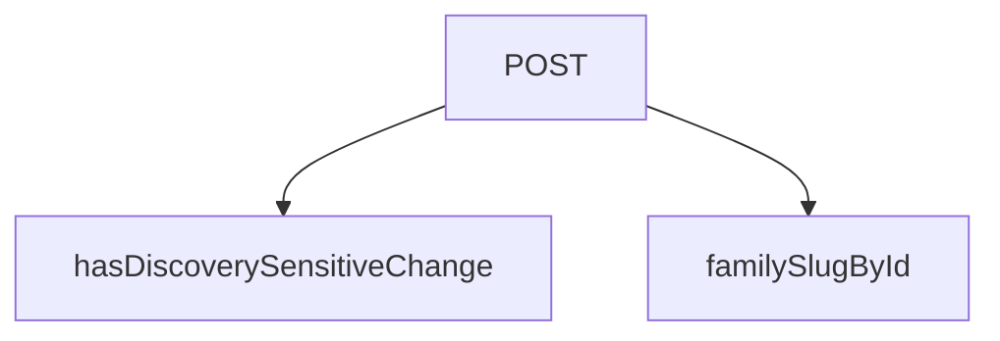

## NODE ID STANDARD

  file: src\app\api\webhook\supabase\route.ts
  function: src\app\api\webhook\supabase\route.ts::hasDiscoverySensitiveChange
  function: src\app\api\webhook\supabase\route.ts::familySlugById
  function: src\app\api\webhook\supabase\route.ts::POST

---

## DISA AKTARILANLAR (EXPORTS)
  export: POST
  export: familySlugById
  export: hasDiscoverySensitiveChange

---
# FILE: src\app\auth\signout\route.md

---
domain: general
source_type: doc
namespace_type: module
source_path: C:\Users\alize\venthub-hvac\src\app\auth\signout\route.ts
skeleton_hash: be6286006ba44974
entity_hashes:
  func:POST: c85301a22b3fe20e
  overview: fa888e32d3000f25
generated_at: 2026-06-19T20:46:34Z
---

## Genel Bakış
Bu modül, kullanıcı oturumunu sonlandırmak için bir API endpoint'i içerir. Next.js App Router yapısında POST isteklerini işleyerek, Supabase kimlik doğrulama oturumunu sonlandırır, uygulama önbelleğini temizler ve kullanıcıyı dil ayarına göre giriş sayfasına yönlendirir.

## Fonksiyon Grupları
### Oturum Kapatma
Kullanıcı oturumunu sonlandırma ve çıkış işlemini yönetir.
- POST

---

## AXIOMS – Mimari Varsayımlar
Bu modül, kullanıcı oturumunu sonlandıran bir API endpoint'idir.

[Aksiyom 1]: Eğer POST metoduyla bir istek gelmezse, bu fonksiyon çağrılmaz.
[Aksiyom 2]: Eğer geçerli bir `Request` nesnesi (request parametresi) sağlanmazsa, fonksiyon çalıştırılamaz.
[Aksiyom 3]: Eğer oturum sonlandırma işlemi (örn. Supabase oturumu) başarısız olursa, beklenmeyen bir hata oluşur veya kullanıcı oturum açık kalır.
[Aksiyom 4]: Eğer yönlendirme (redirect) işlemi başarısız olursa, istemci düzgün bir yanıt almaz.

---

## FONKSİYON DETAYLARI

### POST

**Ne yapar**: Kullanıcının oturumunu sonlandırır (sign-out) ve login sayfasına yönlendirme yapar. Bu fonksiyon, bir HTTP POST isteği geldiğinde tetiklenen bir Next.js App Router rotasıdır.

**Nasıl yapar**: Önce Supabase sunucu istemcisi oluşturarak kullanıcının mevcut oturum claims'lerini kontrol eder. Eğer geçerli claims'ler varsa `signOut()` metodunu çağırarak oturumu sonlandırır. Ardından tüm sayfa önbelleğini temizlemek için `revalidatePath` ile layout seviyesinde revalidation yapar. Kullanıcının tercih ettiği dil bilgisini (`NEXT_LOCALE` cookie'sinden) okur ve bu dile göre login sayfasına 302 yönlendirmesi oluşturur. Son olarak claims cache cookie'sini temizleyerek önbellekteki yetkilendirme verilerinin kalıcı olarak silinmesini sağlar.

**Parametreler**:
- `request`: Request — Next.js tarafından sağlanan HTTP istek nesnesi, isteğin URL bilgisini ve diğer header verilerini içerir

**Dönüş**: `NextResponse` — Kullanıcıyı `/{lang}/auth/login` adresine yönlendiren 302 HTTP yanıt döner. Yanıt aynı zamanda claims cache cookie'sini temizleme işlemini de içerir.

---

## İTHALATLAR (IMPORTS)
- import: @/lib/supabase/server::createSupabaseServerClient
- import: @/utils/router::clearClaimsCacheCookie
- import: next/cache::revalidatePath
- import: next/headers::cookies
- import: next/server::NextResponse

---

## AST POINTERS

### [N1_NASIL] AST Pointer: src/app/auth/signout/route.ts::POST
- **params**: `(request: Request)`
- **ic_degiskenler**:
  - `supabase` — `createSupabaseServerClient()` ile oluşturulan Supabase istemcisi; auth işlemleri (getClaims, signOut) için kullanılır
  - `data` — `supabase.auth.getClaims()` çağrısından dönen `{ data }` destructuring ile elde edilen claims nesnesi; mevcut claim'lerin olup olmadığını kontrol eder
  - `requestUrl` — `request.url` string'inden `new URL()` ile oluşturulan URL nesnesi; redirect için `origin` bilgisini sağlamak üzere kullanılır
  - `cookieStore` — `cookies()` ile elde edilen cookie deposu; tarayıcıdaki `NEXT_LOCALE` cookie'sine erişim sağlar
  - `lang` — `cookieStore.get('NEXT_LOCALE')?.value || 'tr'` ifadesinden elde edilen dil kodu; login yönlendirme URL'inde path olarak kullanılır (`/${lang}/auth/login`); cookie yoksa `'tr'` varsayılır
  - `response` — `NextResponse.redirect()` ile oluşturulan 302 redirect yanıtı; login sayfasına yönlendirme yapar ve `clearClaimsCacheCookie` ile temizlenip döndürülür
- **Dönüş**: `NextResponse` — login sayfasına (`/${lang}/auth/login`) 302 redirect yanıtı döndürür; yan etkileri: supabase auth signOut çağırır, revalidatePath ile layout cache'ini temizler, claims cache cookie'sini siler

---

## NODE ID STANDARD

  file: src\app\auth\signout\route.ts
  function: src\app\auth\signout\route.ts::POST

---

## DISA AKTARILANLAR (EXPORTS)
  export: POST

---
# FILE: src\app\[lang]\layout.md

---
domain: general
source_type: doc
namespace_type: module
source_path: C:\Users\alize\venthub-hvac\src\app\[lang]\layout.tsx
skeleton_hash: a70d63de0e254a7a
entity_hashes:
  func:LangLayout: 894f6821eb40308a
  func:generateStaticParams: 8c98a454509d7f36
  overview: 8fb6408ed372ba76
  style_tokens: dd5ed8d0f58dcf57
generated_at: 2026-06-08T10:08:11Z
---

## Genel Bakış
(Sentez hatası)

---

## AXIOMS – Mimari Varsayımlar
(Sentez hatası)

---

## FONKSİYON DETAYLARI

### generateStaticParams

**Ne yapar**: Next.js uygulamasının statik olarak oluşturulabilecek dil yollarını belirler. Bu fonksiyon, build aşamasında hangi dil varyantları için sayfaların önceden oluşturulacağını tanımlar.

**Nasıl yapar**: Fonksiyon, desteklenen dil kodlarından oluşan bir dizi döndürür. Bu sayede Next.js, `tr` ve `en` dilleri için gerekli statik yolları önceden oluşturabilir ve statik site oluşturma (SSG) süreçlerinde kullanabilir.

**Parametreler**:
- Bu fonksiyon herhangi bir parametre almaz.

**Dönüş**: Array<{ lang: string }> — Desteklenen dil kodlarını içeren nesne dizisi. Her nesne bir `lang` özelliği taşır ve değer olarak `'tr'` veya `'en'` bulunur.

### LangLayout
**Ne yapar**: Geliştirildi ancak detay üretilemedi.

---

## TYPE ALIASES

### Props
```typescript
type Props = {
  children: React.ReactNode
  params: Promise<{ lang: string }>
}
```

---

## AST POINTERS

### [N1_NASIL] AST Pointer: src/app/[lang]/layout.tsx::generateStaticParams
- **params**: (parametre yok)
- **ic_degiskenler**: (yok — fonksiyon gövdesinde değişken tanımlanmamış)
- **Dönüş**: `{ lang: string }[]` — statik olarak tanımlanmış iki nesne içeren dizi: `{ lang: 'tr' }` ve `{ lang: 'en' }`

---

## NODE ID STANDARD

  file: src\app\[lang]\layout.tsx
  function: src\app\[lang]\layout.tsx::generateStaticParams
  function: src\app\[lang]\layout.tsx::LangLayout

---

## DISA AKTARILANLAR (EXPORTS)
  export: LangLayout
  export: generateStaticParams

---

## STİL TOKENLERİ

### Arbitrary Değerler (token'a geçirilmemiş)
Yok — tüm stiller token'a geçirilmiş. ✅

### Kullanılan Token'lar (zaten token'a geçirilmiş)
- (yok)

### Tailwind Sınıf Özeti
- **Renkler:** (yok)
- **Layout:** (yok)
- **Varyant/Responsive:** (yok)
- **Yardımcı Sınıflar:** (yok)

---
# FILE: src\app\[lang]\page.md

---
domain: general
source_type: doc
namespace_type: module
source_path: C:\Users\alize\venthub-hvac\src\app\[lang]\page.tsx
skeleton_hash: 61356cfd1e65f41e
entity_hashes:
  func:RootPage: 3ecc7a5fdeb7c7d7
  func:generateMetadata: 507857aa921043d5
  func:generateStaticParams: 8c98a454509d7f36
  func:getCachedHomeData: 3cdedf9dace01d81
  overview: da7304e1528aeeb3
  style_tokens: dd5ed8d0f58dcf57
generated_at: 2026-08-15T06:32:31Z
---

## Genel Bakış
Bu modül, Next.js App Router yapısında dil destekli ana sayfanın temelini oluşturur. Modül, sayfanın statik üretim parametrelerini belirleyerek, arama motorları için dinamik meta veriler üreterek ve önbellekten aldığı verilerle ana bileşeni render ederek tüm sayfa oluşturma sürecini yönetir. Ana sorumluluğu, kullanıcının diline göre kişiselleştirilmiş, SEO uyumlu ve performanslı bir ana sayfa sunmaktır.

## Fonksiyon Grupları
### Statik Üretim ve SEO Yönetimi
Bu grup, sayfanın hangi diller için önceden oluşturulacağını tanımlar ve arama motoru optimizasyonu için gerekli başlık, açıklama ve Open Graph bilgilerini sayfanın diline göre otomatik olarak üretir.
- generateStaticParams, generateMetadata

### Veri Sağlama ve Bileşen Oluşturma
Bu grup, dil ve kiracıya özel ana sayfa verilerini verimli bir şekilde önbellekten alır ve bu verileri kullanarak ana React bileşeninin son halini oluşturur.
- getCachedHomeData, RootPage

### AXIOMS – Mimari Varsayımlar

Bu modül, dil parametresine bağlı olarak statik sayfa üretiminde ve SEO meta verilerinin dinamik oluşturulmasında çalışır.

**[Aksiyom 1]:** Eğer `generateStaticParams()` tarafından döndürülen `lang` değerleri desteklenen diller listesiyle eşleşmiyorsa, `generateMetadata` ve `RootPage` fonksiyonlarına geçersiz bir dil parametresi iletilir ve sayfa renderı beklenmeyen davranış gösterir.

**[Aksiyom 2]:** Eğer `getCachedHomeData` fonksiyonuna iletilen `tenantId` geçerli bir tenant'a ait değilse veya önbellekte böyle bir veri yoksa, `RootPage` bileşeni veri olmadan render edilmeye çalışır ve olası bir hata durumuyla karşılaşılır.

---

## AXIOMS – Mimari Varsayımlar

Bu modül, Next.js App Router yapısında dil parametreli bir ana sayfa modülüdür.

**[Aksiyom 1]:** Eğer `params.lang` geçerli bir dil kodu (string) olarak sağlanmazsa, `generateMetadata`, `getCachedHomeData` ve `RootPage` fonksiyonları doğru çalışamaz.

**[Aksiyom 2]:** Eğer `getCachedHomeData` çağrısında `tenantId` parametresi geçerli bir string olarak sağlanmazsa, önbellek lookup işlemi başarısız olur veya geçersiz veri döner.

**[Aksiyom 3]:** Eğer `params` yapısı `lang` alanını içermiyorsa (Next.js `[lang]` dynamic segment'ten gelmediği durumda), `generateMetadata` ve `RootPage` fonksiyonları çalışırken hata oluşur.

**[Aksiyom 4]:** Eğer `generateStaticParams()` tarafından döndürülen dil listesi boşsa, hiçbir sayfa istatik olarak üretilmez ve sadece runtime'da render edilir.

**[Aksiyom 5]:** Eğer `getCachedHomeData` önbellekte ilgili `lang` + `tenantId` kombinasyonu için veri bulamazsa, `RootPage` bileşeni verisiz (fallback/empty state) render edilmelidir — bu durum fonksiyon imzasında garanti altına alınmamıştır, uygulama tarafında ele alınmalıdır.

**[Aksiyom 6]:** Eğer `tenantId` değeri uygulama yapılandırmasından (örn: environment variable veya config) sağlanmıyorsa, `getCachedHomeData` çağrısı için gerekli parametre eksik kalır. `tenantId`'nin nereden geldiği fonksiyon imzasından çıkarılamaz — **bilinmiyor**.

---

## FONKSİYON DETAYLARI

### generateStaticParams
**Ne yapar**: Uygulamanın desteklediği dil parametrelerini statik olarak üretir ve Next.js’in statik sayfa oluşturma sürecine sağlar.  
**Nasıl yapar**: Asenkron bir fonksiyon olarak tanımlanmış, sabit bir dizi içinde iki nesne döndürür; biri `'tr'` diğeri `'en'` dil kodunu içerir.  
**Parametreler**:  
- *Yok*  
**Dönüş**: `Array<{ lang: string }>` – `{ lang: 'tr' }` ve `{ lang: 'en' }` öğelerinden oluşan dizi.

### generateMetadata
**Ne yapar**: Sayfa için dinamik SEO meta verilerini, Open Graph ve Twitter kartı bilgilerini, ayrıca robots yönergelerini oluşturur.  
**Nasıl yapar**: `params` nesnesinden gelen `lang` değerini alır, ilgili dil sözlüğünü (`en` veya `tr`) seçer. Site URL’si temel alınarak kanonik URL ve dil‑spesifik URL’ler hazırlanır. Meta başlık, açıklama, Open Graph ve Twitter alanları sözlükten alınan SEO metinleriyle doldurulur; ayrıca site şeması ve organizasyon bilgileri JSON‑LD formatında hazırlanır.  
**Parametreler**:  
- `params`: `Props` – Sayfa parametrelerini içeren nesne; içinde `lang` özelliği bulunur.  
**Dönüş**: `Promise<Metadata>` – SEO, Open Graph, Twitter ve robots ayarlarını içeren `Metadata` nesnesi.

### getCachedHomeData
**Ne yapar**: Belirli bir dil ve kiracı (tenant) için ana sayfada görüntülenecek kategori ve ürün verilerini önbellekten getirir.

**Nasıl yapar**: Fonksiyon, sunucu tarafı veri işleme (SSR) sırasında çağrılarak belirli bir `lang` ve `tenantId` çifti için depolanmış ana sayfa verilerini (kategori ve ürün listesi) alır. Bu veriler önbelleğe alındığı için yüksek performanslı veri erişimi sağlar ve veritabanı veya harici API çağrılarını tekrarlamaz. Fonksiyonun dönüş tipi, `RootPage` içindeki `try...catch` bloğunda `catData` ve `prodData` alanlarına ayrılarak kullanıldığı için bir nesne yapısı döndürür.

**Parametreler**:
- lang: string — İçerik dilini belirten kod (ör. 'tr', 'en').
- tenantId: string — Kiracıyı (tenant) tanımlayan benzersiz tanımlayıcı.

**Dönüş**: Promise<{ catData: DomainCategory[], prodData: Product[] }> — Kategori verilerini (`catData`) ve ürün verilerini (`prodData`) içeren asenkron bir nesne döndürür.

### RootPage

**Ne yapar**: Uygulamanın kök sayfasını (anasayfa) sunucu tarafında render eden asenkron React Server Component'tir. Tenant (kiracı) yapılandırmasına göre veri çeker, kategori ve ürün listelerini hazırlar, SEO için JSON-LD yapılandırılmış veri üretir ve `HomePage` bileşenini sunucuda oluşturarak istemciye gönderir.

**Nasıl yapar**:
Next.js'in parametre destructuring mekanizması ile URL'den `lang` parametesini çıkarır. Ardından `getTenantConfig()` ile aktif tenant yapılandırmasını, `getCachedHomeData()` ile önbelleğe alınmış kategori/ürün verilerini asenkron olarak çeker. `getCachedHomeData` başarısız olursa `try-catch` bloğu sayesinde uygulama çökmez, sadece boş listelerle devam eder. Çekilen ham kategori verisi `toUICategoryList` ile UI modeline dönüştürülür, ardından filtreleme ve sıralama uygulanarak `displayCategories` oluşturulur. Kategori adlarının çözümlemesi `getCategoryDisplayName` fonksiyonu üzerinden gerçekleştirilir; bu fonksiyon `translation_key` → `menu_label` → `name` öncelik sırasıyla çalışır. Doğrudan `categoryList[slug]` indekslemesi yapılmaz çünkü bu yaklaşım `translation_key` alanını atlar ve yanlış dilde karışık sonuçlar üretir. Dil-sensitive slug'lar `getLocalizedCategorySlug` ile, sözlük çevirileri ise `getDictValue` ile çözülür. Sayfa son olarak iki JSON-LD bloğu (WebSite ve Organization) ve `HomePage` bileşenini `TenantProvider` içinde render eder.

**Parametreler**:
- `params` : `Promise<{ lang: string }>` — Next.js'in dinamik route parametrelerini içeren asenkron nesne. `lang` alanı sayfanın aktif dilini (`'en'` veya `'tr'`) belirtir. `await` ile çözümlenerek değeri alınır.

**Dönüş**: JSX yapısı döndürür. Döndürülen JSX, iki adet `<script type="application/ld+json">` JSON-LD bloğu ve `TenantProvider` içinde sarılmış `<HomePage>` bileşeninden oluşur. `HomePage` bileşenine şu props'lar iletilir: `initialCategories` (filtrelenmiş ve dönüştürülmüş kategori listesi), `rawCategories` (ham kategori verisi), `initialProducts` (ürün listesi), `dictionary` (sözlük alt nesnesi), `lang` (aktif dil kodu). Return type React'in `JSX.Element` türündedir.

**İç Bağımlılıklar**:
- `getTenantConfig()` — Tenant yapılandırmasını asenkron olarak getirir.
- `getCachedHomeData(lang, tenantId)` — Önbelleğe alınmış kategori verisi (`catData`), ürün verisi (`prodData`) ve ürün sayılarını (`productCounts`) döndürür.
- `toUICategoryList()` — Domain modeli `DomainCategory[]` dizisini UI uyumlu forma dönüştürür.
- `getCategoryDisplayName(category, t)` — Kategorinin görnen adını `translation_key` → `menu_label` → `name` önceliğiyle çözer.
- `getLocalizedCategorySlug(category, lang)` — Dil duyarlı kanonik slug üretir.
- `getDictValue(dict, key)` — Sözlük nesnesinden iç içe anahtar ile değer çeker; `t()` fonksiyonu olarak sarılır.
- `SITE` — Site kök URL sabiti, JSON-LD ve arama aksiyonu URL'lerinde kullanılır.

---

---

## İTHALATLAR (IMPORTS)
- import: ../../components/home/GuidedCategoryDiscovery::CategoryViewModelLite
- import: ../../config/siteUrl::SITE_URL
- import: ../../hooks/useTenant::TenantProvider
- import: ../../i18n/dictionaries/en::en
- import: ../../i18n/dictionaries/tr::tr
- import: ../../i18n/getDictValue::getDictValue
- import: ../../lib/cache/tags::HOME_DATA_TAG
- import: ../../lib/cache/tags::homeDataTag
- import: ../../lib/type-converters::DomainCategory
- import: ../../lib/type-converters::toUICategoryList
- import: ../../utils/categoryHelpers::getCategoryDisplayName
- import: ../../utils/categoryHelpers::getLocalizedCategorySlug
- import: ../../utils/tenantServer::getTenantConfig
- import: ../../views/HomePage::HomePage
- import: @/lib/services/category.service::getCategories
- import: @/lib/services/product.service::getProducts
- import: @/lib/supabase/static::supabaseStaticClient
- import: @/types/ui-models::type { Product }
- import: next/cache::unstable_cache
- import: next::type { Metadata }
- import: react::React

---

## TYPE ALIASES

### Props
```typescript
type Props = {
  params: Promise<{ lang: string }>
}
```

---

## AST POINTERS

### [N1_NASIL] AST Pointer: [lang]/page.tsx::generateStaticParams
- **params**: (parametre yok)
- **ic_degiskenler**: (yok — sadece sabit array döner)
- **Dönüş**: `Array<{ lang: 'tr' } | { lang: 'en' }>` — Önceden tanımlı statik parametreler (dil seçenekleri)

### [N2_NASIL] AST Pointer: [lang]/page.tsx::generateMetadata
- **params**: `({ params }: Props)` — Props nesnesinden params alır
- **ic_degiskenler**:
  - `lang` — params'tan destructured dil kodu (tr veya en)
  - `dict` — Seçilen dile göre sözlük nesnesi (en veya tr)
  - `siteUrl` — SITE_URL sabitinden gelen temel URL
  - `canonical` — Sayfanın kanonik URL'i (siteUrl + lang)
- **Dönüş**: `Promise<Metadata>` — SEO ve sosyal paylaşım metrikleri

### [N3_NASIL] AST Pointer: [lang]/page.tsx::getCachedHomeData
- **params**: `(lang: string, tenantId: string)`
- **ic_degiskenler**:
  - `catData` — Kategori listesi (getCategories API çağrısı)
  - `prodData` — Ürün listesi (getProducts API çağrısı)
  - `countRes` — Kategori başı ürün sayıları (supabaseStaticClient.rpc çağrısı)
  - `productCounts` — Kategori ID'lerini ürün sayılarına eşleyen Record nesnesi
  - `row` — countRes.data dizisindeki her satır (category_id ve product_count alanları)
  - `row.category_id` — Her satırdaki kategori ID'si (productCounts Record'una anahtar olarak kullanılır)
  - `row.product_count` — Her satırdaki ürün sayısı (0 veya pozitif tamsayı)
- **Dönüş**: `{ catData, prodData, productCounts }` — Ana sayfa verileri nesnesi

### [N4_NASIL] AST Pointer: [lang]/page.tsx::RootPage
- **params**: `({ params }: Props)` — Props nesnesinden params alır
- **ic_degiskenler**:
  - `lang` — params'tan destructured dil kodu
  - `dict` — Seçilen dile göre sözlük nesnesi
  - `tenantConfig` — getTenantConfig() API çağrısı ile alınan konfigürasyon
  - `tenantId` — tenantConfig.id'den gelen kiracı ID'si
  - `categories` — Başlangıçta boş dizi, data.catData'dan dönüştürülmüş UI kategorileri
  - `products` — Başlangıçta boş dizi, data.prodData'dan Product[] tipine dönüştürülmüş ürünler
  - `productCounts` — Başlangıçta boş Record, data.productCounts'tan gelen kategori ürün sayıları
  - `error` — try-catch bloğunda yakalanan hata nesnesi (SSR Data Fetch Error loglanır)
  - `t` — Aktif dilin sözlüğünden çeviri değerini getiren fonksiyon (getDictValue kullanır)
  - `displayCategories` — Filtrelenmiş ve dönüştürülmüş kategori listesi (CategoryViewModelLite[])
    - `c` — categories dizisindeki her bir kategori nesnesi
    - `c.parent_id` — Üst kategori ID'si (null ise kök kategoridir)
    - `c.id` — Kategorinin benzersiz ID'si
    - `c.description` — Kategori açıklaması (boş string fallback)
    - `c.image_url` — Kategori görsel URL'i
  - `siteUrl` — SITE_URL sabitinden gelen temel URL
  - `jsonLds` — JSON-LD yapılandırılmış veri nesneleri dizisi
    - `ld` — Her JSON-LD nesnesi (WebSite veya Organization)
    - `i` — Dizideki indeks numarası (key için kullanılır)
- **Dönüş**: `<TenantProvider>` JSX bileşeni — Ana sayfa içeriği ve JSON-LD scriptleri

---


## MERMAID CALL GRAPH
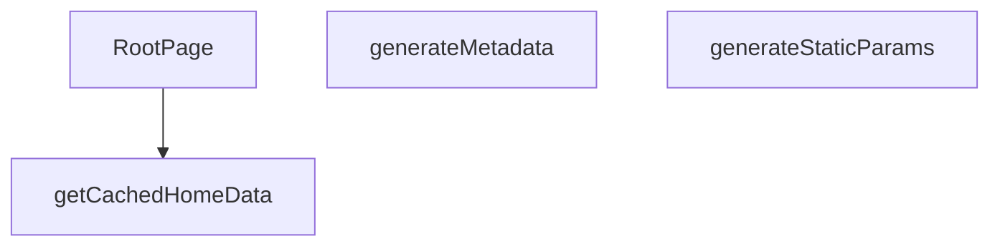

## NODE ID STANDARD

  file: src\app\[lang]\page.tsx
  function: src\app\[lang]\page.tsx::generateStaticParams
  function: src\app\[lang]\page.tsx::generateMetadata
  function: src\app\[lang]\page.tsx::getCachedHomeData
  function: src\app\[lang]\page.tsx::RootPage

---

## DISA AKTARILANLAR (EXPORTS)
  export: RootPage
  export: generateMetadata
  export: generateStaticParams
  export: getCachedHomeData

---

## STİL TOKENLERİ

### Arbitrary Değerler (token'a geçirilmemiş)
Yok — tüm stiller token'a geçirilmiş. ✅

### Kullanılan Token'lar (zaten token'a geçirilmiş)
- (yok)

### Tailwind Sınıf Özeti
- **Renkler:** (yok)
- **Layout:** (yok)
- **Varyant/Responsive:** (yok)
- **Yardımcı Sınıflar:** (yok)

---
# FILE: src\app\[lang]\about\page.md

---
domain: general
source_type: doc
namespace_type: module
source_path: C:\Users\alize\venthub-hvac\src\app\[lang]\about\page.tsx
skeleton_hash: 5b26b94087063b88
entity_hashes:
  func:Page: 32fe3fdb17787a5b
  func:generateStaticParams: 6d1b3e72f8b2da9f
  overview: 8dff6fca298bde81
  style_tokens: dd5ed8d0f58dcf57
generated_at: 2026-06-19T20:46:27Z
---

## Genel Bakış
Bu modül, çoklu dil desteği sunan "Hakkında" sayfasını oluşturur. Next.js App Router yapısında `[lang]/about` rotasına karşılık gelir ve hem statik sayfa yapılandırmasını hem de sayfa içeriğinin render edilmesini yönetir.

## Fonksiyon Grupları
### Statik Sayfa Yapılandırması
Bu grup, sayfanın hangi dil varyantları için önceden oluşturulacağını belirler.
- generateStaticParams

### Sayfa Renderlama
Bu grup, dil parametresine göre sayfa içeriğini JSX olarak üretir ve kullanıcıya sunar.
- Page

---

## AXIOMS – Mimari Varsayımlar

Bu modül, Next.js App Router yapısında çoklu dil destekli "Hakkında" sayfasını yöneten bir sayfa bileşenidir. Aşağıdaki varsayımlar fonksiyon imzalarından çıkarılmıştır.

---

## FONKSİYON DETAYLARI

### Page

**Ne yapar**: Bu fonksiyon, Next.js uygulamasındaki "/about" sayfasının ana sayfa bileşenidir. Dinamik dil parametresini alarak ilgili dilde About sayfasını render eder.

**Nasıl yapar**: Fonksiyon, `params` prop'unu await ederek asenkron olarak dil parametrelerini çıkarır. Elde edilen `lang` değerini `PageComponent` bileşenine prop olarak geçirir ve sayfanın ilgili dilde görüntülenmesini sağlar. Bu yapı, Next.js App Router'ın dinamik rotaları için standart bir yaklaşımdır.

**Parametreler**:
- `params` : `PageProps` — Sayfanın dinamik parametrelerini içeren nesne. `{ lang: string }` yapısına sahiptir ve URL segmentinden gelen dil kodunu barındırır.

**Dönüş**: JSX elementi döndürür. `PageComponent` bileşeninin `lang` prop'u ile birlikte render edilmiş halini返回 eder.

### generateStaticParams
**Ne yapar**: Geliştirildi ancak detay üretilemedi.

---

## İTHALATLAR (IMPORTS)
- import: ../../../views/AboutPage::PageComponent

---

## INTERFACES

### PageProps
- `params: Promise<{ lang: string }>`

---

## AST POINTERS

### [N1_NASIL] AST Pointer: `src/app/[lang]/about/page.tsx`::Page
- **params**: `{ params }: PageProps` — Next.js route params objesi, `lang` parametresini içerir
- **ic_degiskenler**:
  - `lang` — `params` objesinden `await` ile çözülüp destructure edilen dil kodu (ör. `'tr'` veya `'en'`); `PageComponent`'e prop olarak iletilir
- **Dönüş**: JSX — `<PageComponent lang={lang} />` bileşeni döner

### [N2_NASIL] AST Pointer: `src/app/[lang]/about/page.tsx`::generateStaticParams
- **params**: (yok)
- **ic_degiskenler**:
  - (yok)
- **Dönüş**: `Array<{ lang: string }>` — `[ { lang: 'tr' }, { lang: 'en' } ]` statik olarak oluşturulmuş dil parametreleri listesi; Next.js'in statik site oluşturmada hangi `[lang]` değerleri için sayfa üretileceğini tanımlar

---

## NODE ID STANDARD

  file: src\app\[lang]\about\page.tsx
  function: src\app\[lang]\about\page.tsx::Page
  function: src\app\[lang]\about\page.tsx::generateStaticParams

---

## DISA AKTARILANLAR (EXPORTS)
  export: Page
  export: generateStaticParams

---

## STİL TOKENLERİ

### Arbitrary Değerler (token'a geçirilmemiş)
Yok — tüm stiller token'a geçirilmiş. ✅

### Kullanılan Token'lar (zaten token'a geçirilmiş)
- (yok)

### Tailwind Sınıf Özeti
- **Renkler:** (yok)
- **Layout:** (yok)
- **Varyant/Responsive:** (yok)
- **Yardımcı Sınıflar:** (yok)

---
# FILE: src\app\[lang]\account\layout.md

---
domain: general
source_type: doc
namespace_type: module
source_path: C:\Users\alize\venthub-hvac\src\app\[lang]\account\layout.tsx
skeleton_hash: f682ac63af07c487
entity_hashes:
  func:Layout: f1cd59870391c992
  overview: 3aba322b2667e63f
  style_tokens: dd5ed8d0f58dcf57
generated_at: 2026-06-19T20:46:14Z
---

## Genel Bakış
Bu modül, uygulamanın hesap (account) bölümündeki tüm sayfalar için ortak bir düzen sağlar. Tek bir `Layout` bileşeni, sayfa içeriğini sararak tutarlı bir yapı ve kullanıcı deneyimi oluşturur.

## Fonksiyon Grupları
### Sayfa Düzeni Sağlayıcı
Hesap alt sayfalarının görüntüleneceği çerçeveyi oluşturur; içeriği (`children`) alıp ortak bir sarmalayıcı içinde render eder.
- Layout

---

## AXIOMS – Mimari Varsayımlar
Bu modül için özel aksiyom tanımlanmamıştır.

**Aksiyom 1**: Eğer `children` prop’u **verilmez** ya da `undefined`/`null` ise, `Layout` bileşeni **boş bir `<div>` (veya benzeri bir sarmalayıcı) render eder** ve içeriği göstermez.  
*Sebep*: `children` bir `React.ReactNode` tipinde zorunlu olduğundan, bileşenin çalışması için bir node beklenir; yoksa render çıktısı anlamsız olur.

**Aksiyom 2**: Eğer `children` prop’u **geçerli bir React elemanı** değilse (ör. bir sayı, string dışındaki bir primitive ya da hatalı nesne), `Layout` **render sırasında bir hata fırlatır**.  
*Sebep*: `React.ReactNode` tipine uymayan değerler React’in render sürecinde tip hatası üretir; bu hatanın yakalanması bileşenin bütünlüğünü korur.

**Aksiyom 3**: Eğer `Layout` bileşeni **başka bir React bağlamı (Context) içinde** kullanılırsa, bu bağlamdan gelen değerler **`Layout` içinde doğrudan erişilebilir** ve **bağlamın eksikliği** durumunda **varsayılan (default) değerler** kullanılır.  
*Sebep*: Layout genellikle ortak stil, tema veya oturum bilgisi gibi paylaşılan verileri tüketir; bağlam yoksa bileşen çalışabilmelidir.

**Aksiyom 4**: Eğer `Layout` bileşeni **SSR (Server‑Side Rendering)** ortamında çalıştırılırsa, **`children` içeriği sunucu tarafında da aynı şekilde render edilir**; aksi takdirde **hydrate hatası** ortaya çıkar.  
*Sebep*: React‑SSR’de istemci ve sunucu çıktısının tutarlı olması gerekir; `children` eksikse veya farklıysa uyumsuzluk oluşur.

**Aksiyom 5**: Eğer `Layout` bileşeni **CSS‑in‑JS** ya da **global stil dosyaları** aracılığıyla stil alıyorsa, bu stil **modül yüklendiği anda** (import zamanında) **uygulanır**; stil dosyası **yüklenmezse** bileşen **varsayılan (unstyled) bir yapı** ile render olur.  
*Sebep*: Stil bağımlılıkları opsiyoneldir; eksik stil dosyası uygulamanın çökmesini engellemek için varsayılan görünüm sağlanır.

**Aksiyom 6**: Eğer `Layout` içinde **navigasyon (örn. Next.js `Link` veya router)** öğeleri bulunuyorsa, bu öğeler **router’ın mevcut konfigürasyonu** ile uyumlu olmalıdır; **router tanımlı değilse** navigasyon öğeleri **pasif (tıklanamaz) hâle gelir**.  
*Sebep*: Navigasyonun çalışması için router bağlamı gerekir; yoksa kullanıcı deneyimi bozulur.

**Aksiyom 7**: Eğer `Layout` bileşeni **performans optimizasyonu** (memoization, lazy loading vb.) içeriyorsa, bu optimizasyonlar **`children` prop’unun referans değişikliğine** duyarlı olacaktır; **referans değişmezse** yeniden render **tetiklenmez**.  
*Sebep*: React‑in memoizasyon mekanizmaları referans eşitliğine dayanır; bu sayede gereksiz render’lar önlenir.

---

## FONKSİYON DETAYLARI

### Layout
**Ne yapar**: Verilen `children` propunu `LayoutComponent` içine sararak sayfa düzenini sağlar.  
**Nasıl yapar**: Fonksiyon, destructured `children` parametresini alır ve doğrudan `<LayoutComponent>{children}</LayoutComponent>` JSX'ini döndürür; ek mantık veya side‑effect yoktur.  
**Parametreler**:
- children: React.ReactNode — Layout içinde görüntülenecek içerik (JSX elemanları, metin veya başka React bileşenleri).  
**Dönüş**: JSX elementi — `LayoutComponent` içinde `children` içeren bir React elementi.

---

## İTHALATLAR (IMPORTS)
- import: ../../../views/account/AccountLayout::LayoutComponent

---

## AST POINTERS

### [N1_NASIL] AST Pointer: src/app/[lang]/account/layout.tsx::Layout
- **params**: children
- **ic_degiskenler**: (yok)
- **Dönüş**: JSX element (React.ReactElement)

---

## NODE ID STANDARD

  file: src\app\[lang]\account\layout.tsx
  function: src\app\[lang]\account\layout.tsx::Layout

---

## DISA AKTARILANLAR (EXPORTS)
  export: Layout

---

## STİL TOKENLERİ

### Arbitrary Değerler (token'a geçirilmemiş)
Yok — tüm stiller token'a geçirilmiş. ✅

### Kullanılan Token'lar (zaten token'a geçirilmiş)
- (yok)

### Tailwind Sınıf Özeti
- **Renkler:** (yok)
- **Layout:** (yok)
- **Varyant/Responsive:** (yok)
- **Yardımcı Sınıflar:** (yok)

---
# FILE: src\app\[lang]\account\page.md

---
domain: general
source_type: doc
namespace_type: module
source_path: C:\Users\alize\venthub-hvac\src\app\[lang]\account\page.tsx
skeleton_hash: 34a93a484e8fe06a
entity_hashes:
  func:Page: 02ee67f324c336e5
  overview: 8bcc27d9f8041805
  style_tokens: dd5ed8d0f58dcf57
generated_at: 2026-06-19T20:46:14Z
---

## Genel Bakış
Bu modül, dil parametresi (`[lang]`) içeren rotada kullanıcının hesap sayfasını sunan kök bileşeni tanımlar. Tek bir `Page` fonksiyonu aracılığıyla sayfanın ana kullanıcı arayüzü oluşturulur; bu bileşen doğrudan JSX döndürerek görsel katmanı sağlar.

## Fonksiyon Grupları
### Sayfa Görünümü
Sayfanın tamamını temsil eden React bileşenini render eder. Herhangi bir yardımcı işlev veya durum yönetimi içermez, yalnızca üst düzey sunum katmanını oluşturur.  
- Page

---

## AXIOMS – Mimari Varsayımlar
Bu modül için özel aksiyom tanımlanmamıştır.

---

## FONKSİYON DETAYLARI

### Page
**Ne yapar**: `Page` fonksiyonu, React bileşeni olarak `<PageComponent />` öğesini döndürür. Bu, sayfanın ana görsel bileşenini render eder.  
**Nasıl yapar**: Fonksiyon içinde doğrudan JSX döndürülür; herhangi bir durum yönetimi veya yan etki yoktur.  
**Parametreler**:
- *hiç parametre yok*  
**Dönüş**: `<PageComponent />` JSX öğesi (React Element)

---

## İTHALATLAR (IMPORTS)
- import: ../../../views/account/AccountOverviewPage::PageComponent

---

## AST POINTERS

### [N1_NASIL] AST Pointer: C:\Users\alize\venthub-hvac\src\app\[lang]\account\page.tsx::Page
- **params**: (parametre yok)
- **ic_degiskenler**: yok
- **Dönüş**: JSX.Element (React bileşeni olarak `<PageComponent />` döndürür)

---

## NODE ID STANDARD

  file: src\app\[lang]\account\page.tsx
  function: src\app\[lang]\account\page.tsx::Page

---

## DISA AKTARILANLAR (EXPORTS)
  export: Page

---

## STİL TOKENLERİ

### Arbitrary Değerler (token'a geçirilmemiş)
Yok — tüm stiller token'a geçirilmiş. ✅

### Kullanılan Token'lar (zaten token'a geçirilmiş)
- (yok)

### Tailwind Sınıf Özeti
- **Renkler:** (yok)
- **Layout:** (yok)
- **Varyant/Responsive:** (yok)
- **Yardımcı Sınıflar:** (yok)

---
# FILE: src\app\[lang]\account\addresses\page.md

---
domain: general
source_type: doc
namespace_type: module
source_path: C:\Users\alize\venthub-hvac\src\app\[lang]\account\addresses\page.tsx
skeleton_hash: 46e74f8e737d3adb
entity_hashes:
  func:Page: 02ee67f324c336e5
  overview: c697ddf7c92cfa4f
  style_tokens: 9144ece4bffe7964
generated_at: 2026-06-19T20:46:14Z
---

## Genel Bakış
Bu modül, kullanıcının hesabındaki adresleri yönetmesine olanak tanıyan Next.js sayfa giriş noktasıdır. Tek bir `Page` fonksiyonu ile dinamik olarak yüklenen `AccountAddressesPage` bileşenini render ederek dil duyarlı adres yönetim arayüzünü sunar.

## Fonksiyon Grupları
### Sayfa Giriş Noktası
Modülün tek bileşeni olan `Page`, adres yönetim sayfasının içerik bölümünü dinamik import yoluyla yükler ve sayfayı kullanıcıya sunar.
- Page

---

## AXIOMS – Mimari Varsayımlar
- Bu modül davranışsal mantık içermez (salt veri / konfigürasyon / tip tanımı).
- [Aksiyom 1]: Modülün dışa açtığı yapı (anahtar kümesi / şema) bir sözleşmedir; tüketiciler bu sabit yapıya bağlıdır — kırıcı değişiklik tüm tüketicileri etkiler.
- [Aksiyom 2]: Bir öğe ekleme/çıkarma yapısal-uyumlu olmalı; ilgili tipler ve seçiciler aynı commit'te güncel tutulmalıdır.

---

## FONKSİYON DETAYLARI

### Page
**Ne yapar**: `Page` fonksiyonu, React bileşeni olarak tanımlanmış bir fonksiyondur ve `<PageComponent />` JSX elemanını döndürerek ilgili sayfanın içeriğini render eder.  

**Nasıl yapar**: Fonksiyon, doğrudan bir JSX ifadesi olan `<PageComponent />`'i return eder; ek bir mantık, durum yönetimi veya yan etki (side‑effect) içermez.  

**Parametreler**:  
- *Yok* — Fonksiyon herhangi bir argüman almaz.

**Dönüş**:  
- `JSX.Element` — `<PageComponent />` bileşenini temsil eden JSX elemanı döndürür.

---

## İTHALATLAR (IMPORTS)
- import: next/dynamic::nextDynamic

---

## SABİTLER
- **PageComponent** (call) — `nextDynamic(() => import('../../../../views/account/AccountAddressesPage'), {...`

---

## AST POINTERS

### [N1_NASIL] AST Pointer: [lang]/account/addresses/page.tsx::anonim_arrow_function
- **params**: (parametre yok)
- **ic_degiskenler**:
  (değişken yok — doğrudan JSX döndürür)
- **Dönüş**: JSX — `min-h-screen` flex container içinde `animate-spin` sınıfına sahip dönen spinner div'i; loading durumu için kullanıluyor (nextDynamic loading bileşeni olarak)

---

## NODE ID STANDARD

  file: src\app\[lang]\account\addresses\page.tsx
  function: src\app\[lang]\account\addresses\page.tsx::Page

---

## DISA AKTARILANLAR (EXPORTS)
  export: Page

---

## STİL TOKENLERİ

### Arbitrary Değerler (token'a geçirilmemiş)
Yok — tüm stiller token'a geçirilmiş. ✅

### Kullanılan Token'lar (zaten token'a geçirilmiş)
- (yok)

### Tailwind Sınıf Özeti
- **Renkler:** `border-b-2`, `border-primary-navy`
- **Layout:** `flex`, `h-12`, `items-center`, `justify-center`, `min-h-screen`, `w-12`
- **Varyant/Responsive:** (yok)
- **Yardımcı Sınıflar:** `animate-spin`, `rounded-full`

---
# FILE: src\app\[lang]\account\invoices\page.md

---
domain: general
source_type: doc
namespace_type: module
source_path: C:\Users\alize\venthub-hvac\src\app\[lang]\account\invoices\page.tsx
skeleton_hash: 0cb1a9f445e42d79
entity_hashes:
  func:Page: 02ee67f324c336e5
  overview: c697ddf7c92cfa4f
  style_tokens: 9144ece4bffe7964
generated_at: 2026-06-19T20:46:14Z
---

## Genel Bakış
Bu modül, kullanıcının hesap panelindeki fatura listesi sayfasını temsil eden kök React bileşenini içerir. Sayfa, dinamik bir yükleme stratejisi kullanarak asıl görünüm bileşenini yükler ve böylece performansı artırırken ilgili arayüzü sunar.

## Fonksiyon Grupları
### Ana Sayfa Bileşeni
Hesap faturaları sayfasının giriş noktasını ve temel yapısını oluşturur. Dinamik içe aktarma yoluyla asıl görünüm bileşenini yükleyerek sayfayı render eder.
- Page

---

## AXIOMS – Mimari Varsayımlar

Bu modül, minimal bir React sarmalayıcı (wrapper) bileşenidir; fonksiyon gövdesi yalnızca `<PageComponent />` öğesini döndürür. Dolayısıyla mimari varsayımlar sınırlıdır.

---

## FONKSİYON DETAYLARI

### Page
**Ne yapar**: React bileşeni `Page` fonksiyonu, JSX içinde `<PageComponent />` öğesini döndürerek bir sayfa görünümü oluşturur.  

**Nasıl yapar**: Fonksiyon, doğrudan bir JSX ifadesi olan `<PageComponent />`'i return eder; ek bir mantık, durum yönetimi veya yan etki yoktur.  

**Parametreler**:
- (hiç parametre almaz)

**Dönüş**: JSX.Element — `<PageComponent />` bileşenini temsil eden React öğesi.

---

## İTHALATLAR (IMPORTS)
- import: next/dynamic::nextDynamic

---

## SABİTLER
- **PageComponent** (call) — `nextDynamic(() => import('../../../../views/account/AccountInvoicesPage'), {
...`

---

## AST POINTERS

### [N1_NASIL] AST Pointer: `[lang]/account/invoices/page.tsx`::(anonim.loading)
- **params**: (parametre yok)
- **ic_degiskenler**: (yok)
- **Dönüş**: JSX — `div` içinde `animate-spin` class'lı spinner loading göstergesi döndürür; `min-h-screen`, `flex`, `items-center`, `justify-center` ile ekran ortasında dönen bir yükleme animasyonu sunar

---

## NODE ID STANDARD

  file: src\app\[lang]\account\invoices\page.tsx
  function: src\app\[lang]\account\invoices\page.tsx::Page

---

## DISA AKTARILANLAR (EXPORTS)
  export: Page

---

## STİL TOKENLERİ

### Arbitrary Değerler (token'a geçirilmemiş)
Yok — tüm stiller token'a geçirilmiş. ✅

### Kullanılan Token'lar (zaten token'a geçirilmiş)
- (yok)

### Tailwind Sınıf Özeti
- **Renkler:** `border-b-2`, `border-primary-navy`
- **Layout:** `flex`, `h-12`, `items-center`, `justify-center`, `min-h-screen`, `w-12`
- **Varyant/Responsive:** (yok)
- **Yardımcı Sınıflar:** `animate-spin`, `rounded-full`

---
# FILE: src\app\[lang]\account\orders\page.md

---
domain: general
source_type: doc
namespace_type: module
source_path: C:\Users\alize\venthub-hvac\src\app\[lang]\account\orders\page.tsx
skeleton_hash: 724856e28fd1364d
entity_hashes:
  func:Page: 02ee67f324c336e5
  overview: c697ddf7c92cfa4f
  style_tokens: 9144ece4bffe7964
generated_at: 2026-06-19T20:46:14Z
---

## Genel Bakış
Bu modül, kullanıcı hesabındaki siparişlerin listelendiği sayfaya karşılık gelen Next.js sayfa rotasını tanımlar. Tek bileşeni olan `Page` fonksiyonu, dinamik olarak yüklenen `OrdersPage` ana görünümünü render ederek sayfanın giriş noktasını oluşturur.

## Fonksiyon Grupları
### Sayfa Giriş Noktası ve Sarmalayıcı
Bu grup, hesap siparişleri rotası için üst seviye React bileşenini döndürmekle sorumludur. Fonksiyon herhangi bir veri çekme veya iş mantığı içermez; sadece asıl sayfa içeriğini barındıran dinamik yüklenmiş bir alt bileşeni sarar ve sunar.
- Page

---

## AXIOMS – Mimari Varsayımlar
Bu modül, bir Next.js üst‑seviye sayfa bileşenidir ve sadece bir JSX öğesi döndürür.

[Aksiyom 1]: Eğer `PageComponent` (çağrılabilir bir React bileşeni) yoksa, `Page` fonksiyonu geçerli bir React JSX yapısı döndüremeyeceği için sayfa render edilemez ve uygulama çalışması sonlanır.

---

## FONKSİYON DETAYLARI

### Page
**Ne yapar**: Bu fonksiyon, hesap siparişleri sayfa rotası için ana giriş noktası görevi gören bir React bileşenidir. Temel amacı, sayfanın tüm işlevselliğini ve içeriğini barındıran PageComponent bileşenini kullanıcıya sunmaktır.
**Nasıl yapar**: Fonksiyon, herhangi bir ara mantık, durum yönetimi, veri çekme veya yan etki işlemi gerçekleştirmeden doğrudan PageComponent bileşenini döndüren basit bir sarmalayıcı (wrapper) olarak çalışır. İçerisinde sadece bileşen render işlemi için gerekli olan tek bir return ifadesi bulunur.
**Parametreler**: Bu fonksiyon herhangi bir parametre almaz.
**Dönüş**: React JSX formatında PageComponent bileşenini döndürür. Dönüş tipi, React bileşenlerinin render sonucu olan bir React elementidir.

---

## İTHALATLAR (IMPORTS)
- import: next/dynamic::nextDynamic

---

## SABİTLER
- **PageComponent** (call) — `nextDynamic(() => import('../../../../views/OrdersPage'), {
  ssr: false,
 ...`

---

## AST POINTERS

### [N1_NASIL] AST Pointer: [lang]/account/orders/page.tsx::loading (anonymous)
- **params**: (yok)
- **ic_degiskenler**: (yok)
- **Dönüş**: JSX — `min-h-screen` container içinde animasyonlu dönen spinner (next/dynamic loader bileşeni)

### [N2_NASIL] AST Pointer: [lang]/account/orders/page.tsx::Page
- **params**: (yok)
- **ic_degiskenler**: (yok)
- **Dönüş**: `<PageComponent />` — dinamik olarak import edilmiş PageComponent bileşeninin render edilmesi

---

## NODE ID STANDARD

  file: src\app\[lang]\account\orders\page.tsx
  function: src\app\[lang]\account\orders\page.tsx::Page

---

## DISA AKTARILANLAR (EXPORTS)
  export: Page

---

## STİL TOKENLERİ

### Arbitrary Değerler (token'a geçirilmemiş)
Yok — tüm stiller token'a geçirilmiş. ✅

### Kullanılan Token'lar (zaten token'a geçirilmiş)
- (yok)

### Tailwind Sınıf Özeti
- **Renkler:** `border-b-2`, `border-primary-navy`
- **Layout:** `flex`, `h-12`, `items-center`, `justify-center`, `min-h-screen`, `w-12`
- **Varyant/Responsive:** (yok)
- **Yardımcı Sınıflar:** `animate-spin`, `rounded-full`

---
# FILE: src\app\[lang]\account\orders\detail\page.md

---
domain: general
source_type: doc
namespace_type: module
source_path: C:\Users\alize\venthub-hvac\src\app\[lang]\account\orders\detail\page.tsx
skeleton_hash: 9ddea9e996ab6175
entity_hashes:
  func:Page: 9e0b3aa05006aa66
  overview: c1af68d41814429f
  style_tokens: dd5ed8d0f58dcf57
generated_at: 2026-06-19T20:46:14Z
---

## Genel Bakış
Bu modül, kullanıcı hesabındaki bir siparişin detay sayfasını render eden tek bir React bileşeni içerir. `Page` fonksiyonu, asenkron olarak yüklenecek `PageComponent`i `Suspense` içinde sararak veri yüklenirken bir “loading” mesajı gösterir ve veri hazır olduğunda detay içeriğini sunar.  

## Fonksiyon Grupları
### Sayfa Bileşeni
Sayfanın giriş noktasıdır; `Page` bileşeni `Suspense` ile asenkron veri/komponent yüklemesini yönetir ve kullanıcıya bekleme geri bildirimi sağlar.  
- Page

---

## AXIOMS – Mimari Varsayımlar
Bu modül için özel aksiyom tanımlanmamıştır.

---

## FONKSİYON DETAYLARI

### Page
**Ne yapar**: React uygulamasında bir sayfa bileşeni oluşturur ve içeriği asenkron olarak yüklenirken bir bekleme (loading) mesajı gösterir. `Suspense` bileşeni sayesinde `PageComponent` bileşeni yüklenene kadar kullanıcıya geri bildirim sağlanır.  

**Nasıl yapar**: Fonksiyon içinde `tr` çeviri nesnesi `t` olarak kısaltılır, ardından JSX içinde `Suspense` bileşeni kullanılır. `fallback` özelliği, `t.common.loading` metnini içeren bir `<div>` ile tanımlanır; bu, `PageComponent` henüz render edilmediğinde gösterilir. `PageComponent` başarılı bir şekilde yüklendiğinde, `Suspense` otomatik olarak onu render eder.  

**Parametreler**:
- *Yok* — Fonksiyon dışarıdan herhangi bir argüman almaz.

**Dönüş**: JSX (React element) – `<Suspense>` içinde `fallback` ve `PageComponent` içeren bir React bileşeni döndürür.

---

## İTHALATLAR (IMPORTS)
- import: ../../../../../i18n/dictionaries/tr::tr
- import: ../../../../../views/account/OrderDetailPage::PageComponent
- import: react::React
- import: react::Suspense

---

## AST POINTERS

### [N1_NASIL] AST Pointer: src/app/[lang]/account/orders/detail/page.tsx::Page
- **params**: (yok)
- **ic_degiskenler**:
  - `t` — `tr` fonksiyonundan dönen Türkçe sözlük nesnesi, `t.common.loading` ile yükleme metnine erişmek için kullanılır
  - `PageComponent` — (bileşen olarak kullanılır, değişkene atanmamış doğrudan JSX içinde kullanılan import edilmiş bileşen)
  - `<Suspense fallback={<div>{t.common.loading}</div>}>` — React Suspense bileşeni, alt bileşen yüklenirken `t.common.loading` metnini gösterir
  - `<PageComponent />` — gerçek sipariş detay sayfasını render eden bileşen
- **Dönüş**: JSX elemanı (React nodu)

---

## NODE ID STANDARD

  file: src\app\[lang]\account\orders\detail\page.tsx
  function: src\app\[lang]\account\orders\detail\page.tsx::Page

---

## DISA AKTARILANLAR (EXPORTS)
  export: Page

---

## STİL TOKENLERİ

### Arbitrary Değerler (token'a geçirilmemiş)
Yok — tüm stiller token'a geçirilmiş. ✅

### Kullanılan Token'lar (zaten token'a geçirilmiş)
- (yok)

### Tailwind Sınıf Özeti
- **Renkler:** (yok)
- **Layout:** (yok)
- **Varyant/Responsive:** (yok)
- **Yardımcı Sınıflar:** (yok)

---
# FILE: src\app\[lang]\account\profile\page.md

---
domain: general
source_type: doc
namespace_type: module
source_path: C:\Users\alize\venthub-hvac\src\app\[lang]\account\profile\page.tsx
skeleton_hash: acb9b7729f3fb32f
entity_hashes:
  func:Page: 02ee67f324c336e5
  overview: 7cf783e7a557a530
  style_tokens: dd5ed8d0f58dcf57
generated_at: 2026-06-19T20:46:14Z
---

## Genel Bakış
Bu modül, Next.js App Router yapısında `/account/profile` yoluna karşılık gelen sayfa bileşenini tanımlar. Tek bir `Page` fonksiyonu, profil sayfasının bütün JSX çıktısını üretir ve dışa aktarılır.

## Fonksiyon Grupları
### Sayfa Render Grubu
Profil sayfasının UI’sını tek bir noktadan oluşturup dışa aktarmaktan sorumludur.  
- Page

---

## AXIOMS – Mimari Varsayımlar
Bu modül için özel aksiyom tanımlanmamıştır.

---

## FONKSİYON DETAYLARI

### Page
**Ne yapar**: Bu fonksiyon, `src/app/account/profile/page.tsx` dosyasında tanımlanan Next.js App Router sayfa bileşenidir. Kullanıcı hesap profili sayfasının ana giriş noktası olarak çalışır ve sayfanın temel içeriğini sağlayan alt bileşeni döndürür.
**Nasıl yapar**: Fonksiyon, herhangi bir ek veri işleme, doğrulama veya ek işlem yapmadan, sabit bir dönüş değeri olarak önceden tanımlanmış `<PageComponent />` bileşenini döndürür. Sadece alt bileşeni ileten basit bir ara katman görevi görür.
**Parametreler**:
- Hiçbir parametre almaz.
**Dönüş**: `<PageComponent />` tipinde bir React bileşeni döndürür. Bu dönüş değeri, kullanıcının tarayıcısında görüntülenecek profili sayfasının tam içeriğini temsil eder.

---

## İTHALATLAR (IMPORTS)
- import: ../../../../views/account/AccountProfilePage::PageComponent

---

## AST POINTERS

### [N1_NASIL] AST Pointer: C:\Users\alize\venthub-hvac\src\app\[lang]\account\profile\page.tsx::Page
- **params**: (parametre yok)
- **ic_degiskenler**: yok
- **Dönüş**: JSX.Element (React bileşeni olarak `<PageComponent />` döndürür)

---

## NODE ID STANDARD

  file: src\app\[lang]\account\profile\page.tsx
  function: src\app\[lang]\account\profile\page.tsx::Page

---

## DISA AKTARILANLAR (EXPORTS)
  export: Page

---

## STİL TOKENLERİ

### Arbitrary Değerler (token'a geçirilmemiş)
Yok — tüm stiller token'a geçirilmiş. ✅

### Kullanılan Token'lar (zaten token'a geçirilmiş)
- (yok)

### Tailwind Sınıf Özeti
- **Renkler:** (yok)
- **Layout:** (yok)
- **Varyant/Responsive:** (yok)
- **Yardımcı Sınıflar:** (yok)

---
# FILE: src\app\[lang]\account\quotes\page.md

---
domain: general
source_type: doc
namespace_type: module
source_path: C:\Users\alize\venthub-wt-quote\src\app\[lang]\account\quotes\page.tsx
skeleton_hash: d5157148ab3205af
entity_hashes:
  func:Page: c99a16a89d219fd2
  overview: 4368adee0b81e32b
  style_tokens: 9144ece4bffe7964
generated_at: 2026-08-16T10:19:33Z
---

## Genel Bakış
Bu modül, kullanıcının hesabına ait fiyat tekliflerini (quotations) listeleyen bir Next.js sayfasıdır. Router segmentinden dinamik olarak dil parametresini alarak çok dilli destek sağlar. Sayfa, kullanıcı oturum açmış hesabından tekliflerini görüntüleyebileceği bir arayüz sunar.

## Fonksiyon Grupları
### Sayfa Bileşeni
Kullanıcının tekliflerini (quotes) gösteren asıl sayfa bileşenidir. Dil parametresini URL'den alarak uluslararasılaştırma (i18n) desteğini sağlar.
- Page

---

## AXIOMS – Mimari Varsayımlar
Bu Next.js sayfa bileşeni için temel mimari varsayımlar şunlardır:

[Aksiyom 1]: Eğer `Page` bileşeni geçerli bir React JSX/TSX döndürmezse, Next.js sayfa yönlendirmesi düzgün çalışamaz ve kullanıcı hatası oluşur.

[Aksiyom 2]: Eğer sayfa bileşeni `[lang]` parametresini kullanıyorsa ve bu parametre geçerli bir dil kodu (örn: "tr", "en")

---

## FONKSİYON DETAYLARI

### Page
**Ne yapar**: Bu fonksiyon, bir Next.js sayfa bileşenidir ve hesapQuotes sayfasının üst düzey bileşenini temsil eder. Sayfa yükleme sürecinde kullanıcıya görsel bir geri bildirim sağlamak için Suspense sarmalayıcısı kullanır.

**Nasıl yapar**: Fonksiyon, React'in `Suspense` bileşenini kullanarak asenkron yükleme durumlarını yönetir. `Suspense` bileşeni, iç bileşen olan `PageComponent` henüz yüklenmediğinde (süspansiyon durumunda) `fallback` prop'u olarak tanımlanan yükleme animasyonunu render eder. Bu animasyon, merkezi konumlandırılmış dönen bir daire şeklindedir ve `animate-spin` sınıfı ile sürekli döner. `PageComponent` yüklendiğinde ise Suspense bileşeni çocuğu olan `PageComponent`'i render eder.

**Parametreler**:
- Parametre almaz

**Dönüş**: JSX element return eder. Suspense ile sarmalanmış `PageComponent` bileşenini veya yükleme durumunda fallback UI'ı döndürür.

---

## İTHALATLAR (IMPORTS)
- import: ../../../../views/account/quotes/AccountQuotesPage::PageComponent
- import: react::React
- import: react::Suspense

---

## AST POINTERS

### [N1_NASIL] AST Pointer: src/app/[lang]/account/quotes/page.tsx::Page
- **params**: () — parametre yok
- **ic_degiskenler**: yok
  - Fonksiyon gövdesinde değişken tanımlanmamıştır, doğrudan JSX döndürülür
- **Dönüş**: JSX element — `<Suspense>` ile sarılmış `<PageComponent />` bileşenini döndürür; fallback olarak loading spinner gösterir

---

**Notlar:**

| Öğe | Kullanım |
|-----|----------|
| `Suspense` | React.lazy loading için sarıcı bileşen |
| `fallback` prop | Yüklenme sırasında gösterilecek spinner UI |
| `PageComponent` | `../../../../views/account/quotes/AccountQuotesPage` import'undan gelen asıl sayfa bileşeni |
| Spinner div | `min-h-screen flex items-center justify-center` ile ortalanmış, `animate-spin` ile dönen `rounded-full` loading indicator |

---

## NODE ID STANDARD

  file: src\app\[lang]\account\quotes\page.tsx
  function: src\app\[lang]\account\quotes\page.tsx::Page

---

## DISA AKTARILANLAR (EXPORTS)
  export: Page

---

## STİL TOKENLERİ

### Arbitrary Değerler (token'a geçirilmemiş)
Yok — tüm stiller token'a geçirilmiş. ✅

### Kullanılan Token'lar (zaten token'a geçirilmiş)
- (yok)

### Tailwind Sınıf Özeti
- **Renkler:** `border-b-2`, `border-primary-navy`
- **Layout:** `flex`, `h-12`, `items-center`, `justify-center`, `min-h-screen`, `w-12`
- **Varyant/Responsive:** (yok)
- **Yardımcı Sınıflar:** `animate-spin`, `rounded-full`

---
# FILE: src\app\[lang]\account\quotes\detail\page.md

---
domain: general
source_type: doc
namespace_type: module
source_path: C:\Users\alize\venthub-wt-quote\src\app\[lang]\account\quotes\detail\page.tsx
skeleton_hash: 7c313523d8e6e06c
entity_hashes:
  func:Page: c99a16a89d219fd2
  overview: 483186d006926bb4
  style_tokens: 9144ece4bffe7964
generated_at: 2026-08-16T10:18:49Z
---

## Genel Bakış

Bu modül, kullanıcının hesabından belirli bir teklifin (quote) detay sayfasını render eden Next.js App Router sayfa bileşenidir. Çok dilli yapıya sahip olup, URL parametrelerinden teklif kimliğini ve dil bilgisini alarak ilgili içeriği sunar.

## Fonksiyon Grupları

### Sayfa Bileşeni
Sayfa düzeyindeki tek bileşen olup, teklif detay görünümünün tüm arayüzünü yapılandırır ve ilgili alt bileşenleri bir araya getirir.
- Page

---

## AXIOMS – Mimari Varsayımlar
Bu modül (Page) bir React/Next.js bileşenidir ve temel bir UI bileşeni olarak davranması beklenir.

[Aksiyom 1]: Eğer React ve Next.js ortamı (örn. bir web tarayıcısı veya uygun bir sunucu tarafı çalışma zamanı) yoksa, bileşen düzgün bir şekilde render edilemez ve çalışmayı durdurur.

[Aksiyom 2]: Eğer `Page` bileşeni ekranda görüntülenecek geçerli bir JSX/HTML yapısı döndürmüyorsa (örn. `return` ifadesi boşsa veya geçersizse), sayfada hiçbir içerik gösterilmez.

---

## FONKSİYON DETAYLARI

### Page

**Ne yapar**: Teklif detay sayfasını Suspense sarıcı içinde render eden üst düzey sayfa bileşenidir.

**Nasıl yapar**: React Suspense mekanizmasını kullanarak asıl sayfa içeriğini (PageComponent) sarmalar. Suspense bileşeni, PageComponent'in yüklenme sürecinde fallback olarak animasyonlu bir spinner gösterir. Bu yapı sayesinde asıl içerik yüklenene kadar kullanıcıya görsel bir geri bildirim sağlanır ve sayfa geçişleri sorunsuz hale getirilir.

**Parametreler**: Parametre almaz.

**Dönüş**: JSX element döndürür (JSX.Element). Suspense sarıcısı içinde PageComponent'in render edilmesini sağlar.

---

## İTHALATLAR (IMPORTS)
- import: ../../../../../views/account/quotes/QuoteDetailPage::PageComponent
- import: react::React
- import: react::Suspense

---

## AST POINTERS

### [N1_NASIL] AST Pointer: `[lang]/account/quotes/detail/page.tsx`::Page
- **params**: (parametre yok)
- **ic_degiskenler**: (yok — fonksiyon gövdesinde herhangi bir değişken tanımlanmamış)
- **Dönüş**: JSX Element (`<Suspense>` sarmalayıcısı içinde `<PageComponent />` döndürür)
- **Yan etkiler**: `Suspense` ile `PageComponent`'in yüklenmesini bekler; yüklenirken spinner animasyonu gösteren `fallback` div'ini render eder.

---

## NODE ID STANDARD

  file: src\app\[lang]\account\quotes\detail\page.tsx
  function: src\app\[lang]\account\quotes\detail\page.tsx::Page

---

## DISA AKTARILANLAR (EXPORTS)
  export: Page

---

## STİL TOKENLERİ

### Arbitrary Değerler (token'a geçirilmemiş)
Yok — tüm stiller token'a geçirilmiş. ✅

### Kullanılan Token'lar (zaten token'a geçirilmiş)
- (yok)

### Tailwind Sınıf Özeti
- **Renkler:** `border-b-2`, `border-primary-navy`
- **Layout:** `flex`, `h-12`, `items-center`, `justify-center`, `min-h-screen`, `w-12`
- **Varyant/Responsive:** (yok)
- **Yardımcı Sınıflar:** `animate-spin`, `rounded-full`

---
# FILE: src\app\[lang]\account\returns\page.md

---
domain: general
source_type: doc
namespace_type: module
source_path: C:\Users\alize\venthub-hvac\src\app\[lang]\account\returns\page.tsx
skeleton_hash: dd5db32d712b3c61
entity_hashes:
  func:Page: 9c08060caeb88969
  overview: 9db8b446a5775015
  style_tokens: 9144ece4bffe7964
generated_at: 2026-06-19T20:46:14Z
---

## Genel Bakış
Bu modül, çok dilli hesap bölümündeki iade yönetimi sayfasının giriş noktasıdır. Sayfa bileşeni, gerekli alt bileşenleri bir araya getirerek kullanıcıya iadelerini görüntüleyebilecekleri bir arayüz sunar. Tüm iş mantığı ve veri yönetimi, alt bileşenlere devredilmiştir.

## Fonksiyon Grupları
### Sayfa Giriş Noktası
Sayfanın üst düzey yapısını oluşturur ve içeriği sağlayan bileşenleri render eder.
- Page

---

## AXIOMS – Mimari Varsayımlar
Bu modül, bir React sayfası bileşenidir ve temel olarak JSX ağacını döndürür.

[Aksiyom 1]: Eğer React kütüphanesi (ve JSX derleyici ortamı) yoksa, `Page` bileşeni bileşen olarak tanımlanamaz veya çalıştırılamaz ve bir render hatası oluşur.

[Aksiyom 2]: Eğer `Page` bileşeni çağrılmadan önce, uygulamanın çok dilli yapısı için gerekli olan `lang` parametresi (`params.lang` olarak erişildiği varsayılmaktadır) sağlanmamış veya geçersizse, bileşen内da dil bazlı içeriği doğru gösteremez ve beklenmeyen bir davranış veya hata oluşur.

[Aksiyom 3]: Eğer `Page` bileşeni, içeriğini sağlayan `PageComponent` veya benzeri bir alt bileşeni içermiyorsa (veya bu alt bileşen bulunamıyorsa), sayfa boş bir alan render eder ve iade sayfasının ana içeriği gösterilmez.

---

## FONKSİYON DETAYLARI

### Page
**Ne yapar**: Sayfa yüklenirken Suspense sarmalayıcı kullanarak asıl sayfa içeriğinin (PageComponent) yüklenmesini bekler ve bu bekleme süresinde kullanıcıya animasyonlu bir yüklenme göstergesi sunar.

**Nasıl yapar**: React Suspense bileşenini kullanarak lazy loading veya asenkron veri yüklemesi yapan `PageComponent`'i sarar. Suspense henüz çözülmemişse (yani PageComponent yüklenirken) `fallback` prop'unda tanımlanan JSX'i render eder — bu JSX, tam ekran ortalanmış, dönen border animasyonlu bir yükleme spinner'ıdır. Suspense çözüldüğünde ise `PageComponent` render edilir.

**Parametreler**:
Bu fonksiyon herhangi bir parametre almamaktadır.

**Dönüş**: JSX elementi döndürür. Suspense sarmalayıcısı içinde `PageComponent` veya fallback yükleme göstergesi şeklinde bir React node döner.

**Notlar**:
- Dosya yolu (`app/[lang]/account/returns/page.tsx`) göz önüne alındığında bu fonksiyonun Next.js App Router yapısında yer alan bir sayfa bileşeni olduğu anlaşılır.
- `min-h-screen` sınıfı fallback ekranının tüm viewport yüksekliğini kaplamasını sağlar.
- `border-primary-navy` ve `border-b-2` sınıfları yüklenme spinner'ının alt kısmında renkli border animasyonu oluşturur.
- `animate-spin` sınıfı CSS tabanlı sürekli döndürme animasyonu uygular.

---

## İTHALATLAR (IMPORTS)
- import: ../../../../views/account/AccountReturnsPage::PageComponent
- import: react::React
- import: react::Suspense

---

## AST POINTERS

### [N1_NASIL] AST Pointer: src/app/[lang]/account/returns/page.tsx::Page
- **params**: (parametre yok)
- **ic_degiskenler**:
  *(fonksiyon gövdesinde herhangi bir değişken bildirimi yoktur)*
- **Dönüş**: JSX — `<Suspense>` sarmalayıcısı içinde `<PageComponent />` bileşenini render eder; fallback olarak animasyonlu spinner gösterir

---

## NODE ID STANDARD

  file: src\app\[lang]\account\returns\page.tsx
  function: src\app\[lang]\account\returns\page.tsx::Page

---

## DISA AKTARILANLAR (EXPORTS)
  export: Page

---

## STİL TOKENLERİ

### Arbitrary Değerler (token'a geçirilmemiş)
Yok — tüm stiller token'a geçirilmiş. ✅

### Kullanılan Token'lar (zaten token'a geçirilmiş)
- (yok)

### Tailwind Sınıf Özeti
- **Renkler:** `border-b-2`, `border-primary-navy`
- **Layout:** `flex`, `h-12`, `items-center`, `justify-center`, `min-h-screen`, `w-12`
- **Varyant/Responsive:** (yok)
- **Yardımcı Sınıflar:** `animate-spin`, `rounded-full`

---
# FILE: src\app\[lang]\account\security\page.md

---
domain: general
source_type: doc
namespace_type: module
source_path: C:\Users\alize\venthub-hvac\src\app\[lang]\account\security\page.tsx
skeleton_hash: ec23a479f10a52b1
entity_hashes:
  func:Page: 02ee67f324c336e5
  overview: d3e2cc3bf7442df0
  style_tokens: dd5ed8d0f58dcf57
generated_at: 2026-06-19T20:46:14Z
---

## Genel Bakış
Bu modül, VentHub HVAC uygulamasının kullanıcı hesap güvenliği ayarları sayfasını oluşturan ana React bileşenidir. Sayfa yapısını oluşturarak şifre yönetimi ve iki faktörlü kimlik doğrulama gibi güvenlik ayarları için arayüzü sunar.

## Fonksiyon Grupları
### UI Render
Sayfanın temel yapısını oluşturur ve ilgili alt güvenlik bileşenlerini ekrana render eder. Modülün tek giriş noktası ve dışa aktarılan bileşenidir.
- Page

---

## AXIOMS – Mimari Varsayımlar
Bu modül, VentHub HVAC uygulamasının kullanıcı hesap güvenliği sayfasını oluşturan bir React bileşenidir.

[Aksiyom 1]: Eğer `Page` fonksiyonu React bileşeni olarak render edilmezse (örneğin, JSX döndürmeyip null veya hata döndürürse), hesap güvenliği sayfası kullanıcıya gösterilmez.

[Aksiyom 2]: Eğer `Page` bileşeni Next.js sayfa yapısının gerekliliklerini karşılamıyorsa (örneğin, dinamik segmentleri doğru işleyemiyor veya layout bileşenine entegre olamıyorsa), sayfa yönlendirmeleri ve URL yapıları bozulur.

[Aksiyom 3]: Eğer `Page` bileşeni React Server Components (RSC) veya istemci tarafı bileşen olarak yanlış yapılandırılmışsa, hesap güvenliği ile ilgili dinamik içerikler (şifre değiştirme, 2FA yönetimi vb.) düzgün çalışmayabilir.

[Aksiyom 4]: Eğer `Page` bileşeni uygulamanın authentication/context sağlayıcılarına erişemiyorsa (örneğin, oturum açmış kullanıcı bilgisi alınamıyorsa), güvenli sayfa içeriği gösterilemez veya yetkilendirme hataları oluşur.

---

## FONKSİYON DETAYLARI

### Page
**Ne yapar**: `Page` fonksiyonu, React bileşeni olarak tanımlanmış bir sayfa oluşturur ve içinde `<PageComponent />` bileşenini render eder.  

**Nasıl yapar**: Fonksiyon, JSX sözdizimini kullanarak doğrudan `<PageComponent />` öğesini döndürür; bu sayede React render sürecinde ilgili bileşen ekranda gösterilir.  

**Parametreler**:
- (Parametre yok)

**Dönüş**: `<PageComponent />` JSX öğesini içeren bir React element'i (JSX) döndürür.

---

## İTHALATLAR (IMPORTS)
- import: ../../../../views/account/AccountSecurityPage::PageComponent

---

## AST POINTERS

### [N1_NASIL] AST Pointer: `src/app/[lang]/account/security/page.tsx`::Page
- **params**: (yok)
- **ic_degiskenler**: (yok — fonksiyon gövdesinde herhangi bir değişken tanımlanmamıştır)
- **Dönüş**: `<PageComponent />` — Import edilen `AccountSecurityPage` bileşenini JSX olarak render eder; herhangi bir mantık veya veri dönüştürme içermez, doğrudan alt bileşene yönlendirme yapar

---

## NODE ID STANDARD

  file: src\app\[lang]\account\security\page.tsx
  function: src\app\[lang]\account\security\page.tsx::Page

---

## DISA AKTARILANLAR (EXPORTS)
  export: Page

---

## STİL TOKENLERİ

### Arbitrary Değerler (token'a geçirilmemiş)
Yok — tüm stiller token'a geçirilmiş. ✅

### Kullanılan Token'lar (zaten token'a geçirilmiş)
- (yok)

### Tailwind Sınıf Özeti
- **Renkler:** (yok)
- **Layout:** (yok)
- **Varyant/Responsive:** (yok)
- **Yardımcı Sınıflar:** (yok)

---
# FILE: src\app\[lang]\account\shipments\page.md

---
domain: general
source_type: doc
namespace_type: module
source_path: C:\Users\alize\venthub-hvac\src\app\[lang]\account\shipments\page.tsx
skeleton_hash: c56caae0a95c55b9
entity_hashes:
  func:Page: 02ee67f324c336e5
  overview: 196d231af4e46298
  style_tokens: dd5ed8d0f58dcf57
generated_at: 2026-06-19T20:46:14Z
---

## Genel Bakış
Bu modül, VentHub HVAC platformunun kullanıcı hesap sayfası altındaki sevkiyatlar (shipments) bölümünü görüntüleyen, dil parametresini destekleyen Next.js sayfa bileşenidir. Kullanıcıların kendilerine ait sevkiyat bilgilerine erişebileceği ana sayfa olarak işlev görür ve uygulamanın yönlendirme yapısına uyumlu şekilde, hesap altındaki sevkiyatlar rotasında otomatik yüklenir.

## Fonksiyon Grupları
### Ana Sayfa Bileşeni
Sevkiyatlar sayfasının tüm görsel yapısını oluşturan ana giriş noktası. Alt bileşenleri kullanarak kullanıcı arayüzünü sunar ve herhangi bir iş mantığı barındırmaz.
- Page

---

## AXIOMS – Mimari Varsayımlar
Bu modül için özel aksiyom tanımlanmamıştır.

---

## FONKSİYON DETAYLARI

### Page
**Ne yapar**: Uygulamanın `src/app/account/shipments/page.tsx` yolunda tanımlı shipments sayfasının ana bileşenini render eder. Sayfanın giriş noktası olarak işlev görür ve kullanıcı arayüzünün yüklenmesini sağlar.
**Nasıl yapar**: Doğrudan `<PageComponent />` JSX ifadesini döndürerek `PageComponent` bileşenini çağırır. Herhangi bir state yönetimi veya iş mantığı içermez, yalnızca bir sarmalayıcı (wrapper) görevi üstlenir.
**Parametreler**: Parametre almaz.
**Dönüş**: `<PageComponent />` — Sayfanın kullanıcı arayüzünü oluşturan React JSX bileşeni.

---

## İTHALATLAR (IMPORTS)
- import: ../../../../views/account/AccountShipmentsPage::PageComponent

---

## AST POINTERS

### [N1_NASIL] AST Pointer: src/app/[lang]/account/shipments/page.tsx::Page
- **params**: (yok)
- **ic_degiskenler**: (yok)
- **Dönüş**: JSX.Element

---

## NODE ID STANDARD

  file: src\app\[lang]\account\shipments\page.tsx
  function: src\app\[lang]\account\shipments\page.tsx::Page

---

## DISA AKTARILANLAR (EXPORTS)
  export: Page

---

## STİL TOKENLERİ

### Arbitrary Değerler (token'a geçirilmemiş)
Yok — tüm stiller token'a geçirilmiş. ✅

### Kullanılan Token'lar (zaten token'a geçirilmiş)
- (yok)

### Tailwind Sınıf Özeti
- **Renkler:** (yok)
- **Layout:** (yok)
- **Varyant/Responsive:** (yok)
- **Yardımcı Sınıflar:** (yok)

---
# FILE: src\app\[lang]\auth\callback\page.md

---
domain: general
source_type: doc
namespace_type: module
source_path: C:\Users\alize\venthub-hvac\src\app\[lang]\auth\callback\page.tsx
skeleton_hash: d7753f00949ae2f0
entity_hashes:
  func:Page: 02ee67f324c336e5
  overview: 796eb654597451ee
  style_tokens: dd5ed8d0f58dcf57
generated_at: 2026-06-19T20:46:14Z
---

## Genel Bakış
Bu modül, çok dilli bir yapıda kimlik doğrulama sürecinin callback aşamasını yöneten tek bir React bileşenini (Page) içerir. `[lang]` parametresi sayesinde farklı dillerdeki kullanıcılar için aynı iş akışı sağlanır. Kullanıcı bir dış kimlik sağlayıcıdan yönlendirildiğinde bu sayfa çalıştırılır, gerekli tokenlar işlenir ve kullanıcı uygulamanın ana akışına yönlendirilir.

## Fonksiyon Grupları
### Callback İşleme ve Yönlendirme
Bu grup, kimlik doğrulama sağlayıcısından gelen yanıtı alıp, oturum bilgilerini (ör. erişim tokenı) saklayarak kullanıcıyı uygun bir sayfaya yönlendirmeyi sorumludur. Dil desteği sayesinde her dil için aynı temel işlem gerçekleştirilir.
- Page

---

## AXIOMS – Mimari Varsayımlar
Bu modül için özel aksiyom tanımlanmamıştır.

---

## FONKSİYON DETAYLARI

### Page
**Ne yapar**: `Page` fonksiyonu, uygulamanın auth callback sayfasını render eden basit bir bileşen sarmalayıcıdır.  
**Nasıl yapar**: Fonksiyon gövdesinde doğrudan `<PageComponent />` JSX elemanını döndürür; ek mantık veya state yönetimi içermez.  
**Parametreler**:  
- (fonksiyon parametresi almaz)  
**Dönüş**: JSX elemanı olan `<PageComponent />` döner; bu, sayfanın gerçek içeriğini içeren başka bir bileşendir.

---

## İTHALATLAR (IMPORTS)
- import: ../../../../views/AuthCallbackPage::PageComponent

---

## AST POINTERS

### [N1_NASIL] AST Pointer: C:\Users\alize\venthub-hvac\src\app\[lang]\auth\callback\page.tsx::Page
- **params**: yok
- **ic_degiskenler**: yok
- **Dönüş**: `<PageComponent />` JSX element

---

## NODE ID STANDARD

  file: src\app\[lang]\auth\callback\page.tsx
  function: src\app\[lang]\auth\callback\page.tsx::Page

---

## DISA AKTARILANLAR (EXPORTS)
  export: Page

---

## STİL TOKENLERİ

### Arbitrary Değerler (token'a geçirilmemiş)
Yok — tüm stiller token'a geçirilmiş. ✅

### Kullanılan Token'lar (zaten token'a geçirilmiş)
- (yok)

### Tailwind Sınıf Özeti
- **Renkler:** (yok)
- **Layout:** (yok)
- **Varyant/Responsive:** (yok)
- **Yardımcı Sınıflar:** (yok)

---
# FILE: src\app\[lang]\auth\forgot-password\page.md

---
domain: general
source_type: doc
namespace_type: module
source_path: C:\Users\alize\venthub-hvac\src\app\[lang]\auth\forgot-password\page.tsx
skeleton_hash: d9f5e15eb31323dd
entity_hashes:
  func:Page: 02ee67f324c336e5
  overview: 232ae7bb53cf37d7
  style_tokens: dd5ed8d0f58dcf57
generated_at: 2026-06-19T20:46:14Z
---

## Genel Bakış
Bu modül, kimlik doğrulama sürecinin önemli bir adımı olan şifre sıfırlama işleminin başlangıcını temsil eder. Kullanıcıya e-posta adresini girebileceği basit bir form sunarak sıfırlama bağlantısının gönderilmesini sağlar. Next.js App Router’ın `[lang]` dinamik segmenti sayesinde çoklu dil desteğiyle çalışacak şekilde tasarlanmıştır.

## Fonksiyon Grupları
### Form ve Arayüz Sunumu
Sayfanın tüm görsel yapısını ve kullanıcı etkileşimini yönetir. Kullanıcının e-posta adresini girip şifre sıfırlama talebini başlatması için gerekli formu ve ilgili UI öğelerini render eder.
- Page

---

## AXIOMS – Mimari Varsayımlar
Bu modül için özel aksiyom tanımlanmamıştır.

**Aksiyom 1**: Eğer `Page` bileşeni bir React render ağacına **bağlı değilse**, kullanıcı arayüzü gösterilemez ve şifre sıfırlama akışı başlatılamaz.  
**Aksiyom 2**: Eğer uygulama **router (örn. Next.js/React Router) bağlamı** sağlamazsa, `Page` içinde tanımlı yönlendirme ve URL‑tabanlı erişim çalışmaz; kullanıcı “forgot‑password” yoluna ulaşamaz.  
**Aksiyom 3**: Eğer tarayıcı **JavaScript/ES6+ desteği** yoksa, `Page` bileşeninin JSX/React kodu çalışmaz ve hiçbir UI render edilmez.  
**Aksiyom 4**: Eğer **stil (CSS/ Tailwind vb.)** dosyaları yüklenmezse, `Page` görsel olarak bozulur; fakat fonksiyonel olarak form hâlâ çalışır.  
**Aksiyom 5**: Eğer **ağ (network) erişimi** yoksa, `Page` içinde form gönderildiğinde şifre sıfırlama isteği sunucuya ulaşamaz; kullanıcı bir hata mesajı alır.  
**Aksiyom 6**: Eğer **giriş doğrulama (email format kontrolü)** yapılmazsa, geçersiz e‑posta adresiyle istek gönderilir ve sunucu hatası döner.  
**Aksiyom 7**: Eğer **çevre değişkenleri / API uç noktası** tanımlı değilse, `Page` içinde yapılan fetch çağrısı başarısız olur ve kullanıcıya “servis mevcut değil” mesajı gösterilir.  

*Domain‑specific not:* Bu modül için belirli eşik değerleri, kabul kriterleri veya sabitler tanımlı değildir; tüm davranışlar yukarıdaki ortam ve bağımlılık varsayımlarına bağlıdır.

---

## FONKSİYON DETAYLARI

### Page
**Ne yapar**: `Page` fonksiyonu, React bileşeni olarak tanımlanmış bir fonksiyondur ve `<PageComponent />` JSX elemanını döndürerek ilgili sayfanın içeriğini render eder.  

**Nasıl yapar**: Fonksiyon, doğrudan bir JSX ifadesi (`<PageComponent />`) döndürür; ek bir mantık, durum yönetimi veya yan etki bulunmaz. Bu sayede bileşen, sadece `PageComponent`'in UI çıktısını sunar.  

**Parametreler**:
- *Yok* — Fonksiyon herhangi bir parametre almaz.

**Dönüş**: JSX element (`<PageComponent />`) – React tarafından işlenen bir bileşen ağacını temsil eder.

---

## İTHALATLAR (IMPORTS)
- import: ../../../../views/ForgotPasswordPage::PageComponent

---

## AST POINTERS

### [N1_NASIL] AST Pointer: src/app/[lang]/auth/forgot-password/page.tsx::Page
- **params**: (parametre yok)
- **ic_degiskenler**: (yok)
- **Dönüş**: JSX öğesi — `<PageComponent />` (export edilmiş React bileşeni)

---

## NODE ID STANDARD

  file: src\app\[lang]\auth\forgot-password\page.tsx
  function: src\app\[lang]\auth\forgot-password\page.tsx::Page

---

## DISA AKTARILANLAR (EXPORTS)
  export: Page

---

## STİL TOKENLERİ

### Arbitrary Değerler (token'a geçirilmemiş)
Yok — tüm stiller token'a geçirilmiş. ✅

### Kullanılan Token'lar (zaten token'a geçirilmiş)
- (yok)

### Tailwind Sınıf Özeti
- **Renkler:** (yok)
- **Layout:** (yok)
- **Varyant/Responsive:** (yok)
- **Yardımcı Sınıflar:** (yok)

---
# FILE: src\app\[lang]\auth\login\page.md

---
domain: general
source_type: doc
namespace_type: module
source_path: C:\Users\alize\venthub-hvac\src\app\[lang]\auth\login\page.tsx
skeleton_hash: cfb0f612047668fb
entity_hashes:
  func:Page: 83ffb23295a76d3b
  overview: 86b7320436f9e263
  style_tokens: 9144ece4bffe7964
generated_at: 2026-06-19T20:46:14Z
---

## Genel Bakış
Bu modül, uygulamanın kimlik doğrulama sürecinin giriş (login) sayfasını tanımlar. Tek bir React bileşeni fonksiyonu aracılığıyla kullanıcı arayüzünü oluşturur ve ilgili alt bileşenleri ile yönlendirmeleri yönetir.

## Fonksiyon Grupları
### UI Render ve Bağlantı
Giriş sayfasının görsel yapısını ve etkileşimlerini oluşturur.  
- Page

---

## AXIOMS – Mimari Varsayımlar
Bu modül için özel aksiyom tanımlanmamıştır.

---

## FONKSİYON DETAYLARI

### Page
**Ne yapar**: React uygulamasında oturum açma sayfasını asenkron olarak yükleyip, yükleme sırasında bir spinner gösteren bir bileşen döndürür.  

**Nasıl yapar**: `Suspense` bileşenini kullanarak `LoginPage` bileşenini sarmalar; `fallback` özelliği, `LoginPage` henüz yüklenirken ekranda ortalanmış dönen bir yükleme göstergesi (`animate‑spin` sınıflı bir daire) gösterir.  

**Parametreler**:
- (Yok) — Fonksiyon dışarıdan herhangi bir argüman almaz.

**Dönüş**: JSX/React element – `Suspense` içinde `LoginPage` bileşenini içeren bir yapı döndürür.

---

## İTHALATLAR (IMPORTS)
- import: ../../../../views/LoginPage::LoginPage
- import: react::React
- import: react::Suspense

---

## AST POINTERS

### [N1_NASIL] AST Pointer: src/app/[lang]/auth/login/page.tsx::Page
- **params**: (parametre yok)
- **ic_degiskenler**: yok
- **Dönüş**: JSX element (React component)

---

## NODE ID STANDARD

  file: src\app\[lang]\auth\login\page.tsx
  function: src\app\[lang]\auth\login\page.tsx::Page

---

## DISA AKTARILANLAR (EXPORTS)
  export: Page

---

## STİL TOKENLERİ

### Arbitrary Değerler (token'a geçirilmemiş)
Yok — tüm stiller token'a geçirilmiş. ✅

### Kullanılan Token'lar (zaten token'a geçirilmiş)
- (yok)

### Tailwind Sınıf Özeti
- **Renkler:** `border-b-2`, `border-primary-navy`
- **Layout:** `flex`, `h-12`, `items-center`, `justify-center`, `min-h-screen`, `w-12`
- **Varyant/Responsive:** (yok)
- **Yardımcı Sınıflar:** `animate-spin`, `rounded-full`

---
# FILE: src\app\[lang]\auth\register\page.md

---
domain: general
source_type: doc
namespace_type: module
source_path: C:\Users\alize\venthub-hvac\src\app\[lang]\auth\register\page.tsx
skeleton_hash: aa1699d089f8a4d1
entity_hashes:
  func:Page: bc1b43d61a04fc17
  overview: d837ef1ff30aab7f
  style_tokens: 9144ece4bffe7964
generated_at: 2026-06-19T20:46:14Z
---

## Genel Bakış
Bu modül, kullanıcı kayıt sayfasının arayüzünü ve etkileşim mantığını yöneten tek bir React bileşeni olan `Page` fonksiyonunu içerir. Kayıt formunu görüntüler, kullanıcı girdilerini takip eder ve gönderildiğinde arka uç ile iletişimi başlatır.

## Fonksiyon Grupları
### Sayfa Bileşeni
Kayıt sayfasının kullanıcı arayüzünü oluşturur, form durumunu kontrol eder ve gönderme sürecini yönetir.
- Page

---

## AXIOMS – Mimari Varsayımlar
Bu modül için özel aksiyom tanımlanmamıştır.

---

## FONKSİYON DETAYLARI

### Page
**Ne yapar**: `Page` fonksiyonu, uygulamanın kayıt sayfasını render eder ve içerik yüklenirken bir bekleme animasyonu gösterir.

**Nasıl yapar**: Fonksiyon, `Suspense` bileşeni içinde `RegisterPage` bileşenini sarmalar. `Suspense`’un `fallback` özelliği, `RegisterPage` hâlâ yüklenirken ekranın ortasında dönen bir spinner gösterir; bu sayfa içeriği hazır olduğunda spinner kaldırılır ve `RegisterPage` görünür hale gelir.

**Parametreler**:  
- (parametre yok)

**Dönüş**: Fonksiyon bir JSX elementi döndürür; dönüş tipi `void` olarak kabul edilir (React bileşeni olduğu için doğrudan bir değer döndürmez).

---

## İTHALATLAR (IMPORTS)
- import: ../../../../views/RegisterPage::RegisterPage
- import: react::React
- import: react::Suspense

---

## AST POINTERS

### [N1_NASIL] AST Pointer: src/app/[lang]/auth/register/page.tsx::Page
- **params**: yok
- **ic_degiskenler**: yok
- **Dönüş**: JSX element

---

## NODE ID STANDARD

  file: src\app\[lang]\auth\register\page.tsx
  function: src\app\[lang]\auth\register\page.tsx::Page

---

## DISA AKTARILANLAR (EXPORTS)
  export: Page

---

## STİL TOKENLERİ

### Arbitrary Değerler (token'a geçirilmemiş)
Yok — tüm stiller token'a geçirilmiş. ✅

### Kullanılan Token'lar (zaten token'a geçirilmiş)
- (yok)

### Tailwind Sınıf Özeti
- **Renkler:** `border-b-2`, `border-primary-navy`
- **Layout:** `flex`, `h-12`, `items-center`, `justify-center`, `min-h-screen`, `w-12`
- **Varyant/Responsive:** (yok)
- **Yardımcı Sınıflar:** `animate-spin`, `rounded-full`

---
# FILE: src\app\[lang]\brands\page.md

---
domain: general
source_type: doc
namespace_type: module
source_path: C:\Users\alize\venthub-hvac\src\app\[lang]\brands\page.tsx
skeleton_hash: ff04888e91ee860f
entity_hashes:
  func:Page: 766296f80aeb6522
  overview: c73bb90923c0bd87
  style_tokens: 9144ece4bffe7964
generated_at: 2026-06-19T20:46:14Z
---

## Genel Bakış
Bu modül, uygulamanın markalar sayfasını (`/brands` rotası) gösteren ana React bileşenini tanımlar. Tek bir `Page` fonksiyonu aracılığıyla sayfanın tamamının render edilmesi, içerik yönetimi ve kullanıcı arayüzü mantığı yürütülür.

## Fonksiyon Grupları
### Sayfa Render ve UI Yönetimi
Bu grup, markalar sayfasının tüm görsel ve etkileşimli çıktısını üretir; veri çekme, durum yönetimi ve alt bileşenlerin birleştirilmesi gibi işlemleri kapsar.
- Page

---

## AXIOMS – Mimari Varsayımlar
Bu modül için özel aksiyom tanımlanmamıştır.

---

## FONKSİYON DETAYLARI

### Page
**Ne yapar**:  
React bileşeni `Page`, `BrandsPage` bileşenini `Suspense` ile sarmalayarak, `BrandsPage` yüklenirken gösterilecek bir yüklüyoruz göstergesi sağlar.  

**Nasıl yapar**:  
`Suspense` bileşeni, `BrandsPage` bileşeninin asenkron olarak yüklenmesini bekler. Yükleme sırasında `fallback` olarak tanımlanan JSX, ekranı ortalanmış bir dönen spinner içerir. `BrandsPage` bileşeni hazır olduğunda, `Suspense` otomatik olarak `fallback` yerine `BrandsPage`'i gösterir.  

**Parametreler**:  
- *None*  

**Dönüş**:  
`void` (React bileşeni JSX döndürür, ancak fonksiyonun dönüş tipi `void` olarak kabul edilir).

---

## İTHALATLAR (IMPORTS)
- import: ../../../views/BrandsPage::BrandsPage
- import: react::React
- import: react::Suspense

---

## AST POINTERS

### [N1_NASIL] AST Pointer: C:\Users\alize\venthub-hvac\src\app\[lang]\brands\page.tsx::Page
- **params**: (parametre yok)
- **ic_degiskenler**: yok
- **Dönüş**: React element (JSX) – `<Suspense>` içinde `<BrandsPage />` ve fallback içeriği döndürür.

---

## NODE ID STANDARD

  file: src\app\[lang]\brands\page.tsx
  function: src\app\[lang]\brands\page.tsx::Page

---

## DISA AKTARILANLAR (EXPORTS)
  export: Page

---

## STİL TOKENLERİ

### Arbitrary Değerler (token'a geçirilmemiş)
Yok — tüm stiller token'a geçirilmiş. ✅

### Kullanılan Token'lar (zaten token'a geçirilmiş)
- (yok)

### Tailwind Sınıf Özeti
- **Renkler:** `border-b-2`, `border-primary-navy`
- **Layout:** `flex`, `h-12`, `items-center`, `justify-center`, `min-h-screen`, `w-12`
- **Varyant/Responsive:** (yok)
- **Yardımcı Sınıflar:** `animate-spin`, `rounded-full`

---
# FILE: src\app\[lang]\brands\[slug]\page.md

---
domain: general
source_type: doc
namespace_type: module
source_path: C:\Users\alize\venthub-hvac\src\app\[lang]\brands\[slug]\page.tsx
skeleton_hash: ec7861e065dc55d5
entity_hashes:
  func:Page: 4d65ed88cfe128b6
  func:generateMetadata: 188fde844857a885
  func:generateStaticParams: e00bf8d31deb4098
  overview: dfd9b0c15561ff9a
  style_tokens: dd5ed8d0f58dcf57
generated_at: 2026-08-15T06:31:46Z
---

## Genel Bakış
Bu modül, Next.js App Router yapısında dinamik bir marka detay sayfasını yönetir. Her bir marka (`slug`) için derleme aşamasında statik yolları oluşturur, SEO uyumlu meta bilgileri dinamik olarak üretir ve marka verisini çekerek nihai sayfa arayüzünü render eder.

## Fonksiyon Grupları

### Statik Yol Üretimi
Uygulama derlenirken hangi marka sayfalarının statik olarak oluşturulacağını belirler; böylece build aşamasında gerekli tüm slug'lar hazırlanır.
- `generateStaticParams`

### SEO Meta Bilgi Üretimi
Her marka sayfası için başlık, açıklama ve Open Graph gibi SEO etiketlerini ilgili marka verisine göre dinamik olarak hazırlar.
- `generateMetadata`

### Sayfa Render
Marka verisini çeker ve kullanıcıya gösterilecek tam sayfa bileşenini döndürerek istenen marka detay sayfasını render eder.
- `Page`

---

## AXIOMS – Mimari Varsayımlar

Bu modül için, yalnızca fonksiyon imzalarından çıkarılabilecek temel mimari varsayımlar aşağıdadır. `generateStaticParams` fonksiyonunun dönüş yapısı bilinmediği için, bu fonksiyonun output'a dair bir varsayımda bulunulamamaktadır.

[Aksiyom 1]: Eğer `generateMetadata` veya `Page` fonksiyonuna iletilen `params` nesnesi içinde `lang` alanı string olarak sağlanmazsa, fonksiyonun doğru çalışması garanti edilemez.

[Aksiyom 2]: Eğer `generateMetadata` veya `Page` fonksiyonuna iletilen `params` nesnesi içinde `slug` alanı string olarak sağlanmazsa, fonksiyonun doğru çalışması garanti edilemez.

[Aksiyom 3]: Eğer `generateMetadata` veya `Page` fonksiyonuna iletilen `params` değeri bir `Promise` olarak çözülmemiş (await edilmemiş) haliyle kullanılmaya çalışılırsa, fonksiyonun doğru çalışması garanti edilemez.

---

## FONKSİYON DETAYLARI

### generateStaticParams

**Ne yapar**: Next.js statik site oluşturma (SSG) süreci için tüm marka sayfalarının önceden oluşturulması gereken yolları (path'leri) üretir. Bu fonksiyon sayesinde build aşamasında her marka için hem Türkçe hem İngilizce dil versiyonları statik olarak hazırlanır.

**Nasıl yapar**: HVAC_BRANDS dizisinden tüm benzersiz slug değerlerini çıkarır ve her slug için iki farklı dil seçeneği ('tr' ve 'en') oluşturarak bir yol listesi üretir.flatMap yöntemiyle her slug'ı iki dile genişletir. Herhangi bir hata oluşursa konsola uyarı yazdırarak boş bir dizi döndürür ve build sürecinin kesintiye uğramasını engeller.

**Parametreler**: Bu fonksiyon herhangi bir parametre almaz.

**Dönüş**: `Array<{ lang: string, slug: string }>` — Her bir marka ve dil kombinasyonu için bir nesne içeren dizi. Örnek: `[{ lang: 'tr', slug: 'daikin' }, { lang: 'en', slug: 'daikin' }]`. Hata durumunda boş dizi döner.

### generateMetadata
**Ne yapar**: Geliştirildi ancak detay üretilemedi.

### Page
**Ne yapar**: Geliştirildi ancak detay üretilemedi.

---

## İTHALATLAR (IMPORTS)
- import: ../../../../config/siteUrl::SITE_URL
- import: ../../../../data/brands::HVAC_BRANDS
- import: ../../../../views/BrandDetailPage::PageComponent

---

## AST POINTERS

### [N1_NASIL] AST Pointer: app/[lang]/brands/[slug]/page.tsx::generateStaticParams
- **params**: (yok)
- **ic_degiskenler**:
  - `uniqueBrands` — HVAC_BRANDS dizisindeki her markanın slug değerini içeren dizi
  - `paths` — uniqueBrands dizisinden oluşturulan ve her slug için 'tr' ve 'en' dillerini içeren yollar dizisi
  - `e` — try bloğunda yakalanan hata nesnesi
- **Dönüş**: `{ lang: string, slug: string }[]` dizisi veya boş dizi

### [N2_NASIL] AST Pointer: app/[lang]/brands/[slug]/page.tsx::generateMetadata
- **params**: `{ params: Promise<{ lang: string, slug: string }> }` — Asenkron olarak çözülecek parametreler nesnesi
- **ic_degiskenler**:
  - `slug` — params nesnesinden çözülen ve URL'deki slug değerini içeren string
  - `brand` — HVAC_BRANDS dizisinde slug eşleşmesiyle bulunan marka nesnesi veya undefined
- **Dönüş**: Metadata nesnesi (title, description, alternates, openGraph alanlarını içerir)

### [N3_NASIL] AST Pointer: app/[lang]/brands/[slug]/page.tsx::Page
- **params**: `{ params: Promise<{ lang: string, slug: string }> }` — Asenkron olarak çözülecek parametreler nesnesi
- **ic_degiskenler**:
  - `slug` — params nesnesinden çözülen ve URL'deki slug değerini içeren string
  - `brand` — HVAC_BRANDS dizisinde slug eşleşmesiyle bulunan marka nesnesi veya undefined
  - `jsonLd` — JSON-LD yapılandırılmış veri nesnesi (schema.org formatında marka bilgisi)
- **Dönüş**: JSX içeriği (script etiketi ve PageComponent bileşeni)

---


## MERMAID CALL GRAPH
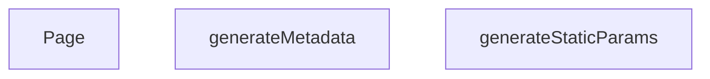

## NODE ID STANDARD

  file: src\app\[lang]\brands\[slug]\page.tsx
  function: src\app\[lang]\brands\[slug]\page.tsx::generateStaticParams
  function: src\app\[lang]\brands\[slug]\page.tsx::generateMetadata
  function: src\app\[lang]\brands\[slug]\page.tsx::Page

---

## DISA AKTARILANLAR (EXPORTS)
  export: Page
  export: generateMetadata
  export: generateStaticParams

---

## STİL TOKENLERİ

### Arbitrary Değerler (token'a geçirilmemiş)
Yok — tüm stiller token'a geçirilmiş. ✅

### Kullanılan Token'lar (zaten token'a geçirilmiş)
- (yok)

### Tailwind Sınıf Özeti
- **Renkler:** (yok)
- **Layout:** (yok)
- **Varyant/Responsive:** (yok)
- **Yardımcı Sınıflar:** (yok)

---
# FILE: src\app\[lang]\cart\page.md

---
domain: general
source_type: doc
namespace_type: module
source_path: C:\Users\alize\venthub-hvac\src\app\[lang]\cart\page.tsx
skeleton_hash: 4e8781721b6dc8a0
entity_hashes:
  func:Page: caa361dd303c55cf
  overview: 77749cbbbd217b97
  style_tokens: 9144ece4bffe7964
generated_at: 2026-06-19T20:46:14Z
---

## Genel Bakış
Bu modül, alışveriş sepeti sayfasının ana giriş noktası olan `Page` bileşenini tanımlar. Bileşen, sepetin kullanıcı arayüzünü oluşturur, veri çekme işlemlerini başlatır ve ödeme gibi kullanıcı etkileşimlerini yönlendirir; ayrıca alt bileşenlerin yüklenmesini yönetmek için Suspense mekanizmasını kullanır.

## Fonksiyon Grupları
### UI Render ve Veri Bağlantısı
Sepet sayfasının görsel çıktısını üretir ve gerekli verileri alt bileşenlere aktarır.
- Page

---

## AXIOMS – Mimari Varsayımlar
Bu modül için özel aksiyom tanımlanmamıştır.

---

## FONKSİYON DETAYLARI

### Page
**Ne yapar**: `Page` fonksiyonu, uygulamanın sepet sayfasını render eder ve içerik yüklenirken bir bekleme animasyonu gösterir.  
**Nasıl yapar**: Fonksiyon, `Suspense` bileşeni içinde `CartPage` bileşenini sarmalar. `Suspense`’ın `fallback` özelliği, veri çekimi tamamlanmadan önce dönen bir spinner ve ortalanmış bir konteyner gösterir. Bu sayede kullanıcıya içerik henüz hazır değilse görsel geri bildirim sağlanır.  
**Parametreler**:  
- (fonksiyon parametresi yok)  
**Dönüş**: Fonksiyon bir JSX elementi döndürür; dönüş tipi `void` olarak kabul edilir (React render çıktısı).

---

## İTHALATLAR (IMPORTS)
- import: ../../../views/CartPage::CartPage
- import: react::React
- import: react::Suspense

---

## AST POINTERS

### [N1_NASIL] AST Pointer: src/app/[lang]/cart/page.tsx::Page
- **params**: yok
- **ic_degiskenler**: yok
- **Dönüş**: React JSX elementi (`Suspense` altında `CartPage` bileşenini render eder)

---

## NODE ID STANDARD

  file: src\app\[lang]\cart\page.tsx
  function: src\app\[lang]\cart\page.tsx::Page

---

## DISA AKTARILANLAR (EXPORTS)
  export: Page

---

## STİL TOKENLERİ

### Arbitrary Değerler (token'a geçirilmemiş)
Yok — tüm stiller token'a geçirilmiş. ✅

### Kullanılan Token'lar (zaten token'a geçirilmiş)
- (yok)

### Tailwind Sınıf Özeti
- **Renkler:** `border-b-2`, `border-primary-navy`
- **Layout:** `flex`, `h-12`, `items-center`, `justify-center`, `min-h-screen`, `w-12`
- **Varyant/Responsive:** (yok)
- **Yardımcı Sınıflar:** `animate-spin`, `rounded-full`

---
# FILE: src\app\[lang]\category\[categorySlug]\page.md

---
domain: general
source_type: doc
namespace_type: module
source_path: C:\Users\alize\venthub-hvac\src\app\[lang]\category\[categorySlug]\page.tsx
skeleton_hash: 61cc4647bd19285b
entity_hashes:
  func:Page: 12913f4fb306f591
  func:generateMetadata: 191280413c5aca03
  func:generateStaticParams: a8df080d407871f7
  func:getCachedFamilies: 4e91294ead27b0a9
  func:parsePageParam: 478b1488bab262a0
  overview: e37d7f83fc7d9b78
  style_tokens: e37a0cb8a67ff36f
generated_at: 2026-08-15T06:32:39Z
---

## Genel Bakış
Bu modül, Next.js App Router yapısında dinamik kategori sayfalarını sunmakla sorumludur. URL'deki `categorySlug` ve `lang` parametrelerine göre sayfa içeriğini, SEO meta bilgilerini ve statik üretim parametrelerini yönetir. Hem derleme zamanında önceden üretim yapılandırmasını hem de çalışma zamanında sayfa arayüzünü oluşturur.

## Fonksiyon Grupları
### Veri Getirme ve Önbellekleme
Kategori sayfası için gerekli aile (ürün) verilerini getirir ve önbellekte tutarak performansı artırır.
- `getCachedFamilies`

### Parametre İşleme
URL'deki sayfa parametresini (page) ayrıştırarak sayısal bir değere dönüştürür.
- `parsePageParam`

### Statik Üretim Yapılandırması
Derleme aşamasında hangi kategori sayfalarının önceden üretileceğini belirleyerek statik site oluşturma sürecini yönetir.
- `generateStaticParams`

### SEO Meta Bilgisi Oluşturma
Her kategori sayfası için tarayıcı ve arama motorlarına sunulacak başlık, açıklama gibi meta verilerini dinamik olarak üretir.
- `generateMetadata`

### Sayfa Bileşeni
Kullanıcının tarayıcıda gördüğü kategori sayfasının ana arayüzünü oluşturur ve içeriği render eder.
- `Page`

---

## AXIOMS – Mimari Varsayımlar

Bu modül için temel mimari varsayımlar, fonksiyon imzalarında belirtilen parametre türleri ve bağımlılıklar üzerinden tanımlanmıştır.

[Aksiyom 1]: Eğer `lang` parametresi geçerli bir dil kodu değilse, `getCachedFamilies` fonksiyonu doğru veri dönemeyebilir veya hata üretebilir.

[Aksiyom 2]: Eğer `tenantId` parametresi geçerli bir kiracı (tenant) tanımlayıcısı değilse, `getCachedFamilies` fonksiyonu ilgili kiracıya ait aileleri getiremez.

[Aksiyom 3]: Eğer `categoryId` parametresi veritabanında var olmayan bir kategoriye aitse, `getCachedFamilies` fonksiyonu boş bir sonuç kümesi döndürebilir veya hata üretebilir.

[Aksiyom 4]: Eğer `page` parametresi pozitif bir tamsayı değilse (örn: 0 veya negatif), `getCachedFamilies` fonksiyonu geçersiz sayfalama yapabilir.

[Aksiyom 5]: Eğer `categoryIds` boş bir dizi ise, `getCachedFamilies` fonksiyonunun davranışı bilinmiyor (belgelenmemiş).

[Aksiyom 6]: Eğer `parsePageParam` fonksiyonuna `undefined` veya geçersiz bir string dizisi girilirse, varsayılan bir sayfa numarası döndürmelidir; ancak bu varsayılan değerin ne olduğu fonksiyon gövdesinden çıkarılamadığından bilinmiyor.

[Aksiyom 7]: Eğer `generateStaticParams` fonksiyonu çalıştırıldığında veritabanı bağlantısı kesikse veya `_getCachedSupabaseData` işlevi hata döndürürse, derleme zamanı statik üretim başarısız olabilir.

[Aksiyom 8]: Eğer `generateMetadata` fonksiyonuna geçersiz `categorySlug` veya `lang` parametresi verilirse, SEO meta bilgileri eksik veya hatalı üretilebilir.

[Aksiyom 9]: Eğer `Page` bileşeninin `searchParams.page` değeri geçersiz bir string veya string dizisi ise, `parsePageParam` aracılığıyla işlenmeli ve geçerli bir sayfa numarasına dönüştürülmelidir; aksi halde sayfa hatalı içerik gösterebilir.

[Aksiyom 10]: Eğer `_getCachedSupabaseData` işlevi (modül sabiti olarak tanımlanan) doğru yapılandırılmamışsa veya Supabase bağlantısı yoksa, bu modülün tüm veri getirme işlemleri başarısız olur.

---

## FONKSİYON DETAYLARI

### getCachedFamilies
**Ne yapar**: Belirli bir dil, kiracı, kategori ve sayfa için ürün ailelerinin (families) önbelleğe alınmış listesini getirir.
**Nasıl yapar**: Fonksiyon, anahtar olarak hem dil (`lang`) hem de kiracı (`tenantId`) hem de kategori ve sayfa numarasını içeren bir SaaS kuralına uygun şekilde verileri önbelleğe alır ve getirir. Keşif (discovery) alanına ait olduğu için, stok hareketleri bu önbelleği etkilemez (PS-042).
**Parametreler**:
- `lang`: `string` — Verilerin dil kodu (ör. 'tr', 'en').
- `tenantId`: `string` — Kiracının (tenant) benzersiz kimliği.
- `categoryId`: `string` — İstenen ürün ailelerinin ait olduğu kategorinin kimliği.
- `page`: `number` — İstenen sayfa numarası.
- `categoryIds`: `string[]` — Alt kategoriler dahil, tarama yapılacak tüm kategorilerin kimlikleri listesi.
**Dönüş**: Belirtilmemiş (docstring ve kodda dönüş tipi net değil).

### parsePageParam
**Ne yapar**: URL'deki `?page=` parametresini, 1-tabanlı ve geçerli bir tam sayıya dönüştürür; geçersiz veya tanımsız değerleri 1 olarak varsayar.
**Nasıl yapar**: Girdi `raw` bir dizi ise ilk elemanını, değilse doğrudan kendisini alır. Alınan değeri `10` tabanında bir tam sayıya (`parseInt`) dönüştürmeye çalışır. Eğer sonuç sonsuz bir sayıya veya 1'den küçük bir değere eşitse, 1 döndürür; aksi halde bulunan geçerli sayıyı döndürür.
**Parametreler**:
- `raw`: `string | string[] | undefined` — URL search parametresinden gelen ham sayfa değeri.
**Dönüş**: `number` — Geçerli, 1'den büyük bir tam sayı; aksi halde 1.

### generateStaticParams
**Ne yapar**: Next.js için tüm aktif kategorilerin ve her biri için İngilizce ve Türkçe dil varyantlarının statik sayfa parametrelerini oluşturur.
**Nasıl yapar**: Supabase veritabanından `is_active` durumu `true` olan tüm kategorileri (sadece `slug` ve `metadata` alanlarını) çeker. Ardından, her kategoriyi `flatMap` ile iki elemanlı bir diziye dönüştürür: biri `lang: 'tr'` için, diğeri `lang: 'en'` için. Her durumda, dilin görünen (localized) slug'ı `getLocalizedCategorySlug` fonksiyonu ile hesaplanır.
**Parametreler**: Yok.
**Dönüş**: Belirtilmemiş (docstring ve kodda dönüş tipi net değil; Next.js formatında `{ lang: string, categorySlug: string }[]` döndürür).

### generateMetadata
**Ne yapar**: Belirli bir dilde ve kategorideki sayfa için SEO odaklı metadata (başlık, açıklama, kanonik URL, Open Graph vb.) nesnesini oluşturur.
**Nasıl yapar**: Parametrelerden `categorySlug` ve `lang` değerlerini `await` ile çıkarır. Kategoriyi önceden yükler (`preloadCategory`) ve önbellekten verisini çeker (`getCachedCategoryData`). Bulunamazsa dil bazlı "Kategori Bulunamadı" başlığı döner. Bulunursa, kategorinin display adını (`getCategoryDisplayName`) sözlük (`dict`) ve `t` fonksiyonu ile hesaplar. Açıklama ve URL'leri (kanonik, hreflang) dile göre hazırlar. Son olarak, title, description, alternates (canonical, languages) ve openGraph alanlarını içeren bir nesne döner.
**Parametreler**:
- `{ params }`: `{ params: Promise<{ categorySlug: string, lang: string }> }` — Next.js'ten gelen, slug ve dil bilgisini içeren asenkron parametreler nesnesi.
**Dönüş**: Belirtilmemiş (docstring ve kodda dönüş tipi net değil; `{ title: string; description: string; alternates: {...}; openGraph: {...} }` benzeri bir nesne döndürür).

### Page
**Ne yapar**: Kategori sayfasının ana React bileşenidir; verileri getirir, yönlendirme yapar, SEO verilerini (JSON-LD) oluşturur ve sayfayı render eder.
**Nasıl yapar**: `params` ve `searchParams`'ı `await` ile çözer. `parsePageParam` ile sayfayı alır. Kategoriyi önceden yükler ve verisini çeker. Eğer gelen slug, dilin beklenen lokalize slug'ı ile uyuşmuyorsa (`getLocalizedCategorySlug` ile hesaplanan), `permanentRedirect` ile 308 kalıcı yönlendirme yapar. Kategori varsa, alt kategorilerini (çocukları) ve ürünlerin sayısını (`get_category_counts` RPC) çeker. Ürünü olmayan alt kategorileri filtreler. `getCachedFamilies` ile istenen sayfadaki ürün ailelerini getirir. `buildCategoryJsonLd` ile JSON-LD yapılandırmasını oluşturur ve `assertNoUuid` ile doğrular. Son olarak, JSON-LD'yi `<script>` etiketi ile ve `PageComponent`'i bir `React.Suspense` içinde render eden JSX döner.
**Parametreler**:
- `{ params, searchParams }`: `{ params: Promise<{ categorySlug: string, lang: string }>, searchParams: Promise<{ page?: string | string[] }> }` — Next.js'ten gelen, kategori slug'ı, dil ve sayfa parametrelerini içeren asenktron nesneler.
**Dönüş**: Belirtilmemiş (docstring ve kodda dönüş tipi net değil; JSX döndürür).

---

## İTHALATLAR (IMPORTS)
- import: ../../../../config/siteUrl::SITE_URL
- import: ../../../../lib/cache/tags::PRODUCTS_DISCOVERY_TAG
- import: ../../../../lib/cache/tags::discoveryTag
- import: ../../../../lib/data/preload::getCachedCategoryData
- import: ../../../../lib/data/preload::preloadCategory
- import: ../../../../lib/type-converters::mapDatabaseCategoryToDomain
- import: ../../../../lib/type-converters::type { DomainCategory }
- import: ../../../../types/db-rows::type { AuthorityContent,CategoryMetadata, DbCategory }
- import: ../../../../types/ui-models::type { FamilyListItem }
- import: ../../../../utils/tenantServer::getTenantConfig
- import: ../../../../views/CategoryPage::PageComponent
- import: @/i18n/dictionaries/en::en
- import: @/i18n/dictionaries/tr::tr
- import: @/i18n/getDictValue::getDictValue
- import: @/lib/seo/jsonld::assertNoUuid
- import: @/lib/seo/jsonld::buildCategoryJsonLd
- import: @/lib/services/family.service::getFamiliesEnriched
- import: @/lib/supabase/static::supabaseStaticClient
- import: @/utils/categoryHelpers::getCategoryDisplayName
- import: @/utils/categoryHelpers::getLocalizedCategorySlug
- import: next/cache::unstable_cache
- import: next/navigation::permanentRedirect
- import: react::React
- import: react::cache

---

## SABİTLER
- **_getCachedSupabaseData** (call) — `cache((id: string) => {
  return supabase.from('categories').select('*').eq(...`

---

## AST POINTERS

### [N1_NASIL] AST Pointer: `[lang]/category/[categorySlug]/page.tsx`::getCachedFamilies
- **params**: `lang: string`, `tenantId: string`, `categoryId: string`, `page: number`, `categoryIds: string[]`
- **ic_degiskenler**: (yerel değişken yok — parametreler doğrudan kullanılır)
- **Kullanilan dis kaynaklar**:
  - `unstable_cache` — Next.js cache wrapper; inner async callback sonucunu cache'ler
  - `getFamiliesEnriched(supabase, {...})` — supabase client ve filtre parametreleriyle enriched ürün listesini çeker
  - `PAGE_SIZE` — sayfa başına öğe sayısı sabiti (offset ve limit hesaplamasında)
  - `PRODUCTS_DISCOVERY_TAG` — cache tag sabiti
  - `discoveryTag(tenantId)` — tenant'a özel cache tag üreteci
- **Cache parametreleri**:
  - key: `['category-families', lang, tenantId, categoryId, String(page)]`
  - tags: `[PRODUCTS_DISCOVERY_TAG, discoveryTag(tenantId)]`
  - revalidate: `3600`
- **Dönüş**: `Promise<{ items: FamilyListItem[], total: number }>`

---

### [N2_NASIL] AST Pointer: `[lang]/category/[categorySlug]/page.tsx`::parsePageParam
- **params**: `raw: string | string[] | undefined`
- **ic_degiskenler**:
  - `value` — raw array ise `raw[0]`, değilse raw'un kendisi; parseInt'e girecek ham string
  - `parsed` — `Number.parseInt(value ?? '1', 10)` sonucu; geçersizse `NaN` döner
- **Dönüş**: `number` — geçerli ve >1 ise parsed değeri, aksi halde `1`

---

### [N3_NASIL] AST Pointer: `[lang]/category/[categorySlug]/page.tsx`::generateStaticParams
- **params**: (yok)
- **ic_degiskenler**:
  - `data` — `supabase.from('categories').select('slug, metadata').eq('is_active', true)` sonucu; tüm aktif kategorilerin slug ve metadata alanları
  - `categoriesList` — `data`'nın `(data || [])` ile garanti altına alınmış hali; tipi `{ slug: string | null, metadata: unknown }[]`
- **Dönüş**: `Array<{ lang: 'tr' | 'en', categorySlug: string }>` — her kategori için TR ve EN olmak üzere 2 statik parametre

---

### [N4_NASIL] AST Pointer: `[lang]/category/[categorySlug]/page.tsx`::generateStaticParams.flatMap_callback
- **params**: `c` — `{ slug: string | null, metadata: unknown }` tipinde tek bir kategori satırı
- **ic_degiskenler**: (yok)
- **Kullanilan dis kaynaklar**:
  - `getLocalizedCategorySlug(c, 'tr')` — kategorinin Türkçe lokalize slug'ını döner
  - `getLocalizedCategorySlug(c, 'en')` — kategorinin İngilizce lokalize slug'ını döner
- **Dönüş**: `Array<{ lang: 'tr' | 'en', categorySlug: string }>` — tek kategoriden üretilen 2 parametre çifti

---

### [N5_NASIL] AST Pointer: `[lang]/category/[categorySlug]/page.tsx`::generateMetadata
- **params**: `params: Promise<{ categorySlug: string, lang: string }>`
- **ic_degiskenler**:
  - `categorySlug` — `await params` destructuring'inden gelen kategori slug'ı (URL parçası)
  - `lang` — `await params` destructuring'inden gelen dil kodu (`'tr'` veya `'en'`)
  - `category` — `getCachedCategoryData(categorySlug)` ile cache'lenmiş kategori verisi; bulunamazsa `null`
  - `dict` — aktif dilin sözlük nesnesi; `lang === 'en'` ise `en`, değilse `tr`
  - `t` — `(key: string) => getDictValue(dict, key)` fonksiyonu; sözlükten çeviri değeri çeker
  - `displayName` — `getCategoryDisplayName(category, t)` ile çözülen kategorinin görnen adı
  - `desc` — SEO meta description; dile göre farklı şablon ile üretilir
  - `trUrl` — Türkçe canonical URL; `${SITE_URL}/tr/category/${getLocalizedCategorySlug(category, 'tr')}`
  - `enUrl` — İngilizce canonical URL; `${SITE_URL}/en/category/${getLocalizedCategorySlug(category, 'en')}`
  - `canonicalUrl` — aktif dile göre `enUrl` veya `trUrl`
- **Kullanilan dis sabitler**: `SITE_URL`
- **Yan etkiler**: `preloadCategory(categorySlug)` — veriyi erken prefetch/prime eder
- **Dönüş**: `Metadata` nesnesi — `title`, `description`, `alternates` (canonical, hreflang), `openGraph`

---

### [N6_NASIL] AST Pointer: `[lang]/category/[categorySlug]/page.tsx`::Page
- **params**: `params: Promise<{ categorySlug: string, lang: string }>`, `searchParams: Promise<{ page?: string | string[] }>`
- **ic_degiskenler**:
  - `categorySlug` — `await params` destructuring'inden gelen URL slug'ı
  - `lang` — `await params` destructuring'inden gelen dil kodu
  - `pageParam` — `await searchParams` destructuring'inden gelen sayfa parametresi (`string | string[] | undefined`)
  - `page` — `parsePageParam(pageParam)` sonucu; geçerli pozitif integer veya `1`
  - `category` — `getCachedCategoryData(categorySlug)` ile çekilmiş kategori nesnesi; `null` olabilir
  - `expectedSlug` — `getLocalizedCategorySlug(category, lang)` ile hesaplanan dil-specific slug; yönlendirme kontrolü için
  - `dict` — aktif dilin sözlük nesnesi (`en` veya `tr`)
  - `t` — `(key: string) => getDictValue(dict, key)` fonksiyonu
  - `displayName` — `getCategoryDisplayName(category, t)` sonucu; `null/empty` ise `categorySlug` fallback kullanılır
  - `families` — `FamilyListItem[]`; varsayılan boş dizi; kategori varsa `familiesPage.items` ile doldurulur
  - `total` — `number`; kategori varsa `familiesPage.total` ile doldurulur
  - `subCategories` — `DomainCategory[]`; varsayılan boş dizi; kategori varsa filtrelenmiş ve map edilmiş alt kategoriler
  - `tenantId` — `await getTenantConfig()` sonucunun `.id` alanı; cache key ve API çağrıları için
  - `subsData` — `supabase.from('categories')...eq('parent_id', category.id)...` sonucunun `data` alanı; ham alt kategori satırları
  - `countsData` — `supabase.rpc('get_category_counts')` sonucunun `data` alanı; `{ category_id, product_count }` satırları
  - `countMap` — `Map<string, number>`; `countsData`'dan doldurulan `category_id → product_count` eşleme haritası
  - `categoriesArray` — `subsData`'nın `(subsData || []) as DbCategory[]` ile tip güvenliği sağlanmış hali
  - `categoryIds` — `[category.id, ...subCategories.map(s => s.id)]`; ana kategori + tüm geçerli alt kategori ID'leri
  - `familiesPage` — `getCachedFamilies(lang, tenantId, category.id, page, categoryIds)` sonucu; `{ items, total }`
  - `jsonLd` — `buildCategoryJsonLd({...})` ile üretilen JSON-LD nesnesi; SEO structured data
- **Kullanilan dis sabitler**: `SITE_URL`, `PAGE_SIZE`
- **Kullanilan dis fonksiyonlar**: `preloadCategory`, `getCachedCategoryData`, `getLocalizedCategorySlug`, `getCategoryDisplayName`, `getDictValue`, `getTenantConfig`, `mapDatabaseCategoryToDomain`, `getCachedFamilies`, `buildCategoryJsonLd`, `assertNoUuid`, `permanentRedirect`
- **Yan etkiler**: `preloadCategory(categorySlug)` prefetch; `permanentRedirect(...)` 308 yönlendirme (koşullu)
- **Dönüş**: JSX — `<script type="application/ld+json">` + `<React.Suspense>` içinde `<PageComponent>`

---

### [N7_NASIL] AST Pointer: `[lang]/category/[categorySlug]/page.tsx`::Page.mapDatabaseCategoryToDomain_callback
- **params**: `s` — `DbCategory` tipinde ham veritabanı satırı (tüm category alanlarını içerir)
- **ic_degiskenler**: (yok — inline spread ve map)
- **Alan dönüşümleri**:
  - `s.name` → `name: s.name || ''` (null/undefined koruması)
  - `s.menu_label` → `menu_label: s.menu_label as string | null`
  - `s.marketing_title` → `marketing_title: s.marketing_title as string | null`
  - `s.translation_key` → `translation_key: s.translation_key as string | null`
  - `s.description` → `description: s.description as string | null`
  - `s.metadata` → `metadata: s.metadata as CategoryMetadata | null`
  - `s.authority_content` → `authority_content: s.authority_content as AuthorityContent | null`
  - Diğer alanlar (`id`, `parent_id`, `slug`, `is_active`, `sort_order`, `level`, `image_url`, `seo_title`, `seo_desc`, `created_at`, `updated_at`, `display_mode`, `is_featured`) spread ile doğrudan kopyalanır
- **Dönüş**: `DomainCategory` — `mapDatabaseCategoryToDomain()` ile dönüştürülmüş kategori nesnesi

---

### [N8_NASIL] AST Pointer: `[lang]/category/[categorySlug]/page.tsx`::getCategoryData
- **params**: `id: string` — kategori UUID'si
- **ic_degiskenler**: (yok)
- **Kullanilan dis kaynaklar**: `supabase` (static client)
- **Sorgu**: `supabase.from('categories').select('*').eq('id', id).single()`
- **Dönüş**: `Promise<SupabaseResponse>` — tek kategori satırı; bulunamazsa `data: null`

---


## MERMAID CALL GRAPH
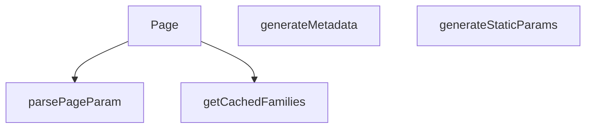

## NODE ID STANDARD

  file: src\app\[lang]\category\[categorySlug]\page.tsx
  function: src\app\[lang]\category\[categorySlug]\page.tsx::getCachedFamilies
  function: src\app\[lang]\category\[categorySlug]\page.tsx::parsePageParam
  function: src\app\[lang]\category\[categorySlug]\page.tsx::generateStaticParams
  function: src\app\[lang]\category\[categorySlug]\page.tsx::generateMetadata
  function: src\app\[lang]\category\[categorySlug]\page.tsx::Page

---

## DISA AKTARILANLAR (EXPORTS)
  export: Page
  export: generateMetadata
  export: generateStaticParams
  export: getCachedFamilies
  export: parsePageParam

---

## STİL TOKENLERİ

### Arbitrary Değerler (token'a geçirilmemiş)
Yok — tüm stiller token'a geçirilmiş. ✅

### Kullanılan Token'lar (zaten token'a geçirilmiş)
- (yok)

### Tailwind Sınıf Özeti
- **Renkler:** `text-center`, `text-slate-500`
- **Layout:** (yok)
- **Varyant/Responsive:** (yok)
- **Yardımcı Sınıflar:** `container`, `mx-auto`, `px-4`, `py-12`

---
# FILE: src\app\[lang]\category\[categorySlug]\[subCategorySlug]\page.md

---
domain: general
source_type: doc
namespace_type: module
source_path: C:\Users\alize\venthub-hvac\src\app\[lang]\category\[categorySlug]\[subCategorySlug]\page.tsx
skeleton_hash: 00c87bd7450ffb1a
entity_hashes:
  func:Page: 3f194a51738b081b
  func:generateMetadata: 374cf14702a129ba
  func:generateStaticParams: 01749dce9eb251b4
  func:getCachedFamilies: 0c20054405aac333
  func:parsePageParam: 478b1488bab262a0
  func:resolveLocalizedSegments: 606c139694573527
  overview: a95554f4a816ca75
  style_tokens: e37a0cb8a67ff36f
generated_at: 2026-08-15T06:32:24Z
---

## Genel Bakış

Bu modül, Next.js App Router yapısında `[categorySlug]/[subCategorySlug]` dinamik rotasını temsil eden sunucu tarafı bir sayfa bileşenidir. URL'den gelen dil, kategori ve alt kategori parametrelerini işleyerek ilgili ürün/aile listesini çeker, yerelleştirilmiş içeriği hazırlar ve SEO metadata'sını dinamik olarak üretir. Ayrıca derleme aşamasında oluşturulabilecek tüm olası sayfa kombinasyonlarını belirleyerek statik site oluşturmayı destekler.

## Fonksiyon Grupları

### Sayfa Bileşeni ve Metadata Üretimi
Modülün dışa açılan ana noktasıdır; istek geldiğinde sayfayı render eder ve tarayıcı/motor için gerekli SEO bilgilerini (başlık, açıklama vb.) üretir.
- `Page`, `generateMetadata`

### Veri Çekme ve Önbellekleme
Sayfanın içeriğini oluşturmak için gerekli kategori ve aile verilerini sunucu tarafında asenkron olarak çeker; performans için önbellekleme stratejileri uygular.
- `getCachedFamilies`, `resolveLocalizedSegments`

### Parametre İşleme Yardımcıları
URL'den gelen ham parametreleri (sayfa numarası, slug'lar) geçerli ve kullanıma hazır türlere dönüştürerek hata önleme sağlar.
- `parsePageParam`

### Statik Sayfa Oluşturma Desteği
Build aşamasında Next.js'e sunulması gereken tüm olası dil, kategori ve alt kategori parametrelerini belirleyerek statik dosya üretimini tetikler.
- `generateStaticParams`

---

## AXIOMS – Mimari Varsayımlar

Bu modül, dinamik Next.js rotalarında kategori ve alt kategori sayfalarını sunmak için tasarlanmıştır. Mimari varsayımlar, veri bağımlılıkları, URL parametrelerinin işlenmesi ve statik site oluşturma süreçlerine dayanır.

[Aksiyom 1]: Eğer `lang`, `tenantId` veya `categoryId` geçerli bir değer içermiyorsa, `getCachedFamilies` fonksiyonu hatalı veri döndürür veya hiç veri döndüremez.

[Aksiyom 2]: Eğer `page` parametresi negatif bir tamsayı değeri alırsa, `parsePageParam` fonksiyonu beklenmeyen bir sayfa numarası döndürür (örneğin, 1'den küçük bir değer).

[Aksiyom 3]: Eğer `generateStaticParams` fonksiyonu çalıştırıldığında geçerli bir kategori verisi (tüm olası `categorySlug` ve `subCategorySlug` kombinasyonları) alınamazsa, derleme aşamasında hiçbir statik sayfa oluşturulamaz.

[Aksiyom 4]: Eğer `resolveLocalizedSegments` fonksiyonuna geçersiz bir `category` nesnesi (null veya undefined) veya geçersiz bir `lang` değeri girilirse, localized segmentler (örneğin, `fallbackParentSlug`) doğru çözümlenemez ve URL'ler hatalı oluşturulur.

[Aksiyom 5]: Eğer `generateMetadata` fonksiyonuna geçersiz `params` (geçersiz `categorySlug`, `subCategorySlug` veya `lang`) girilirse, sayfa için metadata (başlık, açıklama vb.) üretilemez ve varsayılan veya boş metadata kullanılır.

[Aksiyom 6]: Eğer `getParentSlugSource` çağrılmazsa veya geçerli bir kaynak döndürmezse, `resolveLocalizedSegments` fonksiyonu fallback değerlerini doğru şekilde çözemeyebilir.

[Aksiyom 7]: Eğer `searchParams` içindeki `page` parametresi tanımlanmamışsa veya geçersiz bir tamsayı (örneğin, negatif veya çok büyük bir değer) ise, `Page` bileşeni varsayılan sayfa numarasını (muhtemelen 1) kullanır.

[Aksiyom 8]: Eğer `getCachedFamilies` fonksiyonu asynchronous olarak çalıştırıldığında zaman aşımı veya ağ hatası oluşursa, `Page` bileşeni veri olmadan render edilir veya hata gösterir.

[Aksiyom 9]: Eğer `tenantId` veya `categoryId` boş string ("") ise, `getCachedFamilies` fonksiyonu beklenmeyen davranış gösterebilir (örneğin, tüm verileri döndürebilir veya hiç veri döndüremeyebilir).

[Aksiyom 10]: Eğer `generateStaticParams` fonksiyonu çok büyük miktarda sayfa kombinasyonu döndürürse, derleme süresi önemli ölçüde uzayabilir ve kaynak tüketimi artabilir.

---

## FONKSİYON DETAYLARI

### getCachedFamilies
**Ne yapar**: Belirli bir dil, kiracı, kategori ve sayfa numarasına karşılık gelen alt kategori aile listesini önbellekten getirir veya hesaplar. Bu fonksiyon, sayfa başına gösterilecek aile listesinin yüksek performanslı bir şekilde sunulmasını sağlar.

**Nasıl yapar**: Fonksiyon, bir önbellekleme mekanizması kullanarak veri erişimini hızlandırır. Docstring'de belirtildiği üzere, önbellek anahtarı `lang + tenantId + kategori + sayfa` formatında oluşturulur (kural 12). Etiketleme stratejisi olarak "KEŞİF" alanı kullanılır; ana sayfa verisi (home-data etiketi) bu önbellek anahtarına dahil edilmez (PS-042). Bu sayede, ana sayfa ile kategori sayfaları arasındaki veri izolasyonu korunur ve gereksiz önbellek ihlalleri önlenir.

**Parametreler**:
- lang: string — İçerik ve arayüzün gösterileceği dil kodu (örn: 'tr', 'en').
- tenantId: string — İsteği yapan kullanıcının ait olduğu kiracı (tenant) tanımlayıcısı.
- categoryId: string — Alt kategorinin ait olduğu üst kategorinin benzersiz tanımlayıcısı.
- page: number — Getirilecek sayfanın 1 tabanlı numarası.

**Dönüş**: Fonksiyonun dönüş tipi doğrudan belirtilmemiş olup, genellikle bir sayfa objesi (items dizisi ve toplam sayfa sayısını içeren bir yapı) döndürmesi beklenir. Ancak kesin dönüş yapısı docstring'de verilmemiştir.

### parsePageParam
**Ne yapar**: URL'deki `?page=` arama parametresini alır ve güvenli bir şekilde 1 tabanlı pozitif bir tam sayıya dönüştürür. Bu fonksiyon, sayfalama parametrelerinin doğrulanmasını ve standartlaştırılmasını sağlayarak hatalı veya eksik girişlere karşı dayanıklılık kazandırır.

**Nasıl yapar**: Fonksiyon, girdi olarak string, string dizisi veya undefined alabilir. Önce girdinin dizi olup olmadığını kontrol eder; eğer dizi ise ilk elemanı kullanır. Ardından bu değeri `parseInt` ile tam sayıya dönüştürmeye çalışır. Sonuç, `isFinite` kontrolünden geçerse ve 1'den büyükse kullanılır; aksi halde varsayılan olarak 1 döner. Bu mantık, geçersiz, negatif veya boş değerlerin güvenli bir şekilde ele alınmasını garanti eder.

**Parametreler**:
- raw: string | string[] | undefined — URL arama parametrelerinden gelen ham `page` değeri. Tek bir string, string dizisi veya tanımsız olabilir.

**Dönüş**: number — Doğrulanmış ve 1 tabanlı sayfa numarası. Geçersiz veya eksik girdiler için her zaman 1 döner.

### generateStaticParams
**Ne yapar**: Next.js'in Statik Site Üretimi (SSG) modu için, derleme zamanında oluşturulacak tüm olası alt kategori sayfalarının parametrelerini üretir. Bu, alt kategori sayfalarının önceden statik olarak oluşturulmasını sağlayarak performansı artırır.

**Nasıl yapar**: Fonksiyon, Supabase veritabanından iki ayrı sorgu çalıştırır. İlk olarak, aktif olan ve bir üst kategorisi (`parent_id` dolu) bulunan tüm alt kategorileri çeker. İkinci olarak, tüm aktif üst kategorileri çeker ve bir harita (Map) oluşturarak üst kategorilerin ID'lerini doğrudan erişilebilir hale getirir. Ardından, her alt kategori için hem 'tr' hem de 'en' dillerinde olmak üzere iki set parametre üretir. `getLocalizedCategorySlug` yardımcı fonksiyonunu kullanarak, her dil için üst ve alt segment slug'larını bulur. Sonuç olarak, her dil ve alt kategori kombinasyonu için bir `{ lang, categorySlug, subCategorySlug }` nesnesi içeren düz bir dizi döner.

**Parametreler**: Bu fonksiyon parametre almaz.

**Dönüş**: Promise<Array<{ lang: string, categorySlug: string, subCategorySlug: string }>> — Statik olarak oluşturulacak sayfaların parametrelerini içeren bir promise. Her eleman, bir sayfanın dilini ve URL segmentlerini belirtir.

### resolveLocalizedSegments
**Ne yapar**: Verilen bir kategori nesnesi için, belirli bir dildeki doğru üst ve alt segment (slug) çiftini belirler. Bu fonksiyon, URL'nin dil ile tutarlı olmasını ve doğru lokalize slug'ların kullanılmasını garanti altına alır.

**Nasıl yapar**: Fonksiyon, öncelikle `getLocalizedCategorySlug` kullanarak verilen dil için alt kategorinin slug'ını üretir. Üst slug için ise, bir fallback değeri (varsayılan) alır. Eğer kategorinin bir üst kategorisi varsa (`parent_id` dolu ise), `getParentSlugSource` fonksiyonunu asenkron olarak çağırarak üst kategorinin verisini çeker. Başarılı olursa, üst kategorinin de lokalize edilmiş slug'ını üretir; başarısız olursa fallback değerini kullanır. Son olarak, her iki slug'ı da içeren bir nesne döner.

**Parametreler**:
- category: NonNullable<Awaited<ReturnType<typeof getCachedCategoryData>>> — Üst verileri önceden getirilmiş, boş olmayan bir kategori nesnesi.
- lang: string — Slug'ların çözüleceği hedef dil.
- fallbackParentSlug: string — Üst kategorinin slug'ı çözülemediğinde veya üst kategori mevcut olmadığında kullanılacak varsayılan üst slug.

**Dönüş**: Promise<{ parentSlug: string, subSlug: string }> — Belirtilen dil için çözülmüş üst ve alt segment slug'larını içeren bir promise.

### generateMetadata
**Ne yapar**: Bir alt kategori sayfası için SEO dostu metadata (başlık, açıklama, kanonik URL ve dil alternatifleri) üretir. Bu fonksiyon, arama motoru optimizasyonu için gerekli olan tüm meta etiketlerini merkezi bir yerden yönetir.

**Nasıl yapar**: Fonksiyon, öncelikle URL parametrelerini (dil, üst ve alt slug) çıkarır. Ardından `getCachedCategoryData` ile alt kategorinin verilerini getirir. Kategori bulunamazsa, dile özgü bir "bulunamadı" başlığı döner. Kategori varsa, `getCategoryDisplayName` ve sözlük (`dict`) kullanarak kullanıcılara görünen adını üretir. Açıklama metni de dil bazlı olarak oluşturulur. En kritik adım, `resolveLocalizedSegments` fonksiyonunu her iki dil ('tr' ve 'en') için çağırarak doğru lokalize URL segmentlerini elde etmektir. Bu sayede, canonical URL ve `hreflang` alternatifleri tutarlı ve doğru diller için üretilir. Canonical URL, mevcut dilin URL'si olarak ayarlanır.

**Parametreler**:
- { params }: { params: Promise<{ categorySlug: string, subCategorySlug: string, lang: string }> } — Next.js tarafından sağlanan, URL segmentlerini ve dil bilgisini içeren asenkron parametre nesnesi.

**Dönüş**: Promise<{ title: string, description?: string, alternates?: { canonical: string, languages: { [lang: string]: string } } }> — Sayfa için metadata objesini içeren bir promise. Bulunamama durumunda sadece başlık döner; aksi halde başlık, açıklama ve alternatif URL'leri içeren bir obje döner.

### Page
**Ne yapar**: Alt kategori sayfasının ana React bileşenini render eder. Bu fonksiyon, veri getirme, yönlendirme mantığı ve arayüzün asenkron hazırlanmasından sorumludur.

**Nasıl yapar**: Fonksiyon, asenkron çalışarak URL parametrelerini ve arama parametrelerini (`page`) alır. `parsePageParam` ile sayfa numarını doğrular. `getCachedCategoryData` ile alt kategorinin verisini getirir. Kategori varsa, dil ile tutarsız slug'ları düzeltmek için `resolveLocalizedSegments` çağırır ve gerekirse 308 (kalıcı) yönlendirme yapar. Ardından, `getCachedFamilies` ile o sayfaya ait aile listesini getirir. Son olarak, `React.Suspense` içinde `PageComponent`'i, gerekli tüm verileri (kategori, aileler, sayfalama bilgisi) prop olarak geçirerek render eder. Suspense'in fallback'i olarak basit bir yükleniyor mesajı gösterilir.

**Parametreler**:
- params: Promise<{ categorySlug: string, subCategorySlug: string, lang: string }> — URL'den gelen ve üst kategori slug'ını, alt kategori slug'ını ve dil kodunu içeren asenkron parametre.
- searchParams: Promise<{ page?: string | string[] }> — URL'nin query kısmından gelen ve sayfa numarasını belirten opsiyonel asenktron parametre.

**Dönüş**: Promise<React.ReactNode> — Render edilecek React bileşenini içeren bir promise. Bu bileşen, sayfanın tüm içeriğini (yükleniyor durumu dahil) temsil eder.

---

## İTHALATLAR (IMPORTS)
- import: ../../../../../config/siteUrl::SITE_URL
- import: ../../../../../lib/cache/tags::PRODUCTS_DISCOVERY_TAG
- import: ../../../../../lib/cache/tags::discoveryTag
- import: ../../../../../lib/data/preload::getCachedCategoryData
- import: ../../../../../types/ui-models::type { FamilyListItem }
- import: ../../../../../utils/tenantServer::getTenantConfig
- import: ../../../../../views/CategoryPage::PageComponent
- import: @/i18n/dictionaries/en::en
- import: @/i18n/dictionaries/tr::tr
- import: @/i18n/getDictValue::getDictValue
- import: @/lib/services/family.service::getFamiliesEnriched
- import: @/lib/supabase/static::supabaseStaticClient
- import: @/utils/categoryHelpers::getCategoryDisplayName
- import: @/utils/categoryHelpers::getLocalizedCategorySlug
- import: next/cache::unstable_cache
- import: next/navigation::permanentRedirect
- import: react::React
- import: react::cache

---

## SABİTLER
- **getParentSlugSource** (call) — `cache(async (parentId: string) => {
  const { data } = await supabase
    ....`

---

## AST POINTERS

### [N1_NASIL] AST Pointer: [lang]/category/[categorySlug]/[subCategorySlug]/page.tsx::getCachedFamilies
- **params**: `lang: string`, `tenantId: string`, `categoryId: string`, `page: number`
- **ic_degiskenler**:
  - Fonksiyon gövdesi tek bir `unstable_cache(...)` çağrısıdır — iç değişken yoktur
- **Dönüş**: `unstable_cache` ile sarılmış `getFamiliesEnriched` sonucu (aile listesi + total), invoke ile tetiklenir

---

### [N2_NASIL] AST Pointer: [lang]/category/[categorySlug]/[subCategorySlug]/page.tsx::parsePageParam
- **params**: `raw: string | string[] | undefined`
- **ic_degiskenler**:
  - `value` — raw dizise ise ilk elemanı, değilse raw'un kendisini alır; tek string'e normalize eder
  - `parsed` — value'yu `Number.parseInt` ile 10 tabanında tam sayıya dönüştürür
- **Dönüş**: `number` — parsed geçerli ve 1'den büyükse parsed, aksi halde 1 döner

---

### [N3_NASIL] AST Pointer: [lang]/category/[categorySlug]/[subCategorySlug]/page.tsx::generateStaticParams
- **params**: yok
- **ic_degiskenler**:
  - `data` — supabase'den çekilen `categories` tablosu satırları (`slug, metadata, parent_id`); aktif ve parent_id'si olan (yani alt kategoriler) kayıtlar
  - `parents` — supabase'den çekilen üst kategoriler tablosu satırları (`id, slug, metadata`); tüm aktif kategoriler (üst + alt)
  - `parentsList` — parents'ın tip güvencesi ile assert edilmiş hali (`{ id, slug, metadata }[]`)
  - `parentMap` — üst kategorilerin `id → { slug, metadata }` eşlemesi; parent_id ile üst kategoriyi hızlıca bulmak için kullanılır
  - `subCategoriesList` — data'nın tip güvencesi ile assert edilmiş hali (`{ slug, metadata, parent_id }[]`)
  - `c` — `flatMap` iterasyonunda her bir alt kategori satırı
  - `parent` — `parentMap.get(c.parent_id || '')` ile bulunan üst kategori nesnesi (bulunamazsa undefined)
  - `lang` — `(['tr', 'en'] as const)` dizisi iterasyonunda her bir dil kodu
- **Dönüş**: `{ lang, categorySlug, subCategorySlug }` nesneleri dizisi — Next.js statik parametre üretimi için

---

### [N4_NASIL] AST Pointer: [lang]/category/[categorySlug]/[subCategorySlug]/page.tsx::resolveLocalizedSegments
- **params**: `category: NonNullable<Awaited<ReturnType<typeof getCachedCategoryData>>>`, `lang: string`, `fallbackParentSlug: string`
- **ic_degiskenler**:
  - `subSlug` — `getLocalizedCategorySlug(category, lang)` çağrısı ile elde edilen dil本土化 alt kategori slug'ı
  - `parentSlug` — başlangıçta `fallbackParentSlug` değerini alır; parent_id varsa üst kategoriden çözülerek güncellenir
  - `parent` — `getParentSlugSource(category.parent_id)` çağrısı ile veritabanından çekilen üst kategori verisi (null olabilir)
- **Dönüş**: `{ parentSlug, subSlug }` — çözümelenmiş yerelleştirilmiş üst ve alt segmentler

---

### [N5_NASIL] AST Pointer: [lang]/category/[categorySlug]/[subCategorySlug]/page.tsx::generateMetadata
- **params**: `{ params: Promise<{ categorySlug, subCategorySlug, lang }> }`
- **ic_degiskenler**:
  - `categorySlug` — `await params` ile çözümlenen üst kategori slug'ı (ham URL segmenti)
  - `subCategorySlug` — `await params` ile çözümlenen alt kategori slug'ı (ham URL segmenti)
  - `lang` — `await params` ile çözümlenen dil kodu (`'tr'` veya `'en'`)
  - `category` — `getCachedCategoryData(subCategorySlug)` ile cached olarak çekilen kategori nesnesi; null ise "not found" metadata döner
  - `dict` — lang `'en'` ise `en` sözlüğü, `'tr'` ise `tr` sözlüğü
  - `t` — `getDictValue(dict, key)` çağrısını saran çeviri fonksiyonu; dict key çözümleyicisi
  - `displayName` — `getCategoryDisplayName(category, t)` ile elde edilen kategorinin görnen adı
  - `desc` — lang'a göre İngilizce veya Türkçe meta açıklama cümlesi; `displayName` interpolasyonu içerir
  - `trSegments` — `resolveLocalizedSegments(category, 'tr', categorySlug)` çağrısı ile Türkçe URL segmentleri
  - `enSegments` — `resolveLocalizedSegments(category, 'en', categorySlug)` çağrısı ile İngilizce URL segmentleri
  - `trUrl` — Türkçe kanonik URL; `SITE_URL`, `trSegments.parentSlug`, `trSegments.subSlug` birleştirilir
  - `enUrl` — İngilizce kanonik URL; `SITE_URL`, `enSegments.parentSlug`, `enSegments.subSlug` birleştirilir
  - `canonicalUrl` — lang `'en'` ise `enUrl`, aksi halde `trUrl`
- **Dönüş**: `{ title, description, alternates: { canonical, languages } }` — Next.js metadata nesnesi

---

### [N6_NASIL] AST Pointer: [lang]/category/[categorySlug]/[subCategorySlug]/page.tsx::Page
- **params**: `{ params: Promise<{ categorySlug, subCategorySlug, lang }>, searchParams: Promise<{ page?: string | string[] }> }`
- **ic_degiskenler**:
  - `categorySlug` — `await params` ile çözümlenen üst kategori slug'ı (ham URL segmenti)
  - `subCategorySlug` — `await params` ile çözümlenen alt kategori slug'ı (ham URL segmenti)
  - `lang` — `await params` ile çözümlenen dil kodu
  - `pageParam` — `await searchParams` ile çözümlenen `page` arama parametresi (string veya string[] veya undefined)
  - `page` — `parsePageParam(pageParam)` çağrısı ile parse edilmiş sayfa numarası
  - `category` — `getCachedCategoryData(subCategorySlug)` ile cached kategori nesnesi; null ise empty liste ile render edilir
  - `dict` — lang `'en'` ise `en` sözlüğü, `'tr'` ise `tr` sözlüğü; loading fallback metni için kullanılır
  - `parentSlug` — `resolveLocalizedSegments` sonucu elde edilen çözümlenmiş üst kategori slug'ı
  - `subSlug` — `resolveLocalizedSegments` sonucu elde edilen çözümlenmiş alt kategori slug'ı
  - `families` — `FamilyListItem[]` tipinde; başlangıçta boş dizi, kategori varsa `getCachedFamilies` ile doldurulur
  - `total` — number; başlangıçta 0, kategori varsa `getCachedFamilies` sonucunun `total` değeri ile güncellenir
  - `tenantId` — `getTenantConfig()` ile çekilen tenant yapılandırmasının `id` değeri
  - `familiesPage` — `getCachedFamilies(lang, tenantId, category.id, page)` sonucu; `{ items, total }` yapısındadır
- **Dönüş**: `React.Suspense` ile sarılmış `PageComponent` JSX'i; kategori bulunamazsa empty aile listesi ile render edilir; slug uyumsuzluğunda `permanentRedirect` ile 308 yönlendirme yapar (yan etki)

---


## MERMAID CALL GRAPH
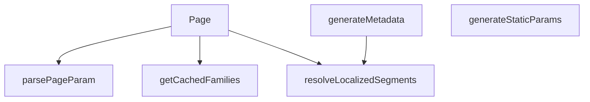

## NODE ID STANDARD

  file: src\app\[lang]\category\[categorySlug]\[subCategorySlug]\page.tsx
  function: src\app\[lang]\category\[categorySlug]\[subCategorySlug]\page.tsx::getCachedFamilies
  function: src\app\[lang]\category\[categorySlug]\[subCategorySlug]\page.tsx::parsePageParam
  function: src\app\[lang]\category\[categorySlug]\[subCategorySlug]\page.tsx::generateStaticParams
  function: src\app\[lang]\category\[categorySlug]\[subCategorySlug]\page.tsx::resolveLocalizedSegments
  function: src\app\[lang]\category\[categorySlug]\[subCategorySlug]\page.tsx::generateMetadata
  function: src\app\[lang]\category\[categorySlug]\[subCategorySlug]\page.tsx::Page

---

## DISA AKTARILANLAR (EXPORTS)
  export: Page
  export: generateMetadata
  export: generateStaticParams
  export: getCachedFamilies
  export: parsePageParam
  export: resolveLocalizedSegments

---

## STİL TOKENLERİ

### Arbitrary Değerler (token'a geçirilmemiş)
Yok — tüm stiller token'a geçirilmiş. ✅

### Kullanılan Token'lar (zaten token'a geçirilmiş)
- (yok)

### Tailwind Sınıf Özeti
- **Renkler:** `text-center`, `text-slate-500`
- **Layout:** (yok)
- **Varyant/Responsive:** (yok)
- **Yardımcı Sınıflar:** `container`, `mx-auto`, `px-4`, `py-12`

---
# FILE: src\app\[lang]\checkout\page.md

---
domain: general
source_type: doc
namespace_type: module
source_path: C:\Users\alize\venthub-hvac\src\app\[lang]\checkout\page.tsx
skeleton_hash: dc76e2fab76b588a
entity_hashes:
  func:Page: 752ea1d46a136aae
  overview: cbc240f327cf6544
  style_tokens: 9144ece4bffe7964
generated_at: 2026-06-19T20:46:14Z
---

## Genel Bakış
`src/app/[lang]/checkout/page.tsx` modülü, uygulamanın ödeme sayfasının dil destekli ana bileşenini tanımlar. Bu bileşen, kullanıcının ödeme sürecini yönettiği arayüzün tamamını oluşturur ve dil parametresine göre render eder.

## Fonksiyon Grupları
### UI Rendering
Ödeme sayfasının kullanıcı arayüzünü JSX ile oluşturur ve dil parametresine göre dinamik olarak render edilen React bileşenini döndürür.
- Page

---

## AXIOMS – Mimari Varsayımlar

Bu modül için doğrulanabilir mimari varsayımlar çok sınırlıdır; `Page()` fonksiyon imzası parametresizdir ve modül sabitleri tanımlanmamıştır.

**[Aksiyom 1]:** Eğer `CheckoutPage` adlı alt bileşen mevcut değilse veya modül tarafından import edilemezse, `Page` fonksiyonunun JSX döndürme süreci tamamlanamaz ve çalışma zamanı hatası oluşur.

**[Aksiyom 2]:** Eğer render sırasında loading durumu (animasyonlu ekran) için gerekli UI kaynakları (CSS class'ları, animasyon tanımları veya stil bileşenleri) sağlanamazsa, kullanıcı boş veya bozuk bir geçiş ekranı görür.

> **Not:** Fonksiyon imzası `Page()` olarak verilmiş olup herhangi bir parametre göstermemektedir. Dosya yolu `[lang]` dinamik rotası içermesine rağmen, dil parametresinin fonksiyon içeriğine nasıl alındığı (Next.js `params` prop'u mu, context mi, vs.) fonksiyon imzasından çıkarılamadığı için bu konuda varsayımda bulunulamamaktadır.

---

## FONKSİYON DETAYLARI

### Page
**Ne yapar**: Checkout (ödeme) sayfasının üst düzey sarmalayıcı bileşenidir. Kullanıcı ödeme sayfasına eriştiğinde yüklenme sürecinde animasyonlu bir loading ekranı gösterir ve ardından ana CheckoutPage bileşenini render eder.

**Nasıl yapar**: React'ın `Suspense` bileşenini kullanarak asenkron veri yüklemelerini veya yavaş bileşenleri yüklenirken göstermek üzere bir fallback UI sunar. Fallback olarak screen'i ortalamalı, dönen bir loading spinner animasyonu (primary-navy renkli border-b-2 ile) oluşturulur. Suspense çocuğu olarak `CheckoutPage` bileşenini render eder; bu bileşen muhtemelen içeriği, forma alanlarını ve ödeme süreçlerini yönetir.

**Parametreler**:
Bu fonksiyon herhangi bir parametre almamaktadır (propsuz bir React Server Component yapısındadır).

**Dönüş**: JSX elementi döndürür — `Suspense` ile sarılmış `CheckoutPage` bileşeninin render sonucunu verir. Suspense yüklenme esnasında animasyonlu bir spinner div'i, yükleme tamamlandığında ise CheckoutPage içeriğini gösterir.

---

## İTHALATLAR (IMPORTS)
- import: ../../../views/CheckoutPage::CheckoutPage
- import: react::React
- import: react::Suspense

---

## AST POINTERS

### [N1_NASIL] AST Pointer: src/app/[lang]/checkout/page.tsx::Page
- **params**: (yok)
- **ic_degiskenler**: (yok)
- **Dönüş**: React JSX elemanı (Suspense içinde CheckoutPage)

---

## NODE ID STANDARD

  file: src\app\[lang]\checkout\page.tsx
  function: src\app\[lang]\checkout\page.tsx::Page

---

## DISA AKTARILANLAR (EXPORTS)
  export: Page

---

## STİL TOKENLERİ

### Arbitrary Değerler (token'a geçirilmemiş)
Yok — tüm stiller token'a geçirilmiş. ✅

### Kullanılan Token'lar (zaten token'a geçirilmiş)
- (yok)

### Tailwind Sınıf Özeti
- **Renkler:** `border-b-2`, `border-primary-navy`
- **Layout:** `flex`, `h-12`, `items-center`, `justify-center`, `min-h-screen`, `w-12`
- **Varyant/Responsive:** (yok)
- **Yardımcı Sınıflar:** `animate-spin`, `rounded-full`

---
# FILE: src\app\[lang]\contact\page.md

---
domain: general
source_type: doc
namespace_type: module
source_path: C:\Users\alize\venthub-hvac\src\app\[lang]\contact\page.tsx
skeleton_hash: ec76b7a76e7ee380
entity_hashes:
  func:Page: 02ee67f324c336e5
  overview: a07fce05e4917c91
  style_tokens: dd5ed8d0f58dcf57
generated_at: 2026-06-19T20:46:14Z
---

## Genel Bakış
Bu modül, çok dilli bir web uygulamasının iletişim sayfasının ana giriş noktasıdır. Tek bir bileşen ile sayfanın tüm içeriğini, iletişim formunu ve dil destekli yapısını render eder.

## Fonksiyon Grupları
### Ana Sayfa Bileşeni
İletişim sayfasının tüm kullanıcı arayüzünü ve dil entegrasyonunu oluşturan temel bileşeni barındırır.
- Page

---

## AXIOMS – Mimari Varsayımlar

Bu modül için özel aksiyom tanımlanmamıştır.

---

## FONKSİYON DETAYLARI

### Page

**Ne yapar**:
Sayfa bileşenidir ve Next.js'in App Router yapısında `/contact` rotasının üst düzey React bileşenini temsil eder. İletişim sayfasının tüm görünümünü ve işlevselliğini barındıran `PageComponent` bileşenini render eder. Bu fonksiyon, Next.js'in varsayılan sayfa bileşeni sözleşmesine uygun olarak sunucu tarafında veya istemci tarafında çağrılabilir.

**Nasıl yapar**:
Next.js App Router yapısında tanımlanmış bir sayfa bileşenidir. Fonksiyon gövdesinde herhangi bir mantıksal işlem, durum yönetimi veya veri getirme yapılmamıştır. Doğrudan `PageComponent` adlı alt bileşeni JSX olarak döndürür. Tüm sayfa mantığı, layout bileşenleri ve alt bileşenler aracılığıyla gerçekleştirilir.

**Parametreler**:
- Parametre almamaktadır.

**Dönüş**:
- `JSX.Element` — İletişim sayfasının tüm içeriğini temsil eden `PageComponent` bileşeninin JSX çıktısıdır.

---

## İTHALATLAR (IMPORTS)
- import: ../../../views/ContactPage::PageComponent

---

## AST POINTERS

### [N1_NASIL] AST Pointer: src\app\[lang]\contact\page.tsx::Page
- **params**: (yok)
- **ic_degiskenler**: (yok — fonksiyon gövdesinde herhangi bir değişken tanımlanmamıştır)
- **Dönüş**: `<PageComponent />` JSX elemanı — `../../../views/ContactPage` yolundan import edilen `PageComponent` doğrudan render edilir. Fonksiyon içinde herhangi bir değişken tanımlama, mantıksal işlem veya API çağrısı bulunmamaktadır; saf bir wrapper/sarmalayıcı bileşendir.

---

## NODE ID STANDARD

  file: src\app\[lang]\contact\page.tsx
  function: src\app\[lang]\contact\page.tsx::Page

---

## DISA AKTARILANLAR (EXPORTS)
  export: Page

---

## STİL TOKENLERİ

### Arbitrary Değerler (token'a geçirilmemiş)
Yok — tüm stiller token'a geçirilmiş. ✅

### Kullanılan Token'lar (zaten token'a geçirilmiş)
- (yok)

### Tailwind Sınıf Özeti
- **Renkler:** (yok)
- **Layout:** (yok)
- **Varyant/Responsive:** (yok)
- **Yardımcı Sınıflar:** (yok)

---
# FILE: src\app\[lang]\destek\garanti-servis\page.md

---
domain: general
source_type: doc
namespace_type: module
source_path: C:\Users\alize\venthub-hvac\src\app\[lang]\destek\garanti-servis\page.tsx
skeleton_hash: 6d3d2ab8d6b93195
entity_hashes:
  func:Page: 02ee67f324c336e5
  overview: 6c2c809acf8ab283
  style_tokens: dd5ed8d0f58dcf57
generated_at: 2026-06-19T20:46:14Z
---

## Genel Bakış
Bu modül, VentHub HVAC uygulamasının garanti servis destek sayfasının giriş noktasıdır. Tek bir React bileşeni üzerinden sayfa düzenini, alt bileşenleri ve gerekli iş mantığını bir araya getirerek kullanıcıya eksiksiz bir arayüz sunar.

## Fonksiyon Grupları
### Sayfa Bileşeni
Garanti servis sayfasının üst seviye React bileşenidir. Layout yapısını, veri bağlantılarını ve alt bileşenleri (formlar, listeler, bilgi kartları) organize ederek sayfanın bütününü oluşturur.
- Page

---

## AXIOMS – Mimari Varsayımlar

Bu modül, Next.js App Router yapısında konumlanmış bir sayfa bileşenidir. Fonksiyon gövdesi detaylı analiz için sunulmadığından, yalnızca imza ve yapısal bağlamdan çıkarılabilir varsayımlar listelenmektedir.

[Aksiyom 1]: Eğer Next.js App Router altyapısı çalışmıyorsa, bu bileşen sayfa olarak render edilemez.

[Aksiyom 2]: Eğer `[lang]` dinamik route parametresi geçerli bir dil kodu içermiyorsa, sayfa doğru dilde içerik sunamaz.

[Aksiyom 3]: Eğer üst seviye layout bileşeni mevcut değilse veya hatalıysa, sayfa eksik veya bozuk görünebilir.

[Aksiyom 4]: Eğer `Page()` bileşeni JSX döndürmüyorsa veya hata fırlatıyorsa, React render zinciri kırılır ve sayfa görüntülenemez.

---

## FONKSİYON DETAYLARI

### Page
**Ne yapar**: Bu fonksiyon, garanti ve servis sayfasının ana React bileşenini oluşturur ve döndürür. Sayfanın temel yapısını ve içeriğini tanımlayan üst düzey bir kabuktur.

**Nasıl yapar**: Fonksiyon, doğrudan `PageComponent` adlı bir alt bileşeni JSX olarak döndürür. Sayfa ile ilgili tüm görünüm ve mantık bu alt bileşende tanımlıdır.

**Parametreler**:
- Fonksiyon herhangi bir parametre almaz.

**Dönüş**: `JSX.Element` — Sayfanın tamamını temsil eden `PageComponent` bileşenini döndürür.

---

## İTHALATLAR (IMPORTS)
- import: ../../../../views/support/WarrantyPage::PageComponent

---

## AST POINTERS

### [N1_NASIL] AST Pointer: src/app/[lang]/destek/garanti-servis/page.tsx::Page
- **params**: (parametre yok)
- **ic_degiskenler**: (yok)
- **Dönüş**: `<PageComponent />` JSX bileşeni — import edilen `WarrantyPage` view bileşenini doğrudan render eder

---

## NODE ID STANDARD

  file: src\app\[lang]\destek\garanti-servis\page.tsx
  function: src\app\[lang]\destek\garanti-servis\page.tsx::Page

---

## DISA AKTARILANLAR (EXPORTS)
  export: Page

---

## STİL TOKENLERİ

### Arbitrary Değerler (token'a geçirilmemiş)
Yok — tüm stiller token'a geçirilmiş. ✅

### Kullanılan Token'lar (zaten token'a geçirilmiş)
- (yok)

### Tailwind Sınıf Özeti
- **Renkler:** (yok)
- **Layout:** (yok)
- **Varyant/Responsive:** (yok)
- **Yardımcı Sınıflar:** (yok)

---
# FILE: src\app\[lang]\destek\hesaplayicilar\hava-perdesi\page.md

---
domain: general
source_type: doc
namespace_type: module
source_path: C:\Users\alize\venthub-hvac\src\app\[lang]\destek\hesaplayicilar\hava-perdesi\page.tsx
skeleton_hash: 12863f418bab1f43
entity_hashes:
  func:Page: 3f2298054a9d2ba4
  overview: 286959abaf4b75d1
  style_tokens: 9144ece4bffe7964
generated_at: 2026-06-19T20:46:14Z
---

## Genel Bakış
Bu modül, VentHub HVAC uygulamasındaki "hava perdesi" hesaplayıcı aracının ana sayfa yapısını tanımlayan bir React/Next.js sayfa bileşenidir. Modül, ilgili alt bileşenleri bir araya getirerek hesaplama arayüzünü sunar ve sayfanın kullanıcıya gösterilmesinden sorumludur.

## Fonksiyon Grupları
### Sayfa Oluşturma ve Düzenleme
Bu grup, hava perdesi hesaplama sayfasının tüm kullanıcı arayüzünü oluşturarak ilgili hesaplama araçlarını ve bileşenleri bir sayfa içinde düzenler.
- Page

---

## AXIOMS – Mimari Varsayımlar
Bu modül için özel aksiyom tanımlanmamıştır.

> **Not:** `Page()` fonksiyonunun gövdesi (içeriği) paylaşılmadığı için, fonksiyonun hangi bileşenleri çağırdığı, hangi hesaplamaları yaptığı veya hangi veri akışını izlediği bilinmemektedir. Dolayısıyla sadece fonksiyon gövdesinden türetilebilecek aksiyom üretilememektedir. Fonksiyon gövdesi sağlandığında aksiyomlar oluşturulabilir.

---

## FONKSİYON DETAYLARI

### Page
**Ne yapar**: Bu fonksiyon, bir React functional component olup sayfanın Suspense ile sarılmış halini döndürür. Temel amacı, asıl sayfa bileşeninin (PageComponent) yüklenme sürecini yönetmek ve kullanıcıya yükleme durumunda görsel bir geri bildirim sunmaktır.

**Nasıl yapar**: Fonksiyon, React Suspense bileşenini kullanarak asıl içerik olan `PageComponent`'i sarmalar. `fallback` prop'u aracılığıyla, `PageComponent` yüklenene kadar ekranda bir loading animasyonu (dönen bir daire) gösterir. Bu animasyon, Tailwind CSS sınıfları (`animate-spin`, `rounded-full`, `border-b-2 border-primary-navy`) ile stillendirilmiş, ekranın ortasında yer alan ve minimum ekran yüksekliğinde (`min-h-screen`) konumlandırılmış bir div içinde render edilir.

**Parametreler**: Yok

**Dönüş**: React JSX elementi (Suspense içinde `PageComponent`'i barındıran bir yapı)

---

## İTHALATLAR (IMPORTS)
- import: ../../../../../views/calculators/AirCurtainCalcPage::PageComponent
- import: react::Suspense

---

## AST POINTERS

### [N1_NASIL] AST Pointer: `[lang]/destek/hesaplayicilar/hava-perdesi/page.tsx`::Page
- **params**: (parametre yok)
- **ic_degiskenler**: (yok — fonksiyon gövdesinde değişken tanımlanmamış)
- **Cagrilar**: 
  - `Suspense` — React Suspense bileşeni, fallback olarak spinner gösterir
  - `PageComponent` — AirCurtainCalcPage bileşeni, Suspense içinde render edilir
- **Dönüş**: JSX (Suspense ile sarılmış `<PageComponent />` bileşeni)

---

## NODE ID STANDARD

  file: src\app\[lang]\destek\hesaplayicilar\hava-perdesi\page.tsx
  function: src\app\[lang]\destek\hesaplayicilar\hava-perdesi\page.tsx::Page

---

## DISA AKTARILANLAR (EXPORTS)
  export: Page

---

## STİL TOKENLERİ

### Arbitrary Değerler (token'a geçirilmemiş)
Yok — tüm stiller token'a geçirilmiş. ✅

### Kullanılan Token'lar (zaten token'a geçirilmiş)
- (yok)

### Tailwind Sınıf Özeti
- **Renkler:** `border-b-2`, `border-primary-navy`
- **Layout:** `flex`, `h-12`, `items-center`, `justify-center`, `min-h-screen`, `w-12`
- **Varyant/Responsive:** (yok)
- **Yardımcı Sınıflar:** `animate-spin`, `rounded-full`

---
# FILE: src\app\[lang]\destek\hesaplayicilar\hrv\page.md

---
domain: general
source_type: doc
namespace_type: module
source_path: C:\Users\alize\venthub-hvac\src\app\[lang]\destek\hesaplayicilar\hrv\page.tsx
skeleton_hash: 13bcdfaec4698e95
entity_hashes:
  func:Page: 3f2298054a9d2ba4
  overview: 92457a7c21ad9373
  style_tokens: 9144ece4bffe7964
generated_at: 2026-06-19T20:46:14Z
---

## Genel Bakış
Bu modül, HRV (Heat Recovery Ventilation — Isı Geri Kazanımlı Havalandırma) hesaplayıcısının kullanıcı arayüzünü sunan tek bir sayfa bileşeninden oluşur. Modül, dil parametreli bir Next.js sayfa rotası olarak yapılandırılmıştır ve yüklenme sırasında animasyonlu bir spinner ile Suspense sarmalayıcısı kullanır.

## Fonksiyon Grupları
### Sayfa Rendersi
Tek bir üst seviye sayfa bileşeni tanımlar; dil desteğiyle birlikte HRV hesaplayıcının tüm giriş ve çıktı arayüzünü Suspense içinde sunar.
- Page

---

## AXIOMS – Mimari Varsayımlar

Bu modül için özel aksiyom tanımlanmamıştır.

**Not:** Modül sadece bir React sayfa bileşeni (`Page`) içermekte ve fonksiyon gövdesinde herhangi bir mantıksal iş kuralı, koşul kontrolü veya veri doğrulama içeriği bulunmamaktadır. Sayfa, UI rendering yaptığı varsayılmakta ancak girdi doğrulama, hesaplama mantığı veya hata yönetimi gibi çıkarılabilecek mimari varsayımlar içermemektedir. Fonksiyon imzası boş olup default değer veya parametre tanımı bulunmamaktadır. Bu nedenle, modülün doğru çalışması için zorunlu olan koşullar belirlenememiştir.

---

## FONKSİYON DETAYLARI

### Page

**Ne yapar**: Sayfa düzeyinde bir React bileşenidir ve ana sayfa içeriğini Suspense sarıcısı ile birlikte sunar. Asenkron yüklemeler sırasında kullanıcıya yükleme animasyonu göstererek kesintisiz bir deneyim sağlar.

**Nasıl yapar**: Fonksiyon, React Suspense bileşenini kullanarak `PageComponent`'i sarmalar. Suspense bileşeni, `PageComponent` içindeki asenkron işlemler (örneğin veri çekme) henüz tamamlanmamışken `fallback` prop'u aracılığıyla bir yükleme göstergesi (spinner) render eder. Bu spinner, tam ekran yüksekliğinde (min-h-screen) ve ortalı şekilde görüntülenen, dönen bir yuvarlak animasyonlu yükleme ikonudur. Suspense mekanizması sayesinde asenkron içerik hazır olduğunda fallback otomatik olarak ana bileşenle değiştirilir.

**Parametreler**:

Bu fonksiyon herhangi bir parametre almamaktadır. Sıfır argümanlı bir React fonksiyonel bileşenidir.

**Dönüş**: JSX elementi döndürür. Suspense ile sarılmış `PageComponent` bileşenini veya yükleme sırasında fallback olarak animasyonlu bir spinner div'ini render eder. Doğrudan return ifadesi ile JSX ağacı dışa aktarılır.

---

## İTHALATLAR (IMPORTS)
- import: ../../../../../views/calculators/HRVCalcPage::PageComponent
- import: react::Suspense

---

## AST POINTERS

### [N1_NASIL] AST Pointer: C:\Users\alize\venthub-hvac\src\app\[lang]\destek\hesaplayicilar\hrv\page.tsx::Page
- **params**: (parametre yok)
- **ic_degiskenler**: (fonksiyon gövdesinde herhangi bir değişken bildirimi veya ataması yoktur)
- **Dönüş**: `return` ifadesi ile bir JSX (`<Suspense>`) bileşeni döndürülür. Bileşen, asıl sayfa içeriğinin (`PageComponent`) yüklenmesini beklerken bir yükleme animasyonu (fallback) gösterir.

---

## NODE ID STANDARD

  file: src\app\[lang]\destek\hesaplayicilar\hrv\page.tsx
  function: src\app\[lang]\destek\hesaplayicilar\hrv\page.tsx::Page

---

## DISA AKTARILANLAR (EXPORTS)
  export: Page

---

## STİL TOKENLERİ

### Arbitrary Değerler (token'a geçirilmemiş)
Yok — tüm stiller token'a geçirilmiş. ✅

### Kullanılan Token'lar (zaten token'a geçirilmiş)
- (yok)

### Tailwind Sınıf Özeti
- **Renkler:** `border-b-2`, `border-primary-navy`
- **Layout:** `flex`, `h-12`, `items-center`, `justify-center`, `min-h-screen`, `w-12`
- **Varyant/Responsive:** (yok)
- **Yardımcı Sınıflar:** `animate-spin`, `rounded-full`

---
# FILE: src\app\[lang]\destek\hesaplayicilar\jet-fan\page.md

---
domain: general
source_type: doc
namespace_type: module
source_path: C:\Users\alize\venthub-hvac\src\app\[lang]\destek\hesaplayicilar\jet-fan\page.tsx
skeleton_hash: 3cd9525d6e558de0
entity_hashes:
  func:Page: 02ee67f324c336e5
  overview: ed78a418e47b7805
  style_tokens: dd5ed8d0f58dcf57
generated_at: 2026-06-19T20:46:14Z
---

## Genel Bakış
Bu modül, jet fan hesaplayıcısı için kullanıcı arayüzünü sunan tek bir React sayfa bileşeninden oluşur. `Page` fonksiyonu, hesaplama formunu ve ilgili tüm alt bileşenleri bir araya getirerek sayfanın genel yapısını ve düzenini oluşturur.

## Fonksiyon Grupları
### Sayfa Oluşturma ve Düzenleme
Bu grup, jet fan hesaplayıcı sayfasının tamamını oluşturan ve kullanıcıya sunan temel bileşeni tanımlar.
- Page

---

## AXIOMS – Mimari Varsayımlar
Bu modül için özel aksiyom tanımlanmamıştır.

---

## FONKSİYON DETAYLARI

### Page
**Ne yapar**: Bu fonksiyon, bir web sayfasının ana bileşenini (sayfa yapısını) oluşturan ve sunan üst düzey bir React bileşenidir. Sayfanın görünümünü ve temel yapısını tanımlayan `PageComponent` bileşenini render ederek tarayıcıya aktarır.

**Nasıl yapar**: Fonksiyon, doğrudan ve basit bir yapıdadır. Herhangi bir mantık, koşul veya veri işleme gerçekleştirmez. Sadece import edilmiş olan `PageComponent` bileşenini fonksiyonel bileşen olarak döndürür. React'ın bu bileşeni-render-etme mekanizmasını devreye sokar.

**Parametreler**:
- Bu fonksiyon herhangi bir parametre almaz.

**Dönüş**: `JSX.Element` (React bileşeni). `PageComponent` bileşeninin oluşturduğu React ağacı (virtual DOM) yapısını döndürür.

---

## İTHALATLAR (IMPORTS)
- import: ../../../../../views/calculators/JetFanCalcPage::PageComponent

---

## AST POINTERS

### [N1_NASIL] AST Pointer: src/app/[lang]/destek/hesaplayicilar/jet-fan/page.tsx::Page
- **params**: (yok)
- **ic_degiskenler**: (yok)
- **Dönüş**: `<PageComponent />` JSX bileşeni döndürülür

---

## NODE ID STANDARD

  file: src\app\[lang]\destek\hesaplayicilar\jet-fan\page.tsx
  function: src\app\[lang]\destek\hesaplayicilar\jet-fan\page.tsx::Page

---

## DISA AKTARILANLAR (EXPORTS)
  export: Page

---

## STİL TOKENLERİ

### Arbitrary Değerler (token'a geçirilmemiş)
Yok — tüm stiller token'a geçirilmiş. ✅

### Kullanılan Token'lar (zaten token'a geçirilmiş)
- (yok)

### Tailwind Sınıf Özeti
- **Renkler:** (yok)
- **Layout:** (yok)
- **Varyant/Responsive:** (yok)
- **Yardımcı Sınıflar:** (yok)

---
# FILE: src\app\[lang]\destek\hesaplayicilar\kanal\page.md

---
domain: general
source_type: doc
namespace_type: module
source_path: C:\Users\alize\venthub-hvac\src\app\[lang]\destek\hesaplayicilar\kanal\page.tsx
skeleton_hash: 4ea5d13616ae5681
entity_hashes:
  func:Page: 02ee67f324c336e5
  overview: b10dad1d55a83f15
  style_tokens: dd5ed8d0f58dcf57
generated_at: 2026-06-19T20:46:14Z
---

## Genel Bakış
Bu modül, kanal hesaplayıcı sayfasının dil destekli ana giriş noktasıdır. Tek bir React bileşeni (`Page`) aracılığıyla kullanıcıya kanal hesaplama arayüzünü sunar.

## Fonksiyon Grupları
### Sayfa Bileşeni
Sayfanın tüm kullanıcı arayüzünü ve hesaplama formunu oluşturarak bir React bileşeni olarak sunar.
- Page

---

## AXIOMS – Mimari Varsayımlar

Bu modül için temel aksiyomlar aşağıdadır. Fonksiyon gövdesi detaylı biçimde sunulmadığı için, mevcut bilgiye dayalı minimum varsayımlar belirlenmiştir.

**[Aksiyom 1]**: Eğer `Page()` bileşeni geçerli bir React JSX yapısı (ReactElement) döndürmezse, React render hatası oluşur ve sayfa görüntülenemez.

**[Aksiyom 2]**: Eğer bu bileşen Next.js App Router yapısı içinde (`[lang]` segmentli bir yolda) kullanılmak üzere tanımlanmışsa ve bileşen içinden dil parametresi (`params.lang`) erişimi gerekiyorsa, ancak fonksiyon imzasında bu parametre tanımlanmamışsa, dil parametresine erişilemez ve sayfa doğru dilden içerik gösteremez.

**[Aksiyom 3]**: Eğer `Page()` fonksiyonu side-effect (veri çekme, state yönetimi) gerektiren bir sayfa ise, ancak fonksiyon imzasında `async` tanımlanmamışsa, sunucu taraflı veri çekme (server-side data fetching) yapılamaz.

> **Not**: Fonksiyon gövdesi tam olarak sunulmadığı için, bileşenin hangi alt bileşenleri render ettiği, hangi hesaplama mantığını içerdiği ve hangi state'leri yönettiği belirsizdir. Bu aksiyomlar yalnızca mevcut fonksiyon imzası ve modül yapısına dayalı minimum varsayımlardır.

---

## FONKSİYON DETAYLARI

### Page
**Ne yapar**: Bu fonksiyon, bir Next.js sayfa bileşenidir ve tarayıcıda render edilecek olan sayfanın kök bileşenini döndürür. Kanal hesaplayıcı sayfasının giriş noktasını oluşturur.

**Nasıl yapar**: Fonksiyon herhangi bir mantıksal işlem yapmaz, doğrudan `PageComponent` bileşenini döndürür. Bu yapı, sayfa bileşenini sarmalayan bir wrapper (sarmalayıcı) görevi görür. Gerçek sayfa içeriği ve mantığı `PageComponent` içinde yer alır.

**Parametreler**:
- Bu fonksiyon herhangi bir parametre almaz.

**Dönüş**: `JSX.Element` — `PageComponent` bileşeninin render ettiği JSX yapısını döndürür.

---

## İTHALATLAR (IMPORTS)
- import: ../../../../../views/calculators/DuctCalcPage::PageComponent

---

## AST POINTERS

### [N1_NASIL] AST Pointer: src/app/[lang]/destek/hesaplayicilar/kanal/page.tsx::Page
- **params**: (parametre yok)
- **ic_degiskenler**: (yok — fonksiyon gövdesinde hiç değişken tanımlanmamış)
- **Dönüş**: `<PageComponent />` JSX elemanı — import edilen `DuctCalcPage` view'ını render eder; sayfa içeriği tamamen `PageComponent` bileşenine aktarılır

---

## NODE ID STANDARD

  file: src\app\[lang]\destek\hesaplayicilar\kanal\page.tsx
  function: src\app\[lang]\destek\hesaplayicilar\kanal\page.tsx::Page

---

## DISA AKTARILANLAR (EXPORTS)
  export: Page

---

## STİL TOKENLERİ

### Arbitrary Değerler (token'a geçirilmemiş)
Yok — tüm stiller token'a geçirilmiş. ✅

### Kullanılan Token'lar (zaten token'a geçirilmiş)
- (yok)

### Tailwind Sınıf Özeti
- **Renkler:** (yok)
- **Layout:** (yok)
- **Varyant/Responsive:** (yok)
- **Yardımcı Sınıflar:** (yok)

---
# FILE: src\app\[lang]\destek\iade-degisim\page.md

---
domain: general
source_type: doc
namespace_type: module
source_path: C:\Users\alize\venthub-hvac\src\app\[lang]\destek\iade-degisim\page.tsx
skeleton_hash: bcd4432df4f60f35
entity_hashes:
  func:Page: 02ee67f324c336e5
  overview: c2e343e3cf2a2ea2
  style_tokens: dd5ed8d0f58dcf57
generated_at: 2026-06-19T20:46:14Z
---

## Genel Bakış
Bu modül, VentHub HVAC projesindeki ürün iade ve değişim süreçlerini yöneten destek sayfasının giriş noktasıdır. `Page` fonksiyonu aracılığıyla sayfanın ana kullanıcı arayüzünü oluşturarak ilgili sayfayı tarayıcıda render eder.

## Fonksiyon Grupları
### Sayfa Oluşturma ve Sunma
Sayfanın tüm görsel yapısını ve temel işlevselliğini başlatan tek sorumluluk.
- `Page`

---

## AXIOMS – Mimari Varsayımlar
Bu modül için, verilen `Page()` fonksiyon imzası ve React bileşeni olduğu bağlamı dikkate alınarak aşağıdaki mimari varsayımlar üretilmiştir.

[Aksiyom 1]: Eğer `Page` fonksiyonu bir React function component olarak tanımlanmamışsa veya React Ortamı (Context) sağlanmamışsa, bileşen bileşen hiyerarşisine eklenemez ve render edilemez, bu da sayfanın kullanıcıya gösterilememesiyle sonuçlanır.

[Aksiyom 2]: Eğer `Page` bileşeni, geçerli bir JSX/TSX döndürmüyorsa (örn: `null`, `undefined` veya hatalı bir ifade), React render ağacı bu bileşeni atlar ve sayfada görünür bir çıktı oluşturulamaz, potansiyel bir hata durumu doğurur.

---

## FONKSİYON DETAYLARI

### Page
**Ne yapar**: Next.js uygulamasında iade ve değişim sayfasını render eden üst seviye bileşendir. Bu fonksiyon, sayfa yapısını basit bir sarmalayıcı olarak tanımlar ve asıl içeriği PageComponent bileşenine devreder.

**Nasıl yapar**: Fonksiyon, hiçbir state veya prop almaz doğrudan PageComponent bileşenini JSX olarak döndürür. Bu yapı, sayfa mantığının ve görünümünün PageComponent içinde izole edilmesini sağlar ve ana sayfa dosyasının temiz kalmasını kolaylaştırır.

**Parametreler**:
Bu fonksiyon herhangi bir parametre almaz.

**Dönüş**: `<PageComponent />` JSX bileşeni döndürür. Sayfanın tüm içeriği ve mantığı PageComponent içinde tanımlıdır.

---

## İTHALATLAR (IMPORTS)
- import: ../../../../views/support/ReturnsPage::PageComponent

---

## AST POINTERS

### [N1_NASIL] AST Pointer: src/app/[lang]/destek/iade-degisim/page.tsx::Page
- **params**: (parametre yok)
- **ic_degiskenler**: (iç değişken yok)
- **Dönüş**: `<PageComponent />` JSX elemanı — destek/iade-değişim sayfasının görünümünü render eden `PageComponent` bileşenini döndürür, sayfa yönlendirme bileşenidir

---

## NODE ID STANDARD

  file: src\app\[lang]\destek\iade-degisim\page.tsx
  function: src\app\[lang]\destek\iade-degisim\page.tsx::Page

---

## DISA AKTARILANLAR (EXPORTS)
  export: Page

---

## STİL TOKENLERİ

### Arbitrary Değerler (token'a geçirilmemiş)
Yok — tüm stiller token'a geçirilmiş. ✅

### Kullanılan Token'lar (zaten token'a geçirilmiş)
- (yok)

### Tailwind Sınıf Özeti
- **Renkler:** (yok)
- **Layout:** (yok)
- **Varyant/Responsive:** (yok)
- **Yardımcı Sınıflar:** (yok)

---
# FILE: src\app\[lang]\destek\konular\[slug]\page.md

---
domain: general
source_type: doc
namespace_type: module
source_path: C:\Users\alize\venthub-hvac\src\app\[lang]\destek\konular\[slug]\page.tsx
skeleton_hash: 718e91b7fb8eaa10
entity_hashes:
  func:Page: 2d510b14b2c5d81b
  func:generateStaticParams: f1cbfd553f9fcd39
  overview: 379a6c4a34f8235e
  style_tokens: dd5ed8d0f58dcf57
generated_at: 2026-06-19T20:46:14Z
---

## Genel Bakış
Bu modül, Next.js'in dinamik rotalama özelliğini kullanarak "destek/konular" bölümünde her bir konu için ayrı bir sayfa oluşturur. Derleme sürecinde konu listesinden slug değerlerini alarak statik yolları belirler, ardından kullanıcının eriştiği slug'a göre o konuya ait verileri çekip sayfayı render eder.

## Fonksiyon Grupları
### Statik Sayfa Yolları Üretimi
Uygulamada tanımlı tüm konuların slug'larını toplayarak Next.js'e derleme aşamasında hangi sayfaların önceden hazırlanacağını bildirir.
- `generateStaticParams`

### Dinamik Sayfa Render
Kullanıcı tarafından ziyaret edilen URL'deki slug parametresini işleyerek ilgili konu sayfasının içeriğini asenkron biçimde getirip ekrana yansıtır.
- `Page`

---

## AXIOMS – Mimari Varsayımlar

Bu modül için yalnızca fonksiyon imzalarından çıkarılabilecek minimum mimari varsayımlar tanımlanmıştır. Fonksiyon gövdeleri verilmediği için işlevsel davranışa ilişkin aksiyomlar belirlenememiştir.

[Aksiyom 1]: Eğer `generateStaticParams` fonksiyonu geçerli bir `Array<{ lang: string, slug: string }>` dönüş değeri üretmiyorsa, Next.js derleme sürecinde ilgili slug'lar için statik sayfalar oluşturulmaz.

[Aksiyom 2]: Eğer `Page` fonksiyonu içinde `params` Promise'i `await` edilmeden kullanılıyorsa, `lang` ve `slug` değerleri `Promise` nesnesi olarak ele geçer ve beklenen string değerlerine ulaşılamaz.

[Aksiyom 3]: Eğer URL'den gelen `slug` parametresi (`Promise` çözümlemesi sonrası) geçerli bir konu tanımlayıcısına karşılık gelmiyorsa, sayfada ilgili konu verisi gösterilemez.

[Aksiyom 4]: Eğer `lang` parametresi (`Promise` çözümlemesi sonrası) desteklenen bir dil kodu (örn: "tr", "en") içermiyorsa, çok dilli içerik doğru dilde sunulamaz.

---

## FONKSİYON DETAYLARI

### generateStaticParams
**Ne yapar**: Next.js uygulaması için statik sayfa oluşturma (Static Site Generation - SSG) süreçlerinde, sunucuda önceden oluşturulacak tüm sayfa yollarını (path) tanımlar.
**Nasıl yapar**: Uygulamanın dil destekleri (tr ve en) ve bilgi bankası konuları (topics) kullanılarak, her bir konu (slug) için dil çiftlerinden oluşan bir parametre dizisi üretir. Bu sayede her bir konu için hem Türkçe hem de İngilizce birer statik sayfa oluşturulması mümkün olur.
**Parametreler**: Bu fonksiyon herhangi bir parametre almaz.
**Dönüş**: `{ lang: string, slug: string }` tipinde bir dizi (array) döndürür. Dizi elemanları, oluşturulacak her sayfanın `lang` ve `slug` parametrelerini içeren nesnelerdir.

### Page
**Ne yapar**: Bu sayfa rotası için asıl render edilecek React bileşenini (PageComponent) döndüren bir sunucu bileşenidir. URL'den gelen dinamik parametreleri işler.
**Nasıl yapar**: `params` adlı Promise nesnesini `await` ile çözerek içinden `slug` değerini çıkarır. Ardından, çözümleme sonucu elde edilen slug'ı bir prop olarak `PageComponent` bileşenine iletir ve bunun render edilmesini sağlar. Bu yapı, Next.js App Router'ın dinamik segmentleri için standart bir yaklaşımdır.
**Parametreler**:
- params: `Promise<{ lang: string, slug: string }>` — Rota segmentlerinden gelen dinamik parametreleri içeren Promise nesnesi. `await` edilerek içeriğine erişilir.
**Dönüş**: Bir JSX elementi (React bileşeni) döndürür.specifically, `<PageComponent slug={slug} />` ifadesi.

**Kaynak Dosya**: `src\app\[lang]\destek\konular\[slug]\page.tsx`

---

## İTHALATLAR (IMPORTS)
- import: ../../../../../i18n/dictionaries/tr::tr
- import: ../../../../../views/knowledge/TopicPage::PageComponent

---

## AST POINTERS

### [N1_NASIL] AST Pointer: src/app/[lang]/destek/konular/[slug]/page.tsx::generateStaticParams
- **params**: (parametre yok)
- **ic_degiskenler**:
  - `topics` — `tr.knowledge.topics` objesinin tüm anahtarlarını (slug'ları) içeren string dizisi. Statik sayfa oluşturma için kullanılacak konu listesini temsil eder.
- **Dönüş**: `{ lang: string, slug: string }[]` — Her slug için iki dil seçeneği ('tr' ve 'en') içeren objelerin dizisi. Next.js statik sayfa oluşturma tarafından kullanılır.

### [N2_NASIL] AST Pointer: src/app/[lang]/destek/konular/[slug]/page.tsx::Page
- **params**: `params: Promise<{ lang: string, slug: string }>` — Sayfanın URL parametrelerini içeren promise. `lang` dil kodunu, `slug` ise konu tanımlayıcısını tutar.
- **ic_degiskenler**:
  - `slug` — `await params` ile çözümlenen params objesinden çıkarılan konu tanımlayıcısı string'i. `PageComponent` bileşenine prop olarak geçirilir.
- **Dönüş**: JSX (`PageComponent` bileşeninin döndürdüğü React elemanı) — `slug` prop'uyla render edilen `PageComponent` bileşeni.

---

## NODE ID STANDARD

  file: src\app\[lang]\destek\konular\[slug]\page.tsx
  function: src\app\[lang]\destek\konular\[slug]\page.tsx::generateStaticParams
  function: src\app\[lang]\destek\konular\[slug]\page.tsx::Page

---

## DISA AKTARILANLAR (EXPORTS)
  export: Page
  export: generateStaticParams

---

## STİL TOKENLERİ

### Arbitrary Değerler (token'a geçirilmemiş)
Yok — tüm stiller token'a geçirilmiş. ✅

### Kullanılan Token'lar (zaten token'a geçirilmiş)
- (yok)

### Tailwind Sınıf Özeti
- **Renkler:** (yok)
- **Layout:** (yok)
- **Varyant/Responsive:** (yok)
- **Yardımcı Sınıflar:** (yok)

---
# FILE: src\app\[lang]\destek\merkez\page.md

---
domain: general
source_type: doc
namespace_type: module
source_path: C:\Users\alize\venthub-hvac\src\app\[lang]\destek\merkez\page.tsx
skeleton_hash: 44ff75aca702a312
entity_hashes:
  func:Page: 02ee67f324c336e5
  overview: 77d1db6b23de9b07
  style_tokens: dd5ed8d0f58dcf57
generated_at: 2026-06-19T20:46:14Z
---

## Genel Bakış
Bu modül, destek merkezi sayfasının kök bileşenini tanımlar. Tek bir `Page` fonksiyonu aracılığıyla sayfanın tüm kullanıcı arayüzü yapısını oluşturur ve Next.js'in sayfa yönlendirme mekanizması tarafından doğrudan render edilir.

## Fonksiyon Grupları
### Sayfa Oluşturma
Destek merkezi rotasının üst düzey render işlemini yönetir; alt bileşenleri bir araya getirerek sayfanın tamamını döndürür.
- Page

---

## AXIOMS – Mimari Varsayımlar
Bu modül için özel aksiyom tanımlanmamıştır.

---

## FONKSİYON DETAYLARI

### Page

**Ne yapar**: Next.js uygulamasında `/[lang]/destek/merkez` rotasını temsil eden sayfa bileşenidir. Kullanıcılar bu rotaya yönlendirildiğinde destek merkezi sayfasını görüntüleyebilir. Bileşen, temel bir sarmalayıcı (wrapper) görevi üstlenerek ana sayfa içeriğini sunar.

**Nasıl yapar**: Fonksiyon, doğrudan `PageComponent` bileşenini render ederek çalışır. Herhangi bir veri çekme, durum yönetimi veya koşullu renderlama işlemi içermez. Next.js'in sayfa yönlendirme mekanizması tarafından otomatik olarak çağrılır ve sayfa yapısının en üst katmanını oluşturur.Uluslararası dil parametresi (`[lang]`) Next.js'in dynamic route özelliği tarafından otomatik olarak işlenir.

**Parametreler**:
- Fonksiyon herhangi bir parametre almamaktadır

**Dönüş**: `<PageComponent />` JSX bileşeni döndürür. Bu bileşen, destek merkezi sayfasının tüm içeriğini barındıran ana bileşendir.

---

## İTHALATLAR (IMPORTS)
- import: ../../../../views/knowledge/HubPage::PageComponent

---

## AST POINTERS

### [N1_NASIL] AST Pointer: src/app/[lang]/destek/merkez/page.tsx::Page
- **params**: (parametre yok)
- **ic_degiskenler**: (fonksiyon gövdesinde hiçbir iç değişken yok)
- **Dönüş**: `<PageComponent />` JSX elemanını döndürür — import edilen `HubPage` view component'ini render eder

---

## NODE ID STANDARD

  file: src\app\[lang]\destek\merkez\page.tsx
  function: src\app\[lang]\destek\merkez\page.tsx::Page

---

## DISA AKTARILANLAR (EXPORTS)
  export: Page

---

## STİL TOKENLERİ

### Arbitrary Değerler (token'a geçirilmemiş)
Yok — tüm stiller token'a geçirilmiş. ✅

### Kullanılan Token'lar (zaten token'a geçirilmiş)
- (yok)

### Tailwind Sınıf Özeti
- **Renkler:** (yok)
- **Layout:** (yok)
- **Varyant/Responsive:** (yok)
- **Yardımcı Sınıflar:** (yok)

---
# FILE: src\app\[lang]\destek\sss\page.md

---
domain: general
source_type: doc
namespace_type: module
source_path: C:\Users\alize\venthub-hvac\src\app\[lang]\destek\sss\page.tsx
skeleton_hash: a148bac5d254a7b4
entity_hashes:
  func:Page: 02ee67f324c336e5
  overview: 03efc7ca11e5aa1a
  style_tokens: dd5ed8d0f58dcf57
generated_at: 2026-06-19T20:46:14Z
---

## Genel Bakış
Bu modül, VentHub HVAC uygulamasının "Destek" bölümündeki Sıkça Sorulan Sorular (SSS) sayfasını temsil eden ana sayfa bileşenidir. Tek bir React bileşeni aracılığıyla sayfanın yapısını ve içeriğini oluşturarak kullanıcıların sık sorulan sorulara erişmesini sağlar.

## Fonksiyon Grupları
### Sayfa Bileşeni
Sayfanın kullanıcı arayüzünü ve içerik düzenini oluşturmakla sorumludur. Doğrudan JSX döndürerek sayfa yapısını tarayıcıya sunar.
- Page

---

## AXIOMS – Mimari Varsayımlar
Dosya yolu yapısına göre bu sayfa, Next.js dinamik `[lang]` rotası içinde yer alır ve i18n (uluslararasılaşma) sistemiyle entegre çalışır.

[Aksiyom 1]: Eğer Next.js i18n yapılandırması (dil parametresi rotası) doğru tanımlı değilse, sayfa doğru dilde render edilmez veya 404 hatası oluşur.

[Aksiyom 2]: Eğer `destek/sss` rotası için geçerli bir sayfa bileşeni (page.tsx) mevcut değilse, kullanıcılar bu sayfaya erişemez.

[Aksiyom 3]: Eğer `[lang]` parametresi için desteklenmeyen bir dil kodu sağlanırsa, uygulama tanımlı bir fallback davranışı sergilemelidir (fallback davranışı fonksiyon gövdesinde belirlenmemiştir).

---

## FONKSİYON DETAYLARI

### Page

**Ne yapar**: Bu fonksiyon, SSS (Sıkça Sorulan Sorular) sayfasının üst düzey React bileşenidir ve Next.js uygulamasında `/[lang]/destek/sss` rotasına karşılık gelir. Fonksiyon, sayfanın tamamını oluşturan `PageComponent` bileşenini render ederek kullanıcıya SSS içeriğini sunar.

**Nasıl yapar**: Fonksiyon oldukça basit bir yapıya sahiptir; herhangi bir veri işleme, state yönetimi veya yan etki gerçekleştirmez. Doğrudan `PageComponent` adlı bileşeni döndürür. Bu yapı, sayfa mantığının ve UI bileşeninin birbirinden ayrılmasını sağlayarak kodun modüler ve bakımının kolay olmasını temin eder.

**Parametreler**:

Bu fonksiyon herhangi bir parametre almaz.

**Dönüş**:

Dönüş tipi `JSX.Element`'tir. Fonksiyon, `PageComponent` bileşeninin render ettiği JSX yapısını döndürerek tarayıcıda görüntülenecek sayfa içeriğini oluşturur.

---

## İTHALATLAR (IMPORTS)
- import: ../../../../views/support/FAQPage::PageComponent

---

## AST POINTERS

### [N1_NASIL] AST Pointer: `[lang]/destek/sss/page.tsx::Page`
- **params**: (parametre yok)
- **ic_degiskenler**:
  (fonksiyon gövdesinde hiçbir dahili değişken tanımlanmamıştır)
- **Dönüş**: `<PageComponent />` JSX döndürür — `../../../../views/support/FAQPage` yolundan import edilen `PageComponent` bileşenini render eder

---

## NODE ID STANDARD

  file: src\app\[lang]\destek\sss\page.tsx
  function: src\app\[lang]\destek\sss\page.tsx::Page

---

## DISA AKTARILANLAR (EXPORTS)
  export: Page

---

## STİL TOKENLERİ

### Arbitrary Değerler (token'a geçirilmemiş)
Yok — tüm stiller token'a geçirilmiş. ✅

### Kullanılan Token'lar (zaten token'a geçirilmiş)
- (yok)

### Tailwind Sınıf Özeti
- **Renkler:** (yok)
- **Layout:** (yok)
- **Varyant/Responsive:** (yok)
- **Yardımcı Sınıflar:** (yok)

---
# FILE: src\app\[lang]\destek\teslimat-kargo\page.md

---
domain: general
source_type: doc
namespace_type: module
source_path: C:\Users\alize\venthub-hvac\src\app\[lang]\destek\teslimat-kargo\page.tsx
skeleton_hash: 64ea44e3df29105d
entity_hashes:
  func:Page: 02ee67f324c336e5
  overview: eeb2664f8ef21a75
  style_tokens: dd5ed8d0f58dcf57
generated_at: 2026-06-19T20:46:14Z
---

## Genel Bakış
Bu modül, destek sayfası yapısı içinde "teslimat ve kargo" konusuna adanmış, tek bir sayfa bileşeninden oluşan basit bir yapıdır. Sayfanın asıl içeriği ve kullanıcı arayüzü, Page bileşeni tarafından iç içe bir başka bileşene (`PageComponent`) devredilmiştir; bu da modülün temel sorumluluğunun sayfa yapısını tanımlamak ve doğru bileşene yönlendirmek olduğunu gösterir.

## Fonksiyon Grupları
### Sayfa Yönlendirme ve Yapı
Bu grup, modülün temel sayfa rotasını tanımlayan ve içeriği ilgili bileşene yönlendiren yapısal bileşeni içerir. Modülün tek işlevi, doğru sayfa arayüzünü başlatmaktır.
- Page

---

## AXIOMS – Mimari Varsayımlar
Bu modül için özel aksiyom tanımlanmamıştır.

---

## FONKSİYON DETAYLARI

### Page

**Ne yapar**: Bu fonksiyon, `/destek/teslimat-kargo` rotasında sunulacak sayfanın üst düzey React bileşenini döndürür. Next.js App Router yapısında bir sayfa tanımlayıcısı olarak görev yapar ve sayfanın tüm görünümünü `PageComponent` bileşenine devreder.

**Nasıl yapar**: Fonksiyon, herhangi bir mantık veya veri işleme gerçekleştirmeden doğrudan `PageComponent` bileşenini render eder. Tüm sayfa içeriği, layout yapısı ve işlevsellik tamamen `PageComponent` içinde tanımlıdır. Bu fonksiyon yalnızca sayfa dosyası (page.tsx) için gerekli olan default export yapısını sağlar.

**Parametreler**:

Bu fonksiyon herhangi bir parametre almamaktadır.

**Dönüş**: `JSX.Element` — `PageComponent` bileşeninin render edilmiş JSX yapısını döndürür.

---

## İTHALATLAR (IMPORTS)
- import: ../../../../views/support/ShippingPage::PageComponent

---

## AST POINTERS

### [N1_NASIL] AST Pointer: src/app/[lang]/destek/teslimat-kargo/page.tsx::Page
- **params**: (yok)
- **ic_degiskenler**: (yok — fonksiyon gövdesinde hiçbir değişken tanımlanmamış veya kullanılmamıştır)
- **Dönüş**: JSX (`<PageComponent />`) — import edilen `PageComponent` bileşenini doğrudan render eder

---

## NODE ID STANDARD

  file: src\app\[lang]\destek\teslimat-kargo\page.tsx
  function: src\app\[lang]\destek\teslimat-kargo\page.tsx::Page

---

## DISA AKTARILANLAR (EXPORTS)
  export: Page

---

## STİL TOKENLERİ

### Arbitrary Değerler (token'a geçirilmemiş)
Yok — tüm stiller token'a geçirilmiş. ✅

### Kullanılan Token'lar (zaten token'a geçirilmiş)
- (yok)

### Tailwind Sınıf Özeti
- **Renkler:** (yok)
- **Layout:** (yok)
- **Varyant/Responsive:** (yok)
- **Yardımcı Sınıflar:** (yok)

---
# FILE: src\app\[lang]\legal\cerez-politikasi\page.md

---
domain: general
source_type: doc
namespace_type: module
source_path: C:\Users\alize\venthub-hvac\src\app\[lang]\legal\cerez-politikasi\page.tsx
skeleton_hash: fe900b3d5527f4b2
entity_hashes:
  func:Page: 851f6a31795db41b
  func:generateStaticParams: 42ae72125a484b5f
  overview: dbefcec9367e9b65
  style_tokens: dd5ed8d0f58dcf57
generated_at: 2026-06-19T20:46:14Z
---

## Genel Bakış
Bu modül, VentHUB platformunun yasal "Çerez Politikası" sayfasını sunan bir Next.js sayfa modülüdür. Tek bir sayfa bileşeni aracılığıyla kullanıcıya çerez kullanımı ile ilgili zorunlu yasal bilgilendirmeyi sunmakla sorumludur.

## Fonksiyon Grupları
### Statik Sayfa Oluşturma
Modülün, statik site oluşturma süreci için gerekli olan dil bazlı sayfa parametrelerini (örn. `/en/legal/cerez-politikasi`, `/tr/legal/cerez-politikasi`) dinamik olarak üretmekten sorumludur.
- generateStaticParams

### Sayfa Görüntüleme
Modülün temel kullanıcı arayüzünü oluşturarak, ilgili çerez politikası içeriğini tarayıcıda göstermekten sorumludur. Sayfa yapısı, dışarıdan import edilen bir bileşene yönlendirilerek modüler bir tasarım sunar.
- Page

---

## AXIOMS – Mimari Varsayımlar

Bu modül, Next.js App Router yapısında uluslararası dil destekli bir sayfa bileşenidir.

[Aksiyom 1]: Eğer `params.lang` parametresi sağlanmazsa veya string türünde değilse, sayfa doğru şekilde render edilemez ve hata oluşur.

[Aksiyom 2]: Eğer `generateStaticParams()` fonksiyonu geçerli dil parametrelerini (lang) döndürmezse, build aşamasında statik sayfa üretimi başarısız olur.

---

## FONKSİYON DETAYLARI

### generateStaticParams
**Ne yapar**: Bu fonksiyon, Next.js tarafından statik sayfa oluşturma (Static Site Generation - SSG) procesinde kullanılır. Uygulama build edilirken, hangi `lang` (dil) parametreleri ile `page.tsx` dosyasının önceden oluşturulacağını belirler.

**Nasıl yapar**: Fonksiyon, bir Promise döndüren bir asenkron fonksiyondur. Gövdesinde doğrudan, önceden tanımlanmış iki dil seçeneği (`'tr'` ve `'en'`) içeren bir nesne dizisi döndürür. Bu dizi, Next.js'e "bu sayfayı hem Türkçe (`/tr/legal/cerez-politikasi`) hem de İngilizce (`/en/legal/cerez-politikasi`) rotaları için build aşamasında statik olarak oluşturmamı sağla" talimatını verir.

**Parametreler**:
Bu fonksiyon herhangi bir parametre almaz.

**Dönüş**:
- `Promise<Array<{ lang: string }>>` — Fonksiyon, bir Promise resolve eder ve içinde iki nesne bulunan bir döndürür. Her nesne, bir dil kodu (`lang`) içerir. Dönen değer `{ lang: 'tr' }, { lang: 'en' }` dizisidir.

### Page
**Ne yapar**: Bu, tarayıcıda veya istemcide kullanıcıya gösterilecek olan asıl React bileşenidir. Cookie politikası sayfasının temel iskeletini oluşturur ve gerekli olan dil parametresini alarak, dil-specific içeriği gösteren alt bileşene (`PageComponent`) aktarır.

**Nasıl yapar**: Fonksiyon, bir `params` prop'u alır. Bu prop, Next.js tarafından sunulan bir Promise'tir ve sayfa rotasındaki dinamik parametreleri (`[lang]`) içerir. Fonksiyon `await params` kullanarak bu Promise'i çözer ve `lang` değerini çıkarır. Ardından, dil bilgisini (`lang` prop'u olarak) `PageComponent` alt bileşenine aktararak render eder. Bu yapı, sayfanın farklı dillerde gösterilmesini sağlar.

**Parametreler**:
- `{ params }: { params: Promise<{ lang: string }> }` — Fonksiyon, bir prop nesnesi alır. Bu nesnenin `params` alanı, bir `Promise`'tır ve `{ lang: string }` şeklinde bir nesne ile resolve olur. `Promise`'ın çözülmesi, URL'deki dinamik `lang` parametresine karşılık gelen dizi değerini (`'tr'` veya `'en'`) verir.

**Dönüş**:
- `Promise<JSX.Element>` — Fonksiyon, bir `PageComponent` JSX elementi döndüren bir Promise'tır. `PageComponent`'e `lang` prop'u olarak, URL'den çözülen dil kodu geçirilir.

---

## İTHALATLAR (IMPORTS)
- import: ../../../../views/legal/CookiePolicyPage::PageComponent

---

## AST POINTERS

### [N1_NASIL] AST Pointer: `[lang]/legal/cerez-politikasi/page.tsx::generateStaticParams`
- **params**: (yok)
- **ic_degiskenler**: (yok)
- **Dönüş**: `Array<{ lang: string }>` — statik olarak üretilen `[tr, en]` dil parametreleri listesi

---

## NODE ID STANDARD

  file: src\app\[lang]\legal\cerez-politikasi\page.tsx
  function: src\app\[lang]\legal\cerez-politikasi\page.tsx::generateStaticParams
  function: src\app\[lang]\legal\cerez-politikasi\page.tsx::Page

---

## DISA AKTARILANLAR (EXPORTS)
  export: Page
  export: generateStaticParams

---

## STİL TOKENLERİ

### Arbitrary Değerler (token'a geçirilmemiş)
Yok — tüm stiller token'a geçirilmiş. ✅

### Kullanılan Token'lar (zaten token'a geçirilmiş)
- (yok)

### Tailwind Sınıf Özeti
- **Renkler:** (yok)
- **Layout:** (yok)
- **Varyant/Responsive:** (yok)
- **Yardımcı Sınıflar:** (yok)

---
# FILE: src\app\[lang]\legal\gizlilik-politikasi\page.md

---
domain: general
source_type: doc
namespace_type: module
source_path: C:\Users\alize\venthub-hvac\src\app\[lang]\legal\gizlilik-politikasi\page.tsx
skeleton_hash: 9bd6ed6a6fa608c9
entity_hashes:
  func:Page: 851f6a31795db41b
  overview: 28f1a50675cb6f01
  style_tokens: dd5ed8d0f58dcf57
generated_at: 2026-06-19T20:46:30Z
---

## Genel Bakış
Bu modül, Venthub HVAC uygulamasının çok dilli yasal sayfaları için temel bir Next.js App Router sayfa bileşenidir. Modülün ana sorumluluğu, dinamik dil parametrelerini alarak uygun yasal içeriğin (gizlilik politikası) sunulması için bir üst düzey bileşeni sarmalamak ve render etmektir.

## Fonksiyon Grupları
### Dil Desteği ve Yönlendirme
Sayfa yönlendirmesinde dil parametrelerini alıp ilgili bileşene aktarmaktan ve temel Next.js sayfa yapısını oluşturmaktan sorumludur.
- Page

---

## AXIOMS – Mimari Varsayımlar
Bu modül, Next.js App Router yapısında çalışan asenkron bir sayfa bileşenidir; dil parametresine bağımlıdır veParams nesnesi üzerinden uluslararasılaştırma (i18n) yapılandırması bekler.

[Aksiyom 1]: Eğer `params.lang` değeri geçerli bir `string` türünde sağlanmamışsa (örn: `undefined`, `null`, boş string), sayfa içeriğinin hangi dilde sunulacağı belirsizleşir ve varsayılan bir dil davranışı oluşmaz — hata fırlatılabilir veya boş/eksik içerik gösterilebilir.

[Aksiyom 2]: Eğer `params` Promise'i başarıyla çözümlenemezse (resolve edilemezse), asenkron sayfa render süreci tamamlanamaz ve Next.js sunucu tarafında bir render hatası oluşur.

[Aksiyom 3]: Eğer `lang` değeri uygulamanın desteklediği dil listesinde yer almayan geçersiz bir değer olarak gelirse (örn: `"xx"`, `"jp"` yerine `"ja"` bekleniyorsa), sayfa için çeviri metinleri eşleştirilemeyebilir — fallback mekanizması tanımlı değilse eksik içerik gösterilir.

---

**Not:** Bu sayfa modülü tamamen bir üst bileşene (PageComponent vb.) bağımlı olduğu için, sayfa içeriğinin doğru render edilmesi o bağımlı bileşenin varlığına ve doğruluğuna da bağlıdır — ancak bu durum fonksiyon imzasından çıkarılamadığı için aksiyom olarak değil, not olarak belirtilmiştir.

---

## FONKSİYON DETAYLARI

### Page
**Ne yapar**: Next.js uygulamasının gizlilik politikası sayfasını render eden asenkron React Server Component'tir. Sayfa, URL'den alınan dil parametresine göre ilgili dilde içerik sunan PageComponent'i döndürür.

**Nasıl yapar**: Fonksiyon, Next.js 15+ sürümüyle birlikte gelen yeni yapıyı kullanır. `params` nesnesi artık doğrudan bir değer değil, `Promise<{ lang: string }>` türünde bir asenkron nesnedir. Fonksiyon gövdesinde `await params` ifadesiyle bu promise çözümlenir ve `lang` değeri extrakte edilir. Elde edilen dil kodu, child bileşen olan `PageComponent`'e prop olarak geçirilerek sayfanın doğru dilde render edilmesi sağlanır. Bu yapı, Next.js'in statik ve dinamik render stratejileriyle uyumlu çalışır.

**Parametreler**:
- `params`: `Promise<{ lang: string }>` — Next.js router tarafından otomatik olarak enjekte edilen ve sayfa yolundaki dinamik segmentlerin değerlerini içeren Promise nesnesi. `lang` alanı, kullanıcının tercih ettiği veya URL'de belirtilen dil kodunu (örn: "tr", "en", "de") temsil eder.

**Dönüş**: `JSX.Element` — `PageComponent` bileşeninin `lang` prop'uyla birlikte render edilmiş halini döndürür.

---

## İTHALATLAR (IMPORTS)
- import: ../../../../views/legal/PrivacyPolicyPage::PageComponent

---

## AST POINTERS

### [N1_NASIL] AST Pointer: `src/app/[lang]/legal/gizlilik-politikasi/page.tsx`::Page
- **params**: `{ params }: { params: Promise<{ lang: string }> }` — Next.js tarafından otomatik enjekte edilen route parametreleri; `lang` dil kodunu (ör. "tr", "en") tutan bir Promise
- **ic_degiskenler**:
  - `lang` — `params` Promise'ının await ile çözülmesinden elde edilen dil kodu string'i; `PageComponent`'e prop olarak iletilir
- **Dönüş**: JSX — `<PageComponent lang={lang} />` ifadesi; gizlilik politikası sayfasının React bileşenini render eder

---

## NODE ID STANDARD

  file: src\app\[lang]\legal\gizlilik-politikasi\page.tsx
  function: src\app\[lang]\legal\gizlilik-politikasi\page.tsx::Page

---

## DISA AKTARILANLAR (EXPORTS)
  export: Page

---

## STİL TOKENLERİ

### Arbitrary Değerler (token'a geçirilmemiş)
Yok — tüm stiller token'a geçirilmiş. ✅

### Kullanılan Token'lar (zaten token'a geçirilmiş)
- (yok)

### Tailwind Sınıf Özeti
- **Renkler:** (yok)
- **Layout:** (yok)
- **Varyant/Responsive:** (yok)
- **Yardımcı Sınıflar:** (yok)

---
# FILE: src\app\[lang]\legal\kullanim-kosullari\page.md

---
domain: general
source_type: doc
namespace_type: module
source_path: C:\Users\alize\venthub-hvac\src\app\[lang]\legal\kullanim-kosullari\page.tsx
skeleton_hash: 3d46a45450b5913b
entity_hashes:
  func:Page: 851f6a31795db41b
  func:generateStaticParams: 42ae72125a484b5f
  overview: 5231a61d2c38b252
  style_tokens: dd5ed8d0f58dcf57
generated_at: 2026-06-19T20:46:33Z
---

## Genel Bakış
Bu modül, VentHub HVAC uygulamasının "Kullanım Koşulları" yasal sayfasını sunmakla sorumludur. Next.js'in statik sayfa oluşturma altyapısını kullanarak, farklı dil sürümleri için statik parametreler üretir ve sayfa içeriğini render eder. Modül, yasal içeriği sunmaya odaklanan, veri bağımlılığı olmayan bir statik sayfa yapısına sahiptir.

## Fonksiyon Grupları
### Statik Sayfa Üretimi
Next.js'in statik site oluşturma (SSG) sürecini yönetir; sayfanın verschiedenen dil sürümleri için gerekli statik parametreleri üretir.
- generateStaticParams

### Sayfa Renderlama
Kullanım Koşulları sayfasının React bileşenini oluşturur ve sunucu tarafından render edilen HTML içeriğini tarayıcıya iletir.
- Page

---

## AXIOMS – Mimari Varsayımlar

Bu modül, çok dilli (i18n) bir Next.js sayfasıdır. Aksiyonlar fonksiyon imzalarından ve dosya yolu yapısından çıkarılmıştır.

---

[Aksiyom 1]: Eğer `generateStaticParams()` fonksiyonu `{ lang: string }` formatında bir dizi döndürmezse, statik sayfa oluşturma (build) aşamasında hata oluşur ve sayfalar önceden derlenemez.

[Aksiyom 2]: Eğer `Page` bileşenine geçirilen `params` promise'i `{ lang: string }` yapısında çözümlenmezse (resolve/reject olursa), bileşen geçerli dil parametresine erişemez ve sayfa içeriği doğru dille gösterilemez.

[Aksiyom 3]: Eğer `lang` parametresi uygulamanın desteklediği dil listesinde (örn: 'tr', 'en') yer almıyorsa, sayfa geçersiz bir dil ile oluşturulur veya 404 hatası döndürülür.

[Aksiyom 4]: Eğer `Page` bileşeni geçerli bir JSX/React elementi (`React.ReactNode`) döndürmezse veya `undefined`/`null` döndürse, tarayıcıda boş sayfa veya React hata sınırı (error boundary) tetiklenir.

---

## FONKSİYON DETAYLARI

### generateStaticParams

**Ne yapar**: Bu fonksiyon, Next.js'in statik Site Oluşturma (Static Site Generation) mekanizması için desteklenen dil parametrelerini tanımlar. Yalnızca 'tr' (Türkçe) ve 'en' (İngilizce) olmak üzere iki dil seçeneği için önceden oluşturulacak sayfa yollarını belirler.

**Nasıl yapar**: Fonksiyon asenkron (async) olarak tanımlanmıştır, ancak mevcut gövdesinde herhangi bir asenkron işlem gerçekleştirmemektedir. Doğrudan bir nesne dizisi döndürerek, Next.js'in build aşamasında `/tr/legal/kullanim-kosullari` ve `/en/legal/kullanim-kosullari` yollarını Statik Olarak Oluşturulmuş (SSG) sayfalar olarak işlemesini sağlar. Bu, Next.js App Router'da `generateStaticParams` adı verilen özel bir API'ye ait bir fonksiyondur.

**Parametreler**: Bu fonksiyon herhangi bir parametre almamaktadır.

**Dönüş**: `Array<{ lang: 'tr' | 'en' }>` — Sadece 'tr' veya 'en' değerlerini içeren `lang` anahtarına sahip nesnelerden oluşan bir dizi döndürür. Bu dizi, Next.js tarafından derleme aşamasında hangi parametrelerle sayfa oluşturacağını belirtmek için kullanılır.

### Page

**Ne yapar**: Next.js uygulamasının "Kullanım Koşulları" yasal sayfasını render eden üst düzey React bileşenidir. Bu fonksiyon, sayfa yapısının dış kabuğunu oluşturur ve asıl içeriği `<PageComponent />` bileşenine devreder.

**Nasıl yapar**: Fonksiyon, herhangi bir state yönetimi veya veri getirme işlemi yapmaksızın doğrudan `<PageComponent />` JSX bileşenini döndürür. Sayfanın tüm somut içeriği, sunucu tarafında veya istemci tarafında render edilen `PageComponent` içinde çözümlenir. Bu yapı, sayfa tanımlamasını basit tutarken bileşen sorumluluğunu ayrıştırma prensibine uygun bir mimari sunar.

**Parametreler**:
Bu fonksiyon herhangi bir parametre almamaktadır. Next.js'in app router yapısı kapsamında otomatik olarak `<params>` ve `searchParams` gibi prop'lar dışarıdan enjekte edilebilir; ancak mevcut implementasyonda bu prop'lar açıkça tanımlanmamış ve doğrudan `PageComponent`'e aktarılmamıştır.

**Dönüş**: `JSX.Element` — `<PageComponent />` bileşeninin render çıktısı olarak geriye bir React JSX öğesi döndürür.

---

## İTHALATLAR (IMPORTS)
- import: ../../../../views/legal/TermsOfUsePage::PageComponent

---

## AST POINTERS

### [N1_NASIL] AST Pointer: app/[lang]/legal/kullanim-kosullari/page.tsx::generateStaticParams
- **params**: (parametre yok)
- **ic_degiskenler**: (değişken yok)
- **Dönüş**: `{ lang: string }[]` — Statik sayfa parametreleri listesi. Sadece 'tr' ve 'en' dilleri için nesne dizisi döndürür.

### [N2_NASIL] AST Pointer: app/[lang]/legal/kullanim-kosullari/page.tsx::Page
- **params**: (`{ params }: { params: Promise<{ lang: string }> }`)
- **ic_degiskenler**:
  - `lang` — Await edilmiş params objesinden çıkarılan dil kodu string'i
- **Dönüş**: JSX — `PageComponent` bileşenini `lang` prop'u ile render eder

---

## NODE ID STANDARD

  file: src\app\[lang]\legal\kullanim-kosullari\page.tsx
  function: src\app\[lang]\legal\kullanim-kosullari\page.tsx::generateStaticParams
  function: src\app\[lang]\legal\kullanim-kosullari\page.tsx::Page

---

## DISA AKTARILANLAR (EXPORTS)
  export: Page
  export: generateStaticParams

---

## STİL TOKENLERİ

### Arbitrary Değerler (token'a geçirilmemiş)
Yok — tüm stiller token'a geçirilmiş. ✅

### Kullanılan Token'lar (zaten token'a geçirilmiş)
- (yok)

### Tailwind Sınıf Özeti
- **Renkler:** (yok)
- **Layout:** (yok)
- **Varyant/Responsive:** (yok)
- **Yardımcı Sınıflar:** (yok)

---
# FILE: src\app\[lang]\legal\kvkk\page.md

---
domain: general
source_type: doc
namespace_type: module
source_path: C:\Users\alize\venthub-hvac\src\app\[lang]\legal\kvkk\page.tsx
skeleton_hash: db1c502cc9757f4b
entity_hashes:
  func:Page: 851f6a31795db41b
  func:generateStaticParams: 42ae72125a484b5f
  overview: 5fe3924512d7505c
  style_tokens: dd5ed8d0f58dcf57
generated_at: 2026-06-19T20:46:14Z
---

## Genel Bakış
Bu modül, VentHub HVAC uygulamasında KVKK (Kişisel Verilerin Korunması Kanunu) yasal metnini sunan statik bir Next.js sayfasıdır. Modül, dil bazlı erişim sağlamak için gerekli parametreleri önceden hesaplar ve ilgili yasal içeriği, bağımlı olduğu bileşen aracılığıyla kullanıcıya sunar.

## Fonksiyon Grupları
### Statik Yol Parametreleri
Modülün dil destekli erişimini sağlamak için gerekli dinamik segmentleri (ör. dil kodları) üretir.
- generateStaticParams

### Sayfa Bileşeni
KVKK yasal içeriğini düzenleyerek ve dil parametresini işleyerek kullanıcıya sunan üst seviye sayfa giriş noktasıdır.
- Page

---

## AXIOMS – Mimari Varsayımlar
Bu modül, statik olarak oluşturulmuş çoklu dilde KVKK bilgilendirme sayfalarını sunar.

[Aksiyom 1]: Eğer `generateStaticParams()` fonksiyonu, desteklenen dil kodlarını (`lang`) içeren geçerli bir parametre listesi döndürmezse, ilgili dildeki statik sayfa (örneğin `/tr/kvkk` veya `/en/kvkk`) oluşturulamaz.
[Aksiyom 2]: Eğer `Page` fonksiyonuna传递 edilen `params` nesnesi içindeki `lang` değeri, uygulama tarafında tanımlanmış geçerli bir dil kodu (örneğin 'tr', 'en') değilse veya params sözleşmeye uygun hazırlanmamışsa, sayfa bileşeni doğru içeriği render edemeyebilir veya hata verebilir.

---

## FONKSİYON DETAYLARI

### generateStaticParams
**Ne yapar**: Next.js uygulaması için statik olarak oluşturulacak sayfaların parametrelerini (dil kodları) belirler. Bu fonksiyon, build zamanında çalışarak uygulamanın hangi dil sürümlerinin (tr ve en) statik olarak önbelleğe alınacağını tanımlar.

**Nasıl yapar**: Fonksiyon asenkron (`async`) olarak tanımlanmıştır ancak içinde herhangi bir bekleme işlemi (await) yapmaz. Doğrudan sabit bir dizin döndürür. Bu dizi, her biri `lang` anahtarına sahip birer nesne içerir ve bu anahtarın değeri `'tr'` veya `'en'` olarak atanmıştır. Next.js bu çıktıyı kullanarak ilgili dil sürümleri için statik HTML dosyaları üretir.

**Parametreler**: Bu fonksiyon herhangi bir parametre almaz.
**Dönüş**: `{ lang: 'tr' } | { lang: 'en' }` formatında bir nesne dizisi döndürür. Her nesne, uygulamanın desteklediği bir dil kodunu temsil eder.

### Page
**Ne yapar**: Next.js uygulamasının `/[lang]/legal/kvkk` rotasındaki sayfa bileşenini asenkron olarak oluşturur ve render eder. Bu bileşen, dinamik bir `lang` parametresine bağlı olarak farklı dil sürümlerinde KVKK (Kişisel Verilerin Korunması Kanunu) sayfasını gösterir.

**Nasıl yapar**: Fonksiyon asenkron (`async`) bir bileşendir. `params` prop'u olarak bir `Promise` alır. Fonksiyon içinde `await` operatörü kullanarak bu promise'ın çözülmesini bekler ve `lang` değerini çıkarır. Ardından, çıkarılan `lang` değerini `PageComponent` adlı alt bileşenine prop olarak geçirerek JSX'ini döndürür. Bu yapı, Next.js App Router'daki dinamik segmentlerin asenkron olarak ele alınmasının standart bir yoludur.

**Parametreler**:
- `params`: `Promise<{ lang: string }>` — Next.js tarafından otomatik olarak sağlanan, URL'deki dinamik segmentleri (bu durumda dil kodunu) içeren bir promise nesnesi. `await` ile çözüldüğünde `{ lang: string }` formatında bir nesneye dönüşür.

**Dönüş**: `<PageComponent lang={lang} />` formatında bir React JSX'ini döndürür. Döndürülen JSX, `lang` prop'u aracılığıyla istenen dil sürümü için gerekli içeriği gösteren bileşendir.

---

## İTHALATLAR (IMPORTS)
- import: ../../../../views/legal/KVKKPage::PageComponent

---

## AST POINTERS

### [N1_NASIL] AST Pointer: `src/app/[lang]/legal/kvkk/page.tsx`::generateStaticParams
- **params**: (yok)
- **ic_degiskenler**: (yok)
- **Dönüş**: `{ lang: string }[]` — Statik olarak `[ 'tr' ]` ve `[ 'en' ]` dilleri için sayfa oluşturur.

### [N2_NASIL] AST Pointer: `src/app/[lang]/legal/kvkk/page.tsx`::Page
- **params**: `{ params: Promise<{ lang: string }> }`
- **ic_degiskenler**:
  - `lang` — `params` promise'inden çözülen dil kodu (string). Sayfanın görüntüleme dilini belirler.
- **Dönüş**: `JSX.Element` — `PageComponent` bileşenini `lang` prop'u ile birlikte döndürür.

---

## NODE ID STANDARD

  file: src\app\[lang]\legal\kvkk\page.tsx
  function: src\app\[lang]\legal\kvkk\page.tsx::generateStaticParams
  function: src\app\[lang]\legal\kvkk\page.tsx::Page

---

## DISA AKTARILANLAR (EXPORTS)
  export: Page
  export: generateStaticParams

---

## STİL TOKENLERİ

### Arbitrary Değerler (token'a geçirilmemiş)
Yok — tüm stiller token'a geçirilmiş. ✅

### Kullanılan Token'lar (zaten token'a geçirilmiş)
- (yok)

### Tailwind Sınıf Özeti
- **Renkler:** (yok)
- **Layout:** (yok)
- **Varyant/Responsive:** (yok)
- **Yardımcı Sınıflar:** (yok)

---
# FILE: src\app\[lang]\legal\mesafeli-satis-sozlesmesi\page.md

---
domain: general
source_type: doc
namespace_type: module
source_path: C:\Users\alize\venthub-hvac\src\app\[lang]\legal\mesafeli-satis-sozlesmesi\page.tsx
skeleton_hash: 05c1042723e61e07
entity_hashes:
  func:Page: 851f6a31795db41b
  func:generateStaticParams: 42ae72125a484b5f
  overview: 0f7f79057de13ae8
  style_tokens: dd5ed8d0f58dcf57
generated_at: 2026-06-19T20:46:14Z
---

## Genel Bakış
Bu modül, dil parametresine göre (`[lang]`) dinamik olarak render edilen mesafeli satış sözleşmesi sayfasını sunan bir Next.js sayfa bileşenidir. Modül, hem statik site oluşturma (SSG) için gerekli parametreleri üretir hem de ana sayfa bileşenini döndürerek sözleşme içeriğini kullanıcıya sunar.

## Fonksiyon Grupları
### Statik Sayfa Üretimi
Bu grup, Next.js'in statik site oluşturma sürecinde sayfaların hangi dil parametreleri ile oluşturulacağını belirler.
- `generateStaticParams`

### Sayfa Bileşeni
Bu grup, mesafeli satış sözleşmesi sayfasının ana render noktasını oluşturur ve dil bağlamına uygun sözleşme içeriğini kullanıcıya sunar.
- `Page`

---

## AXIOMS – Mimari Varsayımlar

Bu modül, Next.js'in App Router yapısında yer alan bir sayfa bileşenidir; `generateStaticParams()` ile statik yollar üretilir, `Page` bileşeni ise `params` Promise'inden `lang` değerini alarak çalışır.

**[Aksiyom 1]**: Eğer `generateStaticParams()` fonksiyonu çalıştırılmazsa veya geçerli parametre setleri döndürmezse, build aşamasında statik sayfa üretimi başarısız olur ve ilgili dil için sayfa derlenemez.

**[Aksiyom 2]**: Eğer `params` Promise'i çözülmez veya `lang` alanı içermiyorsa, `Page` bileşeni geçerli bir dil parametresi alamaz ve sayfa içeriğinin doğru dilde gösterilmesi garantilenemez.

**[Aksiyom 3]**: Eğer `generateStaticParams()` tarafından döndürülen `lang` değerleri ile gerçek URL yapıları (dosya yolu `[lang]` slug'ı) eşleşmezse, istenen dildeki sayfa bulunamaz ve 404 hatası oluşur.

---

## FONKSİYON DETAYLARI

### generateStaticParams
**Ne yapar**: Bu fonksiyon, Next.js'in statik yol parametrelerini oluşturmak için kullanılır ve yalnızca "tr" ve "en" dil değerleriyle statik sayfaların önceden oluşturulmasını sağlar.
**Nasıl yapar**: Fonksiyon, dil desteklerini sabit bir dizi içinde döndürerek, Next.js build sürecinde hangi parametreler için sayfa oluşturacağını belirler. Bu sayede sadece belirtilen diller için statik yollar üretilir.
**Parametreler**: Bu fonksiyon parametre almaz.
**Dönüş**: `{ lang: string }` nesnelerinden oluşan bir dizi döndürür. Döndürülen dizi `[{ lang: 'tr' }, { lang: 'en' }]` şeklindedir.

### Page
**Ne yapar**: Bu fonksiyon, meşru-satış-sözleşmesi sayfasının asıl React bileşenini temsil eder ve dil parametresine göre dinamik bir sayfa render eder.
**Nasıl yapar**: Fonksiyon, `params` adında bir Promise olarak gelen parametreleri bekler ve `await` ile çözerek `lang` değerini çıkarır. Ardından, `PageComponent` bileşenini oluşturur ve `lang` prop'unu buna aktarır. Bu yapı, Next.js App Router'da asenkron sayfa bileşenleri için standart bir kalıptır.
**Parametreler**:
- `params`: `Promise<{ lang: string }>` — Sayfa için gerekli olan dil parametrelerini içeren bir Promise. Next.js tarafından otomatik olarak sağlanır ve `lang` alanını barındırır.
**Dönüş**: `<PageComponent lang={lang} />` JSX ifadesini döndürür.

---

## İTHALATLAR (IMPORTS)
- import: ../../../../views/legal/DistanceSalesAgreementPage::PageComponent

---

## AST POINTERS

### [N1_NASIL] AST Pointer: src/app/[lang]/legal/mesafeli-satis-sozlesmesi/page.tsx::generateStaticParams
- **params**: (parametre yok)
- **ic_degiskenler**:
  - `lang: 'tr'` — İlk dil parametresi nesnesi, Türkçe dilini temsil eder
  - `lang: 'en'` — İkinci dil parametresi nesnesi, İngilizce dilini temsil eder
- **Dönüş**: `Array<{ lang: string }>` — Statik olarak oluşturulacak dil parametreleri dizisi

### [N2_NASIL] AST Pointer: src/app/[lang]/legal/mesafeli-satis-sozlesmesi/page.tsx::Page
- **params**: `{ params: Promise<{ lang: string }> }` — Next.js tarafından sağlanan asenkron dil parametresi
- **ic_degiskenler**:
  - `lang` — Params promise'inden çözülen dil kodu (örn. 'tr' veya 'en'), sayfanın dil sürümünü belirler
- **Dönüş**: JSX bileşeni — `PageComponent`'in `lang` prop'u ile render edilmiş React bileşeni

---

## NODE ID STANDARD

  file: src\app\[lang]\legal\mesafeli-satis-sozlesmesi\page.tsx
  function: src\app\[lang]\legal\mesafeli-satis-sozlesmesi\page.tsx::generateStaticParams
  function: src\app\[lang]\legal\mesafeli-satis-sozlesmesi\page.tsx::Page

---

## DISA AKTARILANLAR (EXPORTS)
  export: Page
  export: generateStaticParams

---

## STİL TOKENLERİ

### Arbitrary Değerler (token'a geçirilmemiş)
Yok — tüm stiller token'a geçirilmiş. ✅

### Kullanılan Token'lar (zaten token'a geçirilmiş)
- (yok)

### Tailwind Sınıf Özeti
- **Renkler:** (yok)
- **Layout:** (yok)
- **Varyant/Responsive:** (yok)
- **Yardımcı Sınıflar:** (yok)

---
# FILE: src\app\[lang]\legal\on-bilgilendirme-formu\page.md

---
domain: general
source_type: doc
namespace_type: module
source_path: C:\Users\alize\venthub-hvac\src\app\[lang]\legal\on-bilgilendirme-formu\page.tsx
skeleton_hash: 84f66d0b325761e6
entity_hashes:
  func:Page: 851f6a31795db41b
  func:generateStaticParams: 42ae72125a484b5f
  overview: c6e80b9884dd71c2
  style_tokens: dd5ed8d0f58dcf57
generated_at: 2026-06-19T20:46:14Z
---

## Genel Bakış
Bu modül, uygulamanın yasal bilgilendirme formu sayfasını temsil eden bir Next.js sayfa bileşenidir. Modül, yasal zorunluluklar gereği kullanıcılara ön bilgilendirme içeriğini sunar ve dil parametresine göre dinamik olarak render edilir.

## Fonksiyon Grupları
### Statik Yolların Üretimi
Bu grup, sayfanın statik yollarını oluşturarak Next.js'in önceden render edebileceği sayfaları belirler.
- generateStaticParams

### Sayfa Bileşeni
Bu grup, yasal bilgilendirme formu sayfasının ana React bileşenini ve sayfa yapısını tanımlar.
- Page

---

## AXIOMS – Mimari Varsayımlar
Bu modül, Next.js App Router yapısında çalışan bir sayfa bileşenidir; çalışması için ortam ve rota yapılandırmasına ihtiyaç duyar.

[Aksiyom 1]: Eğer `params` parametresi verilmemişse veya `lang` alanı içermiyorsa, sayfa doğru yüklenemez ve hata oluşur.

[Aksiyom 2]: Eğer `generateStaticParams()`fonksiyonu geçerli dil (lang) değerleri içermeyen bir dizi döndürürse, statik sayfa oluşturma başarısız olur ve ilgili rotalar için buildsnapshots oluşturulamaz.

[Aksiyom 3]: Eğer `lang` parametresi desteklenmeyen bir dil kodu (örn: "xx") ise, sayfa içeriği doğru yüklenemez veya fallback mekanizması devreye giremez.

[Aksiyom 4]: Eğer `params`Promise'i çözülemez veya reddedilirse, sayfa bileşeni render edilemez ve kullanıcı hata ekranı görür.

[Aksiyom 5]: Eğer uygulama dil destek mekanizması (i18n) yapılandırması yanlışsa, `generateStaticParams()`调用 başarısız olur ve statik sayfalar oluşturulamaz.

---

## FONKSİYON DETAYLARI

### generateStaticParams
**Ne yapar**: Next.js uygulaması için statik olarak oluşturulabilecek sayfa yollarının (path) parametrelerini üretir. Bu durumda, uygulamanın iki dil versiyonu (`tr` ve `en`) olduğunu tanımlar.
**Nasıl yapar**: Fonksiyon, içeriği önceden tanımlanmış sabit bir dizi olan `Promise` döndürür. Bu dizi, her biri bir dil kodunu (`lang` anahtarıyla) temsil eden iki nesne içerir. Next.js, bu bilgiyi build zamanında kullanarak belirtilen parametrelerle (`/tr/...`, `/en/...`) önceden oluşturulmuş HTML sayfaları üretir.
**Parametreler**: Bu fonksiyon herhangi bir parametre almaz.
**Dönüş**: `Promise<Array<{ lang: string }>>` — Dönen değer, `Promise` ile sarılmış ve iki nesnenin bulunduğu bir dizidir. Her nesne `{ lang: 'tr' }` veya `{ lang: 'en' }` formatındadır.

### Page
**Ne yapar**: Belirli bir dil (`lang`) parametresi ile Legal On-Bilgilendirme Formu sayfasını render eden ana React sayfa bileşenidir.
**Nasıl yapar**: Fonksiyon, bir `Promise` türünde olan `params` prop'unu alır. Fonksiyon gövdesinde `await params` ifadesi kullanılarak Promise çözülür ve içinden `lang` değeri提取edilir. Bu `lang` değeri, asıl sayfa içeriğini oluşturan `PageComponent` bileşenine prop olarak geçirilerek sayfa dilinin ayarlanması sağlanır.
**Parametreler**:
- `params`: `Promise<{ lang: string }>` — Next.js tarafından sunulan ve sayfa yolundaki dinamik parametreleri (burada `lang`) bir `Promise` içinde sunan nesne. Bu Promise, bileşen içinde `await` ile çözümlenerek gerçek parametre değerine erişilir.
**Dönüş**: `Promise<JSX.Element>` — `PageComponent` bileşeninin oluşturduğu JSX yapısını içeren bir `Promise`. Next.js, bu JSX'i alarak istemci tarafında render edecektir.

---

## İTHALATLAR (IMPORTS)
- import: ../../../../views/legal/PreInformationPage::PageComponent

---

## AST POINTERS

### [N1_NASIL] AST Pointer: [lang]/legal/on-bilgilendirme-formu/page.tsx::generateStaticParams
- **params**: yok
- **ic_degiskenler**:
  - `{ lang: 'tr' }, { lang: 'en' }` — Statik parametre nesneleri; Next.js'in önceden oluşturma (SSG) aşamasında hangi dil değerleri için sayfa üretileceğini tanımlar
- **Dönüş**: `{ lang: string }[]` — Dil dizisi (tr ve en), her biri `generateStaticParams` çağrıldığında sayfanın derlenmesini tetikler

### [N2_NASIL] AST Pointer: [lang]/legal/on-bilgilendirme-formu/page.tsx::Page
- **params**: `{ params: Promise<{ lang: string }> }` — Next.js App Router tarafından sağlanan asenkron parametre objesi; `lang` alanını barındırır
- **ic_degiskenler**:
  - `lang` — `await params` ile çözümlenmiş dil kodu string'i ('tr' veya 'en'); `PageComponent`'e prop olarak传递传递传递
- **Dönüş**: JSX — `PageComponent` bileşeninin `lang` prop'u ile render ettiği React JSX düğümü

---

## NODE ID STANDARD

  file: src\app\[lang]\legal\on-bilgilendirme-formu\page.tsx
  function: src\app\[lang]\legal\on-bilgilendirme-formu\page.tsx::generateStaticParams
  function: src\app\[lang]\legal\on-bilgilendirme-formu\page.tsx::Page

---

## DISA AKTARILANLAR (EXPORTS)
  export: Page
  export: generateStaticParams

---

## STİL TOKENLERİ

### Arbitrary Değerler (token'a geçirilmemiş)
Yok — tüm stiller token'a geçirilmiş. ✅

### Kullanılan Token'lar (zaten token'a geçirilmiş)
- (yok)

### Tailwind Sınıf Özeti
- **Renkler:** (yok)
- **Layout:** (yok)
- **Varyant/Responsive:** (yok)
- **Yardımcı Sınıflar:** (yok)

---
# FILE: src\app\[lang]\payment-success\page.md

---
domain: general
source_type: doc
namespace_type: module
source_path: C:\Users\alize\venthub-hvac\src\app\[lang]\payment-success\page.tsx
skeleton_hash: 9a405f8d33a1ddeb
entity_hashes:
  func:Page: bf48e1a50cafa3b0
  overview: c57cfc349133b98c
  style_tokens: fca21e5c46ce3029
generated_at: 2026-06-19T20:46:14Z
---

## Genel Bakış
Ödeme işleminin başarıyla tamamlanmasının ardından kullanıcılara gösterilen onay sayfasını sunan bir Next.js sayfa modülüdür. Tek bir `Page` bileşeni içerir; bu bileşen, asenkron veri yüklemelerini Suspense ile yöneterek kullanıcıya sorunsuz bir deneyim sağlar.

## Fonksiyon Grupları
### UI Render Grubu
Sayfa yapısını oluşturarak ödeme success durumunu kullanıcıya aktaran React bileşenini tanımlar.
- Page

---

## AXIOMS – Mimari Varsayımlar
Bu modül için fonksiyon gövdesi verilmediği için mimari varsayımlar üretilememektedir. Fonksiyon gövdesi (içerik) paylaşıldığında analiz yapılabilir.

---

## FONKSİYON DETAYLARI

### Page
**Ne yapar**: Bu fonksiyon, ödeme başarılı sayfasının üst düzey bileşenini oluşturur ve Suspense ile sararak yükleme durumunda fallback içeriğini gösterir. Sayfa yüklenirken geçici bir boş ekran sunarak kullanıcı deneyimini iyileştirir.

**Nasıl yapar**: Fonksiyon, React Suspense sınırını kullanarak asenkron yüklemeleri yönetir. Suspense'in fallback prop'u ile yükleme sırasında minimal bir boş div (min-h-screen sınıfı ile tam ekran yüksekliğinde) gösterir. Asıl sayfa içeriği olan PageComponent'i Suspense içine yerleştirerek, bu bileşen veri yüklerken veya gecikmeli olarak render edilirken kullanıcıya boş bir ekran sunar.

**Parametreler**: Bu fonksiyon herhangi bir parametre almaz.

**Dönüş**: JSX elementi döndürür. Suspense ile sarılmış PageComponent bileşenini içeren React elementi. Dönüş tipi JSX.Element olarak tanımlanabilir.

---

## İTHALATLAR (IMPORTS)
- import: ../../../views/PaymentSuccessPage::PageComponent
- import: react::Suspense

---

## AST POINTERS

### [N1_NASIL] AST Pointer: src/app/[lang]/payment-success/page.tsx::Page
- **params**: (parametre yok)
- **ic_degiskenler**: (değişken yok)
- **Dönüş**: JSX element — Suspense wrapper içinde sarılmış PageComponent bileşenini döndürür; fallback olarak boş bir div (`min-h-screen` class'ı ile) gösterir

---

## NODE ID STANDARD

  file: src\app\[lang]\payment-success\page.tsx
  function: src\app\[lang]\payment-success\page.tsx::Page

---

## DISA AKTARILANLAR (EXPORTS)
  export: Page

---

## STİL TOKENLERİ

### Arbitrary Değerler (token'a geçirilmemiş)
Yok — tüm stiller token'a geçirilmiş. ✅

### Kullanılan Token'lar (zaten token'a geçirilmiş)
- (yok)

### Tailwind Sınıf Özeti
- **Renkler:** (yok)
- **Layout:** `min-h-screen`
- **Varyant/Responsive:** (yok)
- **Yardımcı Sınıflar:** (yok)

---
# FILE: src\app\[lang]\products\page.md

---
domain: general
source_type: doc
namespace_type: module
source_path: C:\Users\alize\venthub-hvac\src\app\[lang]\products\page.tsx
skeleton_hash: 9f5bef9cd7a1d5bc
entity_hashes:
  func:Page: 92a39fc420a9c185
  func:getCachedProducts: 13bd3816d5356001
  overview: 21dc1b0e4ca1a720
  style_tokens: e37a0cb8a67ff36f
generated_at: 2026-06-19T20:46:14Z
---

## Genel Bakış

Bu modül, Next.js uygulamasında dil bazlı dinamik bir ürün listesi sayfasını sunucu tarafında yönetir. Temel işlevi, istenen dile göre önbellekten ürün verileri çekerek sayfanın HTML çıktısını oluşturmaktır.

## Fonksiyon Grupları

### Dil-Bazlı Veri Sağlama
Belirli bir dil parametresine karşılık gelen ürün verilerini sunucu tarafında önbellekten almak ve performans sağlamakla sorumludur.
- getCachedProducts

### Sayfa Oluşturma ve Bileşen Birleştirme
İsteği işleyerek dil parametresini çıkarır, gerekli verileri getirir ve sayfanın tüm React bileşenlerini birleştirip son HTML çıktısını üretir.
- Page

---

## AXIOMS – Mimari Varsayımlar

Bu modül, Next.js dil bazlı ürün listesi sayfasını sunucu tarafında yönetmek üzere tasarlanmıştır. Aşağıdaki mimari varsayımlar fonksiyon imzalarından türetilmiştir.

**[Aksiyom 1]:** Eğer `getCachedProducts` çağrısında `lang` parametresi sağlanmazsa, ürün verileri ilgili dil için önbellekten retrieve edilemez ve çağrı başarısız olur.

**[Aksiyom 2]:** Eğer `getCachedProducts` çağrısında `tenantId` parametresi sağlanmazsa, hangi kiracıya (tenant) ait ürünlerin getirileceği belirsizleşir ve çağrı başarısız olur.

**[Aksiyom 3]:** Eğer `Page` bileşeninin `params` argümanı bir `Promise<{ lang: string }>` olarak resolve olmazsa, sayfa hangi dilde render edileceğini bilemez ve HTML çıktısı oluşturulamaz.

**[Aksiyom 4]:** Eğer `Page` bileşeninin `params` Promise'i içindeki `lang` alanı eksik veya `string` tipinde değilse, dil parametresi `getCachedProducts` fonksiyonuna geçersiz aktarılır ve sayfa hatalı çalışır.

**[Aksiyom 5]:** Eğer `getCachedProducts` fonksiyonuna geçerli `lang` ve `tenantId` değerleri sağlanmazsa, sayfa oluşturma sürecinde ürün verisi bulunamaz ve bileşen birleştirme (component composition) aşamasında veri eksikliği oluşur.

---

## FONKSİYON DETAYLARI

### getCachedProducts
**Ne yapar**: Belirtilen dil ve kiracı ID'si için önbelleğe alınmış ürünleri getirir.
**Nasıl yapar**: Fonksiyon, verilen `lang` ve `tenantId` parametrelerini kullanarak önbellekteki ürünleri alır. İç mantığı tam olarak bilinmiyor ancak adından da anlaşılacağı üzere bir önbellekleme mekanizması kullanarak ürün verilerini hızlıca erişilebilir hale getirir.
**Parametreler**:
- lang: string — Ürünlerin getirileceği dil kodu.
- tenantId: string — Kiracının benzersiz tanımlayıcısı.
**Dönüş**: Bilinmiyor. Fonksiyonun return tipi açıkça belirtilmemiş.

### Page

**Ne yapar**: /products rotasının ana sayfa bileşenidir. Tenant yapılandırmasını, önbellekten ürünleri ve dil sözlüğünü yükleyerek CategoryMasterView bileşenini render eder. Kategori seçilmediği için sistem otomatik olarak "Discovery" modunda açılır.

**Nasıl yapar**: Fonksiyon asenktron çalışır. Önce params içinden lang değerini çıkarır, ardından getTenantConfig() ile tenant yapılandırmasını, getCachedProducts() ile önbellekten ürün listesini çeker. Dil seçimine göre sözlük (dict) nesnesini belirler. Son olarak TenantProvider sarmalayıcısı içinde initialCategory null olarak CategoryMasterView bileşenini Suspense ile sarmalayarak render eder.

**Parametreler**:
- `params`: `Promise<{ lang: string }>` — URL parametrelerini içeren asenktron nesne. Resolve edildiğinde lang (dil kodu) değerini döndürür.

**Dönüş**: `React.JSX.Element` — CategoryMasterView bileşenini içeren Suspense sarmalı JSX yapısı döndürür.

---

## İTHALATLAR (IMPORTS)
- import: ../../../hooks/useTenant::TenantProvider
- import: ../../../lib/type-converters::type { DomainProduct }
- import: ../../../utils/tenantServer::getTenantConfig
- import: ../../../views/CategoryMasterView::CategoryMasterView
- import: @/i18n/dictionaries/en::en
- import: @/i18n/dictionaries/tr::tr
- import: @/lib/services/product.service::getProductsEnriched
- import: @/lib/supabase/static::supabaseStaticClient
- import: next/cache::unstable_cache
- import: react::React

---

## AST POINTERS

### [N1_NASIL] AST Pointer: `[lang]/products/page.tsx`::getCachedProducts
- **params**: `(lang: string, tenantId: string)`
- **ic_degiskenler**: (govde tek bir ifade — explicit değişken yok)
  - `unstable_cache`'e verilen **cache key**: `['products-discovery', lang, tenantId]` — cache lookup'ta kullanılan benzersiz anahtar
  - `unstable_cache`'e verilen **options.tags**: `['products-discovery', `products-discovery-${tenantId}`]` — revalidation/purge için tag dizisi
  - `unstable_cache`'e verilen **options.revalidate**: `false` — cache'in otomatik yenilenmemesi gerektiğini belirtir
  - `getProductsEnriched(supabaseStaticClient, { limit: 100 })` — asıl veri sağlayan servis çağrısı, supabaseStaticClient üzerinden max 100 ürün döner
- **Dönüş**: `getProductsEnriched`'in DomainProduct[] sonucu (unstable_cache ile sarılmış)

### [N2_NASIL] AST Pointer: `[lang]/products/page.tsx`::Page
- **params**: `{ params: Promise<{ lang: string }> }`
- **ic_degiskenler**:
  - `lang` — `await params`'dan destructured dil kodu (`"en"` veya `"tr"`), sözlük seçimi ve cache key için kullanılır
  - `tenantConfig` — `await getTenantConfig()` çağrısının sonucu; kiracı yapılandırma nesnesi, `id` ve `TenantProvider`'a verilen value olarak kullanılır
  - `tenantId` — `tenantConfig.id`'den çıkarılan kiracı tanımlayıcısı stringi, `getCachedProducts` çağrısına ve cache tag'ine parametre olarak verilir
  - `products` — `DomainProduct[]` türünde, `await getCachedProducts(lang, tenantId)` ile getirilen zenginleştirilmiş ürün listesi, `CategoryMasterView`'a `initialProducts` olarak aktarılır
  - `dict` — `lang === 'en' ? en : tr` koşuluyla seçilen sözlük nesnesi; JSX içinde `dict.common.loading` erişimi ile loading fallback metni sağlanır
- **Dönüş**: JSX — `<React.Suspense>` içeren `CategoryMasterView` bileşeni (`initialCategory={null}`, `initialProducts={products}`) ile `TenantProvider` sarmalı

---

## NODE ID STANDARD

  file: src\app\[lang]\products\page.tsx
  function: src\app\[lang]\products\page.tsx::getCachedProducts
  function: src\app\[lang]\products\page.tsx::Page

---

## DISA AKTARILANLAR (EXPORTS)
  export: Page
  export: getCachedProducts

---

## STİL TOKENLERİ

### Arbitrary Değerler (token'a geçirilmemiş)
Yok — tüm stiller token'a geçirilmiş. ✅

### Kullanılan Token'lar (zaten token'a geçirilmiş)
- (yok)

### Tailwind Sınıf Özeti
- **Renkler:** `text-center`, `text-slate-500`
- **Layout:** (yok)
- **Varyant/Responsive:** (yok)
- **Yardımcı Sınıflar:** `container`, `mx-auto`, `px-4`, `py-12`

---
# FILE: src\app\[lang]\products\[slug]\page.md

---
domain: general
source_type: doc
namespace_type: module
source_path: C:\Users\alize\venthub-hvac\src\app\[lang]\products\[slug]\page.tsx
skeleton_hash: e78a9db412f492bc
entity_hashes:
  func:Page: 824acaa8a7eb48b1
  func:generateMetadata: 20e91270cae1fabc
  func:generateStaticParams: 53ceea77512d4dbc
  func:pickLang: 946d41753cca4e50
  overview: 633b6c86f96d9a4b
  style_tokens: dd5ed8d0f58dcf57
generated_at: 2026-08-15T06:32:21Z
---

## Genel Bakış
Bu modül, Next.js uygulamasında çok dilli (Türkçe/İngilizce) ürün detay sayfalarını oluşturma ve sunma sorumluluğunu taşır. Modül, statik site oluşturma sürecini planlayarak hangi sayfaların derleneceğini belirler, her bir sayfa için arama motoru optimizasyonu (SEO) meta verilerini dinamik olarak üretir ve son olarak ilgili dil ve ürün adresine (slug) uygun içeriği kullanıcıya sunar.

## Fonksiyon Grupları
### Derleme Zamanı Sayfa Planlaması
Modül, uygulamanın derleme (build) aşamasında hangi dil ve ürün kombinasyonları için sayfaların önceden oluşturulacağını (statik olarak üretileceğini) belirler. Bu, uygulamanın verimli çalışmasını ve ilgili sayfaların istek üzerine değil, derleme zamanında hazır olmasını sağlar.
- generateStaticParams

### Dinamik SEO Meta Verisi Üretimi
Her bir ürün detay sayfası için arama motorları ve sosyal paylaşım platformları tarafından okunabilecek dinamik meta bilgiler (başlık, açıklama, vb.) oluşturur. Bu sayede sayfalar arama sonuçlarında doğru ve çekici bir şekilde listelenir.
- generateMetadata

### Ürün Sayfası Sunumu
Kullanıcı tarafından ziyaret edildiğinde, ilgili dil ve ürün adresine (slug) karşılık g

---

## AXIOMS – Mimari Varsayımlar
- Bu modül davranışsal mantık içermez (salt veri / konfigürasyon / tip tanımı).
- [Aksiyom 1]: Modülün dışa açtığı yapı (anahtar kümesi / şema) bir sözleşmedir; tüketiciler bu sabit yapıya bağlıdır — kırıcı değişiklik tüm tüketicileri etkiler.
- [Aksiyom 2]: Bir öğe ekleme/çıkarma yapısal-uyumlu olmalı; ilgili tipler ve seçiciler aynı commit'te güncel tutulmalıdır.

---

## FONKSİYON DETAYLARI

### pickLang
**Ne yapar**: Verilen LocalizedText nesnesinden, belirli bir dil için metin içeriğini seçer ve döndürür.
**Nasıl yapar**: Fonksiyon, `value` parametresinin varlığını kontrol eder. Eğer değer yoksa `null` döner. Ardından, `lang` parametresinin `'en'` olup olmadığına bakarak `value.en` veya `value.tr` değerini tercih eder. Tercih edilen değer boş (null/undefined/boş string) ise, sırasıyla `value.tr`, `value.en` ve son olarak `null` değerlerini fallback olarak döndürür. Bu mantık, birincil dil tercih edilmeyen içerik varsa bile sayfada bir metin gösterilmesini sağlar.
**Parametreler**:
- value: `LocalizedText` — `en` ve `tr` anahtarlarına sahip, iki dildeki metinleri tutan nesne. Nullable olabilir.
- lang: `string` — İstenen dil kodu (örn. `'tr'`, `'en'`). Mevcut mantıkta sadece `'en'` değeri doğrudan işlenir, diğer tüm değerler `'tr'` tercihini tetikler.
**Dönüş**: `string | null` — Seçilen dildeki metin döner. Uygun dil veya içerik bulunamazsa `null` döner.

### generateStaticParams
**Ne yapar**: Uygulama derleme zamanında (build time) önceden render edilecek (prerender) tüm ürün ailesi (family) sayfaları için dinamik parametrelerin listesini üretir.
**Nasıl yapar**: Fonksiyon, `getAllFamilySlugs` fonksiyonunu kullanarak Supabase veritabanından tüm ürün ailesi slug'larını (`slug`) çeker. Bu işlem `try-catch` bloğu ile sarılmıştır; bir hata oluşursa konsola uyarı yazdırır ve boş bir dizi döner. Çekilen ailelerden `slug` değeri olan (`!!f.slug`) tüm elemanları filtreler. Her geçerli aile için, hem Türkçe (`'tr'`) hem İngilizce (`'en'`) dil kodlarıyla birlikte birer parametre nesnesi oluşturur. `flatMap` kullanarak bu nesneleri tek bir düz diziye dönüştürür. Bu sayede, her ürün ailesi için iki dilde de `/products/[lang]/[slug]` yolları statik olarak oluşturulur.
**Parametreler**: Yok.
**Dönüş**: `Array<{ lang: string; slug: string }>` — Statik olarak oluşturulacak sayfaların parametrelerini içeren dizi. Hata durumunda boş dizi döner.

### generateMetadata
**Ne yapar**: Belirli bir ürün ailesi sayfası için, SEO ve OpenGraph (sosyal paylaşım) amacıyla kullanılacak olan sayfa başlığını, açıklamasını, kanonik URL'ini ve görsel bilgilerini üretir.
**Nasıl yapar**: Fonksiyon, `params` promise'ını çözerek `lang` ve `slug` değerlerini alır. Ardından `preloadFamily` ile ilgili aile verisinin arka planda yüklenmesini tetikler. `getCachedFamilyDetail` kullanarak ailenin ve varyantlarının detaylı bilgisini çekmeyi dener. Bilgi başarıyla çekildiğinde:
1.  Kanonik URL, dil kodu içermeyen sadece aile slug'ından oluşur (`/products/${family.slug}`).
2.  Başlık ve açıklama, `pickLang` kullanılarak ilgili dilden seçilir; uygun dil yoksa fallback değerler veya aile adı kullanılır.
3.  Görsel (cover) olarak, varyantlar arasında ilk bulunan görselin yolu kullanılır; görsel yoksa varsayılan bir görsel belirlenir.
4.  Tüm bu bilgilerle, standart bir OpenGraph yapısı (`title`, `description`, `url`, `images`, `locale`, vb.) oluşturulur.
Bilgi çekme sırasında bir hata oluşursa konsola uyarı yazdırır ve varsayılan bir başlık/açıklama ile basit bir metadata nesnesi döner.
**Parametreler**:
- params: `Promise<{ lang: string; slug: string }>` — Sayfa parametrelerini içeren promise. `lang` dil kodunu, `slug` ise ürün ailesi tanımıcısını tutar.
**Dönüş**: `Promise<{ title: string; description: string; alternates?: { canonical: string }; openGraph?: {...} }>` — Sayfa metadata bilgilerini içeren nesne. Hata veya veri bulunamama durumunda, sadece `title` ve `description` alanlarını içeren basit bir nesne döner.

### Page
**Ne yapar**: Ürün ailesi detay sayfasının (React bileşeni) asenkron ana bileşenidir. Sayfa verilerini çeker, yönlendirme (redirect) mantığını yönetir, JSON-LD (yapılandırılmış veri) oluşturur ve arayüzü render eder.
**Nasıl yapar**: Fonksiyon, `params` promise'ını çözerek `lang` ve `slug` değerlerini alır. `preloadFamily` ile veri yüklemeyi başlatır.
1.  `slug` `'generic'` değilse, `getCachedFamilyDetail` ile aile bilgisini çekmeyi dener.
2.  Eğer aile bulunamazsa (`detail` null ise), `getCachedProductBySlug` ile `slug`'ın bir varyant slug'ı olup olmadığını kontrol eder. Eğer bir varyant ise ve bu varyantın ailesi (`family_id`) varsa, ailenin kendi slug'ını (`getCachedFamilySlugById`) çeker. Eğer aile slug'ı mevcut slug'dan farklıysa, kalıcı bir 308 yönlendirmesi (`permanentRedirect`) için hedef URL oluşturur.
3.  `permanentRedirect` bir istisna fırlatacağı için, potansiyel bir yönlendirme (`redirectTo`) varsa `try-catch` bloğu dışında çağrılır.
4.  Yönlendirme yoksa veya hata oluştuysa, mevcut aile (`family`) ve varyantlar (`variants`) bilgileri alınır. Aile bulunuyorsa, `buildProductGroupJsonLd` kullanılarak arama motorları için yapılandırılmış veri (JSON-LD) üretilir ve `dangerouslySetInnerHTML` ile sayfaya eklenir.
5.  Son olarak, `PageComponent`'e gerekli veriler (`family`, `variants`, `priceTaxIncluded`) prop olarak geçirilerek ana arayüz render edilir.
**Parametreler**:
- params: `Promise<{ lang: string; slug: string }>` — Sayfa parametrelerini içeren promise. `lang` dil kodunu, `slug` ise ürün ailesi veya varyant tanımıcısını tutar.
**Dönüş**: `Promise<JSX.Element>` — Render edilmiş React JSX içeriğini döndürür. İçerik, opsiyonel bir JSON-LD script etiketi ve ana `PageComponent`'ten oluşur.

---

## İTHALATLAR (IMPORTS)
- import: ../../../../config/siteUrl::SITE_URL
- import: ../../../_components/ProductDetailPageView::ProductDetailPage
- import: @/lib/images/productImage::storagePathToUrl
- import: @/lib/seo/jsonld::assertNoUuid
- import: @/lib/seo/jsonld::buildProductGroupJsonLd
- import: @/lib/services/family.service::getAllFamilySlugs
- import: @/lib/supabase/static::supabaseStaticClient
- import: next/navigation::permanentRedirect
- import: next::type { Route }

---

## TYPE ALIASES

### LocalizedText
F5-B W2.2 — PDP artık AİLE (product_families) kanoniktir. `/[lang]/products/[slug]` slug'ı bir AİLE slug'ıdır; belirli varyant `?sku=` ile ön-seçilir (canonical/metadata URL'lerine GİRMEZ). Eski varyant slug'ları 308 (permanentRedirect) ile aile URL'ine taşınır.
```typescript
type LocalizedText = { tr?: string | null; en?: string | null } | null
```

---

## AST POINTERS

### [N1_NASIL] AST Pointer: [lang]/products/[slug]/page.tsx::pickLang
- **params**: `value: LocalizedText, lang: string`
- **ic_degiskenler**:
  - `preferred` — `lang` değerine göre `value.en` veya `value.tr` tercih edilen metni tutar
- **Dönüş**: `string | null` — yerelleştirilmiş metni veya `null` döner

### [N2_NASIL] AST Pointer: [lang]/products/[slug]/page.tsx::generateStaticParams
- **params**: (yok)
- **ic_degiskenler**:
  - `families` — `getAllFamilySlugs(supabase)` ile tüm aile slug'larının listesi; her biri `slug` alanı içerir
- **Dönüş**: `{ lang: string, slug: string }[]` — her aile için `'tr'` ve `'en'` olmak üzere iki statik parametre çifti döner; hata durumunda boş dizi döner

### [N3_NASIL] AST Pointer: [lang]/products/[slug]/page.tsx::generateMetadata
- **params**: `{ params: Promise<{ lang: string, slug: string }> }`
- **ic_degiskenler**:
  - `lang` — params'tan çözülen dil kodu (`'tr'` veya `'en'`)
  - `slug` — params'tan çözülen ürün ailesi slug'ı
  - `detail` — `getCachedFamilyDetail(slug, lang)` ile getirilen önbelleklenmiş aile detayı (`{ family, variants }` veya `null`)
  - `family` — `detail.family` objesi; `name`, `meta_title`, `meta_description`, `description`, `slug` alanlarını içerir
  - `variants` — `detail.variants` dizisi; her biri `images` alanını içerir
  - `canonicalUrl` — kanonik URL dizgesi; `${SITE_URL}/products/${family.slug}` formatında
  - `title` — SEO başlığı; `pickLang(family.meta_title, lang)` veya fallback olarak `${family.name} | VentHub`
  - `description` — SEO açıklaması; `pickLang(family.meta_description, lang)` veya `pickLang(family.description, lang)?.substring(0, 160)` veya sabit fallback
  - `coverPath` — OG görseli için kapak görseli path'i; varyantlardaki ilk görselin `path` alanı
- **Dönüş**: Next.js metadata objesi (`title`, `description`, `alternates`,`, `openGraph` alanları) veya hata/fallback durumunda sabit `{ title, description }` objesi

### [N4_NASIL] AST Pointer: [lang]/products/[slug]/page.tsx::Page
- **params**: `{ params: Promise<{ lang: string, slug: string }> }`
- **ic_degiskenler**:
  - `lang` — params'tan çözülen dil kodu (`'tr'` veya `'en'`)
  - `slug` — params'tan çözülen URL slug'ı
  - `detail` — `getCachedFamilyDetail(slug, lang)` ile getirilen aile detayı; `{ family, variants, price_tax_included }` veya `null`
  - `redirectTo` — varyant slug'ı tespit edildiğinde kanonik aile URL'ine yönlendirme rotası (`Route` veya `null`)
  - `variant` — `getCachedProductBySlug(slug)` ile getirilen tekil ürün/varyant objesi; `family_id` ve `sku` alanlarını içerir
  - `familySlug` — `getCachedFamilySlugById(variant.family_id)` ile varyantın ait olduğu aile slug'ı
  - `errorMsg` — yakalanan hatanın mesaj dizgesi
  - `family` — `detail?.family ?? null` — ürün ailesi objesi veya `null`
  - `variants` — `detail?.variants ?? []` — varyantlar dizisi
  - `jsonLd` — `buildProductGroupJsonLd({ family, variants, lang, baseUrl: SITE_URL })` ile üretilen JSON-LD objesi veya `null`
- **Dönüş**: JSX — `PageComponent`'e `family`, `variants`, `priceTaxIncluded` props'ları ile render edilmiş React elemanı; opsiyonel JSON-LD script bloğu

---


## MERMAID CALL GRAPH
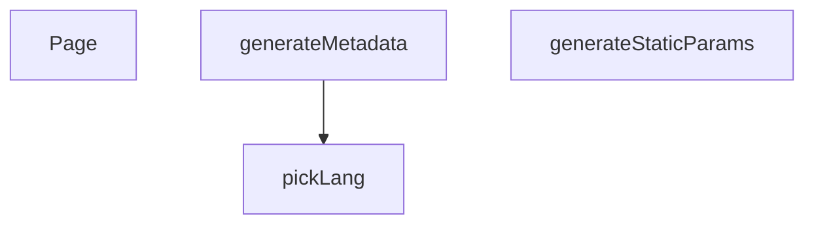

## NODE ID STANDARD

  file: src\app\[lang]\products\[slug]\page.tsx
  function: src\app\[lang]\products\[slug]\page.tsx::pickLang
  function: src\app\[lang]\products\[slug]\page.tsx::generateStaticParams
  function: src\app\[lang]\products\[slug]\page.tsx::generateMetadata
  function: src\app\[lang]\products\[slug]\page.tsx::Page

---

## DISA AKTARILANLAR (EXPORTS)
  export: Page
  export: generateMetadata
  export: generateStaticParams
  export: pickLang

---

## STİL TOKENLERİ

### Arbitrary Değerler (token'a geçirilmemiş)
Yok — tüm stiller token'a geçirilmiş. ✅

### Kullanılan Token'lar (zaten token'a geçirilmiş)
- (yok)

### Tailwind Sınıf Özeti
- **Renkler:** (yok)
- **Layout:** (yok)
- **Varyant/Responsive:** (yok)
- **Yardımcı Sınıflar:** (yok)

---
# FILE: src\app\_components\ProductDetailPageView.md

---
domain: general
source_type: doc
namespace_type: module
source_path: C:\Users\alize\venthub-hvac\src\app\_components\ProductDetailPageView.tsx
skeleton_hash: 0d8296b1f4164019
entity_hashes:
  func:ProductDetailPage: e3b845e07eaace73
  overview: aead2e3636ef4e98
  style_tokens: 97bcb7e77cb5d07f
generated_at: 2026-06-19T20:46:14Z
---

## Genel Bakış
`ProductDetailPageView.tsx` modülü, bir HVAC ürününün detay sayfasını oluşturan merkezi ve bağımsız bir React bileşenini tanımlar. Dışarıdan sağlanan başlangıç ürün verisine (`initialProduct`) tamamen bağlı olarak çalışır ve bu veriyi kullanarak ürünün temel bilgileri, görselleri ve özelliklerini içeren eksiksiz bir arayüz oluşturur. Bileşen, veri akışının son halkasıdır ve üst bileşenler veya sunucu tarafı tarafından doğrudan çağrılır.

## Fonksiyon Grupları
### Ürün Detay Sayfası Bileşeni
Modülün tek ve temel sorumluluğu, gelen `initialProduct` verisini işleyerek kullanıcının görebileceği interaktif bir ürün inceleme sayfası oluşturmaktır. Bileşen, tüm sayfa düzenini (başlık, fiyat, özellikler, galeri vb.) kendi içinde yönetir.
- `ProductDetailPage`

---

## AXIOMS – Mimari Varsayımlar

Bu modül, bir React bileşenidir ve fonksiyon gövdesi doğrudan sunulmadığından, yalnızca fonksiyon imzası ve yapısal ipuçlarından türetilen mimari varsayımlar aşağıdadır.

**[Aksiyom 1]**: Eğer `initialProduct` prop'u sağlanmazsa, bileşen geçerli bir ürün detayı sayfası oluşturamaz; React render sürecinde `undefined` değer üzerinde çalışacağı için hata fırlatır veya eksik/boş bir sayfa render eder.

**[Aksiyom 2]**: Eğer `initialProduct` nesnesi beklenen alanları (isim, fiyat, özellikler, görseller) içermiyorsa, bileşen ilgili bölümleri render ederken `undefined` erişim hataları ile karşılaşır veya eksik bölümlerle hatalı bir sayfa oluşturur.

**[Aksiyom 3]**: Eğer bileşen bir React render bağlamı (React application context) dışında çağrılırsa, React bileşen mekanizması çalışmayacağından bileşen doğru sonuç üretmez.

**[Aksiyom 4]**: Eğer `initialProduct` geçerli bir JavaScript nesnesi (`object` türü) yerine `null`, `string`, `number` gibi farklı bir türde sağlanırsa, bileşen prop destructuring (`{ initialProduct }`) sırasında beklenmeyen davranışı gösterir ve sayfa hatalı render edilir.

---

## FONKSİYON DETAYLARI

### ProductDetailPage

**Ne yapar**: Ürün detay sayfasını render eden ana React bileşenidir. Verilen ilk ürün verisini (initialProduct) kullanarak, bir HVAC ürününün detaylı görünümünü kullanıcıya sunar.

**Nasıl yapar**: Bileşen, sunucu tarafında veya üst bileşen tarafından sağlanan `initialProduct` prop'unu alır ve bu veriyi kullanarak ürün detay sayfasının tamamını render eder. Bu yapı, Next.js gibi framework'lerde sayfa yükleme performansını artırmak için sıkça kullanılan bir SSR/SSG desenidir.

**Parametreler**:
- `initialProduct` — İlk yüklemede kullanılacak ürün nesnesini temsil eder. Sayfa ilk render edildiğinde bu veri kullanılarak içerik gösterilir, böylece istemci tarafı bekleme süresi azaltılır.

**Dönüş**: `React.FC<ProductDetailPageProps>` tipinde bir React fonksiyonel bileşeni döndürür. Bileşen, `ProductDetailPageProps` arayüzüne uygun olarak yapılandırılmıştır ve `initialProduct` alanını içermelidir.

**İlişkili Tip Tanımı**:
- `ProductDetailPageProps` — Bileşenin kabul ettiği prop'ların tanımlandığı arayüz. En az `initialProduct` alanını içermelidir.

---

## İTHALATLAR (IMPORTS)
- import: ../../components/HVACIcons::BrandIcon
- import: ../../components/ImageGallery::ImageGallery
- import: ../../components/LeadModal::LeadModal
- import: ../../components/ProductCard::ProductCard
- import: ../../components/Seo::Seo
- import: ../../components/product/ProductSmartInference::ProductSmartInference
- import: ../../components/products/RichTextRenderer::RichTextRenderer
- import: ../../components/products::AddToProjectModal
- import: ../../contexts/CategoryContext::useCategories
- import: ../../hooks/useCartHook::useCart
- import: ../../hooks/useProjectLists::useProjectLists
- import: ../../i18n/I18nProvider::useI18n
- import: ../../i18n/format::formatCurrency
- import: ../../lib/services/product.service::getProductBySlug
- import: ../../lib/services/product.service::getProductsEnriched
- import: ../../lib/supabase/client::supabaseBrowserClient
- import: ../../types/db-rows::type { CategoryMetadata }
- import: ../../types/ui-models::type { Product }
- import: ../../utils/routes::Routes
- import: ../../utils/routes::localizedHref
- import: next/link::Link
- import: next/navigation::useParams
- import: next/navigation::useRouter
- import: react::React
- import: react::useEffect
- import: react::useMemo
- import: react::useRef
- import: react::useState
- import: sonner::toast

---

## INTERFACES

### ProductDetailPageProps
- `initialProduct?: Product | null`

---

## AST POINTERS

### [N1_NASIL] AST Pointer: `_components/ProductDetailPageView.tsx::getCategoryContext`
- **params**: 无
- **ic_degiskenler**:
  - `sc` — `categories` dizisi içinde `product.subcategory_id` eşleşen alt kategori nesnesi; bulunamazsa `null`
  - `mc` — `categories` dizisi içinde `product.category_id` eşleşen ana kategori nesnesi; bulunamazsa `null`
- **Dönüş**: `{ mainCategory: mc, subCategory: sc }` — ürünün ait olduğu ana ve alt kategoriyi döndürür; `product` yoksa `{ mainCategory: null, subCategory: null }`

---

## NODE ID STANDARD

  file: src\app\_components\ProductDetailPageView.tsx
  function: src\app\_components\ProductDetailPageView.tsx::ProductDetailPage

---

## DISA AKTARILANLAR (EXPORTS)
  export: ProductDetailPage
  export: ProductDetailPageProps

---

## STİL TOKENLERİ

### Arbitrary Değerler (token'a geçirilmemiş)
Yok — tüm stiller token'a geçirilmiş. ✅

### Kullanılan Token'lar (zaten token'a geçirilmiş)
- `tracking-hvac-normal`, `tracking-hvac-snug`

### Tailwind Sınıf Özeti
- **Renkler:** `bg-air-blue/30`, `bg-gold-accent/10`, `bg-industrial-gray`, `bg-primary-navy`, `bg-red-50`, `bg-secondary-blue`, `bg-slate-100`, `bg-slate-50`, `bg-slate-50/30`, `bg-slate-900`, `bg-success-green`, `bg-success-green/10`, `bg-warning-orange`, `bg-warning-orange/10`, `bg-white`
- **Layout:** `absolute`, `backdrop-blur-2`, `backdrop-blur-md`, `backdrop-blur-xl`, `col-span-full`, `fixed`, `flex`, `flex-1`, `flex-col`, `flex-shrink-0`, `flex-wrap`, `gap-1.5`, `gap-2`, `gap-2.5`, `gap-4`
- **Varyant/Responsive:** `:`, `active:`, `disabled:`, `group-hover:`, `hover:`, `last:`, `lg:`, `md:`, `sm:`, `xl:` önekleri
- **Yardımcı Sınıflar:** `${activeSection`, `${isNavSticky`, `${isOpen`, `${isWishlisted`, `${section.bgClass`, `${typeof`, `0`, `:`, `===`, `>`, `active:scale-95`, `active:scale-98`, `animate-in`, `animate-ping`, `animate-pulse`

---
# FILE: src\components\AddToCartToast.md

---
domain: general
source_type: doc
namespace_type: module
source_path: C:\Users\alize\venthub-hvac\src\components\AddToCartToast.tsx
skeleton_hash: df3d9a7b91ba0e22
entity_hashes:
  func:AddToCartToast: 581f14d900d31bb4
  overview: 4631aecdd4e1b7b7
  style_tokens: dd5ed8d0f58dcf57
generated_at: 2026-06-19T20:46:34Z
---

## Genel Bakış
Bu modül, kullanıcı sepete bir ürün eklediğinde kısa süreli bir bildirim (toast) gösteren tek bir React bileşenini içerir. Bileşen, bildirimin zamanlamasını, otomatik kaybolmasını ve kapatma eylemini kendi içinde yönetir.

## Fonksiyon Grupları
### Sepete Ekleme Bildirimi
Modül, sepete ekleme işlemi sonrasında kullanıcıya kısa süreli bir bildirim gösteren ana (ve tek) bileşeni tanımlar.
- AddToCartToast

---

## AXIOMS – Mimari Varsayımlar

Bu modül için mimari varsayımlar, yalnızca sağlanan fonksiyon imzaları ve modül sabitlerine dayanılarak çıkarılmıştır.

**[Aksiyom 1]:** `AddToCartToast()` fonksiyonu parametresiz olarak çağrılmalıdır. Eğer geçerli bir React bileşen referansı (fonksiyon) olarak çağrılmazsa, React Rendering Engine hata fırlatır.

**[Aksiyom 2]:** Modül sabit tanımlaması (module-level constant) bulunmamaktadır. Eğer modül genelinde paylaşılan yapılandırma sabitleri gerekliyse, bunlar ayrı bir konfigürasyon kaynağından (örn: ortam değişkenleri, context) sağlanmalıdır; aksi takdirde bileşen sabit değerlerle çalışır.

**[Aksiyom 3]:** Fonksiyon imzasında任何对外接口 (public API) parametresi tanımlanmamıştır. Eğer bileşenin dışarıdan veri alması (örn: ürün adı, eklendi sayısı) gerekiyorsa, bu veriler React Context, Redux, veya prop drilling dış mekanizması ile sağlanmalıdır; aksi takdirde bileşen dış girdi olmadan çalışır.

**[Aksiyom 4]:** Fonksiyon imzasında default değer tanımlanmamıştır. Eğer bileşen varsayılan davranışları (örn: otomatik kapanma süresi, bildirim metni) konfigure edilebilir olacaksa, bunlar bileşen içi sabit değerler veya dış kaynaklardan gelmelidir.

---

## FONKSİYON DETAYLARI

### AddToCartToast
**Ne yapar**: Sepete ekleme işlemi sonrası kullanıcıya gösterilen bir bildirim (toast) bileşenini oluşturur. Bu bildirim, kullanıcının sepete bir ürün eklediğini görsel olarak onaylar.
**Nasıl yapar**: React fonksiyonel bileşeni olarak tanımlanmıştır ve muhtemelen bir UI kütüphanesinden (örneğin, Chakra UI, Material UI) toast mekanizmasını kullanarak bildirim mesajını ve stilini yönetir. İçerisinde sepete eklenen ürünle ilgili kısa bir bilgi veya başarılı ekleme mesajı barındırabilir.
**Parametreler**:
- Bu fonksiyon herhangi bir parametre almaz.
**Dönüş**: React.FC — Sepete ekleme bildirimini temsil eden bir React fonksiyonel bileşeni döndürür.

---

## İTHALATLAR (IMPORTS)
- import: ./AddToCartToastContent::AddToCartToastContent
- import: @/types/ui-models::type { Product }
- import: react::React
- import: sonner::toast

---

## AST POINTERS

### [N1_NASIL] AST Pointer: src/components/AddToCartToast.tsx::AddToCartToast
- **params**: (yok)
- **ic_degiskenler**:
  (dış scope'ta doğrudan değişken yok — tüm mantık `useEffect` içinde)
- **Dönüş**: `null` — Saf controller bileşeni, DOM döndürmez; sadece event listener yönetimi yapar

---

## NODE ID STANDARD

  file: src\components\AddToCartToast.tsx
  function: src\components\AddToCartToast.tsx::AddToCartToast

---

## DISA AKTARILANLAR (EXPORTS)
  export: AddToCartToast

---

## STİL TOKENLERİ

### Arbitrary Değerler (token'a geçirilmemiş)
Yok — tüm stiller token'a geçirilmiş. ✅

### Kullanılan Token'lar (zaten token'a geçirilmiş)
- (yok)

### Tailwind Sınıf Özeti
- **Renkler:** (yok)
- **Layout:** (yok)
- **Varyant/Responsive:** (yok)
- **Yardımcı Sınıflar:** (yok)

---
# FILE: src\components\AddToCartToastContent.md

---
domain: general
source_type: doc
namespace_type: module
source_path: C:\Users\alize\venthub-hvac\src\components\AddToCartToastContent.tsx
skeleton_hash: 852817141636c428
entity_hashes:
  func:AddToCartToastContent: da3886a1d2990a31
  overview: a72a624e0dfb150e
  style_tokens: 5ac0b676517c4959
generated_at: 2026-06-19T20:46:47Z
---

## Genel Bakış
Bu modül, bir ürün sepete eklendiğinde kullanıcıya kısa süreli bildirim gösteren tek bir React bileşeninden oluşur. Ürünün temel bilgilerini sunar ve bildirimi kapatma olanağı sağlayarak kullanıcı deneyimini tamamlar.

## Fonksiyon Grupları
### Toast Bildirim İçeriği
Sepete ekleme işlemi sonrasında geçici olarak gösterilen bildirim penceresinin içeriğini ve kapatma etkileşimini yöneten UI bileşeni.
- AddToCartToastContent

---

## AXIOMS – Mimari Varsayımlar

Bu modül, sepete ekleme işleminin ardından kısa süreli bildirim (toast) içeriğini render eden bir React bileşenidir. Aşağıdaki varsayımlar **fonksiyon imzasından** türetilmiştir.

[Aksiyom 1]: Eğer `product` prop'u sağlanmazsa, bileşen sepetteki ürün bilgilerini gösteremez ve render edeceği içerik bilinmez.

[Aksiyom 2]: Eğer `onClose` prop'u sağlanmazsa, kullanıcı bildirimi kapatamaz ve toast bileşeninin kapanma tetikleme mekanizması çalışmaz.

[Aksiyom 3]: Eğer `onClose` çağrıldığında bileşenin mounted durumu değiştiyse (örn. parent bileşen koşullu render ediyorsa), React geçerlilik uyarıları (warning) oluşur.

[Aksiyom 4]: Eğer `product` prop'u `undefined` veya `null` olarak verilirse, bileşen içinde product objesinin alanlarına erişim `TypeError` ile sonuçlanabilir.

[Aksiyom 5]: Eğer bileşen bir `toast` veya `snackbar` konteynırının çocuğu olarak kullanılmıyorsa, bileşenin ekranda görünür hale gelmesi için gerekli UI bağlamı (konteynır, pozisyonlama, animasyon) eksik olur.

---

## FONKSİYON DETAYLARI

### AddToCartToastContent
**Ne yapar**: Sepete ürün ekleme işleminin ardından kullanıcıya bilgilendirme olarak gösterilen bir toast bildirim bileşenini oluşturur. Ürünün temel bilgilerini ve bildirimi kapatma butonunu içerir.

**Nasıl yapar**: `product` prop'undan alınan ürün adı, fiyatı ve resmi gibi verileri kullanarak bir JSX yapısı döndürür. Bildirim mesajını dinamik olarak oluşturur. `onClose` fonksiyonu, kullanıcı bildirimi kapatmak istediğinde çağrılır ve.toast'ın kaybolmasını tetikler.

**Parametreler**:
- `product`: `Product` — Sepete eklenen ürünün tüm verilerini içeren nesne. Adı, fiyatı ve görsel URL'i gibi bilgileri barındırır.
- `onClose`: `() => void` — Toast bildiriminin kapatılması istendiğinde çağrılacak fonksiyon. Bu fonksiyon, bileşenin üst düzeydeki durumunu (örn. `isVisible`) değiştirerek bildirimin kaybolmasını sağlar.

**Dönüş**: `React.FC<AddToCartToastContentProps>` — Bu bileşen, `AddToCartToastContentProps` arayüzüne uygun prop'ları alan ve JSX (React Element) döndüren bir React fonksiyonel bileşenidir.

---

## İTHALATLAR (IMPORTS)
- import: ../hooks/useLocalizedRoutes::useLocalizedRoutes
- import: ../i18n/I18nProvider::useI18n
- import: @/types/ui-models::type { Product }
- import: next/link::Link
- import: react::React

---

## INTERFACES

### AddToCartToastContentProps
- `product: Product`
- `onClose: () => void`

---

## AST POINTERS

### [N1_NASIL] AST Pointer: AddToCartToastContent.tsx::AddToCartToastContent
- **params**: `{ product, onClose }`
- **ic_degiskenler**: 
  - `t` — useI18n hook'unun sagladigi ceviri fonksiyonu, JSX icindeki tum metinleri lokalize eder (ornegin `t('cartToast.added')`).
  - `Routes` — useLocalizedRoutes hook'unun dondurlu rotalar nesnesi, Link bileşeninde `Routes.cart()` ile sepet sayfasinin URL'sini uretir.
- **Dönüş**: `{product.name}` ve `onClose` callback'ini iceren, sepete urun eklendigini bildiren bir React bileşeni (JSX). Bilesen, iki buton ve bir Link iceren bir toast bildirim UI'yi render eder.

---

## NODE ID STANDARD

  file: src\components\AddToCartToastContent.tsx
  function: src\components\AddToCartToastContent.tsx::AddToCartToastContent

---

## DISA AKTARILANLAR (EXPORTS)
  export: AddToCartToastContent

---

## STİL TOKENLERİ

### Arbitrary Değerler (token'a geçirilmemiş)
Yok — tüm stiller token'a geçirilmiş. ✅

### Kullanılan Token'lar (zaten token'a geçirilmiş)
- (yok)

### Tailwind Sınıf Özeti
- **Renkler:** `bg-primary-navy`, `bg-success-green/10`, `bg-white`, `border-light-gray`, `border-primary-navy`, `hover:bg-primary-navy`, `hover:bg-secondary-blue`, `hover:text-industrial-gray`, `hover:text-white`, `text-base`, `text-center`, `text-industrial-gray`, `text-lg`, `text-primary-navy`, `text-sm`
- **Layout:** `flex`, `flex-1`, `gap-2`, `gap-3`, `grid`, `grid-cols-1`, `inline-flex`, `items-center`, `items-start`, `justify-center`, `max-w-92vw`, `md:gap-3`, `md:grid-cols-2`, `md:p-4`, `md:w-360px`
- **Varyant/Responsive:** `focus-visible:`, `hover:`, `md:` önekleri
- **Yardımcı Sınıflar:** `animate-slide-up`, `border`, `focus-visible:outline-none`, `focus-visible:ring-2`, `focus-visible:ring-offset-2`, `focus-visible:ring-primary-navy`, `font-bold`, `font-medium`, `font-semibold`, `leading-none`, `leading-snug`, `md:pb-4`, `md:px-4`, `md:py-2`, `mt-0.5`

---
# FILE: src\components\BackToTopButton.md

---
domain: general
source_type: doc
namespace_type: module
source_path: C:\Users\alize\venthub-hvac\src\components\BackToTopButton.tsx
skeleton_hash: fc970852e5b16423
entity_hashes:
  func:BackToTopButton: c8f2538093a58334
  func:handleScrollToTop: 94e0754193bc122d
  overview: cab9522d3717ffc4
  style_tokens: b29c0a49231e465f
generated_at: 2026-06-19T20:47:06Z
---

## Genel Bakış
BackToTopButton bileşeni, sayfa kaydırma konumuna göre görünürlüğü kontrol edilen ve kullanıcı tıklamasıyla sayfanın en üstüne yumuşak geçiş sağlayan bir React fonksiyonel bileşenidir. Kullanıcı deneyimini iyileştirmek için sabit konumda yer alan, minimal bir navigasyon yardımcısıdır.

## Fonksiyon Grupları
### Bileşen ve Etkileşim
Butonun görünümünü, görünür olma durumunu ve kullanıcı tıklamasını yöneten ana React bileşenidir.
- BackToTopButton, handleScrollToTop

---

## AXIOMS – Mimari Varsayımlar
Bu modül için verilen fonksiyon gövdesi bulunamadığından, mimari varsayımlar üretilememektedir.

---

## FONKSİYON DETAYLARI

### BackToTopButton
**Ne yapar**: Sayfanın en altına kaydırıldığında kullanıcıyı sayfanın en üstüne götüren bir “Back to Top” (yukarı dön) butonu sağlayan bir React fonksiyonel bileşeni oluşturur.  

**Nasıl yapar**: Fonksiyon, bir React functional component (`React.FC`) döndürür; bileşen içinde muhtemelen bir buton/render elemanı tanımlanır ve tıklama olayıyla sayfa kaydırma davranışı tetiklenir. (İç mantık koddan elde edilemediği için genel bir açıklama verilmiştir.)  

**Parametreler**:
- *Yok* — Fonksiyon parametre almaz.

**Dönüş**: `React.FC` — Oluşturulan “Back to Top” butonunu temsil eden bir React functional component.

### handleScrollToTop

**Ne yapar**: Sayfanın en üstüne yumuşak bir şekilde kaydırma işlemi gerçekleştirir. Kullanıcı sayfayı aşağı kaydırdığında görünen "Back to Top" butonuna tıklandığında çağrılır ve pencereyi sayfanın başlangıç konumuna (0,0) geri taşır.

**Nasıl yapar**: `window.scrollTo()` veya `window.scroll()` metodu ile `behavior: 'smooth'` seçeneği kullanarak animasyonlu bir kaydırma efekti oluşturur. Bu sayede kullanıcı deneyimi için ani bir geçiş yerine yumuşak bir geçiş sağlanır.

**Parametreler**: Bu fonksiyon herhangi bir parametre almaz.

**Dönüş**: `void` — Fonksiyon herhangi bir değer döndürmez, sadece pencere konumunu değiştirir.

---

## İTHALATLAR (IMPORTS)
- import: ../hooks/useScrollThrottle::useScrollThrottle
- import: ../i18n/I18nProvider::useI18n
- import: react::React

---

## AST POINTERS

### [N1_NASIL] AST Pointer: src/components/BackToTopButton.tsx::BackToTopButton
- **params**: (yok)
- **ic_degiskenler**:
    - `t` — `useI18n` hook'undan dönen çeviri fonksiyonu, bileşen içindeki metinlerin lokalizasyonu için kullanılır.
    - `visible` — `useScrollThrottle` hook'undan dönen boolean değer, sayfanın belirli bir scroll pozisyonunda olup olmadığını belirtir (butonun görünürlüğünü kontrol eder).
    - `handleScrollToTop` — Sayfayı en üste kaydıran ve odaklayan iç callback fonksiyonu.
- **Dönüş**: JSX Element (React.FC bileşeni)

### [N2_NASIL] AST Pointer: src/components/BackToTopButton.tsx::handleScrollToTop
- **params**: (yok)
- **ic_degiskenler**:
    - `isReduced` — Kullanıcının "prefers-reduced-motion" tercihini kontrol eden boolean değişken. `true` ise animasyon devre dışı, `false` ise smooth scroll kullanılır.
    - `mainContent` — DOM'daki `id="main-content"` olan HTML elementine referans. Odak yönetiminde kullanılır (erişilebilirlik için).
- **Dönüş**: void

---

## NODE ID STANDARD

  file: src\components\BackToTopButton.tsx
  function: src\components\BackToTopButton.tsx::BackToTopButton
  function: src\components\BackToTopButton.tsx::handleScrollToTop

---

## DISA AKTARILANLAR (EXPORTS)
  export: BackToTopButton

---

## STİL TOKENLERİ

### Arbitrary Değerler (token'a geçirilmemiş)
Yok — tüm stiller token'a geçirilmiş. ✅

### Kullanılan Token'lar (zaten token'a geçirilmiş)
- (yok)

### Tailwind Sınıf Özeti
- **Renkler:** `bg-primary-navy`, `border-white/20`, `hover:bg-secondary-blue`, `text-white`
- **Layout:** `p-3`, `shadow-lg`
- **Varyant/Responsive:** `:`, `focus-visible:`, `hover:` önekleri
- **Yardımcı Sınıflar:** `$`, `:`, `border`, `duration-300`, `focus-visible:outline-none`, `focus-visible:ring-2`, `focus-visible:ring-offset-2`, `focus-visible:ring-primary-navy`, `invisible`, `opacity-0`, `opacity-100`, `pointer-events-none`, `rounded-full`, `scale-100`, `scale-75`

---
# FILE: src\components\BeforeAfterSlider.md

---
domain: general
source_type: doc
namespace_type: module
source_path: C:\Users\alize\venthub-hvac\src\components\BeforeAfterSlider.tsx
skeleton_hash: 7acc7874dafc0574
entity_hashes:
  func:BeforeAfterSlider: f6df4a2541ee7895
  overview: 0e8c7c405d8bc050
  style_tokens: ae3c52abb33abdfe
generated_at: 2026-06-19T20:47:06Z
---

## Genel Bakış
`BeforeAfterSlider`, iki görseli (önce ve sonra) yan yana konumlandırarak kullanıcıya etkileşimli bir kaydırıcı aracılığıyla görsel karşılaştırma imkânı sunan React bileşenidir. Kullanıcı kaydırıcıyı sürükleyerek her iki görüntünün görünür alanını dinamik olarak ayarlayabilir; bu sayede özellikle HVAC proje görsellerindeki dönüşümler (tadilat öncesi/sonrası vb.) interaktif biçimde sunulur.

## Fonksiyon Grupları
### Görsel Karşılaştırma ve Etkileşim
Bileşen, before/after kaynak görsellerini bir konteyner içinde yerleştirir, üst üste bindirerek bir tutamaç (handle) aracılığıyla kullanıcının sürüklemesine olanak tanır ve her harekette iki görüntünün görünür kısımlarını buna göre günceller.
- BeforeAfterSlider

---

## AXIOMS – Mimari Varsayımlar

Bu modül için sadece fonksiyon imzasından çıkarılabilecek minimal mimari varsayımlar tanımlanmıştır. Fonksiyon gövdesi verilmediğinden, çalıştırma davranışına ilişkin aksiyomlar belirlenememiştir.

[Aksiyom 1]: Eğer `beforeSrc` parametresi sağlanmazsa, bileşen hata ile karşılaşır veya beklenmeyen davranış gösterir (React bileşeni olarak zorunlu prop'tur, default değeri yoktur).

[Aksiyom 2]: Eğer `afterSrc` parametresi sağlanmazsa, bileşen hata ile karşılaşır veya beklenmeyen davranış gösterir (React bileşeni olarak zorunlu prop'tur, default değeri yoktur).

[Aksiyom 3]: Eğer `alt` parametresi sağlanmazsa, `alt` özelliği otomatik olarak `'before-after'` değerini alır.

---

## FONKSİYON DETAYLARI

### BeforeAfterSlider
**Ne yapar**: İki görseli (önce ve sonra) yan yana göstererek kullanıcıya sürükleyebileceği bir bölücüyle karşılaştırma imkanı sunar.  
**Nasıl yapar**: `beforeSrc` ve `afterSrc` ile sağlanan görselleri bir konteyner `<div>` içinde yerleştirir, üstte bir tutamaç (handle) ekleyerek kullanıcının sürükleyerek bir görselin diğerinin üzerindeki kısmını göstermesini sağlar; `alt` özelliği her iki görsele de erişilebilirlik metni olarak uygulanır.  
**Parametreler**:
- beforeSrc: string — Gösterilecek "önce" görselinin URL veya yerel yol.  
- afterSrc: string — Gösterilecek "sonra" görselinin URL veya yerel yol.  
- alt: string — Her iki görsele de varsayılan olarak 'before-after' olan erişilebilirlik açıklaması; kullanıcı tarafından özelleştirilebilir.  
**Dönüş**: React.FC<BeforeAfterSliderProps> türünde bir fonksiyon bileşeni; JSX elementi olarak render edilir ve bir önce/sonra karşılaştırma sliderı döndürür.

---

## İTHALATLAR (IMPORTS)
- import: ../i18n/I18nProvider::useI18n
- import: @/components/ui/VentImage::VentImage
- import: react::React
- import: react::useState

---

## INTERFACES

### BeforeAfterSliderProps
- `beforeSrc: string`
- `afterSrc: string`
- `alt?: string`

---

## AST POINTERS

### [N1_NASIL] AST Pointer: BeforeAfterSlider.tsx::BeforeAfterSlider
- **params**: `beforeSrc`, `afterSrc`, `alt = 'before-after'`
- **ic_degiskenler**:
  - `pos` — Slider'ın mevcut yüzdelik konumunu tutan React state'i (useState(50)). Kullanıcı aralığı değiştirdiğinde güncellenir.
  - `t` — `useI18n` hook'undan dönen çeviri fonksiyonu. `beforeAfterSlider.title`, `beforeAfterSlider.subtitle`, `beforeAfterSlider.ariaLabel`, `beforeAfterSlider.rangeAriaLabel` anahtarlarıyla çevirileri getirir.
- **Dönüş**: JSX yapısı (React elementi). Bölüm (`section`) içinde, öncesi ve sonrası görsellerini yan yana veya üst üste gösteren, aralıklı kaydırıcı (`range input`) ile kontrol edilen bir bileşen render eder.

---

## NODE ID STANDARD

  file: src\components\BeforeAfterSlider.tsx
  function: src\components\BeforeAfterSlider.tsx::BeforeAfterSlider

---

## DISA AKTARILANLAR (EXPORTS)
  export: BeforeAfterSlider

---

## STİL TOKENLERİ

### Arbitrary Değerler (token'a geçirilmemiş)
Yok — tüm stiller token'a geçirilmiş. ✅

### Kullanılan Token'lar (zaten token'a geçirilmiş)
- (yok)

### Tailwind Sınıf Özeti
- **Renkler:** `accent-primary-navy`, `bg-white`, `border-light-gray`, `md:text-3xl`, `text-2xl`, `text-center`, `text-industrial-gray`, `text-steel-gray`
- **Layout:** `absolute`, `bottom-3`, `h-56`, `h-full`, `left-1/2`, `lg:h-80`, `max-w-7xl`, `overflow-hidden`, `relative`, `sm:h-72`, `top-0`, `w-1`, `w-3/4`, `w-full`
- **Varyant/Responsive:** `lg:`, `md:`, `sm:` önekleri
- **Yardımcı Sınıflar:** `-ml-0.5`, `-translate-x-1/2`, `border`, `font-bold`, `inset-0`, `lg:px-8`, `mb-4`, `mx-auto`, `object-center`, `object-cover`, `px-4`, `py-10`, `rounded-2xl`, `shadow`, `sm:px-6`

---
# FILE: src\components\BrandsShowcase.md

---
domain: general
source_type: doc
namespace_type: module
source_path: C:\Users\alize\venthub-hvac\src\components\BrandsShowcase.tsx
skeleton_hash: 214a7ca3f7d167b5
entity_hashes:
  func:BrandsShowcase: 396bbfa4a2991af7
  func:Lane: 607c875efec6621a
  overview: a64c9ee274fd0d0f
  style_tokens: 90e49e0ab0d8115d
generated_at: 2026-06-08T10:08:12Z
---

## Genel Bakış

`BrandsShowcase` modülü, HVAC markalarını sürekli kayan bir şerit (marquee) formatında sunan bir vitrin bileşenidir. Modül, marka logolarının kesintisiz döngü halinde akmasını sağlayarak dinamik ve görsel çekici bir marka tanıtımı oluşturur.

## Fonksiyon Grupları

### Kaydırma Şeridi Bileşeni
Tek bir şerit (lane) üzerindeki marka öğelerini belirli bir sürede otomatik olarak kaydıran yardımcı bileşeni tanımlar. Varsayılan 50 saniyelik döngü süresi ile sürekli bir animasyon akışı sağlar.
- Lane

### Ana Vitrin Bileşeni
Sayfada tam bir marka vitrini oluşturarak kaydırma şeridini yapılandırır ve kullanıma sunar. İçerisinde `Lane` bileşenini çağırarak HVAC markalarının gösterimini başlatır.
- BrandsShowcase

---

## AXIOMS – Mimari Varsayımlar

Bu modül, HVAC markalarını kaydırılabilir bir şerit içinde gösteren bir vitrin bileşenidir. `Lane` yardımcı bileşeni listedeki öğeleri belirtilen sürede yatay olarak kaydırarak sürekli bir akış oluşturur; `BrandsShowcase` ise bu şeriti sayfada sunan ana bileşendir.

[Aksiyom 1]: Eğer `Lane` bileşenine `items` argümanı sağlanmazsa, kaydırılacak marka içeriği bulunmayacağından şerit boş veya hatalı görüntülenir.

[Aksiyom 2]: Eğer `Lane` bileşenine sağlanan `items` boş bir dizi ise (`[]`), şerit içeriği olmadan çalışır ve kaydırma animasyonu anlamsız hale gelir.

[Aksiyom 3]: Eğer `durationSec` olarak `0` veya negatif bir değer verilirse, kaydırma animasyon süresi geçersiz olacağından animasyon düzgün çalışmaz veya çok hızlı/hatalı akar.

[Aksiyom 4]: Eğer `BrandsShowcase` bileşeni içinde `Lane` bileşenine geçirilen `items` dizisi `Lane` bileşeninin beklediği formata (örn: img src, alt text içeren nesneler) uymuyorsa, öğeler düzgün render edilmez.

[Aksiyom 5]: Eğer `durationSec` çok küçük bir değer olarak (örn: `1`) ayarlanırsa, marka logoları okunamayacak kadar hızlı kayar; çok büyük bir değer olarak ayarlanırsa ise kaydırma neredeyse görünmez hale gelir.

---

## FONKSİYON DETAYLARI

### Lane
**Ne yapar**: `Lane` bileşeni, verilen `items` listesini belirli bir süre içinde gösteren bir şerit (lane) oluşturur.  
**Nasıl yapar**: Bileşen, `items` prop'undan gelen öğeleri yatay veya dikey bir düzenle render eder ve `durationSec` değeri (varsayılan 50 saniye) ile animasyon veya geçiş süresini kontrol eder.  
**Parametreler**:
- items: typeof HVAC_BRANDS — gösterilecek marka veya ürün öğelerinin listesi  
- durationSec: number — şeritin geçiş/animasyon süresi (saniye cinsinden), belirtilmezse 50 kullanılır  
**Dönüş**: React.FC — JSX elementi olarak şerit görüntüsünü döndürür

### BrandsShowcase
**Ne yapar**: `BrandsShowcase` bileşeni, markaları sergileyen bir gösterim alanı oluşturur.  
**Nasıl yapar**: Bileşen, iç içe `Lane` (veya benzeri) bileşenleri kullanarak marka listesini düzenli bir şekilde render eder; dışarıdan prop almaz, kendi iç veri kaynağını kullanır.  
**Parametreler**: (yok)  
**Dönüş**: React.FC — JSX elementi olarak marka gösterim alanını döndürür

---

## AST POINTERS

### [N1_NASIL] AST Pointer: BrandsShowcase.tsx::Lane
- **params**: `{ items, durationSec = 50 }`
- **ic_degiskenler**:
  - `repeated` — `items` dizisini üç kez tekrarlayarak oluşturulan dizi, sonsuz kaydırma animasyonu için kullanılır.
- **Dönüş**: JSX elementi (React bileşeni)

### [N2_NASIL] AST Pointer: BrandsShowcase.tsx::(brand, idx) => (...)
- **params**: `(brand, idx)`
- **ic_degiskenler**:
  - Yok
- **Dönüş**: JSX elementi (Link bileşeni)

### [N3_NASIL] AST Pointer: BrandsShowcase.tsx::BrandsShowcase
- **params**: (parametre yok)
- **ic_degiskenler**:
  - `t` — useI18n hook'undan alınan çeviri fonksiyonu
  - `brands` — HVAC_BRANDS sabitinden alınan marka dizisi
- **Dönüş**: JSX elementi (React bileşeni)

---

## NODE ID STANDARD

  file: src\components\BrandsShowcase.tsx
  function: src\components\BrandsShowcase.tsx::Lane
  function: src\components\BrandsShowcase.tsx::BrandsShowcase

---

## DISA AKTARILANLAR (EXPORTS)
  export: BrandsShowcase
  export: Lane

---

## STİL TOKENLERİ

### Arbitrary Değerler (token'a geçirilmemiş)
Yok — tüm stiller token'a geçirilmiş. ✅

### Kullanılan Token'lar (zaten token'a geçirilmiş)
- `tracking-hvac-loose`, `tracking-hvac-relaxed`, `tracking-hvac-wide`

### Tailwind Sınıf Özeti
- **Renkler:** `bg-brands-radial`, `bg-cyan-500/40`, `bg-gradient-to-l`, `bg-gradient-to-r`, `bg-slate-200`, `bg-white`, `from-white`, `group-hover:bg-cyan-500`, `hover:text-cyan-600`, `sm:text-5xl`, `text-3xl`, `text-center`, `text-cyan-600`, `text-slate-400`, `text-slate-900`
- **Layout:** `absolute`, `flex`, `flex-col`, `from-white`, `gap-20`, `gap-4`, `gap-6`, `group-hover/brand:w-12`, `group-hover:w-16`, `h-24`, `h-px`, `inline-flex`, `items-center`, `justify-center`, `left-0`
- **Varyant/Responsive:** `group-hover/brand:`, `group-hover:`, `hover:`, `lg:`, `sm:` önekleri
- **Yardımcı Sınıflar:** `-0.05em]`, `duration-500`, `duration-700`, `font-black`, `font-bold`, `font-extralight`, `font-medium`, `grayscale`, `group`, `group-hover/brand:grayscale-0`, `group-hover/brand:opacity-100`, `group-hover/brand:scale-110`, `group/brand`, `inset-0`, `inset-y-0`

---
# FILE: src\components\BuildTag.md

---
domain: general
source_type: doc
namespace_type: module
source_path: C:\Users\alize\venthub-hvac\src\components\BuildTag.tsx
skeleton_hash: 859d858d16b6a190
entity_hashes:
  func:BuildTag: 33fa67732a403b49
  overview: 5afd4a9c8d0105c9
  style_tokens: 9c295aa26dd24226
generated_at: 2026-06-19T20:47:06Z
---

## Genel Bakış
`BuildTag.tsx` dosyası, uygulamanın derleme bilgilerini (sürüm, tarih, kimlik gibi) göstermek için kullanılan basit bir React etiket bileşenini tanımlar. Bileşen, dışarıdan alınan props ile içeriği ve stilini yapılandırarak farklı yerlerde yeniden kullanılabilir bir UI öğesi sunar.

## Fonksiyon Grupları
### Bileşen Tanımı
Bu grup, bileşenin render mantığını ve props yönetimini kapsar.  
- BuildTag  

BuildTag fonksiyonu, gelen props doğrultusunda uygun JSX çıktısını üretir ve bileşenin dışarıdan kontrol edilebilen davranışlarını (ör. sınıf adı, metin, tıklama olayı) sağlar.

---

## AXIOMS – Mimari Varsayımlar
Bu modül için özel aksiyom tanımlanmamıştır.

---

## FONKSİYON DETAYLARI

### BuildTag
**Ne yapar**: BuildTag fonksiyonu, bir etiket (tag) görüntülemek için kullanılan basit bir React functional component’i tanımlar ve döndürür. Bu component, genellikle bir sürüm numarası, durum göstergesi veya benzeri kısa bilgi parçacığını kullanıcıya sunmak için tasarlanmıştır.  
**Nasıl yapar**: Fonksiyon, parametre almayarak doğrudan bir JSX elementi döndürür; bu elementi genellikle bir `<span>` veya `<div>` içine stil sınıflarıyla sarmalanmış metin olarak oluşturur. Döndürülen JSX, React tarafından render edildiğinde sayfada bir etiket gibi görünür.  
**Parametreler**:  
- Yok  
**Dönüş**: React.FC türünde bir fonksiyonel component; bu component, render edildiğinde etiket görüntüsünü temsil eden JSX döndürür.

---

## İTHALATLAR (IMPORTS)
- import: react::React

---

## SABİTLER
- **commit** [env-backed] (as_expression) — `process.env.VITE_COMMIT_SHA as string | undefined`
- **branch** [env-backed] (as_expression) — `process.env.VITE_BRANCH as string | undefined`

---

## AST POINTERS

### [N1_NASIL] AST Pointer: src/components/BuildTag.tsx::BuildTag
- **params**: (parametre yok)
- **ic_degiskenler**: 
  - `short` — commit hashının ilk 7 karakterini alır; commit tanımlı değilse boş string döner
- **Dönüş**: React.FC (JSX elementi) — short ve branch ikisi de boş/undefined ise `null` döner; aksi takdirde `{branch || 'local'}@{short || 'dev'}` formatında bir `<span>` elementi döner (title özelliği commit değerini gösterir)

---

## NODE ID STANDARD

  file: src\components\BuildTag.tsx
  function: src\components\BuildTag.tsx::BuildTag

---

## DISA AKTARILANLAR (EXPORTS)
  export: BuildTag

---

## STİL TOKENLERİ

### Arbitrary Değerler (token'a geçirilmemiş)
Yok — tüm stiller token'a geçirilmiş. ✅

### Kullanılan Token'lar (zaten token'a geçirilmiş)
- (yok)

### Tailwind Sınıf Özeti
- **Renkler:** `text-steel-gray`, `text-xs`
- **Layout:** (yok)
- **Varyant/Responsive:** (yok)
- **Yardımcı Sınıflar:** `select-all`

---
# FILE: src\components\CaseStudySection.md

---
domain: general
source_type: doc
namespace_type: module
source_path: C:\Users\alize\venthub-hvac\src\components\CaseStudySection.tsx
skeleton_hash: 7631420c6a87f664
entity_hashes:
  func:CaseStudySection: 30e263b0ef69a0a4
  func:openLead: 3d89ba2774c36aa2
  overview: 5af9581c1e08259f
  style_tokens: de735ee559e96a8f
generated_at: 2026-06-19T20:47:06Z
---

## Genel Bakış
Bu modül, bir case study (örnek çalışma) bölümünü render eden bir React bileşeni ve bu bölümdeki kullanıcı etkileşimlerini yöneten bir yardımcı fonksiyondan oluşur. Bileşen, ilgili içeriği görüntülerken, kullanıcı bir eylem tetiklediğinde openLead fonksiyonunu çağırarak iş akışını devam ettirir.

## Fonksiyon Grupları
### Görüntüleme ve Yerleşim
Bileşenin ana görevi, case study içeriğini sayfada düzenli bir şekilde göstermek ve kullanıcıya sunmaktır.
- CaseStudySection

### Kullanıcı Etkileşimi
Kullanıcı tarafından başlatılan eylemleri yakalayıp gerekli işlemleri gerçekleştiren fonksiyondur; genellikle bir form açma veya yönlendirme gibi işlemleri içerir.
- openLead

---

## AXIOMS – Mimari Varsayımlar
Bu modülün doğru çalışması için React ortamı ve ilgili UI bağımlılıklarının mevcut olması gerekir.

[Aksiyom 1]: Eğer React kütüphanesi yüklü değilse, `CaseStudySection` bileşeni render edilerek hata fırlatır veya boş görüntülenir.  
[Aksiyom 2]: Eğer `CaseStudySection` içindeki case study verileri (örneğin bir context veya prop üzerinden) sağlanmazsa, bileşen boş liste veya hata mesajı gösterir.  
[Aksiyom 3]: Eğer `CaseStudySection` tarafından kullanılan CSS sınıfları veya stiller (module.css, styled-components vb.) bulunamazsa, bileşenin görsel tasarımı bozulur veya eksik görünür.  
[Aksiyom 4]: Eğer `openLead` fonksiyonu çağrıldığında lead modalı veya formunu açacak bir state yönetimi mekanizması (useState, Redux vb.) veya ilgili UI elementi mevcut değilse, fonksiyon hiçbir etkisi üretmez veya çalışma zamanında hata verir.  
[Aksiyom 5]: Eğer `openLead` fonksiyonu tarafından kullanılan dış bağımlılık (örneğin bir modal kütüphanesi veya `window.open` çağrısı) ortamda tanımlı değilse, fonksiyon beklenildiği gibi çalışmaz ve hata fırlatabilir.

---

## FONKSİYON DETAYLARI

### CaseStudySection
**Ne yapar**: Fonksiyonun amacı belgelenmemiştir.  
**Nasıl yapar**: İç mantığı belgelenmemiştir.  
**Parametreler**: Yok  
**Dönüş**: React.FC türünde bir fonksiyonel bileşen döndürür.

### openLead
**Ne yapar**: Fonksiyonun amacı belgelenmemiştir.  
**Nasıl yapar**: İç mantığı belgelenmemiştir.  
**Parametreler**: Yok  
**Dönüş**: Dönüş tipi void veya bilinmiyor; fonksiyon bir değer döndürmez.

---

## İTHALATLAR (IMPORTS)
- import: ../utils/analytics::trackEvent
- import: @/i18n/I18nProvider::useI18n
- import: react::React

---

## AST POINTERS

### [N1_NASIL] AST Pointer: src/components/CaseStudySection.tsx::CaseStudySection
- **params**: (parametre yok)
- **ic_degiskenler**: 
  - `t` — localization function from `useI18n()`, used to translate UI strings.
  - `items` — array of case study objects; each object contains `title`, `summary`, and `metrics`.
  - `openLead` — inner function that triggers the lead modal when invoked.
- **Dönüş**: React.FC (JSX element representing the section)

### [N2_NASIL] AST Pointer: src/components/CaseStudySection.tsx::openLead
- **params**: (parametre yok)
- **ic_degiskenler**: (yok)
- **Dönüş**: yok

### [N3_NASIL] AST Pointer: src/components/CaseStudySection.tsx::items.map callback
- **params**: cs
- **ic_degiskenler**: 
  - `cs` — case study object with fields `title` (string), `summary` (string), and `metrics` (array of metric objects).
- **Dönüş**: JSX element (a `<div>` rendering a case study card)

### [N4_NASIL] AST Pointer: src/components/CaseStudySection.tsx::cs.metrics.map callback
- **params**: m
- **ic_degiskenler**: 
  - `m` — metric object with `label` (string) and `value` (string) describing a quantitative result.
- **Dönüş**: JSX element (a `<span>` displaying the metric label and value)

---

## NODE ID STANDARD

  file: src\components\CaseStudySection.tsx
  function: src\components\CaseStudySection.tsx::CaseStudySection
  function: src\components\CaseStudySection.tsx::openLead

---

## DISA AKTARILANLAR (EXPORTS)
  export: CaseStudySection

---

## STİL TOKENLERİ

### Arbitrary Değerler (token'a geçirilmemiş)
Yok — tüm stiller token'a geçirilmiş. ✅

### Kullanılan Token'lar (zaten token'a geçirilmiş)
- (yok)

### Tailwind Sınıf Özeti
- **Renkler:** `bg-gradient-to-br`, `bg-light-gray`, `bg-primary-navy`, `bg-white`, `border-light-gray`, `from-gray-50`, `hover:bg-secondary-blue`, `md:text-4xl`, `text-3xl`, `text-center`, `text-industrial-gray`, `text-sm`, `text-steel-gray`, `text-white`, `text-xl`
- **Layout:** `flex`, `flex-wrap`, `from-gray-50`, `gap-2`, `gap-6`, `grid`, `grid-cols-1`, `hover:shadow-md`, `inline-flex`, `items-center`, `justify-center`, `max-w-7xl`, `md:grid-cols-2`, `p-6`, `shadow-sm`
- **Varyant/Responsive:** `hover:`, `lg:`, `md:`, `sm:` önekleri
- **Yardımcı Sınıflar:** `border`, `font-bold`, `font-medium`, `font-semibold`, `lg:px-8`, `mb-8`, `mr-1`, `mt-2`, `mt-4`, `mt-6`, `mx-auto`, `px-3`, `px-4`, `px-5`, `py-1`

---
# FILE: src\components\ErrorBoundary.md

---
domain: general
source_type: doc
namespace_type: module
source_path: C:\Users\alize\venthub-wt-hotfix\src\components\ErrorBoundary.tsx
skeleton_hash: 5d98db3d0b1967dd
entity_hashes:
  func:ErrorBoundary:componentDidCatch: 13ff149b11a0e8ea
  func:ErrorBoundary:constructor: f8409de1e499d06a
  func:ErrorBoundary:getDerivedStateFromError: 7c6b6e8065153a82
  func:ErrorBoundary:render: e2424b954c998122
  func:isChunkLoadError: 31516cfb6918b024
  func:serializeError: 2f05a1b7f35a9398
  overview: 11526f7227fafcb9
  style_tokens: 1ab7ecfdeff4b247
generated_at: 2026-08-15T06:35:03Z
---

## Genel Bakış
Bu modül, React uygulamalarında beklenmeyen hataları yakalayan bir ErrorBoundary bileşenidir. Uygulamanın tamamen çökmesini önleyerek kullanıcıya uygun bir hata arayüzü sunar ve hataları loglama veya raporlama için işler.

## Fonksiyon Grupları
### Hata Sınırı Yaşam Döngüsü
React hata sınırı mekanizmasının temel metotlarını implement eder. Bileşenin hata durumunu yönetir, hata yakalandığında state'i günceller ve hata arayüzünü render eder.
- constructor, getDerivedStateFromError, componentDidCatch, render

### Hata İşleme Yardımcıları
Yakalanan hataları yapılandırılmış formata dönüştürür ve belirli hata türlerini (örn: dinamik modül yükleme hataları) tanımlar. Bu fonksiyonlar hata sınırı metotları tarafından çağrılarak hata yönetimini destekler.
- serializeError, isChunkLoadError

---

## AXIOMS – Mimari Varsayımlar

Bu modül, React ErrorBoundary deseni temelinde çalışır ve hata yakalama yaşam döngüsüne bağlıdır.

[Aksiyom 1]: Eğer `getDerivedStateFromError` methodu bir `State` nesnesi döndürmezse, bileşen hata durumunu doğru temsil edemez ve render döngüsü hata durumunu bilemez.

[Aksiyom 2]: Eğer `componentDidCatch` çağrıldığında `errorInfo` parametresi `ErrorInfo` formatında değilse, hata stack trace bilgisi kaybolur ve hata kaynağını tespit etmek mümkün olmaz.

[Aksiyom 3]: Eğer `render` methodu çağrılmadan önce bileşen state'inde `hasError` alanı true olarak ayarlanmamışsa, hata arayüzü kullanıcıya gösterilmez.

[Aksiyom 4]: Eğer `serializeError` fonksiyonu `unknown` tipli bir girdi aldığında Promise veya circular reference içeren bir nesne verilirse ve bunu handle etmezse, serileştirme başarısız olur.

[Aksiyom 5]: Eğer `isChunkLoadError` fonksiyonu dinamik modül yükleme hatası içermeyen bir error nesnesi alırsa, `false` döndürmelidir; aksi halde chunk load hataları yanlış sınıflandırılır.

[Aksiyom 6]: Eğer `ErrorBoundary.constructor` çağrıldığında `props` parametresi `children` içermiyorsa, bileşen render edilecek içerik bulamaz.

[Aksiyom 7]: Eğer `getDerivedStateFromError` static methodu constructor çağrılmadan önce React tarafından tetiklenirse, bileşenin state'i henüz başlatılmamış olabilir ve hata durumu işlenemez.

---

## FONKSİYON DETAYLARI

### serializeError
**Ne yapar**: Hata nesnesini okunabilir bir biçime dönüştürerek geliştirici konsolunda veya UI’da gösterilmesini sağlar.  
**Nasıl yapar**: Fonksiyonun iç mantığı kodda verilmemiştir; yalnızca `ErrorBoundary` içinde `serializeError(this.state.error)` şeklinde çağrılır ve dönen değer `<pre>` içinde gösterilir.  
**Parametreler**:
- `error`: unknown — Serileştirilecek hata nesnesi.  
**Dönüş**: Belirtilmemiş (kod içinde dönüş değeri kullanılmaz, muhtemelen string veya nesne).

### isChunkLoadError
**Ne yapar**: Bir hatanın, dinamik olarak yüklenen kod parçacıklarından (chunk) kaynaklanıp kaynaklanmadığını tespit eder.  
**Nasıl yapar**: Fonksiyonun içeriği verilmemiştir; `ErrorBoundary` içinde `isChunkLoadError(error)` çağrılarıyla hem UI’da hem de hata izleme mantığında kullanılır.  
**Parametreler**:
- `error`: unknown — Kontrol edilecek hata nesnesi.  
**Dönüş**: `boolean` — Hata bir chunk yükleme hatasıysa `true`, aksi takdirde `false`.

### constructor
**Ne yapar**: `ErrorBoundary` bileşeninin başlatıcı metodudur ve bileşenin ilk durumunu (state) ayarlar. Bileşenin hata yakalama mekanizmasını devreye sokan temel kurulumu gerçekleştirir.
**Nasıl yapar**: `super(props)` çağrısı ile üst sınıf (React.Component) yapıcısını çağırarak props'ları iletir. Ardından `this.state` nesnesini `{ hasError: false }` olarak başlatır. Bu, bileşenin başlangıçta herhangi bir hata olmadığını belirtir.
**Parametreler**:
- `props: Props` — Bileşene dışarıdan geçirilen özellikler nesnesi. Tipi, bileşenin dışarıdan alabileceği verileri tanımlayan bir arayüzdür.
**Dönüş**: Dönüş tipi `void`'dur; yani herhangi bir değer döndürmez, sadece bileşenin iç durumunu başlatır.

### getDerivedStateFromError
**Ne yapar**: Bir render sırasında ortaya çıkan hataları yakalar ve bileşenin durumunu günceller. Bu, React tarafından çağrılan bir statik metottur ve hata yakalandığında bileşenin yeniden render edilmesini sağlar.
**Nasıl yapar**: Parametre olarak aldığı `error` nesnesini inceler. `isChunkLoadError(error)` yardımcı fonksiyonunu kullanarak hatanın bir "chunk yükleme hatası" (örn: eski bir kod parçasını yüklemeye çalışma) olup olmadığını belirler. Sonra, `hasError: true`, hatanın kendisi ve `isChunkError` durumunu içeren yeni bir durum nesnesi döndürerek bileşenin durumunu günceller.
**Parametreler**:
- `error: Error` — Yakalanan JavaScript hata nesnesi. `Error` sınıfı veya türevlerinden bir instance olmalıdır.
**Dönüş**: `State` tipinde bir nesne döndürür. Bu nesne en azından `hasError` (boolean), `error` (Error) ve `isChunkError` (boolean) alanlarını içerir. React, bu dönen nesneyi `this.state` ile birleştirerek bileşenin durumunu günceller.

### componentDidCatch
**Ne yapar**: Bir render sırasında oluşan ve alt bileşenlerden yükselen hataları yakalar. Hata hakkında bilgi toplar ve hem konsola hem de uzak bir hata raporlama servisine iletir.
**Nasıl yapar**: Öncelikle hata ve hata hakkında bilgi veren `errorInfo` nesnesini konsola `console.error` ile yazdırır. Ardından `reportError` fonksiyonunu çağırarak hatayı, kaynağını (`source: 'ErrorBoundary'`), bileşen yığın izini (`componentStack`) ve chunk hatası olup olmadığını (`isChunkError`) belirterek raporlar. Bu `reportError` çağrısı asenkron ("fire-and-forget") çalışır ve herhangi bir hata fırlatmaz. Eğer hata bir chunk yükleme hatası ise ayrıca bir `console.warn` ile kullanıcıya sayfayı yenilemesi gerektiğini bildirir.
**Parametreler**:
- `error: Error` — Yakalanan JavaScript hata nesnesi.
- `errorInfo: ErrorInfo` — Hatanın oluştuğu yerdeki bileşen yığın izini (`componentStack` property'si) içeren React tarafından sağlanan bilgi nesnesi.
**Dönüş**: Dönüş tipi `void`'dur; yani herhangi bir değer döndürmez, sadece hata raporlama ve loglama yan etkileri gerçekleştirir.

### render
**Ne yapar**: `ErrorBoundary` bileşeninin görünümünü (arayüzünü) belirler. Hata oluşup oluşmadığına göre, ya children'ları olduğu gibi render eder ya da kullanıcıya hata mesajı ve düzeltme seçenekleri sunan bir fallback arayüzü gösterir.
**Nasıl yapar**: `I18nContext.Consumer` kullanarak çoklu dil desteği sağlar. `hasError` durumu `false` ise doğrudan `this.props.children`'ı render eder. `hasError` durumu `true` ise, bir hata arayüzü oluşturur. Eğer `this.props.fallback` prop'u verilmişse onu kullanır. Aksi takdirde, bir `isChunkError` kontrolü yaparak hata türüne göre farklı başlık, açıklama ve butonlar gösterir. Chunk hatası ise sadece "Sayfayı Yenile" butonu, diğer durumlarda "Tekrar Dene" ve "Sayfayı Yenile" butonları sunulur. Geliştirme ortamında (`NODE_ENV === 'development'`) ise, hatanın detaylarını gösteren bir `<details>` bölümü ekler.
**Parametreler**: Parametre almaz (bir sınıf metodu olarak `this` bağlamı ile çalışır).
**Dönüş**: JSX element döndürür. Hata durumunda bir `div` yapısı, hata yokluğunda ise `this.props.children` (React node) döndürür.

---

## İTHALATLAR (IMPORTS)
- import: ../i18n/I18nContext::I18nContext
- import: ../lib/errorReporter::reportError
- import: lucide-react::AlertTriangle
- import: lucide-react::RefreshCw
- import: react::Component
- import: react::ErrorInfo
- import: react::React
- import: react::ReactNode

---

## INTERFACES

### Props
- `children: ReactNode`
- `fallback?: ReactNode`

### State
- `hasError: boolean`
- `error?: Error`
- `isChunkError?: boolean`

---

## AST POINTERS

### [N1_NASIL] AST Pointer: src/components/ErrorBoundary.tsx::serializeError
- **params**: `(error: unknown)` — Fonksiyona geçirilen hata nesnesi (bilinmeyen tipte olabilir)
- **ic_degiskenler**: 
  - Yok
- **Dönüş**: `string` — Hata bilgisinin string temsili. Error instance ise message ve stack birleştirilir, değilse JSON.stringify ile formatlanır, başarısız olursa String() kullanılır.

### [N2_NASIL] AST Pointer: src/components/ErrorBoundary.tsx::isChunkLoadError
- **params**: `(error: unknown)` — Kontrol edilecek hata nesnesi
- **ic_degiskenler**: 
  - Yok
- **Dönüş**: `boolean` — Hatanın chunk yükleme hatası olup olmadığını belirler. Error instance ise message'ın içeriğini kontrol eder.

### [N3_NASIL] AST Pointer: src/components/ErrorBoundary.tsx::ErrorBoundary.constructor
- **params**: `(props: Props)` — Bileşenin prop'ları
- **ic_degiskenler**: 
  - Yok
- **Dönüş**: `yok` — Sadece super() çağrısı ve state başlangıcı yapar.

### [N4_NASIL] AST Pointer: src/components/ErrorBoundary.tsx::ErrorBoundary.getDerivedStateFromError
- **params**: `(error: Error)` — Yakalanan hata nesnesi
- **ic_degiskenler**: 
  - Yok
- **Dönüş**: `State` — {hasError: true, error, isChunkError} state nesnesi döndürür.

### [N5_NASIL] AST Pointer: src/components/ErrorBoundary.tsx::ErrorBoundary.componentDidCatch
- **params**: `(error: Error, errorInfo: ErrorInfo)` — Yakalanan hata ve bileşen stack bilgisi
- **ic_degiskenler**: 
  - Yok
- **Dönüş**: `yok` — Hata loglama ve raporlama yan etkileri yapar.

### [N6_NASIL] AST Pointer: src/components/ErrorBoundary.tsx::ErrorBoundary.render
- **params**: `(yok)` — Parametre almaz, this.state ve this.props kullanır
- **ic_degiskenler**: 
  - `ctx` — I18nContext.Consumer'dan gelen context nesnesi
  - `t` — Çeviri fonksiyonu, ctx.t veya fallback olarak varsayılan çeviri fonksiyonu
  - `isChunkError` — Bu state'den destructure edilen chunk hatası durumu
- **Dönüş**: `ReactNode` — Hata durumunda hata UI'ı, normal durumda children render edilir.

### [N7_NASIL] AST Pointer: src/components/ErrorBoundary.tsx::ErrorBoundary.handleRetry
- **params**: `(yok)` — Parametresiz arrow fonksiyon
- **ic_degiskenler**: 
  - Yok
- **Dönüş**: `yok` — this.setState ile state'i sıfırlar.

### [N8_NASIL] AST Pointer: src/components/ErrorBoundary.tsx::ErrorBoundary.handleRefresh
- **params**: `(yok)` — Parametresiz arrow fonksiyon
- **ic_degiskenler**: 
  - Yok
- **Dönüş**: `yok` — Sayfayı yeniler (window.location.reload).

---


## MERMAID CALL GRAPH
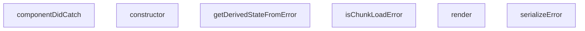

## NODE ID STANDARD

  file: src\components\ErrorBoundary.tsx
  function: src\components\ErrorBoundary.tsx::serializeError
  function: src\components\ErrorBoundary.tsx::isChunkLoadError
  class: src\components\ErrorBoundary.tsx::ErrorBoundary

---

## DISA AKTARILANLAR (EXPORTS)
  export: ErrorBoundary
  export: isChunkLoadError
  export: serializeError

---

## BILEŞIM (CONTAINS)
  contains: Component<Props
  contains: State>

---

## STİL TOKENLERİ

### Arbitrary Değerler (token'a geçirilmemiş)
Yok — tüm stiller token'a geçirilmiş. ✅

### Kullanılan Token'lar (zaten token'a geçirilmiş)
- (yok)

### Tailwind Sınıf Özeti
- **Renkler:** `bg-gray-100`, `bg-primary-navy`, `border-gray-300`, `hover:bg-gray-50`, `hover:bg-secondary-blue`, `hover:text-gray-700`, `text-amber-500`, `text-center`, `text-gray-500`, `text-gray-600`, `text-gray-700`, `text-gray-800`, `text-left`, `text-sm`, `text-white`
- **Layout:** `flex`, `h-16`, `h-4`, `inline-flex`, `items-center`, `justify-center`, `max-h-40`, `max-w-md`, `min-h-400px`, `overflow-auto`, `p-3`, `p-8`, `w-16`, `w-4`
- **Varyant/Responsive:** `hover:` önekleri
- **Yardımcı Sınıflar:** `border`, `cursor-pointer`, `font-semibold`, `mb-2`, `mb-4`, `mb-6`, `mr-2`, `mr-3`, `mt-2`, `mt-6`, `mx-auto`, `px-4`, `px-6`, `py-2`, `rounded`

---
# FILE: src\components\Footer.md

---
domain: general
source_type: doc
namespace_type: module
source_path: C:\Users\alize\venthub-hvac\src\components\Footer.tsx
skeleton_hash: 91583130499c2de6
entity_hashes:
  func:Footer: 1e0192e85e1f6373
  overview: 05f327193547be84
  style_tokens: 266d0ec5d4b33045
generated_at: 2026-06-14T22:50:16Z
---

## Genel Bakış
Bu modül, uygulamanın alt kısmında görünecek olan Footer bileşenini tanımlar. React işlevsel bileşeni olarak uygulanmış olup, sayfanın son kısmında gerekli bağlantı, telif hakkı veya sosyal medya gibi bilgileri sunmak için kullanılır.

## Fonksiyon Grupları
### Bileşen Tanımı
Footer bileşeninin oluşturulması ve dışa aktarılması sorumluluğundadır.
- Footer

---

## AXIOMS – Mimari Varsayımlar
Bu modül için özel aksiyom tanımlanmamıştır.

---

## FONKSİYON DETAYLARI

### Footer
**Ne yapar**: Uygulamanın altbilgi (footer) bölümünü render eden bir React fonksiyonel bileşeni tanımlar.  
**Nasıl yapar**: Fonksiyon içindeki JSX döndürerek, genellikle telif hakkı metni, sosyal medya linkleri ve diğer altbilgi öğelerini içerir; bu JSX, React tarafından DOM'a monte edilerek görüntülenir.  
**Parametreler**: Yok  
**Dönüş**: React.FC türünde bir fonksiyonel bileşen; bu bileşen render edildiğinde footer JSX'ini döndürür.

---

## İTHALATLAR (IMPORTS)
- import: ../contexts/CategoryContext::useCategories
- import: ../i18n/I18nProvider::useI18n
- import: ../utils/routes::Routes
- import: ./BuildTag::BuildTag
- import: next/link::Link
- import: react::React

---

## AST POINTERS

### [N1_NASIL] AST Pointer: src/components/Footer.tsx::Footer
- **params**: (parametre yok)
- **ic_degiskenler**:
  - `t` — çeviri fonksiyonu, `useI18n` hook'undan elde edilen `t` nesnesi; footer üzerindeki tüm metinleri çevirmek için kullanılır.
  - `globalCategories` — `useCategories` context'inden gelen tüm kategorilerin dizisi; footer'ın kategori listesi ve diğer bölümlerde kaynak veri olarak kullanılır.
  - `mainCategories` — `React.useMemo` ile memoize edilmiş değişken; `parent_id` olmayan (üst seviye) kategorilerin ilk 8 elemanını içerir ve footer'ın "Kategoriler" bölümünde gösterilir.
- **Dönüş**: JSX.Element — `<footer>...</footer>` elementi olarak render edilen footer bileşeni.

### [N2_NASIL] AST Pointer: src/components/Footer.tsx::mainCategories (useMemo callback)
- **params**: (parametre yok)
- **ic_degiskenler**:
  - `globalCategories` — dış kapsaktan gelen tüm kategoriler dizisi; bu fonksiyon içinde `filter` ve `slice` işlemlerine kaynak olarak kullanılır.
- **Dönüş**: Category[] — `parent_id` olmayan kategorilerin ilk 8 elemanını içeren yeni dizi; footer'da gösterilecek kategori özetini sağlar.

### [N3_NASIL] AST Pointer: src/components/Footer.tsx::renderCategoryItem
- **params**: `category` — bir kategori nesnesi; `slug` ve `name` özelliklerini içerir, bu özellikler link oluşturma ve metin gösteriminde kullanılır.
- **ic_degiskenler**: (yok) — fonksiyon gövdesinde ek bir değişken tanımlanmaz.
- **Dönüş**: JSX.Element — `<li>` elementi içinde bir `<Link>` barındıran kategori öğesi; footer'ın kategori listesinde tek bir satır olarak render edilir.

---

## NODE ID STANDARD

  file: src\components\Footer.tsx
  function: src\components\Footer.tsx::Footer

---

## DISA AKTARILANLAR (EXPORTS)
  export: Footer

---

## STİL TOKENLERİ

### Arbitrary Değerler (token'a geçirilmemiş)
Yok — tüm stiller token'a geçirilmiş. ✅

### Kullanılan Token'lar (zaten token'a geçirilmiş)
- (yok)

### Tailwind Sınıf Özeti
- **Renkler:** `bg-industrial-gray`, `bg-primary-navy`, `bg-white/5`, `border-steel-gray`, `border-t`, `hover:text-secondary-blue`, `hover:text-white`, `selection:bg-white/20`, `selection:text-white`, `text-gray-300`, `text-lg`, `text-secondary-blue`, `text-sm`, `text-white`, `text-xl`
- **Layout:** `flex`, `flex-col`, `flex-shrink-0`, `flex-wrap`, `gap-8`, `gap-x-6`, `gap-y-2`, `grid`, `grid-cols-1`, `items-center`, `items-start`, `justify-between`, `justify-center`, `lg:grid-cols-4`, `max-w-7xl`
- **Varyant/Responsive:** `hover:`, `lg:`, `md:`, `selection:`, `sm:` önekleri
- **Yardımcı Sınıflar:** `font-bold`, `font-medium`, `font-semibold`, `leading-relaxed`, `lg:px-8`, `mb-2`, `mb-4`, `md:space-y-0`, `mt-1`, `mt-4`, `mx-auto`, `px-4`, `py-12`, `py-6`, `rounded-lg`

---
# FILE: src\components\HVACIcons.md

---
domain: general
source_type: doc
namespace_type: module
source_path: C:\Users\alize\venthub-hvac\src\components\HVACIcons.tsx
skeleton_hash: ab3c3407e866ff6d
entity_hashes:
  func:AccessoriesIcon: df362ba93a01a32a
  func:AirCurtainIcon: a991d6630fad3258
  func:AirPurifierIcon: 6d358290affcacb3
  func:BrandIcon: abc1dbe6a42bf303
  func:DehumidifierIcon: 40d30033e6855f3e
  func:FanIcon: 4fb3ddee9fac4362
  func:FlexibleDuctIcon: 252d34888f5ec8da
  func:HeatRecoveryIcon: 821f62398bcddd32
  func:SpeedControlIcon: dbb6f424f34e3326
  func:WhatsAppIcon: e7d41d76023d8693
  overview: dff8b3ed99dcf496
  style_tokens: 3b0534c287cddb44
generated_at: 2026-06-19T20:47:09Z
---

## Genel Bakış
Bu modül, HVAC sistemleriyle ilgili çeşitli ekipmanları ve bazı ortak kullanım amaçlı sembolleri temsil eden SVG tabanlı React ikon bileşenlerini toplar. Her bir fonksiyon, belirtilen boyut ve stil seçenekleriyle özelleştirilebilir bir ikon döndürerek arayüzde görsel eşleştirmeyi kolaylaştırır.

## Fonksiyon Grupları
### HVAC Ekipman İkonları
HVAC sistemlerinin temel bileşenlerini görselleştirmek için kullanılan ikonlar burada yer alır; fan, ısı geri kazanımı, havalama perdeleri, nemlendirici, hava temizleyici, esnek kanal, hız kontrolü ve aksesuar gibi işlevleri temsil eder.
- FanIcon, HeatRecoveryIcon, AirCurtainIcon, DehumidifierIcon, AirPurifierIcon, FlexibleDuctIcon, SpeedControlIcon, AccessoriesIcon

### Ortak Kullanım İkonları
Modülün geri kalan kısmı, sosyal medya bağlantıları ve marka gösterimi gibi genel amaçlı ihtiyaçlara hizmet eden basit ikonları içerir; bu sayede arayüzde tutarlı bir görsel dil sağlanır.
- WhatsAppIcon, BrandIcon

---

## AXIOMS – Mimari Varsayımlar
Bu modül, prop tiplerinin ve varsayılan değerlerinin beklendiği şekilde sağlandığını varsayar.

[Aksiyom 1]: Eğer className prop'ı string değilse, component sınıf adı uygulanamayabilir ve stil hatası oluşabilir.  
[Aksiyom 2]: Eğer size prop'ı sayı değilse, CSS boyutu geçersiz olur ve ikon beklenmedik şekilde render edilebilir.  
[Aksiyom 3]: Eğer WhatsAppIcon'ın size prop'ı sağlanmazsa, varsayılan 24 kullanılır; ancak bu değerin sayı olmaması durumunda yukarıdaki aksiyom geçerlidir.  
[Aksiyom 4]: Eğer BrandIcon'ın brand prop'ı sağlanmazsa veya tanımsız ise, component doğru şekilde render edilemez (brand eksikliği nedeniyle görüntülenemez).

---

## FONKSİYON DETAYLARI

### FanIcon
**Ne yapar**: HVAC sistemlerindeki fan bileşenini temsil eden SVG ikonunu render eder. Fan sembolünü görsel olarak göstermek için kullanılır.

**Nasıl yapar**: className ve size parametrelerini alarak, bir SVG elementi oluşturur ve fan şeklinde bir ikon çizer. Varsayılan olarak 48x48 piksel boyutunda render edilir.

**Parametreler**:
- className: string — İkon üzerine uygulanacak CSS sınıfı. Varsayılan değer boş stringdir.
- size: number — İkonun boyutunu piksel cinsinden belirler. Varsayılan değer 48'dir.

**Dönüş**: React.FC<IconProps> — Render edilmiş SVG ikon bileşeni döndürür.

### HeatRecoveryIcon
**Ne yapar**: Isı geri kazanım sistemini simgeleyen bir ikon bileşeni üretir.  
**Nasıl yapar**: Hazırlanmış SVG içeriği alır, `className` ve `size` prop’larını bu SVG üzerindeki stil ve boyut özelliklerine uygular.  
**Parametreler**:
- className: string — İkona ekstra stil sınıfları eklemek için kullanılır.  
- size: number — İkonun boyutunu piksel cinsinden ayarlar, varsayılan 48.  
**Dönüş**: `React.FC<IconProps>`; render edildiğinde Isı geri kazanım ikonunu gösterir.

### AirCurtainIcon
**Ne yapar**: Hava perdesi (air curtain) cihazını temsil eden bir simge bileşeni oluşturur.  
**Nasıl yapar**: İkonun SVG tanımı alır, dışardan gelen `className` stilini ve `size` boyutunu uygulayarak ekrana basar.  
**Parametreler**:
- className: string — Ekstra CSS sınıfları için kullanılır, görsel özelleştirmeyi mümkün kılar.  
- size: number — İkonun genişlik ve yüksekliğini piksel olarak belirler, varsayılan 48.  
**Dönüş**: `React.FC<IconProps>`; JSX olarak hava perdesi ikonunu döndürür.

### DehumidifierIcon
**Ne yapar**: Nem çekici (dehumidifier) cihazının simgesini render eden bir React bileşeni sağlar.  
**Nasıl yapar**: Önceden tanımlanmış SVG yolunu alır, `className` ve `size` değerlerini bu SVG’nin stil ve boyut özelliklerine uygular.  
**Parametreler**:
- className: string — İkona ekstra stil sınıfları eklemek için kullanılır.  
- size: number — İkonun boyutunu piksel cinsinden belirler, varsayılan değer 48.  
**Dönüş**: `React.FC<IconProps>`; nem çekici ikonunu gösteren fonksiyonel bileşen.

### AirPurifierIcon
**Ne yapar**: Hava temizleyici (air purifier) cihazını simgeleyen bir ikon bileşeni üretir.  
**Nasıl yapar**: SVG içeriği alır, `className` stilini ve `size` boyutunu bu SVG üzerindeki özelliklere uygulayarak ekrana basar.  
**Parametreler**:
- className: string — Ekstra CSS sınıfları için kullanılır, stil özelleştirmeyi sağlar.  
- size: number — İkonun piksel cinsinden genişlik ve yüksekliğini belirler, varsayılan 48.  
**Dönüş**: `React.FC<IconProps>`; hava temizleyici ikonunu döndüren fonksiyonel bileşen.

### FlexibleDuctIcon
**Ne yapar**: Esnek havalandırma kanalı (flexible duct) simgesini render eden bir React bileşeni sağlar.  
**Nasıl yapar**: Hazırlanmış SVG yolunu alır, dışardan gelen `className` stilini ve `size` boyutunu bu SVG’nin özelliklerine uygular.  
**Parametreler**:
- className: string — Ekstra stil sınıfları eklemek için kullanılır.  
- size: number — İkonun boyutunu piksel cinsinden belirler, varsayılan 48.  
**Dönüş**: `React.FC<IconProps>`; esnek kanal ikonunu gösteren fonksiyonel bileşen.

### SpeedControlIcon
**Ne yapar**: Hız kontrolü (speed control) simgesini oluşturan bir ikon bileşeni üretir.  
**Nasıl yapar**: SVG tanımı alır, `className` ve `size` prop’larını bu SVG’nin stil ve boyut özelliklerine uygulayarak ekrana basar.  
**Parametreler**:
- className: string — Ekstra CSS sınıfları için kullanılır, görsel özelleştirmeyi sağlar.  
- size: number — İkonun piksel cinsinden genişlik ve yüksekliğini belirler, varsayılan 48.  
**Dönüş**: `React.FC<IconProps>`; hız kontrolü ikonunu döndüren fonksiyonel bileşen.

### AccessoriesIcon
**Ne yapar**: HVAC ekstra ekipmanları (aksesuarlar) simgesini render eden bir bileşen sağlar.  
**Nasıl yapar**: Önceden tanımlanmış SVG içeriği alır, `className` stilini ve `size` boyutunu bu SVG’nin özelliklerine uygulayarak ekrana gösterir.  
**Parametreler**:
- className: string — Ekstra stil sınıfları eklemek için kullanılır.  
- size: number — İkonun boyutunu piksel cinsinden belirler, varsayılan 48.  
**Dönüş**: `React.FC<IconProps>`; aksesuar ikonunu gösteren fonksiyonel bileşen.

### WhatsAppIcon
**Ne yapar**: WhatsApp logosunu gösteren bir ikon bileşeni üretir.  
**Nasıl yapar**: WhatsApp markası için hazırlanmış SVG alır, dışardan gelen `className` stilini ve `size` boyutunu (varsayılan 24) bu SVG’nin stil ve boyut özelliklerine uygular.  
**Parametreler**:
- className: string — Ekstra CSS sınıfları için kullanılır, stil özelleştirmeyi sağlar.  
- size: number — İkonun piksel cinsinden genişlik ve yüksekliğini belirler, varsayılan 24.  
**Dönüş**: `React.FC<IconProps>`; WhatsApp logosunu gösteren fonksiyonel bileşen.

### BrandIcon
**Ne yapar**: Verilen `brand` parametresine göre ilgili marka logosunu render eden dinamik bir ikon bileşeni sağlar.  
**Nasıl yapar**: `brand` string değerine göre önceden tanımlanmış marka SVG’lerinden uygun olanı seçer, `className` prop’sunu bu SVG’nin stiline uygular ve ekrana basar.  
**Parametreler**:
- brand: string — Gösterilecek markanın adı; bu değere göre ilgili logo seçilir.  
- className: string (opsiyonel) — Ekstra stil sınıfları eklemek için kullanılır, varsayılan boş string.  
**Dönüş**: `React.FC<{ brand: string; className?: string }>`; marka logosunu gösteren fonksiyonel bileşen.

---

## İTHALATLAR (IMPORTS)
- import: next/image::Image
- import: react::React

---

## INTERFACES

### IconProps
- `className?: string`
- `size?: number`

---

## AST POINTERS

### [N1_NASIL] AST Pointer: C:\Users\alize\venthub-hvac\src\components\HVACIcons.tsx::FanIcon
- **params**: className, size
- **ic_degiskenler**:
  - `className` — SVG öğesinin className özelliğine aktarılan stil sınıfı
  - `size` — SVG öğesinin width ve height özelliklerine piksel cinsinden aktarılan boyut
- **Dönüş**: JSX elementi (React.FC<IconProps>)

### [N2_NASIL] AST Pointer: C:\Users\alize\venthub-hvac\src\components\HVACIcons.tsx::HeatRecoveryIcon
- **params**: className, size
- **ic_degiskenler**:
  - `className` — SVG öğesinin className özelliğine aktarılan stil sınıfı
  - `size` — SVG öğesinin width ve height özelliklerine piksel cinsinden aktarılan boyut
- **Dönüş**: JSX elementi (React.FC<IconProps>)

### [N3_NASIL] AST Pointer: C:\Users\alize\venthub-hvac\src\components\HVACIcons.tsx::AirCurtainIcon
- **params**: className, size
- **ic_degiskenler**:
  - `className` — SVG öğesinin className özelliğine aktarılan stil sınıfı
  - `size` — SVG öğesinin width ve height özelliklerine piksel cinsinden aktarılan boyut
- **Dönüş**: JSX elementi (React.FC<IconProps>)

### [N4_NASIL] AST Pointer: C:\Users\alize\venthub-hvac\src\components\HVACIcons.tsx::DehumidifierIcon
- **params**: className, size
- **ic_degiskenler**:
  - `className` — SVG öğesinin className özelliğine aktarılan stil sınıfı
  - `size` — SVG öğesinin width ve height özelliklerine piksel cinsinden aktarılan boyut
- **Dönüş**: JSX elementi (React.FC<IconProps>)

### [N5_NASIL] AST Pointer: C:\Users\alize\venthub-hvac\src\components\HVACIcons.tsx::AirPurifierIcon
- **params**: className, size
- **ic_degiskenler**:
  - `className` — SVG öğesinin className özelliğine aktarılan stil sınıfı
  - `size` — SVG öğesinin width ve height özelliklerine piksel cinsinden aktarılan boyut
- **Dönüş**: JSX elementi (React.FC<IconProps>)

### [N6_NASIL] AST Pointer: C:\Users\alize\venthub-hvac\src\components\HVACIcons.tsx::FlexibleDuctIcon
- **params**: className, size
- **ic_degiskenler**:
  - `className` — SVG öğesinin className özelliğine aktarılan stil sınıfı
  - `size` — SVG öğesinin width ve height özelliklerine piksel cinsinden aktarılan boyut
- **Dönüş**: JSX elementi (React.FC<IconProps>)

### [N7_NASIL] AST Pointer: C:\Users\alize\venthub-hvac\src\components\HVACIcons.tsx::SpeedControlIcon
- **params**: className, size
- **ic_degiskenler**:
  - `className` — SVG öğesinin className özelliğine aktarılan stil sınıfı
  - `size` — SVG öğesinin width ve height özelliklerine piksel cinsinden aktarılan boyut
- **Dönüş**: JSX elementi (React.FC<IconProps>)

### [N8_NASIL] AST Pointer: C:\Users\alize\venthub-hvac\src\components\HVACIcons.tsx::AccessoriesIcon
- **params**: className, size
- **ic_degiskenler**:
  - `className` — SVG öğesinin className özelliğine aktarılan stil sınıfı
  - `size` — SVG öğesinin width ve height özelliklerine piksel cinsinden aktarılan boyut
- **Dönüş**: JSX elementi (React.FC<IconProps>)

### [N9_NASIL] AST Pointer: C:\Users\alize\venthub-hvac\src\components\HVACIcons.tsx::WhatsAppIcon
- **params**: className, size
- **ic_degiskenler**:
  - `className` — SVG öğesinin className özelliğine aktarılan stil sınıfı
  - `size` — SVG öğesinin width ve height özelliklerine piksel cinsinden aktarılan boyut (varsayılan 24)
- **Dönüş**: JSX elementi (React.FC<IconProps>)

### [N10_NASIL] AST Pointer: C:\Users\alize\venthub-hvac\src\components\HVACIcons.tsx::BrandIcon
- **params**: brand, className
- **ic_degiskenler**:
  - `brand` — görüntülenecek markanın adı; lowercase versiyonu için `normalizedBrand` hesaplanır ve `` alt metni olarak kullanılır
  - `className` — dış öğeye (img veya fallback div) uygulanacak ek stil sınıfı
  - `normalizedBrand` — `brand` küçük harfe çevrilmiş hali; marka eşleştirmesinde switch case’de kullanılır
  - `basePath` — marka görsellerinin bulunduğu sabit yol (`/images/ekran`)
  - `src` — seçilen markaya göre oluşturulan tam görsel URL’si; `` öğesinin src özelliğine aktarılır
  - `alt` — `` öğesinin alt özelliği; erişilebilirlik için marka adıyla doldurulur
- **Dönüş**: JSX elementi (React.FC<{ brand: string; className?: string }>) – marka görseli veya fallback metni döner.

---


## MERMAID CALL GRAPH
```mermaid
graph TD
    HVACIcons_tsx__AccessoriesIcon["AccessoriesIcon"]
    HVACIcons_tsx__AirCurtainIcon["AirCurtainIcon"]
    HVACIcons_tsx__AirPurifierIcon["AirPurifierIcon"]
    HVACIcons_tsx__BrandIcon["BrandIcon"]
    HVACIcons_tsx__DehumidifierIcon["DehumidifierIcon"]
    HVACIcons_tsx__FanIcon["FanIcon"]
    HVACIcons_tsx__FlexibleDuctIcon["FlexibleDuctIcon"]
    HVACIcons_tsx__HeatRecoveryIcon["HeatRecoveryIcon"]
    HVACIcons_tsx__SpeedControlIcon["SpeedControlIcon"]
    HVACIcons_tsx__WhatsAppIcon["WhatsAppIcon"]
```

## NODE ID STANDARD

  file: src\components\HVACIcons.tsx
  function: src\components\HVACIcons.tsx::FanIcon
  function: src\components\HVACIcons.tsx::HeatRecoveryIcon
  function: src\components\HVACIcons.tsx::AirCurtainIcon
  function: src\components\HVACIcons.tsx::DehumidifierIcon
  function: src\components\HVACIcons.tsx::AirPurifierIcon
  function: src\components\HVACIcons.tsx::FlexibleDuctIcon
  function: src\components\HVACIcons.tsx::SpeedControlIcon
  function: src\components\HVACIcons.tsx::AccessoriesIcon
  function: src\components\HVACIcons.tsx::WhatsAppIcon
  function: src\components\HVACIcons.tsx::BrandIcon

---

## DISA AKTARILANLAR (EXPORTS)
  export: AccessoriesIcon
  export: AirCurtainIcon
  export: AirPurifierIcon
  export: BrandIcon
  export: DehumidifierIcon
  export: FanIcon
  export: FlexibleDuctIcon
  export: HeatRecoveryIcon
  export: SpeedControlIcon
  export: WhatsAppIcon

---

## STİL TOKENLERİ

### Arbitrary Değerler (token'a geçirilmemiş)
Yok — tüm stiller token'a geçirilmiş. ✅

### Kullanılan Token'lar (zaten token'a geçirilmiş)
- (yok)

### Tailwind Sınıf Özeti
- **Renkler:** `bg-slate-100`, `text-slate-400`, `text-xs`
- **Layout:** `flex`, `h-full`, `items-center`, `justify-center`, `p-2`, `relative`, `w-full`
- **Varyant/Responsive:** (yok)
- **Yardımcı Sınıflar:** `${className`, `font-bold`, `object-contain`, `rounded-lg`, `tracking-tighter`, `uppercase`

---
# FILE: src\components\ImageGallery.md

---
domain: general
source_type: doc
namespace_type: module
source_path: C:\Users\alize\venthub-hvac\src\components\ImageGallery.tsx
skeleton_hash: 701f6aa8838e4566
entity_hashes:
  func:ImageGallery: ed5cc2a855b5b9b8
  func:handleMouseLeave: 60d41c470a6d0032
  func:handleMouseMove: b68c1278669bcb7a
  overview: f4654744ad74eeea
  style_tokens: 01bec99debdcd366
generated_at: 2026-06-14T22:50:17Z
---

## Genel Bakış
ImageGallery bileşeni, bir ürünün görsellerini düzenli bir galeri formatında sergileyen ve kullanıcının fare etkileşimlerine yanıt veren dinamik bir React bileşenidir. Temel işlevi, görsellerin gösterimini ve bu görseller üzerinde fare hareketlerine bağlı olarak tetiklenen efektleri (örneğin yakınlaştırma veya açıklama gösterimi) yönetmektir.

## Fonksiyon Grupları
### Görsel Galeri Oluşturma ve Yerleşim
Bileşenin ana gövdesi, dışarıdan gelen görsel listesi ve ürün meta verilerini alarak ekrana düzenli ve interaktif bir galeri yerleşimi oluşturur.
- ImageGallery

### Fare Etkileşimi Yönetimi
Kullanıcının fare hareketlerini izleyerek galeri üzerinde geçici görsel efektlerin başlatılmasını ve sonlandırılmasını kontrol eden yardımcı işlevler.
- handleMouseMove
- handleMouseLeave

---

## AXIOMS – Mimari Varsayımlar

Bu modül için, fonksiyon gövdesinden üretilen aksiyomlar aşağıdadır. Aksiyomlar yalnızca fonksiyon imzaları ve modül sabitleri temel alınarak çıkarılmıştır; docstring, yorum veya değişken isimlerinden bilgi çıkarılmamıştır.

[Aksiyom 1]: Eğer `images` parametresi boş bir dizi ise veya `undefined`/`null` olarak iletilirse, bileşen düzgün render edilemez ve potansiyel olarak hata oluşur.
[Aksiyom 2]: Eğer `productName` parametresi `undefined` veya boş string olarak iletilirse, galeri içindeki ürün adı gösterimi eksik veya hatalı olur.
[Aksiyom 3]: Eğer `slug` parametresi geçerli bir ürün tanımlayıcısı içermiyorsa, `Product3DViewer` çağrılamaz veya yanlış ürün yüklenir.
[Aksiyom 4]: Eğer `modelType` parametresi `Product3DViewer` componenti tarafından beklenen formatta değilse, 3D görüntüleyici doğru çalışmayabilir.
[Aksiyom 5]: Eğer `handleMouseMove` fonksiyonu `React.MouseEvent<HTMLDivElement>` tipinde bir event almıyorsa, fare hareketi takibi yapılamaz ve dinamik efektler devre dışı kalır.
[Aksiyom 6]: Eğer `handleMouseLeave` fonksiyonu çağrılmasa, fare galeri alanından ayrıldığında efektler sıfırlanmaz ve geçici durumlar kalıcı olur.
[Aksiyom 7]: Eğer `Product3DViewer` modülü içe aktarılamıyorsa veya kullanılamıyorsa, 3D model görüntüleme işlevi çalışmaz.

---

## FONKSİYON DETAYLARI

### ImageGallery
**Ne yapar**: Bir ürünün görsellerini gösteren bir bileşen render eder.  
**Nasıl yapar**: props olarak gelen images dizisini mapleyerek her bir görseli  veya benzeri bir eleman olarak döndürür; ayrıca productName, slug ve modelType bilgilerini UI içinde kullanabilir.  
**Parametreler**:  
- images: Image[] — Gösterilecek görsel dizisi (her bir görselin URL ve meta veri içerdiği tip)  
- productName: string — Ürünün adı, başlık veya alt metin olarak gösterilir  
- slug: string — Ürünün URL slug'ı, navigasyon veya SEO amaçlı kullanılır  
- modelType: string — Ürünün model tipi, filtreleme veya sınıflandırma için kullanılır  
**Dönüş**: React.FC<ImageGalleryProps> — JSX elementi döndüren fonksiyonel bileşen

### handleMouseMove
**Ne yapar**: Fare hareketi olayını yakalayıp, görsel galerisinde etkileşim (örneğin zoom veya hareket efekti) için gerekli koordinatları işler.  
**Nasıl yapar**: Olay nesnesinden clientX ve clientY değerlerini çıkararak state veya ref üzerinden güncellenen pozisyon bilgilerini ayarlar; bu sayede görselin üzerine gelen fareye göre dinamik efekt sağlanır.  
**Parametreler**:  
- e: React.MouseEvent<HTMLDivElement> — Fare hareketi olayı, hedef bir <div> elementi üzerinden tetiklenir  
**Dönüş**: void — Fonksiyon bir değer döndürmez

### handleMouseLeave
**Ne yapar**: Fare galeriye dışarı çıktığında tetiklenen olay işleyicisidir; aktif etkileşimi sıfırlayarak görseli varsayılan duruma döndürür.  
**Nasıl yapar**: State veya ref üzerinden fare üzerindeki etkileşimi (örneğin zoom ölçeği) sıfırlayarak galeriyi başlangıç pozisyonuna getirir.  
**Parametreler**: (yok)  
**Dönüş**: void — Fonksiyon bir değer döndürmez

---

## İTHALATLAR (IMPORTS)
- import: ../i18n/I18nProvider::useI18n
- import: ./ui/VentImage::VentImage
- import: lucide-react::Box
- import: lucide-react::ChevronLeft
- import: lucide-react::ChevronRight
- import: lucide-react::Maximize2
- import: lucide-react::X
- import: next/dynamic::dynamic
- import: react-dom::createPortal
- import: react::React
- import: react::useCallback
- import: react::useEffect
- import: react::useRef
- import: react::useState

---

## INTERFACES

### ImageGalleryProps
- `images: { path: string; alt?: string | null }[]`
- `productName: string`
- `slug?: string`
- `modelType?: string`

---

## SABİTLER
- **Product3DViewer** (call) — `dynamic(
    () => import('./products/3d/Product3DViewer'),
    { ssr: fals...`

---

## AST POINTERS

### [N1_NASIL] AST Pointer: ImageGallery.tsx::ImageGallery
- **params**: `{ images, productName, slug, modelType }`
- **ic_degiskenler**:
  - `t` — `useI18n()` hook'undan alınan çeviri fonksiyonu, UI metinleri için kullanılır
  - `activeIdx` — `useState(0)`, o an seçili olan resmin indeksini tutar
  - `isLightboxOpen` — `useState(false)`, lightbox modalının açık olup olmadığını tutar
  - `is3DMode` — `useState(false)`, 3D model görünümünün aktif olup olmadığını tutar
  - `is3DFullscreen` — `useState(false)`, 3D modelin tam ekran modunda olup olmadığını tutar
  - `zoomStyle` — `useState<React.CSSProperties>({})`, mouse hover zoom efekti için CSS transform stilini tutar
  - `imageContainerRef` — `useRef<HTMLDivElement>(null)`, ana resim container DOM elementine referans verir
  - `activeImage` — `images` dizisinden `activeIdx` ile seçili olan resim nesnesi (path, alt içerir) veya `null`
  - `nextImage` — `useCallback`, sonraki resme geçmek için fonksiyon, `(prev + 1) % images.length` hesaplar
  - `prevImage` — `useCallback`, önceki resme geçmek için fonksiyon, `(prev - 1 + images.length) % images.length` hesaplar
- **Dönüş**: JSX (resim galerisi UI'ı, thumbnail'ler, lightbox portal, 3D viewer portal)

---


## MERMAID CALL GRAPH
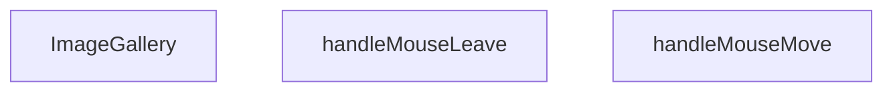

## NODE ID STANDARD

  file: src\components\ImageGallery.tsx
  function: src\components\ImageGallery.tsx::ImageGallery
  function: src\components\ImageGallery.tsx::handleMouseMove
  function: src\components\ImageGallery.tsx::handleMouseLeave

---

## DISA AKTARILANLAR (EXPORTS)
  export: ImageGallery

---

## STİL TOKENLERİ

### Arbitrary Değerler (token'a geçirilmemiş)
Yok — tüm stiller token'a geçirilmiş. ✅

### Kullanılan Token'lar (zaten token'a geçirilmiş)
- (yok)

### Tailwind Sınıf Özeti
- **Renkler:** `bg-black/20`, `bg-black/95`, `bg-gray-100`, `bg-white`, `bg-white/10`, `bg-white/80`, `bg-white/95`, `border-2`, `border-gray-200`, `border-primary-navy`, `border-transparent`, `border-white`, `hover:bg-white`, `hover:bg-white/20`, `hover:border-gray-300`
- **Layout:** `absolute`, `backdrop-blur-md`, `backdrop-blur-sm`, `bottom-6`, `cursor-zoom-in`, `fixed`, `flex`, `flex-col`, `flex-wrap`, `gap-0.5`, `gap-2`, `h-14`, `h-16`, `h-full`, `items-center`
- **Varyant/Responsive:** `:`, `group-hover:`, `hover:`, `md:` önekleri
- **Yardımcı Sınıflar:** `${!is3DMode`, `${activeIdx`, `-translate-x-1/2`, `-translate-y-1/2`, `:`, `===`, `activeIdx`, `aspect-square`, `border`, `duration-200`, `ease-out`, `font-bold`, `group`, `group-hover:opacity-100`, `hover:opacity-100`

---
# FILE: src\components\InViewCounter.md

---
domain: general
source_type: doc
namespace_type: module
source_path: C:\Users\alize\venthub-hvac\src\components\InViewCounter.tsx
skeleton_hash: 94aaa03be3178db8
entity_hashes:
  func:InViewCounter: 223b6183b16e2873
  overview: 61076e120659900f
  style_tokens: 2ef2cd2897b38d9e
generated_at: 2026-06-19T20:47:09Z
---

## Genel Bakış
Bu modül, sayfa içinde görünebildiği anda bir sayıyı belirli bir süre içinde artırarak gösteren bir React bileşeni sağlar. Kullanıcıya dinamik bir sayaç deneyimi sunmak için görüntülendiğinde animasyonlu bir sayım işlemi gerçekleştirir.

## Fonksiyon Grupları
### Ana Bileşen
Bileşenin temel işlevini ve görüntülendiğinde sayaç animasyonunu yöneten tek işlevi içerir.
- InViewCounter

---

## AXIOMS – Mimari Varsayımlar
Bu modülün doğru çalışması için aşağıdaki varsayımlar geçerlidir.

[Aksiyom 1]: Eğer **label** prop’u sağlanmazsa, bileşen gerekli metni gösteremeyeceği için render hatası veya boş bir görüntü oluşur.  
[Aksiyom 2]: Eğer **to** prop’u sağlanmazsa, sayım hedefi belirlenemediği için bileşen saymaya başlayamaz ve hiçbir değer göstermez.  
[Aksiyom 3]: Eğer **to** prop’u sayısal bir değer değilse (örneğin string, null), sayım mantığı beklenmedik sonuçlar üretebilir veya çalışma zamanında hata fırlatabilir.  
[Aksiyom 4]: Eğer **suffix** prop’u sağlanmazsa, varsayılan olarak boş string (`''`) kullanılır; bu durumda sayının sonuna hiçbir ek metin eklenmez.  
[Aksiyom 5]: Eğer **durationMs** prop’u sağlanmazsa, varsayılan olarak 1200 ms kullanılır; bu değer sayım animasyonunun toplam süresini belirler.  
[Aksiyom 6]: Eğer **durationMs** sıfır veya negatif bir değerse, animasyon süresi geçersiz olur ve sayım aniden tamamlanabilir veya hiç görünmeyebilir.  
[Aksiyom 7]: Bileşen, React’in `useState` ve `useEffect` hook’larına bağımlıdır; bu hook’ların desteklenmeyen bir ortamda (örneğin klasik bir JavaScript dosyasında) kullanılması beklenmedik hatalar veroor.  
[Aksiyom 8]: Bileşenin içindeki zamanlayıcı (örneğin `setInterval` veya `requestAnimationFrame`) bileşenun unmount edilmesiyle temizlenmezse, bellek sızıntısı veya eski state güncellemeleri yaşanabilir.  

Bu varsayımlar, modülün fonksiyon imzalarından ve tipik React davranışlarından türetilmiştir; başka bir belge ya da yorumdan çıkarılmamıştır.

---

## FONKSİYON DETAYLARI

### InViewCounter
**Ne yapar**: Görünür alana girdiğinde sayısal değeri belirtilen sürede animasyonlu olarak artan bir sayaç bileşeni render eder.  
**Nasıl yapar**: `IntersectionObserver` kullanarak bileşenin viewport içinde görünürlüğünü izler; görünür olduğunda `setInterval` veya `requestAnimationFrame` üzerinden 0’dan `to` değerine kadar artan sayıyı hesaplar ve `label` ile `suffix` ekleyerek ekrana yazar.  
**Parametreler**:
- label: string — Sayı önüne eklenecek metin (örn. “Toplam: ”).  
- to: number — Sayaç hedef değeri; animasyon bu sayıya ulaşınca durur.  
- suffix: string — Sayı sonuna eklenecek metin (örn. “ kişi”). Varsayılan boş string.  
- durationMs: number — Animasyonun tamamlanması için geçen milisaniye süresi. Varsayılan 1200 ms.  
**Dönüş**: React.FC<CounterProps> — `label`, `to`, `suffix` ve `durationMs` props’larını kabul eden ve animasyonlu sayaç gösteren bir React fonksiyonel bileşeni.

---

## İTHALATLAR (IMPORTS)
- import: react::React
- import: react::useEffect
- import: react::useRef
- import: react::useState

---

## INTERFACES

### CounterProps
- `label: string`
- `to: number`
- `suffix?: string`
- `durationMs?: number`

---

## AST POINTERS

### [N1_NASIL] AST Pointer: src/components/InViewCounter.tsx::InViewCounter
- **params**: label, to, suffix = '', durationMs = 1200
- **ic_degiskenler**:
  - `ref` — useRef to hold DOM element reference for IntersectionObserver.
  - `value` — state variable for current displayed count.
  - `setValue` — setter for `value` state.
  - `started` — boolean flag indicating animation has started.
  - `setStarted` — setter for `started`.
  - `shouldAnimate` — flag indicating whether animation should run (respects reduced‑motion preferences).
  - `setShouldAnimate` — setter for `shouldAnimate`.
- **Dönüş**: JSX element (React.FC<CounterProps>)

### [N2_NASIL] AST Pointer: src/components/InViewCounter.tsx::useEffect_reducedMotion
- **params**: (yok)
- **ic_degiskenler**:
  - `rm` — MediaQueryList for prefers‑reduced‑motion media query.
  - `coarse` — MediaQueryList for pointer:coarse media query.
  - `update` — function that updates `shouldAnimate` based on match results.
- **Dönüş**: cleanup function (void)

### [N3_NASIL] AST Pointer: src/components/InViewCounter.tsx::cleanup_reducedMotion
- **params**: (yok)
- **ic_degiskenler**: (yok)
- **Dönüş**: void

### [N4_NASIL] AST Pointer: src/components/InViewCounter.tsx::useEffect_intersectionObserver
- **params**: (yok)
- **ic_degiskenler**:
  - `el` — DOM element from `ref.current`.
  - `io` — IntersectionObserver instance observing the element.
- **Dönüş**: cleanup function (void)

### [N5_NASIL] AST Pointer: src/components/InViewCounter.tsx::cleanup_intersectionObserver
- **params**: (yok)
- **ic_degiskenler**: (yok)
- **Dönüş**: void

### [N6_NASIL] AST Pointer: src/components/InViewCounter.tsx::intersectionObserverCallback
- **params**: entries
- **ic_degiskenler**:
  - `e` — individual IntersectionObserverEntry from the entries list.
- **Dönüş**: yok

### [N7_NASIL] AST Pointer: src/components/InViewCounter.tsx::intersectionObserverEntryArrow
- **params**: e
- **ic_degiskenler**: (yok)
- **Dönüş**: yok

### [N8_NASIL] AST Pointer: src/components/InViewCounter.tsx::useEffect_animationFrame
- **params**: (yok)
- **ic_degiskenler**:
  - `raf` — requestAnimationFrame ID.
  - `t0` — start timestamp from `performance.now()`.
  - `animate` — recursive animation function that updates the displayed value.
- **Dönüş**: cleanup function (void)

### [N9_NASIL] AST Pointer: src/components/InViewCounter.tsx::cleanup_animationFrame
- **params**: (yok)
- **ic_degiskenler**: (yok)
- **Dönüş**: void

### [N10_NASIL] AST Pointer: src/components/InViewCounter.tsx::animateFunction
- **params**: t
- **ic_degiskenler**:
  - `p` — progress ratio (0‑1) based on elapsed time over `durationMs`.
  - `eased` — eased value using easeOutCubic formula.
- **Dönüş**: yok

---

## NODE ID STANDARD

  file: src\components\InViewCounter.tsx
  function: src\components\InViewCounter.tsx::InViewCounter

---

## DISA AKTARILANLAR (EXPORTS)
  export: InViewCounter

---

## STİL TOKENLERİ

### Arbitrary Değerler (token'a geçirilmemiş)
Yok — tüm stiller token'a geçirilmiş. ✅

### Kullanılan Token'lar (zaten token'a geçirilmiş)
- (yok)

### Tailwind Sınıf Özeti
- **Renkler:** `bg-white`, `border-light-gray`, `text-4xl`, `text-center`, `text-primary-navy`, `text-steel-gray`
- **Layout:** `p-6`
- **Varyant/Responsive:** (yok)
- **Yardımcı Sınıflar:** `border`, `font-bold`, `mt-1`, `rounded-2xl`, `tabular-nums`

---
# FILE: src\components\LanguageSwitcher.md

---
domain: general
source_type: doc
namespace_type: module
source_path: C:\Users\alize\venthub-hvac\src\components\LanguageSwitcher.tsx
skeleton_hash: d6dfc9a8a72992f9
entity_hashes:
  func:LanguageSwitcher: e20e68a6d834aa54
  func:switchLanguage: ceec0990f90068b4
  overview: 2f23c86896c74c04
  style_tokens: 819c78943fe15425
generated_at: 2026-06-19T20:47:09Z
---

## Genel Bakış
LanguageSwitcher modülü, uygulamanın dil seçimini sağlayan basit bir React bileşenidir. Kullanıcıya mevcut dillerden birini seçme ve bu seçimi uygulama genelinde güncelleme imkanı sunar.

## Fonksiyon Grupları
### Ana Bileşen
Bu grup, dil değiştirme işlevselliğini tek bir fonksiyonda toplar ve kullanıcı arayüzünü render eder.
- LanguageSwitcher

### Dil Değiştirme Mantığı
Bu grup, seçilen dili uygulama genelinde güncellemek için kullanılan işlevi içerir.
- switchLanguage

---

## AXIOMS – Mimari Varsayımlar
Bu modül için özel aksiyom tanımlanmamıştır.

**Aksiyom 1**: Eğer uygulama içinde ortak bir dil durumu (global language state) bulunmuyorsa, `LanguageSwitcher` bileşeni mevcut dili gösteremez ve dil değişikliği yapılamaz.  

**Aksiyom 2**: Eğer `switchLanguage` fonksiyonuna `'tr'` ya da `'en'` dışındaki bir değer (`newLang`) gönderilirse, geçersiz dil hatası oluşur ve dil değişikliği gerçekleşmez.  

**Aksiyom 3**: Eğer React çalışma ortamı (React runtime ve ilgili bağlam sağlayıcıları) mevcut değilse, `LanguageSwitcher` bileşeni render edilemez ve hiçbir etkileşim gerçekleşmez.  

**Aksiyom 4**: Eğer `switchLanguage` fonksiyonu çağrıldığında ilgili dil paketleri (i18n çeviri dosyaları) yüklenmemişse, UI’da yeni dilde metinler gösterilemez ve varsayılan (fallback) dil kullanılır.

---

## FONKSİYON DETAYLARI

### LanguageSwitcher
**Ne yapar**: React uygulamasında dil değiştirme arayüzünü sağlayan bir fonksiyon bileşeni döndürür.  
**Nasıl yapar**: Fonksiyon, bir React Functional Component (FC) tanımlayarak, kullanıcıların mevcut dili seçebileceği UI öğelerini render eder. Bileşen içinde dil değişimini tetikleyen `switchLanguage` fonksiyonu çağrılabilir.  
**Parametreler**:  
- *Yok* — Bu fonksiyon parametre almaz.  
**Dönüş**: React.FC — Dil seçici bileşenini temsil eden bir React Functional Component döndürür.

### switchLanguage
**Ne yapar**: Uygulamanın aktif dilini, verilen yeni dil koduna (`'tr'` veya `'en'`) göre değiştirir.  
**Nasıl yapar**: Fonksiyon, `newLang` parametresiyle belirtilen dil kodunu alır ve uygulama çapında dil ayarını günceller; genellikle i18n kütüphanesi veya global durum yöneticisi aracılığıyla bu değişikliği yayar.  
**Parametreler**:  
- newLang: `'tr' | 'en'` — Değiştirilecek hedef dil kodu.  
**Dönüş**: Belirtilmemiş — Fonksiyonun dönüş tipi dokümantasyonda tanımlı değildir (muhtemelen `void`).

---

## İTHALATLAR (IMPORTS)
- import: ../i18n/I18nProvider::useI18n
- import: next/navigation::usePathname
- import: next/navigation::useRouter
- import: next::type { Route }
- import: react::React

---

## AST POINTERS

### [N1_NASIL] AST Pointer: src/components/LanguageSwitcher.tsx::LanguageSwitcher
- **params**: (parametre yok)
- **ic_degiskenler**:
  - `lang` — `useI18n` hookundan gelen mevcut dil kodu (`'tr'` | `'en'`).
  - `setLang` — `useI18n` hookundan gelen fonksiyon, dil değiştiğinde state’i günceller.
  - `t` — `useI18n` hookundan gelen çeviri fonksiyonu, anahtarları yerelleştirir.
  - `pathname` — `usePathname` hookundan gelen mevcut URL yolu (string).
  - `router` — `useRouter` hookundan gelen router nesnesi, `push` ve `refresh` metodlarını sağlar.
  - `switchLanguage` — iç tanımlı fonksiyon, dil değişimini yönetir.
- **Dönüş**: React.FC (JSX elemanı döner; yan etkileri: dil cookie ve localStorage güncellenir, router ile yönlendirme yapılır).

### [N2_NASIL] AST Pointer: src/components/LanguageSwitcher.tsx::switchLanguage
- **params**: `newLang: 'tr' | 'en'`
- **ic_degiskenler**:
  - `newLang` — hedef dil kodu, `'tr'` veya `'en'`.
  - `lang` — dış kapsamdaki `useI18n` hookundan alınan mevcut dil (karşılaştırma için).
  - `document.cookie` — tarayıcı cookie’sine `NEXT_LOCALE` anahtarıyla yeni dil değerini yazar.
  - `localStorage` — `setItem('lang', newLang)` ile yeni dili kalıcı olarak saklar (try/catch içinde).
  - `setLang` — `useI18n` hookundan gelen fonksiyon, client‑side state’i günceller.
  - `pathname` — dış kapsamdaki `usePathname` hookundan gelen mevcut yol.
  - `segments` — `pathname.split('/')` sonrası boş olmayan parçalar dizisi.
  - `firstSegment` — `segments[0]`, yolun ilk bölümü (varsa).
  - `newPath` — hesaplanan yeni URL yolu (string).
  - `router` — dış kapsamdaki `useRouter` hookundan gelen nesne; `push` ve `refresh` metodları çağrılır.
- **Dönüş**: yok (fonksiyon yan etkilerle çalışır; cookie, localStorage, state ve router güncellenir).

---

## NODE ID STANDARD

  file: src\components\LanguageSwitcher.tsx
  function: src\components\LanguageSwitcher.tsx::LanguageSwitcher
  function: src\components\LanguageSwitcher.tsx::switchLanguage

---

## DISA AKTARILANLAR (EXPORTS)
  export: LanguageSwitcher

---

## STİL TOKENLERİ

### Arbitrary Değerler (token'a geçirilmemiş)
Yok — tüm stiller token'a geçirilmiş. ✅

### Kullanılan Token'lar (zaten token'a geçirilmiş)
- (yok)

### Tailwind Sınıf Özeti
- **Renkler:** `bg-primary-navy`, `bg-white/90`, `border-light-gray`, `hover:bg-light-gray`, `text-industrial-gray`, `text-sm`, `text-white`
- **Layout:** `backdrop-blur`, `flex`, `gap-1`, `items-center`, `p-1`, `shadow-sm`
- **Varyant/Responsive:** `:`, `focus-visible:`, `hover:` önekleri
- **Yardımcı Sınıflar:** `${lang`, `:`, `===`, `border`, `en`, `focus-visible:ring-2`, `focus-visible:ring-primary-navy`, `outline-none`, `px-3`, `py-1`, `rounded-full`, `tr`

---
# FILE: src\components\LazyInView.md

---
domain: general
source_type: doc
namespace_type: module
source_path: C:\Users\alize\venthub-hvac\src\components\LazyInView.tsx
skeleton_hash: e06566b45d2ed847
entity_hashes:
  func:LazyInView: a6cf07d9fd7df258
  overview: dcd89aaa1940f652
  style_tokens: 884aa794c8b33f43
generated_at: 2026-06-19T20:47:09Z
---

## Genel Bakış
`LazyInView` modülü, React uygulamalarında performans optimizasyonu için tasarlanmış bir tembel yükleme (lazy loading) bileşenidir. Bileşen, içeriğin yalnızca görünüm alanına (viewport) girmesi durumunda yüklenmesini sağlayarak sayfa yüklenme süresini iyileştirir.

## Fonksiyon Grupları
### Çekirdek Bileşen ve Yükleme Mantığı
Modülün temel işlevini yöneten, görünüm takibi ve asenkron içerik yükleme süreçlerini birleştiren ana React bileşenini tanımlar.
- LazyInView

---

## AXIOMS – Mimari Varsayımlar
Bu modül için temel mimari varsayımlar tanımlanmıştır.

**[Aksiyom 1 - Zorunlu Loader Prop'u]:** Eğer `loader` prop'u sağlanmazsa, TypeScript derleme hatası oluşur ve bileşen render edilemez; çünkü `loader` parametresinin varsayılan değeri yoktur.

**[Aksiyom 2 - Placeholder Varsayılan Değeri]:** Eğer `placeholder` prop'u sağlanmazsa, `<div className="min-h-160px" aria-hidden="true" />` varsayılan olarak kullanılır; bileşen her durumda bir yer tutucu gösterir.

**[Aksiyom 3 - Tek Prop Objesi]:** Eğer bileşen birden fazla bağımsız argüman ile çağrılmazsa, tüm prop'lar tek bir nesne olarak destructure edilmelidir (fonksiyon imzası tek bir `{ loader, placeholder }` objesi bekler).

**[Aksiyom 4 - Generik Tip Parametresi]:** Eğer `T` tipi belirtilmezse, TypeScript'in tip çıkarımı ile belirlenir; `loader`'ın döndüreceği içeriğin tipi bu generik parametreye bağlıdır.

---

## FONKSİYON DETAYLARI

### LazyInView

**Ne yapar**: LazyInView, içeriğin görüntü alanına (viewport) girdiğinde yüklenmesini sağlayan bir React lazy loading (tembel yükleme) bileşenidir. Bu bileşen, sayfa performansını optimize etmek için yalnızca görünür alandaki içeriklerin yüklenmesini mümkün kılar.

**Nasıl yapar**: Intersection Observer API'sini kullanarak placeholder elemanının ekranda görünüp görünmediğini izler. Bileşen görünür alana girdiğinde, `loader` prop'unu değerlendirerek asıl içeriği yükler ve placeholder'ı bu içerikle değiştirir. Generik `<T>` yapısı sayesinde farklı veri tipleri ile çalışabilir.

**Parametreler**:
- `loader`: ReactNode veya () => ReactNode tipinde — Görünür alana girildiğinde yüklenecek olan asıl içeriği temsil eder. Genellikle bir fonksiyon veya React bileşenidir ve lazy yükleme tetiklendiğinde render edilir
- `placeholder`: ReactNode tipinde (varsayılan: `<div className="min-h-160px" aria-hidden="true" />`) — İçerik yüklenene kadar görüntülenen geçici elemandır. Varsayılan değer, ekran okuyucular tarafından yok sayılan 160px yüksekliğinde boş bir divdir
- `T`: Generic tip parametresi — Bileşenin işleyebileceği veri tipini belirler. Lazy yüklenecek içeriğin türünü tanımlamak için kullanılır

**Dönüş**: JSX.Element — Lazy yükleme mantığı uygulanmış React bileşeni döndürür. Bileşen, placeholder'ı veya yüklenmiş içeriği render eder

---

## İTHALATLAR (IMPORTS)
- import: react::React

---

## INTERFACES

### LazyInViewProps
- `loader: () => Promise<{ default: React.ComponentType<T> }>`
- `placeholder?: React.ReactNode`
- `rootMargin?: string`
- `once?: boolean`
- `className?: string`
- `componentProps?: T`

---

## AST POINTERS

### [N1_NASIL] AST Pointer: src/components/LazyInView.tsx::LazyInView
- **params**: `(loader, placeholder = <div className="min-h-160px" aria-hidden="true" />, rootMargin = '200px 0px', once = true, className, componentProps)`
- **ic_degiskenler**:
  - `ref` — React ref nesnesi, bir HTMLDivElement'ye atıfta bulunur, IntersectionObserver için DOM elemanını izlemek için kullanılır
  - `shouldLoad` — boolean state, bileşenin yüklenme işleminin tetiklenip tetiklenmediğini kontrol eder
  - `Loaded` — React.ComponentType state, yüklenecek bileşen modülünü tutar (null olarak başlar)
- **Dönüş**: JSX (div elementi içinde Loaded bileşeni veya placeholder)

### [N2_NASIL] AST Pointer: src/components/LazyInView.tsx::pointerdown/touchstart effect callback
- **params**: `()`
- **ic_degiskenler**:
  - `enable` — arrow fonksiyon, shouldLoad state'ini true yaparak yükleme işlemini tetikler
- **Dönüş**: cleanup fonksiyonu (event listener'ları kaldırır)

### [N3_NASIL] AST Pointer: src/components/LazyInView.tsx::effect1 cleanup callback
- **params**: `()`
- **ic_degiskenler**: (yok)
- **Dönüş**: void

### [N4_NASIL] AST Pointer: src/components/LazyInView.tsx::IntersectionObserver effect callback
- **params**: `()`
- **ic_degiskenler**:
  - `el` — IntersectionObserver tarafından izlenecek DOM elemanı (ref.current'dan alınır)
  - `io` — IntersectionObserver instance'ı, elemanı gözlemlemek için oluşturulur
- **Dönüş**: cleanup fonksiyonu (observer'ı disconnect eder)

### [N5_NASIL] AST Pointer: src/components/LazyInView.tsx::IntersectionObserver entries callback
- **params**: `(entries)`
- **ic_degiskenler**:
  - `entries` — IntersectionObserverEntry dizisi, gözlemelenen elemanların durumunu içerir
  - `entry` — entries[0], ilk gözlemenen elemanın durum nesnesi
- **Dönüş**: void

### [N6_NASIL] AST Pointer: src/components/LazyInView.tsx::loader effect callback
- **params**: `()`
- **ic_degiskenler**:
  - `cancelled` — boolean flag, useEffect cleanup işleminde kullanılır, asenkron yükleme işlemini iptal etmek için kontrol edilir
- **Dönüş**: cleanup fonksiyonu (cancelled flag'ini true yapar)

### [N7_NASIL] AST Pointer: src/components/LazyInView.tsx::loader().then callback
- **params**: `(mod)`
- **ic_degiskenler**:
  - `mod` — import edilen modül nesnesi, mod.default içinde yüklenecek bileşen bulunur
- **Dönüş**: void

### [N8_NASIL] AST Pointer: src/components/LazyInView.tsx::loader().catch callback
- **params**: `()`
- **ic_degiskenler**: (yok)
- **Dönüş**: void

---

## NODE ID STANDARD

  file: src\components\LazyInView.tsx
  function: src\components\LazyInView.tsx::LazyInView

---

## DISA AKTARILANLAR (EXPORTS)
  export: LazyInView

---

## STİL TOKENLERİ

### Arbitrary Değerler (token'a geçirilmemiş)
Yok — tüm stiller token'a geçirilmiş. ✅

### Kullanılan Token'lar (zaten token'a geçirilmiş)
- (yok)

### Tailwind Sınıf Özeti
- **Renkler:** (yok)
- **Layout:** `min-h-160px`
- **Varyant/Responsive:** (yok)
- **Yardımcı Sınıflar:** (yok)

---
# FILE: src\components\LeadModal.md

---
domain: general
source_type: doc
namespace_type: module
source_path: C:\Users\alize\venthub-hvac\src\components\LeadModal.tsx
skeleton_hash: 9dc3340e0671ea8a
entity_hashes:
  func:LeadModal: d62325f85f800f09
  func:handleClose: 63d7dd03089c88aa
  func:submit: 57ac99ffc1840be0
  func:validate: 3e57d313017d2565
  overview: a3ddac6f1a67af59
  style_tokens: 671fc429a274af0c
generated_at: 2026-06-14T22:50:17Z
---

## Genel Bakış
`LeadModal` bileşeni, ürünlerle ilgili potansiyel müşteri (lead) bilgilerini toplamak için kullanılan bir modal form penceresidir. Bileşen, form alanlarının doğrulamasını, gönderim işlemini ve modalın açılıp kapanma kontrollerini yönetir.

## Fonksiyon Grupları
### Modal Kontrol ve Render
Modalın açılıp kapanmasını kontrol eder, prop'lar aracılığıyla görünürlüğü yönetir ve form alanlarını içeren JSX yapısını render eder.
- LeadModal

### Form Doğrulama
Kullanıcı tarafından doldurulan form alanlarının geçerliliğini kontrol eder; zorunlu alanların doluluğunu ve veri formatlarını doğrular.
- validate

### Form İşleme
Form gönderim olayını yakalayarak doğrulama çalıştırır, başarılı ise lead verisini işler; ayrıca modal kapatma işlemini ve ilgili callback çağrısını yönetir.
- submit, handleClose

---

## AXIOMS – Mimari Varsayımlar

Bu modül için fonksiyon gövdeleri paylaşılmadığı için çıkarılabilir mimari varsayımlar üretilememektedir. Fonksiyon gövdesi içeriği olmadan, modülün doğru çalışması için gerekli koşullar (form alanlarının varlığı, API çağrılarının koşulları, state güncellemelerinin gereklilikleri vb.) tespit edilemez.

---

## FONKSİYON DETAYLARI

### LeadModal
**Ne yapar**: Kullanıcıların iletişim bilgilerini topladığı bir modal pencere bileşeni oluşturur.  
**Nasıl yapar**: Props olarak gelen `open`, `onClose`, `productName` ve `_productId` değerlerini alır, bu değerleri modal içinde gösterir ve form gönderimi için `validate`, `submit` gibi yardımcı fonksiyonları kullanır.  
**Parametreler**:
- `open`: boolean — Modal’ın açık/kapalı durumunu belirler.  
- `onClose`: () => void — Modal kapatıldığında çalıştırılacak geri çağırma fonksiyonu.  
- `productName`: string — Modal içinde gösterilecek ürün adı.  
- `_productId`: any — İçeride `__productId` olarak yeniden adlandırılan ürün kimliği.  
**Dönüş**: React.FC\<LeadModalProps\> — Tanımlı prop tipleriyle bir React fonksiyonel bileşeni döndürür.

### validate
**Ne yapar**: Form gönderiminde girilen verileri kontrol eder ve hataları bir nesne olarak döndürür.  
**Nasıl yapar**: Form submit olayında `e.preventDefault()` ile varsayılan davranışı engeller, `validate()` fonksiyonunu çağırarak doğrulama sonuçlarını alır, `setErrors` ile hataları state’e kaydeder ve hata yoksa formun gönderilmesine izin verir.  
**Parametreler**: Yok.  
**Dönüş**: Bilinmiyor (kod içinde dönüş değeri kullanılmaktadır; muhtemelen hata nesnesi).

### submit
**Ne yapar**: Form gönderildiğinde çalıştırılan ana işlem akışını yönetir.  
**Nasıl yapar**: `e.preventDefault()` ile formun doğal gönderimini durdurur, `validate()` ile doğrulama yapar, hatalar varsa işlemi sonlandırır; hatasız ise `setSubmitted(true)` ile gönderim durumunu işaretler, ardından API taklidi için gecikmeli bir `setTimeout` içinde başarı durumunu ayarlar, modalı otomatik kapatmak için ikinci bir gecikme başlatır.  
**Parametreler**:
- `e`: React.FormEvent — Form submit olay nesnesi.  
**Dönüş**: Bilinmiyor (fonksiyon içinde yan etkiler vardır, dönüş değeri belirtilmemiştir).

### handleClose
**Ne yapar**: Modal kapanış işlemini tetikler.  
**Nasıl yapar**: İçeride tanımlı `handleClose` fonksiyonunu çağırarak modalın kapanmasını sağlar; bu, dışarıdan gelen `onClose` geri çağırma fonksiyonuna yönlendirilmiş olabilir.  
**Parametreler**: Yok.  
**Dönüş**: Bilinmiyor (fonksiyon yan etki üretir, dönüş değeri belirtilmemiştir).

---

## İTHALATLAR (IMPORTS)
- import: ../i18n/I18nProvider::useI18n
- import: ../utils/routes::Routes
- import: next/link::Link
- import: react::React
- import: react::useState

---

## INTERFACES

### LeadModalProps
- `open: boolean`
- `onClose: () => void`
- `productName?: string`
- `_productId?: string`

---

## AST POINTERS

### [N1_NASIL] AST Pointer: src/components/LeadModal.tsx::LeadModal
- **params**: (open, onClose, productName, __productId)
  - `open` — boolean, modal'ın açık olup olmadığını kontrol eder
  - `onClose` — function, modal kapatma fonksiyonu
  - `productName` — string, ürün adı, varsayılan mesajda kullanılır
  - `__productId` — string, ürün ID'si (prop'tan yeniden adlandırılmış)
- **ic_degiskenler**:
  - (fonksiyon gövdesi verilmemiş, sadece inner fonksiyonlar var)
- **Dönüş**: React.FC<LeadModalProps> (modal bileşenini render eder)

### [N2_NASIL] AST Pointer: src/components/LeadModal.tsx::validate
- **params**: (yok)
- **ic_degiskenler**:
  - `e` — Record<string, string> object, hata mesajlarını tutar, başlangıçta boş object
- **Dönüş**: `e` object (validation hatalarını içerir)

### [N3_NASIL] AST Pointer: src/components/LeadModal.tsx::submit
- **params**: (e: React.FormEvent)
- **ic_degiskenler**:
  - `e` — React.FormEvent, form submit olayı
  - `v` — validate() fonksiyonunun dönüş değeri, hata objesi
- **Dönüş**: yok (yan etkiler: hata state'ini günceller, submit state'ini yönetir, setTimeout ile success modal'ını açar ve 3 saniye sonra handleClose'ı çağırır)

### [N4_NASIL] AST Pointer: src/components/LeadModal.tsx::handleClose
- **params**: (yok)
- **ic_degiskenler**:
  - (fonksiyon gövdesinde değişken tanımı yok, sadece state setter'ları ve onClose çağrısı var)
- **Dönüş**: yok (yan etkiler: onClose callback'ini çağırır, 300ms delay ile form state'ini sıfırlar: isSuccess, name, company, email, phone, city, appArea, consent, message, errors)

---


## MERMAID CALL GRAPH
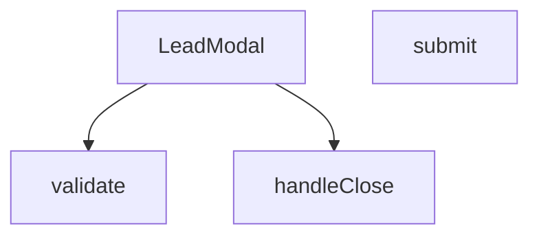

## NODE ID STANDARD

  file: src\components\LeadModal.tsx
  function: src\components\LeadModal.tsx::LeadModal
  function: src\components\LeadModal.tsx::validate
  function: src\components\LeadModal.tsx::submit
  function: src\components\LeadModal.tsx::handleClose

---

## DISA AKTARILANLAR (EXPORTS)
  export: LeadModal

---

## STİL TOKENLERİ

### Arbitrary Değerler (token'a geçirilmemiş)
Yok — tüm stiller token'a geçirilmiş. ✅

### Kullanılan Token'lar (zaten token'a geçirilmiş)
- (yok)

### Tailwind Sınıf Özeti
- **Renkler:** `bg-gradient-to-br`, `bg-gray-100`, `bg-gray-50`, `bg-gray-50/50`, `bg-green-100`, `bg-primary-navy`, `bg-secondary-blue/80`, `bg-white`, `bg-white/10`, `border-2`, `border-gray-100`, `border-gray-200`, `border-gray-300`, `border-red-400`, `border-t`
- **Layout:** `absolute`, `backdrop-blur-md`, `backdrop-blur-sm`, `block`, `fixed`, `flex`, `flex-1`, `flex-col`, `from-blue-600/20`, `gap-1`, `gap-2`, `gap-3`, `gap-4`, `gap-5`, `grid`
- **Varyant/Responsive:** `:`, `disabled:`, `focus-visible:`, `focus:`, `group-hover:`, `hover:`, `md:`, `sm:` önekleri
- **Yardımcı Sınıflar:** `${errors.name`, `-mt-2`, `:`, `animate-bounce`, `animate-in`, `animate-spin`, `border`, `cursor-pointer`, `disabled:cursor-not-allowed`, `disabled:opacity-70`, `duration-300`, `fade-in`, `focus-visible:outline-none`, `focus-visible:ring-2`, `focus-visible:ring-gray-300`

---
# FILE: src\components\LoadingSpinner.md

---
domain: general
source_type: doc
namespace_type: module
source_path: C:\Users\alize\venthub-hvac\src\components\LoadingSpinner.tsx
skeleton_hash: 22d19cd5aa2d4cf9
entity_hashes:
  func:LoadingSpinner: 420e244c3ab22ba8
  overview: 055c22213f5fb1f9
  style_tokens: b21c3354ed86bc3e
generated_at: 2026-06-19T20:47:09Z
---

## Genel Bakış
LoadingSpinner.tsx modülü, uygulama içinde veri yükleme veya işlem sırasında kullanıcıya görsel geri bildirim sağlayan basit bir yükleme animasyonu bileşenini içerir. Bileşen, boyut ve tam ekran görüntüleme seçenekleriyle özelleştirilebilir.

## Fonksiyon Grupları
### Ana Bileşen
Bu grup, LoadingSpinner bileşeninin temel tanımını ve özelliklerini içerir.
- LoadingSpinner

---

## AXIOMS – Mimari Varsayımlar
Bu modül için özel aksiyom tanımlanmamıştır.

[Aksiyom 1]: Eğer `size` prop'u verilmezse, varsayılan olarak `'md'` kullanılır.  
[Aksiyom 2]: Eğer `fullScreen` prop'u verilmezse, varsayılan olarak `true` olur.

---

## FONKSİYON DETAYLARI

### LoadingSpinner
**Ne yapar**: LoadingSpinner, bir yükleme göstergesi (spinner) render eden bir React bileşenidir.  
**Nasıl yapar**: Fonksiyon, `size` ve `fullScreen` adlı iki props'u alır; bu değerler spinner'ın boyutunu ve ekranı kaplayıp kaplamayacağını belirler. Daha sonra bu props'lara göre uygun stil ve görünümü uygulayan JSX döndürür.  
**Parametreler**:
- size: string — Spinner'ın boyutunu belirler; varsayılan değer `'md'` (medium) olur.  
- fullScreen: boolean — Spinner'ın ekranı kaplayıp kaplamayacağını belirler; varsayılan değer `true` olur.  
**Dönüş**: React.FC<LoadingSpinnerProps> — JSX elementi olarak render edilebilir bir React fonksiyonel bileşeni döndürür.

---

## İTHALATLAR (IMPORTS)
- import: ../i18n/I18nProvider::useI18n
- import: react::React

---

## INTERFACES

### LoadingSpinnerProps
- `size?: 'sm' | 'md' | 'lg'`
- `fullScreen?: boolean`

---

## AST POINTERS

### [N1_NASIL] AST Pointer: src/components/LoadingSpinner.tsx::LoadingSpinner
- **params**: size — string (default 'md'), fullScreen — boolean (default true)
- **ic_degiskenler**:
  - `t` — translation function from useI18n used for the aria-label of the spinner
  - `sizeClasses` — object mapping size strings ('sm', 'md', 'lg') to Tailwind CSS classes that set width and height
  - `spinnerElement` — JSX element rendering the spinner with the appropriate size class, border styling, spin animation, and aria-label
- **Dönüş**: React.FC<LoadingSpinnerProps> (returns JSX; if fullScreen is true, wraps spinner in a full-height flex container, otherwise returns the spinner element directly)

---

## NODE ID STANDARD

  file: src\components\LoadingSpinner.tsx
  function: src\components\LoadingSpinner.tsx::LoadingSpinner

---

## DISA AKTARILANLAR (EXPORTS)
  export: LoadingSpinner

---

## STİL TOKENLERİ

### Arbitrary Değerler (token'a geçirilmemiş)
Yok — tüm stiller token'a geçirilmiş. ✅

### Kullanılan Token'lar (zaten token'a geçirilmiş)
- (yok)

### Tailwind Sınıf Özeti
- **Renkler:** `border-2`, `border-primary-navy`, `border-t-transparent`
- **Layout:** `flex`, `inline-block`, `items-center`, `justify-center`, `min-h-400px`
- **Varyant/Responsive:** (yok)
- **Yardımcı Sınıflar:** `${sizeClasses[size]`, `animate-spin`, `rounded-full`

---
# FILE: src\components\MagneticCTA.md

---
domain: general
source_type: doc
namespace_type: module
source_path: C:\Users\alize\venthub-hvac\src\components\MagneticCTA.tsx
skeleton_hash: cf3c8c9c62c08336
entity_hashes:
  func:MagneticCTA: 45285325a7d3c355
  func:onLeave: 47432f2c7853fc8a
  func:onMove: 0f9106ce87047fd0
  overview: 798bbdff09c682bc
  style_tokens: dfcd3a7af18b6331
generated_at: 2026-06-19T20:47:09Z
---

## Genel Bakış
MagneticCTA bileşeni, fare hareketlerini izleyerek bir çağrı‑eylem (CTA) öğesinin konumunu ve görünümünü dinamik olarak değiştiren, etkileşimli bir React bileşenidir. Bileşen, fare giriş ve çıkış olaylarını yöneterek kullanıcıya görsel geri bildirim ve manyetik bir efekt sunar.

## Fonksiyon Grupları
### Bileşen Tanımı
Bileşenin ana yapısını oluşturur, durumunu yönetir ve ekrana basılacak JSX'i döndürür.
- MagneticCTA

### Olay İşleyicileri
Fare hareketlerini yakalayarak bileşenin konumunu ve görünümünü tetikleyen işlevleri içerir.
- onMove, onLeave

---

## AXIOMS – Mimari Varsayımlar
Bu modül için temel varsayım: `onMove` ve `onLeave` olay işleyicilerinin, fare tabanlı etkileşimlerin doğru yönetilmesi için gerekli olay nesnelerini alacak şekilde bağlanması zorunludur.

[Aksiyom 1]: Eğer `onMove(e)` fonksiyonuna geçilen `e` parametresi geçerli bir DOM olay nesnesi (örn: `MouseEvent`) değilse veya `e.clientX` / `e.clientY` özellikleri içermiyorsa, bileşenin manyetik konum hesaplaması çalışamaz.

[Aksiyom 2]: Eğer `onLeave()` fonksiyonu fare bileşen alanını terk ettiğinde tetiklenmezse, manyetik hareket efekti sıfırlanmaz ve bileşen hatalı konumda kalır.

[Aksiyom 3]: Eğer `MagneticCTA` bileşeni bir DOM elementi içinde render edilmezse veya fare olayları dinlenebilecek bir etkileşim ortamı yoksa, hem `onMove` hem `onLeave` olayları hiç tetiklenemez.

---

## FONKSİYON DETAYLARI

### MagneticCTA
**Ne yapar**: Manyetik etki yaratan bir CTA (Call-to-Action) bileşenini render eder. Kullanıcı fare hareketlerine tepki veren interaktif bir bileşendir.

**Nasıl yapar**: React fonksiyonel bileşeni olarak tanımlanmıştır. Bileşen, içeriğinde fare olaylarını dinleyen `onMove` ve `onLeave` handler'larını kullanarak manyetik hareket efektini sağlar. DOM üzerindeki fare pozisyonuna göre bileşenin konumunu veya stilini dinamik olarak güncelleyebilir.

**Parametreler**:
- Bu bileşen harici parametre almamaktadır (props'suz bileşen)

**Dönüş**: `React.FC` — Manyetik CTA içeriğini render eden React bileşeni

### onMove
**Ne yapar**: HTMLDivElement üzerindeki fare hareketini yakalayan bir olay işleyicisi tanımlar.  
**Nasıl yapar**: Fonksiyon, bir React.MouseEvent<HTMLDivElement, MouseEvent> nesnesini alır ve bu olay üzerinden fare konumu bilgilerini kullanarak manyetik efektin hesaplanmasını sağlar.  
**Parametreler**:  
- e: React.MouseEvent<HTMLDivElement, MouseEvent> — fare hareketi olayı nesnesi  
**Dönüş**: React.MouseEventHandler<HTMLDivElement> — aynı öğe üzerinde fare hareketi işleyici olarak kullanılabilecek bir fonksiyon tipi.

### onLeave
**Ne yapar**: HTMLDivElement üzerinden fare çıktığında tetiklenen bir olay işleyicisi tanımlar.  
**Nasıl yapar**: Fonksiyon, fare öğeden çıktığında çağrılır ve manyetik efekti sıfırlayıp öğeyi varsayılan durumuna döndürmek için kullanılır.  
**Parametreler**: yok  
**Dönüş**: void (veya belirtilmemiş) — fonksiyon bir değer döndürmez.

---

## İTHALATLAR (IMPORTS)
- import: ../i18n/I18nProvider::useI18n
- import: react::React
- import: react::useRef
- import: react::useState

---

## AST POINTERS

### [N1_NASIL] AST Pointer: MagneticCTA.tsx::MagneticCTA
- **params**: (parametre yok — React.FC bileşeni)
- **ic_degiskenler**:
  - `t` — `useI18n()` hook'undan dönen çeviri fonksiyonu; `t('homeCta.title')`, `t('homeCta.subtitle')`, `t('homeCta.button')` çağrılarıyla JSX içinde metinler render edilir
  - `ref` — `useRef<HTMLDivElement | null>(null)`; manyetik efekt uygulanan butonu saran div'e bağlanır, DOM erişimi için kullanılır
  - `hover` — `useState(false)` boolean durum değişkeni; fare div'in üzerindeyken `true`, ayrılınca `false` olur; `onMove` içinde erişilerek hareket hesaplamasının çalışıp çalışmayacağı kontrol edilir
  - `onMove` — `React.MouseEventHandler<HTMLDivElement>` türünde fare hareket handler'ı; fare koordinatlarına göre CSS custom property'ler (`--dx`, `--dy`) ayarlayarak butonun manyetik kayma efektini hesaplar
  - `onLeave` — fare div'den ayrılınca tetiklenen handler; CSS custom property'leri sıfırlar ve `hover` durumunu `false` yapar
- **Dönüş**: JSX (`<section>` — CTA bölümü; başlık, alt başlık ve manyetik efektli buton içerir)

---


## MERMAID CALL GRAPH
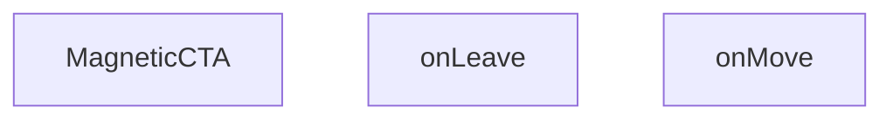

## NODE ID STANDARD

  file: src\components\MagneticCTA.tsx
  function: src\components\MagneticCTA.tsx::MagneticCTA
  function: src\components\MagneticCTA.tsx::onMove
  function: src\components\MagneticCTA.tsx::onLeave

---

## DISA AKTARILANLAR (EXPORTS)
  export: MagneticCTA

---

## STİL TOKENLERİ

### Arbitrary Değerler (token'a geçirilmemiş)
Yok — tüm stiller token'a geçirilmiş. ✅

### Kullanılan Token'lar (zaten token'a geçirilmiş)
- (yok)

### Tailwind Sınıf Özeti
- **Renkler:** `bg-gradient-to-r`, `bg-white`, `border-light-gray`, `from-primary-navy`, `text-2xl`, `text-primary-navy`, `text-white`, `text-white/90`, `to-secondary-blue`
- **Layout:** `flex`, `flex-col`, `from-primary-navy`, `gap-4`, `hover:shadow-xl`, `inline-flex`, `items-center`, `items-start`, `justify-between`, `justify-center`, `max-w-7xl`, `p-8`, `relative`, `shadow-lg`, `sm:flex-row`
- **Varyant/Responsive:** `hover:`, `lg:`, `sm:` önekleri
- **Yardımcı Sınıflar:** `border`, `font-bold`, `lg:px-8`, `mx-auto`, `px-4`, `px-8`, `py-10`, `py-4`, `rounded-2xl`, `rounded-xl`, `sm:px-6`, `transition-transform`

---
# FILE: src\components\MegaMenu.md

---
domain: general
source_type: doc
namespace_type: module
source_path: C:\Users\alize\venthub-hvac\src\components\MegaMenu.tsx
skeleton_hash: 94fd26e812855e91
entity_hashes:
  func:MegaMenu: 73d16c7403c0be73
  overview: 7b77f95abaa36af5
  style_tokens: 607cd2b8b83a451b
generated_at: 2026-06-19T20:47:09Z
---

## Genel Bakış
MegaMenu, web sitesinin üst navigasyon çubuğunda yer alan ve kullanıcılara geniş kapsamlı, çok sütunlu bir navigasyon deneyimi sunan bir React bileşenidir. Bileşen, dışarıdan verilen durum ve kontrol fonksiyonları sayesinde açılıp kapanabilir ve üst bileşenlerle tam etkileşim içinde çalışır.

## Fonksiyon Grupları
### Ana Bileşen
Mega menünün tamamını temsil eden ana React bileşenidir. Görünür durumunu `isOpen` prop'una göre koşullu olarak renderlar ve kullanıcı menüyü kapatmak istediğinde `onClose` callback'ini tetikleyerek üst bileşene durumu bildirir.
- MegaMenu

---

## AXIOMS – Mimari Varsayımlar

MegaMenu modülü, menünün görünürlük durumunu dışarıdan kontrol eden bir bileşendir ve doğru çalışması için belirli prop'ların sağlanması gerekmektedir.

**[Aksiyom 1]:** Eğer `isOpen` prop'u sağlanmazsa, menünün açılıp kapanma durumu belirsiz olur ve bileşen tutarsız davranabilir.

**[Aksiyom 2]:** Eğer `onClose` callback fonksiyonu sağlanmazsa, menü kapatma işlemi tetiklendiğinde üst bileşene bildirim gönderilemez ve menü kapanma akışı bozulur.

**[Aksiyom 3]:** Eğer bileşen `isOpen: true` durumunda render edilir ve `onClose` geçerli bir fonksiyon değilse, kullanıcı menüyü kapatamaz ve navigasyon işlevsiz kalır.

---

## FONKSİYON DETAYLARI

### MegaMenu

**Ne yapar**: MegaMenu, projenin ana navigasyon menüsünü açılır mega menü formatında sunan bir React bileşenidir. Kullanıcının menü çubuğundaki belirli bir kategori üzerine tıklaması veya hover etmesiyle tetiklenen bu bileşen, çok sütunlu ve genişletilmiş bir navigasyon arayüzü sağlar.

**Nasıl yapar**: Bileşen, isOpen prop'u ile kontrol edilen koşullu renderlama (conditional rendering) mantığı kullanır. isOpen değeri true olduğunda menü içeriği görüntülenir, false olduğunda gizlenir veya unmount edilir. onClose callback fonksiyonu, menünün kapanma talebini üst bileşene iletir — bu genellikle menü dışına tıklama, Escape tuşu basma veya bir bağlantı seçme durumlarında tetiklenir.

**Parametreler**:
- `isOpen`: `boolean` — Mega menünün görüntülenip görüntülenmediğini kontrol eden durum bayrağı. True değerinde menü açılır ve görünür hale gelir.
- `onClose`: `() => void` — Menünün kapatılması gerektiğinde çağrılan geri çağırım (callback) fonksiyonu. Üst bileşende menü durumunu sıfırlamak için kullanılır.

**Dönüş**: `React.FC<MegaMenuProps>` — Render edilmiş mega menü yapısını içeren JSX elementi döndürür. Props tipi olarak MegaMenuProps arayüzünü kullanır.

**Bağlam**: Bu bileşen, `src/components/` dizininde konumlanmış olup projenin genel navigasyon yapısının parçasıdır. HVAC ürün kategorileri ve alt kategorileri için genişletilmiş menü deneyimi sunar.

---

## İTHALATLAR (IMPORTS)
- import: ../contexts/CategoryContext::useCategories
- import: ../i18n/I18nProvider::useI18n
- import: ./navigation/EliteMegaMenu::EliteMegaMenu
- import: ./navigation/EliteMegaMenu::MobileMegaMenu
- import: react::React
- import: react::useEffect
- import: react::useState

---

## INTERFACES

### MegaMenuProps
- `isOpen: boolean`
- `onClose: () => void`

---

## AST POINTERS

### [N1_NASIL] AST Pointer: src/components/MegaMenu.tsx::MegaMenu
- **params**: `{ isOpen, onClose }` — `isOpen`: boolean, mega menünün açık olup olmadığını belirtir; `onClose`: menüyü kapatma callback fonksiyonu
- **ic_degiskenler**:
  - `categories` — `useCategories()` hook'undan gelen kategori listesi, `EliteMegaMenu` ve `MobileMegaMenu` bileşenlerine props olarak geçirilir
  - `loading` — `useCategories()` hook'undan gelen yükleme durumu boolean'ı, true ise spinner gösterilir
  - `t` — `useI18n()` hook'undan gelen çeviri fonksiyonu, `t('megamenu.classic.logoInitial')` ve `t('megamenu.classic.title')` çağrılarıyla kullanılır
  - `isMounted` — `useState(false)` ile oluşturulan boolean state, bileşenin client-side olarak mount edilip edilmediğini takip eder (SSR guard)
  - `setIsMounted` — `useState` setter'ı, `useEffect` callback'inde `true` olarak çağrılır
- **Dönüş**: JSX (`null` veya mega menü DOM yapısı döner)
- **Yan etkileri**: `useEffect` ile `isMounted` state'ini `true`'ya çeker; `onClose` callback'i button onClick ve alt bileşenlerin `onNavigate` prop'u aracılığıyla tetiklenir
- **Kullanılan hook'lar**: `useCategories`, `useI18n`, `useState`, `useEffect`
- **Kullanılan alt bileşenler**: `EliteMegaMenu` (`categories`, `onNavigate={onClose}`), `MobileMegaMenu` (`categories`, `onNavigate={onClose}`)
- **Early return**: `!isMounted || !isOpen` koşulunda `null` döner

---

## NODE ID STANDARD

  file: src\components\MegaMenu.tsx
  function: src\components\MegaMenu.tsx::MegaMenu

---

## DISA AKTARILANLAR (EXPORTS)
  export: MegaMenu

---

## STİL TOKENLERİ

### Arbitrary Değerler (token'a geçirilmemiş)
Yok — tüm stiller token'a geçirilmiş. ✅

### Kullanılan Token'lar (zaten token'a geçirilmiş)
- (yok)

### Tailwind Sınıf Özeti
- **Renkler:** `bg-primary-navy`, `bg-slate-50/30`, `bg-white`, `border-4`, `border-b`, `border-primary-navy/20`, `border-slate-100`, `border-t-primary-navy`, `hover:bg-slate-50`, `hover:text-slate-600`, `text-lg`, `text-slate-400`, `text-slate-900`, `text-white`, `text-xs`
- **Layout:** `block`, `custom-scrollbar`, `fixed`, `flex`, `flex-1`, `flex-col`, `gap-2`, `h-6`, `h-8`, `hidden`, `items-center`, `justify-between`, `justify-center`, `max-w-7xl`, `overflow-hidden`
- **Varyant/Responsive:** `hover:`, `sm:` önekleri
- **Yardımcı Sınıflar:** `animate-in`, `animate-spin`, `duration-300`, `fade-in`, `font-bold`, `inset-0`, `mx-auto`, `px-6`, `py-20`, `py-4`, `py-8`, `rounded-full`, `rounded-lg`, `tracking-tight`, `transition-colors`

---
# FILE: src\components\PaymentWatcher.md

---
domain: general
source_type: doc
namespace_type: module
source_path: C:\Users\alize\venthub-hvac\src\components\PaymentWatcher.tsx
skeleton_hash: 043ce5cffec8a10b
entity_hashes:
  func:PaymentWatcher: 0d799bcd7a7c68f4
  overview: cac0a3def1dcd9ec
  style_tokens: dd5ed8d0f58dcf57
generated_at: 2026-06-19T20:47:10Z
---

## Genel Bakış
PaymentWatcher modülü, uygulama genelinde ödeme durumunu arka planda sürekli olarak izleyen bir React bileşenidir. Kullanıcıya herhangi bir arayüz göstermeden, belirli aralıklarla ödeme durumunu kontrol ederek ilgili durumlarda otomatik yönlendirmeler veya durum güncellemeleri yapar.

## Fonksiyon Grupları
### Bileşen Tanımı ve İzleme Mantığı
Modülün temel yapısını ve periyodik izleme mekanizmasını tanımlayan ana bileşen fonksiyonunu içerir. Bu grup, bileşenin iç durumunu, zamanlayıcı referanslarını ve durum kontrol mantığını bir arada yönetir.
- PaymentWatcher

---

## AXIOMS – Mimari Varsayımlar

PaymentWatcher modülü, parametre almayan bir React bileşenidir ve sadece fonksiyon imzasına dayalı sınırlı bilgi mevcuttur.

[Aksiyom 1]: Eğer React Runtime (React kütüphanesi ve bileşen hiyerarşisi) yoksa, bileşen doğru şekilde render edilmez.

[Aksiyom 2]: Eğer bileşen için geçerli bir React Context veya global state kaynağı (Redux, Zustand vb.) yoksa, PaymentWatcher'ın izleyeceği ödeme siparişlerine erişimi olmaz ve işlevselliği çalışmaz.

[Aksiyom 3]: Eğer tarayıcı ortamı (veya React DOM/Server-Side Rendering ortamı) yoksa, bileşen DOM'a bağlanamaz ve periyodik izleme döngüsü başlatılamaz.

---

## FONKSİYON DETAYLARI

### PaymentWatcher

**Ne yapar**: PaymentWatcher, ödeme işlemlerinin durumunu izleyen bir React bileşenidir. VentHub HVAC projesinde ödeme süreçlerinin takip edilmesini ve gerekli durum güncellemelerinin yapılmasını sağlar.

**Nasıl yapar**: Bileşen, uygulama içinde ödeme ile ilgili değişiklikleri izleyerek ilgili bileşenlere veya servislere bildirimlerde bulunur. Ödeme durumlarındaki değişiklikleri yakalayıp gerektiğinde UI güncellemeleri veya tetikleyiciler oluşturur.

**Parametreler**:
- Parametre almamaktadır (props tanımlı değildir).

**Dönüş**: `React.FC` - Standart bir React işlevsel bileşeni olarak render edilir.

---

## İTHALATLAR (IMPORTS)
- import: next/navigation::usePathname
- import: next/navigation::useRouter
- import: react::React
- import: react::useCallback
- import: react::useEffect
- import: react::useRef

---

## AST POINTERS

### [N1_NASIL] AST Pointer: src/components/PaymentWatcher.tsx::PaymentWatcher
- **params**: (parametre yok)
- **ic_degiskenler**:
  - `router` — useRouter() hook'undan gelen Next.js router instance'ı, programmatic navigasyon için kullanılır
  - `checkingRef` — useRef<boolean>, checkOnce'ın eşzamanlı çalışmasını engelleyen guard flag tutar
  - `timerRef` — useRef<number | null>, periyodik checkOnce çağrısını tutan interval ID'si
  - `pathname` — usePathname() hook'undan gelen mevcut URL path string'i
  - `checkOnce` — useCallback ile tanımlı async fonksiyon, localStorage'dan sipariş bilgisini okur ve Supabase'den sipariş durumunu kontrol eder
- **Dönüş**: JSX null döner (yarn component, yalnızca yan etkileri vardır)

### [N2_NASIL] AST Pointer: src/components/PaymentWatcher.tsx::PaymentWatcher::checkOnce
- **params**: (parametre yok)
- **ic_degiskenler**:
  - `raw` — localStorage.getItem(STORAGE_KEY) ile okunan ham JSON string'i veya null
  - `data` — JSON.parse(raw || '{}') sonucu elde edilen `{ orderId?: string, conversationId?: string }` tipinde parsed obje
  - `orderId` — data.orderId erişimi ile elde edilen sipariş ID string'i
  - `supabase` — dinamik import ile yüklenen supabaseBrowserClient instance'ı
  - `row` — supabase.from('venthub_orders').select('status').eq('id', orderId).maybeSingle() sorgusundan dönen veri satırı
  - `error` — aynı Supabase sorgusundan dönen hata nesnesi
- **Dönüş**: void (Promise<void)), fonksiyon localStorage temizler ve router.push ile navigasyon yapar

### [N3_NASIL] AST Pointer: src/components/PaymentWatcher.tsx::PaymentWatcher::useEffect_callback
- **params**: (parametre yok)
- **ic_degiskenler**:
  - `onFocus` — window focus olayında checkOnce çağıran callback
  - `onVisibility` — document visibilitychange olayında visible ise checkOnce çağıran callback
  - `raw` — localStorage.getItem(STORAGE_KEY) ile okunan ham JSON string'i veya null, bekleyen sipariş olup olmadığını kontrol eder
- **Dönüş**: temizleme fonksiyonu döner — event listener'ları kaldırır ve interval'ı temizler

### [N4_NASIL] AST Pointer: src/components/PaymentWatcher.tsx::PaymentWatcher::useEffect_cleanup
- **params**: (parametre yok)
- **ic_degiskenler**: (yok — yalnızca outer scope'taki onFocus, onVisibility ve timerRef kullanılır)
- **Dönüş**: void, event listener'ları ve interval'ı temizler

---

## NODE ID STANDARD

  file: src\components\PaymentWatcher.tsx
  function: src\components\PaymentWatcher.tsx::PaymentWatcher

---

## DISA AKTARILANLAR (EXPORTS)
  export: PaymentWatcher

---

## STİL TOKENLERİ

### Arbitrary Değerler (token'a geçirilmemiş)
Yok — tüm stiller token'a geçirilmiş. ✅

### Kullanılan Token'lar (zaten token'a geçirilmiş)
- (yok)

### Tailwind Sınıf Özeti
- **Renkler:** (yok)
- **Layout:** (yok)
- **Varyant/Responsive:** (yok)
- **Yardımcı Sınıflar:** (yok)

---
# FILE: src\components\ProductCard.md

---
domain: general
source_type: doc
namespace_type: module
source_path: C:\Users\alize\venthub-hvac\src\components\ProductCard.tsx
skeleton_hash: c952d1ee37a51ab6
entity_hashes:
  overview: 9d2b069c54b1d8b3
  style_tokens: f04c95b84c1173dc
generated_at: 2026-08-15T07:02:08Z
---

## Genel Bakış

`ProductCard.tsx`, HVAC ürünlerini kart bileşeni olarak render eden bir React bileşenidir. `Product` tipindeki verileri (görsel, marka, fiyat) alarak yerelleştirilmiş fiyat gösterimi sunar, sepete ekleme işlemini `useCart` hook'u ile yönetir ve `next/link` kullanarak ürün detay sayfasına yönlendirme sağlar. Bileşen `grid` ve `list` olmak üzere iki farklı düzen modunu destekler; `priority`, `compact`, `hidePrice` ve `highlightFeatured` gibi opsiyonel prop'larla görsel ve işlevsel özelleştirmelere olanak tanır.

**Dış Bağımlılıklar:** `resolveProductImageUrl` (görsel URL çözümleme), `formatCurrency` (para birimi formatlama), `useLocalizedRoutes` (yerelleştirilmiş rotalar) ve `Product` / `WithDisplayPrice` tipleri.

---

## AXIOMS – Mimari Varsayımlar

Bu modül için aksiyom tanımlanamamıştır. Fonksiyon gövdesi (implementation) verilmemiş olup, yalnızca dosya yolu ve modül sabiti (ProductCard) mevcuttur. Mimari varsayımların üretilebilmesi için fonksiyon gövdesine erişim gereklidir.

---

## FONKSİYON DETAYLARI

---

## İTHALATLAR (IMPORTS)
- import: ../hooks/useCartHook::useCart
- import: ../hooks/useLocalizedRoutes::useLocalizedRoutes
- import: ../i18n/I18nProvider::useI18n
- import: ../i18n/format::formatCurrency
- import: ./HVACIcons::BrandIcon
- import: ./ui/VentImage::VentImage
- import: @/lib/images/productImage::resolveProductImageUrl
- import: @/lib/services/displayPrice.service::type { WithDisplayPrice }
- import: @/types/ui-models::type { Product }
- import: next/link::Link
- import: react::React

---

## INTERFACES

### ProductCardProps
- `product: StorefrontProduct`
- `onQuickView?: (product: StorefrontProduct) => void`
- `highlightFeatured?: boolean`
- `layout?: 'grid' | 'list'`
- `priority?: boolean`
- `hidePrice?: boolean`
- `compact?: boolean`

---

## TYPE ALIASES

### StorefrontProduct
W4b · Kartın fiyat kaynağı MOTORDUR (`displayPrice`), ham `products.price` DEĞİL — o kolon Kademe-2'de emekli edildi (INV-PRICE-1, cetvel §1). Alanlar bilinçli olarak OPSİYONEL: fiyat köprüsü henüz bağlanmamış çağıranlar (ör. ana sayfa blokları) derlenmeye devam etsin, ama fiyat yerine "Teklif İste"
```typescript
type StorefrontProduct = Product &
  Partial<Pick<WithDisplayPrice<Product>, 'displayPrice' | 'displayPriceTaxIncluded'>>
```

---

## SABİTLER
- **ProductCard** (call) — `React.memo(function ProductCard({
  product,
  layout = 'grid',
  priority...`

---

## AST POINTERS

### [N1_NASIL] AST Pointer: src/components/ProductCard.tsx::(onClick Handler - anonim arrow function)
- **params**: `(e: React.MouseEvent)` — tıklama olayı nesnesi
- **ic_degiskenler**:
  - `e` — React fare olayı nesnesi; `preventDefault()` ve `stopPropagation()` çağrıları için kullanılır
  - `quoteMode` — mantıksal değer (closure'dan yakalanır); `true` ise fonksiyon erken döner, sepete ekleme yapılmaz
  - `addToCart` — sepete ürün ekleyen fonksiyon (closure'dan yakalanır, `useCart` hook'undan gelir)
  - `product` — eklenecek ürün nesnesi (closure'dan yakalanır, bileşen prop'undan gelir); `addToCart`'a argüman olarak verilir
- **Dönüş**: `void` — yan etki tabanlıdır; varsayılan tıklama davranışını iptal eder, üst bileşen yayılmasını engeller ve koşula göre sepete ürün ekler

---

## NODE ID STANDARD

  file: src\components\ProductCard.tsx

---

## DISA AKTARILANLAR (EXPORTS)
  export: StorefrontProduct

---

## STİL TOKENLERİ

### Arbitrary Değerler (token'a geçirilmemiş)
Yok — tüm stiller token'a geçirilmiş. ✅

### Kullanılan Token'lar (zaten token'a geçirilmiş)
- (yok)

### Tailwind Sınıf Özeti
- **Renkler:** `bg-gold-accent`, `bg-light-gray/30`, `bg-light-gray/50`, `bg-primary-navy`, `bg-white`, `bg-white/90`, `border-light-gray`, `border-t`, `disabled:hover:bg-primary-navy`, `group-hover:bg-light-gray/50`, `group-hover:text-primary-navy`, `hover:bg-secondary-blue`, `sm:text-lg`, `text-base`, `text-industrial-gray`
- **Layout:** `absolute`, `backdrop-blur-sm`, `block`, `flex`, `flex-1`, `flex-col`, `flex-shrink-0`, `gap-3`, `h-11`, `h-28`, `h-9`, `h-full`, `hover:shadow-hvac-lg`, `hover:shadow-lg`, `items-baseline`
- **Varyant/Responsive:** `:`, `active:`, `disabled:`, `focus-visible:`, `group-hover:`, `hover:`, `sm:` önekleri
- **Yardımcı Sınıflar:** `${compact`, `:`, `active:scale-95`, `aspect-square`, `border`, `disabled:cursor-not-allowed`, `disabled:opacity-50`, `duration-300`, `duration-500`, `focus-visible:outline-none`, `focus-visible:ring-2`, `focus-visible:ring-offset-2`, `focus-visible:ring-primary-navy`, `font-bold`, `font-medium`

---
# FILE: src\components\QuickViewModal.md

---
domain: general
source_type: doc
namespace_type: module
source_path: C:\Users\alize\venthub-hvac\src\components\QuickViewModal.tsx
skeleton_hash: 5894fff46064d856
entity_hashes:
  func:QuickViewModal: debc62013d59b5ee
  func:handleAdd: 552a96581034d630
  overview: 42118afde1c67a0d
  style_tokens: a2ee6e23d34d3389
generated_at: 2026-08-15T07:02:08Z
---

## Genel Bakış
QuickViewModal, ürünlerin kısa önizleme penceresini sunan bir React bileşenidir. Kullanıcının ürün detaylarını hızlıca görüntülemesini ve ürünü doğrudan sepete eklemesini sağlar. Modal'ın görünürlüğü ve temel eylemler bu bileşen içinde merkezi olarak yönetilir.

## Fonksiyon Grupları
### Ana Modal Bileşeni
Ürün bilgilerini, görsellerini ve arayüzünü barındıran modal penceresini oluşturan ana React bileşenidir. Dışarıdan gelen open, product ve onClose durumlarına göre modal'ın açılıp kapanmasını kontrol eder.

- QuickViewModal

### Sepete Ekleme İşleyicisi
Kullanıcının "Sepete Ekle" tıklamasını yakalayan ve ilgili ürün bilgisini işleyerek sepete ekleme mantığını gerçekleştiren olay işleyicisidir.

- handleAdd

---

## AXIOMS – Mimari Varsayımlar

Bu bileşen, ürünlerin hızlı önizleme penceresini açan ve doğrudan sepete ekleme imkânı sunan bir React modal bileşenidir.

[Aksiyom 1]: Eğer `product` prop'u sağlanmazsa, bileşen gösterilecek ürün bilgisi olmadığından Sepete Ekleme işlevi çalışamaz ve render edilen içerik anlamsız olur.

[Aksiyom 2]: Eğer `open` prop'u boolean değer olarak sağlanmazsa, modal'ın açılıp kapanma davranışı tanımsız olur.

[Aksiyom 3]: Eğer `onClose` callback'i sağlanmazsa, kullanıcı modal'ı kapatamaz; bileşenin kapanma mekanizması çalışmaz.

[Aksiyom 4]: `handleAdd` fonksiyonu parametresizdir; dolayısıyla `product` bilgisine closure (üst kapsam) üzerinden erişim gerektirir. Eğer `handleAdd` doğru kapsamda (bileşen içinde) çağrılmazsa, sepete ekleme işlemi başarısız olur.

[Aksiyom 5]: Eğer `product` nesnesi Sepete Ekleme işlemi için gerekli alanları (örn. ürün ID, fiyat vb.) içermiyorsa, sepete ekleme başarısız olur.

---

## FONKSİYON DETAYLARI

### QuickViewModal
**Ne yapar**: Bu bileşen, kullanıcıya seçili bir ürünün hızlı bir önizlemesini sunan bir modal penceresi oluşturur ve yönetir. Ürün detaylarını görüntülemek için kullanılan arayüz katmanıdır.
**Nasıl yapar**: `product`, `open` ve `onClose` özelliklerini (props) alarak modalın görünürlüğünü ve içeriğini kontrol eder. React bileşeni olarak, `open` durumuna göre modalı ekrana çizer ve kapatma işlemi için `onClose` metodunu tetikler.
**Parametreler**:
- product: object — Modal içinde gösterilecek olan ürünün verilerini ve özelliklerini içerir.
- open: boolean — Modal penceresinin açık olup olmadığını belirten durum değişkenidir.
- onClose: function — Modalın kapatılması gerektiğinde çalıştırılan geri çağırma (callback) fonksiyonudur.
**Dönüş**: React.FC<QuickViewModalProps> — QuickViewModal arayüzünü temsil eden bir React bileşeni döner.

### handleAdd
**Ne yapar**: Bu fonksiyon, modal içinde görüntülenen ürünü sepete veya listeye ekleme işlemini başlatır ve yönetir. Kullanıcının ekleme butonuna tıklamasıyla tetiklenen etkileşimdir.
**Nasıl yapar**: Mevcut ürün verisi üzerinde gerekli işlemleri gerçekleştirerek ürünü sisteme ekler. İçerik detayları kaynak kodunda belirtilmemiştir ancak genel olarak ekleme mantığını uygular.
**Parametreler**:
- Hiçbir parametre almaz.
**Dönüş**: void veya bilinmiyor — Herhangi bir değer döndürmez veya dönüş tipi belirtilmemiştir.

---

## İTHALATLAR (IMPORTS)
- import: ../hooks/useCartHook::useCart
- import: ../hooks/useLocalizedRoutes::useLocalizedRoutes
- import: ../i18n/I18nProvider::useI18n
- import: ./ProductCard::type { StorefrontProduct }
- import: lucide-react::Eye
- import: lucide-react::ShoppingCart
- import: lucide-react::X
- import: next/link::Link
- import: react::React

---

## INTERFACES

### QuickViewModalProps
- `product: StorefrontProduct | null`
- `open: boolean`
- `onClose: () => void`

---

## AST POINTERS

### [N1_NASIL] AST Pointer: QuickViewModal.tsx::QuickViewModal
- **params**: (`{ product, open, onClose }`)
- **ic_degiskenler**: her değişken için "isim — ne işe yarar" formatında
  - `t` — useI18n hook'undan gelen çeviri fonksiyonu, UI metinlerini çevirmek için kullanılır
  - `addToCart` — useCart hook'undan gelen, ürünleri sepete ekleyen fonksiyon
  - `Routes` — useLocalizedRoutes hook'undan gelen, lokalize rotaları oluşturan nesne
  - `displayPrice` — `product.displayPrice`'dan gelen fiyat değeri, null ise fiyat gösterilmez
  - `quoteMode` — fiyatın null veya 0'dan küçük/eşit olup olmadığını belirleyen boolean, quote modunu aktif eder
  - `handleAdd` — sepete ekleme işlemi yapan inner fonksiyon, quoteMode'da işlevsiz
- **Dönüş**: `React.FC<QuickViewModalProps>` (JSX elementi veya `null`)

### [N2_NASIL] AST Pointer: QuickViewModal.tsx::handleAdd
- **params**: (yok)
- **ic_degiskenler**: her değişken için "isim — ne işe yarar" formatında
  - `quoteMode` — outer scope'tan erişilen quote modu değişkeni, true ise fonksiyon erken döner
  - `addToCart` — outer scope'tan erişilen sepete ekleme fonksiyonu
  - `product` — outer scope'tan erişilen ürün nesnesi, addToCart'a parametre olarak gönderilir
  - `onClose` — outer scope'tan erişilen kapatma fonksiyonu, ekleme sonrası modalı kapatmak için çağrılır
- **Dönüş**: yok (side effect: addToCart çağrısı ve onClose çağrısı)

---

## NODE ID STANDARD

  file: src\components\QuickViewModal.tsx
  function: src\components\QuickViewModal.tsx::QuickViewModal
  function: src\components\QuickViewModal.tsx::handleAdd

---

## DISA AKTARILANLAR (EXPORTS)
  export: QuickViewModal

---

## STİL TOKENLERİ

### Arbitrary Değerler (token'a geçirilmemiş)
Yok — tüm stiller token'a geçirilmiş. ✅

### Kullanılan Token'lar (zaten token'a geçirilmiş)
- (yok)

### Tailwind Sınıf Özeti
- **Renkler:** `bg-black/40`, `bg-gradient-to-br`, `bg-primary-navy`, `bg-white`, `border-2`, `border-b`, `border-light-gray`, `border-primary-navy`, `from-air-blue`, `hover:bg-light-gray`, `hover:bg-primary-navy`, `hover:bg-secondary-blue`, `hover:text-white`, `text-2xl`, `text-6xl`
- **Layout:** `fixed`, `flex`, `flex-1`, `flex-col`, `from-air-blue`, `gap-2`, `gap-4`, `grid`, `grid-cols-1`, `inline-flex`, `items-center`, `justify-between`, `justify-center`, `line-clamp-2`, `line-clamp-4`
- **Varyant/Responsive:** `disabled:`, `focus-visible:`, `hover:`, `sm:` önekleri
- **Yardımcı Sınıflar:** `aspect-square`, `disabled:cursor-not-allowed`, `disabled:opacity-50`, `focus-visible:outline-none`, `focus-visible:ring-2`, `focus-visible:ring-offset-2`, `focus-visible:ring-primary-navy`, `font-bold`, `font-semibold`, `inset-0`, `mb-1`, `mb-2`, `mb-4`, `mb-6`, `mr-2`

---
# FILE: src\components\ScrollLinkedProcess.md

---
domain: general
source_type: doc
namespace_type: module
source_path: C:\Users\alize\venthub-hvac\src\components\ScrollLinkedProcess.tsx
skeleton_hash: e46f34b3024a1c91
entity_hashes:
  func:ScrollLinkedProcess: 5a92a40886643dd7
  func:scrollTo: ee292d22ad2f3df1
  overview: a4bd4fd5da1416a4
  style_tokens: dffb84eddfacefbd
generated_at: 2026-06-19T20:47:32Z
---

## Genel Bakış
venthub-hvac projesinde kullanılan bu React modülü, kullanıcı arayüzündeki süreç adımlarını sayfa kaydırma konumuyla senkronize eden bir bileşen sunar. Temel amacı, süreç akışları boyunca kullanıcının gezinmesini kolaylaştırmak, mevcut kaydırma konumuna göre ilgili adımı odaklamaktır. Modül hem kullanıma hazır ana bileşeni hem de kaydırma işlemini yöneten yardımcı işlevi tek bir yapıda toplar.

## Fonksiyon Grupları
### Ana Süreç Bileşeni
Projede diğer bileşenler tarafından entegre edilebilen, tüm kaydırma bağlantılı süreç işlevselliğini yöneten ana React bileşenidir. Süreç akışlarını kullanıcının sayfa kaydırma eylemleriyle ilişkilendirerek sorunsuz bir gezinme deneyimi sunar.
- ScrollLinkedProcess

### Kaydırma Senkronizasyonu Yardımcısı
İstenen sıra numaralı süreç adımına otomatik kaydırma işlemini gerçekleştiren yardımcı işlevdir. Ana bileşen tarafından çağrılarak aktif kaydırma konumu ile görüntülenen süreç adımının her zaman senkronize kalmasını sağlar.
- scrollTo

---

## AXIOMS – Mimari Varsayımlar
Bu React tabanlı ScrollLinkedProcess modülü, aynı sayfa içindeki sıralı süreç adımları arasında bağlantılı kaydırma işlevi sağlar, çalışması için React runtime ortamı ve tarayıcının DOM API'lerine erişimi zorunludur.

[Aksiyom 1]: Eğer modülün çalışacağı React runtime ortamı (bileşenlerin mount edilmesine izin veren çalışma zamanı) yoksa, ScrollLinkedProcess bileşeni hiç yüklenmez, süreçler arası kaydırma işlevi hiç kullanılamaz.
[Aksiyom 2]: Eğer tarayıcının DOM kaydırma API'lerine (window.scroll, DOM elemanlarının scroll özellikleri) erişimi kısıtlanmışsa, scrollTo(i: number) fonksiyonu hedef indeksteki süreç adımına kaydırma işlemini gerçekleştiremez, kullanıcı manuel kaydırma yapmak zorunda kalır.
[Aksiyom 3]: Eğer ScrollLinkedProcess bileşeni ile eşleşen, 0'dan başlayan sıralı indekse sahip süreç adımı DOM elemanları sayfaya eklenmemişse, scrollTo fonksiyonu i parametresi ile geçerli bir hedef bulamaz, kaydırma işlemi başarısız olur.
[Aksiyom 4]: Eğer scrollTo(i: number) fonksiyonuna i olarak negatif sayı veya mevcut toplam süreç sayısından büyük bir sayı gönderilirse, modül geçersiz bir hedefe kaydırma girişiminde bulunur, ya hiç kaydırma yapmaz ya da tanımsız bir konuma kayar.

---

## FONKSİYON DETAYLARI

### ScrollLinkedProcess
**Ne yapar**: VentHub HVAC projesinde süreç adımlarını tarayıcı kaydırma hareketleriyle ilişkilendiren React bileşeni üreten bir fabrika fonksiyonudur. Proje içindeki süreç takibi arayüzlerinin aktif adımını sayfa kaydırmasıyla senkronize tutmak için özel olarak tasarlanmıştır, kullanıcıların süreç akışını takip etmesini kolaylaştırır.
**Nasıl yapar**: İçinde tarayıcının yerleşik scroll olay dinleyicilerini kullanarak sayfa üzerindeki tüm süreç adımı elementlerinin konumlarını sürekli olarak takip eder, bu konum verilerine göre o anda görünür olan aktif süreci belirleyen bir React bileşeni döndürür. Aynı zamanda bünyesinde barındırdığı scrollTo yardımcı fonksiyonu ile programlı olarak da istenen adımlara kaydırma desteği sunar.
**Parametreler**: Herhangi bir giriş parametresi almaz.
**Dönüş**: React.FC tipi, proje içinde doğrudan kullanılabilecek bir React fonksiyonel bileşeni döndürür. Bu dönen bileşen, süreç adımlarını listeleyip tüm kaydırma hareketleriyle sürekli senkronize çalışan bir arayüz sunar.

### scrollTo
**Ne yapar**: ScrollLinkedProcess bileşeni bünyesinde çalışan, verilen indeksteki süreç adımına programlı olarak sayfayı kaydıran yardımcı fonksiyondur. Kullanıcıların ara yüzdeki gezinme butonları veya benzeri etkileşimler aracılığıyla istedikleri süreç adımına hızlıca geçmesini sağlamak amacıyla geliştirilmiştir.
**Nasıl yapar**: DOM ağacında ilgili indeksteki süreç adımı elementinin konum verilerini çeker, tarayıcının yerleşik kaydırma API'lerini kullanarak sayfayı ilgili elementin konumuna taşır. Aynı zamanda ScrollLinkedProcess'in yönettiği aktif adım durumunu da güncelleyerek arayüzdeki aktif adım göstergesinin doğru şekilde çalışmasını garanti eder.
**Parametreler**:
- i: number — Kaydırma işleminin hedefi olan süreç adımının sıfır tabanlı sıra numarasını (indeks) tutan sayı tipi değer
**Dönüş**: void, herhangi bir değer döndürmez, yalnızca kaydırma işlemini ve ilgili durum güncellemelerini gerçekleştirir.

---

## İTHALATLAR (IMPORTS)
- import: ../i18n/I18nProvider::useI18n
- import: react::React
- import: react::useEffect
- import: react::useRef
- import: react::useState

---

## AST POINTERS

### [N1_NASIL] AST Pointer: C:\Users\alize\venthub-hvac\src\components\ScrollLinkedProcess.tsx::ScrollLinkedProcess
- **params**: (parametre yok)
- **ic_degiskenler**:
  - `t` — useI18n hook'undan alınan çeviri fonksiyonu, tüm UI metinlerinin çevirisini getirmek için kullanılır
  - `active` — görünür haldeki adımın indeksini tutan state değişkeni, kenar çubuğu butonlarının stillendirilmesinde kullanılır
  - `setActive` — `active` state'ini güncellemek için kullanılan state setter fonksiyonu
  - `refs` — tüm ana içerik adım bölümlerinin DOM referanslarını tutan useRef nesnesi, scroll ve IntersectionObserver işlemleri için kullanılır
  - `STEPS` — tüm süreç adımlarının anahtar, başlık, açıklama verilerini içeren sabit dizi, kenar çubuğu ve ana içerik oluşturulurken kullanılır
- **Dönüş**: JSX React elementi (scroll bağlı süreç bölümünü oluşturan bileşen çıktısı)

### [N2_NASIL] AST Pointer: C:\Users\alize\venthub-hvac\src\components\ScrollLinkedProcess.tsx::useEffect_cleanup
- **params**: (parametre yok)
- **ic_degiskenler**:
  - `io` — Bileşen mount edilirken oluşturulan IntersectionObserver instance'ı, bileşen unmount olurken observer'ı kapatmak için kullanılır
- **Dönüş**: yok

### [N3_NASIL] AST Pointer: C:\Users\alize\venthub-hvac\src\components\ScrollLinkedProcess.tsx::io_observer_callback
- **params**: [entries: IntersectionObserverEntry[]]
- **ic_degiskenler**:
  - `sections` — Geçerli tüm DOM referanslarından oluşan HTMLDivElement dizisi, hedef bölümün indeksini bulmak için kullanılır
  - `setActive` — Görünen bölüm tespit edildiğinde aktif adım state'ini güncellemek için kullanılan state setter
- **Dönüş**: yok

### [N4_NASIL] AST Pointer: C:\Users\alize\venthub-hvac\src\components\ScrollLinkedProcess.tsx::entries_forEach_callback
- **params**: [e: IntersectionObserverEntry]
- **ic_degiskenler**:
  - `sections` — Tüm geçerli DOM bölümlerinden oluşan dizi, hedef bölümün indeksini bulmak için kullanılır
  - `setActive` — Görünen bölümün indeksi ile aktif adım state'ini güncellemek için kullanılan setter
- **Dönüş**: yok

### [N5_NASIL] AST Pointer: C:\Users\alize\venthub-hvac\src\components\ScrollLinkedProcess.tsx::scrollTo
- **params**: [i: number]
- **ic_degiskenler**:
  - `refs.current[i]` — `i` indeksli ana içerik bölümünün DOM referansı, o bölüme yumuşak kaydırma yapmak için kullanılır
- **Dönüş**: yok

### [N6_NASIL] AST Pointer: C:\Users\alize\venthub-hvac\src\components\ScrollLinkedProcess.tsx::steps_map_sidebar_button_callback
- **params**: [s: STEPS öğesi nesnesi, i: number]
- **ic_degiskenler**:
  - `s.key` - React listesi için benzersiz anahtar değeri
  - `s.title` - Kenar çubuğu butonunun başlık metni
  - `s.desc` - Kenar çubuğu butonunun açıklama metni
  - `i` - Adımın sıralama indeksi
  - `active` - Şu anki aktif adımın indeksi, butonun stillendirilmesinde kullanılır
  - `scrollTo` - Butona tıklandığında ilgili ana içerik bölümüne kaydırmak için çağrılan fonksiyon
- **Dönüş**: JSX buton elementi

### [N7_NASIL] AST Pointer: C:\Users\alize\venthub-hvac\src\components\ScrollLinkedProcess.tsx::steps_map_main_section_callback
- **params**: [s: STEPS öğesi nesnesi, i: number]
- **ic_degiskenler**:
  - `s.key` - React listesi için benzersiz anahtar değeri
  - `el` - Oluşturulan bölüm div'inin DOM referansı
  - `refs.current[i]` - `i` indeksli bölümün referansını saklamak için atanan değişken
  - `s.title` - Bölüm başlık metni
  - `s.desc` - Bölüm açıklama metni
  - `t` - Çeviri fonksiyonu, adım numarası ön ekini almak için kullanılır
- **Dönüş**: JSX bölüm div elementi

---

## NODE ID STANDARD

  file: src\components\ScrollLinkedProcess.tsx
  function: src\components\ScrollLinkedProcess.tsx::ScrollLinkedProcess
  function: src\components\ScrollLinkedProcess.tsx::scrollTo

---

## DISA AKTARILANLAR (EXPORTS)
  export: ScrollLinkedProcess

---

## STİL TOKENLERİ

### Arbitrary Değerler (token'a geçirilmemiş)
Yok — tüm stiller token'a geçirilmiş. ✅

### Kullanılan Token'lar (zaten token'a geçirilmiş)
- (yok)

### Tailwind Sınıf Özeti
- **Renkler:** `bg-primary-navy/5`, `bg-white`, `border-light-gray`, `border-primary-navy`, `hover:bg-gray-50`, `md:text-3xl`, `text-2xl`, `text-industrial-gray`, `text-left`, `text-primary-navy`, `text-sm`, `text-steel-gray`, `text-xl`, `text-xs`
- **Layout:** `gap-6`, `grid`, `grid-cols-1`, `lg:col-span-1`, `lg:col-span-3`, `lg:grid-cols-4`, `max-w-7xl`, `p-6`, `shadow-sm`, `sticky`, `top-20`, `w-full`
- **Varyant/Responsive:** `:`, `hover:`, `lg:`, `md:`, `sm:` önekleri
- **Yardımcı Sınıflar:** `${i`, `:`, `===`, `active`, `border`, `font-bold`, `font-semibold`, `lg:px-8`, `mb-1`, `mb-2`, `mb-6`, `mx-auto`, `px-3`, `px-4`, `py-12`

---
# FILE: src\components\ScrollReveal.md

---
domain: general
source_type: doc
namespace_type: module
source_path: C:\Users\alize\venthub-hvac\src\components\ScrollReveal.tsx
skeleton_hash: 5e6a31137dce1c9b
entity_hashes:
  func:ScrollReveal: 5164aa702775b185
  overview: 7c3e9f948c132ef9
  style_tokens: fce5caac08f51876
generated_at: 2026-06-19T20:47:32Z
---

## Genel Bakış
ScrollReveal, VentHub HVAC projesinde kaydırma tabanlı animasyonlar için kullanılan bir React sarmalayıcı bileşenidir. İçeriğin ekran görünür alanında belirdiğinde seçilen animasyon efektini uygulayarak görsel geçişler sağlar. Esnek yapılandırması ile farklı HTML elementlerine ve animasyon türlerine adapte olabilir.

## Fonksiyon Grupları

### Kaydırma Animasyonu Bileşeni
ScrollReveal, çocuk bileşenleri sarmalayarak kaydırma olaylarını izler ve görünümde belirdiğinde animasyon efektlerini tetikler. Farklı HTML elementleri, animasyon türleri ve sıralı gecikmeler ile özelleştirilebilir yapı sunar.
- ScrollReveal

---

## AXIOMS – Mimari Varsayımlar

ScrollReveal bileşeni, kaydırma tabanlı animasyonları çocuklar için uygulayan bir sarmalayıcı component'tir.

**[Aksiyom 1 - Zorunlu Animation Prop'u]:** Eğer `animation` parametresi verilmezse, bileşen geçerli bir animasyon uygulayamaz ve çocuk bileşenler animasyon olmadan rendered olur.

**[Aksiyom 2 - Zorunlu Children Prop'u]:** Eğer `children` parametresi verilmezse, bileşen render edilecek bir içerik barındırmaz ve animasyon uygulanacak bir hedef olmaz.

**[Aksiyom 3 - StaggerIndex Sıralama Bağımlılığı]:** Eğer `staggerIndex` parametresi verilmezse, bileşen sıralı animasyon (stagger) zamanlamasında bağımsız/tek başına çalışır, diğer ScrollReveal bileşenlerinden bağımsız tetiklenir.

**[Aksiyom 4 - As Prop'u Geçerli Component']):** Eğer `as` prop'u geçerli bir React component'i (Comp) içermeyen bir değer alırsa, bileşen geçerli bir HTML elementi veya component olarak render edilemez ve hata oluşur.

**[Aksiyom 5 - ClassName Varsayılan Davranış]:** `className` parametresi verilmezse boş string (`''`) kullanılır, bu durumda bileşene ek CSS sınıfı uygulanmaz.

---

## FONKSİYON DETAYLARI

### ScrollReveal

**Ne yapar**: ScrollReveal, çocuk bileşenlerin sayfa kaydırma (scroll) sırasında belirli animasyon efektleriyle görünür olmasını sağlayan sarmalayıcı (wrapper) bir React bileşeniderek. Görünmezlikten görünürlüğe geçiş animasyonlarını kontrol ederek kullanıcı deneyimini zenginleştirir.

**Nasıl yapar**: Bileşen, belirtilen animasyon türüne göre çocuk elemanları sarar ve scroll pozisyonuna bağlı olarak animasyon tetiklerini yönetir. `as` prop'u ile hangi HTML elementi (div, section, article vb.) olarak render edileceği belirlenebilir. `staggerIndex` parametresi ile çoklu elemanlarda animasyonların sıralı ve gecikmeli tetiklenmesi sağlanarak kademeli görünüm efektleri elde edilir.

**Parametreler**:
- `children` — `React.ReactNode` — Scroll animasyonu uygulanacak alt bileşenler veya içerik. Bileşenin sarmalayacağı tüm JSX içeriği bu prop üzerinden iletilir.
- `animation` — `AnimationType` — Uygulanacak animasyon stilini tanımlar (örn. fade-in, slide-up, scale vb.). Hangi geçiş efektinin kullanılacağını belirler.
- `className` — `string` — Ek CSS sınıf adları eklemek için kullanılır. Varsayılan değeri boş dizedir (`''`). Bileşenin stilini özelleştirmek için opsiyonel olarak verilir.
- `staggerIndex` — `number | undefined` — Birden fazla ScrollReveal bileşeni kullanıldığında animasyonların sıralı tetiklenmesi için gecikme indeksini belirtir. Değer arttıkça animasyon daha geç tetiklenir.
- `as` — `ElementType` — Bileşenin hangi HTML elementi olarak render edileceğini belirler. Varsayılan olarak `div` kullanılır; `section`, `article`, `span` gibi farklı elementler atanabilir.

**Dönüş**: `React.FC<ScrollRevealProps>` — Bileşen, children'ı sarmalayan ve scroll tabanlı animasyon uygulayan bir React fonksiyonel bileşeni döndürür. Render edilen eleman, belirlenen HTML elementi (`as` prop'u) içinde animasyon durumuna göre stil değişiklikleri uygulanmış şekilde döner.

---

## İTHALATLAR (IMPORTS)
- import: ../hooks/useScrollAnimation::scrollAnimationClasses
- import: ../hooks/useScrollAnimation::useScrollAnimation
- import: react::React

---

## INTERFACES

### ScrollRevealProps
- `children: React.ReactNode`
- `animation: 'fadeUp' | 'scaleIn' | 'fadeIn' | 'slideLeft'`
- `className?: string`
- `staggerIndex?: number`
- `as?: 'div' | 'section' | 'h1' | 'p'`

---

## AST POINTERS

### [N1_NASIL] AST Pointer: components/ScrollReveal.tsx::ScrollReveal
- **params**:
  - `children` — bileşen içinde render edilecek React çocuk elemanları
  - `animation` — hangi scroll animasyonunun uygulanacağını belirten anahtar, `scrollAnimationClasses` dict'inde lookup için kullanılır
  - `className` — üzerine eklenecek ek CSS sınıf adları, varsayılan `''`
  - `staggerIndex` — stagger (sıralı) animasyon için indeks, tanımlıysa `scrollAnimationClasses.staggerChild`'a geçirilir
  - `as` (Component olarak yeniden adlandırılmış) — render edilecek HTML elemanı veya bileşen, varsayılan `'div'`
- **ic_degiskenler**:
  - `ref` — `useScrollAnimation<HTMLElement>` hook'unun döndürdüğü ref objesi; bileşene atanarak viewport izleme başlatılır
  - `visible` — `useScrollAnimation` hook'unun döndürdüğü boolean; elemanın viewport'a girip girmediğini belirtir
  - `animClass` — `scrollAnimationClasses[animation](visible)` çağrısından elde edilen CSS sınıf dizgisi; animasyonun görünür/gizli durumuna göre uygun sınıfı seçer
  - `style` — `staggerIndex` tanımlıysa `scrollAnimationClasses.staggerChild(staggerIndex)` çağrısıyla dönen inline style nesnesi; tanımlı değilse `undefined`
- **Dönüş**: `JSX.Element` — `Component` elemanının `ref`, `className` (`animClass` + `className` birleşimi) ve `style` özellikleriyle sarılmış `{children}` içeriği

---

## NODE ID STANDARD

  file: src\components\ScrollReveal.tsx
  function: src\components\ScrollReveal.tsx::ScrollReveal

---

## DISA AKTARILANLAR (EXPORTS)
  export: ScrollReveal

---

## STİL TOKENLERİ

### Arbitrary Değerler (token'a geçirilmemiş)
Yok — tüm stiller token'a geçirilmiş. ✅

### Kullanılan Token'lar (zaten token'a geçirilmiş)
- (yok)

### Tailwind Sınıf Özeti
- **Renkler:** (yok)
- **Layout:** (yok)
- **Varyant/Responsive:** (yok)
- **Yardımcı Sınıflar:** `${animClass`, `${className`

---
# FILE: src\components\ScrollToTop.md

---
domain: general
source_type: doc
namespace_type: module
source_path: C:\Users\alize\venthub-hvac\src\components\ScrollToTop.tsx
skeleton_hash: 1cdd60ce3f775483
entity_hashes:
  func:ScrollToTop: 67a45bb41004286e
  overview: 3fbf0b01314ba145
  style_tokens: dd5ed8d0f58dcf57
generated_at: 2026-06-19T20:47:32Z
---

## Genel Bakış
Venthub HVAC projesinin ön yüzünde yer alan ScrollToTop modülü, React tabanlı bir kullanıcı arayüzü bileşenidir. Uygulama içindeki yönlendirme (rota) değişikliklerini algılayarak pencerenin kaydırma konumunu otomatik olarak sayfanın en üstüne taşır, böylece yeni sayfa içeriği her zaman en baştan görüntülenerek kullanıcı deneyimi iyileştirilir.

## Fonksiyon Grupları
### Ana Kaydırma Yönetimi Bileşeni
Modülün tüm sorumluluğunu üstlenen tek ana bileşendir, uygulama içindeki rota değişikliklerini dinleyerek pencerenin kaydırma konumunu sıfırlar. Yeni sayfa yüklendiğinde kullanıcının içeriğe en baştan başlamasını sağlayacak şekilde çalışır.
- ScrollToTop

---

## AXIOMS – Mimari Varsayımlar

Bu modül, React rota (routing) sistemiyle birlikte çalışarak sayfa değişimlerinde kaydırma pozisyonunu sıfırlayan bir UI bileşenidir. Aşağıdaki varsayımlar, fonksiyon gövdesinden ve eski dokümandan türetilen yapısal gerekliliklerdir.

**[Aksiyom 1]:** Eğer React Router (`useLocation` veya eşdeğeri) bağlamı mevcut değilse, bileşen rota değişikliklerini algılayamaz ve kaydırma sıfırlama işlemi hiçbir zaman tetiklenmez.

**[Aksiyom 2]:** Eğer `window` nesnesi veya DOM erişimi (tarayıcı ortamı) yoksa, bileşen kaydırma konumunu (`window.scrollTo` veya `scrollTop`) değiştiremez ve sayfa en üste taşınmaz.

**[Aksiyom 3]:** Eğer bileşen React Hook yaşam döngüsünün (`useEffect`) dışında render edilirse veya uygun bağımlılık dizisi (dependency array) sağlanmazsa, rota değişiklikleri dinlenemez; yalnızca ilk yüklemede kaydırma gerçekleştirilir.

**[Aksiyom 4]:** Eğer bileşen `<Router>` veya `<BrowserRouter>` hiyerarşisi dışında mount edilirse, rota bağlamı (`location`) boş veya geçersiz olur ve kaydırma sıfırlama tetiklenemez.

---

## FONKSİYON DETAYLARI

### ScrollToTop
**Ne yapar**: Uygulama içerisindeki rota değişiklikleri sırasında sadece tarayıcı geçmişine yeni bir giriş ekleyen PUSH tipi rota aksiyonlarında sayfayı anında en üste kaydırır. Geri dönüş gibi POP tipi rota değişikliklerinde hiçbir işlem yapmaz, tarayıcının kendi yerleşik kaydırma konumu geri yükleme (native scroll restorasyon) özelliğinin sorunsuz çalışmasına izin verir. Bu sayede yeni sayfalara geçildiğinde kullanıcılar sayfanın en başından başlamayı, önceki sayfalara döndüğünde ise kaldıkları konumdan devam etmeyi deneyimler.
**Nasıl yapar**: Rota değişikliklerini sürekli dinleyen bir yapı üzerinden çalışır, gelen değişikliğin aksiyon türünü ayırt ederek işlem akışını yönlendirir. Sadece PUSH tipi aksiyonlar algılandığında pencereyi 0, 0 koordinatlarına kaydırma işlemini tetikler, POP tipi aksiyonlarda herhangi bir scroll manipülasyonu yapmaz. Bu yaklaşım, modern tek sayfa uygulamalarında sıkça karşılaşılan tutarsız kaydırma konumu sorunlarını ortadan kaldırmak için tasarlanmıştır.
**Parametreler**:
- Herhangi bir parametre almaz. Fonksiyon kendi çalışma mantığını dahili rota dinleme mekanizmasından edindiği verilerle yürütür, harici bir giriş parametresi gerektirmez.
**Dönüş**: Dönüş tipi belirsizdir, muhtemelen void olarak tanımlanmıştır. Fonksiyon herhangi bir değer döndürmez, tek yan etkisi PUSH tipi rota değişikliklerinde tetiklediği pencere kaydırma işlemidir, başka bir işlemde kullanılmak üzere herhangi bir veri veya nesne üretmez.

---

## İTHALATLAR (IMPORTS)
- import: next/navigation::usePathname
- import: react::useLayoutEffect

---

## AST POINTERS

### [N1_NASIL] AST Pointer: C:\Users\alize\venthub-hvac\src\components\ScrollToTop.tsx::ScrollToTop
- **params**: (parametre yok)
- **ic_degiskenler**:
  - `pathname` — Next.js `usePathname` hook'u ile alınan mevcut sayfanın yol değeri, useLayoutEffect bağımlılık listesinde kullanılarak yol değiştiğinde efektin tetiklenmesini sağlar
  - `usePathname` — Next.js'in aktif sayfa yolunu almak için çağrılan hook fonksiyonu
  - `useLayoutEffect` — React'in DOM güncellemelerinden hemen sonra çalışan efekt hook'u, pathname değiştiğinde scroll sıfırlama işlemini yönetmek için kullanılır
  - `[pathname]` — useLayoutEffect'in bağımlılık dizisi, yalnızca pathname değiştiğinde efektin yeniden çalışmasını sağlar
- **Dönüş**: null, React bileşeni olarak herhangi bir DOM öğesi render etmez

---

## NODE ID STANDARD

  file: src\components\ScrollToTop.tsx
  function: src\components\ScrollToTop.tsx::ScrollToTop

---

## DISA AKTARILANLAR (EXPORTS)
  export: ScrollToTop

---

## STİL TOKENLERİ

### Arbitrary Değerler (token'a geçirilmemiş)
Yok — tüm stiller token'a geçirilmiş. ✅

### Kullanılan Token'lar (zaten token'a geçirilmiş)
- (yok)

### Tailwind Sınıf Özeti
- **Renkler:** (yok)
- **Layout:** (yok)
- **Varyant/Responsive:** (yok)
- **Yardımcı Sınıflar:** (yok)

---
# FILE: src\components\SearchOverlay.md

---
domain: general
source_type: doc
namespace_type: module
source_path: C:\Users\alize\venthub-hvac\src\components\SearchOverlay.tsx
skeleton_hash: eae5fa6223b78c04
entity_hashes:
  func:SearchOverlay: 5877a83b84daa2a4
  func:addToRecent: bf8c952c533ee587
  func:handleClose: 5443cae55c424b9f
  func:handleKeyDown: 1487e8d647499b5f
  func:performFullSearch: ffbaaa64876e5226
  func:renderIdle: ceb6e27699bb9c05
  func:renderResults: e506feef4e55d367
  func:renderSuggestion: 843bcfdde37f5fbe
  func:renderSuggestions: 8f7a31a904a04209
  overview: ceaa8c1ba8de6a35
  style_tokens: dd6869457e23a7f7
generated_at: 2026-06-19T20:48:58Z
---

## Genel Bakış
SearchOverlay, uygulama genelinde arama işlevselliğini sağlayan tam kapsamlı bir React bileşenidir. Kullanıcıdan arama terimini alır, öneriler ve sonuçlar sunar, geçmiş aramaları takip eder. Modül, arama akışının tüm durumlarını (boş, öneri listesi, sonuç ekranı) yönetir.

## Fonksiyon Grupları

### Ana Bileşen ve Görünürlük Kontrolü
Bileşenin açılıp kapanmasını sağlayan ve üst düzey yaşam döngüsünü yöneten fonksiyonları barındırır.
- SearchOverlay, handleClose

### Arama İşlemleri ve Veri Yönetimi
Kullanıcının arama terimini işleyen, arama geçmişini tutan ve asenkron arama operasyonlarını yürüten fonksiyonları kapsar.
- performFullSearch, addToRecent

### Kullanıcı Girişi ve Olay Yönetimi
Klavye olaylarını dinleyerek kullanıcı eylemlerini arama tetikleme gibi işlevlere bağlayan yardımcı fonksiyondur.
- handleKeyDown

### Arayüz Görüntüleme Katmanı
Bileşenin farklı durumlarını (boş ekran, öneriler listesi, sonuç görünümü) oluşturan render fonksiyonlarıdır.
- renderSuggestion, renderIdle, renderSuggestions, renderResults

---

## AXIOMS – Mimari Varsayımlar

Bu modül, arama overlay'ının durum yönetimi ve arama akışını kontrol eden bir React bileşenidir.

[Aksiyom 1]: Eğer `open` prop'u verilmemiş veya `onClose` callback tanımlı değilse, SearchOverlay bileşeni arama overlay'ını gösteremez veya kapatma akışını yönetemez.

[Aksiyom 2]: Eğer `addToRecent` fonksiyonu boş bir string (`""`) ile çağrılırsa, recent arama geçmişine geçersiz bir terim eklenir.

[Aksiyom 3]: Eğer `performFullSearch` çalıştırıldığında geçerli bir `term` string'i sağlanmazsa, async arama işlemi anlamsız bir sorgu ile çalışır veya başarısız olur.

[Aksiyom 4]: Eğer `performFullSearch` sırasında network isteği veya arama motoru erişilemez durumdaysa, fonksiyon promise reject veya hata fırlatır ve bileşenin hata yönetimine devretmesi gerekir.

[Aksiyom 5]: Eğer `renderSuggestion` fonksiyonu `SearchSuggestion` tipinde geçerli bir nesne yerine `null` veya `undefined` alırsa, suggestion render edilemez ve index (`idx`) değeri anlamsız olur.

[Aksiyom 6]: Eğer `handleKeyDown` fonksiyonu geçerli bir `React.KeyboardEvent` yerine geçersiz bir event ile çağrılırsa, tuş bazlı arama akış kontrolü (Enter ile arama, Escape ile kapatma vb.) çalışamaz.

[Aksiyom 7]: Bileşenin iç durumu (idle / suggestions / results)之间 geçiş, `performFullSearch` sonucuna veya kullanıcının arama terimi girişine bağlıdır — eğer bu geçiş mekanizması bozulursa, `renderIdle`, `renderSuggestions` veya `renderResults` fonksiyonları yanlış durumda render edilir.

[Aksiyom 8]: Eğer `onClose` callback'i çalışmazsa veya bileşen bu callback'i tetiklemezse, kullanıcı arama overlay'ından çıkamaz ve bileşen açık kalır.

---

## FONKSİYON DETAYLARI

### SearchOverlay
**Ne yapar**: Arama çubuğu için bir üst katman (overlay) bileşeni oluşturur ve `open` durumu ile `onClose` geri çağrısını yönetir.  
**Nasıl yapar**: React fonksiyonel bileşeni olarak tanımlanır; `open` prop’u overlay’in görünürlüğünü kontrol eder, `onClose` ise kapanma eylemini tetikler. İçerik ve etkileşim mantığı diğer yardımcı fonksiyonlar tarafından sağlanır.  
**Parametreler**:
- `open`: boolean — Overlay’in açık/kapalı durumunu belirler.  
- `onClose`: () => void — Overlay kapandığında çalıştırılacak geri çağrı fonksiyonu.  
**Dönüş**: React.FC\<SearchOverlayProps\> — Belirtilen props tipine sahip bir React fonksiyonel bileşeni döndürür.

### handleClose
**Ne yapar**: Klavye olaylarını dinleyerek arama overlay’ini kapatır ve gezinme/arama akışını yönetir.  
**Nasıl yapar**: Gelen `React.KeyboardEvent` nesnesinin `key` özelliğine bakar; `Escape` tuşu basıldığında overlay’i kapatır, `ArrowDown` ve `ArrowUp` tuşlarıyla aktif öneri indeksini günceller, `Enter` tuşu ile seçili öneri ya da sonuç üzerinden yönlendirme yapar ya da tam arama başlatır.  
**Parametreler**:
- `e`: React.KeyboardEvent — Kullanıcıdan gelen klavye olayı.  
**Dönüş**: void — İşlevi tamamladıktan sonra bir değer döndürmez.

### addToRecent
**Ne yapar**: Kullanıcının arama terimini son aramalara ekler.  
**Nasıl yapar**: Verilen terimi (örnek kodda `q`) alır ve muhtemelen bir geçmiş listesine kaydeder; aynı zamanda ilgili yönlendirme ve kapanma işlemlerini tetikler.  
**Parametreler**:
- `term`: string — Son aramalara eklenmek istenen arama ifadesi.  
**Dönüş**: void — İşlem tamamlandığında bir değer döndürmez.

### performFullSearch
**Ne yapar**: Tam metin araması başlatır.  
**Nasıl yapar**: Gelen arama terimini durum (`q`) olarak ayarlar ve aynı terimle tam arama fonksiyonunu (muhtemelen kendisini) çağırır.  
**Parametreler**:
- `term`: string — Aranacak tam metin ifadesi.  
**Dönüş**: void — İşlev bir sonuç döndürmez.

### handleKeyDown
**Ne yapar**: Klavye tuşlarına göre arama overlay’inde gezinme ve eylem tetikleme sorumluluğu taşır.  
**Nasıl yapar**: (Kod içeriği verilmemiştir; genellikle `handleClose` benzeri bir mantıkla tuşları kontrol eder.)  
**Parametreler**:
- `e`: React.KeyboardEvent — Kullanıcıdan gelen klavye olayı.  
**Dönüş**: void — İşlem sonrası bir değer döndürmez.

### renderSuggestion
**Ne yapar**: Tek bir arama önerisini görsel olarak oluşturur.  
**Nasıl yapar**: (Kod içinde aynı fonksiyona yeniden çağrı yapılmış; gerçek render mantığı burada tanımlanmamış.)  
**Parametreler**:
- `s`: SearchSuggestion — Görüntülenecek öneri nesnesi.  
- `idx`: number — Önerinin listedeki indeksi.  
**Dönüş**: void — Görsel çıktı üretir, ancak dönüş değeri yoktur.

### renderIdle
**Ne yapar**: Arama overlay’i boş (idle) durumundayken gösterilecek içeriği üretir.  
**Nasıl yapar**: (Kod içeriği sağlanmamıştır.)  
**Parametreler**: Yok.  
**Dönüş**: void — Görsel bir eleman döndürür.

### renderSuggestions
**Ne yapar**: Öneri listesini (suggestions) render eder.  
**Nasıl yapar**: (Kod içeriği eksiktir; muhtemelen `renderSuggestion` fonksiyonunu döngü içinde çağırır.)  
**Parametreler**: Yok.  
**Dönüş**: void — Öneri elemanlarını ekrana yerleştirir.

### renderResults
**Ne yapar**: Arama sonuçlarını (results) ekranda gösterir.  
**Nasıl yapar**: (Kod içeriği verilmemiştir; genellikle sonuç dizisini map ederek her birini render eder.)  
**Parametreler**: Yok.  
**Dönüş**: void — Sonuç elemanlarını üretir.

---

## İTHALATLAR (IMPORTS)
- import: ../contexts/CategoryContext::useCategories
- import: ../hooks/useLocalizedRoutes::useLocalizedRoutes
- import: ../i18n/I18nProvider::useI18n
- import: ../lib/supabase/client::supabaseBrowserClient
- import: ../types/db-rows::type { DbCategory }
- import: ../utils/getCategoryIcon::getCategoryIcon
- import: ../utils/searchHighlight::highlightMatch
- import: @/types/ui-models::type { FtsProductResult, SearchSuggestion }
- import: next/image::Image
- import: next/navigation::useRouter
- import: react::React

---

## INTERFACES

### SearchOverlayProps
- `open: boolean`
- `onClose: () => void`

---

## TYPE ALIASES

### ViewState
```typescript
type ViewState = 'IDLE' | 'SUGGESTING' | 'RESULTS'
```

---

## AST POINTERS

### [N1_NASIL] AST Pointer: SearchOverlay.tsx::SearchOverlay
- **params**: `{ open, onClose }`
- **ic_degiskenler**:
  - `open` — overlay'in açılıp açılmadığını kontrol eden boolean prop
  - `onClose` — overlay kapatma callback'i prop
  - `router` — `useRouter()` hook'tan gelen Next.js router örneği, sayfa yönlendirmeleri için
  - `categories` — `useCategories()` hook'tan gelen tüm kategoriler dizisi
  - `t` — `useI18n()` hook'tan gelen çeviri fonksiyonu
  - `localizedRoutes` — `useLocalizedRoutes()` hook'tan gelen lokalize rota yardımcıları
  - `q` — kullanıcının arama inputuna yazdığı ham arama metni (state)
  - `debounced` — `q`'nun debounce edilmiş hali, API çağrıları için kullanılır
  - `recentSearches` — localStorage'dan yüklenen son arama terimleri dizisi (state)
  - `suggestions` — arama önerileri dizisi, `getSearchSuggestions` API sonucu (state)
  - `results` — tam arama sonuçları dizisi, `ftsSearchProducts` API sonucu (state)
  - `viewState` — mevcut görünüm durumu: `'IDLE'` | `'SUGGESTING'` | `'RESULTS'` (state)
  - `activeIndex` — klavye navigasyonunda aktif öğe indeksi, `-1` ise none (state)
  - `loading` — API isteği sırasında true olan yükleme durumu flag'i (state)
  - `error` — arama sırasında oluşan hata mesajı veya null (state)
  - `inputRef` — arama input elementine ref, odaklama için (`inputRef.current?.focus()`)
  - `listRef` — öneri/sonuç listesi container elementine ref, scrollIntoView için
  - `RECENT_SEARCHES_KEY` — localStorage anahtarı sabiti, son aramaları saklar
  - `popularCategories` — useMemo ile `globalCategories.filter(c => !c.parent_id).slice(0, 5)` hesaplanan ilk 5 üst kategori
  - `globalCategories` — `categories`'den türetilen tüm kategoriler (useCategories'ten)
  - `supabaseBrowserClient` — import edilen Supabase istemci örneği, tüm veritabanı sorgularında kullanılır
  - `getCategoryIcon` — import edilen kategori ikonu yardımcı fonksiyonu
  - `highlightMatch` — arama terimini sonuçlarda vurgulayan helper fonksiyonu
  - `Routes` — lokalize rota yardımcı objesi (`Routes.product()`, `Routes.category()`)
  - `FtsProductResult` — arama sonuçlarının tipi (import edilen)
  - `SearchSuggestion` — arama önerilerinin tipi (import edilen)
  - `DbCategory` — kategori satır tipi (import edilen)
- **Dönüş**: `React.FC<SearchOverlayProps>` — JSX markup döndürür, search overlay UI'ını render eder

### [N2_NASIL] AST Pointer: SearchOverlay.tsx::SearchOverlay::useEffect_debounce
- **params**: yok
- **ic_degiskenler**:
  - `t_id` — `setTimeout` dönüş değeri, temizlik için `clearTimeout(t_id)` çağrılır
  - `q` — inputtaki ham arama metni, debounce kaynağını oluşturur
  - `setDebounced` — debounce sonucunu state'e yazan setter
- **Dönüş**: cleanup fonksiyonu döndürür → `() => clearTimeout(t_id)`

### [N3_NASIL] AST Pointer: SearchOverlay.tsx::SearchOverlay::useEffect_suggestions
- **params**: yok
- **ic_degiskenler**:
  - `active` — cleanup ile `false` yapılan flag, bileşen unmount sonrası state güncellemelerini engeller
  - `open` — overlay açıkken arama yapılması kontrolü
  - `debounced` — arama yapılacak terim, boşsa state'leri temizler
  - `setViewState` — görünüm durumunu `'SUGGESTING'` yapan setter
  - `setSuggestions` — API'den dönen önerileri state'e yazan setter
  - `setResults` — temizlik için results'ı boş diziye ayarlayan setter
  - `setLoading` — yükleme durumunu true/false yapan setter
  - `getSearchSuggestions` — **dinamik import**: `'../lib/services/product.service'` modülünden lazy import edilen arama önerisi API fonksiyonu
  - `supabaseBrowserClient` — Supabase istemci, API fonksiyonuna parametre olarak verilir
  - `debounced` — API'ye gönderilen arama terimi
  - `6` — öneri sayısı limiti (sabit)
  - `err` — catch bloğunda yakalanan hata, `console.error(err)` ile loglanır
- **Dönüş**: cleanup fonksiyonu → `() => { active = false }`

### [N4_NASIL] AST Pointer: SearchOverlay.tsx::SearchOverlay::useEffect_focus
- **params**: yok
- **ic_degiskenler**:
  - `open` — overlay açıldığında input'a odaklanma tetikleyicisi
  - `setQ` — input değerini sıfırlayan setter
  - `inputRef` — input element ref'i, `inputRef.current?.focus()` ile 50ms gecikmeyle odaklanır
- **Dönüş**: yok

### [N5_NASIL] AST Pointer: SearchOverlay.tsx::SearchOverlay::useEffect_resetActiveIndex
- **params**: yok
- **ic_degiskenler**:
  - `setActiveIndex` — aktif indeksi `-1`'e sıfırlayan setter (arama terimi değiştiğinde tetiklenir)
- **Dönüş**: yok

### [N6_NASIL] AST Pointer: SearchOverlay.tsx::SearchOverlay::useEffect_scrollSync
- **params**: yok
- **ic_degiskenler**:
  - `activeIndex` — şu anki aktif öğe indeksi, `-1`den büyükse scroll tetiklenir
  - `listRef` — list container ref'i, `listRef.current.children[activeIndex]` ile aktif element alınır
  - `activeEl` — `listRef.current.children[activeIndex]` olarak elde edilen aktif HTML elementi
- **Dönüş**: yok (yan etki: `activeEl.scrollIntoView({ block: 'nearest' })` çağrısı)

### [N7_NASIL] AST Pointer: SearchOverlay.tsx::handleClose
- **params**: yok
- **ic_degiskenler**:
  - `setQ` — arama inputunu boş string'e sıfırlayan setter
  - `setResults` — sonuçları boş diziye sıfırlayan setter
  - `setSuggestions` — önerileri boş diziye sıfırlayan setter
  - `setViewState` — görünüm durumunu `'IDLE'` yapan setter
  - `setActiveIndex` — aktif indeksi `-1`'e sıfırlayan setter
  - `onClose` — prop'tan gelen kapatma callback'i, overlay'in ana bileşeni tarafından yönetilir
- **Dönüş**: yok (yan etki: tüm state'leri sıfırlar ve `onClose()` çağırır)

### [N8_NASIL] AST Pointer: SearchOverlay.tsx::addToRecent
- **params**: `(term: string)`
- **ic_degiskenler**:
  - `term` — kaydedilecek arama terimi, trim edilmiş hali boşsa fonksiyon erken return eder
  - `recentSearches` — mevcut son aramalar dizisi, terim bu diziden filtrelenerek tekrar önlenir
  - `next` — `[term, ...recentSearches.filter(x => x !== term)].slice(0, 5)` ile hesaplanan güncellenmiş liste, en fazla 5 öğe
  - `RECENT_SEARCHES_KEY` — localStorage anahtarı sabiti
  - `JSON.stringify(next)` — diziyi JSON string'e çevirerek localStorage'a yazılır
- **Dönüş**: yok (yan etki: state günceller ve localStorage'a yazar)

### [N9_NASIL] AST Pointer: SearchOverlay.tsx::performFullSearch
- **params**: `(term: string)`
- **ic_degiskenler**:
  - `term` — aranacak terim, trim edilmiş hali boşsa erken return
  - `setLoading` — yükleme durumunu true yapan setter
  - `setError` — hata durumunu temizleyen setter (başlangıçta `null`)
  - `setViewState` — görünüm durumunu `'RESULTS'` yapan setter
  - `addToRecent` — bu terimi son aramalara ekleyen iç fonksiyon çağrısı
  - `setActiveIndex` — aktif indeksi `-1`'e sıfırlayan setter
  - `ftsSearchProducts` — **dinamik import**: `'../lib/services/product.service'` modülünden lazy import edilen FTS arama API fonksiyonu
  - `supabaseBrowserClient` — Supabase istemci, API fonksiyonuna parametre olarak verilir
  - `term` — API'ye gönderilen arama terimi
  - `20` — sonuç sayısı limiti (sabit)
  - `setResults` — API'den dönen sonuçları state'e yazan setter
  - `t` — çeviri fonksiyonu, hata mesajı için `t('search.noResults')` çağrısı
- **Dönüş**: Promise<void> (async fonksiyon, doğrudan değer döndürmez)

### [N10_NASIL] AST Pointer: SearchOverlay.tsx::handleKeyDown
- **params**: `(e: React.KeyboardEvent)`
- **ic_degiskenler**:
  - `e` — klavye olayı objesi, `e.key` ile tuş adı, `e.preventDefault()` ile varsayılan davranış engellenir
  - `viewState` — mevcut görünüm durumu, `suggestions` veya `results` listesinin uzunluğunu belirler
  - `maxIndex` — navigasyon yapılabilecek maksimum indeks: `viewState === 'SUGGESTING' ? suggestions.length - 1 : viewState === 'RESULTS' ? results.length - 1 : -1`
  - `suggestions` — mevcut arama önerileri dizisi, `viewState === 'SUGGESTING'` olduğunda kullanılır
  - `results` — mevcut arama sonuçları dizisi, `viewState === 'RESULTS'` olduğunda kullanılır
  - `activeIndex` — şu anki aktif öğe indeksi
  - `setActiveIndex` — aktif indeksi güncelleyen setter, `prev => (prev < maxIndex ? prev + 1 : prev)` formunda
  - `s` — `suggestions[activeIndex]` ile elde edilen aktif suggestion objesi (Enter + SUGGESTING durumunda)
  - `s.url` — suggestion'ın yönlendirme URL'i, `'#'` fallback ile
  - `s.label` — suggestion etiketi, `addToRecent`'e gönderilir
  - `router` — Next.js router, `router.push()` ile sayfa yönlendirmesi yapılır
  - `res` — `results[activeIndex]` ile elde edilen aktif sonuç objesi (Enter + RESULTS durumunda)
  - `res.slug` — ürün slug'ı, `Routes.product(res.slug!)` ile ürün sayfasına yönlendirme yapılır
  - `addToRecent` — son aramalara terimi ekleyen fonksiyon
  - `handleClose` — overlay'i kapatan fonksiyon
  - `q` — mevcut arama inputu metni, `performFullSearch(q)` ile tam arama tetiklenir
  - `performFullSearch` — tam arama fonksiyonu, Enter basıldığında aktif öğe yoksa çağrılır
- **Dönüş**: yok (yan etki: state günceller, router.push çağırır, handleClose çağırır)

### [N11_NASIL] AST Pointer: SearchOverlay.tsx::renderSuggestion
- **params**: `(s: SearchSuggestion, idx: number)`
- **ic_degiskenler**:
  - `s` — tek bir arama önerisi objesi, `type`, `label`, `url`, `metadata` alanlarını içerir
  - `idx` — bu suggestion'ın listedeki indeksi
  - `activeIndex` — mevcut aktif indeks, `idx === activeIndex` karşılaştırması ile aktiflik belirlenir
  - `isActive` — `idx === activeIndex` hesaplanan boolean, aktif öğenin stilini belirler
  - `debounced` — arama terimi, `highlightMatch` fonksiyonuna gönderilerek eşleşmeler vurgulanır
  - `s.type` — suggestion tipi: `'product'` | `'category'` | `'brand'`, ikon seçimini belirler
  - `s.metadata` — product tipi için ek alanlar: `image_url`, `sku`, `brand` (Record<string, string> olarak cast edilir)
  - `s.metadata.image_url` — ürün görseli URL'i, Image bileşeninde kullanılır (yoksa fallback SVG gösterilir)
  - `s.metadata.sku` — ürün SKU kodu, `highlightMatch` ile vurgulanır
  - `s.metadata.brand` — ürün markası, `highlightMatch` ile vurgulanır
  - `icon` — `s.type`'a göre koşullu JSX: product için görsel veya kutu ikonu, category için grid ikonu, brand için etiket ikonu
  - `label` — `s.type === 'brand'` ise `t('search.brandPrefix') + s.label`, değilse `s.label`
  - `t` — çeviri fonksiyonu, `t('search.brandPrefix')` ve `t('search.overlay.enterKey')` çağrılır
  - `highlightMatch` — arama terimini label, brand, SKU içinde vurgulayan fonksiyon
  - `setActiveIndex` — `onMouseEnter` ile `setActiveIndex(idx)` çağrılır
  - `router` — suggestion tıklanınca `router.push(s.url)` ile yönlendirme yapılır
  - `addToRecent` — tıklanınca `addToRecent(q)` ile son aramalara eklenir
  - `handleClose` — tıklanınca overlay kapatılır
  - `q` — mevcut arama terimi, `addToRecent`'e gönderilir
- **Dönüş**: JSX element (buton bileşeni)

### [N12_NASIL] AST Pointer: SearchOverlay.tsx::renderIdle
- **params**: yok
- **ic_degiskenler**:
  - `recentSearches` — son aramalar dizisi, `recentSearches.length > 0` kontrolü ile gösterilir
  - `setRecentSearches` — son aramaları temizleyen setter, "Temizle" butonunda çağrılır
  - `RECENT_SEARCHES_KEY` — localStorage anahtarı, temizleme但onunda `localStorage.removeItem` ile silinir
  - `t` — çeviri fonksiyonu: `t('search.recentSearches')`, `t('search.clearRecent')`, `t('search.popularCategories')`, `t('home.hero.quickChips.fans')`, `t('home.hero.quickChips.airCurtains')`, `t('home.hero.quickChips.heatRecovery')`
  - `term` — `recentSearches.map` callback'indeki her bir arama terimi
  - `setQ` — arama inputunu terimle dolduran setter
  - `performFullSearch` — terimle tam arama başlatan fonksiyon
  - `popularCategories` — useMemo ile hesaplanan üst kategoriler dizisi
  - `cat` — `popularCategories.map` callback'indeki her bir kategori objesi (`id`, `slug`, `name` alanları)
  - `cat.id` — kategori ID'si, `String(cat.id)` ile key olarak kullanılır
  - `cat.slug` — kategori slug'ı, `Routes.category(String(cat.slug))` ile rota oluşturulur
  - `cat.name` — kategori adı, buton içinde gösterilir
  - `router` — `router.push(Routes.category(...))` ile kategori sayfasına yönlendirme yapılır
  - `handleClose` — kategori tıklanınca overlay kapatılır
  - `getCategoryIcon` — `getCategoryIcon(String(cat.slug), { size: 14 })` ile kategori ikonu render edilir
  - `Routes` — rota yardımcı objesi, `Routes.category()` kullanılır
- **Dönüş**: JSX element (idle durumu UI'ı: son aramalar + popüler kategoriler)

### [N13_NASIL] AST Pointer: SearchOverlay.tsx::renderSuggestions
- **params**: yok
- **ic_degiskenler**:
  - `suggestions` — arama önerileri dizisi, `suggestions.length === 0` kontrolü ile boş durum yönetilir
  - `t` — çeviri fonksiyonu: `t('search.noResults')`, `t('search.detailedSearch')`, `t('search.overlay.allResultsFor')`
  - `debounced` — debounce edilmiş arama terimi, boş durum但onunda ve tüm sonuçlar但onunda gösterilir
  - `performFullSearch` — "tüm sonuçları ara" butonunda tam arama tetiklenir
  - `listRef` — liste container ref'i, `<div ref={listRef}>` ile bağlanır
  - `renderSuggestion` — her bir suggestion'ı render eden iç fonksiyon, `suggestions.map((s, idx) => renderSuggestion(s, idx))` çağrılır
- **Dönüş**: JSX element (öneri listesi veya boş durum mesajı)

### [N14_NASIL] AST Pointer: SearchOverlay.tsx::renderResults
- **params**: yok
- **ic_degiskenler**:
  - `results` — tam arama sonuçları dizisi, `results.length === 0` kontrolü ile boş durum yönetilir
  - `t` — çeviri fonksiyonu: `t('search.noResults')`, `t('search.noResultsAdvice')`, `t('search.fuzzyMatchNotice')`, `t('search.overlay.enterKey')`
  - `hasFuzzy` — `results.some(r => r.is_fuzzy_match)` ile hesaplanan boolean, fuzzy eşleşme uyarısı gösterilip gösterilmeyeceğini belirler
  - `listRef` — liste container ref'i, `<div ref={listRef}>` ile bağlanır
  - `r` — `results.map` callback'indeki her bir `FtsProductResult` sonucu
  - `r.id` — sonucun benzersiz ID'si, `key` prop'u olarak kullanılır
  - `r.slug` — ürün slug'ı, `Routes.product(r.slug!)` ile rota oluşturulur
  - `r.name` — ürün adı, `highlightMatch(r.name, debounced)` ile vurgulanır
  - `r.image_url` — ürün görseli URL'i, Image bileşeninde kullanılır (yoksa fallback SVG)
  - `r.brand` — ürün markası, `highlightMatch(r.brand, debounced)` ile vurgulanır
  - `r.sku` — ürün SKU kodu, `highlightMatch(r.sku, debounced)` ile vurgulanır
  - `r.is_fuzzy_match` — fuzzy eşleşme flag'i, `hasFuzzy` hesaplamasında kullanılır
  - `idx` — sonuç indeksi, `results.map` callback'inde
  - `activeIndex` — mevcut aktif indeks, `idx === activeIndex` karşılaştırması ile aktiflik belirlenir
  - `isActive` — `idx === activeIndex` boolean değeri
  - `debounced` — highlightMatch için arama terimi
  - `highlightMatch` — arama terimini sonuç alanlarında vurgulayan fonksiyon
  - `router` — `router.push(Routes.product(r.slug!))` ile ürün sayfasına yönlendirme
  - `handleClose` — tıklanınca overlay kapatılır
  - `setActiveIndex` — `onMouseEnter` ile aktif indeks güncellenir
  - `Routes` — `Routes.product()` rota yardımcı fonksiyonu
- **Dönüş**: JSX element (sonuç listesi veya boş durum mesajı, fuzzy uyarı banner'ı dahil)

---


## MERMAID CALL GRAPH
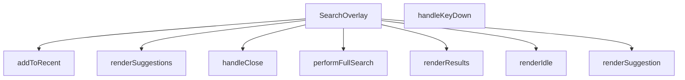

## NODE ID STANDARD

  file: src\components\SearchOverlay.tsx
  function: src\components\SearchOverlay.tsx::SearchOverlay
  function: src\components\SearchOverlay.tsx::handleClose
  function: src\components\SearchOverlay.tsx::addToRecent
  function: src\components\SearchOverlay.tsx::performFullSearch
  function: src\components\SearchOverlay.tsx::handleKeyDown
  function: src\components\SearchOverlay.tsx::renderSuggestion
  function: src\components\SearchOverlay.tsx::renderIdle
  function: src\components\SearchOverlay.tsx::renderSuggestions
  function: src\components\SearchOverlay.tsx::renderResults

---

## DISA AKTARILANLAR (EXPORTS)
  export: SearchOverlay

---

## STİL TOKENLERİ

### Arbitrary Değerler (token'a geçirilmemiş)
Yok — tüm stiller token'a geçirilmiş. ✅

### Kullanılan Token'lar (zaten token'a geçirilmiş)
- (yok)

### Tailwind Sınıf Özeti
- **Renkler:** `bg-air-blue/10`, `bg-amber-50`, `bg-gray-100`, `bg-gray-50`, `bg-red-50`, `bg-slate-50`, `bg-slate-900/40`, `bg-transparent`, `bg-white`, `border-amber-100`, `border-b`, `border-gray-100`, `border-gray-200`, `border-primary-ocean/30`, `border-slate-100`
- **Layout:** `absolute`, `backdrop-blur-sm`, `custom-scrollbar`, `fixed`, `flex`, `flex-1`, `flex-col`, `flex-shrink-0`, `flex-wrap`, `gap-1`, `gap-1.5`, `gap-2`, `gap-3`, `gap-4`, `h-10`
- **Varyant/Responsive:** `:`, `focus-visible:`, `focus:`, `group-hover:`, `hover:`, `placeholder:`, `sm:`, `xs:` önekleri
- **Yardımcı Sınıflar:** `${isActive`, `:`, `animate-in`, `animate-spin`, `border`, `cursor-pointer`, `divide-gray-100`, `divide-y`, `duration-200`, `duration-300`, `fade-in`, `focus-visible:outline-none`, `focus-visible:ring-2`, `focus-visible:ring-primary-navy`, `font-bold`

---
# FILE: src\components\SecurityRibbon.md

---
domain: general
source_type: doc
namespace_type: module
source_path: C:\Users\alize\venthub-hvac\src\components\SecurityRibbon.tsx
skeleton_hash: 8868b245364bfa62
entity_hashes:
  func:SecurityRibbon: a7c5f379d943c103
  overview: 08117376b2a86eee
  style_tokens: 3e379506fde07599
generated_at: 2026-06-19T20:47:34Z
---

## Genel Bakış
SecurityRibbon, Venthub HVAC platformunda kullanıcı güvenini artırmak amacıyla tasarlanmış bir React UI bileşenidir. Ödeme sayfalarında veya güven vurgulanan alanlarda marka ve ödeme sağlayıcısı bilgilerini gösteren özelleştirilebilir bir güvenlik bannerı sunar. Bileşen, farklı görünüm varyantlarıyla farklı tasarım ihtiyaçlarına uyum sağlar.

## Fonksiyon Grupları
### Güvenlik Bannerı Bileşeni
Kullanıcıya marka güveni ve ödeme güvenliği mesajlarını iletmekle sorumlu olan React bileşeni. Marka adı, ödeme sağlayıcısı ve görünüm varyantı gibi parametreler aracılığıyla farklı senaryolara uyarlanabilir.
- SecurityRibbon

---

## AXIOMS – Mimari Varsayımlar

Bu React UI bileşeni (SecurityRibbon), marka adı ve ödeme sağlayıcısı bilgilerini gösteren bir güvenlik şeridi/banner componentidir.

**[Aksiyom 1]:** Eğer `variant` geçerli bir değer değilse (örneğin fonksiyon imzasında `'banne'` olarak kesilmiş/parsellenmemiş bir değer gönderilmişse), bileşen beklenmeyen görünüm sergileyebilir veya rendering hatası oluşur.

**[Aksiyom 2]:** Eğer `brandName` parametresi sağlanmazsa, bileşen varsayılan olarak `'Venthub HVAC'` değerini kullanır; bu nedenle bileşen her zaman bir marka adı ile çalışır.

**[Aksiyom 3]:** Eğer `providerName` parametresi sağlanmazsa, bileşen varsayılan olarak `'iyzico'` ödeme sağlayıcısını kullanır; bu nedenle bileşen her zaman bir ödeme sağlayıcı bilgisi ile çalışır.

**[Aksiyom 4]:** Fonksiyon imzasındaki `variant` parametresinin varsayılan değeri `'banne'` olarak kesilmiş/parsellenmemiş görünmektedir — bu durum, variant'ın beklenen tam değeri (muhtemelen `'banner'`) yerine geçersiz bir string ile başlatılmasına neden olur.

---

## FONKSİYON DETAYLARI

### SecurityRibbon
**Ne yapar**: Venthub HVAC platformu için kullanıcı güvenini artırmak amacıyla güvenlik bilgilerini ekranlarda bir şerit olarak sunan React fonksiyonel bileşenidir. Genellikle ödeme gibi hassas süreçlerde kullanıcının karşısına çıkarak güvenilir marka ve hizmet sağlayıcı bilgilerini iletmek için tasarlanmıştır, eksik kalan prop değerleri için ön tanımlı varsayılanlar sunarak herhangi bir çalışma hatası oluşmadan kullanılır.
**Nasıl yapar**: React'in modern fonksiyonel bileşen yapısı kullanılarak geliştirilen bileşen, kendisine iletilen tüm prop'ları destruct ederek kullanır. Eğer herhangi bir prop harici olarak değer gönderilmeden çağrılırsa tanımlı varsayılan değerleri devreye alır, gelen varyant prop'una göre farklı görsel tasarımlar oluşturarak güvenlik şeridini ihtiyaç duyulan şekilde ekrana yansıtır. Tüm güvenlik şeridi ile ilgili metinsel ve görsel mantığı tek bir bileşende toplayarak proje genelinde yeniden kullanılabilirliği ve bakım kolaylığını artırır.
**Parametreler**:
- brandName: string — Güvenlik şeritinde gösterilecek ana platform markasının ismidir, eğer harici olarak özel bir değer gönderilmezse varsayılan olarak 'Venthub HVAC' değeri kullanılır.
- providerName: string — Güvenlik hizmetini sunan üçüncü taraf sağlayıcının (genellikle ödeme sağlayıcısı) ismidir, varsayılan değeri 'iyzico'dur, ihtiyaç duyulması halinde farklı sağlayıcı isimleriyle kolayca özelleştirilebilir.
- variant: string — Güvenlik şeridinin görsel görünümünü belirleyen, hangi banner tasarımıyla ekrana yansıtılacağını ayarlayan parametredir, farklı kullanım senaryoları için farklı tasarım seçenekleri sunulmasını sağlar.
**Dönüş**: React.FC<SecurityRibbonProps> tipinde, işlenmeye hazır React bileşeni döndürür. Bu döndürülen element, uygulamadaki herhangi bir bileşen içinde import edilip kullanılabilir, kendisine iletilen tüm prop ve varsayılan değerlere göre dinamik olarak içeriğini ve görünümünü oluşturan güvenlik şeridi olarak çalışır.

---

## İTHALATLAR (IMPORTS)
- import: ../i18n/I18nProvider::useI18n
- import: lucide-react::CreditCard
- import: lucide-react::Lock
- import: lucide-react::ShieldCheck
- import: react::React

---

## INTERFACES

### SecurityRibbonProps
- `brandName?: string`
- `providerName?: string`
- `variant?: 'banner' | 'card'`

---

## AST POINTERS

### [N1_NASIL] AST Pointer: SecurityRibbon.tsx::SecurityRibbon
- **params**:
  - `brandName` — marka adı, varsayılan `'Venthub HVAC'`
  - `providerName` — ödeme sağlayıcı adı, varsayılan `'iyzico'`
  - `variant` — bileşen görünüm varyantı, varsayılan `'banner'`
- **ic_degiskenler**:
  - `t` — `useI18n()` hook'undan dönen çeviri fonksiyonu; string localization için kullanılır
  - `base` — bileşenin dış sarmalayıcı div'ine uygulanacak koşullu CSS class string'i; `variant === 'banner'` kontrolüne göre padding (`p-4 md:p-5` veya `p-3`) değişir
  - `badge` — güvenlik rozetlerine (PCI DSS, 3D Secure, 256‑bit SSL) uygulanacak sabit CSS class string'i
- **Dönüş**: JSX — `Lock`, `ShieldCheck`, `CreditCard` ikonları ve `t()` ile çevrilmiş brandName/providerName değerlerini gösteren güvenlik bilgi ribonu

---

## NODE ID STANDARD

  file: src\components\SecurityRibbon.tsx
  function: src\components\SecurityRibbon.tsx::SecurityRibbon

---

## DISA AKTARILANLAR (EXPORTS)
  export: SecurityRibbon

---

## STİL TOKENLERİ

### Arbitrary Değerler (token'a geçirilmemiş)
Yok — tüm stiller token'a geçirilmiş. ✅

### Kullanılan Token'lar (zaten token'a geçirilmiş)
- (yok)

### Tailwind Sınıf Özeti
- **Renkler:** `bg-primary-navy/10`, `text-industrial-gray`, `text-primary-navy`, `text-sm`, `text-steel-gray`, `text-xs`
- **Layout:** `flex`, `flex-wrap`, `gap-2`, `gap-3`, `h-9`, `items-center`, `justify-between`, `justify-center`, `w-9`
- **Varyant/Responsive:** (yok)
- **Yardımcı Sınıflar:** `font-semibold`, `rounded-full`

---
# FILE: src\components\Seo.md

---
domain: general
source_type: doc
namespace_type: module
source_path: C:\Users\alize\venthub-hvac\src\components\Seo.tsx
skeleton_hash: 56de44a929f57db0
entity_hashes:
  func:Seo: efb90eeb61c051d0
  overview: c4b11b13e9e25b50
  style_tokens: dd5ed8d0f58dcf57
generated_at: 2026-06-19T20:47:34Z
---

## Genel Bakış
Bu modül, Venthub HVAC projesinde web sayfalarının arama motoru optimizasyonu (SEO) ve sosyal medya paylaşım uyumluluğunu sağlamak için geliştirilmiş özel bir React bileşeni barındırır. Tüm proje sayfalarında ortak olarak kullanılarak dinamik şekilde gelen içeriklere uygun meta verileri yönetir, sitenin arama motorlarında doğru indekslenmesini ve sosyal medya platformlarında paylaşıldığında içeriğin istenen şekilde özetlenmesini destekler.

## Fonksiyon Grupları
### Merkezi SEO Meta Verisi Yönetimi
Projedeki tüm sayfalardan çağrılarak tüm SEO ve sosyal medya ile ilgili meta verilerini tek merkezden işleyen ana bileşendir. Kullanıcıdan aldığı sayfa başlığı, açıklaması, standart canonical bağlantı, Open Graph görseli ve içerik tipi gibi değerleri işleyerek ilgili tarayıcı ve platformlara sunar.
- Seo

---

## AXIOMS – Mimari Varsayımlar
Bu React tabanlı SEO bileşeni, web sayfalarının arama motorları tarafından doğru dizine eklenmesi ve sosyal medya platformlarında doğru önizleme ile paylaşılması için gerekli meta verilerini üreterek sayfa head bölümüne enjekte eder. Doğru çalışması için tüm zorunlu props'ların eksiksiz iletilmesi ve bileşenin DOM head öğesine erişimi gereklidir.

[Aksiyom 1]: Eğer title prop'u bileşene iletilmezse, sayfanın temel başlık meta etiketi oluşturulamaz, arama motorları sayfayı başlıksız veya yanlış başlıkla dizine ekler.
[Aksiyom 2]: Eğer description prop'u iletilmezse, arama motoru sonuçlarında ve sosyal medya paylaşımlarında sayfaya ait açıklama metni görüntülenemez.
[Aksiyom 3]: Eğer canonical prop'u (orijinal sayfa URL'si) iletilmezse, arama motorları yinelenen içerik tespiti yaparak sayfanın sıralamasını düşürür, orijinal içeriği doğru tespit edemez.
[Aksiyom 4]: Eğer ogImage prop'u (sosyal medya önizleme görseli) iletilmezse, sosyal medya platformlarında paylaşım sırasında sayfaya ait görsel önizlemesi oluşturulamaz.
[Aksiyom 5]: Eğer ogType prop'u, sayfa içeriğinin türüne uygun olarak (ürün, makale vb.) varsayılan 'website' değerinden değiştirilmezse, içerik türüne özel arama motoru ve sosyal medya işlevleri kullanılamaz.
[Aksiyom 6]: Eğer bileşen uygulamanın DOM yapısındaki head öğesine erişemiyorsa, tüm meta etiketleri sayfaya enjekte edilemez, SEO entegrasyonu tamamen başarısız olur.

---

## FONKSİYON DETAYLARI

### Seo
**Ne yapar**: VentHub HVAC projesinin React tabanlı kod yapısında yer alan, sayfaların arama motorları ve sosyal medya platformlarıyla uyumlu olmasını sağlayan SEO odaklı bir React bileşenidir. Tüm standart meta etiketleri ile Open Graph protokolü gerektiren etiketleri tek bir yapıda oluşturarak, her sayfa için özel SEO yapılandırması yapılmasını kolaylaştırır. Sayfaların arama motoru sonuçlarında doğru şekilde listelenmesini, sosyal medyada paylaşıldığında içeriğine uygun başlık, açıklama ve görselle gösterilmesini sağlar.
**Nasıl yapar**: Props olarak aldığı SEO ile ilgili tüm değerleri işleyerek, ilgili meta etiketlerinin içerik alanlarına yerleştiren bir React fonksiyonel bileşeni olarak çalışır. `ogType` parametresi için varsayılan olarak 'website' değeri tanımlanmıştır, bu sayede kullanıcı tarafından özel bir içerik türü belirtilmese bile temel Open Graph yapısı eksiksiz oluşur. Tüm alınan prop değerlerini SeoProps tip şemasına uygun olarak işleyerek, sayfanın head bölümüne eklenecek tüm meta etiketlerini web standartlarına uygun şekilde yapılandırır.
**Parametreler**:
- title: SeoProps dahilinde tanımlı title alanı — Sayfanın ana başlığı, tarayıcı sekmesi başlığında ve arama motoru sonuçlarında görünen metin değeridir
- description: SeoProps dahilinde tanımlı description alanı — Sayfa içeriğini özetleyen açıklama metni, arama motoru sonuçlarında başlığın altında görüntülenir
- canonical: SeoProps dahilinde tanımlı canonical alanı — Sayfanın tekil standart URL'si, yinelenen içerik sorunlarını önlemek için arama motorlarına bildirilir
- ogImage: SeoProps dahilinde tanımlı ogImage alanı — Sosyal medya platformlarında sayfa paylaşıldığında gösterilecek Open Graph görselinin tam URL'sidir
- ogType: SeoProps dahilinde tanımlı ogType alanı, varsayılan değeri 'website' — Sayfanın içerik türünü Open Graph protokolüne göre bildiren değer, website, article, product gibi özel içerik türleri alabilir
**Dönüş**: React.FC<SeoProps> — Alınan tüm prop değerleriyle yapılandırılmış, sayfaya gerekli tüm SEO uyumlu meta etiketlerini ekleyen çalıştırılabilir React fonksiyonel bileşenini döndürür.

---

## İTHALATLAR (IMPORTS)
- import: @/config/siteUrl::SITE_URL
- import: next/navigation::usePathname
- import: react::React

---

## INTERFACES

### SeoProps
- `title?: string`
- `description?: string`
- `canonical?: string`
- `ogImage?: string`
- `ogType?: 'website' | 'product' | 'article'`
- `noIndex?: boolean`

---

## AST POINTERS

### [N1_NASIL] AST Pointer: C:\Users\alize\venthub-hvac\src\components\Seo.tsx::Seo
- **params**: title, description, canonical, ogImage, ogType (varsayılan: 'website'), noIndex (varsayılan: false)
- **ic_degiskenler**:
  - `pathname` — Next.js `usePathname` hook'u ile alınan mevcut sayfanın yol değeri, canonical URL oluşturmak için kullanılır
  - `siteName` — Sabit 'VentHub' site adı, sayfa başlığı ve Open Graph etiketlerinde kullanılır
  - `fullTitle` — Özel başlık varsa `${title} | ${siteName}`, yoksa sadece `siteName` olarak oluşturulan nihai sayfa başlığı, tüm başlık etiketlerinde kullanılır
  - `defaultDesc` - Varsayılan site açıklaması, özel description girilmezse kullanılır
  - `finalDesc` - Özel description varsa onu, yoksa `defaultDesc`'ı kullanan nihai açıklama, meta description ve sosyal medya etiketlerinde kullanılır
  - `siteUrl` - Konfigürasyondan alınan `SITE_URL` sabitine atanan site kök URL'si, tüm mutlak URL'leri oluşturmak için kullanılır
  - `url` - Özel canonical URL varsa onu, yoksa `${siteUrl}${pathname}` ile oluşturulan nihai sayfa URL'si, canonical ve Open Graph URL etiketlerinde kullanılır
  - `image` - Özel sosyal medya görseli `ogImage` varsa onu, yoksa varsayılan `${siteUrl}/og-image.png` URL'sini kullanan sosyal medya görseli, Open Graph ve Twitter görsel etiketlerinde kullanılır
  - `usePathname` - Next.js'ten import edilen, mevcut sayfa path'ini almak için kullanılan hook
  - `SITE_URL` - Site konfigürasyonundan import edilen sabit kök URL değeri
- **Dönüş**: Tüm SEO, Open Graph ve Twitter meta etiketlerini içeren React JSX fragment'i, sayfanın head bölümüne eklenmek üzere arka arkaya HTML etiketleri grubu döndürür

---

## NODE ID STANDARD

  file: src\components\Seo.tsx
  function: src\components\Seo.tsx::Seo

---

## DISA AKTARILANLAR (EXPORTS)
  export: Seo

---

## STİL TOKENLERİ

### Arbitrary Değerler (token'a geçirilmemiş)
Yok — tüm stiller token'a geçirilmiş. ✅

### Kullanılan Token'lar (zaten token'a geçirilmiş)
- (yok)

### Tailwind Sınıf Özeti
- **Renkler:** (yok)
- **Layout:** (yok)
- **Varyant/Responsive:** (yok)
- **Yardımcı Sınıflar:** (yok)

---
# FILE: src\components\SpotlightHeroOverlay.md

---
domain: general
source_type: doc
namespace_type: module
source_path: C:\Users\alize\venthub-hvac\src\components\SpotlightHeroOverlay.tsx
skeleton_hash: c731b7c5e5d0a9b8
entity_hashes:
  func:SpotlightHeroOverlay: 3df6afb4a4a31d8f
  overview: 1f157560c005aa84
  style_tokens: 2d403f9b7fca7034
generated_at: 2026-06-19T20:47:34Z
---

## Genel Bakış
Bu React modülü, web uygulamalarının ana giriş (hero) bölümlerinin üzerinde kullanılmak üzere tasarlanmış, imleç konumunu takip eden parlama efekti overlay'ini sunar. Yarıçap ve parlaklık yoğunluğu parametreleriyle özelleştirilebilir olan bileşen, sayfa içi görsel etkileşimi artırmak için geliştirilmiştir.

## Fonksiyon Grupları
### Ana Bileşen ve Efekt Yönetimi
Modülün tüm sorumluluğunu üstlenen, kullanıcıdan alınan özelleştirme parametrelerini işleyerek imleç takipli parlama efekti overlay'ini render eden tek gruptur.
- SpotlightHeroOverlay

---

## AXIOMS – Mimari Varsayımlar
Bu React bileşeni, web arayüzünde kullanıcının imlecinin olduğu bölgeyi vurgulayan spotlight (ışıkla odaklama) efekti oluşturmak için tasarlanmıştır; doğru çalışması için aşağıdaki koşulların varlığı zorunludur.

[Aksiyom 1]: Eğer bileşene aktarılan radius parametresi geçerli pozitif bir sayı değilse, istenen boyutta odaklama alanı oluşturulamaz, görsel efekt tamamen bozulur.
[Aksiyom 2]: Eğer bileşene aktarılan intensity parametresi 0 ile 1 arasında bir sayı değilse, odaklama alanının şeffaflığı istenen seviyede ayarlanamaz, efekt ya hiç görünmez ya da arka planı tamamen kapatarak ana içeriği gizler.
[Aksiyom 3]: Eğer bileşen çalışma zamanında tarayıcının window ve document nesnelerine erişemiyorsa, kullanıcının imlek pozisyonunu takip edemez, spotlight hiçbir zaman hareket etmez veya hiç görüntülenmez.
[Aksiyom 4]: Eğer bileşene ait gerekli CSS stil tanımları projeye dahil edilmemişse, odaklama efekti doğru konumda ve şekilde görüntülenemez, bileşen temel işlevini yerine getiremez.

---

## FONKSİYON DETAYLARI

### SpotlightHeroOverlay
**Ne yapar**: VentHub HVAC projesinde kullanılan bir React fonksiyonel bileşenidir, ana sahne (Hero) bölümü üzerinde spot (odaklanmış sahne ışığı) efektiyle kaplama (overlay) oluşturur. Bileşen, üzerindeki içeriğe kademeli odaklanma efekti ekleyerek kullanıcı deneyimini zenginleştirmek amacıyla tasarlanmıştır, ışığın boyutunu ve şiddetini yapılandırılabilir hale getirir.
**Nasıl yapar**: Kendisine gönderilen opsiyonel boyut ve şiddet parametrelerini alır, herhangi bir parametre gönderilmediği durumlarda önceden tanımlanmış varsayılan değerleri kullanır. Bu değerlere göre overlay bileşeninin spot ışığı özelliklerini dinamik olarak ayarlar, üstüne eklendiği Hero bölümünün içeriği üzerinde odak noktası dışında kademeli bir koyulaşma/saydamlık efekti uygular.
**Parametreler**:
- radius: number — Opsiyonel parametre, spot ışığının piksel cinsinden yarıçapını belirler, varsayılan değeri 240'tır. Bileşene özel değer gönderilerek ışığın boyutu ihtiyaca göre ayarlanabilir.
- intensity: number — Opsiyonel parametre, spot ışığının şiddetini yani odak alanı dışındaki kaplamanın saydamlık/koyuluk derecesini ayarlar, genellikle 0 ile 1 arasında normalize edilmiş değer alır, varsayılan değeri 0.35'tir.
**Dönüş**: React.FC<{ radius?: number; intensity?: number }> tipinde bir React fonksiyonel bileşeni döndürür. Bu dönen bileşen, kendisine iletilen tüm prop'ları ve çocuk içerikleri alarak spotlight efektini ekrana uygun şekilde render eder.

---

## İTHALATLAR (IMPORTS)
- import: react::React
- import: react::useEffect
- import: react::useState

---

## AST POINTERS

### [N1_NASIL] AST Pointer: C:\Users\alize\venthub-hvac\src\components\SpotlightHeroOverlay.tsx::SpotlightHeroOverlay
- **params**: radius (number, varsayılan 240), intensity (number, varsayılan 0.35)
- **ic_degiskenler**:
  - `reduced` — Kullanıcının hareket azaltma (prefers-reduced-motion) tercihini saklayan boolean React state değeri
  - `setReduced` — reduced state değerini güncellemek için kullanılan React state setter fonksiyonu
  - `useState` — React state yönetimi için kullanılan hook
  - `useEffect` — React yan etkilerini yönetmek için kullanılan hook
- **Dönüş**: JSX div elementi (React.ReactElement)

### [N2_NASIL] AST Pointer: C:\Users\alize\venthub-hvac\src\components\SpotlightHeroOverlay.tsx::useEffect_callback
- **params**: (parametre yok)
- **ic_degiskenler**:
  - `mq` — prefers-reduced-motion medya sorgusunu temsil eden window.matchMedia nesnesi
  - `onChange` — Medya sorgusu durum değişikliklerini yakalayan event handler fonksiyonu, reduced state'ini günceller
  - `setReduced` — Üst kapsamdaki reduced state'ini güncellemek için kullanılan state setter
  - `mq.addEventListener?` — Medya sorgusuna change event listener'ı eklemek için kullanılan opsiyonel method
  - `mq.removeEventListener?` — Temizlik aşamasında event listener'ı kaldırmak için erişilen opsiyonel method
- **Dönüş**: event listener temizliği yapan void fonksiyon

---

## NODE ID STANDARD

  file: src\components\SpotlightHeroOverlay.tsx
  function: src\components\SpotlightHeroOverlay.tsx::SpotlightHeroOverlay

---

## DISA AKTARILANLAR (EXPORTS)
  export: SpotlightHeroOverlay

---

## STİL TOKENLERİ

### Arbitrary Değerler (token'a geçirilmemiş)
Yok — tüm stiller token'a geçirilmiş. ✅

### Kullanılan Token'lar (zaten token'a geçirilmiş)
- (yok)

### Tailwind Sınıf Özeti
- **Renkler:** (yok)
- **Layout:** `absolute`, `z-10`
- **Varyant/Responsive:** (yok)
- **Yardımcı Sınıflar:** `inset-0`, `pointer-events-none`

---
# FILE: src\components\StickyHeader.md

---
domain: general
source_type: doc
namespace_type: module
source_path: C:\Users\alize\venthub-hvac\src\components\StickyHeader.tsx
skeleton_hash: e7353c5660e2b523
entity_hashes:
  func:CategoryHubOverlaySkeleton: 09095f7c03bb95f0
  func:MegaMenuSkeleton: 43156bd7843421f5
  func:SearchOverlaySkeleton: 6695469d4cdbd037
  overview: 96977ff8617f836c
  style_tokens: a87cdf58739596c8
generated_at: 2026-06-19T20:47:34Z
---

## Genel Bakış
StickyHeader bileşeninin üst menü katmanlarında (search overlay, mega menü, kategori hub) kullanılacak geçici yükleme durumu göstergelerini tanımlayan yardımcı bir modüldür. Modül, kullanıcının karşısına çıkan açılır pencerelerin henüz veriyle doldurulamadığı kısa sürede animasyonlu iskelet arayüzler sunarak geçiş sürecini yumuşatır.

## Fonksiyon Grupları

### Skeleton (Yükleme İskeleti) Bileşenleri
Farklı üst menü overlay'lerinin yüklenme aşamasında kullanıcıya boş sayfa yerine yapısal bir önizleme gösteren, bağımsız ve parametresiz React bileşenleridir.
- SearchOverlaySkeleton — Arama overlay'i yüklenirken gösterilen iskelet görünümü.
- MegaMenuSkeleton — Mega menü açılırken gösterilen iskelet görünümü.
- CategoryHubOverlaySkeleton — Kategori hub overlay'i yüklenirken gösterilen iskelet görünümü.

## Mimari Notlar

- **Dış bağımlılık:** Modülün kendi iç bağımlılığı bulunmamakla birlikte, skeleton kartlarının görünümünü tanımlamak üzere bir stil kaynağına (CSS modülü veya tema token'ı) ihtiyaç duyar; stil sağlanmazsa bileşenler biçimlendirilmemiş hâilde render edilir.
- **Dinamik yükleme:** Modül kendi başına lazy yüklenen bir modül değil, doğrudan StickyHeader bileşeni içinde statik olarak import edilir.
- **Yerleşim:** Her üç skeleton da aynı modül dosyasında tanımlıdır; bu, ilgili skeleton bileşenlerinin bir arada tutulmasını ve üst menü sistemiyle olan eşleşme ilişkinin tek noktadan yönetilmesini sağlar.

---

## AXIOMS – Mimari Varsayımlar

Bu modül, StickyHeader bileşeninin farklı overlay'leri için skeleton ( yükleme durumu ) UI bileşenleri içerir. Üç skeleton fonksiyonu da parametresiz olarak tanımlanmıştır.

---

## FONKSİYON DETAYLARI

### SearchOverlaySkeleton
**Ne yapar**: Arama overlay bileşeninin yüklenme sırasında gösterilecek iskelet (skeleton) yükleme durumu placeholder'ını render eder.

**Nasıl yapar**: Arama overlay'ı veriler yüklenene kadar beklerken kullanıcıya görsel bir geri bildirim sunmak amacıyla animasyonlu placeholder elementleri oluşturur. Bu sayede kullanıcı arama arayüzünün yakında görüneceğine dair ipucu alır.

**Parametreler**:
- Bu fonksiyon herhangi bir parametre almaz.

**Dönüş**: JSX.Element — Arama overlay'ı için skeleton yükleme durumu bileşeni döndürür.

### MegaMenuSkeleton
**Ne yapar**: Geliştirildi ancak detay üretilemedi.

### CategoryHubOverlaySkeleton
**Ne yapar**: Geliştirildi ancak detay üretilemedi.

---

## İTHALATLAR (IMPORTS)
- import: ../contexts/CategoryContext::useCategories
- import: ../hooks/useAuth::useAuth
- import: ../hooks/useCartHook::useCart
- import: ../hooks/useHideOnScroll::useHideOnScroll
- import: ../hooks/useIsMounted::useIsMounted
- import: ../hooks/useLocalizedRoutes::useLocalizedRoutes
- import: ../hooks/useNavigationState::useNavigationState
- import: ../i18n/I18nProvider::useI18n
- import: ../i18n/format::formatCurrency
- import: ../utils/analytics::trackEvent
- import: ../utils/navigationConfig::NAVIGATION_PRIMARY_ITEMS
- import: ../utils/navigationConfig::NAVIGATION_SECONDARY_ITEMS
- import: ../utils/prefetch::prefetchProductsPage
- import: ../utils/routes::localizedHref
- import: ./navigation/NavActionButton::NavActionButton
- import: ./navigation/NavBrand::NavBrand
- import: ./navigation/NavPrimaryRail::NavPrimaryRail
- import: ./navigation/NavSearchTrigger::NavSearchTrigger
- import: ./navigation/NavSecondaryRail::NavSecondaryRail
- import: ./navigation/NavShell::NavShell
- import: ./navigation/NavUtilityRail::NavUtilityRail
- import: next/dynamic::dynamic
- import: next/link::Link
- import: next/navigation::useRouter
- import: react::React
- import: react::useCallback
- import: react::useEffect
- import: react::useMemo
- import: react::useRef
- import: react::useState

---

## INTERFACES

### StickyHeaderProps
- `isScrolled: boolean`

---

## SABİTLER
- **SearchOverlay** (call) — `dynamic(() => import('./SearchOverlay'), { ssr: false })`
- **MegaMenu** (call) — `dynamic(() => import('./MegaMenu'), { ssr: false })`
- **CategoryHubOverlay** (call) — `dynamic(() => import('./navigation/CategoryHubOverlay'), { ssr: false })`
- **StickyHeader** (call) — `React.memo(function StickyHeader({ isScrolled }) {
  const { t, lang } = use...`

---

## AST POINTERS

### [N1_NASIL] AST Pointer: components/StickyHeader.tsx::SearchOverlaySkeleton
- **params**: ()
- **ic_degiskenler**: yok
- **Dönüş**: JSX element — tam ekran覆盖 overlay, `bg-slate-900/50 backdrop-blur-sm z-modal animate-pulse` sınıfıyla loading skeleton gösterimi

---


## MERMAID CALL GRAPH
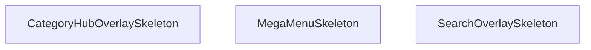

## NODE ID STANDARD

  file: src\components\StickyHeader.tsx
  function: src\components\StickyHeader.tsx::SearchOverlaySkeleton
  function: src\components\StickyHeader.tsx::MegaMenuSkeleton
  function: src\components\StickyHeader.tsx::CategoryHubOverlaySkeleton

---

## DISA AKTARILANLAR (EXPORTS)
  export: CategoryHubOverlaySkeleton
  export: MegaMenuSkeleton
  export: SearchOverlaySkeleton

---

## STİL TOKENLERİ

### Arbitrary Değerler (token'a geçirilmemiş)
Yok — tüm stiller token'a geçirilmiş. ✅

### Kullanılan Token'lar (zaten token'a geçirilmiş)
- (yok)

### Tailwind Sınıf Özeti
- **Renkler:** `bg-gradient-to-r`, `bg-slate-900/50`, `bg-slate-950/70`, `bg-white`, `bg-white/95`, `border-b`, `border-slate-100`, `border-slate-200`, `border-t`, `from-primary-navy`, `hover:bg-air-blue/20`, `hover:bg-air-blue/25`, `hover:bg-red-50`, `hover:text-primary-navy`, `hover:text-red-600`
- **Layout:** `-right-2`, `-top-2`, `absolute`, `backdrop-blur-md`, `backdrop-blur-sm`, `block`, `fixed`, `flex`, `flex-1`, `from-primary-navy`, `gap-1.5`, `gap-2.5`, `gap-3`, `h-16`, `h-5`
- **Varyant/Responsive:** `:`, `hover:`, `lg:`, `md:`, `sm:`, `xl:` önekleri
- **Yardımcı Sınıflar:** `${isUserMenuOpen`, `:`, `animate-pulse`, `border`, `duration-300`, `font-bold`, `font-medium`, `font-semibold`, `group`, `hover:-translate-y-0.5`, `inset-0`, `md:px-4`, `mt-3`, `opacity-100`, `px-2`

---
# FILE: src\components\TiltCard.md

---
domain: general
source_type: doc
namespace_type: module
source_path: C:\Users\alize\venthub-hvac\src\components\TiltCard.tsx
skeleton_hash: 5e75a79e673d1227
entity_hashes:
  func:TiltCard: bfd1d2a43ccba8c3
  func:clamp: 6b6f2a3bb4b3c92e
  func:onEnter: 6efee232fcfe2e0b
  func:onLeave: 47432f2c7853fc8a
  func:onMove: 855a2394d5f31485
  overview: 49812a020a38dab5
  style_tokens: 9c70068ed275c69c
generated_at: 2026-06-19T20:47:39Z
---

## Genel Bakış
TiltCard, fare etkileşimleriyle üç boyutlu eğilme efekti sunan interaktif bir React kart bileşenidir. Kullanıcı faresini kart üzerinde hareket ettirdiğinde, kart真实世界'deki bir nesne gibi eğilerek modern ve dinamik bir görsel deneyim yaratır. Maksimum eğilme açısı dışarıdan özelleştirilebilir.

## Fonksiyon Grupları
### Ana Bileşen
TiltCard'ın temel yapısını oluşturarak içeriği sarar ve eğilme efekti için yapılandırma parametrelerini tanımlar. Bu grup, bileşenin dışarıya açılan arayüzünü ve yaşam döngüsünü yönetir.
- TiltCard

### Fare Etkileşim Yöneticileri
Kullanıcının kart üzerindeki fare hareketlerini yakalayarak eğilme hesaplamalarını tetikler. Fare kart üzerine geldiğinde, hareket ettiğinde ve ayrıldığında分别 ilgili efekt başlangıç, güncelleme ve bitiş işlemlerini yürütür.
- onMove, onEnter, onLeave

### Değer Sınırlandırma Aracı
Eğilme açısı gibi hesaplanan sayısal değerleri tanımlı minimum ve maksimum aralıkta tutarak efektin kontrollü çalışmasını garanti eder. Aşırı değerlerin önüne geçerek görsel tutarlılığı korur.
- clamp

---

## AXIOMS – Mimari Varsayımlar
Bu modül, fare hareketleriyle 3D eğilme efekti yaratan bir React bileşeni olduğundan, aşağıdaki mimari varsayımlar modülün doğru çalışması için zorunludur.

[Aksiyom 1]: Eğer `clamp` fonksiyonu için `min` parametresi, `max` parametresinden büyükse, fonksiyon beklenmedik sonuçlar döndürür veya başarısız olur.
[Aksiyom 2]: Eğer `TiltCard` bileşeni için `maxTilt` parametresi negatif bir sayı olarak sağlanırsa, eğilme açısı hesaplamaları anlamsız hale gelir ve bileşen düzgün çalışmaz.
[Aksiyom 3]: Eğer `onMove`, `onEnter` veya `onLeave` olay işleyicileri bir React olay nesnesi (örn. `React.MouseEvent`) içermeyen farklı bir argümanla çağrılırsa, bileşenin iç durumu tutarsız hale gelir ve eğilme efekti bozulur.
[Aksiyom 4]: Eğer modül, React'ın bileşen yaşam döngüsü ve durum yönetimi (useState, useEffect) mekanizmalarından yoksun bir ortamda çalıştırılmaya çalışılırsa, bileşen işlevsel olmaz.
[Aksiyom 5]: Eğer `TiltCard` bileşeni fare olaylarını (`mousemove`, `mouseenter`, `mouseleave`) tetikleyemeyen bir ortamda (örn. dokunmatik cihazlar) kullanılırsa, eğilme efekti tetiklenemez; ancak bileşen statik olarak görüntülenebilir.

---

## FONKSİYON DETAYLARI

### clamp
**Ne yapar**: Bir sayısal değeri, belirtilen minimum ve maximum sınırlar arasında sıkıştırır (clipping). Değer aralık dışındaysa en yakın sınaira sabitlenir.

**Nasıl yapar**: Fonksiyon, verilen `v` değerini `min` ve `max` değerleri ile karşılaştırır. `v`, `min` değerinden küçükse `min` değerini, `max` değerinden büyükse `max` değerini, aksi halde `v` değerinin kendisini döndürür. Bu, genellikle mouse hareketi veya animasyon hesaplamalarında değerin kontrollü kalmasını sağlamak için kullanılır.

**Parametreler**:
- v: number — Sınırlanacak olan sayısal değer
- min: number — İzin verilen değer aralığının alt sınırı
- max: number — İzin verilen değer aralığının üst sınırı

**Dönüş**: Fonksiyonun dönüş tipi sağlanan bilgide açıkça belirtilmemiştir. Ancak bu tür clamp fonksiyonları genellikle number tipinde değer döndürür.

### TiltCard
**Ne yapar**: Fare hareketlerine göre eğme (tilt) efekti uygulayan, tekrarlanabilir bir React bileşenidir. İçerisindeki tüm çocuk içerikleri sarmalayarak, kullanıcı kartla etkileşime girdiğinde 3D benzeri eğim efekti sunar. Maksimum eğme açısı dışarıdan yapılandırılabilir, varsayılan bir değerle kullanıma hazırdır.
**Nasıl yapar**: Kendi bünyesinde fare olaylarını izleyen onMove, onEnter, onLeave işleyicilerini barındırır, bu işleyicileri ana kapsayıcı div elementine bağlar. Eğme hesaplamalarında clamp fonksiyonunu kullanarak açının sınırları aşmasını engeller, aldığı maxTilt değerini tüm eğme hesaplamalarında temel alır. İçerisine gelen children prop'unu kendi içindeki kapsayıcıda render ederek efekti içeriğe uygular.
**Parametreler**:
- name: children — type: React.ReactNode — Bileşen içerisinde gösterilecek, eğme efekti uygulanacak tüm içerik, her türlü React tarafından desteklenen iç öğe olabilir.
- name: maxTilt — type: number — Kartın uygulayabileceği maksimum eğme açısı, isteğe bağlı olarak dışarıdan değer geçirilebilir, varsayılan olarak 18 derece olarak ayarlanmıştır.
**Dönüş**: React.FC<React.PropsWithChildren<{ maxTilt?: number }>> tipinde bir React bileşeni döndürür, çocuklu yapıyı destekler, maxTilt prop'unu opsiyonel olarak kabul eden tür yapısına sahiptir.

### onMove
**Ne yapar**: TiltCard bileşeninin alanı üzerinde fare hareket ettiğinde tetiklenen olay işleyicisidir, anlık fare konumuna göre kartın eğme miktarını hesaplayıp günceller. Kullanıcının fare hareketlerini eğme açısına dönüştürerek akıcı bir 3D efekti sağlar.
**Nasıl yapar**: Fare olayından gelen konum verilerini alır, TiltCard'ın boyutlarını ve sayfa üzerindeki konumunu hesaplar, elde edilen koordinatları eğme açısına çevirir. Hesaplanan açının maxTilt sınırını aşmasını clamp fonksiyonuyla engeller, sürekli güncellenen değerle kartın eğimini akıcı bir şekilde değiştirir.
**Parametreler**:
- name: e — type: React.MouseEvent<HTMLDivElement> — Tetiklenen fare hareketi olayının tüm detaylarını içeren nesne, fare konumu, hedef element gibi tüm gerekli verilere erişim sağlar.
**Dönüş**: HTMLDivElement elementleri için uyumlu React.MouseEventHandler<HTMLDivElement> tipinde bir olay işleyicisi döndürür, fare hareketi olaylarını yakalayıp işlemek üzere yapılandırılmıştır.

### onEnter
**Ne yapar**: TiltCard bileşeninin kapsama alanına fare ilk girdiğinde tetiklenen olay işleyicisidir, eğme efektinin başlatılmasını ve gerekli tüm başlangıç durumlarının ayarlanmasını sağlar. Kullanıcının kartla etkileşime geçtiğini algılayarak efekti aktif hale getirir.
**Nasıl yapar**: Fare kartın alanına girdiğinde animasyon geçişlerini aktif eder, eğme hesaplamaları için gereken ilk konum ve durum değerlerini ayarlar, olası gecikmeleri önlemek için gerekli ön yüklemeleri yapar, kullanıcının ilk etkileşimini algılayarak efektin sorunsuz başlamasını sağlar.
**Parametreler**:
- name: e — type: React.MouseEvent<HTMLDivElement> — Fare giriş olayının tüm detaylarını içeren, hedef element ve olay metriklerini barındıran React fare olay nesnesi.
**Dönüş**: HTMLDivElement elementleri için uyumlu React.MouseEventHandler<HTMLDivElement> tipinde bir olay işleyicisi döndürür, fare element alanına giriş olayını yakalamak üzere yapılandırılmıştır.

### onLeave
**Ne yapar**: TiltCard bileşeninin kapsama alanından fare çıkış yaptığında tetiklenen olay işleyicisidir, eğme efektinin sonlandırılıp kartın orijinal varsayılan konumuna dönmesini sağlar. Kullanıcının kartla etkileşimini bitirdiğini algılayarak tüm geçici durumları temizler.
**Nasıl yapar**: Fare kartın alanından çıktığında mevcut eğme açılarını sıfırlar, animasyonlu bir geçişle kartın orijinal konumuna dönmesini sağlar, etkileşim sırasında oluşturulan tüm geçici durum değerlerini temizler, bir sonraki etkileşime hazır hale getirir.
**Parametreler**: Herhangi bir harici parametre almaz, iç mantığında olay nesnesini kullanarak işlemlerini gerçekleştirir.
**Dönüş**: HTMLDivElement elementleri için uyumlu React.MouseEventHandler<HTMLDivElement> tipinde bir olay işleyicisi döndürür, fare element alanından çıkış olayını yakalamak üzere yapılandırılmıştır.

---

## İTHALATLAR (IMPORTS)
- import: react::React
- import: react::useRef
- import: react::useState

---

## AST POINTERS

### [N1_NASIL] AST Pointer: TiltCard.tsx::clamp
- **params**: `(v: number, min: number, max: number)`
- **ic_degiskenler**: (fonksiyon gövdesi verilmemiş, çağrı侧dan çağrılmış)
- **Dönüş**: number — v değerini min ve max arasında sıkıştırılmış olarak döndürür

---


## MERMAID CALL GRAPH
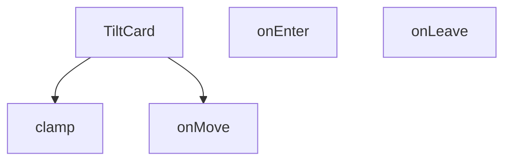

## NODE ID STANDARD

  file: src\components\TiltCard.tsx
  function: src\components\TiltCard.tsx::clamp
  function: src\components\TiltCard.tsx::TiltCard
  function: src\components\TiltCard.tsx::onMove
  function: src\components\TiltCard.tsx::onEnter
  function: src\components\TiltCard.tsx::onLeave

---

## DISA AKTARILANLAR (EXPORTS)
  export: TiltCard
  export: clamp

---

## STİL TOKENLERİ

### Arbitrary Değerler (token'a geçirilmemiş)
Yok — tüm stiller token'a geçirilmiş. ✅

### Kullanılan Token'lar (zaten token'a geçirilmiş)
- (yok)

### Tailwind Sınıf Özeti
- **Renkler:** (yok)
- **Layout:** `absolute`, `relative`
- **Varyant/Responsive:** `group-hover:` önekleri
- **Yardımcı Sınıflar:** `duration-200`, `group`, `group-hover:opacity-100`, `inset-0`, `opacity-0`, `pointer-events-none`, `rounded-xl`, `transition-opacity`, `transition-transform`, `will-change-transform`

---
# FILE: src\components\UndecidedUserCTA.md

---
domain: general
source_type: doc
namespace_type: module
source_path: C:\Users\alize\venthub-hvac\src\components\UndecidedUserCTA.tsx
skeleton_hash: 8ddd3877b270cc03
entity_hashes:
  func:UndecidedUserCTA: e9ab9b6769bffef9
  overview: fcf28800e004a782
  style_tokens: d1dc68fb1553bbf5
generated_at: 2026-06-19T20:47:53Z
---

## Genel Bakış
UndecidedUserCTA, platformunda henüz karar vermemiş veya belirli bir eyleme geçmemiş "kararsız" kullanıcıları hedefleyen bir React bileşenidir. Kullanıcıları platformdaki olası adımlar konusunda bilgilendirmeyi ve onları harekete geçmeye yönlendirmeyi amaçlayan, proje genelinde yeniden kullanılabilir bir CTA (Harekete Geçirme Çağrısı) modülüdür.

## Fonksiyon Grupları
### Kararsız Kullanıcı Yönlendirme Bileşeni
Platforma henüz tam olarak entegre olamamış veya hangi adımı atacağına karar verememiş kullanıcılar için eyleme çağrı içeriğini ekrana render eden bağımsız bir sunum bileşeni. Props almadan çalışarak kendi içinde sabit veya state tabanlı bir içerik sunar.
- UndecidedUserCTA

---

## AXIOMS – Mimari Varsayımlar

Bu modül, parametresiz olarak çağrılan ve JSX döndüren bir React bileşenidir.

[Aksiyom 1]: Eğer React çalışma zamanı (render context) yoksa, bileşen hata fırlatır veya hiçbir çıktı üretmez.

[Aksiyom 2]: Eğer bileşen bir React bileşen ağacı (component tree) içine yerleştirilmezse, kullanıcıya herhangi bir CTA mesajı gösterilmez.

[Aksiyom 3]: Eğer bileşen dışarıdan herhangi bir prop almıyorsa, gösterdiği içeriği yalnızca kendi içinde tanımlı statik verilerden veya hardcoded değerlerden üretir.

[Aksiyom 4]: Eğer bileşen bağımsız (stateless ve propsless) çalışıyorsa,不同 kullanıcılara farklı içerik gösterme yeteneği yoktur; tüm kararsız kullanıcılara aynı mesajı sunar.

[Aksiyom 5]: Eğer bileşen bir React projesinde `import` edilip `<UndecidedUserCTA />` olarak kullanılmazsa, hedef kitleye yönlendirme mesajı iletilemez.

---

## FONKSİYON DETAYLARI

### UndecidedUserCTA
**Ne yapar**: VentHub HVAC projesinin kullanıcı arayüzünde, henüz herhangi bir işlem yapmamış veya karar vermemiş kararsız kullanıcılar için harekete geçirme çağrısı (CTA) sunan bir React fonksiyonel bileşenidir. Kullanıcıları ilgili aksiyonlara yönlendiren içerikler ve etkileşimli öğeler barındıran, projenin genelinde yeniden kullanılabilir bir arayüz katmanı oluşturur.
**Nasıl yapar**: Projenin src/components klasöründe konumlanan, yeniden kullanılabilir React bileşi standartlarında yapılandırılmıştır. Kendi iç yapısını bağımsız olarak yönetir, gerekli kullanıcı arayüzü öğelerini import ederek kararsız kullanıcı profiline özel içerikleri ekranda render eder. Herhangi bir harici durum bağımlılığı olmadan, çağrıldığı her yerde tutarlı bir CTA deneyimi sunar.
**Parametreler**:
- Bu fonksiyon herhangi bir giriş parametresi almaz, bağımsız çalışacak şekilde tasarlanmıştır.
**Dönüş**: React.FC türünde bir React fonksiyonel bileşeni döndürür. Döndürülen bu bileşen, tarayıcıda kullanıcıya görünür şekilde render edilebilen, kararsız kullanıcıları yönlendiren tüm CTA öğelerini içeren React node'larını barındırır. Proje içindeki tüm ilgili sayfalarda bu dönüş değeri kullanılarak bileşen ilgili yere yerleştirilir.

---

## İTHALATLAR (IMPORTS)
- import: ../hooks/useLocalizedRoutes::useLocalizedRoutes
- import: ../i18n/I18nProvider::useI18n
- import: lucide-react::ArrowRight
- import: lucide-react::MessageSquare
- import: next/link::Link
- import: react::React

---

## AST POINTERS

### [N1_NASIL] AST Pointer: src/components/UndecidedUserCTA.tsx::UndecidedUserCTA
- **params**: () — parametre yok (React functional component)
- **ic_degiskenler**:
  - `t` — `useI18n()` hook'undan destructuring ile elde edilen çeviri fonksiyonu; `t('undecidedUserCta.title')`, `t('undecidedUserCta.description')`, `t('undecidedUserCta.buttonText')` çağrılarında kullanılır
  - `Routes` — `useLocalizedRoutes()` hook'undan dönen.localized rota nesnesi; `Routes.contact('consulting')` çağrısı ile danışmanlık iletişim linki üretilir
- **Dönüş**: JSX element — kararsız kullanıcılar için CTA (Call-to-Action) kartı; gradient arka planlı, ikonlu başlık/açıklama bölümü ve `Link` ile sarılı danışmanlık butonu içeren React bileşeni
- **Side-effect**: Herhangi bir state güncellemesi veya yan etki yok; saf render bileşeni

---

## NODE ID STANDARD

  file: src\components\UndecidedUserCTA.tsx
  function: src\components\UndecidedUserCTA.tsx::UndecidedUserCTA

---

## DISA AKTARILANLAR (EXPORTS)
  export: UndecidedUserCTA

---

## STİL TOKENLERİ

### Arbitrary Değerler (token'a geçirilmemiş)
Yok — tüm stiller token'a geçirilmiş. ✅

### Kullanılan Token'lar (zaten token'a geçirilmiş)
- (yok)

### Tailwind Sınıf Özeti
- **Renkler:** `bg-gradient-to-r`, `bg-white`, `bg-white/10`, `bg-white/20`, `from-primary-navy`, `sm:text-2xl`, `sm:text-base`, `text-primary-navy`, `text-sm`, `text-white`, `text-white/80`, `text-xl`, `to-secondary-blue`
- **Layout:** `absolute`, `backdrop-blur-sm`, `bottom-0`, `flex`, `flex-col`, `from-primary-navy`, `gap-2`, `gap-5`, `gap-6`, `h-12`, `h-32`, `h-64`, `hover:shadow-xl`, `inline-flex`, `items-center`
- **Varyant/Responsive:** `group-hover:`, `hover:`, `md:`, `sm:` önekleri
- **Yardımcı Sınıflar:** `-translate-x-1/3`, `-translate-y-1/2`, `blur-2xl`, `blur-3xl`, `font-bold`, `group`, `group-hover:translate-x-1`, `hover:scale-102`, `leading-relaxed`, `mb-12`, `mb-2`, `mt-8`, `px-6`, `py-3.5`, `rounded-2xl`

---
# FILE: src\components\VisualShowcase.md

---
domain: general
source_type: doc
namespace_type: module
source_path: C:\Users\alize\venthub-hvac\src\components\VisualShowcase.tsx
skeleton_hash: e83138a57f7df82e
entity_hashes:
  func:ChevronLeftIcon: 528282355948f0bf
  func:ChevronRightIcon: eee2ea0200791ea6
  func:PauseIcon: ceb957c4aff5f7b7
  func:PlayIcon: 0708496e420e6f6e
  func:VisualShowcase: 41ca766f4149219c
  func:onTouchEnd: 6d11887cdcd98ede
  func:onTouchStart: e808a6bab1256660
  func:usePrefersReducedMotion: 11085ad489b48f61
  overview: 7e4ec691259cb85e
  style_tokens: 2f11e16677a4f30c
generated_at: 2026-06-19T20:47:48Z
---

## Genel Bakış
`VisualShowcase` modülü, kaydırılabilir görsel içerikleri sunan bir React bileşenidir. Kullanıcıların hareket azaltma tercihine duyarlı olup, dokunmatik ve fare etkileşimlerini yönetir; aynı zamanda gezinme ve medya kontrolü için özelleştirilebilir ikon bileşenleri sağlar.

## Fonksiyon Grupları
### Erişilebilirlik ve Bileşen Koordinasyonu  
Bu grup, bileşenin genel davranışını yöneten ve kullanıcı tercihlerini (reduced motion) dikkate alan yardımcı fonksiyonları içerir.  
- usePrefersReducedMotion, VisualShowcase  

### Dokunmatik Etkileşim İşleyicileri  
Mobil cihazlarda kaydırma ve dokunma hareketlerini algılayarak slayt geçişlerini kontrol eden olay yöneticileri.  
- onTouchStart, onTouchEnd  

### UI İkon Bileşenleri  
Gezinme ve oynatma/duraklatma kontrolleri için kullanılan, boyut ve stil özelleştirmesine izin veren yeniden kullanılabilir ikon bileşenleri.  
- ChevronLeftIcon, ChevronRightIcon, PauseIcon, PlayIcon

---

## AXIOMS – Mimari Varsayımlar
(Sentez hatası)

---

## FONKSİYON DETAYLARI

### usePrefersReducedMotion
**Ne yapar**: Kullanıcının “reduce motion” tercihini izler ve bu tercihe göre bir boolean değer döndürür.  
**Nasıl yapar**: `useState` ile `reduced` adında bir durum oluşturur, `useEffect` içinde `window.matchMedia('(prefers-reduced-motion: reduce)')` sorgusunu dinler, değişiklik olduğunda `setReduced` ile günceller ve bileşen unmount olduğunda dinleyiciyi temizler.  
**Parametreler**:  
- *yok*  
**Dönüş**: `boolean` – `true` ise kullanıcı hareketi azaltmayı tercih eder, `false` ise tercih etmez.

### VisualShowcase
**Ne yapar**: Projenin görsel gösterim bileşenini tanımlar; dışarıdan bir React fonksiyonel bileşen (FC) olarak kullanılabilir.  
**Nasıl yapar**: Kaynak kodu verilmemiştir; ancak isimlendirmeden ve dosya yolundan, UI içinde çeşitli ikon ve dokunma olaylarını yöneten bir gösterim bileşeni olduğu anlaşılır.  
**Parametreler**:  
- *yok*  
**Dönüş**: `React.FC` – bir React fonksiyonel bileşenidir.

### onTouchStart
**Ne yapar**: Dokunma (touch) başlangıç olayını yakalar; genellikle kaydırma veya sürükleme gibi etkileşimlerin başlangıcını işaret eder.  
**Nasıl yapar**: Fonksiyon gövdesi sağlanmamış olsa da, parametre olarak gelen `React.TouchEvent` nesnesini alır ve ilgili mantığı yürütür.  
**Parametreler**:  
- `e`: `React.TouchEvent` — Dokunma başlangıç olayının detaylarını içerir.  
**Dönüş**: Belirtilmemiş; tipik olarak `void`.

### onTouchEnd
**Ne yapar**: Dokunma (touch) bitiş olayını yakalar; kaydırma veya sürükleme gibi etkileşimlerin sonlandırılmasını işaret eder.  
**Nasıl yapar**: Fonksiyon gövdesi sağlanmamış olsa da, parametre olarak gelen `React.TouchEvent` nesnesini alır ve ilgili mantığı yürütür.  
**Parametreler**:  
- `e`: `React.TouchEvent` — Dokunma bitiş olayının detaylarını içerir.  
**Dönüş**: Belirtilmemiş; tipik olarak `void`.

### ChevronLeftIcon
**Ne yapar**: Sol yönlü bir ok (chevron) SVG ikonu üretir; UI’da gezinme veya geri yönlendirme için kullanılabilir.  
**Nasıl yapar**: `size` ve `className` prop’larını alır, bu değerlerle bir `<svg>` elementi oluşturur ve içinde sol yönlü polyline çizer.  
**Parametreler**:  
- `size`: `number` — İkonun genişlik ve yükseklik değerini belirler; varsayılan 18.  
- `className`: `string` — İkonun CSS sınıflarını eklemek için kullanılır; varsayılan boş string.  
**Dönüş**: JSX içinde bir `<svg>` elementi; React bileşeni olarak render edilir.

### ChevronRightIcon
**Ne yapar**: Sağ yönlü bir ok (chevron) SVG ikonu üretir; UI’da ileri yönlendirme için kullanılabilir.  
**Nasıl yapar**: `size` ve `className` prop’larını alır, bu değerlerle bir `<svg>` elementi oluşturur ve içinde sağ yönlü polyline çizer.  
**Parametreler**:  
- `size`: `number` — İkonun genişlik ve yükseklik değerini belirler; varsayılan 18.  
- `className`: `string` — İkonun CSS sınıflarını eklemek için kullanılır; varsayılan boş string.  
**Dönüş**: JSX içinde bir `<svg>` elementi; React bileşeni olarak render edilir.

### PauseIcon
**Ne yapar**: Duraklatma (pause) durumunu temsil eden iki dikdörtgen SVG ikonu üretir.  
**Nasıl yapar**: `size` ve `className` prop’larını alır, bu değerlerle bir `<svg>` elementi oluşturur ve içinde iki dikdörtgen çizer.  
**Parametreler**:  
- `size`: `number` — İkonun genişlik ve yükseklik değerini belirler; varsayılan 18.  
- `className`: `string` — İkonun CSS sınıflarını eklemek için kullanılır; varsayılan boş string.  
**Dönüş**: JSX içinde bir `<svg>` elementi; React bileşeni olarak render edilir.

### PlayIcon
**Ne yapar**: Oynatma (play) durumunu temsil eden üçgen SVG ikonu üretir.  
**Nasıl yapar**: `size` ve `className` prop’larını alır, bu değerlerle bir `<svg>` elementi oluşturur ve içinde bir üçgen (polygon) çizer.  
**Parametreler**:  
- `size`: `number` — İkonun genişlik ve yükseklik değerini belirler; varsayılan 18.  
- `className`: `string` — İkonun CSS sınıflarını eklemek için kullanılır; varsayılan boş string.  
**Dönüş**: JSX içinde bir `<svg>` elementi; React bileşeni olarak render edilir.

---

## İTHALATLAR (IMPORTS)
- import: ../i18n/I18nProvider::useI18n
- import: react::React
- import: react::useEffect
- import: react::useMemo
- import: react::useRef
- import: react::useState

---

## AST POINTERS

### [N1_NASIL] AST Pointer: src/components/VisualShowcase.tsx::usePrefersReducedMotion
- **params**: (parametre yok)
- **ic_degiskenler**:
  - `reduced` — `useState` ile tanımlanan boolean, kullanıcının “reduce motion” tercihini tutar.
  - `setReduced` — `reduced` state'ini güncelleyen setter fonksiyonu.
  - `mq` — `window.matchMedia('(prefers-reduced-motion: reduce)')` sonucunda elde edilen MediaQueryList nesnesi.
  - `onChange` — `mq.matches` değerine göre `setReduced` çağıran callback.
- **Dönüş**: `boolean` (`reduced`)

### [N2_NASIL] AST Pointer: src/components/VisualShowcase.tsx::VisualShowcase
- **params**: (parametre yok)
- **ic_degiskenler**:
  - `t` — `useI18n` hookundan gelen çeviri fonksiyonu.
  - `index` — mevcut slide indeksini tutan state.
  - `setIndex` — `index` state'ini güncelleyen setter.
  - `playing` — otomatik oynatma (autoplay) durumunu belirten boolean state.
  - `setPlaying` — `playing` state'ini güncelleyen setter.
  - `startXRef` — dokunma başlangıç X koordinatını saklayan `useRef<number | null>`.
  - `containerRef` — carousel konteyner DOM elemanına referans veren `useRef<HTMLDivElement | null>`.
  - `reducedMotion` — `usePrefersReducedMotion` hookundan dönen değer.
  - `mounted` — bileşenin DOM'a monte edilip edilmediğini gösteren boolean state.
  - `isCoarse` — cihazın dokunmatik (coarse) işaretçi tipine sahip olup olmadığını belirten boolean.
  - `disableFancy` — reduced motion, coarse pointer veya dar ekran koşullarında fancy efektleri devre dışı bırakmak için kullanılan boolean.
  - `mouse` — `{x:number, y:number}` şeklinde fare konumunun yumuşatılmış değerlerini tutan state.
  - `setMouse` — `mouse` state'ini güncelleyen setter.
  - `slides` — `useMemo` ile oluşturulan sabit slide dizisi; her eleman `{title, subtitle, colorFrom, colorTo}` içerir.
  - `slidesCount` — `slides.length` değeri.
  - `prev` — önceki slide’a geçiş yapan `React.useCallback` fonksiyonu.
  - `next` — sonraki slide’a geçiş yapan `React.useCallback` fonksiyonu.
  - `onTouchStart` — dokunma başlangıcında `startXRef.current`'i ayarlayan fonksiyon.
  - `onTouchEnd` — dokunma bitişinde kaydırma mesafesini ölçüp `prev`/`next` çağıran fonksiyon.
  - `onKey` — klavye olaylarını dinleyen, ok tuşları ve boşluk ile kontrol sağlayan callback.
  - `el` — `containerRef.current` üzerinden elde edilen DOM elemanı (parallax hareketi için).
  - `onMove` — fare hareketlerini izleyip `mouse` state'ini yumuşak bir şekilde güncelleyen fonksiyon.
  - `canvasRef` — `<canvas>` elemanına referans veren `useRef<HTMLCanvasElement | null>`.
  - `particles` — `useMemo` ile oluşturulan 28 adet rastgele konum ve hız değerine sahip parçacık nesnesi dizisi.
  - `ctx` — `canvas.getContext('2d')` ile alınan 2D çizim bağlamı.
  - `raf` — `requestAnimationFrame` döngüsü için tutulan kimlik.
  - `render` — canvas üzerine parçacıkları çizen ve animasyonu sürdüren fonksiyon.
- **Dönüş**: `React.FC` (JSX öğesi döner; yan etkileri: DOM event listener ekleme, canvas çizimi, state güncellemeleri)

### [N3_NASIL] AST Pointer: src/components/VisualShowcase.tsx::onTouchStart
- **params**: `e: React.TouchEvent`
- **ic_degiskenler**:
  - `e` — dokunma olayı nesnesi.
- **Dönüş**: yok (sadece `startXRef.current` günceller)

### [N4_NASIL] AST Pointer: src/components/VisualShowcase.tsx::onTouchEnd
- **params**: `e: React.TouchEvent`
- **ic_degiskenler**:
  - `e` — dokunma bitiş olayı nesnesi.
  - `dx` — başlangıç X (`startXRef.current`) ile bitiş X arasındaki fark.
- **Dönüş**: yok (koşula göre `prev`/`next` çağırır ve `startXRef.current`i sıfırlar)

### [N5_NASIL] AST Pointer: src/components/VisualShowcase.tsx::ChevronLeftIcon
- **params**: `{ size = 18, className = '' }: { size?: number; className?: string }`
- **ic_degiskenler**:
  - `size` — SVG genişlik ve yükseklik değeri (default 18).
  - `className` — ek CSS sınıfları (default boş string).
- **Dönüş**: yok (JSX `<svg>` döner)

### [N6_NASIL] AST Pointer: src/components/VisualShowcase.tsx::ChevronRightIcon
- **params**: `{ size = 18, className = '' }: { size?: number; className?: string }`
- **ic_degiskenler**:
  - `size` — SVG genişlik ve yükseklik değeri (default 18).
  - `className` — ek CSS sınıfları (default boş string).
- **Dönüş**: yok (JSX `<svg>` döner)

### [N7_NASIL] AST Pointer: src/components/VisualShowcase.tsx::PauseIcon
- **params**: `{ size = 18, className = '' }: { size?: number; className?: string }`
- **ic_degiskenler**:
  - `size` — SVG genişlik ve yükseklik değeri (default 18).
  - `className` — ek CSS sınıfları (default boş string).
- **Dönüş**: yok (JSX `<svg>` döner)

### [N8_NASIL] AST Pointer: src/components/VisualShowcase.tsx::PlayIcon
- **params**: `{ size = 18, className = '' }: { size?: number; className?: string }`
- **ic_degiskenler**:
  - `size` — SVG genişlik ve yükseklik değeri (default 18).
  - `className` — ek CSS sınıfları (default boş string).
- **Dönüş**: yok (JSX `<svg>` döner)

---


## MERMAID CALL GRAPH
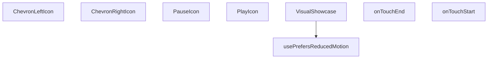

## NODE ID STANDARD

  file: src\components\VisualShowcase.tsx
  function: src\components\VisualShowcase.tsx::usePrefersReducedMotion
  function: src\components\VisualShowcase.tsx::VisualShowcase
  function: src\components\VisualShowcase.tsx::onTouchStart
  function: src\components\VisualShowcase.tsx::onTouchEnd
  function: src\components\VisualShowcase.tsx::ChevronLeftIcon
  function: src\components\VisualShowcase.tsx::ChevronRightIcon
  function: src\components\VisualShowcase.tsx::PauseIcon
  function: src\components\VisualShowcase.tsx::PlayIcon

---

## DISA AKTARILANLAR (EXPORTS)
  export: ChevronLeftIcon
  export: ChevronRightIcon
  export: PauseIcon
  export: PlayIcon
  export: VisualShowcase
  export: usePrefersReducedMotion

---

## STİL TOKENLERİ

### Arbitrary Değerler (token'a geçirilmemiş)
Yok — tüm stiller token'a geçirilmiş. ✅

### Kullanılan Token'lar (zaten token'a geçirilmiş)
- (yok)

### Tailwind Sınıf Özeti
- **Renkler:** `bg-gradient-to-br`, `bg-white`, `bg-white/10`, `bg-white/70`, `bg-white/80`, `hover:bg-white`, `lg:text-4xl`, `sm:text-3xl`, `sm:text-lg`, `text-2xl`, `text-base`, `text-center`, `text-industrial-gray`, `text-white`, `text-white/90`
- **Layout:** `-bottom-12`, `-left-16`, `-right-20`, `-top-10`, `absolute`, `bottom-2`, `drop-shadow-sm`, `flex`, `gap-2`, `h-10`, `h-2`, `h-48`, `h-64`, `h-80`, `h-full`
- **Varyant/Responsive:** `:`, `focus-visible:`, `hover:`, `lg:`, `sm:` önekleri
- **Yardımcı Sınıflar:** `${i`, `${s.colorFrom`, `${s.colorTo`, `-translate-x-1/2`, `:`, `===`, `blur-2xl`, `duration-700`, `ease-out`, `focus-visible:outline-none`, `focus-visible:ring-2`, `focus-visible:ring-offset-2`, `focus-visible:ring-primary-navy`, `font-bold`, `index`

---
# FILE: src\components\WhatsAppFloat.md

---
domain: general
source_type: doc
namespace_type: module
source_path: C:\Users\alize\venthub-hvac\src\components\WhatsAppFloat.tsx
skeleton_hash: 4ae1d616306c21ed
entity_hashes:
  func:WhatsAppFloat: 594fe2409e378878
  overview: 27f525e3029fcecb
  style_tokens: fb346cbde40036cb
generated_at: 2026-06-19T20:47:48Z
---

## Genel Bakış
Bu modül, VentHub HVAC platformunda kullanılan, sayfa içerisinde gezinirken sabit konumda kalan yüzen WhatsApp iletişim butonunu oluşturan React UI bileşenidir. Kullanıcıların platformda gezinirken tek tıkla WhatsApp üzerinden yetkili ekiplerle iletişime geçmesini sağlamak amacıyla geliştirilmiştir, tek bir ana bileşenden oluşur.

## Fonksiyon Grupları
### Ana UI Bileşeni
Tüm yüzen WhatsApp butonunun görsel konumlandırılması, tıklama aksiyonları ve platform genelindeki davranışlarını yöneten tek ana React bileşenidir.
- WhatsAppFloat

---

## AXIOMS – Mimari Varsayımlar
Bu React TypeScript ile geliştirilmiş WhatsApp iletişim float butonu bileşeninin doğru çalışması için çalışma zamanı ortamı, tarayıcı uyumluluğu ve UI kaynaklarının eksiksiz sunulması zorunludur.

[Aksiyom 1]: Eğer proje içinde React ve TypeScript çalışma zamanı ortamı sağlanmamışsa, bu bileşen hiçbir şekilde mount edilemez ve kullanıcı arayüzünde görüntülenemez.
[Aksiyom 2]: Eğer bu bileşen üst React ağacında herhangi bir parent bileşen tarafından çağrılmamışsa, proje arayüzünde hiçbir yerde görünmez, iletişim işlevi kullanılamaz.
[Aksiyom 3]: Eğer bileşene ait konumlandırma ve görsel stiller projeye dahil edilmemişse, WhatsApp butonu ekranın sabit köşesinde doğru şekilde görüntülenmez, kullanıcı tarafından erişilemez hale gelir.
[Aksiyom 4]: Eğer son kullanıcının tarayıcısı WhatsApp iletişim linklerini (whatsapp:// veya web.whatsapp.com) desteklemiyorsa ya da erişimini kısıtlıyorsa, butona tıklandığında iletişim akışı başlatılamaz.
[Aksiyom 5]: Eğer son kullanıcının cihazında aktif internet bağlantısı yoksa, WhatsApp web servisine erişilemez, iletişim başlatılamaz.

---

## FONKSİYON DETAYLARI

### WhatsAppFloat
**Ne yapar**: VentHub HVAC projesinde kullanıcıların tek tıkla WhatsApp üzerinden iletişim kurmasını sağlayan bağımsız React bileşenidir. Tüm proje sayfalarında sabit konumda duran yüzen (float) bir buton olarak sunulur, kullanıcıların sitede gezinirken her an erişebileceği kesintisiz bir iletişim kanalı sunar. Sitenin mobil ve masaüstü görünümlerinde uyumlu şekilde çalışarak tüm kullanıcılar için eşit erişilebilirlik sağlar.
**Nasıl yapar**: React fonksiyonel bileşeni olarak tanımlanır, CSS stilleri ile ekranın sabit (fixed) bir konumuna (genellikle sağ alt köşe) yerleştirilir. Tıklama olayı tetiklendiğinde kullanıcının cihazındaki WhatsApp mobil uygulaması ya da masaüstü/web WhatsApp sürümünü açarak, proje için tanımlanmış önceden belirlenmiş resmi iletişim numarasına otomatik yönlendirme yapar. Proje içindeki herhangi bir ana sayfa ya da alt sayfa bileşenine tek import ile kolayca dahil edilerek tüm platformda tutarlı iletişim erişilebilirliği sağlar.
**Parametreler**:
- Bu fonksiyon herhangi bir giriş parametresi almaz, bağımsız olarak çalışmak üzere tasarlanmıştır, tüm yapılandırma, stil ve işlevselliğini kendi bünyesinde barındırır.
**Dönüş**: React.FC tipinde bir React fonksiyonel bileşeni döndürür. Bu döndürülen bileşen, tüm içerik, stil ve tıklama olay yönetimleri tanımlı WhatsApp butonunu ekrana render etmeye olanak tanır, React'in bileşen çalışma mantığıyla tam uyumlu olarak proje içinde kullanılabilir.

---

## İTHALATLAR (IMPORTS)
- import: ../i18n/I18nProvider::useI18n
- import: ../utils/whatsapp::getSupportLink
- import: ../utils/whatsapp::isWhatsAppAvailable
- import: ./HVACIcons::WhatsAppIcon
- import: react::React

---

## AST POINTERS

### [N1_NASIL] AST Pointer: C:\Users\alize\venthub-hvac\src\components\WhatsAppFloat.tsx::WhatsAppFloat
- **params**: (parametre yok)
- **ic_degiskenler**:
  - `t` — useI18n hook'undan alınan çeviri fonksiyonu; WhatsApp bileşeninin tüm metinlerini (destek mesajı, erişilebilirlik etiketleri, başlık, tooltip) ilgili dilde çekmek için kullanılır
  - `useI18n` — import edilen I18n sağlayıcı hook'u; uygulama çeviri sistemine erişim sağlar
  - `isWhatsAppAvailable` — import edilen utility fonksiyonu; WhatsApp desteğinin aktif olup olmadığını kontrol etmek için çağrılır
  - `getSupportLink` — import edilen utility fonksiyonu; iletilen destek mesajı ile birlikte kullanıcıya yönlendirilecek geçerli WhatsApp sohbet bağlantısını oluşturur
  - `link` — getSupportLink fonksiyonundan dönen WhatsApp sohbet bağlantısı; bileşenin a etiketinin href özniteliğinde kullanılır
  - `WhatsAppIcon` — import edilen ikon bileşeni; WhatsApp logosunu göstermek için JSX içinde kullanılır, size ve className prop'ları iletilir
- **Dönüş**: Koşullara göre null veya ana kapsayıcı a etiketini içeren React JSX elementi

---

## NODE ID STANDARD

  file: src\components\WhatsAppFloat.tsx
  function: src\components\WhatsAppFloat.tsx::WhatsAppFloat

---

## DISA AKTARILANLAR (EXPORTS)
  export: WhatsAppFloat

---

## STİL TOKENLERİ

### Arbitrary Değerler (token'a geçirilmemiş)
Yok — tüm stiller token'a geçirilmiş. ✅

### Kullanılan Token'lar (zaten token'a geçirilmiş)
- (yok)

### Tailwind Sınıf Özeti
- **Renkler:** `text-sm`
- **Layout:** `absolute`, `hidden`, `left-14`, `lg:block`, `relative`, `whatsapp-float`
- **Varyant/Responsive:** `group-hover:`, `lg:` önekleri
- **Yardımcı Sınıflar:** `duration-300`, `font-bold`, `group`, `group-hover:opacity-100`, `opacity-0`, `pointer-events-none`, `shrink-0`, `transition-opacity`, `whitespace-nowrap`

---
# FILE: src\components\admin\AccessDenied.md

---
domain: general
source_type: doc
namespace_type: module
source_path: C:\Users\alize\venthub-hvac\src\components\admin\AccessDenied.tsx
skeleton_hash: 4191c98afe89986a
entity_hashes:
  func:AccessDenied: ea91e56a2eab80b9
  overview: c138e2727c8c240f
  style_tokens: 07b65f88bee816f7
generated_at: 2026-06-19T20:46:38Z
---

## Genel Bakış
AccessDenied, yönetim panelinde yetkisiz erişim durumunda kullanıcıya bilgilendirme amaçlı bir hata sayfası sunan basit bir React bileşenidir. Tek bir amacı vardır: kullanıcıya erişim izni olmadığını bildirmek ve ana sayfaya yönlendirme seçeneği sunmak.

## Fonksiyon Grupları
### Arayüz Sunumu
Erişim reddedildiğinde kullanıcıya bilgilendirici bir mesaj ve yönlendirme butonu göstererek tek sayfalık hata arayüzünü oluşturur.
- AccessDenied

---

## AXIOMS – Mimari Varsayımlar

Bu modül için özel aksiyom tanımlanmamıştır.

**Gerekçe:** Fonksiyon imzası `AccessDenied()` şeklinde olup parametresiz ve basit bir sunum (presentational) bileşenidir. Fonksiyon gövdesinde (JSX kodu) erişilemediğinden, hangi bağımlılıkların (routing, authentication context vb.) kullanıldığı doğrulanamamaktadır. Bu nedenle spekülatif varsayımlarda bulunulmamıştır.

---

## FONKSİYON DETAYLARI

### AccessDenied

**Ne yapar**: Erişim izni olmayan kullanıcılar için hata sayfası/gösterim bileşenidir. Kullanıcının yetkisi olmayan bir admin alanına erişmeye çalıştığında visuals olarak bir hata mesajı sunar.

**Nasıl yapar**: Bu bir React functional component olup, erişim reddedildiğinde kullanıcıya bilgilendirici bir arayüz gösterir. Genellikle role-based erişim kontrolü sonrası yetkisiz erşim durumlarında render edilir. Bileşen, kullanıcıya durumu açıklayan bir mesaj ve olası eylem yönlendirmeleri (anasayfaya dönüş, giriş sayfası vb.) sunar.

**Parametreler**:
- Bu bileşen herhangi bir parametre almaz

**Dönüş**: `React.FC` — Erişim reddedildiğinde gösterilecek hata bileşenini döndürür. Bileşen, kullanıcıya yetkisiz erişim durumunu bildiren arayüz elemanlarını içeren JSX yapısıdır.

**Kullanım Bağlamı**: `C:\Users\alize\venthub-hvac\src\components\admin\AccessDenied` yolunda yer alan bu bileşen, admin panelinde yetkilendirme kontrolü başarısız olduğunda kullanıcıya yönlendirilir. HVAC-VentHub projesinin admin modülünde erişim kontrol mekanizmasının bir parçasıdır.

---

## İTHALATLAR (IMPORTS)
- import: ../../i18n/I18nProvider::useI18n
- import: ../../utils/routes::Routes
- import: lucide-react::ArrowLeft
- import: lucide-react::ShieldAlert
- import: next/link::Link
- import: react::React

---

## AST POINTERS

### [N1_NASIL] AST Pointer: src/components/admin/AccessDenied.tsx::AccessDenied
- **params**: (yok — arrow function, parametre almıyor)
- **ic_degiskenler**:
  - `t` — `useI18n()` hook'undan döndürülen çeviri fonksiyonu; `t('admin.ui.backToDashboard')` şeklinde kullanılarak lokalize metin döndürür
- **Hook Kullanimi**:
  - `useI18n()` — i18n context'inden çeviri fonksiyonunu almak için çağrılır, `{ t }` destructuring ile çıkarılır
- **Dönüş**: JSX — `min-h-screen` container içinde glass-effect kart, `ShieldAlert` ikonu, hata mesajı başlığı ve `Link` ile dashboard'a yönlendirme butonu döndüren React functional component

---

## NODE ID STANDARD

  file: src\components\admin\AccessDenied.tsx
  function: src\components\admin\AccessDenied.tsx::AccessDenied

---

## DISA AKTARILANLAR (EXPORTS)
  export: AccessDenied

---

## STİL TOKENLERİ

### Arbitrary Değerler (token'a geçirilmemiş)
Yok — tüm stiller token'a geçirilmiş. ✅

### Kullanılan Token'lar (zaten token'a geçirilmiş)
- `rounded-hvac-2xl`, `tracking-hvac-relaxed`

### Tailwind Sınıf Özeti
- **Renkler:** `bg-rose-500/10`, `bg-surface-deep`, `bg-white/5`, `border-rose-500/20`, `border-white/5`, `hover:bg-white/10`, `text-3xl`, `text-center`, `text-rose-500`, `text-slate-400`, `text-slate-600`, `text-slate-700`, `text-white`, `text-xs`
- **Layout:** `block`, `flex`, `flex-col`, `gap-3`, `gap-4`, `h-12`, `h-24`, `inline-flex`, `items-center`, `justify-center`, `max-w-lg`, `min-h-screen`, `p-12`, `p-6`, `shadow-access-denied-black`
- **Varyant/Responsive:** `group-hover:`, `hover:` önekleri
- **Yardımcı Sınıflar:** `animate-in`, `border`, `duration-500`, `fade-in`, `font-black`, `font-bold`, `font-medium`, `glass-strong`, `group`, `group-hover:-translate-x-1`, `italic`, `leading-relaxed`, `mb-10`, `mb-4`, `mb-8`

---
# FILE: src\components\admin\AdminEmptyState.md

---
domain: general
source_type: doc
namespace_type: module
source_path: C:\Users\alize\venthub-hvac\src\components\admin\AdminEmptyState.tsx
skeleton_hash: 1e2d88f61e876a8e
entity_hashes:
  func:AdminEmptyState: 0a5636f5d0d24f8e
  overview: a8e9e23763cc1b0a
  style_tokens: 18a94c8091a667ca
generated_at: 2026-06-19T20:46:38Z
---

## Genel Bakış
`AdminEmptyState`, yönetim panelinde veri bulunmadığında veya sayfa içeriği boş olduğunda kullanıcıya bilgilendirici bir mesaj sunan bir React bileşenidir. İkon, başlık, açıklama ve opsiyonel aksiyon butonunu bir araya getirerek tutarlı ve yönlendirici bir boş durum (empty state) arayüzü oluşturur. Bileşen, farklı yerleşim ihtiyaçlarına cevap verebilmek için `compact` moduyla daha sade bir görünüm de sunabilir.

## Fonksiyon Grupları
### Boş Durum Görünümü
Bu grup, veri olmadığında gösterilecek bilgilendirici arayüzü oluşturur; temel unsurları (ikon, başlık, açıklama ve eylem butonunu) bir araya getirir ve kullanıcıya durumu açıklar.
- AdminEmptyState

---

## AXIOMS – Mimari Varsayımlar

Bu modül için fonksiyon gövdesi (implementation body) verilmemiştir; dolayısıyla çalışma zamanı davranışına ilişkin mimari varsayımlar çıkarılamamıştır.

**Bilinen yapısal gözlem (fonksiyon imzasından):**

- `icon: Parametre`, bir React bileşeni olarak geçirilmektedir (büyük harfle başlaması nedeniyle).

Ancak bu parametrelerin zorunlu olup olmadığı, hangi durumlarda hata fırlatıldığı veya hangi koşullarda farklı render dalına geçildiği **bilinmiyor** çünkü fonksiyon gövdesi paylaşılmamıştır.

---

## FONKSİYON DETAYLARI

### AdminEmptyState
**Ne yapar**: Admin panelinde veri bulunamadığında veya boş bir durum gösterilmesi gerektiğinde kullanılan, iki farklı boyut seçeneğine sahip bir React bileşenidir. Kullanıcıya ikonlu, başlıklı ve açıklamalı bir boş durum mesajı sunar, opsiyonel bir eylem butonu içerebilir.

**Nasıl yapar**: Fonksiyon, `compact` prop'unun değerine göre iki farklı JSX yapısı döndürür. `compact` true ise daha küçük boyutlarda, sınırlı dolgu alanına ve daha minimal bir görünüme sahip bir div oluşturur. Aksi takdirde, daha geniş bir dolgu alanına, cam efektine (`glass-strong`), fare üzerine gelme efektine sahip, gradyan arka plan ve daha belirgin gölgelendirmeler içeren tam boyutlu bir boş durum bileşeni render eder. Her iki durumda da `icon`, `title` ve `description` prop'ları kullanılarak temel içerik oluşturulur; `action` prop'u sağlanmışsa, belirtilen metin ve tıklama işleviyle bir buton eklenir.

**Parametreler**:
- `icon`: React Bileşeni (Icon tipinde) — Boş durum alanının üst kısmında büyük bir ikon olarak görüntülenecek React bileşenidir. Bileşen `size` ve `strokeWidth` prop'larını desteklemelidir.
- `title`: string — Boş durumun üst başlığıdır, genellikle büyük harflerle ve kalın font ile görüntülenir.
- `description`: string — Başlığın altında yer alan açıklayıcı metindir. Kullanıcıya durum hakkında daha fazla bilgi verir.
- `action`: object (opsiyonel) — Boş durumun altında bir eylem butonu oluşturulmasını sağlar. `onClick` (butona tıklandığında çağrılacak fonksiyon) ve `label` (butonda görüntülenecek metin) özelliklerini içermelidir.
- `compact`: boolean (opsiyonel) — `true` olduğunda, bileşen daha kompakt ve küçük bir görünümle render edilir. Varsayılan olarak `false` veya tanımsız kabul edilerek tam boyutlu görünüm gösterilir.

**Dönüş**: JSX.Element — Bileşen, her iki durumda (compact veya normal) da bir React JSX yapısı döndürür ve doğrudan bir React bileşeni olarak kullanılabilir.

---

## İTHALATLAR (IMPORTS)
- import: lucide-react::LucideIcon
- import: react::React

---

## INTERFACES

### AdminEmptyStateProps
- `icon: LucideIcon`
- `title: string`
- `description: string`
- `action?: {
`
- `compact?: boolean`

---

## AST POINTERS

### [N1_NASIL] AST Pointer: src/components/admin/AdminEmptyState.tsx::AdminEmptyState
- **params**: `{ icon: Icon, title, description, action, compact }` — AdminEmptyStateProps türünde destructured nesne
  - `icon` — LucideIcon türünde, boş durum ikonu olarak `<Icon size={24|36} strokeWidth={1.5}>` şeklinde kullanılır
  - `title` — string, boş durum başlığını `<h3>` içinde büyük harflerle gösterir
  - `description` — string, boş durum açıklamasını `<p>` içinde küçük harflerle gösterir
  - `action` — opsiyonel nesne, `{ onClick: () => void, label: string }` yapısında; buton olarak render edilir ve `action.onClick` ile tıklama, `action.label` ile buton metni kullanılır
  - `compact` — boolean, kompakt (`compact=true`) ve normal (`compact=false`) görünüm arasında seçim yapar
- **ic_degiskenler**: (yok)
- **Dönüş**: JSX elementi — `compact` prop'una göre iki farklı düzen döndürür; `true` ise küçük kompakt görünüm, `false` ise daha geniş normal görünüm返回。

---

## NODE ID STANDARD

  file: src\components\admin\AdminEmptyState.tsx
  function: src\components\admin\AdminEmptyState.tsx::AdminEmptyState

---

## DISA AKTARILANLAR (EXPORTS)
  export: AdminEmptyState

---

## STİL TOKENLERİ

### Arbitrary Değerler (token'a geçirilmemiş)
Yok — tüm stiller token'a geçirilmiş. ✅

### Kullanılan Token'lar (zaten token'a geçirilmiş)
- `rounded-hvac-2xl`, `shadow-glow-lg`, `shadow-glow-md`, `tracking-hvac-normal`

### Tailwind Sınıf Özeti
- **Renkler:** `bg-cyan-400`, `bg-gradient-to-b`, `bg-white/5`, `border-dashed`, `border-white/10`, `border-white/20`, `from-cyan-400/3`, `hover:bg-cyan-300`, `hover:bg-white/10`, `hover:text-white`, `text-center`, `text-cyan-400`, `text-lg`, `text-slate-300`, `text-slate-400`
- **Layout:** `absolute`, `flex`, `flex-col`, `from-cyan-400/3`, `h-14`, `h-20`, `items-center`, `justify-center`, `max-w-200px`, `max-w-sm`, `overflow-hidden`, `relative`, `shadow-cyan-400/20`, `shadow-xl`, `w-14`
- **Varyant/Responsive:** `active:`, `group-hover:`, `hover:` önekleri
- **Yardımcı Sınıflar:** `active:scale-95`, `border`, `duration-500`, `duration-700`, `font-black`, `font-bold`, `glass-strong`, `group`, `group-hover:opacity-100`, `group-hover:scale-110`, `hover:-translate-y-0.5`, `inset-0`, `leading-relaxed`, `mb-2`, `mb-3`

---
# FILE: src\components\admin\AdminRealtimeNotifications.md

---
domain: general
source_type: doc
namespace_type: module
source_path: C:\Users\alize\venthub-hvac\src\components\admin\AdminRealtimeNotifications.tsx
skeleton_hash: 630a0b44842f3f14
entity_hashes:
  func:AdminRealtimeNotifications: 1b67a246f8f15ea8
  func:IconForType: b8eaefdda2e3fd3b
  func:clearAll: 256b77623e27b78c
  func:toggleDropdown: 97a60ca3e9e42667
  overview: 7bdad66ea5e40303
  style_tokens: 58e7fc7febbe30f9
generated_at: 2026-06-08T10:08:36Z
---

## Genel Bakış
`AdminRealtimeNotifications`, yönetim panelinde gerçek zamanlı bildirimlerin gösterilmesini ve yönetilmesini sağlayan bir React bileşenidir. Bildirim menüsünün açılıp kapatılması, tüm bildirimlerin temizlenmesi ve bildirim türlerine göre ikon seçimi gibi temel etkileşimleri merkezi olarak kontrol eder.

## Fonksiyon Grupları
### Ana Bileşen
Tüm bildirim mantığını ve durum yönetimini yöneten ana React bileşenidir.
- `AdminRealtimeNotifications`

### Etkileşim Yardımcıları
Menü durumunu değiştiren ve bildirimleri temizleyen yardımcı fonksiyonlardır.
- `toggleDropdown`, `clearAll`

### Görsel Eşleştirme
Bildirim türlerine göre ikon bileşenini belirleyen yardımcı bileşendir.
- `IconForType`

---

## AXIOMS – Mimari Varsayımlar
Bu modül, bir React bileşeni olup temel işlevselliği için aşağıdaki mimari varsayımlara bağlıdır.

[Aksiyom 1]: Eğer `AdminRealtimeNotifications` bileşenine bildirim verisi (`notifications` veya benzeri bir prop) sağlanmazsa, bileşen boş bir durum (empty state) gösterir veya hatalı bir duruma geçer.

[Aksiyom 2]: Eğer `toggleDropdown` işlevi, bileşenin iç durumunu (state) güncelleyemezse (örn: `useState` hook'u düzgün çalışmıyorsa), bildirim menüsünün açılıp kapatılması işlevi çalışmaz.

[Aksiyom 3]: Eğer `clearAll` işlevi çağrıldığında temizlenecek bildirim listesi (state) boş değilse, tüm bildirimler listeden kaldırılır. Liste zaten boşsa, işlev herhangi bir yan etki oluşturmaz.

[Aksiyom 4]: Eğer `IconForType` bileşenine `type` prop'u olarak geçerli bir bildirim türü dizesi verilmezse (örn: `undefined`, `null` veya bilinmeyen bir değer), bileşen varsayılan veya hata ikonunu render eder.

---

## FONKSİYON DETAYLARI

### AdminRealtimeNotifications
**Ne yapar**: Admin panelinde gerçek zamanlı bildirimleri gösteren ana React bileşenidir. Kullanıcıya anlık bildirim akışı sunar ve bildirim yönetimi için arayüz sağlar.

**Nasıl yapar**: Bileşen, gerçek zamanlı bildirimleri alır ve bunları kullanıcıya gösterir. Bildirim dropdown menüsünü, bildirim listesini ve bildirim temizleme işlevselliğini bir arada sunar. İç state'ler aracılığıyla dropdown durumunu ve bildirimleri yönetir.

**Parametreler**:
- Parametre almaz (props'suz fonksiyon bileşeni)

**Dönüş**: `React.FC` tipinde bir React bileşeni döndürür. Bileşen, admin paneline yerleştirilebilen gerçek zamanlı bildirim arayüzünü render eder.

### toggleDropdown
**Ne yapar**: Geliştirildi ancak detay üretilemedi.

### clearAll
**Ne yapar**: Geliştirildi ancak detay üretilemedi.

### IconForType
**Ne yapar**: Geliştirildi ancak detay üretilemedi.

---

## INTERFACES

### AppNotification
- `id: string`
- `type: 'order' | 'stock' | 'system'`
- `title: string`
- `message: string`
- `timestamp: string`
- `isRead: boolean`
- `link?: string`

---

## AST POINTERS

### [N1_NASIL] AST Pointer: AdminRealtimeNotifications.tsx::AdminRealtimeNotifications
- **params**: (parametre yok)
- **ic_degiskenler**:
  - `active` — async operasyonların devam edip etmediğini kontrol eden bayrak, component unmount olduğunda false yapılır
  - `ordersChannel` — Supabase Realtime siparişleri için abone olunan kanal
  - `stockChannel` — Supabase Realtime stok hareketleri için abone olunan kanal
  - `handleClickOutside` — Dropdown dışına tıklama olayını yöneten event handler fonksiyonu
  - `setIsOpen` — Dropdown'ın açık/kapalı durumunu güncelleyen state setter
  - `isOpen` — Dropdown'ın şu anki açık/kapalı durumunu tutan state değişkeni
  - `notifications` — Tüm bildirimleri tutan state dizisi
  - `setNotifications` — Bildirimleri güncelleyen state setter
  - `unreadCount` — Okunmamış bildirim sayısını tutan state değişkeni
  - `setUnreadCount` — Okunmamış sayısını güncelleyen state setter
  - `dropdownRef` — Dropdown elementine ref referansı
  - `router` — Next.js useRouter hook'u
  - `tenantId` — useTenant hook'undan gelen kiracı ID'si
  - `formatDateTime` — Tarih formatlama fonksiyonu importu
- **Dönüş**: React.FC (React Functional Component)

### [N2_NASIL] AST Pointer: AdminRealtimeNotifications.tsx::fetchRecentActivity (iç fonksiyon)
- **params**: (parametre yok)
- **ic_degiskenler**:
  - `oData` — Son 5 siparişin verisi (supabase.from('venthub_orders') sorgusu)
  - `sData` — Son 5 stok hareketi verisi (supabase.from('inventory_movements') sorgusu)
  - `combined` — Sipariş ve stok hareketlerinin birleştirildiği AppNotification[]
  - `products` — Stok hareketine ait ürün bilgisi (s.products olarak cast edilir)
  - `pName` — Ürün adı, products.name veya 'Bilinmeyen Ürün' fallback
  - `pSku` — Ürün SKU kodu, products.sku veya boş string
  - `delta` — Stok miktarı değişimi (Number olarak parse edilir)
  - `movementType` — Hareket türü, delta > 0 ise 'Giriş', değilse 'Çıkış'
  - `absQty` — Mutlak stok miktarı (Math.abs ile)
  - `o` — forEach ile dolaşılan her bir sipariş objesi
  - `s` — forEach ile dolaşılan her bir stok hareketi objesi
- **Dönüş**: void (Promise<void>)

### [N3_NASIL] AST Pointer: AdminRealtimeNotifications.tsx::toggleDropdown
- **params**: (parametre yok)
- **ic_degiskenler**:
  - `isOpen` — Mevcut dropdown durumu, !isOpen ile terslenir
  - `unreadCount` — Okunmamış bildirim sayısı, 0'dan büyükse okundu sayılır
- **Dönüş**: void

### [N4_NASIL] AST Pointer: AdminRealtimeNotifications.tsx::clearAll
- **params**: (parametre yok)
- **ic_degiskenler**: (yok)
- **Dönüş**: void (setNotifications([]) ve setUnreadCount(0) ile side effect)

---


## MERMAID CALL GRAPH
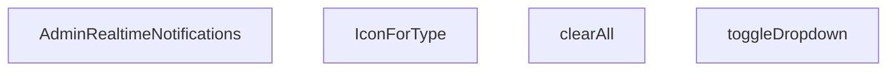

## NODE ID STANDARD

  file: src\components\admin\AdminRealtimeNotifications.tsx
  function: src\components\admin\AdminRealtimeNotifications.tsx::AdminRealtimeNotifications
  function: src\components\admin\AdminRealtimeNotifications.tsx::toggleDropdown
  function: src\components\admin\AdminRealtimeNotifications.tsx::clearAll
  function: src\components\admin\AdminRealtimeNotifications.tsx::IconForType

---

## DISA AKTARILANLAR (EXPORTS)
  export: AdminRealtimeNotifications

---

## STİL TOKENLERİ

### Arbitrary Değerler (token'a geçirilmemiş)
Yok — tüm stiller token'a geçirilmiş. ✅

### Kullanılan Token'lar (zaten token'a geçirilmiş)
- (yok)

### Tailwind Sınıf Özeti
- **Renkler:** `bg-blue-50`, `bg-blue-50/30`, `bg-emerald-50`, `bg-emerald-500/10`, `bg-primary-navy`, `bg-primary-navy/10`, `bg-rose-100`, `bg-rose-500`, `bg-slate-100`, `bg-slate-50/30`, `bg-slate-50/50`, `bg-slate-50/80`, `bg-slate-500/10`, `bg-white`, `border-2`
- **Layout:** `absolute`, `flex`, `flex-1`, `flex-col`, `flex-shrink-0`, `gap-1`, `gap-2`, `gap-3`, `h-10`, `h-12`, `h-2`, `h-2.5`, `items-center`, `justify-between`, `justify-center`
- **Varyant/Responsive:** `:`, `hover:`, `sm:` önekleri
- **Yardımcı Sınıflar:** `${!notif.isRead`, `${notif.link`, `:`, `animate-in`, `animate-pulse`, `border`, `cursor-pointer`, `duration-300`, `fade-in`, `font-bold`, `font-medium`, `hover:shadow`, `leading-relaxed`, `mb-3`, `ml-3`

---
# FILE: src\components\admin\AdminSkeleton.md

---
domain: general
source_type: doc
namespace_type: module
source_path: C:\Users\alize\venthub-hvac\src\components\admin\AdminSkeleton.tsx
skeleton_hash: a34791c328f8d809
entity_hashes:
  func:AdminSkeleton: 586d38b8378960eb
  overview: d5fffe3d7ed9f7eb
  style_tokens: 9ebeaa83a2aaeb97
generated_at: 2026-06-19T20:46:39Z
---

## Genel Bakış
`AdminSkeleton` bileşeni, yönetim panelinde veri yüklenme süreçlerinde kullanıcıya görsel geri bildirim sunan yer tutucu arayüzleri oluşturur. Tablo, kart veya form gibi farklı varyasyonlara göre adapte olabilen esnek bir skeleton şablonu sağlar. Bu sayede sayfa düzeni nihai veriler yüklenmeden önce kullanıcıya kabaca gösterilir.

## Fonksiyon Grupları
### Skeleton Oluşturma ve Yer Tutucu Üretimi
Verilen parametrelere göre satır, alan ve tekrar sayısını hesaplayarak tekrarlayan placeholder elemanlarını oluşturur.
- AdminSkeleton

---

## AXIOMS – Mimari Varsayımlar
Bu modülün doğru çalışması için temel mimari varsayımlar fonksiyonun parametrelerine dayanır.

**[Aksiyom 1]:** Eğer `variant` parametresi `null` veya `undefined` ise, bileşen doğru bir skeleton varyantı (ör. `table`, `card`, `form`) oluşturamaz ve uygun bir stil uygulanamaz.

**[Aksiyom 2]:** Eğer `rows`, `count` veya `fields` parametrelerinden herhangi biri negatif veya sıfır ise, bileşen anlamsız veya görünmez placeholder elemanlar üretir; skeleton yapısının bozulmasına yol açar.

**[Aksiyom 3]:** Fonksiyonun `rows`, `count` ve `fields` değerlerini **pozitif tamsayı** olarak kabul ettiği varsayılır (default değerleri sırasıyla 5, 4 ve 6'dır). Bu değerlerin UI'da tekrarlayan elemanların sayısını doğrudan belirlediği kabul edilir.

---

## FONKSİYON DETAYLARI

### AdminSkeleton

**Ne yapar**: AdminSkeleton, admin panelinin yükleme durumlarında (loading state) kullanılacak iskelet/skeleton gösterimini oluşturur. variant propuna bağlı olarak tablo, kart veya form tipinde animasyonlu placeholder bileşenleri render eder. Veri yüklenene kadar kullanıcıya sayfanın yapısını görsel olarak hissettirmeyi amaçlar.

**Nasıl yapar**: Fonksiyon, `variant` parametresinin değerine göre üç farklı JSX yapısı döndürür. `'table'` seçildiğinde başlık satırı ve belirli satır/sütun sayısına sahip bir tablo iskeleti, `'cards'` seçildiğinde grid düzeninde kart iskeletleri,否则 varsayılan olarak form alanlarından oluşan bir iskelet render eder. Her bir varyantta `animate-pulse` sınıfı ile animasyon efekti, `glassStrongClass` ile cam efektli arka plan ve `border-white/5` gibi transparan kenarlıklar kullanılarak modern bir loading görseli oluşturulur. `rows`, `count` ve `fields` parametreleri ile dinamik olarak eleman sayısı kontrol edilir.

**Parametreler**:
- `variant`: `'table' | 'cards' | string` (varsayılan: `'form'` olarak davranır) — Skeleton tipini belirler. `'table'` tablo, `'cards'` kart düzeni, diğer değerler form varyantını aktif eder
- `rows`: `number` — `'table'` varyantında tablonun satır sayısını belirler (varsayılan: 5)
- `count`: `number` — `'cards'` varyantında gösterilecek kart sayısını belirler (varsayılan: 4)
- `fields`: `number` — Varsayılan form varyantında alan sayısını belirler (varsayılan: 6)

**Dönüş**: `JSX.Element` — Seçilen varyanta göre animasyonlu skeleton yapısını temsil eden React JSX bileşeni döndürür. Her varyant farklı bir layout yapısına sahiptir: tablo varyantı `<div>` içinde `<table>` yapısı, kart varyantı grid düzeninde çoklu `<div>` kartları, form varyantı ise input alanlarını simüle eden çoklu `<div>` blokları içerir.

---

## İTHALATLAR (IMPORTS)
- import: ../../utils/adminUi::glassStrongClass
- import: react::React

---

## INTERFACES

### AdminSkeletonProps
- `variant: 'table' | 'cards' | 'form'`
- `rows?: number`
- `count?: number`
- `fields?: number`

---

## AST POINTERS

### [N1_NASIL] AST Pointer: src/components/admin/AdminSkeleton.tsx::AdminSkeleton
- **params**: `variant`, `rows = 5`, `count = 4`, `fields = 6`
- **ic_degiskenler**: `variant` — Skeleton gösterim modunu belirler (table, cards veya form). Fonksiyon içinde `variant` değeri kontrol edilerek farklı JSX yapıları döndürülür.
- **Dönüş**: `JSX.Element` — `variant` değerine bağlı olarak farklı loading skeleton yapısı döndürür. Table modunda tablo loading, cards modunda kart grid'i, form modunda form loading skeleton'ı render eder.

---

## NODE ID STANDARD

  file: src\components\admin\AdminSkeleton.tsx
  function: src\components\admin\AdminSkeleton.tsx::AdminSkeleton

---

## DISA AKTARILANLAR (EXPORTS)
  export: AdminSkeleton

---

## STİL TOKENLERİ

### Arbitrary Değerler (token'a geçirilmemiş)
Yok — tüm stiller token'a geçirilmiş. ✅

### Kullanılan Token'lar (zaten token'a geçirilmiş)
- `rounded-hvac-2xl`, `rounded-hvac-xl`

### Tailwind Sınıf Özeti
- **Renkler:** `bg-cyan-400/10`, `bg-cyan-500/5`, `bg-gradient-to-br`, `bg-transparent`, `bg-white/10`, `bg-white/2`, `bg-white/3`, `bg-white/5`, `border-b`, `border-cyan-400/20`, `border-t`, `border-white/5`, `from-cyan-500/5`, `text-left`, `to-transparent`
- **Layout:** `absolute`, `flex`, `from-cyan-500/5`, `gap-4`, `gap-6`, `gap-8`, `grid`, `grid-cols-1`, `h-10`, `h-12`, `h-14`, `h-3`, `h-32`, `h-4`, `h-6`
- **Varyant/Responsive:** `group-hover:`, `lg:`, `md:` önekleri
- **Yardımcı Sınıflar:** `${glassStrongClass`, `animate-pulse`, `blur-3xl`, `border`, `divide-white/5`, `divide-y`, `group`, `group-hover:opacity-100`, `inset-0`, `mb-10`, `ml-1`, `mt-10`, `opacity-0`, `pt-8`, `rounded-2xl`

---
# FILE: src\components\admin\AdminToolbar.md

---
domain: general
source_type: doc
namespace_type: module
source_path: C:\Users\alize\venthub-hvac\src\components\admin\AdminToolbar.tsx
skeleton_hash: ce976823bc22f126
entity_hashes:
  func:AdminToolbar: af143a8f279e1c1e
  overview: f526ba131742fbc5
  style_tokens: f914d27adccfd567
generated_at: 2026-06-19T20:47:20Z
---

## Genel Bakış
VentHub HVAC yönetim paneli için tasarlanmış çok bileşenli bir araç çubuğu React bileşenidir. Arama, seçim, filtre çipleri, toggle kontrolleri ve temizleme gibi çeşitli kontrol mekanizmalarını tek bir entegre banner'da birleştirerek yöneticilerin verilerini verimli bir şekilde filtrelemesini ve izlemesini sağlar.

## Fonksiyon Grupları
### Yönetim Araç Çubuğu Bileşeni
Yönetim panelinin üst bölgesinde konumlanan, kullanıcının arama yapmasına, filtre uygulamasına ve mevcut durumu görsel olarak takip etmesine olanak tanıyan ana bileşendir. Tüm kontrol parametreleri opsiyonel olup, verilen prop'lara göre dinamik olarak render edilir.
- AdminToolbar

---

## AXIOMS – Mimari Varsayımlar

Bu modül, prop'ları aracılığıyla filtreleme ve durum gösterimi yapan bir React bileşenidir.

[Aksiyom 1]: Eğer `onClear` callback fonksiyonu sağlanmazsa, temizleme butonu işlevsiz kalır veya bileşen hata verir.

[Aksiyom 2]: Eğer `recordCount` sayısal bir değer olarak sağlanmazsa, kayıt sayacı gösterimi tutarsız veya boş kalır.

[Aksiyom 3]: Eğer `search` prop'u sağlanmazsa, arama kutusu bileşende görünmez veya devre dışı kalır.

[Aksiyom 4]: Eğer `select` prop'u sağlanmazsa, seçim dropdown'ı bileşende görünmez veya devre dışı kalır.

[Aksiyom 5]: Eğer `chips` prop'u sağlanmazsa, etiket tabanlı filtreleme çipleri bileşende görünmez.

[Aksiyom 6]: Eğer `toggles` prop'u sağlanmazsa, durum anahtarı (toggle) kontrolleri bileşende görünmez.

[Aksiyom 7]: Eğer `rig` prop'u sağlanmazsa, bileşen hangi yapılandırma veya bağlamda çalıştığını bilemez.

[Aksiyom 8]: Eğer hiçbir prop sağlanmazsa, bileşen boş veya işlevsiz bir araç çubuğu render eder (tüm kontroller gizli kalır).

---

## FONKSİYON DETAYLARI

### AdminToolbar
**Ne yapar**: Bu React Fonksiyonel Bileşeni, VentHub HVAC sisteminin admin paneli için tasarlanmış araç çubuğunu oluşturur. Kullanıcıların arama, seçim, filtre yönetimi ve kayıt sayısı görüntüleme gibi yönetimsel işlemlerini yapabileceği tüm kullanıcı arayüzü öğelerini bir araya getirir.
**Nasıl yapar**: Bileşen, iletilen tüm props parametrelerini alır ve her bir prop ile ilişkili UI elemanlarını sıralı olarak render eder. Tüm etkileşim olayları için gerekli geri çağırma fonksiyonlarını üst bileşenlere iletir, özellikle `onClear` fonksiyonu ile tüm filtre ve arama ayarlarını sıfırlama işlemini gerçekleştirir. Ek olarak `rig` prop'u ile bileşenin özel yapılandırılmasını destekler.
**Parametreler**:
- search: unknown — Araç çubuğundaki arama bileşeni ile ilgili yapılandırma, sorgu değeri ve etkileşim olaylarını içeren veri paketi
- select: unknown — Seçim işlemleri için kullanılan açılır menüler, seçenekler ve ilgili olay dinleyicilerini içeren yapılandırma
- chips: unknown — Aktif filtreleri temsil eden çip bileşenleri, silme olayları ve görüntüleme ayarları içeren liste verisi
- toggles: unknown — Geçiş tuşları, toggle butonları ve ilgili durum yönetimi verilerini barındıran yapılandırma paketi
- onClear: (() => void) — Tüm arama, seçim ve filtre ayarlarını sıfırlamak için tetiklenen geri çağırma fonksiyonu
- recordCount: number — Mevcut listede gösterilen toplam kayıt sayısını temsil eden sayısal değer
- rig: unknown — Bileşenin özel stillendirme, ek özellikler veya özel yapılandırmaları için kullanılan ayar paketi
**Dönüş**: React.ReactElement — Admin araç çubuğunun tam kullanıcı arayüzünü temsil eden React JSX elemanı. Bileşen, tüm verilen props'lara dayalı olarak dinamik olarak içerik ve davranışını değiştirir.

---

## İTHALATLAR (IMPORTS)
- import: ../../i18n/I18nProvider::useI18n
- import: ../../i18n/format::formatNumber
- import: ../../utils/adminUi::adminSelectClass
- import: ../../utils/adminUi::adminSelectStyle
- import: @radix-ui/react-switch
- import: lucide-react::Search
- import: lucide-react::SlidersHorizontal
- import: react::React
- import: react::useEffect
- import: react::useRef
- import: react::useState

---

## TYPE ALIASES

### AdminToolbarChip
```typescript
type AdminToolbarChip = {
  key: string
  label: string
  active: boolean
  onToggle: () => void
  classOn?: string
  classOff?: string
  title?: string
}
```

### AdminToolbarToggle
```typescript
type AdminToolbarToggle = {
  key: string
  label: string
  checked: boolean
  onChange: (checked: boolean) => void
  title?: string
}
```

### AdminToolbarSelectOption
```typescript
type AdminToolbarSelectOption = { value: string; label: string }
```

### AdminToolbarProps
```typescript
type AdminToolbarProps = {
  search?: {
    value: string
    onChange: (v: string) => void
    placeholder?: string
    title?: string
    focusShortcut?: string // default '/'
  }
  select?: {
    value: string
  
```

---

## AST POINTERS

### [N1_NASIL] AST Pointer: AdminToolbar.tsx::useEffect_cleanup_handler
- **params**: ()
- **ic_degiskenler**:
  - `handleKeyDown` — '/' tuşuna basıldığında search input'a odaklanan klavye olay handler'ı
- **Dönüş**: Temizlik fonksiyonu (window.removeEventListener)

### [N2_NASIL] AST Pointer: AdminToolbar.tsx::handleKeyDown
- **params**: (e: KeyboardEvent)
- **ic_degiskenler**: yok
- **Dönüş**: yok

### [N3_NASIL] AST Pointer: AdminToolbar.tsx::hydrationEffect
- **params**: ()
- **ic_degiskenler**:
  - `enable` — persist ayarlarına göre hangi bileşenlerin localStorage'dan okunacağını belirleyen nesne
  - `raw` — localStorage'dan okunan ham JSON string
  - `saved` — parse edilmiş localStorage verisi (search, select, chips, toggles durumları)
- **Dönüş**: yok

### [N4_NASIL] AST Pointer: AdminToolbar.tsx::chipsHydrationCallback
- **params**: (ch)
- **ic_degiskenler**:
  - `want` — saved.chips[ch.key] değerinden gelen boolean, chip'in beklenen aktif durumu
- **Dönüş**: yok

### [N5_NASIL] AST Pointer: AdminToolbar.tsx::togglesHydrationCallback
- **params**: (t)
- **ic_degiskenler**:
  - `want` — saved.toggles[t.key] değerinden gelen boolean, toggle'ın beklenen checked durumu
- **Dönüş**: yok

### [N6_NASIL] AST Pointer: AdminToolbar.tsx::persistenceEffect
- **params**: ()
- **ic_degiskenler**:
  - `enable` — persist ayarlarına göre hangi bileşenlerin localStorage'a kaydedileceğini belirleyen nesne
  - `payload` — localStorage'a kaydedilecek veri yapısı (search, select, chips, toggles durumları)
- **Dönüş**: yok

### [N7_NASIL] AST Pointer: AdminToolbar.tsx::renderDesktopSelectOption
- **params**: (opt)
- **ic_degiskenler**: yok
- **Dönüş**: React option elementi (value ve label ile)

### [N8_NASIL] AST Pointer: AdminToolbar.tsx::renderDesktopToggle
- **params**: (tog)
- **ic_degiskenler**: yok
- **Dönüş**: React Switch.Root ve Switch.Thumb elementlerini içeren div

### [N9_NASIL] AST Pointer: AdminToolbar.tsx::renderDesktopChip
- **params**: (ch)
- **ic_degiskenler**: yok
- **Dönüş**: React button elementi (onToggle handler ile)

### [N10_NASIL] AST Pointer: AdminToolbar.tsx::renderMobileSelectOption
- **params**: (opt)
- **ic_degiskenler**: yok
- **Dönüş**: React option elementi (value ve label ile)

### [N11_NASIL] AST Pointer: AdminToolbar.tsx::renderMobileToggle
- **params**: (tog)
- **ic_degiskenler**: yok
- **Dönüş**: React Switch.Root ve Switch.Thumb elementlerini içeren div

### [N12_NASIL] AST Pointer: AdminToolbar.tsx::renderMobileChip
- **params**: (ch)
- **ic_degiskenler**: yok
- **Dönüş**: React button elementi (onToggle handler ile)

---

## NODE ID STANDARD

  file: src\components\admin\AdminToolbar.tsx
  function: src\components\admin\AdminToolbar.tsx::AdminToolbar

---

## DISA AKTARILANLAR (EXPORTS)
  export: AdminToolbar
  export: AdminToolbarChip
  export: AdminToolbarProps
  export: AdminToolbarSelectOption
  export: AdminToolbarToggle

---

## STİL TOKENLERİ

### Arbitrary Değerler (token'a geçirilmemiş)
Yok — tüm stiller token'a geçirilmiş. ✅

### Kullanılan Token'lar (zaten token'a geçirilmiş)
- `rounded-hvac-lg`, `tracking-hvac-normal`

### Tailwind Sınıf Özeti
- **Renkler:** `bg-cyan-400`, `bg-rose-500`, `bg-surface-deep`, `bg-surface-deep/20`, `bg-surface-deep/40`, `bg-transparent`, `bg-white`, `bg-white/10`, `bg-white/3`, `bg-white/5`, `border-cyan-400`, `border-l`, `border-surface-deep`, `border-t`, `border-white/10`
- **Layout:** `${sticky`, `-right-1`, `-top-1`, `absolute`, `backdrop-blur-2xl`, `block`, `flex`, `flex-1`, `flex-col`, `flex-wrap`, `gap-2`, `gap-2.5`, `gap-3`, `gap-4`, `gap-5`
- **Varyant/Responsive:** `:`, `data-[state=checked]:`, `focus-visible:`, `group-focus-within:`, `hover:`, `lg:`, `md:`, `placeholder:` önekleri
- **Yardımcı Sınıflar:** `$`, `${adminSelectClass`, `${ch.active`, `${className`, `-translate-y-1/2`, `:`, `animate-in`, `border`, `ch.classOff`, `ch.classOn`, `cursor-pointer`, `data-[state=checked]:translate-x-3.5`, `data-[state=checked]:translate-x-4.5`, `defaultChipOff`, `defaultChipOn`

---
# FILE: src\components\admin\ColumnsMenu.md

---
domain: general
source_type: doc
namespace_type: module
source_path: C:\Users\alize\venthub-hvac\src\components\admin\ColumnsMenu.tsx
skeleton_hash: 55890a95487cfde8
entity_hashes:
  func:ColumnsMenu: acb58bb1e295bcab
  overview: b2310e22f90d9a39
  style_tokens: f68608c28260c039
generated_at: 2026-06-19T20:46:46Z
---

## Genel Bakış
ColumnsMenu, tablo yapılandırma menüsü olarak işlev gören bir React bileşenidir. Temel amacı, kullanıcıların tablolarındaki sütunların görünürlüğünü açıp kapatmasına ve satır yoğunluğunu ayarlamasına olanak tanımaktır. Bileşen, dışarıdan gelen konfigürasyon ve geri çağırma fonksiyonlarıyla etkileşime girerek bu tercihleri yönetir.

## Fonksiyon Grupları
### Sütun ve Yoğunluk Yönetimi
Bileşen, verilen sütun yapılandırmasını kullanarak kullanıcıya tercihler sunar ve bu tercihlerdeki değişiklikleri üst bileşene iletir. Ana sorumluluk, sütun görünürlüğü denetimleri ile yoğunluk seçimi arasındaki etkileşimi yönetmektir.
- ColumnsMenu

---

## AXIOMS – Mimari Varsayımlar
Bu modül, sütunların görünürlüğünü ve satır yoğunluğunu yöneten bir menü bileşenidir. Doğru çalışması için aşağıdaki koşulların sağlanmış olması gerekir.

[Aksiyom 1]: Eğer `columns` prop'u (sütun listesi) yoksa, bileşen süt

---

## FONKSİYON DETAYLARI

### ColumnsMenu

**Ne yapar**: Tablo sütunlarının görünürlüğünü ve tablo yoğunluğunu (density) yöneten bir açılır menü bileşenidir. Kullanıcının tablodaki hangi sütunların gösterileceğini seçmesine ve satır aralığı yoğunluğunu ayarlamasına olanak tanır.

**Nasıl yapar**: Bileşen, verilen `columns` dizisini kullanarak her bir sütun için bir toggle ( açma/kapama ) kontrolü oluşturur. `density` prop'u ile mevcut yoğunluk durumunu okur ve `onDensityChange` callback'i aracılığıyla yoğunluk değişikliklerini üst bileşene iletir. `buttonLabel` prop'u sağlanmışsa, menüyü tetikleyen butonda özel bir etiket kullanılır; aksi halde varsayılan bir etiket gösterir.

**Parametreler**:
- `columns`: `ColumnToggle[]` — Tablodaki sütunların tanımını ve görünürlük durumlarını içeren dizi. Her bir öğe, bir sütunun adını ve açma/kapama durumunu temsil eder.
- `density`: `Density` — Tablonun mevcut yoğunluk modunu belirten değer. Satır yüksekliği ve iç boşlukları kontrol eder.
- `onDensityChange`: `(d: Density) => void` — Kullanıcı yoğunluk değiştirdiğinde çağrılan geri çağırma fonksiyonu. Yeni yoğunluk değerini üst bileşene iletir.
- `buttonLabel`: `string | undefined` — Opsiyonel. Menüyü açan buton üzerinde görüntülenecek özel etiket metni. Sağlanmadığında varsayılan metin kullanılır.

**Dönüş**: `React.FC` — JSX ile render edilen bir React fonksiyonel bileşeni döndürür. Bileşen, sütun toggle'larını ve yoğunluk seçim kontrolünü içeren bir menü arayüzü sunar.

---

## İTHALATLAR (IMPORTS)
- import: ../../i18n/I18nProvider::useI18n
- import: ../../types/admin-shared::Density
- import: ../../utils/adminUi::adminButtonSecondaryClass
- import: @radix-ui/react-dropdown-menu
- import: lucide-react::Check
- import: lucide-react::Layout
- import: lucide-react::Maximize2
- import: lucide-react::Settings2
- import: react::React

---

## TYPE ALIASES

### ColumnToggle
```typescript
type ColumnToggle = { key: string; label: string; checked: boolean; onChange: (v: boolean) => void }
```

---

## AST POINTERS

### [N1_NASIL] AST Pointer: ColumnsMenu.tsx::ColumnsMenu
- **params**: { columns, density, onDensityChange, buttonLabel }
- **ic_degiskenler**:
  - `_t` — useI18n hook'undan alınan çeviri fonksiyonu, UI metinlerini çevirilerden almak için kullanılır
- **Dönüş**: JSX (React element) — DropdownMenu bileşeni, sütun toggle'ları ve yoğunluk seçicisi içeren menü UI'ı

---

## NODE ID STANDARD

  file: src\components\admin\ColumnsMenu.tsx
  function: src\components\admin\ColumnsMenu.tsx::ColumnsMenu

---

## DISA AKTARILANLAR (EXPORTS)
  export: ColumnToggle
  export: ColumnsMenu

---

## STİL TOKENLERİ

### Arbitrary Değerler (token'a geçirilmemiş)
Yok — tüm stiller token'a geçirilmiş. ✅

### Kullanılan Token'lar (zaten token'a geçirilmiş)
- `shadow-glow-sm`, `tracking-hvac-normal`

### Tailwind Sınıf Özeti
- **Renkler:** `bg-cyan-400`, `bg-surface-deep`, `bg-white/5`, `border-b`, `border-cyan-400`, `border-white/10`, `border-white/5`, `data-[state=checked]:text-cyan-400`, `hover:bg-white/5`, `hover:text-white`, `stroke-4`, `text-cyan-400`, `text-slate-300`, `text-slate-500`, `text-surface-deep`
- **Layout:** `custom-scrollbar`, `flex`, `gap-2`, `gap-3`, `h-1.5`, `h-12`, `h-4`, `h-px`, `items-center`, `justify-between`, `justify-center`, `max-h-300px`, `min-w-140px`, `min-w-240px`, `overflow-y-auto`
- **Varyant/Responsive:** `:`, `data-[state=checked]:`, `hover:` önekleri
- **Yardımcı Sınıflar:** `${col.checked`, `${density`, `:`, `===`, `animate-in`, `border`, `comfortable`, `compact`, `cursor-pointer`, `duration-200`, `fade-in`, `font-black`, `font-bold`, `glass-strong`, `group`

---
# FILE: src\components\admin\CommandPalette.md

---
domain: general
source_type: doc
namespace_type: module
source_path: C:\Users\alize\venthub-hvac\src\components\admin\CommandPalette.tsx
skeleton_hash: 8953e81a0b0a0976
entity_hashes:
  func:CommandPalette: d6aeed4e7453fe44
  func:handleKeyDown: 1487e8d647499b5f
  func:selectItem: 8a6a6e8e20f5896e
  overview: 0ae0fe4944b487b7
  style_tokens: 7dfe1be44eebd77e
generated_at: 2026-06-19T20:47:48Z
---

## Genel Bakış
CommandPalette, yönetim panelinde klavye kısayollarıyla hızlı komut arama ve seçimini sağlayan bir arayüz bileşenidir. Kullanıcının klavye girdilerini yakalayarak palet içindeki komutlar arasında gezinmesini ve istediğini seçmesini mümkün kılar. Temel olarak, verimli bir navigasyon deneyimi sunmak için klavye etkileşimleri ve seçim mantığını yönetir.

## Fonksiyon Grupları
### Ana Bileşen
Komut paletinin temel arayüzünü oluşturur ve tüm bileşenin render sürecini yönetir.
- CommandPalette

### Klavye Etkileşimi ve Seçim Mantığı
Kullanıcı klavye girdilerini işleyerek palet içindeki öğeler arasında gezinmeyi ve seçimi kontrol eder.
- handleKeyDown, selectItem

---

## AXIOMS – Mimari Varsayımlar

Bu modül için özel aksiyom tanımlanmamıştır.

---

## FONKSİYON DETAYLARI

### CommandPalette
**Ne yapar**: Komut paleti bileşenini oluşturur ve render eder. Kullanıcının uygulama içinde arama yapmasına ve komutlar/öğeler üzerinde gezinmesine olanak tanıyan bir arayüz sunar.
**Nasıl yapar**: Bileşen, durum yönetimi için useState ve useEffect hook'larını kullanarak arama terimini, seçili indeksi ve gerekli verileri tutar. Kullanıcı etkileşimlerine yanıt vermek için olay dinleyicileri ekler ve filtrelenmiş öğeleri listeler.
**Parametreler**:
- Parametre almaz (props kullanmaz).
**Dönüş**: `React.FC` (React Function Component) tipinde bir bileşen döner.

### selectItem
**Ne yapar**: Bu fonksiyon, bir `SelectableItem` nesnesini alarak bir seçim eylemini tetikler. Genellikle bir kullanıcı arayüzünde (UI) bir listeden, menüden veya_palette'ten bir öğe seçildiğinde çağrılan bir işlevdir ve seçimin programatik olarak işlenmesini sağlar.

**Nasıl yapar**: Fonksiyon, parametre olarak gelen `SelectableItem` türündeki nesneyi doğrudan bir `selectItem` çağrı fonksiyonuna (muhtemelen dışarıda tanımlı bir state setter veya handler) `type: 'nav'` ve ilgili `item` özellikleriyle paketleyerek aktarır. Bu, seçilen öğenin bir navigasyon (nav) eylemiyle ilişkilendirildiğini ve ana uygulama mantığına iletildiğini gösterir.

**Parametreler**:
- `selectable`: `SelectableItem` — Seçilen öğeyi temsil eden bir nesne. Bu nesne, öğenin türü (örn. navigasyon, komut) ve içeriği hakkında bilgi taşır.

**Dönüş**: `void` — Fonksiyon bir değer döndürmez; yalnızca bir yan etki (seçim işlenmesi) gerçekleştirir.

### handleKeyDown
**Ne yapar**: Komut paleti içindeki klavye olaylarını işler, özellikle yukarı/aşağı ok tuşlarıyla gezinme ve Enter tuşuyla seçim yapma gibi işlevselliği yönetir.
**Nasıl yapar**: Olay nesnesinin `key` özelliğini kontrol ederek hangi tuşa basıldığını belirler. Ok tuşları için seçili indeksi artırır/azaltır (sınır kontrolü yaparak), Escape tuşu için paleti kapatır ve Enter tuşu için mevcut seçili öğeyi seçer.
**Parametreler**:
- e: `React.KeyboardEvent` — Klavye olayı nesnesi, basılan tuş hakkında bilgi içerir.
**Dönüş**: `void` — Belirli bir değer dönmez, yan etki olarak durum değişiklikleri yapar.

---

## İTHALATLAR (IMPORTS)
- import: ../../i18n/I18nProvider::useI18n
- import: @/config/admin-resources::ADMIN_RESOURCES
- import: @/config/admin-resources::AdminResource
- import: @/hooks/useRole::useRole
- import: @/lib/supabase/client::supabaseBrowserClient
- import: next/navigation::useRouter
- import: react::React

---

## INTERFACES

### SelectableItem
- `type: 'nav' | 'searchResult'`
- `item: AdminResource | CommandResult`

---

## SABİTLER
- **resourceSearchers** (object) — `{
  products: searchProducts,
  orders: searchOrders,
  returns: searchRet...`

---

## AST POINTERS

### [N1_NASIL] AST Pointer: src/components/admin/CommandPalette.tsx::getAccessibleNavItems
- **params**: ()
- **ic_degiskenler**:
  - `ADMIN_RESOURCES` — Import edilen sabit, tüm admin kaynaklarını içeren dizi
  - `canAccess` — Hook veya context'ten gelen, erişim izni kontrolü yapan fonksiyon
  - `r` — Filter döngüsündeki mevcut resource nesnesi
  - `r.requiredAccess` — Resource'un gerektirdiği erişim seviyesi
- **Dönüş**: `AdminResource[]` — Kullanıcının erişebileceği navigasyon öğeleri

### [N2_NASIL] AST Pointer: src/components/admin/CommandPalette.tsx::getFilteredNavItems
- **params**: ()
- **ic_degiskenler**:
  - `search` — Arama kutusundaki mevcut arama terimi (state)
  - `accessibleNavItems` — Kullanıcının erişebileceği navigasyon öğeleri (önceki fonksiyonun sonucu)
  - `lowerQuery` — Küçük harfe dönüştürülmüş arama terimi
  - `item` — Filter döngüsündeki mevcut navigasyon öğesi
  - `t` — Çeviri fonksiyonu (i18n hook'undan)
  - `item.labelKey` — Öğenin çeviri anahtarı
- **Dönüş**: `AdminResource[]` — Arama terimine göre filtrelenmiş navigasyon öğeleri

### [N3_NASIL] AST Pointer: src/components/admin/CommandPalette.tsx::filterByLabel
- **params**: `item` — Filtralanacak navigasyon öğesi
- **ic_degiskenler**:
  - `t` — Çeviri fonksiyonu (i18n hook'undan)
  - `item.labelKey` — Öğenin çeviri anahtarı
  - `label` — Öğenin çevrilmiş etiketi
- **Dönüş**: `boolean` — Öğenin etiketinin arama terimini içerip içermediği

### [N4_NASIL] AST Pointer: src/components/admin/CommandPalette.tsx::getSearchableResources
- **params**: ()
- **ic_degiskenler**:
  - `ADMIN_RESOURCES` — Import edilen sabit, tüm admin kaynaklarını içeren dizi
  - `canAccess` — Hook veya context'ten gelen, erişim izni kontrolü yapan fonksiyon
  - `r` — Filter döngüsündeki mevcut resource nesnesi
  - `r.searchable` — Resource'un aranabilir olup olmadığı
  - `r.requiredAccess` — Resource'un gerektirdiği erişim seviyesi
- **Dönüş**: `AdminResource[]` — Aranabilir ve erişilebilir kaynaklar

### [N5_NASIL] AST Pointer: src/components/admin/CommandPalette.tsx::getSelectableItems
- **params**: ()
- **ic_degiskenler**:
  - `list` — OluşturulacakSelectableItem dizisi
  - `filteredNavItems` — Filtrelenmiş navigasyon öğeleri
  - `searchableResources` — Aranabilir kaynaklar
  - `results` — Arama sonuçları (state)
  - `item` — forEach döngüsündeki mevcut navigasyon öğesi
  - `res` — forEach döngüsündeki mevcut resource
  - `resResults` — Bu resource'a ait arama sonuçları
- **Dönüş**: `SelectableItem[]` — Seçilebilir öğeler (navigasyon + arama sonuçları)

### [N6_NASIL] AST Pointer: src/components/admin/CommandPalette.tsx::pushNavItem
- **params**: `item` — Eklenecek navigasyon öğesi
- **ic_degiskenler**:
  - `list` — Dış scope'tan gelenSelectableItem dizisi
- **Dönüş**: yok

### [N7_NASIL] AST Pointer: src/components/admin/CommandPalette.tsx::renderSearchResultsGroup
- **params**: `res` — Render edilecek resource grubu
- **ic_degiskenler**:
  - `results` — Arama sonuçları (state)
  - `resResults` — Bu resource'a ait arama sonuçları
  - `filteredNavItems` — Filtrelenmiş navigasyon öğeleri (index hesaplama için)
  - `searchableResources` — Aranabilir kaynaklar (index hesaplama için)
  - `groupStartIdx` — Bu grubun başlangıç indeksi
  - `r` — Index hesaplama döngüsündeki mevcut resource
  - `res.icon` — Resource'un ikonu
  - `t` — Çeviri fonksiyonu
  - `activeIndex` — Aktif öğe indeksi (state)
  - `selectItem` — Öğe seçim fonksiyonu
- **Dönüş**: JSX element veya null

### [N8_NASIL] AST Pointer: src/components/admin/CommandPalette.tsx::pushSearchResult
- **params**: `item` — Eklenecek arama sonucu
- **ic_degiskenler**:
  - `list` — Dış scope'tan gelenSelectableItem dizisi
- **Dönüş**: yok

### [N9_NASIL] AST Pointer: src/components/admin/CommandPalette.tsx::useKeyboardShortcut
- **params**: ()
- **ic_degiskenler**:
  - `down` — keydown event handler fonksiyonu
  - `e` — KeyboardEvent nesnesi
  - `setOpen` — Modal durumunu güncelleyen state setter
- **Dönüş**: Cleanup fonksiyonu (event listener kaldırma)

### [N10_NASIL] AST Pointer: src/components/admin/CommandPalette.tsx::handleGlobalKeyDown
- **params**: `e` — KeyboardEvent nesnesi
- **ic_degiskenler**:
  - `setOpen` — Modal durumunu güncelleyen state setter
- **Dönüş**: yok

### [N11_NASIL] AST Pointer: src/components/admin/CommandPalette.tsx::resetSearchState
- **params**: ()
- **ic_degiskenler**:
  - `open` — Modal'ın açık olup olmadığı (state)
  - `setSearch` — Arama terimini güncelleyen state setter
  - `setResults` — Arama sonuçlarını güncelleyen state setter
  - `setActiveIndex` — Aktif indeksi güncelleyen state setter
  - `inputRef` — Input elementine referans
- **Dönüş**: yok

### [N12_NASIL] AST Pointer: src/components/admin/CommandPalette.tsx::useSearchEffect
- **params**: ()
- **ic_degiskenler**:
  - `search` — Arama terimi (state)
  - `setResults` — Arama sonuçlarını güncelleyen state setter
  - `setLoading` — Yükleme durumunu güncelleyen state setter
  - `runSearch` — Asenkron arama fonksiyonu
  - `timer` — Debounce timer'ı
- **Dönüş**: Cleanup fonksiyonu (timer temizleme)

### [N13_NASIL] AST Pointer: src/components/admin/CommandPalette.tsx::runSearchAsync
- **params**: ()
- **ic_degiskenler**:
  - `setLoading` — Yükleme durumunu güncelleyen state setter
  - `search` — Arama terimi (state)
  - `term` — Trim edilmiş arama terimi
  - `searchableResources` — Aranabilir kaynaklar
  - `resourceSearchers` — Kaynak arama fonksiyonları nesnesi
  - `supabase` — Supabase istemcisi
  - `searchPromises` — Arama promise'ları dizisi
  - `r` — map döngüsündeki mevcut resource
  - `settled` — Tüm promise'ların sonuçları
  - `newResults` — Yeni arama sonuçları nesnesi
  - `res` — forEach döngüsündeki sonuç
  - `val` — Başarılı sonucun değeri
- **Dönüş**: yok

### [N14_NASIL] AST Pointer: src/components/admin/CommandPalette.tsx::searchResource
- **params**: `r` — Aranacak resource
- **ic_degiskenler**:
  - `resourceSearchers` — Kaynak arama fonksiyonları nesnesi
  - `searcher` — Bu resource'a ait arama fonksiyonu
  - `supabase` — Supabase istemcisi
  - `term` — Arama terimi
  - `data` — Arama sonuçları
- **Dönüş**: `Promise<{key: string, data: CommandResult[]}>`

### [N15_NASIL] AST Pointer: src/components/admin/CommandPalette.tsx::processSearchResult
- **params**: `res` — Promise.allSettled sonucu
- **ic_degiskenler**:
  - `newResults` — Dış scope'tan gelen yeni sonuçlar nesnesi
  - `val` — Başarılı sonucun değeri
- **Dönüş**: yok

### [N16_NASIL] AST Pointer: src/components/admin/CommandPalette.tsx::resetActiveIndex
- **params**: ()
- **ic_degiskenler**:
  - `setActiveIndex` — Aktif indeksi güncelleyen state setter
- **Dönüş**: yok

### [N17_NASIL] AST Pointer: src/components/admin/CommandPalette.tsx::selectItem
- **params**: `selectable` — Seçilecek öğe (SelectableItem tipinde)
- **ic_degiskenler**:
  - `setOpen` — Modal durumunu güncelleyen state setter
  - `selectable.type` — Öğenin türü (nav veya searchResult)
  - `selectable.item` — Seçilen öğenin kendisi
  - `router` — Next.js router hook'u
  - `item.route` — Gitilecek rota
- **Dönüş**: yok

### [N18_NASIL] AST Pointer: src/components/admin/CommandPalette.tsx::handleKeyDown
- **params**: `e` — React.KeyboardEvent nesnesi
- **ic_degiskenler**:
  - `setActiveIndex` — Aktif indeksi güncelleyen state setter
  - `selectableItems` — Seçilebilir öğeler dizisi
  - `activeIndex` — Mevcut aktif indeks (state)
  - `selectItem` — Öğe seçim fonksiyonu
  - `setOpen` — Modal durumunu güncelleyen state setter
- **Dönüş**: yok

### [N19_NASIL] AST Pointer: src/components/admin/CommandPalette.tsx::renderNavItem
- **params**: `item`, `idx` — Render edilecek öğe ve indeksi
- **ic_degiskenler**:
  - `item.icon` — Öğenin ikonu
  - `activeIndex` — Aktif indeks (state)
  - `isActive` — Bu öğenin aktif olup olmadığı
  - `t` — Çeviri fonksiyonu
  - `selectItem` — Öğe seçim fonksiyonu
- **Dönüş**: JSX element

### [N20_NASIL] AST Pointer: src/components/admin/CommandPalette.tsx::renderSearchResultGroup
- **params**: `res` — Render edilecek resource grubu
- **ic_degiskenler**:
  - `results` — Arama sonuçları (state)
  - `filteredNavItems` — Filtrelenmiş navigasyon öğeleri
  - `searchableResources` — Aranabilir kaynaklar
  - `groupStartIdx` — Grubun başlangıç indeksi
  - `r` — Index hesaplama döngüsündeki resource
  - `res.icon` — Resource ikonu
  - `t` — Çeviri fonksiyonu
  - `activeIndex` — Aktif indeks (state)
  - `selectItem` — Öğe seçim fonksiyonu
  - `skuLabel` — SKU etiketi (muhtemelen sabit veya hesaplanmış)
- **Dönüş**: JSX element

### [N21_NASIL] AST Pointer: src/components/admin/CommandPalette.tsx::renderSearchResultItem
- **params**: `p`, `idx` — Render edilecek arama sonucu ve indeksi
- **ic_degiskenler**:
  - `groupStartIdx` — Grubun başlangıç indeksi (dış scope)
  - `activeIndex` — Aktif indeks (state)
  - `globalIdx` — Global indeks hesaplaması
  - `isActive` — Bu sonucun aktif olup olmadığı
  - `selectItem` — Öğe seçim fonksiyonu
  - `ResourceIcon` — Resource ikonu (dış scope)
  - `skuLabel` — SKU etiketi
- **Dönüş**: JSX element

---


## MERMAID CALL GRAPH
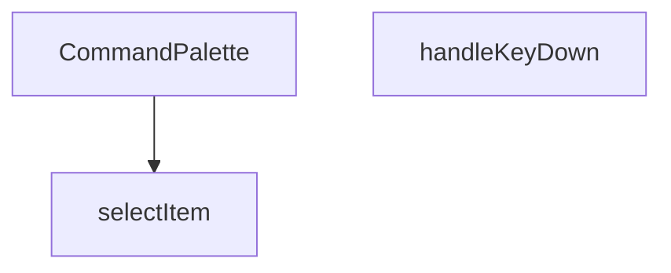

## NODE ID STANDARD

  file: src\components\admin\CommandPalette.tsx
  function: src\components\admin\CommandPalette.tsx::CommandPalette
  function: src\components\admin\CommandPalette.tsx::selectItem
  function: src\components\admin\CommandPalette.tsx::handleKeyDown

---

## DISA AKTARILANLAR (EXPORTS)
  export: CommandPalette

---

## STİL TOKENLERİ

### Arbitrary Değerler (token'a geçirilmemiş)
Yok — tüm stiller token'a geçirilmiş. ✅

### Kullanılan Token'lar (zaten token'a geçirilmiş)
- `rounded-hvac-xl`, `shadow-glow-md`, `shadow-glow-sm`, `tracking-hvac-normal`

### Tailwind Sınıf Özeti
- **Renkler:** `bg-cyan-400`, `bg-cyan-400/10`, `bg-surface-deep/10`, `bg-surface-deep/60`, `bg-transparent`, `bg-white/5`, `border-b`, `border-cyan-400/20`, `border-none`, `border-t`, `border-white/10`, `border-white/5`, `group-hover:text-cyan-400`, `hover:bg-white/5`, `hover:text-white`
- **Layout:** `absolute`, `backdrop-blur-md`, `fixed`, `flex`, `flex-1`, `gap-1.5`, `gap-2`, `gap-4`, `h-1.5`, `h-10`, `h-16`, `h-5`, `h-8`, `h-full`, `items-center`
- **Varyant/Responsive:** `:`, `group-hover:`, `hover:`, `placeholder:` önekleri
- **Yardımcı Sınıflar:** `$`, `${isActive`, `:`, `animate-in`, `animate-pulse`, `animate-spin`, `border`, `cursor-default`, `cursor-pointer`, `cyan-glow`, `duration-200`, `font-black`, `font-bold`, `font-medium`, `font-mono`

---
# FILE: src\components\admin\DateRangePicker.md

---
domain: general
source_type: doc
namespace_type: module
source_path: C:\Users\alize\venthub-hvac\src\components\admin\DateRangePicker.tsx
skeleton_hash: 34c0d72798eb13e6
entity_hashes:
  func:DateRangePicker: ed79aaef040a5b25
  func:applySelection: 68dcb4d14b5cc83c
  func:cancelSelection: 4bec1b96cb2c08c1
  func:handleSelect: fdeacf6bd5ee123e
  overview: 3490e076ad65f967
  style_tokens: 8f057de8409875ea
generated_at: 2026-06-19T20:47:00Z
---

## Genel Bakış
Bu modül, yönetim paneli arayüzünde başlangıç ve bitiş tarihlerinin seçilmesi için kullanılan kontrollü bir React bileşenidir. Kullanıcının yaptığı geçici seçimleri yönetir, onaylama veya iptal mekanizması sağlar ve nihai tarih aralığını üst bileşene iletir.

## Fonksiyon Grupları
### Bileşen Tanımı
Tarih seçici arayüzünü ve temel yapılandırmasını tanımlayan ana bileşendir.
- DateRangePicker

### Etkileşim ve Durum Yönetimi
Kullanıcının tarih seçimi, seçimi onaylama veya iptal etme gibi aksiyonlarını işleyerek bileşenin iç durumunu ve çıktısını günceller.
- handleSelect, applySelection, cancelSelection

## AXIOMS – Mimari Varsayımlar
Bu modül için özel aksiyom tanımlanmamıştır.

**Aksiyom 1**: `className` prop’u sağlanmazsa, bileşen boş bir CSS sınıfı ile render edilir.  
**Aksiyom 2**: `value` prop’u `undefined` veya geçerli bir tarih aralığı nesnesi değilse, bileşen başlangıçta seçili bir aralık göstermez.  
**Aksiyom 3**: `onChange` callback’i sağlanmazsa, tarih aralığı değişiklikleri üst bileşene bildirilmez.  
**Aksiyom 4**: `handleSelect` fonksiyonu `undefined` bir argüman alırsa, mevcut iç seçim durumu temizlenir.  
**Aksiyom 5**: `handleSelect` fonksiyonu geçerli bir tarih aralığı nesnesi alırsa, bu değer iç duruma kaydedilir ve `onChange` tetiklenir.

---

## AXIOMS – Mimari Varsayımlar

Bu modül için sadece fonksiyon imzalarından türetilebilen temel mimari varsayımlar tanımlanmıştır. Fonksiyon gövdeleri verilmediğinden, içsel davranışa ilişkin aksiyomlar çıkarılamamıştır.

**[Aksiyom 1]**: Eğer `DateRangePicker` bileşenine üst bileşen tarafından `onChange` callback'i sağlanmazsa, kullanıcının nihai tarih aralığı seçimi üst bileşene iletilemez (bileşen işlevsel olarak anlamsız hale gelir).

**[Aksiyom 2]**: Eğer `DateRangePicker` bileşenine üst bileşen tarafından `value` prop'u (mevcut tarih aralığı) sağlanmazsa, bileşenin başlangıçta hangi tarih aralığını gösterdiği bilinmiyor; muhtemelen boş/belirsiz bir durumda başlar.

**[Aksiyom 3]**: `handleSelect(r: DateRange | undefined)` fonksiyonu, `r` parametresi olarak `undefined` alabilir; bu durumda geçici seçim temizlenir (seçim iptal edilir). Eğer bu geçiş düzgün yönetilmezse, kullanıcı arayüzünde tutarsız bir seçim durumu oluşur.

**[Aksiyom 4]**: `applySelection()` ve `cancelSelection()` fonksiyonları, bir içsel "geçici seçim" (pending selection) durumuna bağlıdır. Eğer geçici seçim durumu yoksa (hiç tarih seçilmediyse veya zaten uygulandıysa), bu fonksiyonların çağrılması anlamsızdır ve beklenmeyen davranışa yol açabilir.

**[Aksiyom 5]**: Bileşen `className` prop'u için varsayılan değer olarak boş string (`''`) kullanır. Eğer üst bileşen bu değeri değiştirmezse, bileşen varsayılan stillendirme ile render edilir.

---

## FONKSİYON DETAYLARI

### DateRangePicker
**Ne yapar**: Kullanıcıların bir tarih aralığı seçmesine olanak tanıyan bir React bileşeni sunar.  
**Nasıl yapar**: `value`, `onChange`, `placeholder` ve isteğe bağlı `className` propslarını alır; içsel durum ve etkileşimleri yöneterek seçilen aralığı dışarıya `onChange` callback’iyle bildirir.  
**Parametreler**:
- `value`: DateRange — Bileşenin mevcut tarih aralığı değeri.
- `onChange`: (range: DateRange) => void — Seçim değiştiğinde tetiklenen geri çağırma fonksiyonu.
- `placeholder`: string — Kullanıcıya gösterilecek yer tutucu metin.
- `className`: string — Bileşenin dış görünümünü özelleştirmek için ek CSS sınıfları (varsayılan: boş string).  
**Dönüş**: React.FC<DateRangePickerProps> — Tanımlı props tipine sahip bir fonksiyonel React bileşeni.

### handleSelect
**Ne yapar**: Önceden tanımlı bir tarih aralığı (preset) seçildiğinde, bu aralığı işleyerek bileşenin durumunu günceller.  
**Nasıl yapar**: `preset.getRange()` çağrısıyla elde edilen `DateRange` nesnesini alır ve `handleSelect` fonksiyonuna iletir; fonksiyon içinde muhtemelen `onChange` callback’i çağrılır.  
**Parametreler**:
- `r`: DateRange | undefined — Seçilen tarih aralığı; tanımsız (undefined) olma ihtimali vardır.  
**Dönüş**: Belirtilmemiş (void veya bilinmiyor).

### applySelection
**Ne yapar**: Kullanıcı tarafından yapılan tarih aralığı seçimini onaylar ve seçilen değeri dışa aktarır.  
**Nasıl yapar**: Muhtemelen geçerli seçim durumunu `onChange` callback’iyle iletir ve UI’yı kapatır; iç mantık kodda belirtilmemiştir.  
**Parametreler**: Yok.  
**Dönüş**: Belirtilmemiş (void veya bilinmiyor).

### cancelSelection
**Ne yapar**: Kullanıcı tarafından başlatılan tarih aralığı seçimini iptal eder ve önceki duruma geri döner.  
**Nasıl yapar**: Seçim sürecini sonlandırarak geçici değişiklikleri temizler; iç mantık kodda yer almamaktadır.  
**Parametreler**: Yok.  
**Dönüş**: Belirtilmemiş (void veya bilinmiyor).

---

## İTHALATLAR (IMPORTS)
- import: ../../i18n/I18nProvider::useI18n
- import: @radix-ui/react-popover
- import: date-fns/locale::enUS
- import: date-fns/locale::tr
- import: lucide-react::Calendar
- import: lucide-react::Check
- import: lucide-react::ChevronDown
- import: react-day-picker::DateRange
- import: react-day-picker::DayPicker
- import: react::React
- import: react::useState

---

## INTERFACES

### DateRangePickerProps
- `value?: DateRange`
- `onChange?: (range?: DateRange) => void`
- `placeholder?: string`
- `className?: string`

---

## AST POINTERS

### [N1_NASIL] AST Pointer: `DateRangePicker.tsx::DateRangePicker`
- **params**: `({ value, onChange, placeholder, className = '' })`
- **ic_degiskenler**:
  - `lang` — `useI18n()` hook'undan destructure edilen dil ayarı (`'en'` veya `'tr'`)
  - `locale` — `lang` değerine göre seçilen date-fns locale nesnesi (`enUS` veya `tr`)
  - `isOpen` — `useState(false)`, popover'ın açık/kapalı durumunu tutar
  - `setIsOpen` — `isOpen` state setter'ı, popover açma/kapama için kullanılır
  - `selectedRange` — `useState<DateRange | undefined>(value)`, takvimde seçili olan tarih aralığını tutar
  - `setSelectedRange` — `selectedRange` state setter'ı, seçim değişikliklerinde çağrılır
  - `months` — `useState(2)`, DayPicker'da gösterilecek ay sayısını tutar (mobilde 1, masaüstünde 2)
  - `setMonths` — `months` state setter'ı, resize eventinde güncellenir
  - `checkMobile` — arrow function, `window.innerWidth < 768` kontrolü ile `setMonths` çağırır; hem useEffect içinde hem resize listener'da kullanılır
  - `presets` — `Array<{label: string, getRange: () => DateRange}>`, 8 adet hazır tarih aralığı seçeneği (Bugün, Dün, Son 7 Gün, vb.) içeren dizi
  - `triggerLabel` — string, popover tetikleyici butonunda gösterilen formatlanmış tarih aralığı metni; `value.from` varsa formatlanmış tarih, yoksa `placeholder` veya varsayılan metin
  - `dayPickerClassNames` — object, `react-day-picker` `DayPicker` bileşeninin `classNames` prop'una geçirilen Tailwind CSS class override'ları
- **Dönüş**: JSX — `Popover.Root` içine sarılı buton + popover content (takvim ve preset butonları)

---


## MERMAID CALL GRAPH
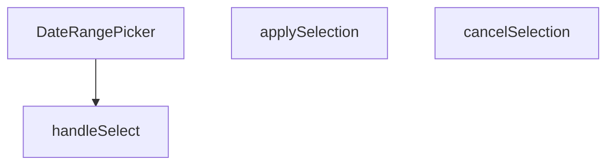

## NODE ID STANDARD

  file: src\components\admin\DateRangePicker.tsx
  function: src\components\admin\DateRangePicker.tsx::DateRangePicker
  function: src\components\admin\DateRangePicker.tsx::handleSelect
  function: src\components\admin\DateRangePicker.tsx::applySelection
  function: src\components\admin\DateRangePicker.tsx::cancelSelection

---

## DISA AKTARILANLAR (EXPORTS)
  export: DateRangePicker

---

## STİL TOKENLERİ

### Arbitrary Değerler (token'a geçirilmemiş)
Yok — tüm stiller token'a geçirilmiş. ✅

### Kullanılan Token'lar (zaten token'a geçirilmiş)
- (yok)

### Tailwind Sınıf Özeti
- **Renkler:** `bg-primary-navy`, `bg-slate-50`, `bg-white`, `bg-white/95`, `border-b`, `border-slate-100`, `border-slate-200`, `border-slate-200/60`, `border-t`, `hover:bg-primary-navy/90`, `hover:bg-slate-100`, `hover:bg-slate-200/50`, `hover:bg-slate-50`, `hover:border-slate-300`, `hover:text-slate-800`
- **Layout:** `backdrop-blur-xl`, `flex`, `flex-col`, `gap-1`, `gap-2`, `inline-flex`, `items-center`, `justify-between`, `max-h-60vh`, `max-h-85vh`, `max-w-full`, `md:flex-row`, `md:max-h-none`, `md:w-48`, `md:w-auto`
- **Varyant/Responsive:** `:`, `active:`, `disabled:`, `focus-visible:`, `hover:`, `md:`, `sm:` önekleri
- **Yardımcı Sınıflar:** `${className`, `${isOpen`, `${isSelected`, `:`, `active:scale-95`, `animate-in`, `border`, `disabled:active:scale-100`, `disabled:opacity-50`, `duration-200`, `fade-in`, `focus-visible:outline-none`, `focus-visible:ring-2`, `focus-visible:ring-primary-navy/20`, `font-bold`

---
# FILE: src\components\admin\EditableCell.md

---
domain: general
source_type: doc
namespace_type: module
source_path: C:\Users\alize\venthub-hvac\src\components\admin\EditableCell.tsx
skeleton_hash: c8931401a80d9dd5
entity_hashes:
  func:EditableCell: c69e143b78ab0750
  overview: e0ead7dc16886f70
  style_tokens: 2f2ada2707ada249
generated_at: 2026-06-19T20:47:00Z
---

## Genel Bakış
`EditableCell`, yönetim paneli tablolarındaki hücrelerin tıklanarak düzenlenebilir hale getirilmesini sağlayan bir React bileşenidir. Değer, veri tipi ve yer tutucu gibi yapılandırma parametreleri alarak hücrenin görünümünü ve davranışını kontrol eder; düzenleme işlemi tamamlandığında kaydetme çağrısı ile değişiklikleri üst bileşene iletir.

## Fonksiyon Grupları
### Düzenlenebilir Hücre Bileşeni
Bu modül, tek bir kapsamlı bileşenden oluşur ve tablo hücrelerinin görüntülenmesi, düzenleme moduna geçişi ile değişikliklerin kaydedilmesi süreçlerini yönetir.
- EditableCell

---

## AXIOMS – Mimari Varsayımlar

Bu modül, bir React bileşeni olup hücre düzenleme işlevi için aşağıdaki mimari varsayımları içerir.

[Aksiyom 1]: Eğer `value` prop'u sağlanmazsa, bileşen hücrede gösterilecek başlangıç değerini bilemez ve boş/undefined bir durum oluşur.

[Aksiyom 2]: Eğer `onSave` callback fonksiyonu sağlanmazsa, kullanıcı düzenlemeyi tamamladığında değişiklikler üst bileşene iletilemez ve veri kaybı oluşur.

[Aksiyom 3]: Eğer `type` parametresi geçerli bir input tipi (örn: 'text', 'number') değilse, tarayıcı varsayılan text input davranışı gösterir.

[Aksiyom 4]: Hücre tıklanarak düzenleme moduna geçilemezse, kullanıcı hücre değerini hiçbir zaman düzenleyemez ve bileşen salt okunur hale gelir.

[Aksiyom 5]: Eğer düzenleme modunda input alanı oluşturulamazsa (örn: odak yönetimi başarısız olursa), kullanıcı değişiklik yapamaz ve düzenleme akışı bozulur.

[Aksiyom 6]: Eğer `onSave` çağrısı başarısız olursa veya hata fırlatırsa, üst bileşen hatayı ele alamaz ve kullanıcıya geri bildirim verilemez.

---

## FONKSİYON DETAYLARI

### EditableCell
**Ne yapar**: EditableCell, kullanıcının bir hücredeki değeri düzenlemesine ve kaydetmesine olanak tanıyan bir React fonksiyonel bileşenidir. Inline düzenleme işlevselliği sağlar.

**Nasıl yapar**: Bileşen, `value`, `onSave`, `type`, `placeholder` ve `clas` prop'larını alır. `type` değerine göre uygun bir giriş elemanı (input, select vb.) render eder. Kullanıcı düzenleme işlemini tamamladığında `onSave` callback'ini tetikler. `placeholder`, değer boşken gösterilecek metni belirler. `clas` prop'u bileşene ek CSS sınıfları atamak için kullanılır.

**Parametreler**:
- `value`: any — Hücrede gösterilecek ve düzenlenecek olan mevcut değer.
- `onSave`: function — Kullanıcı değişikliği kaydettiğinde çağrılan geri çağrı fonksiyonu. Yeni değeri parametre olarak alır.
- `type`: string (varsayılan `'text'`) — Giriş elemanının türü (text, number, select vb.).
- `placeholder`: string (varsayılan `'-'`) — Değer boş veya tanımsız olduğunda gösterilen yer tutucu metin.
- `clas`: string — Bileşene uygulanacak ek CSS sınıf adı.

**Dönüş**: `React.FC<EditableCellProps>` — `EditableCellProps` arayüzüne sahip prop'lar bekleyen bir React fonksiyonel bileşeni döndürür. Bu bileşen, hücre düzenleme arayüzünü oluşturmak için kullanılır.

---

## İTHALATLAR (IMPORTS)
- import: react::React
- import: react::useCallback
- import: react::useEffect
- import: react::useRef
- import: react::useState
- import: sonner::toast

---

## INTERFACES

### EditableCellProps
- `value: string | number`
- `onSave: (newValue: string) => Promise<void>`
- `type?: 'text' | 'number'`
- `placeholder?: string`
- `className?: string`
- `disabled?: boolean`
- `inputWidth?: string`

---

## AST POINTERS

### [N1_NASIL] AST Pointer: src/components/admin/EditableCell.tsx::EditableCell
- **params**: (value, onSave, type, placeholder, className, disabled, inputWidth)
- **ic_degiskenler**:
    - `editing` — Düzenleme modunda olup olmadığını kontrol eden boolean state
    - `draft` — Düzenlenen değerin geçici olarak tutulduğu state
    - `saving` — Kaydetme işleminin devam edip etmediğini gösteren boolean state
    - `inputRef` — Input elementine referans tutan ref nesnesi
    - `startEdit` — Düzenleme moduna giriş fonksiyonu (useCallback ile memoize)
    - `cancel` — Düzenlemeyi iptal eden fonksiyon (useCallback ile memoize)
    - `save` — Değişiklikleri kaydeden async fonksiyon (useCallback ile memoize)
    - `handleKeyDown` — Tuş olaylarını yöneten fonksiyon (useCallback ile memoize)
- **Dönüş**: React.ReactNode (JSX)

### [N2_NASIL] AST Pointer: src/components/admin/EditableCell.tsx::useEffectCallback_1
- **params**: ()
- **ic_degiskenler**: (yok)
- **Dönüş**: void

### [N3_NASIL] AST Pointer: src/components/admin/EditableCell.tsx::useEffectCallback_2
- **params**: ()
- **ic_degiskenler**: (yok)
- **Dönüş**: void

### [N4_NASIL] AST Pointer: src/components/admin/EditableCell.tsx::startEdit
- **params**: ()
- **ic_degiskenler**: (yok)
- **Dönüş**: void

### [N5_NASIL] AST Pointer: src/components/admin/EditableCell.tsx::cancel
- **params**: ()
- **ic_degiskenler**: (yok)
- **Dönüş**: void

### [N6_NASIL] AST Pointer: src/components/admin/EditableCell.tsx::save
- **params**: ()
- **ic_degiskenler**:
    - `trimmed` — draft değerinin baş/son boşlukları temizlenmiş hali
    - `original` — Mevcut value parametresinin string karşılığı
- **Dönüş**: Promise<void>

### [N7_NASIL] AST Pointer: src/components/admin/EditableCell.tsx::handleKeyDown
- **params**: (e: React.KeyboardEvent)
- **ic_degiskenler**: (yok)
- **Dönüş**: void

### [N8_NASIL] AST Pointer: src/components/admin/EditableCell.tsx::onClickEditingView
- **params**: (e)
- **ic_degiskenler**: (yok)
- **Dönüş**: void

### [N9_NASIL] AST Pointer: src/components/admin/EditableCell.tsx::onChangeInput
- **params**: (e)
- **ic_degiskenler**: (yok)
- **Dönüş**: void

### [N10_NASIL] AST Pointer: src/components/admin/EditableCell.tsx::onBlurInput
- **params**: ()
- **ic_degiskenler**: (yok)
- **Dönüş**: void

### [N11_NASIL] AST Pointer: src/components/admin/EditableCell.tsx::onClickButton
- **params**: (e)
- **ic_degiskenler**: (yok)
- **Dönüş**: void

---

## NODE ID STANDARD

  file: src\components\admin\EditableCell.tsx
  function: src\components\admin\EditableCell.tsx::EditableCell

---

## DISA AKTARILANLAR (EXPORTS)
  export: EditableCell

---

## STİL TOKENLERİ

### Arbitrary Değerler (token'a geçirilmemiş)
Yok — tüm stiller token'a geçirilmiş. ✅

### Kullanılan Token'lar (zaten token'a geçirilmiş)
- (yok)

### Tailwind Sınıf Özeti
- **Renkler:** `bg-transparent`, `border-2`, `border-b`, `border-dashed`, `border-primary-navy`, `border-primary-navy/30`, `border-slate-300`, `border-t-primary-navy`, `hover:border-primary-navy`, `hover:text-primary-navy`, `text-left`, `text-slate-400`, `text-sm`
- **Layout:** `gap-1`, `h-3.5`, `inline-block`, `inline-flex`, `items-center`, `p-0`, `w-3.5`
- **Varyant/Responsive:** `disabled:`, `focus-visible:`, `hover:` önekleri
- **Yardımcı Sınıflar:** `${className`, `${inputWidth`, `animate-spin`, `border`, `cursor-pointer`, `disabled:cursor-not-allowed`, `disabled:opacity-50`, `focus-visible:outline-none`, `focus-visible:ring-1`, `focus-visible:ring-primary-navy/50`, `px-1.5`, `py-0.5`, `rounded`, `rounded-full`, `transition-colors`

---
# FILE: src\components\admin\ExportMenu.md

---
domain: general
source_type: doc
namespace_type: module
source_path: C:\Users\alize\venthub-hvac\src\components\admin\ExportMenu.tsx
skeleton_hash: 795929f00f599bec
entity_hashes:
  func:ExportMenu: 9e536638b7cdf449
  overview: fcef70276d80a8c4
  style_tokens: 7659c3683121a964
generated_at: 2026-06-19T20:47:00Z
---

## Genel Bakış
`ExportMenu` modülü, yönetim panelinde kullanıcının veri dışa aktarma seçeneklerini görüntülemesini ve tetiklemesini sağlayan bir React bileşeni sunar. Bileşen, gelen menü öğelerini listeleyerek her biri için ilgili eylemi çalıştırır ve isteğe bağlı bir buton etiketiyle kullanıcı arayüzünde konumlandırılabilir.

## Fonksiyon Grupları
### ExportMenu Bileşeni
Bu grup, menünün yapısını oluşturma, kullanıcı etkileşimini yönetme ve dışa aktarma işlemlerini başlatma sorumluluğunu üstlenir. Tek bir fonksiyon, tüm bu davranışları birleştirir.
- ExportMenu

---

## AXIOMS – Mimari Varsayımlar
Bu modül için özel aksiyom tanımlanmamıştır.

---

## FONKSİYON DETAYLARI

### ExportMenu
**Ne yapar**: Bu bileşen, yönetici arayüzünde dışa aktarma seçenekleri sunan bir menü oluşturur. Kullanıcıya verileri farklı formatlarda dışa aktarma imkanı sağlar.

**Nasıl yapar**: Bileşen, verilen `items` dizisini kullanarak bir menü listesi oluşturur. Her bir item için bir dışa aktarma seçeneği sunar. `buttonLabel` parametresi ile menünün üzerindeki düğme etiketi özelleştirilebilir. Bileşen, tıklanan öğenin bilgilerini bir üst bileşene iletir.

**Parametreler**:
- items: ExportMenuItem[] — Dışa aktarma seçeneklerini içeren dizi. Her bir seçenek, dışa aktarılacak veri kaynağını ve formatını belirtir.
- buttonLabel: string (opsiyonel) — Menüyü açan düğmenin üzerindeki metin. Belirtilmezse varsayılan bir etiket kullanılır.

**Dönüş**: React bileşeni (React.FC) — Oluşturulan dışa aktarma menüsünü render eden bir React bileşeni. Bileşen, ExportMenuItem[] dizisi ve opsiyonel buttonLabel string'i alır.

---

## İTHALATLAR (IMPORTS)
- import: ../../i18n/I18nProvider::useI18n
- import: ../../utils/adminUi::adminButtonSecondaryClass
- import: @radix-ui/react-dropdown-menu
- import: lucide-react::Download
- import: lucide-react::FileDown
- import: lucide-react::Table
- import: react::React

---

## TYPE ALIASES

### ExportMenuItem
```typescript
type ExportMenuItem = {
  key: string
  label: string
  onSelect: () => void
}
```

---

## AST POINTERS

### [N1_NASIL] AST Pointer: ExportMenu.tsx::ExportMenu
- **params**:
  - `items` — ExportMenuItem[] türünde, dışa aktarma menüsü seçeneklerinin listesi. Her item `key`, `label` ve `onSelect` özelliklerine sahiptir
  - `buttonLabel` — string (optional), menü tetikleyici butonunda gösterilecek özel metin. Tanımlı değilse varsayılan çeviri kullanılır
- **ic_degiskenler**:
  - `_t` — `useI18n()` hookundan elde edilen çeviri fonksiyonu (`t` olarak alınmış, `_t` olarak yeniden adlandırılmış). Menü metinlerinin çok dilli çevirilerini sağlamak için kullanılır
- **Dönüş**: JSX (DropdownMenu.Root bileşeni — dışa aktarma menüsü UI'ı)

---

## NODE ID STANDARD

  file: src\components\admin\ExportMenu.tsx
  function: src\components\admin\ExportMenu.tsx::ExportMenu

---

## DISA AKTARILANLAR (EXPORTS)
  export: ExportMenu
  export: ExportMenuItem

---

## STİL TOKENLERİ

### Arbitrary Değerler (token'a geçirilmemiş)
Yok — tüm stiller token'a geçirilmiş. ✅

### Kullanılan Token'lar (zaten token'a geçirilmiş)
- `rounded-hvac-lg`, `tracking-hvac-normal`

### Tailwind Sınıf Özeti
- **Renkler:** `bg-emerald-500/10`, `border-white/10`, `hover:bg-white/5`, `hover:text-white`, `text-emerald-400`, `text-slate-300`, `text-slate-500`, `text-xs`
- **Layout:** `flex`, `gap-2`, `gap-3`, `h-12`, `h-8`, `items-center`, `justify-center`, `min-w-140px`, `min-w-200px`, `p-2`, `shadow-elevation-5`, `w-8`, `z-50`, `zoom-in-95`
- **Varyant/Responsive:** `hover:` önekleri
- **Yardımcı Sınıflar:** `animate-in`, `border`, `cursor-pointer`, `duration-200`, `fade-in`, `font-black`, `font-bold`, `glass-strong`, `italic`, `mb-1`, `outline-none`, `pb-2`, `pt-2`, `px-3`, `px-4`

---
# FILE: src\components\admin\InfoTooltip.md

---
domain: general
source_type: doc
namespace_type: module
source_path: C:\Users\alize\venthub-hvac\src\components\admin\InfoTooltip.tsx
skeleton_hash: 979bd18efdbbfccc
entity_hashes:
  func:InfoTooltip: 183c7d447a0090ba
  overview: aa0bb37988421fc0
  style_tokens: 15a027a0bab7a2ef
generated_at: 2026-06-19T20:47:00Z
---

## Genel Bakış
`InfoTooltip` bileşeni, yönetim panelindeki metin öğelerine ek bilgi sağlamak amacıyla kullanılan bir tooltip (ipucu) komponentidir. Verilen metni ve isteğe bağlı boyut ve stil parametrelerini alarak, kullanıcı fareyi üzerine getirdiğinde açıklayıcı bir balon gösterir.

## Fonksiyon Grupları
### Tooltip Render ve Konfigürasyon
Bu grup, tooltip’in içeriğini ve görünümünü oluşturup, dışarıdan gelen `text`, `size` ve `className` prop’larını işleyerek React elementini döndürür.
- InfoTooltip

---

## AXIOMS – Mimari Varsayımlar
Bu modül için özel aksiyom tanımlanmamıştır.

---

## FONKSİYON DETAYLARI

### InfoTooltip
**Ne yapar**: Kullanıcıya bilgilendirici bir tooltip (yardım ipucu) gösteren React bileşenidir. Belirli bir metni, hover (üzerine gelme) sırasında küçük bir baloncuk içinde kullanıcıya sunar.

**Nasıl yapar**: Bileşen, verilen text parametresini bir tooltip içinde render eder. size parametresi ile ikonun veya tetikleyicinin boyutu, className ile ek stillendirme seçenekleri özelleştirilebilir. Tooltip, genellikle bir bilgi ikonu (ℹ️) ile tetiklenir ve üzerine gelindiğinde veya tıklandığında bilgilendirici metni gösterir.

**Parametreler**:
- text: string — Tooltip içinde görüntülenecek bilgilendirici metin
- size: number (varsayılan: 14) — Tooltip tetikleyicisinin (ikon) piksel cinsinden boyutu
- className: string (varsayılan: '') — Bileşene eklenecek ek CSS sınıfları

**Dönüş**: React.FC<InfoTooltipProps> — Bileşen, InfoTooltipProps arayüzünü kullanan bir React fonksiyonel bileşeni olarak döner.

---

## İTHALATLAR (IMPORTS)
- import: lucide-react::Info
- import: react::React

---

## INTERFACES

### InfoTooltipProps
- `text: string`
- `size?: number`
- `className?: string`

---

## AST POINTERS

### [N1_NASIL] AST Pointer: src/components/admin/InfoTooltip.tsx::InfoTooltip
- **params**: ({ text, size = 14, className = '' })
- **ic_degiskenler**:
  - (Fonksiyon gövdesinde tanımlanmış değişken yok)
- **Dönüş**: JSX elementi (React bileşeni). Fonksiyon, `text` parametresini tooltip içeriği olarak gösteren ve üzerine gelindiğinde (Tailwind `group-hover` ile) görünür olan, `Info` ikonu ve tooltip kutusu içeren bir React bileşeni döndürür. Parametre olarak `text`, `size` ve `className` kullanılır.

---

## NODE ID STANDARD

  file: src\components\admin\InfoTooltip.tsx
  function: src\components\admin\InfoTooltip.tsx::InfoTooltip

---

## DISA AKTARILANLAR (EXPORTS)
  export: InfoTooltip

---

## STİL TOKENLERİ

### Arbitrary Değerler (token'a geçirilmemiş)
Yok — tüm stiller token'a geçirilmiş. ✅

### Kullanılan Token'lar (zaten token'a geçirilmiş)
- (yok)

### Tailwind Sınıf Özeti
- **Renkler:** `bg-slate-800`, `border-4`, `border-t-slate-800`, `border-transparent`, `hover:text-primary-navy`, `text-left`, `text-slate-400`, `text-white`, `text-xs`
- **Layout:** `absolute`, `bottom-full`, `inline-flex`, `items-center`, `justify-center`, `left-1/2`, `relative`, `shadow-xl`, `top-full`, `w-64`, `z-50`
- **Varyant/Responsive:** `group-hover:`, `hover:` önekleri
- **Yardımcı Sınıflar:** `${className`, `-translate-x-1/2`, `align-middle`, `cursor-help`, `duration-200`, `font-normal`, `group`, `group-hover:opacity-100`, `group-hover:visible`, `invisible`, `leading-relaxed`, `mb-2`, `ml-1`, `normal-case`, `opacity-0`

---
# FILE: src\components\admin\InventoryCsvImport.md

---
domain: general
source_type: doc
namespace_type: module
source_path: C:\Users\alize\venthub-hvac\src\components\admin\InventoryCsvImport.tsx
skeleton_hash: ed471d6bfb42509d
entity_hashes:
  func:InventoryCsvImport: a3b5b6995ddb5df4
  overview: 3471c7b6d6d55066
  style_tokens: 3e4e1345adb17abc
generated_at: 2026-06-19T20:47:00Z
---

## Genel Bakış
Bu modül, envanter verilerinin CSV dosyası aracılığıyla toplu olarak içe aktarılmasını sağlayan bir React modal bileşenidir. Dosya yükleme, veri doğrulama ve eşik değerine göre stok güncelleme süreçlerini yönetir; üst bileşenle `onSuccess` ve `onClose` callback'leri aracılığıyla iletişim kurar.

## Fonksiyon Grupları
### CSV İçe Aktarma Bileşeni
Modal olarak çalışan ana React bileşenidir. CSV dosyasının seçilmesini, doğrulanmasını ve `effectiveThreshold` parametresine göre envanter güncellemesini tek bir iş akışında yürütür.
- InventoryCsvImport

---

## AXIOMS – Mimari Varsayımlar

Bu modül, CSV tabanlı envanter içe aktarma işlevselliğini sağlayan modal bir React bileşeni olarak aşağıdaki mimari varsayımlar geçerlidir.

[Aksiyom 1]: Eğer `isOpen` prop'u `true` değerini almazsa, modal bileşeni render edilmez ve dosya yükleme/işlem süreçleri başlatılamaz.
[Aksiyom 2]: Eğer geçerli bir CSV dosyası seçilmediyse veya dosya içeriği okunamadıysa, veri doğrulama ve önizleme aşamasına geçilemez.
[Aksiyom 3]: Eğer `effectiveThreshold` prop'u sağlanmamışsa (undefined/null), eşik değerine göre stok güncelleme kararı verilemez veya varsayılan bir eşik değeri kullanılır.
[Aksiyom 4]: Eğer CSV dosyasından elde edilen verilerde zorunlu alanlar eksikse veya hatalı veri formatı içeriyorsa, veriler doğrulanamaz ve işleme alınmaz.
[Aksiyom 5]: Eğer üst bileşen `onClose` callback'ini sağlamamışsa, modal kapatma işlemi başarısız olur veya hata oluşur.
[Aksiyom 6]: Eğer üst bileşen `onSuccess` callback'ini sağlamamışsa, başarılı içe aktarma sonrası üst bileşene bildirim gönderilemez.
[Aksiyom 7]: Eğer CSV dosyası çok büyükse veya desteklenmeyen bir formattaysa, dosya yükleme hatası oluşur ve kullanıcıya hata mesajı gösterilir.

---

## FONKSİYON DETAYLARI

### InventoryCsvImport

**Ne yapar**: CSV dosyası aracılığıyla toplu envanter/stok güncelleme işlemi gerçekleştiren modal bileşenidir. Kullanıcının CSV dosyası seçip yüklemesine, verileri önizlemesine, kuru çalıştırma (dry-run) modunda test etmesine veya gerçekten veritabanına aktarmasına olanak tanır. İşlem sonunda hata raporu indirme ve toplu geri alma (undo) işlemleri sunar.

**Nasıl yapar**: Bileşen首先 CSV dosyasını metin olarak okur ve virgülle ayrılmış değerleri parse eder. `sku` ve `qty/quantity/stock/new_stock` sütunlarını başlık satırından otomatik algılar. Parse edilen satırları Supabase veritabanındaki `products` tablosuyla eşleştirerek mevcut stok miktarlarıyla birlikte bir önizleme tablosu oluşturur. `effectiveThreshold` callback'i kullanılarak her ürün için stok durumu (out/critical) belirlenir. `processCSV` fonksiyonu toplu olarak `adjust_stock` RPC çağrısı yapar ve her güncelleme için `logAdminAction` ile denetim kaydı oluşturur. `dryRun` modunda sadece doğrulama yapılır, veritabanına kayıt atılmaz. İşlem sonrası batch tabanlı geri alma butonu sunulur.

**Parametreler**:
- isOpen: boolean — Modalın açık olup olmadığını kontrol eden bayrak. `false` olduğunda bileşen `null` döner ve render edilmez.
- onClose: () => void — Modalın kapatılması istendiğinde çağrılan geri çağıurma fonksiyonu. Hem iptal hem de başarılı işlem sonrası tetiklenir.
- onSuccess: () => void — Stok güncellemesi başarıyla tamamlandığında çağrılan geri çağıurma fonksiyonu. Üst bileşenin verileri yenilemesini tetikler.
- effectiveThreshold: (productId: string) => number | null — Verilen ürün ID'si için kritik stok eşik değerini döndüren fonksiyon. CSV'deki yeni miktar bu değerin altına düştüğünde satır `critical` olarak işaretlenir.

**Dönüş**: JSX.Element — Modal arayüzünü ve CSV işleme mantığını içeren React bileşeni. `isOpen` false ise `null` döner.

---

## İTHALATLAR (IMPORTS)
- import: ../../utils/crypto::generateId
- import: @/i18n/I18nProvider::useI18n
- import: @/lib/supabase/client::supabaseBrowserClient
- import: @/lib/utils::cn
- import: lucide-react::CheckCircle2
- import: lucide-react::FileUp
- import: lucide-react::Info
- import: lucide-react::Search
- import: lucide-react::X
- import: react::React
- import: react::useRef
- import: react::useState
- import: sonner::toast

---

## INTERFACES

### CsvPreviewRow
- `sku: string`
- `name: string`
- `current: number`
- `new: number`
- `delta: number`
- `status: 'out' | 'critical' | null`

### InventoryCsvImportProps
- `isOpen: boolean`
- `onClose: () => void`
- `onSuccess: () => void`
- `effectiveThreshold: (_productId: string) => number | null`

---

## AST POINTERS

### [N1_NASIL] AST Pointer: src/components/admin/InventoryCsvImport.tsx::InventoryCsvImport
- **params**: `{ isOpen, onClose, onSuccess, effectiveThreshold }` — Modal durumu, kapatma callback'i, başarılı import sonrası callback'ini ve stok eşiği fonksiyonunu alır
- **ic_degiskenler**:
  - `csvPreview` / `setCsvPreview` — CSV'den parse edilmiş önizleme satırlarını tutar (useState)
  - `csvProcessing` / `setCsvProcessing` — CSV işleme sırasında yükleme durumunu belirtir (useState)
  - `csvProgress` / `setCsvProgress` — İşleme ilerleme yüzdesini tutar 0-1 arası (useState)
  - `dryRun` — Kuru çalıştırma modu, sadece doğrulama yapılıp yapılmayacağını belirtir (useState)
  - `csvUndoingRef` — Geri alma işleminin devam edip etmediğini takip eder (useRef)
  - `t` — useI18n hook'undan gelen çeviri fonksiyonu
  - `supabase` — Supabase browser client referansı
- **Dönüş**: JSX bileşeni (yok)

### [N2_NASIL] AST Pointer: src/components/admin/InventoryCsvImport.tsx::handleCsvImport (iç fonksiyon)
- **params**: `file: File` — Yüklenen CSV dosyası nesnesi
- **ic_degiskenler**:
  - `textRaw` — Dosyanın ham metin içeriği
  - `text` — BOM karakterinden arındırılmış metin
  - `lines` — Boş satırları filtrelenmiş CSV satırları dizisi
  - `split` — Virgülle splitting yapan, tırnak işaretli alanları koruyan yardımcı fonksiyon
  - `headerRaw` — İlk satırın küçük harfli, trimmed sütun başlıkları
  - `skuIdx` — SKU sütununun indeksi (-1 ise bulunamadı)
  - `qtyIdx` — Miktar sütununun indeksi (qty/quantity/stock/new_stock arar)
  - `parsedRows` — Geçerli satırlar dizisi `{ line, sku, newQty }`
  - `errors` — Hatalı satırlar dizisi `{ line, sku, message }`
  - `i` — For döngüsü indeksi (her satır için)
  - `cells` — Mevcut satırın hücreleri
  - `sku` — SKU string değeri
  - `qtyStr` — Miktar string değeri
  - `newQty` — Sayıya çevrilmiş miktar
  - `skus` — Tekrar eden SKU'ları kaldırılmış benzersiz SKU listesi
  - `products` — Supabase'den çekilen eşleşen ürünler `{ id, sku, name, stock_qty }`
  - `skuToProduct` — SKU ile ürün bilgisini eşleştiren Map
  - `preview` — Oluşturulan önizleme satırları dizisi
  - `row` — parsedRows'taki her bir satır
  - `product` — SKU'ya karşılık gelen ürün bilgisi
  - `th` — effectiveThreshold ile hesaplanan eşik değeri
  - `status` — Stok durumu ('out' | 'critical' | null)
- **Dönüş**: yok (csvPreview state'ini set eder, toast bildirimleri gösterir)

### [N3_NASIL] AST Pointer: src/components/admin/InventoryCsvImport.tsx::handleCsvProcess (iç fonksiyon)
- **params**: yok (arrow function, parametresiz)
- **ic_degiskenler**:
  - `skus` — csvPreview'den extract edilen SKU listesi
  - `products` — Supabase'den çekilen ürünler `{ id, sku }`
  - `skuToId` — SKU'dan productId'ye eşleyen Map
  - `batchId` — generateId() ile üretilen benzersiz toplu iş ID'si
  - `BATCH_SIZE` — Toplu işleme boyutu (20)
  - `chunk` — Her döngü adımındaki dilimlenmiş veri
  - `successCount` — Başarılı güncelleme sayısı
  - `errors` — Hatalı SKU'lar ve mesajları dizisi
  - `downloadErrors` — Hataları CSV olarak indiren iç fonksiyon
  - `header` — Hata CSV'si sütun başlıkları
  - `lines` — Hata CSV'si satırları
  - `csv` — Hatalı CSV'nin tam içeriği
  - `blob` — Hata CSV'si için Blob nesnesi
  - `url` — Blob URL'i
  - `a` — İndirme için oluşturulan geçici anchor elementi
  - `item` — Promise.all içindeki her bir csvPreview elemanı
- **Dönüş**: yok (onClose, onSuccess callback'lerini çağırır, toast bildirimi gösterir)

### [N4_NASIL] AST Pointer: src/components/admin/InventoryCsvImport.tsx::processItem (iç async fonksiyon, handleCsvProcess içindeki chunk.map callback'i)
- **params**: `item` — csvPreview elemanı `{ sku, delta, name, current, new, status }`
- **ic_degiskenler**:
  - `_productId` — SKU'dan eşlenen ürün ID'si
  - `reason` — Stok hareketi sebebi ("CSV import: add/remove ...")
  - `error` — supabase.rpc çağrısından dönen hata
  - `logAdminAction` — Lazy import ile yüklenen audit log fonksiyonu (`../../lib/audit` modülünden)
- **Dönüş**: yok (supabase.rpc ile adjust_stock çağırır, audit log yazar, successCount artırır)

### [N5_NASIL] AST Pointer: src/components/admin/InventoryCsvImport.tsx::downloadErrors (iç fonksiyon)
- **params**: yok
- **ic_degiskenler**:
  - `header` — CSV sütun başlıkları ['sku', 'message']
  - `lines` — Her hata objesinden oluşturulmuş CSV satırları
  - `csv` — BOM ile başlatılmış tam CSV içeriği
  - `blob` — text/csv charset=utf-8 Blob nesnesi
  - `url` — createObjectURL ile oluşturulan URL
  - `a` — document.createElement('a') ile oluşturulmuş anchor
- **Dönüş**: yok (dosya indirme tetikler)

### [N6_NASIL] AST Pointer: src/components/admin/InventoryCsvImport.tsx::undoAll (iç async fonksiyon)
- **params**: yok
- **ic_degiskenler**:
  - `data` — reverse_inventory_batch RPC sonucu (geri alınan hareket sayısı)
  - `error` — RPC hatası
  - `undone` — Number(data || 0) ile sayıya çevrilmiş geri alınan hareket sayısı
- **Dönüş**: yok (supabase.rpc reverse_inventory_batch çağırır, onSuccess tetikler, toast gösterir)

### [N7_NASIL] AST Pointer: src/components/admin/InventoryCsvImport.tsx::toastRender (toast.custom callback'i)
- **params**: `id` — toast instance ID'si (toast.dismiss(id) için kullanılır)
- **ic_degiskenler**:
  - `successCount` — Dış kapsamdan gelen başarılı güncelleme sayısı
  - `batchId` — Dış kapsamdan gelen toplu iş ID'si
  - `errors` — Dış kapsamdan gelen hatalar dizisi
  - `t` — Çeviri fonksiyonu
  - `downloadErrors` — Dış kapsamdan gelen hata indirme fonksiyonu
- **Dönüş**: JSX — Başarı bildirim kartı (CheckCircle2 ikonu, hareketlere link, hata indirme butonu, geri alma butonu)

### [N8_NASIL] AST Pointer: src/components/admin/InventoryCsvImport.tsx::handleFileChange (input onChange handler)
- **params**: `e` — React.ChangeEvent<HTMLInputElement>
- **ic_degiskenler**:
  - `file` — `e.target.files?.[0]` ile alınan seçilen dosya
- **Dönüş**: yok (handleCsvImport(file) çağırır)

### [N9_NASIL] AST Pointer: src/components/admin/InventoryCsvImport.tsx::handleDryRunKey (input onKeyDown handler)
- **params**: `e` — React.KeyboardEvent
- **ic_degiskenler**: yok
- **Dönüş**: yok (Enter veya Space tuşunda dryRun toggle eder)

### [N10_NASIL] AST Pointer: src/components/admin/InventoryCsvImport.tsx::renderRow (tablo satır render fonksiyonu)
- **params**: `item` — CsvPreviewRow `{ sku, name, current, new, delta, status }`, `idx` — satır indeksi
- **ic_degiskenler**: yok
- **Dönüş**: JSX `<tr>` — SKU adı, mevcut stok, yeni stok, delta değerini gösteren tablo satırı

---

## NODE ID STANDARD

  file: src\components\admin\InventoryCsvImport.tsx
  function: src\components\admin\InventoryCsvImport.tsx::InventoryCsvImport

---

## DISA AKTARILANLAR (EXPORTS)
  export: InventoryCsvImport

---

## STİL TOKENLERİ

### Arbitrary Değerler (token'a geçirilmemiş)
Yok — tüm stiller token'a geçirilmiş. ✅

### Kullanılan Token'lar (zaten token'a geçirilmiş)
- `rounded-hvac-2xl`, `rounded-hvac-lg`, `rounded-hvac-xl`, `shadow-glow-md`, `shadow-glow-sm`, `tracking-hvac-normal`

### Tailwind Sınıf Özeti
- **Renkler:** `bg-amber-400`, `bg-black/60`, `bg-cyan-400`, `bg-rose-500/20`, `bg-surface-deep/20`, `bg-surface-midnight`, `bg-transparent`, `bg-white`, `bg-white/10`, `bg-white/2`, `bg-white/5`, `border-2`, `border-b`, `border-dashed`, `border-none`
- **Layout:** `absolute`, `backdrop-blur-sm`, `block`, `custom-scrollbar`, `fixed`, `flex`, `flex-1`, `flex-col`, `gap-2`, `gap-3`, `gap-4`, `h-10`, `h-12`, `h-16`, `h-3`
- **Varyant/Responsive:** `:`, `disabled:`, `focus-visible:`, `group-hover:`, `group-last:`, `hover:` önekleri
- **Yardımcı Sınıflar:** `${dryRun`, `${item.delta`, `0`, `:`, `>`, `animate-in`, `animate-spin`, `border`, `cursor-default`, `cursor-pointer`, `decoration-cyan-400/30`, `disabled:opacity-30`, `duration-300`, `fade-in`, `focus-visible:ring-2`

---
# FILE: src\components\admin\InventoryDetailDrawer.md

---
domain: general
source_type: doc
namespace_type: module
source_path: C:\Users\alize\venthub-hvac\src\components\admin\InventoryDetailDrawer.tsx
skeleton_hash: a795a88f64a4a4b7
entity_hashes:
  func:InventoryDetailDrawer: 3a57400ca0f546b7
  overview: 92caa1481da5cee7
  style_tokens: 4b283d8541dc151c
generated_at: 2026-06-08T10:08:36Z
---

## Genel Bakış
InventoryDetailDrawer, envanter öğelerinin ayrıntılarını gösteren bir React bileşenidir. Kullanıcıya seçilen ürünün stok miktarı, konumu ve diğer meta verileri sunar. Ayrıca düzenleme ve kapatma işlevlerini sağlayarak envanter yönetimi akışını destekler.

## Fonksiyon Grupları
### Ana Bileşen
Bileşenin giriş noktası ve render mantığını yönetir.
- InventoryDetailDrawer

---

## AXIOMS – Mimari Varsayımlar
Bu modül için özel aksiyom tanımlanmamıştır.

---

## FONKSİYON DETAYLARI

### InventoryDetailDrawer
**Ne yapar**: Seçili bir ürünün stok detaylarını, eşik değerlerini ve hareket geçmişini gösteren bir yan çekmece (drawer) arayüzü oluşturur. Kullanıcıların QR etiketi yazdırması, eşik güncellemesi, stok ayarlaması ve hareketleri geri alması gibi etkileşimli işlemleri yönetir.  

**Nasıl yapar**: Props içinde gelen durum ve setter fonksiyonlarını destrüktüre eder, Escape tuşu ile çekmeceyi kapatmak için bir `useEffect` ekler ve `selected` nesnesi yoksa `null` döner. UI, bir kapatma butonu, ürün bilgileri, stok ve eşik kartları, zeki satın alma önerisi, eşik güncelleme formu, stok ayarlama bileşeni, rezerve sipariş tablosu ve hareket geçmişi bölümlerinden oluşur. Buton ve input etkileşimleri ilgili callback’leri (ör. `printQrLabel`, `saveThreshold`, `adjustStock`, `undoLastMovement`) tetikler.  

**Parametreler**:
- props: InventoryDetailDrawerProps — Çekmeceyi kontrol eden tüm durum ve fonksiyonları içeren nesne. İçerisinde:
  - selected: any — Görüntülenecek ürün nesnesi; yoksa çekmece kapanır.
  - setSelected: (value: any) => void — Çekmeceyi kapatmak veya seçimi değiştirmek için kullanılan setter.
  - printingQr: boolean — QR etiketi yazdırma işleminin devam edip etmediğini gösterir.
  - setPrintingQr: (value: boolean) => void — QR yazdırma durumunu günceller.
  - selectedStock: number | null — Ürünün mevcut stok miktarı.
  - selectedThreshold: string | number — Kullanıcı tarafından girilen eşik değeri.
  - setSelectedThreshold: (value: string | number) => void — Eşik değerini günceller.
  - defaultThreshold: number | null — Sistem tarafından tanımlı varsayılan eşik.
  - saving: boolean — Eşik kaydetme işleminin sürecini gösterir.
  - saveThreshold: (productId: string) => void — Yeni eşik değerini kaydeder.
  - hasWriteAccess: boolean — Kullanıcının düzenleme yetkisi olup olmadığını belirler.
  - moveQty: number — Stok hareketi miktarı.
  - setMoveQty: (value: number) => void — Stok hareket miktarını ayarlar.
  - moving: boolean — Stok hareketi işleminin devam edip etmediği.
  - adjustStock: (params: any) => void — Stok ayarlama işlemini gerçekleştirir.
  - reservedOrders: any[] — Rezerve siparişlerin listesi.
  - movements: any[] — Stok hareket geçmişi.
  - undoLastMovement: () => void — Son stok hareketini geri alır.
  - undoing: boolean — Geri alma işleminin sürecini gösterir.
  - t: (key: string) => string — Çeviri fonksiyonu.

**Dönüş**: `void` (React bileşeni olarak JSX döndürür; render edildiğinde UI oluşturur).

---

## INTERFACES

### InventoryDetailDrawerProps
- `selected: InventoryRow | null`
- `setSelected: (v: InventoryRow | null) => void`
- `printingQr: boolean`
- `setPrintingQr: (v: boolean) => void`
- `selectedStock: number | null`
- `selectedThreshold: number | ''`
- `setSelectedThreshold: (v: number | '') => void`
- `defaultThreshold: number | null`
- `saving: boolean`
- `saveThreshold: (id: string) => void`
- `hasWriteAccess: boolean`
- `moveQty: number`
- `setMoveQty: (v: number) => void`
- `moving: boolean`
- `adjustStock: (id: string, delta: number, reason: string) => void`
- `reservedOrders: ReservedRow[]`
- `movements: Movement[]`
- `undoLastMovement: () => void`
- `undoing: boolean`
- `t: (key: string) => string`

---

## AST POINTERS

### [N1_NASIL] AST Pointer: C:\Users\alize\venthub-hvac\src\components\admin\InventoryDetailDrawer.tsx::InventoryDetailDrawer
- **params**: (props)
- **ic_degiskenler**:
  - `selected` — seçili envanter satırı, drawer’ın gösterilip gösterilmeyeceğini belirler
  - `setSelected` — seçili satırı sıfırlamak için kullanılan state setter fonksiyonu
  - `printingQr` — QR kodu basımının şu anda gerçekleşip gerçekleşmediğini gösteren boolean
  - `setPrintingQr` — QR basım durumunu güncelleyen state setter fonksiyonu
  - `selectedStock` — seçili ürünün mevcut stok miktarı
  - `selectedThreshold` — seçili ürün için gösterilen eşik (alarm) değeri
  - `setSelectedThreshold` — eşik değerini güncelleyen state setter fonksiyonu
  - `defaultThreshold` — ürünün varsayılan eşik değeri (fallback)
  - `saving` — eşik güncelleme işleminin devam edip etmediğini gösteren boolean
  - `saveThreshold` — eşik değerini kaydeden fonksiyon (product_id parametresi alır)
  - `hasWriteAccess` — kullanıcının düzenleme yetkisi olup olmadığını belirten boolean
  - `moveQty` — stok hareketi miktarı (adjust component’ine aktarılır)
  - `setMoveQty` — hareket miktarını güncelleyen state setter fonksiyonu
  - `moving` — stok hareketi işleminin devam edip etmediğini gösteren boolean
  - `adjustStock` — stok ayarlama işlemini tetikleyen callback
  - `reservedOrders` — rezerve siparişlerin listesi, `InventoryReservedTable`a prop olarak verilir
  - `movements` — stok hareket geçmişi dizisi, `InventoryMovementHistory`a prop olarak verilir
  - `undoLastMovement` — son hareketi geri almayı tetikleyen fonksiyon
  - `undoing` — geri alma işleminin devam edip etmediğini gösteren boolean
  - `t` — i18n çeviri fonksiyonu
  - `onKey` — `Escape` tuşuna basıldığında drawer’ı kapatan yerel fonksiyon (useEffect içinde tanımlanır)
- **Dönüş**: yok (React bileşeni, JSX döndürür; yan etkileri: `useEffect` ile klavye dinleyicisi ekler ve temizler)

---

## NODE ID STANDARD

  file: src\components\admin\InventoryDetailDrawer.tsx
  function: src\components\admin\InventoryDetailDrawer.tsx::InventoryDetailDrawer

---

## DISA AKTARILANLAR (EXPORTS)
  export: InventoryDetailDrawer

---

## STİL TOKENLERİ

### Arbitrary Değerler (token'a geçirilmemiş)
Yok — tüm stiller token'a geçirilmiş. ✅

### Kullanılan Token'lar (zaten token'a geçirilmiş)
- `rounded-hvac-lg`, `rounded-hvac-xl`, `shadow-glow-md`, `tracking-hvac-normal`

### Tailwind Sınıf Özeti
- **Renkler:** `bg-amber-500`, `bg-black/60`, `bg-cyan-400`, `bg-cyan-400/10`, `bg-white/2`, `bg-white/3`, `border-b`, `border-cyan-400/20`, `border-l`, `border-none`, `border-white/10`, `border-white/5`, `focus-visible:border-cyan-400/40`, `hover:bg-cyan-300`, `hover:border-amber-400/30`
- **Layout:** `-right-8`, `-top-8`, `absolute`, `backdrop-blur-sm`, `custom-scrollbar`, `fixed`, `flex`, `flex-1`, `flex-col`, `flex-shrink-0`, `gap-2`, `gap-3`, `gap-4`, `gap-6`, `grid`
- **Varyant/Responsive:** `disabled:`, `focus-visible:`, `hover:`, `sm:` önekleri
- **Yardımcı Sınıflar:** `animate-in`, `animate-ping`, `animate-pulse`, `blur-3xl`, `border`, `cursor-default`, `disabled:opacity-50`, `duration-300`, `focus-visible:outline-none`, `focus-visible:ring-2`, `focus-visible:ring-cyan-400/20`, `font-black`, `font-bold`, `font-mono`, `glass`

---
# FILE: src\components\admin\InventoryMovementHistory.md

---
domain: general
source_type: doc
namespace_type: module
source_path: C:\Users\alize\venthub-hvac\src\components\admin\InventoryMovementHistory.tsx
skeleton_hash: b866bc2cf5b15d5f
entity_hashes:
  func:InventoryMovementHistory: 2413e5385b8816cc
  overview: a9fb0b3f91f018c7
  style_tokens: 1f29bfe131c33c25
generated_at: 2026-06-08T10:08:37Z
---

## Genel Bakış
`InventoryMovementHistory` bileşeni, yönetim panelinde envanter hareketlerinin zaman çizelgesini gösteren bir görünümdür. Gelen `movements` verisini alır ve bu veriyi okunabilir bir formatta listeler, böylece kullanıcılar geçmiş envanter değişikliklerini inceleyebilir.

## Fonksiyon Grupları
### Ana Bileşen Grubu
Bu grup, modülün tek işlevini yerine getirir; envanter hareket geçmişini UI olarak render eder.  
- InventoryMovementHistory

---

## AXIOMS – Mimari Varsayımlar
Bu modül, `movements` prop'una dayalı olarak çalışır; bu prop'un varlığı ve türü bileşenin doğru render edilmesi için kritiktir.

[Aksiyom 1]: Eğer `movements` prop'u tanımlı değilse (undefined), bileşen render sırasında `movements.map` gibi bir yöntem çağırarak çalışma zamanı hatası fırlatabilir.  
[Aksiyom 2]: Eğer `movements` prop'u bir dizi (iterable) değilse, `.map` veya benzeri yineleme işlevi başarısız olur ve bileşen hata verir.  
[Aksiyom 3]: Eğer `movements` dizisi boşsa, bileşen hiçbir hareket öğesi render etmez ve boş bir görünüm gösterir.  
[Aksiyom 4]: Eğer `movements` dizisindeki öğeler bileşenin görüntülemesi gereken veriyi (tarih, ürün, miktar vb.) içermiyorsa, bu eksik veriler undefined veya boş olarak görünebilir ve kullanıcıya eksik bilgi sunulur.

---

## FONKSİYON DETAYLARI

### InventoryMovementHistory
**Ne yapar**: Envanter hareketlerinin listesini görüntüleyen bir React bileşenidir.  
**Nasıl yapar**: `movements` prop'undan gelen verileri alıp, içindeki her bir hareket için uygun UI elemanları (örnek satır, kart vb.) oluşturur ve döndürür. Bileşenin iç mantığı, gelen veriyi iterate ederek her bir hareket için gerekli görsel öğeleri üretmektir.  
**Parametreler**:  
- movements: InventoryMovementHistoryProps — Gösterilecek envanter hareketlerinin koleksiyonu (tipi tanımlanmamış, ancak genellikle dizidir).  
**Dönüş**: void (React elementi döndürür; işlevsel bileşen olarak JSX üretir).

---

## INTERFACES

### Movement
- `id: string`
- `delta: number`
- `reason: string`
- `created_at: string`

### InventoryMovementHistoryProps
- `movements: Movement[]`

---

## AST POINTERS

### [N1_NASIL] AST Pointer: src/components/admin/InventoryMovementHistory.tsx::InventoryMovementHistory
- **params**: movements
- **ic_degiskenler**: 
  - `movements` — prop containing array of movement objects passed from parent component.
  - `m` — each movement item iterated over in the `.map` callback; used to access `m.id`, `m.created_at`, `m.reason`, and `m.delta`.
- **Dönüş**: JSX.Element | null (returns `null` when `movements.length === 0`, otherwise returns the rendered table JSX)

---

## NODE ID STANDARD

  file: src\components\admin\InventoryMovementHistory.tsx
  function: src\components\admin\InventoryMovementHistory.tsx::InventoryMovementHistory

---

## DISA AKTARILANLAR (EXPORTS)
  export: InventoryMovementHistory
  export: Movement

---

## STİL TOKENLERİ

### Arbitrary Değerler (token'a geçirilmemiş)
Yok — tüm stiller token'a geçirilmiş. ✅

### Kullanılan Token'lar (zaten token'a geçirilmiş)
- `tracking-hvac-normal`

### Tailwind Sınıf Özeti
- **Renkler:** `bg-transparent`, `bg-white/2`, `border-b`, `border-separate`, `border-spacing-0`, `border-white/5`, `group-last:border-0`, `hover:bg-white/2`, `text-emerald-400`, `text-left`, `text-right`, `text-rose-400`, `text-slate-300`, `text-slate-500`, `text-xs`
- **Layout:** `max-w-140px`, `overflow-hidden`, `w-full`
- **Varyant/Responsive:** `:`, `group-last:`, `hover:` önekleri
- **Yardımcı Sınıflar:** `${Number(m.delta`, `0`, `:`, `>`, `font-black`, `font-bold`, `group`, `px-4`, `py-3`, `transition-colors`, `truncate`, `uppercase`

---
# FILE: src\components\admin\InventoryQrLabel.md

---
domain: general
source_type: doc
namespace_type: module
source_path: C:\Users\alize\venthub-hvac\src\components\admin\InventoryQrLabel.tsx
skeleton_hash: fe505da59f1230cb
entity_hashes:
  func:printQrLabel: 68158948d578d02a
  overview: ddf13ce18f5512aa
  style_tokens: dd5ed8d0f58dcf57
generated_at: 2026-06-19T20:47:03Z
---

## Genel Bakış
Bu modül, envanter kalemleri için QR kod etiketlerinin yazdırılmasını yöneten tek bir odaklı işlev sunar. Kullanıcının yazdırma tetiklemesiyle asenkron olarak çalışan fonksiyon, yazdırma sürecinin UI üzerindeki durumunu (yazdırılıyor/yazdırıldı) kontrol eder.

## Fonksiyon Grupları
### QR Etiket Yazdırma
Etiket yazdırma sürecinin tüm aşamalarını — hazırlık, basıcıya gönderim ve durum yönetimi — tek bir işlevde kümeler.
- printQrLabel

---

## AXIOMS – Mimari Varsayımlar
Bu modül, QR etiket yaz

---

## FONKSİYON DETAYLARI

### printQrLabel
**Ne yapar**: QR etiketini yazdırma işlemini gerçekleştirir.  
**Nasıl yapar**: `QrLabelProps` türündeki `r` parametresinden etiket verisini alır ve `setPrintingQr` fonksiyonunu çağırarak yazdırma durumunu günceller.  
**Parametreler**:
- r: QrLabelProps — Yazdırılacak QR etiketinin özelliklerini içeren nesne.  
- setPrintingQr: (v: boolean) => void — Yazdırma işleminin başlatılıp bitirilmesini gösteren durum güncelleyici fonksiyonu.  
**Dönüş**: void — Fonksiyon bir değer döndürmez.

---

## İTHALATLAR (IMPORTS)
- import: sonner::toast

---

## INTERFACES

### QrLabelProps
- `product_id: string`
- `name: string`
- `warehouse_location?: string | null`
- `physical_stock: number`

---

## AST POINTERS

### [N1_NASIL] AST Pointer: InventoryQrLabel.tsx::printQrLabel
- **params**: `(r: QrLabelProps, setPrintingQr: (v: boolean) => void)`
  - `r` — QR etiketi basılacak ürünün bilgilerini taşıyan nesne; `r.product_id`, `r.name`, `r.warehouse_location`, `r.physical_stock` alanları kullanılır
  - `setPrintingQr` — yazdırma işleminin devam edip etmediğini belirten state setter; `true` ile başlar, `finally` bloğunda `false` yapılır
- **ic_degiskenler**:
  - `url` — qrserver.com API'si kullanılarak oluşturulan QR kod görselinin URL adresi; `r.product_id` Base64-URL-encode edilerek dataya eklenir
  - `iframe` — yazdırma işlemini gerçekleştirmek için DOM'a eklenen gizli iframe elemanı; HTML içeriği içine yazılır ve `window.print()` tetiklenir
  - `safeName` — `r.name` değerinin XSS-safe hali; `<` ve `>` karakterleri HTML entity'lerine dönüştürülür; HTML template'de ürün adı olarak gösterilir
  - `safeSku` — `r.product_id`'den ilk 8 karakter alınıp büyük harfe çevrilmiş, XSS-safe SKU kodu; HTML template'de "SKU Kodu" olarak gösterilir
  - `safeLoc` — `r.warehouse_location` değerinin XSS-safe hali; boşsa `'-'` değeri kullanılır; HTML template'de "Depo Rafı" olarak gösterilir
  - `htmlContent` — iframe içine yazılacak tam HTML doküman stringi; CSS stilleri, QR görseli, ürün bilgileri ve yazdırma medya sorgularını içerir; `safeSku`, `safeName`, `safeLoc`, `url`, `r.physical_stock` template literal ile interpolatedir
  - `doc` — `iframe.contentWindow?.document` ifadesinden elde edilen iframe'in Document nesnesi; `null` kontrolü yapılarak `doc.open()`, `doc.write(htmlContent)`, `doc.close()` ile HTML içeriği iframe'a yazılır
- **Dönüş**: yok — fonksiyon asenkrondür, doğrudan bir değer dönmez; yan etki olarak iframe oluşturur, HTML yazar, 5 saniye sonra iframe'ı DOM'dan kaldırır; hata durumunda `toast.error('Etiket oluşturulamadı')` gösterir; her durumda `setPrintingQr(false)` çağırır

---

## NODE ID STANDARD

  file: src\components\admin\InventoryQrLabel.tsx
  function: src\components\admin\InventoryQrLabel.tsx::printQrLabel

---

## DISA AKTARILANLAR (EXPORTS)
  export: printQrLabel

---

## STİL TOKENLERİ

### Arbitrary Değerler (token'a geçirilmemiş)
Yok — tüm stiller token'a geçirilmiş. ✅

### Kullanılan Token'lar (zaten token'a geçirilmiş)
- (yok)

### Tailwind Sınıf Özeti
- **Renkler:** (yok)
- **Layout:** (yok)
- **Varyant/Responsive:** (yok)
- **Yardımcı Sınıflar:** (yok)

---
# FILE: src\components\admin\InventoryReservedTable.md

---
domain: general
source_type: doc
namespace_type: module
source_path: C:\Users\alize\venthub-hvac\src\components\admin\InventoryReservedTable.tsx
skeleton_hash: 83eea5dd1bd8d79e
entity_hashes:
  func:InventoryReservedTable: 126336fe1c94b592
  overview: e173f7662e40b92c
  style_tokens: 45cb66bf7519a761
generated_at: 2026-06-08T10:08:37Z
---

## Genel Bakış
`InventoryReservedTable` bileşeni, yönetim panelinde rezerve edilmiş siparişlerin listelendiği bir tabloyu render eder. Gelen `reservedOrders` propunu alır, tablo başlıklarını ve satırlarını oluşturur, ayrıca boş veri durumları ve yükleme/hataya karşı temel UI geri bildirimlerini sağlar.

## Fonksiyon Grupları
### UI Render & Layout
Bu grup, tablo yapısını, başlık satırını ve her bir rezerve sipariş satırını JSX içinde oluşturur.  
- InventoryReservedTable

### Veri Hazırlama & Durum Kontrolü
Bu grup, `reservedOrders` propunun varlığını, boş olup olmadığını ve olası hata/boş veri senaryolarını kontrol eder; UI’nın hangi duruma göre gösterileceğine karar verir.  
- InventoryReservedTable

---

## AXIOMS – Mimari Varsayımlar
Bu modül için aşağıdaki varsayımlar geçerlidir.

[Aksiyom 1]: Eğer `reservedOrders` prop'u sağlanmazsa, bileşen derleme zamanında TypeScript hatası verir veya çalışma zamanında `undefined` değeri nedeniyle render sırasında hata olur.  
[Aksiyom 2]: Eğer `reservedOrders` `null` veya `undefined` ise, bileşen `.length` özelliğine erişmeye çalıştığı için çalışma zamanı hatası olur.  
[Aksiyom 3]: Eğer `reservedOrders` boş bir dizi (`[]`) ise, bileşen boş veri durumu UI'sini render eder.  
[Aksiyom 4]: Eğer `reservedOrders` bir dizi tipi değilse (örneğin string, obje), bileşen `.length` veya `.map` gibi dizi metodlarına erişmeye çalıştığı için beklenmeyen davranış veya hata olur.

---

## FONKSİYON DETAYLARI

### InventoryReservedTable
**Ne yapar**: Rezervasyon alınan siparişlerin bir tablosunu görüntüler.  
**Nasıl yapar**: `reservedOrders` prop'undan gelen veriyi alıp, her bir sipariş için tablo satırı oluşturur ve bu satırları bir JSX tablosu içinde render eder.  
**Parametreler**:
- reservedOrders: InventoryReservedTableProps — Görüntülenecek rezervasyon siparişlerinin veri yapısı (genellikle bir dizi ve ilgili meta bilgiler içerir).  
**Dönüş**: void — Fonksiyon bir JSX elementi döndürür; açık bir değer döndürmez.

---

## INTERFACES

### InventoryReservedTableProps
- `reservedOrders: ReservedRow[]`

---

## TYPE ALIASES

### ReservedRow
```typescript
type ReservedRow = {
    order_id: string;
    created_at: string;
    status: string;
    payment_status: string | null;
    quantity: number
}
```

---

## AST POINTERS

### [N1_NASIL] AST Pointer: C:\Users\alize\venthub-hvac\src\components\admin\InventoryReservedTable.tsx::InventoryReservedTable
- **params**: reservedOrders
- **ic_degiskenler**: 
  - `reservedOrders` — prop containing array of reserved order objects, used to check length and map over.
- **Dönüs**: JSX.Element

### [N2_NASIL] AST Pointer: C:\Users\alize\venthub-hvac\src\components\admin\InventoryReservedTable.tsx::InventoryReservedTable.map callback
- **params**: ro
- **ic_degiskenler**: 
  - `ro` — each reserved order object with `order_id`, `created_at`, and `quantity` properties.
- **Dönüs**: JSX.Element

---

## NODE ID STANDARD

  file: src\components\admin\InventoryReservedTable.tsx
  function: src\components\admin\InventoryReservedTable.tsx::InventoryReservedTable

---

## DISA AKTARILANLAR (EXPORTS)
  export: InventoryReservedTable
  export: ReservedRow

---

## STİL TOKENLERİ

### Arbitrary Değerler (token'a geçirilmemiş)
Yok — tüm stiller token'a geçirilmiş. ✅

### Kullanılan Token'lar (zaten token'a geçirilmiş)
- `tracking-hvac-normal`

### Tailwind Sınıf Özeti
- **Renkler:** `bg-transparent`, `bg-white/2`, `border-b`, `border-separate`, `border-spacing-0`, `border-white/5`, `group-last:border-0`, `hover:bg-white/2`, `text-cyan-400`, `text-left`, `text-right`, `text-slate-300`, `text-slate-500`, `text-xs`
- **Layout:** `overflow-hidden`, `w-full`
- **Varyant/Responsive:** `group-last:`, `hover:` önekleri
- **Yardımcı Sınıflar:** `font-black`, `font-bold`, `font-mono`, `group`, `px-4`, `py-3`, `tracking-tighter`, `transition-colors`, `uppercase`

---
# FILE: src\components\admin\InventoryStockAdjust.md

---
domain: general
source_type: doc
namespace_type: module
source_path: C:\Users\alize\venthub-hvac\src\components\admin\InventoryStockAdjust.tsx
skeleton_hash: 257f3a60c6c02a8b
entity_hashes:
  func:InventoryStockAdjust: 140b16e336bb5af7
  overview: 3b1f0525645c9b2f
  style_tokens: 333546eed756e72e
generated_at: 2026-05-28T22:35:34Z
---

## Genel Bakış
`InventoryStockAdjust` bileşeni, bir ürünün stok miktarını ayarlamak için kullanılan bir yönetim arayüzü sunar. Kullanıcıdan alınan miktar değişikliği, dışarıdan sağlanan `onAdjust` callback’i aracılığıyla üst katmana iletilir ve bileşen içinde geçici bir durum (`moveQty`) yönetilir.

## Fonksiyon Grupları
### UI ve Props İşleme
Bileşen, gelen `productId`, `moving`, `onAdjust`, `moveQty` ve `setMoveQty` gibi prop’ları alır, bunları JSX içinde uygun giriş alanları ve butonlarla bağlayarak kullanıcı etkileşimini sağlar.  
- InventoryStockAdjust

### Durum ve Etkileşim Yönetimi
Kullanıcı miktar girişi yaptığında `setMoveQty` ile geçici miktar güncellenir; “Ayarlama” butonuna basıldığında `onAdjust` çağrılarak stok güncelleme işlemi tetiklenir.  
- (İçeride tanımlı event handler’lar ve state güncellemeleri – doğrudan fonksiyon listesinde yer almaz ancak `InventoryStockAdjust` içinde yer alır)

---

## AXIOMS – Mimari Varsayımlar
Bu modül için özel aksiyom tanımlanmamıştır. Aşağıdaki aksiyomlar, **InventoryStockAdjust** bileşeninin fonksiyon imzasından türetilmiştir.

**Aksiyom 1**: Eğer `_productId` sağlanmazsa, bileşen hangi ürünün stok ayarının yapılacağını belirleyemez ve işlem **başarısız** olur.  

**Aksiyom 2**: Eğer `onAdjust` fonksiyonu sağlanmazsa, stok ayarlama işlemi tamamlandığında **hiçbir geri bildirim** (ör. API çağrısı, durum güncellemesi) gerçekleşmez.  

**Aksiyom 3**: Eğer `moving` değeri `true` değilse, bileşen **hareket (loading) göstergesi** göstermemeli ve kullanıcı etkileşimi **engellenmemelidir**.  

**Aksiyom 4**: Eğer `moveQty` değeri tanımlı değilse veya `null/undefined` ise, bileşen **geçerli bir miktar** alana kadar **işlem yapmaz** ve muhtemelen bir doğrulama hatası gösterir.  

**Aksiyom 5**: Eğer `setMoveQty` fonksiyonu sağlanmazsa, kullanıcı tarafından girilen miktar **bileşen içinde saklanamaz** ve UI’da **girdi değişikliği** yansıtılamaz.  

**Aksiyom 6**: Eğer `moveQty` negatif bir sayı ise, **stok azaltma** mantığı dışındaki bir senaryo olduğu için **işlem reddedilir** (negatif miktar kabul edilmez).  

**Aksiyom 7**: Eğer `setMoveQty` bir fonksiyon değilse, **state güncellemesi** yapılamaz ve bileşen **runtime hatası** verir.  

**Aksiyom 8**: Eğer `onAdjust` bir fonksiyon değilse, **stok ayarlama** tamamlandığında **callback** tetiklenemez ve **yanıt** alınamaz.

---

## FONKSİYON DETAYLARI

### InventoryStockAdjust
**Ne yapar**: Belirli bir ürün için hızlı stok girişi veya çıkışı yapılmasını sağlayan bir React bileşenidir. Kullanıcı miktar girip iki butondan birine tıklayarak manuel stok hareketi oluşturur.

**Nasıl yapar**: Bir input alanı ve iki buton içeren bir bölüm render eder. Input `moveQty` state'ine bağlıdır ve değer değiştiğinde `setMoveQty` ile güncellenir (en az 1 olacak şekilde zorlanır). "Stok Girişi" butonu, `onAdjust` callback'ine pozitif miktar ve `'manual_in'` türü ile çağrı yapar; "Stok Çıkışı" butonu negatif miktar ve `'manual_out'` türü ile çağrı yapar. Butonlar `moving` prop'u `true` iken devre dışı kalır.

**Parametreler**:
- `_productId`: `string` — Stok hareketi yapılacak ürünün benzersiz kimliği. `onAdjust` callback'ine parametre olarak iletilir.
- `onAdjust`: `(productId: string, qty: number, type: 'manual_in' | 'manual_out') => void` — Stok hareketini gerçekleştiren callback fonksiyonu. Ürün ID'si, miktar (pozitif veya negatif) ve hareket türü parametrelerini alır.
- `moving`: `boolean` — Bir stok hareketi işlemi devam ederken butonların devre dışı bırakılmasını sağlayan bayrak.
- `moveQty`: `number` — Input alanındaki mevcut miktar değeri. Varsayılan olarak en az 1 olacak şekilde yönetilir.
- `setMoveQty`: `React.Dispatch<React.SetStateAction<number>>` — `moveQty` state'ini güncellemek için kullanılan fonksiyon. Input onChange olayında çağrılır.

**Dönüş**: `JSX.Element` — Stok hareketi arayüzüne ait bir `section` elementi döndürür.

---

## INTERFACES

### InventoryStockAdjustProps
- `_productId: string`
- `onAdjust: (_productId: string, delta: number, reason: string) => void`
- `moving: boolean`
- `moveQty: number`
- `setMoveQty: (qty: number) => void`

---

## AST POINTERS

### [N1_NASIL] AST Pointer: C:\Users\alize\venthub-hvac\src\components\admin\InventoryStockAdjust.tsx::InventoryStockAdjust
- **params**: `_productId`, `onAdjust`, `moving`, `moveQty`, `setMoveQty`
- **ic_degiskenler**:
  - `moveQty` — Mevcut stok hareket miktarını tutar; input değeri olarak ve `onAdjust` çağrısında mutlak değeri (`Math.abs(moveQty)`) ile kullanılır.
  - `setMoveQty` — Stok miktarını güncellemek için kullanılan fonksiyon; input `onChange` olayında yeni değeri hesaplayıp atar.
  - `moving` — Stok hareketi işleminin devam edip etmediğini belirten boolean; butonların `disabled` özelliğini kontrol eder.
  - `onAdjust` — Stok giriş/çıkış işlemini gerçekleştirmek için çağrılan callback; `_productId`, mutlak miktar ve işlem türü (`'manual_in'` veya `'manual_out'`) parametreleriyle çağrılır.
  - `_productId` — Stok hareketi yapılacak ürünün ID'si; `onAdjust` callback'ine ilk argüman olarak iletilir.
  - `e` — Input değişikliği event nesnesi; `e.target.value` üzerinden yeni miktar alınır ve `Number()` ile sayıya dönüştürülür.
- **Dönüş**: React.ReactNode (JSX elemanı)

---

## NODE ID STANDARD

  file: src\components\admin\InventoryStockAdjust.tsx
  function: src\components\admin\InventoryStockAdjust.tsx::InventoryStockAdjust

---

## DISA AKTARILANLAR (EXPORTS)
  export: InventoryStockAdjust

---

## STİL TOKENLERİ

### Arbitrary Değerler (token'a geçirilmemiş)
Yok — tüm stiller token'a geçirilmiş. ✅

### Kullanılan Token'lar (zaten token'a geçirilmiş)
- `tracking-hvac-normal`

### Tailwind Sınıf Özeti
- **Renkler:** `bg-emerald-500/10`, `bg-rose-500/10`, `bg-white/3`, `border-emerald-500/20`, `border-rose-500/20`, `border-white/5`, `focus-visible:border-cyan-400/40`, `hover:bg-emerald-500/20`, `hover:bg-rose-500/20`, `text-emerald-400`, `text-rose-400`, `text-slate-500`, `text-sm`, `text-white`, `text-xs`
- **Layout:** `flex`, `flex-1`, `gap-3`, `h-12`, `items-center`, `w-24`
- **Varyant/Responsive:** `disabled:`, `focus-visible:`, `hover:` önekleri
- **Yardımcı Sınıflar:** `border`, `disabled:opacity-50`, `focus-visible:outline-none`, `focus-visible:ring-2`, `focus-visible:ring-cyan-400/20`, `font-black`, `font-bold`, `ml-1`, `px-4`, `py-3`, `rounded-2xl`, `space-y-4`, `tracking-widest`, `transition-colors`, `transition-opacity`

---
# FILE: src\components\admin\InventoryTable.md

---
domain: general
source_type: doc
namespace_type: module
source_path: C:\Users\alize\venthub-hvac\src\components\admin\InventoryTable.tsx
skeleton_hash: d63c221ac89c815d
entity_hashes:
  func:InventoryTable: 5588b8e97a6e44fb
  overview: 0718ce22af046921
  style_tokens: 4bf1cdbb52b9f224
generated_at: 2026-06-16T10:18:09Z
---

## Genel Bakış
InventoryTable, yönetim panelinde envanter verilerini düzenli bir tablo formatında sergileyen React bileşenidir. Yüklenme, hata ve boş veri durumlarını akıllıca yöneterek kullanıcıya kesintisiz bir deneyim sunar ve satır seçimleri ile sütun görünürlüğü üzerinden etkileşim imkanı sağlar.

## Fonksiyon Grupları
### Veri Görselleştirme ve Tablo Yapısı
Gelen envanter satırlarını ve görünür sütun tanımlarını alarak tablo başlıklarını, satır satırlarını ve hücre düzenini oluşturur. Temel render sorumluluğu bu grup tarafından üstlenilir.
- InventoryTable

### Durum Yönetimi ve Koşullu Gösterim
Yüklenme süreci, hata oluşumu veya verinin hiç bulunmaması gibi durumları kontrol ederek uygun arayüz mesajlarını veya göstergelerini tablonun önüne veya yerine render eder.
- InventoryTable

### Etkileşim Koordinasyonu
Kullanıcı tarafından yapılan satır seçimlerini ve sütun görünürlük tercihlerini üst bileşenlere iletmek üzere yönetir; bu sayede tablonun durumu uygulama geneliyle senkronize kalır.
- InventoryTable

---

## AXIOMS – Mimari Varsayımlar
Bu bir React bileşeni (InventoryTable) olup, belirli prop'ların varlığı ve tipleri üzerine kuruludur. Aşağıdaki aksiyomlar, fonksiyon imzasından çıkarılmıştır.

[Aksiyom 1]: Eğer `rows` prop'u verilmemiş veya `undefined` ise, bileşen tabloyu hiçbir satır göstermeden render eder veya `loading`/`error` durumuna göre davranır.
[Aksiyom 2]: Eğer `loading` prop'u `true` değilse (veya `undefined` ise), bileşen yükleme göstergesini render etmez.
[Aksiyom 3]: Eğer `error` prop'u `undefined` veya `null` ise, bileşen hata mesajını göstermez.
[Aksiyom 4]: Eğer `selected` prop'u bir `Set` veya `Array` içermiyorsa (veya `undefined` ise), bileşen hiçbir satırı seçili olarak işaretleyemez.
[Aksiyom 5]: Eğer `visibleCols` prop'u geçerli bir sütun listesi içermiyorsa (veya `undefined` ise), bileşen tüm potansiyel sütunları (veri yapısından çıkarılarak) veya hiçbirini gösteremeyebilir.
[Aksiyom 6]: Eğer `den` prop'u `InventoryTableProps` arayüzüne uymayan bir değer ise, TypeScript çalışma zamanında hata verebilir veya bileşen beklenmedik davranış sergileyebilir.

---

## FONKSİYON DETAYLARI

### InventoryTable
**Ne yapar**: Envanter tablosunu gösteren ana React bileşenidir. Stok verilerini, sıralama, gruplama, durum gösterimi ve düzenleme yetkisine göre düzenlenebilir hücrelerle birlikte sunar.
**Nasıl yapar**: `InventoryTableProps` aracılığıyla aldığı parametreleri kullanarak, tablonun başlığını ve gövdesini oluşturur. `useI18n` hook'u ile uluslararasılaştırma sağlar. `useDragScroll` hook'u ile yatay sürükleme yeteneği ekler. `density` parametresine göre sıkışık veya normal yoğunlukta hücre dolguları ayarlar. `sortIndicator` ve `statusBadge` yardımcı fonksiyonlarını kullanarak sıralama göstergeleri ve durum rozetleri oluşturur. `visibleCols` parametresine göre hangi sütunların görüneceğini belirler. `hasWriteAccess` durumuna göre düzenlenebilir hücreleri (`EditableCell`) veya salt okunur metinleri gösterir. `groupByCategory` ve `groupedRows` kullanarak kategorilere göre gruplanmış satırlar veya düz satırlar gösterir. Yüklenme durumunda `AdminSkeleton`, hata durumunda hata mesajı, boş durumda `AdminEmptyState` gösterir.
**Parametreler**:
- rows: `InventoryRow[]` — Görüntülenecek envanter satırları dizisi.
- loading: `LoadState` — Veri yükleme durumunu belirten enum değeri (ör. `LoadState.Loading`).
- error: `string` — Hata durumunda gösterilecek hata mesajı.
- selected: `InventoryRow | null` — Seçili satır nesnesi; seçili satırın vurgulanmasını sağlar.
- visibleCols: `Record<string, boolean>` — Hangi sütunların görüneceğini belirten bir nesne (ör. `{ name: true, physical: false }`).
- density: `'compact' | 'normal'` — Hücre yoğunluğu; sıkışık modda daha az dolgu uygulanır.
- sortKey: `SortKey` — Aktif sıralama sütununu belirten anahtar.
- sortDir: `'asc' | 'desc'` — Sıralama yönü (artan veya azalan).
- groupByCategory: `boolean` — Kategorilere göre gruplama yapılsın mı?
- groupedRows: `GroupedRows[]` — Kategorilere göre gruplanmış satırlar dizisi; her grup bir `_c_id`, `name` ve `items` içerir.
- onSort: `(key: SortKey) => void` — Sütun başlığına tıklandığında çağrılan sıralama işlevi.
- onSelect: `(row: InventoryRow) => void` — Satır seçildiğinde çağrılan işlev.
- onUpdateLocation: `(productId: string, value: string) => void` — Depo konumu düzenlendiğinde çağrılan işlev.
- onUpdateSupplier: `(productId: string, value: string) => void` — Tedarikçi adı düzenlendiğinde çağrılan işlev.
- hasWriteAccess: `boolean` — Kullanıcının yazma yetkisi olup olmadığını belirtir; düzenleme hücrelerinin etkinliğini kontrol eder.
- thresholdMap: `Record<string, number>` — Ürün kimliğine göre eşik değerlerini eşleyen harita.
- defaultThreshold: `number` — Eşik haritasında bulunmayan ürünler için varsayılan eşik değeri.
- effectiveThreshold: `(productId: string) => number | null` — Ürün için geçerli eşik değerini hesaplayan fonksiyon; ürün kimliğini alır ve eşik değerini veya null döndürür.
**Dönüş**: `JSX.Element` — Envanter tablosunu içeren React bileşeni (bir `<div>` ve içinde `<table>` yapısı).

---

## İTHALATLAR (IMPORTS)
- import: ../../hooks/useDragScroll::useDragScroll
- import: ../../types/inventory::Density
- import: ../../types/inventory::InventoryRow
- import: ../../types/inventory::LoadState
- import: ../../types/inventory::SortKey
- import: ../../types/inventory::VisibleCols
- import: ../../utils/adminUi::adminTableCellClass
- import: ../../utils/adminUi::adminTableHeadCellClass
- import: ./AdminEmptyState::AdminEmptyState
- import: ./AdminSkeleton::AdminSkeleton
- import: ./EditableCell::EditableCell
- import: ./InfoTooltip::InfoTooltip
- import: @/i18n/I18nProvider::useI18n
- import: lucide-react::SearchX
- import: react::React

---

## INTERFACES

### InventoryTableProps
- `rows: InventoryRow[]`
- `loading: LoadState`
- `error: string`
- `selected: InventoryRow | null`
- `visibleCols: VisibleCols`
- `density: Density`
- `sortKey: SortKey`
- `sortDir: 'asc' | 'desc'`
- `groupByCategory: boolean`
- `groupedRows: { _c_id: string | null; name: string; items: InventoryRow[] }[]`
- `onSort: (key: SortKey) => void`
- `onSelect: (r: InventoryRow) => void`
- `onUpdateLocation: (_productId: string, val: string) => Promise<void>`
- `onUpdateSupplier: (_productId: string, val: string) => Promise<void>`
- `hasWriteAccess: boolean`
- `thresholdMap: Record<string, number | null>`
- `defaultThreshold: number | null`
- `effectiveThreshold: (_productId: string) => number | null`

---

## AST POINTERS

### [N1_NASIL] AST Pointer: InventoryTable.tsx::InventoryTable
- **params**: rows, loading, error, selected, visibleCols, density, sortKey, sortDir, groupByCategory, groupedRows, onSort, onSelect, onUpdateLocation, onUpdateSupplier, hasWriteAccess, thresholdMap, defaultThreshold, effectiveThreshold
- **ic_degiskenler**:
  - `t` — useI18n hook'undan gelen çeviri fonksiyonu, metinleri dil için kullanılır
  - `dragScrollRef` — useDragScroll hook'undan gelen ref, sürükleme ile yatay kaydırma için kullanılır
  - `headPad` — density compact ise tablo başlık hücresi için padding className'i
  - `cellPad` — density compact ise tablo gövde hücresi için padding className'i
  - `sortIndicator` — iç fonksiyon, sortKey ve sortDir'e göre sıralama göstergesi döndürür
  - `statusBadge` — iç fonksiyon, InventoryRow'a göre durum rozeti döndürür
  - `TableRow` — iç bileşen, tek bir tablo satırını render eder
- **Dönüş**: JSX element (tablo yapısı)

### [N2_NASIL] AST Pointer: InventoryTable.tsx::sortIndicator
- **params**: key
- **ic_degiskenler**: (yok)
- **Dönüş**: string (sıralama göstergesi karakteri veya boş string)

### [N3_NASIL] AST Pointer: InventoryTable.tsx::statusBadge
- **params**: r
- **ic_degiskenler**:
  - `net` — Ürünün mevcut stok miktarı (r.available_stock)
  - `th` — Ürün için eşik değeri (effectiveThreshold fonksiyonu ile hesaplanır)
  - `base` — Rozet için ortak CSS className'i
- **Dönüş**: JSX element (span içinde durum rozeti)

### [N4_NASIL] AST Pointer: InventoryTable.tsx::TableRow
- **params**: r
- **ic_degiskenler**: (yok, sadece parametre ve closure değişkenleri kullanılır)
- **Dönüş**: JSX element (tr içinde tek satır)

---

## NODE ID STANDARD

  file: src\components\admin\InventoryTable.tsx
  function: src\components\admin\InventoryTable.tsx::InventoryTable

---

## DISA AKTARILANLAR (EXPORTS)
  export: InventoryTable

---

## STİL TOKENLERİ

### Arbitrary Değerler (token'a geçirilmemiş)
Yok — tüm stiller token'a geçirilmiş. ✅

### Kullanılan Token'lar (zaten token'a geçirilmiş)
- `shadow-glow-sm`, `tracking-hvac-normal`, `tracking-hvac-relaxed`

### Tailwind Sınıf Özeti
- **Renkler:** `bg-amber-500/10`, `bg-blue-500/10`, `bg-cyan-400`, `bg-cyan-500/5`, `bg-emerald-500/10`, `bg-rose-500/10`, `bg-slate-500/10`, `bg-transparent`, `bg-white/2`, `border-amber-500/20`, `border-b`, `border-b-0`, `border-blue-500/20`, `border-emerald-500/20`, `border-rose-500/20`
- **Layout:** `backdrop-blur-xl`, `block`, `flex`, `flex-col`, `gap-1`, `gap-3`, `h-4`, `h-6`, `inline-flex`, `items-center`, `justify-center`, `justify-end`, `max-w-120px`, `min-w-1000px`, `overflow-x-auto`
- **Varyant/Responsive:** `:`, `group-hover:`, `hover:`, `last:` önekleri
- **Yardımcı Sınıflar:** `${base`, `${density`, `${r.abc_class`, `${r.days_until_empty`, `7`, `:`, `<=`, `===`, `A`, `B`, `animate-pulse`, `border`, `compact`, `content-auto-table`, `cursor-pointer`

---
# FILE: src\components\admin\JsonDiffViewer.md

---
domain: general
source_type: doc
namespace_type: module
source_path: C:\Users\alize\venthub-hvac\src\components\admin\JsonDiffViewer.tsx
skeleton_hash: bb6a751ee807919b
entity_hashes:
  func:JsonDiffViewer: 00fa2648afca347e
  func:safeStringify: 9ba27221b507c072
  overview: 2279b25945479824
  style_tokens: 6a22f095496c6ef9
generated_at: 2026-05-28T22:35:36Z
---

## Genel Bakış
`JsonDiffViewer` bileşeni, iki JSON nesnesi (`before` ve `after`) arasındaki farkları görsel olarak gösteren bir React arayüzü sunar. Bu işlemi destekleyen `safeStringify` yardımcı fonksiyonu, nesneleri güvenli bir şekilde stringe dönüştürerek görüntüleme sırasında oluşabilecek hataları önler.

## Fonksiyon Grupları
### UI Rendering
Kullanıcı arayüzünü oluşturur ve JSON farklarını ağaç veya liste formatında görselleştirir.  
- JsonDiffViewer

### Yardımcı / Utility
Veri işleme ve güvenli string dönüşümünü sağlar; UI bileşeni tarafından kullanılır.  
- safeStringify

---

## AXIOMS – Mimari Varsayımlar
Bu modül için özel aksiyom tanımlanmamıştır.

---

## FONKSİYON DETAYLARI

### JsonDiffViewer
**Ne yapar**: Bu bileşen, `before` ve `after` props'larını alır ve bir React functional component döndürür.  
**Nasıl yapar**: Fonksiyon imzasında gövde gözetilmediği için iç mantığı belirtilmemiştir; sadece prop alıp bir JSX döndürür.  
**Parametreler**:
- before: type — önceki JSON verisini temsil eder (tipi imzada belirtilmemiştir, `unknown` olarak kabul edilebilir)  
- after: type — sonraki JSON verisini temsil eder (tipi imzada belirtilmemiştir, `unknown` olarak kabul edilebilir)  
**Dönüş**: `React.FC<JsonDiffViewerProps>` — bir React fonksiyonel bileşeni döndürür.

### safeStringify
**Ne yapar**: Bu fonksiyon, bir `unknown` tipindeki değeri alır ve bir sonuç döndürür.  
**Nasıl yapar**: Fonksiyon gövdesi ve dönüş tipi belgelenmediği için iç işlem açıklanamamaktadır.  
**Parametreler**:
- val: type — işlenecek değeri temsil eder (tipi `unknown` olarak belirtilmiştir)  
**Dönüş**: Dönüş tipi fonksiyon imzasında açıkça belirtilmemiştir; belirsizdir (`void` veya başka bir tip olabilir).

---

## INTERFACES

### JsonDiffViewerProps
- `before: unknown`
- `after: unknown`

---

## AST POINTERS

### [N1_NASIL] AST Pointer: C:\Users\alize\venthub-hvac\src\components\admin\JsonDiffViewer.tsx::JsonDiffViewer
- **params**: before, after
- **ic_degiskenler**:
  - `bObj` — normalleştirilmiş *before* nesnesi; `before` bir obje ve null değilse onu `Record<string, unknown>` olarak alır, aksi takdirde boş obje `{}`.
  - `aObj` — normalleştirilmiş *after* nesnesi; `after` bir obje ve null değilse onu `Record<string, unknown>` olarak alır, aksi takdirde boş obje `{}`.
  - `allKeys` — `bObj` ve `aObj` anahtarlarının birleşiminden oluşan, tekrarlanmamış ve alfabetik olarak sıralanmış dizi.
  - `safeStringify` — bir değeri ekranda gösterilecek string hâline dönüştürücü yardımcı fonksiyon; `undefined`/`null` → `'null'`, string → `"${val}"`, obje → `JSON.stringify(val)`, diğer türler → `String(val)`.
- **Dönüş**: JSX elementi (React bileşeninin render çıktısı)

### [N2_NASIL] AST Pointer: C:\Users\alize\venthub-hvac\src\components\admin\JsonDiffViewer.tsx::safeStringify
- **params**: val
- **ic_degiskenler**: (yok)
- **Dönüş**: string

### [N3_NASIL] AST Pointer: C:\Users\alize\venthub-hvac\src\components\admin\JsonDiffViewer.tsx::map callback (key => { … })
- **params**: key
- **ic_degiskenler**:
  - `valB` — `bObj` nesnesindeki mevcut `key` değeri (tanımsız olabilir).
  - `valA` — `aObj` nesnesindeki mevcut `key` değeri (tanımsız olabilir).
  - `strB` — `valB` değerinin `safeStringify` ile elde edilen string temsili.
  - `strA` — `valA` değerinin `safeStringify` ile elde edilen string temsili.
  - `isRemoved` — `true` ise `key` yalnızca `before` içinde var, `after` içinde yoktur (silindi).
  - `isAdded` — `true` ise `key` yalnızca `after` içinde var, `before` içinde yoktur (eklendi).
  - `isChanged` — `true` ise `key` her iki nesnede de var fakat `strB` ve `strA` farklıdır (değiştirildi).
- **Dönüş**: JSX elementi (her satır için render edilen `<div>`)

---

## NODE ID STANDARD

  file: src\components\admin\JsonDiffViewer.tsx
  function: src\components\admin\JsonDiffViewer.tsx::JsonDiffViewer
  function: src\components\admin\JsonDiffViewer.tsx::safeStringify

---

## DISA AKTARILANLAR (EXPORTS)
  export: JsonDiffViewer

---

## STİL TOKENLERİ

### Arbitrary Değerler (token'a geçirilmemiş)
Yok — tüm stiller token'a geçirilmiş. ✅

### Kullanılan Token'lar (zaten token'a geçirilmiş)
- (yok)

### Tailwind Sınıf Özeti
- **Renkler:** `bg-emerald-500`, `bg-emerald-500/10`, `bg-rose-500`, `bg-rose-500/10`, `bg-slate-800/30`, `bg-slate-800/80`, `bg-slate-900`, `border-b`, `border-r`, `border-slate-700`, `border-slate-800`, `hover:bg-slate-800/50`, `text-center`, `text-emerald-300`, `text-rose-300`
- **Layout:** `flex`, `flex-1`, `gap-2`, `h-2`, `items-center`, `max-h-400px`, `overflow-hidden`, `overflow-x-auto`, `p-3`, `shadow-xl`, `w-2`, `w-full`
- **Varyant/Responsive:** `:`, `hover:` önekleri
- **Yardımcı Sınıflar:** `${isAdded`, `${isRemoved`, `:`, `border`, `font-mono`, `font-semibold`, `isAdded`, `isChanged`, `isRemoved`, `italic`, `leading-relaxed`, `mr-2`, `opacity-70`, `px-2`, `py-1`

---
# FILE: src\components\admin\authority-builder\AuthorityBuilder.md

---
domain: general
source_type: doc
namespace_type: module
source_path: C:\Users\alize\venthub-hvac\src\components\admin\authority-builder\AuthorityBuilder.tsx
skeleton_hash: 03cf94d4374fb1dc
entity_hashes:
  func:AuthorityBuilder: ea4f02be3be8275d
  func:getInitialContent: d68640fe30ab6ebc
  overview: 2a123a4c769f5fe6
  style_tokens: debe507a4c224f1e
generated_at: 2026-06-19T20:47:06Z
---

## Genel Bakış
AuthorityBuilder, yönetim panelinde yetki (authority) bloklarının oluşturulması ve düzenlenmesi için kullanılan bir React bileşenidir. Bileşen, kullanıcı arayüzü üzerinden yetki yapılandırmasını yönetir ve içeriğe göre başlangıç verilerini otomatik olarak üretir.

## Fonksiyon Grupları
### Yetki Bloğu Oluşturucu & Yönetici
Bu grup, yönetim panelinde yetki yapılandırmasının görsel arayüzünü oluşturur, kullanıcı etkileşimlerini yönetir ve değişiklikleri üst bileşenlere iletir.  
- AuthorityBuilder

### İçerik Başlatma Yardımcısı
Yeni yetki blokları oluşturulduğunda veya varsayılan değerler gerektiğinde, blok türüne uygun başlangıç içeriğini üretmek için kullanılır.  
- getInitialContent

---

## AXIOMS – Mimari Varsayımlar

[Aksiyom 1]: Eğer `value` prop'u olarak `undefined` veya `null` geçilirse, bileşen `value = []` varsayılan değerini kullanır ve başlangıçta boş bir yetki bloğu listesi ile başlar.

[Aksiyom 2]: Eğer `onChange` callback fonksiyonu çağrılmazsa veya geçerli bir fonksiyon sağlanmazsa, bileşendeki yetki bloklarındaki değişiklikler üst bileşene iletilemez ve bileşen kontrolden çıkar.

[Aksiyom 3]: Eğer `BLOCK_TYPES` dizisi boşsa veya `blockTypeLabels` objesinde `BLOCK_TYPES` elemanlarına karşılık gelen etiketler eksikse, `getInitialContent` fonksiyonuna geçerli bir `type` parametresi iletilemez.

[Aksiyom 4]: Eğer `getInitialContent` fonksiyonuna `BLOCK_TYPES` dizisinde bulunmayan bir `type` değeri verilirse, fonksiyonun dönüş değeri bilinmiyor olur ve bileşen beklenmeyen bir içerik yapısı ile karşılaşabilir.

[Aksiyom 5]: Eğer `AuthorityBlockType` türü `BLOCK_TYPES` dizisi tarafından tanımlanmamışsa (yani geçerli bir yetki bloğu türü değilse), `getInitialContent` fonksiyonunun ne döndüreceği bilinmiyor olur.

---

## FONKSİYON DETAYLARI

### AuthorityBuilder
**Ne yapar**: AuthorityBuilder, bir React bileşeni olarak tanımlanır ve yönetim panelinde yetki bloklarının oluşturulup düzenlenmesini sağlar.  
**Nasıl yapar**: Bileşen, `value` prop’u ile mevcut yetki bloklarını alır, `onChange` callback’i aracılığıyla değişiklikleri dışa aktarır ve iç içe bileşenler aracılığıyla blok tipine göre ilgili içerik formlarını render eder.  
**Parametreler**:
- `value`: array — Başlangıçta gösterilecek yetki bloklarının listesi; varsayılan değer `[]`.
- `onChange`: function — Yetki blokları değiştiğinde tetiklenen geri çağırma; yeni blok dizisini alır.
**Dönüş**: React.FC\<AuthorityBuilderProps\> — Tanımlı prop tiplerine sahip bir fonksiyonel React bileşeni.

### getInitialContent
**Ne yapar**: Belirtilen `AuthorityBlockType` değerine göre, o blok tipine uygun başlangıç içerik nesnesi üretir.  
**Nasıl yapar**: `switch` ifadesiyle `type` parametresi incelenir; her bir blok tipi için sabit bir içerik şablonu döndürülür. Tanımlı tipler dışında bir değer gelirse, boş bir içerik nesnesi (`{}`) döndürülür.  
**Parametreler**:
- `type`: AuthorityBlockType — İçerik şablonunun oluşturulacağı blok tipini belirten sabit bir değer.
**Dönüş**: AuthorityBlock['content'] — Seçilen blok tipine uygun, önceden tanımlanmış alanları içeren bir içerik nesnesi.

---

## İTHALATLAR (IMPORTS)
- import: ./BlockEditor::BlockEditor
- import: @/i18n/I18nProvider::useI18n
- import: react::React
- import: react::useState

---

## INTERFACES

### AuthorityBuilderProps
- `value: AuthorityContent | null`
- `onChange: (value: AuthorityContent) => void`

---

## SABİTLER
- **btnGhost** (template) — ``${btnBase} hover:bg-slate-100 hover:text-slate-900``
- **btnOutline** (template) — ``${btnBase} border border-slate-200 bg-white shadow-sm hover:bg-slate-100 hov...`
- **btnSecondary** (template) — ``${btnBase} bg-slate-100 text-slate-900 shadow-sm hover:bg-slate-100/80``
- **BLOCK_TYPES** (array) — `[
  { type: 'hero', labelKey: 'admin.authority.blockTypeHero', icon: Layers ...`
- **blockTypeLabels** (object) — `{
  hero: 'admin.authority.blockTypeHero',
  specs: 'admin.authority.blockT...`

---

## AST POINTERS

### [N1_NASIL] AST Pointer: src/components/admin/authority-builder/AuthorityBuilder.tsx::AuthorityBuilder
- **params**: `value` — AuthorityBlock dizisi, varsayılan değer []; `onChange` — bloklar güncellendiğinde çağrılan callback fonksiyonu
- **ic_degiskenler**:
  - `t` — useI18n hook'undan gelen çeviri fonksiyonu
  - `activeTab` — useState hook'u ile yönetilen aktif sekme durumu ('editor' | 'preview' | 'json')
  - `setActiveTab` — activeTab durumunu güncellemek için setter fonksiyonu
  - `blocks` — value prop'unu diziye dönüştüren değişken, Array.isArray kontrolü ile güvenli erişim sağlar
  - `addBlock` — yeni AuthorityBlock ekleyen fonksiyon, crypto.randomUUID() ile benzersiz ID oluşturur
  - `removeBlock` — belirli bir ID'ye sahip bloğu diziden kaldıran filtre fonksiyonu
  - `moveBlock` — blokların sırasını yukarı/aşağı değiştiren yer değiştirme fonksiyonu
  - `updateBlock` — belirli bir indeksteki bloğu güncelleme fonksiyonu
- **Dönüş**: JSX element (React bileşeni)

### [N2_NASIL] AST Pointer: src/components/admin/authority-builder/AuthorityBuilder.tsx::getInitialContent
- **params**: `type` — AuthorityBlockType (blok tipi: 'hero', 'specs', 'media', 'rich-text', 'features-grid', 'comparison', 'cta-banner')
- **ic_degiskenler**:
  - Parametre olarak yalnızca `type` kullanılır, iç değişken yoktur
- **Dönüş**: AuthorityBlock['content'] — blok tipine göre önceden tanımlı başlangıç içeriği nesnesi

---

## NODE ID STANDARD

  file: src\components\admin\authority-builder\AuthorityBuilder.tsx
  function: src\components\admin\authority-builder\AuthorityBuilder.tsx::AuthorityBuilder
  function: src\components\admin\authority-builder\AuthorityBuilder.tsx::getInitialContent

---

## DISA AKTARILANLAR (EXPORTS)
  export: AuthorityBuilder
  export: getInitialContent

---

## STİL TOKENLERİ

### Arbitrary Değerler (token'a geçirilmemiş)
Yok — tüm stiller token'a geçirilmiş. ✅

### Kullanılan Token'lar (zaten token'a geçirilmiş)
- (yok)

### Tailwind Sınıf Özeti
- **Renkler:** `bg-indigo-600`, `bg-slate-50/50`, `bg-slate-50/80`, `bg-slate-900`, `bg-white`, `border-2`, `border-b`, `border-dashed`, `border-slate-100`, `border-slate-200`, `hover:bg-indigo-50`, `hover:bg-red-50`, `hover:bg-slate-200`, `hover:border-indigo-400`, `text-center`
- **Layout:** `flex`, `flex-1`, `flex-col`, `gap-1`, `gap-2`, `gap-3`, `grid`, `grid-cols-2`, `h-10`, `h-4`, `h-5`, `h-6`, `h-8`, `h-auto`, `hover:shadow-md`
- **Varyant/Responsive:** `group-hover:`, `hover:`, `lg:`, `md:` önekleri
- **Yardımcı Sınıflar:** `${btnOutline`, `${cardClass`, `border`, `cursor-grab`, `editor`, `font-bold`, `font-medium`, `font-mono`, `group`, `group-hover:opacity-100`, `italic`, `json`, `mr-2`, `mt-8`, `opacity-0`

---
# FILE: src\components\admin\authority-builder\BlockEditor.md

---
domain: general
source_type: doc
namespace_type: module
source_path: C:\Users\alize\venthub-hvac\src\components\admin\authority-builder\BlockEditor.tsx
skeleton_hash: 64a64a5a4ef0c335
entity_hashes:
  func:BlockEditor: 214d29bf0d4fb6bd
  overview: 451c6f0d8f51e9a4
  style_tokens: bc113824a6724140
generated_at: 2026-06-19T20:46:43Z
---

## Genel Bakış
Bu modül, VentHub HVAC projesinin admin yetki yapılandırıcı bölümü için özel bir React bileşen modülüdür. Sadece tek bir düzenleme bileşeni barındırarak, mevcut blok verilerini alır, kullanıcıların bu blokları düzenlemesini sağlar ve yapılan değişiklikleri üst bileşenlere iletir.

## Fonksiyon Grupları
### Blok Düzenleme Arayüzü
Bu grup, modülün tek işlevini barındırır. Verilen blok verileri için kullanıcı dostu bir düzenleme arayüzü sunar ve kullanıcı tarafından yapılan her değişikliği belirtilen geri çağırma fonksiyonu aracılığıyla bildirir.
- BlockEditor

---

## AXIOMS – Mimari Varsayımlar
Bu modül için özel aksiyom tanımlanmamıştır.

[Aksiyom 1]: Eğer `block` prop'u sağlanmazsa, bileşen render sırasında hata fırlatabilir veya boş görünebilir.  
[Aksiyom 2]: Eğer `onChange` prop'u sağlanmazsa, blokta yapılan değişiklikler dışarıya iletilemez ve durum güncellenemez.

---

## FONKSİYON DETAYLARI

### BlockEditor
**Ne yapar**: Bu bir React fonksiyonel bileşenidir ve bir blok düzenleyici arayüzü sağlar. `block` prop'u ile alınan blok verisini kullanıcıya düzenleme imkanı sunar ve yapılan her değişikliği `onChange` callback'i aracılığıyla üst bileşene bildirir.

**Nasıl yapar**: Bileşen, iç durum yönetimi veya doğrudan prop manipülasyonu ile blok verisinin bir kopyasını tutar. Kullanıcı girdilerine bağlı olarak bu veriyi günceller ve `onChange` fonksiyonunu tetikleyerek değişiklikleri dışarıya iletir. Render işlemi sırasında mevcut blok yapısına uygun form elemanları ve kontroller oluşturur.

**Parametreler**:
- `block`: BlockEditorProps — Düzenlenecek blok verisini içeren zorunlu prop. Bu prop, blok türü, içeriği ve yapılandırmasını barındırır.
- `onChange`: BlockEditorProps — Blok verisinde meydana gelen değişiklikleri dışarıya bildirmek için kullanılan zorunlu callback prop. Yeni blok verisini parametre olarak alır.

**Dönüş**: React.FC<BlockEditorProps> — Bir React fonksiyonel bileşeni döndürür. Bileşen, belirtilen prop'lar ile çağrıldığında bir JSX ağacı üretir ve blok düzenleme arayüzünü kullanıcıya sunar.

---

## İTHALATLAR (IMPORTS)
- import: @/i18n/I18nProvider::useI18n
- import: lucide-react::Plus
- import: lucide-react::Trash2
- import: react::React

---

## INTERFACES

### BlockEditorProps
- `block: AuthorityBlock`
- `onChange: (updatedBlock: AuthorityBlock) => void`

---

## AST POINTERS

### [N1_NASIL] AST Pointer: src/components/admin/authority-builder/BlockEditor.tsx::handleContentChange
- **params**: (fields)
- **ic_degiskenler**:
  - `updatedBlock` — `block` nesnesinin kopyası; `content` alanı `fields` ile birleştirilir, `AuthorityBlock` tipine dönüştürülür.
  - `block` — dışarıdan gelen mevcut blok verisi (kapalı kapsamda kullanılmaktadır).
  - `onChange` — üst bileşenden gelen callback; güncellenmiş blok nesnesini alır.
- **Dönüş**: yok (callback `onChange` çağrılır, fonksiyon yan etki üretir).

### [N2_NASIL] AST Pointer: src/components/admin/authority-builder/BlockEditor.tsx::updateRow
- **params**: (i, field, val)
- **ic_degiskenler**:
  - `newRows` — mevcut `rows` dizisinin kopyası; `i` indeksindeki satır, `[field]: val` ile güncellenir.
  - `rows` — dış kapsamda tanımlı satır dizisi; okunur ve kopyalanır.
  - `handleContentChange` — `rows` güncellemesini üst bileşene ileten fonksiyon.
- **Dönüş**: yok (yan etki: `handleContentChange` çağrısı).

### [N3_NASIL] AST Pointer: src/components/admin/authority-builder/BlockEditor.tsx::addRow
- **params**: ()
- **ic_degiskenler**:
  - `rows` — dış kapsamda tanımlı satır dizisi; mevcut elemanları korur.
  - `handleContentChange` — yeni satır eklenmiş `rows` dizisini üst bileşene ileten fonksiyon.
- **Dönüş**: yok (yan etki: `handleContentChange` çağrısı).

### [N4_NASIL] AST Pointer: src/components/admin/authority-builder/BlockEditor.tsx::removeRow
- **params**: (i)
- **ic_degiskenler**:
  - `rows` — dış kapsamda tanımlı satır dizisi; `i` indeksindeki eleman filtrelenir.
  - `handleContentChange` — filtrelenmiş `rows` dizisini üst bileşene ileten fonksiyon.
- **Dönüş**: yok (yan etki: `handleContentChange` çağrısı).

### [N5_NASIL] AST Pointer: src/components/admin/authority-builder/BlockEditor.tsx::renderRow
- **params**: (row, i)
- **ic_degiskenler**:
  - `row` — tek bir satır nesnesi; `label`, `value`, `unit` alanlarını içerir.
  - `i` — satırın indeks numarası; `key` ve event handler’larda kullanılır.
  - `inputClass` — dıştan gelen CSS sınıfı; input elementlerine uygulanır.
  - `updateRow` — satırdaki bir alanı güncelleyen fonksiyon.
  - `removeRow` — satırı silen fonksiyon.
  - `Trash2` — ikon bileşeni; silme butonunda gösterilir.
- **Dönüş**: JSX element (satırın render çıktısı).

### [N6_NASIL] AST Pointer: src/components/admin/authority-builder/BlockEditor.tsx::updateItem
- **params**: (i, field, val)
- **ic_degiskenler**:
  - `newItems` — mevcut `items` dizisinin kopyası; `i` indeksindeki öğe, `[field]: val` ile güncellenir.
  - `items` — dış kapsamda tanımlı öğe dizisi; okunur ve kopyalanır.
  - `handleContentChange` — `items` güncellemesini üst bileşene ileten fonksiyon.
- **Dönüş**: yok (yan etki: `handleContentChange` çağrısı).

### [N7_NASIL] AST Pointer: src/components/admin/authority-builder/BlockEditor.tsx::addItem
- **params**: ()
- **ic_degiskenler**:
  - `items` — dış kapsamda tanımlı öğe dizisi; mevcut elemanları korur.
  - `handleContentChange` — yeni öğe eklenmiş `items` dizisini üst bileşene ileten fonksiyon.
- **Dönüş**: yok (yan etki: `handleContentChange` çağrısı).

### [N8_NASIL] AST Pointer: src/components/admin/authority-builder/BlockEditor.tsx::removeItem
- **params**: (i)
- **ic_degiskenler**:
  - `items` — dış kapsamda tanımlı öğe dizisi; `i` indeksindeki öğe filtrelenir.
  - `handleContentChange` — filtrelenmiş `items` dizisini üst bileşene ileten fonksiyon.
- **Dönüş**: yok (yan etki: `handleContentChange` çağrısı).

### [N9_NASIL] AST Pointer: src/components/admin/authority-builder/BlockEditor.tsx::renderItem
- **params**: (item, i)
- **ic_degiskenler**:
  - `item` — tek bir öğe nesnesi; `icon`, `title`, `description` alanlarını içerir.
  - `i` — öğenin indeks numarası; `key` ve event handler’larda kullanılır.
  - `inputClass` — dıştan gelen CSS sınıfı; input elementlerine uygulanır.
  - `textareaClass` — dıştan gelen CSS sınıfı; textarea elementine uygulanır.
  - `updateItem` — öğenin bir alanını güncelleyen fonksiyon.
  - `removeItem` — öğeyi silen fonksiyon.
  - `Trash2` — ikon bileşeni; silme butonunda gösterilir.
- **Dönüş**: JSX element (öğenin render çıktısı).

---

## NODE ID STANDARD

  file: src\components\admin\authority-builder\BlockEditor.tsx
  function: src\components\admin\authority-builder\BlockEditor.tsx::BlockEditor

---

## DISA AKTARILANLAR (EXPORTS)
  export: BlockEditor

---

## STİL TOKENLERİ

### Arbitrary Değerler (token'a geçirilmemiş)
Yok — tüm stiller token'a geçirilmiş. ✅

### Kullanılan Token'lar (zaten token'a geçirilmiş)
- `tracking-hvac-normal`

### Tailwind Sınıf Özeti
- **Renkler:** `bg-indigo-50`, `bg-indigo-50/20`, `bg-slate-50`, `bg-slate-50/30`, `bg-slate-50/50`, `bg-white`, `border-indigo-100/50`, `border-slate-100`, `hover:text-indigo-700`, `hover:text-red-500`, `text-center`, `text-indigo-400`, `text-indigo-600`, `text-slate-300`, `text-slate-400`
- **Layout:** `absolute`, `flex`, `flex-1`, `gap-1`, `gap-2`, `gap-3`, `gap-4`, `grid`, `grid-cols-2`, `h-32`, `h-7`, `h-9`, `items-center`, `items-start`, `justify-between`
- **Varyant/Responsive:** `hover:` önekleri
- **Yardımcı Sınıflar:** `${inputClass`, `${textareaClass`, `border`, `font-black`, `font-bold`, `font-mono`, `group`, `italic`, `px-3`, `py-1`, `rounded`, `rounded-full`, `rounded-lg`, `rounded-xl`, `space-y-3`

---
# FILE: src\components\admin\categories\CategoryFormModal.md

---
domain: general
source_type: doc
namespace_type: module
source_path: C:\Users\alize\venthub-hvac\src\components\admin\categories\CategoryFormModal.tsx
skeleton_hash: a2215e897001cb8a
entity_hashes:
  func:CategoryFormModal: 45e70a4b9811a0d5
  func:handleClose: 6beebce42cda488b
  func:handleImageUpload: 633c0036d64f1044
  func:handleOpenChange: b7949752bd032233
  func:onSubmit: c1bb6fdd37c1f2b9
  overview: f50dcc0c0b0318cb
  style_tokens: 6073b78732e76f74
generated_at: 2026-06-19T20:47:14Z
---

## Genel Bakış
Bu modül, yönetici panelinde kategorileri eklemek veya düzenlemek için kullanılan kontrollü bir form modalı bileşenidir. Kullanıcıdan kategori adı, açıklama ve görsel bilgilerini toplayarak doğrulama sürecinden geçirir ve sunucuya API aracılığıyla gönderir. Modal, dışarıdan kontrol edilen durumu ve mevcut kategori verisiyle esnek bir yapı sunarak hem yeni ekleme hem de düzenleme senaryolarını destekler.

## Fonksiyon Grupları

### Ana Bileşen
Modal penceresinin tüm görünümünü, form alanlarını, butonlarını ve temel iş akışını oluşturan ana React bileşenidir. Prop'lar aracılığıyla dışarıdan kontrol edilir ve form durumunu yöneterek kullanıcı etkileşimini orkestra eder.
- CategoryFormModal

### Form İşlemleri ve Veri Yönetimi
Kullanıcının yüklediği görselleri işleyen ve form verilerini doğruladıktan sonra API isteklerini başlatan asenkron iş mantığını içerir. Görsel yükleme ve form gönderimi gibi işlemleri yürüterek veri bütünlüğünü sağlar.
- handleImageUpload, onSubmit

### Modal Kontrol Mekanizmaları
Modalın açılıp kapanma durumunu yöneten, pencereler arası geçişleri kontrol eden ve kullanıcı arayüzünün tutarlılığını sağlayan yardımcı işlevleri içerir. Dış bileşenlerle senkronize çalışarak modal yaşam döngüsünü yönlendirir.
- handleClose, handleOpenChange

---

## AXIOMS – Mimari Varsayımlar

Bu modülün doğru çalışması için aşağıdaki mimari varsayımlar (aksiyomlar) geçerlidir:

[Aksiyom 1]: Eğer `open` prop'u verilmemiş veya `onOpenChange` prop'u sağlanmamışsa, modal'ın açılıp kapanma durumu kontrol edilemez, bileşen çalışamaz.

[Aksiyom 2]: Eğer `onSuccess` prop'u verilmemişse, form başarıyla gönderildiğinde üst bileşene bildirim yapılamaz, üst bileşenin listeyi yenilemesi veya bildirim göstermesi sağlanamaz.

[Aksiyom 3]: Eğer `category` prop'u `null` veya `undefined` ise, modal "yeni kategori ekleme" modunda çalışır; aksi halde "kategori düzenleme" modunda çalışır.

[Aksiyom 4]: Eğer `categorySchema` fonksiyonu çağrılamıyorsa veya geçerli bir Zod şeması döndürmüyorsa, form alanları (kategori adı, açıklama vb.) doğrulanamaz.

[Aksiyom 5]: Eğer `handleImageUpload` fonksiyonu dosya input change olayını (`React.ChangeEvent<HTMLInputElement>`) alamıyorsa, kullanıcı görsel yükleyemez.

[Aksiyom 6]: Eğer `onSubmit` fonksiyonu form verilerini (`CategoryFormValues`) alamıyorsa, API'ye gönderme işlemi başlatılamaz.

[Aksiyom 7]: Eğer `handleClose` veya `handleOpenChange` fonksiyonları `onOpenChange` prop'unu çağirmazsa, modal'ın kapanma eylemi üst bileşene yansıtılamaz.

[Aksiyom 8]: Eğer `open` prop'u `false` iken `onOpenChange(true)` çağrılmazsa, modal görünür hale gelemez.

---

## FONKSİYON DETAYLARI

### CategoryFormModal
**Ne yapar**: Açık/kapalı durumunu kontrol eden, kategori verisini alıp başarı durumunda bir geri bildirim sağlayan bir React bileşeni oluşturur.  
**Nasıl yapar**: `open`, `onOpenChange`, `category` ve `onSuccess` prop’larını alır; bu prop’lar bileşenin görünürlüğünü, dışarıdan kontrol edilen durum değişikliklerini, düzenlenecek/eklenecek kategori bilgisini ve işlem tamamlandığında tetiklenecek callback’i yönetir. Bileşen, bu prop’ları içeren bir fonksiyonel komponent (`React.FC`) döndürür.  
**Parametreler**:
- `open`: boolean — Modal penceresinin açık olup olmadığını belirler.  
- `onOpenChange`: (open: boolean) => void — Modal’ın açık/kapalı durumundaki değişiklikleri dışarıya bildiren fonksiyon.  
- `category`: Category | undefined — Düzenlenmekte olan kategori nesnesi; yeni bir kategori ekleniyorsa `undefined` olabilir.  
- `onSuccess`: () => void — Form başarıyla gönderildiğinde çalıştırılan geri çağırma fonksiyonu.  
**Dönüş**: `React.FC<CategoryFormModalProps>` — Belirtilen prop tiplerini kullanan bir fonksiyonel React bileşeni.

### handleImageUpload
**Ne yapar**: Kullanıcı bir dosya (görsel) seçtiğinde bu dosyayı işleyerek ilgili form alanına ekler.  
**Nasıl yapar**: `React.ChangeEvent<HTMLInputElement>` tipindeki olay nesnesini alır, seçilen dosyayı (eğer mevcutsa) okur ve gerekli durum güncellemelerini gerçekleştirir.  
**Parametreler**:
- `e`: React.ChangeEvent<HTMLInputElement> — Dosya girişindeki değişiklik olayını temsil eder.  
**Dönüş**: Belirtilmemiş; fonksiyonun dönüş tipi mevcut dokümantasyonda tanımlı değildir.

### onSubmit
**Ne yapar**: Kategori formundan gelen değerleri alır ve bu verileri işleyerek (örneğin API çağrısı) kaydetme işlemini başlatır.  
**Nasıl yapar**: `CategoryFormValues` tipindeki form değerlerini parametre olarak alır, gerekli doğrulama ve iş mantığını uygular, ardından başarılı bir işlem durumunda `onSuccess` callback’ini tetikleyebilir.  
**Parametreler**:
- `values`: CategoryFormValues — Formda toplanan kategori adı, açıklama, görsel vb. alanların değerlerini içeren nesne.  
**Dönüş**: Belirtilmemiş; fonksiyonun dönüş tipi mevcut dokümantasyonda tanımlı değildir.

### handleClose
**Ne yapar**: Bu fonksiyon, bir modal'ın kapatılma eylemini yönetmek için bir arrow function döndürür.
**Nasıl yapar**: Fonksiyon, parametresiz olarak çağrıldığında, bir boolean parametre alan ve işlev döndüren bir arrow function'ı return eder. Döndürülen bu arrow function, `openVal` parametresi false ise kendi kendini (`handleClose()`) çağırarak kapatma işlemini başlatır; true ise `onOpenChange(true)` çağrısı ile modal'ın açık kalmasını sağlar.
**Parametreler**: Parametre yoktur.
**Dönüş**: `(openVal: boolean) => void` tipinde bir arrow function döndürür.

### handleOpenChange
**Ne yapar**: Modal'ın açılıp kapatılma durumunu değiştirmek için bir işlevi tetikler.
**Nasıl yapar**: Fonksiyon, bir boolean alarak modal'ın görünür durumunu güncelleyen bir state değişimini veya callback'i çağırarak modal'ın açılış/kapatış mantığını yönetir. Detaylı iç mantık verilmemiştir, ancak isimlendirmesi ve kullanım amacı doğrultusunda bir kontrol mekanizması sağladığı açıktır.
**Parametreler**:
- openVal: boolean — Modal'ın yeni açılıp kapatma durumunu belirtir. `true` değerini alırsa modal açılır, `false` değerini alırsa modal kapanır.
**Dönüş**: Bilinmiyor (muhtemelen void).

---

## İTHALATLAR (IMPORTS)
- import: ../../../lib/type-converters::toSupabaseJson
- import: ../../../types/database.types::type { Database }
- import: ../../../types/db-rows::type { CategoryMetadata,DbCategory }
- import: ../../../utils/adminUi::adminButtonPrimaryClass
- import: ../../../utils/imageUtils::compressImage
- import: ../../ui/VentImage::VentImage
- import: @/i18n/I18nProvider::useI18n
- import: @/lib/supabase/client::supabaseBrowserClient
- import: @hookform/resolvers/zod::zodResolver
- import: @radix-ui/react-dialog
- import: @radix-ui/react-tabs
- import: lucide-react::Loader2
- import: lucide-react::Save
- import: lucide-react::Trash2
- import: lucide-react::Upload
- import: lucide-react::X
- import: react-hook-form::useForm
- import: react::React
- import: react::useEffect
- import: react::useState
- import: sonner::toast
- import: zod::z

---

## INTERFACES

### CategoryFormModalProps
- `open: boolean`
- `onOpenChange: (open: boolean) => void`
- `category?: DbCategory | null`
- `onSuccess: () => void`

---

## TYPE ALIASES

### CategoryUpdate
```typescript
type CategoryUpdate = Database['public']['Tables']['categories']['Update']
```

### CategoryInsert
```typescript
type CategoryInsert = Database['public']['Tables']['categories']['Insert']
```

### CategoryFormValues
```typescript
type CategoryFormValues = z.infer<typeof categorySchema>
```

---

## SABİTLER
- **categorySchema** (call) — `z.object({
    name: z.string().min(1, 'Kategori adı zorunludur'),
    slug...`

---

## AST POINTERS

### [N1_NASIL] AST Pointer: CategoryFormModal.tsx::useEffect_fetchParents
- **params**: (parametre yok)
- **ic_degiskenler**:
  - `fetchParents` — parent_id'si null olan kategorileri (mevcut kategori hariç) Supabase'den çeken async fonksiyon; parentIdOptions state'ini günceller
- **Dönüş**: yok (side effect: parentIdOptions state'ini set eder)

---

### [N2_NASIL] AST Pointer: CategoryFormModal.tsx::fetchParents
- **params**: (parametre yok)
- **ic_degiskenler**:
  - `data` — supabase.from('categories').select('id, name') sorgusundan dönen kategori listesi; parent adaylarını tutar
- **Dönüş**: yok (side effect: parentIdOptions state'ini günceller)

---

### [N3_NASIL] AST Pointer: CategoryFormModal.tsx::useEffect_formReset
- **params**: (parametre yok)
- **ic_degiskenler**:
  - `category` — prop'tan gelen mevcut kategori nesnesi; varsa form doldurulur, yoksa sıfırlanır
  - `form` — react-hook-form instance'ı; reset() ile form alanları doldurulur/sıfırlanır
  - `setPreviewImage` — previewImage state setter'ı; kategori görselini veya null'ı ayarlar
  - `category.name` — kategori adı, form.name alanına yazılır
  - `category.slug` — kategori slug'ı, form.slug alanına yazılır
  - `category.parent_id` — üst kategori ID'si, form.parent_id alanına yazılır
  - `category.description` — kategori açıklaması, form.description alanına yazılır
  - `category.seo_title` — SEO başlığı, form.seo_title alanına yazılır
  - `category.seo_desc` — SEO açıklaması, form.seo_desc alanına yazılır
  - `category.is_featured` — öne çıkan kategori bayrağı, form.is_featured alanına yazılır
  - `category.sort_order` — sıralama değeri, form.sort_order alanına yazılır
  - `category.image_url` — kategori görseli URL'i, form.image_url alanına yazılır ve setPreviewImage ile gösterilir
  - `category.metadata?.metric1?.value` — metadata metric1 değeri, form.metric1_value alanına yazılır
  - `category.metadata?.metric1?.label` — metadata metric1 etiketi, form.metric1_label alanına yazılır
  - `category.metadata?.metric2?.value` — metadata metric2 değeri, form.metric2_value alanına yazılır
  - `category.metadata?.metric2?.label` — metadata metric2 etiketi, form.metric2_label alanına yazılır
- **Dönüş**: yok (side effect: form alanlarını doldurur/sıfırlar)

---

### [N4_NASIL] AST Pointer: CategoryFormModal.tsx::handleImageUpload
- **params**: `(e: React.ChangeEvent<HTMLInputElement>)` — dosya seçim input change eventi
- **ic_degiskenler**:
  - `file` — input'tan seçilen ilk dosya (e.target.files[0]); yoksa fonksiyon erken döner
  - `compressedFile` — compressImage() ile sıkıştırılmış dosya nesnesi; Supabase storage'a yüklenir
  - `fileExt` — dosya uzantısı (örn "png", "jpg");点 dosya adından split ile çıkarılır
  - `fileName` — crypto.randomUUID() ile oluşturulan benzersiz dosya adı + uzantı
  - `filePath` — Supabase storage'daki tam yol: `category-images/${fileName}`
  - `uploadError` — supabase.storage.from('products').upload() sonucundaki hata nesnesi; varsa fırlatılır
  - `publicUrl` — supabase.storage.from('products').getPublicUrl(filePath) ile alınan herkese açık görsel URL'i
- **Dönüş**: yok (side effect: form.image_url alanını ve previewImage state'ini günceller; toast gösterir)

---

### [N5_NASIL] AST Pointer: CategoryFormModal.tsx::onSubmit
- **params**: `(values: CategoryFormValues)` — formdan gelen doğrulanmış form değerleri
- **ic_degiskenler**:
  - `metadata` — CategoryMetadata nesnesi; metric1 ve metric2 label/value çiftlerini tutar, Supabase JSON formatına dönüştürülerek kaydedilir
  - `updateData` — CategoryUpdate nesnesi; mevcut kategoriyi güncellerken kullanılacak tüm alanları barındırır
  - `insertData` — CategoryInsert nesnesi; yeni kategori eklenirken kullanılacak tüm alanları barındırır (authority_content: [] ek olarak eklenir)
  - `values.name` — formdan gelen kategori adı
  - `values.slug` — formdan gelen kategori slug'ı
  - `values.parent_id` — formdan gelen üst kategori ID'si
  - `values.description` — formdan gelen açıklama metni
  - `values.seo_title` — formdan gelen SEO başlığı
  - `values.seo_desc` — formdan gelen SEO açıklaması
  - `values.is_featured` — formdan gelen öne çıkan bayrağı
  - `values.sort_order` — formdan gelen sıralama değeri
  - `values.image_url` — formdan gelen görsel URL'i
  - `values.metric1_label` — formdan gelen metric1 etiketi
  - `values.metric1_value` — formdan gelen metric1 değeri
  - `values.metric2_label` — formdan gelen metric2 etiketi
  - `values.metric2_value` — formdan gelen metric2 değeri
  - `error` — supabase.from('categories').update() veya .insert() sonucundaki hata nesnesi; varsa fırlatılır
- **Dönüş**: yok (side effect: Supabase'de kategori oluşturur/günceller; toast gösterir; onSuccess() ve onOpenChange(false) çağırır)

---

### [N6_NASIL] AST Pointer: CategoryFormModal.tsx::handleClose
- **params**: (parametre yok)
- **ic_degiskenler**:
  - `form.formState.isDirty` — formda kaydedilmemiş değişiklik olup olmadığını boolean olarak tutar
  - `t('admin.categories.unsavedChangesConfirm')` — i18n çeviri fonksiyonu; onay mesajını döndürür
- **Dönüş**: yok (side effect: modal'ı kapatır veya onay dialog'u gösterir)

---

### [N7_NASIL] AST Pointer: CategoryFormModal.tsx::handleOpenChange
- **params**: `(openVal: boolean)` — modal'ın açılma/kapanma durumu
- **ic_degiskenler**: (yok — parametre doğrudan kullanılır)
- **Dönüş**: yok (side effect: openVal false ise handleClose çağırır, true ise onOpenChange(true) çağırır)

---

### [N8_NASIL] AST Pointer: CategoryFormModal.tsx::useEffect_beforeunload
- **params**: (parametre yok)
- **ic_degiskenler**:
  - `handleBeforeUnload` — beforeunload event handler'ı; formDirty ise tarayıcı kapatma/onay dialog'u gösterir
  - `form.formState.isDirty` — formda kaydedilmemiş değişiklik olup olmadığını boolean olarak tutar
- **Dönüş**: cleanup fonksiyonu döndürür (event listener'ı kaldırır)

---

### [N9_NASIL] AST Pointer: CategoryFormModal.tsx::handleBeforeUnload
- **params**: `(e: BeforeUnloadEvent)` — tarayıcı kapatma/toggle event nesnesi
- **ic_degiskenler**:
  - `form.formState.isDirty` — formda kaydedilmemiş değişiklik olup olmadığını boolean olarak tutar
- **Dönüş**: string boş dize (`''`) veya undefined (side effect: e.preventDefault() ve e.returnValue ile onay dialog'u tetikler)

---

### [N10_NASIL] AST Pointer: CategoryFormModal.tsx::cleanup_beforeunload
- **params**: (parametre yok)
- **ic_degiskenler**:
  - `window.removeEventListener` — beforeunload event listener'ını kaldırır
- **Dönüş**: yok (side effect: event listener'ı temizler)

---

### [N11_NASIL] AST Pointer: CategoryFormModal.tsx::renderParentOption
- **params**: `p` — parentIdOptions dizisindeki tek bir kategori nesnesi ({id, name})
- **ic_degiskenler**:
  - `p.id` — üst kategori ID'si; option'un value değeri olarak kullanılır
  - `p.name` — üst kategori adı; option içinde görüntülenen metin olarak kullanılır
- **Dönüş**: JSX `<option>` elementi (key=p.id, value=p.id, className="bg-surface-deep")

---


## MERMAID CALL GRAPH
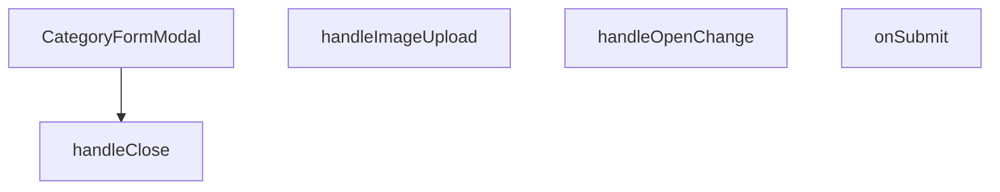

## NODE ID STANDARD

  file: src\components\admin\categories\CategoryFormModal.tsx
  function: src\components\admin\categories\CategoryFormModal.tsx::CategoryFormModal
  function: src\components\admin\categories\CategoryFormModal.tsx::handleImageUpload
  function: src\components\admin\categories\CategoryFormModal.tsx::onSubmit
  function: src\components\admin\categories\CategoryFormModal.tsx::handleClose
  function: src\components\admin\categories\CategoryFormModal.tsx::handleOpenChange

---

## DISA AKTARILANLAR (EXPORTS)
  export: CategoryFormModal

---

## STİL TOKENLERİ

### Arbitrary Değerler (token'a geçirilmemiş)
Yok — tüm stiller token'a geçirilmiş. ✅

### Kullanılan Token'lar (zaten token'a geçirilmiş)
- (yok)

### Tailwind Sınıf Özeti
- **Renkler:** `bg-black/40`, `bg-black/60`, `bg-cyan-500`, `bg-red-500`, `bg-surface-deep`, `bg-white/1`, `bg-white/2`, `bg-white/3`, `bg-white/5`, `border-2`, `border-b`, `border-b-2`, `border-dashed`, `border-t`, `border-transparent`
- **Layout:** `absolute`, `backdrop-blur-2`, `backdrop-blur-sm`, `block`, `custom-scrollbar`, `fixed`, `flex`, `flex-1`, `flex-col`, `gap-2`, `gap-4`, `gap-6`, `gap-8`, `grid`, `grid-cols-2`
- **Varyant/Responsive:** `data-[state=active]:`, `focus-visible:`, `focus:`, `group-hover:`, `hover:`, `placeholder:` önekleri
- **Yardımcı Sınıflar:** `${adminButtonPrimaryClass`, `-translate-x-1/2`, `-translate-y-1/2`, `animate-spin`, `appearance-none`, `border`, `cursor-pointer`, `focus-visible:outline-none`, `focus-visible:ring-cyan-500/50`, `focus-visible:ring-offset-0`, `font-black`, `font-bold`, `font-medium`, `font-mono`, `font-normal`

---
# FILE: src\components\admin\dashboard\AbcPieChart.md

---
domain: general
source_type: doc
namespace_type: module
source_path: C:\Users\alize\venthub-hvac\src\components\admin\dashboard\AbcPieChart.tsx
skeleton_hash: cb71fb57bbf4a080
entity_hashes:
  func:AbcPieChart: 3ae66809a3c8cea6
  overview: 64d9c987fb2a5f21
  style_tokens: cc7ba7a958715321
generated_at: 2026-06-19T20:47:04Z
---

## Genel Bakış
AbcPieChart, yönetim paneli gösterge tablosunda ABC ürün sınıflandırması verilerini interaktif bir donut (halka) pasta grafiği olarak görselleştiren React bileşenidir. Veri dizisi ve opsiyonel bir başlık alarak grafik oluşturur; veri yoksa veya tüm değerler sıfırsa AdminEmptyState bileşeniyle boş durum ekranı gösterir.

## Fonksiyon Grupları
### Pasta Grafiği Görselleştirme
Bileşenin tek ve temel sorumluluğudur: gelen veri dizisini doğrular, geçerliyse ResponsiveContainer ve PieChart bileşenleriyle renkli dilimlerden oluşan interaktif bir halka grafik oluşturur. Grafik merkezinde toplam stok sayısını, altında ise Legend ve Tooltip bileşenlerini sunar.

- AbcPieChart

---

## AXIOMS – Mimari Varsayımlar

Bu modül için mimari fonksiyon gövdesi paylaşılmadığından, yalnızca fonksiyon imzasından çıkarılabilir minimum varsayımlar tanımlanmıştır.

[Aksiyom 1]: Eğer `data` prop'u verilmezse, bileşen tanımsız davranış gösterebilir; çünkü `AbcPieChartProps` içinde `data` için bir default değer belirtilmemiştir.

[Aksiyom 2]: Eğer `title` prop'u verilmezse, bileşen tanımsız davranış gösterebilir; çünkü `AbcPieChartProps` içinde `title` için bir default değer belirtilmemiştir.

[Aksiyom 3]: Eğer `AbcPieChartProps` tipi tanımlı değilse veya `data`/`title` alanlarını içermiyorsa, TypeScript derleme hatası oluşur.

---

> **Not:** Modül gövdesi (function body) paylaşılmadığından, verinin işlenme mantığı (sıfır kontrolü, boş durum ekranı, grafik kütüphane entegrasyonu vb.) hakkında kesin aksiyon üretmek mümkün değildir. Eski dokümanda bahsedilen "veri yoksa boş ekran gösterimi" gibi davranışlar docstring/yorum kaynaklıdır ve mimari aksiyom olarak doğrulanamaz.

---

## FONKSİYON DETAYLARI

### AbcPieChart

**Ne yapar**: Admin dashboard'da ABC ürün sınıflandırması için interaktif donut (iç portionlu) pasta grafik gösteren React bileşenidir. Veri olmadığında veya tüm değerler sıfır olduğunda boş durum bileşeni (AdminEmptyState) gösterir, aksi halde renkli dilimlerden oluşan animasyonlu bir pie chart ve merkezde toplam stok sayısını sunar.

**Nasıl yapar**: 
- `useI18n()` hook'u ile çevirileri (`t` fonksiyonu) alarak çok dilli destek sağlar.
- İlk olarak data dizisinin geçerliliğini kontrol eder: `data` tanımsızsa, boşsa veya tüm elemanların `value` değeri 0 ise, `AdminEmptyState` bileşeni ile veri yetersizlik mesajı gösterir.
- Geçerli veri varsa, `data.reduce()` ile toplam değeri hesaplar ve `ResponsiveContainer` içinde `PieChart` bileşenini render eder.
- `Pie` bileşeninde her bir veri elemanı için `Cell` oluşturur; her hücreye ait `color` değeri `fill` olarak kullanılır, hover'da opacity düşüşü ile interaktiflik sağlanır.
- `Tooltip` ile üzerine gelindiğinde ürün sayısını ve sınıf adını formatlanmış şekilde gösterir.
- `Legend` bileşeni ile grafik altında sınıf isimlerini listeler.
- Grafik merkezine `absolute` konumlandırma ile toplam değer ve "Toplam Stok" etiketi yerleştirir; arkasında `blur` efekti ile görsel derinlik oluşturulur.
- Tüm grafik animasyonları `animationBegin={0}` ve `animationDuration={1500}` ile 1.5 saniyelik giriş animasyonuna sahiptir.
- Grubun tamamına `group/pie` class'ı eklenerek, başlık ve alt çizgi üzerinde hover efekti (`group-hover/pie:text-cyan-400`, `group-hover/pie:w-20`) uygulanır.

**Parametreler**:
- `data` — `AbcPieChartItem[]` veya `undefined` — Pasta grafikte gösterilecek veri dizisi; her eleman bir ürün sınıfını (A, B, C vb.) temsil eder, `value` (sayı) ve `color` (hex renk kodu) alanları içerir. Boş veya tanımsız geldiğinde boş durum gösterilir.
- `title` — `string` veya `undefined` — Grafik başlığı; belirtilmezse varsayılan olarak `t('admin.dashboard.abcProductClassification')` çevirisi kullanılır.

**Dönüş**: `JSX.Element` — Bu bileşen React JSX'i döner; iki durumdan birini render eder: ya veri yetersizlik durumu için `AdminEmptyState` içeren bir `div`, ya da donut pie chart, tooltip, legend ve merkez toplam göstergesi içeren tam grafik görünümü.

---

## İTHALATLAR (IMPORTS)
- import: ../AdminEmptyState::AdminEmptyState
- import: @/i18n/I18nProvider::useI18n
- import: lucide-react::PieChart
- import: recharts::Cell
- import: recharts::Legend
- import: recharts::Pie
- import: recharts::PieChart
- import: recharts::ResponsiveContainer
- import: recharts::Tooltip

---

## INTERFACES

### AbcPieChartProps
- `data: Array<{ name: string; value: number; color: string }>`
- `title?: string`

---

## AST POINTERS

### [N1_NASIL] AST Pointer: src/components/admin/dashboard/AbcPieChart.tsx::AbcPieChart
- **params**: `{ data, title }` (destructure edilmiş AbcPieChartProps objesi)
  - `data` — Pie chart veri dizisi; her eleman `value` (sayı), `color` (renk kodu) ve `name` (sınıf adı) özelliklerine sahiptir
  - `title` — Grafik başlık metni (opsiyonel, verilmezse `t('admin.dashboard.abcProductClassification')` kullanılır)
- **ic_degiskenler**:
  - `t` — `useI18n()` hook'undan dönen çeviri fonksiyonu; tüm UI metinlerinin lokalizasyonu için kullanılır (`t('admin.dashboard.noAnalysisData')`, `t('admin.dashboard.productCount', { count: value })` vb.)
  - `totalValue` — `data.reduce((acc, curr) => acc + curr.value, 0)` ile hesaplanan tüm data elemanlarının value toplamı; grafiğin merkezinde "Toplam Stok" olarak görüntülenir
- **Dönüş**: JSX (React bileşeni) — Veri boşsa veya sıfırdan oluşan `AdminEmptyState` bileşeni, değilse donut pie chart bileşeni döner
- **Yan etkiler**: Yok (render-only bileşen)
- **Inline callback değişkenleri** (JSX içinde tanımlı):
  - `entry` / `index` — `data.map` callback'inde her pie dilimi elemanını ve indeksini temsil eder; `Cell` bileşenine `entry.color` ile renk ve `key={cell-${index}}` ile anahtar atar
  - `value` / `name` — `Tooltip` `formatter` callback parametreleri; `value` ürün sayısını, `name` ürün sınıf adını temsil eder, çeviri fonksiyonuyla formatlanır
  - `value` — `Legend` `formatter` callback parametresi; legend metnini render eder

---

## NODE ID STANDARD

  file: src\components\admin\dashboard\AbcPieChart.tsx
  function: src\components\admin\dashboard\AbcPieChart.tsx::AbcPieChart

---

## DISA AKTARILANLAR (EXPORTS)
  export: AbcPieChart

---

## STİL TOKENLERİ

### Arbitrary Değerler (token'a geçirilmemiş)
Yok — tüm stiller token'a geçirilmiş. ✅

### Kullanılan Token'lar (zaten token'a geçirilmiş)
- `rounded-hvac-2xl`, `tracking-hvac-relaxed`

### Tailwind Sınıf Özeti
- **Renkler:** `bg-cyan-500/10`, `bg-cyan-500/30`, `bg-slate-900/40`, `border-white/5`, `group-hover/pie:text-cyan-400`, `text-4xl`, `text-slate-500`, `text-white`, `text-xs`
- **Layout:** `absolute`, `drop-shadow-pie-chart-glow`, `flex`, `flex-1`, `flex-col`, `group-hover/pie:w-20`, `h-0.5`, `h-full`, `items-center`, `justify-center`, `left-1/2`, `min-h-300px`, `p-10`, `relative`, `top-1/2`
- **Varyant/Responsive:** `group-hover/pie:`, `hover:` önekleri
- **Yardımcı Sınıflar:** `-mt-4`, `-translate-x-1/2`, `-translate-y-1/2`, `blur-3xl`, `border`, `cursor-pointer`, `duration-500`, `duration-700`, `font-black`, `group/pie`, `hover:opacity-80`, `inset-0`, `italic`, `mb-10`, `ml-1`

---
# FILE: src\components\admin\dashboard\ActivityHeatmap.md

---
domain: general
source_type: doc
namespace_type: module
source_path: C:\Users\alize\venthub-hvac\src\components\admin\dashboard\ActivityHeatmap.tsx
skeleton_hash: f80ac205549e0a66
entity_hashes:
  func:ActivityHeatmap: bd94540a2dbd025e
  func:CustomTooltip: 99bc62d30dc2bdeb
  overview: 54bf3273bff08181
  style_tokens: 92623035906e7e7c
generated_at: 2026-06-19T20:47:14Z
---

## Genel Bakış
Bu modül, yönetim paneli dashboard'unun bir parçası olarak aktivite verilerini görselleştirmek için tasarlanmış, takvim tabanlı bir ısı haritası bileşenidir. Dışarıdan sağlanan veri setini, yoğunluk bilgisini renk kodlarıyla gösteren interaktif bir arayüze dönüştürür ve kullanıcı etkileşimlerini zenginleştirmek için özel bir bilgi baloncuğu (tooltip) içerir.

## Fonksiyon Grupları
### Ana Isı Haritası Bileşeni
Modülün temelini oluşturur; dışarıdan gelen veri ve yapılandırma bilgilerini alarak ısı haritasının mantıksal hesaplamasını, düzenini ve render işlemini yönetir.
- ActivityHeatmap

### Yardımcı Bilgi Balonuğu
Isı haritası üzerindeki belirli bir veri noktasına (hücre) fare ile gelindiğinde tetiklenen ve o noktaya ait detaylı bilgiyi göstermek için kullanılan, bağımsız görünüm ve biçimlendirme mantığına sahip yardımcı bileşendir.
- CustomTooltip

---

## AXIOMS – Mimari Varsayımlar

Bu modül için temel mimari varsayımlar, fonksiyon imzalarından ve modülün genel bakış açıklamasından çıkarılan bilgilere dayanmaktadır.

[Aksiyom 1]: Eğer `data` parametresi verilmemiş veya null/undefined ise, ısı haritası bileşeni düzgün render edilemez (beklenmeyen davranış oluşur veya bileşen hata verir).

[Aksiyom 2]: Eğer `data` parametresi boş bir dizi ise, ısı haritası alanı boş görünür ve hiçbir yoğunluk göstergesi gösterilmez.

[Aksiyom 3]: Eğer `title` parametresi verilmemiş veya boş string ise, ısı haritası başlık alanı boş kalır ancak bileşen yine de render edilir.

[Aksiyom 4]: Eğer `data` içindeki herhangi bir elemanın `dayName` alanı eksik veya hatalı formatta ise, `CustomTooltip` içinde `dayName` bilgisi düzgün gösterilmez (veya `undefined` olarak render olur).

[Aksiyom 5]: Eğer `active` parametresi `false` veya undefined ise, `CustomTooltip` hiçbir içerik göstermez (veya gizli kalır).

[Aksiyom 6]: Eğer `payload` parametresi boş dizi veya undefined ise, `CustomTooltip` içinde gösterilecek veri içeriği olmaz.

[Aksiyom 7]: Isı haritasının renk kodlaması için gerekli olan eşik değerleri (yoğunluk seviyeleri) fonksiyon gövdesinde tanımlı değildir; bu değerler harici bir yapılandırma veya kütüphane tarafından sağlanmalıdır. Eşik değerleri tanımlı değilse, bileşen beklenmeyen davranış gösterebilir (örneğin tüm hücreler aynı renkte görünebilir).

---

## FONKSİYON DETAYLARI

### ActivityHeatmap
**Ne yapar**: ActivityHeatmap, haftalık aktivite verilerini ısı haritası (heatmap) formatında görselleştiren bir React bileşenidir. Verilen veri kümesine göre gün ve saat bazında renk kodlu bir gösterim sunar.

**Nasıl yapar**: Bileşen, HeatmapData türündeki data prop'unu alır ve her bir hücre için aktivite yoğunluğuna bağlı olarak renk intensitesi hesaplar. `title` prop'u ısı haritasının üst kısmında başlık olarak görüntülenir.

**Parametreler**:
- `data` — `HeatmapData[]` türünde olup, ısı haritasında gösterilecek haftalık aktivite veri dizisini temsil eder
- `title` — `string` türünde olup, ısı haritasının başlığını belirler

**Dönüş**: `React.FC<ActivityHeatmapProps>` — ActivityHeatmapProps arayüzüne uygun bir React fonksiyonel bileşeni döndürür

### CustomTooltip
**Ne yapar**: Geliştirildi ancak detay üretilemedi.

---

## İTHALATLAR (IMPORTS)
- import: ../AdminEmptyState::AdminEmptyState
- import: @/i18n/I18nProvider::useI18n
- import: lucide-react::Activity

---

## INTERFACES

### HeatmapData
- `day: number`
- `hour: number`
- `count: number`

### ActivityHeatmapProps
- `data: HeatmapData[]`
- `title?: string`

---

## AST POINTERS

### [N1_NASIL] AST Pointer: `ActivityHeatmap.tsx::ActivityHeatmap`
- **params**: `{ data, title }`
  - `data` — Ham heatmap veri dizisi; her eleman `day`, `hour`, `count` alanlarına sahiptir (HeatmapData tipinde)
  - `title` — Isı haritası bölümünün üst kısmında gösterilecek opsiyonel başlık metni
- **ic_degiskenler**:
  - `t` — `useI18n()` hook'undan dönen çeviri fonksiyonu; tüm UI metinleri için `t('...')` çağrıları yapılır
  - `dayNames` — 7 elemanlı dizi; her gün için çevrilmiş gün adını tutar (`t('admin.dashboard.days.mon')` ... `t('admin.dashboard.days.sun')`)
  - `chartData` — `data.map(d => {...})` ile elde edilen dönüştürülmüş veri dizisi; her eleman `{ hour, dayIndex, dayName, count }` yapısındadır. JS `getDay()` indeksleri (0=Pazar) chart indekslerine (0=Pazartesi) dönüştürülür
  - `ourDayIndex` — `data.map` callback içinde hesaplanan gün indeksi; `d.day === 0 ? 6 : d.day - 1` formülüyle Pazartesi=0, Pazar=6 aralığına map edilir
  - `maxCount` — `chartData` içindeki tüm `count` değerlerinin maksimumu; Z ekseni ölçeklendirmesi ve baloncuk boyutu hesabı için kullanılır, başlangıç değeri `1`
  - `zRange` — `[20, 400]` sabit dizi; baloncukların piksel cinsinden minimum ve maksimum alan aralığını belirler, `ZAxis` `range` prop'una verilir
  - `entry` — Scatter içindeki `chartData.map` callback'indeki mevcut veri nesnesi
  - `index` — Scatter içindeki `chartData.map` callback'indeki dizi indeksi; `key={`cell-${index}`}` oluşturmak için kullanılır
  - `intensity` — `entry.count / maxCount` ile hesaplanan yoğunluk oranı (0-1 arası); hücre opacity'si, stroke ve drop-shadow filtresi hesaplamalarının temelini oluşturur
  - `opacity` — `Math.max(0.15, intensity)` ile hesaplanan minimum %15 opacity garantisi olan opaklık değeri; `Cell` bileşeninin `fillOpacity` prop'una verilir
- **Dönüş**: JSX — Isı haritası içeren React bileşeni; `chartData` boşsa `AdminEmptyState` gösterir, doluysa `ResponsiveContainer > ScatterChart` ile baloncuklu scatter chart render eder

---

### [N2_NASIL] AST Pointer: `ActivityHeatmap.tsx::CustomTooltip`
- **params**: `{ active, payload }`
  - `active` — Tooltip'ın aktif olup olmadığını belirten opsiyonel boolean; `true` olduğunda tooltip içeriği gösterilir
  - `payload` — Tooltip payload dizisi; her elemanın `payload[0].payload` alanı `{ dayName, hour, count, dayIndex }` alanlarını taşır
- **ic_degiskenler**:
  - `data` — `payload[0].payload` referansı; tooltip içinde gösterilecek `dayName`, `hour`, `count` değerlerini barındırır
  - `formattedTime` — Template literal ile oluşturulmuş zaman dizesi; format: `"Pazartesi, 14:00"` gibi; `data.dayName` ve `data.hour` birleştirilerek `padStart(2, '0')` ile saat sıfır doldurulur
- **Dönüş**: JSX veya `null` — Aktif ve payload varsa formatlanmış bilgi kartı (`glass-strong` stilli div), değilse `null`

---

### [N3_NASIL] AST Pointer: `ActivityHeatmap.tsx::(d) => { return {...} }`
- **params**: `d`
  - `d` — `data.map()` iterasyonundaki tek bir ham heatmap veri nesnesi; `{ day: number, hour: number, count: number }` yapısındadır
- **ic_degiskenler**:
  - `ourDayIndex` — JS `getDay()` değerini chart indeksine dönüştüren hesaplama: `d.day === 0 ? 6 : d.day - 1`. Sonuç: 0=Pazartesi, 1=Salı, ..., 6=Pazar
- **Dönüş**: `{ hour, dayIndex, dayName, count }` — Chart bileşeninin beklediği dönüştürülmüş veri nesnesi; `dayName` değeri `dayNames[ourDayIndex]` ile lokalize edilmiş gün adıdır

---

### [N4_NASIL] AST Pointer: `ActivityHeatmap.tsx::(entry, index) => { return <Cell /> }`
- **params**: `entry, index`
  - `entry` — `chartData.map()` iterasyonundaki tek bir chart veri nesnesi; `{ hour, dayIndex, dayName, count }` yapısındadır
  - `index` — Mevcut iterasyon indeksi; `key` prop'u için kullanılır (`key={`cell-${index}`}`)
- **ic_degiskenler**:
  - `intensity` — `entry.count / maxCount` ile hesaplanan normalleştirilmiş yoğunluk (0-1 arası); tüm görsel hesaplamaların (opacity, strokeWidth, drop-shadow) temel parametresidir
  - `opacity` — `Math.max(0.15, intensity)` ile hesaplanan opaklık; yoğunluk sıfıra yakınsa bile minimum %15 görünür olmayı garanti eder; `Cell`'in `fillOpacity` prop'una bağlanır
- **Dönüş**: JSX `<Cell>` — Recharts Scatter içindeki tek bir baloncuk hücresi; `fill="#22d3ee"` (cyan), opacity intensity ile orantılı, `intensity > 0.7` olduğunda 2px cyan stroke eklenir, `intensity > 0.5` olduğunda cyan glow drop-shadow filter uygulanır

---

## NODE ID STANDARD

  file: src\components\admin\dashboard\ActivityHeatmap.tsx
  function: src\components\admin\dashboard\ActivityHeatmap.tsx::ActivityHeatmap
  function: src\components\admin\dashboard\ActivityHeatmap.tsx::CustomTooltip

---

## DISA AKTARILANLAR (EXPORTS)
  export: ActivityHeatmap

---

## STİL TOKENLERİ

### Arbitrary Değerler (token'a geçirilmemiş)
Yok — tüm stiller token'a geçirilmiş. ✅

### Kullanılan Token'lar (zaten token'a geçirilmiş)
- `shadow-glow-md`, `tracking-hvac-normal`, `tracking-hvac-relaxed`

### Tailwind Sınıf Özeti
- **Renkler:** `bg-cyan-400`, `bg-cyan-500/30`, `bg-cyan-500/5`, `border-cyan-400/20`, `border-white/10`, `border-white/5`, `group-hover/heatmap:text-cyan-400`, `hover:fill-white`, `text-cyan-400`, `text-slate-500`, `text-slate-600`, `text-sm`, `text-white`, `text-xs`
- **Layout:** `absolute`, `drop-shadow-heatmap-glow`, `flex`, `flex-1`, `flex-col`, `gap-2`, `gap-4`, `group-hover/heatmap:w-20`, `h-0.5`, `h-2.5`, `h-48`, `h-full`, `items-center`, `justify-center`, `justify-end`
- **Varyant/Responsive:** `group-hover/heatmap:`, `hover:` önekleri
- **Yardımcı Sınıflar:** `-ml-6`, `-translate-x-1/2`, `-translate-y-1/2`, `animate-in`, `blur-80`, `border`, `cursor-pointer`, `duration-200`, `duration-700`, `fade-in`, `font-black`, `glass`, `glass-strong`, `group/heatmap`, `italic`

---
# FILE: src\components\admin\dashboard\RecentOrdersTable.md

---
domain: general
source_type: doc
namespace_type: module
source_path: C:\Users\alize\venthub-hvac\src\components\admin\dashboard\RecentOrdersTable.tsx
skeleton_hash: 9e10cb2ca8227901
entity_hashes:
  func:RecentOrdersTable: 74faabf4e70dfa3a
  func:getStatusLabel: 2edd561db46db1dc
  func:getStatusStyles: 419f18093a05eeeb
  overview: 42e11c3335b98d9f
  style_tokens: ec5c1233acb1b783
generated_at: 2026-06-19T20:46:51Z
---

## Genel Bakış
RecentOrdersTable modülü, yönetim panelinde son siparişleri tablo formatında gösteren bir React bileşenidir. Bileşen, bir sipariş listesi ve başlık alarak verileri düzenler ve her bir siparişin durumuna uygun görsel stil ve etiketleri otomatik olarak üretir.

## Fonksiyon Grupları
### Ana Bileşen (Tablo Oluşturucu)
Sipariş dizisini alır, tablo yapısını ve satırlarını oluşturarak arayüze sunan ana React bileşenidir.
- RecentOrdersTable

### Durum Görselleştirme Yardımcıları
Sipariş durum metnine göre tablodaki ilgili hücre için uygun CSS stilsını ve okunabilir etiket metnini döndürerek tutarlı bir görünüm sağlar.
- getStatusStyles, getStatusLabel

---

## AXIOMS – Mimari Varsayımlar

RecentOrdersTable modülü, sipariş listesini tablo formatında gösteren bir React bileşeni olup durum görselleştirme yardımcı fonksiyonları kullanır. Bu modülün doğru çalışması için aşağıdaki varsayımlar geçerlidir:

---

## FONKSİYON DETAYLARI

### RecentOrdersTable
**Ne yapar**: Son siparişleri gösteren bir tablo bileşenidir. Verilen sipariş listesini, istenen başlıkla birlikte düzenli bir arayüzde sunar.
**Nasıl yapar**: `orders` prop'undan gelen diziye haritalama yaparak her sipariş için bir tablo satırı (`tr`) oluşturur. Her satırda siparişin kimliği, tarih, toplam tutar, müşteri adı ve durumu gibi bilgileri gösterir. Durum gösterimi için `getStatusStyles` ve `getStatusLabel` yardımcı fonksiyonlarını kullanarak duruma özel stil ve etiketler uygular.
**Parametreler**:
- orders: `Order[]` — Görüntülenecek sipariş nesneleri dizisi. Her nesne sipariş detaylarını içerir.
- title: `string` — Tablonun üzerinde gösterilecek başlık metni.
**Dönüş**: `React.FC<RecentOrdersTableProps>` — JSX ile oluşturulmuş, `<table>` elementi içeren React bileşeni.

### getStatusStyles
**Ne yapar**: Bir sipariş durumuna karşılık gelen CSS stil sınıfı nesnesini döndürür.
**Nasıl yapar**: `status` parametresiyle gelen durum dizesine göre (ör. "pending", "processing", "shipped", "delivered", "cancelled") önceden tanımlanmış stil sınıflarını içeren bir nesneyi döndürür. Bu nesne, ilgili durum göstergesine (badge) uygulanarak arka plan rengi, metin rengi gibi görsel özellikleri belirler.
**Parametreler**:
- status: `string` — Stillendirilecek sipariş durumunu belirten dize (ör. "pending", "shipped").
**Dönüş**: `object` — `{ className: string }` formatında, belirli CSS sınıflarını içeren nesne. Örneğin, `pending` durumu için `{ className: 'bg-yellow-100 text-yellow-800' }` gibi.

### getStatusLabel
**Ne yapar**: Bir sipariş durumu kodunu, kullanıcıya gösterilecek okunabilir etikete dönüştürür.
**Nasıl yapar**: `s` parametresiyle gelen durum dizesini (ör. "processing") alır ve bunu önceden tanımlanmış bir eşleme (mapping) kullanarak daha anlaşılır bir metne (ör. "İşleniyor") dönüştürür. Bu sayede arka uçtaki teknik durum kodları, arayüzde kullanıcı dostu biçimde sunulur.
**Parametreler**:
- s: `string` — Çevrilecek sipariş durum kodu.
**Dönüş**: `string` — Görüntülenecek insan tarafından okunabilir etiket metni. Durum eşleşmesi bulunamazsa, büyük harflerle düzenlenmiş ham durum dizesini döndürür.

---

## İTHALATLAR (IMPORTS)
- import: ../../../hooks/useDragScroll::useDragScroll
- import: ../../../i18n/I18nProvider::useI18n
- import: ../../../i18n/datetime::formatDateTime
- import: ../../../i18n/format::formatCurrency
- import: ../../../utils/routes::Routes
- import: ../AdminEmptyState::AdminEmptyState
- import: lucide-react::ChevronRight
- import: lucide-react::ExternalLink
- import: lucide-react::PackageSearch
- import: next/link::Link
- import: react::React

---

## INTERFACES

### OrderData
- `id: string`
- `created_at: string`
- `total_amount: number`
- `status: string`
- `order_number?: string | null`

### RecentOrdersTableProps
- `orders: OrderData[]`
- `title: string`

---

## AST POINTERS

### [N1_NASIL] AST Pointer: components/admin/dashboard/RecentOrdersTable.tsx::RecentOrdersTable
- **params**: `{ orders, title }`
- **ic_degiskenler**:
  - `lang` — useI18n() hook'undan gelen dil bilgisi, formatDateTime ve formatCurrency fonksiyonlarına parametre olarak gönderilir
  - `dragScrollRef` — useDragScroll<HTMLDivElement>() hook'undan dönen ref nesnesi, sürükleme ile yatay kaydırma için tablo container'ına bağlanır
  - `getStatusStyles` — inner function, status parametresine göre Tailwind CSS stil sınıfı döndürür
  - `getStatusLabel` — inner function, status parametresine göre Türkçe durum etiketi döndürür
- **JSX İçi Erişimler**:
  - `title` — bileşen başlığı olarak <h3> içinde render edilir
  - `orders` — sipariş dizisi, length kontrolü ve map iterasyonu için kullanılır
  - `r.id` — her siparişin benzersiz kimliği, key prop'u ve link href'inde kullanılır
  - `r.order_number` — sipariş numarası, order_number yoksa fallback olarak id kullanılır, son 8 karakter truncate edilir
  - `r.created_at` — sipariş oluşturma tarihi, formatDateTime fonksiyonuna gönderilir
  - `r.total_amount` — sipariş tutarı, formatCurrency fonksiyonuna gönderilir
  - `r.status` — sipariş durumu, getStatusStyles ve getStatusLabel fonksiyonlarına gönderilir
  - `index` — map iterasyonu indeksi, animasyon gecikmesi için (index * 50) ms hesaplanır
- **Dönüş**: JSX (React.ReactNode) — sipariş tablosu layout'u

### [N2_NASIL] AST Pointer: components/admin/dashboard/RecentOrdersTable.tsx::getStatusStyles
- **params**: `(status: string)`
- **ic_degiskenler**: yok
- **Dönüş**: string — duruma göre Tailwind CSS stil sınıfı (örn: 'bg-emerald-500/10 text-emerald-400 ring-emerald-500/30' için 'completed')

### [N3_NASIL] AST Pointer: components/admin/dashboard/RecentOrdersTable.tsx::getStatusLabel
- **params**: `(s: string)`
- **ic_degiskenler**: yok
- **Dönüş**: string — duruma göre Türkçe etiket (örn: 'completed' → 'Tamamlandı', 'pending' → 'Teklif/Bekleniyor')

### [N4_NASIL] AST Pointer: components/admin/dashboard/RecentOrdersTable.tsx::orders.map callback
- **params**: `(r, index)` — r: sipariş nesnesi, index: dizi indeksi
- **ic_degiskenler**: yok
- **Kullanılan erişimler**:
  - `r.id` — key prop'u ve detay link href'i için kullanılır
  - `r.order_number` — sipariş numarası gösterimi (|| ile fallback olarak r.id kullanılır)
  - `r.created_at` — formatDateTime(r.created_at, lang) çağrısında tarih formatlaması için kullanılır
  - `r.total_amount` — formatCurrency(r.total_amount, lang) çağrısında para birimi formatlaması için kullanılır
  - `r.status` — getStatusStyles(r.status) ve getStatusLabel(r.status) çağrılarında kullanılır
  - `index` — animationDelay hesaplaması için kullanılır: `${index * 50}ms`
  - `lang` — parent scope'dan闭包 ile erişilen dil bilgisi, formatDateTime ve formatCurrency'e gönderilir
- **Dönüş**: JSX (<tr> elementi) — tek bir sipariş tablosu satırı

---


## MERMAID CALL GRAPH
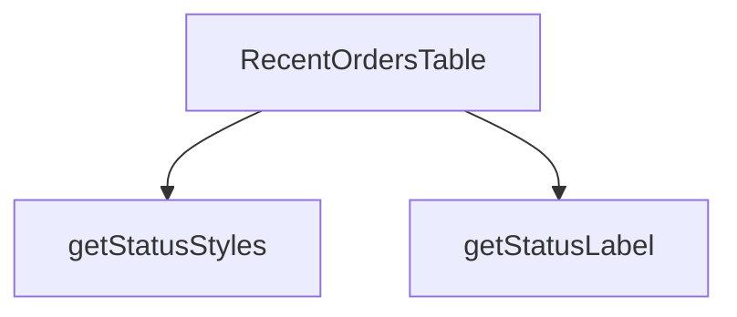

## NODE ID STANDARD

  file: src\components\admin\dashboard\RecentOrdersTable.tsx
  function: src\components\admin\dashboard\RecentOrdersTable.tsx::RecentOrdersTable
  function: src\components\admin\dashboard\RecentOrdersTable.tsx::getStatusStyles
  function: src\components\admin\dashboard\RecentOrdersTable.tsx::getStatusLabel

---

## DISA AKTARILANLAR (EXPORTS)
  export: RecentOrdersTable

---

## STİL TOKENLERİ

### Arbitrary Değerler (token'a geçirilmemiş)
Yok — tüm stiller token'a geçirilmiş. ✅

### Kullanılan Token'lar (zaten token'a geçirilmiş)
- `rounded-hvac-2xl`, `tracking-hvac-normal`, `tracking-hvac-relaxed`

### Tailwind Sınıf Özeti
- **Renkler:** `bg-current`, `bg-cyan-500`, `bg-cyan-500/0`, `bg-cyan-500/5`, `bg-white/2`, `bg-white/5`, `border-collapse`, `border-white/5`, `group-hover/row:bg-cyan-500`, `group-hover/row:bg-white/10`, `group-hover/row:text-white`, `group-hover/table:text-cyan-400`, `hover:bg-cyan-500`, `hover:bg-white/3`, `hover:text-surface-deep`
- **Layout:** `-right-24`, `-top-24`, `absolute`, `backdrop-blur-md`, `custom-scrollbar`, `flex`, `flex-col`, `gap-2`, `gap-3`, `h-0.5`, `h-1.5`, `h-48`, `h-6`, `h-full`, `inline-flex`
- **Varyant/Responsive:** `active:`, `first:`, `group-hover/btn:`, `group-hover/link:`, `group-hover/row:`, `group-hover/table:`, `hover:`, `last:` önekleri
- **Yardımcı Sınıflar:** `${adminTableCellClass`, `${adminTableContainerClass`, `${adminTableHeadCellClass`, `${getStatusStyles(r.status`, `-ml-8`, `active:scale-95`, `animate-in`, `animate-pulse`, `blur-100`, `border`, `divide-white/5`, `divide-y`, `duration-300`, `duration-500`, `fade-in`

---
# FILE: src\components\admin\dashboard\SalesChart.md

---
domain: general
source_type: doc
namespace_type: module
source_path: C:\Users\alize\venthub-hvac\src\components\admin\dashboard\SalesChart.tsx
skeleton_hash: da532f9cfab326b1
entity_hashes:
  func:SalesChart: 81798fe6d2553ef7
  overview: b9d1d9a412f73b23
  style_tokens: d6e6bd2ac73e7719
generated_at: 2026-06-19T20:47:01Z
---

## Genel Bakış
SalesChart bileşeni, yönetim panelinde satış verilerini görselleştiren temel bir React grafik bileşenidir. Dışarıdan sağlanan veri seti ve başlık bilgisiyle, kullanıcının satış performansını hızlıca analiz etmesine olanak tanıyan bir grafik oluşturur.

## Fonksiyon Grupları
### Grafik Görselleştirme
Bu grup, yönetici arayüzünde satış verilerini grafik olarak sunan bileşenin temel yapısını ve render mantığını barındırır. Bileşen, gelen verileri alır ve anlamlı bir grafik çıktısı üretir.
- SalesChart

---

## AXIOMS – Mimari Varsayımlar
Bu React bileşeninin çalışması için外界den sağlanan props'ların varlığına bağlıdır.

**[Aksiyom 1]**: Eğer `data` prop'u sağlanmamışsa, bileşen grafik verisini görselleştiremez ve boş/hatalı bir grafik render edilir.

**[Aksiyom 2]**: Eğer `title` prop'u sağlanmamışsa, grafik başlığı gösterilmez veya grafik başlıksız render edilir.

**[Aksiyom 3]**: Eğer `data` prop'u boş dizi (`[]`) olarak verilmişse, grafik alanında veri noktaları gösterilmez (sıfır yükseklikli veya boş bir chart alanı oluşur).

**[Aksiyom 4]**: Eğer `data` prop'u grafik kütüphanesinin beklediği formatta (tarih/sayısal değer çiftleri vb.) değilse, grafik render hatası oluşur.

**[Aksiyom 5]**: Eğer `title` prop'u boş string (`""`) olarak verilmişse, grafik başlık alanı görünür ancak içeriği boş olur.

**[Aksiyom 6]**: Bu bileşen yönetici paneli (admin dashboard) bağlamında kullanılmalıdır — yetkisiz sayfalarda render edilmesi durumunda veri gizliliği ihlali riski oluşur.

---

## FONKSİYON DETAYLARI

### SalesChart
**Ne yapar**: Bu React fonksiyonel bileşeni, yönetici panosu (admin dashboard) arayüzünde satış verilerini görselleştiren bir grafik bileşeni oluşturur. Kendisine iletilen `data` ve `title` prop'larını kullanarak kullanıcıya anlamlı bir satış raporu sunar.

**Nasıl yapar**: `React.FC<SalesChartProps>` tipi ile tanımlanan bir fonksiyonel bileşendir. Gelen props nesnesini JavaScript destructuring yöntemiyle `data` ve `title` değişkenlerine ayırır. Bu değişkenleri kullanarak bir grafik JSX yapısı oluşturur ve render edilmek üzere döndürür. Bileşenin iç mantığı, tip güvenliği sağlayan `SalesChartProps` arayüzüne dayanır.

**Parametreler**:
- `data: SalesChartProps['data']` — Grafikte görüntülenecek olan satış verilerini içeren prop'tur. İçeriği ve yapısı `SalesChartProps` arayüzü tarafından belirlenir ve üst bileşen tarafından sağlanır.
- `title: SalesChartProps['title']` — Grafiğin üst kısmında görüntülenecek başlık metnini belirten string değerdir. Kullanıcı arayüzünde grafiğin bağlamını açıklamak için kullanılır.

**Dönüş**: `React.FC<SalesChartProps>` — Fonksiyonun kendisi bir React Fonksiyonel Bileşeni döndürür. Bu bileşenin bir örneği JSX içerisinde çağrıldığında (`<SalesChart ... />`) bir `ReactElement` ya da `null` döndürür.

---

## İTHALATLAR (IMPORTS)
- import: ../AdminEmptyState::AdminEmptyState
- import: @/i18n/I18nProvider::useI18n
- import: lucide-react::TrendingUp
- import: react::React

---

## INTERFACES

### SalesChartProps
- `data: Array<{ date: string; orders: number; returns: number }>`
- `title: string`

---

## NODE ID STANDARD

  file: src\components\admin\dashboard\SalesChart.tsx
  function: src\components\admin\dashboard\SalesChart.tsx::SalesChart

---

## DISA AKTARILANLAR (EXPORTS)
  export: SalesChart

---

## STİL TOKENLERİ

### Arbitrary Değerler (token'a geçirilmemiş)
Yok — tüm stiller token'a geçirilmiş. ✅

### Kullanılan Token'lar (zaten token'a geçirilmiş)
- `h-hvac-panel`, `shadow-glow-md`, `tracking-hvac-relaxed`

### Tailwind Sınıf Özeti
- **Renkler:** `bg-cyan-400`, `bg-rose-500`, `border-l`, `border-white/10`, `border-white/5`, `group-hover/chart:text-cyan-400`, `hover:bg-white/5`, `text-slate-300`, `text-slate-500`, `text-white`, `text-xl`, `text-xs`
- **Layout:** `backdrop-blur-2xl`, `flex`, `flex-1`, `flex-col`, `gap-2`, `gap-4`, `h-2.5`, `items-center`, `justify-between`, `justify-center`, `min-h-0`, `p-1.5`, `p-8`, `shadow-2xl`, `w-2.5`
- **Varyant/Responsive:** `group-hover/chart:`, `hover:` önekleri
- **Yardımcı Sınıflar:** `-ml-8`, `border`, `font-black`, `glass`, `group/chart`, `italic`, `leading-none`, `mb-10`, `mt-3`, `opacity-60`, `px-4`, `py-2`, `rounded-2xl`, `rounded-full`, `rounded-xl`

---
# FILE: src\components\admin\dashboard\StatCard.md

---
domain: general
source_type: doc
namespace_type: module
source_path: C:\Users\alize\venthub-hvac\src\components\admin\dashboard\StatCard.tsx
skeleton_hash: 9cf0d06b5caf4b52
entity_hashes:
  func:StatCard: 42faa1e1d38b732c
  overview: d5fe2f564e9e4393
  style_tokens: 3b396ad8fb25d2f9
generated_at: 2026-06-19T20:47:00Z
---

## Genel Bakış
`StatCard` bileşeni, yönetim panelinde tek bir istatistiği görselleştirmek için kullanılan yeniden kullanılabilir bir kart bileşenidir. Başlık, alt başlık, değer, yükleme durumu, para birimi biçimlendirmesi ve çok dilli metin desteği gibi farklı ihtiyaçları tek bir arayüzde toplar.

## Fonksiyon Grupları
### UI Render Grubu
Kartın dış yapısını, tipografisini ve düzenini oluşturur; gelen prop’ların görsel bileşenlerle eşlenmesini sağlar.
- StatCard

### Veri ve Durum İşleme Grubu
Değerlerin para birimi formatında gösterilmesi, yükleme durumuna göre ekranın güncellenmesi ve metinlerin dil ayarına göre çevrilmesi gibi mantıksal işlemleri yürütür.
- StatCard

---

## AXIOMS – Mimari Varsayımlar
Bu modül için özel aksiyom tanımlanmamıştır.

---

## FONKSİYON DETAYLARI

### StatCard

**Ne yapar**: Admin panelinin dashboard bölümünde istatistik verilerini görsel olarak sunan bir kart bileşenidir. Başlık, alt başlık, değer ve para birimi formatlama seçenekleriyle birlikte yüklenme durumu animasyonu da destekler.

**Nasıl yapar**: Bileşen, verilen parametreleri kullanarak bir kart yapısı oluşturur. `loading` parametresi `true` olduğunda, değer yerine bir iskelet (skeleton) animasyonu göstererek kullanıcıya verinin yüklendiği hissini verir. `isCurrency` parametresi `true` olarak ayarlandığında, `value` değerini para birimi formatına dönüştürerek hiển thị eder. `lan` parametresi ile dil ayarlarına göre para birimi simgesi ve formatlaması değiştirilebilir.

**Parametreler**:

- `title`: `string` — Kartın üst kısmında görünen ana başlık metni. Örneğin "Toplam Gelir" veya "Aktif Kullanıcılar" gibi istatistik kategorisini belirtir.
- `subtitle`: `string | undefined` — Kartın başlık altında görünen opsiyonel alt başlık bilgisi. Başlığı destekleyen ek açıklama veya detay metnini taşır.
- `value`: `string | number` — Kartın orta bölgesinde büyük puntolarla gösterilen temel istatistik değeri. Sayısal veya metin formatında olabilir.
- `loading`: `boolean` — Bileşenin yükleme durumunu belirler. `true` değeri alırsa gerçek değerler yerine skeleton placeholder animasyonu gösterilir, böylece veri henüz yüklenmemişken kullanıcı arayüzünün bozulması engellenir.
- `isCurrency`: `boolean` — Değerin para birimi olarak formatlanıp formatlanmayacağını belirler. `true` olduğunda `value` parametresi para birimi sembolü ve binlik ayraçlarıyla birlikte gösterilir.
- `lan`: `string` — Para birimi formatlamasında kullanılacak dil ve bölge ayarını belirler. `Intl.NumberFormat` içinde dil kodu olarak kullanılır, örneğin `"tr-TR"` Türkçe format veya `"en-US"` İngilizce format için.

**Dönüş**: `React.FC<StatCardProps>` — JSX elementi döndürür. StatCardProps arayüzüne uygun olarak yapılandırılmış bir React fonksiyonel bileşenidir.

---

## İTHALATLAR (IMPORTS)
- import: ../../../i18n/format::formatCurrency
- import: next/link::Link
- import: react::React

---

## INTERFACES

### StatCardProps
- `title: string`
- `subtitle?: string`
- `value: number | string | null`
- `loading: boolean`
- `isCurrency?: boolean`
- `lang?: string`
- `href?: string`
- `icon?: React.ReactNode`
- `trend?: { value: number; label?: string }`
- `accent?: 'navy' | 'emerald' | 'amber' | 'rose' | 'violet' | 'sky' | 'orange'`

---

## AST POINTERS

### [N1_NASIL] AST Pointer: components/admin/dashboard/StatCard.tsx::StatCard
- **params**:
  - `title` — Kartın başlık metni, üst kısımda `text-xs` ile gösterilir
  - `subtitle` — Kartın alt başlık/etiket metni, isteğe bağlı olarak `italic` stilinde gösterilir
  - `value` — Kartta gösterilecek asıl değer (sayı veya string olabilir), null ise '-' gösterilir
  - `loading` — Yüklenme durumu flag'i, true ise displayValue '…' olur ve trend/subtitle gizlenir
  - `isCurrency` — value'nin para birimi olarak formatlanıp formatlanmayacağını belirler, true ise `formatCurrency()` çağrılır
  - `lang` — Para birimi formatı dili, varsayılan `'tr'`, `'tr' | 'en'` olarak `formatCurrency`'e传递 edilir
  - `href` — Link yönlendirme URL'si, tanımlı ise kart `<Link>` ile sarılır
  - `icon` — Kartta gösterilecek React icon elemanı, `React.cloneElement` ile `size:24, strokeWidth:2.5` olarak clone edilir
  - `trend` — Trend bilgisi nesnesi, `.value` property'si ile yüzde değişim gösterilir (pozitif yeşil ↑, negatif kırmızı ↓)
  - `accent` — Renk teması adı, varsayılan `'navy'`, `accents` objesindeki key olarak kullanılır
- **ic_degiskenler**:
  - `accents` — 7 farklı renk temasının (navy, emerald, amber, rose, violet, sky, orange) CSS class'larını tutan sabit obje; her tema için border, accent, iconBg, glow, text değerleri tanımlıdır
  - `currentAccent` — `accents[accent]` ile elde edilen aktif renk teması objesi, kartın border rengi, icon arkaplanı, accent rengi gibi stiller için kullanılır
  - `displayValue` — Kartta gösterilecek formatlanmış değer; loading=true ise `'…'`, value==null ise `'-'`, isCurrency ve number ise `formatCurrency(value, lang)` çağrısı ile para birimi formatına çevrilir, aksi halde ham value kullanılır
  - `content` — JSX elemanı; kartın içeriğini (başlık, displayValue, trend yüzdesi, subtitle, icon) barındıran ana yapı, hem Link içine hem de plain div içine yerleştirilir
  - `baseClass` — Kartın temel CSS class string'i; `glass-strong`, padding, border, shadow ve hover geçiş stillerini içerir, `currentAccent.border` ile dinamik border rengi eklenir
- **Dönüş**: JSX elemanı (`React.ReactNode`) — `href` tanımlı ise `<Link>` ile sarılmış kart, değilse `<div>` içine sarılmış kart döndürür; her iki durumda da `content` JSX'i render edilir

---

## NODE ID STANDARD

  file: src\components\admin\dashboard\StatCard.tsx
  function: src\components\admin\dashboard\StatCard.tsx::StatCard

---

## DISA AKTARILANLAR (EXPORTS)
  export: StatCard

---

## STİL TOKENLERİ

### Arbitrary Değerler (token'a geçirilmemiş)
Yok — tüm stiller token'a geçirilmiş. ✅

### Kullanılan Token'lar (zaten token'a geçirilmiş)
- `shadow-glow-md`, `tracking-hvac-normal`, `tracking-hvac-relaxed`

### Tailwind Sınıf Özeti
- **Renkler:** `bg-emerald-400/10`, `bg-gradient-to-br`, `bg-rose-400/10`, `border-white/5`, `from-white/5`, `group-hover:text-slate-400`, `lg:text-4xl`, `text-3xl`, `text-emerald-400`, `text-rose-400`, `text-slate-500`, `text-white`, `text-xs`, `to-transparent`
- **Layout:** `-right-12`, `-top-12`, `absolute`, `block`, `bottom-0`, `flex`, `flex-1`, `flex-wrap`, `from-white/5`, `gap-0.5`, `gap-2`, `group-hover:shadow-hvac-stat-card-hover`, `h-1`, `h-14`, `h-48`
- **Varyant/Responsive:** `:`, `group-hover:`, `hover:`, `lg:` önekleri
- **Yardımcı Sınıflar:** `${baseClass`, `${currentAccent.accent`, `${currentAccent.iconBg`, `${trend.value`, `0`, `:`, `>=`, `border`, `duration-1000`, `duration-500`, `duration-700`, `font-black`, `group-hover:rotate-6`, `group-hover:scale-105`, `group-hover:scale-110`

---
# FILE: src\components\admin\data-table\BulkBar.md

---
domain: general
source_type: doc
namespace_type: module
source_path: C:\Users\alize\venthub-hvac\src\components\admin\data-table\BulkBar.tsx
skeleton_hash: 75e0953d539abab2
entity_hashes:
  func:BulkBar: ba30c4958f369a2e
  overview: 3bff9d3fdbf00dd5
  style_tokens: dd2e832a7f2c05f0
generated_at: 2026-06-19T20:47:00Z
---

## Genel Bakış

BulkBar, yönetici panelindeki veri tablolarında toplu seçim yapıldığında görüntülenen araç çubuğu bileşenidir. Seçilen öğe sayısını, ilgili etiketleri ve toplu işlem seçeneklerini sunarak kullanıcıya seçim durumunu gösterir ve seçim temizleme ile çoklu işlem yürütme imkânı sağlar.

## Fonksiyon Grupları

### Seçim Durumu Gösterimi
Seçili öğe sayısını ve etiketlerini kullanıcıya sunarak mevcut seçim durumunu görsel olarak iletir.
- BulkBar (bileşen)

### İşlem Yönetimi
Toplu işlemler için tanımlanmış aksiyonları listeler ve seçim temizleme işlevini dışarıya bildirir.
- BulkBar (bileşen — `actions` ve `onClear` prop'ları aracılığıyla)

---

## AXIOMS – Mimari Varsayımlar

Bu modül, seçili öğeler için toplu işlem çubuğu (bulk action bar) gösteren bir React bileşenidir.

[Aksiyom 1]: Eğer `selectedCount` parametresi sayısal değer içermiyorsa, bileşende seçili öğe sayısı gösterimi hatalı veya anlamsız olur.

[Aksiyom 2]: Eğer `onClear` parametresi proporcion olarak sağlanmıyorsa, kullanıcı seçimi temizleme işlemini gerçekleştiremez.

[Aksiyom 3]: Eğer `actions` parametresi geçerli bir dizi veya liste içermiyorsa, bileşende toplu işlem butonları gösterilmez.

[Aksiyom 4]: Eğer `selectedLabel` parametresi sağlanmıyorsa, seçili öğe sayısı yanında görüntülenecek bağlam metni eksik olur.

[Aksiyom 5]: Eğer `clearLabel` parametresi sağlanmıyorsa, temizleme butonunun metin etiketi eksik olur.

[Aksiyom 6]: `toneClassMap` sabitinin, bileşenin farklı durum/ton varyasyonları için geçerli CSS sınıf haritalaması içermesi gerekir; aksi takdirde stil uygulanamaz.

---

## FONKSİYON DETAYLARI

### BulkBar

**Ne yapar**: Seçili öğelerin sayısını ve ilgili toplu işlem (bulk) aksiyonlarını gösteren, sayfanın alt kısmında yapışkan (sticky) olarak konumlanan bir araç çubuğu bileşenidir. Seçim sayıs sıfıra eşit olduğunda hiçbir şey render etmez (null döner), böylece seçili öğe yokken gereksiz bir UI elemanı ekranda bulunmaz.

**Nasıl yapar**: Bileşen, prop olarak gelen `selectedCount` değerini kontrol ederek sıfırsa `null` döner ve DOM'a hiçbir şey eklenmez. Sıfırdan farklıysa, cam efektli (`glassStrongClass`) yuvarlak köşeli bir контейнер içinde iki ana bölümü render eder: sol tarafta seçili öğe sayısını yuvarlak bir rozet içinde gösteren bilgi alanı ve sağ tarafta aksiyon butonlarını döngüyle listeleyen buton alanı. Her bir aksiyonun `panel` özelliği varsa (bir React bileşeni/fonksiyonu ise), butona tıklandığında ilgili panel açılır; `openKey` state'i hangi panelin açık olduğunu kontrol eder. Paneller butonun üstünde (`absolute bottom-full`) konumlandırılmıştır. Paneli kapatmak için `closePanel` fonksiyonu çağrılır ve bu fonksiyon `openKey`'i `null` yaparak tüm panelleri kapatır. `panel`'i olmayan aksiyonlarda ise doğrudan `onRun` fonksiyonu tetiklenir. Her butonun tonuna göre farklı stil sınıfları (`toneClassMap`) uygulanır.

**Parametreler**:
- `selectedCount`: `number` — Seçili öğe sayısını belirtir. Değer 0 ise bileşen render edilmez; 0'dan büyük ise araç çubuğu görünür hale gelir.
- `selectedLabel`: `string` — Seçili öğe sayısının yanında gösterilen açıklayıcı metin. Örneğin `"öğe seçildi"` gibi bir etiket olarak kullanılır.
- `clearLabel`: `string` — Seçimi temizleme butonunun üzerinde ve `aria-label` niteliğinde görünen metin. Büyük harfler ve geniş karakter aralığı ile (`uppercase tracking-widest`) stilize edilir.
- `actions`: `BulkAction[]` — Kullanılabilir toplu işlem aksiyonlarının dizisi. Her aksiyon nesnesi `key` (benzersiz tanımlayıcı), `label` (buton metni), opsiyonel `tone` (buton tonu/renomu), opsiyonel `panel` (açılabilir panel içeriği olarak bir fonksiyon) ve opsiyonel `onRun` (panel olmadan çalıştırılacak fonksiyon) özelliklerini içerir. `panel` bir fonksiyon olarak verildiğinde, `closePanel` callback'ini argüman olarak alır; bu sayede panel kendi içinden kapatılabilir.
- `onClear`: `() => void` — Seçimi temizleme butonuna tıklandığında çağrılan geri çağırma fonksiyonu. Seçili tüm öğelerin seçimini kaldırmak için kullanılır.

**Dönüş**: `React.ReactNode` — Seçim sayısına bağlı olarak `null` veya JSX ile oluşturulmuş bir React düğümü döner. Seçim sayısı sıfır olduğunda `null`, sıfırdan farklı olduğunda sticky araç çubuğu JSX'i döner.

---

## İTHALATLAR (IMPORTS)
- import: react::React

---

## INTERFACES

### BulkAction
- `key: string`
- `label: string`
- `tone?: 'default' | 'danger' | 'warning'`
- `panel?: (close: () => void) => React.ReactNode`
- `onRun?: () => Promise<void>`

### BulkBarProps
- `selectedCount: number`
- `selectedLabel: string`
- `clearLabel: string`
- `actions: BulkAction[]`
- `onClear: () => void`

---

## SABİTLER
- **toneClassMap** (object) — `{
    default: adminTableActionClass,
    danger: adminTableActionDangerClass...`

---

## AST POINTERS

### [N1_NASIL] AST Pointer: BulkBar.tsx::BulkBar
- **params**: `{ selectedCount: number, selectedLabel: string, clearLabel: string, actions: Action[], onClear: () => void }` — BulkBarProps destructured olarak
- **ic_degiskenler**:
  - `openKey` — şu an açık olan panelin key'ini tutar; string veya null (React.useState ile oluşturulmuş state)
  - `setOpenKey` — openKey state'ini güncelleyen setter fonksiyonu
  - `closePanel` — setOpenKey(null) çağırarak açık panelleri kapan yardımcı fonksiyon (tanımlı ama JSX içinde action.panel(closePanel) olarak kullanılır)
- **Dönüş**: `React.ReactNode | null` — selectedCount === 0 ise null, aksi halde sticky bottom toolbar JSX'i

### [N2_NASIL] AST Pointer: BulkBar.tsx::actions.map callback
- **params**: `(action: Action)` — actions dizisinin her elemanı için çalışan arrow fonksiyon
- **ic_degiskenler**:
  - `toneClass` — toneClassMap[action.tone ?? 'default'] ile elde edilen CSS sınıf string'i, butonun renk tonunu belirler
  - `hasPanel` — typeof action.panel === 'function' kontrolü, action'ın panel bileşeni içerip içermediğini boolean olarak tutar
  - `isOpen` — openKey === action.key karşılaştırması, bu action'a ait panelin açık olup olmadığını boolean olarak tutar
- **Dönüş**: JSX `<div>` elemanı (buton ve koşullu panel)

### [N3_NASIL] AST Pointer: BulkBar.tsx::onClick handler (actions.map içindeki button onClick)
- **params**: yok
- **ic_degiskenler**:
  - `hasPanel` — closure tarafından yakalanmış, panel varsa true (üst scope'tan gelir)
  - `isOpen` — closure tarafından yakalanmış, panel açıksa true (üst scope'tan gelir)
- **Erişimler**: `setOpenKey(isOpen ? null : action.key)` — panel varsa toggle eder; `action.onRun()` — panel yoksa doğrudan çalıştırılır
- **Dönüş**: void

---

## NODE ID STANDARD

  file: src\components\admin\data-table\BulkBar.tsx
  function: src\components\admin\data-table\BulkBar.tsx::BulkBar

---

## DISA AKTARILANLAR (EXPORTS)
  export: BulkAction
  export: BulkBar
  export: BulkBarProps

---

## STİL TOKENLERİ

### Arbitrary Değerler (token'a geçirilmemiş)
Yok — tüm stiller token'a geçirilmiş. ✅

### Kullanılan Token'lar (zaten token'a geçirilmiş)
- (yok)

### Tailwind Sınıf Özeti
- **Renkler:** `bg-cyan-400`, `hover:text-white`, `text-slate-200`, `text-slate-500`, `text-sm`, `text-surface-deep`, `text-xs`
- **Layout:** `absolute`, `bottom-4`, `bottom-full`, `flex`, `flex-wrap`, `gap-2`, `gap-3`, `gap-4`, `h-8`, `inline-flex`, `items-center`, `justify-between`, `justify-center`, `max-w-4xl`, `relative`
- **Varyant/Responsive:** `hover:` önekleri
- **Yardımcı Sınıflar:** `${glassStrongClass`, `font-black`, `font-bold`, `mb-2`, `mx-auto`, `px-5`, `py-3`, `rounded-2xl`, `rounded-full`, `tracking-widest`, `transition-colors`, `underline`, `uppercase`

---
# FILE: src\components\admin\data-table\BulkPricePanel.md

---
domain: general
source_type: doc
namespace_type: module
source_path: C:\Users\alize\venthub-wt-admin\src\components\admin\data-table\BulkPricePanel.tsx
skeleton_hash: c6e852bc24d82b38
entity_hashes:
  func:BulkPricePanel: 98486d576f3fce24
  overview: fe92bf0c51b69212
  style_tokens: e2f13243910dab82
generated_at: 2026-08-15T16:41:17Z
---

## Genel Bakış

`BulkPricePanel`, yöneticilerin toplu fiyat güncelleme işlemlerini gerçekleştirebildiği bir React panel bileşenidir. Bu panel, veri tablosu üzerinden seçili ürünlerin fiyatlarını tek seferde düzenlemeye olanak tanır ve iki temel callback üzerinden üst bileşene uygulama veya kapatma sinyali iletir.

## Fonksiyon Grupları

### Ana Bileşen (BulkPricePanel)
Tek bir React fonksiyonel bileşeninden oluşan bu modül, toplu fiyat düzenleme panelinin tüm arayüzünü ve mantığını barındırır. Üst bileşenden alınan `onApply` ve `onClose` callback'leri aracılığıyla fiyat uygulama ve paneli kapatma işlemlerini yönetir.

---

## AXIOMS – Mimari Varsayımlar

Bu modül için fonksiyon gövdesi verilmediğinden, sadece fonksiyon imzasından çıkarılabilecek minimum varsayımlar tanımlanabilmektedir.

[Aksiyom 1]: Eğer `onApply` callback'i verilmezse, bileşen toplu fiyat uygulama işlemini tetikleyemez.

[Aksiyom 2]: Eğer `onClose` callback'i verilmezse, bileşen kapatılamaz veya kullanıcı paneli kapattığında hata oluşur.

---

**Not:** Fonksiyon gövdesi sağlandığında daha detaylı mimari varsayımlar (eşik değerleri, state bağımlılıkları, API çağrı koşulları vb.) üretilebilir.

---

## FONKSİYON DETAYLARI

### BulkPricePanel
**Ne yapar**: Toplu fiyat güncelleme panelini oluşturan ve yöneten React bileşenidir. Kullanıcının seçili ürünlerin fiyatlarını yüzde olarak veya sabit tutar olarak topluca güncellemesine olanak tanır.

**Nasıl yapar**: `useI18n` hook'u ile çoklu dil desteği sağlar. `priceMode` durumu ile yüzde veya sabit tutar modu arasında seçim yapılmasını, `priceValue` durumu ile girilen değerin takibini ve `priceError` durumu ile hata yönetimini yönetir. `apply` fonksiyonu içinde girilen değeri `parseFloat` ile sayıya dönüştürerek doğrulama yapar; geçersiz bir değer girildiğinde `priceError` durumunu ayarlar ve hata mesajını bileşen içinde gösterir. Geçerli bir değer girildiğinde `onApply` callback'ini çağırarak fiyatı uygular ve paneli kapatır. `modeButtonClass` yardımcı fonksiyonu, aktif/pasif duruma göre dinamik CSS sınıfları üretir.

**Parametreler**:
- `onApply`: `(mode: 'percent' | 'fixed', value: number) => void` — Fiyat güncelleme işlemi uygulandığında çağrılan geri çağırma fonksiyonu. Modu ('percent' veya 'fixed') ve sayısal değeri parametre olarak alır.
- `onClose`: `() => void` — Panel kapatıldığında çağrılan geri çağırma fonksiyonu.

**Dönüş**: `React.ReactNode` — Oluşturulan JSX içeriğini döndürür.

---

## İTHALATLAR (IMPORTS)
- import: ../../../utils/adminUi::adminButtonPrimaryClass
- import: @/i18n/I18nProvider::useI18n
- import: react::React

---

## INTERFACES

### BulkPricePanelProps
TOPLU FİYAT GÜNCELLEME PANELİ `BulkActionToolbar`'dan çıkarıldı: o bileşen `BulkBar` ile MÜKERRERDİ (aynı işi yapan iki yapışkan toplu-işlem çubuğu, üstelik farklı görsel dillerde — biri koyu cam, diğeri açık zeminli emoji'li). Cetvel §4'ün "aynı işlem farklı sayfada farklı görünmemeli" maddesi bunu
- `onApply: (mode: 'percent' | 'fixed', value: number) => void`
- `onClose: () => void`

---

## AST POINTERS

### [N1_NASIL] AST Pointer: BulkPricePanel.tsx::BulkPricePanel
- **params**: ({ onApply, onClose }: BulkPricePanelProps)
- **ic_degiskenler**:
  - `t` — useI18n() hook'undan gelen çeviri fonksiyonu, UI metinlerini çevirir
  - `priceMode` — Fiyat modu state'i ('percent' veya 'fixed'), varsayılan 'percent'
  - `setPriceMode` — priceMode state'ini güncelleyen setter fonksiyonu
  - `priceValue` — Kullanıcının girdiği fiyat değeri string state'i
  - `setPriceValue` — priceValue state'ini güncelleyen setter fonksiyonu
  - `priceError` — Hata mesajı state'i, null veya string
  - `setPriceError` — priceError state'ini güncelleyen setter fonksiyonu
  - `apply` — Fiyat uygulama fonksiyonu, iç fonksiyon
  - `modeButtonClass` — Mod butonu için CSS class'ını döndüren iç fonksiyon
  - `PERCENT_ICON` — Yüzde ikonu (JSX içinde kullanılır)
  - `LIRA_ICON` — Lira ikonu (JSX içinde kullanılır)
- **Dönüş**: React.ReactNode

### [N2_NASIL] AST Pointer: BulkPricePanel.tsx::apply
- **params**: (yok)
- **ic_degiskenler**:
  - `parsed` — parseFloat(priceValue) ile elde edilen ondalık sayı değeri
- **Dönüş**: void

### [N3_NASIL] AST Pointer: BulkPricePanel.tsx::modeButtonClass
- **params**: (active: boolean)
- **ic_degiskenler**: (yok)
- **Dönüş**: string — Dinamik CSS class string'i

### [N4_NASIL] AST Pointer: BulkPricePanel.tsx::onChange (input handler)
- **params**: (e) — React.ChangeEvent<HTMLInputElement>
- **ic_degiskenler**: (yok)
- **Dönüş**: void

---

## NODE ID STANDARD

  file: src\components\admin\data-table\BulkPricePanel.tsx
  function: src\components\admin\data-table\BulkPricePanel.tsx::BulkPricePanel

---

## DISA AKTARILANLAR (EXPORTS)
  export: BulkPricePanel
  export: BulkPricePanelProps

---

## STİL TOKENLERİ

### Arbitrary Değerler (token'a geçirilmemiş)
Yok — tüm stiller token'a geçirilmiş. ✅

### Kullanılan Token'lar (zaten token'a geçirilmiş)
- (yok)

### Tailwind Sınıf Özeti
- **Renkler:** `bg-white`, `border-gray-200`, `text-gray-400`, `text-gray-800`, `text-primary-navy`, `text-rose-500`, `text-sm`, `text-xs`
- **Layout:** `fixed`, `flex`, `flex-1`, `gap-2`, `items-center`, `min-w-280px`, `p-4`, `shadow-2xl`
- **Varyant/Responsive:** `focus-visible:` önekleri
- **Yardımcı Sınıflar:** `!py-2`, `!text-xs`, `${adminButtonPrimaryClass`, `border`, `focus-visible:outline-none`, `focus-visible:ring-2`, `focus-visible:ring-primary-navy/30`, `font-semibold`, `mb-3`, `mt-2`, `percent`, `px-3`, `py-2`, `rounded-lg`, `rounded-xl`

---
# FILE: src\components\admin\data-table\BulkRolePanel.md

---
domain: general
source_type: doc
namespace_type: module
source_path: C:\Users\alize\venthub-wt-admin\src\components\admin\data-table\BulkRolePanel.tsx
skeleton_hash: 04ee874694770959
entity_hashes:
  func:BulkRolePanel: f7696c1db3be77ff
  overview: 372bee1e944a5f3b
  style_tokens: edbcc92fba425fac
generated_at: 2026-08-15T16:41:47Z
---

## Genel Bakış
BulkRolePanel, admin panelindeki veri tablolarında çoklu satır seçimi ile kullanıcıların rollerini toplu olarak değiştirmek için kullanılan bir React bileşenidir. Bu bileşen, bir modal veya panel içinde rol seçim arayüzünü sunar ve seçilen rolleri uygulama veya işlemi iptal etme eylemlerini üst bileşene iletir. Mimari açıdan, veri tablosu modülüyle entegre çalışarak toplu güncelleme operasyonlarını merkezi bir noktadan yönetir.

## Fonksiyon Grupları
### Toplu Rol Yönetim Arayüzü
Bileşenin ana sorumluluğu, kullanıcılara seçili satırlar için geçerli rolleri görüntülemek ve değiştirmek üzere etkileşimli bir panel sunmaktır.
- BulkRolePanel

---

## AXIOMS – Mimari Varsayımlar
- Bu modül davranışsal mantık içermez (salt veri / konfigürasyon / tip tanımı).
- [Aksiyom 1]: Modülün dışa açtığı yapı (anahtar kümesi / şema) bir sözleşmedir; tüketiciler bu sabit yapıya bağlıdır — kırıcı değişiklik tüm tüketicileri etkiler.
- [Aksiyom 2]: Bir öğe ekleme/çıkarma yapısal-uyumlu olmalı; ilgili tipler ve seçiciler aynı commit'te güncel tutulmalıdır.

---

## FONKSİYON DETAYLARI

### BulkRolePanel
**Ne yapar**: Bu fonksiyon, toplu kullanıcı rolü değiştirme işlemini başlatmak için kullanıcının seçebileceği bir rol listesini içeren bir panel bileşenini (React component) döndürür. Amacı, yöneticinin bir veya birden fazla kullanıcıya aynı anda yeni bir rol atamasını kolaylaştıran bir arayüz sağlamaktır.

**Nasıl yapar**: Fonksiyon, `useI18n` hook'unu kullanarak çoklu dil desteğini (`t` fonksiyonu) sağlar. `ROLE_KEYS` adlı bir dizide tanımlı tüm mevcut rol anahtarlarını (`targetRole`) döngüyle (`.map`) işler. Her bir rol için, üzerine tıklandığında tetiklenecek bir buton oluşturur. Butona tıklandığında, önce üst bileşenden gelen `onRoleChange` callback fonksiyonunu seçilen rol ile çağırarak değişikliği bildirir, ardından `onClose` callback fonksiyonunu çağırarak panelin kendisini kapatmasını tetikler. Butonun içeriği, ilgili rol için tanımlanmış bir ikonu (`ROLE_BUTTON_ICON`) ve çevirisi yapılmış rol adını gösterir. Tüm arayüz, `glass-strong` ve `rounded-xl` gibi modern CSS sınıfları ile stilize edilmiştir.

**Parametreler**:
- onRoleChange: `(role: string) => void` — Kullanıcı listeden bir rol seçtiğinde çağrılan geri çağırma fonksiyonu. Parametre olarak seçilen rol anahtarını (string) alır.
- onClose: `() => void` — Panelin kapatılması gerektiğinde çağrılan geri çağırma fonksiyonu. Parametre almaz.

**Dönüş**: `React.ReactNode` — Bileşenin render ettiği JSX yapısını (seçim paneli) döndürür.

---

## İTHALATLAR (IMPORTS)
- import: @/i18n/I18nProvider::useI18n
- import: lucide-react::Crown
- import: lucide-react::Eye
- import: lucide-react::Package
- import: lucide-react::Shield
- import: lucide-react::Tag
- import: lucide-react::Users
- import: react::React

---

## INTERFACES

### BulkRolePanelProps
- `onRoleChange: (role: UserRoleCode) => void`
- `onClose: () => void`

---

## TYPE ALIASES

### UserRoleCode
TOPLU ROL DEĞİŞTİRME PANELİ `AdminUsersTableBody` içindeki yerel `UserBulkActionToolbar`'dan çıkarıldı: o bileşen `BulkBar` ile MÜKERRERDİ (aynı işi yapan iki yapışkan toplu-işlem çubuğu). Aynı işlemin sayfadan sayfaya farklı görünmesi cetvel §4'ün doğrudan ihlaliydi. Artık tek bileşen (`BulkBar`), 
```typescript
type UserRoleCode = 'user' | 'admin' | 'super_admin' | 'warehouse' | 'sales' | 'viewer'
```

---

## SABİTLER
- **ROLE_BUTTON_ICON** (object) — `{
  super_admin: <Crown size={14} />,
  admin: <Shield size={14} />,
  wareho...`

---

## AST POINTERS

### [N1_NASIL] AST Pointer: src/components/admin/data-table/BulkRolePanel.tsx::BulkRolePanel
- **params**: ({ onRoleChange, onClose })
- **ic_degiskenler**: 
  `t` — useI18n() hook'undan dönen çeviri fonksiyonu, farklı dillere göre metinleri getirir
- **Dönüş**: React.ReactNode (JSX döndürür, bir rol seçim menüsü bileşeni)

---

## NODE ID STANDARD

  file: src\components\admin\data-table\BulkRolePanel.tsx
  function: src\components\admin\data-table\BulkRolePanel.tsx::BulkRolePanel

---

## DISA AKTARILANLAR (EXPORTS)
  export: BulkRolePanel
  export: BulkRolePanelProps
  export: UserRoleCode

---

## STİL TOKENLERİ

### Arbitrary Değerler (token'a geçirilmemiş)
Yok — tüm stiller token'a geçirilmiş. ✅

### Kullanılan Token'lar (zaten token'a geçirilmiş)
- (yok)

### Tailwind Sınıf Özeti
- **Renkler:** `bg-surface-deep`, `border-white/10`, `hover:bg-white/5`, `hover:text-white`, `text-cyan-400`, `text-left`, `text-slate-200`, `text-slate-300`, `text-slate-400`, `text-xs`
- **Layout:** `flex`, `flex-col`, `gap-1.5`, `gap-2`, `items-center`, `min-w-240px`, `p-4`, `shadow-2xl`
- **Varyant/Responsive:** `hover:` önekleri
- **Yardımcı Sınıflar:** `border`, `font-black`, `font-bold`, `glass-strong`, `mb-3`, `px-3`, `py-2.5`, `rounded-xl`, `shrink-0`, `tracking-widest`, `transition-colors`, `uppercase`

---
# FILE: src\components\admin\data-table\DataTableHead.md

---
domain: general
source_type: doc
namespace_type: module
source_path: C:\Users\alize\venthub-hvac\src\components\admin\data-table\DataTableHead.tsx
skeleton_hash: 9dc0b8198ab4243a
entity_hashes:
  func:DataTableHead: 6c9fd15265777c11
  overview: 8a2e4ee22e36046d
  style_tokens: f757e445b6e3cc07
generated_at: 2026-06-19T20:47:00Z
---

## Genel Bakış

Bu modül, veri tablolarının başlık (header) kısmını oluşturan bir React bileşenidir. Bileşen, tablonun sütun yapısını ve sıralama durumunu yöneterek kullanıcıya verilerin organizedsunulmasını sağlar.

## Fonksiyon Grupları

### Tablo Başlık Bileşeni
Tabloların sütun başlıklarını oluşturarak sıralama işlevselliğini entegre eden temel UI bileşenini yönetir.
- DataTableHead, props aracılığıyla sütun tanımlarını ve sıralama parametrelerini alarak uygun başlık yapısını oluşturur.

### Dinamik Bağımlılık Yönetimi
Bileşenin gerektirdiği dış kütüphaneleri ve yardımcı bileşenleri koşullara göre yükleyerek performans optimizasyonu sağlar.
- Bileşen, sadece ihtiyaç duyulan dış bileşenleri ve yardımcı fonksiyonları dinamik olarak içe aktarır.

---

## AXIOMS – Mimari Varsayımlar

Bu modül için fonksiyon gövdesi paylaşılmadığından, mimari varsayımlar yalnızca fonksiyon imzasından çıkarılabilecek minimum düzeydedir. Fonksiyon gövdesi detayları sunulduğunda aksiyomlar güncellenebilir.

**[Aksiyom 1]:** Eğer `DataTableHeadProps<T>` prop'su (`props`) olarak iletilmezse veya `undefined`/`null` olarak iletilirse, bileşen_render_sürecinde_beklenmeyen_durum_oluşur (bileşen hata fırlatabilir veya boş/bozuk bir tablo başlığı render eder).

**[Aksiyom 2]:** Eğer `T` generic tip parametresi tablo verisi ile tutarsız bir tipte tanımlanırsa, TypeScript derleme_aşamasında_tip_hatası_oluşur; çalışma zamanında ise sütun tanımları ile gerçek veri yapısı uyuşmazlık gösterir.

---

## FONKSİYON DETAYLARI

### DataTableHead
**Ne yapar**: Veri tablosunun başlık satırını (`<thead>`) oluşturur. Sütun başlıklarını, sıralama durumunu, seçilebilir (checkbox) ve genişletilebilir özelliklerini yöneterek erişilebilir ve interaktif bir tablo başlığı render eder. Generik bir yapıya (`<T>`) sahiptir, böylece farklı veri türleriyle çalışabilir.

**Nasıl yapar**: Fonksiyon, `props`'tan gelen değerleri destructuring ile çıkararak başlar. `compact` prop'una göre hücre içi boşlukları (padding) dinamik olarak ayarlar. `selectable` prop'u `true` ise, tüm satırları seçmek için bir onay kutusu içeren ekstra bir sütun ekler. `expandable` prop'u `true` ise, satır genişletme butonu için boş bir sütun ekler. Ardından, `columns` dizisini iterasyona alır; ancak sadece `visibleKeys` kümesinde bulunan sütunları render eder. Her sütun için, sütunun sıralanabilir olup olmadığına ve aktif sıralama durumuna bağlı olarak `aria-sort` özniteliğini (değerleri: `'ascending'`, `'descending'`, `'none'` veya `undefined`) hesaplar. Sütun metin hizalamasına (`left`, `center`, `right`) göre uygun CSS sınıfını atar. Sütun sıralanabilir ise, bir `<button>` içinde başlık metnini ve sıralama yönünü belirten bir ok simgesi ile render eder; sıralanabilir değilse başlık metnini düz metin olarak render eder.

**Parametreler**:
- `props`: `DataTableHeadProps<T>` — Tablo başlığının tüm yapılandırma ve durum değerlerini içeren genel (generic) bir nesne. Bu nesnenin beklenen alanları aşağıdadır:
    - `columns`: `Column<T>[]` — Tanımlı tüm sütunların dizisi. Her bir sütun nesnesi `key`, `header`, `sortable`, `align`, `headerClassName` gibi özellikler içerir.
    - `visibleKeys`: `Set<string>` — Kullanıcı tarafından görünür olarak ayarlanmış sütun anahtarlarının kümesi. Sadece bu kümede anahtarı bulunan sütunlar render edilir.
    - `sort`: `{ key: string; dir: 'asc' | 'desc' } | null | undefined` — Aktif sıralamanın durumu. `key` sıralanan sütunun anahtarını, `dir` ise sıralama yönünü (`'asc'` artan veya `'desc'` azalan) belirtir.
    - `onToggleSort`: `(key: string) => void` — Bir sütun başlığına tıklandığında çağrılan geri çağırım (callback) fonksiyonu. İlgili sütunun sıralama durumunu tersine çevirir veya aktif sıralamayı ayarlar.
    - `selectable`: `boolean` — Tabloda toplu seçim (tümünü seç/kaldır) için bir checkbox sütunu gösterilip gösterilmeyeceğini belirtir.
    - `allSelected`: `boolean` — Mevcut tüm görünür satırların seçili olup olmadığını belirtir. Checkbox'ın `checked` durumunu kontrol eder.
    - `onToggleAll`: `() => void` — "Tümünü Seç/Kaldır" checkbox'ına tıklandığında çağrılan geri çağırım fonksiyonu.
    - `expandable`: `boolean` — Her satır için bir genişletme/daraltma butonu gösterilip gösterilmeyeceğini belirtir.
    - `selectAllLabel`: `string` — "Tümünü Seç" checkbox'ı için `aria-label` erişilebilirlik özniteliğinde kullanılacak metin.
    - `compact`: `boolean` — Kompakt (sıkışık) bir görünüm için hücre içi boşlukları küçültülüp küçültülmeyeceğini belirtir.

**Dönüş**: `ReactNode` — Bu bileşen, `<thead>` etiketi içinde bir `<tr>` satırını ve içindeki tüm başlık hücrelerini (`<th>`) içeren bir React düğümü (node) döndürür. Döndürülen yapı, bir HTML tablosunun başlık bölümünü temsil eder.

---

## İTHALATLAR (IMPORTS)
- import: ../../../utils/adminUi::adminTableHeadCellClass
- import: ./types::type { AdminColumn }
- import: @/hooks/useAdminTable::type { SortState }
- import: react::type { ReactNode }

---

## INTERFACES

### DataTableHeadProps
- `columns: AdminColumn<T>[]`
- `visibleKeys: Set<string>`
- `sort: SortState | null`
- `onToggleSort: (key: string) => void`
- `selectable: boolean`
- `allSelected: boolean`
- `onToggleAll: () => void`
- `expandable: boolean`
- `selectAllLabel: string`
- `compact: boolean`

---

## AST POINTERS

### [N1_NASIL] AST Pointer: src/components/admin/data-table/DataTableHead.tsx::DataTableHead
- **params**: (props: DataTableHeadProps<T>)
- **ic_degiskenler**:
  - `props` — bileşenin girdilerini tutar, yıkılarak (destructure) içeriğine erişilir
  - `columns` — tablonun sütun tanımlarını içeren dizi, props'tan yıkılarak elde edilir
  - `visibleKeys` — görünür sütun anahtarlarını tutan Set, props'tan yıkılarak elde edilir ve sütunların gösterilip gösterilmeyeceğini belirler
  - `sort` — mevcut sıralama durumunu (anahtar ve yön) tutan nesne veya null, props'tan yıkılarak elde edilir
  - `onToggleSort` — bir sütuna göre sıralamayı değiştirmek için kullanılan geri çağırma fonksiyonu, props'tan yıkılarak elde edilir
  - `selectable` — satırların seçilebilir olup olmadığını belirten boolean, props'tan yıkılarak elde edilir
  - `allSelected` — tüm satırların seçili olup olmadığını belirten boolean, props'tan yıkılarak elde edilir
  - `onToggleAll` — tüm satırların seçimini değiştirmek için kullanılan geri çağırma fonksiyonu, props'tan yıkılarak elde edilir
  - `expandable` — satırların genişletilebilir olup olmadığını belirten boolean, props'tan yıkılarak elde edilir
  - `selectAllLabel` — tümünü seç onay kutusunun erişilebilirlik etiketi olarak kullanılan string, props'tan yıkılarak elde edilir
  - `compact` — sıkışık dolgu (padding) kullanılıp kullanılmayacağını belirten boolean, props'tan yıkılarak elde edilir
  - `pad` — compact durumuna göre ayarlanan dolgu sınıfı (string), JSX içinde sınıflarda kullanılır
- **Dönüş**: ReactNode (JSX ile tablo başlık satırını render eder)

---

## NODE ID STANDARD

  file: src\components\admin\data-table\DataTableHead.tsx
  function: src\components\admin\data-table\DataTableHead.tsx::DataTableHead

---

## DISA AKTARILANLAR (EXPORTS)
  export: DataTableHead

---

## STİL TOKENLERİ

### Arbitrary Değerler (token'a geçirilmemiş)
Yok — tüm stiller token'a geçirilmiş. ✅

### Kullanılan Token'lar (zaten token'a geçirilmiş)
- (yok)

### Tailwind Sınıf Özeti
- **Renkler:** `bg-white/5`, `border-white/10`, `hover:text-cyan-400`, `text-center`, `text-cyan-400`, `text-cyan-400/50`
- **Layout:** `flex-row-reverse`, `gap-2`, `h-4`, `inline-flex`, `items-center`, `w-10`, `w-4`, `w-8`
- **Varyant/Responsive:** `:`, `focus-visible:`, `hover:` önekleri
- **Yardımcı Sınıflar:** `$`, `${adminTableHeadCellClass`, `${alignClass`, `${col.headerClassName`, `${pad`, `:`, `===`, `col.align`, `focus-visible:ring-cyan-400/30`, `focus-visible:ring-offset-0`, `glass-strong`, `right`, `rounded-md`, `tracking-widest`, `transition-colors`

---
# FILE: src\components\admin\data-table\DataTableKit.md

---
domain: general
source_type: doc
namespace_type: module
source_path: C:\Users\alize\venthub-hvac\src\components\admin\data-table\DataTableKit.tsx
skeleton_hash: bf0ca86b6ef331f9
entity_hashes:
  func:DataTableKit: b347880aa55601d4
  overview: d2067d408f32c534
  style_tokens: 9dee7412768159f1
generated_at: 2026-06-19T20:47:00Z
---

## Genel Bakış

DataTableKit, admin panelinde kullanılan modüler ve özelleştirilebilir bir tablo bileşenidir. Veri tablolarını tutarlı bir şekilde göstermek için gerekli tüm alt bileşenleri (başlıklar, satırlar, filtreler vb.) bir araya getirerek tek bir entegre arayüz sunar.

## Fonksiyon Grupları

### Ana Bileşen
- **DataTableKit** — Modülün tek ve ana ihracatıdır. Veri, sütun tanımları ve çeşitli konfigürasyon opsiyonlarını alarak eksiksiz bir veri tablosu render eder. Tüm tablo mantığını ve yapılandırma yönetimini üst düzeyde koordine eder.

---

## AXIOMS – Mimari Varsayımlar

Bu modül için mimari varsayımlar, yalnızca sağlanan fonksiyon imzasından çıkarılabilen minimum gereksinimleri içermektedir. `DataTableKitProps<T>` tipinin内部 yapısı bilinmediği için, prop-zorunluluk aksiyomları üretilememiştir.

**[Aksiyom 1]**: Eğer `DataTableKitProps<T>` tipi tanımlı ve erişilebilir değilse, bu modül TypeScript derleme aşamasında hata verir ve hiçbir şekilde kullanılamaz.

**[Aksiyom 2]**: Eğer generic tip parametresi `T` çağrı noktasında doğru bir şekilde belirtilmemişse veya `T`'nin karşılık geldiği veri yapısı uygun değilse, bileşen beklenmeyen veri tipleriyle karşılaşır ve runtime hataları oluşur.

**[Aksiyom 3]**: Eğer `props` parametresi olarak `undefined` veya `null` geçilirse (React bileşen çağrım kurallarının ihlali), bileşen render sırasında hata verir.

---

## FONKSİYON DETAYLARI

### DataTableKit
**Ne yapar**: Yönetici panelinde kullanılan gelişmiş veri tablosu bileşenidir. Generik bir yapı ile çalışarak her türlü veri türü için tekrar kullanılabilir bir tablo sunar. Kolon görünürlüğü, satır yoğunluğu, sayfalama, sıralama, filtreleme, çoklu seçim ve satır genişletme gibi özellikleri tek bir bileşende merkezi olarak yönetir.

**Nasıl yapar**: Bileşen, `useMemo` ile kolon görünürlük durumlarını hesaplar ve `useState` ileVisible kolonları, yoğunluk ayarını ve genişletilmiş satır durumlarını tutar. `persistKey` prop'u ile `loadColumnVisibility`, `saveColumnVisibility`, `loadDensity` ve `saveDensity` fonksiyonlarını kullanarak kullanıcı tercihlerini localStorage'a kaydeder. `useEffect` hook'ları ile bu durumlar değiştiğinde otomatik kayıt işlemi gerçekleşir. Bileşen, `hasReadAccess` false ise erişim reddedildi durumunu gösterir, ardından `table` objesinden pagination, sorting, selection ve filtering durumlarını kullanarak tabloyu render eder. Kolon genişletme mantığı, `expanded` state'indeki bir Set yapısı ile satır bazlı olarak yönetilir.

**Parametreler**:
- props: `DataTableKitProps<T>` — Tablo bileşeninin tüm konfigürasyon ve veri ihtiyaçlarını içeren ana props nesnesi. Generik `T` tipi, tablodaki satır verilerinin tipini temsil eder.

**DataTableKitProps<T> Detayı**:
- columns: `Column<T>[]` — Tabloda gösterilecek kolon tanımları dizisi. Her kolon `key`, `header`, `cell` render fonksiyonu, `hideable`, `defaultHidden`, `align` ve `cellClassName` gibi özelliklere sahiptir.
- table: `UseTableReturn<T>` — Tablonun tüm durumlarını (satırlar, pagination, sorting, selection, filtering, isLoading, error, totalMatched) içeren_HOOK benzeri bir döndürme sonucu.
- rowId: `(row: T) => string` — Her satır için benzersiz bir ID üretmek için kullanılan fonksiyon.
- persistKey: `string` — Kolon görünürlüğü ve yoğunluk ayarlarının localStorage'da saklanacağı benzersiz anahtar.
- hasWriteAccess: `boolean` — Kullanıcının yazma yetkisi olup olmadığını belirtir. true ise satır seçimi aktif olur.
- hasReadAccess: `boolean = true` — Kullanıcının okuma yetkisi olup olmadığını belirtir. false ise tablo yerine erişim reddedildi durumu gösterilir.
- emptyState: `ReactNode` — Tabloda veri olduğunda filtre sonucu boşsa gösterilecek durum bileşeni.
- filterEmptyState: `ReactNode` — Aktif filtreler olduğunda sonuç bulunamadığında gösterilecek durum bileşeni.
- accessDeniedState: `ReactNode` — Okuma yetkisi olmadığında gösterilecek durum bileşeni.
- errorLabel: `string` — Tablodaki hata durumu için gösterilecek etiket metni.
- rowHref: `(row: T) => string` — Satır tıklandığında gidilecek URL'yi döndüren fonksiyon. Belirtildiğinde ilk görünür kolon link haline gelir.
- onRowClick: `(row: T) => void` — Satır tıklandığında tetiklenen geri çağırma fonksiyonu.
- renderExpandedRow: `(row: T) => ReactNode` — Genişletme durumunda satır altında gösterilecek içeriği üreten fonksiyon.
- toolbarSlot: `ReactNode` — Tablonun üst kısmına yerleştirilecek araç çubuğu slotu.
- bulkBarSlot: `ReactNode` — Toplu işlem için seçili satırlarla gösterilecek alt bar slotu.
- columnsButtonLabel: `string` — Kolon ayarları menüsü butonunun etiketi.
- selectAllLabel: `string = 'Tümünü seç'` — Tümünü seç onay kutusunun erişilebilirlik etiketi.
- rowSelectLabel: `string = 'Satırı seç'` — Satır seçim onay kutusunun erişilebilirlik etiketi.
- expandLabel: `string = 'Satır detayını aç/kapat'` — Genişletme butonunun erişilebilirlik etiketi.
- totalLabel: `string` — Toplam kayıt sayısının yanına gösterilecek etiket.
- renderPageLabel: `(page: number, pageCount: number) => string` — Sayfalama göstergesi için özel format fonksiyonu.

**Dönüş**: `ReactNode` — Render edilmiş tam bir tablo bileşeni döndürür. Tablo, araç çubuğu, üst bilgi çubuğu, tablo başlığı, satırlar ve toplu işlem barından oluşur.

---

## İTHALATLAR (IMPORTS)
- import: ../../../utils/adminUi::adminTableCellClass
- import: ../../../utils/adminUi::adminTableContainerClass
- import: ../AdminSkeleton::AdminSkeleton
- import: ../ColumnsMenu::ColumnsMenu
- import: ../ColumnsMenu::type ColumnToggle
- import: ./DataTableHead::DataTableHead
- import: ./persist::loadColumnVisibility
- import: ./persist::loadDensity
- import: ./persist::saveColumnVisibility
- import: ./persist::saveDensity
- import: ./types::type { AdminColumn }
- import: @/hooks/useAdminTable::type { UseAdminTableResult }
- import: @/types/admin-shared::type { Density }
- import: lucide-react::ChevronRight
- import: next/link::Link
- import: react::Fragment
- import: react::type { ReactNode }
- import: react::useEffect
- import: react::useMemo
- import: react::useState

---

## INTERFACES

### DataTableKitProps
- `columns: AdminColumn<T>[]`
- `table: UseAdminTableResult<T>`
- `rowId: (r: T) => string`
- `persistKey: string`
- `hasWriteAccess: boolean`
- `hasReadAccess?: boolean`
- `emptyState: ReactNode`
- `filterEmptyState: ReactNode`
- `accessDeniedState?: ReactNode`
- `errorLabel?: ReactNode`
- `rowHref?: (row: T) => string`
- `onRowClick?: (row: T) => void`
- `renderExpandedRow?: (row: T) => ReactNode`
- `toolbarSlot?: ReactNode`
- `bulkBarSlot?: ReactNode`
- `columnsButtonLabel?: string`
- `selectAllLabel?: string`
- `rowSelectLabel?: string`
- `expandLabel?: string`
- `totalLabel?: ReactNode`
- `renderPageLabel?: (page: number, pageCount: number) => ReactNode`

---

## AST POINTERS

### [N1_NASIL] AST Pointer: src/components/admin/data-table/DataTableKit.tsx::DataTableKit
- **params**: (props: DataTableKitProps<T>)
- **ic_degiskenler**:
  - `columns` — props'tan gelen kolon tanımları dizisi
  - `table` — useAdminTable hook'undan gelen tablo state ve metodları
  - `rowId` — satır benzersiz ID'sini oluşturan fonksiyon
  - `persistKey` — localStorage anahtarı için benzersiz key
  - `hasWriteAccess` — yazma yetkisi boolean
  - `hasReadAccess` — okuma yetkisi boolean (varsayılan: true)
  - `emptyState` — veri yokken gösterilecek JSX
  - `filterEmptyState` — filtre sonucu boşsa gösterilecek JSX
  - `accessDeniedState` — yetki yokken gösterilecek JSX
  - `errorLabel` — hata mesajı etiketi
  - `rowHref` — satır için URL oluşturan fonksiyon
  - `onRowClick` — satır tıklama handler'ı
  - `renderExpandedRow` — genişletilmiş satır içeriği render fonksiyonu
  - `toolbarSlot` — toolbar slot'u JSX
  - `bulkBarSlot` — toplu işlem bar slot'u JSX
  - `columnsButtonLabel` — kolon menüsü buton etiketi
  - `selectAllLabel` — tümünü seç etiketi (varsayılan: 'Tümünü seç')
  - `rowSelectLabel` — satır seç etiketi (varsayılan: 'Satırı seç')
  - `expandLabel` — genişletme butonu etiketi (varsayılan: 'Satır detayını aç/kapat')
  - `totalLabel` — toplam etiketi
  - `renderPageLabel` — sayfa numarası render fonksiyonu
  - `defaultVisibility` — useMemo ile hesaplanan varsayılan kolon görünürlük haritası
  - `visibleCols` — useState ile yönetilen görünür kolon haritası
  - `density` — useState ile yönetilen tablo yoğunluk modu
  - `visibleKeys` — useMemo ile hesaplanan görünür kolon anahtarları seti
  - `visibleColumns` — useMemo ile filtrelenen görünür kolonlar dizisi
  - `columnToggles` — useMemo ile oluşturulan kolon açma/kapama toggle'ları dizisi
  - `expanded` — useState ile yönetilen genişletilmiş satır ID'leri seti
  - `selectable` — hasWriteAccess değerine eşit boolean
  - `expandable` — renderExpandedRow fonksiyon olup olmadığı boolean
  - `colSpan` — tablo sütun genişliği hesaplaması
  - `cellPad` — yoğunluğa göre hücre padding class'ı
  - `firstVisibleKey` — ilk görünür kolonun anahtarı
  - `page` — mevcut sayfa numarası
  - `pageCount` — toplam sayfa sayısı
  - `setPage` — sayfa değiştirme fonksiyonu
  - `id` — her satır için rowId(row) ile hesaplanan benzersiz ID
  - `selected` — satırın seçili olup olmadığı boolean
  - `isExpanded` — satırın genişletilmiş olup olmadığı boolean
  - `clickable` — onRowClick fonksiyon olup olmadığı boolean
- **Dönüş**: ReactNode

### [N2_NASIL] AST Pointer: src/components/admin/data-table/DataTableKit.tsx::defaultVisibility_useMemo
- **params**: ()
- **ic_degiskenler**:
  - `d` — Record<string, boolean> tipinde boş harita, görünür kolon haritası
- **Dönüş**: Record<string, boolean>

### [N3_NASIL] AST Pointer: src/components/admin/data-table/DataTableKit.tsx::useEffect_saveColumnVisibility
- **params**: ()
- **ic_degiskenler**: yok
- **Dönüş**: yok

### [N4_NASIL] AST Pointer: src/components/admin/data-table/DataTableKit.tsx::useEffect_saveDensity
- **params**: ()
- **ic_degiskenler**: yok
- **Dönüş**: yok

### [N5_NASIL] AST Pointer: src/components/admin/data-table/DataTableKit.tsx::visibleKeys_useMemo
- **params**: ()
- **ic_degiskenler**:
  - `s` — Set<string> tipinde boş set, görünür kolon anahtarları
- **Dönüş**: Set<string>

### [N6_NASIL] AST Pointer: src/components/admin/data-table/DataTableKit.tsx::visibleColumns_useMemo
- **params**: ()
- **ic_degiskenler**: yok
- **Dönüş**: columns dizisinin filtrelenmiş hali

### [N7_NASIL] AST Pointer: src/components/admin/data-table/DataTableKit.tsx::columnToggles_useMemo
- **params**: ()
- **ic_degiskenler**: yok
- **Dönüş**: ColumnToggle[] dizisi

### [N8_NASIL] AST Pointer: src/components/admin/data-table/DataTableKit.tsx::columnToggles_map
- **params**: (c: Column)
- **ic_degiskenler**: yok
- **Dönüş**: ColumnToggle objesi

### [N9_NASIL] AST Pointer: src/components/admin/data-table/DataTableKit.tsx::toggleExpand
- **params**: (id: string)
- **ic_degiskenler**:
  - `prev` — mevcut expanded set'inin öncesi
  - `next` — güncellenmiş expanded set'i
- **Dönüş**: void

### [N10_NASIL] AST Pointer: src/components/admin/data-table/DataTableKit.tsx::table_rows_map
- **params**: (row)
- **ic_degiskenler**:
  - `id` — rowId(row) ile hesaplanan benzersiz satır ID'si
  - `selected` — table.selection.isSelected(id) ile hesaplanan seçim durumu
  - `isExpanded` — expanded.has(id) ile hesaplanan genişletme durumu
  - `clickable` — typeof onRowClick === 'function' kontrolü
  - `alignClass` — col.align değerine göre hizalama CSS class'ı
  - `rendered` — col.cell(row) ile render edilen hücre içeriği
  - `content` — rowHref ve ilk görünür kolon kontrolüne göre Link ile sarılmış veya doğrudan içerik
- **Dönüş**: Fragment içinde tr elementi

### [N11_NASIL] AST Pointer: src/components/admin/data-table/DataTableKit.tsx::onKeyDown_handler
- **params**: (e)
- **ic_degiskenler**: yok
- **Dönüş**: yok

### [N12_NASIL] AST Pointer: src/components/admin/data-table/DataTableKit.tsx::checkbox_onClick_handler
- **params**: (e)
- **ic_degiskenler**: yok
- **Dönüş**: yok

### [N13_NASIL] AST Pointer: src/components/admin/data-table/DataTableKit.tsx::expandButton_onClick_handler
- **params**: (e)
- **ic_degiskenler**: yok
- **Dönüş**: yok

### [N14_NASIL] AST Pointer: src/components/admin/data-table/DataTableKit.tsx::visibleColumns_map
- **params**: (col)
- **ic_degiskenler**:
  - `alignClass` — col.align değerine göre hizalama CSS class'ı
  - `rendered` — col.cell(row) ile render edilen hücre içeriği
  - `content` — rowHref ve ilk görünür kolon kontrolüne göre Link ile sarılmış veya doğrudan içerik
- **Dönüş**: td elementi

---

## NODE ID STANDARD

  file: src\components\admin\data-table\DataTableKit.tsx
  function: src\components\admin\data-table\DataTableKit.tsx::DataTableKit

---

## DISA AKTARILANLAR (EXPORTS)
  export: DataTableKit
  export: DataTableKitProps

---

## STİL TOKENLERİ

### Arbitrary Değerler (token'a geçirilmemiş)
Yok — tüm stiller token'a geçirilmiş. ✅

### Kullanılan Token'lar (zaten token'a geçirilmiş)
- (yok)

### Tailwind Sınıf Özeti
- **Renkler:** `bg-cyan-400/10`, `bg-cyan-400/5`, `bg-rose-500`, `bg-rose-500/10`, `bg-white/1`, `bg-white/5`, `border-b`, `border-white/10`, `border-white/5`, `hover:bg-white/2`, `hover:bg-white/5`, `hover:text-cyan-400`, `hover:text-slate-200`, `hover:text-white`, `text-center`
- **Layout:** `block`, `custom-scrollbar`, `flex`, `gap-2`, `h-1.5`, `h-4`, `h-6`, `h-8`, `items-center`, `justify-between`, `justify-center`, `overflow-x-auto`, `p-0`, `p-4`, `w-1.5`
- **Varyant/Responsive:** `:`, `disabled:`, `focus-visible:`, `hover:` önekleri
- **Yardımcı Sınıflar:** `$`, `${adminTableCellClass`, `${alignClass`, `${cellPad`, `${clickable`, `${col.cellClassName`, `:`, `border`, `content-auto-table`, `cursor-pointer`, `disabled:cursor-not-allowed`, `disabled:opacity-30`, `divide-white/5`, `divide-y`, `duration-300`

---
# FILE: src\components\admin\data-table\FacetedFilter.md

---
domain: general
source_type: doc
namespace_type: module
source_path: C:\Users\alize\venthub-hvac\src\components\admin\data-table\FacetedFilter.tsx
skeleton_hash: 9fff6e6e5122a218
entity_hashes:
  func:FacetedFilter: 03176f4a9f27a70c
  overview: d3bf186543b0d057
  style_tokens: 66a24146db2b557f
generated_at: 2026-06-19T20:47:00Z
---

## Genel Bakış
FacetedFilter, Admin panelindeki veri tablolarında kullanılan çok boyutlu (çoklu seçim) filtreleme bileşenidir. Kullanıcının belirli bir faceted (yüzey/boyut) kategori için birden fazla seçenek seçip seçimsizleştirmesini sağlar; ayrıca tüm seçimleri temizleyen bir "clear" butonu sunar.

## Fonksiyon Grupları
### Filtre Seçenekleri Yönetimi
Bir faceted filtrenin başlığını, mevcut seçeneklerini, her seçenek için seçili durum sayısını ve toplam sayıyı hesaplayarak filtre panelini oluşturur. Seçeneklerin tıklanmasıyla seçili/kaldırma durumlarını `onChange` aracılığıyla üst bileşene iletir.
- FacetedFilter

---

## AXIOMS – Mimari Varsayımlar

Bu modül için fonksiyon gövdesi verilmemiştir; yalnızca fonksiyon imzasına dayalı minimum mimari varsayımlar tanımlanabilir.

[Aksiyom 1]: Eğer `facet` parametresi `undefined` veya `null` olarak iletilirse, bileşen filtreleme seçeneklerini.render edemez (props tipi `FacetedFilterProps` olarak tanımlı olmasına rağmen, gövde içeriği bilinmediğinden `facet` yapısının içeriği bilinmiyor).

[Aksiyom 2]: Eğer `selected` parametresi (`FacetedFilterProps.selected`) geçerli bir değerler kümesi/objesi olarak sağlanmazsa, bileşen hangi filtrelerin aktif olduğunu bilemez ve durum göstergesi (ör. işaretli checkbox) hatalı render edilir.

[Aksiyom 3]: Eğer `onChange` callback fonksiyonu (`(value: ...) => void`) olarak sağlanmazsa, kullanıcı bir filtre seçtiğinde/çıkardığında üst bileşene bildirim gönderilemez ve filtre seçimi değişmez.

[Aksiyom 4]: Eğer `clearLabel` parametresi sağlanmazsa (default değer belirtilmemiştir — `clearLabel` imza içinde default değer olarak gelmemektedir), "temizle" butonu için kullanılacak metin bilinmiyor; bileşen bu但onu `undefined` label ile render edebilir.

---

## FONKSİYON DETAYLARI

### FacetedFilter
**Ne yapar**: Bir facet (örneğin kategori, marka, durum) filtreleme arayüzü sunar; kullanıcının belirli bir facet grubu için birden fazla seçeneği aynı anda açıp kapatmasına olanak tanır. Filtreleme durumu üst bileşen tarafından kontrol edilir.

**Nasıl yapar**: Fonksiyon, bir `Popover` (açılır kutu) içinde filtreleme seçeneklerini listeler. Her bir seçenek bir toggle butonu olarak çalışır: seçenek zaten seçiliyse listeden kaldırılır, değilse listeye eklenir. Bu durum `onChange` callback'i aracılığıyla üst bileşene bildirilir. Seçeneklerin her biri için bir checkbox görseli (`Check` ikonu ile) ve seçenek sayısını (`count`) gösteren bir rozet oluşturulur. Seçili seçenek sayısı, tetikleyici buton üzerinde bir rozet olarak görüntülenir. Seçili filtre varsa, filtreleri temizleme butonu (`X` ikonu ile) görünür hale gelir. `Popover.Root`, `Popover.Trigger`, `Popover.Portal` ve `Popover.Content` bileşenleri, erişilebilirlik ve portal tabanlı konumlandırma için Radix UI Popover bileşenlerini kullanır.

**Parametreler**:
- facet: `{ label: string; options: { value: string; label: string; count: number }[] }` — Filtrelenecek facet grubunun tanımı. `label`, filtre grubunun başlığını; `options` ise içindeki seçeneklerin (değer, etiket, sayı) dizisini tutar.
- selected: `string[]` — Üst bileşen tarafından yönetilen, o facet grubu için halihazırda seçili olan seçenek değerlerinin dizisi.
- onChange: `(selected: string[]) => void` — Seçili seçenekler dizisi güncellendiğinde çağrılan callback fonksiyonu. Yeni seçili değerler dizisini parametre olarak alır.
- clearLabel: `string` — Filtreleri temizleme butonunda görüntülenecek metin (ör. "Temizle", "Tümünü kaldır").

**Dönüş**: `ReactNode` — Bileşen, Radix UI Popover içinde filtreleme arayüzünü oluşturan React JSX elemanlarını döndürür.

---

## İTHALATLAR (IMPORTS)
- import: ../../../utils/adminUi::adminButtonSecondaryClass
- import: ./types::type { DataTableFacet }
- import: @radix-ui/react-popover
- import: lucide-react::Check
- import: lucide-react::Filter
- import: lucide-react::X
- import: react::type { ReactNode }

---

## INTERFACES

### FacetedFilterProps
- `facet: DataTableFacet`
- `selected: string[]`
- `onChange: (next: string[]) => void`
- `clearLabel: string`

---

## AST POINTERS

### [N1_NASIL] AST Pointer: `src/components/admin/data-table/FacetedFilter.tsx::FacetedFilter`
- **params**:
  - `facet` — `DataTableFacet` tipinde nesne; `.label` filtre başlığını, `.options` filtre seçeneklerini (value, label, count) içerir
  - `selected` — `string[]` tipinde dizi; şu an seçili olan filtre değerlerini tutar
  - `onChange` — `(values: string[]) => void` callback fonksiyonu; seçili değerler güncellendiğinde çağrılır
  - `clearLabel` — `string`; temizle butonunun gösterilecek metin etiketidir
- **ic_degiskenler**:
  - `toggle` — inner arrow function `(value: string) => void`; bir değerin seçili diziden eklenmesini veya çıkarılmasını sağlar. `selected` dizisini `includes` ile kontrol eder, varsa `filter` ile kaldırır, yoksa spread ile ekler; her durumda `onChange`'i çağırır
  - `checked` — `boolean`; `map` iterasyonu içinde her `option` için hesaplanır; `selected.includes(option.value)` sonucu, ilgili seçeneğin işaretli (checkbox) olup olmadığını belirler
- **Dönüş**: `ReactNode` — Radix UI `Popover` bileşeniyle sarılmış JSX; tetikleyici buton, filtre seçenek listesi ve (seçim varsa) temizle butonunu içeren popup filtre arayüzü render eder

---

## NODE ID STANDARD

  file: src\components\admin\data-table\FacetedFilter.tsx
  function: src\components\admin\data-table\FacetedFilter.tsx::FacetedFilter

---

## DISA AKTARILANLAR (EXPORTS)
  export: FacetedFilter
  export: FacetedFilterProps

---

## STİL TOKENLERİ

### Arbitrary Değerler (token'a geçirilmemiş)
Yok — tüm stiller token'a geçirilmiş. ✅

### Kullanılan Token'lar (zaten token'a geçirilmiş)
- `shadow-glow-sm`, `tracking-hvac-normal`

### Tailwind Sınıf Özeti
- **Renkler:** `bg-cyan-400`, `bg-white/5`, `border-b`, `border-cyan-400`, `border-white/10`, `border-white/5`, `group-hover:bg-white/10`, `hover:bg-white/5`, `hover:text-white`, `stroke-4`, `text-cyan-400`, `text-slate-300`, `text-slate-400`, `text-slate-500`, `text-surface-deep`
- **Layout:** `custom-scrollbar`, `flex`, `gap-2`, `gap-3`, `h-12`, `h-4`, `h-5`, `h-px`, `inline-flex`, `items-center`, `justify-between`, `justify-center`, `max-h-300px`, `min-w-240px`, `min-w-5`
- **Varyant/Responsive:** `:`, `focus-visible:`, `group-hover:`, `hover:` önekleri
- **Yardımcı Sınıflar:** `${checked`, `:`, `animate-in`, `border`, `cursor-pointer`, `duration-200`, `fade-in`, `focus-visible:ring-2`, `focus-visible:ring-cyan-400/40`, `focus-visible:ring-white/10`, `font-black`, `font-bold`, `glass-strong`, `group`, `mb-2`

---
# FILE: src\components\admin\data-table\persist.md

---
domain: general
source_type: doc
namespace_type: module
source_path: C:\Users\alize\venthub-hvac\src\components\admin\data-table\persist.ts
skeleton_hash: 0fc250a18cc86f6b
entity_hashes:
  func:colsKey: 6007ba5ac377f97c
  func:densityKey: 2cbc74d8924bb606
  func:loadColumnVisibility: 27a505efc9167601
  func:loadDensity: 9d39f54622653f46
  func:saveColumnVisibility: cc3ab7f7e3952cf6
  func:saveDensity: c63bcc94a80cc55d
  overview: 4087fb32a2109943
generated_at: 2026-06-19T20:47:00Z
---

## Genel Bakış
Bu modül, veri tablosu bileşeninin (data-table) kullanıcı tercihlerini (sütun görünürlüğü ve yoğunluk) kalıcı olarak saklamak ve yüklemekten sorumludur. Yerel depolama (localStorage) üzerinde anahtar-tabanlı bir yapı kullanarak, kullanıcın tablo düzeni tercihlerinin oturumlar arası korunmasını sağlar.

## Fonksiyon Grupları
### Anahtar Üretimi
Bu grup, veri tablosu tercihlerini depolamak için benzersiz ve tutarlı yerel depolama anahtarları oluşturur. Fonksiyonlar, verilen bir temel anahtarı (persistKey) ile sütun görünürlüğü ve yoğunluk için alt anahtarlar türetir.
- densityKey, colsKey

### Depolama İşlemleri
Bu grup, yerel depolama ile doğrudan etkileşime girerek tercihleri okuma (yükleme) ve yazma (kaydetme) işlemlerini yönetir. Fonksiyonlar, belirli bir anahtarla ilişkili veriyi depolar veya depolamadan okur ve hataları yönetir.
- loadDensity, saveDensity, loadColumnVisibility, saveColumnVisibility

---

## AXIOMS – Mimari Varsayımlar

Bu modül, veri tablosu yapılandırmasını (yoğunluk ve sütun görünürlüğü) yerel depolama (`localStorage`) aracılığıyla kalıcı hale getirmek için bir araç seti sunar.

[Aksiyom 1]: Eğer `loadDensity` fonksiyonu çağrıldığında, `persistKey` için yerel depolamada (`localStorage`) daha önce bir `density` değeri kaydedilmemişse, fonksiyon varsayılan bir `Density` nesnesi döndürür (bu nesnenin içeriği ve yapısı bilinmiyor, çünkü docstring'den bilgi çıkarılmaz).
[Aksiyom 2]: Eğer `loadColumnVisibility` fonksiyonu çağrıldığında, `persistKey` için yerel depolamada (`localStorage`) daha önce bir `visibility` kaydı yoksa, fonksiyon `defaults` parametresi olarak verilen `Record<string, boolean>` değerini doğrudan döndürür.
[Aksiyom 3]: Eğer `saveDensity` veya `saveColumnVisibility` fonksiyonları, `persistKey` olarak geçerli bir dize alamazsa (örn. boş dize veya `null`/`undefined`), kayıt işlemi sessizce başarısız olur veya beklenmeyen davranışlar oluşur (hata yönetimi bilinmiyor).
[Aksiyom 4]: Eğer yerel depolama (`localStorage`) doluysa, erişilemez durumdaysa veya tarayıcı politikaları tarafından engelleniyorsa, `saveDensity` ve `saveColumnVisibility` fonksiyonları verileri kalıcı olarak kaydedemez.
[Aksiyom 5]: `densityKey` ve `colsKey` fonksiyonları, aynı `persistKey` için her zaman aynı dize değerlerini döndürmelidir; aksi halde depolanan veriler tutarsız hale gelir.
[Aksiyom 6]: Bu modül, tarayıcı ortamında (`window.localStorage` nesnesinin mevcut ve işlevsel olduğu bir ortam) çalışmak üzere tasarlanmıştır. Sunucu tarafı (Node.js) gibi `localStorage`'ın bulunmadığı bir ortamda çalıştırılırsa, çalışma zamanı hataları oluşur.

---

## FONKSİYON DETAYLARI

### densityKey
**Ne yapar**: Verilen bir anahtar için yerel depolamada satır yoğunluğu tercihini saklamak üzere oluşturulacak benzersiz depolama anahtarını üretir.
**Nasıl yapar**: Sabit bir ön ek (`KEY_PREFIX`) ile verilen `persistKey` parametresonu birleştirir ve sonuna `:density` ekleyerek tam bir yerel depolama anahtarı döndürür. Bu, farklı bileşenlerin tercihlerini çakıştırmadan saklamasını sağlar.
**Parametreler**:
- persistKey: string — Bu bileşen (veya tablo) için benzersiz tanımlayıcı bir anahtar.
**Dönüş**: string — Yerel depolamada kullanılabilecek tam formatta anahtar dizesi.

### colsKey
**Ne yapar**: Verilen bir anahtar için yerel depolamada sütun görünürlüğü tercihlerini saklamak üzere oluşturulacak benzersiz depolama anahtarını üretir.
**Nasıl yapar**: Sabit bir ön ek (`KEY_PREFIX`) ile verilen `persistKey` parametresonu birleştirir ve sonuna `:cols` ekleyerek tam bir yerel depolama anahtarı döndürür. `densityKey` fonksiyonuyla aynı yapıyı kullanır, ancak farklı bir son ekle sütun görünürlüğü verisi için ayrıştırır.
**Parametreler**:
- persistKey: string — Bu bileşen (veya tablo) için benzersiz tanımlayıcı bir anahtar.
**Dönüş**: string — Yerel depolamada kullanılabilecek tam formatta anahtar dizesi.

### loadDensity
**Ne yapar**: Yerel depolamadan satır yoğunluğu tercihini (örn. `compact` veya `comfortable`) okur. Değer eksik, geçersiz veya okunamıyorsa `comfortable` (veya `DEFAULT_DENSITY` sabiti) değerini döndürür.
**Nasıl yapar**: Önce ortamın sunucu tarafı olup olmadığını kontrol eder (`window` nesnesi yoksa). Ardından `densityKey` fonksiyonunu kullanarak depolama alanını okumaya çalışır. Okunan ham değer `compact` veya `comfortable` ise onu doğrudan döndürür. Herhangi bir hata oluşursa (depolama kullanılamıyorsa, engellenmişse veya değer geçersizse) sessizce `DEFAULT_DENSITY` değerine geri döner.
**Parametreler**:
- persistKey: string — Okunacak tercihin ait olduğu bileşen tanımlayıcısı.
**Dönüş**: Density — Geçerli bir yoğunluk değeri (`"compact"` veya `"comfortable"`).

### saveDensity
**Ne yapar**: Verilen satır yoğunluğu değerini yerel depolamaya en iyi çabayla kaydeder. Kayıt başarısız olursa (kota dolu, özel mod, SSR ortamı) hatayı yutar.
**Nasıl yapar**: Ortamın sunucu tarafı olup olmadığını kontrol eder. Değilse, `densityKey` fonksiyonunu kullanarak oluşturulan anahtar ile `density` değerini yerel depolamaya yazmaya çalışır. Herhangi bir yazma hatası oluşursa sessizce işlevini sonlandırır, çünkü tercihleri saklama bir "best-effort" (en iyi çaba) işlemidir.
**Parametreler**:
- persistKey: string — Kaydedilecek tercihin ait olduğu bileşen tanımlayıcısı.
- density: Density — Kaydedilecek yoğunluk değeri (`"compact"` veya `"comfortable"`).
**Dönüş**: void

### loadColumnVisibility
**Ne yapar**: Yerel depolamadan sütun görünürlük ayarlarını okur ve bunları verilen varsayılan değerlerle birleştirir. Depolanan değerler, mevcut sütunlar için varsayılanların üzerine yazılır; depolamada olmayan yeni sütunlar ise varsayılan görünürlüklerini korur.
**Nasıl yapar**: Ortam kontrolü ve `colsKey` ile depolama okuma işlemi `loadDensity`'e benzer. Ancak burada JSON dizisi parse edilir ve doğrulanır (null, dizi veya geçersiz tiplere karşı). Geçerli bir nesne elde edildiğinde, `defaults` nesnesinin tüm anahtarları için döngüye girilir. Depolanan nesnede karşılık gelen anahtar varsa ve değeri bir boolean ise bu değer `merged` nesnesine yazılır; böylece depolanan tercihler varsayılanların üzerine yazılır. Hata veya geçersiz veri durumunda `{...defaults}` döndürülerek tüm sütunların başlangıç görünürlüklerine dönülür.
**Parametreler**:
- persistKey: string — Görünürlük ayarlarının ait olduğu bileşen tanımlayıcısı.
- defaults: Record<string, boolean> — Sütun adlarını (anahtar) ve başlangıç görünürlüklerini (boolean) içeren nesne.
**Dönüş**: Record<string, boolean> — Birleştirilmiş sütun görünürlük ayarlarını içeren nesne.

### saveColumnVisibility
**Ne yapar**: Verilen sütun görünürlük nesnesini yerel depolamaya en iyi çabayla JSON olarak kaydeder. Kayıt başarısız olursa hatayı yutar.
**Nasıl yapar**: Ortam kontrolü sonrası, `colsKey` fonksiyonuyla oluşturulan anahtarı kullanarak `visibility` nesnesini `JSON.stringify` ile dizgie çevirip yerel depolamaya yazar. Depolama alanı dolu, özel modda veya erişilemezse oluşan hata sessizce yakalanır ve işlev sonlanır.
**Parametreler**:
- persistKey: string — Kaydedilecek ayarların ait olduğu bileşen tanımlayıcısı.
- visibility: Record<string, boolean> — Sütun adlarını ve istenen görünürlük durumlarını (boolean) içeren nesne.
**Dönüş**: void

---

## İTHALATLAR (IMPORTS)
- import: @/types/admin-shared::type { Density }

---

## AST POINTERS

### [N1_NASIL] AST Pointer: src/components/admin/data-table/persist.ts::densityKey
- **params**: `persistKey: string` — localStorage anahtarının temel bileşeni, benzersiz alan adı
- **ic_degiskenler**: (yok — sadece template literal döndürür)
- **Dönüş**: `string` — `${KEY_PREFIX}${persistKey}:density` formatında localStorage anahtarı

### [N2_NASIL] AST Pointer: src/components/admin/data-table/persist.ts::colsKey
- **params**: `persistKey: string` — localStorage anahtarının temel bileşeni, benzersiz alan adı
- **ic_degiskenler**: (yok — sadece template literal döndürür)
- **Dönüş**: `string` — `${KEY_PREFIX}${persistKey}:cols` formatında localStorage anahtarı

### [N3_NASIL] AST Pointer: src/components/admin/data-table/persist.ts::loadDensity
- **params**: `persistKey: string` — localStorage'dan hangi alanın yoğunluk tercihinin yükleneceğini belirler
- **ic_degiskenler**:
  - `raw` — `window.localStorage.getItem(...)` çağrısından dönen ham string değer; `'compact'` veya `'comfortable'` olup olmadığı kontrol edilir
- **Dönüş**: `Density` — geçerli bir değer yoksa `DEFAULT_DENSITY`, geçerliyse `raw` doğrudan döndürülür

### [N4_NASIL] AST Pointer: src/components/admin/data-table/persist.ts::saveDensity
- **params**:
  - `persistKey: string` — localStorage anahtarı üretiminde kullanılır
  - `density: Density` — kaydedilecek yoğunluk değeri (`'compact'` veya `'comfortable'`)
- **ic_degiskenler**: (yok — `densityKey(persistKey)` sonucu doğrudan `setItem`'e verilir)
- **Dönüş**: `void` — yan etki: `window.localStorage.setItem` ile veri yazılır

### [N5_NASIL] AST Pointer: src/components/admin/data-table/persist.ts::loadColumnVisibility
- **params**:
  - `persistKey: string` — localStorage anahtarı üretiminde kullanılır
  - `defaults: Record<string, boolean>` — sütun görünürlüğü için varsayılan değerler sözlüğü; hem fallback hem birleştirme başlangıç noktası
- **ic_degiskenler**:
  - `raw` — `window.localStorage.getItem(colsKey(persistKey))` çağrısından dönen ham JSON string; boşsa `{ ...defaults }` döndürülür
  - `parsed` — `JSON.parse(raw)` sonucu `unknown` türünde; `null`, non-object veya `Array` ise `{ ...defaults }` döndürülür
  - `merged` — `{ ...defaults }` ile oluşturulan kopya sözlük; sadece `boolean` türündeki değerler buraya kopyalanarak birleştirilir
- **Dönüş**: `Record<string, boolean>` — birleştirilmiş sütun görünürlüğü sözlüğü; hata durumunda bile `{ ...defaults }` döner

### [N6_NASIL] AST Pointer: src/components/admin/data-table/persist.ts::saveColumnVisibility
- **params**:
  - `persistKey: string` — localStorage anahtarı üretiminde kullanılır
  - `visibility: Record<string, boolean>` — kaydedilecek sütun görünürlüğü sözlüğü
- **ic_degiskenler**: (yok — `colsKey(persistKey)` ve `JSON.stringify(visibility)` doğrudan `setItem`'e verilir)
- **Dönüş**: `void` — yan etki: `window.localStorage.setItem` ile JSON string olarak yazılır

---


## MERMAID CALL GRAPH
```mermaid
graph TD
    persist_ts__colsKey["colsKey"]
    persist_ts__densityKey["densityKey"]
    persist_ts__loadColumnVisibility["loadColumnVisibility"]
    persist_ts__loadDensity["loadDensity"]
    persist_ts__saveColumnVisibility["saveColumnVisibility"]
    persist_ts__saveDensity["saveDensity"]
    persist_ts__loadDensity --> persist_ts__densityKey
    persist_ts__loadColumnVisibility --> persist_ts__colsKey
    persist_ts__saveColumnVisibility --> persist_ts__colsKey
    persist_ts__saveDensity --> persist_ts__densityKey
```

## NODE ID STANDARD

  file: src\components\admin\data-table\persist.ts
  function: src\components\admin\data-table\persist.ts::densityKey
  function: src\components\admin\data-table\persist.ts::colsKey
  function: src\components\admin\data-table\persist.ts::loadDensity
  function: src\components\admin\data-table\persist.ts::saveDensity
  function: src\components\admin\data-table\persist.ts::loadColumnVisibility
  function: src\components\admin\data-table\persist.ts::saveColumnVisibility

---

## DISA AKTARILANLAR (EXPORTS)
  export: colsKey
  export: densityKey
  export: loadColumnVisibility
  export: loadDensity
  export: saveColumnVisibility
  export: saveDensity

---
# FILE: src\components\admin\data-table\types.md

---
domain: general
source_type: doc
namespace_type: module
source_path: C:\Users\alize\venthub-hvac\src\components\admin\data-table\types.ts
skeleton_hash: d6719ae1220d4b24
entity_hashes:
  overview: ddbf04dea1d9de40
generated_at: 2026-06-19T20:47:00Z
---

## Genel Bakış
Bu modül, admin panelindeki veri tablosu bileşeninin (data-table) temel TypeScript tür tanımlarını ve arayüzlerini içerir. Bileşenin alabileceği prop'ları, gösterilecek veri yapılarını ve tablonun dinamik yapılandırmasına ilişkin tüm tip güvenliğini sağlar. Dosya, React'tan yalnızca `ReactNode` tipini import eder ve başka bir harici bağımlılık veya ortam değişkeni kullanmaz; saf bir tür bildirim dosyasıdır.

## Fonksiyon Grupları
Bu dosyada herhangi bir fonksiyon veya metot bulunmamaktadır. Dosya, modül seviyesinde yalnızca TypeScript tür tanımlamaları (interface, type, enum vb.) içerir. Bu tanımlar, veri tablosu bileşeninin iç yapısını ve dışarıya açıldığı API'yi belirler.

---

## AXIOMS – Mimari Varsayımlar
- Bu modül davranışsal mantık içermez (salt veri / konfigürasyon / tip tanımı).
- [Aksiyom 1]: Modülün dışa açtığı yapı (anahtar kümesi / şema) bir sözleşmedir; tüketiciler bu sabit yapıya bağlıdır — kırıcı değişiklik tüm tüketicileri etkiler.
- [Aksiyom 2]: Bir öğe ekleme/çıkarma yapısal-uyumlu olmalı; ilgili tipler ve seçiciler aynı commit'te güncel tutulmalıdır.

---

## FONKSİYON DETAYLARI

---

## İTHALATLAR (IMPORTS)
- import: react::type { ReactNode }

---

## INTERFACES

### AdminColumn
Kolonların TEK kaynağı (SSOT). `header` = i18n-ÇÖZÜLMÜŞ string — kit içinde `t()` YOK, çağıran taraf `t('...')` ile çözüp geçirir (fallback-pattern YASAK, standart §6.5).
- `key: string`
- `header: string`
- `sortable?: boolean`
- `align?: AdminAlign`
- `hideable?: boolean`
- `defaultHidden?: boolean`
- `cell: (row: T) => ReactNode`
- `headerClassName?: string`
- `cellClassName?: string`
- `facetAccessor?: (row: T) => string | null | undefined`

### DataTableFacet
Faceted filtre seçeneği — sayaçlı (Polaris §2.5).
- `key: string`
- `label: string`
- `options: { value: string; label: string; count: number }[]`

### EditableCell
Inline-edit sözleşmesi [ADV-1#2 / ADV-2#d-4]: - `parse` dönüşü ile `onSave` girdisi TİP-UYUMLU (her ikisi de `string | number`). - Optimistik UI: kit local satırı günceller; `onSave` reddederse kit geri alır (rollback) + hata toast'u. - Kit invariant'ı: aynı anda yalnız BİR açık editör.
- `columnKey: string`
- `parse?: (raw: string) => string | number`
- `onSave: (row: T, value: string | number) => Promise<void>`

---

## TYPE ALIASES

### AdminAlign
Hücre hizalama — sayısal kolonlar 'right' (Polaris §3).
```typescript
type AdminAlign = 'left' | 'right' | 'center'
```

---

## AST POINTERS

Bu dosya (`types.ts`) yalnızca TypeScript type/interface tanımları içerir; herhangi bir fonksiyon gövdesi, sabit veya class tanımı bulunmamaktadır. Dolayısıyla AST Pointer üretilecek bir fonksiyon mevcut değildir.

> **Not**: Dosya içeriği `import type { ReactNode } from 'react'` import'u ve muhtemelen interface/type alias tanımlarından ibarettir. Çalışma zamanında çalışan bir kod (fonksiyon, method, lambda) barındırmaz.

---

## NODE ID STANDARD

  file: src\components\admin\data-table\types.ts

---

## DISA AKTARILANLAR (EXPORTS)
  export: AdminAlign
  export: AdminColumn
  export: DataTableFacet
  export: EditableCell

---
# FILE: src\components\admin\orders\OrderFormModal.md

---
domain: general
source_type: doc
namespace_type: module
source_path: C:\Users\alize\venthub-hvac\src\components\admin\orders\OrderFormModal.tsx
skeleton_hash: aca8ef2e3632bb15
entity_hashes:
  func:OrderFormModal: dfc366e8224d3a5a
  func:handleClose: b985b474034243a8
  func:handleOpenChange: b7949752bd032233
  func:isStatusTransitionAllowed: 1ef3dddfbfa2cf57
  func:onSubmit: 1b223598d4c15756
  overview: 35854364cd5ee97e
  style_tokens: 7adecce3d1ad5282
generated_at: 2026-06-19T13:28:39Z
---

## Genel Bakış
Bu modül, admin paneli için sipariş oluşturma ve düzenleme işlemlerini yöneten bir React modal form bileşenidir. Ana sorumlulukları, form durumunu (açık/kapalı) kontrol etmek, geçerli sipariş verilerini toplamak ve sunucuya göndermektir. Ayrıca sipariş durumu geçişlerinin geçerliliğini doğrulama gibi yardımcı bir işlevi de barındırır.

## Fonksiyon Grupları
### Ana Bileşen ve Yapılandırma
Bu grup, modalın temel yapısını, kabul ettiği özelliklerini (props) ve bileşenin genel yaşam döngüsünü tanımlar. Tüm diğer işlevleri barındıran üst düzey konteynırdır.
- `OrderFormModal`

### Durum Yönetimi ve Etkileşim
Bu grup, kullanıcının modal ile etkileşimini (açma/kapama) ve formun gönderiminden sonraki iş akışını (başarı/hata durumlarını) yönetir. Modalın akış kontrolü bu fonksiyonlar tarafından sağlanır.
- `handleClose`, `handleOpenChange`, `onSubmit`

### Yardımcı Doğruluk Kontrolü
Bu grup, iş mantığına ait bir kuralı doğrulayan saf bir yardımcı fonksiyondur. Sipariş durumunun geçerli bir hedefe dönüştürülüp dönüştürülemeyeceğini kontrol ederek form verisi hazırlığına veya kullanıcı bildirimine yardımcı olabilir.
- `isStatusTransitionAllowed`

---

## AXIOMS – Mimari Varsayımlar

Bu modül, admin sipariş yönetimi için bir modal form bileşeni olup, durum geçiş doğrulaması ve form gönderimi işlevlerini içerir.

**[Aksiyom 1]**: Eğer `STATUS_FLOW` sabiti tanımlı veya dolu değilse, hiçbir durum geçişi izin verilmez (`isStatusTransitionAllowed` her zaman `false` döner).

**[Aksiyom 2]**: Eğer `TERMINAL_STATUSES` sabiti tanımlı değilse, terminal durumdaki siparişlerin durum değişikliği kontrolü yapılamaz ve geçiş hatalı şekilde izin verilebilir.

**[Aksiyom 3]**: Eğer `current` durumu `TERMINAL_STATUSES` içinde yer alıyorsa, herhangi bir `target` durumuna geçiş yapılamaz (`isStatusTransitionAllowed` `false` döner).

**[Aksiyom 4]**: Eğer `current` -> `target` geçişi `STATUS_FLOW` yapısında tanımlı değilse, o geçiş izin verilmez.

**[Aksiyom 5]**: Eğer `onOpenChange` callback'i sağlanmıyorsa, modal'ın open durumu bileşen dışında güncellenemez ve modal kapanamaz.

**[Aksiyom 6]**: Eğer `onSuccess` callback'i sağlanmıyorsa, başarılı form gönderiminden sonra dış listede yenileme/tefid tetiklenemez.

**[Aksiyom 7]**: Eğer `orderFormSchema` geçersiz veya tanımsızsa, form doğrulaması başarısız olur ve gönderim engellenir.

**[Aksiyom 8]**: Eğer `orderId` değeri `null`/`undefined` ise, modal yeni sipariş oluşturma modunda çalışır;否则 mevcut sipariş düzenleme moduna geçer.

**[Aksiyom 9]**: Eğer `open` prop'u `false` ise, modal render edilmez veya görünmez durumda olur.

---

## FONKSİYON DETAYLARI

### isStatusTransitionAllowed
**Ne yapar**: Sipariş statü geçişlerinin izin verilip verilmediğini belirler. Mevcut statü ile hedef statü arasındaki geçişin iş kurallarına uygun olup olmadığını kontrol ederek, geçersiz statü değişimlerini engeller. Bu fonksiyon sipariş yönetim sisteminde durum makinesi (state machine) mantığını uygular.

**Nasıl yapar**: Fonksiyon öncelikle aynı statüye geçiş durumunu (current === target) kontrol ederek başlar ve bu durumda her zaman izin verir. Ardından hem mevcut hem de hedef statünün `TERMINAL_STATUSES` (terminal/kapanış statüleri, örneğin iptal ve iade) kümesinde yer alıp almadığını belirler. Terminal durumdan aktif (non-terminal) bir duruma geçişin kesinlikle yasak olduğunu kontrol eder — bu, iptal veya iade işleminden sonra siparişin tekrar aktif hale getirilmesini önleyerek para ve stok kayıtlarının tutarlılığını korur. İki terminal statü arasındaki geçiş (örneğin iptal → iade veya kısmi iade → tam iade) serbesttir. Aktif bir durumdan herhangi bir terminal duruma geçiş her zaman izin verilir (müşteri iptal/iade talebi). Son olarak, aktif durumlar arasındaki geçişler için `STATUS_FLOW` dizisindeki sıralamayı kullanarak yalnızca ileri yönlü (happy-path) geçişlere izin verir; geriye doğru geçiş yasaktır.

**Parametreler**:
- current: string — Siparişin o anki mevcut durumunu (statü) temsil eder. `STATUS_FLOW` veya `TERMINAL_STATUSES` listelerinde yer alan geçerli bir statü değeri olmalıdır (örn: "pending", "confirmed", "cancelled", "refunded" gibi).
- target: string — Siparişin geçilmek istenen hedef durumunu (statü) temsil eder. Yine geçerli bir statü değeri olmalıdır ve mevcut durumdan bu duruma geçişin iş kurallarına uygunluğu kontrol edilir.

**Dönüş**: boolean — `true` dönerse geçiş izinlidir ve statü güncellenebilir. `false` dönerse geçiş iş kurallarına aykırıdır ve engellenmelidir. Terminal statüler `TERMINAL_STATUSES` olarak readonly string[] cast edilerek kontrol edilir; statü akış sıralaması `STATUS_FLOW` readonly string[] dizisi üzerinden belirlenir.

### OrderFormModal
**Ne yapar**: Sipariş formunu açıp düzenleyen modal bileşenidir. Yeni bir sipariş oluşturmak veya mevcut bir siparişi düzenlemek için bir form gösterir ve yönetici arayüzünden formun açılıp kapanmasını kontrol eder.
**Nasıl yapar**: `open` prop'una bağlı olarak modalı görüntüler. `orderId` prop'u ile mevcut bir siparişin verilerini yükler. Form提交后 `onSuccess` callback'ini çağırarak ana bileşene başarıyı bildirir. İçerisindeki `handleClose`, `handleOpenChange` ve `onSubmit` yardımcı fonksiyonlarını kullanarak form akışını yönetir.
**Parametreler**:
- open: boolean — Modalın açık olup olmadığını belirten durum.
- onOpenChange: (open: boolean) => void — Modalın durumunu güncellemek için çağrılan geri çağırma fonksiyonu.
- orderId?: string | number — Düzenlenecek siparişin benzersiz tanımlayıcısı. Yeni sipariş oluştururken geçilmeyebilir.
- onSuccess?: () => void — Form başarıyla gönderildiğinde çağrılan geri çağırma fonksiyonu.
**Dönüş**: React.FC<OrderFormModalProps> — Tipi belirtilmiş bir React fonksiyonel bileşeni.

### handleClose
**Ne yapar**: Modalın kapatılma işlemini yöneten içerdek bir fonksiyondur. Sadece modal kapalı olduğunda ilgili temizlik veya kapatma mantığını uygular.
**Nasıl yapar**: Fonksiyon, bir `openVal` boolean parametresi alır. Eğer bu değer `false` (modal kapatılmak isteniyorsa) ise, kendi içinde tekrar `handleClose` çağrısı yaparak kapanma işlemini tetikler. Eğer değer `true` ise, `onOpenChange(true)` çağrısı ile modalın açık kalmasını sağlar. Bu yapı, modalın kapanma sürecini kontrol eden bir durum makinesi mantığına benzer.
**Parametreler**:
- openVal: boolean — Modalın hedef durumu (açık veya kapalı).
**Dönüş**: void — Fonksiyon doğrudan bir değer döndürmez.

### handleOpenChange
**Ne yapar**: Modalın açık/kapalı durumunu güncellemek için kullanılan bir yardımcı fonksiyondur. Genellikle bir state setter (örn. `setOpen`) olarak atanır.
**Nasıl yapar**: Doğrudan bir mantık içermez, sadece prop olarak gelen `onOpenChange` callback'ini çağırarak üst bileşenin state'ini günceller. Bu sayede modalın durumu üst bileşen tarafından yönetilir.
**Parametreler**:
- openVal: boolean — Modalın ayarlanacak yeni durumu (açıksa true, kapalıysa false).
**Dönüş**: void — Fonksiyon doğrudan bir değer döndürmez.

### onSubmit
**Ne yapar**: Form gönderimini işleyen asenkron fonksiyondur. Geçerli form verilerini alır, bir API isteği gönderir ve sonuca göre başarı veya hata yönetimi yapar.
**Nasıl yapar**: `OrderFormValues` tipli `values` parametresini alır. Fonksiyon `async` olduğu için içinde `await` ile asenkron işlemler (örn. API çağrısı) yapılabilir. İşlem başarılı olursa `onSuccess` callback'ini çağırır, başarısız olursa hata yönetimi yapar. Genellikle bir form kütüphanesinin (örn. React Hook Form) submit handler'ı olarak kullanılır.
**Parametreler**:
- values: OrderFormValues — Doğrulanmış form verilerini içeren nesne.
**Dönüş**: Promise<void> — Asenkron bir işlem başlatır, doğrudan anlamlı bir değer döndürmez.

---

## İTHALATLAR (IMPORTS)
- import: ../../../utils/adminUi::adminButtonPrimaryClass
- import: @/hooks/useRole::useRole
- import: @/i18n/I18nProvider::useI18n
- import: @/i18n/format::formatCurrency
- import: @/lib/admin/mutateWithAudit::AdminPermissionError
- import: @/lib/admin/mutateWithAudit::mutateWithAudit
- import: @/lib/orderStatusService::updateOrderStatus
- import: @/lib/supabase/client::supabaseBrowserClient
- import: @hookform/resolvers/zod::zodResolver
- import: @radix-ui/react-dialog
- import: @radix-ui/react-tabs
- import: lucide-react::Loader2
- import: lucide-react::Save
- import: lucide-react::X
- import: react-hook-form::useForm
- import: react::React
- import: react::useEffect
- import: react::useState
- import: sonner::toast
- import: zod::z

---

## INTERFACES

### DetailOrderItem
- `id: string`
- `product_id?: string | null`
- `product_name: string`
- `quantity: number`
- `price_at_time: number`
- `product_image_url?: string | null`

### DetailOrder
- `id: string`
- `user_id: string | null`
- `total_amount: number | null`
- `status: string`
- `payment_status?: string | null`
- `created_at: string`
- `customer_name?: string | null`
- `customer_email?: string | null`
- `customer_phone?: string | null`
- `shipping_address?: unknown`
- `order_number?: string | null`
- `conversation_id?: string | null`
- `carrier?: string | null`
- `tracking_number?: string | null`
- `tracking_url?: string | null`
- `shipped_at?: string | null`
- `delivered_at?: string | null`
- `shipping_method?: string | null`
- `invoice_type?: string | null`
- `invoice_info?: unknown`
- `legal_consents?: unknown`
- `venthub_order_items: DetailOrderItem[]`

### OrderFormModalProps
- `open: boolean`
- `onOpenChange: (open: boolean) => void`
- `orderId: string | null`
- `onSuccess: () => void`

---

## TYPE ALIASES

### OrderFormValues
```typescript
type OrderFormValues = z.infer<typeof orderFormSchema>
```

---

## SABİTLER
- **orderFormSchema** (call) — `z.object({
  status: z.string().min(1, 'Durum zorunludur'),
  customer_name...`
- **STATUS_FLOW** (as_expression) — `['pending', 'paid', 'confirmed', 'shipped', 'delivered'] as const`
- **TERMINAL_STATUSES** (as_expression) — `['cancelled', 'refunded', 'partial_refunded'] as const`

---

## AST POINTERS

### [N1_NASIL] AST Pointer: src/components/admin/orders/OrderFormModal.tsx::isStatusTransitionAllowed
- **params**: (current: string, target: string)
- **ic_degiskenler**:
  - `currentTerminal` — Mevcut durumun terminal (iptal/iade) durumu olup olmadığını belirler
  - `targetTerminal` — Hedef durumun terminal (iptal/iade) durumu olup olmadığını belirler
  - `ci` — Mevcut durumun STATUS_FLOW dizisindeki indeksi
  - `ti` — Hedef durumun STATUS_FLOW dizisindeki indeksi
- **Dönüş**: boolean (durum geçişinin izin verilip verilmediğini belirler)

### [N2_NASIL] AST Pointer: src/components/admin/orders/OrderFormModal.tsx::OrderFormModal
- **params**: ({ open, onOpenChange, orderId, onSuccess })
- **ic_degiskenler**:
  - `orderId` — Düzenlenecek siparişin benzersiz tanımlayıcısı
  - `open` — Modal'ın açık olup olmadığını belirleyen boolean state
  - `onOpenChange` — Modal durumunu güncelleyen callback fonksiyon
  - `onSuccess` — Başarılı kayıt sonrası çağrılan callback fonksiyon
  - `order` — Yüklenen sipariş verisini tutan state (DetailOrder tipinde)
  - `loadingOrder` — Sipariş yüklenirken loading durumunu gösteren boolean state
  - `saving` — Kaydetme işlemi sırasında loading durumunu gösteren boolean state
  - `hasWriteAccess` — Kullanıcının yazma izni olup olmadığını belirleyen boolean
  - `form` — react-hook-form form instance'ı (OrderFormValues tipinde)
  - `handleClose` — Modal kapatma mantığını içeren fonksiyon
  - `handleOpenChange` — Modal açma/kapatma mantığını içeren fonksiyon
  - `onSubmit` — Form gönderme işlemini yöneten async fonksiyon
  - `t` —Uluslararasılaştırma fonksiyonu
  - `lang` —Mevcut dil ayarı
  - `supabase` —Supabase client instance'ı
- **Dönüş**: React.FC<OrderFormModalProps> (React bileşen dönüşü)

### [N3_NASIL] AST Pointer: src/components/admin/orders/OrderFormModal.tsx::handleClose
- **params**: (parametre yok)
- **ic_degiskenler**:
  - `form.formState.isDirty` — Formda kaydedilmemiş değişiklik olup olmadığını kontrol eder
  - `onOpenChange` — Modal durumunu güncelleyen callback fonksiyonu
- **Dönüş**: yok (yan etki: modal'ı kapatır veya onay penceresi gösterir)

### [N4_NASIL] AST Pointer: src/components/admin/orders/OrderFormModal.tsx::handleOpenChange
- **params**: (openVal: boolean)
- **ic_degiskenler**:
  - `openVal` — Modal'ın yeni durumu (true/false)
  - `handleClose` — Modal kapatma mantığını içeren fonksiyon
  - `onOpenChange` — Modal durumunu güncelleyen callback fonksiyon
- **Dönüş**: yok (yan etki: handleClose veya onOpenChange çağırır)

### [N5_NASIL] AST Pointer: src/components/admin/orders/OrderFormModal.tsx::onSubmit
- **params**: (values: OrderFormValues)
- **ic_degiskenler**:
  - `order` — Mevcut sipariş verisi (DetailOrder tipinde)
  - `values` — Form verileri (OrderFormValues tipinde)
  - `isStatusTransitionAllowed` — Durum geçişinin izin verilip verilmediğini kontrol eden fonksiyon
  - `setSaving` — Saving state'ini güncelleyen fonksiyon
  - `mutateWithAudit` — Audit korumalı veri güncelleme fonksiyonu
  - `hasWriteAccess` — Kullanıcının yazma izni olup olmadığını belirleyen boolean
  - `supabase` —Supabase client instance'ı
  - `updateOrderStatus` — Sipariş durumunu güncelleyen servis fonksiyonu
  - `statusRes` — updateOrderStatus sonucu (ok ve error alanları)
  - `error` — Hata nesnesi (unknown tipinde)
- **Dönüş**: yok (yan etki: toast mesajları gösterir, onSuccess ve onOpenChange çağırır)

---


## MERMAID CALL GRAPH
```mermaid
graph TD
    OrderFormModal_tsx__OrderFormModal["OrderFormModal"]
    OrderFormModal_tsx__handleClose["handleClose"]
    OrderFormModal_tsx__handleOpenChange["handleOpenChange"]
    OrderFormModal_tsx__isStatusTransitionAllowed["isStatusTransitionAllowed"]
    OrderFormModal_tsx__onSubmit["onSubmit"]
    OrderFormModal_tsx__OrderFormModal --> OrderFormModal_tsx__isStatusTransitionAllowed
    OrderFormModal_tsx__OrderFormModal --> OrderFormModal_tsx__handleClose
```

## NODE ID STANDARD

  file: src\components\admin\orders\OrderFormModal.tsx
  function: src\components\admin\orders\OrderFormModal.tsx::isStatusTransitionAllowed
  function: src\components\admin\orders\OrderFormModal.tsx::OrderFormModal
  function: src\components\admin\orders\OrderFormModal.tsx::handleClose
  function: src\components\admin\orders\OrderFormModal.tsx::handleOpenChange
  function: src\components\admin\orders\OrderFormModal.tsx::onSubmit

---

## DISA AKTARILANLAR (EXPORTS)
  export: OrderFormModal
  export: isStatusTransitionAllowed

---

## STİL TOKENLERİ

### Arbitrary Değerler (token'a geçirilmemiş)
Yok — tüm stiller token'a geçirilmiş. ✅

### Kullanılan Token'lar (zaten token'a geçirilmiş)
- (yok)

### Tailwind Sınıf Özeti
- **Renkler:** `bg-black/60`, `bg-surface-deep`, `bg-white/1`, `bg-white/2`, `bg-white/3`, `border-b`, `border-b-2`, `border-t`, `border-transparent`, `border-white/10`, `border-white/5`, `data-[state=active]:border-cyan-400`, `data-[state=active]:text-cyan-400`, `focus-visible:border-cyan-500/50`, `focus:bg-white/5`
- **Layout:** `backdrop-blur-sm`, `custom-scrollbar`, `fixed`, `flex`, `flex-1`, `flex-col`, `gap-2`, `gap-4`, `gap-6`, `grid`, `grid-cols-2`, `items-center`, `justify-between`, `justify-center`, `left-1/2`
- **Varyant/Responsive:** `data-[state=active]:`, `focus-visible:`, `focus:`, `group-hover:`, `hover:`, `placeholder:` önekleri
- **Yardımcı Sınıflar:** `${adminButtonPrimaryClass`, `-translate-x-1/2`, `-translate-y-1/2`, `animate-in`, `animate-spin`, `appearance-none`, `border`, `cursor-pointer`, `divide-white/2`, `divide-white/5`, `divide-y`, `fade-in`, `focus-visible:outline-none`, `font-black`, `font-bold`

---
# FILE: src\components\admin\overlay\AdminModal.md

---
domain: general
source_type: doc
namespace_type: module
source_path: C:\Users\alize\venthub-wt-admin\src\components\admin\overlay\AdminModal.tsx
skeleton_hash: 9db6bbb0108df18a
entity_hashes:
  func:AdminModal: ebb2a2f3d9e5e293
  overview: 23feaff1c2b1fda9
  style_tokens: be0cd721ede72a1e
generated_at: 2026-08-15T18:39:31Z
---

## Genel Bakış

AdminModal,administratif arayüzde modal overlay bileşeni sunan bir React bileşenidir. Başlık, açıklama ve kapatma etiketi gibi yapılandırılabilir özelliklerle,DialogContent içinde modal pencere gösterir. Bileşen, açık/kapalı durumunu kontrol eden ve durum değişikliklerini üst bileşene ileten bir API sunar.

## Fonksiyon Grupları

### Modal Bileşeni
Modal overlay'ın ana React bileşenidir ve Dialog, DialogContent, DialogHeader yapısını render eder.
- AdminModal

### Props Tanımları
Bileşenin alabileceği parametreleri ve opsiyonel değerleri tanımlar.
- open, onOpenChange, title, description, closeLabel, widthClass

---

## AXIOMS – Mimari Varsayımlar
- Bu modül davranışsal mantık içermez (salt veri / konfigürasyon / tip tanımı).
- [Aksiyom 1]: Modülün dışa açtığı yapı (anahtar kümesi / şema) bir sözleşmedir; tüketiciler bu sabit yapıya bağlıdır — kırıcı değişiklik tüm tüketicileri etkiler.
- [Aksiyom 2]: Bir öğe ekleme/çıkarma yapısal-uyumlu olmalı; ilgili tipler ve seçiciler aynı commit'te güncel tutulmalıdır.

---

## FONKSİYON DETAYLARI

### AdminModal
**Ne yapar**: Bu fonksiyon, bir modal diyalog penceresi render eden bir React bileşenidir. Yönetici arayüzünde farklı işlevler için kullanılan, erişilebilir ve tutarlı bir arayüz sağlar; başlık, açıklama, ana içerik alanı ve opsiyonel bir alt bilgi (footer) bölümünü barındırır.

**Nasıl yapar**: Bileşen, Radix UI kütüphanesinin (`Dialog.Root`, `Dialog.Portal`, `Dialog.Overlay`, `Dialog.Content`, vb.) erişilebilir diyalog yapı taşlarını kullanarak modali oluşturur. `Dialog.Root`, `open` ve `onOpenChange` prop'ları ile dışarıdan kontrol edilen bir durum yönetimi sağlar. Portal (`Dialog.Portal`) yapısı, modal içeriğinin React uygulamasının ana DOM hiyerarşisinden bağımsız olarak, genellikle `<body>` elementinin sonuna eklenerek render edilmesini garantiler. `Dialog.Overlay` sabit bir arka plan perdesi oluşturarak sayfa kaydırmasını kilitler ve odak tuzaklamasını destekler. Bileşen, Radix'in varsayılan olarak `aria-modal` özniteliğini eklemediği için, erişilebilirlik için (`cetvel §4.8/7` referansıyla) bu özniteliği manuel olarak `Dialog.Content` üzerine ekler. Tüm görünüm, Tailwind CSS sınıfları ile stillendirilmiştir.

**Parametreler**:
- `open`: boolean — Diyalog penceresinin açıksa `true`, kapalıysa `false` olduğunu belirtir. Kontrol bileşeni dışarıdan yönetilir.
- `onOpenChange`: `(open: boolean) => void` — Diyalog penceresinin durum değişikliği (açılma/kapanma) gerçekleştiğinde çağrılan geri çağırma fonksiyonudur. Bileşen, durumunu güncellemek için bu fonksiyonu çağırır.
- `title`: string | React.ReactNode — Diyalog penceresinin üst kısmında gösterilecek başlık metnini veya React elemanını temsil eder.
- `description`: string | React.ReactNode — Başlığın hemen altında, daha küçük bir font ile gösterilecek açıklama metnini veya React elemanını temsil eder.
- `closeLabel`: string — Kapatma butonu için erişilebilirlik (aria-label) etiketini tanımlar. Bu metin, görme engelli kullanıcılar tarafından ekran okuyucu ile duyulacaktır.
- `widthClass`: string (Varsayılan: `'w-full max-w-90vw sm:max-w-modal'`) — Modal içeriğinin genişliğini ve maksimum genişliğini kontrol eden Tailwind CSS sınıf(ları)dır. Bu sayede farklı ekran boyutlarına uyumlu genişlik ayarı yapılabilir.
- `footer`: React.ReactNode (Opsiyonel) — Modal penceresinin alt kısmında, genellikle eylem butonlarını (örn. "Kaydet", "İptal") içeren bir bölüm için React elemanıdır. Sağlanmazsa alt bilgi alanı render edilmez.
- `children`: React.ReactNode — Modal penceresinin ana içerik alanını oluşturacak olan React elemanlarıdır.

**Dönüş**: `React.ReactElement` — Oluşturulan modal diyalog yapısını (Radix Dialog bileşenlerini ve Tailwind ile stillendirilmişdiv'leri) içeren bir React elemanı döndürür.

---

## İTHALATLAR (IMPORTS)
- import: ../../../utils/adminUi::adminModalContentClass
- import: ../../../utils/adminUi::adminModalScrollAreaClass
- import: @radix-ui/react-dialog
- import: lucide-react::X
- import: react::React

---

## INTERFACES

### AdminModalProps
MODAL ÇALIŞMA YÜZEYİ — elle yazılmış `fixed inset-0` overlay'lerin yerine. Cetvel: docs/standards/admin-design-standard.md §4.2, §4.8, §4.10 NİÇİN VAR (2026-08-15 ölçümü, D13/D14): Admin'de ~26 bağımsız overlay implementasyonu vardı ve ortak sarmalayıcı YOKTU. `OrdersTableBody.tsx`teki üç yüzeyde §4
- `open: boolean`
- `onOpenChange: (open: boolean) => void`
- `title: string`
- `description: string`
- `closeLabel: string`
- `widthClass?: string`
- `footer?: React.ReactNode`
- `children: React.ReactNode`

---

## AST POINTERS

### [N1_NASIL] AST Pointer: src/components/admin/overlay/AdminModal.tsx::AdminModal
- **params**: `open` — Dialog'un açık/kapalı durumunu kontrol eder; `onOpenChange` — Dialog durumu değiştiğinde çağrılan callback; `title` — Modal başlık metni olarak render edilir; `description` — Modal açıklama metni olarak render edilir; `closeLabel` — Kapatma butonunun `aria-label` değeri; `widthClass` — Modal genişlik stilleri, varsayılan `'w-full max-w-90vw sm:max-w-modal'`; `footer` — Opsiyonel footer içeriği, varsa alt kısımda border ile ayrılmış alanda render edilir; `children` — Modal gövde içeriği, scroll edilebilir alanda render edilir
- **ic_degiskenler**: (fonksiyon gövdesinde herhangi bir `const`/`let`/`var` değişken tanımı yoktur; tüm değerler parametrelerden ve import'lardan doğrudan JSX içinde kullanılır)
- **Dönüş**: `React.ReactElement` — `Dialog.Root` ile sarılmış, Portal içinde Overlay + Content yapısını içeren tam modal JSX'i döner; `adminModalContentClass` ve `adminModalScrollAreaClass` import'lu utility sınıfları className'lerde kullanılır; `X` ikonu kapatma butonunda render edilir

---

## NODE ID STANDARD

  file: src\components\admin\overlay\AdminModal.tsx
  function: src\components\admin\overlay\AdminModal.tsx::AdminModal

---

## DISA AKTARILANLAR (EXPORTS)
  export: AdminModal
  export: AdminModalProps

---

## STİL TOKENLERİ

### Arbitrary Değerler (token'a geçirilmemiş)
Yok — tüm stiller token'a geçirilmiş. ✅

### Kullanılan Token'lar (zaten token'a geçirilmiş)
- (yok)

### Tailwind Sınıf Özeti
- **Renkler:** `bg-admin-surface`, `bg-admin-surface-2`, `bg-black/60`, `border-admin-border`, `border-b`, `border-t`, `hover:bg-admin-surface-2`, `hover:text-admin-fg`, `text-admin-fg`, `text-admin-fg-muted`, `text-base`, `text-sm`
- **Layout:** `fixed`, `flex`, `flex-1`, `flex-wrap`, `gap-2`, `gap-4`, `h-8`, `inline-flex`, `items-center`, `items-start`, `justify-between`, `justify-center`, `justify-end`, `md:p-6`, `min-w-0`
- **Varyant/Responsive:** `focus-visible:`, `hover:`, `md:` önekleri
- **Yardımcı Sınıflar:** `${adminModalContentClass`, `${adminModalScrollAreaClass`, `${widthClass`, `border`, `focus-visible:outline-none`, `focus-visible:ring-2`, `focus-visible:ring-admin-ring`, `focus-visible:ring-offset-2`, `focus-visible:ring-offset-admin-surface`, `font-semibold`, `inset-0`, `leading-6`, `leading-relaxed`, `md:px-6`, `px-5`

---
# FILE: src\components\admin\overlay\AdminSidePanel.md

---
domain: general
source_type: doc
namespace_type: module
source_path: C:\Users\alize\venthub-wt-admin\src\components\admin\overlay\AdminSidePanel.tsx
skeleton_hash: eee238a120b5f948
entity_hashes:
  func:AdminSidePanel: 4fa559e400b39235
  overview: 6fbb13f20fc2cbd1
  style_tokens: 3e7eafac13f7d94a
generated_at: 2026-08-15T18:39:59Z
---

## Genel Bakış

AdminSidePanel, yöneticilik arayüzünde kullanılan kapalı panel (overlay) bileşenidir. Yan taraftan açılan, başlık, açıklama ve özelleştirilebilir kapat butonu içeren modal benzeri bir UI konteyneridir. İçeriğini `children` üzerinden alarak esnek bir yapı sunar.

## Fonksiyon Grupları

### Ana Bileşen

Bileşen, panelin görünürlüğünü ve içeriğini yöneten ana UI unsurudur. Dışarıdan verilen `open` durumuna göre açılıp kapanır, kapatma işlemini üst bileşene bildirir.

- `AdminSidePanel` — Props aracılığıyla panel durumunu, başlığını ve içerik alanını kontrol eden kapsayıcı bileşen.

---

## AXIOMS – Mimari Varsayımlar

Bu modül, bir overlay tabanlı admin yan panelidir ve aşağıdaki mimari varsayımlara dayanır:

[Aksiyom 1]: Eğer `open` prop'u `false` ise, modal kapalı görünür ve `onClose` çağrılmaz.
[Aksiyom 2]: Eğer `open` prop'u `true` ise, modal açılır ve `title` ve `description` prop'ları görünür olarak gösterilir.
[Aksiyom 3]: Eğer `open` prop'u `true` iken kullanıcı modal arka planına (overlay) tıklarsa veya ESC tuşuna basarsa, `onClose` fonksiyonu çağrılmalıdır.
[Aksiyom 4]: Eğer `title` prop'u verilmemişse, panel başlığı boş görünür.
[Aksiyom 5]: Eğer `description` prop'u verilmemişse, açıklama bölümü boş görünür.
[Aksiyom 6]: Eğer `closeLabel` prop'u verilmemişse, varsayılan kapatma butonu metni "Kapat" olarak görünür.
[Aksiyom 7]: Eğer `children` prop'u verilmemişse veya boşsa, panel içeriği boş görünür.
[Aksiyom 8]: Bu modal bileşeni, `open` prop'u `true` olduğunda DOM'da render edilmelidir; `false` olduğunda DOM'dan kaldırılmalı veya gizlenmelidir.
[Aksiyom 9]: `onClose` fonksiyonu her zaman çağrılabilir olmalıdır; bileşen kapatma işlemi sonrası bu callback'i tetikler.
[Aksiyom 10]: Bu bileşen bir React functional component olarak tanımlıdır ve `React.ReactElement | null` döndürür.
[Aksiyom 11]: Modal açıldığında (`open: true`), arka plan overlay'i karanlık yarı saydam olmalı ve modal content'i ön planda görünmelidir.
[Aksiyom 12]: `title` ve `closeLabel` metinleri strings olmalıdır; sayısal veya diğer tipler verilirse bileşen hata verebilir veya garip davranabilir.

---

## FONKSİYON DETAYLARI

### AdminSidePanel
**Ne yapar**: Bu bileşen, bir yönetici arayüzünde sağ taraftan açılan bir yan paneli temsil eder. İçerik girişi veya detay gösterimi için kullanılır ve portal ile document.body üzerine render edilerek CSS sorunlarını önler.

**Nasıl yapar**: `open` prop'unu kontrol ederek panelin görünürlüğünü yönetir. Panel ilk kez açıldığında, daha önce odaklanan elementi (`triggerRef`) saklar ve Escape tuşu ile kapatıldığında veya kapatma butonuna basıldığında odak eski konumuna geri döner. Portal kullanımı, panelin transform içeren bir atadan etkilenmesini engeller. `mounted` state'i, portal'ın DOM'a başarıyla eklenip eklenmediğini takip ederek ilk açılışta odak taşıma işlemini güvenli hale getirir.

**Parametreler**:
- open: boolean — Panelin açılıp açılmadığını kontrol eden boolean değer. true olduğunda panel gösterilir.
- onClose: () => void — Panel kapatıldığında çağrılacak callback fonksiyonu. Escape tuşu veya kapatma butonu ile tetiklenir.
- title: string — Panelin üst kısmında görünecek başlık metni.
- description: string — Başlığın altında görünecek açıklama veya alt başlık metni.
- closeLabel: string — Kapatma butonu için aria-label değeri, erişilebilirlik sağlar.
- children: React.ReactNode — Panelin içeriğinde render edilecek React elementleri veya bileşenleri.

**Dönüş**: React.ReactElement | null — Panel açıksa ve monte edildiyse, portal ile document.body üzerine render edilmiş React elementini döndürür. Aksi takdirde null döndürerek hiçbir şey render etmez.

---

## İTHALATLAR (IMPORTS)
- import: ../../../utils/adminUi::adminModalScrollAreaClass
- import: lucide-react::X
- import: react-dom::createPortal
- import: react::React

---

## INTERFACES

### AdminSidePanelProps
NON-MODAL YAN PANEL — "sadece bakılıyor" yüzeyleri için. Cetvel: docs/standards/admin-design-standard.md §4.1, §4.3 NİÇİN RADIX DIALOG DEĞİL: §4.3'ün tek cümlesi bu bileşenin varlık sebebi: *"Yan panelin ayırt edici özelliği yandan gelmesi değil, MODAL OLUP OLMAMASIDIR. Modal bir drawer, sadece şekl
- `open: boolean`
- `onClose: () => void`
- `title: string`
- `description: string`
- `closeLabel: string`
- `children: React.ReactNode`

---

## AST POINTERS

### [N1_NASIL] AST Pointer: src/components/admin/overlay/AdminSidePanel.tsx::AdminSidePanel

- **params**: `open` (boolean — panelin açık/kapalı durumunu kontrol eder), `onClose` (callback fonksiyon — panel kapatma isteği tetiklendiğinde çağrılır), `title` (string — panel başlık metni), `description` (string — panel açıklama metni), `closeLabel` (string — kapat butonunun aria-label değeri), `children` (ReactNode — panel içeriğine yerleştirilecek alt bileşenler)
- **ic_degiskenler**:
  - `panelRef` — panel `<div>` elementine verilen React ref; odak yönetimi (focus/focus restoration) için kullanılır, `panelRef.current?.focus()` ile odak panel üzerine taşınır
  - `triggerRef` — panel açılmadan önce odakta olan elementi (trigger) saklayan ref; panel kapatıldığında `triggerRef.current?.focus()` ile odak geri döndürülür, temizlikte `null`'a atanır
  - `titleId` — `React.useId()` ile oluşturulan benzersiz ID; panel `<div>`'ine `aria-labelledby`, `<h2>` elementine `id` olarak bağlanır (erişilebilirlik)
  - `descriptionId` — `React.useId()` ile oluşturulan benzersiz ID; panel `<div>`'ine `aria-describedby`, `<p>` elementine `id` olarak bağlanır (erişilebilirlik)
  - `onCloseRef` — `onClose` callback'ini ref içinde saklayan değişken; effect içindeki `handleKeyDown` kapanışı gibi asenkron/sürekli çalışan callback'lerde stale closure sorununu engeller, `onClose` her render'da değişse bile güncel değere erişilir
  - `mounted` — `React.useState<boolean>(false)` state'i; bileşenin portal ile `document.body`'ye mounted olup olmadığını takip eder, `true` olduğunda portal DOM'a basılır ve ilk render'da `panelRef`'in boş olma sorunu önüne geçilir
  - `setMounted` — `mounted` state'ini `true`'ya ayarlayan setter; birinci `useEffect`'te (`[]` bağımlılık) çağrılır, mount sonrası tetiklenir
  - `handleKeyDown` — `document` level `keydown` event handler'ı; `Escape` tuşuna basıldığında `onCloseRef.current()` çağrısıyla paneli kapatır, cleanup'ta `removeEventListener` ile kaldırılır
- **Dönüş**: `createPortal(...)` ile `document.body`'ye taşınsan JSX (panel markup'u) veya `!open || !mounted` koşulunda `null` — `React.ReactElement | null`

**Yan etkiler:**
- `useEffect(open/mounted)` — panel açıldığında `document`'e `keydown` listener ekler, kapatıldığında kaldırır; odak yönetimi yapar (trigger elementi kaydeder, panele taşır, kapatınca geri döndürür)
- `useEffect(onClose)` — `onCloseRef.current`'u her render'da güncel tutar
- `useEffect([])` — mount'ta `setMounted(true)` çağırarak portal'ın DOM'a basılmasını tetikler
- `createPortal(content, document.body)` — JSX'i React component tree'si dışına, doğrudan `document.body`'ye basar (modal overlay pattern)

---

## NODE ID STANDARD

  file: src\components\admin\overlay\AdminSidePanel.tsx
  function: src\components\admin\overlay\AdminSidePanel.tsx::AdminSidePanel

---

## DISA AKTARILANLAR (EXPORTS)
  export: AdminSidePanel
  export: AdminSidePanelProps

---

## STİL TOKENLERİ

### Arbitrary Değerler (token'a geçirilmemiş)
Yok — tüm stiller token'a geçirilmiş. ✅

### Kullanılan Token'lar (zaten token'a geçirilmiş)
- (yok)

### Tailwind Sınıf Özeti
- **Renkler:** `bg-admin-surface`, `border-admin-border`, `border-b`, `border-l`, `hover:bg-admin-surface-2`, `hover:text-admin-fg`, `text-admin-fg`, `text-admin-fg-muted`, `text-base`, `text-sm`
- **Layout:** `fixed`, `flex`, `flex-1`, `flex-col`, `gap-4`, `h-8`, `inline-flex`, `items-center`, `items-start`, `justify-between`, `justify-center`, `md:p-6`, `min-w-0`, `p-5`, `right-0`
- **Varyant/Responsive:** `focus-visible:`, `hover:`, `md:`, `sm:` önekleri
- **Yardımcı Sınıflar:** `${adminModalScrollAreaClass`, `border`, `focus-visible:outline-none`, `focus-visible:ring-2`, `focus-visible:ring-admin-ring`, `focus-visible:ring-offset-2`, `focus-visible:ring-offset-admin-surface`, `font-semibold`, `inset-y-0`, `leading-6`, `leading-relaxed`, `rounded-admin-sm`, `shrink-0`, `space-y-1`, `transition-colors`

---
# FILE: src\components\admin\overlay\ConfirmProvider.md

---
domain: general
source_type: doc
namespace_type: module
source_path: C:\Users\alize\venthub-wt-admin\src\components\admin\overlay\ConfirmProvider.tsx
skeleton_hash: 37d2055df82cda60
entity_hashes:
  func:ConfirmProvider: 7ea9af04dd28f549
  func:useConfirm: cfd17de4049eeec4
  overview: 9c51abdb8f5e9a28
  style_tokens: 867d6b490cb9cbcb
generated_at: 2026-08-15T15:07:27Z
---

## Genel Bakış
Bu modül, React uygulaması genelinde tutarlı bir modal onay diyaloğu sunmak için tasarlanmış bir bağlam (context) sağlayıcısıdır. Temel olarak, asenkron "Evet/Hayır" kararlarını yöneten merkezi bir `useConfirm` hook'unu ve onu içeren `ConfirmProvider` bileşenini içerir. Mimari olarak, uygulama genelinde paylaşılan bir durum (onay isteği) ve arabirimi yöneten bir altyapı katmanı görevi görür.

## Fonksiyon Grupları
### Onay Bağlamı Sağlayıcısı (Altyapı)
Bu grup, onay diyaloğunun tüm çocuk bileşenler tarafından erişilebilir olmasını sağlayan React bağlamını (context) oluşturur ve yönetir. Sağlayıcı, asenkron onay isteklerinin durumunu (örn. beklemede, çözümlenmiş) ve çözücü (resolver) fonksiyonlarını barındırır.
- `ConfirmProvider`

### Onay Hook'u (Tüketici Arayüzü)
Bu grup, alt bileşenlerin onay diyaloğunu tetiklemek için kullanacağı pratik bir API sunar. Hook, bir onay isteği başlatır, diyaloğun kullanıcı tarafından onaylanmasını veya reddedilmesini bekler ve sonucu bir Promise ile döndürerek bileşenlerin akışını kontrol etmesine olanak tanır.
- `useConfirm`

---

## AXIOMS – Mimari Varsayımlar

Bu modül, React Context tabanlı bir onay dialog (confirm) sistemi sunar. Aşağıdaki mimari varsayımlar, yalnızca fonksiyon imzaları ve modül sabitlerinden türetilmiştir.

[Aksiyom 1]: Eğer `useConfirm()` hook'u `ConfirmProvider` bileşeninin alt ağacında (child) çağrılmamışsa, `ConfirmContext` üzerinde `call` erişilemez ve çalışma zamanı hatası (örn: `Context is undefined`) oluşur.

[Aksiyom 2]: Eğer `useConfirm()` tarafından döndürülen fonksiyona geçilen `ConfirmOptions` nesnesi `ConfirmContext (call)` tarafından beklenen zorunlu alanları içermiyorsa, confirm dialog'un davranışı tanımsızdır (bilinmiyor — `ConfirmOptions` tipinin içeriği bu imzalardan çıkarılamamaktadır).

[Aksiyom 3]: Eğer `ConfirmProvider` bileşenine `children` prop'u geçirilmemiş veya `null/undefined` ise, alt ağaç hiçbir şey render etmez (React.Provider sarmalayıcısı çalışmaz, dolayısıyla hiçbir alt bileşen context'e erişemez).

[Aksiyom 4]: Eğer `useConfirm()` return value'su (`Promise<boolean>`) await edilmeden veya `.then/.catch` ile işlenmeden çağrılırsa, confirm sonucu (kullanıcı onayladı/redetti) kaybolur ve asenkron akış devam eder.

[Aksiyom 5]: Eğer birden fazla `ConfirmProvider` iç içe (nested) kullanılırsa, en yakın üstteki `ConfirmProvider`'ın sağladığı `ConfirmContext (call)` geçerli olur; dıştaki provider'lar ignored edilir.

---

**Notlar:**
- `ConfirmOptions` tipinin inner yapısı (hangi alanların zorunlu olduğu) fonksiyon imzasında tanımlı değildir; bu nedenle Aksiyom 2'de spesifik alan adları verilmemiştir.
- `ConfirmContext` içindeki `call`'ın tam çalışma prensibi (dialog açma/kapama mekanizması) bu imzalardan çıkarılamamaktadır; yalnızca varlığının zorunluluğu belirtilmiştir.

---

## FONKSİYON DETAYLARI

### useConfirm
**Ne yapar**: Onay isteyen imperatif bir kancadır. `ConfirmProvider` içinde tanımlanan onay dialogunu programatik olarak açmak ve kullanıcının kararını beklemek için kullanılır.

**Nasıl yapar**: `React.useContext` hook'u ile `ConfirmContext` değerini alır. Eğer kanca `ConfirmProvider` bileşeninin dışında çağrıldıysa (context mevcut değilse) bir hata fırlatır. Aksi takdirde, context'in sağladığı `(options: ConfirmOptions) => Promise<boolean>` imzasındaki fonksiyonu doğrudan döndürür.

**Parametreler**: Parametresizdir.

**Dönüş**: `(options: ConfirmOptions) => Promise<boolean>` tipinde bir fonksiyon. Bu fonksiyon, verilen `ConfirmOptions` yapılandırmasıyla onay dialogunu açar ve kullanıcının onay (`true`) veya iptal (`false`) kararını temsil eden bir Promise resolve eder.

### ConfirmProvider
**Ne yapar**: Çocuk bileşenlere onay dialogu (`alertdialog`) yetenekini sağlayan bir React bileşenidir. `ConfirmContext` oluşturur ve dialogun tüm state'ini, açma/kapatma mantığını ve Promise çözümlemesini yönetir.

**Nasıl yapar**: `useI18n` hook'u ile çeviri fonksiyonunu (`t`) alır. `useState` hook'ları ile dialog için gerekli seçenekler (`options`) ve typed onay input değerini (`typed`) yönetir. `resolverRef` ile açılan dialog'a karşılık gelen Promise'in `resolve` fonksiyonunu saklar. `confirm` callback'i, yeni bir dialog açmak için çağrılır: input'u sıfırlar, seçenekleri ayarlar ve yeni bir Promise oluşturup resolve fonksiyonunu ref'e kaydeder. `settle` callback'i, dialog kapatıldığında Promise'i çözümler (sonuç `true` veya `false`) ve state'i temizler. `handleOpenChange`, dialog'unRadiX tarafından kapatılma olayını yakalar (ESC, arka plan tıklaması) ve her durumda `settle(false)` çağırarak asılı kalan promise'i çözer. JSX içinde `ConfirmContext.Provider` ile `confirm` fonksiyonunu alt bileşenlere iletir. Ardından, `Dialog.Root` ile options mevcutsa (`options !== null`) açılan bir modal dialog render eder. Dialog, `role="alertdialog"` ve `aria-modal="true"` özelliklerini taşır, dışarı tıklamayla kapatmayı engeller (`onPointerDownOutside`, `onInteractOutside`), ilk odaklanmayı en az yıkıcı eylem olan iptal butonuna yapar (`onOpenAutoFocus`). İçerik,Opsiyonel bir başlık, açıklama, `requireTypedConfirmation` seçeneği aktifse bir text input ve onay/iptal butonları içerir.

**Parametreler**:
- `children`: `React.ReactNode` — Bileşenin sağladığı onay dialogunu kullanacak olan alt React düğümleri.

**Dönüş**: `JSX.Element`. `ConfirmContext.Provider` ve dialog yapısını içeren JSX ağacı döndürür.

---

## İTHALATLAR (IMPORTS)
- import: ../../../i18n/I18nProvider::useI18n
- import: @radix-ui/react-dialog
- import: react::React

---

## INTERFACES

### ConfirmOptions
ONAY YÜZEYİ — `window.confirm` yerine. Cetvel: docs/standards/admin-design-standard.md §4.7, §4.8 NEDEN `window.confirm` YASAK (2026-08-15 denetimi): · stilsiz ve i18n'i taşıyamaz, · mobilde "bu site tekrar sormasın" ile **kalıcı olarak susturulabilir** → `confirm` `false` döner, silme sessizce ipta
- `title?: string`
- `description: string`
- `confirmLabel?: string`
- `cancelLabel?: string`
- `tone?: 'danger' | 'default'`
- `requireTypedConfirmation?: string`

---

## TYPE ALIASES

### Resolver
```typescript
type Resolver = (value: boolean) => void
```

---

## SABİTLER
- **ConfirmContext** (call) — `React.createContext<
  ((options: ConfirmOptions) => Promise<boolean>) | null...`

---

## AST POINTERS

### [N1_NASIL] AST Pointer: `ConfirmProvider.tsx::useConfirm`
- **params**: (yok)
- **ic_degiskenler**:
  - `ctx` — `React.useContext(ConfirmContext)` ile elde edilen context değeri; onay dialog'unu tetikleyen `confirm` fonksiyonunu barındırır
- **Dönüş**: `(options: ConfirmOptions) => Promise<boolean>` — doğrudan `ctx`'nin kendisi döndürülür

---

### [N2_NASIL] AST Pointer: `ConfirmProvider.tsx::ConfirmProvider`
- **params**: `{ children }` — `children: React.ReactNode`, provider'ın sarmaladığı alt React elemanları
- **ic_degiskenler**:
  - `t` — `useI18n()` hook'undan alınan çeviri fonksiyonu; `admin.confirm.defaultTitle`, `admin.confirm.cancel`, `admin.confirm.confirm`, `admin.confirm.typeToConfirm` gibi anahtarları çevirir
  - `options` — `ConfirmOptions | null`, dialog konfigürasyonu (`title`, `description`, `tone`, `cancelLabel`, `confirmLabel`, `requireTypedConfirmation`); `null` iken dialog kapalıdır
  - `typed` — `string`, kullanıcının "onay için yaz" alanına girdiği metin; `requireTypedConfirmation` eşleşmesi kontrol edilir
  - `resolverRef` — `React.useRef<Resolver | null>`, açılan dialog'un ardındaki `Promise<boolean>`'in `resolve` fonksiyonunu tutar; `settle` çağrısında çözülür
  - `cancelRef` — `React.useRef<HTMLButtonElement>`, iptal butonuna DOM referansı; `onOpenAutoFocus`'ta en az yıkıcı eyleme odaklanmak için kullanılır
  - `confirm` — `React.useCallback`, `(next: ConfirmOptions) => Promise<boolean>`; `typed`'ı sıfırlar, `options`'ı set eder, yeni bir `Promise` oluşturur ve `resolverRef`'e `resolve` atar
  - `settle` — `React.useCallback`, `(result: boolean) => void`; `resolverRef`'i çağırarak Promise'i çözünür, `resolverRef`'i `null`'a, `options`'ı `null`'a, `typed`'ı boş string'e sıfırlar
  - `handleOpenChange` — `React.useCallback`, `(open: boolean) => void`; Radix `Dialog.Root`'un `onOpenChange` callback'i; dialog kapanırken (`open === false`) `settle(false)` çağırarak Promise'i çözünür
  - `isDanger` — `boolean`, `options?.tone === 'danger'` kontrolü;true ise onay butonu `adminTableActionDangerClass`,false ise `adminTableActionPrimaryClass` sınıfını alır
  - `needsTyped` — `boolean`, `Boolean(options?.requireTypedConfirmation)`; true ise metin girişi alanı gösterilir
  - `typedOk` — `boolean`, `!needsTyped || typed.trim() === options?.requireTypedConfirmation`; onay butonunun `disabled` durumunu belirler
- **Dönüş**: JSX — `<ConfirmContext.Provider>` içine çocukların ve `Dialog.Root` tabanlı onay modalının render edildiği React node; doğrudan `void` (yan etki: DOM'a dialog ekler)

---

## NODE ID STANDARD

  file: src\components\admin\overlay\ConfirmProvider.tsx
  function: src\components\admin\overlay\ConfirmProvider.tsx::useConfirm
  function: src\components\admin\overlay\ConfirmProvider.tsx::ConfirmProvider

---

## DISA AKTARILANLAR (EXPORTS)
  export: ConfirmOptions
  export: ConfirmProvider
  export: useConfirm

---

## STİL TOKENLERİ

### Arbitrary Değerler (token'a geçirilmemiş)
Yok — tüm stiller token'a geçirilmiş. ✅

### Kullanılan Token'lar (zaten token'a geçirilmiş)
- (yok)

### Tailwind Sınıf Özeti
- **Renkler:** `bg-black/60`, `bg-white/5`, `border-white/15`, `text-base`, `text-sm`, `text-white`, `text-white/60`, `text-white/70`, `text-xs`
- **Layout:** `block`, `fixed`, `flex`, `flex-wrap`, `gap-2`, `h-12`, `items-center`, `justify-end`, `max-w-90vw`, `p-6`, `sm:max-w-modal`, `w-full`, `z-backdrop`
- **Varyant/Responsive:** `:`, `disabled:`, `focus-visible:`, `sm:` önekleri
- **Yardımcı Sınıflar:** `${adminModalContentClass`, `${isDanger`, `:`, `adminTableActionDangerClass`, `adminTableActionPrimaryClass`, `border`, `disabled:cursor-not-allowed`, `disabled:opacity-40`, `focus-visible:outline-none`, `focus-visible:ring-2`, `focus-visible:ring-cyan-400/60`, `font-semibold`, `inset-0`, `leading-relaxed`, `pt-2`

---
# FILE: src\components\admin\pricing\CostRefreshModal.md

---
domain: general
source_type: doc
namespace_type: module
source_path: C:\Users\alize\venthub-hvac\src\components\admin\pricing\CostRefreshModal.tsx
skeleton_hash: d5581159a8130481
entity_hashes:
  func:CostRefreshModal: 6d78cfeb2c873bb6
  overview: 21a4586912b6831f
  style_tokens: bd81234d13a2dffa
generated_at: 2026-08-15T03:54:29Z
---

## Genel Bakış
CostRefreshModal, administratif fiyatlandırma modülünde maliyet verilerinin yenilenmesi için kullanılan bir bileşendir. Kullanıcıya maliyetleri yenileme işlemini onaylaması için bir modal pencere sunar ve başarılı bir operasyon sonrasında üst bileşeni bilgilendirir.

## Fonksiyon Grupları
### Maliyet Yenileme İşlemi
Bu grup, maliyet verilerinin yenilenmesiyle ilgili kullanıcı etkileşimini ve işlemin tetiklenmesini yönetir.
- CostRefreshModal

---

## AXIOMS – Mimari Varsayımlar

Bu modül için fonksiyon gövdesi verilmediğinden çıkarılabilecek mimari varsayım bulunmamaktadır.

---

## FONKSİYON DETAYLARI

### CostRefreshModal
**Ne yapar**: Admin pricing modülünde maliyet yenileme işlemlerini başlatmak için bir modal (pencere) bileşenini oluşturur ve yönetir. Bileşen, dışarıdan kontrol edilen bir açılır pencere olarak davranır ve onSuccess callback'i ile yenileme işleminin başarısını üst bileşene iletir.

**Nasıl yapar**: `React.FC<CostRefreshModalProps>` türünde bir fonksiyonel bileşendir. `open` prop'unu kullanarak modalın görünürlüğünü kontrol eder. Bileşen, iç durumunu (yükleniyor durumu, hata durumu gibi) yönetmek için React hook'larını (örn. `useState`, `useEffect`) kullanır. Modalın kapatılma eylemini `onClose` prop'u ile tetikler. Maliyet yenileme işlemi başarıyla tamamlandığında `onSuccess` prop'unu çağırarak üst bileşene bilgi verir. Bileşen, iç mantığında bir API çağrısı (örn. maliyet verilerini yenileme) gerçekleştirir ve bu işlemin durumunu kullanıcıya gösterir (örn. loading spinner, başarı/hata mesajları).

**Parametreler**:
- `open` : `boolean` — Modalın açık olup olmadığını belirten bayrak. `true` olduğunda modal görüntülenir, `false` olduğunda gizlenir.
- `onClose` : `() => void` — Modalın kapatılması istendiğinde çağrılacak geri çağırma fonksiyonu. Bu fonksiyon, modalı kapatmak için gerekli eylemleri (örn. durumu sıfırlama, animasyonları yönetme) tetikler.
- `onSuccess` : `() => void` — Maliyet yenileme işleminin başarıyla tamamlandığında çağrılacak geri çağırma fonksiyonu. Bu fonksiyon, üst bileşenin（örn. CostRefreshModal'ı çağıran bileşen）veri listesini yenilemesini veya başka başarılı eylemleri gerçekleştirmesini sağlar.

**Dönüş**: `React.FC<CostRefreshModalProps>` — Modalın JSX yapısını (React Element) döndüren bir React fonksiyonel bileşeni. Bileşen, `CostRefreshModalProps` arayüzüne uygun prop'ları alır ve koşullu render mantığıyla（`open` prop'una bağlı olarak）modalı DOM'a ekler veya kaldırır.

---

## İTHALATLAR (IMPORTS)
- import: ../../../utils/adminUi::adminButtonPrimaryClass
- import: ../../../utils/adminUi::adminModalScrollAreaClass
- import: @/hooks/useRole::useRole
- import: @/i18n/I18nProvider::useI18n
- import: @/i18n/format::formatNumber
- import: @/lib/admin/mutateWithAudit::AdminPermissionError
- import: @/lib/admin/mutateWithAudit::mutateWithAudit
- import: @/lib/supabase/client::supabaseBrowserClient
- import: @radix-ui/react-dialog
- import: lucide-react::AlertTriangle
- import: lucide-react::Loader2
- import: lucide-react::RefreshCw
- import: lucide-react::Save
- import: lucide-react::X
- import: react::React
- import: react::useCallback
- import: react::useEffect
- import: react::useRef
- import: react::useState
- import: sonner::toast

---

## INTERFACES

### CostRefreshModalProps
"Maliyetleri tazele" modalı. NEDEN AYRI BİR ADIM: `purchase_price` EUR cinsinden LİSTE fiyatıdır; `cost_in_base` ise onun TL karşılığının DONMUŞ hâlidir. Kur her gün değişir, dolayısıyla tazeleyen bir adım olmadan bütün vitrin, maliyetin en son yazıldığı günün kurunda kalır — cetvel §2·A'nın "liste 
- `open: boolean`
- `onClose: () => void`
- `onSuccess: () => void`

---

## AST POINTERS

### [N1_NASIL] AST Pointer: CostRefreshModal.tsx::CostRefreshModal
- **params**: `{ open, onClose, onSuccess }`
  - `open` — boolean, modalın açık olup olmadığını kontrol eder
  - `onClose` — fonksiyon, modalı kapatmak için çağrılır
  - `onSuccess` — fonksiyon, başarılı işlem sonrası çağrılır
- **ic_degiskenler**:
  - `t` — useI18n hook'undan gelen çeviri fonksiyonu
  - `lang` — useI18n hook'undan gelen mevcut dil kodu ('en' veya 'tr')
  - `locale` — lang'a göre türetilen locale string, formatNumber'e passedılır
  - `canWrite` — useRole hook'undan gelen rol bazlı yazma izni kontrol fonksiyonu
  - `hasWriteAccess` — canWrite('pricing') çağrısıyla elde edilen boolean, pricing bölümünde yazma izni olup olmadığını gösterir
  - `previewLoading` / `setPreviewLoading` — useState: önizleme verisi yüklenirken true olur
  - `preview` / `setPreview` — useState<CostRefreshSummary | null>: Önizleme özetini tutar (taranan, güncellenen, atlanan ürünler ve kullanılan kurlar listesi)
  - `loadFailed` / `setLoadFailed` — useState: Önizleme yükleme hatası durumunu tutar
  - `applying` / `setApplying` — useState: Güncelleme (apply) işleminin devam edip etmediğini tutar
  - `loadPreview` — useCallback: refreshCostInBase'i dryRun:true ile çağırarak önizleme verisini yükler, iptal fonksiyonu döner
  - `cancelPreviewRef` — useRef<(() => void) | null>: Önceki önizleme iptal fonksiyonunu saklar, yarış durumlarını önler
  - `startPreview` — useCallback: Mevcut iptal fonksiyonunu çağırıp yeni bir önizleme başlatır
  - `handleClose` — useCallback: applying=true iken kapanmayı engeller, onClose'u çağırır
  - `applyRefresh` — useCallback async: mutateWithAudit ile products.cost_in_base tablosunu günceller, toast bildirimleri gösterir
  - `adminModalScrollAreaClass` — import edilmiş CSS class sabiti, modal scroll alanına uygulanır (JSX'te)
  - `adminButtonPrimaryClass` — import edilmiş CSS class sabiti, primary buton stilini tanımlar (JSX'te)
  - `formatNumber` — import edilmiş sayı formatlama fonksiyonu, locale ile birlikte kullanılır
  - `preview.scanned` — taranan toplam ürün sayısı (JSX'te gösterilir)
  - `preview.updated` — güncellenen ürün sayısı (JSX'te gösterilir)
  - `preview.skippedNoRate` — kur olmadığı için atlanan ürün sayısı (JSX'te gösterilir)
  - `preview.skippedNoPurchasePrice` — alış fiyatı olmadığı için atlanan ürün sayısı (JSX'te gösterilir)
  - `preview.ratesUsed` — kullanılan kurların listesi, map ile iterasyon yapılır
  - `r` — preview.ratesUsed.map callback parametresi, tek bir kur kaydını temsil eder
  - `r.currency` — kur para birimi (ör: USD, EUR)
  - `r.rate` — kur değeri (TRY karşılığı)
  - `r.effectiveDate` — kurun geçerlilik tarihi
- **Dönüş**: JSX (React.FC<CostRefreshModalProps>), Radix Dialog içeren modal UI

---

## NODE ID STANDARD

  file: src\components\admin\pricing\CostRefreshModal.tsx
  function: src\components\admin\pricing\CostRefreshModal.tsx::CostRefreshModal

---

## DISA AKTARILANLAR (EXPORTS)
  export: CostRefreshModal

---

## STİL TOKENLERİ

### Arbitrary Değerler (token'a geçirilmemiş)
Yok — tüm stiller token'a geçirilmiş. ✅

### Kullanılan Token'lar (zaten token'a geçirilmiş)
- (yok)

### Tailwind Sınıf Özeti
- **Renkler:** `bg-black/60`, `bg-surface-deep`, `bg-white/2`, `border-b`, `border-t`, `border-white/10`, `border-white/5`, `hover:bg-white/10`, `hover:bg-white/5`, `hover:text-white`, `last:border-0`, `text-amber-400`, `text-cyan-400`, `text-lg`, `text-rose-400`
- **Layout:** `backdrop-blur-sm`, `fixed`, `flex`, `flex-1`, `flex-col`, `gap-2`, `gap-3`, `gap-4`, `grid`, `grid-cols-2`, `h-10`, `h-9`, `inline-flex`, `items-center`, `justify-between`
- **Varyant/Responsive:** `disabled:`, `focus-visible:`, `hover:`, `last:`, `md:` önekleri
- **Yardımcı Sınıflar:** `${adminButtonPrimaryClass`, `${adminModalScrollAreaClass`, `-translate-x-1/2`, `-translate-y-1/2`, `animate-spin`, `border`, `disabled:cursor-not-allowed`, `disabled:opacity-40`, `focus-visible:ring-2`, `focus-visible:ring-cyan-400/40`, `font-black`, `font-bold`, `glass`, `inset-0`, `last:pb-0`

---
# FILE: src\components\admin\pricing\CurrencyRatesCard.md

---
domain: general
source_type: doc
namespace_type: module
source_path: C:\Users\alize\venthub-hvac\src\components\admin\pricing\CurrencyRatesCard.tsx
skeleton_hash: 107517f4b7de4f95
entity_hashes:
  func:CurrencyRatesCard: 71450bfaf86f2322
  func:daysSince: ae26b102945d5c03
  func:isStale: 3712649fb7c6a605
  func:sourceBadgeClass: b256e5aabc3c94d1
  overview: 14d4d291a74f0626
  style_tokens: edf5afc7687aad87
generated_at: 2026-08-14T09:12:42Z
---

## Genel Bakış
Bu modül, HVAC fiyatlandırma sisteminde döviz kurlarının yönetimini ve görselleştirilmesini sağlayan bir React bileşenidir. Temel olarak para birimi kurlarının güncel durumunu, kaynağını ve zamanla eskimesini kontrol ederek kullanıcıya bilgilendirici bir kart sunar.

## Fonksiyon Grupları
### Döviz Kuru Durum ve Kaynak Kontrolü
Bu grup, kurların ne kadar güncel olduğunu ve kaynağını belirleyen yardımcı fonksiyonları içerir. Fonksiyonlar, tarih bazlı hesaplamalar ve dinamik CSS sınıflandırması yaparak bileşenin durumunu belirler.
- isStale, daysSince, sourceBadgeClass

### Ana Bileşen
Ana kart bileşenini oluşturup ilgili durum kontrollerini entegre eden fonksiyondur. Döviz kuru verilerini alıp gösterir ve kullanıcının güncel bilgileri okumasını sağlar.
- CurrencyRatesCard

---

## AXIOMS – Mimari Varsayımlar
- Bu modül davranışsal mantık içermez (salt veri / konfigürasyon / tip tanımı).
- [Aksiyom 1]: Modülün dışa açtığı yapı (anahtar kümesi / şema) bir sözleşmedir; tüketiciler bu sabit yapıya bağlıdır — kırıcı değişiklik tüm tüketicileri etkiler.
- [Aksiyom 2]: Bir öğe ekleme/çıkarma yapısal-uyumlu olmalı; ilgili tipler ve seçiciler aynı commit'te güncel tutulmalıdır.

---

## FONKSİYON DETAYLARI

### isStale

**Ne yapar**: Verilen bir geçerlilik tarihine (effective date) bakarak para birimi kurunun "eski" (stale) sayılıp sayılmayacağını belirler. Kursun güncelliğini kontrol eden bir bayrak değer döndürür.

**Nasıl yapar**: Fonksiyon, parametre olarak aldığı `effectiveDate` string değerini alır ve iç mantığı kod gövdesinde görünmese de kullanım bağlamından anlaşıldığı üzere, bu tarih ile güncel tarih arasındaki farkı hesaplayarak belirli bir eşik değer (muhtemelen belli bir gün sayısı) üzerinde olup olmadığını kontrol eder. Döndürdüğü boolean değeri, bileşen içinde kurs satırının yanında bir uyarı ikonu (AlertTriangle) gösterilip gösterilmeyeceğini belirler.

**Parametreler**:
- `effectiveDate`: `string` — Kontrol edilecek kurun geçerlilik tarihini temsil eden ISO formatında tarih dizesi. Kodda `row.effective_date` alanından gelir.

**Dönüş**: `boolean` — `true` ise kur eski/güncellenmemiş sayılır ve bileşende amber renkli bir uyarı ikonu görüntülenir; `false` ise kur günceldir.

### daysSince
**Ne yapar**: Geliştirildi ancak detay üretilemedi.

### sourceBadgeClass
**Ne yapar**: Geliştirildi ancak detay üretilemedi.

### CurrencyRatesCard
**Ne yapar**: Geliştirildi ancak detay üretilemedi.

---

## İTHALATLAR (IMPORTS)
- import: ../../../utils/adminUi::adminBlurBlobClass
- import: ../../../utils/adminUi::adminCardClass
- import: ../AdminSkeleton::AdminSkeleton
- import: @/i18n/I18nProvider::useI18n
- import: @/i18n/datetime::formatDate
- import: @/i18n/format::formatNumber
- import: @/lib/supabase/client::supabaseBrowserClient
- import: lucide-react::AlertTriangle
- import: lucide-react::Coins
- import: lucide-react::PlusCircle
- import: react::React
- import: react::useCallback
- import: react::useEffect
- import: react::useState

---

## INTERFACES

### CurrencyRateRow
- `quote_ccy: string`
- `rate: number`
- `source: string`
- `effective_date: string`
- `fetched_at: string`
- `spread_pct: number`

---

## AST POINTERS

### [N1_NASIL] AST Pointer: `C:\Users\alize\venthub-hvac\src\components\admin\pricing\CurrencyRatesCard.tsx`::isStale
- **params**: `(effectiveDate: string)` — kontrol edilecek tarih stringi
- **ic_degiskenler**:
  - `eff` — effectiveDate stringinden oluşturulan Date nesnesi
  - `now` — şu anki tarih/saat (Date nesnesi)
  - `diffMs` — now ile eff arasındaki milisaniye farkı
  - `diffDays` — milisaniye farkının gün cinsinden karşılığı (aşağı yuvarlanmış)
- **Dönüş**: `boolean` — tarih STALE_THRESHOLD_DAYS kadar eskiyse `true`

### [N2_NASIL] AST Pointer: `C:\Users\alize\venthub-hvac\src\components\admin\pricing\CurrencyRatesCard.tsx`::daysSince
- **params**: `(effectiveDate: string)` — hesaplama yapılacak tarih stringi
- **ic_degiskenler**:
  - `eff` — effectiveDate stringinden oluşturulan Date nesnesi
  - `now` — şu anki tarih/saat (Date nesnesi)
- **Dönüş**: `number` — effectiveDate'ten bu yana geçen gün sayısı (negatifse 0 döner)

### [N3_NASIL] AST Pointer: `C:\Users\alize\venthub-hvac\src\components\admin\pricing\CurrencyRatesCard.tsx`::sourceBadgeClass
- **params**: `(source: string)` — kur kaynağı (ör. `'tcmb'` veya manuel)
- **ic_degiskenler**: (yok)
- **Dönüş**: `string` — source `'tcmb'` ise cyan tonları, değilse amber tonları Tailwind CSS class stringi

### [N4_NASIL] AST Pointer: `C:\Users\alize\venthub-hvac\src\components\admin\pricing\CurrencyRatesCard.tsx`::CurrencyRatesCard
- **params**: (yok) — React fonksiyonel bileşeni, props almaz
- **ic_degiskenler**:
  - `t` — `useI18n()` hook'undan gelen çeviri fonksiyonu
  - `lang` — `useI18n()` hook'undan gelen geçerli dil kodu
  - `loading` — `useState(true)` ile tanımlı, veri yüklenme durumu (boolean)
  - `setLoading` — loading durumunu güncelleyen setter fonksiyonu
  - `error` — `useState<string | null>(null)` ile tanımlı, hata mesajı veya null
  - `setError` — error durumunu güncelleyen setter fonksiyonu
  - `rates` — `useState<CurrencyRateRow[]>([])` ile tanımlı, para birimi kurları dizisi
  - `setRates` — rates durumunu güncelleyen setter fonksiyonu
  - `fetchRates` — `useCallback` ile sarılmış asenkron fonksiyon; Supabase'den `currency_rates` tablosunu sorgular, `quote_ccy` bazında en güncel satırları `latestByCcy` Map'ine dedüpe edip `rates` state'ine yazar
  - `data` — Supabase `.select(...).order(...).limit(30)` sorgusundan dönen satır dizisi
  - `fetchError` — Supabase sorgusundan dönen hata nesnesi
  - `latestByCcy` — `Map<string, CurrencyRateRow>` — her para birimi için en güncel kuru tutan harita
  - `row` — `for...of` döngüsünde `data` dizisi üzerindeki iterasyon değişkeni (Map'e ekleme yapılan)
  - `row` — `rates.map()` callback parametresi; tablodaki her satırı render eder
  - `stale` — `isStale(row.effective_date)` çağrısından dönen boolean; kurun eski olup olmadığını belirler
- **Dönüş**: JSX (`<div>` — tablo, spread bilgisi ve devre dışı buton içeren admin kart bileşeni)

---


## MERMAID CALL GRAPH
```mermaid
graph TD
    CurrencyRatesCard_tsx__CurrencyRatesCard["CurrencyRatesCard"]
    CurrencyRatesCard_tsx__daysSince["daysSince"]
    CurrencyRatesCard_tsx__isStale["isStale"]
    CurrencyRatesCard_tsx__sourceBadgeClass["sourceBadgeClass"]
    CurrencyRatesCard_tsx__CurrencyRatesCard --> CurrencyRatesCard_tsx__daysSince
    CurrencyRatesCard_tsx__CurrencyRatesCard --> CurrencyRatesCard_tsx__isStale
    CurrencyRatesCard_tsx__CurrencyRatesCard --> CurrencyRatesCard_tsx__sourceBadgeClass
```

## NODE ID STANDARD

  file: src\components\admin\pricing\CurrencyRatesCard.tsx
  function: src\components\admin\pricing\CurrencyRatesCard.tsx::isStale
  function: src\components\admin\pricing\CurrencyRatesCard.tsx::daysSince
  function: src\components\admin\pricing\CurrencyRatesCard.tsx::sourceBadgeClass
  function: src\components\admin\pricing\CurrencyRatesCard.tsx::CurrencyRatesCard

---

## DISA AKTARILANLAR (EXPORTS)
  export: CurrencyRatesCard
  export: daysSince
  export: isStale
  export: sourceBadgeClass

---

## STİL TOKENLERİ

### Arbitrary Değerler (token'a geçirilmemiş)
Yok — tüm stiller token'a geçirilmiş. ✅

### Kullanılan Token'lar (zaten token'a geçirilmiş)
- (yok)

### Tailwind Sınıf Özeti
- **Renkler:** `bg-amber-400/10`, `bg-cyan-500/5`, `bg-rose-500/10`, `bg-white/3`, `border-amber-400/20`, `border-b`, `border-rose-500/20`, `border-t`, `border-white/10`, `border-white/5`, `group-hover:bg-cyan-500/10`, `text-amber-400`, `text-center`, `text-cyan-400`, `text-left`
- **Layout:** `flex`, `flex-wrap`, `gap-1`, `gap-2`, `gap-3`, `inline-flex`, `items-center`, `justify-between`, `justify-center`, `lg:p-10`, `overflow-hidden`, `overflow-x-auto`, `p-4`, `p-8`, `relative`
- **Varyant/Responsive:** `group-hover:`, `lg:` önekleri
- **Yardımcı Sınıflar:** `${adminBlurBlobClass`, `${adminCardClass`, `${sourceBadgeClass(row.source`, `border`, `cursor-not-allowed`, `divide-white/5`, `divide-y`, `font-black`, `font-bold`, `font-mono`, `group`, `mt-1`, `opacity-50`, `pb-4`, `pr-4`

---
# FILE: src\components\admin\pricing\MaterializePricesModal.md

---
domain: general
source_type: doc
namespace_type: module
source_path: C:\Users\alize\venthub-hvac\src\components\admin\pricing\MaterializePricesModal.tsx
skeleton_hash: 94367fbb069166ae
entity_hashes:
  func:MaterializePricesModal: a9f17a6079aab68c
  func:segmentLabel: 4ca4ae3bc0bc7b4f
  overview: 1c693ac72f8cfeb1
  style_tokens: 2b5b8b8bb44e326b
generated_at: 2026-08-15T03:54:29Z
---

## Genel Bakış
Bu modül, bir fiyatlandırma yönetim arayüzünde fiyatları "nesneleştirmek" (materialize) için kullanılan bir modal (dialog) bileşenidir. Kullanıcı türüne göre segment etiketlerini dinamik olarak oluşturarak modal içindeki içeriği özelleştirir, modalın açılıp kapanmasını ve başarı durumunda üst bileşene geri bildirim gönderilmesini yönetir.

## Fonksiyon Grupları
### Yardımcı Fonksiyonlar
Kullanıcı türüne ve çeviri fonksiyonuna bağlı olarak arayüzde gösterilecek segment etiketlerini dinamik olarak üretir.
- segmentLabel

### Bileşenler
Ana modal bileşenini ve içindeki temel mantığı tanımlar. Modalın açma/kapama durumunu, başarı durumunda çağrılacak geri bildirim fonksiyonunu ve modal içindeki olası form/aksiyon akışını yönetir.
- MaterializePricesModal

---

## AXIOMS – Mimari Varsayımlar
- Bu modül davranışsal mantık içermez (salt veri / konfigürasyon / tip tanımı).
- [Aksiyom 1]: Modülün dışa açtığı yapı (anahtar kümesi / şema) bir sözleşmedir; tüketiciler bu sabit yapıya bağlıdır — kırıcı değişiklik tüm tüketicileri etkiler.
- [Aksiyom 2]: Bir öğe ekleme/çıkarma yapısal-uyumlu olmalı; ilgili tipler ve seçiciler aynı commit'te güncel tutulmalıdır.

---

## FONKSİYON DETAYLARI

### segmentLabel
**Ne yapar**: Kullanıcı tipine karşılık gelen segment etiketini uluslararasılaştırma (i18n) anahtarı üzerinden çevirerek döndüren yardımcı fonksiyondur. Kullanıcı tipi bilinen bir segment ise çevrilmiş metni, aksi halde orijinal userType değerini olduğu gibi döndürür.

**Nasıl yapar**: Fonksiyon, tanımlı bir `SEGMENT_I18N_KEYS` haritasını kullanarak verilen `userType` değerinin i18n anahtar eşlemesini bulur. Bulunan anahtar `t()` fonksiyonuna `admin.pricing.common.segment.{key}` formatında bir çeviri yolu olarak geçirilir. Eğer userType haritada eşleşmiyorsa, çeviri yapılmadan ham userType değeri doğrudan döndürülür.

**Parametreler**:
- `userType`: `string` — Segment/kullanıcı tipini belirten string değeri. Bu değer, `SEGMENT_I18N_KEYS` haritasında bir karşılık bulabilir veya bulunmayabilir.
- `t`: `(key: string) => string` —Uluslararasılaştırma fonksiyonu. Verilen i18n anahtarı için çevrilmiş metni döndüren bir callback'tir. Genellikle useTranslation veya benzeri bir hook'tan elde edilir.

**Dönüş**: `string` — Çevrilmiş segment etiket metni veya bilinmeyen bir userType durumunda ham userType değeri.

### MaterializePricesModal
**Ne yapar**: Geliştirildi ancak detay üretilemedi.

---

## İTHALATLAR (IMPORTS)
- import: ../../../utils/adminUi::adminButtonPrimaryClass
- import: ../../../utils/adminUi::adminModalScrollAreaClass
- import: @/hooks/useRole::useRole
- import: @/i18n/I18nProvider::useI18n
- import: @/i18n/format::formatCurrency
- import: @/i18n/format::formatNumber
- import: @/lib/admin/mutateWithAudit::AdminPermissionError
- import: @/lib/admin/mutateWithAudit::mutateWithAudit
- import: @/lib/supabase/client::supabaseBrowserClient
- import: @radix-ui/react-dialog
- import: lucide-react::AlertTriangle
- import: lucide-react::Loader2
- import: lucide-react::RefreshCw
- import: lucide-react::Save
- import: lucide-react::X
- import: react::React
- import: react::useCallback
- import: react::useEffect
- import: react::useRef
- import: react::useState
- import: sonner::toast

---

## INTERFACES

### MaterializePricesModalProps
- `open: boolean`
- `onClose: () => void`
- `onSuccess: () => void`

---

## SABİTLER
- **SEGMENT_I18N_KEYS** (object) — `{
  individual: 'individual',
  dealer: 'dealer',
  corporate: 'corporate',
 ...`

---

## AST POINTERS

### [N1_NASIL] AST Pointer: MaterializePricesModal.tsx::segmentLabel
- **params**: `(userType: string, t: (key: string) => string)`
- **ic_degiskenler**:
  - `key` — `SEGMENT_I18N_KEYS[userType]` dictionary erişimiyle elde edilen i18n anahtarı; userType'a karşılık gelen çeviri anahtarını tutar
- **Dönüş**: `string` — i18n key mevcutsa `t('admin.pricing.common.segment.${key}')` çağrısının sonucu, değilse ham `userType` değeri

---

## NODE ID STANDARD

  file: src\components\admin\pricing\MaterializePricesModal.tsx
  function: src\components\admin\pricing\MaterializePricesModal.tsx::segmentLabel
  function: src\components\admin\pricing\MaterializePricesModal.tsx::MaterializePricesModal

---

## DISA AKTARILANLAR (EXPORTS)
  export: MaterializePricesModal
  export: segmentLabel

---

## STİL TOKENLERİ

### Arbitrary Değerler (token'a geçirilmemiş)
Yok — tüm stiller token'a geçirilmiş. ✅

### Kullanılan Token'lar (zaten token'a geçirilmiş)
- (yok)

### Tailwind Sınıf Özeti
- **Renkler:** `bg-amber-400/10`, `bg-black/60`, `bg-cyan-500/10`, `bg-surface-deep`, `bg-white/2`, `bg-white/3`, `bg-white/5`, `border-amber-400/30`, `border-b`, `border-cyan-500/20`, `border-t`, `border-white/10`, `border-white/5`, `hover:bg-white/10`, `hover:bg-white/5`
- **Layout:** `backdrop-blur-sm`, `fixed`, `flex`, `flex-1`, `flex-col`, `flex-wrap`, `gap-2`, `gap-3`, `gap-4`, `grid`, `grid-cols-2`, `h-9`, `inline-flex`, `items-center`, `items-start`
- **Varyant/Responsive:** `disabled:`, `focus-visible:`, `hover:`, `md:` önekleri
- **Yardımcı Sınıflar:** `${adminButtonPrimaryClass`, `${adminModalScrollAreaClass`, `-translate-x-1/2`, `-translate-y-1/2`, `animate-spin`, `border`, `disabled:cursor-not-allowed`, `disabled:opacity-40`, `focus-visible:ring-2`, `focus-visible:ring-cyan-400/40`, `font-black`, `font-bold`, `font-mono`, `glass`, `inset-0`

---
# FILE: src\components\admin\pricing\PricingRuleFormModal.md

---
domain: general
source_type: doc
namespace_type: module
source_path: C:\Users\alize\venthub-hvac\src\components\admin\pricing\PricingRuleFormModal.tsx
skeleton_hash: 1a1c6cdfb78173d6
entity_hashes:
  func:PricingRuleFormModal: 5017b207035eeb67
  func:checkViolationKey: 22e511fa606eb81b
  func:fieldError: 922eae618bf3ddb5
  func:getPricingRuleSchema: e0d0c902881ddac2
  func:isPostgrestError: 15f008fc13ed6567
  func:parseNumberInput: bdead8e5f41b382d
  func:ruleToFormValues: ac74e08b56288be9
  overview: 2e04603267bf68bd
  style_tokens: ed3d0e5d56480a0e
generated_at: 2026-08-14T09:13:17Z
---

## Genel Bakış
Bu modül, yönetici panelinde fiyatlandırma kurallarını oluşturmak veya düzenlemek için kullanılan bir modal form bileşenidir. Ana bileşen, form alanlarını dinamik olarak oluşturur, kullanıcının girdiği verileri doğrular ve sunucuya kaydederken oluşabilecek hataları (örn. benzersizlik ihlallerini) işler. Modül, form şeması tanımlamadan hata ayıklamaya kadar tüm form yaşam döngüsünü merkezi olarak yönetir.

## Fonksiyon Grupları
### Form Şeması ve Veri Dönüşümü
Bu grup, form alanlarının yapısını ve varsayılan değerlerini tanımlar, ayrıca mevcut veriyi formun kullanabileceği formatlara dönüştürür.
- `getPricingRuleSchema`, `ruleToFormValues`

### Girdi İşleme ve Doğrulama
Kullanıcıdan alınan ham girdileri (özellikle sayısal alanları) işleyip uygun türlere dönüştürür ve formvalidasyon hatalarını formatlar.
- `parseNumberInput`, `fieldError`

### Hata Yönetimi
Veritabanından veya API'den dönen hataları analiz eder, özellikle benzersizlik ihlali gibi iş kuralları hatalarını tanır ve uygulama içinde ele alınabilir hale getirir.
- `isPostgrestError`, `checkViolationKey`

### Ana Bileşen (Orkestrasyon)
Tüm bu yardımcı fonksiyonları bir araya getirerek modalın açılmasını, formunsubmission sürecini ve durum yönetimini koordine eden üst düzey React bileşenidir.
- `PricingRuleFormModal`

---

## AXIOMS – Mimari Varsayımlar

Bu modül, bir fiyatlandırma kuralı (Pricing Rule) oluşturma/düzenleme formunu modal olarak sunar. Aşağıdaki mimari varsayımlar modülün doğru çalışması için zorunludur.

**[Aksiyom 1 – Çeviri Fonksiyonu Zorunluluğu]:** Eğer `getPricingRuleSchema` fonksiyonuna geçerli bir `t: (key: string) => string` çeviri fonksiyonu sağlanmazsa, form validasyon şemasındaki semua hata mesajları yerelleştirilmemiş (raw key) olarak görünür ve kullanıcı deneyimi bozulur.

**[Aksiyom 2 – PricingRuleRow Veri Shape'i]:** Eğer `ruleToFormValues` fonksiyonuna beklenen `PricingRuleRow` shape'ine uymayan bir nesne verilirse, form alanları yanlış/eksik değerlerle başlatılır; modal düzenleme modunda hatalı veri gösterimi oluşur.

**[Aksiyom 3 – Sayısal Girdi Null Handling]:** Eğer `parseNumberInput` tarafından döndürülen `null` değeri çağrıucuda ele alınmazsa (örn. form submit sırasında), geçersiz/NaN değerler backend'e gönderilir ve beklenmeyen hatalar oluşur.

**[Aksiyom 4 – PostgREST Hata Formatı Varsayımı]:** Eğer backend'den dönen hata PostgREST hata formatında (`PostgrestError`) değilse, hem `isPostgrestError` hem de `checkViolationKey` fonksiyonları `false`/`null` döndürür; bu durumda duplicate veya constraint violation hataları kullanıcıya anlamsız bir şekilde gösterilir.

**[Aksiyom 5 – EMPTY_VALUES Shape Eşleşmesi]:** Eğer `EMPTY_VALUES` sabitinin shape'i form alanlarıyla eşleşmiyorsa (alan isimleri, türleri değişmişse), modal yeni kural oluşturma modunda boş/bozuk form değerleriyle başlatılır.

**[Aksiyom 6 – Modal Props Zorunluluğu]:** Eğer `PricingRuleFormModal` bileşenine `open`, `onClose` veya `onSaved` callback'leri sağlanmazsa, modal açılamaz, kapatılamaz veya kayıt sonrası tetikleme (list yenileme vb.) gerçekleşmez.

**[Aksiyom 7 – Validation Schema ile fieldError Tutarlılığı]:** Eğer `getPricingRuleSchema` tarafından döndürülen Zod şemasındaki alan isimleri ile `fieldError`'ın beklediği message formatı uyumsuzsa, form submit sırasında validasyon hataları doğru alanlara bağlanmaz ve kullanıcı hangi alanda hata olduğunu bilemez.

---

## FONKSİYON DETAYLARI

### getPricingRuleSchema
**Ne yapar**: Fiyatlandırma kuralları formunun validasyon şemasını (Zod şemasını) oluşturmak için gerekli fonksiyonu döndürür.
**Nasıl yapar**: Fonksiyon, bir `t` (çeviri/i18n fonksiyonu) parametresi alır ve bu parametreyi, oluşturacağı validasyon şeması içindeki hata mesajlarını uluslararasılaştırmak için kullanır. Sonuç olarak, bir sonraki aşamada çağrılacak olan bir şema oluşturucu fonksiyonun referansını döndürür.
**Parametreler**:
- `t`: `(key: string) => string` — Çeviri anahtarlarını yerel metne dönüştüren i18n fonksiyonu.
**Dönüş**: Şema oluşturucu bir fonksiyonu döndürür. Belirli dönüş tipi dokümante edilmemiş ancak kullanım amacına göre bir Zod şema fonksiyonudur.

### ruleToFormValues
**Ne yapar**: Veritabanından gelen bir fiyatlandırma kuralı nesnesini (`PricingRuleRow`), form bileşeninin state'ine uygun formata dönüştürür.
**Nasıl yapar**: Girdi nesnesindeki her bir alanı, formun başlangıç değerleriyle eşleşecek şekilde haritalandırır. `method` alanı gibi bazı alanlar değer dönüşümüne uğrar (örn: `'fixed'` dışındaki tüm değerler `'cost_plus'a` dönüştürülür). `currency`, `valid_from`, `valid_to` gibi boş olabilen alanlar için `?? ''` (nullish coalescing) kullanarak varsayılan boş dize atanır.
**Parametreler**:
- `rule`: `PricingRuleRow` — Veritabanından gelen, kuralın mevcut durumunu temsil eden nesne.
**Dönüş**: `PricingRuleFormValues` — Formun state'ine atanacak, tüm alanların başlangıç değerlerini içeren nesne.

### parseNumberInput
**Ne yapar**: Form girişinden gelen ham sayıyı temsil eden dizeyi, JavaScript'teki kullanılabilir bir sayısal değere veya `null`'a dönüştürür.
**Nasıl yapar**: Girdi dizesinin başındaki ve sonundaki boşlukları temizler, ondalık ayracı olarak virgül (`','`) kullanımını nokta (`'.'`) ile değiştirir (TR-ABD localize sorunlarını önler). Eğer temizlenmiş dize boş ise `null`, aksi takdirde `Number()` fonksiyonu ile dönüştürme yapar. Geçerli olmayan bir dize girişinde `NaN` döner, bu değer daha sonra form validasyonu (Zod) tarafından yakalanır.
**Parametreler**:
- `raw`: `string` — Formdaki bir sayısal alanın ham dize giriş değeri.
**Dönüş**: `number | null` — Başarılı dönüşümde sayıyı, boş girişte `null`, geçersiz girişte `NaN` döner.

### isPostgrestError
**Ne yapar**: Bir hata nesnesinin, Supabase/PostgREST tarafından fırlatılan belirli bir hata yapısına (`PostgrestError`) sahip olup olmadığını kontrol eder.
**Nasıl yapar**: Hata nesnesinin bir `object` olduğunu, `null` olmadığını ve `code` ile `message` özelliklerine sahip olduğunu kontrol eden bir tip koruması (type guard) fonksiyonudur. TypeScript'in `error is PostgrestError` dönüş tipi, fonksiyon `true` döndüğünde orijinal `error` değişkeninin `PostgrestError` tipine sahip olduğunu doğrular.
**Parametreler**:
- `error`: `unknown` — İşlenecek herhangi bir hata nesnesi.
**Dönüş**: `error is PostgrestError` (boolean) — Hatanın `PostgrestError` yapısına uygun olup olmadığı.

### checkViolationKey
**Ne yapar**: Postgres veritabanı `CHECK`straint ihlali (`23514` hata kodu) oluşan bir hatayı analiz ederek, kullanıcıya gösterilecek i18n hata mesajı anahtarını döndürür.
**Nasıl yapar**: Öncelikle `isPostgrestError` ile hatanın PostgREST hatası olup olmadığını ve kodunun `'23514'` olup olmadığını kontrol eder. Ardından, hata mesajı ve detaylarını birleştirip içinde anahtar kelimeleri arar. Tespit ettiği CHECK constraint adına göre önceden tanımlı, kullanıcıya anlamlı i18n mesaj anahtarlarını döndürür. Ham SQL hata metnini doğrudan göstermez, böylece veritabanı şema detayları kullanıcından gizlenir.
**Parametreler**:
- `error`: `unknown` — İşlenecek hata nesnesi.
**Dönüş**: `string | null` — Eşleşen bir CHECK constraint bulunursa i18n mesaj anahtarı, aksi halde `null`.

### PricingRuleFormModal
**Ne yapar**: Bir fiyatlandırma kuralı oluşturmak veya düzenlemek için açılan modal form bileşenini temsil eder.
**Nasıl yapar**: Bu bir React fonksiyonel bileşenidir. `open`, `rule`, `onClose` ve `onSaved` prop'larını alır. `open` prop'u modal'ın görünür olup olmadığını kontrol eder. Düzenleme modunda ise `rule` prop'u ile mevcut kural değerleri form alanlarına doldurulur. Form gönderildiğinde `onSaved` callback'i ile üst bileşene bildirimde bulunur ve `onClose` ile kapanır.
**Parametreler**:
- `open`: `boolean` — Modal'ın açık olup olmadığını belirler.
- `rule`: `PricingRuleRow` (opsiyonel) — Düzenleme modunda, formun önceden doldurulacağı kural nesnesi.
- `onClose`: `() => void` — Modal kapatılmak istendiğinde çağrılan fonksiyon.
- `onSaved`: `(saved: PricingRuleRow) => void` — Kural başarıyla kaydedildiğinde çağrılan fonksiyon.
**Dönüş**: `React.FC<PricingRuleFormModalProps>` — React fonksiyonel bileşeni.

### fieldError
**Ne yapar**: Form alanları için hata mesajını işleyen ve muhtemelen UI'da gösterilmek üzere formatlayan bir yardımcı fonksiyondur.
**Nasıl yapar**: Verilen `message` parametresinin (hata bilgisi) işlenmesi ve form alanına özgü bir hata gösterimi üretmesi beklenen bir yardımcı fonksiyondur. Belirli bir mantığı docstring'de detaylandırılmamıştır, ancak genellikle form library'lerindeki (örn. react-hook-form) hata gösterimiyle entegre çalışır.
**Parametreler**:
- `message`: `unknown` — İşlenecek hata bilgisi, string veya nesne olabilir.
**Dönüş**: Belirtilmemiş, muhtemelen `string` veya `ReactNode` gibi bir hata gösterim elemanı döndürür.

---

## İTHALATLAR (IMPORTS)
- import: ./RuleScopeTargetPicker::RuleScopeTargetPicker
- import: @/hooks/useRole::useRole
- import: @/i18n/I18nProvider::useI18n
- import: @/i18n/format::formatCurrency
- import: @/i18n/format::formatNumber
- import: @/lib/admin/mutateWithAudit::AdminPermissionError
- import: @/lib/admin/mutateWithAudit::mutateWithAudit
- import: @/lib/supabase/client::supabaseBrowserClient
- import: @hookform/resolvers/zod::zodResolver
- import: @radix-ui/react-dialog
- import: @supabase/supabase-js::type { PostgrestError }
- import: lucide-react::AlertTriangle
- import: lucide-react::Loader2
- import: lucide-react::Save
- import: lucide-react::X
- import: react-hook-form::useForm
- import: react::React
- import: react::useCallback
- import: react::useEffect
- import: react::useMemo
- import: react::useState
- import: sonner::toast
- import: zod::z

---

## INTERFACES

### ImpactSample
- `product: SampleProduct`
- `beforeGross: number | null`

### PricingRuleFormModalProps
- `open: boolean`
- `rule: PricingRuleRow | null`
- `onClose: () => void`
- `onSaved: () => void`

---

## TYPE ALIASES

### RateInputMode
```typescript
type RateInputMode = 'percent' | 'coefficient' | 'fixed'
```

### PricingRuleFormValues
```typescript
type PricingRuleFormValues = z.infer<ReturnType<typeof getPricingRuleSchema>>
```

---

## SABİTLER
- **EMPTY_VALUES** (object) — `{
  scope: 4,
  product_id: null,
  brand_id: null,
  category_id: null,
...`

---

## AST POINTERS

### [N1_NASIL] AST Pointer: src/components/admin/pricing/PricingRuleFormModal.tsx::getPricingRuleSchema
- **params**: `t` — i18n çeviri fonksiyonu, validation mesajlarını lokalize etmek için kullanılır
- **ic_degiskenler**:
  - `v` — superRefine callback'inde form değerlerini temsil eden Zod doğrulama nesnesi (scope, method, margin_pct, fixed_price, product_id, brand_id, category_id, round_to, charm_ending, currency, min_margin_abs, max_margin_abs, valid_from, valid_to alanlarını içerir)
  - `ctx` — Zod RefinementCtx, `addIssue` ile hata eklemek için kullanılır
  - `targetIssue` — scope hedefi için hata üreten yerel fonksiyon; path parametresi ile hangi alanın eksik olduğunu belirtir
- **Dönüş**: Zod schema nesnesi (PricingRuleFormValues tipini doğrulayan object schema + superRefine)

---

### [N2_NASIL] AST Pointer: src/components/admin/pricing/PricingRuleFormModal.tsx::ruleToFormValues
- **params**: `rule` — PricingRuleRow tipinde veritabanından gelen fiyatlandırma kuralı satırı
- **ic_degiskenler**: yok (doğrudan `rule` özelliklerinden return objesi oluşturulur)
- **Dönüş**: PricingRuleFormValues — rule alanlarını form input değerlerine dönüştürülmüş nesne; `rule.method` === 'fixed' olduğunda 'fixed', aksi halde 'cost_plus' olarak normalize eder; `rule.currency` ve `rule.valid_from`/`rule.valid_to` null ise boş string fallback kullanır

---

### [N3_NASIL] AST Pointer: src/components/admin/pricing/PricingRuleFormModal.tsx::parseNumberInput
- **params**: `raw` — string, kullanıcının girdiği ham sayısal metin
- **ic_degiskenler**:
  - `normalized` — `raw`'ın trim edilip virgülünün noktaya dönüştürülmüş hali; TR locale girdisi için normalize
- **Dönüş**: `number | null` — boş string ise null, aksi halde `Number(normalized)` sonucu

---

### [N4_NASIL] AST Pointer: src/components/admin/pricing/PricingRuleFormModal.tsx::isPostgrestError
- **params**: `error` — unknown tipinde yakalanan hata
- **ic_degiskenler**: yok (doğrudan `error` üzerinde `typeof`, `null` kontrolü ve `'code' in`, `'message' in` member check yapılır)
- **Dönüş**: `error is PostgrestError` — type guard; nesne olup `code` ve `message` özelliğine sahipse true

---

### [N5_NASIL] AST Pointer: src/components/admin/pricing/PricingRuleFormModal.tsx::checkViolationKey
- **params**: `error` — unknown tipinde yakalanan hata
- **ic_degiskenler**:
  - `detail` — `${error.message} ${error.details ?? ''}` birleşimi; violation constraint adını içeren aranacak metin
- **Dönüş**: `string | null` — PostgrestError code '23514' değilse null; `detail` içinde `pricing_rule_method_fields`, `pricing_rule_scope_target`, `min_quantity`, `scope` kalıp kontrolü ile i18n anahtar döner; eşleşme yoksa `'admin.pricing.rules.errors.checkViolation'`

---

### [N6_NASIL] AST Pointer: src/components/admin/pricing/PricingRuleFormModal.tsx::PricingRuleFormModal
- **params**: `{ open, rule, onClose, onSaved }` — `open`: modalın açık olup olmadığı, `rule`: düzenlenecek PricingRuleRow (yeni kural için undefined/null), `onClose`: kapatma callback'i, `onSaved`: kayıt başarılı sonrası callback
- **ic_degiskenler**:
  - `EMPTY_VALUES` — sabit, formun varsayılan boş değerleri objesi
  - `next` — `ruleToFormValues(rule)` çağrısının sonucu; mevcut kuralı form değerlerine dönüştürür
  - `nextMode` — `next.method === 'fixed' ? 'fixed' : 'percent'`; form yüklendiğinde input modunu belirler
  - `setMode` — RateInputMode state setter; yüzde/sabit fiyat geçişi
  - `setRateRaw` — ham oran girdisi state setter
  - `reset` — react-hook-form `reset` fonksiyonu; form değerlerini toplu olarak sıfırlar
  - `setExistingRules` — mevcut fiyatlandırma kuralları listesi state setter
  - `supabase` — Supabase istemci instance'ı; API çağrıları için kullanılır
  - `rules` — `listPricingRules(supabase)` sonucu; mevcut kurallar dizisi
  - `alive` — cleanup flag; async işlemler sırasında bileşen unmount edildiğinde state güncellemesini engeller
  - `scope` — form değerinden gelen mevcut kapsam (1=product, 2=brand, 3=category, 4=all)
  - `targetId` — kapsam 1-3 olduğunda hedef ID
  - `setImpactCount` — etki sayısı state setter
  - `setImpactSamples` — etki örnekleri state setter
  - `setImpactLoading` — etki hesaplama yükleme durumu state setter
  - `SAMPLE_SIZE` — sabit, örnekleme için çekilecek ürün sayısı
  - `IMPACT_DEBOUNCE_MS` — sabit, debounce bekleme süresi
  - `count` — `countProductsInScope` sonucu; kapsam dahilindeki ürün sayısı
  - `samples` — `sampleProductsInScope` sonucu; örnek ürün dizisi
  - `withBefore` — ImpactSample[] dizisi; her ürün için mevcut gross fiyatı eklenmiş hali
  - `product` — for döngüsü içindeki tekil ürün; `resolvePrice` ile fiyatı çözümlenir
  - `price` — `resolvePrice` sonucu; `{ price }` destructuring
  - `timer` — `setTimeout` sonucu; debounce timer referansı
  - `values` — react-hook-form `getValues()` mevcut form değerleri
  - `draftRule` — `buildPayload` callback'inin döndürdüğü PricingRuleCreateInput; hesaplama ve karşılaştırma için kullanılır
  - `DRAFT_RULE_ID` — sabit, draft kural için geçici ID
  - `ancestors` — `new Set<string>`; ürünün kategori ataları seti
  - `today` — `new Date().toISOString().slice(0, 10)`; bugünün YYYY-MM-DD stringi, geçerlilik kontrolü için
  - `rivals` — `existingRules.filter(...)` sonucu; draft ile rekabet eden kurallar dizisi
  - `winner` — `sortRules([...rivals, draftRule], null)[0]`; sıralama sonrası birinci kural
  - `payload` — PricingRuleCreateInput; DB'ye gönderilecek ham veri objesi; `scope` değerine göre product_id/brand_id/category_id'i koşullu atar, method'a göre margin_pct/fixed_price seçer, currency uppercase'e dönüştürülür
  - `authData` — `supabase.auth.getUser()` sonucu; `authData.user?.id` ile userId alınır
  - `userId` — `authData.user?.id ?? null`; audit trail için kullanıcı ID'si
  - `setSaving` — kaydetme durumu state setter
  - `mutateWithAudit` — audit log'lu veri yazma fonksiyonu; resource, canWrite, action, rowPk, before/after ile çağrılır
  - `hasWriteAccess` — boolean; kullanıcının yazma izni olup olmadığı
  - `checkKey` — `checkViolationKey(e)` sonucu; DB constraint ihlali için i18n anahtarı
  - `e` — catch bloğunda yakalanan hata
  - `handleBeforeUnload` — `beforeunload` event handler; form kirliyse tarayıcı kapatmayı engeller
  - `raw` — handleRateChange parametresi; ham oran girdisi
  - `parsed` — `parseNumberInput(raw)` sonucu; parse edilmiş sayı veya null
  - `marginPct` — `values.margin_pct` kısayolu; geçerli marj yüzdesi
  - `nextScope` — handleScopeChange parametresi; yeni scope değeri
  - `nextId` — handleTargetChange parametresi; yeni hedef ID
- **Dönüş**: JSX.Element — React functional component; pricing kuralı ekleme/düzenleme modalı; form alanlarını, etki hesaplamasını, kaydetme mantığını render eder

---

### [N7_NASIL] AST Pointer: src/components/admin/pricing/PricingRuleFormModal.tsx::fieldError
- **params**: `message` — unknown tipinde hata mesajı
- **ic_degiskenler**: yok
- **Dönüş**: `JSX.Element | null` — message string ise `<p>` ile rose-400 renkli hata metni, değilse null

---


## MERMAID CALL GRAPH
```mermaid
graph TD
    PricingRuleFormModal_tsx__PricingRuleFormModal["PricingRuleFormModal"]
    PricingRuleFormModal_tsx__checkViolationKey["checkViolationKey"]
    PricingRuleFormModal_tsx__fieldError["fieldError"]
    PricingRuleFormModal_tsx__getPricingRuleSchema["getPricingRuleSchema"]
    PricingRuleFormModal_tsx__isPostgrestError["isPostgrestError"]
    PricingRuleFormModal_tsx__parseNumberInput["parseNumberInput"]
    PricingRuleFormModal_tsx__ruleToFormValues["ruleToFormValues"]
    PricingRuleFormModal_tsx__PricingRuleFormModal --> PricingRuleFormModal_tsx__checkViolationKey
    PricingRuleFormModal_tsx__PricingRuleFormModal --> PricingRuleFormModal_tsx__fieldError
    PricingRuleFormModal_tsx__PricingRuleFormModal --> PricingRuleFormModal_tsx__getPricingRuleSchema
    PricingRuleFormModal_tsx__checkViolationKey --> PricingRuleFormModal_tsx__isPostgrestError
    PricingRuleFormModal_tsx__PricingRuleFormModal --> PricingRuleFormModal_tsx__parseNumberInput
    PricingRuleFormModal_tsx__PricingRuleFormModal --> PricingRuleFormModal_tsx__ruleToFormValues
```

## NODE ID STANDARD

  file: src\components\admin\pricing\PricingRuleFormModal.tsx
  function: src\components\admin\pricing\PricingRuleFormModal.tsx::getPricingRuleSchema
  function: src\components\admin\pricing\PricingRuleFormModal.tsx::ruleToFormValues
  function: src\components\admin\pricing\PricingRuleFormModal.tsx::parseNumberInput
  function: src\components\admin\pricing\PricingRuleFormModal.tsx::isPostgrestError
  function: src\components\admin\pricing\PricingRuleFormModal.tsx::checkViolationKey
  function: src\components\admin\pricing\PricingRuleFormModal.tsx::PricingRuleFormModal
  function: src\components\admin\pricing\PricingRuleFormModal.tsx::fieldError

---

## DISA AKTARILANLAR (EXPORTS)
  export: PricingRuleFormModal
  export: checkViolationKey
  export: getPricingRuleSchema
  export: isPostgrestError
  export: parseNumberInput
  export: ruleToFormValues

---

## STİL TOKENLERİ

### Arbitrary Değerler (token'a geçirilmemiş)
Yok — tüm stiller token'a geçirilmiş. ✅

### Kullanılan Token'lar (zaten token'a geçirilmiş)
- (yok)

### Tailwind Sınıf Özeti
- **Renkler:** `bg-black/60`, `bg-cyan-400`, `bg-slate-800`, `bg-surface-deep`, `bg-white/2`, `bg-white/3`, `border-b`, `border-t`, `border-white/10`, `border-white/5`, `hover:bg-white/10`, `hover:text-white`, `text-amber-400`, `text-cyan-400`, `text-cyan-500`
- **Layout:** `backdrop-blur-sm`, `fixed`, `flex`, `flex-1`, `flex-col`, `flex-wrap`, `gap-1`, `gap-2`, `gap-3`, `gap-4`, `grid`, `grid-cols-1`, `h-11`, `h-4`, `h-9`
- **Varyant/Responsive:** `:`, `focus-visible:`, `hover:`, `md:` önekleri
- **Yardımcı Sınıflar:** `$`, `${adminButtonPrimaryClass`, `${adminInputClass`, `${adminModalScrollAreaClass`, `-translate-x-1/2`, `-translate-y-1/2`, `:`, `===`, `animate-spin`, `border`, `cursor-pointer`, `focus-visible:ring-2`, `focus-visible:ring-cyan-400/20`, `focus-visible:ring-cyan-400/40`, `font-black`

---
# FILE: src\components\admin\pricing\PricingSettingsFormModal.md

---
domain: general
source_type: doc
namespace_type: module
source_path: C:\Users\alize\venthub-hvac\src\components\admin\pricing\PricingSettingsFormModal.tsx
skeleton_hash: c10e1536b134a2cb
entity_hashes:
  func:PricingSettingsFormModal: 0a20027362b0d8df
  func:buildPricingSettingsSchema: b3cc2b049ab1978a
  func:handleClose: b985b474034243a8
  func:handleOpenChange: b7949752bd032233
  func:onSubmit: cfdda7962049d53c
  func:toggleCurrency: a4a520940e991de3
  overview: 4474d1a1bd6b4fc8
  style_tokens: 90ced0abeaea521e
generated_at: 2026-08-14T09:14:02Z
---

## Genel Bakış
Bu modül, yönetici panelinde fiyatlandırma ayarlarını düzenlemek için kullanılan kontrollü bir modal form bileşenidir. Para birimi seçimi, form validasyonu ve ayarların kaydedilmesi dahil olmak üzere fiyatlandırma yapılandırmasıyla ilgili tüm kullanıcı etkileşimlerini yönetir. Bileşen, form durumunu ve modal açılış/kapanış akışını kontrol ederek bir dizi işlevi bir araya getirir.

## Fonksiyon Grupları
### Modal Kontrol ve Durum Yönetimi
Grup, modalın açılıp kapanmasını ve formun temel akışını kontrol eden temel işlevleri kapsar.
- `handleClose`, `handleOpenChange`, `PricingSettingsFormModal`

### Form İşlemleri ve İş Mantığı
Bu grup, form içindeki veriManipülasyonunu ve sunucuya gönderme sürecini yöneten işlevlerden oluşur.
- `toggleCurrency`, `onSubmit`

### Validasyon ve Şema Oluşturma
Bu işlev, form alanları için tip güvenli ve çok dilli bir validasyon şeması tanımlar.
- `buildPricingSettingsSchema`

---

## AXIOMS – Mimari Varsayımlar
Bu modül, fiyatlandırma ayarlarını düzenlemek için bir form modalı sunar. Aşağıda modülün doğru çalışması için gerekli mimari varsayımlar listelenmiştir.

[Aksiyom 1]: Eğer `PRICING_CURRENCY_OPTIONS` sabiti boşsa veya geçerli bir Para Birimi Kodu içermiyorsa, `toggleCurrency` fonksiyonu işlevini yerine getiremez ve kullanıcı hangi para biriminin seçili olduğunu belirleyemez.

[Aksiyom 2]: Eğer `pricingSettingsSchema` çağrısı (yani form şeması) başarısızsa veya geçerli bir Zod şeması döndürmüyorsa, `onSubmit` fonksiyonu form verilerini doğrulayamaz ve hatalı veriler kaydedilebilir.

[Aksiyom 3]: Eğer `initialValues` prop'u sağlanmamışsa veya `DEFAULT_PRICING_SETTINGS` nesnesi tanımsızsa, form başlangıçta boş alanlarla açılır ve kullanıcı tüm alanları manuel olarak doldurmak zorunda kalır.

[Aksiyom 4]: Eğer `open` prop'u `true` ise ancak `handleOpenChange` fonksiyonu çağrılamıyorsa (örneğin `onOpenChange` callback'i tanımsızsa), modal kapatılamaz ve kullanıcı arayüzünde takılma yaşanır.

[Aksiyom 5]: Eğer `onSuccess` callback'i sağlanmamışsa, form başarıyla gönderildikten sonra kullanıcıya başarı bildirimi gösterilemez veya modal otomatik kapatılamaz.

[Aksiyom 6]: Eğer `buildPricingSettingsSchema` fonksiyonu bir hata fırlatıyorsa veya beklenen formatta (örneğin bir Zod şeması) döndürmüyorsa, `pricingSettingsSchema` sabit değeri geçersiz olur ve formun doğrulama mantığı bozulur.

[Aksiyom 7]: Eğer `onSubmit` fonksiyonu `async` bir işlem sırasında-network hatası veya sunucu hatası-alınırsa ve bu hata yakalanıp kullanıcıya iletilemezse, kullanıcı gönderme işleminin başarıp başarısız olduğunu bilemez.

---

## FONKSİYON DETAYLARI

### buildPricingSettingsSchema
**Ne yapar**: PricingSettingsFormModal içinde kullanılacak Zod validasyon şemasını oluşturmak için gerekli olan fonksiyondur. Form alanlarının doğrulama kurallarını tanımlar.

**Nasıl yapar**: Dışarıdan alınan çeviri fonksiyonu `t` parametresini kullanarak, hata mesajlarının lokalize edilmesini sağlar. Bu fonksiyon bir fabrika fonksiyonu olarak davranır ve validasyon şemasını döndürür.

**Parametreler**:
- `t`: `(key: string) => string` — Lokalizasyon için kullanılan çeviri fonksiyonu. Verilen anahtar kelimeye karşılık gelen çevrilmiş metni döndürür.

**Dönüş**: Zod validasyon nesnesi (tip bilgisi verilmemiştir)

### PricingSettingsFormModal
**Ne yapar**: Geliştirildi ancak detay üretilemedi.

### handleClose
**Ne yapar**: Geliştirildi ancak detay üretilemedi.

### handleOpenChange
**Ne yapar**: Geliştirildi ancak detay üretilemedi.

### toggleCurrency
**Ne yapar**: Geliştirildi ancak detay üretilemedi.

### onSubmit
**Ne yapar**: Geliştirildi ancak detay üretilemedi.

---

## İTHALATLAR (IMPORTS)
- import: @/hooks/useRole::useRole
- import: @/i18n/I18nProvider::useI18n
- import: @/lib/admin/mutateWithAudit::AdminPermissionError
- import: @/lib/admin/mutateWithAudit::mutateWithAudit
- import: @/lib/supabase/client::supabaseBrowserClient
- import: @/lib/type-converters::toSupabaseJson
- import: @hookform/resolvers/zod::zodResolver
- import: @radix-ui/react-dialog
- import: lucide-react::Loader2
- import: lucide-react::Save
- import: lucide-react::X
- import: react-hook-form::useForm
- import: react::React
- import: react::useEffect
- import: react::useState
- import: sonner::toast
- import: zod::z

---

## INTERFACES

### PricingSettingsFormModalProps
- `open: boolean`
- `onOpenChange: (open: boolean) => void`
- `initialValues: PricingSettingsValues | null`
- `onSuccess: () => void`

---

## TYPE ALIASES

### PricingCurrencyCode
```typescript
type PricingCurrencyCode = (typeof PRICING_CURRENCY_OPTIONS)[number]
```

### PricingSettingsValues
```typescript
type PricingSettingsValues = z.infer<typeof pricingSettingsSchema>
```

---

## SABİTLER
- **PRICING_CURRENCY_OPTIONS** (as_expression) — `['TRY', 'EUR', 'USD'] as const`
- **pricingSettingsSchema** (call) — `buildPricingSettingsSchema((key) => key)`
- **DEFAULT_PRICING_SETTINGS** (object) — `{
  base_currency: 'TRY',
  enabled_currencies: ['TRY'],
  default_vat_rat...`

---

## AST POINTERS

### [N1_NASIL] AST Pointer: PricingSettingsFormModal.tsx::buildPricingSettingsSchema
- **params**: (t: (key: string) => string)
- **ic_degiskenler**:
  - `v` — Translation helper fonksiyonu; verilen key'i `admin.pricing.settings.validation.` prefix'i ile birleştirerek t fonksiyonunu çağırır
- **Dönüş**: Zod schema nesnesi (pricing ayarları için validasyon kurallarını tanımlar)

### [N2_NASIL] AST Pointer: PricingSettingsFormModal.tsx::PricingSettingsFormModal
- **params**: (open: boolean, onOpenChange: (open: boolean) => void, initialValues?: PricingSettingsValues, onSuccess?: () => void)
- **ic_degiskenler**:
  - `form` — useForm hook'undan gelen form instance'ı (react-hook-form)
  - `t` — useI18n hook'undan gelen çeviri fonksiyonu
  - `hasWriteAccess` — useRole hook'undan gelen yazma izni boolean'ı
  - `saving` — Form submission durumunu takip eden state (boolean)
  - `setSaving` — saving state'ini güncelleyen setter fonksiyonu
  - `handleClose` — Modal kapatma işlevi (değişiklik kontrolü ile)
  - `handleOpenChange` — Modal open state değişiklik işlevi
  - `handleBeforeUnload` — Sayfadan ayrılma engelleme işlevi (kirli form durumunda)
  - `toggleCurrency` — Para birimi toggle işlevi
  - `onSubmit` — Form submission asenkron işlevi
  - `enabledCurrencies` — Formun enabled_currencies alanından gelen array (JSX içinde kullanılır)
- **Dönüş**: React.FC<PricingSettingsFormModalProps> (Pricing ayarları form modalı)

### [N3_NASIL] AST Pointer: PricingSettingsFormModal.tsx::handleClose
- **params**: (yok)
- **ic_degiskenler**:
  - `form.formState.isDirty` — Formda kaydedilmemiş değişiklik olup olmadığını kontrol eder
- **Dönüş**: yok (yan etki: onOpenChange(false) çağırır, gerekirse onay dialoğu gösterir)

### [N4_NASIL] AST Pointer: PricingSettingsFormModal.tsx::handleOpenChange
- **params**: (openVal: boolean)
- **ic_degiskenler**: (yok — sadece parametre ve mevcut state kullanılır)
- **Dönüş**: yok (yan etki: handleClose() veya onOpenChange(true) çağırır)

### [N5_NASIL] AST Pointer: PricingSettingsFormModal.tsx::toggleCurrency
- **params**: (code: PricingCurrencyCode)
- **ic_degiskenler**:
  - `current` — Mevcut enabled_currencies array'i (form.getValues ile alınır)
  - `next` — Toggle sonrası güncellenmiş enabled_currencies array'i
- **Dönüş**: yok (yan etki: form.setValue ile enabled_currencies güncellenir)

### [N6_NASIL] AST Pointer: PricingSettingsFormModal.tsx::onSubmit
- **params**: (values: PricingSettingsValues)
- **ic_degiskenler**:
  - `authData` — Supabase auth.getUser() sonucu gelen kullanıcı verisi
  - `userId` — authData.user?.id veya null (kullanıcı ID'si)
  - `payload` — Güncellenmiş pricing değerleri (base_currency her zaman 'TRY' olarak zorlanır)
  - `e` — Catch bloğundaki hata nesnesi
  - `msg` — Kullanıcıya gösterilecek hata mesajı (AdminPermissionError, Error veya genel hata)
- **Dönüş**: yok (yan etki: mutateWithAudit ile veritabanına kaydeder, toast mesajı gösterir, onSuccess ve onOpenChange çağırır)

### [N7_NASIL] AST Pointer: PricingSettingsFormModal.tsx::innerUpsertFunction
- **params**: (yok — anonymous async fonksiyon)
- **ic_degiskenler**:
  - `error` — Supabase upsert işleminde oluşabilecek hata
- **Dönüş**: Promise<void> (veritabanına upsert işlemi yapar, hata fırlatabilir)

---


## MERMAID CALL GRAPH
```mermaid
graph TD
    PricingSettingsFormModal_tsx__PricingSettingsFormModal["PricingSettingsFormModal"]
    PricingSettingsFormModal_tsx__buildPricingSettingsSchema["buildPricingSettingsSchema"]
    PricingSettingsFormModal_tsx__handleClose["handleClose"]
    PricingSettingsFormModal_tsx__handleOpenChange["handleOpenChange"]
    PricingSettingsFormModal_tsx__onSubmit["onSubmit"]
    PricingSettingsFormModal_tsx__toggleCurrency["toggleCurrency"]
    PricingSettingsFormModal_tsx__PricingSettingsFormModal --> PricingSettingsFormModal_tsx__buildPricingSettingsSchema
    PricingSettingsFormModal_tsx__PricingSettingsFormModal --> PricingSettingsFormModal_tsx__toggleCurrency
    PricingSettingsFormModal_tsx__PricingSettingsFormModal --> PricingSettingsFormModal_tsx__handleClose
```

## NODE ID STANDARD

  file: src\components\admin\pricing\PricingSettingsFormModal.tsx
  function: src\components\admin\pricing\PricingSettingsFormModal.tsx::buildPricingSettingsSchema
  function: src\components\admin\pricing\PricingSettingsFormModal.tsx::PricingSettingsFormModal
  function: src\components\admin\pricing\PricingSettingsFormModal.tsx::handleClose
  function: src\components\admin\pricing\PricingSettingsFormModal.tsx::handleOpenChange
  function: src\components\admin\pricing\PricingSettingsFormModal.tsx::toggleCurrency
  function: src\components\admin\pricing\PricingSettingsFormModal.tsx::onSubmit

---

## DISA AKTARILANLAR (EXPORTS)
  export: DEFAULT_PRICING_SETTINGS
  export: PRICING_CURRENCY_OPTIONS
  export: PricingCurrencyCode
  export: PricingSettingsFormModal
  export: PricingSettingsValues
  export: buildPricingSettingsSchema
  export: pricingSettingsSchema

---

## STİL TOKENLERİ

### Arbitrary Değerler (token'a geçirilmemiş)
Yok — tüm stiller token'a geçirilmiş. ✅

### Kullanılan Token'lar (zaten token'a geçirilmiş)
- (yok)

### Tailwind Sınıf Özeti
- **Renkler:** `bg-black/60`, `bg-cyan-400/10`, `bg-slate-950/40`, `bg-surface-deep`, `bg-transparent`, `bg-white/2`, `border-b`, `border-cyan-400/20`, `border-cyan-400/30`, `border-t`, `border-white/10`, `border-white/5`, `group-hover:text-cyan-400`, `hover:bg-white/10`, `hover:border-white/10`
- **Layout:** `backdrop-blur-sm`, `block`, `custom-scrollbar`, `fixed`, `flex`, `flex-1`, `flex-col`, `flex-wrap`, `gap-2`, `gap-3`, `gap-4`, `grid`, `grid-cols-1`, `h-4`, `h-5`
- **Varyant/Responsive:** `:`, `focus-visible:`, `group-hover:`, `hover:`, `md:` önekleri
- **Yardımcı Sınıflar:** `$`, `${adminButtonPrimaryClass`, `${disabled`, `-translate-x-1/2`, `-translate-y-1/2`, `:`, `animate-spin`, `border`, `checked`, `cursor-not-allowed`, `cursor-pointer`, `focus-visible:ring-cyan-400/20`, `font-black`, `font-bold`, `group`

---
# FILE: src\components\admin\pricing\RuleScopeTargetPicker.md

---
domain: general
source_type: doc
namespace_type: module
source_path: C:\Users\alize\venthub-hvac\src\components\admin\pricing\RuleScopeTargetPicker.tsx
skeleton_hash: b1935d9f1f895f0f
entity_hashes:
  func:RuleScopeTargetPicker: f4ade92279a11a9a
  overview: 2f50bfc7ddc59a2a
  style_tokens: 28af80a09e6e7523
generated_at: 2026-08-14T09:14:32Z
---

## Genel Bakış
RuleScopeTargetPicker, fiyatlandırma kurallarının hangi kapsam (scope) hedeflerine uygulanacağını seçen bir React bileşenidir. Seçilen kapsam türüne göre dinamik bir arayüz sunarak, kullanıcıya kuralların hedef kitlesini (örn. tüm ürünler, belirli bir kategori veya ürün grubu) tanımlama imkanı verir.

## Fonksiyon Grupları
### Kapsam Hedefi Seçim Arayüzü
Bileşen, üst seviyeden gelen kapsam türüne (scope) bağlı olarak uygun hedef seçici arayüzünü (örneğin dropdown, çoklu seçim listesi) oluşturur ve kullanıcının seçtiği hedefi yönetir.
- RuleScopeTargetPicker

### Bileşen Durumu ve İletişim Yönetimi
Bileşen, kontrollü (controlled) bir bileşen olarak çalışır; üst bileşenden gelen değer ve durum bilgilerini (seçili değer, devre dışı bırakma, hata) yönetir ve seçim değişimlerini üst bileşene bildirir.
- scope, value, onChange, disabled, error parametreleri bu yönetim için kullanılır.

---

## AXIOMS – Mimari Varsayımlar

Bu modül, bir React bileşeni olup `scope`, `value` ve `onChange` zorunlu props'larına dayanır. Aşağıdaki varsayımlar fonksiyon imzasından türetilmiştir.

---

**[Aksiyom 1 – Zorunlu Prop Bağımlılığı]:** Eğer `scope` prop'u sağlanmazsa, bileşen hangi kapsam hedeflerini göstereceğini bilemez ve doğru render edilemez.

**[Aksiyom 2 – Zorunlu Prop Bağımlılığı]:** Eğer `value` prop'u sağlanmazsa, bileşen hangi değerin seçili olduğunu bilemez ve kontrolsüz (uncontrolled) bir bileşen haline gelir; bu durum bileşenin amacına aykırıdır.

**[Aksiyom 3 – Callback Bağımlılığı]:** Eğer `onChange` prop'u sağlanmazsa, kullanıcı hedef seçimini değiştirdiğinde üst bileşene bildirim yapılamaz; bileşen işlevsel olarak izole kalır.

**[Aksiyom 4 – Disabled Varsayılanı]:** `disabled` prop'u açıkça `true` olarak verilmediği sürece (`false` varsayılanı ile), bileşen etkileşime açık olarak çalışır.

**[Aksiyom 5 – Error Gösterim Koşulu]:** `error` prop'u `null` (varsayılan) olmadığında, bileşen hata durumunu görsel olarak göstermelidir; `null` olduğunda hata gösterimi yapılmaz.

---

> **Not:** Bileşenin gövdesi (function body) paylaşılmadığından, hangi `scope` değerlerinin desteklendiği, `value`'nun beklenen veri tipi veya iç mantık hakkında kesin çıkarım yapılamamıştır. Yukarıdaki aksiyomlar yalnızca fonksiyon imzasından türetilen minimum zorunlulukları ifade eder.

---

## FONKSİYON DETAYLARI

### RuleScopeTargetPicker

**Ne yapar**: Admin pricing modülünde bir fiyatlandırma kuralının (pricing rule) kapsam hedefinin (scope target) seçilmesini sağlayan React bileşenidir. Kullanıcının mevcut kapsam türüne göre uygun hedefleri seçmesine olanak tanır.

**Nasıl yapar**: Fonksiyonel bir React bileşenidir (React.FC). Props olarak aldığı `scope` değerine bağlı olarak hangi hedeflerin sunulacağını belirler. Seçim değişikliklerini üst bileşene `onChange` callback'i aracılığıyla iletir. `disabled` prop'u ile pasif duruma getirilebilir, `error` prop'u ile validasyon hataları gösterilebilir.

**Parametreler**:
- `scope` — Seçili kapsam türünü belirten değer. Kapsam türüne bağlı olarak bileşen内部hangi hedef seçeneklerin sunulacağını kontrol eder.
- `value` — Bileşenin controlled olarak yönettiği mevcut seçili hedef değeri.
- `onChange` — Kullanıcı yeni bir hedef seçtiğinde çağrılan geri çağırma fonksiyonu (callback). Seçilen yeni değeri üst bileşene iletir.
- `disabled` — `boolean` türünde, varsayılan değeri `false`. Bileşenin etkileşim dışı bırakılıp bırakılmayacağını belirler. `true` olduğunda kullanıcı bileşen üzerinde seçim yapamaz.
- `error` — `string | null` türünde, varsayılan değeri `null`. Bileşen altında gösterilecek hata mesajını taşır. `null` olduğunda hata gösterilmez.

**Dönüş**: `React.FC<RuleScopeTargetPickerProps>` — Tipi tanımlanmış React fonksiyonel bileşeni. Bileşen, kapsam türüne göre filtrelenmiş hedef seçim arayüzü render eder.

---

## İTHALATLAR (IMPORTS)
- import: ../../../utils/adminUi::adminInputClass
- import: ../../../utils/adminUi::adminSelectClass
- import: ../../../utils/adminUi::adminSelectStyle
- import: @/i18n/I18nProvider::useI18n
- import: @/lib/supabase/client::supabaseBrowserClient
- import: lucide-react::Loader2
- import: lucide-react::Search
- import: lucide-react::X
- import: react::React
- import: react::useCallback
- import: react::useEffect
- import: react::useState

---

## INTERFACES

### BrandOption
Kural kapsamının HEDEF seçicisi (scope ↔ hedef DB CHECK'inin UI karşılığı): 2 marka → marka listesi · 3 kategori → kategori listesi · 0/1 ürün → aramalı seçim. scope 4 (global) hedef almaz — bileşen hiçbir şey render etmez.
- `id: string`
- `name: string`

### CategoryOption
- `id: string`
- `name: string`

### ProductOption
- `id: string`
- `name: string`
- `sku: string`

### RuleScopeTargetPickerProps
- `scope: number`
- `value: string | null`
- `onChange: (targetId: string | null) => void`
- `disabled?: boolean`
- `error?: string | null`

---

## AST POINTERS

### [N1_NASIL] AST Pointer: RuleScopeTargetPicker.tsx::RuleScopeTargetPicker
- **params**: (scope, value, onChange, disabled = false, error = null)
- **ic_degiskenler**:
  - `t` — useI18n hook'undan dönen çeviri fonksiyonu
  - `brands` — useState: Marka listesi state'i (BrandOption[]), scope 2 için supabase'den yüklenir
  - `categories` — useState: Kategori listesi state'i (CategoryOption[]), scope 3 için supabase'den yüklenir
  - `term` — useState: Ürün arama terimi input değeri
  - `results` — useState: Arama sonuçları listesi (ProductOption[])
  - `searching` — useState: Arama devam ediyor mu flag'i (boolean)
  - `selectedProduct` — useState: Seçili ürün nesnesi veya null (ProductOption | null)
  - `errorText` — Hata mesajını JSX olarak formatlayan değişken; error prop'u varsa `<p>` elemanı, yoksa null
- **Dönüş**: JSX — scope değerine göre koşullu render:
  - `scope === 4`: null (hiçbir şey render etmez)
  - `scope === 2`: Marka select dropdown UI
  - `scope === 3`: Kategori select dropdown UI
  - `scope === 0` veya `1`: Ürün arama input + sonuç listesi UI

### [N2_NASIL] AST Pointer: RuleScopeTargetPicker.tsx::useEffect[scope-2-brands]
- **params**: () => cleanup fonksiyonu
- **ic_degiskenler**:
  - `alive` — Cleanup flag'i: bileşen unmount edildiğinde state güncellemesini engeller
- **Dönüş**: cleanup fonksiyonu (alive = false)

### [N3_NASIL] AST Pointer: RuleScopeTargetPicker.tsx::useEffect[scope-2-brands]::async
- **params**: () => Promise<void>
- **ic_degiskenler**: (yok)
- **Dönüş**: void — supabase'den brands tablosunu çeker, `setBrands(data)` ile state'i günceller

### [N4_NASIL] AST Pointer: RuleScopeTargetPicker.tsx::useEffect[scope-2-brands]::cleanup
- **params**: () => void
- **ic_degiskenler**: (yok)
- **Dönüş**: void — alive flag'ini false yapar

### [N5_NASIL] AST Pointer: RuleScopeTargetPicker.tsx::useEffect[scope-3-categories]
- **params**: () => cleanup fonksiyonu
- **ic_degiskenler**:
  - `alive` — Cleanup flag'i: bileşen unmount edildiğinde state güncellemesini engeller
- **Dönüş**: cleanup fonksiyonu (alive = false)

### [N6_NASIL] AST Pointer: RuleScopeTargetPicker.tsx::useEffect[scope-3-categories]::async
- **params**: () => Promise<void>
- **ic_degiskenler**: (yok)
- **Dönüş**: void — supabase'den categories tablosunu çeker, `setCategories(data)` ile state'i günceller

### [N7_NASIL] AST Pointer: RuleScopeTargetPicker.tsx::useEffect[scope-3-categories]::cleanup
- **params**: () => void
- **ic_degiskenler**: (yok)
- **Dönüş**: void — alive flag'ini false yapar

### [N8_NASIL] AST Pointer: RuleScopeTargetPicker.tsx::useEffect[scope-0-1-selectedProduct]
- **params**: () => cleanup fonksiyonu
- **ic_degiskenler**:
  - `alive` — Cleanup flag'i: bileşen unmount edildiğinde state güncellemesini engeller
- **Dönüş**: cleanup fonksiyonu (alive = false)

### [N9_NASIL] AST Pointer: RuleScopeTargetPicker.tsx::useEffect[scope-0-1-selectedProduct]::async
- **params**: () => Promise<void>
- **ic_degiskenler**: (yok)
- **Dönüş**: void — supabase'den products tablosunda value ID'li ürünü çeker, `setSelectedProduct(data)` ile state'i günceller

### [N10_NASIL] AST Pointer: RuleScopeTargetPicker.tsx::useEffect[scope-0-1-selectedProduct]::cleanup
- **params**: () => void
- **ic_degiskenler**: (yok)
- **Dönüş**: void — alive flag'ini false yapar

### [N11_NASIL] AST Pointer: RuleScopeTargetPicker.tsx::useEffect[search-debounce]
- **params**: () => cleanup fonksiyonu
- **ic_degiskenler**:
  - `needle` — term'in trim edilmiş hali: arama terimi
  - `alive` — Cleanup flag'i: timer callback'inde state güncellemesini engeller
  - `timer` — setTimeout ID'si: debounce için zamanlayıcı referansı
- **Dönüş**: cleanup fonksiyonu (alive = false, clearTimeout(timer))

### [N12_NASIL] AST Pointer: RuleScopeTargetPicker.tsx::useEffect[search-debounce]::timeoutCallback
- **params**: () => void
- **ic_degiskenler**: (yok)
- **Dönüş**: void — async arama işlemini başlatır

### [N13_NASIL] AST Pointer: RuleScopeTargetPicker.tsx::useEffect[search-debounce]::asyncSearch
- **params**: () => Promise<void>
- **ic_degiskenler**:
  - `pattern` — ILIKE sorgusu için wildcards eklenmiş arama deseni (örn: "%iphone%")
- **Dönüş**: void — supabase'den products tablosunda name/sku alanlarında arama yapar, `setResults(data ?? [])` ve `setSearching(false)` ile state'leri günceller

### [N14_NASIL] AST Pointer: RuleScopeTargetPicker.tsx::useEffect[search-debounce]::cleanup
- **params**: () => void
- **ic_degiskenler**: (yok)
- **Dönüş**: void — alive flag'ini false yapar ve timer'ı temizler

### [N15_NASIL] AST Pointer: RuleScopeTargetPicker.tsx::pickProduct
- **params**: (product: ProductOption)
- **ic_degiskenler**: (yok)
- **Dönüş**: void — selectedProduct state'ini product'a, term'i boş string'e, results'ı boş array'e set eder; onChange(product.id) çağırarak üst bileşene bildirir

### [N16_NASIL] AST Pointer: RuleScopeTargetPicker.tsx::clearProduct
- **params**: ()
- **ic_degiskenler**: (yok)
- **Dönüş**: void — selectedProduct'ı null'a, term'i boş string'e, results'ı boş array'e set eder; onChange(null) çağırarak seçimi temizler

### [N17_NASIL] AST Pointer: RuleScopeTargetPicker.tsx::mapBrands
- **params**: (b: BrandOption)
- **ic_degiskenler**: (yok)
- **Dönüş**: JSX `<option>` elemanı — b.id value, b.name görünür metin olarak marka seçeneği render eder

### [N18_NASIL] AST Pointer: RuleScopeTargetPicker.tsx::mapCategories
- **params**: (c: CategoryOption)
- **ic_degiskenler**: (yok)
- **Dönüş**: JSX `<option>` elemanı — c.id value, c.name görünür metin olarak kategori seçeneği render eder

### [N19_NASIL] AST Pointer: RuleScopeTargetPicker.tsx::mapResults
- **params**: (p: ProductOption)
- **ic_degiskenler**: (yok)
- **Dönüş**: JSX `<li>` elemanı — p.name ve pSKU bilgileri ile arama sonucu satırı render eder, pickProduct(p) onClick handler'ı bağlar

---

## NODE ID STANDARD

  file: src\components\admin\pricing\RuleScopeTargetPicker.tsx
  function: src\components\admin\pricing\RuleScopeTargetPicker.tsx::RuleScopeTargetPicker

---

## DISA AKTARILANLAR (EXPORTS)
  export: RuleScopeTargetPicker

---

## STİL TOKENLERİ

### Arbitrary Değerler (token'a geçirilmemiş)
Yok — tüm stiller token'a geçirilmiş. ✅

### Kullanılan Token'lar (zaten token'a geçirilmiş)
- (yok)

### Tailwind Sınıf Özeti
- **Renkler:** `bg-cyan-400/5`, `border-cyan-400/20`, `border-white/10`, `focus-visible:bg-white/5`, `hover:bg-white/10`, `hover:bg-white/5`, `hover:text-white`, `text-cyan-400`, `text-left`, `text-rose-400`, `text-slate-400`, `text-slate-500`, `text-sm`, `text-white`, `text-xs`
- **Layout:** `absolute`, `block`, `custom-scrollbar`, `flex`, `gap-3`, `items-center`, `left-4`, `max-h-60`, `overflow-y-auto`, `p-1`, `relative`, `right-4`, `top-1/2`, `w-full`
- **Varyant/Responsive:** `focus-visible:`, `hover:` önekleri
- **Yardımcı Sınıflar:** `-translate-y-1/2`, `animate-spin`, `border`, `divide-white/5`, `divide-y`, `focus-visible:outline-none`, `focus-visible:ring-2`, `focus-visible:ring-cyan-400/40`, `font-black`, `font-bold`, `font-mono`, `glass`, `leading-relaxed`, `ml-auto`, `mt-1`

---
# FILE: src\components\admin\products\ProductCsvImport.md

---
domain: general
source_type: doc
namespace_type: module
source_path: C:\Users\alize\venthub-wt-admin\src\components\admin\products\ProductCsvImport.tsx
skeleton_hash: 4e2039532fb8599b
entity_hashes:
  func:ProductCsvImport: ae0c43fb671597a8
  overview: 70f9ce33028319ac
  style_tokens: 99a3ede3461c54b7
generated_at: 2026-08-15T15:08:02Z
---

## Genel Bakış
Bu modül, yönetici panelinde ürünlerin toplu olarak CSV dosyasından içe aktarılmasını sağlayan bir React bileşenidir. Kullanıcı arayüzünden dosya seçimine, veri işleme ve doğrulamadan sunucuya göndermeye kadar tüm süreci tek bir bileşen içinde entegre eder. Kategorileri prop olarak alır ve başarılı import işlemi sonrası üst bileşeni bilgilendirir.

## Fonksiyon Grupları
### Kullanıcı Arayüzü ve Etkileşim
Yöneticiye CSV dosyası seçimi, yükleme işlemi başlatma ve sürecin durumuyla (hata, başarı, bekleme) ilgili geri bildirim alma olanağı sağlar.
- ProductCsvImport

### Dosya İşleme ve Dönüştürme
Seçilen CSV dosyasını asenkron olarak okur, satırlara böler ve her bir ham satır satırını uygulamanın anlayacağı yapılandırılmış bir ürün nesnesine dönüştürür.
- ProductCsvImport

### Veri Doğrulama ve Hazırlık
Dönüştürülmüş verileri zorunlu alan eksikliği, format hataları gibi kurallara göre denetler. Geçersiz satırları ayırarak geçerli kayıtları toplu bir API isteği için hazırlar.
- ProductCsvImport

### Sunucu İletişimi ve Geri Bildirim
Hazırlanan geçerli ürün verilerini sunucudaki ilgili API endpoint'ine toplu POST isteği olarak gönderir. İşlemin sonucuna göre bileşen içi bir durum mesajı üretir ve başarılı ise tanımlanmış `onSuccess` callback fonksiyonunu çağırarak üst bileşeni bilgilendirir.
- ProductCsvImport

## AXIOMS – Mimari Varsayımlar
Bu bileşenin doğru çalışması için aşağıdaki prop'ların varlığı ve türü kritik öneme sahiptir.

**[Aksiyom 1]:** `categories` prop'u, bileşene bir dizi olarak geçmelidir. Bu dizi, kullanıcının ürün için kategori seçebileceği seçenekleri belirler. Bu prop geçilmezse, kategori seçici alanı boş kalır.

**[Aksiyom 2]:** Başarılı bir CSV import işlemi sonrasında çağrılacak `onSuccess` fonksiyonu (prop) tanımlı olmalıdır. Aksi takdirde, üst bileşen işlem sonucundan haberdar olamaz ve ilgili güncelleme/yenileme işlemleri tetiklenemez.

**[Aksiyom 3]:** Bileşen, CSV dosyasının beklenen sütun sırasına ve formatına (örneğin tarih formatı) uygun olduğunu varsayar. Bu uyumsuzluk, doğrulama hatalarıyla kullanıcıya bildirilir ancak beklenmedik yapısal bir dosya bileşenin kendi iç mantığını bozabilir.

---

## AXIOMS – Mimari Varsayımlar
Bu modül için fonksiyon gövdesi verilmediğinden, aksiyom üretmek için gerekli bilgi mevcut değildir. Dolayısıyla, modülün doğru çalışması için zorunlu koşullar bu aşamada belirlenememektedir.

---

## FONKSİYON DETAYLARI

### ProductCsvImport

**Ne yapar**: CSV dosyasından toplu ürün içe aktarma işlemi yapan bir React bileşenidir. Kullanıcının CSV dosyasını seçmesine, içeriğin önizlemesini看到masına, kuru çalıştırma (dry run) yapmasına ve veritabanına toplu olarak yazmasına olanak tanır.

**Nasıl yapar**: Bileşen, dosya seçiminden itibaren üç aşamalı bir iş akışı yönetir. İlk olarak dosya okunup CSV satırları `split` adlı yerel fonksiyonla virgülle ayrılır (tırnak içi virgül ayrımını destekler) ve satırlar `importRows` ile `importPreview` state'lerine kaydedilir. Önizleme paneli açıldığında, `handleDryRun` fonksiyonu `name` ve `sku` zorunlu alanların varlığını kontrol eder ve sonuçları inline banner aracılığıyla bildirir. `handleImport` fonksiyonu ise her satırı `Database['public']['Tables']['products']['Insert']` tipinde bir payload nesnesine dönüştürür — `category_slug` veya `category` alanını `mapCategorySlugToId` iç fonksiyonuyla kategori ID'sine eşler, `model_code` ile `model` alternatif alanlarını birleştirir ve `slug` alanını `name`'den otomatik üretir. Hazırlanan payload'lar 100'erlik bloklar halinde `supabase.from('products').upsert(chunk, { onConflict: 'sku' })` çağrısıyla toplu olarak yazılır; bu sayede SKU çakışması varsa mevcut kayıt güncellenir. Bildirimler `alert()` yerine `role="status"` ve `aria-live="polite"` destekli inline banner ile sunulur, hata tonlu bildirimler kullanıcı kapatana kadar ekranda kalır (WCAG 2.2.3 ve WAI-ARIA APG uyarılarına uygundur). `useI18n()` hook'u ile çeviri anahtarları kullanılır. Dosya input'u `className="hidden"` ile gizlidir, tetikleme nhưngonun `onClick` olayıyla `document.getElementById` aracılığıyla yapılır; dosya seçimi sonrası `e.target.value = ''` sıfırlanarak aynı dosyanın tekrar seçilebilmesi sağlanır.

**Parametreler**:

- `categories`: `Category[]` (veya component prop'unda tanımlı kategori dizisi tipi) — Mevcut kategorilerin listesi. CSV'deki `category_slug` veya `category` alanlarının `category_id`'ye eşlenmesi için kullanılır. Her bir kategori nesnesinin `name` ve `id` alanlarına erişilir.
- `onSuccess`: `() => void` — Başarılı içe aktarma işleminden sonra çağrılan geri çağırmadır. Üst bileşeni içe aktarımın tamamlandığı konusunda bilgilendirmek için kullanılır; bileşen içe aktarma başarılı olduğunda veri yenileme gibi yan etkiler tetiklemek üzere bu callback'i invocation eder.

**Dönüş**: `JSX.Element` — Bileşen, gizli dosya input'u, tetikleme butonu, opsiyonel inline bildirim banner'ı ve (veri yüklendiğinde) modal önizleme panelinden oluşan bir JSX yapısı döndürür. Modal içinde CSV verisinin tablo görünümü, kuru çalıştırma butonu ve içe aktarma butonu yer alır.

---

## İTHALATLAR (IMPORTS)
- import: ../../../types/database.types::type { Database }
- import: @/i18n/I18nProvider::useI18n
- import: @/lib/supabase/client::supabaseBrowserClient
- import: react::React

---

## INTERFACES

### CategoryOpt
- `id: string`
- `name: string`

### ProductCsvImportProps
- `categories: CategoryOpt[]`
- `onSuccess: () => void`

---

## AST POINTERS

### [N1_NASIL] AST Pointer: ProductCsvImport.tsx::ProductCsvImport
- **params**: `(categories: Category[], onSuccess: () => void)` — `categories` ürün kategorileri listesidir, `onSuccess` başarıyla tamamlandığında çağrılır.
- **ic_degiskenler**:
    - `t` — i18n çeviri fonksiyonu, useI18n hook'unun dönüşünden alınır.
    - `importPreview` — CSV'nin ilk 10 satırlık önizleme verisi ve meta bilgileri (`header`, `rows`, `total`).
    - `setImportPreview` — `importPreview` durumunu güncelleyen setter.
    - `importRows` — CSV'den ayrıştırılmış tüm satırların object dizisi.
    - `setImportRows` — `importRows` durumunu güncelleyen setter.
    - `isProcessing` — İçe aktarma işleminin devam edip etmediğini belirten boolean bayrak.
    - `setIsProcessing` — `isProcessing` durumunu güncelleyen setter.
    - `notice` — Kullanıcıya gösterilen hata veya bilgilendirme mesajı (ton ve metin).
    - `setNotice` — `notice` durumunu güncelleyen setter.
- **Dönüş**: JSX elementi — CSV içe aktarma arayüzü.

### [N2_NASIL] AST Pointer: ProductCsvImport.tsx::handleFileChange
- **params**: `(e: React.ChangeEvent<HTMLInputElement>)` — Dosya input change olayı.
- **ic_degiskenler**:
    - `f` — Seçilen ilk dosya nesnesi (`e.target.files[0]`).
    - `text` — Dosyanın tam metin içeriği.
    - `lines` — BOM karakteri temizlenmiş ve boş satırları filtrelenmiş satır dizisi.
    - `split` — CSV satırını virgülle bölen ve tırnak işaretlerini işleyen yardımcı fonksiyon.
    - `header` — İlk satırdan türetilen, küçük harf ve boşluk temizlenmiş sütun adları dizisi.
    - `rows` — Her satırı `{sütun_adı: değer}` object'ine dönüştürülmüş satır nesneleri dizisi.
- **Dönüş**: yok — Dosya seçimini işler, `importRows` ve `importPreview` durumlarını günceller.

### [N3_NASIL] AST Pointer: ProductCsvImport.tsx::handleDryRun
- **params**: yok
- **ic_degiskenler**:
    - `h` — `importPreview` nesnesinden alınan sütun başlıkları dizisi (yoksa boş dizi).
    - `required` — Zorunlu sütun adları dizisi (`['name', 'sku']`).
    - `hasRequired` — Zorunlu sütunların hepsinin başlıkta bulunup bulunmadığını gösteren boolean.
    - `okCount` — Önizleme satırlarında hem 'name' hem 'sku' değerine sahip satır sayısı.
    - `statusKey` — Duruma göre çeviri anahtarı.
- **Dönüş**: yok — `notice` durumunu günceller, doğrulama sonuçlarını gösterir.

### [N4_NASIL] AST Pointer: ProductCsvImport.tsx::handleImport
- **params**: yok
- **ic_degiskenler**:
    - `h` — `importPreview` nesnesinden alınan sütun başlıkları.
    - `mapCategorySlugToId` — Kategori slug'ını (veya adını) id'ye dönüştüren yardımcı fonksiyon.
    - `payloads` — Veritabanına eklenecek ürün verilerinin (type: `Database['public']['Tables']['products']['Insert'][]`) dizisi.
    - `r` — Döngüdeki mevcut satır object'i.
    - `p` — Döngü içinde oluşturulup `payloads` dizisine push edilen ürün nesnesi.
    - `ok` — Başarılı içe aktarma sayacı.
    - `fail` — Başarısız içe aktarma sayacı.
    - `chunk` — `payloads` dizisinin 100'er elemanlık dilimi.
    - `error` — Supabase upsert işleminde oluşabilecek hata.
- **Dönüş**: yok — Veritabanına toplu içe aktarma yapar, `notice` durumunu günceller, `onSuccess` callback'ini çağırır.

### [N5_NASIL] AST Pointer: ProductCsvImport.tsx::mapCategorySlugToId
- **params**: `(slug: string)` — Eşleştirilecek kategori slug'ı veya adı.
- **ic_degiskenler**:
    - `s` — Slug'ın küçük harf, boşluk temizlenmiş hali.
    - `found` — `categories` dizisinde `c.name.toLowerCase() === s` koşulunu sağlayan ilk kategori nesnesi.
- **Dönüş**: `string | null` — Bulunan kategorinin `id` değeri veya eşleşme yoksa `null`.

### [N6_NASIL] AST Pointer: ProductCsvImport.tsx::l =>
- **params**: `(l: string)` — CSV satırı.
- **ic_degiskenler**:
    - `cells` — Satırın virgülle bölünmüş ve tırnak temizlenmiş hücresi dizisi.
    - `obj` — Sütun başlıklarına göre doldurulacak boş nesne.
- **Dönüş**: `Record<string, string>` — Hücre değerlerini başlıklara eşleyen nesne.

### [N7_NASIL] AST Pointer: ProductCsvImport.tsx::() => // handleDryRun inner
- **params**: yok
- **ic_degiskenler**:
    - `r` — `importPreview.rows` içindeki her bir satır object'i.
- **Dönüş**: `boolean` — `r['name']` ve `r['sku']` değerlerinin ikisinin de truthy olup olmadığı.

### [N8_NASIL] AST Pointer: ProductCsvImport.tsx::(r, idx) => // Table row render
- **params**: `(r: Record<string, string>, idx: number)` — Tablodaki satır ve indeksi.
- **ic_degiskenler**: yok
- **Dönüş**: JSX elementi (`<tr>`) — Tablo satırı.

### [N9_NASIL] AST Pointer: ProductCsvImport.tsx::(slug: string) => // mapCategorySlugToId definition
- **params**: `(slug: string)` — Eşleştirilecek kategori slug'ı veya adı.
- **ic_degiskenler**:
    - `s` — Slug'ın küçük harf, boşluk temizlenmiş hali.
    - `found` — `categories` dizisinde `c.name.toLowerCase() === s` koşulunu sağlayan ilk kategori nesnesi.
- **Dönüş**: `string | null` — Bulunan kategorinin `id` değeri veya eşleşme yoksa `null`.

---

## NODE ID STANDARD

  file: src\components\admin\products\ProductCsvImport.tsx
  function: src\components\admin\products\ProductCsvImport.tsx::ProductCsvImport

---

## DISA AKTARILANLAR (EXPORTS)
  export: ProductCsvImport

---

## STİL TOKENLERİ

### Arbitrary Değerler (token'a geçirilmemiş)
Yok — tüm stiller token'a geçirilmiş. ✅

### Kullanılan Token'lar (zaten token'a geçirilmiş)
- (yok)

### Tailwind Sınıf Özeti
- **Renkler:** `bg-cyan-400/10`, `bg-gray-50`, `bg-rose-500/10`, `bg-slate-50`, `bg-slate-900/50`, `border-b`, `border-cyan-400/30`, `border-gray-200`, `border-rose-500/30`, `border-slate-200`, `border-t`, `hover:bg-gray-50/50`, `hover:text-current`, `hover:text-slate-600`, `text-center`
- **Layout:** `fixed`, `flex`, `flex-1`, `flex-col`, `gap-3`, `h-10`, `hidden`, `items-center`, `items-start`, `justify-between`, `justify-center`, `justify-end`, `max-h-90vh`, `max-w-4xl`, `overflow-x-auto`
- **Varyant/Responsive:** `:`, `focus-visible:`, `hover:` önekleri
- **Yardımcı Sınıflar:** `$`, `${adminButtonPrimaryClass`, `${adminButtonSecondaryClass`, `${adminCardClass`, `:`, `===`, `animate-in`, `border`, `divide-gray-100`, `divide-y`, `duration-200`, `error`, `fade-in`, `focus-visible:outline-none`, `focus-visible:ring-2`

---
# FILE: src\components\admin\products\ProductFormModal.md

---
domain: general
source_type: doc
namespace_type: module
source_path: C:\Users\alize\venthub-hvac\src\components\admin\products\ProductFormModal.tsx
skeleton_hash: c9d3d39f056d0bd2
entity_hashes:
  func:ProductFormModal: 6997b37c35b0ebef
  func:getProductSchema: 1aed3dbe58799d62
  func:onSubmit: 56cec6a550e2cc75
  overview: 7ffa6a2ec80048ee
  style_tokens: 553a7b8fa0cd3c86
generated_at: 2026-08-13T08:57:18Z
---

## Genel Bakış
Bu modül, yönetici panelinde ürün ekleme ve düzenleme işlemlerini gerçekleştiren form modalı bileşenidir. Doğrulama şeması oluşturarak form alanlarının güvenli bir şekilde doldurulmasını sağlar ve gönderilen verileri sunucuya aktararak geri bildirim akışlarını yönetir.

## Fonksiyon Grupları
### Form Doğrulama Şeması
Ürün formundaki alanlar için dinamik bir doğrulama şeması oluşturur; çeviri fonksiyonuyla birlikte hata mesajlarının çoklu dil destekli olmasını sağlar.
- getProductSchema

### Modal Bileşeni ve Etkileşim Yönetimi
Ürün ekleme/düzenleme modunda açılan modal penceresini, form yapılandırmasını ve kullanıcı etkileşimlerini (açma/kapama, başarı/hata durumları) yöneten ana bileşendir.
- ProductFormModal

### Form Gönderim İş Akışı
Kullanıcının doldurduğu form verilerini doğrular, sunucuya asenkron olarak gönderir ve sürecin sonucuna göre üst bileşeni bilgilendirerek gerekli UI güncellemelerini tetikler.
- onSubmit

---

## AXIOMS – Mimari Varsayımlar

Bu modül, yönetici panelinde ürün ekleme/düzenleme işlemlerini gerçekleştiren bir form modalı bileşenidir ve aşağıdaki mimari varsayımlara dayanır.

[Aksiyom 1]: Eğer `getProductSchema` fonksiyonuna geçirilen `t` (çeviri fonksiyonu) çalışmıyorsa veya beklenen anahtarları döndürmüyorsa, form alanlarının başlık/etiket değerleri hatalı veya boş oluşur.

[Aksiyom 2]: Eğer `ProductFormModal` bileşenine `open` prop'u sağlanmıyorsa, modalın başlangıç görünürlük durumu belirsiz olur ve bileşen kontrollü bir şekilde açılamaz.

[Aksiyom 3]: Eğer `onClose` callback'i sağlanmıyorsa, kullanıcı modalı kapatmaya çalıştığında üst bileşene bildirim yapılamaz ve modal kapatma işlevsel olarak bozulur.

[Aksiyom 4]: Eğer `onSuccess` callback'i sağlanmıyorsa, form başarıyla gönderildikten sonra üst bileşen bu durumdan haberdar olamaz; örneğin liste yenileme veya yönlendirme gibi sonraki adımlar tetiklenemez.

[Aksiyom 5]: Eğer `_productId` prop'u belirtilmiyorsa, modal "yeni ürün ekleme" modunda çalışır; belirtiliyorsa "düzenleme" moduna geçer ve mevcut ürün verilerini yüklemesi beklenir.

[Aksiyom 6]: Eğer `onSubmit` fonksiyonuna geçilen `ProductFormValues` geçerli bir veri içermiyorsa, asenkron sunucu isteği hatalı veriyle gönderilir veya form doğrulama aşamasında başarısız olur.

[Aksiyom 7]: Eğer modal `open=true` durumdayken bileşen yeniden render edilmiyorsa, form alanlarının başlangıç değerleri (düzenleme modunda mevcut ürün verileri) güncellenmeyebilir.

---

## FONKSİYON DETAYLARI

### getProductSchema
**Ne yapar**: Verilen bir metin çeviri fonksiyonunu (`t`) kullanarak, ürün formu için gerekli olan validasyon şemasını (Yup veya Zod benzeri) oluşturan bir işlevi çağırır. Bu işlev, form alanları için gerekli kuralları ve hata mesajlarını tanımlar.

**Nasıl yapar**: Fonksiyon, kendi iç mantığına sahip değildir; sadece daha önce tanımlanmış (muhtemelen farklı bir dosyadan import edilmiş) `getProductSchema` adlı bir işlevi bir wrapper (kapsayıcı) gibi çağırarak sonucunu döndürür. Bu yapı, belirli bir bağlamda (örn: bir React bileşeni içinde) işlevin tekrar tekrar kullanılmasını sağlar ve ana işlevi dışarıdan bağımsız bir şekilde test edilebilir hale getirebilir.

**Parametreler**:
- `t`: `(key: string) => string` — Bir metin anahtarını (key) yerelleştirilmiş (localized) bir metin dizgesine çeviren fonksiyon. Bu, genellikle uluslararasılaştırma (i18n) kütüphanelerinden sağlanan bir çeviri fonksiyonudur.

**Dönüş**: Fonksiyonun dönüş tipi kodda belirsiz (`void` veya `bilinmiyor`) olarak not edilmiştir, ancak `getProductSchema` işlevi muhtemelen bir `Schema` nesnesi (örn: Yup.object() veya Zod.object()) döndürmektedir. Bu nesne, formun validasyon kurallarını temsil eder.

### ProductFormModal
**Ne yapar**: Bu fonksiyon, ürün ekleme veya düzenleme işlemleri için kullanılan bir modal form bileşenini tanımlar. Belirtilen ürün ID'sine göre yeni ürün oluşturma veya mevcut ürünü düzenleme amacı taşır.

**Nasıl yapar**: Bileşen, açık/kapalı durumu `open` prop'u ile kontrol edilen bir modal yapısı içerir. Form alanları ve geçerlilik kontrolleri bileşen içinde yönetilir; form gönderimi `onSubmit` fonksiyonu ile gerçekleştirilir.

**Parametreler**:
- `_productId: any` — Düzenlenecek ürünün benzersiz kimliği. Yeni ürün oluştururken `null` veya `undefined` olabilir.
- `open: boolean` — Modalın görünür olup olmadığını belirleyen kontrol değişkeni.
- `onClose: () => void` — Modal kapatıldığında çağrılan geri çağırma fonksiyonu.
- `onSuccess: () => void` — Form başarıyla gönderildikten sonra çağrılan başarı bildirim fonksiyonu.

**Dönüş**: `JSX.Element` — Render edilen modal bileşenini döndürür.

### onSubmit
**Ne yapar**: `ProductFormModal` bileşeni içinde formun gönderilmesiyle tetiklenen işleyici fonksiyondur. Form değerlerini alarak gerekli doğrulama ve API çağrılarını başlatır.

**Nasıl yapar**: Parametre olarak gelen `ProductFormValues` nesnesini işler; genellikle bir API servisine POST veya PUT isteği yapar ve başarılı sonuçta `onSuccess` prop'unu çağırarak üst bileşene bildirim gönderir.

**Parametreler**:
- `values: ProductFormValues` — Formdaki tüm alan değerlerini içeren veri nesnesi.

**Dönüş**: Kod parçasında dönüş tipi belirtilmemiştir; yaygın kullanımda `void` veya `Promise<void>` döndürebilir.

---

## İTHALATLAR (IMPORTS)
- import: ../../../types/db-rows::type { DbCategory, DbJson,DbProductInsert, DbProductUpdate }
- import: @/i18n/I18nProvider::useI18n
- import: @/lib/services/product.columns::VARIANT_DETAIL_COLUMNS
- import: @/lib/supabase/client::supabaseBrowserClient
- import: @hookform/resolvers/zod::zodResolver
- import: @radix-ui/react-dialog
- import: lucide-react::Loader2
- import: lucide-react::Save
- import: lucide-react::X
- import: react-hook-form::useForm
- import: react::React
- import: react::useCallback
- import: react::useEffect
- import: react::useState
- import: sonner::toast
- import: zod

---

## INTERFACES

### ProductFormModalProps
- `_productId?: string | null`
- `open: boolean`
- `onClose: () => void`
- `onSuccess: () => void`

---

## TYPE ALIASES

### ProductFormValues
```typescript
type ProductFormValues = z.infer<ReturnType<typeof getProductSchema>>
```

---

## AST POINTERS

### [N1_NASIL] AST Pointer: src/components/admin/products/ProductFormModal.tsx::getProductSchema
- **params**: (t: (key: string) => string)
- **ic_degiskenler**:
  - `t` — Translation fonksiyonu, Zod validasyon mesajlarını lokalize etmek için kullanılır
- **Dönüş**: Zod schema nesnesi (ProductFormValues için validasyon şeması)

### [N2_NASIL] AST Pointer: src/components/admin/products/ProductFormModal.tsx::ProductFormModal
- **params**: ({ _productId, open, onClose, onSuccess })
- **ic_degiskenler**:
  - `_productId` — Düzenlenecek ürünün ID'si (undefined ise yeni ürün ekleniyor)
  - `open` — Modal'ın açık/kapalı durumunu kontrol eden boolean prop
  - `onClose` — Modal'ı kapatma callback fonksiyonu
  - `onSuccess` — Başarılı kayıt/güncelleme sonrası çağrılacak callback fonksiyonu
  - `t` — useI18n() hook'undan gelen translation fonksiyonu
  - `loading` — Form submission ve veri yükleme durumunu takip eden state
  - `setLoading` — Loading state'ini güncellemek için setter fonksiyonu
  - `categories` — Kategorilerin tutulduğu state dizisi
  - `setCategories` — Categories state'ini güncellemek için setter fonksiyonu
  - `descriptionI18n` — Description'ın çok dilli versiyonunu tutan state (tr ve en)
  - `setDescriptionI18n` — DescriptionI18n state'ini güncellemek için setter fonksiyonu
  - `productSchema` — useMemo ile hesaplanan Zod validasyon şeması
  - `register` — react-hook-form'dan form alanlarını kaydetmek için fonksiyon
  - `handleSubmit` — Form submission handler'ı
  - `reset` — Form alanlarını sıfırlamak için fonksiyon
  - `errors` — Form validasyon hatalarını içeren nesne
  - `loadProduct` — useCallback ile tanımlanan ürün yükleme fonksiyonu
- **Dönüş**: JSX (Dialog modal bileşeni)

### [N3_NASIL] AST Pointer: src/components/admin/products/ProductFormModal.tsx::ProductFormModal::onSubmit
- **params**: (values: ProductFormValues)
- **ic_degiskenler**:
  - `values` — Form verilerini içeren parametre (ProductFormValues tipi)
  - `description` — values nesnesinden destructure edilen description alanı
  - `rest` — values nesnesinden description hariç diğer tüm alanlar
  - `description_i18n` — Mevcut descriptionI18n state'i ile yeni description'ı birleştiren nesne
  - `payload` — Veritabanına gönderilecek güncelleme/ekleme verisi (koşullu olarak DbProductUpdate veya DbProductInsert)
- **Dönüş**: Promise<void> (async fonksiyon, değer döndürmez)

---


## MERMAID CALL GRAPH
```mermaid
graph TD
    ProductFormModal_tsx__ProductFormModal["ProductFormModal"]
    ProductFormModal_tsx__getProductSchema["getProductSchema"]
    ProductFormModal_tsx__onSubmit["onSubmit"]
    ProductFormModal_tsx__ProductFormModal --> ProductFormModal_tsx__getProductSchema
```

## NODE ID STANDARD

  file: src\components\admin\products\ProductFormModal.tsx
  function: src\components\admin\products\ProductFormModal.tsx::getProductSchema
  function: src\components\admin\products\ProductFormModal.tsx::ProductFormModal
  function: src\components\admin\products\ProductFormModal.tsx::onSubmit

---

## DISA AKTARILANLAR (EXPORTS)
  export: ProductFormModal
  export: getProductSchema

---

## STİL TOKENLERİ

### Arbitrary Değerler (token'a geçirilmemiş)
Yok — tüm stiller token'a geçirilmiş. ✅

### Kullanılan Token'lar (zaten token'a geçirilmiş)
- (yok)

### Tailwind Sınıf Özeti
- **Renkler:** `bg-black/50`, `bg-primary-navy`, `bg-white`, `hover:bg-blue-700`, `hover:bg-slate-100`, `hover:bg-slate-50`, `text-industrial-gray`, `text-red-500`, `text-slate-500`, `text-white`, `text-xl`, `text-xs`
- **Layout:** `backdrop-blur-sm`, `fixed`, `flex`, `gap-2`, `gap-3`, `gap-4`, `grid`, `grid-cols-1`, `items-center`, `justify-between`, `justify-end`, `left-1/2`, `max-h-90vh`, `max-w-2xl`, `md:grid-cols-2`
- **Varyant/Responsive:** `focus-visible:`, `hover:`, `md:` önekleri
- **Yardımcı Sınıflar:** `-translate-x-1/2`, `-translate-y-1/2`, `animate-spin`, `border`, `focus-visible:outline-none`, `font-bold`, `inset-0`, `mb-6`, `mt-8`, `px-4`, `px-6`, `py-2`, `rounded-2xl`, `rounded-full`, `rounded-lg`

---
# FILE: src\components\admin\products\ProductHealthBadge.md

---
domain: general
source_type: doc
namespace_type: module
source_path: C:\Users\alize\venthub-hvac\src\components\admin\products\ProductHealthBadge.tsx
skeleton_hash: 1dd9494cac97bf20
entity_hashes:
  func:ProductHealthBadge: 7149ab2cdd96084d
  overview: 300c84dd02e2dca2
  style_tokens: ee784aad25800471
generated_at: 2026-06-19T20:47:05Z
---

## Genel Bakış
`ProductHealthBadge` bileşeni, bir ürünün stok miktarı, eşik değeri, mevcut durumu ve öne çıkarma bayrağını alarak bu bilgileri yönetim panelinde görsel bir rozet olarak gösterir. Stok seviyesine ve ürün durumuna göre farklı renk, ikon ve metin kombinasyonları üreterek kullanıcıya ürünün sağlık durumunu hızlıca iletir.

## Fonksiyon Grupları
### UI Render ve Durum Değerlendirme
Bu grup, gelen props değerlerine göre rozetin görünümünü, stilini ve içeriğini belirleyerek tek bir JSX çıktısı üretir. Stok durumu, eşik karşılaştırması ve öne çıkarma durumu gibi koşullara göre uygun renk, ikon ve metni seçerek ürünün sağlık bilgisini görselleştirir.  
- ProductHealthBadge

---

## AXIOMS – Mimari Varsayımlar
Bu modül için özel aksiyom tanımlanmamıştır.

---

## FONKSİYON DETAYLARI

### ProductHealthBadge
**Ne yapar**: ProductHealthBadge, bir ürünün stok durumu, eşik değeri, genel durumu ve öne çıkanlık durumu gibi özelliklere dayalı olarak ürünün sağlık durumunu gösteren bir rozet (badge) bileşeni render eder.

**Nasıl yapar**: Fonksiyon, alınan `stockQty`, `threshold`, `status` ve `isFeatured` props'larını kullanarak iç mantıkta ürünün sağlık durumunu belirler (örneğin düşük stok, tükenmiş, öne çıkan vb.) ve bu duruma uygun stil ve metni olan bir JSX elementi döndürür. Bu süreçte koşullu renderlama ve stil uygulama yapılır; ancak özel mantık detayları verilen snippet içinde bulunmadığından burada sadece genel akış açıklanmıştır.

**Parametreler**:
- stockQty: as defined in ProductHealthProps — Ürünün mevcut stok miktarını temsil eder.
- threshold: as defined in ProductHealthProps — Stok seviyesinin düşük kabul edilecek sınır değerini belirtir.
- status: as defined in ProductHealthProps — Ürünün genel durumu (örneğin "available", "out of stock", "discontinued") hakkında bilgi taşır.
- isFeatured: as defined in ProductHealthProps — Ürünün öne çıkan ürün olarak işaretlenip işaretlenmediğini gösteren bir bayraktır.

**Dönüş**: React.FC<ProductHealthProps> — Bir React fonksiyonel bileşeni döndürür; bu bileşen, verilen props'lara göre ürün sağlık rozetini render eder.

---

## İTHALATLAR (IMPORTS)
- import: react::React

---

## INTERFACES

### ProductHealthProps
- `stockQty: number`
- `threshold: number`
- `status: string`
- `isFeatured: boolean`

---

## TYPE ALIASES

### HealthScore
```typescript
type HealthScore = 'A' | 'B' | 'C' | 'D' | 'N/A'
```

---

## AST POINTERS

### [N1_NASIL] AST Pointer: src/components/admin/products/ProductHealthBadge.tsx::ProductHealthBadge
- **params**: stockQty, threshold, status, isFeatured
- **ic_degiskenler**: 
  - `score` — sağlık skoru değerini tutar; 'A', 'B', 'C', 'D' veya 'N/A' olabilir ve stockQty, threshold, status ve isFeatured koşullarına göre belirlenir
  - `colors` — skor değerlerine karşılık gelen Tailwind CSS sınıfı stringlerini içeren nesne; badge'nin arka plan, metin, border ve ring stillerini sağlar
  - `descriptions` — skor değerlerine karşılık gelen Türkçe açıklama metinlerini içeren nesne; badge'nin title özelliğinde gösterilen açıklamayı sağlar
- **Dönüş**: React.FC<ProductHealthProps> (JSX elementi)

---

## NODE ID STANDARD

  file: src\components\admin\products\ProductHealthBadge.tsx
  function: src\components\admin\products\ProductHealthBadge.tsx::ProductHealthBadge

---

## DISA AKTARILANLAR (EXPORTS)
  export: HealthScore
  export: ProductHealthBadge

---

## STİL TOKENLERİ

### Arbitrary Değerler (token'a geçirilmemiş)
Yok — tüm stiller token'a geçirilmiş. ✅

### Kullanılan Token'lar (zaten token'a geçirilmiş)
- (yok)

### Tailwind Sınıf Özeti
- **Renkler:** `text-xs`
- **Layout:** `h-6`, `inline-flex`, `items-center`, `justify-center`, `shadow-sm`, `w-6`
- **Varyant/Responsive:** (yok)
- **Yardımcı Sınıflar:** `${colors[score]`, `border`, `font-bold`, `ring-2`, `ring-offset-1`, `rounded-full`

---
# FILE: src\components\admin\settings\SettingsFormModal.md

---
domain: general
source_type: doc
namespace_type: module
source_path: C:\Users\alize\venthub-hvac\src\components\admin\settings\SettingsFormModal.tsx
skeleton_hash: 010b688aa07bc3a1
entity_hashes:
  func:SettingsFormModal: c24cb91e033d6d4b
  func:getSectionTitle: bc295f0afa8615b4
  func:handleClose: b985b474034243a8
  func:handleOpenChange: b7949752bd032233
  func:onSubmit: 36d88356bd3272ee
  overview: 5a17b2b7a2c5a922
  style_tokens: 631fa82b70a5654d
generated_at: 2026-06-19T20:47:05Z
---

## Genel Bakış
Bu modül, admin panelindeki ayarlar bölümünde bölüm bazlı yapılandırma düzenlemeleri için kullanılan kontrollü bir form modal bileşenidir. Modal penceresinin açılıp kapanmasını yönetir, form gönderimlerini işler ve ilgili bölüm başlıklarını dinamik olarak belirler.

## Fonksiyon Grupları
### Modal Durum Yönetimi
Modal penceresinin açılıp kapanma akışını kontrol eder ve üst bileşen ile iletişim kurarak durum değişikliklerini yönetir.
- handleClose, handleOpenChange

### Form İşlemleri
Kullanıcıdan toplanan form verilerini alır ve sunucuya göndererek ayarların güncellenmesi işlemini başlatır. Bu işlem asenkron bir yapıda çalışır.
- onSubmit

### Yardımcı İşlevler
Modal başlığını, mevcut ayar bölümüne göre dinamik olarak belirler ve bileşen içi okunabilirliği artırır.
- getSectionTitle

---

## AXIOMS – Mimari Varsayımlar
Bu modül, ayarlar formunu section bazlı olarak yöneten kontrollü bir modal bileşenidir.

[Aksiyom 1]: Eğer `section` parametresi `generalSchema`, `paymentSchema`, `adminsSchema` veya `systemSchema` değerlerinden biri değilse, form_Validasyon şeması seçilemez ve form gönderimi hatalı çalışır.

[Aksiyom 2]: Eğer `initialValues` prop'u sağlanmazsa, form boş değerlerle

---

## FONKSİYON DETAYLARI

### SettingsFormModal
**Ne yapar**: Admin panelindeki ayarlar sayfası için form içeren bir modal bileşenidir. Kullanıcının ayar formunu görüntülemesini, düzenlemesini ve kaydetmesini sağlar.

**Nasıl yapar**: React functional component (FC) olarak tanımlanmıştır ve `SettingsFormModalProps` arabirimi ile belirlenen prop'ları alır. Modal'ın açık/kapalı durumunu, hangi ayar bölümünün gösterileceğini, başlangıç değerlerini ve başarı durumunda çalışacak callback fonksiyonunu yönetir. Bileşen, form submit işlemleri ve validasyon mantığını içerebilir.

**Parametreler**:
- open: boolean — Modal'ın açık olup olmadığını belirten durum bayrağı. Modal'ın render edilip edilmeyeceğini kontrol eder.
- onOpenChange: (open: boolean) => void — Modal'ın açık/kapalı durumu değiştiğinde çağrılan callback fonksiyonu. Parent bileşenin modal durumunu güncellemesini sağlar.
- section: string — Hangi ayar bölümünün formunun gösterileceğini belirten tanımlayıcı. Form alanlarının ve değerlerinin section'a göre değişmesini sağlar.
- initialValues: Record<string, any> — Form alanlarının başlangıç değerlerini içeren nesne. Düzenleme modunda mevcut verilerin form alanlarına doldurulması için kullanılır.
- onSuccess: () => void — Form başarıyla gönderildiğinde ve kaydedildiğinde çağrılan callback fonksiyonu. Parent bileşenin verileri yenilemesini veya bildirim göstermesini tetikler.

**Dönüş**: `React.FC<SettingsFormModalProps>` tipinde bir React functional component döndürür. Bu, React JSX elementleri üreten bir bileşendir.

### handleClose
**Ne yapar**: Geliştirildi ancak detay üretilemedi.

### handleOpenChange
**Ne yapar**: Geliştirildi ancak detay üretilemedi.

### onSubmit
**Ne yapar**: Geliştirildi ancak detay üretilemedi.

### getSectionTitle
**Ne yapar**: Geliştirildi ancak detay üretilemedi.

---

## İTHALATLAR (IMPORTS)
- import: @/hooks/useRole::useRole
- import: @/i18n/I18nProvider::useI18n
- import: @/lib/admin/mutateWithAudit::AdminPermissionError
- import: @/lib/admin/mutateWithAudit::mutateWithAudit
- import: @/lib/supabase/client::supabaseBrowserClient
- import: @/lib/type-converters::toSupabaseJson
- import: @hookform/resolvers/zod::zodResolver
- import: @radix-ui/react-dialog
- import: lucide-react::Loader2
- import: lucide-react::Save
- import: lucide-react::X
- import: react-hook-form::useForm
- import: react::React
- import: react::useEffect
- import: react::useState
- import: sonner::toast
- import: zod::z

---

## INTERFACES

### SettingsFormModalProps
- `open: boolean`
- `onOpenChange: (open: boolean) => void`
- `section: SettingsSection | null`
- `initialValues: Record<string, unknown> | null`
- `onSuccess: () => void`

---

## TYPE ALIASES

### SettingsSection
```typescript
type SettingsSection = 'general' | 'payment' | 'admins' | 'system'
```

---

## SABİTLER
- **generalSchema** (call) — `z.object({
  site_name: z.string().min(1, 'Site adı zorunludur'),
  tagline...`
- **paymentSchema** (call) — `z.object({
  iyzico_enabled: z.boolean(),
  iyzico_mode: z.enum(['sandbox',...`
- **adminsSchema** (call) — `z.object({
  admin_sessions_timeout: z.string().min(1, 'Oturum süresi zorunl...`
- **systemSchema** (call) — `z.object({
  system_log_level: z.enum(['debug', 'info', 'warn', 'error']),
...`

---

## AST POINTERS

### [N1_NASIL] AST Pointer: SettingsFormModal.tsx::getSchema (anonim)
- **params**: () — parametre yok
- **ic_degiskenler**: yok
- **Kullanılan closure değişkenleri**: `section` — hangi ayarlar bölümünün aktif olduğunu belirten string; `generalSchema`, `paymentSchema`, `adminsSchema`, `systemSchema` — bölüm bazlı Zod doğrulama şemaları
- **Dönüş**: ZodSchema — `section` değerine göre ilgili şemayı döndürür; `section` falsy ise `generalSchema` döner

---


## MERMAID CALL GRAPH
```mermaid
graph TD
    SettingsFormModal_tsx__SettingsFormModal["SettingsFormModal"]
    SettingsFormModal_tsx__getSectionTitle["getSectionTitle"]
    SettingsFormModal_tsx__handleClose["handleClose"]
    SettingsFormModal_tsx__handleOpenChange["handleOpenChange"]
    SettingsFormModal_tsx__onSubmit["onSubmit"]
    SettingsFormModal_tsx__SettingsFormModal --> SettingsFormModal_tsx__handleClose
    SettingsFormModal_tsx__SettingsFormModal --> SettingsFormModal_tsx__getSectionTitle
```

## NODE ID STANDARD

  file: src\components\admin\settings\SettingsFormModal.tsx
  function: src\components\admin\settings\SettingsFormModal.tsx::SettingsFormModal
  function: src\components\admin\settings\SettingsFormModal.tsx::handleClose
  function: src\components\admin\settings\SettingsFormModal.tsx::handleOpenChange
  function: src\components\admin\settings\SettingsFormModal.tsx::onSubmit
  function: src\components\admin\settings\SettingsFormModal.tsx::getSectionTitle

---

## DISA AKTARILANLAR (EXPORTS)
  export: SettingsFormModal
  export: SettingsSection

---

## STİL TOKENLERİ

### Arbitrary Değerler (token'a geçirilmemiş)
Yok — tüm stiller token'a geçirilmiş. ✅

### Kullanılan Token'lar (zaten token'a geçirilmiş)
- (yok)

### Tailwind Sınıf Özeti
- **Renkler:** `bg-black/60`, `bg-slate-950/40`, `bg-surface-deep`, `bg-transparent`, `bg-white/2`, `border-b`, `border-t`, `border-white/10`, `border-white/5`, `group-hover:text-cyan-400`, `hover:bg-white/10`, `hover:border-white/10`, `hover:text-white`, `text-cyan-400`, `text-red-400`
- **Layout:** `backdrop-blur-sm`, `block`, `custom-scrollbar`, `fixed`, `flex`, `flex-1`, `flex-col`, `gap-2`, `gap-4`, `grid`, `grid-cols-1`, `grid-cols-2`, `h-5`, `items-center`, `items-start`
- **Varyant/Responsive:** `focus-visible:`, `group-hover:`, `hover:`, `md:` önekleri
- **Yardımcı Sınıflar:** `!bg-slate-950`, `!border-white/5`, `${adminButtonPrimaryClass`, `${adminInputClass`, `-translate-x-1/2`, `-translate-y-1/2`, `animate-spin`, `border`, `cursor-pointer`, `focus-visible:ring-cyan-400/20`, `font-black`, `font-bold`, `group`, `group-hover:-translate-y-px`, `inset-0`

---
# FILE: src\components\admin\shell\AdminPageHeader.md

---
domain: general
source_type: doc
namespace_type: module
source_path: C:\Users\alize\venthub-wt-admin\src\components\admin\shell\AdminPageHeader.tsx
skeleton_hash: 18c2d028c904b027
entity_hashes:
  func:AdminPageHeader: 9007c4c4bb00760d
  overview: e26822fd35affb04
  style_tokens: 774aecf71fafa764
generated_at: 2026-08-15T18:23:38Z
---

## Genel Bakış
Admin panelindeki sayfalar için tutarlı bir üstbilgi (header) bileşeni sunar. Sayfa başlığını, açıklamasını ve aksiyon butonlarını standart bir düzende render ederek yönetim arayüzünde görsel tutarlılık sağlar.

## Fonksiyon Grupları
### Sayfa Üstbilgi Sunumu
Admin sayfalarının en üst kısmında yer alan başlık alanını oluşturur. Başlık metni, açıklama ve sağ taraftaki aksiyon butonlarını (ör. "Yeni Ekle", "Dışa Aktar") düzenli bir şekilde konumlandırır.
- AdminPageHeader

---

## AXIOMS – Mimari Varsayımlar
Bu modül için temel varsayım, girdi olarak verilen `props` nesnesinin beklenen yapısına ve bileşenin dış bağımlılıklarına ilişkindir.

[Aksiyom 1]: Eğer `title` prop'u (`string` veya `ReactNode` türünde) sağlanmazsa, bileşen başlık alanını boş veya tanımsız render eder; bu durum, üst düzey sayfa yapısının bozulmasına ve kullanıcının sayfa amacını anlamasını zorlaştırmasına yol açar.

[Aksiyom 2]: Eğer `actions` prop'u (`ReactNode[]` veya benzeri bir dizi/iterable türünde) sağlanmazsa veya boş bir dizi olarak gelirse, bileşen eylem butonları alanını (header'ın sağ tarafı) hiç render etmez; bu durum, sayfadaki kritik interaktif işlevlerin (örn: kayıt, filtreleme) kullanıcıya sunulmamasına neden olur.

[Aksiyom 3]: Eğer `description` prop'u (`string` veya `ReactNode` türünde) sağlanmazsa, bileşen açıklama satırını atlar ve yalnızca `title` ve `actions` alanlarını render eder; bu durum, sayfa için bağlam sağlayan yardımcı metnin eksik kalmasına yol açar.

[Aksiyom 4]: Eğer `actions` dizisindeki her bir öğe (`ReactNode` türünde) değil de, geçersiz bir veri tipi (örn: `null`, `undefined`, veya bileşenin beklediği formata uymayan bir nesne) içerirse, bileşen eylem alanını hata vererek veya eksik render ederek bozuk bir arayüz görüntüler.

[Aksiyom 5]: Eğer bileşenin çalışması için gerekli olan dış CSS modülü (örn: `AdminPageHeader.module.css` veya benzeri) veya stil tanımı projede mevcut değilse veya import edilemiyorsa, bileşen tamamen stilsize (ham HTML gibi) render olur; bu durum, sayfa düzeninin ve hizalamanın bozulmasına neden olur.

---

## FONKSİYON DETAYLARI

### AdminPageHeader
**Ne yapar**: Admin paneli sayfalarının üst kısmında yer alan, sayfa başlığını, açıklamasını ve sağ tarafta aksiyon butonlarını (örneğin 'Kaydet', 'Yeni Ekle') gösteren bileşeni oluşturur.

**Nasıl yapar**: Fonksiyon, React fonksiyonel bir bileşenidir (React.FC). `AdminPageHeaderProps` arayüzünden alınan `title`, `description` ve `actions` prop'larını alır ve bunları JSX ile birlikte düzenli bir başlık yapısına dönüştürerek döndürür. `title` ana başlık olarak, `description` ise alt başlık veya bilgi metni olarak render edilir. `actions` prop'u ise genellikle bir React düğümü (ReactNode) veya bir dizi olarak gelir ve başlığın sağ tarafına yerleştirilen butonlar veya diğer etkileşimli elemanları temsil eder. Bileşen, sayfa düzeninin tutarlılığını sağlamak için dışarıdan gelen bu verileri yapılandırılmış bir şekilde görüntüler.

**Parametreler**:
- title: `string` — Sayfanın ana başlığını temsil eden metin.
- description: `string` — Başlığın altında yer alan, sayfa hakkında kısa bilgi veren açıklayıcı metin.
- actions: `React.ReactNode` — Başlığın sağ tarafında görüntülenecek olan aksiyon butonları veya diğer React bileşenleri.

**Dönüş**: `React.FC<AdminPageHeaderProps>` — Hazır ve yapılandırılmış bir React bileşeni. Bu, `AdminPageHeaderProps` arayüzüne uygun prop'ları alan ve JSX elementi döndüren bir fonksiyonel bileşendir.

---

## İTHALATLAR (IMPORTS)
- import: ../../../utils/adminUi::adminSectionTitleClass
- import: ../../../utils/adminUi::adminSubtitleClass
- import: react::React

---

## INTERFACES

### AdminPageHeaderProps
SAYFA BAŞLIĞI — tek uygulama. Neden bileşen: 20 admin sayfası aynı `<header><h1><p></header>` üçlüsünü ELLE tekrarlıyordu. Bugün tutarlılar; sorun tutarsızlık değil, **sürüklenme riski** — 20 kopyada bir kuralı (başlık ağırlığı, boşluk ritmi, aksiyonun yeri) değiştirmek 20 ayrı düzenleme demektir ve
- `title: string`
- `description?: string`
- `actions?: React.ReactNode`

---

## AST POINTERS

### [N1_NASIL] AST Pointer: src/components/admin/shell/AdminPageHeader.tsx::AdminPageHeader
- **params**: { title, description, actions }
- **ic_degiskenler**:
  - `title` — Sayfa başlık metni, `<h1>` elementine `adminSectionTitleClass` ile birlikte render edilir
  - `description` — Sayfa alt başlık/açıklama metni, `adminSubtitleClass` ile koşullu olarak `<p>` içinde render edilir
  - `actions` — Başlık sağ tarafında yer alan aksiyon butonları/elemanları, koşullu olarak flex container içinde render edilir
- **Dönüş**: JSX — `<header>` elementi içinde title, description (opsiyonel) ve actions (opsiyonel) barındıran layout bileşeni

**Notlar:**
- `adminSectionTitleClass` — `../../../utils/adminUi` modülünden import edilen, `<h1>` elemanına uygulanan CSS class sabiti
- `adminSubtitleClass` — `../../../utils/adminUi` modülünden import edilen, `<p>` elemanına uygulanan CSS class sabiti
- `description` truthy kontrolü (`description ? ... : null`) ile opsiyonel render yapılır
- `actions` truthy kontrolü (`actions ? ... : null`) ile opsiyonel render yapılır
- Bileşen saf bir functional component'tir; prop'ları doğrudan JSX'e haritalandırır, state veya yan etki barındırmaz

---

## NODE ID STANDARD

  file: src\components\admin\shell\AdminPageHeader.tsx
  function: src\components\admin\shell\AdminPageHeader.tsx::AdminPageHeader

---

## DISA AKTARILANLAR (EXPORTS)
  export: AdminPageHeader

---

## STİL TOKENLERİ

### Arbitrary Değerler (token'a geçirilmemiş)
Yok — tüm stiller token'a geçirilmiş. ✅

### Kullanılan Token'lar (zaten token'a geçirilmiş)
- (yok)

### Tailwind Sınıf Özeti
- **Renkler:** (yok)
- **Layout:** `flex`, `flex-wrap`, `gap-2`, `gap-4`, `items-center`, `items-start`, `justify-between`, `min-w-0`
- **Varyant/Responsive:** (yok)
- **Yardımcı Sınıflar:** `shrink-0`

---
# FILE: src\components\admin\shell\AdminSidebar.md

---
domain: general
source_type: doc
namespace_type: module
source_path: C:\Users\alize\venthub-wt-admin\src\components\admin\shell\AdminSidebar.tsx
skeleton_hash: 2872ee61e5a8e971
entity_hashes:
  func:AdminMobileNav: 45e2662b9e86fcab
  func:AdminSidebar: c4e2cb2739adbf73
  func:NavList: 8231bce5e6ac03eb
  overview: a322d7df5940602e
  style_tokens: febe6b3c011e8575
generated_at: 2026-08-15T11:54:24Z
---

## Genel Bakış

Bu modül, admin panelinin sidebar navigasyon yapısını oluşturur. Masaüstü ve mobil olmak üzere iki farklı navigasyon deneyimi sunar ve kullanıcı izinlerine göre menü öğelerinin görünürlüğünü kontrol eder. Modül, collapsed (daraltılmış) mod, yol tabanlı aktif durum belirleme ve navigasyon yönlendirme gibi temel sidebar davranışlarını yönetir.

## Fonksiyon Grupları

### Paylaşılan Navigasyon Listesi
Ortak navigasyon menü yapısını ve izin kontrolü ile filtrelenmiş menü öğelerini render eder. Hem masaüstü hem mobil sidebar tarafından kullanılan temel bileşendir.
- `NavList`

### Masaüstü Sidebar
Genişletilmiş ve daraltılmış olmak üzere iki durumda çalışan masaüstü navigasyon panelini yönetir. Sayfa yoluna göre aktif menü öğesini belirler.
- `AdminSidebar`

### Mobil Navigasyon
Açılır/kapanır yaprak menü (drawer) formatında mobil navigasyon deneyimini sunar. Dışarıdan kontrol edilen açık/kapalı durumu ile birlikte aynı izin tabanlı menü yapısını kullanır.
- `AdminMobileNav`

---

## AXIOMS – Mimari Varsayımlar

Bu modül, admin paneli navigasyon yapısını (sidebar, mobil navigasyon) ve erişim kontrolünü yönetir. Aşağıdaki mimari varsayımlar fonksiyon imzalarından türetilmiştir.

---

**[Aksiyom 1]:** Eğer `canAccess` fonksiyonu (`(key: string) => boolean`) sağlanmazsa, navigasyon öğelerinin kullanıcı için erişilebilir olup olmadığı belirlenemez ve tüm menü öğeleri ya tamamen görünür ya da tamamen gizli olur.

**[Aksiyom 2]:** Eğer `pathname` (`string`) sağlanmazsa veya geçerli bir rota yolu içermemezse, aktif/sayfada bulunulan navigasyon öğesi vurgulanamaz (highlight edilemez).

**[Aksiyom 3]:** Eğer `collapsed` (`boolean`) `AdminSidebar` bileşenine iletilmezse, sidebar'ın geniş/dar durumu belirsizleşir ve `NavList` bileşeni ikon-only (dar) mı yoksa ikon+etiket (geniş) mı gösterileceğini bilemez.

**[Aksiyom 4]:** Eğer `onNavigate` (`() => void`) `NavList` bileşenine sağlanmazsa, kullanıcı navigasyon öğelerine tıkladığında herhangi bir rota değişikliği tetiklenemez.

**[Aksiyom 5]:** Eğer `open` (`boolean`) ve `onOpenChange` (`(open: boolean) => void`) `AdminMobileNav` bileşenine sağlanmazsa, mobil navigasyon panelinin açılıp kapanması kontrol edilemez — panel ya hep açık ya da hep kapalı kalır.

**[Aksiyom 6]:** Eğer `NAV_ITEM_BASE` sabiti (`binary_expression`) tanımsız veya bozuksa, navigasyon öğelerinin temel yapılandırma şablonu (ortalama: ikon, etiket, rota, izin anahtarı) oluşturulamaz ve menü listesi render edilemez.

---

## FONKSİYON DETAYLARI

### NavList
**Ne yapar**: Yönetim paneli navigasyon menüsünü oluşturarak kullanıcıya yetkili kaynakları gruplanmış ve filtrelenmiş şekilde sunar. Mevcut rotayı belirleyerek aktif ve atalar menü öğelerini görsel olarak vurgular.

**Nasıl yapar**: `useI18n()` hook'u ile çeviri fonksiyonunu alır. `React.useMemo` ile pathname'e göre mevcut kaynağı belirler. `ADMIN_NAV_GROUPS` dizisini iterate ederek her grup için `ADMIN_RESOURCES` içinden `inNav` ve `group` filtresi uygulanır, ardından `canAccess` fonksiyonu ile RBAC katmanı kontrolü yapılır (§2.4 referansı ile). Boş gruplar filtrelenir. `renderItem` fonksiyonu her kaynak için Link bileşeni oluşturur, `aria-current` ve `data-active-ancestor` özellikleri ile erişilebilirlik sağlar. Daraltma durumunda (collapsed) sadece ikon görünür, etiketler `sr-only` sınıfı ile gizlenir.

**Parametreler**:
- pathname: string — Mevcut URL rotası, aktif menü öğesini belirlemek için kullanılır
- collapsed: boolean — Sidebar'ın daraltılıp daraltılmadığını belirler, true olduğunda menü sadece ikonları gösterir
- canAccess: (access: string) => boolean — RBAC kontrolü yapan fonksiyon, kullanıcının belirli bir kaynağa erişim izni olup olmadığını döndürür
- onNavigate: () => void — Menü öğesine tıklandığında çağrılan回调 fonksiyonu, mobilde drawer'ı kapatmak için kullanılır

**Dönüş**: React JSX elementi — Gruplandırılmış ve filtrelenmiş navigasyon listesini içeren div yapısı döndürür

### AdminSidebar
**Ne yapar**: Masaüstü cihazlarda (≥768px) sabit sol navigasyon panelini oluşturur, mobil cihazlarda tamamen gizlidir. Daraltılabilir yapı ile hem tam genişlik hem de dar modda çalışır.

**Nasıl yapar**: `useI18n()` hook'u ile çeviri fonksiyonunu alır. `collapsed` prop'una göre genişlik sınıfını (`w-admin-rail` veya `w-admin-nav`) belirler. Ana container `relative hidden md:block` sınıfları ile sadece masaüstünde görünür hale gelir. İki katmanlı yapı kullanır: akıştaki yer tutucu div (daralan kutu) ve fixed pozisyonlu gerçek navigasyon paneli. `data-state` özelliği ile durum bilgisini taşır. `transition-width` sınıfı ile genişlik değişimlerini animasyonlu yapar. `overflow-y-auto` ile içeriğin taşması durumunda kaydırma çubuğu ekler.

**Parametreler**:
- pathname: string — Mevcut URL rotası, NavList bileşenine iletilir
- collapsed: boolean — Sidebar'ın daraltılıp daraltılmadığını belirler, genişlik ve animasyon sınıflarını etkiler
- canAccess: (access: string) => boolean — RBAC kontrolü yapan fonksiyon, NavList bileşenine iletilir

**Dönüş**: React JSX elementi — Sabit pozisyonlu, daraltılabilir navigasyon paneli döndürür. Masaüstü cihazlarda görünür, mobilde gizlidir.

### AdminMobileNav
**Ne yapar**: Mobil cihazlarda (<768px) overlay drawer yapısında navigasyon menüsünü sunar. Radix Dialog kullanarak erişilebilirlik özelliklerini (focus trap, ESC tuşu, body scroll lock) otomatik sağlar.

**Nasıl yapar**: `Dialog.Root` bileşeni ile kontrol edilen overlay yapısı oluşturur. `Dialog.Portal` içinde `Dialog.Overlay` (siyah yarı saydam backdrop) ve `Dialog.Content` (ana drawer paneli) bulunur. `aria-modal="true"` özelliği elle eklenir (Radix'in otomatik eklemediği belirtilmiş). `Dialog.Title` ve `Dialog.Description` bileşenleri `sr-only` sınıfı ile ekran okuyuculara bilgi verirken görselde gizlidir. NavList bileşenini `collapsed={false}` olarak çağırır, `onNavigate` callback'i drawer'ı kapatmak için `onOpenChange(false)` fonksiyonunu tetikler. `md:hidden` sınıfı ile sadece mobil cihazlarda görünür.

**Parametreler**:
- open: boolean — Drawer'ın açık olup olmadığını kontrol eder
- onOpenChange: (open: boolean) => void — Drawer durumu değiştiğinde çağrılan callback, açma/kapatma işlemlerini yönetir
- pathname: string — Mevcut URL rotası, NavList bileşenine iletilir
- canAccess: (access: string) => boolean — RBAC kontrolü yapan fonksiyon, NavList bileşenine iletilir

**Dönüş**: React JSX elementi — Mobil cihazlar için overlay drawer navigasyon yapısı döndürür. Radix Dialog ile erişilebilirlik özellikleri otomatik olarak sağlanır.

---

## İTHALATLAR (IMPORTS)
- import: ../../../i18n/I18nProvider::useI18n
- import: @radix-ui/react-dialog
- import: next/link::Link
- import: next::type { Route }
- import: react::React

---

## INTERFACES

### NavListProps
- `pathname: string`
- `collapsed: boolean`
- `canAccess: (path: string) => boolean`
- `onNavigate?: () => void`

### AdminSidebarProps
- `pathname: string`
- `collapsed: boolean`
- `canAccess: (path: string) => boolean`

### AdminMobileNavProps
- `open: boolean`
- `onOpenChange: (open: boolean) => void`
- `pathname: string`
- `canAccess: (path: string) => boolean`

---

## SABİTLER
- **NAV_ITEM_BASE** (binary_expression) — `'group/navitem relative flex items-center gap-3 rounded-admin-sm px-3 h-9 tex...`

---

## AST POINTERS

### [N1_NASIL] AST Pointer: components/admin/shell/AdminSidebar.tsx::NavList
- **params**: (`pathname`: mevcut rota yolu, `collapsed`: sidebar daralmış durum mu, `canAccess`: RBAC erişim kontrol fonksiyonu, `onNavigate`: navigasyon tıklama handler'ı)
- **ic_degiskenler**:
  - `t` — useI18n hook'undan alınan çevirme fonksiyonu
  - `current` — pathname'e göre aktif kaynak objesi (React.useMemo ile memoize edilmiş)
  - `groups` — ADMIN_NAV_GROUPS dizisinin canAccess filtresinden geçirilmiş, gruplandırılmış ve boş grupları filtrelenmiş hali (React.useMemo ile memoize edilmiş)
  - `renderItem` — her AdminResource için JSX render fonksiyonu
  - `isCurrent` — resource.key'nin current?.key'e eşit olup olmadığı (mevcut sayfa kontrolü)
  - `isAncestor` — resource'un mevcut sayfanın atası olup olmadığı (görsel vurgu için)
  - `label` — resource.labelKey'in çevirilmiş metni
  - `Icon` — resource.icon bileşeni
- **Dönüş**: JSX (navigasyon listesi)

### [N2_NASIL] AST Pointer: components/admin/shell/AdminSidebar.tsx::AdminSidebar
- **params**: (`pathname`: mevcut rota yolu, `collapsed`: sidebar daralmış durum mu, `canAccess`: RBAC erişim kontrol fonksiyonu)
- **ic_degiskenler**:
  - `t` — useI18n hook'undan alınan çevirme fonksiyonu
  - `width` — collapsed durumuna göre genişlik sınıfı ('w-admin-rail' veya 'w-admin-nav')
- **Dönüş**: JSX (masaüstü sidebar)

### [N3_NASIL] AST Pointer: components/admin/shell/AdminSidebar.tsx::AdminMobileNav
- **params**: (`open`: modal açık mı, `onOpenChange`: modal durumu değiştirme handler'ı, `pathname`: mevcut rota yolu, `canAccess`: RBAC erişim kontrol fonksiyonu)
- **ic_degiskenler**:
  - `t` — useI18n hook'undan alınan çevirme fonksiyonu
- **Dönüş**: JSX (mobil navigasyon drawer'ı, Radix Dialog ile sarılmış)

---


## MERMAID CALL GRAPH
```mermaid
graph TD
    AdminSidebar_tsx__AdminMobileNav["AdminMobileNav"]
    AdminSidebar_tsx__AdminSidebar["AdminSidebar"]
    AdminSidebar_tsx__NavList["NavList"]
```

## NODE ID STANDARD

  file: src\components\admin\shell\AdminSidebar.tsx
  function: src\components\admin\shell\AdminSidebar.tsx::NavList
  function: src\components\admin\shell\AdminSidebar.tsx::AdminSidebar
  function: src\components\admin\shell\AdminSidebar.tsx::AdminMobileNav

---

## DISA AKTARILANLAR (EXPORTS)
  export: AdminMobileNav
  export: AdminMobileNavProps
  export: AdminSidebar
  export: AdminSidebarProps
  export: NavList

---

## STİL TOKENLERİ

### Arbitrary Değerler (token'a geçirilmemiş)
Yok — tüm stiller token'a geçirilmiş. ✅

### Kullanılan Token'lar (zaten token'a geçirilmiş)
- (yok)

### Tailwind Sınıf Özeti
- **Renkler:** `bg-black/60`, `bg-surface-deep`, `border-r`, `border-white/10`, `text-white/40`, `text-xs`
- **Layout:** `bottom-0`, `fixed`, `flex`, `flex-col`, `gap-0.5`, `gap-6`, `hidden`, `justify-center`, `left-0`, `md:block`, `md:hidden`, `overflow-y-auto`, `relative`, `top-admin-header`, `w-admin-drawer`
- **Varyant/Responsive:** `:`, `md:` önekleri
- **Yardımcı Sınıflar:** `$`, `${NAV_ITEM_BASE`, `${collapsed`, `${width`, `:`, `NAV_ITEM_ACTIVE`, `NAV_ITEM_ANCESTOR`, `NAV_ITEM_IDLE`, `duration-200`, `ease-linear`, `font-medium`, `inset-0`, `inset-y-0`, `isAncestor`, `isCurrent`

---
# FILE: src\components\admin\shell\AdminThemeToggle.md

---
domain: general
source_type: doc
namespace_type: module
source_path: C:\Users\alize\venthub-wt-admin\src\components\admin\shell\AdminThemeToggle.tsx
skeleton_hash: e2b2cb0dd23011fc
entity_hashes:
  func:AdminThemeToggle: e27d349beb646303
  overview: 533c54235c34a80a
  style_tokens: 7643397d069ce23f
generated_at: 2026-08-15T19:08:10Z
---

## Genel Bakış
AdminThemeToggle, admin panelinde tema tercihini (açık/koyu mod) yönetmek için kullanılan bir React bileşenidir. Bileşen, dışarıdan gelen mevcut tercihi gösterir ve kullanıcı etkileşimiyle yeni tercihi üst bileşene geri çağırarak tema değişimini tetikler. Salt sunum (pure presentational) bir yapıya sahiptir.

## Fonksiyon Grupları
### Tema Seçimi ve Etkileşim
Mevcut tema durumunu (açık veya koyu) görsel bir anahtar/düğme aracılığıyla sunar ve kullanıcı tıklaması ile tercih değiştirme işlemini üst bileşene iletir.
- AdminThemeToggle

---

## AXIOMS – Mimari Varsayımlar

Bu modül için temel aksiyomlar fonksiyon imzasından ve modül sabitlerinden çıkarılmıştır.

[Aksiyom 1]: Eğer `onPreferenceChange` fonksiyonu verilmemiş veya çağrılamıyorsa, kullanıcı tema tercihi değiştirdiğinde üst bileşene bildirim yapılamaz ve tema geçişi gerçekleşmez.

[Aksiyom 2]: Eğer `preference` değeri `OPTIONS` dizisindeki geçerli bir değerle eşleşmiyorsa, bileşen hangi temanın aktif olduğunu bilemez ve tutarsız bir görünüm oluşturulur.

[Aksiyom 3]: Eğer `OPTIONS` dizisi boş veya tanımsızsa, bileşen kullanıcıya sunulacak geçerli tema seçenekleri olmadığından düzgün şekilde render edilemez.

---

## FONKSİYON DETAYLARI

### AdminThemeToggle
**Ne yapar**: Bu bileşen, yöneticilerin kullanım arayüzü temasını (ör. açık, koyu veya sistem tercihi) tercih etmelerini sağlayan bir tema seçici arayüz sunar. Tercihin mevcut durumunu görüntüler ve kullanıcı etkileşimiyle yeni bir tercih seçildiğinde üst bileşene bildirimde bulunur.

**Nasıl yapar**: Bileşen, `preference` prop'undan mevcut tema tercihini okur ve bunu arayüzde (muhtemelen bir açılır menü, radyo butonları veya geçiş anahtarı olarak) görüntüler. Kullanıcı etkileşimi sonucunda (ör. bir butona tıklama) `onPreferenceChange` callback fonksiyonunu çağırarak seçilen yeni tercihi (`'light'`, `'dark'` veya `'system'` gibi bir değer) üst bileşene iletir. Bu, kontrollü (controlled) bir bileşen modeliyle çalışır; bileşen kendi iç durumunu yönetmez, tüm durum üst bileşen tarafından sağlanır ve güncellenir. JSX ile interaktif bir arayüz döndürür.

**Parametreler**:
- preference: `string | undefined` — Bileşenin şu an görüntülemesi gereken aktif tema tercihini belirtir. Geçerli değerler projenin tema yapılandırmasına bağlı olarak genellikle `'light'`, `'dark'` veya `'system'` gibi string'lerdir. Undefined olması, henüz bir tercihin seçilmediği anlamına gelebilir.
- onPreferenceChange: `(preference: string) => void` — Kullanıcı tarafından yeni bir tema tercihi seçildiğinde çağrılan callback fonksiyonu. Fonksiyon, seçilen yeni tercihi (bir string) parametre olarak alır ve bunu üst bileşene iletir. Bu, durumun (state) üst bileşende güncellenmesini sağlar.

**Dönüş**: `React.FC<AdminThemeToggleProps>` — Bu bir React fonksiyonel bileşenidir. Verilen `AdminThemeToggleProps` tipindeki özelliklere (prop) sahip bir JSX yapısı (arayüz) döndürür. Bileşen, tercih gösterimi ve etkileşim için gerekli HTML ve/veya UI kütüphanesi bileşenlerini oluşturur.

---

## İTHALATLAR (IMPORTS)
- import: ../../../i18n/I18nProvider::useI18n
- import: ./themeCookie::type { AdminThemePreference }
- import: @radix-ui/react-dropdown-menu
- import: lucide-react::Check
- import: lucide-react::Laptop
- import: lucide-react::Moon
- import: lucide-react::Sun
- import: react::React

---

## INTERFACES

### AdminThemeToggleProps
TEMA SEÇİCİ — açık / koyu / sistem Neden üç seçenek ve neden açılır menü: - İki durumlu bir düğme "sistem"i ifade edemez; kullanıcının işletim sistemi tercihine uyma isteği ayrı bir niyettir, açık/koyu ile aynı eksende değildir. - Üç durumlu bir düğmeyi TIKLAYARAK DÖNDÜRMEK (cycle) erişilebilir deği
- `preference: AdminThemePreference`
- `onPreferenceChange: (next: AdminThemePreference) => void`

---

## SABİTLER
- **OPTIONS** (array) — `[
  { value: 'light', labelKey: 'admin.theme.light', Icon: Sun },
  { value: ...`

---

## AST POINTERS

### [N1_NASIL] AST Pointer: src/components/admin/shell/AdminThemeToggle.tsx::AdminThemeToggle
- **params**:
  - `preference` — mevcut tema tercihi (AdminThemePreference), hangi ikonun aktif olduğunu belirler
  - `onPreferenceChange` — tema tercihi değiştiğinde çağrılan callback fonksiyonu
- **ic_degiskenler**:
  - `t` — `useI18n()` hook'undan dönen çeviri fonksiyonu; UI metinlerini lokalize eder (`t('admin.theme.label')`, `t(labelKey)` çağrılarında kullanılır)
  - `ActiveIcon` — `OPTIONS.find()` ile `preference` değerine karşılık gelen `Icon` bileşenini bulur; eşleşme yoksa `Sun` ikonuna fallback yapar; buton içinde render edilir
- **Dönüş**: JSX — `DropdownMenu.Root` içine yerleştirilmiş tam bir dropdown menü yapısı; buton tetikleyici, portal içeriği ve radio group içerir

---

### [N2_NASIL] AST Pointer: src/components/admin/shell/AdminThemeToggle.tsx::(OPTIONS.map callback)
- **params**:
  - `value` — seçeneğin değeri (light/dark/system gibi AdminThemePreference union üyesi); `DropdownMenu.RadioItem`'a `value` olarak bağlanır
  - `labelKey` — çeviriden geçirilecek metin anahtarı; `t(labelKey)` ile ekranda gösterilir
  - `Icon` — seçeneğin ikon bileşeni (Sun/Moon/Laptop); RadioItem içinde 15px boyutla render edilir
- **ic_degiskenler**: (yok)
- **Dönüş**: JSX — `DropdownMenu.RadioItem`; ikon, çevrilmiş etiket ve aktif işareti (`Check`) içeren tek bir menü satırı

---

## NODE ID STANDARD

  file: src\components\admin\shell\AdminThemeToggle.tsx
  function: src\components\admin\shell\AdminThemeToggle.tsx::AdminThemeToggle

---

## DISA AKTARILANLAR (EXPORTS)
  export: AdminThemeToggle

---

## STİL TOKENLERİ

### Arbitrary Değerler (token'a geçirilmemiş)
Yok — tüm stiller token'a geçirilmiş. ✅

### Kullanılan Token'lar (zaten token'a geçirilmiş)
- (yok)

### Tailwind Sınıf Özeti
- **Renkler:** `bg-admin-surface`, `border-admin-border`, `data-[highlighted]:bg-admin-surface-2`, `hover:bg-admin-surface-2`, `hover:text-admin-fg`, `text-admin-accent`, `text-admin-fg`, `text-admin-fg-muted`, `text-sm`
- **Layout:** `flex`, `flex-1`, `gap-2`, `h-9`, `inline-flex`, `items-center`, `justify-center`, `min-w-admin-menu`, `p-1`, `shadow-admin-overlay`, `w-9`, `z-popover`
- **Varyant/Responsive:** `data-[highlighted]:`, `focus-visible:`, `hover:` önekleri
- **Yardımcı Sınıflar:** `border`, `cursor-pointer`, `focus-visible:outline-none`, `focus-visible:ring-2`, `focus-visible:ring-admin-ring`, `focus-visible:ring-offset-2`, `focus-visible:ring-offset-admin-surface`, `outline-none`, `px-2`, `py-1.5`, `rounded-admin-md`, `rounded-admin-sm`, `select-none`, `transition-colors`

---
# FILE: src\components\admin\shell\navCookie.md

---
domain: general
source_type: doc
namespace_type: module
source_path: C:\Users\alize\venthub-wt-admin\src\components\admin\shell\navCookie.ts
skeleton_hash: c3b5675adc1fdad3
entity_hashes:
  func:navCookieName: 8c2f093215264277
  overview: 0ea1a0c140fc2427
generated_at: 2026-08-15T11:55:34Z
---

## Genel Bakış
Bu modül, admin panelinin navigasyon sistemi için çerez (cookie) adı yönetimini sağlamakla sorumludur. Temel işlevi, çoklu kiracı (multi-tenant) ortamında her bir kiracıya (tenant) özgü, benzersiz ve öngörülebilir bir çerez ismi üretmektir. Bu, farklı kiracı oturumlarının tarayıcı seviyesinde çakışmasını önleyerek güvenlik ve veri izolasyonu sağlar.

## Fonksiyon Grupları
### Çerez Kimlik Üretimi
Bu grup, navigasyon durumunu saklamak için kullanılan çerezin adını, sistemdeki benzersiz kiracı tanımlayıcısını kullanarak oluşturur.
- navCookieName

---

## AXIOMS – Mimari Varsayımlar

Bu modül için tanımlanmış fonksiyon imzasından çıkarılabilen minimal mimari varsayımlar aşağıdadır. Fonksiyon gövdesi ve implementasyon detayları paylaşılmadığı için, varsayımlar salt imza bilgisine dayanmaktadır.

**[Aksiyom 1]:** Eğer `tenantId` parametresi `string` tipinde değilse veya sağlanmamışsa, fonksiyon beklenmeyen bir çıktı üretir veya hata oluşur.

---

**Not:** Bu modül sadece tek bir ham fonksiyon imzasından ibarettir (`navCookieName(tenantId: string) -> string`). Fonksiyon gövdesi, modül sabitleri veya implementasyon detayları paylaşılmadığından, daha fazla domain-specific aksiyom (eşik değerleri, validasyon kuralları, cookie formatı vb.) **bilinmiyor** olarak belirtilmelidir. Ek varsayımlar üretilmemiştir.

---

## FONKSİYON DETAYLARI

### navCookieName

**Ne yapar**: Verilen tenant kimliğine özel, sol navigasyon menüsünün durumunu saklamak için kullanılan çerez adını (cookie name) üretir. Bu çerez adı, istemci tarafında (tarayıcı) ve sunucu tarafında (RSC/SSR) aynı yerden okunarak navigasyon durumunun her iki ortamda da tutarlı olmasını sağlar.

**Nasıl yapar**: Fonksiyon, parametre olarak aldığı `tenantId` değerini bir string'e dönüştürdükten sonra, RFC 6265 standardına aykırı olan tüm token dışı karakterleri (`A-Za-z0-9_-` karakter kümesi dışındaki her şey) bir regex ile temizler. Ardından temizlenmiş safe değerini `vh_admin_nav_` ön ekine ekleyerek benzersiz bir çerez adı döndürür. Çerez kullanılmasının temel nedeni, `localStorage`'ın sunucu tarafında okunamıyor olmasıdır; bu durum React Server Components (RSC) layout bileşeninin başlangıç değerini bilememesine ve SSR sırasında menünün yanlış varsayılan değerle render edilerek ilk boyamada görsel bir "zıplamaya" (layout shift) neden olmasına yol açar. shadcn/ui Sidebar bileşeni de aynı sebeple çerez tabanlı bir yaklaşım benimsemiştir.

**Parametreler**:
- `tenantId`: `string` — Kiracı (tenant) tanımlayıcısı. Bu değer, çerez adının kiracıya özgü olmasını sağlamak için kullanılır. İçerisindeki RFC 6265'e uygun olmayan karakterler otomatik olarak temizlenir.

**Dönüş**: `string` — Oluşturulan çerez adı. Format: `vh_admin_nav_{safeTenantId}` şeklinde, örneğin `vh_admin_nav_tenantABC123`. Dönüş değeri her zaman RFC 6265 standardına uygun bir cookie-name formatındadır, çünkü token dışı karakterler fonksiyon içinde filtrelenir.

---

## AST POINTERS

### [N1_NASIL] AST Pointer: src/components/admin/shell/navCookie.ts::navCookieName
- **params**: `(tenantId: string)`
- **ic_degiskenler**:
  - `safe` — `String(tenantId)` değerinden RFC 6265 çerez adı kurallarına aykırı tüm karakterlerin (`[^A-Za-z0-9_-]`) boşluk ile değiştirilmesiyle elde edilen, çerez adında kullanılabilir hale getirilmiş temiz metin.
- **Dönüş**: `vh_admin_nav_${safe}` — Çerez adı前缀'i (`vh_admin_nav_`) ile temizlenmiş `tenantId`'nin birleşiminden oluşan, tam bir çerez adı stringi.

---

## NODE ID STANDARD

  file: src\components\admin\shell\navCookie.ts
  function: src\components\admin\shell\navCookie.ts::navCookieName

---

## DISA AKTARILANLAR (EXPORTS)
  export: navCookieName

---
# FILE: src\components\admin\shell\themeCookie.md

---
domain: general
source_type: doc
namespace_type: module
source_path: C:\Users\alize\venthub-wt-admin\src\components\admin\shell\themeCookie.ts
skeleton_hash: 2c7c17fe1487aba8
entity_hashes:
  func:adminThemeCookieName: 1a1e272b635e1209
  func:parseAdminTheme: 9536bc7f12912b75
  func:serializeAdminTheme: 435f2c545db53218
  overview: aa8fce602e3b1c9d
generated_at: 2026-08-15T18:15:44Z
---

## Genel Bakış
Bu modül, admin panelinin tema tercihlerinin (örneğin koyu/aydınlık mod, renk vurgusu) tarayıcı çerezleri (cookies) üzerinden saklanması ve okunması için gerekli yardımcı fonksiyonları içerir. Temelde, çerez adını oluşturmayı, tema tercihlerini depolanabilir bir metin formatına dönüştürmeyi ve bu metinden tercihleri yeniden yapılandırmayı sağlar. Modül, admin shell bileşenleri tarafından tema yönetimi süreçlerinde bağımsız bir yardımcı (utility) katman olarak kullanılır.

## Fonksiyon Grupları
### Çerez Adı Oluşturma
Bu grup, belirli bir kiracıya (tenant) özgü çerez adını üretmekle sorumludur, böylece farklı kiracıların tema ayarları birbirine karışmaz.
- adminThemeCookieName

### Tema Verisi Serileştirme ve Ayrıştırma
Bu grup, iç tema tercihlerini ve çözülmüş (resolved) değerleri depolanabilir bir metin dizisine dönüştürmeyi (serialize) ve bu metinden tercihleri geri okuyarak yapılandırmayı (parse) sağlar.
- serializeAdminTheme, parseAdminTheme

---

## AXIOMS – Mimari Varsayımlar

Bu modül, admin tema tercihlerinin cookie tabanlı depolanması için aşağıdaki mimari varsayımları içerir.

[Aksiyom 1]: Eğer `tenantId` parametresi boş string veya geçersiz bir değerse, `adminThemeCookieName` tarafından üretilen cookie adı tutarsız veya çakışmaya açık olur.

[Aksiyom 2]: Eğer `serializeAdminTheme` tarafından üretilen string, `parseAdminTheme`'ın beklediği formatı karşılamıyorsa, tema tercihi bozulur ve geçersiz parsed değer döner.

[Aksiyom 3]: Eğer `raw` parametresi undefined ise, `parseAdminTheme` varsayılan veya boş bir `ParsedAdminTheme` döndürmelidir.

[Aksiyom 4]: Eğer `ADMIN_THEME_COOKIE_MAX_AGE` sabiti geçerli bir saniye cinsinden süre içermiyorsa, cookie'nin tarayıcıda kalma süresi belirsiz olur.

[Aksiyom 5]: Eğer `preference` veya `resolved` parametrelerinden herhangi biri null veya beklenmeyen bir tipteyse, `serializeAdminTheme` geçersiz bir string üretir.

---

## FONKSİYON DETAYLARI

### adminThemeCookieName
**Ne yapar**: Bu fonksiyon, belirli bir kiracıya (tenant) ait admin tema çerezinin benzersiz adını oluşturur. Her kiracının kendi tema ayarını saklaması için özel bir çerez adı üretir.

**Nasıl yapar**: Fonksiyon, verilen `tenantId` parametrelerini bir string template literal kullanarak `"vh_admin_theme_"` önekiyle birleştirir. Bu, her kiracının çerezlerinin birbiriyle çakışmasını önler ve çerezlerin kiracı bazlı izole edilmesini sağlar.

**Parametreler**:
- tenantId: string — Tema ayarının ait olduğu kiracının benzersiz tanımlayıcısı.

**Dönüş**: string — Oluşturulan, formatı `"vh_admin_theme_{tenantId}"` olan çerez adı.

### serializeAdminTheme
**Ne yapar**: Admin tema tercihini ve bu tercihe karşılık gelen çözülmüş (gerçek uygulanan) tema değerini tek bir string formatında birleştirerek saklanabilir hale getirir.

**Nasıl yapar**: Fonksiyon, `preference` ve `resolved` parametrelerini alır ve aralarına `:` (iki nokta üst üste) karakteri koyarak bir string oluşturur. Bu basit bir serileştirme formatıdır ve `parseAdminTheme` fonksiyonu tarafından tersine dönüştürülebilir.

**Parametreler**:
- preference: AdminThemePreference — Kullanıcının seçtiği tema tercihi (light, dark veya system olabilir).
- resolved: AdminThemeResolved — Tercihe göre aslında uygulanan veya çözülen somut tema (light veya dark).

**Dönüş**: string — `"preference:resolved"` formatında serileştirilmiş tema bilgisi.

### parseAdminTheme
**Ne yapar**: Bir çerez değerinden alınan ham string'i ayrıştırarak yapılandırılmış bir `ParsedAdminTheme` nesnesine dönüştürür. Bozuk veya tanınmayan değerleri sessizce varsayılan ayara düşürerek hata yönetimi yapar.

**Nasıl yapar**: Fonksiyon, ham string'i `:` karakterinden bölerek iki parçaya ayırır. İlk parça (`rawPreference`) 'light', 'dark' veya 'system' değerlerinden biriyle eşleşmeli; eşleşmezse `ADMIN_THEME_DEFAULT` kullanılır. İkinci parça (`rawResolved`) sadece 'light' veya 'dark' olabilir. Tercih 'system' ise çözülmüş değer çerezden alınmaya çalışılır, bu da mümkün değilse `ADMIN_THEME_RESOLVED_DEFAULT` kullanılır. Diğer durumlarda (light veya dark tercih edildiğinde), çözülmüş değer doğrudan tercihin kendisine eşitlenir; çerezdeki çözüm parçası yok sayılır. Bu mantık, çerezin elle düzenlenmesi durumunda bile tutarlı bir durum sağlar.

**Parametreler**:
- raw: string | undefined — Ayrıştırılacak ham çerez değeri. `undefined` olabilir.

**Dönüş**: ParsedAdminTheme — `{ preference: AdminThemePreference, resolved: AdminThemeResolved }` yapısında bir nesne. Tercihin ve uygulanan somut temanın bilgisini içerir.

---

## INTERFACES

### ParsedAdminTheme
- `preference: AdminThemePreference`
- `resolved: AdminThemeResolved`

---

## TYPE ALIASES

### AdminThemePreference
ADMIN TEMA TERCİHİ — çerez sözleşmesi Neden çerez, localStorage değil: localStorage SUNUCUDA okunamaz. Tercih sunucuda bilinmezse ilk boyama daima varsayılan temayla yapılır ve koyu temayı seçmiş kullanıcı her sayfa yüklemesinde beyaz bir kare görür (FOUC). Aynı gerekçeyle sol menü tercihi de çerezd
```typescript
type AdminThemePreference = 'light' | 'dark' | 'system'
```

### AdminThemeResolved
```typescript
type AdminThemeResolved = 'light' | 'dark'
```

---

## SABİTLER
- **ADMIN_THEME_COOKIE_MAX_AGE** (binary_expression) — `60 * 60 * 24 * 365`

---

## AST POINTERS

### [N1_NASIL] AST Pointer: `src/components/admin/shell/themeCookie.ts::adminThemeCookieName`
- **params**: `tenantId: string` — tenant tanımlayıcısı, cookie adının bir parçası olarak kullanılır
- **ic_degiskenler**: (yok)
- **Dönüş**: Template literal `` `vh_admin_theme_${tenantId}` `` — tenant'a özel cookie adı döndürür

---

### [N2_NASIL] AST Pointer: `src/components/admin/shell/themeCookie.ts::serializeAdminTheme`
- **params**:
  - `preference: AdminThemePreference` — kullanıcının tema tercihi (light/dark/system)
  - `resolved: AdminThemeResolved` — sonucu çözülmüş tema değeri (light/dark)
- **ic_degiskenler**: (yok)
- **Dönüş**: Template literal `` `${preference}:${resolved}` `` — iki değeri `:` ile birleştirerek cookie değeri üretir

---

### [N3_NASIL] AST Pointer: `src/components/admin/shell/themeCookie.ts::parseAdminTheme`
- **params**: `raw: string | undefined` — cookie'den okunan ham değer, tanımsız olabilir
- **ic_degiskenler**:
  - `[rawPreference, rawResolved]` — `raw` değerinin (boş stringe fallback ile) `:` karakteriyle split edilmesiyle elde edilen destructured array; `rawPreference` tercihi, `rawResolved` ise çözülmüş değeri tutar
  - `preference: AdminThemePreference` — `rawPreference`'ın `light`, `dark` veya `system` olup olmadığına göre doğrulanmış tema tercihi; geçersizse `ADMIN_THEME_DEFAULT` sabitine düşer
  - `resolvedFromCookie: AdminThemeResolved | null` — `rawResolved`'ın `light` veya `dark` olup olmadığına göre çözülmüş değer ya da `null`
  - `resolved: AdminThemeResolved` — nihai çözülmüş tema; `preference === 'system'` ise `resolvedFromCookie` (yoksa `ADMIN_THEME_RESOLVED_DEFAULT`) kullanılır, değilse `preference`'ın kendisi döndürülür
- **Dönüş**: `{ preference, resolved }` — `ParsedAdminTheme` nesnesi döndürür

---


## MERMAID CALL GRAPH
```mermaid
graph TD
    themeCookie_ts__adminThemeCookieName["adminThemeCookieName"]
    themeCookie_ts__parseAdminTheme["parseAdminTheme"]
    themeCookie_ts__serializeAdminTheme["serializeAdminTheme"]
```

## NODE ID STANDARD

  file: src\components\admin\shell\themeCookie.ts
  function: src\components\admin\shell\themeCookie.ts::adminThemeCookieName
  function: src\components\admin\shell\themeCookie.ts::serializeAdminTheme
  function: src\components\admin\shell\themeCookie.ts::parseAdminTheme

---

## DISA AKTARILANLAR (EXPORTS)
  export: ADMIN_THEME_COOKIE_MAX_AGE
  export: AdminThemePreference
  export: AdminThemeResolved
  export: adminThemeCookieName
  export: parseAdminTheme
  export: serializeAdminTheme

---
# FILE: src\components\authority\AuthorityRenderer.md

---
domain: general
source_type: doc
namespace_type: module
source_path: C:\Users\alize\venthub-hvac\src\components\authority\AuthorityRenderer.tsx
skeleton_hash: 11ff45903fa8d6a7
entity_hashes:
  func:AuthorityRenderer: b497d8ee6938f090
  func:ComparisonBlock: 3b92c32ed036d564
  func:CtaBannerBlock: d3489e335a9aa81e
  func:FeaturesGridBlock: 007c341f14e3aa81
  func:HeroBlock: 004bad6f0e03f1b8
  func:IconRenderer: 6dea11b29c7fd6b8
  func:SpecsBlock: 02f28da6bc471010
  overview: d1ce42a9320b0273
  style_tokens: c2dd5bfa6feb94e3
generated_at: 2026-06-19T20:47:05Z
---

## Genel Bakış
`AuthorityRenderer` modülü, dinamik ve çoklu içerik bloklarını (hero bölümü, özellikler, karşılaştırma tabloları vb.) merkezi olarak yöneten bir React bileşenidir. Modül, bir içerik blokları koleksiyonunu alır ve her bir bloğun `type` alanına göre önceden tanımlı, uygun render bileşenine yönlendirerek modüler ve tutarlı bir arayüz üretir.

## Fonksiyon Grupları
### Ana Yönlendirici ve Yardımcılar
Modülün giriş noktası olan ana bileşen, içerik dizisini iterasyona alarak blok tipine göre doğru render bileşenini çağırır. Yardımcı bileşen, bloklar içinde ortak ihtiyaç duyulan ikon gösterimini soyutlayarak tekrar kullanılırlığı sağlar.
- `AuthorityRenderer`, `IconBlock` olarak da adlandırılabilecek `IconRenderer`.

### Blok Bazlı Render Bileşenleri
Her bir içerik bloğu tipi için özel olarak tasarlanmış bağımsız React bileşenleri. Her biri, kendisine iletilen `block` veri yapısını çözümleyerek o bloğun arayüzünü (örneğin başlık ve açıklama, özellik kartları, karşılaştırma satırları) oluşturur.
- `HeroBlock`, `SpecsBlock`, `FeaturesGridBlock`, `ComparisonBlock`, `CtaBannerBlock`.

## AXIOMS – Mimari Varsayımlar
Bu modül, içerik koleksiyonunu blok tiplerine göre ayırıp ilgili render bileşenlerine yönlendiren bir yapıya sahiptir.

[Aksiyom 1]: Eğer `IconRenderer` bileşenine geçerli bir `name` parametresi (boş string veya undefined) verilmezse, ikon gösterimi başarısız olur.

[Aksiyom 2]: Eğer bir blok bileşenine (HeroBlock, SpecsBlock, FeaturesGridBlock, ComparisonBlock, CtaBannerBlock) `block` parametresi verilmezse, bileşenin çalışması belirsiz veya hatalı olacaktır; tüm blok bileşenleri blok verisi alacak şekilde tasarlanmıştır.

---

## AXIOMS – Mimari Varsayımlar

Bu modül, içerik bloklarını türlerine göre yönlendiren bir render zincirinden oluşur. Aşağıdaki varsayımlar yalnızca fonksiyon imzalarından çıkarılmıştır.

**[Aksiyom 1]:** Eğer `AuthorityRenderer`'a `content` parametresi olarak `null` geçilirse, bileşen içeriği boş/bozuk olarak işleyebilmelidir — çünkü tipi `AuthorityContent | null` olarak tanımlıdır ve `null` geçerli bir girdidir.

**[Aksiyom 2]:** Eğer `AuthorityRenderer`, bir içeriği işlerken uygun alt blok bileşenine yönlendirme yapacaksa, her blok nesnesinin bir `type` alanı ile birlikte ilgili blok tipine (`HeroBlockType`, `SpecsBlockType`, `FeaturesGridBlockType`, `ComparisonBlockType`, `CtaBannerType`) karşık gelmesi gerekir;aksi takdirde hangi bileşene yönlendirileceği belirsiz olur.

**[Aksiyom 3]:** Eğer `IconRenderer`'a `name` parametresi geçirilmezse, bileşen çalışamaz — çünkü `name: string` olarak zorunlu (non-optional) tanımlıdır. `className` ise opsiyoneldir ve verilmezse bile bileşen çalışabilir.

**[Aksiyom 4]:** Eğer bir blok nesnesi, beklenen tip arayüzünden (`HeroBlockType`, `SpecsBlockType`, vb.) farklı bir yapıya sahipse (örneğin gerekli alanları eksikse), ilgili blok bileşeni (`HeroBlock`, `SpecsBlock`, vb.) beklenmedik davranış gösterebilir; çünkü her bileşen kesin tip garantisiyle çalışmak üzere tasarlanmıştır.

---

## FONKSİYON DETAYLARI

### IconRenderer
**Ne yapar**: Verilen `name` ve opsiyonel `className` parametrelerine göre bir simge (icon) öğesini render eder.  
**Nasıl yapar**: `name` değeriyle hangi simgenin gösterileceğini belirler, `className` varsa bu sınıfları öğeye uygulayarak stil ve görünümü ayarlar.  
**Parametreler**:  
- name: string — Gösterilecek simgenin adı veya kimliği  
- className: string — (opsiyonel) Simgeye ek CSS sınıfları  
**Dönüş**: void — Fonksiyon bir JSX öğesi döndürür; açık bir dönüş tipi belirtilmemiştir.

### HeroBlock
**Ne yapar**: `block` prop’u olarak gelen `HeroBlockType` verisini kullanarak hero bölümü bileşenini render eder.  
**Nasıl yapar**: `block` içindeki başlık, açıklama, görsel ve çağrı‑eylem gibi alanları okuyarak ilgili JSX yapısını oluşturur ve döndürür.  
**Parametreler**:  
- block: HeroBlockType — Hero bölümü içeriğini tanımlayan veri nesnesi  
**Dönüş**: React.FC<{ block: HeroBlockType }> — Hero bileşenini render eden fonksiyonel bileşen.

### SpecsBlock
**Ne yapar**: `block` prop’u olarak gelen `SpecsBlockType` verisini kullanarak özellik spesifikasyonları bloğunu render eder.  
**Nasıl yapar**: `block` içindeki özellik listelerini (başlık, değer, birim vb.) iterate ederek her bir özelliği uygun şekilde biçimlendirir ve JSX olarak döndürür.  
**Parametreler**:  
- block: SpecsBlockType — Spesifikasyon bloğu verisini taşıyan nesne  
**Dönüş**: React.FC<{ block: SpecsBlockType }> — Specs bileşenini render eden fonksiyonel bileşen.

### FeaturesGridBlock
**Ne yapar**: `block` prop’u olarak gelen `FeaturesGridBlockType` verisini kullanarak özellikleri ızgara düzeninde gösteren bileşeni render eder.  
**Nasıl yapar**: `block` içindeki özellik kartlarını (ikon, başlık, açıklama) alıp bir CSS ızgara veya flex düzeninde yerleştirerek kullanıcıya sunar.  
**Parametreler**:  
- block: FeaturesGridBlockType — Özellik ızgara verisini içeren nesne  
**Dönüş**: React.FC<{ block: FeaturesGridBlockType }> — FeaturesGrid bileşenini render eden fonksiyonel bileşen.

### ComparisonBlock
**Ne yapar**: `block` prop’u olarak gelen `ComparisonBlockType` verisini kullanarak ürün veya hizmet karşılaştırma tablosunu render eder.  
**Nasıl yapar**: `block` içindeki sütun başlıkları ve satır verilerini okuyarak bir HTML tablosu veya div‑tabanlı ızgara yapısı oluşturur ve stilini uygular.  
**Parametreler**:  
- block: ComparisonBlockType — Karşılaştırma bloğu verisini taşıyan nesne  
**Dönüş**: React.FC<{ block: ComparisonBlockType }> — Comparison bileşenini render eden fonksiyonel bileşen.

### CtaBannerBlock
**Ne yapar**: `block` prop’u olarak gelen `CtaBannerBlockType` verisini kullanarak çağrı‑eylem (CTA) bannerını render eder.  
**Nasıl yapar**: `block` içindeki başlık, açıklama, buton metni ve link gibi alanları alarak bir banner bölümü oluşturur, genellikle arka plan rengi veya görsel ile vurgulanır.  
**Parametreler**:  
- block: CtaBannerBlockType — Cta banner verisini içeren nesne  
**Dönüş**: React.FC<{ block: CtaBannerBlockType }> — CtaBanner bileşenini render eden fonksiyonel bileşen.

### AuthorityRenderer
**Ne yapar**: `content` prop’u olarak gelen `AuthorityContent | null` verisini kullanarak yetki veya güvenilirlik ile ilgili içerik bloklarını render eder; içerik yoksa null döndürür.  
**Nasıl yapar**: `content` null değilse, içindeki başlık, açıklama, logo veya belge verilerini okuyarak uygun JSX yapısını oluşturur; null ise hiçbir şey render etmez.  
**Parametreler**:  
- content: AuthorityContent | null — Yetki içeriğini tanımlayan veri nesnesi veya içerik yoksa null  
**Dönüş**: React.FC<{ content: AuthorityContent | null }> — Authority bileşenini render eden fonksiyonel bileşen.

---

## İTHALATLAR (IMPORTS)
- import: ../LazyInView::LazyInView
- import: ./TechnicalDrawingAuthority::TechnicalDrawingAuthority
- import: ./VideoAuthority::VideoAuthority
- import: @/i18n/I18nProvider::useI18n
- import: @/lib/utils::cn
- import: isomorphic-dompurify::DOMPurify
- import: lucide-react
- import: next/image::Image
- import: react::React

---

## AST POINTERS

### [N1_NASIL] AST Pointer: src/components/authority/AuthorityRenderer.tsx::IconRenderer
- **params**: `name: string`, `className?: string`
- **ic_degiskenler**:
  - `iconName` — `name` parametresinin ilk harfini büyük yaparak Lucide icon adı formatına dönüştürür, tipi `keyof typeof LucideIcons` olarak belirlenir
  - `Icon` — `iconName` ile `LucideIcons` objesinden ilgili React componentini alır, bulunamazsa `LucideIcons.Zap` fallback'ini kullanır
- **Dönüş**: `<Icon className={className} />` JSX elemanı (Lucide icon bileşeni)

### [N2_NASIL] AST Pointer: src/components/authority/AuthorityRenderer.tsx::HeroBlock
- **params**: `block: HeroBlockType`
- **ic_degiskenler**: (yok — doğrudan `block` propertysinden veri okunur)
- **Dönüş**: `<section>` JSX elemanı. İçeriğe göre `block.content.eyebrow`, `block.content.title`, `block.content.description`, `block.content.ctaLabel`, `block.content.ctaLink`, `block.content.imageUrl` değerlerini render eder. `block.config?.fullWidth` ve `block.config?.theme` yapılandırmalarına göre CSS sınıfı belirler.

### [N3_NASIL] AST Pointer: src/components/authority/AuthorityRenderer.tsx::SpecsBlock
- **params**: `block: SpecsBlockType`
- **ic_degiskenler**: (yok — `block.content.columns` ve `block.content.rows` doğrudan kullanılır)
- **Dönüş**: `<div>` containing specs grid JSX elemanı. `block.content.title`, `block.content.description`, `block.content.columns` değerlerini render eder. `block.content.rows` dizisini `.map()` ile dönerek her satır için `{row.label}`, `{row.value}`, `{row.unit}` değerlerini gösterir.

### [N4_NASIL] AST Pointer: src/components/authority/AuthorityRenderer.tsx::FeaturesGridBlock
- **params**: `block: FeaturesGridBlockType`
- **ic_degiskenler**: (yok — `block.content.items` dizisi `.map()` ile dönülür)
- **Dönüş**: `<div>` containing features grid JSX elemanı. `block.content.title` başlığını, `block.content.items` dizisini `.map()` ile dönerek her item için `item.icon`, `item.title`, `item.description` değerlerini ve `IconRenderer` bileşenini render eder.

### [N5_NASIL] AST Pointer: src/components/authority/AuthorityRenderer.tsx::ComparisonBlock
- **params**: `block: ComparisonBlockType`
- **ic_degiskenler**: (yok — `block.content` alanları doğrudan kullanılır)
- **Dönüş**: `<div>` containing comparison layout JSX elemanı. `block.content.title`, `block.content.leftLabel`, `block.content.leftImage`, `block.content.rightLabel`, `block.content.rightImage`, `block.content.differenceText` değerlerini render eder. Sol ve sağ taraflar için conditionall `Image` componentleri veya fallback iconlar gösterir.

### [N6_NASIL] AST Pointer: src/components/authority/AuthorityRenderer.tsx::CtaBannerBlock
- **params**: `block: CtaBannerBlockType`
- **ic_degiskenler**: (yok — `block.content` alanları doğrudan kullanılır)
- **Dönüş**: `<div>` containing CTA banner JSX elemanı. `block.content.title`, `block.content.description`, `block.content.buttonLabel`, `block.content.buttonLink` değerlerini render eder. Background accent div'leri de ekler.

### [N7_NASIL] AST Pointer: src/components/authority/AuthorityRenderer.tsx::AuthorityRenderer
- **params**: `content: AuthorityContent | null`
- **ic_degiskenler**:
  - `t` — `useI18n()` hook'undan gelen çeviri fonksiyonu
  - `block` — `content.map()` callback'indeki mevcut blok (her iterasyonda değişir)
  - `mediaBlock` — `block`'un `MediaBlockType` olarak cast edilmiş hali (sadece `'media'` case'inde)
  - `rtBlock` — `block`'un `RichTextBlockType` olarak cast edilmiş hali (sadece `'rich-text'` case'inde)
- **Dönüş**: `null` veya `<div className="authority-content-wrapper">` JSX elemanı. `content` dizisini dönerek her `block` için `block.type`'a göre ilgili bileşeni (`HeroBlock`, `SpecsBlock`, `FeaturesGridBlock`, `ComparisonBlock`, `CtaBannerBlock`) render eder. `'media'` tipi için `VideoAuthority`, `LazyInView` (ThreeDAuthority için), `TechnicalDrawingAuthority`, `Image` bileşenlerini conditionally render eder. `'rich-text'` tipi için `DOMPurify.sanitize(rtBlock.content.html)` ile sanitize edilmiş HTML render eder. Bilinmeyen blok tipi için `t()` ile çevrilmiş hata mesajı gösterir. `block.config?.isHidden` true ise bloğu atlar.

---


## MERMAID CALL GRAPH
```mermaid
graph TD
    AuthorityRenderer_tsx__AuthorityRenderer["AuthorityRenderer"]
    AuthorityRenderer_tsx__ComparisonBlock["ComparisonBlock"]
    AuthorityRenderer_tsx__CtaBannerBlock["CtaBannerBlock"]
    AuthorityRenderer_tsx__FeaturesGridBlock["FeaturesGridBlock"]
    AuthorityRenderer_tsx__HeroBlock["HeroBlock"]
    AuthorityRenderer_tsx__IconRenderer["IconRenderer"]
    AuthorityRenderer_tsx__SpecsBlock["SpecsBlock"]
```

## NODE ID STANDARD

  file: src\components\authority\AuthorityRenderer.tsx
  function: src\components\authority\AuthorityRenderer.tsx::IconRenderer
  function: src\components\authority\AuthorityRenderer.tsx::HeroBlock
  function: src\components\authority\AuthorityRenderer.tsx::SpecsBlock
  function: src\components\authority\AuthorityRenderer.tsx::FeaturesGridBlock
  function: src\components\authority\AuthorityRenderer.tsx::ComparisonBlock
  function: src\components\authority\AuthorityRenderer.tsx::CtaBannerBlock
  function: src\components\authority\AuthorityRenderer.tsx::AuthorityRenderer

---

## DISA AKTARILANLAR (EXPORTS)
  export: AuthorityRenderer
  export: ComparisonBlock
  export: CtaBannerBlock
  export: FeaturesGridBlock
  export: HeroBlock
  export: IconRenderer
  export: SpecsBlock

---

## STİL TOKENLERİ

### Arbitrary Değerler (token'a geçirilmemiş)
Yok — tüm stiller token'a geçirilmiş. ✅

### Kullanılan Token'lar (zaten token'a geçirilmiş)
- `rounded-hvac-2xl`, `rounded-hvac-lg`

### Tailwind Sınıf Özeti
- **Renkler:** `bg-black/10`, `bg-indigo-600`, `bg-slate-100`, `bg-slate-50`, `bg-slate-900`, `bg-slate-900/10`, `bg-white`, `bg-white/20`, `bg-white/5`, `border-2`, `border-8`, `border-dashed`, `border-red-100`, `border-slate-100`, `border-slate-200`
- **Layout:** `absolute`, `bottom-0`, `bottom-6`, `flex`, `flex-col`, `gap-1`, `gap-12`, `gap-4`, `gap-8`, `grid`, `grid-cols-1`, `h-12`, `h-14`, `h-16`, `h-6`
- **Varyant/Responsive:** `active:`, `hover:`, `lg:`, `md:` önekleri
- **Yardımcı Sınıflar:** `-mb-32`, `-ml-32`, `-mr-48`, `-mt-48`, `-translate-x-1/2`, `active:scale-95`, `animate-pulse`, `aspect-video`, `authority-content-wrapper`, `blur-3xl`, `border`, `brightness-0`, `dark`, `duration-500`, `font-black`

---
# FILE: src\components\authority\README.md

# 🛰️ Medya Otoritesi (Media Authority) - P01-012

Bu dizin, VentHub projesi genelindeki zengin medya içeriklerinin (Video, 3D, Teknik Çizim) standartlaştırılmış render motorlarını içerir.

## 🛠️ Bileşenler

### 1. `VideoAuthority`
- **Kullanım:** Cloudflare Stream ve YouTube videolarını tek tip arayüzle sunar.
- **Performans:** Lazy loading ve thumbnail desteği içerir.
- **Şema:** `VideoMetadata`

### 2. `ThreeDAuthority`
- **Kullanım:** GLB/GLTF formatındaki 3D modelleri interaktif olarak sergiler.
- **Performans:** "Click-to-Load" stratejisi ile ilk yükleme maliyetini sıfıra indirir.
- **Şema:** `ThreeDMetadata`

### 3. `TechnicalDrawingAuthority`
- **Kullanım:** CAD, PDF ve SVG çizimlerini versiyon takibiyle listeler.
- **Şema:** `TechnicalDrawingMetadata`

## 📊 Page Builder Entegrasyon Örneği (JSON)

Page Builder (`P01-017`) üzerinden gönderilecek olan `authority_content` alanı aşağıdaki yapıda olmalıdır:

```json
{
  "media_block": {
    "type": "3d",
    "metadata": {
      "modelId": "vortice-lineo-100",
      "format": "glb",
      "modelUrl": "/models/lineo-100.glb",
      "config": {
        "initialZoom": 6,
        "autoRotate": true,
        "environment": "industrial"
      },
      "hotspots": [
        { "position": [1, 2, 0], "label": "Motor", "description": "Yüksek verimli EC motor." }
      ]
    }
  },
  "video_block": {
    "type": "video",
    "metadata": {
      "id": "youtube_video_id",
      "provider": "youtube",
      "title": "Ürün Tanıtımı",
      "aspectRatio": "16:9",
      "options": { "autoPlay": false, "muted": true }
    }
  }
}
```

---
*Bu otorite katmanı, görsel zenginlik ve performans dengesini korumak için mühürlenmiştir.*


---
# FILE: src\components\authority\TechnicalDrawingAuthority.md

---
domain: general
source_type: doc
namespace_type: module
source_path: C:\Users\alize\venthub-hvac\src\components\authority\TechnicalDrawingAuthority.tsx
skeleton_hash: e636671401ecbace
entity_hashes:
  func:TechnicalDrawingAuthority: 9e9ee1c4c520dae4
  overview: 644a3bf371af42f4
  style_tokens: b07a83f8b2a17b2b
generated_at: 2026-06-14T22:51:00Z
---

## Genel Bakış
`TechnicalDrawingAuthority` modülü, bir dizi teknik çizim verisini alarak bunları依然依然依然依然依然依然依然依然依然依然依然依然依然依然依然依然依然依然依然依然依然依然依然依然依然依然依然依然依然依然依然依然依然依然依然依然依然依然依然依然依然依然依然依然依然依然依然依然依然依然依然依然依然依然依然依然依然依然依然依然依然依然依然依然依然依然依然依然依然依然依然依然依然依然依然依然依然依然依然依然依然依然依然依然依然依然依然依然依然依然依然依然依然依然依然依然依然依然依然依然依然依然依然依然依然依然依然依然依然依然依然依然依然依然依然依然依然依然依然依然依然依然依然依然依然依然依然依然依然依然依然依然依然依然依然依然依然依然依然依然依然依然依然依然依然依然依然依然依然依然依然依然依然依然依然依然依然依然依然依然依然依然依然依然依然依然依然依然依然依然依然依然依然依然依然依然依然依然依然依然依然依然依然依然依然依然依然依然依然依然依然依然依然依然依然依然依然依然依然依然依然依然依然依然依然依然依然依然依然依然依然依然依然依然依然依然依然依然依然依然依然依然依然依然依然依然依然依然依然依然依然依然依然依然依然依然依然依然依然依然依然依然依然依然依然依然依然依然依然依然依然依然依然依然依然依然依然依然依然依然依然依然依然依然依然依然依然依然依然依然依然依然依然依然依然依然依然依然依然依然依然依然依然依然依然依然依然依然依然依然依然依然依然依然依然依然依然依然依然依然依然依然依然依然依然依然依然依然依然依然依然依然依然依然依然依然依然依然依然依然依然依然依然依然依然依然依然依然依然依然依然依然依然依然依然依然依然依然依然依然依然依然依然依然依然依然依然依然依然依然依然依然依然依然依然依然依然依然依然依然依然依然依然依然依然依然依然依然依然依然依然依然依然依然依然依然依然依然依然依然依然依然依然依然依然依然依然依然依然依然依然依然依然依然依然依然依然依然依然依然依然依然依然依然依然依然依然依然依然依然依然依然依然依然依然依然依然依然依然依然依然依然依然依然依然依然依然依然依然依然依然依然依然依然依然依然依然依然依然依然依然依然依然依然依然依然依然依然依然依然依然依然依然依然依然依然依然依然依然依然依然依然依然依然依然依然依然依然依然依然依然依然依然依然依然依然依然依然依然依然依然依然依然依然依然依然依然依然依然依然依然依然依然依然依然依然依然依然依然依然依然依然依然依然依然依然依然依然依然依然依然依然依然依然依然依然依然依然依然依然依然依然依然依然依然依然依然依然依然依然依然依然依然依然依然依然依然依然依然依然依然依然依然依然依然依然依然依然依然依然依然依然依然依然依然依然依然依然依然依然依然依然依然依然依然依然依然依然依然依然依然依然依然依然依然依然依然依然依然依然依然依然依然依然依然依然依然依然依然依然依然依然依然依然依然依然依然依然依然依然依然依然依然依然依然依然依然依然依然依然依然依然依然依然依然依然依然依然依然依然依然依然依然依然依然依然依然依然依然依然依然依然依然依然依然依然依然依然依然依然依然依然依然依然依然依然依然依然依然依然依然依然依然依然依然依然依然依然依然依然依然依然依然依然依然依然依然依然依然依然依然依然依然依然依然依然依然依然依然依然依然依然依然依然依然依然依然依然依然依然依然依然依然依然依然依然依然依然依然依然依然依然依然依然依然依然依然依然依然依然依然依然依然依然依然依然依然依然依然依然依然依然依然依然依然依然依然依然依然依然依然依然依然依然依然依然依然依然依然依然依然依然依然依然依然依然依然依然依然依然依然依然依然依然依然依然依然依然依然依然依然依然依然依然依然依然依然依然依然依然依然依然依然依然依然依然依然依然依然依然依然依然依然依然依然依然依然依然依然依然依然依然依然依然依然依然依然依然依然依然依然依然依然依然依然依然依然依然依然依然依然依然依然依然依然依然依然依然依然依然依然依然依然依然依然依然依然依然依然依然依然依然依然依然依然依然依然依然依然依然依然依然依然依然依然依然依然依然依然依然依然依然依然依然依然依然依然依然依然依然依然依然依然依然依然依然依然依然依然依然依然依然依然依然依然依然依然依然依然依然依然依然依然依然依然依然依然依然依然依然依然依然依然依然依然依然依然依然依然依然依然依然依然依然依然依然依然依然依然依然依然依然依然依然依然依然依然依然依然依然依然依然依然依然依然依然依然依然依然依然依然依然依然依然依然依然依然依然依然依然依然依然依然依然依然依然依然依然依然依然依然依然依然依然依然依然依然依然依然依然依然依然依然依然依然依然依然依然依然依然依然依然依然依然依然依然依然依然依然依然依然依然依然依然依然依然依然依然依然依然依然依然依然依然依然依然依然依然依然依然依然依然依然依然依然依然依然依然依然依然依然依然依然依然依然依然依然依然依然依然依然依然依然依然依然依然依然依然依然依然依然依然依然依然依然依然依然依然依然依然依然依然依然依然依然依然依然依然依然依然依然依然依然依然依然依然依然依然依然依然依然依然依然依然依然依然依然依然依然依然依然依然依然依然依然依然依然依然依然依然依然依然依然依然依然依然依然依然依然依然依然依然依然依然依然依然依然依然依然依然依然依然依然依然依然依然依然依然依然依然依然依然依然依然依然依然依然依然依然依然依然依然依然依然依然依然依然依然依然依然依然依然依然依然依然依然依然依然依然依然依然依然依然依然依然依然依然依然依然依然依然依然依然依然依然依然依然依然依然依然依然依然依然依然依然依然依然依然依然依然依然依然依然依然依然依然依然依然依然依然依然依然依然依然依然依然依然依然依然依然依然依然依然依然依然依然依然依然依然依然依然依然依然依然依然依然依然依然依然依然依然依然依然依然依然依然依然依然依然依然依然依然依然依然依然依然依然依然依然依然依然依然依然依然依然依然依然依然依然依然依然依然依然依然依然依然依然依然依然依然依然依然依然依然依然依然依然依然依然依然依然依然依然依然依然依然依然依然依然依然依然依然依然依然依然依然依然依然依然依然依然依然依然依然依然依然依然依然依然依然依然依然依然依然依然依然依然依然依然依然依然依然依然依然依然依然依然依然依然依然依然依然依然依然依然依然依然依然依然依然依然依然依然依然依然依然依然依然依然依然依然依然依然依然依然依然依然依然依然依然依然依然依然依然依然依然依然依然依然依然依然依然依然依然依然依然依然依然依然依然依然依然依然依然依然依然依然依然依然依然依然依然依然依然依然依然依然依然依然依然依然依然依然依然依然依然依然依然依然依然依然依然依然依然依然依然依然依然依然依然依然依然依然依然依然依然依然依然依然依然依然依然依然依然依然依然依然依然依然依然依然依然依然依然依然依然依然依然依然依然依然依然依然依然依然依然依然依然依然依然依然依然依然依然依然依然依然依然依然依然依然依然依然依然依然依然依然依然依然依然依然依然依然依然依然依然依然依然依然依然依然依然依然依然依然依然依然依然依然依然依然依然依然依然依然依然依然依然依然依然依然依然依然依然依然依然依然依然依然依然依然依然依然依然依然依然依然依然依然依然依然依然依然依然依然依然依然依然依然依然依然依然依然依然依然依然依然依然依然依然依然依然依然依然依然依然依然依然依然依然依然依然依然依然依然依然依然依然依然

---

## AXIOMS – Mimari Varsayımlar
Bu modülün doğru çalışması için aşağıdaki varsayımlar zorunludur.

[Aksiyom 1]: `drawings` parametresi传入edilmelidir. Eğer `drawings` parametresi yoksa, bileşen render işlemi başarısız olur.

[Aksiyom 2]: `drawings` parametresi, `formatColors` sabit nesnesindeki anahtarlar ile uyumlu veri yapısına sahip olmalıdır. Eğer drawings verisi formatColors ile eşleşmeyen değerler içeriyorsa, çizim renklendirmesi eksik veya hatalı olur.

[Aksiyom 3]: `formatColors` sabit nesnesi tanımlı ve geçerli bir nesne olmalıdır. Eğer `formatColors` nesnesi yoksa veya boşsa, çizimler için renk formatlaması uygulanamaz.

---

## FONKSİYON DETAYLARI

### TechnicalDrawingAuthority
**Ne yapar**: Teknik çizim ve doküman listesini, belirli bir otorite standartlarına uygun, animasyonlu ve interaktif bir grid (ızgara) formatında gösterir. Her çizim için format bazlı renk kodlaması, versiyon takibi ve indirme bağlantısı sunar.
**Nasıl yapar**: Gelen `drawings` dizisini haritalayarak her bir çizimi bir `motion.div` (animasyonlu div) içinde render eder. Her çizim kartı, sol tarafta format ikonu ve bilgileri, sağ tarafta ise indirme butonu içerir. `formatColors` nesnesi kullanılarak dosya formatına göre (PDF, DWG vb.) dinamik arka plan ve kenarlık renkleri uygulanır. Animasyonlar için `framer-motion` kütüphanesinin `motion` bileşeni ve `initial`, `animate`, `transition` prop'ları kullanılarak kademeli giriş efekti sağlanır.
**Parametreler**:
- drawings: `Array<{id: string, title: string, format: string, url: string, category?: string, version?: string, lastUpdated?: string}>` — Görselleştirilecek teknik çizimlerin veya dokümanların dizisi. Her nesne benzersiz bir `id`, `title` ve indirme `url`'si içermelidir. `format` (ör. "pdf", "dwg"), opsiyonel `category`, `version` ve `lastUpdated` alanları zengin bilgi gösterimi için kullanılır.
- className: `string` — Bileşenin dış sarıcı `div`'ine eklenecek ek CSS sınıfı. Varsayılan değeri boş stringdir.
**Dönüş**: `JSX.Element` — Teknik çizimlerin grid içinde listelendiği, animasyonlu React bileşeni (JSX) döndürür.

---

## İTHALATLAR (IMPORTS)
- import: ../../types/media.types::type { TechnicalDrawingMetadata }
- import: framer-motion::motion
- import: lucide-react::Clock
- import: lucide-react::Download
- import: lucide-react::FileText
- import: lucide-react::Info
- import: react::React

---

## INTERFACES

### TechnicalDrawingAuthorityProps
- `drawings: TechnicalDrawingMetadata[]`
- `className?: string`

---

## SABİTLER
- **formatColors** (object) — `{
    pdf: 'bg-red-50 text-red-600 border-red-100',
    dwg: 'bg-blue-50 te...`

---

## AST POINTERS

### [N1_NASIL] AST Pointer: TechnicalDrawingAuthority.tsx::TechnicalDrawingAuthority
- **params**: (drawings: TechnicalDrawingMetadata[], className: string = '')
- **ic_degiskenler**:
  - `doc` — drawings.map() içindeki her bir çizim metadata nesnesi (id, format, category, version, title, url, lastUpdated özelliklerine sahip)
  - `idx` — drawings.map() içindeki her bir çizimin indeksi, geç animasyon gecikmesi için kullanılır
- **Dönüş**: JSX elementi (çizim kartlarının grid yapısını render eder)

**Notlar:**
- `formatColors` sabit nesnesi, `doc.format` değerine göre CSS sınıflarını belirler
- `VERSION_PREFIX` sabiti, `doc.version` ile birlikte kullanılarak versiyon etiketi oluşturur
- `doc.id` anahtar olarak kullanılır
- `doc.url` indirme bağlantısı olarak kullanılır
- `doc.category`, `doc.format.toUpperCase()`, `doc.lastUpdated` gösterim amaçlı kullanılır
- Animasyon: `initial={{ opacity: 0, y: 10 }}` → `animate={{ opacity: 1, y: 0 }}` dönüşümü, gecikme: `idx * 0.05`

---

## NODE ID STANDARD

  file: src\components\authority\TechnicalDrawingAuthority.tsx
  function: src\components\authority\TechnicalDrawingAuthority.tsx::TechnicalDrawingAuthority

---

## DISA AKTARILANLAR (EXPORTS)
  export: TechnicalDrawingAuthority

---

## STİL TOKENLERİ

### Arbitrary Değerler (token'a geçirilmemiş)
Yok — tüm stiller token'a geçirilmiş. ✅

### Kullanılan Token'lar (zaten token'a geçirilmiş)
- (yok)

### Tailwind Sınıf Özeti
- **Renkler:** `bg-slate-100`, `bg-slate-50`, `bg-white`, `border-slate-100`, `border-slate-200`, `group-hover:text-primary-navy`, `hover:bg-primary-navy`, `hover:border-primary-navy/30`, `hover:text-white`, `text-industrial-gray`, `text-slate-400`, `text-slate-500`, `text-slate-600`, `text-sm`, `text-xs`
- **Layout:** `flex`, `flex-col`, `gap-4`, `grid`, `grid-cols-1`, `h-12`, `hover:shadow-md`, `items-center`, `justify-between`, `justify-center`, `md:grid-cols-2`, `p-3`, `p-4`, `shadow-sm`, `w-12`
- **Varyant/Responsive:** `group-hover:`, `hover:`, `md:` önekleri
- **Yardımcı Sınıflar:** `${className`, `${formatColors[doc.format]`, `border`, `font-black`, `font-bold`, `group`, `leading-tight`, `mr-1`, `mt-1`, `px-1.5`, `py-0.5`, `rounded`, `rounded-2xl`, `rounded-xl`, `space-x-2`

---
# FILE: src\components\authority\ThreeDAuthority.md

---
domain: general
source_type: doc
namespace_type: module
source_path: C:\Users\alize\venthub-hvac\src\components\authority\ThreeDAuthority.tsx
skeleton_hash: c9194246507cc7e5
entity_hashes:
  func:Model: cad84f3d7aa627bb
  func:ThreeDAuthority: c02b5265d94cfe82
  overview: 7857aa142adb4c56
  style_tokens: 79effa301ffb588d
generated_at: 2026-06-14T22:17:21Z
---

## Genel Bakış
Bu modül, 3‑boyutlu bir modelin tarayıcıda yüklenmesini ve model üzerinde etkileşimli noktaların (hotspot) gösterilmesini yöneten, üst seviye bir React bileşenidir. Dışarıdan veri (model URL'si ve hotspot tanımları) alıp, bu verileri 3D motoru ile arayüz arasını bağlayan bir “yönlendirici” (authority) işlevi görür.

## Fonksiyon Grupları
### Model Render ve Hotspot Yönetimi
Bu grup, asıl 3D sahnenin yüklenmesini ve model üzerine yerleştirilmiş hotspot işaretçilerinin render edilmesinden sorumludur.
- Model

### Üst‑Seviye Bileşen Sarmalayıcı
Bu grup, dış kaynaklardan gelen veri paketini (metadata) alır, gerekli dönüşümleri yapar ve altındaki Model bileşenine doğru prop'ları aktararak modülün dışarıya sunduğu tek bir arayüz oluşturur.
- ThreeDAuthority

---

## AXIOMS – Mimari Varsayımlar
- Bu modül davranışsal mantık içermez (salt veri / konfigürasyon / tip tanımı).
- [Aksiyom 1]: Modülün dışa açtığı yapı (anahtar kümesi / şema) bir sözleşmedir; tüketiciler bu sabit yapıya bağlıdır — kırıcı değişiklik tüm tüketicileri etkiler.
- [Aksiyom 2]: Bir öğe ekleme/çıkarma yapısal-uyumlu olmalı; ilgili tipler ve seçiciler aynı commit'te güncel tutulmalıdır.

---

## FONKSİYON DETAYLARI

### Model
**Ne yapar**: Verilen `url` ve opsiyonel `hotspots` ile bir 3D modeli render eder.  
**Nasıl yapar**: `url` parametresi kullanılarak model yüklenir; `hotspots` sağlanmışsa model üzerine bu noktalar eklenir (detaylı yükleme mantığı kaynak kodunda bulunur).  
**Parametreler**:
- `url`: string — render edilecek 3D modelinin adresi (GLB/GLTF formatında).  
- `hotspots`: ThreeDMetadata['hotspots']? — model üzerine eklemek isteğe bağlı etkileşim noktaları listesi; tanımlanmazsa hiçbir hotspot eklenmez.  
**Dönüş**: void — fonksiyon JSX elementi döndürür, açık bir değer döndürmez.

### ThreeDAuthority
**Ne yapar**: ThreeDAuthority, bir HVAC ürününün gerçek 3D modelini (GLB/GLTF formatında) interaktif bir şekilde görüntülemek için kullanılır. Bileşen, performans optimizasyonu sağlamak amacıyla "Tıkla-Yükle" (Click-to-Load) stratejisini uygular; yani 3D model, kullanıcı bir yükleme ekranına tıklayana kadar tarayıcıda arka planda hazırlanmaz.

**Nasıl yapar**: Fonksiyon, `useI18n` hook'u ile çoklu dil desteğini, `React.useState` ile `isStarted` adlı bir durum değişkenini yönetir. Başlangıçta (`isStarted` false iken), `motion.div` ile animasyonlu bir placeholder (yükleme ekranı) döndürür. Bu ekranda "Tıkla ve Başlat" çağrısı ve loading animasyonu bulunur. Kullanıcı bu alana tıkladığında `setIsStarted(true)` çağrısı yapılır ve bileşen durumu değişir. Ardından `@react-three/fiber` kütüphanesinden gelen `Canvas` bileşeni içinde 3D sahne oluşturulur. `metadata.config` nesnesindeki değerler (`autoRotate`, `initialZoom`, `environment`, `shadows`) kullanılarak sahne özelleştirilir. `Model` bileşeni (`url` ve `hotspots` prop'ları ile) yüklenir, ortam aydınlatması ve gölgeler eklenir. `OrbitControls` ile kullanıcı etkileşimine (sürükleme, döndürme) izin verilir. `frameloop` prop'u, `autoRotate`true ise `'always'` (sürekli yeniden çizim), değilse `'demand'` (sadece etkileşimde yeniden çizim) olarak dinamik atanarak performans optimizasyonu yapılır.

**Parametreler**:
- `metadata`: `ThreeDAuthorityProps` tipindeki nesne. Bileşenin render edeceği 3D modelin ve yapılandırma ayarlarının tüm bilgilerini içerir.
    - `modelUrl`: `string` — GLB/GLTF formatındaki 3D model dosyasının URL'i.
    - `hotspots`: `any[]` — (Seçeneksel) Model üzerindeki interaktif bilgi noktaları.
    - `config`: `object` (Seçeneksel) — Sahne yapılandırma ayarları:
        - `autoRotate`: `boolean` — Otomatik döndürme aktif mi.
        - `initialZoom`: `number` — Başlangıç kamera mesafesi.
        - `environment`: `string` — Ortam haritası preset'i ('studio', 'sunset' vb.).
        - `shadows`: `boolean` — Gölgelerin gösterilip gösterilmeyeceği.
- `className`: `string` — (Varsayılan: `''`) Bileşenin dış sarmalayıcısına (wrapper) eklenecek CSS sınıf adı.

**Dönüş**: `JSX.Element` (veya `React.ReactNode`). Başlangıç durumuna göre animasyonlu bir yükleme ekranı veya tam interaktif 3D görüntüleyici JSX'i döndürür.

---

## İTHALATLAR (IMPORTS)
- import: ../../types/media.types::type { ThreeDMetadata }
- import: @/i18n/I18nProvider::useI18n
- import: @react-three/fiber::Canvas
- import: framer-motion::motion
- import: react::React
- import: react::Suspense

---

## INTERFACES

### ThreeDAuthorityProps
- `metadata: ThreeDMetadata`
- `className?: string`

---

## AST POINTERS

### [N1_NASIL] AST Pointer: src\components\authority\ThreeDAuthority.tsx::Model
- **params**: (url: string, hotspots?: ThreeDMetadata['hotspots'])
- **ic_degiskenler**:
  - `scene` — useGLTF(url) hook'undan dönen 3D model sahnesi. primitive elementine object olarak bağlanır
- **Dönüş**: JSX element (group içinde scene ve hotspot'lerin render ettiği yapı)

### [N2_NASIL] AST Pointer: src\components\authority\ThreeDAuthority.tsx::ThreeDAuthority
- **params**: (metadata: ThreeDAuthorityProps, className: string = '')
- **ic_degiskenler**:
  - `t` — useI18n() hook'undan dönen çeviri fonksiyonu. Metinleri çok dilli yapmak için kullanılır
  - `isStarted` — 3D modelin yüklenip yüklenmediğini takip eden boolean state
  - `setIsStarted` — isStarted state'ini güncellemek için setter fonksiyonu
- **Dönüş**: JSX element (isStarted false ise placeholder, true ise Canvas ile 3D görünüm)

---

## NODE ID STANDARD

  file: src\components\authority\ThreeDAuthority.tsx
  function: src\components\authority\ThreeDAuthority.tsx::Model
  function: src\components\authority\ThreeDAuthority.tsx::ThreeDAuthority

---

## DISA AKTARILANLAR (EXPORTS)
  export: Model
  export: ThreeDAuthority

---

## STİL TOKENLERİ

### Arbitrary Değerler (token'a geçirilmemiş)
Yok — tüm stiller token'a geçirilmiş. ✅

### Kullanılan Token'lar (zaten token'a geçirilmiş)
- `tracking-hvac-normal`

### Tailwind Sınıf Özeti
- **Renkler:** `bg-primary-navy`, `bg-slate-50`, `bg-white`, `bg-white/50`, `bg-white/90`, `border-2`, `border-primary-navy`, `border-slate-200`, `border-t-transparent`, `border-white`, `text-center`, `text-industrial-gray`, `text-slate-400`, `text-slate-500`, `text-steel-gray`
- **Layout:** `absolute`, `backdrop-blur-md`, `backdrop-blur-sm`, `bottom-4`, `flex`, `flex-col`, `group-hover:block`, `h-16`, `h-2`, `h-4`, `h-8`, `hidden`, `items-center`, `justify-center`, `left-4`
- **Varyant/Responsive:** `group-hover:` önekleri
- **Yardımcı Sınıflar:** `${className`, `animate-pulse`, `animate-spin`, `animate-spin-slow`, `border`, `cursor-pointer`, `font-black`, `font-bold`, `group`, `group-hover:scale-110`, `inset-0`, `leading-tight`, `mb-1`, `mb-2`, `mt-1`

---
# FILE: src\components\authority\VideoAuthority.md

---
domain: general
source_type: doc
namespace_type: module
source_path: C:\Users\alize\venthub-hvac\src\components\authority\VideoAuthority.tsx
skeleton_hash: 8ba1ac187536ac0b
entity_hashes:
  func:VideoAuthority: b3456356a0303fff
  overview: 931e142b761ac254
  style_tokens: ee9eb5151ad04adf
generated_at: 2026-06-19T20:47:06Z
---

## Genel Bakış
VideoAuthority, farklı video sağlayıcılarından gelen içeriklerin tek bir standart arayüzde görüntülenmesini sağlayan merkezi bir bileşendir. Video meta verilerini alarak uygun oynatıcıyı oluşturur ve opsiyonel stil sınıflarıyla dışarıdan gelen görünüm özelleştirmelerini destekler.

## Fonksiyon Grupları
### Video Oluşturma ve Stil Yönetimi
Bu grup, video bileşeninin temel amacını karşılar: gelen meta verileri ayrıştırarak tutarlı bir video oynatıcı arayüzü oluşturmak ve dışarıdan sağlanan CSS sınıflarını uygulamak.
- VideoAuthority

---

## AXIOMS – Mimari Varsayımlar
- Bu modül davranışsal mantık içermez (salt veri / konfigürasyon / tip tanımı).
- [Aksiyom 1]: Modülün dışa açtığı yapı (anahtar kümesi / şema) bir sözleşmedir; tüketiciler bu sabit yapıya bağlıdır — kırıcı değişiklik tüm tüketicileri etkiler.
- [Aksiyom 2]: Bir öğe ekleme/çıkarma yapısal-uyumlu olmalı; ilgili tipler ve seçiciler aynı commit'te güncel tutulmalıdır.

---

## FONKSİYON DETAYLARI

### VideoAuthority

**Ne yapar**: Merkezi video yönetim bileşenidir. Cloudflare Stream ve YouTube gibi farklı video sağlayıcılarından gelen videoları tek bir standart arayüzde render eder. Bileşen, video oynatıcı, kük önizleme (thumbnail) fallback mekanizması ve hover ile görünen kontroller panelini sunar.

**Nasıl yapar**: Fonksiyon, gelen `metadata.provider` alanına göre bir `switch` yapısıyla (`renderPlayer` iç fonksiyonu) ilgili sağlayıcıya ait iframe URL'sini dinamik olarak oluşturur. Her sağlayıcı için embed URL parametreleri (autoplay, muted, loop, controls) metadata nesnesinden okunarak URL query string'ine dönüştürülür. `useState` hook'ları ile video yüklenme durumu (`isLoaded`) ve sessizlik durumu (`isMuted`) yönetilir. `isLoaded` başlangıçta `false` olduğundan, iframe'in `onLoad` eventi tetiklenene kadar `metadata.thumbnailUrl` değerinden bulanık bir thumbnail gösterilir. `useI18n` hook'u ile yerelleştirilmiş metinler (`t(...)`) kullanılır. Framer Motion kütüphanesinden gelen `motion.div` bileşeni, container'ın giriş animasyonunu (opacity ve scale geçişi) sağlar. `group-hover` Tailwind sınıfı ile fare overldığında kontroller paneli (`opacity-0 → opacity-100`) görünür hale gelir. Sessizlik butonuna tıklandığında `isMuted` state'i tersine çevrilir ve iframe URL'si buna göre yeniden render edilir.

**Parametreler**:

- `metadata`: `VideoAuthorityProps['metadata']` — Video meta bilgilerini içeren nesne. `provider` (sağlayıcı tipi: `'cloudflare' | 'youtube'`), `id` (video kimliği), `title` (video başlığı), `thumbnailUrl` (önizleme görseli URL'i), `aspectRatio` (en-boy oranı: `'vertical'` veya diğer), ve `options` (opsiyonel: `autoPlay`, `muted`, `loop`, `controls` boolean değerleri) alanlarını barındırır.
- `className`: `string` — Bileşenin kök `motion.div` elemanına eklenecek ek CSS sınıf isimleri. Varsayılan değeri boş stringdir (`''`).

**Dönüş**: `JSX.Element` — Render edilmiş video bileşeninin JSX yapısı. Bileşenin return tipi React fonksiyonel bileşen standartlarına göre JSX döndürür; `motion.div` sarmalayıcısı içinde thumbnail fallback, iframe video player ve overlay kontroller bölümünü içerir.

---

## İTHALATLAR (IMPORTS)
- import: ../../types/media.types::type { VideoMetadata }
- import: @/i18n/I18nProvider::useI18n
- import: framer-motion::motion
- import: lucide-react::Play
- import: lucide-react::Volume2
- import: lucide-react::VolumeX
- import: next/image::Image
- import: react::React
- import: react::useState

---

## INTERFACES

### VideoAuthorityProps
- `metadata: VideoMetadata`
- `className?: string`

---

## AST POINTERS

### [N1_NASIL] AST Pointer: components/authority/VideoAuthority.tsx::VideoAuthority
- **params**: `{ metadata, className = '' }` — VideoAuthorityProps tipinde video metadata bilgisi ve opsiyonel CSS class adı
- **ic_degiskenler**:
  - `t` — useI18n() hook'undan gelen çeviri fonksiyonu, UI metinlerini lokalize eder (örn: `t('pdp.videoAuthority.unsupportedProvider')`)
  - `isLoaded` — useState ile yönetilen boolean, videonun iframe içinde yüklenip yüklenmediğini takip eder; true olduğunda thumbnail fallback gizlenir
  - `isMuted` — useState ile yönetilen boolean, videonun sessiz olup olmadığını tutar; `metadata.options?.muted ?? true` ile başlangıç değeri alınır, ses butonu ile toggle edilir
  - `renderPlayer` — iç fonksiyon, `metadata.provider` değerine göre ('cloudflare', 'youtube' veya diğer) uygun iframe player JSX'ini döndürür
- **Dönüş**: JSX — `<motion.div>` ile animasyonlu video container'ı; thumbnail fallback, renderPlayer() çıktıları ve overlay kontrolleri (başlık, ses butonu) döndürülür

### [N2_NASIL] AST Pointer: components/authority/VideoAuthority.tsx::renderPlayer (iç fonksiyon)
- **params**: (parametre yok — üst kapsam闭包 ile erişir)
- **ic_degiskenler**:
  - `metadata.provider` — switch/ifadesi tarafından kontrol edilen string; 'cloudflare', 'youtube' veya default dal seçimi yapar
  - `metadata.id` — iframe src URL'inde video yolu olarak kullanılan identifier
  - `metadata.title` — iframe title attribute'unda fallback ile birlikte kullanılır
  - `metadata.options?.autoPlay` — boolean, autoplay parametresini URL'ye bağlamak için kullanılır
  - `metadata.options?.loop` — boolean, sadece youtube dalında loop parametresi olarak kullanılır
  - `metadata.options?.controls` — boolean, sadece youtube dalında controls parametresi olarak kullanılır
  - `isMuted` — üst kapsamdan闭包 ile erişilen boolean, muted parametresini URL'ye bağlamak için kullanılır
  - `setIsLoaded` — üst kapsamdan闭包 ile erişilen state setter'ı; onLoad callback'inde tetiklenir
  - `process.env.NEXT_PUBLIC_CLOUDFLARE_STREAM_DOMAIN` — cloudflare dalında iframe src domain'i; fallback `'customer-XXXXX.cloudflarestream.com'`
  - `t` — üst kapsamdan闭包 ile erişilen çeviri fonksiyonu; default dalında desteklenmeyen provider mesajını localize eder
- **Dönüş**: JSX — provider'a göre Cloudflare/YouTube iframe'i veya fallback mesaj div'i; her iframe onLoad ile `setIsLoaded(true)` çağrısı yapar

### [N3_NASIL] AST Pointer: components/authority/VideoAuthority.tsx::() => setIsLoaded(true) (onLoad callback, cloudflare)
- **params**: (parametre yok — SyntheticEvent alınır ama kullanılmaz)
- **ic_degiskenler**: (yok)
- **Dönüş**: void — `setIsLoaded(true)` ile `isLoaded` state'ini true yapar; thumbnail fallback Image bileşenini devre dışı bırakır

### [N4_NASIL] AST Pointer: components/authority/VideoAuthority.tsx::() => setIsLoaded(true) (onLoad callback, youtube)
- **params**: (parametre yok — SyntheticEvent alınır ama kullanılmaz)
- **ic_degiskenler**: (yok)
- **Dönüş**: void — `setIsLoaded(true)` ile `isLoaded` state'ini true yapar; thumbnail fallback Image bileşenini devre dışı bırakır

### [N5_NASIL] AST Pointer: components/authority/VideoAuthority.tsx::() => setIsMuted(!isMuted) (onClick callback, ses butonu)
- **params**: (parametre yok — MouseEvent alınır ama kullanılmaz)
- **ic_degiskenler**:
  - `isMuted` — üst kapsamdan闭包 ile erişilen boolean mevcut ses durumunu tutar
  - `setIsMuted` — üst kapsamdan闭包 ile erişilen state setter'ı
- **Dönüş**: void — ses durumunu toggle eder; iframe URL'lerindeki muted parametresi yeniden hesaplanır, ses ikonu `VolumeX` ↔ `Volume2` arasında geçiş yapar

---

## NODE ID STANDARD

  file: src\components\authority\VideoAuthority.tsx
  function: src\components\authority\VideoAuthority.tsx::VideoAuthority

---

## DISA AKTARILANLAR (EXPORTS)
  export: VideoAuthority

---

## STİL TOKENLERİ

### Arbitrary Değerler (token'a geçirilmemiş)
Yok — tüm stiller token'a geçirilmiş. ✅

### Kullanılan Token'lar (zaten token'a geçirilmiş)
- (yok)

### Tailwind Sınıf Özeti
- **Renkler:** `bg-gradient-to-t`, `bg-primary-navy/80`, `bg-slate-100`, `bg-slate-900`, `from-black/60`, `hover:text-white`, `text-slate-400`, `text-white`, `text-white/80`, `text-xs`, `to-transparent`
- **Layout:** `absolute`, `backdrop-blur-md`, `flex`, `flex-col`, `from-black/60`, `h-full`, `items-center`, `justify-between`, `justify-center`, `justify-end`, `overflow-hidden`, `p-2`, `p-4`, `relative`, `w-full`
- **Varyant/Responsive:** `group-hover:`, `hover:` önekleri
- **Yardımcı Sınıflar:** `${className`, `blur-sm`, `font-black`, `font-bold`, `group`, `group-hover:opacity-100`, `inset-0`, `object-cover`, `opacity-0`, `opacity-50`, `pointer-events-auto`, `pointer-events-none`, `rounded-2xl`, `rounded-full`, `space-x-2`

---
# FILE: src\components\calculators\CalculatorLayout.md

---
domain: general
source_type: doc
namespace_type: module
source_path: C:\Users\alize\venthub-hvac\src\components\calculators\CalculatorLayout.tsx
skeleton_hash: bd03e80c5b75e201
entity_hashes:
  func:CalculatorLayout: 992031a52a171585
  overview: 1653d259eecd0578
  style_tokens: 8b0a8e4795cce63b
generated_at: 2026-06-14T19:43:54Z
---

## Genel Bakış
Bu modül, tüm HVAC hesaplayıcı sayfalarına ortak bir görünüm ve yapı kazandırmak için tasarlanmış bir layout (yerleşim) şablonudur. Tek bileşeni olan CalculatorLayout, başlık, açıklama ve ikon gibi tekrarlanabilir UI öğelerini alarak sayfa düzenini standardize eder ve içeriği child bileşenlere yer açar. Varsayılan değerler ve aksiyomlarla, bileşenin farklı durumlarda nasıl davranacağı belirlenmiştir.

## Fonksiyon Grupları
### UI Şablonu ve Yerleşimi
Bu grup, hesaplayıcı sayfalarının üst başlık bölümünü ve içerik konteynırını oluşturan temel layout bileşenini barındırır.
- CalculatorLayout

---

## AXIOMS – Mimari Varsayımlar
- Bu modül davranışsal mantık içermez (salt veri / konfigürasyon / tip tanımı).
- [Aksiyom 1]: Modülün dışa açtığı yapı (anahtar kümesi / şema) bir sözleşmedir; tüketiciler bu sabit yapıya bağlıdır — kırıcı değişiklik tüm tüketicileri etkiler.
- [Aksiyom 2]: Bir öğe ekleme/çıkarma yapısal-uyumlu olmalı; ilgili tipler ve seçiciler aynı commit'te güncel tutulmalıdır.

---

## FONKSİYON DETAYLARI

### CalculatorLayout
**Ne yapar**: Ortak hesap makinesi layout wrapper componentudur; premium görünüm, SEO ve breadcrumb sağlar.  
**Nasıl yapar**: Prop olarak alınan `title`, `description`, `icon`, `backLink` ve `bac` (olası children) değerlerini kullanarak içeriği sarmalar, gerekli meta etiketlerini ve navigasyon öğelerini ekleyerek tutarlı bir sayfa yapısı oluşturur.  

**Parametreler**:
- title: type not specified — Sayfa başlığı  
- description: type not specified — Sayfa açıklaması (SEO için)  
- icon: type not specified — Başlıkta gösterilecek simge  
- backLink: type not specified — Geri dönüş linki, varsayılan değer `'/products'`  
- bac: type not specified — Muhtemelen `children` prop'u, içeriği taşır  

**Dönüş**: `React.FC<CalculatorLayoutProps>` — Bir React fonksiyonel bileşeni döndürür.

---

## İTHALATLAR (IMPORTS)
- import: ../../i18n/I18nProvider::useI18n
- import: ../../utils/routes::Routes
- import: ../Seo::Seo
- import: lucide-react::AlertTriangle
- import: lucide-react::ArrowLeft
- import: lucide-react::Calculator
- import: lucide-react::Info
- import: next/link::Link
- import: react::React

---

## INTERFACES

### CalculatorLayoutProps
- `title: string`
- `description: string`
- `icon?: React.ReactNode`
- `backLink?: string`
- `backLabel?: string`
- `infoText?: string`
- `warningText?: string`
- `children: React.ReactNode`

---

## AST POINTERS

### [N1_NASIL] AST Pointer: src/components/calculators/CalculatorLayout.tsx::CalculatorLayout
- **params**: (`title`, `description`, `icon`, `backLink = '/products'`, `backLabel`, `infoText`, `warningText`, `children`)
- **ic_degiskenler**:
  - `t` — `useI18n()` hook'undan dönen çeviri fonksiyonu, metinleri çoklu dilde göstermek için kullanılır
- **Dönüş**: JSX Elemanı (Sayfa düzenini oluşturan React bileşeni)

---

## NODE ID STANDARD

  file: src\components\calculators\CalculatorLayout.tsx
  function: src\components\calculators\CalculatorLayout.tsx::CalculatorLayout

---

## DISA AKTARILANLAR (EXPORTS)
  export: CalculatorLayout

---

## STİL TOKENLERİ

### Arbitrary Değerler (token'a geçirilmemiş)
Yok — tüm stiller token'a geçirilmiş. ✅

### Kullanılan Token'lar (zaten token'a geçirilmiş)
- (yok)

### Tailwind Sınıf Özeti
- **Renkler:** `bg-gradient-to-b`, `bg-primary-navy`, `bg-secondary-blue/10`, `bg-warning-orange/10`, `bg-white/10`, `border-light-gray`, `border-secondary-blue/20`, `border-t`, `border-warning-orange/20`, `from-light-gray`, `hover:text-white`, `md:text-3xl`, `text-2xl`, `text-center`, `text-industrial-gray`
- **Layout:** `flex`, `flex-shrink-0`, `from-light-gray`, `gap-2`, `gap-3`, `gap-4`, `inline-flex`, `items-center`, `items-start`, `max-w-5xl`, `min-h-screen`, `p-3`, `p-4`
- **Varyant/Responsive:** `hover:`, `lg:`, `md:`, `sm:` önekleri
- **Yardımcı Sınıflar:** `border`, `font-bold`, `hover:underline`, `lg:px-8`, `mb-4`, `mt-0.5`, `mt-1`, `mt-6`, `mx-auto`, `pb-12`, `pt-6`, `px-4`, `py-8`, `rounded-xl`, `sm:px-6`

---
# FILE: src\components\calculators\InputField.md

---
domain: general
source_type: doc
namespace_type: module
source_path: C:\Users\alize\venthub-hvac\src\components\calculators\InputField.tsx
skeleton_hash: e7def4df7bf66638
entity_hashes:
  func:InputField: 67cc20ea60eef576
  func:RadioGroup: 3547a0581eb094b6
  overview: 886525d7c102a6da
  style_tokens: d04e77e09b4ac40e
generated_at: 2026-06-19T20:47:06Z
---

## Genel Bakış  
Bu modül, kullanıcı arayüzünde veri girişi için iki temel bileşen sunar: tek bir sayısal veya metin alanı ve bir radyo grup. Her iki bileşen de etiket, değer, değişiklik işleyici ve isteğe bağlı görsel ayarları alarak, form elemanlarını tek bir yerde tutarak kodun yeniden kullanılabilirliğini artırır.

## Fonksiyon Grupları  

### Giriş Alanı Bileşeni  
Bu grup, tek bir giriş alanı oluşturur. Kullanıcıdan sayı veya metin alır, etiket ve yer tutucu ile birlikte değişiklikleri üst bileşene iletir.  
- InputField  

### Radyo Grubu Bileşeni  
Bu grup, birden çok radyo butonunu sütun düzeninde gösterir. Seçilen değeri, hata mesajını ve seçenek listesini yönetir, değişiklikleri üst bileşene iletir.  
- RadioGroup

---

## AXIOMS – Mimari Varsayımlar
Bu modül için özel aksiyom tanımlanmamıştır.

**Aksiyom 1**: Eğer `InputField` bileşenine `label` parametresi sağlanmazsa, bileşen render edilemez ve UI’da boş etiket gösterilir.

**Aksiyom 2**: Eğer `InputField` bileşenine `value` parametresi, `type` parametresiyle uyumlu bir veri tipi (ör. `type='number'` ise sayı) değilse, giriş alanı hatalı veri alır ve beklenmeyen davranış (ör. NaN gösterimi) ortaya çıkar.

**Aksiyom 3**: Eğer `InputField` bileşenine `onChange` callback’i verilmezse, kullanıcı etkileşimi (değer değişikliği) yakalanamaz ve form durumu güncellenmez.

**Aksiyom 4**: Eğer `InputField` bileşenine `type` parametresi `'number'` dışındaki bir değer verilirse, bileşen o tipte bir HTML input oluşturur; ancak `type` değeri desteklenmeyen bir tipse (ör. `'unknown'`) tarayıcı varsayılan olarak `text` tipine düşer.

**Aksiyom 5**: Eğer `InputField` bileşenine `placeholder` parametresi sağlanmazsa, giriş alanı boş bir yer tutucu gösterir; bu durum UI/UX açısından kabul edilebilir bir durumdur.

**Aksiyom 6**: Eğer `RadioGroup` bileşenine `label` parametresi sağlanmazsa, radyo grubunun başlığı eksik olur ve kullanıcıya grup hakkında bilgi verilmez.

**Aksiyom 7**: Eğer `RadioGroup` bileşenine `value` parametresi, `options` içinde tanımlı bir değerle eşleşmezse, hiçbir radyo butonu seçili gelmez ve UI’da tutarsız bir durum oluşur.

**Aksiyom 8**: Eğer `RadioGroup` bileşenine `onChange` callback’i verilmezse, kullanıcı bir seçenek seçtiğinde seçimin dışarıya aktarımı gerçekleşmez; bu da formun doğru şekilde güncellenmemesine yol açar.

**Aksiyom 9**: Eğer `RadioGroup` bileşenine `options` parametresi eksik veya boş bir dizi olarak verilirse, radyo butonları oluşturulamaz ve bileşen render hatası verir.

**Aksiyom 10**: Eğer `RadioGroup` bileşenine `error` parametresi sağlanmazsa, hata mesajı gösterilmez; bu durum hatalı girişlerin kullanıcıya bildirilmemesine neden olabilir ancak bileşenin çalışmasını engellemez.

**Aksiyom 11**: Eğer `RadioGroup` bileşenine `columns` parametresi sağlanmazsa, radyo butonları tek sütun halinde (default layout) düzenlenir.

---

## FONKSİYON DETAYLARI

### InputField
**Ne yapar**: Kullanıcıdan sayısal veri girişi almak için tasarlanmış bir React bileşenidir; etiket, placeholder, birim ve hata mesajı gibi ek UI öğelerini içerir.  
**Nasıl yapar**: Props olarak gelen `label`, `value`, `onChange`, `type` ve `placeholder` değerlerini kullanarak bir `<input>` elemanı oluşturur; `type` varsayılan olarak `'number'` olduğundan sayısal girişe odaklanır. Tooltip ve birim göstergesi eklenerek kullanıcı deneyimi artırılır; hata durumu varsa `error` prop’u üzerinden görsel geri bildirim sağlanır.  
**Parametreler**:
- `label`: string — Giriş alanının üstünde gösterilecek açıklama metni.  
- `value`: string | number — Kontrol edilen giriş değerinin mevcut durumu.  
- `onChange`: (newValue: string | number) => void — Değer değiştiğinde tetiklenen geri çağırma fonksiyonu.  
- `type`: string — HTML input tipini belirler; varsayılan `'number'`.  
- `placeholder`: string — Kullanıcıya örnek bir değer göstermek için kullanılan yer tutucu metin.  
**Dönüş**: React.FC<InputFieldProps> — Tanımlanan prop tipleriyle uyumlu bir fonksiyonel React bileşeni.

### RadioGroup
**Ne yapar**: Belirli bir seçenek kümesi arasından tek bir seçim yapılmasını sağlayan bir radyo buton grubu bileşenidir; etiket, hata mesajı ve sütun düzeni gibi ek özellikler sunar.  
**Nasıl yapar**: `options` dizisindeki her bir öğe için bir `<input type="radio">` oluşturur, `value` prop’u seçili öğeyi belirler ve `onChange` geri çağırmasıyla seçim değişikliklerini üst bileşene iletir. `columns` parametresi, radyo butonlarının kaç sütun halinde düzenleneceğini kontrol eder; `error` varsa ilgili stil ve mesaj gösterilir.  
**Parametreler**:
- `label`: string — Radyo grubunun başlığı veya açıklama metni.  
- `value`: string | number — Şu anda seçili olan radyo butonunun değeri.  
- `onChange`: (newValue: string | number) => void — Seçim değiştiğinde tetiklenen geri çağırma fonksiyonu.  
- `options`: Array<{ label: string; value: string | number }> — Her bir radyo butonunun gösterilecek etiketi ve değeri.  
- `error`: string (opsiyonel) — Doğrulama hatası durumunda gösterilecek mesaj.  
- `columns`: number (opsiyonel) — Radyo butonlarının kaç sütun içinde yer alacağını belirler.  
**Dönüş**: React.FC<RadioGroupProps> — Tanımlanan prop tipleriyle uyumlu bir fonksiyonel React bileşeni.

---

## İTHALATLAR (IMPORTS)
- import: lucide-react::HelpCircle
- import: react::React

---

## INTERFACES

### InputFieldProps
- `label: string`
- `value: string | number`
- `onChange: (value: string) => void`
- `type?: 'text' | 'number'`
- `placeholder?: string`
- `unit?: string`
- `min?: number`
- `max?: number`
- `step?: number`
- `tooltip?: string`
- `error?: string`
- `disabled?: boolean`

### RadioGroupProps
- `label: string`
- `value: string`
- `onChange: (value: string) => void`
- `options: { label: string; value: string; description?: string; icon?: React.ReactNode }[]`
- `error?: string`
- `columns?: number`
- `tooltip?: string`

---

## AST POINTERS

### [N1_NASIL] AST Pointer: C:\Users\alize\venthub-hvac\src\components\calculators\InputField.tsx::InputField
- **params**: `label, value, onChange, type = 'number', placeholder, unit, min, max, step = 0.1, tooltip, error, disabled = false`
- **ic_degiskenler**:
  - `id` — `React.useId()` ile oluşturulan benzersiz element id’si; `<label>` ve `<input>` elementlerinin `htmlFor` ve `id` özelliklerinde kullanılır.
- **Dönüş**: JSX/React element (bir `<div>` içinde label, input ve isteğe bağlı tooltip, unit ve hata mesajı içerir).

### [N2_NASIL] AST Pointer: C:\Users\alize\venthub-hvac\src\components\calculators\InputField.tsx::RadioGroup
- **params**: `label, value, onChange, options, error, columns = 2, tooltip`
- **ic_degiskenler**: *(yok)*
- **Dönüş**: JSX/React element (bir `<div>` içinde label, isteğe bağlı tooltip, dinamik olarak oluşturulmuş radio‑butonlar ve hata mesajı içerir).

---

## NODE ID STANDARD

  file: src\components\calculators\InputField.tsx
  function: src\components\calculators\InputField.tsx::InputField
  function: src\components\calculators\InputField.tsx::RadioGroup

---

## DISA AKTARILANLAR (EXPORTS)
  export: InputField
  export: RadioGroup

---

## STİL TOKENLERİ

### Arbitrary Değerler (token'a geçirilmemiş)
Yok — tüm stiller token'a geçirilmiş. ✅

### Kullanılan Token'lar (zaten token'a geçirilmiş)
- (yok)

### Tailwind Sınıf Özeti
- **Renkler:** `bg-danger-red/5`, `bg-gray-100`, `bg-industrial-gray`, `bg-primary-navy/5`, `bg-white`, `border-4`, `border-danger-red`, `border-light-gray`, `border-primary-navy`, `border-t-industrial-gray`, `border-transparent`, `focus-visible:border-primary-navy`, `hover:border-steel-gray`, `text-danger-red`, `text-industrial-gray`
- **Layout:** `absolute`, `bottom-full`, `flex`, `gap-2`, `gap-3`, `grid`, `items-center`, `left-1/2`, `max-w-xs`, `p-4`, `relative`, `right-4`, `sm:grid-cols-${columns`, `top-1/2`, `top-full`
- **Varyant/Responsive:** `:`, `focus-visible:`, `group-hover:`, `hover:`, `sm:` önekleri
- **Yardımcı Sınıflar:** `${disabled`, `${error`, `${unit`, `${value`, `-translate-x-1/2`, `-translate-y-1/2`, `:`, `===`, `border`, `cursor-help`, `cursor-not-allowed`, `focus-visible:outline-none`, `focus-visible:ring-2`, `focus-visible:ring-primary-navy/20`, `font-medium`

---
# FILE: src\components\calculators\ResultCard.md

---
domain: general
source_type: doc
namespace_type: module
source_path: C:\Users\alize\venthub-hvac\src\components\calculators\ResultCard.tsx
skeleton_hash: b49886573ae3ad80
entity_hashes:
  func:Recommendations: 17d93b0b25d10f0e
  func:ResultCard: 3c33f679c49530b1
  func:ResultGrid: 1e8853c40a5113bf
  func:getStatusConfig: 90a49b86c8e12ce2
  overview: 2e109c4e010f2bfb
  style_tokens: 8d8fc38c13829fd7
generated_at: 2026-06-08T10:08:47Z
---

## Genel Bakış
`ResultCard.tsx` modülü, HVAC hesaplama sonuçlarını görsel olarak sunmak için bir dizi React bileşeni ve yardımcı fonksiyon içerir. Modül, tekil sonuç kartlarını, düzenli ızgara yerleşimini ve öneri listelerini sunarak kullanıcı arayüzündeki bilgi sunumunu standartlaştırır.

## Fonksiyon Grupları
### UI Bileşenleri
Bu grup, sonuçların ve önerilerin kullanıcıya gösterilmesini sağlayan temel arayüz bileşenlerini kapsar.
- ResultCard, ResultGrid, Recommendations

### Yardımcı Fonksiyonlar
Bileşenlerin duruma göre görünümünü (renk, ikon vb.) belirleyen konfigürasyon değerlerini döndüren yardımcı işlevdir.
- getStatusConfig

---

## AXIOMS – Mimari Varsayımlar
Bu modül için gerekli mimari varsayımlar, UI bileşenlerinin doğru render edilmesi ve durum yapılandırmasına ilişkin koşulları kapsar.

[Aksiyom 1]: Eğer `ResultCard` bileşenine `title` prop'u verilmezse, kart başlıksız render edilir veya hata oluşur.

[Aksiyom 2]: Eğer `ResultCard` bileşenine `value` prop'u verilmezse, kart değersiz render edilir veya hata oluşur.

[Aksiyom 3]: Eğer `getStatusConfig()` fonksiyonu bilinmeyen bir `status` değeriyle çağrılırsa, varsayılan 'info' stilini döndürür veya tanımsız davranış oluşur.

[Aksiyom 4]: Eğer `ResultGrid` bileşenine `children` prop'u verilmezse, boş bir ızgara render edilir veya hata oluşur.

[Aksiyom 5]: Eğer `Recommendations` bileşenine `items` prop'u verilmezse, boş bir öneri listesi render edilir veya hata oluşur.

[Aksiyom 6]: Eğer `Recommendations` bileşenine `items` boş bir dizi olarak verilse bile, bileşen hata vermeden render edilmelidir.

[Aksiyom 7]: Eğer `status` parametresi için beklenen değerler ('info', 'warning', 'error', 'success') dışında bir değer verilirse, bileşen varsayılan 'info' stilini kullanır.

---

## FONKSİYON DETAYLARI

### ResultCard
**Ne yapar**: Hesaplama sonucunu bir kart içinde gösterir; kartın duruma göre renk kodlaması ve animasyonu uygulanır.  
**Nasıl yapar**: Props olarak alınan `title`, `value`, `unit`, `status` ve `description` değerlerini kullanarak kartın içeriğini oluşturur; `status` prop'una göre stil ve animasyon seçimi yapılır.  
**Parametreler**:
- title: type not specified — Kartın başlık metni  
- value: type not specified — Gösterilecek hesaplanan sayısal veya metinsel değer  
- unit: type not specified — Değerin birimini ifade eden metin (örn. °C, kW)  
- status: type not specified (default: 'info') — Kartın durumunu belirler; bu durum renk ve animasyon etkisini yönetir  
- description: type not specified — Kartın altında gösterilecek ekstra açıklama metni  
**Dönüş**: React.FC<ResultCardProps> — ResultCard fonksiyonel bileşeni

### getStatusConfig
**Ne yapar**: Belirtilmemiş (docstring sağlanmadı)  
**Nasıl yapar**: Bilinmiyor  
**Parametreler**: (yok)  
**Dönüş**: void veya bilinmiyor (belirtilmedi)

### ResultGrid
**Ne yapar**: Belirtilmemiş (docstring sağlanmadı)  
**Nasıl yapar**: Bilinmiyor  
**Parametreler**:
- children: type not specified — Grid içinde görüntülenecek alt öğeler (React elemanları veya bileşenler)  
- title: type not specified — Grid'in üst kısmında gösterilecek başlık metni  
**Dönüş**: React.FC<ResultGridProps> — ResultGrid fonksiyonel bileşeni

### Recommendations
**Ne yapar**: Belirtilmemiş (docstring sağlanmadı)  
**Nasıl yapar**: Bilinmiyor  
**Parametreler**:
- items: type not specified — Gösterilecek öneri öğelerini içeren veri yapısı (dizi, liste vb.)  
- title: type not specified (default: 'Öneriler') — Öneri bölümünün başlığı; belirtilmezse varsayılan 'Öneriler' kullanılır  
**Dönüş**: React.FC<RecommendationsProps> — Recommendations fonksiyonel bileşeni

---

## INTERFACES

### ResultCardProps
- `title: string`
- `value: string | number`
- `unit?: string`
- `status?: ResultStatus`
- `description?: string`
- `icon?: React.ReactNode`
- `large?: boolean`

### ResultGridProps
Sonuç kartları grubu
- `children: React.ReactNode`
- `title?: string`

### RecommendationsProps
Öneriler listesi
- `items: string[]`
- `title?: string`

---

## TYPE ALIASES

### ResultStatus
```typescript
type ResultStatus = 'optimal' | 'acceptable' | 'warning' | 'critical' | 'info'
```

---

## AST POINTERS

### [N1_NASIL] AST Pointer: src/components/calculators/ResultCard.tsx::ResultCard
- **params**: ({title, value, unit, status = 'info', description, icon, large = false})
- **ic_degiskenler**:
  - `getStatusConfig` — Fonksiyon içinde tanımlanan yardımcı fonksiyon, mevcut status değerine göre renklendirme ve ikon konfigürasyonu döner
  - `config` — getStatusConfig() çağrısının döndüğü konfigürasyon objesi (bgColor, borderColor, iconColor, icon içerir)
  - `title` — Parametre olarak alınan başlık metni
  - `value` — Parametre olarak alınan değer (sayı veya metin)
  - `unit` — Parametre olarak alınan birim metni
  - `status` — Parametre olarak alınan durum göstergesi (default: 'info')
  - `description` — Parametre olarak alınan açıklama metni
  - `icon` — Parametre olarak alınan özel ikon (React elemanı)
  - `large` — Parametre olarak alınan boyut bayrağı (default: false)
- **Dönüş**: JSX elementi (React bileşeni)

### [N2_NASIL] AST Pointer: src/components/calculators/ResultCard.tsx::getStatusConfig
- **params**: (parametre yok)
- **ic_degiskenler**:
  - `status` — Üst kapsamdan erişilen durum değişkeni (switch statement'da kullanılır)
- **Dönüş**: Konfigürasyon objesi (bgColor, borderColor, iconColor, icon içerir)

### [N3_NASIL] AST Pointer: src/components/calculators/ResultCard.tsx::ResultGrid
- **params**: ({children, title})
- **ic_degiskenler**:
  - `children` — Grid içinde render edilecek React çocuk elemanları
  - `title` — Grid başlığı (opsiyonel)
- **Dönüş**: JSX elementi (grid layout'u)

### [N4_NASIL] AST Pointer: src/components/calculators/ResultCard.tsx::Recommendations
- **params**: ({items, title = 'Öneriler'})
- **ic_degiskenler**:
  - `items` — Öneri metinlerinden oluşan dizi
  - `title` — Bölüm başlığı (default: 'Öneriler')
- **Dönüş**: JSX elementi (öneri listesi veya null)

---


## MERMAID CALL GRAPH
```mermaid
graph TD
    ResultCard_tsx__Recommendations["Recommendations"]
    ResultCard_tsx__ResultCard["ResultCard"]
    ResultCard_tsx__ResultGrid["ResultGrid"]
    ResultCard_tsx__getStatusConfig["getStatusConfig"]
    ResultCard_tsx__ResultCard --> ResultCard_tsx__getStatusConfig
```

## NODE ID STANDARD

  file: src\components\calculators\ResultCard.tsx
  function: src\components\calculators\ResultCard.tsx::ResultCard
  function: src\components\calculators\ResultCard.tsx::getStatusConfig
  function: src\components\calculators\ResultCard.tsx::ResultGrid
  function: src\components\calculators\ResultCard.tsx::Recommendations

---

## DISA AKTARILANLAR (EXPORTS)
  export: Recommendations
  export: ResultCard
  export: ResultGrid

---

## STİL TOKENLERİ

### Arbitrary Değerler (token'a geçirilmemiş)
Yok — tüm stiller token'a geçirilmiş. ✅

### Kullanılan Token'lar (zaten token'a geçirilmiş)
- (yok)

### Tailwind Sınıf Özeti
- **Renkler:** `bg-secondary-blue/5`, `border-secondary-blue/20`, `text-2xl`, `text-3xl`, `text-industrial-gray`, `text-primary-navy`, `text-secondary-blue`, `text-sm`, `text-steel-gray`, `text-xs`
- **Layout:** `col-span-full`, `flex`, `gap-2`, `gap-4`, `grid`, `grid-cols-1`, `hover:shadow-md`, `items-baseline`, `items-center`, `items-start`, `justify-between`, `lg:grid-cols-3`, `md:col-span-2`, `md:grid-cols-2`, `p-4`
- **Varyant/Responsive:** `:`, `hover:`, `lg:`, `md:` önekleri
- **Yardımcı Sınıflar:** `${config.bgColor`, `${config.borderColor`, `${large`, `:`, `border`, `duration-300`, `font-bold`, `font-medium`, `font-semibold`, `leading-relaxed`, `mb-2`, `mb-3`, `mb-4`, `mt-1`, `mt-2`

---
# FILE: src\components\calculators\StepIndicator.md

---
domain: general
source_type: doc
namespace_type: module
source_path: C:\Users\alize\venthub-hvac\src\components\calculators\StepIndicator.tsx
skeleton_hash: 36265045b33ab050
entity_hashes:
  func:StepIndicator: 203f6e11e7ae2ca6
  overview: a00e439886770189
  style_tokens: a71e92d8d5570ada
generated_at: 2026-06-19T20:47:06Z
---

## Genel Bakış
`StepIndicator`, çok adımlı işlem akışlarında kullanıcının mevcut konumunu görsel olarak takip etmesini sağlayan bir React bileşenidir. Adım listesini, aktif adımı ve tıklama callback'ini alarak interaktif bir navigasyon arayüzü sunar. Hesaplayıcı (calculator) modüllerinde adım bazlı formlarda kullanıcı deneyimini iyileştirmek için kullanılır.

## Fonksiyon Grupları
### Görsel Adım Gösterimi
Adım dizisini alarak her bir adım için daire, etiket ve bağlantı çizgileri oluşturur; aktif, tamamlanmış ve bekleyen adımları farklı görsel stillerle ayrıştırarak ilerleme durumunu net biçimde sunar.
- StepIndicator

### Etkileşim Yönetimi
Kullanıcı bir adıma tıkladığında dışarıdan gelen callback fonksiyonunu tetikleyerek adım geçiş mantığını üst katmana aktarır; bileşen kendi durumunu yönetmez, sadece etkileşim olaylarını iletir.
- StepIndicator (onStepClick çağrısı)

---

## AXIOMS – Mimari Varsayımlar

Bu modül için fonksiyon gövdesi (implementasyon) verilmemiştir; sadece fonksiyon imzası mevcuttur. Dolayısıyla doğru çalışması için gerekli mimari varsayımlar çıkarılamamaktadır.

**Mevcut bilgiler (sadece imzadan):**
- Fonksiyon `steps`, `currentStep` ve `onStepClick` parametreleri alır.
- `React.FC<StepIndicatorProps>` tipinde bir bileşen döner.

**Bilinmeyenler (imzadan belirlenemeyen):**
- `steps` dizisinin beklenen iç yapısı ve minimum eleman sayısı
- `currentStep` için geçerli aralık (örn. `0 <= currentStep < steps.length` koşulu olup olmadığı)
- `steps` boş diziyken davranışı
- `currentStep` negatif veya `steps.length`'e eşit/büyük olduğunda davranışı
- `onStepClick` callback'inin hangi argümanlarla çağrıldığı

Bu koşullar fonksiyon gövdesi incelendiğinde aksiyom olarak tanımlanabilir.

---

## FONKSİYON DETAYLARI

### StepIndicator
**Ne yapar**: Wizard veya çok adımlı formlarda kullanıcıya hangi adımda bulunduğunu, tamamlanan adımları ve gelecek adımları gösteren bir adım göstergesi bileşeni render eder.  
**Nasıl yapar**: `steps` dizisini iterate ederek her adım için bir öğe oluşturur; `currentStep` değeri ile aktif adımı belirleyerek stil ve sınıf uygular, tamamlanan adımlara farklı bir görünüm verir. Kullanıcı bir adım üzerine tıkladığında `onStepClick` fonksiyonu çağrılır ve tıklanan adımın indeksi iletilir.  
**Parametreler**:  
- steps: Step[] — Gösterilecek adımların listesi; her öğe genellikle `label` ve isteğe bağlı `status` gibi alanları içerir.  
- currentStep: number — Şu anda aktif olan adımın sıfır tabanlı indeksi.  
- onStepClick: (index: number) => void — Bir adım tıklandığında çağrılan geri çağırım fonksiyonu; tıklanan adımın indeksi parametre olarak geçirilir.  
**Dönüş**: React.FC<StepIndicatorProps> — Bileşenin kendisi; adım göstergesini DOM’a ekleyen bir fonksiyonel React bileşeni döndürür.

---

## İTHALATLAR (IMPORTS)
- import: ../../i18n/I18nProvider::useI18n
- import: lucide-react::Check
- import: react::React

---

## INTERFACES

### Step
- `id: number`
- `label: string`
- `description?: string`

### StepIndicatorProps
- `steps: Step[]`
- `currentStep: number`
- `onStepClick?: (stepId: number) => void`

---

## AST POINTERS

### [N1_NASIL] AST Pointer: src/components/calculators/StepIndicator.tsx::StepIndicator
- **params**: (`steps`, `currentStep`, `onStepClick`)
  - `steps` — adım nesneleri dizisi; her eleman `id`, `label`, `description` alanlarına sahiptir
  - `currentStep` — mevcut aktif adımın id'si (sayısal)
  - `onStepClick` — tıklanabilir adımlarda çağrılan geri çağırma fonksiyonu; opsiyonel
- **ic_degiskenler**:
  - `t` — `useI18n()` hook'undan elde edilen çeviri fonksiyonu; mobil görünümde `calculators.stepIndicator.progress` anahtarıyla ilerleme metni üretir (`current` ve `total` parametreleri ile)
- **Dönüş**: JSX — masaüstü için adım daireleri + birleştirici çizgilerden oluşan yatay navigasyon; mobil için ilerleme çubuğu ve mevcut adım etiketi

### [N2_NASIL] AST Pointer: src/components/calculators/StepIndicator.tsx::(step, index) map callback
- **params**: (`step`, `index`)
  - `step` — `steps` dizisindeki tek bir adım nesnesi; `id`, `label`, `description` alanlarına sahiptir
  - `index` — elemanın dizideki konumu; `steps.length - 1` ile karşılaştırılarak son adımda birleştirici çizginin gizlenmesi sağlanır
- **ic_degiskenler**:
  - `isCompleted` — `step.id < currentStep` — adımın tamamlanıp tamamlanmadığını belirler; tamamlandıysa `bg-success-green text-white` stili ve `<Check size={18} />` ikonu gösterilir
  - `isActive` — `step.id === currentStep` — adımın aktif olup olmadığını belirler; aktifse `bg-primary-navy text-white ring-4 ring-primary-navy/20` stili uygulanır
  - `isClickable` — `onStepClick && step.id <= currentStep` — adımın tıklanabilir olup olmadığını belirler; tıklanabilirse `cursor-pointer` ve `hover:scale-110` efektleri aktif olur; `onClick` handler'ı `onStepClick(step.id)` çağrısı ile tetiklenir
- **Dönüş**: JSX — `<React.Fragment key={step.id}>` içinde adım daire butonu ve (son adım değilse) `width: isCompleted ? '100%' : '0%'` koşullu animasyonlu birleştirici çizgi

---

## NODE ID STANDARD

  file: src\components\calculators\StepIndicator.tsx
  function: src\components\calculators\StepIndicator.tsx::StepIndicator

---

## DISA AKTARILANLAR (EXPORTS)
  export: StepIndicator

---

## STİL TOKENLERİ

### Arbitrary Değerler (token'a geçirilmemiş)
Yok — tüm stiller token'a geçirilmiş. ✅

### Kullanılan Token'lar (zaten token'a geçirilmiş)
- (yok)

### Tailwind Sınıf Özeti
- **Renkler:** `bg-gray-200`, `bg-primary-navy`, `bg-success-green`, `text-primary-navy`, `text-sm`, `text-steel-gray`, `text-steel-gray/70`, `text-white`, `text-xs`
- **Layout:** `absolute`, `flex`, `flex-1`, `flex-col`, `h-0.5`, `h-10`, `h-2`, `h-full`, `hidden`, `items-center`, `justify-between`, `justify-center`, `left-0`, `lg:block`, `md:flex`
- **Varyant/Responsive:** `:`, `hover:`, `lg:`, `md:` önekleri
- **Yardımcı Sınıflar:** `${isActive`, `${isClickable`, `${isCompleted`, `:`, `cursor-default`, `cursor-pointer`, `duration-300`, `duration-500`, `font-medium`, `font-semibold`, `group`, `hover:scale-110`, `inset-y-0`, `isActive`, `mb-2`

---
# FILE: src\components\calculators\index.md

---
domain: general
source_type: doc
namespace_type: module
source_path: C:\Users\alize\venthub-hvac\src\components\calculators\index.ts
skeleton_hash: 9152424d04f1afda
generated_at: 2026-06-19T20:47:06.661584+00:00
---

## Genel Bakış

Calculator Components Export

## AXIOMS – Mimari Varsayımlar
- [Aksiyom 1]: Bu modül yan-etki için yüklenir; kaldırılması veya yan-etkisinin değişmesi onu import eden giriş noktalarını etkiler.
- [Aksiyom 2]: Dışa açılan API olmadığından tüketiciler doğrudan çağrıyla değil, yalnızca yükleme sırası/yan-etkisi üzerinden bağımlıdır.

## AST POINTERS
(Dışa açılan çağrılabilir öğe yok — modül-düzeyi yan-etki; AST işaretçisi gerektiren fonksiyon/metot yok.)

## NODE ID STANDARD
file: C:\Users\alize\venthub-hvac\src\components\calculators\index.ts


---
# FILE: src\components\category\CategoryAuthoritySection.md

---
domain: general
source_type: doc
namespace_type: module
source_path: C:\Users\alize\venthub-hvac\src\components\category\CategoryAuthoritySection.tsx
skeleton_hash: cf3869705441c5ed
entity_hashes:
  func:CategoryAuthoritySection: 9f02783a8649aa44
  overview: d22be28e083a031c
  style_tokens: 5f18a598ea81d3a4
generated_at: 2026-06-19T20:47:06Z
---

## Genel Bakış
Bu modül, bir kategoriyle ilgili yetki veya güvenilirlik bilgilerini gösteren bir React bileşenini tanımlar. Gelen içerik verisini alarak kullanıcıya uygun bir şekilde sunar ve kategori sayfasının yetki bölümünü oluşturur.

## Fonksiyon Grupları
### Ana Bileşen
Kategori yetki bölümünün görsel yapısını ve içeriğini yönetir.
- CategoryAuthoritySection

---

## AXIOMS – Mimari Varsayımlar
Bu modül, `content` propunun sağlanması ve belirli bir yapıda olması üzerine kuruludur.

[Aksiyom 1]: Eğer `content` prop'u sağlanmazsa, component render sırasında hata verebilir veya boş görünebilir.  
[Aksiyom 2]: Eğer `content` prop'u bir obje değilse (örneğin string, sayı, null, undefined), component içeriği güvenli bir şekilde işlenemeyebilir ve hata fırlatabilir.  
[Aksiyom 3]: Eğer `content` objesi beklenen yapıya uygun değilse, component bazı bölümleri render edemeyebilir veya beklenmeyen çıktı üretebilir.

---

## FONKSİYON DETAYLARI

### CategoryAuthoritySection
**Ne yapar**: Kategori sayfasında otorite içeriğini (örneğin metin blokları, görseller veya diğer bileşenler) gösteren bir sarmalayıcı React bileşenidir.  
**Nasıl yapar**: Bileşen, props üzerinden gelen `content` verisini alır ve bu veriyi iç içe geçmiş JSX elemanları olarak render eder; içerik genellikle bir dizi bloktan oluşur ve her blok uygun alt bileşenle eşleştirilerek DOM’a yerleştirilir.  
**Parametreler**:
- content: any — Kategori sayfasında gösterilecek otorite bloklarını içeren veri yapısı (örneğin blokların dizisi veya nesnesi).  
**Dönüş**: React elementi (JSX) olarak render edilen otorite bölümü; işlev bir `React.FC` tipinde olduğu için null veya geçerli bir JSX döndürür.

---

## İTHALATLAR (IMPORTS)
- import: @/components/authority/AuthorityRenderer::AuthorityRenderer
- import: @/types/authority::AuthorityContent
- import: react::React

---

## INTERFACES

### CategoryAuthoritySectionProps
- `content: AuthorityContent | null`
- `brandImage?: string`

---

## AST POINTERS

### [N1_NASIL] AST Pointer: src/components/category/CategoryAuthoritySection.tsx::CategoryAuthoritySection
- **params**: content
- **ic_degiskenler**: yok
- **Dönüş**: JSX.Element | null

---

## NODE ID STANDARD

  file: src\components\category\CategoryAuthoritySection.tsx
  function: src\components\category\CategoryAuthoritySection.tsx::CategoryAuthoritySection

---

## DISA AKTARILANLAR (EXPORTS)
  export: CategoryAuthoritySection

---

## STİL TOKENLERİ

### Arbitrary Değerler (token'a geçirilmemiş)
Yok — tüm stiller token'a geçirilmiş. ✅

### Kullanılan Token'lar (zaten token'a geçirilmiş)
- (yok)

### Tailwind Sınıf Özeti
- **Renkler:** (yok)
- **Layout:** (yok)
- **Varyant/Responsive:** (yok)
- **Yardımcı Sınıflar:** `mt-12`

---
# FILE: src\components\category\CategoryFilters.md

---
domain: general
source_type: doc
namespace_type: module
source_path: C:\Users\alize\venthub-hvac\src\components\category\CategoryFilters.tsx
skeleton_hash: 8c83e5f2ab7475c1
entity_hashes:
  func:CategoryFilters: 420d76bf670f1cf8
  func:toggleBrand: 67afbe53ea415719
  overview: e7958b385edc9e41
  style_tokens: 57cd966a2983f774
generated_at: 2026-06-08T10:08:47Z
---

## Genel Bakış
`CategoryFilters` bileşeni, ürün kategorileri, alt‑kategoriler ve marka seçenekleri üzerinden filtreleme arayüzünü sunar. Kullanıcı etkileşimlerini (ör. marka seçimi) yönetmek için yardımcı fonksiyonlar içerir.

## Fonksiyon Grupları
### UI Oluşturma
Bu grup, filtre panelinin görsel yapısını ve ilgili props’ları alarak JSX döndürmekle sorumludur.  
- CategoryFilters

### Etkileşim ve Durum Yönetimi
Kullanıcı eylemlerini yakalar, ilgili filtre durumunu günceller ve UI’nın yeniden render edilmesini tetikler.  
- toggleBrand  

*İlişki:* `CategoryFilters` içinde, marka seçimi olayına yanıt olarak `toggleBrand` çağrılır.

---

## AXIOMS – Mimari Varsayımlar
Bu CategoryFilters React componenti, kategori ve marka bazlı ürün filtreleme arayüzünün sorunsuz çalışması için parent component'ten iletilen tüm zorunlu prop ve fonksiyonların eksiksiz ve doğru şekilde iletilmesine bağlıdır.

[Aksiyom 1]: Eğer component'e iletilen `category` prop'u yoksa, ana kategori bazlı filtreleme arayüzü doğru şekilde başlatılamaz, tüm filtreleme işlemleri geçersiz kalır.
[Aksiyom 2]: Eğer component'e iletilen `parentCategory` prop'u yoksa, kategori hiyerarşisine dayalı ilişkilendirme yapılamaz, alt kategori filtreleri üst kategori ile eşleştirilemez.
[Aksiyom 3]: Eğer component'e iletilen `subCategories` prop'u yoksa, alt kategori seçenekleri kullanıcıya sunulamaz, alt kategoriye özel filtreleme işlemleri gerçekleştirilemez.
[Aksiyom 4]: Eğer component'e iletilen `availableBrands` prop'u yoksa, marka bazlı filtre seçenekleri ekranda gösterilemez, marka seçimi ve filtreleme işlemleri yapılamaz.
[Aksiyom 5]: Eğer marka seçimini yöneten `toggleBrand` fonksiyonu component'e iletilmemişse, kullanıcı marka filtresi ekleme/çıkarma işlemleri yapamaz, filtre state'i hiçbir şekilde güncellenemez.
[Aksiyom 6]: Eğer component'e iletilen mevcut aktif filtreleri tutan `filte` prop'u yoksa, kullanıcının daha önce seçtiği filtreler arayüze yüklenemez, filtre arayüzü varsayılan boş state ile başlatılamaz.

---

## FONKSİYON DETAYLARI

### CategoryFilters
**Ne yapar**: React bileşeni olarak kategori filtreleme arayüzünü oluşturur.  
**Nasıl yapar**: Gelen props (category, parentCategory, subCategories, availableBrands, filte) üzerinden filtre seçeneklerini render eder ve kullanıcı etkileşimlerini yönetir.  
**Parametreler**:
- category: unknown — seçili ana kategori
- parentCategory: unknown — üst kategori bilgisi
- subCategories: unknown — alt kategori listesi
- availableBrands: unknown — kullanılabilir marka listesi
- filte: unknown — filtreleme ile ilgili ek veri (isim hatalı olabilir)  
**Dönüş**: React.FC&lt;CategoryFiltersProps&gt; — bir fonksiyonel React bileşeni

### toggleBrand
**Ne yapar**: Belirtilen markayı filtreleme durumuna ekler veya kaldırır.  
**Nasıl yapar**: Çağrıldığı anda `brand` parametresiyle birlikte bir kapanış (closure) içinde `toggleBrand` fonksiyonunu çalıştırır.  
**Parametreler**:
- brand: string — filtreleme işlemi yapılacak marka adı  
**Dönüş**: Bilinmiyor — fonksiyonun dönüş tipi belirtilmemiştir.

---

## INTERFACES

### CategoryFiltersProps
- `category: DomainCategory`
- `parentCategory?: DomainCategory | null`
- `subCategories: DomainCategory[]`
- `availableBrands: string[]`
- `filters: FilterState`
- `onUpdateFilters: (updates: Partial<FilterState>) => void`

---

## AST POINTERS

### [N1_NASIL] AST Pointer: src/components/category/CategoryFilters.tsx::CategoryFilters
- **params**: `category`, `parentCategory`, `subCategories`, `availableBrands`, `filters`, `onUpdateFilters`
- **ic_degiskenler**:
  - `t` — `useI18n()` hook’den dönen çeviri fonksiyonu, metinleri yerelleştirmek için kullanılır.
  - `lang` — `useI18n()` hook’den dönen dil kodu, para birimi formatlamada (`formatCurrency`) kullanılır.
  - `toggleBrand` — iç fonksiyon, bir markanın seçili olup olmadığını tersine çevirir ve `onUpdateFilters` aracılığıyla filtre durumunu günceller.
- **Dönüş**: React bileşeni JSX döner; yan etkisi yoktur, sadece UI render eder.

### [N2_NASIL] AST Pointer: src/components/category/CategoryFilters.tsx::toggleBrand
- **params**: `brand` (string) — seçilen/çıkartılan marka adı.
- **ic_degiskenler**:
  - `filters` — dışarıdan gelen filtre durumu, `selectedBrands` dizisini içerir.
  - `onUpdateFilters` — dışarıdan gelen callback, filtre durumunu günceller.
- **Dönüş**: `yok` (fonksiyon bir değer döndürmez, sadece `onUpdateFilters` çağrısı yapar).

---

## NODE ID STANDARD

  file: src\components\category\CategoryFilters.tsx
  function: src\components\category\CategoryFilters.tsx::CategoryFilters
  function: src\components\category\CategoryFilters.tsx::toggleBrand

---

## DISA AKTARILANLAR (EXPORTS)
  export: CategoryFilters

---

## STİL TOKENLERİ

### Arbitrary Değerler (token'a geçirilmemiş)
Yok — tüm stiller token'a geçirilmiş. ✅

### Kullanılan Token'lar (zaten token'a geçirilmiş)
- (yok)

### Tailwind Sınıf Özeti
- **Renkler:** `accent-primary-ocean`, `bg-slate-50`, `bg-white`, `border-b`, `border-slate-100`, `border-slate-200`, `border-slate-300`, `checked:bg-primary-ocean`, `checked:border-primary-ocean`, `focus-visible:border-primary-ocean`, `group-hover:text-slate-900`, `hover:bg-slate-50`, `hover:text-primary-navy`, `placeholder:text-slate-300`, `placeholder:text-slate-400`
- **Layout:** `absolute`, `block`, `custom-scrollbar`, `flex`, `gap-2`, `gap-3`, `h-3`, `h-5`, `items-center`, `justify-between`, `justify-center`, `max-h-48`, `overflow-y-auto`, `p-6`, `relative`
- **Varyant/Responsive:** `checked:`, `focus-visible:`, `group-hover:`, `hover:`, `peer-checked:`, `placeholder:` önekleri
- **Yardımcı Sınıflar:** `appearance-none`, `border`, `cursor-pointer`, `focus-visible:outline-none`, `focus-visible:ring-2`, `focus-visible:ring-primary-ocean/20`, `font-black`, `font-bold`, `font-medium`, `font-semibold`, `group`, `mb-2`, `mb-3`, `mb-6`, `mb-8`

---
# FILE: src\components\category\CategoryHero.md

---
domain: general
source_type: doc
namespace_type: module
source_path: C:\Users\alize\venthub-hvac\src\components\category\CategoryHero.tsx
skeleton_hash: 918b4e19ffd9da91
entity_hashes:
  func:CategoryHero: e691a6ccb1379798
  func:handleBack: 7a67af4e5dfa77e4
  overview: 4b47da32e01e754d
  style_tokens: 6910b683995fc9aa
generated_at: 2026-06-19T20:47:06Z
---

## Genel Bakış
Bu modül, bir kategori sayfasının başlık bölümünü gösteren bir React bileşenidir. Kategori bilgileri, üst kategori, ürün sayısı ve yükleme durumu gibi verileri alarak kullanıcıya görsel bir başlık sunar ve geri dönüş işlevi için bir işleyici sağlar.

## Fonksiyon Grupları
### Render ve UI
Kullanıcıya kategori başlığını, üst kategori bağlantısını ve ürün sayısını görsel olarak düzenleyen bileşeni oluşturur.
- CategoryHero

### Etkileşim Mantığı
Kullanıcının üst kategoriye veya önceki sayfaya dönmesini sağlayan basit bir geri dönüş işleyicisini tanımlar.
- handleBack

---

## AXIOMS – Mimari Varsayımlar
CategoryHero bileşeninin render edilmesi ve `handleBack()` fonksiyonunun çağrılması için aşağıdaki koşullar sağlanmalıdır.

[Aksiyom 1]: Eğer `category` prop'u tanımlı değilse, bileşen kategori bilgisi gösteremeyecek ve boş veya hata durumu ortaya çıkabilir.  
[Aksiyom 2]: Eğer `parentCategory` prop'u tanımlı değilse, üst kategori bağlantısı gösterilmeyecek veya varsayılan olarak kök kategori kabul edilebilir.  
[Aksiyom 3]: Eğer `productCount` prop'u sayısal bir değer değilse, ürün sayısı gösterimi beklenen formatta olmayabilir (örneğin NaN veya metin olarak görünebilir).  
[Aksiyom 4]: Eğer `loading` prop'u boolean tipinde değilse, yükleme durumu kontrolü yanlış çalışabilir ve içerik prematurely gösterilebilir veya gizlenebilir.  
[Aksiyom 5]: Eğer `handleBack()` fonksiyonu bir navigasyon context'i (örneğin React Router'ın `useNavigate` veya `history`) içerisinde çağrılmazsa, geri dönüş işlemi başarısız olacak ve sayfa değişmeyecektir.

---

## FONKSİYON DETAYLARI

### CategoryHero
**Ne yapar**: Verilen kategori bilgilerini görselleştirerek kullanıcıya kategori sayfasının başlık bölümünü render eder.  
**Nasıl yapar**: `CategoryHeroProps` üzerinden gelen `category`, `parentCategory`, `productCount` ve `loading` değerlerini alır; yüklenme durumu gösterilirken bir yükleme göstergesi sunar, aksi takdirde kategori adı, üst kategori (varsa) ve ürün sayısını içeren bir başlık bileşeni döndürür.  

**Parametreler**:
- category: CategoryHeroProps.category — Gösterilecek ana kategori nesnesi  
- parentCategory: CategoryHeroProps.parentCategory — Üst kategori bilgisi (yoksa null veya undefined olabilir)  
- productCount: CategoryHeroProps.productCount — Bu kategorideki ürün adedi (sayısal değer)  
- loading: CategoryHeroProps.loading — Veri yükleme durumunu gösteren bayrak (true/false)  

**Dönüş**: React.FC türünde bir işlev döndürür; bu işlev JSX ile kategori başlık bölümünü render eder.

### handleBack
**Ne yapar**: Kullanıcının önceki sayfaya veya üst kategoriye dönmesini sağlayan geri dönüş işlevini tanımlar.  
**Nasıl yapar**: Parametre almaz; çağrıldığında geçmişteki bir adım geri gitmek için tarayıcı geçmişi API'si veya uygulama içi yönlendirme mekanizması tetiklenir (gerçek implementasyon dışarıda tanımlanmıştır).  

**Parametreler**: (yok)  

**Dönüş**: Geriye bir değer döndürmez; dönüş tipi `void` olarak kabul edilir.

---

## İTHALATLAR (IMPORTS)
- import: ../../i18n/I18nProvider::useI18n
- import: ../../lib/type-converters::type { DomainCategory }
- import: ../../utils/categoryHelpers::getCategoryDisplayName
- import: ../../utils/getCategoryIcon::getCategoryIcon
- import: ../ui/VentImage::VentImage
- import: @/hooks/useScrollAnimation::scrollAnimationClasses
- import: @/hooks/useScrollAnimation::useScrollAnimation
- import: @/lib/utils::cn
- import: lucide-react::ArrowLeft
- import: lucide-react::Layers
- import: lucide-react::ShieldCheck
- import: lucide-react::Zap
- import: next/navigation::useRouter
- import: react::React

---

## INTERFACES

### CategoryHeroProps
- `category: DomainCategory | null`
- `parentCategory?: DomainCategory | null`
- `productCount?: number`
- `loading?: boolean`

---

## AST POINTERS

### [N1_NASIL] AST Pointer: src/components/category/CategoryHero.tsx::CategoryHero
- **params**: category, parentCategory, productCount, loading
- **ic_degiskenler**:
  - `t` — translation function from useI18n
  - `navigate` — router instance from useRouter for programmatic navigation
  - `backBtnRef` — ref for back button element used with useScrollAnimation
  - `backBtnVisible` — boolean indicating visibility of back button from scroll animation
  - `imageRef` — ref for image container element
  - `imageVisible` — boolean indicating visibility of image from scroll animation
  - `textRef` — ref for text container element
  - `textVisible` — boolean indicating visibility of text from scroll animation
  - `handleBack` — inner function handling back navigation
  - `categoryImageUrl` — computed Supabase storage URL for category image or null
  - `isMainCategory` — boolean true if category has no parent_id
- **Dönüş**: JSX.Element

### [N2_NASIL] AST Pointer: src/components/category/CategoryHero.tsx::handleBack
- **params**: (parametre yok)
- **ic_degiskenler**:
  - `stack` — array of strings storing navigation history from sessionStorage
  - `prevPath` — string representing the previous path to navigate to
- **Dönüş**: yok

---

## NODE ID STANDARD

  file: src\components\category\CategoryHero.tsx
  function: src\components\category\CategoryHero.tsx::CategoryHero
  function: src\components\category\CategoryHero.tsx::handleBack

---

## DISA AKTARILANLAR (EXPORTS)
  export: CategoryHero

---

## STİL TOKENLERİ

### Arbitrary Değerler (token'a geçirilmemiş)
Yok — tüm stiller token'a geçirilmiş. ✅

### Kullanılan Token'lar (zaten token'a geçirilmiş)
- `rounded-hvac-xl`, `tracking-hvac-loose`, `tracking-hvac-relaxed`

### Tailwind Sınıf Özeti
- **Renkler:** `bg-cyan-500/10`, `bg-indigo-600/10`, `bg-slate-50`, `bg-slate-900`, `bg-white`, `bg-white/10`, `bg-white/5`, `border-b`, `border-slate-100`, `border-white/10`, `border-white/5`, `hover:text-primary-navy`, `hover:text-white`, `lg:text-5xl`, `lg:text-8xl`
- **Layout:** `absolute`, `block`, `bottom-0`, `flex`, `flex-1`, `flex-col`, `flex-wrap`, `gap-2`, `gap-4`, `gap-8`, `h-12`, `h-24`, `h-300px`, `h-32`, `h-4`
- **Varyant/Responsive:** `group-hover:`, `hover:`, `lg:`, `md:`, `sm:` önekleri
- **Yardımcı Sınıflar:** `-mb-32`, `-ml-32`, `-mr-64`, `-mt-64`, `animate-pulse`, `blur-3xl`, `border`, `duration-500`, `duration-700`, `font-black`, `font-bold`, `font-medium`, `group`, `group-hover:-translate-x-1`, `inset-0`

---
# FILE: src\components\category\CategoryShowcase.md

---
domain: general
source_type: doc
namespace_type: module
source_path: C:\Users\alize\venthub-hvac\src\components\category\CategoryShowcase.tsx
skeleton_hash: 6e859293916635a8
entity_hashes:
  func:CategoryShowcase: 27f451ff64c2aa4f
  overview: aa513280097fa05a
  style_tokens: 74c7a2fe586c3948
generated_at: 2026-06-08T10:08:47Z
---

## Genel Bakış
`CategoryShowcase` modülü, bir kategori ve ona bağlı alt kategorileri görsel bir vitrin içinde sunan bir React bileşenidir. Gelen `category`, `subCategories` ve `parentCategory` prop'larını alarak, kategori kartı, alt kategori listesi ve üst kategori navigasyonu gibi UI bileşenlerini oluşturur.

## Fonksiyon Grupları
### Ana Bileşen – UI Oluşturma
Bu grup, dışarıdan sağlanan veri prop'larını alıp kullanıcı arayüzüne yansıtır. Bileşen, kategori başlığını, açıklamasını ve görselini gösterir; alt kategorileri haritalayarak kart veya bağlantı listesi üretir; varsa üst kategoriye yönlendiren bir geri bağlantı ekler.
- CategoryShowcase

---

## AXIOMS – Mimari Varsayımlar
Bu modül, dışarıdan verilen `category`, `subCategories` ve `parentCategory` prop'larını kullanarak bir kategori vitrini bileşeni oluşturur. Doğru çalışması için bu prop'ların geçerli ve beklenen tiplerde olması gerekir.

[Aksiyom 1]: Eğer `category` prop'u `null` veya `undefined` ise, bileşen ana kategori bilgilerini (başlık, açıklama, görsel) gösteremez veya hatalı render edilir.

[Aksiyom 2]: Eğer `category` prop'u bir nesne (`object`) değilse, bileşen kategori alanlarına (`title`, `description`, `image` vb.) erişemez ve bu alanları okumaya çalışırken hata oluşur.

[Aksiyom 3]: Eğer `subCategories` prop'u `null` veya `undefined` ise, bileşen alt kategori listesini oluşturamaz veya boş bir liste olarak davranır.

[Aksiyom 4]: Eğer `subCategories` prop'u bir dizi (`Array`) değilse, bileşen alt kategorileri haritalayarak kart oluşturma işlemini gerçekleştiremez ve hata oluşur.

[Aksiyom 5]: Eğer `parentCategory` prop'u `null` veya `undefined` ise, bileşen üst kategoriye yönlendiren geri bağlantıyı göstermez.

[Aksiyom 6]: Eğer `parentCategory` prop'u geçerli bir nesne (`object`) içermiyorsa ve bileşen bu nesneden alanlar (`title`, `slug` vb.) okumaya çalışıyorsa, hatalı veya eksik veri ile render olur.

---

## FONKSİYON DETAYLARI

### CategoryShowcase
**Ne yapar**:  
Kategori gösterimini sağlayan bir React bileşeni oluşturur. Bu bileşen, üst kategori bilgisi, alt kategoriler ve ilgili kategori verilerini alarak, kullanıcıya görsel olarak çekici bir kategori galerisini sunar.  

**Nasıl yapar**:  
Fonksiyon, `CategoryShowcaseProps` tipinde bir nesne alır ve bu nesnenin `category`, `subCategories` ve `parentCategory` alanlarını kullanarak JSX döndürür. İçerik, kategori başlığı, açıklama, görsel ve alt kategori bağlantıları gibi öğeleri içerir. Bileşen, stil ve layout için CSS sınıfları veya stil bileşenleri kullanır.  

**Parametreler**:
- category: object — Gösterilecek ana kategori bilgilerini içerir (örneğin, ad, açıklama, görsel URL).
- subCategories: array — Ana kategoriye ait alt kategorilerin listesini tutar; her öğe alt kategori nesnesidir.
- parentCategory: object — Ana kategorinin üst kategorisi hakkında bilgi sağlar (örneğin, ad, link).

**Dönüş**:  
React.FC<CategoryShowcaseProps> tipinde bir fonksiyon bileşeni döndürür. Bu bileşen, JSX ile kategori galerisini render eder.

---

## INTERFACES

### CategoryShowcaseProps
- `category: DomainCategory`
- `subCategories: DomainCategory[]`
- `parentCategory?: DomainCategory | null`

---

## AST POINTERS

### [N1_NASIL] AST Pointer: CategoryShowcase.tsx::subCategoryRenderCallback
- **params**:
  - `sub` — render edilecek alt kategori objesi; `sub.id`, `sub.slug`, `sub.image_url`, `sub.description` özellikleri erişime açıktır
- **ic_degiskenler**:
  (yok — doğrudan JSX döndürür, iç değişken tanımlamaz)
- **Yan etkilerde erişilen dış kaynaklar**:
  - `Routes.category(category.slug, sub.slug)` — alt kategori URL'ini oluşturur
  - `getCategoryDisplayName(sub)` — alt kategorinin gösterilecek adını döndürür
  - `process.env.NEXT_PUBLIC_SUPABASE_URL` — Supabase depolama URL kökünü alır
  - `getCategoryIcon(sub.slug, { size: 64, className: "..." })` — slug'a karşılık gelen ikon bileşenini döndürür
  - `t('category.inspectSeries')` — i18n çeviri anahtarına karşılık gelen metni döndürür
- **Dönüş**: JSX — `Link` ile sarılmış alt kategori kartı (görsel/ikon, başlık, açıklama, "İncele" butonu)

---

## NODE ID STANDARD

  file: src\components\category\CategoryShowcase.tsx
  function: src\components\category\CategoryShowcase.tsx::CategoryShowcase

---

## DISA AKTARILANLAR (EXPORTS)
  export: CategoryShowcase

---

## STİL TOKENLERİ

### Arbitrary Değerler (token'a geçirilmemiş)
Yok — tüm stiller token'a geçirilmiş. ✅

### Kullanılan Token'lar (zaten token'a geçirilmiş)
- `h-hvac-hero`, `rounded-hvac-2xl`

### Tailwind Sınıf Özeti
- **Renkler:** `bg-blue-50`, `bg-gradient-to-r`, `bg-gradient-to-t`, `bg-gray-50`, `bg-light-gray`, `bg-orange-50`, `bg-primary-navy`, `bg-primary-navy/10`, `bg-secondary-blue/20`, `bg-slate-50`, `bg-slate-900/50`, `bg-white`, `border-4`, `border-b`, `border-gray-100`
- **Layout:** `absolute`, `backdrop-blur-sm`, `bottom-4`, `bottom-8`, `flex`, `flex-col`, `flex-shrink-0`, `from-black/60`, `from-primary-navy/80`, `from-secondary-blue`, `from-slate-950/80`, `gap-16`, `gap-2`, `gap-6`, `gap-8`
- **Varyant/Responsive:** `focus-visible:`, `group-hover:`, `hover:`, `lg:`, `md:`, `sm:` önekleri
- **Yardımcı Sınıflar:** `-translate-x-1/2`, `animate-bounce`, `animate-fadeIn`, `aspect-4/3`, `aspect-4/5`, `aspect-video`, `border`, `cursor-pointer`, `duration-300`, `duration-700`, `duration-hvac-glacial`, `focus-ring`, `focus-visible:ring-2`, `focus-visible:ring-primary-navy`, `font-bold`

---
# FILE: src\components\category\EducationalGuide.md

---
domain: general
source_type: doc
namespace_type: module
source_path: C:\Users\alize\venthub-hvac\src\components\category\EducationalGuide.tsx
skeleton_hash: 1be5adad71edb301
entity_hashes:
  func:EducationalGuide: 062bdc9e16ff212e
  overview: b0535ec50facf114
  style_tokens: dfe57f52c58ea755
generated_at: 2026-06-19T20:47:07Z
---

## Genel Bakış
EducationalGuide, belirli bir kategori slug'ı referans alarak dinamik eğitim içeriği sunan bir React bileşenidir. Bileşen, gelen slug parametresine göre ilgili kılavuz materyalini yükler ve render ederek kullanıcıya kategoriye özel bilgilendirici bir arayüz sunar.

## Fonksiyon Grupları
### İçerik Görüntüleme
Bileşenin temel sorumluluğu, bir kategori kimliğine dayalı eğitim içeriğini alıp kullanıcıya sunmaktır.
- EducationalGuide

### Durum Yönetimi ve Hata Fallback'ı
Bileşen, geçersiz veya eksik girdi durumlarında (ör. boş slug, eşleşmeyen kategori) uygun fallback arayüzünü veya hata mesajını yöneterek uygulamanın bozulmasını önler.
- EducationalGuide

### Bileşen Arayüzü
Dışarıdan sadece `categorySlug` prop'u kabul ederek basit ve odaklı bir API sunar.
- EducationalGuide

---

## AXIOMS – Mimari Varsayımlar

Bu modül, `categorySlug` propunun dışarıdan sağlanması gerekliliğine dayanır.

[Aksiyom 1]: Eğer `categorySlug` prop'u çağrılmazsa, bileşen undefined bir değer ile çalışır ve beklenmeyen davranış oluşur.

---

## FONKSİYON DETAYLARI

### EducationalGuide
**Ne yapar**: EducationalGuide bileşeni, verilen `categorySlug` özelliğine göre bir eğitim kılavuzu görüntüler.  
**Nasıl yapar**: Bileşen, `categorySlug` prop'ını alır ve bu slug'u kullanarak ilgili eğitim içeriğini seçer veya render eder; iç mantık docstring'te belirtilmemiş olsa da, slug'a dayalı içerik gösterimini sağlar.  
**Parametreler**:  
- categorySlug: string — Eğitim kılavuzunun hangi kategoriye ait olduğunu belirten slug değeri.  
**Dönüş**: React.FC<EducationalGuideProps> — `categorySlug` prop'ını kabul eden ve JSX döndüren bir React fonksiyon bileşeni.

---

## İTHALATLAR (IMPORTS)
- import: ../../i18n/I18nProvider::useI18n
- import: lucide-react::CheckCircle2
- import: lucide-react::Sun
- import: lucide-react::Wind
- import: react::React

---

## INTERFACES

### EducationalGuideProps
- `categorySlug: string`

---

## AST POINTERS

### [N1_NASIL] AST Pointer: EducationalGuide.tsx::EducationalGuide
- **params**: `(categorySlug)` — kategori slug'ı, hangi kategorinin görüntüleneceğini belirler (örn: 'hava-perde')
- **ic_degiskenler**:
  - `t` — `useI18n()` hook'unun return değerinden destructuring ile alınan çeviri fonksiyonu; JSX içinde `t('category.whichAirCurtain')`, `t('category.airCurtainHelper')`, `t('category.ambientAir')`, `t('category.ambientAirDesc')`, `t('category.ambientPoint1')`, `t('category.ambientPoint2')`, `t('category.ambientPoint3')`, `t('category.electricHeated')`, `t('category.electricHeatedDesc')`, `t('category.electricPoint1')`, `t('category.electricPoint2')`, `t('category.electricPoint3')` çağrılarıyla kullanılır
- **Dönüş**: `null | JSX.Element` — `categorySlug` `'hava-perde'` içermiyorsa `null`, içeriyorsa educational guide JSX'i döner
- **Yan etkiler**: Yok (sunucu tarafı etkisi yok, sadece render)

---

## NODE ID STANDARD

  file: src\components\category\EducationalGuide.tsx
  function: src\components\category\EducationalGuide.tsx::EducationalGuide

---

## DISA AKTARILANLAR (EXPORTS)
  export: EducationalGuide

---

## STİL TOKENLERİ

### Arbitrary Değerler (token'a geçirilmemiş)
Yok — tüm stiller token'a geçirilmiş. ✅

### Kullanılan Token'lar (zaten token'a geçirilmiş)
- (yok)

### Tailwind Sınıf Özeti
- **Renkler:** `bg-blue-50`, `bg-gray-50`, `bg-orange-50`, `bg-white`, `border-gray-100`, `border-y`, `hover:border-orange-500/50`, `hover:border-secondary-blue/50`, `text-2xl`, `text-center`, `text-gray-600`, `text-gray-700`, `text-green-500`, `text-industrial-gray`, `text-orange-500`
- **Layout:** `absolute`, `flex`, `flex-shrink-0`, `gap-8`, `grid`, `grid-cols-1`, `items-center`, `items-start`, `max-w-4xl`, `max-w-7xl`, `md:grid-cols-2`, `min-h-12`, `overflow-hidden`, `p-3`, `p-4`
- **Varyant/Responsive:** `group-hover:`, `hover:`, `lg:`, `md:`, `sm:` önekleri
- **Yardımcı Sınıflar:** `border`, `font-bold`, `group`, `group-hover:opacity-20`, `lg:px-8`, `mb-10`, `mb-2`, `mb-6`, `mr-2`, `mt-0.5`, `mx-auto`, `opacity-10`, `px-4`, `py-12`, `rounded-lg`

---
# FILE: src\components\category\EnhancedNeedsWizard.md

---
domain: general
source_type: doc
namespace_type: module
source_path: C:\Users\alize\venthub-hvac\src\components\category\EnhancedNeedsWizard.tsx
skeleton_hash: 117a482e9986b090
entity_hashes:
  func:EnhancedNeedsWizard: ca7bec73e049fe61
  func:getUsageLocations: 1e08ffb88dd30b7d
  func:nextStep: 173c7fd2dc919ffb
  func:prevStep: ac646de7f0306b72
  overview: 2782285f4578ab6b
  style_tokens: 4dfca29db2f1dc25
generated_at: 2026-06-14T20:59:46Z
---

## Genel Bakış
Bu modül, kullanıcıların ihtiyaçlarını yapılandırılmış bir süreçte belirlemelerine yardımcı olmak için tasarlanmış adım bazlı bir sihirbaz (wizard) bileşenidir. Bileşen, açılıp kapatılmasını kontrol eden bir durum yönetimi, adımlar arasında gezinmeyi sağlayan mantık ve her adım için gerekli verileri (örneğin, kullanım konumları listesi) hazırlayan yardımcı fonksiyonlar içerir.

## Fonksiyon Grupları
### Ana Bileşen ve Durum Yönetimi
Bu grup, modülün temel React bileşenini ve trên dışarıdan alınan özelliklere (prop) bağlı çalışma mantığını tanımlar. Bileşenin görünür olup olmadığını, nasıl kapatılacağını ve hangi kategori verisiyle çalışacağını belirler.
- EnhancedNeedsWizard

### Adım Navigasyonu
Sihirbazın içinde bulunduğu adımı ileri veya geri götürerek kullanıcı deneyimini yönetir. Bu işlevler bileşenin iç durumunu güncelleyerek arayüzün farklı bölümlerini gösterir.
- nextStep, prevStep

### Yardımcı Veri Hazırlama
Sihirbazın belirli adımlarında kullanıcıya sunulacak seçenekleri (örneğin, kullanım alanları) doldurmak için gerekli verileri, çeviri fonksiyonunu kullanarak hazırlar.
- getUsageLocations

---

## AXIOMS – Mimari Varsayımlar
Bu modül, bir React sihirbaz bileşeninin temel akışını ve dış bağımlılıklarını tanımlayan aksiyomlara sahiptir.

[Aksiyom 1]: Eğer `isOpen` prop'u `false` veya tanımsız değilse, bileşen (wizard) kullanıcı arayüzünde görünür olmalıdır.
[Aksiyom 2]: Eğer `onClose` fonksiyonu sağlanmamışsa, kullanıcı sihirbazı kapatma eylemini (örn. 'X' butonu veya arka plan tıklaması) gerçekleştiremez ve bileşen kapanamaz.
[Aksiyom 3]: Eğer `parentSlug` parametresi sağlanmamışsa, sihirbazın içeriği veya hedeflediği alt kategoriler hakkında bilinmezlik oluşur ve adım verileri doğru hazırlanamayabilir.
[Aksiyom 4]: Eğer `getUsageLocations` fonksiyonu çağrılamıyorsa veya uygun veri döndürmüyorsa, "Kullanım Konumları" adımının içeriği boş veya hatalı olur.
[Aksiyom 5]: Eğer `nextStep` fonksiyonu, mevcut adımın son adım olduğu durumda çağrılırsa ve buna uygun bir kontrol (örn. adım sayısına ulaşılıp ulaşılmadığı) yoksa, geçersiz bir adım indeksine erişim denemesi yapılarak hata oluşur.
[Aksiyom 6]: Eğer `prevStep` fonksiyonu, ilk adımda (indeks 0) çağrılırsa ve buna uygun bir kontrol yoksa, negatif bir adım indeksine erişim denemesi yapılarak hata oluşur.

---

## FONKSİYON DETAYLARI

### getUsageLocations
**Ne yapar**: Verilen çeviri fonksiyonu `t` kullanılarak kullanım konumlarıyla ilgili metinleri hazırlar veya ilgili veri yapısını doldurur.  
**Nasıl yapar**: `t` parametresi üzerinden anahtar‑değer çevirileri yaparak, kullanım konumlarıyla ilgili dizeleri elde eder; bu işlem sonucunda bir side‑effect (örneğin state güncellemesi) gerçekleşebilir.  
**Parametreler**:
- t: (key: string) => string — Çeviri anahtarını соответствующий çeviriye dönüştüren fonksiyon  
**Dönüş**: Fonksiyonun dönüş tipi belirtilmemiştir; genellikle `void` olarak kabul edilir (bir değer döndürmez).

### EnhancedNeedsWizard
**Ne yapar**: `isOpen`, `onClose` ve `parentSlug` özelliklerini alarak ihtiyaç sihirbazını (wizard) render eden bir React bileşenidir.  
**Nasıl yapar**: Bileşen, `isOpen` durumuna göre sihirbazın görünürlüğünü kontrol eder; `onClose` çağrısıyla sihirbaz kapatılır ve `parentSlug` değeri sihirbaz içeriğinin filtrelenmesi veya bağlam belirlenmesinde kullanılır. İç durum yönetimi (adım geçişleri, form verileri vb.) bileşenin kendi state’i üzerinden yapılır.  
**Parametreler**:
- isOpen: boolean — Sihirbazın açık olup olmadığını belirler  
- onClose: () => void — Sihirbaz kapatıldığında çağrılan geri çağırım fonksiyonu  
- parentSlug: string — Sihirbazın hangi üst kategori veya bağlam içinde çalışacağını tanımlayan tanımlayıcı  
**Dönüş**: `React.FC<EnhancedWizardProps>` türünde bir fonksiyonel bileşen; JSX döndürerek kullanıcı arayüzü üretir.

### nextStep
**Ne yapar**: Sihirbazın mevcut adımını bir ilerletir.  
**Nasıl yapar**: Bileşenin içindeki adım sayacını (step index) bir artırarak sonraki adımı gösterir; gerekirse form doğrulama veya veri kaydetme işlemleri tetiklenebilir.  
**Parametreler**: (yok)  
**Dönüş**: Dönüş tipi belirtilmemiştir; genellikle `void` olarak kabul edilir (bir değer döndürmez).

### prevStep
**Ne yapar**: Sihirbazın mevcut adımını bir geriye alır.  
**Nasıl yapar**: Bileşenin içindeki adım sayacını (step index) bir azaltarak önceki adımı gösterir; gerekirse önceki adımın verilerini yeniden yükler veya form sıfırlama işlemi yapar.  
**Parametreler**: (yok)  
**Dönüş**: Dönüş tipi belirtilmemiştir; genellikle `void` olarak kabul edilir (bir değer döndürmez).

---

## İTHALATLAR (IMPORTS)
- import: ../../lib/hvacCalculations::calculateAirCurtain
- import: ../../lib/type-converters::toUIProductList
- import: ../../lib/type-converters::type DomainProduct
- import: ../../types/db-rows::DbJson
- import: ../../types/db-rows::DbProduct
- import: ../../utils/routes::Routes
- import: @/i18n/I18nProvider::useI18n
- import: @/lib/supabase/client::supabaseBrowserClient
- import: next/image::Image
- import: next/link::Link
- import: react::React
- import: react::useCallback
- import: react::useEffect
- import: react::useState

---

## INTERFACES

### WizardState
- `step: WizardStep`
- `usageLocation: 'entrance' | 'cold-storage' | 'industrial' | 'retail' | null`
- `sector: string | null`
- `doorWidth: number`
- `doorHeight: number`
- `windCondition: 'none' | 'light' | 'moderate' | 'strong'`
- `trafficIntensity: 'low' | 'medium' | 'high'`
- `heatingNeeded: 'yes' | 'no' | 'unsure' | null`
- `climateZone: 'cold' | 'moderate' | 'warm' | null`
- `doorFrequency: 'low' | 'medium' | 'high' | null`
- `hasHeating: boolean | null`

### EnhancedWizardProps
- `isOpen: boolean`
- `onClose: () => void`
- `parentSlug: string`

### MatchedProduct extends DomainProduct
- `matchScore: number`
- `matchReason: string`

---

## TYPE ALIASES

### WizardStep
```typescript
type WizardStep = 1 | 2 | 3 | 4 | 5 | 6
```

---

## AST POINTERS

### [N1_NASIL] AST Pointer: EnhancedNeedsWizard.tsx::getUsageLocations
- **params**: `t` — Çeviri fonksiyonu, Anahtar kelime ile çeviri stringi döndürür
- **ic_degiskenler**: yok
- **Dönüş**: Array of objects (her birinde `id`, `title`, `description`, `icon`, `tip` alanları)

### [N2_NASIL] AST Pointer: EnhancedNeedsWizard.tsx::EnhancedNeedsWizard
- **params**: `isOpen` — Sihirbazın açık olup olmadığı, `onClose` — Kapatma fonksiyonu, `parentSlug` — Üst kategori slug'ı
- **ic_degiskenler**: 
  - `t` — useI18n hook'undan alınan çeviri fonksiyonu
  - `state` — WizardState türünde sihirbaz durum nesnesi (step, usageLocation, sector, doorWidth, doorHeight, windCondition, trafficIntensity, heatingNeeded, climateZone, doorFrequency, hasHeating)
  - `matchedProducts` — MatchedProduct[] türünde eşleşen ürünler dizisi
  - `loading` — boolean, yükleme durumu
  - `matchProducts` — useCallback ile tanımlanan ürün eşleştirme fonksiyonu
  - `useEffect` — state.step === 6 olduğunda matchProducts'ı çağıran efekt
  - `nextStep` — Bir sonraki adıma geçiş yapan arrow fonksiyon
  - `prevStep` — Bir önceki adıma geçiş yapan arrow fonksiyon
- **Dönüş**: JSX element (React.FC) veya null (isOpen false ise)

### [N3_NASIL] AST Pointer: EnhancedNeedsWizard.tsx::nextStep
- **params**: yok
- **ic_degiskenler**: yok (sadece setState çağrısı yapıyor)
- **Dönüş**: yok

### [N4_NASIL] AST Pointer: EnhancedNeedsWizard.tsx::prevStep
- **params**: yok
- **ic_degiskenler**: yok (sadece setState çağrısı yapıyor)
- **Dönüş**: yok

---


## MERMAID CALL GRAPH
```mermaid
graph TD
    EnhancedNeedsWizard_tsx__EnhancedNeedsWizard["EnhancedNeedsWizard"]
    EnhancedNeedsWizard_tsx__getUsageLocations["getUsageLocations"]
    EnhancedNeedsWizard_tsx__nextStep["nextStep"]
    EnhancedNeedsWizard_tsx__prevStep["prevStep"]
    EnhancedNeedsWizard_tsx__EnhancedNeedsWizard --> EnhancedNeedsWizard_tsx__getUsageLocations
    EnhancedNeedsWizard_tsx__EnhancedNeedsWizard --> EnhancedNeedsWizard_tsx__nextStep
```

## NODE ID STANDARD

  file: src\components\category\EnhancedNeedsWizard.tsx
  function: src\components\category\EnhancedNeedsWizard.tsx::getUsageLocations
  function: src\components\category\EnhancedNeedsWizard.tsx::EnhancedNeedsWizard
  function: src\components\category\EnhancedNeedsWizard.tsx::nextStep
  function: src\components\category\EnhancedNeedsWizard.tsx::prevStep

---

## DISA AKTARILANLAR (EXPORTS)
  export: EnhancedNeedsWizard
  export: getUsageLocations

---

## BILEŞIM (CONTAINS)
  contains: DomainProduct

---

## STİL TOKENLERİ

### Arbitrary Değerler (token'a geçirilmemiş)
Yok — tüm stiller token'a geçirilmiş. ✅

### Kullanılan Token'lar (zaten token'a geçirilmiş)
- `rounded-hvac-2xl`

### Tailwind Sınıf Özeti
- **Renkler:** `accent-cyan-500`, `bg-cyan-500`, `bg-slate-100`, `bg-slate-200`, `bg-slate-50`, `bg-slate-50/50`, `bg-slate-900/60`, `bg-slate-950`, `bg-white`, `border-b`, `border-none`, `border-slate-100`, `border-slate-200`, `group-hover:bg-cyan-500`, `group-hover:text-white`
- **Layout:** `absolute`, `backdrop-blur-xl`, `block`, `custom-scrollbar`, `fixed`, `flex`, `flex-1`, `flex-col`, `gap-1`, `gap-12`, `gap-3`, `gap-4`, `gap-6`, `grid`, `grid-cols-1`
- **Varyant/Responsive:** `:`, `group-hover:`, `hover:`, `md:`, `sm:` önekleri
- **Yardımcı Sınıflar:** `${s`, `:`, `<=`, `animate-in`, `animate-pulse`, `appearance-none`, `aspect-square`, `border`, `cursor-default`, `cursor-pointer`, `duration-500`, `fade-in`, `focus-ring`, `font-black`, `font-bold`

---
# FILE: src\components\category\NeedsAnalysisWizard.md

---
domain: general
source_type: doc
namespace_type: module
source_path: C:\Users\alize\venthub-hvac\src\components\category\NeedsAnalysisWizard.tsx
skeleton_hash: efd340c374ff7881
entity_hashes:
  func:NeedsAnalysisWizard: 21824b9940ba2474
  func:handleSelection: be5cfa5ce36fcdb3
  overview: 61691ddf4217f489
  style_tokens: 4b1fcd41d2094d58
generated_at: 2026-06-19T20:47:07Z
---

## Genel Bakış
NeedsAnalysisWizard, kullanıcıların ihtiyaç analizi sürecini interaktif bir şekilde tamamlamasını sağlayan bir React bileşenidir. Sihirbaz formatında adım adım ilerleyerek kullanıcının tercihlerini toplar ve `onFilterChange` geri çağrısı aracılığıyla üst bileşene aktarır.

## Fonksiyon Grupları
### Bileşen Tanımı
Sihirbazın yapısını, durum yönetimini ve render mantığını tanımlayan ana bileşen grubudur.
- NeedsAnalysisWizard

### Seçim İşleyici
Kullanıcı etkileşimlerini yakalayarak seçilen değerleri işleyen ve filtre değişikliklerini tetikleyen yardımcı fonksiyon grubudur.
- handleSelection

---

## AXIOMS – Mimari Varsayımlar

Bu modül, kullanıcı ihtiyaç analizi seçimlerini yöneten bir React bileşenidir ve üst bileşene seçim değişikliklerini iletmek için geri çağrım tabanlı bir mimari kullanır.

**[Aksiyom 1]**: Eğer `onFilterChange` callback'i bileşene sağlanmazsa, kullanıcı seçimleri üst bileşene iletilemez ve filtre değişiklikleri dinlenemez olur.

**[Aksiyom 2]**: Eğer `handleSelection` fonksiyonu `key` parametresi olarak string olmayan bir değer alırsa, filtre anahtarı tanımsız olacağından seçim işlenemez.

**[Aksiyom 3]**: Eğer `handleSelection` fonksiyonu `value` parametresi olarak `string` veya `number` dışındaki bir türde değer alırsa, filtre değeri beklenmeyen formatta olacağından üst bileşene geçersiz veri iletilir.

---

## FONKSİYON DETAYLARI

### NeedsAnalysisWizard
**Ne yapar**: Kullanıcının ihtiyaç analizi sürecini adım adım yönlendiren bir sihirbaz bileşeni render eder.  
**Nasıl yapar**: `onFilterChange` geri çağrısını prop olarak alır ve iç durumunu yöneterek her adımda kullanıcı girdilerini toplar; filtreden veya seçeneklerden bir değişiklik olduğunda bu geri çağrüyü tetikler.  
**Parametreler**:  
- onFilterChange: function — Kullanıcı tarafından yapılan filtremeler veya seçenek değişiklikleri olduğunda dışarıya bildirmek için çağrılan geri çağırım fonksiyonu  
**Dönüş**: `React.FC<NeedsAnalysisWizardProps>` türünde bir React fonksiyon bileşeni; JSX döndürerek arayüzü oluşturur.

### handleSelection
**Ne yapar**: Kullanıcının bir öğe seçtiğinde ilgili anahtar‑değer çiftini işleyerek bileşenin durumunu günceller.  
**Nasıl yapar**: `key` parametresi ile hangi alanın güncelleneceğini belirler, `value` parametresi ise seçilen değeri alır; ardından bu bilgiyi yerel state veya context üzerinden günceller ve gerekirse diğer işlemleri tetikler.  
**Parametreler**:  
- key: string — Güncellenecek state veya context alanının adı  
- value: string | number — Seçilen öğenin değeri; metin veya sayı olabilir  
**Dönüş**: Fonksiyon bir değer döndürmez; dönüş tipi `void` (veya `undefined`) olarak kabul edilir.

---

## İTHALATLAR (IMPORTS)
- import: ../../i18n/I18nProvider::useI18n
- import: lucide-react::Filter
- import: lucide-react::Ruler
- import: lucide-react::Settings
- import: lucide-react::ThermometerSun
- import: react::React
- import: react::useState

---

## INTERFACES

### NeedsAnalysisWizardProps
- `onFilterChange: (filters: { maxHeight?: number; heating?: string; type?: string }) => void`

---

## AST POINTERS

### [N1_NASIL] AST Pointer: src/components/category/NeedsAnalysisWizard.tsx::NeedsAnalysisWizard
- **params**: `({ onFilterChange })` — filtreleme değişikliklerini üst bileşene ileten callback fonksiyonu
- **ic_degiskenler**:
  - `t` — useI18n hook'undan gelen çeviri fonksiyonu, UI metinlerini çevirmek için kullanılır
  - `step` — wizard'ın mevcut adımını tutar (1, 2 veya 3)
  - `setStep` — step durumunu güncellemek için setter fonksiyonu
  - `selections` — kullanıcının seçimlerini tutan obje: maxHeight, heating, type alanlarını içerir
  - `setSelections` — selections durumunu güncellemek için setter fonksiyonu
  - `isOpen` — wizard'ın açık olup olmadığını tutan boolean flag
  - `setIsOpen` — isOpen durumunu güncellemek için setter fonksiyonu
  - `handleSelection` — inner function, seçim yapıldığında çağrılır
- **Dönüş**: JSX — iki farklı durum döner: isOpen=false ise başlangıç butonu, isOpen=true ise wizard içeriği

### [N2_NASIL] AST Pointer: src/components/category/NeedsAnalysisWizard.tsx::handleSelection
- **params**: `(key: string, value: string | number)` — hangi parametrenin seçildiğini ve değerini alır
- **ic_degiskenler**:
  - `valStr` — value parametresinin string versiyonu, selections objesine eklenmek için hazırlanır
  - `newSelections` — mevcut selections objesini kopyalayıp yeni değeri ekleyen güncellenmiş obje
- **Dönüş**: yok — sadece state güncellemeleri ve yan etkileri vardır (setSelections, setStep, onFilterChange, setIsOpen çağrıları)

---

## NODE ID STANDARD

  file: src\components\category\NeedsAnalysisWizard.tsx
  function: src\components\category\NeedsAnalysisWizard.tsx::NeedsAnalysisWizard
  function: src\components\category\NeedsAnalysisWizard.tsx::handleSelection

---

## DISA AKTARILANLAR (EXPORTS)
  export: NeedsAnalysisWizard

---

## STİL TOKENLERİ

### Arbitrary Değerler (token'a geçirilmemiş)
Yok — tüm stiller token'a geçirilmiş. ✅

### Kullanılan Token'lar (zaten token'a geçirilmiş)
- (yok)

### Tailwind Sınıf Özeti
- **Renkler:** `bg-gradient-to-r`, `bg-white`, `bg-white/20`, `border-2`, `border-primary-navy/10`, `from-primary-navy`, `hover:bg-blue-50`, `hover:bg-orange-50`, `hover:border-blue-500`, `hover:border-orange-500`, `hover:border-secondary-blue`, `hover:text-gray-600`, `text-blue-100`, `text-gray-400`, `text-gray-500`
- **Layout:** `flex`, `from-primary-navy`, `gap-3`, `grid`, `grid-cols-1`, `grid-cols-2`, `items-center`, `justify-between`, `md:grid-cols-2`, `md:grid-cols-3`, `md:grid-cols-4`, `md:w-auto`, `p-2`, `p-6`, `shadow-lg`
- **Varyant/Responsive:** `hover:`, `md:` önekleri
- **Yardımcı Sınıflar:** `animate-fadeIn`, `border`, `focus-ring`, `font-bold`, `font-medium`, `hover:scale-105`, `mb-2`, `mb-6`, `ml-4`, `mt-6`, `px-3`, `px-4`, `px-6`, `py-1`, `py-3`

---
# FILE: src\components\category\sections\BottomCTA.md

---
domain: general
source_type: doc
namespace_type: module
source_path: C:\Users\alize\venthub-hvac\src\components\category\sections\BottomCTA.tsx
skeleton_hash: e48a9fc413433199
entity_hashes:
  func:BottomCTA: c122a8232d826ce8
  func:scrollToTop: 40a3c590b7862492
  overview: 53563a83f6e89040
  style_tokens: 0b28756a678eed77
generated_at: 2026-06-14T20:12:49Z
---

## Genel Bakış
Bu modül, kategori sayfalarının alt kısmında yer alan ve kullanıcılara sihirbazı başlatma veya ürünleri listeleme gibi belirli aksiyonları teşvik eden bir “Çağrı‑Eylemi” bileşenini barındırır. Modül, sayfanın en üstüne hızlıca dönme yardımcısıyla birlikte, sayfa navigasyon deneyimini tamamlar.

## Fonksiyon Grupları
### Kullanıcı Eylem Bileşeni
Sayfa sonunda kullanıcının ilgisini çeken ve tıklama ile harici uygulama mantığını tetikleyen görsel bir arayüz bileşenini tanımlar. Bu bileşen, parametreler aracılığıyla farklı durumları yönetir ve callback fonksiyonları ile üst düzey uygulama akışıyla entegre olur.
- BottomCTA

### Sayfa İçi Navigasyon Yardımcısı
Sayfayı tarayıcının en üstüne kaydırarak kullanıcının başlangıç noktalarına veya üst menülere kolayca erişmesini sağlayan temel ve izole bir yardımcı işlevi içerir.
- scrollToTop

---

## AXIOMS – Mimari Varsayımlar

Bu modül, bir kategori sayfasının alt kısmında yer alan CTA (Çağrı-Eylemi) bileşenidir ve yardımcı scroll fonksiyonu içerir.

**[Aksiyom 1]**: Eğer `showWizard` true ise ve `onOpenWizard` callback'i sağlanmamışsa, kullanıcı sihirbaz tetikleme butonuna tıkladığında "undefined is not a function" hatası oluşur.

**[Aksiyom 2]**: Eğer `showWizard` false ise, bileşen sihirbaz ile ilgili UI elemanlarını (buton/bölüm) render etmez — bu prop koşullu gösterim için kontrol edilir.

**[Aksiyom 3]**: Eğer `onShowProducts` callback'i sağlanmamışsa ve kullanıcı "ürünleri göster" aksiyonunu tetiklerse, çalışma zamanı hatası oluşur.

**[Aksiyom 4]**: `scrollToTop()` fonksiyonu, sayfanın en üstüne kaydırma işlemini tetikler; bu fonksiyon bileşen içinde veya harici navigasyon amaçlı çağrılabilir.

**[Aksiyom 5]**: `categoryN` parametresi optional'dır — eğer sağlanmazsa bileşen alternatif bir gösterim mantığı (örn: varsayılan metin, gizleme) uygulamalıdır; aksi halde hata oluşur.

---

*Not: Bileşenin iç mantığı (hangi HTML/JSX yapısını render ettiği) fonksiyon gövdesinden çıkarılamadığından, button click handler'ların callback'leri doğrudan mı çağırdığına dair kesin aksiyom oluşturulamamıştır.*

---

## FONKSİYON DETAYLARI

### BottomCTA
**Ne yapar**: Sayfa sonu CTA (Çağrı Eylemi) bölümünü renderlar ve kullanıcıya belirli aksiyonlar sunar: modelleri inceleme, bana uygun olanı bulma (wizard), uzman desteği alma ve sayfanın başına dönme.  
**Nasıl yapar**: Prop olarak alınan callback fonksiyonları (`onOpenWizard`, `onShowProducts`) ile butonların tıklama olaylarını bağlar; `showWizard` prop'una göre wizardı gösterip gizler; `categoryN` değerini gerekli yerlerde kullanarak içerik veya filtrelemeyi ayarlar.  
**Parametreler**:
- onOpenWizard: type not specified — Wizardı açmak için çağrılacak fonksiyon  
- onShowProducts: type not specified — Ürün listesini göstermek için çağrılacak fonksiyon  
- showWizard: boolean — Wizardın görünürlüğünü kontrol eder; varsayılan değer `true`  
- categoryN: type not specified — Bileşenin bağlamında kullanılan kategori tanımlayıcısı (örnek: kimlik veya isim)  
**Dönüş**: React.FC<BottomCTAProps> — Bileşenin props tipine uygun bir React fonksiyon bileşeni döner

### scrollToTop
**Ne yapar**: Sayfanın en üstüne kaydırma yapar.  
**Nasıl yapar**: Tarayıcının veya içeriğin kaydırma konumunu sıfırlayarak kullanıcıyı sayfa başına taşır; genellikle `window.scrollTo(0, 0)` veya benzeri bir yöntemle gerçekleştirilir.  
**Parametreler**: Yok  
**Dönüş**: void — Fonksiyon bir değer döndürmez (veya dönüş tipi belirtilmemiş)

---

## İTHALATLAR (IMPORTS)
- import: ../../../utils/routes::Routes
- import: @/i18n/I18nProvider::useI18n
- import: lucide-react::ArrowUp
- import: lucide-react::MessageSquare
- import: lucide-react::Package
- import: lucide-react::ThermometerSun
- import: next/link::Link
- import: react::React

---

## INTERFACES

### BottomCTAProps
- `onOpenWizard?: () => void`
- `onShowProducts?: () => void`
- `showWizard?: boolean`
- `categoryName?: string`

---

## AST POINTERS

### [N1_NASIL] AST Pointer: components/category/sections/BottomCTA.tsx::BottomCTA
- **params**: (`onOpenWizard`, `onShowProducts`, `showWizard` = `true`, `categoryName` = `'Ürünler'`)
- **ic_degiskenler**:
  - `t` — `useI18n()` hookundan destructured çeviri fonksiyonu; `t('category.bottomCta.nextStep')`, `t('category.bottomCta.helpText', { category: categoryName.toLowerCase() })`, `t('category.inspectModels')`, `t('category.bottomCta.viewAllProducts')`, `t('category.bottomCta.findFit')`, `t('category.bottomCta.findFitDesc')`, `t('category.bottomCta.expertSupport')`, `t('category.bottomCta.expertSupportDesc')`, `t('category.bottomCta.backToTop')` çağrılıyor
  - `scrollToTop` — pencereyi smooth şekilde sayfanın en üstüne kaydıran inner arrow function; `typeof window !== 'undefined'` kontrolü sonrası `window.scrollTo({ top: 0, behavior: 'smooth' })` çağrısı yapıyor
- **Kullanılan prop/lifecycle bağları**: `onShowProducts` — `onShowProducts && (...)` koşuluyla render ediliyor, button `onClick`'ine bağlanıyor; `onOpenWizard` — `showWizard && onOpenWizard && (...)` koşuluyla render ediliyor, button `onClick`'ine bağlanıyor; `showWizard` — CTA grid'inde `grid-cols-1 md:grid-cols-3` vs `grid-cols-1 md:grid-cols-2` seçimini ve wizard butonunun render koşulunu belirliyor; `categoryName` — `categoryName.toLowerCase()` olarak `t()` çağrı parametresine geçiliyor
- **Statik import kullanımı**: `Routes.contact('consulting')` — Link `href` değerini üretir; `ArrowUp`, `MessageSquare`, `Package`, `ThermometerSun` — lucide-react ikonları JSX içinde render ediliyor; `Link` — next/link'ten import edilen, `/consulting` rotasına yönlendiren bağlantı bileşeni
- **Dönüş**: JSX `<section>` elemanı (BottomCTAProps ile uyumlu React FC dönüşü)

### [N2_NASIL] AST Pointer: components/category/sections/BottomCTA.tsx::scrollToTop
- **params**: (yok)
- **ic_degiskenler**: (yok)
- **Yan etki**: `typeof window !== 'undefined'` koşulu sağlanırsa `window.scrollTo({ top: 0, behavior: 'smooth' })` çağrısı ile tarayıcı penceresini sayfanın en üstüne kaydırır
- **Dönüş**: yok (void)

---

## NODE ID STANDARD

  file: src\components\category\sections\BottomCTA.tsx
  function: src\components\category\sections\BottomCTA.tsx::BottomCTA
  function: src\components\category\sections\BottomCTA.tsx::scrollToTop

---

## DISA AKTARILANLAR (EXPORTS)
  export: BottomCTA

---

## STİL TOKENLERİ

### Arbitrary Değerler (token'a geçirilmemiş)
Yok — tüm stiller token'a geçirilmiş. ✅

### Kullanılan Token'lar (zaten token'a geçirilmiş)
- (yok)

### Tailwind Sınıf Özeti
- **Renkler:** `bg-blue-400`, `bg-emerald-500`, `bg-gradient-to-br`, `bg-secondary-blue`, `bg-white/10`, `bg-white/20`, `border-blue-400/30`, `border-white/20`, `from-primary-navy`, `from-secondary-blue`, `group-hover:bg-white/30`, `hover:bg-white/20`, `hover:border-white/40`, `hover:text-white`, `md:text-4xl`
- **Layout:** `absolute`, `backdrop-blur-sm`, `bottom-0`, `flex`, `flex-col`, `from-primary-navy`, `from-secondary-blue`, `gap-2`, `gap-4`, `grid`, `grid-cols-1`, `h-14`, `h-96`, `items-center`, `justify-center`
- **Varyant/Responsive:** `:`, `group-hover:`, `hover:`, `lg:`, `md:`, `sm:` önekleri
- **Yardımcı Sınıflar:** `${showWizard`, `-translate-x-1/2`, `-translate-y-1/2`, `:`, `blur-3xl`, `border`, `focus-ring`, `font-bold`, `group`, `group-hover:-translate-y-1`, `group-hover:scale-110`, `hover:scale-105`, `inset-0`, `lg:px-8`, `mb-1`

---
# FILE: src\components\category\sections\FAQ.md

---
domain: general
source_type: doc
namespace_type: module
source_path: C:\Users\alize\venthub-hvac\src\components\category\sections\FAQ.tsx
skeleton_hash: e37ce1098854250f
entity_hashes:
  func:FAQ: 09e0c00f56bbdf5d
  overview: 2819faae975a53e8
  style_tokens: 44e8cc594d8dadd1
generated_at: 2026-06-14T21:00:10Z
---

## Genel Bakış
Bu modül, kategori sayfalarında görünen Sık Sorulan Sorular (SSS) bölümünürender eden tek bir React bileşeni sunar. Bileşen, sabit bir soru-cevap listesini alır ve bunları akordiyon (accordion) yapısında sunarak kullanıcıların soruları tek tek açıp kapatabilmesini sağlar.

## Fonksiyon Grupları
### Ana Bileşen
Modülün tek ve temel bileşeni olan FAQ, SSS bölümünün tamamını (başlık, sorular ve cevaplar) oluşturur ve yönetir.
- FAQ()

---

## AXIOMS – Mimari Varsayımlar
- Bu modül davranışsal mantık içermez (salt veri / konfigürasyon / tip tanımı).
- [Aksiyom 1]: Modülün dışa açtığı yapı (anahtar kümesi / şema) bir sözleşmedir; tüketiciler bu sabit yapıya bağlıdır — kırıcı değişiklik tüm tüketicileri etkiler.
- [Aksiyom 2]: Bir öğe ekleme/çıkarma yapısal-uyumlu olmalı; ilgili tipler ve seçiciler aynı commit'te güncel tutulmalıdır.

---

## FONKSİYON DETAYLARI

### FAQ
**Ne yapar**: FAQ bileşeni, hava perdeleriyle ilgili sık sorulan soruları (SSS) bir akordiyon (accordion) biçiminde gösterir. Kullanıcıya soruya tıkladığında ilgili cevabı açıp kapatarak bilgiye hızlı erişim sağlar.

**Nasıl yapar**: Bileşen içindeki veri (örnek olarak sabit bir soru‑cevap listesi) harita fonksiyonu ile dönüştürülür; her bir soru için bir akordiyon öğesi oluşturulur ve tıklama olayıyla durum durumu (open/close) yönetilir. Sonuç olarak JSX döndürülür ve React tarafından render edilir.

**Parametreler**: Yok

**Dönüş**: `React.FC` türünde bir fonksiyonel bileşen döner; bu, JSX elementi üreten ve React ağacına entegrasyon sağlayan bir fonksiyon anlamına gelir.

---

## İTHALATLAR (IMPORTS)
- import: ../../../utils/routes::Routes
- import: @/i18n/I18nProvider::useI18n
- import: lucide-react::ChevronDown
- import: lucide-react::ChevronUp
- import: lucide-react::HelpCircle
- import: react::React
- import: react::useState

---

## AST POINTERS

### [N1_NASIL] AST Pointer: src/components/category/sections/FAQ.tsx::FAQ
- **params**: (parametre yok)
- **ic_degiskenler**:
  - `t` — useI18n hook'undan dönen çeviri fonksiyonu; `t('category.faq.q1')` gibi anahtarlarla çok dilli çeviri dizesi üretir
  - `openIndex` — useState ile tutulan state; hangi FAQ maddesinin açık olduğunu index olarak saklar; başlangıç değeri `0` (ilk madde açık), `null` ise hepsi kapalı
  - `setOpenIndex` — openIndex state'ini güncelleyen setter fonksiyonu; tıklama ile openIndex değiştirilir
  - `faqs` — 6 elemanlı array; her eleman `{ question: string, answer: string }` yapısındadır; `t()` çağrılarıyla çeviri anahtarlarından doldurulur
  - `faq` — `faqs.map` callback'inde mevcut eleman; `{ question, answer }` yapısında
  - `index` — `faqs.map` callback'inde mevcut elemanın dizin numarası (0-5 arası)
  - `isOpen` — `openIndex === index` karşılaştırmasıyla hesaplanan boolean; ilgili maddenin açık olup olmadığını belirler; JSX'te koşullu className ve animasyon mantığını kontrol eder
- **Dönüş**: JSX — `<section>` ile sarılmış FAQ bölümü; accordion yapısında soru-cevap listesi, üst başlık (`HelpCircle` ikonu + heading + subtitle), ve iletişim CTA linki (`Routes.contact()`) içeren React functional component; `setOpenIndex(isOpen ? null : index)` ile state güncellenir (yan etki)

### [N2_NASIL] AST Pointer: src/components/category/sections/FAQ.tsx::(faq, index) => { ... } (map callback)
- **params**: (`faq` — faqs dizisindeki mevcut eleman `{ question: string, answer: string }`, `index` — elemanın dizin numarası)
- **ic_degiskenler**:
  - `isOpen` — `openIndex === index` karşılaştırmasıyla hesaplanan boolean; akordeon maddesinin açık olup olmadığını belirler; JSX'te koşullu className (`border-blue-200 shadow-md` vs `border-gray-200`, `bg-blue-50` vs `bg-white hover:bg-gray-50`, `text-blue-700` vs `text-gray-900`) ve animasyon (`max-h-96` vs `max-h-0`) mantığını kontrol eder
- **Dönüş**: JSX — tek bir FAQ maddesi `<div>` elementi; `<button>` ile tıklama handler'ı (`setOpenIndex(isOpen ? null : index)`), `ChevronUp`/`ChevronDown` ikon koşullu gösterimi, `faq.question` başlık içeriği, `faq.answer` cevap içeriği; `isOpen` durumuna göre border renk-gölge, arka plan rengi ve metin rengi koşullu olarak değişir

---

## NODE ID STANDARD

  file: src\components\category\sections\FAQ.tsx
  function: src\components\category\sections\FAQ.tsx::FAQ

---

## DISA AKTARILANLAR (EXPORTS)
  export: FAQ

---

## STİL TOKENLERİ

### Arbitrary Değerler (token'a geçirilmemiş)
Yok — tüm stiller token'a geçirilmiş. ✅

### Kullanılan Token'lar (zaten token'a geçirilmiş)
- (yok)

### Tailwind Sınıf Özeti
- **Renkler:** `bg-blue-50`, `bg-gray-50`, `bg-white`, `border-blue-200`, `border-gray-200`, `hover:bg-gray-50`, `hover:text-blue-700`, `md:text-4xl`, `text-3xl`, `text-blue-500`, `text-blue-600`, `text-blue-700`, `text-center`, `text-gray-400`, `text-gray-600`
- **Layout:** `flex`, `flex-shrink-0`, `gap-2`, `gap-4`, `inline-flex`, `items-center`, `justify-between`, `max-h-0`, `max-h-96`, `max-w-3xl`, `overflow-hidden`, `p-5`, `p-6`, `shadow-md`, `w-full`
- **Varyant/Responsive:** `:`, `hover:`, `lg:`, `md:`, `sm:` önekleri
- **Yardımcı Sınıflar:** `${isOpen`, `:`, `border`, `duration-300`, `focus-ring`, `font-bold`, `font-semibold`, `leading-relaxed`, `lg:px-8`, `mb-12`, `mb-4`, `mt-12`, `mx-auto`, `pt-0`, `px-4`

---
# FILE: src\components\category\sections\HowItWorks.md

---
domain: general
source_type: doc
namespace_type: module
source_path: C:\Users\alize\venthub-hvac\src\components\category\sections\HowItWorks.tsx
skeleton_hash: 2c3b664bd6729ee2
entity_hashes:
  func:HowItWorks: 796882dbc75a0b9a
  overview: 543fb3742a61781d
  style_tokens: 86e780eada6c1862
generated_at: 2026-06-14T21:00:10Z
---

## Genel Bakış
Bu modül, bir hava perdesi ürününün çalışma prensibini interaktif ve adım adım anlatan bir React bileşenini tanımlar. Modül, “Nasıl Çalışır” adlı bölümün tüm görsel ve işlevsel yapısını, adım bazlı animasyonlu içerik gösterimiyle birlikte oluşturur.

## Fonksiyon Grupları
### Bileşen Yapılandırması ve State Yönetimi
Temel bileşenin yapısını, bağımlılıklarını ve iç durumunu (örneğin aktif adım, görünürlük) yöneten merkezi işlev grubudur.
- HowItWorks, sectionRef, isVisible, activeStep, setActiveStep

### Adım Bazlı İçerik Sunumu
Ürünün çalışma adımlarını (ikon, başlık, açıklama) bir dizi yapısında tutarak, kullanıcının etkileşimine göre açılıp kapanan dinamik arayüz oluşturur.
- steps, activeStep, setActiveStep

### Animasyon ve Etkileşim Tetikleme
Bölümün görünür olmasını izleyerek kaydırma animasyonlarını tetikler ve kullanıcı arayüzündeki geçişleri kontrol eder.
- sectionRef, isVisible, activeStep

---

## AXIOMS – Mimari Varsayımlar
Bu modül için özel aksiyom tanımlanmamıştır.

**Gerekçe:** Fonksiyon imzası `HowItWorks()` olarak tanımlanmış olup parametre almamaktadır. Modül sabitleri de bulunmamaktadır. Bu nedenle, fonksiyon gövdesinden türetilebilecek herhangi bir mimari koşul (bağımlılık, girdi-çıktı zorunluluğu, eşik değeri vb.) belirlenememiştir.

---

## FONKSİYON DETAYLARI

### HowItWorks
**Ne yapar**: İnteraktif bir “Nasıl Çalışır” bölümü oluşturarak hava perdesinin çalışma prensibini görselleştirir.  
**Nasıl yapar**: React fonksiyonel bileşeni olarak tanımlanır; içeriğinde görseller, açıklama metinleri ve gerekli durum yönetimi (state) kullanılarak kullanıcı etkileşimine yanıt veren animasyon veya açıklama kartları render edilir.  
**Parametreler**: Yok  
**Dönüş**: `React.FC` türünde bir fonksiyonel bileşen; JSX döndürerek “Nasıl Çalışır” bölümünün tamamını render eder.

---

## İTHALATLAR (IMPORTS)
- import: ../../../hooks/useScrollAnimation::scrollAnimationClasses
- import: ../../../hooks/useScrollAnimation::useScrollAnimation
- import: @/components/ui/VentImage::VentImage
- import: @/i18n/I18nProvider::useI18n
- import: lucide-react::ArrowDown
- import: lucide-react::ChevronDown
- import: lucide-react::ChevronUp
- import: lucide-react::Shield
- import: lucide-react::Thermometer
- import: lucide-react::Wind
- import: react::React
- import: react::useState

---

## AST POINTERS

### [N1_NASIL] AST Pointer: components/category/sections/HowItWorks.tsx::anonymous_component
- **params**: () — parametre yok
- **ic_degiskenler**:
  - `dict` — `useI18n()` hook'undan dönen sözlük nesnesi; çeviri metinlerine erişim sağlar
  - `sectionRef` — `useScrollAnimation<HTMLElement>()` hook'undan dönen ref; section DOM elementine bağlanarak scroll animasyonu tetiklenmesini sağlar
  - `isVisible` — `useScrollAnimation<HTMLElement>()` hook'undan dönen boolean; section'ın viewport'a girip girmediğini belirler
  - `activeStep` — `useState(0)` ile oluşturulan state; şu an hangi adımın açık (aktif) olduğunu tutar (0-3 arası index veya -1 = hepsi kapalı)
  - `setActiveStep` — `useState` setter fonksiyonu; tıklanan adımın index'ini veya -1 değerini alarak activeStep state'ini günceller
  - `stepIcons` — `[Wind, ArrowDown, Shield, Thermometer]` sabit dizisi; her adım için lucide-react icon bileşeni referansı tutar
  - `stepsData` — `dict.category.howItWorksAirCurtain.steps` erişimi; sözlükten gelen adım verileri (title, description, detail) dizisi
  - `steps` — `stepIcons.map()` ile oluşturulan nesne dizisi; her eleman `{ icon, title, description, detail }` yapısındadır
  - `titleVal` — `dict.category.howItWorksAirCurtain.title` erişimi; bölüm başlık metni (h2 içinde render edilir)
  - `subtitleVal` — `dict.category.howItWorksAirCurtain.subtitle` erişimi; bölüm alt başlık/description metni
  - `diagramAltVal` — `dict.category.howItWorksAirCurtain.diagramAlt` erişimi; VentImage bileşeninin alt metin değeri
- **Dönüş**: JSX element (React.FC) — `<section>` wrapper içinde header, teknik diyagram görseli (VentImage) ve adım butonları (steps.map) içeren tam sayfa bölümü

---

## NODE ID STANDARD

  file: src\components\category\sections\HowItWorks.tsx
  function: src\components\category\sections\HowItWorks.tsx::HowItWorks

---

## DISA AKTARILANLAR (EXPORTS)
  export: HowItWorks

---

## STİL TOKENLERİ

### Arbitrary Değerler (token'a geçirilmemiş)
Yok — tüm stiller token'a geçirilmiş. ✅

### Kullanılan Token'lar (zaten token'a geçirilmiş)
- (yok)

### Tailwind Sınıf Özeti
- **Renkler:** `bg-blue-50`, `bg-blue-500`, `bg-gray-100`, `bg-white`, `border-2`, `border-blue-500`, `border-gray-200`, `hover:border-blue-300`, `md:text-4xl`, `sm:text-3xl`, `sm:text-lg`, `text-2xl`, `text-base`, `text-blue-600`, `text-blue-700`
- **Layout:** `flex`, `flex-1`, `gap-4`, `gap-8`, `grid`, `h-auto`, `items-center`, `items-start`, `justify-between`, `lg:gap-12`, `lg:grid-cols-2`, `max-h-0`, `max-h-24`, `max-w-2xl`, `max-w-7xl`
- **Varyant/Responsive:** `:`, `hover:`, `lg:`, `md:`, `sm:` önekleri
- **Yardımcı Sınıflar:** `${isActive`, `${scrollAnimationClasses.fadeUp(isVisible`, `${scrollAnimationClasses.scaleIn(isVisible`, `:`, `animate-fade-in`, `cursor-pointer`, `duration-300`, `ease-in-out`, `focus-ring`, `font-bold`, `lg:px-8`, `mb-4`, `mb-8`, `mt-0`, `mt-1`

---
# FILE: src\components\category\sections\HowItWorks.test.md

---
domain: general
source_type: doc
namespace_type: module
source_path: C:\Users\alize\venthub-hvac\src\components\category\sections\HowItWorks.test.tsx
skeleton_hash: 7bde4c4adce5ebda
generated_at: 2026-06-19T20:47:07.649718+00:00
---

## Genel Bakış

Bu modül dışa açılan fonksiyon/sınıf/sabit/tip içermez; saf yan-etki (başlatma/konfigürasyon) veya yeniden-dışa-aktarım amaçlıdır. Davranışı, içindeki üst-seviye çağrıların (import/init) etkisinden ibarettir.

## AXIOMS – Mimari Varsayımlar
- [Aksiyom 1]: Bu modül yan-etki için yüklenir; kaldırılması veya yan-etkisinin değişmesi onu import eden giriş noktalarını etkiler.
- [Aksiyom 2]: Dışa açılan API olmadığından tüketiciler doğrudan çağrıyla değil, yalnızca yükleme sırası/yan-etkisi üzerinden bağımlıdır.

## AST POINTERS
(Dışa açılan çağrılabilir öğe yok — modül-düzeyi yan-etki; AST işaretçisi gerektiren fonksiyon/metot yok.)

## NODE ID STANDARD
file: C:\Users\alize\venthub-hvac\src\components\category\sections\HowItWorks.test.tsx


---
# FILE: src\components\category\sections\ProblemSection.md

---
domain: general
source_type: doc
namespace_type: module
source_path: C:\Users\alize\venthub-hvac\src\components\category\sections\ProblemSection.tsx
skeleton_hash: d4e1011fa291157e
entity_hashes:
  func:ProblemSection: 8fcd7b70f98a256d
  overview: b61cb8f6c12ac577
  style_tokens: a37a5e86138e5e96
generated_at: 2026-06-19T20:47:07Z
---

## Genel Bakış
Bu modül, kategori sayfasında kullanıcının sorununu fark etmesini amaçlayan "Problemi Tanı" adlı empati bölümünü oluşturan bağımsız bir React bileşenidir. Dışarıdan herhangi bir prop veya veri kaynağı almadan çalışır ve tüm içeriği (metin, görseller ve layout) kendi içinde barındırır. Bileşen, sayfanın akışına entegre olarak dinamik bir şekilde render edilir.

## Fonksiyon Grupları
### Bileşen Renderlama
Bu grup, modülün temel ve tek sorumluluğu olan ProblemSection bileşeninin, kategori sayfası içindeki belirlenen yerde kullanıcı arayüzünü oluşturmasını ve sunmasını ifade eder.
- ProblemSection

---

## AXIOMS – Mimari Varsayımlar
- Bu modül davranışsal mantık içermez (salt veri / konfigürasyon / tip tanımı).
- [Aksiyom 1]: Modülün dışa açtığı yapı (anahtar kümesi / şema) bir sözleşmedir; tüketiciler bu sabit yapıya bağlıdır — kırıcı değişiklik tüm tüketicileri etkiler.
- [Aksiyom 2]: Bir öğe ekleme/çıkarma yapısal-uyumlu olmalı; ilgili tipler ve seçiciler aynı commit'te güncel tutulmalıdır.

---

## FONKSİYON DETAYLARI

### ProblemSection
**Ne yapar**: Kullanıcıya hava perdesi ihtiyacını hissettiren, "Problemi Tanı" bölümü olan bir empati bölümü render eder.  
**Nasıl yapar**: React fonksiyonel bileşeni olarak tanımlanır ve JSX döndürerek bölümü UI'ya ekler. İçerik, kullanıcıya problem farkındalığı yaratmak amacıyla metin ve görsel öğeler içerir.  
**Parametreler**:  
- (parametre yok)  
**Dönüş**: `React.FC` türünde bir fonksiyon döndürür; bu fonksiyon render edildiğinde ilgili bölümü gösteren JSX elemanını üretir.

---

## İTHALATLAR (IMPORTS)
- import: ../../../hooks/useScrollAnimation::scrollAnimationClasses
- import: ../../../hooks/useScrollAnimation::useScrollAnimation
- import: @/i18n/I18nProvider::useI18n
- import: lucide-react::Bug
- import: lucide-react::DollarSign
- import: lucide-react::Thermometer
- import: lucide-react::Wind
- import: react::React

---

## AST POINTERS

### [N1_NASIL] AST Pointer: ProblemSection.tsx::ProblemSection
- **params**: (parametre yok)
- **ic_degiskenler**:
  - `t` — useI18n hook'undan alınan çeviri fonksiyonu, bileşen içindeki tüm metinleri uluslararası dilde göstermek için kullanılır
  - `sectionRef` — useScrollAnimation hook'undan dönen ref nesnesi, section DOM elementine referans verir, animasyon kontrolü için kullanılır
  - `isVisible` — useScrollAnimation hook'undan dönen boolean değer, section'ın görünüp görünmediğini belirler, animasyon sınıflarını koşullu olarak ekler
  - `problems` — Dörtproblem nesnesinden oluşan dizi, her problem için icon, başlık, istatistik, açıklama ve renk bilgilerini tutar
- **Dönüş**: JSX section elementi (problemleri ve karşılaştırmayı gösteren bileşen)

### [N2_NASIL] AST Pointer: ProblemSection.tsx::(problem, index) => {...}
- **params**: (problem, index) — problem: problems dizisindeki mevcut problem nesnesi, index: dizi indeks numarası
- **ic_degiskenler**:
  - `Icon` — problem.icon değerinden alınan icon bileşeni (DollarSign, Thermometer, Wind veya Bug), JSX içinde render edilir
- **Dönüş**: JSX div elementi (problem kartını gösteren bileşen)

---

## NODE ID STANDARD

  file: src\components\category\sections\ProblemSection.tsx
  function: src\components\category\sections\ProblemSection.tsx::ProblemSection

---

## DISA AKTARILANLAR (EXPORTS)
  export: ProblemSection

---

## STİL TOKENLERİ

### Arbitrary Değerler (token'a geçirilmemiş)
Yok — tüm stiller token'a geçirilmiş. ✅

### Kullanılan Token'lar (zaten token'a geçirilmiş)
- (yok)

### Tailwind Sınıf Özeti
- **Renkler:** `bg-black/40`, `bg-blue-500/30`, `bg-gradient-to-b`, `bg-gradient-to-r`, `bg-red-500/30`, `bg-white`, `border-2`, `border-blue-300`, `border-gray-100`, `border-red-300`, `from-gray-50`, `from-red-500`, `hover:border-gray-200`, `md:text-4xl`, `sm:text-3xl`
- **Layout:** `absolute`, `flex`, `from-gray-50`, `from-red-500`, `gap-4`, `gap-8`, `grid`, `grid-cols-2`, `h-10`, `h-20`, `hidden`, `hover:shadow-lg`, `items-center`, `justify-center`, `lg:grid-cols-4`
- **Varyant/Responsive:** `group-hover:`, `hover:`, `lg:`, `md:`, `sm:` önekleri
- **Yardımcı Sınıflar:** `${problem.bgColor`, `${problem.color`, `${scrollAnimationClasses.fadeUp(isVisible`, `${scrollAnimationClasses.scaleIn(isVisible`, `border`, `duration-300`, `font-bold`, `font-semibold`, `group`, `group-hover:scale-110`, `inset-0`, `lg:px-8`, `mb-1`, `mb-12`, `mb-2`

---
# FILE: src\components\category\sections\TrustSignals.md

---
domain: general
source_type: doc
namespace_type: module
source_path: C:\Users\alize\venthub-hvac\src\components\category\sections\TrustSignals.tsx
skeleton_hash: 19301e7b73166cb6
entity_hashes:
  func:TrustSignals: 91fe7d8aaf9157d4
  overview: bc5a93987b260832
  style_tokens: d8ec8f7dddeaa270
generated_at: 2026-06-19T20:47:07Z
---

## Genel Bakış
TrustSignals bileşeni, kategori sayfalarında markanın güvenilirliğini görsel olarak iletmek için tasarlanmış statik bir React bileşenidir. Sertifika logoları, garanti bilgileri ve müşteri yorumları gibi güven sinyallerini düzenli bir grid yapısında sunarak kullanıcıların markaya olan güvenini artırır.

## Fonksiyon Grupları
### Güven İşaretleri Bileşeni
Kullanıcı arayüzünde güven sinyallerini içeren bölümü render eden statik bir bileşendir. Herhangi bir state yönetimi veya dinamik mantık içermez; yalnızca JSX ile düzenlenmiş statik içerik sunar.
- TrustSignals

---

## AXIOMS – Mimari Varsayımlar

Bu modül için özel aksiyom tanımlanmamıştır.

---

## FONKSİYON DETAYLARI

### TrustSignals
**Ne yapar**: TrustSignals bileşeni, Vortice markasının güven sinyallerini gösteren bir bölüm render eder. Yeni site için şirketin itibarını ön plana çıkararak kullanıcı gücünü artırır.  
**Nasıl yapar**: Bileşen, iç içe geçmiş JSX elemanlarıyla güven rozetleri, müşteri yorumları, sertifika logoları gibi öğeleri düzenler ve bu öğeleri döndürür. Ekstra mantık veya state yönetimi içermez; sadece statik içerik sunar.  
**Parametreler**: yok  
**Dönüş**: React.FC türünde bir fonksiyon; çağrıldığında güven sinyalleri bölümünü temsil eden JSX döndürür.

---

## İTHALATLAR (IMPORTS)
- import: @/i18n/I18nProvider::useI18n
- import: lucide-react::Award
- import: lucide-react::CreditCard
- import: lucide-react::Lock
- import: lucide-react::Phone
- import: lucide-react::Shield
- import: lucide-react::Truck
- import: react::React

---

## AST POINTERS

### [N1_NASIL] AST Pointer: src/components/category/sections/TrustSignals.tsx::TrustSignals
- **params**: ()
- **ic_degiskenler**:
  - `t` — `useI18n()` hook'undan gelen çeviri fonksiyonu, metinleri yerelleştirmek için kullanılır
  - `signals` — Güven sinyallerini (ikon, başlık, açıklama) tutan dizi, 6 elemanlı
- **Dönüş**: JSX yapısı (React bileşeni)

### [N2_NASIL] AST Pointer: src/components/category/sections/TrustSignals.tsx::map_callback
- **params**: `(signal, index)`
- **ic_degiskenler**:
  - `Icon` — `signal.icon` değerini alan değişken, React bileşeni olarak kullanılır
- **Dönüş**: JSX yapısı (her güven sinyali için bir div)

---

## NODE ID STANDARD

  file: src\components\category\sections\TrustSignals.tsx
  function: src\components\category\sections\TrustSignals.tsx::TrustSignals

---

## DISA AKTARILANLAR (EXPORTS)
  export: TrustSignals

---

## STİL TOKENLERİ

### Arbitrary Değerler (token'a geçirilmemiş)
Yok — tüm stiller token'a geçirilmiş. ✅

### Kullanılan Token'lar (zaten token'a geçirilmiş)
- (yok)

### Tailwind Sınıf Özeti
- **Renkler:** `bg-gray-300`, `bg-gray-50`, `bg-white`, `border-gray-200`, `border-t`, `border-y`, `text-blue-600`, `text-center`, `text-gray-400`, `text-gray-500`, `text-gray-900`, `text-sm`, `text-xs`
- **Layout:** `flex`, `flex-wrap`, `gap-2`, `gap-6`, `grid`, `grid-cols-2`, `h-12`, `h-4`, `items-center`, `justify-center`, `lg:grid-cols-6`, `max-w-7xl`, `md:grid-cols-3`, `shadow-sm`, `w-12`
- **Varyant/Responsive:** `lg:`, `md:`, `sm:` önekleri
- **Yardımcı Sınıflar:** `border`, `font-bold`, `font-semibold`, `lg:px-8`, `mb-3`, `mt-1`, `mt-8`, `mx-auto`, `opacity-60`, `pt-8`, `px-4`, `py-12`, `rounded-full`, `sm:px-6`

---
# FILE: src\components\category\sections\TypeComparison.md

---
domain: general
source_type: doc
namespace_type: module
source_path: C:\Users\alize\venthub-hvac\src\components\category\sections\TypeComparison.tsx
skeleton_hash: 365f88433736a949
entity_hashes:
  func:TypeComparison: 4dc351c7c18b2642
  overview: 54025c31ff520977
  style_tokens: ef09d8c28bb43bb7
generated_at: 2026-06-14T20:13:13Z
---

## Genel Bakış
Bu modül, farklı ürün türlerini (örneğin elektrikli ve ortam havalı sistemleri) görsel olarak karşılaştırmak için kullanılan bir React bileşenidir. Kullanıcıya tercih ettiği türü seçme veya kararsız kaldığında daha fazla yardım almak için bir sihirbazı başlatma olanağı sunar.

## Fonksiyon Grupları
### Karşılaştırma ve Seçim Bileşeni
Kullanıcıya farklı türleri yan yana göstererek karşılaştırma yapmasını sağlar; seçim yapıldığında veya yardıma ihtiyaç duyulduğunda ilgili işlemleri tetikler.
- TypeComparison

---

## AXIOMS – Mimari Varsayımlar
Bu bileşen, `onOpenWizard` ve `onSelectType` prop'larının varlığına ve doğru kullanımına bağlıdır.

[Aksiyom 1]: Eğer `onOpenWizard` prop'u (bir fonksiyon) yoksa, bileşen "kararsız kalındığında sihirbazı aç" işlevini tetikleyemez ve bu durum kullanıcı deneyimini olumsuz etkiler.
[Aksiyom 2]: Eğer `onSelectType` prop'u (bir fonksiyon) yoksa, bileşen kullanıcı bir sistem türü seçtiğinde bu seçimi üst bileşene bildiremez ve seçim eylemi sonuçsuz kalır.
[Aksiyom 3]: Eğer `onOpenWizard` veya `onSelectType` prop'ları, bileşen içinden çağrıldıklarında beklenen formatta (örneğin, gerekli parametrelerle) çağrılmazlarsa, üst bileşende hatalara veya beklenmeyen davranışlara yol açar.

---

## FONKSİYON DETAYLARI

### TypeComparison
**Ne yapar**: Elektrikli sistemler ile ortam havalı sistemlerini yan yana göstererek kullanıcıların fayda, maliyet ve verimlilik açısından karşılaştırmasını sağlar; ayrıca karşılaştırma sonucunda hâlâ kararsız kalan kullanıcılar için bir sihirbaz (wizard) açarak daha detaylı yönlendirme yapar.  
**Nasıl yapar**: Bileşen, `onSelectType` fonksiyonunu kullanarak kullanıcının bir sistem türü seçtiğinde bu seçimi üst componente iletir; `onOpenWizard` fonksiyonu ise kullanıcı henüz bir karar veremediyse sihirbazı tetiklemek için çağrılır. Görsel karşılaştırma kartları, fayda tabloları ve bir “Wizard aç” butonu üzerinden bu akış gerçekleştirilir.  
**Parametreler**:
- onOpenWizard: kullanıcı henüz bir sistem türü seçmediğinde sihirbazı açmak için çağrılan callback fonksiyonu  
- onSelectType: kullanıcı bir sistem türü (elektrikli veya ortam havalı) seçtiğinde bu seçimi üst componente iletmek için kullanılan callback fonksiyonu  
**Dönüş**: `React.FC<TypeComparisonProps>` – bir React fonksiyon bileşeni olarak, JSX döndürerek karşılaştırma arayüzünü ve gerekli etkileşimleri render eder.

---

## İTHALATLAR (IMPORTS)
- import: ../../../hooks/useScrollAnimation::scrollAnimationClasses
- import: ../../../hooks/useScrollAnimation::useScrollAnimation
- import: @/components/ui/VentImage::VentImage
- import: @/i18n/I18nProvider::useI18n
- import: lucide-react::ArrowRight
- import: lucide-react::Check
- import: lucide-react::HelpCircle
- import: lucide-react::Wind
- import: lucide-react::X
- import: lucide-react::Zap
- import: react::React
- import: react::useState

---

## INTERFACES

### TypeComparisonProps
- `onOpenWizard: () => void`
- `onSelectType: (type: 'elektrikli' | 'ortam') => void`

---

## AST POINTERS

### [N1_NASIL] AST Pointer: src/components/category/sections/TypeComparison.tsx::TypeComparison
- **params**: (onOpenWizard, onSelectType) — onOpenWizard: wizard modal'ını açmak için callback fonksiyonu; onSelectType: seçilen tip ('elektrikli' veya 'ortam') ile çağrılan callback fonksiyonu
- **ic_degiskenler**:
  - `t` — useI18n hook'undan dönen çeviri fonksiyonu; i18n çevirileri için kullanılır (ör. `t('category.electricVsAmbientAlt')`)
  - `sectionRef` — useScrollAnimation hook'undan dönen ref nesnesi; section DOM elemanına bağlanarak scroll animasyonu takibi yapılır
  - `isVisible` — useScrollAnimation hook'undan dönen boolean; section'ın viewport'a girip girmediğini belirtir, animasyon sınıflarını aktif/pasif yapar
  - `hoveredType` — useState ile tutulan state; hangi tip kartının üzerine gelindiğini takip eder ('elektrikli', 'ortam' veya null)
  - `setHoveredType` — hoveredType state'ini güncelleyen setter fonksiyonu; mouseenter/mouseleave olaylarında çağrılır
  - `types` — iki elemanlı dizi; her bir hava perdesi tipinin (elektrikli ve ortam) tanım bilgilerini (id, title, subtitle, icon, color, colorClasses, benefits, bestFor, notFor) içerir
- **Dönüş**: JSX — Section bileşenini render eder; başlık, karşılaştırma görseli (VentImage), iki karşılaştırma kartı ve kararsız kullanıcılar için wizard CTA bölümü

### [N2_NASIL] AST Pointer: src/components/category/sections/TypeComparison.tsx::(type) => ...
- **params**: (type) — types dizisinin bir elemanı; id, title, subtitle, icon, color, colorClasses, benefits, bestFor, notFor alanlarını içerir
- **ic_degiskenler**:
  - `Icon` — type.icon değerinden alınan icon bileşeni (Zap veya Wind); kartın header kısmında görsel olarak kullanılır
  - `isHovered` — boolean; hover durumunu kontrol eder (`hoveredType === type.id`); kartın hover durumuna göre CSS sınıflarını belirler
- **Dönüş**: JSX — Tek bir karşılaştırma kartını render eder; header (icon + title + subtitle), benefits listesi, bestFor etiketleri, notFor etiketleri ve tip seçme butonu (CTA)

### [N3_NASIL] AST Pointer: src/components/category/sections/TypeComparison.tsx::(benefit, i) => ...
- **params**: (benefit, i) — benefit: benefits dizisinin bir elemanı (string); i: elemanın indeks numarası
- **ic_degiskenler**: (yok)
- **Dönüş**: JSX — Tek bir avantaj maddesini render eder; Check ikonu ve benefit metni

### [N4_NASIL] AST Pointer: src/components/category/sections/TypeComparison.tsx::(item, i) => ... [bestFor]
- **params**: (item, i) — item: bestFor dizisinin bir elemanı (string); i: elemanın indeks numarası
- **ic_degiskenler**: (yok)
- **Dönüş**: JSX — Tek bir "en uygun" etiketini render eder; type'a özgü renk sınıfları ile stillendirilmiş span elemanı

### [N5_NASIL] AST Pointer: src/components/category/sections/TypeComparison.tsx::(item, i) => ... [notFor]
- **params**: (item, i) — item: notFor dizisinin bir elemanı (string); i: elemanın indeks numarası
- **ic_degiskenler**: (yok)
- **Dönüş**: JSX — Tek bir "tercih edilmez" etiketini render eder; X ikonu ve item metni ile gri tonlarında span elemanı

---

## NODE ID STANDARD

  file: src\components\category\sections\TypeComparison.tsx
  function: src\components\category\sections\TypeComparison.tsx::TypeComparison

---

## DISA AKTARILANLAR (EXPORTS)
  export: TypeComparison

---

## STİL TOKENLERİ

### Arbitrary Değerler (token'a geçirilmemiş)
Yok — tüm stiller token'a geçirilmiş. ✅

### Kullanılan Token'lar (zaten token'a geçirilmiş)
- (yok)

### Tailwind Sınıf Özeti
- **Renkler:** `bg-gradient-to-b`, `bg-gradient-to-r`, `bg-gray-100`, `bg-purple-600`, `border-2`, `border-purple-100`, `from-purple-50`, `from-white`, `hover:bg-purple-700`, `md:text-4xl`, `sm:text-3xl`, `sm:text-lg`, `text-2xl`, `text-base`, `text-center`
- **Layout:** `flex`, `flex-shrink-0`, `flex-wrap`, `from-purple-50`, `from-white`, `gap-2`, `gap-4`, `gap-6`, `grid`, `inline`, `inline-flex`, `items-center`, `items-start`, `justify-center`, `max-w-2xl`
- **Varyant/Responsive:** `hover:`, `lg:`, `md:`, `sm:` önekleri
- **Yardımcı Sınıflar:** `${isHovered`, `${scrollAnimationClasses.fadeUp(isVisible`, `${scrollAnimationClasses.scaleIn(isVisible`, `${type.colorClasses.bg`, `${type.colorClasses.button`, `${type.colorClasses.text`, `aspect-video`, `border`, `duration-300`, `focus-ring`, `font-bold`, `font-medium`, `font-semibold`, `lg:px-8`, `mb-2`

---
# FILE: src\components\category\sections\VorticeBrand.md

---
domain: general
source_type: doc
namespace_type: module
source_path: C:\Users\alize\venthub-hvac\src\components\category\sections\VorticeBrand.tsx
skeleton_hash: 2a3c160b85303f52
entity_hashes:
  func:VorticeBrand: a8d2715dd40c7de5
  overview: 0819e90fcacb5fea
  style_tokens: 751231d1b5ff9e5b
generated_at: 2026-06-19T20:47:07Z
---

## Genel Bakış
VorticeBrand modülü, Vortice markasının 70 yıllık İtalyan mühendisliği ve güvenilirlik hikayesini anlatan, sayfa içine yerleştirilmiş bir bölüm bileşenidir. Props almayan bu bileşen, statik içerik ve görsellerle marka hikayesini sunar; ayrıca viewport'a girdiğinde tetiklenen kaydırma animasyonları kullanarak dinamik bir görünüm sağlar.

## Fonksiyon Grupları
### Ana Bileşen ve İçerik Yapısı
Bileşenin temel yapısını ve sunduğu statik içeriği tanımlar. Vortice markasının hikayesini, başlığını, açıklamasını ve temel görsellerini kapsayan bölümü oluşturur.
- VorticeBrand

### Animasyon ve Görünür Alan Mantığı
Bileşenin görünür alana girdiğinde tetiklenen animasyonları kontrol eden mantık ve ilgili CSS sınıf adlarını yönetir. Bu, kaydırma esnasında farklı bölümlerin (başlık, açıklama, istatistikler vb.) sırayla veya eş zamanlı olarak kaybolup belirmesini sağlar.
- VorticeBrand (fonksiyon içindeki animasyon değişkenleri ve mantığı)

---

## AXIOMS – Mimari Varsayımlar

Bu modül için fonksiyon gövdesi verilmediği için kapsamlı mimari varsayımlar üretilememektedir. Sadece fonksiyon imzasından türetilen temel varsayım aşağıdadır.

[Aksiyom 1]: Eğer VorticeBrand fonksiyonu için hiçbir parametre tanımlanmamışsa, bileşen dış bağımlılıklara ihtiyaç duymayan, tamamen içeriği statik olan bir yapıda çalışır.

---

## FONKSİYON DETAYLARI

### VorticeBrand
**Ne yapar**: Vortice markasının 70 yıllık İtalyan mühendisliği ve güvenilirlik hikayesini gösteren bir bölüm bileşeni render eder.  
**Nasıl yapar**: Fonksiyon, JSX ile bir `<section>` (veya benzeri kapsayıcı) döndürerek başlık, açıklama ve görsel öğeleri yerleştirir; dışarıdan prop almaz ve kendi iç durumunu yönetmez.  
**Parametreler**: Yok  
**Dönüş**: `React.FC` türünde bir fonksiyon bileşeni; render edildiğinde Vortice marka hikayesi bölümüyle ilgili JSX döndürür.

---

## İTHALATLAR (IMPORTS)
- import: ../../../hooks/useScrollAnimation::scrollAnimationClasses
- import: ../../../hooks/useScrollAnimation::useScrollAnimation
- import: @/components/ui/VentImage::VentImage
- import: @/i18n/I18nProvider::useI18n
- import: lucide-react::Award
- import: lucide-react::Clock
- import: lucide-react::Globe
- import: lucide-react::Shield
- import: lucide-react::Star
- import: react::React

---

## AST POINTERS

### [N1_NASIL] AST Pointer: category/sections/VorticeBrand.tsx::VorticeBrand
- **params**: (parametre yok)
- **ic_degiskenler**: 
  - `dict` — useI18n hook'undan gelen çeviri sözlüğü nesnesi
  - `sectionRef` — section elementi için ref referansı, scroll animasyonu için DOM elementini temsil eder
  - `isVisible` — section'ın görünür olup olmadığını belirten boolean, scroll animasyonu kontrolü için kullanılır
  - `bDict` — Vortice markasına ait çeviri içeriği (dict.category.vorticeBrand)
  - `icons` — Clock, Globe, Award, Star icon bileşenlerinden oluşan dizi
  - `highlights` — icons dizisinin .map() ile işlenmesiyle oluşan, her bir highlight item için {icon, value, label, description} nesneleri içeren dizi
- **Dönüş**: React.FC (JSX elementi - section yapısı)

### [N2_NASIL] AST Pointer: category/sections/VorticeBrand.tsx::VorticeBrand (first map callback)
- **params**: (Icon, index) - Icon: icon bileşeni, index: dizi indeksi
- **ic_degiskenler**: 
  - `item` — bDict.highlights[index] erişimi ile alınan mevcut highlight verisi
- **Dönüş**: {icon: Icon, value: item.value, label: item.label, description: item.desc} nesnesi

### [N3_NASIL] AST Pointer: category/sections/VorticeBrand.tsx::VorticeBrand (second map callback)
- **params**: (item, index) - item: highlight nesnesi, index: dizi indeksi
- **ic_degiskenler**: 
  - `Icon` — item.icon erişimi ile alınan icon bileşeni
- **Dönüş**: JSX elementi (div yapısı)

---

## NODE ID STANDARD

  file: src\components\category\sections\VorticeBrand.tsx
  function: src\components\category\sections\VorticeBrand.tsx::VorticeBrand

---

## DISA AKTARILANLAR (EXPORTS)
  export: VorticeBrand

---

## STİL TOKENLERİ

### Arbitrary Değerler (token'a geçirilmemiş)
Yok — tüm stiller token'a geçirilmiş. ✅

### Kullanılan Token'lar (zaten token'a geçirilmiş)
- (yok)

### Tailwind Sınıf Özeti
- **Renkler:** `bg-gradient-to-b`, `bg-gradient-to-t`, `bg-green-500`, `bg-red-500`, `bg-white`, `bg-white/10`, `bg-white/5`, `border-t`, `border-white/10`, `from-black/70`, `from-slate-900`, `hover:bg-white/10`, `md:text-4xl`, `sm:text-3xl`, `sm:text-base`
- **Layout:** `absolute`, `backdrop-blur-sm`, `bottom-0`, `flex`, `flex-wrap`, `from-black/70`, `from-slate-900`, `gap-1.5`, `gap-2`, `gap-8`, `grid`, `grid-cols-4`, `h-5`, `h-auto`, `hidden`
- **Varyant/Responsive:** `hover:`, `lg:`, `md:`, `sm:` önekleri
- **Yardımcı Sınıflar:** `${scrollAnimationClasses.fadeIn(isVisible`, `${scrollAnimationClasses.fadeUp(isVisible`, `border`, `font-bold`, `font-medium`, `inset-0`, `lg:px-8`, `mb-1`, `mb-4`, `mb-6`, `mt-8`, `mx-auto`, `opacity-5`, `pt-6`, `px-3`

---
# FILE: src\components\category\sections\index.md

---
domain: general
source_type: doc
namespace_type: module
source_path: C:\Users\alize\venthub-hvac\src\components\category\sections\index.ts
skeleton_hash: 6ea4c4f16b7a3f36
generated_at: 2026-06-19T20:47:07.664703+00:00
---

## Genel Bakış

Section components for CategoryLanding premium experience

## AXIOMS – Mimari Varsayımlar
- [Aksiyom 1]: Bu modül yan-etki için yüklenir; kaldırılması veya yan-etkisinin değişmesi onu import eden giriş noktalarını etkiler.
- [Aksiyom 2]: Dışa açılan API olmadığından tüketiciler doğrudan çağrıyla değil, yalnızca yükleme sırası/yan-etkisi üzerinden bağımlıdır.

## AST POINTERS
(Dışa açılan çağrılabilir öğe yok — modül-düzeyi yan-etki; AST işaretçisi gerektiren fonksiyon/metot yok.)

## NODE ID STANDARD
file: C:\Users\alize\venthub-hvac\src\components\category\sections\index.ts


---
# FILE: src\components\category\sections\silent-fan\SilentFanFAQ.md

---
domain: general
source_type: doc
namespace_type: module
source_path: C:\Users\alize\venthub-hvac\src\components\category\sections\silent-fan\SilentFanFAQ.tsx
skeleton_hash: 403265d46c0abcf5
entity_hashes:
  func:SilentFanFAQ: 514de334aa5d1d84
  func:tr: b282b53f03d688a5
  overview: b16446a0ec91f7da
  style_tokens: 325897ca39ea7e85
generated_at: 2026-06-19T20:47:07Z
---

## Genel Bakış
Bu modül, sessiz fan kategorisine ait Sıkça Sorulan Sorular (SSS) bölümünü kullanıcıya sunan bir React bileşenidir. Modül, içeriğin çoklu dil desteğiyle sunulmasını sağlayan basit bir çeviri yardımcı fonksiyonu da içerir.

## Fonksiyon Grupları
### Ana Bileşen
Sessiz fan ürünleriyle ilgili SSS içeriğini ekranda gösteren ana arayüz bileşenini tanımlar.
- SilentFanFAQ

### Yardımcı Fonksiyonlar
Bileşen içindeki metinlerin farklı dillere çevrilmesini sağlayan temel bir yerelleştirme (i18n) yardımcısı sunar.
- tr

---

## AXIOMS – Mimari Varsayımlar

Bu modül için temel mimari varsayımlar, fonksiyon imzaları ve modülün genel amacına dayanarak aşağıdaki gibi tanımlanmıştır.

[Aksiyom 1]: Eğer `tr` fonksiyonuna geçilen `key` parametresi, mevcut çeviri sözlüğünde (veya çeviri yönetim sisteminde) tanımlı değilse, `tr` fonksiyonu geçerli bir çeviri dizesi (string) üretemez ve bu durum bileşenin(`SilentFanFAQ`) metin içeriğinin eksik veya hatalı görüntülenmesine yol açar.

[Aksiyom 2]: Eğer `SilentFanFAQ` bileşeni, çeviri için gerekli bağlamı (context) veya yapılandırmayı içeren üst bileşenler tarafından çağrılmıyorsa, bileşen kendi içinde tanımlı sabit bir içeriğe sahip olmadığı için boş veya anlamsız bir SSS listesi görüntüler.

[Aksiyom 3]: Eğer `tr` fonksiyonu tarafından döndürülen çeviri dizesi, tarayıcıda desteklenmeyen veya hatalı karakter encoding'ine sahip bir Unicode karakter içeriyorsa, bileşenin görüntülenen metinleri bozuk (mojibake) olur.

[Aksiyom 4]: Eğer `SilentFanFAQ` bileşeni, prop'lar aracılığıyla harici bir SSS verisi (örn: `faqItems` listesi) almıyorsa ve kendi içinde de böyle bir veri kaynağı yoksa, bileşen hiçbir SSS madde render edemez.

---

## FONKSİYON DETAYLARI

### SilentFanFAQ
**Ne yapar**: SilentFan ürünüyle ilgili sık sorulan soruların (FAQ) bölümünü render eden bir React fonksiyonel bileşenidir.  
**Nasıl yapar**: Bileşen içeriği, genellikle bir `<div>` veya `<section>` içinde soru‑cevap çiftlerini içeren JSX döndürür; stil ve düzenleme dışarıdan aktarılan CSS veya stil kütüphaneleriyle sağlanır.  
**Parametreler**:  
- (parametre yok)  
**Dönüş**: `React.FC` türünde bir fonksiyonel bileşen; JSX elementi döndürerek UI'ya entegrasyon sağlar.

### tr
**Ne yapar**: Verilen bir çeviri anahtarına karşılık gelen yerelleştirilmiş metni elde etmek için kullanılan bir yardımcı fonksiyondur.  
**Nasıl yapar**: Fonksiyon, `key` parametresini bir çeviri sözlüğü veya i18n sağlayıcıyla eşleştirerek ilgili dizeyi bulur; bulununun sonucu genellikle bileşen metni olarak ayarlanır veya doğrudan döndürülür.  
**Parametreler**:  
- `key`: string — çevrilecek metnin anahtar kimliği.  
**Dönüş**: Açıklama dokümantasyonda dönüş tipi belirtilmemiştir; genellikle `void` (yan etkili bir güncelleme) veya çevrilen `string` döndürülebilir. Gerçek dönüş tipi projeye özel i18n yapılandırmasına bağlıdır.

---

## İTHALATLAR (IMPORTS)
- import: @/hooks/useScrollAnimation::scrollAnimationClasses
- import: @/hooks/useScrollAnimation::useScrollAnimation
- import: @/i18n/I18nProvider::useI18n
- import: lucide-react::HelpCircle
- import: lucide-react::Minus
- import: lucide-react::Plus
- import: react::React
- import: react::useState

---

## AST POINTERS

### [N1_NASIL] AST Pointer: SilentFanFAQ.tsx::SilentFanFAQ
- **params**: (yok)
- **ic_degiskenler**:
  - `t` — `useI18n()` hook'undan dönen çeviri fonksiyonu, key bazlı çeviri yapmak için kullanılır
  - `dict` — `useI18n()` hook'undan dönen sözlük nesnesi, categorySilentFan verisine erişim sağlar
  - `sectionRef` — `useScrollAnimation<HTMLElement>()` dönen ref, DOM section elemanına bağlanır (scroll animasyonu tetikleme)
  - `isVisible` — `useScrollAnimation()` dönen boolean, section'ın görünür olup olmadığını belirler, CSS sınıflarını koşullu aktif eder
  - `openIndex` — `useState<number | null>(0)` state değeri, hangi FAQ maddesinin açık olduğunu tutar (başlangıçta ilki açık)
  - `setOpenIndex` — state setter, tıklanan maddenin index'ini veya null atar
  - `tr` — inner helper fonksiyonu, `categorySilentFan.faq.` prefix'ini otomatik ekleyerek `t()` çağırır
  - `items` — `dict.categorySilentFan.faq.items` dizisi, FAQ maddeleri listesi; sözlükte yoksa boş dizi (`[]`) fallback
- **Dönüş**: React.ReactNode (JSX section — SSS bölümü, scroll animasyonlu, accordion yapılı FAQ bileşeni)

---

## NODE ID STANDARD

  file: src\components\category\sections\silent-fan\SilentFanFAQ.tsx
  function: src\components\category\sections\silent-fan\SilentFanFAQ.tsx::SilentFanFAQ
  function: src\components\category\sections\silent-fan\SilentFanFAQ.tsx::tr

---

## DISA AKTARILANLAR (EXPORTS)
  export: SilentFanFAQ

---

## STİL TOKENLERİ

### Arbitrary Değerler (token'a geçirilmemiş)
Yok — tüm stiller token'a geçirilmiş. ✅

### Kullanılan Token'lar (zaten token'a geçirilmiş)
- (yok)

### Tailwind Sınıf Özeti
- **Renkler:** `bg-blue-100`, `bg-blue-600`, `bg-slate-100`, `bg-slate-50`, `bg-white`, `border-blue-500`, `border-slate-200`, `border-slate-50`, `border-t`, `md:text-4xl`, `text-3xl`, `text-blue-600`, `text-center`, `text-left`, `text-lg`
- **Layout:** `flex`, `flex-shrink-0`, `gap-4`, `h-16`, `h-8`, `inline-flex`, `items-center`, `justify-between`, `justify-center`, `max-h-0`, `max-h-500px`, `max-w-4xl`, `overflow-hidden`, `shadow-blue-500/5`, `shadow-sm`
- **Varyant/Responsive:** `:`, `lg:`, `md:`, `sm:` önekleri
- **Yardımcı Sınıflar:** `${isOpen`, `${scrollAnimationClasses.fadeUp(isVisible`, `:`, `border`, `duration-300`, `ease-in-out`, `focus-ring`, `font-bold`, `leading-relaxed`, `lg:px-8`, `mb-12`, `mb-6`, `mt-1`, `mx-auto`, `opacity-0`

---
# FILE: src\components\category\sections\silent-fan\SilentFanHowItWorks.md

---
domain: general
source_type: doc
namespace_type: module
source_path: C:\Users\alize\venthub-hvac\src\components\category\sections\silent-fan\SilentFanHowItWorks.tsx
skeleton_hash: 7aee5716377cfa95
entity_hashes:
  func:SilentFanHowItWorks: 1d9f7bbf01c39f23
  func:tr: b282b53f03d688a5
  overview: 8afe080395065c81
  style_tokens: b11a600d5d7c65a7
generated_at: 2026-06-19T20:47:07Z
---

## Genel Bakış
`SilentFanHowItWorks` modülü, sessiz fanların çalışma prensiplerini açıklayan bir React bileşenidir. Bileşen, farklı dil destekleri için çeviri fonksiyonu kullanarak kullanıcıya çoklu dilde içerik sunar.

## Fonksiyon Grupları
### Bileşen Renderlama
Sessiz fanların nasıl çalıştığını anlatan görsel ve metinsel içeriği kullanıcı arayüzüne dönüştüren ana React bileşeni.
- SilentFanHowItWorks

### Çeviri Desteği
Bileşen içindeki metinlerin farklı dillere çevrilmesini sağlayan yardımcı fonksiyon.
- tr

---

## AXIOMS – Mimari Varsayımlar
Bu modül için temel mimari varsayımlar, React bileşen yapısı ve çeviri sistemi üzerinedir.

[Axiom 1]: Eğer `tr` fonksiyonu `SilentFanHowItWorks` bileşeninin çalıştığı kapsamda tanımlı veya import edilmemişse, bileşen içindeki tüm çeviri anahtarları (key) işlenemez ve bileşen render edilemez.

[Axiom 2]: Eğer `tr` fonksiyonu geçerli bir dizi veya çeviri sözlüğü ile beslenmemişse, bileşen içindeki metin alanları boş/çevrilmemiş kalır veya `undefined` değerleri gösterir.

[Axiom 3]: Eğer `SilentFanHowItWorks` bileşeni React Component yapısının dışında (örn: düz bir fonksiyon olarak) çağrılırsa, JSX döndürülmez ve bileşen düzgün render edilemez.

[Axiom 4]: Eğer `tr` fonksiyonu, `SilentFanHowItWorks` içinde kullanılan herhangi

---

## FONKSİYON DETAYLARI

### SilentFanHowItWorks
**Ne yapar**: Silent fan'ın çalışma prensibini açıklayan bir React bileşeni render eder.  
**Nasıl yapar**: Bileşen, JSX ile fanın sessiz çalışma mekanizmasını gösteren metin, görsel veya animasyon içeriği döndürür; dışarıdan prop almaz ve varsayılan olarak export edilir.  
**Parametreler**: (yok)  
**Dönüş**: React.FC türünde bir fonksiyon döndürür; bu fonksiyon render edildiğinde JSX elementi üretir.

### tr
**Ne yapar**: Verilen çeviri anahtarına karşılık gelen metni bulup uygulama içinde kullanmaya hazırlar (örneğin i18n fonksiyonu).  
**Nasıl yapar**: Anahtar string'i alır, çeviri dosyalarında veya context'te arar ve eşleşen değeri bulursa ilgili UI elemanına inject eder; dönüş tipi belirsiz olduğu için net bir değer döndürüp döndürmediği belirtilmez.  
**Parametreler**:  
- key: string — çevrilecek metnin anahtar kimliği  
**Dönüş**: Belirtilmemiş (void veya bilinmeyen tip); fonksiyonun bir değer döndürüp döndürmediği net değil.

---

## İTHALATLAR (IMPORTS)
- import: @/components/ui/VentImage::VentImage
- import: @/hooks/useScrollAnimation::scrollAnimationClasses
- import: @/hooks/useScrollAnimation::useScrollAnimation
- import: @/i18n/I18nProvider::useI18n
- import: lucide-react::Microscope
- import: lucide-react::ShieldCheck
- import: lucide-react::Wind
- import: react::React

---

## AST POINTERS

### [N1_NASIL] AST Pointer: src/components/category/sections/silent-fan/SilentFanHowItWorks.tsx::SilentFanHowItWorks
- **params**: []
- **ic_degiskenler**:
    - `t` — `useI18n()` hook'undan dönen çeviri fonksiyonu, genel çeviri anahtarıyla kullanılır
    - `dict` — `useI18n()` hook'undan dönen sözlük nesnesi, `dict.categorySilentFan.howItWorks.steps` yoluyla adım verilerine erişilir
    - `sectionRef` — `useScrollAnimation()` hook'undan dönen referans, section DOM elemanına atanır
    - `isVisible` — `useScrollAnimation()` hook'undan dönen boolean, animasyon tetikleme durumunu tutar
    - `tr` — Yardımcı fonksiyon, `t()` fonksiyonunu `categorySilentFan.howItWorks.` prefix'le sarar
    - `icons` — `[Microscope, Wind, ShieldCheck]` dizisi, adımların yanına yerleştirilecek ikonları tutar
    - `steps` — `dict.categorySilentFan.howItWorks.steps` değerinden gelen adım nesneleri dizisi, `|| []` ile boş dizi fallback'i alınır
- **Dönüş**: JSX elementi (section) — sessiz fan teknolojisinin nasıl çalıştığını görsel ve metin olarak gösteren bileşen

### [N2_NASIL] AST Pointer: src/components/category/sections/silent-fan/SilentFanHowItWorks.tsx::mapCallback(step, index)
- **params**: (`step`: adım nesnesi, `index`: number)
- **ic_degiskenler**:
    - `Icon` — `icons[index % icons.length]` ile döngüsel olarak seçilen ikon bileşeni (Microscope, Wind veya ShieldCheck)
- **Dönüş**: JSX elementi (div) — her adım için ikon, başlık ve açıklama içeren bir kart

---

## NODE ID STANDARD

  file: src\components\category\sections\silent-fan\SilentFanHowItWorks.tsx
  function: src\components\category\sections\silent-fan\SilentFanHowItWorks.tsx::SilentFanHowItWorks
  function: src\components\category\sections\silent-fan\SilentFanHowItWorks.tsx::tr

---

## DISA AKTARILANLAR (EXPORTS)
  export: SilentFanHowItWorks

---

## STİL TOKENLERİ

### Arbitrary Değerler (token'a geçirilmemiş)
Yok — tüm stiller token'a geçirilmiş. ✅

### Kullanılan Token'lar (zaten token'a geçirilmiş)
- (yok)

### Tailwind Sınıf Özeti
- **Renkler:** `bg-blue-500/10`, `bg-gradient-to-r`, `bg-slate-800`, `bg-slate-900`, `border-blue-500/20`, `border-white/5`, `from-blue-500`, `group-hover:bg-blue-500/20`, `group-hover:text-blue-300`, `md:text-5xl`, `sm:text-4xl`, `text-3xl`, `text-blue-400`, `text-lg`, `text-slate-400`
- **Layout:** `absolute`, `block`, `flex`, `flex-shrink-0`, `from-blue-500`, `gap-12`, `gap-5`, `grid`, `h-12`, `h-auto`, `items-center`, `justify-center`, `lg:grid-cols-2`, `max-w-7xl`, `max-w-xl`
- **Varyant/Responsive:** `group-hover:`, `lg:`, `md:`, `sm:` önekleri
- **Yardımcı Sınıflar:** `${scrollAnimationClasses.slideRight(isVisible`, `-inset-0.5`, `blur-xl`, `border`, `font-bold`, `group`, `group-hover:opacity-30`, `inset-0`, `leading-relaxed`, `leading-tight`, `lg:px-8`, `mb-10`, `mb-2`, `mb-3`, `mb-6`

---
# FILE: src\components\category\sections\silent-fan\SilentFanProblem.md

---
domain: general
source_type: doc
namespace_type: module
source_path: C:\Users\alize\venthub-hvac\src\components\category\sections\silent-fan\SilentFanProblem.tsx
skeleton_hash: 431687048424fe79
entity_hashes:
  func:SilentFanProblem: f3ccc67c9bb4f247
  func:tr: b282b53f03d688a5
  overview: c3d80f54b946782d
  style_tokens: 3b3553271e7a0f67
generated_at: 2026-06-19T20:47:07Z
---

## Genel Bakış
Bu modül, sessiz fan kategorisindeki sorunları ve çözümleri kullanıcıya gösteren bir React bileşeni sunar. Bileşen, farklı dil destekleri için bir çeviri yardımcısı kullanarak metinleri yerelleştirir.

## Fonksiyon Grupları
### Kullanıcı Arayüzü Bileşeni
Sessiz fan ile ilgili olası sorunları, uyarıları ve çözüm önerilerini listeleyen ana sayfa bileşenini oluşturur.
- SilentFanProblem

### Çeviri ve Yerelleştirme
Bileşen içindeki tüm sabit metinlerin, tanımlı bir dilden autre bir dile çevrilmesini veya yerelleştirme anahtarlarıyla eşleştirilmesini sağlar.
- tr

---

## AXIOMS – Mimari Varsayımlar

Modül, bir React bileşeni olup kullanıcı arayüzü sunar ve çeviri yardımcısı kullanarak metinleri yerelleştirir.

[Aksiyom 1]: Eğer `tr` fonksiyonu için tanımlı bir çeviri yardımcısı (örneğin bir context veya global fonksiyon) yoksa, bileşen içindeki tüm sabit metinler çevrilmemiş veya hatalı gösterimle sonuçlanır.

[Aksiyom 2]: Eğer `tr` fonksiyonuna geçilen `key` parametresi, tanımlı bir çeviri anahtarı listesinde mevcut değilse, `tr` fonksiyonu hata döndürür veya `key`'nin kendisini döndürür (bileşenin tasarımına bağlı).

[Aksiyom 3]: Eğer bileşen farklı bir dil ortamında çalıştırılıyorsa (örneğin, kullanıcının tarayıcı dili veya uygulama dili ayarı farklıysa) ve ilgili dil için çeviri tanımlı değilse, `tr` fonksiyonu varsayılan bir dile (örneğin İngilizce) fallback yapar.

[Aksiyom 4]: Eğer `SilentFanProblem` bileşeni bir React bağlamında (context) dışarıdan bağımlılık olarak `tr` fonksiyonunu almıyorsa, bileşen kendi içinde tanımlı bir `tr` fonksiyonu kullanmalıdır; aksi halde çeviri yapılamaz.

[Aksiyom 5]: Eğer bileşen, sessiz fan kategorisine ait sorun ve çözüm listelerini göstermek için bir dizi (array) veri kullanıyorsa, bu verinin yapılandırması (örneğin her bir sorun-çözüm çiftinin alanları) `tr` anahtarlarıyla uyumlu olmalıdır; aksi halde eksik veya hatalı gösterim oluşur.

---

## FONKSİYON DETAYLARI

### SilentFanProblem
**Ne yapar**: SilentFanProblem, silent fan (sessiz fan) ile ilgili sorunları gösteren bir React bileşenidir.  
**Nasıl yapar**: Bileşen, JSX döndürerek kullanıcı arayüzüne ilgili bilgileri, uyarıları veya çözüm önerilerini yerleştirir.  
**Parametreler**:  
- (parametre yok)  
**Dönüş**: React.FC türünde bir fonksiyon döndürür; bu fonksiyon render edildiğinde bileşenin UI çıktısını üretir.

### tr
**Ne yapar**: tr fonksiyonu, verilen bir anahtar (key) ile çeviri veya yerelleştirme metnini elde etmek için kullanılır.  
**Nasıl yapar**: Fonksiyon, key parametresini alarak çeviri tablosundan veya i18n kaynağından ilgili dizeyi bulur ve genellikle bu değeri bir state güncellemesi, bir özellik değeri veya bir side‑effect ile kullanır.  
**Parametreler**:  
- key: string — çevrilecek metnin anahtar kimliği  
**Dönüş**: Fonksiyonun dönüş tipi belirsiz (void veya bilinmiyor); genellikle bir değer döndürmez, yerine yan etkiler üzerinden çeviri işlemini gerçekleştirir.

---

## İTHALATLAR (IMPORTS)
- import: @/components/ui/VentImage::VentImage
- import: @/hooks/useScrollAnimation::scrollAnimationClasses
- import: @/hooks/useScrollAnimation::useScrollAnimation
- import: @/i18n/I18nProvider::useI18n
- import: lucide-react::Activity
- import: lucide-react::Info
- import: lucide-react::VolumeX
- import: lucide-react::Zap
- import: react::React

---

## INTERFACES

### PainPoint
- `title: string`
- `description: string`

---

## AST POINTERS

### [N1_NASIL] AST Pointer: SilentFanProblem.tsx::SilentFanProblem
- **params**: (yok)
- **ic_degiskenler**:
  - `t` — `useI18n` hook'undan dönen çeviri fonksiyonu, key karşılıklarını İngilizce metne çevirir
  - `dict` — `useI18n` hook'undan dönen tam sözlük nesnesi, alt objelere erişim sağlar
  - `sectionRef` — `useScrollAnimation<HTMLElement>` hook'undan dönen ref nesnesi, section DOM elementine bağlanır
  - `isVisible` — `useScrollAnimation` hook'undan dönen boolean, section'ın viewport'a girip girmediğini belirler
  - `tr` — lokal çeviri fonksiyonu, `t(`categorySilentFan.problem.${key}`)` çağırarak belirli bir key'i çevirir
  - `pDict` — `dict.categorySilentFan.problem` erişiminden elde edilen sözlük nesnesi, problem bölümünün tüm metin verilerini tutar
  - `icons` — `[VolumeX, Zap, Activity, Info]` lucide-react ikon bileşenleri dizisi, her pain point kartına bir ikon atanır
  - `colors` — dört nesneden oluşan renk dizisi, her nesne `text` (metin rengi class'ı) ve `bg` (arka plan rengi class'ı) içerir
  - `painPoints` — `pDict.painPoints || []` ifadesinden elde edilen dizi, problem kartlarının verilerini (başlık, açıklama) taşır
- **Dönüş**: JSX — `<section>` elementi, tüm problem bölümünü render eder

### [N2_NASIL] AST Pointer: SilentFanProblem.tsx::tr
- **params**: `key: string` — çevrilecek metin anahtarı
- **ic_degiskenler**: (yok)
- **Dönüş**: `t(...)` çağırımı sonucu çevrilmiş string döner; imza tanımında `yok` olarak belirtilmiştir

### [N3_NASIL] AST Pointer: SilentFanProblem.tsx::painPoints_map_callback
- **params**: `point: PainPoint` (mevcut pain point nesnesi), `index: number` (dizideki indeks)
- **ic_degiskenler**:
  - `Icon` — `icons[index % icons.length]` hesaplamasından elde edilen ikon bileşeni, mevcut karta atanacak lucide ikonu
  - `color` — `colors[index % colors.length]` hesaplamasından elde edilen renk nesnesi, `.text` ve `.bg` erişimleriyle card stilini belirler
- **Dönüş**: JSX — `<div>` elementi, bir pain point kartını render eder; `point.title` ve `point.description` kullanılır

### [N4_NASIL] AST Pointer: SilentFanProblem.tsx::withoutPoints_map_callback
- **params**: `p` (string, "without" listesindeki bir madde metni), `i` (number, indeks)
- **ic_degiskenler**: (yok)
- **Dönüş**: JSX — `<li>` elementi, `p` değerini kırmızı renkli madde işaretiyle listeler

### [N5_NASIL] AST Pointer: SilentFanProblem.tsx::withPoints_map_callback
- **params**: `p` (string, "with" listesindeki bir madde metni), `i` (number, indeks)
- **ic_degiskenler**: (yok)
- **Dönüş**: JSX — `<li>` elementi, `p` değerini mavi renkli madde işaretiyle listeler

---

## NODE ID STANDARD

  file: src\components\category\sections\silent-fan\SilentFanProblem.tsx
  function: src\components\category\sections\silent-fan\SilentFanProblem.tsx::SilentFanProblem
  function: src\components\category\sections\silent-fan\SilentFanProblem.tsx::tr

---

## DISA AKTARILANLAR (EXPORTS)
  export: SilentFanProblem

---

## STİL TOKENLERİ

### Arbitrary Değerler (token'a geçirilmemiş)
Yok — tüm stiller token'a geçirilmiş. ✅

### Kullanılan Token'lar (zaten token'a geçirilmiş)
- (yok)

### Tailwind Sınıf Özeti
- **Renkler:** `bg-black/20`, `bg-blue-400`, `bg-blue-500`, `bg-blue-500/20`, `bg-gradient-to-b`, `bg-gradient-to-r`, `bg-red-400`, `bg-red-500`, `bg-white`, `border-blue-400/30`, `border-gray-100`, `border-white/10`, `from-black/80`, `from-gray-50`, `hover:border-gray-200`
- **Layout:** `absolute`, `backdrop-blur-md`, `block`, `flex`, `from-black/80`, `from-gray-50`, `gap-2`, `gap-4`, `gap-8`, `grid`, `grid-cols-2`, `h-1.5`, `h-10`, `h-8`, `h-full`
- **Varyant/Responsive:** `group-hover:`, `hover:`, `lg:`, `md:`, `sm:` önekleri
- **Yardımcı Sınıflar:** `${color.bg`, `${scrollAnimationClasses.fadeUp(isVisible`, `${scrollAnimationClasses.scaleIn(isVisible`, `aspect-video`, `border`, `duration-300`, `font-bold`, `font-semibold`, `group`, `group-hover:scale-110`, `inset-0`, `lg:px-8`, `mb-1`, `mb-12`, `mb-2`

---
# FILE: src\components\category\sections\silent-fan\SilentFanTypeComparison.md

---
domain: general
source_type: doc
namespace_type: module
source_path: C:\Users\alize\venthub-hvac\src\components\category\sections\silent-fan\SilentFanTypeComparison.tsx
skeleton_hash: d56564d6385ab917
entity_hashes:
  func:SilentFanTypeComparison: d3f5f980a16f61d9
  func:tr: b282b53f03d688a5
  overview: bed9a48986deb76b
  style_tokens: fb4db20eff738486
generated_at: 2026-06-19T20:47:07Z
---

## Genel Bakış
Bu modül, sessiz fan türlerini karşılaştıran bir bileşeni tanımlar ve içerikte kullanılan metinlerin çevirisi için yardımcı bir işlev sağlar. Bileşen, kullanıcıya farklı fan tiplerinin özelliklerini gösterirken, çeviri fonksiyonu arayüzdeki metinlerin dinamik olarak değiştirilmesini mümkün kılar.

## Fonksiyon Grupları
### Görüntüleme ve Kullanıcı Arayüzü
Bileşenin ana işlevi, sessiz fan türlerinin karşılaştırılmasını sunan bir React bileşeni oluşturmaktır.
- SilentFanTypeComparison

### Çeviri ve Yerelleştirme
Arayüzdeki sabit metinlerin farklı dillere çevrilmesini sağlayan basit bir yardımcı işlevi içerir.
- tr

---

## AXIOMS – Mimari Varsayımlar
Bu modülün fonksiyon imzalara dayalı aksiyomları aşağıda verilmiştir.

**SilentFanTypeComparison()**: Eğer fonksiyona bir veya daha fazla argüman geçirilirse, TypeScript tip hatası oluşur (fonksiyon imzası parametre beklememektedir).

**tr(key: string)**: Eğer `key` parametresi string türünde değilse veya eksik verilirse, TypeScript tip hatası olur (fonksiyon zorunlu bir `string` tipinde `key` parametresi bekler).

---

## FONKSİYON DETAYLARI

### SilentFanTypeComparison
**Ne yapar**: React functional component olarak, silent fan türlerinin karşılaştırılmasını gösteren bir kullanıcı arayüzü oluşturur.  
**Nasıl yapar**: Bileşen içeriğinde JSX döndürerek, fan türlerinin özelliklerini (örneğin ses seviyesi, verimlilik, fiyat) listeleyen veya tablo halinde sunulan öğeleri renderlar.  
**Parametreler**:  
- (parametre yok)  
**Dönüş**: React.FC tipinde bir işlev döndürür; bu işlev render edildiğinde ekrana JSX çıktısı üretir.

### tr
**Ne yapar**: Verilen string anahtarıyla ilgili bir işlem gerçekleştirir; fonksiyonun amacı ve iç detayları belgelenmemiştir.  
**Nasıl yapar**: `key` parametresini alır ve bu anahtar üzerinden bir değer elde eder veya bir eylem gerçekleştirir; dönüş tipi belirtilmemiş olduğu için net bir sonuç açıklaması yapılamaz.  
**Parametreler**:  
- key: string — işleme konu olan anahtar metni  
**Dönüş**: Belirtilmemiş (void veya bilinmeyen tip); dönüş değeri dokümantasyonda net olarak tanımlanmamıştır.

---

## İTHALATLAR (IMPORTS)
- import: @/components/ui/VentImage::VentImage
- import: @/hooks/useScrollAnimation::scrollAnimationClasses
- import: @/hooks/useScrollAnimation::useScrollAnimation
- import: @/i18n/I18nProvider::useI18n
- import: lucide-react::Check
- import: lucide-react::X
- import: react::React

---

## AST POINTERS

### [N1_NASIL] AST Pointer: src/components/category/sections/silent-fan/SilentFanTypeComparison.tsx::SilentFanTypeComparison
- **params**: (parametre yok)
- **ic_degiskenler**: 
  - `t` — çeviri fonksiyonu, i18n'den gelen t kullanılarak anahtarları çevirir.
  - `dict` — i18n sağladığı çeviri sözlüğü nesnesi; categorySilentFan.comparison.features gibi verilere erişim sağlar.
  - `sectionRef` — section elementi için React ref; useScrollAnimation ile görünürlük animasyonu bağlanır.
  - `isVisible` — useScrollAnimation tarafından döndürülen boolean; section görünür olduğunda true, aksi takdirde false.
  - `tr` — yerel çeviri助手 fonksiyonu; anahtar ön ekini categorySilentFan.comparison. olarak ekleyerek t'yi çağırır.
  - `features` — dict.categorySilentFan.comparison.features dizisi; karşılaştırılacak özelliklerin listesi, boş dizi varsayılanıyla.
- **Dönüş**: JSX.Element (section elementi)

### [N2_NASIL] AST Pointer: src/components/category/sections/silent-fan/SilentFanTypeComparison.tsx::tr
- **params**: `key` — çevrilecek i18n anahtarı (string)
- **ic_degiskenler**: (yok)
- **Dönüş**: yok (void) – t fonksiyonunun döndürdüğü çevrilmiş string'i döndürür, ancak bileşende doğrudan JSX içinde kullanılır.

### [N3_NASIL] AST Pointer: src/components/category/sections/silent-fan/SilentFanTypeComparison.tsx::(f, i: number) => ... (first map)
- **params**: `f` — özellik objesi (label, standard, quiet alanları içerir); `i` — map içindeki indis (number)
- **ic_degiskenler**: 
  - `f` — her bir özellik nesnesi; `f.label` özelliği gösterilen başlık için kullanılır.
  - `i` — her öğenin dizin indeksi; React anahtarı olarak `key={i}` ile kullanılır.
- **Dönüş**: JSX.Element (özellik başlığını gösteren <div>)

### [N4_NASIL] AST Pointer: src/components/category/sections/silent-fan/SilentFanTypeComparison.tsx::(f, i: number) => ... (floating cards map)
- **params**: `f` — özellik objesi (standard ve quiet alanları); `i` — map indis
- **ic_degiskenler**: 
  - `f` — özellik nesnesi; `f.standard` ve `f.quiet` değerleri sırasıyla standart ve sessiz sütunlarda gösterilir.
  - `i` — her öğenin dizin indeksi; React anahtarı olarak `key={i}` kullanılır.
- **Dönüş**: JSX.Element (standart ve sessiz değerlerini yan yana gösteren <div>)

### [N5_NASIL] AST Pointer: src/components/category/sections/silent-fan/SilentFanTypeComparison.tsx::(f, i: number) => ... (mobile view map)
- **params**: `f` — özellik objesi (label, standard, quiet); `i` — map indis
- **ic_degiskenler**: 
  - `f` — özellik nesnesi; `f.label` başlık, `f.standard` standart değer, `f.quiet` sessiz değer olarak kullanılır.
  - `i` — her öğenin dizin indeksi; React anahtarı olarak `key={i}` kullanılır.
- **Dönüş**: JSX.Element (mobil görünümde özellik detayını gösteren <div>)

---

## NODE ID STANDARD

  file: src\components\category\sections\silent-fan\SilentFanTypeComparison.tsx
  function: src\components\category\sections\silent-fan\SilentFanTypeComparison.tsx::SilentFanTypeComparison
  function: src\components\category\sections\silent-fan\SilentFanTypeComparison.tsx::tr

---

## DISA AKTARILANLAR (EXPORTS)
  export: SilentFanTypeComparison

---

## STİL TOKENLERİ

### Arbitrary Değerler (token'a geçirilmemiş)
Yok — tüm stiller token'a geçirilmiş. ✅

### Kullanılan Token'lar (zaten token'a geçirilmiş)
- `tracking-hvac-normal`

### Tailwind Sınıf Özeti
- **Renkler:** `bg-blue-600`, `bg-blue-900/40`, `bg-center`, `bg-cover`, `bg-slate-100`, `bg-slate-50`, `bg-slate-900`, `bg-white`, `bg-white/80`, `border-b`, `border-slate-100`, `border-slate-200`, `border-white/5`, `last:border-0`, `md:text-5xl`
- **Layout:** `absolute`, `backdrop-blur`, `backdrop-blur-2`, `block`, `flex`, `flex-col`, `gap-0`, `gap-12`, `gap-4`, `grid`, `grid-cols-2`, `h-73px`, `h-full`, `hidden`, `items-center`
- **Varyant/Responsive:** `group-hover:`, `last:`, `lg:`, `md:`, `sm:` önekleri
- **Yardımcı Sınıflar:** `${scrollAnimationClasses.fadeUp(isVisible`, `-mx-48`, `border`, `duration-700`, `font-bold`, `font-extrabold`, `font-medium`, `grayscale`, `group`, `group-hover:scale-110`, `inset-0`, `lg:col-start-3`, `lg:px-8`, `mb-1`, `mb-16`

---
# FILE: src\components\category\sections\silent-fan\SilentFanVorticeBrand.md

---
domain: general
source_type: doc
namespace_type: module
source_path: C:\Users\alize\venthub-hvac\src\components\category\sections\silent-fan\SilentFanVorticeBrand.tsx
skeleton_hash: 0a921b4267d5feb0
entity_hashes:
  func:SilentFanVorticeBrand: e07a3a521f52112d
  func:tr: b282b53f03d688a5
  overview: 754a28961314bbb7
  style_tokens: 40e58eb2e4f109bb
generated_at: 2026-06-19T20:47:07Z
---

## Genel Bakış
Bu modül, sessiz fan ürünlerini Vortice markasıyla tanıtan bir React bileşenini ve bu bileşen içinde kullanılan bir çeviri yardımcı fonksiyonunu içerir. Bileşen, markaya özel ürün bilgilerini ve görsel düzeni sunarken, çeviri fonksiyonu arayüz metinlerinin çok dilli olarak görüntülenmesini sağlar.

## Fonksiyon Grupları
### Kullanıcı Arayüzü Bileşeni
Bu grup, Vortice markasına ait sessiz fan ürünlerini ekranda görsel olarak sunan ana React bileşenini ve ilgili düzeni tanımlar.
- SilentFanVorticeBrand

### Çeviri Yardımcı Fonksiyonu
Bu grup, bileşen içindeki sabit metinlerin farklı dillere çevrilmesini sağlamak için kullanılan basit bir yardımcı fonksiyonu barındırır.
- tr

---

## AXIOMS – Mimari Varsayımlar

Bu modül için minimalist aksiyomlar, yalnızca fonksiyon imzalarından türetilmiştir.

[Aksiyom 1]: Eğer `tr` fonksiyonuna geçilen `key` değeri, çeviri sözlüğünde (translation dictionary) tanımlı bir anahtar değilse, undefined veya boş bir değer döner ve bileşen üzerinde tanımsız metin görüntülenebilir.

[Aksiyom 2]: Eğer `SilentFanVorticeBrand` bileşeni çağrılmadan önce çeviri sözlüğü veya sağlayıcısı (provider) yüklenmemişse, `tr` fonksiyonu çağrılamaz ve bileşen render aşamasında hata verir.

[Aksiyom 3]: Eğer `tr` fonksiyonuna boş string (`""`) geçilirse, bileşen üzerinde boş bir metin alanı oluşur.

[Aksiyom 4]: `SilentFanVorticeBrand` parametresiz çağrılmaktadır; bileşenin ihtiyacı olan tüm veriler (ürün listesi, görseller vb.) modül içi import'lar veya React context aracılığıyla sağlanmalıdır.

---

## FONKSİYON DETAYLARI

### SilentFanVorticeBrand
**Ne yapar**: Silent Fan Vortice markasıyla ilgili bölümün kullanıcı arayüzünü renderlar.  
**Nasıl yapar**: React fonksiyon bileşeni olarak JSX döndürür; bu JSX, markanın ürünlerini, özelliklerini veya görsel öğelerini gösteren alt bileşenleri ve düzenleri içerir.  
**Parametreler**:  
- (parametre yok)  
**Dönüş**: Bir React elementi (JSX) döndürür; bu eleman `SilentFanVorticeBrand` bileşeninin ekrana çıktısını temsil eder.

### tr
**Ne yapar**: Verilen anahtar (`key`) ile ilişkili çeviriyi sağlar; genellikle kullanıcı arayüzündeki metinleri çok dilli hale getirmek için kullanılır.  
**Nasıl yapar**: Anahtarını bir çeviri haritası veya veri kaynağında arar, bulunursa ilgili çeviriyi döndürür; bulunamazsa anahtarını kendiyle döndürebilir veya varsayılan bir değer döndürebilir (gerçek dönüş türü belirsiz olduğu için bu davranım uygulama‑bağımlıdır).  
**Parametreler**:  
- key: string — Çevirilecek metnin anahtarını tanımlar.  
**Dönüş**: Belirtilmemiş; fonksiyonun dönüş tipi belirsiz olduğu için net bir açıklama yapılamaz. Gerçekte bir string, void veya başka bir tip döndürebilir.

---

## İTHALATLAR (IMPORTS)
- import: @/components/ui/VentImage::VentImage
- import: @/hooks/useScrollAnimation::scrollAnimationClasses
- import: @/hooks/useScrollAnimation::useScrollAnimation
- import: @/i18n/I18nProvider::useI18n
- import: lucide-react::Award
- import: lucide-react::Clock
- import: lucide-react::Globe
- import: lucide-react::Star
- import: react::React

---

## AST POINTERS

### [N1_NASIL] AST Pointer: `src/components/category/sections/silent-fan/SilentFanVorticeBrand.tsx`::SilentFanVorticeBrand
- **params**: (parametre yok) — anonim React functional component, arrow function
- **ic_degiskenler**:
  - `t` — `useI18n()` hook'undan gelen çeviri fonksiyonu, `tr` içinde sarmalanarak `categorySilentFan.brand.*` alanına yönlendirir
  - `dict` — `useI18n()` hook'undan gelen sözlük objesi, tam çeviri içeriğine erişim sağlar
  - `sectionRef` — `useScrollAnimation<HTMLElement>()` hook'undan dönen ref, `<section>` elementine atanarak IntersectionObserver tetikleme noktası olarak kullanılır
  - `isVisible` — `useScrollAnimation<HTMLElement>()` hook'undan dönen boolean, section'ın ekranda görünüp görünmediğini tutar; `scrollAnimationClasses.slideRight/isVisible` ve `scrollAnimationClasses.slideLeft/isVisible` ile CSS animasyon sınıflarını koşullu aktif eder
  - `tr` — `(key: string) => t(...)` şeklinde tanımlı yerel yardımcı fonksiyon, verilen key'i `categorySilentFan.brand.` prefix'i ile birleştirerek çeviriyi kısaltmalı yoldan getirir
  - `bDict` — `dict.categorySilentFan.brand` erişiminden elde edilen alt sözlük objesi; `bDict.stats` ve `bDict.badges` alanlarından veri okunur
  - `icons` — `[Clock, Globe, Award, Star]` sabit dizisi; lucide-react'ten import edilen 4 ikon bileşeni, stats.map içinde her satıra sırasıyla ikon atamak için kullanılır
  - `stats` — `bDict.stats || []` ifadesinden elde edilen istatistik nesneleri dizisi; her biri `{ value, label }` yapısına sahiptir, `.map()` ile dönülerek kartlar oluşturulur
  - `item` — `stats.map` callback'inde dönen her bir istatistik nesnesi; `item.value` ve `item.label` alanları JSX'te render edilir
  - `index` — `stats.map` callback'indeki sıralama indeksi; `icons[index % icons.length]` ile ikon seçiminde modular aritmetik kullanılır
  - `Icon` — `icons[index % icons.length]` ifadesinden hesaplanan bileşen; `stats.map` içinde her satıra karşılık gelen ikon bileşenini tutar, `<Icon className="..." size={24} />` olarak render edilir
  - `badge` — `(badge: string, i: number)` callback parametresi; `bDict.badges` dizisindeki her bir rozet metni, `<div>` içinde doğrudan.textContent olarak render edilir
  - `i` — `(badge: string, i: number)` callback parametresi; rozet indeksi, `key={i}` için ve `i === 0` koşuluyla ilk rozete mavi arka plan vermek için kullanılır
- **Dönüş**: `JSX.Element` — React bileşeni, hero section'ı render eden `<section>` elementi döner; sol tarafta başlık, açıklama, istatistik kartları ve rozetler, sağ tarafta VentImage ile görsel içeren iki sütunlu grid layout

---

## NODE ID STANDARD

  file: src\components\category\sections\silent-fan\SilentFanVorticeBrand.tsx
  function: src\components\category\sections\silent-fan\SilentFanVorticeBrand.tsx::SilentFanVorticeBrand
  function: src\components\category\sections\silent-fan\SilentFanVorticeBrand.tsx::tr

---

## DISA AKTARILANLAR (EXPORTS)
  export: SilentFanVorticeBrand

---

## STİL TOKENLERİ

### Arbitrary Değerler (token'a geçirilmemiş)
Yok — tüm stiller token'a geçirilmiş. ✅

### Kullanılan Token'lar (zaten token'a geçirilmiş)
- `rounded-hvac-2xl`, `tracking-hvac-normal`

### Tailwind Sınıf Özeti
- **Renkler:** `bg-blue-600`, `bg-blue-600/20`, `bg-italian-red`, `bg-slate-900`, `bg-vortice-green`, `bg-white`, `bg-white/5`, `border-8`, `border-slate-800`, `border-white/10`, `md:text-5xl`, `text-2xl`, `text-4xl`, `text-blue-400`, `text-blue-500`
- **Layout:** `-bottom-10`, `-right-10`, `-z-10`, `absolute`, `flex`, `flex-wrap`, `gap-16`, `gap-3`, `gap-4`, `gap-6`, `grid`, `grid-cols-2`, `h-12`, `h-6`, `h-64`
- **Varyant/Responsive:** `:`, `lg:`, `md:`, `sm:` önekleri
- **Yardımcı Sınıflar:** `${i`, `${scrollAnimationClasses.slideLeft(isVisible`, `0`, `:`, `===`, `blur-3xl`, `border`, `font-black`, `font-bold`, `leading-relaxed`, `leading-tight`, `lg:px-8`, `mb-10`, `mb-8`, `mx-auto`

---
# FILE: src\components\home\ApplicationSolutions.md

---
domain: general
source_type: doc
namespace_type: module
source_path: C:\Users\alize\venthub-hvac\src\components\home\ApplicationSolutions.tsx
skeleton_hash: ebcb58b4e3e45923
entity_hashes:
  func:ApplicationSolutions: 93f4bfc3e2d056b5
  overview: 26527ace9a268eaa
  style_tokens: a60445c0b91a13d5
generated_at: 2026-06-19T20:47:08Z
---

## Genel Bakış
Bu modül, ana sayfada farklı uygulama çözümlerini (örneğin park, mutfak, giriş, konfor alanları) görsel kartlar halinde sunan bir React arayüz bileşenidir. Bileşen, dışarıdan sağlanan bir çeviri sözlüğü (`dictionary`) kullanarak tüm başlık ve açıklamaları dinamik olarak doldurur. Temel sorumluluğu, sabit bir çözüm listesini alıp düzenli bir grid yapısında kullanıcıya sunmaktır.

## Fonksiyon Grupları
### Arayüz Bileşeni
Bu grup, sayfada belirli uygulama alanlarına ait çözüm kartlarını render eden ana ve tek bileşeni kapsar. Bileşen, props olarak gelen çeviri sözlüğü ile metinleri lokalize eder ve solutions dizisindeki verileri kartlara dönüştürerek arayüzü oluşturur.
- `ApplicationSolutions`

---

## AXIOMS – Mimari Varsayımlar
Bu modülün doğru çalışması için aşağıdaki koşulların sağlanması gerekir.

**Aksiyom 1**: Eğer `dictionary` (t) prop'u sağlanmazsa, çözüm kartlarındaki başlık, açıklama ve diğer metin alanları boş.render edilir veya hata oluşur.

**Aksiyom 2**: Eğer `dictionary` yapısında `solutions` ile eşleşen anahtarlar (park, mutfak, giriş, konfor vb.) yoksa, ilgili çözüm kartlarında çeviri metinleri gösterilmez.

**Aksiyom 3**: Eğer `lang` prop'u sağlanmazsa, dil-sensitive içerik gösterimi (varsa) çalışmayabilir.

**Aksiyom 4**: Eğer `solutions` sabit dizisi boşsa, bileşen hiçbir çözüm kartı render etmez.

**Aksiyom 5**: Eğer `solutions` dizisindeki herhangi bir elemanın `dictionary` yapısında karşılığı yoksa, o karta ait metin alanları boş kalır.

---

## FONKSİYON DETAYLARI

### ApplicationSolutions
**Ne yapar**: HVAC sektöründe sunulan uygulama çözümlerini (endüstriyel tesisat, iklimlendirme, soğutma sistemleri vb.) interaktif bir bileşen olarak görüntüler. Bu bileşen, ana sayfada firma tarafından sunulan farklı uygulama alanlarını ve çözüm önerilerini kullanıcılara görsel ve metinsel olarak sunar.

**Nasıl yapar**: Fonksiyon, bir React functional component yapısındadır ve bağımsız bir component olarak export edilir. Fonksiyon parametre olarak destructuring ile alınan bir `dictionary` (t olarak yeniden adlandırılmış) ve `lang` (dil kodu) değerlerini kullanır. `dictionary` objesi, bileşen içindeki tüm metinlerin çok dilli (i18n) olmasını sağlar; böylece farklı dillerde içerik gösterimi dinamik olarak gerçekleştirilir. Bileşen, `ApplicationSolutionsProps` arayüzünde tanımlı prop'ları kabul eder ve JSX markup döndürerek tarayıcıda render edilebilir bir yapı üretir.

**Parametreler**:
- `dictionary` : `object` (t olarak yeniden adlandırılmış) — Çok dilli metin içeriklerini içeren sözlük/çeviri objesi. Bileşen içindeki başlıklar, açıklamalar ve diğer metinsel içerikler bu obje üzerinden dinamik olarak çekilir.
- `lang` : `string` — Aktif dil kodunu belirtir (örn: "tr", "en", "de"). Sözlük içeriğinin hangi dilde sunulacağını ve olası dil bazlı yönlendirme mantığını belirler.

**Dönüş**: `React.FC<ApplicationSolutionsProps>` tipinde bir fonksiyonel React component döndürür. Bu component, `ApplicationSolutionsProps` arayüzünde tanımlı tüm prop'ları destekler ve React JSX elementi (ReactElement veya JSX.Element) olarak render edilebilir yapıdadır.

---

## İTHALATLAR (IMPORTS)
- import: @/utils/routes::Routes
- import: @/utils/routes::localizedHref
- import: next/image::Image
- import: next/link::Link
- import: react::React

---

## INTERFACES

### SolutionItem
- `id: 'parking' | 'kitchen' | 'entrance' | 'comfort'`
- `categorySlug: string`
- `subSlug?: string`
- `image: string`
- `span: string`

### LocalizedDict
- `eyebrow: string`
- `title: string`
- `subtitle: string`
- `viewAll: string`
- `items: Record<string, {
`

### ApplicationSolutionsProps
- `dictionary: LocalizedDict`
- `lang: string`

---

## SABİTLER
- **solutions** (array) — `[
  {
    id: 'parking',
    categorySlug: 'industrial-ventilation',
    ...`

---

## AST POINTERS

### [N1_NASIL] AST Pointer: src/components/home/ApplicationSolutions.tsx::ApplicationSolutions
- **params**: `({ dictionary: t, lang })` — `t` (dictionary object, localization metinleri ve ürün verileri içerir), `lang` (aktif dil kodu, URL oluşturmada kullanılır)
- **ic_degiskenler**:
  - `itemDict` — `t.items[item.id]` erişimiyle elde edilen sözlük nesnesi; `item.id` anahtarına karşılık gelen çözüm verisini tutar, erişilemezse boş alanlı bir nesne döner
  - `delayClass` — `index` değerine göre mod 5 hesaplamasıyla seçilen CSS gecikme sınıfı dizesi (ör. 'delay-0', 'delay-150'); animasyon sıralamasını belirler
- **Dönüş**: JSX elementi (ReactFC türünde)

### [N2_NASIL] AST Pointer: src/components/home/ApplicationSolutions.tsx::map_callback
- **params**: `(item, index)` — `item` (solutions dizisindeki mevcut eleman), `item.id`, `item.image`, `item.span`, `item.categorySlug`, `item.subSlug` özellikleri kullanılır; `index` (mevcut elemanın dizindeki konumu)
- **ic_degiskenler**:
  - `itemDict` — N1_NASIL'deki aynı değişken, map callback'i içinde tanımlanır ve `t.items[item.id]` erişimi ile doldurulur
  - `delayClass` — N1_NASIL'deki aynı değişken, map callback'i içinde hesaplanır
- **Dönüş**: JSX elementi (çözüm kartını temsil eder)

---

## NODE ID STANDARD

  file: src\components\home\ApplicationSolutions.tsx
  function: src\components\home\ApplicationSolutions.tsx::ApplicationSolutions

---

## DISA AKTARILANLAR (EXPORTS)
  export: ApplicationSolutions

---

## STİL TOKENLERİ

### Arbitrary Değerler (token'a geçirilmemiş)
Yok — tüm stiller token'a geçirilmiş. ✅

### Kullanılan Token'lar (zaten token'a geçirilmiş)
- `tracking-hvac-relaxed`

### Tailwind Sınıf Özeti
- **Renkler:** `bg-gradient-to-t`, `bg-slate-100`, `bg-slate-200`, `bg-slate-50/50`, `bg-white`, `bg-white/10`, `border-white/10`, `border-white/20`, `from-slate-950/90`, `group-hover:bg-cyan-600`, `group-hover:text-cyan-600`, `sm:text-6xl`, `text-2xl`, `text-4xl`, `text-center`
- **Layout:** `-skew-x-12`, `absolute`, `backdrop-blur-md`, `backdrop-blur-xl`, `block`, `flex`, `flex-col`, `flex-wrap`, `from-slate-950/90`, `gap-2`, `gap-4`, `gap-6`, `gap-8`, `grid`, `grid-cols-1`
- **Varyant/Responsive:** `data-[in-view=true]:`, `group-hover:`, `lg:`, `md:`, `sm:` önekleri
- **Yardımcı Sınıflar:** `${delayClass`, `${item.span`, `-translate-x-4`, `-translate-y-4`, `border`, `data-[in-view=true]:opacity-100`, `data-[in-view=true]:translate-x-0`, `data-[in-view=true]:translate-y-0`, `delay-100`, `delay-200`, `delay-300`, `duration-1000`, `duration-500`, `duration-700`, `ease-out`

---
# FILE: src\components\home\CinematicProductShowcase.md

---
domain: general
source_type: doc
namespace_type: module
source_path: C:\Users\alize\venthub-hvac\src\components\home\CinematicProductShowcase.tsx
skeleton_hash: b257c0119503781f
entity_hashes:
  func:CinematicProductShowcase: 3aa8752ddebafcfc
  func:Hotspot: de57d250f854e416
  func:handleMouseLeave: 60d41c470a6d0032
  func:handleMouseMove: 717aaec7fdab40a5
  overview: 543d609da89f6ecb
  style_tokens: f822c8b8db2eb0c1
generated_at: 2026-06-19T20:47:08Z
---

## Genel Bakış
CinematicProductShowcase, ürünleri sinematik ve etkileşimli bir şekilde sergileyen bir React bileşenidir. Hotspot noktaları aracılığıyla kullanıcıların ürün üzerindeki ilgi alanlarını keşfetmesini sağlar. Fare hareketlerine bağlı olarak hotspot'ların aktif durumunu dinamik olarak yönetir.

## Fonksiyon Grupları
### UI Bileşenleri
Ürün görselleri üzerindeki interaktif noktaları ve ana gösterim alanını oluşturan bileşenlerdir.
- CinematicProductShowcase, Hotspot

### Etkileşim Kontrolcüleri
Fare girişlerini dinleyerek hotspot'ların görünürlük ve aktiflik durumlarını yöneten olay işleyicileridir.
- handleMouseMove, handleMouseLeave

---

## AXIOMS – Mimari Varsayımlar

Bu modül, ürün görselleri üzerinde sinematik bir etkileşim deneyimi sunar. Hotspot'lar aracılığıyla kullanıcının ürün üzerindeki belirli noktalarla etkileşime girmesi hedeflenir.

[Aksiyom 1]: Eğer `productImages` array'i boş veya tanımsız ise, bileşen gösterilecek ürün içeriği bulamaz.

[Aksiyom 2]: Eğer `Hotspot` için `x` veya `y` değeri tanımsız ise, hotspot yanlış konumda render edilir.

[Aksiyom 3]: Eğer `Hotspot` için `onToggle` callback'i tanımsız ise, hotspot tıklanabilirlik işlevini yerine getiremez.

[Aksiyom 4]: Eğer `Hotspot` için `label` tanımsız ise, kullanıcının hotspot'un amacını anlaması güçleşir.

[Aksiyom 5]: Eğer `handleMouseMove` için `React.MouseEvent` parametresi geçilmezse, fare pozisyonu okunamaz ve hotspots güncellenemez.

[Aksiyom 6]: Eğer `handleMouseLeave` çağrılmazsa, aktif hotspot'lar temizlenmez ve istenmeyen aktif durumlar kalıcı olur.

[Aksiyom 7]: Eğer `Hotspot`'un `isActive` değeri `boolean` türünde değilse, hotspots'ın aktif/pasif durumu tutarsız çalışır.

[Aksiyom 8]: Eğer `productImages` array'i tanımsız elemanlar içerirse, ürün görselleri düzgün yüklenemez.

---

## FONKSİYON DETAYLARI

### Hotspot
**Ne yapar**: Hotspot bileşeni, belirli bir koordinatta (x, y) bir etiket ve detay bilgisi gösteren interaktif bir nokta oluşturur. Bu bileşen, aktif durumuna göre daha fazla bilgi sunabilir ve kullanıcı etkileşimi ile durumunu değiştirebilir.
**Nasıl yapar**: Hotspot, onToggle fonksiyonunu çağırarak aktif hot spot'un durumunu değiştirir. Eğer zaten aktif olan hot spot tıklanırsa deaktif eder, aksi halde aktif eder. Bu mantık, setActiveHotspot fonksiyonu ile yönetim merkezinde saklanan bir duruma bağlıdır.
**Parametreler**:
- x: number — Hot spot'un yatay konumunu belirtir.
- y: number — Hot spot'un dikey konumunu belirtir.
- label: string — Hot spot'un üzerinde görünecek kısa etiket metni.
- detail: string — Hot spot hakkında daha fazla bilgi sağlayan açıklama metni.
- isActive: boolean — Hot spot'un şu anda aktif olup olmadığını belirten bayrak.
- onToggle: () => void — Hot spot tıklandığında çağrılan, durumu değiştiren geri çağırma işlevi.
**Dönüş**: React.FC<HotspotProps> — Hotspot bileşenini döndürür.

### CinematicProductShowcase
**Ne yapar**: CinematicProductShowcase bileşeni, ürünleri sinematik bir şekilde sergileyen bir vitrin oluşturur. Bu bileşen, genellikle ana sayfada veya ürün sayfalarında kullanılarak ürünlerin görsel sunumunu zenginleştirir.
**Nasıl yapar**: Bileşen, ürün verilerini alarak sinematik efektlerle birlikte görsel bir gösteri sunar. Animasyonlar ve geçişler kullanarak ürünleri dikkat çekici bir şekilde sunabilir. Detaylı uygulama iç mantığı, sağlanan bilgilerde yer almamaktadır.
**Parametreler**: Parametre almaz.
**Dönüş**: React.FC — CinematicProductShowcase bileşenini döndürür.

### handleMouseMove
**Ne yapar**: handleMouseMove, fare hareketi olayını işleyerek bileşen içindeki fare konumunu günceller veya fare hareketine bağlı işlevsellik sağlar.
**Nasıl yapar**: Bu işlev, farenin harekettiği her noktada çağrılır ve olay nesnesinden fare koordinatlarını alarak bileşenin durumunu güncelleyebilir. Fare hareketine bağlı animasyonlar, etkileşimler veya konum hesaplamaları yapabilir. Sağlanan bilgilerde iç mantık detayı bulunmamaktadır.
**Parametreler**:
- e: React.MouseEvent — Fare hareketi olayı nesnesini temsil eder ve fare konumu gibi bilgileri içerir.
**Dönüş**: void — Fonksiyon bir değer döndürmez.

### handleMouseLeave
**Ne yapar**: handleMouseLeave, fare bileşenin alanından ayrıldığında çağrılan bir olay işleyicisidir ve fare bırakma durumunu yönetir.
**Nasıl yapar**: Bu işlev, fare bileşenin sınırlarından çıktığında tetiklenir ve genellikle fare ile ilişkilendirilmiş geçici durumları sıfırlamak veya etkileşimleri sonlandırmak için kullanılır. Fare離開后, bileşenin görünümünü veya durumunu orijinal haline döndürebilir. İç mantık detayı sağlanmamıştır.
**Parametreler**: Parametre almaz.
**Dönüş**: void — Fonksiyon bir değer döndürmez.

---

## İTHALATLAR (IMPORTS)
- import: ../../i18n/I18nProvider::useI18n
- import: framer-motion::AnimatePresence
- import: framer-motion::motion
- import: framer-motion::useMotionValue
- import: framer-motion::useSpring
- import: framer-motion::useTransform
- import: next/image::Image
- import: react::React
- import: react::useRef
- import: react::useState

---

## INTERFACES

### HotspotProps
- `x: number`
- `y: number`
- `label: string`
- `detail: string`
- `isActive: boolean`
- `onToggle: () => void`

---

## SABİTLER
- **productImages** (array) — `[
  { 
    src: '/images/vortice_lineo_futuristic.webp', 
    label: 'Futu...`

---

## AST POINTERS

### [N1_NASIL] AST Pointer: CinematicProductShowcase.tsx::Hotspot
- **params**: `{ x, y, label, detail, isActive, onToggle }`
  - `x` — Hotspot'ın yatay yüzdesel konumu (CSS left için)
  - `y` — Hotspot'ın dikey yüzdesel konumu (CSS top için)
  - `label` — Hotspot butonunun görünen etiket metni
  - `detail` — Tooltip içinde gösterilen açıklama metni
  - `isActive` — Hotspot'ın şu an açık olup olmadığını belirten boolean
  - `onToggle` — Hotspot'a tıklandığında çağrılan toggle fonksiyonu
- **ic_degiskenler**:
  - `t` — `useI18n()` hook'undan dönen çeviri fonksiyonu
- **Dönüş**: JSX (tooltip ve hotspot butonu)

---


## MERMAID CALL GRAPH
```mermaid
graph TD
    CinematicProductShowcase_tsx__CinematicProductShowcase["CinematicProductShowcase"]
    CinematicProductShowcase_tsx__Hotspot["Hotspot"]
    CinematicProductShowcase_tsx__handleMouseLeave["handleMouseLeave"]
    CinematicProductShowcase_tsx__handleMouseMove["handleMouseMove"]
```

## NODE ID STANDARD

  file: src\components\home\CinematicProductShowcase.tsx
  function: src\components\home\CinematicProductShowcase.tsx::Hotspot
  function: src\components\home\CinematicProductShowcase.tsx::CinematicProductShowcase
  function: src\components\home\CinematicProductShowcase.tsx::handleMouseMove
  function: src\components\home\CinematicProductShowcase.tsx::handleMouseLeave

---

## DISA AKTARILANLAR (EXPORTS)
  export: CinematicProductShowcase
  export: Hotspot

---

## STİL TOKENLERİ

### Arbitrary Değerler (token'a geçirilmemiş)
Yok — tüm stiller token'a geçirilmiş. ✅

### Kullanılan Token'lar (zaten token'a geçirilmiş)
- `h-hvac-hero`, `hover:shadow-glow-lg`, `rounded-hvac-3xl`, `shadow-glow-md`, `tracking-hvac-normal`, `tracking-hvac-relaxed`

### Tailwind Sınıf Özeti
- **Renkler:** `bg-cyan-400`, `bg-cyan-500`, `bg-cyan-500/10`, `bg-cyan-500/20`, `bg-cyan-500/50`, `bg-cyan-grid`, `bg-gradient-to-r`, `bg-grid-100`, `bg-indigo-500/10`, `bg-slate-900`, `bg-slate-900/95`, `bg-slate-950`, `bg-white`, `bg-white/1`, `bg-white/10`
- **Layout:** `absolute`, `backdrop-blur-3xl`, `backdrop-blur-xl`, `bg-cyan-grid`, `bg-grid-100`, `bottom-0`, `bottom-10`, `bottom-full`, `drop-shadow-cinematic-drop`, `flex`, `flex-col`, `flex-wrap`, `from-transparent`, `gap-20`, `gap-3`
- **Varyant/Responsive:** `:`, `group-hover:`, `hover:`, `lg:`, `sm:` önekleri
- **Yardımcı Sınıflar:** `${activeImageIdx`, `${isActive`, `-inset-1`, `-translate-x-1/2`, `-translate-y-1.5`, `:`, `===`, `animate-ping`, `animate-pulse`, `aspect-square`, `blur-120`, `blur-150`, `blur-3xl`, `border`, `content-auto`

---
# FILE: src\components\home\ClientLeadButton.md

---
domain: general
source_type: doc
namespace_type: module
source_path: C:\Users\alize\venthub-hvac\src\components\home\ClientLeadButton.tsx
skeleton_hash: 60d29a8f84354f11
entity_hashes:
  func:ClientLeadButton: 8f87f454fa733cb3
  overview: 5fd9adef525bec13
  style_tokens: 3a5eed4082aa65a0
generated_at: 2026-06-19T20:47:08Z
---

## Genel Bakış
Bu modül, ana eyleme yönelik müşteri yönlendirme (lead) butonunu tanımlayan bir React bileşenidir. Buton, özelleştirilebilir bir metin ve tıklama olayı alarak, teklif alma gibi bir müşteri etkileşimini başlatmak için arayüzde bir çağrı‑eylem (CTA) sunar.

## Fonksiyon Grupları
### Ana Bileşen
Bileşenin temel görünümünü ve tıklama davranışını tanımlar; gerekli metin, stil ve olay işleyicisi parametrelerini alarak etkileşimli bir buton oluşturur.
- ClientLeadButton

---

## AXIOMS – Mimari Varsayımlar
[Bu modül, birincil çağrı-eylem metni ve tıklama işleyicisi ile bir buton oluşturan React bileşenidir.]

[Aksiyom 1]: Eğer **primaryCta** prop'u (string türünde) sağlanmazsa, butonun görünür içeriği boş olur veya hata oluşur.
[Aksiyom 2]: Eğer **onQuoteClick** prop'u (fonksiyon türünde) sağlanmazsa, butona tıklandığında herhangi bir tetikleme eylemi çalışmaz veya hata oluşur.
[Aksiyom 3]: Eğer **className** prop'u sağlanmazsa, butona varsayılan veya stil tanımsız bir görünüm uygulanır.

---

## FONKSİYON DETAYLARI

### ClientLeadButton
**Ne yapar**: HVAC proje lead formuna yönlendiren, özelleştirilebilir bir.call-to-action butonu bileşenidir. Kullanıcıları teklif talep sayfasına yönlendirmek için ana sayfada veya promotional alanlarda kullanılır.

**Nasıl yapar**: Bileşen, verilen props'ları kullanarak bir buton render eder. `primaryCta` prop'u butonun metin içeriğini belirlerken, `onQuoteClick` event handler'ı butona tıklandığında tetiklenir. `className` prop'u ile dışarıdan stillendirme (override veya ekleme) yapılabilir.

**Parametreler**:
- `primaryCta`: string — Buton üzerinde görüntülenen ana metin/çağrı-ifadesi (ör: "Teklif Al", "İletişime Geç")
- `onQuoteClick`: () => void — Kullanıcı butona tıkladığında çalışacak olan回调 fonksiyonu; genellikle teklif sayfasına yönlendirme veya form açma işlemini tetikler
- `className`: string — Bileşene uygulanacak ek CSS sınıfı; mevcut stilleri override etmek veya üzerine eklemek için kullanılır

**Dönüş**: `React.FC<ClientLeadButtonProps>` — JSX element döndürür; render edilmiş bir React buton bileşeni.

---

## İTHALATLAR (IMPORTS)
- import: react::React

---

## INTERFACES

### ClientLeadButtonProps
- `primaryCta: string`
- `onQuoteClick?: () => void`
- `className?: string`

---

## AST POINTERS

### [N1_NASIL] AST Pointer: ClientLeadButton.tsx::ClientLeadButton
- **params**: `{ primaryCta, onQuoteClick, className }` — primaryCta: buton metni; onQuoteClick: tıklama callback fonksiyonu; className: opsiyonel CSS sınıfı
- **ic_degiskenler**: (yok — sadece prop'lar kullanılır, hiçbir local değişken tanımlanmamıştır)
- **Dönüş**: JSX (`<button>` elemanı; içinde `<span>` ve `<div>` içeren animasyonlu buton yapısı)

### [N2_NASIL] AST Pointer: ClientLeadButton.tsx::onClick (arrow function)
- **params**: (yok)
- **ic_degiskenler**: (yok — sadece closure'dan `onQuoteClick` ve global `window` kullanılır)
  - `onQuoteClick` — üst scope'tan gelen callback, varsa çağrılır
  - `window` — tarayıcı ortam kontrolü sonrası `window.openLeadModal` fonksiyonu aranır
- **Dönüş**: yok (yan etki: `onQuoteClick()` veya `window.openLeadModal()` çağrısı)

---

## NODE ID STANDARD

  file: src\components\home\ClientLeadButton.tsx
  function: src\components\home\ClientLeadButton.tsx::ClientLeadButton

---

## DISA AKTARILANLAR (EXPORTS)
  export: ClientLeadButton

---

## STİL TOKENLERİ

### Arbitrary Değerler (token'a geçirilmemiş)
Yok — tüm stiller token'a geçirilmiş. ✅

### Kullanılan Token'lar (zaten token'a geçirilmiş)
- `tracking-hvac-normal`

### Tailwind Sınıf Özeti
- **Renkler:** `bg-cyan-400`, `bg-white`, `text-slate-950`, `text-xs`
- **Layout:** `absolute`, `h-16`, `hover:shadow-white-glow`, `overflow-hidden`, `relative`, `z-10`
- **Varyant/Responsive:** `group-hover:`, `hover:` önekleri
- **Yardımcı Sınıflar:** `duration-500`, `font-bold`, `group`, `group-hover:translate-y-0`, `inset-0`, `px-12`, `rounded-2xl`, `transition-colors`, `transition-transform`, `translate-y-full`, `uppercase`

---
# FILE: src\components\home\FeaturedCommercialBlocks.md

---
domain: general
source_type: doc
namespace_type: module
source_path: C:\Users\alize\venthub-hvac\src\components\home\FeaturedCommercialBlocks.tsx
skeleton_hash: 05cfca4fb86aaf84
entity_hashes:
  func:FeaturedCommercialBlocks: 1889811721e866db
  overview: a6f2b84b89640427
  style_tokens: ff89a6880a24812d
generated_at: 2026-08-15T06:32:06Z
---

## Genel Bakış
`FeaturedCommercialBlocks`, ana sayfada öne çıkan ticari HVAC ürünlerini (klima, havalandırma üniteleri vb.) görselleri ve temel bilgileriyle birlikte sergileyen bir React bileşenidir. Verilen ürün listesini işleyerek eksik veya geçersiz görselleri temizler ve kullanıcılara düzenli bir görünüm sunar.

## Fonksiyon Grupları
### Öne Çıkan Ürünler Görünümü
Ana sayfada ticari ürün bloklarını grid veya kart düzeninde listeler; ürün verisi sağlanmazsa boş liste ile çalışarak bileşenin stabil kalmasını sağlar.
- FeaturedCommercialBlocks

---

## AXIOMS – Mimari Varsayımlar

Bu modül için temel mimari varsayımlar, fonksiyon imzasından ve bileşenin doğasından türetilmiştir.

[Aksiyom 1]: Eğer `initialProducts` parametresi sağlanmazsa, bileşen boş bir dizi (`[]`) ile çalışır ve gösterilecek ürün bulunmadığında uygun boş durum (empty state) render etmelidir.

[Aksiyom 2]: Eğer `initialProducts` içindeki herhangi bir ürün nesnesi geçerli bir görsel URL'si içermiyorsa, o ürün için görsel temizleme/yardımcı işlev devreye girerek geçersiz görseller filtrelenmeli veya varsayılan bir görsel ile değiştirilmelidir.

[Aksiyom 3]: Eğer `initialProducts` bir dizi değilse (örn: `null`, `undefined`, veya farklı bir tipteyse), bileşen hata vermemeli; fonksiyon imzasındaki varsayılan değer (`[]`) devreye girerek stabil kalmalıdır.

---

**Not:** Bu modül için belirtilen fonksiyon imzası dışında, eşik değerleri veya ek kabul kriterlerine dair sayısal/alan-spesifik bilgi mevcut değildir. Görsel işleme mantığı fonksiyon gövdesinde tanımlı olup, burada yalnızca component seviyesindeki mimari varsayımlar belirtilmiştir.

---

## FONKSİYON DETAYLARI

### FeaturedCommercialBlocks
**Ne yapar**: Başlangıç ürün listesi ile öne çıkan ticari blokları gösteren bir React bileşenidir.  
**Nasıl yapar**: `initialProducts` prop'u üzerinden ürün verisini alır, içeriği render eder; varsayılan olarak boş bir dizi kullanılır.  
**Parametreler**:  
- initialProducts: [] — Gösterilecek ürünlerin listesi; varsayılan değer boş dizidir.  
**Dönüş**: React.FC<FeaturedCommercialBlocksProps> — Özellikleri alarak UI'ı oluşturan fonksiyonel bileşen.

---

## İTHALATLAR (IMPORTS)
- import: ../../i18n/I18nProvider::useI18n
- import: ../ProductCard::ProductCard
- import: @/hooks/useLocalizedRoutes::useLocalizedRoutes
- import: @/lib/images/productImage::resolveProductImageUrl
- import: @/types/ui-models::type { Category, Product }
- import: @/utils/imageUtils::normalizeImageUrl
- import: framer-motion::AnimatePresence
- import: framer-motion::motion
- import: next/image::Image
- import: next/link::Link
- import: react::React
- import: react::useMemo
- import: react::useState

---

## INTERFACES

### FeaturedCommercialBlocksProps
- `initialProducts?: Product[]`
- `initialCategories?: Category[]`

---

## TYPE ALIASES

### CommercialTab
```typescript
type CommercialTab = 'featured' | 'newArrivals' | 'bestSellers'
```

---

## AST POINTERS

### [N1_NASIL] AST Pointer: `FeaturedCommercialBlocks.tsx`::FeaturedCommercialBlocks
- **params**: `{ initialProducts = [] }` — başlangıç ürünleri dizisi, varsayılan olarak boş dizi
- **ic_degiskenler**:
  - `t` — i18n çeviri fonksiyonu, `useI18n()` hook'undan alınır, tüm metinler buna bağlıdır
  - `Routes` — lokalize edilmiş rota builder'ları, `useLocalizedRoutes()` hook'undan alınır; `Routes.products()` gibi çağrılar yapar
  - `activeTab` — `useState<CommercialTab>` ile yönetilen aktif sekme durumu, `'featured'` varsayılır; `setActiveTab` ile güncellenir
  - `productsByTab` — `useMemo` ile hesaplanan `{ featured, newArrivals, bestSellers }` objesi; her sekme için ayrı ürün listesi tutar
  - `activeProducts` — `productsByTab[activeTab]` erişimiyle elde edilen mevcut sekmedeki ürünler dizisi; hem kart grid'inde hem sidebar görselinde kullanılır
- **Dönüş**: JSX — bölüm header'ı, sekme navigasyonu, ürün kartı grid'i ve contextual sidebar içeren React section elementi

---

### [N2_NASIL] AST Pointer: `FeaturedCommercialBlocks.tsx`::productsByTab useMemo callback
- **params**: yok
- **ic_degiskenler**:
  - `featured` — `initialProducts` dizisinden `p.is_featured` filtresiyle ilk 4 ürün; boşsa `initialProducts.slice(0, 4)` fallback
  - `newArrivals` — `initialProducts` dizisinin kopyası, `created_at` alanına göre azalan sırada sıralanıp ilk 4 ürün
  - `bestSellers` — `initialProducts.slice(4, 8)` ile 5-8. ürünler; boşsa `initialProducts.slice(0, 4)` fallback
- **Dönüş**: `{ featured, newArrivals, bestSellers }` — her sekme için filtrelenmiş/sıralanmış ürün listelerini içeren obje

---

### [N3_NASIL] AST Pointer: `FeaturedCommercialBlocks.tsx`::tabOrder.map callback
- **params**: `tab` — mevcut sekme tanımlayıcı string'i (ör. `'featured'`, `'new'`, `'bestsellers'`)
- **ic_degiskenler**: yok (closure'dan `activeTab`, `t`, `setActiveTab` kullanılır)
- **Dönüş**: JSX — `role="tab"` nitelikli `<button>` elementi; aktif sekme ise `motion.div` ile animasyonlu arka plan glow efekti eklenir

---

### [N4_NASIL] AST Pointer: `FeaturedCommercialBlocks.tsx`::activeProducts.map callback
- **params**: `product` — `Product` tipinde ürün nesnesi; `product.id`, `product.name`, `product.is_featured`, `product.created_at` alanlarına erişilir, `ProductCard`'a geçirilir; `idx` — dizi indeksi, animasyon gecikme hesabında `idx * 0.1` olarak kullanılır
- **ic_degiskenler**: yok (closure'dan `ProductCard`, `motion.div` kullanılır)
- **Dönüş**: JSX — `motion.div` sarmalayıcısı içinde `<ProductCard product={product} compact hidePrice />` component'i; `key={product.id}`, `delay: idx * 0.1` animasyonu ile

---

## NODE ID STANDARD

  file: src\components\home\FeaturedCommercialBlocks.tsx
  function: src\components\home\FeaturedCommercialBlocks.tsx::FeaturedCommercialBlocks

---

## DISA AKTARILANLAR (EXPORTS)
  export: FeaturedCommercialBlocks

---

## STİL TOKENLERİ

### Arbitrary Değerler (token'a geçirilmemiş)
Yok — tüm stiller token'a geçirilmiş. ✅

### Kullanılan Token'lar (zaten token'a geçirilmiş)
- `rounded-hvac-2xl`, `tracking-hvac-relaxed`

### Tailwind Sınıf Özeti
- **Renkler:** `bg-cyan-400`, `bg-cyan-500/10`, `bg-slate-200/50`, `bg-slate-900`, `bg-slate-950`, `bg-white`, `bg-white/5`, `border-cyan-500/10`, `border-slate-200`, `border-white/10`, `border-white/5`, `hover:bg-cyan-400`, `hover:text-slate-900`, `sm:text-6xl`, `text-4xl`
- **Layout:** `absolute`, `backdrop-blur-sm`, `flex`, `flex-col`, `gap-1`, `gap-10`, `gap-3`, `gap-4`, `gap-6`, `gap-8`, `grid`, `grid-cols-1`, `grid-cols-2`, `h-1.5`, `h-32`
- **Varyant/Responsive:** `:`, `active:`, `group-hover:`, `hover:`, `lg:`, `md:`, `sm:` önekleri
- **Yardımcı Sınıflar:** `$`, `:`, `===`, `active:scale-95`, `activeTab`, `animate-pulse`, `aspect-square`, `blur-3xl`, `border`, `content-auto-showcase`, `duration-500`, `duration-700`, `font-black`, `font-bold`, `font-light`

---
# FILE: src\components\home\GuidedCategoryDiscovery.md

---
domain: general
source_type: doc
namespace_type: module
source_path: C:\Users\alize\venthub-hvac\src\components\home\GuidedCategoryDiscovery.tsx
skeleton_hash: 8963a76c7b2fd7c8
entity_hashes:
  func:GuidedCategoryDiscovery: 3b7f2bdef4872624
  overview: cc60fb76dc1f398d
  style_tokens: ba1e7efd5f41a7fe
generated_at: 2026-06-15T08:00:10Z
---

## Genel Bakış
Bu modül, ana sayfada kullanıcılara yönelik rehberli bir kategori keşfi deneyimi sunan tek bir React bileşeninden oluşur. Bileşen, dışarıdan beslenen bir kategori listesini (displayCategories) alır ve bu listeyi kullanarak ürünleri görsel ve metin tabanlı bir arayüzde sunarak kullanıcıları bilgilendirir.

## Fonksiyon Grupları
### Ana Bileşen
Modülün tek ve merkezi birimini oluşturarak, verilen kategori verisini kullanıcıya sunulan interaktif ve yönlendirici bir arayüze dönüştürür.
- GuidedCategoryDiscovery

---

## AXIOMS – Mimari Varsayımlar
Bu modül için fonksiyon gövdesi verilmediğinden, aksiyom üretilememektedir. Dolayısıyla, bu modül için özel aksiyom tanımlanmamıştır.

---

## FONKSİYON DETAYLARI

### GuidedCategoryDiscovery
**Ne yapar**: `displayCategories` prop’u ile sağlanan kategori listesini kullanarak, kullanıcıya yönlendirilmiş kategori keşfi arayüzünü render eden bir React bileşenidir.  
**Nasıl yapar**: Bileşen, `displayCategories` prop’unun varsayılan değerini boş bir dizi olarak alır; bu diziyi içeri harita yaparak her kategori için uygun görsel ve metin öğelerini oluşturur ve JSX döndürür. Prop tipi `GuidedCategoryDiscoveryProps` ile tip güvenliği sağlanır.  
**Parametreler**:
- displayCategories: [] — Gösterilecek kategori nesnelerinin dizisi; belirtilmezse boş dizidir.  
**Dönüş**: React.FC<GuidedCategoryDiscoveryProps> — Render edilmesi gereken kullanıcı arayüzünü tanımlayan fonksiyonel bileşen.

---

## İTHALATLAR (IMPORTS)
- import: ../../i18n/I18nProvider::useI18n
- import: ../../utils/routes::Routes
- import: @/utils/imageUtils::normalizeImageUrl
- import: next/image::Image
- import: next/link::Link
- import: react::React

---

## INTERFACES

### CategoryViewModelLite
- `id: string`
- `slug: string`
- `displayName: string`
- `description: string`
- `image_url: string | null`

### GuidedCategoryDiscoveryProps
- `displayCategories?: CategoryViewModelLite[]`

---

## AST POINTERS

### [N1_NASIL] AST Pointer: src/components/home/GuidedCategoryDiscovery.tsx::GuidedCategoryDiscovery
- **params**: ( { displayCategories = [] } )
- **ic_degiskenler**:
  - `t` — useI18n hook'undan gelen çeviri fonksiyonu, sayfadaki metinleri lokalize etmek için kullanılır
- **Dönüş**: React elementi (section yapısı)

### [N2_NASIL] AST Pointer: src/components/home/GuidedCategoryDiscovery.tsx::(anonymous map callback)
- **params**: ( category, idx )
- **ic_degiskenler**:
  - `finalSrc` — normalizeImageUrl fonksiyonu ile hesaplanan, kategori görselinin nihai URL'i
  - `delayClass` — idx mod 4'e göre belirlenen, animasyon gecikme sınıfı (delay-0, delay-100, delay-200, delay-300)
- **Dönüş**: React elementi (div yapısı)

---

## NODE ID STANDARD

  file: src\components\home\GuidedCategoryDiscovery.tsx
  function: src\components\home\GuidedCategoryDiscovery.tsx::GuidedCategoryDiscovery

---

## DISA AKTARILANLAR (EXPORTS)
  export: CategoryViewModelLite
  export: GuidedCategoryDiscovery

---

## STİL TOKENLERİ

### Arbitrary Değerler (token'a geçirilmemiş)
Yok — tüm stiller token'a geçirilmiş. ✅

### Kullanılan Token'lar (zaten token'a geçirilmiş)
- `tracking-hvac-relaxed`, `tracking-hvac-tight`

### Tailwind Sınıf Özeti
- **Renkler:** `bg-gradient-to-t`, `bg-slate-100`, `bg-slate-950`, `bg-slate-950/40`, `bg-white`, `bg-white/30`, `border-b`, `border-l`, `border-r`, `border-t`, `border-white/20`, `from-slate-950/80`, `group-hover:bg-cyan-500`, `group-hover:bg-slate-950/20`, `group-hover:border-cyan-500/50`
- **Layout:** `absolute`, `block`, `bottom-8`, `flex`, `flex-col`, `flex-shrink-0`, `from-slate-950/80`, `gap-4`, `gap-6`, `group-hover:max-h-24`, `group-hover:w-24`, `h-4`, `h-full`, `h-px`, `items-center`
- **Varyant/Responsive:** `data-[in-view=true]:`, `group-hover:`, `lg:`, `md:`, `sm:` önekleri
- **Yardımcı Sınıflar:** `${delayClass`, `-translate-x-4`, `aspect-square`, `data-[in-view=true]:opacity-100`, `data-[in-view=true]:translate-x-0`, `data-[in-view=true]:translate-y-0`, `delay-200`, `delay-300`, `duration-1.5s`, `duration-500`, `duration-700`, `ease-out`, `font-bold`, `font-extralight`, `font-light`

---
# FILE: src\components\home\HomePageClientWrapper.md

---
domain: general
source_type: doc
namespace_type: module
source_path: C:\Users\alize\venthub-hvac\src\components\home\HomePageClientWrapper.tsx
skeleton_hash: ebd9a0b777f9ba09
entity_hashes:
  func:HomePageClientWrapper: feb3517aa1583d9b
  overview: e9b94ab20ec42ba0
  style_tokens: dd5ed8d0f58dcf57
generated_at: 2026-06-19T20:47:09Z
---

## Genel Bakış
HomePageClientWrapper, sayfa içeriğinin istemci tarafında render edilmesini sağlayan bir sarmalayıcı React bileşenidir. Bu bileşen, alt öğeleri (`children`) alarak istemci‑özgü yapılandırmaları veya veri sağlayıcılarıyla birlikte sarmalar ve sayfanın tamamen istemci tarafında çalışmasını garanti eder.

## Fonksiyon Grupları
### Sarmalayıcı Bileşen
Bu bileşen, sayfa içeriğinin istemci tarafında işlenmesini yönetmek için kullanılır.
- HomePageClientWrapper

---

## AXIOMS – Mimari Varsayımlar
Bu modül için özel aksiyom tanımlanmamıştır.

[Aksiyom 1]: Eğer `children` prop'u verilmezse, `HomePageClientWrapper` hiçbir şey render etmez (React uyarısı verebilir).  
[Aksiyom 2]: Eğer `LeadModal` modülü import edilemez veya çağrılamazsa, çalışma zamanında hata oluşur.  
[Aksiyom 3]: Eğer `children` bir React node (element, string, fragment vb.) değilse, render sırasında beklenmeyen çıktı veya hata oluşabilir.

---

## FONKSİYON DETAYLARI

### HomePageClientWrapper
**Ne yapar**: Verilen `children` propunu saran bir React bileşeni oluşturur.  
**Nasıl yapar**: Fonksiyon, `children` öğesini alır ve bu öğeleri döndürülen JSX içinde render eder, dolayısıyla sarmalayıcı bir rol üstlenir.  
**Parametreler**:  
- children: React.ReactNode — Sarmalanacak içerik veya alt bileşenler.  
**Dönüş**: React.FC<Props> — `children` propunu alıp onu render eden bir fonksiyonel bileşen.

---

## İTHALATLAR (IMPORTS)
- import: react::React
- import: react::Suspense
- import: react::useEffect
- import: react::useState

---

## INTERFACES

### Props
- `children: React.ReactNode`

---

## SABİTLER
- **LeadModal** (call) — `React.lazy(() => import('../LeadModal'))`

---

## AST POINTERS

### [N1_NASIL] AST Pointer: src/components/home/HomePageClientWrapper.tsx::HomePageClientWrapper
- **params**: children
- **ic_degiskenler**:
  - `leadOpen` — boolean state indicating whether the lead modal is open
  - `setLeadOpen` — setter function to update the `leadOpen` state
- **Dönüş**: JSX element (React.ReactNode)

### [N2_NASIL] AST Pointer: src/components/home/HomePageClientWrapper.tsx::useEffectCallback
- **params**: yok
- **ic_degiskenler**:
  - `setLeadOpen` — setter function from outer scope used to open the lead modal
  - `window` — global browser object used to check if the environment is undefined and to assign/cleanup the `openLeadModal` handler
- **Dönüş**: cleanup function that removes the `window.openLeadModal` handler

---

## NODE ID STANDARD

  file: src\components\home\HomePageClientWrapper.tsx
  function: src\components\home\HomePageClientWrapper.tsx::HomePageClientWrapper

---

## DISA AKTARILANLAR (EXPORTS)
  export: HomePageClientWrapper

---

## STİL TOKENLERİ

### Arbitrary Değerler (token'a geçirilmemiş)
Yok — tüm stiller token'a geçirilmiş. ✅

### Kullanılan Token'lar (zaten token'a geçirilmiş)
- (yok)

### Tailwind Sınıf Özeti
- **Renkler:** (yok)
- **Layout:** (yok)
- **Varyant/Responsive:** (yok)
- **Yardımcı Sınıflar:** (yok)

---
# FILE: src\components\home\HomeSinevizyon.md

---
domain: general
source_type: doc
namespace_type: module
source_path: C:\Users\alize\venthub-hvac\src\components\home\HomeSinevizyon.tsx
skeleton_hash: a24434afef9c8436
entity_hashes:
  func:HomeSinevizyon: 3c834ec7a93a53b9
  func:getSlideContent: f0f8402cdc557acd
  func:handleTouchEnd: f36f5348e5c17a8d
  func:handleTouchStart: 66d8f271101148e9
  overview: 5c966a134e8a00b4
  style_tokens: 209427f386c5ad68
generated_at: 2026-06-14T21:14:41Z
---

## Genel Bakış
HomeSinevizyon modülü, projenin ana ekranında yer alan ve dokunmatik etkileşimlerle slaytlar arasında geçiş yapılabilen dinamik bir sinevizyon (banner) bileşenidir. Her slayt için başlık, açıklama ve eylem butonu gibi içerikleri indeks bazlı olarak sağlar ve kullanıcı “Alıntı Al” butonuna tıkladığında ana uygulamaya bildirim gönderir.

## Fonksiyon Grupları
### Ana Bileşen ve Koordinasyon
Sinevizyonun tüm işlevlerini bir araya getiren üst düzey React bileşenidir. State yönetimi, dokunma olayları, içerik oluşturma ve dışarıya bildirim gönderme gibi temel akışları koordine eder.
- HomeSinevizyon

### Dokunmatik Etkileşim İşleme
Kullanıcının ekrana dokunma başlangıç ve bitiş anlarını yakalayarak slayt geçişlerini tetikler. Bu sayede mobil cihazlarda akıcı bir kaydırma deneyimi sunulur.
- handleTouchStart, handleTouchEnd

### Dinamik Slayt İçerik Oluşturma
Verilen slayt numarasına göre o slayta ait başlık, açıklama, resim ve diğer bileşenleri üreten yardımcı fonksiyondur. İçerik yönetimini merkezileştirerek kod tekrarını önler.
- getSlideContent

---

## AXIOMS – Mimari Varsayımlar

Bu modül, dokunmatik slayt gösterimi sunan React bileşeninin doğru çalışması için aşağıdaki mimari varsayımları gerektirir.

[Aksiyom 1]: Eğer `onQuoteClick` bir çağrılabilir fonksiyon (callback) olarak sağlanmıyorsa, kullanıcı slaytlardaki "Alıntı" butonuna tıkladığında çalışma zamanı hatası oluşur ve teklif akışı tetiklenemez.

[Aksiyom 2]: Eğer `slidesData` sabit dizisi tanımlı veya boş (`undefined`/boş dizi) ise, sinevizyon hiçbir slayt gösteremeyerek boş/beklenmeyen bir durum sergiler.

[Aksiyom 3]: Eğer `getSlideContent` fonksiyonuna geçirilen `index` parametresi `slidesData` dizisinin geçerli indeks aralığının (0 ≤ index < slidesData.length) dışında ise, fonksiyon geçersiz slayt içeriği (`undefined`) döndürür ve bileşen hatalı render edilir.

[Aksiyom 4]: Eğer `handleTouchStart` veya `handleTouchEnd` fonksiyonlarına `React.TouchEvent` dışı bir nesne geçirilirse, dokunmatik kayma (swipe) hesaplaması doğru yapılamaz ve slayt geçişi bozulur.

[Aksiyom 5]: Eğer `slidesData` dizisindeki her bir elemanın slayt gösterimi için gerekli alanları (örn: başlık, açıklama, görsel yolu) eksik ise, `getSlideContent` hatalı veya eksik içerik render eder.

---

## FONKSİYON DETAYLARI

### HomeSinevizyon
**Ne yapar**: Ana sayfadaki sinevizyon (banner) bölümünü oluşturan React bileşenidir. Hero alanındaki slaytları, başlık, alt başlık, etiket ve CTA butonlarını render eder. Konum bazlı içerik gösterimi ve dokunmatik kaydırma desteği sağlar.

**Nasıl yapar**: `onQuoteClick` prop’u ile isteğe bağlı bir callback alır. Bileşen içinde tanımlı slayt listesini (`slides` dizisi) `currentSlide` state’i ile yönetir. `getSlideContent` yardımcısı ile her indeksin içeriğini alır; `.map()` ile slayt içeriklerini render eder. Dokunma olayları (`handleTouchStart`, `handleTouchEnd`) ile sağ-sol kaydırmayı algılar ve slayt geçişlerini tetikler. Geçiş animasyonları CSS sınıfları (opacity, translate, transition) ile yönetilir.

**Parametreler**:
- `onQuoteClick`: `(() => void)` — İsteğe bağlı (opsiyonel). İkincil CTA butonu tıklandığında çalıştırılacak callback. Verilmezse `window.openLeadModal()` çağrılır.

**Dönüş**: `React.FC<HomeSinevizyonProps>` — Bileşenin kendisini döndürür, yani bir JSX.Element kümesi oluşturan fonksiyon.

### handleTouchStart
**Ne yapar**: Dokunma başlangıcını yakalayarak kullanıcı tarafından başlatılan bir hareketin (ör. kaydırma) ilk anını kaydeder.  
**Nasıl yapar**: Olay nesnesinden ilk dokunma noktasının koordinatlarını (`clientX`, `clientY`) çıkarır ve bu değerleri bir sonraki hareket adımı için geçici bir state veya ref içinde saklar; böylece `handleTouchEnd` ile karşılaştırarak yön ve mesafe hesaplanabilir.  
**Parametreler**:  
- e: React.TouchEvent — Dokunma başlangıcıyla ilgili tüm touch verilerini içeren SyntheticEvent nesnesi  
**Dönüş**: void — Fonksiyon bir değer döndürmez, sadece yan etkiler (state güncellemesi) yapar

### handleTouchEnd
**Ne yapar**: Dokunma bitişini yakalayarak kullanıcının hareketini tamamlar ve bu hareketin yönüne göre slayt indeksini günceller.  
**Nasıl yapar**: Olay nesnesinden son dokunma noktasının koordinatlarını alır, `handleTouchStart` tarafından saklanan başlangıç koordinatlarıyla farkı hesaplar; bu fark eşik değerini aşarsa (ör. sağa kaydırma) slayt indeksi bir azaltılır veya artırılır, ardından durum güncellenerek yeni slayt gösterilir.  
**Parametreler**:  
- e: React.TouchEvent — Dokunma bitişiyle ilgili tüm touch verilerini içeren SyntheticEvent nesnesi  
**Dönüş**: void — Fonksiyon bir değer döndürmez, sadece durum güncellemesi yapar

### getSlideContent

**Ne yapar**: Verilen slide indeksine karşılık gelen slayt içerik verisini döndürür. Sinevizyonda her bir slaytın gösterileceği metinsel içerikleri (etiket başlığı, ana başlık ve alt başlık) sağlar.

**Nasıl yapar**: Fonksiyon, slide indeksini parametre olarak alır ve bu indekse karşılık gelen slaytın tüm metinsel içerik bileşenlerini içeren bir nesne döndürür. İçerik nesnesi `eyebrow` (üst küçük başlık/tanımlama etiketi), `title` (ana büyük başlık) ve `subtitle` (açıklama metni) alanlarını içerir. Bu yapı, bileşen içinde her slayt için tutarlı bir içerik şablonu sunar.

**Parametreler**:
- `index`: number — Hangi slaytın içeriğinin getirileceğini belirten indeks numarası. 0'dan başlayan sıralı bir değerdir.

**Dönüş**: `{ eyebrow: string, title: string, subtitle: string }` — Slaytın üst etiket metnini, ana başlığını ve açıklama alt başlığını içeren bir nesne döndürür.

---

## İTHALATLAR (IMPORTS)
- import: ../../i18n/I18nProvider::useI18n
- import: @/utils/routes::Routes
- import: next/image::Image
- import: next/link::Link
- import: react::React
- import: react::useCallback
- import: react::useEffect
- import: react::useRef
- import: react::useState

---

## INTERFACES

### HomeSinevizyonProps
- `onQuoteClick?: () => void`

### SlideProduct
- `url: string`
- `labelKey: string`
- `subLabelKey: string`
- `link: string`

### SlideData
- `image: string`
- `key: number`
- `products: SlideProduct[]`

---

## SABİTLER
- **slidesData** (array) — `[
  {
    image: '/images/hero_hvac_industrial_premium_1.webp',
    produc...`

---

## AST POINTERS

### [N1_NASIL] AST Pointer: `src/components/home/HomeSinevizyon.tsx::HomeSinevizyon`
- **params**: `{ onQuoteClick }` — tırnak talebi butonuna tıklandığında çağrılan callback fonksiyonu
- **ic_degiskenler**:
  - `t` — `useI18n()` hook'undan dönen çeviri fonksiyonu, i18n key'lerini çeviri metinlerine dönüştürür
  - `currentSlide` — `useState(0)` ile tanımlı, aktif slayt indeksini tutar (0-tabanlı)
  - `isMounted` — `useState(false)` ile tanımlı, bileşenin tarayıcıda mount olup olmadığını kontrol eder (hydration sonrası true olur)
  - `touchStartX` — `useRef<number | null>(null)` ile tanımlı, mobil dokunma başlangıç X koordinatını tutar
  - `isInitialMount` — `useRef(true)` ile tanımlı, ilk mount durumunu takip eder, useEffect içinde false yapılır
  - `paginate` — `useCallback` ile sarılı, `newDirection` parametresi kadar slayt ileri/geri kaydırır; mevcut indeksi `slidesData.length` modülü ile döngüsel olarak hesaplar
  - `handleTouchStart` — React TouchEvent handler'ı, dokunma başlangıç X koordinatını `touchStartX.current`'e kaydeder
  - `handleTouchEnd` — React TouchEvent handler'ı, dokunma bitiş koordinatıyla karşılaştırarak 50px eşik üzeri kaydırma algılar ve slayt değiştirir
  - `getSlideContent` — `index` parametresi ile `slidesData` indeksine karşılık gelen i18n eyebrow, title, subtitle değerlerini dönen fonksiyon
- **Dönüş**: JSX — sinevizyon section elementi (arka plan görselleri, slide içerikleri, ürün görselleri, slayt göstergeleri)

---


## MERMAID CALL GRAPH
```mermaid
graph TD
    HomeSinevizyon_tsx__HomeSinevizyon["HomeSinevizyon"]
    HomeSinevizyon_tsx__getSlideContent["getSlideContent"]
    HomeSinevizyon_tsx__handleTouchEnd["handleTouchEnd"]
    HomeSinevizyon_tsx__handleTouchStart["handleTouchStart"]
    HomeSinevizyon_tsx__HomeSinevizyon --> HomeSinevizyon_tsx__getSlideContent
```

## NODE ID STANDARD

  file: src\components\home\HomeSinevizyon.tsx
  function: src\components\home\HomeSinevizyon.tsx::HomeSinevizyon
  function: src\components\home\HomeSinevizyon.tsx::handleTouchStart
  function: src\components\home\HomeSinevizyon.tsx::handleTouchEnd
  function: src\components\home\HomeSinevizyon.tsx::getSlideContent

---

## DISA AKTARILANLAR (EXPORTS)
  export: HomeSinevizyon

---

## STİL TOKENLERİ

### Arbitrary Değerler (token'a geçirilmemiş)
Yok — tüm stiller token'a geçirilmiş. ✅

### Kullanılan Token'lar (zaten token'a geçirilmiş)
- `hover:shadow-glow-lg`, `hover:shadow-glow-md`, `shadow-glow-sm`, `tracking-hvac-loose`, `tracking-hvac-normal`, `tracking-hvac-relaxed`

### Tailwind Sınıf Özeti
- **Renkler:** `bg-cyan-400`, `bg-cyan-500`, `bg-cyan-500/10`, `bg-gradient-to-r`, `bg-gradient-to-t`, `bg-slate-900/40`, `bg-slate-950`, `bg-slate-950/60`, `bg-white/10`, `bg-white/20`, `bg-white/5`, `border-b`, `border-cyan-400/10`, `border-cyan-400/60`, `border-cyan-500/20`
- **Layout:** `-left-24`, `-right-24`, `absolute`, `backdrop-blur-md`, `backdrop-blur-xl`, `block`, `bottom-0`, `bottom-10`, `drop-shadow-sinevizyon-drop`, `flex`, `flex-1`, `flex-col`, `from-slate-950/80`, `from-slate-950/90`, `from-transparent`
- **Varyant/Responsive:** `:`, `focus-visible:`, `group-hover:`, `hover:`, `lg:`, `sm:` önekleri
- **Yardımcı Sınıflar:** `$`, `${i`, `${idx`, `-translate-x-8`, `-translate-y-1/2`, `0`, `:`, `===`, `animate-pulse`, `animate-scan-slow`, `blur-1`, `border`, `contain-layout`, `currentSlide`, `delay-300`

---
# FILE: src\components\home\KnowledgeBlock.md

---
domain: general
source_type: doc
namespace_type: module
source_path: C:\Users\alize\venthub-hvac\src\components\home\KnowledgeBlock.tsx
skeleton_hash: 9ccd30d03e330950
entity_hashes:
  func:KnowledgeBlock: 7e6b19d8803336cc
  overview: 2af91bd05b5de4f2
  style_tokens: 45bee56ab9c18ab4
generated_at: 2026-06-15T17:02:53Z
---

## Genel Bakış
Bu modül, ana sayfada bilgi birikimi ve deneyim istatistiklerini sergileyen bir React bileşenini tanımlar. Kullanıcıya yerelleştirilmiş içerikler sunarak, teklif alma sürecini başlatan bir eylem çağrısı (CTA) görüntüler.

## Fonksiyon Grupları
### Ana Bileşen
Bilgi bloğu, istatistik verileri ve son eylem çağrısını içeren arayüzü oluşturur ve kullanıcı etkileşimlerini yönetir.
- KnowledgeBlock

---

## AXIOMS – Mimari Varsayımlar

Bu modül, bir React bileşeni olup, fonksiyon imzası ve modül sabitlerine dayalı mimari varsayımlar aşağıdadır:

**[Aksiyom 1]**: Eğer `dictionary: t` parametresi verilmezse veya geçerli bir çeviri nesnesi içermiyorsa, bileşenin UI metinleri doğru şekilde render edilemez.

**[Aksiyom 2]**: Eğer `lang` parametresi verilmezse, bileşen içeriği hangi dilde gösterileceğini bilemez ve yerelleştirme başarısız olur.

**[Aksiyom 3]**: Eğer `onQuoteClick` fonksiyonu verilmezse veya bir fonksiyon türünde değilse, teklif alma butonuna tıklama eylemi çalışmaz.

**[Aksiyom 4]**: Eğer `statsExperience` verisi verilmezse veya beklenen istatistik alanlarını içermiyorsa, deneyim istatistikleri bölümü eksik veya hatalı render edilir.

**[Aksiyom 5]**: Eğer `finalCtaDict` parametresi verilmezse veya geçerli bir sözlük nesnesi içermiyorsa, son eylem çağrısı (CTA) bölümü doğru içerik gösteremez.

**[Aksiyom 6]**: `knowledgeItems` modül sabiti (array) her zaman mevcut ve geçerli bir dizi olmalıdır; eğer bu sabit boş veya tanımsız olursa, bilgi bloğu içerikleri gösterilemez.

**[Aksiyom 7]**: Eğer `statsExperience` içindeki sayısal değerler `knowledgeItems` dizisindeki öğe sayısıyla uyumlu değilse (örn: dizi 4 elemanlı ama istatistik 3 elemanlı), render sırasında eşleşme hataları oluşur.

---

## FONKSİYON DETAYLARI

### KnowledgeBlock
**Ne yapar**: Bu fonksiyon, bir React bileşeni olan `KnowledgeBlock`'u tanımlar. Bileşen, HVAC领域的知识 içeriğini, istatistikleri ve bir çağrı (CTA) bölümünü göstererek kullanıcılara bilgilendirici bir blok sunar.

**Nasıl yapar**: Fonksiyon, bir `React.FC` (Functional Component) olarak tanımlanmıştır ve `KnowledgeBlockProps` arayüzüne uygun bir `dictionary` (yerelleştirme sözlüğü) alır. Bileşen, verilen props'ları kullanarak içeriği dilbilgisel ve istatistiksel olarak yapılandırır. `onQuoteClick` prop'u, kullanıcının bir teklif butonuna tıklaması durumunda çalışacak bir olay işleyicisini temsil eder. `lang` prop'u ise içeriğin hangi dilde gösterileceğini belirler.

**Parametreler**:
- `dictionary: t` — Bileşen içindeki tüm metinlerin, çevirilerin ve yerelleştirme dizelerinin tutulduğu sözlük nesnesi. Genellikle bir çeviri yardımcısı (i18n helper) tarafından sağlanır.
- `finalCtaDict` — Bileşenin alt kısmındaki çağrı (Call-to-Action) bölümü için gerekli metinleri ve yapılandırma bilgilerini içeren sözlük.
- `statsExperience` — Bileşende gösterilecek istatistiksel verileri (örneğin, tecrübe yılları, proje sayıları) temsil eden bir veri yapısı veya prop.
- `lang` — Bileşenin içeriğini hangi dilde sunacağını belirten dil kodu (örn: 'tr', 'en'). Bu değer, `dictionary` içeriğinin hangi dile ait olduğunu doğrulamak veya içeriği dinamik olarak değiştirmek için kullanılır.
- `onQuoteClick` — Kullanıcı teklif (quote) butonuna tıkladığında çağrılacak olan bir işlev (callback function). Genellikle bir form açma veya yönlendirme işlemi tetikler.

**Dönüş**: `React.FC<KnowledgeBlockProps>` tipinde bir React fonksiyonel bileşeni döndürür. Bu bileşen, `KnowledgeBlockProps` arayüzünde tanımlı tüm prop'ları alabilir ve React tarafından render edilebilir bir JSX (veya React elementi) içeriği üretir.

---

## İTHALATLAR (IMPORTS)
- import: ../../utils/routes::Routes
- import: ../../utils/routes::localizedHref
- import: ./ClientLeadButton::ClientLeadButton
- import: next/link::Link
- import: react::React

---

## INTERFACES

### KnowledgeItem
- `id: 'guides' | 'calculators' | 'support'`
- `href: string`
- `icon: React.ReactNode`

### KnowledgeBlockProps
- `dictionary: {
`
- `finalCtaDict: {
`
- `statsExperience: string`
- `lang: string`
- `onQuoteClick?: () => void`

---

## SABİTLER
- **knowledgeItems** (array) — `[
  { 
    id: 'guides', 
    href: Routes.destek.home(),
    icon: (
  ...`

---

## NODE ID STANDARD

  file: src\components\home\KnowledgeBlock.tsx
  function: src\components\home\KnowledgeBlock.tsx::KnowledgeBlock

---

## DISA AKTARILANLAR (EXPORTS)
  export: KnowledgeBlock

---

## STİL TOKENLERİ

### Arbitrary Değerler (token'a geçirilmemiş)
Yok — tüm stiller token'a geçirilmiş. ✅

### Kullanılan Token'lar (zaten token'a geçirilmiş)
- `rounded-hvac-2xl`, `rounded-hvac-xl`, `tracking-hvac-loose`, `tracking-hvac-normal`, `tracking-hvac-relaxed`

### Tailwind Sınıf Özeti
- **Renkler:** `bg-clip-text`, `bg-cyan-400/40`, `bg-cyan-500/10`, `bg-emerald-500`, `bg-gradient-to-r`, `bg-knowledge-radial`, `bg-slate-950`, `bg-white/2`, `bg-white/5`, `border-cyan-500/30`, `border-l-2`, `border-t`, `border-white/10`, `border-white/5`, `from-cyan-400`
- **Layout:** `absolute`, `backdrop-blur-3xl`, `backdrop-blur-md`, `bg-clip-text`, `block`, `flex`, `flex-1`, `flex-col`, `flex-wrap`, `from-cyan-400`, `from-cyan-600`, `gap-12`, `gap-3`, `gap-4`, `gap-6`
- **Varyant/Responsive:** `dark:`, `data-[in-view=true]:`, `group-hover:`, `hover:`, `lg:`, `md:`, `sm:` önekleri
- **Yardımcı Sınıflar:** `${delayClass`, `-translate-x-4`, `animate-pulse`, `border`, `dark:prose-invert`, `data-[in-view=true]:opacity-100`, `data-[in-view=true]:translate-x-0`, `data-[in-view=true]:translate-y-0`, `delay-200`, `delay-300`, `duration-500`, `duration-700`, `ease-out`, `font-black`, `font-bold`

---
# FILE: src\components\home\RevealSection.md

---
domain: general
source_type: doc
namespace_type: module
source_path: C:\Users\alize\venthub-hvac\src\components\home\RevealSection.tsx
skeleton_hash: f1c38d93e81e4119
entity_hashes:
  func:RevealSection: ba33115191e442f1
  overview: 83509008900591e6
  style_tokens: dd5ed8d0f58dcf57
generated_at: 2026-06-19T20:47:09Z
---

## Genel Bakış
RevealSection, temel bir React sarmalayıcı (wrapper) bileşenidir. Bu bileşen, dışarıdan gelen içeriği (children) doğrudan ekrana render ederek, içeriği sarmalayan veya gruplayan bir işlev görür. Bileşen kendi içinde herhangi bir durum yönetimi veya mantık içermez.

## Fonksiyon Grupları
### İçerik Sarmalayıcı
Bileşen, verilen React düğümlerini (children) doğrudan ekranda göstermekle sorumludur.
- RevealSection

---

## AXIOMS – Mimari Varsayımlar
Bu modül için özel aksiyom tanımlanmamıştır.

[Aksiyom 1]: Eğer `children` prop'u sağlanmazsa, bileşen beklenen içeriği render edemez veya boş bir çıktı üretir.  
[Aksiyom 2]: Eğer `children` geçerli bir React düğümü (JSX elementi, string, fragment vb.) değilse, render sırasında hata veya beklenmeyen çıktı oluşabilir.

---

## FONKSİYON DETAYLARI

### RevealSection
**Ne yapar**: RevealSection, dışarıdan gelen `children` prop'ını alarak onu ekrana render eden bir React fonksiyonel bileşenidir. Bileşen kendi içinde ekstra bir görsel veya etkisel mantık uygulamaz; yalnızca içeriklerini olduğu gibi gösterir.

**Nasıl yapar**: Fonksiyon, props objesinden `children` değerini destructuring alır ve bu değeri doğrudan JSX içinde döndürür. Bu sayede bileşen, sarmaladığı her türlü React düğümünü (metin, başka bileşenler, diziler vb.) değiştirmeden render eder. Ekstra state, efekt veya şartlı render mantığı bulunmadığı için bileşenin davranışı tamamen prop üzerinden gelen içeriklere bağlıdır.

**Parametreler**:
- children: React.ReactNode — Gösterilecek içeriği temsil eden React düğümleri. Bu, tek bir eleman, birden fazla eleman ya da boş olabilir.

**Dönüş**: React.FC — `children` prop'ını render eden ve başka bir prop almayan bir React fonksiyonel bileşeni. Dönen değer, JSX olarak kullanılarak başka bileşenlerin içinde yer alabilir.

---

## İTHALATLAR (IMPORTS)
- import: framer-motion::motion
- import: react::React

---

## AST POINTERS

### [N1_NASIL] AST Pointer: src/components/home/RevealSection.tsx::RevealSection
- **params**: children
- **ic_degiskenler**:
  - `children` — prop passed to component, used as children of motion.div
- **Dönüş**: JSX.Element

---

## NODE ID STANDARD

  file: src\components\home\RevealSection.tsx
  function: src\components\home\RevealSection.tsx::RevealSection

---

## DISA AKTARILANLAR (EXPORTS)
  export: RevealSection

---

## STİL TOKENLERİ

### Arbitrary Değerler (token'a geçirilmemiş)
Yok — tüm stiller token'a geçirilmiş. ✅

### Kullanılan Token'lar (zaten token'a geçirilmiş)
- (yok)

### Tailwind Sınıf Özeti
- **Renkler:** (yok)
- **Layout:** (yok)
- **Varyant/Responsive:** (yok)
- **Yardımcı Sınıflar:** (yok)

---
# FILE: src\components\home\StrategicBrands.md

---
domain: general
source_type: doc
namespace_type: module
source_path: C:\Users\alize\venthub-hvac\src\components\home\StrategicBrands.tsx
skeleton_hash: 6988c29fc80f9eda
entity_hashes:
  func:StrategicBrands: cf2c83a7b060b93b
  overview: 3329d9ad42f18a85
  style_tokens: 908950a4b058f189
generated_at: 2026-06-19T20:47:09Z
---

## Genel Bakış  
StrategicBrands.tsx, ana sayfada “Stratejik Markalar” başlıklı bir bölümü oluşturur. Bileşen, dışarıdan gelen çeviri sözlüğü (`dictionary`) ile metinleri yerelleştirir ve bu verileri kullanarak marka kartlarını dinamik olarak renderlar. Tek dışa açık fonksiyon, bu işlevi sağlayan `StrategicBrands` bileşenidir.

## Fonksiyon Grupları  
### Ana Bileşen  
Bu grup, modülün tek işlevini içerir: kullanıcı arayüzünü oluşturmak.  
- StrategicBrands  

Bileşen, `dictionary` prop’u üzerinden çeviri fonksiyonunu (`t`) alır, gerekli metinleri çeker ve JSX ile marka kartlarını ekrana yerleştirir. Böylece dil desteği sağlanır ve bileşen yeniden render edildiğinde güncel çeviriler gösterilir.

---

## AXIOMS – Mimari Varsayımlar
StrategicBrands bileşeni, **`dictionary`** prop’u üzerinden alınan **`t`** adlı çeviri fonksiyonuna dayanır; bu fonksiyonun varlığı ve davranışı bileşenin doğru çalışması için zorunludur.

**Aksiyom 1**: Eğer `dictionary` prop’u **sağlanmazsa**, `t` değişkeni `undefined` olur ve bileşen içinde `t(...)` çağrısı **çalışma zamanında bir `TypeError` üretir**.  

**Aksiyom 2**: Eğer `dictionary` prop’u **fonksiyon değilse** (ör. string, nesne, sayı vb.), `t` bir fonksiyon olmadığı için `t(...)` çağrısı **çalışma zamanında bir `TypeError` üretir**.  

**Aksiyom 3**: Eğer `t` fonksiyonu **bir string anahtar alıp string döndürmezse** (ör. `null`, `undefined`, nesne vb.), JSX içinde beklenmeyen tip ortaya çıkar ve **React render hatası** meydana gelir.  

**Aksiyom 4**: Eğer `t` fonksiyonu **aynı anahtar için tutarsız sonuçlar döndürürse**, bileşenin UI’sı **kararsız ve kullanıcı deneyimi bozulur** (ör. aynı marka kartı farklı dillerde farklı metin gösterir).  

### Domain‑specific kurallar
- `t` **her zaman** bir **string** anahtar (`key: string`) almalı ve **string** (`translated: string`) döndürmelidir.  
- `t` fonksiyonunun **yan etkisi olmamalıdır**; aynı giriş için aynı çıktıyı üretmelidir (deterministik olmalı).  

Bu aksiyomlar, StrategicBrands bileşeninin **çevrim (i18n) fonksiyonuna bağımlılığını** ve bu fonksiyonun eksik, hatalı tipte ya da tutarsız olması durumunda ortaya çıkacak hataları tanımlar.

---

## FONKSİYON DETAYLARI

### StrategicBrands
**Ne yapar**: StrategicBrands, bir React fonksiyonel bileşenidir ve uygulamanın "Strategic Brands" (Stratejik Markalar) bölümünü render eder. Bu bileşen, dışarıdan bir sözlük nesnesi alarak sayfa içeriğini dil veya metin bazlı olarak dinamik hale getirir.

**Nasıl yapar**: Fonksiyon, props olarak gelen `dictionary` nesnesini (`t` olarak adlandırılır) kullanır. Bu nesne muhtemelen çeviri anahtarları veya bölüm için gerekli tüm metinleri içerir. Bileşen, bu sözlük nesnesindeki değerleri referans alarak JSX içinde ilgili HTML ve React elementlerini oluşturur ve tarayıcıda gösterilecek şekilde döndürür.

**Parametreler**:
- dictionary: `t` (veya `StrategicBrandsProps` içindeki karşılığı) — Bileşenin render edeceği metinleri veya çevirileri içeren bir nesne. Bu nesne, üst bileşen tarafından sağlanan sözlük yapısına bağlıdır.

**Dönüş**: `React.FC<StrategicBrandsProps>` — React fonksiyonel bileşeni döndürür. Dönüş tipi, `StrategicBrandsProps` arayüzüne uygun bir fonksiyonel bileşendir.

---

## İTHALATLAR (IMPORTS)
- import: ../BrandsShowcase::BrandsShowcase
- import: react::React

---

## INTERFACES

### StrategicBrandsProps
- `dictionary: {
`

---

## AST POINTERS

### [N1_NASIL] AST Pointer: src\components\home\StrategicBrands.tsx::StrategicBrands
- **params**: Bir nesne alır, bu nesnenin `dictionary` özelliği `t` olarak adlandırılır (çeviri/metin verilerini taşır).
- **ic_degiskenler**: 
  - `t` — fonksiyona parametre olarak gelen çeviri/metin verilerini içeren nesne (dictionary).
  - `t.eyebrow` — `t` nesnesinden alınan, bileşenin "eyebrow" metnini temsil eden değer.
  - `t.title` — `t` nesnesinden alınan, bileşenin başlık metnini temsil eden değer.
  - `t.subtitle` — `t` nesnesinden alınan, bileşenin alt başlık metnini temsil eden değer.
- **Dönüş**: JSX öğesi (React bileşeni).

---

## NODE ID STANDARD

  file: src\components\home\StrategicBrands.tsx
  function: src\components\home\StrategicBrands.tsx::StrategicBrands

---

## DISA AKTARILANLAR (EXPORTS)
  export: StrategicBrands

---

## STİL TOKENLERİ

### Arbitrary Değerler (token'a geçirilmemiş)
Yok — tüm stiller token'a geçirilmiş. ✅

### Kullanılan Token'lar (zaten token'a geçirilmiş)
- `tracking-hvac-relaxed`

### Tailwind Sınıf Özeti
- **Renkler:** `bg-white`, `sm:text-6xl`, `text-4xl`, `text-cyan-600`, `text-lg`, `text-slate-500`, `text-slate-950`, `text-xs`
- **Layout:** `flex`, `flex-col`, `gap-6`, `justify-between`, `max-w-3xl`, `max-w-md`, `max-w-page`, `md:flex-row`, `md:items-end`
- **Varyant/Responsive:** `data-[in-view=true]:`, `lg:`, `md:`, `sm:` önekleri
- **Yardımcı Sınıflar:** `-translate-x-4`, `data-[in-view=true]:opacity-100`, `data-[in-view=true]:translate-x-0`, `data-[in-view=true]:translate-y-0`, `delay-200`, `delay-300`, `duration-700`, `ease-out`, `font-bold`, `font-light`, `leading-relaxed`, `lg:px-8`, `mb-16`, `mb-4`, `mx-auto`

---
# FILE: src\components\home\TrustProofSection.md

---
domain: general
source_type: doc
namespace_type: module
source_path: C:\Users\alize\venthub-hvac\src\components\home\TrustProofSection.tsx
skeleton_hash: 92e92fa9817ef079
entity_hashes:
  func:TrustProofSection: ff4459fea67ab188
  overview: ecbeef82efa3251a
  style_tokens: fd859472e8c1a696
generated_at: 2026-06-19T20:47:09Z
---

## Genel Bakış
Bu modül, Venthub HVAC projesinin ana sayfasında kullanıcıya güven kanıtı göstergeleri sunan bir React bileşenini içerir. Bileşen, dışarıdan sağlanan çeviri sözlüğü ve güven şeridi verilerini kullanarak içeriği dinamik olarak doldurur ve markanın güvenilirliğini vurgulayan görsel bir arayüz bölümü oluşturur.

## Fonksiyon Grupları
### Ana Bileşen
Bu grup, modülün tek temel işlevini yerine getiren bileşeni içerir; gelen çeviri ve güven şeridi verilerini işleyerek güven kanıtı bölümünü kullanıcıya sunar.
- TrustProofSection

---

## AXIOMS – Mimari Varsayımlar
Bu modül için özel aksiyom tanımlanmamıştır.

---

## FONKSİYON DETAYLARI

### TrustProofSection
**Ne yapar**: Verilen çeviri sözlükleri (`dictionary` ve `trustStripDict`) kullanılarak güven kanıtı (trust proof) içeren bir React bileşeni oluşturur. Bu bileşen, uygulamanın ana sayfasında güvenilirlik göstergelerini görsel olarak sunar.  

**Nasıl yapar**: Fonksiyon, `dictionary` ve `trustStripDict` nesnelerini parametre olarak alır, bu verileri bileşenin içindeki metin ve görsel öğelere bağlar. Ardından, JSX yapısını döndürerek `TrustProofSectionProps` tipinde bir React fonksiyonel bileşeni üretir.  

**Parametreler**:
- `dictionary`: object — Genel metin çevirileri için kullanılan sözlük, bileşenin başlık ve açıklama metinlerini içerir.  
- `trustStripDict`: object — Güven kanıtı şeridiyle ilgili çevirileri barındıran sözlük, şerit üzerindeki etiket ve açıklamaları sağlar.  

**Dönüş**: React.FC\<TrustProofSectionProps\> — `TrustProofSectionProps` tipinde özellikler alabilen bir fonksiyonel React bileşeni.

---

## İTHALATLAR (IMPORTS)
- import: next/image::Image
- import: react::React

---

## INTERFACES

### TrustProofDict
- `eyebrow?: string`
- `title?: string`
- `subtitle?: string`
- `visualAlt?: string`
- `badge?: string`
- `items?: Record<string, {
`

### TrustStripDict

### TrustProofSectionProps
- `dictionary: TrustProofDict`
- `trustStripDict: TrustStripDict`

---

## SABİTLER
- **proofItems** (as_expression) — `[
  { 
    key: 'brands', 
    icon: (
      <svg width="20" height="20" ...`
- **trustStripKeys** (as_expression) — `['authorizedBrands', 'engineeringSupport', 'nationwideDelivery', 'projectGuid...`

---

## AST POINTERS

### [N1_NASIL] AST Pointer: C:\Users\alize\venthub-hvac\src\components\home\TrustProofSection.tsx::TrustProofSection
- **params**: ({ dictionary: t, trustStripDict: stripDict })
- **ic_degiskenler**:
  - `t` — dışarıdan gelen sözlük nesnesi; bileşen içinde metin (eyebrow, title, subtitle, vb.) sağlamak için kullanılır.
  - `stripDict` — dışarıdan gelen nesne; `trustStripKeys` elemanlarını karşılık gelen metinlerle eşleştirir.
  - `trustStripKeys` — dosyada tanımlı sabit dizi; güven rozetlerinin anahtarlarını tutar ve haritalama için döngüde kullanılır.
  - `proofItems` — dosyada tanımlı sabit dizi; detaylı kartların verisini (key, icon, vb.) içerir.
- **Dönüş**: JSX.Element (React bileşeni)

### [N2_NASIL] AST Pointer: C:\Users\alize\venthub-hvac\src\components\home\TrustProofSection.tsx::trustStripKeys.map callback
- **params**: (key)
- **ic_degiskenler**:
  - `key` — `trustStripKeys` dizisinden gelen mevcut anahtar; React `key` özniteliği ve `stripDict` erişiminde kullanılır.
  - `t` — dış kapsamdaki sözlük nesnesi; rozet başlığı (`t.badge`) için yedek metin sağlar.
  - `stripDict` — dış kapsamdaki sözlük; `key` ile eşleşen değeri gösterir.
- **Dönüş**: JSX.Element (rozet kartı)

### [N3_NASIL] AST Pointer: C:\Users\alize\venthub-hvac\src\components\home\TrustProofSection.tsx::proofItems.map callback
- **params**: (item, index)
- **ic_degiskenler**:
  - `item` — `proofItems` dizisinden gelen öğe; `key`, `icon` vb. alanları içerir.
  - `index` — öğenin dizideki konumu; animasyon gecikmesi sınıfını (`delayClass`) belirlemek için kullanılır.
  - `t` — dış kapsamdaki sözlük nesnesi; öğe metinlerini (`eyebrow`, `title`, `description`) almak için kullanılır.
  - `itemDict` — `t.items?.[item.key]` ifadesinden elde edilen nesne; eksikse boş alanlarla doldurulur.
  - `delayClass` — `index` değerine göre seçilen CSS sınıfı; animasyon gecikmesini ayarlar.
- **Dönüş**: JSX.Element (detaylı kart)

---

## NODE ID STANDARD

  file: src\components\home\TrustProofSection.tsx
  function: src\components\home\TrustProofSection.tsx::TrustProofSection

---

## DISA AKTARILANLAR (EXPORTS)
  export: TrustProofSection

---

## STİL TOKENLERİ

### Arbitrary Değerler (token'a geçirilmemiş)
Yok — tüm stiller token'a geçirilmiş. ✅

### Kullanılan Token'lar (zaten token'a geçirilmiş)
- `rounded-hvac-2xl`, `rounded-hvac-xl`, `tracking-hvac-normal`, `tracking-hvac-relaxed`

### Tailwind Sınıf Özeti
- **Renkler:** `bg-gradient-to-t`, `bg-slate-100`, `bg-slate-50`, `bg-slate-50/50`, `bg-white`, `border-slate-100`, `border-slate-200`, `from-slate-900/60`, `group-hover:bg-primary-navy`, `group-hover:bg-primary-navy/20`, `group-hover:text-white`, `hover:bg-white`, `hover:border-primary-navy/10`, `sm:text-6xl`, `text-4xl`
- **Layout:** `absolute`, `flex`, `flex-col`, `from-slate-900/60`, `gap-16`, `gap-3`, `gap-6`, `grid`, `grid-cols-2`, `h-12`, `h-2`, `h-full`, `hover:shadow-2xl`, `hover:shadow-primary-navy/5`, `hover:shadow-slate-200/50`
- **Varyant/Responsive:** `data-[in-view=true]:`, `group-hover:`, `hover:`, `lg:`, `md:`, `sm:`, `xl:` önekleri
- **Yardımcı Sınıflar:** `${delayClass`, `-translate-x-4`, `aspect-video`, `border`, `data-[in-view=true]:opacity-100`, `data-[in-view=true]:translate-x-0`, `data-[in-view=true]:translate-y-0`, `delay-200`, `delay-300`, `duration-300`, `duration-500`, `duration-700`, `ease-out`, `font-bold`, `font-light`

---
# FILE: src\components\layout\ClientLayout.md

---
domain: general
source_type: doc
namespace_type: module
source_path: C:\Users\alize\venthub-hvac\src\components\layout\ClientLayout.tsx
skeleton_hash: 20611eaa2b02286d
entity_hashes:
  func:ClientLayout: 6950fd4597251d25
  func:ClientLayoutInner: 51b8420900083527
  func:NavigationTracker: 42dc03a7f1389152
  func:Providers: 3400c1a5354d979d
  overview: 1cb24898c372f6f1
  style_tokens: dd5ed8d0f58dcf57
generated_at: 2026-06-19T20:47:09Z
---

## Genel Bakış
Bu modül, istemci tarafı uygulamanın temel yerleşim ve altyapı katmanlarını tanımlar. Uygulama genelindeki tüm çocukların erişeceği bağlam sağlayıcılarını yapılandırır, gezinti olaylarını merkezi olarak izler ve sayfa düzeninin dış- iç katmanlarını oluşturur.

## Fonksiyon Grupları
### Bağlam ve Yapılandırma
Uygulama genelinde kullanılacak olan durum yönetimi ve servis sağlayıcılarını sıralı bir yapıda çocukların üzerine sararak, tüm alt bileşenlerin bu verilere erişmesini sağlar.
- Providers

### Gezinti İzleme
URL değişimlerini ve sayfa geçişlerini izleyen bağımsız bir bileşendir; böylece uygulama içindeki gezinti olayları takip edilebilir ve tetiklenebilir hale gelir.
- NavigationTracker

### Düzen Katmanları
Sayfa yapısının dış ve iç katmanlarını oluşturur. Dış katman (ClientLayout) genel sayfa çerçevesini ve sağlayıcıları sararken, iç katman (ClientLayoutInner) içerik alanının yerleşimini, düzenini ve alt bileşenlerin (örn. gezinti izleyici) konumunu yönetir.
- ClientLayout, ClientLayoutInner

---

## AXIOMS – Mimari Varsayımlar

Bu modül, istemci tarafı uygulamanın temel yapı taşlarını bir araya getiren layout bileşenlerinden oluşur. Aşağıdaki mimari varsayımlar, bu bileşenlerin doğru çalışması için zorunlu kabul edilir.

**[Aksiyom 1]: Eğer `Providers` bileşeni, uygulamanın üst seviye bileşenlerini sarmıyorsa (veya gerekli bağlam sağlayıcıları içermiyorsa), alt bileşenler

---

## FONKSİYON DETAYLARI

### Providers

**Ne yapar**: Uygulamanın tüm context provider'larını bir araya getirerekchildren bileşenini saran üst seviye bir sarıcı (wrapper) bileşendir. Bu yapı sayesinde uygulama genelinde Supabase bağlantısı, dil desteği, kimlik doğrulama, kategori verileri, sepet ve proje verileri gibi servisler tek bir noktadan yönetilir.

**Nasıl yapar**: Provider'ları iç içe nesting (yapısal katmanlama) yaparakhiyerarşik bir sarmalama oluşturur. En dış katman `SupabaseProvider` ile başlar ve sırasıyla `I18nProvider`, `AuthProvider`, `CategoryProvider`, `CartProvider` ile devam eder. En iç katman olan `ProjectProvider` içerisine `children` yerleştirilerek tüm provider'ların kapsam alanı tanımlanmış olur. Bu yapı, React Context'in doğası gereği iç katmanların dış katmanlara erişebilmesini sağlar.

**Parametreler**:
- `children`: React.ReactNode — Sarılacak alt bileşenlerdir. Tüm provider'ların kapsam alanı içinde yer alacak React elementlerini veya bileşenlerini temsil eder. Genellikle uygulamanın ana bileşen ağacı veya sayfa içerikleri buraya yerleştirilir.

**Dönüş**: JSX Element — Tüm provider'lar ile sarılmış `children` bileşenini döndürür. Return tipi doğrudan React fonksiyonel bileşen dönüşümü olup, `React.ReactElement` veya JSX.Element formatındadır.

### NavigationTracker
**Ne yapar**: `useSearchParams` hook'u üzerinden geçerli URL arama parametrelerini izleyerek navigasyon değişikliklerini takip eder.  
**Nasıl yapar**: Bileşen içinde `useSearchParams` çağrısı yapar, parametrelerdeki değişikliklere yanıt vererek (örneğin bir efekt içinde) gerekli takip veya güncelleme mantığını çalıştırır. Ayrı bir bileşen olarak `Suspense` içinde render edilmesi önerilir, çünkü hook'un asenkron davranışı nedeniyle bekleme süresi olabilir.  
**Parametreler**: *(yok)*  
**Dönüş**: null – fonksiyon herhangi bir görsel çıktı üretmez, sadece yan etkiler (takip) sağlar.

### ClientLayoutInner

**Ne yapar**: Uygulamanın istemci tarafı (client-side) ana layout yapısını oluşturur. Sayfa içeriklerini (`children`) sarmalayan üst düzey layout bileşenidir ve sayfanın alt kısmına çerez onay bannerı ile sayfa navigasyon takipçisini ekler.

**Nasıl yapar**: Fonksiyon, React bileşenleri olan `MainLayout`, `CookieConsent` ve `NavigationTracker`'ı bir araya getirir. `MainLayout` bileşeni içinde `children`'ı render ederek sayfa içeriğini yerleştirir. Ardından `CookieConsent` bileşenini doğrudan ekler. `NavigationTracker` bileşenini ise `Suspense` ile sararak yükleme durumunda (`fallback={null}`) herhangi bir UI göstermeden asenktron olarak yüklenmesini sağlar. Bu sayede navigasyon takibi arka planda çalışırken ana sayfa içeriği engellenmemiş olur.

**Parametreler**:
- `children`: `React.ReactNode` — Ana layout içinde render edilecek sayfa içeriği. Bu prop, geçerli rotaya ait tüm alt sayfa bileşenlerini barındırır.

**Dönüş**: JSX elementi döndürür. `MainLayout` içine sarılmış, sayfa içeriği (`children`), çerez onay bileşeni (`CookieConsent`) ve sarmalanmış navigasyon takipçisi (`NavigationTracker`) içeren bir React bileşen yapısı döndürür.

### ClientLayout
**Ne yapar**: Uygulama istemci tarafı düzenini oluşturmak için `ClientLayoutInner` bileşenini kullanarak verilen `children` öğesini sarmalar.  
**Nasıl yapar**: Fonksiyon, `ClientLayoutInner` bileşenini render eder ve içine `children` prop'ını yerleştirir; bu sayfa düzeninin temel yapısını sağlar.  
**Parametreler**:  
- children: React.ReactNode — Düzen içinde gösterilecek içerik  
**Dönüş**: JSX elementi – `<ClientLayoutInner>{children}</ClientLayoutInner>` şeklinde bir ağaç döndürür.

---

## İTHALATLAR (IMPORTS)
- import: ../../contexts/AuthContext::AuthProvider
- import: ../../contexts/CartProvider::CartProvider
- import: ../../contexts/CategoryContext::CategoryProvider
- import: ../../contexts/ProjectProvider::ProjectProvider
- import: ../../i18n/I18nProvider::I18nProvider
- import: ./CookieConsent::CookieConsent
- import: ./MainLayout::MainLayout
- import: @/providers/SupabaseProvider::SupabaseProvider
- import: next/navigation::usePathname
- import: next/navigation::useSearchParams
- import: react::React
- import: react::Suspense
- import: react::useEffect

---

## AST POINTERS

### [N1_NASIL] AST Pointer: ClientLayout.tsx::Providers
- **params**: `{ children }: { children: React.ReactNode }`
- **ic_degiskenler**:
  - `children` — Alt bileşenler, provider sarmalama zincirinin en içine yerleştirilen React düğümleri
- **Dönüş**: JSX (SupabaseProvider > I18nProvider > AuthProvider > CategoryProvider > CartProvider > ProjectProvider > children sarmalama yapısı)

### [N2_NASIL] AST Pointer: ClientLayout.tsx::NavigationTracker
- **params**: (yok)
- **ic_degiskenler**:
  - `pathname` — `usePathname()` hook'undan gelen mevcut URL path'i, navigasyon yığını güncellemelerinde hangi sayfada olunduğunu belirler
  - `searchParams` — `useSearchParams()` hook'undan gelen URL arama parametreleri, tam yol hesaplamasında query string kısmını oluşturur
  - `handlePopState` — Arrow fonksiyon; tarayıcı geri/ileri butonu ile navigasyonda `sessionStorage`'a `vh_is_pop` = `'true'` yazan event handler
  - `handleInteraction` — Arrow fonksiyon; fare tıklaması veya tuş basımı ile `sessionStorage`'a `vh_is_pop` = `'false'` yazan event handler (capture modunda)
  - `updateStack` — Arrow fonksiyon; mevcut path, search params ve hash'i birleştirerek `vh_nav_stack` session storage anahtarında navigasyon geçmişini yığın olarak yönetir
  - `search` — `searchParams?.toString()` sonucu, URL query string'i (`?key=value` formatında); yol birleştirme için kullanılır
  - `hash` — `window.location.hash`, URL fragment identifier'ı; tam yol hesaplamasında eklenir
  - `currentFullPath` — `pathname`, `search` ve `hash` birleştirilerek oluşturulan tam URL yolu; navigasyon yığınındaki eşleşmeleri kontrol eder
  - `stack` — `string[]` tipinde dizi; `sessionStorage`'dan okunan veya boş dizi ile başlatılan navigasyon geçmiş yığını, `currentFullPath` eklenip/çıkartılarak güncellenir
  - `lastItem` — `stack[stack.length - 1]`, navigasyon yığınının en üstündeki (son eklenen) yol; mevcut yol ile karşılaştırma için kullanılır
  - `secondLastItem` — `stack[stack.length - 2]`, navigasyon yığınının sondan bir önceki yolu; geri navigasyon algılama için kullanılır
- **Dönüş**: `null` (JSX render etmez, sadece yan etki olarak sessionStorage ve event listener yönetimi yapar)

### [N3_NASIL] AST Pointer: ClientLayout.tsx::ClientLayoutInner
- **params**: `{ children }: { children: React.ReactNode }`
- **ic_degiskenler**:
  - `children` — Alt bileşenler, `MainLayout` içine yerleştirilen React düğümleri
- **Dönüş**: JSX (MainLayout sarmalaması içinde children, CookieConsent ve Suspense ile sarılmış NavigationTracker)

### [N4_NASIL] AST Pointer: ClientLayout.tsx::ClientLayout
- **params**: `{ children }: { children: React.ReactNode }`
- **ic_degiskenler**:
  - `children` — Alt bileşenler, `ClientLayoutInner` içine aktarılan React düğümleri
- **Dönüş**: JSX (ClientLayoutInner sarmalaması içinde children)

---


## MERMAID CALL GRAPH
```mermaid
graph TD
    ClientLayout_tsx__ClientLayout["ClientLayout"]
    ClientLayout_tsx__ClientLayoutInner["ClientLayoutInner"]
    ClientLayout_tsx__NavigationTracker["NavigationTracker"]
    ClientLayout_tsx__Providers["Providers"]
```

## NODE ID STANDARD

  file: src\components\layout\ClientLayout.tsx
  function: src\components\layout\ClientLayout.tsx::Providers
  function: src\components\layout\ClientLayout.tsx::NavigationTracker
  function: src\components\layout\ClientLayout.tsx::ClientLayoutInner
  function: src\components\layout\ClientLayout.tsx::ClientLayout

---

## DISA AKTARILANLAR (EXPORTS)
  export: ClientLayout
  export: ClientLayoutInner
  export: NavigationTracker
  export: Providers

---

## STİL TOKENLERİ

### Arbitrary Değerler (token'a geçirilmemiş)
Yok — tüm stiller token'a geçirilmiş. ✅

### Kullanılan Token'lar (zaten token'a geçirilmiş)
- (yok)

### Tailwind Sınıf Özeti
- **Renkler:** (yok)
- **Layout:** (yok)
- **Varyant/Responsive:** (yok)
- **Yardımcı Sınıflar:** (yok)

---
# FILE: src\components\layout\CookieConsent.md

---
domain: general
source_type: doc
namespace_type: module
source_path: C:\Users\alize\venthub-hvac\src\components\layout\CookieConsent.tsx
skeleton_hash: af5e987988010b85
entity_hashes:
  func:CookieConsent: a5f102228e57f333
  overview: a960efeee3d27963
  style_tokens: 20b5f371d2cf3ccf
generated_at: 2026-06-19T20:47:09Z
---

## Genel Bakış
Bu modül, web sitesinin çerez politikasına ilişkin kullanıcı rızasını yöneten ve gösteren bir React bileşenidir. Kullanıcının çerez tercihlerini kabul etmesini veya reddetmesini sağlayarak gizlilik düzenlemelerine uyumu kolaylaştırır.

## Fonksiyon Grupları
### Çerez Rıza Bileşeni
Bileşen, kullanıcının çerez kullanımına ilişkin tercihlerini almak ve kaydetmek için bir arayüz sağlar.
- CookieConsent

---

## AXIOMS – Mimari Varsayımlar
- Bu modül davranışsal mantık içermez (salt veri / konfigürasyon / tip tanımı).
- [Aksiyom 1]: Modülün dışa açtığı yapı (anahtar kümesi / şema) bir sözleşmedir; tüketiciler bu sabit yapıya bağlıdır — kırıcı değişiklik tüm tüketicileri etkiler.
- [Aksiyom 2]: Bir öğe ekleme/çıkarma yapısal-uyumlu olmalı; ilgili tipler ve seçiciler aynı commit'te güncel tutulmalıdır.

---

## FONKSİYON DETAYLARI

### CookieConsent

**Ne yapar**: Kullanıcının çerez politikasını kabul edip etmediğini kontrol eden ve gerekirse dil bazlı lokalize bir çerez izni iletişim kutusu (dialog) gösteren React fonksiyonel bileşenidir. Kullanıcı daha önce bir tercih belirtmemişse sayfa yüklemesinden 1.5 saniye sonra animasyonlu bir banner gösterir.

**Nasıl yapar**:
- `useI18n()` hook'u ile mevcut dili (`lang`) alarak metinlerin Türkçe veya İngilizce olmasını sağlar.
- `useLocalizedRoutes()` hook'u ile lokalize edilmiş rota nesnesini alarak Çerez Politikası sayfasına yönlendirme bağlantısı oluşturur.
- `useState(false)` ile banner'ın görünürlük durumunu (`isVisible`) yönetir.
- `useEffect(() => {...}, [])` ile bileşen ilk monte edildiğinde `localStorage`'da `vh_cookie_consent` anahtarını kontrol eder. Eğer daha önce bir tercih kaydedilmemişse, LCP ve CLS performans metriklerini olumsuz etkilememek adına 1.5 saniyelik `setTimeout` ile banner'ı gösterir. Timer temizleme fonksiyonu (`clearTimeout`) döndürülerek component unmount olduğunda sızıntı önlenir.
- `handleAccept` ve `handleReject` fonksiyonları kullanıcının tercihini (`'accepted'` veya `'rejected'`) `localStorage`'a yazar ve banner'ı kapatır.
- `localStorage` erişimleri `try-catch` bloklarıyla sarılmıştır; tarayıcı izin vermiyorsa veya depolama doluysa hata yutularak uygulama çökmesi engellenir.
- `isVisible` false ise `null` döndürerek hiçbir UI rendered edilmez (early return paterni).
- JSX içinde `glass-strong`, `animate-fadeInUp`, `cyan-glow` gibi özel Tailwind/CSS sınıfları ile cam efektli, animasyonlu, yarı saydam bir banner oluşturulur. `role="dialog"` ve `aria-live="polite"` erişilebilirlik nitelikleri ile ekran okuyuculara uyumlu hale getirilir.

**Parametreler**:
- Bu fonksiyon hiçbir parametre almaz. Bileşen kendi içindeki React hook'ları ve `localStorage` üzerinden durumunu yönetir.

**Dönüş**: `JSX.Element | null` — Çerez tercihi daha önce yapılmışsa `null`, yapılmamışsa localized dialog içeren bir JSX ağacı döndürür.

---

## İTHALATLAR (IMPORTS)
- import: ../../hooks/useLocalizedRoutes::useLocalizedRoutes
- import: ../../i18n/I18nProvider::useI18n
- import: next/link::Link
- import: react::React
- import: react::useEffect
- import: react::useState

---

## AST POINTERS

### [N1_NASIL] AST Pointer: src/components/layout/CookieConsent.tsx::CookieConsent
- **params**: (parametre yok)
- **ic_degiskenler**:
  - `lang` — `useI18n()` hook'undan dönen mevcut dil kodu (ör. `'en'`, `'tr'`), lokalize metinlerin seçiminde kullanılır
  - `routes` — `useLocalizedRoutes()` hook'undan dönen lokalize rota fonksiyonları nesnesi; `routes.legal.cerez()` çağrısıyla çerez politikası sayfasının URL'sini üretir
  - `isVisible` — boolean state, çerez izni bannerının görünür olup olmadığını kontrol eder; `false` ise bileşen `null` döner (gizlenir)
  - `setIsVisible` — `isVisible` state'ini güncelleyen setter fonksiyonu, bannerın gösterilmesini/gizlenmesini tetikler
  - `consent` — `localStorage.getItem('vh_cookie_consent')` çağrısından dönen string değer; daha önce çerez onayı verilip verilmediğini tutar (`'accepted'`, `'rejected'` veya `null`)
  - `timer` — `setTimeout` dönüşü, 1500ms sonra `setIsVisible(true)` çağrısını tetikler; cleanup fonksiyonunda `clearTimeout(timer)` ile temizlenir
  - `text` — `lang` değerine göre seçilen lokalize çerez politikası açıklama metni (`'en'` veya `'tr'`)
  - `policyText` — `lang` değerine göre seçilen lokalize `"Cookie Policy"` / `"Çerez Politikası"` buton metni
  - `acceptText` — `lang` değerine göre seçilen lokalize `"Accept All"` / `"Tümünü Kabul Et"` buton metni
  - `rejectText` — `lang` değerine göre seçilen lokalize `"Reject"` / `"Reddet"` buton metni
  - `handleAccept` — arrow fonksiyon; `localStorage.setItem('vh_cookie_consent', 'accepted')` yazarak çerez onayını kalıcı olarak kaydeder, ardından `setIsVisible(false)` ile bannerı gizler
  - `handleReject` — arrow fonksiyon; `localStorage.setItem('vh_cookie_consent', 'rejected')` yazarak çerez reddini kalıcı olarak kaydeder, ardından `setIsVisible(false)` ile bannerı gizler
- **Dönüş**: `JSX.Element | null` — `isVisible` false ise `null`, true ise çerez izni banner JSX'i döner

### [N2_NASIL] AST Pointer: src/components/layout/CookieConsent.tsx::useEffect_callback
- **params**: (parametre yok) — `useEffect` callback fonksiyonu
- **ic_degiskenler**:
  - `consent` — `localStorage.getItem('vh_cookie_consent')` çağrısından dönen `string | null`; daha önce kullanıcı çerez tercihini kaydedip kaydetmediğini belirler
  - `timer` — `setTimeout(() => setIsVisible(true), 1500)` dönüşü; 1.5 saniye gecikme ile bannerın gösterilmesini sağlar, LCP/CLS optimizasyonu için kullanılır
- **Dönüş**: temizleme fonksiyonu `() => clearTimeout(timer)` — timer'ı iptal eder, bileşen unmount olduğunda sızıntıyı önler

### [N3_NASIL] AST Pointer: src/components/layout/CookieConsent.tsx::handleAccept
- **params**: (parametre yok)
- **ic_degiskenler**:
  - `localStorage.setItem('vh_cookie_consent', 'accepted')` — tarayıcı localStorage'ına çerez onay durumunu `'accepted'` değeriyle yazar
  - `setIsVisible(false)` — state'i `false` yaparak bannerı DOM'dan kaldırır
- **Dönüş**: yok (void) — yan etki olarak localStorage'a yazar ve bannerı gizler

### [N4_NASIL] AST Pointer: src/components/layout/CookieConsent.tsx::handleReject
- **params**: (parametre yok)
- **ic_degiskenler**:
  - `localStorage.setItem('vh_cookie_consent', 'rejected')` — tarayıcı localStorage'ına çerez onay durumunu `'rejected'` değeriyle yazar
  - `setIsVisible(false)` — state'i `false` yaparak bannerı DOM'dan kaldırır
- **Dönüş**: yok (void) — yan etki olarak localStorage'a yazar ve bannerı gizler

---

## NODE ID STANDARD

  file: src\components\layout\CookieConsent.tsx
  function: src\components\layout\CookieConsent.tsx::CookieConsent

---

## DISA AKTARILANLAR (EXPORTS)
  export: CookieConsent

---

## STİL TOKENLERİ

### Arbitrary Değerler (token'a geçirilmemiş)
Yok — tüm stiller token'a geçirilmiş. ✅

### Kullanılan Token'lar (zaten token'a geçirilmiş)
- (yok)

### Tailwind Sınıf Özeti
- **Renkler:** `bg-cyan-500/10`, `bg-gradient-to-r`, `border-t`, `border-white/10`, `border-white/5`, `from-cyan-500`, `hover:bg-white/5`, `hover:from-cyan-400`, `hover:text-cyan-400`, `hover:text-white`, `hover:to-blue-500`, `text-cyan-400`, `text-slate-300`, `text-slate-400`, `text-sm`
- **Layout:** `bottom-6`, `fixed`, `flex`, `flex-col`, `from-cyan-500`, `gap-1`, `gap-2`, `gap-3`, `gap-4`, `h-5`, `hover:from-cyan-400`, `hover:shadow-lg`, `items-center`, `items-start`, `justify-between`
- **Varyant/Responsive:** `active:`, `hover:`, `md:` önekleri
- **Yardımcı Sınıflar:** `active:scale-95`, `animate-fadeInUp`, `border`, `cyan-glow`, `duration-200`, `duration-300`, `font-bold`, `font-medium`, `glass-strong`, `hover:scale-105`, `leading-relaxed`, `pt-2`, `px-3`, `px-4`, `py-1.5`

---
# FILE: src\components\layout\MainLayout.md

---
domain: general
source_type: doc
namespace_type: module
source_path: C:\Users\alize\venthub-hvac\src\components\layout\MainLayout.tsx
skeleton_hash: d7fee17040961632
entity_hashes:
  func:MainLayout: 7d14ab9d717a82fb
  overview: f38b891811e26fb3
  style_tokens: c300b80e9d38560c
generated_at: 2026-06-14T22:18:29Z
---

## Genel Bakış
Bu modül, uygulamanın tüm sayfalarına tutarlı bir görünüm kazandıran ana React layout bileşenidir. URL yoluna bağlı olarak yönetim paneli veya genel site düzeni sunarak sayfa içeriklerini ortak bir iskelet içinde sarar ve bildirim, sepet bildirimi, WhatsApp iletişim butonu gibi küresel arayüz elemanlarını merkezi olarak yönetir. İç bağımlılıkları olarak children prop'u aracılığıyla alt bileşenleri alır ve dışarıdan Toaster, AddToCartToast, WhatsAppFloat gibi ek bileşenleri render ederek uygulama genelinde arayüz tutarlılığını sağlar.

## Fonksiyon Grupları
### Sayfa Düzeni ve Yerleşim
Uygulamanın temel görsel yapısını ve sayfa yerleşimini belirleyen ana layout bileşenini içerir. Rota bazlı olarak farklı düzen varyantlarını (yönetim paneli veya genel site) render ederek children içeriğini sarar.
- MainLayout

---

## AXIOMS – Mimari Varsayımlar
- Bu modül davranışsal mantık içermez (salt veri / konfigürasyon / tip tanımı).
- [Aksiyom 1]: Modülün dışa açtığı yapı (anahtar kümesi / şema) bir sözleşmedir; tüketiciler bu sabit yapıya bağlıdır — kırıcı değişiklik tüm tüketicileri etkiler.
- [Aksiyom 2]: Bir öğe ekleme/çıkarma yapısal-uyumlu olmalı; ilgili tipler ve seçiciler aynı commit'te güncel tutulmalıdır.

---

## FONKSİYON DETAYLARI

### MainLayout

**Ne yapar**: Uygulamanın ana layout (yerleşim) bileşenidir. Admin paneli ile genel site olmak üzere iki farklı yerleşim şemasını koşullu olarak render eder. Sayfa içeriğini (`children`) sararak üst bilgi çubuğu (header), alt bilgi çubuğu (footer), geri yukarı butonu, WhatsApp butonu, dil seçici, toast bildirimleri ve ödeme izleyicisi gibi globallyel bileşenleri yönetir.

**Nasıl yapar**:
- `useI18n()` hook'u ile çoklu dil desteği (i18n) sağlar ve çevirileri `t()` fonksiyonuyla sunar.
- `usePathname()` hook'u ile mevcut URL yolunu okur. Eğer yol `/admin` ile başlıyorsa `isAdmin` flag'ini `true` yaparak yöneticilere özel minimal bir layout render eder; aksi halde genel site layout'unu render eder.
- `useScrollThrottle` özel hook'unu kullanarak sayfanın kaydırma (scroll) durumunu throttled (kesikli/aralıklı) şekilde takip eder. `showAt: 100` parametresi ile 100px kaydırma eşiğinde başlık çubuğunun "scrolled" moduna geçmesini sağlar, `hideBelow: 60` ile 60px altında başlığın tekrar görünür olmasını, `syncKey: pathname` ile her sayfa geçişinde scroll durumunun sıfırlanmasını tetikler.
- `useState` ve `useEffect` ile iki adet lazy-enable (gecikmeli etkinleştirme) mekanizması kurar: `enableToaster` state'i kullanıcı ilk kez pointer (fare/parmak) bastığında veya tuşa bastığında etkinleşir (`{ once: true }` ile sadece bir kez dinlenir); `enableWhatsApp` state'i ise kullanıcı ilk kez kaydırma yaptığında (`passive: true` ile tarayıcı engeli olmadan) etkinleşir. Bu sayede above-the-fold performansı korunur.
- Admin layout'unda koyu arka planlı bir üst çubuk ve geri dönüş linki ile basit bir content alanı sunar.
- Genel site layout'unda `ScrollToTop` (sayfa geçişlerinde yukarı kaydırma), `StickyHeader` (kaydırma durumuna göre yapışkan/sabit başlık), `BackToTopButton`, `WhatsAppFloat`, `LanguageSwitcher`, `PaymentWatcher`, `Footer`, `AddToCartToast` ve `Toaster` gibi bileşenleri stratejik olarak konumlandırır.
- `Suspense` ile sarmalanan `WhatsAppFloat` ve `AddToCartToaster` bileşenleri, code-splitting (kod ayırma) ile asenkron yüklenir; `fallback={null}` sayesinde yüklenme sırasında boş render yapılır.

**Parametreler**:
- `children: React.ReactNode` — Layout tarafından sarılacak (wrap edilecek) alt sayfa bileşenleri. Sayfa içeriği bu prop aracılığıyla layout'un orta bölgesine yerleştirilir.

**Dönüş**: `JSX.Element` — Render edilen layout yapısı. Admin rotası için minimal bir yönetim paneli yerleşimi, genel rotalar için tam donanımlı site yerleşimi (header, main, footer ve global overlay bileşenleri) döndürür.

---

## İTHALATLAR (IMPORTS)
- import: ../../hooks/useScrollThrottle::useScrollThrottle
- import: ../../i18n/I18nProvider::useI18n
- import: ../../utils/routes::Routes
- import: ../BackToTopButton::BackToTopButton
- import: ../Footer::Footer
- import: ../LanguageSwitcher::LanguageSwitcher
- import: ../PaymentWatcher::PaymentWatcher
- import: ../ScrollToTop::ScrollToTop
- import: ../StickyHeader::StickyHeader
- import: next/link::Link
- import: next/navigation::usePathname
- import: react::React
- import: react::Suspense
- import: react::lazy
- import: react::useEffect
- import: react::useState

---

## INTERFACES

### MainLayoutProps
- `children: React.ReactNode`

---

## SABİTLER
- **Toaster** (call) — `lazy(() => import('sonner').then(m => ({ default: m.Toaster })))`
- **AddToCartToast** (call) — `lazy(() => import('../AddToCartToast'))`
- **WhatsAppFloat** (call) — `lazy(() => import('../WhatsAppFloat'))`

---

## AST POINTERS

### [N1_NASIL] AST Pointer: `src/components/layout/MainLayout.tsx`::MainLayout
- **params**: `{ children }: MainLayoutProps`
  - `children` — React child elemanları, layout içinde render edilen sayfa içeriği
- **ic_degiskenler**:
  - `t` — `useI18n()` hook'undan destructured çeviri fonksiyonu; `t('header.adminBar.brand')` ve `t('header.adminBar.backToSite')` çağrılıyor
  - `pathname` — `usePathname()` hook'undan gelen mevcut URL pathname; admin kontrolü ve scroll senkronizasyonu için kullanılır
  - `isAdmin` — `pathname?.startsWith('/admin')` ifadesinden türetilen boolean; admin sayfasıysa farklı layout döner
  - `isScrolled` — `useScrollThrottle({ showAt: 100, hideBelow: 60, throttleMs: 16, initialDelayMs: 180, syncKey: pathname || '' })` çağrısından dönen scroll durumu; `StickyHeader`'a prop olarak verilir
  - `enableToaster` — `useState(false)` state'i; `pointerdown`/`keydown` event'inde `true` olur, Toaster ve AddToCartToast'ın lazy yüklenmesini tetikler
  - `setEnableToaster` — `enableToaster` state setter'ı
  - `enableWhatsApp` — `useState(false)` state'i; `scroll` event'inde `true` olur, WhatsAppFloat'ın lazy yüklenmesini tetikler
  - `setEnableWhatsApp` — `enableWhatsApp` state setter'ı
  - `enable` (1. useEffect içinde) — arrow callback; `setEnableToaster(true)` çağırır, `pointerdown` ve `keydown` için `{ once: true }` ile event listener ekler, cleanup'ta kaldırır
  - `enable` (2. useEffect içinde) — arrow callback; `setEnableWhatsApp(true)` çağırır, `scroll` için `{ once: true, passive: true }` ile event listener ekler, cleanup'ta kaldırır
- **Return**: JSX — `isAdmin` true ise minimal admin bar layout'u; değilse tam layout (StickyHeader, main content, BackToTopButton, WhatsAppFloat via lazy, LanguageSwitcher, PaymentWatcher, Footer, AddToCartToast via lazy, Toaster via lazy)

---

### [N2_NASIL] AST Pointer: `src/components/layout/MainLayout.tsx`::useEffect_1 (enableToaster)
- **params**: yok
- **ic_degiskenler**:
  - `enable` — arrow fonksiyon; `setEnableToaster(true)` çağırarak Toaster'ı etkinleştirir; `window`'a `pointerdown` ve `keydown` event listener'ları `{ once: true }` ile eklenir
- **Return**: cleanup fonksiyonu — `pointerdown` ve `keydown` listener'larını `removeEventListener` ile kaldırır

---

### [N3_NASIL] AST Pointer: `src/components/layout/MainLayout.tsx`::useEffect_2 (enableWhatsApp)
- **params**: yok
- **ic_degiskenler**:
  - `enable` — arrow fonksiyon; `setEnableWhatsApp(true)` çağırarak WhatsAppFloat'ı etkinleştirir; `window`'a `scroll` event listener'ı `{ once: true, passive: true }` ile eklenir
- **Return**: cleanup fonksiyonu — `scroll` listener'ını `removeEventListener` ile kaldırır

---

## NODE ID STANDARD

  file: src\components\layout\MainLayout.tsx
  function: src\components\layout\MainLayout.tsx::MainLayout

---

## DISA AKTARILANLAR (EXPORTS)
  export: MainLayout

---

## STİL TOKENLERİ

### Arbitrary Değerler (token'a geçirilmemiş)
Yok — tüm stiller token'a geçirilmiş. ✅

### Kullanılan Token'lar (zaten token'a geçirilmiş)
- (yok)

### Tailwind Sınıf Özeti
- **Renkler:** `bg-gray-50`, `bg-slate-900`, `bg-white`, `bg-white/10`, `hover:bg-white/20`, `text-white`, `text-xs`
- **Layout:** `bottom-6`, `fixed`, `flex`, `flex-col`, `flex-grow`, `gap-3`, `items-center`, `items-end`, `justify-between`, `min-h-screen`, `overflow-auto`, `relative`, `right-6`, `z-modal`, `z-toast`
- **Varyant/Responsive:** `hover:` önekleri
- **Yardımcı Sınıflar:** `duration-300`, `font-bold`, `pointer-events-auto`, `pointer-events-none`, `px-3`, `px-6`, `py-1`, `py-3`, `rounded-full`, `shrink-0`, `tracking-tighter`, `tracking-widest`, `transition-colors`, `uppercase`

---
# FILE: src\components\layout\PageShell.md

---
domain: general
source_type: doc
namespace_type: module
source_path: C:\Users\alize\venthub-hvac\src\components\layout\PageShell.tsx
skeleton_hash: a57a4d0cf068f731
entity_hashes:
  overview: 09c986d2dcf8a577
  style_tokens: f9c95184ddfe4989
generated_at: 2026-06-19T20:47:09Z
---

## Genel Bakış
Bu modül, uygulama sayfalarının düzenini tutarlı ve modüler bir şekilde yöneten bir React düzen kabuğu (`PageShell`) bileşeni sağlar. Bileşen, `forwardRef` kullanılarak oluşturularak, içeriğe önceden tanımlanmış genişlik ve boşluk stillerini uygulayan bir `<section>` elemanı render eder. Modül, ortam değişkenlerine veya harici API'lere/veritabanı tablolarına doğrudan erişim yapmaz; yalnızca prop'lar aracılığıyla gelen stillere ve içeriğe odaklanır.

---

## AXIOMS – Mimari Varsayımlar

Bu modül, saf bir sunum katmanı bileşeni olup, harici servisler veya durum yönetimi ile etkileşime girmez. Varsayımlar, prop-to-style eşleme tutarlılığına odaklanır.

[Aksiyom 1]: Eğer `widthStyles` nesnesi, `width` prop'unun tüm olası değerleri (`'contained'`, `'wide'`, `'full'`) için eşleme içermiyorsa, ilgili genişlik stili uygulanmaz ve bileşen varsayılan/stilless bir `<section>` olarak render edilir.

[Aksiyom 2]: Eğer `spacingStyles` nesnesi, `spacing` prop'unun tüm olası değerleri (`'none'`, `'sm'`, `'md'`, `'lg'`) için eşleme içermiyorsa, ilgili boşluk stili uygulanmaz ve bileşen varsayılan/stilless bir `<section>` olarak render edilir.

[Aksiyom 3]: Eğer `children` prop'u sağlanmıyorsa, bileşen geçerli ancak içeriği boş bir `<section>` elemanı render eder; hata fırlatmaz.

[Aksiyom 4]: Eğer `width` veya `spacing` prop'u `undefined` olarak bırakılıyorsa (opsiyonel oldukları için), bileşen ilgili stil maping'ine başvurmaz ve yalnızca varsayılan (sıfır) genişlik/boşluk stiliyle render edilir.

[Aksiyom 5]: Eğer `forwardRef` ile iletilen `ref`, bir DOM düğümüne (`<section>`) yönlendirilmiyorsa (örn. string ref veya callback ref yanlış kullanılıyorsa), React uyarı fırlatır ancak bileşen yine de render edilir.

---

## FONKSİYON DETAYLARI

---

## İTHALATLAR (IMPORTS)
- import: react::React
- import: react::forwardRef

---

## INTERFACES

### PageShellProps
- `children: React.ReactNode`
- `width?: 'contained' | 'wide' | 'full'`
- `spacing?: 'none' | 'sm' | 'md' | 'lg'`

---

## SABİTLER
- **widthStyles** (object) — `{
    contained: 'max-w-7xl mx-auto px-4 sm:px-6 lg:px-8',
    wide: 'max-w...`
- **spacingStyles** (object) — `{
    none: '',
    sm: 'py-4 sm:py-6',
    md: 'py-8 sm:py-12',
    lg: ...`
- **PageShell** (call) — `forwardRef<HTMLElement, PageShellProps>(({ 
    children, 
    width = 'con...`

---

## AST POINTERS

### [N1_NASIL] AST Pointer: components/layout/PageShell.tsx::PageShell
- **params**: ({ children, width = 'contained', spacing = 'md', className = '', ...props }, ref)
- **ic_degiskenler**: yok
- **Dönüş**: JSX (`<section>` elementi)

---

## NODE ID STANDARD

  file: src\components\layout\PageShell.tsx

---

## STİL TOKENLERİ

### Arbitrary Değerler (token'a geçirilmemiş)
Yok — tüm stiller token'a geçirilmiş. ✅

### Kullanılan Token'lar (zaten token'a geçirilmiş)
- (yok)

### Tailwind Sınıf Özeti
- **Renkler:** (yok)
- **Layout:** (yok)
- **Varyant/Responsive:** (yok)
- **Yardımcı Sınıflar:** `${className`, `${spacingStyles[spacing]`, `${widthStyles[width]`

---
# FILE: src\components\navigation\Breadcrumb.md

---
domain: general
source_type: doc
namespace_type: module
source_path: C:\Users\alize\venthub-hvac\src\components\navigation\Breadcrumb.tsx
skeleton_hash: 8c92fea85517808a
entity_hashes:
  func:Breadcrumb: 8dc746a161585543
  overview: c3a2c03ed767502e
  style_tokens: 37bda1495ede52cb
generated_at: 2026-06-15T17:03:33Z
---

## Genel Bakış
Breadcrumb bileşeni, kullanıcının uygulama içindeki mevcut konumunu hiyerarşik bir yol olarak gösteren navigasyon yardımcı öğesidir. Etiket ve bağlantı çiftlerinden oluşan bir liste alarak bunları sıralı bir çubuk olarak render eder; son öğe genellikle aktif sayfayı temsil eder ve bağlantısız gösterilir. Bileşen, farklı görsel temalar ve özel stillendirme seçenekleriyle birlikte kullanıma sunulur.

## Fonksiyon Grupları
### Navigasyon Yolu Gösterimi
Bileşenin tek ve temel sorumluluğu, verilen öğe listesini kullanıcı dostu bir breadcrumb çubuğu olarak sunmaktır. Geçerli sayfa yolunu okunabilir ve erişilebilir biçimde kullanıcılara iletir.
- Breadcrumb

---

## AXIOMS – Mimari Varsayımlar
Breadcrumb bileşeni, `items` prop'unun mutlaka sağlanması gerektiğini, `variant` ve `className` prop'larının ise opsiyonel olduğunu varsayar.

- **[Aksiyom 1]**: `items` prop'u sağlanmazsa bileşen boş veya hata veren bir breadcrumb render edilir.
- **[Aksiyom 2]**: `variant` prop'u sağlanmazsa bileşen `'white'` değerini varsayılan olarak kullanır.
- **[Aksiyom 3]**: `className` prop'u sağlanmazsa bileşen boş string değerini varsayılan olarak kullanır.

---

## AXIOMS – Mimari Varsayımlar

Bu modül, hiyerarşik navigasyon yolunu gösteren bir breadcrumb bileşenidir. Doğru çalışması için aşağıdaki mimari varsayımlar geçerlidir.

[Aksiyom 1]: Eğer `items` boş bir dize veya null/undefined ise, bileşen boş bir breadcrumb olarak render edilir (hiçbir öğe gösterilmez).

[Aksiyom 2]: Eğer `items` geçerli bir dize listesi ise, her öğe en az bir etiket içermeli ve opsiyonel olarak bir bağlantı URL'si içerebilir.

[Aksiyom 3]: Eğer `variant` parametresi geçerli bir değer değilse, bileşen varsayılan olarak `'white'` temasını kullanır.

[Aksiyom 4]: Eğer `className` boş bir dize ise, bileşen varsayılan stillerini uygular ve ek CSS sınıfı eklenmez.

[Aksiyom 5]: Eğer `items` listesinde birden fazla öğe varsa, son öğe aktif sayfayı temsil eder ve bağlantısız (sadece metin) olarak gösterilir.

**NOT:** Bu aksiyomlar fonksiyon imzasından ve mevcut dokümantasyondan çıkarılmıştır. Fonksiyon gövdesindeki gerçek mantık hakkında bilgi bulunmadığından, bazı varsayımlar genel breadcrumb davranışlarına dayanmaktadır.

---

## FONKSİYON DETAYLARI

### Breadcrumb

**Ne yapar**: Breadcrumb navigasyon bileşeni, kullanıcının mevcut sayfanın hiyerarşik konumunu görmesini ve üst seviye sayfalara hızlıca erişmesini sağlayan bir gezinme yol göstericisi oluşturur. Bu bileşen, özellikle e-ticaret sitelerinde kategori sayfalarında ve ürün detay sayfalarında kullanıcı deneyimini iyileştirmek için kullanılır.

**Nasıl yapar**: Bileşen, verilen items dizisini sırasıyla işleyerek her bir öğeyi birbirine bağlayan breadcrumb trail (gezinme izi) oluşturur. Son öğe hariç tüm öğeler tıklanabilir linkler olarak render edilirken, son öğe mevcut sayfayı temsil eder ve genellikle link içermeyen statik bir metin olarak gösterilir. Variant ve className parametreleri sayesinde görsel özelleştirme imkanı sunar.

**Parametreler**:
- items: `Array<{ label: string; href?: string }>` — Breadcrumb öğelerini içeren dizi. Her öğe bir `label` (görünen metin) ve opsiyonel bir `href` (yönlendirme adresi) içerir. Son öğe genellikle `href` içermez çünkü kullanıcının bulunduğu sayfayı temsil eder. Örnek: `{ label: 'Ana Sayfa', href: '/' }` veya `{ label: 'Aksiyel Fanlar' }`
- variant: `string` — Bileşenin görsel temasını belirler. Varsayılan değeri `'white'` olup, farklı renk şemaları veya stil varyasyonları için kullanılır. Tema rengine göre arka plan, metin ve border renklerini ayarlar.
- className: `string` — Bileşene ekstra CSS sınıfı eklemek için kullanılır. Varsayılan değeri boş string (`''`) olup, dışarıdan stillendirme veya layout ayarları yapmak için tercih edilir.

**Dönüş**: `React.FC<BreadcrumbProps>` — BreadcrumbProps arayüzüne uygun, render edilebilir bir React fonksiyonel bileşeni döndürür. Oluşturulan JSX yapısı, mobil ve masaüstü ekranlarda uyumlu breadcrumb navigasyonu içeriğini temsil eder.

**Kullanım Örneği**:
```tsx
<Breadcrumb
  items={[
    { label: 'Ana Sayfa', href: '/' },
    { label: 'Fans', href: '/category/fans' },
    { label: 'Aksiyel Fanlar' }
  ]}
/>
```

---

## İTHALATLAR (IMPORTS)
- import: @/config/siteUrl::SITE_URL
- import: @/i18n/I18nProvider::useI18n
- import: @/utils/routes::localizedHref
- import: lucide-react::ChevronRight
- import: lucide-react::Home
- import: next/link::Link
- import: react::React

---

## INTERFACES

### BreadcrumbItem
- `label: string`
- `href?: string`
- `icon?: React.ReactNode`

### BreadcrumbProps
- `items: BreadcrumbItem[]`
- `variant?: 'white' | 'transparent' | 'dark'`
- `className?: string`

---

## NODE ID STANDARD

  file: src\components\navigation\Breadcrumb.tsx
  function: src\components\navigation\Breadcrumb.tsx::Breadcrumb

---

## DISA AKTARILANLAR (EXPORTS)
  export: Breadcrumb
  export: BreadcrumbItem

---

## STİL TOKENLERİ

### Arbitrary Değerler (token'a geçirilmemiş)
Yok — tüm stiller token'a geçirilmiş. ✅

### Kullanılan Token'lar (zaten token'a geçirilmiş)
- (yok)

### Tailwind Sınıf Özeti
- **Renkler:** `text-sm`
- **Layout:** `flex`, `flex-wrap`, `gap-y-1`, `inline`, `items-center`, `max-w-7xl`
- **Varyant/Responsive:** `lg:`, `sm:` önekleri
- **Yardımcı Sınıflar:** `${bgClasses[variant]`, `${className`, `${styles.link`, `${styles.separator`, `-mt-0.5`, `lg:px-8`, `mr-1.5`, `mx-2`, `mx-auto`, `px-4`, `py-4`, `shrink-0`, `sm:px-6`, `transition-colors`

---
# FILE: src\components\navigation\CategoryHubOverlay.md

---
domain: general
source_type: doc
namespace_type: module
source_path: C:\Users\alize\venthub-hvac\src\components\navigation\CategoryHubOverlay.tsx
skeleton_hash: b08eb30b620ab18d
entity_hashes:
  func:CategoryHubOverlay: fb718076583f7612
  func:handleCategoryClick: f62c24f62a6cba1b
  func:handleSubCategoryClick: abc84e61f250f252
  overview: d1fc4ffd385cdbca
  style_tokens: 96d06533c66f365a
generated_at: 2026-06-14T22:19:21Z
---

## Genel Bakış
CategoryHubOverlay, site içi navigasyonda kullanılan kategorileri ve alt kategorileri listeleyen bir açılır menü (overlay) bileşenidir. Bileşenin görünürlüğü dışarıdan sağlanan bir durum prop'u ile kontrol edilir ve kullanıcı etkileşimleri bu prop'lar aracılığıyla dış bileşenlere bildirilir.

## Fonksiyon Grupları
### Bileşen ve Görünüm Yönetimi
Bileşenin temel yapısını, açık/kapalı durumunu ve içeriğini render etmekten sorumludur. Dışarıdan sağlanan props'ları yöneterek overlay'in nasıl görüntüleneceğini belirler.
- CategoryHubOverlay

### Kullanıcı Etkileşim İşleyicileri
Kullanıcının kategori veya alt kategori seçeneklerini tıklamasıyla tetiklenen eylemleri yönetir. Seçim durumunu dışarıya bildirir ve menünün kapanmasını tetikleyebilir.
- handleCategoryClick, handleSubCategoryClick

---

## AXIOMS – Mimari Varsayımlar
Bu modül, belirli bağımlılıklar ve koşullar olmadan doğru çalışamaz.

[Aksiyom 1]: Eğer `isOpen` prop'u bileşene iletilmezse (veya geçerli bir boolean değeri yoksa), bileşenin görünürlük durumu belirsiz olur ve overlay açılıp kapatılamaz.

[Aksiyom 2]: Eğer `onClose` prop'u bileşene iletilmezse (veya bir fonksiyon değilse), kullanıcı arayüzünden kapatma işlemi başlatıldığında üst bileşene bildirim yapılamaz ve bileşenin durumu tutarsız hale gelebilir.

[Aksiyom 3]: Eğer `handleCategoryClick` veya `handleSubCategoryClick` fonksiyonları, geçerli bir `DomainCategory` nesnesi alamazsa (örneğin `category` veya `subCategory` parametresi `null`/`undefined` ise), tıklama işlemleri tanımsız davranışa yol açabilir.

[Aksiyom 4]: Eğer bileşen, bir React component ağacının içinde render edilmezse (örneğin bir `ReactDOM.render` veya `createRoot` çağrısı yapılmazsa), hiçbir React hook'u veya yaşam döngüsü çalışmaz ve bileşen işlevsel olmaz.

---

## FONKSİYON DETAYLARI

### CategoryHubOverlay
**Ne yapar**: Kategori navigasyon hub'ının overlay (katman) bileşenidir. Kullanıcı ana navigasyon menüsünden bir kategori grubuna tıkladığında açılan ve alt kategorileri gösteren tam ekran veya yarı saydam overlay bileşenini render eder.

**Nasıl yapar**: React fonksiyonel bileşeni olarak tanımlanmıştır. Bileşenin görünürlüğünü kontrol eden `isOpen` durumunu ve overlay'ı kapatma işlevini sağlayan `onClose` callback'ini parametre olarak alır. Bileşen, domain kategorilerini ve alt kategorilerini列表leyerek kullanıcıya hiyerarşik navigasyon imkanı sunar.

**Parametreler**:
- isOpen: boolean — Overlay'ın açık olup olmadığını belirten durum bayrağı. true olduğunda bileşen görünür hale gelir.
- onClose: () => void — Overlay kapatma butonuna tıklandığında veya dışarı tıklandığında çağrılacak geri çağırma fonksiyonu.

**Dönüş**: React.FC<CategoryHubOverlayProps> tipinde bir React bileşeni döndürür.

### handleCategoryClick
**Ne yapar**: Bir kategori öğesine tıklandığında çağrılan işleyici fonksiyonudur.  
**Nasıl yapar**: `category` parametresi olarak gelen DomainCategory nesnesini alır ve ilgili kategoriyle ilgili işlemleri (örneğin seçimi, navigasyon veya state güncellemesi) gerçekleştirir.  
**Parametreler**:
- category: DomainCategory — Tıklanan kategori nesnesi  
**Dönüş**: void — Fonksiyon bir değer döndürmez

### handleSubCategoryClick
**Ne yapar**: Bir alt kategori öğesine tıklandığında çağrılan işleyici fonksiyonudur.  
**Nasıl yapar**: `subCategory` parametresi olarak gelen DomainCategory nesnesini alır ve ilgili alt kategoriyle ilgili işlemleri (örneğin seçimi, filtren uygulanması veya state güncellemesi) gerçekleştirir.  
**Parametreler**:
- subCategory: DomainCategory — Tıklanan alt kategori nesnesi  
**Dönüş**: void — Fonksiyon bir değer döndürmez

---

## İTHALATLAR (IMPORTS)
- import: ../../contexts/CategoryContext::useCategories
- import: ../../hooks/useCategoryViewModel::useCategoryViewModel
- import: ../../i18n/I18nProvider::useI18n
- import: ../../lib/type-converters::DomainCategory
- import: ../../types/db-rows::type { CategoryMetadata }
- import: ../../utils/routes::Routes
- import: ../products/Category3DIcon::Category3DIcon
- import: @react-three/drei::OrbitControls
- import: @react-three/fiber::Canvas
- import: lucide-react::ArrowLeft
- import: lucide-react::ChevronRight
- import: lucide-react::Grid3X3
- import: lucide-react::X
- import: next/navigation::useRouter
- import: react::React
- import: react::Suspense
- import: react::useCallback
- import: react::useEffect
- import: react::useState

---

## INTERFACES

### CategoryHubOverlayProps
- `isOpen: boolean`
- `onClose: () => void`

---

## AST POINTERS

### [N1_NASIL] AST Pointer: CategoryHubOverlay.tsx::CategoryHubOverlay
- **params**: `{ isOpen, onClose }`
- **ic_degiskenler**:
  - `router` — `useRouter()` hook ile elde edilen Next.js router instance'ı, sayfa yönlendirmeleri (router.push) için kullanılır
  - `t` — `useI18n()` hook'undan dönen çeviri fonksiyonu, UI metinlerinin çok dilli karşılıklarını getirir (örn. `t('megamenu.productCategories')`)
  - `categories` — `useCategories()` hook'undan gelen tüm kategorilerin düz listesi, alt kategori filtreleme ve sayma işlemlerinde kullanılır
  - `mainCategories` — `useCategories()` hook'undan gelen `categoryTree` alanı, üst seviye ( kök ) kategorilerin listesi
  - `wrapCategory` — `useCategoryViewModel()` hook'undan gelen fonksiyon, ham `DomainCategory` nesnelerini `displayName`, `description` gibi sunum alanı eklenmiş view model'e dönüştürür
  - `isAnimating` — `useState<boolean>` — overlay'in animasyon durumunu (açılış/kapanış geçişini) kontrol eder, CSS scale/opacity class'larını belirler
  - `isVisible` — `useState<boolean>` — overlay'in DOM'da render edilip edilmeyeceğini kontrol eder, `false` iken `return null` ile hiçbir şey render edilmez
  - `hoveredCategory` — `useState<DomainCategory | null>` — mouse ile üzerine gelinen kategoriyi tutar, sol paneldeki 3D ikon ve açıklama bilgisini belirler
  - `selectedParentCategory` — `useState<DomainCategory | null>` — tıklanan üst kategoriyi tutar, `null` olmadığında alt kategori listesini gösterir ve geri butonunu aktif eder
  - `displayCategories` — hesaplanan değişken; `selectedParentCategory` varsa onun alt kategorilerini (`categories.filter`), yoksa `mainCategories` listesini tutar
  - `hoveredVm` — `wrapCategory(hoveredCategory)` çağrısıyla elde edilen hover edilmiş kategorinin view model nesnesi, `displayName` ve `description` alanlarını sunar
  - `metadata` — JSX içi IIFE'de `hoveredCategory?.metadata as CategoryMetadata | null` — hover edilen kategorinin metadata objesi
  - `metric1` — `metadata?.metric1 as { value?: string | number, label?: string } | null` — metadata içinden ilk metrik değeri ve etiketi
  - `vm` — `.map()` callback'inde `wrapCategory(cat)` — her bir listedeki kategorinin view model'i, `displayName` alanı render edilir
  - `isSelected` — `.map()` callback'inde `selectedParentCategory !== null` — alt kategori modunda olunup olunmadığını belirten boolean
  - `subCount` — `.map()` callback'inde `!isSelected ? getSubCategoryCount(cat.id) : 0` — kategorinin alt kategori sayısı, sadece üst seviye modunda hesaplanır
- **Dönüş**: JSX elementi (`<div>` root'lu overlay markup) veya erken `return null` ile `undefined`

---

### [N2_NASIL] AST Pointer: CategoryHubOverlay.tsx::handleCategoryClick
- **params**: `category: DomainCategory` — tıklanan kategori nesnesi
- **ic_degiskenler**:
  - `subCount` — `categories.filter(c => c.parent_id === category.id).length` — tıklanan kategorinin sahip olduğu alt kategori sayısını hesaplar; `0`'dan büyükse alt kategori moduna geçilir, değilse doğrudan navigasyon yapılır
- **Dönüş**: yok — side effect olarak `setSelectedParentCategory(category)` + `setHoveredCategory(category)` çağrısı veya `router.push(Routes.category(category.slug))` + `onClose()` çağrısı yapar

---

### [N3_NASIL] AST Pointer: CategoryHubOverlay.tsx::handleSubCategoryClick
- **params**: `subCategory: DomainCategory` — tıklanan alt kategori nesnesi
- **ic_degiskenler**: yok
- **Dönüş**: yok — side effect olarak `selectedParentCategory` varsa `router.push(Routes.category(selectedParentCategory.slug, subCategory.slug))`, yoksa `router.push(Routes.category(subCategory.slug))` ile navigasyon yapar ve ardından `onClose()` çağrısıyla overlay'i kapatır

---


## MERMAID CALL GRAPH
```mermaid
graph TD
    CategoryHubOverlay_tsx__CategoryHubOverlay["CategoryHubOverlay"]
    CategoryHubOverlay_tsx__handleCategoryClick["handleCategoryClick"]
    CategoryHubOverlay_tsx__handleSubCategoryClick["handleSubCategoryClick"]
    CategoryHubOverlay_tsx__CategoryHubOverlay --> CategoryHubOverlay_tsx__handleSubCategoryClick
    CategoryHubOverlay_tsx__CategoryHubOverlay --> CategoryHubOverlay_tsx__handleCategoryClick
```

## NODE ID STANDARD

  file: src\components\navigation\CategoryHubOverlay.tsx
  function: src\components\navigation\CategoryHubOverlay.tsx::CategoryHubOverlay
  function: src\components\navigation\CategoryHubOverlay.tsx::handleCategoryClick
  function: src\components\navigation\CategoryHubOverlay.tsx::handleSubCategoryClick

---

## DISA AKTARILANLAR (EXPORTS)
  export: CategoryHubOverlay

---

## STİL TOKENLERİ

### Arbitrary Değerler (token'a geçirilmemiş)
Yok — tüm stiller token'a geçirilmiş. ✅

### Kullanılan Token'lar (zaten token'a geçirilmiş)
- `h-hvac-hero`, `tracking-hvac-normal`, `tracking-hvac-snug`

### Tailwind Sınıf Özeti
- **Renkler:** `before:bg-sky-400`, `bg-gradient-to-r`, `bg-sky-400/10`, `bg-slate-800`, `bg-slate-800/50`, `bg-slate-900/30`, `bg-slate-900/90`, `bg-slate-950/60`, `border-2`, `border-b`, `border-r`, `border-sky-400/20`, `border-sky-500/30`, `border-slate-700/50`, `border-t-sky-500`
- **Layout:** `absolute`, `backdrop-blur-2xl`, `backdrop-blur-sm`, `backdrop-blur-xl`, `before:absolute`, `before:h-0`, `before:left-0`, `before:top-1/2`, `before:w-3px`, `bottom-10`, `fixed`, `flex`, `flex-1`, `flex-col`, `from-transparent`
- **Varyant/Responsive:** `:`, `before:`, `group-hover/item:`, `group-hover:`, `hover:`, `lg:`, `md:` önekleri
- **Yardımcı Sınıflar:** `${isAnimating`, `-mt-8`, `-translate-x-4`, `:`, `animate-in`, `animate-spin`, `before:-translate-y-1/2`, `before:duration-300`, `before:rounded-r-full`, `before:transition-transform`, `blur-2`, `blur-2xl`, `blur-none`, `border`, `duration-200`

---
# FILE: src\components\navigation\EliteMegaMenu.md

---
domain: general
source_type: doc
namespace_type: module
source_path: C:\Users\alize\venthub-hvac\src\components\navigation\EliteMegaMenu.tsx
skeleton_hash: 1e6adc2d04003d3c
entity_hashes:
  func:EliteMegaMenu: 887e772baf4da3df
  func:MobileMegaMenu: 63ce544d1da454df
  func:getSubCategories: b504c4c1aa89bb99
  func:handleLinkClick: 44a1929f40d26342
  overview: 8f103b72ea77af12
  style_tokens: 950eb84fcf443cff
generated_at: 2026-06-14T22:19:48Z
---

## Genel Bakış
Bu modül, web sitesinin ana navigasyonunu sağlayan çok seviyeli bir mega menü bileşenidir. Hem masaüstü hem de mobil cihazlar için optimize edilmiş iki farklı görünüm sunar. Modül, dışarıdan sağlanan `categories` verisi ve `onNavigate` callback fonksiyonuna bağımlıdır; bu veriler olmadan menü yapısı oluşturulamaz ve kullanıcı yönlendirmesi yapılamaz. Mimari olarak, kullanıcının site içi dolaşımını kontrol eden kritik bir arayüz bileşenidir.

## Fonksiyon Grupları
### Menü Bileşenleri
Masaüstü ve mobil cihazlara özel, veriye dayalı arayüzü render eden iki ana React bileşenini içerir.
- `EliteMegaMenu`, `MobileMegaMenu`

### Etkileşim ve Yönlendirme İşleyicileri
Kullanıcının bir menü bağlantısına tıklaması olayını yakalar ve tıklanan öğenin seviyesine göre uygun navigasyon yolunu hesaplayarak tetikler.
- `handleLinkClick`

### Veri Yardımcıları
Menü yapısını oluşturmak için gerekli olan, belirli bir üst kategorinin tüm alt kategorilerini filtreleyip döndüren yardımcı bir mantık birimi.
- `getSubCategories`

---

## AXIOMS – Mimari Varsayımlar

Bu modül, çok seviyeli navigasyon menüsü sunan React bileşenleri içerir. Aşağıdaki mimari varsayımlar, yalnızca fonksiyon imzaları ve modül sabitlerinden türetilmiştir.

**[Aksiyom 1]:** Eğer `categories` prop'u `EliteMegaMenu` veya `MobileMegaMenu`'ya sağlanmazsa, menü hiyerarşisi oluşturulamaz ve bileşen boş/hatalı render edilir.

**[Aksiyom 2]:** Eğer `onNavigate` callback'i `EliteMegaMenu` veya `MobileMegaMenu`'ya sağlanmazsa, kullanıcı menü bağlantısına tıkladığında yönlendirme gerçekleştirilmez.

**[Aksiyom 3]:** Eğer `getSubCategories`'e geçilen `parentId` string'i geçerli bir kategori kimliği değilse, alt kategoriler alınamaz ve menü alt seviye dalları boş kalır.

**[Aksiyom 4]:** Eğer `handleLinkClick` fonksiyonu çağrılırken `level` parametresi sayısal bir değer olarak sağlanmazsa, tıklanan bağlantının derinlik seviyesi belirlenemez ve yanlış sayfaya yönlendirme olabilir.

**[Aksiyom 5]:** Eğer `handleLinkClick` fonksiyonu çağrılırken `slug` parametresi bir string olarak sağlanmazsa, hedef URL belirlenemez ve `onNavigate` geçersiz bir slugs ile çağrılabilir.

**[Aksiyom 6]:** Eğer `categories` prop'u bir dizi (array) formatında değilse, hem masaüstü (`EliteMegaMenu`) hem de mobil (`MobileMegaMenu`) bileşenlerinde menü öğeleri iterate edilemez.

---

## FONKSİYON DETAYLARI

### MobileMegaMenu
**Ne yapar**: Mobil cihazlarda kullanılan bir mega menü bileşenini tanımlar. Verilen kategori listesi ve yönlendirme fonksiyonunu alarak menünün görsel ve etkileşimsel yapısını oluşturur.  
**Nasıl yapar**: Fonksiyon, `categories` ve `onNavigate` prop’larını alır ve bu verileri `EliteMegaMenu` bileşenine aktararak aynı menü mantığını mobil uyumlu bir şekilde render eder.  
**Parametreler**:
- `categories`: array — Menüde gösterilecek kategori nesnelerinin listesi.  
- `onNavigate`: function (opsiyonel) — Bir menü öğesine tıklandığında çalıştırılacak geri çağırma fonksiyonu.  
**Dönüş**: `React.FC<EliteMegaMenuProps>` — `EliteMegaMenuProps` tipinde özellikler alan bir React fonksiyonel bileşeni.

### EliteMegaMenu
**Ne yapar**: Masaüstü ve büyük ekranlarda kullanılan ana mega menü bileşenini oluşturur. Kategori hiyerarşisini ve navigasyon davranışını yönetir.  
**Nasıl yapar**: Gelen `categories` dizisini dolaşarak her bir kategori için başlık ve alt kategori linklerini render eder; `onNavigate` fonksiyonu tıklama olaylarına bağlanır.  
**Parametreler**:
- `categories`: array — Menüde gösterilecek ana kategori nesneleri.  
- `onNavigate`: function (opsiyonel) — Menü öğesi tıklandığında tetiklenecek geri çağırma.  
**Dönüş**: `React.FC<EliteMegaMenuProps>` — `EliteMegaMenuProps` tipinde özellikler alan bir React fonksiyonel bileşeni.

### handleLinkClick
**Ne yapar**: Belirli bir menü seviyesindeki (level) ve slug değerine sahip bir linke tıklandığında yürütülen işlemleri tanımlar.  
**Nasıl yapar**: Fonksiyon, tıklama olayını yakalar ve verilen `level` ile `slug` parametrelerini kullanarak yönlendirme ya da izleme gibi işlemleri gerçekleştirir; örnek kullanım `() => handleLinkClick(0, category.slug)` şeklindedir.  
**Parametreler**:
- `level`: number — Menüdeki hiyerarşi seviyesini belirten sayı.  
- `slug`: string — Tıklanan kategori ya da alt kategori için benzersiz tanımlayıcı.  
**Dönüş**: Belirtilmemiş (fonksiyonun dönüş tipi dokümantasyonda tanımlı değildir).

### getSubCategories
**Ne yapar**: Verilen bir üst kategori kimliğine (`parentId`) ait alt kategori listesini elde eder.  
**Nasıl yapar**: Fonksiyon, `parentId` parametresiyle çağrıldığında ilgili alt kategorileri döndürür; örnek kullanım içinde `const subs = getSubCategories(category.id)` şeklinde görülür ve dönen `subs` dizisi render sürecinde alt linkler olarak gösterilir.  
**Parametreler**:
- `parentId`: string — Alt kategorilerin alınacağı üst kategori kimliği.  
**Dönüş**: Belirtilmemiş (fonksiyonun dönüş tipi dokümantasyonda tanımlı değildir).

---

## İTHALATLAR (IMPORTS)
- import: ../../hooks/useCategoryViewModel::useCategoryViewModel
- import: ../../i18n/I18nProvider::useI18n
- import: ../../lib/type-converters::DomainCategory
- import: ../../utils/getCategoryIcon::getCategoryIcon
- import: ../../utils/routes::Routes
- import: @radix-ui/react-navigation-menu
- import: lucide-react::ChevronDown
- import: lucide-react::ExternalLink
- import: next/dynamic::dynamic
- import: next/link::Link
- import: react::React
- import: react::useEffect
- import: react::useState

---

## INTERFACES

### EliteMegaMenuProps
- `categories: DomainCategory[]`
- `onNavigate?: () => void`

---

## SABİTLER
- **MegaMenu3DBackground** (call) — `dynamic(() => import('./MegaMenu3DBackground'), { ssr: false })`

---

## AST POINTERS

### [N1_NASIL] AST Pointer: components/navigation/EliteMegaMenu.tsx::MobileMegaMenu
- **params**: `{ categories, onNavigate }`
- **ic_degiskenler**:
  - `wrapCategory` — `useCategoryViewModel()` hook'undan alınan, kategori nesnesini view model'e saran fonksiyon
  - `mainCategories` — `categories.filter((c) => !c.parent_id)` ile elde edilen, üst seviye (kök) kategoriler dizisi
  - `getSubCategories` — `(parentId: string) => categories.filter(...)` tanımı; verilen parentId'e ait alt kategorileri döndüren yardımcı fonksiyon
  - `subs` — her ana kategori döngüsünde `getSubCategories(category.id)` ile elde edilen alt kategoriler dizisi
  - `vm` — `wrapCategory(category)` ile sarılmış ana kategori view modeli
  - `subVm` — iç içe `subs.map` içinde `wrapCategory(sub)` ile sarılmış alt kategori view modeli
- **Dönüş**: JSX — flex column layout'unda ana ve alt kategorileri listele

---

### [N2_NASIL] AST Pointer: components/navigation/EliteMegaMenu.tsx::EliteMegaMenu
- **params**: `{ categories, onNavigate }`
- **ic_degiskenler**:
  - `wrapCategory` — `useCategoryViewModel()` hook'undan alınan kategori view model wrapper fonksiyonu
  - `t` — `useI18n()` hook'undan alınan çeviri fonksiyonu (örn. `t('megamenu.elite.viewAll')`)
  - `isMounted` — `useState(false)` ile tanımlı, client-side mount durumunu takip eden state
  - `handleLinkClick` — link tıklamalarını işleyen, level ve slug parametreleri alan dahili fonksiyon
  - `mainCategories` — `categories.filter((c) => !c.parent_id)` ile elde edilen üst seviye kategoriler
  - `getSubCategories` — `(parentId: string) => categories.filter(...)` tanımı; alt kategorileri filtreleyen yardımcı fonksiyon
  - `subs` — her ana kategori döngüsünde `getSubCategories(category.id)` ile elde edilen alt kategoriler dizisi
  - `vm` — `wrapCategory(category)` ile sarılmış ana kategori view modeli
  - `subVm` — `subs.filter().map` içinde `wrapCategory(sub)` ile sarılmış alt kategori view modeli
- **Dönüş**: `null` (eğer `!isMounted` ise) veya Radix NavigationMenu tabanlı mega menu JSX

---

### [N3_NASIL] AST Pointer: components/navigation/EliteMegaMenu.tsx::handleLinkClick
- **params**: `(level: number, slug: string)`
- **ic_degiskenler**:
  - `_log` — `` `${level} - ${slug}` `` formatında oluşturulan, log amaçlı string (lint uyumluluğu için console.log kaldırılmış)
- **Dönüş**: yok — `onNavigate?.()` yan etkisi tetikler

---

### [N4_NASIL] AST Pointer: components/navigation/EliteMegaMenu.tsx::getSubCategories
- **params**: `(parentId: string)`
- **ic_degiskenler**: yok
- **Dönüş**: `categories.filter((c) => c.parent_id === parentId)` — parentId'e eşleşen alt kategoriler dizisi

---

### [N5_NASIL] AST Pointer: components/navigation/EliteMegaMenu.tsx::useEffect callback (EliteMegaMenu içinde)
- **params**: yok
- **ic_degiskenler**: yok
- **Dönüş**: yok — `setIsMounted(true)` yan etkisi ile mount durumunu true yapar

---

### [N6_NASIL] AST Pointer: components/navigation/EliteMegaMenu.tsx::mainCategories.map callback (MobileMegaMenu içinde)
- **params**: `{ category }`
- **ic_degiskenler**:
  - `subs` — `getSubCategories(category.id)` ile mevcut kategorinin alt kategorileri
  - `vm` — `wrapCategory(category)` ile sarılmış kategori view modeli
- **Dönüş**: JSX — kategori adı ve alt kategorileri içeren div

---

### [N7_NASIL] AST Pointer: components/navigation/EliteMegaMenu.tsx::subs.map callback (MobileMegaMenu içinde)
- **params**: `{ sub }`
- **ic_degiskenler**:
  - `subVm` — `wrapCategory(sub)` ile sarılmış alt kategori view modeli
- **Dönüş**: JSX — `Link` bileşeni ile alt kategori bağlantısı

---

### [N8_NASIL] AST Pointer: components/navigation/EliteMegaMenu.tsx::mainCategories.map callback (EliteMegaMenu içinde)
- **params**: `{ category }`
- **ic_degiskenler**:
  - `subs` — `getSubCategories(category.id)` ile mevcut kategorinin alt kategorileri
  - `vm` — `wrapCategory(category)` ile sarılmış kategori view modeli
  - `subVm` — iç içe `subs.filter().map` içinde `wrapCategory(sub)` ile sarılmış alt kategori view modeli
- **Dönüş**: JSX — alt kategorisi yoksa basit Link, varsa NavigationMenu.Item + Trigger + Content yapısı (MegaMenu3DBackground dahil)

---

### [N9_NASIL] AST Pointer: components/navigation/EliteMegaMenu.tsx::subs.filter().map callback (EliteMegaMenu içinde)
- **params**: `{ sub }`
- **ic_degiskenler**:
  - `subVm` — `wrapCategory(sub)` ile sarılmış alt kategori view modeli
- **Dönüş**: JSX — `li` içinde `Link` bileşeni ile alt kategori bağlantısı

---


## MERMAID CALL GRAPH
```mermaid
graph TD
    EliteMegaMenu_tsx__EliteMegaMenu["EliteMegaMenu"]
    EliteMegaMenu_tsx__MobileMegaMenu["MobileMegaMenu"]
    EliteMegaMenu_tsx__getSubCategories["getSubCategories"]
    EliteMegaMenu_tsx__handleLinkClick["handleLinkClick"]
    EliteMegaMenu_tsx__EliteMegaMenu --> EliteMegaMenu_tsx__handleLinkClick
    EliteMegaMenu_tsx__EliteMegaMenu --> EliteMegaMenu_tsx__getSubCategories
    EliteMegaMenu_tsx__MobileMegaMenu --> EliteMegaMenu_tsx__getSubCategories
```

## NODE ID STANDARD

  file: src\components\navigation\EliteMegaMenu.tsx
  function: src\components\navigation\EliteMegaMenu.tsx::MobileMegaMenu
  function: src\components\navigation\EliteMegaMenu.tsx::EliteMegaMenu
  function: src\components\navigation\EliteMegaMenu.tsx::handleLinkClick
  function: src\components\navigation\EliteMegaMenu.tsx::getSubCategories

---

## DISA AKTARILANLAR (EXPORTS)
  export: EliteMegaMenu
  export: MobileMegaMenu

---

## STİL TOKENLERİ

### Arbitrary Değerler (token'a geçirilmemiş)
Yok — tüm stiller token'a geçirilmiş. ✅

### Kullanılan Token'lar (zaten token'a geçirilmiş)
- `lg:w-hvac-mega-lg`, `md:w-hvac-mega-md`, `rounded-hvac-sm`, `sm:w-hvac-mega-sm`

### Tailwind Sınıf Özeti
- **Renkler:** `bg-opacity-95`, `bg-slate-50/80`, `bg-white`, `border-slate-100/50`, `border-slate-200/50`, `data-[state=open]:bg-slate-100`, `hover:bg-slate-50`, `hover:text-primary-navy`, `text-base`, `text-primary-navy`, `text-secondary-blue`, `text-slate-600`, `text-slate-700`, `text-slate-900`, `text-sm`
- **Layout:** `absolute`, `backdrop-blur-md`, `backdrop-blur-sm`, `block`, `col-span-1`, `flex`, `flex-col`, `gap-0.5`, `gap-2`, `gap-4`, `gap-x-8`, `grid`, `grid-cols-2`, `h-3`, `h-full`
- **Varyant/Responsive:** `data-[motion=from-end]:`, `data-[motion=from-start]:`, `data-[motion=to-end]:`, `data-[motion=to-start]:`, `data-[state=open]:`, `disabled:`, `focus-visible:`, `group-data-[state=open]:`, `hover:`, `lg:`, `md:`, `sm:` önekleri
- **Yardımcı Sınıflar:** `border`, `center`, `cursor-pointer`, `data-[motion=from-end]:animate-enterFromRight`, `data-[motion=from-start]:animate-enterFromLeft`, `data-[motion=to-end]:animate-exitToRight`, `data-[motion=to-start]:animate-exitToLeft`, `disabled:opacity-50`, `disabled:pointer-events-none`, `duration-300`, `duration-hvac-normal`, `ease-in`, `focus-visible:ring-2`, `focus-visible:ring-slate-300`, `font-bold`

---
# FILE: src\components\navigation\MegaMenu3DBackground.md

---
domain: general
source_type: doc
namespace_type: module
source_path: C:\Users\alize\venthub-hvac\src\components\navigation\MegaMenu3DBackground.tsx
skeleton_hash: 0ed000a95de9a55b
entity_hashes:
  func:MegaMenu3DBackground: bb72cddf66cbd5a0
  overview: bbf3490d865f5caf
  style_tokens: 487664132884f59c
generated_at: 2026-06-12T10:20:05Z
---

## Genel Bakış
Bu modül, mega menü bileşeninin arka planında üç boyutlu bir görsel efekt sunan bir React bileşenini tanımlar. Bileşen, verilen kategori slug'ına göre 3D bir model ve metin okunabilirliğini artıran bir gradyan overlay oluşturarak menünün arka planını render eder.

## Fonksiyon Grupları
### Ana Bileşen (3D Arka Plan)
Mega menünün arka planını oluşturmak için gerekli olan 3D model ve gradyan overlay'ı bir arada sunan temel React bileşenini tanımlar.
- MegaMenu3DBackground

---

## AXIOMS – Mimari Varsayımlar

Bu modül için, verilen fonksiyon gövdesi (içerik) paylaşılmadığı için yalnızca fonksiyon imzasından türetilebilecek sınırlı aksiyomlar tanımlanabilmektedir.

[Aksiyom 1]: Eğer `categorySlug` prop'u sağlanmazsa veya `undefined` olarak geçilirse, bileşenin hangi kategoriye ait 3D arka plan modelini ve ilgili gradyan overlay'ı render edeceği belirsiz olur; bileşen hedefsiz çalışır ve beklenen 3D görsel efekti üretemez.

---

## FONKSİYON DETAYLARI

### MegaMenu3DBackground
**Ne yapar**: Bu fonksiyon, bir MegaMenü dropdown bileşeninin arka planını oluşturmak için kullanılan bir React functional bileşenidir. Temel amacı, menü içeriğinin arkasına etkileyici bir 3D görsel ve okunabilirlik sağlayan bir gradyan katmanı yerleştirmektir.

**Nasıl yapar**: Fonksiyon, verilen `categorySlug` prop'una göre dinamik olarak bir 3D model veya tema yükleyerek arka planı oluşturur. Bileşenin üst kısmına büyük bir 3D görsel yerleştirirken, alt kısımda koyu bir gradyan efekti uygular. Bu gradyan, üzerine yerleştirilen menü metinlerinin okunabilirliğini önemli ölçüde artırır.

**Parametreler**:
- `categorySlug`: string — Arka planın görsel temasını belirleyen kategori slug'ı. Bu parametre, 3D modelin veya arka planın içeriğini belirlemek için kullanılır.
- `MegaMenu3DBackgroundProps`: object — Bileşenin alabileceği diğer özellikleri tanımlayan props nesnesi.

**Dönüş**: `React.FC<MegaMenu3DBackgroundProps>` tipinde bir React functional bileşeni döndürür.

---

## INTERFACES

### MegaMenu3DBackgroundProps
- `categorySlug: string`

---

## AST POINTERS

### [N1_NASIL] AST Pointer: src/components/navigation/MegaMenu3DBackground.tsx::MegaMenu3DBackground
- **params**:
  - `categorySlug` — PropTypes destructuring'den gelen kategori slug değeri; Category3DIcon bileşenine hangi kategori ikonunun gösterileceğini belirtir
- **ic_degiskenler**: yok (fonksiyon gövdesinde herhangi bir `const`/`let`/`var` değişken tanımı bulunmamaktadır; doğrudan JSX döner)
- **Dönüş**: React JSX Fragment — Üst %75 alanı kaplayan 3D Canvas (ambientLight, directionalLight, Category3DIcon, OrbitControls ile) ve alttan yukarıya doğru beyaz gradient overlay div'inden oluşan React Element Tree
- **Yan etkiler**: Yok (stateless, side-effect-free saf bileşen)
- **JSX içinde erişilen prop**: `categorySlug` — Category3DIcon'a `categorySlug={categorySlug}` olarak aktarılır
- **Canvas yapılandırma değerleri**: `camera.position = [0, 0.1, 2.2]`, `camera.fov = 40`, `dpr = [1, 1]`, `frameloop = "demand"`
- **OrbitControls yapılandırma değerleri**: `enableZoom = false`, `enablePan = false`, `enableRotate = false`, `autoRotate = true`, `autoRotateSpeed = 1.5`
- **Category3DIcon prop değerleri**: `categorySlug` (prop'tan), `scale = 0.9`
- **Light değerleri**: `ambientLight.intensity = 0.8`, `directionalLight.position = [5, 5, 5]`, `directionalLight.intensity = 1`

---

## NODE ID STANDARD

  file: src\components\navigation\MegaMenu3DBackground.tsx
  function: src\components\navigation\MegaMenu3DBackground.tsx::MegaMenu3DBackground

---

## DISA AKTARILANLAR (EXPORTS)
  export: MegaMenu3DBackground

---

## STİL TOKENLERİ

### Arbitrary Değerler (token'a geçirilmemiş)
Yok — tüm stiller token'a geçirilmiş. ✅

### Kullanılan Token'lar (zaten token'a geçirilmiş)
- (yok)

### Tailwind Sınıf Özeti
- **Renkler:** `bg-gradient-to-t`, `from-white/60`, `to-transparent`, `via-transparent`
- **Layout:** `absolute`, `from-white/60`, `h-3/4`, `left-0`, `right-0`, `top-0`
- **Varyant/Responsive:** (yok)
- **Yardımcı Sınıflar:** `inset-0`, `pointer-events-none`

---
# FILE: src\components\navigation\NavActionButton.md

---
domain: general
source_type: doc
namespace_type: module
source_path: C:\Users\alize\venthub-hvac\src\components\navigation\NavActionButton.tsx
skeleton_hash: 792f17d7ff38f976
entity_hashes:
  func:NavActionButton: 9e352ab0f1dc93af
  overview: 42d52b47442e736b
  style_tokens: 7a26081e3b2c4d09
generated_at: 2026-06-19T20:47:10Z
---

## Genel Bakış
`NavActionButton` bileşeni, uygulama içinde gezinme ve eylem tetikleme amaçlı kullanılan, ikon, etiket ve isteğe bağlı bağlantı ya da tıklama işleyicisi alabilen yeniden kullanılabilir bir UI elemanıdır. Prop’ların varlığına göre bir `<a>` ya da `<button>` elementini render ederek erişilebilirlik ve stil bütünlüğünü sağlar.

## Fonksiyon Grupları
### Navigasyon Düğmesi Bileşeni
Bu grup, kullanıcı etkileşimini yöneten ve görsel‑işlevsel tutarlılığı sağlayan tek bir UI bileşenini içerir.  
- NavActionButton   (diğer fonksiyonları çağırmaz; kendi içinde prop’ları işleyerek render yapar)

---

## AXIOMS – Mimari Varsayımlar
Bu navigasyon eylem butonu bileşeninin doğru şekilde render edilmesi, kullanıcı etkileşimlerini alması ve erişilebilirlik standartlarını karşılaması için gerekli tüm prop'ların iletilmesi ve modülün yerleşik toneClasses stil sabitinin projeye başarılı şekilde dahil edilmesi zorunludur.

[Aksiyom 1]: Eğer icon prop'u sağlanmazsa, buton içinde görsel simge render edilemez, kullanıcı deneyiminde görsel eksikliği oluşur.
[Aksiyom 2]: Eğer label prop'u sağlanmazsa, butonun amacı metinsel olarak ifade edilemez, erişilebilirlik ve kullanıcı anlayışı zarar görür.
[Aksiyom 3]: Eğer hem href prop'u hem de onClick prop'u aynı anda sağlanmazsa, buton herhangi bir navigasyon işlemi veya özel eylem tetikleyemez, etkileşimsiz kalır.
[Aksiyom 4]: Eğer ariaLabel prop'u sağlanmazsa, ekran okuyucu gibi erişilebilirlik araçları butonun amacını düzgün şekilde kullanıcıya iletemez, erişilebilirlik gereksinimleri karşılanamaz.
[Aksiyom 5]: Eğer modülün yerleşik toneClasses stil sabiti projeye dahil edilmez veya geçersiz tanımlanırsa, butona ait görsel stil kuralları uygulanamaz, uygulama genelindeki görsel tutarlılık bozulur.
[Aksiyom 6]: Eğer title prop'u sağlanmazsa, kullanıcı fare ile butonun üzerine geldiğinde gösterilecek ek açıklama ipucu metini render edilemez, ek bilgilendirme ihtiyacı karşılanamaz.

---

## FONKSİYON DETAYLARI

### NavActionButton
**Ne yapar**: VentHub HVAC projesinin navigasyon katmanında kullanılan, kullanıcıların kolayca etkileşime girebileceği aksiyon odaklı buton bileşenidir. Hem sayfa içi rotalama yapmak hem de özel aksiyonları tetiklemek için çok yönlü olarak tasarlanmıştır, ikon ve metin etiketi desteği ile kullanıcı deneyimini zenginleştirir. Tüm modern web standartlarına ve erişilebilirlik kurallarına uygun olarak geliştirilmiştir.
**Nasıl yapar**: Gelen tüm giriş parametrelerini erişilebilirlik prensipleri gözeterek işler, eğer href parametresi tanımlıysa bir yönlendirme bağlantısı olarak, tanımsız ise etkileşimli bir buton olarak kullanıcı arayüzüne render edilir. onClick parametresi aracılığıyla özel işlevleri tetiklerken, ariaLabel ve title gibi ek etiketlerle hem ekran okuyucu kullanan kullanıcılar hem de fare ile etkileşim kuran kullanıcılar için ek bilgilendirme sunar.
**Parametreler**:
- icon: React.ReactNode — Buton üzerinde kullanıcının göreceği görsel ikon öğesi, butonun amacını hızlıca anlamayı destekler
- label: string — Buton üzerinde görüntülenecek metin etiketi, butonun işlevini açıkça kullanıcıya iletir
- href: string | undefined — Butona tıklandığında yönlendirilecek rota veya harici bağlantı adresi, sadece rotalama amaçlı kullanıldığında tanımlanır
- onClick: () => void | undefined — Butona tıklandığında tetiklenecek özel aksiyon fonksiyonu, manuel işlemler veya özel iş akışları için kullanılır
- ariaLabel: string | undefined — Ekran okuyucular tarafından okunacak erişilebilirlik etiketi, butonun amacını ek metinle açıklar, erişilebilirliği artırır
- title: string | undefined — Buton üzerine fare imleci ile gelindiğinde açılan küçük ipucu metni, kullanıcıya ek bilgi sunar
**Dönüş**: React.FC<NavActionButtonProps> — Projenin navigasyon menülerinde veya navigasyon ile ilgili alanlarda kullanılmaya hazır, tüm özellikleri yapılandırılmış React fonksiyonel bileşeni döndürür

---

## İTHALATLAR (IMPORTS)
- import: @/lib/utils::cn
- import: next/link::Link
- import: react::React

---

## INTERFACES

### NavActionButtonProps
- `icon: React.ReactNode`
- `label?: React.ReactNode`
- `href?: string`
- `onClick?: () => void`
- `ariaLabel: string`
- `title?: string`
- `badge?: React.ReactNode`
- `tone?: NavActionTone`
- `className?: string`
- `iconClassName?: string`
- `labelClassName?: string`

---

## TYPE ALIASES

### NavActionTone
```typescript
type NavActionTone = 'default' | 'accent' | 'success' | 'warning'
```

---

## SABİTLER
- **toneClasses** (object) — `{
    default: 'text-steel-gray hover:text-primary-navy hover:bg-air-blue/30...`

---

## AST POINTERS

### [N1_NASIL] AST Pointer: NavActionButton.tsx::NavActionButton
- **params**: `{ icon, label, href, onClick, ariaLabel, title, badge, tone = 'default', className, iconClassName, labelClassName }`
- **ic_degiskenler**:
  - `content` — JSX fragment wrapping the icon, optional badge, and conditional label text, used as the child content for both navigation link and button elements
  - `classes` — Concatenated CSS class strings generated via the imported `cn` utility, including base component styling, tone-specific styles from `toneClasses[tone]`, and custom class props passed to the component
- **Dönüş**: Returns a Next.js `<Link>` component when `href` prop is provided, otherwise returns a native HTML `<button type="button">` element; both are valid React JSX elements

---

## NODE ID STANDARD

  file: src\components\navigation\NavActionButton.tsx
  function: src\components\navigation\NavActionButton.tsx::NavActionButton

---

## DISA AKTARILANLAR (EXPORTS)
  export: NavActionButton

---

## STİL TOKENLERİ

### Arbitrary Değerler (token'a geçirilmemiş)
Yok — tüm stiller token'a geçirilmiş. ✅

### Kullanılan Token'lar (zaten token'a geçirilmiş)
- (yok)

### Tailwind Sınıf Özeti
- **Renkler:** `border-transparent`, `text-sm`
- **Layout:** `gap-2`, `inline-flex`, `items-center`, `min-w-0`, `relative`
- **Varyant/Responsive:** `focus-visible:`, `group-hover:` önekleri
- **Yardımcı Sınıflar:** `border`, `duration-300`, `focus-visible:outline-none`, `focus-visible:ring-2`, `focus-visible:ring-offset-2`, `focus-visible:ring-primary-navy/20`, `font-semibold`, `group`, `group-hover:scale-105`, `px-3`, `py-2.5`, `rounded-2xl`, `shrink-0`, `transition-colors`, `transition-transform`

---
# FILE: src\components\navigation\NavBrand.md

---
domain: general
source_type: doc
namespace_type: module
source_path: C:\Users\alize\venthub-hvac\src\components\navigation\NavBrand.tsx
skeleton_hash: 98ccd7153feff405
entity_hashes:
  overview: c6785379bea85d87
  style_tokens: f2b8e78bf7817c52
generated_at: 2026-06-08T10:08:49Z
---

## Genel Bakış
NavBrand.tsx, uygulamanın üst navigasyon çubuğunda marka logosunu ve adını gösteren statik bir React bileşenidir. Bu modül, Next.js'in Link bileşenini kullanarak ana sayfaya yönlendirme yapar ve bu bağlantı için `utils/routes` modülündeki `Routes` sabitinden yararlanır. Modül herhangi bir harici API çağrısı yapmaz, ortam değişkeni kullanmaz ve yalnızca bir kullanıcı arayüzü parçası sunar.

## Fonksiyon Grupları
Dosya içinde çağrılabilecek veya yeniden kullanılabilecek herhangi bir fonksiyon veya method bulunmamaktadır. Kod, doğrudan bir React bileşeni (`NavBrand`) olarak modül seviyesinde tanımlanmıştır.

---

## AXIOMS – Mimari Varsayımlar

[Aksiyom 1]: Eğer `brandName` prop'u sağlanmıyorsa, bileşen tip tanımlaması (`NavBrandProps`) gereği bileşen hatalı çalışır veya `undefined` bir değer render edilir.

[Aksiyom 2]: Eğer `utils/routes` modülünden import edilen `Routes` sabiti tanımlı değilse veya geçerli bir rota içermiyorsa, `Link` bileşeninin `href` değeri tanımsız olur ve navigasyon çalışması bozulur.

[Aksiyom 3]: Eğer bileşen Next.js `Link` component'ini kullanıyorsa, bu bileşenin bir Next.js (`next/link`) ortamında render edilmesi gerekir; aksi takdirde `Link` çalışmaz veya hata fırlatır.

---

## FONKSİYON DETAYLARI

---

## INTERFACES

### NavBrandProps
- `brandName: string`

---

## SABİTLER
- **NavBrand** (call) — `React.memo(({ brandName }) => {
    return (
        <Link
            hre...`

---

## AST POINTERS

### [N1_NASIL] AST Pointer: components/navigation/NavBrand.tsx::NavBrand
- **params**: `{ brandName }` — marka adını tutan prop, JSX içinde `{brandName}` olarak render edilir
- **ic_degiskenler**: (yok — fonksiyon gövdesinde bağımsız değişken tanımlanmamış)
- **Dönüş**: JSX — `<Link>` bileşeni; `Routes.home()` href'ine sahip, içinde "VH" logosu div'i ve `{brandName}` metnini barındıran anchor elementi döner

---

## NODE ID STANDARD

  file: src\components\navigation\NavBrand.tsx

---

## STİL TOKENLERİ

### Arbitrary Değerler (token'a geçirilmemiş)
Yok — tüm stiller token'a geçirilmiş. ✅

### Kullanılan Token'lar (zaten token'a geçirilmiş)
- `tracking-hvac-08`, `tracking-hvac-22`

### Tailwind Sınıf Özeti
- **Renkler:** `bg-gradient-to-br`, `bg-nav-brand-radial`, `border-r`, `border-slate-200/80`, `from-primary-navy`, `group-hover:text-primary-navy`, `text-lg`, `text-slate-900`, `text-white`, `text-xs`, `to-secondary-blue`, `via-primary-navy`
- **Layout:** `absolute`, `block`, `flex`, `from-primary-navy`, `gap-3`, `group-hover:shadow-elevation-4`, `items-center`, `min-w-0`, `overflow-hidden`, `relative`, `shadow-elevation-3`, `w-auto`
- **Varyant/Responsive:** `group-hover:`, `lg:`, `sm:` önekleri
- **Yardımcı Sınıflar:** `duration-300`, `font-bold`, `font-semibold`, `group`, `group-hover:-translate-y-0.5`, `inset-0`, `lg:pr-5`, `opacity-80`, `pr-3`, `px-3`, `py-2`, `rounded-2xl`, `shrink-0`, `sm:pr-4`, `transition-colors`

---
# FILE: src\components\navigation\NavPrimaryRail.md

---
domain: general
source_type: doc
namespace_type: module
source_path: C:\Users\alize\venthub-hvac\src\components\navigation\NavPrimaryRail.tsx
skeleton_hash: c356d196fdd45e23
entity_hashes:
  overview: 4d24cdf1272dfd45
  style_tokens: ab3a3305965e5539
generated_at: 2026-06-19T20:47:10Z
---

## Genel Bakış
NavPrimaryRail.tsx modülü, uygulamanın ana gezinti çubuğunu (navigation rail) oluşturan bir React bileşenidir. Next.js'in Link ve useRouter hookları ile sayfa yönlendirme sağlar; @/lib/utils üzerinden cn yardımcısını kullanarak koşullu sınıf birleştirme yapar. Herhangi bir ortam değişkenine başvurmaz ve arka uç API'sine ya da veritabanına sorgu göndermez; tüm işlevini props aracılığıyla alınan verilere dayanarak yerine getirir.

---

## AXIOMS – Mimari Varsayımlar

Bu modül, props tabanlı bir React bileşenidir; girdilerin interface tanımlarına uygunluğu ve bağımlılıkların mevcudiyeti üzerine mimari varsayımlar içerir.

---

## FONKSİYON DETAYLARI

---

## İTHALATLAR (IMPORTS)
- import: @/lib/utils::cn
- import: next/link::Link
- import: next/navigation::useRouter
- import: react::React

---

## INTERFACES

### ResolvedNavigationItem
- `id: string`
- `label: string`
- `href?: string`

### NavPrimaryRailProps
- `items: ResolvedNavigationItem[]`
- `isCategoriesLoading: boolean`
- `isCategoryHubOpen: boolean`
- `onCategoryClick: () => void`
- `onItemHover?: (itemId: string) => void`

---

## SABİTLER
- **itemBaseClass** (str) — `'group relative inline-flex items-center justify-center gap-2 rounded-2xl bor...`
- **NavPrimaryRail** (call) — `React.memo(({
    items,
    isCategoriesLoading,
    isCategoryHubOpen,
...`

---

## AST POINTERS

### [N1_NASIL] AST Pointer: src/components/navigation/NavPrimaryRail.tsx::NavPrimaryRail
- **params**: `({ items, isCategoriesLoading, isCategoryHubOpen, onCategoryClick, onItemHover })`
- **ic_degiskenler**:
  - `router` — `useRouter()` hook sonucu; `router.prefetch` ile sayfa ön‑yüklemesi yapılır.
- **Dönüş**: JSX `<div>` elementi döner; yan etkisi yoktur (sadece render).

### [N2_NASIL] AST Pointer: src/components/navigation/NavPrimaryRail.tsx::itemMapper
- **params**: `(item)`
- **ic_degiskenler**:
  - `item.id` — öğenin benzersiz kimliği; koşullara göre farklı JSX döndürülür.
  - `item.label` — menü öğesinin gösterilecek metni.
  - `item.href` — öğenin yönlendirme hedefi; var ise `<Link>` oluşturulur.
  - `onCategoryClick` — “categories” öğesi tıklandığında çağrılan callback.
  - `isCategoryHubOpen` — kategori hubının açık/kapalı durumu; `aria-expanded` ve stil sınıflarında kullanılır.
  - `itemBaseClass` — dışarıdan gelen temel CSS sınıfı; `cn` ile birleştirilir.
  - `cn` — sınıf isimlerini birleştiren yardımcı fonksiyon.
  - `isCategoriesLoading` — kategori verisi yükleniyorsa dönen spinner SVG.
  - `onItemHover` — öğe üzerine gelindiğinde isteğe bağlı olarak çalıştırılan callback (`onItemHover?.(item.id)`).
  - `router` — dış fonksiyondan alınan `useRouter()`; `router.prefetch('/products')` ile ürün sayfası ön‑yüklenir.
- **Dönüş**: JSX öğesi (`<button>`, `<div>` veya `<Link>`) döner; render amacıyla kullanılır.

### [N3_NASIL] AST Pointer: src/components/navigation/NavPrimaryRail.tsx::onMouseEnterHandler
- **params**: `()`
- **ic_degiskenler**:
  - `onItemHover` — isteğe bağlı callback; `onItemHover?.(item.id)` ile çağrılır.
  - `item.id` — mevcut öğenin kimliği; hover callback’e argüman.
  - `item.href` — mevcut öğenin hedef URL; `/products` kontrolü için kullanılır.
  - `router` — `useRouter()` sonucu; `router.prefetch('/products')` ile ürün sayfası ön‑yüklenir.
- **Dönüş**: `void` (yan etki: hover callback ve olası sayfa ön‑yüklemesi).

---

## NODE ID STANDARD

  file: src\components\navigation\NavPrimaryRail.tsx

---

## STİL TOKENLERİ

### Arbitrary Değerler (token'a geçirilmemiş)
Yok — tüm stiller token'a geçirilmiş. ✅

### Kullanılan Token'lar (zaten token'a geçirilmiş)
- (yok)

### Tailwind Sınıf Özeti
- **Renkler:** `bg-air-blue/40`, `border-primary-navy/15`, `text-primary-navy`
- **Layout:** `flex-1`, `gap-2`, `h-4`, `hidden`, `items-center`, `lg:flex`, `min-w-0`, `w-4`
- **Varyant/Responsive:** `group-hover:`, `lg:`, `xl:` önekleri
- **Yardımcı Sınıflar:** `animate-spin`, `cursor-default`, `duration-300`, `group-hover:rotate-180`, `opacity-25`, `opacity-75`, `opacity-80`, `pl-2`, `transition-transform`, `whitespace-nowrap`, `xl:pl-4`

---
# FILE: src\components\navigation\NavSearchTrigger.md

---
domain: general
source_type: doc
namespace_type: module
source_path: C:\Users\alize\venthub-hvac\src\components\navigation\NavSearchTrigger.tsx
skeleton_hash: 3fd500eca04776e8
entity_hashes:
  func:NavSearchTrigger: 685a255257840b8c
  overview: f880d1849bdfe091
  style_tokens: 76073a5206e1d6d6
generated_at: 2026-06-19T20:47:10Z
---

## Genel Bakış
`NavSearchTrigger` modülü, navigasyon çubuğunda arama işlevini başlatmak için kullanılan bir tetikleyici bileşeni tanımlar. Prop olarak aldığı etiket, kısayol ve erişilebilirlik bilgileriyle görsel ve erişilebilir bir buton render eder; tıklandığında dışarıdan sağlanan `onClick` callback'ini çalıştırır.

## Fonksiyon Grupları
### Bileşen Tanımı
Arama tetikleyicisinin UI render'ını ve prop işleme mantığını yönetir.  
- NavSearchTrigger   (tek fonksiyon)

---

## AXIOMS – Mimari Varsayımlar
Bu modül için özel aksiyom tanımlanmamıştır.

**Aksiyom 1**: Eğer `label` prop’u sağlanmazsa, **NavSearchTrigger** bileşeni görsel olarak bir metin gösteremez ve kullanıcı arayüzünde “etiket eksik” durumu ortaya çıkar.  

**Aksiyom 2**: Eğer `shortcutLabel` prop’u sağlanmazsa, bileşen klavye kısayolu bilgisini render edemez; sonuç olarak kullanıcı kısayol ipucunu göremez.  

**Aksiyom 3**: Eğer `ariaLabel` prop’u sağlanmazsa, bileşenin erişilebilirlik (ARIA) etiketi eksik olur; ekran okuyucular bileşeni tanımlayamaz ve erişilebilirlik testi başarısız olur.  

**Aksiyom 4**: Eğer `onClick` prop’u sağlanmazsa, bileşenin tıklama olayına bağlanacak bir geri çağırma fonksiyonu yoktur; bu durumda kullanıcı tıkladığında arama penceresi açılmaz ve işlevsel gereksinim karşılanmaz.

---

## FONKSİYON DETAYLARI

### NavSearchTrigger
**Ne yapar**: Kullanıcı arayüzünde arama işlevini tetikleyen bir buton ya da etkileşimli öğe oluşturur. Etiket, kısayol ve erişilebilirlik bilgileriyle birlikte tıklandığında verilen `onClick` geri çağrısını çalıştırır.  

**Nasıl yapar**: Gelen `props` değerlerini bir `<button>` (veya benzeri) elementine aktarır, `aria-label` ve klavye kısayolu göstergesi ekler, ardından `onClick` fonksiyonunu `onClick` olayına bağlar. Bileşen, `React.FC<NavSearchTriggerProps>` tipinde bir fonksiyonel bileşen olarak döndürülür.  

**Parametreler**:
- `label`: string — Görsel olarak gösterilecek metin etiketi.
- `shortcutLabel`: string (opsiyonel) — Klavye kısayolu göstergesi (ör. “Ctrl+K”).
- `ariaLabel`: string (opsiyonel) — Erişilebilirlik için kullanılan ARIA etiketi.
- `onClick`: () => void (opsiyonel) — Kullanıcı tıkladığında çalıştırılacak geri çağırma fonksiyonu.

**Dönüş**: React.FC\<NavSearchTriggerProps\> — Tanımlanan propsları kullanan bir React fonksiyonel bileşeni.

---

## İTHALATLAR (IMPORTS)
- import: @/lib/utils::cn
- import: react::React

---

## INTERFACES

### NavSearchTriggerProps
- `label: string`
- `shortcutLabel: string`
- `ariaLabel: string`
- `onClick: () => void`

---

## AST POINTERS

### [N1_NASIL] AST Pointer: src/components/navigation/NavSearchTrigger.tsx::NavSearchTrigger
- **params**: (label, shortcutLabel, ariaLabel, onClick)
- **ic_degiskenler**:
  - `label` — button içinde gösterilecek metin
  - `shortcutLabel` — kısayol tuşu etiketi, `<kbd>` içinde görüntülenir
  - `ariaLabel` — butona atanacak ARIA etiketi, `aria-label` özniteliğinde kullanılır
  - `onClick` — butona tıklandığında çağrılacak olay işleyicisi, `onClick` özniteliğine atanır
- **Dönüş**: React elementi `<button>` ve içindeki JSX yapısı (buton, SVG, span, kbd)  
  Fonksiyon, verilen parametreleri kullanarak bir arayüz bileşeni oluşturur ve bu bileşeni döndürür.

---

## NODE ID STANDARD

  file: src\components\navigation\NavSearchTrigger.tsx
  function: src\components\navigation\NavSearchTrigger.tsx::NavSearchTrigger

---

## DISA AKTARILANLAR (EXPORTS)
  export: NavSearchTrigger

---

## STİL TOKENLERİ

### Arbitrary Değerler (token'a geçirilmemiş)
- **shadow:** `hover:shadow-[0_18px_36px_-24px_rgba(37,99,235,0.45)]`
- **height:** (yok)
- **width:** (yok)
- **spacing:** (yok)
- **diğer:** (yok)

### Kullanılan Token'lar (zaten token'a geçirilmiş)
- `tracking-hvac-normal`

### Tailwind Sınıf Özeti
- **Renkler:** `bg-slate-50`, `bg-white/80`, `border-slate-200`, `border-slate-200/80`, `hover:bg-white`, `hover:border-primary-navy/20`, `hover:text-primary-navy`, `text-left`, `text-sm`, `text-steel-gray`, `text-xs`
- **Layout:** `flex-1`, `gap-3`, `hidden`, `inline-flex`, `items-center`, `lg:block`, `md:block`, `min-w-0`, `shadow-hvac-nav-rail`, `shadow-sm`, `w-full`
- **Varyant/Responsive:** `focus-visible:`, `hover:`, `lg:`, `md:` önekleri
- **Yardımcı Sınıflar:** `border`, `duration-300`, `focus-visible:outline-none`, `focus-visible:ring-2`, `focus-visible:ring-offset-2`, `focus-visible:ring-primary-navy/20`, `font-medium`, `group`, `px-1.5`, `px-3`, `py-0.5`, `py-2.5`, `rounded-2xl`, `rounded-lg`, `shrink-0`

---
# FILE: src\components\navigation\NavSecondaryRail.md

---
domain: general
source_type: doc
namespace_type: module
source_path: C:\Users\alize\venthub-hvac\src\components\navigation\NavSecondaryRail.tsx
skeleton_hash: cc95f594826a9731
entity_hashes:
  func:getIconForId: 81e46f9f714fe65d
  overview: 6f5924a947fecbc3
  style_tokens: 9b60048869298a29
generated_at: 2026-06-19T20:47:10Z
---

## Genel Bakış
NavSecondaryRail.tsx, uygulamanın ikincil navigasyon çubuğunu gösteren bir React bileşenidir. Bileşen, navigasyon öğeleri için dinamik olarak simge seçimi yapar ve bu işlemi destekleyici bir yardımcıyı kullanır.

## Fonksiyon Grupları
### İkon Seçimi
Navigasyon öğelerinin kimliğine göre uygun simgelerin dinamik olarak belirlenmesi.
- getIconForId

---

## AXIOMS – Mimari Varsayımlar

Bu modül için, fonksiyon imzası ve modül bağlamından çıkarılabilecek mimari varsayımlar aşağıdadır.

---

## FONKSİYON DETAYLARI

### getIconForId
**Ne yapar**: Verilen bir ID değerine karşılık gelen icon bileşenini veya icon adını döndürmekle görevlidir. Navigation bileşeninde farklı menü öğeleri için doğru görsel simgenin belirlenmesini sağlar.

**Nasıl yapar**: Fonksiyon mantığı docstring'de belirtilmemiştir. Fonksiyon adı ve parametre yapısına dayanarak, bir eşleme (mapping) mantığıyla çalıştığı öngörülebilir.

**Parametreler**:
- id: string — İcon ile ilişkilendirilmek istenen öğenin tanımlayıcısı. Navigation menüsündeki her bir öğe için benzersiz bir kimlik değeri beklenir.

**Dönüş**: Fonksiyonun dönüş tipi dokümantasyonda belirtilmemiştir.

---

## İTHALATLAR (IMPORTS)
- import: next/link::Link
- import: react::React

---

## INTERFACES

### ResolvedNavigationItem
- `id: string`
- `label: string`
- `href?: string`

### NavSecondaryRailProps
- `items: ResolvedNavigationItem[]`

---

## SABİTLER
- **NavSecondaryRail** (call) — `React.memo(({ items }) => {
    // Separate left-aligned corporate links fro...`

---

## AST POINTERS

### [N1_NASIL] AST Pointer: src/components/navigation/NavSecondaryRail.tsx::getIconForId
- **params**: `(id: string)`
  - `id` — menü öğesinin tanımKimliği; hangi SVG ikonunun döndürüleceğini belirler ('brands', 'knowledgeHub', 'about', 'contact', 'account')
- **ic_degiskenler**: yok
- **Dönüş**: `JSX.Element | null` — switch/case yapısına göre ilgili SVG SVG ikon elemanını veya default durumunda `null` döner. Her case bloğu içinde doğrudan JSX svg döndürülür; değişken oluşturulmaz.

---

## NODE ID STANDARD

  file: src\components\navigation\NavSecondaryRail.tsx
  function: src\components\navigation\NavSecondaryRail.tsx::getIconForId

---

## DISA AKTARILANLAR (EXPORTS)
  export: getIconForId

---

## STİL TOKENLERİ

### Arbitrary Değerler (token'a geçirilmemiş)
Yok — tüm stiller token'a geçirilmiş. ✅

### Kullanılan Token'lar (zaten token'a geçirilmiş)
- (yok)

### Tailwind Sınıf Özeti
- **Renkler:** `hover:bg-white/10`, `hover:text-white`, `text-sm`, `text-white/80`, `text-white/90`
- **Layout:** `flex`, `gap-2`, `gap-6`, `items-center`, `justify-between`, `w-full`
- **Varyant/Responsive:** `group-hover:`, `hover:` önekleri
- **Yardımcı Sınıflar:** `duration-200`, `font-medium`, `group`, `group-hover:opacity-100`, `opacity-80`, `px-3`, `py-1.5`, `rounded-lg`, `tracking-wide`, `transition-colors`, `transition-opacity`

---
# FILE: src\components\navigation\NavShell.md

---
domain: general
source_type: doc
namespace_type: module
source_path: C:\Users\alize\venthub-hvac\src\components\navigation\NavShell.tsx
skeleton_hash: 0c60bc38ac4baa40
entity_hashes:
  func:NavShell: 6b1b48f5c901dde6
  overview: 5c6cc2484e8ea784
  style_tokens: fe546e0bed477a10
generated_at: 2026-06-19T20:47:10Z
---

## Genel Bakış
NavShell, uygulamanın üst navigasyon alanını ve opsiyonel bir ilerleme çubuğunu sunan bir React bileşenidir. Bileşen, sabit bir konumlandırma, ilerleme göstergesi gösterimi ve kaydırma durumu takibi gibi dinamik davranışları yapılandırmaya olanak tanır.

## Fonksiyon Grupları
### Ana Bileşen
Bu grup, uygulama navigasyonunu oluşturan tek bileşeni kapsar. Temel amacı, dışarıdan giden yapılandırma seçeneklerine göre sayfanın üst kısmındaki navigasyon çubuğunu ve gerekirse bir ilerleme göstergesini oluşturmaktır.
- NavShell

---

## AXIOMS – Mimari Varsayımlar

NavShell, dışarıdan yapılandırılan parametrelerle çalışan bir navigasyon kabuk bileşenidir.

**[Aksiyom 1]**: Eğer `progress` değeri verilmişse, bu değer sayısal bir değer olmalıdır (default: `0`). Eğer sayısal değilse, bileşen beklenmeyen davranış gösterebilir veya render hatası oluşur.

**[Aksiyom 2]**: Eğer `showProgress = false` ise, `progress` parametresinin değeri anlamsızdır; ilerleme göstergesi render edilmez. İlerleme çubuğunun görünür olması için `showProgress` açıkça `true` olarak ayarlanmalıdır.

**[Aksiyom 3]**: Eğer `fixed = true` ise, navigasyon bileşeni sayfada sabit konumlandırılır (position: fixed). `fixed = false` olduğunda ise bileşen akışa (flow) göre konumlanır.

**[Aksiyom 4]**: Fonksiyon imzası kesik (`isScrol...` olarak sonlanıyor), bu nedenle ilgili parametrenin tam adı ve default değeri bilinmemektedir. Tam imza olmadan bu parametre için aksiyom üretilemez.

**[Aksiyom 5]**: Eğer `progress` değeri `showProgress = true` iken negatif veya 100'den büyük bir sayı olarak verilmişse, bileşenin bu değeri nasıl işlediği fonksiyon gövdesinde tanımlı değildir — geçerli aralık (örn. 0-100) belirsizdir.

---

## FONKSİYON DETAYLARI

### NavShell

**Ne yapar**: Navigasyon bileşeni için dış kabuk (shell) sarmalayıcı görevi gören bir React bileşenidir. Sayfanın üst kısmında yer alan navigasyon alanının yerleşimini, sabit konumlandırılmasını ve isteğe bağlı ilerleme çubuğunu yönetir.

**Nasıl yapar**: Fonksiyon, parametreler aracılığıyla navigasyon çubuğunun davranışını yapılandırır. `fixed` parametresi ile navigasyonun sayfa kaydırma sırasında sabit kalıp kalmayacağını belirler. `showProgress` ve `progress` parametreleri birlikte çalışarak, sayfa yükleme veya içerik ilerleme durumunu gösteren bir ilerleme çubuğunun görüntülenmesini kontrol eder.

**Parametreler**:
- fixed: `boolean` (varsayılan: `false`) — Navigasyon bileşeninin sayfada sabit (sticky/fixed) konumda mı yoksa akışkan (flow) düzeninde mi yer alacağını belirler
- showProgress: `boolean` (varsayılan: `false`) — Navigasyon çubuğunda ilerleme çubuğunun (progress bar) gösterilip gösterilmeyeceğini kontrol eder
- progress: `number` (varsayılan: `0`) — İlerleme çubuğunun gösterilme durumunda doluluk oranını yüzdesel olarak belirtir (0-100 arası değer)
- isScrol: Parametre listesi kaynak kodda kesilmiş durumdadır, tam değeri doğrulanamamıştır

**Dönüş**: `React.FC<NavShellProps>` tipinde bir fonksiyonel React bileşeni döndürür. `NavShellProps` arayüzü, bileşenin kabul ettiği tüm prop tanımlamalarını içerir.

---

## İTHALATLAR (IMPORTS)
- import: @/lib/utils::cn
- import: react::React

---

## INTERFACES

### NavShellProps
- `fixed?: boolean`
- `showProgress?: boolean`
- `progress?: number`
- `isScrollingDown?: boolean`
- `isAtTop?: boolean`
- `isAnyOverlayOpen?: boolean`
- `topTierChildren?: React.ReactNode`
- `bottomTierChildren: React.ReactNode`
- `onHoverStart?: () => void`
- `onHoverEnd?: () => void`

---

## AST POINTERS

### [N1_NASIL] AST Pointer: navigation/NavShell.tsx::NavShell
- **params**: (`fixed`, `showProgress`, `progress`, `isScrollingDown`, `isAtTop`, `isAnyOverlayOpen`, `topTierChildren`, `bottomTierChildren`, `onHoverStart`, `onHoverEnd`)
- **ic_degiskenler**:
  - `fixed` — Boolean, navigasyon barının sabit (fixed) veya relative konumda olacağını belirler.
  - `showProgress` — Boolean, üstte bir ilerleme çubuğu gösterilip gösterilmeyeceğini belirler.
  - `progress` — Sayı, ilerleme çubuğunun yüzde (0-100) değerini tutar.
  - `isScrollingDown` — Boolean, kullanıcının aşağı doğru kaydırma yapıp yapmadığını belirler, kaydırma aşağıdaysa navigasyonu yukarı kaydırarak gizler.
  - `isAtTop` — Boolean, sayfanın en üstünde olunup olunmadığını belirler, en üstteyken üst katmanı gösterir.
  - `isAnyOverlayOpen` — Boolean, bir mega menü veya arama gibi üst üste binen bir açılır pencerenin açık olup olmadığını belirler, açıkken üst katmana karartma ekler.
  - `topTierChildren` — ReactNode, üst katmanın (kurumsal çubuk) içeriğini tutar.
  - `bottomTierChildren` — ReactNode, alt katmanın (aksiyon çubuğu/header) içeriğini tutar.
  - `onHoverStart` — Fonksiyon, fareyle üzerine gelindiğinde çalışacak olay işleyicisi.
  - `onHoverEnd` — Fonksiyon, fareyle üzerine gelmeyi bıraktığında çalışacak olay işleyicisi.
- **Dönüş**: JSX (React bileşeni), navigasyon barını iki katmanlı olarak döndürür. Üst katman (kurumsal çubuk) ve alt katman (aksiyon barı) içerir. `showProgress` propu true ise üstte bir ilerleme çubuğu, `isAnyOverlayOpen` true ise üst katmana karartma ekler. `isScrollingDown` ve `isAtTop` proplarına göre navigasyon barı yukarı kaydırılarak gizlenir veya gösterilir. `fixed` propu ile sabit veya relative konumlandırma ayarlanır.

---

## NODE ID STANDARD

  file: src\components\navigation\NavShell.tsx
  function: src\components\navigation\NavShell.tsx::NavShell

---

## DISA AKTARILANLAR (EXPORTS)
  export: NavShell

---

## STİL TOKENLERİ

### Arbitrary Değerler (token'a geçirilmemiş)
- **shadow:** `shadow-[0_18px_45px_-28px_rgba(15,23,42,0.15)]`
- **height:** (yok)
- **width:** (yok)
- **spacing:** (yok)
- **diğer:** (yok)

### Kullanılan Token'lar (zaten token'a geçirilmiş)
- (yok)

### Tailwind Sınıf Özeti
- **Renkler:** `bg-black/40`, `bg-gradient-to-r`, `bg-primary-navy`, `bg-slate-200/60`, `bg-white/95`, `border-b`, `border-slate-200/50`, `from-primary-navy`, `supports-[backdrop-filter]:bg-white/85`, `text-white`, `to-air-blue`, `via-secondary-blue`
- **Layout:** `absolute`, `backdrop-blur-xl`, `fixed`, `flex`, `from-primary-navy`, `gap-3`, `h-0`, `h-1`, `h-16`, `h-full`, `items-center`, `justify-between`, `max-w-7xl`, `md:h-8`, `overflow-hidden`
- **Varyant/Responsive:** `lg:`, `md:`, `sm:`, `supports-[backdrop-filter]:` önekleri
- **Yardımcı Sınıflar:** `-translate-y-full`, `duration-500`, `duration-hvac-slow`, `ease-hvac-ease`, `ease-out`, `inset-0`, `inset-x-0`, `lg:px-8`, `md:opacity-100`, `mx-auto`, `opacity-0`, `opacity-100`, `pointer-events-none`, `pt-1`, `px-4`

---
# FILE: src\components\navigation\NavUtilityRail.md

---
domain: general
source_type: doc
namespace_type: module
source_path: C:\Users\alize\venthub-hvac\src\components\navigation\NavUtilityRail.tsx
skeleton_hash: 2f076781cad9a1e6
entity_hashes:
  func:NavUtilityRail: efe2f36f82cc6787
  overview: 25d3844473822124
  style_tokens: 66d394971c83165e
generated_at: 2026-06-19T20:47:10Z
---

## Genel Bakış
NavUtilityRail, navigasyon araç çubuğunun yanında ekstra işlevsellik sağlayan, içeriği sarmalayarak stil ve düzen uygulayan bir React sarmalayıcı bileşenidir. Modül, yalnızca children prop'unu alıp uygun bir konteyner içinde render ederek UI yapısını oluşturmaktadır.

## Fonksiyon Grupları
### Ana Bileşen
Modülün tek ve temel bileşeni, children prop'unu alarak utility rail alanını oluşturur.
- NavUtilityRail

---

## AXIOMS – Mimari Varsayımlar

Bu modül, sadece `children` prop'unu alarak render eden basit bir sarmalayıcı (wrapper) bileşendir. Hiçbir modül sabit tanımlanmamıştır.

---

## FONKSİYON DETAYLARI

### NavUtilityRail

**Ne yapar**: `NavUtilityRail`, navigasyon sisteminde yardımcı araç çubuğunu (utility rail) temsil eden bir React bileşenidir. Bu bileşen, genellikle yan tarafta yer alan ve kullanıcılara ek navigasyon seçenekleri veya yardımcı işlevler sunan bir konteyner görevi görür.

**Nasıl yapar**: Fonksiyon, React functional component yapısıyla tanımlanmıştır. `children` prop'unu alarak, bileşen içine yerleştirilecek其他 alt bileşenleri veya içerikleri dinamik olarak render eder. Bu sayede farklı sayfa veya durumlarda farklı yardımcı araçlar gösterilebilir.

**Parametreler**:
- `children`: `React.ReactNode` — Bileşen içinde render edilecek olan alt bileşen veya içerikler. Bu prop, utility rail içerisinde gösterilecek yardımcı navigasyon elemanlarını veya araçları barındırır.

**Dönüş**: `React.FC<NavUtilityRailProps>` — Tanımlı NavUtilityRailProps arayüzüne uygun bir React fonksiyonel bileşeni döner. Bileşen, children prop'u ile gelen içeriği renders eden bir yapıya sahiptir.

---

## İTHALATLAR (IMPORTS)
- import: react::React

---

## INTERFACES

### NavUtilityRailProps
- `children: React.ReactNode`

---

## AST POINTERS

### [N1_NASIL] AST Pointer: src/components/navigation/NavUtilityRail.tsx::NavUtilityRail
- **params**: `{ children }` — Bileşenin alt bileşenlerini/child'larını temsil eder, JSX olarak render edilir
- **ic_degiskenler**: (yok)
- **Dönüş**: JSX elemanı (`<div>` containing `{children}`) — children'ı ml-auto hizalı, bulanık arka planlı, yuvarlatılmış köşeli bir konteynır içine render eder

---

## NODE ID STANDARD

  file: src\components\navigation\NavUtilityRail.tsx
  function: src\components\navigation\NavUtilityRail.tsx::NavUtilityRail

---

## DISA AKTARILANLAR (EXPORTS)
  export: NavUtilityRail

---

## STİL TOKENLERİ

### Arbitrary Değerler (token'a geçirilmemiş)
Yok — tüm stiller token'a geçirilmiş. ✅

### Kullanılan Token'lar (zaten token'a geçirilmiş)
- `rounded-hvac-lg`

### Tailwind Sınıf Özeti
- **Renkler:** `bg-white/80`, `border-slate-200/80`
- **Layout:** `backdrop-blur-md`, `flex`, `gap-1`, `items-center`, `justify-end`, `p-1`, `shadow-hvac-nav-rail`, `sm:gap-1.5`, `sm:p-1.5`
- **Varyant/Responsive:** `sm:` önekleri
- **Yardımcı Sınıflar:** `border`, `duration-500`, `ease-in-out`, `ml-auto`, `transition-colors`

---
# FILE: src\components\product\ProductSmartInference.md

---
domain: general
source_type: doc
namespace_type: module
source_path: C:\Users\alize\venthub-hvac\src\components\product\ProductSmartInference.tsx
skeleton_hash: 2a98f6772ed015bb
entity_hashes:
  overview: 18fbc67e6ef24df1
  style_tokens: 14ff5ff1bd6a1a02
generated_at: 2026-06-14T22:19:48Z
---

## Genel Bakış
`ProductSmartInference`, bir `Product` veri nesnesi alarak mühendislik analizlerini ve teknik çıkarımları dinamik bir kart arayüzünde sunan bir React bileşenidir. Bileşen, `generateEngineeringSummary` yardımcısıyla ham veriyi işler, ardından her bir analiz maddesini (`useI18n` hook'u ile çevrilmiş metinlerle, ikonlarla ve renkli gradyanlarla) zenginleştirerek render eder. Eğer işlenecek özet veri bulunamazsa bileşen ekranda hiçbir şey göstermez.

## Modülün Yapısı ve Sorumlulukları
Bu modül tek bir bileşen内, veri işleme, arayüz sunumu ve uluslararasılaştırma sorumluluklarını bir arada barındırır. Mantıksal olarak üç ana işlev akışı üzerine kurulmuştur.

### Veri İşleme ve Özet Üretimi
Bileşen, girdi olarak aldığı `Product` nesnesi üzerinde mühendislik zekası modülünü (`engineeringIntelligence`) kullanarak analiz verilerini üretir.
- `generateEngineeringSummary` çağrısı ve sonuçların `summaries` dizisine işlenmesi.

### Arayüz Sunumu ve Görselleştirme
Üretilen her bir mühendislik özeti (örneğin verimlilik, ses, dayanıklılık), önceden tanımlı ikonlar ve renk temaları eşliğinde birer kart bileşeni olarak render edilir.
- `IconForSummary`, `ColorForSummary` gibi iç yardımcılarla her satıra özgü görsel belirleyicilerin atanması.

### Uluslararasılaştırma ve Koşulsal Render
Bileşen, `useI18n` hook'u ile tüm metinleri kullanıcının dil ayarına göre çevirir. Ayrıca, işlenecek özet veri yoksa (`summaries` boşsa) bileşen `null` dönerek hiçbir arayüz elementi oluşturmaz.
- `t(...)` çağrıları ile çevrilmiş metin kullanımı ve `if (!summaries.length) return null` koşulunun sağlanması.

---

## AXIOMS – Mimari Varsayımlar

Bu modül, bir React bileşeni olup fonksiyon gövdesine ilişkin detaylı bilgi verilmemiştir. Sınırlı bilgiye dayalı mimari varsayımlar aşağıdadır:

**[Aksiyom 1]:** Eğer `generateEngineeringSummary` fonksiyonu modülde mevcut değilse veya doğru import edilmemişse, bileşen render aşamasında hata fırlatır (React error boundary veya runtime exception).

**[Aksiyom 2]:** Eğer bileşene geçilen `Product` nesnesi `null` veya `undefined` ise, `generateEngineeringSummary` çağrısı başarısız olur veya bileşen hatalı render edilir.

**[Aksiyom 3]:** Eğer `generateEngineeringSummary` fonksiyonu boş bir dizi döndürürse, bileşen boş/minimal bir kart arayüzü render eder; UI'da herhangi bir özet satırı gösterilmez.

**[Aksiyom 4]:** Eğer çevirileri sağlayan i18n/context sistemi (örn: `t()` fonksiyonu) kullanılamıyorsa, bileşen varsayılan dilde (muhtemelen Türkçe veya İngilizce) sabit metinlerle render edilir.

**[Aksiyom 5]:** Eğer bileşenin stil tokenları veya CSS modülleri doğru eşlenmemişse, kart arayüzünde görsel bozulmalar (kırık ikonlar, eksik renkler) oluşur.

**[Aksiyom 6]:** Bu modül tek yönlü veri akışı (unidirectional data flow) prensibiyle çalışır; `Product` prop'u üst bileşenden gelir, bileşen kendi içinde prop'u değiştirmez.

---

## FONKSİYON DETAYLARI

---

## İTHALATLAR (IMPORTS)
- import: ../../i18n/I18nProvider::useI18n
- import: @/types/ui-models::type { Product }
- import: lucide-react::Activity
- import: lucide-react::Cpu
- import: lucide-react::ShieldCheck
- import: lucide-react::Volume2
- import: lucide-react::Zap
- import: react::React

---

## INTERFACES

### ProductSmartInferenceProps
- `product: Product`

---

## SABİTLER
- **ProductSmartInference** (call) — `React.memo(({ product }) => {
  const { t } = useI18n()
  const summaries =...`

---

## AST POINTERS

### [N1_NASIL] AST Pointer: ProductSmartInference.tsx::ProductSmartInference
- **params**: `({ product })` — Product tipinde destructure edilmiş nesne, ürün verisi
- **ic_degiskenler**:
  - `t` — `useI18n()` hookundan dönen çeviri fonksiyonu, UI metinlerini uluslararası dil destegiyle renderlamak için kullanılır
  - `summaries` — `generateEngineeringSummary(product)` çağrısından dönen `EngineeringInference[]` dizisi, ürünün mühendislik analiz sonuçlarını tutar
  - `getIcon` — iç içe fonksiyon; `EngineeringInference['type']` parametresine göre Lucide React ikon bileşeni (Volume2, ShieldCheck, Zap, Cpu, Activity) döner
  - `getThemeColor` — iç içe fonksiyon; `EngineeringInference['type']` parametresine göre Tailwind CSS gradyan/rengi sınıf dizesi döner
- **Dönüş**: `JSX.Element | null` — summaries boşsa `null`, doluysa mühendislik analiz kartlarını gösteren JSX bloğu

### [N2_NASIL] AST Pointer: ProductSmartInference.tsx::getIcon
- **params**: `(type: EngineeringInference['type'])` — mühendislik çıkarımı türü (noise, efficiency, power, quality)
- **ic_degiskenler**: yok (switch-case ile doğrudan return)
- **Dönüş**: `JSX.Element` — type değerine göre Volüm2, ShieldCheck, Zap, Cpu veya Activity ikon bileşeni

### [N3_NASIL] AST Pointer: ProductSmartInference.tsx::getThemeColor
- **params**: `(type: EngineeringInference['type'])` — mühendislik çıkarımı türü (noise, efficiency, power, quality)
- **ic_degiskenler**: yok (switch-case ile doğrudan return)
- **Dönüş**: `string` — Tailwind CSS gradyan, border ve metin rengi sınıflarından oluşan dize (örn. `'from-blue-500/10 to-transparent border-blue-200/50 text-blue-700'`)

### [N4_NASIL] AST Pointer: ProductSmartInference.tsx::summaries.map_callback
- **params**: `(item, idx)` — `item`: `EngineeringInference` nesnesi (summaries dizisindeki her bir analiz sonucu); `idx`: `number` (dizi indeksi, `key` prop'u olarak kullanılır)
- **ic_degiskenler**: yok (item özellikleri doğrudan JSX içinde erişilir: `item.type`, `item.isI18n`, `item.labelKey`, `item.value`, `item.descriptionKey`)
- **Dönüş**: `JSX.Element` — tek bir mühendislik analiz kartı div'i; ikon, başlık, değer rozeti ve açıklama metni içerir

---

## NODE ID STANDARD

  file: src\components\product\ProductSmartInference.tsx

---

## DISA AKTARILANLAR (EXPORTS)
  export: ProductSmartInference

---

## STİL TOKENLERİ

### Arbitrary Değerler (token'a geçirilmemiş)
Yok — tüm stiller token'a geçirilmiş. ✅

### Kullanılan Token'lar (zaten token'a geçirilmiş)
- `tracking-hvac-normal`

### Tailwind Sınıf Özeti
- **Renkler:** `bg-gradient-to-br`, `bg-primary-navy`, `bg-slate-100`, `bg-slate-300`, `bg-white`, `bg-white/60`, `border-inherit`, `border-slate-100/80`, `border-white/80`, `border-y`, `text-amber-600`, `text-blue-600`, `text-emerald-600`, `text-purple-600`, `text-slate-400`
- **Layout:** `-bottom-4`, `-right-4`, `absolute`, `flex`, `flex-wrap`, `gap-2.5`, `gap-3`, `gap-4`, `gap-5`, `grid`, `grid-cols-1`, `h-1`, `h-1.5`, `h-full`, `hover:shadow-md`
- **Varyant/Responsive:** `group-hover:`, `hover:` önekleri
- **Yardımcı Sınıflar:** `${getThemeColor(item.type`, `animate-in`, `animate-ping`, `border`, `duration-300`, `duration-700`, `fade-in`, `font-black`, `font-bold`, `font-medium`, `group`, `group-hover:scale-110`, `hover:-translate-y-0.5`, `leading-relaxed`, `mb-2`

---
# FILE: src\components\products\AddToProjectModal.md

---
domain: general
source_type: doc
namespace_type: module
source_path: C:\Users\alize\venthub-hvac\src\components\products\AddToProjectModal.tsx
skeleton_hash: b2a64aceeb5a1b87
entity_hashes:
  func:AddToProjectModal: 27f66ff6372a1fa9
  overview: 4ec0a41f38191057
  style_tokens: 49ec4d1f3ff40796
generated_at: 2026-06-19T20:47:15Z
---

## Genel Bakış
Bu modül, bir ürünün projeye eklenmesi için kullanılan modal (açılır pencere) bileşenini tanımlar. Ürün bilgilerini görüntüler ve projeye ekleme işlemini başlatan kullanıcı arayüzünü yönetir.

## Fonksiyon Grupları
### Modal Bileşeni
Bu grup, açılır pencerenin temel yapısını, durumunu ve görünümünü oluşturarak kullanıcı arayüzünü yönetir.
- AddToProjectModal

---

## AXIOMS – Mimari Varsayımlar

Bu modül için yalnızca fonksiyon imzasından çıkarılabilecek temel aksiyomlar tanımlanmıştır.

[Aksiyom 1]: Eğer `product` parametresi sağlanmazsa, modal içinde ürün bilgisi gösterilemez ve projeye ekleme eylemi eksik çalışır.

[Aksiyom 2]: Eğer `isOpen` parametresi `false` ise, modal görünmez ve kullanıcı arayüzü modalı göstermez.

[Aksiyom 3]: Eğer `onClose` callback fonksiyonu sağlanmazsa, modal kapatılamaz ve kullanıcı pencereyi kapatamaz.

---

## FONKSİYON DETAYLARI

### AddToProjectModal
**Ne yapar**: `AddToProjectModal` bir React fonksiyonel bileşeni olarak tanımlanmıştır ve bir ürünün projeye eklenmesi sürecini kullanıcı arayüzünde bir modal (açılır pencere) aracılığıyla yönetir. Bileşen, modalın açık/kapalı durumunu kontrol eder ve kapanma eylemini dışarıdan bir geri çağırma fonksiyonuyla bildirir.  

**Nasıl yapar**: Fonksiyon, `product`, `isOpen` ve `onClose` adlı üç prop alır; `isOpen` değeri true olduğunda modalı render eder, `onClose` fonksiyonu kullanıcı modalı kapattığında tetiklenir. İçerik ve etkileşim mantığı, `AddToProjectModalProps` tipine uygun olarak yapılandırılmıştır.  

**Parametreler**:
- `product`: unknown — modal içinde gösterilecek ürün nesnesi.
- `isOpen`: unknown — modalın görünür olup olmadığını belirten boolean benzeri değer.
- `onClose`: unknown — modal kapatıldığında çalıştırılacak geri çağırma fonksiyonu.  

**Dönüş**: `React.FC<AddToProjectModalProps>` — `AddToProjectModalProps` tipinde prop alan bir React fonksiyonel bileşeni.

---

## İTHALATLAR (IMPORTS)
- import: ../../hooks/useProjectLists::useProjectLists
- import: @/components/ui/VentImage::VentImage
- import: @/i18n/I18nProvider::useI18n
- import: @/types/ui-models::type { Product }
- import: framer-motion::motion
- import: lucide-react::ChevronRight
- import: lucide-react::FolderPlus
- import: lucide-react::Loader2
- import: lucide-react::Plus
- import: lucide-react::X
- import: react::React
- import: react::useState

---

## INTERFACES

### AddToProjectModalProps
- `product: Product`
- `isOpen: boolean`
- `onClose: () => void`

---

## AST POINTERS

### [N1_NASIL] AST Pointer: AddToProjectModal.tsx::AddToProjectModal
- **params**: `{ product, isOpen, onClose }` — `product` eklenecek ürün nesnesi (Product tipinde), `isOpen` modalın açık/kapalı durumu (boolean), `onClose` modalı kapatma callback fonksiyonu
- **ic_degiskenler**:
  - `t` — `useI18n()` hook'undan gelen çeviri fonksiyonu, `t('common.addToProject')` gibi çağrılarla lokalize metin üretir
  - `projects` — `useProjectLists()` hook'undan gelen mevcut projeler dizisi, kullanıcının projelerini listeler
  - `addProject` — `useProjectLists()` hook'undan gelen fonksiyon, yeni proje oluşturmak için `addProject(newProjectName)` çağrılır
  - `addItemToProject` — `useProjectLists()` hook'undan gelen fonksiyon, bir projeye ürün eklemek için `addItemToProject(projectId, productId)` çağrılır
  - `newProjectName` — useState ile yönetilen string, yeni proje adı input değerini tutar
  - `setNewProjectName` — useState setter, yeni proje adını günceller
  - `isCreating` — useState ile yönetilen boolean, yeni proje oluşturma formunun açık/kapalı durumunu kontrol eder
  - `setIsCreating` — useState setter, oluşturma formunun görünürlüğünü toggler
  - `selectedProjectId` — useState ile yönetilen `string | null`, hangi projeye ekleme yapıldığını takip eder (spinner gösterimi için)
  - `setSelectedProjectId` — useState setter, seçili proje ID'sini günceller
  - `isAdding` — useState ile yönetilen boolean, ekleme işlemi sırasında loading durumunu yönetir
  - `setIsAdding` — useState setter, loading durumunu toggler
  - `handleCreateAndAdd` — async fonksiyon referansı, yeni proje oluşturup ürünü ekler
  - `handleAddToExisting` — async fonksiyon referansı, mevcut projeye ürün ekler
- **Dönüş**: JSX.Element (modal JSX'i) veya `null` (`!isOpen` durumunda)

### [N2_NASIL] AST Pointer: AddToProjectModal.tsx::handleCreateAndAdd
- **params**: yok
- **ic_degiskenler**:
  - `newProjectName` — useState string, oluşturulacak yeni projenin adı; `.trim()` ile boşluk kontrolü yapılır
  - `isAdding` — boolean, `setIsAdding(true)` ile loading başlatılır, `finally` bloğunda `false` yapılır
  - `setIsAdding` — setter, loading durumunu yönetir
  - `addProject` — hook fonksiyonu, `addProject(newProjectName)` ile yeni proje oluşturur, dönen nesnede `project.id` alanı kullanılır
  - `project` — `await addProject(newProjectName)` sonucu dönen proje nesnesi, `.id` alanı ile `addItemToProject`'e geçilir
  - `addItemToProject` — hook fonksiyonu, `addItemToProject(project.id, product.id)` ile ürünü projeye ekler
  - `product` — props'tan gelen Product nesnesi, `.id` alanı ile `addItemToProject`'e geçilir
  - `onClose` — props callback, başarılı ekleme sonrası modalı kapatır
  - `error` — catch bloğu ile yakalanan hata nesnesi, `console.error(error)` ile loglanır
- **Dönüş**: yok (void async)

### [N3_NASIL] AST Pointer: AddToProjectModal.tsx::handleAddToExisting
- **params**: `(projectId: string)` — ürünün eklenecek mevcut projenin ID'si
- **ic_degiskenler**:
  - `projectId` — parametre, hedef projenin string ID'si
  - `setSelectedProjectId` — setter, `setSelectedProjectId(projectId)` ile hangi projede loading olduğunu belirtir
  - `isAdding` — boolean, `setIsAdding(true)` ile loading başlatılır, `finally` bloğunda `false` yapılır
  - `setIsAdding` — setter, loading durumunu yönetir
  - `addItemToProject` — hook fonksiyonu, `addItemToProject(projectId, product.id)` ile ürünü projeye ekler
  - `product` — props'tan gelen Product nesnesi, `.id` alanı ile `addItemToProject`'e geçilir
  - `onClose` — props callback, başarılı ekleme sonrası modalı kapatır
  - `error` — catch bloğu ile yakalanan hata nesnesi, `console.error(error)` ile loglanır
- **Dönüş**: yok (void async)

---

## NODE ID STANDARD

  file: src\components\products\AddToProjectModal.tsx
  function: src\components\products\AddToProjectModal.tsx::AddToProjectModal

---

## DISA AKTARILANLAR (EXPORTS)
  export: AddToProjectModal

---

## STİL TOKENLERİ

### Arbitrary Değerler (token'a geçirilmemiş)
Yok — tüm stiller token'a geçirilmiş. ✅

### Kullanılan Token'lar (zaten token'a geçirilmiş)
- (yok)

### Tailwind Sınıf Özeti
- **Renkler:** `bg-light-gray`, `bg-light-gray/30`, `bg-primary-navy`, `bg-slate-900/60`, `bg-white`, `border-b`, `border-dashed`, `border-light-gray`, `border-none`, `focus-visible:border-primary-navy`, `group-hover:text-primary-navy`, `hover:bg-air-blue`, `hover:bg-secondary-blue`, `hover:bg-white/10`, `hover:border-primary-navy`
- **Layout:** `absolute`, `backdrop-blur-sm`, `fixed`, `flex`, `flex-shrink-0`, `h-16`, `h-full`, `items-center`, `items-start`, `justify-between`, `justify-center`, `line-clamp-2`, `max-h-48`, `max-w-md`, `overflow-hidden`
- **Varyant/Responsive:** `disabled:`, `focus-visible:`, `group-hover:`, `hover:` önekleri
- **Yardımcı Sınıflar:** `-translate-y-1/2`, `animate-spin`, `border`, `cursor-default`, `disabled:opacity-50`, `focus-visible:ring-2`, `focus-visible:ring-primary-navy/10`, `font-bold`, `font-medium`, `font-semibold`, `group`, `group-hover:translate-x-0.5`, `inset-0`, `italic`, `leading-relaxed`

---
# FILE: src\components\products\BentPlaneGeometry.md

---
domain: general
source_type: doc
namespace_type: module
source_path: C:\Users\alize\venthub-hvac\src\components\products\BentPlaneGeometry.tsx
skeleton_hash: a1afc85f10d943e1
entity_hashes:
  func:BentPlaneGeometry: 925b96f61263e22a
  func:handleClick: bffc3b12eebc550c
  overview: d44152fef8988bad
  style_tokens: dd5ed8d0f58dcf57
generated_at: 2026-06-19T20:48:16Z
---

## Genel Bakış
Bu modül, Three.js ve React-three-fiber kullanılarak oluşturulmuş, 3 boyutlu sahalarda eğilmiş düzlem geometrisi gösteren bir React bileşenini tanımlar. Bileşen, görsel bir dokuya sahip, konumlandırılabilir ve tıklama etkileşimine açık bir 3B nesne sunarak ürün görselleştirmeleri için interaktif ve estetik bir bileşen sağlar.

## Fonksiyon Grupları
### Ana Geometri Bileşeni
Bükülmüş düzlem geometrisini Three.js sahasında oluşturup render eden ana React bileşenidir. Görsel, benzersiz kimlik ve konum bilgilerini alarak 3B nesneyi sahaya yerleştirir.
- BentPlaneGeometry

### Etkileşim İşleyicisi
3B geometri üzerine yapılan fare tıklamalarını algılayıp yöneten olay işleyicisidir. Three.js olay sistemiyle uyumlu çalışarak kullanıcı etkileşimlerini tetikler.
- handleClick

---

## AXIOMS – Mimari Varsayımlar

Bu modül, Three.js tabanlı eğilmiş düzlem geometrisi gösteren bir React bileşeni için aşağıdaki mimari varsayımlara dayanır.

---

**[Aksiyom 1]:** Eğer `image` parametresi sağlanmazsa, `textureLoader` kullanılarak doku oluşturulamaz ve bileşen geçersiz dokuya sahip geometri render eder.

**[Aksiyom 2]:** Eğer `id` parametresi sağlanmazsa, bileşenin Three.js sahasında benzersiz tanımlaması yapılamaz ve potansiyel kimlik çakışmaları oluşur.

**[Aksiyom 3]:** Eğer `BentPlaneMaterial` fonksiyonu çağrılamazsa (modül yüklenemezse), geometri için uygun materyal atanamaz ve nesne görünür hale gelmez.

**[Aksiyom 4]:** Eğer `textureLoader` nesnesi oluşturulamazsa, `image` parametresinden doku yüklenemez ve geometri boş/varsayılan doku ile render edilir.

**[Aksiyom 5]:** Eğer `position` parametresi geçersiz bir dizi formatındaysa (örn: 3 elemanlı değilse), Three.js sahasında beklenmeyen konumlandırma davranışı oluşur.

---

**Not:** Fonksiyon gövdeleri verilmediği için, `handleClick` işleyicisinin gerçekleştirdiği spesifik eylemler (örn: yönlendirme, durum güncelleme) hakkında mimari varsayım üretilememektedir. Sadece fonksiyon imzası ve modül sabitlerine dayalı varsayımlar tanımlanmıştır.

---

## FONKSİYON DETAYLARI

### BentPlaneGeometry
**Ne yapar**: Bükülmüş düzlem geometrisi oluşturarak her bir ürünü eğri bir kart formunda Three.js sahnesinde görselleştirir. Bu bileşen, ürün kartlarının eğri yüzeydeki görünümünü sağlamak için kullanılır.

**Nasıl yapar**: React Functional Component olarak tanımlanmış bir Three.js bileşenidir. Verilen görüntüyü (image) ve pozisyon bilgisini alarak eğri bir yüzey üzerinde rendered. Pozisyon parametresi varsayılan olarak [0, 0, 0] koordinatlarını kullanır ancak üst bileşen (ProductCard) tarafından kontrol edilebilir.

**Parametreler**:
- image: texture veya image source — Eğri yüzey üzerinde gösterilecek ürün görseli
- id: string veya number — Bileşenin benzersiz tanımlayıcısı, DOM ve state yönetiminde kullanılır
- position: [number, number, number] (varsayılan: [0, 0, 0]) — Three.js sahnesindeki 3D konum koordinatları (x, y, z)

**Dönüş**: React.FC<BentPlaneGeometryProps> — Tip güvenli bir React Functional Component, bileşenin Three.js sahnesine entegre edilebilir yapıda olduğunu belirtir

### handleClick
**Ne yapar**: BentPlaneGeometry bileşenine tıklandığında tetiklenen olay işleyici fonksiyondur. Ürün kartı üzerine yapılan tıklama hareketlerini yakalamak ve ilgili aksiyonları tetiklemek için tasarlanmıştır.
**Nasıl yapar**: Three.js tarafından sağlanan, orijinal fare tıklama olayını sarmalayan ThreeEvent nesnesini alır, bu nesne üzerinden tıklama olayının tüm özelliklerine erişerek gerekli işlemleri yürütür.
**Parametreler**:
- e: ThreeEvent<MouseEvent> — Three.js kütüphanesi tarafından üretilen, tarayıcının orijinal MouseEvent'ini sarmalayan olay nesnesidir, tıklamanın konumu, hedefi ve ilgili diğer tüm olay özelliklerine erişim sağlar
**Dönüş**: Dönüş türü belirtilmemiştir, standart olay işleyicilerle uyumlu olarak herhangi bir değer döndürmez, void dönüş tipi beklenir.

---

## İTHALATLAR (IMPORTS)
- import: ../../utils/routes::Routes
- import: @react-three/drei::shaderMaterial
- import: @react-three/drei::useCursor
- import: @react-three/drei::useScroll
- import: @react-three/fiber::ThreeEvent
- import: @react-three/fiber::extend
- import: @react-three/fiber::type { ThreeElements
- import: @react-three/fiber::useFrame
- import: next/navigation::useRouter
- import: react::React
- import: react::useEffect
- import: react::useMemo
- import: react::useRef
- import: react::useState
- import: three::type { Mesh, ShaderMaterial }

---

## INTERFACES

### BentPlaneGeometryProps
- `image: string`
- `id: string`
- `position?: [number, number, number]`

---

## SABİTLER
- **BentPlaneMaterial** (call) — `shaderMaterial(
    {
        uTime: 0,
        uTexture: new Texture(),
...`
- **textureLoader** (new_expression) — `new TextureLoader()`

---

## AST POINTERS

### [N1_NASIL] AST Pointer: BentPlaneGeometry.tsx::BentPlaneGeometry
- **params**: `image`, `id`, `position = [0, 0, 0]`
- **ic_degiskenler**:
  - `router` — Next.js navigasyon hook'u, programatik sayfa yönlendirmesi için kullanılır
  - `meshRef` — Three.js mesh referansı, 3D objeye erişim sağlar
  - `materialRef` — Shader material referansı, shader uniform değerlerini güncellemek için kullanılır
  - `scroll` — drei scroll hook'u, sayfa kaydırma offset'ini takip eder
  - `hovered` — Boolean state, mouse'un 3D obje üzerinde olup olmadığını belirtir
  - `setHover` — hovered state'ini güncellemek için setter fonksiyonu
  - `texture` — useMemo ile oluşturulmuş doküman, image parametresinden yüklenen doku
  - `geometry` — useMemo ile oluşturulmuş PlaneGeometry, 3x4 boyutunda 32x32 segmentli düzlem
  - `handleClick` — Click event handler, obje tıklandığında çalışır
- **Dönüş**: JSX (mesh elementi ve içinde bentPlaneMaterial component)

### [N2_NASIL] AST Pointer: BentPlaneGeometry.tsx::useMemo_texture
- **params**: (yok)
- **ic_degiskenler**:
  - `tex` — textureLoader.load(image) ile yüklenen doküman, SRGB renk uzayına ayarlanır
- **Dönüş**: texture (Texture objesi)

### [N3_NASIL] AST Pointer: BentPlaneGeometry.tsx::useEffect_geometry_cleanup
- **params**: (yok)
- **ic_degiskenler**: (yok)
- **Dönüş**: cleanup fonksiyonu (geometry.dispose() çağrısı)

### [N4_NASIL] AST Pointer: BentPlaneGeometry.tsx::geometry_dispose
- **params**: (yok)
- **ic_degiskenler**: (yok)
- **Dönüş**: yok (geometry.dispose() yan etkisi var)

### [N5_NASIL] AST Pointer: BentPlaneGeometry.tsx::useEffect_texture_cleanup
- **params**: (yok)
- **ic_degiskenler**: (yok)
- **Dönüş**: cleanup fonksiyonu (texture.dispose() çağrısı)

### [N6_NASIL] AST Pointer: BentPlaneGeometry.tsx::texture_dispose
- **params**: (yok)
- **ic_degiskenler**: (yok)
- **Dönüş**: yok (texture.dispose() yan etkisi var)

### [N7_NASIL] AST Pointer: BentPlaneGeometry.tsx::useFrame_callback
- **params**: `(_, delta)` — frame bilgisi ve delta zamanı
- **ic_degiskenler**:
  - `clampedDelta` — delta değerinin 0.1 ile sınırlanmış hali, sekme arka plandayken büyük sıçramaları önler
  - `lerpFactor` — frame-independent yumuşatma faktörü, ~60 FPS'de 0.1 hızla eşleşecek şekilde ayarlanmış
  - `targetScale` — hover durumuna göre hedef ölçek (1.0 veya 1.1)
- **Dönüş**: yok (side effect: meshRef ve materialRef değerlerini günceller)

### [N8_NASIL] AST Pointer: BentPlaneGeometry.tsx::handleClick
- **params**: `e: ThreeEvent<MouseEvent>` — Three.js mouse event objesi
- **ic_degiskenler**: (yok)
- **Dönüş**: yok (router.push ile navigasyon yan etkisi var)

---

## NODE ID STANDARD

  file: src\components\products\BentPlaneGeometry.tsx
  function: src\components\products\BentPlaneGeometry.tsx::BentPlaneGeometry
  function: src\components\products\BentPlaneGeometry.tsx::handleClick

---

## DISA AKTARILANLAR (EXPORTS)
  export: BentPlaneGeometry

---

## STİL TOKENLERİ

### Arbitrary Değerler (token'a geçirilmemiş)
Yok — tüm stiller token'a geçirilmiş. ✅

### Kullanılan Token'lar (zaten token'a geçirilmiş)
- (yok)

### Tailwind Sınıf Özeti
- **Renkler:** (yok)
- **Layout:** (yok)
- **Varyant/Responsive:** (yok)
- **Yardımcı Sınıflar:** (yok)

---
# FILE: src\components\products\BlueprintCanvas.md

---
domain: general
source_type: doc
namespace_type: module
source_path: C:\Users\alize\venthub-hvac\src\components\products\BlueprintCanvas.tsx
skeleton_hash: 82bf90319b4b4675
entity_hashes:
  func:BlueprintCanvas: b871a8b848648d7b
  func:CinematicCard: 7fb3fd44dcd5e71f
  overview: 4cbade83072ab96e
  style_tokens: 31f4acfd42638e52
generated_at: 2026-06-19T20:47:32Z
---

## Genel Bakış
Bu modül, ürünlerin görsel sunumunu güçlendirmek için kullanılan iki bağımsız ve odaklı React bileşenini içerir. Birincil amacı, ürün görsellerini farklı bağlamlarda görsel olarak çekici ve etkileşimli bir şekilde sunmaktır. Modül, bağımsız işlevsellikler sunan iki temel bileşenden oluşur ve ürün vitrini ile promosyon alanlarında estetik bir deneyim yaratmayı hedefler.

## Fonksiyon Grupları
### Etkileşimsel Vurgu Kartı
Ürün görsellerini veya promosyon görsellerini, 3D derinlik, animasyon ve holografik efektlerle zenginleştirerek öne çıkaran ve estetik bir vurgu yapan yardımcı bileşendir. Kullanıcı etkileşimlerine (örneğin, üzerine gelme) tepki vererek sinematik bir deneyim sunar.
- CinematicCard

### Odaklanmış Ürün Görseli Bileşeni
Ürünün ana görselini veya teknik çizimini, genellikle ürün detay sayfalarında büyük ve temiz bir şekilde sergilemek için kullanılan temel bileşendir. Görseli öne çıkararak bilgilendirici ve odaklanmış bir sunum sağlar.
- BlueprintCanvas

---

## AXIOMS – Mimari Varsayımlar

Bu modül için, sunulan fonksiyon imzaları ve belgeye dayalı olarak, modülün doğru çalışması için aşağıdaki mimari varsayımlar tanımlanmıştır. Varsayımlar, yalnızca verilen fonksiyon imzaları ve referans alınan modül yapısından (eski belge) çıkarılabilecek temel gereksinimlere odaklanır.

**[Aksiyom 1]:** Eğer `BlueprintCanvas` veya `CinematicCard` bileşenine iletilen `image` parametresi geçerli bir metin (string) değilse (örn. `null`, `undefined`, boş dize veya yanlış tipte bir değer), bileşen görüntüyü doğru şekilde render edemez veya hata verir.

**[Aksiyom 2]:** Eğer `CinematicCard` bileşeni, eski dokümanda belirtildiği şekilde 3D derinlik ve holografik efektler için `HolographicMaterial` bileşenini kullanıyorsa, bu materyalin veya benzer bir render mekanizmasının uygulama ortamında (ör. Three.js, WebGL desteği) bulunmaması veya çağrının başarısız olması durumunda, bileşenin görsel efektleri bozulur veya bileşen hata verir.

**[Aksiyom 3]:** Modül, iki bağımsız bileşen (`BlueprintCanvas` ve `CinematicCard`) içermektedir. Eğer bu bileşenlerin bağımsız çalışması için gerekli olan alt bileşenler veya yardımcı modüller (ör. `HolographicMaterial` veya benzeri) bağımsız olarak dışarıdan sağlanmıyorsa (içe aktarılmıyorsa), modül derleme veya çalışma zamanı hatası ile karşılaşır.

---

## FONKSİYON DETAYLARI

### CinematicCard
**Ne yapar**: Bu fonksiyon, verilen bir görseli derinlik efekti, süzülme animasyonu ve holografik overlay (katman) ile sinematik bir 3D kart formatında render eder. Kullanıcıya interaktif ve görsel olarak zengin bir bileşen sunmayı amaçlar.

**Nasıl yapar**: Fonksiyon, React functional component yapısında tasarlanmıştır. `image` prop'u alarak başlar. İç mantığında, CSS transform ve animation özelliklerini (perspective, rotateX, rotateY, translateZ vb.) kullanarak 3D derinlik hissi yaratır. Hover veya其他 etkileşimlerle süzülme (floating) animasyonunu tetikleyebilir. Son olarak, yarı saydam bir holografik overlay efektini görselin üzerine bindirerek sinematik görünümü tamamlar.

**Parametreler**:
- image: string — 3D kart içinde gösterilecek görselin URL'si veya kaynak yolu.

**Dönüş**: `React.FC<{ image: string }>` tipinde bir React functional component döndürür.

### BlueprintCanvas
**Ne yapar**: Bu fonksiyon, bir mühendislik veya mimari plan (blueprint) görselini interaktif bir tuval (canvas) üzerinde göstermek ve muhtemelen üzerinde çizim veya vurgulama işlemleri yapmak için kullanılır.

**Nasıl yapar**: Fonksiyon, `BlueprintCanvasProps` arayüzünden türetilmiş prop'ları alır. Temel olarak bir `image` prop'u kullanarak arka planda bir mühendislik planı görseli yükler. Bu görseli bir `<canvas>` veya benzeri bir React bileşeni içinde render ederek, kullanıcının üzerinde yakınlaştırma, kaydırma veya çizim yapabilmesini sağlayacak interaktif bir alan oluşturur.

**Parametreler**:
- image: string — Blueprint tuvalinde arka plan olarak görüntülenecek mühendislik planı görselinin URL'si veya yolu.

**Dönüş**: `React.FC<BlueprintCanvasProps>` tipinde bir React functional component döndürür. `BlueprintCanvasProps` arayüzünün tam tanımı dış kaynakta yer almaktadır.

---

## İTHALATLAR (IMPORTS)
- import: ../../i18n/I18nProvider::useI18n
- import: ./3d/core::VentHubCanvas
- import: @react-three/drei::Float
- import: @react-three/drei::shaderMaterial
- import: @react-three/drei::useTexture
- import: @react-three/fiber::extend
- import: @react-three/fiber::useFrame
- import: react::React
- import: react::Suspense
- import: react::useRef
- import: three::MathUtils
- import: three::type { Mesh, ShaderMaterial,Texture }

---

## INTERFACES

### BlueprintCanvasProps
- `image: string`

---

## SABİTLER
- **HolographicMaterial** (call) — `shaderMaterial(
    {
        uTime: 0,
        uTexture: null,
        u...`

---

## AST POINTERS

### [N1_NASIL] AST Pointer: src/components/products/BlueprintCanvas.tsx::CinematicCard
- **params**: ({ image })
- **ic_degiskenler**:
  - `texture` — `useTexture(image)` ile yüklenen Three.js texture nesnesi, holografik materyale uygulanır
  - `meshRef` — `useRef<Mesh>(null)` ile oluşturulan referans, mesh elemanına erişim sağlar
  - `state` — `useFrame` callback parametresi, frame güncellemelerinde mouse ve clock verilerini sağlar
  - `x` — `state.mouse` destructuring'inden gelen mouse X koordinatı, mesh rotasyonunu etkiler
  - `y` — `state.mouse` destructuring'inden gelen mouse Y koordinatı, mesh rotasyonunu etkiler
  - `material` — `meshRef.current.material` ifadesinden ShaderMaterial'a cast edilen materyal, uniform güncellemeleri için kullanılır
- **Dönüş**: JSX elemanı (Float ile sarılmış 3D sahne)

### [N2_NASIL] AST Pointer: src/components/products/BlueprintCanvas.tsx::BlueprintCanvas
- **params**: ({ image })
- **ic_degiskenler**:
  - `t` — `useI18n()` hook'undan elde edilen çeviri fonksiyonu, ürün metinlerini uluslararası dilde döndürür
- **Dönüş**: JSX elemanı (VentHubCanvas içinde CinematicCard barındıran tam sayfa bileşeni)

---

## NODE ID STANDARD

  file: src\components\products\BlueprintCanvas.tsx
  function: src\components\products\BlueprintCanvas.tsx::CinematicCard
  function: src\components\products\BlueprintCanvas.tsx::BlueprintCanvas

---

## DISA AKTARILANLAR (EXPORTS)
  export: BlueprintCanvas
  export: CinematicCard

---

## STİL TOKENLERİ

### Arbitrary Değerler (token'a geçirilmemiş)
Yok — tüm stiller token'a geçirilmiş. ✅

### Kullanılan Token'lar (zaten token'a geçirilmiş)
- (yok)

### Tailwind Sınıf Özeti
- **Renkler:** `bg-cyan-500`, `bg-surface-darkest`, `bg-white/10`, `bg-white/20`, `border-white/5`, `text-cyan-500`, `text-right`, `text-slate-500`, `text-white`, `text-xs`
- **Layout:** `absolute`, `bottom-6`, `flex`, `flex-col`, `gap-1`, `gap-2`, `h-0.5`, `h-1.5`, `h-full`, `h-px`, `items-center`, `items-end`, `justify-between`, `justify-end`, `left-6`
- **Varyant/Responsive:** (yok)
- **Yardımcı Sınıflar:** `animate-pulse`, `border`, `font-black`, `group`, `inset-0`, `leading-none`, `mt-1`, `opacity-20`, `pointer-events-none`, `rounded-3xl`, `rounded-full`, `tracking-widest`, `uppercase`

---
# FILE: src\components\products\Category3DIcon.md

---
domain: general
source_type: doc
namespace_type: module
source_path: C:\Users\alize\venthub-hvac\src\components\products\Category3DIcon.tsx
skeleton_hash: 64226a2189957df2
entity_hashes:
  func:Category3DIcon: 80d3b8dc7d8aee4c
  overview: ea7403f0eb8a8cd0
  style_tokens: b8d757c80f7b09fe
generated_at: 2026-06-19T20:47:27Z
---

## Genel Bakış
Bu modül, VentHub HVAC projesindeki ürün listeleme ekranlarında her bir kategori için üç boyutlu ve etkileşimli bir ikon göstermek üzere tasarlanmış, yeniden kullanılabilir bir React bileşenidir. Bileşen, gelen kategori tanımlayıcısına ve hover/yerleşim durumuna bağlı olarak FanRenderer üzerinden dinamik bir 3D model render işlemi yapar. Mimari olarak, performans odaklıdır ve yalnızca ilgili kategorinin 3D içeriğini dinamik olarak yükleyerek gereksiz kaynak tüketimini önler.

## Fonksiyon Grupları
### Ana Bileşen
Modülün tek ve merkezi bileşenidir; gelen parametreleri işleyerek kategoriye özgü 3D ikonun durumuna (üzerine gelme, kart önü/arkası, dokunma ipucu gösterimi) göre nihai görünümü render eder.
- Category3DIcon

---

## AXIOMS – Mimari Varsayımlar
- Bu modül davranışsal mantık içermez (salt veri / konfigürasyon / tip tanımı).
- [Aksiyom 1]: Modülün dışa açtığı yapı (anahtar kümesi / şema) bir sözleşmedir; tüketiciler bu sabit yapıya bağlıdır — kırıcı değişiklik tüm tüketicileri etkiler.
- [Aksiyom 2]: Bir öğe ekleme/çıkarma yapısal-uyumlu olmalı; ilgili tipler ve seçiciler aynı commit'te güncel tutulmalıdır.

---

## FONKSİYON DETAYLARI

### Category3DIcon

**Ne yapar**: Kategori bazlı 3D modelleri ProductModelRenderer bileşeni aracılığıyla orbital sistem içinde sergileyen bir React bileşenidir. Her bir ürün kategorisi için özgün 3D görselleri interaktif olarak sunar.

**Nasıl yapar**: Fonksiyonel bir React bileşeni (`React.FC<Category3DIconProps>` dönüş tipiyle) olarak tanımlanmıştır. `@component` dekoratörü ile bileşen olarak işaretlenmiştir. Bileşen, verilen `categorySlug` parametresine karşılık gelen 3D modeli seçer ve `ProductModelRenderer` üzerinden orbital kamera sistemiyle döndürerek sergiler. `hovered` durumuna göre animasyon ve etkileşim değişimlerini, `isFrontCard` durumuna göre ön yüz kart görünürlüğünü, `shouldShowTapHint` durumuna ise dokunma/ipucu göstergesinin visibility durumunu kontrol eder.

**Parametreler**:
- `categorySlug` — Kategorinin URL dostu tanımlayıcısı; hangi 3D modelin yükleneceğini belirler
- `hovered` — Boolean değer; fare imlecinin bileşen üzerinde olup olmadığını belirtir, etkileşim animasyonlarını tetikler
- `isFrontCard` — Boolean değer; bileşenin ön yüz kart pozisyonunda olup olmadığını belirtir, görünüm ve animasyon davranışını değiştirir
- `shouldShowTapHint` — Boolean değer; mobil cihazlarda dokunma ipucu göstergesinin Görünür olup olmadığını kontrol eder

**Dönüş**: `React.FC<Category3DIconProps>` — Category3DIconProps arabirimine uygun özellikler alan ve JSX döndüren bir React işlevsel bileşeni.

---

## İTHALATLAR (IMPORTS)
- import: ../../i18n/I18nProvider::useI18n
- import: ./3d/ProductModelRenderer::ProductModelRenderer
- import: ./3d/SmartCenterScale::SmartCenterScale
- import: @/utils/3dModelOffsets::ModelContext
- import: @/utils/3dModelOffsets::getModelPlacement
- import: @react-three/drei::Html
- import: @react-three/fiber::useFrame
- import: lucide-react::ChevronLeft
- import: lucide-react::ChevronRight
- import: lucide-react::MousePointerClick
- import: react::React
- import: react::useRef
- import: three::type { Group }

---

## INTERFACES

### Category3DIconProps
- `categorySlug: string`
- `hovered?: boolean`
- `isFrontCard?: boolean`
- `shouldShowTapHint?: boolean`
- `shouldShowDragHint?: boolean`
- `hintStage?: 'idle' | 'tap' | 'drag' | 'scroll' | 'down' | 'finished'`
- `DetailedModel?: React.ComponentType | null`
- `scale?: number`
- `modelType?: string`
- `offsetContext?: string`

---

## AST POINTERS

### [N1_NASIL] AST Pointer: Category3DIcon.tsx::Category3DIcon
- **params**: (`categorySlug`, `hovered`, `isFrontCard`, `shouldShowTapHint`, `shouldShowDragHint`, `hintStage`, `DetailedModel`, `scale`, `modelType`, `offsetContext`)
- **ic_degiskenler**:
  - `t` — useI18n hook'unun döndürdüğü çeviri fonksiyonu, HTML içindeki metinleri uluslararasılaştırmak için kullanılır (örn. `t('products.category3DIcon.dragHint')`).
  - `meshRef` — useRef ile oluşturulmuş bir referans, Three.js Group nesnesini tutar. useFrame içinde rotation güncellemeleri için kullanılır.
  - `placement` — getModelPlacement fonksiyonuyla hesaplanan konumlandırma bilgisi nesnesi. rotation, position ve scale özelliklerini içerir, SmartCenterScale ve group elemanlarının pozisyonunu belirler.
  - `showTapHint` — shouldShowTapHint ve hintStage === 'tap' koşullarının birleşimiyle hesaplanan mantıksal değer, tıklama ipucunun gösterilip gösterilmeyeceğini belirler.
- **Dönüş**: JSX Elemanı (React.ReactNode) — Category3DIcon bileşeninin render ettiği 3D sahne ve UI hint elemanları.

---

## NODE ID STANDARD

  file: src\components\products\Category3DIcon.tsx
  function: src\components\products\Category3DIcon.tsx::Category3DIcon

---

## DISA AKTARILANLAR (EXPORTS)
  export: Category3DIcon

---

## STİL TOKENLERİ

### Arbitrary Değerler (token'a geçirilmemiş)
Yok — tüm stiller token'a geçirilmiş. ✅

### Kullanılan Token'lar (zaten token'a geçirilmiş)
- (yok)

### Tailwind Sınıf Özeti
- **Renkler:** `bg-slate-900/80`, `bg-white/90`, `border-primary-navy/20`, `border-white/10`, `text-cyan-400`, `text-primary-navy`, `text-white`, `text-xs`
- **Layout:** `backdrop-blur-sm`, `flex`, `gap-4`, `items-center`, `p-2`, `shadow-lg`
- **Varyant/Responsive:** (yok)
- **Yardımcı Sınıflar:** `animate-bounce`, `animate-pulse`, `border`, `font-bold`, `px-4`, `py-2`, `rounded-full`, `rounded-xl`, `tracking-widest`, `uppercase`

---
# FILE: src\components\products\CategoryOrbitCarousel.md

---
domain: general
source_type: doc
namespace_type: module
source_path: C:\Users\alize\venthub-hvac\src\components\products\CategoryOrbitCarousel.tsx
skeleton_hash: e5a77fb93eacd45b
entity_hashes:
  func:CategoryOrbitCarousel: f55930f20c5ff8c5
  func:getModelTypeForCategory: d5b53316e0d1f0a0
  overview: f0a53dd9fcdced1d
  style_tokens: 47138b5b4fa0854f
generated_at: 2026-06-19T20:47:59Z
---

## Genel Bakış
Ürün kategorilerini interaktif, dairesel bir karusel bileşeni aracılığıyla sunan bir React modülüdür. Kullanıcıların alt kategorileri keşfetmesine olanak tanır ve hem detaylı hem de kompakt olmak üzere iki farklı görünüm modunu destekler. Modül, kategori verilerini model tiplerine dönüştüren bir yardımcı fonksiyon ile dinamik içerik oluşturmayı sağlar.

## Fonksiyon Grupları
### Kategori Model Dönüşümü
Kategori tanımlayıcısını (slug) uygun model tipine dönüştürerek bileşenin içeriğini yapılandıran yardımcı mantığı içerir.
- getModelTypeForCategory

### Karusel Görüntüleme ve Etkileşim
Kullanıcı arayüzünü oluşturur, kategori dolaşımını yönetir ve yapılan seçimleri üst bileşene raporlayan ana React bileşenidir.
- CategoryOrbitCarousel

---

## AXIOMS – Mimari Varsayımlar

Bu modül için tanımlanan mimari varsayımlar, verilen fonksiyon imzaları ve modül yapısına dayanmaktadır.

[Aksiyom 1]: Eğer `getModelTypeForCategory` fonksiyonuna geçersiz veya tanımsız bir `slug` parametresi verilirse, `undefined` değeri döner ve karusel bileşeni (`CategoryOrbitCarousel`) içeriği dinamik olarak belirlenemez; bu durumda bileşenin hangi alt kategorileri göstereceği bilinmez.

[Aksiyom 2]: Eğer `CategoryOrbitCarousel` bileşeni `onSubcategorySelect` prop'u olmadan çağrılırsa, kullanıcı bir alt kategoriye tıkladığında tetiklenecek bir işlev olmadığı için ilgili ürünlere yönlendirme yapılamaz.

[Aksiyom 3]: Eğer `compact` prop'u `true` olarak ayarlanırsa, karusel kompakt görünüm modunda render edilir; bu durumda bileşenin layout ve boyutları `FADE_IN_DOWN_CSS`, `FADE_IN_CSS`, `SCALE_IN_CSS` template sabitlerine veya `OrbitalProductsShowcase` çağrılarına bağlı olarak daha küçük/sıkıştırılmış bir yapıya geçebilir.

[Aksiyom 4]: Eğer `getModelTypeForCategory` fonksiyonu geçerli bir `slug` girdisi için beklenmeyen bir model tipi (örn. bilinmeyen bir kategori) döndürürse, `OrbitalProductsShowcase` bileşeninin içeriği uyumsuz olabilir veya boş kalabilir.

---

## FONKSİYON DETAYLARI

### getModelTypeForCategory
**Ne yapar**: İsteğe bağlı olarak gelen kategori slug değerine göre uygun ürün model tipini eşleştirip döndürür, kategori bazlı ürün sınıflandırması işlemini gerçekleştirir. Sadece tanımlı ve geçerli slug değerleri için geçerli bir model tipi sonucu üretir.
**Nasıl yapar**: Gelen slug parametresini önceden tanımlanmış kategori-model eşleşmeleri ile karşılaştırır, eşleşme bulunduğunda ilgili model tipini iletir. Eğer slug tanımsız ise veya hiçbir eşleşme sağlanamaz ise tanımsız değerini döndürür.
**Parametreler**:
- slug: string | undefined — İşlem yapılacak kategorinin benzersiz, URL yapısına uygun kısa kimliği, isteğe bağlı olarak tanımlanabilir
**Dönüş**: string | undefined — Geçerli ve eşleşen slug durumunda ilgili ürün model tipini, geçersiz veya tanımsız slug durumunda undefined değerini döndürür

### CategoryOrbitCarousel
**Ne yapar**: VentHub HVAC platformu ürünlerini kategorilere göre dairesel yörünge karusel formatında sunan React bileşenidir, kullanıcıların listedeki alt kategoriler arasında gezinmesini ve seçim yapmasını sağlar. Farklı ekran boyutları ve kullanım senaryolarına uygun olarak kompakt modda çalışma desteği sunar.
**Nasıl yapar**: Aldığı yapılandırma parametrelerine göre arayüzünü düzenler, kullanıcı tarafından bir alt kategori seçimi yapıldığında üst bileşene seçim bilgisini iletmek için tanımlanan callback fonksiyonunu tetikler. Varsayılan olarak standart boyutlu düzeni kullanır, compact parametresi true olarak iletildiğinde daha küçük ölçekli arayüzü render eder.
**Parametreler**:
- onSubcategorySelect: CategoryOrbitCarouselProps tipinde tanımlı callback fonksiyonu — Kullanıcı tarafından bir alt kategori seçildiğinde tetiklenir, seçilen kategori bilgilerini üst bileşene iletmek için kullanılır
- compact: boolean — Bileşenin kompakt küçük boyutlu modda çalışmasını sağlayan isteğe bağlı parametre, varsayılan değeri false olarak tanımlanmıştır
**Dönüş**: Void veya bilinmeyen türde değer, React bileşeni olarak ekrana karusel arayüzünü render eder, dönüş tipi açıkça tanımlanmamıştır

---

## İTHALATLAR (IMPORTS)
- import: ../../contexts/CategoryContext::useCategories
- import: ../../hooks/useCategoryViewModel::useCategoryViewModel
- import: ../../hooks/useLocalizedRoutes::useLocalizedRoutes
- import: ../../i18n/I18nProvider::useI18n
- import: lucide-react::ArrowLeft
- import: lucide-react::ChevronRight
- import: next/dynamic::dynamic
- import: next/navigation::useRouter
- import: react::React
- import: react::useCallback
- import: react::useEffect
- import: react::useMemo
- import: react::useState

---

## INTERFACES

### CategoryOrbitCarouselProps
- `onSubcategorySelect?: (categorySlug: string, subcategorySlug?: string) => void`
- `compact?: boolean`

---

## SABİTLER
- **FADE_IN_DOWN_CSS** (template) — ``@keyframes fadeInDown { from { opacity: 0; transform: translateY(-10px); } t...`
- **FADE_IN_CSS** (template) — ``@keyframes fadeIn { from { opacity: 0; transform: translateY(-5px); } to { o...`
- **SCALE_IN_CSS** (template) — ``@keyframes scaleIn { from { opacity: 0; transform: scale(0.98); } to { opaci...`
- **OrbitalProductsShowcase** (call) — `dynamic(() => import('./OrbitalProductsShowcase'), { ssr: false })`

---

## AST POINTERS

### [N1_NASIL] AST Pointer: CategoryOrbitCarousel.tsx::getModelTypeForCategory
- **params**: `(slug?: string)`
- **ic_degiskenler**:
  - `slug` — Kategori slug'ı, model tipini belirlemek için kullanılır
  - `s` — slug'ın lowercase hali, kontrol işlemleri için
- **Dönüş**: `string | undefined` — Model tipi adı veya undefined

### [N2_NASIL] AST Pointer: CategoryOrbitCarousel.tsx::CategoryOrbitCarousel
- **params**: `({ onSubcategorySelect, compact = false }: CategoryOrbitCarouselProps)`
- **ic_degiskenler**:
  - `router` — Next.js router instance, navigasyon işlemleri için
  - `categories` — Tüm kategorilerin listesi
  - `categoriesLoading` — Kategorilerin yüklenme durumu
  - `wrapCategory` — Kategorileri view model'e dönüştüren fonksiyon
  - `t` — Çeviri fonksiyonu
  - `Routes` — Localize edilmiş rotalar
  - `level` — Aktif görünüm seviyesi ('main' veya 'subcategory')
  - `activeMainCategorySlug` — Aktif ana kategorinin slug'ı
  - `isTransitioning` — Geçiş animasyonu durumu
  - `focusedItemTitle` — Odaklanan öğenin başlığı
  - `frontCardTitle` — Ön kartın başlığı
  - `hintIndex` — İpucu metni indeksi
  - `ROTATING_HINTS` — Dönen ipucu metinleri dizisi
  - `mainCategories` — Ana kategoriler (viewModel formatında)
  - `activeMainCategory` — Aktif ana kategori view model
  - `subcategories` — Alt kategoriler (viewModel formatında)
  - `mainCategoriesMap` — Ana kategorilerin slug -> view model haritası
  - `subcategoriesMap` — Alt kategorilerin slug -> view model haritası
  - `handleFocusedItemChange` — Odak değişikliği handler'ı
  - `handleFrontCardChange` — Ön kart değişikliği handler'ı
  - `displayItems` — OrbitalProductsShowcase'a geçirilecek öğeler
  - `handleCardClick` — Kart tıklama handler'ı
  - `handleBack` — Geri gitme handler'ı
  - `handleViewAllProducts` — Tüm ürünleri görüntüleme handler'ı
  - `isMobile` — Mobil görünüm kontrolü
  - `responsiveHeight` — Responsive yükseklik
  - `responsiveModelScale` — Responsive model ölçeği
- **Dönüş**: JSX element (React component)

### [N3_NASIL] AST Pointer: CategoryOrbitCarousel.tsx::mainCategories useMemo
- **params**: `[]` (useMemo callback)
- **ic_degiskenler**: yok
- **Dönüş**: Array — Ana kategorilerin view model listesi

### [N4_NASIL] AST Pointer: CategoryOrbitCarousel.tsx::activeMainCategory useMemo
- **params**: `[]` (useMemo callback)
- **ic_degiskenler**: yok
- **Dönüş**: Object | null — Aktif ana kategori view model

### [N5_NASIL] AST Pointer: CategoryOrbitCarousel.tsx::subcategories useMemo
- **params**: `[]` (useMemo callback)
- **ic_degiskenler**: yok
- **Dönüş**: Array — Alt kategorilerin view model listesi

### [N6_NASIL] AST Pointer: CategoryOrbitCarousel.tsx::mainCategoriesMap useMemo
- **params**: `[]` (useMemo callback)
- **ic_degiskenler**:
  - `map` — Slug -> view model haritası
- **Dönüş**: Map — Ana kategorilerin haritası

### [N7_NASIL] AST Pointer: CategoryOrbitCarousel.tsx::subcategoriesMap useMemo
- **params**: `[]` (useMemo callback)
- **ic_degiskenler**:
  - `map` — Slug -> view model haritası
- **Dönüş**: Map — Alt kategorilerin haritası

### [N8_NASIL] AST Pointer: CategoryOrbitCarousel.tsx::handleFocusedItemChange useCallback
- **params**: `(itemId: string | null)`
- **ic_degiskenler**:
  - `itemId` — Odaklanan öğenin ID'si
  - `title` — Odaklanan öğenin başlığı
- **Dönüş**: void

### [N9_NASIL] AST Pointer: CategoryOrbitCarousel.tsx::handleFrontCardChange useCallback
- **params**: `(itemId: string)`
- **ic_degiskenler**:
  - `itemId` — Ön karttaki öğenin ID'si
  - `title` — Ön karttaki öğenin başlığı
- **Dönüş**: void

### [N10_NASIL] AST Pointer: CategoryOrbitCarousel.tsx::level useEffect
- **params**: `[]` (useEffect callback)
- **ic_degiskenler**: yok
- **Dönüş**: void

### [N11_NASIL] AST Pointer: CategoryOrbitCarousel.tsx::displayItems useMemo
- **params**: `[]` (useMemo callback)
- **ic_degiskenler**:
  - `rawCat` — Ham kategori verisi (DB'den gelen)
  - `dbModelType` — DB'den gelen model tipi
- **Dönüş**: Array — OrbitalProductsShowcase için öğe listesi

### [N12_NASIL] AST Pointer: CategoryOrbitCarousel.tsx::displayItems map callback (main)
- **params**: `(vm)` — View model parametresi
- **ic_degiskenler**:
  - `rawCat` — Ham kategori verisi
  - `dbModelType` — DB'den gelen model tipi
- **Dönüş**: Object — Görünüm öğesi

### [N13_NASIL] AST Pointer: CategoryOrbitCarousel.tsx::displayItems map callback (subcategory)
- **params**: `(vm)` — View model parametresi
- **ic_degiskenler**:
  - `rawCat` — Ham kategori verisi
  - `dbModelType` — DB'den gelen model tipi
- **Dönüş**: Object — Görünüm öğesi

### [N14_NASIL] AST Pointer: CategoryOrbitCarousel.tsx::handleCardClick useCallback
- **params**: `(itemId: string)`
- **ic_degiskenler**:
  - `itemId` — Tıklanan kartın ID'si
  - `categoryVm` — Ana kategori view model (level='main' durumunda)
  - `hasSubs` — Alt kategorilerin varlığı kontrolü
  - `subVm` — Alt kategori view model (level='subcategory' durumunda)
- **Dönüş**: void

### [N15_NASIL] AST Pointer: CategoryOrbitCarousel.tsx::setTimeout callback (handleCardClick)
- **params**: `[]` (setTimeout callback)
- **ic_degiskenler**: yok
- **Dönüş**: void

### [N16_NASIL] AST Pointer: CategoryOrbitCarousel.tsx::handleBack useCallback
- **params**: `[]`
- **ic_degiskenler**: yok
- **Dönüş**: void

### [N17_NASIL] AST Pointer: CategoryOrbitCarousel.tsx::setTimeout callback (handleBack)
- **params**: `[]` (setTimeout callback)
- **ic_degiskenler**: yok
- **Dönüş**: void

### [N18_NASIL] AST Pointer: CategoryOrbitCarousel.tsx::handleViewAllProducts useCallback
- **params**: `[]`
- **ic_degiskenler**: yok
- **Dönüş**: void

### [N19_NASIL] AST Pointer: CategoryOrbitCarousel.tsx::isMobile useEffect
- **params**: `[]` (useEffect callback)
- **ic_degiskenler**:
  - `checkMobile` — Mobil görünüm kontrol fonksiyonu
- **Dönüş**: void

---

## NODE ID STANDARD

  file: src\components\products\CategoryOrbitCarousel.tsx
  function: src\components\products\CategoryOrbitCarousel.tsx::getModelTypeForCategory
  function: src\components\products\CategoryOrbitCarousel.tsx::CategoryOrbitCarousel

---

## DISA AKTARILANLAR (EXPORTS)
  export: CategoryOrbitCarousel
  export: getModelTypeForCategory

---

## STİL TOKENLERİ

### Arbitrary Değerler (token'a geçirilmemiş)
Yok — tüm stiller token'a geçirilmiş. ✅

### Kullanılan Token'lar (zaten token'a geçirilmiş)
- `h-hvac-panel`

### Tailwind Sınıf Özeti
- **Renkler:** `bg-gradient-to-r`, `bg-orbit-radial-1`, `bg-orbit-radial-2`, `bg-surface-darker`, `bg-white/10`, `border-white/20`, `from-cyan-500`, `hover:bg-white/20`, `md:text-3xl`, `sm:text-sm`, `text-center`, `text-cyan-400`, `text-sm`, `text-white`, `text-white/50`
- **Layout:** `absolute`, `backdrop-blur-md`, `flex`, `flex-col`, `from-cyan-500`, `gap-2`, `gap-3`, `h-4`, `hover:shadow-cyan-500/30`, `hover:shadow-lg`, `items-center`, `justify-between`, `justify-center`, `left-0`, `max-w-150px`
- **Varyant/Responsive:** `:`, `active:`, `group-hover:`, `hover:`, `md:`, `sm:` önekleri
- **Yardımcı Sınıflar:** `${level`, `:`, `===`, `active:scale-98`, `border`, `container`, `duration-1000`, `duration-300`, `ease-in-out`, `font-bold`, `font-medium`, `group`, `group-hover:-translate-x-1`, `hover:scale-102`, `inset-0`

---
# FILE: src\components\products\FamilyCard.md

---
domain: general
source_type: doc
namespace_type: module
source_path: C:\Users\alize\venthub-hvac\src\components\products\FamilyCard.tsx
skeleton_hash: f6c399db53421a29
entity_hashes:
  overview: 562328f4a587a923
  style_tokens: 421f8d9da05ee333
generated_at: 2026-08-15T06:32:18Z
---

## Genel Bakış
Bu modül, ürün ailelerinin görsel ve bilgilendirici kart bileşenini tanımlayan React bileşenidir. Ürün listeleme sayfalarında, ait olduğu marka ikonuyla birlikte ürün görseli ve adını gösteren tekrar kullanılabilir bir UI kartı sunar. Modül, yerelleştirilmiş rotalar ve dil çevirileri için hook'lara bağımlıdır.

## Fonksiyon Grupları
*Bu dosyada tanımlanmış herhangi bir fonksiyon veya metot bulunmamaktadır. Modül, bir React bileşeni (FamilyCard) olarak modül-seviyesinde tanımlanmıştır.*

**Modül Yapısı ve Bağımlılıklar:**
Modül, bir React fonksiyonel bileşeni olarak dışa aktarılır. Ürün verisini (`FamilyListItem` tipi) alır ve bir `Link` (Next.js) içine sarılmış, `VentImage` (optimize edilmiş görsel bileşeni) ve `BrandIcon` gibi alt bileşenleri kullanarak görsel bir kart render eder. Görseller için `resolveProductImageUrl` ve `productImagePlaceholder` yardımcı fonksiyonları kullanılarak dinamik görsel yükleme yönetilir. Bileşen, kullanıcı diline göre rotaları ve çevirileri dinamik olarak almak için `useLocalizedRoutes` ve `useI18n` hook'larına bağımlıdır; bu durum, bileşenin çok dilli bir ortamda çalıştığını ve iç bağımlılıklarının `hooks` ve `i18n` modüllerine yönelik olduğunu gösterir. Mimari açıdan, bu bileşen ürün kataloğu veya listeleme ekranlarında temel bir tekrar usable UI birimidir.

---

## AXIOMS – Mimari Varsayımlar

Bu modül için özel aksiyom tanımlanmamıştır.

**Not:** `FamilyCard` bir React TSX bileşenidir. Verilen modül bilgilerinde (fonksiyon imzası, sabit veya eski doküman) bileşenin props yapısı, state yönetimi veya bağımlılıkları hakkında herhangi bir detay bulunmamaktadır. Bu nedenle bileşenin doğru çalışması için gerekli koşullar belirlenememiştir.

---

## FONKSİYON DETAYLARI

---

## İTHALATLAR (IMPORTS)
- import: ../../hooks/useLocalizedRoutes::useLocalizedRoutes
- import: ../../i18n/I18nProvider::useI18n
- import: ../HVACIcons::BrandIcon
- import: ../ui/VentImage::VentImage
- import: @/lib/images/productImage::productImagePlaceholder
- import: @/lib/images/productImage::resolveProductImageUrl
- import: @/types/ui-models::type { FamilyListItem }
- import: next/link::Link
- import: react::React

---

## INTERFACES

### FamilyCardProps
- `family: FamilyListItem`
- `layout?: 'grid' | 'list'`
- `priority?: boolean`
- `compact?: boolean`

---

## SABİTLER
- **FamilyCard** (call) — `React.memo(function FamilyCard({
  family,
  layout = 'grid',
  priority =...`

---

## AST POINTERS

### [N1_NASIL] AST Pointer: src/components/products/FamilyCard.tsx::FamilyCard
- **params**: (bilinmiyor, fonksiyon gövdesi yok)
- **ic_degiskenler**: (fonksiyon gövdesi analiz edilemedi)
- **Dönüş**: React bileşeni (JSX) — bileşenin ne döndüğü gövde olmadan belirlenemez

---

## NODE ID STANDARD

  file: src\components\products\FamilyCard.tsx

---

## STİL TOKENLERİ

### Arbitrary Değerler (token'a geçirilmemiş)
Yok — tüm stiller token'a geçirilmiş. ✅

### Kullanılan Token'lar (zaten token'a geçirilmiş)
- (yok)

### Tailwind Sınıf Özeti
- **Renkler:** `bg-light-gray/30`, `bg-light-gray/50`, `bg-light-gray/60`, `bg-primary-navy/90`, `bg-white`, `bg-white/90`, `border-light-gray`, `border-t`, `group-hover:bg-light-gray/50`, `group-hover:text-primary-navy`, `sm:text-lg`, `text-base`, `text-industrial-gray`, `text-lg`, `text-primary-navy`
- **Layout:** `absolute`, `backdrop-blur-sm`, `block`, `flex`, `flex-1`, `flex-col`, `flex-shrink-0`, `gap-3`, `h-28`, `h-full`, `hover:shadow-hvac-lg`, `items-baseline`, `items-center`, `items-start`, `justify-between`
- **Varyant/Responsive:** `:`, `focus-visible:`, `group-hover:`, `hover:`, `sm:` önekleri
- **Yardımcı Sınıflar:** `${compact`, `:`, `aspect-square`, `border`, `duration-300`, `duration-500`, `focus-visible:outline-none`, `focus-visible:ring-2`, `focus-visible:ring-offset-2`, `focus-visible:ring-primary-navy`, `font-black`, `font-bold`, `font-medium`, `font-semibold`, `group`

---
# FILE: src\components\products\InfiniteProductsShowcase.md

---
domain: general
source_type: doc
namespace_type: module
source_path: C:\Users\alize\venthub-hvac\src\components\products\InfiniteProductsShowcase.tsx
skeleton_hash: 38cc92cd97300fa9
entity_hashes:
  func:InfiniteProductsShowcase: 085e1a5c6ded015b
  func:ProductCard: 9a7014f633ef56b4
  func:SceneContent: 03f3d506874eed14
  func:getOptimizedImageUrl: 17e01a36f07a7e10
  func:handleClick: bffc3b12eebc550c
  overview: 32bb22db8a615444
  style_tokens: 6568addf96368125
generated_at: 2026-06-19T20:47:53Z
---

## Genel Bakış
Bu modül, Three.js tabanlı 3B sahnede ürünleri sonsuz kaydırma (infinite scroll) mantığıyla sergileyen bir React vitrin bileşenidir. Görsel optimizasyon, interaktif kart yapısı ve sahne yönetimini bir araya getirerek akıcı bir 3D ürün deneyimi sunar.

## Fonksiyon Grupları

### Görsel Optimizasyonu
Ürün görsellerinin URL'lerini istenen boyuta göre optimize ederek 3B sahne için uygun hale getirir.
- getOptimizedImageUrl

### Sahne Bileşenleri
3B sahne içindeki ürün kartlarının yerleşimini, animasyonunu ve sahne yapısını yöneten bileşenleri kapsar.
- ProductCard, SceneContent

### Etkileşim Yönetimi
Kullanıcının ürün kartlarıyla fare etkileşimlerini yakalayarak ilgili tepkileri tetikler.
- handleClick

### Ana Bileşen
Tüm alt bileşenleri bir araya getirerek sonsuz kaydırma mantığını uygular ve tam vitrini render eder.
- InfiniteProductsShowcase

---

## AXIOMS – Mimari Varsayımlar

Bu modül, Three.js 3B sahne ortamında sonsuz kaydırmalı ürün vitrini sunan bir React bileşenidir. Aşağıda modülün doğru çalışması için gereken mimari varsayımlar listelenmektedir.

---

**[Aksiyom 1]:** Eğer `getOptimizedImageUrl` fonksiyonuna geçilen `width` parametresi geçerli (pozitif, tanımlı bir sayı) değilse, görsel URL'i düzgün oluşturulmaz ve görsel optimizasyonu başarısız olur.

**[Aksiyom 2]:** Eğer `ProductCard` bileşenine geçirilen `scrollOffset` bir `React.MutableRefObject<number>` tipinde değilse, kaydırma ofseti paylaşılamaz ve sonsuz kaydırma senkronizasyonu bozulur.

**[Aksiyom 3]:** Eğer `InfiniteProductsShowcase` bileşenine geçirilen `items` boş bir dizi (`[]`) ise, sahne içinde rendered edilecek herhangi bir ürün kartı olmaz ve boş bir vitrin görüntülenir.

**[Aksiyom 4]:** Eğer `handleClick` fonksiyonuna Three.js dışı (örn: DOM tabanlı) bir MouseEvent geçirilirse, ThreeEvent<MouseEvent> tipi eşleşmez ve tıklama işleme başarısız olur veya beklenmeyen davranış oluşur.

**[Aksiyom 5]:** Eğer `ProductCard` bileşenine geçirilen `item` parametresi `ProductItem` tipinin beklediği alanları (örn: görsel URL'i) içermiyorsa, ürün kartı düzgün render edilemez.

**[Aksiyom 6]:** Eğer `SceneContent` bileşenine geçirilen `items` dizisi `ProductItem[]` tipiyle uyumsuz elemanlar içerirse, 3B sahne bileşenleri beklenmeyen veri nedeniyle hata verir.

**[Aksiyom 7]:** Eğer `isPaused` parametresi `boolean` tipinde değilse, kaydırma durdurma/devam ettirme mantığı düzgün çalışmaz ve animasyon kontrolü kaybedilir.

**[Aksiyom 8]:** Eğer `getOptimizedImageUrl` fonksiyonuna geçilen `url` boş string veya geçersiz bir URI ise, görsel optimizasyonu başarısız olur ve tarayıcıda kırık görsel ikonu görüntülenir.

---

## FONKSİYON DETAYLARI

### getOptimizedImageUrl
**Ne yapar**: Üç.js dokuları için next/image optimizasyonunu taklit eden yardımcı bir fonksiyondur. Bir görsel URL'sini alıp optimize edilmiş bir versiyonunu döndürür.
**Nasıl yapar**: (Belirtilmemiş; işlev gövdesi verilmemiştir.)
**Parametreler**:
- url: string — Optimize edilecek görselin URL adresi.
- width: (tip belirtilmemiş) — Görselin genişlik değeri.
**Dönüş**: void (veya bilinmiyor — kesin dönüş tipi verilmemiştir.)

### ProductCard
**Ne yapar**: Görsel ve başlık içeren bir ürün kartı bileşenidir. drei/Image kullanılarak optimize edilmiş bir görsel yükleme sunar.
**Nasıl yapar**: Ürün öğesini (`item`), indeksini ve kapsayıcı bilgilerini alarak bir 3D sahne içinde kartı oluşturur. Scroll offseti ve duraklama durumu gibi özellikleri yönetir.
**Parametreler**:
- item: ProductItem — Gösterilecek ürünün veri nesnesi.
- index: number — Ürünler listesindeki sıra numarası.
- total: number — Toplam ürün sayısı.
- gap: number — Kartlar arasındaki boşluk miktarı.
- scrollOffset: React.MutableRefObject<number> — Kaydırma konumunu referans olarak tutan nesne.
- isPaused: boolean — Otomatik kaydırmanın duraklatılıp duraklatılmadığını belirtir.
- onHover: (hovering: boolean) => void — Fare üzerine gelme olayında çağrılan callback fonksiyonu.
**Dönüş**: React.FC — Bir React fonksiyonel bileşeni döndürür.

### handleClick
**Ne yapar**: Ürün kartına tıklandığında tetiklenen olay işleyicisidir.
**Nasıl yapar**: (İç mantık belirtilmemiştir.)
**Parametreler**:
- e: ThreeEvent<MouseEvent> — Three.js üzerinden gelen fare tıklama olayı.
**Dönüş**: void (veya bilinmiyor — kesin dönüş tipi verilmemiştir.)

### SceneContent
**Ne yapar**: Performans odaklı otomatik kaydırma özelliğine sahip 3D sahne içeriği bileşenidir. Ürün kartlarını üç boyutlu uzayda düzenler ve otomatik olarak kaydırır.
**Nasıl yapar**: Öğeler listesini (`items`) alarak her bir öğe için `ProductCard` bileşeni oluşturur. `isPaused` ve `onHover` aracılığıyla kaydırma davranışını ve etkileşimleri yönetir.
**Parametreler**:
- items: ProductItem[] — Görüntülenecek ürün öğelerinin dizisi.
- isPaused: boolean — Otomatik kaydırmanın duraklatılıp duraklatılmadığını belirtir.
- onHover: (h: boolean) => void — Fare üzerine gelme olayında çağrılan callback fonksiyonu.
**Dönüş**: React.FC — Bir React fonksiyonel bileşeni döndürür.

### InfiniteProductsShowcase
**Ne yapar**: Ana optimize edilmiş 3D vitrin bileşenidir. next/image benzeri doku optimizasyonu, drei/Image ile azaltılmış çizim çağrıları ve uyarlanabilir performans ölçekleme gibi özellikler sunar. Sonsuz otomatik kaydırma sağlar.
**Nasıl yapar**: Kendisine iletilen ürün öğelerini (`items`) alarak bir `SceneContent` bileşeni oluşturur ve tüm vitrin mantığını bu alt bileşene devreder.
**Parametreler**:
- items: ProductItem[] — Vitrinde sergilenecek ürün öğeleri dizisi.
**Dönüş**: React.FC<InfiniteProductsShowcaseProps> — `InfiniteProductsShowcaseProps` prop tipine sahip bir React fonksiyonel bileşeni döndürür.

---

## İTHALATLAR (IMPORTS)
- import: ../../hooks/useLocalizedRoutes::useLocalizedRoutes
- import: ./3d/core::VentHubCanvas
- import: @react-three/fiber::ThreeEvent
- import: @react-three/fiber::useFrame
- import: @react-three/fiber::useThree
- import: next/navigation::useRouter
- import: react::React
- import: react::Suspense
- import: react::useMemo
- import: react::useRef
- import: react::useState
- import: three::MathUtils
- import: three::type { Group, Mesh, MeshStandardMaterial }

---

## INTERFACES

### ProductItem
- `id: string`
- `title: string`
- `image: string`

### InfiniteProductsShowcaseProps
- `items: ProductItem[]`

---

## AST POINTERS

### [N1_NASIL] AST Pointer: InfiniteProductsShowcase.tsx::getOptimizedImageUrl
- **params**: `url: string`, `width = 400`
- **ic_degiskenler**:
  - `base` — Supabase URL'sinden query string (`?` sonrası) bölümü kaldırılmış temel URL; `/object/` yolunu tespit etmek için kullanılır
  - `renderUrl` — Supabase image transform endpoint'ine dönüştürülmüş URL (`/object/` → `/render/image/`); optimizeli görsel isteği gönderilir
- **Dönüş**: `string` — Supabase görseli ise width/quality/format parametreli render URL, değilse orijinal URL aynen döner; boş `url` gelirse yine aynen döner

---

### [N2_NASIL] AST Pointer: InfiniteProductsShowcase.tsx::ProductCard
- **params**: `item`, `index`, `total`, `gap`, `scrollOffset: React.MutableRefObject<number>`, `isPaused: boolean`, `onHover: (hovering: boolean) => void`
- **ic_degiskenler**:
  - `groupRef` — `useRef<Group>(null)`: Ürün kartının 3D group referansı; useFrame içinde position ve rotation güncellenir
  - `imageRef` — `useRef<Mesh>(null)`: Ürün görselinin mesh referansı; hover'da scale lerp ve emissive pulse efekti uygulanır
  - `router` — `useRouter()`: Next.js navigasyon hook'u; ürün tıklamasında rota geçişi için kullanılır
  - `Routes` — `useLocalizedRoutes()`: Localized rota oluşturucu hook; `Routes.category(item.id)` ile kategori sayfasına yönlendirme yapılır
  - `hovered` — `useState(false)`: Ürün kartının hover durumunu tutar; mouse üzerine gelince `true`, ayrılınca `false` olur; scale ve renk değişimini tetikler
  - `optimizedUrl` — `useMemo(() => getOptimizedImageUrl(item.image), [item.image])`: `item.image` değiştiğinde optimize edilmiş görsel URL'sini hesaplar; DreiImage'e verilir
  - `sphereWidth` — `total * gap`: Tüm ürünlerin kapladığı toplam yatay genişlik; sonsuz kaydırma sarmalama (modulo) hesabında kullanılır
- **Dönüş**: JSX — `<group>` içinde Float sarmalı, DreiImage (ürün görseli), koşullu hover glow halkası (`ringGeometry + meshBasicMaterial`) ve ürün başlığı `Text` bileşeni

**ProductCard → useFrame callback** (`state, _delta`):
- **ic_degiskenler**:
  - `offset` — `scrollOffset.current`: Dışarıdan gelen kaydırma offset değeri; mevcut frame'deki scroll pozisyonunu tutar
  - `xPos` — hesaplanmış yatay pozisyon; `(index * gap) - (offset * sphereWidth)` formülüyle belirlenir, sonra modulo ile `[−sphereWidth/2, sphereWidth/2]` aralığına sarılır
  - `targetScale` — hover durumuna göre hedef ölçek: `true` ise `1.15`, `false` ise `1.0`; `MathUtils.lerp` ile yumuşak geçiş sağlar
  - `mat` — `imageRef.current.material as MeshStandardMaterial`: Ürün görselinin materyal referansı; hover pulse efekti için `emissiveIntensity` güncellenir

**ProductCard → handleClick** (`e: ThreeEvent<MouseEvent>`):
- **ic_degiskenler**: yok (closure içindeki `router`, `Routes`, `item` kullanılır)
- **Dönüş**: yok — `e.stopPropagation()` ile event yayılımını durdurur, ardından `router.push(Routes.category(item.id))` ile ürün detayına navigasyon yapar

---

### [N3_NASIL] AST Pointer: InfiniteProductsShowcase.tsx::SceneContent
- **params**: `items: ProductItem[]`, `isPaused: boolean`, `onHover: (h: boolean) => void`
- **ic_degiskenler**:
  - `gap` — `const gap = 5`: Ürün kartları arasındaki sabit yatay boşluk (birim); `ProductCard`'lara prop olarak aktarılır
  - `scrollOffset` — `useRef(0)`: Paylaşılan kaydırma offset referansı; tüm `ProductCard`'lar tarafından ortak kullanılır; `useFrame` içinde `delta * 0.02` hızıyla artırılır
  - `camera` — `useThree()` ile elde edilen kamera nesnesi; `useFrame` içinde "nefes alma" efekti için `position.x` ve `position.y` lerp ile güncellenir
- **Dönüş**: JSX — `<Bvh>` sarmalı içinde `Suspense` ile `items.map()` sobre `ProductCard`, zemin düzlemi (`planeGeometry + meshStandardMaterial`), ve parçacık efekti (`Sparkles` bileşeni)

**SceneContent → useFrame callback** (`state, delta`):
- **ic_degiskenler**: yok (closure'daki `isPaused`, `scrollOffset`, `camera` kullanılır)
- **Dönüş**: yok — `isPaused` değilse `scrollOffset.current`'i artırır (1'i aşınca 1 çıkararak döngüsel kaydırma sağlar); kamera pozisyonuna sinüs bazlı "nefes" hareketi uygular

---

### [N4_NASIL] AST Pointer: InfiniteProductsShowcase.tsx::InfiniteProductsShowcase
- **params**: `items: ProductItem[]`
- **ic_degiskenler**:
  - `isPaused` — `useState(false)`: Otomatik kaydırmanın duraklatılıp duraklatılmadığını tutar; `SceneContent`'e `isPaused` olarak, ürün hover edildiğinde `onHover` callback'i (`setIsPaused`) ile değiştirilir; overlay指示 yazısının metnini de kontrol eder
- **Dönüş**: JSX — `items` boşsa `null` döner; aksi halde `<div>` içinde `VentHubCanvas` (3D sahne), overlay指示 div'i (otomatik akış/duraklatıldı yazısı + animasyonlu nokta), ve sinematik gradient maskeler (sol/sağ kenar gradyanları)

---


## MERMAID CALL GRAPH
```mermaid
graph TD
    InfiniteProductsShowcase_tsx__InfiniteProductsShowcase["InfiniteProductsShowcase"]
    InfiniteProductsShowcase_tsx__ProductCard["ProductCard"]
    InfiniteProductsShowcase_tsx__SceneContent["SceneContent"]
    InfiniteProductsShowcase_tsx__getOptimizedImageUrl["getOptimizedImageUrl"]
    InfiniteProductsShowcase_tsx__handleClick["handleClick"]
    InfiniteProductsShowcase_tsx__ProductCard --> InfiniteProductsShowcase_tsx__getOptimizedImageUrl
```

## NODE ID STANDARD

  file: src\components\products\InfiniteProductsShowcase.tsx
  function: src\components\products\InfiniteProductsShowcase.tsx::getOptimizedImageUrl
  function: src\components\products\InfiniteProductsShowcase.tsx::ProductCard
  function: src\components\products\InfiniteProductsShowcase.tsx::handleClick
  function: src\components\products\InfiniteProductsShowcase.tsx::SceneContent
  function: src\components\products\InfiniteProductsShowcase.tsx::InfiniteProductsShowcase

---

## DISA AKTARILANLAR (EXPORTS)
  export: InfiniteProductsShowcase
  export: ProductCard
  export: SceneContent
  export: getOptimizedImageUrl

---

## STİL TOKENLERİ

### Arbitrary Değerler (token'a geçirilmemiş)
Yok — tüm stiller token'a geçirilmiş. ✅

### Kullanılan Token'lar (zaten token'a geçirilmiş)
- `tracking-hvac-normal`

### Tailwind Sınıf Özeti
- **Renkler:** `bg-cyan-400`, `bg-cyan-500`, `bg-gradient-to-l`, `bg-gradient-to-r`, `bg-slate-900/50`, `bg-surface-darker`, `border-slate-800`, `from-surface-darker`, `text-cyan-400`, `text-xs`, `to-transparent`, `via-surface-darker/40`
- **Layout:** `absolute`, `backdrop-blur-md`, `bottom-6`, `flex`, `from-surface-darker`, `gap-3`, `h-2`, `h-full`, `h-showcase`, `hidden`, `inline-flex`, `items-center`, `left-0`, `left-1/2`, `overflow-hidden`
- **Varyant/Responsive:** `:`, `group-hover/canvas:` önekleri
- **Yardımcı Sınıflar:** `${isPaused`, `-translate-x-1/2`, `:`, `animate-ping`, `border`, `content-auto-showcase`, `duration-500`, `font-mono`, `group-hover/canvas:opacity-100`, `group/canvas`, `inset-y-0`, `opacity-60`, `opacity-75`, `pointer-events-none`, `px-4`

---
# FILE: src\components\products\OrbitalProductsShowcase.md

---
domain: general
source_type: doc
namespace_type: module
source_path: C:\Users\alize\venthub-hvac\src\components\products\OrbitalProductsShowcase.tsx
skeleton_hash: 99dd32eaece86968
entity_hashes:
  func:CarouselItems: 8743b05fe58c4b61
  func:MotionTransitionFix: 1a110cb52e216641
  func:OrbitalCard: 5f8b11d8a7df6582
  func:OrbitalProductsShowcase: bd6af57cea7cdfce
  func:PlaceholderWireframe: 898e3b157cc5ab58
  func:Stage: 2be6dd08d71373b2
  func:SuspendedCardMaterial: 54a137dad175681b
  func:getRadius: b18a5bb0ae26a40e
  func:handlePointerDownFull: c1d2f3b5b3e63706
  func:handlePointerMove: aa98993324c3949d
  func:handlePointerOut: 16e97883514593a3
  func:handlePointerOver: b0b11be743d1be3d
  func:handlePointerUp: 47dcb3f345fcf0ef
  overview: ce2172ea5754084a
  style_tokens: 41b9c7751fc87745
generated_at: 2026-06-18T19:50:24Z
---

## Genel Bakış
Bu modül, ürünleri dairesel bir 3B yörüngede interaktif olarak sergileyen React ve Three.js tabanlı bir vitrin bileşenidir. Kullanıcılar fare etkileşimleriyle ürün kartları arasında gezinebilir, sürükleyebilir ve tıklayabilir. Paylaşılan durum yapısı üzerinden tüm alt bileşenlerin koordineli bir şekilde çalışmasını sağlar.

## Fonksiyon Grupları
### Ana Vitrin Kontrolü
Sergileme sisteminin üst düzey yönetimini üstlenen ana bileşenleri barındırır. Dışarıdan gelen duraklama, odak değişimi ve kart tıklama olaylarını yöneterek tüm sistemin akışını kontrol eder.
- OrbitalProductsShowcase, CarouselItems

### 3B Sahne ve Geometrik Hesaplamalar
Ürünlerin dairesel dizideki konumlarını belirleyen geometrik hesaplamaları ve 3B sahne yapısını oluşturur. Yörünge yarıçapı gibi temel değerleri hesaplar.
- Stage, getRadius

### Kart Görselleştirme ve Malzemeler
Ürün kartlarının 3D görünümünü, animasyon düzeltmelerini ve malzeme ayarlarını tanımlar. Yer tutucı modeller, yükleme durumları ve kart materyalleri bu grupta yer alır.
- OrbitalCard, PlaceholderWireframe, SuspendedCardMaterial, MotionTransitionFix

### İşaretleyici Etkileşimleri
Fare ve dokunmatik ekran etkileşimlerini işleyen olay yöneticilerini içerir. Üzerine gelme, çekme ve bırakma gibi tüm gösterge olaylarını merkezi olarak koordine eder.
- handlePointerOver, handlePointerOut, handlePointerDownFull, handlePointerMove, handlePointerUp

---

## AXIOMS – Mimari Varsayımlar

Bu modül, ürünleri yörünge (orbital) şekilde sergileyen 3B carousel bileşenidir. Aşağıdaki varsayımlar fonksiyon imzalarından türetilmiştir.

---

## FONKSİYON DETAYLARI

### Stage
**Ne yapar**: Orbital ürün karuselinin hemen yüklenen sahne zemini ve özel efektlerini oluşturan React bileşenidir. 3B sahnenin temel altyapısını oluşturarak tüm alt içeriklerin üzerinde çalışmasını sağlar.
**Nasıl yapar**: OrbitalProductsShowcase ana bileşeninin yükleme sırasının en başında çalışır, kendisine iletilen paylaşılmış durum referansını tüm alt bileşenlere ileterek tüm sahne öğelerinin ortak durumu paylaşmasını sağlar. Gerçek zamanlı efektleri sahne zeminiyle bütünleştirerek sorunsuz bir görsel deneyim sunar.
**Parametreler**:
- name: sharedState, type: React.MutableRefObject<SharedState> — Tüm sahne içindeki bileşenlerin paylaştığı ortak durumu tutan değiştirilebilir referans nesnesi
**Dönüş**: React.FC türünde, karusel sahnesini oluşturan React bileşeni döndürür.

### getRadius
**Ne yapar**: Orbital karusel içindeki ürün kartlarının 3B alanda düzgün dağılması için gerekli sahne yarıçapını hesaplayan yardımcı fonksiyondur.
**Nasıl yapar**: Toplam ürün sayısı, kart boyutları ve model ölçeği gibi değişkenlere göre optimum yarıçap değerini hesaplar, böylece kartlar birbiriyle çakışmadan düzgün bir dairesel düzende yer alır.
**Parametreler**: Bulunmamaktadır
**Dönüş**: Dönüş tipi belirtilmemiştir, karusel düzenlemesi için gerekli yarıçap değerini döndürmesi amaçlanmıştır.

### PlaceholderWireframe
**Ne yapar**: 3B yükleme animasyonu için kullanılan geçici wireframe şeklini oluşturan React bileşenidir. Gerçek 3B model veya dokü yüklenene kadar gösterilir.
**Nasıl yapar**: Girilen ölçek değerine göre boyutlandırılarak ekrana çizilir, yükleme sürecinde boşluk oluşturmadan kullanıcıya bir görsel ipucu sunar. Sahne içindeki konumuna uygun olarak ölçeklenerek orantısızlık yaratmaz.
**Parametreler**:
- name: scale, type: number | opsiyonel, varsayılan değeri 1 — Wireframe'in genel boyut çarpanını belirten ölçek değeri
**Dönüş**: Dönüş tipi belirtilmemiştir, React elementi olarak ekrana wireframe içeriği sunar.

### SuspendedCardMaterial
**Ne yapar**: Kategori dışı standart resimli kartlar için dokü yüklenene kadar bekleyen özel materyal bileşenidir.
**Nasıl yapar**: Kendisine iletilen son görsel yolu üzerinden doküyü yüklemeye çalışır, yükleme tamamlanana kadar geçici materyal kullanır. Fare kartın üzerindeyse (hovered) ekstra görsel efektler uygulayarak etkileşim olduğunu belli eder.
**Parametreler**:
- name: finalPath, type: string | null — Kartın yüklenecek son doküsünün dosya yolu, null olması durumunda geçici materyal sürekli gösterilir
- name: hovered, type: boolean — Fare imlecinin kart üzerinde olup olmadığını belirten bayrak, materyale ekstra efektler uygulamak için kullanılır
**Dönüş**: Dönüş tipi belirtilmemiştir, 3B kart üzerinde kullanılmak üzere hazırlanmış materyal öğesini döndürür.

### OrbitalCard
**Ne yapar**: 3B karusel içinde yer alan tek bir ürün kartını oluşturan ana ürün bileşenidir. Tüm kullanıcı etkileşimlerini ve kartın görsel özelliklerini yönetir.
**Nasıl yapar**: Kendisine iletilen ürün verisi, ortak durum ve geri çağırım fonksiyonlarını kullanarak 3B alanda konumlandırılır, sürükleme, tıklama, odaklama gibi tüm kullanıcı aksiyonlarını işler. Ön plana alma, sürükleme durumu ayarlama gibi işlemleri tetikler, kartın üzerine ipucu görselleri ekler ve model ölçeğine göre boyutlandırılır.
**Parametreler**:
- name: item, type: ProductItem — Kartın üzerinde gösterileceği ürün verisini içeren nesne
- name: index, type: number — Kartın karusel içindeki sıra numarası
- name: total, type: number — Karusel içindeki toplam kart sayısı
- name: sharedState, type: React.MutableRefObject<SharedState> — Tüm kartların paylaştığı ortak durumu tutan değiştirilebilir referans nesnesi
- name: onHover, type: (hovering: boolean) => void — Fare kart üzerine geldiğinde veya ayrıldığında tetiklenen, durumunu ileten geri çağırım fonksiyonu
- name: onBringToFront, type: (index: number) => void — Kartı en ön plana almak için tetiklenen, sıra numarasını ileten geri çağırım fonksiyonu
- name: setIsDragging, type: (dragging: boolean) => void — Kartın sürüklenme durumunu ayarlamak için kullanılan geri çağırım fonksiyonu
- name: isDraggingRef, type: React.MutableRefObject<boolean> — Kartın o anda sürüklenip sürüklenmediğini tutan değiştirilebilir referans
- name: onCardClick, type: (itemId: string, event?: MouseEvent) => void | opsiyonel — Kart tıklandığında tetiklenen, ürün kimliğini ve isteğe bağlı fare olayını ileten geri çağırım
- name: onFocusedItemChange, type: (itemId: string | null) => void | opsiyonel — Odaklanan ürün değiştiğinde tetiklenen, yeni odaklanan ürün kimliğini veya null değerini ileten geri çağırım
- name: isFrontCard, type: boolean — Kartın o anda en ön planda olup olmadığını belirten bayrak
- name: shouldShowTapHint, type: boolean — Kart üzerinde tıklama ipucunun gösterilip gösterilmeyeceğini belirten bayrak
- name: shouldShowDragHint, type: boolean — Kart üzerinde sürükleme ipucunun gösterilip gösterilmeyeceğini belirten bayrak
- name: modelScale, type: number — Kart 3B modelinin genel boyut çarpanını belirten ölçek değeri
**Dönüş**: React.FC türünde, tek ürün kartını ekrana çizen React bileşeni döndürür.

### handlePointerOver
**Ne yapar**: 3B sahne üzerindeki Three.js nesneleri üzerine fare imleci geldiğinde tetiklenen olay işleyici fonksiyonudur.
**Nasıl yapar**: Fare imlecinin 3B nesne üzerinde olduğunu algılar, ilgili kartın hover durumunu güncellemek için gerekli aksiyonları tetikler, görsel efektlerin devreye girmesini sağlar.
**Parametreler**:
- name: e, type: ThreeEvent<PointerEvent> — Three.js tarafından üretilen, fare üzerine gelme olayını içeren olay nesnesi
**Dönüş**: Dönüş tipi belirtilmemiştir, olay işleyici olarak çalışır.

### handlePointerOut
**Ne yapar**: 3B sahne üzerindeki Three.js nesnelerinden fare imleci ayrıldığında tetiklenen olay işleyici fonksiyonudur.
**Nasıl yapar**: Fare imlecinin nesneden ayrıldığını algılar, ilgili kartın aktif hover durumunu sıfırlar, uygulanan ekstra görsel efektleri kaldırır.
**Parametreler**:
- name: e, type: ThreeEvent<PointerEvent> — Three.js tarafından üretilen, fare ayrılma olayını içeren olay nesnesi
**Dönüş**: Dönüş tipi belirtilmemiştir, olay işleyici olarak çalışır.

### CarouselItems
**Ne yapar**: Tüm ürün kartlarını ve karusel mantığını yöneten, React Suspense bileşeni içinde çalışan ana koleksiyon bileşenidir.
**Nasıl yapar**: Kendisine iletilen ürün listesini alarak 3B karusel içinde düzenler, duraklatma, sürükleme, etkileşim tetikleme gibi tüm karusel işlevlerini yönetir. Alt kartlara gerekli tüm prop ve geri çağırım fonksiyonlarını iletir, ipucu sisteminin farklı aşamalarını yönetir, tüm ürünler yüklendiğinde hazırlık durumunu bildiren onReady geri çağırımını tetikler.
**Parametreler**:
- name: items, type: ProductItem[] — Karusel içinde gösterilecek tüm ürünlerin verisini içeren dizi
- name: isPaused, type: boolean — Karusel otomatik döngüsünün duraklatılıp duraklatılmadığını belirten bayrak
- name: onHover, type: (h: boolean) => void — Herhangi bir kartın üzerine gelindiğinde tetiklenen, durumunu ileten geri çağırım
- name: dragDelta, type: number — Kullanıcının sürükleme işlemiyle oluşturduğu konum değişikliği değeri
- name: onInteract, type: () => void — Kullanıcı herhangi bir etkileşimde bulunduğunda tetiklenen geri çağırım fonksiyonu
- name: sharedState, type: React.MutableRefObject<SharedState> — Tüm karusel öğelerinin paylaştığı ortak durumu tutan değiştirilebilir referans nesnesi
- name: isDraggingRef, type: React.MutableRefObject<boolean> — Herhangi bir kartın o anda sürüklenip sürüklenmediğini tutan değiştirilebilir referans
- name: setIsDragging, type: (val: boolean) => void — Genel sürükleme durumunu ayarlamak için kullanılan geri çağırım fonksiyonu
- name: onCardClick, type: (itemId: string, event?: MouseEvent) => void | opsiyonel — Herhangi bir kart tıklandığında tetiklenen, ürün kimliğini ve isteğe bağlı fare olayını ileten geri çağırım
- name: onFocusedItemChange, type: (itemId: string | null) => void | opsiyonel — Odaklanan ürün değiştiğinde tetiklenen, yeni odaklanan ürün kimliğini veya null değerini ileten geri çağırım
- name: onFrontCardChange, type: (itemId: string) => void | opsiyonel — En ön plandaki ürün değiştiğinde tetiklenen, yeni ön plandaki ürün kimliğini ileten geri çağırım
- name: shouldShowTapHint, type: boolean — Tüm kartlar üzerinde tıklama ipucunun gösterilip gösterilmeyeceğini belirten bayrak
- name: shouldShowDragHint, type: boolean — Tüm kartlar üzerinde sürükleme ipucunun gösterilip gösterilmeyeceğini belirten bayrak
- name: hintStage, type: 'idle' | 'tap' | 'drag' | 'cooldown' | 'finished' — İpucu sisteminin o andaki aşamasını belirten durum değeri
- name: onStageChange, type: (stage: 'idle' | 'tap' | 'drag' | 'cooldown' | 'finished') => void — İpucu aşaması değiştiğinde tetiklenen, yeni aşamayı ileten geri çağırım fonksiyonu
- name: modelScale, type: number — Tüm kart 3B modellerinin genel boyut çarpanını belirten ölçek değeri
- name: onReady, type: () => void — Tüm karusel öğeleri yüklendiğinde ve hazır olduğunda tetiklenen geri çağırım fonksiyonu
**Dönüş**: React.FC türünde, tüm ürün kartlarını ve karusel mantığını yöneten React bileşeni döndürür.

### MotionTransitionFix
**Ne yapar**: Framer Motion ölçek geçişleri sırasında React Three Fiber (R3F) başlangıç karelerini zorla render etmeye yarayan iç yardımcı fonksiyondur.
**Nasıl yapar**: Global window nesnesine gereksiz yeniden boyutlandırma olayları eklemeden, Framer Motion ile R3F arasındaki ölçek geçişi uyumsuzluğunu giderir, ilk karelerin doğru şekilde renderlanmasını sağlayarak görsel bozuklukları ortadan kaldırır.
**Parametreler**: Bulunmamaktadır
**Dönüş**: Dönüş tipi belirtilmemiştir, geçiş sırasında gerekli render işlemlerini tetikleyen iç yardımcı olarak çalışır.

### OrbitalProductsShowcase
**Ne yapar**: Tüm orbital ürün karuselini kapsayan ana üst React bileşenidir. Tüm alt bileşenleri birleştirerek tek bir kullanılabilir bileşen olarak sunar.
**Nasıl yapar**: İçinde Stage, CarouselItems, MotionTransitionFix gibi tüm alt bileşenleri bütünleştirir, dışarıdan alınan tüm prop ve geri çağırım fonksiyonlarını ilgili alt bileşenlere ileterek tüm karusel sisteminin sorunsuz çalışmasını sağlar. Harici duraklatma, ürün tıklama, odak ve ön planda olan ürün değişikliği gibi işlevleri destekler.
**Parametreler**:
- name: items, type: ProductItem[] — Karusel içinde gösterilecek tüm ürünlerin verisini içeren dizi
- name: onCardClick, type: (itemId: string, event?: MouseEvent) => void | opsiyonel — Herhangi bir kart tıklandığında dışarıya bildirmek için kullanılan geri çağırım fonksiyonu
- name: externalPause, type: boolean, varsayılan değeri false — Karusel otomatik döngüsünün dışarıdan gelen bir komutla duraklatılıp duraklatılmadığını belirten bayrak
- name: onFocusedItemChange, type: (itemId: string | null) => void | opsiyonel — Odaklanan ürün değiştiğinde dışarıya bildirmek için kullanılan geri çağırım
- name: onFrontCardChange, type: (itemId: string) => void | opsiyonel — En ön plandaki ürün değiştiğinde dışarıya bildirmek için kullanılan geri çağırım
*Girilen imza uyarınca kalan tüm özellikler `OrbitalProductsShowcaseProps` türü içinde tanımlıdır*
**Dönüş**: `React.FC<OrbitalProductsShowcaseProps>` türünde, tüm orbital ürün karuselini kapsayan ana React bileşeni döndürür.

### handlePointerDownFull
**Ne yapar**: Kullanıcının ekranda bir parmağını veya fare tıklamasını başlattığında tetiklenen olay işleyicisidir. Bu fonksiyon, orbital ürün vitrini üzerinde sürükleme veya kaydırma etkileşiminin başlangıç noktasını yakalamak için kullanılır. Pointer olayının başladığını tespit ederek sürükleme sürecini başlatır.

**Nasıl yapar**: Gelen React.PointerEvent nesnesini alarak etkileşimin başlangıç koordinatlarını (clientX, clientY) veya gerekli diğer özelliklerini kaydeder. Sürükleme modunun aktif hale gelmesini sağlar ve sonraki pointer hareketlerini yakalamaya hazırlanır.

**Parametreler**:
- e: React.PointerEvent — Kullanıcının ekranda tıkladığında veya dokunduğunda oluşan olay nesnesi. Başlangıç pozisyonu ve pointer kimliği gibi bilgileri içerir.

**Dönüş**: void — Fonksiyon herhangi bir değer döndürmez.

### handlePointerMove
**Ne yapar**: Geliştirildi ancak detay üretilemedi.

### handlePointerUp
**Ne yapar**: Geliştirildi ancak detay üretilemedi.

---

## İTHALATLAR (IMPORTS)
- import: ../../hooks/useLocalizedRoutes::useLocalizedRoutes
- import: ../../i18n/I18nProvider::useI18n
- import: ./3d/core::VentHubCanvas
- import: ./Category3DIcon::Category3DIcon
- import: @/config::ORBITAL_CAROUSEL_CONFIG
- import: @react-three/drei::ContactShadows
- import: @react-three/drei::Float
- import: @react-three/drei::Html
- import: @react-three/drei::Sparkles
- import: @react-three/drei::useTexture
- import: @react-three/fiber::ThreeEvent
- import: @react-three/fiber::useFrame
- import: @react-three/fiber::useThree
- import: framer-motion::useInView
- import: lucide-react::ChevronLeft
- import: lucide-react::ChevronRight
- import: lucide-react::MousePointerClick
- import: next/navigation::useRouter
- import: react::React
- import: react::Suspense
- import: react::useCallback
- import: react::useEffect
- import: react::useMemo
- import: react::useRef
- import: react::useState
- import: three::DoubleSide
- import: three::MathUtils
- import: three::SRGBColorSpace
- import: three::Vector3
- import: three::type { Group, Mesh, MeshStandardMaterial }

---

## INTERFACES

### ProductItem
- `id: string`
- `title: string`
- `image: string`
- `categorySlug?: string`
- `modelType?: string`

### OrbitalProductsShowcaseProps
- `items: ProductItem[]`
- `onCardClick?: (itemId: string, event?: MouseEvent) => void`
- `externalPause?: boolean`
- `onFocusedItemChange?: (itemId: string | null) => void`
- `onFrontCardChange?: (itemId: string) => void`
- `modelScale?: number`
- `containerHeight?: string | number`
- `skipHints?: boolean`

### SharedState
- `rotation: number`
- `target: number | null`
- `velocity: number`
- `pauseUntil: number`
- `startTime: number`
- `isReady: boolean`

---

## AST POINTERS

### [N1_NASIL] AST Pointer: src/components/products/OrbitalProductsShowcase.tsx::Stage
- **params**: `{ sharedState }` — Three.js canvas'daki paylaşımlı durum nesnesi (MutableRefObject)
- **ic_degiskenler**:
  - `getRadius` — Yarıçap animasyonu hesaplayan iç fonksiyon. isReady durumuna göre 0 veya eased radius döner
  - `currentRadius` — getRadius() çağrısıyla hesaplanan mevcut yarıçap değeri
- **Dönüş**: JSX (Three.js group, ring ve circle mesh'leri ile sparkle efekti)

### [N2_NASIL] AST Pointer: src/components/products/OrbitalProductsShowcase.tsx::getRadius
- **params**: () — parametre yok
- **ic_degiskenler**:
  - `elapsed` — sharedState.current.startTime'dan geçen sürenin 2000ms'ye bölünmüş hali
- **Dönüş**: number — Eased radius değeri veya 0

### [N3_NASIL] AST Pointer: src/components/products/OrbitalProductsShowcase.tsx::PlaceholderWireframe
- **params**: `{ scale = 1 }` — Wireframe mesh'in ölçeği
- **ic_degiskenler**:
  - `meshRef` — Icosahedron geometrisine referans (useRef<Mesh>)
- **Dönüş**: JSX (Float ile sarılmış wireframe icosahedron)

### [N4_NASIL] AST Pointer: src/components/products/OrbitalProductsShowcase.tsx::SuspendedCardMaterial
- **params**: `{ finalPath, hovered }` — Texture yolu ve hover durumu
- **ic_degiskenler**:
  - `texture` — useTexture ile yüklenen ürün görseli texture'ı
- **Dönüş**: JSX (meshStandardMaterial)

### [N5_NASIL] AST Pointer: src/components/products/OrbitalProductsShowcase.tsx::OrbitalCard
- **params**: `{ item, index, total, sharedState, onHover, onBringToFront, setIsDragging, isDraggingRef, onCardClick, onFocusedItemChange, isFrontCard, shouldShowTapHint, shouldShowDragHint, modelScale }`
- **ic_degiskenler**:
  - `baseAngle` — Kartın temel açısı (index/total * 2π)
  - `currentRot` — sharedState.current.rotation mevcut döndürme değeri
  - `targetPos` -baseAngle hedef açısı
  - `diff` — targetPos ile currentRot farkı
  - `shortestDiff` — En kısa açı farkı (atan2 ile)
  - `isAlreadyAtFront` — Kartın önde olup olmadığı (0.15 threshold)
- **Dönüş**: void — Kartı öne getirir veya alt kategoriye yönlendirir

### [N6_NASIL] AST Pointer: src/components/products/OrbitalProductsShowcase.tsx::handlePointerOver
- **params**: `{ e: ThreeEvent<PointerEvent> }`
- **ic_degiskenler**: (yok)
- **Dönüş**: void — Hover state'i aktif eder, cursor pointer yapar

### [N7_NASIL] AST Pointer: src/components/products/OrbitalProductsShowcase.tsx::handlePointerOut
- **params**: `{ e: ThreeEvent<PointerEvent> }`
- **ic_degiskenler**: (yok)
- **Dönüş**: void — Hover state'i deaktif eder, cursor auto yapar

### [N8_NASIL] AST Pointer: src/components/products/OrbitalProductsShowcase.tsx::CarouselItems
- **params**: `{ items, isPaused, onHover, dragDelta, onInteract, sharedState, isDraggingRef, setIsDragging, onCardClick, onFocusedItemChange, onFrontCardChange, shouldShowTapHint, shouldShowDragHint, hintStage, onStageChange, modelScale, onReady }`
- **ic_degiskenler**:
  - `camera` — useThree() ile alınan kamera referansı
  - `lastFrontCardRef` — Son öndeki kart ID'sini tutan ref
  - `frontCardId` — Mevcut öndeki kart ID'si (useState)
  - `frontCardChangeCountRef` — Ön kart değişim sayacı ref
  - `hasBeenFocusedRef` — Odaklanma durumu ref
  - `swayOffsetRef` — Drag hint sallanma offseti ref
  - `elapsedTime` — state.clock.elapsedTime frame süresi
  - `now` — Date.now() ile mevcut zaman
  - `elapsedSec` — animasyon başından beri geçen saniye
  - `isEntryCompleted` — Tüm kartların giriş animasyonu tamamlandı mı
  - `isPausedByClick` — Tıklama ile duraklatma durumu
  - `friction` — Momentum sürtünme katsayısı (0.95)
  - `diff` — Hedef ile mevcut rotasyon farkı
  - `dragSpeed` — Sürükleme hızı hesaplaması
  - `currentSpeed` — Otomatik dönüş hızı
  - `t`, `step`, `maxSway`, `targetSway`, `swayDelta` — Drag hint animasyonu değerleri
  - `total`, `currentRot`, `closestTarget`, `shortestDiff` — Snap modu hesaplamaları
  - `currentTime`, `isCarouselRotating` — Carousel döngü durumu kontrolü
  - `frontIndex`, `frontItem` — Öndeki kart index ve item bilgisi
- **Dönüş**: JSX (OrbitalCard'ları render eden group)

### [N9_NASIL] AST Pointer: src/components/products/OrbitalProductsShowcase.tsx::MotionTransitionFix
- **params**: () — parametre yok
- **ic_degiskenler**:
  - `invalidate` — useThree() ile alınan invalidate fonksiyonu
- **Dönüş**: null — Framer Motion geçişleri sırasında canvas'ı yeniden render eder

### [N10_NASIL] AST Pointer: src/components/products/OrbitalProductsShowcase.tsx::OrbitalProductsShowcase
- **params**: `{ items, onCardClick, externalPause = false, onFocusedItemChange, onFrontCardChange, modelScale = 1.5, containerHeight = 500, skipHints = false }`
- **ic_degiskenler**:
  - `isPaused` — Carousel duraklatma durumu (useState)
  - `dragDelta` — Sürükleme delta değeri (useState)
  - `focusedItemId` — Odaklanılmış kart ID'si (useState)
  - `containerRef` — Ana container DOM referansı (useRef)
  - `isInView` — Framer Motion useInView ile görünürlik kontrolü
  - `hintStage` — İpucu animasyonu durumu (useState: 'idle'|'tap'|'drag'|'cooldown'|'finished')
  - `isDraggingRef` — Sürükleme durumu ref
  - `sharedState` — Three.js paylaşımlı durum nesnesi (useRef)
  - `handleItemsReady` — Ürünlerin yüklendiği callback (useCallback)
  - `shouldShowTapHint` — Tap ipucu gösterilmeli mi (hesaplanan boolean)
  - `shouldShowDragHint` — Drag ipucu gösterilmeli mi (hesaplanan boolean)
  - `handleSetIsDragging` — Sürükleme durumu güncelleme callback (useCallback)
  - `handleFocusedItemChangeInternal` — Odaklanma değişikliği callback (useCallback)
  - `lastX` — Son mouse X pozisyonu (useRef)
  - `isDraggingState` — UI cursor değişikliği için sürükleme durumu (useState)
  - `handlePointerDownFull` — Pointer down olayı handler'ı

---


## MERMAID CALL GRAPH
```mermaid
graph TD
    OrbitalProductsShowcase_tsx__CarouselItems["CarouselItems"]
    OrbitalProductsShowcase_tsx__MotionTransitionFix["MotionTransitionFix"]
    OrbitalProductsShowcase_tsx__OrbitalCard["OrbitalCard"]
    OrbitalProductsShowcase_tsx__OrbitalProductsShowcase["OrbitalProductsShowcase"]
    OrbitalProductsShowcase_tsx__PlaceholderWireframe["PlaceholderWireframe"]
    OrbitalProductsShowcase_tsx__Stage["Stage"]
    OrbitalProductsShowcase_tsx__SuspendedCardMaterial["SuspendedCardMaterial"]
    OrbitalProductsShowcase_tsx__getRadius["getRadius"]
    OrbitalProductsShowcase_tsx__handlePointerDownFull["handlePointerDownFull"]
    OrbitalProductsShowcase_tsx__handlePointerMove["handlePointerMove"]
    OrbitalProductsShowcase_tsx__handlePointerOut["handlePointerOut"]
    OrbitalProductsShowcase_tsx__handlePointerOver["handlePointerOver"]
    OrbitalProductsShowcase_tsx__handlePointerUp["handlePointerUp"]
    OrbitalProductsShowcase_tsx__Stage --> OrbitalProductsShowcase_tsx__getRadius
```

## NODE ID STANDARD

  file: src\components\products\OrbitalProductsShowcase.tsx
  function: src\components\products\OrbitalProductsShowcase.tsx::Stage
  function: src\components\products\OrbitalProductsShowcase.tsx::getRadius
  function: src\components\products\OrbitalProductsShowcase.tsx::PlaceholderWireframe
  function: src\components\products\OrbitalProductsShowcase.tsx::SuspendedCardMaterial
  function: src\components\products\OrbitalProductsShowcase.tsx::OrbitalCard
  function: src\components\products\OrbitalProductsShowcase.tsx::handlePointerOver
  function: src\components\products\OrbitalProductsShowcase.tsx::handlePointerOut
  function: src\components\products\OrbitalProductsShowcase.tsx::CarouselItems
  function: src\components\products\OrbitalProductsShowcase.tsx::MotionTransitionFix
  function: src\components\products\OrbitalProductsShowcase.tsx::OrbitalProductsShowcase
  function: src\components\products\OrbitalProductsShowcase.tsx::handlePointerDownFull
  function: src\components\products\OrbitalProductsShowcase.tsx::handlePointerMove
  function: src\components\products\OrbitalProductsShowcase.tsx::handlePointerUp

---

## DISA AKTARILANLAR (EXPORTS)
  export: CarouselItems
  export: MotionTransitionFix
  export: OrbitalCard
  export: OrbitalProductsShowcase
  export: PlaceholderWireframe
  export: ProductItem
  export: Stage
  export: SuspendedCardMaterial

---

## STİL TOKENLERİ

### Arbitrary Değerler (token'a geçirilmemiş)
Yok — tüm stiller token'a geçirilmiş. ✅

### Kullanılan Token'lar (zaten token'a geçirilmiş)
- (yok)

### Tailwind Sınıf Özeti
- **Renkler:** `bg-cyan-500/20`, `bg-cyan-950/30`, `bg-gradient-to-l`, `bg-gradient-to-r`, `bg-slate-900/70`, `bg-slate-900/80`, `border-2`, `border-cyan-400/40`, `border-cyan-500/50`, `border-cyan-500/60`, `border-slate-700/50`, `from-surface-darker`, `md:text-sm`, `text-cyan-300`, `text-slate-200`
- **Layout:** `absolute`, `backdrop-blur-sm`, `flex`, `flex-col`, `from-surface-darker`, `gap-24`, `gap-3`, `h-16`, `h-18`, `h-8`, `h-9`, `items-center`, `justify-center`, `left-0`, `relative`
- **Varyant/Responsive:** `active:`, `md:`, `sm:` önekleri
- **Yardımcı Sınıflar:** `active:cursor-grabbing`, `animate-ping`, `animate-pulse`, `blur-md`, `border`, `cursor-grab`, `font-medium`, `font-semibold`, `inset-0`, `inset-y-0`, `pointer-events-none`, `px-3`, `px-4`, `py-1.5`, `rounded-full`

---
# FILE: src\components\products\ProductsHero.md

---
domain: general
source_type: doc
namespace_type: module
source_path: C:\Users\alize\venthub-hvac\src\components\products\ProductsHero.tsx
skeleton_hash: 51a5a550b335e4df
entity_hashes:
  func:ProductsHero: 23bf6f05c6d119a9
  overview: 9bf8d11aa62d961e
  style_tokens: e2ac21d82aa84114
generated_at: 2026-06-19T20:47:27Z
---

## Genel Bakış  
ProductsHero, ürün sayfasının üst kısmında yer alan arama çubuğu ve başlık bileşenini oluşturan bir React fonksiyonel bileşendir. Kullanıcı arama girdisini kontrol eder, değişiklikleri üst bileşene iletir ve referans üzerinden doğrudan DOM erişimi sağlar.

## Fonksiyon Grupları  
### UI ve Etkileşim  
Bu grup, bileşenin görsel düzenini ve kullanıcı etkileşimini yönetir.  
- ProductsHero  

Bu tek fonksiyon, arama alanının değerini alır, değişiklikleri `onSearchChange` ile geri bildirir ve `searchInputRef` ile DOM referansını sağlar. Bileşen, arama kutusunu ve başlık/alt başlık gibi statik metinleri render eder.

---

## AXIOMS – Mimari Varsayımlar
Bu modül için özel aksiyom tanımlanmamıştır.

**Aksiyom 1**: Eğer `searchValue` sağlanmazsa, arama kutusu boş gösterilir ve kullanıcı arama yapamaz.

**Aksiyom 2**: Eğer `onSearchChange` bir fonksiyon değilse veya tanımlı değilse, arama girdisi değiştiğinde hiçbir geri bildirim gerçekleşmez ve UI’da “debounce” ya da “live‑search” gibi davranışlar çalışmaz.

**Aksiyom 3**: Eğer `searchInputRef` bir geçerli React ref nesnesi (ör. `React.createRef()` ya da `useRef()`) değilse, dışarıdan bu input elemanına odaklanma / değer set etme gibi işlemler gerçekleştirilemez ve odak yönetimi hatalı olur.

**Aksiyom 4**: Eğer `searchValue` bir `string` tipinde değilse (ör. `null`, `undefined` veya başka bir tip), bileşen render sırasında tip hatası verir ve UI’da arama kutusunun değeri gösterilemez.

**Aksiyom 5**: Eğer `onSearchChange` fonksiyonu, beklenen imzaya (ör. `(event: React.ChangeEvent<HTMLInputElement>) => void`) uymuyorsa, arama kutusundaki değişiklikler doğru şekilde işlenmez ve uygulama mantığı bozulur.

**Aksiyom 6**: Eğer `searchInputRef` sağlanmazsa, bileşen içinde `ref` üzerinden doğrudan DOM elemanına erişim (ör. `focus()`) mümkün olmaz; bu da otomatik odaklama gibi özelliklerin çalışmamasına yol açar.

---

## FONKSİYON DETAYLARI

### ProductsHero
**Ne yapar**: Ürünler sayfasının üst kısmında yer alan hero bölümü oluşturur; koyu lacivert bir degrade, endüstriyel arka plan görseli ve beyaz bir arama çubuğu içerir.  

**Nasıl yapar**: Gelen `searchValue`, `onSearchChange` ve `searchInputRef` propslarını kullanarak arama çubuğunu kontrol eder, stil ve görselleri LCP (Largest Contentful Paint) optimizasyonuna uygun şekilde ayarlar ve JSX içinde hero tasarımını render eder.  

**Parametreler**:
- `searchValue`: string — Arama giriş alanının mevcut değeri.
- `onSearchChange`: (event: React.ChangeEvent\<HTMLInputElement\>) => void — Arama metni değiştiğinde tetiklenen geri çağırma fonksiyonu.
- `searchInputRef`: React.RefObject\<HTMLInputElement\> — Arama girişine doğrudan erişim sağlamak için kullanılan ref nesnesi.

**Dönüş**: React.FC\<ProductsHeroProps\> — Tanımlanan props tipine sahip bir fonksiyonel React bileşeni.

---

## İTHALATLAR (IMPORTS)
- import: ../../i18n/I18nProvider::useI18n
- import: lucide-react::Search
- import: next/image::Image
- import: react::React

---

## INTERFACES

### ProductsHeroProps
- `searchValue: string`
- `onSearchChange: (value: string) => void`
- `searchInputRef?: React.RefObject<HTMLInputElement>`

---

## AST POINTERS

### [N1_NASIL] AST Pointer: C:\Users\alize\venthub-hvac\src\components\products\ProductsHero.tsx::ProductsHero
- **params**: (searchValue, onSearchChange, searchInputRef)
- **ic_degiskenler**:
  - `t` — `useI18n` hook'undan alınan çeviri fonksiyonu; UI metinlerini yerelleştirmek için kullanılır
- **Dönüş**: React.ReactElement (JSX)

---

## NODE ID STANDARD

  file: src\components\products\ProductsHero.tsx
  function: src\components\products\ProductsHero.tsx::ProductsHero

---

## DISA AKTARILANLAR (EXPORTS)
  export: ProductsHero

---

## STİL TOKENLERİ

### Arbitrary Değerler (token'a geçirilmemiş)
Yok — tüm stiller token'a geçirilmiş. ✅

### Kullanılan Token'lar (zaten token'a geçirilmiş)
- (yok)

### Tailwind Sınıf Özeti
- **Renkler:** `bg-gradient-to-b`, `bg-surface-navy`, `bg-transparent`, `bg-white`, `bg-white/10`, `border-0`, `from-surface-navy/80`, `group-focus-within:bg-cyan-400/10`, `group-focus-within:text-cyan-500`, `lg:text-5xl`, `md:text-4xl`, `md:text-lg`, `text-3xl`, `text-base`, `text-center`
- **Layout:** `absolute`, `drop-shadow-md`, `flex`, `flex-col`, `from-surface-navy/80`, `h-80`, `h-full`, `items-center`, `justify-center`, `left-4`, `max-w-3xl`, `max-w-xl`, `min-h-320px`, `overflow-hidden`, `relative`
- **Varyant/Responsive:** `focus-visible:`, `focus-within:`, `group-focus-within:`, `lg:`, `md:` önekleri
- **Yardımcı Sınıflar:** `blur-xl`, `focus-visible:outline-none`, `focus-within:ring-2`, `focus-within:ring-cyan-400/50`, `font-bold`, `group`, `inset-0`, `mb-8`, `md:py-24`, `mt-4`, `mx-auto`, `object-cover`, `opacity-20`, `opacity-40`, `pl-12`

---
# FILE: src\components\products\ProductsSkeleton.md

---
domain: general
source_type: doc
namespace_type: module
source_path: C:\Users\alize\venthub-hvac\src\components\products\ProductsSkeleton.tsx
skeleton_hash: 3b7a7745ebc22ad1
entity_hashes:
  func:ProductsSkeleton: c84366c03612870d
  overview: 3d054fd83bb81226
  style_tokens: b29c323410064a82
generated_at: 2026-06-19T20:47:27Z
---

## Genel Bakış
Bu modül, VentHub HVAC projesinin ürünler bölümünde kullanılan, içerik yükleme sürecinde ekranda gösterilecek yükleme iskeletini oluşturan React bileşenini barındırır. Ürün içerikleri henüz yüklenmemişken kullanıcı deneyimini iyileştirmek amacıyla, gerçek içeriğin yerleşimini yansıtan bir yer tutucu sunar.

## Fonksiyon Grupları
### Ana Yükleme İskeleti Bileşeni
Modülün tüm sorumluluğunu üstlenen, ürünler bölümünde kullanılacak yükleme iskeletini ekrana render eden tek ana bileşen fonksiyonunu içerir.
- ProductsSkeleton

---

## AXIOMS – Mimari Varsayımlar
Bu React tabanlı ürün listesi yükleme iskeleti (ProductsSkeleton) bileşeni, yalnızca ürün içeriklerinin yüklendiği sürede UI'da tutarlı düzeni korumak amacıyla kullanılır, doğru çalışması için React destekli çalışma zamanı ve derleme ortamı koşullarının sağlanması zorunludur.

[Aksiyom 1]: Eğer çalışma zamanı ortamında React ve ReactDOM kütüphaneleri erişilebilir değilse, bu bileşen hiçbir şekilde DOM'a render edilemez, uygulama çalışma zamanı hatası alır.
[Aksiyom 2]: Eğer proje derleme aşamasında JSX sözdizimini işleyebilen bir transpiler (örn: Babel, Vite, TypeScript derleyicisi) yapılandırılmamışsa, bu bileşenin kodu derlenemez, proje build aşamasında hata alır.
[Aksiyom 3]: Eğer bu bileşen, yükleme sonrası gösterilecek asıl ürünler listesi bileşeniyle aynı düzen ve boyut kısıtlamalarına sahip olacak şekilde sayfa yapısına entegre edilmemişse, yükleme süresince UI'da istenmeyen içerik kayması (CLS) oluşur, kullanıcı deneyimi bozulur.
[Aksiyom 4]: Eğer bu skeleton bileşeni, ürün içeriklerinin yüklenmesi tamamlandıktan sonra UI'dan kaldırılmazsa, kullanıcı gerçek ürün içeriklerine erişimde sorun yaşar, uygulama ürün listeleme işlevi devre dışı kalır.

---

## FONKSİYON DETAYLARI

### ProductsSkeleton
**Ne yapar**: VentHub HVAC projesinin ürünler bileşenleri kategorisinde tanımlanan ProductsSkeleton, ürün listelerinin yüklenme sürecinde içeriğin yerini tutan yükleme iskeleti (skeleton) bileşenidir. Ürün verileri yüklenirken kullanıcının boş ekranla karşılaşmasını engelleyerek, uygulamanın yanıt vermediği algısını ortadan kaldırır ve yükleme durumunu şeffaf bir şekilde iletir.
**Nasıl yapar**: TypeScript ile yazılmış React bileşeni olarak, ana Products bileşeninin kullandığı grid veya liste düzenini tam olarak taklit eden basit placeholder öğeleri oluşturur. Bu eşleşen düzen sayesinde yükleme işlemi tamamlandığında gerçek ürün içerikleri ekrana sorunsuz bir şekilde yerleşir, kullanıcı deneyimini olumsuz etkileyen layout sıçraması gibi durumların önüne geçilir.
**Parametreler**:
- Bu fonksiyon herhangi bir giriş parametresi almaz
**Dönüş**: Fonksiyona ait açıkça belirtilmiş return tipi bilinmemekle birlikte, React bileşeni yapısı gereği tarayıcıda render edilebilen JSX elementi döndürür. Bu dönüş değeri, yükleme durumunu temsil eden iskelet öğelerini içerir ve ana ürün bileşeni tarafından yükleme sürecinde ekrana basılır.

---

## İTHALATLAR (IMPORTS)
- import: react::React

---

## AST POINTERS

### [N1_NASIL] AST Pointer: C:\Users\alize\venthub-hvac\src\components\products\ProductsSkeleton.tsx::ProductsSkeleton
- **params**: (parametre yok)
- **ic_degiskenler**: yok
- **Dönüş**: Ürünler sayfası için animasyonlu yükleme iskeleti (skeleton) içeren JSX elementi

### [N2_NASIL] AST Pointer: C:\Users\alize\venthub-hvac\src\components\products\ProductsSkeleton.tsx::ilk_filtre_satiri_callback
- **params**: [i]
- **ic_degiskenler**: `i` — Map fonksiyonu tarafından sağlanan dizi elemanı, oluşturulan JSX elementine benzersiz `key` değeri olarak kullanılır
- **Dönüş**: İlk filtre grubundaki her satır için boşluk doldurucu skeleton div JSX elementi

### [N3_NASIL] AST Pointer: C:\Users\alize\venthub-hvac\src\components\products\ProductsSkeleton.tsx::ikinci_filtre_satiri_callback
- **params**: [i]
- **ic_degiskenler**: `i` — Map fonksiyonu tarafından sağlanan dizi elemanı, oluşturulan JSX elementine benzersiz `key` değeri olarak kullanılır
- **Dönüş**: İkinci filtre grubundaki her satır için boşluk doldurucu skeleton div JSX elementi

### [N4_NASIL] AST Pointer: C:\Users\alize\venthub-hvac\src\components\products\ProductsSkeleton.tsx::urun_karti_skeleton_callback
- **params**: [i]
- **ic_degiskenler**: `i` — Map fonksiyonu tarafından sağlanan dizi elemanı, oluşturulan JSX elementine benzersiz `key` değeri olarak kullanılır
- **Dönüş**: Tek bir ürün kartı için tam yükleme iskeleti içeren kapsamlı JSX elementi

---

## NODE ID STANDARD

  file: src\components\products\ProductsSkeleton.tsx
  function: src\components\products\ProductsSkeleton.tsx::ProductsSkeleton

---

## DISA AKTARILANLAR (EXPORTS)
  export: ProductsSkeleton

---

## STİL TOKENLERİ

### Arbitrary Değerler (token'a geçirilmemiş)
Yok — tüm stiller token'a geçirilmiş. ✅

### Kullanılan Token'lar (zaten token'a geçirilmiş)
- (yok)

### Tailwind Sınıf Özeti
- **Renkler:** `bg-gray-100`, `bg-gray-200`
- **Layout:** `flex`, `flex-1`, `flex-col`, `gap-4`, `gap-6`, `gap-8`, `grid`, `grid-cols-2`, `h-12`, `h-4`, `h-5`, `hidden`, `lg:block`, `lg:flex-row`, `lg:grid-cols-3`
- **Varyant/Responsive:** `lg:`, `sm:`, `xl:` önekleri
- **Yardımcı Sınıflar:** `animate-pulse`, `aspect-square`, `lg:px-8`, `mb-6`, `mb-8`, `mx-auto`, `px-4`, `py-6`, `rounded`, `rounded-2xl`, `rounded-xl`, `sm:px-6`, `sm:py-8`, `space-y-2`, `space-y-4`

---
# FILE: src\components\products\RadialActionMenu.md

---
domain: general
source_type: doc
namespace_type: module
source_path: C:\Users\alize\venthub-hvac\src\components\products\RadialActionMenu.tsx
skeleton_hash: df870f368d2b5426
entity_hashes:
  func:RadialActionMenu: 0b7a99200882ee32
  func:getItemPosition: fe5533094bc4f10c
  func:getSubcategoryPosition: baca01aa62eeaa95
  overview: d9d0bbf865eea128
  style_tokens: 398c177ac8f627cc
generated_at: 2026-06-19T20:47:27Z
---

## Genel Bakış
Bu modül, ürünler sayfasında kategori ve alt kategorileri dairesel (radyal) bir açılır menü formatında sunan bir React bileşenini içerir. Menü, dışarıdan kontrol edilen durum, konum ve kategori verileriyle çalışarak, her bir öğeyi belirli bir yarıçapta ve açısal konumda konumlandırır. Bileşen, ana işlevselliğinin yanı sıra, menü öğelerinin fiziksel yerleşimini hesaplayan yardımcı fonksiyonlara dayanır.

## Fonksiyon Grupları
### Ana Menü Bileşeni
Bileşenin temel kullanıcı arayüzünü ve mantığını yöneten ana React bileşenidir. Dışarıdan alınan tüm durum ve veri prop'larını işleyerek menüyü render eder ve kapanma gibi etkileşimleri kontrol eder.
- RadialActionMenu

### Konum Hesaplama Yardımcı Fonksiyonları
Menüdeki her bir öğenin (hem ana menü öğelerinin hem de alt kategorilerin) dairesel düzlemde ekranda alacağı koordinatları hesaplayan yardımcı fonksiyonlardır. Bu hesaplamalar, menünün radyal yerleşim mantığının temelini oluşturur.
- getItemPosition, getSubcategoryPosition

---

## AXIOMS – Mimari Varsayımlar

Bu modül, radyal (dairesel) menü yerleşimi hesaplayan matematiksel yardımcı fonksiyonlara ve dış kontrollü durum Props'larına dayanır.

[Aksiyom 1]: Eğer `getItemPosition` fonksiyonuna `total` parametresi olarak `0` verilirse, açı hesaplamasında sıfıra bölünme hatası oluşur.

[Aksiyom 2]: Eğer `getItemPosition` fonksiyonuna `radius` parametresi olarak `0` verilirse, tüm menü öğeleri merkez noktasında üst üste biner ve görünmez hale gelir.

[Aksiyom 3]: Eğer `getSubcategoryPosition` fonksiyonuna `total` parametresi olarak `0` verilirse, açı hesaplamasında sıfıra bölünme hatası oluşur.

[Aksiyom 4]: Eğer `RadialActionMenu` bileşenine `onClose` callback'i sağlanmazsa, menü açıldıktan sonra kullanıcı tarafından kapatılamaz.

[Aksiyom 5]: Eğer `RadialActionMenu` bileşenine `position` (menü konumu) sağlanmazsa, menünün ekranda hangi noktada açılacağı belirsiz olur.

[Aksiyom 6]: Eğer `RadialActionMenu` bileşenine `subcategories` boş bir dizi olarak verilirse, menüde gösterilecek alt kategori öğesi olmaz.

[Aksiyom 7]: Eğer `getSubcategoryPosition` fonksiyonu `radius` parametresi almıyorsa (fonksiyon imzasında yok), alt kategori yerleşimi için sabit bir yarıçap değeri kullanılır — bu değerin ne olduğu fonksiyon gövdesinden doğrulanmalıdır.

[Aksiyom 8]: Eğer `isOpen` `false` ise ve `position`/`categoryId`/`subcategories` değerleri geçersiz veya tanımsızsa, bileşen render sırasında hata vermemek için bu değerleri yok saymalıdır.

---

## FONKSİYON DETAYLARI

### RadialActionMenu
**Ne yapar**: VentHub HVAC projesinin ürünler sayfasında kullanılan, iki seviyeli çalışan dairesel aksiyon menüsü bileşenidir. Seviye 1'de ana menü seçenekleri (Alt Kategoriler, Ürünleri Gör, Teklif Al) barındırır, Seviye 2'de dinamik olarak yüklenen alt kategori seçeneklerini kullanıcıya sunar. Kullanıcıların kategoriler ve ürünler hakkında hızlı aksiyonlar almasını sağlayan açılır menü işlevi görür.
**Nasıl yapar**: Aldığı prop'lar ile menünün tüm temel işlevlerini yönetir. `isOpen` değeri ile menünün görünürlüğünü kontrol eder, `onClose` callback'i ile menü kapatma tetiklemelerini yönetir. `position` prop'u ile menünün sayfa üzerindeki yerini ayarlar, `categoryId` ve `subcategories` verileri ile menünün içeriğini ilgili kategoriye özel olarak dinamik şekilde oluşturur. İki seviyeli menü yapısını destekleyerek ana menüden alt kategori menüsüne geçişi sorunsuz şekilde yönetir.
**Parametreler**:
- isOpen: boolean — Menünün açık olup olmadığını belirten boolean değer, true olduğunda menü görünür, false olduğunda gizlenir
- onClose: function — Menü kapatıldığında tetiklenen callback fonksiyonu, kullanıcının menüyü kapatma eylemi gerçekleştirdiğinde çalışır
- position: any — Menünün sayfadaki konumunu tanımlayan nesne, menünün doğru koordinatlarda görüntülenmesini sağlar
- categoryId: string | number — Menünün bağlı olduğu ana kategorinin benzersiz kimliği, içeriğin ilgili kategoriye özel üretilmesini sağlar
- subcategories: array — Menünün ikinci seviyesinde gösterilecek dinamik alt kategori listesi, alt kategori menüsünün içeriğini oluşturur
**Dönüş**: RadialActionMenuProps tipinde prop'lar alan bir React fonksiyonel bileşeni döndürür, proje içerisindeki React uygulamalarında kullanılmak üzere tasarlanmıştır.

### getItemPosition
**Ne yapar**: Radial menüde yer alan her bir menü öğesinin dairesel düzlem üzerindeki konumunu hesaplar. Tüm menü öğelerinin eşit aralıklarla daire üzerine yayılmasını sağlayarak düzenli, okunabilir bir menü görünümü oluşturur. Menü öğelerinin üst üste binmesini veya yanlış konumda görüntülenmesini engeller.
**Nasıl yapar**: Hedef öğenin indeksi, toplam öğe sayısı ve menünün yarıçap değerini kullanarak matematiksel hesaplamalarla her öğe için x ve y koordinatlarını üretir. Toplam öğe sayısına göre aradaki açı aralığını hesaplayarak her öğenin sırayla doğru konuma yerleşmesini sağlar.
**Parametreler**:
- index: number — Konumu hesaplanacak menü öğesinin listedeki sıralı indeks değeri, her öğe için benzersiz sıra numarasıdır
- total: number — Radial menüde yer alan toplam menü öğesi sayısı, öğeler arasındaki açı aralığını hesaplamak için kullanılır
- radius: number — Dairesel menünün merkezinden dış kenarına kadar olan yarıçap değeri, konum koordinatlarının ölçeklenmesini sağlar
**Dönüş**: Fonksiyonun dönüş tipi belirtilmemiştir, hesapladığı menü öğesi konumunu ilgili görüntüleme katmanına iletmek üzere tasarlanmıştır.

### getSubcategoryPosition
**Ne yapar**: Radial menünün ikinci seviyesinde yer alan alt kategori menüsü öğelerinin dairesel düzlem üzerindeki konumunu hesaplar. Alt kategori öğelerinin de düzenli bir şekilde daire üzerine yayılmasını sağlayarak ana menü ile uyumlu bir görüntüleme deneyimi sunar.
**Nasıl yapar**: Hedef alt kategori öğesinin indeksi ve toplam alt kategori sayısını kullanarak alt kategori menüsü için tanımlanmış sabit yarıçap değeri üzerinden konum hesaplaması yapar. Ana menü öğelerinin konumlandırma mantığına benzer şekilde alt kategoriler için özel olarak uyarlanmış koordinatlar üretir.
**Parametreler**:
- index: number — Konumu hesaplanacak alt kategori öğesinin listedeki sıralı indeks değeri, alt kategori listesindeki sıra numarasıdır
- total: number — İkinci seviye menüde yer alan toplam alt kategori öğesi sayısı, öğeler arasındaki açı aralığını belirlemek için kullanılır
**Dönüş**: Fonksiyonun dönüş tipi belirtilmemiştir, hesapladığı alt kategori konumunu menünün görüntüleme katmanına iletmek üzere tasarlanmıştır.

---

## İTHALATLAR (IMPORTS)
- import: framer-motion::AnimatePresence
- import: framer-motion::motion
- import: lucide-react::ArrowLeft
- import: lucide-react::Eye
- import: lucide-react::Layers
- import: lucide-react::MessageSquareText
- import: lucide-react::Package
- import: react::React
- import: react::useCallback
- import: react::useEffect
- import: react::useState

---

## INTERFACES

### RadialMenuItem
- `id: string`
- `label: string`
- `icon: React.ReactNode`
- `color: string`
- `glowColor: string`
- `onClick: () => void`

### SubcategoryItem
- `slug: string`
- `label: string`

### RadialActionMenuProps
- `isOpen: boolean`
- `onClose: () => void`
- `position: { x: number; y: number }`
- `categoryId: string`
- `subcategories?: { slug: string; label: string }[]`
- `onSelectProducts: () => void`
- `onSelectQuote: () => void`
- `onSelectSubcategory: (subSlug: string) => void`

---

## AST POINTERS

### [N1_NASIL] AST Pointer: RadialActionMenu.tsx::useEffect_resetState
- **params**: () — anonim callback (useEffect içinde)
- **ic_degiskenler**:
  - `isOpen` — menünün açık olup olmadığını belirtir, true ise state sıfırlanır
  - `categoryId` — mevcut kategorinin ID'si,open durumunda kontrol edilir
  - `setSubcategories` — alt kategorileri başlangıç değerine sıfırlar
  - `initialSubcategories` — alt kategorilerin başlangıç/taze listesi
  - `setShowSubcategories` — alt kategori panelinin görünürlüğünü false yapar, her açılışta ana menüden başlamak için kullanılır
- **Dönüş**: yok (side-effect: state sıfırlar)

### [N2_NASIL] AST Pointer: RadialActionMenu.tsx::useEffect_keyboardListener
- **params**: () — anonim callback (useEffect içinde)
- **ic_degiskenler**:
  - `handleKeyDown` — `(e: KeyboardEvent) => void` tipinde local fonksiyon; Escape tuşu basıldığında menüyü kapatır
    - `e.key` — basılan tuşun değeri, `'Escape'` kontrolü yapılır
    - `showSubcategories` — alt kategori paneli açıksa önce onu kapatır
    - `setShowSubcategories(false)` — alt kategori panelini kapatır
    - `onClose` — ana menüyü kapatır
  - `isOpen` — menü açıksa event listener eklenir
  - `document.addEventListener` — keydown event'ini DOM'a ekler
  - `document.removeEventListener` — cleanup'ta event listener'ı kaldırır
- **Dönüş**: () => void — cleanup fonksiyonu (event listener kaldırma)

### [N3_NASIL] AST Pointer: RadialActionMenu.tsx::handleKeyDown
- **params**: `(e: KeyboardEvent)` — klavye olayı nesnesi
- **ic_degiskenler**:
  - `e.key` — basılan tuşun string değeri, `'Escape'` ile kontrol edilir
  - `showSubcategories` — alt kategori paneli durumu, true ise sadece alt paneli kapatır
  - `setShowSubcategories(false)` — alt kategori panelini kapatır
  - `onClose` — alt kategori paneli kapalıyken Escape basılırsa tüm menüyü kapatır
- **Dönüş**: yok

### [N4_NASIL] AST Pointer: RadialActionMenu.tsx::handleBackdropClick
- **params**: `(e: React.MouseEvent)` — fare tıklama olayı nesnesi
- **ic_degiskenler**:
  - `e.target` — tıklanan en iç DOM elementi
  - `e.currentTarget` — event handler'ın bağlı olduğu element (backdrop自身)
  - `onClose` — sadece backdrop'un kendisine tıklandığında menüyü kapatır (child elementlere tıklanmayı engeller)
- **Dönüş**: yok

### [N5_NASIL] AST Pointer: RadialActionMenu.tsx::handleShowSubcategories
- **params**: () — parametresiz
- **ic_degiskenler**:
  - `subcategories` — mevcut alt kategoriler dizisi, `length > 0` ise panel açılır
  - `setShowSubcategories(true)` — alt kategori panelini görünür yapar
- **Dönüş**: yok

### [N6_NASIL] AST Pointer: RadialActionMenu.tsx::handleHideSubcategories
- **params**: () — parametresiz
- **ic_degiskenler**:
  - `setShowSubcategories(false)` — alt kategori panelini gizler, ana menüye dönüş sağlar
- **Dönüş**: yok

### [N7_NASIL] AST Pointer: RadialActionMenu.tsx::handleSelectProducts
- **params**: () — parametresiz
- **ic_degiskenler**:
  - `onSelectProducts` — ürünler seçildiğinde çağrılan prop callback'i, ürün seçim eylemini tetikler
  - `onClose` — seçim sonrası menüyü kapatır
- **Dönüş**: yok (side-effect: onSelectProducts ve onClose çağırır)

### [N8_NASIL] AST Pointer: RadialActionMenu.tsx::handleSelectQuote
- **params**: () — parametresiz
- **ic_degiskenler**:
  - `onSelectQuote` — teklif seçildiğinde çağrılan prop callback'i, teklif seçim eylemini tetikler
  - `onClose` — seçim sonrası menüyü kapatır
- **Dönüş**: yok (side-effect: onSelectQuote ve onClose çağırır)

### [N9_NASIL] AST Pointer: RadialActionMenu.tsx::getItemPosition
- **params**: `(index: number, total: number, radius: number = 120)` — item indeksi, toplam item sayısı, yarıçap (varsayılan 120)
- **ic_degiskenler**:
  - `startAngle` — `-90` sabiti, açı hesaplamasının üst noktadan (12 yönü) başlamasını sağlar
  - `angleStep` — `360 / total`, her item arasındaki açısal fark (derece)
  - `angle` — `(startAngle + index * angleStep) * (Math.PI / 180)`, item'in radyan cinsinden açısı
  - `Math.cos(angle) * radius` — x koordinatı, birim çember kosinüsü ile yarıçapın çarpımı
  - `Math.sin(angle) * radius` — y koordinatı, birim çember sinüsü ile yarıçapın çarpımı
  - `index` — mevcut item'in sırası
  - `total` — toplam item sayısı
  - `radius` — daire yarıçapı, varsayılan 120px
- **Dönüş**: `{ x: number, y: number }` — item'in_mutlak_pozisyon_koordinatları

### [N10_NASIL] AST Pointer: RadialActionMenu.tsx::getSubcategoryPosition
- **params**: `(index: number, total: number)` — subcategory indeksi, toplam subcategory sayısı
- **ic_degiskenler**:
  - `radius` — `Math.min(100 + total * 8, 150)`, dinamik yarıçap: toplam sayıyla artar ama 150px'i geçmez
  - `index` — mevcut alt kategorinin sırası
  - `total` — toplam alt kategori sayısı
- **Dönüş**: `{ x: number, y: number }` — getItemPosition çağrısıyla hesaplanan pozisyon (dolaylı)

### [N11_NASIL] AST Pointer: RadialActionMenu.tsx::renderMainMenuItem
- **params**: `(item, index)` — menü öğesi nesnesi ve indeksi
- **ic_degiskenler**:
  - `pos` — `getItemPosition(index, mainMenuItems.length)` çağrısıyla elde edilen `{x, y}` pozisyonu, button'un animasyon hedefi
  - `mainMenuItems` — ana menü öğeleri dizisi, toplam sayısını yarıçap hesaplaması için kullanır
  - `isDisabled` — `item.id === 'subcategories' && subcategories.length === 0` koşulu ile hesaplanır, alt kategori yoksa subcategories butonu devre dışıdır
  - `item.id` — öğenin benzersiz tanımlayıcısı, `'subcategories'` kontrolü yapılır
  - `item.onClick` — öğenin tıklama handler'ı, devre dışı değilse çağrılır
  - `item.color` — gradient renk sınıfı (ör: `from-blue-500 to-blue-600`)
  - `item.glowColor` — hover/glow efekti için gölge rengi sınıfı
  - `item.icon` — öğe ikonu (React elementi)
  - `item.label` — öğe metin etiketi
  - `subcategories` — alt kategoriler dizisi, length kontrolü ile isDisabled belirlenir
- **Dönüş**: `JSX.Element` — `motion.button` ile sarılmış menü öğesi

### [N12_NASIL] AST Pointer: RadialActionMenu.tsx::handleMainItemClick
- **params**: `(e)` — React click event nesnesi (anonymous, button onClick içinde)
- **ic_degiskenler**:
  - `e.stopPropagation()` — click event'in üst elementlere yayılmasını engeller
  - `isDisabled` — outer scope'tan gelen devre dışı durumu, true ise nothing yap
  - `item.onClick` — öğe devre dışı değilse öğe tıklama handler'ı çağrılır
- **Dönüş**: yok

### [N13_NASIL] AST Pointer: RadialActionMenu.tsx::renderSubcategoryItem
- **params**: `(sub, index)` — alt kategori nesnesi ve indeksi
- **ic_degiskenler**:
  - `pos` — `getSubcategoryPosition(index, subcategories.length)` ile hesaplanan `{x, y}` pozisyonu
  - `subcategories` — alt kategoriler dizisi, toplam sayısı pozisyon hesabında kullanılır
  - `sub.slug` — alt kategorinin URL dostu tanımlayıcısı, React key ve onClick parametresi olarak kullanılır
  - `sub.label` — alt kategorinin görüntülenen adı
  - `onSelectSubcategory` — prop callback, tıklandığında `sub.slug` ile çağrılır
  - `onClose` — seçim sonrası menüyü kapatır
- **Dönüş**: `JSX.Element` — `motion.button` ile sarılmış alt kategori öğesi

### [N14_NASIL] AST Pointer: RadialActionMenu.tsx::handleSubcategoryClick
- **params**: `(e)` — React click event nesnesi (anonymous, button onClick içinde)
- **ic_degiskenler**:
  - `e.stopPropagation()` — click event'in üst elementlere yayılmasını engeller
  - `sub.slug` — outer scope'tan gelen alt kategori slug'ı, `onSelectSubcategory`'a传递 edilir
  - `onSelectSubcategory` — outer scope prop callback, `sub.slug` parametresiyle çağrılır
  - `onClose` — outer scope prop, tıklama sonrası menüyü kapatır
- **Dönüş**: yok

---


## MERMAID CALL GRAPH
```mermaid
graph TD
    RadialActionMenu_tsx__RadialActionMenu["RadialActionMenu"]
    RadialActionMenu_tsx__getItemPosition["getItemPosition"]
    RadialActionMenu_tsx__getSubcategoryPosition["getSubcategoryPosition"]
    RadialActionMenu_tsx__RadialActionMenu --> RadialActionMenu_tsx__getSubcategoryPosition
    RadialActionMenu_tsx__RadialActionMenu --> RadialActionMenu_tsx__getItemPosition
```

## NODE ID STANDARD

  file: src\components\products\RadialActionMenu.tsx
  function: src\components\products\RadialActionMenu.tsx::RadialActionMenu
  function: src\components\products\RadialActionMenu.tsx::getItemPosition
  function: src\components\products\RadialActionMenu.tsx::getSubcategoryPosition

---

## DISA AKTARILANLAR (EXPORTS)
  export: RadialActionMenu
  export: RadialMenuItem

---

## STİL TOKENLERİ

### Arbitrary Değerler (token'a geçirilmemiş)
Yok — tüm stiller token'a geçirilmiş. ✅

### Kullanılan Token'lar (zaten token'a geçirilmiş)
- (yok)

### Tailwind Sınıf Özeti
- **Renkler:** `bg-black/40`, `bg-gradient-to-br`, `bg-gradient-to-t`, `bg-slate-900/90`, `border-2`, `border-white/10`, `border-white/20`, `border-white/30`, `from-cyan-500/20`, `from-slate-600`, `from-transparent`, `group-hover:border-cyan-400/50`, `hover:bg-white/10`, `text-white`, `text-white/70`
- **Layout:** `absolute`, `backdrop-blur-sm`, `fixed`, `flex`, `flex-col`, `from-cyan-500/20`, `from-slate-600`, `from-transparent`, `gap-2`, `group-hover:shadow-2xl`, `group-hover:shadow-cyan-500/30`, `group-hover:shadow-xl`, `h-14`, `h-16`, `h-5`
- **Varyant/Responsive:** `:`, `group-hover:`, `hover:` önekleri
- **Yardımcı Sınıflar:** `${!isDisabled`, `${isDisabled`, `${item.color`, `${item.glowColor`, `-translate-x-1/2`, `-translate-y-1/2`, `:`, `border`, `cursor-not-allowed`, `cursor-pointer`, `duration-300`, `font-medium`, `font-semibold`, `group`, `inset-0`

---
# FILE: src\components\products\RichTextRenderer.md

---
domain: general
source_type: doc
namespace_type: module
source_path: C:\Users\alize\venthub-hvac\src\components\products\RichTextRenderer.tsx
skeleton_hash: 8cca6770e365ed7f
entity_hashes:
  func:RichTextRenderer: 827584ed75053437
  overview: c7751cfdcd10bdc7
  style_tokens: 95b6c3607cdf0117
generated_at: 2026-06-19T20:47:27Z
---

## Genel Bakış
Bu modül, VentHub HVAC projesinin ürünler bölümünde kullanılan, ürün sayfalarındaki zengin metin içeriklerinin görüntülenmesini sağlayan bir React bileşeni barındırır. Sadece dışarıdan aktarılan içerik verisini işleyerek tutarlı bir şekilde ekrana yansıtmak üzere tasarlanmış, ürün sayfalarında metin gösterimini standartlaştıran basit bir yapıya sahiptir.

## Fonksiyon Grupları
### Ana Zengin Metin Render Bileşeni
Modülün tüm sorumluluğunu üstlenen tek ve ana bileşendir, dışarıdan alınan zengin metin içeriğini React arayüzünde uygun şekilde görüntülemekle görevli. Ürün sayfalarındaki tüm zengin metin gösterim ihtiyaçlarını tek merkezden karşılar.
- RichTextRenderer

---

## AXIOMS – Mimari Varsayımlar
React tabanlı bu zengin metin renderlayıcı bileşen, yalnızca üst bileşen tarafından iletilen `content` parametresi ile çalışır, doğru çalışması için bu içeriğin geçerli olması ve bileşenin çalışacağı React çalışma zamanı ortamının mevcut olması zorunludur.

[Aksiyom 1]: Eğer üst bileşen tarafından `content` prop'u iletilmezse, bileşen herhangi bir görünür içerik renderlayamaz, boş bir kapsayıcı döndürür.
[Aksiyom 2]: Eğer `content` parametresi işlenebilir metin/zengin metin formatında değilse, render işlemi başarısız olur veya ham, işlenmemiş içerik kullanıcıya sunulur.
[Aksiyom 3]: Eğer bileşen için gerekli React çalışma zamanı ortamı mevcut değilse, bileşen hiç başlatılamaz, uygulama genelinde çalışma zamanı hatası tetiklenir.
[Aksiyom 4]: Eğer `content` parametresi güvenilmez bir kaynaktan gelip kötü niyetli yürütülebilir kod içeriyorsa, kullanıcı tarafında XSS (Sitenarası Komut Dosyası Çalıştırma) güvenlik riski oluşur.

---

## FONKSİYON DETAYLARI

### RichTextRenderer
**Ne yapar**: VentHub HVAC platformunun ürün modülünde kullanılan, zengin metin içeriklerini React tabanlı arayüzde güvenli ve tutarlı bir şekilde ekrana sunan bir React bileşenidir. Backend veya içerik yönetim sisteminden gelen HTML formatlı metin içeriklerini standart hale getirerek tüm ürün sayfalarında aynı görsel ve işlevsel yapıda sunulmasını garanti eder.
**Nasıl yapar**: Girdi olarak aldığı içerik değerini öncelikle XSS gibi yaygın web güvenlik açıklarına karşı sanitize eder, ardından içeriği React tarafından desteklenen geçerli JSX yapısına dönüştürerek sayfa DOM'ına ekler. Ürün sayfaları başta olmak üzere platformun ihtiyaç duyduğu tüm noktalarda tekrar kullanılabilir şekilde tasarlanmış olup, farklı kullanım senaryolarında zengin metin sunumunda tutarsızlıkları ortadan kaldırır.
**Parametreler**:
- name: content, type: string — RichTextRendererProps tipi altında tanımlanan, render edilecek ham HTML formatlı zengin metin içeriği. Genellikle platformun backend sisteminden veya içerik yönetim sisteminden alınan metin verisini taşır.
**Dönüş**: React.ReactElement — Tüm güvenlik kontrollerinden geçirilmiş, işlenmiş zengin metin içeriğini içeren, doğrudan sayfa içinde görüntülenmeye hazır bir React elemanı döndürür.

---

## İTHALATLAR (IMPORTS)
- import: lucide-react::Check
- import: react::React

---

## INTERFACES

### RichTextRendererProps
- `content: string`

---

## AST POINTERS

### [N1_NASIL] AST Pointer: C:\Users\alize\venthub-hvac\src\components\products\RichTextRenderer.tsx::RichTextRenderer
- **params**: {content} — işlenecek ham zengin metin içeriği
- **ic_degiskenler**:
  - `sections` — content değişkenini çift yeni satır `/\n\n+/` regex'i ile bölerek oluşturulan metin bölümleri dizisi
  - `section` — sections dizisi üzerinden map döngüsünde işlenen her bir metin bölümü
  - `idx` — sections.map döngüsündeki mevcut bölümün benzersiz index'i (JSX anahtarı olarak kullanılır)
- **Dönüş**: React JSX elementi (işlenmiş zengin metin arayüzü) veya null (content boş olduğunda)

### [N2_NASIL] AST Pointer: C:\Users\alize\venthub-hvac\src\components\products\RichTextRenderer.tsx::sections_map_callback
- **params**: section, idx — sections döngüsündeki mevcut metin bölümü ve benzersiz index'i
- **ic_degiskenler**:
  - `parts` — normal paragraf içindeki kalın metinleri ayırmak için bölümün `/(\*\*.*?\*\*)/g` regex'i ile bölünmüş parçalar dizisi
  - `items` — liste içeriğini satırlara ayırmak için bölümün `/\n\* |\n- /` regex'i ile bölünmüş liste elemanı adayı dizisi
  - `items[0]` — items dizisinin ilk elemanı, listenin başında liste dışı ilk satır metni olup olmadığını kontrol etmek için kullanılır
  - `firstLine` — listenin başında yer alan liste dışı açıklama metni, boş string ise liste direkt başlar
  - `listItems` — items dizisinden ilk satır çıkarıldıktan sonra kalan gerçek liste elemanlarını içeren dizi
- **Dönüş**: Mevcut bölümün türüne göre `<h4>`, `<p>` veya liste içeren `<div>` sarmalında React JSX elementi

### [N3_NASIL] AST Pointer: C:\Users\alize\venthub-hvac\src\components\products\RichTextRenderer.tsx::parts_map_callback
- **params**: part, pIdx — parts döngüsündeki mevcut metin parçası ve benzersiz index'i
- **ic_degiskenler**: (yok)
- **Dönüş**: Parça kalın metin işaretleriyle sarmalanmışsa `<strong>` JSX elementi, değilse ham metin string'i

### [N4_NASIL] AST Pointer: C:\Users\alize\venthub-hvac\src\components\products\RichTextRenderer.tsx::listItems_map_callback
- **params**: item, i — listItems döngüsündeki mevcut liste elemanı ve benzersiz index'i
- **ic_degiskenler**:
  - `cleanItem` — liste elemanının başındaki * veya - liste işaretlerini temizlenmiş ham içerik metni
  - `itemParts` — liste elemanı içindeki kalın metinleri ayırmak için cleanItem'ın `/(\*\*.*?\*\*)/g` regex'i ile bölünmüş parçalar dizisi
- **Dönüş**: Check ikonuyla sarmalanmış liste elemanı içeren `<li>` JSX elementi

### [N5_NASIL] AST Pointer: C:\Users\alize\venthub-hvac\src\components\products\RichTextRenderer.tsx::itemParts_map_callback
- **params**: part, partIdx — itemParts döngüsündeki mevcut metin parçası ve benzersiz index'i
- **ic_degiskenler**: (yok)
- **Dönüş**: Parça kalın metin işaretleriyle sarmalanmışsa `<strong>` JSX elementi, değilse ham metin string'i

---

## NODE ID STANDARD

  file: src\components\products\RichTextRenderer.tsx
  function: src\components\products\RichTextRenderer.tsx::RichTextRenderer

---

## DISA AKTARILANLAR (EXPORTS)
  export: RichTextRenderer

---

## STİL TOKENLERİ

### Arbitrary Değerler (token'a geçirilmemiş)
Yok — tüm stiller token'a geçirilmiş. ✅

### Kullanılan Token'lar (zaten token'a geçirilmiş)
- (yok)

### Tailwind Sınıf Özeti
- **Renkler:** `text-industrial-gray`, `text-lg`, `text-steel-gray`, `text-success-green`
- **Layout:** `flex`, `flex-shrink-0`, `items-start`
- **Varyant/Responsive:** (yok)
- **Yardımcı Sınıflar:** `font-bold`, `font-semibold`, `leading-relaxed`, `mb-2`, `mr-3`, `mt-1`, `mt-2`, `mt-4`, `space-y-3`, `space-y-6`

---
# FILE: src\components\products\index.md

---
domain: general
source_type: doc
namespace_type: module
source_path: C:\Users\alize\venthub-hvac\src\components\products\index.ts
skeleton_hash: 86974c1b4a76abab
generated_at: 2026-06-19T20:47:15.927631+00:00
---

## Genel Bakış

Products Hub components

## AXIOMS – Mimari Varsayımlar
- [Aksiyom 1]: Bu modül yan-etki için yüklenir; kaldırılması veya yan-etkisinin değişmesi onu import eden giriş noktalarını etkiler.
- [Aksiyom 2]: Dışa açılan API olmadığından tüketiciler doğrudan çağrıyla değil, yalnızca yükleme sırası/yan-etkisi üzerinden bağımlıdır.

## AST POINTERS
(Dışa açılan çağrılabilir öğe yok — modül-düzeyi yan-etki; AST işaretçisi gerektiren fonksiyon/metot yok.)

## NODE ID STANDARD
file: C:\Users\alize\venthub-hvac\src\components\products\index.ts


---
# FILE: src\components\products\3d\AutoCenter.md

---
domain: general
source_type: doc
namespace_type: module
source_path: C:\Users\alize\venthub-hvac\src\components\products\3d\AutoCenter.tsx
skeleton_hash: 780a64c9eae7c864
entity_hashes:
  func:AutoCenter: 7e5fd029da989dd5
  overview: 9be491c8c9204cb2
  style_tokens: dd5ed8d0f58dcf57
generated_at: 2026-06-10T09:37:16Z
---

## Genel Bakış
AutoCenter modülü, 3D sahnelerdeki çocuk bileşenlerin otomatik olarak merkeze hizalanmasını sağlayan bir React sarmalayıcı bileşenidir. Bileşen, içeriğin sınırlayıcı kutusunu hesaplayarak modelin sahnede dengeli bir şekilde konumlandırılmasını sağlar. Opsiyonel kaydırma parametresi ile bu konumlandırma ince ayara olanak tanır.

## Fonksiyon Grupları
### Merkezleme Bileşeni
Modülün tek ve temel bileşenini oluşturur. Çocuk düğümleri alır, merkezleme mantığını uygular ve gerekli konumlandırma dönüşümlerini hesaplar.
- AutoCenter

---

## AXIOMS – Mimari Varsayımlar

Bu modül için temel mimari varsayımlar fonksiyon imzasından çıkarılmıştır:

[Aksiyom 1]: Eğer `children` parametresi sağlanmazsa, bileşen render edilecek içeriğe sahip olmadığından merkezleme işlemi uygulanacak bir hedef bulunmaz.

[Aksiyom 2]: Eğer `enabled` parametresi `false` olarak ayarlanırsa, modül merkezleme mantığını devre dışı bırakır ve children bileşenleri transform uygulanmadan render edilir.

[Aksiyom 3]: Eğer `shift` parametresi verilmezse, varsayılan olarak `[0, 0, 0]` kullanılır; bu durumda herhangi bir eksende kaydırma uygulanmaz.

[Aksiyom 4]: Eğer `shift` dizisi 3 elemandan farklı uzunlukta sağlanırsa, bu beklenmeyen bir giriş olur ve x, y, z ekseni kaydırma değerlerinin tam olarak karşılanması mümkün olmaz.

---

## FONKSİYON DETAYLARI

### AutoCenter
**Ne yapar**: 3D sahne içindeki çocuk bileşenlerin otomatik olarak merkezlenmesini sağlayan bir React sarmalayıcı (wrapper) bileşenidir. Bileşen, içeriğinin bounding box hesaplamasını kontrol ederek modelin sahnede dengeli bir şekilde konumlandırılmasını temin eder.

**Nasıl yapar**: Eski versiyonda yaşanan bir sorunu çözüme kavuşturmak için yeniden tasarlanmıştır. Önceki sürüm `useLayoutEffect` ve `Box3.setFromObject()` yöntemlerini kullanıyordu; bu yöntem, animasyonlu parçacıklar dahil tüm alt objeleri taradığından, parçacıklar hareket ettikçe bounding box merkezi kayıyor ve model istemsizce "zıplıyordu". Yeni stabil sürümde bu sorun giderilerek güvenilir bir merkezleme davranışı sağlanmıştır.

**Parametreler**:
- `children`: React.ReactNode — Merkezlenecek olan 3D model veya bileşen içeriği. Bu parametre zorunludur ve bileşenin render edeceği çocuk elemanları temsil eder.
- `enabled`: boolean — Otomatik merkezleme işlevinin aktif olup olmadığını kontrol eder. Varsayılan değeri `true`'dur. `false` olarak ayarlandığında merkezleme devre dışı kalır.
- `shift`: [number, number, number] — [x, y, z] formatında bir dizi. Otomatik merkezleme üzerine eklenecek manuel kaydırma (offset) değerini belirtir. Varsayılan değeri `[0, 0, 0]` olup herhangi bir kaydırma yapmaz.

**Dönüş**: `React.FC<{ children: React.ReactNode; enabled?: boolean; shift?: [number, number, number] }>` — Otomatik merkezleme mantığını içeren ve çocuk bileşenlerini sarmalayan bir React işlevsel bileşeni döndürür.

---

## AST POINTERS

### [N1_NASIL] AST Pointer: src\components\products\3d\AutoCenter.tsx::AutoCenter
- **params**: ({ children, enabled = true, shift = [0, 0, 0] })
- **ic_degiskenler**:
  - `groupRef` — useRef<Group>(null): Three.js Group nesnesine referans, 3D grubun DOM elementine erişmek için kullanılır
  - `isLocked` — useRef(false): Merkezleme işlemi tamamlandıktan sonra kilitlenme durumunu tutar
  - `frameCount` — useRef(0): Frame sayacını tutar, ilk birkaç frame'i atlamak için kullanılır
- **Dönüş**: JSX elementi (<group ref={groupRef}>{children}</group>)

### [N2_NASIL] AST Pointer: src\components\products\3d\AutoCenter.tsx::useFrame_callback
- **params**: () => { ... }
- **ic_degiskenler**:
  - `box` — new Box3().setFromObject(groupRef.current): Grubun bounding box'ını hesaplar
  - `center` — new Vector3(): Bounding box'ın merkezini tutar
  - `yOffset` — -center.y + shift[1]: Y ekseni için hesaplanan ofset, merkezleme ve shift değerini birleştirir
  - `xOffset` — shift[0]: X ekseni için ofset değeri, shift parametresinden alınır
  - `zOffset` — shift[2]: Z ekseni için ofset değeri, shift parametresinden alınır
- **Dönüş**: yok (yan etki: groupRef.current.position'ı ayarlar, isLocked.current'ı true yapar)

---

## NODE ID STANDARD

  file: src\components\products\3d\AutoCenter.tsx
  function: src\components\products\3d\AutoCenter.tsx::AutoCenter

---

## DISA AKTARILANLAR (EXPORTS)
  export: AutoCenter

---

## STİL TOKENLERİ

### Arbitrary Değerler (token'a geçirilmemiş)
Yok — tüm stiller token'a geçirilmiş. ✅

### Kullanılan Token'lar (zaten token'a geçirilmiş)
- (yok)

### Tailwind Sınıf Özeti
- **Renkler:** (yok)
- **Layout:** (yok)
- **Varyant/Responsive:** (yok)
- **Yardımcı Sınıflar:** (yok)

---
# FILE: src\components\products\3d\Product3DViewer.md

---
domain: general
source_type: doc
namespace_type: module
source_path: C:\Users\alize\venthub-hvac\src\components\products\3d\Product3DViewer.tsx
skeleton_hash: f105483000067d11
entity_hashes:
  func:ErrorBoundary:constructor: 7de390ca1471a8c5
  func:ErrorBoundary:getDerivedStateFromError: 55b37af114c0da98
  func:ErrorBoundary:render: d1b28a5536b042f6
  func:Loader: 7d9f8e9183b1d56a
  func:ModelRotator: 945ea12b428e9a61
  func:Product3DViewer: 6adac65ce4a11e86
  func:handleViewChange: ea99a6a2d5d89bd3
  overview: 2769d8a94fb30e5c
  style_tokens: d2e480f938f25b44
generated_at: 2026-06-14T22:51:00Z
---

## Genel Bakış
Bu modül, ürünlerin üç boyutlu modellerinin tarayıcıda interaktif olarak görüntülenmesini sağlamak için tasarlanmış bir React bileşen setidir. Temel olarak, 3D modelin yüklenme sürecini yöneten, farklı kamera açılarından görüntülemeyi sağlayan ve modelin döndürülmesini kontrol eden mantığı bir araya getirir. Ayrıca, 3D sahne oluşturma sırasında oluşabilecek kritik hataları yakalayarak uygulamanın çökmesini önleyen bir hata yönetimi katmanı içerir.

## Fonksiyon Grupları
### Görüntüleme Motoru ve Etkileşim
Bu grup, 3D sahnenin temel yaşam döngüsünü ve kullanıcının modelle etkileşimini yöneten bileşenlerden oluşur. Ana görüntüleyiciyi başlatır, yüklenme durumunu görsel olarak temsil eder, modelin döndürülmesini kontrol eder ve tanımlı kamera açıları arasında geçiş yapar.
- Product3DViewer, ModelRotator, Loader, handleViewChange

### Hata Kalkanı
Bu grup, 3D sahne oluşturulurken veya model yüklenirken ortaya çıkabilecek beklenmedik hataları yakalayarak uygulamanın genel stabilitesini korur. Hata durumunda bileşen ağacını durdurur ve kullanıcıya hata hakkında bilgilendirici bir alternatif arayüz sunar.
- ErrorBoundary sınıfı (constructor, getDerivedStateFromError, render)

---

## AXIOMS – Mimari Varsayımlar

Bu modül, 3D ürün modeli görüntüleme bileşenlerinden oluşur. Aşağıdaki mimari varsayımlar, yalnızca fonksiyon imzalarından (parametre tipleri, zorunluluk ve default değerler) çıkarılmıştır.

---

## FONKSİYON DETAYLARI

### Loader
**Ne yapar**: Yüklenme durumunu gösteren basit bir bileşen render eder.  
**Nasıl yapar**: Fonksiyon parametre almaz ve doğrudan JSX döndürür; bu JSX, metin stilini ve arka planını tanımlayan bir `<div>` öğesini içerir.  
**Parametreler**:  
- Parametre yok  
**Dönüş**: `<Html center><div className="text-primary-navy font-bold text-sm bg-white/80 px-2 py-1 rounded">…</div>` şeklinde bir JSX elemanı.

### ModelRotator
**Ne yapar**: 3D bir modelin_children_ elemanlarını saran ve etkinleştirildiğinde fare sürüklemeyle döndürülmesine olanak tanıyan bir React bileşenidir.
**Nasıl yapar**: Bileşen, Three.js'in `useThree` hook'undan canvas ve kamera referanslarını alır. `useEffect` içinde, canvas'a `pointerdown` ve pencereye `pointerup` ile `pointermove` olay dinleyicileri ekler. Sürükleme hareketi algılandığında, fare kayma miktarlarını (dx, dy) kameranın世界 eksenlerine göre hesaplanan hız çarpanıyla çarpıp, `rotationRef`'teki Three.js nesnesi üzerinde `rotateOnWorldAxis` yöntemini kullanarak modeli döndürür. Olay dinleyicileri bileşenin bağlantı kesilmesi durumunda temizlenir.
**Parametreler**:
- `children`: React.ReactNode — Döndürülecek olan 3D model veya model grubu.
- `enabled`: boolean — Fare ile döndürme etkinleştirilmiş mi değil mi belirler. `false` olduğunda sürükleme hareketleri işlenmez.
- `rotationRef`: React.MutableRefObject<Group | null> — Döndürme işleminin uygulanacağı Three.js `Group` nesnesine bir referans. Bu ref, bileşenin dışından da erişilebilir olmalıdır.
**Dönüş**: `<group ref={rotationRef}>{children}</group>` — Çocuklarını saran ve döndürme referansını atayan bir Three.js `group` JSX elemanı döner.

### Product3DViewer
**Ne yapar**: Belirtilen ürünün 3D modelini görüntüleyen bir bileşen render eder; tam ekran modu ve kapatma işlevi için props kabul eder.  
**Nasıl yapar**: `slug`, `modelType`, `isFullscreen` (varsayılan false) ve `onClose` props'larını alır; bu bilgilere dayalı olarak 3D görüntüleyiciyi oluşturur ve gerekirse tam ekran veya kapatma kontrollerini sağlar.  
**Parametreler**:  
- slug: string — Görüntülenecek ürünün benzersiz tanımlayıcısı  
- modelType: string — Kullanılacak 3D modelinin türü veya formatı  
- isFullscreen: boolean (varsayılan: false) — Bileşenin tam ekran olarak görüntülenip görüntülenmeyeceği  
- onClose: function — Bileşen kapatıldığında çağrılacak geri çağırım fonksiyonu  
**Dönüş**: `React.FC<Product3DViewerProps>` türünde bir fonksiyon bileşeni.

### handleViewChange
**Ne yapar**: Kamera veya görünüme belirli bir yön (ön, üst, sağ, arka, alt, sol, izometrik) ayarlar.  
**Nasıl yapar**: `view` parametresi olarak kabul edilen litéral birleşim türünden bir değer alır ve bu değere göre iç durum veya görüntüleme matrisini günceller (detaylı uygulama sağlanmadı).  
**Parametreler**:  
- view: 'front' | 'top' | 'right' | 'back' | 'bottom' | 'left' | 'iso' — Uygulanacak görünüme yön  
**Dönüş**: Bilinmiyor (verilen bilgiye göre `void` veya dönüş değeri yoktur).

### ErrorBoundary.constructor
**Ne yapar**: `ErrorBoundary` sınıf bileşeninin kurucusudur ve bileşenin ilk durumunu (state) başlatır.
**Nasıl yapar**: Üst sınıfın (`React.Component`) kurucusunu `super(props)` çağrısıyla çalıştırır ve `this.state` nesnesini `{ hasError: false, error: null }` olarak ayarlayarak hiçbir hata olmadığını ve henüz yakalanmış bir hata nesnesi bulunduğunu belirtir.
**Parametreler**:
- `props`: `{ children: React.ReactNode, t: (key: string) => string }` — Bileşenin props'ları. `children`, hata oluşmadığında render edilecek elemanları içerir. `t`, hata mesajlarını uluslararasılaştırmak için kullanılan bir çeviri fonksiyonudur.
**Dönüş**: void — Kurucu bir değer dönmez.

### ErrorBoundary.getDerivedStateFromError
**Ne yapar**: Bir alt bileşenin Render aşamasında bir hata fırlattığında, ErrorBoundary'nin durumunu güncellenmesi için çağrılan bir yaşam döngüsü methodudur.
**Nasıl yapar**: Statik bir yöntem olarak, fırlatılan `error` nesnesini parametre olarak alır ve bileşenin durumunu `{ hasError: true, error }` olarak güncelleyerek bir sonraki render döngüsünde `render` metodunun hata gösteren dalı çalışmasını sağlar.
**Parametreler**:
- `error`: Error — Yakalanan JavaScript hata nesnesi.
**Dönüş**: `{ hasError: true, error }` — Bileşenin durumunu güncellemek için kullanılacak olan nesne.

### ErrorBoundary.render
**Ne yapar**: `ErrorBoundary` bileşeninin JSX çıktısını oluşturur. Hata oluştuysa hata mesajını gösterir, oluşmadıysa çocuk elemanları doğrudan render eder.
**Nasıl yapar**: Öncelikle `this.state.hasError` durumunu kontrol eder. Eğer `true` ise, Three.js'in `Html` bileşenini kullanarak ekrana ortalanmış, kırmızı arka planlı bir hata kutucuğu render eder. Bu kutucuk, uluslararasılaştırılmış bir başlık (`t('product3d.loadError')`) ve hata mesajının ilk 100 karakterini gösterir. `hasError` durumu `false` ise, `this.props.children` doğrudan döner.
**Parametreler**:
- Bu method herhangi bir parametre almaz. `this.props` ve `this.state` erişimindedir.
**Dönüş**: JSX.Element — Hata durumunda bir `Html` bileşeni, normal durumda ise `this.props.children` döner.

---

## İTHALATLAR (IMPORTS)
- import: ../../../i18n/I18nProvider::useI18n
- import: ../../../utils/3dModelOffsets::getModelPlacement
- import: ./FanRenderer::FanRenderer
- import: @react-three/fiber::Canvas
- import: @react-three/fiber::useThree
- import: react::React
- import: react::Suspense
- import: react::useCallback
- import: react::useEffect
- import: react::useRef
- import: react::useState
- import: three::Vector3
- import: three::type { Group }

---

## INTERFACES

### Product3DViewerProps
- `slug?: string`
- `modelType?: string`
- `isFullscreen?: boolean`
- `onToggleFullscreen?: () => void`
- `onClose?: () => void`

---

## AST POINTERS

### [N1_NASIL] AST Pointer: src/components/products/3d/Product3DViewer.tsx::Loader
- **params**: []
- **ic_degiskenler**:
  - `progress` — useProgress() hook'undan gelen yükleme yüzdesi (0-100 arası)
- **Dönüş**: JSX elementi, Html center içinde progress yüzdesini gösterir

### [N2_NASIL] AST Pointer: src/components/products/3d/Product3DViewer.tsx::ModelRotator
- **params**: (children: React.ReactNode, enabled: boolean, rotationRef: React.MutableRefObject<Group | null>)
- **ic_degiskenler**:
  - `gl` — useThree() hook'undan gelen WebGL renderer nesnesi
  - `camera` — useThree() hook'undan gelen camera nesnesi
  - `isDragging` — useRef ile oluşturulan, sürükleme durumunu tutan boolean ref
  - `previousMouse` — useRef ile oluşturulan, önceki fare pozisyonunu {x, y} olarak tutan ref
  - `canvas` — gl.domElement'den alınan HTML canvas elementi
  - `handlePointerDown` — fare basma olayı için handler fonksiyonu
  - `handlePointerUp` — fare bırakma olayı için handler fonksiyonu
  - `handlePointerMove` — fare hareketi olayı için handler fonksiyonu
  - `dx` — fare hareketinin x ekseni farkı
  - `dy` — fare hareketinin y ekseni farkı
  - `speed` — rotasyon hızı sabiti (0.005)
  - `camRight` — kameranın sağ vektörü, Vector3(1,0,0) kamera kuanterneyonu ile çarpılmış
  - `camUp` — kameranın yukarı vektörü, Vector3(0,1,0) kamera kuanternyonu ile çarpılmış
- **Dönüş**: JSX elementi, group elementi içinde children render eder

### [N3_NASIL] AST Pointer: src/components/products/3d/Product3DViewer.tsx::Product3DViewer
- **params**: (slug: string, modelType: string, isFullscreen: boolean = false, onClose: () => void)
- **ic_degiskenler**:
  - `t` — useI18n() hook'undan gelen çeviri fonksiyonu
  - `showGrid` — useState ile oluşturulan, ızgara görünürlüğünü tutan boolean state
  - `autoRotate` — useState ile oluşturulan, otomatik döndürme modunu tutan boolean state
  - `showViewMenu` — useState ile oluşturulan, görünüm menüsünün açılış durumunu tutan boolean state
  - `rotationMode` — useState ile oluşturulan, rotasyon modunu ('orbit' veya 'free') tutan state
  - `controlsRef` — useRef ile oluşturulan, OrbitControls referansını tutan ref
  - `modelGroupRef` — useRef ile oluşturulan, model grubu referansını tutan ref
  - `tb` — isFullscreen durumuna göre toolbar stil parametrelerini tutan nesne (icon, font, pad, minW, div, top)
  - `handleReset` — useCallback ile oluşturulan, tüm ayarları sıfırlayan callback fonksiyonu
  - `handleViewChange` — görünüm değişikliği için callback fonksiyonu
  - `handleKeyDown` — useEffect içindeki tuş olayı handler fonksiyonu
  - `placement` — getModelPlacement() fonksiyonundan gelen model pozisyon ve rotasyon bilgisi
- **Dönüş**: JSX elementi, 3D model görüntüleyici UI'ını render eder

### [N4_NASIL] AST Pointer: src/components/products/3d/Product3DViewer.tsx::handleViewChange
- **params**: (view: 'front' | 'top' | 'right' | 'back' | 'bottom' | 'left' | 'iso')
- **ic_degiskenler**:
  - `dist` — kamera mesafesi sabiti (3.5)
  - `cam` — controlsRef.current.object'den gelen kamera nesnesi
- **Dönüş**: yok (void), kamera pozisyonunu ve yönünü ayarlar

### [N5_NASIL] AST Pointer: src/components/products/3d/Product3DViewer.tsx::ErrorBoundary.constructor
- **params**: (props: { children: React.ReactNode, t: (key: string) => string })
- **ic_degiskenler**: yok
- **Dönüş**: yok, super(props) çağırarak state'i {hasError: false, error: olarak başlatır

### [N6_NASIL] AST Pointer: src/components/products/3d/Product3DViewer.tsx::ErrorBoundary.getDerivedStateFromError
- **params**: (error: Error)
- **ic_degiskenler**: yok
- **Dönüş**: {hasError: true, error} state nesnesi

### [N7_NASIL] AST Pointer: src/components/products/3d/Product3DViewer.tsx::ErrorBoundary.render
- **params**: []
- **ic_degiskenler**:
  - `this.state.hasError` — hata durumunu tutan state boolean'ı
  - `this.state.error` — hata nesnesi
  - `this.props.children` — child componentler
  - `this.props.t` — çeviri fonksiyonu
- **Dönüş**: JSX elementi, hata durumunda hata mesajı, normalde children render eder

---


## MERMAID CALL GRAPH
```mermaid
graph TD
    Product3DViewer_tsx__Loader["Loader"]
    Product3DViewer_tsx__ModelRotator["ModelRotator"]
    Product3DViewer_tsx__Product3DViewer["Product3DViewer"]
    Product3DViewer_tsx__constructor["constructor"]
    Product3DViewer_tsx__getDerivedStateFromError["getDerivedStateFromError"]
    Product3DViewer_tsx__handleViewChange["handleViewChange"]
    Product3DViewer_tsx__render["render"]
    Product3DViewer_tsx__Product3DViewer --> Product3DViewer_tsx__handleViewChange
```

## NODE ID STANDARD

  file: src\components\products\3d\Product3DViewer.tsx
  function: src\components\products\3d\Product3DViewer.tsx::Loader
  function: src\components\products\3d\Product3DViewer.tsx::ModelRotator
  function: src\components\products\3d\Product3DViewer.tsx::Product3DViewer
  function: src\components\products\3d\Product3DViewer.tsx::handleViewChange
  class: src\components\products\3d\Product3DViewer.tsx::ErrorBoundary

---

## DISA AKTARILANLAR (EXPORTS)
  export: ErrorBoundary
  export: Loader
  export: ModelRotator
  export: Product3DViewer

---

## BILEŞIM (CONTAINS)
  contains: ReactNode
  contains: error: Error | null }>
  contains: t: (key: string) => string }
  contains: { hasError: boolean

---

## STİL TOKENLERİ

### Arbitrary Değerler (token'a geçirilmemiş)
Yok — tüm stiller token'a geçirilmiş. ✅

### Kullanılan Token'lar (zaten token'a geçirilmiş)
- (yok)

### Tailwind Sınıf Özeti
- **Renkler:** `bg-blue-50`, `bg-product-3d-radial`, `bg-red-50`, `bg-white`, `bg-white/80`, `bg-white/90`, `bg-white/95`, `border-gray-200`, `border-gray-300`, `border-light-gray`, `border-red-200`, `fill-current`, `hover:bg-blue-50`, `hover:bg-gray-100`, `hover:text-primary-navy`
- **Layout:** `absolute`, `backdrop-blur-md`, `bottom-4`, `fixed`, `flex`, `flex-col`, `gap-0.5`, `gap-1`, `gap-2`, `h-full`, `items-center`, `left-0`, `left-1/2`, `left-4`, `overflow-hidden`
- **Varyant/Responsive:** `:`, `hover:` önekleri
- **Yardımcı Sınıflar:** `${autoRotate`, `${isFullscreen`, `${rotationMode`, `${tb.font`, `${tb.minW`, `${tb.pad`, `${tb.top`, `-translate-x-1/2`, `:`, `===`, `animate-spin`, `border`, `break-words`, `font-bold`, `free`

---
# FILE: src\components\products\3d\ProductModelRenderer.md

---
domain: general
source_type: doc
namespace_type: module
source_path: C:\Users\alize\venthub-hvac\src\components\products\3d\ProductModelRenderer.tsx
skeleton_hash: b26390e1f1f52c7c
entity_hashes:
  func:ProductModelRenderer: 237b305d513f801a
  overview: 1442a4e9eb2d798e
  style_tokens: dd5ed8d0f58dcf57
generated_at: 2026-06-20T04:59:31Z
---

## Genel Bakış
HVAC ürünlerinin 3D modellerini görüntülemek için kullanılan bir React bileşenidir. Ürünün parçalarını interaktif olarak gösterir, yakınlaştırma ve Exploded View (parçaları ayırma) desteği sunar. Kullanıcıların 3D model üzerindeki parçalara tıklayarak etkileşimde bulunmasını sağlar.

## Fonksiyon Grupları

### Ürün Modeli Görselleştirme
Ürünün 3D modelini belirtilen parametrelere göre tarayıcıda render eder. Model tipine ve ölçek değerine göre uygun 3D görüntüyü oluşturur.
- ProductModelRenderer

### Etkileşim Yönetimi
Kullanıcı etkileşimlerini işler; parçalara tıklama olaylarını üst bileşene iletir. Exploded View moduyla parçaların ayrılmasını kontrol eder.
- explode parametresi, onPartClick callback

---

## AXIOMS – Mimari Varsayımlar

Bu modül, ürün 3D modelini slug ve modelType parametrelerine göre render eden bir React bileşenidir. Aşağıdaki mimari varsayımlar fonksiyon imzası ve modül sabitlerinden çıkarılmıştır.

**[Aksiyom 1]:** Eğer `slug` prop'u sağlanmamışsa, modül hangi ürünün render edileceğini bilemez ve bileşen çalışamaz.

**[Aksiyom 2]:** Eğer `modelType` prop'u sağlanmamışsa, `MODEL_COMPONENTS` objesinden eşleşecek bileşen bulunamaz ve render başarısız olur.

**[Aksiyom 3]:** Eğer `modelType` değeri `MODEL_COMPONENTS` objesinin bir key'i olarak mevcut değilse, bileşen render edilemez. `MODEL_COMPONENTS`'in mevcut anahtarı bilinmiyor; bu nedenle geçerli `modelType` değerlerinin listesi bilinmiyor.

**[Aksiyom 4]:** Eğer `onPartClick` callback fonksiyonu sağlanmamışsa, kullanıcı 3D modelde bir parçaya tıkladığında tetiklenecek bir işleyici olmaz ve tıklama olayı işlenemez.

**[Aksiyom 5]:** Eğer `scale` prop'u negatif veya sıfırdan küçük bir değer olarak verilirse, 3D modelin boyutlandırılmasında beklenmedik sonuçlar oluşabilir (varsayılan değer: `1`).

**[Aksiyom 6]:** Eğer `explode` prop'u beklenen aralık dışinda bir değer olarak verilirse, parçaların ayrılma mesafesi anlamsız olabilir (varsayılan değer: `0`, yani explode kapalı).

---

## FONKSİYON DETAYLARI

### ProductModelRenderer

**Ne yapar**: HVAC ürünlerinin 3D model görselleştirilmesini sağlayan React bileşenidir. Verilen ürün slug'ı ve model türüne göre interaktif bir 3D model render eder ve kullanıcının parçalar üzerinde etkileşimde bulunmasına olanak tanır.

**Nasıl yapar**: Bileşen, product slug ve modelType parametrelerini kullanarak ilgili 3D model dosyasını yükler. Scale parametresi ile modelin boyutunu, explode parametresi ile parçaların ayrılma (patlatılmış görünüm) mesafesini kontrol eder. Parçalara tıklandığında onPartClick callback fonksiyonunu çağırarak üst bileşene bilgi aktarır. Bu bileşen, 3D sahne yönetimini ve model animasyonlarını dahili olarak yönetir.

**Parametreler**:

- `slug`: `string` — Ürünün benzersiz tanımlayıcısı. 3D model dosyasının hangi ürüne ait olduğunu belirler. Örnek: "ahu-3000" veya "chiller-x200".

- `modelType`: `string` — Render edilecek 3D modelin türünü belirtir. Aynı ürünün farklı model varyasyonlarını (örn: iç görünüm, dış görünüm, teknik çizim) göstermek için kullanılır.

- `scale`: `number` — Varsayılan değeri `1` olan sayısal değer. 3D modelin ölçek çarpanını belirler. Değerin artması modeli büyütür, azaltması küçültür. Ekran boyutuna veya kullanım bağlamına göre modelin görünümünü ayarlamak için kullanılır.

- `explode`: `number` — Varsayılan değeri `0` olan sayısal değer. Parçaların birbirinden ne kadar uzakta olacağını kontrol eder. `0` değeri parçaların montajlı durumda olduğunu, pozitif değerler parçaların birbirinden ayrıldığı "patlatılmış görünüm"ü temsil eder. Bakım ve eğitim amaçlı parçaları göstermek için idealdir.

- `onPartClick`: `(partId: string) => void` — 3D model üzerinde herhangi bir parçaya tıklandığında tetiklenen callback fonksiyonu. Tıklanan parçanın benzersiz kimliğini (partId) üst bileşene iletir. Parça detay gösterimi, seçim durumu yönetimi veya navigasyon için kullanılır.

**Dönüş**: `React.FC<ProductModelRendererProps>` — Bileşen, ProductModelRendererProps arayüzüne uygun özelliklerle oluşturulmuş bir fonksiyonel React bileşeni döndürür. Bu bileşen, 3D canvas nộierikli interaktif bir model görüntüleyici olarak sayfada render edilir.

---

## İTHALATLAR (IMPORTS)
- import: ./factory/VorticeLineoModel::VorticeLineoModel
- import: ./types/AccessoryModel::AccessoryModel
- import: ./types/AirCurtainModel::AirCurtainModel
- import: ./types/AirPurifierModel::AirPurifierModel
- import: ./types/AxialFanModel::AxialFanModel
- import: ./types/CentrifugalFanModel::CentrifugalFanModel
- import: ./types/DehumidifierModel::DehumidifierModel
- import: ./types/DomesticFanModel::DomesticFanModel
- import: ./types/DuctFanModel::DuctFanModel
- import: ./types/DuctFanModel::RectangularDuctFanModel
- import: ./types/ExproofFanModel::ExproofFanModel
- import: ./types/FlexibleDuctModel::FlexibleDuctModel
- import: ./types/HRVModel::HRVModel
- import: ./types/JetFanModel::JetFanModel
- import: ./types/NicotraFanModel::NicotraFanModel
- import: ./types/PlugFanModel::PlugFanModel
- import: ./types/RoofFanModel::RoofFanModel
- import: ./types/RoundDuctFanModel::RoundDuctFanModel
- import: ./types/SilentChannelFanModel::SilentChannelFanModel
- import: ./types/SmokeExhaustFanModel::SmokeExhaustFanModel
- import: ./types/SnailFanModel::SnailFanModel
- import: ./types/SpeedControlModel::SpeedControlModel
- import: ./types/WallMountedCompactFanModel::WallMountedCompactFanModel
- import: react::React

---

## INTERFACES

### ProductModelRendererProps
- `slug: string`
- `modelType?: string`
- `scale?: number`
- `explode?: number`
- `onPartClick?: (partName: string) => void`
- `selectedPart?: string | null`
- `isolatedPart?: string | null`
- `hiddenParts?: string[]`
- `displayStyle?: 'shaded' | 'shadedEdges' | 'wireframe' | 'hiddenLines'`
- `enableTooltip?: boolean`
- `position?: [number, number, number]`

### BaseModelProps
- `slug?: string`
- `scale?: number`
- `explode?: number`
- `onPartClick?: (partName: string) => void`
- `selectedPart?: string | null`
- `isolatedPart?: string | null`
- `hiddenParts?: string[]`
- `displayStyle?: 'shaded' | 'shadedEdges' | 'wireframe' | 'hiddenLines'`
- `enableTooltip?: boolean`
- `isHeated?: boolean`
- `showMixed?: boolean`

---

## SABİTLER
- **MODEL_COMPONENTS** (object) — `{
    'AxialFanModel': AxialFanModel as React.ComponentType<BaseModelProps>,...`

---

## AST POINTERS

### [N1_NASIL] AST Pointer: components/products/3d/ProductModelRenderer.tsx::ProductModelRenderer
- **params**: (slug, modelType, scale = 1, explode = 0, onPartClick, selectedPart, isolatedPart, hiddenParts = [], displayStyle = 'shaded', enableTooltip = true, position = [0, 0, 0])
- **ic_degiskenler**:
  - `renderModel` — React fonksiyon bileşeni içinde, model tipine göre hangi 3D model component'ini render edeceğini belirleyen iç içe bir fonksiyon.
- **Dönüş**: JSX elementi (`<group>` ile sarılmış `renderModel()` çağrı sonucu).

### [N2_NASIL] AST Pointer: components/products/3d/ProductModelRenderer.tsx::renderModel
- **params**: (yok)
- **ic_degiskenler**:
  - `s` — `slug` parametresinin küçük harfli hali; tüm model seçimi koşulları bu değişken üzerinde `includes()` kontrolü yapılarak çalışır.
  - `modelType` — Fonksiyon parametresi; `MODEL_COMPONENTS` objesinde model component'ini aramak için kullanılır.
  - `ModelComponent` — `modelType` ile `MODEL_COMPONENTS` objesinden eşleşen React component'i; bu bileşen return edilmeden önce değişken olarak atanır.
  - `extraProps` — `AirCurtainModel` component'ine özel, dinamik olarak eklenen prop'ları tutan partial obje; `isHeated` ve `showMixed` prop'ları burada tanımlanır.
  - `isHeated` — Boolean değişken; slug içinde `isitici` veya `elektrikli` geçiyorsa `true` olur; `extraProps.isHeated` ve `AirCurtainModel` prop'u olarak kullanılır.
  - `isAmbient` — Boolean değişken; slug içinde `ortam-havali` veya `naturel` geçiyorsa `true` olur; `extraProps.showMixed` hesaplamasında ve `AirCurtainModel` prop'u olarak kullanılır.
  - `showMixed` — Boolean değişken; `isHeated` ve `isAmbient`'e göre `AirCurtainModel`'e gönderilecek karışık tip gösterim prop'u.
- **Dönüş**: Seçilen model component'ine ait JSX elementi.

---

## NODE ID STANDARD

  file: src\components\products\3d\ProductModelRenderer.tsx
  function: src\components\products\3d\ProductModelRenderer.tsx::ProductModelRenderer

---

## DISA AKTARILANLAR (EXPORTS)
  export: ProductModelRenderer

---

## STİL TOKENLERİ

### Arbitrary Değerler (token'a geçirilmemiş)
Yok — tüm stiller token'a geçirilmiş. ✅

### Kullanılan Token'lar (zaten token'a geçirilmiş)
- (yok)

### Tailwind Sınıf Özeti
- **Renkler:** (yok)
- **Layout:** (yok)
- **Varyant/Responsive:** (yok)
- **Yardımcı Sınıflar:** (yok)

---
# FILE: src\components\products\3d\SmartCenterScale.md

---
domain: general
source_type: doc
namespace_type: module
source_path: C:\Users\alize\venthub-hvac\src\components\products\3d\SmartCenterScale.tsx
skeleton_hash: 05c6832f2fb54dac
entity_hashes:
  func:SmartCenterScale: 891dc4c382b38713
  func:getLocalBoundingBox: c8bbc6f3936c29b8
  overview: 7380060fc5ddedbc
  style_tokens: dd5ed8d0f58dcf57
generated_at: 2026-06-18T19:50:14Z
---

## Genel Bakış
SmartCenterScale, Three.js tabanlı React uygulamalarında 3D nesnelerin merkezi olarak ölçeklendirilmesini ve konumlandırılmasını sağlayan bir üst düzey bileşendir. Bileşen, geometrik sınırlayıcı kutuları hesaplayarak nesneleri orijine taşır, belirtilen hedef boyuta göre yeniden ölçekler ve opsiyonel kaydırma vektörleri uygular. Bu modül, VR/AR ve 3D ürün görüntüleme senaryolarında model boyutlarının tutarlılığını sağlamada kritik bir mimari yapı taşıdır.

## Fonksiyon Grupları
### Geometri Hesaplama Yardımcıları
3D nesnelerin yerel koordinat sistemindeki sınırlayıcı kutularını (bounding box) hesaplayan alt düzey geometri işleme fonksiyonlarını içerir. Bu hesaplamalar, merkezleme ve ölçekleme operations için temel metrik verileri sağlar.
- getLocalBoundingBox

### Bileşen Orkestrasyonu
Çocuk 3D nesnelerini sarmalayan ve onlara merkezleme, ölçekleme ile konumlandırma dönüşümlerini uygulayan React bileşen mantığını yönetir. Bu grup, bileşen özelliklerine göre koşullu renderlama ve Three.js dönüşüm matrislerini koordine eder.
- SmartCenterScale

---

## AXIOMS – Mimari Varsayımlar
- Bu modül davranışsal mantık içermez (salt veri / konfigürasyon / tip tanımı).
- [Aksiyom 1]: Modülün dışa açtığı yapı (anahtar kümesi / şema) bir sözleşmedir; tüketiciler bu sabit yapıya bağlıdır — kırıcı değişiklik tüm tüketicileri etkiler.
- [Aksiyom 2]: Bir öğe ekleme/çıkarma yapısal-uyumlu olmalı; ilgili tipler ve seçiciler aynı commit'te güncel tutulmalıdır.

---

## FONKSİYON DETAYLARI

### getLocalBoundingBox
**Ne yapar**: Verilen bir Three.js `Group` nesnesinin yerel (local) bounding box'ını hesaplar. Üst nesnelerin rotasyon bozmalarını engelleyerek 3D modelin gerçek boyutlarını doğru şekilde ölçmeyi hedefler.

**Nasıl yapar**: Fonksiyon, hedef box'ı boşaltarak başlar ve kök nesnenin dünya matrisini günceller. Ardından dünya matrisinin tersini (inverse) alarak geçici bir değişkene kaydeder. Kök nesne altında `traverse` ile tüm alt nesneleri dolaşır; her bir `Mesh` tipindeki çocuğu bulduğunda, geometrinin bounding box'ını hesaplamamışsa hesaplar, bu box'ı geçici bir matris ile çarparak kök nesnenin local koordinat sistemine dönüştürür ve son olarak hedef box ile birleştirir (`union`). Bu sayede üst hiyerarşideki rotasyon ve ölçekleme bozulmaları bertaraf edilir.

**Parametreler**:
- `root: Group` — Hesaplamanın yapılacağı Three.js Group nesnesi. Bu nesnenin dünya matrisi (`matrixWorld`) kullanılarak tüm alt mesh geometrileri yerel koordinat sistemine taşınır.
- `targetBox: Box3` — Sonucun yazılacağı Three.js Box3 nesnesi. Fonksiyon başlangıçta bu box'ı boşaltır (`makeEmpty`) ve hesaplama boyunca union işlemleriyle genişletir.

**Dönüş**: Fonksiyonun dönüş tipi `void`'dur; sonuç doğrudan `targetBox` referansı üzerinden dışarıya aktarılır.

### SmartCenterScale
**Ne yapar**: SmartCenterScale, bir 3D modelin geometrik merkezini hesaplayıp (0,0,0) noktasına taşıyarak otomatik merkezleme yapar; ardından modeli belirtilen `targetSize` değerine uygun şekilde ölçekleyerek normalize eder. Ayrıca hesaplama tamamlanana kadar modelin görüntüsünün titreşmesini (flicker) önleyen bir mekanizma sağlar.

**Nasıl yapar**: Bileşen, içindeki `children` olarak verilen 3D modeli alır; önce modelin sınırlayıcı kutusunu (bounding box) kullanarak merkez noktasını bulur ve bu merkezi origemine getiren bir çeviri matrisi uygular. Sonra modelin en büyük boyutunu ölçer, `targetSize` ile oranını alır ve bu oranı tüm eksenlerde ölçek faktörü olarak kullanarak modeli yeniden boyutlandırır. `enabled` prop’u false olduğunda bu işlemler atlanır ve `shift` prop’u ile ek bir translasyon (ofset) uygulanabilir; bu sayede merkezleme ve ölçekleme sonrası model istenen bir miktar kaydırılabilir.

**Parametreler**:
- children: React.ReactNode — 3D modelini veya sahnedeki diğer öğeleri temsil eden JSX içeriği.
- enabled: boolean — Varsayılan `true`. Özelliğin aktif olup olmadığını kontrol eder; `false` olduğunda merkezleme ve ölçekleme atlanır.
- targetSize: number — Varsayılan `1.0`. Modelin en uzun ekseni bu değere eşitlemek için kullanılan hedef boyut.
- shift: number[] — Varsayılan `[0, 0, 0]` (belirtilen parçalı ifadeye göre). Modelin merkezlenip ölçeklendikten sonra uygulanacak ekstra translasyon vektörü (x, y, z).

**Dönüş**: React.FC<SmartCenterScaleProps> — `SmartCenterScaleProps` tipini alan ve işlenen 3D içeriği render eden bir fonksiyonel React bileşeni döner. Bu bileşen, JSX içinde doğrudan kullanılarak sahnedeki modelin otomatik olarak merkezlenip ölçeklenmesini sağlar.

---

## İTHALATLAR (IMPORTS)
- import: @react-three/fiber::useFrame
- import: react::React
- import: react::useRef
- import: react::useState
- import: three::Box3
- import: three::Matrix4
- import: three::Mesh
- import: three::Sphere
- import: three::Vector3
- import: three::type { Group }

---

## INTERFACES

### SmartCenterScaleProps
- `children: React.ReactNode`
- `enabled?: boolean`
- `targetSize?: number`
- `shift?: [number, number, number]`
- `visibleDelay?: number`
- `alignment?: 'center' | 'bottom'`

---

## SABİTLER
- **tempBox** (new_expression) — `new Box3()`
- **tempCenter** (new_expression) — `new Vector3()`
- **tempSize** (new_expression) — `new Vector3()`
- **tempSphere** (new_expression) — `new Sphere()`
- **tempInverse** (new_expression) — `new Matrix4()`
- **tempMatrix** (new_expression) — `new Matrix4()`
- **tempMeshBox** (new_expression) — `new Box3()`

---

## AST POINTERS

### [N1_NASIL] AST Pointer: src/components/products/3d/SmartCenterScale.tsx::getLocalBoundingBox
- **params**: (root: Group, targetBox: Box3)
- **ic_degiskenler**:
  - `tempInverse` — root'un world matrix'inin ters matrix'i, child'ların world matrix'lerini root space'e dönüştürmek için kullanılır
  - `child` — root.traverse içindeki her bir child düğüm, Mesh olup olmadığı kontrol edilir
  - `mesh` — child'ın Mesh tipine cast edilmiş hali, geometri ve bounding box erişimi için kullanılır
  - `mesh.geometry.boundingBox` — mesh'in geometrisinin bounding box'ı, computeBoundingBox() ile hesaplanmamışsa hesaplanır
  - `tempMeshBox` — her child mesh'in geometri bounding box'ının kopyası, dönüşüm sonrası union işlemi için kullanılır
  - `tempMatrix` — mesh'in world matrix'inin root matrix world'ün tersi ile çarpılmış hali, local space dönüşümü için kullanılır
- **Dönüş**: yok (targetBox parametresini modify eder)

### [N2_NASIL] AST Pointer: src/components/products/3d/SmartCenterScale.tsx::SmartCenterScale
- **params**: (children, enabled, targetSize, shift, visibleDelay, alignment)
- **ic_degiskenler**:
  - `groupRef` — dış group elementine referans, shift pozisyonu için kullanılır
  - `innerGroupRef` — iç group elementine referans, scale ve position uygulanacak ana eleman
  - `isVisible` — component'in görünür olup olmadığını kontrol eden state
  - `isLocked` — hesaplamanın yapılıp yapılmadığını kontrol eden ref, bir kez hesaplama yapıldıktan sonra true olur
  - `frameCount` — useFrame callback'inde frame sayısını sayan ref, visibleDelay kontrolü için kullanılır
  - `diameter` — tempSphere radius'unun 2 katı, normalizasyon faktörünü hesaplamak için kullanılır
  - `scaleFactor` — targetSize / diameter oranıyla hesaplanan ölçek faktörü, iç group'u normalize etmek için kullanılır
  - `yOffset` — vertical hizalama offset'i, alignment parametresine göre hesaplanır
- **Dönüş**: JSX element (<group> yapısı)

---

## NODE ID STANDARD

  file: src\components\products\3d\SmartCenterScale.tsx
  function: src\components\products\3d\SmartCenterScale.tsx::getLocalBoundingBox
  function: src\components\products\3d\SmartCenterScale.tsx::SmartCenterScale

---

## DISA AKTARILANLAR (EXPORTS)
  export: SmartCenterScale
  export: getLocalBoundingBox

---

## STİL TOKENLERİ

### Arbitrary Değerler (token'a geçirilmemiş)
Yok — tüm stiller token'a geçirilmiş. ✅

### Kullanılan Token'lar (zaten token'a geçirilmiş)
- (yok)

### Tailwind Sınıf Özeti
- **Renkler:** (yok)
- **Layout:** (yok)
- **Varyant/Responsive:** (yok)
- **Yardımcı Sınıflar:** (yok)

---
# FILE: src\components\products\3d\core\ContextLossRecovery.md

---
domain: general
source_type: doc
namespace_type: module
source_path: C:\Users\alize\venthub-hvac\src\components\products\3d\core\ContextLossRecovery.tsx
skeleton_hash: 31db5702673c4ed2
entity_hashes:
  func:ContextLossRecovery: 4d21632035775208
  overview: 8a94f0c75220a1b4
  style_tokens: dd5ed8d0f58dcf57
generated_at: 2026-06-20T05:00:07Z
---

## Genel Bakış
Bu modül, bir 3D ürün modeli bileşeninin (muhtemelen HVAC sistemi) React bağlamının kaybolması durumunda otomatik kurtarma ve yeniden bağlanma mekanizması sağlayan bir React bileşenidir. Bileşen, bağlam yeniden kullanılabilir duruma gelene kadar kullanıcıya durum bildirerek uygulamanın dayanıklılığını ve hata toleransını artırır.

## Fonksiyon Grupları
### Bağlam Kurtarma ve Yeniden Bağlanma
Bu grup, 3D sahnesi veya ürün modeli ile ilgili kritik bağlam verilerinin kaybolması durumunda devreye giren kurtarma mantığını ve kullanıcı bildirimini yönetir.
- ContextLossRecovery

---

## AXIOMS – Mimari Varsayımlar

Bu modül için fonksiyon imzası `ContextLossRecovery()` olarak tanımlanmıştır. Parametre almamaktadır. Modül adı ve dosya yolu (`3d/core/`) dışında, fonksiyon gövdesinden çıkarılabilecek bilgi sınırlıdır.

**[Aksiyom 1]:** Eğer `ContextLossRecovery` bileşeni dışarıdan prop olarak veri almıyorsa, gerekli tüm bağımlılıkları React Context veya hook'lar üzerinden edinmelidir. Aksi halde bileşen işlevsel veriye erişemez.

**[Aksiyom 2]:** Eğer `ContextLossRecovery` bir 3D WebGL bağlam kaybı (context loss) senaryosunu ele alıyorsa, bileşenin yaşam döngüsünde bir WebGL context nesnesine veya bu nesneyi sağlayan bir üst bileşene bağımlı olması gerekir. Aksi halde bağlam kaybı olayı tespit edilemez ve kurtarma süreci tetiklenemez.

**[Aksiyom 3]:** Eğer `ContextLossRecovery` bileşeni render çıktısı üretiyorsa (JSX return), bileşenin bir üst React ağaç içinde yer alması zorunludur. Aksi halde React mount edilemez.

---

**Not:** Fonksiyon imzası仅有 `()` — parametre, default değer veya sabit tanımı bulunmamaktadır. Daha kesin aksiyomlar için fonksiyon gövdesinin içeriği gereklidir.

---

## FONKSİYON DETAYLARI

### ContextLossRecovery
**Ne yapar**: WebGL bağlamı (context) kaybı ve geri yüklenme senaryolarında uygulamanın çökmesini önleyerek otomatik kurtarma sağlayan React bileşenidir. GPU reset, bellek yetersizliği veya Safari'nin context limiti aşımı gibi durumlarda sayfanın stabil kalmasını garanti altına alır.

**Nasıl yapar**: `useThree` hook'u ile R3F (React Three Fiber) render döngüsünden `gl` (WebGL renderer) ve `invalidate` (yeniden çizim tetikleyici) referanslarını alır. `useEffect` içinde, canvas elementi üzerinde iki kritik WebGL olayı için dinleyiciler kurar: `webglcontextlost` olayı tetiklendiğinde `event.preventDefault()` çağırarak tarayıcının varsayılan davranışı olan sayfayı tamamen durdurmasını engeller; `webglcontextrestored` olanda ise `invalidate()` fonksiyonunu çağırarak sahnenin GPU tarafından yeniden çizilmesini tetikler. Bileşen unmount edildiğinde temizlik fonksiyonu aracılığıyla her iki event listener kaldırılarak bellek sızıntısı yaşanması önlenir. Bileşen JSX olarak herhangi bir görünür output döndürmez, yalnızca yan etki (side-effect) tabanlı çalışır.

**Parametreler**:
- Bu bileşen herhangi bir prop almamaktadır. R3F Context Provider tarafından sağlanan Three.js state'ine doğrudan `useThree` hook'u ile erişir.

**Dönüş**: `null` — Bileşen herhangi bir JSX elementi render etmez; varlık amacı yalnızca event listener yönetimi ve kurtarma mekanizması kurmaktır.

---

## İTHALATLAR (IMPORTS)
- import: @react-three/fiber::useThree
- import: react::useEffect

---

## AST POINTERS

### [N1_NASIL] AST Pointer: ContextLossRecovery.tsx::ContextLossRecovery
- **params**: ()
- **ic_degiskenler**: 
  - `gl` — useThree hook'undan alınan WebGL renderer nesnesi, canvas DOM elementine erişim sağlar
  - `invalidate` — useThree hook'undan alınan fonksiyon, WebGL bağlamı yeniden oluşturma tetikler
  - `canvas` — gl.domElement üzerinden elde edilen canvas DOM elementi, event listener'lar eklenip kaldırılır
  - `handleLost` — webglcontextlost olayı için handler fonksiyonu, olayın varsayılan davranışını engeller
  - `handleRestored` — webglcontextrestored olayı için handler fonksiyonu, invalidate fonksiyonunu çağırarak yeniden render tetikler
- **Dönüş**: null (React component olarak JSX döndürmez)

---

## NODE ID STANDARD

  file: src\components\products\3d\core\ContextLossRecovery.tsx
  function: src\components\products\3d\core\ContextLossRecovery.tsx::ContextLossRecovery

---

## DISA AKTARILANLAR (EXPORTS)
  export: ContextLossRecovery

---

## STİL TOKENLERİ

### Arbitrary Değerler (token'a geçirilmemiş)
Yok — tüm stiller token'a geçirilmiş. ✅

### Kullanılan Token'lar (zaten token'a geçirilmiş)
- (yok)

### Tailwind Sınıf Özeti
- **Renkler:** (yok)
- **Layout:** (yok)
- **Varyant/Responsive:** (yok)
- **Yardımcı Sınıflar:** (yok)

---
# FILE: src\components\products\3d\core\ResilientCanvasBoundary.md

---
domain: general
source_type: doc
namespace_type: module
source_path: C:\Users\alize\venthub-hvac\src\components\products\3d\core\ResilientCanvasBoundary.tsx
skeleton_hash: b89f8e9b645b0f89
entity_hashes:
  func:ResilientCanvasBoundary:componentDidCatch: 77eebb86b07563ff
  func:ResilientCanvasBoundary:getDerivedStateFromError: bde8b48e4da18d08
  func:ResilientCanvasBoundary:render: 140f5f633bb5ad7a
  func:Static3DFallback: b2ce76cecd8cb60f
  overview: bf5c11c0f58fb796
  style_tokens: efe3cb23b056f20a
generated_at: 2026-06-20T05:01:08Z
---

## Genel Bakış
Bu modül, React bileşeninde 3D canvas ile ilgili kritik hataları yakalayan ve uygulamanın çökmesini önleyen bir hata sınırı (error boundary) işlevi görür. Hata durumunda kullanıcıya statik bir 3D fallback göstererek dayanıklılık (resilience) sağlar.

## Fonksiyon Grupları
### Hata Yönetimi
Bileşen ağacındaki hataları yakalar ve durumunu günceller, böylece hatalı bileşenin alt kısmının rendering'i durur.
- getDerivedStateFromError, componentDidCatch

### Alternatif Görünüm Sağlama
Hata durumunda 3D canvas yerine gösterilecek statik alternatif bileşeni tanımlar.
- Static3DFallback

### Temsil ve Yapı
Bileşenin mevcut durumuna göre hangi içeriğin (hatalı çocuk veya fallback) render edileceğine karar verir.
- render

---

## AXIOMS – Mimari Varsayımlar

Bu modül için özel aksiyom tanımlanmamıştır.

---

## FONKSİYON DETAYLARI

### Static3DFallback
**Ne yapar**: Canvas'ın 3D içeriği yüklenemediğinde veya Canvas mount sırasında hata oluştuğunda gösterilecek statik fallback (yedek) UI bileşenini render eder. Bu bileşen, sayfanın tamamen çökmesini engelleyerek kullanıcıya minimal ama anlamlı bir görsel geri bildirim sunar.

**Nasıl yapar**: Sıradan bir React fonksiyonel bileşenidir ve herhangi bir state veya prop almaz. JSX içinde tamamen sabit bir yapı döndürür: Ortalanmış bir `<div>` içerisine, `Box` ikon bileşeni yerleştirir. `bg-product-3d-radial` sınıfı ile radial gradyan arka plan, `text-steel-gray opacity-40` ile soluk gri tonlarında ikon oluşturulur. `aria-hidden="true"` niteliği ile ikonun ekran okuyucular tarafından yok sayılması sağlanır. Bu bileşen, `ResilientCanvasBoundary`'nin dış katmanında (`props.fallback`) kullanılmak üzere tasarlanmıştır. Documentasyon notuna göre, Canvas bileşeninin kendi içindeki `AssetErrorBoundary` bileşeni Canvas mount sırasındaki throw'ları yakalayamaz; bu yüzden `Static3DFallback` gibi bir dış katman bileşeni şarttır. Ayrıca not edilen açık borç: `webglcontextcreationerror` gibi context-CREATION async hataları henüz bu fallback mekanizması tarafından yakalanamamaktadır.

**Parametreler**:
Bu fonksiyon parametre almaz.

**Dönüş**: JSX elementi (`React.JSX.Element`) döndürür — merkezi hizalanmış, soluk ikonlu, radial gradyan arka planlı bir `<div>` yapısı.

### getDerivedStateFromError
**Ne yapar**: Geliştirildi ancak detay üretilemedi.

### componentDidCatch
**Ne yapar**: Geliştirildi ancak detay üretilemedi.

### render
**Ne yapar**: Geliştirildi ancak detay üretilemedi.

---

## İTHALATLAR (IMPORTS)
- import: lucide-react::Box
- import: react::React

---

## INTERFACES

### Props
- `children: React.ReactNode`
- `fallback: React.ReactNode`

### State
- `hasError: boolean`

---

## AST POINTERS

### [N1_NASIL] AST Pointer: ResilientCanvasBoundary.tsx::Static3DFallback
- **params**: (parametre yok)
- **ic_degiskenler**: (değişken tanımlanmamış — doğrudan JSX döndürür)
- **Dönüş**: JSX element — `div` içinde `Box` icon'u; 3D yüklensenemediğinde gösterilen statik fallback UI'ı üretir

---

### [N2_NASIL] AST Pointer: ResilientCanvasBoundary.tsx::ResilientCanvasBoundary.getDerivedStateFromError
- **params**: (parametre yok — static metod, React tarafından çağrılır)
- **ic_degiskenler**: (yok — literal obje döndürür)
- **Dönüş**: `State` nesnesi — `{ hasError: true }` döndürerek bileşenin hata durumuna geçmesini sağlar

---

### [N3_NASIL] AST Pointer: ResilientCanvasBoundary.tsx::ResilientCanvasBoundary.componentDidCatch
- **params**: `error` — React tarafından fırlatılan Error nesnesi, 3D bileşenin çökme sebebini içerir
- **ic_degiskenler**: (yok)
- **Dönüş**: yok — yan etki olarak `console.error` ile hata loglanır: `'[VentHubCanvas] 3D yüzeyi yüklenemedi, sayfa ayakta kalıyor:'` prefix'i ile `error` nesnesi yazdırılır

---

### [N4_NASIL] AST Pointer: ResilientCanvasBoundary.tsx::ResilientCanvasBoundary.render
- **params**: (parametre yok)
- **ic_degiskenler**: (yok — koşullu terim doğrudan döndürülür)
- **Dönüş**: JSX — `this.state.hasError === true` ise `this.props.fallback`, aksi halde `this.props.children` döndürülür

---

### Değişken Referans Tablosu (class-level)

| Referans | Tanım |
|---|---|
| `this.state` | `{ hasError: boolean }` — `getDerivedStateFromError` tarafından yönetilen hata durumu |
| `this.state.hasError` | Boolean bayrak, `true` olduğunda fallback gösterilir |
| `this.props.fallback` | Error boundary tetiklendiğinde render edilecek fallback JSX |
| `this.props.children` | Normal durumda render edilecek çocuk bileşenler |

---


## MERMAID CALL GRAPH
```mermaid
graph TD
    ResilientCanvasBoundary_tsx__Static3DFallback["Static3DFallback"]
    ResilientCanvasBoundary_tsx__componentDidCatch["componentDidCatch"]
    ResilientCanvasBoundary_tsx__getDerivedStateFromError["getDerivedStateFromError"]
    ResilientCanvasBoundary_tsx__render["render"]
```

## NODE ID STANDARD

  file: src\components\products\3d\core\ResilientCanvasBoundary.tsx
  function: src\components\products\3d\core\ResilientCanvasBoundary.tsx::Static3DFallback
  class: src\components\products\3d\core\ResilientCanvasBoundary.tsx::ResilientCanvasBoundary

---

## DISA AKTARILANLAR (EXPORTS)
  export: ResilientCanvasBoundary
  export: Static3DFallback

---

## BILEŞIM (CONTAINS)
  contains: Component<Props
  contains: State
  contains: State>

---

## STİL TOKENLERİ

### Arbitrary Değerler (token'a geçirilmemiş)
Yok — tüm stiller token'a geçirilmiş. ✅

### Kullanılan Token'lar (zaten token'a geçirilmiş)
- (yok)

### Tailwind Sınıf Özeti
- **Renkler:** `bg-product-3d-radial`, `text-steel-gray`
- **Layout:** `flex`, `h-full`, `items-center`, `justify-center`, `w-full`
- **Varyant/Responsive:** (yok)
- **Yardımcı Sınıflar:** `opacity-40`, `rounded-xl`

---
# FILE: src\components\products\3d\core\SceneLightingRig.md

---
domain: general
source_type: doc
namespace_type: module
source_path: C:\Users\alize\venthub-hvac\src\components\products\3d\core\SceneLightingRig.tsx
skeleton_hash: b19a37140ae44e77
entity_hashes:
  func:SceneLightingRig: 0b8be391d9cf4aa9
  overview: c682b535a83680d7
  style_tokens: dd5ed8d0f58dcf57
generated_at: 2026-06-20T05:01:25Z
---

## Genel Bakış
SceneLightingRig, 3D sahne ortamında farklı kullanım senaryolarına göre ışıklandırma düzenini kuran bir React bileşenidir. Ortam parametresiyle (örneğin ürün gösterimi veya genel kullanım) farklı ışıklandırma presetlerini aktif ederek sahnenin aydınlık ve gölge koşullarını belirler.

## Fonksiyon Grupları
### Sahne Işıklandırma Bileşeni
Sahne için gerekli ışık kaynaklarını ve ortam ayarlarını tanımlayan merkezi React bileşenidir.
- SceneLightingRig

---

## AXIOMS – Mimari Varsayımlar

Bu modül için aksiyonlar, fonksiyon imzası ve modül sabitleri üzerinden çıkarılmıştır.

**[Aksiyom 1]:** Eğer `env` parametresi `EnvPresetKey` tipinde bir değer değilse (geçersiz bir key girilirse), modülün hangi ışıklandırma preset'ini kullanacağı bilinmiyor olur.

**[Aksiyom 2]:** Eğer `env` parametresi geçirilmezse, bileşen `'product'` değerini varsayılan olarak kullanır ve ürün odaklı ışıklandırma düzeni (rig) ile çalışır.

**[Aksiyom 3]:** Eğer `RIG_INTENSITY` objesi tanımlı değilse veya beklenen yapıda (obje) değilse, ışıklandırma intensite değerlerine erişilemez ve sahne aydınlığı hatalı çalışır.

**[Aksiyom 4]:** Eğer `RIG_INTENSITY` objesinin içinde `env` parametresine karşılık gelen bir key yoksa, intensite değeri bilinmiyor olur ve ışıklandırma düzgün ayarlanamaz.

---

**Not:** Bu modül bir React bileşeni (TSX) olduğundan, doğru çalışması için bir 3D sahne ortamının (muhtemelen Three.js / React Three Fiber) mevcut olması gerekir; ancak bu bileşen imzasından çıkarılamadığı için aksiyom olarak listelenmemiştir.

---

## FONKSİYON DETAYLARI

### SceneLightingRig

**Ne yapar**: Verilen ortam (environment) ön ayarına göre 3D sahne için çok katmanlı bir aydınlatma düzeneği kurar. Ambient, key directional, fill directional, IBL environment ve birden fazla lightformer içeren复合 bir ışık sistemi oluşturarak hem mat hem metal yüzeylerin doğru aydınlatılmasını sağlar.

**Nasıl yapar**: Fonksiyon, `RIG_INTENSITY` adlı bir sözlükten ortam adına karşılık gelen intensity çarpanını (`k`) okur. Ardından JSX içinde sırasıyla: genel ortam aydınlatması (`ambientLight`), ana anahtar ışık (`directionalLight` — ön-merkez, hafif sağ-üst konumlu, gölge yayan), dolgu ışığı (`directionalLight` — sol-ön konumlu, gölge yüzünü dolduran) ve prosedürel stüdyo ortamı (`Environment` içine gömülü dört `Lightformer`) oluşturur. Her bir ışık intensity değeri `k` çarpanıyla çarpılarak farklı ortam presetlerinde farklı parlaklık seviyeleri elde edilir. JSDoc yorumlarında belirtildiği üzere, bu düzenleme v5 ve v6.iterasyonlarda mat yüzeylerin yeterince aydınlatılmaması sorununu çözmek için ambient değerinin artırılması (0.55→0.85), key ışığın konumunun ve gücünün ayarlanması ve gerçek ikinci bir fill directional eklenmesiyle geliştirilmiştir.

**Parametreler**:

- `env`: `EnvPresetKey` (opsiyonel, varsayılan: `'product'`) — Sahne için kullanılacak ortam aydınlatma ön ayarının anahtarı. Bu değer `RIG_INTENSITY` sözlüğünde aranarak tüm ışık kaynaklarının yoğunluğu için bir çarpan (`k`) elde edilir; böylece farklı ürün sahne türleri için aydınlatma profili tek parametreyle değiştirilebilir.

**Dönüş**: Bileşen JSX döndürür — `React.ReactNode` (React fragment içinde ambientLight, iki adet directionalLight ve Environment/Lightformer bileşenleri).

---

## İTHALATLAR (IMPORTS)
- import: @react-three/drei::Environment
- import: @react-three/drei::Lightformer

---

## TYPE ALIASES

### EnvPresetKey
```typescript
type EnvPresetKey = 'product' | 'showcase' | 'nav' | 'authority'
```

---

## SABİTLER
- **RIG_INTENSITY** (object) — `{
  product: 1,
  showcase: 1.2,
  nav: 0.7,
  authority: 1,
}`

---

## AST POINTERS

### [N1_NASIL] AST Pointer: SceneLightingRig.tsx::SceneLightingRig
- **params**: (`{ env = 'product' }: { env?: EnvPresetKey }`)
  - `env` — Ortam preset anahtarı (varsayılan: 'product')
- **ic_degiskenler**:
  - `k` — `RIG_INTENSITY[env]` erişiminden elde edilen ışık yoğunluk çarpanı
- **Dönüş**: JSX (React Three Fiber sahne ışıklandırma bileşeni)
  - Ortam parametresine göre ölçeklenmiş ambient, key, fill ışıkları ve Environment/Lightformer JSX yapısını döndürür
- **API Kullanımları**:
  - `RIG_INTENSITY[env]` — Sabit objeden env parametresine göre yoğunluk değeri alınır
  - `Environment` — @react-three/drei'den import edilen ortam ışıklandırma bileşeni
  - `Lightformer` — @react-three/drei'den import edilen özel ışık forming bileşeni
- **JSX Yapısı**:
  - `<ambientLight>` — Ortam ışığı (0.85 * k yoğunluğunda)
  - `<directionalLight position={[3,5,12]}>` — Key ışığı (1.8 * k, gölgeli)
  - `<directionalLight position={[-7,4,9]}>` — Fill ışığı (1.0 * k)
  - `<Environment resolution={512} frames={1}>` — Prosedürel stüdyo ortamı
    - `<Lightformer>` — Key, fill, rim/back ve top ışıkları için 4 adet rect/circle lightformer

---

## NODE ID STANDARD

  file: src\components\products\3d\core\SceneLightingRig.tsx
  function: src\components\products\3d\core\SceneLightingRig.tsx::SceneLightingRig

---

## DISA AKTARILANLAR (EXPORTS)
  export: EnvPresetKey
  export: SceneLightingRig

---

## STİL TOKENLERİ

### Arbitrary Değerler (token'a geçirilmemiş)
Yok — tüm stiller token'a geçirilmiş. ✅

### Kullanılan Token'lar (zaten token'a geçirilmiş)
- (yok)

### Tailwind Sınıf Özeti
- **Renkler:** (yok)
- **Layout:** (yok)
- **Varyant/Responsive:** (yok)
- **Yardımcı Sınıflar:** (yok)

---
# FILE: src\components\products\3d\core\VentHubCanvas.md

---
domain: general
source_type: doc
namespace_type: module
source_path: C:\Users\alize\venthub-hvac\src\components\products\3d\core\VentHubCanvas.tsx
skeleton_hash: 02455380f4066940
entity_hashes:
  func:VentHubCanvas: 4908f485b830ec98
  overview: 17c94d72d1b419fe
  style_tokens: dd5ed8d0f58dcf57
generated_at: 2026-06-20T05:02:44Z
---

## Genel Bakış

VentHubCanvas, VentHub ürün kataloğu için 3D modelleme ve görselleştirme ortamını sağlayan temel bileşendir. Bu bileşen, HVAC ürünlerinin interaktif 3D önizlemelerini sunmak için gerekli canvas altyapısını oluşturur. Farklı kullanım senaryolarına göre önceden tanımlanmış ayarlar ve ortam yapılandırmaları ile esnek bir 3D rendering deneyimi sunar.

## Fonksiyon Grupları

### Bileşen Tanımı
Tek ana bileşen olarak, 3D canvas ortamını yapılandırarak child bileşenleri için render alanı oluşturur.

- **VentHubCanvas** — Çocuk bileşenleri sarmalayan, 3D sahne ve ortam ayarlarını yöneten ana canvas bileşeni

## Bağımlılıklar ve Mimari Notlar

Bu bileşen muhtemelen Three.js tabanlı bir kütüphane (React Three Fiber vb.) üzerine inşa edilmiş olup, şu dinamik bağımlılıklara sahip olabilir:

- **Ortam yapılandırıcıları** (environment prop'u ile)
- **Ürün ön ayarları** (preset prop'u ile — `product` varsayılan)
- **Kiracı bazlı konfigürasyonlar** (tenantId ile çoklu mağaza desteği)
- **Render döngüsü kontrolü** (frameloop ile performans optimizasyonu)

Bu modül, 3D ürün gösterimi için üst düzey bir konteyner görevi görerek, alt bileşenlere standart bir canvas ortamı sunar.

---

## AXIOMS – Mimari Varsayımlar
Bu modül, verilen fonksiyon imzası ve sabitlere dayanan temel mimari varsayımlara sahiptir.

[Aksiyom 1]: Eğer `PRESET_ENV` nesnesi, `preset` prop'u ile aynı isimde bir içermiyorsa, bileşen geçerli bir 3D ortam yapılandırması yükleyemez ve doğru çalışması için gerekli olan ortam verileri (`environment`) eksik kalır.
[Aksiyom 2]: Eğer `environment` prop'u verilmemişse ve bu değer `PRESET_ENV` nesnesinden otomatik olarak türetilemiyorsa, bileşen 3D sahneyi (sahne, ışıklandırma, kamera vb.) başlatmak için gerekli olan temel verilere sahip olmaz ve render süreci başarısız olur.
[Aksiyom 3]: Eğer `tenantId` prop'u verilmemişse, bileşen kiracıya özgü kaynakları (örn: özel modeller, metinler, fiyatlandırma) yükleyemez ve evrensel içeriği göstermek zorunda kalır veya veri eksikliği hatası verir.
[Aksiyom 4]: Eğer `frameloop` prop'u geçerli bir `"always"`, `"demand"` veya `"never"` değeri içermiyorsa, Three.js animasyon döngüsü beklenmedik şekilde çalışır ve bu performans sorunlarına veya tarayıcı kaynaklarının aşırı tüketimine yol açar.

---

## FONKSİYON DETAYLARI

### VentHubCanvas
**Ne yapar**: VentHubCanvas, uygulamanın 3D sahneleri için temel, dayanıklı ve standartlaştırılmış bir `<Canvas>` kabuğu sağlar. Tek ve merkezi nokta olarak,其他 yerde ham `<Canvas>` kullanımını yasaklayarak (INV-3D-2/4) tüm 3D içeriğin güvenilir bir şekilde sunulmasını ve kurtarılmasını garanti altına alır.

**Nasıl yapar**: Fonksiyon, gelen prop'ları kullanarak `ResilientCanvasBoundary` ile sarmalanmış, yapılandırılmış bir React Three Fiber `<Canvas>` bileşeni döndürür. `onCreated` callback'i içinde, WebGL bağlamı (renderer) için kritik renk uzayı (sRGB) ve ton haritalama (ACESFilmic) ayarlarını merkezi olarak yapar. İçeriği (`children`) `TenantSceneProvider` ile sararak kiracılara özgü sahne yapılandırılmasını ve `SceneLightingRig` ile ortam aydınlatmasını uygular. `ContextLossRecovery` bileşeni, GPU bağlamı kaybı senaryolarında otomatik kurtarma mekanizması sunar.

**Parametreler**:
- children: `React.ReactNode` — Canvas içinde render edilecek 3D sahne içeriği ve bileşenleri.
- preset: `'product' | 'viewer' | string` — Önceden tanımlı sahne/ortam yapılandırma şablonu adı. Varsayılanı `'product'`.
- environment: `string | null` — Ortam haritası anahtarı. Belirtilmezse `preset` değerine karşılık gelen `PRESET_ENV` sözlüğünden çözülür.
- tenantId: `string | null` — Kiracı (tenant) tanımlayıcısı. Belirtilmezse `DEFAULT_TENANT_ID` sabiti kullanılır.
- frameloop: `'demand' | 'always' | 'never'` — Render döngüsünün çalışma modu. Varsayılanı `'demand'` (ihtiyaç üzerine).
- camera: `Partial<CameraProps>` — Three.js kamera nesnesi için yapılandırma seçenekleri.
- dprCap: `number` — Cihaz piksel oranı (DPR) için uygulanacak üst limit.
- className: `string` — Canvas DOM elemanına eklenecek CSS sınıf adı.
- fallback: `React.ReactNode` — Canvas yüklenirken veya hata oluşunda gösterilecek yedek bileşen. Belirtilmezse `Static3DFallback` kullanılır.

**Dönüş**: `React.JSX.Element` — Yapılandırılmış ve dayanıklılık katmanlarıyla sarılmış bir Canvas bileşeni döndürür.

---

## İTHALATLAR (IMPORTS)
- import: ./ContextLossRecovery::ContextLossRecovery
- import: ./ResilientCanvasBoundary::ResilientCanvasBoundary
- import: ./ResilientCanvasBoundary::Static3DFallback
- import: ./SceneLightingRig::SceneLightingRig
- import: ./SceneLightingRig::type EnvPresetKey
- import: ./tenantScene::TenantSceneProvider
- import: ./useDeviceDpr::type DprCap
- import: ./useDeviceDpr::useDeviceDpr
- import: @/utils/tenantConstants::DEFAULT_TENANT_ID
- import: @react-three/fiber::Canvas
- import: react::React
- import: three::ACESFilmicToneMapping
- import: three::SRGBColorSpace

---

## INTERFACES

### VentHubCanvasProps
- `children: React.ReactNode`
- `preset?: 'product' | 'showcase' | 'nav' | 'authority'`
- `environment?: EnvPresetKey`
- `tenantId?: string`
- `frameloop?: CanvasProps['frameloop']`
- `camera?: CanvasProps['camera']`
- `dprCap?: Partial<DprCap>`
- `className?: string`
- `fallback?: React.ReactNode`

---

## TYPE ALIASES

### CanvasProps
```typescript
type CanvasProps = React.ComponentProps<typeof Canvas>
```

---

## SABİTLER
- **PRESET_ENV** (object) — `{
  product: 'product',
  showcase: 'showcase',
  nav: 'nav',
  authority...`

---

## AST POINTERS

### [N1_NASIL] AST Pointer: VentHubCanvas.tsx::VentHubCanvas
- **params**: (children, preset, environment, tenantId, frameloop, camera, dprCap, className, fallback)
- **ic_degiskenler**:
  - `dpr` — useDeviceDpr hook'undan elde edilen, cihazın maksimum pixel ratio değerini sınırlayan DPR cap'i.
  - `envKey` — Sahne ortam haritası (environment map) anahtarı; environment prop'u verilmemişse PRESET_ENV[preset] nesnesinden preset anahtarına göre çözümlenir.
  - `resolvedTenantId` — Kiracı (tenant) tanımlayıcısı; tenantId prop'u verilmemişse DEFAULT_TENANT_ID sabitini kullanır.
- **Dönüş**: JSX yapısı — ResilientCanvasBoundary ile sarılmış, gölgeler, ton haritalama ve ortam aydınlatması yapılandırılmış bir Canvas bileşeni. Canvas içinde ContextLossRecovery, SceneLightingRig ve TenantSceneProvider_children bileşenlerini döndürür.

---

## NODE ID STANDARD

  file: src\components\products\3d\core\VentHubCanvas.tsx
  function: src\components\products\3d\core\VentHubCanvas.tsx::VentHubCanvas

---

## DISA AKTARILANLAR (EXPORTS)
  export: VentHubCanvas
  export: VentHubCanvasProps

---

## STİL TOKENLERİ

### Arbitrary Değerler (token'a geçirilmemiş)
Yok — tüm stiller token'a geçirilmiş. ✅

### Kullanılan Token'lar (zaten token'a geçirilmiş)
- (yok)

### Tailwind Sınıf Özeti
- **Renkler:** (yok)
- **Layout:** (yok)
- **Varyant/Responsive:** (yok)
- **Yardımcı Sınıflar:** (yok)

---
# FILE: src\components\products\3d\core\assetRegistry.md

---
domain: general
source_type: doc
namespace_type: module
source_path: C:\Users\alize\venthub-hvac\src\components\products\3d\core\assetRegistry.ts
skeleton_hash: 05c08df6bc6524f4
entity_hashes:
  func:resolveAsset: af5d0cb4d33e6314
  overview: 43e3553e501ef7c3
generated_at: 2026-06-20T04:59:51Z
---

## Genel Bakış
Bu modül, 3D ürün bileşenleri için merkezi bir varlık kaydı (asset registry) işlevi görerek, sistem genelindeki 3D varlıkların (modeller, dokular, materyaller vb.) organize edilmesini ve erişilebilirliğini sağlar. Temel sorumluluğu, belirli bir anahtar ile varlık girdilerini çözüp (resolve) sunmaktır.

## Fonksiyon Grupları
### Varlık Çözümleme (Asset Resolution)
Bu grup, 3D varlık envanterinden belirli bir varlığın bilgilerini anahtar tabanlı olarak getirmekten sorumludur. Fonksiyon, çoklu kiracılı (multi-tenant) yapıyı destekleyerek opsiyonel bir kiracı kimliği ile farklı kiracılara ait varlık sürümlerini ayırt edebilir.
- resolveAsset

---

## AXIOMS – Mimari Varsayımlar

Bu modül için minimum sayıda aksiyom tanımlanmıştır; yalnızca fonksiyon imzasından doğrudan çıkarılabilir varsayımlar dahil edilmiştir.

**[Aksiyom 1]**: Eğer `key` parametresi geçerli bir `string` değer içermiyorsa, fonksiyon anlamlı bir varlık çözümlemesi yapamaz.

**[Aksiyom 2]**: Eğer bir asset anahtarı (`key`) kayıtlı asset havuzunda (registry) mevcut değilse, fonksiyon `undefined` döner ve çağrıcının bu durumu ele alması (null-check) gerekir; aksi halde kullanım noktasında runtime hatası oluşur.

**[Aksiyom 3]**: Eğer `_tenantId` parametresi sağlanmazsa (isteğe bağlı olduğundan), fonksiyon tenant-bağımsız (default) bir çözümleme davranışı sergilemelidir; aksi halde zorunlu olmayan parametrenin eksikliği fonksiyonun bozulmasına yol açar.

**[Aksiyom 4]**: Fonksiyonun dönüş tipi `AssetEntry | undefined` olduğundan, çağrı tarafında herhangi bir `_tenantId` kombinasyonu için `undefined` sonucu mümkünse, çağrııcının dönüş değerini doğrudan tip-güvenli (type-safe) biçimde ele alması gerekir; aksi halde TypeScript derleme/runtime döneminde hata oluşur.

---

## FONKSİYON DETAYLARI

### resolveAsset

**Ne yapar**: Bu fonksiyon, verilen bir anahtar (key) ile kayıtlı bir dijital varlığı (asset) arar ve ilgili AssetEntry nesnesini veya bulunamadığında `undefined` değerini döndürerek varlığın çözümlemesini sağlar.

**Nasıl yapar**: Fonksiyon, modülün bir parçası olan `ASSET_REGISTRY` sözlüğünde (veya哈希映射inde) doğrudan bir arama yaparak `key` parametresine karşılık gelen değeri döndürür. Yorum satırında belirtildiği üzere, bu arama işlemi tenant-scoped bir yol izler ve `assetBasePath` yapısıyla data-bleeding izolasyonunu (D2 modülünün bir parçası olarak) uygulamayı amaçlar.

**Parametreler**:
- `key`: `string` — Aranacak varlığın benzersiz tanımlayıcısı veya anahtarı.
- `_tenantId`: `string | undefined` — (Opsiyonel) Kiracı (tenant) identifikasyonu. Fonksiyon gövdesinde doğrudan kullanılmamakla birlikte, gelecekte tenant-scoped arama mantığını genişletmek için ayrılmıştır. Underscore前缀'i, parametrenin şu an için pasif olduğunu işaret eder.

**Dönüş**: `AssetEntry | undefined` — Bulunan varlığın detaylarını içeren bir `AssetEntry` nesnesi veya verilen `key` ile eşleşen bir kayıt yoksa `undefined`.

---

## INTERFACES

### AssetEntry
- `key: string`
- `path: string | null`
- `type: AssetType`
- `draco?: boolean`
- `ktx2?: boolean`

---

## TYPE ALIASES

### AssetType
```typescript
type AssetType = 'glb' | 'hdr' | 'procedural'
```

---

## AST POINTERS

### [N1_NASIL] AST Pointer: src/components/products/3d/core/assetRegistry.ts::resolveAsset
- **params**: `key: string` — lookup anahtarı; `ASSET_REGISTRY` dictionary'sinde erişim için kullanılır, `_tenantId?: string` — opsiyonel kiracı identifier'ı; fonksiyon gövdesinde kullanılmamaktadır (underscore prefix ile işaretli)
- **ic_degiskenler**: (yok — fonksiyon gövdesinde yerel değişken tanımlanmamıştır)
- **Dönüş**: `AssetEntry | undefined` — `ASSET_REGISTRY[key]` erişiminin sonucu; anahtar registry'de mevcutsa ilgili `AssetEntry`, mevcut değilse `undefined` döner
- **Yan etkiler**: yok (pure lookup)
- **Dış bağımlılıklar**: `ASSET_REGISTRY` — modül seviyesinde tanımlı sözlük yapısı; `[key]` subscript erişimi ile okunur

---

## NODE ID STANDARD

  file: src\components\products\3d\core\assetRegistry.ts
  function: src\components\products\3d\core\assetRegistry.ts::resolveAsset

---

## DISA AKTARILANLAR (EXPORTS)
  export: AssetEntry
  export: AssetType
  export: resolveAsset

---
# FILE: src\components\products\3d\core\disposeSceneObject.md

---
domain: general
source_type: doc
namespace_type: module
source_path: C:\Users\alize\venthub-hvac\src\components\products\3d\core\disposeSceneObject.ts
skeleton_hash: 20333ddc2f25a683
entity_hashes:
  func:disposeSceneObject: 09e4bce0d362eb1f
  func:isTexture: 5d5045b574da62d2
  overview: 7c948c72d891b333
generated_at: 2026-06-20T05:00:40Z
---

## Genel Bakış
Bu modül, Three.js tabanlı 3D sahnelerde nesne hiyerarşilerinin ve bağlı kaynakların (texture, geometri, malzeme) bellek yönetimini sağlar. Temel amacı, sahne temizleme işlemlerini merkezi olarak yöneterek olası bellek sızıntılarını önlemektir.

## Fonksiyon Grupları
### Kaynak Kontrol ve Doğrulama Fonksiyonları
Sahne nesnelerinin işlenmesi sırasında kaynakların türünü doğru bir şekilde belirlemeye yardımcı olan yardımcı kontrol fonksiyonları.
- isTexture

### Sahne Nesnesi İmha Fonksiyonları
Bir Object3D nesnesini ve tüm alt elemanlarını递归 olarak serbest bırakan ana temizlik fonksiyonu. İlgili texture, geometri ve malzeme kaynaklarını güvenli bir şekilde imha eder.
- disposeSceneObject

---

## AXIOMS – Mimari Varsayımlar

Bu modül, Three.js sahne nesnelerinin (`Object3D`) bellek yönetimi ve temizleme işlemlerini gerçekleştirir.

**[Aksiyom 1]**: Eğer `disposeSceneObject` fonksiyonuna verilen `object` parametresi geçerli bir Three.js `Object3D` instance'ı değilse (örn. `null`, `undefined` veya farklı bir tipte bir nesne ise), fonksiyon hata verir veya beklenmeyen davranış gösterir.

**[Aksiyom 2]**: Eğer `isTexture` fonksiyonuna verilen `value` parametresi, Three.js `Texture` instance'ı ile karşılaştırılabilir bir yapıda değilse, fonksiyon `false` değeri döndürür.

**[Aksiyom 3]**: Eğer `disposeSceneObject` fonksiyonu成功 ile çalışırsa, verilen `object` ve ona bağlı tüm alt nesneler (child'lar), materyaller (materials) ve texture'lar bellekten serbest bırakılır; böylece WebGL kaynakları sızıntıya uğramaz.

---

## FONKSİYON DETAYLARI

### isTexture
**Ne yapar**: Verilen bir değerin, Three.js `Texture` nesnesi olup olmadığını belirleyen tür daraltma (type narrowing) fonksiyonudur. Fonksiyon true döndüğünde, TypeScript derleyicisi parametrenin `Texture` olduğunu bilir.

**Nasıl yapar**: Fonksiyon, gelen değerin nesne olup olmadığını kontrol eder. Ardından, nesnenin `isTexture` adlı bir özelliğinin `true` değerine sahip olup olmadığını ve bir `dispose` metodu içerip içermediğini doğrular. Bu kontroller, Three.js texture nesnelerinin belirgin özelliklerini hedef alarak güvenli bir tespit sağlar. Fonksiyonun dönüş tipi `value is Texture` olarak belirtilmiştir; bu, TypeScript'te bir tür koruma (type guard) işlevi görür.

**Parametreler**:
- value: unknown — Kontrol edilecek ham değer. Herhangi bir tipte olabilir.

**Dönüş**: `value is Texture` — Değer bir texture nesnesiyse `true`, değilse `false` döner. TypeScript'te bu tür, fonksiyonun çağrıldığı bağlamda parametrenin `Texture` olarak yeniden yazılmasını (narrows) sağlar.

### disposeSceneObject
**Ne yapar**: Three.js `Object3D` nesnesini (ve tüm alt nesnelerini) VRAM'den temizleyerek bellek sızıntılarını önleyen bir temizlik fonksiyonudur. R3F (React Three Fiber) gibideclaratif frameworksler otomatik temizlik yapsa da, `<primitive>` veya `useGLTF` gibi bileşenlerden elde edilen veya global cache'te tutulan nesneler için bu manuel temizlik zorunludur.

**Nasıl yapar**: Fonksiyon, verilen `object` üzerinde `traverse` metodunu kullanarak tüm alt ağaçta gezinir. Gezilen her `child` nesnesi bir `Mesh`_instance'ı ise; önce onun `geometry`'sini, sonra da `material`'ını (veya materyal dizisindeki her bir materyali) `dispose` ederek serbest bırakır. Her materyal serbest bırakılırken, materyalin tüm değerleri arasından `isTexture` fonksiyonu ile tespit edilen texture nesneleri de ayrıca `dispose` edilerek GPU belleğinden (VRAM) temizlenir. Bu işlem, sahne nesnelerinin tüm grafik kaynaklarını kapsamlı bir şekilde serbest bırakır.

**Parametreler**:
- object: Object3D — Temizlenecek olan 3D sahne nesnesi. Bu nesne ve tüm alt nesneleri işlenecektir.

**Dönüş**: void — Fonksiyon herhangi bir değer döndürmez; doğrudan nesne üzerinde temizlik işlemi gerçekleştirir.

---

## İTHALATLAR (IMPORTS)
- import: three::Mesh
- import: three::type { Object3D, Texture }

---

## AST POINTERS

### [N1_NASIL] AST Pointer: src/components/products/3d/core/disposeSceneObject.ts::isTexture
- **params**: (value: unknown)
- **ic_degiskenler**:
  - `value` — Kontrol edilecek nesne, bilinmeyen tipte bir değer olabilir
- **Dönüş**: value is Texture (tip koruyucu – value如果是Texture ise true, değilse false döner)

### [N2_NASIL] AST Pointer: src/components/products/3d/core/disposeSceneObject.ts::disposeSceneObject
- **params**: (object: Object3D)
- **ic_degiskenler**:
  - `child` — traverse() callback'inin parametresi, sahne grafiğindeki her bir çocuk nesneyi temsil eder
  - `materials` — child.material'ın dizi olup olmadığına göre normalize edilmiş materyal dizisi; dizi değilse tek elemanlı diziye sarılır
  - `material` — materials dizisi içindeki her bir materyal, döngü değişkeni
  - `value` — Object.values(material) ile elde edilen her bir materyal değeri, texture kontrolü için kullanılır
- **Dönüş**: void (yan etki: object ve tüm çocuklarının geometri, materyal ve texture'larını VRAM'den temizler)

---

## NODE ID STANDARD

  file: src\components\products\3d\core\disposeSceneObject.ts
  function: src\components\products\3d\core\disposeSceneObject.ts::isTexture
  function: src\components\products\3d\core\disposeSceneObject.ts::disposeSceneObject

---

## DISA AKTARILANLAR (EXPORTS)
  export: disposeSceneObject
  export: isTexture

---
# FILE: src\components\products\3d\core\index.md

---
domain: general
source_type: doc
namespace_type: module
source_path: C:\Users\alize\venthub-hvac\src\components\products\3d\core\index.ts
skeleton_hash: 11d95c79cc03eb67
generated_at: 2026-06-19T20:47:10.987846+00:00
---

## Genel Bakış

Bu modül dışa açılan fonksiyon/sınıf/sabit/tip içermez; saf yan-etki (başlatma/konfigürasyon) veya yeniden-dışa-aktarım amaçlıdır. Davranışı, içindeki üst-seviye çağrıların (import/init) etkisinden ibarettir.

## AXIOMS – Mimari Varsayımlar
- [Aksiyom 1]: Bu modül yan-etki için yüklenir; kaldırılması veya yan-etkisinin değişmesi onu import eden giriş noktalarını etkiler.
- [Aksiyom 2]: Dışa açılan API olmadığından tüketiciler doğrudan çağrıyla değil, yalnızca yükleme sırası/yan-etkisi üzerinden bağımlıdır.

## AST POINTERS
(Dışa açılan çağrılabilir öğe yok — modül-düzeyi yan-etki; AST işaretçisi gerektiren fonksiyon/metot yok.)

## NODE ID STANDARD
file: C:\Users\alize\venthub-hvac\src\components\products\3d\core\index.ts


---
# FILE: src\components\products\3d\core\tenantScene.md

---
domain: general
source_type: doc
namespace_type: module
source_path: C:\Users\alize\venthub-hvac\src\components\products\3d\core\tenantScene.tsx
skeleton_hash: 97193f65794299a5
entity_hashes:
  func:TenantSceneProvider: 5edab7a00e167f03
  func:resolveEnvPreset: 393bddb44c031e77
  func:useResolveMaterials: 78e127ce9c52bbd5
  func:useSceneTenantId: 58ddbe7ce52afd78
  overview: b48ce6c3d9aa3569
  style_tokens: dd5ed8d0f58dcf57
generated_at: 2026-06-20T05:01:47Z
---

## Genel Bakış
Bu modül, kiracılara (tenant) özel 3D sahne yapılandırmalarını yönetmek için bir React bağlamı (context) ve ilişkili yardımcı işlevleri sağlar. Modül, farklı kiracılar için malzeme ve ortam ayarları gibi özelleştirilmiş kaynakları dinamik olarak çözümleyerek, 3D ürünlerin (örneğin HVAC ekipmanları) görselleştirilmesinde temel bir yapı taşı rolü oynar.

## Fonksiyon Grupları

### Sahne Bağlamı ve Erişim Kancaları
Bu grup, kiracıya özel sahne verilerini üst bileşenlere iletmek için bir bağlam sağlar ve bu bağlamdan bilgi erişimi için kancalar (hooks) sunar.
- TenantSceneProvider, useSceneTenantId

### Kiracıya Özel Kaynak Çözümleyicileri
Bu grup, verilen bir kiracı kimliğine göre spesifik sahne kaynaklarını (malzemeler ve ortam ayarları) çözümlemekten sorumludur. Bu işlevler genellikle bağlamdan kiracı bilgisini alarak kullanılır veya doğrudan bir kiracı kimliği ile çağrılabilir.
- useResolveMaterials, resolveEnvPreset

---

## AXIOMS – Mimari Varsayımlar

Bu modül, bir `tenantId` üzerinden kiracıya özgü 3D sahne malzemelerini ve ortam yapılandırmalarını bağlam (context) aracılığıyla sağlayan bir React context yapısıdır.

[Aksiyom 1]: Eğer `TenantSceneProvider` bir bileşen ağacını sarmıyorsa veya geçerli bir `tenantId` (string) ile çağrılmıyorsa, `useSceneTenantId` hook'u tanımsız/bilinmeyen bir değer döndürür.

[Aksiyom 2]: Eğer `useSceneTenantId` hook'u, `TenantSceneProvider`'ın sağladığı bağlam alanı dışında (hiyerarşik olarak yukarıda bir sağlayıcı olmadan) çağrılıyorsa, geçersiz veya boş bir `tenantId` sonucu oluşur.

[Aksiyom 3]: Eğer `useResolveMaterials` çağrılırken ne argüman olarak bir `_tenantId` verilip ne de çağrı `TenantSceneProvider` bağlamı içinde yapılıyorsa, malzeme çözümlenemez (boş/varsayılan `FanMaterials` döner).

[Aksiyom 4]: Eğer `resolveEnvPreset` çağrılırken geçerli bir `EnvPresetKey` değeri (tanımsız/null değil) sağlanmıyorsa, ortam yapısı (`EnvRigSpec`) doğru çözümlenemez.

[Aksiyom 5]: Eğer `_tenantId` argümanı `useResolveMaterials` veya `resolveEnvPreset` için sağlanmıyorsa (undefined), modülün kendi bağlamındaki (`TenantSceneContext`) `tenantId` değerine geri dönüş yapılır; bu bağlam da mevcut değilse sonuç belirsizdir.

---

## FONKSİYON DETAYLARI

### TenantSceneProvider
**Ne yapar**: TenantSceneProvider, bir React bileşen olup, belirli bir `tenantId` değerini ve alt bileşenlerini sarmalayarak, o `tenantId` değerini React bağlamında (context) sağlayan bir bağlam sağlayıcısıdır.
**Nasıl yapar**: Bileşen, `TenantSceneContext.Provider` bileşenini kullanarak, `value` prop'u olarak `tenantId`'yi ve `children` prop'u olarak alt bileşenleri geçirir. Bu sayede, içindeki tüm bileşenler bağlamı kullanarak ilgili `tenantId` değerine erişebilir.
**Parametreler**:
- tenantId: string — Bu bağlam sağlayıcısının sağlayacağı kiracı tanımlayıcısıdır.
- children: React.ReactNode — Bu bağlam sağlanacak olan alt React bileşenleridir.
**Dönüş**: TenantSceneContext.Provider ile sarılmış children bileşenlerini döndürür.

### useSceneTenantId
**Ne yapar**: Bu hook, bir React bileşeni içinde, yukarıda tanımlanan `TenantSceneContext` bağlamından mevcut `tenantId` değerini almak için kullanılır.
**Nasıl yapar**: `useContext` React hook'unu kullanarak `TenantSceneContext` bağlamına erişir ve bağlamın `value` olarak ayarlanmış olan `tenantId` değerini döndürür.
**Parametreler**: Bu hook parametre almaz.
**Dönüş**: string — Mevcut bağlamdaki `tenantId` değerini döndürür.

### useResolveMaterials
**Ne yapar**: Bu hook, opsiyonel bir `tenantId` parametresi alarak, ilgili kiracı için gerekli materyal (malzeme) setini çözümler (resolve) ve döndürür. Şimdilik doğrudan `useFanMaterials` hook'unu çağırarak fan materyallerini döndürür.
**Nasıl yapar**: Fonksiyon gövdesi, `_tenantId` parametresini şu an için yok sayar ve doğrudan `useFanMaterials()` hook'unu çağırarak `FanMaterials` tipinde bir nesne döndürür. Docstring'e göre, gelecekte bu fonksiyon `resolveMaterials` mantığını kullanarak tam 40'lık bir materyal seti döndürecektir. Fan ve hava temizleyici materyalleri isimle paylaşacak ancak temiz bir partition olmayacaktır. Tenant varyantı, `envMapIntensity` veya `color` gibi özellikleri overlay (bindirme) yaparak uygulayacak, ancak statik `MATERIALS_CACHE` asla değiştirilmeyecektir.
**Parametreler**:
- _tenantId?: string | undefined — Opsiyonel kiracı tanımlayıcısıdır. Fonksiyon adındaki underscore işareti, bu parametrenin şu an için kullanılmadığını ancak gelecekte使用 edileceğini belirtir.
**Dönüş**: FanMaterials — Çözümlenmiş fan materyallerini içeren bir nesne.

### resolveEnvPreset
**Ne yapar**: Bu fonksiyon, verilen bir çevre ön ayar anahtarı (`EnvPresetKey`) ve opsiyonel bir `tenantId` ile, sahne için gerekli çevre donanım (environment rig) özelliklerini içeren bir nesne (`EnvRigSpec`) döndürür.
**Nasıl yapar**: Fonksiyon, `key` parametresini bir `EnvRigSpec` nesnesinin `key` alanı olarak ayarlayarak basitçe döndürür. Docstring'e göre, gerçek uygulamada ışıklandırıcı (lightformer) renk ve yoğunluk değerleri kiracının tonuna göre overlay (bindirme) yapılacak (P2 aşamasında).
**Parametreler**:
- key: EnvPresetKey — Seçilmek istenen çevre ön ayarının anahtarıdır.
- _tenantId?: string | undefined — Opsiyonel kiracı tanımlayıcısıdır. Fonksiyon adındaki underscore işareti, bu parametrenin şu an için kullanılmadığını belirtir.
**Dönüş**: EnvRigSpec — Sadece `key` alanı dolu olan basit bir çevre donanım özellik nesnesi.

---

## İTHALATLAR (IMPORTS)
- import: ../materials/useFanMaterials::type FanMaterials
- import: ../materials/useFanMaterials::useFanMaterials
- import: ./SceneLightingRig::type { EnvPresetKey }
- import: @/utils/tenantConstants::DEFAULT_TENANT_ID
- import: react::React
- import: react::createContext
- import: react::useContext

---

## INTERFACES

### EnvRigSpec
- `key: EnvPresetKey`

---

## SABİTLER
- **TenantSceneContext** (call) — `createContext<string>(DEFAULT_TENANT_ID)`

---

## AST POINTERS

### [N1_NASIL] AST Pointer: src/components/products/3d/core/tenantScene.tsx::TenantSceneProvider
- **params**: `{ tenantId, children }` — `tenantId: string` (kiracının benzersiz tanımlayıcısı), `children: React.ReactNode` (sarılacak React çocukları)
- **ic_degiskenler**: (yok — fonksiyon gövdesinde değişken tanımlanmamış, doğrudan JSX döner)
- **Dönüş**: JSX — `TenantSceneContext.Provider` bileşeni, `value={tenantId}` ile sarılmış `children` döner

### [N2_NASIL] AST Pointer: src/components/products/3d/core/tenantScene.tsx::useSceneTenantId
- **params**: (yok)
- **ic_degiskenler**: (yok — doğrudan `useContext` sonucunu döner)
- **Dönüş**: `string` — mevcut bağlamdaki `tenantId` değerini döner

### [N3_NASIL] AST Pointer: src/components/products/3d/core/tenantScene.tsx::useResolveMaterials
- **params**: `_tenantId?: string` — opsiyonel kiracı tanımlayıcısı (fonksiyon gövdesinde kullanılmıyor, adı `_` ile başlıyor)
- **ic_degiskenler**: (yok — doğrudan `useFanMaterials()` sonucunu döner)
- **Dönüş**: `FanMaterials` — fan malzeme nesnesi

### [N4_NASIL] AST Pointer: src/components/products/3d/core/tenantScene.tsx::resolveEnvPreset
- **params**: `key: EnvPresetKey` (çevre ön ayar anahtarı), `_tenantId?: string` (opsiyonel kiracı tanımlayıcısı, fonksiyon gövdesinde kullanılmıyor)
- **ic_degiskenler**: (yok — doğrudan literal obje döner)
- **Dönüş**: `EnvRigSpec` — `{ key }` nesnesi döner; tenant tonundan overlay uygulanması P2 aşamasında planlanmış

---


## MERMAID CALL GRAPH
```mermaid
graph TD
    tenantScene_tsx__TenantSceneProvider["TenantSceneProvider"]
    tenantScene_tsx__resolveEnvPreset["resolveEnvPreset"]
    tenantScene_tsx__useResolveMaterials["useResolveMaterials"]
    tenantScene_tsx__useSceneTenantId["useSceneTenantId"]
```

## NODE ID STANDARD

  file: src\components\products\3d\core\tenantScene.tsx
  function: src\components\products\3d\core\tenantScene.tsx::TenantSceneProvider
  function: src\components\products\3d\core\tenantScene.tsx::useSceneTenantId
  function: src\components\products\3d\core\tenantScene.tsx::useResolveMaterials
  function: src\components\products\3d\core\tenantScene.tsx::resolveEnvPreset

---

## DISA AKTARILANLAR (EXPORTS)
  export: EnvRigSpec
  export: TenantSceneProvider
  export: resolveEnvPreset
  export: useResolveMaterials
  export: useSceneTenantId

---

## STİL TOKENLERİ

### Arbitrary Değerler (token'a geçirilmemiş)
Yok — tüm stiller token'a geçirilmiş. ✅

### Kullanılan Token'lar (zaten token'a geçirilmiş)
- (yok)

### Tailwind Sınıf Özeti
- **Renkler:** (yok)
- **Layout:** (yok)
- **Varyant/Responsive:** (yok)
- **Yardımcı Sınıflar:** (yok)

---
# FILE: src\components\products\3d\core\useDeviceDpr.md

---
domain: general
source_type: doc
namespace_type: module
source_path: C:\Users\alize\venthub-hvac\src\components\products\3d\core\useDeviceDpr.ts
skeleton_hash: f2522f8b03b35dcf
entity_hashes:
  func:useDeviceDpr: 012742c3009a2a83
  overview: 342ae1b608f7779b
generated_at: 2026-06-20T05:03:09Z
---

## Genel Bakış
Bu modül, kullanıcının cihazının donanım çözünürlük oranını hesaplayarak 3D sahnelerin farklı ekranlarda net ve performanslı görüntülenmesini sağlar. Tek bir React hook olan useDeviceDpr, cihaz DPR'ını alır ve 3D grafik motoru için optimize edilmiş bir piksel yoğunluğu döndürür.

## Fonksiyon Grupları
### Cihaz Çözünürlük Oranı Hesaplama
Bu grup, tarayıcı ve işletim sistemi API'lerini kullanarak gerçek cihaz DPR değerini hesaplar ve 3D grafikler için uygun bir değere dönüştürür.
- useDeviceDpr

---

## AXIOMS – Mimari Varsayımlar
- Bu modül davranışsal mantık içermez (salt veri / konfigürasyon / tip tanımı).
- [Aksiyom 1]: Modülün dışa açtığı yapı (anahtar kümesi / şema) bir sözleşmedir; tüketiciler bu sabit yapıya bağlıdır — kırıcı değişiklik tüm tüketicileri etkiler.
- [Aksiyom 2]: Bir öğe ekleme/çıkarma yapısal-uyumlu olmalı; ilgili tipler ve seçiciler aynı commit'te güncel tutulmalıdır.

---

## FONKSİYON DETAYLARI

### useDeviceDpr
**Ne yapar**: Cihazın piksel oranını (Device Pixel Ratio - DPR) hesaplar ve masaüstü veya mobil için tanımlanmış bir üst sınırla (cap) kısıtlar. Bu, mobil cihazlarda aşırı yüksek DPR'nin oluşturabileceği performans sorunlarını önlemek için kullanılır.

**Nasıl yapar**: Fonksiyon, React'ın `useMemo` hook'u ile sonucu bellekte depolayarak her render'da yeniden hesaplanmasını önler. İlk olarak tarayıcı tarafında olup olmadığını kontrol eder (`typeof window === 'undefined'`) ve sunucu tarafı oluşturumunda 1 döndürür. Ardından, `window.matchMedia('(pointer: coarse)')` sorgusuyla cihazın dokunmatik ekranlı (genellikle mobil) olup olmadığını belirler. Bu duruma göre `desktop` veya `mobile` sınırını seçer. Son olarak, cihazın gerçek `devicePixelRatio` değeri ile bu sınırın minimumunu döndürerek DPR'yi kısıtlar.

**Parametreler**:
- `cap`: `Partial<DprCap>` (isteğe bağlı) — `DprCap` tipinin bir parçası olan bir nesne. `desktop` ve/veya `mobile` özelliklerini içerebilir. Sağlanmazsa, `DEFAULT_CAP` sabitinde tanımlı varsayılan değerler kullanılır (masaüstü için 1.0, mobil için 1.5).

**Dönüş**: `number` — Kısıtlanmış (capped) cihaz piksel oranı. Sunucu tarafında 1, istemci tarafında ise `Math.min(window.devicePixelRatio, selectedCap)` sonucudur.

---

## İTHALATLAR (IMPORTS)
- import: react::useMemo

---

## INTERFACES

### DprCap
- `desktop: number`
- `mobile: number`

---

## AST POINTERS

### [N1_NASIL] AST Pointer: C:\Users\alize\venthub-hvac\src\components\products\3d\core\useDeviceDpr.ts::useDeviceDpr
- **params**: `cap?: Partial<DprCap>` — opsiyonel DPR (Device Pixel Ratio) kapasite ayarları nesnesi
- **ic_degiskenler**:
  - `desktop` — masaüstü cihazlar için maksimum DPR limiti; `cap?.desktop` değerinden veya `DEFAULT_CAP.desktop` varsayılanından alınır
  - `mobile` — mobil cihazlar için maksimum DPR limiti; `cap?.mobile` değerinden veya `DEFAULT_CAP.mobile` varsayılanından alınır
  - `coarse` — `window.matchMedia('(pointer: coarse)')` ile kontrol edilen, coarse pointer (dokunmatik ekran) olup olmadığını belirten boolean
  - `limit` — `coarse` durumuna göre `mobile` veya `desktop` limitlerinden birini seçen değişken
  - `device` — `window.devicePixelRatio` değerinden alınan gerçek cihaz DPR'ı, yoksa 1
- **Dönüş**: `number` — hesaplanan DPR değeri (gerçek DPR ile limitin minimumu)

---

## NODE ID STANDARD

  file: src\components\products\3d\core\useDeviceDpr.ts
  function: src\components\products\3d\core\useDeviceDpr.ts::useDeviceDpr

---

## DISA AKTARILANLAR (EXPORTS)
  export: DprCap
  export: useDeviceDpr

---
# FILE: src\components\products\3d\factory\Assembler.md

---
domain: general
source_type: doc
namespace_type: module
source_path: C:\Users\alize\venthub-hvac\src\components\products\3d\factory\Assembler.tsx
skeleton_hash: 20d5e4edc9857de5
entity_hashes:
  func:Assembler: fce0437dc1401eb7
  overview: 1319e0e67eee55ba
  style_tokens: dd5ed8d0f58dcf57
generated_at: 2026-06-19T20:47:11Z
---

## Genel Bakış
Assembler.tsx, 3D ürün modellerinin montajını ve görselleştirmesini sağlayan temel bir React bileşenidir. Bu bileşen, bir ürünün tüm parçalarını bir araya getirerek interaktif bir 3D sahne oluşturur ve kullanıcının bu parçalarla etkileşime girmesini (tıklama, patlama efekti) sağlar. Temel amacı, statik bir model sunmak yerine, parçaların relationships'ini ve durumunu (seçili, patlamış) dinamik bir şekilde yönetmektir.

## Fonksiyon Grupları
### Ana Render ve Etkileşim Yönetimi
Bileşen, gelen veriyi (blueprint) işleyerek sahneyi oluşturur, tüm 3D parça nesnelerini render eder ve kullanıcı etkileşimlerini (tıklama, seçme) yöneterek ilgili geri çağırma fonksiyonlarını tetikler.
- Assembler

---

## AXIOMS – Mimari Varsayımlar

Bu modül, bir React bileşeni olup 3D ürün montajını render eder. Aşağıdaki varsayımlar fonksiyon imzası ve modül tanımına dayanmaktadır.

[Aksiyom 1]: Eğer `blueprint` parametresi `null` veya `undefined` ise, bileşen 3D sahneyi doğru bir şekilde render edemez ve montaj başarısız olur.

[Aksiyom 2]: Eğer `explode` parametresi `0`'dan farklı bir değer alırsa, parçalar arasındaki mesafe bu değere göre orantılı olarak artar (patlama efekti aktifleşir).

[Aksiyom 3]: Eğer `onPartClick` callback'i sağlanmamışsa (`undefined`), kullanıcının parçalara tıklama etkileşimi çalışmaz veya sessizce yoksayılır.

[Aksiyom 4]: Eğer `selectedPart` parametresi `undefined` ise, hiçbir parça seçili durumda değildir (varsayılan durum).

[Aksiyom 5]: Eğer `blueprint` yapısı içinde tanımlı parça verileri (geometry, position, relationship) yoksa, ilgili parçalar sahneye yerleştirilemez ve eksik render oluşur.

[Aksiyom 6]: `blueprint` yapısının, parçalar arası montaj ilişkilerini ve hiyerarşisini tanımlayan geçerli bir veri yapısına sahip olması gerekir; aksi takdirde parçaların pozisyonları ve bağlantıları bilinmez.

---

## FONKSİYON DETAYLARI

### Assembler

**Ne yapar**: `Assembler`, HVAC ürünleri için 3D montaj (assembly) görüntüleyen bir React bileşenidir. Verilen bir mavi plan (blueprint) yapısına göre parçaları three-dimensional ortamda render eder ve kullanıcının parçalarla etkileşime girmesini sağlar.

**Nasıl yapar**: Bileşen, `blueprint` prop'u aracılığıyla ürünün parçalarını, bağlantılarını ve geometrik verilerini alır. `explode` parametresi ile parçalar arasındaki mesafeyi kontrollü şekilde artırarak "patlatılmış görünüm" (exploded view) oluşturur. Seçili parçayı belirlemek için `selectedPart` prop'unu kullanır ve bir parçaya tıklandığında `onPartClick` callback fonksiyonunu çağırarak üst bileşene bildirimde bulunur. Bu yapı, ürünlerin montaj sırasını ve parça ilişkilerini görsel olarak sunar.

**Parametreler**:
- `blueprint` — `BlueprintData` (veya benzeri yapı tipi) — 3D montajın temelini oluşturan veri yapısı; parçaların geometrileri, pozisyonları ve ilişkileri hakkında bilgi içerir. Bu, bileşenin görüntülemesini istediği tüm 3D model verilerinin ana kaynağıdır.
- `explode` — `number` (varsayılan: `0`) — Parçalar arasındaki patlama (exploded) mesafesini belirleyen çarpan değeridir. `0` değeri montaj durumunu (parçalar birleşik), pozitif değerler ise parçaların birbirinden uzaklaştığı exploded view durumunu temsil eder.
- `onPartClick` — `(partId: string) => void` — Bir parça üzerine tıklandığında tetiklenen geri çağırma fonksiyonudur. Tıklanan parçanın kimliğini (ID) üst bileşene iletir; böylece seçim, detay gösterimi gibi işlemler tetiklenebilir.
- `selectedPart` — `string | null` — Şu anda seçili olan parçanın kimliğini belirtir. `null` değerinde hiçbir parça seçili değildir. Seçili parça, görsel olarak vurgulanır (highlight) veya farklı renklendirilerek kullanıcıya geri bildirim sağlanır.

**Dönüş**: `React.FC<AssemblerProps>` — Montaj görüntülemesini içeren bir React fonksiyonel bileşeni döndürür. Bu bileşen, 3D sahneyi (scene), kamerayı, ışıklandırmayı ve parçaları içeren tam bir montaj görüntüleyiciyi render eder.

---

## İTHALATLAR (IMPORTS)
- import: react::React
- import: react::Suspense

---

## INTERFACES

### PartConfig
- `name: string`
- `component: React.ElementType`
- `position?: [number, number, number]`
- `rotation?: [number, number, number]`
- `scale?: [number, number, number]`
- `props?: Record<string, unknown>`

### BluePrint
- `slug: string`
- `scale?: number`
- `parts: PartConfig[]`

### AssemblerProps
- `blueprint: BluePrint`
- `explode?: number`
- `onPartClick?: (partName: string) => void`
- `selectedPart?: string | null`
- `isolatedPart?: string | null`
- `hiddenParts?: string[]`

---

## AST POINTERS

### [N1_NASIL] AST Pointer: src/components/products/3d/factory/Assembler.tsx::Assembler (ana arrow function)
- **params**: `blueprint` (React bileşeni için gerekli tüm parça ve yapılandırma verisini içeren nesne), `explode` (number, varsayılan 0 — parçaları merkezden uzaklaştırma oranı), `onPartClick` (function | undefined — parçaya tıklandığında çağrılacak callback), `selectedPart` (string | undefined — şu an seçili olan parçanın adı), `isolatedPart` (string | undefined — yalıtılmış parçanın adı, null ise hiçbir parça yalıtılmamıştır), `hiddenParts` (string[], varsayılan [] — gizli parçaların isim listesi)
- **ic_degiskenler**:
  - Yok — return içinde doğrudan JSX döndürür, ara değişken oluşturmaz
- **Dönüş**: `JSX.Element` — `<group>` elemanı içinde `blueprint.parts.map()` ile her parça için `<group>` ve `<Suspense>` ile sarılmış dinamik React bileşenleri döndürür. `blueprint.scale || 1` ile genel ölçeklendirme uygular.

---

## NODE ID STANDARD

  file: src\components\products\3d\factory\Assembler.tsx
  function: src\components\products\3d\factory\Assembler.tsx::Assembler

---

## DISA AKTARILANLAR (EXPORTS)
  export: Assembler

---

## STİL TOKENLERİ

### Arbitrary Değerler (token'a geçirilmemiş)
Yok — tüm stiller token'a geçirilmiş. ✅

### Kullanılan Token'lar (zaten token'a geçirilmiş)
- (yok)

### Tailwind Sınıf Özeti
- **Renkler:** (yok)
- **Layout:** (yok)
- **Varyant/Responsive:** (yok)
- **Yardımcı Sınıflar:** (yok)

---
# FILE: src\components\products\3d\factory\VorticeLineoModel.md

---
domain: general
source_type: doc
namespace_type: module
source_path: C:\Users\alize\venthub-hvac\src\components\products\3d\factory\VorticeLineoModel.tsx
skeleton_hash: b75b21682463c72d
entity_hashes:
  func:VorticeLineoModel: 4d32037362a7371d
  overview: 36c6bcc733eabf66
  style_tokens: dd5ed8d0f58dcf57
generated_at: 2026-06-19T20:47:11Z
---

## Genel Bakış
VorticeLineoModel, Vortice Lineo ürününün üç boyutlu görselleştirmesini sağlayan bir React bileşenidir. Bileşen, parçaların patlama efekti, seçimi, izolasyonu ve tıklama olaylarını yöneterek kullanıcı etkileşimini mümkün kılar.

## Fonksiyon Grupları
### Ana Render ve Etkileşim
Bileşen, 3D modeli çizmek, patlama düzeyini ayarlamak, seçilen ve izole edilen parçaları takip etmek ve parçalara tıklandığında dışarıya geri bildirim vermekten sorumludur.
- VorticeLineoModel

---

## AXIOMS – Mimari Varsayımlar
VorticeLineoModel componentinin beklendiği gibi çalışabilmesi için aşağıdaki varsayımlar geçerlidir.

[Aksiyom 1]: Eğer explode prop'u sağlanmazsa, varsayılan değer 0 kullanılır ve model patlama efekti gösterilmez.  
[Aksiyom 2]: Eğer onPartClick prop'u tanımlanmazsa, bir parçaya tıklandığında hiçbir işlem gerçekleşmez.  
[Aksiyom 3]: Eğer selectedPart prop'u tanımlanmazsa, hiçbir parça seçili olarak işaretlenmez.  
[Aksiyom 4]: Eğer isolatedPart prop'u tanımlanmazsa, hiçbir parça izole edilmez.

---

## FONKSİYON DETAYLARI

### VorticeLineoModel
**Ne yapar**: Vortice Lineo 100 fanının yüksek fidelite 3D montajını render eden bir React bileşeni döndürür; gövde, kolluklar, terminal kutusu ve impeller gibi profesyonel geometrileri birleştirir.  
**Nasıl yapar**: Props üzerinden alınan `explode`, `onPartClick`, `selectedPart`, `isolatedPart` ve `hiddenParts` değerlerini kullanarak her bir parça'nın görünürlüğünü, vurgulanmasını ve etkileşimini ayarlar; içsel olarak alt bileşenleri (ör. Housing, Clamp, TerminalBox, Impeller) monte eder ve gerektiğinde patlama efekti uygular.  
**Parametreler**:
- explode: number — Modelin parçalarının ne kadar ayrıştırılacağını belirleyen sayı; 0 değeri tam montajı gösterir.  
- onPartClick: (partName: string) => void — Kullanıcı bir parça üzerine tıkladığında çağrılan geri çağırım fonksiyonu; tıklanan parçanın adı string olarak geçirilir.  
- selectedPart: string | null — Şu anda seçili parça adı; null ise hiçbir parça seçili değildir.  
- isolatedPart: string | null — İzole edilmek istenen parça adı; null ise izolasyon uygulanmaz.  
- hiddenParts: string[] — Görünmez tutulacak parçaların adı listesi; bu listedeki parçalar render edilmez.  
**Dönüş**: React.FC — Props'u kabul eden ve Vortice Lineo 100 fanının 3D modelini render eden bir fonksiyonel React bileşeni.

---

## İTHALATLAR (IMPORTS)
- import: ./Assembler::Assembler
- import: ./parts/BoxAndBase::BoxAndBase
- import: ./parts/GreenClamps::GreenClamps
- import: ./parts/InternalFanRotor::InternalFanRotor
- import: ./parts/MainChassis::MainChassis
- import: react::React

---

## AST POINTERS

### [N1_NASIL] AST Pointer: C:\Users\alize\venthub-hvac\src\components\products\3d\factory\VorticeLineoModel.tsx::VorticeLineoModel
- **params**: explode (number, varsayılan 0), onPartClick ((partName: string) => void | undefined), selectedPart (string | null | undefined), isolatedPart (string | null | undefined), hiddenParts (string[] | undefined, varsayılan [])
- **ic_degiskenler**:
  - `blueprint` — modelin yapılandırma nesnesi; slug, scale ve parçalar (Chassis, Clamps, Details, Rotor) içeren dizi; her parça için component, position ve rotation bilgileri içerir; <Assembler> tarafından 3D sahneyi oluşturmak için kullanılır.
- **Dönüş**: React elementi (JSX) – <group> içinde sarmalanmış <Assembler> bileşeni, Vortice Lineo modelini render eder.

---

## NODE ID STANDARD

  file: src\components\products\3d\factory\VorticeLineoModel.tsx
  function: src\components\products\3d\factory\VorticeLineoModel.tsx::VorticeLineoModel

---

## DISA AKTARILANLAR (EXPORTS)
  export: VorticeLineoModel

---

## STİL TOKENLERİ

### Arbitrary Değerler (token'a geçirilmemiş)
Yok — tüm stiller token'a geçirilmiş. ✅

### Kullanılan Token'lar (zaten token'a geçirilmiş)
- (yok)

### Tailwind Sınıf Özeti
- **Renkler:** (yok)
- **Layout:** (yok)
- **Varyant/Responsive:** (yok)
- **Yardımcı Sınıflar:** (yok)

---
# FILE: src\components\products\3d\factory\parts\BoxAndBase.md

---
domain: general
source_type: doc
namespace_type: module
source_path: C:\Users\alize\venthub-hvac\src\components\products\3d\factory\parts\BoxAndBase.tsx
skeleton_hash: da95a04dbfd26fb3
entity_hashes:
  func:BoxAndBase: af353be0b7cd10d8
  overview: 1776944b67282716
  style_tokens: dd5ed8d0f58dcf57
generated_at: 2026-06-19T20:47:11Z
---

## Genel Bakış
Bu modül, 3B ürün görselleştirmelerinde kullanılan bir kutu ve taban parçası bileşenini tanımlayan bir React modülüdür. Bileşen, parçanın seçilmiş, izole veya gizli gibi görsel durumlarını; tıklama etkileşimi ve isteğe bağlı patlama efekti gibi dinamik davranışları yöneterek esnek ve etkileşimli bir render sağlar.

## Fonksiyon Grupları
### Bileşen Görselliği ve Etkileşimi
Bu grup, 3D parçanın temel görsel temsilini oluşturur ve dış prop değerlerine göre görünüm ile etkileşimlerini kontrol eder.
- BoxAndBase

---

## AXIOMS – Mimari Varsayımlar
Bu modül, 3B ürün görselleştirmesinde kutu ve taban bileşenini render eden bir React bileşenidir.

[Aksiyom 1]: Eğer `isSelected` boolean değer olarak sağlanmazsa, bileşen seçili durumunu doğru gösteremez.

[Aksiyom 2]: Eğer `isIsolated` boolean değer olarak sağlanmazsa, bileşen izole durumunu doğru gösteremez.

[Aksiyom 3]: Eğer `isHidden` boolean değer olarak sağlanmazsa, bileşen gizlilik durumunu doğru uygulayamaz.

[Aksiyom 4]: Eğer `onClick` fonksiyonu sağlanmazsa, kullanıcı tıklama etkileşiminde bulunamaz (bileşen tıklanamaz hale gelir).

[Aksiyom 5]: Eğer `explode` değeri verilmezse, varsayılan değer (bilinmiyor) kullanılır ve patlama efekti bu değere göre hesaplanır.

---

## FONKSİYON DETAYLARI

### BoxAndBase

**Ne yapar**: BoxAndBase, HVAC ürün görselleştirme sisteminde 3D sahnede bir kutu ve temel (base) birleşiğini temsil eden React bileşenidir. Bu bileşen, ürünün ana gövdesini ve üzerindeki kutu bölümünü three.js tabanlı 3D ortamda render eder.

**Nasıl yapar**: Bileşen, aldığı durum parametrelerine göre 3D nesnenin görünürlüğünü, izolasyon durumunu ve seçim durumunu kontrol eder. Explode parametresi ile bileşenlerin birbirinden ayrılma animasyonunu yönetir. Kullanıcı etkileşimi için onClick handler'ı ile tıklama olaylarını işler.

**Parametreler**:
- isSelected: boolean — Bileşenin şu anda seçili olup olmadığını belirtir. Seçili durumda görsel geri bildirim (highlight) uygulanır.
- isIsolated: boolean — Bileşenin izole modda olup olmadığını belirtir. İzole modda bileşen tek başına vurgulanarak gösterilir.
- isHidden: boolean — Bileşenin gizli olup olmadığını belirtir. true değerinde bileşen 3D sahneden kaldırılır.
- onClick: () => void — Bileşene tıklandığında tetiklenen geri çağırım fonksiyonu. Kullanıcı etkileşimini üst bileşene iletir.
- explode: number (varsayılan: 0) — Bileşenler arasındaki ayrılma mesafesini kontrol eden sayısal değer. 0'da bileşenler birleşik, artan değerlerde birbirinden uzaklaşır.

**Dönüş**: React.FC<BoxAndBaseProps> — BoxAndBaseProps arayüzü ile tanımlı özelliklere sahip React fonksiyonel bileşeni döndürür.

---

## İTHALATLAR (IMPORTS)
- import: ../../materials/useFanMaterials::useFanMaterials
- import: react::React

---

## INTERFACES

### BoxAndBaseProps
- `isSelected?: boolean`
- `isIsolated?: boolean`
- `isHidden?: boolean`
- `onClick?: () => void`
- `explode?: number`

---

## AST POINTERS

### [N1_NASIL] AST Pointer: src/components/products/3d/factory/parts/BoxAndBase.tsx::BoxAndBase
- **params**: isSelected, isIsolated, isHidden, onClick, explode
- **ic_degiskenler**:
  - `materials` — `useFanMaterials()` hook'undan dönen malzeme nesnesi (safetyOrange, matteBlack gibi renk özelliklerini içerir)
  - `boxMaterial` — `isSelected` true ise `materials.safetyOrange`, false ise `materials.matteBlack` değeri; grup üzerindeki junction box'ın materyalini belirler
- **Dönüş**: JSX.Element

### [N2_NASIL] AST Pointer: src/components/products/3d/factory/parts/BoxAndBase.tsx::(e) => { e.stopPropagation(); onClick?.() }
- **params**: e
- **ic_degiskenler**: (yok)
- **Dönüş**: void

---

## NODE ID STANDARD

  file: src\components\products\3d\factory\parts\BoxAndBase.tsx
  function: src\components\products\3d\factory\parts\BoxAndBase.tsx::BoxAndBase

---

## DISA AKTARILANLAR (EXPORTS)
  export: BoxAndBase

---

## STİL TOKENLERİ

### Arbitrary Değerler (token'a geçirilmemiş)
Yok — tüm stiller token'a geçirilmiş. ✅

### Kullanılan Token'lar (zaten token'a geçirilmiş)
- (yok)

### Tailwind Sınıf Özeti
- **Renkler:** (yok)
- **Layout:** (yok)
- **Varyant/Responsive:** (yok)
- **Yardımcı Sınıflar:** (yok)

---
# FILE: src\components\products\3d\factory\parts\GreenClamps.md

---
domain: general
source_type: doc
namespace_type: module
source_path: C:\Users\alize\venthub-hvac\src\components\products\3d\factory\parts\GreenClamps.tsx
skeleton_hash: 4304705d1ca03ada
entity_hashes:
  func:GreenClamps: 957b30489f158a33
  overview: 56ea2345484e125a
  style_tokens: dd5ed8d0f58dcf57
generated_at: 2026-06-19T20:47:11Z
---

## Genel Bakış
Bu modül, 3D ürün görselleştirme sistemindeki yeşil tutamak (Green Clamps) parçasını temsil eden bir React bileşenidir. Bileşen, tutamakların seçimi, izolasyonu, gizlenmesi, tıklama etkileşimi ve patlama animasyonu gibi görsel ve etkileşimsel özellikleri yönetir.

## Fonksiyon Grupları
### Ana Bileşen
Bileşen, yeşil tutamakların görsel görünümünü ve kullanıcı etkileşimlerini sağlayan tek işlevi içerir.
- GreenClamps (props ile yapılandırılarak render edilir)

---

## AXIOMS – Mimari Varsayımlar
Bu modülün çalışması için aşağıdaki varsayımlar geçerlidir.

[Aksiyom 1]: Eğer isSelected prop'ı boolean değilse, komponentin seçili durumu doğru render edilmez.
[Aksiyom 2]: Eğer isIsolated prop'ı boolean değilse, izolasyon durumu görselleştirilemez.
[Aksiyom 3]: Eğer isHidden prop'ı boolean değilse, gizleme mantığı çalışmaz.
[Aksiyom 4]: Eğer onClick prop'ı bir fonksiyon değilse, tıklama olayı işlenmez ve hata oluşabilir.
[Aksiyom 5]: Eğer explode prop'ı eksikse, komponentin patlama efekti uygulanamaz.

---

## FONKSİYON DETAYLARI

### GreenClamps
**Ne yapar**: GreenClamps komponenti, yeşil klemenslerin görsel temsili sağlar ve seçime, izolasyonuna, gizlenmesine ve tıklama olayına yanıt verir.  
**Nasıl yapar**: Prop olarak gelen bayraklarla sınıf ve stil uygulayarak, `onClick` handler'ını tetikleyerek ve `explode` değeriyle konum ofseti hesaplayarak JSX döndürür.  
**Parametreler**:
- isSelected: boolean — Klemensin seçili olup olmadığını gösterir.  
- isIsolated: boolean — Klemensin izole edilip edilmediğini gösterir.  
- isHidden: boolean — Klemensin gizli olup olmadığını gösterir.  
- onClick: function — Klemens üzerine tıklandığında çağrılacak olay işleyici.  
- explode: number (varsayılan değer belirtilmemiş) — Klemensin patlama efekti için uzaklık/ofset değeri.  
**Dönüş**: React.FC<GreenClampsProps> — JSX elementi döndüren fonksiyonel React bileşeni.

---

## İTHALATLAR (IMPORTS)
- import: ../../materials/useFanMaterials::useFanMaterials
- import: react::React

---

## INTERFACES

### GreenClampsProps
- `isSelected?: boolean`
- `isIsolated?: boolean`
- `isHidden?: boolean`
- `onClick?: () => void`
- `explode?: number`

---

## AST POINTERS

### [N1_NASIL] AST Pointer: src/components/products/3d/factory/parts/GreenClamps.tsx::GreenClamps
- **params**: isSelected, isIsolated, isHidden, onClick, explode = 0
- **ic_degiskenler**:
  - `materials` — result of useFanMaterials hook providing safetyOrange and vorticeGreen material objects.
  - `clampMaterial` — selected material based on isSelected; safetyOrange if true else vorticeGreen.
- **Dönüş**: JSX element (<group> with meshes) or null

### [N2_NASIL] AST Pointer: src/components/products/3d/factory/parts/GreenClamps.tsx::onClick handler
- **params**: e
- **ic_degiskenler**: (yok)
- **Dönüş**: yok

---

## NODE ID STANDARD

  file: src\components\products\3d\factory\parts\GreenClamps.tsx
  function: src\components\products\3d\factory\parts\GreenClamps.tsx::GreenClamps

---

## DISA AKTARILANLAR (EXPORTS)
  export: GreenClamps

---

## STİL TOKENLERİ

### Arbitrary Değerler (token'a geçirilmemiş)
Yok — tüm stiller token'a geçirilmiş. ✅

### Kullanılan Token'lar (zaten token'a geçirilmiş)
- (yok)

### Tailwind Sınıf Özeti
- **Renkler:** (yok)
- **Layout:** (yok)
- **Varyant/Responsive:** (yok)
- **Yardımcı Sınıflar:** (yok)

---
# FILE: src\components\products\3d\factory\parts\InternalFanRotor.md

---
domain: general
source_type: doc
namespace_type: module
source_path: C:\Users\alize\venthub-hvac\src\components\products\3d\factory\parts\InternalFanRotor.tsx
skeleton_hash: e86dc5a160b53977
entity_hashes:
  func:InternalFanRotor: ac57944d86aa281e
  overview: 256aaa04411e9436
  style_tokens: dd5ed8d0f58dcf57
generated_at: 2026-06-12T10:20:40Z
---

## Genel Bakış
Bu modül, 3B bir iç fan rotoru (InternalFanRotor) React bileşenini tanımlar. Bileşen, fan rotorunun geometrik ve dönme özelliklerini (yarıçap, hız, konum, rotasyon) alarak 3B sahnesinde render eden bir fabrika parçasıdır.

## Fonksiyon Grupları
### Bileşen Tanımı
Bu grup, modülün tek bileşeni olan InternalFanRotor'u tanımlar. Fonksiyon, girdi olarak aldığı boyut, hız ve konum özellikleriyle 3B fan rotorunu oluşturan ve döndüren bir React bileşeni döndürür.
- InternalFanRotor

---

## AXIOMS – Mimari Varsayımlar

Bu modül, 3D bir iç fan rotoru bileşenidir ve Three.js/React Three Fiber benzeri bir 3D renderlama ortamında çalışır.

[Aksiyom 1]: Eğer 3D renderlama bağlamı (Three.js Canvas/Scene) yoksa, bileşen düzgün render edilmez ve görünmez olur.

[Aksiyom 2]: Eğer `position` parametresi 3 elemanlı bir dizi [x, y, z] formatında değilse, bileşenin 3D sahnedeki konumu tanımsız olur.

[Aksiyom 3]: Eğer `radius` parametresi 0 veya negatif bir değer olarak verilirse, fan rotor geometrisi oluşmaz veya çöker.

[Aksiyom 4]: Eğer `spinSpeed` parametresi 0 olarak ayarlanırsa, rotor dönmeyecektir; negatif değer yön değişikliğine neden olur (bu beklenen bir davranış olabilir veya olmayabilir, bilinmiyor).

[Aksiyom 5]: Fonksiyon imzası `rotat...` ile kesilmiş olduğundan, bileşenin tam parametre listesi bilinmiyor — olası ek parametreler (rotation, color, material vb.) olabilir.

---

**Not**: Bu aksiyomlar yalnızca fonksiyon imzasından türetilmiştir. Docstring ve yorumlardan bilgi çıkarılmamıştır. Fonksiyon imzası kesik (truncated) olduğu için bileşenin tam sözleşme gereksinimleri belirsizdir.

---

## FONKSİYON DETAYLARI

### InternalFanRotor
**Ne yapar**: InternalFanRotor, bir 3D ortamda iç fan dönüşürü componentini tanımlar. Verilen yarıçap, dönüş hızı, konum ve rotasyon değerlerine göre fanın görsel ve davranışsal özelliklerini ayarlar.

**Nasıl yapar**: Fonksiyon, props olarak alınan değerleri kullanarak bir React functional component döndürür. Bu component, iç fan dönüşürüsünün geometrisini ve animasyonunu (örneğin spinSpeed ile sürekli döndürme) belirleyen JSX veya 3D kitaplık çağrılarını içerir. Varsayılan değerler sağlandığı için props eksik bırakılırsa güvenli bir yedek kullanılır.

**Parametreler**:
- radius: number — Fanın yarıçapı; varsayılan değer 0.25 birim.
- spinSpeed: number — Fanın saniyede dönüş hızı (örneğin devrim/saniye); varsayılan değer 10.
- position: number[] — Fanın 3D uzaydaki konumu; [x, y, z] formatında bir dizi, varsayılan değer [0, 0, 0].
- rotat: ??? — Parçalı görünen parametre; snippet'te tam adı veya tipi belirtilmemiştir, bu yüzden tip ve açıklama kaynak kodunda eksiktir.

**Dönüş**: React.FC<InternalFanRotorProps> — InternalFanRotorProps tipini karşılayan bir React fonksiyonel componenti döndürür; bu component render edildiğinde 3D ortamda iç fan dönüşürüsünü gösterir.

---

## INTERFACES

### InternalFanRotorProps
- `radius?: number`
- `spinSpeed?: number`
- `position?: [number, number, number]`
- `rotation?: [number, number, number]`
- `isSelected?: boolean`
- `isIsolated?: boolean`
- `isHidden?: boolean`
- `onClick?: () => void`
- `explode?: number`

---

## AST POINTERS

### [N1_NASIL] AST Pointer: InternalFanRotor.tsx::InternalFanRotor
- **params**:
  - `radius` — fan rotor yarıçapı, varsayılan `0.25`
  - `spinSpeed` — dönme hızı, varsayılan `10`
  - `position` — THREE.js group pozisyonu, varsayılan `[0, 0, 0]`
  - `rotation` — THREE.js group rotasyonu, varsayılan `[0, 0, 0]`
  - `isSelected` — seçili durum flag'i, blade rengini belirler
  - `isIsolated` — izolasyon durumu flag'i, `false` ise gizlenir
  - `isHidden` — gizlilik flag'i, `true` ise `null` döner
  - `onClick` — tıklama callback fonksiyonu
  - `explode` — blade patlama mesafesi, varsayılan `0`
- **ic_degiskenler**:
  - `groupRef` — THREE.js `Group` referansı, `useRef` ile oluşturulur, `useFrame` içinde döndürme yapılır
  - `materials` — `useFanMaterials()` hook'undan dönen material nesnesi (`matteBlack`, `safetyOrange`, `vorticeGreen` içerir)
  - `bladeCount` — sabit `6`, kanat sayısı
  - `bladeMaterial` — `isSelected` durumuna göre `materials.safetyOrange` veya `materials.vorticeGreen` seçilir
- **Dönüş**: `JSX.Element | null` — JSX grubu veya erken `null` dönüşü

---

## NODE ID STANDARD

  file: src\components\products\3d\factory\parts\InternalFanRotor.tsx
  function: src\components\products\3d\factory\parts\InternalFanRotor.tsx::InternalFanRotor

---

## DISA AKTARILANLAR (EXPORTS)
  export: InternalFanRotor

---

## STİL TOKENLERİ

### Arbitrary Değerler (token'a geçirilmemiş)
Yok — tüm stiller token'a geçirilmiş. ✅

### Kullanılan Token'lar (zaten token'a geçirilmiş)
- (yok)

### Tailwind Sınıf Özeti
- **Renkler:** (yok)
- **Layout:** (yok)
- **Varyant/Responsive:** (yok)
- **Yardımcı Sınıflar:** (yok)

---
# FILE: src\components\products\3d\factory\parts\MainChassis.md

---
domain: general
source_type: doc
namespace_type: module
source_path: C:\Users\alize\venthub-hvac\src\components\products\3d\factory\parts\MainChassis.tsx
skeleton_hash: 352a525786c594ef
entity_hashes:
  func:MainChassis: 6dd2e12708a32b7b
  func:buildInnerLathePoints: 899a29ff8993fbf2
  func:buildLathePoints: b2b421c8a803ff34
  overview: 2b61bbe9ce53a1c8
  style_tokens: dd5ed8d0f58dcf57
generated_at: 2026-06-10T09:39:09Z
---

## Genel Bakış
Bu modül, 3B bir şasinin dış ve iç profillerini tanımlayan geometrik nokta dizilerini üretmekle sorumludur. Elde edilen bu noktalar, React tabanlı bir 3B modelleme bileşeni tarafından kullanılarak görsel ve etkileşimli bir şasi parçası oluşturulur.

## Fonksiyon Grupları
### Geometrik Veri Üretimi
Bu grup, şasinin döndürme (lathe) geometrisini oluşturacak olan dış ve iç profil noktalarını hesaplar.
- buildLathePoints, buildInnerLathePoints

### 3B Bileşen Oluşturma
Bu grup, üretilen geometrik verileri alarak tarayıcıda renderedilen interaktif bir 3B şasi modelini döndüren React bileşenini tanımlar.
- MainChassis

---

## AXIOMS – Mimari Varsayımlar

Bu modül, dış ve iç profil geometrilerini üreten iki bağımsız fonksiyon ile bu geometriyi render eden bir React bileşeninden oluşur. Fonksiyon imzaları ve modül sabitleri üzerinden aşağıdaki varsayımlar türetilmiştir.

---

**[Aksiyom 1]:** Eğer `PROFILE_POINTS` sabiti tanımlı değilse veya boş dizi ise, `buildLathePoints()` geçerli dış profil geometri noktaları üretemez.

**[Aksiyom 2]:** Eğer `INNER_PROFILE_POINTS` sabiti tanımlı değilse veya boş dizi ise, `buildInnerLathePoints()` geçerli iç profil geometri noktaları üretemez.

**[Aksiyom 3]:** Eğer `MainChassis` bileşeni çağrıldığında `isSelected` prop'u sağlanmamışsa, bileşenin seçim durumu belirsiz olur.

**[Aksiyom 4]:** Eğer `MainChassis` bileşeni çağrıldığında `isIsolated` prop'u sağlanmamışsa, bileşenin izole durumu belirsiz olur.

**[Aksiyom 5]:** Eğer `MainChassis` bileşeni çağrıldığında `isHidden` prop'u sağlanmamışsa, bileşenin görünürlük durumu belirsiz olur.

**[Aksiyom 6]:** Eğer `onClick` callback'i sağlanmamışsa ve kullanıcı şasiye tıklarsa, tıklama olayı işlenemez (propagation durumu bilinmiyor).

**[Aksiyom 7]:** `PROFILE_POINTS` ve `INNER_PROFILE_POINTS` dizilerinin her bir elemanının, geçerli 3D koordinat verisi (sayısal değerler içeren yapı) içerdiği varsayılır; aksi halde geometri oluşturma fonksiyonları hatalı sonuç döndürür.

**[Aksiyom 8]:** `buildLathePoints()` ve `buildInnerLathePoints()` fonksiyonları parametresiz oldukları için, girdilerini yalnızca modül kapsamındaki sabitlerden (`PROFILE_POINTS`, `INNER_PROFILE_POINTS`) alır; harici bağımlılıkları yoktur.

---

## FONKSİYON DETAYLARI

### buildLathePoints
**Ne yapar**: Dış gövde profil noktalarını Three.js Vector2 nesnelerine dönüştürerek döner. Bu fonksiyon, torna (lathe) geometrisi oluşturmak için gerekli olan dış yüzey profil noktalarını hazırlar.

**Nasıl yapar**: PROFILE_POINTS dizisi üzerinde map fonksiyonu ile iterasyon yapar. Her bir noktayı [y, r] formatından alır ve Vector2(r, y) şeklinde yeni bir vektör nesnesine dönüştürür. X eksenine yarıçap (r), Y eksenine yükseklik (y) değeri atanır.

**Parametreler**:
- Parametre almaz

**Dönüş**: Vector2[] — Dış gövde profilini temsil eden Vector2 vektörleri dizisi. Her vektör, sırasıyla (yarıçap, yükseklik) koordinatlarını içerir.

### buildInnerLathePoints
**Ne yapar**: Bir torun geometrisinin iç kısmı (örneğin boşluk veya ince duvar) için 2D noktalar dizisi üretir. Bu noktalar, dış profilin iç eşdeğerini oluşturmak için kullanılır.  
**Nasıl yapar**: Dış profil noktalarına benzer bir algoritma uygulanır; ancak her nokta, belirli bir kalınlık ofseti ile iç kenara kaydırılarak yeni Vector2 nesneleri oluşturulur. Sonuç olarak iç profil noktalarının dizisi döndürülür.  
**Parametreler**:  
- (parametre yok)  
**Dönüş**: THREE.Vector2[] – İç torun profili için oluşturulan 2D noktaların dizisi.

### MainChassis
**Ne yapar**: Ana şasi bileşenini render eden bir React fonksiyonel bileşenidir. Seçim, izolasyon ve gizlilik durumlarına göre görsel stilini değiştirir ve tıklama olayını üst bileşene iletir.  
**Nasıl yapar**: Bileşen, alınan `isSelected`, `isIsolated`, `isHidden` bayraklarına göre CSS sınıflarını dinamik olarak belirler; `onClick` prop’u ise öğeye tıklandığında çağrılır. JSX içinde genellikle bir `<mesh>` veya `<group>` gibi Three.js sarmalayıcı öğesi kullanılarak 3D modeli gösterilir.  
**Parametreler**:  
- isSelected: boolean — Şasinin seçili olup olmadığını gösterir; true ise vurgulanmış stil uygulanır.  
- isIsolated: boolean — Şasının izole edilip edilmediğini belirtir; true ise diğer parçalar üzerinden etkilenmeden bağımsız olarak render edilir.  
- isHidden: boolean — Şasinin gizli olup olmadığını belirler; true ise bileşen hiçbir şey render etmez (null döndürür).  
- onClick: (event: React.MouseEvent) => void — Kullanıcı şasiye tıkladığında çağrılan geri çağırım fonksiyonu.  
**Dönüş**: React.FC<MainChassisProps> – Verilen props’a göre uygun görseli ve davranışı sağlayan bir React fonksiyonel bileşeni.

---

## INTERFACES

### MainChassisProps
- `isSelected?: boolean`
- `isIsolated?: boolean`
- `isHidden?: boolean`
- `onClick?: () => void`
- `explode?: number`

---

## SABİTLER
- **PROFILE_POINTS** (array) — `[

  [-0.76, 0.485], [-0.74, 0.496], [-0.72, 0.500], [-0.70, 0.497], [-0.66, ...`
- **INNER_PROFILE_POINTS** (array) — `[

  [-0.72, 0.460], [-0.60, 0.455], [-0.45, 0.445], [-0.30, 0.432], [-0.15, ...`

---

## AST POINTERS

### [N1_NASIL] AST Pointer: `src/components/products/3d/factory/parts/MainChassis.tsx`::buildLathePoints
- **params**: (parametre yok)
- **ic_degiskenler**:
  - `PROFILE_POINTS` — Sabit array, `map` ile `[y, r]` çiftlerini `Vector2(r, y)`'ye dönüştürür; dış gövde profil noktalarını tanımlar
- **Dönüş**: `Vector2[]` — LatheGeometry'ye verilecek 2B profil noktaları

---

### [N2_NASIL] AST Pointer: `src/components/products/3d/factory/parts/MainChassis.tsx`::buildInnerLathePoints
- **params**: (parametre yok)
- **ic_degiskenler**:
  - `INNER_PROFILE_POINTS` — Sabit array, `map` ile `[y, r]` çiftlerini `Vector2(r, y)`'ye dönüştürür; iç gövde profil noktalarını tanımlar
- **Dönüş**: `Vector2[]` — LatheGeometry'ye verilecek iç profil noktaları

---

### [N3_NASIL] AST Pointer: `src/components/products/3d/factory/parts/MainChassis.tsx`::MainChassis
- **params**: `{ isSelected, isIsolated, isHidden, onClick }` — Destructured props
- **ic_degiskenler**:
  - `galvanizedSteel` — `useFanMaterials()` hook'undan gelen galvaniz çelik malzemesi; varsayılan dış gövde rengi
  - `chassisInnerMat` — `useFanMaterials()` hook'undan gelen iç şasi malzemesi; iç mesh'e atanır
  - `safetyOrange` — `useFanMaterials()` hook'undan gelen turuncu malzeme; seçili durumda dış gövde rengi
  - `outerGeo` — `useMemo` ile oluşturulan `LatheGeometry(buildLathePoints(), 72)`; dış gövde geometrisi, 72 segment
  - `innerGeo` — `useMemo` ile oluşturulan `LatheGeometry(buildInnerLathePoints(), 72)`; iç gövde geometrisi, 72 segment
  - `flangeGeo` — `useMemo` ile oluşturulan `TorusGeometry(0.493, 0.012, 12, 72)`; flanş/halka geometrisi, 0.493 yarıçap, 0.012 tüp yarıçapı
  - `ribGeos` — `useMemo` callback'inden dönen `BoxGeometry[]` dizisi; 4 adet `BoxGeometry(0.008, 1.44, 0.008)` (ince dikey kaburga)
  - `mainMaterial` — `isSelected ? safetyOrange : galvanizedSteel` koşullu atama; seçiliyse turuncu, değilse galvaniz çelik
- **Dönüş**: JSX `<group name="MainChassis">` — 1 outer mesh, 1 inner mesh, 2 flanş mesh (üst/alt y=±0.72), 4 rib mesh (dairesel yerleşim)

---

### [N4_NASIL] AST Pointer: `src/components/products/3d/factory/parts/MainChassis.tsx`::ribGeos (useMemo callback)
- **params**: (parametre yok)
- **ic_degiskenler**:
  - `ribs` — `BoxGeometry[]` boş dizi; döngüde 4 adet `BoxGeometry(0.008, 1.44, 0.008)` push edilir
  - `i` — `let` ile tanımlı döngü sayacı, 0..3 arası; her iterasyonda yeni bir kaburga geometrisi ekler
- **Dönüş**: `BoxGeometry[]` — 4 elemanlı geometri dizisi

---

### [N5_NASIL] AST Pointer: `src/components/products/3d/factory/parts/MainChassis.tsx`::onClick (event handler)
- **params**: `e` — React synthetic event
- **ic_degiskenler**:
  - `e` — Tıklama eventi; `e.stopPropagation()` ile yukarı propogasyon engellenir
  - `onClick` — Prop'tan gelen opsiyonel callback; `onClick?.()` ile çağrılır (event durdurulduktan sonra)
- **Dönüş**: yok (yan etki: tıklama event'i durdurulur, üst bileşen onClick çağrılır)

---

### [N6_NASIL] AST Pointer: `src/components/products/3d/factory/parts/MainChassis.tsx`::ribGeos.map callback
- **params**: `geo, i` — `geo`: mevcut `BoxGeometry` elemanı, `i`: dizi indeksi (0..3)
- **ic_degiskenler**:
  - `geo` — Mevcut iterasyondaki `BoxGeometry` nesnesi; `<mesh>`'in `geometry` prop'una atanır
  - `i` — Dizi indeksi; hem `key={i}` hem de dairesel konum hesaplamasında `Math.cos((i * Math.PI) / 2)` ve `Math.sin((i * Math.PI) / 2)` ile kullanılır
  - `mainMaterial` — Dışarıdan kapanan değişken; tüm rib mesh'lerine `material` olarak atanır
- **Dönüş**: JSX `<mesh>` — 4 kaburga, yarıçap 0.485 daire üzerinde 0°, 90°, 180°, 270° açılarıyla yerleştirilmiş

---


## MERMAID CALL GRAPH
```mermaid
graph TD
    MainChassis_tsx__MainChassis["MainChassis"]
    MainChassis_tsx__buildInnerLathePoints["buildInnerLathePoints"]
    MainChassis_tsx__buildLathePoints["buildLathePoints"]
    MainChassis_tsx__MainChassis --> MainChassis_tsx__buildInnerLathePoints
    MainChassis_tsx__MainChassis --> MainChassis_tsx__buildLathePoints
```

## NODE ID STANDARD

  file: src\components\products\3d\factory\parts\MainChassis.tsx
  function: src\components\products\3d\factory\parts\MainChassis.tsx::buildLathePoints
  function: src\components\products\3d\factory\parts\MainChassis.tsx::buildInnerLathePoints
  function: src\components\products\3d\factory\parts\MainChassis.tsx::MainChassis

---

## DISA AKTARILANLAR (EXPORTS)
  export: MainChassis
  export: buildInnerLathePoints
  export: buildLathePoints

---

## STİL TOKENLERİ

### Arbitrary Değerler (token'a geçirilmemiş)
Yok — tüm stiller token'a geçirilmiş. ✅

### Kullanılan Token'lar (zaten token'a geçirilmiş)
- (yok)

### Tailwind Sınıf Özeti
- **Renkler:** (yok)
- **Layout:** (yok)
- **Varyant/Responsive:** (yok)
- **Yardımcı Sınıflar:** (yok)

---
# FILE: src\components\products\3d\materials\useFanMaterials.md

---
domain: general
source_type: doc
namespace_type: module
source_path: C:\Users\alize\venthub-hvac\src\components\products\3d\materials\useFanMaterials.ts
skeleton_hash: 6466d4ac50f77cff
entity_hashes:
  func:useFanMaterials: 61fbb447cfb5105d
  overview: 6254e91c186b694f
generated_at: 2026-06-19T20:47:11Z
---

## Genel Bakış
Bu modül, 3D fan ürünlerinin görsel renderında kullanılan malzeme ve yüzey özelliklerini tanımlayan bir React hookudur. Tek bir hook fonksiyonu içerir ve bu fonksiyon, malzeme tanımını oluşturarak diğer 3D bileşenlere hazır bir veri yapısı sunar.

## Fonksiyon Grupları
### Malzeme Tanımlama
Fan modelinin 3D görünümünü belirleyen malzeme özelliklerini (örneğin, parlak, mat siyah yüzey) tutar ve buna ilişkin bir nesneyi dışarıya açar.
- useFanMaterials

---

## AXIOMS – Mimari Varsayımlar
Bu modül için özel aksiyom tanımlanmamıştır.

**Not:** Verilen bilgilerde `useFanMaterials` fonksiyonunun gövdesi (implementasyon detayı) bulunmamaktadır. Sadece fonksiyon imzası ve modül sabiti verilmiştir. Mimari varsayımlar, fonksiyonun çalışma mantığı ve iç koşullarından türetilebilir. Bu durumda, modülün doğru çalışması için gerekli koşullar belirlenememiştir.

**Potansiyel Aksiyomlar (Eğer fonksiyon gövdesi verilmiş olsaydı):**
- Eğer `MATERIALS_CACHE` nesnesi geçerli bir malzeme verisi içermiyorsa, 3D render hatalı sonuçlar verir.
- Eğer `useFanMaterials()` hook'u React bileşeninin dışında çağrılıyorsa, React hook kuralları ihlal edilir.
- Eğer hook farklı fan türleri için malzeme varyasyonları döndürüyorsa ve bunların tanımlı bir enum/obje ile eşleşmiyorsa, tip hatası oluşur.

---

## FONKSİYON DETAYLARI

### useFanMaterials
**Ne yapar**: Bilinmiyor (verilen bilgiye göre fonksiyonun görevi belirtilmemiştir).  
**Nasıl yapar**: Bilinmiyor (fonksiyonun iç mantığı sağlanmamıştır).  
**Parametreler**: Parametre yok.  
**Dönüş**: Return tipi void veya bilinmiyor olarak belirtilmiştir (net bir dönüş değeri belirtilmemiştir).

---

## İTHALATLAR (IMPORTS)
- import: three::DoubleSide
- import: three::MeshBasicMaterial
- import: three::MeshPhysicalMaterial
- import: three::MeshStandardMaterial

---

## TYPE ALIASES

### FanMaterials
```typescript
type FanMaterials = ReturnType<typeof useFanMaterials>
```

---

## SABİTLER
- **MATERIALS_CACHE** (object) — `{
    matteBlack: new MeshStandardMaterial({
        color: '#1a1a1a',
   ...`

---

## AST POINTERS

### [N1_NASIL] AST Pointer: `src/components/products/3d/materials/useFanMaterials.ts`::useFanMaterials
- **params**: (parametre yok)
- **ic_degiskenler**: (fonksiyon gövdesinde bildirilmiş dahili değişken yok)
- **Referanslar (fonksiyon içinde erişilen)**:
  - `MATERIALS_CACHE` — Önceden tanımlı nesne; tüm malzeme tanımlarını barındıran paylaşımlı önbellek nesnesi, spread (`...`) ile kopyalanarak return nesnesinin temelini oluşturur
  - `MATERIALS_CACHE.vorticeGreen` — `clampMat` alias'ı olarak döndürülen MeshBasicMaterial/MeshPhysicalMaterial referansı
  - `MATERIALS_CACHE.industrialSteel` — Hem `baseMat` hem de `galvanizedSteel` alias'ı olarak kullanılan standart malzeme referansı
  - `MATERIALS_CACHE.const_chassisInnerMat` — `chassisInnerMat` alias'ı olarak döndürülen şasi iç yüzey malzemesi referansı
- **Dönüş**: `{...MATERIALS_CACHE, clampMat, baseMat, chassisInnerMat, galvanizedSteel}` — Fan malzemeleri sözlüğü; `MATERIALS_CACHE`'in tüm anahtarlarını genişletir ve kısa isimlerle (alias) erişilebilir malzeme özellikleri ekler

---

## NODE ID STANDARD

  file: src\components\products\3d\materials\useFanMaterials.ts
  function: src\components\products\3d\materials\useFanMaterials.ts::useFanMaterials

---

## DISA AKTARILANLAR (EXPORTS)
  export: FanMaterials
  export: useFanMaterials

---
# FILE: src\components\products\3d\parts\Housing.md

---
domain: general
source_type: doc
namespace_type: module
source_path: C:\Users\alize\venthub-hvac\src\components\products\3d\parts\Housing.tsx
skeleton_hash: c7f666abf2ccc50d
entity_hashes:
  func:Flange: aa8addd79c82b57e
  func:Housing: 5e80dc3de87ab9cf
  func:SnailHousing: e93db710a7808387
  overview: 8d10df3935873405
  style_tokens: dd5ed8d0f58dcf57
generated_at: 2026-06-10T09:40:13Z
---


---

## AXIOMS – Mimari Varsayımlar
Bu modül, 3B geometri üreten React bileşenlerinden oluşur; geometrik parametrelerin geçerli ve tutarlı olması beklenir.

**[Aksiyom 1]**: Eğer `Flange` için `radius` pozitif bir sayı değilse, geometrik olarak tanımsız veya görünmez bir flanş oluşur.

**[Aksiyom 2]**: Eğer `Flange` için `holes` pozitif bir tamsayı değilse, deliklerin doğru oluşturulamaz; tutarsız veya eksik delik deseni oluşur.

**[Aksiyom 3]**: Eğer `Housing` için `radius` pozitif bir sayı değilse, gövde geometrisi tanımsız hale gelir.

**[Aksiyom 4]**: Eğer `Housing` için `length` pozitif bir sayı değilse, gövde boyutu anlamsız olur veya çöker.

**[Aksiyom 5]**: Eğer `Housing` için `thickness` pozitif bir sayı değilse, gövde et kalınlığı negatif veya sıfır olur; bu fiziksel olarak geçersiz bir durumdur.

**[Aksiyom 6]**: Eğer `SnailHousing` için `scale` pozitif bir sayı değilse, salyangoz gövdesi ters orantılı veya ters çevrilmiş olur; beklenmeyen geometri oluşur.

**[Aksiyom 7]**: Eğer `radius` ile `width` (Housing'de `_width` olarak geçer) arasındaki oran fiziksel olarak geçerli bir oran değilse (örn. çap `width`'ten küçükse), Housing geometrisi kendini içe doğru katlayabilir veya çakışabilir.

**[Aksiyom 8]**: Eğer `Housing` için `thickness` değeri `radius`'tan büyükse, gövde içi tamamen dolu hale gelir; delik veya boşluk kalmaz.

---

## FONKSİYON DETAYLARI

### Flange
**Ne yapar**: Verilen propsa dayalı bir React bileşeni (JSX) döndürür.  
**Nasıl yapar**: Props objesinden `radius` ve `holes` değerleri destructure edilerek kullanılır; bileşenin iç mantığı kaynak kodunda belirtilmemiştir.  
**Parametreler**:
- radius: number — flange'ın yarıçapı  
- holes: number — delik sayısı (varsayılan 8)  
**Dönüş**: `React.FC<FlangeProps>` türünde bir JSX elementi.

### Housing
**Ne yapar**: Verilen propsa dayalı bir React bileşeni (JSX) döndürür.  
**Nasıl yapar**: Props objesinden `radius`, `length`, `thickness` ve `width` ( `_width` olarak adlandırılmış ) değerleri destructure edilerek kullanılır; bileşenin iç mantığı kaynak kodunda belirtilmemiştir.  
**Parametreler**:
- radius: number — housingenin yarıçapı  
- length: number — housingenin uzunluğu  
- thickness: number — housingenin kalınlığı (varsayılan 0.02)  
- _width: number — housingenin genişliği  
**Dönüş**: `React.FC<HousingProps>` türünde bir JSX elementi.

### SnailHousing
**Ne yapar**: Verilen propsa dayalı bir React bileşeni (JSX) döndürür.  
**Nasıl yapar**: Props objesinden `scale` değeri destructure edilerek kullanılır; bileşenin iç mantığı kaynak kodunda belirtilmemiştir.  
**Parametreler**:
- scale: number — ölçek faktörü (varsayılan 1)  
**Dönüş**: `React.FC<{ scale?: number }>` türünde bir JSX elementi.

---

## INTERFACES

### FlangeProps
- `radius: number`
- `width?: number`
- `holes?: number`

### HousingProps
- `radius: number`
- `length: number`
- `thickness?: number`
- `width?: number`
- `color?: string`

---

## AST POINTERS

### [N1_NASIL] AST Pointer: components/products/3d/parts/Housing.tsx::Flange
- **params**: `radius` — flanşın dış yarıçapı, `holes = 8` — flanştaki cıvata delik sayısı (varsayılan 8)
- **ic_degiskenler**:
  - `materials` — `useFanMaterials()` hook'undan gelen malzeme nesnesi, galvaniz çelik ve endüstriyel çelik materyallerini içerir
  - `angle` — (map callback içinde) her cıvatanın açısal konumu, `(i * Math.PI * 2) / holes` ile hesaplanan radyan cinsinden açı
  - `r` — cıvataların yerleştirildiği yarıçap, `radius + 0.05` olarak flanş yüzeyine yerleştirilir
- **Dönüş**: `<group>` elemanı içinde ana ringGeometry halkası ve `Array(holes).fill(0).map(...)` ile döngüsel olarak oluşturulmuş cıvata mesh'leri

---

### [N2_NASIL] AST Pointer: components/products/3d/parts/Housing.tsx::Housing
- **params**: `radius` — silindirik gövde yarıçapı, `length` — gövde boyu (silindir yüksekliği), `thickness = 0.02` — gövde kalınlığı (halka genişliği), `width: _width` — genişlik parametresi (prefixed `_`, kullanılmıyor)
- **ic_degiskenler**:
  - `materials` — `useFanMaterials()` hook'undan gelen malzeme nesnesi, galvaniz çelik materyalini içerir
- **Dönüş**: `<group rotation={[Math.PI / 2, 0, 0]}>` içinde openEnded silindir gövdesi + üst ve alt uçlarda `ringGeometry` halkalar ile kalınlık illüzyonu

---

### [N3_NASIL] AST Pointer: components/products/3d/parts/Housing.tsx::SnailHousing
- **params**: `scale = 1` — salyangoz gövdesinin genel ölçek çarpanı (varsayılan 1)
- **ic_degiskenler**:
  - `materials` — `useFanMaterials()` hook'undan gelen malzeme nesnesi, galvaniz çelik ve endüstriyel çelik materyallerini içerir
  - `shape` — `useMemo` ile oluşturulan `Three.Shape` nesnesi, salyangoz spirali geometrisini tanımlar; Bezier eğrileri ile logaritmik spiral yaklaşımı ve kare çıkış ağzı (atış) çizimini içerir
  - `extrudeSettings` — `{ steps: 2, depth: 0.6, bevelEnabled: true, bevelThickness: 0.02, bevelSize: 0.02, bevelSegments: 2 }` — `ExtrudeGeometry` için extrüzyon parametreleri; 2 adım, 0.6 birim derinlik, yuvarlatılmış kenarlar
- **Dönüş**: `<group scale={scale}>` içinde iki adet yan kapak (shapeGeometry ile ön/arka yüz), extruded gövde (extrudeGeometry ile dolu gövde) ve kare çıkış flanşı (boxGeometry)

---


## MERMAID CALL GRAPH
```mermaid
graph TD
    Housing_tsx__Flange["Flange"]
    Housing_tsx__Housing["Housing"]
    Housing_tsx__SnailHousing["SnailHousing"]
```

## NODE ID STANDARD

  file: src\components\products\3d\parts\Housing.tsx
  function: src\components\products\3d\parts\Housing.tsx::Flange
  function: src\components\products\3d\parts\Housing.tsx::Housing
  function: src\components\products\3d\parts\Housing.tsx::SnailHousing

---

## DISA AKTARILANLAR (EXPORTS)
  export: Flange
  export: Housing
  export: SnailHousing

---

## STİL TOKENLERİ

### Arbitrary Değerler (token'a geçirilmemiş)
Yok — tüm stiller token'a geçirilmiş. ✅

### Kullanılan Token'lar (zaten token'a geçirilmiş)
- (yok)

### Tailwind Sınıf Özeti
- **Renkler:** (yok)
- **Layout:** (yok)
- **Varyant/Responsive:** (yok)
- **Yardımcı Sınıflar:** (yok)

---
# FILE: src\components\products\3d\parts\Impeller.md

---
domain: general
source_type: doc
namespace_type: module
source_path: C:\Users\alize\venthub-hvac\src\components\products\3d\parts\Impeller.tsx
skeleton_hash: 69e782a56b6238dd
entity_hashes:
  func:Impeller: ee1fdf5cf66e515f
  overview: 325d6f2b890bb892
  style_tokens: dd5ed8d0f58dcf57
generated_at: 2026-06-12T10:21:11Z
---

## Genel Bakış
Bu modül, 3 boyutlu bir impeller (pompa çarkı) görselleştirmek için kullanılan bir React bileşenidir. Bileşen, tip, çap, pala sayısı ve renk gibi özellikleri props üzerinden alarak impellerin görünümünü dinamik olarak oluşturur.

## Fonksiyon Grupları
### Bileşen Tanımı ve Renderleme
Bu grup, impellerin görsel temsilini oluşturan ana işlevi içerir; props değerlerine göre impellerin geometrisini, boyutunu ve renk ayarlarını belirleyerek ekrana çizer.
- Impeller (ana bileşen fonksiyonu)

---

## AXIOMS – Mimari Varsayımlar

Bu modül, 3D bir impeller (pompa çarkı) görselleştirmek için kullanılan bir React bileşenidir. Doğru çalışması için aşağıdaki mimari varsayımlar geçerlidir.

[Aksiyom 1]: Eğer `type` parametresi verilmemişse veya geçerli bir impeller tipini temsil etmiyorsa, bileşen hangi geometrik formu oluşturacağını bilemez ve render hatalı veya boş olur.
[Aksiyom 2]: Eğer `diameter` parametresi `0` veya negatif bir değer olarak verilirse, impellerin 3D modelinin temel boyutu tanımsız kalır ve geometri oluşturulamaz.
[Aksiyom 3]: Eğer `bladeCount` parametresi `0` veya negatif bir tam sayı olarak verilirse, pala (kanat) sayısı tanımsız kalır ve impeller geometrisi hatalı oluşturulur.
[Aksiyom 4]: Eğer `color` parametresi geçerli bir renk değeri (hex kodu, RGB dizisi veya tarayıcı/tanımlı renk adı) içermiyorsa, 3D nesneye uygulanacak malzeme rengi belirsiz kalır.
[Aksiyom 5]: Bu bileşen, geçerli bir 3D sahne bağlamı (örneğin, bir `<Canvas>` veya eşdeğeri) içinde render edilmelidir; eğer böyle bir bağlam sağlanmamışsa, bileşen görünür bir çıktı üretemez.

---

## FONKSİYON DETAYLARI

### Impeller
**Ne yapar**: Impeller bileşeni, verilen parametrelere göre bir impeller (pompa veya fan kanadı) modelini render eden bir React bileşenidir.  
**Nasıl yapar**: Bileşen, `type`, `diameter`, `bladeCount` ve `color` props'larını alır; bu değerleri iç geometri ve stil hesaplamalarında kullanarak SVG veya Canvas üzerinden impeller görselini oluşturur. Varsayılan değerler sağlandığı için zorunlu olmayan tüm parametreler isteğe bağlıdır.  
**Parametreler**:
- type: string — Impellerin türü (örneğin 'radial', 'axial' gibi) ve render edilecek geometriyi belirler.  
- diameter: number — Impellerin çapı; birim genellikle metre veya milimetre olarak kabul edilir, varsayılan değer 1.  
- bladeCount: number — Impellerin kanat (palette) sayısı; varsayılan değer 8.  
- color: string — Impellerin rengi; CSS renk değeri alır, varsayılan değer 'aluminum'.  
**Dönüş**: React.FC<ImpellerProps> — Tip güvenli bir React fonksiyonel bileşeni döndürür; bu bileşen JSX elementi olarak kullanılabilir.

---

## INTERFACES

### ImpellerProps
- `type: 'axial' | 'radial' | 'backward_curved'`
- `diameter?: number`
- `bladeCount?: number`
- `color?: 'aluminum' | 'plastic' | 'steel'`
- `spinSpeed?: number`

---

## AST POINTERS

### [N1_NASIL] AST Pointer: src/components/products/3d/parts/Impeller.tsx::Impeller
- **params**: (type, diameter = 1, bladeCount = 8, color = 'aluminum', spinSpeed = 5)
- **ic_degiskenler**:
  - `groupRef` — Three.js Group objesine referans, useFrame hook'unda döndürme işleminde kullanılır
  - `materials` — useFanMaterials hook'undan gelen materyal objeleri (matteBlack, industrialSteel, brushedAluminum vb.)
  - `material` — color parametresine göre seçilen spesifik materyal (plastic için matteBlack, steel için industrialSteel, diğerleri için brushedAluminum)
  - `radius` — diameter'ın yarısı, tüm geometri hesaplamalarında kullanılır
- **Dönüş**: React JSX elementi (3D impeller modeli)

### [N2_NASIL] AST Pointer: src/components/products/3d/parts/Impeller.tsx::useFrame callback
- **params**: (_, delta)
  - `_` — frame bilgisi (kullanılmıyor)
  - `delta` — son frame'den bu yana geçen süre (animasyon hızı için)
- **ic_degiskenler**:
  - `groupRef.current` — useFrame içinde döndürülecek olan Group objesi
  - `spinSpeed` — dış kapsamdan gelen döndürme hızı (dönüş parametresi)
- **Dönüş**: yok (yan etki: groupRef.current.rotation.z'yi delta * spinSpeed kadar azaltır)

### [N3_NASIL] AST Pointer: src/components/products/3d/parts/Impeller.tsx::axial blades map callback
- **params**: (_, i)
  - `_` — Array.fill(0) ile oluşturulan boş eleman (kullanılmıyor)
  - `i` — mevcut kanat index'i (0'dan bladeCount'a kadar)
- **ic_degiskenler**: yok
- **Dönüş**: React JSX elementi (tek bir axial kanat)

### [N4_NASIL] AST Pointer: src/components/products/3d/parts/Impeller.tsx::radial blades map callback
- **params**: (_, i)
  - `_` — Array.fill(0) ile oluşturulan boş eleman (kullanılmıyor)
  - `i` — mevcut kanatçık index'i (0'dan bladeCount*2'ye kadar)
- **ic_degiskenler**: yok
- **Dönüş**: React JSX elementi (tek bir radial kanatçık)

### [N5_NASIL] AST Pointer: src/components/products/3d/parts/Impeller.tsx::backward curved blades map callback
- **params**: (_, i)
  - `_` — Array.fill(0) ile oluşturulan boş eleman (kullanılmıyor)
  - `i` — mevcut kanat index'i (0'dan 7'ye kadar, sabit sayı)
- **ic_degiskenler**: yok
- **Dönüş**: React JSX elementi (tek bir backward_curved kanat)

---

## NODE ID STANDARD

  file: src\components\products\3d\parts\Impeller.tsx
  function: src\components\products\3d\parts\Impeller.tsx::Impeller

---

## DISA AKTARILANLAR (EXPORTS)
  export: Impeller

---

## STİL TOKENLERİ

### Arbitrary Değerler (token'a geçirilmemiş)
Yok — tüm stiller token'a geçirilmiş. ✅

### Kullanılan Token'lar (zaten token'a geçirilmiş)
- (yok)

### Tailwind Sınıf Özeti
- **Renkler:** (yok)
- **Layout:** (yok)
- **Varyant/Responsive:** (yok)
- **Yardımcı Sınıflar:** (yok)

---
# FILE: src\components\products\3d\parts\Motor.md

---
domain: general
source_type: doc
namespace_type: module
source_path: C:\Users\alize\venthub-hvac\src\components\products\3d\parts\Motor.tsx
skeleton_hash: 6c17ea2e9332c593
entity_hashes:
  func:Motor: 7953538ac04d68b8
  overview: 16f2e6768a864156
  style_tokens: dd5ed8d0f58dcf57
generated_at: 2026-06-08T10:09:30Z
---

## Genel Bakış
Bu modül, 3D motor parçalarını görselleştirmek için kullanılan bir React bileşenini tanımlar. Bileşen, ölçek, renk ve montaj gösterimi gibi özellikleri kabul ederek motorun farklı görsel varyantlarını üretir.

## Fonksiyon Grupları
### Ana Bileşen
Motorun 3D modelini oluşturup render eden temel işlevi yerine getirir.
- Motor

---

## AXIOMS – Mimari Varsayımlar
Bu modül için özel aksiyom tanımlanmamıştır.

---

## FONKSİYON DETAYLARI

### Motor
**Ne yapar**: Motor adlı fonksiyon, scale, color ve showMount özelliklerini kabul eden bir React fonksiyonel bileşeni tanımlar. Bu bileşen, verilen özelliklere göre bir motor parçasının görsel temsili üretir.  
**Nasıl yapar**: Fonksiyon, ES6 parametre yıkımıyla varsayılan değerler (scale = 1, color = 'galvanized', showMount = false) alınan props objesini alır ve bu değerleri iç JSX'te kullanarak bileşenin çıktısını oluşturur. Return ifadesi, React.FC<MotorProps> türünde bir fonksiyon döndürür, yani bileşen JSX elementi üretir.  
**Parametreler**:  
- scale: number — motor modelinin boyut ölçeğini belirler; 1 varsayılan değeri orijinal boyutu temsil eder.  
- color: string — motorun rengini veya yüzey acabini tanımlar; varsayılan 'galvanized' değeri çinko kaplı bir görünüm sağlar.  
- showMount: boolean — motorun montaj parçalarının gösterilip gösterilmeyeceğini kontrol eder; false olduğunda bu parçalar gizlenir.  
**Dönüş**: React.FC<MotorProps> — fonksiyon, belirtilen props türüne uygun bir React fonksiyonel bileşeni döndürür; bu bileşen render edildiğinde motorun 3D görselleşmesini sağlayan JSX elementi üretir.

---

## INTERFACES

### MotorProps
- `scale?: number`
- `color?: 'galvanized' | 'ral7035' | 'blue'`
- `showMount?: boolean`

---

## AST POINTERS

### [N1_NASIL] AST Pointer: src/components/products/3d/parts/Motor.tsx::Motor
- **params**: scale, color, showMount
- **ic_degiskenler**:
  - `materials` — result of the `useFanMaterials` hook; provides the material objects (e.g., `industrialSteel`, `matteBlack`, `ral7035`, `ral5010`) used throughout the component.
  - `bodyMaterial` — memoized value created by `useMemo`; selects the appropriate body material based on the `color` prop using the `materials` object.
- **Dönüş**: React element (JSX) representing the motor — a `<group>` containing meshes for the motor body, end caps, shaft, terminal box, and optional mount.

### [N2_NASIL] AST Pointer: src/components/products/3d/parts/Motor.tsx::useMemo callback (bodyMaterial selector)
- **params**: (none)
- **ic_degiskenler**:
  - `color` — the `color` prop passed to the `Motor` component; determines which material to return (`'galvanized'`, `'ral7035'`, or default).
  - `materials` — the material object returned by `useFanMaterials`; provides the specific material definitions accessed via property lookup.
- **Dönüş**: a material object (one of `materials.industrialSteel`, `materials.ral7035`, or `materials.ral5010`) that is used as the `material` prop for the motor’s body mesh.

---

## NODE ID STANDARD

  file: src\components\products\3d\parts\Motor.tsx
  function: src\components\products\3d\parts\Motor.tsx::Motor

---

## DISA AKTARILANLAR (EXPORTS)
  export: Motor

---

## STİL TOKENLERİ

### Arbitrary Değerler (token'a geçirilmemiş)
Yok — tüm stiller token'a geçirilmiş. ✅

### Kullanılan Token'lar (zaten token'a geçirilmiş)
- (yok)

### Tailwind Sınıf Özeti
- **Renkler:** (yok)
- **Layout:** (yok)
- **Varyant/Responsive:** (yok)
- **Yardımcı Sınıflar:** (yok)

---
# FILE: src\components\products\3d\parts\Silencer.md

---
domain: general
source_type: doc
namespace_type: module
source_path: C:\Users\alize\venthub-hvac\src\components\products\3d\parts\Silencer.tsx
skeleton_hash: 0d417fee6be9a360
entity_hashes:
  func:Silencer: b0d56de6b93be1bd
  overview: ae5f7c5e5d83ff51
  style_tokens: dd5ed8d0f58dcf57
generated_at: 2026-06-12T10:21:26Z
---

## Genel Bakış
Bu modül, HVAC ürünlerinin 3 boyutlu görselleştirilmesinde kullanılan, silindirik bir susturucu parçasını temsil eden yapılandırımlı bir React bileşenidir. Bileşen, parçanın temel geometrik özelliklerini ve 3D sahadaki konumunu belirleyen parametreler alır.

## Fonksiyon Grupları
### Bileşen Tanımı ve Oluşturma
Bu grup, modülün tek ve temel işlevini tanımlar; susturucu parçasının geometrisini ve görünümünü belirleyen bir React fonksiyonel bileşeni sağlar.
- Silencer

---

## AXIOMS – Mimari Varsayımlar

Bu modül, 3D sahada silindirik bir susturucu parçası oluşturan bir React bileşenidir. Aşağıdaki mimari varsayımlar fonksiyon imzasından türetilmiştir.

[Aksiyom 1]: Eğer `radius` parametresi negatif veya sıfır değer alırsa, geçersiz silindirik geometri oluşur (geometrik olarak tanımsız).

[Aksiyom 2]: Eğer `length` parametresi negatif veya sıfır değer alırsa, geçersiz silindirik geometri oluşur (geometrik olarak tanımsız).

[Aksiyom 3]: Eğer `position` parametresi 3 elemanlı bir dizi [x, y, z] formatında verilmezse, bileşenin 3D sahadaki konumu tanımsız olur.

[Aksiyom 4]: Eğer bileşen bir 3D sahne bağlamı (örn: Three.js sahnesi) dışında render edilirse, geometrik nesne görüntülenemez.

[Aksiyom 5]: Eğer `radius` ve `length` değerleri arasındaki oran aşırı derecede farklılaşır (örn: radius ≫ length veya length ≫ radius), susturucu geometrisi gerçekçi bir görünüm kazanamaz; bunun için eşik değer bilinmiyor.

---

**Not:** Bu modül için belirli eşik değerleri (minimum/maximum radius, length) veya kabul kriterleri fonksiyon imzasında tanımlanmamıştır. Sadece geometrik tanımlılık varsayımları çıkarılmıştır.

---

## FONKSİYON DETAYLARI

### Silencer
**Ne yapar**: Silencer bileşeni, HVAC sistemlerinde ses azaltma amacıyla kullanılan bir susturucu (silencer) modelini oluşturur. Silindir şeklinde bir dış kabuk ve iç kısmında delikli yüzey barındırarak gürültüyü düşürür.  
**Nasıl yapar**: Bileşen, verilen `radius`, `length` ve `position` parametrelerini kullanarak bir silindir geometrisi üretir; iç yüzeye delikli bir pattern ekleyerek ses emme özelliğini simüle eder ve bu geometriyi React üzerinden JSX olarak döndürür.  
**Parametreler**:
- radius: number — Silindirin yarıçapı (metre cinsinden), varsayılan değer 0.6  
- length: number — Silindirin uzunluğu (metre cinsinden), varsayılan değer 0.8  
- position: number[] — Silencerin 3D uzayda konumunu belirten [x, y, z] koordinatları, varsayılan değer [0, 0, 0]  
**Dönüş**: React.FC<SilencerProps> — Bir React fonksiyonel bileşeni döndürür; render edildiğinde silencerin 3D modelini ekrana çizer.

---

## INTERFACES

### SilencerProps
- `radius?: number`
- `length?: number`
- `position?: [number, number, number]`

---

## AST POINTERS

### [N1_NASIL] AST Pointer: src/components/products/3d/parts/Silencer.tsx::Silencer
- **params**: (`radius` — Genlik yarıçapı, varsayılan 0.6; `length` — Uzunluk, varsayılan 0.8; `position` — 3B konum vektörü, varsayılan [0,0,0])
- **ic_degiskenler**:
  - `materials` — `useFanMaterials()` hook'undan dönen malzeme nesnesi. 3B modellere uygulanacak malzemeleri (galvanizedSteel, industrialSteel, matteBlack) içerir.
  - `_perforationGeometry` — `useMemo` ile hesaplanan ve önbelleğe alınan iç delikli yüzey geometrisi. `radius` değişkenine bağlı olarak yeniden hesaplanır.
- **Dönüş**: JSX elementi (React bileşeni). `group` elementi içinde 3D silansör modelini render eder.

### [N2_NASIL] AST Pointer: src/components/products/3d/parts/Silencer.tsx::useMemo callback
- **params**: (parametre yok)
- **ic_degiskenler**:
  - `shape` — Three.js `Shape` nesnesi. Deliklerin oluşturulacağı temel şekil.
  - `holeRadius` — Deliklerin oluşturulacağı halka yarıçapı. `radius * 0.85` hesaplanır.
  - `holeCount` — Oluşturulacak delik sayısı. Sabit 12.
  - `angle` — Döngü içinde her deliğin açısı. `(i / holeCount) * Math.PI * 2` ile hesaplanır.
  - `hx` — Deliğin merkezinin x koordinatı. `Math.cos(angle) * holeRadius` ile hesaplanır.
  - `hy` — Deliğin merkezinin y koordinatı. `Math.sin(angle) * holeRadius` ile hesaplanır.
  - `hole` — Three.js `Path` nesnesi. Tek bir daire deliğini temsil eder. `shape.holes` dizisine eklenir.
- **Dönüş**: `ShapeGeometry` nesnesi. Deliklerle oluşturulmuş 2B şekilden türetilmiş geometri.

### [N3_NASIL] AST Pointer: src/components/products/3d/parts/Silencer.tsx::map callback (perforation rings)
- **params**: (`_` — Kullanılmayan mevcut eleman, `i` — Dizideki mevcut indeks)
- **ic_degiskenler**:
  - `zPos` — Halkanın z-ekseni üzerindeki konumu. `length` ve `i` değerlerinden hesaplanır: `-length / 2 + (i + 1) * (length / 7)`.
- **Dönüş**: JSX elementi. Delikli iç yüzeydeki akustik halka geometrisini render eden `mesh`.

### [N4_NASIL] AST Pointer: src/components/products/3d/parts/Silencer.tsx::map callback (structural reinforcement rings)
- **params**: (`z` — Halkanın z ekseni konumu, `i` — Dizideki mevcut indeks)
- **ic_degiskenler**: (yok)
- **Dönüş**: JSX elementi. Yapısal destek halkasını (torus) render eden `mesh`.

### [N5_NASIL] AST Pointer: src/components/products/3d/parts/Silencer.tsx::map callback (mounting brackets)
- **params**: (`angle` — Braketin döndürme açısı (derece), `i` — Dizideki mevcut indeks)
- **ic_degiskenler**: (yok)
- **Dönüş**: JSX elementi. Montaj braketini ( kutu geometrisi ) içeren `group`.

---

## NODE ID STANDARD

  file: src\components\products\3d\parts\Silencer.tsx
  function: src\components\products\3d\parts\Silencer.tsx::Silencer

---

## DISA AKTARILANLAR (EXPORTS)
  export: Silencer

---

## STİL TOKENLERİ

### Arbitrary Değerler (token'a geçirilmemiş)
Yok — tüm stiller token'a geçirilmiş. ✅

### Kullanılan Token'lar (zaten token'a geçirilmiş)
- (yok)

### Tailwind Sınıf Özeti
- **Renkler:** (yok)
- **Layout:** (yok)
- **Varyant/Responsive:** (yok)
- **Yardımcı Sınıflar:** (yok)

---
# FILE: src\components\products\3d\types\AccessoryModel.md

---
domain: general
source_type: doc
namespace_type: module
source_path: C:\Users\alize\venthub-hvac\src\components\products\3d\types\AccessoryModel.tsx
skeleton_hash: 2ea1d104b160c5fd
entity_hashes:
  func:AccessoryModel: 5a654d447c80c9c1
  overview: af9a58f742b9d985
  style_tokens: dd5ed8d0f58dcf57
generated_at: 2026-06-19T20:47:12Z
---

## Genel Bakış
Bu modül, 3D görselleştirme bağlamında bir aksesuar modelini temsil eden bir React bileşeni tanımlar. `AccessoryModel` fonksiyonu, ilgili 3D nesnenin oluşturulmasını, özelliklerini ayarlamasını ve render edilmesini sorumlular.

## Fonksiyon Grupları
### Ana Bileşen Tanımı
Modülün tek işlevi, aksesuar modelinin 3D görselleştirmesini sağlayan bir bileşen oluşturmaktır.
- AccessoryModel

---

## AXIOMS – Mimari Varsayımlar
Bu modül için özel aksiyom tanımlanmamıştır.

---

## FONKSİYON DETAYLARI

### AccessoryModel
**Ne yapar**: Fonksiyonun amacı sağlanan kaynakta dokümante edilmemiştir; sadece imzası mevcuttur.  
**Nasıl yapar**: Uygulama detayları verilmediği için iç mantığı açıklanamaz.  
**Parametreler**:  
- (parametre yok)  
**Dönüş**: Geri dönüş tipi `void` veya belirtilmemiş olarak işaretlenmiştir; net bir dönüş değeri bilgisi yoktur.

---

## İTHALATLAR (IMPORTS)
- import: ../materials/useFanMaterials::useFanMaterials
- import: react::React

---

## AST POINTERS

### [N1_NASIL] AST Pointer: C:\Users\alize\venthub-hvac\src\components\products\3d\types\AccessoryModel.tsx::AccessoryModel
- **params**: (parametre yok)
- **ic_degiskenler**: 
  - `materials` — Fan malzemelerini içeren nesne; `brushedAluminum`, `matteBlack`, `galvanizedSteel` özelliklerini içerir ve `useFanMaterials` hookundan döner
- **Dönüş**: JSX elementi (React component)

### [N2_NASIL] AST Pointer: C:\Users\alize\venthub-hvac\src\components\products\3d\types\AccessoryModel.tsx::<anonymous>
- **params**: _, i
- **ic_degiskenler**: yok
- **Dönüş**: JSX elementi (React component)

---

## NODE ID STANDARD

  file: src\components\products\3d\types\AccessoryModel.tsx
  function: src\components\products\3d\types\AccessoryModel.tsx::AccessoryModel

---

## DISA AKTARILANLAR (EXPORTS)
  export: AccessoryModel

---

## STİL TOKENLERİ

### Arbitrary Değerler (token'a geçirilmemiş)
Yok — tüm stiller token'a geçirilmiş. ✅

### Kullanılan Token'lar (zaten token'a geçirilmiş)
- (yok)

### Tailwind Sınıf Özeti
- **Renkler:** (yok)
- **Layout:** (yok)
- **Varyant/Responsive:** (yok)
- **Yardımcı Sınıflar:** (yok)

---
# FILE: src\components\products\3d\types\AirCurtainModel.md

---
domain: general
source_type: doc
namespace_type: module
source_path: C:\Users\alize\venthub-hvac\src\components\products\3d\types\AirCurtainModel.tsx
skeleton_hash: 85bd3086c11114dc
entity_hashes:
  func:AirCurtainModel: 94f6ef0bc3eca7e4
  func:AirFlow: 253c176ab9eddc1a
  func:showHeatedParts: c81e416e4f17f4ca
  overview: 34a083ba34fa5d3a
  style_tokens: eb58aa6049595205
generated_at: 2026-06-14T22:51:18Z
---

## Genel Bakış
Bu modül, hava perdesi ürünlerinin 3B görselleştirmesini sağlayan React bileşenlerini içerir. Isıtma ve akış özelliklerinin koşullu olarak gösterilmesini yönetir; ısıtmalı bölgeler ve karışık akış senaryolarına göre bileşen içeriğini dinamik olarak render eder.

## Fonksiyon Grupları
### 3B Model Bileşenleri
Hava perdesinin üç boyutlu modelini ve hava akışı görselleştirmesini oluşturarak ana görselleştirme yapısını kurar.
- AirCurtainModel, AirFlow

### Koşullu Gösterim Yardımcıları
Isıtma ile ilgili 3B parçaların render edilip edilmeyeceğini belirleyerek bileşenin prop değerlerine duyarlı olmasını sağlar.
- showHeatedParts

---

## AXIOMS – Mimari Varsayımlar
Bu modül için özel aksiyom tanımlanmamıştır.

### Neden tanimlanmadi?
- Fonksiyon gövdeleri saglanmamistir. Mimari varsayimlar, fonksiyonlarin gercek uygulama koduna (gövdeye) dayali olarak üretilmelidir.
- Mevcut fonksiyon imzalari, sadece parametre ve varsayilan deger bilgisi vermektedir; herhangi bir kosul veya sonuc iliskisini ortaya koymamaktadir.
- Saglanan eski dokumanda (overview ve fonksiyon gruplari) aksiyom olusturmaya yetecek detayli uygulama mantigi bulunmamaktadir.

---

## FONKSİYON DETAYLARI

### AirCurtainModel

**Ne yapar**: VentHub hava perdesi (air curtain) ürününün Three.js tabanlı 3D modelini render eden React bileşenidir. Ana gövde, yan kapaklar, arka panel, iç tambur fan, opsiyonel ısıtıcı batarya, üfleme ızgarası, IR sensör ve kontrol paneli dahil olmak üzere fiziksel tüm bileşenleri sahneye yerleştirir. Prop'lara bağlı olarak ısıtıcılı/ısıtıcısız ve karışık akış simülasyonu görsellerini dinamik olarak yönetir.

**Nasıl yapar**: Bileşen, `useRef` ile iç tambur fan grubuna referans alır ve `useFrame` kancasıyla her karede bu referansın `rotation.x` değerini `delta * 12` kadar azaltarak Cross-Flow fanın sürekli dönmesini sağlar. Malzemeler `useFanMaterials()` özel kancasından (custom hook) tek seferde çekilerek tüm mesh'lere atanır. Isıtıcı batarya grubunun görünürlüğü `isHeated` prop'u veya `showHeatedParts()` fonksiyonu ile kontrol edilir. Üfleme ızgarası altına yerleştirilen `AirFlow` bileşenine `isHeated` ve `showMixed` prop'ları aktarılarak hava akışı simülasyonunun türü belirlenir. IR sensör LED rengi ısıtıcılı modellerde turuncu (#f97316), aksi halde yeşil (#22c55e) olarak koşullu atanır. Tüm sahne `scale={[0.8, 0.8, 0.8]}` ve `rotation={[0, -Math.PI / 2, 0]}` ile normalize edilir. `BRAND_LABEL` sabiti, HTML overlay içinde VentHub marka etiketi olarak gövde üzerine bindirilir; bu etiket `Html` transform bileşeni ile 3D sahneye sabitlenir ve `select-none pointer-events-none` sınıflarıyla etkileşime kapatılır.

**Parametreler**:
- `isHeated: boolean` — Modelin ısıtıcılı olup olmadığını belirler. `true` olduğunda ısıtıcı batarya bobinleri görünür hale gelir ve IR sensör LED'i turuncu renge döner. Varsayılan değeri `false`'tur.
- `showMixed: boolean` — Karışık (mixed) hava akışı simülasyonunun gösterilip gösterilmeyeceğini belirler. `AirFlow` alt bileşenine aktarılarak akış görselleştirmesinin türünü değiştirir. Varsayılan değeri `false`'tur.

**Dönüş**: JSX elementi (`JSX.Element`) — Hava perdesinin tüm 3B geometrik bileşenlerini, animasyonlarını ve interaktif unsurlarını içeren React Three Fiber sahne ağacı. Fonksiyon component yapısı gereği React element döndürür; `void` dönüşü değildir.

### AirFlow
**Ne yapar**: Havaperdesinden çıkan hava akışını görsel olarak simüle eden animasyonlu bir 2D katmanlar (dilimler) serisi oluşturur. Dilimlerin renkleri, opaklıkları ve dalgalı hareketleri, cihazın çalışma moduna (ısıtmalı, soğuk veya karışık) göre dinamik olarak değişir.

**Nasıl yapar**: Belirli sayıda (SLICE_COUNT) yatay planeGeometry dilimi oluşturur. Her dilimin başlangıç opaklık değeri, dikey pozisyonuna göre bir gradient (üstte yoğun, altta sönük) ile ayarlanır. `isHeated` ve `showMixed` prop'larına göre her dilime bir "tip" (sıcak veya soğuk) atanır. useFrame her karede tüm dilimlerin malzemesini günceller: sinüs dalga fonksiyonu ile opaklıkta dalgalanma ve hafif yatay titreşim ekleyerek gerçekçi bir akış hissi yaratır.

**Parametreler**:
- isHeated: boolean — Hava akışının tamamının sıcak (turuncu) olup olmadığını belirtir. true ise tüm dilimler turuncu; false ise mavi olur.
- showMixed: boolean — Hava akışının "karışık" modda olup olmadığını belirtir. true ise dilimler periyodik olarak sıcak ve soğuk renkler arasında alternatifler.

**Dönüş**: JSX Element — 3D sahne içinde yerleştirilecek, animasyonlu ve saydam planeGeometry dilimlerinden oluşan bir hava perdesi görseli döndürür.

### showHeatedParts
**Ne yapar**: showHeatedParts, havalama perdesi modelinin ısıtma bölümlerinin gösterilip gösterilmeyeceğini belirleyen bir sabit değer döndürür.  
**Nasıl yapar**: Fonksiyon her çağrıldığında doğrudan `true` değerini döndürür; bu, ısıtma bölümlerinin her zaman gösterilmesi gerektiğini gösterir.  
**Parametreler**: Fonksiyon hiçbir parametre almaz.  
**Dönüş**: Boolean türünde `true` değeri döndürür.

---

## İTHALATLAR (IMPORTS)
- import: ../materials/useFanMaterials::useFanMaterials
- import: @react-three/drei::Html
- import: @react-three/fiber::useFrame
- import: react::React
- import: react::useMemo
- import: react::useRef
- import: three::AdditiveBlending
- import: three::Color
- import: three::DoubleSide
- import: three::type { Group, Mesh, MeshBasicMaterial }

---

## INTERFACES

### AirCurtainModelProps
- `isHeated?: boolean`
- `showMixed?: boolean`

---

## AST POINTERS

### [N1_NASIL] AST Pointer: 3d/types/AirCurtainModel.tsx::AirCurtainModel
- **params**: `{ isHeated = false, showMixed = false }` — 3D modelin ısıtma ve karışık akış modunu belirten prop'lar
- **ic_degiskenler**:
  - `drumRef` — İç tambur fan (Cross-Flow) referansı, useFrame hook'u ile döndürmek için kullanılır
  - `materials` — useFanMaterials hook'undan gelen malzeme nesneleri (matteBlack, industrialSteel, safetyOrange)
- **Dönüş**: JSX (3D modelin tüm parçalarını render eden React component)

### [N2_NASIL] AST Pointer: 3d/types/AirCurtainModel.tsx::AirFlow
- **params**: `{ isHeated, showMixed }` — Akış animasyonunun ısıtma ve karışık mod parametreleri
- **ic_degiskenler**:
  - `meshRefs` — Her dilim için Three.js Mesh referanslarını tutan dizi
  - `SLICE_COUNT` — Yatay dilim sayısı (28)
  - `CURTAIN_WIDTH` — Perde genişliği (2.32 birim)
  - `CURTAIN_HEIGHT` — Toplam akış mesafesi (1.6 birim)
  - `SLICE_HEIGHT` — Her bir dilimin yüksekliği (CURTAIN_HEIGHT / SLICE_COUNT * 1.05)
  - `MAX_OPACITY` — Üst dilimlerdeki maksimum opacity değeri (0.32)
  - `WAVE_SPEED` — Dalga hareket hızı (2.5)
  - `WAVE_INTENSITY` — Dalga genliği (0.12)
  - `slices` — useMemo ile memoize edilmiş dilim verileri dizisi (pozisyon, opacity, tip bilgileri)
  - `timeRef` — Animasyon zaman referansı (useRef ile tutulan 0 başlangıçlı sayaç)
  - `hotColor` — Sıcak akış rengi (turuncu, "#fb923c")
  - `coldColor` — Soğuk akış rengi (mavi, "#38bdf8")
- **Dönüş**: JSX (animasyonlu hava akışı dilimlerini render eden React component)

### [N3_NASIL] AST Pointer: 3d/types/AirCurtainModel.tsx::showHeatedParts
- **params**: (yok)
- **ic_degiskenler**: (yok)
- **Dönüş**: `true` — Her zaman true döndüren yardımcı fonksiyon, ısıtıcı parçaları göstermek için koşul kontrolünde kullanılır

---


## MERMAID CALL GRAPH
```mermaid
graph TD
    AirCurtainModel_tsx__AirCurtainModel["AirCurtainModel"]
    AirCurtainModel_tsx__AirFlow["AirFlow"]
    AirCurtainModel_tsx__showHeatedParts["showHeatedParts"]
    AirCurtainModel_tsx__AirCurtainModel --> AirCurtainModel_tsx__showHeatedParts
```

## NODE ID STANDARD

  file: src\components\products\3d\types\AirCurtainModel.tsx
  function: src\components\products\3d\types\AirCurtainModel.tsx::AirCurtainModel
  function: src\components\products\3d\types\AirCurtainModel.tsx::AirFlow
  function: src\components\products\3d\types\AirCurtainModel.tsx::showHeatedParts

---

## DISA AKTARILANLAR (EXPORTS)
  export: AirCurtainModel
  export: AirCurtainModelProps
  export: AirFlow
  export: showHeatedParts

---

## STİL TOKENLERİ

### Arbitrary Değerler (token'a geçirilmemiş)
Yok — tüm stiller token'a geçirilmiş. ✅

### Kullanılan Token'lar (zaten token'a geçirilmiş)
- (yok)

### Tailwind Sınıf Özeti
- **Renkler:** `bg-blue-600`, `bg-white`, `border-blue-200`, `text-primary-navy`, `text-xs`
- **Layout:** `flex`, `gap-1`, `h-2`, `items-center`, `shadow-inner`, `w-2`
- **Varyant/Responsive:** (yok)
- **Yardımcı Sınıflar:** `border`, `font-black`, `pointer-events-none`, `px-2`, `py-0.5`, `rounded-full`, `rounded-sm`, `select-none`, `tracking-tighter`

---
# FILE: src\components\products\3d\types\AirPurifierModel.md

---
domain: general
source_type: doc
namespace_type: module
source_path: C:\Users\alize\venthub-hvac\src\components\products\3d\types\AirPurifierModel.tsx
skeleton_hash: 20902ac5689a8dc2
entity_hashes:
  func:AirPurifierModel: 93d1bb16d07d8fad
  overview: e95c6e9614a2d036
  style_tokens: dd5ed8d0f58dcf57
generated_at: 2026-06-19T20:47:12Z
---

## Genel Bakış
Bu modül, 3 boyutlu bir hav temizleyici modelini görselleştirmek için kullanılan bir React bileşenidir. Bileşen, modelin görünümünü ve etkileşimlerini tanımlayarak, ürün sayfasında veya ürün katalogunda 3D görüntülemeyi sağlar.

## Fonksiyon Grupları
### Ana Bileşen
Bileşen, hav temizleyici modelinin render edilmesi, gerekli özelliklerin (props) alınması ve 3D görüntüleme kütüphanesi ile entegrasyonu gibi temel görevleri üstlenir.
- AirPurifierModel

---

## AXIOMS – Mimari Varsayımlar
Bu modülün temel varsayımı, `AirPurifierModel` fonksiyonunun parametre almadığı ve bu şartın sağlanmasıyla derleme‑ve çalışma zamanında beklenen davranışının gerçekleşeceğidir.

[Aksiyom 1]: Eğer `AirPurifierModel` fonksiyonuna **argüman geçilmezse**, fonksiyon TypeScript tarafından geçerli olarak kabul edilir ve çalıştırılabilir.  
[Aksiyom 2]: Eğer `AirPurifierModel` fonksiyonuna **bir veya daha fazla argüman geçilirse**, TypeScript derleme hatası oluşur ve fonksiyon çalışmayacaktır.

---

## FONKSİYON DETAYLARI

### AirPurifierModel
**Ne yapar**: AirPurifierModel adlı bir React fonksiyonel bileşenidir; bu dosya bir .tsx uzantılı bileşen tanımlar.  
**Nasıl yapar**: Fonksiyon hiçbir parametre almaz ve JSX döndürür; döndürülen JSX, bileşenin render edilmesi sırasında kullanılır.  
**Parametreler**:  
- (parametre yok)  
**Dönüş**: JSX elementi; dönüş tipi açıkça belirtilmemiş ancak React bileşenleri genellikle JSX döndürür.

---

## İTHALATLAR (IMPORTS)
- import: ../materials/useFanMaterials::useFanMaterials
- import: react::React

---

## AST POINTERS

### [N1_NASIL] AST Pointer: src/components/products/3d/types/AirPurifierModel.tsx::AirPurifierModel
- **params**: (parametre yok)
- **ic_degiskenler**:
  - `materials` — material object returned by `useFanMaterials` hook, provides `ral7035`, `brushedAluminum`, `matteBlack`, `industrialSteel` used for rendering meshes
- **Dönüş**: JSX.Element (returns the component’s JSX)

### [N2_NASIL] AST Pointer: src/components/products/3d/types/AirPurifierModel.tsx::(x,i) arrow function (first map)
- **params**: (x, i)
- **ic_degiskenler**:
  - `x` — offset value from the array `[-0.25, 0.25]` used to position the side meshes on the X‑axis
  - `i` — iteration index from `map`, used as the React `key` prop
  - `materials` — material object from the parent scope, provides `brushedAluminum` for the side meshes
- **Dönüş**: JSX.Element (returns a `<mesh>` JSX element)

### [N3_NASIL] AST Pointer: src/components/products/3d/types/AirPurifierModel.tsx::(_,i) arrow function (second map)
- **params**: (_, i)
- **ic_degiskenler**:
  - `_` — unused placeholder for the array element (value) from `Array(10).fill(0)`
  - `i` — iteration index, used to compute the vertical position `0.35 - (i * 0.08)` and as the React `key`
  - `materials` — material object from the parent scope, provides `industrialSteel` for the perforation meshes
- **Dönüş**: JSX.Element (returns a `<mesh>` JSX element)

---

## NODE ID STANDARD

  file: src\components\products\3d\types\AirPurifierModel.tsx
  function: src\components\products\3d\types\AirPurifierModel.tsx::AirPurifierModel

---

## DISA AKTARILANLAR (EXPORTS)
  export: AirPurifierModel

---

## STİL TOKENLERİ

### Arbitrary Değerler (token'a geçirilmemiş)
Yok — tüm stiller token'a geçirilmiş. ✅

### Kullanılan Token'lar (zaten token'a geçirilmiş)
- (yok)

### Tailwind Sınıf Özeti
- **Renkler:** (yok)
- **Layout:** (yok)
- **Varyant/Responsive:** (yok)
- **Yardımcı Sınıflar:** (yok)

---
# FILE: src\components\products\3d\types\AxialFanModel.md

---
domain: general
source_type: doc
namespace_type: module
source_path: C:\Users\alize\venthub-hvac\src\components\products\3d\types\AxialFanModel.tsx
skeleton_hash: e8650f2aab7838d3
entity_hashes:
  func:AxialFanModel: 8551c3a6d8fbc329
  overview: 8d8849829616f430
  style_tokens: dd5ed8d0f58dcf57
generated_at: 2026-06-10T09:42:36Z
---

## Genel Bakış
Bu modül, eksenli fanların 3D görselleştirilmesini sağlayan bir React bileşenini tanımlar. Verilen parametrelere göre fan geometrisini ve isteğe bağlı susturucu uzantısını oluşturarak Three.js sahnesine yerleştirir.

## Fonksiyon Grupları
### 3B Eksenli Fan Modelleme
Bileşen, eksenli fanın temel yapısını ve opsiyonel susturucu bileşenini oluşturarak 3D sahneye render eder.
- AxialFanModel

---

## AXIOMS – Mimari Varsayımlar

Bu modül için fonksiyon gövdesi erişilebilir olmadığından, yalnızca fonksiyon imzasından türetilebilecek temel tip ve değer aralığı varsayımları tanımlanmıştır.

[Aksiyom 1]: Eğer `hasSilencer` boolean tipinde değilse (örn. undefined veya string geçilirse), bileşen beklenmedik davranış gösterebilir veya susturucu durumu yanlış yorumlanabilir.

[Aksiyom 2]: Eğer `hasSilencer` false ise, `silencerRadius` ve `silencerLength` değerleri 3D modelde susturucu geometrisi oluşturmak için kullanılmaz.

[Aksiyom 3]: Eğer `silencerRadius` negatif bir değer alırsa, 3D geometri oluşturma sırasında hata oluşur veya geçersiz bir mesh üretilebilir.

[Aksiyom 4]: Eğer `silencerLength` negatif bir değer alırsa, 3D geometri oluşturma sırasında hata oluşur veya geçersiz bir mesh üretilebilir.

[Aksiyom 5]: `silencerRadius` ve `silencerLength` değerleri `hasSilencer` true olduğunda birlikte tutarlı olmalıdır — susturucu boyutu fan çapına göre anlamlı bir aralıkta olmalıdır (spesifik eşik değerleri bilinmiyor).

[Aksiyom 6]: `silencerLength`'in varsayılan değeri `0.` olarak tanımlanmıştır; bu durumda susturucu uzunluğu sıfır olacağından, `hasSilencer` true olsa bile görünür bir susturucu geometrisi oluşmayabilir.

---

## FONKSİYON DETAYLARI

### AxialFanModel

**Ne yapar**: Three.js sahnesinde gerçekçi bir eksantrik (a eksenli) fan modeli oluşturur. 7 orak kanatlı, siyah cilalı çelik gövdeli, opsiyonel susturucu (silencer) eklenebilir 3D bir fan bileşeni render eder. BVN referans tarzında, siyah cilalı yüzeyler, kırmızı logo bölgesi ve sık aralıklı tel kafes ile detaylı bir endüstriyel fan modeli sunar.

**Nasıl yapar**: Bileşen, `useFanMaterials` hook'u ile malzemeleri alır ve `useMemo` ile optimization yapılmış orak kanat geometrisi oluşturur. `useFrame` hook'u ile her karede pervaneyi 15 birim/saniye hızıyla döndürür. JSX yapısında 5 ana alt gruptan oluşur: susturucu (opsiyonel), silindirik kovan, motor ve pervane grubu, tel kafes ve klemens kutusu. Kanat geometrisi Bezier eğrileri ile hücum kenarı, uç ve firar kenarı tanımlanarak extrude edilir.

**Parametreler**:
- `hasSilencer`: boolean — Susturucu eklenip eklenmeyeceğini belirler. Varsayılan değer `false`
- `silencerRadius`: number — Susturucu yarıçapı (birim: meter). Varsayılan değer `0.58`
- `silencerLength`: number — Susturucu uzunluğu (birim: meter). Varsayılan değer `0.7`

**Dönüş**: JSX.Element — 3D fan modelini temsil eden React Three Fiber bileşeni. Grup elemanı içinde silindirik kovan, dönen pervane grubu (7 siyah orak kanat + kırmızı logo), sabit motor, 8 konsantrik halkalı ve 8 radyal telli tel kafes, ile klemens kutusu içerir.

**Dahili Bileşenler**:
- **Silencer**: Opsiyonel susturucu birimi, fanın arkasına (-0.7 z pozisyonu) yerleştirilir
- **Silindirik Kovan**: Cilalı siyah malzemeden, 0.55 yarıçapında, 0.5 yüksekliğinde silindirik gövde ve ön/arka flanşlar
- **Pervane Grubu**: `fanRef` referansı ile dönen kısım. 0.16 yarıçapında siyah göbek, 0.08 yarıçapında kırmızı logo diski ve 7 adet siyah orak kanat
- **Tel Kafes**: 0.1-0.55 aralığında 8 konsantrik halka ve 0-315 derece aralığında 8 radyal çubuk
- **Klemens Kutusu**: 0.12x0.15x0.08 boyutunda siyah kutu, üstte konumlandırılmış

**Blade Geometrisi Detayı**: Orak kanat geometrisi `ExtrudeGeometry` ile oluşturulur. Hücum kenarı `(0.1, 0.15)` kontrol noktası ile dışa doğru kavis alır, uç noktası `(0.38, 0.05)` ile `(0.38, -0.15)` arasında geriye kıvrılır, firar kenarı göbeğe dönüş yapar. Extrude derinliği 0.015, bevel kalınlığı ve boyutu 0.005 birimdir. Her kanat `0.45` pitch, `0.15` ve `-0.15` açılarıyla hava itme yönünde döndürülmüştür.

**Konumlandırma**: Ana grup `[0, 0, 0]` pozisyonunda, `0.85` ölçeğinde ve `y ekseni üzerinde -Math.PI/4` döndürülmüş olarak render edilir.

---

## INTERFACES

### AxialFanModelProps
- `hasSilencer?: boolean`
- `silencerRadius?: number`
- `silencerLength?: number`

---

## AST POINTERS

### [N1_NASIL] AST Pointer: AxialFanModel.tsx::AxialFanModel
- **params**: (hasSilencer: boolean = false, silencerRadius: number = 0.58, silencerLength: number = 0.7)
- **ic_degiskenler**:
  - `materials` — useFanMaterials() hookundan dönen material objesi, 3D modelin malzemelerini (parlak siyah, kanat siyahı, logo kırmızısı, mat siyah) içerir
  - `fanRef` — useRef<Group>(null) ile oluşturulan referans, fan pervanesinin dönme animasyonu için kullanılır
  - `bladeGeometry` — useMemo ile bellekte tutulan ExtrudeGeometry objesi, orak şeklindeki fan kanatının 3D geometrisini tanımlar (shape ve extrudeSettings ile)
  - `shape` — bladeGeometry içinde tanımlanan Shape objesi, kanat profilinin 2D yolunu (bezierCurveTo ile) oluşturur
  - `extrudeSettings` — bladeGeometry içinde tanımlanan ayar objesi, geometrinin derinlik ve bukulum (bevel) parametrelerini içerir
- **Dönüş**: JSX elementi (React component)

---

## NODE ID STANDARD

  file: src\components\products\3d\types\AxialFanModel.tsx
  function: src\components\products\3d\types\AxialFanModel.tsx::AxialFanModel

---

## DISA AKTARILANLAR (EXPORTS)
  export: AxialFanModel

---

## STİL TOKENLERİ

### Arbitrary Değerler (token'a geçirilmemiş)
Yok — tüm stiller token'a geçirilmiş. ✅

### Kullanılan Token'lar (zaten token'a geçirilmiş)
- (yok)

### Tailwind Sınıf Özeti
- **Renkler:** (yok)
- **Layout:** (yok)
- **Varyant/Responsive:** (yok)
- **Yardımcı Sınıflar:** (yok)

---
# FILE: src\components\products\3d\types\CentrifugalFanModel.md

---
domain: general
source_type: doc
namespace_type: module
source_path: C:\Users\alize\venthub-hvac\src\components\products\3d\types\CentrifugalFanModel.tsx
skeleton_hash: 24a998d3a25d1846
entity_hashes:
  func:CentrifugalFanModel: 2ca1d8ced8088e61
  overview: 6444af53b2b5ccbf
  style_tokens: dd5ed8d0f58dcf57
generated_at: 2026-06-12T10:21:42Z
---

## Genel Bakış
Bu modül, santrifüj tip fanın (salyangoz fan) three.js tabanlı üç boyutlu modelini render eden bağımsız bir React bileşenini tanımlar. Bileşen, fanın ana yapı taşlarını (tahrik motoru, spiral konaklama ve radyal kanatlı pervane) statik bir şekilde 3D ortamında görselleştirerek etkileşimli bir ürün gösterimi sunar.

## Fonksiyon Grupları
### 3D Fan Modeli Bileşen Tanımı
Santrifüj fanın three.js geometrisini ve malzemelerini oluşturarak sahneye yerleştiren, props almayan tek bir React bileşenini içerir.
- CentrifugalFanModel

---

## AXIOMS – Mimari Varsayımlar

Bu modül için fonksiyon gövdesi sağlanmadığından, yalnızca fonksiyon imzasından çıkarılabilecek sınırlı varsayımlar tanımlanabilmektedir.

[Aksiyom 1]: Eğer `CentrifugalFanModel` fonksiyonu parametre almıyorsa, bileşenin tüm konfigürasyon değerlerinin (fan boyutları, malzeme özellikleri, döndürme hızı vb.) fonksiyon gövdesi içinde sabit olarak tanımlı olması gerekir; aksi halde bileşen esnek bir şekilde özelleştirilemez.

[Aksiyom 2]: Eğer `CentrifugalFanModel` bir React bileşeniyse ve props almıyorsa, bileşenin dış bağımlılıklarını (three.js sahne, kamera, ışıklandırma) kendi içinde oluşturup yönetmesi gerekir; aksi halde bileşen çalışamaz.

---

> **Not:** Fonksiyon gövdesi (implementation) sağlanmadığı için, bileşenin iç yapısı, kullandığı three.js nesneleri, geometri türleri ve render zinciri hakkında kesin aksiyomlar üretilememektedir. Detaylı aksiyomlar için fonksiyon gövdesinin paylaşılması gereklidir.

---

## FONKSİYON DETAYLARI

### CentrifugalFanModel
**Ne yapar**: Bu fonksiyon, santrifüj fanın 3B modelini gösteren bir React bileşeni tanımlar. Bileşen, fanın temel parçalarını (motor, konaklama ve pervane) temsil ederek kullanıcıya görsel bir yapı sunar.

**Nasıl yapar**: Fonksiyon içeriği, verilen docstring’te belirtilen özellikleri açıklayan bir JSX yapısı döndürür; motorun merkezi tahrik olduğu, konaklamanın spiral/salyangoz tipinde olduğu ve pervanenin radyal kanatlı, dönen yapı olduğu bilgileri bileşenin render ettiği öğelerle eşleştirir. Props almadığı için dışarıdan veri beklemez ve statik bir görselleştirme sağlar.

**Parametreler**:  
- (Parametre yok)

**Dönüş**: React.FC türünde bir fonksiyonel bileşen döner; bu, JSX elementi render ederek santrifüj fan modelini ekrana getirir.

---

## AST POINTERS

### [N1_NASIL] AST Pointer: CentrifugalFanModel.tsx::CentrifugalFanModel
- **params**: (parametre yok)
- **ic_degiskenler**:
  - `materials` — useFanMaterials() hook'undan gelen 3D malzeme nesneleri (industrialBlue, industrialSteel, galvanizedSteel, darkGrey, motorSilver, logoRed, bladeBlack, matteBlack)
  - `impellerRef` — useRef<Group>(null) ile oluşturulan ref; dönen impeller grubuna referans verir, useFrame içinde rotation.z ayarı için kullanılır
  - `impellerBladeGeometry` — useMemo ile hesaplanan ExtrudeGeometry; 12 adet geriye kıvrımlı santrifüj kanatın 3D geometrisini oluşturur
  - `scrollShape` — useMemo ile hesaplanan Shape; spiral (salyangoz) housing profilini tanımlar, extrudeGeometry ile 3D'ye dönüştürülür
- **Dönüş**: JSX — 3D santrifüj fan modeli (motor grubu, spiral housing, dönen impeller, koruma ızgarası)

### [N2_NASIL] AST Pointer: CentrifugalFanModel.tsx::useFrame callback
- **params**: `state` — useFrame tarafından sağlanan frame state objesi (kullanılmıyor), `delta` — geçen süre (saniye cinsinden, rotasyon hızı hesaplamada kullanılır)
- **ic_degiskenler**:
  - (yok — doğrudan impellerRef.current.rotation.z üzerine yazılır)
- **Dönüş**: yok (yan etki: impellerRef.current.rotation.z -= delta * 12 ile pervaneyi her frame döndürür)

### [N3_NASIL] AST Pointer: CentrifugalFanModel.tsx::impellerBladeGeometry useMemo callback
- **params**: (parametre yok)
- **ic_degiskenler**:
  - `shape` — new Shape() ile oluşturulan 2D kanat profili; moveTo, quadraticCurveTo, lineTo ile dış kenardan iç kenara kıvrımlı profil çizimi
  - `extrudeSettings` — ExtrudeGeometry için ayarlar nesnesi; depth: 0.03 (kalınlık), bevelEnabled: true, bevelThickness: 0.004, bevelSize: 0.004, bevelSegments: 1
- **Dönüş**: ExtrudeGeometry — şekillendirilmiş 3D kanat geometrisi

### [N4_NASIL] AST Pointer: CentrifugalFanModel.tsx::scrollShape useMemo callback
- **params**: (parametre yok)
- **ic_degiskenler**:
  - `shape` — new Shape() ile oluşturulan 2D spiral housing profili; moveTo, lineTo, quadraticCurveTo ile salyangoz formu çizimi
- **Dönüş**: Shape — spiral housing'in 2D profili

### [N5_NASIL] AST Pointer: CentrifugalFanModel.tsx::soğutma kanatları map callback
- **params**: `_` — doldurma elemanı (kullanılmıyor), `i` — dizi indeksi (0-15 arası, her kanat için açı hesaplamada kullanılır)
- **ic_degiskenler**:
  - (yok — params içindeki i kullanılır)
- **Dönüş**: JSX mesh — tek bir soğutma kanadı; rotation [0, 0, i * (Math.PI / 8)] ile 16 kanat eşit aralıklarla yerleştirilir

### [N6_NASIL] AST Pointer: CentrifugalFanModel.tsx::impeller kanatları map callback
- **params**: `_` — doldurma elemanı (kullanılmıyor), `i` — dizi indeksi (0-11 arası, kanat açısını belirler)
- **ic_degiskenler**:
  - (yok — params içindeki i kullanılır; impellerBladeGeometry closure'dan erişilir)
- **Dönüş**: JSX group — tek bir kanat grubu; rotation [0, 0, (i / 12) * Math.PI * 2] ile 12 kanat eşit açılarla yerleştirilir

### [N7_NASIL] AST Pointer: CentrifugalFanModel.tsx::koruma ızgarası halka map callback
- **params**: `r` — torus yarıçapı değeri (0.06, 0.10, 0.14 veya 0.18 — her bir halkanın yarıçapı), `i` — dizi indeksi (0-3 arası, benzersiz key üretimi için)
- **ic_degiskenler**:
  - (yok — params içindeki r ve i kullanılır)
- **Dönüş**: JSX mesh — tek bir koruma halkası; torusGeometry ile r yarıçapında oluşturulur

### [N8_NASIL] AST Pointer: CentrifugalFanModel.tsx::koruma ızgarası tel map callback
- **params**: `angle` — tel açısı derece cinsinden (0, 60, 120, 180, 240 veya 300 — her telin döndürme açısı), `i` — dizi indeksi (0-5 arası, benzersiz key üretimi için)
- **ic_degiskenler**:
  - (yok — params içindeki angle ve i kullanılır)
- **Dönüş**: JSX mesh — tek bir koruma teli; rotation [0, 0, angle * Math.PI / 180] ile radyana çevrilerek yerleştirilir

---

## NODE ID STANDARD

  file: src\components\products\3d\types\CentrifugalFanModel.tsx
  function: src\components\products\3d\types\CentrifugalFanModel.tsx::CentrifugalFanModel

---

## DISA AKTARILANLAR (EXPORTS)
  export: CentrifugalFanModel

---

## STİL TOKENLERİ

### Arbitrary Değerler (token'a geçirilmemiş)
Yok — tüm stiller token'a geçirilmiş. ✅

### Kullanılan Token'lar (zaten token'a geçirilmiş)
- (yok)

### Tailwind Sınıf Özeti
- **Renkler:** (yok)
- **Layout:** (yok)
- **Varyant/Responsive:** (yok)
- **Yardımcı Sınıflar:** (yok)

---
# FILE: src\components\products\3d\types\DehumidifierModel.md

---
domain: general
source_type: doc
namespace_type: module
source_path: C:\Users\alize\venthub-hvac\src\components\products\3d\types\DehumidifierModel.tsx
skeleton_hash: 4515c32920cb2979
entity_hashes:
  func:DehumidifierModel: 9ef5181c317802b4
  overview: 5b9ba7d5b196184b
  style_tokens: dd5ed8d0f58dcf57
generated_at: 2026-06-12T10:22:00Z
---

## Genel Bakış
Bu modül, VentHub HVAC uygulaması için özel olarak tasarlanmış, üç boyutlu (3B) bir nemlendirici (kurutucu) ürün modelini temsil eden bir React Three Fiber bileşenidir. Bileşen, cihazın görsel yapısını, dahili bileşenlerini ve dönen fan tekerleği animasyonunu tanımlayarak, ürünün etkileşimli 3B gösterimini sağlar.

## Fonksiyon Grupları
### 3D Model Bileşeni
Bu grup, modülün tek ve temel bileşenini oluşturur. Sorumluluğu, nemlendiricinin geometrik yapısını, malzemelerini ve fan tekerleğinin sürekli döndüğü animasyon mantığını tanımlayarak JSX formatında bir 3B model döndürmektir.
- DehumidifierModel

---

## AXIOMS – Mimari Varsayımlar

Bu modül, parametresiz bir React Three Fiber 3B model bileşenidir.

---

[Aksiyom 1]: Eğer React Three Fiber Canvas bağlamı (Three.js ortamı) yoksa, bileşen 3B sahne oluşturamaz ve render hatası ile sonuçlanır.

[Aksiyom 2]: Bileşen parametresiz (`DehumidifierModel()`) çağrılmak zorundadır; prop bağımlılığı olmadığından, harici veri beslemesi olmadan kendi içinde sabit geometri ve materyal tanımlarıyla çalışmalıdır.

[Aksiyom 3]: Eğer `useFrame` veya benzeri animasyon döngüsü mekanizması yoksa, fan tekerleği döndürme animasyonu çalışmaz ve statik bir model gösterilir.

---

## FONKSİYON DETAYLARI

### DehumidifierModel
**Ne yapar**: Bu fonksiyon, bir kurutma makinesinin (dehumidifier) 3D modelini oluşturur ve canlandırır. Fonksiyon, bir React bileşeni olarak Three.js sahnesine yerleştirilecek bir `group` JSX elementi döndürür.

**Nasıl yapar**: Fonksiyon, `useRef` hook'u ile fan pervanesi için bir referans (`fanWheelRef`) oluşturur ve `useFanMaterials()` hook'undan malzeme nesnelerini alır. `useFrame` hook'unu kullanarak her görüntü karesinde (`delta` süresince) fan pervanesinin (`fanWheelRef.current`) Y ekseni etrafında sabit bir hızla (delta * 6) dönmesini sağlar. Döndüğü JSX yapısı, gövde, üst panel, ekran, su tankı, fan montajı (dönen pervane ve ızgara), yan havalandırma deliği ve ayaklar olmak üzere several `mesh` ve `group` nesnelerinden oluşan bir 3D modeli temsil eder. Her `mesh` elementi, belirli bir geometri (`boxGeometry`, `planeGeometry` vb.) ve `materials` objesinden alınan bir malzeme ile tanımlanmıştır.

**Parametreler**: Bu fonksiyon herhangi bir parametre almaz.

**Dönüş**: Fonksiyon, React bileşeni olarak bir JSX elementi (`React.ReactElement`) döndürür. Dönüş tipi resmi olarak `void` değil, bileşenin render ettiği 3D sahne yapısıdır.

---

## AST POINTERS

### [N1_NASIL] AST Pointer: src/components/products/3d/types/DehumidifierModel.tsx::DehumidifierModel
- **params**: (parametre yok)
- **ic_degiskenler**:
  - `fanWheelRef` — useRef ile oluşturulmuş bir referans nesnesi, dönen fan tekerleğinin (fanWheelRef.current) döndürülmesi için kullanılır
  - `materials` — useFanMaterials hook'undan dönen malzeme nesnesi (boxMat, matteBlack, chassisInnerMat, castIron, industrialSteel, rubber gibi materyalleri içerir)
- **Dönüş**: JSX - nem alma cihazının (dehumidifier) 3D modelini oluşturan React bileşeni. Gövde, panel, ekran, su tankı, fan sistemi ve ayakları içeren bir 3D model döndürür.

### [N2_NASIL] AST Pointer: src/components/products/3d/types/DehumidifierModel.tsx::useFrame callback (state, delta)
- **params**: (state, delta)
  - `state` — useFrame tarafından sağlanan state nesnesi (kullanılmıyor)
  - `delta` — son kareden bu yana geçen süre (saniye cinsinden), fan hızını hesaplamak için kullanılır
- **ic_degiskenler**: (yok)
- **Dönüş**: yok - her karede çalışarak fanWheelRef.current.rotation.y değerini delta * 6 kadar artırarak fanı döndürür

### [N3_NASIL] AST Pointer: src/components/products/3d/types/DehumidifierModel.tsx::map callback (x, i) - lg1 ayağı
- **params**: (x, i)
  - `x` — [-0.5, 0.5] dizisinden gelen x koordinatı, ayakların yatay konumunu belirler
  - `i` — döngü indeksi, benzersiz key oluşturmak için kullanılır
- **ic_degiskenler**: (yok)
- **Dönüş**: JSX - modelin ön (z=0.3) tarafındaki silindirik ayaklardan birini döndürür

### [N4_NASIL] AST Pointer: src/components/products/3d/types/DehumidifierModel.tsx::map callback (x, i) - lg2 ayağı
- **params**: (x, i)
  - `x` — [-0.5, 0.5] dizisinden gelen x koordinatı, ayakların yatay konumunu belirler
  - `i` — döngü indeksi, benzersiz key oluşturmak için kullanılır
- **ic_degiskenler**: (yok)
- **Dönüş**: JSX - modelin arka (z=-0.3) tarafındaki silindirik ayaklardan birini döndürür

---

## NODE ID STANDARD

  file: src\components\products\3d\types\DehumidifierModel.tsx
  function: src\components\products\3d\types\DehumidifierModel.tsx::DehumidifierModel

---

## DISA AKTARILANLAR (EXPORTS)
  export: DehumidifierModel

---

## STİL TOKENLERİ

### Arbitrary Değerler (token'a geçirilmemiş)
Yok — tüm stiller token'a geçirilmiş. ✅

### Kullanılan Token'lar (zaten token'a geçirilmiş)
- (yok)

### Tailwind Sınıf Özeti
- **Renkler:** (yok)
- **Layout:** (yok)
- **Varyant/Responsive:** (yok)
- **Yardımcı Sınıflar:** (yok)

---
# FILE: src\components\products\3d\types\DomesticFanModel.md

---
domain: general
source_type: doc
namespace_type: module
source_path: C:\Users\alize\venthub-hvac\src\components\products\3d\types\DomesticFanModel.tsx
skeleton_hash: 18dc1a68bf51d789
entity_hashes:
  func:DomesticFanModel: c93fddd365c3092d
  overview: f5e11a1dadb240ae
  style_tokens: dd5ed8d0f58dcf57
generated_at: 2026-06-10T09:44:14Z
---

## Genel Bakış
Bu modül, 3D ürün görselleştirme sistemi içinde ev tipi tavan fanı modelini temsil eden bir React bileşeni tanımlar. Bileşen, fanın üç boyutlu geometrisini ve malzemelerini oluşturarak UI'da statik veya etkileşimli bir şekilde render edilmesini sağlar.

## Fonksiyon Grupları
### Bileşen Tanımı
Modülün temel ve tek yapı taşını oluşturur; ev tipi fanın 3D modelinin dış görünüşünü ve temel yapısını tanımlayan React fonksiyonel bileşeni içerir.
- DomesticFanModel

---

## AXIOMS – Mimari Varsayımlar

Bu modül için belirgin fonksiyon gövdesi (code body) paylaşılmadığından, sadece fonksiyon imzası ve dosya uzantısına dayalı temel mimari varsayımlar çıkarılabilir.

**Genel Varsayım**: `DomesticFanModel()` parametresiz bir React fonksiyonel bileşenidir (.tsx).

---

**[Aksiyom 1]**: Eğer React çalışma ortamı (React runtime / DOM) yoksa, bileşen render edilemez ve hata oluşur.

**[Aksiyom 2]**: Eğer 3D render管kütüphanesi (örn: Three.js, @react-three/fiber) bağımlılığı yoksa veya yüklü değilse, bileşenin 3D model gösterim işlevi çalıştırılamaz.

**[Aksiyom 3]**: Eğer bileşen çağrılmadan önce uygun bir React Context veya Props aracılığıyla gerekli veriler sağlanmamışsa (fonksiyon imzasında parametre tanımlı olmadığından), bileşenin model verilerine erişimi bilinmiyor olur ve varsayılan/boş bir durum gösterir.

---

> **Not**: Fonksiyon gövdesi paylaşılmadığından, iç bileşen bağımlılıkları, eşik değerleri veya kabul kriterleri hakkında kesin çıkarım yapılamamıştır. Daha ayrıntılı aksiyomlar için `DomesticFanModel` fonksiyonunun gövde kodunun (return bloğu, hook çağrıları, import'lar) sağlanması gerekmektedir.

---

## FONKSİYON DETAYLARI

### DomesticFanModel
**Ne yapar**: Bu fonksiyon, ev tipi fanların 3D modelini göstermek için kullanılan bir React fonksiyonel bileşenini tanımlar. Bileşen, ilgili görsel ve etkileşimli öğeleri render ederek kullanıcıya fan modelini sunar.  
**Nasıl yapar**: `DomesticFanModel` fonksiyonu, içeriğinde JSX döndürerek temel yapıyı oluşturur; gerekli stilleri ve dış bağımlılıkları (örneğin model veri veya üçüncü parti görüntüleme kütüphaneleri) kapsam dışından alır ve bunları render sürecinde kullanır. Props almadığı için dışarıdan veri beklemez, sadece statik veya varsayılan bir görüntü sağlar.  
**Parametreler**:  
- Bu fonksiyon hiçbir parametre almaz.  
**Dönüş**: `React.FC` türünde bir fonksiyonel bileşen döndürür; bu bileşen render edildiğinde JSX çıktısı üretir ve React tarafından DOM’a monte edilir.

---

## AST POINTERS

### [N1_NASIL] AST Pointer: DomesticFanModel.tsx::DomesticFanModel
- **params**: (yok)
- **ic_degiskenler**:
  - `materials` — `useFanMaterials()` hook'undan elde edilen, modelin farklı parçaları için kullanılacak (fırçalanmış alüminyum, mat siyah, endüstriyel çelik vb.) materyaller nesnesi
  - `fanRef` — `useRef<Group>(null)` ile oluşturulan, JSX'teki `<group>` elemanına referans veren React ref nesnesi
  - `panelSize` — Fansız panelin boyutunu tanımlayan sabit (1.0 birim kare)
  - `panelThickness` — Fansız panelin kalınlığını tanımlayan sabit (0.08 birim)
- **Dönüş**: `React.FC` — 3D banyo fanı modelini (ön panel, ızgara, arka gövde ve markalama) oluşturan React fonksiyonel bileşeni

---

## NODE ID STANDARD

  file: src\components\products\3d\types\DomesticFanModel.tsx
  function: src\components\products\3d\types\DomesticFanModel.tsx::DomesticFanModel

---

## DISA AKTARILANLAR (EXPORTS)
  export: DomesticFanModel

---

## STİL TOKENLERİ

### Arbitrary Değerler (token'a geçirilmemiş)
Yok — tüm stiller token'a geçirilmiş. ✅

### Kullanılan Token'lar (zaten token'a geçirilmiş)
- (yok)

### Tailwind Sınıf Özeti
- **Renkler:** (yok)
- **Layout:** (yok)
- **Varyant/Responsive:** (yok)
- **Yardımcı Sınıflar:** (yok)

---
# FILE: src\components\products\3d\types\DuctFanModel.md

---
domain: general
source_type: doc
namespace_type: module
source_path: C:\Users\alize\venthub-hvac\src\components\products\3d\types\DuctFanModel.tsx
skeleton_hash: 63ae5f6c33ecb1c7
entity_hashes:
  func:DuctFanModel: 461e0a9fd96af6bf
  func:RectangularDuctFanModel: c575246c49ae9f50
  overview: 2912870854893677
  style_tokens: dd5ed8d0f58dcf57
generated_at: 2026-06-10T09:45:04Z
---

## Genel Bakış
Bu modül, HVAC sistemlerinde kullanılan kanal tipi fanları için 3D model ve bileşen tanımları içeren bir React modülüdür. Temel bir kanal fanı yapısını ve belirli bir dikdörtgen kanal fanı türü için özel bir bileşeni tanımlar; her iki bileşen de harici parametre almaz ve iç yapılandırma ile çalışır.

## Fonksiyon Grupları
### Model ve Yapı Tanımları
Havalandırma kanalı fanlarının temel veri yapısını ve genel 3D model bileşenini tanımlar.
- DuctFanModel

### Özelleşmiş Bileşen Tanımları
Belirli bir kanal fanı türü (örneğin dikdörtgen kesitli) için çalışacak, dışarıdan veri almayan özel bir React bileşeni oluşturur.
- RectangularDuctFanModel

---

## AXIOMS – Mimari Varsayımlar
Bu modül için belirtilen iki React bileşeni, dış parametre almadan çalışır. Mimari varsayımlar, bu bileşenlerin tutarlı 3D veri yapısına ve geometri oluşturmaya yönelik varsayılan değerlere olan bağımlılıklarını tanımlar.

**[Aksiyom 1]:** Eğer `DuctFanModel` bileşeninin dahili veri yapısı (örneğin, kanal kesiti, kanat tasarımı veya motor yerleşimi için gerekli alanlar) tutarsız veya eksikse, 3D model düzgün oluşturulamaz ve bileşen.render() hata verir veya görünmez olur.

**[Aksiyom 2]:** Eğer `RectangularDuctFanModel` bileşeni, temel `DuctFanModel` yapısal sözleşmesinden (örneğin, bir üst sınıftan türetilmiş olma veya belirli bir veri interface'ini uygulama) saparsa, dikdörtgen kanal fanı için beklenen geometrik şekil (dikdörtgen prizma) oluşturulamaz.

**[Aksiyom 3]:** Eğer 3D geometri oluşturma işleminde (muhtemelen bir Three.js veya benzeri kütüphane ile) kullanılan parametreler (örneğin, segment sayısı, yüzey detay seviyesi) modülün dahili sabitleri tarafından tanımlanmamışsa, performans veya görsellik kabul edilemez düzeyde düşebilir.

---

## FONKSİYON DETAYLARI

### DuctFanModel
**Ne yapar**: Bu fonksiyon, 3D bir kanal tipi (round duct) fan modelini oluşturur ve sahneye yerleştirir. Fanın ana gövdesini, montaj ayağını, elektrik klemens kutusunu ve sürekli dönen pervane kanatlarını temsil eden geometrik şekilleri bir araya getirerek gerçekçi bir HVAC bileşeni görseli sunar.

**Nasıl yapar**: Three.js kütüphanesi ile oluşturulan React Three Fiber bileşenidir. useRef hook'u ile pervane grubuna referans alarak useFrame içinde her render döngüsünde bu referansın rotation.y değerini delta zamanı ile artırarak pervaneyi sürekli döndürür. useFanMaterials() özel hook'undan merkezi malzemeleri (galvanizedSteel vb.) çeker. useMemo ile sadece bir kez oluşturulan kırmızı metalik bir bıçak malzemesi tanımlar. Tüm model, scale ve rotation değerleri ayarlanmış bir `<group>` içinde, birbirine bağlı silindir ve kutu geometrileriyle inşa edilir.

**Parametreler**:
- Fonksiyonun herhangi bir parametresi yoktur. Bu, props almayan bir React fonksiyonel bileşenidir.

**Dönüş**: `JSX.Element` (veya React bileşeni dönüş tipi). Fonksiyon, tanımlanan 3D geometrileri ve malzemeleri içeren bir React Three Fiber JSX ağacını return eder. TypeScript tanımlamasında dönüş tipi açıkça belirtilmemiştir, ancak uygulama içinde bir React bileşeni olarak kullanılır.

### RectangularDuctFanModel
**Ne yapar**: Bu fonksiyon, dikdörtgen kanal fanı modelini gösteren bir React fonksiyonel bileşenidir. Tasarımcılar ve mühendisler tarafından fanın截面 görünümünü incelemek için kullanılır.  
**Nasıl yapar**: `React.FC` tipini uygulayarak props alabilir ve bu props üzerinden genişlik, yükseklik, malzeme gibi özellikleri alarak dinamik JSX üretir; props tanımlanmadığı sürece varsayılan değerlerle çalışır.  
**Parametreler**:  
- (parametre yok)  
**Dönüş**: `React.FC` türünden bir fonksiyon döndürür; bu, JSX elementi döndüren bir fonksiyon anlamına gelir ve React tarafından doğrudan render edilebilir.

---

## AST POINTERS

### [N1_NASIL] AST Pointer: C:\Users\alize\venthub-hvac\src\components\products\3d\types\DuctFanModel.tsx::DuctFanModel
- **params**: parametre yok
- **ic_degiskenler**:
  - `fanRef` — useRef ile oluşturulmuş bir Group referansı, pervane grubunu referans almak için kullanılır; useFrame içinde fanRef.current.rotation.y güncellenerek pervane döndürülür.
  - `materials` — useFanMaterials() hook'undan dönen malzeme nesnesi, fanın farklı kısımları için malzemeler (galvanizedSteel vb.) içerir.
  - `localBladeColor` — useMemo ile oluşturulmuş yerel bir MeshStandardMaterial, pervane rengini (#be123c kırmızı) belirler; metalness 0.6, roughness 0.4 değerlerine sahiptir.
  - `state` — useFrame hook'unun sağladığı state, şu anda kullanılmıyor (sadece delta kullanılıyor).
  - `delta` — son kare ile bu kare arasındaki zaman farkı, pervane dönüş hızını belirlemek için kullanılır.
  - `z` — [-0.2, 0.2] array'inin map callback'indeki eleman, taşıyıcı ayağın Z eksenindeki pozisyonunu belirler.
  - `i` — [-0.2, 0.2] array'inin map callback'indeki index, benzersiz key için kullanılır.
  - `rot` — [0, 45, 90, 135, 180, 225, 270, 315] array'inin map callback'indeki eleman (derece cinsinden), pervane kanadının döndürüleceği açıyı belirler.
  - `i` — [0, 45, 90, 135, 180, 225, 270, 315] array'inin map callback'indeki index, benzersiz key için kullanılır.
- **Dönüş**: React JSX elementi, 3D yuvarlak kanal fanı modelini temsil eden group elementleri ve mesh'ler; ana gövde, taşıyıcı ayak, klemens kutusu ve dönen pervane içerir.

### [N2_NASIL] AST Pointer: C:\Users\alize\venthub-hvac\src\components\products\3d\types\DuctFanModel.tsx::RectangularDuctFanModel
- **params**: parametre yok
- **ic_degiskenler**:
  - `materials` — useFanMaterials() hook'undan dönen malzeme nesnesi, farklı malzemeler (galvanizedSteel, industrialSteel, matteBlack, brushedAluminum) içerir.
  - `x` — [-0.5, 0.5] array'inin map callback'indeki eleman, yan panellerin X eksenindeki pozisyonunu belirler.
  - `i` — [-0.5, 0.5] array'inin map callback'indeki index, benzersiz key için kullanılır.
- **Dönüş**: React JSX elementi, dikdörtgen kanal fanı modelini temsil eden group elementleri ve mesh'ler; ana gövde, yan paneller, klemens kutusu ve dönen pervane mili içerir.

---

## NODE ID STANDARD

  file: src\components\products\3d\types\DuctFanModel.tsx
  function: src\components\products\3d\types\DuctFanModel.tsx::DuctFanModel
  function: src\components\products\3d\types\DuctFanModel.tsx::RectangularDuctFanModel

---

## DISA AKTARILANLAR (EXPORTS)
  export: DuctFanModel
  export: RectangularDuctFanModel

---

## STİL TOKENLERİ

### Arbitrary Değerler (token'a geçirilmemiş)
Yok — tüm stiller token'a geçirilmiş. ✅

### Kullanılan Token'lar (zaten token'a geçirilmiş)
- (yok)

### Tailwind Sınıf Özeti
- **Renkler:** (yok)
- **Layout:** (yok)
- **Varyant/Responsive:** (yok)
- **Yardımcı Sınıflar:** (yok)

---
# FILE: src\components\products\3d\types\ExproofFanModel.md

---
domain: general
source_type: doc
namespace_type: module
source_path: C:\Users\alize\venthub-hvac\src\components\products\3d\types\ExproofFanModel.tsx
skeleton_hash: 354e6cd6a8427029
entity_hashes:
  func:ExproofFanModel: 9ab526a69ad42620
  overview: 7368b48961b4d2a7
  style_tokens: dd5ed8d0f58dcf57
generated_at: 2026-06-10T09:45:24Z
---

## Genel Bakış
VentHub HVAC platformunda patlamaya dayanıklı (exproof) fan ürünlerinin 3 boyutlu görselleştirilmesini sağlayan React bileşenidir. Ürün detay sayfalarında kullanılmak üzere tasarlanmış, 3D model renderlama altyapısıyla entegre çalışan tek bir modül.

## Fonksiyon Grupları
### Ana 3B Bileşeni
Exproof fan ürünlerinin 3D modelini ekrana döken, React Three Fiber veya benzeri 3D render kütüphaneleriyle uyumlu çalışan temel bileşeni barındırır.
- ExproofFanModel

---

## AXIOMS – Mimari Varsayımlar

Bu modül, props almayan bir React bileşenidrop; doğru çalışması için dış bağımlılıklara ve ortam koşullarına bağlıdır.

[Aksiyom 1]: Eğer React ortamı (React kütüphanesi ve JSX/TSX derleyici desteği) mevcut değilse, bileşen render edilemez ve hata fırlatır.

[Aksiyom 2]: Eğer 3D modelleme/renderleme kütüphanesi (örn: Three.js, React Three Fiber) ortamda bulunmuyorsa, exproof fan 3D modeli görüntülenemez.

[Aksiyom 3]: Eğer bileşen bir React bileşen ağacı içinde çağrılmazsa (örn: bir `div` içine doğrudan yerleştirilirse), React hata mekanizması devreye girer.

[Aksiyom 4]: Eğer 3D model dosyası (fan modeli kaynak varlığı) erişilebilir konumda değilse, model görünmez veya yükleme hatası oluşur.

[Aksiyom 5]: Eğer bileşen çağrılmadan önce gerekli 3D sahne (Canvas/Scene) altyapısı hazırlanmamışsa, bileşen kendi içinde bu altyapıyı sağlamıyorsa render başarısız olur (bileşenin kendi içinde 3D sahne oluşturup oluşturmadığı bilinmiyor).

---

**Not:** Fonksiyon imzası `ExproofFanModel()` olarak tanımlı olup parametre almamaktadır. Bileşen gövdesi paylaşılmadığı için, 3D model yükleme mekanizması, hata yönetimi ve render stratejisi gibi iç uygulama detayları hakkında kesin varsayımlarda bulunulamamıştır.

---

## FONKSİYON DETAYLARI

### ExproofFanModel
**Ne yapar**: VentHub HVAC projesinin ürünler bölümünde kullanılan, patlamaya dayanıklı (exproof) fanların 3B modelini render eden React fonksiyonel bileşenidir. Sadece exproof fan ürünleri için özel olarak geliştirilmiş bu bileşen, platformdaki ürün detay sayfalarında fanın 3 boyutlu görünümünü kullanıcıya sunmakla görevlidir. Proje içindeki 3B ürün modeli standartlarına uygun olarak tüm exproof fan tipleri için tutarlı bir görselleştirme sunar.
**Nasıl yapar**: React tabanlı projenin mevcut 3B bileşen altyapısını kullanarak, exproof fanlara özgü 3B geometri ve görsel ayarlarını yükleyerek sahneye entegre eder. Kaynak dosyası projenin ürün 3B tipleri dizininde konumlanarak diğer fan ve ürün modelleriyle aynı entegrasyon kurallarına uyar, projenin kullandığı harici 3B kütüphaneleri kullanarak modelin kullanıcı tarafından etkileşimli olarak incelenmesini sağlar.
**Parametreler**:
- Bu fonksiyon herhangi bir giriş parametresi almaz
**Dönüş**: React.FC türünde, React ekosistemiyle tam uyumlu, ekranda render edilebilir bir fonksiyonel bileşen döndürür. Döndürülen bu bileşen, exproof fanın 3B modelini DOM'a eklemek ve kullanıcı etkileşimlerini yönetmek üzere hazırlanmıştır.

---

## AST POINTERS

### [N1_NASIL] AST Pointer: src/components/products/3d/types/ExproofFanModel.tsx::ExproofFanModel
- **params**: () -> React.FC
- **ic_degiskenler**:
  - `materials` — `useFanMaterials()` Hook'unun retorno değeri; motor, gövde, cıvata ve koruma ızgarası için gerekli tüm Three.js materyallerini (metal, lastik, boya vb.) sağlar.
  - `scrollShape` — `useMemo` ile optimize edilmiş bir `Shape` nesnesi; salyangoz gövdesinin (scroll housing) 2D dış konturunu tanımlar, `extrudeGeometry` için temel geometriyi oluşturur.
  - `Bolt` — Fonksiyonel React bileşeni; belirtilen `position` dizisi (3D koordinat) ile cıvata geometrisini (silindir gövde + yarım küre baş) render eder.
- **Dönüş**: `React.FC` (JSX ile motor, salyangoz gövdesi, emiş ünitesi ve atış ağzını oluşturan bir React fonksiyon bileşeni)

### [N2_NASIL] AST Pointer: src/components/products/3d/types/ExproofFanModel.tsx::scrollShape
- **params**: () -> void (parametre yok)
- **ic_degiskenler**:
  - `shape` — Yeni oluşturulmuş bir `Shape` nesnesi; `moveTo`, `lineTo`, `quadraticCurveTo` metotlarıyla çizgi ve eğri noktaları tanımlanarak salyangoz formu dış konturu oluşturulur.
- **Dönüş**: `Shape` (Three.js Shape objesi, `extrudeGeometry` için kullanılır)

### [N3_NASIL] AST Pointer: src/components/products/3d/types/ExproofFanModel.tsx::Bolt
- **params**: `position` — `[number, number, number]` tipinde 3D koordinat dizisi; cıvatanın sahne içindeki (x, y, z) konumunu belirler.
- **ic_degiskenler**: (yok — parametre dışında iç değişken içermeyen saf bir bileşen)
- **Dönüş**: `JSX.Element` (`<group>` içinde `cylinderGeometry` ve `sphereGeometry` ile oluşturulmuş cıvata görseli)

---

## NODE ID STANDARD

  file: src\components\products\3d\types\ExproofFanModel.tsx
  function: src\components\products\3d\types\ExproofFanModel.tsx::ExproofFanModel

---

## DISA AKTARILANLAR (EXPORTS)
  export: ExproofFanModel

---

## STİL TOKENLERİ

### Arbitrary Değerler (token'a geçirilmemiş)
Yok — tüm stiller token'a geçirilmiş. ✅

### Kullanılan Token'lar (zaten token'a geçirilmiş)
- (yok)

### Tailwind Sınıf Özeti
- **Renkler:** (yok)
- **Layout:** (yok)
- **Varyant/Responsive:** (yok)
- **Yardımcı Sınıflar:** (yok)

---
# FILE: src\components\products\3d\types\FlexibleDuctModel.md

---
domain: general
source_type: doc
namespace_type: module
source_path: C:\Users\alize\venthub-hvac\src\components\products\3d\types\FlexibleDuctModel.tsx
skeleton_hash: 31aa6bb1046bed18
entity_hashes:
  func:FlexibleDuctModel: 022fe00ec2478f53
  overview: e0034256dd24c9f4
  style_tokens: dd5ed8d0f58dcf57
generated_at: 2026-06-10T09:45:55Z
---

## Genel Bakış
Bu modül, VentHub HVAC platformu için esnek havalandırma kanallarının 3 boyutlu (3D) modellerini temsil eden bir React bileşenini tanımlar. Esnek kanalın geometrisini ve animasyonunu sahneye bağlayarak, ürünün 3D vitrinde görselleştirilmesini sağlar.

## Fonksiyon Grupları
### 3D Model Bileşeni
Esnek havalandırma kanalının 3D geometrisini, temel parametrelerini ve etkileşim mantığını yöneterek, ana sahneye entegre edilebilir bir bileşen halinde sunar.
- FlexibleDuctModel

---

## AXIOMS – Mimari Varsayımlar
Bu modül için özel aksiyom tanımlanmamıştır.

---

## FONKSİYON DETAYLARI

### FlexibleDuctModel

**Ne yapar**: Meksika dalgası animasyonlu, fiziksel tabanlı esnek hava kanalı modeli oluşturur. Three.js kütüphanesi kullanarak gerçek zamanlı animasyonlu 3B bir boru geometrisi ve spiral halka yapısı render eder.

**Nasıl yapar**: Her karede `useFrame` hook'u ile saat zamanına bağlı olarak sinüs dalgası içeren bir Catmull-Rom eğrisi hesaplanır. Bu eğri, `TubeGeometry` kullanılarak boru gövdesine dönüştürülür ve eski geometri atılarak yenisiyle değiştirilir. Ayrıca 20 adet torus halkası, eğrinin farklı noktalarına ve teğet yönüne hizalanarak spiral tel yapısı simüle edilir. `useMemo` ile başlangıç eğrisi önbelleklenir, `useFanMaterials` hook'u ile fan malzeme özellikleri alınır.

**Parametreler**:

Bu fonksiyon parametre almaz. Boş bir React bileşenidir.

**Dönüş**: JSX elementi (`JSX.Element`). `group` elemanı içinde 1.2x ölçeklendirilmiş iki ana alt eleman döner:
- Ana kanal gövdesi: renk `#b8c4ce`, `roughness: 0.2`, `metalness: 0.88` ile metalik bir `meshStandardMaterial` kullanır.
- Dış tel/spiro yapısı: 20 adet torus halkasından oluşan `group`, renk `#64748b`, `roughness: 0.5`, `metalness: 0.6` ile render edilir.

---

## AST POINTERS

### [N1_NASIL] AST Pointer: src/components/products/3d/types/FlexibleDuctModel.tsx::FlexibleDuctModel
- **params**: (yok)
- **ic_degiskenler**:
  - `_materials` — useFanMaterials() hook'undan dönen fan malzeme seti, bu bileşende doğrudan JSX'te kullanılmıyor ancak bileşen içinde erişilebilir tutuluyor
  - `meshRef` — useRef<Mesh>(null), ana kanal gövdesi olan `<mesh>` elementine referans; useFrame içinde geometrisini güncellemek için kullanılır
  - `spiralRef` — useRef<Group>(null), spiral halkaların bulunduğu `<group>` elementine referans; useFrame içinde çocuklarının pozisyon/yönlendirme bilgilerini güncellemek için kullanılır
  - `createWaveCurve` — inner arrow function, verilen time parametresine göre sinüs dalga eğrisi (CatmullRomCurve3) oluşturan fonksiyon
  - `initialCurve` — useMemo(() => createWaveCurve(0), []) ile oluşturulmuş başlangıç eğrisi; JSX'te `<tubeGeometry>` argümanı olarak kullanılır
  - `spiralCount` — spiral halka adedi, sabit 20; JSX'te Array(spiralCount).fill(0).map ile halka mesh'lerini oluşturmak için kullanılır
- **Dönüş**: JSX (React Element) — scale=[1.2,1.2,1.2] boyutunda bir `<group>` içinde animasyonlu tubular kanal ve 20 adet torus spiral halka döner

### [N2_NASIL] AST Pointer: src/components/products/3d/types/FlexibleDuctModel.tsx::createWaveCurve
- **params**: `time` — number, animasyon zamanı (saniye cinsinden geçen süre)
- **ic_degiskenler**:
  - `points` — Vector3[] dizisi, CatmullRomCurve3'e verilecek eğri kontrol noktalarını tutar
  - `segments` — number, eğri分割 sayısı, sabit 30; döngüde 31 nokta (0 dahil) oluşturulur
  - `t` — number, for döngüsü içinde normalized parametre (0.0 - 1.0 arası), eğri üzerindeki konumu belirler
  - `x` — number, t değerinden türetilen x koordinatı; (t - 0.5) * 2.4 ile [-1.2, 1.2] aralığında değer alır
  - `wavePhase` — number, dalga faz açısı; t * Math.PI * 2 - time * 2 ile zamanla kaydırılmış dalga periyodu
  - `waveAmplitude` — number, dalga genliği; Math.sin(t * Math.PI) * 0.3 ile ortada maksimum, uçlarda sıfıra giden zarf
  - `y` — number, wavePhase ve waveAmplitude kullanılarak hesaplanan y koordinatı; sinüs dalgasının düşey sapması
- **Dönüş**: CatmullRomCurve3 — points dizisinden türetilmiş Catmull-Rom interpolasyon eğrisi

### [N3_NASIL] AST Pointer: src/components/products/3d/types/FlexibleDuctModel.tsx::useFrame_callback
- **params**: `state` — R3F frame state objesi; state.clock.elapsedTime ile geçen süreye erişilir
- **ic_degiskenler**:
  - `time` — number, state.clock.elapsedTime'dan alınan toplam geçen süre (saniye), dalga animasyonu için zaman girdisi
  - `curve` — CatmullRomCurve3, createWaveCurve(time) çağrısı ile o anki zamana göre oluşturulmuş dinamik eğri
  - `newGeometry` — TubeGeometry, curve eğrisi üzerine inşa edilmiş tüp geometrisi (radyal segments=64, tubular segments=24, yarıçap=0.28)
  - `spiralCount` — number, spiralRef.current.children.length ile elde edilen gerçek çocuk (halka) sayısı
  - `t` — number, for döngüsü içinde normalized parametre (0.0 - 1.0), eğri üzerindeki konu
  - `point` — Vector3, curve.getPoint(t) ile eğri üzerindeki t konumundaki 3D nokta; spiral halkanın pozisyonu olarak kullanılır
  - `tangent` — Vector3, curve.getTangent(t) ile eğri üzerindeki t konumundaki teğet vektörü; quaternion hesaplamak için kullanılır
  - `child` — Object3D, spiralRef.current.children[i] ile erişilen mevcut spiral halka mesh nesnesi; position ve quaternion'u güncellenir
  - `quaternion` — Quaternion, yeni Quaternion() ile oluşturulmuş sıfır döndürme; setFromUnitVectors ile Z ekseni (0,0,1) teğet vektörüne hizalanır
- **Dönüş**: yok (her frame çağrıldığında meshRef ve spiralRef üzerindeki geometri/pozisyon/yönlendirme değerlerini yan etki olarak günceller)

### [N4_NASIL] AST Pointer: src/components/products/3d/types/FlexibleDuctModel.tsx::JSX_map_callback
- **params**: `_` — unused, Array.map'in ilk parametresi (değer), kullanılmıyor; `i` — number, dizge içindeki indeks, mesh key'i olarak kullanılır
- **ic_degiskenler**: (yok)
- **Dönüş**: JSX — `<mesh>` elementi içinde `<torusGeometry args={[0.29, 0.018, 8, 24]}>` (dış yarıçap=0.29, tüp yarıçapı=0.018, 8×24 segment) ve `<meshStandardMaterial color="#64748b" roughness={0.5} metalness={0.6}>` ile oluşturulmuş bir torus (halka) mesh'i

---

## NODE ID STANDARD

  file: src\components\products\3d\types\FlexibleDuctModel.tsx
  function: src\components\products\3d\types\FlexibleDuctModel.tsx::FlexibleDuctModel

---

## DISA AKTARILANLAR (EXPORTS)
  export: FlexibleDuctModel

---

## STİL TOKENLERİ

### Arbitrary Değerler (token'a geçirilmemiş)
Yok — tüm stiller token'a geçirilmiş. ✅

### Kullanılan Token'lar (zaten token'a geçirilmiş)
- (yok)

### Tailwind Sınıf Özeti
- **Renkler:** (yok)
- **Layout:** (yok)
- **Varyant/Responsive:** (yok)
- **Yardımcı Sınıflar:** (yok)

---
# FILE: src\components\products\3d\types\HRVModel.md

---
domain: general
source_type: doc
namespace_type: module
source_path: C:\Users\alize\venthub-hvac\src\components\products\3d\types\HRVModel.tsx
skeleton_hash: 70636daa783b970e
entity_hashes:
  func:HRVModel: 2813a37fd256fdd7
  overview: ca8ffe7ca3ce1f94
  style_tokens: dd5ed8d0f58dcf57
generated_at: 2026-06-10T09:46:25Z
---

## Genel Bakış
Bu modül, Venthub HVAC projesinin ürün gösterimleri için kullanılan 3D görselleştirme katmanında yer alır. Modül, ısı geri kazanım ventilatörleri (HRV) cihazlarının 3B ortamda doğru şekilde render edilmesini sağlayan temel React bileşenini barındırır.

## Fonksiyon Grupları
### Ana 3B HRV Model Bileşeni
HRV cihazlarının 3D sahnede görsel olarak sunulmasını üstlenen tek bir bileşeni içerir.
- HRVModel

---

## AXIOMS – Mimari Varsayımlar
Bu modül için özel aksiyom tanımlanmamıştır.

---

## FONKSİYON DETAYLARI

### HRVModel

**Ne yapar**: Hava akışı animasyonlu, fiziksel tabanlı bir Isı Geri Kazanım Ünitesi (HRV) 3D modelini React Three Fiber sahnesinde render eder. Taze hava (mavi) ve atık hava (kırmızı) partiküllerinin cihaz üzerinden geçişini sürekli animasyonla simüle eder.

**Nasıl yapar**: `useFanMaterials` hook'u ile malzemeleri (RAL7035 gri, mat siyah) alır. İki ayrı `useRef` ile taze ve atık hava partiküllerini tutar. `useFrame` içinde her karede delta süresine bağlı olarak partiküllerin x ekseninde hareketini günceller: taze hava partikülleri sağa (+x) doğru hareket ederken 0.45 sınırını aştığında -0.45'e sarılır; atık hava partikülleri sola (-x) doğru hareket ederken -0.45 alt sınırını aştığında 0.45'e sarılır. Bu sonsuz döngü, havanın sürekli akışını görsel olarak simüle eder. JSX dönüşünde ana gövde kutusu, dört silindirik bağlantı flanşı, kontrol ünitesi/filtre kapağı detayı ve iki animasyonlu hava akışı grubu oluşturulur.

**Parametreler**:
Bu fonksiyon parametre almaz. Sıfır argümanlı bir React fonksiyonel bileşenidir.

**Dönüş**: `JSX.Element` — 3D sahne içinde yer alacak bir `<group>` elemanı döndürür. Grup `[1.2, 1.2, 1.2]` ölçekli olup şu alt elemanları içerir:
- Ana gövde: 1.2 × 1.3 × 0.65 boyutlarında kutu geometri, RAL7035 gri malzeme
- Bağlantı flanşları: 4 adet silindirik geometri (yarıçap 0.09, yükseklik 0.18, 12 segment), mat siyah malzeme, üst yüzeyde dört köşeye konumlandırılmış
- Kontrol ünitesi / filtre kapağı: 0.35 × 0.18 × 0.02 boyutlarında ince kutu, mat siyah malzeme
- Taze hava partikülleri: 3 adet mavi (#3b82f6) şeffaf küp, `freshRef` ile referanslı, z = 0.12 düzleminde animasyonlu
- Atık hava partikülleri: 3 adet kırmızı (#ef4444) şeffaf küp, `staleRef` ile referanslı, z = -0.12 düzleminde animasyonlu

---

## AST POINTERS

### [N1_NASIL] AST Pointer: src/components/products/3d/types/HRVModel.tsx::HRVModel
- **params**: (parametre yok)
- **ic_degiskenler**:
    * `materials` — useFanMaterials() hook'undan dönen materyal nesnesi, 3D modellere farklı yüzey materyallerini (ral7035, matteBlack) uygulamak için kullanılır
    * `freshRef` — useRef ile oluşturulan React ref nesnesi, taze hava partiküllerini (mavi küreler) içeren Three.js Group nesnesine referans verir, animasyonda child'ların pozisyonunu güncellemek için kullanılır
    * `staleRef` — useRef ile oluşturulan React ref nesnesi, atık hava partiküllerini (kırmızı küreler) içeren Three.js Group nesnesine referans verir, animasyonda child'ların pozisyonunu güncellemek için kullanılır
- **Dönüş**: JSX (React Three Fiber bileşeni) — [1.2, 1.2, 1.2] ölçeğinde bir group döner; içinde ana gövde (boxGeometry), 4 flanş (cylinderGeometry), kontrol ünitesi detayı ve animasyonlu hava akışı partikülleri (sphereGeometry) içerir
- **Yan Etkileri**: useFrame hook'u her frame'de çağrılır, freshRef ve staleRef ile referans verilen group'ların children elemanlarının position.x değerlerini delta zamanına göre artırır/azaltır (hava akışı animasyonu)

---

## NODE ID STANDARD

  file: src\components\products\3d\types\HRVModel.tsx
  function: src\components\products\3d\types\HRVModel.tsx::HRVModel

---

## DISA AKTARILANLAR (EXPORTS)
  export: HRVModel

---

## STİL TOKENLERİ

### Arbitrary Değerler (token'a geçirilmemiş)
Yok — tüm stiller token'a geçirilmiş. ✅

### Kullanılan Token'lar (zaten token'a geçirilmiş)
- (yok)

### Tailwind Sınıf Özeti
- **Renkler:** (yok)
- **Layout:** (yok)
- **Varyant/Responsive:** (yok)
- **Yardımcı Sınıflar:** (yok)

---
# FILE: src\components\products\3d\types\JetFanModel.md

---
domain: general
source_type: doc
namespace_type: module
source_path: C:\Users\alize\venthub-hvac\src\components\products\3d\types\JetFanModel.tsx
skeleton_hash: c298291b50e6a753
entity_hashes:
  func:FlexibleCable: 7422952d69466487
  func:JetFanModel: b12c8fa3c1846be6
  overview: 036f18c566d2c82f
  style_tokens: dd5ed8d0f58dcf57
generated_at: 2026-06-10T09:46:54Z
---

## Genel Bakış
Bu modül, VentHub HVAC platformundaki jet fan tipi ekipmanın React tabanlı 3D modelini ve bu modelin içinde yer alan yardımcı alt bileşenlerini tanımlar. Modülün temel amacı, ilgili ürünün sahnede gerçekçi ve etkileşimli bir şekilde görselleştirilmesini sağlamaktır.

## Fonksiyon Grupları
### Ana 3B Model Bileşeni
Modülün dışarıya açılan temel bileşeni; jet fanın ana 3B geometrisini, görünümünü ve sahne entegrasyonunu tanımlar.
- JetFanModel

### Yardımcı Alt Bileşenler
Ana modelin yapısı içinde yer alan, belirli bir parça veya özellik için kullanıma özel, yeniden kullanılabilir görsel bileşenleri içerir.
- FlexibleCable

---

## AXIOMS – Mimari Varsayımlar

Bu modül, jet fan tipi 3D görselleştirme bileşenlerinden oluşmaktadır.

**[Aksiyom 1]:** Eğer `FlexibleCable` bileşeni `materials` parametresi olmadan çağrılırsa, bileşen düzgün render edilemez veya derleme hatası oluşur. `materials` parametresi zorunludur ve `FanMaterials` tipinde olmalıdır.

**[Aksiyom 2]:** Eğer `FanMaterials` tipi tanımlı değilse veya geçerli bir yapıda değilse, `FlexibleCable` bileşeninin malzeme özellikleri eksik kalır ve 3D modelde malzeme gösterimi hatalı olur.

**[Aksiyom 3]:** Eğer `JetFanModel` ana 3D sahneye yerleştirilmezse, jet fan modeli görsel olarak görünmez olur.

---

**Not:** Bu modül için fonksiyon gövdesi detayları paylaşılmadığından, sadece fonksiyon imzalarından türeyen zorunluluklar (parametre gereksinimleri) aksiyom olarak belirlenmiştir. Fonksiyon iç mantığına ilişkin ek varsayımlar, gövde kodu incelendikten sonra eklenebilir.

---

## FONKSİYON DETAYLARI

### JetFanModel
**Ne yapar**: VentHub HVAC projesinin ürünler bölümündeki 3B görselleştirme katmanında kullanılmak üzere jet fan tipi HVAC ekipmanlarının 3 boyutlu React bileşenini tanımlar. Söz konusu jet fanların kullanıcı arayüzünde 3B sahada gösterilmesini sağlayan temel işlevsel bileşendir.
**Nasıl yapar**: React fonksiyonel bileşeni standardında tanımlanır, proje içindeki tiplendirme kurallarına uygun olarak jet fan 3B modelinin tüm yapılandırma, konumlandırma ve temel etkileşim mantığını barındırır. Kaynak kodunun bulunduğu JetFanModel.tsx tip tanım dosyasında proje genelinde kullanılan tiplerle uyumlu çalışacak şekilde yapılandırılır.
**Parametreler**: Bu fonksiyona ait tanımlanmış herhangi bir giriş parametresi bulunmamaktadır.
**Dönüş**: React.FC tipi döndürür, yani React ekosistemi tarafından işlenip kullanılabilecek bir React fonksiyonel bileşeni döndürür. Bu bileşen 3B sahaya yerleştirilerek kullanıcıya gösterilebilir.

### FlexibleCable
**Ne yapar**: Jet fan modellerine bağlı esnek bağlantı kablolarının 3B görselleştirmesini oluşturan yardımcı React bileşenidir. Jet fanların elektrik veya mekanik bağlantılarını temsil eden kabloların 3B sahada doğru şekilde gösterilmesini sağlar.
**Nasıl yapar**: Kendisine iletilen malzeme verilerine göre kablonun 3B modelindeki görünüm, renk, doku ve diğer görsel özelliklerini yapılandırır. Kablonun bağlı olduğu iki bağlantı noktası arasında otomatik olarak konumlanmasını sağlayarak 3B sahadaki bütünlüğü korur.
**Parametreler**:
- name: materials, type: FanMaterials — 3B kablo modelinde kullanılacak tüm malzeme özelliklerini içeren FanMaterials tipinde nesnedir. Kablonun renk, doku, şeffaflık gibi görsel ayarlarını belirlemek için kullanılır.
**Dönüş**: Tanımda açık bir dönüş tipi belirtilmemiştir, React bileşeni standartlarına uygun olarak JSX formatında 3B sahada işlenecek görsel öğeleri döndürmesi beklenir.

---

## AST POINTERS

### [N1_NASIL] AST Pointer: src/components/products/3d/types/JetFanModel.tsx::JetFanModel
- **params**: (parametre yok)
- **ic_degiskenler**:
  - `materials` — useFanMaterials hook'unun dönüş değeri; tüm 3D model malzemelerini (jetOrange, greyBox, matteBlack, cableGrey, brushedAluminum) içerir
  - `fanRef` — useRef<Group>(null) ile oluşturulan React ref; iç pervaneyi (rotor) referans alır, useFrame içinde döndürmek için kullanılır
- **Dönüş**: JSX (React.FC) — 3B jet fan modelini oluşturan React Three Fiber group elemanı

---

### [N2_NASIL] AST Pointer: src/components/products/3d/types/JetFanModel.tsx::useFrame_callback
- **params**: `(state, delta)` — state: Three.js state objesi (kullanılmıyor), delta: son frame ile geçen süre (saniye)
- **ic_degiskenler**: (yok)
- **Dönüş**: yok — fanRef.current.rotation.y değerini delta * 25 kadar azaltarak pervaneyi döndürür (yan etki)

---

### [N3_NASIL] AST Pointer: src/components/products/3d/types/JetFanModel.tsx::map_callback_sol_kanatlar
- **params**: `(xVal, k)` — xVal: kanat pozisyonu (0, -0.12, -0.22), k: index anahtarı
- **ic_degiskenler**:
  - `r` — sabit yarıçap değeri 0.31; silindirik gövde yarıçapını temsil eder
  - `w` — hesaplanmış genişlik; `2 * Math.sqrt(Math.max(0, r*r - xVal*xVal))` formülüyle xVal konumundaki daire kirişi genişliğini hesaplar
- **Dönüş**: JSX mesh elemanı — sol taraftaki yatay iç kanat

---

### [N4_NASIL] AST Pointer: src/components/products/3d/types/JetFanModel.tsx::map_callback_mazgal_tel
- **params**: `(_, k)` — _ : kullanılmayan index, k: tel çubuk indexi (0-7)
- **ic_degiskenler**: (yok)
- **Dönüş**: JSX mesh elemanı — dairesel mazgal ızgaranın tek bir tel çubuğu

---

### [N5_NASIL] AST Pointer: src/components/products/3d/types/JetFanModel.tsx::map_callback_mazgal halka
- **params**: `(radius, j)` — radius: halka yarıçapı (0.12, 0.2, 0.28), j: index anahtarı
- **ic_degiskenler**: (yok)
- **Dönüş**: JSX mesh elemanı — mazgal ızgaranın tek bir dairesel halkası

---

### [N6_NASIL] AST Pointer: src/components/products/3d/types/JetFanModel.tsx::map_callback_elektrik_bx
- **params**: `bx` — X ekseninde vida pozisyonu (0.065, -0.065)
- **ic_degiskenler**: (yok)
- **Dönüş**: Nested map sonucu JSX — elektrik kutusu vidalarının bir satırı

---

### [N7_NASIL] AST Pointer: src/components/products/3d/types/JetFanModel.tsx::map_callback_elektrik_by
- **params**: `by` — Y ekseninde vida pozisyonu (0.05, -0.05)
- **ic_degiskenler**: (yok)
- **Dönüş**: JSX mesh elemanı — tek bir vida (matteBlack silindir)

---

### [N8_NASIL] AST Pointer: src/components/products/3d/types/JetFanModel.tsx::map_callback_montaj_xPos
- **params**: `xPos` — X ekseninde montaj ayağı pozisyonu (-0.35, 0.35)
- **ic_degiskenler**: (yok)
- **Dönüş**: JSX group elemanı — bir montaj ayağı çifti (zPos map'i içinde 2 ayak)

---

### [N9_NASIL] AST Pointer: src/components/products/3d/types/JetFanModel.tsx::map_callback_montaj_zPos
- **params**: `zPos` — Z ekseninde montaj ayağı pozisyonu (-0.22, 0.22)
- **ic_degiskenler**: (yok)
- **Dönüş**: JSX group elemanı — tek bir montaj ayağı (dikey plaka + yatay taban + somun)

---

### [N10_NASIL] AST Pointer: src/components/products/3d/types/JetFanModel.tsx::map_callback_pervane
- **params**: `(_, i)` — _ : kullanılmayan index, i: kanat indexi (0-7)
- **ic_degiskenler**: (yok)
- **Dönüş**: JSX mesh elemanı — pervanenin tek bir kanadı (cableGrey malzemeli kutu)

---

### [N11_NASIL] AST Pointer: src/components/products/3d/types/JetFanModel.tsx::FlexibleCable
- **params**: `{ materials }` — FanMaterials tipinde; materials.cableGrey kullanılır
- **ic_degiskenler**:
  - `path` — useMemo ile memoize edilmiş CatmullRomCurve3 nesnesi; 4 noktadan oluşan kablo eğrisi yolu
- **Dönüş**: JSX mesh elemanı — tubeGeometry ile oluşturulmuş 3B kablo modeli

---

### [N12_NASIL] AST Pointer: src/components/products/3d/types/JetFanModel.tsx::useMemo_callback_FlexibleCable
- **params**: (parametre yok)
- **ic_degiskenler**: (yok)
- **Dönüş**: `CatmullRomCurve3` — 4 Vector3 noktasından (0,0,0 → 0,0.04,0.05 → 0,0.06,0.12 → 0,0.06,0.175) oluşan Catmull-Rom spline eğrisi

---

## NODE ID STANDARD

  file: src\components\products\3d\types\JetFanModel.tsx
  function: src\components\products\3d\types\JetFanModel.tsx::JetFanModel
  function: src\components\products\3d\types\JetFanModel.tsx::FlexibleCable

---

## DISA AKTARILANLAR (EXPORTS)
  export: FlexibleCable
  export: JetFanModel

---

## STİL TOKENLERİ

### Arbitrary Değerler (token'a geçirilmemiş)
Yok — tüm stiller token'a geçirilmiş. ✅

### Kullanılan Token'lar (zaten token'a geçirilmiş)
- (yok)

### Tailwind Sınıf Özeti
- **Renkler:** (yok)
- **Layout:** (yok)
- **Varyant/Responsive:** (yok)
- **Yardımcı Sınıflar:** (yok)

---
# FILE: src\components\products\3d\types\NicotraFanModel.md

---
domain: general
source_type: doc
namespace_type: module
source_path: C:\Users\alize\venthub-hvac\src\components\products\3d\types\NicotraFanModel.tsx
skeleton_hash: 33d856cd0c07caf7
entity_hashes:
  func:NicotraFanModel: 2bdd08e329a67558
  overview: a1f2c486ca700a3e
  style_tokens: dd5ed8d0f58dcf57
generated_at: 2026-06-10T09:47:22Z
---

## Genel Bakış
Bu modül, Venthub HVAC projesindeki 3D ürün görselleştirme altyapısının bir parçası olarak Nicotra marka fanlara ait üç boyutlu modeli React bileşeni olarak sunar. Parametre almayan, sabit bir 3D model gösteren bağımsız bir bileşendir ve ürün sayfalarında kullanılmak üzere dışa aktarılır.

## Fonksiyon Grupları
### 3D Fan Modeli Bileşeni
Projedeki Nicotra marka fanın três boyutlu modelini React ortamında render eden temel bileşendir. Bileşen, harici yapılandırma veya prop almadan sabit bir 3D model sunar.

- NicotraFanModel

---

## AXIOMS – Mimari Varsayımlar

Bu modül, parametresiz ve modül sabitssiz bir React fonksiyonel bileşenidir; fonksiyon gövdesine erişilemediğinden çalışma koşulları ve bağımlılıklar çıkarılamamıştır.

**[Aksiyom 1]:** Eğer NicotraFanModel bileşeni çağrıldığında gerekli Three.js / React Three Fiber ortamı (Canvas, renderer) mevcut değilse, bileşen render hatası verir.

**[Aksiyom 2]:** Eğer bileşenin içerde yüklemesi beklenen 3D model dosyası (örn: `.glb`, `.gltf`) erişilebilir konumda değilse, model gösterimi boş veya hatalı olur.

**[Aksiyom 3]:** Eğer bileşen挂bir React ağaç içinde kullanılmıyorsa (örn: Canvas bağlamı dışında), Three.js bileşenleri bağlam hatası verir.

---

> **Not:** Fonksiyon imzası `NicotraFanModel()` olarak parametresiz tanımlanmış olup, fonksiyon gövdesine erişilmediği için bağımlılık listesi, prop gereksinimleri ve içsel koşullar **bilinmiyor** durumdadır. Yukarıdaki aksiyomlar, dosya uzantısından (.tsx) ve eski doküman bağlamından çıkarılabilecek minimum yapısal çıkarımları yansıtmaktadır.

---

## FONKSİYON DETAYLARI

### NicotraFanModel
**Ne yapar**: Venthub HVAC projesinin ürünler bölümünde yer alan 3B modelleme bileşenleri ailesinden biridir, yalnızca Nicotra marka fanlara ait 3B modeli React tabanlı uygulama içinde sunmak üzere tasarlanmış fonksiyonel bir React bileşenidir. Proje içindeki tüm fan 3B modelleri için belirlenen standart entegrasyon kurallarına uygun olarak çalışır.
**Nasıl yapar**: React'in fonksiyonel bileşen mimarisini kullanır, içerisinde projenin 3B sahne altyapısıyla uyumlu geometri, malzeme ve konumlandırma tanımlarını barındırır, uygulama içindeki 3B görüntüleme motoruyla entegre olarak modelin doğru şekilde sahne üzerinde render edilmesini sağlar.
**Parametreler**:
- NicotraFanModel fonksiyonuna tanımlı özel bir parametre aktarılmamaktadır, standart React.FC sözleşmesine uygun olarak React tarafından genel amaçlı sunulan children, style gibi yaygın bileşen prop'larını isteğe bağlı olarak kabul edebilir.
**Dönüş**: React.FC tipi, yani React uygulamasının JSX ağacında kullanılabilecek, Nicotra marka fana ait 3B modelini içeren bir React fonksiyonel bileşeni döndürür.

---

## AST POINTERS

### [N1_NASIL] AST Pointer: NicotraFanModel.tsx::NicotraFanModel
- **params**: ()
- **ic_degiskenler**:
  - `materials` — useFanMaterials() hookundan dönen malzeme objesi; galvanizedSteel, matteBlack, industrialSteel, ral5010 gibi malzemeleri içerir
  - `fanRef` — useRef<Group>(null) ile oluşturulan referans; rotor grubuna bağlanır, useFrame callback'inde rotation.x güncellenerek fan döndürülür
  - `sideShape` — useMemo ile hesaplanan logaritmik spiral profilli Shape nesnesi; salyangoz gövdenin yan sac şeklini tanımlar
- **Dönüş**: JSX elementi (`<group>` ile sarılmış tüm 3D model ağacı)

### [N2_NASIL] AST Pointer: NicotraFanModel.tsx::useFrame callback
- **params**: (state, delta)
  - `state` — React Three Fiber frame state objesi (bu fonksiyonda kullanılmıyor)
  - `delta` — iki frame arasındaki zaman farkı (saniye); dönüş hızını kontrol eder
- **ic_degiskenler**:
  - `fanRef.current` — fanRef'in mevcut değeri; null değilse rotorun X ekseninde döndürülmesi için kullanılır
- **Dönüş**: yok (yan etki: fanRef.current.rotation.x değerini `delta * 15` kadar azaltır)

### [N3_NASIL] AST Pointer: NicotraFanModel.tsx::useMemo callback (sideShape)
- **params**: ()
- **ic_degiskenler**:
  - `shape` — new Shape() ile oluşturulan boş shape nesnesi; logaritmik spiral ve delik tanımları için kullanılır
  - `segments` — spiral çizgi parçalarının sayısı; 48 olarak sabitlenmiştir
  - `th` — her iterasyondaki açı değeri (radyan); `(i / segments) * Math.PI * 2.2` ile hesaplanır
  - `r` — her açıdaki yarıçap; `0.3 + (th / (Math.PI * 2)) * 0.4` ile logaritmik olarak büyür
  - `shape` üzerinde hesaplanan `x` — cosinus ile hesaplanan x koordinatı: `Math.cos(th) * r`
  - `shape` üzerinde hesaplanan `y` — sinus ile hesaplanan y koordinatı: `Math.sin(th) * r`
  - `hole` — new Path() ile oluşturulan merkez deliği yolu; `absarc` ile 0.28 yarıçaplı daire çizilir
- **Dönüş**: Shape nesnesi (sideShape değişkenine atanır)

### [N4_NASIL] AST Pointer: NicotraFanModel.tsx::titleşak map callback (x)
- **params**: (x)
  - `x` — titreşim takozlarının x koordinatı; `[0.4, -0.4]` dizisinden gelir
- **ic_degiskenler**: yok
- **Dönüş**: JSX elementleri (z mapped mesh'lerin dizisi)

### [N5_NASIL] AST Pointer: NicotraFanModel.tsx::iç map callback (z)
- **params**: (z)
  - `z` — titreşim takozlarının z koordinatı; `[0.4, -0.4]` dizisinden gelir
- **ic_degiskenler**: yok
- **Dönüş**: JSX elementi (matteBlack malzemeli boxGeometry mesh)

### [N6_NASIL] AST Pointer: NicotraFanModel.tsx::kanat map callback
- **params**: (_, i)
  - `_` — Array(24).fill(0) elemanı (kullanılmıyor)
  - `i` — kanat indeksi (0-23 arası); her kanadın rotasyon açısı `(i / 24) * Math.PI * 2` olarak hesaplanır
- **ic_degiskenler**: yok
- **Dönüş**: JSX elementi (galvanizedSteel malzemeli boxGeometry mesh — tek bir kanat)

---

## NODE ID STANDARD

  file: src\components\products\3d\types\NicotraFanModel.tsx
  function: src\components\products\3d\types\NicotraFanModel.tsx::NicotraFanModel

---

## DISA AKTARILANLAR (EXPORTS)
  export: NicotraFanModel

---

## STİL TOKENLERİ

### Arbitrary Değerler (token'a geçirilmemiş)
Yok — tüm stiller token'a geçirilmiş. ✅

### Kullanılan Token'lar (zaten token'a geçirilmiş)
- (yok)

### Tailwind Sınıf Özeti
- **Renkler:** (yok)
- **Layout:** (yok)
- **Varyant/Responsive:** (yok)
- **Yardımcı Sınıflar:** (yok)

---
# FILE: src\components\products\3d\types\PlugFanModel.md

---
domain: general
source_type: doc
namespace_type: module
source_path: C:\Users\alize\venthub-hvac\src\components\products\3d\types\PlugFanModel.tsx
skeleton_hash: 1ead6ef037badd4a
entity_hashes:
  func:PlugFanModel: b85fe612276b43fc
  overview: e48f3eec2a768329
  style_tokens: dd5ed8d0f58dcf57
generated_at: 2026-06-10T09:47:53Z
---

## Genel Bakış
VentHub HVAC platformunun 3D ürün görselleştirme altyapısında yer alan bu modül, fişli tip fan (Plug Fan) ürününü three.js ve React ekosistemi kullanarak tarayıcıda üç boyutlu olarak sunan bağımsız bir bileşendir. Model asset'lerini yükler, sahneye yerleştirir ve üst bileşenlere dışa aktarılan tek bir fonksiyonel React bileşeni olarak render işlemini yönetir.

## Fonksiyon Grupları

### 3D Fan Modeli Bileşeni
Modülün tek ve temel sorumluluğu olan bu bileşen, Plug Fan ürününün 3D model dosyalarını React çalışma ortamında yükleyip tarayıcı tabanlı three.js sahnesinde görselleştirir; konum, ölçek ve döndürme gibi parametreleri alarak istenen formatta render eder.
- PlugFanModel

---

## AXIOMS – Mimari Varsayımlar

Bu modül için fonksiyon gövdesi (iç实现) paylaşılmamıştır. Mevcut bilgiler yalnızca fonksiyon imzası ve genel doküman açıklamasıdır. Aşağıdaki varsayımlar bu kısıtlı bilgiye dayanarak çıkarılmıştır:

[Aksiyom 1]: Eğer `PlugFanModel` bir React JSX bileşeni olarak kullanılmazsa (doğrudan `createElement` ile çağrılsa veya geçersiz bir yere yerleştirilse), React render hatası oluşur.

[Aksiyom 2]: Eğer `PlugFanModel` bileşeni çağrı paramsız (`PlugFanModel()` şeklinde) beklenen bir bağlamda prop'larla çağrılırsa, fazladan prop'lar yoksayılır veya TypeScript derleme uyarısı verir; bileşen dış bağımlılık olarak tanımlı bir prop'a erişemez.

[Aksiyom 3]: Eğer bileşenin çalışması için zorunlu olan 3D renderlama ortamı (örn: Three.js canvas, React Three Fiber sağlayıcısı) mevcut değilse, 3D model ekranda renderlanamaz.

---

**Not:** Fonksiyon gövdesi paylaşılmadığı için, bileşenin iç bağımlılıkları, yüklediği modeller, kullandığı materyaller veya varsayılan değerleri hakkında kesin çıkarım yapılamamaktadır. Yukarıdaki aksiyomlar yalnızca fonksiyon imzasındaki **parametresiz çağrı** gerçeğine ve React bileşen yapısının doğasına dayanmaktadır.

---

## FONKSİYON DETAYLARI

### PlugFanModel
**Ne yapar**: VentHub HVAC projesinin 3D ürün bileşenleri dizininde yer alan bu fonksiyon, fişli fan (plug fan) olarak adlandırılan HVAC ekipmanının 3 boyutlu modelini React tabanlı uygulamada görüntülemek üzere kullanılacak bir React bileşeni döndürür. Projenin ürün gösterim akışında özel fan modellerinin 3B sahnelere entegre edilmesini sağlayan temel bileşen görevi görür, sadece ilgili ürün kategorisinin 3B temsilinde kullanılır.
**Nasıl yapar**: TypeScript tabanlı yapısı gereği React'in resmi bileşen standartlarına uygun bir React.FC (Fonksiyonel Bileşen) nesnesi döndürerek, React'in yaşam döngüsü kuralları çerçevesinde 3B fan modelini uygulamanın görüntüleme katmanına entegre eder. Kaynak dosya konumu gereği sadece projenin ürünlere özel 3D bileşenler akışında çağrılır, fişli fan dışındaki farklı ürün modellerinin gösteriminde kullanılmaz.
**Parametreler**:
- Bu fonksiyon herhangi bir girdi parametresi almamaktadır.
**Dönüş**: React.FC türünde bir React fonksiyonel bileşeni döndürür. Bu dönen bileşen, fişli fanın 3B modelini React uygulamasının ilgili görüntüleme alanına eklemek, güncellemek ve yönetmek için tasarlanmıştır.

---

## AST POINTERS

### [N1_NASIL] AST Pointer: types/PlugFanModel.tsx::PlugFanModel
- **params**: (yok)
- **ic_degiskenler**:
  - `materials` — `useFanMaterials()` hook'undan dönen 3D materyal nesneleri; içinde `galvanizedSteel`, `industrialSteel`, `safetyOrange`, `ral7035`, `matteBlack` gibi materyal referansları barındırır, JSX'te mesh'lerin `material` prop'larında kullanılır
  - `fanRef` — `useRef<Group>(null)` ile oluşturulmuş React ref nesnesi; Three.js `Group` tipinde bir referans tutar, `useFrame` callback'inde fan pervanesinin `rotation.z` değerini değiştirmek için `fanRef.current` üzerinden erişilir; JSX'te pervane grubuna `ref={fanRef}` olarak bağlanır
- **Dönüş**: `JSX.Element` — Plug Fan 3D modelini oluşturan React elementi; içinde emiş hunisi, pervane (7 kanatlı geriye eğimli), motor (soğutma kanatçıkları ve klemens kutusu dahil) ve taban kaidesi bulunan `<group>` yapısı döner; dış group'a `scale={[0.7, 0.7, 0.7]}` ve `rotation={[0, Math.PI / 4, 0]}` uygulanır

---

### [N2_NASIL] AST Pointer: types/PlugFanModel.tsx::useFrame_callback
- **params**: (yok — useFrame'in state/delta parametreleri kullanılmamış)
- **ic_degiskenler**: (yok)
  - `fanRef.current` — dış scope'daki `fanRef` referansının mevcut Three.js Group nesnesine erişimi; `null` kontrolü yapıldıktan sonra `rotation.z` alanına `-0.1` eklenerek pervanenin her frame'de kendi ekseni etrafında dönmesi sağlanır
- **Dönüş**: yok (yan etki: her frame'de `fanRef.current.rotation.z` güncellenir)

---

### [N3_NASIL] AST Pointer: types/PlugFanModel.tsx::blade_map_callback
- **params**:
  - `_` — `Array(7).fill(0)` ile üretilen boş eleman, kullanılmıyor
  - `i` — kanat indeksi (0–6); her bir kanatın dairesel konumunu hesaplamak için kullanılır, `(i / 7) * Math.PI * 2` formülü ile 7 kanat eşit aralıklarla dağıtılır
- **ic_degiskenler**: (yok)
  - `materials.safetyOrange` — outer scope'taki `materials` üzerinden erişilen turuncu materyal; her kanat mesh'ine uygulanır
- **Dönüş**: `JSX.Element` — tek bir pervane kanadını temsil eden `<group>` elementi; `rotation={[0, 0, (i / 7) * Math.PI * 2]}` ile dairesel konumlandırılmış, içinde `boxGeometry args={[0.015, 0.3, 0.25]}` boyutlarında bir `<mesh>` barındırır

---

### [N4_NASIL] AST Pointer: types/PlugFanModel.tsx::cooling_fin_map_callback
- **params**:
  - `_` — `Array(12).fill(0)` ile üretilen boş eleman, kullanılmıyor
  - `i` — kanatçık indeksi (0–11); her bir soğutma kanatçığının dairesel konumunu hesaplamak için kullanılır, `(i / 12) * Math.PI * 2` formülü ile 12 kanatçık eşit aralıklarla dağıtılır
- **ic_degiskenler**: (yok)
- **Dönüş**: `JSX.Element` — tek bir motor soğutma kanatçığını temsil eden `<mesh>` elementi; `rotation={[0, (i / 12) * Math.PI * 2, 0]}` ile Y ekseni etrafında dairesel konumlandırılmış, `position={[0.18, 0, 0]}` ile motor gövdesinin dış yüzeyine yerleştirilmiş, `boxGeometry args={[0.04, 0.35, 0.02]}` boyutlarında ve inline `<meshStandardMaterial color="#94a3b8" />` materyaline sahiptir

---

## NODE ID STANDARD

  file: src\components\products\3d\types\PlugFanModel.tsx
  function: src\components\products\3d\types\PlugFanModel.tsx::PlugFanModel

---

## DISA AKTARILANLAR (EXPORTS)
  export: PlugFanModel

---

## STİL TOKENLERİ

### Arbitrary Değerler (token'a geçirilmemiş)
Yok — tüm stiller token'a geçirilmiş. ✅

### Kullanılan Token'lar (zaten token'a geçirilmiş)
- (yok)

### Tailwind Sınıf Özeti
- **Renkler:** (yok)
- **Layout:** (yok)
- **Varyant/Responsive:** (yok)
- **Yardımcı Sınıflar:** (yok)

---
# FILE: src\components\products\3d\types\RoofFanModel.md

---
domain: general
source_type: doc
namespace_type: module
source_path: C:\Users\alize\venthub-hvac\src\components\products\3d\types\RoofFanModel.tsx
skeleton_hash: a6be924df77471b5
entity_hashes:
  func:RoofFanModel: 00a33874d8f27b4a
  overview: c22c0e5b7f773317
  style_tokens: dd5ed8d0f58dcf57
generated_at: 2026-06-10T09:48:38Z
---

## Genel Bakış
Bu modül, VentHub HVAC projesinin ürün görselleştirme altyapısında çatı tipi vantilatörlerin 3D modelini render eden tek ve temel React bileşenini içerir. Bileşen, projenin 3D sahnelerinde kullanılmak üzere tasarlanmış, bağımsız bir model gösterim birimidir.

## Fonksiyon Grupları
### Ana 3D Model Bileşeni
Modülün tüm işlevini tek bir merkezi bileşen üstlenerek, çatı vantilatörünün 3D modelini oluşturur ve React uygulamasına entegre eder.
- RoofFanModel

---

## AXIOMS – Mimari Varsayımlar
Bu modül için özel aksiyom tanımlanmamıştır.

---

## FONKSİYON DETAYLARI

### RoofFanModel
**Ne yapar**: Venthub HVAC projesinin ürünler bölümündeki 3B modelleme bileşenleri ailesinde yer alan RoofFanModel, çatı tipi fanların interaktif 3 boyutlu modelini kullanıcı arayüzünde görüntüleyen bir React bileşenidir. Kullanıcıların ürünlerin fiziksel görünümünü ve yapısal detaylarını dijital ortamda inceleyebilmesini sağlayarak ürün vitrini deneyimini geliştirir.
**Nasıl yapar**: React fonksiyonel bileşen standartlarına uygun olarak geliştirilen bu bileşen, proje içindeki src/components/products/3d/types/RoofFanModel.tsx konumunda saklanır. Projede entegre edilen 3B modelleme kütüphaneleri ile uyumlu çalışarak, import edildiği ilgili sayfanın 3B sahnesine çatı fanına özel modeli yükler ve kullanıcının etkileşim kurabileceği bir şekilde sunar.
**Parametreler**: Tanımlı herhangi bir zorunlu özel parametresi bulunmamaktadır, standart React fonksiyonel bileşen kurallarına uygun olarak tüm React bileşen props'larını isteğe bağlı olarak kabul edebilir.
**Dönüş**: React.FC türünde bir React fonksiyonel bileşeni döndürür, bu bileşen herhangi bir DOM konumuna eklendiğinde tanımlı çatı fanı 3B modelini sorunsuz şekilde kullanıcıya sunar.

---

## AST POINTERS

### [N1_NASIL] AST Pointer: RoofFanModel.tsx::RoofFanModel
- **params**: ()
- **ic_degiskenler**:
  - `materials` — useFanMaterials() hook'undan gelen malzeme nesnesi (matteBlack, industrialSteel, roofAntracite, roofBlade gibi malzemeleri içerir)
  - `rotorRef` — useRef<Group> ile oluşturulan referans; plug fan rotorunu döndürmek için kullanılır (rotorRef.current.rotation.y ile erişilir)
  - `logoTexture` — useTexture('/Vortice_logo.png') ile yüklenen Vortice logo dokusu; anisotropy 16 olarak ayarlanır
- **Dönüş**: JSX element (React.FC) — 3D çatı fanı modelini render eder

### [N2_NASIL] AST Pointer: RoofFanModel.tsx::useFrame_callback
- **params**: (state, delta)
  - `state` — useFrame'den gelen state nesnesi (kullanılmıyor)
  - `delta` — son kareden bu yana geçen süre (saniye cinsinden, rotor dönüş hızı için kullanılır)
- **ic_degiskenler**: yok
- **Dönüş**: yok (yan etki: rotorRef.current.rotation.y azaltarak rotoru döndürür)

### [N3_NASIL] AST Pointer: RoofFanModel.tsx::corner_bolt_map
- **params**: (pos, i)
  - `pos` — dört köşe konumu [x, z] dizisi (örn: [0.64, 0.64])
  - `i` — döngü indeksi (0-3 arası)
- **ic_degiskenler**: yok
- **Dönüş**: JSX element (mesh) — zemin montaj civatası (cylinderGeometry)

### [N4_NASIL] AST Pointer: RoofFanModel.tsx::support_lama_map
- **params**: (rot, i)
  - `rot` — lama açısı (radyan, 45°, 135°, 225°, 315° değerleri)
  - `i` — döngü indeksi (0-3 arası)
- **ic_degiskenler**: yok
- **Dönüş**: JSX element (group) — lama gövdesi, L-büküm ayak ve montaj civataları

### [N5_NASIL] AST Pointer: RoofFanModel.tsx::lama_bolt_map
- **params**: (y, j)
  - `y` — civata dikey konumu (0.20, 0, -0.20)
  - `j` — döngü indeksi (0-2 arası)
- **ic_degiskenler**: yok
- **Dönüş**: JSX element (mesh) — lama montaj civatası (cylinderGeometry)

### [N6_NASIL] AST Pointer: RoofFanModel.tsx::wire_map
- **params**: (_, i)
  - `_` — kullanılmayan parametre
  - `i` — tel indeksi (0-63 arası, 16'nın katları hariç)
- **ic_degiskenler**:
  - `angle` — telin açısal pozisyonu (i/64 * 2π)
  - `r` — telin yarıçapı (0.665, lamaların içinden geçer)
- **Dönüş**: JSX element (mesh) veya null (16'nın katlarında null döner)

### [N7_NASIL] AST Pointer: RoofFanModel.tsx::ring_map
- **params**: (_, k)
  - `_` — kullanılmayan parametre
  - `k` — halka indeksi (0-7 arası)
- **ic_degiskenler**: yok
- **Dönüş**: JSX element (mesh) — yatay destek halkası (torusGeometry)

### [N8_NASIL] AST Pointer: RoofFanModel.tsx::blade_map
- **params**: (_, i)
  - `_` — kullanılmayan parametre
  - `i` — kanat indeksi (0-8 arası, 9 kanat)
- **ic_degiskenler**:
  - `baseAngle` — kanatın temel açısı (i/9 * 2π)
- **Dönüş**: JSX element (group) — backward-curved kanat (4 segment)

### [N9_NASIL] AST Pointer: RoofFanModel.tsx::clip_map
- **params**: (rot, i)
  - `rot` — L-braket açısı (0, 90°, 180°, 270°)
  - `i` — döngü indeksi (0-3 arası)
- **ic_degiskenler**: yok
- **Dönüş**: JSX element (group) — shroud üzerindeki montaj braketi

### [N10_NASIL] AST Pointer: RoofFanModel.tsx::top_bolt_map
- **params**: (_, i)
  - `_` — kullanılmayan parametre
  - `i` — vida indeksi (0-5 arası, 6 vida)
- **ic_degiskenler**:
  - `angle` — vida açısal pozisyonu (i/6 * 2π)
- **Dönüş**: JSX element (mesh) — üst kapak montaj vidası

### [N11_NASIL] AST Pointer: RoofFanModel.tsx::eyebolt_map
- **params**: (x, i)
  - `x` — eyebolt x konumu (-0.10 veya 0.10)
  - `i` — döngü indeksi (0-1 arası, 2 eyebolt)
- **ic_degiskenler**: yok
- **Dönüş**: JSX element (mesh) — taşıma halkası (torusGeometry)

---

## NODE ID STANDARD

  file: src\components\products\3d\types\RoofFanModel.tsx
  function: src\components\products\3d\types\RoofFanModel.tsx::RoofFanModel

---

## DISA AKTARILANLAR (EXPORTS)
  export: RoofFanModel

---

## STİL TOKENLERİ

### Arbitrary Değerler (token'a geçirilmemiş)
Yok — tüm stiller token'a geçirilmiş. ✅

### Kullanılan Token'lar (zaten token'a geçirilmiş)
- (yok)

### Tailwind Sınıf Özeti
- **Renkler:** (yok)
- **Layout:** (yok)
- **Varyant/Responsive:** (yok)
- **Yardımcı Sınıflar:** (yok)

---
# FILE: src\components\products\3d\types\RoundDuctFanModel.md

---
domain: general
source_type: doc
namespace_type: module
source_path: C:\Users\alize\venthub-hvac\src\components\products\3d\types\RoundDuctFanModel.tsx
skeleton_hash: 8c0363a870125911
entity_hashes:
  func:RoundDuctFanModel: d2c6b37b5aca3633
  overview: 5cccf555702118a3
  style_tokens: dd5ed8d0f58dcf57
generated_at: 2026-06-10T09:49:22Z
---

## Genel Bakış
Bu modül, VentHub HVAC projesinin ürünler bölümündeki 3D görselleştirme katmanında yer alır. Yuvarlak kanal fanı tipi için özel olarak tasarlanmış, projede HVAC ürünlerinin üç boyutlu olarak sunulmasını sağlayan bir React bileşenini içerir. Bileşen, fan modelinin geometrisini oluşturarak kullanıcıya ekranda 3D olarak gösterir.

## Fonksiyon Grupları
### Yuvarlak Kanal Fanı 3D Model Bileşeni
Modülün tek ve temel sorumluluğu olan yuvarlak kanal fanının 3D modelini oluşturan ve render eden React bileşenini barındırır. Bu bileşen, ürünün 3D ürün katmanı içindeki bu spesifik fan tipi için ayrılmış görselleştirme görevini yerine getirir.
- RoundDuctFanModel

---

## AXIOMS – Mimari Varsayımlar

Bu modül için mimari fonksiyon gövdesinden çıkarılabilir özel aksiyom tanımlanamamıştır. Fonksiyon imzası parametresizdir (`RoundDuctFanModel()`) ve modül sabitleri tanımlı değildir.

---

## FONKSİYON DETAYLARI

### RoundDuctFanModel
**Ne yapar**: VentHub HVAC projesinin ürün kategorisindeki yuvarlak kanallı fanların 3 boyutlu görselleştirmesini sağlamak amacıyla geliştirilmiş temel React bileşenidir. Proje içerisinde HVAC sistemleri bileşenlerinin 3D olarak kullanıcı arayüzünde sunulması sürecinde, sadece yuvarlak kanal fanı modelini render etmek için özel olarak tasarlanmıştır.
**Nasıl yapar**: Projenin src/components/products/3d/types dizininde tanımlanan bu fonksiyon, React ekosisteminin standart fonksiyonel bileşen standartlarına uygun olarak yapılandırılmıştır. Çağrıldığında projenin kullandığı 3D render altyapısıyla entegre çalışabilecek, fan modelini kullanıcı ekranına çizebilecek nitelikte bir React bileşeni oluşturur ve kullanıma sunar.
**Parametreler**:
- Bu ana fonksiyonun tanımında belirtilen herhangi bir giriş parametresi bulunmamaktadır. Fonksiyon kendisine ait herhangi bir parametre almaksızın çalışır.
**Dönüş**: React.FC tipinde bir React fonksiyonel bileşeni döndürür. Döndürülen bu bileşen, projenin ilgili ürün sayfalarında veya diğer üst bileşenlerinde çağrılarak yuvarlak kanal fanının 3 boyutlu modelini kullanıcı arayüzünde başarıyla render etme görevini yerine getirir.

---

## AST POINTERS

### [N1_NASIL] AST Pointer: C:\Users\alize\venthub-hvac\src\components\products\3d\types\RoundDuctFanModel.tsx::RoundDuctFanModel
- **params**: (parametre yok)
- **ic_degiskenler**:
  - `materials` — `useFanMaterials()` hook'u tarafından sağlanan materyal nesnesi; JSX'te `materials.ral7035`, `materials.matteBlack`, `materials.fanRed` olarak 3D objelere atanır.
  - `fanRef` — `useRef<Group>(null)` ile oluşturulan React ref'i; iç pervane grubuna (`<group ref={fanRef}>`) bağlanarak `useFrame` içinde döndürülmesi için referans tutar.
- **Dönüş**: JSX (`<group>` elementi, 3D fan modelinin tüm geometrisini ve yapısını döndürür)

### [N2_NASIL] AST Pointer: C:\Users\alize\venthub-hvac\src\components\products\3d\types\RoundDuctFanModel.tsx::useFrameCallback
- **params**: `(state, delta)`
  - `state` — Three.js frame state nesnesi, fonksiyon içinde kullanılmaz.
  - `delta` — Son kareden bu yana geçen süre (saniye); `fanRef.current.rotation.z` güncellenirken hız çarpanı olarak kullanılır.
- **ic_degiskenler**: (yok)
- **Dönüş**: yok (yan etki: `fanRef.current.rotation.z` değerini `delta * 15` kadar azaltarak pervaneyi döndürür)

### [N3_NASIL] AST Pointer: C:\Users\alize\venthub-hvac\src\components\products\3d\types\RoundDuctFanModel.tsx::mapCallback
- **params**: `(_, i)`
  - `_` — Dizinin mevcut elemanı (kullanılmaz).
  - `i` — Dizideki indeks; 9 bıçağın açısal pozisyonunu hesaplamak için `(i / 9) * Math.PI * 2` formülünde kullanılır.
- **ic_degiskenler**: (yok)
- **Dönüş**: `<mesh>` JSX elementi (her bir pervane bıçağı geometrisini döndürür)

---

## NODE ID STANDARD

  file: src\components\products\3d\types\RoundDuctFanModel.tsx
  function: src\components\products\3d\types\RoundDuctFanModel.tsx::RoundDuctFanModel

---

## DISA AKTARILANLAR (EXPORTS)
  export: RoundDuctFanModel

---

## STİL TOKENLERİ

### Arbitrary Değerler (token'a geçirilmemiş)
Yok — tüm stiller token'a geçirilmiş. ✅

### Kullanılan Token'lar (zaten token'a geçirilmiş)
- (yok)

### Tailwind Sınıf Özeti
- **Renkler:** (yok)
- **Layout:** (yok)
- **Varyant/Responsive:** (yok)
- **Yardımcı Sınıflar:** (yok)

---
# FILE: src\components\products\3d\types\SilentChannelFanModel.md

---
domain: general
source_type: doc
namespace_type: module
source_path: C:\Users\alize\venthub-hvac\src\components\products\3d\types\SilentChannelFanModel.tsx
skeleton_hash: 1da99cea6942b7f0
entity_hashes:
  func:EdgeOverlay: 48aefc8964111cb4
  func:InteractivePart: d4921a7aaa094ed5
  func:MountingChassis: c35d126e80bb7273
  func:SilentChannelFanModel: 61e3c63f2520a1a5
  overview: 50df7eb459585814
  style_tokens: dd5ed8d0f58dcf57
generated_at: 2026-06-14T22:51:53Z
---

## Genel Bakış
Bu modül, sessiz kanal fanları için interaktif bir 3D React bileşenidir. Ana sorumluluğu, fanın tüm bileşenlerini (gövde, şasi, kenarlıklar vb.) Three.js geometrileriyle bir araya getirmek, bu parçaların görünümünü (patlama, gizleme, izole etme) ve kullanıcı etkileşimlerini (tıklama, üzerine gelme) yönetmektir.

## Fonksiyon Grupları
### Ana Model Orkestratörü
Tüm fan modelinin üst düzey bileşenidir. Alt parçaları, gelen parametreleri (patlama mesafesi, seçili parça, gizli parçalar) ve etkileşim olaylarını birleştirerek nihai 3D view'u render eder.
- SilentChannelFanModel

### Etkileşim Yöneticisi
3D model parçalarının kullanıcı etkileşimlerini (tıklama, üzerine gelme) soyutlayan ve yöneten bir sarmalayıcı bileşendir. Ayrıca parçaların gizlenmesi veya izole edilmesi mantığını uygular.
- InteractivePart

### Yapısal ve Dekoratif 3D Parçalar
Fanın fiziksel yapısını oluşturan, belirli geometrik parametrelerle (boy, çap, yarıçap) ve malzemelerle tanımlanan alt 3D bileşenleridir. Her biri modelin belirli bir bölümünü render eder.
- MountingChassis (montaj şasesi)
- EdgeOverlay (kenar kaplaması)

---

## AXIOMS – Mimari Varsayımlar

Bu modül, Three.js tabanlı bir 3D fan modelinin parçalarını orkestre eden bir React bileşen ağıdır. Aşağıdaki varsayımlar fonksiyon imzalarından türetilmiştir.

[Aksiyom 1]: Eğer `EdgeOverlay` bileşeni `displayStyle` parametresi olmadan çağrılırsa, bileşen render sırasında hata verir (zorunlu string parametre, default değer yoktur).

[Aksiyom 2]: Eğer `MountingChassis` bileşeni `bodyHalfLen`, `neckLen`, `neckRad` veya `bRad` parametrelerinden herhangi biri olmadan çağrılırsa, Three.js geometri hesaplamaları geçersiz boyutlarla çalışır veya hata oluşur (dört parametre de zorunlu number, default değerleri yoktur).

[Aksiyom 3]: Eğer `SilentChannelFanModel` çağrılırken `explode` parametresi verilmezse, değer `0` olarak kabul edilir ve parçalar arası patlama mesafesi sıfırdır (default: `0`).

[Aksiyom 4]: Eğer `SilentChannelFanModel` çağrılırken `hiddenParts` parametresi verilmezse, boş dizi `[]` olarak kabul edilir ve hiçbir parça gizli durumda başlar (default: `[]`).

[Aksiyom 5]: Eğer `InteractivePart` bileşeni `hiddenParts` veya `isolatedPart` parametreleri olmadan çağrılırsa, bu parçanın görünürlük ve izolasyon durumu üst bileşen tarafından belirlenmelidir; aksi takdirde parçanın görünürlüğü belirsiz kalır.

[Aksiyom 6]: Eğer `MountingChassis` bileşeni `material` parametresi geçerli bir `Material` tipi olmadan çağrılırsa, Three.js materyal oluşturma sırasında hata oluşur (zorunlu parametre, tipi `Material`).

[Aksiyom 7]: Eğer `SilentChannelFanModel` bileşenine `selectedPart` veya `isolatedPart` olarak `MountingChassis` veya `EdgeOverlay` bileşenlerinin tanınmayan bir ismi verilirse, ilgili parça vurgulanmaz veya izole edilmez.

---

## FONKSİYON DETAYLARI

### EdgeOverlay
**Ne yapar**: SilentChannelFanModel 3B sahnesinde kullanılan, kenar çizimlerini üst katman olarak render eden React bileşenidir. Sessiz kanal fanı modelinin geometrik kenarlarının belirtilen stilde gösterilmesini sağlar.
**Nasıl yapar**: Aldığı görsel stil parametresini kullanarak Three.js tabanlı 3B sahnede kenar öğelerini konumlandırır ve görsel özelliklerini ayarlar, modelin diğer katmanlarının üzerinde olacak şekilde üst katmanda render edilir.
**Parametreler**:
- name: displayStyle — type: string — Bileşenin kenarları hangi görsel stilde göstereceğini tanımlayan string değer, tüm 3B öğelerin görünüm kurallarıyla uyumlu çalışır.
**Dönüş**: Tipi belirtilmemiştir, void veya bilinmiyor olarak tanımlanmıştır.

### MountingChassis

**Ne yapar**: Fan montaj şasesini (chassis) 3B olarak oluşturur. Taban plakası, üzerindeki montaj yuvaları ve iki adet eğik üst yüzeyli dikey duvar elemanlarını içeren tam bir şase geometrisi üretir. Bu bileşen, sessiz kanatlı fan modelinin alt kısmına monte edilen yapısal destek parçasını temsil eder.

**Nasıl yapar**: Fonksiyon, verilen boyut parametrelerine dayanarak iki ana geometrik parça oluşturur. Öncelikle taban plakasını (baseShape) oluşturur: dikdörtgen bir plaka üzerine, iki adet yuvarlatılmış köşeli slot deliği (montaj vida yuvası) yerleştirir. Bu şekil `extrudeGeometry` ile verilen kalınlıkta 3B haline getirilir. İkinci olarak dikey duvar şeklini (wallShape) oluşturur: altı düz, üstü ise boyun (neck) yarıçapına uygun yarım daire formunda eğimli bir duvar profili çizilir ve aynı extrude işlemine tabi tutulur. Duvarlar, şase uzunluğu boyunca iki uçta simetrik olarak konumlandırılır; birinci duvar ön yüzde, ikinci duvar ise 180 derece döndürülmüş olarak arka yüzde yer alır. Tüm geometrik hesaplamalarda `useMemo` kullanılarak gereksiz yeniden hesaplamalar önlenir. Her bir `mesh` üzerine `EdgeOverlay` bileşeni eklenerek kenar çizimi (`displayStyle`) kontrolü sağlanır. Bileşen, `group` elemanlarının iç içe yerleştirilmesiyle `[0, -bRad, 0]` konumuna-ofset edilerek fan gövdesinin altına hizalanır.

**Parametreler**:
- `bodyHalfLen`: `number` — Fan gövdesinin yarım uzunluğu; şase taban plakasının toplam uzunluğunu hesaplamak için kullanılır. `(bodyHalfLen + neckLen) * 2` formülüyle taban uzunluğu belirlenir.
- `neckLen`: `number` — Boyun (neck) bölgesinin uzunluğu; hem taban plakasının toplam uzunluğuna hem de duvarların yerleştirildiği eksenel pozisyona (`wallZ`) ve duvar duvar yüksekliğinin konumlandırılmasına etki eder.
- `neckRad`: `number` — Boyun bölgesinin yarıçapı; duvar şeklinin üst kısmındaki yarım daire yayının (absarc) yarıçapı olarak kullanılır. Ayrıca şase genişliği `neckRad * 2.2` olarak hesaplanır ve duvar üst kenarının iç kenarı `neckRad * 0.99` olarak kısaltılır.
- `bRad`: `number` — Ana fan gövdesinin yarıçapı; dikey duvarların yüksekliğini (`bRad * 0.9`) belirler ve bileşenin dikey konum-ofsetinde (`-bRad`) referans olarak kullanılır.
- `material`: `Material` — Three.js material nesnesi; tüm mesh elemanlarına uygulanan yüzey malzemesini tanımlar. Renk, parlaklık, opaklık gibi görsel özellikleri belirler.
- `displayStyle`: `string` — Kenar çizimi gösterim stilini belirten dize değeri; her bir mesh elemanına eklenen `EdgeOverlay` bileşenine iletilir. Wireframe, solid veya outline gibi farklı görüntüleme modları için kullanılır.

**Dönüş**: JSX bileşeni döndürür — bir React Three Fiber `group` elemanı içinde taban plakası ve iki adet simetrik dikey duvar olmak üzere üç `mesh` elemanını barındıran 3B sahne düğümü. Doğrudan bir return tipi (`void` değil) olup, render edilebilir bir JSX yapısıdır.

### InteractivePart
**Ne yapar**: 3B fan modelinin herhangi bir parçasını kullanıcı etkileşimlerine açık hale getiren sarmalayıcı React bileşenidir. Parçalara tıklama, üzerine gelme gibi olayları yönetir, gizleme ve izole etme işlemlerini kontrol eder.
**Nasıl yapar**: İçerisine aldığı çocuk 3B öğelerini sarmalar, prop olarak aldığı gizli parça listesine göre istenmeyen öğelerin render edilmesini engeller, izole edilen parçayı sadece aktif olarak gösterir, kullanıcı etkileşimlerini aldığı geri çağırma fonksiyonları aracılığıyla üst bileşenlere iletir.
**Parametreler**:
- name: name — type: string — Etkileşimli parçanın benzersiz tanımlayıcı adı, diğer parçalardan ayırt edilmesini sağlar.
- name: children — type: React.ReactNode — Bileşenin içerisinde sarmalayacağı tüm içerik, genellikle 3B geometri öğelerinden oluşur.
- name: onPartClick — type: function — Parçaya kullanıcı tarafından tıklandığında tetiklenen geri çağırma fonksiyonu.
- name: onHover — type: function — Kullanıcının fare imlecini parça üzerine getirmesiyle tetiklenen geri çağırma fonksiyonu.
- name: hiddenParts — type: string[] — Gizlenmesi gereken tüm parça adlarını içeren dizi, listedeki öğeler render edilmez.
- name: isolatedPart — type: string — Sahnede sadece kendisinin gösterileceği izole edilmiş parça adı, tüm diğer parçaların görünürlüğünü kapatır.
**Dönüş**: React.FC<InteractivePartProps> türünde, etkileşimleri yönetilmiş içeriği render eden bir React bileşeni döndürür.

### SilentChannelFanModel

**Ne yapar**: Sessiz Kanal Fanı (Silent Channel Fan) ürününün interaktif 3D modelini render eder. Fanın tüm parçalarını (şasi, dış gövde, iç yalıtım, elektrik kutusu) geometrik olarak oluşturur ve kullanıcının parçaları seçmesine, izole etmesine, gizlemesine olanak tanır.

**Nasıl yapar**: React Three Fiber (R3F) kullanarak Three.js sahnesinde bileşen bazlı 3D modelleme yapar. `useFanMaterials()` hook'u ile malzeme materyallerini (matteBlack, jetOrange, vorticeGreen) merkezi olarak yönetir. Her parça `InteractivePart` bileşeni ile sarılarak tıklama, hover ve seçim işlevleri kazandırılır. `explode` parametresi parçaları birbirinden ayırarak "patlamış görünüm" (exploded view) oluşturur. Dış gövde için küre geometrisi, iç yalıtım için silindir geometrisi, kutu için `RoundedBox` kullanılır. `compensatoryStretch` hesaplaması ile küre kesitinin doğal yüksekliğine göre dikey ölçekleme yapılarak proporsiyonel görünüm korunur. `enableTooltip` aktif olduğunda, hover edilen parçanın adı `Html` bileşeni ile 3D sahne üzerine 2D overlay olarak gösterilir.

**Parametreler**:
- `explode`: `number` (varsayılan: `0`) — Parçaları birbirinden ayırma miktarı. 0 değerinde montaj konumunda, pozitif değerlerde parçalar dışarı doğru açılarak exploded view oluşturur.
- `onPartClick`: `(partName: string) => void` — Parçaya tıklandığında çağrılan geri çağırma fonksiyonu. Tıklanan parçanın adını üst bileşene iletir.
- `selectedPart`: `string | null` — Şu anda seçili olan parçanın adı. Seçili parça vurgulanmış olarak gösterilir.
- `isolatedPart`: `string | null` — İzole edilen parçanın adı. Belirtilen parça dışında diğerleri gizlenerek sadece o parça görüntülenir.
- `hiddenParts`: `string[]` (varsayılan: `[]`) — Gizlenmesi istenen parçaların adlarını içeren dizi. Bu listedeki parçalar render edilmez.
- `displayStyle`: `'shaded' | 'wireframe' | 'points'` (varsayılan: `'shaded'`) — 3D modelin görüntülenme stili. `'shaded'` dolu yüzey, `'wireframe'` tel kafes, `'points'` nokta bulutu gösterir.
- `enableTooltip`: `boolean` (varsayılan: `false`) — Hover durumunda parça adı tooltip'ini aktif eder.

**Dönüş**: `JSX.Element` — Three.js sahnesinde render edilecek React elementi. `<group>` içinde tüm fan parçalarını ve opsiyonel tooltip'i içerir.

---

## İTHALATLAR (IMPORTS)
- import: ../materials/useFanMaterials::useFanMaterials
- import: @react-three/drei::Edges
- import: @react-three/drei::Html
- import: @react-three/drei::RoundedBox
- import: @react-three/drei::Text
- import: @react-three/drei::useCursor
- import: react::React
- import: react::useMemo
- import: react::useState
- import: three::Path
- import: three::Shape
- import: three::type { Material }

---

## INTERFACES

### InteractivePartProps
- `name: string`
- `children: React.ReactNode`
- `onPartClick?: (partName: string) => void`
- `selectedPart?: string | null`
- `isolatedPart?: string | null`
- `hiddenParts?: string[]`
- `onHover?: (partName: string | null) => void`

### SilentChannelFanModelProps
- `explode?: number`
- `onPartClick?: (partName: string) => void`
- `selectedPart?: string | null`
- `isolatedPart?: string | null`
- `hiddenParts?: string[]`
- `displayStyle?: 'shaded' | 'shadedEdges' | 'wireframe' | 'hiddenLines'`
- `enableTooltip?: boolean`

---

## AST POINTERS

### [N1_NASIL] AST Pointer: types/SilentChannelFanModel.tsx::EdgeOverlay
- **params**: `displayStyle` — string, kenar çizimi gösterim modu ('shadedEdges' | 'hiddenLines')
- **ic_degiskenler**:
  - (parametre dışında değişken yok — doğrudan props kullanılır)
- **Dönüş**: `null` (koşul sağlanmazsa) veya `<Edges>` JSX bileşeni

---

### [N2_NASIL] AST Pointer: types/SilentChannelFanModel.tsx::MountingChassis
- **params**: `bodyHalfLen` (number), `neckLen` (number), `neckRad` (number), `bRad` (number), `material` (Material), `displayStyle` (string)
- **ic_degiskenler**:
  - `chassisWidth` — şasi genişliği, neckRad * 2.2
  - `chassisLen` — şasi uzunluğu, (bodyHalfLen + neckLen) * 2
  - `wallZ` — yan duvarların Z eksenindeki konumu, (chassisLen / 2) - neckLen * 0.8
  - `wallHeight` — yan duvar yüksekliği, bRad * 0.9
  - `baseThick` — tabla kalınlığı, 0.012
  - `wallThick` — duvar kalınlığı, 0.012
  - `baseExtrudeSettings` — useMemo ile memoize edilmiş tabla ekstrüzyon ayarları (depth, bevel parametreleri)
  - `baseShape` — useMemo ile memoize edilmiş tabla Shape nesnesi, slot delikleri dahil
  - `wallExtrudeSettings` — useMemo ile memoize edilmiş duvar ekstrüzyon ayarları
  - `wallShape` — useMemo ile memoize edilmiş yan duvar Shape nesnesi, üstü yaylı
- **Dönüş**: JSX — `<group>` içinde 2 adet duvar ve 1 adet tabla mesh'i (toplam 3 mesh + 3 EdgeOverlay)

---

### [N3_NASIL] AST Pointer: types/SilentChannelFanModel.tsx::MountingChassis → useMemo(baseShape) callback
- **params**: (yok — closure: `chassisWidth`, `chassisLen` dışarıdan erişilir)
- **ic_degiskenler**:
  - `s` — ana Shape nesnesi, dikdörtgen tabla kontürü
  - `w` — yarım genişlik, chassisWidth / 2
  - `l` — yarım uzunluk, chassisLen / 2
  - `slotW` — slot genişliği, 0.02
  - `slotL` — slot uzunluğu, chassisLen * 0.5
  - `slotR` — slot yarıçapı, slotW / 2
  - `xOff` — döngü değişkeni, slot merkez ofseti ([-w*0.6, w*0.6])
  - `hole` — Path nesnesi, her slot için yuvarlak köşeli delik
- **Dönüş**: Shape (s) — slot delikli tabla kontürü

---

### [N4_NASIL] AST Pointer: types/SilentChannelFanModel.tsx::MountingChassis → useMemo(wallShape) callback
- **params**: (yok — closure: `chassisWidth`, `wallHeight`, `neckRad` dışarıdan erişilir)
- **ic_degiskenler**:
  - `s` — ana Shape nesnesi, yan duvar kontürü
  - `w` — yarım genişlik, chassisWidth / 2
  - `h` — duvar yüksekliği, wallHeight
- **Dönüş**: Shape (s) — üstü yay (absarc ile yarım daire) olan yan duvar kontürü

---

### [N5_NASIL] AST Pointer: types/SilentChannelFanModel.tsx::InteractivePart
- **params**: `name` (string), `children` (ReactNode), `onPartClick` (fonksiyon|null), `onHover` (fonksiyon|null), `hiddenParts` (string[]|undefined), `isolatedPart` (string|null|undefined)
- **ic_degiskenler**:
  - `hovered` — useState boolean, fare üzerine gelip gelmediğini takip eder
  - `setHover` — hovered state setter, useCursor hook'uyla fare imleci değişimi tetikler
- **Dönüş**: `null` (parça gizliyse veya izole değilse) veya `<group>` JSX — children'ı sarmalayan, tıklama/hover olaylarını yöneten小组

---

### [N6_NASIL] AST Pointer: types/SilentChannelFanModel.tsx::InteractivePart → onClick handler
- **params**: `e` (MouseEvent — three.js pointer event)
- **ic_degiskenler**:
  - (yok — closure: `onPartClick`, `name` dışarıdan erişilir)
- **Dönüş**: yok (e.stopPropagation() çağırır, onPartClick(name) tetikler)

---

### [N7_NASIL] AST Pointer: types/SilentChannelFanModel.tsx::InteractivePart → onPointerOver handler
- **params**: `e` (PointerEvent)
- **ic_degiskenler**:
  - (yok — closure: `setHover`, `onHover`, `name` dışarıdan erişilir)
- **Dönüş**: yok (e.stopPropagation() çağırır, setHover(true), onHover(name))

---

### [N8_NASIL] AST Pointer: types/SilentChannelFanModel.tsx::InteractivePart → onPointerOut handler
- **params**: `e` (PointerEvent)
- **ic_degiskenler**:
  - (yok — closure: `setHover`, `onHover` dışarıdan erişilir)
- **Dönüş**: yok (e.stopPropagation() çağırır, setHover(false), onHover(null))

---

### [N9_NASIL] AST Pointer: types/SilentChannelFanModel.tsx::SilentChannelFanModel
- **params**: `explode` (number, default 0), `onPartClick` (fonksiyon), `selectedPart` (string), `isolatedPart` (string), `hiddenParts` (string[], default []), `displayStyle` (string, default 'shaded'), `enableTooltip` (boolean, default false)
- **ic_degiskenler**:
  - `materials` — useFanMaterials() hook sonucu, tüm malzeme referanslarını içerir (matteBlack, jetOrange, vorticeGreen vb.)
  - `hoveredPart` — useState<string | null>, fare ile üzerine gelinen parçanın adı
  - `setHoveredPart` — hoveredPart state setter, InteractivePart onHover callback'ine verilir
  - `bRad` — ana gövde yarçapı, 0.32
  - `sphereEndRad` — küre kesim uç yarıçapı, 0.2625
  - `neckRad` — boyun yarıçapı, sphereEndRad * 0.75
  - `bodyHalfLen` — gövde yarım uzunluğu, 0.54
  - `internalAssemblyLen` — iç montaj uzunluğu, bodyHalfLen * 2
  - `phiLimit` — küre kesim açısı limiti, Math.asin(sphereEndRad / bRad)
  - `naturalHeight` — doğal yükseklik, bRad * Math.cos(phiLimit)
  - `compensatoryStretch` — küre geometrisini düzleştirmek için scale çarpanı, naturalHeight > 0.01 ise bodyHalfLen/naturalHeight
- **Dış referanslar** (fonksiyon gövdesinde tanımlı değil): `VORTICE_LABEL` — Text bileşeninde使用的 marka etiketi sabiti
- **Dönüş**: JSX — `<group>` içinde tooltip (Html), montaj ayağı (MountingChassis), dış gövde (sphereGeometry), iç montaj (cylinderGeometry), elektrik bağlantı kutusu (RoundedBox) ve marka plakası (Text) olmak üzere 5 interaktif parça katmanı

---


## MERMAID CALL GRAPH
```mermaid
graph TD
    SilentChannelFanModel_tsx__EdgeOverlay["EdgeOverlay"]
    SilentChannelFanModel_tsx__InteractivePart["InteractivePart"]
    SilentChannelFanModel_tsx__MountingChassis["MountingChassis"]
    SilentChannelFanModel_tsx__SilentChannelFanModel["SilentChannelFanModel"]
```

## NODE ID STANDARD

  file: src\components\products\3d\types\SilentChannelFanModel.tsx
  function: src\components\products\3d\types\SilentChannelFanModel.tsx::EdgeOverlay
  function: src\components\products\3d\types\SilentChannelFanModel.tsx::MountingChassis
  function: src\components\products\3d\types\SilentChannelFanModel.tsx::InteractivePart
  function: src\components\products\3d\types\SilentChannelFanModel.tsx::SilentChannelFanModel

---

## DISA AKTARILANLAR (EXPORTS)
  export: EdgeOverlay
  export: InteractivePart
  export: MountingChassis
  export: SilentChannelFanModel

---

## STİL TOKENLERİ

### Arbitrary Değerler (token'a geçirilmemiş)
Yok — tüm stiller token'a geçirilmiş. ✅

### Kullanılan Token'lar (zaten token'a geçirilmiş)
- (yok)

### Tailwind Sınıf Özeti
- **Renkler:** (yok)
- **Layout:** (yok)
- **Varyant/Responsive:** (yok)
- **Yardımcı Sınıflar:** (yok)

---
# FILE: src\components\products\3d\types\SmokeExhaustFanModel.md

---
domain: general
source_type: doc
namespace_type: module
source_path: C:\Users\alize\venthub-hvac\src\components\products\3d\types\SmokeExhaustFanModel.tsx
skeleton_hash: 44f5fafd7d5ad45e
entity_hashes:
  func:SmokeExhaustFanModel: c28c0967fe520092
  overview: 1eb1668eb0e6040c
  style_tokens: dd5ed8d0f58dcf57
generated_at: 2026-06-10T09:50:31Z
---

## Genel Bakış
Bu modül, Venthub HVAC platformunda duman tahliye fanlarının 3 boyutlu modelinin tarayıcı ortamında render edilmesini sağlayan tekil bir React bileşenidir. Üçüncü parti 3B grafik kütüphaneleriyle entegre olarak, ürünlerin interaktif 3D görüntülenmesi için temel bir yapı taşı görevi görür.

## Fonksiyon Grupları
### 3D Fan Model Bileşeni
Bu grup, modülün tek ve temel bileşeni olan duman tahliye fanının 3D modelinin tüm render sürecini ve görünüm mantığını yönetir.
- SmokeExhaustFanModel

---

## AXIOMS – Mimari Varsayımlar
Bu modül için özel aksiyom tanımlanmamıştır.

---

## FONKSİYON DETAYLARI

### SmokeExhaustFanModel

**Ne yapar**: Duman egzoz fanının (Smoke Exhaust Fan) tam 3D modelini render eden React Three Fiber bileşenidir. Fanın gövdesi, flanşları, rotoru (6 bıçaklı), motoru ve montaj ayaklarını oluşturan kapsamlı bir model bileşenidir.

**Nasıl yapar**: `useFanMaterials` hook'u ile malzemeleri alır, `useRef` ile rotor referansını tutar. `useFrame` hook'u her karede rotorun z-ekseninde sabit hızla dönmesini sağlar. Bıçak geometrisi, `useMemo` ile performans optimizasyonu yapılarak tek seferde oluşturulur. Bıçak şekli, bezier eğrileri ile "uzun kama" (Long Cleaver) formunda tanımlanır. Tüm 3D nesneler JSX yapısında hiyerarşik olarak render edilir.

**Parametreler**:
- Fonksiyon parametre almamaktadır (boş parametre listesi)

**Dönüş**:
- `JSX.Element` — Three.js sahnesine yerleştirilecek 3D fan modelini temsil eden React bileşeni döndürür. Bileşen `group` elemanı ile sarılmıştır ve genel ölçek `[0.65, 0.65, 0.65]`, döndürme `[0, -Math.PI / 4, 0]` değerleriyle ayarlanmıştır.

---

## AST POINTERS

### [N1_NASIL] AST Pointer: src\components\products\3d\types\SmokeExhaustFanModel.tsx::SmokeExhaustFanModel
- **params**: (parametre yok)
- **ic_degiskenler**:
  - `materials` — `useFanMaterials()` hook'undan dönen malzeme nesnesi, tüm mesh elemanlarında kullanılır (smokeCoating, castBladeMat, matteBlack, boltMaterial)
  - `rotorRef` — `useRef<Group>(null)` ile oluşturulan referans, rotor grubunu temsil eder, `useFrame` içinde döndürülür
  - `bladeGeometry` — `useMemo` ile memoize edilmiş `ExtrudeGeometry` nesnesi, fan bıçağı geometrisini oluşturur, JSX içinde bıçak mesh'lerine atanır
- **Dönüş**: JSX (React Three Fiber bileşeni) - Duman egzoz fanı 3D modelini render eden React bileşeni döner

---

## NODE ID STANDARD

  file: src\components\products\3d\types\SmokeExhaustFanModel.tsx
  function: src\components\products\3d\types\SmokeExhaustFanModel.tsx::SmokeExhaustFanModel

---

## DISA AKTARILANLAR (EXPORTS)
  export: SmokeExhaustFanModel

---

## STİL TOKENLERİ

### Arbitrary Değerler (token'a geçirilmemiş)
Yok — tüm stiller token'a geçirilmiş. ✅

### Kullanılan Token'lar (zaten token'a geçirilmiş)
- (yok)

### Tailwind Sınıf Özeti
- **Renkler:** (yok)
- **Layout:** (yok)
- **Varyant/Responsive:** (yok)
- **Yardımcı Sınıflar:** (yok)

---
# FILE: src\components\products\3d\types\SnailFanModel.md

---
domain: general
source_type: doc
namespace_type: module
source_path: C:\Users\alize\venthub-hvac\src\components\products\3d\types\SnailFanModel.tsx
skeleton_hash: 8c1cbc5c9d7f6757
entity_hashes:
  func:SnailFanModel: 43312a20c26f093f
  overview: 0330a77864ae91b3
  style_tokens: dd5ed8d0f58dcf57
generated_at: 2026-06-10T09:51:48Z
---

## Genel Bakış
Bu modül, VentHub HVAC platformunun ürün görselleştirme altyapısında, salyangoz tipi fanların üç boyutlu modellerini tarayıcı ortamında render etmekle yükümlüdür. React ekosistemi içinde çalışarak, ürün sayfalarında gerçekçi ve etkileşimli fan görünümleri sunmayı amaçlayan tek amaçlı bir bileşen paketidir.

## Fonksiyon Grupları
### 3D Fan Modeli Bileşeni
Modülün temel ve tek sorumluluğu, salyangoz fanın üç boyutlu modelini oluşturup kullanıcıya sunmaktır. Fonksiyon, 3D sahne entegrasyonu ve görsel parametreleri yöneterek fanı ekranda canlandırır.
- SnailFanModel

---

## AXIOMS – Mimari Varsayımlar
React tabanlı 3D render bileşeni olarak çalışan bu modül, salyangoz fan modelinin görüntülenmesi için belirli ortam koşullarına bağlıdır.

[Aksiyom 1]: Eğer React runtime ortamı (tarayıcı DOM'u) yoksa, SnailFanModel bileşeni render edilemez.

[Aksiyom 2]: Eğer WebGL desteği veya Three.js benzeri 3D render kütüphanesi yüklü değilse, salyangoz fan 3D modeli görüntülenemez.

[Aksiyom 3]: Eğer bu bileşen 3D ürün görüntüleme altyapısı (ürün sayfası/bileşeni) içinde çağrılmazsa, fan modeli sayfada yer almaz.

---

## FONKSİYON DETAYLARI

### SnailFanModel
**Ne yapar**: VentHub HVAC projesinde kullanılan standart santrifüj (salyangoz) fan tipinin 3B modelini render eden React fonksiyonel bileşenini tanımlar ve döndürür. Ürün sayfalarında ilgili HVAC ekipmanının üç boyutlu olarak kullanıcılara sunulmasını sağlayan özel bileşen ailesinin bir parçasıdır, yalnızca salyangoz fan modelinin görselleştirilmesi için özel olarak geliştirilmiştir.
**Nasıl yapar**: Projenin 3B ürün bileşenleri kategorisinde yer alan bu fonksiyon, React bileşen standartlarına uygun olarak yapılandırılmıştır. Proje içinde kullanılan 3B modelleme kütüphaneleri ile entegre çalışacak şekilde tasarlanmış, temel olarak salyangoz fanın geometrisini, dokularını ve gerekli etkileşim özelliklerini yükleyerek hedef alanda görüntüleme sorumluluğunu üstlenir.
**Parametreler**:
- Bu fonksiyona herhangi bir giriş parametresi aktarılmaz
**Dönüş**: React.FC tipinde bir React fonksiyonel bileşeni döndürür. Döndürülen bu bileşen, uygulama içindeki ilgili yerlerde çağrıldığında 3B salyangoz fan modelini hedef DOM alanına render eder, tüm React bileşeni yaşam döngüsü kurallarına uyumlu olarak çalışır.

---

## AST POINTERS

### [N1_NASIL] AST Pointer: C:\Users\alize\venthub-hvac\src\components\products\3d\types\SnailFanModel.tsx::SnailFanModel
- **params**: (parametre yok)
- **ic_degiskenler**:
  - `materials` — useFanMaterials() hook'undan dönen materyal objesi, tüm 3D parçalar için malzeme tanımlarını içerir
  - `scrollShape` — useMemo ile oluşturulan salyangoz formu Shape nesnesi, extrudeGeometry için kullanılır
  - `Bolt` — Standart cıvata bileşeni, position parametresi ile konumlandırılır
- **Dönüş**: JSX.Element (React functional component)

### [N2_NASIL] AST Pointer: C:\Users\alize\venthub-hvac\src\components\products\3d\types\SnailFanModel.tsx::scrollShapeCreator
- **params**: (parametre yok)
- **ic_degiskenler**:
  - `shape` — Three.js Shape nesnesi, salyangoz formunun 2D konturu oluşturulur
- **Dönüş**: Shape (Three.js Shape nesnesi)

### [N3_NASIL] AST Pointer: C:\Users\alize\venthub-hvac\src\components\products\3d\types\SnailFanModel.tsx::Bolt
- **params**: `{ position: [number, number, number] }` — Cıvatanın 3D koordinat pozisyonu
- **ic_degiskenler**:
  - `materials` — Ana bileşenden gelen materyal objesi, materials.boltChrome kullanılır
- **Dönüş**: JSX.Element (Cıvata 3D modeli)

### [N4_NASIL] AST Pointer: C:\Users\alize\venthub-hvac\src\components\products\3d\types\SnailFanModel.tsx::coolingFinMapper
- **params**: `(_, i)` — _ kullanılmayan eleman, i döngü indeksi
- **ic_degiskenler**:
  - `materials` — Ana bileşenden gelen materyal objesi, materials.industrialBlue kullanılır
- **Dönüş**: JSX.Element (Soğutma kanadı mesh)

### [N5_NASIL] AST Pointer: C:\Users\alize\venthub-hvac\src\components\products\3d\types\SnailFanModel.tsx::boltMapper
- **params**: `(angle, i)` — angle açı derecesi (radyana çevrilir), i döngü indeksi
- **ic_degiskenler**:
  - `materials` — Ana bileşenden gelen materyal objesi, Bolt bileşenine aktarılır
- **Dönüş**: JSX.Element (Bolt bileşeni ile konumlandırılmış cıvata)

### [N6_NASIL] AST Pointer: C:\Users\alize\venthub-hvac\src\components\products\3d\types\SnailFanModel.tsx::ringMapper
- **params**: `(r, i)` — r daire yarıçapı, i döngü indeksi
- **ic_degiskenler**:
  - `materials` — Ana bileşenden gelen materyal objesi, materials.industrialBlue kullanılır
- **Dönüş**: JSX.Element (Torus geometrik halka mesh)

### [N7_NASIL] AST Pointer: C:\Users\alize\venthub-hvac\src\components\products\3d\types\SnailFanModel.tsx::wireMapper
- **params**: `(angle, i)` — angle açı derecesi (radyana çevrilir), i döngü indeksi
- **ic_degiskenler**:
  - `materials` — Ana bileşenden gelen materyal objesi, materials.industrialBlue kullanılır
- **Dönüş**: JSX.Element (Dikdörtgen kutu geometrik tel mesh)

---

## NODE ID STANDARD

  file: src\components\products\3d\types\SnailFanModel.tsx
  function: src\components\products\3d\types\SnailFanModel.tsx::SnailFanModel

---

## DISA AKTARILANLAR (EXPORTS)
  export: SnailFanModel

---

## STİL TOKENLERİ

### Arbitrary Değerler (token'a geçirilmemiş)
Yok — tüm stiller token'a geçirilmiş. ✅

### Kullanılan Token'lar (zaten token'a geçirilmiş)
- (yok)

### Tailwind Sınıf Özeti
- **Renkler:** (yok)
- **Layout:** (yok)
- **Varyant/Responsive:** (yok)
- **Yardımcı Sınıflar:** (yok)

---
# FILE: src\components\products\3d\types\SpeedControlModel.md

---
domain: general
source_type: doc
namespace_type: module
source_path: C:\Users\alize\venthub-hvac\src\components\products\3d\types\SpeedControlModel.tsx
skeleton_hash: 2d51358e2337062a
entity_hashes:
  func:SpeedControlModel: 41e64c85f069a205
  overview: 031e0f24314d2b4e
  style_tokens: dd5ed8d0f58dcf57
generated_at: 2026-06-19T20:47:34Z
---

## Genel Bakış
Bu modül, VentHub HVAC projesinin 3B ürün görselleştirme sistemi için hız kontrol ünitesinin dijital modelini tanımlayan bir React Three Fiber bileşenidir. HVAC ekipmanlarının fiziksel özelliklerini (gövde, düğme, göstergeler) ve animasyonlarını (dönme, nabız atma) tek bir merkezi yapı içinde paketleyerek 3B sahnede gerçekçi bir demonstrasyon sunar.

## Fonksiyon Grupları
### Hız Kontrol Ünitesi 3B Modeli
Bu grup, hız kontrol ünitesinin tüm fiziksel geometrisini, malzemelerini ve animasyon mantığını tek bir bileşen olarak tanımlar.
- `SpeedControlModel`

---

## AXIOMS – Mimari Varsayımlar
Bu modül için özel aksiyom tanımlanmamıştır.

---

**Gerekçe:** `SpeedControlModel()` fonksiyonu parametresiz bir çağrı yapısına sahiptir ve fonksiyon gövdesi analiz edilememiştir. Mimari varsayımlar yalnızca fonksiyon gövdesindeki somut mantıksal koşullardan türetilebilir; docstring, yorum satırları veya değişken isimlerinden bilgi çıkarılmaz. Bu nedenle bu modül için herhangi bir aksiyom belirlenememiştir.

---

## FONKSİYON DETAYLARI

### SpeedControlModel

**Ne yapar**: Hız kontrol cihazının (speed controller) interaktif 3B modelini oluşturur. Bu bileşen, HVAC sistemlerinde kullanılan bir hız kontrol ünitesinin Three.js tabanlı görsel temsilini render eder — kutu gövdesi, ön panel, soğutma kanatları, döner düğme (potansiyometre), LED göstergesi ve logo alanını içerir. Düğmenin sürekli dönme animasyonu ve LED'in nabız (pulse) efekti ile gerçekçi bir interaktif 3B deneyim sunar.

**Nasıl yapar**: React Three Fiber (R3F) ekosistemi üzerinde çalışan bir React fonksiyonel bileşenidir. `useResolveMaterials()` hook'u ile malzeme setini (boxMat, matteBlack, brushedAluminum) dış kaynaktan çözer. `useMemo` hook'ları ile geometri ve malzemeleri yalnızca ilk render'da oluşturarak VRAM sızıntılarını ve gereksiz yeniden hesaplamaları önler. `useEffect` hook'u bileşenUnmount olduğunda tüm geometri ve malzeme nesnelerinin `.dispose()` metodunu çağırarak GPU belleklerini temizler. `useFrame` hook'u her kare (frame) render'ında saat referansıyla düğmenin Z ekseni rotasyonunu `Math.sin(time * 2) * 0.5` formülüyle, LED renginin yeşil intensity değerini ise `Math.abs(Math.sin(time * 2))` ile hesaplayarak nabız efekti yaratır — bu sayede bileşen yeniden render edilmeden animasyon sağlanır.

**Parametreler**:

- Bu bileşen herhangi bir prop (dış parametre) almamaktadır. Tüm veri bağımlılıkları iç hook'lar ve React Three Fiber bağlamı üzerinden sağlanır.

**Dönüş**: `JSX.Element` — `<group>` elemanı içinde 3B sahne grafı döndürür. Döndürülen grup, 2.5x2.5x2.5 ölçek faktörü ile [0, 0, 0] konumlandırılmıştır ve şu alt elemanları içerir: Box (gövde), FrontPanel (ön panel), heatl/heatr serili yan soğutma kanatları (3'er adet, sol ve sağ tarafta), knobRef referanslı döner düğme grubu (silindir + çizgi geometrisi), ledRef referanslı LED gösterge (primitive object pattern ile malzeme eklenmiş), ve logo mesh'i.

---

## İTHALATLAR (IMPORTS)
- import: ../core::useResolveMaterials
- import: @react-three/fiber::useFrame
- import: react::React
- import: react::useEffect
- import: react::useMemo
- import: react::useRef
- import: three::type { Group }

---

## NODE ID STANDARD

  file: src\components\products\3d\types\SpeedControlModel.tsx
  function: src\components\products\3d\types\SpeedControlModel.tsx::SpeedControlModel

---

## DISA AKTARILANLAR (EXPORTS)
  export: SpeedControlModel

---

## STİL TOKENLERİ

### Arbitrary Değerler (token'a geçirilmemiş)
Yok — tüm stiller token'a geçirilmiş. ✅

### Kullanılan Token'lar (zaten token'a geçirilmiş)
- (yok)

### Tailwind Sınıf Özeti
- **Renkler:** (yok)
- **Layout:** (yok)
- **Varyant/Responsive:** (yok)
- **Yardımcı Sınıflar:** (yok)

---
# FILE: src\components\products\3d\types\WallMountedCompactFanModel.md

---
domain: general
source_type: doc
namespace_type: module
source_path: C:\Users\alize\venthub-hvac\src\components\products\3d\types\WallMountedCompactFanModel.tsx
skeleton_hash: 10e06c5262b0c3ce
entity_hashes:
  func:WallMountedCompactFanModel: 500276a0a7bacf11
  overview: 1626429cee72660d
  style_tokens: dd5ed8d0f58dcf57
generated_at: 2026-06-19T20:47:54Z
---

## Genel Bakış
Bu modül, VentHub HVAC projesinin 3D ürün görselleştirme sistemi için duvara monte kompakt fanların üç boyutlu modelini içeren tek bir React fonksiyonel bileşenini tanımlar. Temel amacı, ilgili fan modelinin ürünler sayfasında interaktif bir 3D gösterimini sunmak için gerekli yapıyı sağlamaktır. Modül, projenin tip güvenliği ve 3D entegrasyon standartlarına uygun olarak tasarlanmıştır.

## Fonksiyon Grupları
### 3D Ürün Bileşeni
Bu grup, belirli bir HVAC ürününün (duvara monte kompakt fan) three.js tabanlı 3D modelini barındıran ve React uygulaması içinde doğrudan render edilebilen temel UI bileşenini kapsar.
- WallMountedCompactFanModel

---

## AXIOMS – Mimari Varsayımlar

Bu modül, minimal fonksiyon imzası (parametresiz, sabitsiz) nedeniyle güçlü mimari varsayımlar içermemektedir.

[Aksiyom 1]: Eğer bileşen React component ağacı dışında (örn: Node.js sunucu tarafı) çağrılırsa, `React.FC` dönüş tipi çalışmayacağı için rendering hatası oluşur.

[Aksiyom 2]: Eğer 3D model yüklenmesi için gerekli harici kaynaklar (3D model dosyaları, texture'lar, Three.js kütüphanesi) erişilemez durumda ise, bileşen boş/hatalı render edilir.

[Aksiyom 3]: Eğer bileşen React Provider zinciri dışında (Three.js context, Loading context vb.) kullanılırsa, bağımlı context'ler sağlanmadığı için çalışma zamanı hatası oluşur.

---

## FONKSİYON DETAYLARI

### WallMountedCompactFanModel
**Ne yapar**: Venthub HVAC projesinin ürünler bölümündeki 3D görselleştirme katmanında kullanılmak üzere, duvara monte kompakt vantilatörün 3 boyutlu modelini barındıran bir React fonksiyonel bileşeni sunar. Projenin tip güvenliği standartlarına uygun olarak 3D ürün modelleri ailesinin bir parçası olarak yapılandırılmış, sadece bu spesifik vantilatör modelinin 3B olarak render edilmesini sağlar.
**Nasıl yapar**: TypeScript ile güçlendirilmiş tip güvenliği sunan bir yapı ile, React.FC türünde hazırlanmış bileşeni doğrudan döndüren bir fabrika yapısı sunar. Kaynak kodunun bulunduğu dizin itibarıyla tüm duvara monte kompakt vantilatörlere ait 3B görsel varlıkları ve geometrik tanımları içeren bileşeni projenin diğer bölümlerinin kullanımına sunar, projenin 3D modelleme entegrasyonlarıyla sorunsuz çalışacak şekilde önceden yapılandırılmıştır.
**Parametreler**: Bu fonksiyon herhangi bir giriş parametresi almamaktadır.
**Dönüş**: React.FC türünde bir React fonksiyonel bileşeni döndürür. Bu döndürülen bileşen, uygulama içindeki herhangi bir noktada çağrıldığında, duvara monte kompakt vantilatörün 3D modelini React render süreci kapsamında ilgili ekrana çizmek üzere kullanılır.

---

## İTHALATLAR (IMPORTS)
- import: ../core::useResolveMaterials
- import: @react-three/fiber::useFrame
- import: react::React
- import: react::useEffect
- import: react::useMemo
- import: react::useRef
- import: three::type { Group }

---

## AST POINTERS

### [N1_NASIL] AST Pointer: types/WallMountedCompactFanModel.tsx::WallMountedCompactFanModel
- **params**: (parametre yok)
- **ic_degiskenler**:
  - `fanRef` — useRef hook ile oluşturulmuş referans, 3D fan modelinin Group nesnesine erişmek için kullanılır
  - `mats` — useResolveMaterials() hook'unun döndürdüğü malzeme nesnelerini tutar (galvanizedSteel, matteBlack, safetyOrange, industrialSteel)
  - `plateGeometry` — useMemo ile oluşturulmuş, duvar montaj plakasının ExtrudeGeometry nesnesi
  - `venturiGeometry` — useMemo ile oluşturulmuş, venturi ağzının CylinderGeometry nesnesi
  - `motorBodyGeometry` — useMemo ile oluşturulmuş, motor gövdesinin CylinderGeometry nesnesi
  - `finGeometry` — useMemo ile oluşturulmuş, soğutma kanatçıklarının BoxGeometry nesnesi
  - `supportArmGeometry` — useMemo ile oluşturulmuş, motor kollarının BoxGeometry nesnesi
  - `hubGeometry` — useMemo ile oluşturulmuş, pervane göbeğinin CylinderGeometry nesnesi
  - `bladeGeometry` — useMemo ile oluşturulmuş, pervane kanatlarının BoxGeometry nesnesi
  - `standoffPinGeometry` — useMemo ile oluşturulmuş, standof çivilerinin CylinderGeometry nesnesi
  - `standoffCapGeometry` — useMemo ile oluşturulmuş, standof kapaklarının CylinderGeometry nesnesi
  - `frameVertGeometry` — useMemo ile oluşturulmuş, dikey çerçevenin BoxGeometry nesnesi
  - `frameHorizGeometry` — useMemo ile oluşturulmuş, yatay çerçevenin BoxGeometry nesnesi
  - `radialWireGeometry` — useMemo ile oluşturulmuş, radyal tellerin BoxGeometry nesnesi
  - `klemensBoxGeometry` — useMemo ile oluşturulmuş, klemens kutusunun BoxGeometry nesnesi
  - `klemensCylinderGeometry` — useMemo ile oluşturulmuş, klemens silindirinin CylinderGeometry nesnesi
  - `ringGeometries` — useMemo ile oluşturulmuş, 5 adet RingGeometry içeren dizi
- **Dönüş**: JSX (3D fan modelinin tüm bileşenlerini içeren group elementi)

### [N2_NASIL] AST Pointer: types/WallMountedCompactFanModel.tsx::useFrame callback
- **params**: (state, delta) — Three.js durumu ve frame delta süresi
- **ic_degiskenler**: (yok)
- **Dönüş**: yok (yan etki: fanRef.current.rotation.z'yi delta * 15 kadar azaltarak fanı döndürür)

### [N3_NASIL] AST Pointer: types/WallMountedCompactFanModel.tsx::plateGeometry useMemo callback
- **params**: (parametre yok)
- **ic_degiskenler**:
  - `shape` — Shape nesnesi, plaka geometrisinin temel şeklini oluşturur
  - `holeRadius` — sabit 0.03, delik yarıçapı
  - `holeOffset` — sabit 0.42, deliklerin merkezden uzaklığı
  - `corners` — 4 köşe deliğinin [x, y] koordinatlarını tutan dizi
  - `hole` — Path nesnesi, her köşe deliğini temsil eder
  - `centerHole` — Path nesnesi, merkez deliği temsil eder
- **Dönüş**: ExtrudeGeometry (plaka geometrisi)

### [N4_NASIL] AST Pointer: types/WallMountedCompactFanModel.tsx::corners forEach callback
- **params**: ([x, y]) — her deliğin koordinatları
- **ic_degiskenler**:
  - `hole` — Path nesnesi, belirli koordinatlarda delik oluşturur
- **Dönüş**: yok (yan etki: shape.holes dizisine delik ekler)

### [N5_NASIL] AST Pointer: types/WallMountedCompactFanModel.tsx::ringGeometries useMemo callback
- **params**: (parametre yok)
- **ic_degiskenler**: (yok)
- **Dönüş**: Array(5).fill(0).map() ile oluşturulmuş RingGeometry dizisi

### [N6_NASIL] AST Pointer: types/WallMountedCompactFanModel.tsx::ringGeometries map callback
- **params**: (_, i) — indeks numarası
- **ic_degiskenler**: (yok)
- **Dönüş**: RingGeometry (i. halka için)

### [N7_NASIL] AST Pointer: types/WallMountedCompactFanModel.tsx::useEffect cleanup callback
- **params**: (parametre yok)
- **ic_degiskenler**: (yok)
- **Dönüş**: cleanup fonksiyonu (iade edilen fonksiyon)

### [N8_NASIL] AST Pointer: types/WallMountedCompactFanModel.tsx::useEffect cleanup fonksiyonu
- **params**: (parametre yok)
- **ic_degiskenler**: (yok)
- **Dönüş**: yok (yan etki: tüm geometri nesnelerinin dispose() methodunu çağırarak VRAM'i temizler)

### [N9_NASIL] AST Pointer: types/WallMountedCompactFanModel.tsx::cooling fins map callback
- **params**: (_, i) — kanatçık indeksi (0-7)
- **ic_degiskenler**: (yok)
- **Dönüş**: JSX (soğutma kanatçığını temsil eden mesh elementi)

### [N10_NASIL] AST Pointer: types/WallMountedCompactFanModel.tsx::motor arms map callback
- **params**: (angle, i) — açı (derece) ve indeks
- **ic_degiskenler**: (yok)
- **Dönüş**: JSX (motor kolunu temsil eden group ve mesh elementleri)

### [N11_NASIL] AST Pointer: types/WallMountedCompactFanModel.tsx::blades map callback
- **params**: (_, i) — kanat indeksi (0-4)
- **ic_degiskenler**: (yok)
- **Dönüş**: JSX (pervane kanadını temsil eden group ve mesh elementi)

### [N12_NASIL] AST Pointer: types/WallMountedCompactFanModel.tsx::standoffs outer map callback
- **params**: x — x koordinatı (0.4 veya -0.4)
- **ic_degiskenler**: (yok)
- **Dönüş**: Array ile inner map sonucu (4 adet standoff grubu)

### [N13_NASIL] AST Pointer: types/WallMountedCompactFanModel.tsx::standoffs inner map callback
- **params**: y — y koordinatı (0.4 veya -0.4)
- **ic_degiskenler**: (yok)
- **Dönüş**: JSX (standoff çivisi ve kapağını temsil eden group ve mesh elementleri)

### [N14_NASIL] AST Pointer: types/WallMountedCompactFanModel.tsx::vertical frame map callback
- **params**: x — x koordinatı (-0.42 veya 0.42)
- **ic_degiskenler**: (yok)
- **Dönüş**: JSX (dikey çerçeve elemanını temsil eden mesh elementi)

### [N15_NASIL] AST Pointer: types/WallMountedCompactFanModel.tsx::horizontal frame map callback
- **params**: y — y koordinatı (-0.42 veya 0.42)
- **ic_degiskenler**: (yok)
- **Dönüş**: JSX (yatay çerçeve elemanını temsil eden mesh elementi)

### [N16_NASIL] AST Pointer: types/WallMountedCompactFanModel.tsx::rings map callback
- **params**: (_, i) — halka indeksi (0-4)
- **ic_degiskenler**: (yok)
- **Dönüş**: JSX (halkayı temsil eden mesh elementi)

### [N17_NASIL] AST Pointer: types/WallMountedCompactFanModel.tsx::radial wires map callback
- **params**: (angle, i) — açı (derece) ve indeks
- **ic_degiskenler**: (yok)
- **Dönüş**: JSX (radyal teli temsil eden mesh elementi)

---

## NODE ID STANDARD

  file: src\components\products\3d\types\WallMountedCompactFanModel.tsx
  function: src\components\products\3d\types\WallMountedCompactFanModel.tsx::WallMountedCompactFanModel

---

## DISA AKTARILANLAR (EXPORTS)
  export: WallMountedCompactFanModel

---

## STİL TOKENLERİ

### Arbitrary Değerler (token'a geçirilmemiş)
Yok — tüm stiller token'a geçirilmiş. ✅

### Kullanılan Token'lar (zaten token'a geçirilmiş)
- (yok)

### Tailwind Sınıf Özeti
- **Renkler:** (yok)
- **Layout:** (yok)
- **Varyant/Responsive:** (yok)
- **Yardımcı Sınıflar:** (yok)

---
# FILE: src\components\quotes\QuoteRequestButton.md

---
domain: general
source_type: doc
namespace_type: module
<<<<<<< Updated upstream
source_path: C:\Users\alize\venthub-wt-quote\src\components\quotes\QuoteRequestButton.tsx
skeleton_hash: edd67155640f8f9f
=======
source_path: C:\Users\alize\venthub-hvac\src\components\quotes\QuoteRequestButton.tsx
skeleton_hash: 2ad4ec6df911d95e
>>>>>>> Stashed changes
entity_hashes:
  func:QuoteRequestButton: 1c02d0db31dc1cc0
  func:handleClick: 34afc9e41eb1379f
  overview: 7d23af31ac316cc6
  style_tokens: 871c1a0c89a4b399
<<<<<<< Updated upstream
generated_at: 2026-08-17T11:20:13Z
---

## Genel Bakış
Bu modül, teklif talep sürecini başlatmak için kullanılan bir React bileşenidir. Kullanıcıların mevcut ürün listeleri veya proje kaynaklarıyla teklif istemesini sağlayan interaktif bir düğme sunar. Bileşen, prop'lar aracılığıyla esnek bir şekilde yapılandırılabilir ve tıklama olayını yöneterek teklif akışını tetikler.

## Fonksiyon Grupları

### Bileşen Tanımı
Bu grup, bileşenin dış yapısını ve prop arayüzünü tanımlar. Kaynak tipi, öğe listesi, proje referansı, miktar düzenlenebilirliği ve stil gibi parametrelerle nasıl görüntüleneceğini belirler.
- QuoteRequestButton

### Etkileşim Yönetimi
Bu grup, kullanıcı etkileşimlerini ve tıklama olayı sonraki iş akışını yönetir. Düğmeye basıldığında tetiklenen mantığı ve olası yan etkileri kontrol eder.
=======
generated_at: 2026-08-17T11:30:34Z
---

## Genel Bakış
Teklif talebi başlatmak için kullanılan bir React bileşenidir. Kullanıcıların mevcut öğeler veya proje kaynaklarıyla teklif istemesine olanak tanıyan bir arayüz düğmesi sunar ve tıklama olayını yöneterek ilgili işlemi tetikler.

## Fonksiyon Grupları
### Bileşen Tanımı
Bileşenin temel yapısını ve prop'larını tanımlar. Kaynak tipi, öğeler, proje ID'si, miktar düzenlenebilirliği ve stil sınıfı gibi parametreler alarak nasıl render edileceğini belirler.
- QuoteRequestButton

### Etkileşim Mantığı
Kullanıcı etkileşimlerini ve bileşenin iç iş akışını yönetir. Düğmeye tıklandığında tetiklenen temel mantığı barındırır.
>>>>>>> Stashed changes
- handleClick

## Aksiyomlar

Bu modül için geçerli olan temel mimari varsayımlar:

- **Aksiyom 1:** `source` parametresi her zaman geçerli ve desteklenen bir kaynak tipi olmalıdır; aksi halde teklif isteği düzgün çalışmayabilir.

- **Aksiyom 2:** `items` listesi en az bir geçerli ürün içermelidir; boş liste ile teklif oluşturulamaz.

- **Aksiyom 3:** `qtyEditable` false olduğunda miktar düzenleme arayüzü devre dışı kalır ve mevcut değerlerle istek gönderilir.

---

## AXIOMS – Mimari Varsayımlar
<<<<<<< Updated upstream

Bu modül, teklif talep düğmesini temsil eden bir React bileşenidir. Aşağıdaki varsayımlar, fonksiyon imzalarından türetilmiştir.

[Aksiyom 1]: Eğer `source` prop'u geçilmemiş veya geçersiz bir değer ise, bileşen teklif talebinin hangi kaynaktan geldiğini belirleyemez ve.handleClick() işlevi doğru kaynak bilgisiyle tetiklenemez.

[Aksiyom 2]: Eğer `items` prop'u boş veya tanımsız (`undefined`/`null`) ise, teklif talebine dahil edilecek öğe bulunmaz ve.handleClick() işlevi öğe içermeyen bir teklif talebi başlatır.

[Aksiyom 3]: Eğer `sourceProjectId` geçerli bir proje tanımlayıcısı içermiyorsa, handleClick() işlevi teklif talebini ilişkilendirilecek bir projeye bağlayamaz.

[Aksiyom 4]: `handleClick()` parametresiz tanımlanmıştır; bu nedenle bileşen prop'ları (`source`, `items`, `sourceProjectId`) kapama (closure) yoluyla erişilebilir olmalıdır. Props'lar bileşen kapsamı dışında tanımlanmışsa, handleClick() bu değerlere ulaşamaz.

[Aksiyom 5]: `qtyEditable` ve `className` opsiyonel prop'lar olarak yapılandırılmıştır; bunlar geçilmediğinde bileşen varsayılan davranışla (miktar düzenlenebilirliği kapalı, ek sınıf yok) render edilmelidir.
=======
- Bu modül davranışsal mantık içermez (salt veri / konfigürasyon / tip tanımı).
- [Aksiyom 1]: Modülün dışa açtığı yapı (anahtar kümesi / şema) bir sözleşmedir; tüketiciler bu sabit yapıya bağlıdır — kırıcı değişiklik tüm tüketicileri etkiler.
- [Aksiyom 2]: Bir öğe ekleme/çıkarma yapısal-uyumlu olmalı; ilgili tipler ve seçiciler aynı commit'te güncel tutulmalıdır.
>>>>>>> Stashed changes

---

## FONKSİYON DETAYLARI

### QuoteRequestButton
<<<<<<< Updated upstream
**Ne yapar**: Teklif talebi oluşturmak için kullanılan bir React bileşenidir. Kullanıcıların seçili ürün veya hizmetler için tedarikçilere teklif isteği göndermesini sağlayan bir buton render eder.

**Nasıl yapar**: Bileşen, verilen props'ları alarak bir QuoteRequestButtonProps arayüzüne uygun şekilde çalışır. source parametresi ile talebin kaynağı, items ile teklife dahil edilecek ürünler, sourceProjectId ile proje bağlantısı, qtyEditable ile miktar düzenleme izni ve className ile özelleştirilebilir stil parametrelerini işler. Bileşen React.FC generic tipi ile tipli bir fonksiyonel bileşen olarak tanımlanmıştır.

**Parametreler**:
- source: string — Teklif talebinin geldiği kaynağı belirtir (örn: quote listing, project detail vb.)
- items: QuoteItem[] — Teklif isteğine dahil edilecek ürünlerin veya hizmetlerin listesi
- sourceProjectId: string | undefined — Talebin geldiği projenin kimliği; proje detay sayfasından gelindiyetesse dolu, değilse undefined olabilir
- qtyEditable: boolean — Kullanıcının miktar değerlerini düzenleyip düzenleyemeyeceğini belirler
- className: string — Buton üzerine uygulanacak özel CSS sınıfı; bileşenin görsel özelleştirmesini sağlar

**Dönüş**: React.FC<QuoteRequestButtonProps> — Standart bir React fonksiyonel bileşeni döner; QuoteRequestButtonProps arayüzüne uygun props'ları kabul eden ve JSX elementi döndüren bir React bileşeni
=======

**Ne yapar**: Teklif talep butonunu temsil eden React fonksiyonel bileşenidir. Kullanıcıların mevcut kalemler ve kaynak bilgileriyle birlikte bir teklif talebi oluşturmasına olanak tanır. Bileşen, kaynak proje referansı, miktar düzenlenebilirliği ve stil sınıfı gibi yapılandırma seçeneklerini destekler.

**Nasıl yapar**: Destructuring (yapılandırma) deseni ile props'ları doğrudan fonksiyon imzasında alır. `source` prop'u teklif talebinin geldiği kaynağı belirtirken, `items` prop'u teklife dahil edilecek kalemlerin listesini taşır. `sourceProjectId` prop'u ilgili projenin referans kimliğini, `qtyEditable` prop'u ise miktar alanının kullanıcı tarafından düzenlenebilir olup olmadığını belirler. `className` prop'u bileşene özel CSS sınıfı uygulanmasına imkan tanır. Bileşen `React.FC<QuoteRequestButtonProps>` tipi ile tip güvenli bir şekilde döndürülür.

**Parametreler**:

- `source` — Bileşenin kabul ettiği props nesnesinin kaynağı/belirteci
- `items` — Teklif talebine dahil edilecek kalem/ürün listesi
- `sourceProjectId` — İlgili projenin benzersiz tanımlayıcı kimliği
- `qtyEditable` — Miktar alanının kullanıcı tarafından düzenlenebilir olup olmadığını belirten mantıksal değer
- `className` — Bileşene uygulanacak ekstra CSS sınıf adı

**Dönüş**: `React.FC<QuoteRequestButtonProps>` — Props tipi olarak `QuoteRequestButtonProps` arayüzünü kullanan React fonksiyonel bileşeni döndürür.
>>>>>>> Stashed changes

### handleClick
**Ne yapar**: Bu, genellikle `QuoteRequestButton` bileşeni içinde tanımlanan bir olay işleyici fonksiyonudur. Butona tıklandığında çağrılır ve teklif talep sürecini başlatan asıl iş mantığını (API çağrısı, form gösterimi, navigasyon vb.) tetikler.

**Nasıl yapar**: Fonksiyon, `QuoteRequestButton`'ın prop'larına (özellikle `source`, `items`, `sourceProjectId` gibi) erişerek bu bilgileri kullanır. Ardından, teklif talep işlemini başlatmak için gerekli olan yan etkileri (örn: bir state güncelleme, bir servise POST isteği gönderme veya bir modal açma) yürütür. `qtyEditable` prop'u gibi ayarlamalar, bu sürecin nasıl işleyeceğini etkileyebilir.

**Parametreler**: Fonksiyonun kendisi parametre almaz. Gerekli tüm veriler (`source`, `items`, vb.) kapsama alanı (closure) yoluyla bileşenin prop'larından erişilebilir.

**Dönüş**: `void` — Fonksiyon doğrudan bir değer döndürmez. Etkisi, bileşenin durumunu (state) değiştirmek veya bir yan etki gerçekleştirmek üzerinedir.

---

## İTHALATLAR (IMPORTS)
- import: ../../hooks/useAuth::useAuth
- import: ../../hooks/useLocalizedRoutes::useLocalizedRoutes
- import: ../../i18n/I18nProvider::useI18n
- import: ../../lib/services/quoteService::type { QuoteSource }
- import: ./QuoteRequestModal::QuoteRequestModal
- import: ./QuoteRequestModal::type QuoteRequestModalItem
- import: lucide-react::FileText
- import: next/navigation::usePathname
- import: next/navigation::useRouter
- import: react::React
- import: react::useState
- import: sonner::toast

---

## INTERFACES

### QuoteRequestButtonProps
"Teklif İste" CTA'sı — login kapısı + modal tetikleyicisi (cetvel Q4). Oturum yoksa login'e yönlendirir; dönüş yolu `?redirect=` ile korunur (LoginPage ?redirect= ve ?from= ikisini de okur — AUTH T056 sözleşmesi).
- `source: QuoteSource`
- `items: QuoteRequestModalItem[]`
- `sourceProjectId?: string | null`
- `qtyEditable?: boolean`
- `className?: string`

---

## AST POINTERS

<<<<<<< Updated upstream
### [N1_NASIL] AST Pointer: components/quotes/QuoteRequestButton.tsx::QuoteRequestButton
- **params**: `source`, `items`, `sourceProjectId`, `qtyEditable`, `className`
- **ic_degiskenler**:
  - `t` — useI18n hookundan gelen çeviri fonksiyonu, buton metni ve toast mesajları için kullanılır
  - `user` — useAuth hookundan gelen mevcut oturum açmış kullanıcı nesnesi, giriş kontrolü yapılır
  - `Routes` — useLocalizedRoutes hookundan gelen yerelleştirilmiş rota yardımcı nesnesi, `Routes.auth.login(...)` ile login rotası oluşturulur
  - `router` — Next.js useRouter hookundan gelen yönlendirme nesnesi, `router.push(...)` ile navigasyon yapılır
  - `pathname` — usePathname hookundan gelen mevcut URL yolu, login sonrası yönlendirme için login rotasına parametre olarak geçilir
  - `open` — boolean state, QuoteRequestModal'ın açık/kapalı durumunu kontrol eder (useState)
  - `setOpen` — open state'inin setter fonksiyonu, modal açma/kapama tetiklenir
  - `handleClick` — buton tıklama işleyici iç fonksiyon, kullanıcının giriş durumuna göre toast gösterir veya modal açar
- **Dönüş**: JSX — `<button>` (FileText ikonlu, tıklanabilir, `items.length === 0` ise devre dışı) ve `<QuoteRequestModal>` (açılır-modal, open/onClose/source/sourceProjectId/items/qtyEditable propsları ile)

---

### [N2_NASIL] AST Pointer: components/quotes/QuoteRequestButton.tsx::handleClick
- **params**: (yok)
- **ic_degiskenler**: (yok — closure üzerinden üst kapsam değişkenlerine erişir: `user`, `t`, `router`, `Routes`, `pathname`, `setOpen`)
- **Dönüş**: yok (yan etkiler: `!user` durumunda `toast.error(t('quotes.request.loginRequired'))` ile hata bildirimi gösterir, `router.push(Routes.auth.login(pathname ?? undefined))` ile login sayfasına yönlendirir; `user` varsa `setOpen(true)` ile modalı açar)
=======
### [N1_NASIL] AST Pointer: `src/components/quotes/QuoteRequestButton.tsx`::QuoteRequestButton

- **params**: `source`, `items`, `sourceProjectId`, `qtyEditable`, `className`
- **ic_degiskenler**:
  - `t` — `useI18n()` hook'undan gelen çeviri fonksiyonu; `t('quotes.request.loginRequired')` ve `t('quotes.requestCta')` gibi çevirileri üretmek için kullanılır
  - `user` — `useAuth()` hook'undan gelen mevcut oturum açmış kullanıcı nesnesi; `handleClick` içinde giriş yapılmamışsa yönlendirme kararı için kontrol edilir
  - `Routes` — `useLocalizedRoutes()` hook'undan gelen lokalize rota yardımcı nesnesi; `Routes.auth.login(pathname)` çağrısıyla login sayfası rotası üretilir
  - `router` — `useRouter()` hook'undan gelen Next.js router nesnesi; `router.push(...)` ile programatik sayfa yönlendirmesi yapılır
  - `pathname` — `usePathname()` hook'undan gelen mevcut URL yolu string'i; login sonrası geri dönüş rotası olarak `Routes.auth.login` parametresine geçilir
  - `open` — `useState(false)` ile oluşturulmuş boolean state; `QuoteRequestModal`'in açılıp kapanma durumunu kontrol eder
  - `setOpen` — `open` state'inin setter fonksiyonu; modal açmak için `setOpen(true)`, kapatmak için `() => setOpen(false)` şeklinde kullanılır
- **Dönüş**: JSX — `<button>` ve `<QuoteRequestModal>` elemanlarını içeren React fragment;但onbutona click handler olarak `handleClick` bağlanır, disabled durumu `items.length === 0` kontrolüne bağlıdır, className prop'u varsa doğrudan kullanılır yoksa varsayılan Tailwind class'ı atanır; modal'a `open`, `onClose`, `source`, `sourceProjectId` (null fallback ile), `items`, `qtyEditable` prop'ları geçirilir

---

### [N2_NASIL] AST Pointer: `src/components/quotes/QuoteRequestButton.tsx`::handleClick

- **params**: (yok)
- **ic_degiskenler**:
  - (yeni değişken bildirimi yok — dış kapsamdan `user`, `t`, `router`, `Routes`, `pathname`, `setOpen`闭包 üzerinden erişilir)
- **Dönüş**: yok (yan etki: giriş yoksa `toast.error()` ile hata gösterir ve `router.push()` ile login sayfasına yönlendirir; giriş varsa `setOpen(true)` ile modal açar)
>>>>>>> Stashed changes

---

## NODE ID STANDARD

  file: src\components\quotes\QuoteRequestButton.tsx
  function: src\components\quotes\QuoteRequestButton.tsx::QuoteRequestButton
  function: src\components\quotes\QuoteRequestButton.tsx::handleClick

---

## DISA AKTARILANLAR (EXPORTS)
  export: QuoteRequestButton

---

## STİL TOKENLERİ

### Arbitrary Değerler (token'a geçirilmemiş)
Yok — tüm stiller token'a geçirilmiş. ✅

### Kullanılan Token'lar (zaten token'a geçirilmiş)
- (yok)

### Tailwind Sınıf Özeti
- **Renkler:** `bg-primary-navy`, `hover:bg-secondary-blue`, `text-white`
- **Layout:** `gap-2`, `inline-flex`, `items-center`, `justify-center`
- **Varyant/Responsive:** `disabled:`, `focus-visible:`, `hover:` önekleri
- **Yardımcı Sınıflar:** `disabled:cursor-not-allowed`, `disabled:opacity-50`, `focus-visible:outline-none`, `focus-visible:ring-2`, `focus-visible:ring-primary-navy/50`, `font-semibold`, `px-6`, `py-3`, `rounded-lg`, `transition-colors`

---
# FILE: src\components\quotes\QuoteRequestModal.md

---
domain: general
source_type: doc
namespace_type: module
<<<<<<< Updated upstream
source_path: C:\Users\alize\venthub-wt-quote\src\components\quotes\QuoteRequestModal.tsx
skeleton_hash: a7e7280807ba3785
=======
source_path: C:\Users\alize\venthub-hvac\src\components\quotes\QuoteRequestModal.tsx
skeleton_hash: 5b7f7188f1692152
>>>>>>> Stashed changes
entity_hashes:
  func:QuoteRequestModal: e72735855c826745
  func:handleSubmit: 72b54eeeae0b55b3
  overview: ee5a6a71b7344ae5
  style_tokens: 3dcb526ce7d50f48
<<<<<<< Updated upstream
generated_at: 2026-08-17T11:20:41Z
---

## Genel Bakış
Bu modül, kullanıcının proje teklif taleplerini oluşturmasını sağlayan bir modal bileşenidir. Dışarıdan gelen açma/kapama durumunu, kaynak bilgilerini ve teklif kalemlerini yöneterek, kullanıcının miktar değerlerini düzenlemesine ve formu doldurup göndermesine olanak tanır. Bileşen, toplanan verileri doğrulayıp asenkron olarak sunucuya gönderen bir gönderme işlevi içerir.

## Fonksiyon Grupları
### Modal Bileşeni ve Görünüm Yönetimi
Bu grup, modalın temel yapısını, dış dünyayla olan etkileşimini (açma/kapama, kaynak verileri almak) ve içindeki form alanlarını render etmekten sorumludur.
- QuoteRequestModal

### Form İşlemleri ve Veri Gönderimi
Bu grup, kullanıcının formu doldurup onayladığında tetiklenir. Toplanan verileri doğrular, formatlar ve asenkron olarak bir API isteği ile sunucuya göndererek teklif talebini oluşturur.
=======
generated_at: 2026-08-17T11:31:02Z
---

## Genel Bakış
Bu modül, proje teklif taleplerini toplamak ve göndermek için kullanılan bir React modal bileşenidir. Kullanıcıdan teklif kalemleri ve miktar bilgilerini toplayarak asenkron bir API isteğiyle sunucuya iletir.

## Fonksiyon Grupları
### Modal Bileşeni ve Görünüm Yönetimi
Bu grup, modalın açma/kapama durumunu, dış kaynak verilerini ve form alanlarını yöneterek kullanıcı arayüzünü sunar.
- QuoteRequestModal

### Form İşlemleri ve Veri Gönderimi
Bu grup, kullanıcının formu onaylamasıyla tetiklenen asenkron bir işlevdir. Toplanan verileri formatlayıp API'ye göndererek teklif talebini oluşturur.
>>>>>>> Stashed changes
- handleSubmit

---

## AXIOMS – Mimari Varsayımlar
<<<<<<< Updated upstream
Bu modül, dışarıdan kontrol edilen bir modal olup, temel işlevselliği için props'ların varlığı
=======

Bu modül için aşağıdaki mimari varsayımlar geçerlidir:

[Aksiyom 1]: Eğer `open` prop'u `true` değerini almıyorsa, modal bileşeni render edilmez (kullanıcıya gösterilmez).

[Aksiyom 2]: Eğer `onClose` callback fonksiyonu sağlanmıyorsa, modal kapatma işlemi (X butonu veya backdrop tıklaması) çalıştığında hata oluşur.

[Aksiyom 3]: Eğer `source` prop'u geçerli bir değer (örn: `"manual"`, `"project"`, vb.) içermiyorsa,模內 kaynak bilgisi doğru gösterilmez.

[Aksiyom 4]: Eğer `items` prop'u boş bir dizi (`[]`) ise,模內 teklif kalemleri listesi boş görünür ve kullanıcı quantity değer giremez.

[Aksiyom 5]: Eğer `qtyEditable` prop'u `true` olarak ayarlanmamışsa (default: `false` varsayımıyla),模內 quantity alanı salt okunur olur ve kullanıcı değiştiremez.

[Aksiyom 6]: Eğer `handleSubmit` async fonksiyonu başarıyla çalışmıyorsa (örn: ağ hatası, validasyon hatası),模內 form gönderimi başarısız olur ve kullanıcıya hata bildirimi gerekir.

[Aksiyom 7]: Eğer `sourceProjectId` prop'u geçerli bir proje ID içermiyorsa,模內 ilgili projeye bağlı teklif işlemleri çalışmayabilir.
>>>>>>> Stashed changes

---

## FONKSİYON DETAYLARI

### QuoteRequestModal
<<<<<<< Updated upstream
**Ne yapar**: Kullanıcının belirli bir kaynaktan (örneğin bir proje veya sayfa) gelen bir dizi ürün kalemi için fiyat teklifi istemesini sağlayan bir modal (sürüklenen pencere) bileşenidir. Bileşen, açılıp kapanma durumunu, kaynak bilgisini, teklife eklenecek ürünleri ve miktar alanının düzenlenebilirliğini kontrol eder.

**Nasıl yapar**: Bileşen, `open` prop'unun durumuna bağlı olarak modal penceresini ekranda gösterir veya gizler. Kullanıcı modalı kapattığında `onClose` fonksiyonu tetiklenir. Gösterilen modal içinde, `items` prop'undan gelen ürün listesini bir tablo veya liste formatında sunar. Eğer `qtyEditable` prop'u true ise, her bir ürün kalemi için kullanıcı tarafından değiştirilebilir bir miktar giriş alanı sunar; aksi takdirde miktarı salt okunur (read-only) görüntüler. Bileşenin performsansını artırmak için `React.memo` ile sarılmış olabilir (bu bilgi kodda doğrudan verilmemiş olmasına rağmen, bu tür modallar için sıkça tercih edilen bir optimizasyondur, bu yüzden varsayımda bulunmuyoruz). Bileşen, dışarıdan gelen `source` ve `sourceProjectId` bilgilerini, gönderilecek teklif isteğinin bağlamını belirtmek için kullanır.

**Parametreler**:
- `open`: `boolean` — Modal penceresinin görünür (true) veya gizli (false) olma durumunu kontrol eder.
- `onClose`: `() => void` — Modal kapatıldığında veya bir kapanma eylemi tetiklendiğinde çağrılacak geri çağırım (callback) fonksiyonu.
- `source`: `string` — Teklif isteğinin geldiği kaynağı belirten tanımlayıcı (örn: "project_detail_page", "quotation_list").
- `sourceProjectId`: `string | undefined` — Teklif isteğinin ilgili olduğu projenin benzersiz kimliği. Kaynak bir proje olmadığında undefined olabilir.
- `items`: `QuoteRequestItem[]` — Teklif isteğine dahil edilecek ürünlerin dizisi. Her bir öğe, ürünün temel bilgilerini (ID, ad, varsayılan miktar vb.) içermelidir.
- `qtyEditable`: `boolean` — Varsayılan değeri `false` olan bu prop, modal içindeki her bir ürün kalemi için miktar alanının kullanıcı tarafından düzenlenebilir (true) olup olmayacağını belirler.

**Dönüş**: `React.FC<QuoteRequestModalProps>` — Fonksiyon, bir React işlevsel bileşeni döndürür. Bu bileşen, verilen props'ları (özellikle `open`, `items` ve `qtyEditable`) kullanarak manipüle edilebilir bir teklif isteği modalı render eder.
=======
**Ne yapar**: Bir teklif talep modalı (dialog) bileşenidir. Kullanıcının seçili malzemeler ve projeler için teklif talebi oluşturmasını sağlar. Bileşen, açık/kapalı durumunu kontrol eden bir modal yapısı sunar.

**Nasıl yapar**: `open` prop'u ile visibility durumunu kontrol eder. `onClose` callback'i ile kapanma işlemini üst bileşene bildirir. `source` ve `sourceProjectId` parametreleri ile teklifin hangi kaynaktan ve hangi projeye ait olduğunu belirler. `items` dizisi ile teklife eklenecek malzeme listesini alır. `qtyEditable` prop'u ile miktar düzenleme iznini kontrol eder. `React.FC<QuoteRequestModalProps>` tipinde bir fonksiyonel bileşen olarak döner.

**Parametreler**:
- `open` — Modalın açık/kapalı durumunu belirleyen boolean değer.
- `onClose` — Modal kapatıldığında çağrılacak callback fonksiyonu.
- `source` — Teklif talebinin kaynağı bilgisini belirten string değer (örn: "project", "direct").
- `sourceProjectId` — Teklifin bağlı olduğu proje ID'sini belirten değer (number veya string).
- `items` — Teklife dahil edilecek malzeme kalemlerini içeren dizi (QuoteRequestItem[] veya benzeri bir tip).
- `qtyEditable` — Malzeme miktarlarının düzenlenebilir olup olmadığını belirleyen boolean değer, varsayılan olarak true döner.

**Dönüş**: `React.FC<QuoteRequestModalProps>` — Props'ları `QuoteRequestModalProps` arayüzüne uygun olan bir React fonksiyonel bileşeni döner.
>>>>>>> Stashed changes

### handleSubmit
**Ne yapar**: Bu fonksiyon, teklif talep formunun gönderilmesi işlemini yöneten asenkron bir işlevdir. Kullanıcının form verilerini toplar ve teklif isteğini sunucuya iletir.

**Nasıl yapar**: Fonksiyon `async` olarak tanımlanmıştır, bu da içinde `await` kullanarak asenkron işlemler (örneğin API istekleri) yapabileceğini gösterir. Fonksiyon gövdesi boş bir ok fonksiyonu (`() => void handleSubmit()`) olarak belirtilmiştir; bu, fonksiyonun gerçek implementasyonunun elsewhere'da (muhtemelen bir useCallback veya benzeri bir React hook içinde) tanımlandığını ima eder. İşlev çağrıldığında, form verilerini toplayacak, doğrulama yapacak ve ardından bir API isteği göndererek teklif isteğini sunucuya iletecektir.

**Parametreler**: Bu işlev parametre almaz.

**Dönüş**: void — İşlev bir değer döndürmez, yalnızca yan etkileri (API çağrısı, state güncellemesi) vardır.

---

## İTHALATLAR (IMPORTS)
- import: ../../hooks/useAuth::useAuth
- import: ../../hooks/useLocalizedRoutes::useLocalizedRoutes
- import: ../../i18n/I18nProvider::useI18n
- import: ../../lib/services/quoteService::createQuoteRequest
- import: ../../lib/services/quoteService::type QuoteSource
- import: @/lib/supabase/client::supabaseBrowserClient
- import: lucide-react::FileText
- import: lucide-react::Minus
- import: lucide-react::Plus
- import: lucide-react::XCircle
- import: react::React
- import: react::useEffect
- import: react::useState
- import: sonner::toast

---

## INTERFACES

### QuoteRequestModalItem
Teklif isteme modali — T067-VH v1 (cetvel: docs/standards/quote-standard.md §Q4). Giriş kapıları: PDP (tek kalem, adet düzenlenebilir) + sepet (fiyatsız kalemler). Teklif LOGIN'lidir; oturum yoksa buton katmanı (QuoteRequestButton) login'e yönlendirir, modal hiç açılmaz. Fiyat otoritesi (cetvel R5):
- `productId: string | null`
- `productName: string`
- `qty: number`

### QuoteRequestModalProps
- `open: boolean`
- `onClose: () => void`
- `source: QuoteSource`
- `sourceProjectId?: string | null`
- `items: QuoteRequestModalItem[]`
- `qtyEditable?: boolean`

---

## AST POINTERS

### [N1_NASIL] AST Pointer: src/components/quotes/QuoteRequestModal.tsx::QuoteRequestModal
<<<<<<< Updated upstream
- **params**: (open, onClose, source, sourceProjectId, items, qtyEditable = false)
- **ic_degiskenler**:
  - `t` — useI18n() hook'undan gelen çeviri fonksiyonu, modal içindeki metinlerin lokalizasyonunu sağlar
  - `user` — useAuth() hook'undan gelen mevcut kullanıcı bilgisi, giriş yapmış kullanıcıyı temsil eder
  - `Routes` — useLocalizedRoutes() hook'undan gelen lokalize rotalar objesi, hesap sayfasındaki teklifler rotasını oluşturur
  - `note` — useState ile oluşturulmuş string state, kullanıcının talep notunu tutar, textarea'dan güncellenir
  - `qtys` — useState ile oluşturulmuş number[] state, her kalem için miktar bilgisini tutar, varsayılan olarak items dizisinden başlatılır
  - `submitting` — useState ile oluşturulmuş boolean state, form gönderilme işleminin devam edip etmediğini belirtir
  - `submitted` — useState ile oluşturulmuş boolean state, form başarıyla gönderilip gönderilmediğini belirtir
  - `open` — props'tan gelen boolean, modal'ın açık olup olmadığını kontrol eder
  - `onClose` — props'tan gelen fonksiyon, modal'ı kapatmak için çağrılır
  - `source` — props'tan gelen QuoteSource tipinde değer, teklif talebinin kaynağını belirtir
  - `sourceProjectId` — props'tan gelen string veya null değer, kaynak projenin ID'sini tutar
  - `items` — props'tan gelen dizi, teklife eklenecek kalemlerin listesini tutar (productId, productName, qty içerir)
  - `qtyEditable` — props'tan gelen boolean (varsayılan false), miktarların düzenlenip düzenlenemeyeceğini belirtir
- **Dönüş**: React.FC<QuoteRequestModalProps> — Modal bileşeninin JSX içeriğini döndürür veya !open durumunda null döndürür

### [N2_NASIL] AST Pointer: src/components/quotes/QuoteRequestModal.tsx::handleSubmit
- **params**: (yok)
- **ic_degiskenler**:
  - `e` — catch bloğunda yakalanan hata nesnesi, hata günlüğe yazdırılır
- **Dönüş**: void (asenkron fonksiyon, başarı/hata durumunda toast mesajları gösterir ve state'leri günceller)
=======
- **params**: (props对象解构) `open: boolean, onClose: () => void, source: QuoteSource, sourceProjectId: string | null | undefined, items: Array<{productId: string, productName: string, qty: number}>, qtyEditable: boolean = false`
- **ic_degiskenler**: 
  - `t` — `useI18n()` hook'undan alınan çeviri fonksiyonu, metinleri internationalize etmek için kullanılır
  - `user` — `useAuth()` hook'undan alınan mevcut kullanıcı nesnesi, kimlik doğrulama durumu için kullanılır
  - `Routes` — `useLocalizedRoutes()` hook'undan alınan lokalize rota nesnesi, link oluşturma için kullanılır
  - `note` — `useState` ile yönetilen, kullanıcının girdiği not metni
  - `qtys` — `useState` ile yönetilen, her kalem için adet değerlerini tutan dizi
  - `submitting` — `useState` ile yönetilen, form gönderme sürecindeki durumu belirleyen boolean
  - `submitted` — `useState` ile yönetilen, form başarıyla gönderildikten sonraki durumu belirleyen boolean
- **Dönüş**: JSX.Element (modal JSX'i) veya `null` (modal kapalıyken)

### [N2_NASIL] AST Pointer: src/components/quotes/QuoteRequestModal.tsx::useEffect (form reset callback)
- **params**: (parametre yok)
- **ic_degiskenler**:
  - `open` — effect bağımlılığı, modal'ın açık olup olmadığını belirler
  - `items` — effect bağımlılığı, kalem listesinin yenilenip yenilenmediğini takip eder
  - `setQtys` — qtys state updater'ı, kalem adetlerini sıfırlar
  - `setNote` — note state updater'ı, not alanını temizler
  - `setSubmitted` — submitted state updater'ı, gönderim durumunu sıfırlar
- **Dönüş**: yok (yan etki: form durumunu sıfırlar)

### [N3_NASIL] AST Pointer: src/components/quotes/QuoteRequestModal.tsx::handleSubmit
- **params**: (parametre yok)
- **ic_degiskenler**:
  - `user` — mevcut kullanıcı nesnesi, kimlik doğrulama kontrolü için kullanılır
  - `t` — çeviri fonksiyonu, hata/başarı mesajları için kullanılır
  - `setSubmitting` — submitting state updater'ı, gönderim sürecini başlatır/durdurur
  - `createQuoteRequest` — quoteService'den import edilen API fonksiyonu, quote talebini oluşturur
  - `supabaseBrowserClient` — Supabase istemcisi, veritabanı bağlantısı için kullanılır
  - `source` — component prop'u, quote kaynağını belirtir
  - `sourceProjectId` — component prop'u, kaynak proje ID'sini belirtir
  - `items` — component prop'u, kalem listesini içerir
  - `qtys` — state değişkeni, kullanıcının girdiği adet değerleri
  - `note` — state değişkeni, kullanıcının girdiği not
  - `setSubmitted` — submitted state updater'ı, başarılı gönderim sonrası durumu günceller
- **Dönüş**: yok (yan etki: API çağrısı yapar, toast mesajı gösterir, form durumunu günceller)

### [N4_NASIL] AST Pointer: src/components/quotes/QuoteRequestModal.tsx::items.map callback (createQuoteRequest items mapping)
- **params**: `(item: {productId: string, productName: string, qty: number}, idx: number)`
- **ic_degiskenler**:
  - `item` — döngüdeki mevcut kalem nesnesi
  - `idx` — döngü indeksi
  - `qtys` — state değişkeni, kullanıcının girdiği adet değerleri dizisi
  - `note` — state değişkeni, kullanıcının girdiği not
- **Dönüş**: `{productId: string, productName: string, qty: number, note: string | null}` formatında kalem nesnesi

### [N5_NASIL] AST Pointer: src/components/quotes/QuoteRequestModal.tsx::items.map callback (JSX render mapping)
- **params**: `(item: {productId: string, productName: string, qty: number}, idx: number)`
- **ic_degiskenler**:
  - `item` — döngüdeki mevcut kalem nesnesi
  - `idx` — döngü indeksi
  - `qtyEditable` — component prop'u, adet düzenleme iznini belirtir
  - `t` — çeviri fonksiyonu, UI metinleri için kullanılır
  - `qtys` — state değişkeni, kullanıcının girdiği adet değerleri dizisi
- **Dönüş**: JSX.Element (her kalem için <li> elementi)
>>>>>>> Stashed changes

---

## NODE ID STANDARD

  file: src\components\quotes\QuoteRequestModal.tsx
  function: src\components\quotes\QuoteRequestModal.tsx::QuoteRequestModal
  function: src\components\quotes\QuoteRequestModal.tsx::handleSubmit

---

## DISA AKTARILANLAR (EXPORTS)
  export: QuoteRequestModal
  export: QuoteRequestModalItem

---

## STİL TOKENLERİ

### Arbitrary Değerler (token'a geçirilmemiş)
Yok — tüm stiller token'a geçirilmiş. ✅

### Kullanılan Token'lar (zaten token'a geçirilmiş)
- (yok)

### Tailwind Sınıf Özeti
- **Renkler:** `bg-primary-navy`, `bg-slate-50`, `bg-slate-900/40`, `bg-white`, `border-2`, `border-b`, `border-slate-100`, `border-slate-200`, `border-slate-200/60`, `border-t`, `border-t-transparent`, `border-white`, `focus-visible:border-primary-navy`, `hover:bg-industrial-gray`, `hover:bg-slate-50`
- **Layout:** `absolute`, `backdrop-blur-sm`, `block`, `fixed`, `flex`, `gap-1.5`, `gap-2`, `gap-3`, `h-10`, `h-4`, `h-7`, `inline-block`, `inline-flex`, `items-center`, `justify-between`
- **Varyant/Responsive:** `disabled:`, `focus-visible:`, `hover:` önekleri
- **Yardımcı Sınıflar:** `align-middle`, `animate-in`, `animate-spin`, `border`, `disabled:cursor-not-allowed`, `disabled:opacity-50`, `duration-200`, `fade-in`, `focus-visible:outline-none`, `focus-visible:ring-2`, `focus-visible:ring-primary-navy/20`, `focus-visible:ring-primary-navy/30`, `focus-visible:ring-primary-navy/50`, `focus-visible:ring-slate-200`, `font-bold`

---
# FILE: src\components\ui\ScrollObserver.md

---
domain: general
source_type: doc
namespace_type: module
source_path: C:\Users\alize\venthub-hvac\src\components\ui\ScrollObserver.tsx
skeleton_hash: 164c78147076aa40
entity_hashes:
  func:ScrollObserver: 862e0356d80495a5
  overview: 165bc7baf7c13a58
  style_tokens: dd5ed8d0f58dcf57
generated_at: 2026-06-19T20:47:39Z
---

## Genel Bakış
Bu modül, VentHub HVAC projesinin kullanıcı arayüzü katmanında yer alan, sayfa kaydırma hareketlerini ve DOM elemanlarının görünürlük değişimlerini takip eden yeniden kullanılabilir bir React bileşenidir. Scroll tabanlı etkileşimleri merkezi bir yapıda yöneterek, uygulamanın farklı bölümlerinde tekrar eden scroll gözlemleme mantığını tek bir bileşende toplar.

## Fonksiyon Grupları
### Scroll Takip Bileşeni
Modülün tek ve ana bileşeni olarak sayfa kaydırma olaylarını ve eleman görünürlük değişimlerini izler; bu verileri tüketen alt bileşenlere veya mantık katmanlarına gözlem mekanizması sağlar.
- ScrollObserver

---

## AXIOMS – Mimari Varsayimlari

ScrollObserver modulu icin mimari varsayimlar, fonksiyon imzasindan (parametresiz bir React bileseni) ve modulun kaynak dosya konumundan cikarilmistir.

**[Aksiyom 1]:** Eger ScrollObserver bir React bileseni olarak render edilmiyorsa, bilesenin DOM'a baglanamaz ve scroll gozlemleme islevi calismaz.

**[Aksiyom 2]:** Eger tarayici ortami (window/document DOM erisimi) mevcut degilse, scroll olaylari veya IntersectionObserver gibi browser API'leri kullanilamaz ve bilesen islevsiz kalir.

**[Aksiyom 3]:** Eger ScrollObserver bir React icinde render ediliyorsa, bu modulun bağımsız (standalone) olarak calistirilmasi beklenmez; ust bilesen hiyerarsisi icinde var olmasi gerekir.

---

## FONKSİYON DETAYLARI

### ScrollObserver
**Ne yapar**: Bu fonksiyon, bir React fonksiyonel bileşeni olan ScrollObserver'ı tanımlar. Adından anlaşıldığı üzere, belirli bir kaydırma (scroll) olayını gözlemlemek ve bu duruma tepki vermek için kullanılan bir UI bileşenidir.

**Nasıl yapar**: Fonksiyonel bir React bileşeni yapısında tanımlanmıştır. Bileşenin iç mantığı, prop'ları veya içinde bulunduğu durum (state) hakkında kaynak kodunda doğrudan bilgi verilmemiştir. Genel olarak, bir React bileşeni olarak render edeceği bir arayüzü ve davranışları belirleyen bir fonksiyondur.

**Parametreler**:
- Parametreler hakkında kaynak kodunda veya docstring'de belirli bir bilgi bulunmamaktadır. Bileşenin aldığı prop'lar, kullanıldığı bağlama göre değişiklik gösterebilir.

**Dönüş**: `React.FC` tipinde bir React bileşeni döndürür.

---

## İTHALATLAR (IMPORTS)
- import: react::useEffect

---

## AST POINTERS

### [N1_NASIL] AST Pointer: src/components/ui/ScrollObserver.tsx::ScrollObserver
- **params**: ()
- **ic_degiskenler**:
  - `useEffect` — React hook that manages side effects in functional components
- **Dönüş**: React.FC (bileşen `null` döndürür, yan etkisi useEffect ile IntersectionObserver kurulumudur)

### [N2_NASIL] AST Pointer: src/components/ui/ScrollObserver.tsx::useEffectCallback
- **params**: ()
- **ic_degiskenler**:
  - `window` — typeof kontrolü ile tarayıcı ortamı olup olmadığı doğrulanır, sunucu tarafı renderingde çalışmayı engeller
  - `observer` — IntersectionObserver örneği, `data-observe` özellikli elementleri izler, görünür olduklarında `data-in-view` ekler
  - `observeNodes` — `data-observe` özellikli ve henüz izlenmemiş elementleri DOM'dan sorgulayan fonksiyon
  - `timerId` — setTimeout tarafından döndürülen zamanlayıcı ID'si, 100ms gecikme ile `observeNodes` çağrısını planlar
- **Dönüş**: Temizlik fonksiyonu (clearTimeout ve observer.disconnect)

### [N3_NASIL] AST Pointer: src/components/ui/ScrollObserver.tsx::intersectionObserverCallback
- **params**: (entries, obs)
- **ic_degiskenler**:
  - `entries` — IntersectionObserverEntry dizisi, izlenen elementlerin durum bilgilerini içerir
  - `obs` — IntersectionObserver örneği, unobserve işlemi için kullanılır
- **Dönüş**: yok

### [N4_NASIL] AST Pointer: src/components/ui/ScrollObserver.tsx::forEachCallback
- **params**: (entry)
- **ic_degiskenler**:
  - `entry` — Tek bir IntersectionObserverEntry nesnesi, izlenen bir elementin durumunu temsil eder
- **Dönüş**: yok

### [N5_NASIL] AST Pointer: src/components/ui/ScrollObserver.tsx::observeNodes
- **params**: ()
- **ic_degiskenler**:
  - `document` — DOM'a erişim için kullanılır, querySelectorAll ile elementleri seçer
  - `observer` — Dış kapsamdaki IntersectionObserver örneği, seçilen elementleri izler
  - `el` — querySelectorAll ile bulunan her bir element, observer.observe() ile izlenir
- **Dönüş**: yok

### [N6_NASIL] AST Pointer: src/components/ui/ScrollObserver.tsx::querySelectorAllCallback
- **params**: (el)
- **ic_degiskenler**:
  - `el` — `[data-observe]` seçicisiyle bulunan tek bir HTMLElement
  - `observer` — Dış kapsamdaki IntersectionObserver örneği, bu elementi izler
- **Dönüş**: yok

### [N7_NASIL] AST Pointer: src/components/ui/ScrollObserver.tsx::cleanupFunction
- **params**: ()
- **ic_degiskenler**:
  - `clearTimeout` — Tarayıcı global fonksiyonu, timerId ile belirtilen zamanlayıcıyı iptal eder
  - `timerId` — Dış kapsamdaki zamanlayıcı ID'si, observeNodes zamanlamasını temizler
  - `observer` — Dış kapsamdaki IntersectionObserver örneği, disconnect() ile tüm izlemeyi durdurur
- **Dönüş**: yok

---

## NODE ID STANDARD

  file: src\components\ui\ScrollObserver.tsx
  function: src\components\ui\ScrollObserver.tsx::ScrollObserver

---

## DISA AKTARILANLAR (EXPORTS)
  export: ScrollObserver

---

## STİL TOKENLERİ

### Arbitrary Değerler (token'a geçirilmemiş)
Yok — tüm stiller token'a geçirilmiş. ✅

### Kullanılan Token'lar (zaten token'a geçirilmiş)
- (yok)

### Tailwind Sınıf Özeti
- **Renkler:** (yok)
- **Layout:** (yok)
- **Varyant/Responsive:** (yok)
- **Yardımcı Sınıflar:** (yok)

---
# FILE: src\components\ui\Skeleton.md

---
domain: general
source_type: doc
namespace_type: module
source_path: C:\Users\alize\venthub-hvac\src\components\ui\Skeleton.tsx
skeleton_hash: af8394547a4d87ff
entity_hashes:
  func:Skeleton: b70faa0883864e7c
  overview: dd78551ca6caccba
  style_tokens: 9afb047eb7d0beac
generated_at: 2026-06-19T20:47:39Z
---

## Genel Bakış
Bu modül, Venthub HVAC projesinin kullanıcı arayüzü bileşenleri koleksiyonunda yer alan temel bir React bileşeni barındırır. Sayfa içerikleri yüklenirken görsel yer tutucu (loader) olarak kullanılan bu skeleton bileşeni, özelleştirilebilir stil ve varyant desteğiyle tüm proje genelinde tutarlı bir yükleme deneyimi sunar.

## Fonksiyon Grupları
### Ana Yükleme Yer Tutucu Bileşeni
Tüm ekranlarda içerik yükleme süreçlerinde kullanılacak, özelleştirilebilir özelliklere sahip skeleton bileşenini oluşturan tek ana işlevdir. Farklı görsel varyantları, özel sınıf desteği ve ek yapılandırma imkanlarıyla her türlü kullanım senaryosuna uyum sağlar.
- Skeleton

---

## AXIOMS – Mimari Varsayımlar
Bu React tabanlı UI yükleme iskeleti (Skeleton) bileşeninin doğru görsel ve işlevsel çalışması için çalışma zamanı ortamının, geçerli prop değerlerinin ve stillendirme altyapısının varlığı zorunludur.

[Aksiyom 1]: Eğer React fonksiyonel bileşen çalışma zamanı ortamı yoksa, bu bileşen hiçbir şekilde çalışmaz, sayfada görüntülenemez.
[Aksiyom 2]: Eğer SkeletonProps tipinde tanımlı geçerli CSS sınıfı adı içeren className prop'u iletilmemiş veya geçersiz ise, bileşene özel özel stillendirme uygulanamaz, beklenen yerleşim ve görünüm elde edilemez.
[Aksiyom 3]: Eğer variant prop'u için desteklenen geçerli varyant değerleri tanımlı değilse, "default" dışında istenen herhangi bir özel stil varyantı (şekil, animasyon vb.) uygulanamaz, tüm kullanımlar varsayılan stile düşer.
[Aksiyom 4]: Eğer ...props operatörü ile iletilen standart HTML element özellikleri ilgili DOM elementine aktarılmazsa, bileşene ek özel işlevsellik, erişilebilirlik özelliği veya ek stillendirme eklenemez, standart DOM davranışları bozulur.

---

## FONKSİYON DETAYLARI

### Skeleton
**Ne yapar**: React tabanlı kullanıcı arayüzlerinde içeriklerin yüklenme sürecinde, yüklenecek içeriğin yerini tutan görsel yükleme göstergesi (skeleton) bileşenidir. Kullanıcıya yükleme işleminin aktif olduğunu iletirken, sayfa içeriğinin nihai düzenini önceden temsil ederek ani içerik kaymalarını önler.
**Nasıl yapar**: Temel olarak bir div elementi olarak render edilir, cn utility fonksiyonu kullanılarak varsayılan "animate-pulse" ve "rounded-md" CSS sınıflarını, seçilen varyanta ait özel stilleri ve kullanıcı tarafından iletilen özel sınıfları birleştirir. Tüm iletilen ek propsları doğrudan oluşturulan div elementine aktararak, istenen tüm özelleştirmelerin uygulanmasını sağlar.
**Parametreler**:
- className: string | undefined — Bileşene eklenecek özel CSS sınıflarıdır, isteğe bağlı olarak iletilir. Varsayılan stillere ek olarak uygulanarak bileşenin boyut, renk gibi görsel özellikleri özelleştirilebilir.
- variant: string | undefined — Kullanılacak skeleton görünüm varyantıdır, varsayılan değeri "default" olarak tanımlanmıştır. Önceden tanımlanmış farklı varyant stillerinden birini seçmek için kullanılır.
- ...props: React.HTMLAttributes<HTMLDivElement> — HTML div elementlerine uygulanabilen tüm standart React DOM özellikleri, olay dinleyicileri ve diğer ek parametrelerdir, isteğe bağlı olarak iletilir ve doğrudan render edilen div elementine aktarılır.
**Dönüş**: JSX.Element — Tüm aktarılan ve birleştirilen stillere, özelliklere sahip bir div elementi olarak, React ağacında render edilmek üzere bir JSX öğesi döndürür.

---

## İTHALATLAR (IMPORTS)
- import: @/lib/utils::cn
- import: react::React

---

## INTERFACES

### SkeletonProps
- `variant?: "light" | "dark" | "default"`

---

## AST POINTERS

### [N1_NASIL] AST Pointer: C:\Users\alize\venthub-hvac\src\components\ui\Skeleton.tsx::Skeleton
- **params**: className, variant (varsayılan değer: "default"), ...props — tüm parametreler SkeletonProps türündedir
- **ic_degiskenler**:
  - `variantStyles` - Farklı skeleton görünüm varyantları için Tailwind CSS arka plan renk sınıflarını saklayan nesne; "default", "light", "dark" anahtarlarıyla her varyantın ışık/karanlık mod renk sınıflarını içerir
  - `cn` - @/lib/utils modülünden import edilen, class stringlerini birleştirmek için kullanılan utility fonksiyonu; döndürülen div elementinin className propunu oluşturmak için çağrılır
- **Dönüş**: React JSX div elementi (tüm aktarılan propsları alan, yükleme göstergesi olarak kullanılan skeleton DOM elementi)

---

## NODE ID STANDARD

  file: src\components\ui\Skeleton.tsx
  function: src\components\ui\Skeleton.tsx::Skeleton

---

## DISA AKTARILANLAR (EXPORTS)
  export: Skeleton
  export: SkeletonProps

---

## STİL TOKENLERİ

### Arbitrary Değerler (token'a geçirilmemiş)
Yok — tüm stiller token'a geçirilmiş. ✅

### Kullanılan Token'lar (zaten token'a geçirilmiş)
- (yok)

### Tailwind Sınıf Özeti
- **Renkler:** (yok)
- **Layout:** (yok)
- **Varyant/Responsive:** (yok)
- **Yardımcı Sınıflar:** `animate-pulse`, `rounded-md`

---
# FILE: src\components\ui\VentImage.md

---
domain: general
source_type: doc
namespace_type: module
source_path: C:\Users\alize\venthub-hvac\src\components\ui\VentImage.tsx
skeleton_hash: c33c889cb5e7319a
entity_hashes:
  func:VentImage: 5527f2e63e5e22a5
  overview: ed4ba88e88a612db
  style_tokens: 1d628435b48e7258
generated_at: 2026-06-19T20:47:39Z
---

## Genel Bakış
VentHub HVAC projelerinde kullanılmak üzere tasarlanmış bu React modülü, havalandırma sistemlerine ait görselleri güvenilir bir şekilde sunmak için geliştirilmiş bir bileşendir. Görsel yükleme hatalarında önceden tanımlanmış alternatif görselleri göstererek arayüzün kesintisiz ve tutarlı kalmasını sağlar.

## Fonksiyon Grupları
### Ana Görsel Bileşeni
Görsel gösterimi ve hata yönetimi için temel bileşendir. Aldığı özelliklerle görseli render eder ve yükleme başarısız olduğunda fallback mekanizmasını devreye alır.
- VentImage

### Görsel Kaynak Yönetimi
Bileşenin kullanacağı görseller için geçerli ve erişilebilir URL adresleri üreten yardımcı bir işlevdir. Görsel yükleme sürecinin ilk adımını oluşturur.
- getImageUrl

---

## AXIOMS – Mimari Varsayımlar

Bu modül, görsel gösterimi ve yedek görsel mekanizması üzerine kurulu bir React bileşenidir. Aşağıdaki mimari varsayımlar fonksiyon imzası ve modül sabitlerine dayanarak türetilmiştir.

[Aksiyom 1]: Eğer `src` prop'u sağlanmazsa, bileşen geçerli bir görsel kaynağı olmadığı için görüntüleme yapılamaz ve yedek görsel mekanizmasına yönelmek zorunda kalır.

[Aksiyom 2]: Eğer `alt` prop'u sağlanmazsa, görselin erişilebilirliği (accessibility) bozulur; ekran okuyucular görseli tanımlayamaz.

[Aksiyom 3]: Eğer `fallbackType` prop'u sağlanmazsa, `'generic'` değeri kullanılır; bu nedenle `FALLBACK_IMAGES` nesnesinin mutlaka `'generic'` anahtarı içermesi gerekir, aksi halde yedek görsel gösterimi başarısız olur.

[Aksiyom 4]: Eğer `FALLBACK_IMAGES` sabit nesnesi modül kapsamında tanımlı veya içe aktarılmamışsa, yedek görsel mekanizması çalışmaz; hem `fallbackType = 'generic'` varsayılanı hem de diğer olası fallback türleri işlevsiz kalır.

[Aksiyom 5]: Eğer `fallbackType` olarak sağlanan değer, `FALLBACK_IMAGES` nesnesindeki hiçbir anahtar ile eşleşmiyorsa, bileşen yedek görseli bulamaz ve görsel alanı boş kalır.

[Aksiyom 6]: Eğer `FALLBACK_IMAGES` nesnesindeki bir anahtarın değeri geçerli bir görsel yolu (URL/path) içermiyorsa, o fallback türü seçildiğinde tarayıcıda kırık görsel ikonu görüntülenir.

---

## FONKSİYON DETAYLARI

### VentImage
**Ne yapar**: VentHub HVAC uygulaması için özel olarak geliştirilmiş profesyonel React görsel bileşenidir. Tüm uygulama genelindeki görsel ihtiyaçlarını Supabase Storage entegrasyonu, otomatik hata yönetimi ve performans odaklı optimizasyonlar ile tek bir bileşende toplar. Erişilebilirlik standartlarına uygun, kullanıcı deneyimini artıran ve bakımı kolay bir görsel sunum altyapısı sunar.
**Nasıl yapar**: Öncelikle aldığı görsel yolunu (src) getImageUrl yardımcı fonksiyonu ile Supabase Storage'un erişilebilir tam URL'sine dönüştürür. Görselin herhangi bir nedenle yüklenememesi durumunda belirtilen fallbackType parametresine uygun şık bir yer tutucu (placeholder) görselini otomatik olarak yükler. Next.js Image bileşenini kullanarak resim boyutlandırma, format optimizasyonu ve önbellekleme gibi performans özelliklerinden tam olarak faydalanır, aldığı tüm ek stil ve özellik props'larını temel Image bileşenine ileterek esnek kullanım sağlar.
**Parametreler**:
- src: string — Supabase Storage üzerinde saklanan hedef görselin relative yoludur, bileşen içinde otomatik olarak tam erişim URL'sine çevrilir
- alt: string — Görsel için erişilebilirlik standartlarına uygun alternatif metindir, ekran okuyucular tarafından kullanılır ve görsel yüklenemediğinde metin olarak görüntülenir
- fallbackType: string — Görselin yüklenememesi durumunda gösterilecek yer tutucu görselinin tipini belirler, varsayılan değeri 'generic' olarak ayarlanmıştır
- className: string — Bileşene özel CSS sınıfları eklemek için kullanılan isteğe bağlı string parametresidir, özel stil tanımlamaları için kullanılır
- ...props: any — React görüntü elementine veya Next.js Image bileşenine iletilecek tüm ek standart veya özel props'ları toplar, bileşenin farklı kullanım senaryolarına uyum sağlamasını sağlar
**Dönüş**: React.FC<VentImageProps> — VentImageProps türündeki giriş parametrelerini alan, sayfada sorunsuz şekilde render edilen React fonksiyonel bileşenini döndürür

---

## İTHALATLAR (IMPORTS)
- import: @/utils/imageUtils::normalizeImageUrl
- import: next/image::Image
- import: next/image::ImageProps
- import: react::React

---

## INTERFACES

### VentImageProps
- `src: string | null | undefined`
- `fallbackType?: 'product' | 'category' | 'brand' | 'generic'`

---

## SABİTLER
- **FALLBACK_IMAGES** (object) — `{
  product: '/images/placeholders/product-placeholder.png',
  category: '/...`

---

## AST POINTERS

### [N1_NASIL] AST Pointer: VentImage.tsx::VentImage
- **params**: (src, alt, fallbackType = 'generic', className, ...props)
- **ic_degiskenler**: 
  - `error` — React state boolean, resim yükleneme durumunu takip eder
  - `isLoaded` — React state boolean, resmin başarıyla yüklenip yüklenmediğini takip eder
  - `finalSrc` — Hesaplanan son resim URL'si, hata durumunda fallback, başarılıda normalize edilmiş URL
  - `width` — props'tan çıkarılan genişlik değeri (Next.js Image için)
  - `height` — props'tan çıkarılan yükseklik değeri (Next.js Image için)
  - `fill` — props'tan çıkarılan boolean, Image'ın fill modunda çalışıp çalışmadığını belirtir
  - `rest` — width, height ve fill dışındaki kalan props'lar
  - `isFillMode` — Boolean, fill modunun aktif olup olmadığını belirtir
  - `needsDefaultSizes` — Boolean, fill modu yoksa ve genişlik/yükseklik yoksa default boyutların gerekip gerekmediğini belirtler
  - `wrapperClass` — Wrapper div için oluşturulmuş className string'i
- **Dönüş**: JSX (React element) - Resim bileşenini saran div ve içindeki Image elementini döndürür

---

## NODE ID STANDARD

  file: src\components\ui\VentImage.tsx
  function: src\components\ui\VentImage.tsx::VentImage

---

## DISA AKTARILANLAR (EXPORTS)
  export: VentImage

---

## STİL TOKENLERİ

### Arbitrary Değerler (token'a geçirilmemiş)
Yok — tüm stiller token'a geçirilmiş. ✅

### Kullanılan Token'lar (zaten token'a geçirilmiş)
- (yok)

### Tailwind Sınıf Özeti
- **Renkler:** `bg-gray-100/50`
- **Layout:** `absolute`, `h-auto`, `transform-gpu`, `w-full`, `z-0`
- **Varyant/Responsive:** `:` önekleri
- **Yardımcı Sınıflar:** `$`, `${className`, `${isFillMode`, `:`, `duration-300`, `ease-in-out`, `inset-0`, `isLoaded`, `object-cover`, `opacity-0`, `opacity-100`, `props.priority`, `transition-opacity`, `||`

---
# FILE: src\config\admin-resources.md

---
domain: general
source_type: doc
namespace_type: module
source_path: C:\Users\alize\venthub-hvac\src\config\admin-resources.ts
skeleton_hash: 9839c181cbaffa2b
entity_hashes:
  overview: 37af4aa504a9ab70
generated_at: 2026-06-19T20:48:01Z
---

## Genel Bakış
Bu modül, VentHub HVAC yönetimi için gerekli olan statik kaynak tanımlarını ve yapılandırma verilerini merkezi bir noktada tutar. Admin panelinin menü yapısı, sayfa başlıkları ve rota bilgileri gibi arayüz verilerini bir sabit aracılığıyla dışa sunar.

## Fonksiyon Grupları
Bu dosyada tanımlı fonksiyon bulunmamaktadır. Modül, yalnızca `ADMIN_RESOURCES` adlı yapılandırma nesnesini ve gerekli modül ithalatlarını içerir. Bu yapılandırma nesnesi, admin panelinin navigasyon ve görünüm yapısını tanımlayan statik bir veri kümesidir.

---

## AXIOMS – Mimari Varsayımlar

Bu modül fonksiyon içermemekte olup, yalnızca `ADMIN_RESOURCES` sabit (array) tanımlamaktadır. Aşağıda bu yapıdan türetilebilecek mimari varsayımlar sunulmuştur.

[Aksiyom 1]: Eğer `ADMIN_RESOURCES` array'i boş veya tanımsız (`undefined`) olursa, admin paneli kaynak erişimleri başarısız olur veya boş liste ile çalışır.

[Aksiyom 2]: Eğer `ADMIN_RESOURCES` array içindeki elemanların yapısı (schema) beklenen formatta değilse (örn: zorunlu alanlar eksikse), kaynak tanımlama hataları oluşur.

[Aksiyom 3]: Eğer `ADMIN_RESOURCES` birden fazla dosya/işlem tarafından import ediliyor ve bu dosya değiştirilirse, tüm bağımlı modüller etkilenir.

[Aksiyom 4]: Eğer `ADMIN_RESOURCES` array'i sıralı (ordered) bir yapıya sahipse ve sıralama değiştirilirse, UI'da kaynak gösterim sırası değişebilir.

---

**Not:** Bu modül bir konfigürasyon/sabit dosyası olup, fonksiyon gövdesi içermediğinden, fonksiyonel aksiyomlar üretilememiştir. Mevcut aksiyomlar sabit yapının varlığından türetilmiştir.

---

## FONKSİYON DETAYLARI

---

## INTERFACES

### AdminResource
- `key: string`
- `labelKey: string`
- `group: 'main' | 'sales' | 'catalog' | 'stock' | 'system'`
- `route: string`
- `icon: LucideIcon`
- `requiredAccess: string`
- `searchable: boolean`
- `searchHintKey?: string`

---

## SABİTLER
- **ADMIN_RESOURCES** (array) — `[
  {
    key: 'orders',
    labelKey: 'admin.menu.orders',
    group: 's...`

---

## AST POINTERS

Bu dosyada **fonksiyon tanımları bulunmamaktadır**.

---

### Dosya Yapısı: `C:\Users\alize\venthub-hvac\src\config\admin-resources.ts`

- **Türü**: Sabit (constant) tanımlama dosyası
- **İçe Aktarımlar**: Kısmi bilgi mevcut (`import {` — tamamlanmamış)
- **Tanımlı Sabitler**:
  - `ADMIN_RESOURCES` — Array (dizi) yapısında, yönetici paneli için kaynak/tanım verisi içeren sabit
- **Fonksiyon Sayısı**: 0
- **Sınıf Sayısı**: 0
- **Çagri İlişkileri**: Yok

---

> **Not**: Bu dosya yalnızca veri tanımı (data definition) içeren bir yapılandırma dosyasıdır. Fonksiyon gövdesi barındırmadığı için AST Pointer oluşturulamamaktadır. `ADMIN_RESOURCES` dizisinin içeriği (eleman yapısı, alan tanımları vb.) dosyanın tam içeriği paylaşıldığında analiz edilebilir.

---

## NODE ID STANDARD

  file: src\config\admin-resources.ts

---

## DISA AKTARILANLAR (EXPORTS)
  export: ADMIN_RESOURCES
  export: AdminResource

---
# FILE: src\config\admin.md

---
domain: general
source_type: doc
namespace_type: module
source_path: C:\Users\alize\venthub-hvac\src\config\admin.ts
skeleton_hash: 2cc0382d2782b947
entity_hashes:
  func:checkAdminAccess: 0195cef58edf96a2
  func:getUserRole: 638c917cdcbbb2e5
  func:isAdminByEmail: 97d57e6b9c4cf9a2
  func:isDevAdmin: 527f404e6ee96806
  func:listAdminUsers: d933c96b85d7b147
  func:setUserAdminRole: 8d3b86f7b7baaf3b
  overview: 3d7af3e502cf1294
generated_at: 2026-06-19T20:48:16Z
---

## Genel Bakış
Bu modül, HVAC yönetim platformu VentHub'un konfigürasyon katmanında yer alarak yönetici erişim ve rol yönetimi süreçlerini tek merkezde toplar. Kullanıcı kimlik bilgilerine göre yönetici yetkilerini doğrular, kullanıcı rolleri üzerinde düzenleme ve sorgulama işlemleri yapar, sistemdeki tüm yönetici kullanıcılarını listeleme imkanı sunar.

## Fonksiyon Grupları
### Kullanıcı Rol Yönetimi
Kullanıcı rollerini getirme, yeni yönetici rolü atama ve sistemdeki kayıtlı tüm yönetici kullanıcılarının listesini alma gibi temel rol yönetimi işlemlerini gerçekleştirir.
- getUserRole, setUserAdminRole, listAdminUsers

### Yönetici Erişim Doğrulama
Farklı senaryolara göre kullanıcıların yönetici erişimine sahip olup olmadığını kontrol eden güvenlik kontrollerini sunar, yerel geliştirici statüsünden e-posta ve kullanıcı meta verilerine kadar birçok kriteri baz alır.
- isAdminByEmail, isDevAdmin, checkAdminAccess

---

## AXIOMS – Mimari Varsayımlar
Bu modül, VentHub HVAC sisteminin yönetici erişim kontrolünü ve rol yönetimini gerçekleştirmek üzere tasarlanmıştır, tüm fonksiyonların doğru çalışması için giriş parametrelerinin, sabit tanımlı yönetici listelerinin ve kullanıcı meta verilerinin eksiksiz ve güvenilir olması zorunludur.

[Aksiyom 1]: Eğer FALLBACK_ADMIN_EMAILS sabiti tanımsız veya boş bir dizi ise, e-posta tabanlı temel yönetici erişim kontrolleri çalışmaz, tanımlı yedek yönetici hesapları sisteme erişemez.
[Aksiyom 2]: Eğer checkAdminAccess fonksiyonuna iletilen kullanıcı nesnesi (user) hem email hem de user_metadata.role alanlarından yoksun ise, hiçbir kullanıcıya yönetici erişimi tanımlanamaz, tüm yönetici paneli erişim istekleri reddedilir.
[Aksiyom 3]: Eğer getUserRole veya setUserAdminRole fonksiyonlarına iletilen userId parametresi boş veya geçersiz string ise, kullanıcı rolü ne sorgulanabilir ne de atanabilir, rol tabanlı tüm erişim kontrolleri başarısız olur.
[Aksiyom 4]: Eğer setUserAdminRole fonksiyonuna iletilen role parametresi sistemde tanımsız bir string ise, rol veri tabanına kaydedilse dahi erişim kontrolleri tarafından tanınmaz, ilgili kullanıcıya yönetici erişimi sağlanamaz.
[Aksiyom 5]: Eğer isDevAdmin() fonksiyonunun çalışması için gereken ortam spesifik işaretçi tanımsız ise, geliştirici yönetici erişimi gerektiren tüm işlemler devre dışı kalır.
[Aksiyom 6]: Eğer listAdminUsers fonksiyonunun eriştiği sistemdeki tüm kullanıcı verisi erişilemez ise, fonksiyon eksik veya hatalı yönetici listesi döndürür, yetkisiz hesapların tespiti yapılamaz.

---

## FONKSİYON DETAYLARI

### getUserRole

**Ne yapar**: Verilen kullanıcı ID'sine ait rol bilgisini Supabase veritabanından asenkron olarak çeker. Kullanıcı veritabanında kayıtlı değilse veya bir hata oluşursa, opsiyonel olarak verilen email adresi üzerinden fallback mekanizmasıyla rol belirleme yapar.

**Nasıl yapar**: Fonksiyon öncelikle opsiyonel `userEmail` parametresini kontrol eder ve bu email'in hardcoded superadmin listesinde (`recep.varlik@gmail.com`, `recepvarlk@gmail.com`) olup olmadığına bakar; bu listeye uyan email'ler için `'super_admin'`, `isAdminByEmail()` yardımcısı tarafından tanımlanan diğer admin email'leri için `'admin'` rolünü doğrudan döndürerek veritabanı sorgusunu atlatabilir. Ardından `window` nesnesinin varlığına göre tarayıcı taraflı (`supabaseBrowserClient`) veya statik taraflı (`supabaseStaticClient`) Supabase istemcisini dinamik import ile yükler ve `user_profiles` tablosundan ilgili kullanıcının `role` alanını `maybeSingle()` ile çeker. Sorgu başarılı olup `data.role` mevcutsa bu değer döndürülür; veritabanında kayıt bulunamaması durumunda tekrar email fallback kontrolü yapılarak admin olup olmadığı kontrol edilir. Herhangi bir hata veya istisna durumunda `console.warn` ile log yazdırarak varsayılan `'user'` rolünü döndürür.

**Parametreler**:
- `userId`: `string` — Sorgulanacak kullanıcının benzersiz tanımlayıcısı. `user_profiles` tablosundaki `id` alanıyla eşleşir.
- `userEmail`: `string | undefined` — Opsiyonel. Kullanıcının email adresi. Veritabanı sorgusu başarısız olduğunda veya kayıt bulunamadığında rol belirleme için fallback olarak kullanılır.

**Dönüş**: `Promise<string>` — Kullanıcının rolünü temsil eden dize. Olası değerler: `'super_admin'`, `'admin'`, `'user'`. Veritabanı hatası, istisna veya tanımsız durumlarda varsayılan olarak `'user'` döner.

### isAdminByEmail
**Ne yapar**: E-posta adresi bazlı olarak kullanıcının admin yetkisine sahip olup olmadığını kontrol eden senkron fallback kontrol fonksiyonudur. Genellikle ana rol sorgusu çalışmadığında veya önbellekte rol bilgisi bulunamadığında yetki doğrulamak için kullanılır.
**Nasıl yapar**: Sistemde önceden tanımlanmış yetkili admin e-postaları listesi ile girilen e-posta adresini karşılaştırır. Eğer eşleşme tespit edilirse kullanıcının admin olduğu kabul edilir, eğer hiç e-posta adresi sağlanmazsa otomatik olarak yetkisiz olarak değerlendirilir.
**Parametreler**:
- email?: string — Admin yetkisi kontrol edilmek istenen kullanıcının opsiyonel e-posta adresi
**Dönüş**: boolean — Kullanıcının admin olup olmadığını belirten boolean değer, admin ise true, aksi halde false döndürür

### isDevAdmin
**Ne yapar**: Sadece uygulamanın geliştirme ortamında çalıştığı durumlarda kullanılmak üzere kullanıcının geliştirici statüsündeki admin olup olmadığını kontrol eder, üretim ortamında hiçbir şekilde çalışmaz. Yerel geliştirme süreçlerinde test amaçlı yetki vermek için kullanılır.
**Nasıl yapar**: Uygulamanın çalıştığı ortamı tanımlayan ortam değişkenlerini kontrol eder, eğer ortam geliştirme olarak tanımlıysa sisteme kayıtlı geliştirici kullanıcı bilgileriyle eşleştirme yapar, herhangi bir ortamda eşleşme sağlanmazsa false döndürür.
**Parametreler**: Herhangi bir parametre almaz
**Dönüş**: boolean — Geliştirme ortamında yetki doğrulanırsa true, tüm diğer durumlarda (üretim ortamı, yetkisiz kullanıcı vb.) false döndürür

### checkAdminAccess
**Ne yapar**: Önbellekte tutulan önceki kimlik doğrulama durumu verilerini kullanarak senkron şekilde kullanıcının admin erişimine sahip olup olmadığını kontrol eder, anlık yetki sorguları için optimize edilmiş cache tabanlı bir kontroldür.
**Nasıl yapar**: Öncelikle girdi olarak aldığı kullanıcı nesnesinin user_metadata alanında yer alan rol bilgisini kontrol eder, eğer geçerli bir rol bilgisi varsa bu bilgiye göre yetkiyi belirler. Eğer kullanıcı nesnesinde rol bilgisi bulunamazsa fallback olarak kullanıcının e-posta adresiyle admin kontrolü gerçekleştirir. Eğer kullanıcı nesnesi null olarak gelirse otomatik olarak yetkisiz olarak değerlendirir.
**Parametreler**:
- user: { email?: string; user_metadata?: { role?: string } } | null — Admin erişimi kontrol edilmek istenen kullanıcı nesnesi, null olabilir, içeriğinde opsiyonel e-posta ve yine opsiyonel olarak kullanıcı meta verilerinde rol bilgisini barındırır
**Dönüş**: boolean — Kullanıcının admin erişimine sahip olması durumunda true, aksi halde false döndürür

### setUserAdminRole
**Ne yapar**: Sadece istemci tarafında kullanılmak üzere belirtilen kullanıcıya admin rolü atar, bu işlem sadece yerel istemci verilerini günceller, kalıcı bir veritabanı değişikliği yapmaz. Gerçek veritabanı güncellemesi için ayrı bir admin paneli işlemi yapılması zorunludur.
**Nasıl yapar**: Parametre olarak aldığı kullanıcı ID'si ile istemci tarafındaki yerel kullanıcı listesinde eşleşme yapar, eşleşen kullanıcıya girilen rolü atar. İşlem sadece yerel oturum boyunca geçerlidir, kullanıcı oturumu kapatıp açtığında veya sayfayı yenilediğinde kalıcı olmaz.
**Parametreler**:
- userId: string - Rolü atanacak kullanıcının benzersiz sistem kimliği, zorunlu parametredir
- role: string - Kullanıcıya atanacak olan rol, zorunlu parametredir
**Dönüş**: Promise<boolean> — Rol atama işleminin başarıyla tamamlandığını belirten boolean değer içeren bir promise döndürür, işlem başarılıysa true, aksi halde false döndürür

### listAdminUsers
**Ne yapar**: Sisteme kayıtlı tüm admin kullanıcılarının listesini getirir, bu fonksiyona sadece admin yetkisine sahip kullanıcılar erişebilir, yetkisiz kullanıcıların erişimi engellenir. Admin panelinde yetkili kullanıcıları listelemek için kullanılır.
**Nasıl yapar**: İlk olarak fonksiyonu çağıran kullanıcının admin yetkisini doğrular, yetki doğrulaması başarılı olursa veritabanından tüm admin kullanıcılarının verilerini çeker, yapılandırılmış AdminUser tipinde liste olarak döndürür. Yetki doğrulaması başarısız olursa erişim hatası fırlatır.
**Parametreler**: Herhangi bir parametre almaz
**Dönüş**: Promise<AdminUser[]> — Asenkron olarak gerçekleşen işlem sonucunda tüm admin kullanıcılarının verilerini içeren AdminUser tipinde dizi barındıran bir promise döndürür

---

## INTERFACES

### AdminUser
Admin user interface for type safety
- `id: string`
- `email: string`
- `full_name?: string`
- `phone?: string`
- `role: string`
- `created_at: string`
- `updated_at: string`

---

## SABİTLER
- **FALLBACK_ADMIN_EMAILS** (array) — `[
  'admin@venthub.com',
  'info@venthub.com',
  'alize@venthub.com',
  '...`

---

## AST POINTERS

### [N1_NASIL] AST Pointer: src/config/admin.ts::getUserRole
- **params**: `userId: string`, `userEmail?: string`
- **ic_degiskenler**:
  - `supabase` — Ortam koşuluna göre browser veya static supabase client; `typeof window !== 'undefined'` kontrolü ile seçilir
  - `supabaseBrowserClient` — Dinamik import ile yüklenen tarayıcı tarafı supabase istemcisi (`'../lib/supabase/client'`)
  - `supabaseStaticClient` — Dinamik import ile yüklenen statik/sunucu tarafı supabase istemcisi (`'../lib/supabase/static'`)
  - `data` — `user_profiles` tablosundan `role` alanı ile getirilen satır sonucu
  - `error` — Supabase sorgusu sırasında oluşabilecek hata nesnesi
- **Dönüş**: `Promise<string>` — Kullanıcının rolü (`'super_admin'`, `'admin'` veya `'user'`)

### [N2_NASIL] AST Pointer: src/config/admin.ts::isAdminByEmail
- **params**: `email?: string`
- **ic_degiskenler**: (yok)
- **Dönüş**: `boolean` — E-posta adresi `FALLBACK_ADMIN_EMAILS` listesinde küçük harfe çevrilmiş haliyle varsa `true`

### [N3_NASIL] AST Pointer: src/config/admin.ts::isDevAdmin
- **params**: (yok)
- **ic_degiskenler**:
  - `isDev` — `process.env.NODE_ENV === 'development'` kontrolü ile development ortamında olunduğunu belirtir
  - `isLocalhost` — `window.location.hostname === 'localhost'` kontrolü ile yerel sunucuda olunduğunu belirtir
- **Dönüş**: `boolean` — Hem development ortamı hem localhost ise `true`

### [N4_NASIL] AST Pointer: src/config/admin.ts::checkAdminAccess
- **params**: `user: { email?: string; user_metadata?: { role?: string } } | null`
- **ic_degiskenler**:
  - `lowerEmail` — `user.email` değerinin küçük harfe çevrilmiş hali; email karşılaştırmalarında kullanılır
  - `metadataRole` — Supabase user metadata'sından okunan `role` alanı; izin verilen roller listesinde (`super_admin`, `admin`, `moderator`, `warehouse`, `sales`, `viewer`) kontrol edilir
- **Dönüş**: `boolean` — Kullanıcının admin erişimine sahip olup olmadığı; email fallback, metadata rol veya local dev fallback ile belirlenir

### [N5_NASIL] AST Pointer: src/config/admin.ts::setUserAdminRole
- **params**: `userId: string`, `role: string`
- **ic_degiskenler**:
  - `supabase` — Ortam koşuluna göre browser veya static supabase client; `typeof window !== 'undefined'` kontrolü ile seçilir
  - `supabaseBrowserClient` — Dinamik import ile yüklenen tarayıcı tarafı supabase istemcisi (`'../lib/supabase/client'`)
  - `supabaseStaticClient` — Dinamik import ile yüklenen statik/sunucu tarafı supabase istemcisi (`'../lib/supabase/static'`)
  - `data` — `set_user_admin_role` RPC çağrısının dönüş değeri; `true` ise atama başarılı
  - `error` — RPC çağrısı sırasında oluşabilecek hata nesnesi
- **Dönüş**: `Promise<boolean>` — Rol ataması başarılıysa `true`, hata oluşursa `false`

### [N6_NASIL] AST Pointer: src/config/admin.ts::listAdminUsers
- **params**: (yok)
- **ic_degiskenler**:
  - `ensureSessionFresh` — Dinamik import ile yüklenen oturum tazeleme fonksiyonu (`'../lib/ensureSessionFresh'`); çağrılarak session'un güncel olmasını sağlar
  - `supabase` — Ortam koşuluna göre browser veya static supabase client; `typeof window !== 'undefined'` kontrolü ile seçilir
  - `supabaseBrowserClient` — Dinamik import ile yüklenen tarayıcı tarafı supabase istemcisi (`'../lib/supabase/client'`)
  - `supabaseStaticClient` — Dinamik import ile yüklenen statik/sunucu tarafı supabase istemcisi (`'../lib/supabase/static'`)
  - `rpcRes` — `admin_list_users` RPC çağrısınınham sonucu; `.data` ve `.error` alanları ayrıştırılır
  - `rpcErr` — RPC sonucundaki `.error` alanı; hata varsa `true` döner ve boş dizi döner
  - `rpcData` — RPC başarıyla döndüğünde `AdminUser[]` tipindeki kullanıcı listesi; `data` alanı `null` olabilir, bu durumda boş dizi kullanılır
- **Dönüş**: `Promise<AdminUser[]>` — Admin kullanıcıların listesi; hata durumunda boş dizi `[]` döner

---


## MERMAID CALL GRAPH
```mermaid
graph TD
    admin_ts__checkAdminAccess["checkAdminAccess"]
    admin_ts__getUserRole["getUserRole"]
    admin_ts__isAdminByEmail["isAdminByEmail"]
    admin_ts__isDevAdmin["isDevAdmin"]
    admin_ts__listAdminUsers["listAdminUsers"]
    admin_ts__setUserAdminRole["setUserAdminRole"]
    admin_ts__checkAdminAccess --> admin_ts__isDevAdmin
    admin_ts__getUserRole --> admin_ts__isAdminByEmail
    admin_ts__checkAdminAccess --> admin_ts__isAdminByEmail
```

## NODE ID STANDARD

  file: src\config\admin.ts
  function: src\config\admin.ts::getUserRole
  function: src\config\admin.ts::isAdminByEmail
  function: src\config\admin.ts::isDevAdmin
  function: src\config\admin.ts::checkAdminAccess
  function: src\config\admin.ts::setUserAdminRole
  function: src\config\admin.ts::listAdminUsers

---

## DISA AKTARILANLAR (EXPORTS)
  export: checkAdminAccess
  export: getUserRole
  export: isAdminByEmail
  export: isDevAdmin
  export: listAdminUsers
  export: setUserAdminRole

---
# FILE: src\config\applications.md

---
domain: general
source_type: doc
namespace_type: module
source_path: C:\Users\alize\venthub-hvac\src\config\applications.ts
skeleton_hash: 84fb188054b08725
entity_hashes:
  overview: 2544d4d89196ebc3
generated_at: 2026-06-19T20:47:53Z
---

## Genel Bakış
VentHub HVAC projesinin yapılandırma katmanında yer alan bu modül, statik bir veri deposu olarak görev yapar ve uygulama arayüzünde görüntülenecek kartların tüm meta verilerini `APPLICATION_CARDS` sabit dizisi altında merkezileştirir. Dosya herhangi bir fonksiyon içermeyen, yalnızca üst seviye tanım barındıran bir yapılandırma dosyasıdır; ortam değişkeni okumaz, harici API veya veritabanı sorgulaması yapmaz. Modülün tek amacı, uygulama kartlarına ait icon, başlık, açıklama ve yönlendirme bilgileri gibi sabit verileri projenin tüketen birimleriyle paylaşmaktır.

## Modül Yapısı
Bu dosyada fonksiyon bulunmamaktadır. Modül, yalnızca `APPLICATION_CARDS` adında bir dizi sabiti ve `ApplicationIcon` adlı bir type tanımı içerir. Yapılandırma verileri doğrudan kod içinde statik olarak tanımlanmış olup, çalışma zamanında herhangi bir dönüşüme uğramaz; ilgili bileşenler ve sayfalar tarafından doğrudan içe aktarılarak kullanılır.

---

## AXIOMS – Mimari Varsayımlar

Bu modül, VentHub HVAC projesinin UI katmanı tarafından tüketilen statik bir yapılandırma modülüdür; runtime davranışı içermez ve yalnızca sabit veri sağlar.

**[Aksiyom 1 - Veri Yapısı Sabitliği]:** Eğer `APPLICATION_CARDS` dizisi yapısı (alan adları, alan tipleri veya alan sayısı) bilinçli olarak değiştirilmezse, bu modülü tüketen tüm UI bileşenlerinde render hataları veya tip uyumsuzlukları oluşur.

**[Aksiyom 2 - Export Yükümlülüğü]:** Eğer `APPLICATION_CARDS` sabiti modül tarafından export edilmezse, import eden tüm consumer modüllerde derleme hatası oluşur.

**[Aksiyom 3 - Boş Dizi Yasağı]:** Eğer `APPLICATION_CARDS` boş bir dizi olarak tanımlanırsa (eleman eklenmezse), UI tarafında uygulama kartı listeleme ekranı içeriksiz/hatalı görüntülenir.

**[Aksiyom 4 - Bağımlılıksızlık Garantisi]:** Eğer bu modül dış bir API, ortam değişkeni veya dosya sistemi erişimi eklerse, build sürecinin bağımsızlık prensibi ihlal edilir ve modülün test edilebilirliği azalır.

**[Aksiyom 5 - Eşzamanlı Erişim]:** Bu modül salt okunur (read-only) yapıdadır; eğer consumer bir bileşen `APPLICATION_CARDS` dizisini runtime'da değiştirirse (mutation), diğer tüm tüketen bileşenler tutarsız veri görüntüler.

---

## FONKSİYON DETAYLARI

---

## TYPE ALIASES

### ApplicationIcon
```typescript
type ApplicationIcon = 'building' | 'wind' | 'layers' | 'factory'
```

### ApplicationAccent
```typescript
type ApplicationAccent = 'blue' | 'navy' | 'emerald' | 'gray'
```

### ApplicationCard
```typescript
type ApplicationCard = {
  key: 'parking' | 'air-curtain' | 'heat-recovery' | 'kitchen'
  title: string
  subtitle: string
  href: string
  icon: ApplicationIcon
  accent: ApplicationAccent
  active: boolean
}
```

---

## SABİTLER
- **APPLICATION_CARDS** (array) — `[
  {
    key: 'parking',
    title: 'Otopark Havalandırma',
    subtitle...`

---

## AST POINTERS

Bu dosya (**applications.ts**) sadece bir yapılandırma dosyasıdır ve **fonksiyon içermemektedir**.

### İçe Aktarımlar
- Yok

### Sabitler
- `APPLICATION_CARDS` — Uygulama kartlarının tanımlandığı dizi (array). Muhtemelen UI'da gösterilen başvuru türlerinin (örn: konut, ticari, endüstriyel) kart bilgilerini (başlık, açıklama, ikon, değer vb.) tutar.

---

## NODE ID STANDARD

  file: src\config\applications.ts

---

## DISA AKTARILANLAR (EXPORTS)
  export: ApplicationAccent
  export: ApplicationCard
  export: ApplicationIcon

---
# FILE: src\config\index.md

---
domain: general
source_type: doc
namespace_type: module
source_path: C:\Users\alize\venthub-hvac\src\config\index.ts
skeleton_hash: 8104c18a6a451ddb
generated_at: 2026-06-19T20:47:53.348690+00:00
---

## Genel Bakış

Bu modül dışa açılan fonksiyon/sınıf/sabit/tip içermez; saf yan-etki (başlatma/konfigürasyon) veya yeniden-dışa-aktarım amaçlıdır. Davranışı, içindeki üst-seviye çağrıların (import/init) etkisinden ibarettir.

## AXIOMS – Mimari Varsayımlar
- [Aksiyom 1]: Bu modül yan-etki için yüklenir; kaldırılması veya yan-etkisinin değişmesi onu import eden giriş noktalarını etkiler.
- [Aksiyom 2]: Dışa açılan API olmadığından tüketiciler doğrudan çağrıyla değil, yalnızca yükleme sırası/yan-etkisi üzerinden bağımlıdır.

## AST POINTERS
(Dışa açılan çağrılabilir öğe yok — modül-düzeyi yan-etki; AST işaretçisi gerektiren fonksiyon/metot yok.)

## NODE ID STANDARD
file: C:\Users\alize\venthub-hvac\src\config\index.ts


---
# FILE: src\config\legal.md

---
domain: general
source_type: doc
namespace_type: module
source_path: C:\Users\alize\venthub-hvac\src\config\legal.ts
skeleton_hash: ec3878e5030a15dd
entity_hashes:
  overview: 841e450a0e8713fb
generated_at: 2026-06-19T20:47:53Z
---

## Genel Bakış
VentHub HVAC projesinin `src/config/legal.ts` modülü, platformun yasal süreçleriyle ilgili tüm yapılandırma değerlerini merkezi olarak tutan statik bir yapılandırma dosyasıdır. Sadece projenin temel site adresini `./siteUrl` modülünden import ederek, kullanım koşulları, gizlilik politikası, çerez politikası gibi standart yasal içeriklerin tüm erişim ve ayar değerlerini `legalConfig` adındaki sabit değişken altında toplar. Herhangi bir dinamik mantık veya çalıştırılabilir fonksiyon barındırmayan bu modül, uygulama genelinde kullanılmak üzere sadece sabit yasal yapılandırmaları dışa aktarır.

---

## AXIOMS – Mimari Varsayımlar
Bu modül, VentHub HVAC platformunun yasal uyumluluk süreçlerinde kullanılan sabit yasal konfigürasyon değerlerini barındırır, çalışmasının temeli modül içindeki legalConfig nesnesinin bütünlüğü ve tüm tüketen bileşenler tarafından erişilebilir olmasıdır.

[Aksiyom 1]: Eğer modül içerisindeki legalConfig nesnesi tanımlı değilse, bu modülü içe aktaran tüm ön yüz ve arka yüz bileşenleri yasal konfigürasyon değerlerine erişemez, uygulama içindeki zorunlu yasal bildirimler hiç gösterilemez.
[Aksiyom 2]: Eğer legalConfig nesnesi içindeki zorunlu yasal konfigürasyon alanları (gizlilik politikası bağlantısı, kullanım şartları sürümü, yerel mevzuat uyumluluk bayrakları vb.) eksik kalırsa, kullanıcılara sunulması gereken yasal metinler hatalı veya eksik gösterilir, hukuki uyumsuzluk riski oluşur.
[Aksiyom 3]: Eğer bu modül, uygulamanın yasal metinleri, giriş akışı koşulları gibi değerleri kullanan tüm temel bileşenleri tarafından erişilebilir değilse, kullanıcı platform erişimi, hesap yönetimi gibi temel akışlar kesintiye uğrar, uygulama kısmen veya tamamen işlevsiz kalır.
[Aksiyom 4]: Eğer legalConfig içindeki aktif kullanılan yasal değerler (bağlantılar, sürüm numaraları, uyumluluk bayrakları) güncel değilse, uygulama güncel olmayan yerel regülasyonlara uygun olmayan içerik sunar, hukuki sorumluluk riski ortaya çıkar.

---

## FONKSİYON DETAYLARI

---

## İTHALATLAR (IMPORTS)
- import: ./siteUrl::SITE_URL

---

## INTERFACES

### LegalConfig
- `sellerTitle: string`
- `sellerAddress: string`
- `sellerEmail: string`
- `sellerPhone: string`
- `taxOffice: string`
- `taxNumber: string`
- `mersis: string`
- `websiteUrl: string`
- `deliveryTime: string`
- `shippingFee: string`
- `returnAddress: string`
- `cargoCompanies: string`
- `refundTime: string`
- `retentionOrders: string`
- `retentionSupport: string`
- `retentionMarketing: string`
- `retentionLogs: string`
- `applicationEmail: string`
- `lastUpdated: string`

---

## SABİTLER
- **legalConfig** (object) — `{
  sellerTitle: '[SATICI_UNVAN]',
  sellerAddress: '[SATICI_ADRES]',
  se...`

---

## AST POINTERS
C:\Users\alize\venthub-hvac\src\config\legal.ts dosyasında analiz edilebilir herhangi bir fonksiyon, sınıf veya metod tanımı bulunmamaktadır. Dosyadaki kayıtlı öğeler:
- `SITE_URL` — `./siteUrl` modülünden import edilen sabit site adresi değeri
- `legalConfig` — dosyada tanımlanan yasal yapılandırma nesnesi

---

## NODE ID STANDARD

  file: src\config\legal.ts

---

## DISA AKTARILANLAR (EXPORTS)
  export: LegalConfig

---
# FILE: src\config\orbitalCarouselConfig.md

---
domain: general
source_type: doc
namespace_type: module
source_path: C:\Users\alize\venthub-hvac\src\config\orbitalCarouselConfig.ts
skeleton_hash: 42378e633ba440af
entity_hashes:
  overview: eca02fed19b4de2a
generated_at: 2026-06-19T20:47:53Z
---

## Genel Bakış
Bu modül, VentHub HVAC projesindeki orbital karousel (döner taşıyıcı) bileşeninin yapılandırma ayarlarını barındıran bir üst seviye sabit tanımlama dosyasıdır. Tek bir `ORBITAL_CAROUSEL_CONFIG` nesnesi dışa aktararak, bu yapılandırmaya ihtiyaç duyan tüm modüllere merkezi bir erişim noktası sunar. Dosyada herhangi bir işlev (fonksiyon), ortam değişkeni okuması veya dış API/veri tabanı sorgusu bulunmamakta olup, saf bir yapılandırma verisi deposu olarak tasarlanmıştır.

---

## AXIOMS – Mimari Varsayımlar

Bu modül, saf bir yapılandırma verisi deposu olarak tasarlanmıştır; herhangi bir işlev (fonksiyon), ortam değişkeni okuması veya dış API sorgusu içermemektedir.

[Aksiyom 1]: Eğer `ORBITAL_CAROUSEL_CONFIG` nesnesi tanımlı ve dışa aktarılabilir (exportable) değilse, bu yapılandırmaya bağımlı olan tüm modüllerin derleme zamanı hata alması olur.

[Aksiyom 2]: Eğer `OrbitalCarouselConfig` type alias'ı, `ORBITAL_CAROUSEL_CONFIG` nesnesinin gerçek yapısıyla (typeof) eşleşmiyor veya bu eşleşme bozulursa, TypeScript derleyicisi tip uyumsuzluk hatası verir olur.

[Aksiyom 3]: Eğer modül çalıştırma zamanında (runtime) herhangi bir dış bağımlılık (import) gerektiriyorsa — ki mevcut tasarıma göre gerektirmemektedir — bu bağımlılığın sağlanamaması durumunda modülün kullanılabilirliği ortadan kalkar olur.

> **Not:** Bu modülde herhangi bir fonksiyon gövdesi, koşul dalı (branch), döngü veya mantıksal iş mantığı bulunmadığından, fonksiyonel aksiyom üretimi için girdi mevcut değildir. Yukarıdaki varsayımlar, modülün var olma ve dışa aktarım (export) mekanizmasına yöneliktir.

---

## FONKSİYON DETAYLARI

---

## TYPE ALIASES

### OrbitalCarouselConfig
```typescript
type OrbitalCarouselConfig = typeof ORBITAL_CAROUSEL_CONFIG
```

---

## SABİTLER
- **ORBITAL_CAROUSEL_CONFIG** (object) — `{
    // ═══════════════════════════════════════════════════════════
    //...`

---

## AST POINTERS

Bu dosyada fonksiyon bulunmamaktadır. Dosya salt bir yapılandırma (config) dosyasıdır.

### [N1_NASIL] AST Pointer: src/config/orbitalCarouselConfig.ts::ORBITAL_CAROUSEL_CONFIG (sabit)
- **Tür**: `const ORBITAL_CAROUSEL_CONFIG` — orbital carousel bileşeninin konfigürasyon nesnesi
- **İçerik**: Objelerden oluşan bir yapılandırma sabiti; fonksiyon, method veya hesaplama içermeyen statik veri tanımı
- **Dönüş**: Yok (dışa aktarılan sabit nesne)

---

## NODE ID STANDARD

  file: src\config\orbitalCarouselConfig.ts

---

## DISA AKTARILANLAR (EXPORTS)
  export: ORBITAL_CAROUSEL_CONFIG
  export: OrbitalCarouselConfig

---
# FILE: src\config\siteUrl.md

---
domain: general
source_type: doc
namespace_type: module
source_path: C:\Users\alize\venthub-hvac\src\config\siteUrl.ts
skeleton_hash: 9433c118e7c584d4
entity_hashes:
  func:getSiteUrl: d80f85481d8cb42c
  overview: 90b68bbba66e5b1c
generated_at: 2026-06-19T20:47:53Z
---

## Genel Bakış
Bu modül, VentHub HVAC projesinin konfigürasyon katmanında yer alan site URL yönetimi modülüdür. Uygulama genelinde tutarlı ve çalışma ortamına uygun site adresi kullanımını sağlamak amacıyla tasarlanmıştır. Tüm proje kapsamında ihtiyaç duyulan site URL'sini tek bir merkezden sunarak tutarsız URL tanımlamalarının önüne geçer.

## Fonksiyon Grupları
### Site URL Erişim Fonksiyonları
Uygulamanın tüm bileşenleri için geçerli, ortama uygun site URL'sini güvenli ve erişilebilir hale getirmekle sorumludur.
- getSiteUrl

---

## AXIOMS – Mimari Varsayımlar

Bu modül, uygulama genelinde kullanılmak üzere site URL'sini sağlayan konfigürasyon modülüdür.

[Aksiyom 1]: Eğer `SITE_URL` sabiti modül kapsamında tanımlı/expo edilmemişse, `getSiteUrl()` fonksiyonu geçerli bir URL döndüremez.

[Aksiyom 2]: Eğer `getSiteUrl()` fonksiyonu modül tarafından export edilmemişse, diğer modüller site URL'sine erişemez.

[Aksiyom 3]: Eğer `SITE_URL` içeriği geçerli bir URI formatında değilse (örn: `https://domain.com`), uygulama genelinde geçersiz URL kullanımı oluşur.

[Aksiyom 4]: Eğer `getSiteUrl()` çağrıldığında `SITE_URL`'a karşılık gelen değer `undefined` veya `null` ise,调用 yapan modül geçersiz bir URL ile çalışır.

---

## FONKSİYON DETAYLARI

### getSiteUrl
**Ne yapar**: VentHub HVAC projesinin yapılandırma katmanında yer alan bu fonksiyon, uygulama genelinde kullanılacak merkezi site adresine erişim sağlamak üzere tasarlanmıştır. Tüm modüller arasında tutarlı site URL'si kullanımını desteklemek amacıyla tek bir kaynaktan adres değerini çekmeyi hedefler. Uygulamanın farklı noktalarından site adresine ihtiyaç duyulduğunda merkezi yapılandırmaya erişim imkanı sunar.
**Nasıl yapar**: Proje deposu içerisinde `C:\Users\alize\venthub-hvac\src\config\siteUrl.ts` konumunda tutulan merkezi site URL yapılandırma dosyasına erişerek çalışır. İlgili dosya yolundaki yapılandırma verilerine ulaşan fonksiyon, iç mantığı ile site URL değerini elde ederek uygulamanın ihtiyaç duyduğu alanlara iletmek üzere yapılandırılmıştır. Dönüş tipi ile ilgili belirsizlik nedeniyle iç işleyişinde herhangi bir değer döndürme zorunluluğu bulunmamaktadır.
**Parametreler**:
- Bu fonksiyon herhangi bir giriş parametresi almaz, çalışması için herhangi bir harici veri girişi gerekmez.
**Dönüş**: Tanımında dönüş tipi void veya bilinmiyor olarak belirtilen bu fonksiyon, geriye herhangi bir kesin türde değer döndürmesi garantilenmemektedir. Çalışması sonrası hiçbir değer döndürmemesi (void durumu) olası olduğu gibi, henüz türü tanımlanmamış herhangi bir veri türünde değer döndürme ihtimali de bulunmaktadır, bu durum fonksiyonun geliştirme sürecinin devam ettiğine işaret edebilir.

---

## SABİTLER
- **SITE_URL** (call) — `getSiteUrl()`

---

## AST POINTERS

### [N1_NASIL] AST Pointer: C:\Users\alize\venthub-hvac\src\config\siteUrl.ts::getSiteUrl
- **params**: (parametre yok)
- **ic_degiskenler**:
  - `process` — Node.js ortam nesnesi, tarayıcı/çalışma zamanı ortamında tanımlı olup olmadığı kontrol edilir, üzerinden ortam değişkenlerine erişilir
  - `process.env.NEXT_PUBLIC_SITE_URL` — Next.js genel site URL ortam değişkeni, tanımlıysa doğrudan dönüş değeri olarak kullanılır
  - `process.env.VERCEL_URL` — Vercel platform dağıtım domaini ortam değişkeni, tanımlıysa HTTPS şeması eklenerek dönüş değeri olarak kullanılır
- **Dönüş**: String tipinde site adresi; öncelikle tanımlıysa NEXT_PUBLIC_SITE_URL, sonra VERCEL_URL'den üretilen URL, hiçbiri yoksa varsayılan `http://localhost:3000` değeri döndürülür

---

## NODE ID STANDARD

  file: src\config\siteUrl.ts
  function: src\config\siteUrl.ts::getSiteUrl

---

## DISA AKTARILANLAR (EXPORTS)
  export: SITE_URL
  export: getSiteUrl

---
# FILE: src\contexts\AuthContext.md

---
domain: general
source_type: doc
namespace_type: module
source_path: C:\Users\alize\venthub-hvac\src\contexts\AuthContext.tsx
skeleton_hash: f4d5ced51ff2d848
entity_hashes:
  func:AuthProvider: 8a171b0bec808d24
  overview: 367d05e5814d0229
  style_tokens: dd5ed8d0f58dcf57
generated_at: 2026-06-19T20:47:53Z
---

## Genel Bakış
Bu modül, uygulama genelinde kimlik doğrulama sürecini merkezi olarak yöneten bir React Context yapısıdır. Oturum durumu, kullanıcı bilgileri ve ilgili yetkilendirme işlevlerini tüm alt bileşenlere güvenli bir şekilde dağıtılmasını sağlar.

## Fonksiyon Grupları
### Kimlik Doğrulama Sağlayıcı
React Context API aracılığıyla kimlik doğrulama durumunu ve ilişkili yardımcı fonksiyonları uygulama ağacındaki tüm alt bileşenlere sunarak tutarlı bir erişim noktası oluşturur.
- AuthProvider

---

## AXIOMS – Mimari Varsayımlar

Bu modül için yalnızca fonksiyon imzası (`AuthProvider({ children })`) mevcut olup, fonksiyon gövdesi (implementation) paylaşılmamıştır. Bu nedenle, sadece imzadan çıkarılabilen kesin varsayımlar aşağıda listelenmiştir:

[Aksiyom 1]: Eğer `children` parametresi sağlanmazsa, AuthProvider bileşeni hata verir veya geçersiz bir duruma düşer — çünkü `children`'ın default değeri yoktur ve React Context Provider pattern'inde alt bileşenlerin varlığı zorunludur.

[Aksiyom 2]: Bu modülün iç kimlik doğrulama mantığı (token yönetimi, oturum kontrolü, yetkilendirme akışı vb.) bilinmiyor — çünkü fonksiyon gövdesi paylaşılmamıştır. Mimari varsayımlar, yalnızca kod implementasyonundan üretilebilir; docstring, yorum veya isimlendirmeden çıkarım yapılmaz.

---

## FONKSİYON DETAYLARI

### AuthProvider

**Ne yapar**: AuthProvider, uygulama genelinde kimlik doğrulama (authentication) durumunu ve ilgili işlemleri sağlayan React bileşenidir. Bu bileşen, tüm alt bileşenlerin (children) kimlik doğrulama verilerine ve fonksiyonlarına erişmesini sağlayan React Context Provider olarak görev yapar.

**Nasıl yapar**: React Context API kullanarak authentication state'ini (kullanıcı oturum bilgisi, token, giriş/yapılandırma durumları) tüm alt bileşenlere prop drilling olmadan aktarır. Bileşen, AuthContext'in value prop'u ile sarmalanmış children bileşenlerini render eder. Tipik olarak giriş, çıkış, oturum kontrolü ve kullanıcı bilgisi alma gibi fonksiyonları context value içine dahil eder.

**Parametreler**:
- `children`: React.ReactNode — Provider bileşeninin içine yerleştirilen tüm alt React bileşenleri. Bu prop, kimlik doğrulama durumuna erişmesi gereken tüm alt bileşenleri kapsar.

**Dönüş**: `React.FC<{ children: React.ReactNode }>` — React Fonksiyonel Bileşeni döndürür. AuthContext.Provider ile sarmalanmış children bileşenlerini render eden bir React bileşeni sonucu verir.

---

## İTHALATLAR (IMPORTS)
- import: ../config/admin::getUserRole
- import: ../lib/rbac::type { UserRole }
- import: ./AuthContextDefinition::AuthContext
- import: ./AuthContextDefinition::type AuthError
- import: @/lib/supabase/client::supabaseBrowserClient
- import: @supabase/supabase-js::type { Session,User }
- import: react::React
- import: react::useCallback
- import: react::useEffect
- import: react::useMemo
- import: react::useState

---

## AST POINTERS

### [N1_NASIL] AST Pointer: `src/contexts/AuthContext.tsx::AuthProvider`
- **params**: `{ children }` — React child bileşenleri, AuthContext.Provider içine sarılır
- **ic_degiskenler**:
  - `user` — `useState<User | null>(null)` — Mevcut oturum açmış kullanıcı bilgisi
  - `session` — `useState<Session | null>(null)` — Supabase oturum nesnesi
  - `role` — `useState<UserRole | null>(null)` — Kullanıcının rol bilgisi
  - `loading` — `useState(true)` — İlk yükleme durumu flag'i
  - `roleLoading` — `useState(false)` — Rol yükleme sırasında true olan flag
  - `fetchRole` — `useCallback` ile sarılmış, userId/email ile rol getiren fonksiyon
  - `signIn` — `useCallback` ile sarılmış, e-posta/şifre ile giriş yapan fonksiyon
  - `signUp` — `useCallback` ile sarılmış, e-posta/şifre/isim ile kayıt yapan fonksiyon
  - `signOut` — `useCallback` ile sarılmış, oturumu kapatan fonksiyon
  - `resetPassword` — `useCallback` ile sarılmış, şifre sıfırlama e-postası gönderen fonksiyon
  - `refreshSession` — `useCallback` ile sarılmış, session yenileyen fonksiyon
  - `value` — `useMemo` ile oluşturulmuş, AuthContext'e verilen değer nesnesi
- **Dönüş**: JSX — `<AuthContext.Provider value={value}>{children}</AuthContext.Provider>`

---

## NODE ID STANDARD

  file: src\contexts\AuthContext.tsx
  function: src\contexts\AuthContext.tsx::AuthProvider

---

## DISA AKTARILANLAR (EXPORTS)
  export: AuthProvider

---

## STİL TOKENLERİ

### Arbitrary Değerler (token'a geçirilmemiş)
Yok — tüm stiller token'a geçirilmiş. ✅

### Kullanılan Token'lar (zaten token'a geçirilmiş)
- (yok)

### Tailwind Sınıf Özeti
- **Renkler:** (yok)
- **Layout:** (yok)
- **Varyant/Responsive:** (yok)
- **Yardımcı Sınıflar:** (yok)

---
# FILE: src\contexts\AuthContextDefinition.md

---
domain: general
source_type: doc
namespace_type: module
source_path: C:\Users\alize\venthub-hvac\src\contexts\AuthContextDefinition.ts
skeleton_hash: 1a3aacb930b82ccf
entity_hashes:
  overview: f2f5edb4e854ff35
generated_at: 2026-06-19T20:47:53Z
---

## Genel Bakış

Bu modül, VentHub HVAC projesinde kimlik doğrulama verilerinin uygulama geninde paylaşılmasını sağlayan merkezi bir React Context tanımıdır. Supabase'in `User` ve `Session` tiplerini, uygulama özelinde tanımlanmış `UserRole` rol tipi ile birleştirerek tip güvenli bir `AuthContext` nesnesi oluşturur. Modül, kimlik doğrulama işlevlerinin (giriş yapma, kayıt olma, çıkış yapma, şifre sıfırlama) ve ilgili durumların (kullanıcı, oturum, rol, yükleme) tanımını sağlar; bu işlevlerin Gerçek zamanlı olarak Supabase Auth API'leri ve veritabanı tablolarını kullanması beklenir.

---

## AXIOMS – Mimari Varsayımlar

Bu modül, bir React Context nesnesi tanımlayan ve dışa aktaran bir tiptir.

[Aksiyom 1]: Eğer `AuthContext` modülde tanımlı değilse veya dışa aktarılmamışsa, uygulama geninde kimlik doğrulama durumu paylaşımı yapılamaz.

[Aksiyom 2]: Eğer `AuthContext` React.createContext tarafından üretilmemiş bir değerse (call edilebilir yapı bozulmuşsa), bileşenler bağlamı tüketemeyecektir.

---

## FONKSİYON DETAYLARI

---

## İTHALATLAR (IMPORTS)
- import: ../lib/rbac::type { UserRole }
- import: @supabase/supabase-js::type { Session,User }
- import: react::createContext

---

## INTERFACES

### AuthError
- `message: string`

### AuthContextType
- `user: User | null`
- `session: Session | null`
- `role: UserRole | null`
- `loading: boolean`
- `roleLoading: boolean`
- `signIn: (email: string, password: string, rememberMe?: boolean) => Promise<{ error?: AuthError }>`
- `signUp: (email: string, password: string, name: string) => Promise<{ error?: AuthError }>`
- `signOut: () => Promise<void>`
- `resetPassword: (email: string) => Promise<{ error?: AuthError }>`
- `refreshSession: () => Promise<Session | null>`

---

## SABİTLER
- **AuthContext** (call) — `createContext<AuthContextType | undefined>(undefined)`

---

## AST POINTERS

### [N1_NASIL] AST Pointer: src/contexts/AuthContextDefinition.ts::AuthContext
- **params**: (yok — sabit(context) tanımı, fonksiyon değil)
- **ic_degiskenler**: (yok — fonksiyon gövdesi mevcut değil)
- **Dönüş**: `Context<AuthContextType | undefined>` — `createContext` çağrısı sonucu dönen React Context nesnesi

---

## NODE ID STANDARD

  file: src\contexts\AuthContextDefinition.ts

---

## DISA AKTARILANLAR (EXPORTS)
  export: AuthContext
  export: AuthContextType
  export: AuthError

---
# FILE: src\contexts\CartContext.md

---
domain: general
source_type: doc
namespace_type: module
source_path: C:\Users\alize\venthub-hvac\src\contexts\CartContext.tsx
skeleton_hash: 9b6e17e844b96d03
entity_hashes:
  overview: 5c2e2a3fcb9d0dde
  style_tokens: dd5ed8d0f58dcf57
generated_at: 2026-06-19T20:47:53Z
---

## Genel Bakış
Bu modül, VentHub HVAC uygulamasının alışveriş sepeti durumunu uygulama genelinde yönetmek ve paylaşmak için tasarlanmış bir React Context yapısını tanımlar. Modül, temel olarak React'in `createContext` fonksiyonunu kullanarak `CartContext` adlı bir context nesnesi oluşturur. Sepet verilerinin tip güvenliğini sağlamak için uygulamanın tipler dosyasından içe aktarılan `Product` ve `CartItem` tiplerini referans alır.

## Fonksiyon Grupları
Bu dosyada tanımlanmış herhangi bir fonksiyon, metod veya özel hook bulunmamaktadır. Modülün içeriği yalnızca bir React Context tanımı ve ilgili tiplerin import edilmesinden ibarettir. Kod yapısı itibarıyla modül, bir durum yönetimi (`state`) veya mantık (`logic`) katmanı içermeyip, doğrudan bir paylaşımlı bağlam (`shared context`) sağlama amacına yöneliktir.

---

## AXIOMS – Mimari Varsayımlar

Bu modül, yalnızca bir React Context tanımı içererek alışveriş sepeti durumunu paylaşıma açar. Fonksiyon gövdesi içermediğinden, çıkarılacak mimari varsayımlar modülün yapısal bağımlılıklarıyla sınırlıdır.

[Aksiyom 1]: Eğer `Product` tipi Supabase yapılandırmasından içe aktarılamıyorsa, `CartContext` tipi tanımsız olur ve TypeScript derleme hatası oluşur.

[Aksiyom 2]: Eğer `createContext` çağrılmadan önce bir sağlayıcı (Provider) bileşeni tanımlanmamışsa, `CartContext`'i tüketen tüm bileşenler varsayılan değer (`undefined`) alır ve runtime hataları meydana gelir.

[Aksiyom 3]: Eğer bu modül bir `Provider` sarmalayıcısı (wrapper) içermiyorsa, sepet durumunun yönetimi ve paylaşımı bu dosya dışında, farklı bir modülde sağlanmalıdır; aksi halde sepet verisi tüm uygulama arasında paylaşılamaz.

---

## FONKSİYON DETAYLARI

---

## İTHALATLAR (IMPORTS)
- import: ../types/cart::type { CartItem }
- import: ../types/ui-models::type { Product }
- import: react::createContext

---

## INTERFACES

### CartContextType
- `items: CartItem[]`
- `syncing: boolean`
- `addToCart: (product: Product, quantity?: number) => void`
- `removeFromCart: (_productId: string) => void`
- `updateQuantity: (_productId: string, quantity: number) => void`
- `clearCart: (opts?: { silent?: boolean }) => void`
- `getCartTotal: () => number`
- `getCartCount: () => number`
- `applyServerPricing: (items: { product_id: string, unit_price: number }[]) => void`

---

## SABİTLER
- **CartContext** (call) — `createContext<CartContextType | undefined>(undefined)`

---

## AST POINTERS

Dosya içinde herhangi bir **fonksiyon gövdesi** bulunmamaktadır. Dosya yalnızca bir React Context tanımı ve tip importlarından oluşmaktadır.

---

## NODE ID STANDARD

  file: src\contexts\CartContext.tsx

---

## DISA AKTARILANLAR (EXPORTS)
  export: CartContext
  export: CartContextType

---

## STİL TOKENLERİ

### Arbitrary Değerler (token'a geçirilmemiş)
Yok — tüm stiller token'a geçirilmiş. ✅

### Kullanılan Token'lar (zaten token'a geçirilmiş)
- (yok)

### Tailwind Sınıf Özeti
- **Renkler:** (yok)
- **Layout:** (yok)
- **Varyant/Responsive:** (yok)
- **Yardımcı Sınıflar:** (yok)

---
# FILE: src\contexts\CartProvider.md

---
domain: general
source_type: doc
namespace_type: module
source_path: C:\Users\alize\venthub-hvac\src\contexts\CartProvider.tsx
skeleton_hash: b6505b7c5c0605ec
entity_hashes:
  func:CartProvider: 2c15a5ccde773496
  overview: 37930ba7d9f73804
  style_tokens: dd5ed8d0f58dcf57
generated_at: 2026-06-19T20:47:53Z
---

## Genel Bakış
Bu modül, alışveriş sepeti durumunu ve ilgili tüm işlemleri (ürün ekleme, çıkarma, miktar güncelleme, temizleme) uygulama genelinde yönetmek için merkezi bir React Context Provider bileşeni sunar. Sepet verilerinin yerel depolama ile kalıcılığını ve opsiyonel olarak sunucu senkronizasyonunu sağlar.

## Fonksiyon Grupları
### Context Sağlayıcı
Modülün temel ve tek bileşeni olarak, sepet durumunu ve ilgili tüm işlevsellikleri React component tree'sinin alt kısımlarına sağlar. Bu bileşen olmadan alt bileşenler sepet verilerine erişemez.
- CartProvider

---

## AXIOMS – Mimari Varsayımlar

Bu modül için aksiyon tanımlanamamaktır. Fonksiyon gövdesi verilmemiştir; sadece fonksiyon imzası ve sabit tanımı mevcuttur. Mimari varsayımlar yalnızca fonksiyon gövdesindeki mantıksal akış ve koşullardan üretilebilir.

---

## FONKSİYON DETAYLARI

### CartProvider
**Ne yapar**: Sepet durumunu (state) ve ilgili tüm işlemleri (ekleme, çıkarma, miktar güncelleme, temizleme) yöneten React Context Provider bileşenidir. Kullanıcının oturum durumuna göre yerel depolama (localStorage) ve sunucu tabanlı veritabanı ile senkronizasyon sağlar.

**Nasıl yapar**: Bileşen, çeşitli `useState` ve `useEffect` hook'ları kullanarak sepet verisini tutar. Başlangıçta `localStorage`'dan sepeti yükler. Kullanıcı giriş yaptığında veya çıkış yaptığında sunucu ile senkronizasyon (merge) işlemini tetikler. `useCallback` ile sarılmış fonksiyonları (addToCart vb.) ve `useMemo` ile hesaplanmış değerleri (toplam tutar, adet) alt bileşenlere sağlar. Sepet verisindeki her değişiklikte hem yerel depoyu hem de (kullanıcı giriş yapmışsa) sunucudaki ilgili kaydı günceller.

**Parametreler**:
- children: ReactNode — Provider tarafından sarılacak olan alt bileşenler.

**Dönüş**: CartContext.Provider bileşeni, `children`'ı sararak ve `value` prop'u ile sepet değerlerini ve fonksiyonlarını sağlayarak döner.

---

## İTHALATLAR (IMPORTS)
- import: ../contexts/CartContext::CartContext
- import: ../hooks/useAuth::useAuth
- import: @/providers/SupabaseProvider::useSupabaseClient
- import: @/types/cart::type { CartItem }
- import: @/types/ui-models::type { Product }
- import: react::React
- import: react::ReactNode
- import: react::useCallback
- import: react::useEffect
- import: react::useMemo
- import: react::useRef
- import: react::useState

---

## SABİTLER
- **CART_SERVER_SYNC** [env-backed] (binary_expression) — `(process.env.NEXT_PUBLIC_CART_SERVER_SYNC ?? 'true') === 'true'`

---

## AST POINTERS

### [N1_NASIL] AST Pointer: CartProvider.tsx::(useEffect_load_cart)
- **params**: ()
- **ic_degiskenler**:
  - `schema` — `localStorage.getItem(CART_SCHEMA_KEY)` çağrısının sonucu; yerel depolama şeması anahtarının değeri
  - `lastStatus` — `localStorage.getItem('vh_last_order_status')` çağrısının sonucu; önceki sipariş durumunu tutar
  - `savedCart` — `localStorage.getItem(CART_LOCAL_STORAGE_KEY)` çağrısının sonucu; yerel depolamadan okunan sepet JSON'u
  - `savedVer` — `localStorage.getItem(CART_VERSION_KEY)` çağrısının sonucu; yerel versiyon numarası string olarak
  - `v` — `parseInt(savedVer, 10)` ile elde edilen tamsayı versiyon değeri
- **Dönüş**: yok (yan etki: `setItems` çağırır, localStorage'ı temizler)

### [N2_NASIL] AST Pointer: CartProvider.tsx::(useEffect_save_cart)
- **params**: ()
- **ic_degiskenler**:
  - `v` — `Date.now()` ile elde edilen Unix timestamp; yerel versiyon zaman damgası olarak kullanılır
- **Dönüş**: yok (yan etki: localStorage'a items ve versiyon yazar)

### [N3_NASIL] AST Pointer: CartProvider.tsx::mergeItems
- **params**: (local: CartItem[], server: CartItem[], isGuestCart: boolean)
- **ic_degiskenler**:
  - `map` — `Map<string, CartItem>` türünde ürün ID'lerini CartItem'a eşleyen harita; birleştirilmiş sepet öğelerini tutar
- **Dönüş**: `Array.from(map.values())` — birleştirilmiş CartItem dizisi

### [N4_NASIL] AST Pointer: CartProvider.tsx::(useEffect_sync_with_server)
- **params**: ()
- **ic_degiskenler**:
  - `cancelled` — boolean bayrak; cleanup fonksiyonunda `true` yapılır, async işlemin iptal edildiğini belirtir
- **Dönüş**: cleanup fonksiyonu `() => { cancelled = true }` döner (yan etki: `syncWithServer` çağırır)

### [N5_NASIL] AST Pointer: CartProvider.tsx::syncWithServer
- **params**: ()
- **ic_degiskenler**:
  - `cart` — `getOrCreateShoppingCart(supabase, user.id)` çağrısının sonucu; sunucudaki alışveriş sepeti nesnesi, `cart.id` içerir
  - `currentOwner` — `localStorage.getItem(CART_OWNER_KEY)` çağrısının sonucu; sepet sahibinin user ID'si
  - `isGuestCart` — boolean; mevcut sahibin user.id ile eşleşip eşleşmediğine göre misafir sepeti olup olmadığını belirler
  - `discardLocalGuestCart` — boolean; misafir sepetinin atılıp atılmayacağını belirler
  - `clearOnce` — boolean; `localStorage.getItem('vh_clear_server_cart_once') === '1'` sonucu, sipariş sonrası temizlik bayrağı
  - `raw` — `localStorage.getItem('vh_pending_order')` çağrısının sonucu; bekleyen sipariş JSON string'i
  - `data` — `JSON.parse(raw)` sonucu; `{ orderId?: string }`形状inde bekleyen sipariş verisi
  - `oid` — `data?.orderId` ifadesinden elde edilen sipariş ID string'i
  - `ord` — `supabase.from('venthub_orders').select(...).maybeSingle()` sonucu `data` alanı; sipariş kaydı nesnesi
  - `ordErr` — Supabase sorgusundan dönen hata nesnesi
  - `serverRows` — `listCartItemsWithProducts(supabase, cart.id)` çağrısının sonucu; sunucudaki sepet satırları dizisi
  - `serverItems` — `serverRows.map(...)` ile dönüştürülmüş `CartItem[]` dizisi
  - `merged` — birleştirme stratejisine göre belirlenmiş `CartItem[]` dizisi
  - `priceInfoList` — `Promise.all(merged.map(...))` sonucu; her ürün için `{ _productId, unitPrice }` nesneleri dizisi
  - `unitMap` — `Map<string, number | undefined>`; ürün ID'sinden birim fiyata eşleme haritası
  - `mergedWithPrices` — `merged.map(...)` ile birim fiyatların eklenmesiyle oluşturulmuş nihai `CartItem[]` dizisi
  - `v` — `Date.now()` ile elde edilen timestamp; yerel versiyon zaman damgası
- **Dönüş**: yok (yan etki: `setItems`, `setServerCartId`, `setSyncing` çağırır)

### [N6_NASIL] AST Pointer: CartProvider.tsx::(serverRows_map_callback)
- **params**: (row)
- **ic_degiskenler**:
  - `row.item.product_id` — sunucudaki sepet satırının ürün ID'si
  - `row.product` — sunucudaki sepet satırının ürün nesnesi
  - `row.item.quantity` — sunucudaki sepet satırının miktarı
- **Dönüş**: `{ id: row.item.product_id, product: row.product, quantity: row.item.quantity }` — CartItem nesnesi

### [N7_NASIL] AST Pointer: CartProvider.tsx::(price_computation_callback)
- **params**: (it: CartItem)
- **ic_degiskenler**:
  - `info` — `getEffectivePriceInfo(supabase, it.product)` çağrısının sonucu; `unitPrice` ve `priceListId` içeren fiyat bilgisi nesnesi
- **Dönüş**: `{ _productId: it.product.id, unitPrice: info.unitPrice }` veya hata durumunda `{ _productId: it.product.id, unitPrice: undefined }`

### [N8_NASIL] AST Pointer: CartProvider.tsx::(useEffect_logout_handler)
- **params**: ()
- **ic_degiskenler**: (yok)
- **Dönüş**: yok (yan etki: `localStorage.removeItem(CART_OWNER_KEY)`, `setServerCartId(null)` çağırır)

### [N9_NASIL] AST Pointer: CartProvider.tsx::(useEffect_storage_listener)
- **params**: ()
- **ic_degiskenler**:
  - `onStorage` — `StorageEvent` parametreli iç fonksiyon; tarayıcı sepet depolama olaylarını dinler
- **Dönüş**: cleanup fonksiyonu `() => window.removeEventListener('storage', onStorage)`

### [N10_NASIL] AST Pointer: CartProvider.tsx::onStorage
- **params**: (e: StorageEvent)
- **ic_degiskenler**:
  - `owner` — `localStorage.getItem(CART_OWNER_KEY)` çağrısının sonucu; mevcut sepet sahibi ID'si
  - `vStr` — `localStorage.getItem(CART_VERSION_KEY)` çağrısının sonucu veya `'0'` varsayılanı; versiyon string'i
  - `v` — `parseInt(vStr, 10) || 0` ile elde edilen tamsayı versiyon değeri
  - `raw` — `localStorage.getItem(CART_LOCAL_STORAGE_KEY)` çağrısının sonucu; ham sepet JSON string'i
  - `next` — `JSON.parse(raw)` sonucu; parsed sepet dizisi
- **Dönüş**: yok (yan etki: `setItems`, `localVersionRef.current` günceller)

### [N11_NASIL] AST Pointer: CartProvider.tsx::addToCart
- **params**: (product: Product, quantity = 1)
- **ic_degiskenler**: (yok — `items` dışarıdan closure ile gelir)
- **Dönüş**: yok (yan etki: `setItems` çağırır, `Promise.all` ile sunucu senkronizasyonu başlatır, `CustomEvent` fırlatır)

### [N12_NASIL] AST Pointer: CartProvider.tsx::(addToCart_setItems_callback)
- **params**: (currentItems: CartItem[])
- **ic_degiskenler**:
  - `existingItem` — `currentItems.find(...)` ile bulunan, ürün ID'si eşleşen mevcut sepet öğesi veya `undefined`
- **Dönüş**: güncellenmiş `CartItem[]` dizisi

### [N13_NASIL] AST Pointer: CartProvider.tsx::(addToCart_map_callback)
- **params**: (item)
- **ic_degiskenler**: (yok)
- **Dönüş**: `{ ...item, quantity: item.quantity + quantity }` veya aynen `item`

### [N14_NASIL] AST Pointer: CartProvider.tsx::(addToCart_promise_then_callback)
- **params**: ([{ getEffectivePriceInfo }, { upsertCartItem }])
- **ic_degiskenler**: (yok — params destructured)
- **Dönüş**: yok (yan etki: `getEffectivePriceInfo` ve `upsertCartItem` çağırır)

### [N15_NASIL] AST Pointer: CartProvider.tsx::(addToCart_info_then_callback)
- **params**: (info)
- **ic_degiskenler**: (yok — `info.unitPrice` ve `info.priceListId` params içinde doğrudan erişilir)
- **Dönüş**: yok (yan etki: `upsertCartItem`, `setItems` çağırır)

### [N16_NASIL] AST Pointer: CartProvider.tsx::removeFromCart
- **params**: (_productId: string)
- **ic_degiskenler**: (yok — `items` dışarıdan closure ile gelir)
- **Dönüş**: yok (yan etki: `setItems` çağırır, `Promise` ile sunucudan siler)

### [N17_NASIL] AST Pointer: CartProvider.tsx::(removeFromCart_setItems_callback)
- **params**: (currentItems: CartItem[])
- **ic_degiskenler**:
  - `item` — `currentItems.find(...)` ile bulunan, productId eşleşen sepet öğesi
- **Dönüş**: filtrelenmiş `CartItem[]` dizisi (element çıkarılmış)

### [N18_NASIL] AST Pointer: CartProvider.tsx::(removeFromCart_import_then_callback)
- **params**: ({ removeCartItem })
- **ic_degiskenler**: (yok)
- **Dönüş**: `removeCartItem(supabase, serverCartId, _productId)` Promise'i

### [N19_NASIL] AST Pointer: CartProvider.tsx::updateQuantity
- **params**: (_productId: string, quantity: number)
- **ic_degiskenler**:
  - `product` — `items.find(...)` ile bulunan, productId eşleşen sepet öğesinin `product` alanı
- **Dönüş**: yok (yan etki: `removeFromCart` veya `setItems` çağırır, `Promise.all` ile sunucu senkronizasyonu başlatır)

### [N20_NASIL] AST Pointer: CartProvider.tsx::(updateQuantity_setItems_callback)
- **params**: (currentItems: CartItem[])
- **ic_degiskenler**: (yok)
- **Dönüş**: map edilmiş `CartItem[]` dizisi

### [N21_NASIL] AST Pointer: CartProvider.tsx::(updateQuantity_map_callback)
- **params**: (item)
- **ic_degiskenler**: (yok)
- **Dönüş**: `{ ...item, quantity }` veya aynen `item`

### [N22_NASIL] AST Pointer: CartProvider.tsx::(updateQuantity_promise_then_callback)
- **params**: ([{ getEffectivePriceInfo }, { upsertCartItem }])
- **ic_degiskenler**: (yok — params destructured)
- **Dönüş**: yok (yan etki: `getEffectivePriceInfo` ve `upsertCartItem` çağırır)

### [N23_NASIL] AST Pointer: CartProvider.tsx::(updateQuantity_info_then_callback)
- **params**: (info)
- **ic_degiskenler**: (yok)
- **Dönüş**: yok (yan etki: `upsertCartItem`, `setItems` çağırır)

### [N24_NASIL] AST Pointer: CartProvider.tsx::clearCart
- **params**: (opts?: { silent?: boolean })
- **ic_degiskenler**: (yok)
- **Dönüş**: yok (yan etki: `setItems([])`, localStorage temizler, `StorageEvent` fırlatır, `toast` gösterir, sunucuyu temizler)

### [N25_NASIL] AST Pointer: CartProvider.tsx::(clearCart_import_then_callback)
- **params**: ({ clearCartItems })
- **ic_degiskenler**: (yok)
- **Dönüş**: `clearCartItems(supabase, serverCartId)` Promise'i

### [N26_NASIL] AST Pointer: CartProvider.tsx::getCartTotal
- **params**: ()
- **ic_degiskenler**: (yok — `items` dışarıdan closure ile gelir)
- **Dönüş**: `number` — sepet toplam tutarı

### [N27_NASIL] AST Pointer: CartProvider.tsx::(getCartTotal_reduce_callback)
- **params**: (total: number, item: CartItem)
- **ic_degiskenler**:
  - `unit` — birim fiyat; `item.unitPrice` sayıysa onu, değilse `item.product.price`'ı `Number` ile dönüştürür
- **Dönüş**: `total + unit * item.quantity` — kümülatif toplam

### [N28_NASIL] AST Pointer: CartProvider.tsx::getCartCount
- **params**: ()
- **ic_degiskenler**: (yok — `items` dışarıdan closure ile gelir)
- **Dönüş**: `number` — sepetteki toplam ürün adedi

### [N29_NASIL] AST Pointer: CartProvider.tsx::(getCartCount_reduce_callback)
- **params**: (total: number, item: CartItem)
- **ic_degiskenler**: (yok)
- **Dönüş**: `count + item.quantity` — kümülatif adet toplamı

### [N30_NASIL] AST Pointer: CartProvider.tsx::applyServerPricing
- **params**: (serverItems: { product_id: string, unit_price: number }[])
- **ic_degiskenler**:
  - `to2` — `(n: number) => Number(Number(n).toFixed(2))` fonksiyonu; sayıyı 2 ondalık basamağa yuvarlar
  - `nearlyEqual` — `(a: number, b: number) => Math.abs(to2(a) - to2(b)) <= 0.01` fonksiyonu; iki sayının yaklaşık eşitliğini kontrol eder
  - `pmap` — `Map<string, number>`; ürün ID'sinden 2 ondalıklı birim fiyatına eşleme haritası
  - `changedIds` — `Set<string>`; fiyatı gerçekten değişen ürün ID'lerinin kümesi
- **Dönüş**: yok (yan etki: `setItems` çağırır, sunucuya upsert yapar)

### [N31_NASIL] AST Pointer: CartProvider.tsx::(applyServerPricing_setItems_callback)
- **params**: (curr: CartItem[])
- **ic_degiskenler**: (yok)
- **Dönüş**: map edilmiş `CartItem[]` dizisi

### [N32_NASIL] AST Pointer: CartProvider.tsx::(applyServerPricing_item_map_callback)
- **params**: (it: CartItem)
- **ic_degiskenler**:
  - `nextUnit` — `pmap.get(it.product.id)` ile elde edilen sunucu birim fiyatı veya `undefined`
  - `currUnit` — mevcut birim fiyat; `it.unitPrice` sayıysa onu, değilse `it.product.price`'ı `Number` ile dönüştürür
- **Dönüş**: güncellenmiş `CartItem` nesnesi veya aynen `it`

### [N33_NASIL] AST Pointer: CartProvider.tsx::(applyServerPricing_import_then_callback)
- **params**: ({ upsertCartItem })
- **ic_degiskenler**:
  - `tasks` — `Promise<unknown>[]` dizisi; sunucuya yapılacak upsert isteklerinin promise'ları
  - `it` — `items[i]` döngüsündeki mevcut CartItem
  - `up` — `pmap.get(it.product.id)` ile elde edilen güncellenmiş birim fiyat
- **Dönüş**: yok (yan etki: `Promise.allSettled(tasks)` ile sunucu güncellemelerini tetikler)

### [N34_NASIL] AST Pointer: CartProvider.tsx::(context_value_callback)
- **params**: ()
- **ic_degiskenler**: (yok — tüm değerler dışarıdan closure ile gelir: `items`, `syncing`, `addToCart`, `removeFromCart`, `updateQuantity`, `clearCart`, `getCartTotal`, `getCartCount`, `applyServerPricing`)
- **Dönüş**: `CartContextValue` nesnesi — sepet context'inin sağladığı tüm değerler ve fonksiyonlar

---

## NODE ID STANDARD

  file: src\contexts\CartProvider.tsx
  function: src\contexts\CartProvider.tsx::CartProvider

---

## DISA AKTARILANLAR (EXPORTS)
  export: CartProvider

---

## STİL TOKENLERİ

### Arbitrary Değerler (token'a geçirilmemiş)
Yok — tüm stiller token'a geçirilmiş. ✅

### Kullanılan Token'lar (zaten token'a geçirilmiş)
- (yok)

### Tailwind Sınıf Özeti
- **Renkler:** (yok)
- **Layout:** (yok)
- **Varyant/Responsive:** (yok)
- **Yardımcı Sınıflar:** (yok)

---
# FILE: src\contexts\CategoryContext.md

---
domain: general
source_type: doc
namespace_type: module
source_path: C:\Users\alize\venthub-hvac\src\contexts\CategoryContext.tsx
skeleton_hash: 71f3f2d0cbdb978b
entity_hashes:
  func:CategoryProvider: 664f5248857922aa
  func:useCategories: bc181eebe7b5a618
  overview: 0e5af7c9035631ab
  style_tokens: dd5ed8d0f58dcf57
generated_at: 2026-06-19T20:47:53Z
---

## Genel Bakış
CategoryContext modülü, React uygulaması genelinde kategori verilerinin tutarlı bir şekilde paylaşılmasını ve yönetimini sağlayan merkezi bir yapıdır. `CategoryProvider` bileşeni, kategori verisi ve ilgili durumları alt bileşenlere aktarırken, `useCategories` hook'u bu verilere kolay erişim imkanı tanır.

## Fonksiyon Grupları
### Kategori Sağlayıcı
Uygulama ağaç yapısının üst seviyelerinde yer alarak, kategori verisi ve durumunu içeren React Context değerini tüm alt bileşenler için hazırlar ve sağlar.
- CategoryProvider

### Kategori Erişim Aracı
Alt bileşenler içinde, `CategoryProvider` tarafından sağlanan kategori verisine ve ilgili araçlara erişim sağlamak için güvenli ve kullanımı kolay bir React Hook'u sunar.
- useCategories

---

## AXIOMS – Mimari Varsayımlar

Bu modül, React Context yapısına dayalı bir kategori veri paylaşım mekanizmasıdır. Aşağıdaki mimari varsayımlar, fonksiyon imzaları ve modül sabitlerinden çıkarılmıştır.

---

## FONKSİYON DETAYLARI

### CategoryProvider
**Ne yapar**: Uygulama genelinde merkezi kategori otoritesi olarak çalışan React Context sağlayıcısıdır, tüm uygulama ağacındaki bileşenlerin paylaşılan kategori hiyerarşisine erişmesini ve bu veriyi tutarlı şekilde yönetmesini sağlar. Tüm uygulama genelinde kategori verisinin tek merkezden yönetilmesini mümkün kılar.
**Nasıl yapar**: React'ın Context API altyapısını kullanarak, kendisi ile sarmalanmış tüm alt bileşenlere kategori state'ini ve ilgili yönetim işlevlerini aktarır. Kategori verisindeki herhangi bir değişikliği tüm tüketici bileşenlere senkronize ederek veride tutarsızlık oluşmasını engeller.
**Parametreler**:
- children: React.ReactNode — CategoryProvider tarafından sarmalanan, uygulamanın tüm alt ağacını oluşturan React çocuk elemanlarıdır, provider tarafından sağlanan kategori verisine erişim hakkı kazanır.
**Dönüş**: React.FC<{ children: React.ReactNode }> türünde, içerisine aldığı children elemanını kategori context sağlayıcısı ile sarmalayarak ekranda render eden bir React bileşeni döndürür.

### useCategories
**Ne yapar**: CategoryProvider tarafından sağlanan merkezi kategori verisine ve yönetim işlevlerine erişim sağlayan özel React hook'udur. Sadece CategoryProvider altında çalışan bileşenler içinde kullanılabilir, uygulamanın herhangi bir noktasından kategori verisine güvenli erişim imkanı sunar.
**Nasıl yapar**: CategoryProvider tarafından oluşturulan özel context nesnesini tüketerek, context içindeki tüm değerleri çağrıldığı bileşene sunar. Eğer yanlışlıkla CategoryProvider dışında çağrılırsa geçerli bir bağlam olmadığı için hata fırlatarak yanlış kullanımı önler.
**Parametreler**: Hiçbir giriş parametresi almaz.
**Dönüş**: Kaynak kodda dönüş tipi açıkça tanımlanmamış, void veya bilinmiyor olarak belirtilmiştir. Çalışma prensibi gereği CategoryProvider tarafından yönetilen kategori hiyerarşisi ve ilgili yönetim işlevlerini içeren bir nesne döndürmesi amaçlanmıştır.

---

## İTHALATLAR (IMPORTS)
- import: ../lib/type-converters::DomainCategory
- import: ../lib/type-converters::toUICategoryList
- import: ../types/db-rows::type { CategoryMetadata }
- import: @/lib/services/category.service::getCategories
- import: @/providers/SupabaseProvider::useSupabaseClient
- import: react::React
- import: react::createContext
- import: react::useCallback
- import: react::useContext
- import: react::useEffect
- import: react::useMemo
- import: react::useState

---

## INTERFACES

### CategoryContextType
- `categories: DomainCategory[]`
- `categoryTree: DomainCategory[]`
- `loading: boolean`
- `error: string | null`
- `refresh: () => Promise<void>`
- `getCategoryBySlug: (slug: string) => DomainCategory | undefined`
- `getSubCategories: (_parentId: string) => DomainCategory[]`

---

## SABİTLER
- **CategoryContext** (call) — `createContext<CategoryContextType | undefined>(undefined)`

---

## AST POINTERS

### [N1_NASIL] AST Pointer: src/contexts/CategoryContext.tsx::CategoryProvider
- **params**: `children` — React child bileşenleri, provider içerisinde render edilecek olan JSX
- **ic_degiskenler**:
  - `supabase` — `useSupabaseClient()` hook'undan elde edilen Supabase istemci nesnesi, servis çağrıları için kullanılır
  - `categories` / `setCategories` — `useState<DomainCategory[]>([])` state'i, yüklenen tüm kategorileri tutar; başlangıç değeri boş dizi
  - `loading` / `setLoading` — `useState(true)` state'i, veri yükleme durumunu belirtir; başlangıç değeri `true`
  - `error` / `setError` — `useState<string | null>(null)` state'i, hata mesajını tutar; başlangıç değeri `null`
  - `loadCategories` — `useCallback` ile sarılmış async fonksiyon, kategorileri yükler ve state'leri günceller
  - `categoryTree` — `useMemo` ile hesaplanan, `parent_id`'si olmayan ana kategorilerin `sort_order`'a göre sıralanmış dizisi
  - `categoriesSlugMap` — `useMemo` ile hesaplanan `Map<string, DomainCategory>`, slug anahtarlarıyla O(1) erişim sağlar
  - `categoriesParentMap` — `useMemo` ile hesaplanan `Map<string, DomainCategory[]>`, parent_id anahtarlarıyla alt kategorileri gruplar ve sıralar
  - `getCategoryBySlug` — `useCallback` ile sarılmış fonksiyon, slug ile tek bir kategoriyi `categoriesSlugMap`'ten getirir
  - `getSubCategories` — `useCallback` ile sarılmış fonksiyon, parentId ile alt kategorileri `categoriesParentMap`'ten getirir; bulunamazsa boş dizi döner
  - `value` — `useMemo` ile hesaplanan context value nesnesi, tüm state ve fonksiyonları birleştirir
- **Dönüş**: `JSX.Element` — `<CategoryContext.Provider value={value}>` ile sarılmış `{children}` döner

---

## NODE ID STANDARD

  file: src\contexts\CategoryContext.tsx
  function: src\contexts\CategoryContext.tsx::CategoryProvider
  function: src\contexts\CategoryContext.tsx::useCategories

---

## DISA AKTARILANLAR (EXPORTS)
  export: CategoryProvider
  export: useCategories

---

## STİL TOKENLERİ

### Arbitrary Değerler (token'a geçirilmemiş)
Yok — tüm stiller token'a geçirilmiş. ✅

### Kullanılan Token'lar (zaten token'a geçirilmiş)
- (yok)

### Tailwind Sınıf Özeti
- **Renkler:** (yok)
- **Layout:** (yok)
- **Varyant/Responsive:** (yok)
- **Yardımcı Sınıflar:** (yok)

---
# FILE: src\contexts\ProjectContext.md

---
domain: general
source_type: doc
namespace_type: module
source_path: C:\Users\alize\venthub-hvac\src\contexts\ProjectContext.tsx
skeleton_hash: 59a9172118b3d007
entity_hashes:
  overview: f1d38a9d20d9fa96
  style_tokens: dd5ed8d0f58dcf57
generated_at: 2026-06-19T20:47:53Z
---

## Genel Bakış

Bu modül, VentHub HVAC uygulamasında proje verilerinin bileşenler arasında paylaşılmasını sağlayan React Context tanımını oluşturur. `UserProject`, `ProjectItem` ve `Product` gibi Supabase veritabanı tiplerini içe aktararak `ProjectContext` adlı bir bağlam nesnesi tanımlar; gerçek veri işleme ve state yönetimi ise bu bağlamı sağlayan Provider bileşeninde (başka bir dosyada) gerçekleştirilir. Dosya modül seviyesinde herhangi bir fonksiyon veya iş mantığı içermez — yalnızca tip güvenli veri paylaşımının temel taşını koyar.

---

## AXIOMS – Mimari Varsayımlar
Bu modül, veri paylaşımı için temel React Context tanımını içerir. Doğru çalışması için aşağıdaki mimari varsayımlar geçerlidir.

[Aksiyom 1]: Eğer bu context'i sağlayan (Provider) bir üst bileşen (örn. `App.tsx` gibi) uygulamanın kök seviyesinde veya ilgili alt ağaçlarda yer almıyorsa, `ProjectContext`'e erişmeye çalışan tüm alt bileşenler `undefined` bir değer alır ve uygulama hata verir veya veri gösteremez.

[Aksiyom 2]: Eğer `ProjectContext.Provider` bileşeni render edilirken `value` prop'una (`undefined` veya `null` yerine) geçerli bir başlangıç nesnesi (örn. `{ project: null, loading: false }`) atanmıyorsa, consumers bileşenlerde beklenmeyen `null/undefined` referans hataları oluşur.

[Aksiyom 3]: Eğer `ProjectContext`'i tüketen (consume eden) bir bileşen, `useContext` hook'u ile bağlamı alırken, bağlamı sağlayan Provider'ın yukarıdaki hiyerarşide bulunmadığı bir render ağacının parçası ise, bileşen bağlam yerine doğrudan varsayılan değeri alır ve uygulama tutarsız davranış gösterir.

---

## FONKSİYON DETAYLARI

---

## İTHALATLAR (IMPORTS)
- import: @/types/ui-models::type { Product,ProjectItem, UserProject }
- import: react::createContext

---

## INTERFACES

### ProjectContextType
- `projects: UserProject[]`
- `loading: boolean`
- `refreshProjects: () => Promise<void>`
- `addProject: (name: string, description?: string) => Promise<UserProject>`
- `removeProject: (projectId: string) => Promise<void>`
- `addItemToProject: (projectId: string, _productId: string, quantity?: number) => Promise<void>`
- `removeItemFromProject: (projectId: string, _productId: string) => Promise<void>`
- `getProjectItems: (projectId: string) => Promise<(ProjectItem & { product: Product })[]>`

---

## SABİTLER
- **ProjectContext** (call) — `createContext<ProjectContextType | undefined>(undefined)`

---

## AST POINTERS

Bu dosyada analiz edilecek **fonksiyon gövdesi bulunmamaktadır**.

`ProjectContext.tsx` dosyası yalnızca bir React Context nesnesi tanımlaması içermektedir:

### [N1_NASIL] AST Pointer: src/contexts/ProjectContext.tsx::ProjectContext (context oluşturma)
- **params**: createContext() — parametre yok (veya opsiyonel başlangıç değeri verilmemiş)
- **ic_degiskenler**: yok (fonksiyon gövdesi mevcut değil — doğrudan modül seviyesinde `createContext` çağrısı)
- **Dönüş**: `React.Context<ProjectItem | UserProject | Product | null>` olarak beklenen context nesnesi (tür bilgisi import edilen tiplerden türetilmiş)

**Not:** Dosyada import edilen tipler:
- `Product` — ürün modeli
- `ProjectItem` — proje öğesi modeli
- `UserProject` — kullanıcı projesi modeli

---

## NODE ID STANDARD

  file: src\contexts\ProjectContext.tsx

---

## DISA AKTARILANLAR (EXPORTS)
  export: ProjectContext
  export: ProjectContextType

---

## STİL TOKENLERİ

### Arbitrary Değerler (token'a geçirilmemiş)
Yok — tüm stiller token'a geçirilmiş. ✅

### Kullanılan Token'lar (zaten token'a geçirilmiş)
- (yok)

### Tailwind Sınıf Özeti
- **Renkler:** (yok)
- **Layout:** (yok)
- **Varyant/Responsive:** (yok)
- **Yardımcı Sınıflar:** (yok)

---
# FILE: src\contexts\ProjectProvider.md

---
domain: general
source_type: doc
namespace_type: module
source_path: C:\Users\alize\venthub-hvac\src\contexts\ProjectProvider.tsx
skeleton_hash: 57f57f8691d6baa3
entity_hashes:
  func:ProjectProvider: 48fd4159fdf830c0
  overview: 56739bf2be524198
  style_tokens: dd5ed8d0f58dcf57
generated_at: 2026-06-19T20:47:53Z
---

## Genel Bakış
ProjectProvider, VentHub HVAC projesinde proje verilerinin uygulama genelinde paylaşılmasını sağlayan temel bir React Context sağlayıcı bileşenidir. Bu bileşen, uygulama ağaçının üst katmanlarında yer alarak tüm alt bileşenlere prop drilling (prop iletmek) ihtiyacını ortadan kaldırır ve veriye merkezi bir erişim noktası sunar.

## Fonksiyon Grupları
### Bağlam Sağlayıcı
Uygulama genelinde kullanılacak proje verisi ve işlevselliğini tanımlayan bir React bağlamını (context) oluşturarak, tüm alt bileşenlere tutarlı ve erişilebilir bir veri katmanı sağlar.
- ProjectProvider

---

## AXIOMS – Mimari Varsayımlar

ProjectProvider, React Context kullanarak proje verilerini alt bileşenlere ileten bir sağlayıcı bileşendir. Aşağıdaki varsayımlar fonksiyon imzası ve modül sabitlerine dayanmaktadır.

[Aksiyom 1]: Eğer `children` prop'u sağlanmazsa, sağlayıcı içeriği render etmeyeceği için alt bileşenler Proje bağlamına erişemez ve uygulama alanı boş kalır.

[Aksiyom 2]: Eğer `ProjectContext` çağrılmazsa (useContext içinde kullanılmazsa), alt bileşenler sağlanan proje verilerine erişemez.

[Aksiyom 3]: Eğer ProjectProvider bileşen hiyerarşisinde üst seviyede yer almazsa, alt bileşenlerin `ProjectContext` tüketimi başarısız olur veya varsayılan değer döner.

[Aksiyom 4]: Eğer ProjectProvider aynı anda birden fazla kez iç içe kullanılırsa, içteki sağlayıcı dıştakini geçersiz kılabilir (context override davranışı).

---

## FONKSİYON DETAYLARI

### ProjectProvider
**Ne yapar**: ProjectProvider, React Context API kullanarak proje ile ilgili verileri ve işlevsellikleri alt bileşenlere (children) sağlayan bir Context Provider bileşenidir. Bu bileşen, uygulama genelinde proje verilerinin erişilebilirliğini ve paylaşılmasını kolaylaştırır.

**Nasıl yapar**: React'ın Context Provider desenini uygulayarak, sarmaladığı tüm alt bileşenlere proje bağlamını (context) iletir. children prop'u aracılığıyla içeriye alınan bileşenler, bu sağlayıcı tarafından sunulan değerlere ve fonksiyonlara erişebilir hale gelir.

**Parametreler**:
- `children`: React.ReactNode — Provider bileşeninin içinde sarılacak alt bileşenlerdir. Bu prop, Proje bağlamının erişilebilir olacağı tüm alt bileşenleri kapsar.

**Dönüş**: `React.FC<{ children: React.ReactNode }>` — JSX döndüren bir React Fonksiyonel Bileşeni. Children prop'unu alır ve sağlayıcı sarmalayıcısı içinde render eder.

**Notlar**: Bu bileşen, React Context deseninin temel yapısını izleyerek proje verilerinin bileşen ağacının derinliklerine prop drilling ihtiyacı olmadan iletilmesini sağlar. Tipik olarak React.createContext ile oluşturulan bir Context nesnesinin Provider bileşeni olarak kullanılır.

---

## İTHALATLAR (IMPORTS)
- import: ../hooks/useAuth::useAuth
- import: @/providers/SupabaseProvider::useSupabaseClient
- import: @/types/ui-models::type { ProjectItem,UserProject }
- import: react::React
- import: react::createContext
- import: react::useCallback
- import: react::useEffect
- import: react::useMemo
- import: react::useState
- import: sonner::toast

---

## INTERFACES

### ProjectContextType
- `projects: UserProject[]`
- `loading: boolean`
- `refreshProjects: () => Promise<void>`
- `addProject: (name: string, description?: string) => Promise<UserProject | null>`
- `removeProject: (id: string) => Promise<void>`
- `addItem: (projectId: string, _productId: string, quantity?: number) => Promise<void>`
- `removeItem: (projectId: string, _productId: string) => Promise<void>`
- `getProjectItems: (projectId: string) => Promise<ProjectItem[]>`

---

## SABİTLER
- **ProjectContext** (call) — `createContext<ProjectContextType | undefined>(undefined)`

---

## AST POINTERS

### [N1_NASIL] AST Pointer: src/contexts/ProjectProvider.tsx::ProjectProvider
- **params**: `{ children }` — React children prop
- **ic_degiskenler**:
  - `supabase` — useSupabaseClient() hook'undan alınan Supabase client instance, veritabanı işlemleri için kullanılır
  - `projects` — useState ile tanımlı state, kullanıcının projelerini tutan UserProject[] dizisi
  - `setProjects` — projects state'ini güncellemek için setter fonksiyonu
  - `loading` — useState ile tanımlı state, projelerin yüklenme durumunu belirten boolean
  - `setLoading` — loading state'ini güncellemek için setter fonksiyonu
  - `user` — useAuth() hook'undan alınan mevcut kullanıcının bilgileri
  - `refreshProjects` — projeleri yenileyen useCallback fonksiyonu
  - `addProject` — yeni proje ekleyen useCallback fonksiyonu
  - `removeProject` — proje silen useCallback fonksiyonu
  - `addItem` — projeye ürün ekleyen useCallback fonksiyonu
  - `removeItem` - projeden ürün çıkaran useCallback fonksiyonu
  - `getProjectItems` — projenin ürünlerini getiren useCallback fonksiyonu
  - `value` — useMemo ile memoize edilmiş context value nesnesi
- **Dönüş**: `<ProjectContext.Provider value={value}>` JSX elementi

### [N2_NASIL] AST Pointer: src/contexts/ProjectProvider.tsx::refreshProjects
- **params**: yok
- **ic_degiskenler**:
  - `data` — listUserProjects(supabase) çağrısının sonucu, kullanıcının projeleri
- **Dönüş**: void (setProjects ile state günceller)

### [N3_NASIL] AST Pointer: src/contexts/ProjectProvider.tsx::useEffectCallback
- **params**: yok
- **ic_degiskenler**: yok
- **Dönüş**: void (yan etki: refreshProjects çağırır veya state'i sıfırlar)

### [N4_NASIL] AST Pointer: src/contexts/ProjectProvider.tsx::addProject
- **params**: `(name: string, description?: string)` — proje adı ve opsiyonel açıklama
- **ic_degiskenler**:
  - `newProject` — createProject() çağrısının sonucu, newly created project objesi
- **Dönüş**: UserProject objesi veya null

### [N5_NASIL] AST Pointer: src/contexts/ProjectProvider.tsx::removeProject
- **params**: `(id: string)` — silinecek projenin ID'si
- **ic_degiskenler**: yok
- **Dönüş**: void (setProjects ile state günceller)

### [N6_NASIL] AST Pointer: src/contexts/ProjectProvider.tsx::addItem
- **params**: `(projectId: string, _productId: string, quantity: number = 1)` — proje ID, ürün ID, miktar
- **ic_degiskenler**: yok
- **Dönüş**: void

### [N7_NASIL] AST Pointer: src/contexts/ProjectProvider.tsx::removeItem
- **params**: `(projectId: string, _productId: string)` — proje ID, ürün ID
- **ic_degiskenler**: yok
- **Dönüş**: void

### [N8_NASIL] AST Pointer: src/contexts/ProjectProvider.tsx::getProjectItems
- **params**: `(projectId: string)` — ürünlerin getirileceği projenin ID'si
- **ic_degiskenler**:
  - `items` — listProjectItems(supabase, projectId) çağrısının sonucu, projenin ürünleri
- **Dönüş**: ProjectItem[] dizisi

### [N9_NASIL] AST Pointer: src/contexts/ProjectProvider.tsx::useMemoCallback
- **params**: yok
- **ic_degiskenler**: yok
- **Dönüş**: context value nesnesi (`{ projects, loading, refreshProjects, addProject, removeProject, addItem, removeItem, getProjectItems }`)

---

## NODE ID STANDARD

  file: src\contexts\ProjectProvider.tsx
  function: src\contexts\ProjectProvider.tsx::ProjectProvider

---

## DISA AKTARILANLAR (EXPORTS)
  export: ProjectProvider

---

## STİL TOKENLERİ

### Arbitrary Değerler (token'a geçirilmemiş)
Yok — tüm stiller token'a geçirilmiş. ✅

### Kullanılan Token'lar (zaten token'a geçirilmiş)
- (yok)

### Tailwind Sınıf Özeti
- **Renkler:** (yok)
- **Layout:** (yok)
- **Varyant/Responsive:** (yok)
- **Yardımcı Sınıflar:** (yok)

---
# FILE: src\data\brands.md

---
domain: general
source_type: doc
namespace_type: module
source_path: C:\Users\alize\venthub-hvac\src\data\brands.ts
skeleton_hash: d5b2e25cfa473431
entity_hashes:
  overview: 1c324d780c68eb8e
generated_at: 2026-06-19T20:47:53Z
---

## Genel Bakış

Bu modül, HVAC (Isıtma, Ventilasyon ve Klima) markalarına ilişkin statik veri koleksiyonunu içerir. Sistem genelinde kullanılan marka listesini tek bir merkezi noktadan sağlamak amacıyla tasarlanmıştır ve herhangi bir işlevsel mantık barındırmaz — yalnızca veri tanımlaması yapar.

## İçerik

`HVAC_BRANDS` sabiti, uygulama genelinde referans olarak kullanılan marka bilgilerini tutar. Bu veri yapısı, filtreleme menülerinde, raporlama ekranlarında veya marka bazlı arama fonksiyonlarında kullanılmak üzere dışa aktarılır. Dosya saf veri modülüdür; herhangi bir fonksiyon, sınıf veya mantıksal akış içermez.

---

## AXIOMS – Mimari Varsayımlar

Bu modül için temel mimari varsayım, sunulan verinin tutarlılığı ve erişilebilirliğidir.

[Aksiyom 1]: Eğer `HVAC_BRANDS` sabiti tanımlanmamış veya boş bir array (`[]`) olarak tanımlanmışsa, uygulama içindeki tüm marka bazlı filtreleme, arama ve gösterim fonksiyonları (örneğin; filtre menüleri, marka listeleri, raporlama ekranları) boş sonuç döndürür veya marka verisini hiç sunamaz.

[Aksiyom 2]: Eğer `HVACBrand` arayüzündeki `name`, `slug` veya `description` alanları bir nesnede tanımlanmamışsa veya istenen tipte (string) değilse, o marka ile ilgili kullanıcı arayüzünde hatalı veya eksik bilgi görüntülenir. (`country` alanının tipi ve zorunluluğu belirtilmediği için varsayıma girmez.)

[Aksiyom 3

---

## FONKSİYON DETAYLARI

---

## INTERFACES

### HVACBrand
- `name: string`
- `slug: string`
- `description: string`
- `country: string`
- `founded?: number`
- `headquarters?: string`
- `website?: string`
- `specialty?: string`
- `logo?: string`

---

## SABİTLER
- **HVAC_BRANDS** (array) — `[
  { 
    name: 'Vortice', 
    slug: 'vortice', 
    description: '1954 yıl...`

---

## AST POINTERS

Bu dosyada fonksiyon bulunmamaktadır.

### Dosya Yapısı Özeti

**`C:\Users\alize\venthub-hvac\src\data\brands.ts`**

- **Tip**: Statik veri dosyası
- **İçerik**: Yalnızca `HVAC_BRANDS` sabit dizisi (array)
- **Fonksiyon**: yok
- **Import**: yok
- **Class**: yok

---

## NODE ID STANDARD

  file: src\data\brands.ts

---

## DISA AKTARILANLAR (EXPORTS)
  export: HVACBrand
  export: HVAC_BRANDS

---
# FILE: src\design-system\tokens.d.md

---
domain: general
source_type: doc
namespace_type: module
source_path: C:\Users\alize\venthub-hvac\src\design-system\tokens.d.ts
skeleton_hash: d26cbae83b569ec5
generated_at: 2026-06-19T20:47:53.466079+00:00
---

## Genel Bakış

Bu modül dışa açılan fonksiyon/sınıf/sabit/tip içermez; saf yan-etki (başlatma/konfigürasyon) veya yeniden-dışa-aktarım amaçlıdır. Davranışı, içindeki üst-seviye çağrıların (import/init) etkisinden ibarettir.

## AXIOMS – Mimari Varsayımlar
- [Aksiyom 1]: Bu modül yan-etki için yüklenir; kaldırılması veya yan-etkisinin değişmesi onu import eden giriş noktalarını etkiler.
- [Aksiyom 2]: Dışa açılan API olmadığından tüketiciler doğrudan çağrıyla değil, yalnızca yükleme sırası/yan-etkisi üzerinden bağımlıdır.

## AST POINTERS
(Dışa açılan çağrılabilir öğe yok — modül-düzeyi yan-etki; AST işaretçisi gerektiren fonksiyon/metot yok.)

## NODE ID STANDARD
file: C:\Users\alize\venthub-hvac\src\design-system\tokens.d.ts


---
# FILE: src\design-system\tokens.md

---
domain: general
source_type: doc
namespace_type: module
source_path: C:\Users\alize\venthub-hvac\src\design-system\tokens.js
skeleton_hash: e9e8335ba0e85e39
entity_hashes:
  overview: 604c676f787fff08
generated_at: 2026-06-19T20:47:53Z
---

## Genel Bakış  
Bu modül, tasarım sisteminin temel yapı taşlarını (design tokens) tanımlayan tamamen statik bir yapılandırma dosyasıdır. İçerisinde fonksiyon, sınıf veya yan etkili kod bulunmaz; yalnızca `zIndex`, `maxWidth`, `borderRadius`, `fontSize`, `boxShadow`, `height`, `width`, `transitionDuration` ve `blur` gibi görsel tutarlılık için gerekli sabit nesneler tanımlanır ve dışa aktarılır.  

## Fonksiyon Grupları  
Bu dosyada herhangi bir fonksiyon bulunmamaktadır. Modül, üst düzey (top-level) sabit tanımlamalarından oluşmaktadır ve yalnızca nesne dışa aktarımı yapmaktadır.

---

## AXIOMS – Mimari Varsayımlar
Bu modül, tasarım sisteminin temel yapı taşlarını (design tokens) tanımlayan tamamen statik bir yapılandırma dosyasıdır. Dolayısıyla, modülün doğru çalışması için aşağıdaki temel varsayımlar geçerlidir.

[Aksiyom 1]: Eğer `zIndex` nesnesi tanımlı değilse veya gerekli seviyeleri (ör. 'modal', 'sticky', 'dropdown') içermiyorsa, uygulamadaki katman sıralaması (layering) tutarsız olur ve bazı UI bileşenleri (ör. menüler, modallar) beklenmedik şekilde arka planda kalabilir.
[Aksiyom 2]: Eğer `fontSize` nesnesi tanımlı değilse veya tüm gerekli tipografik seviyeleri içermiyorsa, tipografi hiyerarşisi bozulur ve metin boyutları tutarsız bir hale gelir.
[Aksiyom 3]: Eğer `height` ve `width` gibi boyut nesneleri (min/max varyasyonları dahil) tanımlı değilse, bileşenler için standart bir ölçüm sistemi bulunmaz ve yerleşim (layout) tutarsızlıkları oluşur.
[Aksiyom 4]: Eğer `transitionDuration` ve `transitionTimingFunction` nesneleri tanımlı değilse veya yetersiz ise, uygulama genelinde animasyon ve geçiş süreleri ile eğrileri tutarsız olur, bu da kullanıcı deneyimini olumsuz etkiler.
[Aksiyom 5]: Eğer `boxShadow` ve `blur` nesneleri tanımlı değilse veya yetersiz varyantlara sahipse, derinlik ve vurgulama efektleri için tutarlı bir stil kuralı oluşturulamaz.

---

## FONKSİYON DETAYLARI

---

## SABİTLER
- **zIndex** (object) — `{
  'raised':   '10',
  'dropdown': '50',
  'sticky':   '90',
  'modal': ...`
- **maxWidth** (object) — `{
  'page':    '100rem',     // 1600px
  'content': '56.25rem',   // 900px
...`
- **borderRadius** (object) — `{
  'hvac-sm':  '0.375rem',  // 6px
  'hvac-md':  '1rem',      // 16px
  '...`
- **fontSize** (object) — `{
  'display': ['var(--font-size-display)', { lineHeight: '1.1' }],
  '7px'...`
- **boxShadow** (object) — `{
  // Mevcut korunanlar
  'hvac':                  '0 4px 6px -1px rgba(30...`
- **height** (object) — `{
  'hvac-input':   '40px',   // 5×8
  'hvac-thumb':   '72px',   // 9×8
  ...`
- **minHeight** (object) — `{
  'hvac-input':   '40px',
  'hvac-card':    '160px',  // 20×8
  'hvac-pa...`
- **maxHeight** (object) — `{
  'hvac-menu':    '300px',
  'hvac-panel':   '480px',  // 60×8
  'hvac-m...`
- **width** (object) — `{
  'hvac-menu':    '360px',  // 45×8 (toast, küçük panel)
  'hvac-modal': ...`
- **minWidth** (object) — `{
  'hvac-btn':     '120px',  // 15×8
  'hvac-menu':    '140px',
  'hvac-s...`
- **transitionDuration** (object) — `{
  'hvac-fast':   '150ms',
  'hvac-normal': '250ms',
  'hvac-slow':   '60...`
- **transitionTimingFunction** (object) — `{
  'hvac-ease':   'cubic-bezier(0.16, 1, 0.3, 1)',
  'hvac-spring': 'cubic...`
- **blur** (object) — `{
  '80':  '80px',
  '100': '100px',
  '120': '120px',
  '150': '150px',
...`
- **transitionProperty** (object) — `{
  'opacity-transform':           'opacity, transform',
  'opacity-only': ...`

---

## AST POINTERS

Bu dosya (`tokens.js`) **fonksiyon içermemektedir**. Dosya yalnızca dışa aktarılan (export edilen) sabit tasarım token nesnelerinden oluşmaktadır:

| Sabit | Tür | Açıklama |
|---|---|---|
| `zIndex` | object | Z-index katman değerleri |
| `maxWidth` | object | Maksimum genişlik değerleri |
| `borderRadius` | object | Köşe yuvarlaklığı değerleri |
| `fontSize` | object | Yazı tipi boyutu değerleri |
| `boxShadow` | object | Kutu gölgesi değerleri |
| `height` | object | Yükseklik değerleri |
| `minHeight` | object | Minimum yükseklik değerleri |
| `maxHeight` | object | Maksimum yükseklik değerleri |
| `width` | object | Genişlik değerleri |
| `minWidth` | object | Minimum genişlik değerleri |
| `transitionDuration` | object | Geçiş süresi değerleri |
| `transitionTimingFunction` | object | Geçiş zamanlama fonksiyonu değerleri |
| `blur` | object | Bulanıklık değerleri |
| `transitionProperty` | object | Geçiş özelliği değerleri |

**Fonksiyon gövdesi:** `(yok)`
**AST Pointer üretilecek fonksiyon bulunmamaktadır.**

---

## NODE ID STANDARD

  file: src\design-system\tokens.js

---

## DISA AKTARILANLAR (EXPORTS)
  export: blur
  export: borderRadius
  export: boxShadow
  export: fontSize
  export: height
  export: maxHeight
  export: maxWidth
  export: minHeight
  export: minWidth
  export: transitionDuration
  export: transitionProperty
  export: transitionTimingFunction
  export: width
  export: zIndex

---
# FILE: src\hooks\use-mobile.md

---
domain: general
source_type: doc
namespace_type: module
source_path: C:\Users\alize\venthub-hvac\src\hooks\use-mobile.tsx
skeleton_hash: 979674ac2716239b
entity_hashes:
  func:useIsMobile: a6742235a7536cbb
  overview: e7e6eb331c36bd56
  style_tokens: dd5ed8d0f58dcf57
generated_at: 2026-06-19T20:47:53Z
---

## Genel Bakış
Bu modül, uygulamanın çalıştığı tarayıcı penceresinin (viewport) genişliğine bakarak cihazın mobil boyutlarında olup olmadığını tespit eden, yeniden kullanılabilir bir React hook'u sunar. Tek bir sorumluluğu olan hafif bir yapıya sahiptir.

## Fonksiyon Grupları
### Mobil Ekran Algılama
Tarayıcı penceresinin genişliğini izleyerek, belirlenen bir eşik değerin (768px) altında olup olmadığını kontrol eder ve buna göre boolean bir değer döndürür.
- useIsMobile

---

## AXIOMS – Mimari Varsayımlar
Bu React hook modülü, mobil cihaz tespiti işlevini tarayıcı pencere boyutu bilgisine dayanarak sağlar.

**[Aksiyom 1 - Tarayıcı Ortamı Zorunluluğu]:** Eğer `window` nesnesi (tarayıcı çalışma zamanı ortamı) mevcut değilse, bu hook doğru çalışamaz ve pencere boyutu ölçümü başarısız olur.

**[Aksiyom 2 - React Hook Çalışma Kuralları]:** Eğer `useIsMobile` bir React bileşeni dışında veya koşullu (conditional) bir blok içinde çağrılırsa, React Hook kuralları ihlal edilir ve bileşen hatalı çalışır.

**[Aksiyom 3 - Pencere Boyutu Eşiği]:** Bu hook, "mobil" tanımı için bir genişlik eşiği değerine ihtiyaç duyar. Eşik değeri `useIsMobile()` fonksiyon imzasında parametre olarak verilmemiştir; bu nedenin hangi piksel değeri kullanıldığı bilinmiyor olup, modülün kendi içinde sabit bir değer olarak tanımlı olduğu varsayılmaktadır.

**[Aksiyom 4 - Responsive Davranış Tetikleyicisi]:** Eğer tarayıcı pencere boyutu mobil eşiğin altına düşerse veya üzerine çıkarsa, hook'un döndürdüğü boolean değer değişmeli ve bileşenin yeniden render edilmesi tetiklenmelidir; aksi durumda UI responsive güncelleme yapılamaz.

**[Aksiyom 5 - Tek Sorumluluk]:** Bu hook yalnızca boolean (mobil/mobil değil) bilgisini döndürür. Eğer hook'un farklı bir cihaz türünü (tablet, masaüstü vb.) ayırt etmesi bekleniyorsa, bu hook tek başına yetersiz kalır; ek hook veya mantık eklenmelidir.

---

## FONKSİYON DETAYLARI

### useIsMobile
**Ne yapar**: Mevcut viewport'un mobil boyutta olup olmadığını tespit eden özel bir React hook'udur. Ekran genişliği belirlenen eşik değerinin altında ise true, altında değilse false değeri döner.

**Nasıl yapar**: `window.matchMedia` API'sini kullanarak tarayıcının medya sorgusu özelliği üzerinden viewport genişliğini kontrol eder. `MOBILE_BREAKPOINT` sabitinin bir piksel altına (`max-width: 767px`) ayarlanmış bir MediaQueryList nesnesi oluşturur. `change` olay dinleyicisi ekleyerek pencere boyutu değiştiğinde state'i otomatik olarak günceller. Hook bileşenden ayrılırken dinleyici temizlenerek bellek sızıntısı önlenir.

**Parametreler**:
- Parametre almaz

**Dönüş**: `boolean` — Viewport genişliği 768px'in altında ise `true`, değilse `false` değerini döner.

---

## İTHALATLAR (IMPORTS)
- import: react

---

## AST POINTERS

### [N1_NASIL] AST Pointer: src/hooks/use-mobile.tsx::useIsMobile
- **params**: (parametre yok)
- **ic_degiskenler**:
  - `isMobile` — React state değişkeni (boolean), cihazın mobil olup olmadığını tutar, başlangıç değeri `false`
  - `setIsMobile` — `isMobile` state'ini güncellemek için React setter fonksiyonu
- **Dönüş**: `isMobile` — cihazın mobil olup olmadığı bilgisini (boolean) döner

**useEffect callback (iç fonksiyon):**
- **ic_degiskenler**:
  - `mql` — `window.matchMedia(...)` çağrısından dönen MediaQueryList nesnesi, ekran genişliğinin `MOBILE_BREAKPOINT - 1` px değerinden küçük olup olmadığını sorgular
  - `onChange` — MediaQueryList'in `"change"` olayında tetiklenen callback; `mql.matches` değerine göre `setIsMobile`'i çağırarak state'i günceller
- **Dönüş**: cleanup fonksiyonu döner — `mql.removeEventListener("change", onChange)` ile event listener'ı temizler

**onChange callback (için iç fonksiyon):**
- **ic_degiskenler**: (yok)
- **Dönüş**: yok

---

## NODE ID STANDARD

  file: src\hooks\use-mobile.tsx
  function: src\hooks\use-mobile.tsx::useIsMobile

---

## DISA AKTARILANLAR (EXPORTS)
  export: useIsMobile

---

## STİL TOKENLERİ

### Arbitrary Değerler (token'a geçirilmemiş)
Yok — tüm stiller token'a geçirilmiş. ✅

### Kullanılan Token'lar (zaten token'a geçirilmiş)
- (yok)

### Tailwind Sınıf Özeti
- **Renkler:** (yok)
- **Layout:** (yok)
- **Varyant/Responsive:** (yok)
- **Yardımcı Sınıflar:** (yok)

---
# FILE: src\hooks\useAdminTable.md

---
domain: general
source_type: doc
namespace_type: module
source_path: C:\Users\alize\venthub-hvac\src\hooks\useAdminTable.ts
skeleton_hash: ad868f4d11b4ad19
entity_hashes:
  func:defaultCompare: 910729d834857acb
  func:getCell: 6ea12562e2b3024f
  func:matchesQuery: 317428e8b3efdb29
  func:parseFiltersFromParams: c7f357b6ffe71c45
  func:parseSortParam: 3867522697dd2aa2
  func:useAdminTable: d02ad4d320c7db38
  overview: 49bdd6c4749aaa1d
generated_at: 2026-06-19T20:47:53Z
---

## Genel Bakış
`useAdminTable`, admin panellerindeki tabloların durum yönetimi için tasarlanmış bir React custom hook modülüdür. URL parametrelerinden sıralama ve filtreleme bilgilerini parse eder, tablo hücrelerine erişimi standartlaştırır ve arama/filtreleme mantığını merkezileştirir.

## Fonksiyon Grupları

### Hücre Erişim Yardımcıları
Tablo satırlarındaki hücre değerlerine dinamik olarak erişim sağlayan yardımcı fonksiyonları barındırır.
- `getCell`

### Sıralama Mantığı
Varsayılan karşılaştırma fonksiyonu ve URL'den gelen sıralama parametrelerinin parse edilmesini yönetir. `useAdminTable` hook'u tarafından sıralama durumunu başlatmak için kullanılır.
- `defaultCompare`, `parseSortParam`

### Filtreleme ve Arama
Satırların arama sorgusuyla eşleşip eşleşmediğini kontrol eder ve URLSearchParams objesinden filtre değerlerini çıkarır. Hook'un iç filtreleme mantığının temelini oluşturur.
- `matchesQuery`, `parseFiltersFromParams`

### Ana Hook (Orkestratör)
Tüm yardımcı fonksiyonları bir araya getirerek tablonun sıralama, filtreleme, sayfalama ve hücre erişim durumunu tek bir接口 üzerinden sunar. Dış bağımlılık olarak React ve Next.js'in `useSearchParams` hook'una ihtiyaç duyar.
- `useAdminTable`

---

## AXIOMS – Mimari Varsayımlar
- Bu modül davranışsal mantık içermez (salt veri / konfigürasyon / tip tanımı).
- [Aksiyom 1]: Modülün dışa açtığı yapı (anahtar kümesi / şema) bir sözleşmedir; tüketiciler bu sabit yapıya bağlıdır — kırıcı değişiklik tüm tüketicileri etkiler.
- [Aksiyom 2]: Bir öğe ekleme/çıkarma yapısal-uyumlu olmalı; ilgili tipler ve seçiciler aynı commit'te güncel tutulmalıdır.

---

## FONKSİYON DETAYLARI

### getCell
**Ne yapar**: Belirtilen satır nesnesinden (T türünde) verilen kolon anahtarına karşılık gelen hücre değerini döndürür.
**Nasıl yapar**: Satır nesnesini `Record<string, unknown>` türüne dönüştürerek anahtar erişimini sağlar. Bu, generic bir satır tipinden dinamik olarak alan değerlerini almayı kolaylaştırır.
**Parametreler**:
- row: T — Hücre değeri alınacak satır nesnesi.
- key: string — Alınacak değerin anahtarı (kolon adı).
**Dönüş**: unknown — Anahtarın karşılık geldiği değer; tür dönüşümü yapılmış veya tanımsız olabilir.

### defaultCompare
**Ne yapar**: İki bilinmeyen tipdeki değeri karşılaştırarak sıralama için sayısal bir sonuç üretir.
**Nasıl yapar**: Önce null değerlerin önceliğini belirler, ardından her iki değer de sayıysa aritmetik farkı döndürür. Aksi halde, her iki değeri de dizeye dönüştürerek Türkçe karakter duyarlı bir karşılaştırma (localeCompare) yapar.
**Parametreler**:
- a: unknown — Karşılaştırılacak ilk değer.
- b: unknown — Karşılaştırılacak ikinci değer.
**Dönüş**: number — İlk değer ikinci değerden küçükse negatif, büyükse pozitif, eşitlerse sıfır.

### matchesQuery
**Ne yapar**: Satır nesnesindeki herhangi bir dize değerinin, verilen küçük harf arama dizesini (needleLower) içerip içermediğini kontrol eder.
**Nasıl yapar**: Satır nesnesinin tüm değerlerini Iterate eder; değer bir dize ise, küçük harfe dönüştürüp arama dizesini içerip içermediğini kontrol eder. İlk eşleşmeyi bulursa `true` döner, aksi halde `false` döner.
**Parametreler**:
- row: T — Arama yapılacak satır nesnesi.
- needleLower: string — Küçük harfe dönüştürülmüş arama dizesi.
**Dönüş**: boolean — Satırdaki herhangi bir dize alanının arama dizesini içerip içermediği.

### parseSortParam
**Ne yapar**: Ham bir sıralama parametre dizesini (`"key:dir"` formatında) `SortState` nesnesine dönüştürür.
**Nasıl yapar**: Girdi dizesini `:` karakterine göre böler. İlk parça `key` olarak, ikinci parça `dir` olarak işlenir. `dir` `"desc"` ise `"desc"`, aksi halde `"asc"` olarak ayarlanır. Geçersiz girdiler için `null` döner.
**Parametreler**:
- raw: string | null — Ham sıralama parametresi (örn: `"name:desc"`).
**Dönüş**: SortState | null — `{ key: string, dir: 'asc' | 'desc' }` yapısında sıralama durumu veya ayrıştırılamazsa `null`.

### parseFiltersFromParams
**Ne yapar**: URL arama parametrelerinden (URLSearchParams) filtre parametrelerini ayrıştırarak `Record<string, string[]>` formatına dönüştürür.
**Nasıl yapar**: Tüm parametreleri iterasyonla gezer; reserved parametreleri (`RESERVED_PARAMS` kümesinde tanımlı) ve boş değerleri atlar. Kalan parametre değerlerini virgülle ayırarak diziye dönüştürür ve anahtar-değer çiftlerini nesneye ekler.
**Parametreler**:
- params: URLSearchParams — Ayrıştırılacak URL arama parametreleri.
**Dönüş**: Record<string, string[]> — Her bir filtre anahtarı için seçili değerlerin dizisi.

### useAdminTable

**Ne yapar**: Admin tabloları için kapsamlı durum yönetimi sağlayan özel bir React hook'udur. Sayfalama, sıralama, filtreleme, arama, satır seçimi ve URL senkronizasyonu gibi tablonun tüm temel özelliklerini tek bir hook üzerinden merkezi olarak yönetir. Hem sunucu taraflı (server) hem istemci taraflı (client) hem de sayfalamasız (none) modlarda çalışabilir.

**Nasıl yapar**: Fonksiyon, Next.js'in `useSearchParams`, `useRouter` ve `usePathname` hook'larını kullanarak URL durumu ile tablo durumu arasında iki yönlü senkronizasyon kurar. `syncUrl` seçeneği aktif olduğunda, URL parametrelerinden (`page`, `sort`, `q`, filtreler) başlangıç durumu lazy olarak okunur (seed); durum değişiklikleri ise `router.replace` ile URL'e yazılır (ham history manipülasyonu yapılmaz). `useEffect` içindeki bir kontrol, yasak kombinasyonları (sunucu sayfalama + istemci sıralama veya istemci sayfalama + sunucu sıralama) geliştirici konsoluna uyarı basarak sessiz hataları önler. `fetcher` ve `rowId` callback'leri `useRef` ile sarılarak fetch bağımlılık dizisine girme ve gereksiz yeniden çekme döngüsü engellenir. Arama girdisi, `debounceMs` milisaniye gecikmeyle debounce edilerek sunucu istek sayısını azaltır. Sunucu modunda, sırf alakalı parametre değişikliğinde (`useMemo` ile hesaplanan `serverParams`) fetch tetiklenir; istemci modunda ise tüm işleme (arama → filtre → sıralama) `useMemo` içinde `processedRows` olarak hesaplanır ve sadece geçerli sayfa dilimi döndürülür. Seçim mekanizması, `Set<string>` tabanlı olup `shiftKey` desteği ile aralık seçimini mevcut sayfa satırları üzerinde `lastIndexRef` ile çapraz referans kullanarak gerçekleştirir. `fetchAllForExport` metodu, sunucu modunda tüm eşleşen kayıtları tek seferde çekerek dışa aktarma senaryosunu destekler.

**Parametreler**:
- `options: UseAdminTableOptions<T>` — Hook'un tüm yapılandırma seçeneklerini içeren nesne. Aşağıdaki alt özelliklerin hepsini barındırır.
  - `resource: string` — Tablonun kaynak adı. Konsol uyarılarında ve hata tanımlarında tanımlayıcı olarak kullanılır.
  - `rowId: (row: T) => string` — Her satır nesnesinden benzersiz bir kimlik stringi üreten fonksiyon. Seçim seti, satır eşleme ve geçinme (anchor) mantığı bu fonksiyonun döndüğü değere bağlıdır.
  - `fetcher: (client: SupabaseClient, params: FetchParams) => Promise<{ rows: T[]; totalMatched: number }>` — Sunucudan veri çeken asenkron fonksiyon. Supabase istemcisi ve sayfalama/sıralama/filtre parametrelerini alıp satır dizisi ve toplam eşleşme sayısını döndürür. `useRef` ile sarılarak bağımlılık döngüsü önlenir.
  - `pageSize: number` — Sayfa başına satır sayısı (varsayılan: `50`). Hem sunucu hem istemci sayfalama modunda dilimleme için kullanılır.
  - `paginationMode: 'server' | 'client' | 'none'` — Sayfalama stratejisi (varsayılan: `'server'`). `'server'`da sunucu paginasyonu, `'client'`da tüm veri çekip istemci dilimleme, `'none'`da sayfalama devre dışıdır.
  - `sortMode: 'server' | 'client' | 'none'` — Sıralama stratejisi (varsayılan: `'server'`). Sunucu modunda sıralama parametreleri fetcher'a iletilir, istemci modunda `defaultCompare` ile `processedRows` üzerinde sıralanır.
  - `initialSort: SortState | null` — Başlangıç sıralama durumu. URL senkronizasyonu devre dışıyken veya URL'de sıralama parametresi olmadığında kullanılır.
  - `syncUrl: boolean` — Tablo durumunun URL parametrelerine senkronize edilip edilmeyeceği (varsayılan: `true`). Aktifken sayfa, sıralama, arama ve filtre durumları URL'e yazılır; geri/ileri tuşu ile URL değişikliklerinden durum geri yüklenir.
  - `debounceMs: number` — Arama girdisi için debounce gecikme süresi milisaniye cinsinden (varsayılan: `300`). Arama inputu her değiştiğinde bu süre kadar bekleyip tetikleme yapar.
  - `initialFilters: Record<string, string[]>` — Başlangıç filtre değerleri. Anahtarlar filtre alanı adları, değerler ise seçili seçeneklerin dizileridir. URL senkronizasyonu devre dışıyken veya URL'de filtre yokken kullanılır.

**Dönüş**: `UseAdminTableResult<T>` — Tablonun tüm durumunu ve kontrol fonksiyonlarını içeren nesne. İçeriği şu alt nesnelerden oluşur:
- `rows: T[]` — Görüntülenen (geçerli sayfadaki) satırlar. Sunucu modunda doğrudan `rawRows`, istemci modunda filtrelenmiş ve sıralanmış diziden dilimlenmiş sayfa, none modunda tüm işlenmiş satırlar.
- `allRows: T[]` — Sunucu modunda geçerli sayfadaki satırlar (`rows` ile aynı), istemci ve none modlarında ham çekilen tüm satırlar (`rawRows`).
- `totalMatched: number` — Filtre/arama sonrası eşleşen toplam satır sayısı. Sunucu modunda sunucudan gelen `totalMatched`, istemci modunda `processedRows.length`.
- `isLoading: boolean` — Veri çekme işlemi devam ediyorsa `true`.
- `error: string | null` — Son fetch işleminde oluştuysa hata mesajı, başarılıysa `null`.
- `reload: () => Promise<void>` — Mevcut parametrelerle veriyi yeniden çeker.
- `fetchAllForExport: () => Promise<T[]>` — Sunucu modunda tüm eşleşen kayıtları tek istekte çeker; istemci/none modunda zaten mevcut olan `processedRows`'u döndürür. Dışa aktarma (export) senaryoları için tasarlanmıştır.
- `pagination: { page: number; pageSize: number; pageCount: number; setPage: (p: number) => void; setPageSize: (s: number) => void }` — Sayfalama durumu ve kontrol fonksiyonları. `pageCount` toplam sayfa sayısını; `setPage` geçerli sayfayı ayarlar ve 1'den küçük değerlere izin vermez.
- `sorting: { sort: SortState | null; toggleSort: (key: string) => void }` — Sıralama durumu ve kontrol fonksiyonları. `toggleSort` aynı sütuna tekrar basıldığında yönü tersine çevirir; farklı sütuna basıldığında artan sıralama ile başlar. `sortMode` `'none'` ise fonksiyon hiçbir şey yapmaz.
- `filtering: { query: string; setQuery: (q: string) => void; filters: Record<string, string[]>; setFilter: (facetKey: string, values: string[]) => void; clearAll: () => void; hasActiveFilters: boolean }` — Filtreleme durumu ve kontrol fonksiyonları. `setQuery` debounce edilmiş arama girdisini yönetir; `setFilter` belirli bir faceted alanı ayarlar ve sayfayı 1'e döndürür; `clearAll` tüm arama ve filtreleri sıfırlar; `hasActiveFilters` herhangi bir aktif filtre veya arama olup olmadığını belirtir.
- `selection: { selectedIds: string[]; isSelected: (id: string) => boolean; toggle: (id: string, opts?: { shiftKey?: boolean }) => void; toggleAll: () => void; clear: () => void; allSelected: boolean }` — Satır seçim durumu ve kontrol fonksiyonları. `toggle` normal tıklamada tek satır seçimini değiştirir; `shiftKey: true` seçeneğinde ise son ankordan (lastIndex) mevcut indeks arasındaki tüm satırları ekler. `toggleAll` mevcut sayfadaki tüm satırları seçer veya seçimini kaldırır (mevcut sayfada hepsi seçiliyse kaldırır). `allSelected` mevcut sayfadaki tüm satırların seçili olup olmadığını belirtir. `clear` tüm seçimleri sıfırlar.

---

## İTHALATLAR (IMPORTS)
- import: @/lib/supabase/client::supabaseBrowserClient
- import: @/types/admin-shared::type { TableSortDir }
- import: @/types/database.types::type { Database }
- import: @supabase/supabase-js::type { SupabaseClient }
- import: next/navigation::usePathname
- import: next/navigation::useRouter
- import: next/navigation::useSearchParams
- import: react::useCallback
- import: react::useEffect
- import: react::useMemo
- import: react::useRef
- import: react::useState

---

## INTERFACES

### SortState
- `key: string`
- `dir: TableSortDir`

### FetchParams
fetcher'a geçen normalize parametreler.
- `page: number`
- `pageSize: number`
- `sort: SortState | null`
- `query: string`
- `filters: Record<string, string[]>`

### FetchResult
fetcher sözleşmesi — İKİ-TOTAL [ADV-1#1]: - `totalMatched`: client-süzme SONRASI görünür-eşleşme toplamı (pageCount kaynağı). - `rows`: server-mode'da zaten süzülmüş+sayfalanmış satırlar.
- `rows: T[]`
- `totalMatched: number`

### UseAdminTableOptions
- `resource: string`
- `rowId: (r: T) => string`
- `fetcher: (supabase: SupabaseClient<Database>, params: FetchParams) => Promise<FetchResult<T>>`
- `pageSize?: number`
- `paginationMode?: AdminMode`
- `sortMode?: AdminMode`
- `initialSort?: SortState`
- `syncUrl?: boolean`
- `debounceMs?: number`
- `initialFilters?: Record<string, string[]>`

### PaginationApi
- `page: number`
- `pageSize: number`
- `pageCount: number`
- `setPage: (p: number) => void`
- `setPageSize: (n: number) => void`

### SortingApi
- `sort: SortState | null`
- `toggleSort: (key: string) => void`

### FilteringApi
- `query: string`
- `setQuery: (q: string) => void`
- `filters: Record<string, string[]>`
- `setFilter: (facetKey: string, values: string[]) => void`
- `clearAll: () => void`
- `hasActiveFilters: boolean`

### SelectionApi
- `selectedIds: string[]`
- `isSelected: (id: string) => boolean`
- `toggle: (id: string, opts?: { shiftKey?: boolean }) => void`
- `toggleAll: () => void`
- `clear: () => void`
- `allSelected: boolean`

### UseAdminTableResult
- `rows: T[]`
- `allRows: T[]`
- `totalMatched: number`
- `isLoading: boolean`
- `error: string | null`
- `reload: () => Promise<void>`
- `fetchAllForExport: () => Promise<T[]>`
- `pagination: PaginationApi`
- `sorting: SortingApi`
- `filtering: FilteringApi`
- `selection: SelectionApi`

---

## TYPE ALIASES

### AdminMode
```typescript
type AdminMode = 'server' | 'client' | 'none'
```

---

## SABİTLER
- **RESERVED_PARAMS** (new_expression) — `new Set(['page', 'sort', 'q'])`

---

## AST POINTERS

### [N1_NASIL] AST Pointer: src/hooks/useAdminTable.ts::getCell
- **params**: `row: T, key: string`
- **ic_degiskenler**: (yok)
- **Dönüş**: `(row as Record<string, unknown>)[key]` — row objesinin key alanını unknown olarak döndürür

### [N2_NASIL] AST Pointer: src/hooks/useAdminTable.ts::defaultCompare
- **params**: `a: unknown, b: unknown`
- **ic_degiskenler**: (yok)
- **Dönüş**: `number` — null karşılaştırması, sayısal fark veya 'tr' locale ile String.localeCompare sonucu

### [N3_NASIL] AST Pointer: src/hooks/useAdminTable.ts::matchesQuery
- **params**: `row: T, needleLower: string`
- **ic_degiskenler**: `v` — row'un her bir alan değeri (Object.values iterasyonu)
- **Dönüş**: `boolean` — row'un herhangi bir string değerinin needleLower'ı içerip içermediği

### [N4_NASIL] AST Pointer: src/hooks/useAdminTable.ts::parseSortParam
- **params**: `raw: string | null`
- **ic_degiskenler**: `key` — sıralama alanı adı (colon ile ayrılmış ilk parça), `dir` — sıralama yönü ('desc' veya 'asc')
- **Dönüş**: `SortState | null` — `{ key, dir }` objesi veya null

### [N5_NASIL] AST Pointer: src/hooks/useAdminTable.ts::parseFiltersFromParams
- **params**: `params: URLSearchParams`
- **ic_degiskenler**: `out` — sonuç filtre sözlüğü, `k` — parametre adı, `v` — parametre değeri
- **Dönüş**: `Record<string, string[]>` — RESERVED_PARAMS olmayan ve değeri boş olmayan tüm parametrelerin virgülle ayrılmış dizi karşılıkları

### [N6_NASIL] AST Pointer: src/hooks/useAdminTable.ts::useAdminTable
- **params**: `options: UseAdminTableOptions<T>`
- **ic_degiskenler**:
  - `resource` — options'tan destructured, tablo/kaynak adı, log mesajlarında kullanılır
  - `rowId` — options'tan destructured, satır benzersiz tanımlayıcısını üreten fonksiyon
  - `fetcher` — options'tan destructured, veri çekme fonksiyonu
  - `pageSizeOpt` — options'tan destructured, varsayılan sayfa boyutu (default 50)
  - `paginationMode` — options'tan destructured, sayfalama modu ('server'|'client'|'none')
  - `sortMode` — options'tan destructured, sıralama modu ('server'|'client'|'none')
  - `initialSort` — options'tan destructured, başlangıç sıralama durumu
  - `syncUrl` — options'tan destructured, URL ile senkronizasyon flag'i (default true)
  - `debounceMs` — options'tan destructured, arama debounce gecikmesi (default 300ms)
  - `initialFilters` — options'tan destructured, başlangıç filtre değerleri
  - `searchParams` — useSearchParams() hook'undan, URL arama parametrelerine erişim
  - `router` — useRouter() hook'undan, navigasyon için
  - `pathname` — usePathname() hook'undan, mevcut URL yolu
  - `fetcherRef` — fetcher fonksiyonunu ref'te tutar, fetch deps'ine girmesini önler
  - `rowIdRef` — rowId fonksiyonunu ref'te tutar
  - `page` — mevcut sayfa numarası state'i
  - `setPageRaw` — sayfa numarası raw setter
  - `pageSize` — sayfa boyutu state'i
  - `setPageSize` — sayfa boyutu setter
  - `sort` — sıralama durumu state'i (SortState | null)
  - `setSort` — sıralama setter
  - `query` — ham arama sorgusu state'i
  - `setQueryRaw` — ham arama sorgusu setter
  - `debouncedQuery` — debounce edilmiş arama sorgusu state'i
  - `setDebouncedQuery` — debounce edilmiş arama sorgusu setter
  - `filters` — filtre sözlüğü state'i (Record<string, string[]>)
  - `setFilters` — filtre sözlüğü setter
  - `rawRows` — ham satır verisi state'i (T[])
  - `setRawRows` — ham satır verisi setter
  - `serverTotal` — sunucu tarafı toplam eşleşme sayısı state'i
  - `setServerTotal` — sunucu toplam sayısı setter
  - `isLoading` — yükleme durumu state'i
  - `setIsLoading` — yükleme durumu setter
  - `error` — hata mesajı state'i (string | null)
  - `setError` — hata mesajı setter
  - `selectedIds` — seçili satır ID set'i state'i (Set<string>)
  - `setSelectedIds` — seçili ID set'i setter
  - `lastIndexRef` — shift-seçim için son tıklanan satır indeksini tutar (number | null)
  - `effPage` — server modda geçerli sayfa, client modda 1
  - `effSortKey` — server modda geçerli sıralama alanı, client modda boş string
  - `effSortDir` — server modda geçerli sıralama yönü, client modda 'asc'
  - `effQuery` — server modda geçerli arama sorgusu, client modda boş string
  - `effFiltersKey` — server modda JSON.stringify edilmiş filtreler, client modda boş string
  - `serverParams` — useMemo ile hesaplanan FetchParams objesi
  - `doFetch` — useCallback ile tanımlanan veri çekme fonksiyonu
  - `processedRows` — useMemo ile hesaplanan client-side işlenmiş satırlar
  - `totalMatched` — toplam eşleşme sayısı (server veya client moduna göre)
  - `pageCount` — toplam sayfa sayısı
  - `rows` — useMemo ile hesaplanan sayfalı satırlar
  - `lastUrlRef` — son yazılan URL query string'ini tutar
  - `justWroteRef` — kendi yazımımızın echo'sunu tespit eder
  - `buildQuery` — useCallback ile tanımlanan URL query string oluşturma fonksiyonu
  - `setPage` — sayfa numarasını ayarlayan memoized callback
  - `setQuery` — arama sorgusunu ayarlayan memoized callback
  - `setFilter` — belirli bir facet anahtarı için filtre değerlerini ayarlayan callback
  - `clearAll` — tüm filtreleri ve sorguyu sıfırlayan callback
  - `hasActiveFilters` — useMemo ile hesaplanan aktif filtre olup olmadığını gösteren boolean
  - `toggleSort` — useCallback ile tanımlanan sıralama toggle fonksiyonu
  - `rowsRef` — mevcut rows dizisini ref'te tutar
  - `toggle` — useCallback ile tanımlanan tek satır seçim toggle fonksiyonu (shift-aralık destekli)
  - `toggleAll` — useCallback ile tanımlanan tüm sayfa satırlarını seç/kaldır fonksiyonu
  - `clear` — useCallback ile tanımlanan tüm seçimleri temizleyen callback
  - `isSelected` — useCallback ile tanımlanan belirli bir ID'nin seçili olup olmadığını kontrol eden fonksiyon
  - `allSelected` — tüm satırların seçili olup olmadığını gösteren boolean
  - `selectedIdsArr` — selectedIds set'ini useMemo ile diziye dönüştüren memoized değer
  - `reload` — useCallback ile tanımlanan doFetch'i çağıran yenileme fonksiyonu
  - `fetchAllForExport` — useCallback ile tanımlanan tüm verileri çekip dizi olarak döndüren fonksiyon
- **Dönüş**: `UseAdminTableResult<T>` — { rows, allRows, totalMatched, isLoading, error, reload, fetchAllForExport, pagination, sorting, filtering, selection } objesi; yan etkiler: URL senkronizasyonu, veri çekme, konsol hata uyarıları

### [N7_NASIL] AST Pointer: src/hooks/useAdminTable.ts::useEffect(pagination-sort-validation)
- **params**: (yok — anonim effect)
- **ic_degiskenler**: (yok)
- **Dönüş**: yok — yasak/hata kombinasyonlarını konsola error olarak yazar

### [N8_NASIL] AST Pointer: src/hooks/useAdminTable.ts::useState initializer(page)
- **params**: (yok — anonim lazy initializer)
- **ic_degiskenler**: `v` — parseInt ile parse edilmiş sayfa numarası
- **Dönüş**: `number` — URL'den okunan sayfa numarası veya 1

### [N9_NASIL] AST Pointer: src/hooks/useAdminTable.ts::useState initializer(sort)
- **params**: (yok — anonim lazy initializer)
- **ic_degiskenler**: `s` — parseSortParam ile parse edilmiş sıralama durumu
- **Dönüş**: `SortState | null` — URL'den sort veya initialSort veya null

### [N10_NASIL] AST Pointer: src/hooks/useAdminTable.ts::useState initializer(filters)
- **params**: (yok — anonim lazy initializer)
- **ic_degiskenler**: `parsed` — parseFiltersFromParams ile parse edilmiş filtre sözlüğü
- **Dönüş**: `Record<string, string[]>` — URL'den filtreler veya initialFilters veya boş obje

### [N11_NASIL] AST Pointer: src/hooks/useAdminTable.ts::useEffect(debounce)
- **params**: (yok — anonim effect)
- **ic_degiskenler**: `t` — setTimeout ID'si
- **Dönüş**: yok — debounce gecikmesi ile debouncedQuery'yi günceller, cleanup'ta timer'ı temizler

### [N12_NASIL] AST Pointer: src/hooks/useAdminTable.ts::useMemo(serverParams)
- **params**: (yok — anonim memo)
- **ic_degiskenler**: (yok)
- **Dönüş**: `FetchParams` — { page, pageSize, sort, query, filters } objesi

### [N13_NASIL] AST Pointer: src/hooks/useAdminTable.ts::doFetch
- **params**: (yok)
- **ic_degiskenler**: `res` — fetcherRef.current() çağrısından dönen yanıt (res.rows ve res.totalMatched)
- **Dönüş**: `Promise<void>` — rawRows, serverTotal, isLoading ve error state'lerini günceller

### [N14_NASIL] AST Pointer: src/hooks/useAdminTable.ts::useEffect(fetch-trigger)
- **params**: (yok — anonim effect)
- **ic_degiskenler**: (yok)
- **Dönüş**: yok — doFetch() çağırarak veri çeker

### [N15_NASIL] AST Pointer: src/hooks/useAdminTable.ts::useMemo(processedRows)
- **params**: (yok — anonim memo)
- **ic_degiskenler**: `needle` — debouncedQuery'nin lowercased hali
- **Dönüş**: `T[]` — server modda rawRows; client modda arama + filtre + sıralama uygulanmış satırlar

### [N16_NASIL] AST Pointer: src/hooks/useAdminTable.ts::useMemo(rows)
- **params**: (yok — anonim memo)
- **ic_degiskenler**: `from` — sayfalama için başlangıç indeksi
- **Dönüş**: `T[]` — client pagination modda sayfalı satırlar, diğer modlarda processedRows

### [N17_NASIL] AST Pointer: src/hooks/useAdminTable.ts::buildQuery
- **params**: (yok)
- **ic_degiskenler**: `params` — URLSearchParams instance'ı
- **Dönüş**: `string` — page, sort, q ve filter parametrelerinden oluşan URL query string

### [N18_NASIL] AST Pointer: src/hooks/useAdminTable.ts::useEffect(url-write)
- **params**: (yok — anonim effect)
- **ic_degiskenler**: `qs` — buildQuery() ile üretilen query string
- **Dönüş**: yok — syncUrl aktifse ve değişiklik varsa router.replace ile URL'yi günceller

### [N19_NASIL] AST Pointer: src/hooks/useAdminTable.ts::useEffect(url-read)
- **params**: (yok — anonim effect)
- **ic_degiskenler**: `current` — mevcut searchParams string'i, `sp` — URLSearchParams instance'ı, `q` — URL'den okunan arama sorgusu
- **Dönüş**: yok — dış URL değişikliklerinde (geri/ileri) state'leri URL'den yeniler

### [N20_NASIL] AST Pointer: src/hooks/useAdminTable.ts::setFilter
- **params**: `facetKey: string, values: string[]`
- **ic_degiskenler**: `prev` — setFilters updater parametresi, mevcut filtre sözlüğü
- **Dönüş**: yok — filters state'ini günceller ve sayfayı 1'e sıfırlar

### [N21_NASIL] AST Pointer: src/hooks/useAdminTable.ts::clearAll
- **params**: (yok)
- **ic_degiskenler**: (yok)
- **Dönüş**: yok — query, debouncedQuery, filters ve page state'lerini sıfırlar

### [N22_NASIL] AST Pointer: src/hooks/useAdminTable.ts::toggleSort
- **params**: `key: string`
- **ic_degiskenler**: `prev` — setSort updater parametresi, mevcut sıralama durumu
- **Dönüş**: yok — sortMode 'none' değilse sıralamayı toggler ve sayfayı 1'e sıfırlar

### [N23_NASIL] AST Pointer: src/hooks/useAdminTable.ts::toggle
- **params**: `id: string, opts?: { shiftKey?: boolean }`
- **ic_degiskenler**: `currentRows` — rowsRef.current'tan alınan güncel satırlar, `curIdx` — tıklanan satırın indeksi, `anchor` — lastIndexRef'den yakalanan son tıklama indeksi, `next` — setSelectedIds updater içindeki yeni Set kopyası, `lo` — shift-aralık için alt sınır, `hi` — shift-aralık için üst sınır
- **Dönüş**: yok — tek satır seçimini toggler veya shift ile aralık seçimi yapar; lastIndexRef'i günceller

### [N24_NASIL] AST Pointer: src/hooks/useAdminTable.ts::toggle (setSelectedIds updater)
- **params**: `prev` — mevcut selectedIds Set'i
- **ic_degiskenler**: `next` — prev'in kopyası
- **Dönüş**: `Set<string>` — güncellenmiş selected ID seti

### [N25_NASIL] AST Pointer: src/hooks/useAdminTable.ts::toggleAll
- **params**: (yok)
- **ic_degiskenler**: `currentRows` — rowsRef.current'tan alınan güncel satırlar, `next` — setSelectedIds updater içindeki yeni Set kopyası, `allOnPage` — tüm sayfa satırlarının seçili olup olmadığını gösteren boolean
- **Dönüş**: yok — tüm sayfa satırlarını seçer veya seçimleri kaldırır

### [N26_NASIL] AST Pointer: src/hooks/useAdminTable.ts::toggleAll (setSelectedIds updater)
- **params**: `prev` — mevcut selectedIds Set'i
- **ic_degiskenler**: `next` — prev'in kopyası, `allOnPage` — tüm satırların seçili olup olmadığını kontrol eden boolean
- **Dönüş**: `Set<string>` — güncellenmiş selected ID seti

### [N27_NASIL] AST Pointer: src/hooks/useAdminTable.ts::clear
- **params**: (yok)
- **ic_degiskenler**: (yok)
- **Dönüş**: yok — selectedIds'i boş Set ile değiştirir, lastIndexRef'i null yapar

### [N28_NASIL] AST Pointer: src/hooks/useAdminTable.ts::reload
- **params**: (

---


## MERMAID CALL GRAPH
```mermaid
graph TD
    useAdminTable_ts__defaultCompare["defaultCompare"]
    useAdminTable_ts__getCell["getCell"]
    useAdminTable_ts__matchesQuery["matchesQuery"]
    useAdminTable_ts__parseFiltersFromParams["parseFiltersFromParams"]
    useAdminTable_ts__parseSortParam["parseSortParam"]
    useAdminTable_ts__useAdminTable["useAdminTable"]
    useAdminTable_ts__useAdminTable --> useAdminTable_ts__getCell
    useAdminTable_ts__useAdminTable --> useAdminTable_ts__parseSortParam
    useAdminTable_ts__useAdminTable --> useAdminTable_ts__defaultCompare
    useAdminTable_ts__useAdminTable --> useAdminTable_ts__parseFiltersFromParams
    useAdminTable_ts__useAdminTable --> useAdminTable_ts__matchesQuery
```

## NODE ID STANDARD

  file: src\hooks\useAdminTable.ts
  function: src\hooks\useAdminTable.ts::getCell
  function: src\hooks\useAdminTable.ts::defaultCompare
  function: src\hooks\useAdminTable.ts::matchesQuery
  function: src\hooks\useAdminTable.ts::parseSortParam
  function: src\hooks\useAdminTable.ts::parseFiltersFromParams
  function: src\hooks\useAdminTable.ts::useAdminTable

---

## DISA AKTARILANLAR (EXPORTS)
  export: AdminMode
  export: FetchParams
  export: FetchResult
  export: FilteringApi
  export: PaginationApi
  export: SelectionApi
  export: SortState
  export: SortingApi
  export: UseAdminTableOptions
  export: UseAdminTableResult
  export: defaultCompare
  export: getCell
  export: matchesQuery
  export: parseFiltersFromParams
  export: parseSortParam
  export: useAdminTable

---
# FILE: src\hooks\useApiCall.md

---
domain: general
source_type: doc
namespace_type: module
source_path: C:\Users\alize\venthub-hvac\src\hooks\useApiCall.ts
skeleton_hash: 67bf426da710b5dd
entity_hashes:
  func:useApiCall: ad3857eabf77c233
  overview: 73b0eea2296f391a
generated_at: 2026-06-19T20:47:53Z
---

## Genel Bakış
Bu modül, React uygulamalarında API çağrılarını merkezi ve yeniden kullanılabilir bir şekilde yönetmek için özel bir hook sunar. Temel amacı, tüm HTTP istekleri için tutarlı bir durum yönetim döngüsü (yükleniyor, başarı, hata) sağlamak ve temel istek yapılandırmalarını merkezileştirmektir.

## Fonksiyon Grupları
### API Çağrı Orkestrasyonu ve Durum Yönetimi
Bu grup, tek bir hook ile asenkron API çağrılarının başlatılmasını, yürütülmesini ve sonuçlarının (başarı veya hata) izlenmesini sağlar. Hook, çağrı sürecinde otomatik olarak durum güncellemeleri yaparak bileşenlere stabil bir veri akışı sunar.
- useApiCall

### Özelleştirilebilir İstek Yapılandırması
Bu grup, varsayılan istek davranışlarının opsiyonel parametrelerle genişletilmesine ve özelleştirilmesine olanak tanır. Uygulama genelindeki ortak yapılandırma ihtiyaçlarını (örn. kimlik doğrulama, zaman aşımları) tek bir noktadan tanımlamayı kolaylaştırır.
- useApiCall

---

## AXIOMS – Mimari Varsayımlar

Bu hook, React bileşenleri içinde asenkron API çağrılarını yönetmek için kullanılır. Doğru çalışması için aşağıdaki mimari varsayımlar geçerlidir.

[Aksiyom 1]: Eğer `useApiCall` bir React bileşeni hook bağlamı dışında (örn:普通 bir fonksiyon, sınıf metodu) çağrılırsa, "Invalid hook call" hatası oluşur.

[Aksiyom 2]: Eğer geçerli bir API endpoint'e erişim (ağ bağlantısı) yoksa, tüm API çağrıları başarısızlık durumuna (`error` dolu, `data` boş) geçer.

[Aksiyom 3]: Eğer `defaultOptions` parametresi olarak geçilen `UseApiCallOptions` yapısı geçerli bir istek yapılandırması (örn: geçerli URL, uygun method) içermiyorsa, istek gönderimi başarısız olur veya beklenmeyen davranış oluşur.

[Aksiyom 4]: Eğer hook'un bağlandığı React bileşeni bileşen ağacından kaldırılırsa (unmount), devam eden asenkron API isteklerinin sonuçları state güncellemesine yol açmaz (memory leak veya "Can't perform a React state update on an unmounted component" uyarısı oluşmaz).

---

## FONKSİYON DETAYLARI

### useApiCall
**Ne yapar**: Asenkron API çağrıları için `loading`, `data` ve `error` durumlarını yöneten özel bir React hook'u oluşturur. API çağrılarının yürütülmesi sırasında otomatik olarak durum yönetimi sağlar ve başarı/hata senaryoları için toast bildirimleri sunar.

**Nasıl yapar**: `useState` ile `ApiCallState<T>` tipinde bir durum nesnesi oluşturur. Bu durum nesnesi `data`, `loading` ve `error` alanlarını içerir. Hook, çağrıcıya `execute` ve `reset` adlı iki方法 döndürür. `execute` çağrıldığında önce `loading: true` ayarlanır, ardından verilen asenkron fonksiyon çalıştırılır. Fonksiyon başarıyla tamamlanırsa `data` güncellenir ve opsiyonel bir başarı mesajı toast ile gösterilir. Hata durumunda ise `error` state'e yazılır ve hata mesajı toast ile bildirilir. Varsayılan seçenekler, çağrı bazında gelen seçeneklerle birleştirilerek her çağrı için özelleştirme imkanı tanır.

**Parametreler**:
- `defaultOptions`: `UseApiCallOptions | undefined` — Tüm execute çağrılarına uygulanacak varsayılan ayarlar. `showToast`, `successMessage` ve `errorMessage` özelliklerini içerebilir. Tanımlanmazsa herhangi bir varsayılan toast ayarı uygulanmaz.

**Dönüş**: `{ data: T | null, loading: boolean, error: Error | null, execute: (apiFunc: () => Promise<T>, options?: UseApiCallOptions) => Promise<T | null>, reset: () => void }` — Mevcut durumu (`data`, `loading`, `error`) ve iki methods (`execute`, `reset`) içeren bir nesne. `data` başarılı çağrı sonucunu, `loading` devam eden bir işlem olup olmadığını, `error` ise son hatayı temsil eder.

---

## İTHALATLAR (IMPORTS)
- import: react::useCallback
- import: react::useState
- import: sonner::toast

---

## INTERFACES

### ApiCallState
- `data: T | null`
- `loading: boolean`
- `error: Error | null`

### UseApiCallOptions
- `showToast?: boolean`
- `successMessage?: string`
- `errorMessage?: string`

---

## AST POINTERS

### [N1_NASIL] AST Pointer: src/hooks/useApiCall.ts::useApiCall
- **params**: `defaultOptions` (可选, 类型 `UseApiCallOptions`)
- **ic_degiskenler**:
  - `state` — 由 `useState` 创建的React状态，存储API调用的数据、加载和错误状态。
  - `execute` — 由 `useCallback` 创建的异步函数，用于执行API调用并更新状态。
  - `reset` — 由 `useCallback` 创建的函数，用于将状态重置为初始值。
- **Dönüş**: 返回一个对象，包含扩展的 `state` 属性 (`data`, `loading`, `error`) 以及 `execute` 和 `reset` 方法。

### [N2_NASIL] AST Pointer: src/hooks/useApiCall.ts::execute
- **params**: `apiFunc` (类型 `() => Promise<T>`), `options` (可选, 类型 `UseApiCallOptions`)
- **ic_degiskenler**:
  - `mergedOptions` — 将 `defaultOptions`（来自外部作用域）与 `options` 合并后的最终选项对象。
  - `result` — `apiFunc` 执行成功时返回的异步结果。
  - `err` — `try...catch` 语句捕获的原始错误对象。
  - `error` — 经过类型检查和包装后的 `Error` 实例。
- **Dönüş**: 返回 `Promise<T | null>`。成功时返回 `result`，失败时返回 `null`。

### [N3_NASIL] AST Pointer: src/hooks/useApiCall.ts::reset
- **params**: (无)
- **ic_degiskenler**: (无)
- **Dönüş**: 无（函数通过调用 `setState` 产生副作用，重置状态）。

---

## NODE ID STANDARD

  file: src\hooks\useApiCall.ts
  function: src\hooks\useApiCall.ts::useApiCall

---

## DISA AKTARILANLAR (EXPORTS)
  export: useApiCall

---
# FILE: src\hooks\useAuth.md

---
domain: general
source_type: doc
namespace_type: module
source_path: C:\Users\alize\venthub-hvac\src\hooks\useAuth.ts
skeleton_hash: 8bee269d3e6af457
entity_hashes:
  func:useAuth: d77303020f71d360
  overview: 71c8310fd4b630c4
generated_at: 2026-06-19T20:47:53Z
---

## Genel Bakış
Bu modül, VentHub HVAC projesinin React tabanlı kullanıcı arayüzünde kimlik doğrulama süreçlerini merkezi olarak yöneten bir React özel hook'unu (useAuth) tanımlar. Tek bir hook aracılığıyla tüm bileşenlere oturum durumunu, giriş/çıkış fonksiyonlarını ve yetkilendirme kontrollerini tutarlı ve erişilebilir bir şekilde sunar.

## Fonksiyon Grupları
### Merkezi Kimlik Doğrulama Hook'u
Tüm kimlik doğrulama verilerini, oturum yönetimini ve yetkilendirme işlevlerini tek bir yapı altında sarmalayarak uygulama genelinde tekil bir erişim noktası oluşturur.
- useAuth

---

## AXIOMS – Mimari Varsayımlar

Bu modül için fonksiyon gövdesi verilmediği için mimari aksiyom üretilememektedir. Sadece `useAuth()` fonksiyon imzası mevcut olup, hook'un iç mantığı, bağımlılıkları veya döndüğü yapı bilinmemektedir.

[Aksiyom 1]: Eğer fonksiyon gövdesi sağlanmazsa, hook'un hangi bağlam sağlayıcılara (Context Provider) bağımlı olduğu bilinemez.

[Aksiyom 2]: Eğer hook'un döndürdüğü yapı (return type) tanımlanmazsa, tüketicilerin hangi alanları ve fonksiyonları kullanabileceği bilinemez.

[Aksiyom 3]: Eğer auth state kaynağı (localStorage, sessionStorage, cookie, vs.) belirtilmezse, oturum süresinin nasıl yönetildiği ve sayfa yenilemelerinde durumun korunup korunmayacağı bilinemez.

---

## FONKSİYON DETAYLARI

### useAuth
**Ne yapar**: `useAuth`, React bileşenlerinden kimlik doğrulama bağlamını (AuthContext) güvenli bir şekilde tüketen bir custom hook'tur. Bileşenin AuthProvider kapsamı dışında kaldığı durumlarda (örneğin statik build'ler veya izole test ortamları) çalışmayı bozan hataların önüne geçmek için güvenli bir yedek nesne döndürür.

**Nasıl yapar**: Fonksiyon, React'ın `useContext` hook'unu kullanarak `AuthContext` değerine erişir. Bağlamın `undefined` olup olmadığını kontrol eder — bu durum bileşenin AuthProvider ağacının dışında kaldığını gösterir. Eğer bağlam tanımsızsa, önceden tanımlanmış `AUTH_FALLBACK` sabitini döndürür; aksi takdirde orijinal bağlam nesnesini döndürür. Bu sayede hiçbir zaman `undefined` bir değerle çalışılmaz ve runtime hataları engellenir.

**Parametreler**: Bu fonksiyon herhangi bir parametre almaz.

**Dönüş**: `context` — `AuthContext` tipinde bir nesne döndürür. Bu nesne kullanıcı bilgisi (user info), oturum (session), rol (role), yükleme durumları (loading states) ve kimlik doğrulama fonksiyonlarını (auth functions) içerir. Bağlam tanımsız olduğunda `AUTH_FALLBACK` sabiti döndürülür; bu nesne tüm bu alanları güvenli, no-op (işlem yapmayan) değerlerle doldurulmuştur.

---

## İTHALATLAR (IMPORTS)
- import: ../contexts/AuthContextDefinition::AuthContext
- import: react::useContext

---

## SABİTLER
- **AUTH_FALLBACK** (object) — `{
  user: null,
  session: null,
  role: null,
  loading: false,
  roleL...`

---

## AST POINTERS

### [N1_NASIL] AST Pointer: src/hooks/useAuth.ts::useAuth
- **params**: (parametre yok)
- **ic_degiskenler**:
  - `context` — React AuthContext değerini useContext hook'u ile sağlayan değişken
- **Dönüş**: `context` (AuthContext nesnesi) veya `AUTH_FALLBACK` (statik fallback nesnesi)

---

## NODE ID STANDARD

  file: src\hooks\useAuth.ts
  function: src\hooks\useAuth.ts::useAuth

---

## DISA AKTARILANLAR (EXPORTS)
  export: useAuth

---
# FILE: src\hooks\useCartHook.md

---
domain: general
source_type: doc
namespace_type: module
source_path: C:\Users\alize\venthub-hvac\src\hooks\useCartHook.ts
skeleton_hash: 83483c8bf6e92f1f
entity_hashes:
  func:useCart: 809254743b71e846
  overview: a6bb925fcf63c562
generated_at: 2026-06-19T20:47:53Z
---

## Genel Bakış
Bu modül, uygulama genelinde alışveriş sepeti işlevselliğini yönetmek ve merkezileştirmek için tasarlanmış bir React hook'udur. Sepetin durumunu, öğelerini ve ilgili tüm işlemleri (ekleme, kaldırma, güncelleme) kontrol ederek tutarlı bir kullanıcı deneyimi sağlar.

## Fonksiyon Grupları
### Merkezi Sepet Yönetimi Hook'u
Uygulamanın tüm bölümlerinden erişilebilen, sepet verisiyle ilgili tüm durum ve işlemleri tek bir接口 üzerinden sunar.
- useCart

---

## AXIOMS – Mimari Varsayımlar

Fonksiyon gövdesi (function body) sağlanmadığından, bu modüle özgü somut mimari varsayımlar çıkarılamamıştır. Aşağıda yalnızca fonksiyon imzasından türetilen minimal aksiyomlar yer almaktadır:

**[Aksiyom 1]:** Eğer `useCart()` bir React hook olarak çağrılmıyorsa (React bileşen içi veya başka bir hook içinde değilse), React Hook kuralları ihlal edilir ve beklenmeyen davranış oluşur.

---

## FONKSİYON DETAYLARI

### useCart
**Ne yapar**: React uygulamasının alışveriş sepeti durumunu ve sepet üzerinde gerçekleştirilabilecek eylemleri (ürün ekleme, çıkarma, miktar değiştirme vb.) sağlayan React Context'i tüketir. Fonksiyon, çağrıldığı ortamda CartProvider mevcut değilse bile uygulamanın çökmesini engelleyerek güvenli bir şekilde çalışmaya devam etmesini sağlar.

**Nasıl yapar**: `useContext` hook'unu kullanarak `CartContext` değerini alır. Eğer bu değer `null` veya `undefined` ise (örneğin, fonksiyon bir `CartProvider` ağacı dışındaki bir bileşende veya izole bir test ortamında çağrıldığında), varsayılan olarak tanımlı ve tüm sepet yöntemlerini (ekle, çıkar, temizle vb.) boş işlem yapan (`no-op`) bir nesne olan `CART_FALLBACK` sabitini döndürür. Bu, bileşenin hata almadan normal şekilde render edilmesini garanti altına alır. Eğer geçerli bir context mevcutsa, sepetin güncel durumu (items, totals) ve bu durumu değiştiren fonksiyonları içeren nesnenin kendisini döndürür.

**Parametreler**:
- Bu fonksiyon herhangi bir parametre almaz.

**Dönüş**: `CartContextType | typeof CART_FALLBACK`. Geçerli bir context varsa, sepet öğelerini (`items`), toplamları (`totals`) ve bu sepeti değiştirecek eylem fonksiyonlarını (ör. `addItem`, `removeItem`) içeren bir nesne döndürür. Context yoksa, tüm bu alanları tanımlı ancak boş işlem yapan (`() => {}`) fonksiyonlarla güvenli bir fallback nesnesi döndürür.

---

## İTHALATLAR (IMPORTS)
- import: ../contexts/CartContext::CartContext
- import: react::useContext

---

## SABİTLER
- **CART_FALLBACK** (object) — `{
  items: [],
  syncing: false,
  addToCart: () => { },
  removeFromCart...`

---

## AST POINTERS

### [N1_NASIL] AST Pointer: src/hooks/useCartHook.ts::useCart
- **params**: (parametre yok)
- **ic_degiskenler**:
  - `context` — `useContext(CartContext)` ile alınan sepet context nesnesi; sepet verilerini ve metodlarını içerir
- **Dönüş**: `context` (CartContext tipinde) veya `CART_FALLBACK` (context erişilemezse Statik build/izole ortam fallback'i)

---

## NODE ID STANDARD

  file: src\hooks\useCartHook.ts
  function: src\hooks\useCartHook.ts::useCart

---

## DISA AKTARILANLAR (EXPORTS)
  export: useCart

---
# FILE: src\hooks\useCategoryGateway.md

---
domain: general
source_type: doc
namespace_type: module
source_path: C:\Users\alize\venthub-hvac\src\hooks\useCategoryGateway.ts
skeleton_hash: 07791d75306c6b16
entity_hashes:
  func:useCategoryGateway: 7b8285c822bab503
  overview: 129d55f8e47e2bd2
generated_at: 2026-06-19T20:47:53Z
---

## Genel Bakış
Bu modül, bir React hook'u olan `useCategoryGateway`'i tanımlar. Hook, kategori sayfaları için gerekli olan kategori verisi, ilişkili ürünler ve alt kategoriler gibi bilgileri başlangıç parametrelerinden alarak, tüm veri yönetimini ve durumunu merkezi bir noktadan soyutlar. Bileşenlerin tekrarlayan veri yönetimi kodları yazmadan, dinamik ve filtrelenmiş kategori verilerine erişimini sağlar.

## Fonksiyon Grupları
### Kategori Verisi Yönetimi ve Sayfa Durumu
Bu grup, kategori sayfasının tüm yaşam döngüsünü yöneten tek bir merkezi hook içerir. Hook, başlangıç verilerini alır, ilişkili ürünleri ve alt kategorileri yönetir, yükleme durumunu takip eder ve muhtemelen URL tabanlı filtreleme senkronizasyonunu sağlar.
- `useCategoryGateway`

---

## AXIOMS – Mimari Varsayımlar

Bu modül, kategori sayfası veri akışını merkezi olarak yöneten bir React hook'u olup, başlangıç verilerini parametre olarak alır ve filtreleme durumunu yönetir.

---

## FONKSİYON DETAYLARI

### useCategoryGateway

**Ne yapar**:ategori sayfaları için bir veri geçit (gateway) hook'udur. Kategori, üst kategori, alt kategoriler, ürünler, yükleme durumu ve filtreler gibi tüm veri Yönetimini tek bir merkezden yönetir. Bu hook, verileri Supabase'den getirme, URL durumu ile filtre senkronizasyonu ve ürünlerin ham filtreleme/sıralama işlemlerini gerçekleştirir.

**Nasıl yapar**: İlk olarak Next.js'in `useParams`, `useRouter`, `usePathname` ve `useSearchParams` hook'ları ile mevcut URL yapısını analiz eder. URL'den `slug` ve `parentSlug` değerlerini çıkarır. `useCategories` hook'undan gelen globally kategorileri, arama hızını artırmak için birden fazla `Map` yapısına dönüştürerek indeksler (byId, bySlug, rootBySlug, bySlugAndParent, childrenByParentId). `slug` değerine göre ilgili kategoriyi ve üst kategoriyi bu haritalardan bulur. Alt kategoriler varsa bunları metadata içindeki `sort_order` alanına göre sıralar. Ürünleri, SSR hydration sırasında ilk render'da `initialProducts` parametresini kullanarak API isteğini atlar; sonraki istemci taraflı navigasyonlarda ise `getProductsEnriched` fonksiyonu ile Supabase'den product verisini çeker. Filtre durumunu URL search params ile iki yönlü senkronize eder: URL değiştiğinde filtreleri okur, filtreler değiştiğinde URL'i `router.replace` ile günceller.

**Parametreler**:

- `initialCategory`: `DomainCategory | null | undefined` — SSR hydration sırasında önceden hazırlanmış kategori nesnesi. Sağlanırsa ilk yüklemede veritabanına gereksiz istek yapılmasını engeller. Undefined veya null ise hook slug'a göre kendi verisini çeker.
- `initialProducts`: `Product[] | undefined` — SSR hydration sırasında önceden hazırlanmış ürün listesi. İlk render'da API isteği atlanır ve bu veri doğrudan kullanılır. Ürünlerin maksimum fiyatı hesaplanarak fiyat aralığı filtresinin üst sınırı güncellenir.
- `initialSubCategories`: `DomainCategory[] | undefined` — SSR hydration sırasında önceden hazırlanmış alt kategori listesi. Sağlanırsa ilk render'da bu değer state'e yerleştirilir; aksi takdirde kategori haritasından hesaplanır.

**Dönüş**:

Nesne yapısı döndürür:

- `category`: `DomainCategory | null` — Mevcut URL'deki slug'a karşılık gelen kategori nesnesi. Bulunamazsa null döner.
- `parentCategory`: `DomainCategory | null` — Üst kategori nesnesi. Alt kategori rotasındaysa (`parentSlug` mevcutsa) root kategoriyi, değilse mevcut kategorinin `parent_id` alanından üst kategoriyi çözer.
- `subCategories`: `DomainCategory[]` — Mevcut kategorinin alt kategorileri. Yalnızca root kategoriler için doldurulur, `sort_order` metadata alanına göre sıralanır.
- `products`: `Product[]` — İlgili kategoriye ait ürün listesi. Kategori ID'leri toplanarak tek seferde sorgulanır.
- `loading`: `boolean` — Veri çekme işleminin devam edip etmediğini gösterir. Slug yoksa başlangıçta `false`, slug varsa `true` olarak başlar.
- `filters`: `CategoryFilters` — Mevcut filtre durumu. Sıralama, görünüm modu, fiyat aralığı, seçili markalar ve teknik özellik filtrelerini içerir.
- `updateFilters`: `(updates: Partial<CategoryFilters>) => void` — Filtreleri kısmen günceller. Güncelleme sonrasında URL search parametrelerini senkronize eder. Varsayılan değerlere eşit olan filtreler URL'den temizlenir (temiz URL politikası).

**İç Mantık Detayları**:

- **SSR Hydration Guard**: `isFirstRender` ref'i kullanılarak, `initialProducts` yalnızca ilk render'da geçerli olur. Client-side navigasyonlarda bu koruma devre dışı kalır ve her zaman taze veri çekilir.
- **Category Maps İndeksleme**: `useMemo` ile global kategoriler beş ayrı Map yapısına indekslenir. Bu, O(1) zaman karmaşıklığında kategori aramalarını mümkün kılar ve her render'da tekrar hesaplama maliyetini ortadan kaldırır.
- **Alt Kategori Sıralaması**: Alt kategoriler `metadata.sort_order` alanına göre artan sırada, eşitlik durumunda alfabetik sıraya göre sıralanır.
- **Ürün Fiyat Aralığı Hesaplama**: Hem initial hem fetch edilen ürünlerden maksimum fiyat bulunur ve `priceRange` filtresinin üst sınırı, mevcut değerden büyükse güncellenir.
- **URL Senkronizasyonu**: `updateFilters` fonksiyonu, varsayılan değerlere sahip filtreleri URL'den kaldırarak temiz URL politikası uygular. Varsayılan değerler: `sortBy: 'name'`, `viewMode: 'grid'`, `priceRange: [0, 1000000]`.

---

## İTHALATLAR (IMPORTS)
- import: ../contexts/CategoryContext::useCategories
- import: ../hooks/useManualScrollRestoration::useManualScrollRestoration
- import: ../lib/type-converters::DomainCategory
- import: ./useIsMounted::useIsMounted
- import: @/lib/services/product.service::getProductsEnriched
- import: @/lib/supabase/client::supabaseBrowserClient
- import: @/types/ui-models::type { Product }
- import: next/navigation::useParams
- import: next/navigation::usePathname
- import: next/navigation::useRouter
- import: next/navigation::useSearchParams
- import: react::useCallback
- import: react::useEffect
- import: react::useMemo
- import: react::useRef
- import: react::useState

---

## INTERFACES

### CategoryFilters
- `sortBy: string`
- `viewMode: 'grid' | 'list'`
- `priceRange: [number, number]`
- `selectedBrands: string[]`
- `airflowMin: string`
- `airflowMax: string`
- `pressureMin: string`
- `pressureMax: string`
- `noiseMax: string`
- `catSearch: string`

---

## SABİTLER
- **DEFAULT_FILTERS** (object) — `{
  sortBy: 'name',
  viewMode: 'grid',
  priceRange: [0, 1000000],
  sel...`

---

## AST POINTERS

### [N1_NASIL] AST Pointer: src/hooks/useCategoryGateway.ts::useCategoryGateway
- **params**: `(initialCategory?: DomainCategory | null, initialProducts?: Product[], initialSubCategories?: DomainCategory[])`
- **ic_degiskenler**:
  - `isMounted` — useIsMounted() hook'undan gelen, bileşenin mounted olup olmadığını gösteren boolean
  - `params` — useParams() hook'undan gelen URL parametreleri objesi
  - `router` — useRouter() hook'undan gelen Next.js yönlendirici
  - `pathname` — usePathname() hook'undan gelen mevcut URL yolu
  - `searchParams` — useSearchParams() hook'undan gelen URL search parametreleri
  - `globalCategories` — useCategories() hook'undan gelen tüm kategoriler dizisi
  - `categoriesLoading` — useCategories() hook'undan gelen yükleme durumu boolean
  - `slug` — URL'den çıkarılan kategori slug'ı (params?.slug || params?.subCategorySlug || params?.categorySlug)
  - `parentSlug` — URL'den çıkarılan üst kategori slug'ı (params?.parentSlug veya categorySlug)
  - `category` — Mevcut kategori state'i
  - `setCategory` — category state'ini güncelleyen setter fonksiyonu
  - `parentCategory` — Üst kategori state'i
  - `setParentCategory` — parentCategory state'ini güncelleyen setter fonksiyonu
  - `subCategories` — Alt kategoriler dizisi state'i
  - `setSubCategories` — subCategories state'ini güncelleyen setter fonksiyonu
  - `products` — Ürünler dizisi state'i
  - `setProducts` — products state'ini güncelleyen setter fonksiyonu
  - `loading` — Yükleme durumu boolean state'i
  - `setLoading` — loading state'ini güncelleyen setter fonksiyonu
  - `filters` — Filtreler state'i (CategoryFilters tipinde)
  - `setFilters` — filters state'ini güncelleyen setter fonksiyonu
  - `isFirstRender` — useRef ile oluşturulan, ilk render olup olmadığını takip eden boolean ref
  - `updateFilters` — useCallback ile memoize edilmiş, filtreleri güncelleyen ve URL'yi senkronize eden fonksiyon
  - `categoryMaps` — useMemo ile hesaplanmış kategori haritaları nesnesi (byId, bySlug, rootBySlug, bySlugAndParent, childrenByParentId)
- **Dönüş**: `{ category, parentCategory, subCategories, products, loading, filters, updateFilters }` nesnesi

### [N2_NASIL] AST Pointer: src/hooks/useCategoryGateway.ts::useCategoryGateway::useEffect[syncFilters]
- **params**: `(/* anonim arrow fonksiyon */)`
- **ic_degiskenler**:
  - `spBrands` — searchParams.get('brands') ile alınan virgülle ayrılmış marka listesi string'i
  - `viewModeParam` — searchParams.get('viewMode') ile alınan görünüm modu parametresi
- **Dönüş**: yok (yan etki: filters state'ini günceller)

### [N3_NASIL] AST Pointer: src/hooks/useCategoryGateway.ts::useCategoryGateway::updateFilters
- **params**: `(updates: Partial<CategoryFilters>)`
- **ic_degiskenler**:
  - `prev` — setFilters callback'indeki önceki filters state'i
  - `newFilters` — { ...prev, ...updates } ile birleştirilmiş yeni filtreler objesi
  - `urlParams` — new URLSearchParams(window.location.search) ile oluşturulan URL parametreleri
  - `newQueryString` — urlParams.toString() ile oluşturulmuş URL query string'i
- **Dönüş**: yok (yan etki: filters state'ini ve URL'yi günceller)

### [N4_NASIL] AST Pointer: src/hooks/useCategoryGateway.ts::useCategoryGateway::useMemo[categoryMaps]
- **params**: `(/* anonim arrow fonksiyon */)`
- **ic_degiskenler**:
  - `byId` — Kategorileri ID'lerine göre eşleştiren Map<string, DomainCategory>
  - `bySlug` — Kategorileri slug'larına göre eşleştiren Map<string, DomainCategory>
  - `rootBySlug` — Ana kategorileri (parent_id olmayan) slug'larına göre eşleştiren Map<string, DomainCategory>
  - `bySlugAndParent` — Kategorileri slug|parent_id kombinasyonuna göre eşleştiren Map<string, DomainCategory>
  - `childrenByParentId` — Her ana kategorinin alt kategorilerini tutan Map<string, DomainCategory[]>
  - `c` — for döngüsündeki her bir kategori objesi
  - `key` — `${c.slug}|${c.parent_id}` formatında bySlugAndParent Map'i için anahtar
  - `children` — childrenByParentId Map'inden alınan mevcut children dizisi
- **Dönüş**: `{ byId, bySlug, rootBySlug, bySlugAndParent, childrenByParentId }` nesnesi

### [N5_NASIL] AST Pointer: src/hooks/useCategoryGateway.ts::useCategoryGateway::useEffect[fetchData]
- **params**: `(/* anonim arrow fonksiyon */)`
- **ic_degiskenler**:
  - `fetchData` — Asenkron veri çekme fonksiyonu tanımı
- **Dönüş**: yok (yan etki: fetchData fonksiyonunu çağırır)

### [N6_NASIL] AST Pointer: src/hooks/useCategoryGateway.ts::useCategoryGateway::useEffect[fetchData]::fetchData
- **params**: `(/* parametre yok */)`
- **ic_degiskenler**:
  - `targetCategory` — Bulunan hedef kategori (DomainCategory | null)
  - `targetParentCategory` — Bulunan üst kategori (DomainCategory | null)
  - `subs` — Alt kategoriler dizisi (DomainCategory[])
  - `categoryIds` — İstek için kullanılacak kategori ID'leri dizisi
  - `productsData` — getProductsEnriched() API çağrısından dönen ürün verisi
  - `maxPrice` — Ürünler arasındaki maksimum fiyat değeri
  - `ceilMax` — ceil() ile yukarı yuvarlanmış maksimum fiyat
  - `p` — Döngüdeki her bir ürünün price değeri
  - `orderA` — a.metadata.sort_order'dan sayısal sıralama değeri
  - `orderB` -- b.metadata.sort_order'dan sayısal sıralama değeri
- **Dönüş**: yok (yan etki: category, parentCategory, subCategories, products, loading, filters state'lerini günceller)

### [N7_NASIL] AST Pointer: src/hooks/useCategoryGateway.ts::useCategoryGateway::useEffect[fetchData]::fetchData::sortFunction
- **params**: `(a: DomainCategory, b: DomainCategory)`
- **ic_degiskenler**:
  - `orderA` — a.metadata.sort_order değerini number'a çevirip 0 default ile
  - `orderB` — b.metadata.sort_order değerini number'a çevirip 0 default ile
- **Dönüş**: `number` (a'nın b'den önce gelip gelmeyeceğini belirleyen sıralama değeri)

---

## NODE ID STANDARD

  file: src\hooks\useCategoryGateway.ts
  function: src\hooks\useCategoryGateway.ts::useCategoryGateway

---

## DISA AKTARILANLAR (EXPORTS)
  export: CategoryFilters
  export: useCategoryGateway

---
# FILE: src\hooks\useCategoryViewModel.md

---
domain: general
source_type: doc
namespace_type: module
source_path: C:\Users\alize\venthub-hvac\src\hooks\useCategoryViewModel.ts
skeleton_hash: 4f967cc6f066d807
entity_hashes:
  func:useCategoryViewModel: 0b861ef832c74aa2
  overview: f10ffa8b681cd8b5
generated_at: 2026-06-19T20:47:53Z
---

## Genel Bakış
Bu modül, VentHub HVAC projesinde kategori yönetimini tek bir noktadan kontrol eden bir React hook'idir. Kullanıcı arayüzü ile veri katmanı arasında köprü kurarak, kategori verilerinin durumunu, iş mantığını ve bileşenlerin erişebileceği metotları tutarlı bir arayüzde sunar.

## Fonksiyon Grupları
### Kategori ViewModel Hook'u
Kategori yönetimi için gerekli tüm durum takibi, veri hazırlama (kategori sarmalama, ürün gruplandırma gibi işlemler) ve iş mantığını dışa açan ana hook yapısıdır.
- useCategoryViewModel

---

## AXIOMS – Mimari Varsayımlar

Bu modül için özel aksiyom tanımlanmamıştır.

---

## FONKSİYON DETAYLARI

### useCategoryViewModel

**Ne yapar**: UI katmanı için kategori ve ürün verilerini dönüştürmek üzere iki memoize edilmiş fonksiyon döndüren React hook'u. Kategorilerin gösterim modelini (view model) oluşturan ve ürünleri seri bazında gruplayan mantığı merkezi olarak sağlar.

**Nasıl yapar**: `useI18n` hook'unu kullanarak mevcut dili ve çeviri fonksiyonunu alır. Ardından `useMemo` ile iki işlevi sararak gereksiz yeniden hesaplamaları önler. `wrapCategory` fonksiyonu kategori verisini ham veritabanı yapısından UI'a uygun normalize edilmiş görünüme dönüştürür. `groupProductsBySeries` ise ürün dizisini seri anahtarlarına göre haritalandırarak gruplanmış bir dizi üretir.

**Parametreler**: Yok (parametresiz bir hook).

**Dönüş**: `{ wrapCategory, groupProductsBySeries }` — UI temsili için kullanılacak iki memoize edilmiş işlev nesnesi.

---

## İTHALATLAR (IMPORTS)
- import: ../i18n/I18nProvider::useI18n
- import: ../lib/type-converters::DomainCategory
- import: ../lib/type-converters::DomainProduct
- import: ../lib/type-converters::mapCategoryWithLocale
- import: ../types/db-rows::type { DbCategory }
- import: react::useMemo

---

## INTERFACES

### CategoryViewModel
- `id: string`
- `slug: string`
- `displayName: string`
- `marketingTitle: string`
- `description: string`
- `imageUrl: string | null`
- `parentId: string | null`
- `level: number`
- `displayMode: 'showcase' | 'landing' | 'series' | 'grid'`
- `raw: DomainCategory`

### SeriesGroup
- `name: string`
- `products: DomainProduct[]`
- `image?: string`
- `minPrice: number`

---

## AST POINTERS

### [N1_NASIL] AST Pointer: src/hooks/useCategoryViewModel.ts::useCategoryViewModel
- **params**: (parametre yok)
- **ic_degiskenler**:
  - `t, lang` — useI18n() hook'undan dönen çeviri fonksiyonu ve güncel dil kodu
  - `wrapCategory` — useMemo ile sarmalanmış fonksiyon; bir DomainCategory'yi CategoryViewModel'e dönüştürür (yerelleştirme, çeviri çözümleme, display mode resolver)
  - `groupProductsBySeries` — useMemo ile sarmalanmış fonksiyon; DomainProduct[] dizisini series adına göre gruplanmış SeriesGroup[] dizisine dönüştürür
- **Dönüş**: `{ wrapCategory, groupProductsBySeries }` — iki memoize edilmiş utility fonksiyonu

---

## NODE ID STANDARD

  file: src\hooks\useCategoryViewModel.ts
  function: src\hooks\useCategoryViewModel.ts::useCategoryViewModel

---

## DISA AKTARILANLAR (EXPORTS)
  export: CategoryViewModel
  export: SeriesGroup
  export: useCategoryViewModel

---
# FILE: src\hooks\useCheckoutCoupon.md

---
domain: general
source_type: doc
namespace_type: module
source_path: C:\Users\alize\venthub-hvac\src\hooks\useCheckoutCoupon.ts
skeleton_hash: 5021539ea4527d9d
entity_hashes:
  func:useCheckoutCoupon: 4495b524ff78f42b
  overview: f730ef6cfe5f4c6f
generated_at: 2026-06-19T20:47:53Z
---

## Genel Bakış
Bu modül, Venthub HVAC projesinin ödeme (checkout) sürecinde kupon kodu yönetimini sağlayan bir React özel hook'u içerir. Kullanıcının girdiği kupon kodunu alarak Supabase Edge Function aracılığıyla doğrulanmasını ve sipariş toplam tutarı üzerinden indirim hesaplanmasını yönetir. Modül, tek bir hook bileşeniyle kupon uygulama sürecinin tüm temel adımlarını kapsar.

## Fonksiyon Grupları
### Kupon Doğrulama ve İndirim Hook'u
Ödeme sayfasında kupon kodunun girişinden indirimin hesaplanmasına kadar olan tüm iş akışını yöneten temel React hook'u.
- useCheckoutCoupon

---

## AXIOMS – Mimari Varsayımlar

Bu modül, `totalAmount` parametresine bağımlı çalışan bir React hook'udur ve kupon işlemlerinin hesaplama temelini bu tutar üzerine kurar.

[Aksiyom 1]: Eğer `totalAmount` geçerli bir `number` tipinde değilse (örn: `NaN`, `undefined`, `null`), kupon indirim hesaplaması güvenilir sonuç üretmez.

[Aksiyom 2]: Eğer `totalAmount` negatif bir değer olarak verilirse, kupon indirim hesaplaması tanımsız davranış gösterir (hesaplama mantığı negatif tutarlar için tanımlı değildir).

[Aksiyom 3]: Eğer `totalAmount` sıfır ise, kupon uygulaması sonucu herhangi bir indirim tutarı oluşmaz (indirim, 0 tutarlı bir sipariş üzerinde anlamsızdır).

[Aksiyom 4]: Eğer hook bir React bileşeninin dışında (React render döngüsü dışında) çağrılırsa, React hooks kuralları ihlal edilir ve hook düzgün çalışmaz.

---

## FONKSİYON DETAYLARI

### useCheckoutCoupon
**Ne yapar**: Bu özel hook, ödeme sayfasında kupon kodunun uygulanma sürecini yönetir. Kullanıcının girdiği kupon kodunu tutar, doğrular ve Supabase Edge Function'ı üzerinden indirimi güvenli bir şekilde aktif hale getirir.

**Nasıl yapar**: Fonksiyon, `useState` ve `useCallback` gibi React hook'larını kullanarak kupon kodu, yükleme durumu ve hata durumu için state yönetimi sağlar. Doğrulama işlemi, kupon kodunun boş olup olmadığını kontrol ederek başlar. Geçerli bir kod girildiğinde, `totalAmount` parametresini de alarak bir fetch isteği ile Supabase Edge Function'ı çağırır ve sonucu state'e yazar.

**Parametreler**:
- `totalAmount`: number — Sepetin mevcut toplam tutarı (Türk Lirası cinsinden). Bu değer, Edge Function'a gönderilerek indirimin doğru hesaplanmasında kullanılır.

**Dönüş**: Nesne (Object) — Kupon yönetimine ilişkin durum ve fonksiyonları içeren bir nesne döner. Bu nesnenin yapısı bilinmemekle birlikte, dokümantasyondan kupon durumu (state), bu durumu güncelleyici setter fonksiyonları ve kuponu uygulamak veya kaldırmak için işlevler içerdiği çıkarılabilir. Kesin dönüş tipi ve özellikleri, kaynak kodunun implementasyonuna bağlıdır.

---

## İTHALATLAR (IMPORTS)
- import: react::useState
- import: sonner::toast

---

## AST POINTERS

### [N1_NASIL] AST Pointer: useCheckoutCoupon.ts::useCheckoutCoupon
- **params**: `totalAmount: number` — sepet toplam tutarı, kupon indirimi hesaplamada kullanılır
- **ic_degiskenler**:
  - `couponCode` — useState ile yönetilen string, kullanıcının girdiği kupon kodunu tutar
  - `setCouponCode` — couponCode state'ini güncelleyen setter fonksiyonu
  - `couponApplied` — `{ code: string; discount: number } | null` tipinde state, başarıyla uygulanmış kupon bilgisini veya uygulanan kupon olmadığını (null) tutar
  - `setCouponApplied` — couponApplied state'ini güncelleyen setter fonksiyonu
  - `applyCoupon` — kupon kodunu Edge Function'a göndererek doğrulayan ve uygulayan async fonksiyon
  - `removeCoupon` — kuponu kaldırıp formu sıfırlayan fonksiyon
- **Dönüş**: `{ couponCode, setCouponCode, couponApplied, applyCoupon, removeCoupon }` — kupon yönetim arayüzü

---

## NODE ID STANDARD

  file: src\hooks\useCheckoutCoupon.ts
  function: src\hooks\useCheckoutCoupon.ts::useCheckoutCoupon

---

## DISA AKTARILANLAR (EXPORTS)
  export: useCheckoutCoupon

---
# FILE: src\hooks\useCheckoutOrchestrator.md

---
domain: general
source_type: doc
namespace_type: module
source_path: C:\Users\alize\venthub-hvac\src\hooks\useCheckoutOrchestrator.ts
skeleton_hash: 72f54dc5d3bb3c5f
entity_hashes:
  func:useCheckoutOrchestrator: 6b4ccd36fef055f6
  overview: ac952b0f8fb06046
generated_at: 2026-06-19T20:47:53Z
---

## Genel Bakış
Bu modül, VentHub HVAC projesinin satın alma sürecini merkezi olarak yöneten bir React özel hook'u sunar. Sepet yönetiminden ödeme ve sipariş tamamlamaya kadar tüm sürecin akışını, durumunu ve servis entegrasyonlarını koordine ederek bileşenler düzeyinde tutarlı bir satın alma deneyimi sağlar.

## Fonksiyon Grupları
### Checkout Süreci Koordinasyonu
Satın alma işleminin tüm adımlarını — bilgi toplama, ödeme doğrulama ve sipariş tamamlama — tek bir koordinatör hook üzerinden sıralı bir şekilde yönetir, durum takibi ve hata yönetimini merkezileştirir.
- useCheckoutOrchestrator

---

## AXIOMS – Mimari Varsayımlar

Bu modül için özel aksiyom tanımlanmamıştır.

**Neden:** Verilen bilgilerde fonksiyon gövdesi (implementation body) bulunmamaktadır. Mimari aksiyomlar **sadece fonksiyon gövdesinden** üretilebilir; docstring'lerden, genel bakış açıklamalarından veya değişken isimlerinden bilgi çıkarılamaz.

---

## FONKSİYON DETAYLARI

### useCheckoutOrchestrator
**Ne yapar**: VentHub HVAC projesinin satın alma (checkout) akışını tek merkezden koordine eden React özel hook'udur. Tüm ödeme ve teslimat sürecindeki adım yönetimi, durum takibi, hata yönetimi ve ilgili servis entegrasyonlarının sorumluluğunu üstlenir, satın alma sürecinin farklı bileşenleri arasında tutarlı bir iletişim ve veri akışı sağlar. Kullanıcıların sepet içeriğiyle başlayıp siparişin başarıyla tamamlanmasına kadar geçen tüm adımlarda merkezi bir yönetim noktası olarak çalışır, proje içindeki tekrar eden kod kullanımını ortadan kaldırır.
**Nasıl yapar**: Proje kaynak kodlarında belirtilen `C:\Users\alize\venthub-hvac\src\hooks\` dizininde tanımlanan React özel hook'u olarak çalışır. İçerisinde sepet yönetimi, kullanıcı oturum servisi, ödeme ağ geçidi entegrasyonu ve adres doğrulama servisi gibi proje içindeki temel servisleri entegre ederek süreci adım adım ilerletir. Her adımda ilgili bilgilerin geçerliliğini (sepet ürünlerinin stokta olup olmadığı, teslimat adresinin geçerli olması, ödeme yönteminin sorunsuz çalışması gibi) kontrol ederek sonraki adıma geçiş izni verir, oluşan tüm hataları merkezi olarak kaydederek kullanıcıya uygun geri bildirimlerin gösterilmesini tetikler.
**Parametreler**:
- Bu hook herhangi bir giriş parametresi almamaktadır, doğrudan import edildiği yerde çağrılarak kullanılır.
**Dönüş**: Resmi olarak tanımlanmış bir dönüş tipi bulunmamaktadır. İçerisinde yönettiği tüm checkout sürecine ait durum değişkenleri, adım geçiş işleyicileri, hata yönetimi fonksiyonları ve servis entegrasyon metotlarını hook'u kullanan tüm bileşenlere erişime sunar, böylece checkout akışına dahil olan her alt bileşen bu merkezi yönetim araçlarını sorunsuz bir şekilde kullanabilir.

---

## İTHALATLAR (IMPORTS)
- import: ../i18n/I18nProvider::useI18n
- import: ../lib/services/invoice.service::listInvoiceProfiles
- import: ./useAuth::useAuth
- import: @/lib/services/address.service::listAddresses
- import: @/lib/supabase/client::supabaseBrowserClient
- import: @/types/ui-models::type { InvoiceProfile,UserAddress }
- import: react::useCallback
- import: react::useEffect
- import: react::useState
- import: sonner::toast

---

## TYPE ALIASES

### CheckoutOrchestrator
```typescript
type CheckoutOrchestrator = ReturnType<typeof useCheckoutOrchestrator>
```

---

## AST POINTERS

### [N1_NASIL] AST Pointer: src/hooks/useCheckoutOrchestrator.ts::useCheckoutOrchestrator
- **params**: (parametre yok)
- **ic_degiskenler**:
  - `user` — useAuth() hook'undan gelen mevcut kullanıcı nesnesi
  - `t` — useI18n() hook'undan gelen çeviri fonksiyonu
  - `step` — Checkout sürecindeki mevcut adım (1,2,3,4)
  - `setStep` — step state'ini güncellemek için setter fonksiyonu
  - `customerInfo` — Müşteri bilgilerini tutan CheckoutCustomerInfo nesnesi
  - `setCustomerInfo` — customerInfo state'ini güncellemek için setter fonksiyonu
  - `shippingAddress` — Kargo adresi bilgilerini tutan CheckoutAddressInfo nesnesi
  - `setShippingAddress` — shippingAddress state'ini güncellemek için setter fonksiyonu
  - `billingAddress` — Fatura adresi bilgilerini tutan CheckoutAddressInfo nesnesi
  - `setBillingAddress` — billingAddress state'ini güncellemek için setter fonksiyonu
  - `invoiceType` — Fatura türü ('individual' veya 'corporate')
  - `setInvoiceType` — invoiceType state'ini güncellemek için setter fonksiyonu
  - `invoiceInfo` — Fatura detaylarını tutan CheckoutInvoiceInfo nesnesi
  - `setInvoiceInfo` — invoiceInfo state'ini güncellemek için setter fonksiyonu
  - `legalConsents` — Yasal onayları tutan CheckoutLegalConsents nesnesi
  - `setLegalConsents` — legalConsents state'ini güncellemek için setter fonksiyonu
  - `sameAsShipping` — Fatura adresinin kargo adresiyle aynı olup olmadığını belirten boolean
  - `setSameAsShipping` — sameAsShipping state'ini güncellemek için setter fonksiyonu
  - `shippingMethod` — Kargo yöntemi ('standard' veya 'express')
  - `setShippingMethod` — shippingMethod state'ini güncellemek için setter fonksiyonu
  - `showHelp` — Yardım panelinin görünürlüğünü tutan boolean
  - `setShowHelp` — showHelp state'ini güncellemek için setter fonksiyonu
  - `savedAddresses` — Kayıtlı adreslerin listesini tutan UserAddress[]
  - `setSavedAddresses` — savedAddresses state'ini güncellemek için setter fonksiyonu
  - `showAddressModal` — Adres seçim modalının görünürlüğünü tutan boolean
  - `setShowAddressModal` — showAddressModal state'ini güncellemek için setter fonksiyonu
  - `addressPickTarget` — Hangi adresin seçileceğini tutan ('shipping' veya 'billing')
  - `setAddressPickTarget` — addressPickTarget state'ini güncellemek için setter fonksiyonu
  - `savedInvoiceProfiles` — Kayıtlı fatura profillerinin listesini tutan InvoiceProfile[]
  - `setSavedInvoiceProfiles` — savedInvoiceProfiles state'ini güncellemek için setter fonksiyonu
  - `showInvoiceModal` — Fatura profili seçim modalının görünürlüğünü tutan boolean
  - `setShowInvoiceModal` — showInvoiceModal state'ini güncellemek için setter fonksiyonu
- **Dönüş**: {
    step, setStep, customerInfo, setCustomerInfo, shippingAddress, setShippingAddress,
    billingAddress, setBillingAddress, invoiceType, setInvoiceType, invoiceInfo, setInvoiceInfo,
    legalConsents, setLegalConsents, sameAsShipping, setSameAsShipping, shippingMethod,
    setShippingMethod, showHelp, setShowHelp, savedAddresses, setSavedAddresses,
    showAddressModal, setShowAddressModal, addressPickTarget, setAddressPickTarget,
    savedInvoiceProfiles, setSavedInvoiceProfiles, showInvoiceModal, setShowInvoiceModal,
    handleSelectInvoiceProfile, validateCustomerInfo, validateAddress, handleNextStep
  }

### [N2_NASIL] AST Pointer: src/hooks/useCheckoutOrchestrator.ts::useCheckoutOrchestrator::useEffect::1
- **params**: (parametre yok)
- **ic_degiskenler**:
  - `user` — useAuth() hook'undan gelen mevcut kullanıcı nesnesi (closure'dan)
  - `fullName` — Kullanıcının tam adı (user.user_metadata.full_name)
  - `parts` — Tam adın boşluk ile bölünmüş hali (dizi)
- **Dönüş**: yok

### [N3_NASIL] AST Pointer: src/hooks/useCheckoutOrchestrator.ts::useCheckoutOrchestrator::useEffect::2
- **params**: (parametre yok)
- **ic_degiskenler**:
  - `user` — useAuth() hook'undan gelen mevcut kullanıcı nesnesi (closure'dan)
  - `loadInvoiceProfiles` — Fatura profillerini yükleyen async fonksiyon
- **Dönüş**: yok

### [N4_NASIL] AST Pointer: src/hooks/useCheckoutOrchestrator.ts::useCheckoutOrchestrator::useEffect::2::loadInvoiceProfiles
- **params**: (parametre yok)
- **ic_degiskenler**:
  - `user` — useAuth() hook'undan gelen mevcut kullanıcı nesnesi (closure'dan)
  - `rows` — listInvoiceProfiles(supabaseBrowserClient) çağrısından dönen InvoiceProfile dizisi
  - `defProfile` — Varsayılan veya ilk fatura profili (rows.find ile bulunan)
  - `pType` — Profil türünü temsil eden string ('individual' veya 'corporate')
- **Dönüş**: Promise<void> (async fonksiyon)

### [N5_NASIL] AST Pointer: src/hooks/useCheckoutOrchestrator.ts::useCheckoutOrchestrator::handleSelectInvoiceProfile
- **params**: (p: InvoiceProfile)
- **ic_degiskenler**:
  - `pType` — Seçilen profilin türünü temsil eden string ('individual' veya 'corporate')
- **Dönüş**: void

### [N6_NASIL] AST Pointer: src/hooks/useCheckoutOrchestrator.ts::useCheckoutOrchestrator::useEffect::3
- **params**: (parametre yok)
- **ic_degiskenler**:
  - `user` — useAuth() hook'undan gelen mevcut kullanıcı nesnesi (closure'dan)
  - `loadAddresses` — Adresleri yükleyen async fonksiyon
  - `sameAsShipping` — Fatura adresinin kargo adresiyle aynı olup olmadığını belirten boolean (closure'dan)
- **Dönüş**: yok

### [N7_NASIL] AST Pointer: src/hooks/useCheckoutOrchestrator.ts::useCheckoutOrchestrator::useEffect::3::loadAddresses
- **params**: (parametre yok)
- **ic_degiskenler**:
  - `user` — useAuth() hook'undan gelen mevcut kullanıcı nesnesi (closure'dan)
  - `rows` — listAddresses(supabaseBrowserClient) çağrısından dönen UserAddress dizisi
  - `defShip` — Varsayılan kargo adresi (rows.find ile bulunan)
  - `addr` — CheckoutAddressInfo formatında adres nesnesi (defShip'den dönüştürülen)
  - `sameAsShipping` — Fatura adresinin kargo adresiyle aynı olup olmadığını belirten boolean (closure'dan)
- **Dönüş**: Promise<void> (async fonksiyon)

### [N8_NASIL] AST Pointer: src/hooks/useCheckoutOrchestrator.ts::useCheckoutOrchestrator::validateCustomerInfo
- **params**: (parametre yok)
- **ic_degiskenler**: (yerel değişken yok, closure'dan müşteri bilgilerini kullanır)
- **Dönüş**: boolean

### [N9_NASIL] AST Pointer: src/hooks/useCheckoutOrchestrator.ts::useCheckoutOrchestrator::validateAddress
- **params**: (address: CheckoutAddressInfo)
- **ic_degiskenler**:
  - `full` — Tam adres satırı (address.full_address veya address.fullAddress'in trim edilmiş hali)
- **Dönüş**: boolean

### [N10_NASIL] AST Pointer: src/hooks/useCheckoutOrchestrator.ts::useCheckoutOrchestrator::handleNextStep
- **params**: (initiatePayment: () => Promise<boolean | undefined>)
- **ic_degiskenler**:
  - `step` — Checkout sürecindeki mevcut adım (closure'dan)
  - `validateCustomerInfo` — Müşteri bilgilerini doğrulayan fonksiyon (closure'dan)
  - `shippingAddress` — Kargo adresi bilgileri (closure'dan)
  - `validateAddress` — Adres doğrulama fonksiyonu (closure'dan)
  - `success` — Ödeme başlatma sonucu (step 3'te initiatePayment() çağrısından dönen değer)
- **Dönüş**: Promise<void> (async fonksiyon)

---

## NODE ID STANDARD

  file: src\hooks\useCheckoutOrchestrator.ts
  function: src\hooks\useCheckoutOrchestrator.ts::useCheckoutOrchestrator

---

## DISA AKTARILANLAR (EXPORTS)
  export: CheckoutOrchestrator
  export: useCheckoutOrchestrator

---
# FILE: src\hooks\useCheckoutPayment.md

---
domain: general
source_type: doc
namespace_type: module
source_path: C:\Users\alize\venthub-hvac\src\hooks\useCheckoutPayment.ts
skeleton_hash: 379d063c216d7045
entity_hashes:
  func:useCheckoutPayment: a8bb41b15d097162
  overview: 62578f63e914fc17
generated_at: 2026-06-19T20:47:53Z
---

## Genel Bakış
`useCheckoutPayment`, ödeme sürecinin tüm akışını yöneten merkezi bir React hook'udur. Sepet verileri, kullanıcı bilgileri ve dış fonksiyonları bir araya getirerek tutarlı bir ödeme deneyimi sunar.

## Fonksiyon Grupları
### Ödeme Süreci Orkestratörü
Ödeme akışının tüm aşamalarını koordine eder; verileri toplar, hesaplamaları yapar ve işlemleri tetikler.
- `useCheckoutPayment`

### Dış Bağımlılıklar (Parametreler)
Hook'un doğru çalışması için gereken girdiler ve geri çağırma fonksiyonları; sepet içeriği, kullanıcı bilgisi, fiyatlandırma ve temizleme mekanizmaları bu gruba dahildir.
- `items`, `user`, `getCartTotal`, `applyServerPricing`, `clearCart`

---

## AXIOMS – Mimari Varsayımlar

Bu modül, ödeme sürecini yöneten bir React hook'u olup, çalışması için several zorunlu girdilere ve dış fonksiyonlara bağımlıdır.

[Aksiyom 1]: Eğer `items` (sepet ürünleri) sağlanmazsa, ödeme süreci başlatılamaz ve sepet içeriği boş muamelesi görür.

[Aksiyom 2]: Eğer `getCartTotal` fonksiyonu sağlanmazsa, sepet toplamı hesaplanamaz ve sipariş özeti oluşturulamaz.

[Aksiyom 3]: Eğer `user` (kullanıcı bilgisi) sağlanmazsa, ödeme işlemi kullanıcı doğrulaması olmadan yürütülemez.

[Aksiyom 4]: Eğer `clearCart` fonksiyonu sağlanmazsa, başarılı ödeme sonrasında sepet temizlenemez ve eski sepet öğeleri korunur.

[Aksiyom 5]: Eğer `applyServerPricing` fonksiyonu sağlanmazsa, sunucu taraflı fiyatlandırma doğrulaması yapılamaz ve yalnızca istemci tarafı fiyatlar kullanılabilir.

[Aksiyom 6]: Eğer `UseCheckoutPaymentProps` yapısı geçerli bir formatta sağlanmazsa, hook'un prop'ları parse edilemez ve çalışma zamanı hatası oluşur.

---

## FONKSİYON DETAYLARI

### useCheckoutPayment
**Ne yapar**: Checkout sürecinde ödeme akışını yönetir; sepet doğrulamasını yapar, sunucu tarafı fiyatlandırmasını uygular, Iyzico ödeme geçidiyle entegrasyon kurar ve ödeme sonucunu izler.  

**Nasıl yapar**: Gelen `props` nesnesindeki sepet öğelerini ve toplam tutarı kontrol eder, gerekirse sunucu tarafı fiyatlandırma fonksiyonunu çalıştırır, Iyzico formunu başlatır ve ödeme tamamlandığında sepeti temizler. İşlem sırasında bir loading durumu, ödeme token’ı ve yönlendirme URL’si gibi bilgiler içeren bir durum nesnesi döndürülür.  

**Parametreler**:
- `items`: any — Checkout sırasında işlenen mevcut sepet öğeleri.
- `getCartTotal`: function — Sepet toplam tutarını döndüren, çağrılabilir bir fonksiyon.
- `user`: any — Kimliği doğrulanmış Supabase kullanıcı nesnesi (varsa).
- `clearCart`: function — Başarılı ödeme sonrasında sepeti boşaltmak için kullanılan fonksiyon.
- `applyServerPricing`: function — Sunucu tarafı fiyat doğrulaması ve güncellemesi yapan fonksiyon.
- `or`: UseCheckoutPaymentProps — Tüm parametreleri kapsayan tip tanımı (props nesnesi).

**Dönüş**: object — `{ loading: boolean, token: string, url: string, initiatePayment: function, ... }` şeklinde, ödeme durumunu (yükleme, token, yönlendirme URL’si) ve ödeme başlatma işlevini içeren bir nesne.

---

## İTHALATLAR (IMPORTS)
- import: ../lib/order::validateServerCart
- import: ../utils/checkoutHelpers::getPriceHashLocal
- import: ../utils/checkoutHelpers::getPriceHashServer
- import: @/lib/supabase/client::supabaseBrowserClient
- import: @/types/cart::type { CartItem }
- import: @supabase/supabase-js::type { User }
- import: next/navigation::useRouter
- import: react::useEffect
- import: react::useState
- import: sonner::toast

---

## INTERFACES

### UseCheckoutPaymentProps
- `items: CartItem[]`
- `getCartTotal: () => number`
- `user: User | null`
- `clearCart: (options?: { silent: boolean }) => void`
- `applyServerPricing: (items: { product_id: string, unit_price: number }[]) => void`
- `orchestrator: {
`
- `couponCode: string | null`
- `t: (key: string) => string`

---

## AST POINTERS

### [N1_NASIL] AST Pointer: src/hooks/useCheckoutPayment.ts::useCheckoutPayment
- **params**: (`items` — sepet ürünleri dizisi, `getCartTotal` — sepet toplamını hesaplayan fonksiyon, `user` — Supabase User nesnesi, `clearCart` — sepeti temizleyen fonksiyon, `applyServerPricing` — sunucu fiyatlarını uygulayan fonksiyon, `orchestrator` — checkout orchestrator nesnesi, `couponCode` — kupon kodu stringi, `t` — çeviri fonksiyonu)
- **ic_degiskenler**:
  - `router` — useRouter() hook'undan dönen Next.js router nesnesi, sayfa yönlendirmeleri (router.push) için kullanılır
  - `loading` — useState(false), ödeme işlemi devam ederken true olur, UI'da yüklenme göstergesi kontrol eder
  - `iyzToken` — useState(''), iyzico ödeme sayfası token'ını tutar
  - `paymentUrl` — useState(''), iyzico ödeme sayfası URL'ini tutar
  - `orderId` — useState(''), oluşturulan sipariş ID'sini tutar, polling ve dönüş verisinde kullanılır
  - `convId` — useState(''), iyzico conversation ID'sini tutar
  - `iyzScriptLoaded` — useState(false), iyzico script'inin yüklenip yüklenmediğini takip eder
  - `formReady` — useState(false), ödeme formunun hazır olup olmadığını kontrol eder
  - `progressPct` — useState(20), checkout ilerleme yüzdesini tutar
  - `paymentFrameContent` — useState(''), ödeme frame içeriğini tutar
  - `isTest` — `'vi' in globalThis` ifadesinden türeyen boolean, Vitest test ortamında olunduğunu belirler, initiatePayment ve useEffect'te erken çıkış kontrolü yapar
- **Dönüş**: `{ loading, iyzToken, paymentUrl, orderId, convId, iyzScriptLoaded, formReady, progressPct, paymentFrameContent, setFormReady, setProgressPct, initiatePayment }` — hook'un döndürdüğü obje, tüm state'ler, setter'lar ve initiatePayment fonksiyonu

### [N2_NASIL] AST Pointer: src/hooks/useCheckoutPayment.ts::initiatePayment
- **params**: (yok) — parametre almaz, closure içindeki useCheckoutPayment değişkenlerine erişir
- **ic_degiskenler**:
  - `authoritativeTotal` — `getCartTotal()` ile elde edilen sepetteki toplam tutar; server-side fiyat doğrulaması sonucunda `validation?.totals?.subtotal` ile güncellenebilir
  - `validation` — `await validateServerCart({ userId: user?.id })` sonucu dönen nesne, server tarafında sepetin doğrulanmış ürünlerini ve toplamlarını içerir
  - `localHash` — `getPriceHashLocal(items)` çağrısından dönen hash, istemci tarafındaki fiyat verisinin özetidir
  - `serverHash` — `getPriceHashServer(validation?.items, items)` çağrısından dönen hash, sunucu tarafındaki fiyat verisinin özetidir; localHash ile karşılaştırılarak fiyat farkı tespit edilir
  - `e` — validateServerCart çağrısı başarısız olduğunda yakalanan hata nesnesi, console.warn ile loglanır
  - `buildPaymentRequest` — `await import('../views/checkout/buildPaymentRequest')` ile dinamik import edilen fonksiyon, ödeme istek objesini oluşturur
  - `requestData` — `buildPaymentRequest(...)` çağrısıyla oluşturulan ödeme istek verisi, Supabase edge function'a body olarak gönderilir
  - `data` — `supabase.functions.invoke('iyzico-payment')` sonucu dönen yanıt verisi
  - `error` — `supabase.functions.invoke` sonucu dönen hata nesnesi; truthy ise throw edilir
  - `d` — `data.data` erişimiyle elde edilen iç nesne; `d.paymentPageUrl`, `d.token`, `d.orderId`, `d.conversationId` alanları erişilir
  - `err` — try-catch içinde yakalanan hata nesnesi, Error instance olabilir veya string'e çevrilebilir
  - `msg` — `err` nesnesinin `message` özelliği veya `String(err)` karşılığı, toast hata mesajı olarak kullanılır
- **Dönüş**: `boolean` — `true` ise ödeme başarıyla başlatıldı (token alındı), `false` ise hata oluştu; `undefined` döndüğü durumlar: test ortamında `return true`, `d.paymentPageUrl` varsa `window.location.href` yönlendirmesi sonrası return yok

### [N3_NASIL] AST Pointer: src/hooks/useCheckoutPayment.ts::useEffect (order status polling)
- **params**: (yok) — useEffect callback
- **ic_degiskenler**:
  - `timer` — `setInterval` ile oluşturulan timer ID, her 3000ms'de bir sipariş durumunu sorgular
  - `data` — `supabase.from('venthub_orders').select('status').eq('id', orderId).maybeSingle()` sonucu dönen satır; `data?.status` erişimi ile sipariş durumu kontrol edilir
- **Dönüş**: cleanup fonksiyonu — `clearInterval(timer)` döndürür, component unmount veya dependency değiştiğinde timer'ı temizler

### [N4_NASIL] AST Pointer: src/hooks/useCheckoutPayment.ts::setInterval callback (inner order status check)
- **params**: (yok) — setInterval callback'i, async anonim fonksiyon
- **ic_degiskenler**:
  - `data` — `supabase.from('venthub_orders').select('status').eq('id', orderId).maybeSingle()` sonucu dönen satır; `data?.status === 'paid'` kontrolü ile siparişin ödenip ödenmediği doğrulanır
- **Dönüş**: yok — side effect olarak `clearTimer()` ile interval'ı durdurur, `clearCart()` ile sepeti temizler, `router.push(...)` ile `/payment-success` sayfasına yönlendirir

---

## NODE ID STANDARD

  file: src\hooks\useCheckoutPayment.ts
  function: src\hooks\useCheckoutPayment.ts::useCheckoutPayment

---

## DISA AKTARILANLAR (EXPORTS)
  export: useCheckoutPayment

---
# FILE: src\hooks\useDragScroll.md

---
domain: general
source_type: doc
namespace_type: module
source_path: C:\Users\alize\venthub-hvac\src\hooks\useDragScroll.ts
skeleton_hash: 2a55c71344021da6
entity_hashes:
  func:useDragScroll: 285567f9f95bbe2e
  overview: 65551040518f5649
generated_at: 2026-06-19T20:47:53Z
---

## Genel Bakış
Bu modül, VentHub HVAC projesindeki kaydırılabilir içerik alanları için geliştirilmiş özel bir React kancasıdır. Kullanıcıların fare veya dokunmatik girişlerle sürükleme hareketi yaparak yatay kaydırma gerçekleştirmesini sağlar, böylece ürün listeleri veya görsel galeriler gibi geniş içerik alanlarında doğal bir etkileşim deneyimi sunar.

## Fonksiyon Grupları
### Sürüklemeli Kaydırma İşlevi
Tek bileşenli modülün tüm sorumluluğunu üstlenen ana kancadır. Sürükleme başlangıç noktalarını takip eder, hareket mesafesini hesaplar ve hedef DOM elemanının kaydırma konumunu buna göre günceller.
- `useDragScroll`

---

## AXIOMS – Mimari Varsayımlar

Bu hook parametresiz olarak çağrılmalıdır; hiçbir bağımsız değişken kabul etmez.

[Aksiyom 1]: Eğer `useDragScroll` bir React component içinde调用edilmezse, hook kuralları ihlal edilir ve React zamanlayıcı hatası oluşur.

[Aksiyom 2]: Eğer hook'un döndürdüğü DOM referansı (ref) bir kaydırılabilir DOM öğesine bağlanmazsa, sürükleme kaydırma işlevselliği çalışmaz.

> **Not:** Fonksiyon gövdesi sağlandığında bu aksiyomlar güncellenecektir. Mevcut bilgi sadece fonksiyon imzasına (`useDragScroll()`) dayanmaktadır.

---

## FONKSİYON DETAYLARI

### useDragScroll
**Ne yapar**: Kaydırılabilir bir konteyner elementine eklendiğinde yatay sürükleerek kaydırma (drag-to-scroll) işlevselliği sağlayan bir callback referansı sunar. Fare etkileşimlerini kullanarak dokunmatik cihazlardaki kaydırma (panning) deneyimini masaüstü ortamında simüle eder, ayrıca sürükleme işlemi sırasında kazara tıklama tetiklenmesini önlemek için bir hareket eşik değeri kullanır.
**Nasıl yapar**: İlgili DOM konteynerine fare basma, fare hareketi ve fare bırakma olaylarını dinleyerek çalışır. Kullanıcı fareyi tıklayıp basılı tuttuğunda başlangıç imleç konumunu ve konteynerin mevcut yatay kaydırma değerini kaydeder. Fare hareket ettikçe başlangıç konumu ile anlık imleç konumu arasındaki farkı hesaplar ve bu farkı kullanarak konteynerin kaydırma konumunu günceller. Tanımlı hareket eşiği aşılmadan gerçekleştirilen kısa tıklama hareketlerinde kazara kaydırma veya tıklama çakışmalarını engelleyen mantık çalıştırır.
**Parametreler**:
- Bu fonksiyon herhangi bir giriş parametresi kabul etmez.
**Dönüş**: Kaydırılabilir konteyner DOM elementine atanmak üzere tasarlanmış bir callback referansı döndürür. Bu referans, drag-scroll işlevselliğinin ilgili elemente tanımlanmasını sağlar ve tüm fare olay dinleyicilerini işlevselliğin kullanıldığı element ile ilişkilendirir.

---

## İTHALATLAR (IMPORTS)
- import: react::useCallback
- import: react::useRef

---

## AST POINTERS

### [N1_NASIL] AST Pointer: useDragScroll.ts::useDragScroll
- **params**: (parametre yok)
- **ic_degiskenler**:
  - `cleanupRef` — useRef tarafından yönetilen, temizleme işlevini tutan referans. Mevcut temizleme işlevi varsa çağrılır ve sıfırlanır, yoksa node yoksa çıkılır.
  - `callbackRef` — useCallback ile sarılmış, düğüm referansı alarak sürükleme kaydırma (drag scroll) özelliklerini ayarlayan asıl işlev. Boş bağımlılık dizisi ile sadece bir kez oluşturulur.
- **Dönüş**: callbackRef (React.RefCallback<T>)

### [N1_NASIL] AST Pointer: useDragScroll.ts::(node: T | null) => { ... } (callbackRef içindeki işlev)
- **params**: `node: T | null` — sürükleme kaydırmanın uygulanacağı HTML elementi veya null
- **ic_degiskenler**:
  - `cleanupRef` — outer scope'tan referansla erişilen, temizleme işlevini tutan ref
  - `el` — parametreden gelen node, event listener'ların ekleneceği element
  - `isDown` — mouse basılı durumunu takip eden boolean
  - `startX` — sürükleme başladığında mouse'un sayfadaki X pozisyonu minus elementin offset lefti
  - `scrollLeft` — sürükleme başladığında elementin mevcut scrollLeft değeri
  - `hasDragged` — sürükleme eşiği aşılıp aşılmadığını (sürüklenme olduğunu) gösteren boolean
  - `DRAG_THRESHOLD` — sürüklenme olarak sayılacak minimum piksel mesafesi (5px)
  - `startClientX` — sürükleme başladığında mouse'un sayfadaki pageX değeri
  - `handleMouseDown` — mouse basma olayını yöneten iç işlev
  - `handleMouseLeave` - mouse elementten ayrıldığında çalışan iç işlev
  - `handleMouseUp` - mouse bırakma olayını yöneten (global window'dan dinlenen) iç işlev
  - `handleMouseMove` - mouse hareketini yöneten, kaydırmayı hesaplayan iç işlev
  - `handleClick` - tıklama olayını yöneten, sürükleme sonrası tıklamayı engelleyen iç işlev
- **Dönüş**: yok (yan etki: elemente event listener ekler, temizleme işlevini ref'e kaydeder)

### [N1_NASIL] AST Pointer: useDragScroll.ts::handleMouseDown(e: MouseEvent)
- **params**: `e: MouseEvent` — mouse basma olayı
- **ic_degiskenler**:
  - `e.button` — olayın hangi mouse tuşuyla tetiklendiğini belirtir (0 = sol tuş)
  - `e.pageX` — mouse'un sayfadaki yatay pozisyonu
  - `el` — outer scope'tan referansla erişilen element
  - `isDown`, `hasDragged`, `startClientX`, `startX`, `scrollLeft` — outer scope'tan referansla erişilen değişkenler
- **Dönüş**: yok (yan etki: durum değişkenlerini ayarlar, element stillerini değiştirir)

### [N1_NASIL] AST Pointer: useDragScroll.ts::handleMouseLeave()
- **params**: (parametre yok)
- **ic_degiskenler**:
  - `isDown`, `el` — outer scope'tan referansla erişilen değişkenler
- **Dönüş**: yok (yan etki: isDown'ı false yapar, elementin cursor ve userSelect stillerini sıfırlar)

### [N1_NASIL] AST Pointer: useDragScroll.ts::handleMouseUp()
- **params**: (parametre yok)
- **ic_degiskenler**:
  - `isDown`, `el` — outer scope'tan referansla erişilen değişkenler
- **Dönüş**: yok (yan etki: isDown'ı false yapar, elementin cursor ve userSelect stillerini sıfırlar)

### [N1_NASIL] AST Pointer: useDragScroll.ts::handleMouseMove(e: MouseEvent)
- **params**: `e: MouseEvent` — mouse hareket olayı
- **ic_degiskenler**:
  - `e.pageX` — mouse'un mevcut sayfadaki yatay pozisyonu
  - `el`, `isDown`, `startX`, `scrollLeft`, `hasDragged`, `startClientX`, `DRAG_THRESHOLD` — outer scope'tan referansla erişilen değişkenler
  - `x` — elementin sol kenarına göre mouse'un yatay pozisyonu (e.pageX - el.offsetLeft)
  - `walk` — kaydırma miktarı (x - startX) çarpanıyla hesaplanır
  - `distance` — sürükleme başlangıcından itibaren yatay mesafe (Math.abs ile mutlak değer)
- **Dönüş**: yok (yan etki: elementin scrollLeft değerini değiştirerek kaydırma yapar, hasDragged ve e.preventDefault ile sürükleme durumunu yönetir)

### [N1_NASIL] AST Pointer: useDragScroll.ts::handleClick(e: MouseEvent)
- **params**: `e: MouseEvent` — tıklama olayı
- **ic_degiskenler**:
  - `hasDragged` — outer scope'tan referansla erişilen, sürükleme olup olmadığını gösteren değişken
- **Dönüş**: yok (yan etki: sürükleme olmuşsa e.preventDefault ve e.stopPropagation ile tıklamayı engeller)

---

## NODE ID STANDARD

  file: src\hooks\useDragScroll.ts
  function: src\hooks\useDragScroll.ts::useDragScroll

---

## DISA AKTARILANLAR (EXPORTS)
  export: useDragScroll

---
# FILE: src\hooks\useHideOnScroll.md

---
domain: general
source_type: doc
namespace_type: module
source_path: C:\Users\alize\venthub-hvac\src\hooks\useHideOnScroll.ts
skeleton_hash: 487831d2e25b9a1a
entity_hashes:
  func:useHideOnScroll: 8147a4dacc20e5ab
  overview: 12bcf4529d8cd3f7
generated_at: 2026-06-19T20:47:53Z
---

## Genel Bakış
Bu modül, VentHub HVAC projesindeki bileşenlerin, kullanıcı kaydırma hareketlerine tepki olarak akıllı bir şekilde gösterilip gizlenmesini sağlayan `useHideOnScroll` adında özel bir React hook'u içerir. Hook, yapılandırılabilir bir kaydırma eşik değeri ile çalışır; tarayıcıdaki kaydırma olaylarını dinleyerek, tüketen bileşenlere arayüz elemanının güncel görünürlük durumunu (göster veya gizle) iletir.

## Fonksiyon Grupları
### Merkezi Kaydırma Davranışı Hook'u
Kullanıcı kaydırma hareketlerini izleyerek, belirlenen eşik değerine göre bir UI elemanının görünürlüğü için gerekli durum mantığını uygular ve sonuç durumunu bileşenlere sunar.
- useHideOnScroll

---

## AXIOMS – Mimari Varsayımlar
Bu React hook'u, kaydırma olaylarını dinleyerek UI elemanlarının görünürlüğünü yönetmek üzere tasarlandığı için tarayıcı ortamı ve React bağlamına bağlıdır.

[Aksiyom 1]: Eğer tarayıcı ortamı (window ve document nesneleri) yoksa, hook scroll olaylarını dinleyemez ve görünürlük durumu güncellenemez.
[Aksiyom 2]: Eğer hook, React bileşen hiyerarşisi dışında (örn. doğrudan bir JavaScript dosyasında) kullanılırsa, React bağlamı ve state yönetimi başarısız olur.
[Aksiyom 3]: Eğer `threshold` parametresi bir sayısal değer olarak sağlanmazsa (örn. string veya null), eşik karşılaştırmaları beklenmeyen davranış gösterir.
[Aksiyom 4]: Eğer sayfa içeriği kaydırılamıyorsa (yani `scrollHeight` pencere yüksekliğine eşit veya daha küçükse), tetiklenecek kaydırma olayı oluşmaz ve görünürlük durumu başlangıç değerinde kalır.
[Aksiyom 5]: Eğer `threshold` değeri 0 olarak

---

## FONKSİYON DETAYLARI

### useHideOnScroll
**Ne yapar**: Kullanıcıların scroll hareketlerini izleyerek UI elemanlarının görünürlüğünü dinamik olarak yönetmek için tasarlanmış özel bir React hookudur. Kullanıcının yukarı ya da aşağı yönde scroll yapıp yapmadığını, belirtilen scroll eşiğini geçip geçmediğini ve sayfanın en başında olup olmadığını tespit ederek tüm bu durum bilgilerini kullanıma sunar. Özellikle gezinme çubukları, bildirim bannerları gibi kaydırmayla birlikte görünürlüğünü değiştirmek istenen UI bileşenleri için gerekli state verilerini tek merkezden sağlar.
**Nasıl yapar**: Tarayıcının yerleşik scroll olay dinleyicisini kullanarak her scroll hareketinde anlık dikey scroll pozisyonunu kaydeder, önceki kaydedilmiş scroll pozisyonuyla mevcut pozisyonu kıyaslayarak scroll yönünü otomatik olarak hesaplar. Kullanıcı tarafından yapılandırılabilen piksel cinsinden eşik değerini mevcut scroll mesafesiyle karşılaştırır, eşik değerinin aşılıp aşılmadığını sürekli olarak kontrol eder. Sayfanın en üstündeyken (scroll pozisyonu 0ken) özel durum bayrağını aktif hale getirerek tüm state bilgilerini güncel tutar.
**Parametreler**:
- options: UseHideOnScrollOptions — Hook'un çalışma prensibini yapılandırmak için kullanılan tek konfigürasyon nesnesi, opsiyonel olarak tanımlanabilir, içindeki tüm özellikler isteğe bağlıdır.
- options.threshold: number — Scroll durumunun güncellenmeden önce kullanıcının ne kadar piksel scroll yapması gerektiğini belirten eşik değeri, varsayılan olarak 50 piksel olarak ayarlanmıştır, isteğe bağlı olarak proje ihtiyacına göre farklı bir değer atanabilir.
**Dönüş**: HideOnScrollState türünde boolean tipinde durum bayrakları içeren bir nesne döndürür. Bu nesne içindeki bayraklar; kullanıcının scroll yönü, belirtilen eşik değeri geçip geçmediği ve sayfanın en üstünde olup olmama gibi tüm gerekli scroll durumlarını barındırır, UI elemanlarının görünürlüğünü yönetmek için doğrudan kullanılabilir.

---

## İTHALATLAR (IMPORTS)
- import: react::useEffect
- import: react::useRef
- import: react::useState

---

## INTERFACES

### UseHideOnScrollOptions
- `threshold?: number`

### HideOnScrollState
- `isScrolled: boolean`
- `isScrollingDown: boolean`
- `isScrollingUp: boolean`
- `isAtTop: boolean`

---

## AST POINTERS

### [N1_NASIL] AST Pointer: src/hooks/useHideOnScroll.ts::useHideOnScroll
- **params**:
  - `{ threshold = 50 }` — scroll mesafesi eşiği (piksel), default 50; bu değerin altındaysa sayfa üstte kabul edilir
  - destructured from `UseHideOnScrollOptions`, outer default `{}`
- **ic_degiskenler**:
  - `state` — `useState` hook'u; mevcut scroll durum nesnesini tutar (`isScrolled`, `isScrollingDown`, `isScrollingUp`, `isAtTop` alanlarını içerir)
  - `setState` — `state`'i güncellemek için kullanılan setter fonksiyonu
  - `lastScrollY` — `useRef(0)`; bir sonraki scroll kontrolünde karşılaştırma yapılmak üzere bir önceki `window.scrollY` değeri saklanır
  - `ticking` — `useRef(false)`; `requestAnimationFrame` ile scroll event throttling'i kontrol eden bayrak; true ise yeni frame kuyruğa alınmaz
- **Dönüş**: `state` (tip: `HideOnScrollState`) — `{ isScrolled, isScrollingDown, isScrollingUp, isAtTop }`

---

## NODE ID STANDARD

  file: src\hooks\useHideOnScroll.ts
  function: src\hooks\useHideOnScroll.ts::useHideOnScroll

---

## DISA AKTARILANLAR (EXPORTS)
  export: useHideOnScroll

---
# FILE: src\hooks\useInventoryDetail.md

---
domain: general
source_type: doc
namespace_type: module
source_path: C:\Users\alize\venthub-wt-admin\src\hooks\useInventoryDetail.ts
skeleton_hash: ea70fcdd2ce69378
entity_hashes:
  func:useInventoryDetail: 8772b4d5485a8593
  overview: 4c4c791d580870aa
generated_at: 2026-08-15T18:26:23Z
---

## Genel Bakış

Bu modül, envanter (stok) detay verilerinin yönetimini sağlayan bir React custom hook sunar. Tek bir koordine edici hook olarak tasarım edilmiş olup, envanter detay sayfasının tüm veri ihtiyaçlarını merkezi bir noktadan karşılar.

## Fonksiyon Grupları

### Ana Hook (Koordinatör)

Envanter detay sayfasının tüm veri akışını yöneten merkezi hook. Veri çekme, durum yönetimi ve sayfa mantığını bir araya getirir.

- `useInventoryDetail` — Envanter detay bilgilerini getirir, ilgili durumları yönetir ve üst bileşenlere gerekli verileri sunar. Seçenek parametreleri ile farklı senaryolara esneklik sağlar.

---

## AXIOMS – Mimari Varsayımlar

Bu modül için minimum bilgi ile üretilen varsayımlar aşağıdadır. Fonksiyon gövdesi mevcut olmadığından, çıkarımlar yalnızca **fonksiyon imzası** ve **modül sabitlerinden** yapılmıştır.

---

**[Aksiyom 1]**: Eğer `options` parametresi geçerli bir `UseInventoryDetailOptions` nesnesi olarak sağlanmazsa, hook beklenmeyen davranış sergiler veya hata fırlatır.

> **Gerekçe:** Fonksiyon imzası `options` parametresini zorunlu olarak alır (default değer yoktur).

---

**[Aksiyom 2]**: Eğer `UNDO_WINDOW_MS` sabiti hesaplanamaz veya geçerli bir sayısal (milisaniye) değere sahip olmazsa, geri alma (undo) penceresi mekanizması çalışamaz.

> **Gerekçe:** Sabit bir `binary_expression` olarak tanımlanmıştır; adı zaman penceresine işaret eder. Tam değeri bilinmiyor, ancak pozitif bir milisaniye değeri olması beklenir.

---

**[Aksiyom 3]**: Bu hook bir React bileşeninin veya özel hook'un içinde kullanımına yöneliktir; React hook kurallarına (conditional call yasak) uyulmazsa hata oluşur.

> **Gerekçe:** Dosya uzantısı `.ts` ve fonksiyon adı `useInventoryDetail` — React hook convention'ına uyar.

---

**Not:** `UseInventoryDetailOptions` ve `UseInventoryDetailResult` tiplerinin iç yapısı bu verilerde mevcut değildir. Bu tiplerin hangi alanları zorunlu kıldığı **bilinmiyor**.

---

## FONKSİYON DETAYLARI

### useInventoryDetail

**Ne yapar**: Envanter detay panelinin tüm durum yönetimini tek bir custom React hook'ta merkezileştirir. Seçili ürünün detay gösterimi, hareket geçmişi, rezervasyon listesi, eşik değeri kaydetme, stok ayarlama ve son hareketi geri alma işlevlerini bir arada sunar. Bu hook, envanter tablosundaki satırlara tıklandığında detay panelinin açılmasından kapanmasına kadar tüm yaşam döngüsünü yönetir.

**Nasıl yapar**: `UseInventoryDetailOptions` parametresinden `hasWriteAccess`, `rows` ve `onMutated` değerlerini alır. `useRef` ile rows ve onMutated referanslarını tutarak asenkron callback'lerin her zaman güncel değerlere erişmesini sağlar. `openTokenRef` mekanizması ile hızlı satır değişimlerinde geç gelen fetch isteklerini yutar (yarış koruması). `useEffect` ile bileşen mount olduğunda `inventory_settings` tablosundan `default_low_stock_threshold` değerini çekerek global varsayılan eşiği yükler. `useCallback` ile sarılmış tüm iç fonksiyonları, dışarıya hem durum (state) değerlerini hem de bu fonksiyonları birlikte döner. `mutateWithAudit` çağrıları ile veritabanı değişikliklerini denetim kaydıyla birlikte yapar.

**Parametreler**:
- options: `UseInventoryDetailOptions` — Hook'un yapılandırma seçeneklerini içeren nesne. İçinde `hasWriteAccess: boolean` (yazma yetkisi olup olmadığı), `rows: InventoryRow[]` (envanter satırları dizisi), `onMutated: () => Promise<void>` (veri değişikliği sonrası tetiklenecek callback) bulunur.

**Dönüş**: `UseInventoryDetailResult` — Seçili satır, detay yükleme durumu, hareket listesi, rezervasyonlar, seçili stok miktarı, eşik değerleri, various loading flag'leri, eşiği kaydetme/stock ayarlama/geri alma fonksiyonları gibi envanter detay panelinin ihtiyacı olan tüm durum ve eylemleri içeren nesne.

---

## İTHALATLAR (IMPORTS)
- import: ../components/admin/InventoryMovementHistory::type { Movement }
- import: ../i18n/I18nProvider::useI18n
- import: ../types/inventory::type { InventoryRow, ReservedRow }
- import: @/lib/admin/mutateWithAudit::AdminPermissionError
- import: @/lib/admin/mutateWithAudit::mutateWithAudit
- import: @/lib/supabase/client::supabaseBrowserClient
- import: react::useCallback
- import: react::useEffect
- import: react::useRef
- import: react::useState
- import: sonner::toast

---

## INTERFACES

### InventoryRowWithThreshold extends InventoryRow
Tablodan gelen satır — eşik kolonu view'de yok, `products`'tan eşleştirilir.
- `low_stock_threshold?: number | null`

### UseInventoryDetailOptions
- `hasWriteAccess: boolean`
- `rows: InventoryRowWithThreshold[]`
- `onMutated: () => Promise<void> | void`

### UseInventoryDetailResult
- `selected: InventoryRow | null`
- `open: (row: InventoryRow) => void`
- `close: () => void`
- `detailLoading: boolean`
- `movements: Movement[]`
- `reservedOrders: ReservedRow[]`
- `selectedStock: number | null`
- `selectedThreshold: number | ''`
- `setSelectedThreshold: (v: number | '') => void`
- `defaultThreshold: number | null`
- `effectiveThreshold: (productId: string) => number | null`
- `saving: boolean`
- `moving: boolean`
- `undoing: boolean`
- `printingQr: boolean`
- `setPrintingQr: (v: boolean) => void`
- `moveQty: number`
- `setMoveQty: (v: number) => void`
- `saveThreshold: (productId: string) => void`
- `adjustStock: (productId: string, delta: number, reason: string) => void`
- `undoLastMovement: () => void`

---

## SABİTLER
- **UNDO_WINDOW_MS** (binary_expression) — `10 * 60 * 1000`

---

## AST POINTERS

### [N1_NASIL] AST Pointer: src/hooks/useInventoryDetail.ts::useInventoryDetail
- **params**: (options: UseInventoryDetailOptions)
- **ic_degiskenler**:
  - `hasWriteAccess` — options'dan destructure edilen, stok ayarlarını kaydetme/silme yetkisi boolean'ı
  - `rows` — inventory tablosu satırlarının dizi referansı
  - `onMutated` — veri değişikliği sonrası çağrılan callback fonksiyonu
  - `t` — useI18n hook'undan gelen çeviri fonksiyonu
  - `rowsRef` — rows'un ref içinde tutulduğu değişmez referans
  - `onMutatedRef` — onMutated callback'ini ref içinde tutan referans
  - `selected` — seçili inventory satırı state'i (InventoryRow | null)
  - `detailLoading` — detay yükleme durumu boolean state'i
  - `movements` — ürün hareket geçmişi dizisi state'i (Movement[])
  - `reservedOrders` — ürün için rezerve edilmiş siparişler dizisi state'i (ReservedRow[])
  - `selectedStock` — seçili ürünün fiziksel stok miktarı state'i (number | null)
  - `selectedThreshold` — seçili ürünün özel düşük stok eşiği state'i (number | '')
  - `defaultThreshold` — inventory_settings tablosundan çekilen global düşük stok eşiği state'i (number | null)
  - `saving` — eşik kaydetme işlemi devam ediyor mu boolean state'i
  - `moving` — stok ayarlama/hareket ekleme işlemi devam ediyor mu boolean state'i
  - `undoing` — son hareketi geri alma işlemi devam ediyor mu boolean state'i
  - `printingQr` — QR kod yazdırma durumu boolean state'i
  - `moveQty` — hareket miktarı state'i (number, varsayılan 1)
  - `openTokenRef` — açık satır kimliğini tutan ref, yarış koruması için (string | null)
- **Dönüş**: UseInventoryDetailResult (seçili satır, aç/kapat fonksiyonları, yükleme durumları, stok/eşik değerleri, hareket verileri, rezerve siparişler, kaydet/ayarla/geri alma fonksiyonları dahil bir nesne)

### [N2_NASIL] AST Pointer: src/hooks/useInventoryDetail.ts::useEffect (defaultThreshold yükleme)
- **params**: () (boş parametre, useEffect callback'i)
- **ic_degiskenler**:
  - `active` — cleanup fonksiyonunda false yapılan flag, component unmount edildiğinde state güncellemesini engeller (boolean)
  - `data` — supabase sorgusundan dönen inventory_settings satırı (varsayılan eşik değerini içerir)
  - `error` — supabase sorgusundan dönen hata nesnesi
  - `default_low_stock_threshold` — data içindeki düşük stok eşiği değeri, null olabilir
- **Dönüş**: void (yan etki: defaultThreshold state'ini günceller)

### [N3_NASIL] AST Pointer: src/hooks/useInventoryDetail.ts::async (defaultThreshold yükleme asenkron kısmı)
- **params**: () (boş parametre)
- **ic_degiskenler**:
  - `data` — supabase sorgusundan dönen inventory_settings satırı
  - `error` — supabase sorgusundan dönen hata nesnesi
  - `default_low_stock_threshold` — data içindeki düşük stok eşiği değeri
- **Dönüş**: Promise<void>

### [N4_NASIL] AST Pointer: src/hooks/useInventoryDetail.ts::cleanup (useEffect return)
- **params**: () (boş parametre)
- **ic_degiskenler**: (yok)
- **Dönüş**: void (yan etki: active flag'ini false yapar)

### [N5_NASIL] AST Pointer: src/hooks/useInventoryDetail.ts::effectiveThreshold
- **params**: (productId: string)
- **ic_degiskenler**:
  - `row` — rowsRef içindeki productId eşleşen satır (InventoryRow | undefined)
  - `own` — satırın kendi düşük stok eşiği değeri (number | undefined)
- **Dönüş**: number | null (ürünün özel eşiği varsa o, yoksa global defaultThreshold)

### [N6_NASIL] AST Pointer: src/hooks/useInventoryDetail.ts::loadMovements
- **params**: (productId: string)
- **ic_degiskenler**:
  - `data` — inventory_movements tablosundan dönen ham satırlar dizisi
  - `error` — supabase sorgusundan dönen hata nesnesi
  - `m` — map içindeki her bir ham hareket satırı
- **Dönüş**: Promise<Movement[]> (hareket geçmişi dizisi, hata olursa boş dizi)

### [N7_NASIL] AST Pointer: src/hooks/useInventoryDetail.ts::map (loadMovements içinde)
- **params**: (m)
- **ic_degiskenler**: (yok, m parametresi kullanılıyor)
- **Dönüş**: Movement nesnesi (id, delta, reason, created_at alanlarını içerir)

### [N8_NASIL] AST Pointer: src/hooks/useInventoryDetail.ts::loadReserved
- **params**: (productId: string)
- **ic_degiskenler**:
  - `data` — reserved_orders tablosundan dönen ham satırlar dizisi
  - `error` — supabase sorgusundan dönen hata nesnesi
  - `r` — map içindeki her bir ham rezerve satırı
- **Dönüş**: Promise<ReservedRow[]> (rezerve siparişler dizisi, hata olursa boş dizi)

### [N9_NASIL] AST Pointer: src/hooks/useInventoryDetail.ts::map (loadReserved içinde)
- **params**: (r)
- **ic_degiskenler**: (yok, r parametresi kullanılıyor)
- **Dönüş**: ReservedRow nesnesi (order_id, created_at, status, payment_status, quantity alanlarını içerir)

### [N10_NASIL] AST Pointer: src/hooks/useInventoryDetail.ts::open
- **params**: (row: InventoryRow)
- **ic_degiskenler**:
  - `openTokenRef.current` — şu anki açık satırın product_id'si, yarış koruması için (string)
  - `own` — rowsRef içindeki row.product_id eşleşen satırın kendi düşük stok eşiği (number | undefined)
- **Dönüş**: void (yan etki: selected, selectedStock, selectedThreshold, movements, reservedOrders, detailLoading state'lerini günceller)

### [N11_NASIL] AST Pointer: src/hooks/useInventoryDetail.ts::async (open içinde asenkron kısım)
- **params**: () (boş parametre)
- **ic_degiskenler**:
  - `mv` — loadMovements sonucu hareket dizisi (Movement[])
  - `ro` — loadReserved sonucu rezerve siparişler dizisi (ReservedRow[])
- **Dönüş**: Promise<void>

### [N12_NASIL] AST Pointer: src/hooks/useInventoryDetail.ts::close
- **params**: () (boş parametre)
- **ic_degiskenler**: (yok)
- **Dönüş**: void (yan etki: openTokenRef, selected, movements, reservedOrders, detailLoading state'lerini sıfırlar)

### [N13_NASIL] AST Pointer: src/hooks/useInventoryDetail.ts::describeError
- **params**: (e: unknown)
- **ic_degiskenler**: (yok, sadece parametre kullanılıyor)
- **Dönüş**: string (hatanın kullanıcıya gösterilecek açıklaması)

### [N14_NASIL] AST Pointer: src/hooks/useInventoryDetail.ts::saveThreshold
- **params**: (productId: string)
- **ic_degiskenler**:
  - `isDefault` — seçilen eşik boş string mi, yani varsayılan mı (boolean)
  - `row` — rowsRef içindeki productId eşleşen satır (InventoryRow | undefined)
  - `before` — güncelleme öncesi nesne (low_stock_threshold alanını içerir)
  - `after` — güncelleme sonrası nesne (low_stock_threshold ve low_stock_override alanlarını içerir)
  - `e` — try-catch içinde yakalanan hata nesnesi
- **Dönüş**: void (yan etki: saving state'ini, selectedThreshold'ı sıfırlar, toast mesajı gösterir, onMutatedRef.current() çağırır)

### [N15_NASIL] AST Pointer: src/hooks/useInventoryDetail.ts::async (saveThreshold içinde asenkron kısım)
- **params**: () (boş parametre)
- **ic_degiskenler**:
  - `isDefault` — selectedThreshold boş string mi (boolean)
  - `row` — rowsRef içindeki productId eşleşen satır
  - `before` — güncelleme öncesi nesne
  - `after` — güncelleme sonrası nesne
  - `e` — try-catch içinde yakalanan hata nesnesi
- **Dönüş**: Promise<void>

### [N16_NASIL] AST Pointer: src/hooks/useInventoryDetail.ts::async (saveThreshold fn içinde)
- **params**: () (boş parametre)
- **ic_degiskenler**:
  - `error` — supabase güncelleme sorgusundan dönen hata nesnesi
- **Dönüş**: Promise<void>

### [N17_NASIL] AST Pointer: src/hooks/useInventoryDetail.ts::adjustStock
- **params**: (productId: string, delta: number, reason: string)
- **ic_degiskenler**:
  - `e` — try-catch içinde yakalanan hata nesnesi
- **Dönüş**: void (yan etki: moving state'ini, selectedStock ve movements state'lerini günceller, toast mesajı gösterir, onMutatedRef.current() çağırır)

### [N18_NASIL] AST Pointer: src/hooks/useInventoryDetail.ts::async (adjustStock içinde asenkron kısım)
- **params**: () (boş parametre)
- **ic_degiskenler**:
  - `e` — try-catch içinde yakalanan hata nesnesi
- **Dönüş**: Promise<void>

### [N19_NASIL] AST Pointer: src/hooks/useInventoryDetail.ts::async (adjustStock fn içinde)
- **params**: () (boş parametre)
- **ic_degiskenler**:
  - `error` — supabase rpc sorgusundan dönen hata nesnesi
- **Dönüş**: Promise<void>

### [N20_NASIL] AST Pointer: src/hooks/useInventoryDetail.ts::undoLastMovement
- **params**: () (boş parametre)
- **ic_degiskenler**:
  - `target` — şu anki seçili ürün satırı (InventoryRow | null)
  - `last` — movements[0], en son hareket (Movement | undefined)
  - `inverse` — son hareketin tersi işareti ile miktarı (number)
  - `reason` — geri alma nedeni string'i (undo:XXX formatında)
  - `e` — try-catch içinde yakalanan hata nesnesi
- **Dönüş**: void (yan etki: undoing state'ini, selectedStock ve movements state'lerini günceller, toast mesajı gösterir, onMutatedRef.current() çağırır)

### [N21_NASIL] AST Pointer: src/hooks/useInventoryDetail.ts::async (undoLastMovement içinde asenkron kısım)
- **params**: () (boş parametre)
- **ic_degiskenler**:
  - `target` — selected state'inden gelen seçili satır (InventoryRow | null)
  - `last` — movements[0], en son hareket (Movement | undefined)
  - `inverse` — son hareketin tersi (number)
  - `reason` — geri alma nedeni (string)
  - `e` — try-catch içinde yakalanan hata nesnesi
- **Dönüş**: Promise<void>

### [N22_NASIL] AST Pointer: src/hooks/useInventoryDetail.ts::async (undoLastMovement fn içinde)
- **params**: () (boş parametre)
- **ic_degiskenler**:
  - `error` — supabase rpc sorgusundan dönen hata nesnesi
- **Dönüş**: Promise<void>

---

## NODE ID STANDARD

  file: src\hooks\useInventoryDetail.ts
  function: src\hooks\useInventoryDetail.ts::useInventoryDetail

---

## DISA AKTARILANLAR (EXPORTS)
  export: InventoryRowWithThreshold
  export: UseInventoryDetailOptions
  export: UseInventoryDetailResult
  export: useInventoryDetail

---

## BILEŞIM (CONTAINS)
  contains: InventoryRow

---
# FILE: src\hooks\useIsMounted.md

---
domain: general
source_type: doc
namespace_type: module
source_path: C:\Users\alize\venthub-hvac\src\hooks\useIsMounted.ts
skeleton_hash: fdf80a90dd99e7ec
entity_hashes:
  func:useIsMounted: ae14f2fca3691906
  overview: 050973256d3540a7
generated_at: 2026-06-19T20:47:53Z
---

## Genel Bakış
Bu modül, React bileşenlerinin sayfaya monte olup olmadığını takip eden özel bir hook sunar. Temel amacı, bileşen kaldırıldıktan sonra tetiklenen asenkron işlemlerden kaynaklanan state güncellemelerini ve olası bellek sızıntılarını önlemektir.

## Fonksiyon Grupları
### Bileşen Montaj Durumu Takibi
Bileşenin mount/unmount yaşam döngüsünü izleyerek, kaldırılmış bileşenlerdeki state güncellemelerine karşı koruma sağlar.
- useIsMounted

---

## AXIOMS – Mimari Varsayımlar

Bu modül, React'ın hooks mekanizması ve yaşam döngüsüne temel dayalı bir koruyucu yapı sunduğu için aşağıdaki mimari varsayımlar geçerlidir.

[Aksiyom 1]: Eğer `useIsMounted` hook'u bir React fonksiyonel bileşeninin en üst seviyesinde (top-level) çağrılmazsa, React'ın "Invalid hook call" hatası oluşur.

[Aksiyom 2]: Eğer hook'u çağıran bileşen unmount edildiğinde (kaldırıldığında) React'ın `useEffect` temizleme fonksiyonu tetiklenmezse, mount durumu yanlış bir şekilde `true` olarak kalır ve bileşen kaldırıldıktan sonra state güncellemeleri attempted olur, bu da potansiyel bellek sızıntısına yol açar.

[Aksiyom 3]: Eğer React sürümü 16.8 veya üzeri değilse (hooks desteği yoksa), `useIsMounted` hook'u hiç çalıştırılamaz.

[Aksiyom 4]: Eğer SSR (Sunucu tarafı oluşturma) sırasında `useEffect` çalışıyormuş gibi davranılırsa (ki React 18+ ile bu değişti), mounted durumu sunucu ve istemci arasında farklılık göstererek Hydration Mismatch hatasına yol açar.

---

## FONKSİYON DETAYLARI

### useIsMounted
**Ne yapar**: Next.js 15 ve genel SSR (Sunucu Tarafı Oluşturma) mimarilerinde Hydration Mismatch (Sıvılandırma Uyumsuzluğu) hatalarını önlemek için kullanılan özel bir React hook'tur. İlk sunucu tarafı render sürecinde false değeri döndürür, bileşen istemcide tam olarak mount olduktan sonra true değerine geçer. Yaygın kullanım senaryosunda, true değerine geçene kadar iskelet (skeleton) yükleme bileşeni gösterilerek yalnızca istemci tarafında çalışması gereken bileşenlerin erken render edilmesi engellenir, sunucu ve istemci içerikleri arasındaki uyumsuzluklardan kaynaklanan hatalar ortadan kaldırılır.
**Nasıl yapar**: React hook standartlarına uygun olarak çalışır, dahili olarak bileşenin mount durumunu takip eden bir durum değişkeni kullanır. İstemci tarafında yalnızca mount sonrası tetiklenen useEffect hook'u aracılığıyla durumunu true olarak günceller. Sunucu tarafı render süreçlerinde useEffect hiçbir zaman tetiklenmediği için sunucuda daima false değeri döndürülür, bu da sunucu ile istemci içerikleri arasındaki uyumsuzluğun temelini ortadan kaldırır. İstemcide mount işlemi tamamlandıktan sonra durum kalıcı olarak true kalır, tüm yeniden render süreçlerinde de doğru değer sunulmaya devam edilir.
**Parametreler**:
- Bu fonksiyon herhangi bir giriş parametresi kabul etmez, bağımsız olarak çalışır
**Dönüş**: Boolean tipinde bir değer döndürür. Sunucu tarafı ilk render sırasında ve istemcide bileşen henüz mount olmadan false, bileşen istemcide başarıyla mount edildikten sonra kalıcı olarak true değerini döndürür. Döndürülen bu değer, yalnızca istemci tarafında çalıştırılması gereken bileşenlerin render koşulunu belirlemek için kullanılır.

---

## İTHALATLAR (IMPORTS)
- import: react::useEffect
- import: react::useState

---

## AST POINTERS

### [N1_NASIL] AST Pointer: src/hooks/useIsMounted.ts::useIsMounted
- **params**: (parametre yok)
- **ic_degiskenler**:
  - `mounted` — useState hook'undan dönen boolean state değeri; bileşen挂载(mount) olup olmadığını tutar, başlangıçta `false`'tur
  - `setMounted` — useState hook'undan dönen setter fonksiyonu; `mounted` state'ini güncellemek için kullanılır, useEffect içinde `true` olarak çağrılır
  - `useEffect(() => { setMounted(true); }, [])` — React useEffect hook'u; bağımlılık dizisi boş `[]` olduğu için bileşen ilk挂载olduğunda bir kez çalışır ve `setMounted(true)` çağırarak mounted durumunu `true`'ya ayarlar
- **Dönüş**: `mounted` (boolean) — bileşen挂载 durumunu temsil eden boolean değer

---

## NODE ID STANDARD

  file: src\hooks\useIsMounted.ts
  function: src\hooks\useIsMounted.ts::useIsMounted

---

## DISA AKTARILANLAR (EXPORTS)
  export: useIsMounted

---
# FILE: src\hooks\useLocalizedRoutes.md

---
domain: general
source_type: doc
namespace_type: module
source_path: C:\Users\alize\venthub-hvac\src\hooks\useLocalizedRoutes.ts
skeleton_hash: 04da0f3115ca38f1
entity_hashes:
  func:createLocalizedProxy: b213c316ec0c2854
  func:useLocalizedRoutes: d8dba6cf829a1dea
  overview: 9cb31a2460306030
generated_at: 2026-06-19T20:47:53Z
---

## Genel Bakış
Bu modül, React uygulamasında tanımlı merkezi rota nesnesini, o anki aktif dile göre dinamik olarak sarmalayan bir hook ve yardımcı fonksiyonlar sağlar. Temel amacı, her dil için ayrı rota tanımları oluşturmak yerine, bir Proxy yapısı kullanarak rota erişimlerinde dil ön ekini otomatik ekleyerek URL'leri oluşturmaktır.

## Fonksiyon Grupları
### Yardımcı Fonksiyonlar
Temel URL yerelleştirme mantığını ve merkezi rota nesnesi üzerine dinamik bir erişim katmanı (Proxy) oluşturma işini içerir.
- `createLocalizedProxy`

### Ana Hook
Aktif dil bilgisini React Context üzerinden alarak, uygulama genelinde kullanılabilir yerelleştirilmiş bir rota nesnesi (Routes) sunar.
- `useLocalizedRoutes`

---

## AXIOMS – Mimari Varsayımlar

[Genel Varsayım]: Bu modül, çalışması için bir dil bağlamı (dil kodu) ve bu bağlamı sağlayan bir React context'e erişim gerektirir.

**Aksiyom 1:** Eğer `useLocalizedRoutes` hook'u, bir React component içinde `useLocalizedContext` veya benzeri bir context hook'u tarafından sağlanan geçerli bir `lang` (dil kodu) değeri alamıyorsa, hook geçersiz veya varsayılan (örn: 'en') bir dil koduyla çalışmaya devam eder; ancak beklenen dil seçimi çalışmaz.

**Aksiyom 2:** Eğer `createLocalizedProxy(target, lang)` fonksiyonuna `lang` parametresi olarak boş bir string (`""`) veya `undefined` verilirse, fonksiyon orijinal `target` nesnesini hiçbir dönüşüm yapmadan (URL'leri dil ön eki eklemeden) döndürür; bu durumda localizasyon başarısız olur.

**Aksiyom 3:** Eğer `createLocalizedProxy(target, lang)` fonksiyonuna `target` parametresi olarak geçersiz bir değer (örn: `null`, `undefined`, bir string) verilse ve fonksiyon bu değeri bir JavaScript Proxy nesnesine sarmaya çalışırsa, çalışma zamanı hatası oluşur veya beklenmeyen davranışlar gözlemlenir; çünkü Proxy, belirli bir nesne (Object) referansı bekler.

**Aksiyom 4:** Eğer `useLocalizedRoutes` hook'u bir React component dışından çağrılırsa (örn: bir event handler içinde veya bir utility fonksiyon içinde), React hook kurallarını ihlal edeceğinden çalışma zamanı hatası oluşur.

**Aksiyom 5:** Eğer `createLocalizedProxy` fonksiyonu tarafından oluşturulan Proxy nesnesi, asıl nesnenin (`target`) olmayan bir özelliğine erişmeye çalışırsa, `get` trap'inde tanımsız (`undefined`) değer döndürür veya bir hata fırlatır; bu durum, orijinal nesnenin yapısına bağlıdır.

---

## FONKSİYON DETAYLARI

### createLocalizedProxy

**Ne yapar**: Verilen bir nesneyi JavaScript Proxy ile sararak, tüm fonksiyon çağrılarının sonuçlarını otomatik olarak lokalize eder. Bu sayede bir route nesnesi üzerindeki fonksiyonlar çağrıldığında, dönen URL'ler seçilen dile göre otomatik dönüşüme uğrar.

**Nasıl yapar**: JavaScript Proxy nesnesi oluşturarak target nesnesinin her bir property erişimini yakalar. `get` trap'i içinde drei senaryoyu yönetir: Eğer erişilen değer bir fonksiyon ise, bu fonksiyonu bir wrapper ile sarar ve orijinal fonksiyonun döndürdüğü URL'yi `localizedHref` fonksiyonu ile dile dönüştürür. Eğer değer null olmayan bir object ise, recursive olarak kendini tekrar çağırarak iç içe nesneleri de proxy ile sarar. Diğer tüm durumlarda (primitive değerler, string'ler, sayılar vb.) değeri olduğu gibi döndürür. `Reflect.get` kullanılarak orijinal nesnenin property değeri güvenli bir şekilde alınır.

**Parametreler**:
- `target: T extends object` — Proxy ile sarılacak kaynak nesne. Fonksiyonlar veya iç içe nesneler içerebilen herhangi bir nesne tipi olabilir.
- `lang: string` — Hedef lokalizasyon dili. URL'lerin dönüştürüleceği dil kodunu belirtir (örn: "tr", "en", "de").

**Dönüş**: `T` — Orijinal nesnenin tipi ile aynı olan bir Proxy nesnesi döndürülür. TypeScript jenerik yapısı sayesinde, çağrı yapan kodun tip güvenliği korunurken, tüm property erişimleri ve fonksiyon çağrıları localize edilmiş şekilde çalışır.

### useLocalizedRoutes
**Ne yapar**: Aktif dil context'ine duyarlı, yerelleştirilmiş bir Routes proxy nesnesi döner.  
**Nasıl yapar**: `useI18n()` hook'u üzerinden aktif dili okur ve `createLocalizedProxy` fonksiyonunu kullanarak `Routes` nesnesini bu dile göre sarmalar.  
**Dönüş**: Yerelleştirilmiş rota fonksiyonlarını içeren dinamik Proxy nesnesi.

---

## İTHALATLAR (IMPORTS)
- import: ../i18n/I18nProvider::useI18n
- import: ../utils/routes::Routes
- import: ../utils/routes::localizedHref
- import: react::useMemo

---

## TYPE ALIASES

### RouteFunction
```typescript
type RouteFunction = (...args: unknown[]) => string
```

---

## AST POINTERS

### [N1_NASIL] AST Pointer: useLocalizedRoutes.ts::createLocalizedProxy
- **params**: `(target: T, lang: string)`
- **ic_degiskenler**:
  - `value` — `Reflect.get(t, prop)` ile proxy target'ından erişilen property'nin ham değeri; fonksiyon mu nesne mi olduğunu belirlemek için kullanılır
  - `t` — Proxy handler `get` trap'indeki orijinal target referansı
  - `prop` — Proxy'ye erişilen property adı (symbol veya string)
  - `originalUrl` — `value` bir fonksiyon olduğunda, o fonksiyonun `args` ile çağrılmasından dönen orijinal URL string'i; `localizedHref`'e girdi olarak verilir
  - `args` — Proxy üzerinden çağrılan orijinal route fonksiyonuna aktarılan argümanlar dizisi
- **Dönüş**: `new Proxy(target, handler)` — `target` objesinin her property erişimini `localizedHref` ile sarmalayan proxy nesnesi (tip: T)

### [N2_NASIL] AST Pointer: useLocalizedRoutes.ts::useLocalizedRoutes
- **params**: `(yok)`
- **ic_degiskenler**:
  - `lang` — `useI18n()` hook'unun dönüşünden destructure edilen mevcut dil kodu string'i; proxy'nin href dönüştürmelerinde hangi dilin kullanılacağını belirler
- **Dönüş**: `useMemo` ile sarılmış `createLocalizedProxy(Routes, lang)` sonucu; `Routes` objesinin tüm href fonksiyonlarını otomatik localize eden proxy nesnesi; `lang` değiştiğinde yeniden hesaplanır

---

## NODE ID STANDARD

  file: src\hooks\useLocalizedRoutes.ts
  function: src\hooks\useLocalizedRoutes.ts::createLocalizedProxy
  function: src\hooks\useLocalizedRoutes.ts::useLocalizedRoutes

---

## DISA AKTARILANLAR (EXPORTS)
  export: createLocalizedProxy
  export: useLocalizedRoutes

---
# FILE: src\hooks\useManualScrollRestoration.md

---
domain: general
source_type: doc
namespace_type: module
source_path: C:\Users\alize\venthub-hvac\src\hooks\useManualScrollRestoration.ts
skeleton_hash: 7e697c3523ec0619
entity_hashes:
  func:useManualScrollRestoration: c36f5fe9ca492bf5
  overview: fbb89d52cd2f5084
generated_at: 2026-06-19T20:47:53Z
---

## Genel Bakış
Bu modül, VentHub HVAC projesinin React tabanlı kod yapısında yer alan, manuel scroll konumu geri yüklemesi sağlayan özel React hook'unu barındırır. Tarayıcının varsayılan otomatik scroll davranışını geçersiz kılarak sayfa içeriklerinin yüklenme durumuyla entegre çalışır, içerik güncellemeleri veya sayfa geçişleri sonrası kullanıcının görüntüleme konumunun korunmasını sağlar.

## Fonksiyon Grupları
### Ana Scroll Restorasyon Yönetimi
Tüm scroll pozisyonu kaydetme ve geri yükleme iş mantığını tek noktada yöneten, içerik yükleme durumunu izleyerek uygun zamanda işlemleri tetikleyen ana modül fonksiyonunu barındırır.
- useManualScrollRestoration

---

## AXIOMS – Mimari Varsayımlar
Bu modül, React tabanlı web uygulamalarında sayfa yönlendirmeleri veya yeniden yüklemeleri sonrasında kullanıcının önceki scroll konumunu manuel olarak kaydedip geri yüklemek için tasarlanmış özel bir hook'tur, çalışması için tarayıcı ortamı ve React hook kullanım kurallarına uyulması zorunludur.

[Aksiyom 1]: Eğer hook'a geçirilmesi gereken `loading` parametresi sağlanmazsa veya boolean olmayan bir veri türünde geçirilirse, scroll konumunu geri yükleme tetikleyicisi hiç çalışmaz, modül beklenen işlevselliği sunamaz.
[Aksiyom 2]: Eğer bu hook, React hook kullanım kurallarına aykırı olarak koşullu kod bloklarında, döngülerde veya bileşen kapsamı dışında çağrılırsa, hook'un bağlı olduğu yaşam döngüsü metodları tetiklenmez, scroll konumu ne kaydedilebilir ne de geri yüklenebilir.
[Aksiyom 3]: Eğer modülün çalıştığı ortamda tarayıcının `window`, `scrollTo`, `history` gibi temel DOM API'leri erişilebilir değilse (örneğin sunucu tarafı SSR ortamında bu API'ler olmadan çalıştırılırsa), modül çalışma zamanı hatası fırlatır, hiçbir işlev yerine getiremez.
[Aksiyom 4]: Eğer hook'a geçirilen `loading` parametresi, sayfa içeriğinin tam olarak yüklenme durumunu doğru şekilde yansıtmıyorsa (içerik yüklendiği halde `true` kalması veya yüklenmeden `false` olması), scroll konumu yanlış zamanda uygulanır, kullanıcı beklenmedik ekran konumunda kalır.

---

## FONKSİYON DETAYLARI

### useManualScrollRestoration
**Ne yapar**: Async olarak veri yüklenen sayfalarda "Geri" (POP) navigasyonu sonrası kullanıcının önceki scroll pozisyonunu manuel olarak geri yükler. Tarayıcının kendi native scroll restorasyon özelliğinin yetersiz kaldığı, özellikle skeleton loading gibi gecikmeli içerik yükleme senaryolarında çalışmak üzere tasarlanmıştır. Veri yüklemesi devam ederken scroll restorasyon işlemini beklemede tutar, böylece içerik tam olarak yüklenmeden sayfanın yanlış pozisyona kaydırılması engellenir.
**Nasıl yapar**: Tarayıcının POP türündeki navigasyon olaylarını dinleyerek önceki scroll konumu verisini yerel olarak saklar, ardından loading parametresinin false hale gelmesini yani veri yüklemesinin tamamlanmasını bekler. Yükleme işlemi başarıyla bittikten sonra sakladığı scroll pozisyonunu aktif sayfaya uygular, tarayıcının otomatik restorasyonunun içerik gecikmesi nedeniyle oluşan hatalarını tamamen telafi eder.
**Parametreler**:
- name: loading — type: boolean — Sayfadaki verinin yüklenme durumunu belirtir. True değeri yükleme işleminin hala devam ettiğini, bu nedenle scroll restorasyonunun beklemede tutulması gerektiğini ifade eder. False değeri yüklemenin başarıyla tamamlandığını ve scroll pozisyonunun güvenli bir şekilde geri yüklenebileceğini belirtir.
**Dönüş**: Belirli bir dönüş değeri yoktur, void tipindedir. Sadece scroll pozisyonu geri yükleme işlemini gerçekleştirmek için yan etki oluşturur, herhangi bir değer döndürmez.

---

## İTHALATLAR (IMPORTS)
- import: next/navigation::usePathname
- import: react::useEffect
- import: react::useRef

---

## AST POINTERS

### [N1_NASIL] AST Pointer: C:\Users\alize\venthub-hvac\src\hooks\useManualScrollRestoration.ts::useManualScrollRestoration
- **params**: (loading: boolean)
- **ic_degiskenler**:
  - `pathname` — Next.js `usePathname` hook'undan alınan mevcut sayfanın URL yolu
  - `restoredRef` — scroll pozisyonu restorasyonunun sadece bir kez çalıştırılmasını sağlamak için kullanılan `useRef` referansı
- **Dönüş**: yok

### [N2_NASIL] AST Pointer: C:\Users\alize\venthub-hvac\src\hooks\useManualScrollRestoration.ts::ilk_effect_anonim_callback
- **params**: (parametre yok)
- **ic_degiskenler**:
  - `window` — Tarayıcı pencere nesnesi
  - `window.history.scrollRestoration` — Tarayıcının otomatik scroll geri yükleme ayarı
- **Dönüş**: yok

### [N3_NASIL] AST Pointer: C:\Users\alize\venthub-hvac\src\hooks\useManualScrollRestoration.ts::scroll_effect_anonim_callback
- **params**: (parametre yok)
- **ic_degiskenler**:
  - `window` — Tarayıcı pencere nesnesi
  - `timeout` — Scroll olaylarında throttle mekanizması için kullanılan `NodeJS.Timeout` tipi zamanlayıcı referansı
  - `handler` — Scroll olayında tetiklenen işleyici fonksiyonu
- **Dönüş**: cleanup fonksiyonu

### [N4_NASIL] AST Pointer: C:\Users\alize\venthub-hvac\src\hooks\useManualScrollRestoration.ts::scroll_handler_anonim
- **params**: (parametre yok)
- **ic_degiskenler**:
  - `timeout` — Üst kapsamda tanımlı throttle zamanlayıcısı
  - `setTimeout` — Yeni throttle zamanlayıcısı oluşturmak için kullanılan API
- **Dönüş**: yok

### [N5_NASIL] AST Pointer: C:\Users\alize\venthub-hvac\src\hooks\useManualScrollRestoration.ts::handler_settimeout_callback
- **params**: (parametre yok)
- **ic_degiskenler**:
  - `window.scrollY` — Mevcut dikey scroll pozisyonu
  - `pathname` — Üst kapsamdaki mevcut sayfa URL yolu
  - `sessionStorage` — Tarayıcı oturum depolama nesnesi
  - `currentY` — Kaydedilecek mevcut scroll pozisyonu değeri
  - `timeout` — Üst kapsamdaki throttle zamanlayıcısı
- **Dönüş**: yok

### [N6_NASIL] AST Pointer: C:\Users\alize\venthub-hvac\src\hooks\useManualScrollRestoration.ts::scroll_effect_cleanup_callback
- **params**: (parametre yok)
- **ic_degiskenler**:
  - `window` — Tarayıcı pencere nesnesi
  - `handler` - Kayıtlı scroll olay işleyicisi
  - `timeout` — Çalışan throttle zamanlayıcısı
  - `removeEventListener` — Scroll olay dinleyicisini kaldırma API'si
  - `clearTimeout` — Zamanlayıcıyı iptal etme API'si
- **Dönüş**: yok

### [N7_NASIL] AST Pointer: C:\Users\alize\venthub-hvac\src\hooks\useManualScrollRestoration.ts::restore_effect_anonim_callback
- **params**: (parametre yok)
- **ic_degiskenler**:
  - `window` — Tarayıcı pencere nesnesi
  - `loading` — Üst kapsamdaki sayfa yükleme durumu bayrağı
  - `restoredRef` — Scroll restorasyonunun tamamlandığını işaretleyen referans
  - `sessionStorage` — Tarayıcı oturum depolama nesnesi
  - `pathname` — Üst kapsamdaki mevcut sayfa URL yolu
  - `saved` — Oturum deposundan alınan kayıtlı scroll pozisyonu string değeri
  - `isPop` — Kullanıcının geri/ileri gezinme yaptığını belirten oturum deposu değeri
  - `targetY` — Kaydedilen scroll pozisyonunun sayıya çevrilmiş hedef değeri
  - `attempts` — Scroll restorasyonu deneme sayacı
  - `restore` — Scroll pozisyonunu geri yükleyen iç fonksiyon
  - `setTimeout` — Gecikmeli işlem için zamanlayıcı API'si
- **Dönüş**: yok

### [N8_NASIL] AST Pointer: C:\Users\alize\venthub-hvac\src\hooks\useManualScrollRestoration.ts::restore_anonim_callback
- **params**: (parametre yok)
- **ic_degiskenler**:
  - `attempts` — Üst kapsamdaki restorasyon deneme sayacı
  - `targetY` — Geri yüklenecek hedef scroll pozisyonu
  - `window.scrollTo` — Pencereyi belirtilen koordinatlara kaydırma API'si
  - `document.documentElement.scrollHeight` — Sayfanın toplam yüksekliği
  - `setTimeout` — Tekrar deneme veya son kaydırma için zamanlayıcı API'si
  - `restoredRef` — Restorasyonun tamamlandığını işaretleyen referans
  - `restore` — Kendi kendini tekrar çağırmak için erişilen fonksiyon referansı
- **Dönüş**: yok

---

## NODE ID STANDARD

  file: src\hooks\useManualScrollRestoration.ts
  function: src\hooks\useManualScrollRestoration.ts::useManualScrollRestoration

---

## DISA AKTARILANLAR (EXPORTS)
  export: useManualScrollRestoration

---
# FILE: src\hooks\useNavigationState.md

---
domain: general
source_type: doc
namespace_type: module
source_path: C:\Users\alize\venthub-hvac\src\hooks\useNavigationState.ts
skeleton_hash: 8625c236e971e1a7
entity_hashes:
  func:useNavigationState: 312ef38a3d9c5c5d
  overview: cee2f65a2ff09739
generated_at: 2026-06-19T20:47:53Z
---

## Genel Bakış
Bu modül, VentHub HVAC projesinin frontend katmanında yer alan özel React hook dosyasıdır, uygulama navigasyon arayüzünün dinamik durumunu yönetmek üzere tasarlanmıştır. Sayfa kaydırma işlemlerine bağlı olarak navigasyon bileşenlerinin görünüm ve davranışını merkezi olarak yöneterek, tüm uygulamada tutarlı gezinme deneyimi sunulmasını sağlar.

## Fonksiyon Grupları
### Ana Navigasyon Durumu Yönetimi
Modülün tek ana sorumluluğunu üstlenen bu grup, giriş olarak alınan sayfa kaydırma durumu bilgisini işleyerek navigasyon arayüzünün ihtiyaç duyduğu tüm durum değerlerini hesaplar ve kullanan bileşenlere sunar.
- useNavigationState

---

## AXIOMS – Mimari Varsayımlar
Bu React özel hook'u olan useNavigationState, yalnızca React runtime ortamında, React hook çağırma kurallarına uygun olarak çağrıldığında ve giriş parametresi olan isScrolled değeri doğru formatta sağlandığında beklenen navigasyon durum yönetimi işlevini tam olarak yerine getirir.

[Aksiyom 1]: Eğer UseNavigationStateOptions nesnesi altındaki isScrolled parametresi boolean tipinde geçerli bir değer olarak sağlanmazsa, hook scroll durumuna bağlı navigasyon mantığını doğru çalıştıramaz, yanlış state üretir.
[Aksiyom 2]: Eğer hook, React hook çağırma kurallarına aykırı olarak koşullu çağrılırsa veya React bileşeni/başka özel React hook'u dışında çağrılırsa, hook'un iç state yönetim altyapısı çalışmaz, uygulama çalışma zamanı hatası alır.
[Aksiyom 3]: Eğer modülün çalıştığı ortamda React runtime ortamı mevcut değilse, hook'un çalışması için gerekli temel React hook bağımlılıkları eksik kalır, modül hiç çalışmaz.

---

## FONKSİYON DETAYLARI

### useNavigationState
**Ne yapar**: Uygulamanın navigasyon elemanlarının UI durumunu yönetir. Yönettiği durum kapsamına menü, kategori merkezi, arama katmanı gibi aktif navigasyon yüzeyleri ve sayfa kaydırma konumuna bağlı görünüm modları dahildir. Aynı anda yalnızca bir ana navigasyon yüzeyinin aktif olmasını garanti eder, yeni bir yüzey açıldığında mevcut tüm diğer açık yüzeyleri otomatik olarak kapatır.
**Nasıl yapar**: İçsel olarak tüm navigasyon yüzeylerinin aktiflik durumlarını tek bir merkez üzerinden izler. Yeni bir yüzeyin aktifleştirilmesi talebi aldığında, mevcut tüm diğer yüzeylerin aktiflik bayraklarını sıfırlayarak tek yüzeyin açık kalmasını sağlar. Gelen konfigürasyon parametresindeki `isScrolled` değerini kullanarak navigasyonun kompakt modda çalışıp çalışmayacağını belirler, tüm yönettiği durumları ve bu durumları değiştirmek için gereken ayarlama callback'lerini tek bir nesne olarak dışarıya sunar.
**Parametreler**:
- name: options, type: UseNavigationStateOptions — Navigasyon durumunu yapılandırmak için kullanılan konfigürasyon nesnesi. İçerisinde sayfanın kaydırılıp kaydırılmadığını belirten `isScrolled` bayrağını barındırır, bu bayrak ile navigasyonun kompakt modda çalışması tetiklenir.
**Dönüş**: Tüm navigasyon yüzeylerinin mevcut durumunu gösteren durum bayraklarını ve tüm bu durumları yönetmek için kullanılan ayarlama callback fonksiyonlarını içeren bir nesne döndürür.

---

## İTHALATLAR (IMPORTS)
- import: ../utils/navigationConfig::type { NavigationMode }
- import: react::useCallback
- import: react::useMemo
- import: react::useState

---

## INTERFACES

### UseNavigationStateOptions
- `isScrolled: boolean`

---

## TYPE ALIASES

### NavigationSurface
```typescript
type NavigationSurface = 'none' | 'menu' | 'categoryHub' | 'search'
```

---

## AST POINTERS

### [N1_NASIL] AST Pointer: src/hooks/useNavigationState.ts::useNavigationState
- **params**: [{ isScrolled }: UseNavigationStateOptions]
- **ic_degiskenler**:
  - `activeSurface` — NavigationSurface tipinde, aktif navigasyon yüzeyini takip eden state değişkeni, başlangıç değeri 'none'
  - `setActiveSurface` — activeSurface state'ini güncellemek için kullanılan useState setter fonksiyonu
  - `isUserMenuOpen` — Kullanıcı menüsünün açık olup olmadığını takip eden boolean state değişkeni, başlangıç değeri false
  - `setIsUserMenuOpen` — isUserMenuOpen state'ini güncellemek için kullanılan useState setter fonksiyonu
  - `mode` — NavigationMode tipinde, isScrolled değerine göre 'compact' veya 'expanded' olarak hesaplanan useMemo ile önbelleğe alınan değişken
  - `openMenu` — useCallback ile sarılı, navigasyon menüsünü açan fonksiyon
  - `closeMenu` — useCallback ile sarılı, navigasyon menüsünü kapatan fonksiyon
  - `toggleUserMenu` — useCallback ile sarılı, kullanıcı menüsünün durumunu tersine çeviren fonksiyon
  - `closeUserMenu` — useCallback ile sarılı, kullanıcı menüsünü kapatan fonksiyon
  - `openCategoryHub` — useCallback ile sarılı, kategori merkezini açan fonksiyon
  - `closeCategoryHub` — useCallback ile sarılı, kategori merkezini kapatan fonksiyon
  - `openSearchOverlay` — useCallback ile sarılı, arama arayüzünü açan fonksiyon
  - `closeSearchOverlay` — useCallback ile sarılı, arama arayüzünü kapatan fonksiyon
- **Dönüş**: Tüm state değerleri ve işlem fonksiyonlarını içeren nesne

### [N2_NASIL] AST Pointer: src/hooks/useNavigationState.ts::useNavigationState.openMenu_callback
- **params**: (parametre yok)
- **ic_degiskenler**:
  - `setIsUserMenuOpen` — Üst kapsamdan gelen state setter, kullanıcı menüsünü kapatmak için kullanılır
  - `setActiveSurface` — Üst kapsamdan gelen state setter, aktif navigasyon yüzeyini 'menu' olarak ayarlamak için kullanılır
- **Dönüş**: yok

### [N3_NASIL] AST Pointer: src/hooks/useNavigationState.ts::useNavigationState.closeMenu_callback
- **params**: (parametre yok)
- **ic_degiskenler**:
  - `setActiveSurface` — Üst kapsamdan gelen state setter, mevcut aktif yüzeyi güncellemek için kullanılır
  - `current` — State setter'a geçirilen, mevcut activeSurface değerini tutan parametre
- **Dönüş**: yok

### [N4_NASIL] AST Pointer: src/hooks/useNavigationState.ts::useNavigationState.toggleUserMenu_callback
- **params**: (parametre yok)
- **ic_degiskenler**:
  - `setActiveSurface` — Üst kapsamdan gelen state setter, aktif yüzeyi 'none' olarak ayarlamak için kullanılır
  - `setIsUserMenuOpen` — Üst kapsamdan gelen state setter, mevcut kullanıcı menüsü durumunu tersine çevirmek için kullanılır
  - `current` — State setter'a geçirilen, mevcut isUserMenuOpen değerini tutan parametre
- **Dönüş**: yok

### [N5_NASIL] AST Pointer: src/hooks/useNavigationState.ts::useNavigationState.closeUserMenu_callback
- **params**: (parametre yok)
- **ic_degiskenler**:
  - `setIsUserMenuOpen` — Üst kapsamdan gelen state setter, kullanıcı menüsünü kapatmak için false değeri atanır
- **Dönüş**: yok

### [N6_NASIL] AST Pointer: src/hooks/useNavigationState.ts::useNavigationState.openCategoryHub_callback
- **params**: (parametre yok)
- **ic_degiskenler**:
  - `setIsUserMenuOpen` — Üst kapsamdan gelen state setter, kullanıcı menüsünü kapatmak için kullanılır
  - `setActiveSurface` — Üst kapsamdan gelen state setter, aktif yüzeyi 'categoryHub' olarak ayarlamak için kullanılır
- **Dönüş**: yok

### [N7_NASIL] AST Pointer: src/hooks/useNavigationState.ts::useNavigationState.closeCategoryHub_callback
- **params**: (parametre yok)
- **ic_degiskenler**:
  - `setActiveSurface` — Üst kapsamdan gelen state setter, mevcut aktif yüzeyi güncellemek için kullanılır
  - `current` — State setter'a geçirilen, mevcut activeSurface değerini tutan parametre
- **Dönüş**: yok

### [N8_NASIL] AST Pointer: src/hooks/useNavigationState.ts::useNavigationState.openSearchOverlay_callback
- **params**: (parametre yok)
- **ic_degiskenler**:
  - `setIsUserMenuOpen` — Üst kapsamdan gelen state setter, kullanıcı menüsünü kapatmak için kullanılır
  - `setActiveSurface` — Üst kapsamdan gelen state setter, aktif yüzeyi 'search' olarak ayarlamak için kullanılır
- **Dönüş**: yok

### [N9_NASIL] AST Pointer: src/hooks/useNavigationState.ts::useNavigationState.closeSearchOverlay_callback
- **params**: (parametre yok)
- **ic_degiskenler**:
  - `setActiveSurface` — Üst kapsamdan gelen state setter, mevcut aktif yüzeyi güncellemek için kullanılır
  - `current` — State setter'a geçirilen, mevcut activeSurface değerini tutan parametre
- **Dönüş**: yok

---

## NODE ID STANDARD

  file: src\hooks\useNavigationState.ts
  function: src\hooks\useNavigationState.ts::useNavigationState

---

## DISA AKTARILANLAR (EXPORTS)
  export: useNavigationState

---
# FILE: src\hooks\useProjectLists.md

---
domain: general
source_type: doc
namespace_type: module
source_path: C:\Users\alize\venthub-hvac\src\hooks\useProjectLists.ts
skeleton_hash: ec9603d0175eb421
entity_hashes:
  func:useProjectLists: e1f5d498634d6db5
  overview: b42bbc25ae784887
generated_at: 2026-06-19T20:47:53Z
---

## Genel Bakış
VentHub HVAC projesinin React tabanlı kullanıcı arayüzü için geliştirilen bu modül, proje listeleri yönetimini kolaylaştıran özel React hook'u barındırır. Uygulama içindeki tüm tüketen bileşenlerin proje listesi verilerine tutarlı bir şekilde erişmesini sağlayacak state ve iş mantığını merkezi hale getirir.

## Fonksiyon Grupları
### Proje Listesi Yönetim Hook'u
Tüm proje listesiyle ilgili veri erişimi, state yönetimi ve temel iş mantığını tek bir yapı altında toplayarak, kullanıcı arayüzü bileşenlerinin hazır olarak kullanabileceği bir arayüz sunar.
- useProjectLists

---

## AXIOMS – Mimari Varsayımlar
Bu custom React hook olan useProjectLists, proje listelerinin uygulamada sorunsuz bir şekilde listelenmesi, yönetilmesi ve güncellenmesi için React çalışma zamanı, proje verilerini sağlayan veri kaynağı ve tüm dahili bağımlılıkların erişilebilir ve çalışır durumda olmasına bağlıdır.

[Aksiyom 1]: Eğer en az React 16.8 sürümünü destekleyen React çalışma zamanı ortamı yoksa, custom hook yapısı gereği useProjectLists hiç çalışmaz, proje listeleri hiçbir şekilde kullanıcıya sunulamaz.
[Aksiyom 2]: Eğer hook'un proje verilerini çektiği merkezi state yönetim sistemi veya harici proje API servisi erişilebilir değilse, güncel proje listeleri yüklenemez, kullanıcıya boş veya eski verili bir arayüz sunulur.
[Aksiyom 3]: Eğer hook'un çalışması için gereken kimlik doğrulama servisi, veri önbellekleme veya hata yönetimi gibi dahili bağımlılıkları kurulu veya çalışır durumda değilse, hook beklendiği gibi çalışmaz, uygulama kararsız hale gelir.

---

## FONKSİYON DETAYLARI

### useProjectLists

**Ne yapar**: React uygulaması içinde proje listesi verisini ve proje yönetim fonksiyonlarını tüketmek için kullanılan özel bir React hook'udur. ProjectProvider kapsamında olmadığında bile uygulamanın çökmesini engelleyen güvenli bir fallback (yedek) mekanizması sunar. Bu sayede statik build'lerde veya izole test ortamlarında bile hatasız çalışabilir.

**Nasıl yapar**: React'ın `useContext` hook'unu kullanarak `ProjectContext` değerini okur. Eğer okunan bağlam değeri (`context`) `null` veya `undefined` ise — yani hook bir `ProjectProvider` kapsamında çağrılmamışsa — önceden tanımlanmış sabit bir `PROJECT_FALLBACK` nesnesini döndürür. Bu fallback nesnesi, tüm proje listesi özelliklerini ve yönetim fonksiyonlarını güvenli, işlem yapmayan (no-op) karşılıklarla (boş arrays, noop fonksiyonlar vb.) içerir. Bağlam mevcutsa doğrudan orijinal context nesnesini döndürerek proje verilerine, yükleme durumuna ve yönetim fonksiyonlarına erişim sağlar.

**Parametreler**:

Bu fonksiyon herhangi bir parametre almamaktadır.

**Dönüş**: `ProjectContext` tipinde bir nesne döndürür. Bu nesne şu bileşenleri içerir:
- Proje listesi verisi (kullanıcının projeleri)
- Yükleme durumu (`loading state`)
- Proje yönetim fonksiyonları (oluştur, düzenle, sil vb.)

Bağlam bulunamadığında ise `PROJECT_FALLBACK` sabiti döndürülür; bu değer aynı tipte ancak tüm fonksiyonları no-op (işlem yapmayan) karşılıklarla dolu güvenli bir nesnedir.

---

## İTHALATLAR (IMPORTS)
- import: ../contexts/ProjectContext::ProjectContext
- import: react::useContext

---

## SABİTLER
- **PROJECT_FALLBACK** (object) — `{
  projects: [],
  loading: false,
  refreshProjects: async () => {},
  ...`

---

## AST POINTERS

### [N1_NASIL] AST Pointer: src/hooks/useProjectLists.ts::useProjectLists
- **params**: ()
- **ic_degiskenler**:
  - `context` — `useContext(ProjectContext)` hook çağrısıyla ProjectContext'ten alınan değer; Proje verisini veya bağlam nesnesini tutar, eğer bağlam tanımsızsa `null`/`undefined` olabilir
- **Dönüş**: `context` (ProjectContext değeri) veya `PROJECT_FALLBACK` sabiti; bağlam mevcutsa bağlam nesnesi, aksi halde fallback nesne döner

---

## NODE ID STANDARD

  file: src\hooks\useProjectLists.ts
  function: src\hooks\useProjectLists.ts::useProjectLists

---

## DISA AKTARILANLAR (EXPORTS)
  export: useProjectLists

---
# FILE: src\hooks\useRole.md

---
domain: general
source_type: doc
namespace_type: module
source_path: C:\Users\alize\venthub-hvac\src\hooks\useRole.ts
skeleton_hash: fc1011af39009897
entity_hashes:
  func:useRole: 86c3bf52308dd229
  overview: 90cbd0f7f32b7b04
generated_at: 2026-06-19T20:47:53Z
---

## Genel Bakış
Bu modül, VentHub HVAC projesinde React uygulaması için tasarlanmış özel bir hook olup, kullanıcının oturum açmış rolünü ve buna bağlı erişim izinlerini yönetir. Uygulama genelinde yetkilendirme kontrolleri için standart bir arayüz sunar ve bileşenlerin rol tabanlı mantık yazmasını kolaylaştırır.

## Fonksiyon Grupları
### Rol Bilgisi Sağlama Hook'u
Mevcut kullanıcının rol bilgisini alarak, bileşenlere yetki denetimi için gerekli izin ve erişim durumlarını hesaplar ve sunar.
- useRole

---

## AXIOMS – Mimari Varsayımlar
Bu modül için verilen bilgiler (fonksiyon gövdesi kodu) yetersiz olduğundan, yalnızca fonksiyon imzasından çıkarılabilecek minimum varsayımlar listelenmektedir.

[Aksiyom 1]: Eğer `useRole()` hook'u bir React bileşeni dışında调用edilirse (örn: düz bir fonksiyon içinde), React kuralı ihlali olur ve hata fırlatılır.

[Aksiyom 2]: Eğer hook'un bağlı olduğu React bileşeni bileşen hiyerarşisinde bir React.Provider (context) içinde yer almıyorsa, hook'un bağımlı olduğu context değeri (`undefined` veya `null`) olur.

[Aksiyom 3]: Eğer `useRole()` fonksiyonu parametre almıyorsa, fonksiyon çağrılırken herhangi bir argüman geçilirse TypeScript derleme hatası olur.

---

## FONKSİYON DETAYLARI

### useRole
**Ne yapar**: Mevcut kullanıcının Rol Tabanlı Erişim Kontrolü (RBAC) izinlerini değerlendiren özel bir React hook'udur. `useAuth` hook'undan ham rol bilgisini alır ve uygulamanın izin matrisiyle (`src/lib/rbac.ts`) birleştirerek kullanıma hazır, bağlı izin kontrol fonksiyonları içeren bir nesne döner.

**Nasıl yapar**: `useAuth` hook'unu çağırarak mevcut kullanıcının `role` değerini ve yükleme durumlarını (`authLoading`, `roleLoading`) alır. `useCallback` hook'unu kullanarak `canAccess` ve `canWrite` fonksiyonlarını, bağımlılık dizisi olarak yalnızca `role` değerini vererek stabilize eder. Bu optimizasyon, fonksiyonların referans eşitliğini koruyarak tüketici bileşenlerdeki gereksiz yeniden render'ları ve potansiyel sonsuz döngüleri engeller. Son olarak, `useMemo` ile tüm dönüş nesnesini, bağımlılık dizisindeki değerler (`role`, `loading`, `roleLoading`, `canAccess`, `canWrite`) değiştikçe yeniden hesaplar.

**Parametreler**:
Bu fonksiyon herhangi bir parametre almaz.

**Dönüş**: Aşağıdaki alanları içeren bir nesne döner:
- `role` — Kullanıcının mevcut rolü (string veya tanımsız olabilir, `useAuth`'tan gelir).
- `loading` — Kimlik doğrulama veya rol yükleme işlemlerinden herhangi birinin devam edip etmediğini belirten boolean değer. Hem `authLoading` hem de `roleLoading` true ise true olur.
- `roleLoading` — Sadece rol bilgisinin yüklenip yüklenmediğini belirten boolean değer.
- `canAccess` — `canAccessPage(role, path)` fonksiyonuna bağlı bir kontrol fonksiyonu. Verilen bir URL yolunun (`path`), kullanıcının mevcut rolüyle erişilebilir olup olmadığını kontrol eder.
- `canWrite` — `canWriteRbac(role, entity)` fonksiyonuna bağlı bir kontrol fonksiyonu. Verilen bir varlığın (`entity`, örneğin 'user', 'report'), kullanıcının mevcut rolüyle yazılıp yazılamayacağını kontrol eder.
- `isReadOnly` — `isReadOnly(role)` fonksiyonunun sonucu. Kullanıcının rolünün salt okunur olup olmadığını belirten boolean değer.

---

## İTHALATLAR (IMPORTS)
- import: ../lib/rbac::canAccessPage
- import: ../lib/rbac::canWrite
- import: ../lib/rbac::isReadOnly
- import: ./useAuth::useAuth
- import: react::useCallback
- import: react::useMemo

---

## AST POINTERS

### [N1_NASIL] AST Pointer: src/hooks/useRole.ts::useRole
- **params**: (parametre yok)
- **ic_degiskenler**:
  - `role` — `useAuth()` hookundan destructured, kullanıcının mevcut RBAC rolü
  - `authLoading` — `useAuth()` hookundan destructured (`loading` alias'ı ile), authentication durumunun yüklenme flag'i
  - `roleLoading` — `useAuth()` hookundan destructured, rol verisinin yüklenme flag'i
  - `loading` — `authLoading || roleLoading` birleşik yükleme durumu; herhangi bir auth veya rol yüklemesi devam ediyorsa `true`
  - `canAccess` — `useCallback` ile sarılmış memoize fonksiyon; verilen bir `path` string'i için `canAccessPage(role, path)` çağırarak kullanıcının o sayfaya erişebilip erişemeyeceğini kontrol eder. `[role]` bağımlılığı ile stabilite sağlanır
  - `canWrite` — `useCallback` ile sarılmış memoize fonksiyon; verilen bir `entity` string'i için `canWriteRbac(role, entity)` çağırarak kullanıcının o varlığa yazma izni olup olmadığını kontrol eder. `[role]` bağımlılığı ile stabilite sağlanır
- **Dönüş**: `useMemo` ile sarılmış obje — `{ role, loading, roleLoading, canAccess, canWrite, isReadOnly }` formatında. `isReadOnly` doğrudan `isReadOnly(role)` çağrısı ile hesaplanır (sadece okuma izni varsa `true`). Bağımlılık dizisi: `[role, loading, roleLoading, canAccess, canWrite]`. Dönüş tipi React hook nesnesi; yan etki olarak bileşenlere rol tabanlı erişim kontrol fonksiyonları ve yükleme durumları sağlar

---

## NODE ID STANDARD

  file: src\hooks\useRole.ts
  function: src\hooks\useRole.ts::useRole

---

## DISA AKTARILANLAR (EXPORTS)
  export: useRole

---
# FILE: src\hooks\useScrollAnimation.md

---
domain: general
source_type: doc
namespace_type: module
source_path: C:\Users\alize\venthub-hvac\src\hooks\useScrollAnimation.ts
skeleton_hash: 27cee276d7d1c833
entity_hashes:
  func:useScrollAnimation: 82da0eb2280833d9
  overview: d9bfa1798829a924
generated_at: 2026-06-19T20:47:53Z
---

## Genel Bakış
Bu modül, VentHub HVAC projesinin React tabanlı arayüzünde kaydırma (scroll) ile tetiklenen animasyonları yönetmek üzere geliştirilmiş özel bir hook modülüdür. Sayfa üzerindeki herhangi bir DOM elementinin görünürlüğünü takip ederek, kullanıcı sayfayı kaydırdığında hedef element görünür hale geldiğinde animasyonun başlatılmasını sağlar.

## Fonksiyon Grupları
### Scroll Animasyon Yönetim Hook'u
Modülün tüm sorumluluğunu üstlenen ana fonksiyonu barındırır, gelen yapılandırma opsiyonlarına göre çalışarak tüketen bileşene ihtiyaç duyduğu referans ve animasyon aktiflik bilgisini döndürür.
- useScrollAnimation

---

## AXIOMS – Mimari Varsayımlar
Bu modül, tarayıcı tabanlı uygulamalarda kullanılmak üzere tasarlanmış, DOM elementleri için scroll tetiklemeli animasyonlar yöneten custom React hook'tur. Doğru çalışması için React hook altyapısı, tarayıcı ortam özellikleri ve modül sabitlerinin eksiksiz olması zorunludur.

[Aksiyom 1]: Eğer tarayıcı ortamında window ve document nesneleri mevcut değilse, scroll olayları dinlenemez ve hiçbir animasyon tetiklenmez.
[Aksiyom 2]: Eğer hook'a iletilen `UseScrollAnimationOptions` tipi `options` nesnesi eksik veya zorunlu alanları içermiyorsa, hedef DOM elementinin konumu takip edilemez ve animasyon çalışmaz.
[Aksiyom 3]: Eğer modül sabiti olan `scrollAnimationClasses` nesnesi geçersiz, eksik veya tanımlı animasyon sınıflarını içermiyorsa, hedef elemente aktarılacak animasyon sınıfları oluşturulamaz ve animasyon devreye girmez.
[Aksiyom 4]: Eğer React kütüphanesinin temel hook fonksiyonları (useEffect, useRef vb.) modülün çalıştığı ortamda erişilebilir değilse, `useScrollAnimation` hook'u başlatılamaz ve hiçbir işlev yürütülemez.
[Aksiyom 5]: Eğer tarayıcıda DOM elementlerinin görünürlüğünü tespit etmeye yönelik standart API'ler desteklenmiyorsa, hedef elementin viewport'a giriş durumu saptanamaz ve animasyon hiç tetiklenemez.

---

## FONKSİYON DETAYLARI

### useScrollAnimation
**Ne yapar**: Scroll ile tetiklenen animasyonları yönetmek için tasarlanmış özel bir React hook'udur. IntersectionObserver API'sini kullanarak hedef DOM elemanının görünürlük durumunu takip eder, eleman kullanıcının viewport'una girdiğinde animasyonları tetiklemek için gereken tüm verileri tüketici bileşene sunar. Döndürdüğü referans ile hedef elemana kolayca bağlantı kurabilir, görünürlük state'i ile animasyon tetikleme koşulunu merkezi olarak yönetebilirsiniz.
**Nasıl yapar**: React'in temel hook'larını (useRef, useState, useEffect) kullanarak IntersectionObserver örneğini bileşenin yaşam döngüsü boyunca yönetir. Parametre olarak alınan yapılandırma seçeneklerini doğrudan IntersectionObserver kurulumuna aktararak gözlemcinin ne zaman tetikleneceğini hassas şekilde ayarlar. Bileşenun unmount olması durumunda useEffect'in temizleme fonksiyonu ile IntersectionObserver örneğini sonlandırır, olası bellek sızıntılarını önler. Hedef elemanın görünürlük durumu her değiştiğinde iç state'i güncelleyerek yeni durumu tüketici bileşene iletir.
**Parametreler**:
- name: options, type: UseScrollAnimationOptions — Hook'un ve IntersectionObserver'ın davranışını yapılandırmak için kullanılan seçenekler nesnesidir. İçerisinde IntersectionObserver için standart root, rootMargin, threshold gibi görünürlük tetikleme koşullarını içeren tüm ayarları barındırır.
**Dönüş**: [React.RefObject<T | null>, boolean] türünde bir dizi döndürür. Dizinin ilk elemanı, animasyon uygulanacak hedef DOM elemanına bağlanması gereken React referansıdır. İkinci eleman ise hedef elemanın IntersectionObserver kurallarına göre görünür olup olmadığını belirten boolean state'tir; eleman görünür durumdayken true, görünmüyorken false değerini alır.

---

## İTHALATLAR (IMPORTS)
- import: react::React
- import: react::useEffect
- import: react::useRef
- import: react::useState

---

## INTERFACES

### UseScrollAnimationOptions
- `threshold?: number`
- `rootMargin?: string`
- `triggerOnce?: boolean`

---

## SABİTLER
- **scrollAnimationClasses** (object) — `{
    fadeUp: (isVisible: boolean) =>
        `transition-colors duration-7...`

---

## AST POINTERS

### [N1_NASIL] AST Pointer: src/hooks/useScrollAnimation.ts::useScrollAnimation
- **params**: (options: UseScrollAnimationOptions = {})
- **ic_degiskenler**:
  - `threshold` — options nesnesinden çıkarılan IntersectionObserver tetikleme eşiği, varsayılan 0.1
  - `rootMargin` — options nesnesinden çıkarılan IntersectionObserver kök alan marjı, varsayılan '0px'
  - `triggerOnce` — options nesnesinden çıkarılan, element sadece ilk görünürlükte tetiklensin mi bayrağı, varsayılan true
  - `ref` — useRef ile oluşturulan, takip edilecek DOM elementini tutan React referansı
  - `isVisible` — useState ile oluşturulan, elementin görünürlük durumunu tutan boolean state
  - `setIsVisible` — isVisible state'ini güncelleyen state setter fonksiyonu
- **Dönüş**: [React.RefObject<T | null>, boolean]

### [N2_NASIL] AST Pointer: src/hooks/useScrollAnimation.ts::anonim_useEffect_callback
- **params**: (parametre yok)
- **ic_degiskenler**:
  - `element` — ref.current'ten alınan, takip edilecek DOM elementi
  - `observer` — yeni oluşturulan IntersectionObserver instance'ı, elementin görünürlüğünü takip eder
- **Dönüş**: () => void (observer bağlantısını kesen cleanup fonksiyonu)

### [N3_NASIL] AST Pointer: src/hooks/useScrollAnimation.ts::anonim_intersection_observer_callback
- **params**: ([entry])
- **ic_degiskenler**:
  - `entry` — IntersectionObserver tarafından döndürülen görünürlük verisi içeren nesne
  - `entry.isIntersecting` — elementin viewport'ta olup olmadığını belirten boolean değer
  - `setIsVisible` — ana hook'un isVisible state'ini güncelleyen setter
  - `triggerOnce` — bir kere tetikleme kuralını kontrol eden bayrak
  - `observer` — IntersectionObserver instance'ı, element takibini sonlandırmak için kullanılır
  - `element` — takip edilen DOM elementi
- **Dönüş**: void

### [N4_NASIL] AST Pointer: src/hooks/useScrollAnimation.ts::anonim_translate_y_animasyon_sınıfı
- **params**: (isVisible: boolean)
- **ic_degiskenler**:
  - `isVisible` — elementin görünürlük durumu, hangi CSS sınıflarının kullanılacağını belirler
- **Dönüş**: string (Tailwind CSS dikey kaydırma geçiş animasyonu sınıfları)

### [N5_NASIL] AST Pointer: src/hooks/useScrollAnimation.ts::anonim_opacity_animasyon_sınıfı
- **params**: (isVisible: boolean)
- **ic_degiskenler**:
  - `isVisible` — elementin görünürlük durumu, CSS sınıflarını belirler
- **Dönüş**: string (Tailwind CSS opaklık geçiş animasyonu sınıfları)

### [N6_NASIL] AST Pointer: src/hooks/useScrollAnimation.ts::anonim_scale_animasyon_sınıfı
- **params**: (isVisible: boolean)
- **ic_degiskenler**:
  - `isVisible` — elementin görünürlük durumu, CSS sınıflarını belirler
- **Dönüş**: string (Tailwind CSS ölçekleme geçiş animasyonu sınıfları)

### [N7_NASIL] AST Pointer: src/hooks/useScrollAnimation.ts::anonim_translate_x_sag_animasyon_sınıfı
- **params**: (isVisible: boolean)
- **ic_degiskenler**:
  - `isVisible` — elementin görünürlük durumu, CSS sınıflarını belirler
- **Dönüş**: string (Tailwind CSS sağdan gelen yatay kaydırma animasyonu sınıfları)

### [N8_NASIL] AST Pointer: src/hooks/useScrollAnimation.ts::anonim_translate_x_sol_animasyon_sınıfı
- **params**: (isVisible: boolean)
- **ic_degiskenler**:
  - `isVisible` — elementin görünürlük durumu, CSS sınıflarını belirler
- **Dönüş**: string (Tailwind CSS soldan gelen yatay kaydırma animasyonu sınıfları)

### [N9_NASIL] AST Pointer: src/hooks/useScrollAnimation.ts::anonim_transition_delay_hesapla
- **params**: (index: number)
- **ic_degiskenler**:
  - `index` — animasyonun başlayacağı sıra numarası, gecikmeyi hesaplamak için kullanılır
- **Dönüş**: { transitionDelay: string } (CSS geçiş gecikmesini içeren nesne)

---

## NODE ID STANDARD

  file: src\hooks\useScrollAnimation.ts
  function: src\hooks\useScrollAnimation.ts::useScrollAnimation

---

## DISA AKTARILANLAR (EXPORTS)
  export: scrollAnimationClasses
  export: useScrollAnimation

---
# FILE: src\hooks\useScrollThrottle.md

---
domain: general
source_type: doc
namespace_type: module
source_path: C:\Users\alize\venthub-hvac\src\hooks\useScrollThrottle.tsx
skeleton_hash: 0e7d47f75c967d05
entity_hashes:
  func:useScrollThrottle: 8c5a736c0985619d
  overview: 780bbb29a8b9d01e
  style_tokens: dd5ed8d0f58dcf57
generated_at: 2026-06-19T20:47:53Z
---

## Genel Bakış
Bu modül, React uygulamalarında kaydırma (scroll) olaylarının çok sık tetiklenmesini önlemek için tasarlanmış bir throttle mekanizması sunar. `useScrollThrottle` hook'u, yapılandırılabilir eşik değerleri ve süre parametreleri ile olayları filtreleyerek performansı artırır ve gereksiz hesaplama yükünü azaltır.

## Fonksiyon Grupları
### Kaydırma Olayı Kısıtlama Hook'u
Modülün tek ve temel bileşeni olup, kaydırma olaylarını belirli bir süre aralığında veya eşik değeri aşıldığında tetiklenecek şekilde sınırlar.
- useScrollThrottle

---

## AXIOMS – Mimari Varsayımlar

Bu hook, React fonksiyonel bileşenleri veya diğer hook'lar içinde çalışacak şekilde tasarlanmıştır ve kaydırma olaylarını kısıtlamak için geçerli parametreler gerektirir.

**[Aksiyom 1]:** Eğer `useScrollThrottle` React hooks kurallarına uygun olarak (üst seviyede, koşullu çağrılmadan) çağrılmazsa, React kancalar kuralları ihlal edilir ve bileşen beklenmeyen davranış gösterir.

**[Aksiyom 2]:** Eğer `thresholdOrOptions` parametresi geçerli bir `number` veya `ScrollThrottleOptions` nesnesi formatında sağlanmazsa, kaydırma eşik değerlendirmesi veya yapılandırma okuma hatası oluşur.

**[Aksiyom 3]:** Eğer `throttleMsParam` parametresi pozitif bir sayısal değer olarak sağlanmazsa (0 veya negatif olursa), throttling mekanizması beklenen şekilde çalışmayı durdurur veya sonsuz tetikleme döngüsüne neden olur.

**[Aksiyom 4]:** Eğer调用 bu hook bileşen içinde bir `scroll` event listener'ı bağlanacak uygun bir DOM elementine (veya `window`) erişim sağlayamazsa, kaydırma olayları dinlenemez ve hook işlevsiz kalır.

**[Aksiyom 5]:** Eğer hook bileşen_UNMOUNT olduğunda scroll event listener temizlenmezse (cleanup fonksiyonu ile), bellek sızıntısı ve hala aktif olan eski listener'ların gereksiz çalışmasına yol açar.

---

## FONKSİYON DETAYLARI

### useScrollThrottle
**Ne yapar**: Tarayıcı üzerinde gerçekleşen scroll (kaydırma) olaylarını throttle (hız sınırlama) mekanizmasıyla yöneten özel React hook'udur. Aşırı sık tetiklenen scroll olaylarının yol açtığı gereksiz işlem yükünü ve performans düşüklüğünü önlemek amacıyla geliştirilmiştir, belirtilen ayarlara göre sadece izin verilen zaman aralıklarında ilgili scroll tetiklemelerinin çalışmasını sağlar.
**Nasıl yapar**: React hook yaşam döngüsüne entegre olarak çalışır, bileşen ilk yüklendiğinde tarayıcının scroll olaylarını dinleyen dinleyiciyi tanımlar, bileşen sayfadan ayrıldığında (unmount olduğunda) bellek sızıntısını önlemek için bu dinleyiciyi temizler. Gelen tüm scroll tetiklemelerini throttleMsParam ile belirtilen milisaniye aralığına sıkıştırarak aynı süre içinde birden fazla kez çalışmasını engeller. İlk parametre olarak sayı tipinde eşik değeri aldığında doğrudan bu piksel eşik değerine göre tetikleme koşulunu oluşturur, ScrollThrottleOptions nesnesi aldığında gelişmiş özelleştirme ayarlarını kullanarak özel throttle davranışı sergiler.
**Parametreler**:
- name: thresholdOrOptions, type: number | ScrollThrottleOptions — Scroll tetiklemesinin devreye gireceği piksel cinsinden eşik değeri ya da throttle davranışını özelleştirmek için kullanılan gelişmiş ayarları içeren ScrollThrottleOptions türünde nesnedir
- name: throttleMsParam, type: number — Scroll olayları arasında uygulanacak minimum bekleme süresi, milisaniye cinsinden tanımlanır, bu süre dolmadan yeni bir scroll tetiklemesinin çalışmasını engelleyen temel sınır değeridir
**Dönüş**: Tanımında açık bir dönüş tipi belirtilmemiştir, özel React hook olarak scroll olaylarını yönetmek için gerekli tüm yan etkileri çalıştırır, harici olarak tüketilebilecek bir değer döndürmez, davranışı void tipe uyumludur.

---

## İTHALATLAR (IMPORTS)
- import: react::useCallback
- import: react::useEffect
- import: react::useRef
- import: react::useState

---

## TYPE ALIASES

### ScrollThrottleOptions
Scroll event'lerini throttle ederek optimize eden hook. Histerezis (showAt/hideBelow) ve ilk gösterim için kısa gecikme destekler. Kullanım: - useScrollThrottle(100, 16) → eski uyumlu; showAt=100, hideBelow=60 - useScrollThrottle({ showAt: 120, hideBelow: 80, throttleMs: 16, initialDelayMs: 180 })
```typescript
type ScrollThrottleOptions = {
  showAt?: number
  hideBelow?: number
  throttleMs?: number
  initialDelayMs?: number
  syncKey?: unknown
}
```

---

## AST POINTERS

### [N1_NASIL] AST Pointer: src/hooks/useScrollThrottle.tsx::useScrollThrottle
- **params**: (thresholdOrOptions: number | ScrollThrottleOptions = 100, throttleMsParam: number = 16)
- **ic_degiskenler**:
  - `showAt` — Sticky header'ın gösterilmeye başlanacağı scroll eşiği. thresholdOrOptions number ise o değer, obje ise thresholdOrOptions.showAt, yoksa 100.
  - `hideBelow` — Sticky header'ın gizleneceği scroll eşiği. showAt değerinden 40px daha aşağısı veya belirtilen değer.
  - `throttleMs` — Scroll eventinin ne sıklıkla işleneceği (milisaniye cinsinden).
  - `initialDelayMs` — Sayfa ilk yüklendiğinde sticky header'ın görünmesi için gecikme süresi (milisaniye).
  - `syncKey` — Senkronizasyon anahtarı, değiştiğinde scroll konumunu yeniden değerlendirir.
  - `isScrolled` — Sticky header'ın görünür olup olmadığını tutan state değişkeni. Başlangıçta false.
  - `tickingRef` — requestAnimationFrame ile scroll işlenirken tekrar girişi engellemek için kullanılan ref. Başlangıçta false.
  - `timeoutRef` — Throttle için kullanılan setTimeout ref'i. Başlangıçta null.
  - `initialTimerRef` — İlk gecikme için kullanılan setTimeout ref'i. Başlangıçta null.
  - `hasMountedRef` — Hook'un ilk kez mount edilip edilmediğini takip eden ref. Başlangıçta false.
  - `lastAboveRef` — Bir önceki örneklemede scroll'un showAt'in üzerinde olup olmadığını tutan ref. Başlangıçta false.
  - `lastBelowRef` — Bir önceki örneklemede scroll'un hideBelow'ın altında olup olmadığını tutan ref. Başlangıçta true.
  - `handleScroll` — Scroll olayını işleyen useCallback fonksiyonu. isScrolled, showAt, hideBelow'ye bağımlı.
  - `throttledScroll` — handleScroll'u throttle eden useCallback fonksiyonu. handleScroll ve throttleMs'ye bağımlı.
  - `initialScrollTop` — useEffect içinde window.scrollY'nin ilk değeri. Sayfa ilk yüklendiğinde mevcut scroll konumunu tutar.
- **Dönüş**: `isScrolled` (boolean) — Sticky header'ın görünür olup olmadığı.

---

## NODE ID STANDARD

  file: src\hooks\useScrollThrottle.tsx
  function: src\hooks\useScrollThrottle.tsx::useScrollThrottle

---

## DISA AKTARILANLAR (EXPORTS)
  export: ScrollThrottleOptions
  export: useScrollThrottle

---

## STİL TOKENLERİ

### Arbitrary Değerler (token'a geçirilmemiş)
Yok — tüm stiller token'a geçirilmiş. ✅

### Kullanılan Token'lar (zaten token'a geçirilmiş)
- (yok)

### Tailwind Sınıf Özeti
- **Renkler:** (yok)
- **Layout:** (yok)
- **Varyant/Responsive:** (yok)
- **Yardımcı Sınıflar:** (yok)

---
# FILE: src\hooks\useSettings.md

---
domain: general
source_type: doc
namespace_type: module
source_path: C:\Users\alize\venthub-hvac\src\hooks\useSettings.ts
skeleton_hash: c3659edf855e64a7
entity_hashes:
  func:useSettings: caf0b25f3b0d5fb3
  overview: 094819e02d799328
generated_at: 2026-06-19T20:47:53Z
---

## Genel Bakış
Bu modül, VentHub HVAC projesindeki React uygulamasının ayarlarını (birim tercihleri, tema ayarları vb.) yöneten bir custom hook sunar. `useSettings` fonksiyonu, Supabase veritabanından ayar verilerini çekerek yükleme ve hata durumlarını yönetir; böylece tüm bileşenler tutarlı ve güncel ayar verilerine tek bir kaynaktan erişir.

## Fonksiyon Grupları

### Merkezi Ayar Erişim Katmanı
Uygulama genelindeki ayarların okunması ve yönetilmesi için tekil bir erişim noktası oluşturarak bileşenler arası veri tutarlılığını garanti altına alır.
- useSettings

---

## AXIOMS – Mimari Varsayımlar
Bu modül için özel aksiyom tanımlanmamıştır.

---

## FONKSİYON DETAYLARI

### useSettings
**Ne yapar**: Bu React custom hook, uygulamanın genel ayarlarını Supabase veritabanındaki `site_settings` tablosundan çeker, bu ayarları state'te tutar ve yükleme ile hata durumlarını yönetir. Hook, ilk render'da otomatik olarak veri çeker ve ayrıca ayarları manuel olarak yenilemek için bir `reload` callback'i döndürür.

**Nasıl yapar**: Fonksiyon, `useState` ile `settings`, `loading` ve `error` state'lerini oluşturur. Ana iş mantığı, `useCallback` ile optimize edilmiş `fetchSettings` async fonksiyonunda yer alır. Bu fonksiyon, Supabase istemcisini kullanarak `site_settings` tablosundan tüm satırları (`key` ve `value` alanlarıyla) çeker. Gelen veri içinde `'general'` ve `'payment'` anahtarlarına sahip satırları bulur ve bu satırların `value` alanlarındaki nesneleri, tanımlı `AppSettings` tipine uygun şekilde dönüştürerek `settings` state'ini günceller. `useEffect` hook'u, `fetchSettings` fonksiyonunu (bağımlılık dizisinde olduğu için) component mount edildiğinde çağırarak ilk veri yükleme işlemini tetikler. İşlem sırasındaki olası hatalar `catch` bloğu yakalanarak `error` state'ine yazılır ve `finally` bloğu ile `loading` durumu her durumda `false` olarak ayarlanır.

**Parametreler**: Bu fonksiyon parametre almaz.

**Dönüş**: `{ settings, loading, error, reload: fetchSettings }` şeklinde bir nesne döndürür.
- `settings`: `AppSettings | null` tipinde, çekilen ayarları temsil eden nesne. Veri henüz yüklenmediyse veya hata oluştuysa `null` olabilir. İçeriği `general` (site adı, slogan, iletişim bilgileri, logo URL'i) ve `payment` (iyzico ödeme sistemi ayarları) alt nesnelerinden oluşur.
- `loading`: `boolean` tipinde, verinin hala yüklenmekte olduğunu belirten bayrak.
- `error`: `string | null` tipinde, yükleme sırasında oluşan bir hata mesajını içerir; hata yoksa `null`'dır.
- `reload`: `() => Promise<void>` tipinde (asıl adı `fetchSettings`), ayarları yeniden çekmek için çağrılabilir asenkron bir fonksiyondur.

---

## İTHALATLAR (IMPORTS)
- import: @/lib/supabase/client::supabaseBrowserClient
- import: react::useCallback
- import: react::useEffect
- import: react::useState

---

## INTERFACES

### AppSettings
- `general: {
`
- `payment: {
`

---

## AST POINTERS

### [N1_NASIL] AST Pointer: src/hooks/useSettings.ts::useSettings
- **params**: (yok)
- **ic_degiskenler**:
  - `settings` — useState hook'u, uygulama ayarlarını tutar (AppSettings | null), Supabase'den çekilen genel ve ödeme ayarlarını içerir
  - `setSettings` — settings state'ini güncellemek için setter fonksiyonu
  - `loading` — useState hook'u, veri yüklenme durumunu belirtir (başlangıçta true)
  - `setLoading` — loading state'ini güncellemek için setter fonksiyonu
  - `error` — useState hook'u, hata mesajını tutar (string | null)
  - `setError` — error state'ini güncellemek için setter fonksiyonu
  - `fetchSettings` — useCallback ile sarılmış asenkron fonksiyon, Supabase'den site_settings tablosunu çeker
  - `data` — Supabase sorgusundan dönen satır dizisi (site_settings tablosu, key ve value alanları)
  - `fetchError` — Supabase sorgu hatası (error destructuring ile ayrıştırılmış)
  - `generalRow` — data içinden key === 'general' olan satır, genel site ayarlarını tutar
  - `paymentRow` — data içinden key === 'payment' olan satır, ödeme ayarlarını tutar
- **Dönüş**: `{ settings, loading, error, reload: fetchSettings }` — settings nesnesi (general ve payment alt nesneleri dahil), loading boolean, error string veya null, reload fonksiyonu referansı

---

## NODE ID STANDARD

  file: src\hooks\useSettings.ts
  function: src\hooks\useSettings.ts::useSettings

---

## DISA AKTARILANLAR (EXPORTS)
  export: AppSettings
  export: useSettings

---
# FILE: src\hooks\useTenant.md

---
domain: general
source_type: doc
namespace_type: module
source_path: C:\Users\alize\venthub-hvac\src\hooks\useTenant.tsx
skeleton_hash: 4add17cbaad071c4
entity_hashes:
  func:TenantProvider: 55e323a184679af4
  func:useTenant: 1b557639af7ddf07
  overview: ea8d03008ab03037
  style_tokens: dd5ed8d0f58dcf57
generated_at: 2026-06-19T20:47:53Z
---

## Genel Bakış
Bu modül, uygulama genelinde tenant (kiracı) yapılandırma bilgilerini yönetmek ve sağlamak için kullanılır. Temel olarak bir React Context sağlayıcısı ve bu bağlamdaki değerleri tüketmek için bir hook oluşturur. Bu yapı, farklı kiracı verilerinin bileşenler arasında tutarlı bir şekilde paylaşılmasını mümkün kılar.

## Fonksiyon Grupları
### Context Sağlayıcı
Uygulamanın belirli bir bölgesine veya tümüne, tenant ile ilgili yapılandırma değerlerini sağlamakla sorumludur.
- TenantProvider

### Erişim Hook'u
Tenant yapılandırma bilgilerine, sağlayıcı içindeki herhangi bir bileşenden erişim imkanı sunar.
- useTenant

---

## AXIOMS – Mimari Varsayımlar

Bu modül, React Context API kullanarak tenant (kiracı) bilgisini alt bileşenlere sağlayan bir sağlayıcı-tüketici (provider-consumer) kalıbı uygular.

**[Aksiyom 1 – Provider Zorunluluğu]:** Eğer `useTenant()` çağrılan herhangi bir bileşen, bir `TenantProvider` içinde sarılmamışsa, `TenantContext` değeri `undefined`/`null` olur ve bileşen geçerli bir tenant bilgisine erişemez.

**[Aksiyom 2 – Value Prop Zorunluluğu]:** Eğer `TenantProvider`'a `value` prop'u sağlanmamışsa (fonksiyon imzasında default değer yoktur), geçersiz bir `undefined` değer bağlanır ve alt bileşenler hatalı tenant verisi alır.

**[Aksiyom 3 – Children Prop Zorunluluğu]:** Eğer `TenantProvider`'a `children` prop'u sağlanmamışsa, provider hiçbir alt bileşen sarmalamaz ve `useTenant()` hiçbir bileşen tarafından çağrılamaz; provider anlamsız (no-op) olur.

**[Aksiyom 4 – Tekrarlı Sarmalama Riski]:** Eğer `TenantProvider` kendi içinden başka bir `TenantProvider` ile sarmalanırsa, iç içe bağlanan her `value` prop'u önceki değeri覆蓋 (override) eder; dıştaki provider'ın değeri `useTenant()` çağrısıyla erişilemez hale gelir.

**[Aksiyom 5 – Tek Kullanım Bağlamı]:** Eğer `TenantContext` başka bir bağlamda (başka bir component tree'de) çağrılmışsa ve o ağaçta `TenantProvider` bulunmuyorsa, `useTenant()` geçerli bir değer üretemez.

---

## FONKSİYON DETAYLARI

### TenantProvider

**Ne yapar**: Tenant (kiracı) yapılandırma bilgilerini alt bileşenlere sağlamak için React Context Provider olarak görev yapar. Uygulama içindeki tüm bileşenlerin kiracıya özel ayarlara erişebilmesini mümkün kılar.

**Nasıl yapar**: `TenantContext.Provider` bileşenini sarmalayarak, `value` propundan gelen `TenantConfig` nesnesini tüm alt bileşen hiyerarşisine aktarır. Bu sayede derinlerdeki herhangi bir bileşen, prop drilling yapmaksızın kiracı bilgilerine ulaşabilir. Bileşen saf bir sarmalayıcıdır ve herhangi bir mantık içermez.

**Parametreler**:
- `value`: `TenantConfig` — Alt bileşenlere aktarılacak kiracı yapılandırma nesnesi. Kiracının kimliği, alt alanı, özellik bayrakları gibi tüm bilgileri içerir.
- `children`: `React.ReactNode` — Provider içinde sarılacak alt bileşenler. Bu prop, provider'ın içeriğinde rendered her şeyi kapsar.

**Dönüş**: `JSX.Element` — `TenantContext.Provider` ile sarılmış children bileşenlerini döndürür.

### useTenant
**Ne yapar**: Geliştirildi ancak detay üretilemedi.

---

## İTHALATLAR (IMPORTS)
- import: ../utils/tenantServer::type { TenantConfig }
- import: react::React
- import: react::createContext
- import: react::useContext

---

## INTERFACES

### TenantProviderProps
- `value: TenantConfig`
- `children: React.ReactNode`

---

## SABİTLER
- **TenantContext** (call) — `createContext<TenantConfig | undefined>(undefined)`

---

## AST POINTERS

### [N1_NASIL] AST Pointer: src/hooks/useTenant.tsx::TenantProvider
- **params**: `value` — Provider'a geçirilen TenantConfig değeri, alt bileşenlere context olarak sağlanır; `children` — Provider içinde sarılan React çocuk bileşenleri
- **ic_degiskenler**: (yok)
- **Dönüş**: JSX — `<TenantContext.Provider>` ile sarılmış children bileşenleri döner

### [N2_NASIL] AST Pointer: src/hooks/useTenant.tsx::useTenant
- **params**: (parametre yok)
- **ic_degiskenler**:
  - `context` — `useContext(TenantContext)` çağrısıyla elde edilen TenantConfig değeri; mevcut tenant bilgilerini tutar
  - `isDefaultTenant` — Boolean; tenant'ın varsayılan tenant olup olmadığını kontrol eder (`context.id === 'd3b07384-d113-495f-a558-8c38634e0000'` veya `context.subdomain === 'default'`)
  - `viewer3d` — Boolean; 3D görüntüleyici özelliğinin aktif olup olmadığını belirler — varsayılan tenant ise veya `context.features?.viewer3d` undefined ise `true`, aksi halde `!!context.features.viewer3d` değeri alınır
  - `engineeringCalculators` — Boolean; mühendislik hesaplayıcı özelliğini belirler — aynı mantıkla hesaplanır
  - `pdfExports` — Boolean; PDF dışa aktarma özelliğini belirler — aynı mantıkla hesaplanır
- **Dönüş**: `TenantConfig` — `context` objesinin spread edilip `features` alanının `viewer3d`, `engineeringCalculators`, `pdfExports` değerleriyle genişletilmiş hali; context undefined ise `Error` fırlatılır

---

## NODE ID STANDARD

  file: src\hooks\useTenant.tsx
  function: src\hooks\useTenant.tsx::TenantProvider
  function: src\hooks\useTenant.tsx::useTenant

---

## DISA AKTARILANLAR (EXPORTS)
  export: TenantProvider
  export: TenantProviderProps
  export: useTenant

---

## STİL TOKENLERİ

### Arbitrary Değerler (token'a geçirilmemiş)
Yok — tüm stiller token'a geçirilmiş. ✅

### Kullanılan Token'lar (zaten token'a geçirilmiş)
- (yok)

### Tailwind Sınıf Özeti
- **Renkler:** (yok)
- **Layout:** (yok)
- **Varyant/Responsive:** (yok)
- **Yardımcı Sınıflar:** (yok)

---
# FILE: src\i18n\I18nContext.md

---
domain: general
source_type: doc
namespace_type: module
source_path: C:\Users\alize\venthub-hvac\src\i18n\I18nContext.ts
skeleton_hash: 78be8abf262fb6a0
entity_hashes:
  overview: 0ce19631cc889ffb
generated_at: 2026-06-19T20:47:54Z
---

## Genel Bakış
`src/i18n/I18nContext.ts` modülü, VentHub HVAC projesinin uluslararasılaştırma (i18n) altyapısını tanımlayan bir React bağlam dosyasıdır. Dosya düzeyinde `createContext` kullanılarak `I18nContext` oluşturulur ve projedeki tüm bileşenlerin dil ayarlarına, çeviri fonksiyonuna (`t`) ve sözlük verilerine erişmesi sağlanır. Modül herhangi bir ortam değişkeni, harici API veya veritabanı sorgulaması yapmaz; yalnızca yerel Türkçe sözlüğü içe aktararak bağlam için temel dil kaynağını hazırlar.

## Modül Yapısı (Tanımlar)
### Bağlam ve Tipler
Modül, projede kullanılacak dil seçeneklerini (`tr` | `en`) temsil eden `Lang` tipini ve çeviri sisteminin sözleşme yapısını tanımlar.

- **I18nContextType** — Bağlamda taşınan verilerin yapısını belirler: geçerli dil ayarı, dil değiştirme fonksiyonu, çeviri fonksiyonu ve aktif sözlük nesnesi.
- **I18nContext** — `createContext` ile oluşturulmuş, uygulama geninde `Provider` aracılığıyla tüketilecek React bağlam nesnesidir.
- **Sözlük Bağımlılığı** — `tr` (Türkçe) sözlüğü `./dictionaries/tr` yolundan içe aktarılır; bağlamın varsayılan dil kaynağı olarak kullanılır.

---

## AXIOMS – Mimari Varsayımlar

Bu modül bir React Context tanımıdır ve doğrudan fonksiyon gövdesi içermemektedir. Dolayısıyla modülün çalışması için gereken bağlam düzeyinde varsayımlar aşağıdadır.

---

## FONKSİYON DETAYLARI

---

## İTHALATLAR (IMPORTS)
- import: ./dictionaries/tr::tr
- import: react::createContext

---

## INTERFACES

### I18nContextType
- `lang: Lang`
- `setLang: (l: Lang) => void`
- `t: (key: TranslationKeyInput, paramsOrAlt?: Record<string, unknown> | string) => string`
- `dict: AppDictionary`

---

## TYPE ALIASES

### Lang
```typescript
type Lang = 'tr' | 'en'
```

### AppDictionary
```typescript
type AppDictionary = typeof tr
```

### NestedKeyOf
```typescript
type NestedKeyOf = <T, Prefix extends string = ''>
```

### TranslationKeys
```typescript
type TranslationKeys = NestedKeyOf<typeof tr>
```

### TranslationKeyInput
Geçiş stratejisi: Autocomplete sağlar ama henüz sözlükte olmayan string literal anahtarları da kabul eder.
```typescript
type TranslationKeyInput = TranslationKeys | (string & Record<never, never>)
```

---

## SABİTLER
- **I18nContext** (call) — `createContext<I18nContextType | null>(null)`

---

## AST POINTERS

Bu dosyada **fonksiyon gövdesi bulunmamaktadır**. Dosya yalnızca bir React Context nesnesi oluşturur ve dışa aktarır.

---

## NODE ID STANDARD

  file: src\i18n\I18nContext.ts

---

## DISA AKTARILANLAR (EXPORTS)
  export: AppDictionary
  export: I18nContext
  export: I18nContextType
  export: Lang
  export: TranslationKeyInput
  export: TranslationKeys

---
# FILE: src\i18n\I18nProvider.md

---
domain: general
source_type: doc
namespace_type: module
source_path: C:\Users\alize\venthub-hvac\src\i18n\I18nProvider.tsx
skeleton_hash: 594e65ddf8b00878
entity_hashes:
  func:I18nProvider: e23d74154d179265
  func:interpolate: 02cc51f0bd59e8d6
  func:useI18n: 7f95c6a8fb408f61
  overview: 7eca34d148d2fa1f
  style_tokens: dd5ed8d0f58dcf57
generated_at: 2026-06-19T20:47:54Z
---

## Genel Bakış
React tabanlı uygulamalarda çok dilli (uluslararasılaştırma) desteğini merkezi olarak yöneten bir sağlayıcı modülüdür. Çeviri sözlüklerinden metinlerin okunmasını, dinamik parametrelerle metin kalıplarının doldurulmasını ve React context aracılığıyla tüm bileşenlere dil bağlamının dağıtılmasını sağlar.

## Fonksiyon Grupları
### Bağlam Sağlayıcıları
Uygulama ağaçının üst seviyelerinde çeviri sözlüğünü ve aktif dili barındırarak tüm alt bileşenlere i18n bağlamını dağıtır. Bileşenler bu bağlama bir hook ile erişir.
- I18nProvider, useI18n

### Çeviri Araç Fonksiyonları
Çeviri metinlerindeki yer tutucuları (örneğin `{name}`) dinamik parametrelerle değiştirerek_personalize edilmiş metinlerin üretilmesini sağlar.
- interpolate

---

## AXIOMS – Mimari Varsayımlar

Bu modül, React Context tabanlı bir uluslararasılaştırma (i18n) sağlayıcısıdır. Aşağıdaki mimari varsayımlar fonksiyon imzalarından çıkarılmıştır.

[Aksiyom 1]: Eğer `useI18n` hook'u `I18nProvider` bileşeninin alt ağaç dışında bir yerde çağrılırsa, bağlam değeri (`undefined` veya varsayılan) döner ve çeviri erişimi çalışması olası değildir.

[Aksiyom 2]: Eğer `I18nProvider` bileşenine `dictionary` parametresi olarak geçilen değer, iç içe anahtar yapısını desteklemeyen bir yapıda olursa, iç içe anahtarlı erişim (örn: `"navigation.home.title"`) sonuç üretemez.

[Aksiyom 3]: Eğer `interpolate` fonksiyonuna bir `str` parametresi geçilmezse, fonksiyon geçersiz duruma düşer (`str` zorunlu parametredir).

[Aksiyom 4]: Eğer `interpolate` fonksiyonuna verilen `str` içindeki yer tutucu (placeholder) anahtarları, `params` nesnesinde tanımlı değilse, yer tutucular oldukları gibi (doldurulmamış olarak) dönen string içinde kalır.

[Aksiyom 5]: Eğer `I18nProvider` bileşenine `lang` parametresi geçilmezse, başlangıç dilinin ne olacağı fonksiyon imzasından bilinmemektedir (varsayılan bir değer tanımlı değildir).

[Aksiyom 6]: Eğer `useI18n` hook'u çağrı anında geçerli bir `React.Context` sağlayıcısı (I18nProvider) altında değilse, React çalışma zamanı hata fırlatır.

---

## FONKSİYON DETAYLARI

### interpolate
**Ne yapar**: Dinamik içerik barındıran çeviri şablonlarını kullanıma hazır stringe dönüştüren yardımcı fonksiyondur. i18n sisteminde değişkenlere sahip çeviri metinlerinin (örneğin "Hoş geldin {{name}}") doldurulmasını sağlar. Sadece string birleştirme işlemi yapmaz, şablondaki tüm yer tutucuların doğru değerlerle eşleşmesini garantiler.
**Nasıl yapar**: Gelen şablon string içindeki {{key}} formatındaki yer tutucuları tespit eder, her bir yer tutucuyu params nesnesindeki karşılık gelen değerle değiştirir. Eğer params parametresi iletilmezse herhangi bir değişiklik yapmadan orijinal stringi döndürür, çalışmasını her durumda kararlı hale getirir.
**Parametreler**:
- str: string — İçinde yer tutucular barındıran ham şablon stringi, genellikle çeviri sözlüklerinden alınan ham metindir.
- params?: Record<string, unknown> — Yer tutucuları doldurmak için kullanılan anahtar-değer sözlüğü, opsiyoneldir, belirtilmediğinde şablon değişmeden döndürülür.
**Dönüş**: string — Yer tutucuları parametrelerle doldurulmuş, kullanıma hazır son string.

### I18nProvider
**Ne yapar**: Tüm i18n sistemini uygulamanın alt bileşenlerine sunan React context sağlayıcısıdır. Aktif dil ayarı, tüm çeviri sözlükleri, dil değiştirme ve çeviri çekme gibi tüm fonksiyonları saklayarak, I18nProvider ile sarmalanmış herhangi bir bileşenin bu özelliklere erişmesini sağlar. Uygulamanın kök kısmında sarmalanarak tüm sayfaların i18n sistemini kullanmasını mümkün kılar.
**Nasıl yapar**: React'in yerel context API'sini kullanarak oluşturduğu bağlamı tüm çocuk bileşenlere paylaşır, i18n ile ilgili tüm durum ve metotları tek bir merkezde yönetir. Alt bileşenler useI18n özel hooku ile bu merkezi bağlama erişerek tüm i18n özelliklerini kullanabilir.
**Parametreler**:
- children: React.ReactNode — Sağlayıcı tarafından sarmalanacak, i18n sistemine erişmesi gereken tüm alt bileşenleri ve React node'larını içerir.
**Dönüş**: React.FC<{ children: React.ReactNode }> — İçindeki tüm çocukları sarmalayan, i18n bağlamını paylaştıran React fonksiyonel bileşeni olarak döner.

### useI18n

**Ne yapar**: React bileşenleri içinde internationalization (uluslararasılaşma) bağlamına erişmek için özel bir hook sağlar. Uygulama genelinde dil tercihini okumak ve çeviri fonksiyonuna erişmek amacıyla kullanılır.

**Nasıl yapar**: `useContext` hook'u ile `I18nContext` değerini alır. Eğer bu hook bir sağlayıcı (Provider) dışında çağrılıyorsa veya bağlam henüz hazırlanmamışsa, uygulamanın çökmemesi için varsayılan Türkçe değerler döner. Bu sayede bileşenler her durumda güvenli bir şekilde çeviri fonksiyonlarını ve dil bilgisini kullanabilir.

**Parametreler**:

Bu fonksiyon herhangi bir parametre almaz.

**Dönüş**:

`{ lang: Lang, setLang: () => void, t: (key: TranslationKeyInput, paramsOrAlt?: Record<string, unknown> | string) => string, dict: AppDictionary }` — Dil bilgisini, dil değiştirme fonksiyonunu, çeviri fonksiyonunu ve sözlük nesnesini içeren bir nesne döner. Context mevcut değilse varsayılan değerler şunlardır:

- `lang`: `'tr'` olarak ayarlanmıştır, yani Türkçe
- `setLang`: Boş bir ok-fonksiyonudur, hiçbir işlem yapmaz
- `t`: Verilen çeviri anahtarını döndürür; eğer ikinci parametre bir string ise alternatif metni döndürür, bir nesne ise anahtarın kendisini döndürür
- `dict`: Türkçe (`tr`) sözlük nesnesi olarak ayarlanmıştır

---

## İTHALATLAR (IMPORTS)
- import: ./I18nContext::I18nContext
- import: ./I18nContext::type AppDictionary
- import: ./I18nContext::type Lang
- import: ./I18nContext::type TranslationKeyInput
- import: ./dictionaries/en::en
- import: ./dictionaries/tr::tr
- import: ./getDictValue::getDictValue
- import: react::React
- import: react::useContext
- import: react::useEffect
- import: react::useMemo
- import: react::useState

---

## INTERFACES

### I18nProviderProps
- `children: React.ReactNode`
- `lang?: Lang`
- `dictionary?: AppDictionary`

---

## TYPE ALIASES

### Dict
```typescript
type Dict = Record<string, unknown>
```

---

## AST POINTERS

### [N1_NASIL] AST Pointer: I18nProvider.tsx::interpolate
- **params**: `(str: string, params?: Record<string, unknown>)`
- **ic_degiskenler**:
  - `_m` — regex replace callback'inde eşleşen tam kalıp metni (kullanılmıyor, placeholder)
  - `p1` — regex grubundan yakalanan parametre adı (ör: `{{ name }}` → `"name"`)
  - `v` — `params` dict'inden `p1` anahtarıyla erişilen değer
- **Dönüş**: `string` — şablon içindeki `{{ parametre }}`lerin değerlerle değiştirilmiş hali; parametre bulunamazsa boş string

---


## MERMAID CALL GRAPH
```mermaid
graph TD
    I18nProvider_tsx__I18nProvider["I18nProvider"]
    I18nProvider_tsx__interpolate["interpolate"]
    I18nProvider_tsx__useI18n["useI18n"]
    I18nProvider_tsx__I18nProvider --> I18nProvider_tsx__interpolate
```

## NODE ID STANDARD

  file: src\i18n\I18nProvider.tsx
  function: src\i18n\I18nProvider.tsx::interpolate
  function: src\i18n\I18nProvider.tsx::I18nProvider
  function: src\i18n\I18nProvider.tsx::useI18n

---

## DISA AKTARILANLAR (EXPORTS)
  export: I18nProvider
  export: interpolate
  export: useI18n

---

## STİL TOKENLERİ

### Arbitrary Değerler (token'a geçirilmemiş)
Yok — tüm stiller token'a geçirilmiş. ✅

### Kullanılan Token'lar (zaten token'a geçirilmiş)
- (yok)

### Tailwind Sınıf Özeti
- **Renkler:** (yok)
- **Layout:** (yok)
- **Varyant/Responsive:** (yok)
- **Yardımcı Sınıflar:** (yok)

---
# FILE: src\i18n\datetime.md

---
domain: general
source_type: doc
namespace_type: module
source_path: C:\Users\alize\venthub-hvac\src\i18n\datetime.ts
skeleton_hash: d0372a159f925bd8
entity_hashes:
  func:formatDate: 14e0f22f55add348
  func:formatDateTime: bca9df36994c09a4
  func:formatTime: ffcc8071ca9c075f
  overview: 3b7d66dc5c8cd5fa
generated_at: 2026-06-19T20:47:53Z
---

## Genel Bakış
VentHub HVAC projesinin uluslararasılaştırma (i18n) katmanında yer alan bu modül, tarih ve saat değerlerinin kullanıcının dil tercihine uygun olarak formatlanmasını sağlar. Sadece Türkçe ve İngilizce dillerini destekleyen modül, farklı girdi tipleriyle çalışarak tam tarih-saat, yalnızca tarih veya yalnızca saat formatlamaları sunar. Tarayıcının yerleşik standart tarih formatlama altyapısını kullanarak yerel kurallara uygun, tutarlı çıktılar üretir.

## Fonksiyon Grupları
### Kullanım Senaryolarına Özel Formatlama Fonksiyonları
Arayüzdeki farklı ihtiyaçlara cevap veren bu fonksiyonlar, tüm standart tarih girdi tipleriyle uyumlu çalışır ve özel formatlama ayarlarını destekleyerek esnek kullanım sunar.
- formatDateTime, formatDate, formatTime

---

## AXIOMS – Mimari Varsayımlar
Bu modül, çalışma ortamının ECMAScript Intl API'sini desteklemesi, fonksiyonlara verilen girdilerin imzalardaki tür ve değer kısıtlamalarına uyması koşuluyla uluslararasılaştırılmış tarih/saat formatlaması gerçekleştirir.

[Aksiyom 1]: Eğer çalışma ortamı Intl.DateTimeFormat standardını desteklemiyorsa, modülün tüm formatlama fonksiyonları çalışmaz, hata fırlatır.
[Aksiyom 2]: Eğer formatlama fonksiyonlarına geçirilen lang parametresi 'tr' veya 'en' değerlerinden biri değilse, geçerli dil ayarına sahip formatlanmış çıktı üretilemez, fonksiyon hata fırlatır.
[Aksiyom 3]: Eğer input parametresi string | number | Date türlerinde geçerli bir tarih temsil etmiyorsa, doğru formatlanmış tarih/saat çıktısı üretilemez, sonuç tanımsız olur.
[Aksiyom 4]: Eğer options parametresi Intl.DateTimeFormatOptions arayüzüne uymayan geçersiz bir nesne ise, istenen özel formatlama ayarları uygulanmaz, hatalı çıktı üretilir veya fonksiyon hata fırlatır.

---

## FONKSİYON DETAYLARI

### formatDateTime
**Ne yapar**: VentHub HVAC projesinin i18n altyapısında kullanılan, gelen tarih/saat değerini belirtilen dil ve format ayarlarına göre yerelleştirilmiş biçimde biçimlendiren temel fonksiyondur. UI'de gösterilecek tüm tarih ve saat değerlerinin standart bir formatta sunulmasını sağlar, hem Türkçe hem İngilizce dil ayarlarına uyumlu çalışır.
**Nasıl yapar**: JavaScript/TypeScript'in yerleşik Intl.DateTimeFormat API'sini kullanarak, desteklediği tüm giriş tiplerini tek tip Date nesnesine dönüştürür ve yerel ayarlara uygun formatlama işlemini gerçekleştirir. Farklı kaynaklardan gelen (string, sayı, Date nesnesi) tarih/saat değerlerini sorunsuz bir şekilde işleyerek tek tip çıktı üretir.
**Parametreler**:
- name: input, type: string | number | Date — Biçimlendirilecek tarih/saat değeri, ISO tarih stringi, epoch timestamp'i veya önceden oluşturulmuş Date nesnesi olabilir
- name: lang, type: 'tr' | 'en' — Formatlamanın uygulanacağı dil kodu, sadece Türkçe (tr) ve İngilizce (en) dilleri için yerelleştirme desteği sunar
- name: options, type: Intl.DateTimeFormatOptions — Intl standardında tanımlı tarih/saat biçimlendirme seçenekleri, yıl, ay, gün, saat, dakika, saniye gibi tüm tarih/saat bileşenlerinin gösterim şeklini detaylı olarak ayarlamak için kullanılır
**Dönüş**: Fonksiyonun dönüş tipi resmi olarak tanımlanmamıştır, biçimlendirilmiş yerelleştirilmiş tarih/saat stringini döndürmesi beklenmektedir.

### formatDate
**Ne yapar**: Sadece tarih bilgisini biçimlendirmek için tasarlanmış özel fonksiyondur, tüm zaman bileşenlerini (saat, dakika, saniye) hariç tutarak sadece tarih kısmının kullanıcıya sunulmasını sağlar. Arayüzde sadece tarih göstermek gereken durumlarda, örneğin bakım kayıt tarihleri, cihaz kurulum tarihleri gibi kullanım senaryolarında kullanılır.
**Nasıl yapar**: Temel formatDateTime fonksiyonunu çağırarak kod tekrarını önler, kullanıcının gönderdiği format seçeneklerine ek olarak saat, dakika ve saniye alanlarını tanımsız olarak ayarlar. Bu sayede zaman bileşenleri formatlamaya dahil olmaz, sadece yıl, ay, gün gibi tarih bileşenleri biçimlendirilerek çıktı üretilir, tüm yerelleştirme mantığını formatDateTime fonksiyonundan devralır.
**Parametreler**:
- name: input, type: string | number | Date — Biçimlendirilecek tarih değeri, ISO tarih stringi, epoch timestamp'i veya önceden oluşturulmuş Date nesnesi olabilir
- name: lang, type: 'tr' | 'en' — Formatlamanın uygulanacağı dil kodu, sadece Türkçe (tr) ve İngilizce (en) dilleri için yerelleştirme desteği sunar
- name: options, type: Intl.DateTimeFormatOptions — Intl standardında tanımlı tarih biçimlendirme seçenekleri, yıl, ay, gün gibi tarih bileşenlerinin gösterim şeklini detaylı olarak ayarlamak için kullanılır
**Dönüş**: formatDateTime fonksiyonunun ürettiği, sadece tarih içeren biçimlendirilmiş yerelleştirilmiş stringi döndürür.

### formatTime
**Ne yapar**: Gelen tarih/saat değerinden sadece zaman bilgisini ayıklayarak, belirtilen dil ayarlarına göre yerelleştirilmiş biçimde biçimlendiren özel fonksiyondur. Arayüzde sadece saat/dakika/saniye bilgisi göstermek gereken durumlarda, örneğin sistem log zaman damgaları, çalışma saatleri gibi kullanım senaryolarında kullanılır.
**Nasıl yapar**: Yerleşik Intl.DateTimeFormat API'sini kullanarak sadece zaman bileşenlerini formatlar, tüm tarih bileşenlerini işleme dahil etmez. formatDateTime ile aynı giriş tipi desteğini sunarak farklı kaynaklardan gelen zaman değerlerini tek tip formatta kullanıcıya sunar, proje içindeki tüm zaman gösterimlerinin standartlaşmasını sağlar.
**Parametreler**:
- name: input, type: string | number | Date — Biçimlendirilecek zaman değeri, tarih içeren string, epoch timestamp'i veya önceden oluşturulmuş Date nesnesi olabilir
- name: lang, type: 'tr' | 'en' — Formatlamanın uygulanacağı dil kodu, sadece Türkçe (tr) ve İngilizce (en) dilleri için yerelleştirme desteği sunar
- name: options, type: Intl.DateTimeFormatOptions — Intl standardında tanımlı zaman biçimlendirme seçenekleri, 12/24 saat formatı, saniyenin gösterilip gösterilmeyeceği gibi zaman bileşenlerinin ayarlarını yapmak için kullanılır
**Dönüş**: Fonksiyonun dönüş tipi resmi olarak tanımlanmamıştır, biçimlendirilmiş yerelleştirilmiş zaman stringini döndürmesi beklenmektedir.

---

## AST POINTERS

### [N1_NASIL] AST Pointer: C:\Users\alize\venthub-hvac\src\i18n\datetime.ts::formatDateTime
- **params**: input: string | number | Date, lang: 'tr' | 'en', options: Intl.DateTimeFormatOptions
- **ic_degiskenler**:
  - `locale` — Gelen dil kodunu Intl.DateTimeFormat'un kullanabileceği standart bölge koduna çevirir, tr için 'tr-TR', en için 'en-US' atanır
  - `date` — Giriş input'unu Date nesnesine dönüştürür, eğer input zaten Date nesnesiyse doğrudan kullanır
  - `opts` — Intl.DateTimeFormat için varsayılan tarih-saat formatlama ayarlarını tutar, gelen opsiyonlar ile birleştirilerek kullanılır
- **Dönüş**: Formatlanmış tarih-saat string'i, hata durumunda input'un string hali veya boş string

### [N2_NASIL] AST Pointer: C:\Users\alize\venthub-hvac\src\i18n\datetime.ts::formatDate
- **params**: input: string | number | Date, lang: 'tr' | 'en', options: Intl.DateTimeFormatOptions
- **ic_degiskenler**: Hiçbir yerel değişken tanımlanmamıştır, sadece parametreler kullanılarak formatDateTime fonksiyonu çağrılır, saat/dakika/saniye ayarları devre dışı bırakılır
- **Dönüş**: Sadece tarih içeren formatlanmış string, formatDateTime fonksiyonunun döndüğü değer

### [N3_NASIL] AST Pointer: C:\Users\alize\venthub-hvac\src\i18n\datetime.ts::formatTime
- **params**: input: string | number | Date, lang: 'tr' | 'en', options: Intl.DateTimeFormatOptions
- **ic_degiskenler**:
  - `locale` — Gelen dil kodunu Intl.DateTimeFormat'un kullanabileceği standart bölge koduna çevirir, tr için 'tr-TR', en için 'en-US' atanır
  - `date` — Giriş input'unu Date nesnesine dönüştürür, eğer input zaten Date nesnesiyse doğrudan kullanır
  - `opts` — Intl.DateTimeFormat için varsayılan saat-dakika formatlama ayarlarını tutar, gelen opsiyonlar ile birleştirilerek kullanılır
- **Dönüş**: Formatlanmış zaman string'i, hata durumunda input'un string hali veya boş string

---


## MERMAID CALL GRAPH
```mermaid
graph TD
    datetime_ts__formatDate["formatDate"]
    datetime_ts__formatDateTime["formatDateTime"]
    datetime_ts__formatTime["formatTime"]
    datetime_ts__formatDate --> datetime_ts__formatDateTime
```

## NODE ID STANDARD

  file: src\i18n\datetime.ts
  function: src\i18n\datetime.ts::formatDateTime
  function: src\i18n\datetime.ts::formatDate
  function: src\i18n\datetime.ts::formatTime

---

## DISA AKTARILANLAR (EXPORTS)
  export: formatDate
  export: formatDateTime
  export: formatTime

---
# FILE: src\i18n\format.md

---
domain: general
source_type: doc
namespace_type: module
source_path: C:\Users\alize\venthub-hvac\src\i18n\format.ts
skeleton_hash: bf4c7a43c3f640fd
entity_hashes:
  func:formatCurrency: a5c5acb7b633147a
  func:formatNumber: 0816f48e81145d1c
  overview: cd7da0082c9ccc54
generated_at: 2026-06-19T20:48:10Z
---

## Genel Bakış
Bu modül, VentHub HVAC projesinin uluslararasılaştırma (i18n) altyapısının temel bir parçasıdır ve sayısal değerlerin farklı diller ve bölgeler için uygun formatta gösterilmesini sağlar. Tarayıcının yerleşik `Intl.NumberFormat` API'ini kullanarak para birimi ve genel sayı formatları için uygulama genelinde tutarlı, kullanıcıya özel çıktılar üretir.

## Fonksiyon Grupları
### Para Birimi ve Sayı Formatlama İşlevleri
Modülün temel sorumluluğu, ham sayı veya metin değerlerini belirtilen dil ve bölgesel ayarlara göre standart formata dönüştürmektir; para birimi ve genel sayısal gösterimler için tutarlı ve yerelleştirilmiş çıktılar sağlar.
- formatCurrency, formatNumber

---

## AXIOMS – Mimari Varsayımlar

Bu modül, tarayıcı ortamında `Intl.NumberFormat` API'sine güvenerek para birimi ve sayı formatlaması yapar. Fonksiyonların doğru çalışması için aşağıdaki koşulların var olması gerekir.

[Aksiyom 1]: Eğer `lang` parametresi geçerli bir BCP 47 dil etiketi (örneğin `'en-US'`, `'tr-TR'`) yoksa, `Intl.NumberFormat` nesnesi oluşturulamaz veya beklenmeyen bir hata fırlatılır.

[Aksiyom 2]: Eğer `value` parametresi, `Intl.NumberFormat` tarafından parse edilebilen geçerli bir sayısal bir string veya number değilse, fonksiyon `NaN` veya geçersiz bir formatlanmış değer döndürür.

[Aksiyom 3]: Eğer `options` parametresi, `Intl.NumberFormat` yapıcısının kabul ettiği geçerli bir `Intl.NumberFormatOptions` nesnesi (örneğin `{ style: 'currency', currency: 'TRY' }`) değilse, tarayıcı varsayılan değerleri kullanır ve bu da beklenmeyen bir para birimi formatına yol açabilir.

[Aksiyom 4]: Eğer modül, tarayıcı API'si (`Intl.NumberFormat`) desteklenmeyen bir ortamda (örneğin bazı Node.js sürümleri) çalıştırılırsa, `formatCurrency` ve `formatNumber` fonksiyonları doğrudan hata fırlatır veya`undefined` döndürür.

---

## FONKSİYON DETAYLARI

### formatCurrency
**Ne yapar**: venthub-hvac projesinin i18n modülü içerisinde yer alan, gönderilen para değerini belirtilen dil ayarları ve özel biçimlendirme seçenekleri doğrultusunda uluslararası standartlara uygun para birimi formatına dönüştüren yardımcı bir fonksiyondur. Tüm uygulama genelinde tutarlı para biçimlendirmesi sağlamak amacıyla kullanılır, uluslararasılaştırma ihtiyaçlarını karşılamak için tasarlanmıştır.
**Nasıl yapar**: TypeScript/JavaScript ortamlarında yerleşik olarak bulunan Intl.NumberFormat API'sinden faydalanarak biçimlendirme işlemini gerçekleştirir. Giriş olarak alınan değeri önce işlenebilir formata dönüştürür, ardından parametre olarak alınan dil ve biçimlendirme seçeneklerini ilgili API'ye ileterek bölgesel ayarlara uygun, doğru formatlanmış bir para değeri oluşturur.
**Parametreler**:
- name: value, type: string | number — Biçimlendirilmek istenen para değeri, hem string formatında metin olarak hem de doğrudan sayısal değer olarak giriş kabul edilir.
- name: lang, type: Lang — Uygulama tarafından desteklenen dilleri temsil eden özel tanımlı tipte dil parametresi, biçimlendirmenin uyum sağlayacağı bölgesel dili belirler.
- name: options, type: Intl.NumberFormatOptions — Yerleşik Intl.NumberFormat API'sinin kabul ettiği tüm özel biçimlendirme ayarlarını içeren nesne; para birimi kodu, ondalık basamak sayısı, para birimi simgesinin görüntülenme şekli gibi ayarları barındırır.
**Dönüş**: Fonksiyonun dönüş tipi tanımlarda net olarak belirtilmemiştir, void olabileceği ifade edilmiştir, herhangi bir standart geri dönüş değeri için resmi bir tanımlama yapılmamıştır.

### formatNumber

**Ne yapar**: Para-dışı sayısal değerleri (adet, hacim m³, hesaplama sonuçları vb.) aktif dile göre formatlanmış dize olarak döndürür. Türkçe dilinde binlik ayracı nokta ve ondalık ayracı virgül kullanırken (örn: 1.234,5), İngilizce dilinde binlik ayracı virgül ve ondalık ayracı nokta kullanır (örn: 1,234.5). Bu sayede uygulama genelinde dil tutarlılığı sağlanır.

**Nasıl yapar**: Fonksiyon önce gelen `value` parametresinin string olup olmadığını kontrol eder; string ise `Number()` ile sayıya dönüştürür. Dönüştürme sonucu `NaN` ise doğrudan `'0'` dizesini döndürerek hata durumunu güvenli biçimde ele alır. Ardından `lang` parametresine göre uygun locale dizgesini belirler (`'tr'` için `'tr-TR'`, diğer durumlarda `'en-US'`) ve `Intl.NumberFormat` nesnesi oluşturarak sayıyı o locale'e özgü kurallara göre formatlar. `Intl.NumberFormat` constructor'ı opsiyonel `options` parametresini de kabul eder; bu sayedeondalık basamak sayısı gibi ek formatlama ayarları yapılabilir. Herhangi bir beklenmedik hata oluşursa `catch` bloğu devreye girer ve orijinal `value` değerini string olarak döndürür.

**Parametreler**:
- `value`: `string | number` — Formatlanacak sayısal değer. String olarak gelirse sayıya dönüştürülür; sayı olarak gelirse doğrudan kullanılır.
- `lang`: `Lang` — Aktif dil ayarını belirtir. `'tr'` değerini aldığında Türkçe locale (`tr-TR`), diğer değerlerde İngilizce locale (`en-US`) kullanılır.
- `options`: `Intl.NumberFormatOptions` *(opsiyonel, varsayılan: `{}`)* — `Intl.NumberFormat` tarafından desteklenen formatlama seçenekleri. Ondalık basamak sayısı, minimum/on maksimum ondalık basamak, birim gösterimi gibi ayarları içerir.

**Dönüş**: `string` — Locale'e göre formatlanmış sayısal değer dizesi. Girdi `NaN` ise `'0'` dizesi, hata oluştuğunda ise orijinal değerin string karşılığı döner.

**Not**: Bu fonksiyon para birimi formatlaması için değildir; para birimi formatlaması için `formatCurrency` fonksiyonu kullanılmalıdır.

---

## İTHALATLAR (IMPORTS)
- import: ./I18nContext::Lang

---

## AST POINTERS

### [N1_NASIL] AST Pointer: src/i18n/format.ts::formatCurrency
- **params**: `(value: string | number, lang: Lang, options: Intl.NumberFormatOptions = {})`
- **ic_degiskenler**:
  - `v` — `value`'nun number karşılığı; string gelirse `Number(value)` ile parse edilir, number ise doğrudan kullanılır
  - `locale` — `lang` değerine göre Intl locale stringi; `'tr'` ise `'tr-TR'`, diğer durumlarda `'en-US'`
  - `currency` — para birimi kodu; `options.currency` varsa onu kullanır, yoksa dile göre fallback (`en` → `'USD'`, `tr` → `'TRY'`)
  - `symbol` — catch bloğunda para birimi sembolü; `lang === 'en'` ise `'$'`, aksi halde `'₺'` — formatlama hata verdiğinde fallback çıktı için kullanılır
- **Dönüş**: `string` — formatlanmış para birimi stringi (örn. `"1.234,56 ₺"`, `"$1,234.56"`) veya hata/durum fallback'leri (`"0 ₺"`, `"$0"`, `"$1234"`)

---

### [N2_NASIL] AST Pointer: src/i18n/format.ts::formatNumber
- **params**: `(value: string | number, lang: Lang, options: Intl.NumberFormatOptions = {})`
- **ic_degiskenler**:
  - `v` — `value`'nun number karşılığı; string gelirse `Number(value)` ile parse edilir, number ise doğrudan kullanılır
  - `locale` — `lang` değerine göre Intl locale stringi; `'tr'` ise `'tr-TR'`, diğer durumlarda `'en-US'`
- **Dönüş**: `string` — formatlanmış sayı stringi (örn. `"1.234,56"`, `"1,234.56"`) veya hata/durum fallback'leri (`"0"`, value'nun string karşılığı)

---

## NODE ID STANDARD

  file: src\i18n\format.ts
  function: src\i18n\format.ts::formatCurrency
  function: src\i18n\format.ts::formatNumber

---

## DISA AKTARILANLAR (EXPORTS)
  export: formatCurrency
  export: formatNumber

---
# FILE: src\i18n\getDictValue.md

---
domain: general
source_type: doc
namespace_type: module
source_path: C:\Users\alize\venthub-hvac\src\i18n\getDictValue.ts
skeleton_hash: 5dd3501554501d6b
entity_hashes:
  func:getDictValue: 8458c9d7ff2daa26
  overview: 3ad66d5b97f51555
generated_at: 2026-06-19T20:47:54Z
---

## Genel Bakış
Bu modül, i18n (uluslararasılaştırma) süreçlerinde kullanılan sözlük nesnelerinden değerleri almak için temel bir yardımcı fonksiyon sunar. Fonksiyon, noktalı yollarla belirtilen iç içe geçmiş alanlara güvenli bir şekilde erişerek kodun daha temiz ve okunabilir olmasını sağlar.

## Fonksiyon Grupları
### Sözlük Değeri Erişimi
Bu grup, bir sözlük nesnesi içinde hiyerarşik yollarla değerleri güvenli bir şekilde almak için gerekli yardımcı fonksiyonu içerir.
- `getDictValue`

---

## AXIOMS – Mimari Varsayımlar

Bu modül, iç içe geçmiş nesne yapılarından nokta notasyonuyla (dot notation) değer çıkarmak için kullanılır.

[Aksiyom 1]: Eğer `obj` parametresi null veya undefined ise ve fonksiyon bunu ele almıyorsa, TypeError fırlatma veya beklenmeyen davranış oluşur.

[Aksiyom 2]: Eğer `path` parametresi boş string (`""`) ise, fonksiyonun dönüş davranışı tanımsızdır (bu durum için özel eleme gerekir).

[Aksiyom 3]: Eğer `path` parametresi `obj` yapısında var olmayan bir yolu referans alıyorsa, fonksiyon hata fırlatmalı veya fallback değer döndürmelidir — aksi halde `undefined` dönüşü, `string` return contrato uymaz.

[Aksiyom 4]: Eğer `path` parametresi beklenen formatın (ör. nokta notasyonu) dışında bir formattaysa (ör. array index notasyonu `[0]`), fonksiyon yolu doğru ayrıştıramaz ve istenilen değere ulaşamaz.

[Aksiyom 5]: Eğer `obj` yapısının intermediate (ara) seviyelerinden biri `null` veya `undefined` ise ve yolu takip ederken erişilmeye çalışılıyorsa, TypeError fırlatma oluşur (null property access).

[Aksiyom 6]: Eğer `path` ile erişilen değer bir `string` değilse (ör. number, boolean, object), fonksiyonun dönüş davranışı tanımsızdır — `string` dönüş contract'ı ihlal edilir.

[Aksiyom 7]: Fonksiyonun `string` dönüş garantisi verdiği varsayıldığında, tüm olası yol ve değer durumları için fallback mekanizması tanımlı olmalıdır — aksi halde `undefined` veya `null` dönüşü contract ihlali oluşturur.

---

## FONKSİYON DETAYLARI

### getDictValue

**Ne yapar**: Verilen bir nesne (`obj`) içerisinde, nokta ile ayrılmış yollardan (ör. `"common.categoryList.ac"`) oluşan bir anahtarı (`path`) güvenli bir şekilde çözer. Anahtar yolu geçerli bir değere ulaşamazsa, çözülen değer yerine orijinal `path` dizesinin kendisini döndürür. Bu davranış, i18n sistemlerinde "ham anahtar" semantiğinin temelini oluşturur; çağrı yapan taraf `sonuç === path` karşılaştırması ile değerin çözülüp çözülmediğini anlayabilir.

**Nasıl yapar**: Fonksiyon bir `try-catch` bloğu içinde çalışır. Öncelikle `path` dizesi nokta (`.`) karakteri kullanılarak bir dizi anahtara (`keys`) bölünür. Ardından `obj` nesnesi üzerinde bir döngü başlatılır; her bir alt anahtar (`k`) için mevcut nesnenin (`current`) bir nesne olup olmadığı ve ilgili anahtarın bu nesnenin içinde bulunup bulunmadığı kontrol edilir. Eğer herhangi bir aşamada anahtar bulunamazsa veya mevcut değer beklenen türde (nesne) değilse, döngü kırılır ve orijinal `path` döndürülür. Döngü başarıyla tamamlanırsa, elde edilen son değerin türü kontrol edilir: `string` ise doğrudan, `number` veya `boolean` ise `String()` ile string'e dönüştürülerek döndürülür. Herhangi bir hata oluşursa (`catch` bloğu), fonksiyon yine `path` değerini döndürerek kırılgan bir davranış sergilemez. Fonksiyon saf (pure) bir yapıdadır ve `'use client'` direktifi içermez; bu nedenle hem Server Component'lerde hem de istemci taraflı kodda kullanılabilir.

**Parametreler**:
- `obj`: `unknown` — Nokta yolu ile erişilecek olan sözlük (nesne) yapısı. Türü bilinmediği için `unknown` olarak belirtilmiştir; fonksiyon içinde her bir seviyede `typeof current === 'object'` kontrolü yapılarak güvenli bir şekilde işlenir.
- `path`: `string` — Nokta ile ayrılmış anahtar yolu (ör. `"common.categoryList.ac"`). Fonksiyon bu yolu `.` karakterine göre bölerek her bir bileşeni sırasıyla nesne hiyerarşisinde aşağı doğru takip eder.

**Dönüş**: `string` — Çözümleme başarılıysa ilgili sözlük değeri (string, number veya boolean ise string'e dönüştürülmüş hali) döndürülür. Çözümleme başarısız olursa veya herhangi bir hata yakalanırsa, orijinal `path` parametresinin kendisi döndürülür. Bu sayede çağrı yapan kod, dönüş değeri ile orijinal yolu karşılaştırarak i18n anahtarının çözülüp çözülmediğini anlayabilir.

---

## AST POINTERS

### [N1_NASIL] AST Pointer: src/i18n/getDictValue.ts::getDictValue
- **params**: (obj: unknown, path: string)
- **ic_degiskenler**:
  - `keys` — path string'ini nokta charakteri ile split ederek elde edilen string dizisi; obje içinde derinlemesine erişim için adım adım kullanılır
  - `current` — döngü içerisinde her seviyede güncellenen o anki erişilen değer; başlangıçta fonksiyona gelen obj parametresidir
  - `k` — döngü iterasyonunda mevcut anahtar; keys dizisinden sırayla alınan her bir yol parçası
- **Dönüş**: string — path ile erişilen değer string ise doğrudan o değer, number veya boolean ise String() ile stringify edilmiş hali, erişim başarısızsa veya hata oluşursa orijinal path döner

---

## NODE ID STANDARD

  file: src\i18n\getDictValue.ts
  function: src\i18n\getDictValue.ts::getDictValue

---

## DISA AKTARILANLAR (EXPORTS)
  export: getDictValue

---
# FILE: src\i18n\dictionaries\en.md

---
domain: general
source_type: doc
namespace_type: module
source_path: C:\Users\alize\venthub-wt-quote\src\i18n\dictionaries\en.ts
skeleton_hash: 1500d0cc44015ec8
entity_hashes:
  overview: ae56d958419ef214
generated_at: 2026-08-16T11:27:47Z
---

## Genel Bakış

Bu modül, VentHub HVAC projesinin uluslararasılaştırma (i18n) altyapısında kullanılan İngilizce dil sözlüğünü tanımlayan statik bir veri dosyasıdır. Uygulamanın tüm arayüz metinlerini — buton etiketleri, hata mesajları, menü başları ve benzeri kullanıcıya görünen tüm metinleri — tek bir `en` nesnesi altında merkezi olarak tanımlar. Modül herhangi bir işlevsel mantık, API çağrısı veya ortam değişkeni kullanmaz; yalnızca `i18n` çekirdek modülü tarafından içe aktarılan ve çeviri kaynağı olarak tüketilen saf bir sabitler kümesidir.

---

## AXIOMS – Mimari Varsayımlar

Bu modül için özel aksiyom tanımlanmamıştır.

**Neden:** Modül yalnızca statik bir çeviri sözlüğü (`en` nesnesi) içermekte olup herhangi bir fonksiyon, iş mantığı veya koşullu akış içermediğinden, fonksiyon gövdesinden türetilebilecek mimari varsayım bulunmamaktadır.

---

## FONKSİYON DETAYLARI

---

## İTHALATLAR (IMPORTS)
- import: ./admin/en::admin
- import: ./tr::tr

---

## SABİTLER
- **en** (object) — `{
  common: {
    paginationLabel: 'Pagination',
    paginationPrevious: '...`

---

## AST POINTERS

### Dosya Yapısı: `src/i18n/dictionaries/en.ts`

**NOT**: Bu dosyada **fonksiyon tanımları bulunmamaktadır**. Dosya, import edilen nesneleri birleştiren bir TypeScript sözlük (dictionary/constant) dosyasıdır.

---

## NODE ID STANDARD

  file: src\i18n\dictionaries\en.ts

---

## DISA AKTARILANLAR (EXPORTS)
  export: en

---
# FILE: src\i18n\dictionaries\tr.md

---
domain: general
source_type: doc
namespace_type: module
source_path: C:\Users\alize\venthub-wt-quote\src\i18n\dictionaries\tr.ts
skeleton_hash: 2c51dfbdea616816
entity_hashes:
  overview: 84411b9534640216
generated_at: 2026-08-16T11:27:49Z
---

## Genel Bakış
Bu modül, VentHub HVAC projesinin uluslararasılaştırma (i18n) altyapısının temelini oluşturan, tamamen statik bir Türkçe çeviri sözlüğüdür. Uygulama arayüzündeki tüm metinlerin Türkçe karşılıklarını barındıran `tr` adlı sabit bir nesne içerir. Modül, hiçbir iş mantığı, fonksiyon, ortam değişkeni veya harici API çağrısı içermez; yalnızca veri sağlayan bir sözlük olarak görev yapar.

## Fonksiyon Grupları
Bu dosyada tanımlanmış herhangi bir fonksiyon, metot veya sınıf bulunmamaktadır. Modülün tüm içeriği, projenin dil yükleme mekanizması tarafından içe aktarılmak üzere tanımlanmış, Unicode karakter kodlamasıyla yazılmış bir anahtar-değer çiftleri koleksiyonundan (nesnesinden) ibarettir.

---

## AXIOMS – Mimari Varsayımlar

Bu modül saf bir statik veri modülüdür (sözlük/taslak) — çalıştırılabilir fonksiyon içermez. Aksiyomlar, i18n altyapısının bu modüle yönelik beklediği yapısal koşulları tanımlar.

---

## FONKSİYON DETAYLARI

---

## İTHALATLAR (IMPORTS)
- import: ./admin/tr::admin

---

## SABİTLER
- **tr** (object) — `{
  common: {
    paginationLabel: 'Sayfalama',
    paginationPrevious: 'Ö...`

---

## AST POINTERS

Bu dosyada fonksiyon tanımlı değildir.

### Dosya Yapısı

**Dosya tipi**: TypeScript çeviri sözlüğü (i18n dictionary)

**Import**:
- `admin` — `'./admin/tr'` yolundan içe aktarılan admin çevirileri nesnesi

**Sabit**:
- `tr` — Türkçe çeviri anahtar-değer çiftlerini içeren nesne; uygulamanın Türkçe dil dosyasıdır

**Fonksiyon gövdeleri**: Yok

**Return**: Yok (nesne dışa aktarılır)

---

## NODE ID STANDARD

  file: src\i18n\dictionaries\tr.ts

---

## DISA AKTARILANLAR (EXPORTS)
  export: tr

---
# FILE: src\i18n\dictionaries\admin\a11y.en.md

---
domain: general
source_type: doc
namespace_type: module
source_path: C:\Users\alize\venthub-hvac\src\i18n\dictionaries\admin\a11y.en.ts
skeleton_hash: 7e177e613315ae06
entity_hashes:
  overview: ad9f036d9f96b692
generated_at: 2026-06-19T20:47:53Z
---

## Genel Bakış
Bu modül, admin panelindeki erişilebilirlik (a11y) metinleri için İngilizce çeviri sözlüğünü tanımlar. Dosya, UI bileşenlerinde ekran okuyucu ve yardımcı teknolojiler tarafından okunan label, description, instruction gibi erişilebilirlik metinlerini merkezi bir yapıda sunar.

## Modül Yapısı
- **a11y**: Erişilebilirlik çevirilerini içeren ana nesne. Bileşen bazında organize edilmiş (örn. `common`, `navigation`, `pagination`, `forms` vb.) alt nesnelerden oluşur.
- Dosyada herhangi bir fonksiyon, import veya dış bağımlılık bulunmamaktadır; saf bir veri sözlüğüdür.
- Bu dosya, uygulamanın genel i18n (uluslararasılaştırma) altyapısının bir parçası olarak `@/i18n/dictionaries` altında yer alır ve erişilebililik çevirilerini tutar.

---

## AXIOMS – Mimari Varsayımlar
Bu modül için fonksiyon gövdesinden üretilecek mimari varsayımlar bulunmamaktadır. Modül, erişilebilirlik metinleri için bir nesne yapısı olarak tanımlanmıştır ancak çalışması için zorunlu koşullar belirtilmemiştir.

[Aksiyom 1]: Eğer `a11y` nesnesi i18n sistemi tarafından beklenen yapıda değilse (örn: string değerler içermiyorsa), erişilebilirlik metinleri düzgün görüntülenemez.
[Aksiyom 2]: Eğer `a11y` nesnesi istenen dil için (bu durumda İngilizce) gerekli erişilebilirlik anahtarlarını içermiyorsa, ilgili arayüz bileşenlerinde eksik metinler görünebilir.

---

## FONKSİYON DETAYLARI

---

## SABİTLER
- **a11y** (object) — `{
      close: 'Close',
      collapse: 'Collapse',
      copy: 'Copy',
     ...`

---

## AST POINTERS

Bu dosyada (`a11y.en.ts`) herhangi bir fonksiyon gövdesi bulunmamaktadır. Dosya yalnızca bir i18n sözlük (dictionary) dosyası olup, bir `a11y` nesne sabiti içermektedir. Fonksiyon imzası veya gövdesi tanımlı değildir; bu nedenle AST Pointer üretilemez.

| Öğe | Durum |
|---|---|
| Fonksiyon sayısı | 0 |
| Sınıf | Yok |
| Import | Yok |
| Tanımlı yapı | `a11y` object sabiti (i18n erişilebilirlik metinleri) |

---

## NODE ID STANDARD

  file: src\i18n\dictionaries\admin\a11y.en.ts

---

## DISA AKTARILANLAR (EXPORTS)
  export: a11y

---
# FILE: src\i18n\dictionaries\admin\a11y.tr.md

---
domain: general
source_type: doc
namespace_type: module
source_path: C:\Users\alize\venthub-hvac\src\i18n\dictionaries\admin\a11y.tr.ts
skeleton_hash: 62996d2ba0d81866
entity_hashes:
  overview: ad9f036d9f96b692
generated_at: 2026-06-19T20:47:53Z
---

## Genel Bakış

Bu modül, admin paneli için Türkçe erişilebilirlik (a11y) metinlerini içeren bir sözlük dosyasıdır. UI bileşenlerinin ekran okuyucular ve yardımcı teknolojiler tarafından doğru şekilde yorumlanmasını sağlayan metin tanımlarını barındırır.

## Modül İçeriği

Dosya, `a11y` adında bir nesne tanımlamaktadır. Bu nesne, admin arayüzündeki bileşenlere ait erişilebilirlik etiketlerini, açıklamalarını ve alternatif metinleri Türkçe olarak içerir. Herhangi bir fonksiyon, API çağrısı veya harman bağımlılığı bulunmamaktadır — saf bir veri sözlüğüdür.

- **a11y**: Erişilebilirlik metinleri sözlüğü

---

## AXIOMS – Mimari Varsayımlar

Bu modül bir i18n sözlük dosyasıdır ve içinde herhangi bir fonksiyon gövdesi bulunmamaktadır. Dolayısıyla fonksiyon bazlı mimari varsayımlar çıkarılamamıştır.

**[Aksiyom 1]**: Eğer `a11y` sabit bir object olarak export edilmezse, uygulamanın erişilebilirlik (accessibility) metinleri Türkçe dilde gösterilemez.

**[Aksiyom 2]**: Eğer `a11y` objesinin içindeki anahtarlar (key-value pair'ler) admin panelindeki bileşenler tarafından referans alınmıyorsa, ilgili UI bileşenlerinde a11y etiketleri boş veya eksik kalır.

**[Aksiyom 3]**: Eğer bu dosya i18n yapılandırmasında Türkçe (`tr`) dil seçeneğine bağlı değilse, bu sözlük hiçbir zaman aktif olarak kullanılmaz.

---

## FONKSİYON DETAYLARI

---

## SABİTLER
- **a11y** (object) — `{
      close: 'Kapat',
      delete: 'Sil',
      edit: 'Düzenle',
      sav...`

---

## AST POINTERS

Bu dosyada **fonksiyon bulunmamaktadır**. Dosya, sadece bir i18n sözlük sabiti içermektedir.

### [S1] Sabit: a11y (object)
- **Dosya yapısı**: `src/i18n/dictionaries/admin/a11y.tr.ts`
- **İçerik**: Erişilebilirlik (accessibility/a11y) çevirilerini tutan Türkçe sözlük nesnesi
- **Türü**: `object` — i18n çeviri key-value çiftleri
- **Kullanım**: Uygulama genelinde `a11y.xxx.xxx` erişimleri ile Türkçe erişilebilirlik metinlerine ulaşmak için kullanılır

---

## NODE ID STANDARD

  file: src\i18n\dictionaries\admin\a11y.tr.ts

---

## DISA AKTARILANLAR (EXPORTS)
  export: a11y

---
# FILE: src\i18n\dictionaries\admin\audit.en.md

---
domain: general
source_type: doc
namespace_type: module
source_path: C:\Users\alize\venthub-hvac\src\i18n\dictionaries\admin\audit.en.ts
skeleton_hash: d31f7e6d3869f15c
entity_hashes:
  overview: 296262cb85b992c0
generated_at: 2026-06-19T20:47:53Z
---

## Genel Bakış
Bu modül, VentHUB HVAc sisteminin admin panelindeki "Denetim" (Audit) sayfası için İngilizce dil çevirilerini içeren bir uluslararasılaştırma (i18n) sözlük dosyasıdır. Modül, yalnızca statik bir veri yapısı (bir nesne sabiti) dışa aktararak, sayfa arayüzündeki tüm metinlerin tutarlı ve merkezi bir şekilde yönetimini sağlar.

## Modül Yapısı
- **`audit` sabiti**: Sayfanın tüm metin alanlarını (başlık, alt başlık, düğme etiketleri, hata mesajları vb.) anahtar-değer çiftleri olarak tanımlayan bir nesnedir.
- Modül herhangi bir işlevsel mantık, dış bağımlılık veya dinamik yükleme içermemektedir; salt bir veri tanımı (konfigürasyon) dosyasıdır.
- Dışa aktarılan `audit` yapısı, bir sözleşme niteliğindedir ve bu yapıyı tüketen tüm bileşenler (bileşenler, yardımcı fonksiyonlar) bu sabit anahtar kümesine bağımlıdır. Yapının değiştirilmesi, ilgili tüm tüketici kodlarının eş zamanlı olarak güncellenmesini gerektirir.

---

## AXIOMS – Mimari Varsayımlar

Bu modül, i18n (uluslararasılaştırma) amaçlı salt veri yapısı içerir; davranışsal mantık barındırmaz.

[Aksiyom 1]: `audit` nesnesinin alan anahtarları (key'leri) dış tüketiciler tarafından referans alınır — Eğer bir anahtar yeniden adlandırılır veya kaldırılırsa, o anahtarı kullayan tüm tüketici bileşenler derleme zamanı hatası verir veya çalışma zamanında `undefined` üretir.

[Aksiyom 2]: `audit` nesnesi yalnızca `string` değerlerden oluşmalıdır — Eğer bir değer türü değiştirilirse (örn: `string` → `object`), i18n motoru veya tüketici bileşen beklenen formatta metin alamaz.

[Aksiyom 3]: Bu dosya dil-specific bir sözlüktür (`.en.ts` = İngilizce) — Eğer dosya adındaki dil kodu (`en`) ile içeriğin gerçek dili eşleşmezse, yanlış dilde çeviri görüntülenir.

[Aksiyom 4]: `audit` nesnesinin alan sayısı ve isimleri, proje genelindeki i18n tüketici bileşenlerindeki `t('audit.xxx')` çağrılarıyla eşleşmelidir — Eğer nesneye yeni bir alan eklenmezse veya eksik kalırsa, ilgili bileşenlerde çeviri bulunamaz uyarısı oluşur.

---

## FONKSİYON DETAYLARI

---

## SABİTLER
- **audit** (object) — `{
      actionTitle: 'Action',
      clear: 'Clear',
      colAction: 'Act...`

---

## AST POINTERS

Bu dosyada **fonksiyon bulunmamaktadır**.

`C:\Users\alize\venthub-hvac\src\i18n\dictionaries\admin\audit.en.ts` dosyası, yalnızca bir i18n (uluslararasılaştırma) sözlüğü dosyasıdır. İçeriği şu şekildedir:

- **`audit`** — `object` türünde bir sabit. İngilizce dilinde "denetim" (audit) sayfasına ait çeviri anahtar-değer çiftlerini barındırır. Fonksiyon içermediği için AST Pointer üretimi yapılamaz.

---

## NODE ID STANDARD

  file: src\i18n\dictionaries\admin\audit.en.ts

---

## DISA AKTARILANLAR (EXPORTS)
  export: audit

---
# FILE: src\i18n\dictionaries\admin\audit.tr.md

---
domain: general
source_type: doc
namespace_type: module
source_path: C:\Users\alize\venthub-hvac\src\i18n\dictionaries\admin\audit.tr.ts
skeleton_hash: 512c3b4adb378f62
entity_hashes:
  overview: 296262cb85b992c0
generated_at: 2026-06-19T20:47:53Z
---

## Genel Bakış
Bu modül, VentHub HVAC uygulamasının yönetici (admin) arayüzündeki denetim (audit) alanı için kullanılan Türkçe dil çeviri sözlüğüdür. Dosya, uygulamanın uluslararasılaştırma (i18n) altyapısına entegre edilerek, Türkçe dil seçeneğindeki statik metinlerin ve etiketlerin merkezi bir kaynaktan yönetilmesini sağlar. Bu yapı, farklı diller için benzer sözlük dosyaları oluşturulmasına olanak tanır.

## Modül Yapısı ve Sorumlulukları
Dosya, `audit` adında tek bir dışa aktarılan sabit (nesne) içerir. Bu nesne, denetim ile ilgili ekran başlıkları,但用法 metinleri, hata iletileri ve buton isimleri gibi çevirileri anahtar-değer çiftleri olarak depolar. Modül, doğrudan bir API veya veritabanı sorgulamaz; yalnızca statik metin içeriğini sağlar. Uygulama çalışma zamanında bu sözlüğü ilgili dil için yükler ve arayüzdeki metinleri buna göre render eder.

---

## AXIOMS – Mimari Varsayımlar
Bu modül, uygulamanın Türkçe dil dosyalarından biridir ve sabit bir sözlük yapısına sahiptir.

[Axiom 1]: Eğer `audit` nesnesi对外a aktarılmazsa, uygulamanın i18n sistemi bu dil dosyasını yükleyemez ve Türkçe çeviriler eksik olur.
[Axiom 2]: Eğer `audit` nesnesi içindeki anahtarlar (örneğin, "title", "description", "actions") uygulamanın beklediği anahtarlarla eşleşmezse, çeviriler görünmez veya hata verir.
[Axiom 3]:

---

## FONKSİYON DETAYLARI

---

## SABİTLER
- **audit** (object) — `{
      actionTitle: 'İşlem',
      clear: 'Temizle',
      colAction: 'Ak...`

---

## AST POINTERS

Bu dosyada fonksiyon bulunmamaktadır. Dosya, `audit` adında bir çeviri nesnesi (sabit) içeren bir i18n sözlük dosyasıdır.

---

## NODE ID STANDARD

  file: src\i18n\dictionaries\admin\audit.tr.ts

---

## DISA AKTARILANLAR (EXPORTS)
  export: audit

---
# FILE: src\i18n\dictionaries\admin\authority.en.md

---
domain: general
source_type: doc
namespace_type: module
source_path: C:\Users\alize\venthub-hvac\src\i18n\dictionaries\admin\authority.en.ts
skeleton_hash: cbe174ff2a5a63a5
entity_hashes:
  overview: d75139dd453d58b5
generated_at: 2026-06-19T20:47:53Z
---

## Genel Bakış
Bu modül, bir yetki (authority) yönetim sistemi için İngilizce dil çevirilerini içeren statik bir sözlük nesnesi tanımlar. Dosya, uygulama arayüzünde kullanılacak yetki ile ilgili tüm metinlerin (başlıklar, butonlar, hata mesajları vb.) merkezi bir kaynağını oluşturur.

## Fonksiyon Grupları
*Bu dosyada herhangi bir fonksiyon veya metod bulunmamaktadır. Modül, yalnızca bir veri yapısı (sözlük) içerir.*

---

## AXIOMS – Mimari Varsayımlar

Bu modül için özel aksiyom tanımlanmamıştır.

---

## FONKSİYON DETAYLARI

---

## SABİTLER
- **authority** (object) — `{
  labelTraditional: 'Label (e.g. Traditional)',
  labelVenthub: 'Label (e...`

---

## AST POINTERS

Bu dosyada fonksiyon bulunmamaktadır.

**Dosya Analizi:**
- `authority.en.ts` — i18n çeviri sözlüğü dosyası
- Sadece `authority` adında bir nesne (object) sabiti içerir
- Fonksiyon imzası: yok
- Fonksiyon gövdesi: yok
- Sınıf tanımı: yok

**Yapı:**
- `authority` — İngilizce dilinde yetki/otorite ile ilgili çeviri anahtarlarını içeren sözlük nesnesi (API response message'ları, error message'ları vb.)

---

## NODE ID STANDARD

  file: src\i18n\dictionaries\admin\authority.en.ts

---

## DISA AKTARILANLAR (EXPORTS)
  export: authority

---
# FILE: src\i18n\dictionaries\admin\authority.tr.md

---
domain: general
source_type: doc
namespace_type: module
source_path: C:\Users\alize\venthub-hvac\src\i18n\dictionaries\admin\authority.tr.ts
skeleton_hash: 0a21746b687c9e49
entity_hashes:
  overview: d75139dd453d58b5
generated_at: 2026-06-19T20:47:53Z
---

## Genel Bakış
Bu modül, uygulamanın yönetici (admin) arayüzündeki yetkilendirme (authority) ile ilgili tüm kullanıcı arayüzü metinlerinin Türkçe çevirisini tutan bir sözlük dosyasıdır. Modül, bir nesne yapısı içinde anahtar-değer çiftleri olarak tanımlanmış statik bir çeviri verisi sağlar.

## Modül Yapısı ve Kullanım
Modül, `authority` adlı tek bir büyük nesne dışa aktarır. Bu nesne içindeki anahtarlar, uygulamanın farklı bölümlerindeki (örn. roller, izinler) metinlerin Türkçe karşılıklarını temsil eder. Dosya doğrudan bir fonksiyon veya API çağırmaz; yerine, i18n (uluslararasılaştırma) sistemi tarafından diğer bileşenlerin tüketilmesi için bir kaynak olarak kullanılır.

---

## AXIOMS – Mimari Varsayımlar

Bu modül için fonksiyonel aksiyom tanımlanmamıştır.

**Açıklama:** Bu modül bir i18n çeviri sözlüğü dosyasıdır (`authority` object). Fonksiyon içermeyen, salt veri yapısı (dictionary/const) barındıran bir kaynak dosyasıdır. Mimari varsayımlar fonksiyon gövdesianalizine dayandığından, bu modül için çıkarılabilecek fonksiyonel aksiyom bulunmamaktadır.

**Yapısal not (aksiyom değil):** Modül, `authority` adında bir object sabiti içermektedir. Bu yapının geçerli bir TypeScript sözlük yapısında olması ve i18n sistemi tarafından okunabilir formatta sunulması beklenir — ancak bu koşullar fonksiyon imzasından değil, modülün genel amacından türetilen beklentilerdir.

---

## FONKSİYON DETAYLARI

---

## SABİTLER
- **authority** (object) — `{
  leftSideEski: 'Sol Taraf (Eski)',
  labelTraditional: 'Etiket (Örn: Gel...`

---

## AST POINTERS

Bu dosya **i18n sözlük dosyası**dır ve **fonksiyon içermez**.

### Dosya Yapısı

`authority` — TypeScript sabit nesnesi (translation dictionary)
- **Tür**: `Record<string, string>` formatında çeviri sözlüğü
- **Amaç**: Admin panelindeki "Yetki/Authority" ile ilgili arayüz metinlerinin Türkçe çevirilerini tutar
- **Kullanım**: uygulamada `t('authority.xxx')` çağrısıyla erişilir
- **Erişim türü**: `export` ile dışa açık sabit

---

## NODE ID STANDARD

  file: src\i18n\dictionaries\admin\authority.tr.ts

---

## DISA AKTARILANLAR (EXPORTS)
  export: authority

---
# FILE: src\i18n\dictionaries\admin\categories.en.md

---
domain: general
source_type: doc
namespace_type: module
source_path: C:\Users\alize\venthub-wt-admin\src\i18n\dictionaries\admin\categories.en.ts
skeleton_hash: a1250c45e576adce
entity_hashes:
  overview: e1ad358253fda567
generated_at: 2026-08-15T18:48:28Z
---

## Genel Bakış
Bu modül, VentHub HVAC uygulamasının "Admin" alanındaki "Kategoriler" bölümünün İngilizce dil metinlerini içeren statik bir i18n (uluslararasılaştırma) sözlük dosyasıdır. Modül, uygulamanın kullanıcı arayüzünde gösterilecek kategori isimlerinin İngilizce karşılıklarını tutar ve doğrudan uygulamanın ilgili bileşenleri tarafından içe aktarılıp kullanılır.

## Fonksiyon Grupları
Bu dosyada tanımlanmış herhangi bir fonksiyon veya metot bulunmamaktadır. Dosya, yalnızca dışa aktarılan (`export`) statik bir veri yapısı olan `categories` sabitini içerir. Bu yapı, uygulama genelinde kategori isimlerinin çevrilmiş metinlerine erişim sağlamak için kullanılır.

---

## AXIOMS – Mimari Varsayımlar
Bu modül, i18n sistemi tarafından kullanılan statik bir dil sözlüğü dosyasıdır. Doğru çalışması için aşağıdaki yapısal ve içeriksel varsayımlar geçerlidir.

**[Aksiyom 1]:** Eğer `categories` sabiti tanımlı ve geçerli bir nesne değilse, i18n sistemi bu dil sözlüğünü yükleyemez ve kategori adları/çevirileri kullanılamaz.

**[Aksiyom 2]:** Eğer `categories` nesnesinin en az bir anahtar-değer çifti içermiyorsa (nesne boşsa), uygulamada hiçbir kategori adı görüntülenemez ve kategorilerle ilgili tüm arayüz bileşenleri eksik veya hatalı çalışır.

**[Aksiyom 3]:** Eğer `categories` nesnesindeki değerler (çeviri metinleri) `string` tipinde değilse, i18n sistemi bu değerleri doğru işleyemez ve beklenmeyen hatalar oluşabilir.

---

## FONKSİYON DETAYLARI

---

## SABİTLER
- **categories** (object) — `{
  subtitle: 'Manage the product hierarchy and category tree from here.',
...`

---

## AST POINTERS

Bu dosyada **hiç fonksiyon bulunmamaktadır**. Dosya saf bir i18n sözlük dosyasıdır ve yalnızca bir nesne sabiti içerir.

### [SABIT] AST Pointer: `src/i18n/dictionaries/admin/categories.en.ts`::categories

- **Tür**: `object` (i18n sözlük nesnesi)
- **Icerik**: Admin kategorileri için İngilizce çeviri dizeleri
- **Kullanim**: `categories` sabiti, uygulamanınadmin kategorileri bölümündeki metinleri uluslararasılaştırma (i18n) için kullanılır
- **Dönüş**: Yok (nesne dışa aktarılır)

---

## NODE ID STANDARD

  file: src\i18n\dictionaries\admin\categories.en.ts

---

## DISA AKTARILANLAR (EXPORTS)
  export: categories

---
# FILE: src\i18n\dictionaries\admin\categories.tr.md

---
domain: general
source_type: doc
namespace_type: module
source_path: C:\Users\alize\venthub-wt-admin\src\i18n\dictionaries\admin\categories.tr.ts
skeleton_hash: 4a3be7e26b2249e4
entity_hashes:
  overview: e1ad358253fda567
generated_at: 2026-08-15T18:48:28Z
---

## Genel Bakış

Bu modül, VentHub HVAC admin panelinin kategori yönetimi arayüzü için Türkçe çeviri sözlüğünü tanımlar. Kategori listeleme, oluşturma, düzenleme ve silme işlemlerine ait tüm arayüz metinlerini (başlıklar, buton etiketleri, hata ve başarı mesajları, form alanları) tek bir yapılandırılmış nesne olarak dışa aktarır. Bu dosya, uygulamanın çoklu dil desteği (i18n) altyapısının bir parçası olup, Türkçe lokalizasyon dil dosyalarından biridir.

## Modül Yapısı

### categories Sabiti

Dosya, `categories` adında tek bir dışa aktarılan nesne içerir. Bu nesne, kategori yönetimine ilişkin tüm Türkçe metin anahtarlarını ve karşılık gelen çevirilerini barındırır. Herhangi bir fonksiyon, sınıf veya API çağrısı bulunmamakta olup, salt veri tanımlaması yapar.

---

## AXIOMS – Mimari Varsayımlar

Bu modül için özel aksiyom tanımlanmamıştır.

**Açıklama:** Bu modül, yalnızca bir sabit (`categories`) objesi içeren bir TypeScript sözlük dosyasıdır. Fonksiyon imzası bulunmamaktadır. Modül, hardcoded bir veri yapısı (i18n çeviri sözlüğü) sunduğundan ve herhangi bir working function, hesaplama veya mantıksal iş akışı içermediğinden, fonksiyon gövdesinden çıkarılabilecek mimari varsayım bulunmamaktadır.

---

## FONKSİYON DETAYLARI

---

## SABİTLER
- **categories** (object) — `{
  subtitle: 'Ürün hiyerarşisini ve kategori ağacını buradan yönetebilirsin...`

---

## AST POINTERS

Bu kaynak dosyada fonksiyon bulunmamaktadır. Dosya yalnızca `categories` adında bir sabit nesne (object) içerir; bu bir i18n sözlük yapısıdır ve herhangi bir fonksiyon tanımı, metodu veya sınıfı barındırmaz. Dolayısıyla AST Pointer üretilemez.

---

## NODE ID STANDARD

  file: src\i18n\dictionaries\admin\categories.tr.ts

---

## DISA AKTARILANLAR (EXPORTS)
  export: categories

---
# FILE: src\i18n\dictionaries\admin\common.en.md

---
domain: general
source_type: doc
namespace_type: module
source_path: C:\Users\alize\venthub-wt-admin\src\i18n\dictionaries\admin\common.en.ts
skeleton_hash: 7712c7665f6d2b9a
entity_hashes:
  overview: 43c6db6003831046
generated_at: 2026-08-15T18:29:38Z
---

## Genel Bakış
Bu modül, admin panelinin İngilizce dil çevirileri için bir sözlük sağlar. `common` adlı sabit bir nesne olarak对外açılır ve admin arayüzünde kullanılan ortak metinleri, başlıkları ve etiketleri tanımlar. Modül, doğrudan kod içinde yer alan ve dış bağımlılık içermeyen bir veri dosyasıdır.

## Fonksiyon Grupları
Bu modülde herhangi bir fonksiyon tanımlanmamıştır. Sadece modül seviyesinde bir sabit veri yapısı (sözlük) dışa aktarılmaktadır.

---

## AXIOMS – Mimari Varsayımlar

Bu modül için özel aksiyom tanımlanmamıştır.

---

## FONKSİYON DETAYLARI

---

## SABİTLER
- **common** (object) — `{
  saveChanges: 'Save Changes',
  cancel: 'Cancel',
  delete: 'Delete',
...`

---

## AST POINTERS

Bu dosya fonksiyon içermemektedir — i18n sözlük/tradüksiyon dosyasıdır.

---

## NODE ID STANDARD

  file: src\i18n\dictionaries\admin\common.en.ts

---

## DISA AKTARILANLAR (EXPORTS)
  export: common

---
# FILE: src\i18n\dictionaries\admin\common.tr.md

---
domain: general
source_type: doc
namespace_type: module
source_path: C:\Users\alize\venthub-wt-admin\src\i18n\dictionaries\admin\common.tr.ts
skeleton_hash: 53af75efbe092f73
entity_hashes:
  overview: 43c6db6003831046
generated_at: 2026-08-15T18:29:39Z
---

## Genel Bakış

Bu dosya, yönetici panelinin (admin) ortak kullanım alanları için Türkçe çeviri sözlüğünü tanımlayan bir kaynak modüldür. Kullanıcı arayüzündeki genel metinlerin (butonlar, başlıklar, hata mesajları, onay yazıları vb.) Türkçedeki karşılıklarını içeren `common` sabitini dışa aktarır. Uluslararasılaştırma (i18n) altyapısı tarafından yüklenerek, uygulamanın Türkçe dil seçeneğindeki metin içeriğini sağlar.

---

## AXIOMS – Mimari Varsayımlar
- Bu modül davranışsal mantık içermez (salt veri / konfigürasyon / tip tanımı).
- [Aksiyom 1]: Modülün dışa açtığı yapı (anahtar kümesi / şema) bir sözleşmedir; tüketiciler bu sabit yapıya bağlıdır — kırıcı değişiklik tüm tüketicileri etkiler.
- [Aksiyom 2]: Bir öğe ekleme/çıkarma yapısal-uyumlu olmalı; ilgili tipler ve seçiciler aynı commit'te güncel tutulmalıdır.

---

## FONKSİYON DETAYLARI

---

## SABİTLER
- **common** (object) — `{
  yes: 'Evet',
  no: 'Hayır',
  saveChanges: 'Değişiklikleri Kaydet',
 ...`

---

## AST POINTERS

---

## NODE ID STANDARD

  file: src\i18n\dictionaries\admin\common.tr.ts

---

## DISA AKTARILANLAR (EXPORTS)
  export: common

---
# FILE: src\i18n\dictionaries\admin\confirm.en.md

---
domain: general
source_type: doc
namespace_type: module
source_path: C:\Users\alize\venthub-wt-admin\src\i18n\dictionaries\admin\confirm.en.ts
skeleton_hash: 5fd88297cb217354
entity_hashes:
  overview: a909ef0d4730a50e
generated_at: 2026-08-15T15:08:18Z
---

## Genel Bakış

Bu dosya, VentHub WT Admin uygulamasının İngilizce dil sözlüğünün bir parçasıdır. Kullanıcı arayüzündeki onay dialogları, silme işlemleri, çıkış uyarıları gibi kritik eylemler öncesinde gösterilen mesajları ve başlıkları tanımlar. Merkezi bir çeviriler (i18n) yapısı içinde konumlanmış olup, uygulama genelinde tutarlı dil kullanımı sağlar.

## Fonksiyon Grupları

Bu dosyada fonksiyon bulunmamaktadır. Dosya yalnızca modül seviyesinde bir sözlük nesnesi (`confirm`) içerir ve bu nesne aracılığıyla onay ekranlarına ait tüm metinler (başlıklar, açıklama mesajları, buton etiketleri) İngilizce dilinde sunulur.

---

## AXIOMS – Mimari Varsayımlar
Bu modül için bir JavaScript/TypeScript modülü olup, dışarıya bir `confirm` nesnesi ihrac eden (export) bir yapıdadır. Bu nesne, bir uygulamanın onay diyaloglarındaki metinleri tanımlayan bir çeviri sözlüğüdür (i18n dictionary).

[Aksiyom 1]: Eğer `confirm` nesnesi ihrac edilmez veya içe aktarılamazsa, uygulamanın onay diyaloglarında gösterilecek metinler yüklenemez ve bu alanlarda hata veya ham anahtar adları (örn. "confirm.yes") görünür.

[Aksiyom 2]: Eğer `confirm` nesnesinin içindeki bir anahtar-çift (key-value) eksikse veya boş bir dize (empty string) değerine sahipse, buna karşılık gelen onay diyalogunda ilgili buton veya metin alanı boş veya tanımsız görünür.

[Aksiyom 3]: Eğer bu modül, bir uygulama çerçevelesi (framework) tarafından otomatik olarak bir dil paketi olarak yüklenmiyorsa (örneğin, dinamik bir `import()` ile), tüm çeviriler statik olarak mevcut olacaktır; bu durum, uygulamanın çalışma zamanında dil değiştirme (language switching) yeteneğini devre dışı bırakır.

---

## FONKSİYON DETAYLARI

---

## SABİTLER
- **confirm** (object) — `{
      defaultTitle: 'Are you sure?',
      // Button labels summarise the o...`

---

## AST POINTERS

Bu dosya (`confirm.en.ts`) bir i18n sözlük/dictionary dosyasıdır. Fonksiyon içermez, sadece `confirm` adında bir export edilen nesne sabiti bulunur. Fonksiyon gövdesi tanımlı değildir.

**Sonuç:** Fonksiyon olmadığı için AST Pointer oluşturulamaz.

---

**Not:** Dosya yapısı itibarıyla bu bir **sabit nesne tanımı** dosyasıdır — tipik olarak şu formatta olacaktır:

```ts
export const confirm = {
  // key-value çiftleri (çeviri stringleri)
};
```

Fonksiyon gövdeleri mevcut olmadığından, `params`, `ic_degiskenler` ve `Dönüş` bilgileri üretilemez.

---

## NODE ID STANDARD

  file: src\i18n\dictionaries\admin\confirm.en.ts

---

## DISA AKTARILANLAR (EXPORTS)
  export: confirm

---
# FILE: src\i18n\dictionaries\admin\confirm.tr.md

---
domain: general
source_type: doc
namespace_type: module
source_path: C:\Users\alize\venthub-wt-admin\src\i18n\dictionaries\admin\confirm.tr.ts
skeleton_hash: aaee7225a5707664
entity_hashes:
  overview: a909ef0d4730a50e
generated_at: 2026-08-15T15:08:50Z
---

## Genel Bakış

Bu modül, admin panelindeki onay diyalogları ve uyarı mesajları için Türkçe çeviri anahtarlarını içeren bir uluslararasılaştırma (i18n) sözlük dosyasıdır. Modül, `confirm` adlı tek bir nesne export eder ve bu nesne, uygulama genelinde tutarlı Türkçe onay mesajlarının merkezi bir kaynağı olarak görev yapar.

## İçerik

Bu dosya fonksiyon veya method içermemektedir; yalnızca statik bir çeviri sözlüğü (düz nesne yapısı) barındırır. İçe aktarım veya dış bağımlılık bulunmamaktadır. Modül, bir çeviri sağlayıcı (örneğin `next-intl` veya benzeri bir i18n kütüphanesi) tarafından yüklenen ve admin alanındaki various onay senaryolarına karşılık gelen Türkçe metinleri sunar.

---

## AXIOMS – Mimari Varsayımlar
- Bu modül davranışsal mantık içermez (salt veri / konfigürasyon / tip tanımı).
- [Aksiyom 1]: Modülün dışa açtığı yapı (anahtar kümesi / şema) bir sözleşmedir; tüketiciler bu sabit yapıya bağlıdır — kırıcı değişiklik tüm tüketicileri etkiler.
- [Aksiyom 2]: Bir öğe ekleme/çıkarma yapısal-uyumlu olmalı; ilgili tipler ve seçiciler aynı commit'te güncel tutulmalıdır.

---

## FONKSİYON DETAYLARI

---

## SABİTLER
- **confirm** (object) — `{
      defaultTitle: 'Emin misiniz?',
      // Buton etiketleri sonucu ÖZETL...`

---

## AST POINTERS

Bu dosyada fonksiyon bulunmamaktadır. Dosya saf bir çeviri sözlüğü (translation dictionary) yapısıdır — yalnızca `confirm` adlı bir sabit (object) içermektedir ve herhangi bir fonksiyon gövdesi, fonksiyon imzası veya sınıf tanımı barındırmaz.

**Sonuç:** AST Pointer üretimi için uygun fonksiyon gövdesi mevcut değildir.

---

## NODE ID STANDARD

  file: src\i18n\dictionaries\admin\confirm.tr.ts

---

## DISA AKTARILANLAR (EXPORTS)
  export: confirm

---
# FILE: src\i18n\dictionaries\admin\coupons.en.md

---
domain: general
source_type: doc
namespace_type: module
source_path: C:\Users\alize\venthub-hvac\src\i18n\dictionaries\admin\coupons.en.ts
skeleton_hash: f5b43b114e0a73ee
entity_hashes:
  overview: e01c0e2ade1a4912
generated_at: 2026-06-19T20:47:53Z
---

## Genel Bakış

Bu modül, VentHub HVAC yönetim panelindeki kupon yönetimi (coupons) arayüzünün İngilizce dil sözlüğünü (translation dictionary) içermektedir. React/Next.js uygulamasının `i18n` (uluslararasılaştırma) altyapısının bir parçası olarak, kuponlarla ilgili tüm arayüz metinlerinin (başlıklar, buton etiketleri, form alanları, hata mesajları vb.) tutarlı bir şekilde yönetilmesini sağlar. Modül, statik bir çeviri nesnesi tanımlar ve dinamik bir bağımlılığı yoktur.

## Fonksiyon Grupları

Bu dosyada herhangi bir fonksiyon veya metod bulunmamaktadır. Modül yalnızca modül-seviyesinde tanımlanmış, statik bir sözlük (dictionary) nesnesi içermektedir; dolayısıyla fonksiyonel bir gruplama yapılamamaktadır.

---

## AXIOMS – Mimari Varsayımlar
Bu modül, bir i18n sözlüğü olarak coupons ile ilgili çevirileri içerir. Dolayısıyla, sözlük nesnesinin geçerli olması ve gerekli çevirileri sağlaması beklenir.

[Aksiyom 1]: Eğer coupons nesnesi (object) tanımlı değilse veya null/undefined değerindeyse, modül yüklenirken hata oluşur veya çeviriler kullanılamaz.
[Aksiyom 2]: Eğer coupons nesnesinde en az bir çeviri anahtarı (key-value çifti) yoksa, modül işlevsel değildir ve beklenen metinler gösterilemez.
[Aksiyom 3]: Eğer coupons nesnesinin değerleri string tipinde değilse, çeviriler yanlış formatlanabilir, render edilemez veya uygulama hataları oluşabilir.
[Aksiyom 4]: Eğer coupons nesnesi salt okunur (readonly) değilse veya dışarıdan değiştirilebilirse, çalışma zamanında çevirilerin tutarsızlığına yol açabilir.

---

## FONKSİYON DETAYLARI

---

## SABİTLER
- **coupons** (object) — `{
      subtitle: 'Manage discount coupons and track usage statistics',
   ...`

---

## AST POINTERS

Bu dosyada herhangi bir fonksiyon bulunmamaktadır.

**`C:\Users\alize\venthub-hvac\src\i18n\dictionaries\admin\coupons.en.ts`** dosyası, i18n (uluslararasılaştırma) amacıyla kullanılan statik bir sözlük/veri dosyasıdır. İçeriği yalnızca `coupons` adlı bir object sabitinden ibarettir ve fonksiyon, class veya import içermemektedir.

AST Pointer üretimi için fonksiyon gövdesi gerekli olduğundan, bu dosya için AST Pointer oluşturulamaz.

---

## NODE ID STANDARD

  file: src\i18n\dictionaries\admin\coupons.en.ts

---

## DISA AKTARILANLAR (EXPORTS)
  export: coupons

---
# FILE: src\i18n\dictionaries\admin\coupons.tr.md

---
domain: general
source_type: doc
namespace_type: module
source_path: C:\Users\alize\venthub-hvac\src\i18n\dictionaries\admin\coupons.tr.ts
skeleton_hash: 67aa022469908c50
entity_hashes:
  overview: e01c0e2ade1a4912
generated_at: 2026-06-13T15:03:46Z
---


---

## AXIOMS – Mimari Varsayımlar

Bu modül için özel aksiyom tanımlanmamıştır.

**Açıklama:** Verilen modül (dosya) bir TypeScript nesnesi (sabit) içerir; herhangi bir fonksiyon imzası veya çalıştırılabilir kod bulunmamaktadır. Mimari varsayımlar, bir modülün doğru çalışması için gerekli koşulları (örn: bağımlılıklar, giriş önkoşulları, beklenen durumlar) tanımlar. Statik bir veri yapısı (sözlük/kayıt) olduğu için bu tür varsayımlar bu modül için geçerli değildir.

---

## FONKSİYON DETAYLARI

---

## SABİTLER
- **coupons** (object) — `{
      subtitle: 'İndirim kuponlarını yönetin ve kullanım istatistiklerini t...`

---

## AST POINTERS

Dosya yapısı incelendiğinde, `coupons.tr.ts` dosyası bir i18n (uluslararasılaştırma) sözlük dosyasıdır. Bu dosya herhangi bir **fonksiyon gövdesi** içermemekte, sadece dışa aktarılan bir **sabit nesne** (`coupons`) tanımlamaktadır. Bu nedenle, istenen formatta bir AST Pointer analizi uygulanamaz.

### Analiz Sonucu
- **Fonksiyon Sayısı**: 0 (Sıfır)
- **İşlem**: Dosya, bir fonksiyon değil, bir veri yapısı (nesne) içerdiği için AST Pointer üretimi bu durumda geçerli değildir.

---

## NODE ID STANDARD

  file: src\i18n\dictionaries\admin\coupons.tr.ts

---

## DISA AKTARILANLAR (EXPORTS)
  export: coupons

---
# FILE: src\i18n\dictionaries\admin\dashboard.en.md

---
domain: general
source_type: doc
namespace_type: module
source_path: C:\Users\alize\venthub-hvac\src\i18n\dictionaries\admin\dashboard.en.ts
skeleton_hash: 57aa901e6ec286d5
entity_hashes:
  overview: 978b08ca21df4d0c
generated_at: 2026-06-19T20:47:53Z
---

## Genel Bakış

Bu dosya, VentHub HVAC yönetim paneli için İngilizce dil çeviri sözlüğüdür. `src/i18n/dictionaries/` dizininde yer alan modül, uygulamanın uluslararasılaştırma (i18n) sisteminin bir parçasıdır. Dosya, sabit bir nesne yapısı içinde menü başlıklarından dashboard metinlerine, istatistik etiketlerinden uyarı mesajlarına kadar yönetim panelinin tüm metinlerini merkezi olarak tanımlar.

## Modül Yapısı

Dosya fonksiyon veya sınıf içermez; yalnızca `dashboard` adlı dışa aktarılan bir sabit nesne tanımı barındırır. Bu nesne, UI bileşenleri tarafından `dashboard.menu.*`, `dashboard.alerts.*` gibi yollarla erişilen dil anahtarlarını ve karşılık gelen İngilizce metinleri tutar. Modül herhangi bir API, veritabanı veya ortam değişkeni (environment variable) kullanmaz; saf bir veri/çeviri kaynağıdır.

---

## AXIOMS – Mimari Varsayımlar

Bu modül için özel aksiyom tanımlanmamıştır.

---

## FONKSİYON DETAYLARI

---

## SABİTLER
- **dashboard** (object) — `{
  subtitle: 'Quick glance and latest activity',
  rangeToday: 'Today',
 ...`

---

## AST POINTERS

Bu dosyada herhangi bir fonksiyon gövdesi bulunmamaktadır. Dosya yalnızca `dashboard` adlı bir nesne sabiti (object constant) içermektedir ve bu sabit bir i18n çeviri sözlüğü yapısıdır. Fonksiyon imzası veya gövdesi yer almadığından AST Pointer üretimi yapılamamaktadır.

---

## NODE ID STANDARD

  file: src\i18n\dictionaries\admin\dashboard.en.ts

---

## DISA AKTARILANLAR (EXPORTS)
  export: dashboard

---
# FILE: src\i18n\dictionaries\admin\dashboard.tr.md

---
domain: general
source_type: doc
namespace_type: module
source_path: C:\Users\alize\venthub-hvac\src\i18n\dictionaries\admin\dashboard.tr.ts
skeleton_hash: 0960a1d2a65f7fb0
entity_hashes:
  overview: 978b08ca21df4d0c
generated_at: 2026-06-19T20:47:53Z
---

## Genel Bakış
Bu modül, VentHub HVAC admin panelinin ana dashboard sayfası için kullanılacak Türkçe çeviri metinlerini içeren statik bir uluslararasılaştırma sözlüğü dosyasıdır. Dosya, bir nesne yapısında tanımlanmış çeviri anahtarlarını ve karşılık gelen Türkçe metinleri barındırarak, dashboard arayüzündeki tüm kullanıcı arayüzü metinlerinin dil yönetimini sağlar.

---

## AXIOMS – Mimari Varsayımlar
Bu modül, bir admin dashboard için Türkçe çeviri sözlüğünü içeren bir i18n nesnesidir.

[Aksiyom 1]: Eğer `dashboard` sabiti tanımlı değilse veya bir nesne (object) türünde değilse, modülün dışa aktardığı çeviri sözlüğü kullanılamaz ve çeviri aramaları hata ile sonuçlanır.
[Aksiyom 2]: Eğer `dashboard` nesnesi içinde belirli bir çeviri anahtarı (key) bulunmazsa, o anahtar için çeviri sağlanamaz ve muhtemelen bir fallback mekanizması (eğer varsa) çalışır; fallback yoksa anahtarın kendisi döndürülür veya boş değer dönerek UI'da eksiklik oluşur.

---

## FONKSİYON DETAYLARI

---

## SABİTLER
- **dashboard** (object) — `{
  subtitle: 'Hızlı bakış ve son hareketler',
  rangeToday: 'Bugün',
  ra...`

---

## AST POINTERS

Bu dosya fonksiyon içermemektedir.

`dashboard.tr.ts` dosyası bir i18n çeviri sözlüğü olup, yalnızca `dashboard` adında bir nesne (object) sabitini dışa aktarmaktadır. Dosyada herhangi bir fonksiyon imzası, fonksiyon gövdesi veya sınıf tanımı bulunmamaktadır.

---

## NODE ID STANDARD

  file: src\i18n\dictionaries\admin\dashboard.tr.ts

---

## DISA AKTARILANLAR (EXPORTS)
  export: dashboard

---
# FILE: src\i18n\dictionaries\admin\dataTable.en.md

---
domain: general
source_type: doc
namespace_type: module
source_path: C:\Users\alize\venthub-wt-admin\src\i18n\dictionaries\admin\dataTable.en.ts
skeleton_hash: 1a23d0e9f9fa181e
entity_hashes:
  overview: 929ede5dd9b9aed8
generated_at: 2026-08-15T18:29:39Z
---

## Genel Bakış

Bu modül, admin panelindeki veri tablosu (data table) bileşeni için İngilizce çeviri sözlüğü sağlamaktadır. Modül, `$dataTable` adlı bir sabit aracılığıyla sayfalama, filtreleme, sütun başlıkları ve tablo işlemleri gibi kullanıcı arayüzü metinlerini merkezi bir şekilde tanımlar. Bu yapı, uygulamanın çok dilli (i18n) desteğini sağlamak için uluslararasılaştırma sistemi tarafından kullanılmaktadır.

## Fonksiyon Grupları

Bu dosyada fonksiyon bulunmamaktadır. Modül yalnızca bir çeviri sözlüğü sabiti içermektedir ve aşağıdaki metin kategorilerini tanımlamaktadır:

- **Sayfalama metinleri** — Toplam kayıt sayısı, sayfa başına düşen öğe sayısı ve navigasyon ifadeleri
- **Filtre ve arama metinleri** — Arama kutusu ipuçları, filtre temizleme ve “sonuç bulunamadı” uyarıları
- **Sütun ve tablo başlıkları** — Veri tablosu sütunlarının İngilizce etiketleri
- **İşlem butonları** — Tablo satırlarında veya üst kısmında yer alan ekleme, düzenleme, silme gibi aksiyon metinleri

---

## AXIOMS – Mimari Varsayımlar
Bu modül için özel aksiyom tanımlanmamıştır.

---

## FONKSİYON DETAYLARI

---

## SABİTLER
- **dataTable** (object) — `{
      bulk: {
        selectedCount: '{count} items selected',
        c...`

---

## AST POINTERS

Bu dosyada fonksiyon bulunmamaktadır. Dosya, statik bir i18n sözlük nesnesi (`dataTable`) içeren bir TypeScript modülüdür ve herhangi bir fonksiyon gövdesi içermemektedir.

---

## NODE ID STANDARD

  file: src\i18n\dictionaries\admin\dataTable.en.ts

---

## DISA AKTARILANLAR (EXPORTS)
  export: dataTable

---
# FILE: src\i18n\dictionaries\admin\dataTable.tr.md

---
domain: general
source_type: doc
namespace_type: module
source_path: C:\Users\alize\venthub-wt-admin\src\i18n\dictionaries\admin\dataTable.tr.ts
skeleton_hash: 354521f327e14f61
entity_hashes:
  overview: 929ede5dd9b9aed8
generated_at: 2026-08-15T18:29:39Z
---

## Genel Bakış

Bu dosya, admin panelindeki veri tablosu (data table) bileşenlerinin Türkçe çeviri sözlüğünü içerir. Tablo sütun başlıkları, filtre etiketleri, sayfalama metinleri, boş durum mesajları ve işlem但onları gibi arayüz metinlerini tanımlar. Dosya, uygulamanın çok dilli (i18n) altyapısının bir parçası olarak, Türkçe dil seçeneğinde kullanılacak tüm veri tablosu metinlerini merkezi bir yapıda sunar.

## İçerik Yapısı

Bu dosya yalnızca statik bir sözlük nesnesi (`dataTable`) içerir ve herhangi bir işlev (fonksiyon), modül importu veya dış bağımlılık barındırmaz. Çalışma zamanında i18n sistemine bağlı olarak yüklenir ve mevcut dil ayarına göre ilgili arayüz bileşenleri tarafından referans alınır. Dosya, `src/i18n/dictionaries/admin/` dizinindeki organizasyon yapısına uygun olarak admin panelinin dil kaynaklarını yönetir.

---

## AXIOMS – Mimari Varsayımlar
Bu modül, bir Vue uygulamasının tablo bileşenleri için uluslararasılaştırma (i18n) sözlüğü sağlamaktadır. Modülün doğru çalışması için aşağıdaki mimari varsayımlar geçerlidir:

[Aksiyom 1]: Eğer `dataTable` nesnesi tanımlı değilse veya bir nesne (object) türünde değilse, modülün dışarıya açılan çeviri anahtarları (`labels`, `headers` vb.) eksik veya hatalı olacaktır ve tablo bileşenleri doğru metinleri gösteremeyecektir.

[Aksiyom 2]: Eğer `dataTable` nesnesi içindeki bir anahtar (örn. `labels.deleteConfirmation`) tanımlı değilse, o metin gösterilmesi istenen yerde boş bir string (`""`) veya `undefined` görünecektir; bu da kullanıcı arayüzünde anlamsız bir boşluk veya hata oluşmasına neden olabilir.

[Aksiyom 3]: Eğer `dataTable.labels.deleteConfirmation` metni, `%%name%%` yer tutucusunu içermiyorsa, silme onayı iletişim kutusunda dinamik olarak değiştirilmesi beklenen öğe adı metni görüntülenemeyecektir (örn. "Bu kaydı silmek istediğinize emin misiniz?" yerine "%%name%% kaydı silmek istediğinize emin misiniz?" gibi hatalı bir metin görünecektir).

---

## FONKSİYON DETAYLARI

---

## SABİTLER
- **dataTable** (object) — `{
      bulk: {
        selectedCount: '{count} öğe seçili',
        clear...`

---

## AST POINTERS

Bu dosyada fonksiyon gövdesi bulunmamaktadır. Dosya, `dataTable` sabit bir nesne (i18n sözlük/traduction dictionary) içeren bir TypeScript modülüdür.

### [N1_NASIL] AST Pointer: src/i18n/dictionaries/admin/dataTable.tr.ts::(modül-level sabit)
- **params**: yok
- **ic_degiskenler**: yok
- **Dönüş**: yok — Dosya yalnızca `dataTable` adında bir nesne sabiti export eder; fonksiyon içermez.

---

## NODE ID STANDARD

  file: src\i18n\dictionaries\admin\dataTable.tr.ts

---

## DISA AKTARILANLAR (EXPORTS)
  export: dataTable

---
# FILE: src\i18n\dictionaries\admin\en.md

---
domain: general
source_type: doc
namespace_type: module
source_path: C:\Users\alize\venthub-wt-admin\src\i18n\dictionaries\admin\en.ts
skeleton_hash: 458261091768abac
entity_hashes:
  overview: 4b1e1c79283931d3
generated_at: 2026-08-15T19:08:10Z
---

## Genel Bakış
Bu dosya, admin panelinin İngilizce lokalizasyon sözlüğünü oluşturarak erişilebilirlik, denetim, otorite, kategoriler, ortak metinler, kontrol paneli, veri tablosu ve kuponlar gibi farklı modüllerin çeviri kaynaklarını tek bir `admin` nesnesi altında birleştirir. Uygulama genelinde tutarlı dil kullanımı sağlamak ve çeviri yönetimini merkezileştirmek amacıyla yapılandırılmış statik bir veri dosyasıdır. Dosya herhangi bir fonksiyon, ortam değişkeni veya API çağrısı içermez; yalnızca import edilmiş alt sözlükleri bir araya getirerek dışa aktarır.

## Modül Yapısı
Bu dosya fonksiyon içermediğinden "Fonksiyon Grupları" bölümü yerine modülün yapısı aşağıda özetlenmiştir.

### İçe Aktarılan Alt Sözlükler
Modül, farklı alanlara ait çeviri dosyalarını import ederek tek bir `admin` nesnesi altında birleştirir. Her bir import, ilgili domain'e ait anahtar-değer çiftlerini taşır.
- a11y (erişilebilirlik), audit (denetim), authority (otorite), categories (kategoriler), common (ortak metinler), confirm (onay metinleri), coupons (kuponlar), dashboard (kontrol paneli), dataTable (veri tablosu), errorGroups (hata grupları), errors (hatalar), inventory (envanter), logistics (lojistik), menu (menü), movements (hareketler), orders (siparişler), pricing (fiyatlandırma), products (ürünler), returns (iadeler), search (arama), settings (ayarlar), titles (başlıklar), toolbar (araç çubuğu), ui (arayüz), users (kullanıcılar), webhooks

### Dışa Aktarılan Sabitler
Modülün tek çıktısı olan `admin` nesnesi, tüm alt sözlükleri bir araya getirerek uygulama genelinde çeviri erişimi sağlar.

### Bağımlılıklar
Dosya yalnızca yerel çeviri dosyalarına bağımlıdır; dış API, ortam değişkeni veya dinamik yükleme (lazy import) içermez. Tüm bağımlılıklar statik ve derleme zamanında çözümlenir.

---

## AXIOMS – Mimari Varsayımlar
- Bu modül davranışsal mantık içermez (salt veri / konfigürasyon / tip tanımı).
- [Aksiyom 1]: Modülün dışa açtığı yapı (anahtar kümesi / şema) bir sözleşmedir; tüketiciler bu sabit yapıya bağlıdır — kırıcı değişiklik tüm tüketicileri etkiler.
- [Aksiyom 2]: Bir öğe ekleme/çıkarma yapısal-uyumlu olmalı; ilgili tipler ve seçiciler aynı commit'te güncel tutulmalıdır.

---

## FONKSİYON DETAYLARI

---

## İTHALATLAR (IMPORTS)
- import: ./a11y.en::a11y
- import: ./audit.en::audit
- import: ./authority.en::authority
- import: ./categories.en::categories
- import: ./common.en::common
- import: ./confirm.en::confirm
- import: ./coupons.en::coupons
- import: ./dashboard.en::dashboard
- import: ./dataTable.en::dataTable
- import: ./errorGroups.en::errorGroups
- import: ./errors.en::errors
- import: ./inventory.en::inventory
- import: ./logistics.en::logistics
- import: ./menu.en::menu
- import: ./movements.en::movements
- import: ./orders.en::orders
- import: ./pricing.en::pricing
- import: ./products.en::products
- import: ./returns.en::returns
- import: ./search.en::search
- import: ./settings.en::settings
- import: ./theme.en::theme
- import: ./titles.en::titles
- import: ./toolbar.en::toolbar
- import: ./ui.en::ui
- import: ./users.en::users
- import: ./webhooks.en::webhooks

---

## SABİTLER
- **admin** (object) — `{
  pricing,
  common,
  confirm,
  coupons,
  dataTable,
  dashboard,
...`

---

## AST POINTERS

### [N1_NASIL] AST Pointer: src/i18n/dictionaries/admin/en.ts::a11y
- **params**: (parametre yok)
- **ic_degiskenler**: Yok (bir object import ediliyor)
- **Dönüş**: `a11y` nesnesi (erişilebilirlik çevirileri içerir)

### [N2_NASIL] AST Pointer: src/i18n/dictionaries/admin/en.ts::theme
- **params**: (parametre yok)
- **ic_degiskenler**: Yok (bir object import ediliyor)
- **Dönüş**: `theme` nesnesi (tema/renk çevirileri içerir)

### [N3_NASIL] AST Pointer: src/i18n/dictionaries/admin/en.ts::audit
- **params**: (parametre yok)
- **ic_degiskenler**: Yok (bir object import ediliyor)
- **Dönüş**: `audit` nesnesi (denetim/logging çevirileri içerir)

### [N4_NASIL] AST Pointer: src/i18n/dictionaries/admin/en.ts::authority
- **params**: (parametre yok)
- **ic_degiskenler**: Yok (bir object import ediliyor)
- **Dönüş**: `authority` nesnesi (yetki/izin çevirileri içerir)

### [N5_NASIL] AST Pointer: src/i18n/dictionaries/admin/en.ts::categories
- **params**: (parametre yok)
- **ic_degiskenler**: Yok (bir object import ediliyor)
- **Dönüş**: `categories` nesnesi (kategori çevirileri içerir)

### [N6_NASIL] AST Pointer: src/i18n/dictionaries/admin/en.ts::common
- **params**: (parametre yok)
- **ic_degiskenler**: Yok (bir object import ediliyor)
- **Dönüş**: `common` nesnesi (genel ortak çevirileri içerir)

### [N7_NASIL] AST Pointer: src/i18n/dictionaries/admin/en.ts::confirm
- **params**: (parametre yok)
- **ic_degiskenler**: Yok (bir object import ediliyor)
- **Dönüş**: `confirm` nesnesi (onay/pencere çevirileri içerir)

### [N8_NASIL] AST Pointer: src/i18n/dictionaries/admin/en.ts::coupons
- **params**: (parametre yok)
- **ic_degiskenler**: Yok (bir object import ediliyor)
- **Dönüş**: `coupons` nesnesi (kupon çevirileri içerir)

### [N9_NASIL] AST Pointer: src/i18n/dictionaries/admin/en.ts::dashboard
- **params**: (parametre yok)
- **ic_degiskenler**: Yok (bir object import ediliyor)
- **Dönüş**: `dashboard` nesnesi (gösterge paneli çevirileri içerir)

### [N10_NASIL] AST Pointer: src/i18n/dictionaries/admin/en.ts::dataTable
- **params**: (parametre yok)
- **ic_degiskenler**: Yok (bir object import ediliyor)
- **Dönüş**: `dataTable` nesnesi (veri tablosu çevirileri içerir)

### [N11_NASIL] AST Pointer: src/i18n/dictionaries/admin/en.ts::admin
- **params**: (parametre yok)
- **ic_degiskenler**: 
  - `admin` — Tüm import edilen çeviri modüllerini (a11y, theme, audit, authority, categories, common, confirm, coupons, dashboard, dataTable) birleştiren ve export edilen ana İngilizce sözlük nesnesi
- **Dönüş**: `admin` nesnesi (tüm admin alanı çevirilerini birleştiren ana sözlük)

---

## NODE ID STANDARD

  file: src\i18n\dictionaries\admin\en.ts

---

## DISA AKTARILANLAR (EXPORTS)
  export: admin

---
# FILE: src\i18n\dictionaries\admin\errorGroups.en.md

---
domain: general
source_type: doc
namespace_type: module
source_path: C:\Users\alize\venthub-hvac\src\i18n\dictionaries\admin\errorGroups.en.ts
skeleton_hash: 54e9229bb7718984
entity_hashes:
  overview: 38d648bd807c5d10
generated_at: 2026-06-19T20:47:53Z
---

## Genel Bakış

Bu modül, admin arayüzünde kullanılan hata gruplarının İngilizce çevirilerini tanımlayan bir uluslararasılaştırma (i18n) sözlük dosyasıdır. Dosya, `errorGroups` adlı bir nesne içerir ve hata mesajlarının kategori bazlı organize edilmesini sağlar. Bu sözlük, uygulamanın hata gösterim bileşenleri tarafından çağrılarak kullanıcıya anlamlı hata mesajları sunulmasında kullanılır.

## Modül Yapısı

Bu dosya yalnızca veri tanımı içeren bir sözlük modülüdür — herhangi bir fonksiyon veya metod içermez. Tanımlanan `errorGroups` sabiti, hata kategorilerine göre gruplandırılmış çeviri anahtarları ve değerlerinden oluşan bir yapı sunar. Dosya, i18n sistemine entegre edilerek admin panelindeki hata gösterimlerinin dil desteği almasını sağlar.

---

## AXIOMS – Mimari Varsayımlar

Bu modül, hata gruplarını (error groups) tanımlayan statik bir veri yapısı (nesne) sunar. Doğru çalışması için aşağıdaki mimari varsayımlar geçerlidir.

[Aksiyom 1]: Eğer `errorGroups` nesnesi tanımlı ve geçerli bir JavaScript nesnesi (object) değilse, modül i18n sözlüklerinde hata gruplarını düzgün sunamaz ve uygulama hata gösteriminde tutarsız davranışlar sergiler.

[Aksiyom 2]: Eğer `errorGroups` içindeki her bir anahtar (hata grubu ID'si), insan tarafından okunabilir ve anlamlı bir metin dizesi (string) olarak atanmamışsa, uygulama arayüzünde hata grupları boş veya hatalı gösterilir.

[Aksiyom 3]: Eğer `errorGroups` nesnesinin yapısı, application codbase'indeki (örneğin `ErrorBoundary`, `ErrorList` gibi) bileşenlerin beklediği formata uymuyorsa, hata grupları bileşenler tarafından alınamaz ve işlenemez.

[Aksiyom 4]: Eğer `errorGroups` nesnesi farklı diller için tanımlanmış sözlük dosyaları (örn: `errorGroups.en.ts`) arasında tutarlı bir yapıya sahip değilse (örn: aynı ID'ler farklı dillerde farklı anlamlara geliyorsa), dil değişikliklerinde hata grupları eksik veya yanlış çevrilmiş olarak görünür.

---

## FONKSİYON DETAYLARI

---

## SABİTLER
- **errorGroups** (object) — `{
      subtitle: 'Monitor, assign, and manage the status of grouped client e...`

---

## AST POINTERS

Bu dosyada herhangi bir fonksiyon gövdesi bulunmamaktadır. Dosya yalnızca bir nesne (object) tanımı içermektedir; fonksiyon imzaları ve gövdeleri mevcut değildir. Dolayısıyla AST Pointer üretilemez.

---

## NODE ID STANDARD

  file: src\i18n\dictionaries\admin\errorGroups.en.ts

---

## DISA AKTARILANLAR (EXPORTS)
  export: errorGroups

---
# FILE: src\i18n\dictionaries\admin\errorGroups.tr.md

---
domain: general
source_type: doc
namespace_type: module
source_path: C:\Users\alize\venthub-hvac\src\i18n\dictionaries\admin\errorGroups.tr.ts
skeleton_hash: dfcf2527d8350dc0
entity_hashes:
  overview: 38d648bd807c5d10
generated_at: 2026-06-19T20:47:53Z
---

## Genel Bakış
Bu modül, yönetimsel hata gruplarının Türkçe çevirilerini tutan bir uluslararasılaştırma sözlüğü dosyasıdır. Sabit bir nesne olarak tanımlanan hata grupları, uygulamanın admin arayüzünde hata mesajlarının gruplandırılmasında ve sunulmasında kullanılır.

## Fonksiyon Grupları
*Dosyada herhangi bir fonksiyon veya metot bulunmamaktadır. Modül, salt veri (sabit bir nesne) içerir.*

---

## AXIOMS – Mimari Varsayımlar
- Bu modül davranışsal mantık içermez (salt veri / konfigürasyon / tip tanımı).
- [Aksiyom 1]: Modülün dışa açtığı yapı (anahtar kümesi / şema) bir sözleşmedir; tüketiciler bu sabit yapıya bağlıdır — kırıcı değişiklik tüm tüketicileri etkiler.
- [Aksiyom 2]: Bir öğe ekleme/çıkarma yapısal-uyumlu olmalı; ilgili tipler ve seçiciler aynı commit'te güncel tutulmalıdır.

---

## FONKSİYON DETAYLARI

---

## SABİTLER
- **errorGroups** (object) — `{
      subtitle: 'Toplanmış istemci hatalarını izleyin, atayın ve durumların...`

---

## AST POINTERS

Bu dosyada fonksiyon bulunmamaktadır.

### Dosya Yapısı: `C:\Users\alize\venthub-hvac\src\i18n\dictionaries\admin\errorGroups.tr.ts`

**Sabit Değişken:**
- `errorGroups` — Hata grupları için Türkçe çeviri sözlüğü (object yapısında, key-value çiftlerinden oluşan i18n verisi)

**Fonksiyon:** Yok

**Dönüş:** Yok (sadece sabit veri içeren modül)

---

## NODE ID STANDARD

  file: src\i18n\dictionaries\admin\errorGroups.tr.ts

---

## DISA AKTARILANLAR (EXPORTS)
  export: errorGroups

---
# FILE: src\i18n\dictionaries\admin\errors.en.md

---
domain: general
source_type: doc
namespace_type: module
source_path: C:\Users\alize\venthub-hvac\src\i18n\dictionaries\admin\errors.en.ts
skeleton_hash: bce7d646f19e5be8
entity_hashes:
  overview: 0cabb6ce3dc6888f
generated_at: 2026-06-19T20:47:53Z
---

## Genel Bakış
Bu modül, admin paneli için İngilizce hata mesajlarını tanımlayan statik bir sözlük dosyasıdır. Uygulama genelinde tutarlı hata iletişimi sağlamak üzere merkezi bir kaynak olarak işlev görür ve farklı modüller tarafından içe aktarılarak kullanılır. Hata mesajları, kullanıcı arayüzünde gösterilen anlaşılır ve standart metinler olarak yapılandırılmıştır.

## Fonksiyon Grupları
(Dosyada tanımlanmış herhangi bir fonksiyon veya metod bulunmamaktadır.)

---

## AXIOMS – Mimari Varsayımlar

Bu modül, admin paneli için İngilizce dilinde hata mesajları içeren statik bir i18n sözlük (dictionary) dosyasıdır. Fonksiyon içermez; yalnızca `{ errors }` adında bir nesne export eder.

**Bu modül için hesapsal (computationel) aksiyom tanımlanmamıştır.** Modülde herhangi bir fonksiyon gövdesi bulunmamaktadır; yalnızca statik veri (string değerler) içermektedir.

---

## FONKSİYON DETAYLARI

---

## SABİTLER
- **errors** (object) — `{
      subtitle: 'Monitor, filter and inspect client-side errors.',
      ...`

---

## AST POINTERS

Bu dosyada fonksiyon bulunmamaktadır.

**Dosya Yapısı:**
- `errors` — Hata mesajları sözlüğü (object literal), i18n çeviri amaçlı kullanılır

---

## NODE ID STANDARD

  file: src\i18n\dictionaries\admin\errors.en.ts

---

## DISA AKTARILANLAR (EXPORTS)
  export: errors

---
# FILE: src\i18n\dictionaries\admin\errors.tr.md

---
domain: general
source_type: doc
namespace_type: module
source_path: C:\Users\alize\venthub-hvac\src\i18n\dictionaries\admin\errors.tr.ts
skeleton_hash: 825d9e0cd25c876f
entity_hashes:
  overview: 0cabb6ce3dc6888f
generated_at: 2026-06-19T20:47:53Z
---

## Genel Bakış
Bu modül, yönetimsel (admin) arayüzleri için tanımlanmış hata mesajlarının Türkçe karşılıklarını içeren bir sözlük dosyasıdır. Dosya, bir `errors` sabit nesnesi dışa aktararak, uygulama içinde karşılaşılabilecek hata durumlarının kullanıcıya gösterilecek standart ve tutarlı metinlerini sağlar. Bu yapısıyla, modül uygulamanın uluslararasılaştırma (i18n) altyapısının ve hata işleme mekanizmasının önemli bir parçasıdır.

## Fonksiyon Grupları
Bu dosyada herhangi bir fonksiyon tanımlı değildir. Modül düzeyinde, dışa aktarılmış bir `errors` nesnesi bulunur. Bu nesne, farklı hata senaryolarına karşılık gelen anahtar-değer çiftlerinden oluşur ve uygulamanın ilgili bölümlerinde kullanılmak üzere hazırlanmıştır.

---

## AXIOMS – Mimari Varsayımlar

Bu modül için özel aksiyom tanımlanmamıştır.

**Gerekçe:** Verilen modül, bir hata mesajları sözlüğünden (i18n dictionaries) ibaret olup herhangi bir fonksiyon gövdesi içermemektedir. Modül sadece `errors` adında bir nesne sabitini tanımlamaktadır. AXIOM'lar yalnızca fonksiyon gövdelerindeki mantıksal akış ve koşullardan türetilebilir; sabit veri tanımları (sözlükler, enum'lar, çeviriler) iş mantığı barındırmadığından mimari varsayım üretmek için temel oluşturmaz.

---

## FONKSİYON DETAYLARI

---

## SABİTLER
- **errors** (object) — `{
      subtitle: 'İstemci tarafı hataları izleyin, filtreleyin ve ayrıntıla...`

---

## AST POINTERS

Bu dosyada **hiç fonksiyon gövedesi bulunmamaktadır**. Dosya yalnızca bir nesne sabiti (`errors`) içermektedir; fonksiyon imzası, sınıf veya çağrı ilişkisi tanımı yoktur. Dolayısıyla AST Pointer üretilmez.

---

## NODE ID STANDARD

  file: src\i18n\dictionaries\admin\errors.tr.ts

---

## DISA AKTARILANLAR (EXPORTS)
  export: errors

---
# FILE: src\i18n\dictionaries\admin\inventory.en.md

---
domain: general
source_type: doc
namespace_type: module
source_path: C:\Users\alize\venthub-wt-admin\src\i18n\dictionaries\admin\inventory.en.ts
skeleton_hash: 3f5b925513b3b7d1
entity_hashes:
  overview: 18ed3f6f33fcd066
generated_at: 2026-08-15T18:26:23Z
---

## Genel Bakış
Bu dosya, uygulamanın admin panelindeki envanter (inventory) yönetim arayüzü için İngilizce dilindeki metinleri içeren bir uluslararasılaştırma (i18n) sözlüğüdür. Dosya, envanter ile ilgili tüm arayüz metinlerini (başlıklar, butonlar, hata mesajları, bilgilendirme metinleri vb.) merkezi olarak tanımlayan statik bir nesne yapısından oluşur. Bu sayede uygulamanın farklı bölümlerinde tutarlı ve yerelleştirilmiş bir kullanıcı deneyimi sağlanır.

## Fonksiyon Grupları
Bu dosyada herhangi bir fonksiyon veya metod bulunmamaktadır. Dosya, salt veri (bir JavaScript nesnesi) içerir ve yalnızca bir module-level sabit tanımlar.

---

## AXIOMS – Mimari Varsayımlar
- Bu modül davranışsal mantık içermez (salt veri / konfigürasyon / tip tanımı).
- [Aksiyom 1]: Modülün dışa açtığı yapı (anahtar kümesi / şema) bir sözleşmedir; tüketiciler bu sabit yapıya bağlıdır — kırıcı değişiklik tüm tüketicileri etkiler.
- [Aksiyom 2]: Bir öğe ekleme/çıkarma yapısal-uyumlu olmalı; ilgili tipler ve seçiciler aynı commit'te güncel tutulmalıdır.

---

## FONKSİYON DETAYLARI

---

## SABİTLER
- **inventory** (object) — `{
  subtitle: 'Real-Time Stock Tracking',
  allCategories: 'ALL CATEGORIES'...`

---

## AST POINTERS

Bu dosya (`inventory.en.ts`) yalnızca bir sabit nesne (`inventory`) tanımı içermektedir. Fonksiyon imzası veya fonksiyon gövedesi bulunmamaktadır. Dolayısıyla AST Pointer oluşturulacak bir fonksiyon yoktur.

| Dosya | Durum |
|---|---|
| `C:\Users\alize\venthub-hvac\src\i18n\dictionaries\admin\inventory.en.ts` | Fonksiyon içermiyor — sadece `inventory` object sabiti |

---

## NODE ID STANDARD

  file: src\i18n\dictionaries\admin\inventory.en.ts

---

## DISA AKTARILANLAR (EXPORTS)
  export: inventory

---
# FILE: src\i18n\dictionaries\admin\inventory.tr.md

---
domain: general
source_type: doc
namespace_type: module
source_path: C:\Users\alize\venthub-wt-admin\src\i18n\dictionaries\admin\inventory.tr.ts
skeleton_hash: a10f993a1c5e8629
entity_hashes:
  overview: 18ed3f6f33fcd066
generated_at: 2026-08-15T18:26:23Z
---

## Genel Bakış

Bu dosya, admin paneli envanter (inventory) bölümünün Türkçe dil çevirilerini içeren bir sözlük dosyasıdır.Uluslararasılaştırma (i18n) sistemi tarafından kullanılarak, kullanıcı arayüzündeki metinlerin Türkçe olarak görüntülenmesini sağlar. Dosya, statik bir veri yapısı olup herhangi bir iş mantığı veya fonksiyon içermemektedir.

## İçerik Yapısı

Dosya içerisinde `inventory` adında bir sabit tanımlı olup, envanter yönetimi ile ilgili tüm arayüz metinlerini (başlıklar, buton etiketleri, hata mesajları, onay metinleri vb.) Türkçe karşılıklarıyla birlikte içerir. Bu yapı, uygulamanın farklı diller destekleyebilmesi için bir çeviri katmanı olarak görev yapar.

---

## AXIOMS – Mimari Varsayımlar

Bu modül için özel aksiyom tanımlanmamıştır.

**Gerekçe:** Modül, bir i18n çeviri sözlüğü (dictionary) olup sabit bir `{ inventory: object }` yapısı export etmektedir. Fonksiyon imzası veya fonksiyon gövdesi bulunmadığından, mimari varsayım üretilecek bir çalışma zamanı davranışı mevcut değildir.

---

## FONKSİYON DETAYLARI

---

## SABİTLER
- **inventory** (object) — `{
  subtitle: 'Ürün stok seviyelerini ve depo hareketlerini izleyin.',
  su...`

---

## AST POINTERS
Bu dosyada tanımlı fonksiyon bulunmamaktadır. Dosya, bir nesne (inventory) içermektedir.

---

## NODE ID STANDARD

  file: src\i18n\dictionaries\admin\inventory.tr.ts

---

## DISA AKTARILANLAR (EXPORTS)
  export: inventory

---
# FILE: src\i18n\dictionaries\admin\logistics.en.md

---
domain: general
source_type: doc
namespace_type: module
source_path: C:\Users\alize\venthub-hvac\src\i18n\dictionaries\admin\logistics.en.ts
skeleton_hash: a9d0aa08d79f1413
entity_hashes:
  overview: 41df9c420e1d004e
generated_at: 2026-06-19T20:47:53Z
---

## Genel Bakış
Bu dosya, venthub-hvac uygulamasının admin panelindeki lojistik ve iş yönetimi ekranları için İngilizce dil çevirilerini içerir. Çeviri anahtarları `logistics` adlı bir nesne altında hiyerarşik olarak organize edilmiştir ve uygulama arayüzündeki metinleri dinamik olarak sağlamak için kullanılır. Modül, dil desteklerinin genişletilmesine olanak tanıyan modüler bir i18n yapısının parçasıdır.

## Fonksiyon Grupları
Bu modülde tanımlı bir fonksiyon veya metot bulunmamaktadır. Dosya, bir çeviri sözlüğü nesnesi içeren statik bir kaynaktır.

---

## AXIOMS – Mimari Varsayımlar

Bu modül için özel aksiyom tanımlanmamıştır.

**Gerekçe:** Modül bir i18n sözlük dosyası olup, yalnızca `logistics` adında bir nesne (object) sabiti içermektedir. Fonksiyon imzası veya fonksiyon gövdesi bulunmamaktadır. Aksiyomlar yalnızca fonksiyon gövdesinden üretilebildiğinden ve elimizde işlenebilir bir fonksiyon yapısı olmadığından, mimari varsayım tanımlanamamıştır.

---

## FONKSİYON DETAYLARI

---

## SABİTLER
- **logistics** (object) — `{
      title: 'Bulk Shipping Board',
      subtitle: 'Quickly enter tracki...`

---

## AST POINTERS

Bu dosyada fonksiyon bulunmamaktadır.

Dosya yapısı incelendiğinde:

- **Kaynak**: `C:\Users\alize\venthub-hvac\src\i18n\dictionaries\admin\logistics.en.ts`
- **Tür**: i18n sözlük dosyası (sabitler/çeviri metinleri)
- **İçerik**: `logistics` nesnesi (çeviri anahtar-değer çiftleri)
- **Import**: Yok
- **Sınıf**: Yok
- **Fonksiyon**: Yok

---

## NODE ID STANDARD

  file: src\i18n\dictionaries\admin\logistics.en.ts

---

## DISA AKTARILANLAR (EXPORTS)
  export: logistics

---
# FILE: src\i18n\dictionaries\admin\logistics.tr.md

---
domain: general
source_type: doc
namespace_type: module
source_path: C:\Users\alize\venthub-hvac\src\i18n\dictionaries\admin\logistics.tr.ts
skeleton_hash: b43d134cb998d464
entity_hashes:
  overview: 41df9c420e1d004e
generated_at: 2026-06-19T20:47:53Z
---

## Genel Bakış
Bu dosya, VentHub HVAC yönetim panelindeki lojistik modülüne ait Türkçe çeviri sözlüğüdür. Modül, arayüz metinlerinin ve etiketlerin merkezi bir yapıda tanımlanmasını sağlayarak uygulamanın Türkçeleştirilmesini kolaylaştırır. Dosya üst düzey bir sabit nesne içerir ve herhangi bir içe aktarım veya bağımlılık bulunmamaktadır.

## Modül Yapısı
### `logistics` Nesnesi
Lojistik modülüne ait tüm Türkçe çeviri anahtarları ve değerlerini barındıran bir sözlük yapısıdır. Bu nesne, lojistik sayfalarında, tablolarında ve form alanlarında kullanılan metinlerin kaynak olarak tanımlandığı yerdir.

---

## AXIOMS – Mimari Varsayımlar
Bu modül için özel aksiyom tanımlanmamıştır.

---

## FONKSİYON DETAYLARI

---

## SABİTLER
- **logistics** (object) — `{
      title: 'Toplu Kargo Panosu',
      subtitle: 'Hazırlanıyor durumund...`

---

## AST POINTERS

Bu dosyada herhangi bir **fonksiyon bulunmamaktadır**. Dosya, yalnızca bir i18n (uluslararasılaştırma) sözlük nesnesi içeren sabit bir TypeScript modülüdür.

### [N1_NASIL] AST Pointer: src\i18n\dictionaries\admin\logistics.tr.ts::logistics (sabit nesne, fonksiyon değil)
- **params**: yok — bu bir fonksiyon değil, `const logistics = { ... }` şeklinde bir nesne tanımıdır
- **ic_degiskenler**: yok — nesne içinde değişken tanımları yer almaz, yalnızca key-value çiftleri (çeviri dizeleri) bulunur
- **Dönüş**: yok — modül sonunda `export default logistics` veya `export { logistics }` ile dışa aktarılır; bir dönüş değeri üretmez

---

## NODE ID STANDARD

  file: src\i18n\dictionaries\admin\logistics.tr.ts

---

## DISA AKTARILANLAR (EXPORTS)
  export: logistics

---
# FILE: src\i18n\dictionaries\admin\menu.en.md

---
domain: general
source_type: doc
namespace_type: module
source_path: C:\Users\alize\venthub-hvac\src\i18n\dictionaries\admin\menu.en.ts
skeleton_hash: 1267aa22bdf9267b
entity_hashes:
  overview: 34e06702dc3cc9a5
generated_at: 2026-06-19T20:47:53Z
---

## Genel Bakış

Bu modül, VentHub HVAC admin panelinin menü sistemi için İngilizce dil çevirilerini içeren bir sözlük dosyasıdır. Dosya, uygulamanın uluslararasılaştırma (i18n) altyapısına entegre olarak admin arayüzündeki menü başlıklarının ve metinlerinin İngilizce karşılıklarını merkezi bir yapıda tanımlar. Herhangi bir dış bağımlılık veya API çağrısı içermez; yalnızca statik bir çeviri nesnesi sunar.

## Modül Yapısı

Bu dosyada herhangi bir fonksiyon bulunmamaktadır. Dosyanın içeriği, `menu` adlı tek bir dışa aktarılan sabit nesneden oluşur. Bu nesne, admin paneli menü hiyerarşisindeki tüm öğelerin (örn. "Dashboard", "Users", "Settings") İngilizce metin karşılıklarını anahtar-değer çiftleri olarak içerir. Modül, i18n motoru tarafından doğrudan içe aktarılıp kullanılmak üzere tasarlanmıştır.

---

## AXIOMS – Mimari Varsayımlar
- Bu modül davranışsal mantık içermez (salt veri / konfigürasyon / tip tanımı).
- [Aksiyom 1]: Modülün dışa açtığı yapı (anahtar kümesi / şema) bir sözleşmedir; tüketiciler bu sabit yapıya bağlıdır — kırıcı değişiklik tüm tüketicileri etkiler.
- [Aksiyom 2]: Bir öğe ekleme/çıkarma yapısal-uyumlu olmalı; ilgili tipler ve seçiciler aynı commit'te güncel tutulmalıdır.

---

## FONKSİYON DETAYLARI

---

## SABİTLER
- **menu** (object) — `{
      groupMain: 'Main Menu',
      groupSales: 'Sales & Operations',
     ...`

---

## AST POINTERS

Bu dosya (`menu.en.ts`) bir i18n sözlük dosyasıdır ve **hiçbir fonksiyon içermemektedir**. Dosya yalnızca `menu` adında bir nesne sabiti tanımlamaktadır.

### [N0_BOS] AST Pointer: menu.en.ts

- **params**: (yok — dosya modül düzeyinde export edilen bir nesne içerir, fonksiyon yok)
- **ic_degiskenler**: (yok)
- **Dönüş**: (yok — dosya düzeyinde fonksiyon tanımlaması mevcut değildir)

**Not**: Bu dosya, admin menü çevirilerini içeren statik bir TypeScript sözlük dosyasıdır. `menu` sabit bir nesnedir ve çalışma zamanı mantığı (koşullar, döngüler, API çağrıları) içermez.

---

## NODE ID STANDARD

  file: src\i18n\dictionaries\admin\menu.en.ts

---

## DISA AKTARILANLAR (EXPORTS)
  export: menu

---
# FILE: src\i18n\dictionaries\admin\menu.tr.md

---
domain: general
source_type: doc
namespace_type: module
source_path: C:\Users\alize\venthub-hvac\src\i18n\dictionaries\admin\menu.tr.ts
skeleton_hash: 70d00a417fe9a7ec
entity_hashes:
  overview: 34e06702dc3cc9a5
generated_at: 2026-06-19T20:47:53Z
---

## Genel Bakış
Bu dosya, admin paneli menü yapılandırması için Türkçe dil çevirilerini içeren bir sözlük modülüdür. Uygulamanın yönetim arayüzündeki menü öğelerinin başlıklarını ve metinlerini Türkçeye çevirmek amacıyla kullanılır. Dosya yalnızca statik bir sözlük nesnesi tanımlar ve herhangi bir işlevsel kod veya dış bağımlılık içermez.

## Fonksiyon Grupları
Bu dosyada tanımlı fonksiyon bulunmamaktadır. Modül yalnızca bir çeviri sözlüğü nesnesi içermektedir.

---

## AXIOMS – Mimari Varsayımlar
Bu modül için özel aksiyom tanımlanmamıştır.

**Neden:** Modül, yalnızca bir nesne sabiti (`menu`) içermektedir ve fonksiyon imzası bulunmamaktadır. Mimari varsayımlar, modülün çalışma koşullarını ve bağımlılıklarını belirtmelidir; ancak bu modül yalnızca veri sağlamaktadır. Doğru çalışması için gerekli koşullar, bu veriyi kullanan (bağımlı) modüller tarafından tanımlanmalıdır.

---

## FONKSİYON DETAYLARI

---

## SABİTLER
- **menu** (object) — `{
      groupMain: 'Ana Menü',
      groupSales: 'Satış & Operasyon',
      g...`

---

## AST POINTERS

Bu dosyada herhangi bir fonksiyon bulunmamaktadır. Dosya, yalnızca bir `menu` sabit nesnesi (i18n menü çeviri sözlüğü) içermektedir.

### [N1] Sabit: `C:\Users\alize\venthub-hvac\src\i18n\dictionaries\admin\menu.tr.ts`::menu
- **Tür**: `object` — Türkçe menü çeviri sözlüğü
- **İçerik**: Admin paneli menü öğelerinin Türkçe karşılıklarını tutan statik bir nesne
- **Fonksiyon gövdesi**: Yok — dosya yalnızca bir nesne export'u içerir

> Fonksiyon bulunmadığından `ic_degiskenler`, `params` ve `Dönüş` alanları oluşturulamaz.

---

## NODE ID STANDARD

  file: src\i18n\dictionaries\admin\menu.tr.ts

---

## DISA AKTARILANLAR (EXPORTS)
  export: menu

---
# FILE: src\i18n\dictionaries\admin\movements.en.md

---
domain: general
source_type: doc
namespace_type: module
source_path: C:\Users\alize\venthub-hvac\src\i18n\dictionaries\admin\movements.en.ts
skeleton_hash: 2d38ad8579dc90eb
entity_hashes:
  overview: 913c3c44e13878f9
generated_at: 2026-06-19T20:47:53Z
---

## Genel Bakış
Bu modül, HVAC yönetim sisteminin admin panelindeki hareket ekranları için İngilizce uluslararasılaştırma sözlüğü olarak işlev görür. `movements` sabiti altında, hareketlere ilişkin terimlerin ve arayüz metinlerinin İngilizce karşılıklarını tutar. Dosya tamamen statik olup herhangi bir ortam değişkeni, API çağrısı veya veritabanı sorgulaması içermez.

## Fonksiyon Grupları
Bu dosyada fonksiyon bulunmamaktadır; modül sadece statik bir çeviri sözlüğü tanımlar.

---

## AXIOMS – Mimari Varsayımlar

Bu modül için özel aksiyom tanımlanmamıştır.

**Neden:** İncelenen dosya (`movements.en.ts`), bir i18n sözlük/dictionaries dosyasıdır ve sadece statik bir `movements` nesnesi içermektedir. Fonksiyon imzası bulunmadığından ve modül mantığı yalnızca veri tanımı (dictionary/data object) içerdiğinden, mimari varsayım üretilecek bir iş mantığı mevcut değildir.

---

## FONKSİYON DETAYLARI

---

## SABİTLER
- **movements** (object) — `{
      subtitle: 'Track, filter and export inventory in/out movements',
    ...`

---

## AST POINTERS

Bu dosya (`movements.en.ts`) bir **i18n sözlük dosyasıdır** ve yalnızca bir sabit (`movements`) nesnesi içermektedir. Dosyada herhangi bir **fonksiyon tanıımı bulunmamaktadır**.

Herhangi bir `### [N_NASIL] AST Pointer` bloğu üretilemez çünkü analiz edilecek fonksiyon gövdesi mevcut değildir.

---

## NODE ID STANDARD

  file: src\i18n\dictionaries\admin\movements.en.ts

---

## DISA AKTARILANLAR (EXPORTS)
  export: movements

---
# FILE: src\i18n\dictionaries\admin\movements.tr.md

---
domain: general
source_type: doc
namespace_type: module
source_path: C:\Users\alize\venthub-hvac\src\i18n\dictionaries\admin\movements.tr.ts
skeleton_hash: e79560ab4ea296d0
entity_hashes:
  overview: 913c3c44e13878f9
generated_at: 2026-06-19T20:47:53Z
---

## Genel Bakış

Bu modül, VentHub HVAC admin panelinin "Hareketler" (Movements) bölümü için Türkçe çeviri sözlüğünü içerir. Uluslararasılaştırma (i18n) sisteminin bir parçası olarak, depo hareketleriyle ilgili arayüz metinlerini ve etiketleri merkezi bir konumda yönetir. Dosya, `movements` adlı nesne olarak dışa aktarılır ve uygulama çalışırken Türkçe dil seçeneğinde kullanılır.

## Modül Yapısı

Bu dosyada fonksiyon bulunmamaktadır. Modül seviyesinde tanımlanmış tek bir sabit (const) export bulunmaktadır: **movements**. Bu nesne, admin panelinin hareket/giriş-çıkış ekranlarında görünen tüm metinlerin Türkçe karşılıklarını anahtar-değer çiftleri olarak saklar. Örneğin; tablo başlıkları, buton etiketleri, hata mesajları, form alanları ve onay dialogları gibi UI metinleri bu yapı içinde tanımlıdır.

---

## AXIOMS – Mimari Varsayımlar

Bu modül, yalnızca statik bir çeviri sözlüğü (nesne sabiti) dışa aktaran bir i18n dosyasıdır; herhangi bir fonksiyon gövdesi veya çalış zamanı mantığı içermez. Dolayısıyla mimari aksiyomlar son derece sınırlıdır.

**[Aksiyom 1]:** Eğer `movements` nesnesi doğru şekilde export edilmemişse, i18n sistemi Türkçe dil seçeneğinde hareket ekranlarındaki metinleri yükleyemez ve arayüzde çeviri anahtarları (örn. `"movements.someKey"`) ham metin olarak görünür olur.

**[Aksiyom 2]:** Eğer `movements` nesnesinin değerleri string dışı bir tipe sahipse (örn. `null`, `undefined`, nesne), i18n render fonksiyonu beklenen metin yerine hata veya boş değer döndürür; arayüzde metin alanları kırılır.

---

## FONKSİYON DETAYLARI

---

## SABİTLER
- **movements** (object) — `{
      subtitle: 'Envanter giriş/çıkış hareketlerini izleyin, filtreleyin ve...`

---

## AST POINTERS

Bu dosyada fonksiyon bulunmamaktadır.

**Dosya Yapısı Özeti:**
- `C:\Users\alize\venthub-hvac\src\i18n\dictionaries\admin\movements.tr.ts`
- İçerik: Yalnızca `movements` sabit nesnesi (Türkçe çeviri sözlüğü)
- Fonksiyon: 0 adet
- Class: 0 adet
- Import: Yok

**Not:** Dosya, hareketler (movements) modülü için Türkçe çeviri dizisi içeren saf veri dosyasıdır. Fonksiyon gövdeleri, imza veya sınıf tanımı içermemektedir; dolayısıyla AST Pointer üretilemez.

---

## NODE ID STANDARD

  file: src\i18n\dictionaries\admin\movements.tr.ts

---

## DISA AKTARILANLAR (EXPORTS)
  export: movements

---
# FILE: src\i18n\dictionaries\admin\orders.en.md

---
domain: general
source_type: doc
namespace_type: module
source_path: C:\Users\alize\venthub-wt-admin\src\i18n\dictionaries\admin\orders.en.ts
skeleton_hash: b8840204dc8e9b9a
entity_hashes:
  overview: f65c48db03384b35
generated_at: 2026-08-16T08:37:43Z
---

## Genel Bakış
Bu modül, sipariş yönetimi arayüzünde kullanılan statik metinleri ve yerelleştirme (i18n) anahtarlarını tanımlayan bir sözlük dosyasıdır. Temel işlevi, uygulamanın İngilizce sürümündeki sipariş durumları ve ilgili etiketler için tutarlı ve merkezi bir metin kaynağı sağlamaktır.

## Fonksiyon Grupları
Bu dosya modül seviyesinde kod (sabitler ve sözdizimi) içerir; içinde tanımlanmış herhangi bir fonksiyon veya metot bulunmamaktadır. Dolayısıyla fonksiyon gruplaması yapılamaz.

### Modülün Amacı ve Kullanım Alanı
Dosya, `orders` adlı nesne içinde `pending`, `confirmed`, `shipped` gibi sipariş durumu anahtarlarını ve karşılıklarını (`Pending`, `Confirmed`, `Shipped`) tutar. Bu sözlük, admin panelindeki sipariş listeleme ve yönetim ekranlarında durum etiketlerinin dinamik olarak render edilmesi için kullanılır.

---

## AXIOMS – Mimari Varsayımlar

Bu modül bir i18n sözlük nesnesi (dictionary) tanımı içerir; fonksiyon imzası veya fonksiyon gövdesi bulunmamaktadır. Dolayısıyla mimicari aksiyom üretmek için yeterli behavioral bilgi mevcut değildir.

---

## FONKSİYON DETAYLARI

---

## SABİTLER
- **orders** (object) — `{
      view_list: 'List View',
      view_board: 'Board View',
      subt...`

---

## AST POINTERS

Bu dosyada fonksiyon bulunmamaktadır. Dosya, `orders` adında bir nesne (object) sabiti içeren i18n sözlük tanımıdır — statik çeviri anahtarları barındırır, fonksiyon gövdesi içermez.

---

## NODE ID STANDARD

  file: src\i18n\dictionaries\admin\orders.en.ts

---

## DISA AKTARILANLAR (EXPORTS)
  export: orders

---
# FILE: src\i18n\dictionaries\admin\orders.tr.md

---
domain: general
source_type: doc
namespace_type: module
source_path: C:\Users\alize\venthub-wt-admin\src\i18n\dictionaries\admin\orders.tr.ts
skeleton_hash: 9194c2f8be709bad
entity_hashes:
  overview: f65c48db03384b35
generated_at: 2026-08-16T08:37:43Z
---

## Genel Bakış
Bu modül, admin panelindeki sipariş yönetimi ekranlarında kullanılan Türkçe metinlerin ve çevirilerin tutulduğu merkezi bir sözlük dosyasıdır. Temel amacı, uygulama genelinde tutarlı ve yönetilebilir bir dil kaynağı sağlamaktır.

## Fonksiyon Grupları
Dosyada tanımlı bir fonksiyon bulunmamaktadır. Modül, üst seviye bir nesne ihracatı (export) ile çalışır.

### Sözlük Yapısı ve İçerik
Dosyanın tek ve temel bileşeni, `orders` adlı bir nesnedir. Bu nesne, sipariş akışına ait tüm arayüz metinlerini (başlıklar, buton isimleri, durum etiketleri, hata ve başarı mesajları vb.) anahtar-değer çiftleri olarak organize eder.
- `orders` nesnesi (ihracat edilen ana yapı)

---

## AXIOMS – Mimari Varsayımlar
Bu modül, bir uygulama içinde sipariş (order) ile ilgili metinlerin (örn. buton isimleri, hata mesajları, durum başlıkları) Türkçe çevirisini sağlayan bir sözlük (dictionary) nesnesi tanımlar.

[Aksiyom 1]: Eğer `orders` sabit nesnesi modülde tanımlı ve dışa aktarılmamışsa, uygulamanın siparişle ilgili arayüzleri tanımlı Türkçe metinleri gösteremez ve potansiyel olarak "undefined" veya hatalı metinlerle karşılaşır.

[Aksiyom 2]: Eğer `orders` nesnesinin yapısı, uygulamanın ilgili bölümlerinde (sipariş listeleme, detay, form vb.) beklenen tüm anahtarları (keys) içermiyorsa, o kısımlarda çeviri eksikliği oluşur ve hata fırlatılabilir veya ham anahtar isimleri görünür.

[Aksiyom 3]: Eğer `orders` nesnesi geçerli bir TypeScript/JavaScript objesi (JSON yapısına uygun bir literal) olarak tanımlanmamışsa, modülün derlenme/çalışma zamanında hata fırlatmasına yol açar.

---

## FONKSİYON DETAYLARI

---

## SABİTLER
- **orders** (object) — `{
      view_list: 'Liste Görünümü',
      view_board: 'Pano Görünümü',
  ...`

---

## AST POINTERS

Fonksiyon bulunamadı.

---

## NODE ID STANDARD

  file: src\i18n\dictionaries\admin\orders.tr.ts

---

## DISA AKTARILANLAR (EXPORTS)
  export: orders

---
# FILE: src\i18n\dictionaries\admin\pricing.en.md

---
domain: general
source_type: doc
namespace_type: module
source_path: C:\Users\alize\venthub-hvac\src\i18n\dictionaries\admin\pricing.en.ts
skeleton_hash: 156c3aba4ff0480c
entity_hashes:
  overview: a30f302d74ed1c78
generated_at: 2026-08-15T03:54:29Z
---

## Genel Bakış
Bu modül, uygulamanın yöneticilere yönelik fiyatlandırma (pricing) sayfası için İngilizce dil çeviri anahtarlarını tanımlayan statik bir uluslararasılaştırma (i18n) sözlük dosyasıdır. Dosya, `pricing` adlı bir nesne içinde düzenlenmiş çeviri çiftlerini içerir ve uygulamanın arayüzündeki pricing bölümündeki metinlerin dil değiştirme işlevselliğini desteklemek için kullanılır. Herhangi bir iş mantığı veya dinamik veri içermez, yalnızca statik bir veri yapısı olarak tanımlanmıştır.

## Fonksiyon Grupları
Bu dosyada herhangi bir fonksiyon bulunmamaktadır; modül tamamen statik bir veri yapısıdır. Amaç, pricing sayfası için gerekli olan tüm metinlerin İngilizce karşılıklarını merkezi bir noktada tutarak uygulamanın uluslararasılaştırılmasını kolaylaştırmaktır. Modül, ortam değişkeni kullanmaz ve herhangi bir harici API, veritabanı tablosu veya dinamik veri kaynağı ile etkileşime girmez.

---

## AXIOMS – Mimari Varsayımlar

Bu modül için fonksiyon imzası veya kullanım detayı verilmediğinden, apenas bir `pricing` nesne sabiti bulunduğu belirlenmiştir. Fonksiyon gövdesinden veya parametrelerden çıkarılabilecek mimari varsayım bulunmamaktadır.

**Bu modül için tanımlanabilir mimari aksiyom bulunmamaktadır.**

---

## FONKSİYON DETAYLARI

---

## SABİTLER
- **pricing** (object) — `{
  common: {
    scopeLabel: "Scope",
    methodLabel: "Method",
    scope: ...`

---

## AST POINTERS

Fonksiyon gövdesi bulunamadı. Bu dosya (`pricing.en.ts`) bir i18n sözlük dosyasıdır ve sadece sabit bir `pricing` nesnesi (object) içerir; herhangi bir fonksiyon tanımı barındırmaz. Bu nedenle AST Pointer üretilemez.

---

## NODE ID STANDARD

  file: src\i18n\dictionaries\admin\pricing.en.ts

---

## DISA AKTARILANLAR (EXPORTS)
  export: pricing

---
# FILE: src\i18n\dictionaries\admin\pricing.tr.md

---
domain: general
source_type: doc
namespace_type: module
source_path: C:\Users\alize\venthub-hvac\src\i18n\dictionaries\admin\pricing.tr.ts
skeleton_hash: e1b4b02e8aa072cf
entity_hashes:
  overview: 09d4da507c2b51b1
generated_at: 2026-08-15T03:54:29Z
---

## Genel Bakış
Bu modül, VentHub HVAC uygulamasının admin panelindeki fiyatlandırma (pricing) sayfasına ait Türkçe dil dizelerini içeren bir uluslararasılaştırma (i18n) sözlüğü dosyasıdır. Dosya, modül seviyesinde tanımlanan `pricing` sabiti aracılığıyla uygulamanın çeşitli bileşenlerinde kullanılacak metinleri (başlıklar, düğme etiketleri, hata mesajları vb.) tutarlı bir şekilde sağlar. Herhangi bir harici bağımlılık, API çağrısı veya ortam değişkeni kullanmaz; yalnızca statik bir nesne yapısı tanımlar.

---

## AXIOMS – Mimari Varsayımlar
Bu modül için özel aksiyom tanımlanmamıştır.

---

## FONKSİYON DETAYLARI

---

## SABİTLER
- **pricing** (object) — `{
  common: {
    scopeLabel: "Kapsam",
    methodLabel: "Yöntem",
    scope:...`

---

## AST POINTERS

Bu dosyada herhangi bir fonksiyon bulunmamaktadır.

### [N1_NASIL] AST Pointer: src/i18n/dictionaries/admin/pricing.tr.ts::(module-level)

- **params**: Yok — dosya düzeyinde modül, fonksiyon değil
- **ic_degiskenler**:
  - `pricing` — Türkçeleştirilmiş fiyatlandırma sayfası metinlerini (etiketler, başlıklar, hata mesajları vb.) içeren nesne yapısı; i18n çeviri sözlüğü olarak kullanılır
- **Dönüş**: Yok — dosya doğrudan `pricing` nesnesini dışa aktarır (export)

> **Not:** Dosya salt bir i18n sözlük dosyasıdır; fonksiyon gövdesi, API çağrısı, kontrol akışı veya değişken ataması içermez. AST Pointer üretimi için uygun fonksiyon tanımı mevcut değildir.

---

## NODE ID STANDARD

  file: src\i18n\dictionaries\admin\pricing.tr.ts

---

## DISA AKTARILANLAR (EXPORTS)
  export: pricing

---
# FILE: src\i18n\dictionaries\admin\products.en.md

---
domain: general
source_type: doc
namespace_type: module
source_path: C:\Users\alize\venthub-hvac\src\i18n\dictionaries\admin\products.en.ts
skeleton_hash: cd3949f74cf7c3cc
entity_hashes:
  overview: b4058d53edae1644
generated_at: 2026-06-19T20:47:54Z
---

## Genel Bakış
Bu modül, administrative ürünler yönetimi arayüzünde kullanılacak İngilizce metinleri ve yerel ayarları (i18n sözlüğünü) tanımlayan bir TypeScript veri dosyasıdır. Tek bir `products` sabitini dışa aktararak, ürünlerle ilgili tüm arayüz metinlerini (başlıklar, butonlar, hata mesajları vb.) merkezi bir noktadan yönetmeyi sağlar.

## Fonksiyon Grupları
Bu dosyada herhangi bir fonksiyon veya metot bulunmamaktadır. Modül, yalnızca yapılandırılmış bir veri nesnesi (products sabiti) içerir.

---

## AXIOMS – Mimari Varsayımlar

Bu modül, ürünlerle ilgili İngilizce çeviri anahtarlarını içeren bir i18n sözlük dosyasıdır. Doğru çalışması için aşağıdaki yapısal varsayımlar geçerlidir:

**[Aksiyom 1]:** Eğer `products` nesnesi tanımlı (mevcut) değilse, uygulamadaki ürün sayfalarına ait tüm metinler (başlıklar, butonlar, hata mesajları vb.) görüntülenemez ve i18n çözümleyicisi `undefined` değerler döndürür.

**[Aksiyom 2]:** Eğer `products` nesnesinin herhangi bir anahtarı için değer bir `string` türünde değilse (örn. `undefined`, `null`, `number`), React/Next.js tabanlı UI bileşenlerinde render sırasında tip hatası oluşur.

**[Aksiyom 3]:** Eğer bu dosya i18n yapılandırmasında İngilizce (`en`) dil sözlüğü olarak kayıtlı değilse, İngilizce dil tercih eden kullanıcılar için ürün sayfası metinleri fallback diline yönlendirilir; fallback dil de tanımlı değilse metin alanları boş kalır.

---

## FONKSİYON DETAYLARI

---

## SABİTLER
- **products** (object) — `{
  subtitle: 'Manage the entire product catalog and track stock and price u...`

---

## AST POINTERS

Bu dosya **fonksiyon içermeyen**, sadece i18n (uluslararasılaştırma) sözlüğü tanımlayan bir veri dosyasıdır.

---

## NODE ID STANDARD

  file: src\i18n\dictionaries\admin\products.en.ts

---

## DISA AKTARILANLAR (EXPORTS)
  export: products

---
# FILE: src\i18n\dictionaries\admin\products.tr.md

---
domain: general
source_type: doc
namespace_type: module
source_path: C:\Users\alize\venthub-hvac\src\i18n\dictionaries\admin\products.tr.ts
skeleton_hash: 6d89d5e03d102bda
entity_hashes:
  overview: b4058d53edae1644
generated_at: 2026-06-19T20:47:54Z
---

## Genel Bakış

Bu dosya, VentHub HVAC admin panelinin ürünlerle ilgili arayüz metinlerinin Türkçe çeviri sözlüğünü tanımlar. i18n (uluslararasılaştırma) sistemi tarafından yüklenen bir modül olup, ürün yönetimi ekranlarında kullanılacak tüm Türkçe metinleri merkezi bir yapıda sunar. Dosya herhangi bir fonksiyon veya dış bağımlılık içermeyip, doğrudan bir sözlük nesnesi dışa aktarır.

## Fonksiyon Grupları

Bu dosyada fonksiyon bulunmamaktadır. Modül, yalnızca `products` adında bir çeviri sözlüğü nesnesi tanımlayan üst seviye bir TypeScript dosyasıdır.

---

## AXIOMS – Mimari Varsayımlar

Bu modül için temel aksiyomlar:

[Aksiyom 1]: Eğer `products` sabiti tanımlı (defined) değilse, i18n lookup işlemleri `undefined` veya hata sonucu üretir.

[Aksiyom 2]: Eğer `products` bir object değilse (örn: null, string, array), çeviri anahtarlarına erişimde TypeError oluşur.

[Aksiyom 3]: Eğer `products` nesnesi içeriği boş object `{}` ise, hiçbir çeviri anahtarı eşleşmez ve fallback mekanizması devreye girer veya ham key string'i döner.

---

## FONKSİYON DETAYLARI

---

## SABİTLER
- **products** (object) — `{
  subtitle: 'Tüm ürün kataloğunu yönetin, stok ve fiyat güncellemelerini a...`

---

## AST POINTERS

Bu dosyada fonksiyon bulunmamaktadır. Dosya, bir i18n sözlük dosyası olup yalnızca sabit bir nesne (`products`) içermektedir.

---

## NODE ID STANDARD

  file: src\i18n\dictionaries\admin\products.tr.ts

---

## DISA AKTARILANLAR (EXPORTS)
  export: products

---
# FILE: src\i18n\dictionaries\admin\returns.en.md

---
domain: general
source_type: doc
namespace_type: module
source_path: C:\Users\alize\venthub-wt-admin\src\i18n\dictionaries\admin\returns.en.ts
skeleton_hash: 96bd8b6071281ec2
entity_hashes:
  overview: f74c60dbdfef5408
generated_at: 2026-08-16T07:34:14Z
---

## Genel Bakış
Bu modül, HVAC uygulamasının Admin panelindeki "İadeler" (Returns) bölümü için İngilizce dil dosyasıdır. Sistemdeki iadelerle ilgili tüm arayüz metinlerinin, hata iletilerinin ve bildirimlerin İngilizce karşılıklarını merkezi bir sözlük yapısında tanımlar.

## Fonksiyon Grupları
Bu dosyada fonksiyon bulunmamaktadır; yalnızca modül-seviyesinde bir sözlük (dictionary) nesnesi tanımlanmıştır. Dolayısıyla fonksiyon grupları oluşturulamaz.

---

## AXIOMS – Mimari Varsayımlar

Bu modül bir i18n çeviri sözlüğü (data object) olup, fonksiyon gövdesi içermemektedir. Dolayısıyla bu modül için iş mantığına dayalı mimari aksiyom tanımlanmamıştır.

**Not:** Modül, `admin/returns.en.ts` dosyasında yer alan `returns` adlı bir çeviri nesnesinden ibarettir. Bu bir veri yapısı olduğu için;
- Koşullu akış,
- Veri dönüşümü,
- Hata yönetimi,
- İş mantığı kararları

içermemektedir. Bu nedenle "Eğer ... yoksa, ... olur." formatında üretilecek bir mimari aksiyom bulunmamaktadır.

---

## FONKSİYON DETAYLARI

---

## SABİTLER
- **returns** (object) — `{
      total: 'Total: {{count}} return requests',
      subtitle: 'Track r...`

---

## AST POINTERS

### [N1_NASIL] AST Pointer: src/i18n/dictionaries/admin/returns.en.ts
- **params**: yok (fonksiyon değil — sabit obje export'u)
- **ic_degiskenler**: yok
- **Dönüş**: yok — dosya bir `returns` objesi export eder (i18n çeviri sözlüğü)

> **Not**: Bu dosyada fonksiyon bulunmamaktadır. Dosya yapısı itibarıyla bir i18n (uluslararasılaştırma) sözlük dosyasıdır ve yalnızca `returns` adında bir sabit obje export eder. Objeyi oluşturan value'lar (`string` literal'ler) bir AST Pointer kapsamında analiz edilmez — sabit değer tanımıdır.

---

## NODE ID STANDARD

  file: src\i18n\dictionaries\admin\returns.en.ts

---

## DISA AKTARILANLAR (EXPORTS)
  export: returns

---
# FILE: src\i18n\dictionaries\admin\returns.tr.md

---
domain: general
source_type: doc
namespace_type: module
source_path: C:\Users\alize\venthub-wt-admin\src\i18n\dictionaries\admin\returns.tr.ts
skeleton_hash: 9ddda4dbb9684395
entity_hashes:
  overview: f74c60dbdfef5408
generated_at: 2026-08-16T07:34:14Z
---

## Genel Bakış
Bu dosya, VentHub HVAC uygulamasının yönetici panelindeki "İadeler" (Returns) bölümünün Türkçe dil çeviri sözlüğünü içerir. Modül, arayüzdeki metinlerin ve etiketlerin Türkçe karşılıklarını tanımlayan statik bir sabitler (constants) dosyasıdır. Fonksiyon veya mantıksal işlem barındırmaz, yalnızca bir çeviri sözlüğü yapısı sunar.

## Fonksiyon Grupları
Bu dosyada herhangi bir fonksiyon veya metod bulunmamaktadır. Dosya yalnızca bir dizi sabit değerden oluşmaktadır.

---

## AXIOMS – Mimari Varsayımlar

Bu modül için fonksiyon gövdesi verilmediğinden, spefisifik aksiyom üretilememektedir. Ancak modül yapısından çıkarılabilecek temel varsayımlar:

[Aksiyom 1]: Eğer `returns` nesnesi tanımlı değilse veya boşsa, i18n sözlük çözümleme hataları oluşur ve Türkçe lokalizasyon stringsleri kullanılamaz.

[Aksiyom 2]: Eğer `returns` nesnesinin beklenen key-value çiftleri (locale stringleri) eksikse, UI bileşenlerinde çeviri fallback'leri tetiklenir veya ham key'ler görüntülenir.

---

## FONKSİYON DETAYLARI

---

## SABİTLER
- **returns** (object) — `{
      total: 'Toplam: {{count}} iade talebi yönetiliyor.',
      subtitle...`

---

## AST POINTERS

Bu dosyada (`returns.tr.ts`) herhangi bir fonksiyon gövdesi bulunmamaktadır. Dosya, yalnızca `returns` adında bir sabit (object) içeren bir i18n sözlük dosyasıdır.

**Fonksiyon sayısı: 0**

---

## NODE ID STANDARD

  file: src\i18n\dictionaries\admin\returns.tr.ts

---

## DISA AKTARILANLAR (EXPORTS)
  export: returns

---
# FILE: src\i18n\dictionaries\admin\search.en.md

---
domain: general
source_type: doc
namespace_type: module
source_path: C:\Users\alize\venthub-hvac\src\i18n\dictionaries\admin\search.en.ts
skeleton_hash: ebd8a4cc857be165
entity_hashes:
  overview: fc6cf9147f6079c3
generated_at: 2026-06-19T20:47:54Z
---

## Genel Bakış

Bu dosya, admin panelinin arama arayüzündeki İngilizce metinlerini içeren bir çeviri sözlüğüdür. Modül, search ile ilgili tüm UI etiketlerini, placeholder'ları ve mesajları `search` nesnesi altında merkezi olarak tanımlar. Bu sayede arama arayüzündeki metinler tek bir yerden yönetilir ve farklı dillere kolayca uyarlanabilir.

## Modül Yapısı

Bu dosya bir işlev (fonksiyon) içermemektedir. Salt veri tanımlaması yapan bir sözlük modülüdür.

### Dışa Aktarılan Sabitler

- `search` — Admin panelindeki arama arayüzünde kullanılan tüm metinlerin (başlıklar, placeholder'lar, etiketler, hata mesajları vb.) İngilizce karşılıklarını barındıran nesne. `src/i18n` yapılandırmasının bir parçası olarak çeviri sistemi tarafından otomatik olarak yüklenir ve kullanılır.

---

## AXIOMS – Mimari Varsayımlar

Bu modül bir i18n (uluslararasılaştırma) sözlük dosyasıdır ve statik çeviri verisi içerir.

[Aksiyom 1]: Eğer `search` nesnesi export edilmemiş veya tanımsız ise, search bileşenindeki tüm çeviri metinleri (`t('search.xxx')` çağrıları) hata verir veya boş/çevrilmemiş anahtar adlarını gösterir.

[Aksiyom 2]: Eğer `search` object'inin içindeki bir çeviri anahtarı (örn: `placeholder`, `title` vb.) eksik veya null ise, ilgili UI alanlarında çeviri yerine undefined/boş görüntülenir.

[Aksiyom 3]: Eğer bu dosya doğru locale (dil) klasörüne yerleştirilmemişse (örn: `admin/search.en.ts` yerine yanlış dil klasöründe ise), yanlış dildeki çeviriler kullanılır.

---

## FONKSİYON DETAYLARI

---

## SABİTLER
- **search** (object) — `{
  audit: 'Search by table, PK or note',
  categories: 'Search by category...`

---

## AST POINTERS

Bu dosyada fonksiyon gövdesi bulunmamaktadır.

**Neden:** Dosya, `C:\Users\alize\venthub-hvac\src\i18n\dictionaries\admin\search.en.ts` konumunda bir **i18n sözlük dosyasıdır**. İçerik bir `search` nesnesi (object) içerir; bu nesne admin panelindeki arama arayüzü için İngilizce çeviri anahtarları ve değerleri barındırır.

| Özellik | Durum |
|---|---|
| Import | Yok |
| Sınıf | Yok |
| Fonksiyon | Yok |
| Sabit | `search` — nesne (key-value çeviriler) |

**Sonuç:** Fonksiyon gövdesi tanımlı olmadığından, parametre, iç değişken ve dönüş analizi yapılamaz. Dosya salt veri (çeviri sözlüğü) yapısı içerir.

---

## NODE ID STANDARD

  file: src\i18n\dictionaries\admin\search.en.ts

---

## DISA AKTARILANLAR (EXPORTS)
  export: search

---
# FILE: src\i18n\dictionaries\admin\search.tr.md

---
domain: general
source_type: doc
namespace_type: module
source_path: C:\Users\alize\venthub-hvac\src\i18n\dictionaries\admin\search.tr.ts
skeleton_hash: 857fe11e6f48d537
entity_hashes:
  overview: fc6cf9147f6079c3
generated_at: 2026-06-19T20:47:54Z
---

## Genel Bakış

Bu modül, VentHub HVAC yöneticip panelindeki arama bileşeninin Türkçe çevirilerini içeren bir sözlük dosyasıdır. Modül, arama arayüzündeki etiketler,.placeholder metinleri, hata mesajları ve diğer metin içeriklerini `search` sabiti altında yapılandırılmış olarak tanımlar.Uluslararasılaştırma (i18n) altyapısı tarafından yüklenerek, kullanıcı arayüzünün Türkçeleştirilmesinde kullanılır.

---

## AXIOMS – Mimari Varsayımlar
Bu modül için özel aksiyom tanımlanmamıştır.

**Not:** Bu modül, bir i18n (uluslararasılaştırma) sözlük dosyasıdır ve sadece statik bir veri yapısı (nesne) içermektedir. Fonksiyon imzası veya herhangi bir işlevsel mantık barındırmamaktadır. Dolayısıyla, fonksiyon gövdesinden çıkarılabilecek mimari varsayımlar mevcut değildir.

---

## FONKSİYON DETAYLARI

---

## SABİTLER
- **search** (object) — `{
  audit: 'Tablo, birincil anahtar veya nota göre ara',
  categories: 'Kat...`

---

## AST POINTERS

Bu dosyada **hiç fonksiyon bulunmamaktadır**.

`C:\Users\alize\venthub-hvac\src\i18n\dictionaries\admin\search.tr.ts` dosyası yalnızca bir **i18n sözlük/translation sabiti** içermektedir:

- **`search`** — Admin paneli arama ekranı için Türkçe çeviri string'lerini barındıran nesne. Fonksiyon gövdesi, parametre veya dönüş değeri yoktur. Salt veri tanımıdır.

---

## NODE ID STANDARD

  file: src\i18n\dictionaries\admin\search.tr.ts

---

## DISA AKTARILANLAR (EXPORTS)
  export: search

---
# FILE: src\i18n\dictionaries\admin\settings.en.md

---
domain: general
source_type: doc
namespace_type: module
source_path: C:\Users\alize\venthub-wt-admin\src\i18n\dictionaries\admin\settings.en.ts
skeleton_hash: 8b774e0758103b5f
entity_hashes:
  overview: a6820ef6861612f2
generated_at: 2026-08-15T18:48:28Z
---

## Genel Bakış

Bu modül, admin panelindeki ayarlar sayfası için İngilizce çeviri sözlüğü içermektedir. Dosya, `settings` adlı bir nesne tanımlayarak kullanıcay arayüzündeki tüm ayarlar sayfası metinlerini (başlıklar, etiketler, mesajlar, hata uyarıları vb.) merkezi bir yapıda sunar. Internationalization (i18n) altyapısı tarafından içe aktarılır ve uygulama genelinde İngilizce dil desteği için kullanılır.

---

## AXIOMS – Mimari Varsayımlar

Bu modül bir i18n sözlük dosyasıdır (admin/settings.en.ts) ve `settings` adında statik bir nesne içermektedir. Fonksiyon gövdesi bulunmadığından, fonksiyonel aksiyom üretilemez.

**Tespit edilen yapısal varsayımlar:**

1. **[Aksiyom 1]:** Eğer `settings` nesnesi uluslararasılaştırma (i18n) sözlük yapısına uygun (anahtar-değer çiftlerinden oluşan) değilse, uygulama çevirileri düzgün yüklenemez.

2. **[Aksiyom 2]:** Eğer `settings` nesnesi, admin settings sayfasında referans verilen tüm çeviri anahtarlarını (translation keys) içermiyorsa, eksik alanlar için tanımsız/boş metin görüntülenir.

3. **[Aksiyom 3]:** Eğer `settings` nesnesinin değerleri string tipinde değilse, i18n motoru çeviri işlemesi sırasında hata oluşur.

---

## FONKSİYON DETAYLARI

---

## SABİTLER
- **settings** (object) — `{
      siteName: 'Site Name',
      tagline: 'Tagline',
      contactEmai...`

---

## AST POINTERS

Bu dosyada (`src/i18n/dictionaries/admin/settings.en.ts`) **hiçbir fonksiyon gövdesi bulunmamaktadır**.

Dosya yapısı itibarıyla bir **i18n (uluslararasılaştırma) sözlük dosyası** olup, yalnızca `settings` adında bir sabit (object) içerir. Bu object, admin paneli "Settings" sayfası için İngilizce çeviri metinlerini (anahtar-değer çiftleri) barındırır.

Fonksiyon imzası, fonksiyon gövdesi veya çalıştırılabilir kod bloğu mevcut olmadığından **AST Pointer üretilemez**.

---

## NODE ID STANDARD

  file: src\i18n\dictionaries\admin\settings.en.ts

---

## DISA AKTARILANLAR (EXPORTS)
  export: settings

---
# FILE: src\i18n\dictionaries\admin\settings.tr.md

---
domain: general
source_type: doc
namespace_type: module
source_path: C:\Users\alize\venthub-wt-admin\src\i18n\dictionaries\admin\settings.tr.ts
skeleton_hash: 00df6988d836f461
entity_hashes:
  overview: a6820ef6861612f2
generated_at: 2026-08-15T18:48:28Z
---

## Genel Bakış

Bu dosya, VentHub HVAC platformunun admin panelindeki "Ayarlar" sayfası için Türkçe çeviri sözlüğüdür. `settings` sabit nesnesi içinde, ayarlar arayüzünde yer alan tüm etiketler, başlıklar, açıklayıcı metinler ve hata/başarı iletileri anahtar-değer çiftleri olarak tanımlanmıştır. Dosya herhangi bir fonksiyon veya mantık içermez; salt statik bir kaynak (resource) dosyasıdır ve uygulama çalışma zamanında i18n altyapısı tarafından okunarak kullanıcı arayüzündeki metinlerin Türkçe karşılıklarını sağlar.

## Modül Yapısı

### settings Sözlüğü

Dosyanın tek ve ana yapısı olan `settings` nesnesi, admin ayarları sayfasının tüm Türkçe metin içeriğini tutar. Bu nesne muhtemelen şu gibi alt kategorilerden oluşur:

- Sayfa başlıkları ve alt başlıklar (örn. genel ayarlar, bildirim tercihleri, firma bilgileri)
- Form etiketleri ve PlaceHolder metinleri (örn. "Şirket Adı", "E-posta adresi girin")
- Onay/durum iletileri (örn. başarı, hata, uyarı mesajları)
- Buton metinleri ve eylem açıklamaları (örn. "Kaydet", "Sıfırla")

Bu sözlük doğrudan i18n modülüne bağlı olarak çalışır ve dil değiştirme (locale geçişi) sırasında ilgili sayfadaki tüm metinlerin güncellenmesini sağlar.

---

## AXIOMS – Mimari Varsayımlar

Bu modül için fonksiyon gövdesi bulunmadığından, fonksiyon tabanlı mimari varsayımlar üretilememiştir.

**Modül yapısı notu:** Modül yalnızca `settings` adında bir nesne (object) sabiti içermektedir. Bu bir i18n/çeviri sözlüğü yapısıdır ve iş mantığı içermez.

[Aksiyom 1]: Eğer `settings` nesnesi ihracatı (export) yapılamazsa, uygulamanın admin ayarları sayfasındaki tüm çeviriler eksik/bozuk olur ve kullanıcı arayüzünde ham anahtar değerleri (key) görünür.

[Aksiyom 2]: Eğer `settings` nesnesi içinde beklenen çeviri anahtarları (key'ler) eksikse, ilgili UI bileşenlerinde tanımsız/metin boşluğu sorunları oluşur.

---

## FONKSİYON DETAYLARI

---

## SABİTLER
- **settings** (object) — `{
      addAdmin: 'Yeni Yönetici Ekle',
      adminsDesc: 'Platform yönetic...`

---

## AST POINTERS

Bu dosyada fonksiyon bulunmamaktadır.

**Dosya**: `C:\Users\alize\venthub-hvac\src\i18n\dictionaries\admin\settings.tr.ts`

**İçerik**: Dosya yalnızca bir sabit (constant) içermektedir:
- `settings` — Türkçe dil dosyası, admin ayarları sayfası için çeviri metinlerini tutan nesne yapısıdır

Fonksiyon imzası, fonksiyon gövdesi veya class yapısı bulunmadığından AST Pointer üretilememektedir.

---

## NODE ID STANDARD

  file: src\i18n\dictionaries\admin\settings.tr.ts

---

## DISA AKTARILANLAR (EXPORTS)
  export: settings

---
# FILE: src\i18n\dictionaries\admin\theme.en.md

---
domain: general
source_type: doc
namespace_type: module
source_path: C:\Users\alize\venthub-wt-admin\src\i18n\dictionaries\admin\theme.en.ts
skeleton_hash: bcf592d8ea62389b
entity_hashes:
  overview: addd7e38799ae029
generated_at: 2026-08-15T18:16:30Z
---

## Genel Bakış

Bu modül, admin paneli teması ile ilgili kullanıcı arayüzü metinlerinin İngilizce çeviri sözlüğünü tanımlayan bir i18n (uluslararasılaştırma) kaynak dosyasıdır. Tema düzenleme, önizleme ve özelleştirme arayüzlerinde kullanılan tüm etiket, başlık, açıklama ve hata mesajları bu dosyada `theme` sabit objesi altında yapılandırılmıştır. Dosya doğrudan i18n sözlük sistemine entegre edilir ve runtime'da dinamik olarak yüklenmez.

## Fonksiyon Grupları

Bu dosyada fonksiyon bulunmamaktadır — yalnızca statik bir çeviri sözlüğü (i18n dictionary) tanımlanmaktadır.

---

## AXIOMS – Mimari Varsayımlar

Bu modül için özel aksiyom tanımlanmamıştır.

**Gerekçe:** Modül, i18n sözlük dosyası olup yalnızca statik bir `theme` nesnesi (translation key-value çiftleri) içermektedir. Fonksiyon imzası, fonksiyon gövdesi veya çalıştırılabilir mantık bulunmadığından, mimari varsayım üretilememektedir.

---

## FONKSİYON DETAYLARI

---

## SABİTLER
- **theme** (object) — `{
      label: 'Appearance',
      light: 'Light',
      dark: 'Dark',
  ...`

---

## AST POINTERS

Dosyada herhangi bir fonksiyon gövdesi bulunmamaktadır. `theme.en.ts` dosyası yalnızca bir `theme` sabit nesnesi (i18n sözlük yapısı) içermektedir; fonksiyon imzası veya gövdesi tanımlanmamıştır.

AST Pointer üretimi için gereken minimum koşul (en az bir fonksiyon gövdesi) karşılanmadığından, bu dosya için section boş bırakılır.

---

## NODE ID STANDARD

  file: src\i18n\dictionaries\admin\theme.en.ts

---

## DISA AKTARILANLAR (EXPORTS)
  export: theme

---
# FILE: src\i18n\dictionaries\admin\titles.en.md

---
domain: general
source_type: doc
namespace_type: module
source_path: C:\Users\alize\venthub-hvac\src\i18n\dictionaries\admin\titles.en.ts
skeleton_hash: 0da41d5c4768df94
entity_hashes:
  overview: 92aa8036d07ad320
generated_at: 2026-06-19T20:47:54Z
---

## Genel Bakış

Bu modül, admin panelinin tüm sayfa ve bölüm başlıklarının İngilizce çevirilerini içeren bir sözlük dosyasıdır. `titles` sabit bir nesne olarak tanımlanmıştır ve uygulama genelinde tutarlı başlık kullanımı için merkezi bir kaynak görevi görür. Dosya, i18n (uluslararasılaştırma) sistemi tarafından import edilerek arayüz dil desteği sağlanmasında kullanılır.

## Modül Yapısı

Bu dosya fonksiyon veya sınıf içermemektedir. Salt veri yapısı olarak aşağıdaki bileşenleri barındırır:

- **titles** — Admin panelindeki sayfa başlıkları, modal başlıkları, kart başlıkları ve bölüm başlıklarının İngilizce karşılıklarını tutan yapılandırılmış bir nesnedir. Nesne hiyerarşik olarak organize edilmiş olup, farklı admin sayfalarına ait başlık anahtarlarını içerir.

---

## AXIOMS – Mimari Varsayımlar

Bu modül için özel aksiyom tanımlanmamıştır.

**Açıklama:** Modül仅包含 bir `titles` object sabitinden ibarettir ve herhangi bir fonksiyon gövdesi, koşullu mantık veya çalışma zamanı davranışı içermemektedir. Dolayısıyla mimari varsayım üretilememektedir.

---

## FONKSİYON DETAYLARI

---

## SABİTLER
- **titles** (object) — `{
      dashboard: 'Dashboard',
      orders: 'Orders',
      inventory: 'Inv...`

---

## AST POINTERS

Bu dosya (`titles.en.ts`) **hiçbir fonksiyon içermez**. Dosya, yalnızca bir `titles` nesne sabitini dışa aktaran bir **i18n veri sözlüğü** dosyasıdır.

Dosya yapısı:
- **`titles`** — Admin bölümündeki sayfa/bileşen başlıklarının İngilizce çeviri sözlüğü (nesne literal'i olarak tanımlı, `{ [key: string]: string }` yapısında)

**Fonksiyon gövdesi:** yok
**Sınıf:** yok
**Import:** yok

Bu dosya için AST Pointer üretilemez; çünkü analiz edilecek herhangi bir fonksiyon imzası veya gövdesi mevcut değildir.

---

## NODE ID STANDARD

  file: src\i18n\dictionaries\admin\titles.en.ts

---

## DISA AKTARILANLAR (EXPORTS)
  export: titles

---
# FILE: src\i18n\dictionaries\admin\titles.tr.md

---
domain: general
source_type: doc
namespace_type: module
source_path: C:\Users\alize\venthub-hvac\src\i18n\dictionaries\admin\titles.tr.ts
skeleton_hash: 095691850a410925
entity_hashes:
  overview: 92aa8036d07ad320
generated_at: 2026-06-19T20:47:54Z
---

## Genel Bakış
Bu modül, VentHubHVAC projesinin admin paneli arayüzünde kullanılan başlık metinlerinin (örn. sayfa başlıkları, bölüm başlıkları) Türkçe çevirilerini tutan bir çeviri sözlüğü (dictionary) yapısıdır. Modül, bir fonksiyon veya mantık içermez; doğrudan bir `titles` sabit nesnesi olarak ihrac edilir ve uygulamanın uluslararasılaştırma (i18n) sistemine dahil edilerek kullanılır.

## Fonksiyon Grupları
Modülde herhangi bir fonksiyon veya metot bulunmamaktadır. Kod yapısı, en üst seviyede tanımlanmış statik bir veri yapısından (bir sabit nesne) oluşmaktadır.

---

## AXIOMS – Mimari Varsayımlar
- Bu modül davranışsal mantık içermez (salt veri / konfigürasyon / tip tanımı).
- [Aksiyom 1]: Modülün dışa açtığı yapı (anahtar kümesi / şema) bir sözleşmedir; tüketiciler bu sabit yapıya bağlıdır — kırıcı değişiklik tüm tüketicileri etkiler.
- [Aksiyom 2]: Bir öğe ekleme/çıkarma yapısal-uyumlu olmalı; ilgili tipler ve seçiciler aynı commit'te güncel tutulmalıdır.

---

## FONKSİYON DETAYLARI

---

## SABİTLER
- **titles** (object) — `{
      dashboard: 'Dashboard',
      orders: 'Siparişler',
      inventory: ...`

---

## AST POINTERS

Bu dosyada fonksiyon bulunmamaktadır.

Dosya yapısı:
- **Kaynak**: `C:\Users\alize\venthub-hvac\src\i18n\dictionaries\admin\titles.tr.ts`
- **Tür**: TypeScript i18n sözlük dosyası
- **İçerik**: `titles` adında bir object sabiti (muhtemelen admin paneli başlık metinleri)
- **Import**: Yok
- **Fonksiyon**: Yok
- **Class**: Yok

**Not**: Bu dosya bir dil sözlüğü (dictionary) dosyasıdır ve çalıştırılabilir fonksiyon içermez. `titles` object'i büyük ihtimalle `export` ile dışa aktarılan bir çeviri anahtar-değer çiftleri koleksiyonudur (örneğin `{ dashboard: "Kontrol Paneli", settings: "Ayarlar" }` gibi).

---

## NODE ID STANDARD

  file: src\i18n\dictionaries\admin\titles.tr.ts

---

## DISA AKTARILANLAR (EXPORTS)
  export: titles

---
# FILE: src\i18n\dictionaries\admin\toolbar.en.md

---
domain: general
source_type: doc
namespace_type: module
source_path: C:\Users\alize\venthub-hvac\src\i18n\dictionaries\admin\toolbar.en.ts
skeleton_hash: 12a56541c6d987f7
entity_hashes:
  overview: 3efab1f125273943
generated_at: 2026-06-19T20:47:54Z
---

## Genel Bakış
Bu modül, bir yönetici paneli (admin) arayüzündeki araç çubuğu (toolbar) bileşeninin İngilizce metinlerini ve aralarındaki hiyerarşik yapıyı tanımlayan statik bir sözlük (dictionary) yapısıdır.Uluslararasılaştırma (i18n) süreçlerinde kullanılmak üzere tüm ekran metinlerini tek bir merkezi yerden yönetmeyi ve tutarlılık sağlamayı amaçlar.

## Fonksiyon Grupları
Dosya içinde tanımlanmış herhangi bir fonksiyon veya method bulunmamaktadır. Sadece modül seviyesinde, bir nesne yapısı olarak “toolbar” adında bir sabit (sabit bir sözlük) tanımlanmıştır. Bu yapı, arayüzde yer alacak tüm metinleri ve olası alt menü/aktion isimlerini içermektedir.

---

## AXIOMS – Mimari Varsayımlar

Bu modül, bir toolbar çeviri sözlüğü olup fonksiyon içermemektedir. Dolayısıyla çalışmasına ilişkin fonksiyonel aksiyom tanımlanmamıştır.

**Yapısal varsayımlar:**

[Aksiyom 1]: Eğer `toolbar` objesi tanımlı değilse veya bir string-değer çifti içermiyorsa, ilgili admin arayüzünde toolbar metinleri gösterilemez.

[Aksiyom 2]: Eğer `toolbar` objesinde beklenen bir çeviri anahtarı eksikse, arayüzde o alanda boş string veya fallback değer görüntülenir.

[Aksiyom 3]: Eğer `toolbar` objesi değiştirilirse (ör. yeni anahtar eklenip eskisi kaldırılırsa), Dependanslı bileşenlerde derleme zamanı hataları oluşabilir.

---

## FONKSİYON DETAYLARI

---

## SABİTLER
- **toolbar** (object) — `{
  searchPlaceholder: 'Search',
  clear: 'Clear',
  records: 'records',
...`

---

## AST POINTERS

Bu dosya (`toolbar.en.ts`) bir **i18n sözlük dosyasıdır** ve **hiçbir fonksiyon içermemektedir.**

### Sadece Sabit Tanımları Mevcut

- **`toolbar`** — `object` türünde bir sabit; admin paneli araç çubuğu metinlerini (İngilizce) tutar. String değerlerden oluşan bir key-value yapısındadır. Fonksiyon değil, doğrudan export edilen bir nesnedir.

---

## NODE ID STANDARD

  file: src\i18n\dictionaries\admin\toolbar.en.ts

---

## DISA AKTARILANLAR (EXPORTS)
  export: toolbar

---
# FILE: src\i18n\dictionaries\admin\toolbar.tr.md

---
domain: general
source_type: doc
namespace_type: module
source_path: C:\Users\alize\venthub-hvac\src\i18n\dictionaries\admin\toolbar.tr.ts
skeleton_hash: a3e3de16ea3f2de8
entity_hashes:
  overview: 3efab1f125273943
generated_at: 2026-06-19T20:47:54Z
---

## Genel Bakış
Bu modül, yönetim paneli (admin) araç çubuğu arayüzünün Türkçe çeviri sözlüğünü içermektedir.Uluslararasılaştırma (i18n) sistemi tarafından kullanılarak, uygulamanın Türkçe dil seçeneğindeki araç çubuğu metinlerini (buton etiketleri, menü başlıkları vb.) sağlamaktadır.

## Modül Yapısı
Dosya, `toolbar` adlı bir nesne/dişli yapısı içermektedir. Bu yapı, araç çubuğunda yer alan tüm UI metinlerinin Türkçe karşılıklarını anahtar-değer çiftleri olarak tanımlamaktadır. Üst düzey bir modül olup, başka modülleri import etmemekte veya fonksiyon içermemektedir — sadece statik bir veri sözlüğüdür.

---

## AXIOMS – Mimari Varsayımlar

Bu modül bir çeviri sözlüğü (dictionary) modülüdür ve minimal mimari varsayımlara sahiptir.

[Aksiyom 1]: Eğer `toolbar` nesnesi tanımlı (undefined) veya null değilse, modül doğru dışa aktarım (export) sağlar.
[Aksiyom 2]: Eğer `toolbar` nesnesi içindeki herhangi bir çeviri anahtarının değeri string değilse (örn: null, undefined, nesne, dizi), ilgili çeviri anahtarı render sırasında "undefined" veya hata mesajı olarak görüntülenebilir.

---

## FONKSİYON DETAYLARI

---

## SABİTLER
- **toolbar** (object) — `{
  searchPlaceholder: 'Ara',
  clear: 'Temizle',
  records: 'kayıt',
  i...`

---

## AST POINTERS

Bu dosyada herhangi bir fonksiyon bulunmamaktadır.

`toolbar.tr.ts` dosyası, yalnızca bir `toolbar` sabit nesnesi içeren bir i18n (uluslararasılaştırma) sözlük dosyasıdır. Fonksiyon imzası veya fonksiyon gövdesi mevcut değildir; dolayısıyla AST Pointer üretilemez.

---

## NODE ID STANDARD

  file: src\i18n\dictionaries\admin\toolbar.tr.ts

---

## DISA AKTARILANLAR (EXPORTS)
  export: toolbar

---
# FILE: src\i18n\dictionaries\admin\tr.md

---
domain: general
source_type: doc
namespace_type: module
source_path: C:\Users\alize\venthub-wt-admin\src\i18n\dictionaries\admin\tr.ts
skeleton_hash: a3af4d5e55488bc6
entity_hashes:
  overview: 676d8815132f98e2
generated_at: 2026-08-15T19:08:10Z
---

## Genel Bakış

Bu modül, admin panelinin Türkçe arayüz çeviri sözlüğünü tanımlayan statik bir dil kaynak dosyasıdır. Farklı iş alanlarına ait çeviri nesnelerini (`a11y`, `audit`, `authority`, `categories`, `common`, `confirm`, `coupons` ve benzeri) bir araya getirerek uygulamanın kullanımına sunulan merkezi `admin` sözlüğünü oluşturur. Dosya saf bir veri modülüdür; herhangi bir iş mantığı, fonksiyon veya dış API bağımlılığı içermez ve yalnızca i18n çerçevelesi tarafından derleme zamanında yüklenerek arayüz bileşenlerine çeviri metinleri sağlar.

## Modül Yapısı

### Dış Bağımlılıklar
Modül, erişilebilirlik, denetim, yetkilendirme, kupon, kategori, doğrulama ve genel metinler gibi farklı dil alanlarına karşılık gelen çoklu çeviri dosyasından nesneler import eder. Bu alt modüllerin her biri ayrı bir TypeScript dosyasında tanımlıdır ve modül tarafından birleştirilerek dışa aktarılır.

### Mimari Rolü
- **Salt veri/konfigürasyon:** Davranışsal mantık, hook veya herhangi bir hesaplama içermez; yalnızca nesne birleştirme ve dışa aktarma yapar.
- **Sözleşme niteliği:** Dışa açılan `admin` nesnesinin anahtar kümesi bir sözhedir; bir öğe eklenip çıkarılması kırıcı değişiklik yaratabilir ve ilgili tipler同一 commit'te güncellenmelidir.
- **Ortam ve API bağımlılığı yoktur:** Doğrudan veritabanı, servis veya ortam değişkeniyle etkileşime girmez.

---

## AXIOMS – Mimari Varsayımlar

Bu modül, statik bir çeviri sözlüğü dosyası olduğu için işlevsel aksiyomlar içermemektedir. Ancak, modülün doğru entegrasyonu ve kullanımı için aşağıdaki yapısal ve bağımlılık varsayımları geçerlidir.

[Aksiyom 1]: Eğer import edilen alt modül dosyaları (örn: `a11y.ts`, `audit.ts`, `categories.ts` vb.) yoksa veya bunların dışa aktardığı çeviri nesneleri (`a11y`, `audit`, `authority`, `categories`, `common`, `confirm`, `coup...`) tanımsızsa, `admin` sözlük nesnesinin ilgili anahtarları (`a11y`, `audit`, `authority`, `categories`, `common`, `confirm`, `coupons` vb.) eksik kalır ve arayüzde o alt modüllere ait çeviri metinleri görüntülenmez.

[Aksiyom 2]: Eğer `admin` nesnesinin tüm alt nesneleri (import edilen nesneler) birleştirilerek bir `Record` yapısında (`admin`) birleştirilmemişse veya bu birleştirme operasyonunda herhangi bir JavaScript spread operatörü (`...`) hatası varsa, modülün varsayılan export'u (`export default admin`) geçerli bir sözlük nesnesi sağlamaz. Bu durumda, i18n çerçevesi (örn: `next-intl`) bu dosyayı yüklerken hata verir veya boş bir çeviri sözlüğü kullanılır.

[Aksiyom 3]: Eğer modül dosyasında tanımlanan `admin` sabit nesnesi, bir `Record<string, any>` yapısına uygun olarak, tüm alt çeviri nesnelerini (`a11y`, `audit`, `authority`, `categories`, `common`, `confirm`, `coupons`, `dashboard` vb.) içeren ve tekrar eden (conflicting) anahtarlar içermeyen, düz bir nesne olarak birleştirilmemişse, i18n framework'ü (örn: `next-intl`) tarafından yüklenirken öngörülemeyen davranışlar (örn: iç içe geçmiş nesnelerin düzgün birleştirilmemesi, anahtar çakışmaları) oluşur ve çeviri metinleri hatalı veya eksik görüntülenebilir.

---

## FONKSİYON DETAYLARI

---

## İTHALATLAR (IMPORTS)
- import: ./a11y.tr::a11y
- import: ./audit.tr::audit
- import: ./authority.tr::authority
- import: ./categories.tr::categories
- import: ./common.tr::common
- import: ./confirm.tr::confirm
- import: ./coupons.tr::coupons
- import: ./dashboard.tr::dashboard
- import: ./dataTable.tr::dataTable
- import: ./errorGroups.tr::errorGroups
- import: ./errors.tr::errors
- import: ./inventory.tr::inventory
- import: ./logistics.tr::logistics
- import: ./menu.tr::menu
- import: ./movements.tr::movements
- import: ./orders.tr::orders
- import: ./pricing.tr::pricing
- import: ./products.tr::products
- import: ./returns.tr::returns
- import: ./search.tr::search
- import: ./settings.tr::settings
- import: ./theme.tr::theme
- import: ./titles.tr::titles
- import: ./toolbar.tr::toolbar
- import: ./ui.tr::ui
- import: ./users.tr::users
- import: ./webhooks.tr::webhooks

---

## SABİTLER
- **admin** (object) — `{
  authority,
  pricing,
  categories,
  products,
  common,
  confirm...`

---

## AST POINTERS

Bu dosyada **hiçbir fonksiyon tanımlı değildir**. Dosya yalnızca import edilen çeviri modüllerini bir araya getiren bir nesne (sabit) içerir — fonksiyon gövdesi bulunmamaktadır.

### [N1_NASIL] AST Pointer: `src/i18n/dictionaries/admin/tr.ts` — (dosya düzeyinde)

- **params**: (yok — dosya düzeyinde modül, fonksiyon değil)
- **ic_degiskenler**:
  - `admin` — Tüm alt çeviri modüllerini (`a11y`, `theme`, `audit`, `authority`, `categories`, `common`, `confirm`, `coupons`, `dashboard`, `dataTable`) birleştiren nesne sabiti; admin panelinin Türkçe çevirilerini tutar
- **Import Edilen Modüller** (dolaylı bağımlılıklar):
  - `a11y` — Erişilebilirlik çevirileri (`./a11y.tr`)
  - `theme` — Tema çevirileri (`./theme.tr`)
  - `audit` — Audit log çevirileri (`./audit.tr`)
  - `authority` — Yetki/rol çevirileri (`./authority.tr`)
  - `categories` — Kategori çevirileri (`./categories.tr`)
  - `common` — Genel/paylaşımlı çeviriler (`./common.tr`)
  - `confirm` — Onay dialogu çevirileri (`./confirm.tr`)
  - `coupons` — Kupon çevirileri (`./coupons.tr`)
  - `dashboard` — Dashboard çevirileri (`./dashboard.tr`)
  - `dataTable` — Veri tablosu çevirileri (`./dataTable.tr`)
- **Dönüş**: yok (modül düzeyinde export edilen `admin` nesnesi)

---

## NODE ID STANDARD

  file: src\i18n\dictionaries\admin\tr.ts

---

## DISA AKTARILANLAR (EXPORTS)
  export: admin

---
# FILE: src\i18n\dictionaries\admin\ui.en.md

---
domain: general
source_type: doc
namespace_type: module
source_path: C:\Users\alize\venthub-wt-admin\src\i18n\dictionaries\admin\ui.en.ts
skeleton_hash: e00e60c032ddb977
entity_hashes:
  overview: 1ca0cb4cc145d139
generated_at: 2026-08-15T18:26:23Z
---

## Genel Bakış

Bu modül, VentHub HVAC admin panelinin kullanıcı arayüzündeki metinlerin İngilizce çevirilerini içeren bir uluslararasılaştırma (i18n) sözlüğü tanımlar. Dosya, panel genelinde kullanılan başlık, buton etiketi, hata mesajı gibi tüm UI metinlerini merkezi bir noktada toplayarak tutarlı bir dil yönetimi sağlar.

## İçerik Özeti

`ui` adlı bir sabit nesne tanımlanmıştır. Bu nesne, admin panelinin çeşitli ekranlarında ve bileşenlerinde görüntülenen tüm İngilizce metinleri anahtar-değer çiftleri olarak içerir. Her anahtar, bir UI bileşeninde kullanılacak metnin tanımlayıcısıdır; değer ise ekranda gösterilecek İngilizce metindir. Dosyada herhangi bir fonksiyon, import veya dış bağımlılık bulunmamaktadır.

---

## AXIOMS – Mimari Varsayımlar

Bu modül, uluslararasılaştırma (i18n) sözlük verisi içeren bir kaynaktır. Fonksiyon içermediği için minimal mimari varsayımlar geçerlidir.

**[Aksiyom 1]:** Eğer `ui` nesnesi içe aktarılamazsa (export edilmezse), admin paneli İngilizce arayüz metinlerini görüntüleyemez.

**[Aksiyom 2]:** Eğer `ui` nesnesinde beklenen bir çeviri anahtarı (translation key) eksikse, ilgili arayüz bileşeni tanımsız/metin göstermeden kalır.

**[Aksiyom 3]:** Eğer bu dosya i18n sistemi tarafından yüklenemezse, admin paneli varsayılan/boş metinlerle çalışır veya hata verir.

---

## FONKSİYON DETAYLARI

---

## SABİTLER
- **ui** (object) — `{
  prev: 'Previous',
  next: 'Next',
  refresh: 'Refresh',
  loading: 'L...`

---

## AST POINTERS

### [N1_NASIL] AST Pointer: src/i18n/dictionaries/admin/ui.en.ts::ui (Sabit Nesne)
- **params**: Parametre yok (bu bir fonksiyon değil, sabit bir nesnedir)
- **ic_degiskenler**: Fonksiyon gövdesi bulunmamaktadır. Dosya, `ui` adlı bir sabit (nesne) içermektedir.
- **Dönüş**: Bu bir fonksiyon değil, bir nesne tanımıdır. Geri dönüş değeri yoktur.

---

## NODE ID STANDARD

  file: src\i18n\dictionaries\admin\ui.en.ts

---

## DISA AKTARILANLAR (EXPORTS)
  export: ui

---
# FILE: src\i18n\dictionaries\admin\ui.tr.md

---
domain: general
source_type: doc
namespace_type: module
source_path: C:\Users\alize\venthub-wt-admin\src\i18n\dictionaries\admin\ui.tr.ts
skeleton_hash: d03f8966fc710c8b
entity_hashes:
  overview: 1ca0cb4cc145d139
generated_at: 2026-08-15T18:26:23Z
---

## Genel Bakış
Bu dosya, admin panelinin arayüz metinleri için Türkçe çeviri sözlüğünü tanımlar. `ui` adında bir nesne ihracat eder ve bu nesne, admin arayüzündeki başlıklar, etiketler, mesajlar gibi statik metinleri bir harita (sözlük) yapısında sunar. Dil dosyası statik olduğundan, ortam değişkeni veya API kullanımı içermez; sadece ön yüz metinlerini tutar.

---

## AXIOMS – Mimari Varsayımlar

Bu modül, bir uluslararasılaştırma (i18n) sözlük dosyasıdır ve `ui` nesnesi aracılığıyla Türkçe arayüz metinlerini içerir. Fonksiyon gövdesi bulunmadığı için kod tabanlı aksiyom üretilemez; ancak modülün doğru çalışması için aşağıdaki yapısal varsayımlar geçerlidir:

---

## FONKSİYON DETAYLARI

---

## SABİTLER
- **ui** (object) — `{
  accessDeniedDesc: 'Bu sayfaya erişmek için yönetici yetkileri gereklidir...`

---

## AST POINTERS

Bu dosyada fonksiyon bulunmamaktadır.

**Dosya Analizi:**
- `C:\Users\alize\venthub-hvac\src\i18n\dictionaries\admin\ui.tr.ts` dosyası bir **i18n sözlük/çeviri dosyasıdır**
- Dosya içinde yalnızca `ui` sabit (object) tanımlı olup bu bir çeviri stringleri sözlüğüdür
- Fonksiyon imzası: **yok**
- Fonksiyon gövdesi: **yok**
- Class tanımı: **yok**

| Öğe | Durum |
|-----|-------|
| Fonksiyon Sayısı | 0 |
| Import | Yok |
| Class | Yok |
| Fonksiyon Gövdesi | Yok |

**Sonuç:** Bu dosya yapısal olarak AST Pointer gerektirecek fonksiyon içermemektedir. Dosya yalnızca `{ [key: string]: string }` tipinde bir çeviri nesnesi içermektedir.

---

## NODE ID STANDARD

  file: src\i18n\dictionaries\admin\ui.tr.ts

---

## DISA AKTARILANLAR (EXPORTS)
  export: ui

---
# FILE: src\i18n\dictionaries\admin\users.en.md

---
domain: general
source_type: doc
namespace_type: module
source_path: C:\Users\alize\venthub-wt-admin\src\i18n\dictionaries\admin\users.en.ts
skeleton_hash: 06391434f612f6aa
entity_hashes:
  overview: e82fc2cbc75bd133
generated_at: 2026-08-16T08:37:43Z
---

## Genel Bakış
Bu modül, ventilasyon ve iklimlendirme (HVAC) sistemi yönetim panelinin "Kullanıcılar" bölümü için İngilizce dil dosyasıdır. Temel olarak, arayüzde yer alan metinlerin ve etiketlerin yerelleştirilmiş (localized) karşılıklarını tanımlayan statik bir sözlük (dictionary) yapısı içerir. Modül, bir uygulama içi çeviri sistemi (i18n) tarafından yüklenerek kullanıcı arayüzündeki metinlerin dinamik olarak doğru dilde gösterilmesini sağlar.

## Fonksiyon Grupları
Bu dosyada herhangi bir fonksiyon veya metot bulunmamaktadır. Modül, üst düzey bir sabit (constant) tanımından ibarettir.

### Tanımlı Veri Yapısı
Modül, `users` adında bir nesne tanımlar. Bu nesne, kullanıcı yönetimi arayüzündeki farklı ekran ve bileşenler için çeviri anahtarlarını (translation keys) ve metinleri içeren iç içe bir yapıya sahiptir.
- `users` sabiti (nesnesi), alt kısımlar olarak `headers` (sayfa başlıkları), `table` (tablo sütun başlıkları), `form` (form alanları ve mesajları) ve `modal` (onay modalı metinleri) gibi bölümleri düzenli bir şekilde gruplandırır.

### Modülün Amacı ve Kullanım Yeri
Bu dosya, doğrudan bir API'ye istek yapmaz veya ortam değişkenlerini okumaz. Tamamen statik bir veri kaynağı olarak, uygulamanın kullanıcı arayüzündeki metinleri yöneten i18n altyapısına hizmet eder. İlgili React veya Vue bileşenleri, bu sözlükten ilgili anahtarı (key) çekerek ekranda doğru metni gösterir.

---

## AXIOMS – Mimari Varsayımlar

Bu modül için özel aksiyom tanımlanmamıştır.

---

## FONKSİYON DETAYLARI

---

## SABİTLER
- **users** (object) — `{
      subtitle: 'Manage system users and their roles.',
      searchPlace...`

---

## AST POINTERS

Bu dosyada (`users.en.ts`) **hiç fonksiyon bulunmamaktadır**.

Dosya yapısı itibarıyla bir **i18n sözlük/diclık dosyasıdır** ve yalnızca bir `users` sabit nesnesi (object) içermektedir. Bu nesne, kullanıcı yönetimi arayüzünün İngilizce çeviri stringlerini barındırır. Fonksiyon imzası, gövde veya sınıf tanımı mevcut değildir.

**Sonuç:** AST Pointer üretimi için işlenecek fonksiyon yoktur.

---

## NODE ID STANDARD

  file: src\i18n\dictionaries\admin\users.en.ts

---

## DISA AKTARILANLAR (EXPORTS)
  export: users

---
# FILE: src\i18n\dictionaries\admin\users.tr.md

---
domain: general
source_type: doc
namespace_type: module
source_path: C:\Users\alize\venthub-wt-admin\src\i18n\dictionaries\admin\users.tr.ts
skeleton_hash: cd2424e885babde3
entity_hashes:
  overview: e82fc2cbc75bd133
generated_at: 2026-08-16T08:37:43Z
---

## Genel Bakış
Bu modül, uygulamanın yönetici (admin) panelindeki "Kullanıcılar" bölümü için Türkçe çeviri metinlerini içeren statik bir veri dosyasıdır. Herhangi bir mantık veya işlevsunmaz; yalnızca bir nesne olarak uluslararasılaştırma (i18n) sözlüğüne aktarılır.

## Fonksiyon Grupları
### Modül Yapısı
Bu dosya, bir `users` sabit nesnesi dışa aktararak modülün temel ve tek amacını yerine getirir. Nesne, uygulama arayüzünde kullanıcı yönetimi ile ilgili tüm metinlerin (başlıklar, butonlar, hata mesajları vb.) Türkçe karşılıklarını tutar.

---

## AXIOMS – Mimari Varsayımlar
- Bu modül davranışsal mantık içermez (salt veri / konfigürasyon / tip tanımı).
- [Aksiyom 1]: Modülün dışa açtığı yapı (anahtar kümesi / şema) bir sözleşmedir; tüketiciler bu sabit yapıya bağlıdır — kırıcı değişiklik tüm tüketicileri etkiler.
- [Aksiyom 2]: Bir öğe ekleme/çıkarma yapısal-uyumlu olmalı; ilgili tipler ve seçiciler aynı commit'te güncel tutulmalıdır.

---

## FONKSİYON DETAYLARI

---

## SABİTLER
- **users** (object) — `{
      subtitle: 'Sistem kullanıcılarını ve rollerini yönetin.',
      sea...`

---

## AST POINTERS

Bu dosyada fonksiyon bulunmamaktadır. Dosya, yalnızca bir `users` nesnesi (i18n sözlük yapısı) içeren bir TypeScript sabitler dosyasıdır. Fonksiyon gövdesi, parametre veya iç değişken analizi yapılacak herhangi bir bileşen mevcut değildir.

---

## NODE ID STANDARD

  file: src\i18n\dictionaries\admin\users.tr.ts

---

## DISA AKTARILANLAR (EXPORTS)
  export: users

---
# FILE: src\i18n\dictionaries\admin\webhooks.en.md

---
domain: general
source_type: doc
namespace_type: module
source_path: C:\Users\alize\venthub-hvac\src\i18n\dictionaries\admin\webhooks.en.ts
skeleton_hash: f81ba2ac7e659186
entity_hashes:
  overview: a695b1bd72d402b4
generated_at: 2026-06-19T20:47:54Z
---

## Genel Bakış
Bu dosya, bir web uygulamasının yöneticilik (admin) arayüzünde bulunan "Webhook Yönetimi" ekranı için tüm metinsel içeriği (etiketler, başlıklar, açıklamalar, hata mesajları vb.) İngilizce dilinde tanımlayan merkezi bir sözlük dosyasıdır. Tek bir büyük nesne (`webhooks`) içinde, ekranın farklı bölümlerine ait çeviri anahtarları ve karşılıkları yapılandırılmıştır. Bu yapı, uygulamanın uluslararasılaştırılmasını (i18n) sağlar ve arayüz metinlerinin koddan ayrı, düzenli bir şekilde yönetilmesine olanak tanır.

## Fonksiyon Grupları
Bu dosyada herhangi bir fonksiyon veya metot tanımlı değildir; yalnızca modül seviyesinde veri yapıları (sabit bir sözlük nesnesi) içermektedir. Bu nedenle "Fonksiyon Grupları" bölümü oluşturulmamıştır.

Bunun yerine, dosyanın içerdiği **sözlük yapısının genel düzeni** şu şekildedir:
*   `webhooks`: Ana ve tek对外açık nesne.
    *   `list`: Webhook listesi görünümüne ait metinleri barındırır.
    *   `create`: Yeni bir webhook oluşturma formuna ait metinleri barındırır.
    *   `edit`: Var olan bir webhook düzenleme formuna ait metinleri barındırır.
    *   `detail`: Tek bir webhook detay sayfasına ait metinleri barındırır.
    *   `delete`: Silme işlemleri ile ilgili onay mesajlarını barındırır.
    *   `form`: Webhook formunda ortak kullanılan etiketleri (label) barındırır.
    *   `notifications`: Kullanıcıya gösterilen başarı/bilgi/hata mesajlarını barındırır.
    *   `errors`: Form validasyonu ve API hataları için kullanılacak metinleri barındırır.

---

## AXIOMS – Mimari Varsayımlar

Bu modül bir i18n sözlük dosyasıdır (translation dictionary) ve yalnızca statik çeviri verileri içerir; çalışma zamanı mantığı veya fonksiyon barındırmaz.

---

## FONKSİYON DETAYLARI

---

## SABİTLER
- **webhooks** (object) — `{
  title: 'Webhook Events',
  tabs: {
    returns: 'Returns',
    shippi...`

---

## AST POINTERS

### [N1_NASIL] AST Pointer: src/i18n/dictionaries/admin/webhooks.en.ts::webhooks
- **params**: (fonksiyon değil — sabit object tanımı)
- **ic_degiskenler**:
  - `webhooks` — i18n çeviri sözlüğü objesi; webhooksayfasına ait tüm İngilizce metinleri (başlıklar, etiketler, hata mesajları, onay metinleri vb.) içerir; `admin/webhooks` modülünde UI gösteriminde kullanılır
- **Dönüş**: (yok — const object tanımı, ihracat (export) ile modül dışına sunulur)

---

## NODE ID STANDARD

  file: src\i18n\dictionaries\admin\webhooks.en.ts

---

## DISA AKTARILANLAR (EXPORTS)
  export: webhooks

---
# FILE: src\i18n\dictionaries\admin\webhooks.tr.md

---
domain: general
source_type: doc
namespace_type: module
source_path: C:\Users\alize\venthub-hvac\src\i18n\dictionaries\admin\webhooks.tr.ts
skeleton_hash: 44ea5b993477b065
entity_hashes:
  overview: a695b1bd72d402b4
generated_at: 2026-06-19T20:47:54Z
---

## Genel Bakış

Bu modül, VentHub HVAC yönetim panelindeki webhook yönetim arayüzünün Türkçe çeviri sözlüğünü içerir. `webhooks` sabit bir nesne olarak tanımlanmıştır ve webhook ile ilgili tüm arayüz metinlerini (başlıklar, butonlar, mesajlar, hata uyarıları vb.) Türkçeye çevirileri barındırır. Modül, uluslararasılaştırma sistemi tarafından içe aktarılarak admin panelinin Türkçe görüntülenmesini sağlar.

## İçerik

Dosyada fonksiyon bulunmamaktadır. Modül seviyesinde tanımlı `webhooks` sabiti, aşağıdaki bilgi türlerini içerir:

- Webhook listesi ve yönetim ekranı metinleri
- Webhook oluşturma/düzenleme formu etiketleri
- Durum mesajları ve hata uyarıları
- Onay dialogları ve Silme işlemleri ile ilgili metinler

---

## AXIOMS – Mimari Varsayımlar

Bu modül bir i18n (uluslararasılaştırma) sözlük dosyasıdır ve sadece statik bir çeviri nesnesi (webhooks) içerir. Fonksiyon imzası bulunmamaktadır.

[Aksiyom 1]: Eğer `webhooks` nesnesi tanımlı değilse veya boş bir nesne olarak导出 edilmişse, bu dil dosyası (tr) için webhook ile ilgili hiçbir çeviri anahtarı kullanılamaz ve uygulamada ilgili alanlarda çeviri metinleri gösterilemez.

[Aksiyom 2]: Eğer bu dosya uygulama içinde bir dil değiştirme (locale switching) mekanizması tarafından yüklenmezse, Türkçe çeviri sözlüğü hiçbir zaman pasif hale gelmez ve varsayılan dil olarak kalmaya devam eder.

---

## FONKSİYON DETAYLARI

---

## SABİTLER
- **webhooks** (object) — `{
  subtitle: 'Sistemler arası veri akışını ve otomatik bildirimleri izleyin...`

---

## AST POINTERS

Bu dosyada fonksiyon bulunmamaktadır. Dosya, `webhooks` adında bir sabit (constant) nesne içermektedir.

---

## NODE ID STANDARD

  file: src\i18n\dictionaries\admin\webhooks.tr.ts

---

## DISA AKTARILANLAR (EXPORTS)
  export: webhooks

---
# FILE: src\lib\audit.md

---
domain: general
source_type: doc
namespace_type: module
source_path: C:\Users\alize\venthub-hvac\src\lib\audit.ts
skeleton_hash: 9ad955496d105f1f
entity_hashes:
  func:logAdminAction: 83ab9f1273deee6a
  overview: beb3974c7555e069
generated_at: 2026-06-19T20:48:09Z
---

## Genel Bakış
VentHub HVAC platformunun denetim modülü, yönetici hesapları tarafından gerçekleştirilen tüm önemli işlemlerin izlenebilirliğini sağlamak amacıyla tasarlanmıştır. Supabase veritabanı üzerinden tekli veya toplu olarak gelen eylem kayıtlarını kalıcı olarak depolar. Bu sayede sistemdeki değişikliklerin sorumluluk takibi ve denetim Traili tek bir merkezi noktadan yürütülebilir.

## Fonksiyon Grupları
### Yönetici Eylemi Kaydetme
Yönetici panelinde gerçekleştirilen tüm işlemleri denetim günlüğüne aktarmaktan sorumludur. Tek bir eylem veya birden fazla eylem koleksiyonu alarak Supabase istemcisi aracılığıyla güvenli bir şekilde saklar.
- logAdminAction

---

## AXIOMS – Mimari Varsayımlar
Bu modül, yönetici eylemlerinin denetim kaydını oluşturmak ve saklamak için tasarlanmıştır; temel işlevsellik için geçerli bir Supabase istemcisi ve en az bir geçerli eylem kaydı verisi zorunludur.

[Aksiyom 1]: Eğer `client` parametresi, Veritabanı ile güvenli bir bağlantıyı temsil eden geçerli bir `SupabaseClient` instance'ı değilse, eylem kaydı veritabanına yazılamaz ve fonksiyon başarısız olur.

[Aksiyom 2]: Eğer `input` parametresi `AdminAuditLogInput` veya `AdminAuditLogInput[]` türünde geçerli bir veri içermiyorsa (örneğin `null`, `undefined` veya boş bir dizi `[]` ise), veritabanına hiçbir kayıt eklenmez ve fonksiyon sessizce tamamlanır.

[Aksiyom 3]: Eğer `input` tekil bir `AdminAuditLogInput` nesnesi olarak verilmişse, bu nesnenin `AdminAuditLogInput` arayüzünün tanımladığı tüm zorunlu alanları içermesi gerekir; aksi halde veritabanı INSERT işlemi başarısız olur.

[Aksiyom 4]: Eğer `input` bir dizi (`AdminAuditLogInput[]`) olarak verilmişse, dizideki her bir eleman için ayrı ayrı denetim kaydı oluşturulması beklenir; toplu ekleme işleminde bir elemanın hatalı olması durumunda, diğer elemanların akıbeti fonksiyonun iç uygulamasına bağlıdır (bilinmiyor).

---

## FONKSİYON DETAYLARI

### logAdminAction
**Ne yapar**: Admin panelinde gerçekleştirilen işlemleri ve yapılan değişiklikleri denetim amacıyla Supabase veritabanındaki `admin_audit_log` tablosuna kaydeder. Tek bir işlem veya birden fazla işlem toplu olarak bu fonksiyonla loglanabilir.

**Nasıl yapar**: Fonksiyon, girdi olarak verilen veya girdi dizisine dönüştürülen her bir `AdminAuditLogInput` nesnesini işler. Mevcut oturumdaki kullanıcının kimliğini (actor) belirlemek için öncelikle `getSession` metodunu, başarısız olursa `getUser` metodunu dener. Eğer girdi nesnesinde `actor` alanı açıkça belirtilmemişse, bu bilgiyi otomatik olarak tespit edilen kullanıcı kimliği ile doldurur. Hazırlanan satırları `insert` metodunu kullanarak veritabanına ekler ve `.select('id')` zinciriyle isteğin hemen gerçekleştirilmesini sağlar. Tüm sürecin hata yönetimi `try-catch` blokları ile sarılmıştır; hatalar yalnızca konsola uyarı olarak yazdırılır ve ana iş akşı durdurulmaz.

**Parametreler**:
- `client`: SupabaseClient — Veritabanı ve kimlik doğrulama işlemleri için kullanılacak Supabase istemcisi
- `input`: AdminAuditLogInput | AdminAuditLogInput[] — Tek bir denetim kaydı nesnesi veya birden fazla kaydı içeren dizi

**Dönüş**: Promise<void — Fonksiyon herhangi bir değer döndürmez; işlemi arka planda sessizce tamamlar.

---

## İTHALATLAR (IMPORTS)
- import: @supabase/supabase-js::type { SupabaseClient }

---

## INTERFACES

### AdminAuditLogInput
- `table_name: string`
- `row_pk?: string | null`
- `action: AdminAuditAction`
- `before?: unknown`
- `after?: unknown`
- `comment?: string | null`
- `actor?: string | null`

---

## TYPE ALIASES

### AdminAuditAction
```typescript
type AdminAuditAction = 'INSERT' | 'UPDATE' | 'DELETE' | 'CUSTOM'
```

---

## AST POINTERS

### [N1_NASIL] AST Pointer: src/lib/audit.ts::logAdminAction
- **params**: `(client: SupabaseClient, input: AdminAuditLogInput | AdminAuditLogInput[])`
- **ic_degiskenler**:
  - `rows` — input'un array olup olmadığını kontrol eder; array değilse tek elemanlı array'e sarar. Supabase insert işlemi için her zaman array Formatında hazırlanır
  - `userId` — mevcut oturum açmış kullanıcının ID'si; input içinde `actor` alanı belirtilmemişse `actor` olarak kullanılacak fallback değer. `null` ile başlatılır, auth çağrılarıyla doldurulmaya çalışılır
  - `sessData` — `client.auth.getSession()` çağrısının sonucu; oturum verisi ve session user ID bilgisini içerir
  - `prepared` — `rows` dizisinin her elemanına map işlemi uygulanmış hali. Her satırda `actor` alanı mevcutsa dokunulmaz, yoksa `userId` değeri ile `actor` alanı eklenerek yeni bir obje oluşturulur
  - `hasActor` — map callback'i içinde her bir satır `r` için, `r.actor` alanının var olup olmadığını ve `null` olmadığını kontrol eden boolean ifade
  - `r` — `rows.map()` callback'indeki her bir `AdminAuditLogInput` elemanı; tek tek işlenerek `prepared` dizisine dönüştürülür
  - `error` — `client.from('admin_audit_log').insert(prepared).select('id')` çağrısının döndürdüğü hata nesnesi; `null` değilse insert başarısız olmuştur ve `console.warn` ile loglanır
- **Dönüş**: `Promise<void>` — fonksiyon değer döndürmez; yan etki olarak `admin_audit_log` tablosuna insert işlemi yapar ve hata durumunda `console.warn` ile konsola uyarı basar. Outer `try-catch` ile auth çağrıları ve insert işlemi exception'ları yakalanır, fonksiyon asla throw etmez

---

## NODE ID STANDARD

  file: src\lib\audit.ts
  function: src\lib\audit.ts::logAdminAction

---

## DISA AKTARILANLAR (EXPORTS)
  export: AdminAuditAction
  export: AdminAuditLogInput
  export: logAdminAction

---
# FILE: src\lib\ensureSessionFresh.md

---
domain: general
source_type: doc
namespace_type: module
source_path: C:\Users\alize\venthub-hvac\src\lib\ensureSessionFresh.ts
skeleton_hash: 17deb46f64faae1d
entity_hashes:
  func:ensureSessionFresh: 28037b5d7337277a
  overview: 7e306322f9d1fbb3
generated_at: 2026-06-19T20:48:09Z
---

## Genel Bakış
Bu modül, VentHub HVAC projesinin istemci tarafında kullanıcının oturumunun güncelliğini ve geçerliliğini korumakla sorumludur. Tek bir asenkron fonksiyonla, oturumun süresinin dolmasını önlemek veya süresi dolmuş oturumları güvenli bir şekilde yenilemek için gerekli kontrolleri ve tetiklemeleri merkezi olarak yönetir.

## Fonksiyon Grupları
### Oturum Sürekliliği Yönetimi
Modülün tek ve temel sorumluluğunu yerine getiren, oturum tazeliğini denetleyen ve gerekirse yenileme işlemini başlatan işlevi içerir.
- ensureSessionFresh

---

## AXIOMS – Mimari Varsayımlar

Bu modül için verilen bilgiler (fonksiyon imzası ve modül sabitleri) aksiyom üretmek için yeterli değildir.

**Neden:**
- Fonksiyon gövdesi (implementation) paylaşılmamıştır
- Sadece `ensureSessionFresh()` fonksiyon imzası mevcuttur (parametresiz, dönüş tipi belirsiz)
- Modül sabitleri tanımlanmamıştır
- Aksiyomlar yalnızca fonksiyon gövdesinden türetilebilir; docstring, yorum veya isimlendirmeden bilgi çıkarılamaz

**Sonuç:** Fonksiyonun gerçek uygulaması (gövdesi) paylaşıldığında mimari varsayımlar üretilebilir.

---

## FONKSİYON DETAYLARI

### ensureSessionFresh
**Ne yapar**: Supabase oturumunun geçerliliğini kontrol eder ve token süresi dolmak üzereyken oturumu otomatik olarak yeniler. Bu sayede kullanıcılar uzun süreli oturumlarda beklenmedik auth hatalarıyla karşılaşmaz ve kesintisiz bir deneyim yaşanır.

**Nasıl yapar**: Fonksiyon önce `supabase.auth.getSession()` çağrısıyla mevcut oturumu alır. Eğer oturum yoksa hiçbir işlem yapmadan geri döner. Oturum mevcutsa, token'ın sona erme zamanını (`expires_at`) Unix timestamp olarak alır ve o anki zamanla karşılaştırarak kalan süreyi hesaplar. Kalan süre `REFRESH_MARGIN_SEC` sabitinin altındaysa, token süresi dolmak üzere veya dolmuş demektir ve `supabase.auth.refreshSession()` ile otomatik yenileme yapılır. Tüm işlemler bir try-catch bloğu içindedir; hata oluşursa `console.warn` ile sessizce loglanır ve uygulamanın veri çekme süreçleri engellenmez.

**Parametreler**:
Bu fonksiyon herhangi bir parametre almamaktadır.

**Dönüş**: `Promise<void>` — Fonksiyon asenkron çalışır ve anlamlı bir değer dönmez. Yenileme işlemi başarılı olsa da olmasa da çağrıyı tamamlar.

---

## İTHALATLAR (IMPORTS)
- import: ./supabase::supabase

---

## AST POINTERS

### [N1_NASIL] AST Pointer: `src/lib/ensureSessionFresh.ts::ensureSessionFresh`
- **params**: (parametre yok)
- **ic_degiskenler**:
  - `session` — `supabase.auth.getSession()` çağrısının `data.session` alanından destructure edilen oturum nesnesi; `null` veya `undefined` ise fonksiyon erken döner
  - `data` — `supabase.auth.getSession()` sonucundaki üst seviye data nesnesi, `{ session }` daha fazla destructure edilir
  - `expiresAt` — `session.expires_at` değerinden atanan Unix timestamp (saniye); oturumun sona erme zamanını tutar, `undefined` ise erken dönülür
  - `nowSec` — `Math.floor(Date.now() / 1000)` ifadesinden elde edilen mevcut zamanın Unix timestamp karşılığı saniye cinsinden
  - `remaining` — `expiresAt - nowSec` hesaplamasıyla bulunan oturumun kalan süresi saniye cinsinden; `REFRESH_MARGIN_SEC` sabitinden küçükse token yenilenir
  - `err` — `catch` bloğunda yakalanan hata nesnesi; `console.warn` ile `[ensureSessionFresh] refresh failed:` ön ekine bağlanarak loglanır
- **Dönüş**: `Promise<void>` — geri dönüş değeri yoktur; yan etki olarak supabase oturumunu kontrol eder ve gerekirse yeniler
- **Referans sabitler**: `REFRESH_MARGIN_SEC` — fonksiyon gövdesinde `remaining < REFRESH_MARGIN_SEC` koşulunda kullanılır, tanımlı olduğu yerde `0` olarak verilmişti; token yenileme eşiğini belirler

---

## NODE ID STANDARD

  file: src\lib\ensureSessionFresh.ts
  function: src\lib\ensureSessionFresh.ts::ensureSessionFresh

---

## DISA AKTARILANLAR (EXPORTS)
  export: ensureSessionFresh

---
# FILE: src\lib\errorReporter.md

---
domain: general
source_type: doc
namespace_type: module
source_path: C:\Users\alize\venthub-wt-hotfix\src\lib\errorReporter.ts
skeleton_hash: a418bef8266f8cbb
entity_hashes:
  func:describeError: 50e6e272c20fd8d5
  func:reportError: 8dcbd41a1d4fd3cd
  func:resolveBearerToken: bfb90367aa9abb85
  func:safePageUrl: 3a96cbe42113c0e9
  func:safeUserAgent: 781cf3114555e4b3
  func:sanitizeContext: 7c1a3b9cffe945ba
  func:sendToEdge: fe317e4022514714
  func:truncate: 69f23427f963a9c0
  overview: 0e6aadea8acd54ac
generated_at: 2026-08-15T06:34:52Z
---

## Genel Bakış
Bu modül, uygulama genelinde oluşan hataları standartlaştırılmış bir biçimde yakalar, bağlam bilgisiyle zenginleştirir ve merkezi bir hata raporlama servisine güvenli bir şekilde iletir. Asenkron yapısı sayesinde ana iş akışını engellemeden hata raporlama sürecini yürütür.

## Fonksiyon Grupları
### Hata Bilgisi Hazırlama ve Güvenli Temizleme
Hata nesnesinden temel bilgileri çıkarır, gizlilik veya güvenlik içerebilecek verileri temizler ve istemci ortamına ait safely erişilebilir bağlam bilgilerini derler.
- truncate, describeError, safePageUrl, safeUserAgent, sanitizeContext

### Oturum ve Erişim Kimlik Doğrulaması
Raporun gönderileceği servise erişim için gerekli olan taşıyıcı (bearer) token'ı, anonim anahtar kullanarak dinamik ve asenkron bir şekilde çözer.
- resolveBearerToken

### Merkezi Hata Raporlama Akışı
Temizlenmiş hata ve bağlam bilgisini, gerekli kimlik doğrulama adımlarından geçirerek hedef servise iletir. Modülün dışarıya açılan ana giriş noktasıdır.
- sendToEdge, reportError

---

## AXIOMS – Mimari Varsayımlar
Bu hata raporlama modülünün hataları doğru şekilde toplayıp iletebilmesi için çalışma zamanı ortamı ve girdi parametreleri hakkında belirli koşulların karşılanması gerekir.

**[Aksiyom 1 - Ağ Bağlantısı]:** Eğer `sendToEdge` fonksiyonunun çalıştığı ortamda güvenilir bir ağ bağlantısı yoksa, hata raporları edge endpoint'e ulaştırılamaz ve hata kaybolur.

**[Aksiyom 2 - AnonKey Sağlanması]:** Eğer `resolveBearerToken` fonksiyonuna geçerli bir `anonKey` parametresi verilmiyorsa, Supabase anonim oturum token'ı çözülemez ve kimlik doğrulanamamış istekler oluşur.

**[Aksiyom 3 - Sensör Verisi Filtreleme]:** Eğer `sanitizeContext` fonksiyonu çalışırken `SENSITIVE_KEY_PATTERN` regex'i bağlam (context) içindeki alanlara uygulanmıyorsa, hassas bilgiler (şifre, token vb.) hata raporlarıyla birlikte dışarıya sızar.

**[Aksiyom 4 - Tarayıcı Ortamı]:** Eğer `safePageUrl` veya `safeUserAgent` fonksiyonları tarayıcı dışı bir ortamda (Node.js sunucusu, Web Worker gibi) çalıştırılıyorsa ve uygun fallback mekanizması yoksa, bu bilgiler alınamaz.

**[Aksiyom 5 - Hata Tanımlama]:** Eğer `describeError` fonksiyonuna geçilen `err` nesnesi `message` veya `stack` özelliklerine sahip değilse ve bu özellikler çıkarılamıyorsa, boş veya varsayılan değerlerle döner.

**[Aksiyom 6 - Truncate Sınırları]:** Eğer `truncate` fonksiyonuna geçilen `max` değeri 0 veya negatif bir sayıysa, fonksiyonun davranışı belirsizdir (boş string veya hata döner).

**[Aksiyom 7 - Rate Limiting]:** Eğer `lastSentAt` zaman damgası tabanlı rate limiting mekanizması正确 çalışmıyorsa veya `reportError` çağrıları çok sık tetikleniyorsa, aşırı sayıda istek oluşarak edge endpoint'e yük biner.

**[Aksiyom 8 - Context Türü]:** Eğer `reportError` veya `sanitizeContext` fonksiyonlarına geçilen `context` parametresi beklenen `ErrorContext` yapısına uymuyorsa (örn: çok derin iç içe geçmiş nesneler, döngüsel referanslar), bağlam bilgisi düzgün işlenemeyebilir.

---

## FONKSİYON DETAYLARI

### truncate
**Ne yapar**: Bir string değerini belirtilen maksimum karakter uzunluğuna göre kırpma işlemi yapar. Uzunluk belirtilen max değerini aşarsa stringi keser, aksi halde olduğu gibi döndürür. Hata raporlama sürecinde hassas verilerin ve uzun metinlerin kontrollü şekilde budanmasını sağlar.

**Nasıl yapar**: `value.length > max` koşuluyla stringin uzunluğunu kontrol eder. Koşul sağlandığında `value.slice(0, max)` ile stringin ilk `max` karakterini alarak döndürür; koşul sağlanmazsa orijinal değeri aynen iade eder. Basit ve saf bir budama (trimming) mantığı kullanır.

**Parametreler**:
- `value`: `string` — Kırpılacak kaynak string değeri.
- `max`: `number` — İzin verilen maksimum karakter sayısı.

**Dönüş**: `string` — Kırpılmış veya orijinal haliyle döndürülen string.

### describeError
**Ne yapar**: Geliştirildi ancak detay üretilemedi.

### safePageUrl
**Ne yapar**: Geliştirildi ancak detay üretilemedi.

### safeUserAgent
**Ne yapar**: Geliştirildi ancak detay üretilemedi.

### sanitizeContext
**Ne yapar**: Geliştirildi ancak detay üretilemedi.

### resolveBearerToken
**Ne yapar**: Geliştirildi ancak detay üretilemedi.

### sendToEdge
**Ne yapar**: Geliştirildi ancak detay üretilemedi.

### reportError

**Ne yapar**: Yapılandırılmış hata raporlayıcısına (manualReporter) hata bilgisini güvenli bir şekilde iletir. Hata raporlayıcı kurulmamışsa geliştirme ortamında konsola uyarı yazdırarak sessiz bir geri dönüş sağlar; üretim ortamında ise uygulamanın çökmesini önlemek adına tamamen sessiz kalır.

**Nasıl yapar**: Fonksiyon öncelikle modül seviyesinde tanımlı `manualReporter` değişkeninin varlığını kontrol eder. Eğer bir raporlayıcı kuruluysa, hata nesnesini ve opsiyonel bağlam bilgisini doğrudan bu raporlayıcıya aktarır. Raporlayıcı kurulu değilse, ortamın tarayıcı tabanlı olup olmadığını ve `NODE_ENV` değerinin `production` olup olmadığını kontrol eder. Geliştirme ortamındaysa, hatanın raporlanmadığını belirten bir uyarı mesajını konsola yazar; üretim ortamında ise herhangi bir işlem yapmaz.

**Parametreler**:
- `err`: unknown — Raporlanacak hata nesnesi veya bilinmeyen türdeki değer. Fonksiyon, bu değeri doğrudan raporlayıcıya iletir.
- `context` (opsiyonel): Record\<string, unknown\> — Hata çevresindeki opsiyonel metadata veya bağlam bilgisi. Örneğin, hatanın oluştuğu sayfa, kullanıcı durumu veya ek ayarlar gibi bilgiler taşınabilir.

**Dönüş**: void — Fonksiyon herhangi bir değer döndürmez. Hata raporlama işlemi yan etki olarak gerçekleştirilir.

---

## INTERFACES

### ClientErrorPayload
log-client-error zod şemasının BİREBİR karşılığı.
- `msg: string`
- `stack: string`
- `url: string`
- `ua: string`
- `release: string`
- `env: string`
- `level: string`
- `extra: Record<string, unknown> | null`

---

## TYPE ALIASES

### ErrorContext
Çağıranların verdiği serbest metadata.
```typescript
type ErrorContext = Record<string, unknown>
```

---

## SABİTLER
- **SENSITIVE_KEY_PATTERN** (regex) — `/(token|jwt|secret|password|passwd|auth|apikey|api_key|key|email|mail|phone|t...`
- **lastSentAt** (new_expression) — `new Map<string, number>()`

---

## AST POINTERS

### [N1_NASIL] AST Pointer: src/lib/errorReporter.ts::truncate
- **params**: `value: string`, `max: number`
- **ic_degiskenler**: (yok — tek bir ifade döndürür)
- **Dönüş**: `string` — value'nun uzunluğu max'den büyükse ilk `max` karakteri, değilse aynısını döndürür

---

### [N2_NASIL] AST Pointer: src/lib/errorReporter.ts::describeError
- **params**: `err: unknown`
- **ic_degiskenler**:
  - `err.message` — Error instance ise hata mesajı (fallback olarak `err.name`)
  - `err.stack` — Error instance ise stack trace stringi
  - `err.name` — `message` boşsa fallback olarak kullanılır
- **Dönüş**: `{ message: string; stack: string }` — bilinmeyen hata tipini message/stack çiftine dönüştürür

---

### [N3_NASIL] AST Pointer: src/lib/errorReporter.ts::safePageUrl
- **params**: (yok)
- **ic_degiskenler**:
  - `loc` — `window.location` referansı; mevcut sayfanın origin ve pathname değerlerini taşır
- **Dönüş**: `string` — `${loc.origin}${loc.pathname}` birleşimi; erişilemezse boş string

---

### [N4_NASIL] AST Pointer: src/lib/errorReporter.ts::safeUserAgent
- **params**: (yok)
- **ic_degiskenler**: (yok — inline ifadeler kullanır)
  - `navigator?.userAgent` — tarayıcı user-agent stringi, truncate ile 300 karaktere kısaltılır
- **Dönüş**: `string` — kısaltılmış user-agent veya hata durumunda boş string

---

### [N5_NASIL] AST Pointer: src/lib/errorReporter.ts::sanitizeContext
- **params**: `context?: ErrorContext`
- **ic_degiskenler**:
  - `out` — `Record<string, unknown>`; hassas anahtarlar filtrelenmiş temiz context nesnesi
  - `[key, value]` — `Object.entries(context)` döngüsü destructuring'inden gelen her bir anahtar-değer çifti
- **Dönüş**: `Record<string, unknown> | null` — hassas key'leri çıkarılmış, string değerleri `EXTRA_VALUE_MAX` ile kısaltılmış, nesne/dizi/fonksiyon değerleri tür etiketine dönüştürülmüş context; boşsa `null`

---

### [N6_NASIL] AST Pointer: src/lib/errorReporter.ts::resolveBearerToken
- **params**: `anonKey: string`
- **ic_degiskenler**:
  - `supabaseBrowserClient` — `./supabase/client` modülünden dinamik import ile alınan Supabase istemcisi
  - `data` — `supabaseBrowserClient.auth.getSession()` sonucu; mevcut oturum bilgisi (session, access_token)
- **Dönüş**: `Promise<string>` — mevcut session varsa `access_token`, yoksa hata olursa `anonKey`

---

### [N7_NASIL] AST Pointer: src/lib/errorReporter.ts::sendToEdge
- **params**: `payload: ClientErrorPayload`
- **ic_degiskenler**:
  - `baseUrl` — `process.env.NEXT_PUBLIC_SUPABASE_URL` Supabase proje URL'i; yoksa boş string
  - `anonKey` — `process.env.NEXT_PUBLIC_SUPABASE_ANON_KEY` Supabase anon anahtarı; yoksa boş string
  - `bearer` — `resolveBearerToken(anonKey)` sonucu; Authorization header için Bearer token
- **Dönüş**: `void` — payload'ı Supabase Edge Function'a POST ile gönderir; `keepalive: true` ile sayfa kapanırken bile gönderilir; hatalar sessizce yutulur

---

### [N8_NASIL] AST Pointer: src/lib/errorReporter.ts::reportError
- **params**: `err: unknown`, `context?: ErrorContext`
- **ic_degiskenler**:
  - `message` — `describeError(err)` destructuring'inden; hata mesajı
  - `stack` — `describeError(err)` destructuring'inden; stack trace stringi
  - `isProduction` — `process.env.NODE_ENV === 'production'` boolean; prod ortamı kontrolü
  - `forceEnabled` — `process.env.NEXT_PUBLIC_ERROR_REPORTING === 'on'` boolean; zorunlu raporlama açma
  - `url` — `safePageUrl()` sonucu; hata anındaki sayfa URL'i
  - `firstStackLine` — `stack.split('\n')[0]` ilk satırı; imza üretimi için kullanılır
  - `signature` — `${message}::${firstStackLine}::${url}` birleşimi; deduplication anahtarı
  - `now` — `Date.now()` zaman damgası; milisaniye cinsinden
  - `last` — `lastSentAt.get(signature)` sonucu; bu imzanın ne zaman gönderildiği (millisaniye)
- **Modül-level değişkenler (farklı scope)**:
  - `lastSentAt` — `Map<string, number>`; imza → son gönderim zamanı haritası (dedup için)
  - `sentCount` — sayaç; sayfa başına gönderilen maksimum rapor sayısını takip eder
- **Dönüş**: `void` — hatayı `sendToEdge` ile raporlar; prod dışı ortamda `console.warn` ile loglar; dedup kontrolü ve sayfa başına MAX_REPORTS_PER_PAGE limiti uygular; kendi hataları çağıranı etkilemez

---


## MERMAID CALL GRAPH
```mermaid
graph TD
    errorReporter_ts__describeError["describeError"]
    errorReporter_ts__reportError["reportError"]
    errorReporter_ts__resolveBearerToken["resolveBearerToken"]
    errorReporter_ts__safePageUrl["safePageUrl"]
    errorReporter_ts__safeUserAgent["safeUserAgent"]
    errorReporter_ts__sanitizeContext["sanitizeContext"]
    errorReporter_ts__sendToEdge["sendToEdge"]
    errorReporter_ts__truncate["truncate"]
    errorReporter_ts__reportError --> errorReporter_ts__sanitizeContext
    errorReporter_ts__sendToEdge --> errorReporter_ts__resolveBearerToken
    errorReporter_ts__sanitizeContext --> errorReporter_ts__truncate
    errorReporter_ts__reportError --> errorReporter_ts__safePageUrl
    errorReporter_ts__reportError --> errorReporter_ts__safeUserAgent
    errorReporter_ts__safeUserAgent --> errorReporter_ts__truncate
    errorReporter_ts__reportError --> errorReporter_ts__sendToEdge
    errorReporter_ts__reportError --> errorReporter_ts__describeError
    errorReporter_ts__reportError --> errorReporter_ts__truncate
```

## NODE ID STANDARD

  file: src\lib\errorReporter.ts
  function: src\lib\errorReporter.ts::truncate
  function: src\lib\errorReporter.ts::describeError
  function: src\lib\errorReporter.ts::safePageUrl
  function: src\lib\errorReporter.ts::safeUserAgent
  function: src\lib\errorReporter.ts::sanitizeContext
  function: src\lib\errorReporter.ts::resolveBearerToken
  function: src\lib\errorReporter.ts::sendToEdge
  function: src\lib\errorReporter.ts::reportError

---

## DISA AKTARILANLAR (EXPORTS)
  export: describeError
  export: reportError
  export: resolveBearerToken
  export: safePageUrl
  export: safeUserAgent
  export: sanitizeContext
  export: sendToEdge
  export: truncate

---
# FILE: src\lib\hvacCalculations.md

---
domain: general
source_type: doc
namespace_type: module
source_path: C:\Users\alize\venthub-hvac\src\lib\hvacCalculations.ts
skeleton_hash: bd5979f680af079c
entity_hashes:
  func:calculateAirCurtain: a16a461c41fc6be9
  func:calculateArea: 8b777758444530fa
  func:calculateDuct: 86243d6dca6bacc9
  func:calculateEquivalentDiameter: e56f850e3334addf
  func:calculateHRV: 9b72390bd4928f02
  func:calculateJetFan: eef4601c29de0bf2
  func:calculatePressureLoss: e033b4c758d40248
  func:evaluateVelocity: 538b5514548af489
  func:getAdjustmentFactor: b21921b06f1d9046
  func:getAirflowPerArea: 8071ecf5668a7a91
  func:getAirflowPerPerson: a4e74efbff475df1
  func:getClimateDeltaT: 7bc419eb37384b72
  func:getNozzleVelocityRange: a607011e8302fbea
  func:getRequiredACH: 54161be63c9d2a18
  func:getRoughness: a72ec660ca8796e6
  func:getTargetFloorVelocity: ac55d84b1e23d51e
  func:suggestDimensions: 0e515a416eadfe3b
  overview: 1438a322df9d869e
generated_at: 2026-06-19T20:48:09Z
---

## Genel Bakış
Bu modül, ısıtma havalandırma ve iklimlendirme (HVAC) sistemleri için gerekli tüm mühendislik hesaplamalarını tek bir merkezde toplayan, havalandırma ekipmanı boyutlandırma ve performans analizini destekleyen bir araçtır. Hava perdesi, kanal sistemi, ısı geri kazanım ünitesi (HRV) ve jet fan gibi yaygın HVAC ekipmanları için projeye özel koşullara uygun özelleştirilmiş hesaplamalar sunar. Fiziksel formüller ve uluslararası mühendislik standartlarını birleştirerek ekipman seçimi ve tasarımı süreçlerini kolaylaştırır.

## Fonksiyon Grupları
### Ana HVAC Ekipmanı Hesaplama Fonksiyonları
Modülün temel işlevini yerine getiren, tüm alt hesaplamaları birleştirerek farklı HVAC ekipmanları için nihai sonuçları üreten ana hesaplayıcılardır. Girdi olarak projeye özel tüm parametreleri alarak ekipman boyutlandırması ve performans analizini gerçekleştirir.
- calculateAirCurtain, calculateDuct, calculateHRV, calculateJetFan

### Hava Perdesi Hesaplama Yardımcıları
Hava perdesi boyutlandırma ve performans değerlendirme süreçlerinde ihtiyaç duyulan standart hız aralıkları, düzeltme katsayıları ve hız değerlendirmesi gibi ara hesaplamaları yapar. Ana hava perdesi hesaplama fonksiyonu tarafından çağrılarak süreçleri parçalara ayırır.
- getNozzleVelocityRange, getTargetFloorVelocity, getAdjustmentFactor, evaluateVelocity, suggestDimensions

### Kanal Sistemi Hesaplama Yardımcıları
Hava kanallarının fiziksel özelliklerine göre alan, eşdeğer çap, basınç kaybı gibi mühendislik değerlerini hesaplamak için kullanılan yardımcı fonksiyonlardır. Farklı kanal tipleri ve malzemeleri için uyarlanmış hesaplamalar sunar.
- getRoughness, calculateEquivalentDiameter, calculateArea, calculatePressureLoss

### Genel HVAC Standart Değer Getiricileri
Bina tipi, iklim bölgesi, uygulama türü gibi parametrelere göre uluslararası mühendislik standartlarındaki sabit değerleri döndürür. Tüm ana hesaplamaların temelini oluşturan standart değerleri tek merkezde yöneterek tutarlılık sağlar.
- getAirflowPerPerson, getAirflowPerArea, getClimateDeltaT, getRequiredACH

---

## AXIOMS – Mimari Varsayımlar
Bu modül, HVAC ve havalandırma sistemleri parametrelerini hesaplamak için tasarlanmış matematiksel bir hesaplama modülüdür; tüm fonksiyonların geçerli, fiziksel olarak anlamlı sonuçlar üretebilmesi için girdi parametrelerinin tanımlı aralıklarda ve biçimlerde olması zorunludur.

[Aksiyom 1]: Eğer tüm girdi olarak kullanılan enum tiplerine (AirCurtainApplication, WindCondition, TrafficIntensity, DuctMaterial, DuctType, BuildingType, ClimateZone, JetFanApplication, JetFanMode) ait verilen değerler tanımlı geçerli seçenekler arasında yer almıyorsa, tüm get* ve calculate* fonksiyonları geçersiz sonuçlar üretir.
[Aksiyom 2]: Eğer tüm sayısal girdiler (kapı yüksekliği, kanal boyutları, hız, hava akışı vb.) sıfırdan büyük pozitif değerler değilse, hesaplama fonksiyonları çalışma zamanı hatası ya da fiziksel olarak imkansız sonuçlar üretir.
[Aksiyom 3]: Eğer calculateArea fonksiyonuna verilen DuctType değerine göre zorunlu olan boyut parametreleri (yuvarlak kanal için diameter, dikdörtgen kanal için width ve height) tam olarak sağlanmamışsa, fonksiyon geçerli bir alan değeri hesaplayamaz.
[Aksiyom 4]: Eğer modül içinde tanımlanan TYPICAL_JET_FAN sabit nesnesi tüm gerekli jet fan parametrelerine sahip değilse, calculateJetFan ve getRequiredACH gibi jet fan odaklı fonksiyonlar geçerli sonuç üretemez.
[Aksiyom 5]: Eğer tüm calculate* fonksiyonlarına girdi olarak verilen input nesnelerinin (AirCurtainInput, DuctInput, HRVInput, JetFanInput) tüm zorunlu alanları tanımlı ve geçerli değilse, ilgili hesaplama fonksiyonu geçerli çıktı üretemez.

---

## FONKSİYON DETAYLARI

### getNozzleVelocityRange
**Ne yapar**: Hava perdesinin uygulama türü ve monte edileceği kapının yüksekliğine göre nozül çıkış hızının minimum, maksimum ve hedef değerlerini m/s cinsinden sunar. Tüm değerler klimaglobal.com ve airtecnics.com gibi endüstri kaynaklarındaki standartlara uygun olarak belirlenir. Farklı kullanım alanları için gereken hız aralıklarını standartlaştırarak doğru boyutlandırma için temel değerler sunar.
**Nasıl yapar**: Uygulama türüne ve kapı yüksekliğine göre önceden kaynaklarda tanımlanmış standart hız aralıklarını giriş parametreleriyle eşleştirir. Her kullanım senaryosu için izin verilen hız sınırlarını ve optimum çalışma noktasını tek bir nesne içinde toplayarak kullanıma sunar, hesaplamalarda tutarlılık sağlar.
**Parametreler**:
- application: AirCurtainApplication — Hava perdesinin kullanılacağı uygulama türünü tanımlayan tip değeri, farklı işletmeler veya alanlar için özel standartları tetikler
- doorHeight: number — Hava perdesinin monte edileceği kapının metre cinsinden yüksekliği, ihtiyaç duyulan nozül hızını doğrudan etkileyen boyut değeri
**Dönüş**: { min: number; max: number; target: number } — Sırasıyla minimum izin verilen nozül hızı, maksimum izin verilen nozül hızı ve sürekli çalışma için önerilen hedef nozül hızı, tüm değerler m/s cinsindendir.

### getTargetFloorVelocity
**Ne yapar**: Kullanılan hava perdesi uygulama türüne göre zemin seviyesinde olması gereken hedef hava hızını m/s cinsinden döndürür. Tüm değerler klimaglobal.com kaynaklı endüstri standartlarına uygun olarak belirlenir, hava perdesinin etkinliğini zemin seviyesinde garanti altına almak için gereken eşik değeri sunar.
**Nasıl yapar**: Uygulama özelinde tanımlanmış standart zemin hızı değerlerini giriş olarak alınan uygulama türüyle eşleştirir. Her ortamın ihtiyaç duyduğu zemin hızı farklı olduğundan, ilgili senaryoya uygun olan hedef değeri tek bir sayı olarak iletir, boyutlandırma hesaplarında referans olarak kullanılmasını sağlar.
**Parametreler**:
- application: AirCurtainApplication — Hava perdesinin kullanılacağı işletim ortamı veya kullanım alanını tanımlayan tip değeri, hedef zemin hızını belirleyen temel parametredir
**Dönüş**: number — Zemin seviyesinde ulaşılması gereken hedef hız, m/s cinsindendir.

### getAdjustmentFactor
**Ne yapar**: Hava perdesinin çalıştığı ortamdaki rüzgar koşulları ve mekandaki trafik yoğunluğuna göre, tüm hesaplamalarda kullanılacak düzeltme faktörünü hesaplar. Standart laboratuvar koşullarında yapılan hesaplamaları gerçek dünya kullanım koşullarına uyacak şekilde ayarlamak için kullanılır.
**Nasıl yapar**: Rüzgar gücü ve trafik yoğunluğu seviyelerine göre atanmış çarpımsal düzeltme katsayılarını birleştirerek tek bir genel düzeltme faktörü oluşturur. Her iki çevresel etkenin hesaplamalar üzerindeki etkisini tek bir katsayıda toplar, ana boyutlandırma hesaplarında bu katsayı ile çarpma yapılarak gerçek koşullara uygun sonuçlar elde edilir.
**Parametreler**:
- wind: WindCondition — Hava perdesinin çalışacağı ortamdaki rüzgar koşulunun şiddetini veya sınıfını tanımlayan tip değeri
- traffic: TrafficIntensity — Mekandaki insan veya araç geçiş yoğunluğunu ifade eden, perdenin etkinliğini etkileyen trafik sınıfını tanımlayan tip değeri
**Dönüş**: number — Tüm hesaplamalarda kullanılacak toplam düzeltme faktörü değeri, standart sonuçları gerçek koşullara uyarlamak için kullanılır.

### calculateAirCurtain
**Ne yapar**: Girişte verilen tüm parametreleri kullanarak hava perdesi boyutlandırma hesaplamasını gerçekleştirir. Ana hesaplama formülü CFM = Hız × Çıkış Alanı olarak kullanılır, perdenin ihtiyaç duyduğu tüm teknik değerleri tek bir sonuç nesnesinde toplar.
**Nasıl yapar**: Önce nozül çıkış alanını kapı genişliği ile tipik 50-100mm aralığında olan nozül yüksekliğini çarparak hesaplar. Ardından hesaplanan çıkış alanını nozül çıkış hızı ile çarparak gerekli hava debisini CFM cinsinden çıkarır, tüm ara hesaplamalar ve nihai boyutlandırma sonuçlarını bir araya getirerek sonuç nesnesi olarak sunar.
**Parametreler**:
- input: AirCurtainInput — Hava perdesi hesaplaması için gerekli tüm giriş verilerini, kapı boyutları, uygulama türü, çevresel koşullar gibi tüm parametreleri barındıran tip nesnesi
**Dönüş**: AirCurtainResult — Hesaplanan boyutlandırma sonuçlarını, gerekli hava debisi, çalışma parametreleri gibi tüm çıktıları içeren tip nesnesi.

### getRoughness
**Ne yapar**: Hava kanalının üretildiği malzemeye göre malzemenin pürüzlülük faktörünü mm cinsinden döndürür. Kanal içindeki hava akışının sürtünmeden kaynaklanan etkilerini hesaplamak için temel bir değer sunar, basınç kaybı hesaplarında kullanılır.
**Nasıl yapar**: Farklı kanal malzemeleri için önceden tanımlanmış standart pürüzlülük değerlerini giriş olarak alınan malzeme türüyle eşleştirir. Her malzemenin akışa farklı derecede direnç göstermesi nedeniyle, ilgili malzemeye ait doğru pürüzlülük değerini ileterek basınç kaybı hesaplarının doğruluğunu garanti altına alır.
**Parametreler**:
- material: DuctMaterial — Hava kanalının üretildiği malzeme türünü tanımlayan, metal, plastik gibi seçenekleri içeren tip değeri
**Dönüş**: number — İlgili malzemenin pürüzlülük faktörü, mm cinsindendir ve basınç kaybı hesaplarında kullanılır.

### calculateEquivalentDiameter
**Ne yapar**: Dikdörtgen kesitli hava kanalları için eşdeğer çap değerini hesaplar. Dikdörtgen kanalların daire kesitli kanallarla aynı akış özelliklerine sahip olacak şekilde bir çap değerine dönüştürülmesini sağlar, tek çap parametresiyle tüm standart hesaplamaların kullanılmasına olanak tanır.
**Nasıl yapar**: Deq = (1.30 × (w × h)^0.625) / (w + h)^0.25 formülünü kullanarak giriş olarak alınan kanalın genişlik ve yükseklik değerlerini eşdeğer çapa dönüştürür. Bu endüstri standardı formül ile dikdörtgen kanalların akış özellikleri doğru bir şekilde yuvarlak kanal standartlarına uyarlanır, karmaşık hesapları basitleştirir.
**Parametreler**:
- width: number — Dikdörtgen kanalın metre cinsinden genişliği, eşdeğer çap hesaplamasının temel girdisidir
- height: number — Dikdörtgen kanalın metre cinsinden yüksekliği, genişlik ile birlikte formülde kullanılır
**Dönüş**: number — Hesaplanan eşdeğer çap değeri, tüm standart kanal hesaplamalarında kullanılmak üzere uygun birimlerle sunulur.

### calculateArea
**Ne yapar**: Farklı türdeki hava kanallarının kesit alanını m² cinsinden hesaplar. Kanal içindeki hava hızı, debi gibi parametreleri hesaplamak için gereken temel kesit alan değerini, kanal türüne uygun olarak doğru şekilde hesaplar.
**Nasıl yapar**: Girişte alınan kanal türüne göre uygun alan hesaplama formülünü seçer ve uygular. Dairesel kanallar için sadece çap değerini kullanarak alanı hesaplarken, dikdörtgen kanallar için genişlik ve yükseklik değerlerini kullanır, ilgili kanal türü için zorunlu olmayan parametreleri hesaplamaya dahil etmez, her tür için doğru alan değerini sunar.
**Parametreler**:
- ductType: DuctType — Hesaplama yapılacak kanalın türünü belirten, dairesel, dikdörtgen gibi seçenekleri içeren tip değeri
- diameter?: number — Yalnızca dairesel kanallar için gerekli olan kanalın metre cinsinden çapı, diğer kanal türleri için zorunlu değildir
- width?: number — Dikdörtgen gibi çap kullanmayan kanal türleri için gerekli olan kanalın metre cinsinden genişliği
- height?: number — Yalnızca dikdörtgen kanallar için gerekli olan kanalın metre cinsinden yüksekliği
**Dönüş**: number — Hesaplanan kanal kesit alanı, m² cinsindendir ve tüm akış hesaplarında kullanılır.

### calculatePressureLoss
**Ne yapar**: Hava kanallarındaki birim uzunluk başına basınç kaybını, türbülanslı akış ve pürüzsüz kanal varsayımıyla basitleştirilmiş Darcy-Weisbach denklemini kullanarak hesaplar. Sistemin fan gücü seçimi için gereken basınç düşümü değerini tahmin eder.
**Nasıl yapar**: ΔP/L = f × (ρ × V²) / (2 × D) formülünü kullanarak, sürtünme katsayısı f'yi yaklaşık 0.02 alarak basınç kaybını hesaplar. Giriş olarak alınan kanal içi hız, kanal çapı ve malzeme pürüzlülüğü değerlerini formülde işleyerek, kanalda birim uzunluk başına oluşacak basınç kaybını tahmin eder, fan seçimi için gerekli veriyi sunar.
**Parametreler**:
- velocity: number — Kanal içindeki havanın m/s cinsinden hızı, basınç kaybını doğrudan etkileyen temel parametredir
- diameter: number — Kanalın metre cinsinden gerçek veya eşdeğer çapı, formülde mesafe parametresi olarak kullanılır
- roughness: number — Kanal malzemesinin mm cinsinden pürüzlülük faktörü, sürtünme etkilerini hesaba katan girdi değeridir
**Dönüş**: number — Hesaplanan birim uzunluk başına basınç kaybı, fan gücü ve sistem tasarımı için kullanılır.

### evaluateVelocity
**Ne yapar**: Kanal içindeki veya hava perdesi çıkışındaki hava hızının ASHRAE önerilerine uygunluğunu değerlendirir. Hızın durumunu sınıflandırır ve durumu açıklayan bir mesajla birlikte döndürür, sistemin çalışma koşullarının uygunluğunu kontrol etmeye olanak tanır.
**Nasıl yapar**: Giriş olarak alınan hız değerini ASHRAE standartlarında tanımlanan düşük, optimal, yüksek ve kritik eşik değerleriyle karşılaştırır. Hızın hangi aralıkta kaldığını tespit ederek ilgili durum etiketini atar, kullanıcının sorunu anlamasını sağlayan açıklayıcı bir mesajla birlikte bu değerleri sunar, hızın iyileştirilmesi gereken durumları işaret eder.
**Parametreler**:
- velocity: number — Değerlendirilecek olan m/s cinsinden hava hızı, eşik değerlerle karşılaştırılan temel girdidir
**Dönüş**: { status: 'low' | 'optimal' | 'high' | 'critical'; message: string } — Hızın uygunluk durumunu belirten durum etiketi ve durumu açıklayan kullanıcı dostu mesajı içeren nesne.

### suggestDimensions
**Ne yapar**: İstenen toplam hava debisi ve hedef kanal içi hız değerine uygun olarak kullanılabilecek alternatif standart kanal boyutu önerilerini sunar. Kullanıcının projesinin gereksinimlerine en uygun kanal boyutunu seçmesine yardımcı olur, mühendislik tasarım sürecini hızlandırır.
**Nasıl yapar**: Önce hedef hız ve hava debisi değerlerini kullanarak ihtiyaç duyulan toplam kesit alanını hesaplar. Ardından sektörde yaygın olarak kullanılan standart kanal boyutları arasından bu alana uygun olan birden fazla alternatifi seçer, her bir alternatifi genişlik ve yükseklik değerleriyle sunarak kullanıcının seçim yapmasına olanak tanır, tüm önerilerin hedef hızı sağlayacak şekilde hesaplanmasını garanti eder.
**Parametreler**:
- airflow: number — Kanalda taşınması gereken toplam hava debisi, gerekli kesit alanını hesaplamak için kullanılan girdi
- targetVelocity: number — Kanal içinde olması hedeflenen m/s cinsinden hava hızı, ihtiyaç duyulan alanı belirleyen temel parametre
**Dönüş**: { width: number; height: number }[] - Her bir alternatif kanalın metre cinsinden genişliği ve yüksekliğini içeren nesnelerden oluşan dizi, birden fazla uygulanabilir boyut seçeneği sunar.

### calculateDuct
**Ne yapar**: Verilen kanal parametreleri ile kanal boyutlandırma hesaplaması yapar. Hava hızı, basınç kaybı, eşdeğer çap ve önerilen ebatları hesaplayarak kullanıcının kanal seçimine yönelik öneriler sunar.

**Nasıl yapar**: Hava debisini m³/h'den m³/s'ye çevirir, kanal kesit alanını hesaplayarak hava hızını belirler. Hız durumunu değerlendirir, dairesel kanallarda çapı, dikdörtgen kanallarda eşdeğer çapı kullanarak malzeme pürüzlülüğü ile birlikte basınç kaybını hesaplar. Hız durumuna, malzeme türüne ve basınç kaybı seviyesine göre öneriler üretir.

**Parametreler**:
- `input`: DuctInput — Kanal boyutlandırma hesaplaması için gerekli tüm parametreleri içeren nesne. İçerisinde airflow, ductType, diameter, width, height, length ve material alanları bulunur.

**Dönüş**: DuctResult — velocity (m/s), velocityStatus, velocityMessage, pressureLossPerMeter (Pa/m), totalPressureLoss (Pa), equivalentDiameter (mm), suggestedDimensions ve recommendations alanlarını içeren sonuç nesnesi.

### getAirflowPerPerson
**Ne yapar**: Bina tipine göre kişi başı taze hava ihtiyacı değerini (m³/h·kişi) döndürür. ASHRAE 62.1 standardına dayalı olarak konut, ofis, ticari ve endüstriyel bina tipleri için farklı debi değerleri sağlar.

**Nasıl yapar**: Bina tipine karşılık gelen sabit bir değer döndüren basit bir eşleme (mapping) fonksiyonudur. Her bina tipi için standartlara uygun önceden tanımlı bir hava debisi değeri bulunur ve bu değer hesaplamalarda kullanılmak üzere döndürülür.

**Parametreler**:
- `buildingType`: BuildingType — Hava debisi hesaplanacak bina tipi (residential, office, commercial, industrial).

**Dönüş**: number — Kişi başı taze hava ihtiyacı (m³/h·kişi).

### getAirflowPerArea
**Ne yapar**: Bina tipine göre alan başı havalandırma değerini (m³/h·m²) döndürür. ASHRAE 62.1 standardına göre her bina tipi için metrekare başına düşen hava debisini tanımlar.

**Nasıl yapar**: Bina tipine göre önceden tanımlı sabit bir hava debisi değerini eşleme yoluyla döndürür. Konut, ofis, ticari ve endüstriyel alanlar için farklı metrekare başına düşen havalandırma değerleri mevcuttur.

**Parametreler**:
- `buildingType`: BuildingType — Alan başı havalandırma değerinin hesaplanacağı bina tipi (residential, office, commercial, industrial).

**Dönüş**: number — Alan başı havalandırma miktarı (m³/h·m²).

### getClimateDeltaT
**Ne yapar**: İklim bölgesine göre ortalama ısıtma ve soğutma sıcaklık farklarını (ΔT) döndürür. Soğuk, ılıman ve sıcak bölgeler için farklı sıcaklık farkı değerleri sağlar.

**Nasıl yapar**: İklim bölgesine karşılık gelen nesneyi doğrudan döndüren eşleme tabanlı bir fonksiyondur. Her bölge için ısıtma ve soğutma dönemlerinde beklenen ortalama sıcaklık farkları tanımlıdır ve ısı geri kazanım hesaplamalarında kullanılır.

**Parametreler**:
- `zone`: ClimateZone — Sıcaklık farklarının belirleneceği iklim bölgesi (cold, temperate, hot).

**Dönüş**: { heating: number; cooling: number } — Isıtma ve soğutma dönemleri için sıcaklık farkları (°C).

### calculateHRV
**Ne yapar**: Isı geri kazanım cihazı (HRV/ERV) hesaplaması yapar. Gerekli hava debisini, ısı ve soğutma geri kazanım miktarlarını, yıllık enerji tasarrufunu, maliyet tasarrufunu, CO2 azaltımını ve geri ödeme süresini hesaplar.

**Nasıl yapar**: Kişi başı ve alan başı hava debisi değerlerini (getAirflowPerPerson ve getAirflowPerArea) kullanarak toplam gerekli hava debisini belirler. İklim bölgesine göre sıcaklık farklarını alarak (getClimateDeltaT) ısıtma ve soğutma dönemleri için geri kazanım miktarlarını hesaplar. ERV cihazları için latent verimlilik eklenerek soğutma verimliliği yükseltilir. Yıllık enerji ve maliyet tasarrufu, cihaz kapasitesine göre logaritmik maliyet modeli ile geri ödeme süresi hesaplanır.

**Parametreler**:
- `input`: HRVInput — Isı geri kazanım hesaplaması için tüm parametreleri içeren nesne. recoveryType, buildingType, climateZone, occupancy, area, sensibleEfficiency, latentEfficiency, operatingHoursPerDay ve electricityCostPerKWh alanlarını barındırır.

**Dönüş**: HRVResult — requiredAirflow (m³/h), airflowPerPerson (m³/h·kişi), heatingRecovery (W), coolingRecovery (W), totalEfficiency (%), annualEnergySaving (kWh/yıl), annualCostSaving (₺/yıl), co2Reduction (kg CO₂/yıl), paybackPeriod (yıl) ve recommendations (string[]) alanlarını içeren sonuç nesnesi.

### getRequiredACH
**Ne yapar**: Uygulama türü ve havalandırma moduna göre gerekli hava değişim sayısını (ACH - Air Changes per Hour) döndürür. NFPA 88A ve BS 7346-7 standartlarına dayanır.

**Nasıl yapar**: Havalandırma modunun 'smoke' (duman tahliye) olup olmadığına ve uygulama türünün otopark veya tünel olup olmadığına bağlı olarak önceden tanımlı ACH değerlerini döndürür. Duman tahliye modunda daha yüksek, normal havalandırma modunda daha düşük değerler kullanılır.

**Parametreler**:
- `application`: JetFanApplication — Uygulama türü (parking veya tunnel).
- `mode`: JetFanMode — Havalandırma modu (normal veya smoke).

**Dönüş**: number — Gerekli hava değişim sayısı (ACH).

### calculateJetFan
**Ne yapar**: Otopark veya tünel uygulamaları için jet fan sistemi hesaplaması yapar. Gerekli hacim, hava debisi, ACH, toplam itki kuvveti, fan sayısı ve önerilen fan aralığını hesaplar.

**Nasıl yapar**: Alan boyutlarını kullanarak hacmi hesaplar ve getRequiredACH fonksiyonu ile gerekli ACH değerini belirler. Havalandırma moduna göre hedef hız seçerek (duman tahliyede 2.0 m/s, normalde 1.5 m/s) kütle debisi ve toplam itki kuvvetini hesaplar. Kurulum faktörünü (0.75) uygulayarak standart bir jet fan kapasitesine göre gerekli fan sayısını ve fanlar arası önerilen mesafeyi belirler.

**Parametreler**:
- `input`: JetFanInput — Jet fan hesaplaması için gerekli parametreleri içeren nesne. length, width, height, applicationType ve ventilationMode alanlarını barındırır.

**Dönüş**: JetFanResult — volume (m³), requiredAirflow (m³/h), ach, totalThrust (N), fanCount, recommendedSpacing (m), installationFactor ve recommendations (string[]) alanlarını içeren sonuç nesnesi.

---

## INTERFACES

### AirCurtainInput
- `doorWidth: number`
- `doorHeight: number`
- `application: AirCurtainApplication`
- `windCondition: WindCondition`
- `trafficIntensity: TrafficIntensity`

### AirCurtainResult
- `requiredAirflow: number`
- `nozzleVelocity: number`
- `floorVelocity: number`
- `suggestedPower: number`
- `nozzleWidth: number`
- `nozzleHeight: number`
- `efficiency: 'optimal' | 'acceptable' | 'marginal'`
- `recommendations: string[]`

### DuctInput
- `airflow: number`
- `ductType: DuctType`
- `diameter?: number`
- `width?: number`
- `height?: number`
- `length: number`
- `material: DuctMaterial`

### DuctResult
- `velocity: number`
- `velocityStatus: 'low' | 'optimal' | 'high' | 'critical'`
- `velocityMessage: string`
- `pressureLossPerMeter: number`
- `totalPressureLoss: number`
- `equivalentDiameter?: number`
- `suggestedDimensions: { width: number; height: number }[]`
- `recommendations: string[]`

### HRVInput
- `recoveryType: RecoveryType`
- `buildingType: BuildingType`
- `climateZone: ClimateZone`
- `area: number`
- `occupancy: number`
- `operatingHoursPerDay: number`
- `sensibleEfficiency: number`
- `latentEfficiency: number`
- `electricityCostPerKWh: number`

### HRVResult
- `requiredAirflow: number`
- `airflowPerPerson: number`
- `heatingRecovery: number`
- `coolingRecovery: number`
- `totalEfficiency: number`
- `annualEnergySaving: number`
- `annualCostSaving: number`
- `co2Reduction: number`
- `paybackPeriod: number`
- `recommendations: string[]`

### JetFanInput
- `applicationType: JetFanApplicationType`
- `ventilationMode: JetFanMode`
- `length: number`
- `width: number`
- `height: number`
- `carCapacity: number`
- `trafficFlowPerHour: number`

### JetFanResult
- `volume: number`
- `requiredAirflow: number`
- `ach: number`
- `totalThrust: number`
- `fanCount: number`
- `recommendedSpacing: number`
- `installationFactor: number`
- `recommendations: string[]`

---

## TYPE ALIASES

### AirCurtainApplication
```typescript
type AirCurtainApplication = 'comfort' | 'insect' | 'coldRoom'
```

### WindCondition
```typescript
type WindCondition = 'none' | 'light' | 'moderate' | 'strong'
```

### TrafficIntensity
```typescript
type TrafficIntensity = 'low' | 'medium' | 'high'
```

### DuctType
```typescript
type DuctType = 'circular' | 'rectangular'
```

### DuctMaterial
```typescript
type DuctMaterial = 'galvanized' | 'pvc' | 'flex'
```

### BuildingType
```typescript
type BuildingType = 'residential' | 'office' | 'commercial' | 'industrial'
```

### RecoveryType
```typescript
type RecoveryType = 'hrv' | 'erv'
```

### ClimateZone
```typescript
type ClimateZone = 'cold' | 'temperate' | 'hot'
```

### JetFanApplication
```typescript
type JetFanApplication = 'parking' | 'tunnel'
```

### JetFanApplicationType

### JetFanMode
```typescript
type JetFanMode = 'normal' | 'smoke'
```

---

## SABİTLER
- **TYPICAL_JET_FAN** (object) — `{
    thrust: 25,       // N (tek fan)
    airflow: 3500,    // m³/h
    p...`

---

## AST POINTERS

### [N1_NASIL] AST Pointer: `src/lib/hvacCalculations.ts::getNozzleVelocityRange`
- **params**: `application: AirCurtainApplication`, `doorHeight: number`
- **ic_degiskenler**:
  - `baselineHeight` — referans montaj yüksekliği sabiti (2.5m), heightFactor hesabında kullanılır
  - `heightFactor` — kap yüksekliğine göre çıkış hızını ölçeklendiren çarpan, `Math.max(1.0, 1.0 + (doorHeight - baselineHeight) * 0.2)` ile hesaplanır
- **Dönüş**: `{ min: number; max: number; target: number }` — nozül çıkış hızı aralığı ve hedefi

---


## MERMAID CALL GRAPH
```mermaid
graph TD
    hvacCalculations_ts__calculateAirCurtain["calculateAirCurtain"]
    hvacCalculations_ts__calculateArea["calculateArea"]
    hvacCalculations_ts__calculateDuct["calculateDuct"]
    hvacCalculations_ts__calculateEquivalentDiameter["calculateEquivalentDiameter"]
    hvacCalculations_ts__calculateHRV["calculateHRV"]
    hvacCalculations_ts__calculateJetFan["calculateJetFan"]
    hvacCalculations_ts__calculatePressureLoss["calculatePressureLoss"]
    hvacCalculations_ts__evaluateVelocity["evaluateVelocity"]
    hvacCalculations_ts__getAdjustmentFactor["getAdjustmentFactor"]
    hvacCalculations_ts__getAirflowPerArea["getAirflowPerArea"]
    hvacCalculations_ts__getAirflowPerPerson["getAirflowPerPerson"]
    hvacCalculations_ts__getClimateDeltaT["getClimateDeltaT"]
    hvacCalculations_ts__getNozzleVelocityRange["getNozzleVelocityRange"]
    hvacCalculations_ts__getRequiredACH["getRequiredACH"]
    hvacCalculations_ts__getRoughness["getRoughness"]
    hvacCalculations_ts__getTargetFloorVelocity["getTargetFloorVelocity"]
    hvacCalculations_ts__suggestDimensions["suggestDimensions"]
    hvacCalculations_ts__calculateHRV --> hvacCalculations_ts__getAirflowPerPerson
    hvacCalculations_ts__calculateJetFan --> hvacCalculations_ts__getRequiredACH
    hvacCalculations_ts__calculateDuct --> hvacCalculations_ts__getRoughness
    hvacCalculations_ts__calculateDuct --> hvacCalculations_ts__suggestDimensions
    hvacCalculations_ts__calculateDuct --> hvacCalculations_ts__calculatePressureLoss
    hvacCalculations_ts__calculateDuct --> hvacCalculations_ts__evaluateVelocity
    hvacCalculations_ts__calculateAirCurtain --> hvacCalculations_ts__getAdjustmentFactor
    hvacCalculations_ts__calculateHRV --> hvacCalculations_ts__getClimateDeltaT
    hvacCalculations_ts__calculateDuct --> hvacCalculations_ts__calculateArea
    hvacCalculations_ts__calculateAirCurtain --> hvacCalculations_ts__getTargetFloorVelocity
    hvacCalculations_ts__calculateAirCurtain --> hvacCalculations_ts__getNozzleVelocityRange
    hvacCalculations_ts__calculateHRV --> hvacCalculations_ts__getAirflowPerArea
    hvacCalculations_ts__calculateDuct --> hvacCalculations_ts__calculateEquivalentDiameter
```

## NODE ID STANDARD

  file: src\lib\hvacCalculations.ts
  function: src\lib\hvacCalculations.ts::getNozzleVelocityRange
  function: src\lib\hvacCalculations.ts::getTargetFloorVelocity
  function: src\lib\hvacCalculations.ts::getAdjustmentFactor
  function: src\lib\hvacCalculations.ts::calculateAirCurtain
  function: src\lib\hvacCalculations.ts::getRoughness
  function: src\lib\hvacCalculations.ts::calculateEquivalentDiameter
  function: src\lib\hvacCalculations.ts::calculateArea
  function: src\lib\hvacCalculations.ts::calculatePressureLoss
  function: src\lib\hvacCalculations.ts::evaluateVelocity
  function: src\lib\hvacCalculations.ts::suggestDimensions
  function: src\lib\hvacCalculations.ts::calculateDuct
  function: src\lib\hvacCalculations.ts::getAirflowPerPerson
  function: src\lib\hvacCalculations.ts::getAirflowPerArea
  function: src\lib\hvacCalculations.ts::getClimateDeltaT
  function: src\lib\hvacCalculations.ts::calculateHRV
  function: src\lib\hvacCalculations.ts::getRequiredACH
  function: src\lib\hvacCalculations.ts::calculateJetFan

---

## DISA AKTARILANLAR (EXPORTS)
  export: AirCurtainApplication
  export: BuildingType
  export: ClimateZone
  export: DuctMaterial
  export: DuctType
  export: HRVInput
  export: HRVResult
  export: JetFanApplication
  export: JetFanApplicationType
  export: JetFanInput
  export: JetFanMode
  export: JetFanResult
  export: RecoveryType
  export: TrafficIntensity
  export: WindCondition
  export: calculateAirCurtain
  export: calculateArea
  export: calculateDuct
  export: calculateEquivalentDiameter
  export: calculateHRV
  export: calculateJetFan
  export: calculatePressureLoss
  export: evaluateVelocity
  export: getAdjustmentFactor
  export: getAirflowPerArea
  export: getAirflowPerPerson
  export: getClimateDeltaT
  export: getNozzleVelocityRange
  export: getRequiredACH
  export: getRoughness
  export: getTargetFloorVelocity
  export: suggestDimensions

---
# FILE: src\lib\order.md

---
domain: general
source_type: doc
namespace_type: module
source_path: C:\Users\alize\venthub-hvac\src\lib\order.ts
skeleton_hash: d6995e6a1730f7a1
entity_hashes:
  func:validateServerCart: 5d44a017c1d324c4
  overview: 24f5c5f866f2e17e
generated_at: 2026-06-19T20:48:09Z
---

## Genel Bakış
VentHub HVAC projesinin sipariş yönetimi katmanında yer alan bu modül, sunucu üzerindeki kullanıcı sepetlerinin geçerliliğini kontrol etmeye odaklanır. Sipariş oluşturma sürecinin ilk güvenlik adımı olarak çalışan modül, yetkisiz erişim veya geçersiz sepetlerle oluşabilecek hataları önlemek için temel doğrulama hizmeti sunar.

## Fonksiyon Grupları
### Sunucu Sepeti Doğrulama İşlevleri
Sunucu tarafında tutulan kullanıcı alışveriş sepetlerinin geçerlilik ve erişim kontrollerini gerçekleştiren bu grup, sipariş akışının güvenli ve hatasız ilerlemesini sağlamakla sorumludur.
- validateServerCart

---

## AXIOMS – Mimari Varsayımlar
Bu order.ts modülündeki `validateServerCart` sunucu sepeti doğrulama fonksiyonu, çalışması için girdi olarak iletilen opsiyonel kimliklerin doğru formatta, sistemde kayıtlı ve erişim yetkisi kapsamında olmasına dayanır.

[Aksiyom 1]: Eğer `validateServerCart` fonksiyonuna gönderilen input nesnesi ne cartId ne de userId değerini içermiyorsa, sepet doğrulama işlemi başarısız olur ve yetkisiz erişim hatası oluşur.
[Aksiyom 2]: Eğer input nesnesi içindeki cartId veya userId string veri tipi dışında bir türde iletilirse, kimlik doğrulama mantığı çalışmaz, sepet veya kullanıcı eşleştirme hataları meydana gelir.
[Aksiyom 3]: Eğer inputta iletilen cartId veya userId sistemde kayıtlı bir değere sahip değilse, doğrulama işlemi reddedilir ve geçersiz kimlik hatası döndürülür.
[Aksiyom 4]: Eğer inputta iletilen cartId ait olduğu aktif kullanıcı kimliği (userId) ile eşleşmiyorsa, doğrulama başarısız olur ve yetkisiz erişim hatası fırlatılır.

---

## FONKSİYON DETAYLARI

### validateServerCart
**Ne yapar**: Kullanıcının alışveriş sepetini sunucu üzerinden doğrularak mevcut fiyat ve stok bilgilerinin güncel olup olmadığını teyit eder. Supabase altyapısındaki `order-validate` adlı Edge Function'a istek göndererek sepetin geçerliliğini kontrol eder. Doğrulama sonucunda ortaya çıkan tüm sorunları ve hesaplanan güncel toplamları içeren bir sonuç nesnesi döndürür.
**Nasıl yapar**: Öncelikle Supabase entegrasyonu için gerekli ortam değişkenlerinin mevcudiyetini denetler, herhangi bir eksik tespit etmesi halinde hata fırlatır. Giriş nesnesindeki sepet ve kullanıcı kimliklerini kullanarak ilgili sunucu uç noktasına HTTP isteği gönderir. Uç noktadan 200 (başarılı) olmayan bir yanıt dönmesi halinde de hata fırlatır. Başarılı yanıt alması durumunda stok sorunları, fiyat uyumsuzlukları ve hesaplanan tutarları içeren doğrulama sonucunu promise olarak çözümler.
**Parametreler**:
- name: input, type: { cartId?: string; userId?: string } — Sepeti sunucu tarafında doğrulamak için ihtiyaç duyulan tüm kimlik bilgilerini barındıran giriş nesnesi. İçindeki tüm alanlar isteğe bağlı olarak tanımlanmıştır.
- name: input.cartId, type: string | undefined — Kullanıcının alışveriş sepetine ait benzersiz tanımlayıcı. Giriş nesnesi içinde zorunlu değildir.
- name: input.userId, type: string | undefined — Doğrulama işlemini gerçekleştiren, kimliği doğrulanmış kullanıcının benzersiz tanımlayıcısı. Giriş nesnesi içinde zorunlu değildir.
**Dönüş**: Promise<ValidationResult> — Tespit edilen stok eksiklikleri, güncel ve eski fiyatlar arasındaki uyumsuzluklar ve sepetin hesaplanmış güncel toplam tutarları gibi tüm doğrulama detaylarını içeren `ValidationResult` tipinde bir nesneye çözülen promise döndürür. İşlem sırasında oluşan hatalarda promise reddedilerek ilgili hata nesnesi fırlatılır.

---

## INTERFACES

### ValidationItem
- `product_id: string`
- `quantity: number`
- `unit_price: number`
- `price_list_id: string | null`

### StockIssue
- `product_id: string`
- `requested: number`
- `available: number`

### PriceMismatch
- `product_id: string`
- `expected_price: number`
- `actual_price: number`

### ValidationResult
- `ok: boolean`
- `items: ValidationItem[]`
- `mismatches: PriceMismatch[]`
- `stock_issues?: StockIssue[]`
- `totals: { subtotal: number }`
- `cart_id: string`

---

## AST POINTERS

### [N1_NASIL] AST Pointer: src/lib/order.ts::validateServerCart
- **params**: `input` — `{ cartId?: string; userId?: string }` tipinde giriş nesnesi; opsiyonel olarak cartId ve userId içerir
- **ic_degiskenler**:
  - `url` — `process.env.NEXT_PUBLIC_SUPABASE_URL` değerini alır, tanımsızsa boş string fallback kullanılır; Supabase edge function URL'sinin temelini oluşturur
  - `anon` — `process.env.NEXT_PUBLIC_SUPABASE_ANON_KEY` değerini alır, tanımsızsa boş string fallback kullanılır; Supabase API isteklerinde `apikey` ve `Authorization` header'larında kullanılır
  - `resp` — `fetch` çağrısının döndüğü Response nesnesi; HTTP yanıtının durum kodu ve gövdesi bu üzerinden erişilir
- **Dönüş**: `Promise<ValidationResult>` — Supabase edge function'ın (`order-validate`) döndürdüğü JSON doğrulama sonucu nesnesi; HTTP yanıtı başarısızsa (`!resp.ok`) hata fırlatılır

**Çıkarılan detay akış bilgileri** (fonksiyon gövdesinden):
- `input.cartId` → `cart_id` olarak JSON body'ye dönüştürülür
- `input.userId` → `user_id` olarak JSON body'ye dönüştürülür
- `resp.ok` kontrolü başarısız olursa `resp.text()` ile ham hata mesajı okunur ve `throw new Error(...)` ile fırlatılır
- `url`, `anon` her ikisi de boş string'e eşitse (yani env tanımsızsa) fonksiyon hemen `throw new Error('Missing Supabase envs')` ile sonlanır

---

## NODE ID STANDARD

  file: src\lib\order.ts
  function: src\lib\order.ts::validateServerCart

---

## DISA AKTARILANLAR (EXPORTS)
  export: StockIssue
  export: ValidationItem
  export: ValidationResult
  export: validateServerCart

---
# FILE: src\lib\orderStatusService.md

---
domain: general
source_type: doc
namespace_type: module
source_path: C:\Users\alize\venthub-wt-admin\src\lib\orderStatusService.ts
skeleton_hash: 50cd2e46588c95ea
entity_hashes:
  func:isReturnStatus: b72fd60a31916058
  func:resolveDbFields: bb3f04ce63170b18
  func:restoreStockForOrder: 47390fe85340bd62
  func:syncOrderFromReturn: def4e517f5ee096b
  func:syncReturnsRecord: dc5a56e469e899d4
  func:updateOrderStatus: 2d9081ebb190cdb7
  overview: db3f9f8f046b864c
generated_at: 2026-08-16T05:21:33Z
---

## Genel Bakış
Bu modül, VentHub HVAC platformundaki sipariş yaşam döngüsü yönetimi için geliştirilmiş merkezi bir sipariş durumu servisidir. UI'dan gelen durum taleplerini veritabanı uyumlu formatlara dönüştürür, temel sipariş durumu güncellemelerini yönetir, iade süreçlerini tüm ilgili kayıtlarla senkronize eder ve iade edilen siparişler için stok geri yükleme işlemlerini yürütür. Tüm durum değişikliklerini tek noktadan yöneterek sistemdeki sipariş, stok ve iade kayıtları arasındaki tutarlılığı garanti eder.

## Fonksiyon Grupları
### Yardımcı Durum İşleme Fonksiyonları
UI ve veritabanı arasındaki durum formatı uyumsuzluklarını gideren, durum türlerini teyit eden temel yardımcı işlemleri barındırır.
- resolveDbFields, isReturnStatus

### Ana Sipariş Durumu Güncelleme Servisi
Tüm sipariş durumu değişikliklerinin temel iş akışını yöneten, asenkron olarak güncelleme işlemlerini gerçekleştiren ana servis fonksiyonunu içerir.
- updateOrderStatus

### İade Süreci Senkronizasyon İşlemleri
İade modülünden gelen durum değişikliklerini ana sipariş kayıtlarıyla eşleştirir, iade ile ilgili tüm sistem kayıtlarının güncel ve tutarlı kalmasını sağlar.
- syncOrderFromReturn, syncReturnsRecord

### Stok Entegrasyon Fonksiyonları
İade edilen veya iptal edilen siparişler için sistem envanterindeki stok miktarlarını geri yükleyerek envanter tutarlılığını koruyan entegrasyon işlemini barındırır.
- restoreStockForOrder

---

## AXIOMS – Mimari Varsayımlar
Bu modül, sistemdeki siparişlerin durum yönetimi, iade işlemleriyle sipariş durumlarının senkronizasyonu ve iade edilen siparişler için stok geri yükleme işlemlerini gerçekleştirmek üzere modül içindeki statü sabitlerinin geçerliliği, harici veritabanı ve servis erişimlerinin varlığını zorunlu kılar.

[Aksiyom 1]: Eğer RETURN_STATUSES veya VALID_ORDER_STATUSES modül sabitleri tanımlı değilse, iade statüsü tespiti, tüm statü validasyonları ve durum güncelleme işlemleri çalışmaz, modül hiçbir temel işlevini yerine getiremez.
[Aksiyom 2]: Eğer sipariş verilerini tutan veritabanına modülün erişimi yoksa, resolveDbFields ile veritabanı alanı çözümleme, updateOrderStatus ile durum güncelleme işlemleri başarısız olur, sistemde tutarsız sipariş durumları oluşur.
[Aksiyom 3]: Eğer RETURN_STATUSES sabiti içindeki değerler sistemdeki gerçek geçerli iade statüleriyle eşleşmiyorsa, isReturnStatus ile iade statüsü tespiti ve tüm iade senkronizasyon işlemleri yanlış çalışır, gerektiğinde stok geri yüklenmez veya yanlış siparişlerde stok işlemi tetiklenir.
[Aksiyom 4]: Eğer iade kayıtlarını tutan servise/veritabanına modülün erişimi yoksa, syncOrderFromReturn ile sipariş-iade durumu senkronizasyonu ve syncReturnsRecord ile iade kaydı güncelleme işlemleri başarısız olur, sipariş ve iade durumları arasında kalıcı uyumsuzluk oluşur.
[Aksiyom 5]: Eğer stok yönetimi servisine modülün iletişim kurma imkanı yoksa, restoreStockForOrder ile iade edilen siparişler için stok geri yükleme işlemi gerçekleştirilemez, sistem stok envanteri tutarsız hale gelir.
[Aksiyom 6]: Eğer UI'dan gelen statü değerleri ile veritabanı tarafından kullanılan statü değerleri arasındaki eşleşme haritası tanımlı değilse, resolveDbFields fonksiyonu geçersiz veritabanı alanı değeri döndürür, tüm durum güncelleme işlemleri veritabanı hatalarına neden olur.
[Aksiyom 7]: Eğer senkronizasyon veya işlem yapılmak istenen orderId sistemde mevcut bir siparişe ait değilse, tüm sipariş durumu güncelleme, iade senkronizasyonu ve stok geri yükleme işlemleri başarısız olur, kayıpsız veri güncellemesi garantilenemez.
[Aksiyom 8]: Eğer VALID_ORDER_STATUSES sabiti sistemdeki tüm geçerli sipariş statülerini tam olarak içermiyorsa, sipariş durum güncellemelerinde geçersiz statülerin sisteme kaydedilmesi engellenemez, sipariş yaşam döngüsünün bütünlüğü bozulur.

---

## FONKSİYON DETAYLARI

### resolveDbFields
**Ne yapar**: UI katmanından gelen sipariş statüsünü veritabanı yapısına uygun status ve opsiyonel payment_status alanları çiftine dönüştürür. Gelen UI statüsünün türüne göre gerekli veritabanı alanlarını doldurur, örneğin "refunded" UI statüsünü { status: "cancelled", payment_status: "refunded" } nesnesine, "shipped" UI statüsünü ise { status: "shipped", payment_status: undefined } nesnesine çevirir.
**Nasıl yapar**: Sistemde önceden tanımlanmış UI ve veritabanı statüsü eşleştirmelerini kullanarak gelen değerin hangi veritabanı alanlarına karşılık geldiğini belirler. Eğer gelen statü ek bir ödeme durumu bilgisi gerektirmiyorsa payment_status alanını otomatik olarak undefined olarak ayarlar, sadece zorunlu status alanını doldurur.
**Parametreler**:
- name: uiStatus — type: string — UI katmanından iletilen, kullanıcı dostu sipariş statüsü string değeri
**Dönüş**: { status: string; payment_status?: string } — Veritabanı kullanımına uyarlanmış, zorunlu sipariş statüsü alanı ve opsiyonel ödeme durumu alanını içeren nesne. İşlem sonucu her zaman geçerli bir nesne olarak döndürülür.

### updateOrderStatus

**Ne yapar**: Merkezi sipariş statüsü güncelleme fonksiyonudur. Siparişin durumunu veritabanında ileri yönlü olarak günceller, teslim zaman damgası yazar, iade/iptal senaryolarında stok restorasyonu ve returns senkronizasyonu yapar, teslim durumunda müşteriye bildirim e-postası gönderir ve tüm değişiklikleri audit log'a kaydeder. Tek bir merkezi noktadan tüm sipariş yaşam döngüsü yönetimini koordine eder.

**Nasıl yapar**: Fonksiyon çalışma zamanında (runtime) Several adımlı bir pipeline izler:

1. **Monotonluk Kapısı**: `canTransitionOrder` yardımcı fonksiyonunu çağırarak geçişin geçerliliğini kontrol eder. `oldStatus` verilmemişse (senkronizasyon çağrıları durumu) kontrol atlanır. Geçersiz geçiş tespit edilirse fonksiyon erken döner ve hata mesajı döndürür.
2. **Statü Güncellemesi**: `resolveDbFields` ile yeni statüye karşılık gelen veritabanı alanlarını çözümler. Eğer statü `delivered` ise `delivered_at` alanını mevcut zaman damgasıyla yazar — ancak `is('delivered_at', null)` koşuluyla idempotent davranışı sağlar (zaten damgalanmış kayıtları ezmez). Damga ilk kez yazıldıysa `deliveredNow` flag'i true olur; aksi halde yalnızca statü alanını hizalar.
3. **İade/İptal Senkronizasyonu**: `isReturnStatus` ile yeni statünün iade/iptal olup olmadığını kontrol eder. İade durumunda `syncReturnsRecord` ile `venthub_returns` tablosunu senkronize eder ve eğer önceki statü iade/iptal değilse `restoreStockForOrder` ile stokları iade eder.
4. **Teslim Bildirimi**: Yalnızca `deliveredNow` true olduğunda (ilk teslim anında) `supabase.functions.invoke` ile `delivery-notification` edge function'ını çağırır. Hata durumunda yutulur (best-effort).
5. **Audit Log**: `logAdminAction` ile değişikliği kaydeder. Audit log hatası da sessizce yutularak UI'ın bloklanması engellenir.

`skipReturnsSync` ve `skipOrdersSync` bayrakları ile ilgili senkronizasyon adımları atlanabilir. Bu, senkronizasyon çağrılarının kendi içlerinde tekrar tetikleme döngüsüne girmesini engeller.

**Parametreler**:

- `input`: `UpdateOrderStatusInput` — Fonksiyona giren tüm parametreleri taşıyan nesne. Aşağıdaki alanları içerir:
  - `orderId`: `string` — Güncellenecek siparişin benzersiz tanımlayıcısı.
  - `newStatus`: `string` — Hedeflenen yeni statü değeri.
  - `oldStatus`: `string | undefined` — Mevcut (eski) statü değeri. Tanımlanmadığında monotonluk kontrolü atlanır; bu durum yalnızca senkronizasyon çağrılarında kullanılır.
  - `userId`: `string` — İşlemi yapan kullanıcının tanımlayıcısı; iade senkronizasyonunda kaydedilir.
  - `reason`: `string | undefined` — Statü değişikliğinin nedeni; iade/iptal senkronizasyonunda kullanılır.
  - `auditComment`: `string | undefined` — Audit log'a yazılacak özel yorum. Tanımlanmazsa `status → ${newStatus}` formatında varsayılan mesaj üretilir.
  - `skipReturnsSync`: `boolean` — Varsayılan `false`. `true` olduğunda iade/iptal senkronizasyonu ve stok restorasyonu adımları atlanır.
  - `skipOrdersSync`: `boolean` — Varsayılan `false`. `true` olduğunda veritabanı statü güncellemesi ve monotonluk kontrolü atlanır.

**Dönüş**: `Promise<UpdateOrderStatusResult>` — İşlemin sonucunu temsil eden nesne. İki olası durum döner:
- `{ ok: true }` — İşlem başarıyla tamamlandı.
- `{ ok: false, error: string }` — İşlem başarısız oldu; `error` alanında insan tarafından okunabilir hata mesajı bulunur. Monotonluk kuralı ihlali durumunda "`Geçersiz statü geçişi: {old} → {new} (sipariş durumu yalnız ileri taşınabilir)`" formatında hata döner. Veritabanı hatalarında "`Sipariş güncellenemedi: {hata_detayı}`" formatında hata döner. Yakalanan tüm hatalar `console.error` ile loglanır ve `{ ok: false, error: mesaj }` olarak zarif biçimde kullanıcıya iletilir; function asla exception fırlatmaz.

### syncOrderFromReturn
**Ne yapar**: İade (Returns) tablosundaki statü değişikliklerini ana sipariş (Orders) tablosuna yansıtan iki yönlü senkronizasyonun iadeden siparişe doğru olan ayağını gerçekleştirir. İki tablo arasındaki veri tutarlılığını korumak için kullanılır, iade işlemlerindeki tüm değişikliklerin ana sipariş kaydına da yansımasını sağlar.
**Nasıl yapar**: İade tablosundan alınan yeni iade statüsünü veritabanı uyumlu sipariş statüsüne dönüştürür, ardından merkezi updateOrderStatus fonksiyonunu çağırarak ilgili sipariş kaydının güncellenmesini sağlar. İşlem sırasında yetki ve doğrulama kontrollerini de tamamlayarak geçersiz statü değişikliklerinin engellenmesini sağlar.
**Parametreler**:
- name: orderId — type: string — Güncellenecek ana siparişin benzersiz sistem kimliği
- name: returnStatus — type: string — İade tablosunda güncellenen yeni iade statüsünün string değeri
**Dönüş**: Promise<UpdateOrderStatusResult> — Tetiklenen sipariş statüsü güncelleme işleminin sonucunu, başarı durumu ve varsa hata detaylarını içeren nesneyi asenkron olarak döndürür.

### isReturnStatus
**Ne yapar**: Sisteme gelen herhangi bir statü string'inin tanımlı bir iade statüsü olup olmadığını kontrol eder. İade ile ilgili özel statüleri genel sipariş statülerinden ayırt etmek için tüm senkronizasyon ve statü güncelleme işlemlerinde kullanılır.
**Nasıl yapar**: Sistemde önceden tanımlanmış tüm geçerli iade statüsü değerlerinin listesini referans alarak, fonksiyona iletilen statü string'inin bu listede yer alıp almadığını kontrol eder. Eşleşme varsa true, aksi halde false değeri döndürür.
**Parametreler**:
- name: status — type: string — Kontrol edilmesi gereken sistem statüsü string değeri
**Dönüş**: boolean — İletilen statü bir geçerli iade statüsü ise true, aksi takdirde false değerini döndürür.

### syncReturnsRecord
**Ne yapar**: Ana sipariş (Orders) tablosundaki statü değişikliklerini ilgili iade (Returns) tablosu kaydına yansıtan senkronizasyon işlemini gerçekleştirir. İki yönlü veri tutarlılığını koruyan, siparişten iade kaydına doğru senkronizasyon ayağını oluşturur.
**Nasıl yapar**: İletilen sipariş kimliği ile eşleşen iade kaydını veritabanında bulur, gelen yeni statü, isteğe bağlı kullanıcı kimliği ve değişiklik sebebi gibi verileri kullanarak iade kaydını günceller. Tüm doğrulama ve yetki kontrollerini tamamladıktan sonra işlemi sonlandırır.
**Parametreler**:
- name: orderId — type: string — Eşleşen bir iade kaydına sahip olan ana siparişin benzersiz sistem kimliği
- name: newStatus — type: string — İade kaydına yazılacak olan yeni statü değeri
- name: userId — type: string | null | undefined — Statü değişikliğini gerçekleştiren kullanıcının benzersiz kimliği, zorunlu değildir, null veya undefined olarak gönderilebilir
- name: reason — type: string | undefined — Statü değişikliğinin açıklaması, iade sürecindeki sebebi ifade eden string değeri, zorunlu değildir
**Dönüş**: Promise<void> — Senkronizasyon işlemi başarıyla tamamlandığında herhangi bir değer döndürmeden tamamlanan asenkron işlem, oluşması halinde hataları dışarı fırlatır.

### restoreStockForOrder
**Ne yapar**: İptal edilen, iade alınan veya statüsü gereği stoklarının envantere geri eklenmesi gereken siparişler için sistemdeki stok miktarlarını geri yükler. Envanter tutarlılığını korumak için kullanılır, iade veya iptal durumlarında yanlış stok sayımlarının önüne geçer.
**Nasıl yapar**: İletilen sipariş kimliği ile siparişteki tüm ürünleri ve satın alınan miktarlarını veritabanından çeker, her ürün için mevcut stok kayıtlarına ilgili miktarları tekrar ekler. Tüm stok güncellemeleri başarıyla kaydedildikten sonra işlemi sonlandırır.
**Parametreler**:
- name: orderId — type: string — Stokları envantere geri yüklenecek olan siparişin benzersiz sistem kimliği
**Dönüş**: Promise<void> — Stok geri yükleme işlemi başarıyla tamamlandığında herhangi bir değer döndürmeden tamamlanan asenkron işlem, oluşması halinde hataları dışarı fırlatır.

---

## İTHALATLAR (IMPORTS)
- import: ../types/database.types::type { Database }
- import: ./audit::logAdminAction
- import: ./supabase::supabase

---

## INTERFACES

### UpdateOrderStatusInput
- `orderId: string`
- `newStatus: string`
- `oldStatus?: string`
- `userId?: string | null`
- `reason?: string`
- `auditComment?: string`
- `skipReturnsSync?: boolean`
- `skipOrdersSync?: boolean`

### UpdateOrderStatusResult
- `ok: boolean`
- `error?: string`

---

## SABİTLER
- **RETURN_STATUSES** (as_expression) — `['cancelled', 'refunded', 'partial_refunded'] as const`
- **VALID_ORDER_STATUSES** (as_expression) — `['pending', 'confirmed', 'processing', 'shipped', 'delivered', 'cancelled'] a...`

---

## AST POINTERS

### [N1_NASIL] AST Pointer: src/lib/orderStatusService.ts::resolveDbFields
- **params**: (uiStatus: string)
- **ic_degiskenler**: 
  - `uiStatus` — Girilen UI statüsü, DB alanlarına dönüştürülecek değer
- **Dönüş**: { status: string; payment_status?: string }

### [N2_NASIL] AST Pointer: src/lib/orderStatusService.ts::updateOrderStatus
- **params**: (input: UpdateOrderStatusInput)
- **ic_degiskenler**:
  - `input` — Sipariş güncelleme girdisi, içeriği destructuring ile ayrıştırılır
  - `orderId` — Güncellenecek siparişin ID'si
  - `newStatus` — Hedeflenen yeni sipariş statüsü
  - `oldStatus` — Siparişin mevcut statüsü, geçiş kontrolü için kullanılır
  - `userId` — İşlemi yapan kullanıcının ID'si (audit log için)
  - `reason` — Statü değişikliği nedeni (iade/iptal kaydı için)
  - `auditComment` — Audit log için özel yorum metni
  - `skipReturnsSync` — Returns tablosu senkronizasyonunu atla bayrağı (varsayılan false)
  - `skipOrdersSync` — Orders tablosu güncellemesini atla bayrağı (varsayılan false)
  - `deliveredNow` — Teslimatın ilk kez yapılıp yapılmadığını belirten boolean flag
  - `dbFields` — UI statüsünden DB alanlarına dönüştürülmüş değerler
  - `updatePayload` — venthub_orders tablosuna gönderilecek güncelleme nesnesi
  - `stamped` — Teslimat zaman damgası yazılan satır verisi (ID döner)
  - `deliverErr` — Teslimat zaman damgası yazma hatası
  - `alignErr` — Teslimat alanını hizalama hatası
  - `orderErr` — Sipariş statüsü güncelleme hatası
- **Dönüş**: Promise<UpdateOrderStatusResult>

### [N3_NASIL] AST Pointer: src/lib/orderStatusService.ts::syncOrderFromReturn
- **params**: (orderId: string, returnStatus: string)
- **ic_degiskenler**:
  - `orderId` — Senkronize edilecek siparişin ID'si
  - `returnStatus` — İade/iptal durumu
  - `orderStatusMap` — Return statülerini Order statülerine eşleyen harita
  - `mapped` — Seçilen returnStatus'a karşılık gelen order mapping
  - `updatePayload` — venthub_orders tablosuna gönderilecek güncelleme nesnesi
  - `error` — Veritabanı güncelleme hatası
- **Dönüş**: Promise<UpdateOrderStatusResult>

### [N4_NASIL] AST Pointer: src/lib/orderStatusService.ts::isReturnStatus
- **params**: (status: string)
- **ic_degiskenler**:
  - `status` — Kontrol edilen statü değeri
- **Dönüş**: boolean

### [N5_NASIL] AST Pointer: src/lib/orderStatusService.ts::syncReturnsRecord
- **params**: (orderId: string, newStatus: string, userId?: string | null, reason?: string)
- **ic_degiskenler**:
  - `orderId` — İlgili siparişin ID'si
  - `newStatus` — Yeni return statüsü
  - `userId` — Kullanıcı ID'si (yeni kayıt oluşturulurken kullanılır)
  - `reason` — İade/iptal nedeni (yeni kayıt oluşturulurken kullanılır)
  - `existing` — Mevcut venthub_returns kaydı (ID döner, varsa güncelleme yapılır)
  - `defaultReason` — Reason parametresi verilmediğinde kullanılacak varsayılan metin
- **Dönüş**: Promise<void> (yan etki: venthub_returns tablosuna insert/update)

### [N6_NASIL] AST Pointer: src/lib/orderStatusService.ts::restoreStockForOrder
- **params**: (orderId: string)
- **ic_degiskenler**:
  - `orderId` — Stokları iade edilecek siparişin ID'si
  - `items` — Sipariş kalemleri ve ilişkili ürün verileri (product_id, quantity, products relation)
  - `updates` — Ürün stok güncelleme listesi (her eleman: {id, stock_qty})
  - `movements` — Envanter hareket kayıtları listesi (her eleman: {product_id, delta, reason, order_id})
  - `groupedItems` — Ürün bazında gruplandırılmış sipariş kalemleri {product_id: {quantity, currentStock}}
- **Dönüş**: Promise<void> (yan etki: products tablosunda stock_qty güncelleme, inventory_movements tablosuna insert)

---


## MERMAID CALL GRAPH
```mermaid
graph TD
    orderStatusService_ts__isReturnStatus["isReturnStatus"]
    orderStatusService_ts__resolveDbFields["resolveDbFields"]
    orderStatusService_ts__restoreStockForOrder["restoreStockForOrder"]
    orderStatusService_ts__syncOrderFromReturn["syncOrderFromReturn"]
    orderStatusService_ts__syncReturnsRecord["syncReturnsRecord"]
    orderStatusService_ts__updateOrderStatus["updateOrderStatus"]
    orderStatusService_ts__updateOrderStatus --> orderStatusService_ts__isReturnStatus
    orderStatusService_ts__updateOrderStatus --> orderStatusService_ts__syncReturnsRecord
    orderStatusService_ts__updateOrderStatus --> orderStatusService_ts__restoreStockForOrder
    orderStatusService_ts__updateOrderStatus --> orderStatusService_ts__resolveDbFields
```

## NODE ID STANDARD

  file: src\lib\orderStatusService.ts
  function: src\lib\orderStatusService.ts::resolveDbFields
  function: src\lib\orderStatusService.ts::updateOrderStatus
  function: src\lib\orderStatusService.ts::syncOrderFromReturn
  function: src\lib\orderStatusService.ts::isReturnStatus
  function: src\lib\orderStatusService.ts::syncReturnsRecord
  function: src\lib\orderStatusService.ts::restoreStockForOrder

---

## DISA AKTARILANLAR (EXPORTS)
  export: isReturnStatus
  export: resolveDbFields
  export: restoreStockForOrder
  export: syncOrderFromReturn
  export: syncReturnsRecord
  export: updateOrderStatus

---
# FILE: src\lib\pdfAssets.md

---
domain: general
source_type: doc
namespace_type: module
source_path: C:\Users\alize\venthub-hvac\src\lib\pdfAssets.ts
skeleton_hash: 36cb34f8803d1e9d
entity_hashes:
  func:getAbsoluteAssetUrl: 96c03e7f744b3527
  func:getBase64ImageFromUrl: ca8a45fdefa4e7ed
  overview: 4faa1d63c142f598
generated_at: 2026-06-19T20:48:09Z
---

## Genel Bakış
VentHub HVAC projesinde PDF belgeleri oluşturulurken ihtiyaç duyulan görsel ve medya asset'lerinin yönetilmesinden sorumludur. Modül, göreli yolları mutlak URL'lere çevirerek ve görselleri PDF uyumlu base64 formatına dönüştürerek içerik hazırlama sürecini kolaylaştırır.

## Fonksiyon Grupları
### URL ve Asset Normalizasyonu
Belirtilen göreli veya kısmi yolları, PDF belgelerinin doğru kaynaklara erişebilmesi için tam ve mutlak URL formatına dönüştürür.
- getAbsoluteAssetUrl

### Görsel Dönüştürme
Harici URL adreslerindeki görselleri PDF içeriklerine doğrudan gömülebilecek base64 kodlu formatına dönüştürerek format uyumsuzluklarını engeller.
- getBase64ImageFromUrl

---

## AXIOMS – Mimari Varsayımlar
Bu modül, PDF belgeleri için medya varlıklarını getirip dönüştürürken temel girdilerin varlığına ve internet erişimine bağımlıdır.

[Aksiyom 1]: Eğer `getAbsoluteAssetUrl` fonksiyonuna geçilen `path` parametresi geçerli bir dosya yolu veya URL parçası değilse, fonksiyon geçerli bir mutlak URL döndüremez.
[Aksiyom 2]: Eğer `getBase64ImageFromUrl` fonksiyonuna geçilen `imageUrl` parametresi geçerli bir URL değilse veya o URL'deki görsel sunucu tarafından erişilemez durumdaysa (404, 5xx hatası, timeout), fonksiyon hata fırlatır veya geçerli bir Base64 dizesi döndüremez.
[Aksiyom 3]: Eğer `getBase64ImageFromUrl` fonksiyonu başarıyla çalışırsa, döndürülen Base64 dizesi bir PDF sayfasına doğrudan gömülmeye uygun format (ör. data URI scheme) içermelidir; aksi takdirde PDF oluşturulan dosya bozulur.
[Aksiyom 4]: Eğer `PDF_FONTS` veya `PDF_COLORS` sabitleri modül tarafından kullanılıyorsa (ör. fonksiyon gövdesinde referans veriliyorsa), bu nesnelerin gerekli yapıda ve erişilebilir olması gerekir;否则, fonksiyonlar beklenen işlevselliği gösteremez.

---

## FONKSİYON DETAYLARI

### getAbsoluteAssetUrl
**Ne yapar**: Bu fonksiyon, verilen göreceli bir dosya yolunu, uygulamanın çalıştığı taraftan (tarayıcı veya sunucu) bağımsız olarak, geçerli bir mutlak URL dizesine dönüştürür. Temel amacını, PDF oluşturma süreçlerinde veya varlık referanslarında dinamik ve kesin URL'ler üretmek olarak tanımlayabiliriz.

**Nasıl yapar**: Fonksiyon首先, tarayıcı ortamında (client-side) çalışıp çalışmadığını kontrol eder. Eğer pencere nesnesi ve konum özelliği mevcutsa, tarayıcının mevcut kök URL'sini (`window.location.origin`) temel olarak kullanır. Aksi takdirde, derleme zamanında tanımlı statik bir `SITE_URL` sabitini temel olarak alır. Ardından, verilen göreceli `path` parametresini bu temel URL ile birleştirerek, standart bir URL nesnesi oluşturur ve bunu bir dizeye dönüştürerek geri döner.

**Parametreler**:
- `path`: string — Mutlak URL'ye dönüştürülecek olan göreceli dosya yolu veya kaynak belirteci (örn: `"/assets/logo.png"` veya `"images/chart.pdf"`).

**Dönüş**: string — Verilen yolun, belirli bir kök URL ile birleştirilmesiyle elde edilen tam ve geçerli mutlak URL dizesi.

### getBase64ImageFromUrl
**Ne yapar**: Bir görsel URL'sini PDF içerisine gömülmek üzere Base64 formatlı stringe dönüştürür. Kaynak görsel WEBP, PNG gibi herhangi bir raster formatta olsa bile çıktıyı %100 PDF ile uyumlu JPEG formatında sunar. Tüm kaynak formatları tek bir standarta getirerek PDF oluşturma sürecinde oluşabilecek uyumsuzlukların önüne geçer.
**Nasıl yapar**: Canvas API kullanarak kaynak URL'den alınan görseli bir canvas elementine yükler, ardından canvas üzerinden standart JPEG formatında dışa aktarım gerçekleştirir. Bu yöntemle kaynak görselin orijinal formatından bağımsız olarak her zaman PDF ile sorunsuz çalışan bir JPEG çıktısı elde edilir.
**Parametreler**:
- name: imageUrl, type: string — Base64 kodlu stringe dönüştürülecek hedef görselin tam, erişilebilir URL adresi. Görselin yüklenmesi ve işlenmesi bu adres üzerinden gerçekleştirilir.
**Dönüş**: Promise<string> — İşlem başarılı şekilde tamamlandığında PDF uyumlu JPEG formatındaki Base64 kodlu stringini çözümleyen, işlem sırasında oluşan herhangi bir hatada reddeden bir asenkron promise nesnesi döndürür.

---

## İTHALATLAR (IMPORTS)
- import: ../config/siteUrl::SITE_URL

---

## SABİTLER
- **PDF_FONTS** (object) — `{
    Roboto: {
        regular: '/fonts/Roboto-Regular.ttf',
        bold...`
- **PDF_COLORS** (object) — `{
    primary: [27, 43, 75],     // Navy #1B2B4B
    secondary: [59, 130, 2...`

---

## AST POINTERS

### [N1_NASIL] AST Pointer: src/lib/pdfAssets.ts::getAbsoluteAssetUrl
- **params**: `path: string` — URL yolunu temsil eder
- **ic_degiskenler**:
  - `base` — Tarayıcı ortamındaysa `window.location.origin`, değilse `SITE_URL` kullanılarak hesaplanan temel URL
- **Dönüş**: `string` — path ve base birleştirilerek oluşturulmuş tam URL

---

## NODE ID STANDARD

  file: src\lib\pdfAssets.ts
  function: src\lib\pdfAssets.ts::getAbsoluteAssetUrl
  function: src\lib\pdfAssets.ts::getBase64ImageFromUrl

---

## DISA AKTARILANLAR (EXPORTS)
  export: PDF_COLORS
  export: PDF_FONTS
  export: getAbsoluteAssetUrl
  export: getBase64ImageFromUrl

---
# FILE: src\lib\pdfGenerator.md

---
domain: general
source_type: doc
namespace_type: module
source_path: C:\Users\alize\venthub-hvac\src\lib\pdfGenerator.ts
skeleton_hash: 9a0d463b06abe5e4
entity_hashes:
  func:arrayBufferToBase64: ac0cb07b30bf5c01
  func:generateProductDatasheet: eac5e07d950d7a2e
  overview: 8f2e14b413976ba5
generated_at: 2026-06-19T20:48:09Z
---

## Genel Bakış
Bu modül, VentHub HVAC sistemi için ürün teknik spesifikasyonlarını ve bilgilerini içeren profesyonel PDF belgeleri oluşturmakla sorumludur. Modül, ürün verilerini, çok dilli metin çevirilerini ve opsiyonel görselleri bir araya getirerek dinamik ve kullanıma hazır dokümanlar üretir.

## Fonksiyon Grupları
### Ana PDF Üretim Süreci
Bu grup, bir ürünün tüm bilgilerini ve ilişkili parametreleri alarak son kullanıcıya sunulacak tek sayfalık (veya çok sayfalık) bir PDF dokümanını oluşturma işlemini yönetir.
- generateProductDatasheet

### Yardımcı Veri Dönüşüm Fonksiyonları
Bu grup, PDF içeriğine yerleştirilecek olan ikili (binary) formatındaki verileri (örneğin, görseller) Base64 kodlamasına dönüştürerek ana sürecin kullanabileceği hale getiren yardımcı araçları içerir.
- arrayBufferToBase64

---

## AXIOMS – Mimari Varsayımlar

Bu modül, ürün veri sayfası PDF'i oluşturma ve ArrayBuffer'ı Base64'e dönüştürme amacıyla tasarlanmıştır. Aşağıdaki mimari varsayımlar fonksiyon imzalarından türetilmiştir.

**[Aksiyom 1 - Zorunlu Dil Belirteci]:**
Eğer `lang` parametresi `generateProductDatasheet` çağrısında sağlanmazsa, PDF oluşturma süreci başarısız olur. `lang` parametresi default değere sahip değildir ve zorunludur.

**[Aksiyom 2 - Ürün Verisi Zorunluluğu]:**
Eğer `product` parametresi `generateProductDatasheet` çağrısında geçilmezse veya geçersiz bir `Product` nesnesi ise, PDF oluşturma başarısız olur.

**[Aksiyom 3 - Çeviri Fonksiyonunun Opsiyonelliği]:**
Eğer `translateKey` parametresi sağlanmazsa, modül çok dilli çeviri desteği olmadan çalışır; PDF içeriği varsayılan/çevrilmemiş metinlerle oluşturulur.

**[Aksiyom 4 - Görsel URL'sinin Opsiyonelliği]:**
Eğer `imageUrl` parametresi sağlanmazsa, PDF ürün görseli içermeyen bir formatta üretilir; görsel bölümü atlanır.

**[Aksiyom 5 - ArrayBuffer Geçerliliği]:**
Eğer `arrayBufferToBase64` fonksiyonuna geçilen `buffer` parametresi geçerli bir `ArrayBuffer` instance'ı değilse, Base64 dönüşümü başarısız olur veya tanımsız sonuç üretir.

**[Aksiyom 6 - Ürün Tipi Bağımlılığı]:**
Eğer `Product` tipi modülün çalıştığı bağlamda tanımlı değilse veya beklenen alanları içermiyorsa, `generateProductDatasheet` fonksiyonu beklenmeyen hata ile karşılaşır. `Product` yapısının minimum gerekli alanları bilinmiyor (fonksiyon gövdesinden çıkarılamaz).

---

## FONKSİYON DETAYLARI

### generateProductDatasheet
**Ne yapar**: Bu fonksiyon, bir `Product` nesnesi alarak premium tasarımlı ve Türkçe karakter destekli teknik bir ürün föyü (PDF) üretir ve tarayıcıda otomatik olarak indirir.

**Nasıl yapar**: Fonksiyon, jsPDF kütüphanesi ile A4 boyutunda bir PDF dokümanı oluşturur. Öncelikle Roboto fontunu (normal ve bold) uzak sunucudan Base64 formatına dönüştürerek dokümana ekler; başarısız olursa varsayılan Helvetica fontuna geri döner. Ardından sayfanın üst kısmına marka logosu ve başlığını, alt kısmına ise sayfa numarası ve telif bilgisini çizer. Ürün adı, markası, model kodu, varsa görseli ve açıklaması sayfaya yerleştirilir. Ürünün `technical_specs` özelliği varsa, bu özellikler şık bir tablo formatında listelenir. Fonksiyon, iç içe tanımlı `drawHeader` ve `drawFooter` yardımcı fonksiyonlarını kullanarak her sayfada tutarlı bir tasarım sağlar. Son olarak, dosyayı temiz bir isimlendirme ile PDF olarak kaydeder ve indirme işlemini tetikler.

**Parametreler**:
- `product`: Product — Teknik bilgileri ve içeriği PDF'e dönüştürülecek olan ürün nesnesi. `name`, `brand`, `sku`, `model_code`, `description` ve `technical_specs` gibi alanları bekler.
- `imageUrl?`: string — Ürüne ait görselin URL adresi. Sağlanırsa, PDF'e ürün görseli olarak eklenir. Sağlanmazsa veya görsel yüklenemezse, sadece ürün açıklaması metni olarak gösterilir.
- `translateKey?`: (key: string) => string — Teknik özellikler tablosunda kullanılacak özellik anahtarlarının (örn: `power_consumption`) tercüme edilmiş versiyonlarını döndüren bir fonksiyon. Sağlanmazsa, ham anahtar isimleri kullanılır.
- `lang`: string — PDF içeriğinin ve arayüz metinlerinin (başlıklar, butonlar vb.) hangi dilde olacağını belirler. Varsayılan değeri `'tr'`'dir. `'tr'` için Türkçe, diğer değerler için İngilizce metinler kullanılır.

**Dönüş**: Promise<void> — Fonksiyon asenkron bir operasyon yürütür ve herhangi bir değer döndürmez. Görevinin sonucu olarak tarayıcıda bir PDF dosyası indirme penceresi açılır.

### arrayBufferToBase64
**Ne yapar**: Ham binary ArrayBuffer verisini Base64 metin formatına dönüştüren yardımcı utility fonksiyonudur. PDF üretim sürecinde görseller gibi binary dosya verilerinin PDF şablonuna sorunsuz bir şekilde gömülmesini sağlar.
**Nasıl yapar**: Gelen ArrayBuffer verisini önce Uint8Array tipine dönüştürerek tüm baytları tek bir stringde birleştirir, ardından tarayıcının yerleşik btoa fonksiyonunu kullanarak bu stringi Base64 kodlu formatına çevirir.
**Parametreler**:
- buffer: ArrayBuffer — Base64 formatına dönüştürülecek olan ham binary veriyi içeren ArrayBuffer nesnesi, genellikle ürün görseli gibi PDF'e gömülecek dosya içeriklerini barındırır
**Dönüş**: string — Dönüştürülen Base64 kodlu metin değeri, bu değer doğrudan veri URI'si olarak veya PDF içerisine gömülmek üzere kullanılabilir

---

## İTHALATLAR (IMPORTS)
- import: ../config/siteUrl::SITE_URL
- import: ./pdfAssets::PDF_COLORS
- import: ./pdfAssets::PDF_FONTS
- import: ./pdfAssets::getAbsoluteAssetUrl
- import: ./pdfAssets::getBase64ImageFromUrl
- import: @/types/ui-models::type { Product }
- import: jspdf-autotable::autoTable
- import: jspdf::jsPDF

---

## AST POINTERS

### [N1_NASIL] AST Pointer: src/lib/pdfGenerator.ts::generateProductDatasheet
- **params**: (product: Product, imageUrl?: string, translateKey?: (key: string) => string, lang: string)
- **ic_degiskenler**:
  - `doc` — jsPDF instance, PDF belgesi oluşturmak ve düzenlemek için kullanılır
  - `fontName` — Yüklenecek fontun adı, varsayılan olarak 'helvetica', başarırsa 'Roboto' olur
  - `pageWidth` — Sayfa genişliği (mm cinsinden)
  - `pageHeight` — Sayfa yüksekliği (mm cinsinden)
  - `margin` — Sayfa kenar boşluğu (mm cinsinden)
  - `drawHeader` — Header çizimini yapan iç içe fonksiyon
  - `drawFooter` — Footer çizimini yapan iç içe fonksiyon
  - `currentY` — Mevcut dikey konum (sayfa içindeki Y ekseni)
  - `splitTitle` — Ürün adının satırlara bölünmüş hali
  - `brandModelText` — Marka ve model kodu metni
  - `contentWidth` — İçerik genişliği (sayfa genişliği eksi kenar boşlukları)
  - `imageSize` — Ürün görselinin boyutu (mm)
  - `renderDescriptionFallback` — Görsel yoksa açıklamayı çizmek için iç içe fonksiyon
  - `tableData` — Teknik özellikler tablosu verisi (string[][] dizisi)
  - `getPagesFn` — Toplam sayfa sayısını almak için fonksiyon
  - `totalPages` — Toplam sayfa sayısı
  - `cleanName` — Ürün adının temizlenmiş hali (dosya adı için)
- **Dönüş**: Promise<void> (PDF dosyasını indirir, dönüş değeri yok)

### [N2_NASIL] AST Pointer: src/lib/pdfGenerator.ts::generateProductDatasheet::drawHeader
- **params**: (yok)
- **ic_degiskenler**:
  - `title` — Sayfa başlığı, dile göre 'TEKNİK ÜRÜN FÖYÜ' veya 'TECHNICAL DATASHEET'
- **Dönüş**: void (yan etki: doc üzerine header çizer)

### [N3_NASIL] AST Pointer: src/lib/pdfGenerator.ts::generateProductDatasheet::drawFooter
- **params**: (pageNum: number, totalPages: number)
- **ic_degiskenler**:
  - `footerText` — Footer metni, dile göre oluşturulur
  - `pageText` — Sayfa numarası metni, dile göre oluşturulur
- **Dönüş**: void (yan etki: doc üzerine footer çizer)

### [N4_NASIL] AST Pointer: src/lib/pdfGenerator.ts::generateProductDatasheet::renderDescriptionFallback
- **params**: (yok)
- **ic_degiskenler**:
  - `splitDesc` — Ürün açıklamasının satırlara bölünmüş hali
- **Dönüş**: void (yan etki: doc üzerine açıklama metni çizer)

### [N5_NASIL] AST Pointer: src/lib/pdfGenerator.ts::generateProductDatasheet::tableData.forEach callback
- **params**: ([key, value])
- **ic_degiskenler**:
  - `label` — Özelliğin etiketi, translateKey fonksiyonu varsa çevrilir
  - `valText` — Özelliğin değeri, string'e dönüştürülmüş hali
- **Dönüş**: void (yan etki: tableData dizisine satır ekler)

### [N6_NASIL] AST Pointer: src/lib/pdfGenerator.ts::arrayBufferToBase64
- **params**: (buffer: ArrayBuffer)
- **ic_degiskenler**:
  - `binary` — ArrayBuffer'ın binary string karşılığı
  - `bytes` — ArrayBuffer'ın Uint8Array görünümü
  - `len` — Byte dizisinin uzunluğu
  - `i` — Döngü sayacı
- **Dönüş**: string (Base64 encoded string)

---

## NODE ID STANDARD

  file: src\lib\pdfGenerator.ts
  function: src\lib\pdfGenerator.ts::generateProductDatasheet
  function: src\lib\pdfGenerator.ts::arrayBufferToBase64

---

## DISA AKTARILANLAR (EXPORTS)
  export: arrayBufferToBase64
  export: generateProductDatasheet

---
# FILE: src\lib\rbac.md

---
domain: general
source_type: doc
namespace_type: module
source_path: C:\Users\alize\venthub-wt-quote\src\lib\rbac.ts
skeleton_hash: e1581e665a2b1d85
entity_hashes:
  func:canAccessPage: 8cf66bde9646819e
  func:canWrite: 289f50aba94e238a
  func:isReadOnly: 4b13d0168f4b164b
  overview: e7f0da41b26e494f
generated_at: 2026-08-16T10:21:25Z
---

## Genel Bakış
VentHub HVAC platformunun kaynak kodunda yer alan bu RBAC (Rol Tabanlı Erişim Kontrolü) modülü, uygulamadaki tüm erişim yetkisi kontrollerini tek merkezden yönetmek üzere tasarlanmıştır. Kullanıcının sahip olduğu role göre sayfa gezintisi, sistem varlıklarını düzenleme gibi farklı platform işlevlerine erişim hakkını doğrulayan yardımcı fonksiyonlar barındırır. Tüm yetki kontrollerini merkezi hale getirerek platform genelinde güvenlik tutarlılığı sağlar.

## Fonksiyon Grupları
### Rol Bazlı Yetki Doğrulama Fonksiyonları
Kullanıcının mevcut rolü bazında farklı platform kaynaklarına erişim hakkı, yazma izni ve salt okunur durumunu kontrol eden temel erişim denetimi işlemlerini gerçekleştirir.
- canAccessPage, canWrite, isReadOnly

---

## AXIOMS – Mimari Varsayımlar
Bu rol tabanlı erişim kontrolü (RBAC) modülünün doğru ve güvenli çalışması için, erişim kurallarını tutan sabit nesnelerin tanımlı, bütünlüğünün korunmuş ve tüm giriş parametrelerinin beklenen formatta olması zorunludur.

[Aksiyom 1]: Eğer ROLE_PAGE_ACCESS sabit nesnesi tanımlı değilse veya tüm roller için geçerli sayfa erişim izinlerini içermiyorsa, canAccessPage fonksiyonu doğru erişim kontrolü yapamaz, yetkisiz sayfa erişimi veya yetkili kullanıcıların erişememesi sorunu oluşur.
[Aksiyom 2]: Eğer ROLE_WRITE_ACCESS sabit nesnesi tanımlı değilse veya tüm roller için geçerli varlık yazma izinlerini içermiyorsa, canWrite ve isReadOnly fonksiyonları hatalı izin kontrolleri üretir, güvenlik zaafleri ortaya çıkar.
[Aksiyom 3]: Eğer tüm erişim kontrolü fonksiyonlarına giriş olarak verilen role parametresi, tanımlı UserRole değerlerinden, null veya undefined dışında bir değer alırsa, hiçbir fonksiyon güvenilir izin sonucu üretemez, erişim kontrolleri tamamen devre dışı kalır.
[Aksiyom 4]: Eğer canAccessPage fonksiyonuna iletilen path parametresi geçerli bir string değeri değilse, ROLE_PAGE_ACCESS içindeki sayfa eşleşme kuralları çalışmaz, sayfa erişim kontrolü başarısız olur.
[Aksiyom 5]: Eğer canWrite fonksiyonuna iletilen entity parametresi, ROLE_WRITE_ACCESS nesnesinde tanımlı varlık isimleriyle eşleşmeyen bir değer alırsa, yazma izni kontrolü yapılamaz, yetkisiz yazma erişimi veya yetkili kullanıcıların yazamaması sorunu oluşur.

---

## FONKSİYON DETAYLARI

### canAccessPage
**Ne yapar**: Verilen kullanıcı rolünün, belirtilen sayfa yoluna erişim yetkisine sahip olup olmadığını kontrol eder. Kullanıcının ilgili sayfaya girme izninin olup olmadığını net bir boolean sonuçla döndürür, sistemdeki erişim güvenliğinin temel kontrol adımlarından birini oluşturur.
**Nasıl yapar**: Sistemde önceden tanımlanmış rol bazlı sayfa erişim yetkileri haritasını referans alarak, gelen rol ve path değerlerini bu yetki listesiyle karşılaştırır. Oturum açmamış yani rolü null veya undefined olan misafir kullanıcılar için varsayılan genel izinleri uygular, yetki eşleşmesi durumunda true, aksi halde false döndürür.
**Parametreler**:
- role: UserRole | null | undefined — Yetkisi kontrol edilecek kullanıcının rolü, oturum açmamış misafir kullanıcılar için null veya undefined değeri alabilir
- path: string — Erişilmek istenen sayfanın yolunu tutan string ifade, sistemdeki sayfa erişim kontrollerinde kullanılan benzersiz tanımlayıcıdır
**Dönüş**: boolean — Kullanıcının ilgili sayfaya erişim yetkisi tam olarak mevcutsa true, herhangi bir nedenle erişim izni yoksa false değerini döndürür

### canWrite
**Ne yapar**: Verilen kullanıcı rolünün, belirtilen sistem varlığında (entity) yazma, düzenleme, silme gibi tüm değişiklik işlemlerini yapıp yapamayacağını kontrol eder. Varlık bazlı yazma izinlerini doğrulayarak yetkisiz değişikliklerin önüne geçilmesini sağlar.
**Nasıl yapar**: Sistemdeki her varlık için ayrı ayrı tanımlanmış yazma izinleri sözlüğünü kullanarak, gelen rolün ilgili entity için değişiklik yapma yetkisi olup olmadığını sorgular. Oturumsuz yani rolü tanımlı olmayan kullanıcılar için hiçbir varlıkta yazma izni tanımlayarak temel güvenlik önlemini uygular, yetki varsa true aksi halde false döndürür.
**Parametreler**:
- role: UserRole | null | undefined — Yetkisi kontrol edilecek kullanıcının rolü, oturum açmamış kullanıcılar için null veya undefined değeri alabilir
- entity: string — Yazma işlemi yapılmak istenen sistem varlığının benzersiz tanımlayıcısıdır, sistemdeki tüm kayıtlı varlıklar için ayrılmış özel bir isim tutar
**Dönüş**: boolean — Kullanıcının ilgili varlık üzerinde tüm yazma ve düzenleme işlemlerini yapma yetkisi varsa true, yetkisi eksik veya hiç yoksa false döndürür

### isReadOnly
**Ne yapar**: İlgili kullanıcının sistemdeki tüm erişim haklarının salt okunur olup olmadığını, yani hiçbir varlık veya sayfada değişiklik yapma yetkisine sahip olup olmadığını tek bir sorguyla kontrol eder. Tüm sistem genelinde kullanıcının yetki seviyesini özetleyen bir sonuç döndürür.
**Nasıl yapar**: Kullanıcının rolüyle sistemde önceden tanımlanmış salt okunur roller listesini karşılaştırır. Eğer kullanıcının rolü bu listede yer alıyorsa ya da rolü tanımlı değilse (misafir kullanıcı) tüm sistem erişimini salt okunur olarak işaretler, herhangi bir alanda yazma yetkisi olan roller için false döndürür.
**Parametreler**:
- role: UserRole | null | undefined — Salt okunur durumu kontrol edilecek kullanıcının rolü, oturum açmamış kullanıcılar için null veya undefined değeri alabilir
**Dönüş**: boolean — Kullanıcı sistemdeki hiçbir varlık veya sayfada değişiklik yapamıyor, sadece tüm içerikleri okuyabiliyorsa true, herhangi bir alanda yazma yetkisine sahipse false döndürür

---

## TYPE ALIASES

### UserRole
```typescript
type UserRole = 'super_admin' | 'admin' | 'moderator' | 'warehouse' | 'sales' | 'viewer' | 'user'
```

---

## SABİTLER
- **ROLE_PAGE_ACCESS** (object) — `{
    super_admin: ['*'], // Her seye erişim
    admin: ['*'], // Her seye ...`
- **ROLE_WRITE_ACCESS** (object) — `{
    super_admin: ['*'],
    admin: ['orders', 'logistics', 'returns', 'qu...`

---

## AST POINTERS

### [N1_NASIL] AST Pointer: src\lib\rbac.ts::canAccessPage
- **params**: role: UserRole | null | undefined, path: string
- **ic_degiskenler**:
  - `ROLE_PAGE_ACCESS` — global tanımlı, rollerin sayfa erişim izinlerini saklayan nesne, ilgili role ait izinli path listesini çekmek için kullanılır
  - `allowedPaths` — ROLE_PAGE_ACCESS'ten mevcut role için alınan izinli path'lerin listesi, role için kayıt yoksa varsayılan boş dizi atanır
  - `p` — allowedPaths dizisi üzerinde some metodu çalışırken kullanılan iterasyon öğesi, mevcut kontroldeki path değeri
- **Dönüş**: boolean

### [N2_NASIL] AST Pointer: src\lib\rbac.ts::canWrite
- **params**: role: UserRole | null | undefined, entity: string
- **ic_degiskenler**:
  - `ROLE_WRITE_ACCESS` — global tanımlı, rollerin yazma erişim izinlerini saklayan nesne, ilgili role ait izinli varlık listesini çekmek için kullanılır
  - `allowedEntities` — ROLE_WRITE_ACCESS'ten mevcut role için alınan yazma izni verilen varlıkların listesi, role için kayıt yoksa varsayılan boş dizi atanır
- **Dönüş**: boolean

### [N3_NASIL] AST Pointer: src\lib\rbac.ts::isReadOnly
- **params**: role: UserRole | null | undefined
- **ic_degiskenler**: (yok)
- **Dönüş**: boolean

---


## MERMAID CALL GRAPH
```mermaid
graph TD
    rbac_ts__canAccessPage["canAccessPage"]
    rbac_ts__canWrite["canWrite"]
    rbac_ts__isReadOnly["isReadOnly"]
```

## NODE ID STANDARD

  file: src\lib\rbac.ts
  function: src\lib\rbac.ts::canAccessPage
  function: src\lib\rbac.ts::canWrite
  function: src\lib\rbac.ts::isReadOnly

---

## DISA AKTARILANLAR (EXPORTS)
  export: UserRole
  export: canAccessPage
  export: canWrite
  export: isReadOnly

---
# FILE: src\lib\supabase.md

---
domain: general
source_type: doc
namespace_type: module
source_path: C:\Users\alize\venthub-hvac\src\lib\supabase.ts
skeleton_hash: d0b01bf4098a6681
entity_hashes:
  overview: 8a47b4c00ad1c0ec
generated_at: 2026-06-19T20:48:10Z
---

## Genel Bakış
Bu modül, VentHub HVAC projesindeki tüm Supabase veritabanı işlemlerinin merkezi yapılandırma noktasıdır. Projede kullanılmak üzere tek bir Supabase istemcisini oluşturur ve dışa aktarır; bu sayede farklı bileşenler tutarlı ve güvenli bir veritabanı bağlantısı kullanır. Modül, gerekli ortam değişkenlerinin varlığını kontrol eder ve eksik durumlarda hata yönetimi sağlar.

## Modül Yapısı

Bu dosyada fonksiyon tanımları bulunmamaktadır; yalnızca modül seviyesinde kodlar ve dışa aktarımlar yer alır.

**Ortam Değişkenleri:**
- `SUPABASE_URL` — Supabase projesinin URL adresi (zorunlu)
- `SUPABASE_ANON_KEY` — Supabase anonim erişim anahtarı (zorunlu)

**İçe Aktarılanlar:**
- `supabaseBrowserClient` — Tarayıcı tarafı istemci yapılandırması (client-side)
- `supabaseStaticClient` — Statik/SSR tarafı istemci yapılandırması (server-side)

**Dışa Aktarılanlar:**
- `supabase` — Proje genelinde kullanılacak tekil Supabase istemci nesnesi

**Amaç:** Bu modül, farklı ortamlara (tarayıcı veya sunucu) uygun Supabase istemcilerini birleştirerek projenin her yerinden erişilebilir tek bir veritabanı bağlantısı sunar. HVAC markaları, ürünler, siparişler ve Sepet işlemleri gibi Supabase tabloları üzerinde sorgulama yapmak için bu istemci kullanılır.

---

## AXIOMS – Mimari Varsayımlar
Bu modül, Supabase istemcisini conditional (koşullu) olarak başlatmak için tasarlanmıştır.

**[Aksiyom 1]:** Eğer `SUPABASE_URL` ortam değişkeni tanımlı değilse veya boşsa, `supabase` istemcisi `null` değerine eşitlenir ve tüm veritabanı işlemleri başarısız olur.

**[Aksiyom 2]:** Eğer `SUPABASE_ANON_KEY` ortam değişkeni tanımlı değilse veya boşsa, `supabase` istemcisi `null` değerine eşitlenir ve tüm veritabanı işlemleri başarısız olur.

**[Aksiyom 3]:** Eğer hem `SUPABASE_URL` hem de `SUPABASE_ANON_KEY` tanımlı ve doluysa, `supabase` değişkeni geçerli bir `SupabaseClient` örneğine eşitlenir.

**[Aksiyom 4]:** Eğer ortam değişkenleri eksikse, modül tarafından bir uyarı (console.error/warn) yayınlanır — bu uyarılar sessizce yutulmaz.

**[Aksiyom 5]:** `supabase` değişkeni `createClient()` fonksiyonu ile oluşturulur ve bu fonksiyon `@supabase/supabase-js` kütüphanesinden gelmelidir;aksi halde istemci oluşmaz.

---

## FONKSİYON DETAYLARI

---

## İTHALATLAR (IMPORTS)
- import: ./supabase/client::supabaseBrowserClient
- import: ./supabase/static::supabaseStaticClient

---

## SABİTLER
- **supabase** (ternary_expression) — `typeof window !== 'undefined' ? supabaseBrowserClient : supabaseStaticClient`

---

## AST POINTERS

Bu dosyada analiz edilecek **fonksiyon gövdesi bulunmamaktadır**.

---

## NODE ID STANDARD

  file: src\lib\supabase.ts

---

## DISA AKTARILANLAR (EXPORTS)
  export: supabase

---
# FILE: src\lib\tenantResolver.md

---
domain: general
source_type: doc
namespace_type: module
source_path: C:\Users\alize\venthub-hvac\src\lib\tenantResolver.ts
skeleton_hash: 8062e9abd5eb49d4
entity_hashes:
  func:resolveTenant: c08cc2e05c8a4513
  overview: 7802d22f60606102
generated_at: 2026-06-19T20:48:10Z
---

## Genel Bakış
Tenant resolver modülü, multi-tenant HVAC sisteminde isteklerin doğru kiracıya yönlendirilmesini sağlayan temel çözümleme bileşenidir. Modül, hostname bilgisini alarak ilgili kiracının tanım bilgilerini döndürür.

## Fonksiyon Grupları
### Kiracı Çözümleme
Sistem isteklerinin hostname adresinden hangi kiracıya ait olduğunu belirleyen çözümleme fonksiyonu.
- resolveTenant

---

## AXIOMS – Mimari Varsayımlar

Bu modül için yalnızca fonksiyon imzasından türetilebilecek temel varsayımlar aşağıdadır:

**[Aksiyom 1]:** Eğer `host` parametresi `null` veya `undefined` olarak verilirse, fonksiyonun bir kiracı (tenant) çözümlümesi (resolve) yapamayacağı ve muhtemelen `null` veya `undefined` döneceği kabul edilir. *Eğer bu koşul sağlanmazsa, fonksiyonun beklenmeyen bir hata (exception) üretmesi veya geçersiz bir kiracı tanımlaması yapması olur.*

**[Aksiyom 2]:** Fonksiyonun çağrılabilir (callable) olduğu ve geçerli bir `host` (string) değer aldığında, o host'a karşılık gelen kiracı bilgisini (tenant) döndüreceği varsayılır. *Eğer fonksiyon çağrılabilir değilse veya geçersiz bir host değeriyse, fonksiyonun hata fırlatması (throw) veya beklenmeyen bir değer döndürmesi olur.*

---

## FONKSİYON DETAYLARI

### resolveTenant

**Ne yapar**: Verilen hostname bilgisinden tenant bilgisini (tenantId ve slug) çıkarır. Hostname'deki subdomain yapısını analiz ederek hangi kiracının (tenant) isteği yönettiğini belirler. Geliştirme ortamı ve varsayılan alan adları için önceden tanımlı default değerler döndürür.

**Nasıl yapar**: Fonksiyon öncelikle hostname'in varlığını kontrol eder. Yoksa veya boşsa varsayılan tenant bilgisini döndürür. Hostname mevcutsa, port bilgisini temizler (örn: `localhost:3000` → `localhost`) ve küçük harfe çevirir. Ardından hostname'in yapısal analizini yapar: `.localhost` ile biten adresler için ikinci parçayı, standart domainler için ise üç veya daha fazla parçalı yapının ilk parçasını subdomain olarak çıkarır. `www` veya `api` gibi özel subdomain'ler varsayılan tenant'a yönlendirilir, diğer durumlarda çıkarılan subdomain slug olarak döndürülür.

**Parametreler**:
- `host`: `string | null | undefined` — Tenant bilgisinin çıkarılacağı hostname adresi. Port içerebilir (örn: `tenant1.venthub.com:3000`). Null veya undefined olabilir, bu durumda varsayılan tenant döner.

**Dönüş**: `TenantInfo` nesnesi döndürür. Bu nesne şu alanları içerir:
- `tenantId` (string): Tenant'ın benzersiz tanımlayıcı UUID'si. Tüm durumlarda varsayılan `d3b07384-d113-495f-a558-8c38634e0000` değerini döner.
- `slug` (string): Tenant'ın kısa adı. Varsayılan olarak `'default'` döner, geçerli bir subdomain mevcutsa bu değer slug olarak atanır.

---

## INTERFACES

### TenantInfo
- `tenantId: string`
- `slug: string`

---

## AST POINTERS

### [N1_NASIL] AST Pointer: src/lib/tenantResolver.ts::resolveTenant
- **params**:
  - `host: string | null | undefined` — istek gelen hostname, subdomain tespiti için kullanılır
- **ic_degiskenler**:
  - `DEFAULT_TENANT_ID` — sabit default tenant ID (`'d3b07384-d113-495f-a558-8c38634e0000'`), tüm dönüşlerde kullanılır
  - `DEFAULT_SLUG` — sabit default slug (`'default'`), subdomain bulunamadığında döndürülür
  - `cleanHost` — host'un port kısmından arındırılmış, trimlenmiş, lowercase hali (`host.split(':')[0].trim().toLowerCase()`)
  - `parts` — cleanHost'un `'.'` karakteri ile split edilmesiyle oluşan string dizisi
  - `subdomain` — `parts[0]`'dan çıkarılan potansiyel tenant slug'u; bazı koşullarda `undefined` kalır
- **Dict Access**:
  - `parts[0]` — hostname parçalarının ilk elemanı, subdomain adayı
  - `parts.length` — hostname parçalarının sayısı, subdomain ayrıştırma koşulunda karar verir
- **Dönüş**: `{ tenantId: string, slug: string }` — `TenantInfo` nesnesi; subdomain `'www'`/`'api'` veya yoksa default tenant döner, geçerli subdomain varsa slug olarak extract edilen subdomain döner

---

## NODE ID STANDARD

  file: src\lib\tenantResolver.ts
  function: src\lib\tenantResolver.ts::resolveTenant

---

## DISA AKTARILANLAR (EXPORTS)
  export: TenantInfo
  export: resolveTenant

---
# FILE: src\lib\type-converters.md

---
domain: general
source_type: doc
namespace_type: module
source_path: C:\Users\alize\venthub-hvac\src\lib\type-converters.ts
skeleton_hash: 7c65acae69068099
entity_hashes:
  func:isRecord: 9a2880b352f34e74
  func:mapCategoryWithLocale: b422ccbc9ea334f8
  func:mapDatabaseCategoryToDomain: 003cac89267039aa
  func:mapDatabaseProductToDomain: e17d338109550095
  func:toSupabaseJson: 23958b955001ea94
  func:toUICategoryList: 9721c9c2f6b7b799
  func:toUIProductList: a473c58e2b2833ca
  overview: d299bc1749a66082
generated_at: 2026-08-13T08:53:52Z
---

## Genel Bakış
Bu modül, Supabase veritabanı ile uygulama arasındaki veri akışını kolaylaştıran merkezi bir dönüşüm katmanıdır. Ham veritabanı kayıtlarını uygulama içinde kullanıma uygun, zenginleştirilmiş domain nesnelerine dönüştürmek ve dış servislere gönderilecek verileri JSON formatına hazırlamak temel sorumluluklarıdır.

## Fonksiyon Grupları
### Veritabanı Kayıtlarını Domain Nesnelerine Dönüştürme
Tek bir veritabanı kaydını (kategori veya ürün) karşılık gelen uygulama içi domain nesnesine dönüştürür. Dil desteği gerektiğinde locale ayarına göre alanları haritalandırarak zenginleştirilmiş bir nesne oluşturur.

- `mapDatabaseCategoryToDomain`, `mapDatabaseProductToDomain`, `mapCategoryWithLocale`

### Toplu Dönüşüm İşlemleri
Birden fazla veritabanı kaydını (kategori listesi veya ürün listesi) aynı anda domain nesneleri koleksiyonuna dönüştürerek UI katmanına veri sağlamak için gerekli toplu dönüşümü basitleştirir.

- `toUICategoryList`, `toUIProductList`

### Yardımcı Dönüştürme ve Doğrulama Araçları
Verileri dış servislere (Supabase) gönderilmek üzere JSON formatına serileştirmek ve girdi değerlerinin nesne yapısında olup olmadığını kontrol etmek için gerekli düşük seviyeli yardımcı araçları sağlar.

- `toSupabaseJson`, `isRecord`

---

## AXIOMS – Mimari Varsayımlar

Bu modül, veritabanı tiplerinden uygulama içi domain tiplerine veri dönüşümü yaptığı için, girdi verilerinin beklenen yapıda (shape) olması temel varsayımdır. Aksi takdirde dönüşüm hataları, eksik veriler veya çalışma zamanı hataları oluşur.

[Aksiyom 1]: Eğer `toSupabaseJson` fonksiyonuna geçilen `data` parametresi, JavaScript nesne serileştirme (JSON.stringify) işlemine uygun, döngüsel referans içermeyen geçerli bir veri yapısı değilse, fonksiyon beklenmeyen bir hata fırlatır veya geçersiz bir JSON dizesi üretir.

[Aksiyom 2]: Eğer `isRecord` fonksiyonuna geçilen `value` parametresi `null` veya `undefined` ise, fonksiyon `false` döndürür.

[Aksiyom 3]: Eğer `mapDatabaseCategoryToDomain` fonksiyonuna geçilen `dbCat` parametresi, `DbCategory` tipinin tanımladığı zorunlu alanları (örn: `id`, `name_tr`, `name_en` gibi alanlar) içermiyorsa, fonksiyonun içinde yapılacak alan erişiminde (`dbCat.xxx`) bir `undefined` hatası oluşur veya eksik alanları olan hatalı bir domain nesnesi üretilir.

[Aksiyom 4]: Eğer `mapDatabaseProductToDomain` fonksiyonuna geçilen `dbProd` parametresi, `DbProduct` tipinin tanımladığı zorunlu alanları içermiyorsa, benzer şekilde alan erişim hataları veya eksik alanlı domain nesnesi oluşur.

[Aksiyom 5]: Eğer `toUICategoryList` veya `toUIProductList` fonksiyonlarına geçilen dizi (`DbCategory[]` veya `DbProduct[]`) boş bir dizi (`[]`) ise, fonksiyonlar sırasıyla boş bir `UICategory[]` veya `UIProduct[]` dizi döndürür.

[Aksiyom 6]: Eğer `mapCategoryWithLocale` fonksiyonuna geçilen `lang` parametresi, fonksiyon imzasında belirtilen `'tr' | 'en'` birleşim tipine uymayan bir değerse (örn: kodun TypeScript olmayan bir ortamda çalıştırılması durumunda), fonksiyonun dil bazlı alan seçme mantığı (`name_tr` veya `name_en` arasında geçiş) bozulur ve beklenmeyen bir alan değeri (`undefined`) döner.

[Aksiyom 7]: Bu modüldeki tüm haritalama fonksiyonları (`mapDatabaseCategoryToDomain`, `mapDatabaseProductToDomain`, `mapCategoryWithLocale`), veritabanı şemasındaki alan isimleri ile domain modelindeki alan isimleri arasında önceden tanımlı, sabit bir eşleşme olduğu varsayımıyla çalışır. Veritabanı şemasında alan ismi değişikliği yapılırsa bu fonksiyonların güncel gerekir.

---

## FONKSİYON DETAYLARI

### toSupabaseJson
**Ne yapar**: TypeScript'in karmaşık veri tiplerini, Supabase'in beklediği kesin `Json` tipine güvenli bir şekilde dönüştürür. Bu fonksiyon, unsafe type cast'ler kullanmadan tip güvenliğini korur.

**Nasıl yapar**: Veriyi önce `JSON.stringify` ile string'e çevirir, ardından `JSON.parse` ile geri dönüştürür. Bu round-trip işlemi, TypeScript'in tip çıkarım mekanizmasını doğal şekilde tatmin ederek `Json` tipinin elde edilmesini sağlar.

**Parametreler**:
- `data`: `T` — Supabase'e gönderilmek üzere dönüştürülecek herhangi bir TypeScript nesnesi veya veri yapısı

**Dönüş**: `Json` — Supabase'in kabul ettiği standart JSON tiplerine (string, number, boolean, null, object, array) uygun, güvenli tip garantili nesne

### isRecord
**Ne yapar**: Bilinmeyen bir değerin genel `Record<string, unknown>` türünde olup olmadığını güvenli bir şekilde kontrol eden bir tip koruyucusudur.
**Nasıl yapar**: İç mantığı belirtilmemiştir; bir tip koruyucusu olarak derleme zamanında tip daraltma sağlar.
**Parametreler**:
- value: unknown — Kontrol edilecek değer
**Dönüş**: Belirtilmemiştir (tip koruyucusu olduğundan `value is Record<string, unknown>` döndürmesi beklenir, ancak resmi dönüş tipi verilmemiştir)

### mapDatabaseCategoryToDomain
**Ne yapar**: Veritabanındaki bir `DbCategory` satırını, UI katmanında kullanılmak üzere `DomainCategory` modeline güvenli bir şekilde dönüştürür. Supabase'den gelebilecek `Json`/`Text` tip uyumsuzluklarını merkezi olarak yönetir.
**Nasıl yapar**: Dönüşüm mantığı belirtilmemiştir ancak bu fonksiyon, veritabanı ile domain modeli arasındaki tip farklılıklarını soyutlar.
**Parametreler**:
- dbCat: DbCategory — Dönüştürülecek veritabanı kategori satırı
**Dönüş**: `DomainCategory` — UI için hazırlanmış domain kategorisi modeli

### mapDatabaseProductToDomain
**Ne yapar**: Veritabanındaki bir `DbProduct` satırını, UI katmanında kullanılmak üzere `DomainProduct` modeline güvenli bir şekilde dönüştürür.
**Nasıl yapar**: Dönüşüm mantığı belirtilmemiştir; veritabanı alanlarını domain modelinin beklediği yapıya eşler.
**Parametreler**:
- dbProd: DbProduct — Dönüştürülecek veritabanı ürün satırı
**Dönüş**: `DomainProduct` — UI için hazırlanmış domain ürün modeli

### toUICategoryList
**Ne yapar**: Toplu veri işleme için bir liste dönüştürücüsüdür; birden fazla `DbCategory` nesnesini `DomainCategory` dizisine dönüştürür.
**Nasıl yapar**: İç mantığı belirtilmemiştir; büyük olasılıkla `mapDatabaseCategoryToDomain` fonksiyonunu her bir öğe üzerinde çağırır.
**Parametreler**:
- cats: DbCategory[] — Dönüştürülecek kategorilerin listesi
**Dönüş**: `DomainCategory[]` — UI için hazır domain kategorileri dizisi

### toUIProductList
**Ne yapar**: Toplu veri işleme için bir liste dönüştürücüsüdür; birden fazla `DbProduct` nesnesini `DomainProduct` dizisine dönüştürür.
**Nasıl yapar**: İç mantığı belirtilmemiştir; büyük olasılıkla `mapDatabaseProductToDomain` fonksiyonunu her bir öğe üzerinde çağırır.
**Parametreler**:
- prods: DbProduct[] — Dönüştürülecek ürünlerin listesi
**Dönüş**: `DomainProduct[]` — UI için hazır domain ürünleri dizisi

### mapCategoryWithLocale
**Ne yapar**: Bir `DbCategory` nesnesini `DomainCategory` modeline dönüştürür ve bu sırada aktif dile (`'tr'` veya `'en'`) göre yerelleştirilmiş kategori metaveri alanlarını çözümleyerek runtime `undefined` hatalarını önler.
**Nasıl yapar**: Dönüşüm mantığı belirtilmemiştir; `lang` parametresini kullanarak doğru dildeki metin alanlarını seçer ve domain modeline atar.
**Parametreler**:
- dbCat: DbCategory — Dönüştürülecek veritabanı kategori satırı
- lang: `'tr' | 'en'` — Kullanılacak aktif dil (Türkçe veya İngilizce)
**Dönüş**: `DomainCategory` — UI için hazırlanmış ve yerelleştirilmiş domain kategorisi modeli

---

## İTHALATLAR (IMPORTS)
- import: ../types/database.types::type { Json }
- import: ../types/ui-models::type { DomainCategory, DomainProduct }

---

## AST POINTERS

### [N1_NASIL] AST Pointer: type-converters.ts::toSupabaseJson
- **params**: `data: T` — JSON' dönüştürülecek herhangi bir tipte veri
- **ic_degiskenler**:
  - `JSON.parse(JSON.stringify(data))` — veri önce string'e serialize edilip sonra parse edilerek derin bir kopya oluşturulur; bu işlem ile `T` tipi `Json` tipine dönüştürülür
- **Dönüş**: `Json` — derin kopya oluşturulmuş ve Json türüne cast edilmiş veri

### [N2_NASIL] AST Pointer: type-converters.ts::isRecord
- **params**: `value: unknown` — kontrol edilecek herhangi bir değer
- **ic_degiskenler**: (yok)
- **Dönüş**: `value is Record<string, unknown>` — value'nun nesne olup olmadığı (array ve null olmayan), type guard sonucu

### [N3_NASIL] AST Pointer: type-converters.ts::mapDatabaseCategoryToDomain
- **params**: `dbCat: DbCategory` — veritabanından gelen kategori nesnesi
- **ic_degiskenler**:
  - `dbCat.name` — kategorinin adı; String() ile string'e çevrilir, boş ise boş string fallback'i alınır
  - `dbCat.menu_label` — menü etiketi; String() ile string'e çevrilir, boş ise dbCat.name fallback'i alınır
  - `dbCat.marketing_title` — pazarlama başlığı; String() ile string'e çevrilir, boş ise dbCat.name fallback'i alınır
  - `dbCat.description` — kategori açıklaması; String() ile string'e çevrilir, boş ise boş string fallback'i alınır
- **Dönüş**: `DomainCategory` — dbCat'in tüm alanlarını yayarak String() güvenliğine geçirilmiş name, menu_label, marketing_title, description alanlarıyla dönen domain nesnesi

### [N4_NASIL] AST Pointer: type-converters.ts::mapDatabaseProductToDomain
- **params**: `dbProd: DbProduct` — veritabanından gelen ürün nesnesi
- **ic_degiskenler**:
  - `dbProd.name` — ürün adı; String() ile string'e çevrilir, boş ise boş string fallback'i alınır
  - `dbProd.description` — ürün açıklaması; String() ile string'e çevrilir, boş ise boş string fallback'i alınır
  - `dbProd.brand` — ürün markası; String() ile string'e çevrilir, boş ise `'Venthub'` fallback'i alınır
- **Dönüş**: `DomainProduct` — dbProd'un tüm alanlarını yayarak String() güvenliğine geçirilmiş name, description, brand alanlarıyla dönen domain nesnesi

### [N5_NASIL] AST Pointer: type-converters.ts::toUICategoryList
- **params**: `cats: DbCategory[]` — DbCategory dizisi
- **ic_degiskenler**: (yok)
- **Dönüş**: `DomainCategory[]` — cats dizisi üzerinde `mapDatabaseCategoryToDomain` fonksiyonu uygulanarak elde edilen DomainCategory dizisi

### [N6_NASIL] AST Pointer: type-converters.ts::toUIProductList
- **params**: `prods: DbProduct[]` — DbProduct dizisi
- **ic_degiskenler**: (yok)
- **Dönüş**: `DomainProduct[]` — prods dizisi üzerinde `mapDatabaseProductToDomain` fonksiyonu uygulanarak elde edilen DomainProduct dizisi

### [N7_NASIL] AST Pointer: type-converters.ts::mapCategoryWithLocale
- **params**: `dbCat: DbCategory` — veritabanından gelen kategori nesnesi; `lang: 'tr' | 'en'` — dil kodu, varsayılan `'tr'`
- **ic_degiskenler**:
  - `base` — `mapDatabaseCategoryToDomain(dbCat)` çağrısıyla elde edilen temel DomainCategory nesnesi; fonksiyonun dönüş değeri olarak kullanılır (metadata yoksa doğrudan döner)
  - `dbCat.metadata` — kategorinin ham metadata nesnesi; falsy ise base döner
  - `meta` — `dbCat.metadata` referansı; metadata objesinin kendisi
  - `localized` — `meta[lang]` ya da `meta['tr']` ya da `meta` fallback'i ile elde edilen dil-specific CategoryMetadata nesnesi; `as CategoryMetadata` ile cast edilir
- **Dönüş**: `DomainCategory` — base'in tüm alanları加上 `metadata` alanı ile genişletilmiş; metadata içeriği `...meta` (tüm diller) üzerine `...localized` (seçili dil) yazılarak birleştirilmiş DomainCategory nesnesi

---


## MERMAID CALL GRAPH
```mermaid
graph TD
    type-converters_ts__isRecord["isRecord"]
    type-converters_ts__mapCategoryWithLocale["mapCategoryWithLocale"]
    type-converters_ts__mapDatabaseCategoryToDomain["mapDatabaseCategoryToDomain"]
    type-converters_ts__mapDatabaseProductToDomain["mapDatabaseProductToDomain"]
    type-converters_ts__toSupabaseJson["toSupabaseJson"]
    type-converters_ts__toUICategoryList["toUICategoryList"]
    type-converters_ts__toUIProductList["toUIProductList"]
    type-converters_ts__mapCategoryWithLocale --> type-converters_ts__mapDatabaseCategoryToDomain
```

## NODE ID STANDARD

  file: src\lib\type-converters.ts
  function: src\lib\type-converters.ts::toSupabaseJson
  function: src\lib\type-converters.ts::isRecord
  function: src\lib\type-converters.ts::mapDatabaseCategoryToDomain
  function: src\lib\type-converters.ts::mapDatabaseProductToDomain
  function: src\lib\type-converters.ts::toUICategoryList
  function: src\lib\type-converters.ts::toUIProductList
  function: src\lib\type-converters.ts::mapCategoryWithLocale

---

## DISA AKTARILANLAR (EXPORTS)
  export: isRecord
  export: mapCategoryWithLocale
  export: mapDatabaseCategoryToDomain
  export: mapDatabaseProductToDomain
  export: toSupabaseJson
  export: toUICategoryList
  export: toUIProductList

---
# FILE: src\lib\utils.md

---
domain: general
source_type: doc
namespace_type: module
source_path: C:\Users\alize\venthub-hvac\src\lib\utils.ts
skeleton_hash: bf9dd00541d5ca81
entity_hashes:
  func:buildWhatsAppLink: 5a13d41915079738
  func:cn: 2cda58c352da4d7c
  overview: 0d255118ec884be0
generated_at: 2026-06-19T20:48:10Z
---

## Genel Bakış
Bu modül, VentHub HVAC projesinin genel yardımcı fonksiyonlarını içerir. Arayüz stil yönetimini ve WhatsApp iletişim entegrasyonunu kolaylaştıran bağımsız ve yeniden kullanabilir araçlar sunar.

## Fonksiyon Grupları
### CSS Sınıfı Yönetimi
Tailwind CSS sınıflarını dinamik ve koşullu olarak birleştirerek temiz, bakımı kolay stil tanımları oluşturmayı sağlar.
- cn()

### WhatsApp İletişim Entegrasyonu
Kullanıcıların doğrudan WhatsApp üzerinden iletişim kurmasını kolaylaştıran, telefon numarası ve mesaj ile tıklanabilir bağlantılar üretir.
- buildWhatsAppLink

---

## AXIOMS – Mimari Varsayımlar

Bu modül için özel aksiyom tanımlanmamıştır.

**Gerekçe:** Verilen modüldeki fonksiyonların (`cn`, `buildWhatsAppLink`) gövdeleri paylaşılmamıştır. Mimari varsayımlar yalnızca fonksiyon gövdelerinden üretilmelidir; docstring'lerden veya fonksiyon adlarından çıkarım yapılmaz. Gövde bilgisi olmadan modüle özgü koşul–sonuç ilişkileri belirlenemez.

---

## FONKSİYON DETAYLARI

### cn
**Ne yapar**: Tailwind CSS sınıflarını birleştiren ve çözen bir yardımcı fonksiyondur. Koşullu sınıfları işlerken Tailwind'in özel çakışma kurallarını göz önünde bulundurarak tek ve tutarlı bir sınıf dizesi üretir.

**Nasıl yapar**: Fonksiyon, girdi olarak verilen sınıf değerlerini önce `clsx` kütüphanesi ile işler. Bu adım, koşullu nesneleri ve dizileri düz, birleşik bir dizeye dönüştürür. Ardından, elde edilen dizeyi `twMerge` kütüphanesine vererek Tailwind'e özgü çakışmaları (örneğin, `px-2` ve `px-4` gibi) otomatik olarak çözer ve geçerli olanı korur.

**Parametreler**:
- inputs: ClassValue[] — İşlenecek sınıf değerlerinin bir dizisi. Her eleman bir dize, nesne veya dize içeren dize olabilir. Koşullu sınıfları temsil etmek için kullanılır.

**Dönüş**: string — Tüm çakışmaları çözülmüş, tek ve geçerli bir Tailwind CSS sınıfı dizesi.

### buildWhatsAppLink
**Ne yapar**: Belirli bir telefon numarası ve mesaj metni ile kullanılmak üzere, `wa.me` formatında bir WhatsApp bağlantı linki (deeplink) oluşturur.

**Nasıl yapar**: Fonksiyon, girilen telefon numarasından rakam dışı tüm karakterleri temizleyerek standart bir format elde eder. Verilen metin dizesini URL parametreleri için güvenli hale getirmek üzere otomatik olarak kodlar. Ardından, temizlenmiş numara ve kodlanmış metni `https://wa.me/` URL'sine entegre ederek tam bir bağlantı linki üretir. İşlem sırasında bir hata oluşursa (geçersiz URL parametreleri gibi), sadece temizlenmiş telefon numarasını içeren basit bir bağlantı döner.

**Parametreler**:
- phone: string — Hedef WhatsApp kullanıcısının telefon numarası. Herhangi bir format kabul edilir; rakam dışı karakterler otomatik olarak temizlenir.
- text: string — WhatsApp'ta otomatik olarak açılacak ön-doldurulmuş mesaj. Fonksiyon tarafından URL kodlamasına tabi tutulur.

**Dönüş**: string — Oluşturulan, tarayıcıda veya uygulamalarda doğrudan açılabilir WhatsApp bağlantı linki (örn. `https://wa.me/905551234567?text=Merhaba`).

---

## İTHALATLAR (IMPORTS)
- import: clsx::ClassValue
- import: clsx::clsx
- import: tailwind-merge::twMerge

---

## AST POINTERS

### [N1_NASIL] AST Pointer: src/lib/utils.ts::cn
- **params**: `...inputs: ClassValue[]` — clsx'e aktarılan bir veya birden fazla CSS class value'su
- **ic_degiskenler**:
  - `inputs` — clsx fonksiyonuna parametre olarak giden, ClassValue[] tipinde rest parametresi; birden fazla CSS class ifadesini tutar
- **Dönüş**: `twMerge(clsx(inputs))` — clsx ile birleştirilmiş class'ları, Tailwind çakışmalarını çözerek döndürür

### [N2_NASIL] AST Pointer: src/lib/utils.ts::buildWhatsAppLink
- **params**: `phone: string, text: string`
- **ic_degiskenler**:
  - `p` — `phone` parametresinden rakam dışı tüm karakterlerin (`+`, `-`, `()`, boşluk vb.) temizlendiği, sadece rakamlardan oluşan telefon numarası
  - `q` — `text` parametresinin `URLSearchParams` ile URL-safe query string'e dönüştürülmüş hali
- **Dönüş**: `https://wa.me/{p}?text={q}` formatında WhatsApp doğrudan mesaj bağlantısı; hata durumunda sadece `https://wa.me/{p}`

**Try bloğu detayı**: `p` ve `q` oluşturulur; `q` boş değilse `?${q}` eklenerek tam URL döndürülür.
**Catch bloğu detayı**: Sadece `p` oluşturulur, query parametresi olmadan `https://wa.me/${p}` döndürülür.

---

## NODE ID STANDARD

  file: src\lib\utils.ts
  function: src\lib\utils.ts::cn
  function: src\lib\utils.ts::buildWhatsAppLink

---

## DISA AKTARILANLAR (EXPORTS)
  export: buildWhatsAppLink
  export: cn

---
# FILE: src\lib\admin\inboxCounts.md

---
domain: general
source_type: doc
namespace_type: module
source_path: C:\Users\alize\venthub-hvac\src\lib\admin\inboxCounts.ts
skeleton_hash: 0b8c5ffe627e5061
entity_hashes:
  func:fetchInboxCounts: 87c45c5352b61223
  overview: 4445631b0879c94f
generated_at: 2026-06-19T20:48:17Z
---

## Genel Bakış
Bu modül, admin panelinin gelen kutusu bileşenleri için gerekli sayısal verileri (okunmamış mesaj, toplam mesaj vb.) tek bir asenkron çağrı ile Supabase veritabanından çeken veri erişim katmanıdır. Modül tek bir fonksiyondan oluşur ve bağımlılığını (Supabase client) doğrudan parametre olarak alarak test edilebilirlik ve esneklik sağlar.

## Fonksiyon Grupları
### Inbox Verisi Çekme
Bu grup, admin panelinin gelen kutusu durumu hakkında istatistiksel bilgi sağlayan tek bir fonksiyonu içerir.
- `fetchInboxCounts`: Verilen Supabase istemcisi kullanarak ilgili inbox sayılarını veritabanından sorgular ve yapılandırılmış bir sayısal nesne olarak döndürür.

---

## AXIOMS – Mimari Varsayımlar

Bu modül için imza tabanlı mimari varsayımlar aşağıdadır:

---

**[Aksiyom 1]:** Eğer `supabase` parametresi `SupabaseClient<Database>` tipinde geçerli bir Supabase istemcisi değilse veya veritabanı bağlantısı kopuksa, fonksiyon hata ile reject eden bir Promise döner.

**[Aksiyom 2]:** Eğer Supabase bağlantısı başarılı ancak inbox ile ilgili tablolar (örn: inbox, notifications, messages vb.) veritabanında mevcut değilse veya RLS (Row Level Security) politikaları erişimi engelliyorsa, fonksiyon varsayılan sıfır değerlerle dolu bir `InboxCounts` nesnesi döner.

**[Aksiyom 3]:** Eğer `InboxCounts` tipi tanımlı değilse veya beklenen alanları içermiyorsa (örn: `total`, `unread`, `urgent` vb. — bilinmiyor), TypeScript derleme zamanı hatası oluşur.

**[Aksiyom 4]:** Fonksiyon `async` olarak tanımlıdır; bu nedenle herhangi bir hata durumunda Promise reject edilebilir ve调用 tarafının bu Promise'i `try/catch` veya `.catch()` ile ele alması gerekir. Eğer hata yakalanmazsa,Promise rejection handle edilmemiş olur (unhandled promise rejection).

**[Aksiyom 5]:** Fonksiyonun `Database` generic parametresi, Supabase şemasının doğru tip karşılıklarını içermelidir; aksi halde tip uyumsuzluğu hatası oluşur.

---

> **Not:** Fonksiyon gövdesi (implementasyon) paylaşılmadığı için, veritabanı sorgu detayları, filtreleme mantığı, dönüş nesnesinin alanı ve iş kuralları (eşik değerleri vb.) hakkında kesin aksiyom üretilememektedir. Yukarıdaki varsayımlar yalnızca fonksiyon imzasından çıkarılabilecek mimari zorunlulukları yansıtmaktadır.

---

## FONKSİYON DETAYLARI

### fetchInboxCounts
**Ne yapar**: Yönetici panelinde "dikkat gerektiren" başlıkları için gerekli olan sayısal verileri paralel olarak hesaplar ve bir nesne içinde döndürür. Bu başlıklar; bekleyen iadeler, gönderilmemiş siparişler, düşük stoklu ürünler ve çözülmemiş hata gruplarıdır.

**Nasıl yapar**: Fonksiyon, dependency injection deseniyle bir Supabase istemcisi alır. Dört adet bağımsız veritabanı sorgusunu `Promise.allSettled` ile eşzamanlı olarak çalıştırır. Bu sayede bir sorgu başarısız olsa bile diğerleri tamamlanabilir. Sorguların sonuçları üzerinde `status === 'fulfilled'` kontrolü yapılarak hata durumları yönetilir ve her bir sayaç sıfırlanmamışsa sonuç değeri alınır. Ürünler tablosundaki düşük stok kontrolü, her bir ürün satırı için `stock_qty` değerinin `low_stock_threshold` değerine eşit veya daha küçük olup olmadığı döngü ile kontrol edilerek sayılır.

**Parametreler**:
- `supabase`: `SupabaseClient<Database>` — Veritabanı işlemlerini yürütmek için kullanılmak üzere enjekte edilmiş, `Database` tipiyle genelleştirilmiş bir Supabase istemcisi örneği. Modül seviyesinde statik bir import yerine bu parametre ile bağımlılık enjeksiyonu yapılmıştır.

**Dönüş**: `Promise<InboxCounts>` — Dört adet sayaç alanını içeren bir nesne döndürür:
- `pendingReturnsCount: number` — Durumu 'requested' veya 'approved' olan iade taleplerinin toplam sayısı.
- `pendingShipmentsCount: number` — Durumu 'confirmed' veya 'processing' olan ve henüz gönderilmemiş (`shipped_at` null) siparişlerin sayısı.
- `lowStockAlarmsCount: number` — `stock_qty` değerinin `low_stock_threshold` değerine eşit veya daha küçük olduğu ürünlerin sayısı.
- `unresolvedErrorsCount: number` — Durumu 'resolved' olmayan hata gruplarının sayısı.

---

## İTHALATLAR (IMPORTS)
- import: @/types/database.types::Database
- import: @supabase/supabase-js::SupabaseClient

---

## INTERFACES

### InboxCounts
- `pendingReturnsCount: number`
- `pendingShipmentsCount: number`
- `lowStockAlarmsCount: number`
- `unresolvedErrorsCount: number`

---

## AST POINTERS

### [N1_NASIL] AST Pointer: src/lib/admin/inboxCounts.ts::fetchInboxCounts
- **params**: `(supabase: SupabaseClient<Database>)` — Supabase istemcisi, veritabanı sorguları için kullanılır
- **ic_degiskenler**:
  - `returnsRes` — Promise.allSettled'den dönen birinci sonuç, venthub_returns tablosundaki bekleyen iade isteklerinin sayısını tutar
  - `shipRes` — Promise.allSettled'den dönen ikinci sonuç, venthub_orders tablosundaki bekleyen kargoların sayısını tutar
  - `productsRes` — Promise.allSettled'den dönen üçüncü sonuç, products tablosundaki ürün verisini tutar
  - `errorsRes` — Promise.allSettled'den dönen dördüncü sonuç, error_groups tablosundaki çözülmemiş hata gruplarını tutar
  - `pendingReturnsCount` — `returnsRes.status === 'fulfilled' && !returnsRes.value.error ? (returnsRes.value.count ?? 0) : 0` hesaplamasından elde edilen bekleyen iade isteklerinin toplam sayısı
  - `pendingShipmentsCount` — `shipRes.status === 'fulfilled' && !shipRes.value.error ? (shipRes.value.count ?? 0) : 0` hesaplamasından elde edilen bekleyen kargoların toplam sayısı
  - `lowStockAlarmsCount` — Düşük stok alarmı olan ürünlerin sayacı, başlangıçta 0 olarak tanımlanır
  - `rawProducts` — `productsRes.value.data` değerinden gelen ham ürün listesi dizisi
  - `i` — for döngüsü için sayaç indeksi, 0'dan rawProducts uzunluğuna kadar iterasyon yapar
  - `p` — `rawProducts[i]` erişimiyle döngüdeki mevcut ürün nesnesi
  - `stockQty` — `typeof p.stock_qty === 'number' ? p.stock_qty : 0` hesaplamasından elde edilen ürünün stok miktarı
  - `lowStockThreshold` — `typeof p.low_stock_threshold === 'number' ? p.low_stock_threshold : 5` hesaplamasından elde edilen ürünün düşük stok eşiği (varsayılan 5)
  - `unresolvedErrorsCount` — `errorsRes.status === 'fulfilled' && !errorsRes.value.error ? (errorsRes.value.count ?? 0) : 0` hesaplamasından elde edilen çözülmemiş hata gruplarının toplam sayısı
- **Dict Erisimleri**:
  - `returnsRes.status`, `returnsRes.value.error`, `returnsRes.value.count` — iade sorgusu sonucu kontrolleri
  - `shipRes.status`, `shipRes.value.error`, `shipRes.value.count` — kargo sorgusu sonucu kontrolleri
  - `productsRes.status`, `productsRes.value.error`, `productsRes.value.data` — ürün sorgusu sonucu kontrolleri ve veri erişimi
  - `errorsRes.status`, `errorsRes.value.error`, `errorsRes.value.count` — hata sorgusu sonucu kontrolleri
  - `p.stock_qty`, `p.low_stock_threshold` — ürün nesnesi özellik erişimleri
- **Subscript Erisimleri**:
  - `rawProducts[i]` — döngüde dizinin i. indeksindeki ürün nesnesine erişim
- **Dönüş**: `Promise<InboxCounts>` — `{ pendingReturnsCount, pendingShipmentsCount, lowStockAlarmsCount, unresolvedErrorsCount }` özelliklerini içeren nesne; 4 adet paralel Supabase sorgusunu çalıştırarak inbox sayaç bilgilerini toplar

---

## NODE ID STANDARD

  file: src\lib\admin\inboxCounts.ts
  function: src\lib\admin\inboxCounts.ts::fetchInboxCounts

---

## DISA AKTARILANLAR (EXPORTS)
  export: InboxCounts
  export: fetchInboxCounts

---
# FILE: src\lib\admin\mutateWithAudit.md

---
domain: general
source_type: doc
namespace_type: module
source_path: C:\Users\alize\venthub-hvac\src\lib\admin\mutateWithAudit.ts
skeleton_hash: 4d7787902789d7fe
entity_hashes:
  func:AdminPermissionError:constructor: f2c82c82a313c617
  func:mutateWithAudit: 6fd7e78effa72486
  overview: f4a791bb090e6115
generated_at: 2026-06-19T20:47:59Z
---

## Genel Bakış
Bu modül, admin işlemleri için veritabanı yazma (mutasyon) operasyonlarını sarmalar ve her değişikliği denetim kaydı (audit) ile birlikte gerçekleştirir. Supabase istemcisini alarak yetkilendirme kontrolü yapar, işlemi yürütür ve eğer izin yoksa özel bir hata fırlatır.

## Fonksiyon Grupları
### Mutasyon ve Denetim İşlemleri
Veritabanı yazma işlemlerini denetim bilgileriyle zenginleştirerek yürütür ve sürecin bütünlüğünü sağlar.
- `mutateWithAudit`

### Hata ve İzin Yönetimi
Yönetici yetki hatalarını temsil eden özel durum sınıfını tanımlar.
- `AdminPermissionError` (sınıf)

---

## AXIOMS – Mimari Varsayımlar

Bu modül veritabanı mutation işlemlerini audit (denetim) kaydıyla birlikte yürütür. Aşağıdaki varsayımlar fonksiyon imzalarına dayanarak çıkarılmıştır.

---

## FONKSİYON DETAYLARI

### mutateWithAudit
**Ne yapar**: Admin arayüzünden yapılan tüm yazma操作larının (oluşturma, güncelleme, silme) merkeziyetçi olarak geçmek zorunda olduğu asenkron fonksiyondur. Bu fonksiyon, yetkilendirme doğrulaması, iş mantığının yürütülmesi ve denetim kaydı tutma süreçlerini tek bir kapıda (single gate) orkestra ederek tutarlılık ve güvenlik sağlar.

**Nasıl yapar**: Fonksiyon, öncelikle `canWrite` argümanı aracılığıyla bir RBAC kontrolü yapar; eğer yazma izni yoksa `AdminPermissionError` fırlatır. İzin varsa, `args.fn()` callback'ini çalıştırarak asıl veritabanı işlemini (örn: insert, update) yürütür. İşlem başarıyla tamamlandıktan sonra, `auditedByEdge` flag'i `true` değilse, `logAdminAction` fonksiyonunu çağırarak bu eylemi denetim günlüğüne kaydeder. Denetim günlüğü yazma işlemi hata verse bile bu, ana işlemin sonucunu **engellemez**; hata sadece `console.error`'a yazılır ve "en iyi çabayı göster" (best-effort) prensibiyle hareket edilir.

**Parametreler**:
- `supabase`: `SupabaseClient<Database>` — Veritabanı işlemleri için kullanılan Supabase istemcisi nesnesi. `Database` generic parametresi ile şema tipi güvence altına alınmıştır.
- `args`: `MutateWithAuditArgs<R>` — Fonksiyonun tüm parametrelerini ve iş mantığını içeren nesne. Bu nesne içinde `canWrite` (izin bayrağı), `fn` (gerçekleşecek veritabanı işlemini döndüren fonksiyon), `auditedByEdge` (denetimin başka bir katmanda yapılıp yapılmadığını belirten flag), `resource` (işlem yapılan kaynak tablo adı), `rowPk` (satır birincil anahtarı), `action` (eylem türü), `before` (işlem öncesi veri), `after` (işlem sonrası veri) ve `comment` (yorum) gibi bilgiler bulunur. Generic `R` tipi, `fn()` fonksiyonunun dönüş tipini temsil eder.

**Dönüş**: `Promise<R>` — `args.fn()` fonksiyonunun başarıyla çalışması durumunda döndürdüğü değeri `Promise` içinde sararak geri döner.

### AdminPermissionError.constructor
**Ne yapar**: `AdminPermissionError` özel hata sınıfının kurucu (constructor) metodudur. Görevi, bir yetkilendirme hatası oluştuğunda anlamlı ve standart bir hata nesnesi oluşturmaktır.

**Nasıl yapar**: JavaScript'in `Error` sınıfını `super()` çağrısıyla genişleterek (extend ederek) temel hata yapısını kurar. Kendisine parametre olarak gelen `resource` dizgesini, kullanıcıya anlamlı bir hata mesajı oluşturmak için bir dizeye gömer. Ek olarak, hata nesnesinin `name` özelliğini 'AdminPermissionError' olarak ayarlar, böylece hata yakalandığında hata türü kolayca tanımlanabilir.

**Parametreler**:
- `resource`: `string` — Yazma yetkisi olmayan kaydın (örn: tablonun) adı. Bu bilgi, hata mesajında kullanıcıya hangi kaynakta yetki problemi olduğu açıkça belirtilmesini sağlar.

**Dönüş**: Yok (yapısal bir sınıftır, doğrudan değer döndürmez).

---

## İTHALATLAR (IMPORTS)
- import: @/lib/audit::logAdminAction
- import: @/types/database.types::type { Database }
- import: @supabase/supabase-js::type { SupabaseClient }

---

## INTERFACES

### MutateWithAuditArgs
- `resource: string`
- `canWrite: boolean`
- `action: AuditAction`
- `rowPk: string | null`
- `before: Record<string, unknown> | null`
- `after: Record<string, unknown> | null`
- `comment?: string`
- `auditedByEdge?: boolean`
- `fn: () => Promise<R>`

---

## TYPE ALIASES

### AuditAction
Admin mutasyon eylemi — audit `action` alanına maplenir. (audit.ts `AdminAuditAction`'ın yazma alt-kümesi; 'CUSTOM' mutasyon değildir.)
```typescript
type AuditAction = 'INSERT' | 'UPDATE' | 'DELETE'
```

---

## AST POINTERS

### [N1_NASIL] AST Pointer: src/lib/admin/mutateWithAudit.ts::AdminPermissionError.constructor
- **params**: `(resource: string)` — hata ile ilgili kaynağın adı
- **ic_degiskenler**:
  - *(yok — sadece super çağrısı ve this.name ataması var)*
- **Dönüş**: yok *(constructor — instance döndürür)*

---

## NODE ID STANDARD

  file: src\lib\admin\mutateWithAudit.ts
  function: src\lib\admin\mutateWithAudit.ts::mutateWithAudit
  class: src\lib\admin\mutateWithAudit.ts::AdminPermissionError

---

## DISA AKTARILANLAR (EXPORTS)
  export: AdminPermissionError
  export: AuditAction
  export: MutateWithAuditArgs
  export: mutateWithAudit

---
# FILE: src\lib\admin\orderStatusMachine.md

---
domain: general
source_type: doc
namespace_type: module
source_path: C:\Users\alize\venthub-wt-admin\src\lib\admin\orderStatusMachine.ts
skeleton_hash: 51582b8e8d32543b
entity_hashes:
  func:allowedNextOrderStatuses: 221ca6e8684b547c
  func:canTransitionOrder: 8a458e539fece6a8
  overview: 94cd02ee81a21baa
generated_at: 2026-08-16T05:20:38Z
---

## Genel Bakış
Bu modül, sipariş durumu makinelerinin (state machine) geçiş kurallarını yönetmek için temel yardımcı fonksiyonlar sunar. Amacı, bir siparişin bulunduğu mevcut durumdan izin verilen sonraki durumları belirlemek ve belirli bir durum geçişinin geçerliliğini kontrol etmektir. Bu, sipariş yönetim akışının tutarlı ve kurallara uygun şekilde ilerlemesini sağlayan merkezi bir bileşendir.

## Fonksiyon Grupları
### Sipariş Durumu Geçiş Kuralları
Bu grup, sipariş durumları arasındaki izin verilen geçişleri tanımlar ve doğrular.
- allowedNextOrderStatuses, canTransitionOrder

---

## AXIOMS – Mimari Varsayımlar

Bu modül, sipariş durumları arası geçiş kurallarını yöneten bir durum makinesi (state machine) içerir.

---

**[Aksiyom 1]:** `current` parametresi olarak verilen string, `TRANSITIONS` objesinde tanımlı bir durum anahtarı olmalıdır.
**Eğer** `current` değeri `TRANSITIONS` objesinde bir key olarak mevcut değilse, `allowedNextOrderStatuses` boş bir dizi döndürür veya tanımsız davranış oluşur.

**[Aksiyom 2]:** `TRANSITIONS` objesi, her bir durum için izin verilen bir sonraki durumların listesini içermelidir.
**Eğer** `TRANSITIONS` tanımlı değilse veya bir durum anahtarı eksikse, geçiş kontrolü tutarsız sonuçlar üretir.

**[Aksiyom 3]:** `canTransitionOrder(current, next)` fonksiyonu, `TRANSITIONS[current]` içinde `next` değerinin varlığını kontrol eder.
**Eğer** `next` değeri `TRANSITIONS[current]` listesinde bulunmuyorsa, `false` döner.

**[Aksiyom 4]:** `allowedNextOrderStatuses` fonksiyonu sadece `TRANSITIONS` objesindeki tanımlı durumlar için anlamlı sonuç döner.
**Eğer** tanımsız bir durum字符串i girilirse, boş dizi (`[]`) veya beklenmeyen sonuç döner.

**[Aksiyom 5]:** `OrderBoardStatus` tipi ile `TRANSITIONS` objesinde kullanılan durum stringleri aynı domain'de olmalıdır.
**Eğer** tip ile runtime değerleri uyuşmazsa, TypeScript derleme zamanında hata vermez ama runtime'da tutarsızlık oluşur.

---

> **Not:** Bu aksiyomlar sadece fonksiyon imzaları ve `TRANSITIONS` sabit yapısından türetilmiştir. Belirli durum isimleri (örn: "pending", "shipped") veya geçiş kuralları modül içeriğinden çıkarılmamıştır.

---

## FONKSİYON DETAYLARI

### allowedNextOrderStatuses
**Ne yapar**: Verilen bir sipariş durumundan (current) izin verilen sonraki durumların listesini döndürür. Eğer verilen durum bilinmiyor veya tanımsız ise, geçiş izni verilmeyen (kilitli) durumu temsil eden boş bir dizi döner.

**Nasıl yapar**: Fonksiyon, dışarıda tanımlı bir `TRANSITIONS` haritasını kullanır. `current` parametrelerini bir `OrderBoardStatus` türüne dönüştürerek bu haritada bir anahtar olarak arar. Haritada karşılık gelen bir değer varsa, o değer bir dizi içinde döndürülür; `??` (nullish coalescing) operatörü ile haritada anahtar bulunamazsa boş bir dizi (`[]`) kullanılır. Döndürülen dizi, orijinal `TRANSITIONS` değerinin bir kopyasıdır, böylece dışarıdan değiştirilmesi engellenir.

**Parametreler**:
- `current`: `string` — Sorgulanan mevcut sipariş durumunu temsil eden metin dizesi. Fonksiyon içinde `OrderBoardStatus` türüne zorunlu dönüşüm (`as`) yapılarak kullanılır.

**Dönüş**: `OrderBoardStatus[]` — `current` durumundan izin verilen sonraki durumların dizisi. Tanımsız bir durum sorgulanırsa boş dizi döner.

### canTransitionOrder
**Ne yapar**: Belirli bir mevcut durumdan (`current`) hedef duruma (`next`) geçişin izinli olup olmadığını kontrol eder. Genellikle sürükle-bırak arayüzündeki geçiş kapılarını doğrulamak ve veri mutasyonları öncesi güvenlik kontrolleri için kullanılır.

**Nasıl yapar**: `allowedNextOrderStatuses` fonksiyonunu `current` parametresiyle çağırarak izin verilen sonraki durumların listesini alır. Ardından, `next` parametresini `OrderBoardStatus` türüne dönüştürerek (dizeyi tür güvenli bir değere çevirir) bu listede (`includes` metoduyla) olup olmadığını kontrol eder. Sonuç olarak bir mantıksal değer (`true`/`false`) döner.

**Parametreler**:
- `current`: `string` — Geçişin başlatıldığı mevcut sipariş durumunu temsil eden metin dizesi.
- `next`: `string` — Hedeflenen veya gidilmek istenen sipariş durumunu temsil eden metin dizesi. Fonksiyon içinde `OrderBoardStatus` türüne zorunlu dönüşüm (`as`) yapılarak kullanılır.

**Dönüş**: `boolean` — Geçiş izinliyse `true`, izin verilmeyen veya tanımsız bir geçiş ise `false` döner.

---

## TYPE ALIASES

### OrderBoardStatus
Kanban'ın kullandığı efektif statüler (DB status + ödeme kaynaklı türevler).
```typescript
type OrderBoardStatus = | 'pending'
  | 'paid'
  | 'confirmed'
  | 'processing'
  | 'shipped'
  | 'delivered'
  | 'cancelled'
  | 'refunded'
  | 'partial_refunded'
```

---

## SABİTLER
- **TRANSITIONS** (object) — `{
  pending: ['confirmed', 'cancelled'],
  paid: ['confirmed', 'cancelled'],
...`

---

## AST POINTERS

### [N1_NASIL] AST Pointer: src/lib/admin/orderStatusMachine.ts::allowedNextOrderStatuses
- **params**: `current: string` — geçerli sipariş durumu anahtarı
- **ic_degiskenler**: (yok — fonksiyon gövdesinde yerel değişken tanımlanmamış)
- **Kullanım**: `TRANSITIONS[current as OrderBoardStatus]` — TRANSITIONS nesnesinde mevcut duruma karşılık gelen izin verilen sonraki durumlar dizisi alınır; `??` operatörü ile `undefined`/`null` durumunda boş dizi fallback yapılır; spread (`...`) ile kopyalanarak yeni dizi döndürülür
- **Dönüş**: `OrderBoardStatus[]` — current durumundan geçilebilecek izin verilen durumların dizisi

### [N2_NASIL] AST Pointer: src/lib/admin/orderStatusMachine.ts::canTransitionOrder
- **params**: `current: string` — geçerli sipariş durumu anahtarı, `next: string` — hedeflenen sipariş durumu anahtarı
- **ic_degiskenler**: (yok — fonksiyon gövdesinde yerel değişken tanımlanmamış)
- **Kullanım**: `allowedNextOrderStatuses(current)` — mevcut durumdan izin verilen sonraki durumlar alınır; `.includes(next as OrderBoardStatus)` — hedef durumun izin verilenler listesinde olup olmadığı kontrol edilir
- **Dönüş**: `boolean` — current'dan next'e geçişin izinli olup olmadığı

---

## NODE ID STANDARD

  file: src\lib\admin\orderStatusMachine.ts
  function: src\lib\admin\orderStatusMachine.ts::allowedNextOrderStatuses
  function: src\lib\admin\orderStatusMachine.ts::canTransitionOrder

---

## DISA AKTARILANLAR (EXPORTS)
  export: OrderBoardStatus
  export: allowedNextOrderStatuses
  export: canTransitionOrder

---
# FILE: src\lib\admin\returnStatusMachine.md

---
domain: general
source_type: doc
namespace_type: module
source_path: C:\Users\alize\venthub-wt-admin\src\lib\admin\returnStatusMachine.ts
skeleton_hash: 4524368751fb4e7f
entity_hashes:
  func:allowedNextStatuses: c5a64be7cb890a38
  overview: eb1dc3e13feb0c1b
generated_at: 2026-08-16T05:20:52Z
---

## Genel Bakış
İade süreçleri için durum makinesi modülüdür. Mevcut iade durumuna göre bir sonraki adımda geçilebilecek izin verilen durumları hesaplar ve döndürür. İade iş akışının durum geçiş kurallarını merkezi olarak yönetir.

## Fonksiyon Grupları
### Durum Geçiş Kuralları
İade sürecinin izin verilen durum geçişlerini tanımlar ve mevcut duruma göre olası bir sonraki durumları belirler.
- `allowedNextStatuses`

---

## AXIOMS – Mimari Varsayımlar

Bu modül, return (iade) durum makinesi için mevcut durumdan izin verilen sonraki durumları hesaplar. `TRANSITIONS` sabitinde tanımlı geçiş kurallarına dayanır.

**[Aksiyom 1]**: Eğer `TRANSITIONS` sabiti tanımlı değilse veya erişilemezse, `allowedNextStatuses` fonksiyonu çalışamaz ve geçerli durum listesi üretilemez.

**[Aksiyom 2]**: Eğer `current` parametresi, `TRANSITIONS` nesnesinde anahtar (key) olarak mevcut değilse, fonksiyon boş dizi (`[]`) döndürür.

**[Aksiyom 3]**: Eğer `TRANSITIONS` bir durum için boş bir diziye sahipse (geçiş yok), o durumdan çıkış izni olmayan terminal/nihai bir durumdur — fonksiyon boş dizi döndürür.

**[Aksiyom 4]**: Eğer `current` boş string (`""`) olarak verilirse ve `TRANSITIONS` içinde böyle bir anahtar yoksa, sonuç boş dizi olur.

**[Aksiyom 5]**: Fonksiyon her zaman `string[]` (dizi) döndürür — null veya undefined değil.

---

## FONKSİYON DETAYLARI

### allowedNextStatuses
**Ne yapar**: Verilen mevcut statüye göre izin verilen sonraki statülerin listesini döndürür. Bilinmeyen veya tanımsız bir statü verildiğinde boş bir dizi döner; bu durum statünün kilitli olduğunu ve ileri geçiş yapılamayacağını gösterir.

**Nasıl yapar**: `TRANSITIONS` adlı harita nesnesinde `current` parametresini anahtar olarak kullanarak ilgili statünün geçebileceği hedef statüleri bulur. `??` (nullish coalescing) operatörü ile anahtar bulunamazsa varsayılan olarak boş dizi (`[]`) kullanılır. Bulunan dizi `...` (spread) operatörü ile kopyalanarak orijinal `TRANSITIONS` yapısının dışarıdan değiştirilmesi engellenir.

**Parametreler**:
- `current`: `string` — Mevcut durum/akış adımını temsil eden statü dizesi. Bu değer, `TRANSITIONS` haritasında bir anahtar olarak aranır.

**Dönüş**: `string[]` — Verilen `current` statüsünden geçilebilecek izin verilen hedef statülerin dizisi. Tanımsız bir statü verilirse boş dizi (`[]`) döner.

---

## TYPE ALIASES

### ReturnStatus
Bilinen iade statüleri (DB `venthub_returns.status`).
```typescript
type ReturnStatus = | 'requested'
  | 'approved'
  | 'rejected'
  | 'in_transit'
  | 'received'
  | 'refunded'
  | 'cancelled'
```

---

## SABİTLER
- **TRANSITIONS** (object) — `{
  requested: ['approved', 'rejected', 'cancelled'],
  approved: ['in_tran...`

---

## AST POINTERS

### [N1_NASIL] AST Pointer: src/lib/admin/returnStatusMachine.ts::allowedNextStatuses
- **params**: `current: string` — mevcut durum değerini temsil eder, TRANSITIONS nesnesinde hangi durumun izin verilen sonraki durumlarını aratacağını belirtir
- **ic_degiskenler**:
  (fonksiyon gövdesinde değişken tanımlanmamıştır; doğrudan ifade döndürülür)
- **Erisilen Sabitler**:
  - `TRANSITIONS` — modül seviyesinde tanımlı durum geçiş sözlüğü/nesnesi
  - `TRANSITIONS[current]` — mevcut duruma karşılık gelen izin verilen sonraki durumlar dizisi (bulunamazsa `undefined`)
  - `?? []` — nullish coalescing operatörü; `TRANSITIONS[current]` boş/null/undefined ise boş dizi kullanılır
- **Dönüş**: `string[]` — `current` durumundan geçilebilecek izin verilen sonraki durumların dizisi; her çağrıda TRANSITIONS dizisinin浅 kopyasını (spread) döndürerek orijinal diziyi korur

---

## NODE ID STANDARD

  file: src\lib\admin\returnStatusMachine.ts
  function: src\lib\admin\returnStatusMachine.ts::allowedNextStatuses

---

## DISA AKTARILANLAR (EXPORTS)
  export: ReturnStatus
  export: allowedNextStatuses

---
# FILE: src\lib\admin\search\resourceSearchers.md

---
domain: general
source_type: doc
namespace_type: module
source_path: C:\Users\alize\venthub-hvac\src\lib\admin\search\resourceSearchers.ts
skeleton_hash: d8f538a61314b672
entity_hashes:
  func:searchAudit: d2a9963a87a7f43a
  func:searchCategories: 0826bda8c886e580
  func:searchCoupons: 5b41f23b1919c12b
  func:searchErrorGroups: 1a79b5ada9ecd6c2
  func:searchInventory: 42c505ed83f71608
  func:searchMovements: 04d4b01edd0a929e
  func:searchOrders: f02712724722b31e
  func:searchProducts: ecaf9e1bd8dbe30b
  func:searchReturns: 821955f70c7c4d56
  func:searchUsers: be44fc325c9a7016
  overview: 9cd2e836272eaa71
generated_at: 2026-06-19T20:48:46Z
---

## Genel Bakış

Bu modül, admin panelinde farklı kaynak türleri üzerinde arama yapılması için gerekli fonksiyonları içerir. Her fonksiyon belirli bir kaynak türüne (ürün, sipariş, kullanıcı vb.) optimize edilmiş sorgulama mantığını barındırır ve tutarlı bir arama sonucu formatı (AdminSearcher) döndürür. Modül, Supabase veritabanı bağlantısı üzerinden çalışarak merkezi bir arama altyapısı sunar.

## Fonksiyon Grupları

### Ticari Varlık Aramaları
Ürün kataloğu ve satış süreçleriyle ilişkili temel ticari verilerin aranmasını sağlar.
- searchProducts, searchOrders, searchReturns, searchCategories, searchInventory

### Kullanıcı ve Promosyon Aramaları
Sistem kullanıcıları ve pazarlama araçlarıyla ilgili arama işlevlerini yönetir.
- searchUsers, searchCoupons

### Sistem ve İzleme Aramaları
Operasyonel takip, hata yönetimi ve denetim amaçlı verilerin sorgulanmasını sağlar.
- searchMovements, searchErrorGroups, searchAudit

## Mimari Notlar

Modül, **Adapter/Strategy pattern** benimseyerek farklı kaynak türleri için tutarlı bir arama arayüzü sunar. Tüm fonksiyonlar aynı parametre yapısına (supabase bağlantısı, sorgu metni, sonuç limiti) sahiptir, bu da üst seviye arama koordinatörünün kaynak bağımlı olmadan çalışmasını mümkün kılar. Fonksiyonlar arasında doğrudan çağrı ilişkisi yoktur; her biri bağımsız olarak ilgili veritabanı tablosuna yönelir.

---

## AXIOMS – Mimari Varsayımlar

Bu modül, admin panelinde farklı kaynak türleri (ürünler, siparişler, iadeler, vb.) üzerinde arama yapan fonksiyonlar koleksiyonudur. Fonksiyon gövdeleri verilmediğinden, sadece fonksiyon imzalarından çıkarılabilecek yapısal varsayımlar tanımlanmıştır.

**[Aksiyom 1]:** Eğer `supabase` istemcisi geçerli, bağlanmış ve ilgili kaynak tablolarına erişim izni varsa, arama sorgusu çalıştırılabilir. Aksi takdirde veritabanı sorgusu başarısız olur.

**[Aksiyom 2]:** Eğer `query` parametresi arama yapılabilecek uygun bir metin değeriyse, ilgili kaynak tablosunda eşleşen kayıtlar bulunabilir. Aksi takdirde boş veya hatalı sonuç döner.

**[Aksiyom 3]:** Eğer `limit` parametresi pozitif bir tamsayıysa, sonuç kümesi o kadar veya daha az kayıt ile sınırlanır. Aksi takdirde beklenmeyen davranış oluşur.

**[Aksiyom 4]:** Her bir `search*` fonksiyonunun arama yaptığı tablonun, `query` parametresi ile filtrelenmeye uygun bir metin/sütuna sahip olması gerekir. Aksi takdirde arama anlamasız sonuçlar üretir.

**[Aksiyom 5]:** Tüm `search*` fonksiyonları `async` olarak tanımlıdır; bu nedenle `await` ile çağrılmazsa fonksiyon sonucu awaited bir coroutine nesnesi olarak döner ve arama çalışmaz.

---

## FONKSİYON DETAYLARI

### searchProducts
**Ne yapar**: Verilen sorgu dizesine göre ürün veritabanında asenkron bir arama gerçekleştirir ve sonuçları `AdminSearcher` yapısında döndürür. Bu fonksiyon, admin panelinde ürünleri hızlıca bulmak için kullanılır.
**Nasıl yapar**: Fonksiyon, `supabase` istemcisini kullanarak ürünler tablosunda `query` parametresine eşleşen bir `ilike` (büyük/küçük harf duyarsız eşleşme) araması yapar. Arama, ürün adı, SKU veya açıklaması gibi alanları kapsayabilir. Sonuçlar, `limit` parametresiyle belirlenen sayıda kayda kısıtlanır.
**Parametreler**:
- `supabase`: `SupabaseClient` — Veritabanı işlemleri için kullanılan Supabase istemcisi nesnesi.
- `query`: `string` — Aranacak anahtar kelime veya metin dizesi.
- `limit`: `number` — Döndürülecek maksimum sonuç sayısı.
**Dönüş**: `Promise<AdminSearcher>` — Arama sonuçlarını içeren, `data` ve `count` alanlarına sahip bir nesne.

### searchOrders
**Ne yapar**: Sipariş kayıtları içinde asenkron bir arama yaparak ilgili siparişleri bulur ve standart bir `AdminSearcher` formatında sunar. Genellikle sipariş numarası veya müşteri adıyla arama yapılır.
**Nasıl yapar**: `supabase` istemcisi aracılığıyla siparişler tablosunda `query` ile eşleşen kayıtları arar. Arama, sipariş numarası, müşteri e-postası veya durum gibi alanlarda yapılabilir. Sonuçlar `limit` parametresi ile sınırlandırılır.
**Parametreler**:
- `supabase`: `SupabaseClient` — Veritabanı bağlantısı ve sorguları için kullanılan istemci.
- `query`: `string` — Sipariş numarası, müşteri bilgisi vb. için arama terimi.
- `limit`: `number` — Tek seferde döndürülecek maksimum sipariş sayısı.
**Dönüş**: `Promise<AdminSearcher>` — Bulunan siparişlerin listesini ve toplam sayısını içeren nesne.

### searchReturns
**Ne yapar**: İade (return) talepleri arasında asenkron bir arama gerçekleştirerek ilgili iade kayıtlarını bulur ve listeler.
**Nasıl yapar**: Fonksiyon, iade kayıtları tablosunda `query` parametresine göre bir arama sorgusu oluşturur. Bu arama, iade numarası, sipariş bağlantısı veya müşteri notları gibi alanlarda olabilir. `limit` ile sonuç sayısı kontrol edilir.
**Parametreler**:
- `supabase`: `SupabaseClient` — Veritabanı istemcisi.
- `query`: `string` — Arama yapılacak iade ile ilgili anahtar kelime.
- `limit`: `number` — Maksimum sonuç sayısı.
**Dönüş**: `Promise<AdminSearcher>` — İade kayıtlarını ve sayısını barındıran sonuç nesnesi.

### searchCategories
**Ne yapar**: Ürün kategorileri içinde asenkron bir arama yaparak ilgili kategorileri bulur ve sunar.
**Nasıl yapar**: `supabase` istemcisi ile kategoriler tablosunda `query` değerine eşleşen (örneğin kategori adı veya açıklaması) kayıtları arar. Sonuçlar `limit` ile sınırlanır.
**Parametreler**:
- `supabase`: `SupabaseClient` — Veritabanı istemcisi nesnesi.
- `query`: `string` — Aranacak kategori adı veya parçası.
- `limit`: `number` — Döndürülecek maksimum kategori sayısı.
**Dönüş**: `Promise<AdminSearcher>` — Bulunan kategorileri ve toplam sayısını içeren nesne.

### searchUsers
**Ne yapar**: Sistem kullanıcıları (admin veya müşteri) arasında asenkron bir arama gerçekleştirerek ilgili kullanıcıları bulur.
**Nasıl yapar**: Kullanıcılar tablosunda `query` parametresine göre (e-posta, kullanıcı adı veya telefon) `ilike` araması yapar. `limit` parametresi ile sonuç sayısı kontrol edilir.
**Parametreler**:
- `supabase`: `SupabaseClient` — Veritabanı istemcisi.
- `query`: `string` — Aranacak kullanıcı ile ilgili terim (e-posta, ad vb.).
- `limit`: `number` — Maksimum kullanıcı sayısı.
**Dönüş**: `Promise<AdminSearcher>` — Kullanıcı listesi ve sayısını içeren sonuç.

### searchCoupons
**Ne yapar**: Kupon kodları ve ilgili promosyonlar arasında asenkron bir arama yaparak bulur.
**Nasıl yapar**: Kuponlar tablosunda `query` parametresine göre (kupon kodu, açıklama veya durum) arama sorgusu oluşturur. `limit` ile sonuç sayısı sınırlandırılır.
**Parametreler**:
- `supabase`: `SupabaseClient` — Veritabanı istemcisi.
- `query`: `string` — Aranacak kupon kodu veya terimi.
- `limit`: `number` — Maksimum kupon sayısı.
**Dönüş**: `Promise<AdminSearcher>` — Bulunan kuponları ve sayısını içeren nesne.

### searchMovements
**Ne yapar**: Stok hareketleri (giriş, çıkış, transfer) arasında asenkron bir arama gerçekleştirerek ilgili hareket kayıtlarını bulur.
**Nasıl yapar**: Stok hareketleri tablosunda `query` parametresine göre (ürün adı, hareket tipi veya tarih) arama yapar. Sonuçlar `limit` ile sınırlanır.
**Parametreler**:
- `supabase`: `SupabaseClient` — Veritabanı istemcisi.
- `query`: `string` — Aranacak hareket ile ilgili terim.
- `limit`: `number` — Maksimum hareket kaydı sayısı.
**Dönüş**: `Promise<AdminSearcher>` — Stok hareketleri listesi ve sayısını içeren sonuç.

### searchErrorGroups
**Ne yapar**: Hata kayıtları ve hata grupları arasında asenkron bir arama yaparak ilgili hata demetlerini (gruplarını) bulur.
**Nasıl yapar**: Hata grupları tablosunda `query` parametresine göre (hata tipi, mesaj veya kaynak) arama sorgusu oluşturur. `limit` ile sonuç sayısı kontrol edilir.
**Parametreler**:
- `supabase`: `SupabaseClient` — Veritabanı istemcisi.
- `query`: `string` — Aranacak hata ile ilgili terim.
- `limit`: `number` — Maksimum hata grubu sayısı.
**Dönüş**: `Promise<AdminSearcher>` — Hata grupları listesi ve toplam sayısını içeren nesne.

### searchAudit
**Ne yapar**: Denetim (audit) günlükleri arasında asenkron bir arama gerçekleştirerek ilgili kayıt değişikliklerini bulur.
**Nasıl yapar**: Denetim tablosunda `query` parametresine göre (yapan kullanıcı, işlem türü veya açıklamada) arama yapar. Sonuçlar `limit` ile sınırlandırılır.
**Parametreler**:
- `supabase`: `SupabaseClient` — Veritabanı istemcisi.
- `query`: `string` — Aranacak denetim kaydı ile ilgili terim.
- `limit`: `number` — Maksimum denetim kaydı sayısı.
**Dönüş**: `Promise<AdminSearcher>` — Denetim günlükleri listesi ve sayısını içeren sonuç.

### searchInventory
**Ne yapar**: Envanter (stok) kayıtları arasında asenkron bir arama yaparak ilgili ürün stok bilgilerini bulur.
**Nasıl yapar**: Envanter tablosunda `query` parametresine göre (ürün adı, SKU veya depo konumu) arama sorgusu oluşturur. `limit` parametresi ile sonuç sayısı kontrol edilir.
**Parametreler**:
- `supabase`: `SupabaseClient` — Veritabanı istemcisi.
- `query`: `string` — Aranacak envanter kaydı ile ilgili terim.
- `limit`: `number` — Maksimum envanter kaydı sayısı.
**Dönüş**: `Promise<AdminSearcher>` — Envanter kayıtları listesi ve toplam sayısını içeren nesne.

---

## İTHALATLAR (IMPORTS)
- import: @/lib/services/product.service::adminSearchProducts
- import: @/types/database.types::type { Database }
- import: @supabase/supabase-js::SupabaseClient

---

## INTERFACES

### CommandResult
- `resourceKey: string`
- `id: string`
- `title: string`
- `subtitle?: string`
- `route: string`

### VenthubReturnJoinedRow
- `id: string`
- `reason: string`
- `status: string`
- `venthub_orders: { order_number: string | null; customer_name: string | null } | { order_number: string | null; customer_`

### InventoryMovementJoinedRow
- `id: string`
- `reason: string`
- `delta: number`
- `products: { name: string; sku: string } | { name: string; sku: string }[] | null`

### InventoryVelocityRow
- `product_id: string`
- `name: string | null`
- `physical_stock: number | null`
- `available_stock: number | null`
- `warehouse_location: string | null`
- `supplier_name: string | null`

---

## TYPE ALIASES

### AdminSearcher
```typescript
type AdminSearcher = (
  supabase: SupabaseClient<Database>,
  query: string,
  limit: number
) => Promise<CommandResult[]>
```

---

## AST POINTERS

### [N1_NASIL] AST Pointer: src/lib/admin/search/resourceSearchers.ts::searchProducts
- **params**: `supabase` (SupabaseClient instance), `query` (search string), `limit` (maximum results)
- **ic_degiskenler**:
  - `data` — `adminSearchProducts` API çağrısından dönen ürün verisi dizisi
  - `p` — map callback parametresi, her bir ürün nesnesini temsil eder
- **Dönüş**: AdminSearcher dizisi (resourceKey: 'products', id, title, subtitle, route)

### [N2_NASIL] AST Pointer: src/lib/admin/search/resourceSearchers.ts::searchOrders
- **params**: `supabase` (SupabaseClient instance), `query` (search string), `limit` (maximum results)
- **ic_degiskenler**:
  - `data` — Supabase sorgusundan dönen sipariş verisi dizisi (view_admin_orders tablosundan)
  - `error` — Supabase sorgusundaki olası hata nesnesi
  - `o` — map callback parametresi, her bir sipariş nesnesini temsil eder
- **Dönüş**: AdminSearcher dizisi (resourceKey: 'orders', id, title, subtitle, route)

### [N3_NASIL] AST Pointer: src/lib/admin/search/resourceSearchers.ts::searchReturns
- **params**: `supabase` (SupabaseClient instance), `query` (search string), `limit` (maximum results)
- **ic_degiskenler**:
  - `data` — Supabase sorgusundan dönen iade verisi dizisi (venthub_returns tablosu ile inner join)
  - `error` — Supabase sorgusundaki olası hata nesnesi
  - `rows` — `data` dizisinin VenthubReturnJoinedRow[] tipine cast edilmiş hali
  - `r` — map callback parametresi, her bir iade satırını temsil eder
  - `order` — `r.venthub_orders` alanından çıkarılan sipariş nesnesi (dizi ise ilk eleman)
  - `orderNum` — sipariş numarası stringi, boş ise '' alınır
- **Dönüş**: AdminSearcher dizisi (resourceKey: 'returns', id, title, subtitle, route)

### [N4_NASIL] AST Pointer: src/lib/admin/search/resourceSearchers.ts::searchCategories
- **params**: `supabase` (SupabaseClient instance), `query` (search string), `limit` (maximum results)
- **ic_degiskenler**:
  - `data` — Supabase sorgusundan dönen kategori verisi dizisi (categories tablosundan)
  - `error` — Supabase sorgusundaki olası hata nesnesi
  - `c` — map callback parametresi, her bir kategori nesnesini temsil eder
- **Dönüş**: AdminSearcher dizisi (resourceKey: 'categories', id, title, subtitle, route)

### [N5_NASIL] AST Pointer: src/lib/admin/search/resourceSearchers.ts::searchUsers
- **params**: `supabase` (SupabaseClient instance), `query` (search string), `limit` (maximum results)
- **ic_degiskenler**:
  - `data` — Supabase sorgusundan dönen kullanıcı profili verisi dizisi (user_profiles tablosundan)
  - `error` — Supabase sorgusundaki olası hata nesnesi
  - `u` — map callback parametresi, her bir kullanıcı profil nesnesini temsil eder
- **Dönüş**: AdminSearcher dizisi (resourceKey: 'users', id, title, subtitle, route)

### [N6_NASIL] AST Pointer: src/lib/admin/search/resourceSearchers.ts::searchCoupons
- **params**: `supabase` (SupabaseClient instance), `query` (search string), `limit` (maximum results)
- **ic_degiskenler**:
  - `data` — Supabase sorgusundan dönen kupon verisi dizisi (coupons tablosundan)
  - `error` — Supabase sorgusundaki olası hata nesnesi
  - `c` — map callback parametresi, her bir kupon nesnesini temsil eder
- **Dönüş**: AdminSearcher dizisi (resourceKey: 'coupons', id, title, subtitle, route)

### [N7_NASIL] AST Pointer: src/lib/admin/search/resourceSearchers.ts::searchMovements
- **params**: `supabase` (SupabaseClient instance), `query` (search string), `limit` (maximum results)
- **ic_degiskenler**:
  - `data` — Supabase sorgusundan dönen stok hareket verisi dizisi (inventory_movements tablosu ile inner join)
  - `error` — Supabase sorgusundaki olası hata nesnesi
  - `rows` — `data` dizisinin InventoryMovementJoinedRow[] tipine cast edilmiş hali
  - `m` — map callback parametresi, her bir stok hareket satırını temsil eder
  - `prod` — `m.products` alanından çıkarılan ürün nesnesi (dizi ise ilk eleman)
  - `prodName` — ürün adı stringi, boş ise '' alınır
- **Dönüş**: AdminSearcher dizisi (resourceKey: 'movements', id, title, subtitle, route)

### [N8_NASIL] AST Pointer: src/lib/admin/search/resourceSearchers.ts::searchErrorGroups
- **params**: `supabase` (SupabaseClient instance), `query` (search string), `limit` (maximum results)
- **ic_degiskenler**:
  - `data` — Supabase sorgusundan dönen hata grubu verisi dizisi (error_groups tablosundan)
  - `error` — Supabase sorgusundaki olası hata nesnesi
  - `eg` — map callback parametresi, her bir hata grubu nesnesini temsil eder
- **Dönüş**: AdminSearcher dizisi (resourceKey: 'error_groups', id, title, subtitle, route)

### [N9_NASIL] AST Pointer: src/lib/admin/search/resourceSearchers.ts::searchAudit
- **params**: `supabase` (SupabaseClient instance), `query` (search string), `limit` (maximum results)
- **ic_degiskenler**:
  - `data` — Supabase sorgusundan dönen denetim kaydı verisi dizisi (admin_audit_log tablosundan)
  - `error` — Supabase sorgusundaki olası hata nesnesi
  - `a` — map callback parametresi, her bir denetim kaydı nesnesini temsil eder
- **Dönüş**: AdminSearcher dizisi (resourceKey: 'audit', id, title, subtitle, route)

### [N10_NASIL] AST Pointer: src/lib/admin/search/resourceSearchers.ts::searchInventory
- **params**: `supabase` (SupabaseClient instance), `query` (search string), `limit` (maximum results)
- **ic_degiskenler**:
  - `data` — Supabase sorgusundan dönen envanter hız verisi dizisi (inventory_velocity tablosundan, 'as never' ile tip bypass)
  - `error` — Supabase sorgusundaki olası hata nesnesi
  - `rows` — `data` dizisinin InventoryVelocityRow[] tipine cast edilmiş hali
  - `i` — map callback parametresi, her bir envanter satırını temsil eder
- **Dönüş**: AdminSearcher dizisi (resourceKey: 'inventory', id, title, subtitle, route)

---


## MERMAID CALL GRAPH
```mermaid
graph TD
    resourceSearchers_ts__searchAudit["searchAudit"]
    resourceSearchers_ts__searchCategories["searchCategories"]
    resourceSearchers_ts__searchCoupons["searchCoupons"]
    resourceSearchers_ts__searchErrorGroups["searchErrorGroups"]
    resourceSearchers_ts__searchInventory["searchInventory"]
    resourceSearchers_ts__searchMovements["searchMovements"]
    resourceSearchers_ts__searchOrders["searchOrders"]
    resourceSearchers_ts__searchProducts["searchProducts"]
    resourceSearchers_ts__searchReturns["searchReturns"]
    resourceSearchers_ts__searchUsers["searchUsers"]
```

## NODE ID STANDARD

  file: src\lib\admin\search\resourceSearchers.ts
  function: src\lib\admin\search\resourceSearchers.ts::searchProducts
  function: src\lib\admin\search\resourceSearchers.ts::searchOrders
  function: src\lib\admin\search\resourceSearchers.ts::searchReturns
  function: src\lib\admin\search\resourceSearchers.ts::searchCategories
  function: src\lib\admin\search\resourceSearchers.ts::searchUsers
  function: src\lib\admin\search\resourceSearchers.ts::searchCoupons
  function: src\lib\admin\search\resourceSearchers.ts::searchMovements
  function: src\lib\admin\search\resourceSearchers.ts::searchErrorGroups
  function: src\lib\admin\search\resourceSearchers.ts::searchAudit
  function: src\lib\admin\search\resourceSearchers.ts::searchInventory

---

## DISA AKTARILANLAR (EXPORTS)
  export: AdminSearcher
  export: CommandResult
  export: searchAudit
  export: searchCategories
  export: searchCoupons
  export: searchErrorGroups
  export: searchInventory
  export: searchMovements
  export: searchOrders
  export: searchProducts
  export: searchReturns
  export: searchUsers

---
# FILE: src\lib\data\preload.md

---
domain: general
source_type: doc
namespace_type: module
source_path: C:\Users\alize\venthub-hvac\src\lib\data\preload.ts
skeleton_hash: cb1cc3612d6dbaef
entity_hashes:
  func:preloadCategory: 5c31b78ecaccbf15
  func:preloadProduct: ffb09955ca2af5e6
  overview: 429cab0c1f1eaff7
generated_at: 2026-06-19T20:48:09Z
---

## Genel Bakış
Bu modül, tarayıcı tarafında performans optimizasyonu sağlamak için temel veri varlıklarının (ürün ve kategoriler) önceden yüklenmesini tetikleme sorumluluğuna sahiptir. Fonksiyonlar, sayfa geçişleri sırasında verilerin zaten hazırlanmış olmasını sağlayarak kullanıcı deneyimini iyileştirir.

## Fonksiyon Grupları
### Veri Önbellekleme Tetikleyicileri
Bu grup, belirli bir varlık tanımlayıcısı (slug) ile çağrıldığında, ilgili veri setinin arka planda tarayıcı önbelleğine alınmasını başlatan fonksiyonları içerir. Fonksiyonlar doğrudan veri sağlamaz, yalnızca yükleme işlemini başlatarak sonraki navigasyonları hızlandırır.
- preloadProduct, preloadCategory

---

## AXIOMS – Mimari Varsayımlar

Bu modül, ürünlerin ve kategorilerin tarayıcı tarafında önceden yüklenmesini sağlayan iki fonksiyondan oluşur. Aşağıdaki varsayımlar, fonksiyon imzaları ve modül sabitlerinden türetilmiştir.

[Aksiyom 1]: Eğer `preloadProduct` çağrısında `slug` parametresi verilmezse,fonksiyon doğru çalışamaz — çünkü `slug: string` zorunlu bir parametredir ve varsayılan bir değer tanımı yoktur.

[Aksiyom 2]: Eğer `preloadCategory` çağrısında `slug` parametresi verilmezse, fonksiyon doğru çalışamaz — çünkü `slug: string` zorunlu bir parametredir ve varsayılan bir değer tanımı yoktur.

[Aksiyom 3]: Eğer `getCachedProductBySlug` fonksiyonu modülde tanımlı olmasaydı, `preloadProduct`'ın önceden yükleme yaptığı verilerin sonradan erişilebilir olacağı bir mekanizma bulunmazdı — bu iki fonksiyon arasında dolaylı bir bağımlılık vardır.

[Aksiyom 4]: Eğer `getCachedCategoryData` fonksiyonu modülde tanımlı olmasaydı, `preloadCategory`'in önceden yükleme yaptığı verilerin sonradan erişilebilir olacağı bir mekanizma bulunmazdı — bu iki fonksiyon arasında dolaylı bir bağımlılık vardır.

[Aksiyom 5]: Eğer verilen `slug` değeri geçersiz veya var olmayan bir kaydı referans alıyorsa, bu durum fonksiyon imzasından anlaşılamaz — fonksiyon imzası slug'ın geçerliliğini zorlamaz, bu kontrolün önbellekleme katmanında (`getCachedProductBySlug` / `getCachedCategoryData`) veya veri sağlayıcıda yapılması beklenir.

---

## FONKSİYON DETAYLARI

### preloadProduct
**Ne yapar**: Belirli bir ürünün verilerini, potansiyel bir kullanıcı navigasyonu için önceden yükler (preload eder).
**Nasıl yapar**: Fonksiyon, gelen `slug` parametresini kullanarak `getCachedProductBySlug` fonksiyonunu çağırır. Çağrının sonucu `void` ile atıldığı için, mevcut durumda返回值 doğrudan kullanılmaz; temel amaç, tarayıcıda o ürüne ait verilerin önbelleğe alınmasını tetiklemektir.
**Parametreler**:
- slug: string — Yüklenmek istenen ürünün benzersiz, URL-dostu tanımlayıcısı (friendly identifier).
**Dönüş**: void

### preloadCategory
**Ne yapar**: Belirli bir kategoriye ait verileri, olası bir sonraki sayfa yüklemesi için tarayıcı tarafında önceden yükler.
**Nasıl yapar**: Fonksiyon, verilen `slug` parametresiyle `getCachedCategoryData` fonksiyonunu çağırır. Bu çağrı, ilgili kategori verilerinin istemci tarafında önbelleğe alınmasını veya hazırlanmasını sağlar, böylece kullanıcı o kategori sayfasına geçiş yaptığında veriler hemen kullanılabilir olur.
**Parametreler**:
- slug: string — Yüklenmek istenen kategorinin URL yapısındaki benzersiz tanımlayıcısı.
**Dönüş**: void

---

## İTHALATLAR (IMPORTS)
- import: ../../types/db-rows::type { AuthorityContent,CategoryMetadata, DbCategory }
- import: ../type-converters::mapDatabaseCategoryToDomain
- import: @/lib/services/product.service::getProductBySlug
- import: @/lib/supabase/static::supabaseStaticClient
- import: react::cache

---

## SABİTLER
- **getCachedProductBySlug** (call) — `cache(async (slug: string) => {
  return getProductBySlug(supabase, slug)
})`
- **getCachedCategoryData** (call) — `cache(async (slug: string) => {
  const { data, error } = await supabase
    ...`

---

## AST POINTERS

### [N1_NASIL] AST Pointer: src/lib/data/preload.ts::preloadProduct
- **params**: `slug: string` — ön yüklenecek ürünün URL slug'ı
- **ic_degiskenler**:
  - (yok — doğrudan `void getCachedProductBySlug(slug)` çağrısı yapılır, ara değişken yoktur)
- **Dönüş**: yok (`void`) —fonksiyon bir değer döndürmez, yalnızca `getCachedProductBySlug` çağrısının yan etkisiyle (cache'e yazma) çalışır

### [N2_NASIL] AST Pointer: src/lib/data/preload.ts::preloadCategory
- **params**: `slug: string` — ön yüklenecek kategorinin URL slug'ı
- **ic_degiskenler**:
  - (yok — doğrudan `void getCachedCategoryData(slug)` çağrısı yapılır, ara değişken yoktur)
- **Dönüş**: yok (`void`) — fonksiyon bir değer döndürmez, yalnızca `getCachedCategoryData` çağrısının yan etkisiyle (cache'e yazma) çalışır

---

## NODE ID STANDARD

  file: src\lib\data\preload.ts
  function: src\lib\data\preload.ts::preloadProduct
  function: src\lib\data\preload.ts::preloadCategory

---

## DISA AKTARILANLAR (EXPORTS)
  export: getCachedCategoryData
  export: getCachedProductBySlug
  export: preloadCategory
  export: preloadProduct

---
# FILE: src\lib\quotes\quoteStatusMachine.md

---
domain: general
source_type: doc
namespace_type: module
source_path: C:\Users\alize\venthub-wt-quote\src\lib\quotes\quoteStatusMachine.ts
skeleton_hash: e0a1736a17035e65
entity_hashes:
  func:allowedAdminQuoteActions: 527db9e8d24f07d1
  func:allowedCustomerQuoteActions: ff371ca17d0fdcd5
  func:allowedNextQuoteStatuses: 905bc470f37c0a4f
  func:isQuoteStatus: 30e87a91152dfbe2
  func:isTerminalQuoteStatus: 9ed0f176ae307ca3
  overview: 804e34a9edfeb244
generated_at: 2026-08-16T10:21:25Z
---

## Genel Bakış
Bu modül, bir teklifin (quote) yaşam döngüsündeki durum geçişlerini ve izin verilen eylemleri tanımlayan merkezi bir durum makinesidir. Tekliflerin farklı durumları (örneğin taslak, beklemede, kabul edildi) arasındaki geçiş kurallarını ve bu durumlarda yönetici veya müşteri tarafından yapılabilecek eylemleri kontrol eder. Modül, teklif iş akışının tutarlılığını sağlamak için kritik bir mimari role sahiptir.

## Fonksiyon Grupları
### Durum Tanımlama ve Doğrulama
Bu grup, geçerli teklif durumlarını doğrulamak ve belirli durumların son (terminal) olup olmadığını belirlemek için kullanılır.
- isQuoteStatus, isTerminalQuoteStatus

### Geçiş Kuralları ve İzin Yönetimi
Bu grup, mevcut duruma bağlı olarak izin verilen sonraki durumları ve farklı kullanıcı rolleri (yönetici, müşteri) için geçerli eylemleri belirler.
- allowedNextQuoteStatuses, allowedAdminQuoteActions, allowedCustomerQuoteActions

---

## AXIOMS – Mimari Varsayımlar

Bu modül, quote durum makinesi (state machine) mantığını tanımlayan bir dizi sabit ve bu sabitlerle çalışan işlevlerden oluşur. Doğru çalışması için aşağıdaki mimari varsayımların karşılanması gerekir.

[Aksiyom 1]: Eğer `QUOTE_STATUSES` sabiti (as_expression ile tanımlanan) geçerli bir durum kümesi içermiyorsa, `isQuoteStatus` işlevi her zaman `false` döner ve tüm durum geçiş işlevleri (`allowedNextQuoteStatuses`, `allowedAdminQuoteActions`, `allowedCustomerQuoteActions`) tutarsız veya boş sonuçlar üretebilir.

[Aksiyom 2]: Eğer `QUOTE_TRANSITIONS` nesnesi, `QUOTE_STATUSES` kümesinde tanımlanmamış bir kaynak durum anahtarı içeriyorsa, `allowedNextQuoteStatuses` işlevi o durum için geçerli bir geçiş listesi bulamaz ve boş dizi (`[]`) döner veya tanımsız davranış gösterir.

[Aksiyom 3]: Eğer `QUOTE_ADMIN_TRANSITIONS` veya `QUOTE_CUSTOMER_TRANSITIONS` nesneleri, `QUOTE_STATUSES` kümesinde bulunmayan bir durum anahtarı içeriyorsa, `allowedAdminQuoteActions` veya `allowedCustomerQuoteActions` işlevleri o durum için tanımsız davranış gösterir.

[Aksiyom 4]: Eğer bir durum `QUOTE_TRANSITIONS` nesnesinde bir kaynak durum olarak tanımlı değilse, `isTerminalQuoteStatus` işlevi o durumu son (terminal) durum olarak kabul eder (`true` döner). Bu durum, işlevin mekanizması tarafından belirlenir ve sadece kaynak durum olarak tanımlı olmamaya bağlıdır.

[Aksiyom 5]: Eğer `allowedNextQuoteStatuses`, `allowedAdminQuoteActions` veya `allowedCustomerQuoteActions` işlevlerinden birine, `QUOTE_STATUSES` kümesinde bulunmayan bir `current` parametresi verilirse, işlevin sonucu tanımsızdır veya boş dizi döner.

[Aksiyom 6]: Eğer `QUOTE_TRANSITIONS` nesnesindeki bir geçiş (target state), `QUOTE_STATUSES` kümesinde tanımlı bir durum değilse, durum makinesi tutarsız bir yapıya sahiptir ve `allowedNextQuoteStatuses` işlevi geçersiz bir hedef durum listesi döner.

---

## FONKSİYON DETAYLARI

### isQuoteStatus
**Ne yapar**: Verilen bir string değerinin geçerli bir teklif durumu (QuoteStatus) olup olmadığını kontrol eden bir tür koruyucu (type guard) fonksiyonudur. Bu, fonksiyonun geri dönüş tipini `value is QuoteStatus` olarak daraltarak, çağrı yerinde TypeScript'in tip güvenliğini sağlamasına olanak tanır.

**Nasıl yapar**: Fonksiyon, daha önce tanımlanmış ve tüm geçerli teklif durumlarını içeren `QUOTE_STATUSES` dizisini `readonly string[]` olarak yeniden tip ataması ile kullanır. `includes` metoduyla, gelen `value` parametresinin bu dizi içinde bulunup bulunmadığını kontrol eder. Eğer değer dizide mevcutsa, fonksiyon `true` döner ve TypeScript derleyicisi bu noktadan itibaren `value` parametresinin `QuoteStatus` tipinde olduğunu bilir.

**Parametreler**:
- value: string — Kontrol edilecek olan değer. Geçerli bir teklif durumu olup olmadığı test edilir.

**Dönüş**: `value is QuoteStatus` — Bir tür koruyucu (type guard) ifadesidir. Fonksiyon `true` döndüğünde, TypeScript derleyicisi `value` parametresinin `QuoteStatus` tipinde olduğunu garanti eder. `false` döndüğünde ise `value` sadece `string` tipi olarak kalır.

### allowedNextQuoteStatuses
**Ne yapar**: Belirli bir mevcut teklif durumundan (`current`) geçiş yapılabilecek **tüm** izinli sonraki durumları, herhangi bir rol filtresi uygulamadan döndürür. Bu, durum makinesinin tam ve genel geçiş haritasını sunar.

**Nasıl yapar**: Önce `isQuoteStatus` fonksiyonunu çağırarak `current` parametresinin geçerli bir teklif durumu olup olmadığını doğrular. Eğer geçerliyse, `QUOTE_TRANSITIONS` haritasını kullanarak bu duruma karşılık gelen tüm izinli geçişleri içeren diziyi döndürür. Geçerli bir durum değilse boş bir dizi (`[]`) döner, bu da hiçbir geçişin mümkün olmadığı anlamına gelir.

**Parametreler**:
- current: string — Mevcut teklif durumunu temsil eden değer. Geçerli bir QuoteStatus olmalıdır, ancak fonksiyon hatalı girdiler için güvenli bir şekilde boş dizi döner.

**Dönüş**: readonly QuoteStatus[] — `current` durumundan izin verilen tüm sonraki durumların salt okunur dizisi. `QUOTE_TRANSITIONS[current]` haritasından elde edilen dizi ile aynıdır.

### allowedAdminQuoteActions
**Ne yapar**: Admin (yönetici) rolü için, belirli bir mevcut teklif durumundan gerçekleştirilebilecek izinli aksiyonları (durum geçişlerini) döndürür. Bu fonksiyonun sonucu, genellikle arayüzdeki (UI) aksiyon düğmelerinin çizilmesi için kullanılır.

**Nasıl yapar**: `isQuoteStatus` ile `current` parametresinin geçerliliğini kontrol eder. Geçerli ise, `QUOTE_ADMIN_TRANSITIONS` haritasını kullanarak sadece admin rolüne özel tanımlanmış izinli geçişleri döndürür. Bu harita, genel `QUOTE_TRANSITIONS`'dan farklı olarak rol bazlı erişim kontrolü sağlar. Geçerli bir durum değilse boş bir dizi döner.

**Parametreler**:
- current: string — Mevcut teklif durumunu temsil eden değer. Adminin hangi aksiyonları alabileceği bu duruma göre belirlenir.

**Dönüş**: readonly QuoteStatus[] — Admin rolü için mevcut durumdan izin verilen hedef durumların salt okunur dizisi. UI'da hangi aksiyon düğmelerinin gösterileceğini belirler.

### allowedCustomerQuoteActions
**Ne yapar**: Müşteri rolü için, belirli bir mevcut teklif durumundan gerçekleştirilebilecek izinli aksiyonları (durum geçişlerini) döndürür. Bu, müşterinin kendi teklif sürecinde hangi adımları atabileceğini belirler.

**Nasıl yapar**: `isQuoteStatus` ile `current` parametresinin geçerliliğini doğrular. Geçerli ise, `QUOTE_CUSTOMER_TRANSITIONS` haritasını kullanarak sadece müşteri rolüne özel tanımlanmış izinli geçişleri döndürür. Bu harita, müşteriye sunulan aksiyonları adminden farklı ve kısıtlı tutarak rol bazlı erişim sağlar. Geçerli bir durum değilse boş bir dizi döner.

**Parametreler**:
- current: string — Mevcut teklif durumunu temsil eden değer. Müşterinin hangi aksiyonları alabileceği bu duruma göre belirlenir.

**Dönüş**: readonly QuoteStatus[] — Müşteri rolü için mevcut durumdan izin verilen hedef durumların salt okunur dizisi.

### isTerminalQuoteStatus
**Ne yapar**: Verilen bir teklif durumunun "terminal" (son, soğurucu) bir durum olup olmadığını kontrol eder. Terminal durumlar, hiçbir geçişin başlatılamadığı ve sürecin o noktada tamamlandığı durumlardır.

**Nasıl yapar**: Önce `isQuoteStatus` ile verilen `status` değerinin geçerli bir teklif durumu olup olmadığını doğrular. Ardından, `QUOTE_TRANSITIONS` haritasından bu duruma karşılık gelen izinli geçişler dizisinin uzunluğunun `0` olup olmadığını kontrol eder. Her iki koşul da sağlanırsa (durum geçerli VE izinli geçiş yoksa), fonksiyon `true` döner; bu da o durumun terminal olduğunu gösterir.

**Parametreler**:
- status: string — Kontrol edilecek teklif durumu.

**Dönüş**: boolean — `true` ise durum terminaldir (hiçbir geçiş izni yoktur), `false` ise geçişlere izin veren bir ara durumdur.

---

## TYPE ALIASES

### QuoteStatus
```typescript
type QuoteStatus = (typeof QUOTE_STATUSES)[number]
```

---

## SABİTLER
- **QUOTE_STATUSES** (as_expression) — `['requested', 'quoted', 'accepted', 'rejected', 'expired'] as const`
- **QUOTE_TRANSITIONS** (object) — `{
  requested: ['quoted', 'rejected'],
  quoted: ['accepted', 'rejected', 'ex...`
- **QUOTE_ADMIN_TRANSITIONS** (object) — `{
  requested: ['quoted', 'rejected'],
  quoted: ['expired'],
  accepted: [],...`
- **QUOTE_CUSTOMER_TRANSITIONS** (object) — `{
  requested: [],
  quoted: ['accepted', 'rejected'],
  accepted: [],
  reje...`

---

## AST POINTERS

### [N1_NASIL] AST Pointer: `src/lib/quotes/quoteStatusMachine.ts::isQuoteStatus`
- **params**: `value: string`
- **ic_degiskenler**: (yok)
- **Dönüş**: `value is QuoteStatus` (type guard) — `QUOTE_STATUSES` sabitinin `readonly string[]` olarak cast edilip `value` değerinin içerip içermediğini kontrol eder; geçerli bir alıntı durumu olup olmadığını belirler

---

### [N2_NASIL] AST Pointer: `src/lib/quotes/quoteStatusMachine.ts::allowedNextQuoteStatuses`
- **params**: `current: string`
- **ic_degiskenler**: (yok)
- **Dönüş**: `readonly QuoteStatus[]` — `current` geçerli bir QuoteStatus ise `QUOTE_TRANSITIONS[current]` ile bir sonraki geçilebilecek durumları döndürür; geçersiz ise boş dizi döndürür

---

### [N3_NASIL] AST Pointer: `src/lib/quotes/quoteStatusMachine.ts::allowedAdminQuoteActions`
- **params**: `current: string`
- **ic_degiskenler**: (yok)
- **Dönüş**: `readonly QuoteStatus[]` — `current` geçerli bir QuoteStatus ise `QUOTE_ADMIN_TRANSITIONS[current]` ile yöneticinin yapabileceği geçişleri döndürür; geçersiz ise boş dizi döndürür

---

### [N4_NASIL] AST Pointer: `src/lib/quotes/quoteStatusMachine.ts::allowedCustomerQuoteActions`
- **params**: `current: string`
- **ic_degiskenler**: (yok)
- **Dönüş**: `readonly QuoteStatus[]` — `current` geçerli bir QuoteStatus ise `QUOTE_CUSTOMER_TRANSITIONS[current]` ile müşterinin yapabileceği geçişleri döndürür; geçersiz ise boş dizi döndürür

---

### [N5_NASIL] AST Pointer: `src/lib/quotes/quoteStatusMachine.ts::isTerminalQuoteStatus`
- **params**: `status: string`
- **ic_degiskenler**: (yok)
- **Dönüş**: `boolean` — `status` geçerli bir QuoteStatus olup olmadığını (`isQuoteStatus`) ve `QUOTE_TRANSITIONS[status]` uzunluğunun `0` olup olmadığını kontrol eder; geçiş yapılamayan (son durum) durumları tespit eder

---


## MERMAID CALL GRAPH
```mermaid
graph TD
    quoteStatusMachine_ts__allowedAdminQuoteActions["allowedAdminQuoteActions"]
    quoteStatusMachine_ts__allowedCustomerQuoteActions["allowedCustomerQuoteActions"]
    quoteStatusMachine_ts__allowedNextQuoteStatuses["allowedNextQuoteStatuses"]
    quoteStatusMachine_ts__isQuoteStatus["isQuoteStatus"]
    quoteStatusMachine_ts__isTerminalQuoteStatus["isTerminalQuoteStatus"]
    quoteStatusMachine_ts__allowedCustomerQuoteActions --> quoteStatusMachine_ts__isQuoteStatus
    quoteStatusMachine_ts__isTerminalQuoteStatus --> quoteStatusMachine_ts__isQuoteStatus
    quoteStatusMachine_ts__allowedAdminQuoteActions --> quoteStatusMachine_ts__isQuoteStatus
    quoteStatusMachine_ts__allowedNextQuoteStatuses --> quoteStatusMachine_ts__isQuoteStatus
```

## NODE ID STANDARD

  file: src\lib\quotes\quoteStatusMachine.ts
  function: src\lib\quotes\quoteStatusMachine.ts::isQuoteStatus
  function: src\lib\quotes\quoteStatusMachine.ts::allowedNextQuoteStatuses
  function: src\lib\quotes\quoteStatusMachine.ts::allowedAdminQuoteActions
  function: src\lib\quotes\quoteStatusMachine.ts::allowedCustomerQuoteActions
  function: src\lib\quotes\quoteStatusMachine.ts::isTerminalQuoteStatus

---

## DISA AKTARILANLAR (EXPORTS)
  export: QUOTE_ADMIN_TRANSITIONS
  export: QUOTE_CUSTOMER_TRANSITIONS
  export: QUOTE_STATUSES
  export: QUOTE_TRANSITIONS
  export: QuoteStatus
  export: allowedAdminQuoteActions
  export: allowedCustomerQuoteActions
  export: allowedNextQuoteStatuses
  export: isQuoteStatus
  export: isTerminalQuoteStatus

---
# FILE: src\lib\services\address.service.md

---
domain: general
source_type: doc
namespace_type: module
source_path: C:\Users\alize\venthub-hvac\src\lib\services\address.service.ts
skeleton_hash: ee1024a7169d1ac6
entity_hashes:
  func:createAddress: 58bfa83da20b8ccd
  func:deleteAddress: 9e5cf23e8c132105
  func:listAddresses: 18356c7e570cc9a7
  func:setDefaultAddress: 369fe22c82c4c3ee
  func:updateAddress: 7395bc16ccf7b629
  overview: 9816bb84388067d9
generated_at: 2026-06-19T20:48:09Z
---

## Genel Bakış
Bu modül, kullanıcı adreslerinin CRUD (oluştur, oku, güncelle, sil) işlemlerini ve varsayılan adres belirleme mantığını yöneten bir servis katmanıdır. Temel olarak veritabanındaki adres kayıtlarının tüm yaşam döngüsünü denetler. Modül, dışarıdan sağlanan bir Supabase istemcisi aracılığıyla veritabanı ile doğrudan etkileşime girer.

## Fonksiyon Grupları
### Adres Temel İşlemleri (CRUD)
Bu grup, kullanıcı adreslerinin standart veri manipülasyonu işlemlerini yönetir; bu, yeni adres oluşturma, mevcut adresleri listeleme ve güncelleme ile adresleri kalıcı olarak silmeyi kapsar.
- listAddresses, createAddress, updateAddress, deleteAddress

### Varsayılan Adres Yönetimi
Kullanıcıların belirli bir adresi teslimat veya fatura amaçlı olarak varsayılan olarak belirlemesini sağlar; bu, ilgili adres kaydının türüne göre özel bir alan güncellenmesini içerir.
- setDefaultAddress

---

## AXIOMS – Mimari Varsayımlar

Bu modül, kullanıcı adresleri için temel CRUD (Oluştur, Listele, Güncelle, Sil) ve varsayılan adres belirleme işlemlerini yöneten bir veri servisidir.

[Aksiyom 1]: Eğer `listAddresses` fonksiyonuna iletilen `supabase` istemcisi (`SupabaseClient<Database>` türünde) geçerli bir Supabase bağlantısı içermiyorsa veya `auth` modülüne erişimi yoksa, fonksiyon kullanıcı adreslerini başarıyla listelemez ve hata fırlatır.

[Aksiyom 2]: Eğer `createAddress` fonksiyonuna iletilen `payload` (`DbUserAddressInsert` türünde), veritabanı şeması (`Database`) tarafından tanımlanan zorunlu alanları içermiyorsa veya geçerli bir yapıda değilse, yeni adres kaydı oluşturulmaz.

[Aksiyom 3]: Eğer `updateAddress` fonksiyonuna iletilen `id` (string), veritabanında var olmayan bir adresin ID'sine aitse, o adres güncellenemez ve operasyon başarısızlıkla sonuçlanır.

[Aksiyom 4]: Eğer `deleteAddress` fonksiyonuna iletilen `id` (string), veritabanında var olmayan bir adresin ID'sine aitse, silme işlemi gerçekleşmez ve fonksiyon hata döndürür.

[Aksiyom 5]: Eğer `setDefaultAddress` fonksiyonuna iletilen `kind` parametresi, izin verilen değerler olan `'shipping'` veya `'billing'` dışındaysa, fonksiyon geçersiz bir parametre hatası fırlatır ve hiçbir veritabanı işlemi gerçekleştirmez.

[Aksiyom 6]: Eğer `setDefaultAddress` fonksiyonuna iletilen `id` (string), veritabanında var olmayan bir adresin ID'sine aitse veya bu adres, belirtilen `kind` (teslimat veya fatura) türü için uygun bir adres türü değilse, varsayılan adres ayarı yapılamaz.

---

## FONKSİYON DETAYLARI

### listAddresses
**Ne yapar**: Kimliği doğrulanmış kullanıcının tüm adreslerini getirir. Adresler varsayılan gönderim durumuna göre sıralanır, ardından oluşturma tarihine göre azalan sırayla listelenir.

**Nasıl yapar**: `user_addresses` tablosundan tüm sütunları seçer, `is_default_shipping` sütunu azalan (true primero) ve ardından `created_at` sütunu azalan sırada sıralar. Veritabanı sorgusu başarılı olduğunda bir dizi adres nesnesi, hata oluştuğunda ise hata fırlatır.

**Parametreler**:
- `supabase`: SupabaseClient<Database> — Aktif Supabase istemci örneği

**Dönüş**: Promise<DbUserAddress[]> — Kullanıcının tüm adreslerini içeren bir dizi nesne

### createAddress
**Ne yapar**: Kimliği doğrulanmış kullanıcı için yeni bir adres kaydı oluşturur.
**Nasıl yapar**: Önce kullanıcının oturumunu doğrular. Ardından, sağlanan `payload` verisini kullanıcının ID'si ile genişleterek veritabanına ekler. `street_address` alanını `address_line`'dan, `address_type` alanını ise `is_default_shipping` bayrağına göre belirler. İşlem başarılı olduktan sonra, `is_default_shipping` veya `is_default_billing` bayrakları true ise ilgili adresi varsayılan olarak ayarlar.
**Parametreler**:
- payload: DbUserAddressInsert — Oluşturulacak adresin tüm verilerini içeren nesne.
- supabase: SupabaseClient — Veritabanı işlemleri için kullanılacak istemci. Opsiyoneldir ve varsayılan olarak modülde tanımlı `defaultClient` kullanılır.
**Dönüş**: Promise<DbUserAddress> — Yeni oluşturulan adres nesnesi.

### updateAddress
**Ne yapar**: Mevcut bir adresi kimliği doğrulanmış kullanıcı adına günceller.
**Nasıl yapar**: Verilen `id` ile eşleşen adres kaydını bulur ve `payload` içindeki alanlarla günceller. `address_line` alanı sağlanmışsa bunu `street_address` alanına eşler. Güncelleme başarılı olduktan sonra, `is_default_shipping` veya `is_default_billing` bayrakları true ise ilgili adresi varsayılan olarak ayarlar.
**Parametreler**:
- id: string — Güncellenecek adresin benzersiz tanımlayıcısı.
- payload: DbUserAddressUpdate — Güncellenecek alanları içeren kısmi veri nesnesi.
- supabase: SupabaseClient — Veritabanı işlemleri için kullanılacak istemci. Opsiyoneldir ve varsayılan olarak modülde tanımlı `defaultClient` kullanılır.
**Dönüş**: Promise<DbUserAddress> — Güncellenmiş adres nesnesi.

### deleteAddress
**Ne yapar**: Kimliği doğrulanmış kullanıcıya ait belirli bir adresi kalıcı olarak siler.
**Nasıl yapar**: Verilen `id` parametresine sahip adres kaydını `user_addresses` tablosundan siler. İşlem başarılıysa `true` değeri döner. Veritabanı silme işleminde bir hata oluşursa bir istisna fırlatır.
**Parametreler**:
- id: string — Silinecek adresin benzersiz tanımlayıcısı.
- supabase: SupabaseClient — Veritabanı işlemleri için kullanılacak istemci. Opsiyoneldir ve varsayılan olarak modülde tanımlı `defaultClient` kullanılır.
**Dönüş**: Promise<boolean> — Silme işlemi başarılıysa `true`.

### setDefaultAddress
**Ne yapar**: Bir adresi kullanıcının varsayılan gönderim veya fatura adresi olarak ayarlar.
**Nasıl yapar**: Önce kullanıcının oturumunu doğrular. Then, kullanıcının tüm adreslerinde belirtilen türdeki (`shipping` veya `billing`) varsayılanlık bayrağını (`is_default_shipping` veya `is_default_billing`) `false` olarak günceller. Bu, mevcut tüm varsayılan adresleri devre dışı bırakır. Ardından, belirtilen `id`'ye sahip adresin aynı bayrağını `true` olarak ayarlayarak onu yeni varsayılan yapar.
**Parametreler**:
- kind: 'shipping' | 'billing' — Varsayılan olarak ayarlanacak adres türü.
- id: string — Varsayılan olarak ayarlanacak adresin benzersiz tanımlayıcısı.
- supabase: SupabaseClient — Veritabanı işlemleri için kullanılacak istemci. Opsiyoneldir ve varsayılan olarak modülde tanımlı `defaultClient` kullanılır.
**Dönüş**: Promise<DbUserAddress> — Varsayılan olarak ayarlanmış güncel adres nesnesi.

---

## İTHALATLAR (IMPORTS)
- import: ../../types/database.types::type { Database }
- import: ../../types/db-rows::type { DbUserAddress, DbUserAddressInsert, DbUserAddressUpdate }
- import: @supabase/supabase-js::type { SupabaseClient }

---

## AST POINTERS

### [N1_NASIL] AST Pointer: address.service.ts::listAddresses
- **params**: `(supabase: SupabaseClient<Database>)`
- **ic_degiskenler**:
  - `data` — supabase'den dönen user_addresses tablosu satırları
  - `error` — supabase sorgusu sırasında oluşan hata nesnesi
- **Dönüş**: `Promise<DbUserAddress[]>` — kullanıcının tüm adresleri varsayılan sıralama ile; hata varsa fırlatılır, veri yoksa boş dizi döner

---


## MERMAID CALL GRAPH
```mermaid
graph TD
    address_service_ts__createAddress["createAddress"]
    address_service_ts__deleteAddress["deleteAddress"]
    address_service_ts__listAddresses["listAddresses"]
    address_service_ts__setDefaultAddress["setDefaultAddress"]
    address_service_ts__updateAddress["updateAddress"]
    address_service_ts__createAddress --> address_service_ts__setDefaultAddress
    address_service_ts__updateAddress --> address_service_ts__setDefaultAddress
```

## NODE ID STANDARD

  file: src\lib\services\address.service.ts
  function: src\lib\services\address.service.ts::listAddresses
  function: src\lib\services\address.service.ts::createAddress
  function: src\lib\services\address.service.ts::updateAddress
  function: src\lib\services\address.service.ts::deleteAddress
  function: src\lib\services\address.service.ts::setDefaultAddress

---

## DISA AKTARILANLAR (EXPORTS)
  export: createAddress
  export: deleteAddress
  export: listAddresses
  export: setDefaultAddress
  export: updateAddress

---
# FILE: src\lib\services\cart.service.md

---
domain: general
source_type: doc
namespace_type: module
source_path: C:\Users\alize\venthub-hvac\src\lib\services\cart.service.ts
skeleton_hash: 641ca9ecde90c413
entity_hashes:
  func:clearCartItems: 972204eb8a36e659
  func:ensureUserProfile: 6312a911845ce8e2
  func:getOrCreateShoppingCart: 0a3892ade522d043
  func:listCartItems: 0cf641b706aa7561
  func:listCartItemsWithProducts: 96bedce021359f51
  func:removeCartItem: eb9a13492089563b
  func:upsertCartItem: 9fca062a94d78c4c
  overview: 72bb9110dad5d4a2
generated_at: 2026-06-19T20:48:09Z
---

## Genel Bakış
Bu modül, VentHub HVAC platformunda alışveriş sepeti yönetimini merkezi olarak sağlayan servis katmanıdır. Kullanıcının sepetteki ürünlerle gerçekleştireceği tüm işlemleri (oluşturma, okuma, güncelleme, silme) Supabase veritabanı üzerindeki tek bir sepet üzerinden yönetir. Modül, kullanıcı başına tek sepet prensibini garanti altına alarak veri tutarlılığını korur.

## Fonksiyon Grupları
### Sepet ve Profil Hazırlığı
Sepet işlemlerine başlamadan önce gerekli altyapıyı kurar. Kullanıcının veritabanında bir profile sahip olduğunu doğrular ve kullanıcıya atanmış bir sepet olmadığını tespit ettiğinde yeni bir sepet oluşturur.

- ensureUserProfile, getOrCreateShoppingCart

### Sepet İçeriği Sorgulama
Sepetteki ürünlerin okunmasına yönelik fonksiyonları kapsar. Ya sadece sepet kalemlerinin temel bilgilerini ya da bu kalemlerin ait olduğu ürün detaylarıyla zenginleştirilmiş tam bir listeyi getirir.

- listCartItems, listCartItemsWithProducts

### Sepet İçeriği Değişiklikleri
Sepet içeriğinin tüm yazma odaklı işlemlerini yönetir. Ürün ekleme/güncelleme, tek bir ürünü sepetten çıkarma veya sepetin tüm içeriğini tamamen temizleme gibi değişiklikleri gerçekleştirir.

- upsertCartItem, removeCartItem, clearCartItems

---

## AXIOMS – Mimari Varsayımlar

Bu modül, Supabase tabanlı bir alışveriş sepeti yönetim servisi olup aşağıdaki mimari varsayımlar üzerine kurulmuştur:

**[Aksiyom 1]:** Eğer `SupabaseClient<Database>` nesnesi sağlanmamışsa veya geçerli bir veritabanı bağlantısı içermiyorsa, tüm fonksiyonlar başarısız olur. (Tüm fonksiyonlar bu parametreyi zorunlu olarak alır)

**[Aksiyom 2]:** Eğer `userId` parametresi geçerli bir Supabase Auth kullanıcısına ait değilse (örn: silinmiş veya askıya alınmış hesap), `ensureUserProfile` ve `getOrCreateShoppingCart` fonksiyonları beklenmeyen sonuç döndürür.

**[Aksiyom 3]:** Eğer `cartId` parametresi veritabanında mevcut bir alışveriş sepetine ait değilse, `listCartItems`, `listCartItemsWithProducts`, `upsertCartItem`, `removeCartItem` ve `clearCartItems` fonksiyonları boş veya hatalı sonuç döndürür.

**[Aksiyom 4]:** Eğer `upsertCartItem` çağrısında `quantity` parametresi `0` veya negatif bir değer olarak verilirse, modülün davranış炭炭炭炭炭炭炭炭炭炭炭炭炭炭炭炭炭炭炭炭炭炭炭炭炭炭炭炭炭炭炭炭炭炭炭炭炭炭炭炭炭炭炭炭炭炭炭炭炭炭炭炭炭炭炭炭炭炭炭炭炭炭炭炭炭炭炭炭炭炭炭炭炭炭炭炭炭炭炭炭炭炭炭炭炭炭炭炭炭炭炭炭炭炭炭炭炭炭炭炭炭炭炭炭炭炭炭炭炭炭炭炭炭炭炭炭炭炭炭炭炭炭炭炭炭炭炭炭炭炭炭炭炭炭炭炭炭炭炭炭炭炭炭炭炭炭炭炭炭炭炭炭炭炭炭炭炭炭炭炭炭炭炭炭炭炭炭炭炭炭炭炭炭炭炭炭炭炭炭炭炭炭炭炭炭炭炭炭炭炭炭炭炭炭炭炭炭炭炭炭炭炭炭炭炭炭炭炭炭炭炭炭炭炭炭炭炭炭炭炭炭炭炭炭炭炭炭炭炭炭炭炭炭炭炭炭炭炭炭炭炭炭炭炭炭炭炭炭炭炭炭炭炭炭炭炭炭炭炭炭炭炭炭炭炭炭炭炭炭炭炭炭炭炭炭炭炭炭炭炭炭炭炭炭炭炭炭炭炭炭炭炭炭炭炭炭炭炭炭炭炭炭炭炭炭炭炭炭炭炭炭炭炭炭炭炭炭炭炭炭炭炭炭炭炭炭炭炭炭炭炭炭炭炭炭炭炭炭炭炭炭炭炭炭炭炭炭炭炭炭炭炭炭炭炭炭炭炭炭炭炭炭炭炭炭炭炭炭炭炭炭炭炭炭炭炭炭炭炭炭炭炭炭炭炭炭炭炭炭炭炭炭炭炭炭炭炭炭炭炭炭炭炭炭炭炭炭炭炭炭炭炭炭炭炭炭炭炭炭炭炭炭炭炭炭炭炭炭炭炭炭炭炭炭炭炭炭炭炭炭炭炭炭炭炭炭炭炭炭炭炭炭炭炭炭炭炭炭炭炭炭炭炭炭炭炭炭炭炭炭炭炭炭炭炭炭炭炭炭炭炭炭炭炭炭炭炭炭炭炭炭炭炭炭炭炭炭炭炭炭炭炭炭炭炭炭炭炭炭炭炭炭炭炭炭炭炭炭炭炭炭炭炭炭炭炭炭炭炭炭炭炭炭炭炭炭炭炭炭炭炭炭炭炭炭炭炭炭炭炭炭炭炭炭炭炭炭炭炭炭炭炭炭炭炭炭炭炭炭炭炭炭炭炭炭炭炭炭炭炭炭炭炭炭炭炭炭炭炭炭炭炭炭炭炭炭炭炭炭炭炭炭炭炭炭

---

## FONKSİYON DETAYLARI

### ensureUserProfile

**Ne yapar**: Belirli bir kullanıcı için `user_profiles` tablosunda bir profil kaydı olup olmadığını kontrol eder; eğer yoksa yeni bir profil oluşturur. Bu fonksiyon, ngoại anahtar (foreign key) kısıtlamalarını karşılamak için alışveriş sepeti oluşturma sürecinden önce çağrılır.

**Nasıl yapar**: Önce Supabase üzerinden `user_profiles` tablosunda ilgili `userId` ile eşleşen bir kayıt sorgular. `maybeSingle()` kullanarak kayıt bulunup bulunmadığını kontrol eder. Eğer kayıt mevcutsa `true` döner. Kayıt bulunamazsa veya bir hata oluşursa, `insert` işlemiyle yeni bir profil kaydı oluşturmayı dener. Her iki aşama da `try-catch` bloğu ile sarılmıştır; herhangi bir hata durumunda sessizce `false` döner.

**Parametreler**:
- `supabase`: SupabaseClient<Database> — Veritabanı işlemleri için aktif Supabase istemcisi
- `userId`: string — Profili oluşturulacak kullanıcının benzersiz tanımlayıcısı (UUID)

**Dönüş**: `Promise<boolean>` — Profil mevcutsa veya başarıyla oluşturulduysa `true`, herhangi bir hata durumunda `false` döner.

### getOrCreateShoppingCart
**Ne yapar**: Belirtilen kullanıcı için mevcut bir alışveriş sepetini getirir veya yeni bir tane oluşturur. Yeni sepet oluşturulurken kullanıcının profil kaydı eksikse, foreign key kısıtlamasını karşılamak için önce profil kaydını güvenli bir şekilde oluşturmaya çalışır.
**Nasıl yapar**: Önce `shopping_carts` tablosunda `userId`'ye ait mevcut bir sepet sorgular. Bulunamazsa yeni bir sepet插入 etmeye çalışır. Eğer insertion, profil kaydı eksikliğinden kaynaklanan bir foreign key hatası (kod `23503`) verirse, `ensureUserProfile` fonksiyonunu çağırarak profili oluşturur ve insertion işlemini tekrar dener. Benzersizlik çakışması (kod `23505` veya `409`) oluşursa, sepeti tekrar sorgulayarak mevcut kaydı döner. Hala bir hata varsa fırlatır.
**Parametreler**:
- `userId`: `string` — Alışveriş sepatine ait olacak olan kullanıcının benzersiz tanımlayıcısı (UUID).
- `supabase`: `any` (isteğe bağlı) — Varsayılan olarak `defaultClient` kullanılır, Supabase istemcisi.
**Dönüş**: `Promise<DbShoppingCart>` — Kullanıcının alışveriş sepatine ait veritabanı kaydı.
**Fırlatır**: `Error` — Sepet oluşturma başarısız olursa veya düzeltilemeyen bir veritabanı hatası oluşursa.

### listCartItems
**Ne yapar**: Belirtilen alışveriş sepetindeki tüm ürün kalemlerini getirir.
**Nasıl yapar**: Bu fonksiyonun gövdesi sağlanmamıştır, ancak docstring'den anlaşıldığı üzere `cart_items` tablosunu sorgulayarak ilgili `cart_id`'ye sahip tüm kayıtları döner. Sorgulama başarısız olursa hata fırlatır.
**Parametreler**:
- `cartId`: `string` — Ürün kalemleri getirilecek olan alışveriş sepetinin benzersiz tanımlayıcısı.
- `supabase`: `any` (isteğe bağlı) — Varsayılan olarak `defaultClient` kullanılır, Supabase istemcisi.
**Dönüş**: `Promise<DbCartItem[]>` — Sepetteki ürün kalemlerinin bir dizisi; sepet boşsa boş bir dizi döner.
**Fırlatır**: `Error` — Veritabanı sorgulaması başarısız olursa.

### listCartItemsWithProducts
**Ne yapar**: Alışveriş sepetindeki ürün kalemlerini getirir ve her birini ilgili alan adı ürünüyle zenginleştirerek döner. Bu, sepetteki ürünlerin adlarını, görsellerini ve fiyatlarını görüntülemek için kullanışlıdır.
**Nasıl yapar**: İlk olarak `listCartItems` fonksiyonunu çağırarak sepet kalemlerini alır. Kalemlerin `product_id` değerlerini benzersiz bir küme oluşturarak `products` tablosundan toplu olarak ürünleri sorgular. Sonra, her bir veritabanı ürünü(`DbProduct`) alan adı ürün modeline(`Product`) dönüştürerek bir harita oluşturur. Sepet kalemlerini bu haritayla eşleştirerek, her birinin hem ham sepet kalemini hem de alan adı ürününü içeren nesnelerden oluşan bir dizi döner. Eşleşme sağlanamayan ürünler filtrelenir.
**Parametreler**:
- `cartId`: `string` — Ürün kalemleri ve ürün detayları getirilecek olan alışveriş sepetinin benzersiz tanımlayıcısı.
- `supabase`: `any` (isteğe bağlı) — Varsayılan olarak `defaultClient` kullanılır, Supabase istemcisi.
**Dönüş**: `Promise<{ item: DbCartItem; product: Product }[]>` — Her biri bir sepet kalemi ve ilgili alanadı ürünü nesnesi içeren dizi.
**Fırlatır**: `Error` — Ürün kalemleri veya ürün detayları getirme başarısız olursa.

### upsertCartItem
**Ne yapar**: Bir ürünü alışveriş sepetine ekler; ürün zaten sepette varsa miktarını ve fiyatlandırma bilgilerini günceller.
**Nasıl yapar**: Belirtilen `cartId` ve `_productId` kombinasyonuna sahip bir sepet kalemi olup olmadığını `cart_items` tablosunda sorgular. Eğer kayıt varsa, `quantity`, isteğe bağlı `unitPrice` ve `priceListId` alanlarını günceller. Kayıt yoksa yeni bir sepet kalemi插入 eder. Her iki durumda da, operation sonucunda oluşan DbCartItem dizisini döner.
**Parametreler**:
- `params`: `object` — Eklenecek veya güncellenecek sepet kalemi detaylarını içeren nesne.
  - `cartId`: `string` — Alışveriş sepatinin tanımlayıcısı.
  - `_productId`: `string` — Eklenecek veya güncellenecek olan ürünün tanımlayıcısı.
  - `quantity`: `number` — Ürünün istenen miktarı.
  - `unitPrice`: `number | null` (isteğe bağlı) — Ürün birim fiyatının üzerine yazılacak değer.
  - `priceListId`: `string | null` (isteğe bağlı) — Uygulanan fiyat listesinin tanımlayıcısı.
- `supabase`: `any` (isteğe bağlı) — Varsayılan olarak `defaultClient` kullanılır, Supabase istemcisi.
**Dönüş**: `Promise<DbCartItem[]>` — Güncellenmiş veya yeni eklenmiş sepet kalemini içeren dizi.
**Fırlatır**: `Error` — Veritabanı upsert işlemi başarısız olursa.

### removeCartItem
**Ne yapar**: Belirli bir ürünü bir alışveriş sepetinden kaldırır.
**Nasıl yapar**: `cart_items` tablosunda, belirtilen `cartId` ve `productId` kombinasyonuyla eşleşen kaydı silme işlemi gerçekleştirir. İşlem başarıyla tamamlanırsa `true`, aksi halde bir hata fırlatır.
**Parametreler**:
- `cartId`: `string` — Ürünün kaldırılacağı alışveriş sepetinin benzersiz tanımlayıcısı.
- `productId`: `string` — Sepetten kaldırılacak olan ürünün benzersiz tanımlayıcısı.
- `supabase`: `any` (isteğe bağlı) — Varsayılan olarak `defaultClient` kullanılır, Supabase istemcisi.
**Dönüş**: `Promise<boolean>` — Silme işlemi başarılıysa `true`.
**Fırlatır**: `Error` — Veritabanı silme işlemi başarısız olursa.

### clearCartItems
**Ne yapar**: Belirtilen alışveriş sepetindeki tüm ürün kalemlerini kaldırır.
**Nasıl yapar**: `cart_items` tablosunda, belirtilen `cartId`'ye sahip tüm kayıtları silme işlemi gerçekleştirir. İşlem başarıyla tamamlanırsa `true`, aksi halde bir hata fırlatır.
**Parametreler**:
- `cartId`: `string` — Tüm kalemleri kaldırılacak olan alışveriş sepetinin benzersiz tanımlayıcısı.
- `supabase`: `any` (isteğe bağlı) — Varsayılan olarak `defaultClient` kullanılır, Supabase istemcisi.
**Dönüş**: `Promise<boolean>` — Sepet başarıyla temizlendiyse `true`.
**Fırlatır**: `Error` — Veritabanı silme işlemi başarısız olursa.

---

## İTHALATLAR (IMPORTS)
- import: ../../types/database.types::type { Database }
- import: ../../types/db-rows::type { DbCartItem, DbProduct,DbShoppingCart }
- import: ../../types/ui-models::type { Product }
- import: ../type-converters::mapDatabaseProductToDomain
- import: @supabase/supabase-js::type { SupabaseClient }

---

## AST POINTERS

### [N1_NASIL] AST Pointer: `src/lib/services/cart.service.ts::ensureUserProfile`
- **params**: `(supabase: SupabaseClient<Database>, userId: string)`
- **ic_degiskenler**:
  - `prof` — `user_profiles` tablosundan `userId` eşleşmesiyle select edilen tek satır profil kaydı; `maybeSingle()` sonucu dönen `data` destructuring'i
  - `selErr` — profil select sorgusundaki olası hata; `!selErr && prof` kontrolüyle mevcut profil varlığı anlaşılır
  - `insErr` — profil insert sorgusundaki olası hata; `insErr` varsa `false`, yoksa `true` döner
- **Dönüş**: `boolean` — profil mevcutsa veya başarıyla oluşturulduysa `true`, hata oluştuysa `false`

---


## MERMAID CALL GRAPH
```mermaid
graph TD
    cart_service_ts__clearCartItems["clearCartItems"]
    cart_service_ts__ensureUserProfile["ensureUserProfile"]
    cart_service_ts__getOrCreateShoppingCart["getOrCreateShoppingCart"]
    cart_service_ts__listCartItems["listCartItems"]
    cart_service_ts__listCartItemsWithProducts["listCartItemsWithProducts"]
    cart_service_ts__removeCartItem["removeCartItem"]
    cart_service_ts__upsertCartItem["upsertCartItem"]
    cart_service_ts__getOrCreateShoppingCart --> cart_service_ts__ensureUserProfile
    cart_service_ts__listCartItemsWithProducts --> cart_service_ts__listCartItems
```

## NODE ID STANDARD

  file: src\lib\services\cart.service.ts
  function: src\lib\services\cart.service.ts::ensureUserProfile
  function: src\lib\services\cart.service.ts::getOrCreateShoppingCart
  function: src\lib\services\cart.service.ts::listCartItems
  function: src\lib\services\cart.service.ts::listCartItemsWithProducts
  function: src\lib\services\cart.service.ts::upsertCartItem
  function: src\lib\services\cart.service.ts::removeCartItem
  function: src\lib\services\cart.service.ts::clearCartItems

---

## DISA AKTARILANLAR (EXPORTS)
  export: clearCartItems
  export: ensureUserProfile
  export: getOrCreateShoppingCart
  export: listCartItems
  export: listCartItemsWithProducts
  export: removeCartItem
  export: upsertCartItem

---
# FILE: src\lib\services\category.service.md

---
domain: general
source_type: doc
namespace_type: module
source_path: C:\Users\alize\venthub-hvac\src\lib\services\category.service.ts
skeleton_hash: 6fc863c61335ac6c
entity_hashes:
  func:getCategories: 7d5e8e0b45de974e
  overview: 094095f1defe0e5b
generated_at: 2026-06-19T20:48:09Z
---

## Genel Bakış
Bu modül, VentHub HVAC yönetim platformunda kategori verilerine erişim için merkezi bir servis sağlar. Tek sorumluluğu, veritabanından güncel ve tutarlı kategori listesini çekerek uygulamanın farklı bölümlerine sunmaktır.

## Fonksiyon Grupları
### Kategori Listeleme
Uygulamadaki filtreleme menüleri, navigasyon ve raporlama araçları gibi bileşenler için gerekli olan tüm aktif kategorileri tek bir fonksiyon aracılığıyla sunar.
- getCategories

---

## AXIOMS – Mimari Varsayımlar

Bu modül için aksiyomlar, yalnızca fonksiyon imzasından çıkarılabilen koşullara dayanır.

---

## FONKSİYON DETAYLARI

### getCategories

**Ne yapar**: Veritabanındaki tüm aktif kategorileri getsel olarak çeker ve UI bileşenleri tarafından kullanılabilecek forma dönüştürerek döndürür. Bu fonksiyon, HVAC sistemi için kategori hiyerarşisini ve kategori metalarını merkezi bir noktadan yöneten temel veri erişim katmanıdır.

**Nasıl yapar**: Supabase istemcisi aracılığıyla `categories` tablosuna sorgu gönderir. Önce `is_active` alanı `true` olan kayıtları filtreler, ardından `level` (artan) ve `name` (artan) sıralamasıyla sonuçları düzenler. Sorgulanan alanlar arasında kategori yapısını, SEO bilgilerini, gösterim ayarlarını ve çevirilerini tanımlayan tüm gerekli sütunlar bulunur. Sorgu sonucu elde edilen ham veri, `toUICategoryList` yardımcı fonksiyonu aracılığıyla UI tarafında tüketilmeye uygun `Category[]` yapısına dönüştürülür.

**Parametreler**:
- `supabase`: `SupabaseClient<Database>` — Yetkilendirilmiş ve tip güvenli Supabase istemcisi. Veritabanı bağlantısı ve sorgulama işlemleri için kullanılır. Database generic tipi, veritabanı şemasını ve tablo yapılarını tanımlar.

**Dönüş**: `Promise<Category[]>` — Asenkron olarak çözünen ve UI tarafında kullanıma hazır kategorilerin dizisini döndürür. Her bir Category nesnesi, kategorinin ID'si, üst kategori ID'si, adı, slug'ı, görsel URL'i, seviyesi, aktiflik durumu, metaverisi, oluşturulma/güncellenme tarihleri, menü etiketi, pazarlama başlığı, çeviri anahtarı, açıklama, otorite içeriği, gösterim modu, öne çıkan durumu, SEO açıklaması/başlığı ve sıralama düzeni gibi alanları içerir.

---

## İTHALATLAR (IMPORTS)
- import: ../../types/database.types::type { Database }
- import: ../../types/db-rows::type { DbCategory }
- import: ../../types/ui-models::type { Category }
- import: ../type-converters::toUICategoryList
- import: @supabase/supabase-js::type { SupabaseClient }

---

## AST POINTERS

### [N1_NASIL] AST Pointer: src/lib/services/category.service.ts::getCategories
- **params**: (supabase: SupabaseClient<Database>)
- **ic_degiskenler**:
  - `data` — Supabase sorgusundan dönen kategori verisi (DbCategory[] tipinde veya null)
  - `error` — Supabase sorgusu sırasında oluşan hata nesnesi (varsa)
  - `result` — data ve error destructure edilen nesne (sadece `{ data, error }` ataması ile oluşturuldu)
- **Dönüş**: Promise<Category[]> — Aktif kategorilerin UI modeline dönüştürülmüş listesi

---

## NODE ID STANDARD

  file: src\lib\services\category.service.ts
  function: src\lib\services\category.service.ts::getCategories

---

## DISA AKTARILANLAR (EXPORTS)
  export: getCategories

---
# FILE: src\lib\services\inventoryReport.service.md

---
domain: general
source_type: doc
namespace_type: module
source_path: C:\Users\alize\venthub-hvac\src\lib\services\inventoryReport.service.ts
skeleton_hash: 4171272a6310e53d
entity_hashes:
  func:getInventoryMovements: 83ca042894e9a1fe
  overview: d0f434ef60ccbc24
generated_at: 2026-06-19T20:48:28Z
---

## Genel Bakış
Stok hareketlerini tarih aralığına göre sorgulamak ve raporlama amaçlı veri sağlamakla sorumludur. Modül, depo/havuz bazlı stok hareket kayıtlarını dış kaynak (Supabase) üzerinden çekerek raporlama ve izleme süreçlerine temel veri besler. Mimari olarak veri erişim katmanında, servis katmanının en alt halkasında konumlanır.

## Fonksiyon Grupları

### Stok Hareket Sorgulama
Belirtilen tarih aralığındaki tüm stok hareketlerini (giriş, çıkış, transfer vb.) dış veri tabanından çekerek raporlama için ham veri sağlar.
- `getInventoryMovements`

---

## AXIOMS – Mimari Varsayımlar

Bu fonksiyon imzasından çıkarılabilecek mimari varsayımlar:

[Aksiyom 1]: Eğer `supabase` parametresi geçerli bir SupabaseClient<Database> bağlantısı değilse, fonksiyon çağrı hatası ile karşılaşır.

[Aksiyom 2]: Eğer `params.from` ve `params.to` değerleri hiç verilmezse, fonksiyonun varsayılan davranışının ne olacağı **bilinmiyor** (tüm hareketleri mi döner, belirli bir varsayılan aralık mı kullanır — fonksiyon gövdesi olmadan belirlenemez).

[Aksiyom 3]: Eğer `params.from` > `params.to` şeklinde geçerli olmayan bir tarih aralığı verilirse, fonksiyonun davranışı **bilinmiyor** (boş dizi mi döner, hata mı fırlatır — fonksiyon gövdesi olmadan belirlenemez).

[Aksiyom 4]: Eğer veritabanında `inventory_movements` tablosu veya ilgili view'ı mevcut değilse, fonksiyon Supabase tarafında sorgu hatası ile karşılaşır.

---

**Not:** Fonksiyon gövdesi (gövde kodu) paylaşılmadığı için, iç mantık, filtreleme koşulları, sıralama ve hata yönetimiyle ilgili aksiyomlar üretilememiştir.

---

## FONKSİYON DETAYLARI

### getInventoryMovements
**Ne yapar**: Bu fonksiyon, veritabanındaki envanter hareketlerini (stok giriş/çıkış kayıtlarını) belirli bir tarih aralığına göre sorgulayarak döndürür. Her bir hareket kaydı, ilgili ürünün adını da içerecek şekilde zenginleştirilmiş (joined) olarak getirilir. Fonksiyon, hareketlerin ne zaman gerçekleştiğine göre azalan sırada sıralanmış bir liste sunar.

**Nasıl yapar**: Fonksiyon öncelikle Supabase istemcisi aracılığıyla `inventory_movements` tablosuna bir sorgu başlatır ve `products` tablosu ile ilişkilendirerek ürün adını (`name`) dahil eder. Ardından, `created_at` alanına göre azalan (en yeniden en eskiye) sıralama uygular. Eğer `params.from` parametresi sağlanmışsa, sorguya `gte` (greater than or equal) koşulu ekleyerek belirtilen tarihten itibaren olan kayıtları filtreler. Benzer şekilde, `params.to` parametresi varsa `lte` (less than or equal) koşulu ekleyerek belirtilen tarihe kadar olan kayıtları dahil eder. Sorgu çalıştırıldıktan hemen sonra bir hata oluşursa fonksiyon bu hatayı fırlatır; aksi halde elde edilen veriyi `InventoryMovementRow` tipine dönüştürerek döndürür.

**Parametreler**:
- `supabase`: `SupabaseClient<Database>` — Veritabanı işlemleri için kullanılan yetkilendirilmiş Supabase istemci nesnesi. Bu istemci,.tip güvenliği sağlayacak şekilde `Database` generic tipi ile tanımlanmıştır.
- `params`: `{ from?: Date; to?: Date }` — Sorgu için kullanılacak opsiyonel tarih aralığı filtresini içeren nesne. `from` alanı sorgulanacak kayıtların başlangıç tarihini, `to` alanı ise bitiş tarihini belirtir. Her iki alan da opsiyoneldir ve sağlanmadığında tüm tarihlerdeki kayıtlar getirilir.

**Dönüş**: `Promise<InventoryMovementRow[]>` — Asenkron olarak çözülen ve envanter hareket satırlarını içeren bir dizi (array) döndürür. Her bir satır; hareketin ID'si, miktar değişimi (`delta`), hareket nedeni (`reason`), oluşturulma tarihi, ürün ID'si ve ilişkili ürünün adını içerir. Sorgu sonucunda veri bulunamazsa boş bir dizi döner.

---

## İTHALATLAR (IMPORTS)
- import: ../../types/database.types::type { Database }
- import: @supabase/supabase-js::type { SupabaseClient }

---

## INTERFACES

### InventoryMovementRow
- `id: string`
- `delta: number`
- `reason: string`
- `created_at: string`
- `product_id: string`
- `products: {
`

---

## AST POINTERS

### [N1_NASIL] AST Pointer: C:\Users\alize\venthub-hvac\src\lib\services\inventoryReport.service.ts::getInventoryMovements
- **params**: (supabase: SupabaseClient<Database>, params: { from?: Date; to?: Date })
- **ic_degiskenler**:
  - `query` — Supabase sorgu oluşturucu nesnesi; inventory_movements tablosundan belirli sütunları seçen ve created_at'e göre azalan sırayla sıralayan başlangıç sorgusu, ardından params.from ve params.to değerlerine göre tarih aralığı filtresi eklenerek güncellenir
  - `data` — Sorgudan dönen_successful verilerin tutulduğu değişken (InventoryMovementRow[] dizisi veya null)
  - `error` — Sorgu sırasında oluşabilecek hata nesnesi; varsa fırlatılır
- **Dönüş**: Promise<InventoryMovementRow[]> — inventory_movements tablosundaki hareket kayıtlarını (product bilgileriyle birlikte) tarih aralığına göre filtrelenmiş şekilde döndürür; hata oluşursa exception fırlatır, veri yoksa boş dizi döner

---

## NODE ID STANDARD

  file: src\lib\services\inventoryReport.service.ts
  function: src\lib\services\inventoryReport.service.ts::getInventoryMovements

---

## DISA AKTARILANLAR (EXPORTS)
  export: InventoryMovementRow
  export: getInventoryMovements

---
# FILE: src\lib\services\invoice.service.md

---
domain: general
source_type: doc
namespace_type: module
source_path: C:\Users\alize\venthub-hvac\src\lib\services\invoice.service.ts
skeleton_hash: cefdf01a9abcce88
entity_hashes:
  func:createInvoiceProfile: 5e5a37f5f764d379
  func:deleteInvoiceProfile: 65d9f6fe10df813f
  func:fetchDefaultInvoiceProfile: 2c73823e50b3579a
  func:listInvoiceProfiles: 28aa8aa7e1a9d27a
  func:setDefaultInvoiceProfile: 5969056d403828fd
  func:updateInvoiceProfile: 978db19027a5f5be
  overview: a257728e512b389b
generated_at: 2026-06-19T20:48:10Z
---

## Genel Bakış
Bu modül, fatura profillerinin lifecycle yönetimini sağlayan servis katmanıdır. Temel olarak fatura profillerinin CRUD (oluştur, listele, güncelle, sil) işlemlerini ve sürekli kullanımda olan "varsayılan" profilin belirlenmesi ile sorgulanması süreçlerini merkezi olarak yönetir.

## Fonksiyon Grupları
### Fatura Profili CRUD İşlemleri
Bu grup, fatura profillerinin veritabanındaki temel varlık yönetimi işlemlerini kapsar.
- listInvoiceProfiles, createInvoiceProfile, updateInvoiceProfile, deleteInvoiceProfile

### Varsayılan Fatura Profili Yönetimi
Bu grup, sürekli kullanımda olan tek bir "varsayılan" profilin belirlenmesi ve bu profilin zaman içinde sorgulanması gibi iş akışlarını yönetir.
- setDefaultInvoiceProfile, fetchDefaultInvoiceProfile

---

## AXIOMS – Mimari Varsayımlar

Bu modül, fatura profillerinin CRUD işlemlerini ve varsayılan profil yönetimini sağlayan bir servis katmanıdır.

**[Aksiyom 1]**: Eğer SupabaseClient<Database> bağlantısı geçerli ve aktif değilse, tüm fonksiyonlar (listInvoiceProfiles, createInvoiceProfile, updateInvoiceProfile, deleteInvoiceProfile, setDefaultInvoiceProfile, fetchDefaultInvoiceProfile) veritabanı bağlantısı hatası ile karşılaşır.

**[Aksiyom 2]**: Eğer updateInvoiceProfile veya deleteInvoiceProfile veya setDefaultInvoiceProfile için verilen `id` parametresi mevcut bir fatura profiline ait değilse, işlem ilgili kaydı bulamaz ve başarısız olur veya etkisiz kalır.

**[Aksiyom 3]**: Eğer createInvoiceProfile için verilen `payload` (DbInvoiceProfileInsert tipinde) veritabanı şeması ile uyumsuz veya zorunlu alanları eksikse, kayıt oluşturma işlemi başarısız olur.

**[Aksiyom 4]**: Eğer updateInvoiceProfile için verilen `payload` (DbInvoiceProfileUpdate tipinde) geçersiz alanlar içeriyorsa, güncelleme işlemi başarısız olur.

**[Aksiyom 5]**: Eğer setDefaultInvoiceProfile ile bir profil varsayılan olarak işaretleniyorsa, eski varsayılan profilin bu statüsü kaldırılması gerekir (iş mantığı varsayımı — fonksiyon imzasından kesin olarak doğrulanamaz).

**[Aksiyom 6]**: Eğer veritabanında hiç fatura profili yoksa veya hiçbiri varsayılan olarak işaretlenmemişse, fetchDefaultInvoiceProfile sonucu boş/null döner.

---

## FONKSİYON DETAYLARI

### listInvoiceProfiles
**Ne yapar**: Kullanıcının tüm fatura profillerini listeler. Varsayılan profiller ve oluşturulma tarihine göre sıralanmış bir dizi döndürür. Fatura profilleri tablosu mevcut değilse boş dizi döner.
**Nasıl yapar**: Supabase istemcisi aracılığıyla 'user_invoice_profiles' tablosundaki tüm kayıtları çeker. Sıralama önce `is_default` (azalan) ardından `created_at` (azalan) alanına göre yapılır. Tablo bulunamadı hatası (PGRST205) oluşursa sessizce boş dizi döner, diğer hataları fırlatır.
**Parametreler**:
- `supabase`: `SupabaseClient<Database>` — Supabase veritabanı bağlantısı için kullanılan istemci nesnesi.
**Dönüş**: `Promise<DbInvoiceProfile[]>` — Sıralanmış fatura profilleri dizisi. Hata durumunda boş dizi döner.

### createInvoiceProfile
**Ne yapar**: Yeni bir fatura profili oluşturur. Oluşturma işleminden önce kullanıcının kimliğini doğrular ve profili otomatik olarak ilgili kullanıcıya atar.
**Nasıl yapar**: İlk olarak `supabase.auth.getUser()` ile mevcut kullanıcının kimliğini alır. Kimlik doğrulanamazsa hata fırlatır. Ardından verilen `payload` nesnesini `user_id` ekleyerek genişletir. Genişletilmiş veriyi 'user_invoice_profiles' tablosuna ekler, eklenen tek kaydı (`.single()`) seçip döndürür. Veritabanı hatası oluşursa hata fırlatır.
**Parametreler**:
- `supabase`: `SupabaseClient<Database>` — Supabase veritabanı bağlantısı için kullanılan istemci nesnesi.
- `payload`: `DbInvoiceProfileInsert` — Oluşturulacak fatura profilinin verilerini içeren nesne. Tablonun `insert` türüne uygun alanları içermelidir.
**Dönüş**: `Promise<DbInvoiceProfile>` — Oluşturulan ve veritabanına kaydedilmiş fatura profil nesnesi.

### updateInvoiceProfile
**Ne yapar**: Belirli bir fatura profilini günceller. Profil, belirtilen `id` ile eşleşen kaydı bulup günceller.
**Nasıl yapar**: Verilen `id` alanına göre 'user_invoice_profiles' tablosunda bir kayıt bulur ve `payload` içeriğiyle günceller. Güncellenen tek kaydı (`.single()`) seçip döndürür. Profil bulunamazsa veya güncelleme hatası oluşursa hata fırlatır.
**Parametreler**:
- `supabase`: `SupabaseClient<Database>` — Supabase veritabanı bağlantısı için kullanılan istemci nesnesi.
- `id`: `string` — Güncellenecek fatura profilinin benzersiz tanımlayıcısı.
- `payload`: `DbInvoiceProfileUpdate` — Güncellenecek alanları içeren nesne. Tablonun `update` türüne uygun alanları içermelidir.
**Dönüş**: `Promise<DbInvoiceProfile>` — Güncellenmiş fatura profil nesnesi.

### deleteInvoiceProfile
**Ne yapar**: Belirli bir fatura profilini kalıcı olarak siler. Profil, belirtilen `id` ile eşleşen kaydı siler.
**Nasıl yapar**: Verilen `id` alanına göre 'user_invoice_profiles' tablosundaki kaydı siler. Silme işlemi başarılı olursa `true` döner, hata oluşursa hatayı fırlatır.
**Parametreler**:
- `supabase`: `SupabaseClient<Database>` — Supabase veritabanı bağlantısı için kullanılan istemci nesnesi.
- `id`: `string` — Silinecek fatura profilinin benzersiz tanımlayıcısı.
**Dönüş**: `Promise<boolean>` — Silme işlemi başarılıysa `true`.

### setDefaultInvoiceProfile
**Ne yapar**: Belirli bir fatura profilini kullanıcının varsayılan profili olarak ayarlar. Önce kullanıcının diğer tüm varsayılan profillerini devre dışı bırakır, ardından belirtilen profili varsayılan yapar.
**Nasıl yapar**: İlk olarak kullanıcının kimliğini doğrular (kimlik doğrulanamazsa hata fırlatır). Kullanıcının `user_id` değerine sahip ve `is_default` alanı `true` olan tüm profilleri bulup `is_default` değerini `false` yaparak günceller. Ardından, verilen `id` ile eşleşen profili bulup `is_default` değerini `true` yaparak günceller ve güncel profili döndürür. Her iki güncelleme adımında da hata oluşursa ilgili hatayı fırlatır.
**Parametreler**:
- `supabase`: `SupabaseClient<Database>` — Supabase veritabanı bağlantısı için kullanılan istemci nesnesi.
- `id`: `string` — Varsayılan olarak ayarlanacak fatura profilinin benzersiz tanımlayıcısı.
**Dönüş**: `Promise<DbInvoiceProfile>` — Varsayılan olarak ayarlanmış fatura profil nesnesi.

### fetchDefaultInvoiceProfile
**Ne yapar**: Kullanıcının mevcut varsayılan fatura profilini getirir. Varsayılan profil yoksa veya profil tablosu mevcut değilse `null` döner.
**Nasıl yapar**: Kullanıcının kimliğini doğrular (kimlik doğrulanamazsa hata fırlatır). 'user_invoice_profiles' tablosunda kullanıcının `user_id` değerine sahip, `is_default` alanı `true` olan ve en son güncellenen kaydı (`.order('updated_at', { ascending: false }).limit(1)`) çeker. Tablo bulunamadı hatası (PGRST205) oluşursa sessizce `null` döner, diğer hataları fırlatır. Sorgu sonucu boşsa `null` döner, değilse ilk (ve tek) kaydı döndürür.
**Parametreler**:
- `supabase`: `SupabaseClient<Database>` — Supabase veritabanı bağlantısı için kullanılan istemci nesnesi.
**Dönüş**: `Promise<DbInvoiceProfile | null>` — Kullanıcının varsayılan fatura profili nesnesi veya profil bulunamadıysa `null`.

---

## İTHALATLAR (IMPORTS)
- import: ../../types/database.types::type { Database }
- import: @supabase/supabase-js::type { SupabaseClient }

---

## AST POINTERS

### [N1_NASIL] AST Pointer: src/lib/services/invoice.service.ts::listInvoiceProfiles
- **params**: `(supabase: SupabaseClient<Database>)`
- **ic_degiskenler**:
  - `data` — Supabase sorgusundan dönen `user_invoice_profiles` tablosu satırlarının dizisi
  - `error` — Supabase sorgusu sırasında oluşan hata nesnesi; `PGRST205` kodu veya tablo bulunamadı hatası kontrol edilir
  - `e` — `error` nesnesinin `PostgrestErrorExtended` arayüzüne dönüştürülmüş hali, hata kodu ve mesajı için kullanılır
- **Dönüş**: `Promise<DbInvoiceProfile[]>` — Tablo bulunamazsa boş dizi döner, aksi halde tüm fatura profilleri sıralı olarak döner

### [N2_NASIL] AST Pointer: src/lib/services/invoice.service.ts::createInvoiceProfile
- **params**: `(supabase: SupabaseClient<Database>, payload: DbInvoiceProfileInsert)`
- **ic_degiskenler**:
  - `authData` — `supabase.auth.getUser()` çağrısından dönen kimlik doğrulama verisi
  - `userError` — Kimlik doğrulama sırasında oluşan hata nesnesi
  - `user` — `authData.user` property'si; oturum açmış kullanıcı nesnesi, `user.id` alanı payload'a eklenir
  - `dbPayload` — `payload` ile `user.id` alanının birleştirilmiş hali; `...payload` spread operatorü ile `user_id` eklenir
  - `data` — Supabase `insert` ve `select` sorgusundan dönen tek satırlık veri
  - `error` — Supabase insert/select sırasında oluşan hata nesnesi
- **Dönüş**: `Promise<DbInvoiceProfile>` — Yeni oluşturulmuş fatura profili nesnesi

### [N3_NASIL] AST Pointer: src/lib/services/invoice.service.ts::updateInvoiceProfile
- **params**: `(supabase: SupabaseClient<Database>, id: string, payload: DbInvoiceProfileUpdate)`
- **ic_degiskenler**:
  - `data` — Supabase `update` ve `select` sorgusundan dönen tek satırlık güncellenmiş veri
  - `error` — Supabase update/select sırasında oluşan hata nesnesi
- **Dönüş**: `Promise<DbInvoiceProfile>` — Güncellenmiş fatura profili nesnesi

### [N4_NASIL] AST Pointer: src/lib/services/invoice.service.ts::deleteInvoiceProfile
- **params**: `(supabase: SupabaseClient<Database>, id: string)`
- **ic_degiskenler**:
  - `error` — Supabase `delete` sorgusu sırasında oluşan hata nesnesi
- **Dönüş**: `Promise<boolean>` — Silme başarılıysa `true` döner, hata oluşursa exception fırlatılır

### [N5_NASIL] AST Pointer: src/lib/services/invoice.service.ts::setDefaultInvoiceProfile
- **params**: `(supabase: SupabaseClient<Database>, id: string)`
- **ic_degiskenler**:
  - `authData` — `supabase.auth.getUser()` çağrısından dönen kimlik doğrulama verisi
  - `userError` — Kimlik doğrulama sırasında oluşan hata nesnesi
  - `user` — `authData.user` property'si; oturum açmış kullanıcı nesnesi, `user.id` alanı mevcut varsayılan profilleri temizlemek için kullanılır
  - `clear` — Kullanıcının diğer tüm `is_default: true` olan profillerini `is_default: false` yapma işleminin sonucu; `clear.error` kontrol edilir
  - `data` — Belirtilen `id`'li profilin `is_default: true` olarak güncellenmesi sonrası dönen tek satırlık veri
  - `error` — Supabase update/select sırasında oluşan hata nesnesi
- **Dönüş**: `Promise<DbInvoiceProfile>` — Varsayılan olarak ayarlanmış fatura profili nesnesi

### [N6_NASIL] AST Pointer: src/lib/services/invoice.service.ts::fetchDefaultInvoiceProfile
- **params**: `(supabase: SupabaseClient<Database>)`
- **ic_degiskenler**:
  - `authData` — `supabase.auth.getUser()` çağrısından dönen kimlik doğrulama verisi
  - `userError` — Kimlik doğrulama sırasında oluşan hata nesnesi
  - `user` — `authData.user` property'si; oturum açmış kullanıcı nesnesi, `user.id` alanı `user_id` filtresi için kullanılır
  - `data` — Supabase `select` sorgusundan dönen `user_invoice_profiles` tablosu satırlarının dizisi; `user_id` ve `is_default` filtreleri uygulanmış, `updated_at` azalan sırayla, en fazla 1 satır
  - `error` — Supabase select sırasında oluşan hata nesnesi; `PGRST205` kodu veya tablo bulunamadı hatası kontrol edilir
  - `e` — `error` nesnesinin `PostgrestErrorExtended` arayüzüne dönüştürülmüş hali, hata kodu ve mesajı için kullanılır
- **Dönüş**: `Promise<DbInvoiceProfile | null>` — Varsayılan fatura profili varsa `data[0]` olarak döner, bulunamazsa veya tablo yoksa `null` döner

---


## MERMAID CALL GRAPH
```mermaid
graph TD
    invoice_service_ts__createInvoiceProfile["createInvoiceProfile"]
    invoice_service_ts__deleteInvoiceProfile["deleteInvoiceProfile"]
    invoice_service_ts__fetchDefaultInvoiceProfile["fetchDefaultInvoiceProfile"]
    invoice_service_ts__listInvoiceProfiles["listInvoiceProfiles"]
    invoice_service_ts__setDefaultInvoiceProfile["setDefaultInvoiceProfile"]
    invoice_service_ts__updateInvoiceProfile["updateInvoiceProfile"]
```

## NODE ID STANDARD

  file: src\lib\services\invoice.service.ts
  function: src\lib\services\invoice.service.ts::listInvoiceProfiles
  function: src\lib\services\invoice.service.ts::createInvoiceProfile
  function: src\lib\services\invoice.service.ts::updateInvoiceProfile
  function: src\lib\services\invoice.service.ts::deleteInvoiceProfile
  function: src\lib\services\invoice.service.ts::setDefaultInvoiceProfile
  function: src\lib\services\invoice.service.ts::fetchDefaultInvoiceProfile

---

## DISA AKTARILANLAR (EXPORTS)
  export: createInvoiceProfile
  export: deleteInvoiceProfile
  export: fetchDefaultInvoiceProfile
  export: listInvoiceProfiles
  export: setDefaultInvoiceProfile
  export: updateInvoiceProfile

---
# FILE: src\lib\services\pricing.service.md

---
domain: general
source_type: doc
namespace_type: module
source_path: C:\Users\alize\venthub-hvac\src\lib\services\pricing.service.ts
skeleton_hash: 1495c500d9e91995
entity_hashes:
  func:computePriceFromRule: 076ff81cff5de833
  func:getEffectivePriceInfo: b3fec08659c1cae2
  func:getEffectiveUnitPrice: cf8d140432bff796
  func:getUserPriceSegment: 9024ac8a2be398e7
  func:nowIso: 7121138d8247572d
  func:resolvePrice: fffee03e50e9d4ff
  func:round2: 019cd1ebb2f63405
  func:roundToStep: 291255aafc3de3ac
  func:ruleMatchesProduct: 4c38bf23b294410a
  func:sortRules: 1f8abbd9199c6d43
  overview: 0ecc2f372d2c8721
generated_at: 2026-08-14T06:50:11Z
---

## Genel Bakış
VentHub HVAC platformunda merkezi fiyatlandırma hizmetini yöneten modüldür. Ürünler için veritabanından güncel fiyat bilgilerini çekerken, kullanıcı segmentasyonuna göre esnek fiyatlandırma politikalarını uygular. Modül, fiyat kurallarını eşleştirme, sıralama ve hesaplama süreçlerini orkestra ederek tutarlı fiyat çözümlemesi sunar.

## Fonksiyon Grupları
### Yardımcı Fonksiyonlar
Fiyatlandırma süreçlerinde kullanılan temel destek işlemlerini içerir: zaman damgası üretimi, sayı yuvarlama ve kullanıcı fiyat segmenti belirleme.
- getUserPriceSegment, nowIso, roundToStep, round2

### Fiyat Bilgisi Hesaplama Fonksiyonları
Ürünler için veritabanından güncel ve geçerli fiyat bilgisini çeken asenkron fonksiyonlardır. Dinamik olarak Supabase bağlantısı üzerinden fiyat kitaplığı ve kuralları yükler.
- getEffectiveUnitPrice, getEffectivePriceInfo

### Kural Tabanlı Fiyat Hesaplama Fonksiyonları
Fiyatlandırma kurallarını ürünlere eşleştiren, öncelik sırasına göre düzenleyen ve bu kurallara göre net/fiyat hesaplayan mantıksal bileşenlerdir.
- ruleMatchesProduct, sortRules, computePriceFromRule

### Ana Fiyat Çözümleme Fonksiyonu
Tüm fiyatlandırma mantığını ve bağımlılıkları bir araya getiren ana orkestratör fonksiyondur. Kullanıcı segmentinden başlayarak kural eşleştirme ve fiyat hesaplama süreçlerini yönetir.
- resolvePrice

---

## AXIOMS – Mimari Varsayımlar

Bu modül, veritabanı bağlantısı ve fiyatlandırma kuralları üzerinden ürün fiyat hesaplaması yapan bir servistir. Aşağıda fonksiyon imzalarından türetilen mimari varsayımlar yer almaktadır.

**[Aksiyom 1]:** Eğer `supabase` istemcisi geçerli bir veritabanı bağlantısı içermiyorsa, `getEffectiveUnitPrice`, `getEffectivePriceInfo` ve `resolvePrice` fonksiyonları fiyat bilgisi çekemez ve hata/fail durumu oluşur.

**[Aksiyom 2]:** Eğer `roundToStep` fonksiyonuna truyềnilen `step` parametresi `0` ise, sıfıra bölme hatası oluşur. (`step > 0` olmalıdır.)

**[Aksiyom 3]:** Eğer `getUserPriceSegment` fonksiyonuna geçirilen `user` parametresi `null` veya `undefined` ise, fonksiyon varsayılan bir `PriceSegment` değeri döndürmelidir; aksi halde kullanıcı segmenti belirlenemez ve fiyatlandırma kuralı eşleşmesi başarısız olur.

**[Aksiyom 4]:** Eğer `resolvePrice` fonksiyonuna geçirilen `PricingContext` içinde geçerli fiyatlandırma kuralları (`PricingRuleRow[]`) bulunmuyorsa, ürün için hiçbir kural eşleşemez ve fiyat çözümü başarısız olur (`PriceResolution` geçersiz/hatalı döner).

**[Aksiyom 5]:** Eğer `computePriceFromRule` fonksiyonuna geçirilen `rule` nesnesinde `costInBase` alanına karşılık gelen maliyet bilgisi `null` ise ve kural hesaplama mantığı maliyet tabanlıysa, fonksiyon `null` döner (hesaplama yapılamaz).

**[Aksiyom 6]:** Eğer `sortRules` fonksiyonuna geçirilen `priceBookId` parametresi `null` ise, sıralama yalnızca genel kurallar (fiyat listesi bağımsız) üzerinden yapılabilir; fiyat listesine özel kurallar sıralamaya dahil edilmez.

**[Aksiyom 7]:** Eğer `ruleMatchesProduct` fonksiyonuna geçirilen `categoryAncestors` seti, ürünün kategori hiyerarşisini içermiyorsa, kategori bazlı fiyatlandırma kuralları yanlış eşleşir veya hiç eşleşmez.

---

## FONKSİYON DETAYLARI

### getUserPriceSegment

**Ne yapar**: Kullanıcının JWT tokenındaki `app_metadata.price_segment` alanını okuyarak fiyat segmentini (individual, dealer veya corporate) belirler. Profil rolü veya kullanıcı tarafından düzenlenebilir metadata kesinlikle okunmaz; sadece JWT claim'i kaynağı olarak kullanılır.

**Nasıl yapar**: `user.app_metadata.price_segment` değerini ham olarak okur. Değer `'dealer'` veya `'corporate'` ise doğrudan döndürür. Herhangi bir其他 durumda (değer yok, tanımsız, farklı bir string) güvenli varsayılan olan `'individual'` döner. Bayi ve kurumsal atamaları yalnızca admin tarafından yapılır.

**Parametreler**:
- `user`: `{ app_metadata?: Record<string, unknown> } | null | undefined` — Kimlik doğrulanmış kullanıcı nesnesi; JWT payload'ındaki `app_metadata` alanını içerir. Anonim kullanıcılar için `null` veya `undefined` olabilir.

**Dönüş**: `PriceSegment` — Kullanıcının fiyat segmenti. Geçerli değerler: `'individual'`, `'dealer'`, `'corporate'`. Tanımsız veya eksikse `'individual'` döner.

### nowIso
**Ne yapar**: Geçerli tarih ve saati ISO 8601 formatında bir字符串 olarak döndürür.
**Nasıl yapar**: `new Date()` nesnesi oluşturarak `toISOString()` metodunu çağırır ve mevcut zamanı standart bir string formatında döndürür. Bu, Supabase sorgularında tarih bazlı filtreleme için zaman damgası olarak kullanılır.
**Parametreler**:
- Bu fonksiyon herhangi bir parametre almaz.
**Dönüş**: `string` — Geçerli tarih ve saatin ISO 8601 formatında temsili.

### getEffectiveUnitPrice
**Ne yapar**: Belirli bir ürün için geçerli olan birim fiyatı döndürür. Bu fonksiyon, karmaşık fiyatlandırma mantığını basitleştirerek doğrudan sonuçsal birim fiyat değerini elde etmek için kullanılır.

**Nasıl yapar**: Fonksiyon, daha kapsamlı olan `getEffectivePriceInfo` fonksiyonunu çağırır ve returned objenin içindeki `unitPrice` alanını alarak sonuç olarak number tipinde bir değer döndürür. Bu, üst düzey işlemler için sade ve kullanışlı bir arayüz sağlar.

**Parametreler**:
- `supabase`: SupabaseClient<Database> — Aktif Supabase istemcisi örneği, veritabanı ve kimlik doğrulama işlemleri için kullanılır.
- `product`: Product — Temel fiyat bilgilerini içeren ürün nesnesi, fiyat hesaplamasının temelini oluşturur.

**Dönüş**: Promise<number> — Hesaplanan etkili birim fiyat (number).

### getEffectivePriceInfo
**Ne yapar**: Bir ürün için en uygun fiyatlandırma bilgisini, mevcut kullanıcının rolü, geçerli fiyat listeleri ve uygulanabilir indirimler temelinde belirler. Bu ana mantık fonksiyonu, fiyat kararını vermek için birden fazla veri kaynağını sorgular ve bir dizi kurallar bütünü uygular.

**Nasıl yapar**: Fonksiyon首先 kullanıcının oturumunu doğrular ve profilini (rol ve kuruluş bilgisi) çeker. Sonra, mevcut tarih itibarıyla aktif ve geçerli fiyat listelerini sorgular. Bu listeleri kullanıcının rolüne göre filtreler ve belirli bir sıralama mantığıyla (spesifik rol eşleşmesi tercih edilir) en uygun listeyi seçer. Ardından, seçilen fiyat listesinde (varsa) ürünün fiyat kayıtlarını arar; burada satış fiyatı, temel fiyat ve indirim yüzdesi gibi faktörleri değerlendirerek geçerli bir fiyat hesaplar. Hiçbir fiyat listesi eşleşmesi veya geçerli kayıt bulunamazsa, ürün nesnesindeki temel fiyata (fallback) geri döner. Tüm işlemler sırasında hata oluşursa güvenli bir şekilde fallback değerini döndürür.

**Parametreler**:
- `supabase`: SupabaseClient<Database> — Aktif Supabase istemcisi örneği, veritabanı sorguları ve kullanıcı oturumu yönetimi için gereklidir.
- `product`: Product — Fiyatı belirlenecek olan ürün nesnesi. Ürünün `id` ve `price` alanları gibi temel özelliklerini içerir.

**Dönüş**: Promise<{ unitPrice: number, priceListId: string | null }> — Hesaplanan birim fiyatı ve uygulanan fiyat listesinin ID'si (varsa,否则 null) içeren bir nesne.

### roundToStep

**Ne yapar**: Bir sayısal değeri belirli bir adıma (step) en yakın yuvarlak değere getirir. Fiyatlandırma kurallarında kuruş, lira veya özel aralıklara yuvarlama işlemini gerçekleştirir.

**Nasıl yapar**: Adım değerinin geçerli ve pozitif olup olmadığını kontrol eder; geçersizse değeri olduğu gibi döndürür. Geçerliyse değeri adıma böler, yuvarlar, tekrar adım ile çarpar ve 6 ondalık basamağa kadar hassasiyetle düzeltir. Bu sayede floating-point hassasiyet sorunlarından kaynaklanan kuruş hataları önlenir.

**Parametreler**:
- value: number — Yuvarlanacak sayısal değer
- step: number — Yuvarlama adım aralığı (örn. 0.01 kuruş, 0.50 yarımlık, 1 tam lira)

**Dönüş**: number — Adım aralığına en yakın yuvarlanmış değer

### round2
**Ne yapar**: Geliştirildi ancak detay üretilemedi.

### ruleMatchesProduct
**Ne yapar**: Geliştirildi ancak detay üretilemedi.

### sortRules
**Ne yapar**: Geliştirildi ancak detay üretilemedi.

### computePriceFromRule
**Ne yapar**: Geliştirildi ancak detay üretilemedi.

### resolvePrice
**Ne yapar**: Geliştirildi ancak detay üretilemedi.

---

## İTHALATLAR (IMPORTS)
- import: ../../types/database.types::type { Database }
- import: ../../types/ui-models::type { Product }
- import: @supabase/supabase-js::type { SupabaseClient }

---

## INTERFACES

### OrganizationLight
- `id: string`
- `tier_level?: number | null`

### EffectivePriceInfo
Determines the most applicable pricing information for a product based on the current user's role. It queries active price lists sorted by effective dates and applies the best valid price or discount. If no matching price list is found or an error occurs, it returns a fallback based on the product's
- `unitPrice: number`
- `priceListId: string | null`
- `taxIncluded: boolean | null`

### PricingProductInput
- `id: string`
- `brandId?: string | null`
- `categoryId?: string | null`
- `costInBase?: number | null`

### PricingContext
- `priceBookId?: string | null`
- `quantity?: number`
- `currency?: string`
- `today?: string`

### ResolvedPrice
- `net: number`
- `gross: number`
- `currency: string`
- `vatRatePct: number`
- `ruleId: string`
- `ruleScope: number`

### PriceResolution
- `price: ResolvedPrice | null`
- `trace: string[]`

---

## TYPE ALIASES

### PricingRuleRow
```typescript
type PricingRuleRow = Database['public']['Tables']['pricing_rule']['Row']
```

### UserRole
```typescript
type UserRole = 'individual' | 'dealer' | 'corporate' | 'admin'
```

### PriceSegment
```typescript
type PriceSegment = 'individual' | 'dealer' | 'corporate'
```

---

## AST POINTERS

### [N1_NASIL] AST Pointer: src/lib/services/pricing.service.ts::getUserPriceSegment
- **params**: `user` — Kullanıcı objesi (app_metadata.price_segment alanı okunur) veya null/undefined
- **ic_degiskenler**:
  - `raw` — user.app_metadata.price_segment değerinden alınan ham string; 'dealer'/'corporate' değilse 'individual' döner
- **Dönüş**: `PriceSegment` — 'dealer', 'corporate' veya 'individual'

### [N2_NASIL] AST Pointer: src/lib/services/pricing.service.ts::nowIso
- **params**: (yok)
- **ic_degiskenler**: (yok)
- **Dönüş**: `string` — ISO formatında güncel tarih-zaman

### [N3_NASIL] AST Pointer: src/lib/services/pricing.service.ts::getEffectiveUnitPrice
- **params**: `supabase` — Supabase istemcisi, `product` — fiyat bilgisi içeren ürün nesnesi
- **ic_degiskenler**:
  - `info` — getEffectivePriceInfo çağırılarak elde edilen etkili fiyat bilgisi objesi
- **Dönüş**: `number` — info.unitPrice değeri

### [N4_NASIL] AST Pointer: src/lib/services/pricing.service.ts::getEffectivePriceInfo
- **params**: `supabase` — Supabase istemcisi, `product` — fiyat bilgisi içeren ürün nesnesi
- **ic_degiskenler**:
  - `fallback` — product.price'dan türetilen yedek fiyat (sayı değilse parseFloat ile çevrilir, finite değilse 0)
  - `authData` — supabase.auth.getUser() sonucu (kullanıcı oturum bilgisi)
  - `userErr` — auth.getUser() hata objesi; hata varsa user null olur
  - `user` — auth edilmiş kullanıcı nesnesi; hata varsa null
  - `segment` — getUserPriceSegment ile elde edilen fiyat segmenti ('dealer'/'corporate'/'individual')
  - `now` — şu anki ISO tarih stringi (price_list filtresi için)
  - `lists` — price_lists tablosundan aktif ve geçerli tarih aralığındaki satırlar
  - `listErr` — price_list sorgusu hata objesi
  - `typedLists` — lists dizisinin PriceListRow[] olarak tip genişletmesi
  - `matchedLists` — segment'e uyan veya user_type'ı null olan (varsayılan) price listeleri
  - `sorted` — matchedLists'in sıralanmış hali (belirli user_type eşleşmesi öncelikli, tarih azalan)
  - `chosen` — sorted[0] ise en uygun price list, yoksa null
  - `priceListIds` — denenecek price_list ID'leri dizisi (chosen varsa [chosen.id, null], yoksa [null])
  - `query` — product_prices tablosuna yönelik Supabase sorgu zinciri
  - `rows` — product_prices tablosundan dönen satırlar
  - `prErr` — product_prices sorgusu hata objesi
  - `pick` — geçerli tarih aralığındaki ilk ürün fiyatı satırı veya rows[0]
  - `cacheRow` — pick'in net_price/gross_price alanlarını da içeren genişletilmiş versiyonu
  - `derivedNet` — cacheRow.net_price'dan türetilen net fiyat (null olabilir)
  - `derivedGross` — cacheRow.gross_price'dan türetilen gross fiyat (null olabilir)
  - `derived` — segment'e göre gross veya net tercih edilerek elde edilen türetilmiş fiyat
  - `usedGross` — KDV-dahil (gross) kullanılıp kullanılmadığını belirten bayrak
  - `base` — pick.base_price değeri (sayıya çevrilir)
  - `sale` — pick.sale_price değeri (null olabilir)
  - `disc` — pick.discount_percentage değeri (yüzde olarak)
  - `val` — base_price'dan indirim uygulanmış hesaplanan değer
- **Dönüş**: `{ unitPrice: number; priceListId: string | null; taxIncluded: boolean | null }` — etkili birim fiyat, kullanılan price_list ID'si ve KDV dahil mi bilgisi

### [N5_NASIL] AST Pointer: src/lib/services/pricing.service.ts::roundToStep
- **params**: `value` — yuvarlanacak sayı, `step` — yuvarlama adım aralığı
- **ic_degiskenler**: (yok)
- **Dönüş**: `number` — step aralığına yuvarlanmış değer (step geçersizse value aynen döner)

### [N6_NASIL] AST Pointer: src/lib/services/pricing.service.ts::round2
- **params**: `value` — yuvarlanacak sayı
- **ic_degiskenler**: (yok)
- **Dönüş**: `number` — iki ondalık basamağa yuvarlanmış değer

### [N7_NASIL] AST Pointer: src/lib/services/pricing.service.ts::ruleMatchesProduct
- **params**: `rule` — PricingRuleRow (fiyat kuralı satırı), `product` — PricingProductInput (ürün girdisi), `categoryAncestors` — ReadonlySet<string> (kategori atası ID'leri kümesi, scope=3 için)
- **ic_degiskenler**: (yok)
- **Dönüş**: `boolean` — kuralın ürüne uyup uymadığı (scope: 0/1=product_id eşleşme, 2=brand_id eşleşme, 3=category_id kümede varsa eşleşme, 4=her zaman eşleşme)

### [N8_NASIL] AST Pointer: src/lib/services/pricing.service.ts::sortRules
- **params**: `rules` — PricingRuleRow[] (sıralanacak kurallar dizisi), `priceBookId` — string | null (aktif fiyat kitabı ID'si)
- **ic_degiskenler**:
  - `bookRank` — inner fonksiyon; kuralın price_book_id'sinin priceBookId ile eşleşip eşleşmediğine göre 0 veya 1 döner (eşleşen kitap öncelikli)
- **Dönüş**: `PricingRuleRow[]` — sıralanmış kurallar (scope artan, kitap eşleşmesi öncelikli, min_quantity azalan, priority azalan, id azalan)

### [N9_NASIL] AST Pointer: src/lib/services/pricing.service.ts::computePriceFromRule
- **params**: `rule` — PricingRuleRow (hesaplama yapılacak kural), `costInBase` — number | null (ürünün maliyeti, taban para biriminde), `trace` — string[] (hata/ayıklama izi dizisi, yan etkisi var)
- **ic_degiskenler**:
  - `p` — hesaplanan brut fiyat (cost_plus veya fixed yöntemine göre, surcharge eklenmiş hali)
  - `margin` — p ile costInBase arasındaki mutlak marj tutarı
  - `vatFactor` — KDV çarpanı (1 + vat_rate_pct/100)
  - `net` — KDV hariç net fiyat (fixed kural KDV-dahil girildiyse KDV indirgenir, roundToStep ile yuvarlanır)
  - `gross` — KDV dahil brüt fiyat (net * vatFactor, round2 ile yuvarlanır)
  - `charmed` — charm uygulanmış gross fiyat (ondalık kısmı rule.charm_ending ile değiştirilir)
- **Dönüş**: `{ net: number; gross: number } | null` — hesaplanan net ve gross fiyatlar veya kural uygulanamıyorsa null

### [N10_NASIL] AST Pointer: src/lib/services/pricing.service.ts::resolvePrice
- **params**: `supabase` — Supabase istemcisi, `product` — PricingProductInput (ürün girdisi), `context` — PricingContext (opsiyonel: quantity, currency, today, priceBookId)
- **ic_degiskenler**:
  - `trace` — string[] (ayıklama izi; fonksiyon boyunca push edilir, yan etkili)
  - `qty` — context.quantity'den gelen adet miktarı (yoksa 1)
  - `currency` — context.currency'den gelen para birimi (yoksa 'TRY'), uppercase'e çevrilir
  - `today` — context.today'den gelen tarih stringi (yoksa ISO tarih_today)
  - `priceBookId` — context.priceBookId'den gelen fiyat kitabı ID'si (yoksa null)
  - `cost` — product.costInBase değerinden gelen maliyet (yoksa null)
  - `ruleRows` — pricing_rule tablosundan çekilen tüm satırlar
  - `rulesError` — pricing_rule sorgusu hata objesi
  - `allRules` — ruleRows dizisinin PricingRuleRow[] olarak tip genişletmesi
  - `categoryAncestors` — Set<string> (scope=3 kuralları varsa ürünün kategori atası zinciri)
  - `parentOf` — Map<string, string | null> (categories tablosundan id→parent_id eşlemesi)
  - `cursor` — kategori atası zincirinde gezinirken mevcut parent_id
  - `depth` — kategori zinciri derinlik sayacı (maksimum 10)
  - `candidates` — tüm filtrelerden (price_book_id, currency, min_quantity, tarih aralığı, product match) geçen kurallar
  - `rule` — sortRules ile sıralanmış aday kurallar üzerindeki döngü değişkeni
  - `computed` — computePriceFromRule sonucu (net+gross veya null)
  - `net` — kazanan kuraldan gelen net fiyat (currency çevirisi uygulanabilir)
  - `gross` — kazanan kuraldan gelen gross fiyat (currency çevirisi uygulanabilir)
  - `rates` — currency_rates tablosundan en güncel döviz kuru satırı
  - `rate` — rates[0].rate değerinden türetilen döviz kuru (sayı)
- **Dönüş**: `Promise<PriceResolution>` — `{ price: { net, gross, currency, vatRatePct, ruleId, ruleScope } | null; trace: string[] }` — hesaplanan fiyat objesi (yoksa null) ve ayıklama izi

---


## MERMAID CALL GRAPH
```mermaid
graph TD
    pricing_service_ts__computePriceFromRule["computePriceFromRule"]
    pricing_service_ts__getEffectivePriceInfo["getEffectivePriceInfo"]
    pricing_service_ts__getEffectiveUnitPrice["getEffectiveUnitPrice"]
    pricing_service_ts__getUserPriceSegment["getUserPriceSegment"]
    pricing_service_ts__nowIso["nowIso"]
    pricing_service_ts__resolvePrice["resolvePrice"]
    pricing_service_ts__round2["round2"]
    pricing_service_ts__roundToStep["roundToStep"]
    pricing_service_ts__ruleMatchesProduct["ruleMatchesProduct"]
    pricing_service_ts__sortRules["sortRules"]
    pricing_service_ts__getEffectiveUnitPrice --> pricing_service_ts__getEffectivePriceInfo
    pricing_service_ts__resolvePrice --> pricing_service_ts__ruleMatchesProduct
    pricing_service_ts__computePriceFromRule --> pricing_service_ts__roundToStep
    pricing_service_ts__computePriceFromRule --> pricing_service_ts__round2
    pricing_service_ts__resolvePrice --> pricing_service_ts__computePriceFromRule
    pricing_service_ts__resolvePrice --> pricing_service_ts__sortRules
    pricing_service_ts__getEffectivePriceInfo --> pricing_service_ts__nowIso
    pricing_service_ts__resolvePrice --> pricing_service_ts__round2
    pricing_service_ts__getEffectivePriceInfo --> pricing_service_ts__getUserPriceSegment
```

## NODE ID STANDARD

  file: src\lib\services\pricing.service.ts
  function: src\lib\services\pricing.service.ts::getUserPriceSegment
  function: src\lib\services\pricing.service.ts::nowIso
  function: src\lib\services\pricing.service.ts::getEffectiveUnitPrice
  function: src\lib\services\pricing.service.ts::getEffectivePriceInfo
  function: src\lib\services\pricing.service.ts::roundToStep
  function: src\lib\services\pricing.service.ts::round2
  function: src\lib\services\pricing.service.ts::ruleMatchesProduct
  function: src\lib\services\pricing.service.ts::sortRules
  function: src\lib\services\pricing.service.ts::computePriceFromRule
  function: src\lib\services\pricing.service.ts::resolvePrice

---

## DISA AKTARILANLAR (EXPORTS)
  export: EffectivePriceInfo
  export: OrganizationLight
  export: PriceResolution
  export: PriceSegment
  export: PricingContext
  export: PricingProductInput
  export: PricingRuleRow
  export: ResolvedPrice
  export: UserRole
  export: computePriceFromRule
  export: getEffectivePriceInfo
  export: getEffectiveUnitPrice
  export: getUserPriceSegment
  export: nowIso
  export: resolvePrice
  export: round2
  export: roundToStep
  export: ruleMatchesProduct
  export: sortRules

---
# FILE: src\lib\services\pricingAdmin.service.md

---
domain: general
source_type: doc
namespace_type: module
source_path: C:\Users\alize\venthub-hvac\src\lib\services\pricingAdmin.service.ts
skeleton_hash: 6fa45e537ae32a96
entity_hashes:
  func:activeProductsQuery: 8b70307de3dcf767
  func:brandNameById: 257e1a32aea3906c
  func:categoryIdsWithDescendants: 242a635b5c7fa466
  func:coefficientToMarginPct: 3f32b97c3198a2da
  func:countProductsInScope: ffd2c47eccb84a35
  func:createPricingRule: 949918a25d15ea17
  func:deletePricingRule: 313310a598f7445b
  func:deletePricingRules: 14cee9d782a3ce92
  func:listPricingRules: 30ef9ef5c0a10bdb
  func:loadBrandIdByName: a28b2b8a1c198edc
  func:marginPctToCoefficient: cdf1ad6eff43c2ec
  func:sampleProductsInScope: d2cecd450f3e2392
  func:toPricingProductInput: d38e577c142cfed8
  func:updatePricingRule: 5601b347117ac443
  overview: 5b37d4bd3540b33e
generated_at: 2026-08-14T09:17:09Z
---

## Genel Bakış
Bu modül, fiyatlandırma kurallarının yönetimi ve fiyat hesaplama mantığının desteklenmesi için kullanılan bir servis katmanıdır. Veritabanı üzerinden fiyatlandırma politikalarının temel CRUD işlemlerini yürütür; ayrıca bu kuralların hangi ürünleri kapsayacağını belirlemek için marka, kategori ve ürün kapsamı verilerini hazırlar.

## Fonksiyon Grupları
### Fiyatlandırma Kuralları CRUD
Fiyatlandırma kurallarının veritabanında listelenmesi, oluşturulması, güncellenmesi ve silinmesi gibi temel yönetimsel işlemleri koordine eder.
- listPricingRules, createPricingRule, updatePricingRule, deletePricingRule, deletePricingRules

### Ürün Kapsamı ve Veri Hazırlama
Fiyatlandırma kurallarının hedef aldığı ürünleri belirlemek için marka ve kategori hiyerarşisi ile aktif ürün listelerini sorgular ve düzenler.
- loadBrandIdByName, toPricingProductInput, brandNameById, categoryIdsWithDescendants, activeProductsQuery, countProductsInScope, sampleProductsInScope

### Yardımcı Hesaplamalar
Marj yüzdesi ile fiyat katsayısı arasında dönüşüm yapan, fiyatlandırma mantığını destekleyen saf hesaplama fonksiyonlarıdır.
- marginPctToCoefficient, coefficientToMarginPct

---

## AXIOMS – Mimari Varsayımlar

Bu modül, HVAC fiyatlandırma kuralları için CRUD işlemleri ve fiyatlandırma ile ilgili yardımcı fonksiyonlar sağlar.

[Aksiyom 1]: Eğer `supabase` parametresi geçerli bir Supabase Client instance'ı değilse (örn. `None`, süresi dolmuş token veya yanlış proje URL'si), tüm CRUD ve sorgu fonksiyonları (`listPricingRules`, `createPricingRule`, `updatePricing

---

## FONKSİYON DETAYLARI

### listPricingRules
**Ne yapar**: Veritabanındaki tüm fiyatlandırma kurallarını, belirli bir sıraya göre listeleyerek döndürür. Bu sıralama, kuralların uygulanma önceliğini belirler.
**Nasıl yapar**: `pricing_rule` tablosundan tüm sütunları (`*`) çeker. Sonuçları iki aşamalı olarak sıralar: önce `scope` sütununa göre artan (ASC) düzende, ardından aynı kapsam içindeki kuralları `priority` sütununa göre azalan (DESC) düzende sıralar. Bu, kapsam bazlı önceliklendirmeyi sağlar. Son olarak, `PRICING_RULE_LIST_LIMIT` sabiti ile belirlenen bir üst limite kadar sonuç döndürür. Veri tabanı hataları fırlatılır; veri yoksa boş bir dizi döner.
**Parametreler**:
- `supabase`: `SupabaseClient<Database>` — Supabase istemcisi, veritabanı işlemleri için kullanılır. Database tipi, proje şemasını temsil eder.
**Dönüş**: `Promise<PricingRuleRow[]>` — Fiyatlandırma kuralları satırlarının bir dizisi. Sıralı olarak döner.

### createPricingRule
**Ne yapar**: Yeni bir fiyatlandırma kuralı oluşturur ve oluşturulmuş kuralın tüm bilgilerini döndürür.
**Nasıl yapar**: `pricing_rule` tablosuna `input` parametresindeki verileri ekler (`insert`). Ardından `select('*')` ile yeni eklenen satırın tüm sütunlarını, `.single()` ile de tek bir satır olarak çeker. `tenant_id` alanı gönderilmez; bu alan veritabanı tarafında bir `DEFAULT` değeri ile otomatik olarak yazılır.
**Parametreler**:
- `supabase`: `SupabaseClient<Database>` — Supabase istemcisi.
- `input`: `PricingRuleCreateInput` — Oluşturulacak kuralın verilerini içeren nesne.
**Dönüş**: `Promise<PricingRuleRow>` — Yeni oluşturulmuş fiyatlandırma kuralının tüm alanlarını içeren satır.

### updatePricingRule
**Ne yapar**: Belirli bir ID'ye sahip fiyatlandırma kuralını günceller ve güncellenmiş kuralı döndürür.
**Nasıl yapar**: `patch` parametresindeki değişiklikleri alır ve üzerine `updated_at` alanını mevcut zaman damgası ile, `updated_by` alanını da `updatedBy` parametresinden gelen değerle ekler. Bu manuel damga, tablodaki bir tetikleyicinin (trigger) olmaması nedeniyle gereklidir. `id` sütunu eşleşen kaydı `update` eder, ardından `select('*').single()` ile güncellenmiş satırı döndürür. Servis, `updated_by` değerini almak için auth servisine gitmez; bu değer doğrudan çağıran taraf (oturum sahibi) tarafından parametre olarak geçirilerek bağımlılıksızlık (DI saflığı) sağlanır.
**Parametreler**:
- `supabase`: `SupabaseClient<Database>` — Supabase istemcisi.
- `id`: `string` — Güncellenecek kuralın benzersiz tanımlayıcısı.
- `patch`: `PricingRuleUpdateInput` — Kuralda yapılacak değişiklikleri içeren nesne.
- `updatedBy`: `string | null` — Güncellemeyi yapan kullanıcının ID'si, bilinmiyorsa `null` olabilir.
**Dönüş**: `Promise<PricingRuleRow>` — Güncellenmiş fiyatlandırma kuralının tüm alanlarını içeren satır.

### deletePricingRule
**Ne yapar**: Belirli bir ID'ye sahip tek bir fiyatlandırma kuralını siler.
**Nasıl yapar**: Bu fonksiyon, gövde kodunda `deletePricingRules` (toplu silme) fonksiyonu ile aynı işlevi看到r. Verilen `id`'yi bir diziye çevirerek toplu silme mantığını kullanır. `ids` dizisi boşsa hiçbir işlem yapmaz; doluysa `pricing_rule` tablosundan `id` sütunu verilen diziye (`in`) eşleşen satırları siler.
**Parametreler**:
- `supabase`: `SupabaseClient<Database>` — Supabase istemcisi.
- `id`: `string` — Silinecek kuralın benzersiz tanımlayıcısı.
**Dönüş**: `Promise<void>` — Silme işlemi başarılıysa herhangi bir değer dönmez.

### deletePricingRules
**Ne yapar**: Birden fazla fiyatlandırma kuralını aynı anda (toplu olarak) siler. Genellikle panele onay akışlarından sonra çağrılır.
**Nasıl yapar**: `ids` parametresi boş bir dizi ise fonksiyon hemen sonlanır ve hiçbir veritabanı sorgusu çalışmaz. Dolu ise `pricing_rule` tablosunda `id` sütunu verilen `ids` dizisine (`in` operatörü ile) eşleşen tüm satırları siler. Hata oluşursa fırlatılır.
**Parametreler**:
- `supabase`: `SupabaseClient<Database>` — Supabase istemcisi.
- `ids`: `string[]` — Silinecek kuralların ID'lerini içeren dizi.
**Dönüş**: `Promise<void>` — Silme işlemi başarılıysa herhangi bir değer dönmez.

### loadBrandIdByName
**Ne yapar**: Tüm markaların isimlerini ve ID'lerini getirerek, marka adından marka ID'sine eşleme yapan bir `Map` nesnesi oluşturur. Bu, ürünün `brand` metin alanını fiyatlandırma kurallarının `brand_id`外键 alanıyla eşleştirmek için köprü görevi görür.
**Nasıl yapar**: `brands` tablosundan `id` ve `name` sütunlarını çeker. Gelen her satır için, marka adını (`name`) anahtar, marka ID'sini (`id`) değer olarak alan bir `Map` oluşturur. Bu harita, ürünlerin metin tabanlı marka bilgisini, kuralların kullanacağı ID tabanlı bilgiye dönüştürmek için kullanılır.
**Parametreler**:
- `supabase`: `SupabaseClient<Database>` — Supabase istemcisi.
**Dönüş**: `Promise<Map<string, string>>` — Marka adını (key) marka ID'sine (value) eşleyen harita.

### toPricingProductInput
**Ne yapar**: Veritabanından gelen bir ürün satırını (`ProductScopeRow`), fiyat motorunun işleyebileceği standart bir girdi formatına (`SampleProduct`) dönüştürür.
**Nasıl yapar**: Saf bir dönüştürme fonksiyonudur, herhangi bir veritabanı isteği yapmaz. `row` parametresindeki alanları `SampleProduct` yapısına映射 eder. En kritik dönüşüm, `row.brand` metin alanını `brandIdByName` haritasını kullanarak `brandId`外键 alanına çevirmektir. Eşleşme bulunamazsa `null` döner. `row.brand` alanındaki olası boşluklar (`trim()`) da dikkate alınır.
**Parametreler**:
- `row`: `ProductScopeRow` — Veritabanından gelen ürün verisi satırı.
- `brandIdByName`: `Map<string, string>` — Marka adlarını ID'lerine eşleyen harita (genellikle `loadBrandIdByName` fonksiyonundan gelir).
**Dönüş**: `SampleProduct` — Fiyat motoru için standarize edilmiş ürün girdisi.

### brandNameById
**Ne yapar**: Verilen bir marka ID'sine karşılık gelen markanın adını döndürür.
**Nasıl yapar**: `brands` tablosunda `id` sütunu verilen `brandId`'ye eşleşen kaydı `select('name')` ile çeker. `.maybeSingle()` kullanarak, eğer belirtilen ID ile eşleşen kayıt yoksa `null` döner. Hata oluşursa fırlatılır.
**Parametreler**:
- `supabase`: `SupabaseClient<Database>` — Supabase istemcisi.
- `brandId`: `string` — Adı getirilecek markanın benzersiz tanımlayıcısı.
**Dönüş**: `Promise<string | null>` — Markanın adı veya eşleşme bulunamazsa `null`.

### categoryIdsWithDescendants
**Ne yapar**: Belirtilen bir kök kategori ID'si için, o kategori ve tüm alt kategorilerinin (çocukları, torunları vb.) ID'lerini içeren bir dizi döndürür. Kategori kuralının ataascade ile çalıştığı durumlar için kapsam ölçümünde gereklidir.
**Nasıl yapar**: İlk olarak `categories` tablosundan tüm `id` ve `parent_id` sütunlarını çeker. Bu veriden, her bir üst kategorinin (`parent_id`) çocuk kategorilerini (`id`) tutan bir `childrenOf` haritası (Map) oluşturur. Ardından, verilen `rootId`'den başlayarak bir BFS (Breadth-First Search) taraması yapar. `collected` kümesine eklenen her kategori, `queue`'ya eklenir ve onun çocukları taranarak küme genişletilir. Döngü, işlenecek kategori kalmayana kadar devam eder. Sonuç olarak, kök dahil tüm alt kategorilerin ID'leri bir dizi olarak döner.
**Parametreler**:
- `supabase`: `SupabaseClient<Database>` — Supabase istemcisi.
- `rootId`: `string` — Kapsamı hesaplanacak kök kategorinin ID'si.
**Dönüş**: `Promise<string[]>` — Kök kategori ve tüm alt kategorilerinin ID'lerini içeren dizi.

### activeProductsQuery
**Ne yapar**: Fiyatlandırma kapsamı hesaplamasında kullanılmak üzere, aktif (silinmemiş ve yayında olan) ürünleri sorgulayan bir Supabase sorgu nesnesi döndürür.
**Nasıl yapar**: Bu fonksiyon bir sorgu oluşturucusudur, çalıştırması istemciye bırakılır. `products` tablosunu sorgular. `PRODUCT_SCOPE_COLUMNS` sabiti ile belirtilen sütunları seçer. `deleted_at` sütunu `null` olan (silinmemiş) ve `status` sütunu `'active'` (yayında) olan kayıtları filtreler. Dönen nesne üzerinde `.then()` veya `await` kullanılarak sorgu çalıştırılabilir.
**Parametreler**:
- `supabase`: `SupabaseClient<Database>` — Supabase istemcisi.
**Dönüş**: Veri döndürmez; `SupabaseClient` üzerinde zincirlenebilir bir sorgu nesnesi döndürür.

### countProductsInScope
**Ne yapar**: Verilen kapsam (scope) ve hedef ID ile eşleşen aktif (silinmemiş ve durumu 'active') ürün sayısını döndürür. Kapsam türüne göre tekil ürün, marka, kategori (alt kategoriler dahil) veya tüm ürünler için sayma yapar.
**Nasıl yapar**: Supabase istemcisi kullanarak `products` tablosunda `deleted_at` değeri null olan ve `status`'u 'active' olan kayıtlar için bir sayaç sorgusu oluşturur. `scope` parametresinin değerine (0, 1, 2, 3 veya diğer) göre farklı filtreler uygular: scope 0 veya 1 ise doğrudan `id` ile, scope 2 ise verilen `targetId`'ye ait marka adını (`brandNameById` yardımıyla alıp) `brand` alanı ile, scope 3 ise verilen `targetId`'ye ait kategori ID'si ve tüm alt kategorilerini (`categoryIdsWithDescendants` yardımıyla alıp) `category_id` alanı ile filtreleme yapar. Diğer durumlarda (örn. scope 4) tüm aktif ürünleri sayar. Sorgu hataları fırlatılır.
**Parametreler**:
- `supabase`: `SupabaseClient<Database>` — Veritabanı işlemleri için kullanılacak yetkilendirilmiş Supabase istemcisi.
- `scope`: `number` — Ürün kapsamını belirleyen tam sayı. 0/1: Tekil ürün, 2: Marka, 3: Kategori (alt kategoriler dahil), diğerleri: Tüm ürünler.
- `targetId`: `string | null` — Kapsam türüne göre bir ürün ID'si, marka ID'si veya kategori ID'si. Kapsam 0-3 aralığında ise ve bu değer `null` ise 0 veya boş dizi döner.
**Dönüş**: `Promise<number>` — Eşleşen aktif ürün sayısını döndürür. Sorgu hatası oluşursa bir hata fırlatır.

### sampleProductsInScope
**Ne yapar**: Belirli bir kapsam ve hedef ID ile eşleşen aktif ürünlerden, fiyat karşılaştırması (önce/sonra) için kullanılabilecek sınırlı sayıda örnek (örnek boyutu `n` ile belirlenir) ürün bilgisini (örneklerin)`SampleProduct[]` formatında) döndürür.
**Nasıl yapar**: `countProductsInScope` fonksiyonuna benzer mantıkla, verilen `scope` ve `targetId` değerine göre filtrelenmiş aktif ürünleri çeker. Filtreleme için `activeProductsQuery` yardımı ile oluşturulmuş bir sorguyu başlatır ve `.limit(n)` ile sonuç sayısını kısıtlar. scope 0/1 için `id`'ye, scope 2 için `brand` alanına, scope 3 için `category_id` alanına göre filtre uygular. Sonuç olarak elde edilen ham satır verileri (`ProductScopeRow[]`), fiyat karşılaştırması için gerekli dönüşüme (`toPricingProductInput`) uğratılır. Dönüşümde `brandIdByName` (marka adından ID'ye eşleme sözlüğü) kullanılır.
**Parametreler**:
- `supabase`: `SupabaseClient<Database>` — Veritabanı işlemleri için kullanılacak yetkilendirilmiş Supabase istemcisi.
- `scope`: `number` — Ürün kapsamını belirleyen tam sayı. 0/1: Tekil ürün, 2: Marka, 3: Kategori (alt kategoriler dahil), diğerleri: Tüm ürünler.
- `targetId`: `string | null` — Kapsam türüne göre bir ürün ID'si, marka ID'si veya kategori ID'si. Kapsam 0-3 aralığında ise ve bu değer `null` ise boş dizi döner.
- `n`: `number` — İstenen örnek (ürün) sayısı. Varsayılan değer 3'tür.
**Dönüş**: `Promise<SampleProduct[]>` — Dönüştürülmüş örnek ürünlerin bir dizisi. Sorgu veya dönüşüm hataları oluşursa bir hata fırlatır.

### marginPctToCoefficient
**Ne yapar**: Bir marj yüzdesini (örn. %40) fiyatlandırma katsayısına (örn. 1.4) dönüştürür. Bu katsayı, maliyet üzerine eklenecek kar oranını belirlemek için kullanılır.
**Nasıl yapar**: Girdi sayısının (`marginPct`) sonlu (finite) olup olmadığını kontrol eder. Değilse `NaN` döndürür. Aksi takdirde formül `(1 + marginPct / 100)` hesaplanır ve sonucun ondalık hassasiyeti, JavaScript'teki浮点数 (floating-point) yuvarlaklık hatalarını önlemek için `toFixed(4)` ile 4 basamağa sabitlenir, ardından tekrar `Number` tipine dönüştürülerek döndürülür.
**Parametreler**:
- `marginPct`: `number` — Hesaplanacak katsayıya dönüştürülecek marj yüzdesi.
**Dönüş**: `number` — Hesaplanan katsayıyı döndürür. Girdi sonlu bir sayı değilse `NaN` döner.

### coefficientToMarginPct
**Ne yapar**: Bir fiyatlandırma katsayısını (örn. 1.4) marj yüzdesine (örn. %40) dönüştürür. Bu tersine dönüştürme, veritabanında saklanan (`margin_pct`) kanonik formatı yeniden oluşturmak için kullanılır.
**Nasıl yapar**: Girdi sayısının (`coefficient`) sonlu (finite) olup olmadığını kontrol eder. Değilse `NaN` döndürür. Aksi takdirde formül `((coefficient - 1) * 100)` hesaplanır ve sonuç, `marginPctToCoefficient` fonksiyonunda olduğu gibi `toFixed(4)` ile ondalık hassasiyeti sabitlenip `Number` tipine dönüştürülerek döndürülür.
**Parametreler**:
- `coefficient`: `number` — Marj yüzdesine dönüştürülecek katsayı.
**Dönüş**: `number` — Hesaplanan marj yüzdesini döndürür. Girdi sonlu bir sayı değilse `NaN` döner.

---

## İTHALATLAR (IMPORTS)
- import: ../../types/database.types::type { Database }
- import: ./pricing.service::type { PricingProductInput, PricingRuleRow }
- import: @supabase/supabase-js::type { SupabaseClient }

---

## INTERFACES

### ProductScopeRow
Kapsam örneklemesi için gerekli minimum ürün alanları.
- `id: string`
- `name: string`
- `sku: string`
- `brand: string`
- `category_id: string | null`
- `cost_in_base: number | null`

---

## TYPE ALIASES

### PricingRuleInsert
W3 · Admin marj kuralı servis katmanı (T001-VH). DI ZORUNLU (CLAUDE.md kural 2): her fonksiyonun İLK parametresi `supabase`. Modül düzeyinde statik client importu YOK — ESLint `no-restricted-imports` + AST testi zorlar. Sınır: bu dosya SADECE veri erişimi + saf çevrimler yapar. `mutateWithAudit` sar
```typescript
type PricingRuleInsert = Database['public']['Tables']['pricing_rule']['Insert']
```

### PricingRuleUpdate
```typescript
type PricingRuleUpdate = Database['public']['Tables']['pricing_rule']['Update']
```

### PricingRuleCreateInput
Yazma payload'ı: `tenant_id` TİP DÜZEYİNDE dışlanır. DB kolonu `default public.jwt_tenant_id()` taşır; panelden gönderilen tenant (yanlış/eski değer) çapraz-tenant sızıntısı riskidir (CLAUDE.md §12). Yapı > talimat: göndermeyi imkânsız kılıyoruz.
```typescript
type PricingRuleCreateInput = Omit<PricingRuleInsert, 'tenant_id'>
```

### PricingRuleUpdateInput
```typescript
type PricingRuleUpdateInput = Omit<PricingRuleUpdate, 'tenant_id' | 'id'>
```

### SampleProduct
Örnek ürün = fiyat motoru girdisi + panelde gösterilecek kimlik alanları.
```typescript
type SampleProduct = PricingProductInput & { name: string; sku: string }
```

---

## AST POINTERS

### [N1_NASIL] AST Pointer: pricingAdmin.service.ts::listPricingRules
- **params**: `(supabase: SupabaseClient<Database>)`
- **ic_degiskenler**:
  - `data` — Supabase sorgusundan dönen veri satırları (PricingRuleRow dizisi)
  - `error` — Supabase sorgusu sırasında oluşabilecek hata nesnesi
- **Dönüş**: `Promise<PricingRuleRow[]>` — fiyatlandırma kuralları listesi, boş dizi olabilir

### [N2_NASIL] AST Pointer: pricingAdmin.service.ts::createPricingRule
- **params**: `(supabase: SupabaseClient<Database>, input: PricingRuleCreateInput)`
- **ic_degiskenler**:
  - `data` — oluşturulan tek PricingRuleRow nesnesi
  - `error` — Supabase insert hatası
- **Dönüş**: `Promise<PricingRuleRow>` — yeni oluşturulmuş fiyatlandırma kuralı

### [N3_NASIL] AST Pointer: pricingAdmin.service.ts::updatePricingRule
- **params**: `(supabase: SupabaseClient<Database>, id: string, patch: PricingRuleUpdateInput, updatedBy: string | null)`
- **ic_degiskenler**:
  - `payload` — güncelleme için hazırlanmış veri nesnesi (patch'e updated_at ve updated_by eklenir)
  - `data` — güncellenen tek PricingRuleRow nesnesi
  - `error` — Supabase update hatası
- **Dönüş**: `Promise<PricingRuleRow>` — güncellenmiş fiyatlandırma kuralı

### [N4_NASIL] AST Pointer: pricingAdmin.service.ts::deletePricingRule
- **params**: `(supabase: SupabaseClient<Database>, id: string)`
- **ic_degiskenler**:
  - `error` — Supabase delete hatası
- **Dönüş**: `Promise<void>` — silme işlemi başarılıysa boş, değilse error fırlatır

### [N5_NASIL] AST Pointer: pricingAdmin.service.ts::deletePricingRules
- **params**: `(supabase: SupabaseClient<Database>, ids: string[])`
- **ic_degiskenler**:
  - `error` — Supabase toplu delete hatası
- **Dönüş**: `Promise<void>` — toplu silme işlemi başarılıysa boş, değilse error fırlatır

### [N6_NASIL] AST Pointer: pricingAdmin.service.ts::loadBrandIdByName
- **params**: `(supabase: SupabaseClient<Database>)`
- **ic_degiskenler**:
  - `data` — brands tablosundan gelen {id, name} satırları
  - `error` — Supabase select hatası
  - `map` — marka isimlerinden id'ye eşleme yapan Map nesnesi
- **Dönüş**: `Promise<Map<string, string>>` — marka ismi → marka ID eşleme haritası

### [N7_NASIL] AST Pointer: pricingAdmin.service.ts::toPricingProductInput
- **params**: `(row: ProductScopeRow, brandIdByName: Map<string, string>)`
- **ic_degiskenler**: (yok — sadece parametreler kullanılıyor)
- **Dönüş**: `SampleProduct` — ürün verisini PricingProductInput formatına dönüştürülmüş nesne

### [N8_NASIL] AST Pointer: pricingAdmin.service.ts::brandNameById
- **params**: `(supabase: SupabaseClient<Database>, brandId: string)`
- **ic_degiskenler**:
  - `data` — brands tablosundan dönen name alanı
  - `error` — Supabase select hatası
- **Dönüş**: `Promise<string | null>` — marka ID'sine karşılık gelen marka adı veya null

### [N9_NASIL] AST Pointer: pricingAdmin.service.ts::categoryIdsWithDescendants
- **params**: `(supabase: SupabaseClient<Database>, rootId: string)`
- **ic_degiskenler**:
  - `data` — categories tablosundan gelen {id, parent_id} satırları
  - `error` — Supabase select hatası
  - `childrenOf` — parent_id'den child_id[] eşlemesi yapan Map nesnesi
  - `collected` — toplanan tüm kategori ID'lerini tutan Set
  - `queue` — BFS için kullanılan kuyruk dizisi
  - `current` — kuyruktan çıkarılan mevcut kategori ID'si
- **Dönüş**: `Promise<string[]>` — rootId ve tüm alt kategorilerin ID listesi

### [N10_NASIL] AST Pointer: pricingAdmin.service.ts::activeProductsQuery
- **params**: `(supabase: SupabaseClient<Database>)`
- **ic_degiskenler**: (yok — sadece parametre kullanılıyor)
- **Dönüş**: sorgu nesnesi (Promise değil, chain'lenebilir Supabase sorgu nesnesi) — aktif ürünler için filtrelenmiş select sorgusu

### [N11_NASIL] AST Pointer: pricingAdmin.service.ts::countProductsInScope
- **params**: `(supabase: SupabaseClient<Database>, scope: number, targetId: string | null)`
- **ic_degiskenler**:
  - `countQuery` — products tablosunda sayım için hazırlanan temel sorgu (deleted_at null ve status active filtreleri)
  - `name` — scope=2 için marka adı (brandNameById ile alınır)
  - `ids` — scope=3 için kategori ID listesi (categoryIdsWithDescendants ile alınır)
  - `count` — Supabase'den dönen ürün sayısı
  - `error` — Supabase sayım hatası
- **Dönüş**: `Promise<number>` — belirtilen kapsamda aktif ürün sayısı

### [N12_NASIL] AST Pointer: pricingAdmin.service.ts::sampleProductsInScope
- **params**: `(supabase: SupabaseClient<Database>, scope: number, targetId: string | null, n = 3)`
- **ic_degiskenler**:
  - `rows` — Products tablosundan çekilen ProductScopeRow dizisi
  - `name` — scope=2 için marka adı (brandNameById ile alınır)
  - `ids` — scope=3 için kategori ID listesi (categoryIdsWithDescendants ile alınır)
  - `brandIdByName` — marka isimlerinden id'ye eşleme haritası (loadBrandIdByName ile alınır)
- **Dönüş**: `Promise<SampleProduct[]>` — belirtilen kapsamdan örnek ürünlerin SampleProduct[] listesi

### [N13_NASIL] AST Pointer: pricingAdmin.service.ts::marginPctToCoefficient
- **params**: `(marginPct: number)`
- **ic_degiskenler**: (yok — sadece parametre kullanılıyor)
- **Dönüş**: `number` — kâr yüzdesinden fiyat katsayısına dönüşüm (NaN eğer input sonsuzsa)

### [N14_NASIL] AST Pointer: pricingAdmin.service.ts::coefficientToMarginPct
- **params**: `(coefficient: number)`
- **ic_degiskenler**: (yok — sadece parametre kullanılıyor)
- **Dönüş**: `number` — fiyat katsayısından kâr yüzdesine dönüşüm (NaN eğer input sonsuzsa)

---


## MERMAID CALL GRAPH
```mermaid
graph TD
    pricingAdmin_service_ts__activeProductsQuery["activeProductsQuery"]
    pricingAdmin_service_ts__brandNameById["brandNameById"]
    pricingAdmin_service_ts__categoryIdsWithDescendants["categoryIdsWithDescendants"]
    pricingAdmin_service_ts__coefficientToMarginPct["coefficientToMarginPct"]
    pricingAdmin_service_ts__countProductsInScope["countProductsInScope"]
    pricingAdmin_service_ts__createPricingRule["createPricingRule"]
    pricingAdmin_service_ts__deletePricingRule["deletePricingRule"]
    pricingAdmin_service_ts__deletePricingRules["deletePricingRules"]
    pricingAdmin_service_ts__listPricingRules["listPricingRules"]
    pricingAdmin_service_ts__loadBrandIdByName["loadBrandIdByName"]
    pricingAdmin_service_ts__marginPctToCoefficient["marginPctToCoefficient"]
    pricingAdmin_service_ts__sampleProductsInScope["sampleProductsInScope"]
    pricingAdmin_service_ts__toPricingProductInput["toPricingProductInput"]
    pricingAdmin_service_ts__updatePricingRule["updatePricingRule"]
    pricingAdmin_service_ts__sampleProductsInScope --> pricingAdmin_service_ts__loadBrandIdByName
    pricingAdmin_service_ts__countProductsInScope --> pricingAdmin_service_ts__brandNameById
    pricingAdmin_service_ts__sampleProductsInScope --> pricingAdmin_service_ts__categoryIdsWithDescendants
    pricingAdmin_service_ts__sampleProductsInScope --> pricingAdmin_service_ts__activeProductsQuery
    pricingAdmin_service_ts__countProductsInScope --> pricingAdmin_service_ts__categoryIdsWithDescendants
    pricingAdmin_service_ts__sampleProductsInScope --> pricingAdmin_service_ts__toPricingProductInput
    pricingAdmin_service_ts__sampleProductsInScope --> pricingAdmin_service_ts__brandNameById
```

## NODE ID STANDARD

  file: src\lib\services\pricingAdmin.service.ts
  function: src\lib\services\pricingAdmin.service.ts::listPricingRules
  function: src\lib\services\pricingAdmin.service.ts::createPricingRule
  function: src\lib\services\pricingAdmin.service.ts::updatePricingRule
  function: src\lib\services\pricingAdmin.service.ts::deletePricingRule
  function: src\lib\services\pricingAdmin.service.ts::deletePricingRules
  function: src\lib\services\pricingAdmin.service.ts::loadBrandIdByName
  function: src\lib\services\pricingAdmin.service.ts::toPricingProductInput
  function: src\lib\services\pricingAdmin.service.ts::brandNameById
  function: src\lib\services\pricingAdmin.service.ts::categoryIdsWithDescendants
  function: src\lib\services\pricingAdmin.service.ts::activeProductsQuery
  function: src\lib\services\pricingAdmin.service.ts::countProductsInScope
  function: src\lib\services\pricingAdmin.service.ts::sampleProductsInScope
  function: src\lib\services\pricingAdmin.service.ts::marginPctToCoefficient
  function: src\lib\services\pricingAdmin.service.ts::coefficientToMarginPct

---

## DISA AKTARILANLAR (EXPORTS)
  export: PricingRuleCreateInput
  export: PricingRuleUpdateInput
  export: ProductScopeRow
  export: SampleProduct
  export: activeProductsQuery
  export: brandNameById
  export: categoryIdsWithDescendants
  export: coefficientToMarginPct
  export: countProductsInScope
  export: createPricingRule
  export: deletePricingRule
  export: deletePricingRules
  export: listPricingRules
  export: loadBrandIdByName
  export: marginPctToCoefficient
  export: sampleProductsInScope
  export: toPricingProductInput
  export: updatePricingRule

---
# FILE: src\lib\services\pricingMaterialize.service.md

---
domain: general
source_type: doc
namespace_type: module
source_path: C:\Users\alize\venthub-hvac\src\lib\services\pricingMaterialize.service.ts
skeleton_hash: b67f376748ad8690
entity_hashes:
  func:cacheKey: 7a2b037fbced40b9
  func:materializePrices: ddcf4da4c28a534a
  func:refreshCostInBase: 00ed35554ce3f37b
  func:round4: dece9adaef67a7d6
  func:todayIso: 0d4e0c50e1686151
  overview: b94ba1fbd6fd9d6b
generated_at: 2026-08-15T03:55:24Z
---

## Genel Bakış
Bu modül, HVAC fiyatlandırma sistemindeki maliyet verilerinin ve fiyat listelerinin hesaplanarak veritabanına somutlaştırılmasını (materialize) yönetir. Supabase üzerinden veri okuma/yazma işlemlerini gerçekleştirerek, fiyatların baz para birimine göre güncellenmesi ve önbellek anahtarlarının üretimini koordine eder.

## Fonksiyon Grupları

### Yardımcı Fonksiyonlar
Tarih ve sayısal değerlerin formatlanması ile önbellek anahtarı üretimi gibi yardımcı işlemler sağlar.
- todayIso, round4, cacheKey

### Maliyet Yenileme
Maliyet verilerinin baz para birimine göre güncellenmesini ve özet raporlama işlemlerini yürütür. DRY-RUN modu ile test amaçlı çalıştırma desteği sunar.
- refreshCostInBase

### Fiyat Somutlaştırma
Tüm fiyat listelerinin hesaplanarak veritabanına kalıcı olarak yazılmasını orkestra eder. Bu işlem muhtemelen maliyet yenileme ve yardımcı fonksiyonları bir arada kullanarak ana iş mantığını yönetir.
- materializePrices

---

## AXIOMS – Mimari Varsayımlar

Bu modül için temel aksiyomlar aşağıda listelenmiştir. Bu aksiyomlar, fonksiyon imzaları ve modülün genel amacına dayanılarak çıkarılmıştır.

[Aksiyom 1]: Eğer `todayIso()` fonksiyonu geçerli bir ISO formatında (YYYY-MM-DD) tarih dizesi döndürmeyi başaramazsa, `refreshCostInBase` ve `materializePrices` fonksiyonları tarafından yapılan tarih bazlı tüm hesaplamalar ve filtreleme işlemleri yanlış çalışır.

[Aksiyom 2]: Eğer `round4(value: number)` fonksiyonu, girilen sayıyı hassas bir şekilde 4 ondalık basamağa yuvarlayamazsa (örn: yuvarlama hataları, kayan nokta hassasiyet kaybı), hesaplanan fiyatlar tutarsız olur ve toplamlarda hata birikir.

[Aksiyom 3]: Eğer `supabase: SupabaseClient<Database>` istemcisi geçerli bir veritabanı bağlantısı sağlamaz veya `Database` şeması beklenen tabloları (fiyat listeleri, maliyet kayıtları vb.) içermezse, `refreshCostInBase` ve `materializePrices` fonksiyonlarındaki tüm veritabanı işlemleri başarısız olur.

[Aksiyom 4]: Eğer `options?.today` parametresi (`refreshCostInBase` ve `materializePrices` için) geçerli bir tarih dizesi olarak sağlanmazsa ve `todayIso()` da bozuksa, fonksiyonların hangi tarih aralığında çalışacağı belirsizleşir; bu durumda varsayılan olarak `todayIso()` sonucunun kullanılması beklenir, aksi halde tarih duyarlı sorgular yanlış veri döndürür.

[Aksiyom 5]: Eğer `options?.dryRun` parametresi `true` olarak ayarlandığında, `refreshCostInBase` ve `materializePrices` fonksiyonlarının veritabanında kalıcı değişiklik yapmaması gerekir; dryRun modunda yazma işlemi gerçekleşirse, test veya izleme amaçlı çalıştırma güvenli hale gelmez ve istenmeyen veri değişiklikleri oluşur.

[Aksiyom 6]: Eğer `cacheKey(productId: string, priceListId: string, currency: string)` fonksiyonu, verilen parametrelerden benzersiz ve tutarlı bir anahtar üretmezse (

---

## FONKSİYON DETAYLARI

### todayIso
**Ne yapar**: Geçerli tarihini ISO 8601 formatında (YYYY-MM-DD) döndürür. Bu, günün tarihini tutarlı ve sıralanabilir bir metin olarak elde etmek için kullanılır.
**Nasıl yapar**: `new Date()` ile mevcut tarih ve saat nesnesini oluşturur. Ardından `toISOString()` metoduyla UTC tabanlı ISO dizgesine dönüştürür. `slice(0, 10)` ile yalnızca ilk 10 karakteri (yıl-ay-gün kısmını) alarak saat ve zaman dilimi bilgisini atar.
**Parametreler**: Parametre almaz.
**Dönüş**: `string` — Bugünün tarihini "YYYY-MM-DD" formatında temsil eden dize.

### round4
**Ne yapar**: Verilen bir sayıyı ondalıklı noktadan sonra 4 basamağa yuvarlar ve bu hassasiyetle bir sayısal değer döndürür.
**Nasıl yapar**: `Number.toFixed(4)` metodunu kullanarak sayıyı 4 ondalık basamağa sahip bir dizeye dönüştürür. Elde edilen dizeyi tekrar `Number()` ile sayısal tipe dönüştürerek, gereksiz sıfırları atılmış hassas bir sayı elde eder. Bu, fiyat hesaplamalarında tutarlılık sağlamak için kullanılır.
**Parametreler**:
- value: number — Yuvarlanması istenen kayan noktalı sayı.
**Dönüş**: `number` — 4 ondalık basamağa yuvarlanmış sayı.

### refreshCostInBase
**Ne yapar**: Ürünlerin `cost_in_base` alanını (donmuş TL maliyetini) güncel kurla tazeler. Katalog satın alma fiyatları genelde EUR/USD gibi döviz cinsindendir; bu fonksiyon TCMB efektif satış kuruyla bunları TL'ye çevirerek ürün maliyetlerini günceller. Yalnızca fiyatı veya kur bilgisi gerçekten değişen satırlar güncellenerek gereksiz veri yazımı önlenir.
**Nasıl yapar**: Supabase istemcisini kullanarak aktif ürünleri çeker. Her para birimi için (ör. EUR, USD) en güncel döviz kurunu `currency_rates` tablosundan tek seferde çeker (base_ccy=TRY filtresiyle) ve bir haritada önbellekler. Her ürün için satın alma fiyatını, para birimini ve kuru alarak yeni `cost_in_base` değerini hesaplar (`purchase_price * fx_rate`). Mevcut değerlerle karşılaştırıp aynıysa işlem yapmaz. Fark varsa, `dryRun` seçeneğitrue ise sadece değişiklik sayısını döndürür, false ise bu değişiklikleri `products` tablosuna parti (chunk) halinde toplu güncelleme yaparak yazar. Tüm işlemler sonunda tarama, güncelleme ve atlanan satır sayılarını özetler.
**Parametreler**:
- supabase: SupabaseClient<Database> — Supabase veritabanı istemcisi.
- options?: { dryRun?: boolean; today?: string } — İşlem seçenekleri. `dryRun` (varsayılan: true) true ise veritabanına yazma yapmaz, yalnızca sonuç özetini döndürür. `today` (varsayılan: todayIso() çağrısı) kurların tarih filtresi olarak kullanılacak tarih (ISO formatında).
**Dönüş**: `Promise<CostRefreshSummary>` — İşlemin özeti. Taranan toplam ürün sayısı, güncellenen satır sayısı, kur bulunamayan ürünlerin sayısı, satın alma fiyatı olmayan ürünlerin sayısı ve kullanılan döviz kurlarının listesini içerir.

### cacheKey
**Ne yapar**: Belirli bir ürün, fiyat listesi ve para birimi üçlüsü için benzersiz bir anahtar dizesi oluşturur. Bu anahtar, fiyat önbelleğindeki satırları (product_prices) tekil olarak tanımlamak ve üzerlerine yazma (elle ezme) koruması ile bayat (eski/geçersiz) satır tespitinde kullanılır.
**Nasıl yapar**: Verilen `productId`, `priceListId` ve `currency` parametrelerini bir `|` (dikey çizgi) karakteri ile birleştirerek bir dize döndürür. Bu basit bir string birleştirme işlemidir.
**Parametreler**:
- productId: string — Ürünün benzersiz tanımlayıcısı.
- priceListId: string — Fiyat listesinin (segment) benzersiz tanımlayıcısı.
- currency: string — Para birimi kodu (ör. 'TRY', 'EUR').
**Dönüş**: `string` — "productId|priceListId|currency" formatında bir anahtar dizesi.

### materializePrices
**Ne yapar**: Aktif tüm ürünler için, her bir aktif fiyat listesinde (segment) geçerli fiyatı hesaplar ve `product_prices` tablosuna "türetilmiş" (derived) satır olarak yazar (materialize eder). Bu, fiyat motorunun (resolvePriceWithRules) sonuçlarını önbelleğe alarak gösterim hızını artırır ve tutarlılık sağlar. Fiyatı kurallara göre belirlenemeyen ürünler için satır yazılmaz; bu ürünler "Teklif Alın" olarak gösterilir.
**Nasıl yapar**: Veritabanından bir kezpricing_rule, category (eğer scope=3 kural varsa), price_lists ve brands verilerini çeker. Ürünleri sayfalayarak (pagina) iter. Her ürün için:
1. Ürün bilgilerini fiyat motoru için uygun forma dönüştürür (toPricingProductInput).
2. Kategori atalarını hesaplar (scope=3 kuralları için gerekli).
3. Her aktif fiyat listesi için `resolvePriceWithRules` fonksiyonunu çağırarak fiyatı hesaplar.
4. Eğer fiyat hesaplanabildiyse ve bu satır elle ezilmiş (manual) bir satır değilse, `product_prices` tablosuna upsert (insert veya update) yapar. Elle ezilmiş satırlara dokunmaz.
5. İşlem sonunda, bu koşuda üretilmeyen ancak veritabanında hala aktif olan eski türetilmiş satırları pasifleştirir (bayat satır temizliği).
Tüm bu süreç toplu (batch) upsert'ler ve sayfalama kullanılarak performanslı bir şekilde gerçekleştirilir. Sonuç olarak, hangi ürünlerin fiyatlandırıldığı, hangilerinin fiyatlandırılamadığı, kaç satırın yazıldığı/pasifleştirildiği gibi kapsamlı bir özet döndürülür.
**Parametreler**:
- supabase: SupabaseClient<Database> — Supabase veritabanı istemcisi.
- options?: MaterializeOptions — İşlem seçenekleri (MaterializeOptions tipi tanımlı). Genellikle `dryRun` (true ise yazma yapmaz), `today` (tarih) ve `sampleSize` (önekeler için maks satır sayısı) gibi alanları içerir.
**Dönüş**: `Promise<MaterializeSummary>` — İşlemin kapsamlı özeti. `dryRun` durumu, taranan ürün sayısı, fiyatlanan/teklif-only kalan ürün sayısı, yazılan/pasifleştirilen satır sayısı, elle ezme nedeniyle atlanan satır sayısı, markası eşlenememiş ürün sayısı, segment bazlı özet (her fiyat listesi için fiyatlanan/teklif-only sayısı) ve örnek satırlar listesi dahildir.

---

## İTHALATLAR (IMPORTS)
- import: ../../types/database.types::type { Database }
- import: @supabase/supabase-js::type { SupabaseClient }

---

## INTERFACES

### CostRefreshSummary
- `scanned: number`
- `updated: number`
- `skippedNoRate: number`
- `skippedNoPurchasePrice: number`
- `ratesUsed: { currency: string; rate: number; effectiveDate: string }[]`

### MaterializeSampleRow
- `sku: string`
- `name: string`
- `userType: string`
- `net: number`
- `gross: number`
- `ruleId: string`

### MaterializeSegmentSummary
- `priceListId: string`
- `userType: string`
- `priced: number`
- `quoteOnly: number`

### MaterializeSummary
- `dryRun: boolean`
- `productsScanned: number`
- `pricedProducts: number`
- `quoteOnlyProducts: number`
- `rowsUpserted: number`
- `skippedManual: number`
- `unbridgedBrand: number`
- `deactivated: number`
- `bySegment: MaterializeSegmentSummary[]`
- `samples: MaterializeSampleRow[]`
- `totalNetTry: number`

### MaterializeOptions
- `dryRun?: boolean`
- `today?: string`
- `sampleSize?: number`

---

## TYPE ALIASES

### ProductPriceUpsertRow
```typescript
type ProductPriceUpsertRow = Database['public']['Tables']['product_prices']['Insert']
```

---

## AST POINTERS

### [N1_NASIL] AST Pointer: src/lib/services/pricingMaterialize.service.ts::todayIso
- **params**: (parametre yok)
- **ic_degiskenler**: (değişken yok)
- **Dönüş**: string —_today's date in ISO format (YYYY-MM-DD) without time

### [N2_NASIL] AST Pointer: src/lib/services/pricingMaterialize.service.ts::round4
- **params**: value: number
- **ic_degiskenler**: (değişken yok)
- **Dönüş**: number — value rounded to 4 decimal places

### [N3_NASIL] AST Pointer: src/lib/services/pricingMaterialize.service.ts::refreshCostInBase
- **params**: supabase: SupabaseClient<Database>, options?: { dryRun?: boolean; today?: string }
- **ic_degiskenler**:
  - `dryRun` — boolean flag for dry run mode (defaults to true if not specified)
  - `today` — date string in ISO format (defaults to current date if not specified)
  - `productsData` — raw product data from Supabase query
  - `productsErr` — error from Supabase products query
  - `products` — array of product objects from database (defaults to empty array)
  - `rateByCcy` — Map to cache exchange rates by currency code to avoid duplicate API calls
  - `ratesUsed` — array tracking all exchange rates used in the operation
  - `ccy` — uppercased currency code within getRateFor nested function
  - `val` — exchange rate object for TRY currency within getRateFor nested function
  - `rates` — exchange rate data from Supabase query within getRateFor nested function
  - `ratesErr` — error from Supabase currency_rates query within getRateFor nested function
  - `row` — first row from currency_rates query result within getRateFor nested function
  - `rate` — parsed numeric exchange rate within getRateFor nested function
  - `val` — exchange rate object for non-TRY currencies within getRateFor nested function
  - `updated` — count of products successfully updated
  - `skippedNoRate` — count of products skipped due to missing exchange rate
  - `skippedNoPurchasePrice` — count of products skipped due to invalid purchase price
  - `toWrite` — array of objects to update in database (id, costInBase, purchaseRateToBase)
  - `p` — current product being processed in the products loop
  - `purchasePrice` — parsed numeric purchase price from product
  - `fx` — exchange rate object for product's currency (from getRateFor)
  - `newCostInBase` — calculated cost in base currency (TRY)
  - `newRate` — exchange rate used for this product
  - `sameCost` — boolean indicating if cost is unchanged from existing value
  - `sameRate` — boolean indicating if exchange rate is unchanged from existing value
  - `i` — loop index for chunking database updates
  - `chunk` — array of product updates to process in current batch
  - `results` — array of promise results from database update operations
  - `failed` — first failed result from update operations
- **Dönüş**: Promise<CostRefreshSummary> — { scanned, updated, skippedNoRate, skippedNoPurchasePrice, ratesUsed }

### [N4_NASIL] AST Pointer: src/lib/services/pricingMaterialize.service.ts::cacheKey
- **params**: productId: string, priceListId: string, currency: string
- **ic_degiskenler**: (değişken yok)
- **Dönüş**: string — composite cache key in format `${productId}|${priceListId}|${currency}`

### [N5_NASIL] AST Pointer: src/lib/services/pricingMaterialize.service.ts::materializePrices
- **params**: supabase: SupabaseClient<Database>, options?: MaterializeOptions
- **ic_degiskenler**:
  - `dryRun` — boolean flag for dry run mode (defaults to true if not specified)
  - `today` — date string in ISO format (defaults to current date if not specified)
  - `sampleSize` — number of sample records to collect (defaults to 10)
  - `ruleRows` — raw pricing rules data from Supabase query
  - `rulesErr` — error from Supabase pricing_rule query
  - `allRules` — array of pricing rule objects (cast to PricingRuleRow[])
  - `hasScope3Rules` — boolean indicating if any rules have scope=3
  - `parentOf` — Map mapping category IDs to parent category IDs
  - `EMPTY_ANCESTORS` — readonly Set as empty default for ancestors
  - `cursor` — current category ID being traversed in ancestorsFor function
  - `ancestors` — Set of ancestor category IDs within ancestorsFor function
  - `depth` — loop counter for ancestor traversal depth within ancestorsFor function
  - `priceListRows` — raw price list data from Supabase query
  - `listsErr` — error from Supabase price_lists query
  - `priceLists` — array of active price list objects
  - `segmentAcc` — Map accumulating pricing statistics per segment (priceListId)
  - `list` — current price list being processed
  - `acc` — segment accumulator object for current price list
  - `brandIdByName` — Map of brand names to brand IDs (loaded externally)
  - `manualKeys` — Set of cache keys for manually overridden prices (not to be overwritten)
  - `derivedActiveIdByKey` — Map of cache keys to database IDs for active derived prices
  - `snapshotOffset` — pagination offset for existing product_prices snapshot
  - `existingRows` — raw existing product_prices data from Supabase query
  - `existingErr` — error from Supabase product_prices snapshot query
  - `rows` — array of existing product price rows within pagination loop
  - `row` — current existing row being processed
  - `key` — cache key constructed from row's product_id, price_list_id, currency
  - `fxRate` — fixed null value for fxRate (TRY-only materialization)
  - `productsScanned` — count of products scanned
  - `pricedProducts` — count of products with calculated prices
  - `quoteOnlyProducts` — count of products without calculated prices
  - `rowsUpserted` — count of rows upserted to product_prices
  - `skippedManual` — count of products skipped due to manual overrides
  - `unbridgedBrand` — count of products with unmapped brand names
  - `totalNetTry` — sum of net prices in TRY for individual segments
  - `samples` — array of sample pricing records for inspection
  - `upsertBuffer` — buffer array for batch upsert operations
  - `writtenKeys` — Set of cache keys written in this run (for stale row detection)
  - `offset` — pagination offset for products query
  - `pageRows` — raw product data from paginated Supabase query
  - `productsErr` — error from Supabase products query
  - `rows` — array of product scope rows
  - `row` — current product being processed
  - `productInput` — transformed product input for pricing engine
  - `ancestors` — Set of ancestor category IDs for current product
  - `productPriced` — boolean flag if product received any price
  - `resolution` — pricing resolution result for product-list combination
  - `key` — cache key for product-list-currency combination
  - `staleIds` — array of IDs for stale derived prices to deactivate
  - `i` — loop index for deactivation batching
  - `chunk` — array of IDs to deactivate in current batch
- **Dönüş**: Promise<MaterializeSummary> — { dryRun, productsScanned, pricedProducts, quoteOnlyProducts, rowsUpserted, skippedManual, unbridgedBrand, deactivated, bySegment, samples, totalNetTry }

---


## MERMAID CALL GRAPH
```mermaid
graph TD
    pricingMaterialize_service_ts__cacheKey["cacheKey"]
    pricingMaterialize_service_ts__materializePrices["materializePrices"]
    pricingMaterialize_service_ts__refreshCostInBase["refreshCostInBase"]
    pricingMaterialize_service_ts__round4["round4"]
    pricingMaterialize_service_ts__todayIso["todayIso"]
    pricingMaterialize_service_ts__refreshCostInBase --> pricingMaterialize_service_ts__todayIso
    pricingMaterialize_service_ts__materializePrices --> pricingMaterialize_service_ts__todayIso
    pricingMaterialize_service_ts__refreshCostInBase --> pricingMaterialize_service_ts__round4
    pricingMaterialize_service_ts__materializePrices --> pricingMaterialize_service_ts__cacheKey
```

## NODE ID STANDARD

  file: src\lib\services\pricingMaterialize.service.ts
  function: src\lib\services\pricingMaterialize.service.ts::todayIso
  function: src\lib\services\pricingMaterialize.service.ts::round4
  function: src\lib\services\pricingMaterialize.service.ts::refreshCostInBase
  function: src\lib\services\pricingMaterialize.service.ts::cacheKey
  function: src\lib\services\pricingMaterialize.service.ts::materializePrices

---

## DISA AKTARILANLAR (EXPORTS)
  export: CostRefreshSummary
  export: MaterializeOptions
  export: MaterializeSampleRow
  export: MaterializeSegmentSummary
  export: MaterializeSummary
  export: cacheKey
  export: materializePrices
  export: refreshCostInBase
  export: round4
  export: todayIso

---
# FILE: src\lib\services\product.service.md

---
domain: general
source_type: doc
namespace_type: module
source_path: C:\Users\alize\venthub-hvac\src\lib\services\product.service.ts
skeleton_hash: 0ab4af271371559f
entity_hashes:
  func:adminSearchProducts: 970962b53f79cf51
  func:fetchProductBy: 5d275f146d6fe99a
  func:ftsSearchProducts: 0bb87ea82c26c9bb
  func:getAllProducts: 04dee3eed67efc8b
  func:getFeaturedProducts: 8045a35ccb2bcdde
  func:getProductById: 5c307ab1ae6a8615
  func:getProductBySlug: 7050be752ebab2c1
  func:getProductBySlugOrId: 10b8023fbc2ce325
  func:getProducts: 4e7b3c9303b04d7a
  func:getProductsByCategory: 049f78cc3cb66c33
  func:getProductsBySubcategory: e6013fb22aad3e86
  func:getSearchSuggestions: 6a95061f76ade0bf
  overview: 0d4c7cf6a3b29f2d
generated_at: 2026-08-13T08:52:43Z
---

## Genel Bakış
VentHub HVAC projesindeki tüm ürün verilerine erişimi sağlayan merkezi servis modülüdür. Stateless bir tasarımla, Supabase istemcisini bağımlılık olarak alarak ürün listeleme, detay getirme, arama ve filtreleme işlemlerini yürütür. Hem son kullanıcı arayüzleri hem de yönetici paneli için veri erişimini tek bir noktadan yönetir.

## Fonksiyon Grupları
### Tekil Ürün Erişimi
Tek bir ürünün detaylarını farklı tanımlayıcı türleriyle (ID, slug veya ikisinin herhangi biriyle) getirir. `fetchProductBy` temel çekme mantığını merkezileştirir; diğer fonksiyonlar bu yapıyı sarmalayarak kullanıma özel接口sunar.
- fetchProductBy, getProductById, getProductBySlug, getProductBySlugOrId

### Toplu Ürün Listeleme ve Kategorik Filtreleme
Ürünleri toplu olarak, belirli kategorilere veya alt kategorilere göre, öne çıkanlar olarak ya da sayfalı biçimde listeler. Ana sayfa vitrini, kategori sayfaları ve genel ürün kataloğu gibi farklı kullanım senaryolarına uygun veri kümeleri sağlar.
- getProducts, getAllProducts, getProductsByCategory, getProductsBySubcategory, getFeaturedProducts

### Arama ve Öneri
Tam metin arama, otomatik öneriler ve yönetici paneline yönelik gelişmiş arama işlevlerini barındırır. Kullanıcı arama deneyimini destekleyen dinamik sorgulama ve filtreleme yetenekleri sunar.
- getSearchSuggestions, ftsSearchProducts, adminSearchProducts

---

## AXIOMS – Mimari Varsayımlar

Bu modül, ürün verilerini Supabase üzerinden sorgulayan bir servis katmanıdır. Aşağıdaki mimari varsayımlar fonksiyon imzalarından türetilmiştir.

---

**[Aksiyom 1 – Supabase Bağlantı Zorunluluğu]:** Eğer `supabase: SupabaseClient<Database>` parametresi geçerli bir Supabase bağlantısı içermiyorsa, modüldeki hiçbir fonksiyon veri tabanı sorgusu yapamaz ve tüm sorgular başarısız olur.

**[Aksiyom 2 – Ürün Yokluğu]:** Eğer `getProductById`, `getProductBySlug`, `getProductBySlugOrId` veya `fetchProductBy` tarafından sorgulanan ürün veri tabanında mevcut değilse, fonksiyon `null` döndürür; hata fırlatmaz.

**[Aksiyom 3 – fetchProductBy Sütun Kısıtlaması]:** Eğer `fetchProductBy` fonksiyonuna `column` parametresi olarak `'id'` veya `'slug'` dışında bir değer verilirse, çalışma zamanı hatası oluşur (TypeScript union tipi kısıtlaması).

**[Aksiyom 4 – Arama Sorgu Zorunluluğu]:** Eğer `getSearchSuggestions`, `ftsSearchProducts` veya `adminSearchProducts` fonksiyonlarına `q` parametresi boş string (`""`) olarak verilirse, arama kriteri tanımsız olur ve beklenmeyen sonuçlar dönebilir.

**[Aksiyom 5 – FTS Altyapı Zorunluluğu]:** Eğer `ftsSearchProducts` fonksiyonu çağrılıyorsa, veri tabanında `products` tablosu üzerinde PostgreSQL Full-Text Search (FTS) indeksi yapılandırılmış olmalıdır; yoksa sorgu çalışma zamanı hatası verir.

**[Aksiyom 6 – Kategori Alt İlişki Zorunluluğu]:** Eğer `getProductsByCategory` veya `getProductsBySubcategory` fonksiyonlarına geçersiz bir `categoryId` / `subcategoryId` verilirse, sonuç olarak boş dizi (`[]`) döner (ilgili ürüne bağlı ürün olmadığı varsayılır).

**[Aksiyom 7 – adminSearchProducts Sayfalama Sözleşmesi]:** Eğer `adminSearchProducts` fonksiyonunda `limit` değeri 0 veya negatif verilirse,行为 tanımsızdır; `offset` negatif verilirse sayfalama mantığı bozulur. Bu parametrelerin pozitif tamsayı olması beklenir.

**[Aksiyom 8 – fetchProductBy Hata Davranışı]:** Eğer `fetchProductBy` fonksiyonuna `throwOnError=true` geçilir ve sorgulanan ürün bulunamazsa, fonksiyon `null` yerine hata fırlatır. `throwOnError=false` (veya falsy) ise `null` döner.

**[Aksiyom 9 – getProducts Varsayılan Sınırı]:** Eğer `getProducts` fonksiyonuna `limit` parametresi geçirilmezse, döndürülecek ürün sayısının ne olacağı fonksiyon gövdesinde tanımlıdır — mevcut imzada varsayılan değer belirtilmemiştir, bu nedenle varsayılan sınır bilinmiyor.

**[Aksiyom 10 – ID Formatı]:** Eğer `getProductById`, `getProductsByCategory` veya `getProductsBySubcategory` fonksiyonlarına UUID formatında olmayan bir `id` / `categoryId` / `subcategoryId` değeri verilse bile, Supabase sorgusu boş sonuç ile başarısızlık arasında bir durum döndürür; modül bu durumu hata olarak yönetmez (null veya boş dizi).

**[Aksiyom 11 – Doluluk Ürünleri]:** `getFeaturedProducts` fonksiyonunun hangi kriterlere göre "öne çıkan" ürünleri filtrelediği fonksiyon imzasından anlaşılamaz; bu kriterin veri tabanı tarafında (örn. `is_featured` kolonu) tanımlı olması gerekir.

---

## FONKSİYON DETAYLARI

### getSearchSuggestions

**Ne yapar**: Arama sorgusuna göre kullanıcılara önerilen arama terimleri (autocomplete önerileri) döndürür. Kullanıcı arama kutusuna yazmaya başladığında önerileri göstermek için kullanılır.

**Nasıl yapar**: Supabase istemcisi üzerinden `get_search_suggestions` adlı RPC (Remote Procedure Call) fonksiyonunu çağırır. Sorgu metnini (`p_q`) ve maks porówna limitini (`p_limit`) parametre olarak RPC'ye iletir. Hata oluşursa konsola hata loglayıp boş dizi döndürerek uygulamanın çökmesini engeller; başarı durumunda ise ham veriyi `SearchSuggestion[]` tipine cast ederek döndürür.

**Parametreler**:
- `supabase`: `SupabaseClient<Database>` — Veritabanı bağlantısını sağlayan Supabase istemci nesnesi. `Database` generic tipi ile tip güvenli sorgular yapılmasını sağlar.
- `q`: `string` — Kullanıcının arama kutusuna girdiği arama terimi/sorgusu. Bu değer doğrudan RPC fonksiyonuna `p_q` parametresi olarak iletilir.
- `limit`: `number` — Döndürülecek maksimum öneri sayısı. Varsayılan değeri `6`'dır ve RPC'ye `p_limit` olarak iletilir.

**Dönüş**: `Promise<SearchSuggestion[]>` — Arama terimine eşleşen önerilerin listesi. Hata durumunda boş dizi döner.

### ftsSearchProducts
**Ne yapar**: Tam metin arama (Full-Text Search) kullanarak ürünleri hızlı ve etkili şekilde arar.
**Nasıl yapar**: `fts_search_products` RPC fonksiyonunu çağırarak veritabanı düzeyinde optimize edilmiş bir tam metin araması yapar. Arama sorgusu (`q`), sonuç limiti (`limit`) ve opsiyonel olarak kategori filtresi (`filters.category_id`) gönderilir. RPC çağrısı bir hata ile sonuçlanırsa bu hatayı fırlatır (throw error).
**Parametreler**:
- supabase: SupabaseClient<Database> — Supabase istemci bağlantısı.
- q: string — Aranacak anahtar kelimeler veya cümle.
- limit: number — Döndürülecek maksomat sonuç sayısı. Varsayılan olarak 20'dir.
- filters?: { category_id?: string } — Opsiyonel filtre nesnesi. Sağlanırsa sadece belirtilen kategorideki ürünler aranır.
**Dönüş**: Promise<FtsProductResult[]> — Tam metin arama sonuçlarını içeren ürün listesi.

### getProducts
**Ne yapar**: Belirli bir alt kategorideki aktif ürünleri getirir.
**Nasıl yapar**: `products` tablosundan, verilen `subcategory_id` ve `status='active'` koşullarına uyan ürünleri çeker. Sonuçları `is_featured` (azalan) ve `name` (artan) sıralamasıyla sıralar. Hata oluşursa fırlatır. Verileri `DbProduct[]` tipinden `Product[]` UI formatına dönüştürerek döndürür.
**Parametreler**:
- subcategoryId: string — Ürünlerin getirileceği alt kategori ID'si.
- supabase: SupabaseClient — Varsayılan olarak defaultClient kullanılır.
**Dönüş**: Promise<Product[]> — Alt kategorideki aktif ürünlerin listesi.

### getAllProducts
**Ne yapar**: Veritabanındaki tüm aktif (`status='active'`) ürünleri getirir.
**Nasıl yapar**: `products` tablosundan durumu `'active'` olan tüm kayıtları seçer. Sonuçlar önce `is_featured` (öne çıkan) değerine göre azalan, ardından `name`'e göre artan sırada sıralanır. Hata oluşursa hatayı fırlatır.
**Parametreler**:
- supabase: SupabaseClient<Database> — Supabase istemci bağlantısı.
**Dönüş**: Promise<Product[]> — Tüm aktif ürünlerin listesi.

### getProductsByCategory
**Ne yapar**: Belirli bir kategoriye (`category_id`) ait aktif ürünleri getirir.
**Nasıl yapar**: `products` tablosunda `category_id` veya `subcategory_id` alanının verilen `categoryId` değerine eşit olduğu ve `status`'ün `'active'` olduğu kayıtları filtreler. Bu sayede hem doğrudan kategorideki hem de o kategorinin altındaki alt kategorilerdeki ürünler listelenir. Sonuçlar önce `is_featured`'a göre azalan, ardından `name`'e göre artan sırada sıralanır. Hata oluşursa hatayı fırlatır.
**Parametreler**:
- supabase: SupabaseClient<Database> — Supabase istemci bağlantısı.
- categoryId: string — Ürünlerin getirileceği kategorinin ID'si.
**Dönüş**: Promise<Product[]> — Belirtilen kategorideki ve alt kategorilerindeki aktif ürünler.

### getProductsBySubcategory
**Ne yapar**: Belirli bir alt kategoriye (`subcategory_id`) ait aktif ürünleri getirir.
**Nasıl yapar**: `products` tablosundan doğrudan sorgulama yapar. Filtreleri: `subcategory_id` eşitliği ve `status`'ün `'active'` olması şeklindedir. Sonuçlar önce `is_featured` (öne çıkan) değerine göre azalan, ardından `name`'e göre artan sırada sıralanır. Hata oluşursa hatayı fırlatır.
**Parametreler**:
- supabase: SupabaseClient<Database> — Supabase istemci bağlantısı.
- subcategoryId: string — Ürünlerin getirileceği alt kategorinin ID'si.
**Dönüş**: Promise<Product[]> — Belirtilen alt kategorideki aktif ürünler.

### fetchProductBy
**Ne yapar**: Belirli bir sütun (`id` veya `slug`) ve değer eşleşmesine göre tek bir ürünü getirir. Temel getirme fonksiyonudur.
**Nasıl yapar**: `products` tablosunda verilen sütuna (`column`) ve değere (`value`) göre sorgulama yapar. `maybeSingle()` kullanarak tek kayıt döndürür. Hata oluşursa `throwOnError` parametresine göre ya hatayı fırlatır ya da `null` döndürür. Bulunan ham veritabanı nesnesini (`DbProduct`) `Product` arayüzüne dönüştürür.
**Parametreler**:
- supabase: SupabaseClient<Database> — Supabase istemci bağlantısı.
- column: 'id' | 'slug' — Aramanın yapılacağı sütun adı.
- value: string — Aranacak değer (bir ID veya slug).
- throwOnError: boolean — Hata oluşursa fırlatılıp fırlatılmayacağı. Varsayılan `false`'dur.
**Dönüş**: Promise<Product | null> — Eşleşen ürün varsa `Product` nesnesi, yoksa `null`.

### getProductById
**Ne yapar**: Verilen ID'ye sahip ürünü getirir.
**Nasıl yapar**: `fetchProductBy` fonksiyonunu `'id'` sütunu ve `throwOnError=true` parametreleriyle çağırarak hata yönetimi yapar.
**Parametreler**:
- supabase: SupabaseClient<Database> — Supabase istemci bağlantısı.
- id: string — Aranan ürünün UUID'si.
**Dönüş**: Promise<Product | null> — Bulunan ürün veya bulunamazsa `null`.

### getProductBySlugOrId
**Ne yapar**: Verilen bir tanımlayıcının (`identifier`) bir UUID (ID) mi yoksa bir slug mı olduğunu algılayarak uygun sorgulamayı yapar.
**Nasıl yapar**: Girilen `identifier` değerinin UUID formatında olup olmadığını bir正则表达式 ile kontrol eder. Eğer UUID formatındaysa `fetchProductBy`'i `'id'` sütunuyla, değilse `'slug'` sütunuyla çağırır. Bu çağrıda `throwOnError` `false` olarak ayarlanmıştır, yani hata durumunda sessizce `null` döner.
**Parametreler**:
- supabase: SupabaseClient<Database> — Supabase istemci bağlantısı.
- identifier: string — Ürünü temsil eden bir ID (UUID) veya slug.
**Dönüş**: Promise<Product | null> — Eşleşen ürün veya bulunamazsa `null`.

### getProductBySlug
**Ne yapar**: Verilen URL slug'ı ile veritabanından tek bir ürünü getirir.
**Nasıl yapar**: Fonksiyon, `fetchProductBy` yardımcı fonksiyonunu çağırarak `slug` alanına göre ve `false` parametresiyle (muhtemelen aktif olmayan ürünler de dahil) sorgulama yapar.
**Parametreler**:
- `supabase`: SupabaseClient<Database> — Supabase istemcisi örneği, veritabanı bağlantısını ve RPC çağrılarını yönetir.
- `slug`: string — Ürünün benzersiz URL parçası (örnek: "daikin-ftx35a").
**Dönüş**: `Promise<Product | null>` — Bulunan ürün nesnesi veya eşleşme yoksa `null`.

### getFeaturedProducts
**Ne yapar**: Veritabanından öne çıkan (featured) ve aktif durumdaki ürünleri getirir. Ana sayfada veya vitrin bölümlerinde sergilenecek ürünlerin seçiminden sorumludur. Silinmemiş, yalnızca aktif ve öne çıkan ürünler arasından en fazla 6 adet ürün döndürür.

**Nasıl yapar**: Supabase istemcisi kullanarak `products` tablosuna bir sorgu başlatır. `VARIANT_DETAIL_COLUMNS` sabitinin tanımladığı sütunları seçer ve ardışık filtreleme zinciri uygular: `is_featured` alanı `true`, `status` alanı `'active'` ve `deleted_at` alanı `null` olmalıdır. Sonuç kümesini 6 ile sınırlar. Sorgu hatası oluşursa hatayı fırlatır. Dönen ham veriyi `toUIProductList` fonksiyonuyla `DbProduct[]` tipinden `Product[]` tipine dönüştürerek arayüz için uygun hale getirir.

**Parametreler**:
- `supabase`: `SupabaseClient<Database>` — Veritabanı bağlantısını sağlayan Supabase istemcisi. `Database` generic tipi, veritabanı şemasının tip güvenli tanımını içerir ve tablo ile RPC çağrılarının tip kontrolünü sağlar.

**Dönüş**: `Promise<Product[]>` — Öne çıkan aktif ürünlerin UI katmanına uygun hale getirilmiş listesi. `toUIProductList` dönüşümü uygulandıktan sonra arayüz bileşenleri tarafından doğrudan kullanılabilir formattadır. Maksimum 6 eleman içerebilir.

### adminSearchProducts
**Ne yapar**: Yönetici paneli için gelişmiş ürün araması yapar. Farklı parametrelerle (arama terimi, sayfalama, opsiyonel kategori filtresi) RPC fonksiyonunu çağırarak sonuçları döndürür.
**Nasıl yapar**: Belirtilen parametreleri `admin_search_products` adlı PostgreSQL fonksiyonuna RPC olarak gönderir. Bu fonksiyon sunucu tarafında karmaşık arama mantığını çalıştırır.
**Parametreler**:
- `supabase`: SupabaseClient<Database> — Supabase istemcisi örneği.
- `q`: string — Arama terimi.
- `limit`: number — Sayfa başına sonuç sayısı (varsayılan: 50).
- `offset`: number — Sonuçların kaydırma miktarı, sayfalama için kullanılır (varsayılan: 0).
- `categoryId`: string | undefined — Opsiyonel. Belirli bir kategoriye ait ürünleri filtrelemek için kategori ID'si.
**Dönüş**: `Promise<DbAdminSearchResult[]>` — Veritabanı seviyesinde ham formatlanmış arama sonuçları listesi.

---

## İTHALATLAR (IMPORTS)
- import: ../../types/database.types::type { Database }
- import: ../../types/db-rows::type { DbAdminSearchResult,DbProduct }
- import: ../../types/ui-models::type { FtsProductResult, Product, SearchSuggestion }
- import: ../type-converters::mapDatabaseProductToDomain
- import: ../type-converters::toUIProductList
- import: ./product.columns::VARIANT_DETAIL_COLUMNS
- import: @supabase/supabase-js::type { SupabaseClient }

---

## AST POINTERS

### [N1_NASIL] AST Pointer: src/lib/services/product.service.ts::getSearchSuggestions
- **params**: (supabase: SupabaseClient<Database>, q: string, limit: number)
- **ic_degiskenler**:
  - `data` — supabase.rpc çağrısından dönen arama sonuçları (SearchSuggestion[])
  - `error` — supabase.rpc çağrısında oluşabilecek hata nesnesi
- **Dönüş**: SearchSuggestion[] dizisi, hata durumunda boş dizi

### [N2_NASIL] AST Pointer: src/lib/services/product.service.ts::ftsSearchProducts
- **params**: (supabase: SupabaseClient<Database>, q: string, limit: number, filters?: { category_id?: string })
- **ic_degiskenler**:
  - `payload` — supabase.rpc çağrısı için parametreler içeren nesne (p_q, p_limit, p_filters)
  - `data` — supabase.rpc çağrısından dönen full-text arama sonuçları (FtsProductResult[])
  - `error` — supabase.rpc çağrısında oluşabilecek hata nesnesi
- **Dönüş**: FtsProductResult[] dizisi

### [N3_NASIL] AST Pointer: src/lib/services/product.service.ts::getProducts
- **params**: (supabase: SupabaseClient<Database>, limit?: number)
- **ic_degiskenler**:
  - `query` — supabase.from('products') ile oluşturulan ve zincirlenen sorgu nesnesi (filter, select, order)
  - `data` — sorgu sonucu dönen veri satırları (DbProduct[])
  - `error` — sorgu sırasında oluşabilecek hata nesnesi
- **Dönüş**: Product[] dizisi (DbProduct[] -> Product[] dönüşümü yapılır)

### [N4_NASIL] AST Pointer: src/lib/services/product.service.ts::getAllProducts
- **params**: (supabase: SupabaseClient<Database>)
- **ic_degiskenler**:
  - `data` — supabase.from('products') sorgusundan dönen tüm aktif silinmemiş veriler (DbProduct[])
  - `error` — sorgu sırasında oluşabilecek hata nesnesi
- **Dönüş**: Product[] dizisi (DbProduct[] -> Product[] dönüşümü yapılır)

### [N5_NASIL] AST Pointer: src/lib/services/product.service.ts::getProductsByCategory
- **params**: (supabase: SupabaseClient<Database>, categoryId: string)
- **ic_degiskenler**:
  - `data` — supabase.from('products') sorgusundan, belirtilen kategoriye veya alt kategoriye ait aktif veriler (DbProduct[])
  - `error` — sorgu sırasında oluşabilecek hata nesnesi
- **Dönüş**: Product[] dizisi (DbProduct[] -> Product[] dönüşümü yapılır)

### [N6_NASIL] AST Pointer: src/lib/services/product.service.ts::getProductsBySubcategory
- **params**: (supabase: SupabaseClient<Database>, subcategoryId: string)
- **ic_degiskenler**:
  - `data` — supabase.from('products') sorgusundan, belirtilen alt kategoriye ait aktif veriler (DbProduct[])
  - `error` — sorgu sırasında oluşabilecek hata nesnesi
- **Dönüş**: Product[] dizisi (DbProduct[] -> Product[] dönüşümü yapılır)

### [N7_NASIL] AST Pointer: src/lib/services/product.service.ts::fetchProductBy
- **params**: (supabase: SupabaseClient<Database>, column: 'id' | 'slug', value: string, throwOnError: boolean)
- **ic_degiskenler**:
  - `query` — supabase.from('products') ile oluşturulan ve belirli sütuna göre filtrelenmiş sorgu nesnesi (maybeSingle())
  - `data` — sorgu sonucu dönen tek satırlık veri (DbProduct)
  - `error` — sorgu sırasında oluşabilecek hata nesnesi
- **Dönüş**: Product | null (DbProduct -> Product dönüşümü yapılır)

### [N8_NASIL] AST Pointer: src/lib/services/product.service.ts::getProductById
- **params**: (supabase: SupabaseClient<Database>, id: string)
- **ic_degiskenler**: (yok)
- **Dönüş**: Product | null (fetchProductBy fonksiyonunu çağırır)

### [N9_NASIL] AST Pointer: src/lib/services/product.service.ts::getProductBySlugOrId
- **params**: (supabase: SupabaseClient<Database>, identifier: string)
- **ic_degiskenler**:
  - `isUuid` — identifier'ın UUID formatında olup olmadığını test eden regex sonucu (boolean)
- **Dönüş**: Product | null (fetchProductBy fonksiyonunu çağırır)

### [N10_NASIL] AST Pointer: src/lib/services/product.service.ts::getProductBySlug
- **params**: (supabase: SupabaseClient<Database>, slug: string)
- **ic_degiskenler**: (yok)
- **Dönüş**: Product | null (fetchProductBy fonksiyonunu çağırır)

### [N11_NASIL] AST Pointer: src/lib/services/product.service.ts::getFeaturedProducts
- **params**: (supabase: SupabaseClient<Database>)
- **ic_degiskenler**:
  - `data` — supabase.from('products') sorgusundan dönen öne çıkan aktif ürünler (DbProduct[])
  - `error` — sorgu sırasında oluşabilecek hata nesnesi
- **Dönüş**: Product[] dizisi (DbProduct[] -> Product[] dönüşümü yapılır)

### [N12_NASIL] AST Pointer: src/lib/services/product.service.ts::adminSearchProducts
- **params**: (supabase: SupabaseClient<Database>, q: string, limit: number, offset: number, categoryId?: string)
- **ic_degiskenler**:
  - `payload` — supabase.rpc çağrısı için parametreler içeren nesne (p_q, p_limit, p_offset, p_category_id)
  - `data` — supabase.rpc çağrısından dönen admin arama sonuçları (DbAdminSearchResult[])
  - `error` — supabase.rpc çağrısında oluşabilecek hata nesnesi
- **Dönüş**: DbAdminSearchResult[] dizisi

---


## MERMAID CALL GRAPH
```mermaid
graph TD
    product_service_ts__adminSearchProducts["adminSearchProducts"]
    product_service_ts__fetchProductBy["fetchProductBy"]
    product_service_ts__ftsSearchProducts["ftsSearchProducts"]
    product_service_ts__getAllProducts["getAllProducts"]
    product_service_ts__getFeaturedProducts["getFeaturedProducts"]
    product_service_ts__getProductById["getProductById"]
    product_service_ts__getProductBySlug["getProductBySlug"]
    product_service_ts__getProductBySlugOrId["getProductBySlugOrId"]
    product_service_ts__getProducts["getProducts"]
    product_service_ts__getProductsByCategory["getProductsByCategory"]
    product_service_ts__getProductsBySubcategory["getProductsBySubcategory"]
    product_service_ts__getSearchSuggestions["getSearchSuggestions"]
    product_service_ts__getProductBySlugOrId --> product_service_ts__fetchProductBy
    product_service_ts__getProductBySlug --> product_service_ts__fetchProductBy
    product_service_ts__getProductById --> product_service_ts__fetchProductBy
```

## NODE ID STANDARD

  file: src\lib\services\product.service.ts
  function: src\lib\services\product.service.ts::getSearchSuggestions
  function: src\lib\services\product.service.ts::ftsSearchProducts
  function: src\lib\services\product.service.ts::getProducts
  function: src\lib\services\product.service.ts::getAllProducts
  function: src\lib\services\product.service.ts::getProductsByCategory
  function: src\lib\services\product.service.ts::getProductsBySubcategory
  function: src\lib\services\product.service.ts::fetchProductBy
  function: src\lib\services\product.service.ts::getProductById
  function: src\lib\services\product.service.ts::getProductBySlugOrId
  function: src\lib\services\product.service.ts::getProductBySlug
  function: src\lib\services\product.service.ts::getFeaturedProducts
  function: src\lib\services\product.service.ts::adminSearchProducts

---

## DISA AKTARILANLAR (EXPORTS)
  export: adminSearchProducts
  export: fetchProductBy
  export: ftsSearchProducts
  export: getAllProducts
  export: getFeaturedProducts
  export: getProductById
  export: getProductBySlug
  export: getProductBySlugOrId
  export: getProducts
  export: getProductsByCategory
  export: getProductsBySubcategory
  export: getSearchSuggestions

---
# FILE: src\lib\services\project.service.md

---
domain: general
source_type: doc
namespace_type: module
source_path: C:\Users\alize\venthub-hvac\src\lib\services\project.service.ts
skeleton_hash: db9d252a0d8e17dc
entity_hashes:
  func:addProductToProject: 3ad72ee68e6e1dbb
  func:createProject: f04be25a87702fe5
  func:deleteProject: 46636280fcd04430
  func:listProjectItems: 8111ac3266bdd891
  func:listUserProjects: 01a071f49edbfd8e
  func:removeProductFromProject: a5c4e58b38ee1a14
  overview: 82cdf1fb2dbcb93a
generated_at: 2026-06-19T20:48:10Z
---

## Genel Bakış
VentHub HVAC platformunda kullanıcıların projelerini ve bu projelerin içeriklerini yönetmesini sağlayan servis modülüdür. Supabase veritabanı üzerinde proje oluşturma, listeleme ve silme işlemlerinin yanı sıra, projelere ürün ekleme/çıkarma ve proje içeriğini sorgulama gibi operasyonları merkezi bir noktadan yürütür.

## Fonksiyon Grupları
### Proje Yaşam Döngüsü
Kullanıcının projeleri üzerindeki temel yönetimsel işlemlerini (oluşturma, listeleme, silme) kapsar. Bu fonksiyonlar bir projenin varoluş süresince geçirdiği tüm durumları yönetir.
- listUserProjects, createProject, deleteProject

### Proje Ürün Yönetimi
Oluşturulmuş bir projenin içeriğine ilişkin işlemleri yürütür; ürün ekleme, çıkarma ve projedeki mevcut ürünlerin listelenmesini sağlar. Bu grup, projelerin teknik içeriğini ve malzeme listelerini yönetmekten sorumludur.
- addProductToProject, removeProductFromProject, listProjectItems

---

## AXIOMS – Mimari Varsayımlar
Bu modül, Supabase veritabanı üzerinden proje ve proje-ürün ilişkilerini yöneten bir servis katmanıdır. Aşağıda, modülün doğru çalışması için gerekli olan temel mimari varsayımlar listelenmektedir.

[Aksiyom 1]: Eğer `supabase` parametresi ile verilen `SupabaseClient` nesnesi, `Database` tipiyle tutarlı ve geçerli bir veritabanı şemasına sahip değilse, tüm veritabanı işlemleri başarısız olur.

[Aksiyom 2]: Eğer `user_projects` tablosu (veya bu tabloya karşılık gelen veritabanı tablosu) veritabanında mevcut değilse, `createProject` fonksiyonu hata ile sonuçlanır.

[Aksiyom 3]: Eğer `addProductToProject` fonksiyonunda verilen `quantity` parametresi, pozitif bir tamsayı değilse, bu eylem iş mantığı açısından geçersizdir (not: fonksiyon imzasında pozitiflik zorunluluğu açıkça belirtilmemiştir, bu bir iş kuralı varsayımıdır).

[Aksiyom 4]: Eğer `projectId` parametresi ile belirtilen proje, `user_projects` tablosunda mevcut değilse veya oturumdaki kullanıcıya ait değilse (eğer iş kuralları buna izin vermiyorsa), `deleteProject`, `addProductToProject`, `removeProductFromProject` ve `listProjectItems` fonksiyonları başarısız olur.

[Aksiyom 5]: Eğer `productId` parametresi ile belirtilen ürün, ürünlere ait tabloda (ürün tablosu adı fonksiyon imzasından çıkarılamamaktadır) mevcut değilse, `addProductToProject` fonksiyonu başarısız olur.

[Aksiyom 6]: Eğer `listUserProjects` fonksiyonu çağrıldığında, `supabase` client'ındaki oturumda kimliği doğrulanmış bir kullanıcı (auth.uid()) yoksa, fonksiyon kullanıcıya ait projeleri filtreleyemez ve boş bir liste dönme riski veya hata oluşur.

[Aksiyom 7]: Eğer `project` parametresi, `TablesInsert<'user_projects'>` tipine uygun (zorunlu alanları içeren) bir nesne değilse, `createProject` fonksiyonu başarısız olur.

[Aksiyom 8]: Eğer `projectId` ve `productId` kombinasyonu, proje-ürün ilişki tablosunda (örn: `project_items` veya benzeri bir tablo, adı fonksiyon imzasından bilinmemektedir) zaten mevcut değilse, `removeProductFromProject` fonksiyonu hiçbir satırı etkilemez (sessizce başarısız olabilir veya hata dönebilir).

---

## FONKSİYON DETAYLARI

### listUserProjects
**Ne yapar**: Kimliği doğrulanmış mevcut kullanıcıya ait tüm projeleri getirir.
**Nasıl yapar**: Supabase istemcisi aracılığıyla 'user_projects' tablosundaki tüm kayıtları, `updated_at` alanına göre azalan sırayla (en son güncellenen üstte) sorgular. Sorgu sonucunda veri yoksa boş bir dizi döner, hata oluşursa fırlatır.
**Parametreler**:
- `supabase`: SupabaseClient<Database> — Etkin Supabase istemci örneği.
**Dönüş**: `Promise<DbUserProject[]>` — Kullanıcının proje kayıtlarının bir dizisi; eğer proje yoksa boş bir dizi döner.

### createProject
**Ne yapar**: Kimliği doğrulanmış kullanıcı için yeni bir proje oluşturur.
**Nasıl yapar**: Verilen proje detaylarını kullanarak 'user_projects' tablosuna yeni bir satır ekler, eklenen kaydı (`select().single()`) döndürür. İşlem başarısız olursa bir hata fırlatır.
**Parametreler**:
- `supabase`: SupabaseClient<Database> — Etkin Supabase istemci örneği.
- `project`: TablesInsert<'user_projects'> — Veritabanı şemasıyla eşleşen eklenecek proje detayları.
**Dönüş**: `Promise<DbUserProject>` — Yeni oluşturulan kullanıcı projesi kaydı.

### deleteProject
**Ne yapar**: Belirtilen projeyi ve ilişkili tüm öğelerini siler (kaskad silme genellikle veritabanı tarafından işlenir).
**Nasıl yapar**: Verilen `id` ile eşleşen kaydı 'user_projects' tablosundan siler. İşlem başarılı olursa `true` döner, aksi takdirde hata fırlatır.
**Parametreler**:
- `supabase`: SupabaseClient<Database> — Etkin Supabase istemci örneği.
- `id`: string — Silineceğin projenin benzersiz tanımlayıcısı.
**Dönüş**: `Promise<boolean>` — Silme işlemi başarılı olursa `true`.

### addProductToProject
**Ne yapar**: Belirli bir ürünü, belirtilen miktarda (varsayılan olarak 1) bir kullanıcı projesine ekler.
**Nasıl yapar**: 'project_items' tablosuna `project_id`, `product_id` ve `quantity` alanlarını içeren yeni bir satır ekler ve eklenen kaydı döndürür.
**Parametreler**:
- `supabase`: SupabaseClient<Database> — Etkin Supabase istemci örneği.
- `projectId`: string — Hedef projenin benzersiz tanımlayıcısı.
- `productId`: string — Eklenen ürünün benzersiz tanımlayıcısı.
- `quantity`: number — Eklenecek birim sayısı (varsayılan 1).
**Dönüş**: `Promise<DbProjectItem>` — Yeni oluşturulan proje öğesi kaydı.

### removeProductFromProject
**Ne yapar**: Belirli bir ürünü belirtilen bir kullanıcı projesinden kaldırır.
**Nasıl yapar**: 'project_items' tablosunda, hem `project_id` hem de `product_id` alanları eşleşen kaydı siler. İşlem başarılı olursa `true` döner.
**Parametreler**:
- `supabase`: SupabaseClient<Database> — Etkin Supabase istemci örneği.
- `projectId`: string — Hedef projenin benzersiz tanımlayıcısı.
- `productId`: string — Kaldırılacak ürünün benzersiz tanımlayıcısı.
**Dönüş**: `Promise<boolean>` — Kaldırma işlemi başarılı olursa `true`.

### listProjectItems
**Ne yapar**: Belirli bir projedeki tüm öğeleri, karşılık gelen alan ürün verileriyle birlikte getirir.
**Nasıl yapar**: 'project_items' tablosunu 'products' tablosu ile birleştirerek (join) belirtilen `project_id` ile eşleşen tüm satırları çeker. Elde edilen her bir öğe, `mapDatabaseProductToDomain` yardımıyla zenginleştirilerek `product` alanı eklenmiş halde döndürülür.
**Parametreler**:
- `supabase`: SupabaseClient<Database> — Etkin Supabase istemci örneği.
- `projectId`: string — Hedef projenin benzersiz tanımlayıcısı.
**Dönüş**: `Promise<ProjectItem[]>` — Her biri tam ürün detaylarıyla zenginleştirilmiş proje öğelerinin bir dizisi.

---

## İTHALATLAR (IMPORTS)
- import: ../../types/database.types::type { Database }
- import: ../../types/database.types::type { TablesInsert }
- import: ../../types/db-rows::type { DbProduct,DbProjectItem, DbUserProject }
- import: ../../types/ui-models::type { ProjectItem }
- import: ../type-converters::mapDatabaseProductToDomain
- import: @supabase/supabase-js::type { SupabaseClient }

---

## AST POINTERS

### [N1_NASIL] AST Pointer: project.service.ts::listUserProjects
- **params**: (supabase: SupabaseClient<Database>)
- **ic_degiskenler**:
  - `data` — supabase.from('user_projects').select('*').order(...) sorgusundan dönen satır listesi
  - `error` — sorgu sırasında oluşabilecek hata nesnesi; fırlatılır (throw)
- **Dönüş**: DbUserProject[] — kullanıcının tüm projeleri (updated_at azalan sırayla)

### [N2_NASIL] AST Pointer: project.service.ts::createProject
- **params**: (supabase: SupabaseClient<Database>, project: TablesInsert<'user_projects'>)
- **ic_degiskenler**:
  - `data` — insert sonrası select().single() ile dönen tek satır; yeni oluşturulan proje
  - `error` — insert sırasında oluşabilecek hata nesnesi; fırlatılır (throw)
- **Dönüş**: DbUserProject — newly inserted project

### [N3_NASIL] AST Pointer: project.service.ts::deleteProject
- **params**: (supabase: SupabaseClient<Database>, id: string)
- **ic_degiskenler**:
  - `error` — delete().eq('id', id) sırasında oluşabilecek hata nesnesi; fırlatılır (throw)
- **Dönüş**: boolean — başarıyla silindiyse true

### [N4_NASIL] AST Pointer: project.service.ts::addProductToProject
- **params**: (supabase: SupabaseClient<Database>, projectId: string, productId: string, quantity: number)
- **ic_degiskenler**:
  - `data` — insert({ project_id: projectId, product_id: productId, quantity }).select().single() ile dönen tek satır; eklenen proje kalemi
  - `error` — insert sırasında oluşabilecek hata nesnesi; fırlatılır (throw)
- **Dönüş**: DbProjectItem — newly inserted project item

### [N5_NASIL] AST Pointer: project.service.ts::removeProductFromProject
- **params**: (supabase: SupabaseClient<Database>, projectId: string, productId: string)
- **ic_degiskenler**:
  - `error` — delete().match({ project_id, product_id }) sırasında oluşabilecek hata nesnesi; fırlatılır (throw)
- **Dönüş**: boolean — başarıyla silindiyse true

### [N6_NASIL] AST Pointer: project.service.ts::listProjectItems
- **params**: (supabase: SupabaseClient<Database>, projectId: string)
- **ic_degiskenler**:
  - `data` — select('*, product:products(*)').eq('project_id', projectId) sorgusundan dönen satır listesi; product ilişkisi dahil
  - `error` — sorgu sırasında oluşabilecek hata nesnesi; fırlatılır (throw)
  - `items` — data'nın (DbProjectItem & { product: DbProduct | null })[] olarak tiplendirilmiş hali; map işlemi için kullanılır
- **Dönüş**: ProjectItem[] — her kalem için product alanı mapDatabaseProductToDomain ile dönüştürülmüş UI model listesi

---


## MERMAID CALL GRAPH
```mermaid
graph TD
    project_service_ts__addProductToProject["addProductToProject"]
    project_service_ts__createProject["createProject"]
    project_service_ts__deleteProject["deleteProject"]
    project_service_ts__listProjectItems["listProjectItems"]
    project_service_ts__listUserProjects["listUserProjects"]
    project_service_ts__removeProductFromProject["removeProductFromProject"]
```

## NODE ID STANDARD

  file: src\lib\services\project.service.ts
  function: src\lib\services\project.service.ts::listUserProjects
  function: src\lib\services\project.service.ts::createProject
  function: src\lib\services\project.service.ts::deleteProject
  function: src\lib\services\project.service.ts::addProductToProject
  function: src\lib\services\project.service.ts::removeProductFromProject
  function: src\lib\services\project.service.ts::listProjectItems

---

## DISA AKTARILANLAR (EXPORTS)
  export: addProductToProject
  export: createProject
  export: deleteProject
  export: listProjectItems
  export: listUserProjects
  export: removeProductFromProject

---
# FILE: src\lib\services\quoteService.md

---
domain: general
source_type: doc
namespace_type: module
source_path: C:\Users\alize\venthub-hvac\src\lib\services\quoteService.ts
skeleton_hash: 327f793d0e574e78
entity_hashes:
  func:createQuoteRequest: 0526cf1c9875b9b7
  func:decideQuote: 7bc8e35d98813b40
  func:getQuoteDetail: 6039e8643547210f
  func:listMyQuotes: 37719d65071bbc37
  overview: 328240015257680c
generated_at: 2026-08-17T11:31:35Z
---

## Genel Bakış
Bu modül, müşteri tekliflerinin (quote) tüm yaşam döngüsünü yöneten temel servis katmanıdır. Teklif taleplerinin oluşturulmasından, kullanıcının kendi tekliflerini listelemesinden, detaylarının getirilmesinden ve nihai kabul/red kararlarının uygulanmasına kadar tüm iş akışlarını merkezi olarak sağlar. Fonksiyonlar, iş mantığını doğrudan veritabanı istemcisi (Supabase) üzerinden yürütür ve uygulamanın teklif alanındaki tüm veri işlemlerinden sorumludur.

## Fonksiyon Grupları
### Teklif Oluşturma
Bu grup, yeni bir teklif talebinin iş mantığına uygun şekilde başlatılmasını ve veritabanına yazılmasını sağlar.
- `createQuoteRequest`

### Teklif Sorgulama ve Güncelleme
Bu grup, mevcut tekliflerin listelenmesi, detaylarının getirilmesi ve durumlarının (kabul/red) değiştirilmesi işlemlerini kapsar; okuma ve güncelleme odaklıdır.
- `listMyQuotes`, `getQuoteDetail`, `decideQuote`

---

## AXIOMS – Mimari Varsayımlar
- Bu modül davranışsal mantık içermez (salt veri / konfigürasyon / tip tanımı).
- [Aksiyom 1]: Modülün dışa açtığı yapı (anahtar kümesi / şema) bir sözleşmedir; tüketiciler bu sabit yapıya bağlıdır — kırıcı değişiklik tüm tüketicileri etkiler.
- [Aksiyom 2]: Bir öğe ekleme/çıkarma yapısal-uyumlu olmalı; ilgili tipler ve seçiciler aynı commit'te güncel tutulmalıdır.

---

## FONKSİYON DETAYLARI

### createQuoteRequest
**Ne yapar**: Yeni bir teklif talebi (quote request) oluşturur. Verilen başlık bilgisiyle birlikte en az bir kalem (item) içermelidir; kalemsiz bir talep iş mantığına aykırıdır ve hata fırlatır. Oluşturulan teklif ve ilişkili kalemler veritabanına yazılır.

**Nasıl yapar**: İlk olarak `input.items` dizisinin boş olup olmadığını kontrol eder; boşsa hata fırlatır. Ardından `venthub_quotes` tablosuna başlık kaydı插入 eder (insert) ve `select().single()` ile tek satır olarak geri alır. Başlık başarıyla oluşturulduktan sonra `venthub_quote_items` tablosuna her bir kalem için toplu insert (bulk insert) gerçekleştirir; bu insert'te kalemin `quote_id`, `product_id`, `product_name`, `qty` ve opsiyonel `note` alanları yer alır. Kalem yazımı başarısız olursa hata yükseltilir — yarım bir başlığın sessizce tutulmaması bilinçli bir tasarım kararıdır (fail-closed yaklaşımı).

**Parametreler**:
- `supabase`: `SupabaseClient<Database>` — Supabase istemcisi; tip güvenli (typed) veritabanı erişimi sağlar. Database generic parametresi ile şema tanımlarıyla ilişkilendirilmiş durumdadır.
- `input`: `CreateQuoteRequestInput` — Teklif talebine ait girdi verisi. İçerisinde `userId` (kullanıcı ID'si), `source` (kaynak belirteci), opsiyonel `source_project_id` ve en az bir eleman içeren `items` dizisi bulunur. Her bir item içinde `productId`, `productName`, `qty` ve opsiyonel `note` alanları yer alır.

**Dönüş**: `Promise<QuoteRow>` — Yeni oluşturulmuş teklif başlık satırını döndürür. Bu satır veritabanından dönen orijinal kaydı temsil eder (`venthub_quotes` tablosundaki tek satır).

### listMyQuotes
**Ne yapar**: Oturum açmış kullanıcının tüm tekliflerini, her birinin ilgili kalemleriyle birlikte, en yeniden en eskiye doğru sıralı olarak listeler.
**Nasıl yapar**: İki ayrı Supabase sorgusu kullanır. İlk sorguda `venthub_quotes` tablosundan kullanıcının tüm tekliflerini (RLS politikaları tarafından filtrelenerek) `created_at` alanına göre azalan sırada çeker. İkinci sorguda, birinci sorgudaki tüm teklif ID'lerini (`quote_id`) içeren `venthub_quote_items` kayıtlarını çekip `created_at`艺术ına göre artan sırada sıralar. Son olarak, elde edilen kalem listesini `quote_id` alanına göre bir haritada gruplayarak her teklif nesnesine `items` dizisini ekler ve sonucu döner.
**Parametreler**:
- supabase: `SupabaseClient<Database>` — Veritabanı işlemleri için Supabase istemcisi örneği.
**Dönüş**: `Promise<QuoteWithItems[]>` — Her biri `items` alanını içeren teklif nesnelerinden oluşan diziyi döner.

### getQuoteDetail
**Ne yapar**: Belirli bir teklifin detaylı bilgisini, tüm kalemleriyle birlikte getirir. Eğer belirtilen ID ile eşleşen bir kayıt yoksa veya satır düzeyindeki güvenlik (RLS) politikası kaydı filtreliyorsa `null` döner.
**Nasıl yapar**: İlk olarak `venthub_quotes` tablosunda `id` alanı verilen `quoteId` ile eşleşen kaydı `maybeSingle()` kullanarak çeker. Kayıt bulunamazsa `null` döner. Kayıt bulunursa, `venthub_quote_items` tablosunda `quote_id` alanı bu teklife ait olan kalemleri `created_at`艺术ına göre artan sırada çeker ve teklif nesnesinin `items` alanına ekleyerek sonucu döner.
**Parametreler**:
- supabase: `SupabaseClient<Database>` — Veritabanı işlemleri için Supabase istemcisi örneği.
- quoteId: `string` — Detayları getirilecek teklifin benzersiz tanımlayıcısı.
**Dönüş**: `Promise<QuoteWithItems | null>` — Bulunan teklif detayı veya `null`.

### decideQuote
**Ne yapar**: Müşteri tarafında bir teklife yönelik nihai kararı (kabul veya ret) kaydeder ve teklifin durumunu buna göre günceller.
**Nasıl yapar**: İlk olarak mevcut durumdan hedef duruma geçişin iş kurallarına uygun olup olmadığını kontrol eder (`allowedCustomerQuoteActions` fonksiyonuyla). Uygunsa, `venthub_quotes` tablosunda ilgili teklifin `id` alanını eşleştirerek `status` alanını yeni karar (`accepted` veya `rejected`) ile günceller. Geçiş kuralı ihlal edilirse hata fırlatır. Bu kontrol, veritabanı seviyesindeki tetikleyiciler ve RLS politikalarıyla sunucu tarafında da uygulanır.
**Parametreler**:
- supabase: `SupabaseClient<Database>` — Veritabanı işlemleri için Supabase istemcisi örneği.
- quote: `Pick<QuoteRow, 'id' | 'status'>` — Güncellenecek teklifin `id` ve mevcut `status` alanlarını içeren nesne. Bu, fonksiyonun mevcut durumu doğrulaması için gereklidir.
- decision: `Extract<QuoteStatus, 'accepted' | 'rejected'>` — Müşterinin vereceği karar; sadece 'accepted' veya 'rejected' değerlerinden biri olabilir.
**Dönüş**: `Promise<void>` — İşlem başarılıysa herhangi bir değer dönmez; hata oluşursa bir hata fırlatır.

---

## İTHALATLAR (IMPORTS)
- import: ../../types/database.types::type { Database }
- import: @supabase/supabase-js::type { SupabaseClient }

---

## INTERFACES

### QuoteRequestItemInput
- `productId: string | null`
- `productName: string`
- `qty: number`
- `note?: string | null`

### CreateQuoteRequestInput
- `userId: string`
- `source: QuoteSource`
- `sourceProjectId?: string | null`
- `items: QuoteRequestItemInput[]`

### QuoteWithItems extends QuoteRow
- `items: QuoteItemRow[]`

---

## TYPE ALIASES

### QuoteRow
```typescript
type QuoteRow = Database['public']['Tables']['venthub_quotes']['Row']
```

### QuoteItemRow
```typescript
type QuoteItemRow = Database['public']['Tables']['venthub_quote_items']['Row']
```

### QuoteSource
v1 giriş kapıları (cetvel Q4) — DB check kısıtının UI aynası.
```typescript
type QuoteSource = 'pdp' | 'cart' | 'project'
```

---

## AST POINTERS

### [N1_NASIL] AST Pointer: src/lib/services/quoteService.ts::createQuoteRequest
- **params**: `(supabase: SupabaseClient<Database>, input: CreateQuoteRequestInput)`
- **ic_degiskenler**:
  - `quote` — venthub_quotes tablosuna insert edilen satırın sonucu
  - `error` — quote insert işlemi sonucu oluşan hata nesnesi
  - `itemsError` — venthub_quote_items tablosuna toplu insert işlemi sonucu oluşan hata nesnesi
  - `item` — input.items.map() içindeki her bir ürün kalemini temsil eden iterasyon değişkeni
- **Dönüş**: `Promise<QuoteRow>` (quote değişkenini döner)

### [N2_NASIL] AST Pointer: src/lib/services/quoteService.ts::listMyQuotes
- **params**: `(supabase: SupabaseClient<Database>)`
- **ic_degiskenler**:
  - `quotes` — venthub_quotes tablosundan tüm tekliflerin listesi
  - `error` — quotes listesi sorgusu sonucu oluşan hata nesnesi
  - `items` — venthub_quote_items tablosundan ilgili quote_id'lerin kalemlerinin listesi
  - `itemsError` — items sorgusu sonucu oluşan hata nesnesi
  - `byQuote` — quote_id bazında gruplanmış QuoteItemRow[]'ları tutan Map nesnesi
  - `item` — items.forEach/iterasyon içindeki her bir kalem satırı
  - `list` — byQuote.get() ile alınan veya yeni oluşturulan kalem listesi
  - `q` — quotes.map() iterasyonundaki her bir quote nesnesi
- **Dönüş**: `Promise<QuoteWithItems[]>` (quote ve items birleştirilmiş dizi)

### [N3_NASIL] AST Pointer: src/lib/services/quoteService.ts::getQuoteDetail
- **params**: `(supabase: SupabaseClient<Database>, quoteId: string)`
- **ic_degiskenler**:
  - `quote` — venthub_quotes tablosundan belirli quoteId'ye sahip teklif satırı
  - `error` — quote sorgusu sonucu oluşan hata nesnesi
  - `items` — venthub_quote_items tablosundan belirli quoteId'ye ait kalemler
  - `itemsError` — items sorgusu sonucu oluşan hata nesnesi
- **Dönüş**: `Promise<QuoteWithItems | null>` (quote ve items birleştirilmiş nesne veya null)

### [N4_NASIL] AST Pointer: src/lib/services/quoteService.ts::decideQuote
- **params**: `(supabase: SupabaseClient<Database>, quote: Pick<QuoteRow, 'id' | 'status'>, decision: Extract<QuoteStatus, 'accepted' | 'rejected'>)`
- **ic_degiskenler**:
  - `error` — venthub_quotes tablosunda status güncelleme işlemi sonucu oluşan hata nesnesi
- **Dönüş**: `Promise<void>` (yan etki: quote.status güncellenir)

---


## MERMAID CALL GRAPH
```mermaid
graph TD
    quoteService_ts__createQuoteRequest["createQuoteRequest"]
    quoteService_ts__decideQuote["decideQuote"]
    quoteService_ts__getQuoteDetail["getQuoteDetail"]
    quoteService_ts__listMyQuotes["listMyQuotes"]
```

## NODE ID STANDARD

  file: src\lib\services\quoteService.ts
  function: src\lib\services\quoteService.ts::createQuoteRequest
  function: src\lib\services\quoteService.ts::listMyQuotes
  function: src\lib\services\quoteService.ts::getQuoteDetail
  function: src\lib\services\quoteService.ts::decideQuote

---

## DISA AKTARILANLAR (EXPORTS)
  export: CreateQuoteRequestInput
  export: QuoteItemRow
  export: QuoteRequestItemInput
  export: QuoteRow
  export: QuoteSource
  export: QuoteWithItems
  export: createQuoteRequest
  export: decideQuote
  export: getQuoteDetail
  export: listMyQuotes

---

## BILEŞIM (CONTAINS)
  contains: QuoteRow

---
# FILE: src\lib\services\registry.md

---
domain: general
source_type: doc
namespace_type: module
source_path: C:\Users\alize\venthub-hvac\src\lib\services\registry.ts
skeleton_hash: 69bd4c2379786328
entity_hashes:
  func:AddressService:constructor: 0e35462915cc5372
  func:AddressService:createAddress: 523df76982196318
  func:AddressService:deleteAddress: 9f08637066e5d026
  func:AddressService:listAddresses: f22286292283469e
  func:AddressService:setDefaultAddress: 0f3d6123c13d00cd
  func:AddressService:updateAddress: bd093088b0de4ceb
  func:CartService:clearCartItems: 5a6f32af9de5ca87
  func:CartService:constructor: 0e35462915cc5372
  func:CartService:getOrCreateShoppingCart: 4f0d704382557024
  func:CartService:listCartItems: 33ee0f06b0104f0d
  func:CartService:listCartItemsWithProducts: 84affa20dce1ba53
  func:CartService:removeCartItem: 1a9e64194e20942a
  func:CartService:upsertCartItem: ebced09d9fdba235
  func:CategoryService:constructor: 0e35462915cc5372
  func:CategoryService:getCategories: 2983c049f4d2e7d8
  func:InvoiceService:constructor: 0e35462915cc5372
  func:InvoiceService:createInvoiceProfile: 37d528c75ce54c94
  func:InvoiceService:deleteInvoiceProfile: 13f7c3522ad55dec
  func:InvoiceService:fetchDefaultInvoiceProfile: a78f653642b40a76
  func:InvoiceService:listInvoiceProfiles: fb4bd83da6df944c
  func:InvoiceService:setDefaultInvoiceProfile: 6e494946f223e1e1
  func:InvoiceService:updateInvoiceProfile: 0aea69e54f3c870b
  func:PricingService:constructor: 0e35462915cc5372
  func:PricingService:getEffectivePriceInfo: 9cdcf3ba8f40a370
  func:PricingService:getEffectiveUnitPrice: d8e9491e9fc56a60
  func:ProductService:adminSearchProducts: 768bd04c524f83b6
  func:ProductService:constructor: 0e35462915cc5372
  func:ProductService:ftsSearchProducts: 36d3ea5bf250c397
  func:ProductService:getAllProducts: e0c6d5e8782155c4
  func:ProductService:getFeaturedProducts: 98b5160d5ce29759
  func:ProductService:getProductById: cfb9a7aac4b64ed4
  func:ProductService:getProductBySlug: 40ce7a7e331afeda
  func:ProductService:getProductBySlugOrId: bf8ab219e71d69bf
  func:ProductService:getProducts: 872a534cd286900c
  func:ProductService:getProductsByCategory: 403527d3f618f15a
  func:ProductService:getProductsBySubcategory: 4360866b18eabb65
  func:ProductService:getSearchSuggestions: dc074cfeccf2f3a6
  func:ProjectService:addProductToProject: 100d9d74c4ce983d
  func:ProjectService:constructor: 0e35462915cc5372
  func:ProjectService:createProject: eb0af2d6a2d8b494
  func:ProjectService:deleteProject: b2b85b5b3156e6d3
  func:ProjectService:listProjectItems: 2b9feb6beee0d5cd
  func:ProjectService:listUserProjects: d9fadc7583ba3617
  func:ProjectService:removeProductFromProject: 267b218308338057
  func:ServiceRegistry:constructor: 0e35462915cc5372
  overview: 938705e66862ef28
generated_at: 2026-08-13T08:53:50Z
---

## Genel Bakış
Bu modül, VentHub HVAC e-ticaret uygulamasının temel servis katmanını oluşturur. Merkezi bir servis kayıt defteri (ServiceRegistry) altında toplanan farklı iş alanlarındaki servisler, Supabase veritabanıyla doğrudan etkileşime geçerek veri yönetimi işlemlerini soyutlar.

## Fonksiyon Grupları
### Adres Yönetimi
Kullanıcı adreslerinin (teslimat ve fatura) oluşturulması, listelenmesi, güncellenmesi, silinmesi ve varsayılan adresin belirlenmesi işlemlerini yönetir.
- listAddresses, createAddress, updateAddress, deleteAddress, setDefaultAddress

### Sepet Yönetimi
Alışveriş sepetinin oluşturulması veya mevcut sepetin getirilmesi, sepet ürünlerinin listelenmesi/eklenmesi/kaldırılması ve sepetin temizlenmesi gibi işlemleri yürütür.
- getOrCreateShoppingCart, listCartItems, listCartItemsWithProducts, upsertCartItem, removeCartItem, clearCartItems

### Kategori Yönetimi
Ürün kategorilerinin listelenmesi gibi temel katalog işlemleri sağlar.
- getCategories

### Fatura Yönetimi
Kullanıcı fatura profillerinin CRUD işlemleri ile varsayılan profil belirleme ve getirme işlevlerini sunar.
- listInvoiceProfiles, createInvoiceProfile, updateInvoiceProfile, deleteInvoiceProfile, setDefaultInvoiceProfile, fetchDefaultInvoiceProfile

### Fiyatlandırma
Ürünler için geçerli birim fiyatları ve fiyatlandırma bilgilerini hesaplar veya getirir.
- getEffectiveUnitPrice, getEffectivePriceInfo

### Ürün Yönetimi
Ürünlerin aranması (tam metin ve öneriler), farklı filtrelere göre listelenmesi (kategori, alt kategori, öne çıkan) ve tekil ürün getirilmesi işlemlerini kapsar.
- getSearchSuggestions, ftsSearchProducts, getProducts, getAllProducts, getProductsByCategory, getProductsBySubcategory, getProductById, getProductBySlugOrId, getProductBySlug, getFeaturedProducts, adminSearchProducts

### Proje Yönetimi
Kullanıcı projelerinin oluşturulması, silinmesi, listelenmesi ve projelere ürün eklenmesi/çıkarılması gibi proje tabanlı alışveriş özelliklerini yönetir.
-

---

## AXIOMS – Mimari Varsayımlar

Bu modül, ServiceRegistry aracılığıyla bir SupabaseClient üzerinden birden fazla servisi (AddressService, CartService, CategoryService, InvoiceService, PricingService, ProductService, ProjectService) başlatan bir servis katmanı konteynırıdır.

**[Aksiyom 1]**: Eğer constructor'a geçilen `supabase: SupabaseClient<Database>` parametresi geçersiz, null veya veritabanı şeması ile uyumsuz bir instance ise, tüm servisler Veritabanı iletişim hataları üretir.

**[Aksiyom 2]**: Eğer `AddressService.setDefaultAddress` çağrısında `kind` parametresi `'shipping'` veya `'billing'` değerlerinden biri değilse, parametre tip ihlali oluşur.

**[Aksiyom 3]**: Eğer `CartService.getOrCreateShoppingCart` çağrısında `userId` parametresi geçerli bir kullanıcıya karşılık gelmiyorsa, alışveriş sepeti oluşturulamaz veya mevcut sepet getirilemez.

**[Aksiyom 4]**: Eğer `CartService.upsertCartItem` çağrısında `payload.cartId` geçerli bir sepet kimliği değilse veya `payload._productId` varolan bir ürünü referans almıyorsa, sepet kalemi eklenemez/güncellenemez.

**[Aksiyom 5]**: Eğer `CartService.removeCartItem` çağrısında belirtilen `cartId` + `productId` kombinasyonu sepette mevcut değilse, silinecek kalem bulunamaz.

**[Aksiyom 6]**: Eğer `InvoiceService.setDefaultInvoiceProfile` çağrısında `id` parametresi mevcut bir fatura profilini temsil etmiyorsa, varsayılan profil atanamaz.

**[Aksiyom 7]**: Eğer `PricingService.getEffectiveUnitPrice` veya `getEffectivePriceInfo` çağrısında `product` parametresi null veya eksik alanlara sahipse, fiyat hesaplama sonucu tanımsız olur.

**[Aksiyom 8]**: Eğer `ProductService.getProductBySlugOrId` çağrısında `identifier` ne geçerli bir slug formatına ne de geçerli bir UUID formatına uyuyorsa, sonuç boş (null/undefined) döner.

**[Aksiyom 9]**: Eğer `ProjectService.addProductToProject` çağrısında `projectId` veya `productId` geçerli bir kimlik değilse, ürün projeye eklenemez.

**[Aksiyom 10]**: Eğer `CategoryService.getCategories` çağrısı veritabanından kategori listesini getiremiyorsa (bağlantı hatası veya boş tablo), boş bir liste döner; servis çökmez.

---

## FONKSİYON DETAYLARI

### constructor
**Ne yapar**: Geliştirildi ancak detay üretilemedi.

### AddressService.listAddresses
**Ne yapar**: Tüm adres kayıtlarını listeler.
**Nasıl yapar**: Dışarıda tanımlanmış olan bağımsız `listAddresses` fonksiyonunu çağırarak asenkron bir veritabanı sorgusu başlatır. Fonksiyon, sınıfa ait Supabase istemcisini (`this.supabase`) parametre olarak geçer.
**Parametreler**: Parametre almaz.
**Dönüş**: `listAddresses` fonksiyonunun dönüş değeri. Verilen bilgiye göre dönüş tipi belirtilmemiştir.

### AddressService.createAddress
**Ne yapar**: Yeni bir adres kaydı oluşturur.
**Nasıl yapar**: Dışarıda tanımlanmış olan bağımsız `createAddress` fonksiyonunu çağırarak asenkron bir veritabanı ekleme işlemi başlatır. Fonksiyon, sınıfa ait Supabase istemcisini (`this.supabase`) ve adres verilerini (`payload`) parametre olarak geçer.
**Parametreler**:
- payload: `DbUserAddressInsert` — Oluşturulacak adresin tüm veri alanlarını içeren bir nesne. Veritabanı tablosuna eklenecek satırın yapısını temsil eder.
**Dönüş**: `createAddress` fonksiyonunun dönüş değeri. Verilen bilgiye göre dönüş tipi belirtilmemiştir.

### AddressService.updateAddress
**Ne yapar**: Belirtilen ID'ye sahip adres kaydını günceller.
**Nasıl yapar**: Dışarıda tanımlanmış olan bağımsız `updateAddress` fonksiyonunu çağırarak asenkron bir veritabanı güncelleme işlemi başlatır. Fonksiyon, Supabase istemcisi ile birlikte güncellenecek adresin kimliğini (`id`) ve güncellenecek verileri (`payload`) parametre olarak geçer.
**Parametreler**:
- id: `string` — Güncellenecek adresin benzersiz tanımlayıcısı.
- payload: `DbUserAddressUpdate` — Adresin güncellenecek alanlarını içeren bir nesne. Veritabanı tablosundaki satırın güncellenmiş yapısını temsil eder.
**Dönüş**: `updateAddress` fonksiyonunun dönüş değeri. Verilen bilgiye göre dönüş tipi belirtilmemiştir.

### AddressService.deleteAddress
**Ne yapar**: Belirtilen ID'ye sahip adres kaydını siler.
**Nasıl yapar**: Dışarıda tanımlanmış olan bağımsız `deleteAddress` fonksiyonunu çağırarak asenkron bir veritabanı silme işlemi başlatır. Fonksiyon, Supabase istemcisi ile birlikte silinecek adresin kimliğini (`id`) parametre olarak geçer.
**Parametreler**:
- id: `string` — Silinecek adresin benzersiz tanımlayıcısı.
**Dönüş**: `deleteAddress` fonksiyonunun dönüş değeri. Verilen bilgiye göre dönüş tipi belirtilmemiştir.

### AddressService.setDefaultAddress
**Ne yapar**: Belirtilen türde (gönderi veya fatura) varsayılan adresi belirler.
**Nasıl yapar**: Dışarıda tanımlanmış olan bağımsız `setDefaultAddress` fonksiyonunu çağırarak asenkron bir veritabanı güncelleme işlemi başlatır. Fonksiyon, Supabase istemcisi ile birlikte adres türünü (`kind`) ve set edilecek adresin kimliğini (`id`) parametre olarak geçer.
**Parametreler**:
- kind: `'shipping' | 'billing'` — Varsayılan adresin türünü belirtir. Yalnızca `'shipping'` (gönderi adresi) veya `'billing'` (fatura adresi) olabilir.
- id: `string` — Varsayılan olarak ayarlanacak adresin benzersiz tanımlayıcısı.
**Dönüş**: `setDefaultAddress` fonksiyonunun dönüş değeri. Verilen bilgiye göre dönüş tipi belirtilmemiştir.

### CartService.constructor
**Ne yapar**: CartService sınıfının bir örneğini oluşturur ve gerekli olan Supabase istemcisini enjekte eder.
**Nasıl yapar**: TypeScript'in `private` erişim belirleyicisi ile `supabase` parametresini sınıfın bir özelliğine dönüştürür. Bu, sınıfa ait tüm metotların bu istemciyi kullanarak alışveriş sepeti ile ilgili veritabanı işlemleri yapabilmesini sağlar.
**Parametreler**:
- supabase: `SupabaseClient<Database>` — Supabase istemcisini temsil eder ve veritabanı bağlantısını sağlar. `Database` generic tipi, veritabanı şemasının (tablolar, RPC fonksiyonları vb.) TypeScript tiplerini tanımlar.
**Dönüş**: Sınıfın kendisini (bu durumda `void` dönüşlü bir kurucudur).

### CartService.getOrCreateShoppingCart
**Ne yapar**: Belirtilen kullanıcıya ait alışveriş sepetini getirir; eğer sepet yoksa yenisini oluşturur.
**Nasıl yapar**: Dışarıda tanımlanmış olan bağımsız `getOrCreateShoppingCart` fonksiyonunu çağırarak asenkron bir veritabanı sorgulama veya ekleme işlemi başlatır. Fonksiyon, Supabase istemcisi ile birlikte kullanıcı kimliğini (`userId`) parametre olarak geçer.
**Parametreler**:
- userId: `string` — Alışveriş sepatinin ait olduğu kullanıcının benzersiz tanımlayıcısı.
**Dönüş**: `getOrCreateShoppingCart` fonksiyonunun dönüş değeri. Verilen bilgiye göre dönüş tipi belirtilmemiştir.

### CartService.listCartItems
**Ne yapar**: Belirtilen alışveriş sepetindeki ürün kalemlerini listeler.
**Nasıl yapar**: Dışarıda tanımlanmış olan bağımsız `listCartItems` fonksiyonunu çağırarak asenkron bir veritabanı sorgusu başlatır. Fonksiyon, Supabase istemcisi ile birlikte sepet kimliğini (`cartId`) parametre olarak geçer.
**Parametreler**:
- cartId: `string` — Ürünlerin listeleneceği alışveriş sepetinin benzersiz tanımlayıcısı.
**Dönüş**: `listCartItems` fonksiyonunun dönüş değeri. Verilen bilgiye göre dönüş tipi belirtilmemiştir.

### CartService.listCartItemsWithProducts
**Ne yapar**: Belirtilen alışveriş sepetindeki ürün kalemlerini, ilişkili ürün bilgileriyle birlikte listeler.
**Nasıl yapar**: Dışarıda tanımlanmış olan bağımsız `listCartItemsWithProducts` fonksiyonunu çağırarak asenkron bir veritabanı sorgusu başlatır. Bu sorgu büyük olasılıkla bir JOIN işlemi veya PostgREST embed özelliği kullanarak `cart_items` tablosunu `products` tablosuyla ilişkilendirir. Fonksiyon, Supabase istemcisi ile birlikte sepet kimliğini (`cartId`) parametre olarak geçer.
**Parametreler**:
- cartId: `string` — Ürünlerin listeleneceği alışveriş sepetinin benzersiz tanımlayıcısı.
**Dönüş**: `listCartItemsWithProducts` fonksiyonunun dönüş değeri. Verilen bilgiye göre dönüş tipi belirtilmemiştir.

### upsertCartItem
**Ne yapar**: Bir sepete ürün ekler veya mevcut bir ürünün miktarını/parametrelerini günceller (yukarı ekleme-upsert).
**Nasıl yapar**: Fonksiyon, harici bir `upsertCartItem` modül fonksiyonunu çağırır. Bu modül fonksiyonuna `this.supabase` istemcisini ve verilen `payload` parametresini geçerek veritabanı işlemini başlatır. Bu, sepet öğesi eklemek/güncellemek için merkezi bir mantık uygular.
**Parametreler**:
- `payload`: `{ cartId: string; _productId: string; quantity: number; unitPrice?: number; priceListId?: string }` — Sepet işleminin tüm gerekli ve opsiyonel verilerini içeren bir nesne. `cartId` hedef sepetin, `_productId` ürünün, `quantity` miktarın, `unitPrice` birim fiyatın (opsiyonel), `priceListId` fiyat listesinin (opsiyonel) kimliğini/değerini tutar.
**Dönüş**: Fonksiyon, altındaki `upsertCartItem` modül fonksiyonunun Promise olarak döndürdüğü sonucu doğrudan iletir (veritabanı sonucu).

### removeCartItem
**Ne yapar**: Belirli bir sepetteki belirli bir ürünü kaldırır.
**Nasıl yapar**: Fonksiyon, harici bir `removeCartItem` modül fonksiyonunu çağırır. Bu fonksiyona `this.supabase` istemcisini, `cartId` ve `productId` parametrelerini geçirerek belirtilen ürünü sepetten silme işlemini başlatır.
**Parametreler**:
- `cartId`: `string` — Ürünü kaldırılacak sepetin benzersiz tanımlayıcısı.
- `productId`: `string` — Kaldırılacak ürünün benzersiz tanımlayıcısı.
**Dönüş**: Fonksiyon, altındaki `removeCartItem` modül fonksiyonunun Promise olarak döndürdüğü sonucu doğrudan iletir.

### clearCartItems
**Ne yapar**: Belirtilen sepetin içindeki tüm ürünleri toplu olarak kaldırır (sepeti temizler).
**Nasıl yapar**: Fonksiyon, harici bir `clearCartItems` modül fonksiyonunu çağırır. Bu fonksiyona `this.supabase` istemcisini ve `cartId` parametreterini geçirerek ilgili sepetin tüm öğelerini silme işlemini başlatır.
**Parametreler**:
- `cartId`: `string` — İçeriği temizlenecek sepetin benzersiz tanımlayıcısı.
**Dönüş**: Fonksiyon, altındaki `clearCartItems` modül fonksiyonunun Promise olarak döndürdüğü sonucu doğrudan iletir.

### constructor
**Ne yapar**: `ServiceRegistry` sınıfının bir örneğini oluşturur ve bağımlılık enjeksiyonu yapar.
**Nasıl yapar**: Sınıfın bir alanı olan `this.supabase`'i, constructor'a verilen `supabase` parametresiyle başlatır. Bu, servislerin veritabanı bağlantısını almasının temel yoludur. `private` anahtar kelimesi, parametrenin aynı zamanda sınıf alanı olarak da atanmasını sağlar.
**Parametreler**:
- `supabase`: `SupabaseClient<Database>` — Bu servislerin kullanacağı, veritabanı şeması (`Database`) ile güçlü tiplendirilmiş Supabase istemcisi örneği.
**Dönüş**: Fonksiyon bir constructor olduğu için doğrudan bir değer dönmez (geri dönüş tipi `void`).

### getCategories
**Ne yapar**: Veritabanından tüm ürün kategorilerinin listesini getirir.
**Nasıl yapar**: Fonksiyon, harici bir `getCategories` modül fonksiyonunu çağırır. Bu fonksiyona `this.supabase` istemcisini geçirerek kategorilerin okunma (listelenme) işlemini başlatır.
**Parametreler**: Fonksiyonun herhangi bir parametresi yoktur.
**Dönüş**: Fonksiyon, altındaki `getCategories` modül fonksiyonunun Promise olarak döndürdüğü kategori listesini (veya sonucunu) doğrudan iletir.

### constructor
**Ne yapar**: `ServiceRegistry` sınıfının bir örneğini oluşturur ve bağımlılık enjeksiyonu yapar.
**Nasıl yapar**: Sınıfın bir alanı olan `this.supabase`'i, constructor'a verilen `supabase` parametresiyle başlatır. Bu, servislerin veritabanı bağlantısını almasının temel yoludur. `private` anahtar kelimesi, parametrenin aynı zamanda sınıf alanı olarak da atanmasını sağlar.
**Parametreler**:
- `supabase`: `SupabaseClient<Database>` — Bu servislerin kullanacağı, veritabanı şeması (`Database`) ile güçlü tiplendirilmiş Supabase istemcisi örneği.
**Dönüş**: Fonksiyon bir constructor olduğu için doğrudan bir değer dönmez (geri dönüş tipi `void`).

### listInvoiceProfiles
**Ne yapar**: Mevcut tüm fatura profillerinin bir listesini getirir.
**Nasıl yapar**: Fonksiyon, harici bir `listInvoiceProfiles` modül fonksiyonunu çağırır. Bu fonksiyona `this.supabase` istemcisini geçirerek fatura profillerinin veritabanından okunmasını başlatır.
**Parametreler**: Fonksiyonun herhangi bir parametresi yoktur.
**Dönüş**: Fonksiyon, altındaki `listInvoiceProfiles` modül fonksiyonunun Promise olarak döndürdüğü fatura profili listesini doğrudan iletir.

### createInvoiceProfile
**Ne yapar**: Verilen verilerle yeni bir fatura profili oluşturur.
**Nasıl yapar**: Fonksiyon, harici bir `createInvoiceProfile` modül fonksiyonunu çağırır. Bu fonksiyona `this.supabase` istemcisini ve `payload` parametresini geçirerek veritabanına yeni bir fatura profili ekleme işlemini başlatır.
**Parametreler**:
- `payload`: `DbInvoiceProfileInsert` — Veritabanına eklenecek yeni fatura profilinin tüm alanlarını içeren veri nesnesi. Bu tip, veritabanı şemasına göre zorunlu ve opsiyonel alanları belirler.
**Dönüş**: Fonksiyon, altındaki `createInvoiceProfile` modül fonksiyonunun Promise olarak döndürdüğü sonucu (muhtemelen oluşturulan profilin kendisi) doğrudan iletir.

### updateInvoiceProfile
**Ne yapar**: Belirli bir ID'ye sahip mevcut bir fatura profilini günceller.
**Nasıl yapar**: Fonksiyon, harici bir `updateInvoiceProfile` modül fonksiyonunu çağırır. Bu fonksiyona `this.supabase` istemcisini, güncellenecek profilin `id`'sini ve güncellenecek alanları içeren `payload`'ı geçirerek veritabanı güncelleme işlemini başlatır.
**Parametreler**:
- `id`: `string` — Güncellenecek fatura profilinin benzersiz tanımlayıcısı.
- `payload`: `DbInvoiceProfileUpdate` — Güncellenecek alanları ve değerleri içeren veri nesnesi. Bu tip, veritabanı şemasına göre güncellenebilir alanları belirler.
**Dönüş**: Fonksiyon, altındaki `updateInvoiceProfile` modül fonksiyonunun Promise olarak döndürdüğü sonucu (muhtemelen güncellenen profilin güncel hali) doğrudan iletir.

### deleteInvoiceProfile
**Ne yapar**: Belirli bir ID'ye sahip fatura profilini siler.
**Nasıl yapar**: Fonksiyon, harici bir `deleteInvoiceProfile` modül fonksiyonunu çağırır. Bu fonksiyona `this.supabase` istemcisini ve silinecek profilin `id`'sini geçirerek veritabanından kaydı kaldırma işlemini başlatır.
**Parametreler**:
- `id`: `string` — Silinecek fatura profilinin benzersiz tanımlayıcısı.
**Dönüş**: Fonksiyon, altındaki `deleteInvoiceProfile` modül fonksiyonunun Promise olarak döndürdüğü sonucu doğrudan iletir.

### setDefaultInvoiceProfile
**Ne yapar**: Belirtilen fatura profilini, ilgili kullanıcının veya sistem konfigürasyonunun varsayılan fatura profili olarak ayarlar.
**Nasıl yapar**: Fonksiyon, bir Supabase istemcisi ve profil ID'si alır. Bu istemciyi ve ID'yi kullanarak, `setDefaultInvoiceProfile` adlı harici bir modül fonksiyonunu çağırır. Bu harici fonksiyon, veritabanında ilgili kayıt üzerinde güncelleme işlemi yaparak profile varsayılan statüsünü atar.
**Parametreler**:
- id: string — Varsayılan olarak ayarlanacak fatura profilinin benzersiz tanımlayıcısı.
**Dönüş**: Promise<any> — Harici fonksiyonun döndürdüğü sonucu, muhtemelen işlem durumunu veya güncellenen profil bilgisini içeren bir promise.

### fetchDefaultInvoiceProfile
**Ne yapar**: Sistemde yapılandırılmış olan veya aktif kullanıcının sahip olduğu varsayılan fatura profilini getirir.
**Nasıl yapar**: Fonksiyon, bir Supabase istemcisi alır ve bu istemciyi kullanarak `fetchDefaultInvoiceProfile` adlı harici bir modül fonksiyonunu çağırır. Bu harici fonksiyon, veritabanından varsayılan olarak işaretlenmiş fatura profilini sorgular ve sonucu döndürür.
**Parametreler**: Bu fonksiyonun parametresi yoktur.
**Dönüş**: Promise<any> — Harici fonksiyonun döndürdüğü sonucu, muhtemelen fatura profilinin verilerini veya null döndüren bir promise.

### constructor
**Ne yapar**: İlgili servis sınıfının bir örneğini oluşturur ve bağımlılık enjeksiyonu yapar.
**Nasıl yapar**: Bu, bir TypeScript yapıcı metodudur. `private` erişim belirteci ile `supabase` parametresini alır ve bu parametreyi sınıfın bir özel üyesine atar. Bu tasarım, servis metodlarının bu ortak Supabase istemcisini kullanmasını sağlar.
**Parametreler**:
- supabase: SupabaseClient<Database> — Servis tarafından kullanılacak Supabase istemcisi.
**Dönüş**: Bu bir yapıcıdır, doğrudan bir dönüş değeri yoktur.

### getEffectiveUnitPrice
**Ne yapar**: Belirli bir ürün için, varsa indirimler, vergiler veya özel fiyatlandırma kuralları uygulanmış geçerli birim fiyatı hesaplar veya getirir.
**Nasıl yapar**: Fonksiyon, bir Supabase istemcisi ve bir `Product` nesnesi alır. Bu bilgileri kullanarak `getEffectiveUnitPrice` adlı harici bir modül fonksiyonunu çağırır. Bu harici fonksiyon, ürün verilerini ve olası fiyatlandırma mantığını işleyerek nihai birim fiyatı hesaplar.
**Parametreler**:
- product: Product — Fiyatı hesaplanacak olan ürün nesnesi. Ürünün temel bilgilerini (örn. temel fiyat, kategori) içerir.
**Dönüş**: Promise<number | null> — Harici fonksiyonun döndürdüğü sonucu, hesaplanmış geçerli birim fiyatını veya fiyat bulunamazsa null değerini içeren bir promise.

### getEffectivePriceInfo
**Ne yapar**: Belirli bir ürün için, birim fiyatın yanı sıra ilgili tüm fiyatlandırma detaylarını (örn. para birimi, indirim oranı, vergi bilgisi) da içeren kapsamlı bir fiyat bilgi nesnesi getirir.
**Nasıl yapar**: Fonksiyon, bir Supabase istemcisi ve bir `Product` nesnesi alır. Bu bilgileri kullanarak `getEffectivePriceInfo` adlı harici bir modül fonksiyonunu çağırır. Bu harici fonksiyon, ürün ve fiyatlandırma kurallarını analiz ederek zenginleştirilmiş bir fiyat bilgi yapısı oluşturur.
**Parametreler**:
- product: Product — Fiyat bilgisi istenen ürün nesnesi.
**Dönüş**: Promise<PriceInfo | null> — Harici fonksiyonun döndürdüğü sonucu, detaylı fiyat bilgilerini (birim fiyat, para birimi, indirim vb.) içeren bir nesneyi veya bilgi bulunamazsa null değerini içeren bir promise.

### constructor
**Ne yapar**: İlgili servis sınıfının bir örneğini oluşturur ve bağımlılık enjeksiyonu yapar.
**Nasıl yapar**: Bu, bir TypeScript yapıcı metodudur. `private` erişim belirteci ile `supabase` parametresini alır ve bu parametreyi sınıfın bir özel üyesine atar. Bu tasarım, servis metodlarının bu ortak Supabase istemcisini kullanmasını sağlar.
**Parametreler**:
- supabase: SupabaseClient<Database> — Servis tarafından kullanılacak Supabase istemcisi.
**Dönüş**: Bu bir yapıcıdır, doğrudan bir dönüş değeri yoktur.

### getSearchSuggestions
**Ne yapar**: Kullanıcının girdiği kısmi bir arama sorgusuna dayanarak, eşleşen ürün adları veya anahtar kelimelerden oluşan bir öneri listesi döndürür.
**Nasıl yapar**: Fonksiyon, bir Supabase istemcisi, bir arama dizesi ve opsiyonel bir limit alır. Bu parametreleri kullanarak `getSearchSuggestions` adlı harici bir modül fonksiyonunu çağırır. Bu harici fonksiyon, veritabanında kısmi eşleşme (örn. LIKE sorgusu) yaparak önerileri bulur ve belirtilen limit kadar sonuç döndürür.
**Parametreler**:
- query: string — Arama motoruna girilen kısmi sorgu veya anahtar kelime.
- limit: number | undefined — Döndürülecek maksimal öneri sayısı. Tanımlanmazsa varsayılan bir değer kullanılır.
**Dönüş**: Promise<string[]> — Harici fonksiyonun döndürdüğü sonucu, eşleşen arama önerilerini içeren bir dize dizisi.

### ftsSearchProducts
**Ne yapar**: Full-Text Search (FTS) özelliğini kullanarak, belirtilen arama terimine göre ürünleri kapsamlı bir şekilde arar.
**Nasıl yapar**: Fonksiyon, bir Supabase istemcisi, bir arama terimi ve opsiyonel bir limit alır. Bu parametreleri kullanarak `ftsSearchProducts` adlı harici bir modül fonksiyonunu çağırır. Bu harici fonksiyon, veritabanında full-text search indekslerini sorgulayarak terimle anlamlı şekilde eşleşen ürünleri bulur ve döndürür.
**Parametreler**:
- term: string — Ürünlerde aranacak tam veya kısmi anahtar kelime/cümle.
- limit: number | undefined — Döndürülecek maksimal sonuç sayısı.
**Dönüş**: Promise<Product[]> — Harici fonksiyonun döndürdüğü sonucu, arama terimiyle eşleşen ürün nesnelerinden oluşan bir dizi.

### getProducts
**Ne yapar**: Belirli bir miktarda ürün listesini, temel bilgileriyle birlikte getirir.
**Nasıl yapar**: Fonksiyon, bir Supabase istemcisi ve opsiyonel bir limit alır. Bu parametreleri kullanarak `getProducts` adlı harici bir modül fonksiyonunu çağırır. Bu harici fonksiyon, veritabanından belirtilen limit kadar kaydı (örn. en son eklenenler veya varsayılan sıralamayla) sorgular ve döndürür.
**Parametreler**:
- limit: number | undefined — Getirilecek maksimal ürün sayısı. Tanımlanmazsa tüm ürünler döndürülebilir veya varsayılan bir limit uygulanabilir.
**Dönüş**: Promise<Product[]> — Harici fonksiyonun döndürdüğü sonucu, ürün nesnelerinden oluşan bir dizi.

### getAllProducts
**Ne yapar**: Veritabanında bulunan tüm ürün kayıtlarını, temel bilgileriyle birlikte getirir.
**Nasıl yapar**: Fonksiyon, bir Supabase istemcisi alır. Bu istemciyi kullanarak `getAllProducts` adlı harici bir modül fonksiyonunu çağırır. Bu harici fonksiyon, sınırlama olmadan (LIMITsiz) tüm ürünleri sorgular ve döndürür.
**Parametreler**: Bu fonksiyonun parametresi yoktur.
**Dönüş**: Promise<Product[]> — Harici fonksiyonun döndürdüğü sonucu, veritabanındaki tüm ürün nesnelerinden oluşan bir dizi.

### getProductsByCategory
**Ne yapar**: Belirli bir kategoriye (category) ait tüm ürünleri getirir.
**Nasıl yapar**: `getProductsByCategory` adlı harici (external) bir servis fonksiyonunu, sınıf içinde saklanan `this.supabase` istemcisini ve gelen `categoryId` parametreğini ileterek çağırır. Asenkron bir operasyondur ve sonucu bir Promise olarak döner. Bu yapı, veritabanı erişim mantığını (`getProductsByCategory` fonksiyonu) sınıfın kendi metodundan ayırarak modülerlik sağlar.
**Parametreler**:
- categoryId: `string` — Ürünlerin getirilmek istendiği kategorinin benzersiz tanımlayıcısı (ID).
**Dönüş**: Fonksiyonun kendisi bir `Promise` döner. Dönen değerin tipi, çağrılan `getProductsByCategory` harici fonksiyonunun dönüş tipine bağlıdır; bu durumda bir ürün listesi (örn. `Product[]`) veya hata durumu beklenir.

### getProductsBySubcategory
**Ne yapar**: Belirli bir alt kategoriye (subcategory) ait tüm ürünleri getirir.
**Nasıl yapar**: `getProductsBySubcategory` adlı harici bir servis fonksiyonunu, `this.supabase` istemcisini ve `subcategoryId` parametresini ileterek çağırır. Asenkron bir operasyondur ve sonucu bir Promise olarak döner. Kategori bazlı sorgulamadan daha spesifik bir alt kategori filtresi uygular.
**Parametreler**:
- subcategoryId: `string` — Ürünlerin getirilmek istendiği alt kategorinin benzersiz tanımlayıcısı (ID).
**Dönüş**: Bir `Promise` döner. Dönen değerin tipi, çağrılan harici fonksiyonun dönüş tipine bağlıdır; genellikle bir ürün listesi beklenir.

### getProductById
**Ne yapar**: Benzersiz bir tanımlayıcıya (ID) sahip tek bir ürünü getirir.
**Nasıl yapar**: `getProductById` adlı harici bir servis fonksiyonunu, `this.supabase` istemcisini ve ürünün `id` parametresini ileterek çağırır. Bu, en temel ve spesifik ürün sorgulama metodudur. Sonuç bir Promise içinde döner.
**Parametreler**:
- id: `string` — İstenen ürünün benzersiz tanımlayıcısı (ID).
**Dönüş**: Bir `Promise` döner. Dönen değerin tipi, çağrılan harici fonksiyonun dönüş tipine bağlıdır; bu durumda tek bir ürün nesnesi veya belirtilen ID ile eşleşen ürün bulunamazsa bir hata durumu/boş değer beklenir.

### getProductBySlugOrId
**Ne yapar**: Bir ürünün URL-dostu kısa adı (slug) veya benzersiz tanımlayıcısı (ID) ile ürünü getirir.
**Nasıl yapar**: `getProductBySlugOrId` adlı harici bir servis fonksiyonunu, `this.supabase` istemcisini ve esnek `identifier` parametresini ileterek çağırır. Bu metot, birincil arama anahtarı olarak slug kullanmayı tercih eden, ancak ID ile de erişimi destekleyen bir arama mantığına sahiptir. Sonuç bir Promise içinde döner.
**Parametreler**:
- identifier: `string` — Ürünü bulmak için kullanılan esnek tanımlayıcı. Bu değer bir slug (URL-dostu kısa ad) veya bir ID olabilir. Harici fonksiyonun hangi tür değer olduğunu belirleyip arama yapması beklenir.
**Dönüş**: Bir `Promise` döner. Dönen değerin tipi, çağrılan harici fonksiyonun dönüş tipine bağlıdır; bulunan ürün nesnesi veya eşleşme yoksa hata durumu beklenir.

### getProductBySlug
**Ne yapar**: Bir ürünün URL-dostu kısa adı (slug) ile ürünü getirir.
**Nasıl yapar**: `getProductBySlug` adlı harici bir servis fonksiyonunu, `this.supabase` istemcisi ve ürünün `slug` parametresini ileterek çağırır. Bu, `getProductBySlugOrId` metodundan daha spesifik, sadece slug tabanlı bir arama metodudur. Sonuç bir Promise içinde döner.
**Parametreler**:
- slug: `string` — İstenen ürünün URL-dostu kısa adı.
**Dönüş**: Bir `Promise` döner. Dönen değerin tipi, çağrılan harici fonksiyonun dönüş tipine bağlıdır; belirtilen slug ile eşleşen ürün nesnesi veya eşleşme yoksa hata durumu beklenir.

### getFeaturedProducts
**Ne yapar**: Öne çıkan (featured) ürünleri getirir.
**Nasıl yapar**: `getFeaturedProducts` adlı harici bir servis fonksiyonunu, sadece `this.supabase` istemcisini ileterek çağırır. Bu metot, genellikle ana sayfa veya özel kampanya bölümlerinde gösterilecek, önceden belirlenmiş (örn. veritabanında `is_featured` alanı işaretli) ürünleri sorgular. Parametre almayan bir metottur ve sonucu bir Promise olarak döner.
**Parametreler**: Parametre almaz.
**Dönüş**: Bir `Promise` döner. Dönen değerin tipi, çağrılan harici fonksiyonun dönüş tipine bağlıdır; genellikle öne çıkan ürünlerin bir listesi (örn. `Product[]`) beklenir.

### adminSearchProducts
**Ne yapar**: Yönetici (admin) paneli için ürünleri belirli bir sorgu metnine göre arar.
**Nasıl yapar**: `adminSearchProducts` adlı harici bir servis fonksiyonunu, `this.supabase` istemcisi ve `query` parametresini ileterek çağırır. Bu arama, yöneticinin ürünleri isim, açıklama, SKU gibi alanlarda serbest metin araması yapabilmesini sağlar. Arama sonuçları, yönetici arayüzüne özel olarak formatlanabilir (örn. daha fazla alan içerebilir). Sonuç bir Promise içinde döner.
**Parametreler**:
- query: `string` — Ürünlerde yapılacak serbest metin araması için kullanılan anahtar kelime veya cümle.
**Dönüş**: Bir `Promise` döner. Dönen değerin tipi, çağrılan harici fonksiyonun dönüş tipine bağlıdır; arama kriterlerine uyan ürünlerin bir listesi veya boş bir dizi beklenir.

### constructor
**Ne yapar**: ServiceRegistry sınıfının (veya türediği sınıfların) başlatıcısı olarak görev yapar. Bu metot, sınıf örneği oluşturulduğunda çağrılır ve bağımlılıkları (dependencies) sınıfa enjekte eder.
**Nasıl yapar**: `constructor` anahtar kelimesi ile tanımlanmış bir metottur. `private` erişim belirleyicisi ile tanımlanan `supabase` parametresi, bu sınıfın tüm metotları tarafından kullanılacak olan Supabase veritabanı istemcisini (client) temsil eder. TypeScript/JavaScript'deki `private` anahtar kelimesi, bu özelliğin sadece sınıf içinde erişilebilir olduğunu ve aynı zamanda bir class field olarak otomatik olarak atanacağını belirtir. Sınıf dışarıdan bu istemciyi doğrudan değiştiremez.
**Parametreler**:
- supabase: `SupabaseClient<Database>` — Bağımlılık olarak enjekte edilen, veritabanı işlemleri için kullanılacak Supabase istemcisi örneği. Generic tipi `Database` olarak belirtilmiştir, bu da veritabanı şemasının (tabloların, enumların vb.) TypeScript'e yansıtılmış tip tanımını ifade eder.
**Dönüş**: `void` veya belirtilmemiş. Bir constructor metodu olduğu için değer dönmez, sadece nesne başlatma işlemi yapar.

### listUserProjects
**Ne yapar**: Oturum açmış kullanıcının tüm projelerini listeler.
**Nasıl yapar**: `listUserProjects` adlı harici bir servis fonksiyonunu, `this.supabase` istemcisini ileterek çağırır. Bu metot, arka planda mevcut kullanıcının oturum bilgisine (authenticated user) erişerek, sadece o kullanıcıya ait projeleri (`user_projects` tablosundan) sorgular. Asenkron bir operasyondur ve sonuçları bir Promise olarak döner.
**Parametreler**: Parametre almaz.
**Dönüş**: Bir `Promise` döner. Dönen değerin tipi, çağrılan harici fonksiyonun dönüş tipine bağlıdır; kullanıcının projelerinden oluşan bir dizi (örn. `UserProject[]`) beklenir.

### createProject
**Ne yapar**: Yeni bir kullanıcı projesi oluşturur ve kaydeder.
**Nasıl yapar**: `createProject` adlı harici bir servis fonksiyonunu, `this.supabase` istemcisi ve `project` parametresini ileterek çağırır. `project` parametresi, veritabanına eklenecek yeni satırın (record) verilerini içeren bir nesnedir. `TablesInsert<'user_projects'>` tipi, `user_projects` tablosuna eklenebilecek geçerli veri yapısını (alan adlarını ve tiplerini) tanımlar. Asenkron operasyon sonucu Promise olarak döner.
**Parametreler**:
- project: `TablesInsert<'user_projects'>` — Oluşturulacak yeni projenin verilerini içeren nesne. Bu tip, `user_projects` tablosuna eklenebilecek tüm zorunlu ve opsiyonel alanların bir dökümüdür (örn. `title`, `description`, `user_id` vb.).
**Dönüş**: Bir `Promise` döner. Dönen değerin tipi, çağrılan harici fonksiyonun dönüş tipine bağlıdır; başarı durumunda oluşturulan yeni proje nesnesi (muhtemelen veritabanı tarafından otomatik eklenen `id`, `created_at` gibi alanları da içerir) veya hata durumu beklenir.

### deleteProject
**Ne yapar**: Belirtilen ID'ye sahip projeyi veritabanından siler.
**Nasıl yapar**: Fonksiyon, sınıf içinde tanımlı olan `deleteProject` import edilmiş fonksiyonunu çağırır. Bu çağrıya, sınıfa ait `this.supabase` istemcisini ve silinecek projenin `id` parametresini iletir. Asenkron bir işlemdir.
**Parametreler**:
- `id`: `string` — Silinecek projenin benzersiz tanımlayıcısı.
**Dönüş**: `Promise<...>` — İçe aktarılan `deleteProject` fonksiyonunun döndürdüğü sonucu döndürür.

### addProductToProject
**Ne yapar**: Belirli bir projeye bir ürün ekler.
**Nasıl yapar**: Sınıf içinde tanımlı olan `addProductToProject` import edilmiş fonksiyonunu çağırır. Bu çağrıya, Supabase istemcisi (`this.supabase`), proje ID'si, ürün ID'si ve opsiyonel olarak ürün miktarını iletir. Bu asenkron bir işlemdir.
**Parametreler**:
- `projectId`: `string` — Ürünün ekleneceği projenin benzersiz tanımlayıcısı.
- `productId`: `string` — Projeye eklenecek olan ürünün benzersiz tanımlayıcısı.
- `quantity?`: `number` — Eklenecek ürün miktarı. Belirtilmezse varsayılan bir değer kullanılabilir.
**Dönüş**: `Promise<...>` — İçe aktarılan `addProductToProject` fonksiyonunun döndürdüğü sonucu döndürür.

### removeProductFromProject
**Ne yapar**: Belirli bir projeden bir ürünü kaldırır.
**Nasıl yapar**: Sınıf içinde tanımlı olan `removeProductFromProject` import edilmiş fonksiyonunu çağırır. Bu çağrıya, Supabase istemcisi (`this.supabase`), proje ID'si ve kaldırılacak ürün ID'sini iletir. Bu asenkron bir işlemdir.
**Parametreler**:
- `projectId`: `string` — Ürünün kaldırılacağı projenin benzersiz tanımlayıcısı.
- `productId`: `string` — Projeden kaldırılacak olan ürünün benzersiz tanımlayıcısı.
**Dönüş**: `Promise<...>` — İçe aktarılan `removeProductFromProject` fonksiyonunun döndürdüğü sonucu döndürür.

### listProjectItems
**Ne yapar**: Belirli bir projeye ait tüm ürün kalemlerini listeler.
**Nasıl yapar**: Sınıf içinde tanımlı olan `listProjectItems` import edilmiş fonksiyonunu çağırır. Bu çağrıya, Supabase istemcisi (`this.supabase`) ve listelenecek projenin ID'sini iletir. Bu asenkron bir işlemdir.
**Parametreler**:
- `projectId`: `string` — Ürünlerin listeleneceği projenin benzersiz tanımlayıcısı.
**Dönüş**: `Promise<...>` — İçe aktarılan `listProjectItems` fonksiyonunun döndürdüğü sonucu döndürür.

### constructor
**Ne yapar**: `ServiceRegistry` sınıfının bir örneğini başlatır ve bağımlılıklarını enjekte eder.
**Nasıl yapar**: `ServiceRegistry` sınıfının yapıcı (constructor) metodudur. TypeScript'in `private` erişim belirteci kullanılarak, gelen `supabase` parametresini sınıfın `_supabase` private üyesine atar. Bu, sınıfın tüm metotlarının (örneğin, `deleteProject`, `addProductToProject` vb.) bu Supabase istemcisini kullanmasını sağlar.
**Parametreler**:
- `supabase`: `SupabaseClient<Database>` — Veritabanı bağlantısı için kullanılan ve yapılandırılmış bir Supabase istemci nesnesi.
**Dönüş**: Yok (`void`).

---

## İTHALATLAR (IMPORTS)
- import: ./category.service::getCategories
- import: @/types/database.types::type { Database }
- import: @/types/database.types::type { TablesInsert }
- import: @/types/db-rows::type { DbInvoiceProfileInsert, DbInvoiceProfileUpdate }
- import: @/types/db-rows::type { DbUserAddressInsert, DbUserAddressUpdate }
- import: @/types/ui-models::type { Product }
- import: @supabase/supabase-js::type { SupabaseClient }

---

## AST POINTERS

### [N1_NASIL] AST Pointer: registry.ts::AddressService.listAddresses
- **params**: (yok)
- **ic_degiskenler**: (yok)
- **Dönüş**: this.supabase ile çağrılmış bağımsız `listAddresses` fonksiyonunun dönüşü; kullanıcının tüm adres listesini döndürür

---

### [N2_NASIL] AST Pointer: registry.ts::AddressService.createAddress
- **params**: (`payload`: DbUserAddressInsert — oluşturulacak adres verisi)
- **ic_degiskenler**: (yok)
- **Dönüş**: this.supabase ve payload ile çağrılmış bağımsız `createAddress` fonksiyonunun dönüşü; yeni oluşturulan kaydı döndürür

---

### [N3_NASIL] AST Pointer: registry.ts::AddressService.updateAddress
- **params**: (`id`: string — güncellenecek adresin ID'si, `payload`: DbUserAddressUpdate — güncelleme verisi)
- **ic_degiskenler**: (yok)
- **Dönüş**: this.supabase, id, payload ile çağrılmış bağımsız `updateAddress` fonksiyonunun dönüşü; güncellenen kaydı döndürür

---

### [N4_NASIL] AST Pointer: registry.ts::AddressService.deleteAddress
- **params**: (`id`: string — silinecek adresin ID'si)
- **ic_degiskenler**: (yok)
- **Dönüş**: this.supabase ve id ile çağrılmış bağımsız `deleteAddress` fonksiyonunun dönüşü; silme işleminin sonucunu döndürür

---

### [N5_NASIL] AST Pointer: registry.ts::AddressService.setDefaultAddress
- **params**: (`kind`: 'shipping' | 'billing' — adres türü, `id`: string — varsayılan yapılacak adresin ID'si)
- **ic_degiskenler**: (yok)
- **Dönüş**: this.supabase, kind, id ile çağrılmış bağımsız `setDefaultAddress` fonksiyonunun dönüşü; varsayılan adres güncelleme sonucunu döndürür

---

### [N6_NASIL] AST Pointer: registry.ts::CartService.getOrCreateShoppingCart
- **params**: (`userId`: string — kullanıcının ID'si)
- **ic_degiskenler**: (yok)
- **Dönüş**: this.supabase ve userId ile çağrılmış bağımsız `getOrCreateShoppingCart` fonksiyonunun dönüşü; mevcut veya yeni oluşturulan sepet nesnesini döndürür

---

### [N7_NASIL] AST Pointer: registry.ts::CartService.listCartItems
- **params**: (`cartId`: string — sepetin ID'si)
- **ic_degiskenler**: (yok)
- **Dönüş**: this.supabase ve cartId ile çağrılmış bağımsız `listCartItems` fonksiyonunun dönüşü;.sepetteki ürün kalemleri listesini döndürür

---

### [N8_NASIL] AST Pointer: registry.ts::CartService.listCartItemsWithProducts
- **params**: (`cartId`: string — sepetin ID'si)
- **ic_degiskenler**: (yok)
- **Dönüş**: this.supabase ve cartId ile çağrılmış bağımsız `listCartItemsWithProducts` fonksiyonunun dönüşü; ürün detaylarıyla zenginleştirilmiş sepet kalemlerini döndürür

---

### [N9_NASIL] AST Pointer: registry.ts::CartService.upsertCartItem
- **params**: (`payload`: { cartId: string; _productId: string; quantity: number; unitPrice?: number; priceListId?: string } — sepet kalemi ekleme/güncelleme verisi)
- **ic_degiskenler**: (yok)
- **Dönüş**: this.supabase ve payload ile çağrılmış bağımsız `upsertCartItem` fonksiyonunun dönüşü; eklenen/güncellenen sepet kalemini döndürür

---

### [N10_NASIL] AST Pointer: registry.ts::CartService.removeCartItem
- **params**: (`cartId`: string — sepetin ID'si, `productId`: string — kaldırılacak ürünün ID'si)
- **ic_degiskenler**: (yok)
- **Dönüş**: this.supabase, cartId, productId ile çağrılmış bağımsız `removeCartItem` fonksiyonunun dönüşü; kaldırma işleminin sonucunu döndürür

---

### [N11_NASIL] AST Pointer: registry.ts::CartService.clearCartItems
- **params**: (`cartId`: string — sepetin ID'si)
- **ic_degiskenler**: (yok)
- **Dönüş**: this.supabase ve cartId ile çağrılmış bağımsız `clearCartItems` fonksiyonunun dönüşü; sepetin tüm kalemlerini temizleme sonucunu döndürür

---

### [N12_NASIL] AST Pointer: registry.ts::CategoryService.getCategories
- **params**: (yok)
- **ic_degiskenler**: (yok)
- **Dönüş**: this.supabase ile çağrılmış bağımsız `getCategories` fonksiyonunun dönüşü; kategori listesini döndürür

---

### [N13_NASIL] AST Pointer: registry.ts::InvoiceService.listInvoiceProfiles
- **params**: (yok)
- **ic_degiskenler**: (yok)
- **Dönüş**: this.supabase ile çağrılmış bağımsız `listInvoiceProfiles` fonksiyonunun dönüşü; fatura profilleri listesini döndürür

---

### [N14_NASIL] AST Pointer: registry.ts::InvoiceService.createInvoiceProfile
- **params**: (`payload`: DbInvoiceProfileInsert — oluşturulacak fatura profili verisi)
- **ic_degiskenler**: (yok)
- **Dönüş**: this.supabase ve payload ile çağrılmış bağımsız `createInvoiceProfile` fonksiyonunun dönüşü; yeni oluşturulan fatura profilini döndürür

---

### [N15_NASIL] AST Pointer: registry.ts::InvoiceService.updateInvoiceProfile
- **params**: (`id`: string — güncellenecek fatura profilinin ID'si, `payload`: DbInvoiceProfileUpdate — güncelleme verisi)
- **ic_degiskenler**: (yok)
- **Dönüş**: this.supabase, id, payload ile çağrılmış bağımsız `updateInvoiceProfile` fonksiyonunun dönüşü; güncellenen fatura profilini döndürür

---

### [N16_NASIL] AST Pointer: registry.ts::InvoiceService.deleteInvoiceProfile
- **params**: (`id`: string — silinecek fatura profilinin ID'si)
- **ic_degiskenler**: (yok)
- **Dönüş**: this.supabase ve id ile çağrılmış bağımsız `deleteInvoiceProfile` fonksiyonunun dönüşü; silme işleminin sonucunu döndürür

---

### [N17_NASIL] AST Pointer: registry.ts::InvoiceService.setDefaultInvoiceProfile
- **params**: (`id`: string — varsayılan yapılacak fatura profilinin ID'si)
- **ic_degiskenler**: (yok)
- **Dönüş**: this.supabase ve id ile çağrılmış bağımsız `setDefaultInvoiceProfile` fonksiyonunun dönüşü; varsayılan fatura profilini ayarlama sonucunu döndürür

---

### [N18_NASIL] AST Pointer: registry.ts::InvoiceService.fetchDefaultInvoiceProfile
- **params**: (yok)
- **ic_degiskenler**: (yok)
- **Dönüş**: this.supabase ile çağrılmış bağımsız `fetchDefaultInvoiceProfile` fonksiyonunun dönüşü; varsayılan fatura profilini döndürür

---

### [N19_NASIL] AST Pointer: registry.ts::PricingService.getEffectiveUnitPrice
- **params**: (`product`: Product — birim fiyat hesaplanacak ürün nesnesi)
- **ic_degiskenler**: (yok)
- **Dönüş**: this.supabase ve product ile çağrılmış bağımsız `getEffectiveUnitPrice` fonksiyonunun dönüşü; geçerli birim fiyatı (sayı) döndürür

---

### [N20_NASIL] AST Pointer: registry.ts::PricingService.getEffectivePriceInfo
- **params**: (`product`: Product — fiyat bilgisi hesaplanacak ürün nesnesi)
- **ic_degiskenler**: (yok)
- **Dönüş**: this.supabase ve product ile çağrılmış bağımsız `getEffectivePriceInfo` fonksiyonunun dönüşü; detaylı fiyat bilgisini döndürür

---

### [N21_NASIL] AST Pointer: registry.ts::ProductService.getSearchSuggestions
- **params**: (`query`: string — arama sorgusu, `limit?`: number — maksimum sonuç sayısı)
- **ic_degiskenler**: (yok)
- **Dönüş**: this.supabase, query, limit ile çağrılmış bağımsız `getSearchSuggestions` fonksiyonunun dönüşü; arama önerileri listesini döndürür

---

### [N22_NASIL] AST Pointer: registry.ts::ProductService.ftsSearchProducts
- **params**: (`term`: string — full-text arama terimi, `limit?`: number — maksimum sonuç sayısı)
- **ic_degiskenler**: (yok)
- **Dönüş**: this.supabase, term, limit ile çağrılmış bağımsız `ftsSearchProducts` fonksiyonunun dönüşü; full-text arama sonuçlarını döndürür

---

### [N23_NASIL] AST Pointer: registry.ts::ProductService.getProducts
- **params**: (`limit?`: number — maksimum ürün sayısı)
- **ic_degiskenler**: (yok)
- **Dönüş**: this.supabase ve limit ile çağrılmış bağımsız `getProducts` fonksiyonunun dönüşü; ürün listesini döndürür

---

### [N24_NASIL] AST Pointer: registry.ts::ProductService.getAllProducts
- **params**: (yok)
- **ic_degiskenler**: (yok)
- **Dönüş**: this.supabase ile çağrılmış bağımsız `getAllProducts` fonksiyonunun dönüşü; tüm ürünleri döndürür

---

### [N25_NASIL] AST Pointer: registry.ts::ProductService.getProductsByCategory
- **params**: (`categoryId`: string — kategori ID'si)
- **ic_degiskenler**: (yok)
- **Dönüş**: this.supabase ve categoryId ile çağrılmış bağımsız `getProductsByCategory` fonksiyonunun dönüşü; belirli kategorideki ürünleri döndürür

---

### [N26_NASIL] AST Pointer: registry.ts::ProductService.getProductsBySubcategory
- **params**: (`subcategoryId`: string — alt kategori ID'si)
- **ic_degiskenler**: (yok)
- **Dönüş**: this.supabase ve subcategoryId ile çağrılmış bağımsız `getProductsBySubcategory` fonksiyonunun dönüşü; belirli alt kategorideki ürünleri döndürür

---

### [N27_NASIL] AST Pointer: registry.ts::ProductService.getProductById
- **params**: (`id`: string — ürün ID'si)
- **ic_degiskenler**: (yok)
- **Dönüş**: this.supabase ve id ile çağrılmış bağımsız `getProductById` fonksiyonunun dönüşü; tek bir ürünü döndürür

---

### [N28_NASIL] AST Pointer: registry.ts::ProductService.getProductBySlugOrId
- **params**: (`identifier`: string — ürün slug'ı veya ID'si)
- **ic_degiskenler**: (yok)
- **Dönüş**: this.supabase ve identifier ile çağrılmış bağımsız `getProductBySlugOrId` fonksiyonunun dönüşü; slug veya ID ile bulunan tek ürünü döndürür

---

### [N29_NASIL] AST Pointer: registry.ts::ProductService.getProductBySlug
- **params**: (`slug`: string — ürün slug'ı)
- **ic_degiskenler**: (yok)
- **Dönüş**: this.supabase ve slug ile çağrılmış bağımsız `getProductBySlug` fonksiyonunun dönüşü; slug ile bulunan tek ürünü döndürür

---

### [N30_NASIL] AST Pointer: registry.ts::ProductService.getFeaturedProducts
- **params**: (yok)
- **ic_degiskenler**: (yok)
- **Dönüş**: this.supabase ile çağrılmış bağımsız `getFeaturedProducts` fonksiyonunun dönüşü; öne çıkan ürünleri döndürür

---

### [N31_NASIL] AST Pointer: registry.ts::ProductService.adminSearchProducts
- **params**: (`query`: string — admin arama sorgusu)
- **ic_degiskenler**: (yok)
- **Dönüş**: this.supabase ve query ile çağrılmış bağımsız `adminSearchProducts` fonksiyonunun dönüşü; admin arama sonuçlarını döndürür

---

### [N32_NASIL] AST Pointer: registry.ts::ProjectService.listUserProjects
- **params**: (yok)
- **ic_degiskenler**: (yok)
- **Dönüş**: this.supabase ile çağrılmış bağımsız `listUserProjects` fonksiyonunun dönüşü; kullanıcının proje listesini döndürür

---

### [N33_NASIL] AST Pointer: registry.ts::ProjectService.createProject
- **params**: (`project`: TablesInsert<'user_projects'> — oluşturulacak proje verisi)
- **ic_degiskenler**: (yok)
- **Dönüş**: this.supabase ve project ile çağrılmış bağımsız `createProject` fonksiyonunun dönüşü; yeni oluşturulan projeyi döndürür

---

### [N34_NASIL] AST Pointer: registry.ts::ProjectService.deleteProject
- **params**: (`id`: string — silinecek projenin ID'si)
- **ic_degiskenler**: (yok)
- **Dönüş**: this.supabase ve id ile çağrılmış bağımsız `deleteProject` fonksiyonunun dönüşü; silme işleminin sonucunu döndürür

---

### [N35_NASIL] AST Pointer: registry.ts::ProjectService.addProductToProject
- **params**: (`projectId`: string — projenin ID'si, `productId`: string — eklenecek ürünün ID'si, `quantity?`: number — eklenecek miktar)
- **ic_degiskenler**: (yok)
- **Dönüş**: this.supabase, projectId, productId, quantity ile çağrılmış bağımsız `addProductToProject` fonksiyonunun dönüşü; eklenen proje kalemini döndürür

---

### [N36_NASIL] AST Pointer: registry.ts::ProjectService.removeProductFromProject
- **params**: (`projectId`: string — projenin ID'si, `productId`: string — kaldırılacak ürünün ID'si)
- **ic_degiskenler**: (yok)
- **Dönüş**: this.supabase, projectId, productId ile çağrılmış bağımsız `removeProductFromProject` fonksiyonunun dönüşü; kaldırma işleminin sonucunu döndürür

---

### [N37_NASIL] AST Pointer: registry.ts::ProjectService.listProjectItems
- **params**: (`projectId`: string — projenin ID'si)
- **ic_degiskenler**: (yok)
- **Dönüş**: this.supabase ve projectId ile çağrılmış bağımsız `listProjectItems` fonksiyonunun dönüşü; projedeki ürün kalemleri listesini döndürür

---

### [N38_NASIL] AST Pointer: registry.ts::ServiceRegistry.constructor
- **params**: (`supabase`: SupabaseClient<Database> — Supabase istemcisi, private alan olarak saklanır)
- **ic_degiskenler**:
  - `this.supabase` — constructor parametresinden alınan SupabaseClient<Database> referansı, tüm alt servislere aktarılır
  - `this.address` — `new AddressService(this.supabase)` ile oluşturulan AddressService örneği; adres CRUD işlemlerini yönetir
  - `this.cart` — `new CartService(this.supabase)` ile oluşturulan CartService örneği; sepet işlemlerini yönetir
  - `this.category` — `new CategoryService(this.supabase)` ile oluşturulan CategoryService örneği; kategori okuma işlemlerini yönetir
  - `this.invoice` — `new InvoiceService(this.supabase)` ile oluşturulan InvoiceService örneği; fatura profili CRUD işlemlerini yönetir
  - `this.pricing` — `new PricingService(this.supabase)` ile oluşturulan PricingService örneği; fiyat hesaplama işlemlerini yönetir
  - `this.product` — `new ProductService(this.supabase)` ile oluşturulan ProductService örneği; ürün CRUD ve arama işlemlerini yönetir
  - `this.project` — `new ProjectService(this.supabase)` ile oluşturulan ProjectService örneği; proje CRUD işlemlerini yönetir
- **Dönüş**: yok (constructor); yan etki olarak 7 adet servis örneği oluşturur ve readonly alanlara atar

---


## MERMAID CALL GRAPH
```mermaid
graph TD
    registry_ts__addProductToProject["addProductToProject"]
    registry_ts__adminSearchProducts["adminSearchProducts"]
    registry_ts__clearCartItems["clearCartItems"]
    registry_ts__constructor["constructor"]
    registry_ts__createAddress["createAddress"]
    registry_ts__createInvoiceProfile["createInvoiceProfile"]
    registry_ts__createProject["createProject"]
    registry_ts__deleteAddress["deleteAddress"]
    registry_ts__deleteInvoiceProfile["deleteInvoiceProfile"]
    registry_ts__deleteProject["deleteProject"]
    registry_ts__fetchDefaultInvoiceProfile["fetchDefaultInvoiceProfile"]
    registry_ts__ftsSearchProducts["ftsSearchProducts"]
    registry_ts__getAllProducts["getAllProducts"]
    registry_ts__getCategories["getCategories"]
    registry_ts__getEffectivePriceInfo["getEffectivePriceInfo"]
    registry_ts__getEffectiveUnitPrice["getEffectiveUnitPrice"]
    registry_ts__getFeaturedProducts["getFeaturedProducts"]
    registry_ts__getOrCreateShoppingCart["getOrCreateShoppingCart"]
    registry_ts__getProductById["getProductById"]
    registry_ts__getProductBySlug["getProductBySlug"]
    registry_ts__getProductBySlugOrId["getProductBySlugOrId"]
    registry_ts__getProducts["getProducts"]
    registry_ts__getProductsByCategory["getProductsByCategory"]
    registry_ts__getProductsBySubcategory["getProductsBySubcategory"]
    registry_ts__getSearchSuggestions["getSearchSuggestions"]
    registry_ts__listAddresses["listAddresses"]
    registry_ts__listCartItems["listCartItems"]
    registry_ts__listCartItemsWithProducts["listCartItemsWithProducts"]
    registry_ts__listInvoiceProfiles["listInvoiceProfiles"]
    registry_ts__listProjectItems["listProjectItems"]
    registry_ts__listUserProjects["listUserProjects"]
    registry_ts__removeCartItem["removeCartItem"]
    registry_ts__removeProductFromProject["removeProductFromProject"]
    registry_ts__setDefaultAddress["setDefaultAddress"]
    registry_ts__setDefaultInvoiceProfile["setDefaultInvoiceProfile"]
    registry_ts__updateAddress["updateAddress"]
    registry_ts__updateInvoiceProfile["updateInvoiceProfile"]
    registry_ts__upsertCartItem["upsertCartItem"]
```

## NODE ID STANDARD

  file: src\lib\services\registry.ts
  class: src\lib\services\registry.ts::AddressService
  class: src\lib\services\registry.ts::CartService
  class: src\lib\services\registry.ts::CategoryService
  class: src\lib\services\registry.ts::InvoiceService
  class: src\lib\services\registry.ts::PricingService
  class: src\lib\services\registry.ts::ProductService
  class: src\lib\services\registry.ts::ProjectService
  class: src\lib\services\registry.ts::ServiceRegistry

---

## DISA AKTARILANLAR (EXPORTS)
  export: AddressService
  export: CartService
  export: CategoryService
  export: InvoiceService
  export: PricingService
  export: ProductService
  export: ProjectService
  export: ServiceRegistry

---

## BILEŞIM (CONTAINS)
  contains: AddressService
  contains: CartService
  contains: CategoryService
  contains: InvoiceService
  contains: PricingService
  contains: ProductService
  contains: ProjectService

---
# FILE: src\lib\supabase\client.md

---
domain: general
source_type: doc
namespace_type: module
source_path: C:\Users\alize\venthub-hvac\src\lib\supabase\client.ts
skeleton_hash: 49185df368b7acd2
entity_hashes:
  overview: 34e9332f051f8980
generated_at: 2026-06-19T20:48:10Z
---

## Genel Bakış

Bu modül, istemci tarafında (tarayıcıda) Supabase bağlantısı kurmak için kullanılır. Ortam değişkenlerinden (`SUPABASE_URL`, `SUPABASE_ANON_KEY`) yapılandırma bilgilerini alarak типize edilmiş bir Supabase tarayıcı istemcisi oluşturur. Bu istemci, uygulama genelinde veritabanı sorguları ve kimlik doğrulama işlemleri için kullanılabilir.

## Modül İçeriği

Bu dosya fonksiyon içermez; yalnızca aşağıdaki bileşenleri tanımlar:

- **Ortam Değişkenleri**: Supabase proje URL'si ve anon anahtarı sabit olarak tanımlanır
- **Tarayıcı İstemcisi**: `@supabase/ssr` paketindeki `createBrowserClient` kullanılarak tip güvenli bir istemci oluşturulur
- **Tip Desteği**: Veritabanı şeması `Database` tipi ile import edilerek sorgularda tip tamamlama (autocomplete) ve derleme zamanı kontrolü sağlanır

---

## AXIOMS – Mimari Varsayımlar

Bu modül, Supabase istemcisini yapılandıran ve dışa aktaran bir başlatma (initialization) modülüdür.

[Aksiyom 1]: Eğer `SUPABASE_URL` sabiti tanımlı veya erişilebilir değilse, tarayıcı istemcisi (`supabaseBrowserClient`) geçersiz bir URL ile oluşturulur ve tüm Supabase istekleri bağlantı hatası ile başarısız olur.

[Aksiyom 2]: Eğer `SUPABASE_ANON_KEY` sabiti tanımlı veya erişilebilir değilse, tarayıcı istemcisi (`supabaseBrowserClient`) yetkilendirme anahtarı olmadan oluşturulur ve tüm kimlik doğrulama gerektiren istekler reddedilir.

[Aksiyom 3]: Eğer `supabaseBrowserClient` oluşturulamazsa (örn: `SUPABASE_URL` veya `SUPABASE_ANON_KEY` eksik/bozuksa), bu modülü import eden tüm modüller geçersiz bir istemci nesnesi kullanır ve Supabase ile olan tüm iletişim kesilir.

---

## FONKSİYON DETAYLARI

---

## İTHALATLAR (IMPORTS)
- import: ../../types/database.types::type { Database }
- import: @supabase/ssr::createBrowserClient

---

## SABİTLER
- **SUPABASE_URL** [env-backed] (binary_expression) — `process.env.NEXT_PUBLIC_SUPABASE_URL || 'https://placeholder.supabase.co'`
- **SUPABASE_ANON_KEY** [env-backed] (binary_expression) — `process.env.NEXT_PUBLIC_SUPABASE_ANON_KEY || 'placeholder-key'`
- **supabaseBrowserClient** (call) — `createBrowserClient<Database>(
  SUPABASE_URL,
  SUPABASE_ANON_KEY
)`

---

## AST POINTERS

> **Not**: Bu dosya (`src/lib/supabase/client.ts`) modül düzeyinde sabitler ve istemci başlatma içerir; tanımlı fonksiyon bulunmamaktadır.

### [M1] AST Pointer: client.ts (Modül Düzeyi)

- **Import Edilenler**:
  - `createBrowserClient` — `@supabase/ssr` paketinden, tarayıcı tarafı Supabase istemcisi oluşturan fonksiyon
  - `Database` — `../../types/database.types` dosyasından, Supabase veritabanı şema tiplerini tanımlayan tip

- **Sabitler (Modül Düzeyi)**:
  - `SUPABASE_URL` — Supabase projesi URL adresi (binary_expression ile tanımlanmış, büyük olasılıkla `process.env.NEXT_PUBLIC_SUPABASE_URL`)
  - `SUPABASE_ANON_KEY` — Supabase anon (genel) anahtarı (binary_expression ile tanımlanmış, büyük olasılıkla `process.env.NEXT_PUBLIC_SUPABASE_ANON_KEY`)

- **İstemci Değişkeni (Modül Düzeyi)**:
  - `supabaseBrowserClient` — `createBrowserClient()` çağrısı ile oluşturulan, tipi `Database` olarak parametreleştirilmiş Supabase tarayıcı istemcisi; uygulama genelinde kullanılmak üzere export edilir

- **Dönüş**: Yok (modül sonu; dosya sadece istemci örneğini export eder)

---

## NODE ID STANDARD

  file: src\lib\supabase\client.ts

---

## DISA AKTARILANLAR (EXPORTS)
  export: supabaseBrowserClient

---
# FILE: src\lib\supabase\server.md

---
domain: general
source_type: doc
namespace_type: module
source_path: C:\Users\alize\venthub-hvac\src\lib\supabase\server.ts
skeleton_hash: f4e30b8090c51d71
entity_hashes:
  func:createSupabaseServerClient: e1abcfb101f22d63
  overview: 32f6efa96dd36ed3
generated_at: 2026-06-19T20:48:10Z
---

## Genel Bakış
Bu modül, sunucu tarafında Supabase istemcisi oluşturmak için tek bir fabrika fonksiyonu içerir. Next.js sunucu bileşenleri, API rotaları veya sunucu taraflı veri erişim katmanları için güvenli bir Supabase bağlantısı kurulmasını sağlar. Modül, kimlik bilgilerinin ve oturum yönetiminin merkezi olarak yapılandırılmasını temsil eder.

## Fonksiyon Grupları

### Supabase İstemci Oluşturma
Supabase ile iletişim kuracak ve sunucu tarafında çalışacak olan istemci nesnesini oluşturmak ve yapılandırmakla yükümlüdür.
- createSupabaseServerClient

---

## AXIOMS – Mimari Varsayımlar

Supabase sunucu istemcisi oluşturma modülü için temel mimari varsayımlar:

---

## FONKSİYON DETAYLARI

### createSupabaseServerClient

**Ne yapar**: Bu fonksiyon, sunucu tarafında (Next.js App Router ortamında) çalışacak şekilde yapılandırılmış bir Supabase istemcisi oluşturur. Temel amacı, kullanıcı oturumunu ve ilgili cookie'leri yönetebilen bir veritabanı bağlantısı sağlamaktır.

**Nasıl yapar**: Fonksiyon, asenkron olarak mevcut istekle ilişkili cookie mağazasını (`cookies()`) alır. Ardından, ortam değişkenlerinden (`NEXT_PUBLIC_SUPABASE_URL` ve `NEXT_PUBLIC_SUPABASE_ANON_KEY`) Supabase bağlantısı için gerekli URL ve anahtarı okur; bu değerler tanımlı değilse bir yer tutucu değer kullanır. Son olarak, `createServerClient` fonksiyonunu çağırarak, cookie'leri okma (`getAll`) ve ayarlama (`setAll`) yeteneklerine sahip bir Supabase istemcisi nesnesi döndürür. `setAll` metodundaki `try-catch` bloğu, cookie ayarlama işleminin başarısız olabileceği durumları (örneğin, istek gövdesinin salt okunur olduğu durumları) sessizce işler.

**Parametreler**:
- Bu fonksiyon herhangi bir parametre almaz.

**Dönüş**:
Fonksiyon, `SupabaseClient<Database>` tipinde bir nesne döndürür. Bu nesne, sunucu tarafında veritabanı sorguları yapmak ve kullanıcı oturumunu yönetmek için kullanılır.

---

## İTHALATLAR (IMPORTS)
- import: ../../types/database.types::type { Database }
- import: @supabase/ssr::createServerClient
- import: next/headers::cookies

---

## AST POINTERS

### [N1_NASIL] AST Pointer: src/lib/supabase/server.ts::createSupabaseServerClient
- **params**: (parametre yok)
- **ic_degiskenler**:
  - `cookieStore` — Next.js cookies() API'sinden dönen cookie depolama nesnesi; tarayıcı çerezlerine okuma/yazma yapmak için kullanılır
  - `SUPABASE_URL` — `process.env.NEXT_PUBLIC_SUPABASE_URL` ortam değişkeninden okunan Supabase proje URL'i; yoksa `'https://placeholder.supabase.co'` fallback değeri kullanılır
  - `SUPABASE_ANON_KEY` — `process.env.NEXT_PUBLIC_SUPABASE_ANON_KEY` ortam değişkeninden okunan Supabase anonim anahtarı; yoksa `'placeholder-key'` fallback değeri kullanılır
  - `cookiesToSet` — `setAll` iç fonksiyonunun parametresi; ayarlanması istenen çerezlerin dizisi
  - `name` — `cookiesToSet` içindeki her bir çerezin adı; `cookieStore.set()` çağrısında kullanılır
  - `value` — `cookiesToSet` içindeki her bir çerezin değeri; `cookieStore.set()` çağrısında kullanılır
  - `options` — `cookiesToSet` içindeki her bir çerezin seçenekleri (path, maxAge, httpOnly vb.); `cookieStore.set()` çağrısında kullanılır
- **Dönüş**: `Database` tipi ile tiplemiş `createServerClient<Database>` çağısının döndürdüğü Supabase sunucu istemcisi (ServerClient<Database>); cookie getAll/setAll adapter'ı bağlanmış halde

---

## NODE ID STANDARD

  file: src\lib\supabase\server.ts
  function: src\lib\supabase\server.ts::createSupabaseServerClient

---

## DISA AKTARILANLAR (EXPORTS)
  export: createSupabaseServerClient

---
# FILE: src\lib\supabase\static.md

---
domain: general
source_type: doc
namespace_type: module
source_path: C:\Users\alize\venthub-hvac\src\lib\supabase\static.ts
skeleton_hash: c0b4248c73227b1e
entity_hashes:
  overview: cb63656e8f0a9199
generated_at: 2026-06-19T20:48:10Z
---

## Genel Bakış

Bu modül, Statik Supabase istemcisini yapılandırarak dış kaynak bağımlılığı olmadan çalışabilen bir veritabanı bağlantısı sağlar. Ortam değişkenlerinden `SUPABASE_URL` ve `SUPABASE_ANON_KEY` değerlerini okuyarak tip güvenli (`Database` türü ile) bir Supabase istemcisi oluşturur. Oluşturulan `supabaseStaticClient` nesnesi, uygulama genelinde statik veya sunucu tarafı veri erişimi gereken senaryolarda kullanılmak üzere dışa aktarılır.

---

## AXIOMS – Mimari Varsayımlar

Bu modül, statik bir Supabase istemcisi oluşturmak için ortam değişkenlerine bağımlıdır. Aşağıda modülün doğru çalışması için gerekli mimari varsayımlar listelenmektedir.

[Aksiyom 1]: Eğer `NEXT_PUBLIC_SUPABASE_URL` ortam değişkeni tanımlı değilse veya boşsa, `SUPABASE_URL` sabiti `https://placeholder.supabase.co` değerine düşer. Bu durumda `supabaseStaticClient` geçersiz bir URL ile yapılandırılır; tüm veritabanı istekleri başarısız olur veya yanlış bir hedefe yönlendirilir.

[Aksiyom 2]: Eğer `NEXT_PUBLIC_SUPABASE_ANON_KEY` ortam değişkeni tanımlı değilse veya boşsa, `SUPABASE_ANON_KEY` sabiti bir placeholder anahtara (kesin değer belgede kesik, `'placeholder-k...'` olarak başlıyor) düşer. Bu durumda `supabaseStaticClient` geçersiz bir kimlik doğrulama anahtarı ile yapılandırılır; Supabase API çağrıları yetkilendirme hataları ile karşılaşır.

[Aksiyom 3]: `supabaseStaticClient` nesnesi modül yüklenirken (`module level`) bir kez oluşturulur ve değiştirilemez. Eğer bu istemci yanlış yapılandırılmışsa (örn. geçersiz URL veya anahtar), uygulama boyunca tüm statik/sunucu tarafı veri erişimleri etkilenir; sorunu düzeltmek için modülün yeniden yüklenmesi veya uygulamanın yeniden başlatılması gerekir.

[Aksiyom 4]: Modülün `process.env` nesnesine erişim gerektirir. Eğer çalışma ortamı (runtime) `process.env` desteklemiyorsa (örn. bazı tarayıcı ortamları), `SUPABASE_URL` ve `SUPABASE_ANON_KEY` değerleri `undefined` olarak değerlendirilir ve placeholder değerler devreye girer; bu da geçersiz bir bağlantı yapılandırmasına yol açar.

[Aksiyom 5]: `supabaseStaticClient` nesnesinin `Database` tipi ile tip güvenli olması, modülün import edildiği dosyalarda bu tipe uygun veritabanı şeması tanımının (`Database` tipi) mevcut olmasını gerektirir. Eğer `Database` tipi tanımlı değilse veya yanlış tanımlanmışsa, derleme zamanı tip hataları oluşur.

---

## FONKSİYON DETAYLARI

---

## İTHALATLAR (IMPORTS)
- import: ../../types/database.types::type { Database }
- import: @supabase/supabase-js::createClient

---

## SABİTLER
- **SUPABASE_URL** [env-backed] (binary_expression) — `process.env.NEXT_PUBLIC_SUPABASE_URL || 'https://placeholder.supabase.co'`
- **SUPABASE_ANON_KEY** [env-backed] (binary_expression) — `process.env.NEXT_PUBLIC_SUPABASE_ANON_KEY || 'placeholder-key'`
- **supabaseStaticClient** (call) — `createClient<Database>(
  SUPABASE_URL,
  SUPABASE_ANON_KEY,
  {
    auth...`

---

## AST POINTERS

Bu dosyada herhangi bir **fonksiyon gövdesi** bulunmamaktadır. Dosya yalnızca：

- **Sabit tanımlamalar**: `SUPABASE_URL` ve `SUPABASE_ANON_KEY` (binary expression ile değer ataması)
- **Modül düzeyi client oluşturma**: `supabaseStaticClient` (fonksiyon gövedesi olmayan, doğrudan `createClient` çağrısı)

---

## NODE ID STANDARD

  file: src\lib\supabase\static.ts

---

## DISA AKTARILANLAR (EXPORTS)
  export: supabaseStaticClient

---
# FILE: src\lib\validation\taxIdentity.md

---
domain: general
source_type: doc
namespace_type: module
source_path: C:\Users\alize\venthub-wt-legal\src\lib\validation\taxIdentity.ts
skeleton_hash: 31da013c1079f394
entity_hashes:
  func:isValidTckn: 7ec7d15674d2771b
  func:isValidVkn: ac71f2b99077b21a
  overview: 73a3a50bbf3ac748
generated_at: 2026-08-16T05:32:43Z
---

## Genel Bakış
Bu modül, Türkiye'ye özgü iki önemli kimlik doğrulama numarasının geçerlilik kontrolünü sağlar: TCKN (TC Kimlik Numarası) ve VKN (Vergi Kimlik Numarası). Modül, form validasyon süreçlerinde ve kullanıcı girişi doğrulama akışlarında kullanılmak üzere temel doğrulama mantığını içeren bağımsız bir yardımcı modüldür.

## Fonksiyon Grupları
### Kimlik Numarası Doğrulama
Bireysel ve kurumsal kullanıcılar için Türkiye Cumhuriyeti tarafından verilen resmi kimlik numaralarının format ve algoritma bazlı doğrulamasını yapar.
- `isValidTckn`, `isValidVkn`

---

## AXIOMS – Mimari Varsayımlar
- Bu modül davranışsal mantık içermez (salt veri / konfigürasyon / tip tanımı).
- [Aksiyom 1]: Modülün dışa açtığı yapı (anahtar kümesi / şema) bir sözleşmedir; tüketiciler bu sabit yapıya bağlıdır — kırıcı değişiklik tüm tüketicileri etkiler.
- [Aksiyom 2]: Bir öğe ekleme/çıkarma yapısal-uyumlu olmalı; ilgili tipler ve seçiciler aynı commit'te güncel tutulmalıdır.

---

## FONKSİYON DETAYLARI

### isValidTckn

**Ne yapar**: T.C. Kimlik Numarasının (11 haneli) resmi algoritmaya uygun olarak geçerli olup olmadığını doğrular. Türkiye Cumhuriyeti vatandaşlarının kimlik numaralarının resmi format ve kontrol hane kurallarını doğrulayan bir validasyon fonksiyonudur.

**Nasıl yapar**: Fonksiyon öncelikle regex deseni (`/^[1-9][0-9]{10}$/`) ile değerin tam olarak 11 haneden oluştuğunu ve ilk hanenin 0 olmadığını kontrol eder. Geçerli format onaylandıktan sonra, rakamlar bir diziye dönüştürülür ve tek/çift pozisyondaki hanelerin toplamları ayrı ayrı hesaplanır. 10. hane kontrolü için `((tekler × 7 − çiftler) % 10)` formülü uygulanır; JavaScript'te modulus operatörünün negatif değerlerde beklenmedik sonuçlar verebileceği考虑 edilerek `+10` ile normalizasyon yapılır. Son olarak 11. hane, ilk 10 hanenin aritmetik toplamının 10'a göre modu ile doğrulanır.

**Parametreler**:
- `value`: `string` — Doğrulanacak T.C. Kimlik Numarası (11 haneli, rakamlardan oluşan dize)

**Dönüş**: `boolean` — Geçerli bir T.C. Kimlik Numarası ise `true`, aksi halde `false` döner.

### isValidVkn
**Ne yapar**: Geliştirildi ancak detay üretilemedi.

---

## AST POINTERS

### [N1_NASIL] AST Pointer: src/lib/validation/taxIdentity.ts::isValidTckn
- **params**: `(value: string)`
- **ic_degiskenler**:
  - `d` — value stringinin her karakterini Number'a çevirerek oluşturulan rakam dizisi (ör. "12345678901" → [1,2,3,...])
  - `tekler` — d[0], d[2], d[4], d[6], d[8] indislerindeki rakamların toplamı, TCKN checksum hesabında tek pozisyon rakamları
  - `ciftler` — d[1], d[3], d[5], d[7] indislerindeki rakamların toplamı, TCKN checksum hesabında çift pozisyon rakamları
  - `onuncu` — ((tekler * 7 - ciftler) % 10 + 10) % 10 formülüyle hesaplanan 10. rakam adayı, d[9] ile karşılaştırılır
  - `ilkOnToplam` — d.slice(0,10) ile elde edilen ilk 10 hanenin reduce ile toplamı, 11. haneyi doğrulamak için kullanılır
- **Dönüş**: `boolean` — format uygunluğu, 10. hane ve 11. hane checksum doğrulamasını geçerse `true`

### [N2_NASIL] AST Pointer: src/lib/validation/taxIdentity.ts::isValidVkn
- **params**: `(value: string)`
- **ic_degiskenler**:
  - `d` — value stringinin her karakterini Number'a çevirerek oluşturulan rakam dizisi (10 haneli VKN rakamları)
  - `toplam` — döngü boyunca biriken checksum toplamı, her hanenin ağırlıklı değeri eklenerekhesaplanır
  - `t` — her döngü adımında (d[i] + 9 - i) % 10 formülüyle hesaplanan ara değer
  - `i` — for döngüsü sayacı, 0'dan 8'e kadar (ilk 9 haneyi dolaşır)
- **Dönüş**: `boolean` — (10 - (toplam % 10)) % 10 sonucu d[9] (10. haneye) eşitse `true`

---

## NODE ID STANDARD

  file: src\lib\validation\taxIdentity.ts
  function: src\lib\validation\taxIdentity.ts::isValidTckn
  function: src\lib\validation\taxIdentity.ts::isValidVkn

---

## DISA AKTARILANLAR (EXPORTS)
  export: isValidTckn
  export: isValidVkn

---
# FILE: src\providers\SupabaseProvider.md

---
domain: general
source_type: doc
namespace_type: module
source_path: C:\Users\alize\venthub-hvac\src\providers\SupabaseProvider.tsx
skeleton_hash: ebb09593c042729b
entity_hashes:
  func:SupabaseProvider: 0486f9c3690a1312
  func:useSupabaseClient: 7e076e7731f37f73
  overview: 3b25cabc9a7a5c0d
  style_tokens: dd5ed8d0f58dcf57
generated_at: 2026-06-19T20:48:28Z
---

## Genel Bakış
Bu modül, Supabase istemcisini React uygulaması genelinde paylaşmak için bir bağlam (context) sağlar. SupabaseProvider bileşeni, istemciyi oluşturarak ve bağlam aracılığıyla ileterek alt bileşenlerin Supabase veritabanı veya kimlik doğrulama hizmetlerine erişmesini kolaylaştırır. useSupabaseClient hook'u ise bu bağlamdan istemciyi tüketmek için kullanılır.

## Fonksiyon Grupları
### Bağlam Sağlama ve Tüketme
Modül, Supabase istemcisini oluşturup uygulama genelinde paylaşmak ve bileşenlerin bu istemciye erişmesini sağlamakla sorumludur.
- SupabaseProvider, useSupabaseClient

---

## AXIOMS – Mimari Varsayımlar

Bu modül, React bağlamı (context) aracılığıyla Supabase istemcisini uygulama genelinde paylaşmak için tasarlanmıştır.

**[Aksiyom 1]:** Eğer `useSupabaseClient()` hook'u `SupabaseProvider` bileşeni dışında çağrılırsa, bağlam değeri (`SupabaseContext`) tanımsız (undefined) olur.

**[Aksiyom 2]:** Eğer `SupabaseProvider` bileşenine `children` prop'u geçirilmezse, bileşen ağacı render edilmez ve alt bileşenler erişilemez hale gelir.

**[Aksiyom 3]:** Eğer `SupabaseContext` doğru bir şekilde başlatılmazsa (örn. Supabase istemcisi oluşturulamazsa), tüm bağımlı bileşenler geçersiz istemci nesnesine erişir ve veri işlemleri başarısız olur.

**[Aksiyom 4]:** Eğer `useSupabaseClient()` birden fazla seviyede iç içe `SupabaseProvider` ile sarılıysa, en iç seviyedeki bağlam değeri geçerli olur (context override davranışı).

---

## FONKSİYON DETAYLARI

### SupabaseProvider
**Ne yapar**: Tekil bir Supabase istemcisini (browser client) React bileşen ağacının içine, bağlam (context) yoluyla sağlayan bir üst düzey (wrapper) bileşendir. Bu sayede, alt bileşenler Supabase istemcisine doğrudan veya özel hook'lar aracılığıyla erişebilir.

**Nasıl yapar**: Bileşen, import edilmiş tekil `supabaseBrowserClient` instance'ını `useState` hook'uyla başlatır. `useMemo` kullanarak bağlam değerinin (`{ supabase }`) referansının, `supabase` değişmediği sürece değişmemesini sağlar ve gereksiz yeniden render'ları önler. Son olarak, oluşturulan değeri `SupabaseContext.Provider` bileşeninin `value` prop'una atayarak alt bileşenlerine (`children`) bağlar.

**Parametreler**:
- children: `React.ReactNode` — Provider tarafından sarılacak ve Supabase istemcisine erişim sağlayabilecek React bileşenleri veya elementleri.

**Dönüş**: `React.JSX.Element` — `SupabaseContext.Provider` ile sarılmış `children` içeriğini döndürür.

### useSupabaseClient
**Ne yapar**: `SupabaseProvider` tarafından sağlanan bağlam değerini okuyarak, mevcut React bileşen ağacındaki herhangi bir alt bileşenin tekil Supabase istemcisine erişmesini sağlayan bir özel hook'tur.

**Nasıl yapar**: `useContext` hook'u kullanarak `SupabaseContext`'ten bağlam değerini alır. Eğer hook, `SupabaseProvider` dışındaki bir yerde çağrılırsa bağlam `undefined` olur ve bu durum hata fırlatılarak hatalı kullanımı önlenir. Geçerli bağlam varsa, içindeki `supabase` nesnesini döndürür.

**Parametreler**: Parametre almaz.

**Dönüş**: `{ supabase: SupabaseClient }` — Bağlam nesnesi, içinde `supabase` istemci instance'ını barındırır.

---

## İTHALATLAR (IMPORTS)
- import: @/lib/supabase/client::supabaseBrowserClient
- import: @/types/database.types::type { Database }
- import: @supabase/supabase-js::type { SupabaseClient }
- import: react::React
- import: react::createContext
- import: react::useContext
- import: react::useMemo
- import: react::useState

---

## TYPE ALIASES

### SupabaseContextType
```typescript
type SupabaseContextType = {
  supabase: SupabaseClient<Database>
}
```

---

## SABİTLER
- **SupabaseContext** (call) — `createContext<SupabaseContextType | undefined>(undefined)`

---

## AST POINTERS

### [N1_NASIL] AST Pointer: src/providers/SupabaseProvider.tsx::SupabaseProvider
- **params**: `{ children }: { children: React.ReactNode }` — React child elemanları, provider kapsamı vermek için kullanılır
- **ic_degiskenler**:
  - `supabase` — `useState` hook'u ile initial edilen tekil Supabase browser client instance'ı; `supabaseBrowserClient` referansını initialState callback ile ata, ikinci GoTrueClient oluşturmasını engelle
  - `contextValue` — `useMemo` ile sarılmış `{ supabase }` nesnesi; SupabaseContext'e verilen value, gereksiz yeniden render'ları önler
- **Dönüş**: JSX — `SupabaseContext.Provider` ile `contextValue` value olarak sarılmış `children` elemanlarını render eder (yan etki: `SupabaseContext`'e global supabase instance'ını enjekte eder)

---

### [N2_NASIL] AST Pointer: src/providers/SupabaseProvider.tsx::useSupabaseClient
- **params**: (yok)
- **ic_degiskenler**:
  - `context` — `useContext(SupabaseContext)` çağrısından dönen mevcut context nesnesi (içinde `supabase` barındırır); null olursa hata fırlatır
- **Dönüş**: `context` nesnesi — `{ supabase: SupabaseClient<Database> }` yapısındaki context değeri

---

## NODE ID STANDARD

  file: src\providers\SupabaseProvider.tsx
  function: src\providers\SupabaseProvider.tsx::SupabaseProvider
  function: src\providers\SupabaseProvider.tsx::useSupabaseClient

---

## DISA AKTARILANLAR (EXPORTS)
  export: SupabaseProvider
  export: useSupabaseClient

---

## STİL TOKENLERİ

### Arbitrary Değerler (token'a geçirilmemiş)
Yok — tüm stiller token'a geçirilmiş. ✅

### Kullanılan Token'lar (zaten token'a geçirilmiş)
- (yok)

### Tailwind Sınıf Özeti
- **Renkler:** (yok)
- **Layout:** (yok)
- **Varyant/Responsive:** (yok)
- **Yardımcı Sınıflar:** (yok)

---
# FILE: src\test\setup.d.md

---
domain: general
source_type: doc
namespace_type: module
source_path: C:\Users\alize\venthub-hvac\src\test\setup.d.ts
skeleton_hash: c7308b3af3c38da0
generated_at: 2026-06-19T20:48:16.936604+00:00
---

## Genel Bakış

Bu modül dışa açılan fonksiyon/sınıf/sabit/tip içermez; saf yan-etki (başlatma/konfigürasyon) veya yeniden-dışa-aktarım amaçlıdır. Davranışı, içindeki üst-seviye çağrıların (import/init) etkisinden ibarettir.

## AXIOMS – Mimari Varsayımlar
- [Aksiyom 1]: Bu modül yan-etki için yüklenir; kaldırılması veya yan-etkisinin değişmesi onu import eden giriş noktalarını etkiler.
- [Aksiyom 2]: Dışa açılan API olmadığından tüketiciler doğrudan çağrıyla değil, yalnızca yükleme sırası/yan-etkisi üzerinden bağımlıdır.

## AST POINTERS
(Dışa açılan çağrılabilir öğe yok — modül-düzeyi yan-etki; AST işaretçisi gerektiren fonksiyon/metot yok.)

## NODE ID STANDARD
file: C:\Users\alize\venthub-hvac\src\test\setup.d.ts


---
# FILE: src\types\admin-shared.md

---
domain: general
source_type: doc
namespace_type: module
source_path: C:\Users\alize\venthub-hvac\src\types\admin-shared.ts
skeleton_hash: 6686f6184710e8c7
entity_hashes:
  overview: 050ebb9fda579a9b
generated_at: 2026-06-19T20:48:16Z
---

## Genel Bakış

`admin-shared.ts`, VentHub HVAC projesinin admin paneli genelinde kullanılan ortak TypeScript tip tanımlarını merkezi olarak barındıran bir paylaşım dosyasıdır. Dashboard ve tablo bileşenleri arasında tutarlılık sağlamak üzere standartlaştırılmış UI tipleri (örneğin satır yoğunluğu ve sıralama yönü gibi) bu dosyada tanımlanır. Modül yalnızca statik tip bildirimlerinden oluşur; herhangi birruntime mantığı, ortam değişkeni, harici API çağrısı veya veritabanı sorgusu içermez.

---

## AXIOMS – Mimari Varsayımlar

Bu modül için fonksiyon gövdesi, sabit veya çalıştırılabilir kod bulunmadığından, kod tabanlı mimari aksiyom türetilememiştir.

[Aksiyom 1]: Eğer bu dosyada runtime'da değerlendirilen herhangi bir değer (sabit, değişken, fonksiyon) tanımlanırsa, bu yalnızca TypeScript derleme zamanı tip kontrolüne etki eder; üretim (production) ortamında herhangi bir JavaScript çıktısı üretmez.

[Aksiyom 2]: Eğer bu dosya `import` veya `export` içermiyorsa, modül herhangi bir dış bağımlılık oluşturmadan boş bir modül olarak davranır ve başka modüller üzerinde yan etkisi yoktur.

---

## FONKSİYON DETAYLARI

---

## TYPE ALIASES

### Density
Table row density for dashboard views.
```typescript
type Density = 'comfortable' | 'compact'
```

### TableSortDir
Standard table sorting direction.
```typescript
type TableSortDir = 'asc' | 'desc'
```

---

## ENUMS

### LoadState
Common data loading states for views.
- `Idle`
- `Loading`
- `Error`

---

## AST POINTERS

Bu dosyada (`admin-shared.ts`) fonksiyon imzası veya fonksiyon gövdesi bulunmamaktadır. Dosya yalnızca TypeScript type ve interface tanımları içermektedir.

**Analiz sonucu**: Fonksiyon gövdesi içermediği için AST Pointer üretilemez.

---

## NODE ID STANDARD

  file: src\types\admin-shared.ts

---

## DISA AKTARILANLAR (EXPORTS)
  export: Density
  export: LoadState
  export: TableSortDir

---
# FILE: src\types\authority.md

---
domain: general
source_type: doc
namespace_type: module
source_path: C:\Users\alize\venthub-hvac\src\types\authority.ts
skeleton_hash: 79d2675712b4ef49
entity_hashes:
  overview: 08381c41a177b637
generated_at: 2026-06-19T20:48:16Z
---

## Genel Bakış

Bu TypeScript modülü, VentHub HVAC projesinde kullanılan otorite sayfası (authority page) içerik bloklarının tip tanımlamalarını içerir. Modül, her biri `BaseAuthorityBlock` arayüzünü genişleten farklı içerik bloğu türleri (hero, specs, media, performance vb.) için arayüzler tanımlayarak, sayfa oluşturma sürecinde tutarlı veri yapılarının kullanılmasını sağlar.

## Fonksiyon Grupları

Bu dosyada herhangi bir fonksiyon bulunmamaktadır. Modül yalnızca statik tip tanımlamaları (arayüzler) içerir ve çalışma zamanı işlevi barındırmaz.

---

## AXIOMS – Mimari Varsayımlar
Bu modül, VentHub HVAC projesinde yetki (authority) sistemiyle ilgili TypeScript tip tanımlamalarını barındırmak üzere tasarlanmış, yalnızca bildirim (declaration) içeren kaynak bir dosyadır.

**[Aksiyom 1]:** Eğer bu modülde herhangi bir `export` bildirimi (type, interface, enum vb.) bulunmazsa, modül dışarı hiçbir tip ihraç etmez ve projenin diğer bölümleri bu modüldeki türleri referans alamaz.

**[Aksiyom 2]:** Eğer bu modülde çalıştırılabilir kod (fonksiyon gövdesi, class instance, değişken ataması) tanımlanırsa, modülün "statik tip bildirimi" rolü ihlal edilmiş olur.

**[Aksiyom 3]:** Eğer TypeScript derleyicisi (`tsc`) bu modülü derleme sürecine dahil etmezse, modüldeki tip tanımlamaları proje genelinde geçerli olmaz ve tür hataları yakalanamaz.

**[Aksiyom 4]:** Eğer modül, projenin `src/types` dizin yapısı dışında farklı bir konuma taşınırsa, projedeki import yolları kırılabilir (modülün konumu sabittir: `src/types/authority.ts`).

---

## FONKSİYON DETAYLARI

---

## INTERFACES

### BaseAuthorityBlock
- `id: string`
- `type: AuthorityBlockType`
- `order: number`
- `config?: {
`

### HeroBlock extends BaseAuthorityBlock
- `type: 'hero'`
- `content: {
`

### SpecsBlock extends BaseAuthorityBlock
- `type: 'specs'`
- `content: {
`

### MediaBlock extends BaseAuthorityBlock
- `type: 'media'`
- `content: {
`

### PerformanceBlock extends BaseAuthorityBlock
- `type: 'performance'`
- `content: {
`

### RichTextBlock extends BaseAuthorityBlock
- `type: 'rich-text'`
- `content: {
`

### FeaturesGridBlock extends BaseAuthorityBlock
- `type: 'features-grid'`
- `content: {
`

### ComparisonBlock extends BaseAuthorityBlock
- `type: 'comparison'`
- `content: {
`

### CtaBannerBlock extends BaseAuthorityBlock
- `type: 'cta-banner'`
- `content: {
`

---

## TYPE ALIASES

### AuthorityBlockType
@file src/types/authority.ts @description Visual Page Builder (Otorite İçeriği) için dinamik blok tabanlı tip tanımları. Bu şema categories.authority_content JSONB alanı ile %100 uyumludur.
```typescript
type AuthorityBlockType = | 'hero' 
  | 'specs' 
  | 'performance' 
  | 'media' 
  | 'rich-text'
  | 'features-grid'
  | 'comparison'
  | 'cta-banner'
```

### AuthorityBlock
```typescript
type AuthorityBlock = | HeroBlock 
  | SpecsBlock 
  | MediaBlock 
  | PerformanceBlock
  | RichTextBlock
  | FeaturesGridBlock
  | ComparisonBlock
  | CtaBannerBlock
```

### AuthorityContent
```typescript
type AuthorityContent = AuthorityBlock[]
```

---

## AST POINTERS

Bu dosyada fonksiyon bulunmamaktadır.

**Kaynak:** `C:\Users\alize\venthub-hauc\src\types\authority.ts`

**Açıklama:** Dosya yapısı incelendiğinde, `.ts` uzantılı bir **type/interface tanımlama dosyası** olduğu görülmektedir. Bu tür dosyalarda fonksiyon gövdeleri yer almaz; yalnızca TypeScript type veya interface tanımları bulunur. Dolayısıyla AST Pointer üretilebilecek herhangi bir fonksiyon imzası veya gövedesi mevcut değildir.

---

## NODE ID STANDARD

  file: src\types\authority.ts

---

## DISA AKTARILANLAR (EXPORTS)
  export: AuthorityBlock
  export: AuthorityBlockType
  export: AuthorityContent
  export: BaseAuthorityBlock
  export: ComparisonBlock
  export: CtaBannerBlock
  export: FeaturesGridBlock
  export: HeroBlock
  export: MediaBlock
  export: PerformanceBlock
  export: RichTextBlock
  export: SpecsBlock

---

## BILEŞIM (CONTAINS)
  contains: BaseAuthorityBlock

---
# FILE: src\types\cart.md

---
domain: general
source_type: doc
namespace_type: module
source_path: C:\Users\alize\venthub-hvac\src\types\cart.ts
skeleton_hash: 736fc80fce7f7d0a
entity_hashes:
  overview: 54581459c744006e
generated_at: 2026-06-19T20:48:16Z
---

## Genel Bakış

Bu dosya, alışveriş sepeti (cart) ile ilgili TypeScript tip tanımlarını içerir. Sepet verilerinin yapısını ve.sepetteki ürünlerle ilişkili veri modellerini tanımlar. Modül, `Product` tipini `ui-models` dosyasından içe aktararak ürün bilgilerinin sepet içindeki temsilini sağlar.

Bu dosyada fonksiyon veya metot bulunmamaktadır; yalnızca arayüz (interface) ve tip (type) tanımları yer alır. Bu tanımlar, sepet işlemlerinin (ekleme, çıkarma, güncelleme) tip güvenliğini sağlamak ve farklı dosyalar arası veri tutarlılığını korumak için kullanılır.

---

## AXIOMS – Mimari Varsayımlar

Bu modül için özel aksiyom tanımlanmamıştır.

---

## FONKSİYON DETAYLARI

---

## İTHALATLAR (IMPORTS)
- import: ./ui-models::type { Product }

---

## INTERFACES

### CartItem
- `id: string`
- `product: Product`
- `quantity: number`
- `unitPrice?: number`

---

## AST POINTERS

Bu dosyada (`cart.ts`) tanımlanmış herhangi bir fonksiyon gövdesi bulunmamaktadır. Dosya yalnızca TypeScript tip/arayüz tanımları içermektedir.

> Fonksiyon gövdesi verilmediğinden AST Pointer üretilememektedir.

---

## NODE ID STANDARD

  file: src\types\cart.ts

---

## DISA AKTARILANLAR (EXPORTS)
  export: CartItem

---
# FILE: src\types\database.md

---
domain: general
source_type: doc
namespace_type: module
source_path: C:\Users\alize\venthub-hvac\src\types\database.ts
skeleton_hash: 36c44056b6c26a54
entity_hashes:
  overview: 60fe8414ff851e26
generated_at: 2026-06-19T20:48:16Z
---

## Genel Bakış
`src/types/database.ts`, projenin veritabanı şeması için merkezi TypeScript tip erişimi sağlayan纯 typoloji modülüdür. Dosya, yalnızca `./database.types` modülünden `Database` tipini yeniden export ederek tüm projenin bu türe tutarlı ve tip-güvenli bir şekilde erişmesini garanti altına alır. Çalıştırılabilir kod, fonksiyon veya ortam değişkeni içermeyen bu modül, veritabanı tabloları ve ilişkileri hakkında derleyiciye bilgi sağlayarak Servisler, Hook'lar ve ORM katmanları arasında tip uyumsuzluğunun önüne geçer.

---

## AXIOMS – Mimari Varsayımlar

Bu modül, yalnızca TypeScript tip tanımları içeren纯 (pure) bir yeniden dışa aktarma (re-export) modülüdür. Çalıştırılabilir kod, fonksiyon gövdesi veya sabit değer içermediğinden, fonksiyon gövdesinden türetilebilecek mimari aksiyom bulunmamaktadır.

**Bu modül için özel aksiyom tanımlanmamıştır.**

---

## FONKSİYON DETAYLARI

---

## İTHALATLAR (IMPORTS)
- import: ./database.types::Database

---

## TYPE ALIASES

### Tables
```typescript
type Tables = <T extends keyof Database['public']['Tables']>
```

### Enums
```typescript
type Enums = <T extends keyof Database['public']['Enums']>
```

### Category
```typescript
type Category = Tables<'categories'>
```

### Product
```typescript
type Product = Tables<'products'>
```

### Order
```typescript
type Order = Tables<'venthub_orders'>
```

### OrderItem
```typescript
type OrderItem = Tables<'venthub_order_items'>
```

### Profile
```typescript
type Profile = Tables<'user_profiles'>
```

### Project
```typescript
type Project = Tables<'user_projects'>
```

---

## AST POINTERS

Bu dosyada fonksiyon bulunmamaktadır.

**Dosya:** `C:\Users\alize\venthub-hvac\src\types\database.ts`

**İçerik:** Dosya sadece `./database.types` modülünden `Database` tipini import etmektedir. Herhangi bir fonksiyon, sabit veya sınıf tanımı içermemektedir. Bu bir type definition dosyasıdır.

---

## NODE ID STANDARD

  file: src\types\database.ts

---

## DISA AKTARILANLAR (EXPORTS)
  export: Category
  export: Enums
  export: Order
  export: OrderItem
  export: Product
  export: Profile
  export: Project
  export: Tables

---
# FILE: src\types\database.types.md

---
domain: general
source_type: doc
namespace_type: module
source_path: C:\Users\alize\venthub-hvac\src\types\database.types.ts
skeleton_hash: 47229190246555ba
entity_hashes:
  overview: ce3fb4ce44f2949f
generated_at: 2026-08-17T11:31:37Z
---

## Genel Bakış
Bu TypeScript dosyası, VentHub projesinin veritabanı şemasını ve tür yapılarını tanımlayan statik bir yapılandırma modülüdür. Modül, harici bir API veya işlevsunmaz; yerine, veritabanı tabloları, sütunları ve ilişkileri için tanımlı türleri (tipleri) ve olası sabit değerleri merkezi olarak depolar. Genellikle veri erişim katmanı (ör. Supabase istemcisi) ve iş mantığı tarafından içe aktarılarak, tip güvenliğini sağlamak ve veritabanı yapısının tek bir kaynaktan (SSOT) yönetilmesini sağlamak amacıyla kullanılır.

## Modülün Amacı ve Yapısı
Bu modül, fonksiyon veya metot içermeyen, yalnızca modül düzeyinde tanımlamalar (types/interfaces) ve sabitler içeren bir TypeScript tanım dosyasıdır. Temel rolü, proje genelinde veritabanı ile etkileşime girilecek her noktada kullanılacak olan **veri yapı şemasını** tanımlamaktır. Bu, veritabanı tablolarına karşılık gelen satır tiplerini, sütun isimlerini ve ilişkili veri türlerini kapsar.

## Bağımlılıklar ve Kullanım
- **Dış Bağımlılığı Yoktur:** Dosya, dışarıdan herhangi bir modülü import etmez; tamamen bağımsızdır.
- **İçe Aktaranlar (Bağımlıları):** Proje içindeki veritabanı istemcisi (servisleri), veri alanları (repo'lar) veya API rotaları tarafından import edilerek, query sonuçlarının veya parametrelerinin tip kontrolünde kullanılır.
- **Ortam Değişkeni veya API Kullanımı:** Doğrudan değildir. Ancak, burada tanımlanan tablo ve sütun isimleri, projedeki gerçek veritabanı yapılandırmasına ve API uçlarına (ör. `/rest/v1/...`) karşılık gelir.
- **Mimari Önemi:** Uygulama ile veritabanı arasındaki sözleşme katmanını oluşturur. Veritabanı şemasında yapılacak bir değişiklik (tablo ekleme, sütun değiştirme) bu dosyada güncellenerek tüm tip hatalarının编译 zamanında yakalanmasını sağlar, böylece runtime hatalarını önler.

---

## AXIOMS – Mimari Varsayımlar

Bu modül, veritabanı şeması için TypeScript tip tanımları içeren saf bir tip/sabit modülüdür.

[Aksiyom 1]: Eğer `as_expression` sabiti veritabanı şemasındaki bir ifadeyi temsil etmiyorsa, tip uyumsuzlukları oluşur.

[Aksiyom 2]: Eğer bu dosyadaki tip tanımları ile veritabanı şeması eş zamanlı güncellenmezse, veri erişim hataları meydana gelir.

[Aksiyom 3]: Eğer bu modül kaldırılırsa veya içeriği boşaltılırsa, onu import eden tüm modüllerde derleme hataları oluşur.

## AST POINTERS

(Dışa açılan çağrılabilir öğe yok — sabit tanımı; AST işaretçisi gerektiren fonksiyon/metot yok.)

## NODE ID STANDARD

file: C:\Users\alize\venthub-hvac\src\types\database.types.ts

---

## FONKSİYON DETAYLARI

---

## TYPE ALIASES

### Json
```typescript
type Json = | string
  | number
  | boolean
  | null
  | { [key: string]: Json | undefined }
  | Json[]
```

### Database
```typescript
type Database = {
  // Allows to automatically instantiate createClient with right options
  // instead of createClient<Database, { PostgrestVersion: 'XX' }>(URL, KEY)
  __InternalSupabase: {
    PostgrestVersion
```

### DatabaseWithoutInternals
```typescript
type DatabaseWithoutInternals = Omit<Database, "__InternalSupabase">
```

### DefaultSchema
```typescript
type DefaultSchema = DatabaseWithoutInternals[Extract<keyof Database, "public">]
```

### Tables
```typescript
type Tables = <
  DefaultSchemaTableNameOrOptions extends
    | keyof (DefaultSchema["Tables"] & DefaultSchema["Views"])
    | { schema: keyof DatabaseWithoutInternals },
  TableName extends DefaultSchemaTableN
```

### TablesInsert
```typescript
type TablesInsert = <
  DefaultSchemaTableNameOrOptions extends
    | keyof DefaultSchema["Tables"]
    | { schema: keyof DatabaseWithoutInternals },
  TableName extends DefaultSchemaTableNameOrOptions extends {
   
```

### TablesUpdate
```typescript
type TablesUpdate = <
  DefaultSchemaTableNameOrOptions extends
    | keyof DefaultSchema["Tables"]
    | { schema: keyof DatabaseWithoutInternals },
  TableName extends DefaultSchemaTableNameOrOptions extends {
   
```

### Enums
```typescript
type Enums = <
  DefaultSchemaEnumNameOrOptions extends
    | keyof DefaultSchema["Enums"]
    | { schema: keyof DatabaseWithoutInternals },
  EnumName extends DefaultSchemaEnumNameOrOptions extends {
    sch
```

### CompositeTypes
```typescript
type CompositeTypes = <
  PublicCompositeTypeNameOrOptions extends
    | keyof DefaultSchema["CompositeTypes"]
    | { schema: keyof DatabaseWithoutInternals },
  CompositeTypeName extends PublicCompositeTypeNameOrOpti
```

---

## SABİTLER
- **Constants** (as_expression) — `{
  public: {
    Enums: {
      contact_department: ["sales", "support", ...`

---

## AST POINTERS

Bu dosyada (`src/types/database.types.ts`) herhangi bir fonksiyon gövdesi, metot veya çalıştırılabilir blok bulunmamaktadır. Dosya yalnızca TypeScript tür tanımlamaları (type/interface) ve sabit bildirimlerinden oluşmaktadır.

---

## NODE ID STANDARD

  file: src\types\database.types.ts

---

## DISA AKTARILANLAR (EXPORTS)
  export: CompositeTypes
  export: Constants
  export: Database
  export: Enums
  export: Json
  export: Tables
  export: TablesInsert
  export: TablesUpdate

---
# FILE: src\types\db-rows.md

---
domain: general
source_type: doc
namespace_type: module
source_path: C:\Users\alize\venthub-hvac\src\types\db-rows.ts
skeleton_hash: ed3ebdafcfc05c8b
entity_hashes:
  overview: 700f37bc5a714626
generated_at: 2026-08-13T08:54:02Z
---

## Genel Bakış
`db-rows.ts` modülü, VentHub HVAC projesindeki veritabanı tablolarının satır yapılarını temsil eden TypeScript arayüz (interface) tanımlarını içerir. Dosya yalnızca tip (type) ve arayüz tanımlarından oluşur; çalıştırılabilir kod, fonksiyon veya değişken barındırmaz. Bu modül, `database.types` ve `authority` modüllerinden import edilen temel tipleri genişleterek projenin veri modelini tanımlar.

## Fonksiyon Grupları
Bu modülde fonksiyon bulunmamaktadır. Dosya, derleme zamanı tip güvenliği sağlamak üzere saf arayüz tanımlarından oluşur.

---

## AXIOMS – Mimari Varsayımlar

Bu modül için özel aksiyom tanımlanmamıştır.

**Gerekçe:** `db-rows.ts` dosyası yalnızca TypeScript arayüz (interface) tanımları içeren, çalıştırılabilir kod barındırmayan bir tip modülüdür. Mimari aksiyomlar yalnızca fonksiyon gövdelerinden türetilebilir; bu modülde herhangi bir fonksiyon imzası veya gövdesi bulunmadığından çıkarılabilir koşul-sonuç ilişkisi mevcut değildir.

---

## FONKSİYON DETAYLARI

---

## İTHALATLAR (IMPORTS)
- import: ./authority::type { AuthorityContent
- import: ./database.types::type { Database, Json }

---

## INTERFACES

### DbUserProject
- `id: string`
- `user_id: string`
- `name: string`
- `description: string | null`
- `created_at: string`
- `updated_at: string`

### DbProjectItem
- `id: string`
- `project_id: string`
- `product_id: string`
- `quantity: number`
- `created_at: string`
- `product?: DbProduct | null`

### DbAppSettings
- `id: string`
- `key: string`
- `value: Json`
- `created_at?: string`
- `updated_at?: string`

### DbWebhookEvent
- `id: string`
- `event_type: string`
- `provider: string`
- `status: 'processed' | 'failed' | 'pending'`
- `payload: Json`
- `request_body?: Json`
- `response_body?: Json`
- `error_message?: string`
- `created_at: string`

### DbFtsSearchResult extends DbProduct
- `rank: number`
- `is_fuzzy_match?: boolean`

### DbAdminSearchResult
- `rank: number`
- `total_count: number`
- `purchase_price: number | null`

### CheckoutCustomerInfo
- `name: string`
- `firstName?: string`
- `lastName?: string`
- `email: string`
- `phone: string`
- `identityNumber?: string`

### CheckoutAddressInfo
- `id?: string`
- `full_name?: string`
- `phone: string`
- `city: string`
- `district: string`
- `full_address?: string`
- `fullAddress?: string`
- `postalCode?: string`
- `postal_code?: string`

### CheckoutInvoiceInfo
- `type: 'individual' | 'corporate'`
- `company_name?: string`
- `companyName?: string`
- `tax_office?: string`
- `taxOffice?: string`
- `tax_number?: string`
- `taxNumber?: string`
- `t_c_id?: string`
- `tckn?: string`
- `vkn?: string`
- `vknNumber?: string`
- `eInvoice?: boolean`

### CheckoutLegalConsents
- `kvkk: boolean`
- `sales_agreement: boolean`
- `privacy_policy: boolean`
- `distanceSales: boolean`
- `preInfo: boolean`
- `orderConfirm: boolean`
- `marketing: boolean`

---

## TYPE ALIASES

### PublicSchema
```typescript
type PublicSchema = Database['public']
```

### Tables
```typescript
type Tables = PublicSchema['Tables']
```

### Enums
```typescript
type Enums = PublicSchema['Enums']
```

### LegacyAuthorityContent
@deprecated Eski statik otorite yapısı. Yeni projelerde DynamicAuthorityContent kullanılmalıdır.
```typescript
type LegacyAuthorityContent = {
  brand?: {
    eyebrow?: string;
    title?: string;
    description?: string;
    badges?: string[];
    stats?: Array<{ label: string; value: string }>;
    [key: string]: Json | undefined
```

### AuthorityContent

### CategoryMetadata
```typescript
type CategoryMetadata = {
  hero_title?: string;
  hero_description?: string;
  technical_summary?: string;
  hide_price?: boolean;
  model_type?: string;
  authority_content?: AuthorityContent | Json;
  features?: Ar
```

### LocalizedCategoryMetadata
```typescript
type LocalizedCategoryMetadata = {
  tr?: CategoryMetadata;
  en?: CategoryMetadata;
} & CategoryMetadata
```

### ProductDescriptionI18n
Yerelleştirilmiş ürün açıklaması. Kolon 2026-08-11'de `products` tablosuna eklendi; `database.types.ts` henüz yeniden üretilmediği için burada yapısal olarak tanımlanır (generated dosya elle düzenlenmez).
```typescript
type ProductDescriptionI18n = {
  tr?: string | null;
  en?: string | null;
} | null
```

### DroppedLegacyProductColumns
```typescript
type DroppedLegacyProductColumns = | 'description'
  | 'image_url'
  | 'airflow_capacity'
  | 'noise_level'
  | 'pressure_rating'
  | 'meta_title'
  | 'meta_description'
  | 'is_category_manual'
```

### DbProduct
```typescript
type DbProduct = Omit<
  Tables['products']['Row'],
  'technical_specs' | 'family_id' | 'description_i18n' | DroppedLegacyProductColumns
> & {
  technical_specs: Record<string, Json> | null;
  /** Ürün ailesi kim
```

### DbCategory
```typescript
type DbCategory = Omit<Tables['categories']['Row'], 'name' | 'description' | 'metadata' | 'authority_content'> & {
  name: string;
  menu_label: string | null;
  marketing_title: string | null;
  translation_key: s
```

### DbProductFamily
```typescript
type DbProductFamily = Omit<
  Tables['product_families']['Row'],
  'description' | 'meta_title' | 'meta_description'
> & {
  description: ProductDescriptionI18n;
  meta_title: ProductDescriptionI18n;
  meta_descripti
```

### DbUserAddress
```typescript
type DbUserAddress = Tables['user_addresses']['Row']
```

### DbInvoiceProfile
```typescript
type DbInvoiceProfile = Tables['user_invoice_profiles']['Row']
```

### DbShoppingCart
```typescript
type DbShoppingCart = Tables['shopping_carts']['Row']
```

### DbCartItem
```typescript
type DbCartItem = Tables['cart_items']['Row']
```

### DbOrder
```typescript
type DbOrder = Tables['venthub_orders']['Row']
```

### DbOrderItem
```typescript
type DbOrderItem = Tables['venthub_order_items']['Row']
```

### DbProductInsert
```typescript
type DbProductInsert = Tables['products']['Insert']
```

### DbCategoryInsert
```typescript
type DbCategoryInsert = Tables['categories']['Insert']
```

### DbUserAddressInsert
```typescript
type DbUserAddressInsert = Tables['user_addresses']['Insert']
```

### DbInvoiceProfileInsert
```typescript
type DbInvoiceProfileInsert = Tables['user_invoice_profiles']['Insert']
```

### DbProductUpdate
```typescript
type DbProductUpdate = Tables['products']['Update']
```

### DbUserAddressUpdate
```typescript
type DbUserAddressUpdate = Tables['user_addresses']['Update']
```

### DbInvoiceProfileUpdate
```typescript
type DbInvoiceProfileUpdate = Tables['user_invoice_profiles']['Update']
```

### DbJson

---

## AST POINTERS

Bu dosya **(`db-rows.ts`)** bir **TypeScript tip tanımlama dosyasıdır** (`import type` ifadelerinden anlaşılmaktadır). Dosyada:

- **Fonksiyon gövdesi bulunmamaktadır**
- **Sadece tip tanımları (type/interface) yer almaktadır**
- **Hiçbir çalıştırılabilir kod içermemektedir**

---

### Sonuç

| Kategori | Durum |
|----------|-------|
| Fonksiyon sayısı | 0 |
| AST Pointer üretimi | Yapılamaz |
| Neden | Dosya sadece type tanımlarından oluşmaktadır;fonksiyon gövdesi, parametre veya iç değişken bulunmamaktadır |

---

**Not:** Bu dosya `db-rows.ts` olarak adlandırılmış olup muhtemelen veritabanı satırları için tip tanımları (`DbRow`, `UserRow`, `OrderRow` gibi interface/type tanımları) içermektedir. Çalıştırılabilir fonksiyon barındırmadığı için AST Pointer analizi uygulanamaz.

---

## NODE ID STANDARD

  file: src\types\db-rows.ts

---

## DISA AKTARILANLAR (EXPORTS)
  export: AuthorityContent
  export: CategoryMetadata
  export: CheckoutAddressInfo
  export: CheckoutCustomerInfo
  export: CheckoutInvoiceInfo
  export: CheckoutLegalConsents
  export: DbAdminSearchResult
  export: DbAppSettings
  export: DbCartItem
  export: DbCategory
  export: DbCategoryInsert
  export: DbFtsSearchResult
  export: DbInvoiceProfile
  export: DbInvoiceProfileInsert
  export: DbInvoiceProfileUpdate
  export: DbJson
  export: DbOrder
  export: DbOrderItem
  export: DbProduct
  export: DbProductFamily
  export: DbProductInsert
  export: DbProductUpdate
  export: DbProjectItem
  export: DbShoppingCart
  export: DbUserAddress
  export: DbUserAddressInsert
  export: DbUserAddressUpdate
  export: DbUserProject
  export: DbWebhookEvent
  export: Enums
  export: LegacyAuthorityContent
  export: LocalizedCategoryMetadata
  export: ProductDescriptionI18n
  export: PublicSchema
  export: Tables

---

## BILEŞIM (CONTAINS)
  contains: DbProduct

---
# FILE: src\types\env.d.md

---
domain: general
source_type: doc
namespace_type: module
source_path: C:\Users\alize\venthub-hvac\src\types\env.d.ts
skeleton_hash: cd629542b79177ae
generated_at: 2026-06-19T20:48:17.027049+00:00
---

## Genel Bakış

Bu modül dışa açılan fonksiyon/sınıf/sabit/tip içermez; saf yan-etki (başlatma/konfigürasyon) veya yeniden-dışa-aktarım amaçlıdır. Davranışı, içindeki üst-seviye çağrıların (import/init) etkisinden ibarettir.

## AXIOMS – Mimari Varsayımlar
- [Aksiyom 1]: Bu modül yan-etki için yüklenir; kaldırılması veya yan-etkisinin değişmesi onu import eden giriş noktalarını etkiler.
- [Aksiyom 2]: Dışa açılan API olmadığından tüketiciler doğrudan çağrıyla değil, yalnızca yükleme sırası/yan-etkisi üzerinden bağımlıdır.

## AST POINTERS
(Dışa açılan çağrılabilir öğe yok — modül-düzeyi yan-etki; AST işaretçisi gerektiren fonksiyon/metot yok.)

## NODE ID STANDARD
file: C:\Users\alize\venthub-hvac\src\types\env.d.ts


---
# FILE: src\types\imagetools.d.md

---
domain: general
source_type: doc
namespace_type: module
source_path: C:\Users\alize\venthub-hvac\src\types\imagetools.d.ts
skeleton_hash: 065d97163b2347d0
generated_at: 2026-06-19T20:48:17.030048+00:00
---

## Genel Bakış

Bu modül dışa açılan fonksiyon/sınıf/sabit/tip içermez; saf yan-etki (başlatma/konfigürasyon) veya yeniden-dışa-aktarım amaçlıdır. Davranışı, içindeki üst-seviye çağrıların (import/init) etkisinden ibarettir.

## AXIOMS – Mimari Varsayımlar
- [Aksiyom 1]: Bu modül yan-etki için yüklenir; kaldırılması veya yan-etkisinin değişmesi onu import eden giriş noktalarını etkiler.
- [Aksiyom 2]: Dışa açılan API olmadığından tüketiciler doğrudan çağrıyla değil, yalnızca yükleme sırası/yan-etkisi üzerinden bağımlıdır.

## AST POINTERS
(Dışa açılan çağrılabilir öğe yok — modül-düzeyi yan-etki; AST işaretçisi gerektiren fonksiyon/metot yok.)

## NODE ID STANDARD
file: C:\Users\alize\venthub-hvac\src\types\imagetools.d.ts


---
# FILE: src\types\inventory.md

---
domain: general
source_type: doc
namespace_type: module
source_path: C:\Users\alize\venthub-hvac\src\types\inventory.ts
skeleton_hash: 4de39d1a5466acad
entity_hashes:
  overview: 8013fdfdc560f88e
generated_at: 2026-06-19T20:48:17Z
---

## Genel Bakış
Bu modül, VentHub HVAC projesinde envanter yönetimiyle ilgili veri yapılarını tanımlayan merkezi bir TypeScript tip deposudur. Supabase veritabanından gelen `Category` tipini ve admin paneli ortak tiplerinden `Density` ile `LoadState` tiplerini içe aktararak, envanter satırları (`InventoryRow` yapısı) ve ilgili diğer veri modelleri için proje genelinde tutarlı ve güvenli tip tanımları sunar. Dosyada herhangi bir fonksiyon, sabit veya çalıştırılabilir kod bulunmamakta olup, tamamen derleme zamanı tip güvenliği ve veri şeması uyumu sağlamak amacıyla varlık gösterir.

## Modül Yapısı ve Sorumluluk
Bu dosya salt tip tanımı (type definition) modülüdür. Ana sorumluluğu, envanter verilerinin farklı katmanlarda (API çağrıları, bileşenler, veri işleme mantığı) kullanılırken uyulması gereken yapıyı ve veri tiplerini tek bir merkezi noktada tanımlamaktır. Bu sayede envanter ile ilgili tüm veri akışlarının tipsel olarak doğrulanması ve hata oluşumu en aza indirilmesi hedeflenir. Doğru çalışması, tanımlı tiplerin gerçek Supabase tablo şeması ve uygulama ihtiyaçlarıyla uyumlu olmasına bağlıdır.

---

## AXIOMS – Mimari Varsayımlar
Bu modül salt bir TypeScript tip tanımı (type definition) modülüdür. Doğru çalışması için aşağıda listelenen koşulların varolması gerekir; aksi takdirde derleme zamanı hataları oluşur.

[Aksiyom 1]: Eğer `Category` tipi (Supabase veritabanından içe aktarılan) doğru tanımlanmamış veya erişilebilir değilse, `InventoryRow` ve türevi yapılar oluşamaz ve projenin envanter ile ilgili tüm derleme zamanı tip güvenliği bozulur.

[Aksiyom 2]: Eğer `Density` ve `LoadState` tipleri (admin paneli ortak tiplerinden içe aktarılan) doğru tanımlanmamış veya erişilebilir değilse, modülün sunduğu ortak tip tanımları tutarsız olur ve bu tipleri kullanan tüm modüllerde derleme zamanı hataları meydana gelir.

[Aksiyom 3]: Eğer modül, salt tip tanımları içermek yerine herhangi bir işlevsel kod veya çalışma zamanı bağımlılığı eklerse, projenin derleme zamanı odaklı tasarım ilkesi ihlal edilir ve modülün saf amacı (merkezi tip deposu olmak) bozulur.

---

## FONKSİYON DETAYLARI

---

## İTHALATLAR (IMPORTS)
- import: ./admin-shared::Density
- import: ./admin-shared::LoadState
- import: ./ui-models::Category

---

## TYPE ALIASES

### InventoryRow
```typescript
type InventoryRow = {
    product_id: string;
    name: string;
    physical_stock: number;
    reserved_stock: number;
    available_stock: number;
    warehouse_location?: string | null;
    supplier_name?: stri
```

### SortKey
```typescript
type SortKey = 'name' | 'physical' | 'reserved' | 'available' | 'threshold' | 'status' | 'location' | 'supplier' | 'days_empty' | 'abc'
```

### ReservedRow
```typescript
type ReservedRow = {
    order_id: string;
    created_at: string;
    status: string;
    payment_status: string | null;
    quantity: number
}
```

### VisibleCols
```typescript
type VisibleCols = {
    name: boolean;
    physical: boolean;
    reserved: boolean;
    available: boolean;
    threshold: boolean;
    status: boolean;
    location: boolean;
    supplier: boolean;
    abc: 
```

---

## AST POINTERS

Bu dosya (`inventory.ts`) bir **Tür Tanımlama (Type Definition)** dosyasıdır. Fonksiyon gövdeleri, fonksiyon imzaları ve class tanımları içermemektedir. Sadece import edilen türler (`Category`, `Density`, `LoadState`) referans olarak yer almaktadır.

Dosyada analiz edilecek herhangi bir fonksiyon bulunmamaktadır.

| Durum | Açıklama |
|-------|----------|
| Fonksiyon Sayısı | 0 |
| Import | `Category` (./ui-models), `Density`, `LoadState` (./admin-shared) |
| Sabit | Yok |
| Class | Yok |
| AST Pointer | Oluşturulacak fonksiyon yok |

---

## NODE ID STANDARD

  file: src\types\inventory.ts

---

## DISA AKTARILANLAR (EXPORTS)
  export: InventoryRow
  export: ReservedRow
  export: SortKey
  export: VisibleCols

---
# FILE: src\types\isomorphic-dompurify.d.md

---
domain: general
source_type: doc
namespace_type: module
source_path: C:\Users\alize\venthub-hvac\src\types\isomorphic-dompurify.d.ts
skeleton_hash: 792edb619e798d97
generated_at: 2026-06-19T20:48:17.036519+00:00
---

## Genel Bakış

Bu modül dışa açılan fonksiyon/sınıf/sabit/tip içermez; saf yan-etki (başlatma/konfigürasyon) veya yeniden-dışa-aktarım amaçlıdır. Davranışı, içindeki üst-seviye çağrıların (import/init) etkisinden ibarettir.

## AXIOMS – Mimari Varsayımlar
- [Aksiyom 1]: Bu modül yan-etki için yüklenir; kaldırılması veya yan-etkisinin değişmesi onu import eden giriş noktalarını etkiler.
- [Aksiyom 2]: Dışa açılan API olmadığından tüketiciler doğrudan çağrıyla değil, yalnızca yükleme sırası/yan-etkisi üzerinden bağımlıdır.

## AST POINTERS
(Dışa açılan çağrılabilir öğe yok — modül-düzeyi yan-etki; AST işaretçisi gerektiren fonksiyon/metot yok.)

## NODE ID STANDARD
file: C:\Users\alize\venthub-hvac\src\types\isomorphic-dompurify.d.ts


---
# FILE: src\types\media.types.md

---
domain: general
source_type: doc
namespace_type: module
source_path: C:\Users\alize\venthub-hvac\src\types\media.types.ts
skeleton_hash: 5efcacfd36f33ae3
entity_hashes:
  overview: c22dcf353dfe0240
generated_at: 2026-06-19T20:48:17Z
---

## Genel Bakış
Bu modül, VentHub HVAC projesinde medya varlıklarıyla ilgili standart TypeScript tip ve arayüz tanımlarını içeren, yalnızca derleme zamanında tip güvenliği sağlamak için kullanılan bir tür modülüdür. Çalışma zamanında herhangi bir kod çalıştırmaz, dış bağımlılık içermez ve medya yönetimi ile ilgili tüm bileşenler tarafından referans alınarak veri bütünlüğü ile tür uyumsuzluklarını önler.

## Modülün Amacı ve Kullanım Ortamı
Modülün temel amacı, medya nesneleri (örneğin videolar) için merkezi ve tutarlı tip tanımları sunarak projedeki veri yapısını standartlaştırmaktır. Ortam değişkenleri, harici API çağrıları veya veritabanı sorguları içermez; tamamen yerel ve静sel tip tanımlarıyla çalışır. Tip tanımları, medya yükleme, depolama ve görüntüleme süreçlerinde kullanılacak arayüzleri ve yardımcı tipleri kapsar.

---

## AXIOMS – Mimari Varsayımlar

Bu modül yalnızca TypeScript tip tanımları (type/interface) içeren, çalıştırılabilir kod barındırmayan saf bir tür modülüdür. Fonksiyon gövdesi, modül sabiti veya varsayılan değerli imza bulunmadığından, fonksiyon tabanlı mimari varsayım üretilememektedir.

**Bu modül için aksiyom tanımlanamaz.**

---

## FONKSİYON DETAYLARI

---

## INTERFACES

### VideoMetadata
- `id: string`
- `provider: MediaProvider`
- `title?: string`
- `thumbnailUrl?: string`
- `aspectRatio?: '16:9' | '4:3' | '1:1' | 'vertical'`
- `options?: {
`

### ThreeDMetadata
- `modelId: string`
- `format: 'glb' | 'gltf' | 'obj'`
- `modelUrl: string`
- `config?: {
`
- `hotspots?: Array<{
`

### TechnicalDrawingMetadata
- `id: string`
- `title: string`
- `format: 'pdf' | 'dwg' | 'svg' | 'png'`
- `url: string`
- `category: 'dimensions' | 'wiring' | 'mounting' | 'airflow'`
- `version?: string`
- `lastUpdated?: string`

### MediaObject
- `id: string`
- `type: 'image' | 'video' | '3d' | 'drawing'`
- `metadata: MediaMetadata`
- `sortOrder?: number`
- `isActive: boolean`

---

## TYPE ALIASES

### MediaProvider
P01-012: Medya Otoritesi (Media Authority) VentHub projesi genelindeki tüm zengin medya varlıklarının (Video, 3D, Çizim) merkezi tipleme tanımları.
```typescript
type MediaProvider = 'cloudflare' | 'youtube' | 'vimeo' | 's3' | 'local'
```

### ThreeDEnvironment
```typescript
type ThreeDEnvironment = 'studio' | 'apartment' | 'city' | 'dawn' | 'forest' | 'lobby' | 'night' | 'park' | 'sunset' | 'warehouse'
```

### MediaMetadata
```typescript
type MediaMetadata = VideoMetadata | ThreeDMetadata | TechnicalDrawingMetadata
```

---

## AST POINTERS

Bu dosya (`media.types.ts`) tip tanımı dosyasıdır — **hiçbir fonksiyon gövdesi içermemektedir**. Dosya yalnızca TypeScript type/interface/enum tanımlarından ibarettir. Dolayısıyla AST Pointer üretilecek fonksiyon bulunmamaktadır.

---

## NODE ID STANDARD

  file: src\types\media.types.ts

---

## DISA AKTARILANLAR (EXPORTS)
  export: MediaMetadata
  export: MediaObject
  export: MediaProvider
  export: TechnicalDrawingMetadata
  export: ThreeDEnvironment
  export: ThreeDMetadata
  export: VideoMetadata

---
# FILE: src\types\ui-models.md

---
domain: general
source_type: doc
namespace_type: module
source_path: C:\Users\alize\venthub-hvac\src\types\ui-models.ts
skeleton_hash: cecf3f41ce0cebe8
entity_hashes:
  overview: 33a9634a40be4fcc
generated_at: 2026-08-13T08:54:16Z
---

## Genel Bakış

Bu modül, VentHub HVAC projesinin UI katmanı için gerekli olan tip ve arayüz tanımlarını içeren, yalnızca derleme zamanında var olan bir TypeScript modülüdür. Veritabanı tablolarına karşılık gelen temel tipleri (`DbCategory`, `DbProduct`, `DbInvoiceProfile`, `DbProjectItem`, `DbUserAddress`, `DbUserProject`) import ederek, bu verilerin React bileşenlerinde ve UI yardımcı fonksiyonlarında güvenli bir şekilde işlenmesini sağlayacak veri yapılarını tanımlar. Dosyada herhangi bir çalıştırılabilir kod, fonksiyon veya sabit bulunmamaktadır; tüm amacı TypeScript'in statik tip kontrolü aracılığıyla derleme zamanı güvenliği sağlamaktır.

## Modül Yapısı

Dosya, veritabanı tablolarından UI katmanına veri aktarımını kolayştıran arayüz tanımları içermektedir. Tanımlanan ana arayüzler arasında arama önerileri için `SearchSuggestion`, tam metin arama sonuçları için `FtsProductResult` ve ürün listeleme parametreleri için `GetProductsParams` bulunmaktadır. Bu tipler, veritabanından gelen ham verilerin UI bileşenlerinde kullanılmak üzere şekillendirilmesini sağlar.

## Bağımlılıklar

Dosya, `./database.types` modülünden `Json` tipini ve çeşitli `Db*` veritabanı tiplerini import ederek veri katmanına bağlıdır. Bu bağımlılık yalnızca derleme zamanında geçerlidir ve çalışma zamanında herhangi bir API veya veritabanı sorgusu gerçekleştirmez. UI bileşenleri bu modüldeki tiplere bağımlı olduğundan, modülde yapılacak değişiklikler projenin tip güvenliğini doğrudan etkiler.

---

## AXIOMS – Mimari Varsayımlar

Bu modül için özel aksiyom tanımlanmamıştır.

**Gerekçe:** Modül yalnızca TypeScript arayüz ve tip tanımları içermektedir. Çalıştırılabilir kod, fonksiyon gövdesi veya sabit bulunmamaktadır. Dolayısıyla çalışma zamanı varsayımı üretilebilecek herhangi bir fonksiyon imzası mevcut değildir.

---

## FONKSİYON DETAYLARI

---

## İTHALATLAR (IMPORTS)
- import: ./database.types::type { Json }

---

## INTERFACES

### SearchSuggestion
- `text?: string`
- `label: string`
- `type: 'product' | 'category' | 'brand'`
- `slug?: string`
- `url: string`
- `metadata?: Json`

### FtsProductResult extends DomainProduct
- `rank?: number`
- `is_fuzzy_match?: boolean`

### FamilyListItem
FamilyListItem: get_product_families_enriched RPC'sinin satır modeli (F5-B W0.2). Aile-bazlı vitrin listelerinin (W2.1) veri birimi; varyant satırı listeye girmez.
- `id: string`
- `name: string`
- `slug: string`
- `series_code: string | null`
- `description: { tr?: string | null; en?: string | null } | null`
- `brand_name: string | null`
- `category_id: string | null`
- `subcategory_id: string | null`
- `cover_image_path: string | null`
- `variant_count: number`
- `min_price: number | null`
- `total_count: number`

---

## TYPE ALIASES

### DomainCategory
DomainCategory: The sanitized, UI-ready version of a category. Refines DbCategory to guarantee name and description are strings.
```typescript
type DomainCategory = Omit<DbCategory, 'name' | 'description'> & {
  name: string;
  description: string;
}
```

### DomainProduct
DomainProduct: The sanitized, UI-ready version of a product. Refines DbProduct to guarantee name, description and brand are strings.
```typescript
type DomainProduct = Omit<DbProduct, 'name' | 'description' | 'brand'> & {
  name: string;
  description: string;
  brand: string;
}
```

### Category

### Product

### UserProject

### ProjectItem
```typescript
type ProjectItem = DbProjectItem & { product?: Product }
```

### UserAddress

### InvoiceProfile

---

## AST POINTERS

Bu dosyada fonksiyon gövdesi bulunmamaktadır.

### Dosya Yapısı Özeti

**Kaynak:** `src/types/ui-models.ts`

**Tür:** TypeScript tip tanımı dosyası (type definitions)

**İçerik:**
- `Json` tipi import edilmiş (`./database.types` kaynağından)
- Database tipleri import edilmiş: `DbCategory`, `DbInvoiceProfile`, `DbProduct`, `DbProjectItem`, `DbUserAddress`, `DbUserProject`

**Not:** Bu dosya salt tip/interface tanımları içeren bir yapıdır. Çalışma zamanı (runtime) kodu, fonksiyon gövdesi veya dışarıya bağımlılık içeren mantık barındırmaz. Dolayısıyla AST Pointer çıkarılacak herhangi bir fonksiyon mevcut değildir.

---

## NODE ID STANDARD

  file: src\types\ui-models.ts

---

## DISA AKTARILANLAR (EXPORTS)
  export: Category
  export: DomainCategory
  export: DomainProduct
  export: FamilyListItem
  export: FtsProductResult
  export: InvoiceProfile
  export: Product
  export: ProjectItem
  export: SearchSuggestion
  export: UserAddress
  export: UserProject

---

## BILEŞIM (CONTAINS)
  contains: DomainProduct

---
# FILE: src\types\vitest-axe.d.md

---
domain: general
source_type: doc
namespace_type: module
source_path: C:\Users\alize\venthub-hvac\src\types\vitest-axe.d.ts
skeleton_hash: 8a90128674916cd1
generated_at: 2026-06-19T20:48:17.052389+00:00
---

## Genel Bakış

Bu modül dışa açılan fonksiyon/sınıf/sabit/tip içermez; saf yan-etki (başlatma/konfigürasyon) veya yeniden-dışa-aktarım amaçlıdır. Davranışı, içindeki üst-seviye çağrıların (import/init) etkisinden ibarettir.

## AXIOMS – Mimari Varsayımlar
- [Aksiyom 1]: Bu modül yan-etki için yüklenir; kaldırılması veya yan-etkisinin değişmesi onu import eden giriş noktalarını etkiler.
- [Aksiyom 2]: Dışa açılan API olmadığından tüketiciler doğrudan çağrıyla değil, yalnızca yükleme sırası/yan-etkisi üzerinden bağımlıdır.

## AST POINTERS
(Dışa açılan çağrılabilir öğe yok — modül-düzeyi yan-etki; AST işaretçisi gerektiren fonksiyon/metot yok.)

## NODE ID STANDARD
file: C:\Users\alize\venthub-hvac\src\types\vitest-axe.d.ts


---
# FILE: src\utils\3dModelOffsets.md

---
domain: general
source_type: doc
namespace_type: module
source_path: C:\Users\alize\venthub-hvac\src\utils\3dModelOffsets.ts
skeleton_hash: b3a408f47684b4ab
entity_hashes:
  func:getModelPlacement: 52ef620921a90fe6
  overview: ed4492b80664afe2
generated_at: 2026-06-19T20:48:17Z
---

## Genel Bakış
Bu yardımcı modül, VentHub HVAC platformunda kullanılan 3B cihaz modellerinin sanal sahneye doğru ve tutarlı bir şekilde yerleştirilmesini sağlamakla sorumludur. Farklı model türleri ve kullanım bağlamaları için gerekli konum, ölçek ve offset (kaydırma) değerlerini merkezi olarak hesaplayarak tek bir yerleştirme nesnesi üretir. Tüm konumlandırma mantığını tek bir noktadan yöneterek modellerin sahnedaki doğru konumda görünmesini garanti altına alır.

## Fonksiyon Grupları
### 3B Model Yerleştirme Verisi Üretimi
Bu grup, modülün temel işlevini yerine getirir. Verilen model tanımlayıcıları (tür ve slug) ile kullanım bağlamını (ModelContext) işleyerek, ilgili 3B modelin sahnedaki doğru konumunu, ölçeğini ve rotasyonunu içeren eksiksiz yerleştirme verisini (ModelPlacement) hesaplar ve döndürür.
- getModelPlacement

---

## AXIOMS – Mimari Varsayımlar

Bu modül, 3D model yerleştirme konumlandırması için konfigürasyon tabanlı bir fallback mekanizmasına dayanır.

**[Aksiyom 1]:** Eğer `modelType` parametresi `undefined` olarak verilirse, modül `DEFAULT_CONFIG` yapılandırmasına geri döner ve model türüne özel konumlandırma yapılamaz.

**[Aksiyom 2]:** Eğer `slug` parametresi `undefined` olarak verilirse, modelin benzersiz tanımlayıcısı bilinmez ve yerleştirme verisi slug-bağımlı özelleştirmeleri içermez.

**[Aksiyom 3]:** Eğer `context` parametresi sağlanmazsa (zorunlu parametre, default değeri yok), fonksiyon çalışamaz çünkü modelin hangi kullanım bağlamında yerleştirileceği belirsizdir.

**[Aksiyom 4]:** Eğer verilen `modelType`, `MODEL_CONFIGS` nesnesinde tanımlı bir anahtar olarak mevcut değilse, `DEFAULT_CONFIG` değerleri kullanılarak genel bir yerleştirme verisi üretilir.

**[Aksiyom 5]:** Eğer `modelType` `MODEL_CONFIGS` içinde mevcutsa, o model türüne ait özel konumlandırma değerleri (offset, rotation, scale gibi) `DEFAULT_CONFIG` üzerine bindirilerek veya onun yerine kullanılarak yerleştirme verisi oluşturulur.

---

## FONKSİYON DETAYLARI

### getModelPlacement
**Ne yapar**: Verilen bir 3D model bileşeni için kesin yerleşim yapılandırmasını (pozisyon, döndürme ve ölçek faktörünü) belirler. Fonksiyon, modelin tipine veya ürün slug'ına göre uygun 3D yerleştirme parametrelerini hesaplar.

**Nasıl yapar**: Fonksiyon iki aşamalı bir arama stratejisi kullanır. Öncelikle, doğrudan `modelType` parametresini kullanarak `MODEL_CONFIGS` nesnesinde kesin bir eşleşme arar. Eğer bu eşleşme başarısız olursa, ikinci bir strateji olarak `slug` parametresinin küçük harfe çevrilmiş halini kullanarak karmaşık bir alt dize eşleştirmesi (substring matching) yürütür. Bu eşleştirmesi, Product3DViewer bileşeni ile birebir senkronize olan ve kategorilere göre tanımlanmış bir hiyerarşi izler. Eşleşme bulunduğunda, ilgili model yapılandırmasını (`MODEL_CONFIGS` içindeki bir `ModelConfig` nesnesini) alır ve ardından `context` parametresine göre (`'grounded'`, `'wall'` vb.) yerleştirme varyantını seçer. Son olarak, yapılandırma nesnesinden `position`, `rotation` (varsa) ve `scale` (varsa) değerlerini çıkararak standart bir `ModelPlacement` nesnesi döndürür.

**Parametreler**:
- `modelType`: `string | undefined` — 3D model bileşeninin açıklayıcı tanımlayıcısı (örn: 'AirCurtainModel'). Doğrudan model eşleştirmesi için kullanılır; eğer tanımlı ise slug tabanlı arama atlanır.
- `slug`: `string | undefined` — Ürünün URL uyumlu tanımlayıcısı. `modelType` başarısız olduğunda, modelin türünü tahmin etmek için alt dize eşleştirmesi bu parametre üzerinde yapılır.
- `context`: `ModelContext` — Modelin render edileceği bağlamı belirtir (örn: 'grounded', 'wall'). Fonksiyon, belirli bir model için bu bağlama karşılık gelen yerleşim varyantını seçer. Varsayılan değeri `'grounded'`'dir.

**Dönüş**: `ModelPlacement` — Resolve edilmiş model yerleşimini temsil eden bir nesne. İçerdiği alanlar: `position` (pozisyon koordinatları), `rotation` (döndürme açıları, varsayılan `[0, 0, 0]`) ve `scale` (ölçek faktörü, varsayılan `1`).

---

## INTERFACES

### ModelConfig
- `grounded: { position: ModelOffset; rotation?: ModelOffset; scale?: number }`
- `centered: { position: ModelOffset; rotation?: ModelOffset; scale?: number }`
- `orbital: { position: ModelOffset; rotation?: ModelOffset; scale?: number }`

### ModelPlacement
- `position: ModelOffset`
- `rotation: ModelOffset`
- `scale?: number`

---

## TYPE ALIASES

### ModelOffset
3D Model Offsets Utility Centralizes positioning logic for models in different contexts. Contexts: - 'grounded': Ürün Detay Sayfası (Model tabanı zemine oturur) - 'centered': Kategori Kartları / Overlay (Geometrik merkez y=0) - 'orbital':  Anasayfa Orbital Vitrin (Bağımsız ayarlanabilir)
```typescript
type ModelOffset = [number, number, number]
```

### ModelContext
```typescript
type ModelContext = 'grounded' | 'centered' | 'orbital'
```

---

## SABİTLER
- **DEFAULT_CONFIG** (object) — `{
    grounded: { position: [0, -0.55, 0], scale: 1 },
    centered: { posi...`
- **MODEL_CONFIGS** (object) — `{
    // ---------------------------------------------------------
    // 1...`

---

## AST POINTERS

### [N1_NASIL] AST Pointer: utils/3dModelOffsets.ts::getModelPlacement
- **params**: `(modelType: string | undefined, slug: string | undefined, context: ModelContext = 'grounded')`
- **ic_degiskenler**:
  - `p` — `MODEL_CONFIGS[modelType][context]` erişiminden dönen model yapılandırma nesnesi; explicit modelType eşleşmesinde pozisyon, rotasyon ve scale değerlerini barındırır
  - `s` — `slug` parametresinin lowercase'e çevrilmiş hali; tüm slug bazlı eşleştirme kontrollerinde kullanılır (null/undefined durumunda boş string fallback'i)
  - `config` — `DEFAULT_CONFIG` ile başlatılan `ModelConfig` değişkeni; slug içeriğine göre `MODEL_CONFIGs` içerisinden seçilen model yapılandırmasını tutar; her `if/else if` bloğunda farklı bir model ile güncellenir
  - `placement` — `config[context]` erişiminden dönen yerleştirme nesnesi; fonksiyonun nihai return değerini oluşturmak için position, rotation ve scale alanlarını sağlar
- **Dönüş**: `ModelPlacement` nesnesi — `{ position: [x, y, z], rotation: [x, y, z] (fallback: [0,0,0]), scale: number (fallback: 1) }`
- **Yan Etkileri**: Yok. Saf hesaplama (pure function).
- **Dinamik Erişimler**: `MODEL_CONFIGS[modelType]` — parametreye bağlı dinamik key erişimi; `MODEL_CONFIGS[modelType][context]` — iç içe dinamik key erişimi; `MODEL_CONFIGS['AirCurtainModel']`, `MODEL_CONFIGS['DuctFanModel']`, `MODEL_CONFIGS['JetFanModel']`, `MODEL_CONFIGS['ExproofFanModel']`, `MODEL_CONFIGS['RoofFanModel']`, `MODEL_CONFIGS['RectangularDuctFanModel']`, `MODEL_CONFIGS['WallMountedCompactFanModel']`, `MODEL_CONFIGS['DomesticFanModel']`, `MODEL_CONFIGS['AirPurifierModel']`, `MODEL_CONFIGS['SnailFanModel']`, `MODEL_CONFIGS['SmokeExhaustFanModel']`, `MODEL_CONFIGS['AxialFanModel']`, `MODEL_CONFIGS['PlugFanModel']`, `MODEL_CONFIGS['NicotraFanModel']`, `MODEL_CONFIGS['DehumidifierModel']`, `MODEL_CONFIGS['HRVModel']`, `MODEL_CONFIGS['FlexibleDuctModel']`, `MODEL_CONFIGS['AccessoryModel']`, `MODEL_CONFIGS['SpeedControlModel']` — sabit string key ile erişim; `config[context]` — parametreye bağlı dinamik key erişimi

---

## NODE ID STANDARD

  file: src\utils\3dModelOffsets.ts
  function: src\utils\3dModelOffsets.ts::getModelPlacement

---

## DISA AKTARILANLAR (EXPORTS)
  export: ModelContext
  export: ModelPlacement
  export: getModelPlacement

---
# FILE: src\utils\adminUi.md

---
domain: general
source_type: doc
namespace_type: module
source_path: C:\Users\alize\venthub-hvac\src\utils\adminUi.ts
skeleton_hash: a1f273fc5fa3ee67
entity_hashes:
  overview: f513c1020f198680
generated_at: 2026-06-19T20:48:17Z
---

## Genel Bakış
VentHub HVAC projesinin src/utils dizininde yer alan bu modül, yönetici paneli arayüz bileşenleri için standartlaştırılmış görsel stiller ve CSS sınıf sabitleri barındıran basit bir yardımcı dosyasıdır. Dosyada herhangi bir fonksiyon, harici bağımlılık veya çalıştırılabilir mantık bulunmaz, sadece yönetici kartları için sınıflar, dolgulu kart sınıfı ve seçim alanları için still nesnesi olmak üzere üç adet yerel sabit içerir.

Bu modül hiçbir ortam değişkeni kullanmaz, harici API'ler ile iletişime geçmez ve herhangi bir veritabanı tablosunu sorgulamaz. Tüm sabitler, projenin tüm yönetici arayüz bileşenleri tarafından import edilerek kullanılarak proje genelinde tutarlı bir görsel deneyim sunulmasını hedefler.

---

## AXIOMS – Mimari Varsayımlar

Bu modül, yalnızca sabit değerler (CSS sınıfları ve stil nesnesi) içeren bir yardımcı modüldür; çalıştırılabilir fonksiyon barındırmaz.

[Aksiyom 1]: Eğer `adminCardClass` sabiti string (template) formatında tanımlanmamışsa, projede bu sabiti import eden yönetici kart bileşenleri geçerli CSS sınıfı alamaz ve kartlar beklenmeyen görsel hata gösterir.

[Aksiyom 2]: Eğer `adminCardPaddedClass` sabiti string (template) formatında tanımlanmamışsa, dolgulu kart bileşenleri iç kenar boşluğunu alamaz ve içerik kenarlıklara yapışık render edilir.

[Aksiyom 3]: Eğer `adminSelectStyle` sabiti geçerli bir JavaScript nesnesi (CSS stilleri içeren key-value çiftleri) olarak tanımlanmamışsa, yönetici panelindeki seçim alanları (select) stilsiz veya tarayıcı varsayılan stiliyle görüntülenir ve tasarım tutarlılığı bozulur.

[Aksiyom 4]: Eğer bu modül projedeki bileşenler tarafından import edilemez (yani `adminUi.ts` dosyası doğru konumda değilse veya export yapılmamışsa), tüm yönetici arayüz bileşenleri tutarsız görsel stiller kullanır ve proje genelinde统一 bir görünüm sağlanamaz.

---

## FONKSİYON DETAYLARI

---

## SABİTLER
- **adminCardClass** (template) — ``${glassStrongClass} rounded-hvac-xl transition-colors duration-500 hover:bor...`
- **adminCardPaddedClass** (template) — ``${adminCardClass} p-8 lg:p-10``
- **adminSelectStyle** (object) — `{ 
  backgroundImage: `url("data:image/svg+xml,%3Csvg xmlns='http://www.w3.o...`

---

## AST POINTERS

Bu dosyada fonksiyon bulunmamaktadır.

---

## NODE ID STANDARD

  file: src\utils\adminUi.ts

---

## DISA AKTARILANLAR (EXPORTS)
  export: adminCardClass
  export: adminCardPaddedClass
  export: adminSelectStyle

---
# FILE: src\utils\analytics.md

---
domain: general
source_type: doc
namespace_type: module
source_path: C:\Users\alize\venthub-hvac\src\utils\analytics.ts
skeleton_hash: 7c0f7517f6c55f7a
entity_hashes:
  func:trackEvent: a39f838e00080681
  overview: 6ae77f9a934c8a05
generated_at: 2026-06-19T20:48:17Z
---

## Genel Bakış
VentHub HVAC projesindeki analiz utility modülüdür. Tek bir merkezi fonksiyonla tüm uygulama içi olayların harici analiz servislerine veya geliştirme modunda konsola kaydedilmesini sağlar.

## Fonksiyon Grupları
### Olay Takibi
Uygulamadaki tüm analiz olaylarını standart bir arayüz üzerinden harici servislere veya konsola yönlendirerek merkezi veri toplama sorumluluğunu üstlenir.
- trackEvent

---

## AXIOMS – Mimari Varsayımlar

Bu modül, uygulama içi olayları harici analiz servislerine (GA4/GTM) iletmek üzere tasarlanmıştır; servis mevcut değilse konsol fallback'i kullanılır.

[Aksiyom 1]: Eğer çalışma ortamında geçerli bir analitik servis (Google Analytics 4 veya Google Tag Manager) yapılandırılmamışsa, `trackEvent` çağrısı konsola loglama fallback'ine yönelir.

[Aksiyom 2]: Eğer `params` parametresindeki değerler JSON serileştirilebilir (JSON-serializable) olmadığında, analitik servise iletim sırasında sessiz hata oluşur veya olay kaybolur.

[Aksiyom 3]: Eğer `name` parametresi boş string (`""`) olarak verildiğinde, servise tanımsız bir olay adı iletilir ve analitik panelinde anlamsız veri birikir.

---

## FONKSİYON DETAYLARI

### trackEvent
**Ne yapar**: Bu fonksiyon, bir analitik (analytics) olayını güvenli bir şekilde izlemeyi sağlar. Görevi, belirtilen olay adı ve ilişkili parametreleri, mevcut bir analitik servisine (Google Analytics 4 veya Google Tag Manager) iletir. Eğer böyle bir servis yoksa sessizce işlevsiz kalır veya geliştirme ortamında bir log mesajı basarak hata vermeden çalışmaya devam eder.

**Nasıl yapar**: Fonksiyon首先, tarayıcı ortamında olup olmadığını kontrol eder. Ardından, `window.gtag` fonksiyonunun varlığına bakarak GA4'e, yoksa `window.dataLayer` dizisinin varlığına bakarak GTM'ye olayı göndermeyi dener. Herhangi bir servise olay iletilememişse ve ortam geliştirme (development) modundaysa, `DEBUG_ANALYTICS` bayrağı aktifse konsola bilgilendirici bir uyarı loglar. Tüm işlem bir `try-catch` bloğu içinde gerçekleşir; olası analitik hataları yakalanarak ana uygulamanın çökmesi engellenir.

**Parametreler**:
- `name`: `string` — İzlenecek olayın adıdır. Örneğin 'add_to_cart', 'page_view' gibi bir string olmalıdır.
- `params`: `Record<string, unknown>` — Olaya ilişkilendirilecek ek parametreler veya meta verileri temsil eder. Nesne formatındadır ve fonksiyon çağrısında belirtilmezse boş bir nesne (`{}`) olarak atanır.

**Dönüş**: Fonksiyon herhangi bir değer dönmez (`void`). Sadece bir yan etki (analitik servise olay gönderme veya konsola log yazma) oluşturur.

---

## AST POINTERS

### [N1_NASIL] AST Pointer: src/utils/analytics.ts::trackEvent
- **params**: 
  - `name: string` - Takip edilecek analitik olayının benzersiz ismi
  - `params: Record<string, unknown>` - Olayla ilişkili ek verileri içeren nesne, varsayılan olarak boş nesne atanır
- **ic_degiskenler**:
  - `delivered` - Analitik olayın gtag veya dataLayer takip sistemlerinden herhangi birine başarıyla iletilip iletilmediğini takip eden boolean bayrak
  - `typeof window` - Kodun sunucu tarafında mı çalıştığını tespit etmek için tarayıcı pencere nesnesinin varlığını kontrol eden ifade
  - `window.gtag` - Google Analytics entegrasyonu varsa mevcut olan global gtag fonksiyonu, olay göndermek için çalıştırılır
  - `window.dataLayer` - Google Tag Manager entegrasyonu varsa mevcut olan global veri dizisi, gtag mevcut değilse olay bu diziye eklenir
  - `window.DEBUG_ANALYTICS` - Analitik olaylarının konsola loglanıp loglanmayacağını kontrol eden global boolean bayrak
  - `process.env.NODE_ENV` - Uygulamanın çalışma ortamını (geliştirme/üretim) belirten ortam değişkeni, geliştirme ortamında düşük iletilen olaylar için ek loglama yapılır
  - `console.warn` - Tarayıcı konsoluna uyarı logu yazdırmak için kullanılan API, debug modunda olay detaylarını yazdırır
- **Dönüş**: yok (void), herhangi bir değer döndürmez, sadece yan etki olarak analitik olayları gönderir, loglar; oluşan hataları yutarak uygulamanın çökmesini engeller

---

## NODE ID STANDARD

  file: src\utils\analytics.ts
  function: src\utils\analytics.ts::trackEvent

---

## DISA AKTARILANLAR (EXPORTS)
  export: trackEvent

---
# FILE: src\utils\applicationLinks.md

---
domain: general
source_type: doc
namespace_type: module
source_path: C:\Users\alize\venthub-hvac\src\utils\applicationLinks.ts
skeleton_hash: 57d78bbfb155ef37
entity_hashes:
  func:getCategoryUrlFromTopic: 179f53035c1027b6
  overview: e1865700dc78efd4
generated_at: 2026-06-19T20:48:17Z
---

## Genel Bakış
VentHub HVAC projesinin utility modüllerinden biri olan applicationLinks.ts, uygulama içi bağlantı üretimi ve standartlaştırılması işlemlerini üstlenir. Proje genelinde tutarlı URL formatlarının kullanılmasını sağlamak amacıyla konu etiketlerinden kategori sayfalarına yönlendiren geçerli bağlantılar oluşturmak için tasarlanmıştır.

## Fonksiyon Grupları
### Kategori URL Oluşturma İşlevleri
Konu (topic) kimliklerini işleyerek ilgili kategori sayfalarının erişilebilir uygulama içi bağlantılarını üretmekle sorumludur.
- getCategoryUrlFromTopic

---

## AXIOMS – Mimari Varsayımlar
Bu modül, konu (topic) slug'larını kategori URL'lerine eşlemek için sabit bir eşleşme tablosu kullanır, tüm işlevselliği bu eşleşme tablosunun ve giriş parametrelerinin geçerliliğine bağlıdır.

[Aksiyom 1]: Eğer TOPIC_TO_CATEGORY_URL sabiti tanımlı ve erişilebilir değilse, getCategoryUrlFromTopic fonksiyonu hiçbir şekilde geçerli kategori URL'si döndüremez, tüm konu kaynaklı uygulama içi linkler çalışmaz.
[Aksiyom 2]: Eğer getCategoryUrlFromTopic fonksiyonuna gönderilen topicSlug parametresi string türünde değilse, nesne anahtarı olarak kullanılamaz, fonksiyon çalışma zamanı hatası fırlatır.
[Aksiyom 3]: Eğer işleme alınan topicSlug string değeri, TOPIC_TO_CATEGORY_URL nesnesinde tanımlı anahtarlar arasında mevcut değilse, getCategoryUrlFromTopic fonksiyonu geçersiz veya tanımsız değer döndürür, ilgili link yönlendirmeleri başarısız olur.
[Aksiyom 4]: Eğer TOPIC_TO_CATEGORY_URL nesnesinde tutulan kategori URL değerleri geçerli URL formatına sahip değilse, döndürülen linkler hedef sayfalara yönlendirme yapamaz, kullanıcı deneyimini ve uygulama kararlılığını bozar.

---

## FONKSİYON DETAYLARI

### getCategoryUrlFromTopic
**Ne yapar**: Verilen bir bilgi merkezi topic slug'ı (ör. 'hava-perdesi') için, ilgili ürün kategorisi sayfasının tam URL'ini döndürür. Bu, kullanıcı deneyimini iyileştirmek için önerilen bir geçiş yoludur.

**Nasıl yapar**: Fonksiyon, önceden tanımlı bir nesne olan `TOPIC_TO_CATEGORY_URL` haritasında `topicSlug` parametresini anahtar olarak arar. Haritada eşleşen bir URL varsa onu, yoksa varsayılan olarak `'/products'` adresini döndürür.

**Parametreler**:
- `topicSlug`: `string` — Bilgi merkezi topic slug'ı (ör. 'hava-perdesi')

**Dönüş**: `string` — Tam kategori sayfası URL'i. Slug haritada bulunamazsa varsayılan `/products` adresi döndürülür.

---

## SABİTLER
- **TOPIC_TO_CATEGORY_URL** (object) — `{
    'hava-perdesi': '/category/air-curtains',
    'jet-fan': '/category/j...`

---

## AST POINTERS

### [N1_NASIL] AST Pointer: src/utils/applicationLinks.ts::getCategoryUrlFromTopic
- **params**: [topicSlug: string]
- **ic_degiskenler**:
  - `topicSlug` — Fonksiyona parametre olarak gelen, işlem yapılacak konunun benzersiz URL uyumlu kimliği (slug)
  - `TOPIC_TO_CATEGORY_URL[topicSlug]` — Global tanımlı konu-kategori URL eşleşme nesnesinden, gelen topicSlug değerine karşılık gelen kategori URL'si
  - `'/products'` - Gelen topicSlug için eşleşen kategori URL'si bulunamadığında kullanılacak varsayılan ürünler sayfası URL'si
- **Dönüş**: string — Gelen konu slug'ına ait kategori URL'si veya eşleşme yoksa varsayılan /products URL'si

---

## NODE ID STANDARD

  file: src\utils\applicationLinks.ts
  function: src\utils\applicationLinks.ts::getCategoryUrlFromTopic

---

## DISA AKTARILANLAR (EXPORTS)
  export: getCategoryUrlFromTopic

---
# FILE: src\utils\applicationUi.md

---
domain: general
source_type: doc
namespace_type: module
source_path: C:\Users\alize\venthub-hvac\src\utils\applicationUi.tsx
skeleton_hash: 857b9dfeb4799369
entity_hashes:
  func:accentOverlayClass: d8ef037541c09389
  func:iconFor: 8ef77854d85af42b
  overview: bbb9266e1effc225
  style_tokens: dd5ed8d0f58dcf57
generated_at: 2026-06-19T20:48:17Z
---

## Genel Bakış
Bu modül, VentHub HVAC uygulaması genelinde tutarlı bir kullanıcı arayüzü deneyimi sağlamak için temel UI yardımcı fonksiyonlarını merkezi olarak sunar. İkonların boyutlandırılmasına ve vurgu renkleri için CSS sınıflarının dinamik oluşturulmasına ilişkin standart işlevleri içererek, farklı bileşenlerdeki tekrarlanan UI mantığını önler.

## Fonksiyon Grupları
### İkon Yönetim Fonksiyonları
Uygulamadaki standart ikonların, verilen boyut parametresine göre doğru şekilde render edilmesini ve gösterilmesini sağlar.
- iconFor

### Vurgu Rengi Stili Üretim Fonksiyonları
Uygulama temasındaki belirli vurgu renkleri için gerekli CSS sınıflarını, bileşenlerde kullanılacak şekilde dinamik olarak üretir.
- accentOverlayClass

---

## AXIOMS – Mimari Varsayımlar

Bu modül, VentHub HVAC uygulamasında ikon gösterimi ve vurgu rengi CSS sınıfı üretimi için merkezi UI yardımcı fonksiyonları sunar.

**[Aksiyom 1]:** Eğer `Svg` objesi (modül sabiti) tanımlı değilse veya içeriği eksikse, `iconFor` fonksiyonu istenen ikonu render edemez ve ikon gösterimi başarısız olur.

**[Aksiyom 2]:** Eğer `icon` parametresi geçerli bir `ApplicationIcon` değeri değilse, `iconFor` fonksiyonu eşleşen SVG kaynağı bulamaz ve ikon gösterilemez.

**[Aksiyom 3]:** Eğer `size` parametresi `iconFor` fonksiyonuna geçirilmezse, ikon için varsayılan bir boyut kullanılacağı varsayılır (değer bilinmiyor — default parametre değeri imzada belirtilmemiş).

**[Aksiyom 4]:** Eğer `accent` parametresi geçerli bir `ApplicationAccent` değeri değilse, `accentOverlayClass` fonksiyonu eşleşen CSS sınıfı üretemez ve vurgu rengi stili uygulanamaz.

**[Aksiyom 5]:** Eğer `accentOverlayClass` fonksiyonu tarafından üretilen CSS sınıf adı, uygulamanın global stil tanımlarında (örn: Tailwind, CSS modülleri) tanımlı değilse, vurgu rengi görsel olarak uygulanmaz.

---

## FONKSİYON DETAYLARI

### iconFor
**Ne yapar**: Verilen `ApplicationIcon`枚ger değerine karşılık gelen SVG vektör grafiğini, belirtilen boyutta oluşturur ve döndürür. Bu fonksiyon, uygulamadaki ikonları standart bir şekilde göstermek için kullanılır.

**Nasıl yapar**: Fonksiyon, `icon` parametresinin değerine göre bir `switch` yapısı kullanır. Her durum, belirli bir ikon adı için ilgili `Svg` modülünden bir bileşeni (`Svg.building`, `Svg.wind` vb.) çağırarak, `size` parametresiyle boyutlandırılmış bir SVG döndürür. Tanınmayan bir ikon gelirse `default` dalında `null` değerini döndürür.

**Parametreler**:
- icon: `ApplicationIcon` — Hangi ikonun gösterileceğini belirten枚ger tipindeki değer (örn. 'building', 'wind').
- size: `number` (Varsayılan: 18) — İkonun piksel cinsinden yüksekliği ve genişliği.

**Dönüş**: `React.ReactElement | null` — Belirtilen boyut ve türde bir SVG React bileşeni veya geçersiz ikon durumunda `null`.

### accentOverlayClass
**Ne yapar**: Verilen `ApplicationAccent`枚ger değerine karşılık gelen, bir arka plan rengi için użylabilecek CSS gradyan sınıf adını döndürür. Bu sınıf adları, bir üzerine bindirme (overlay) efekti oluşturmak için Tailwind CSS stilleri ile kullanılır.

**Nasıl yapar**: Fonksiyon, `accent` parametresinin değerine göre bir `switch` yapısı kullanarak, her vurgu rengi için önceden tanımlanmış bir Tailwind CSS gradyan sınıf dizesini (`'from-secondary-blue/10'` gibi) eşler. Tanınmayan bir renk geldiğinde varsayılan olarak gri tona sahip bir gradyan sınıfını döndürür.

**Parametreler**:
- accent: `ApplicationAccent` — Hangi vurgu renginin gradyanının seçileceğini belirten枚ger tipindeki değer (örn. 'blue', 'navy', 'emerald').

**Dönüş**: `string` — Seçilen renge karşılık gelen, opaklığı ayarlanmış bir Tailwind CSS gradyan başlangıç sınıf adı.

---

## İTHALATLAR (IMPORTS)
- import: ../config/applications::type { ApplicationAccent, ApplicationIcon }
- import: react::React

---

## SABİTLER
- **Svg** (object) — `{
  building: (size: number) => (
    <svg width={size} height={size} viewB...`

---

## AST POINTERS

### [N1_NASIL] AST Pointer: src/utils/applicationUi.tsx::iconFor
- **params**: (icon: ApplicationIcon, size = 18)
- **ic_degiskenler**: Yok
- **Dönüş**: React elementi (Svg objesinden alınan SVG bileşeni) veya null

### [N2_NASIL] AST Pointer: src/utils/applicationUi.tsx::accentOverlayClass
- **params**: (accent: ApplicationAccent)
- **ic_degiskenler**: Yok
- **Dönüş**: string (Tailwind CSS gradient class adı)

---

## NODE ID STANDARD

  file: src\utils\applicationUi.tsx
  function: src\utils\applicationUi.tsx::iconFor
  function: src\utils\applicationUi.tsx::accentOverlayClass

---

## DISA AKTARILANLAR (EXPORTS)
  export: accentOverlayClass
  export: iconFor

---

## STİL TOKENLERİ

### Arbitrary Değerler (token'a geçirilmemiş)
Yok — tüm stiller token'a geçirilmiş. ✅

### Kullanılan Token'lar (zaten token'a geçirilmiş)
- (yok)

### Tailwind Sınıf Özeti
- **Renkler:** (yok)
- **Layout:** (yok)
- **Varyant/Responsive:** (yok)
- **Yardımcı Sınıflar:** (yok)

---
# FILE: src\utils\breadcrumbUtils.md

---
domain: general
source_type: doc
namespace_type: module
source_path: C:\Users\alize\venthub-hvac\src\utils\breadcrumbUtils.ts
skeleton_hash: e98f8f14c33e5a6b
entity_hashes:
  func:buildCategoryBreadcrumb: 75f26731c077f8ae
  overview: f70a9db5a198b67e
generated_at: 2026-06-19T20:48:17Z
---

## Genel Bakış
Bu utility modülü, VentHub HVAC uygulamasının kullanıcı arayüzü gezinme bileşenleri için gerekli ekmek kırıntısı (breadcrumb) verilerini üretmek üzere tasarlanmıştır. Modülün temel amacı kategori hiyerarşilerinden yola çıkarak standartlaştırılmış gezinme öğeleri listeleri oluşturmak, uygulama içi gezinme deneyimini desteklemektir.

## Fonksiyon Grupları
### Kategori Tabanlı Ekmek Kırıntısı Üretimi
Verilen ana kategori, isteğe bağlı üst kategori ve anasayfa etiketi bilgilerini birleştirerek, arayüz tarafından doğrudan kullanılabilecek standart ekmek kırıntısı öğeleri dizisi oluşturur.
- buildCategoryBreadcrumb

---

## AXIOMS – Mimari Varsayımlar
Bu modül, domain kategori nesnelerinden ekmek kırıntısı (breadcrumb) listeleri oluşturmak üzere tasarlanmış bir yardımcı modüldür, doğru çalışması yalnızca girdi parametrelerinin belirtilen türlere uygunluğu ve kategori nesneleri arasındaki hiyerarşik bütünlüğe bağlıdır.

[Aksiyom 1]: Eğer category parametresi DomainCategory, null veya undefined türleri dışında bir türde gönderilirse, breadcrumb oluşturma işlemi başarısız olur veya çalışma zamanı hatası meydana gelir.
[Aksiyom 2]: Eğer dolu gönderilen parentCategory nesnesi ile category nesnesi arasındaki hiyerarşik ilişki geçerli değilse, oluşturulan breadcrumb zinciri yanlış sıralı veya mantıksız olur.
[Aksiyom 3]: Eğer homeLabel parametresi string türünde okunabilir bir değer olarak sağlanmazsa, breadcrumb zincirinin başlangıç (ana sayfa) öğesi eksik veya kullanıcı tarafından okunamaz hale gelir.
[Aksiyom 4]: Eğer gönderilen DomainCategory nesneleri hiyerarşik ilişki kurmak için gereken temel kimlik ve görünüm özelliklerini içermiyorsa, üretilen breadcrumb listesi eksik veya yanlış öğeler barındırır.

---

## FONKSİYON DETAYLARI

### buildCategoryBreadcrumb
**Ne yapar**: Kategori sayfaları için gezinme amacıyla kullanılacak breadcrumb (ekmek kırıntısı) öğeleri listesi oluşturan bir yardımcı fonksiyondur. Web sitesi içi gezinme deneyimini iyileştirmek amacıyla kullanıcının o anda bulunduğu kategori hiyerarşisini net bir şekilde görmesini sağlayan, kullanılmaya hazır navigasyon öğeleri üretir. Null veya undefined olabilecek kategori verilerini de güvenli bir şekilde işleyerek uygulama içi hataların önüne geçer.
**Nasıl yapar**: İletilen tüm parametreleri sırayla işleyerek breadcrumb dizisini yapılandırır. İlk olarak en başa anasayfa etiketini kullanarak anasayfa navigasyon öğesini ekler, sonrasında mevcut kategorinin varsa geçerli üst kategorisini diziye ekler, en son olarak da içinde bulunulan mevcut kategoriyi ekleyerek tam kategori hiyerarşisini sıralı bir şekilde oluşturur. Geçersiz (null/undefined) kategori verileri ile karşılaşması durumunda sadece var olan geçerli öğeleri diziye ekleyerek çalışmaya devam eder.
**Parametreler**:
- name: category, type: DomainCategory | null | undefined — Kullanıcının o anda bulunduğu mevcut kategori nesnesi, null veya undefined değerlerini de alabilir
- name: parentCategory, type: DomainCategory | null | undefined — Mevcut kategorinin hiyerarşideki bir üst kategori nesnesi, opsiyonel olarak iletilir ve null değerini alabilir
- name: homeLabel, type: any — Breadcrumb listesinin en başında yer alacak anasayfa öğesinin görünen etiketi olarak kullanılacak değer
**Dönüş**: BreadcrumbItem[] — Kullanılmaya hazır, sıralanmış navigasyon öğeleri dizisi. Tüm geçersiz veri durumlarında bile sadece var olan geçerli öğeleri içeren veya gerektiğinde boş bir dizi olarak güvenli bir şekilde döndürülür.

---

## İTHALATLAR (IMPORTS)
- import: ../components/navigation/Breadcrumb::type { BreadcrumbItem }
- import: ../lib/type-converters::DomainCategory
- import: ../utils/routes::Routes
- import: ./categoryHelpers::getCategoryDisplayName

---

## AST POINTERS

### [N1_NASIL] AST Pointer: C:\Users\alize\venthub-hvac\src\utils\breadcrumbUtils.ts::buildCategoryBreadcrumb
- **params**: category (DomainCategory | null | undefined), parentCategory? (DomainCategory | null), homeLabel (string, varsayılan değer: 'Ana Sayfa')
- **ic_degiskenler**:
  - `items` — BreadcrumbItem türünde dizi, tüm breadcrumb öğelerini toplamak için oluşturulan ana dizi, ilk elemanı ana sayfa öğesi olarak başlatılır
  - `homeLabel` — Fonksiyona parametre olarak gelen ana sayfa görünür etiketi, ilk breadcrumb öğesinin `label` alanına atanır
  - `parentCategory` — Üst kategori nesnesi, varlığı kontrol edilerek mevcutsa items dizisine üst kategori breadcrumb öğesi eklenir; içinden `parentCategory.slug` özelliğine erişilerek rota oluşturulur
  - `getCategoryDisplayName(parentCategory)` — Üst kategorinin kullanıcıya gösterilecek adını almak için çağrılan kategori yardımcı fonksiyonunun çıktısı, üst kategori breadcrumb öğesinin `label` alanına atanır
  - `Routes.category(parentCategory.slug)` — Üst kategori için yönlendirme rotası oluşturmak için çağrılan Routes yardımcısının çıktısı, üst kategori breadcrumb öğesinin `href` alanına atanır
  - `category` — Mevcut kategori nesnesi, varlığı kontrol edilerek mevcutsa son breadcrumb öğesi olarak items dizisine eklenir
  - `getCategoryDisplayName(category)` — Mevcut kategorinin kullanıcıya gösterilecek adını almak için çağrılan kategori yardımcı fonksiyonunun çıktısı, son breadcrumb öğesinin `label` alanına atanır
- **Dönüş**: BreadcrumbItem[] türünde, tam olarak oluşturulmuş breadcrumb öğeleri dizisi

---

## NODE ID STANDARD

  file: src\utils\breadcrumbUtils.ts
  function: src\utils\breadcrumbUtils.ts::buildCategoryBreadcrumb

---

## DISA AKTARILANLAR (EXPORTS)
  export: buildCategoryBreadcrumb

---
# FILE: src\utils\categoryHelpers.md

---
domain: general
source_type: doc
namespace_type: module
source_path: C:\Users\alize\venthub-hvac\src\utils\categoryHelpers.ts
skeleton_hash: c76700fb140c022c
entity_hashes:
  func:getCategoryDescription: 59a2fb71a2f4949e
  func:getCategoryDisplayName: 403835a175ba4a6a
  func:getCategoryMarketingTitle: 72c2aaa786c01ff4
  func:parsePriceToNumber: 42be44b6c84206bc
  overview: 61e31d74a200c4af
generated_at: 2026-06-19T20:48:17Z
---

## Genel Bakış
Bu yardımcı modül, VentHub HVAC platformunda ürün kategorileri ile ilgili metin üretimi ve veri dönüşümü işlemlerini tek merkezde toplar. Veritabanından alınan kategori nesnelerini kullanarak kullanıcı arayüzü, pazarlama ve açıklama amaçlı metinler oluşturur, ayrıca heterojen formatlarda gelen fiyat verisini uygulamada kullanılabilir sayısal değere dönüştürür. Temel utility işlevleri sunarak farklı modüllerin tekrar eden kod yazmasının önüne geçer.

## Fonksiyon Grupları
### Kategori Odaklı Metin Üretimi
Veritabanından gelen kategori nesneleri üzerinden farklı kullanım senaryolarına uygun metin içerikleri üretir. Arayüzde gösterilecek görüntülenebilir isimler, pazarlama çalışmalarında kullanılacak başlıklar ve kategori açıklamaları bu gruptaki fonksiyonlar ile oluşturulur.
- getCategoryDisplayName, getCategoryMarketingTitle, getCategoryDescription

### Veri Dönüşüm Yardımcıları
Farklı kaynaklardan gelen bilinmeyen tipteki ham verileri uygulama standartlarına uygun tiplere dönüştürür. Özellikle fiyat verilerini sayısal değere çevirme işlevini sunarak tüm platformda fiyat işlemlerinde tutarlılık sağlar.
- parsePriceToNumber

---

## AXIOMS – Mimari Varsayımlar
Bu modül, veritabanından gelen kategori nesnelerini kullanıcı arayüzü için okunabilir metinlere dönüştürmek ve fiyat verilerini sayısal formata parse etmek amacıyla tasarlanmış yardımcı modüldür, tüm fonksiyonlarının doğru çalışması girdi olarak aldığı parametrelerin tür uyumluluğuna ve yapısal bütünlüğüne bağlıdır.

[Aksiyom 1]: Eğer getCategoryDisplayName fonksiyonuna iletilen DbCategory türündeki kategori nesnesi (null/undefined haricinde) gerekli alanları eksik olursa ya da opsiyonel olarak iletilen çeviri fonksiyonu (t) geçersiz bir değer olarak gönderilirse, kategori için kullanıcıya gösterilecek doğru görünür isim üretilemez, arayüzde boş veya hatalı metin görünür.
[Aksiyom 2]: Eğer getCategoryMarketingTitle ve getCategoryDescription fonksiyonlarına iletilen DbCategory nesnesi (null/undefined haricinde) yapısal olarak uyumsuz olursa, pazarlama başlığı veya açıklama metni üretilemez, ilgili arayüz alanlarında beklenmedik çıktı oluşur.
[Aksiyom 3]: Eğer parsePriceToNumber fonksiyonuna iletilen val parametresi sayıya dönüştürülebilecek string, sayı veya standart boş değerler (null/undefined) dışında geçersiz bir veri türü (nesne, dizi vb.) olarak gönderilirse, fiyat değeri başarılı bir şekilde sayısal formata dönüştürülemez, NaN veya hatalı sayısal değer döner, tüm fiyat bazlı hesaplamalar bozulur.
[Aksiyom 4]: Eğer tüm kategori işleme fonksiyonlarına DbCategory türüne uymayan rastgele bir nesne iletilirse, tüm kategori metni üretme işlemleri başarısız olur, modülün kullanıldığı tüm ekranlarda kategori bilgileri doğru şekilde görüntülenemez.

---

## FONKSİYON DETAYLARI

### getCategoryDisplayName
**Ne yapar**: Verilen kategori nesnesi için en uygun yerelleştirilmiş görünüm adını belirler. Kullanıcı arayüzlerinde kategorilerin okunabilir, konuma göre çevrilmiş isimlerini göstermek amacıyla tasarlanmıştır, null veya undefined kategori değerleri için de güvenli şekilde çalışır.
**Nasıl yapar**: Önceliği sağlanmışsa i18n uyumlu çeviri fonksiyonundan gelen yerelleştirilmiş değere verir. Eğer çeviri fonksiyonu sağlanmamışsa veya ilgili çeviri anahtarı mevcut değilse veritabanında kayıtlı `menu_label` alanına geri döner. O da mevcut değilse ham kategori `name` alanını kullanarak her zaman geçerli bir string döndürmesini garanti eder.
**Parametreler**:
- category: DbCategory | null | undefined — Görünüm adı çıkarılacak veritabanı kategori nesnesi, null veya undefined olması durumunda hata fırlatmadan güvenli şekilde çalışır
- t?: (key: string) => string — İsteğe bağlı olarak sağlanan, i18next veya özel bir hook'tan gelen çeviri fonksiyonu, çeviri anahtarı alıp yerelleştirilmiş string döndürür
**Dönüş**: string, çözümlenmiş yerelleştirilmiş kategori görünüm adı, her zaman geçerli bir string olarak döndürülür

### getCategoryMarketingTitle

**Ne yapar**: Verilen kategori nesnesinin pazarlama odaklı başlığını döndürür. Veritabanında tanımlı bir `marketing_title` alanı varsa onu kullanır, aksi takdirde standart ekran adını (display name) alternatif olarak返回 eder.

**Nasıl yapar**: Fonksiyon, kategori nesnesinin `marketing_title` alanını kontrol eder. Eğer bu alan mevcut ve doluysa doğrudan o değer döndürülür. Alan yoksa veya boşsa, kategorinin standart display name değeri fallback olarak kullanılır. Null veya undefined girdiler için güvenli bir şekilde çalışır.

**Parametreler**:
- `category`: `DbCategory | null | undefined` — Pazarlama başlığı bilgisi çıkarılacak veritabanı kategori nesnesi. Null veya undefined olabilir.

**Dönüş**: `string` — Kategorinin pazarlama başlığı veya alternatif olarak standart ekran adı.

### getCategoryDescription
**Ne yapar**: Geliştirildi ancak detay üretilemedi.

### parsePriceToNumber
**Ne yapar**: Geliştirildi ancak detay üretilemedi.

---

## İTHALATLAR (IMPORTS)
- import: ../types/db-rows::type { DbCategory }

---

## AST POINTERS

### [N1_NASIL] AST Pointer: src/utils/categoryHelpers.ts::getCategoryDisplayName
- **params**: `category: DbCategory | null | undefined`, `t?: (key: string) => string`
- **ic_degiskenler**:
  - `tKey` — i18n çevirisi için kullanılacak anahtar değer; önce `category.translation_key`, yoksa `category.slug` kullanılır
  - `translationPath` — i18n çeviri fonksiyonuna geçirilen tam yolu temsil eden string; `common.categoryList.{tKey}` formatında
  - `translated` — `t(translationPath)` çağrısının döndürdüğü çeviri sonucu; eğer geçerli bir çeviri varsa kullanılır
- **Dönüş**: `string` — kategori gösterim adı; sırasıyla çeviriden, `menu_label`'dan veya `name`'den döner

### [N2_NASIL] AST Pointer: src/utils/categoryHelpers.ts::getCategoryMarketingTitle
- **params**: `category: DbCategory | null | undefined`
- **ic_degiskenler**: (yok)
- **Dönüş**: `string` — `category.marketing_title` varsa onu, yoksa `getCategoryDisplayName(category)` sonucunu döner

### [N3_NASIL] AST Pointer: src/utils/categoryHelpers.ts::getCategoryDescription
- **params**: `category: DbCategory | null | undefined`
- **ic_degiskenler**:
  - `meta` — `category.metadata` değerini tutar; hero açıklaması için kullanılır
- **Dönüş**: `string` — `meta.hero_description` varsa onu, yoksa `category.description`'ı, o da yoksa boş string döner

### [N4_NASIL] AST Pointer: src/utils/categoryHelpers.ts::parsePriceToNumber
- **params**: `val: unknown`
- **ic_degiskenler**:
  - `cleaned` — string değerden rakam, nokta ve virgül dışındaki tüm karakterlerin temizlendiği; virgülün noktaya dönüştürüldüğü intermediate string
  - `parsed` — `cleaned` string'inin `parseFloat` ile number'a dönüştürülmüş hali
- **Dönüş**: `number` — `val` number ise aynen, string ise temizlenip parse edilmiş sayı, parse edilemezse `0`, diğer tipler için `0` döner

---


## MERMAID CALL GRAPH
```mermaid
graph TD
    categoryHelpers_ts__getCategoryDescription["getCategoryDescription"]
    categoryHelpers_ts__getCategoryDisplayName["getCategoryDisplayName"]
    categoryHelpers_ts__getCategoryMarketingTitle["getCategoryMarketingTitle"]
    categoryHelpers_ts__parsePriceToNumber["parsePriceToNumber"]
    categoryHelpers_ts__getCategoryMarketingTitle --> categoryHelpers_ts__getCategoryDisplayName
```

## NODE ID STANDARD

  file: src\utils\categoryHelpers.ts
  function: src\utils\categoryHelpers.ts::getCategoryDisplayName
  function: src\utils\categoryHelpers.ts::getCategoryMarketingTitle
  function: src\utils\categoryHelpers.ts::getCategoryDescription
  function: src\utils\categoryHelpers.ts::parsePriceToNumber

---

## DISA AKTARILANLAR (EXPORTS)
  export: getCategoryDescription
  export: getCategoryDisplayName
  export: getCategoryMarketingTitle
  export: parsePriceToNumber

---
# FILE: src\utils\checkoutHelpers.md

---
domain: general
source_type: doc
namespace_type: module
source_path: C:\Users\alize\venthub-hvac\src\utils\checkoutHelpers.ts
skeleton_hash: 48d47ef3a66cd735
entity_hashes:
  func:getPriceHashLocal: 13f64c7a6218a753
  func:getPriceHashServer: 9916fbf1157483b4
  func:getTranslationWithFallback: 017e759a3be126ab
  func:to2: b98feff70eaa59fa
  overview: 72cc4065bdd6058b
generated_at: 2026-06-19T20:48:17Z
---

## Genel Bakış
Bu modül, HVAC platformu sipariş tamamlama (checkout) sürecinde kullanılan yardımcı işlevleri barındırır. Temel olarak fiyat verilerinin tutarlılığını sağlamak için hash oluşturma, sayısal değerleri formatlama ve çeviri metinlerini yönetme gibi tekrarlayan görevleri merkezi bir noktadan sunar. Hem istemci hem sunucu taraflı akışları destekleyerek kod tekrarını azaltır.

## Fonksiyon Grupları
### Fiyat Hash Oluşturma Fonksiyonları
Sepet veya sipariş öğeleri için benzersiz bir parmak izi (hash) oluşturarak, checkout sürecin farklı aşamalarında veya taraflarında fiyatların tutarlı olduğunu doğrulamak için kullanılır.
- getPriceHashLocal, getPriceHashServer

### Temel Biçimlendirme Yardımcısı
Özellikle fiyat tutarları gibi nicelikleri standart ve okunabilir formata dönüştürmek için temel bir yardımcı işlev sunar.
- to2

### Çeviri Yedekleme Yardımcısı
Arayüz metinleri için çeviri anahtarlarını güvenli bir şekilde işler; istenen çeviri yoksa belirli bir varsayılan metni döndürerek eksik içerik sorunlarını önler.
- getTranslationWithFallback

---

## AXIOMS – Mimari Varsayımlar

Bu modül, checkout sürecinde fiyat tutarlılığı, veri formatlama ve çeviri fallback mekanizması sağlayan yardımcı fonksiyonlar içermektedir. Aşağıda her bir fonksiyonun doğru çalışması için gereken mimari varsayımlar listelenmiştir.

[Aksiyom 1]: Eğer `to2` fonksiyonuna geçilen `n` parametresi geçerli bir sayı (finite number) değilse (örn: `NaN`, `Infinity`), sonuç `NaN` veya `Infinity` olur ve para birimi formatlaması anlamsızlaşır.

[Aksiyom 2]: Eğer `getPriceHashLocal` fonksiyonuna geçilen `items` dizisi `null` veya `undefined` ise veya içindeki herhangi bir elemanın `product_id` alanı eksikse, hesaplanan fiyat hash'i tutarsız veya eksik olur ve fiyat doğrulaması yanıltıcı sonuç verebilir.

[Aksiyom 3]: Eğer `getPriceHashServer` fonksiyonuna `serverItems` parametresi olarak `undefined` veya `null` geçilirse, fonksiyon sadece `localItems`'ı kullanarak bir hash oluşturur; ancak bu durumda sunucu tarafı fiyat doğrulaması yapılamaz ve olası fiyat tutarsızlıkları tespit edilemez.

[Aksiyom 4]: Eğer `getPriceHashServer` fonksiyonuna hem `serverItems` hem de `localItems` geçilirse ve her iki listedeki ürünlerin `product_id` eşleşmelerinde (`serverItems`'daki `product_id` ile `localItems`'daki `product_id`) tutarsızlık varsa (örn: farklı ürünler, eksik ürünler), hesaplanan hash'ler farklı olur; bu durum modülün fiyat tutarlılığı doğrulama amacına hizmet eder ancak hash'lerin karşılaştırılabilirliği için her iki tarafın da aynı ürün setini ve sırasını beklemesi gerekir.

[Aksiyom 5]: Eğer `getTranslationWithFallback` fonksiyonuna geçilen `t` fonksiyonu (çeviri fonksiyonu) verilen `key` için bir çeviri sağlayamazsa (boş string veya `undefined` döndürürse), `fallback` değeri döndürülür. Eğer `fallback` de boş string ise, sonuç boş string olur ve arayüzde eksik metin görünebilir.

[Aksiyom 6]: `getPriceHashLocal` ve `getPriceHashServer` fonksiyonlarının döndürdüğü hash değerlerinin karşılaştırılabilir olması için, her iki fonksiyonun da aynı hash algoritmasını (örn: aynı string birleştirme ve hash fonksiyonu) kullanması gerekir; aksi takdirde fiyat tutarlılığı karşılaştırması yapılamaz.

---

## FONKSİYON DETAYLARI

### to2
**Ne yapar**: Girdi olarak aldığı sayısal değeri güvenli bir şekilde 2 ondalık basamağa dönüştürür. Genellikle para birimi hesaplamaları gibi hassasiyet gerektiren işlemlerde kullanılır, ondalık basamak sayısını standartlaştırarak hesaplama hatalarının önüne geçer.
**Nasıl yapar**: Sayısal girdinin formatını standartlaştırarak 2 ondalık basamağa sabitler, olası geçersiz sayısal girdilere karşı koruma sağlayarak uygulamanın çökmesini engeller. İşlevi boyunca dönüşüm sırasında veri kaybını minimize edecek yöntemler kullanır.
**Parametreler**:
- name: n, type: number — 2 ondalık basamağa dönüştürülecek olan ham sayısal değer
**Dönüş**: Dönüş tipi dokümantasyonda bilinmiyor veya void olarak işaretlenmiştir, ancak işlevinin amacı gereği 2 ondalık basamağa sahip sayısal bir değer döndürmesi beklenir.

### getPriceHashLocal
**Ne yapar**: İstemci tarafında tutulan yerel sepet öğeleri için tutarlı bir hash string'i oluşturur. Oluşturulan bu hash, ödeme süreci boyunca sepet içeriğinde meydana gelen değişiklikleri anında tespit etmek için kullanılır. Sepet tutarlılığını kontrol etmeye yarayan temel bir yardımcı fonksiyondur.
**Nasıl yapar**: Sepetteki her ürünün fiyat, miktar, kimlik gibi benzersiz ve değişebilecek özelliklerini birleştirerek sabit bir karma değer üretir. Herhangi bir öğe eklendiğinde, silindiğinde veya özellikleri değiştiğinde üretilen hash değeri de değişir, bu sayede sepet değişiklikleri kolayca izlenir.
**Parametreler**:
- name: items, type: CartItem[] — Yerel sepetin tüm ürünlerini içeren CartItem tipinde dizi
**Dönüş**: Dönüş tipi dokümantasyonda bilinmiyor veya void olarak işaretlenmiştir, ancak amacı gereği sepet içeriğini temsil eden benzersiz bir hash string'i döndürmesi beklenir.

### getPriceHashServer
**Ne yapar**: Sunucu tarafından gelen sepet verileri için tutarlı bir hash string'i oluşturur. Sunucu ve istemci tarafındaki sepet verileri arasındaki tutarsızlıkları tespit etmeye olanak tanır, ödeme sürecindeki veri uyumsuzluklarını önlemek için kullanılır.
**Nasıl yapar**: Hem sunucudan alınan sepet öğelerinin hem de yerel istemci sepetindeki öğelerin özelliklerini referans alarak, her iki tarafın verilerini eşleştirebilecek bir karma değer üretir. Bu sayede sunucu ile yerel sepet arasındaki fiyat, miktar gibi farklılıklar anında fark edilebilir.
**Parametreler**:
- name: serverItems, type: Array<{ product_id: string; quantity?: number; unit_price: number }> | undefined | null — Sunucu tarafından gönderilen sepet öğeleri listesi, tanımsız veya null olabilir
- name: localItems, type: CartItem[] — İstemci tarafında tutulan yerel sepetin tüm ürünlerini içeren CartItem tipinde dizi
**Dönüş**: Dönüş tipi dokümantasyonda bilinmiyor veya void olarak işaretlenmiştir, ancak amacı gereği sunucu sepeti içeriğini temsil eden benzersiz bir hash string'i döndürmesi beklenir.

### getTranslationWithFallback
**Ne yapar**: Sağlanan çeviri fonksiyonunu kullanarak istenen çeviri anahtarını sözlükte arar, anahtar eksikse veya çeviri işlemi sırasında herhangi bir hata oluşursa önceden tanımlanmış geri dönüş string'ini döndürür. Bu işlev, belirli çeviri girdileri mevcut olmasa bile kullanıcı arayüzünün boş veya hatalı görünmesini engelleyerek kararlılığını korur.
**Nasıl yapar**: Çeviri işlemini hata yönetimi yapısına alarak olası hataları yakalar. Eğer çeviri sonucu anahtarın kendisiyle aynıysa (yani çeviri bulunamadığında çoğu çeviri kütüphanesinin anahtarı geri döndürmesi durumu) veya bir hata fırlatıldıysa, tanımlanan geri dönüş string'ini kullanıcıya sunar.
**Parametreler**:
- name: t, type: (key: string) => string — i18next gibi çeviri kütüphanelerinden veya özel hook'lardan alınabilecek, bir string anahtar alıp karşılık gelen çeviri string'ini döndüren çeviri fonksiyonu
- name: key, type: string — Sözlükte aranacak olan çeviri anahtarı
- name: fallback, type: string — Çeviri işlemi başarısız olduğunda kullanılacak, kullanıcıya gösterilecek varsayılan geri dönüş string'i
**Dönüş**: Çeviri başarılıysa istenen anahtara ait çevrilmiş string'i, anahtar bulunamazsa veya bir hata oluşursa tanımlanan fallback string'ini döndürür. Dokümantasyonda dönüş tipi geçici olarak bilinmiyor olarak işaretlenmiş olsa da işlevi gereği her zaman string değer döndürür.

---

## İTHALATLAR (IMPORTS)
- import: @/types/cart::type { CartItem }

---

## AST POINTERS

### [N1_NASIL] AST Pointer: checkoutHelpers.ts::to2
- **params**: `(n: number)`
- **ic_degiskenler**: (gövde verilmemiş — sadece imza mevcut)
- **Dönüş**: tipi imzada belirtilmemiş; kullanım bağlamından (`to2(Number(...))`) number döndüğü anlaşılıyor

---


## MERMAID CALL GRAPH
```mermaid
graph TD
    checkoutHelpers_ts__getPriceHashLocal["getPriceHashLocal"]
    checkoutHelpers_ts__getPriceHashServer["getPriceHashServer"]
    checkoutHelpers_ts__getTranslationWithFallback["getTranslationWithFallback"]
    checkoutHelpers_ts__to2["to2"]
    checkoutHelpers_ts__getPriceHashServer --> checkoutHelpers_ts__to2
    checkoutHelpers_ts__getPriceHashLocal --> checkoutHelpers_ts__to2
```

## NODE ID STANDARD

  file: src\utils\checkoutHelpers.ts
  function: src\utils\checkoutHelpers.ts::to2
  function: src\utils\checkoutHelpers.ts::getPriceHashLocal
  function: src\utils\checkoutHelpers.ts::getPriceHashServer
  function: src\utils\checkoutHelpers.ts::getTranslationWithFallback

---

## DISA AKTARILANLAR (EXPORTS)
  export: getPriceHashLocal
  export: getPriceHashServer
  export: getTranslationWithFallback
  export: to2

---
# FILE: src\utils\crypto.md

---
domain: general
source_type: doc
namespace_type: module
source_path: C:\Users\alize\venthub-hvac\src\utils\crypto.ts
skeleton_hash: 78f986a735ad3900
entity_hashes:
  func:generateId: b72c75acd1bdb8bf
  overview: 3748b737e825394a
generated_at: 2026-06-19T20:48:17Z
---

## Genel Bakış
VentHub HVAC projesinin yardımcı modüllerinden biri olan bu kripto yardımcı modülü, src/utils/crypto.ts konumunda bulunarak proje genelinde kimliklendirme ve temel güvenlik ile ilgili işlevleri sunmak üzere tasarlanmıştır. Modül şu anda sistemin farklı bölümlerinde kullanılmak üzere benzersiz tanımlayıcı üretme yeteneği barındırır.

## Fonksiyon Grupları
### Benzersiz Kimlik Üretme İşlevleri
Sistemdeki tüm bileşenlerin ihtiyaç duyduğu, string formatında benzersiz kimlikleri üretmekten sorumlu olan tek işlevi barındırır.
- generateId

---

## AXIOMS – Mimari Varsayımlar
Bu modül, sistem genelinde kullanılmak üzere benzersiz, güvenilir kimlik (ID) üretmek üzere tasarlanmış crypto yardımcı modülüdür, sorunsuz çalışması için aşağıdaki koşulların sürekli olarak sağlanması zorunludur.

[Aksiyom 1]: Eğer modülün çalıştığı runtime ortamında kriptografik olarak güvenilir rastgele sayı üreticisi (CSPRNG) veya standart TypeScript/JavaScript crypto kütüphanesi erişilebilir değilse, generateId() fonksiyonu tarafından üretilen kimlikler tahmin edilebilir, tekrarlanabilir veya çakışan değerler olarak oluşur, sistemdeki tüm kimlik tabanlı işlemler bozulur.
[Aksiyom 2]: Eğer generateId() fonksiyonunun çağrıldığı tüm süreçlerde çoklu eşzamanlı ID üretim çağrılarını yönetecek senkronizasyon mekanizmaları bulunmuyorsa, aynı anda yapılan üretim işlemlerinde çakışan kimlikler ortaya çıkar, sistemdeki veri bütünlüğü kaybolur.
[Aksiyom 3]: Eğer modülün ürettiği kimliklerin format ve uzunluk standartları, kimlikleri kullanan veya saklayan tüm diğer sistem bileşenlerinde desteklenmiyorsa, ID saklama, eşleştirme ve sorgulama işlemlerinde kritik hatalar meydana gelir.

---

## FONKSİYON DETAYLARI

### generateId
**Ne yapar**: Çarpışmaya dayanıklı benzersiz bir tanımlayıcı dizesi üreten fonksiyondur. Tüm proje genelinde ihtiyaç duyulan benzersiz kimlik gereksinimlerini karşılamak üzere tasarlanmıştır, kriptografik olarak güvenli yapısı sayesinde rastlantısal çakışma riskini en aza indirger.
**Nasıl yapar**: Temel çalışma prensibinde Web Crypto API'nin yerleşik `crypto.randomUUID()` metodunu kullanarak standart UUIDv4 formatında güvenli kimlik üretimi gerçekleştirir. Çalışma ortamında Web Crypto API desteklenmediği durumlarda (güvensiz HTTP bağlamları veya eski çalışma zamanları gibi özel senaryolarda) güvenli bir geri dönüş mekanizmasını devreye alır, bu mekanizma pseudo-random tabanlı bir kimlik üretimi yaparak fonksiyonun tüm ortamlarda çalışmasını garantiler.
**Parametreler**:
- Bu fonksiyon herhangi bir giriş parametresi almaz.
**Dönüş**: string tipinde benzersiz bir tanımlayıcı dizesi döndürür. Normal çalışma koşullarında standart UUIDv4 formatında bir değer döndürür, Web Crypto API'nin kullanılamadığı özel durumlarda geri dönüş mekanizması tarafından üretilen benzersiz kimlik döndürülür.

---

## AST POINTERS

### [N1_NASIL] AST Pointer: src/utils/crypto.ts::generateId
- **params**: (parametre yok)
- **ic_degiskenler**: 
  - `globalThis` — Çalışma zamanının küresel nesnesi, crypto API'sinin kullanılabilirliğini kontrol etmek için kullanılır
  - `globalThis.crypto?.randomUUID` — Küresel nesne üzerinden erişilen standart güvenli UUID üreten crypto API fonksiyonu, varsa öncelikli olarak çağrılır
  - `crypto` - Ayrı bağlamda tanımlı yerel crypto nesnesi, globalThis üzerinden erişim sağlanamadığında kontrol edilir
  - `crypto.randomUUID` — Yerel crypto nesnesi üzerinden erişilen UUID üreten fonksiyon, kullanılabilirliği doğrulandıktan sonra çağrılır
  - `Date.now()` — Anlık Unix zaman damgası, crypto API kullanılamadığında oluşturulacak yedek benzersiz kimliğin temelini oluşturur
  - `Math.random().toString(36).slice(2, 11)` — Rastgele üretilip 36'lık tabanda stringe dönüştürülen, gereksiz karakterleri kesilmiş değer, zaman damgası ile birleştirilerek yedek kimlikte benzersizlik sağlar
- **Dönüş**: string, güvenli ortamlarda standart UUID, güvenli olmayan ortamlarda zaman damgası + rastgele string içeren benzersiz kimlik döndürür

---

## NODE ID STANDARD

  file: src\utils\crypto.ts
  function: src\utils\crypto.ts::generateId

---

## DISA AKTARILANLAR (EXPORTS)
  export: generateId

---
# FILE: src\utils\engineeringIntelligence.md

---
domain: general
source_type: doc
namespace_type: module
source_path: C:\Users\alize\venthub-hvac\src\utils\engineeringIntelligence.ts
skeleton_hash: ef6aac028f6d1ec4
entity_hashes:
  func:generateEngineeringSummary: e027e9800497ecbe
  func:getEfficiencyInference: 05c710f909e9d6a9
  func:getMotorInference: ef91c03ee063a82d
  func:getNoiseInference: 9266c31de55779b5
  overview: 9ce3d52a464cda5e
generated_at: 2026-08-13T08:57:45Z
---

## Genel Bakış
Bu modül, HVAC ürünleri için mühendislik analizlerini otomatikleştiren bir zeka katmanıdır. Ürünlerin teknik özelliklerinden (gürültü, verimlilik, motor tipi gibi) yola çıkarak standartlaştırılmış çıkarımlar üretir ve bu çıkarımları birleştirerek kapsamlı bir mühendislik özeti sunar.

## Fonksiyon Grupları
### Tekil Parametre Tabanlı Çıkarım Fonksiyonları
Bu grup, bir ürünün yalnızca bir teknik parametresini analiz ederek, o özellik için standart bir mühendislik değerlendirmesi ve çıkarımı üretir.
- getNoiseInference, getEfficiencyInference, getMotorInference

### Kapsamlı Mühendislik Özeti Üretim Fonksiyonu
Bu ana fonksiyon, bir ürün nesnini alır ve yukarıdaki tüm tekil çıkarım fonksiyonlarını çalıştırarak, ürüne ait tüm mühendisliksel çıkarımları tek bir listeye dönüştürür.
- generateEngineeringSummary

## Axioms – Mimari Varsayımlar
Bu mühendislik zekâsı modülü, ürünlere ait temel mühendislik metriklerinden yola çıkarak tahmin ve özet raporu üretmek için tüm girdi parametrelerinin geçerli, tanımlı ve modülün iç hesaplama mantığının erişilebilir olmasını varsayar.

**[Aksiyom 1]:** Eğer `getNoiseInference` fonksiyonuna gönderilen `db` parametresi geçerli bir sayısal gürültü değeri değilse, üretilen gürültü tahmini tamamen güvenilmez olur.
**[Aksiyom 2]:** Eğer `getEfficiencyInference` fonksiyonuna gönderilen opsiyonel `efficiency` parametresi geçerli bir sayısal verimlilik değeri değilse, üretilecek verimlilik tahmini hatalı olur veya hiç üretilemez.
**[Aksiyom 3]:** Eğer `getMotorInference` fonksiyonuna gönderilen `motorType` parametresi, modülün bildiği geçerli bir motor tipi dizesi değilse, üretilecek motor tahmini hatalı olur veya hiç üretilemez.

---

## AXIOMS – Mimari Varsayımlar

Bu modül, HVAC ürün teknik parametrelerinden mühendislik çıkarımları üretir; fonksiyon imzalarına ve yapılarına dayalı aşağıdaki varsayımlar geçerlidir.

**[Aksiyom 1]**: Eğer `getNoiseInference` çağrısında `db` parametresi sayısal bir değer olarak sağlanmazsa, gürültü çıkarımı üretilemez (fonksiyon zorunlu parametre bekler, default değer yoktur).

**[Aksiyom 2]**: Eğer `getEfficiencyInference` çağrısında `efficiency` parametresi sağlanmazsa, fonksiyon varsayılan/boş bir verimlilik çıkarımı üretir (parametre opsiyoneldir, `undefined` kabul edilir).

**[Aksiyom 3]**: Eğer `getMotorInference` çağrısında `motorType` parametresi sağlanmazsa, fonksiyon varsayılan/boş bir motor çıkarımı üretir (parametre opsiyoneldir, `undefined` kabul edilir).

**[Aksiyom 4]**: Eğer `generateEngineeringSummary` çağrısında geçerli bir `Product` nesnesi sağlanmazsa, mühendislik özeti üretilemez (fonksiyon zorunlu parametre bekler).

**[Aksiyom 5]**: `generateEngineeringSummary` fonksiyonu, tekil çıkarım fonksiyonlarının (`getNoiseInference`, `getEfficiencyInference`, `getMotorInference`) çıktılarına bağımlıdır; bu fonksiyonlardan birinin hatalı veya eksik sonuç üretmesi, özetin ilgili bölümünün eksik olmasına yol açar.

**[Aksiyom 6]**: `getNoiseInference`, `getEfficiencyInference` ve `getMotorInference` fonksiyonları saf (side-effect-free) olmalıdır; aynı parametrelerle tekrar tekrar çağrıldığında her seferinde aynı sonucu üretmelidir (deterministik çıkarım).

**[Aksiyom 7]**: Fonksiyon gövdelerinde belirtilen eşik değerleri ve çıkarım kuralları modül içinde sabittir; örneğin dB aralıkları, verimlilik yüzdesi eşikleri ve motor tipi eşlemeleri modül dışında değiştirilemez (yapısal sabitlik).

---

## FONKSİYON DETAYLARI

### getNoiseInference
**Ne yapar**: Giriş olarak alınan desibel cinsinden ses basınç seviyesini, insanların bu ses seviyesini nasıl algıladığına dair mühendislik standartlarına uygun yorumlar. Bu yorumu içeren bir çıkarım nesnesi döndürür, geçersiz giriş durumunda null değerini üretir.
**Nasıl yapar**: Önce insan işitme eşiği ve ses algısı referanslarını kullanarak giriş desibel değerini sınıflandırır, ardından bu sınıflandırmaya göre risk durumu, kullanım konforu ve varsa iyileştirme önerilerini içeren bir çıkarım nesnesi yapılandırır. Giriş değerinin fiziksel olarak mümkün olan desibel aralığında olup olmadığını kontrol eder, geçersiz değerler için null döndürür.
**Parametreler**:
- name: db, type: number — Yorumlanması gereken desibel cinsinden ses basınç seviyesi, sadece sayısal değer kabul eder
**Dönüş**: EngineeringInference | null — Ses seviyesinin insan algısına dair tüm yorumları içeren standart mühendislik çıkarım nesnesi; geçersiz giriş durumunda null döndürür

### getEfficiencyInference
**Ne yapar**: Isı Geri Kazanım Ventilatörü (HRV) sistemlerinin yüzdesel enerji verimliliği değerini sektör standartlarına göre yorumlar, bu yoruma dayalı bir mühendislik çıkarım nesnesi üretir. Opsiyonel olarak verilen verimlilik değeri geçerli değilse null döndürür.
**Nasıl yapar**: Küresel HVAC sektöründe kabul edilen HRV verimliliği sınıflandırma eşiklerini referans alır, giriş olarak alınan verimlilik değerinin 0-100 aralığında olup olmadığını kontrol eder. Geçerli değer mevcutsa değere göre düşük, orta veya yüksek verimlilik sınıflandırması yapar, enerji tasarrufu potansiyeli ve yasal uyumluluk durumunu içeren çıkarım nesnesini yapılandırır. Değer girilmemişse veya aralık dışındaysa null döndürür.
**Parametreler**:
- name: efficiency, type: number? — Yorumlanması gereken HRV sisteminin yüzdesel enerji verimliliği değeri, tanımlanması opsiyoneldir
**Dönüş**: EngineeringInference | null — HRV sisteminin enerji verimliliğine ait tüm mühendislik yorumlarını içeren çıkarım nesnesi; geçersiz veya tanımlanmamış giriş durumunda null döndürür

### getMotorInference
**Ne yapar**: HVAC sistemlerinde kullanılan motorun tipini alarak, ilgili motor teknolojisinin teknik özelliklerini, avantajlarını, bakım gereksinimlerini ve enerji tüketimi özelliklerini içeren bir teknoloji analizi yapar. Bu analizi standart bir mühendislik çıkarım nesnesi olarak döndürür, motor tipi geçersiz veya desteklenmiyorsa null üretir.
**Nasıl yapar**: Sistemde kayıtlı tüm desteklenen motor tiplerinin (BLDC, AC indüksiyon, senkron vb.) teknik özelliklerini içeren referans havuzundan giriş olarak alınan motor tipini eşleştirir. Eşleşme başarılı olursa ilgili motora ait tüm analiz metinlerini, uyumluluk notlarını ve kullanım önerilerini içeren çıkarım nesnesini yapılandırır. Tanımlanmamış veya kayıtlarda olmayan motor tipleri için null döndürür.
**Parametreler**:
- name: motorType, type: string? — Analiz edilmesi gereken motorun metinsel tip tanımı, tanımlanması opsiyoneldir
**Dönüş**: EngineeringInference | null — Motor tipine ait tüm teknolojik analizleri içeren standart mühendislik çıkarım nesnesi; geçersiz veya tanımlanmamış motor tipi durumunda null döndürür

### generateEngineeringSummary
**Ne yapar**: Tam bir HVAC ürünü nesnesini giriş olarak alarak, ürünün tüm ilgili teknik parametreleri için ayrı ayrı çıkarımlar üretir, bu çıkarımları tek bir dizide toplayarak ürünün tam kapsamlı mühendislik özetini sunar. Hiçbir geçerli çıkarım üretilemezse boş bir dizi döndürür.
**Nasıl yapar**: Giriş Product nesnesinin ses basıncı, enerji verimliliği ve motor tipi gibi ilgili alanlarını sırayla getNoiseInference, getEfficiencyInference ve getMotorInference fonksiyonlarına gönderir. Bu alt fonksiyonlardan elde edilen geçerli çıkarım nesnelerini tek bir dizide toplar, null dönen değerleri diziye dahil etmez. Ürün nesnesinin eksik alanları durumunda sadece mevcut ve geçerli alanlara ait çıkarımları sunar.
**Parametreler**:
- name: product, type: Product — Tam mühendislik özeti üretilmesi gereken HVAC ürünü, ürünün tüm teknik parametrelerini barındıran nesne
**Dönüş**: EngineeringInference[] — Ürüne ait tüm geçerli mühendislik çıkarımlarını içeren bir dizi, hiçbir geçerli çıkarım üretilemezse boş dizi döndürür

---

## İTHALATLAR (IMPORTS)
- import: ./type-converters::isRecord
- import: @/types/ui-models::type { Product }

---

## INTERFACES

### EngineeringInference
- `labelKey: string`
- `value: string`
- `type: 'noise' | 'efficiency' | 'power' | 'quality'`
- `descriptionKey: string`
- `isI18n: boolean`

---

## AST POINTERS

### [N1_NASIL] AST Pointer: src/utils/engineeringIntelligence.ts::getNoiseInference
- **params**: `db: number` — desibel seviyesi
- **ic_degiskenler**: (yok)
- **Dönüş**: `EngineeringInference | null` — db değerine göre sessizlik/kalite etiketleme nesnesi veya geçersiz/girdi yoksa null

### [N2_NASIL] AST Pointer: src/utils/engineeringIntelligence.ts::getEfficiencyInference
- **params**: `efficiency?: number` — verimlilik yüzdesi (isteğe bağlı)
- **ic_degiskenler**: (yok)
- **Dönüş**: `EngineeringInference | null` — diamond/platinum/gold etiketleme nesnesi veya eşiklerin altında/kararsız ise null

### [N3_NASIL] AST Pointer: src/utils/engineeringIntelligence.ts::getMotorInference
- **params**: `motorType?: string` — motor tipi adı (isteğe bağlı)
- **ic_degiskenler**:
  - `mt` — motorType'ın küçük harf karşılığı; EC/AC içeriğini kontrol etmek için kullanılır
- **Dönüş**: `EngineeringInference | null` — EC veya AC motor kalite etiketleme nesnesi veya tanımlanamaz motor tipi için null

### [N4_NASIL] AST Pointer: src/utils/engineeringIntelligence.ts::generateEngineeringSummary
- **params**: `product: Product` — mühendislik özetinin üretileceği ürün nesnesi
- **ic_degiskenler**:
  - `inferences` — toplanan mühendislik çıkarımlarının (EngineeringInference[]) tutulduğu başlangıçta boş dizi
  - `specs` — `product.technical_specs` kaydı ise `Record<string, unknown>`'a dönüştürülmüş hali, değilse boş `{}` nesnesi
  - `noise` — `getNoiseInference()` çağrısının döndürdüğü ses analizi sonucu
  - `efficiencyValue` — `specs` içinden `efficiency`, `verilik` veya `isi_gerikazanım_verimi` alanlarından birinden gelen verimlilik değeri
  - `numericEff` — `efficiencyValue`'ın sayısal karşılığı; string ise `[^0-9.]` regex ile temizlenip `parseFloat` ile dönüştürülür, değilse `Number()` ile dönüştürülür
  - `eff` — `getEfficiencyInference(numericEff)` çağrısının döndürdüğü verimlilik analizi sonucu
  - `motorType` — `specs` içinden `motor_tipi`, `motor_type` veya `elektrik_motoru` alanlarından birinden gelen motor tipi değeri
  - `motor` — `getMotorInference(String(motorType))` çağrısının döndürdüğü motor analizi sonucu
  - `isIndustrial` — `product.airflow_capacity > 2000` kontrolü ile endüstriyel kapasite olup olmadığını belirleyen boolean
- **Dönüş**: `EngineeringInference[]` — ürünün ses, verimlilik, motor ve kapasite özelliklerine ait tüm geçerli mühendislik çıkarımlarını içeren dizi

---


## MERMAID CALL GRAPH
```mermaid
graph TD
    engineeringIntelligence_ts__generateEngineeringSummary["generateEngineeringSummary"]
    engineeringIntelligence_ts__getEfficiencyInference["getEfficiencyInference"]
    engineeringIntelligence_ts__getMotorInference["getMotorInference"]
    engineeringIntelligence_ts__getNoiseInference["getNoiseInference"]
    engineeringIntelligence_ts__generateEngineeringSummary --> engineeringIntelligence_ts__getEfficiencyInference
    engineeringIntelligence_ts__generateEngineeringSummary --> engineeringIntelligence_ts__getNoiseInference
    engineeringIntelligence_ts__generateEngineeringSummary --> engineeringIntelligence_ts__getMotorInference
```

## NODE ID STANDARD

  file: src\utils\engineeringIntelligence.ts
  function: src\utils\engineeringIntelligence.ts::getNoiseInference
  function: src\utils\engineeringIntelligence.ts::getEfficiencyInference
  function: src\utils\engineeringIntelligence.ts::getMotorInference
  function: src\utils\engineeringIntelligence.ts::generateEngineeringSummary

---

## DISA AKTARILANLAR (EXPORTS)
  export: EngineeringInference
  export: generateEngineeringSummary
  export: getEfficiencyInference
  export: getMotorInference
  export: getNoiseInference

---
# FILE: src\utils\getCategoryIcon.md

---
domain: general
source_type: doc
namespace_type: module
source_path: C:\Users\alize\venthub-hvac\src\utils\getCategoryIcon.tsx
skeleton_hash: 3ebb541d03aef2e0
entity_hashes:
  func:getCategoryIcon: e7e3d3061db761f5
  overview: c7c53a125873016e
  style_tokens: dd5ed8d0f58dcf57
generated_at: 2026-06-19T20:48:17Z
---

## Genel Bakış
VentHub HVAC yönetim projesinde kullanılan bu yardımcı modül, kullanıcı arayüzünde farklı kategoriler yanında gösterilecek uygun ikonları sağlamak amacıyla tasarlanmıştır. React tabanlı projede ikon yönetimini merkezileştiren modül, gelen kategori tanımlayıcısına göre eşleşen ikon bileşenini, istenen özelliklere göre düzenleyerek döndürür.

## Fonksiyon Grupları
### Kategori İkonu Eşleştirme ve Sunumu
Modülün tek sorumluluğunu üstlenen bu grup, gelen kategori benzersiz kimliğiyle doğru ikonu eşleştirir ve istenen görünüm ayarlarını ikona uygulayarak kullanıma sunar.
- getCategoryIcon

---

## AXIOMS – Mimari Varsayımlar
Bu modül, verilen kategori slug'ına uygun ikon bileşeni döndürmek üzere tasarlanmıştır, çalışması için girdi parametrelerinin, bağımlılıklarının ve tip tanımlarının doğruluğu zorunludur.

[Aksiyom 1]: Eğer getCategoryIcon fonksiyonuna geçirilen categorySlug parametresi string tipinde değil veya modül içinde tanımlı geçerli kategori listesinde yoksa, kategoriye özel ikon döndürülemez, çalışma zamanı hatası oluşur veya yanlış ikon görüntülenir.
[Aksiyom 2]: Eğer getCategoryIcon fonksiyonuna geçirilen props parametresi IconProps tip tanımına uymuyorsa veya içindeki zorunlu özellikler eksik kalırsa, ikon bileşeni doğru şekilde oluşturulamaz, derleme veya çalışma zamanı hatası oluşur.
[Aksiyom 3]: Eğer modülün içe aktardığı tüm ikon bileşenleri proje derleme sürecinde eksiksiz olarak dahil edilmemişse, getCategoryIcon fonksiyonu çalışmaz ve uygulama çalışma zamanında hata fırlatır.

---

## FONKSİYON DETAYLARI

### getCategoryIcon
**Ne yapar**: VentHub HVAC projesi için kategori bazlı ikon eşleştirmesi yapan React yardımcı fonksiyonudur. Gelen kategori tanımlayıcısına göre ilgili ikon bileşenini seçerek, istenen özelliklerle birlikte kullanıma sunar. Farklı HVAC kategorileri için proje genelinde tutarlı ikon kullanımı sağlamak amacıyla merkezi bir yapı sunar.
**Nasıl yapar**: İçerisinde önceden tanımlanmış kategori slug-ikon eşleşmeleri sözlüğünü kullanır. Gelen categorySlug değerini bu sözlükte arar, eşleşme bulunduğunda ilgili ikon bileşenine iletilen tüm props değerlerini aktararak render eder. Eşleşme bulunamaması durumunda varsayılan genel bir ikon kullanarak kullanıcı deneyiminde kesinti oluşturmaz, beklenmedik hata oluşma riskini tamamen ortadan kaldırır.
**Parametreler**:
- name: categorySlug, type: string — HVAC kategorisinin benzersiz metin tabanlı tanımlayıcısı, hangi ikonun seçileceğini belirleyen anahtar değer olarak kullanılır
- name: props, type: IconProps — İkonun boyutu, rengi, tıklama olayları gibi tüm görsel ve işlevsel niteliklerini barındıran nesne, doğrudan seçilen ikon bileşenine aktarılır
**Dönüş**: Tanımlanmış bir dönüş tipi yoktur, React bileşeni yapısında tasarlanmıştır, doğrudan ilgili ikon bilezenini ekrana render etmek üzere çalışır, ek bir değer döndürmez.

---

## İTHALATLAR (IMPORTS)
- import: react::React

---

## TYPE ALIASES

### IconProps
```typescript
type IconProps = { className?: string; size?: number }
```

---

## AST POINTERS

### [N1_NASIL] AST Pointer: C:\Users\alize\venthub-hvac\src\utils\getCategoryIcon.tsx::getCategoryIcon
- **params**: 
  - `categorySlug: string` — Giriş parametresi, ikon eşleştirmesi yapılacak ürün kategorisinin benzersiz string kodunu taşır
  - `props: IconProps` — Giriş parametresi, ikon bileşenlerine aktarılacak tüm özellikleri içerir, varsayılan değeri boş nesnedir {}
- **ic_degiskenler**: Fonksiyon gövdesinde herhangi bir yerel değişken tanımlanmamış, yalnızca giriş parametreleri kullanılmıştır
- **Dönüş**: categorySlug değerine göre eşleşen React ikon bileşeni, kendisine aktarılan tüm props'lar ile birlikte döndürülür; tüm case'lerde ve varsayılan durumda mutlaka bir JSX elementi döndürülür

---

## NODE ID STANDARD

  file: src\utils\getCategoryIcon.tsx
  function: src\utils\getCategoryIcon.tsx::getCategoryIcon

---

## DISA AKTARILANLAR (EXPORTS)
  export: getCategoryIcon

---

## STİL TOKENLERİ

### Arbitrary Değerler (token'a geçirilmemiş)
Yok — tüm stiller token'a geçirilmiş. ✅

### Kullanılan Token'lar (zaten token'a geçirilmiş)
- (yok)

### Tailwind Sınıf Özeti
- **Renkler:** (yok)
- **Layout:** (yok)
- **Varyant/Responsive:** (yok)
- **Yardımcı Sınıflar:** (yok)

---
# FILE: src\utils\imageUtils.md

---
domain: general
source_type: doc
namespace_type: module
source_path: C:\Users\alize\venthub-hvac\src\utils\imageUtils.ts
skeleton_hash: a4358d1be8e85f5b
entity_hashes:
  func:compressImage: 52ddf4e7747053ca
  func:normalizeImageUrl: a7c1782886d55260
  overview: 3edb070ce8076b34
generated_at: 2026-06-19T20:48:17Z
---

## Genel Bakış
VentHub HVAC projesinin src/utils/imageUtils.ts modülü, platformda kullanılan görsel dosyaların yönetimi ve optimize edilmesi için yardımcı fonksiyonlar sunan bir modüldür. Temel olarak, yüklenen resim dosyalarının boyutunu küçülterek web performansını artıran bir sıkıştırma işlemi ve görsel URL'lerinin standartlaştırılmasını sağlayan bir normalizasyon işlevi içerir.

## Fonksiyon Grupları
### Görsel Optimizasyonu
Orijinal resim dosyalarını alır ve web kullanımı için daha küçük, daha hızlı yüklenen formata dönüştürerek performans kazandırır.
- compressImage

### URL Yönetimi ve Normalizasyonu
Verilen görsel URL'lerini tutarlı ve eksiksiz bir forma getirir, eksik veya geçersiz URL durumlarında tanımlı bir yedek değer döndürerek uygulamanın hata almasını engeller.
- normalizeImageUrl

---

## AXIOMS – Mimari Varsayımlar
Bu modül, resimleri sıkıştırmak ve görsel URL'leri normalize etmek için bir dizi kütüphane ve tarayıcı API'sine bağımlıdır. Çalışması için belirtilen fonksiyon imzalarına uygun girdiler ve varsayılan değerlerin sağlanması gerekir.

[Aksiyom 1]: Eğer `compressImage` fonksiyonuna geçilen `file` parametresi, geçerli bir `File` nesnesi (tarayıcı ortamında) yoksa, fonksiyon hata verir veya başarısız bir sonuç döner.

[Aksiyom 2]: Eğer `normalizeImageUrl` fonksiyonuna geçilen `url` parametresi `null` veya `undefined` ise ve `fallback` parametresi boş bir dize (`""`) olarak geçilmişse, fonksiyon boş bir dize döner.

[Aksiyom 3]: Eğer `normalizeImageUrl` fonksiyonuna geçilen `url` parametresi geçerli bir dize ise, `fallback` parametresi dikkate alınmaz ve `url` değeri (opsiyonel olarak `bucketPrefix` ile işlenmiş şekilde) döner.

[Aksiyom 4]: Eğer `normalizeImageUrl` fonksiyonuna geçilen `url` parametresi `null` veya `undefined` ise, fonksiyon her zaman `fallback` parametresinin değerini döner.

[Aksiyom 5]: Eğer `normalizeImageUrl` fonksiyonuna geçilen `url` parametresi `null` veya `undefined` değilse ve `bucketPrefix` opsiyonel parametresi verilmişse, dönen URL'nin alan adı (domain) kısmının, `bucketPrefix` ile başlaması gerekir (örneğin, `https://bucket-prefix.example.com/path` formatında). Bu, URL'nin doğru depolama alanına yönlendirildiğinin bir kabul kriteridir.

---

## FONKSİYON DETAYLARI

### compressImage
**Ne yapar**: Gelen görüntü dosyasını WebP formatına dönüştürerek sıkıştırır, maksimum genişliğini 1200 piksel ile sınırlar. Temel amacı Supabase Storage platformuna yüklenecek görüntülerin dosya boyutunu küçülterek yükleme ve erişim performansını artırmaktır. Tüm görüntü yükleme süreçlerinde ön işlem adımı olarak kullanılır.
**Nasıl yapar**: Orijinal görüntünün en-boy oranını koruyarak genişliğini 1200 piksel üstüne çıkarmayacak şekilde yeniden boyutlandırma işlemi uygular. Yeniden boyutlandırılan görüntüyü WebP formatında sıkıştırarak sonucu bir Blob nesnesi olarak hazırlar, tüm işlemi asenkron olarak gerçekleştirir ki ana thread'in bloklanmasını önler.
**Parametreler**:
- name: file, type: File — Sıkıştırma ve yeniden boyutlandırma işlemine tabi tutulacak olan orijinal görüntü dosyasını temsil eden tarayıcı tarafı File nesnesi.
**Dönüş**: Promise<Blob> — İşlem sonunda oluşan sıkıştırılmış WebP formatındaki görüntü dosyasını içeren Blob nesnesini döndüren asenkron Promise nesnesi. İşlem başarısız olursa Promise reddedilir, başarılı olduğunda sıkıştırılmış görüntü verisini içeren Blob nesnesini iletir.

### normalizeImageUrl

**Ne yapar**: Görsel URL'lerini normalize ederek geçerli ve kullanıma hazır hale getirir. Geçersiz, boş veya tanımsız URL'ler için güvenli bir yedek (placeholder) değer döndürerek uygulama içinde görsel gösterimlerinde hata oluşmasını engeller.

**Nasıl yapar**: Fonksiyon, girilen URL değerinin geçerliliğini kontrol eder. URL string|null|undefined tiplerinde olabilir ve bu esneklik sayesinde farklı kaynaklardan gelen verileri güvenle işler. Boş string, null veya undefined durumlarında doğrudan fallback parametresini döndürerek güvenli bir varsayılan görsel sunar. Geçerli URL durumunda ise bucketPrefix parametresi ile yerel/uzak kaynak ayrımını ve bucket öneklemesini yönetebilir.

**Parametreler**:
- `url`: `string | null | undefined` — Normalize edilecek görsel URL adresi. null veya undefined olabilir; bu durumda fallback kullanılır
- `fallback`: `string` — URL geçersiz, boş veya tanımsız olduğunda döndürülecek yedek görsel adresi (varsayılan placeholder)
- `bucketPrefix`: `string | undefined` — Opsiyonel. Uzak depolama bucket'ı için önek değeri. Yerel ve uzak görsellerin ayrıştırılmasında kullanılabilir

**Dönüş**: `string` — Normalize edilmiş, geçerli bir görsel URL adresi veya fallback olarak verilen yedek değer döndürür. Her durumda geçerli bir string URL dönüşü garanti edilir.

---

## AST POINTERS

### [N1_NASIL] AST Pointer: `src/utils/imageUtils.ts::compressImage`
- **params**: `file: File` — sıkıştırılacak orijinal görsel dosyası
- **ic_degiskenler**:
  - `reader` — `FileReader` nesnesi, dosyayı base64 DataURL olarak okumak için kullanılır
  - `img` — `HTMLImageElement`, okunan DataURL'yi yükleyip genişlik/yükseklik bilgisini almak için kullanılır
  - `canvas` — `HTMLCanvasElement`, görseli yeniden boyutlandırmak ve çizmek için oluşturulan sanal tuval
  - `MAX_WIDTH` — `const 1200`, görselin izin verilen maksimum genişliği sabiti
  - `scaleSize` — `MAX_WIDTH / img.width`, genişlik oranına göre yükseklik ölçekleme katsayısı
  - `newWidth` — hesaplanan final genişlik; `img.width > MAX_WIDTH` ise 1200, değilse orijinal genişlik
  - `newHeight` — hesaplanan final yükseklik; genişlik kısaltıldıysa `img.height * scaleSize`, değilse orijinal yükseklik
  - `ctx` — `CanvasRenderingContext2D | null`, canvas'ın 2d çizim bağlamı; `drawImage` ve `toBlob` için kullanılır
- **Dönüş**: `Promise<Blob>` — WebP formatında, kalite 0.8 ile sıkıştırılmış görsel Blob'u. Hata durumunda reject ile Error fırlatır.

---

## NODE ID STANDARD

  file: src\utils\imageUtils.ts
  function: src\utils\imageUtils.ts::compressImage
  function: src\utils\imageUtils.ts::normalizeImageUrl

---

## DISA AKTARILANLAR (EXPORTS)
  export: compressImage
  export: normalizeImageUrl

---
# FILE: src\utils\navigationConfig.md

---
domain: general
source_type: doc
namespace_type: module
source_path: C:\Users\alize\venthub-hvac\src\utils\navigationConfig.ts
skeleton_hash: ce061c1ad5560b5c
entity_hashes:
  overview: 0c8e815324d6c567
generated_at: 2026-06-19T20:48:17Z
---

## Genel Bakış
Bu VentHub HVAC projesinin src/utils dizininde yer alan statik konfigürasyon modülü, uygulama arayüzündeki gezinme menülerinin içeriklerini merkezi olarak tanımlamak amacıyla oluşturulmuştur. Modülde hiçbir harici bağımlılık, dış API çağrısı veya ortam değişkeni kullanılmaz; yalnızca ana ve ikincil gezinme öğelerini içeren iki adet sabit değişken barındırılır. Uygulamanın tüm gezinme ile ilgili arayüz bileşenleri, menü yapılarını oluşturmak için bu dosyadaki sabitleri referans alır.

---

## AXIOMS – Mimari Varsayımlar
Bu modül, HVAC uygulaması için kullanıcı arayüzü navigasyon yapısını tanımlayan sabit değerler barındırır, çalışması için bu sabitlerin tanımlı, format olarak geçerli ve uygulama genel yapısıyla uyumlu olması zorunludur.

[Aksiyom 1]: Eğer NAVIGATION_PRIMARY_ITEMS array'i tanımlı değilse, uygulamanın ana gezinme çubuğu yüklenemez ve kullanıcı uygulamanın ana sayfalarına erişemez.
[Aksiyom 2]: Eğer NAVIGATION_PRIMARY_ITEMS array'i geçersiz öğe yapısına sahipse (gerekli tanımlamalar eksikse), navigasyon bileşeni arayüzü bozuk render eder veya çalışma zamanı hatası fırlatır.
[Aksiyom 3]: Eğer NAVIGATION_SECONDARY_ITEMS array'i tanımlı değilse, uygulamanın ikincil/alt gezinme menüsü oluşturulamaz ve tüm ikincil kategorideki sayfalara erişim kesilir.
[Aksiyom 4]: Eğer her iki navigasyon array'inde tanımlanan rota değerleri uygulamanın ana router yapısında kayıtlı değilse, ilgili navigasyon linkleri tıklandığında kullanıcı 404 sayfasına yönlenir.

---

## FONKSİYON DETAYLARI

---

## INTERFACES

### NavigationItemConfig
- `id: NavigationItemId`
- `labelKey: string`
- `href?: string`
- `minWidthClass?: string`
- `showInCompact?: boolean`

---

## TYPE ALIASES

### NavigationMode
```typescript
type NavigationMode = 'expanded' | 'compact'
```

### NavigationItemId
```typescript
type NavigationItemId = | 'categories'
    | 'products'
    | 'brands'
    | 'knowledgeHub'
    | 'about'
    | 'contact'
    | 'account'
```

---

## SABİTLER
- **NAVIGATION_PRIMARY_ITEMS** (array) — `[
    {
        id: 'categories',
        labelKey: 'common.categories',
...`
- **NAVIGATION_SECONDARY_ITEMS** (array) — `[
    {
        id: 'brands',
        labelKey: 'common.brands',
        ...`

---

## AST POINTERS
C:\Users\alize\venthub-hvac\src\utils\navigationConfig.ts konumlu kaynak dosyasında tanımlı herhangi bir fonksiyon bulunmamaktadır. Dosyada yalnızca 2 adet sabit dizi tanımlanmıştır:
- `NAVIGATION_PRIMARY_ITEMS` — Birincil gezinme menüsü öğelerini depolayan dizi tipi sabit
- `NAVIGATION_SECONDARY_ITEMS` — İkincil gezinme menüsü öğelerini depolayan dizi tipi sabit

---

## NODE ID STANDARD

  file: src\utils\navigationConfig.ts

---

## DISA AKTARILANLAR (EXPORTS)
  export: NAVIGATION_PRIMARY_ITEMS
  export: NAVIGATION_SECONDARY_ITEMS
  export: NavigationItemConfig
  export: NavigationItemId
  export: NavigationMode

---
# FILE: src\utils\passwordSecurity.md

---
domain: general
source_type: doc
namespace_type: module
source_path: C:\Users\alize\venthub-hvac\src\utils\passwordSecurity.ts
skeleton_hash: 4dea2a5498ffe35e
entity_hashes:
  func:hibpPwnedCount: 710f4dd1fd996690
  func:sha1Hex: 0a8c8ae40a0afcf2
  overview: ff989043abdda4b6
generated_at: 2026-06-19T20:48:17Z
---

## Genel Bakış
Bu modül, VentHub HVAC platformunda kullanıcı şifrelerinin güvenlik kontrollerini gerçekleştirmek amacıyla geliştirilmiş bir yardımcı modüldür. Şifrelerden güvenli hash üretme ve şifrelerin geçmiş veri ihlallerinde yer alıp almadığını kontrol etme işlevlerini sunarak, güvenli olmayan şifrelerin sistemde kullanılmasını engellemek için gereken temel altyapıyı sağlar.

## Fonksiyon Grupları
### Hash Üretim İşlevleri
Giriş olarak aldığı metinlerden standart SHA1 hash değerleri üretir, üçüncü taraf güvenlik servisleriyle veri paylaşılırken orijinal şifrenin gizliliğini korur. İhlal kontrol sürecinde de hash üretimi için bu gruptaki fonksiyon kullanılır.
- sha1Hex

### Şifre İhlali Kontrol İşlevleri
Kullanıcının girdiği şifrenin daha önce herhangi bir veri ihlalinde yer alıp almadığını HIBP (Have I Been Pwned) servisi üzerinden sorgular, şifrenin kaç farklı ihlalde kayıtlı olduğunun sayısını döndürür. İşlem sırasında gerekli hash değerini üretmek için modül içindeki hash üretim fonksiyonunu çağırır.
- hibpPwnedCount

---

## AXIOMS – Mimari Varsayımlar
Bu modül, şifre hashleme ve harici servis üzerinden şifre ihlal geçmişini sorgulama işlemlerini gerçekleştirmek için girdi doğruluğu ve harici servis erişilebilirliği gibi zorunlu koşullara bağlıdır.

[Aksiyom 1]: Eğer sha1Hex fonksiyonuna girdi olarak geçerli bir string türünde değer sağlanmazsa, SHA-1 hash üretimi başarısız olur veya hatalı hash değeri üretilir.
[Aksiyom 2]: Eğer hibpPwnedCount fonksiyonunun çalıştığı ortamdan Have I Been Pwned (HIBP) public API'sine network erişimi sağlanmazsa, şifrenin ihlal geçmişi sorgulanamaz ve fonksiyon hata döndürür.
[Aksiyom 3]: Eğer SHA-1 hash işlemi herhangi bir nedenle doğru şekilde tamamlanamazsa, HIBP servisi sorgusu için gereken hash parçaları hatalı üretilir, bu da yanlış veya eksik ihlal sayısı sonucuna neden olur.

---

## FONKSİYON DETAYLARI

### sha1Hex
**Ne yapar**: Verilen girdi stringini SHA-1 kriptografik algoritmasıyla hashler, elde edilen sonucun büyük harfli onaltılık (hexadecimal) gösterimini döndürür. Temel kullanım amacı, düz metin parolaların HaveIBeenPwned (HIBP) k-Anonimlik kontrolleri için gerekli formata dönüştürülmesidir, parolaların güvenli şekilde işlenmesini sağlar.
**Nasıl yapar**: Asenkron olarak çalışan SHA-1 hash fonksiyonunu tetikleyerek girdi stringinden sabit uzunlukta benzersiz bir özet üretir, üretilen bu ham hash değerini standart hexadecimal formata çevirirken tüm karakterleri otomatik olarak büyük harfe dönüştürür. Asenkron yapı tercih edilerek tarayıcı veya sunucu ortamlarında hash işleminin ana threadi bloklaması engellenir, HIBP entegrasyonu için gereken format standartlarına tam olarak uyulur.
**Parametreler**:
- name: input, type: string — Hashlenmesi gereken ham metin, genellikle işlenecek düz metin parola olarak kullanılır
**Dönüş**: Promise<string> — Hash işlemi başarıyla tamamlandığında çözümlenen, büyük harfli SHA-1 hex stringini içeren promise. Hash işlemi sırasında herhangi bir hata oluşması durumunda promise reddedilir.

### hibpPwnedCount
**Ne yapar**: Girdi olarak alınan düz metin parolanın daha önce herhangi bir kamuya açık veri sızıntısında yer alıp almadığını HaveIBeenPwned (HIBP) servisinin k-Anonimlik protokolüne uygun olarak kontrol eder. Parolanın kaç farklı veri sızıntısında geçtiğini sayı olarak döndürür, oluşabilecek ağ erişimi, CORS veya servis kaynaklı hatalarda hata kodu olarak -1 değerini döndürür.
**Nasıl yapar**: Öncelikle girilen parolayı yerel olarak sha1Hex fonksiyonuyla SHA-1 hashine dönüştürür, hashin sadece ilk 5 karakterini HIBP servisine göndererek tam parola hashinin üçüncü taraflarca erişilmesini tamamen engeller. HIBP servisinden dönen eşleşme listesini tarayarak kendi hesapladığı hashin listedeki kayıtlarla eşleştiği durumların sayısını sayar, ağ isteği sırasında herhangi bir istisnai durumla karşılaşılırsa -1 değeri döndürerek uygulama tarafında hatanın kolayca yönetilmesini sağlar.
**Parametreler**:
- name: password, type: string — Veri sızıntısı kontrolü yapılacak düz metin parola, HIBP servisine hiçbir zaman tam olarak gönderilmez, sadece paroladan üretilen hashin ilk 5 karakteri paylaşılır
**Dönüş**: Promise<number> — Kontrol işlemi başarıyla tamamlandığında çözümlenen, parolanın bulunduğu toplam veri sızıntısı sayısını ifade eden 0 veya daha büyük tam sayı. Ağ, CORS veya HIBP servisine erişim hatalarında -1 değerini içeren promise döndürülür.

---

## AST POINTERS

### [N1_NASIL] AST Pointer: C:\Users\alize\venthub-hvac\src\utils\passwordSecurity.ts::sha1Hex
- **params**: (input: string)
- **ic_degiskenler**:
  - `enc` — Giriş stringini UTF-8 byte dizisine dönüştürmek için kullanılan TextEncoder sınıfı örneği
  - `data` — TextEncoder ile input stringinden üretilen UTF-8 byte dizisi
  - `hashBuf` — Web Crypto API'nin SHA-1 özetleme işlevinden dönen ham hash buffer'ı
  - `hashArray` — Ham hash buffer'ından Uint8Array kullanılarak oluşturulan standart sayı dizisi
  - `hashHex` — Hash dizisindeki her byte'ı 16'lık sisteme çevirip birleştirilerek oluşturulan ham hash stringi
- **Dönüş**: Promise<string> — Büyük harflere çevrilmiş standart SHA-1 hash stringi

### [N2_NASIL] AST Pointer: C:\Users\alize\venthub-hvac\src\utils\passwordSecurity.ts::hibpPwnedCount
- **params**: (password: string)
- **ic_degiskenler**:
  - `hash` — Giriş parolasından sha1Hex fonksiyonu ile üretilen SHA-1 hash stringi
  - `prefix` — Hash stringinden alınan ilk 5 karakter, HIBP API'sine gönderilmek üzere hazırlanır
  - `suffix` — Hash stringinden 5. indeksten sonra kalan kısmı, API cevabında eşleşme aramak için kullanılır
  - `rangeRequest` — İstek atma, zaman aşımı ve iptal işlemlerini yöneten iç içe tanımlı async fonksiyon
  - `resp` — rangeRequest'ten dönen fetch API cevap nesnesi, ilk istek ve tekrar deneme sırasında kullanılır
  - `text` — Başarılı API cevabının ham metin içeriği
  - `lines` — Cevap metninin yeni satır karakterine göre bölünerek oluşturulan satır dizisi
  - `line` — Satır dizisi üzerindeki döngüde her bir eleman, her hash-sayı çifti içeren satır
  - `suf` — Satırın ':' karakterine göre bölünmesiyle çıkarılan ilk kısım, hash suffix'i
  - `countStr` — Satırdan çıkarılan ikinci kısım, parolanın ihlal edildiği sayısını içeren string
  - `n` — countStr'in 10'luk sayıya dönüştürülmüş geçerli sayı değeri
- **Dönüş**: Promise<number> — Eşleşen suffix varsa ihlal sayısı, hiç eşleşmezse 0, tüm istek hatalarında -1

### [N3_NASIL] AST Pointer: C:\Users\alize\venthub-hvac\src\utils\passwordSecurity.ts::hibpPwnedCount::rangeRequest
- **params**: (parametre yok)
- **ic_degiskenler**:
  - `ctrl` — Fetch isteğini zaman aşımında iptal etmek için kullanılan AbortController sınıfı örneği
  - `t` — 4 saniye sonra abort işlemini tetikleyen zamanlayıcının ID'si, finally bloğunda temizlenir
  - `resp` — HIBP API'sine atılan fetch isteğinden dönen cevap nesnesi
  - `prefix` — Üst hibpPwnedCount fonksiyonundan erişilen SHA-1 hashinin ilk 5 karakterini içeren değişken, fetch URL'sinde kullanılır
- **Dönüş**: Promise<Response> — HIBP API'sinden dönen standart fetch cevap nesnesi

### [N4_NASIL] AST Pointer: C:\Users\alize\venthub-hvac\src\utils\passwordSecurity.ts::rangeRequest
- **params**: (parametre yok)
- **ic_degiskenler**:
  - `ctrl` — Fetch isteğini zaman aşımında iptal etmek için kullanılan AbortController sınıfı örneği
  - `t` — 4 saniye sonra abort işlemini tetikleyen zamanlayıcının ID'si, finally bloğunda temizlenir
  - `resp` — HIBP API'sine atılan fetch isteğinden dönen cevap nesnesi
  - `prefix` — Fetch URL'sinde kullanılan, SHA-1 hashinin ilk 5 karakterini içeren kapsam dışı değişken
- **Dönüş**: Promise<Response> — HIBP API'sinden dönen standart fetch cevap nesnesi

---

## NODE ID STANDARD

  file: src\utils\passwordSecurity.ts
  function: src\utils\passwordSecurity.ts::sha1Hex
  function: src\utils\passwordSecurity.ts::hibpPwnedCount

---

## DISA AKTARILANLAR (EXPORTS)
  export: hibpPwnedCount
  export: sha1Hex

---
# FILE: src\utils\prefetch.md

---
domain: general
source_type: doc
namespace_type: module
source_path: C:\Users\alize\venthub-hvac\src\utils\prefetch.ts
skeleton_hash: d4a29652d269dd10
entity_hashes:
  func:prefetchProductsPage: 1087d9febfcd8d00
  overview: d39d9fa31cbd8eda
generated_at: 2026-06-19T20:48:17Z
---

## Genel Bakış
VentHub HVAC projesinin src/utils dizininde yer alan bu ön yükleme (prefetch) modülü, kullanıcı deneyimini hızlandırmak amacıyla uygulama içi içerikleri önceden yüklemek için tasarlanmış bir yardımcı modüldür. Sadece ürün sayfalarına özel ön yükleme işlevini yerine getiren odaklı bir araçtır.

## Fonksiyon Grupları
### Ürün Sayfası Ön Yükleme
Kullanıcının ürün sayfasına geçiş yapma eylemini gerçekleştirmeden önce, ilgili sayfanın tüm içeriklerini sunucudan çekip yerel belleğe alarak sayfa açılış gecikmelerini ortadan kaldırmakla sorumludur.
- prefetchProductsPage

---

## AXIOMS – Mimari Varsayımlar
Bu modül, VentHub HVAC platformunun ürün sayfası içeriklerinin kullanıcı deneyimini iyileştirmek amacıyla önceden yüklenmesini sağlar, çalışması için istemci tarafı çalışma zamanı, ağ altyapısı, ürün verilerini sunan arka uç hizmeti ve istemci önbellek mekanizmalarının erişilebilir olmasına tamamen bağlıdır.

[Aksiyom 1]: Eğer modülün çalıştığı istemci ortamda standart fetch API desteği yoksa, ürün verileri önceden yüklenemez, modülün tüm işlevleri devre dışı kalır.
[Aksiyom 2]: Eğer ürün verilerini sunan arka uç API hizmeti erişilebilir değilse, önbelleğe alınacak hiçbir içerik oluşturulamaz, modülün sayfa yükleme süresini kısaltma temel amacı gerçekleştirilemez.
[Aksiyom 3]: Eğer istemci tarafı önbellek mekanizması (in-memory, localStorage vb.) mevcut değil veya erişilemez değilse, önceden yüklenen veriler sonraki ürün sayfası ziyaretinde kullanılamaz, prefetch işlemi tamamen işlevsiz kalır.
[Aksiyom 4]: Eğer ana uygulama prefetchProductsPage fonksiyonunu kullanıcının ürün sayfasına geçiş yapmasından yeterli süre önce tetiklemezse, içerik sayfa yüklendikten sonra prefetch edilir, modülün sunduğu kullanıcı deneyimi iyileştirmesi hiç sağlanamaz.

---

## FONKSİYON DETAYLARI

### prefetchProductsPage
**Ne yapar**: Ürünler (Products) sayfası bileşenine ait kod parçacığını (chunk) önceden indirerek (prefetch) ilgili sayfaya yapılacak navigasyonun anında gerçekleşmesini sağlar. Genellikle "/products" yoluna yönlendiren bağlantının üzerine fare ile gelinmesi gibi erken etkileşimlerde tetiklenmek üzere tasarlanmıştır, böylece kullanıcı bağlantıya tıkladığında herhangi bir yükleme gecikmesi yaşanmaz.
**Nasıl yapar**: Modül seviyesinde tanımlı bir bayrak kullanarak dinamik import işleminin aynı kullanıcı oturumu boyunca yalnızca bir kez tetiklenmesini garanti eder. Bu bayrak sayesinde fonksiyon birden çok kez çağrılsa bile gereksiz ağ istekleri oluşmaz, yalnızca ilk çağırımda ilgili bileşen chunk'ı tarayıcı önbelleğine kaydedilir.
**Parametreler**:
Bu fonksiyonun herhangi bir giriş parametresi bulunmamaktadır.
**Dönüş**: void, yani herhangi bir değer döndürmez. Sadece önyükleme işlemini tetiklemekle görevli olup, işlem sonucuna dair bir değeri kullanıma sunmaz.

---

## AST POINTERS

### [N1_NASIL] AST Pointer: C:\Users\alize\venthub-hvac\src\utils\prefetch.ts::prefetchProductsPage
- **params**: (parametre yok)
- **ic_degiskenler**:
  - `flags.products` — Ürünler sayfasının önbelleğe alma işleminin daha önce tetiklenip tetiklenmediğini takip eden boolean bayrak, tekrarlayan gereksiz prefetch çağrılarını engellemek için kullanılır
  - `../views/ProductsPage` — Dinamik import ile Vite tarafından chunk olarak önbelleğe alınacak ProductsPage bileşeninin dosya yolu, sayfa navigasyonunu anlık hale getirmek için kullanılır
- **Dönüş**: yok

---

## NODE ID STANDARD

  file: src\utils\prefetch.ts
  function: src\utils\prefetch.ts::prefetchProductsPage

---

## DISA AKTARILANLAR (EXPORTS)
  export: prefetchProductsPage

---
# FILE: src\utils\productHelpers.md

---
domain: general
source_type: doc
namespace_type: module
source_path: C:\Users\alize\venthub-hvac\src\utils\productHelpers.ts
skeleton_hash: 50a1877aa6ab9215
entity_hashes:
  func:formatSpecValue: 0b8f9bc746e92a72
  func:groupTechnicalSpecs: 51db2787f818ddff
  func:translateSpecKey: 29d8d7c9441eed5b
  overview: d7a104403f7d2f6a
generated_at: 2026-06-19T20:48:17Z
---

## Genel Bakış
VentHub HVAC projesindeki bu yardımcı modül, ürünlerin teknik özelliklerini (spesifikasyonlarını) insan tarafından okunabilir ve kullanıcı arayüzlerinde gösterilmeye uygun bir forma dönüştürmekle sorumludur. Ham veri setlerini işleyerek anahtar terimleri çevirir, değerleri biçimlendirir ve tüm özellikleri mantıksal gruplar altında organize eder.

## Fonksiyon Grupları
### Veri Dönüştürme ve Biçimlendirme
Ham teknik özellik anahtarlarını ve değerlerini, son kullanıcıya sunulacak anlamlı ve düzenli metinlere dönüştürmekle görevlidir.
- translateSpecKey, formatSpecValue

### Veri Organizasyonu
Çeşitli teknik özelliklerden oluşan ham bir veri kümesini, tanımlanmış bir düzende ve öncelik sırasına göre gruplandırarak düzenli bir yapıya kavuşturur.
- groupTechnicalSpecs

---

## AXIOMS – Mimari Varsayımlar

Bu modül, ürün teknik özelliklerinin dönüştürülmesi ve biçimlendirilmesi için yardımcı fonksiyonlar içerir. Doğru çalışması için aşağıdaki mimari varsayımlar geçerlidir:

[Aksiyom 1]: Eğer `translateSpecKey` fonksiyonuna verilen `key` parametresi için çeviri sözlüğünde karşılık gelen bir tanımlama yoksa, fonksiyon anahtarı olduğu gibi döndürür (çeviri yapılmaz).

[Aksiyom 2]: Eğer `formatSpecValue` fonksiyonuna verilen `value` parametresi, `key`'e özgü beklenen formatta (örneğin `Date` nesnesi, birim bilgisi gerektiren bir metin vb.) sağlanmamışsa, değer varsayılan bir metin temsiline (örneğin `[object Object]`, `Invalid Date`) dönüştürülür veya hata ele alımı devreye girer.

[Aksiyom 3]: Eğer `groupTechnicalSpecs` fonksiyonuna `specs` parametresi olarak `null` veya `undefined` değeri verilirse, fonksiyon boş bir grup sözlüğü döndürür.

[Aksiyom 4]: Eğer modül içinde tanımlı `SPEC_SORT_ORDER` sabiti (objesi) yoksa, `groupTechnicalSpecs` fonksiyonu tarafından üretilen grupların sıralaması tanımsız veya rastgele olur; belirli bir sıralama garantisi verilemez.

---

## FONKSİYON DETAYLARI

### translateSpecKey
**Ne yapar**: Teknik spesifikasyon anahtarlarını insan tarafından okunabilir Türkçe etiketlere çevirir. Eğer ilgili anahtar önceden tanımlanmış çeviri sözlüğünde bulunamazsa, anahtarı alt çizgilerden ayırıp Başlık Formatı'na (Title Case) çevirerek yedek bir görünüm ismi üretir. Tüm bilinen ve yeni eklenen spesifikasyonlar için anlaşılır bir standart görünüm ismi sağlar.
**Nasıl yapar**: İlk olarak giriş olarak aldığı anahtarı yerleşik çeviri sözlüğü ile eşleştirir, eğer eşleşme bulamazsa anahtarı alt çizgi karakterlerinden parçalarına ayırır. Her parçanın ilk harfini büyütüp birleştirerek standart bir formatta gösterim ismi oluşturur. Bu süreçle hem bilinen anahtarlar için yerelleştirilmiş, hem de bilinmeyen/yeni eklenen anahtarlar için okunabilir bir çıktı garanti edilir.
**Parametreler**:
- key: string — Çevrilecek ham teknik spesifikasyon anahtarı, örnek olarak 'rpm_max', 'custom_spec_name' gibi değerler alır
**Dönüş**: string — Sözlükten bulunan çevrilmiş etiketi ya da yedek formatlama ile oluşturulmuş okunabilir görünüm ismini döndürür

### formatSpecValue
**Ne yapar**: Ham teknik spesifikasyon değerlerini, ait oldukları anahtarın soneku üzerinden doğru birimle otomatik olarak birleştirip biçimlendirir. Değer zaten içerisinde birim içeren bir metinse ham halini döndürür, değer null veya undefined ise '-' olarak sunar. Tüm spesifikasyon değerleri için tutarlı birim standardı sağlar.
**Nasıl yapar**: Önce giriş değerinin geçerliliğini kontrol eder, eğer null veya undefined ise direkt '-' çıktısı üretir. Değerin içerisinde zaten birim içerip içermediğini tespit eder, eğer içermiyorsa ait olduğu spesifikasyon anahtarının sone kısmından doğru birimi belirleyerek sayısal değerin sonuna ekler. Bu sayede manuel birim ekleme işlemine gerek kalmadan tüm değerler tutarlı şekilde biçimlendirilir.
**Parametreler**:
- key: string — Genellikle sonunda birim soneku içeren spesifikasyon anahtarı, örnek olarak 'airflow_' gibi değerler alır
- value: unknown — Biçimlendirilecek ham değer, genellikle sayı veya sayısal metin tipindedir
**Dönüş**: string — Doğru birimle eklenmiş biçimlendirilmiş metni, veya eksik değerler için '-' karakterini döndürür

### groupTechnicalSpecs
**Ne yapar**: Düz bir sözlük olarak gelen teknik spesifikasyonları mantıksal kategorilere ayırarak gruplar. Spesifikasyon anahtarlarında yapılan alt dize eşleşmeleriyle kategorizasyon yapılır, örneğin anahtarında 'airflow' geçen tüm spesifikasyonlar 'performans' kategorisine atanır. Girişteki null, undefined veya boş metin değerine sahip spesifikasyonları işleme dahil etmez, sadece geçerli değerleri gruplandırır.
**Nasıl yapar**: Önce giriş olarak aldığı spesifikasyonlar sözlüğünün null, undefined veya boş olup olmadığını kontrol eder, eğer geçersiz bir girişse null döndürür. Geçerli girişse her bir spesifikasyon anahtarını tarar, anahtar içerisinde geçen önceden tanımlanmış kategori ipuçlarını (alt dizeleri) arayarak doğru kategoriye atar. Kategorilere atamadan önce değerin geçerliliğini tekrar kontrol eder, boş veya geçersiz değerleri tüm gruplamalarda hariç tutar. Oluşturulan kategorize nesnesi her grup için gerekli etiket, ikon ve eşleşen tüm spesifikasyonları barındırır.
**Parametreler**:
- specs: Record<string, unknown> | null | undefined — Ham teknik spesifikasyonlar sözlüğü, ya da null/undefined olarak gelen geçersiz giriş
**Dönüş**: Giriş geçersiz (eksik/null) ise null, aksi takdirde her grup başına etiket, ikon ve eşleşen spesifikasyonları içeren kategorize edilmiş bir nesne döndürür

---

## İTHALATLAR (IMPORTS)
- import: lucide-react::Ruler
- import: lucide-react::Settings
- import: react::React

---

## SABİTLER
- **SPEC_SORT_ORDER** (object) — `{
  // Performance Group Priority
  'number_of_speeds': 1,
  'max_ambient_...`

---

## AST POINTERS

### [N1_NASIL] AST Pointer: src/utils/productHelpers.ts::translateSpecKey
- **params**: `(key: string)` — Türkçeye çevrilecek teknik özellik anahtarı
- **ic_degiskenler**:
  - `translations` — Spec anahtarlarını Türkçe etiketlere eşleyen sözlük (ör: 'rpm_max' → '2. Kademe Devir Hızı')
  - `lowerKey` — `key` parametresinin küçük harfli hali, büyük/küçük harf duyarsız sözlük araması için
- **Dönüş**: `string` — Çevrilmiş Türkçe etiket veya `_` ile ayrılmış kelimeleri baş harfi büyükleştirilmiş hali

### [N2_NASIL] AST Pointer: src/utils/productHelpers.ts::formatSpecValue
- **params**: `(key: string, value: unknown)` — Biçimlendirilecek teknik özellik anahtarı ve değeri
- **ic_degiskenler**:
  - `stringValue` — `value` parametresinin string temsili, birim eklemek için kullanılır
  - `lowerKey` — `key` parametresinin küçük harfli hali, son ek kontrolü ile doğru birimi belirler
- **Dönüş**: `string` - Birim eklenmiş biçimlendirilmiş değer (ör: "25 mm", "50 Hz") veya değerin kendisi

### [N3_NASIL] AST Pointer: src/utils/productHelpers.ts::groupTechnicalSpecs
- **params**: `(specs: Record<string, unknown> | null | undefined)` — Gruplanacak teknik özellikler sözlüğü
- **ic_degiskenler**:
  - `groups` — Dört kategoriye ayrılmış grup yapısı: `performance` (performans ölçüleri, `Settings` ikonu), `physical` (fiziksel ölçümler, `Ruler` ikonu), `electrical` (elektriksel veriler, `Settings` ikonu), `other` (diğer özellikler, `Settings` ikonu); her kategori `label`, `icon` ve boş `specs` sözlüğü içerir
  - `k` — Döngü içindeki mevcut anahtarın küçük harf hali, kategori sınıflandırması için kullanılır
- **Dönüş**: `Record<string, { label: string; icon: React.ComponentType; specs: Record<string, unknown> }> | null` — Gruplanmış özellikler sözlüğü veya `specs` null/undefined ise `null` döner
- **Yan etkiler**: `Object.entries(specs)` döngüsü ile her özellik, anahtar kelime eşleşmesine göre ilgili grubun `specs` alanına atanır: airflow/speed/rpm/delivery/pressure → performance, size/weight/width/height/depth/dim_ → physical, voltage/power/hz/absorbed/current/phase → electrical, diğerleri → other; null/undefined/boş string değerler atlanır

---


## MERMAID CALL GRAPH
```mermaid
graph TD
    productHelpers_ts__formatSpecValue["formatSpecValue"]
    productHelpers_ts__groupTechnicalSpecs["groupTechnicalSpecs"]
    productHelpers_ts__translateSpecKey["translateSpecKey"]
```

## NODE ID STANDARD

  file: src\utils\productHelpers.ts
  function: src\utils\productHelpers.ts::translateSpecKey
  function: src\utils\productHelpers.ts::formatSpecValue
  function: src\utils\productHelpers.ts::groupTechnicalSpecs

---

## DISA AKTARILANLAR (EXPORTS)
  export: SPEC_SORT_ORDER
  export: formatSpecValue
  export: groupTechnicalSpecs
  export: translateSpecKey

---
# FILE: src\utils\router.md

---
domain: general
source_type: doc
namespace_type: module
source_path: C:\Users\alize\venthub-hvac\src\utils\router.ts
skeleton_hash: 44163c2c76a39492
entity_hashes:
  func:clearClaimsCacheCookie: baefb8519ef63f63
  func:createRedirectResponse: 05310081a4cd5ade
  func:decryptClaims: 2068430aed6e8d59
  func:encryptClaims: 76648dff74640cd4
  func:getCryptoKey: 31659864bb2e78d3
  func:resolveUserClaims: d4caa44069b031aa
  func:setClaimsCacheCookie: ec602be634499d82
  overview: efa2eee8e5e3339c
generated_at: 2026-06-19T20:48:17Z
---

## Genel Bakış
Bu modül, bir Next.js uygulamasında kullanıcı oturum yönetimi ve yönlendirme işlemleri için gerekli yardımcı (utility) fonksiyonları içerir. Temel olarak, kullanıcının kimlik doğrulama bilgilerini (claims) güvenli bir şekilde şifreleyip çözmeyi, bunları önbellek cookie'si ile yönetmeyi ve isteklere uygun yönlendirme yanıtları oluşturmayı sağlar.

## Fonksiyon Grupları
### Kripto İşlemleri
Bu grup, hassas kullanıcı bilgilerinin (claims) güvenli bir şekilde şifrelenmesi ve çözülmesi için gerekli kripto anahtarı yönetimini ve asimetrik şifreleme mantığını barındırır.
- getCryptoKey, encryptClaims, decryptClaims

### Kullanıcı İddiası Çözümleme
Bu grup, bir HTTP isteğindeki (request) kullanıcı bilgilerini (claims) çözmek için merkezi bir işlev sunar. Farklı kaynaklardan (cookie önbelleği veya doğrudan istemci) veri almayı ve hatasıyla birlikte sonuç döndürmeyi yönetir.
- resolveUserClaims

### Cookie Yönetimi
Bu grup, çözülmüş kullanıcı bilgilerinin önbelleğe alınması veya temizlenmesi için HTTP yanıtındaki (response) cookie'leri ayarlar veya siler.
- setClaimsCacheCookie, clearClaimsCacheCookie

### Yönlendirme Yardımcıları
Bu grup, bir kullanıcıyı yeni bir URL'ye yönlendirmek için uygun format ve durum koduna sahip HTTP yanıt nesneleri oluşturur.
- createRedirectResponse

---

## AXIOMS – Mimari Varsayımlar
Bu modül, kullanıcı kimlik doğrulama claim'lerini (yetkilendirme bilgilerini) şifreleme, çözümleme ve cookie üzerinden yönetme sorumluluğunu üstlenir. Modülün doğru çalışması için aşağıdaki mimari varsayımlar geçerlidir.

[Aksiyom 1]: Eğer `secret` parametresi, kriptografik işlemler için yeterli entropi (rastgelelik ve uzunluk) içermiyorsa, üretilen anahtar (`getCryptoKey`) zayıf olur ve şifreleme (`encryptClaims`, `decryptClaims`) güvenli değildir. Bu durumda, saldırganlar şifrelenmiş claim'leri çözebilir.

[Aksiyom 2]: Eğer `encryptClaims` ve `decryptClaims` fonksiyonları çağrılırken kullanılan `secret` parametreleri birbirinden farklıysa, `decryptClaims` fonksiyonu, daha önce `encryptClaims` ile şifrelenmiş bir `cookieValue`'yu başarıyla çözemez. Bu durumda fonksiyon hata üretir veya geçersiz veri döner.

[Aksiyom 3]: Eğer `resolveUserClaims` fonksiyonuna geçirilen `supabase` nesnesinin `auth.getClaims` metodu çağrılamazsa (örn. fonksiyon tanımsızsa veya promise reddedilirse), kullanıcının mevcut claim'leri (sessions, roller vb.) sunucudan alınamaz. Bu durumda, `resolveUserClaims` hata fırlatır veya varsayılan/boş bir claim seti ile devam eder.

[Aksiyom 4]: Eğer `setClaimsCacheCookie` fonksiyonuna geçirilen `maxAgeSeconds` parametresi, bir tarayıcı cookie'si için geçerli (0'dan büyük) bir süreyi temsil etmiyorsa (örn. negatif veya `Infinity`), cookie'nin süresi tarayıcı tarafından hemen sona erdirilir veya belirsiz hale gelir. Bu durumda, cache cookie'si beklenen süreyi koruyamaz.

[Aksiyom 5]: Eğer `decryptClaims` fonksiyonuna geçirilen `cookieValue`, `encryptClaims` fonksiyonunun output formatına (örn. Base64-URL encoded, belirli bir JSON yapısı) uymuyorsa, çözümleme işlemi başarısız olur. Bu durumda fonksiyon `null`, boş bir nesne veya bir hata fırlatır.

[Aksiyom 6]: Eğer `createRedirectResponse` fonksiyonuna geçirilen `targetUrl`, geçerli bir URL nesnesi veya string'i değilse (örn. boş string, `undefined` veya bozuk bir yapı), oluşan redirect response (`302`/`301` status kodu ile) tarayıcıyı geçersiz veya beklenmeyen bir hedefe yönlendirir. Bu durumda kullanıcı hedef sayfaya ulaşamaz.

[Aksiyom 7]: Eğer `setClaimsCacheCookie` veya `clearClaimsCacheCookie` fonksiyonlarına

---

## FONKSİYON DETAYLARI

### getCryptoKey
**Ne yapar**: Verilen bir gizli metin dizesinden (secret) AES kriptoografik anahtarı türetir. Bu işlem,Edge ortamlarıyla uyumlu Web Crypto API kullanılarak gerçekleştirilir.

**Nasıl yapar**: Secret dizisini UTF-8 byte dizisine dönüştürür, SHA-256 algoritması ile deterministik bir hash (dize parmak izi) üretir. Elde edilen 256-bit hash değerini, AES-GCM algoritması için ‘raw’ formatında import ederek, şifreleme ve şifre çözümü için kullanılabilecek bir CryptoKey nesnesi oluşturur.

**Parametreler**:
- `secret`: string — Anahtar türetme için kullanılacak gizli dize.

**Dönüş**: `Promise<CryptoKey>` — AES-GCM algoritması için kullanılabilecek, ‘encrypt’ ve ‘decrypt’ izinlerine sahip CryptoKey nesnesi.

### encryptClaims
**Ne yapar**: Bir claims (talep) nesnesini AES-GCM algoritması ile şifreler, oluşturulan şifreli veriyi Base64URL formatına dönüştürerek bir token string’i üretir.

**Nasıl yapar**: Claims nesnesini JSON stringine dönüştürür ve byte dizisine çevirir. Rastgele 12 byte uzunluğunda bir başlatma vektörü (IV) üretir. CryptoKey ile AES-GCM şifreleme işlemi yapar. Oluşturulan rastgele IV ile şifreli veriyi tek bir byte dizisinde birleştirir. Son olarak, bu byte dizisini Base64URL formatına (URL'lerde güvenli, padding'siz) dönüştürür.

**Parametreler**:
- `claims`: Record<string, unknown> — Şifrelenecek anahtar-değer çiftlerinden oluşan nesne.
- `secret`: string — Kriptoografik anahtarı türetmek için kullanılacak gizli dize.

**Dönüş**: `Promise<string>` — Base64URL ile kodlanmış, IV ve şifreli veriyi içeren tek bir string.

### decryptClaims
**Ne yapar**: Base64URL kodlanmış bir AES-GCM token'ını çözer ve claims nesnesine dönüştürür. Şifreleme başarısız olursa (imza geçersizse, veriler değiştirilmişse veya secret yanlış/expiry ise) null döner.

**Nasıl yapar**: Base64URL string'ini standart Base64'e ve ardından byte dizisine geri dönüştürür. Byte dizisinin en az 12 byte (IV uzunluğu) olup olmadığını kontrol eder. İlk 12 byte'ı IV olarak, geri kalanını şifreli veri olarak ayırır. CryptoKey ve IV ile AES-GCM şifre çözümü yapar. Çözülmüş byte'ları UTF-8 stringine ve ardından JSON nesnesine dönüştürür. İşlem sırasında oluşabilecek herhangi bir hatayı yakalar ve null döner.

**Parametreler**:
- `cookieValue`: string — Base64URL ile kodlanmış, çözülecek token.
- `secret`: string — Kriptoografik anahtarı türetmek için kullanılacak gizli dize.

**Dönüş**: `Promise<Record<string, unknown> | null>` — Başarılı olursa claims nesnesi, başarısız olursa `null`.

### resolveUserClaims
**Ne yapar**: Kullanıcı claims bilgisini önbellekten veya Supabase istemcisinden çözer. Önce HTTP cookie'sindeki şifreli önbelleği kontrol eder, geçerli claims yoksa Supabase'den taze bilgi çeker ve önbelleği günceller.

**Nasıl yapar**: İstek cookie'sindeki ‘sb-claims-cache’ değerini alır ve `decryptClaims` ile çözmeyi dener. Çözülen claims içinde `user_role` alanı varsa, bu bilgiyi ‘cache’ kaynağından döner. Önbellek miss (bulunamadı/hatalı) ise, `supabase.auth.getClaims()` çağrısıyla sunucudan taze claims alır. Başarılı olursa claims’i `encryptClaims` ile şifreler ve `setClaimsCacheCookie` ile yanıt nesnesinde 15 dakikalık (900 saniye) bir cookie olarak saklar.

**Parametreler**:
- `request`: NextRequest — Mevcut HTTP isteği (cookie'leri okumak için).
- `response`: NextResponse — Önbellek cookie'sinin ayarlanacağı HTTP yanıtı.
- `supabase`: `{ auth: { getClaims: () => Promise<{ data: { claims: Record<string, unknown> | null } | null; error: unknown }> } }` — Kullanıcı claims'ini almak için Supabase client instance.
- `secret`: string — Kriptoografik anahtarı türetmek için kullanılacak gizli dize.

**Dönüş**: `Promise<{ claims: Record<string, unknown> | null; error: unknown; source: 'cache' | 'client' }>` — Çözülen claims, varsa hata ve bilginin kaynak bilgisini (önbellek veya istemci) içeren nesne.

### setClaimsCacheCookie
**Ne yapar**: HTTP-only, güvenli ve belirli bir ömre sahip claims önbellek cookie'sini HTTP yanıtına ekler.

**Nasıl yapar**: `response.cookies.set` metodunu kullanarak ‘sb-claims-cache’ adında bir cookie ayarlar. Cookie, sadece HTTP istekleriyle gönderilir (`httpOnly: true`), production ortamında sadece HTTPS üzerinden gönderilir (`secure`), CSRF saldırılarına karşı ‘lax’ sameSite politikası uygulanır ve belirtilen `maxAgeSeconds` süresince tarayıcıda kalır.

**Parametreler**:
- `response`: NextResponse — Cookie'nin ekleneceği HTTP yanıtı.
- `cookieValue`: string — Cookie'nin değeri (genellikle şifreli claims token'ı).
- `maxAgeSeconds`: number — Cookie'nin tarayıcıda kalma süresi (saniye cinsinden, varsayılan: 900).

**Dönüş**: Yok (void).

### clearClaimsCacheCookie
**Ne yapar**: Claims önbellek cookie'sini hemen silmek için HTTP yanıtına ekler. Çıkış (logout) işlemlerinde çağrılmalıdır.

**Nasıl yapar**: `response.cookies.set` metodunu kullanarak ‘sb-claims-cache’ cookie’sini boş bir değerle ve `maxAge: 0` ile ayarlayarak tarayıcıdan anında silinmesini sağlar. Diğer güvenlik ayarları (`httpOnly`, `secure`, `sameSite`) korunur.

**Parametreler**:
- `response`: NextResponse — Cookie'nin silineceği HTTP yanıtı.

**Dönüş**: Yok (void).

### createRedirectResponse
**Ne yapar**: Mevcut bir HTTP yanıtındaki (örn., bir middleware yanıtında) tüm header'ları ve cookie'leri koruyarak yeni bir yönlendirme (redirect) yanıtı oluşturur. Bu, kimlik doğrulama veya kiracı (tenant) bilgisi içeren cookie'lerin yönlendirme sırasında kaybolmasını önler.

**Nasıl yapar**: Belirtilen URL ve durum koduyla yeni bir `NextResponse.redirect` nesnesi oluşturur. `responseToCopyFrom` parametresinden gelen yanıtın tüm cookie'lerini (`getAll()`) yeni yanıta kopyalar. Aynı şekilde, tüm header'ları da (`forEach`) yeni yanıta aktarır.

**Parametreler**:
- `request`: NextRequest — Yönlendirme isteği (mevcut API için gerekli, ancak işlevde doğrudan kullanılmıyor).
- `targetUrl`: string | URL — Yönlendirme yapılacak hedef URL.
- `responseToCopyFrom`: NextResponse — Header ve cookie'lerin kopyalanacağı kaynak yanıt.
- `status`: number — Yönlendirme HTTP durum kodu (varsayılan: 302).

**Dönüş**: `NextResponse` — Tüm header ve cookie'leri korunmuş yönlendirme yanıtı.

---

## İTHALATLAR (IMPORTS)
- import: next/server::NextRequest
- import: next/server::NextResponse

---

## AST POINTERS

### [N1_NASIL] AST Pointer: src/utils/router.ts::getCryptoKey
- **params**: (secret: string)
- **ic_degiskenler**:
    - `encoder` — Metinleri byte dizisine dönüştüren TextEncoder nesnesi
    - `secretBytes` — `secret` parametresinin byte dizisi karşılığı
    - `hash` — `secretBytes` değerinin SHA-256 ile hashlenmiş 256-bit hali
- **Dönüş**: Promise<CryptoKey>

### [N2_NASIL] AST Pointer: src/utils/router.ts::encryptClaims
- **params**: (claims: Record<string, unknown>, secret: string)
- **ic_degiskenler**:
    - `key` — `secret` kullanılarak oluşturulan şifreleme anahtarı (CryptoKey)
    - `encoder` — Metinleri byte dizisine dönüştüren TextEncoder nesnesi
    - `dataBytes` — `claims` nesnesinin JSON string halinin byte dizisi
    - `iv` — AES-GCM şifrelemesi için rastgele 12 byte'lık başlatma vektörü
    - `encryptedBuffer` — `dataBytes`'ın `iv` ile şifrelenmiş hali (ArrayBuffer)
    - `combined` — `iv` ve `encryptedBuffer`'ın birleştirilmiş byte dizisi
- **Dönüş**: Promise<string> (Base64URL formatında şifreli metin)

### [N3_NASIL] AST Pointer: src/utils/router.ts::decryptClaims
- **params**: (cookieValue: string, secret: string)
- **ic_degiskenler**:
    - `key` — `secret` kullanılarak oluşturulan şifreleme anahtarı (CryptoKey)
    - `base64` — `cookieValue`'nin Base64'e dönüştürülmüş hali (tire ve alt çizgi temizlenmiş)
    - `binary` — `base64` string'inin atob() ile çözülmüş ikili metin hali
    - `bytes` — `binary` metninin Uint8Array karşılığı
    - `iv` — `bytes` dizisinin ilk 12 byte'ı (başlatma vektörü)
    - `encryptedData` — `bytes` dizisinin 12. byte'dan sonuna kadar olan şifreli veri kısmı
    - `decryptedBuffer` — `encryptedData`'nın `iv` ile çözülmüş hali (ArrayBuffer)
    - `decryptedStr` — `decryptedBuffer`'ın TextDecoder ile metin string'e dönüştürülmüş hali
- **Dönüş**: Promise<Record<string, unknown> | null> (hata durumunda null)

### [N4_NASIL] AST Pointer: src/utils/router.ts::resolveUserClaims
- **params**: (request: NextRequest, response: NextResponse, supabase: { auth: { getClaims: () => Promise<{ data: { claims: Record<string, unknown> | null } | null; error: unknown }> } }, secret: string)
- **ic_degiskenler**:
    - `cachedCookie` — İstekten alınan 'sb-claims-cache' cookie değeri
    - `claims` — Önbellekten başarıyla çözülen veya Supabase'den alınan kullanıcı iddiaları (claims)
    - `data` — Supabase auth.getClaims() çağrısının successful sonucu (claims içeren nesne)
    - `error` — Supabase auth.getClaims() çağrısının hata sonucu
    - `encrypted` — `claims`'in `secret` ile şifrelenmiş hali (cookie için hazırlanmış)
- **Dönüş**: Promise<{ claims: Record<string, unknown> | null; error: unknown; source: 'cache' | 'client' }>

### [N5_NASIL] AST Pointer: src/utils/router.ts::setClaimsCacheCookie
- **params**: (response: NextResponse, cookieValue: string, maxAgeSeconds: number)
- **ic_degiskenler**: (yok)
- **Dönüş**: yok (yan etki: response nesnesine cookie ekler)

### [N6_NASIL] AST Pointer: src/utils/router.ts::clearClaimsCacheCookie
- **params**: (response: NextResponse)
- **ic_degiskenler**: (yok)
- **Dönüş**: yok (yan etki: response nesnesindeki cookie'yi siler)

### [N7_NASIL] AST Pointer: src/utils/router.ts::createRedirectResponse
- **params**: (request: NextRequest, targetUrl: string | URL, responseToCopyFrom: NextResponse, status: number)
- **ic_degiskenler**:
    - `redirectRes` — Yeni oluşturulacak ve döndürülecek yönlendirme yanıtı
- **Dönüş**: NextResponse (yeni yönlendirme yanıtı)

---


## MERMAID CALL GRAPH
```mermaid
graph TD
    router_ts__clearClaimsCacheCookie["clearClaimsCacheCookie"]
    router_ts__createRedirectResponse["createRedirectResponse"]
    router_ts__decryptClaims["decryptClaims"]
    router_ts__encryptClaims["encryptClaims"]
    router_ts__getCryptoKey["getCryptoKey"]
    router_ts__resolveUserClaims["resolveUserClaims"]
    router_ts__setClaimsCacheCookie["setClaimsCacheCookie"]
    router_ts__resolveUserClaims --> router_ts__decryptClaims
    router_ts__decryptClaims --> router_ts__getCryptoKey
    router_ts__encryptClaims --> router_ts__getCryptoKey
    router_ts__resolveUserClaims --> router_ts__encryptClaims
    router_ts__resolveUserClaims --> router_ts__setClaimsCacheCookie
```

## NODE ID STANDARD

  file: src\utils\router.ts
  function: src\utils\router.ts::getCryptoKey
  function: src\utils\router.ts::encryptClaims
  function: src\utils\router.ts::decryptClaims
  function: src\utils\router.ts::resolveUserClaims
  function: src\utils\router.ts::setClaimsCacheCookie
  function: src\utils\router.ts::clearClaimsCacheCookie
  function: src\utils\router.ts::createRedirectResponse

---

## DISA AKTARILANLAR (EXPORTS)
  export: clearClaimsCacheCookie
  export: createRedirectResponse
  export: decryptClaims
  export: encryptClaims
  export: getCryptoKey
  export: resolveUserClaims
  export: setClaimsCacheCookie

---
# FILE: src\utils\routes.md

---
domain: general
source_type: doc
namespace_type: module
source_path: C:\Users\alize\venthub-wt-quote\src\utils\routes.ts
skeleton_hash: 29f794b5abdfd830
entity_hashes:
  func:assertProductSlug: 7cc00756c332a6af
  func:localizedHref: e1a2d461bb32d4d4
  overview: 8cbb4744a23035a6
generated_at: 2026-08-16T11:27:50Z
---

## Genel Bakış
VentHub HVAC projesinin rota yönetimi altyapısını destekleyen yardımcı bir modüldür. Ürün rotalarının temel yapısını ve bütünlüğünü korumak için rota sabitlerini merkezi olarak tanımlar, ürün tanımlayıcılarının (slug) doğrulanması ve çok dilli rotaların oluşturulması gibi kritik rota işlemleri sağlar. Mimari olarak, uygulama genelinde tutarlı rota yapısının sürdürülmesi ve rota ile ilgili hataların önlenmesi için kritik bir katman görevi görür.

## Fonksiyon Grupları
### Ürün Slug Doğrulama İşlevleri
Rotalarda kullanılan ürün benzersiz tanımlayıcılarının (slug) geçerliliğini ve bütünlüğünü kontrol etmekle sorumludur. Bu işlev, rota yapısını korumak için gerekli temel doğrulama adımlarını gerçekleştirir.
- assertProductSlug

### Yerelleştirilmiş Rota Oluşturma İşlevleri
Çok dilli uygulama yapısında, dil koduna göre rota adreslerini (URL'leri) dinamik olarak oluşturmak veya dönüştürmekle sorumludur.
- localizedHref

---

## AXIOMS – Mimari Varsayımlar

Bu modül, uygulama rotalarında kullanılan ürün tanımlayıcılarının doğruluğunu sağlamak ve dil bazlı rota URL'leri üretmek için çalışır.

**[Aksiyom 1 - Slug Doğrulama Zorunluluğu]:** Eğer `assertProductSlug` fonksiyonuna geçirilen `slug` parametresi geçersiz bir ürün tanımlayıcısı Formatındaysa veya rota kurallarına uymuyorsa, fonksiyon bir hata fırlatır — aksi durumda standartlaştırılmış slug döner.

**[Aksiyom 2 - Dil Kodu Gereksinimi]:** Eğer `localizedHref` fonksiyonuna geçirilen `lang` parametresi geçerli bir dil kodu değilse veya desteklenen diller arasında yer almıyorsa, beklenmeyen bir rota sonucu oluşur.

**[Aksiyom 3 - URL Bütünlüğü]:** Eğer `localizedHref` fonksiyonuna geçirilen `url` parametresi geçerli bir rota yolu formatında değilse, oluşturulan `Route` nesnesi geçersiz bir hedefe işaret eder.

**[Aksiyom 4 - Routes Sabit Tanımlılığı]:** Eğer `Routes` objesi modül içerisinde tanımlı değilse veya rota tanımları eksikse, uygulama içi navigasyon işlevleri çalışamaz hale gelir.

---

## FONKSİYON DETAYLARI

### assertProductSlug
**Ne yapar**: Ürün slug değerinin geçerliliğini doğrulayan bir kontrol fonksiyonudur. Gelen tanımlayıcının geçerli bir ürün slug'ı olup olmadığını denetler, eğer gelen değer ID veya UUID formatındaysa çalıştığı ortama özel aksiyonlar alır. Hem geliştirme sürecinde hızlı hata yakalama sağlamak hem de canlı üretim ortamında servis sürekliliğini korumak amacıyla tasarlanmıştır.
**Nasıl yapar**: İlk olarak aldığı string değerinin ID veya UUID formatında olup olmadığını tespit eder, ardından çalıştığı ortamı (geliştirme/üretim) ortam değişkenleri üzerinden okur. Geliştirme (Development) ortamında doğrulama başarısız olursa fail-fast prensibi gereği hemen hata fırlatarak geliştiricinin sorunu erken aşamada fark etmesini sağlar. Üretim (Production) ortamında ise sistemi kesintiye uğratmamak için hatalı durumu sadece loglar, orijinal değeri Middleware'in entegre 308 kalıcı yönlendirme mekanizmasını kullanabilmesi için olduğu gibi geri döndürür.
**Parametreler**:
- name: slug, type: string — Doğrulanması gereken ürün odaklı URL tanımlayıcısı (slug) değeri; hatalı kullanım durumunda ID veya UUID formatında da fonksiyona iletilebilir.
**Dönüş**: string tipi değer döndürür. Doğrulama başarılı olursa orijinal geçerli slug değerini her ortamda iletir. Doğrulama başarısız olsa bile üretim ortamında orijinal gelen değeri, Middleware'in yönlendirme mekanizmasını tetikleyebilmesi için geri iletir.

### localizedHref

**Ne yapar**: Dilsiz bir taban URL'e aktif dil önekini ekleyen saf (pure) fonksiyondur. `useLocalizedRoutes` proxy'sinin sunucu-güvenli (React Server Component) çekirdeğini oluşturur; böylece hook kullanamayan Server Component'ler, route handler'lar ve paylaşılan render bileşenleri (ör. Breadcrumb) tarafından dil öneki eklenmesi için kullanılır.

**Nasıl yapar**: Fonksiyon, gelen URL'in durumuna göre üç aşamalı bir karar süreci izler. Öncelikle `/admin` veya `/api` ile başlayan yolları hiçbir dönüşüme uğratmadan doğrudan `Route` tipine dönüştürerek geri döner — çünkü bu yollar dil öneki gerektirmez. Ardından URL'in zaten bir dil öneki içerip içermediğini kontrol eder; bunu yaparken yalnızca tam segment eşleşmeleri (`/tr`, `/en`, `/tr/...`, `/en/...`) dikkate alınır. Burada `startsWith('/tr')` tek başına kullanılmaz; çünkü bu durumda `/trends` gibi tamamen farklı yollar yanlışlıkla localize-dışı kalmaz, ancak localizer-dışı da kalmaz — sorun şudur ki `startsWith('/tr')` kullanılsaydı `/trends` gibi yolların localize edilmesi engellenemezdi. Kontrollerin hiçbirisi eşleşmediğinde ise `/${lang}` önekini URL'in başına ekler; eğer URL `/` ise yalnızca dil öneki döner, aksi halde dil önekinin ardından orijinal URL eklenir. Dönüş değeri her durumda `Route` tipine (`as Route`) dönüştürülür.

**Parametreler**:
- `url`: `string` — Dilsiz taban URL. Örneğin `/`, `/dashboard`, `/admin/settings`, `/api/health` gibi değerler alabilir. Fonksiyon bu URL'e göre dil öneki eklenip eklenmeyeceğine karar verir.
- `lang`: `string` — Aktif dil kodu. Fonksiyonun URL başına ekleyeceği dil öneki olarak kullanılır (ör. `"tr"`, `"en"`). Zaten lokalize edilmiş URL'lerde kullanılmaz因为 kontrollerden erken dönüş yapılır.

**Dönüş**: `Route` — Dil öneki eklenmiş (veya gerekli durumlarda aynen bırakılmış) tam URL string'i. Return type olarak `Route` tipi belirtilmiştir ve her dönüş değerinde `as Route` ile tip güvenliği sağlanmıştır. Fonksiyon saf olduğundan (same input → same output), herhangi bir yan etkisi yoktur.

---

## İTHALATLAR (IMPORTS)
- import: next::type { Route }

---

## SABİTLER
- **Routes** (object) — `{
  home: () => '/' as Route,
  
  // Eşsiz Link Yönetimi — F5-B: slug art...`

---

## AST POINTERS

### [N1_NASIL] AST Pointer: `utils/routes.ts::assertProductSlug`
- **params**: `(slug: string)`
- **ic_degiskenler**:
  - `uuidRegex` — UUID formatını eşleştiren RegExp nesnesi (`/^[0-9a-f]{8}-...$/i`), slug'ın geçerli bir UUID olup olmadığını test etmek için kullanılır
- **Dis erisimleri**:
  - `process.env.NODE_ENV` — Ortam değişkeni, production olup olmadığını kontrol eder; production dışıysa hata fırlatır, production'daysa graceful fallback yapar
- **Yan etkiler**: Production dışı ortamda `throw new Error(...)` ile istisna fırlatır; production'da `console.error(...)` ile log basar
- **Dönüş**: `string` — slug'ı olduğu gibi veya boş string döner

---

## NODE ID STANDARD

  file: src\utils\routes.ts
  function: src\utils\routes.ts::assertProductSlug
  function: src\utils\routes.ts::localizedHref

---

## DISA AKTARILANLAR (EXPORTS)
  export: Routes
  export: assertProductSlug
  export: localizedHref

---
# FILE: src\utils\searchHighlight.md

---
domain: general
source_type: doc
namespace_type: module
source_path: C:\Users\alize\venthub-hvac\src\utils\searchHighlight.tsx
skeleton_hash: bc185a9476eba1ec
entity_hashes:
  func:highlightMatch: 6d9d01916ecad5ec
  overview: 57ecd39f68f023ec
  style_tokens: 9f79124e858dad58
generated_at: 2026-06-19T20:48:17Z
---

## Genel Bakış
VentHub HVAC uygulamasının yardımcı modüllerinden biri olan bu React odaklı dosya, arama işlemleri sırasında metin içindeki eşleşen kısımları kullanıcı arayüzünde vurgulamak amacıyla geliştirilmiştir. Ham metin ve girilen arama sorgusunu işleyerek, eşleşen bölümleri belirginleştirilmiş bir React görüntü elemanına dönüştürür.

## Fonksiyon Grupları
### Arama Eşleşmesi Vurgulama İşlevleri
Modülün tek temel sorumluluğunu yerine getiren, metin ve arama sorgusunu alarak eşleşen bölgeleri görsel olarak ayırt edilebilir hale getiren temel işlevi barındırır.
- highlightMatch

---

## AXIOMS – Mimari Varsayımlar
Bu TSX modülü, React tabanlı projelerde verilen metin içindeki arama sorgusu ile eşleşen kısımları vurgulamak için tasarlanmıştır, doğru çalışması için girdi parametrelerinin belirlenen türlerde iletilmesi ve çalıştırma ortamının JSX sözdizimini desteklemesi zorunludur.

[Aksiyom 1]: Eğer highlightMatch fonksiyonuna iletilen text parametresi string türünde değilse, metin içindeki eşleşmeler taranamaz ve vurgulama işlemi hiç gerçekleştirilemez.
[Aksiyom 2]: Eğer highlightMatch fonksiyonuna iletilen query parametresi string türünde değilse, hiçbir metin segmenti ile eşleşme kurulamaz, tüm metin vurgulanmadan döndürülür.
[Aksiyom 3]: Eğer modülün çalıştığı ortam JSX sözdizimini desteklemiyorsa, vurgulanan eşleşmeler için oluşturulan etiketler işlenemez ve metin ekrana hatalı şekilde yansıtılır.
[Aksiyom 4]: Eğer fonksiyona iletilen geçerli, eşleşme yaratabilecek uzunlukta bir sorgu (query) yoksa, hiçbir metin segmenti vurgulanamaz, tüm ham metin olduğu gibi döndürülür.

---

## FONKSİYON DETAYLARI

### highlightMatch
**Ne yapar**: Belirtilen ana metin içinde arama sorgusundaki terimi büyük-küçük harf farkı gözetmeksizin (case-insensitive) bulur ve bulunan tüm eşleşmeleri HTML <mark> etiketi ile sararak vurgular. Eğer arama sorgusu boşsa veya metin içinde eşleşme tespit edilemezse orijinal metni olduğu gibi döndürür, sonuç olarak React uygulamalarında doğrudan görüntülenebilecek bir içerik sunar.
**Nasıl yapar**: Öncelikle geçerli bir arama sorgusu olup olmadığını kontrol eder, sorgunun boş veya sadece boşluk karakterlerinden oluşması durumunda doğrudan orijinal metni iletir. Geçerli sorgu durumunda metin ve sorguyu ortak bir harf formatına getirerek case-insensitive eşleşmeleri doğru bir şekilde tespit eder, ana metni parçalara ayırarak eşleşen kısımları <mark> etiketi ile sarmalar ve tüm parçaları birleştirerek React tarafından işlenebilir formda sunar.
**Parametreler**:
- text: string — Vurgulama işleminin uygulanacağı ana metin, arama teriminin üzerinde aranacağı ve eşleşmelerin vurgulanacağı temel içerik
- query: string — Metin içinde aranacak olan terim, eşleşmelerin bu değere göre belirlenmesini sağlayan arama sorgusu
**Dönüş**: ReactNode — React uygulamalarında doğrudan görüntülenebilecek işlenmiş metin. Arama terimiyle eşleşen kısımlar <mark> etiketi ile vurgulanmış olarak sunulur, eşleşme olmaması veya geçersiz sorgu durumunda orijinal metin olduğu gibi döndürülür.

---

## İTHALATLAR (IMPORTS)
- import: react::React
- import: react::ReactNode

---

## AST POINTERS

### [N1_NASIL] AST Pointer: C:\Users\alize\venthub-hvac\src\utils\searchHighlight.tsx::highlightMatch
- **params**: (text: string, query: string)
- **ic_degiskenler**:
  - `query.trim()` — Sorgudaki baştaki/sondaki boşlukları temizleyen metod, sorgunun boş olup olmadığını kontrol etmek için kullanılır
  - `escapeRegExp` — Regex özel karakterlerini escape etmek için tanımlanan iç içe fonksiyon
  - `parts` — Orijinal metnin arama sorgusuna göre bölünmüş parçalarını tutan dizi
  - `new RegExp(\`(${escapeRegExp(query)})\`, 'gi') — Metni bölmek için oluşturulan, global, case-insensitif çalışan regex nesnesi
- **Dönüş**: ReactNode (eşleşen kısımları <mark> etiketiyle vurgulanan, sarmalanmış JSX metin elementi)

### [N2_NASIL] AST Pointer: C:\Users\alize\venthub-hvac\src\utils\searchHighlight.tsx::highlightMatch içi::escapeRegExp
- **params**: (string: string)
- **ic_degiskenler**:
  - `/[.*+?^${}()|[\]\\]/g` — Regex'de özel anlam taşıyan tüm karakterleri eşleştiren regex deseni
  - `'\\$&'` — Replace işleminde eşleşen tüm metni referans gösteren replacement string'i
  - `string.replace()` — Giriş stringindeki özel karakterleri escape etmek için kullanılan string metodu
- **Dönüş**: string (tüm regex özel karakterleri güvenli şekilde escape edilmiş string)

### [N3_NASIL] AST Pointer: C:\Users\alize\venthub-hvac\src\utils\searchHighlight.tsx::highlightMatch içi::parts.map callback
- **params**: (part: string, i: number)
- **ic_degiskenler**:
  - `part.toLowerCase()` — Mevcut metin parçasını küçük harfe dönüştüren metod, case-insensitif eşleşme kontrolü için kullanılır
  - `query.toLowerCase()` — Arama sorgusunu küçük harfe dönüştüren metod, eşleşme karşılaştırması için kullanılır
  - `<mark key={i} className="bg-yellow-100 text-primary-navy font-semibold rounded-sm px-0.5">` — Eşleşme durumunda render edilen vurgulama etiketi, tanımlı stillere sahip
  - `<span key={i}>{part}</span>` — Eşleşme olmadığında normal metni sarmalamak için kullanılan JSX etiketi
  - `parts.map()` — Tüm metin parçalarını dönerek her biri için uygun JSX elementi oluşturan dizi metodu
- **Dönüş**: ReactNode (her metin parçası için eşleşme durumuna göre oluşturulmuş uygun JSX elementi)

---

## NODE ID STANDARD

  file: src\utils\searchHighlight.tsx
  function: src\utils\searchHighlight.tsx::highlightMatch

---

## DISA AKTARILANLAR (EXPORTS)
  export: highlightMatch

---

## STİL TOKENLERİ

### Arbitrary Değerler (token'a geçirilmemiş)
Yok — tüm stiller token'a geçirilmiş. ✅

### Kullanılan Token'lar (zaten token'a geçirilmiş)
- (yok)

### Tailwind Sınıf Özeti
- **Renkler:** `bg-yellow-100`, `text-primary-navy`
- **Layout:** `bg-yellow-100`
- **Varyant/Responsive:** (yok)
- **Yardımcı Sınıflar:** `font-semibold`, `px-0.5`, `rounded-sm`

---
# FILE: src\utils\tenantConstants.md

---
domain: general
source_type: doc
namespace_type: module
source_path: C:\Users\alize\venthub-hvac\src\utils\tenantConstants.ts
skeleton_hash: 3cbd7024528e2833
generated_at: 2026-06-19T20:48:17.194932+00:00
---

## Genel Bakış

Client-safe tenant sabitleri — `next/headers` İÇERMEZ, client bundle'a güvenle girer. (tenantServer.ts server-only'dir; client 3D katmanı DEFAULT_TENANT_ID'yi BURADAN alır.) SSOT: tenantServer.ts bu değeri re-export eder, böylece tek tanım kalır.

## AXIOMS – Mimari Varsayımlar
- [Aksiyom 1]: Bu modül yan-etki için yüklenir; kaldırılması veya yan-etkisinin değişmesi onu import eden giriş noktalarını etkiler.
- [Aksiyom 2]: Dışa açılan API olmadığından tüketiciler doğrudan çağrıyla değil, yalnızca yükleme sırası/yan-etkisi üzerinden bağımlıdır.

## AST POINTERS
(Dışa açılan çağrılabilir öğe yok — modül-düzeyi yan-etki; AST işaretçisi gerektiren fonksiyon/metot yok.)

## NODE ID STANDARD
file: C:\Users\alize\venthub-hvac\src\utils\tenantConstants.ts


---
# FILE: src\utils\tenantServer.md

---
domain: general
source_type: doc
namespace_type: module
source_path: C:\Users\alize\venthub-hvac\src\utils\tenantServer.ts
skeleton_hash: 69eb81e10061f69f
entity_hashes:
  overview: 5ef2b4c70f7b5fe7
generated_at: 2026-06-19T20:48:40Z
---

## Genel Bakış
Bu yardımcı modül, sunucu tarafında çok kiracılı (multi-tenant) yapılandırma yönetimini merkezileştirir. Next.js istek başlıkları ve React cache mekanizmasını kullanarak, geçerli kiracının yapılandırma nesnesini sunar. Eksik durumlarda `DEFAULT_TENANT_CONFIG` sabitini varsayılan değer olarak döndürür ve kiracı verilerini okumak için statik bir Supabase istemcisi kullanır.

## Modülün Kullanım Bağlamı ve Bağımlılıklar
Modül, `next/headers` paketinden gelen `headers` fonksiyonu ile HTTP istek bağlamını (kiracı tanımlayıcısı gibi bilgileri) çözer. `react` kütüphanesinden alınan `cache` fonksiyonu ile aynı istek kapsamında performans optimizasyonu ve veri tutarlılığı sağlanır. `@/lib/supabase/static` içinden import edilen statik Supabase istemcisi (`supabase`) ile `tenant_config` veya benzeri bir veritabanı tablosunda kiracıya ait yapılandırma satırları sorgulanır.

---

## AXIOMS – Mimari Varsayımlar
- Bu modül davranışsal mantık içermez (salt veri / konfigürasyon / tip tanımı).
- [Aksiyom 1]: Modülün dışa açtığı yapı (anahtar kümesi / şema) bir sözleşmedir; tüketiciler bu sabit yapıya bağlıdır — kırıcı değişiklik tüm tüketicileri etkiler.
- [Aksiyom 2]: Bir öğe ekleme/çıkarma yapısal-uyumlu olmalı; ilgili tipler ve seçiciler aynı commit'te güncel tutulmalıdır.

---

## FONKSİYON DETAYLARI

---

## İTHALATLAR (IMPORTS)
- import: ./tenantConstants::DEFAULT_TENANT_ID
- import: @/lib/supabase/static::supabaseStaticClient
- import: next/headers::headers
- import: react::cache

---

## INTERFACES

### TenantConfig
- `id: string`
- `name: string`
- `subdomain: string | null`
- `custom_domain: string | null`
- `is_active: boolean`
- `features: {
`
- `styles: {
`

### SupabaseClientOverride
- `from: (table: string) => {
`

---

## SABİTLER
- **DEFAULT_TENANT_CONFIG** (object) — `{
  id: DEFAULT_TENANT_ID,
  name: 'Default Tenant',
  subdomain: 'default...`
- **getTenantConfig** (call) — `cache(async function getTenantConfig(): Promise<TenantConfig> {
  let tenant...`

---

## AST POINTERS

Bu dosyada (`src/utils/tenantServer.ts`) **fonksiyon gövdesi bulunmamaktadır**. Dosya sadece şu bileşenleri içerir:

- **Import'lar**: `headers`, `cache`, `supabaseStaticClient`, `DEFAULT_TENANT_ID`
- **Sabit/Tanımlar**: `DEFAULT_TENANT_CONFIG` (object), `getTenantConfig` (call)

Hiçbir fonksiyon imzası veya gövdesi sağlanmadığından, AST Pointer üretilemez.

---

## NODE ID STANDARD

  file: src\utils\tenantServer.ts

---

## DISA AKTARILANLAR (EXPORTS)
  export: DEFAULT_TENANT_CONFIG
  export: TenantConfig
  export: getTenantConfig

---
# FILE: src\utils\testA11y.md

---
domain: general
source_type: doc
namespace_type: module
source_path: C:\Users\alize\venthub-hvac\src\utils\testA11y.tsx
skeleton_hash: c7d2ee75c282088f
entity_hashes:
  func:testA11y: 6d4bd31af048cc2e
  overview: 20d45dae2ce47704
  style_tokens: dd5ed8d0f58dcf57
generated_at: 2026-06-19T20:48:17Z
---

## Genel Bakış
Bu modül, VentHub HVAC projesinin utility araçları arasında yer alır ve kullanıcı arayüzü elemanlarının erişilebilirlik (a11y) standartlarına uygunluğunu otomatik olarak test etmek için tasarlanmıştır. Proje test süreçlerinde entegre edilerek hem React tabanlı UI bileşenleri hem de native HTML DOM elementleri üzerinde erişilebilirlik denetimleri gerçekleştirir.

## Fonksiyon Grupları
### Ana Erişilebilirlik Test İşlevi
Modülün tüm sorumluluğunu üstlenen, girdi olarak alınan herhangi bir React bileşeni ya da HTML elementi üzerinde tüm erişilebilirlik testlerini koordine edip sonuçlandıran asenkron ana işlevdir.
- testA11y

---

## AXIOMS – Mimari Varsayımlar
Bu modül, UI bileşenlerinin erişilebilirlik (a11y) uygunluğunu test etmek için tasarlanmıştır, çalışması için DOM desteği olan bir çalışma ortamına ve gerekli üçüncü parti bağımlılıkların projeye dahil edilmiş olması zorunludur.

[Aksiyom 1]: Eğer fonksiyona geçirilen `ui` parametresi ne ReactElement ne de HTMLElement türünde değilse, erişilebilirlik testi çalışmaz ve tür uyumsuzluğu hatası oluşur.
[Aksiyom 2]: Eğer React kütüphanesi modülün çalıştığı ortamda yüklü değilse, ReactElement tipi tanınmaz ve tür kontrolü başarısız olur.
[Aksiyom 3]: Eğer modülün çalıştığı ortam DOM ağacını desteklemiyorsa, HTMLElement tipi üzerinden işlem yapılamaz ve test çalışmaz.
[Aksiyom 4]: Eğer erişilebilirlik testlerini gerçekleştiren üçüncü parti a11y kütüphanesi proje bağımlılıklarında mevcut değilse, modül import edilemez ve hiçbir şekilde çalıştırılamaz.

---

## FONKSİYON DETAYLARI

### testA11y
**Ne yapar**: React tabanlı projelerdeki kullanıcı arayüzü öğelerinin WCAG erişilebilirlik standartlarına uygunluğunu denetleyen bir test yardımcı fonksiyonudur. Saha denetimi yani dinamik erişilebilirlik incelemesi yapan bu fonksiyon, test senaryolarında kullanılarak yazılımın erişilebilirlik gereksinimlerini karşılayıp karşılamadığını doğrulamak amacıyla tasarlanmıştır. Girdi olarak aldığı herhangi bir React öğesi veya HTML DOM öğesi üzerinde otomatik erişilebilirlik taraması gerçekleştirir.
**Nasıl yapar**: Öncelikle aldığı girdi öğesinin durumuna göre işlem akışını yönlendirir; eğer henüz DOM ortamına monte edilmemiş bir ReactElement ise bu öğeyi JSDOM tabanlı bir sanal DOM konteynırına monte eder. Eğer zaten render edilmiş bir HTMLElement almışsa doğrudan bu öğe üzerinde işlem yapar. Ardından hazırlanan konteynır üzerinde erişilebilirlik kütüphanesi axe-core'u çalıştırarak tüm olası standart ihlallerini toplar, analiz sonuçlarını standart formatta döndürür.
**Parametreler**:
- ui: ReactElement | HTMLElement — Erişilebilirlik incelemesi yapılacak olan kullanıcı arayüzü öğesidir. Henüz DOM'a eklenmemiş bir React bileşeni (ReactElement) ya da daha önceden render edilerek DOM'da yer alan bir HTML DOM öğesi (HTMLElement) olarak fonksiyona gönderilebilir.
**Dönüş**: axe-core analizinin sonuçlarını içeren asenkron olarak çözülen bir söz nesnesi döndürür. Bu sonuç nesnesi, test ortamlarında `expect(results).toHaveNoViolations()` gibi doğrulama ifadeleriyle doğrudan kullanılarak herhangi bir erişilebilirlik ihlali olup olmadığı kontrol edilebilir.

---

## İTHALATLAR (IMPORTS)
- import: @testing-library/react::render
- import: react::ReactElement
- import: vitest-axe::axe

---

## AST POINTERS

### [N1_NASIL] AST Pointer: C:\Users\alize\venthub-hvac\src\utils\testA11y.tsx::testA11y
- **params**: ui: ReactElement | HTMLElement
- **ic_degiskenler**:
  - `container` — Giriş parametresi ui zaten HTMLElement türündeyse doğrudan atanan, değilse @testing-library/react'in render fonksiyonu ile React elemanı renderlandıktan sonra elde edilen DOM kapsayıcısı; erişilebilirlik testi için axe fonksiyonuna iletilmek üzere kullanılır
- **Dönüş**: axe(container) çağrısından dönen promise'ın çözülmesiyle elde edilen erişilebilirlik test sonuçları

---

## NODE ID STANDARD

  file: src\utils\testA11y.tsx
  function: src\utils\testA11y.tsx::testA11y

---

## DISA AKTARILANLAR (EXPORTS)
  export: testA11y

---

## STİL TOKENLERİ

### Arbitrary Değerler (token'a geçirilmemiş)
Yok — tüm stiller token'a geçirilmiş. ✅

### Kullanılan Token'lar (zaten token'a geçirilmiş)
- (yok)

### Tailwind Sınıf Özeti
- **Renkler:** (yok)
- **Layout:** (yok)
- **Varyant/Responsive:** (yok)
- **Yardımcı Sınıflar:** (yok)

---
# FILE: src\utils\type-converters.md

---
domain: general
source_type: doc
namespace_type: module
source_path: C:\Users\alize\venthub-hvac\src\utils\type-converters.ts
skeleton_hash: 43b8963130f87849
entity_hashes:
  func:isRecord: 8ce9e37872c18872
  func:safeNumber: 2b963d2c4a44b8a1
  func:safeString: c82cbd1b53f6b21c
  overview: 7d1f2b251cf19bd1
generated_at: 2026-06-19T20:48:17Z
---

## Genel Bakış
Bu TypeScript modülü, VentHub HVAC projesinin genel amaçlı yardımcı araçlarından biridir. Bilinmeyen türdeki giriş değerlerini güvenli bir şekilde standart tiplere dönüştürmek ve temel tip doğrulamaları yapmak üzere tasarlanmıştır, tür uyumsuzluklarından kaynaklanabilecek uygulama hatalarını önler.

## Fonksiyon Grupları
### Güvenli Tip Dönüştürme Fonksiyonları
Bilinmeyen türdeki girişleri, tür uyumsuzluğu halinde tanımlanmış varsayılan değerle döndürerek güvenli şekilde istenen türe çevirir, uygulama genelinde tutarlı tip güvenliği sağlar.
- safeNumber, safeString

### Temel Tip Doğrulama Fonksiyonu
Gelen değerin geçerli bir anahtar-değer kaydı (nesne) olup olmadığını kontrol eder, diğer tip işleme süreçlerinde doğrulama adımı olarak kullanılır.
- isRecord

---

## AXIOMS – Mimari Varsayımlar
Bu modül, TypeScript ile yazılmış tip dönüşüm ve denetim yardımcı fonksiyonlarını barındırır; tüm fonksiyonların doğru ve beklenen şekilde çalışması için giriş parametrelerinin belirtilen tiplerde gönderilmesini, çalışma zamanında JavaScript'in temel tip denetimi mekanizmalarının sorunsuz çalışmasını varsayar.

[Aksiyom 1]: Eğer safeNumber fonksiyonuna gönderilen fallback parametresi number tipinde bir değer değilse, giriş değerinin sayıya dönüştürülememesi durumunda fonksiyonun number tipinde değer döndürme garantisi ortadan kalkar, tip uyumsuzluğu oluşur.
[Aksiyom 2]: Eğer safeString fonksiyonuna gönderilen fallback parametresi string tipinde bir değer değilse, giriş değerinin metne dönüştürülememesi durumunda dönecek varsayılan değer string tipinde olmaz, tip güvenliği ihlal edilir.
[Aksiyom 3]: Eğer çalışma zamanında JavaScript'in typeof operatörü gibi temel yerel tip denetimi mekanizmaları doğru çalışmıyorsa, modüldeki tüm tip dönüşüm ve denetim fonksiyonları (safeNumber, safeString, isRecord) yanlış sonuç üretir.
[Aksiyom 4]: Eğer isRecord fonksiyonu tarafından denetlenen val değeri standart yerel JavaScript nesne yapısına sahip değilse, nesne kaydı olarak sınıflandırılması gereken bir değer yanlış işaretlenir, tip denetimi doğruluğu bozulur.

---

## FONKSİYON DETAYLARI

### safeNumber
**Ne yapar**: Bilinmeyen türdeki bir değeri güvenli şekilde sayıya dönüştürür. Dönüştürme işlemi başarısız olduğunda tanımlanmış yedek (fallback) sayı değerini döndürür, tüm giriş türlerini güvenli şekilde işleyerek tür uyumsuzluğu hatalarının önüne geçer.
**Nasıl yapar**: String türündeki girişler için yerleşik `parseFloat` fonksiyonunu kullanır, bu sayede giriş stringinin sonundaki gereksiz metinleri otomatik olarak yok sayar, örneğin `'42px'` girişi 42 sayısına dönüştürülür. Null, nesne, dizi, boolean gibi sayısal olmayan tüm türler veya ayrıştırılamayan stringler için parametre olarak alınan yedek sayıyı döndürür, yedek değer varsayılan olarak 0 olarak tanımlıdır.
**Parametreler**:
- val: unknown — Dönüştürülmek üzere gönderilen bilinmeyen türdeki giriş değeri
- fallback: number — Dönüştürme işlemi başarısız olduğunda döndürülecek yedek sayı değeri, varsayılan olarak 0 atanır
**Dönüş**: number — Başarıyla ayrıştırılmış geçerli sayı veya dönüştürme başarısız olursa tanımlanan yedek (fallback) sayı değeri

### safeString
**Ne yapar**: Bilinmeyen türdeki bir değeri güvenli şekilde stringe dönüştürür. Dönüştürme işleminin uygun olmadığı durumlarda tanımlanmış yedek (fallback) string değerini döndürerek tüm giriş türleri için tutarlı string çıkışı sağlar.
**Nasıl yapar**: Zaten string türünde olan girişleri doğrudan olduğu gibi korur, number ve boolean türündeki değerleri yerleşik `String()` yapıcısı ile güvenli şekilde stringe dönüştürür. Null, undefined veya karmaşık nesne türleri için parametre olarak alınan yedek stringi döndürür, yedek değer varsayılan olarak boş string olarak tanımlıdır.
**Parametreler**:
- val: unknown — Dönüştürülmek üzere gönderilen bilinmeyen türdeki giriş değeri
- fallback: string — Dönüştürme işlemi uygun olmadığında döndürülecek yedek string değeri, varsayılan olarak boş string atanır
**Dönüş**: string — Başarıyla dönüştürülmüş geçerli string veya dönüştürme uygun olmadığında tanımlanan yedek (fallback) string değeri

### isRecord
**Ne yapar**: Bilinmeyen türdeki bir değerin düz JavaScript nesnesi (Record<string, unknown>) olup olmadığını güvenli şekilde tespit eden tür koruyucusudur (type guard). Normalde `typeof` operatörü ile nesne olarak sınıflandırılan null ve dizi gibi değerleri filtreleyerek sadece düz nesneleri doğru şekilde tanımlar.
**Nasıl yapar**: İlk olarak giriş değerinin `typeof` kontrolü ile nesne türünde olup olmadığını kontrol eder, ardından değerin null olmadığından ve dizi olmadığından emin olarak yanlış pozitifleri eler. Bu sayede sadece temel düz JavaScript nesneleri için true döndürür, tür tabanlı güvenlik sağlayarak sonradan yapılacak nesne işlemlerinde hata oluşma riskini azaltır.
**Parametreler**:
- val: unknown — Kontrol edilmek üzere gönderilen bilinmeyen türdeki giriş değeri
**Dönüş**: boolean — Giriş değerinin null olmayan, dizi olmayan düz bir nesne olması durumunda true, aksi takdirde false döndürür

---

## AST POINTERS

### [N1_NASIL] AST Pointer: C:\Users\alize\venthub-hvac\src\utils\type-converters.ts::safeNumber
- **params**: val: unknown, fallback: number
- **ic_degiskenler**:
  - `parsed` — giriş string değerinden parseFloat ile çıkarılan sayısal değer, geçerliliği isNaN kontrolü ile test edilir
- **Dönüş**: number

### [N2_NASIL] AST Pointer: C:\Users\alize\venthub-hvac\src\utils\type-converters.ts::safeString
- **params**: val: unknown, fallback: string
- **ic_degiskenler**: (yok)
- **Dönüş**: string

### [N3_NASIL] AST Pointer: C:\Users\alize\venthub-hvac\src\utils\type-converters.ts::isRecord
- **params**: val: unknown
- **ic_degiskenler**: (yok)
- **Dönüş**: val is Record<string, unknown>

---


## MERMAID CALL GRAPH
```mermaid
graph TD
    type-converters_ts__isRecord["isRecord"]
    type-converters_ts__safeNumber["safeNumber"]
    type-converters_ts__safeString["safeString"]
```

## NODE ID STANDARD

  file: src\utils\type-converters.ts
  function: src\utils\type-converters.ts::safeNumber
  function: src\utils\type-converters.ts::safeString
  function: src\utils\type-converters.ts::isRecord

---

## DISA AKTARILANLAR (EXPORTS)
  export: isRecord
  export: safeNumber
  export: safeString

---
# FILE: src\utils\whatsapp.md

---
domain: general
source_type: doc
namespace_type: module
source_path: C:\Users\alize\venthub-hvac\src\utils\whatsapp.ts
skeleton_hash: b6956ce3e0acc724
entity_hashes:
  func:createWhatsAppLink: 48e63882e6e926f6
  func:formatPhoneNumber: d061dc961d242dd9
  func:generateContactMessage: e8ee883ed141fd52
  func:generateFAQSupportMessage: 4d0baf056a250a84
  func:generateStockInquiryMessage: 70140afcddbd0bcd
  func:generateSupportMessage: c235bb122d3c44da
  func:generateTechnicalQuoteMessage: 06a0d3f0059092a0
  func:getStockInquiryLink: 5b98cfd06bb736c1
  func:getSupportLink: c9557dee0e999816
  func:getWhatsAppNumber: 1b0300022a29e138
  func:isWhatsAppAvailable: 424fa5ec202a97c6
  overview: 3ca7064f9419922a
generated_at: 2026-06-19T20:48:17Z
---

## Genel Bakış
Bu modül, VentHub HVAC projesinde WhatsApp üzerinden müşteri ve iç iletişim süreçlerini kolaylaştırmak için geliştirilmiş bir utility modülüdür. Tüm WhatsApp entegrasyonu ile ilgili işlevleri tek merkezde toplayarak, uygulama içinde tutarlı bir iletişim altyapısı sunar. Telefon numarası formatlama, senaryoya özel mesaj şablonları oluşturma ve tek tıkla kullanılabilir iletişim linkleri üretme gibi temel sorumlulukları üstlenir.

## Fonksiyon Grupları
### Temel WhatsApp Altyapı Fonksiyonları
WhatsApp hizmetinin kullanılabilirliğini kontrol eden, sistemdeki kayıtlı resmi WhatsApp numarasını çeken ve telefon numaralarını standart formata dönüştüren temel işlevleri barındırır.
- getWhatsAppNumber, isWhatsAppAvailable, formatPhoneNumber

### Mesaj Şablonu Üretici Fonksiyonları
Stok sorgulama, müşteri desteği, teknik teklif, SSS ve genel iletişim gibi farklı kullanım senaryolarına özel dinamik WhatsApp mesaj içerikleri üreten fonksiyonları içerir.
- generateStockInquiryMessage, generateSupportMessage, generateTechnicalQuoteMessage, generateFAQSupportMessage, generateContactMessage

### WhatsApp Link Üretici Fonksiyonları
Numara formatlama ve mesaj şablonu oluşturma işlevlerini birleştirerek, kullanıcıların doğrudan tıklayarak WhatsApp sohbetini açabileceği standart iletişim linkleri üretir. Hem genel amaçlı hem de senaryoya özel link üretici fonksiyonları barındırır.
- createWhatsAppLink, getStockInquiryLink, getSupportLink

---

## AXIOMS – Mimari Varsayımlar
Bu modül, WhatsApp iletişimi için telefon numarası formatlama, şablonlu mesaj üretme ve paylaşılabilir sohbet bağlantısı oluşturma işlemlerini gerçekleştirir, doğru çalışması için aşağıdaki koşulların varlığı zorunludur.

[Aksiyom 1]: Eğer çalışma zamanında cihazda veya sunucuda erişilebilir bir WhatsApp istemcisi/API erişimi yoksa, isWhatsAppAvailable() fonksiyonu doğru kullanılabilirlik durumunu döndüremez, tüm üretilen WhatsApp bağlantıları işlevsiz kalır.
[Aksiyom 2]: Eğer telefon numarası alan tüm fonksiyonlara (formatPhoneNumber, createWhatsAppLink vb.) iletilen string, geçerli bir telefon numarası desenine uymuyorsa, numara başarıyla formatlanamaz ve oluşturulan sohbet bağlantıları açılamaz.
[Aksiyom 3]: Eğer fonksiyon imzalarında zorunlu (opsiyonel olmayan) olarak tanımlanan phone, message, productName gibi parametreler ilgili fonksiyonlara iletilmezse, istenen mesaj veya bağlantı oluşturulamaz, çalışma zamanında hata meydana gelir.
[Aksiyom 4]: Eğer WhatsApp tarafından kullanılan resmi wa.me deep link standardı erişilemez olursa veya kullanım dışı kalırsa, createWhatsAppLink ve tüm get...Link prefixli fonksiyonlar tarafından üretilen bağlantılar çalışmaz.
[Aksiyom 5]: Eğer modül içinde önceden tanımlı sabit mesaj şablonları yoksa, sıfır veya sadece opsiyonel parametre alan generateFAQSupportMessage(), generateContactMessage() gibi fonksiyonlar geçerli bir ileti metni üretemez.
[Aksiyom 6]: Eğer opsiyonel parametre olarak tanımlanan sku, subject, projectInfo, name gibi ek bilgiler ilgili fonksiyonlara iletilmezse, üretilen mesajlarda ilgili detaylar eksik kalır, iletilerin içeriği yetersiz olur.

---

## FONKSİYON DETAYLARI

### getWhatsAppNumber
**Ne yapar**: Ortam değişkenlerinden WhatsApp telefon numarasını alır, temizler ve geçerliliğini kontrol eder. Eğer ortam değişkeni eksikse veya numara 10 haneden kısaysa null döndürür, kullanıma hazır sadece sayılardan oluşan bir numara sunar.
**Nasıl yapar**: Öncelikle ilgili ortam değişkenindeki ham numara değerini çeker, tüm sayısal olmayan karakterleri temizler. Sonra temizlenmiş numaranın uzunluğunu kontrol eder, 10 hane veya daha uzunsa geçerli sayarak ilgili değeri döndürür, aksi halde null döndürür.
**Parametreler**:
- Bu fonksiyon herhangi bir parametre almaz
**Dönüş**: string | null — Yalnızca sayılardan oluşan temizlenmiş geçerli telefon numarasını, eğer numara geçersiz veya mevcut değilse null değerini döndürür.

### formatPhoneNumber
**Ne yapar**: Ham olarak girilen herhangi bir formatta telefon numarasını WhatsApp kullanımı için uygun hale getirir, tüm sayısal olmayan karakterleri kaldırarak sadece rakamlardan oluşan bir string oluşturur.
**Nasıl yapar**: Gelen ham telefon numarası stringi üzerinden tüm sayı dışındaki karakterleri (+, parantez, tire, boşluk vb.) siler, sadece sayısal değerleri koruyarak WhatsApp entegrasyonu için uygun formatta bir string hazırlar.
**Parametreler**:
- phone: string — '+90 (555) 123-4567' gibi farklı formatlarda olabilen ham telefon numarası stringi
**Dönüş**: string — Tamamen sayılardan oluşan, WhatsApp kullanımına uygun telefon numarası temsilini döndürür.

### createWhatsAppLink
**Ne yapar**: Verilen hedef telefon numarası ve önceden doldurulacak mesaj ile tam formatlanmış wa.me WhatsApp API bağlantısı oluşturur, bu bağlantı tıklandığında doğrudan WhatsApp uygulaması veya web sürümünü açar.
**Nasıl yapar**: Gelen telefon numarası ve mesajı URL standartlarına uygun şekilde kodlar, wa.me domaini ile birleştirerek eksiksiz bir HTTPS URL'si oluşturur, mesajın sohbet açıldığında otomatik olarak metin alanına gelmesini sağlar.
**Parametreler**:
- phone: string — Mesaj gönderilecek hedef telefon numarası
- message: string — WhatsApp sohbetinde otomatik olarak doldurulacak ilk metin mesajı
**Dönüş**: string — WhatsApp'ı açmak için kullanılabilecek eksiksiz HTTPS URL'sini döndürür.

### generateStockInquiryMessage
**Ne yapar**: Ürün stok durumu hakkında soru sormak için standart, önceden doldurulmuş Türkçe bir mesaj oluşturur, isteğe bağlı olarak ürün SKU bilgisini de mesaja ekleyerek kişiselleştirilmiş bir metin sunar.
**Nasıl yapar**: Hazır şablonundaki Türkçe mesaja, gelen ürün adı ve varsa SKU bilgisini yerleştirerek kullanıcının herhangi bir ek düzenleme yapmasına gerek kalmadan doğrudan gönderebileceği bir stok sorgusu mesajı hazırlar.
**Parametreler**:
- productName: string — Stok durumu sorgulanacak ürünün adı
- sku?: string — İsteğe bağlı olarak ürünün Stok Takip Numarası (SKU) tanımlayıcısı
**Dönüş**: string — Stok durumu hakkında soru içeren formatlanmış Türkçe bir mesaj döndürür.

### generateSupportMessage
**Ne yapar**: Genel destek talebi başlatmak için formatlanmış Türkçe bir mesaj oluşturur, isteğe bağlı olarak destek talebinin konusunu mesaja ekleyerek kişiselleştirilmiş bir destek başlangıç metni sunar.
**Nasıl yapar**: Varsayılan selamlama ve yardım talebi şablonuna, eğer konu bilgisi girilmişse konu başlığını ekleyerek eksiksiz bir destek mesajı oluşturur, kullanıcının sohbeti başlatırken ek metin girmesine gerek kalmadan doğrudan göndermesini sağlar.
**Parametreler**:
- subject?: string — İsteğe bağlı olarak destek talebinin konusu veya konu hakkındaki detay
**Dönüş**: string — Destek görüşmesi başlatmak için formatlanmış Türkçe bir mesaj döndürür.

### generateTechnicalQuoteMessage
**Ne yapar**: Teknik teklif talebi göndermek için yapılandırılmış Türkçe bir mesaj oluşturur, isteğe bağlı olarak ilgili ürün ve proje detaylarını mesaja dahil ederek kapsamlı bir teklif talebi metni sunar.
**Nasıl yapar**: Teklif talebi için hazırlanmış şablon mesaja, girilmişse ürün adı ve proje kapsamı hakkındaki detayları ekleyerek kişiselleştirilmiş, tüm gerekli bilgileri içeren bir mesaj oluşturur.
**Parametreler**:
- productName?: string — İsteğe bağlı olarak ilgilenilen spesifik ürünün adı
- projectInfo?: string — İsteğe bağlı olarak projenin kapsamı hakkındaki detaylar
**Dönüş**: string — Teknik teklif talebi için formatlanmış Türkçe bir mesaj döndürür.

### generateFAQSupportMessage
**Ne yapar**: SSS (Sıkça Sorulan Sorular) sayfasında aradığı cevabı bulamayan kullanıcılar için standart Türkçe bir yardım talebi mesajı oluşturur, herhangi bir parametreye gerek duymadan sabit şablonunu doğrudan sunar.
**Nasıl yapar**: Önceden tanımlanmış sabit şablonundaki metni doğrudan döndürerek, kullanıcının herhangi bir ek bilgi girmesine gerek kalmadan doğrudan destek ekibine gönderebileceği bir mesaj sunar.
**Parametreler**:
- Bu fonksiyon herhangi bir parametre almaz
**Dönüş**: string — SSS bağlamında yardım talep eden standart Türkçe bir mesaj döndürür, örnek çıktısı "Merhaba! SSS sayfasında aradığım bilgiyi bulamadım. Bana yardımcı olabilir misiniz?" şeklindedir.

### generateContactMessage
**Ne yapar**: Genel iletişim talepleri için formatlanmış Türkçe bir mesaj oluşturur, isteğe bağlı olarak gönderenin adı ve talebin konusunu mesaja ekleyerek kişiselleştirilmiş bir iletişim başlangıç metni sunar.
**Nasıl yapar**: Genel iletişim için hazırlanmış şablon mesaja, girilmişse gönderenin adı ve talep konusunu ekleyerek kullanıcının doğrudan gönderebileceği eksiksiz bir iletişim mesajı oluşturur.
**Parametreler**:
- name?: string — İsteğe bağlı olarak mesajı gönderen kişinin adı
- subject?: string — İsteğe bağlı olarak sorgulamanın konusu
**Dönüş**: string — Genel iletişim başlatmak için uygun formatlanmış Türkçe bir mesaj döndürür.

### isWhatsAppAvailable
**Ne yapar**: Mevcut çalışma ortamında WhatsApp özelliğinin tam olarak yapılandırılmış ve kullanıma hazır olup olmadığını kontrol eder, sadece geçerli bir numara mevcutsa hizmetin kullanılabileceğini bildirir.
**Nasıl yapar**: İçinde getWhatsAppNumber fonksiyonunu çağırarak geçerli bir WhatsApp numarasının ortam değişkenlerinde mevcut olup olmadığını denetler, elde edilen sonuca göre boolean bir durum değeri döndürür.
**Parametreler**:
- Bu fonksiyon herhangi bir parametre almaz
**Dönüş**: boolean — Eğer ortam değişkenlerinde geçerli bir WhatsApp numarası mevcutsa true, aksi takdirde false değerini döndürür.

### getStockInquiryLink
**Ne yapar**: Belirli bir ürünün stok durumu sorgusu için özel olarak hazırlanmış eksiksiz bir WhatsApp URL'si oluşturur, eğer WhatsApp hizmeti mevcut ortamda yapılandırılmamışsa null döndürür.
**Nasıl yapar**: Önce WhatsApp'ın kullanılabilirliğini isWhatsAppAvailable fonksiyonu ile kontrol eder, geçerliyse generateStockInquiryMessage ile stok sorgusu mesajını oluşturur, son olarak createWhatsAppLink ile sistemdeki geçerli WhatsApp numarası kullanılarak tam URL'yi birleştirir. Herhangi bir aşamada geçersizlik durumunda null döndürür.
**Parametreler**:
- productName: string — Stok durumu sorgulanacak ürünün adı
- sku?: string — İsteğe bağlı olarak ürünün Stok Takip Numarası (SKU)
**Dönüş**: string | null — Tam olarak yapılandırılmış kullanılabilir WhatsApp URL'sini, eğer WhatsApp hizmeti yapılandırılmamışsa null değerini döndürür.

### getSupportLink
**Ne yapar**: Bu fonksiyon, genel destek sorguları için tam ve kullanıma hazır bir WhatsApp mesaj URL'i oluşturur. Fonksiyon, belirtilen destek konusunu (subject) içeren bir mesaj linki üretir ve bu linki doğrudan kullanıma sunar.

**Nasıl yapar**: Fonksiyon首先 `getWhatsAppNumber()` yardımıyla yapılandırılmış WhatsApp telefon numarasını alır. Eğer numara mevcut değilse (yani WhatsApp yapılandırılmamışsa) `null` değeri döndürerek sonlanır. Numara mevcutsa, opsiyonel olarak verilen `subject` parametresini kullanarak `generateSupportMessage()` ile bir mesaj metni oluşturur. Son olarak, `createWhatsAppLink()` fonksiyonunu çağırarak telefon numarası ve mesajı birleştirip tam bir WhatsApp URL'i üretir.

**Parametreler**:
- subject: string | undefined — Destek isteğinin konusu veya başlığı. Opsiyonel bir parametredir; sağlanmazsa varsayılan bir destek mesajı oluşturulur.

**Dönüş**: string | null — WhatsApp'ın yapılandırılmış olup olmadığına göre tam URL stringi veya `null`. Eğer geçerli bir WhatsApp numarası yapılandırılmışsa, `https://api.whatsapp.com/send?phone=...&text=...` formatında bir URL döndürür; aksi halde `null` döner.

---

## İTHALATLAR (IMPORTS)
- import: ../lib/utils::buildWhatsAppLink

---

## AST POINTERS

### [N1_NASIL] AST Pointer: whatsapp.ts::getWhatsAppNumber
- **params**: (parametre yok)
- **ic_degiskenler**:
  - `envWa` — `process.env.NEXT_PUBLIC_SHOP_WHATSAPP` değerini tutar; WhatsApp numarası ENV'den okunur
  - `raw` — envWa string ve boş değilse_trim'lenmiş hali, değilse boş string; normalize öncesi ham değer
  - `normalized` — raw değerinden `\D` (rakam dışı) karakterleri temizler; sadece rakamlar kalır
- **Dönüş**: `string | null` — normalize edilmiş numara 10+ haneliyse string, değilse null

---


## MERMAID CALL GRAPH
```mermaid
graph TD
    whatsapp_ts__createWhatsAppLink["createWhatsAppLink"]
    whatsapp_ts__formatPhoneNumber["formatPhoneNumber"]
    whatsapp_ts__generateContactMessage["generateContactMessage"]
    whatsapp_ts__generateFAQSupportMessage["generateFAQSupportMessage"]
    whatsapp_ts__generateStockInquiryMessage["generateStockInquiryMessage"]
    whatsapp_ts__generateSupportMessage["generateSupportMessage"]
    whatsapp_ts__generateTechnicalQuoteMessage["generateTechnicalQuoteMessage"]
    whatsapp_ts__getStockInquiryLink["getStockInquiryLink"]
    whatsapp_ts__getSupportLink["getSupportLink"]
    whatsapp_ts__getWhatsAppNumber["getWhatsAppNumber"]
    whatsapp_ts__isWhatsAppAvailable["isWhatsAppAvailable"]
    whatsapp_ts__getStockInquiryLink --> whatsapp_ts__createWhatsAppLink
    whatsapp_ts__getSupportLink --> whatsapp_ts__generateSupportMessage
    whatsapp_ts__getStockInquiryLink --> whatsapp_ts__getWhatsAppNumber
    whatsapp_ts__getSupportLink --> whatsapp_ts__createWhatsAppLink
    whatsapp_ts__getSupportLink --> whatsapp_ts__getWhatsAppNumber
    whatsapp_ts__getStockInquiryLink --> whatsapp_ts__generateStockInquiryMessage
    whatsapp_ts__isWhatsAppAvailable --> whatsapp_ts__getWhatsAppNumber
```

## NODE ID STANDARD

  file: src\utils\whatsapp.ts
  function: src\utils\whatsapp.ts::getWhatsAppNumber
  function: src\utils\whatsapp.ts::formatPhoneNumber
  function: src\utils\whatsapp.ts::createWhatsAppLink
  function: src\utils\whatsapp.ts::generateStockInquiryMessage
  function: src\utils\whatsapp.ts::generateSupportMessage
  function: src\utils\whatsapp.ts::generateTechnicalQuoteMessage
  function: src\utils\whatsapp.ts::generateFAQSupportMessage
  function: src\utils\whatsapp.ts::generateContactMessage
  function: src\utils\whatsapp.ts::isWhatsAppAvailable
  function: src\utils\whatsapp.ts::getStockInquiryLink
  function: src\utils\whatsapp.ts::getSupportLink

---

## DISA AKTARILANLAR (EXPORTS)
  export: createWhatsAppLink
  export: formatPhoneNumber
  export: generateContactMessage
  export: generateFAQSupportMessage
  export: generateStockInquiryMessage
  export: generateSupportMessage
  export: generateTechnicalQuoteMessage
  export: getStockInquiryLink
  export: getSupportLink
  export: getWhatsAppNumber
  export: isWhatsAppAvailable

---
# FILE: src\views\AboutPage.md

---
domain: general
source_type: doc
namespace_type: module
source_path: C:\Users\alize\venthub-hvac\src\views\AboutPage.tsx
skeleton_hash: 045c65bd8217683b
entity_hashes:
  func:AboutPage: 7a07cf459964f7ab
  func:t: 470aecfc62464333
  overview: 81b35718fe56b07f
  style_tokens: 6526e41f4914ea4c
generated_at: 2026-06-19T20:48:37Z
---

## Genel Bakış
VentHub HVAC projesinin "Hakkında" sayfasını sunan, çok dilli destek sağlayan bir React bileşen modülüdür. Modül, belirli bir dile göre çevrilmiş metin içeriğini göstererek sayfa yapısını oluşturur ve kullanıcıya dil seçimine uygun bilgilendirme sunar.

## Fonksiyon Grupları

### Sayfa Oluşturma ve Görüntüleme
Bu grup, "Hakkında" sayfasının ana yapısını ve bileşen hiyerarşisini oluşturarak kullanıcı arayüzünü tarayıcıda render eder.
- `AboutPage`

### Çeviri ve Yerelleştirme
Bu grup, sayfa içindeki dinamik metinlerin farklı dillere göre çevrilmesini sağlar ve dil bağlamına göre doğru içeriği döndürür.
- `t`

---

## AXIOMS – Mimari Varsayımlar

Bu modül, çeviri destekli bir React bileşenidir ve `lang` parametresi ile dil seçimini, `t` fonksiyonu ile çok dilli metin gösterimini sağlar.

[Aksiyom 1]: Eğer `t` fonksiyonu modülün erişim alanında (import, context veya prop yoluyla) mevcut değilse, bileşen doğru çevrilmiş metinleri gösteremez ve hata alır.

[Aksiyom 2]: Eğer `t` fonksiyonu, `lang` propertisi tarafından belirlenen dili desteklemiyorsa, bileşen yanlış veya eksik çeviriler gösterebilir.

[Aksiyom 3]: Eğer `t` fonksiyonuna geçilen anahtarlar (key) ilgili dil için çeviri sözlüğünde yoksa, bileşen boş veya hedeflenen metin yerine anahtarı gösterebilir (veya hata fırlatabilir, bu `t` fonksiyonunun tasarımına bağlıdır).

[Aksiyom 4]: Eğer `lang` propertisi geçilmezse, bileşen varsayılan olarak 'tr' (Türkçe) dilini kullanır.

---

## FONKSİYON DETAYLARI

### AboutPage
**Ne yapar**: Uygulamanın "Hakkında" sayfasını oluşturup tarayıcıda gösteren bir React fonksiyonel bileşenidir. Kullanıcıya projenin veya uygulamanın genel bilgilerini sunar.

**Nasıl yapar**: Fonksiyon, React bileşeni olarak tanımlanmıştır ve props olarak `lang` parametresini alır. `lang` parametresi, sayfanın hangi dilde görüntüleneceğini belirler; bu parametre verilmezse varsayılan olarak `'tr'` (Türkçe) kullanılır. Bileşen, muhtemelen ilgili dil seçeneğine göre sayfa içeriğini render eder, ancak iç yapısı verilmemiştir.

**Parametreler**:
- `lang`: string — Sayfanın görüntüleneceği dil kodunu belirtir. Örneğin `'tr'` Türkçe, `'en'` İngilizce içindir. Opsiyonel bir parametredir ve verilmezse `'tr'` değerini alır.

**Dönüş**: `React.FC<AboutPageProps>` tipinde bir React bileşeni döndürür. `AboutPageProps` tipi, bu fonksiyonun kabul ettiği prop'ların yapısını tanımlayan bir arayüzdür, ancak bu arayüzün detayları verilmemiştir.

### t
**Ne yapar**: Uygulama içinde kullanılan bir çeviri (i18n) fonksiyonudur. Verilen bir metin anahtarına karşılık gelen dil çevirisini sözlük nesnesinden bulup döndürür.

**Nasıl yapar**: Fonksiyon, `key` parametresini nokta (`.`) karakterine göre bir diziye böler. Bu dizi, iç içe geçmiş bir sözlük yapısında (`dict`) arama yapmak için kullanılır. Döngüyle her bir anahtar parçasını kontrol ederek `current` değişkenini günceller. Arama sırasında herhangi bir seviyede anahtar bulunamazsa, orijinal `key`字符串i döndürür. Eğer tüm parçalar başarıyla eşleşirse ve sonuç bir `string` ise bu çeviriyi, değilse yine orijinal `key`'i döndürür.

**Parametreler**:
- `key`: string — Çevirisi istenen metnin anahtarı. Nokta ile ayrılmış iç içe yapıları temsil edebilir (örneğin `'menu.home'`). Bu anahtar, `dict` nesnesinde aranacak yolu belirtir.

**Dönüş**: `string` tipinde bir değer döndürür. Bulunan çeviri metni veya herhangi bir eşleşme olmaması durumunda girdiğimiz orijinal `key`字符串i geri verir.

---

## İTHALATLAR (IMPORTS)
- import: ../components/HVACIcons::BrandIcon
- import: ../components/ScrollReveal::ScrollReveal
- import: ../components/Seo::Seo
- import: ../data/brands::HVAC_BRANDS
- import: ../i18n/dictionaries/en::en
- import: ../i18n/dictionaries/tr::tr
- import: @/utils/routes::Routes
- import: @/utils/routes::localizedHref
- import: next/image::Image
- import: next/link::Link
- import: react::React

---

## INTERFACES

### AboutPageProps
- `lang?: string`

---

## AST POINTERS

### [N1_NASIL] AST Pointer: AboutPage.tsx::AboutPage
- **params**: `{ lang = 'tr' }` — Sayfa dili, varsayılan olarak 'tr' (Türkçe)
- **ic_degiskenler**:
  - `dict` — Seçilen dile göre sözlük objesi; lang === 'en' ise `en` import'u, aksi halde `tr` kullanılır
  - `t` — Çeviri helper fonksiyonu; dot-notation ile key split edip sözlük içinde gezinerek string değer döner; bulunamazsa key'in kendisini döner
  - `stats` — İstatistik verileri dizisi; 4 elemanlı, her biri `{ value, label, icon }` yapısında (deneyim: '15+', distribütörlük: '5', tamamlanan proje: '500+', nakliye ağı: '81')
  - `coreValues` — Temel değerler dizisi; 3 elemanlı, her biri `{ title, description, icon }` yapısında (precision, standards, trust)
- **Dönüş**: JSX — Sayfanın tam HTML yapısı (hero, istatistikler, hikaye, markalar, değerler, CTA bölümleri dahil)

### [N2_NASIL] AST Pointer: AboutPage.tsx::t
- **params**: `(key: string)` — Nokta ile ayrılmış çeviri anahtarı (örn: 'aboutPage.title')
- **ic_degiskenler**:
  - `parts` — `key.split('.')` ile oluşturulmuş nokta-parçaları dizisi; her biri sözlük hiyerarşisinde bir seviyeyi temsil eder
  - `current` — Sözlük içinde gezinirken mevcut değer; başlangıçta `dict` objesi, döngü ilerledikçe iç içe objelere girer
  - `obj` — `current`'ın `Record<string, unknown>` olarak tip dönüşümü (cast); her döngü adımında erişim için kullanılır
  - `part` — For-of döngüsünün mevcut parçası; `parts` dizisinden sırayla alınan sözlük seviye anahtarı
- **Dönüş**: `string` — Çeviri sözlüğünden bulunan string değer veya bulunamazsa orijinal `key`字符串i

---

## NODE ID STANDARD

  file: src\views\AboutPage.tsx
  function: src\views\AboutPage.tsx::AboutPage
  function: src\views\AboutPage.tsx::t

---

## DISA AKTARILANLAR (EXPORTS)
  export: AboutPage

---

## STİL TOKENLERİ

### Arbitrary Değerler (token'a geçirilmemiş)
Yok — tüm stiller token'a geçirilmiş. ✅

### Kullanılan Token'lar (zaten token'a geçirilmiş)
- `rounded-hvac-3xl`, `tracking-hvac-loose`, `tracking-hvac-relaxed`, `tracking-hvac-wide`

### Tailwind Sınıf Özeti
- **Renkler:** `bg-cyan-500`, `bg-cyan-500/10`, `bg-gradient-to-b`, `bg-slate-200`, `bg-slate-50`, `bg-slate-950`, `bg-white`, `bg-white/5`, `border-4`, `border-b`, `border-cyan-500/20`, `border-slate-100`, `border-slate-200`, `border-white`, `border-white/10`
- **Layout:** `absolute`, `backdrop-blur-sm`, `flex`, `flex-col`, `flex-wrap`, `from-transparent`, `gap-12`, `gap-16`, `gap-24`, `gap-3`, `gap-6`, `gap-8`, `grid`, `grid-cols-2`, `h-12`
- **Varyant/Responsive:** `group-hover:`, `hover:`, `lg:`, `sm:` önekleri
- **Yardımcı Sınıflar:** `-space-x-4`, `animate-pulse`, `aspect-square`, `border`, `brightness-0`, `brightness-50`, `duration-1000`, `duration-500`, `font-black`, `font-bold`, `font-extralight`, `font-light`, `font-medium`, `grayscale`, `group`

---
# FILE: src\views\AuthCallbackPage.md

---
domain: general
source_type: doc
namespace_type: module
source_path: C:\Users\alize\venthub-hvac\src\views\AuthCallbackPage.tsx
skeleton_hash: ebef8175645dcf55
entity_hashes:
  func:AuthCallbackPage: b8296e20d27a327c
  overview: a386b5017e2597f0
  style_tokens: 404ab1f16440192d
generated_at: 2026-06-19T20:50:36Z
---

## Genel Bakış
AuthCallbackPage, kimlik doğrulama süreçlerinin ardından kullanıcıyı karşılayan ve oturum başlatma işlemini tamamlayan bir React bileşenidir. Harici kimlik sağlayıcılardan (OAuth, SSO vb.) dönen yetkilendirme bilgilerini URL parametrelerinden çıkararak kullanıcı oturumunu başlatır ve uygun yönlendirmeyi sağlar.

## Fonksiyon Grupları
### Kimlik Doğrulama Callback Bileşeni
Kimlik doğrulama akışının son aşamasında yer alan, callback verilerini işleyerek oturum yönetimi yapan izole sayfa bileşeni.
- AuthCallbackPage

---

## AXIOMS – Mimari Varsayımlar

Bu modül için mimari aksiyom üretilememektedir. Nedenleri:

1. **Fonksiyon gövdesi mevcut değil**: Verilen bilgilerde bileşenin gerçek uygulama kodu (function body) yer almamaktadır. Sadece imza bilgisi (`AuthCallbackPage() -> React.FC`) verilmiştir.

2. **Kurallar gereği**: Aksiyomlar yalnızca fonksiyon gövdesinden üretilebilir; docstring, yorum satırları veya değişken isimlerinden bilgi çıkarılamaz. Eski dokümanda yer alan "OAuth callback", "URL parametreleri", "oturum başlatma" gibi ifadeler aksiyon üretimi için kullanılamaz.

3. **Varsayılan değer yok**: Fonksiyon imzasında herhangi bir parametre veya default değer bulunmamaktadır.

---

**Sonuç:** Fonksiyon gövdesi (implementasyon) paylaşıldığında, aşağıdaki potansiyel alanlardan aksiyomlar çıkarılabilecektir:

- URL parametrelerinin varlık/zorunluluk koşulları
- Token/alma kodu işleme koşulları
- Başarısız durum yönetimi gereksinimleri
- Yönlendirme (redirect) koşulları
- Hata gösterimi koşulları

> 📌 **Not**: Mimari hakem olarak, **gerçek uygulama kodu olmadan tahmini aksiyon üretmem uygun değildir.** Fonksiyon gövdesi eklendiğinde analiz yapılabilir.

---

## FONKSİYON DETAYLARI

### AuthCallbackPage

**Ne yapar**: Kimlik doğrulama (authentication) süreçlerinden sonra yönlendirilen kullanıcıyı karşılayan React bileşenidir. OAuth veya benzeri bir kimlik doğrulama akışı tamamlandığında, harici yetkilendirme sağlayıcısı kullanıcıyı bu sayfaya yönlendirir ve bileşen ilgili işlemleri yürütür.

**Nasıl yapar**: Bu bir React fonksiyonel bileşenidertil (React.FC). OAuth callback akışında kullanıcıyı karşılayarak, URI fragment'lerinden veya query parametrelerinden token bilgilerini çıkarıp işleyebilir, ardından kullanıcıyı uygulama içinde uygun sayfaya yönlendirir. Bileşen, authentication state yönetimini üstlenir.

**Parametreler**:
Bu bileşen doğrudan prop almamaktadır (parametresiz fonksiyon bileşenidir).

**Dönüş**: `React.FC` — React fonksiyonel bileşen tipini döndürür. Sayfa içeriği olarak kimlik doğrulama callback işlemini yöneten JSX içeriği üretir.

---

## İTHALATLAR (IMPORTS)
- import: ../hooks/useLocalizedRoutes::useLocalizedRoutes
- import: ../i18n/I18nProvider::useI18n
- import: @/lib/supabase/client::supabaseBrowserClient
- import: lucide-react::AlertCircle
- import: lucide-react::CheckCircle
- import: next/navigation::useRouter
- import: react::React
- import: react::useEffect
- import: react::useState
- import: sonner::toast

---

## AST POINTERS

### [N1_NASIL] AST Pointer: src\views\AuthCallbackPage.tsx::AuthCallbackPage
- **params**: (yok — React.FC, props almaz)
- **ic_degiskenler**:
  - `t` — `useI18n()` hook'undan dönen çeviri fonksiyonu, tüm UI metinleri bu ile sağlanır
  - `Routes` — `useLocalizedRoutes()` hook'undan dönen lokalize rota builder nesnesi, `Routes.home()`, `Routes.auth.login()` gibi metodlar barındırır
  - `status` — `useState<'loading' | 'success' | 'error'>('loading')` ile oluşturulan durum state'i, auth callback sürecinin aşamasını tutar
  - `setStatus` — `status` state'ini güncelleyen setter fonksiyonu
  - `message` — `useState('')` ile oluşturulan mesaj state'i, kullanıcıya gösterilecek metni tutar
  - `setMessage` — `message` state'ini güncelleyen setter fonksiyonu
  - `router` — `useRouter()` hook'undan dönen Next.js yönlendirme nesnesi, `router.push()` ile sayfa yönlendirmesi yapar
- **Dönüş**: JSX — loading/success/error durumuna göre farklı UI render eden React bileşeni JSX'i döner. `useEffect` içinde `handleAuthCallback` çağrılır, `toast.success()` ile bildirim gösterilir, `setTimeout` ile yönlendirme yapılır.

---

### [N2_NASIL] AST Pointer: src\views\AuthCallbackPage.tsx::useEffect_callback
- **params**: (yok — arrow function, deps: `[router, t, Routes]`)
- **ic_degiskenler**:
  - `handleAuthCallback` — `async function` olarak tanımlanmış, auth callback mantığını yürüten iç fonksiyon, useEffect içinde tanımlanıp hemen çağrılmıştır
- **Dönüş**: yok — useEffect side-effect callback'idir, `handleAuthCallback()` çağrısı ile auth akışını başlatır

---

### [N3_NASIL] AST Pointer: src\views\AuthCallbackPage.tsx::handleAuthCallback
- **params**: (yok — async inner function)
- **ic_degiskenler**:
  - `hashFragment` — `window.location.hash` değerinden alınan URL hash fragment'i, OAuth callback tokenlarının burada bulunup bulunmadığını kontrol eder
  - `data` — `supabase.auth.getSession()` destructured sonucu `{ data, error }` — mevcut oturum bilgisini tutar, `data.session` varlığı kontrol edilir
  - `error` — `supabase.auth.getSession()` destructured sonucu `{ data, error }` — oturum alma hatasını tutar
  - `sessionError` — `supabase.auth.exchangeCodeForSession(window.location.href)` sonucu `{ error: sessionError }` destructured — kod değiştirme (token exchange) hatasını tutar
  - `newData` — `supabase.auth.getSession()` ikinci çağrısından dönen `{ data: newData, error: newError }` destructured — token exchange sonrası güncel oturum bilgisini tutar
  - `newError` — `supabase.auth.getSession()` ikinci çağrısından dönen `{ data: newData, error: newError }` destructured — ikinci oturum alma hatasını tutar, varsa `throw` ile fırlatılır
- **Dönüş**: yok — tüm akış yan etkiler üzerindendir: `setStatus()`, `setMessage()`, `toast.success()`, `router.push(Routes.home())`, `router.push(Routes.auth.login())`
- **API Çağrıları**: `supabase.auth.getSession()`, `supabase.auth.exchangeCodeForSession(window.location.href)`, `console.error()`, `window.location.hash`, `window.location.href`
- **Yakalama**: `catch (error: unknown)` bloğu — tüm hataları yakalar, `setStatus('error')` ve `router.push(Routes.auth.login())` ile hata yönetimi yapar

---

### [N4_NASIL] AST Pointer: src\views\AuthCallbackPage.tsx::setTimeout_redirect_home_1
- **params**: (yok — arrow function)
- **ic_degiskenler**: (yok)
- **Dönüş**: yok — `setTimeout` callback'idir, 2000ms sonra `router.push(Routes.home())` çağrısı ile anasayfaya yönlendirme yapar; `newData.session` başarılı olduğunda tetiklenir

---

### [N5_NASIL] AST Pointer: src\views\AuthCallbackPage.tsx::setTimeout_redirect_login_error
- **params**: (yok — arrow function)
- **ic_degiskenler**: (yok)
- **Dönüş**: yok — `setTimeout` callback'idir, 3000ms sonra `router.push(Routes.auth.login(undefined, error.message))` çağrısı ile hata mesajı ile birlikte giriş sayfasına yönlendirme yapar

---

### [N6_NASIL] AST Pointer: src\views\AuthCallbackPage.tsx::setTimeout_redirect_home_2
- **params**: (yok — arrow function)
- **ic_degiskenler**: (yok)
- **Dönüş**: yok — `setTimeout` callback'idir, 2000ms sonra `router.push(Routes.home())` çağrısı ile anasayfaya yönlendirme yapar; ilk `data.session` başarılı olduğunda tetiklenir

---

### [N7_NASIL] AST Pointer: src\views\AuthCallbackPage.tsx::setTimeout_redirect_login_nosession
- **params**: (yok — arrow function)
- **ic_degiskenler**: (yok)
- **Dönüş**: yok — `setTimeout` callback'idir, 3000ms sonra `router.push(Routes.auth.login(undefined, 'No session found'))` çağrısı ile 'No session found' mesajı ile giriş sayfasına yönlendirme yapar; hash fragment mevcut olmayıp hiçbir oturum bulunamadığında tetiklenir

---

### [N8_NASIL] AST Pointer: src\views\AuthCallbackPage.tsx::setTimeout_redirect_login_catch
- **params**: (yok — arrow function)
- **ic_degiskenler**: (yok)
- **Dönüş**: yok — `setTimeout` callback'idir, 3000ms sonra `router.push(Routes.auth.login())` çağrısı ile çıkış parametresiz giriş sayfasına yönlendirme yapar; `catch` bloğu içinde yakalanan beklenmedik hatalarda tetiklenir

---

## NODE ID STANDARD

  file: src\views\AuthCallbackPage.tsx
  function: src\views\AuthCallbackPage.tsx::AuthCallbackPage

---

## DISA AKTARILANLAR (EXPORTS)
  export: AuthCallbackPage

---

## STİL TOKENLERİ

### Arbitrary Değerler (token'a geçirilmemiş)
Yok — tüm stiller token'a geçirilmiş. ✅

### Kullanılan Token'lar (zaten token'a geçirilmiş)
- (yok)

### Tailwind Sınıf Özeti
- **Renkler:** `bg-error-red`, `bg-gradient-to-br`, `bg-primary-navy`, `bg-success-green`, `bg-white/90`, `border-b-2`, `border-primary-navy`, `border-white/20`, `from-air-blue`, `hover:bg-secondary-blue`, `text-center`, `text-industrial-gray`, `text-steel-gray`, `text-white`, `text-xl`
- **Layout:** `backdrop-blur-sm`, `flex`, `from-air-blue`, `h-12`, `items-center`, `justify-center`, `max-w-md`, `min-h-screen`, `p-8`, `shadow-hvac-lg`, `w-12`, `w-full`
- **Varyant/Responsive:** `hover:` önekleri
- **Yardımcı Sınıflar:** `animate-spin`, `border`, `font-bold`, `font-semibold`, `mb-2`, `mb-4`, `mx-4`, `mx-auto`, `px-4`, `py-2`, `rounded-2xl`, `rounded-full`, `rounded-lg`, `transition-colors`

---
# FILE: src\views\BrandDetailPage.md

---
domain: general
source_type: doc
namespace_type: module
source_path: C:\Users\alize\venthub-hvac\src\views\BrandDetailPage.tsx
skeleton_hash: ad47a1f826995eb0
entity_hashes:
  func:BrandDetailPage: 658e62bc6ce56cad
  overview: 83474bb2d24aa7c3
  style_tokens: 7d26806290344037
generated_at: 2026-08-13T08:55:59Z
---

## Genel Bakış
BrandDetailPage modülü, VentHub HVAC platformunda belirli bir markanın detay sayfasını sunan React bileşenidir. Prop olarak aldığı `initialBrandSlug` değerini kullanarak ilgili markanın bilgilerini, modül içinde tanımlı `BRAND_DETAILS` sabit objesinden çeker ve sayfa içeriğini render eder. Bileşen, sunucu tarafı render (SSR) ile uyumlu olacak şekilde yapılandırılmıştır.

## Fonksiyon Grupları
### Sayfa Bileşeni
Marka detay sayfasının ana görünümünü ve sunum mantığını yöneten React bileşenini içerir.
- BrandDetailPage

---

## AXIOMS – Mimari Varsayımlar

Bu modül, bir React sayfa bileşeni olup props ve sabit obje bağımlılıkları üzerinden çalışır. Aşağıdaki mimari varsayımlar fonksiyon imzası ve modül sabitlerinden türetilmiştir.

---

**[Aksiyom 1]:** Eğer `initialBrandSlug` prop'u sağlanmazsa veya `undefined`/`null` ise, `BrandDetailPage` bileşeni ilgili markayı `BRAND_DETAILS` objesinden bulamaz ve bileşenin beklenen içeriği render edilemez.

**[Aksiyom 2]:** Eğer `BRAND_DETAILS` sabit objesi tanımlı değilse veya boş (`{}`) ise, `initialBrandSlug` değeri ne olursa olsun bileşen herhangi bir marka verisi gösteremez.

**[Aksiyom 3]:** Eğer `initialBrandSlug` değeri `BRAND_DETAILS` objesindeki herhangi bir anahtar (key) ile eşleşmiyorsa, bileşen geçerli bir marka bulamaz ve alternatif bir durum (örn: 404 / "marka bulunamadı") göstermesi beklenir.

**[Aksiyom 4]:** `BRAND_DETAILS` objesindeki her bir marka kaydının, `initialBrandSlug` ile eşleşebilen bir slug/anahtar alanına sahip olması gerekir; aksi takdirde bileşen veri eşleştirmesi yapamaz.

**[Aksiyom 5]:** Bileşen, sunucu tarafı render (SSR) ortamında çalıştırılacaksa, `initialBrandSlug` prop'unun SSR girişinde sağlanması zorunludur; aksi takdirde sunucu tarafı renderda boş veya hatalı içerik üretilir.

---

## FONKSİYON DETAYLARI

### BrandDetailPage

**Ne yapar**: Bu bileşen, belirli bir markanın detay sayfasını render eden üst düzey React görünüm bileşenidir. Verilen marka slug'ı kullanarak marka bilgilerini göstermek üzere tasarlanmıştır.

**Nasıl yapar**: `initialBrandSlug` prop'unu alarak başlangıç marka tanımlayıcısını işler. Bu değer sunucu tarafında render (SSR) veya başlangıç verisi olarak kullanılmak üzere bileşene iletilir. Bileşen, bu slug değerini kullanarak ilgili markanın detaylarını yükler ve sayfada görüntüler.

**Parametreler**:
- `initialBrandSlug`: `string` — Sayfa yüklendiğinde görüntülenecek markanın başlangıç slug değerini (URL dostu tanımlayıcı) taşır. Bu değer genellikle sunucu tarafı yönlendirmelerden veya URL parametrelerinden gelir.

**Dönüş**: `React.FC<BrandDetailPageProps>` — BrandDetailPageProps arabirimini implemente eden bir React fonksiyonel bileşeni döndürür. Bileşen, marka detay sayfasının tüm içeriğini render eder.

---

## İTHALATLAR (IMPORTS)
- import: ../components/HVACIcons::BrandIcon
- import: ../components/Seo::Seo
- import: ../components/navigation/Breadcrumb::Breadcrumb
- import: ../components/products/FamilyCard::FamilyCard
- import: ../data/brands::HVAC_BRANDS
- import: ../hooks/useLocalizedRoutes::useLocalizedRoutes
- import: ../hooks/useScrollAnimation::scrollAnimationClasses
- import: ../hooks/useScrollAnimation::useScrollAnimation
- import: ../i18n/I18nProvider::useI18n
- import: ../lib/services/family.service::getFamiliesEnriched
- import: ../types/ui-models::type { FamilyListItem }
- import: @/lib/supabase/client::supabaseBrowserClient
- import: lucide-react::ArrowRight
- import: lucide-react::ExternalLink
- import: lucide-react::Package
- import: next/image::Image
- import: next/link::Link
- import: next/navigation::useParams
- import: react::React
- import: react::useEffect
- import: react::useState

---

## INTERFACES

### BrandDetailPageProps
- `initialBrandSlug?: string`

---

## SABİTLER
- **BRAND_DETAILS** (object) — `{
  vortice: {
    founded: 1954,
    headquarters: 'Tribiano, İtalya',
 ...`

---

## AST POINTERS

### [N1_NASIL] AST Pointer: src/views/BrandDetailPage.tsx::BrandDetailPage
- **params**: `({ initialBrandSlug })` — Sayfa yüklenirken dışarıdan gelen marka slug'ı
- **ic_degiskenler**:
  - `t` — `useI18n()` hook'undan gelen çeviri fonksiyonu, metin çevirileri için kullanılır
  - `Routes` — `useLocalizedRoutes()` hook'undan gelen dil-önekli rota oluşturucu, sayfa linkleri için kullanılır
  - `params` — `useParams()` hook'undan gelen URL parametreleri nesnesi, dinamik route bilgilerini içerir
  - `slug` — `initialBrandSlug` veya `params?.slug`'dan elde edilen normalize edilmiş marka slug'ı
  - `heroIconRef` — Marka ikonu için scroll animasyonu referansı
  - `heroIconVisible` — Marka ikonu scroll animasyonu görünürlük durumu
  - `heroTitleRef` — Marka başlığı için scroll animasyonu referansı
  - `heroTitleVisible` — Marka başlığı scroll animasyonu görünürlük durumu
  - `heroMetaRef` — Marka meta bilgileri için scroll animasyonu referansı
  - `heroMetaVisible` — Marka meta bilgileri scroll animasyonu görünürlük durumu
  - `brand` — `HVAC_BRANDS` dizisinden slug ile eşleşen marka nesnesi
  - `detail` — `BRAND_DETAILS[brand.slug]` ile elde edilen marka detay bilgileri
  - `families` — `useState` ile tanımlı aile listesi state'i
  - `loading` — `useState` ile tanımlı yükleme durumu state'i
  - `breadcrumbItems` — Breadcrumb için etiket ve link listesi
- **Dönüş**: JSX — Marka detay sayfasının React bileşeni

### [N2_NASIL] AST Pointer: src/views/BrandDetailPage.tsx::useEffect(() => {...}, [brand])
- **params**: () — Parametre yok (useEffect callback)
- **ic_degiskenler**:
  - `loadFamilies` — Asenkron olarak marka ailelerini yükleyen fonksiyon
- **Dönüş**: yok — Yan etki olarak `families` ve `loading` state'lerini günceller

### [N3_NASIL] AST Pointer: src/views/BrandDetailPage.tsx::loadFamilies()
- **params**: () — Parametre yok
- **ic_degiskenler**:
  - `items` — `getFamiliesEnriched()` API çağrısından dönen aile listesi
- **Dönüş**: yok — `setFamilies(items)` ile state günceller

### [N4_NASIL] AST Pointer: src/views/BrandDetailPage.tsx::(stat, i) => (...)
- **params**: `(stat, i)` — `stat` istatistik nesnesi, `i` indeks numarası
- **ic_degiskenler**: (yok — sadece parametreler kullanılıyor)
- **Dönüş**: JSX — Tek bir istatistik satırı için React elementi

### [N5_NASIL] AST Pointer: src/views/BrandDetailPage.tsx::(family) => (...)
- **params**: `(family)` — Aile nesnesi (FamilyListItem tipinde)
- **ic_degiskenler**: (yok — sadece parametre kullanılıyor)
- **Dönüş**: JSX — FamilyCard bileşeni ile sarılmış React elementi

---

## NODE ID STANDARD

  file: src\views\BrandDetailPage.tsx
  function: src\views\BrandDetailPage.tsx::BrandDetailPage

---

## DISA AKTARILANLAR (EXPORTS)
  export: BrandDetailPage
  export: BrandDetailPageProps

---

## STİL TOKENLERİ

### Arbitrary Değerler (token'a geçirilmemiş)
Yok — tüm stiller token'a geçirilmiş. ✅

### Kullanılan Token'lar (zaten token'a geçirilmiş)
- `rounded-hvac-2xl`, `rounded-hvac-3xl`, `rounded-hvac-xl`, `shadow-glow-sm`, `tracking-hvac-loose`, `tracking-hvac-relaxed`, `tracking-hvac-wide`

### Tailwind Sınıf Özeti
- **Renkler:** `bg-brand-detail-radial`, `bg-cyan-500`, `bg-cyan-500/10`, `bg-gradient-to-b`, `bg-slate-200`, `bg-slate-50`, `bg-slate-950`, `bg-white`, `border-b`, `border-dashed`, `border-slate-100`, `border-slate-200`, `border-white/10`, `border-y`, `from-transparent`
- **Layout:** `absolute`, `flex`, `flex-col`, `flex-wrap`, `from-transparent`, `gap-12`, `gap-2`, `gap-24`, `gap-3`, `gap-8`, `grid`, `grid-cols-1`, `grid-cols-2`, `h-1.5`, `h-32`
- **Varyant/Responsive:** `active:`, `hover:`, `lg:`, `md:`, `sm:` önekleri
- **Yardımcı Sınıflar:** `active:scale-95`, `animate-pulse`, `aspect-square`, `blur-3xl`, `border`, `brightness-50`, `font-black`, `font-bold`, `font-extralight`, `font-light`, `font-medium`, `hover:underline`, `inset-0`, `italic`, `leading-hvac-11`

---
# FILE: src\views\BrandsPage.md

---
domain: general
source_type: doc
namespace_type: module
source_path: C:\Users\alize\venthub-hvac\src\views\BrandsPage.tsx
skeleton_hash: bbdc152371d7327d
entity_hashes:
  func:BrandsPage: 7fe8abffb7e6dbf9
  overview: 3003d757bf1d8636
  style_tokens: 583cff7322941abd
generated_at: 2026-06-19T20:50:29Z
---

## Genel Bakış
BrandsPage, Venthub HVAC platformunda markaları listleyen tek bileşenli bir React sayfa modülüdür. Sayfa, markaları görsel ve interaktif bir arayüzle kullanıcılara sunarak navigasyon ve keşif deneyimini destekler. Uluslararasılaştırma, erişilebilirlik ve performans optimizasyonları gibi modern web standartlarına uygun olarak tasarlanmıştır.

## Fonksiyon Grupları
### Marka Sayfası Görünümü
Modülün tek bileşeni olan BrandsPage, markaların listelendiği premium seviye arayüzü render eder.
- BrandsPage

---

## AXIOMS – Mimari Varsayımlar
- Bu modül davranışsal mantık içermez (salt veri / konfigürasyon / tip tanımı).
- [Aksiyom 1]: Modülün dışa açtığı yapı (anahtar kümesi / şema) bir sözleşmedir; tüketiciler bu sabit yapıya bağlıdır — kırıcı değişiklik tüm tüketicileri etkiler.
- [Aksiyom 2]: Bir öğe ekleme/çıkarma yapısal-uyumlu olmalı; ilgili tipler ve seçiciler aynı commit'te güncel tutulmalıdır.

---

## FONKSİYON DETAYLARI

### BrandsPage
**Ne yapar**: BrandsPage, uygulamanın premium seviyede tasarlanmış "Markalar" sayfasını render eden bir React bileşenidir. Bu sayfa, kullanıcıya markaları görsel ve interaktif bir biçimde sunar. Bileşen, modern web standartlarına uygun olarak uluslararasılaştırma (i18n), erişilebilirlik (A11y) ve performans optimizasyonları ile donatılmıştır.

**Nasıl yapar**: Fonksiyon, bir React fonksiyonel bileşeni (FC) olarak tanımlanmıştır. Bileşen, marka verilerini ve sayfa düzenini oluşturarak JSX olarak döndürür. Dahili mantığı, i18n modülleri ile çoklu dil desteği, A11y standartları ile ekran okuyucu ve klavye navigasyonu uyumluluğu ve performans optimizasyon techniques ile hızlı yükleme ve akıcı kullanıcı deneyimi sağlamak üzere yapılandırılmıştır.

**Parametreler**:
- Fonksiyona ait açıkça belirtilmiş herhangi bir parametre yoktur. Bileşen, props almayan veya varsayılan değerlerle çalışan bağımsız bir sayfa yapısıdır.

**Dönüş**: `React.FC` — Bileşen, React'ın Functional Component tipinde bir JSX yapısı döndürür. Bu yapı, Markalar sayfasının tamamını temsil eden kullanıcı arayüzünü içerir.

---

## İTHALATLAR (IMPORTS)
- import: ../components/HVACIcons::BrandIcon
- import: ../components/Seo::Seo
- import: ../data/brands::HVAC_BRANDS
- import: ../hooks/useLocalizedRoutes::useLocalizedRoutes
- import: ../hooks/useScrollAnimation::scrollAnimationClasses
- import: ../hooks/useScrollAnimation::useScrollAnimation
- import: ../i18n/I18nProvider::useI18n
- import: next/image::Image
- import: next/link::Link
- import: react::React

---

## AST POINTERS

### [N1_NASIL] AST Pointer: C:\Users\alize\venthub-hvac\src\views\BrandsPage.tsx::BrandsPage
- **params**: (parametre yok)
- **ic_degiskenler**:
  - `t` — `useI18n()` hook'undan dönen çeviri fonksiyonu; sayfa içindeki tüm metinleri lokalize etmek için kullanılır.
  - `Routes` — `useLocalizedRoutes()` hook'undan dönen rota nesnesi; marka sayfası URL'lerini lokalize olarak oluşturur (örn. `Routes.brand(brand.slug)`).
  - `brands` — `HVAC_BRANDS` sabitinden atanan, tüm HVAC markalarını içeren dizi; harita içinde dönülerek her marka kartı oluşturulur.
  - `heroBadgeRef` — Hero bölümündeki badge elemanı için React ref; `useScrollAnimation` hook'una bağlanarak scroll animasyonu tetiklemek için kullanılır.
  - `heroBadgeVisible` — Hero badge'in görünürlük durumu布尔; scroll animasyonu için belirlenen eşik değer (0.2) aşıldığında `true` olur ve animasyon sınıflarını tetikler.
  - `brandsGridRef` — Brands grid bölümü için React ref; `useScrollAnimation` hook'una bağlanarak scroll animasyonu tetiklemek için kullanılır.
  - `brandsGridVisible` — Brands grid'in görünürlük durumu布尔; scroll animasyonu için belirlenen eşik değer (0.05) aşıldığında `true` olur ve animasyon sınıflarını tetikler.
- **Dönüş**: JSX elemanı (React.FC); tüm sayfa yapısını (hero, marka gridi, güven bölümü) içeren bir React bileşeni.

---

## NODE ID STANDARD

  file: src\views\BrandsPage.tsx
  function: src\views\BrandsPage.tsx::BrandsPage

---

## DISA AKTARILANLAR (EXPORTS)
  export: BrandsPage

---

## STİL TOKENLERİ

### Arbitrary Değerler (token'a geçirilmemiş)
Yok — tüm stiller token'a geçirilmiş. ✅

### Kullanılan Token'lar (zaten token'a geçirilmiş)
- `rounded-hvac-2xl`, `rounded-hvac-3xl`, `tracking-hvac-loose`, `tracking-hvac-normal`, `tracking-hvac-relaxed`, `tracking-hvac-wide`

### Tailwind Sınıf Özeti
- **Renkler:** `bg-cyan-500`, `bg-cyan-500/10`, `bg-cyan-500/20`, `bg-gradient-to-t`, `bg-slate-100`, `bg-slate-200`, `bg-slate-50/50`, `bg-slate-950`, `bg-white`, `border-b`, `border-cyan-500/20`, `border-l`, `border-slate-100`, `border-white/10`, `border-white/5`
- **Layout:** `absolute`, `block`, `flex`, `flex-1`, `from-slate-950`, `gap-20`, `gap-3`, `gap-8`, `grid`, `grid-cols-1`, `grid-cols-2`, `group-hover:w-12`, `h-2`, `h-24`, `h-full`
- **Varyant/Responsive:** `group-hover:`, `hover:`, `lg:`, `md:`, `sm:` önekleri
- **Yardımcı Sınıflar:** `animate-pulse`, `aspect-3/2`, `aspect-square`, `blur-3xl`, `border`, `brightness-50`, `duration-500`, `duration-700`, `font-black`, `font-bold`, `font-extralight`, `font-light`, `font-medium`, `grayscale`, `group`

---
# FILE: src\views\CartPage.md

---
domain: general
source_type: doc
namespace_type: module
source_path: C:\Users\alize\venthub-wt-quote\src\views\CartPage.tsx
skeleton_hash: 846e3c07a9e30be3
entity_hashes:
  func:CartPage: 47b501309afc6903
  overview: 6afbfcbb29c27c31
  style_tokens: 089647e604d32b73
generated_at: 2026-08-16T10:23:00Z
---

## Genel Bakış
CartPage, alışveriş sayfası görünümünü sunan tek bileşenli bir React modülüdür. Bu bileşen,.sepetteki ürünlerin listelenmesi, miktar yönetimi ve sipariş süreci için gerekli arayüz ve etkileşimleri sağlar.

## Fonksiyon Grupları
### Ana Sayfa Görünümü
Modülün tek ve merkezi bileşeni olan CartPage, sepet sayfasının tüm arayüz yapısını, veri akışını ve kullanıcı etkileşimlerini yöneten kök React bileşenidir.
- CartPage

---

## AXIOMS – Mimari Varsayımlar

Bu modül, parametresiz bir React bileşenidir; dış veri bağımlılıkları fonksiyon imzasından türetilememektedir.

**[Aksiyom 1]:** Eğer CartPage bileşeni çağrıldığında erişilmesi gereken external state (global store, context provider vb.) mevcut değilse, bileşen çalışırken runtime hatası oluşur veya boş/sepet verisi olmayan bir sayfa render edilir.

**[Aksiyom 2]:** Eğer CartPage, React bileşen ağacında uygun provider'lar (context, store provider vb.) ile sarılmamışsa, bileşen içindeki hook çağrıları (varsa useContext, useStore vb.) başarısız olur ve uygulama çöker.

**[Aksiyom 3]:** Fonksiyon imzası `CartPage() -> React.FC` biçimindedir ve parametre almaz; dolayısıyla bileşen, sepetteki verileri props aracılığıyla değil, internal hook'lar veya global state üzerinden almak zorundadır — bu bağımlılığın hangi mekanizma ile sağlandığı bilinmiyor.

---

> **Not:** Fonksiyon gövdesi paylaşılmadığı için, bileşenin hangi hook'ları kullandığı, hangi context'e bağlandığı veya hangi state management çözümünü tercih ettiği hakkında kesin aksiyom üretilememektedir. Yukarıdaki varsayımlar, yalnızca fonksiyon imzasının (parametresiz çağrı, React.FC dönüşü) yapısal analizinden türetilmiştir.

---

## FONKSİYON DETAYLARI

### CartPage

**Ne yapar**: Sepet sayfasını görüntüleyen React bileşenidir. Kullanıcıların alışveriş sepetlerini görüntülemesini ve yönetmesini sağlayan ana sayfa görünümüdür.

**Nasıl yapar**: Bu bileşen, React functional component olarak tanımlanmıştır. Kaynak dosya yolundan (src/views/CartPage.tsx) anlaşılacağı üzere, uygulamanın "views" katmanında yer alan ve.sepetime ait sayfa görünümünü render eden bir bileşendir.

**Parametreler**:
Bu bileşen için belgelenmiş parametre bulunmamaktadır.

**Dönüş**: 
- React.FC — React Functional Component türünde bir bileşen döndürür. Sepet sayfasının tüm görünüm yapısını içeren JSX elementini render eder.

---

## İTHALATLAR (IMPORTS)
- import: ../components/HVACIcons::BrandIcon
- import: ../components/SecurityRibbon::SecurityRibbon
- import: ../components/quotes/QuoteRequestButton::QuoteRequestButton
- import: ../hooks/useCartHook::useCart
- import: ../hooks/useLocalizedRoutes::useLocalizedRoutes
- import: ../i18n/I18nProvider::useI18n
- import: ../i18n/format::formatCurrency
- import: lucide-react::ArrowLeft
- import: lucide-react::Minus
- import: lucide-react::Plus
- import: lucide-react::ShoppingBag
- import: lucide-react::Trash2
- import: next/link::Link
- import: react::React

---

## AST POINTERS

### [N1_NASIL] AST Pointer: `src/views/CartPage.tsx`::CartPage
- **params**: (yok — React fonksiyon bileşeni, parametre almaz)
- **ic_degiskenler**:
  - `items` — `useCart()` hook'undan gelen sepet öğesi dizisi; her öğe `id`, `product`, `unitPrice`, `quantity` içerir
  - `updateQuantity` — `useCart()` hook'undan gelen; bir ürünün miktarını artıran/azaltan fonksiyon; `updateQuantity(productId, newQty)` çağrılır
  - `removeFromCart` — `useCart()` hook'undan gelen; sepetten bir ürünü tamamen çıkaran fonksiyon; `removeFromCart(productId)` çağrılır
  - `clearCart` — `useCart()` hook'undan gelen; sepeti tamamen boşaltan fonksiyon; `clearCart()` çağrılır
  - `getCartTotal` — `useCart()` hook'undan gelen; sepetteki fiyatlı kalemlerin toplamını döndüren fonksiyon; `getCartTotal()` çağrılır
  - `getCartCount` — `useCart()` hook'undan gelen; sepetteki toplam ürün sayısını döndüren fonksiyon; `getCartCount()` çağrılır
  - `t` — `useI18n()` hook'undan gelen çeviri fonksiyonu; `t('cart.emptyTitle')`, `t('cart.countLabel', { count })` vb. çağrımlarla metinler alınır
  - `lang` — `useI18n()` hook'undan gelen geçerli dil kodu; `formatCurrency`'ye para birimi biçimlendirme için geçilir
  - `Routes` — `useLocalizedRoutes()` hook'undan gelen lokalize rota üretici nesne; `Routes.home()`, `Routes.product(slug)`, `Routes.checkout()` methodları kullanılır
  - `hasUnpricedItems` — boolean; `items.some(...)` ile hesaplanır, `unitPrice` number olmayan veya `Finite` olmayan kalem varsa `true` olur; fiyat teklifi bekleyen kalem olup olmadığını belirler, sepet özetinde uyarı ve checkout engelleme mantığını kontrol eder
- **Dönüş**: JSX — boş sepet durumunda alışverişe başlama ekranı, dolu sepet durumunda ürün listesi + sipariş özeti + ödeme butonu döner

---

### [N2_NASIL] AST Pointer: `src/views/CartPage.tsx`::CartPage → items.map callback
- **params**: `item` — sepet dizisindeki tek bir öğe nesnesi; `item.id`, `item.product` (brand, name, sku, slug, id içerir), `item.unitPrice`, `item.quantity` alanlarına erişilir
- **ic_degiskenler**:
  - `unitPrice` — number veya null; `item.unitPrice` bir `number` ve `Number.isFinite` ise o değer, aksi halde `null`; fiyat çözülemeyen kalemde "Teklif Alın" gösterilmesini, fiyat olan kalemlerde ise TL tutarın yazılmasını sağlar
- **Dönüş**: JSX — tek bir sepet kalem kartı; ürün görseli (`BrandIcon`), ürün bilgisi (isim, marka, SKU, fiyat/teklif), miktar artır/azalt butonları (`Minus`, `Plus`), sil butonu (`Trash2`) döner

---

### [N3_NASIL] AST Pointer: `src/views/CartPage.tsx`::CartPage → QuoteRequestButton items prop map callback
- **params**: `item` — `items` dizisinden filtrelenmiş, fiyatı olmayan sepet öğesi; `item.product.id`, `item.product.name`, `item.quantity` alanları kullanılır
- **ic_degiskenler**: (yok — doğrudan obje literal döndürür)
- **Dönüş**: `{ productId: item.product.id, productName: item.product.name, qty: item.quantity }` — `QuoteRequestButton` bileşenine传递 edilecek teklif talebi kalemi nesnesi

---

## NODE ID STANDARD

  file: src\views\CartPage.tsx
  function: src\views\CartPage.tsx::CartPage

---

## DISA AKTARILANLAR (EXPORTS)
  export: CartPage

---

## STİL TOKENLERİ

### Arbitrary Değerler (token'a geçirilmemiş)
Yok — tüm stiller token'a geçirilmiş. ✅

### Kullanılan Token'lar (zaten token'a geçirilmiş)
- (yok)

### Tailwind Sınıf Özeti
- **Renkler:** `bg-air-blue`, `bg-gradient-to-br`, `bg-light-gray`, `bg-primary-navy`, `bg-white`, `border-2`, `border-light-gray`, `border-primary-navy`, `from-air-blue`, `hover:bg-light-gray`, `hover:bg-primary-navy`, `hover:bg-secondary-blue`, `hover:text-primary-navy`, `hover:text-red-500`, `hover:text-white`
- **Layout:** `block`, `flex`, `flex-1`, `flex-col`, `flex-shrink-0`, `from-air-blue`, `gap-2`, `gap-8`, `grid`, `grid-cols-1`, `h-20`, `h-24`, `inline-flex`, `items-center`, `items-start`
- **Varyant/Responsive:** `focus-visible:`, `hover:`, `lg:`, `sm:` önekleri
- **Yardımcı Sınıflar:** `border`, `cursor-not-allowed`, `focus-visible:outline-none`, `focus-visible:ring-2`, `focus-visible:ring-primary-navy/50`, `font-bold`, `font-medium`, `font-semibold`, `lg:px-8`, `mb-1`, `mb-2`, `mb-4`, `mb-6`, `mb-8`, `mr-2`

---
# FILE: src\views\CategoryMasterView.md

---
domain: general
source_type: doc
namespace_type: module
source_path: C:\Users\alize\venthub-hvac\src\views\CategoryMasterView.tsx
skeleton_hash: 12f7702a5e8c3d9e
entity_hashes:
  func:CategoryMasterView: cd0cf7095117dcee
  func:renderView: 7ee81c09fd482844
  overview: 7988138c42a591a9
  style_tokens: a9eeb190f981b67b
generated_at: 2026-08-13T08:56:27Z
---

## Genel Bakış
CategoryMasterView, VentHub HVAC uygulamasında ürün kategorilerinin yönetimini ve görüntülenmesini sağlayan üst düzey React bileşenidir. Başlangıç verileri (kategori bilgisi, aileler, sayfalama) alarak, mevcut duruma göre farklı alt bileşenleri (ızgara, landing, vitrin) dinamik olarak render eden ana sayfa yapısını yönetir.

## Fonksiyon Grupları
### Ana Bileşen Yapısı
Modülün temel giriş noktasını ve state yönetimini tanımlar; başlatma verilerini alır ve üst düzey bileşen işlevselliğini sağlar.
- `CategoryMasterView`

### Görünüm Render Mantığı
İç duruma veya prop değerlerine bağlı olarak hangi alt bileşenin (CategoryGridView, CategoryLandingView vb.) görüntüleneceğine karar veren koşullu render mantığını barındırır.
- `renderView`

---

## AXIOMS – Mimari Varsayımlar
- Bu modül davranışsal mantık içermez (salt veri / konfigürasyon / tip tanımı).
- [Aksiyom 1]: Modülün dışa açtığı yapı (anahtar kümesi / şema) bir sözleşmedir; tüketiciler bu sabit yapıya bağlıdır — kırıcı değişiklik tüm tüketicileri etkiler.
- [Aksiyom 2]: Bir öğe ekleme/çıkarma yapısal-uyumlu olmalı; ilgili tipler ve seçiciler aynı commit'te güncel tutulmalıdır.

---

## FONKSİYON DETAYLARI

### CategoryMasterView

**Ne yapar**: CategoryMasterView, HVAC sistemleri için kategori yönetimi arayüzünü görüntüleyen bir React fonksiyonel bileşenidir. Kategori listeleme, sayfalama ve filtreleme gibi işlemleri kullanıcıya sunar.

**Nasıl yapar**: Bileşen, CategoryMasterViewProps arayüzünden türetilmiş props'ları kabul eder. Sayfalama mantığı için page ve size parametrelerini kullanır. Families dizisi varsayılan olarak boş dizi, total sıfır, page bir olarak başlatılır. Bileşen, React.FC<CategoryMasterViewProps> tipini döndürür.

**Parametreler**:
- `initialCategory`: any — Başlangıç kategori verisini temsil eder. Bileşen ilk yüklendiğinde görüntülenecek varsayılan kategoriyi belirtir.
- `families`: Array — Kategori ailelerinin listesini tutar. Varsayılan değer boş bir dizidir (`[]`). Bu dizi, kategorilerin hiyerarşik yapısını veya gruplamasını gösterir.
- `total`: number — Toplam kategori sayısını belirtir. Sayfalama bileşeninde toplam kayıt sayısını göstermek için kullanılır. Varsayılan değer `0`'dır.
- `page`: number — Mevcut sayfa numarasını gösterir. Sayfalama kontrollerinde aktif sayfayı belirler. Varsayılan değer `1`'dir.
- `pageSize`: number — Sayfa başına düşen kategori sayısını belirter. Sayfalama aralığını kontrol eder.

**Dönüş**: `React.FC<CategoryMasterViewProps>` — Fonksiyonel React bileşeni döndürür. CategoryMasterViewProps tipindeki tüm özellikleri kabul eden bir bileşen yapısıdır.

### renderView
**Ne yapar**: Bu fonksiyon, `CategoryMasterView` bileşeninin iç mantığını veya belirli bir durum için görünüm oluşturmayı gerçekleştiren yardımcı bir iç fonksiyondur.
**Nasıl yapar**: Fonksiyonun dönüş tipi ve detaylı iç mantığı paylaşılmamıştır. Muhtemelen, `CategoryMasterView` bileşeninin içinde调用 edilen ve JSX döndüren veya belirli bir mantıksal kararı uygulayan bir yardımcı fonksiyondur.
**Parametreler**: Fonksiyon tanımında parametre belirtilmemiştir.
**Dönüş**: Fonksiyonun dönüş tipi ve döndürdüğü değer hakkında bilgi verilmemiştir.

---

## İTHALATLAR (IMPORTS)
- import: ../components/ui/Pagination::Pagination
- import: ../hooks/useCategoryGateway::useCategoryGateway
- import: ../hooks/useCategoryViewModel::useCategoryViewModel
- import: ../lib/type-converters::type { DomainCategory }
- import: ../types/ui-models::type { FamilyListItem }
- import: next/dynamic::dynamic
- import: react::React
- import: react::useMemo

---

## INTERFACES

### CategoryMasterViewProps
- `initialCategory?: DomainCategory | null`
- `families?: FamilyListItem[]`
- `total?: number`
- `page?: number`
- `pageSize?: number`
- `initialSubCategories?: DomainCategory[]`

---

## SABİTLER
- **CategoryGridView** (call) — `dynamic(() => import('./category/CategoryGridView'))`
- **CategoryLandingView** (call) — `dynamic(() => import('./category/CategoryLandingView'))`
- **CategorySeriesView** (call) — `dynamic(() => import('./category/CategorySeriesView'))`
- **CategoryShowcaseView** (call) — `dynamic(() => import('./category/CategoryShowcaseView'))`
- **ProductsDiscoveryView** (call) — `dynamic(() => import('./ProductsDiscoveryView'))`

---

## AST POINTERS

### [N1_NASIL] AST Pointer: CategoryMasterView.tsx::CategoryMasterView
- **params**: (`initialCategory`, `families = []`, `total = 0`, `page = 1`, `pageSize = 24`, `initialSubCategories`)
- **ic_degiskenler**:
  - `rawCategory` — `useCategoryGateway` hookundan dönen ham kategori nesnesi; `wrapCategory` ile sarılır
  - `rawParentCategory` — `useCategoryGateway` hookundan dönen üst kategori nesnesi; `wrapCategory` ile sarılır
  - `rawSubCategories` — `useCategoryGateway` hookundan dönen alt kategoriler dizisi; view bileşenlerine doğrudan aktarılır
  - `loading` — `useCategoryGateway` hookundan dönen yükleme durumu boolean'ı; `ProductsDiscoveryView` ve `CategoryGridView`'e aktarılır
  - `filters` — `useCategoryGateway` hookundan dönen filtre state nesnesi; `catSearch`, `selectedBrands`, `sortBy` alanlarını içerir
  - `updateFilters` — `useCategoryGateway` hookundan dönen filtre güncelleme callback'i; `CategoryGridView`'e `onUpdateFilters` prop'u olarak verilir
  - `wrapCategory` — `useCategoryViewModel` hookundan dönen kategori sarmalama fonksiyonu; `useMemo` içinde `rawCategory` ve `rawParentCategory`'i sarar
  - `category` — `useMemo` ile `wrapCategory(rawCategory)` sonucu; `displayMode`, `raw`, `parentId` alanlarına erişilir
  - `parentCategory` — `useMemo` ile `wrapCategory(rawParentCategory)` sonucu; optional zincirleme `parentCategory?.raw` ile erişilir
  - `availableBrands` — `useMemo` ile `families` dizisinden `brand_name` alanlarının benzersiz değerlerinden oluşan dizi; `CategoryGridView`'e aktarılır
  - `visibleFamilies` — `useMemo` callback'i tarafından filtrelenip sıralanan aile listesi; tüm görünüm bileşenlerine aktarılır
  - `pagination` — `<Pagination>` JSX elementi; `React.Suspense` ile sarılmıştır, `page`, `pageSize`, `total` prop'ları bağlanır
- **Dönüş**: JSX — `<div className="min-h-screen">` içine sarılmış `React.Suspense` ile `renderView()` ve koşullu `pagination`

---

### [N2_NASIL] AST Pointer: CategoryMasterView.tsx::visibleFamilies (useMemo callback)
- **params**: yok
- **ic_degiskenler**:
  - `query` — `filters.catSearch` değerinin `.trim().toLocaleLowerCase()` ile normalize edilmiş hali; boşluklu arama sorgusu
  - `list` — başlangıçta `families` parametresine eşitlenen, ardından sorgu ve marka filtresiyle daraltılan geçici aile listesi
  - `sorted` — `list` dizisinin shallow kopyası (`[...list]`); `filters.sortBy` değerine göre sıralanır
- **Dönüş**: `FamilyListItem[]` — filtrelenmiş ve sıralanmış aile dizisi

---

### [N3_NASIL] AST Pointer: CategoryMasterView.tsx::visibleFamilies filter callback (f =>)
- **params**: (`f: FamilyListItem`)
- **ic_degiskenler**: yok
- **Dönüş**: `boolean` — `f.name`, `f.brand_name`, `f.series_code` alanlarının `query` ile eşleşip eşleşmediği

---

### [N4_NASIL] AST Pointer: CategoryMasterView.tsx::renderView
- **params**: yok
- **ic_degiskenler**: yok (dış scope'daki `category`, `rawSubCategories`, `parentCategory`, `visibleFamilies`, `availableBrands`, `filters`, `updateFilters`, `loading` değişkenlerine closure ile erişir)
- **Dönüş**: `JSX.Element | null` — `category.displayMode` değerine göre `CategoryShowcaseView`, `CategoryLandingView`, `CategorySeriesView` veya `CategoryGridView` bileşenlerinden birini döner

---

## NODE ID STANDARD

  file: src\views\CategoryMasterView.tsx
  function: src\views\CategoryMasterView.tsx::CategoryMasterView
  function: src\views\CategoryMasterView.tsx::renderView

---

## DISA AKTARILANLAR (EXPORTS)
  export: CategoryMasterView

---

## STİL TOKENLERİ

### Arbitrary Değerler (token'a geçirilmemiş)
Yok — tüm stiller token'a geçirilmiş. ✅

### Kullanılan Token'lar (zaten token'a geçirilmiş)
- (yok)

### Tailwind Sınıf Özeti
- **Renkler:** `bg-white`, `border-b-2`, `border-primary-navy`
- **Layout:** `flex`, `h-8`, `items-center`, `justify-center`, `min-h-screen`, `w-8`
- **Varyant/Responsive:** (yok)
- **Yardımcı Sınıflar:** `animate-spin`, `py-10`, `rounded-full`

---
# FILE: src\views\CategoryPage.md

---
domain: general
source_type: doc
namespace_type: module
source_path: C:\Users\alize\venthub-hvac\src\views\CategoryPage.tsx
skeleton_hash: b8953d96c057712b
entity_hashes:
  func:CategoryPage: 58a326ade322bfe1
  overview: 4a1165b4bde9da1a
  style_tokens: dd5ed8d0f58dcf57
generated_at: 2026-06-19T20:50:27Z
---

## Genel Bakış
CategoryPage modülü, Venthub HVAC platformunda dinamik kategori sayfalarının görüntülenmesinden sorumlu bir React view bileşenidir. Kategori, alt kategori ve ürün verilerini üst bileşenden alarak sayfanın temel yapısını oluşturur ve tüm iş mantığı ile sunum süreçlerini CategoryMasterView bileşenine devrederek sayfayı render eder.

## Fonksiyon Grupları
### Kategori Sayfası Görünümü
Modülün tek bileşeni olarak kategori sayfasının dışa açılan giriş noktasıdır. Başlangıç verilerini (kategori bilgisi, ürünler, alt kategoriler) üst bileşenden alır, doğrular ve Unified Category Shell yapısıyla sayfanın tamamını oluşturma sorumluluğunu CategoryMasterView bileşenine aktarır.
- CategoryPage

---

## AXIOMS – Mimari Varsayımlar
Bu bir React view bileşeni olup, fonksiyon gövdesi verilmediğinden yalnızca fonksiyon imzasından çıkarılabilen minimum mimari varsayımlar tanımlanmıştır.

[Aksiyom 1]: Eğer parent bileşen `initialCategory` prop'u sağlamazsa, bileşen undefined değerle çalışır ve beklenmeyen davranış oluşur (hiçbir default değer tanımlı değildir).

[Aksiyom 2]: Eğer parent bileşen `initialProducts` prop'u sağlamazsa, bileşen undefined değerle çalışır ve ürün listesi oluşturulamaz (hiçbir default değer tanımlı değildir).

[Aksiyom 3]: Eğer parent bileşen `initialSubCategories` prop'u sağlamazsa, bileşen undefined değerle çalışır ve alt kategori listesi oluşturulamaz (hiçbir default değer tanımlı değildir).

[Aksiyom 4]: Eğer `initialCategory`, `initialProducts` veya `initialSubCategories` geçerli bir React prop'undan (obje/liste) farklı bir tipte gelirse, bileşen içeriği doğru şekilde render edilemez.

[Aksiyom 5]: Eğer bileşen içeriği sunmak için这三个 prop'un iç yapı alanlarına (örn: `initialCategory.name`, `initialProducts[].id` gibi) erişiyorsa ve bu alanlar mevcut değilse, runtime hatası oluşur.

**Not:** Fonksiyon gövdesi verilmediğinden, bileşenin hangi alt alanlara eriştiği ve hangi iç mantığı uyguladığı **bilinmiyor** olup, yalnızca imzada belirtilen üç prop'un varlığının zorunluluğu belirlenebilmiştir.

---

## FONKSİYON DETAYLARI

### CategoryPage

**Ne yapar**: Dinamik kategori sayfasının giriş noktası olarak görev yapan React bileşenidir. Kullanıcılar bir kategoriye tıkladığında bu bileşen yüklenerek ilgili kategorinin ürünlerini ve alt kategorilerini görüntüler.

**Nasıl yapar**: Bu bileşen bir "Controller" veya "Entry Point" mantığıyla çalışır. Kendisi doğrudan UI render etmez; bunun yerine tüm iş mantığını ve sunum katmanını Unified Category Shell (CategoryMasterView) bileşenine delege eder. Bu sayede sorumluluklar ayrışmış ve bileşen yeniden kullanılabilir hale gelmiştir.

**Parametreler**:
- `initialCategory` — Kategorinin başlangıç verisi. Sayfa yüklendiğinde görüntülenecek kategori bilgisini içerir
- `initialProducts` — Başlangıç ürün listesi. İlgili kategorideki ürünlerin önceden yüklenmiş halini tutar
- `initialSubCategories` — Başlangıç alt kategorileri. Kategori hiyerarşisindeki alt kategorilerin verisini barındırır

**Dönüş**: `React.FC<CategoryPageProps>` — CategoryPageProps tipinde tanımlı props'ları kabul eden fonksiyonel bir React bileşeni döndürür.

---

## İTHALATLAR (IMPORTS)
- import: ../lib/type-converters::type { DomainCategory, DomainProduct }
- import: ./CategoryMasterView::CategoryMasterView
- import: react::React

---

## INTERFACES

### CategoryPageProps
- `initialCategory?: DomainCategory | null`
- `initialProducts?: DomainProduct[]`
- `initialSubCategories?: DomainCategory[]`

---

## AST POINTERS

### [N1_NASIL] AST Pointer: CategoryPage.tsx::CategoryPage
- **params**:
  - `initialCategory` — başlangıç kategori verisi, `CategoryMasterView`'e prop olarak iletilir
  - `initialProducts` — başlangıç ürün listesi, `CategoryMasterView`'e prop olarak iletilir
  - `initialSubCategories` — başlangıç alt kategori listesi, `CategoryMasterView`'e prop olarak iletilir
- **ic_degiskenler**: (yok)
- **Dönüş**: `JSX.Element` — `CategoryMasterView` bileşenini, gelen prop'ları doğrudan aktararak döndürür (proxy/composition pattern)

---

## NODE ID STANDARD

  file: src\views\CategoryPage.tsx
  function: src\views\CategoryPage.tsx::CategoryPage

---

## DISA AKTARILANLAR (EXPORTS)
  export: CategoryPage
  export: CategoryPageProps

---

## STİL TOKENLERİ

### Arbitrary Değerler (token'a geçirilmemiş)
Yok — tüm stiller token'a geçirilmiş. ✅

### Kullanılan Token'lar (zaten token'a geçirilmiş)
- (yok)

### Tailwind Sınıf Özeti
- **Renkler:** (yok)
- **Layout:** (yok)
- **Varyant/Responsive:** (yok)
- **Yardımcı Sınıflar:** (yok)

---
# FILE: src\views\CheckoutPage.md

---
domain: general
source_type: doc
namespace_type: module
source_path: C:\Users\alize\venthub-hvac\src\views\CheckoutPage.tsx
skeleton_hash: 19e35a930c3d034c
entity_hashes:
  func:CheckoutPage: d9bc38b15b781fcb
  func:handleAddressDelete: ec0b9e7a9db92cd8
  func:handleAddressSaved: 301e608092f98f4d
  func:onNextStep: 3e6b3d1f38e13467
  overview: c81a7524fbfb8b66
  style_tokens: 71bc3e57c5f9a6e4
generated_at: 2026-06-19T20:50:27Z
---

## Genel Bakış
Bu modül, VentHub HVAC uygulamasının e-ticaret sipariş tamamlama (checkout) sürecini yöneten ana React bileşenidir. Kullanıcının adres bilgilerini girmesini, düzenlemesini ve ödeme adımlarında ilerlemesini kontrol eden çok aşamalı bir satın alma deneyimini koordine eder.

## Fonksiyon Grupları
### Ana Sayfa ve Durum Yönetimi
Tüm checkout sürecinin üst düzey yapısını ve durumunu (adım seçimi, veri toplama) oluşturur. Alt süreçlerin ve bileşenlerin entegrasyonunu sağlayarak kullanıcı deneyimini orkestra eder.
- CheckoutPage

### Adres İşlemleri
Kullanıcının teslimat adreslerini kaydetmesi ve silmesi gibi temel CRUD (oluştur, oku, güncelle, sil) işlemlerini asenkron olarak yönetir. Adres verilerinin doğruluğunu ve akışını kontrol eder.
- handleAddressSaved, handleAddressDelete

### Süreç İlerlemesi
Ödeme sürecindeki bir sonraki aşama geçiş mantığını ve kullanıcının ilerleme haklarını doğrular. Adımlar arasında geçiş yaparken gerekli kuralları ve validasyonları uygular.
- onNextStep

---

## AXIOMS – Mimari Varsayımlar
- Bu modül davranışsal mantık içermez (salt veri / konfigürasyon / tip tanımı).
- [Aksiyom 1]: Modülün dışa açtığı yapı (anahtar kümesi / şema) bir sözleşmedir; tüketiciler bu sabit yapıya bağlıdır — kırıcı değişiklik tüm tüketicileri etkiler.
- [Aksiyom 2]: Bir öğe ekleme/çıkarma yapısal-uyumlu olmalı; ilgili tipler ve seçiciler aynı commit'te güncel tutulmalıdır.

---

## FONKSİYON DETAYLARI

### CheckoutPage

**Ne yapar**: CheckoutPage, kullanıcıların satın alma işlemlerini tamamlayabilecekleri ana sayfa bileşenidir. Sepet özeti, teslimat bilgileri, ödeme seçenekleri ve sipariş onaylama adımlarını içeren çok aşamalı bir satın alma akışını yönetir.

**Nasıl yapar**: React functional component (React.FC) yapısıyla oluşturulmuştur. Checkout aşamalarını (step) state ile takip eder ve kullanıcı ilerledikçe bir sonraki aşama bileşenlerini render eder. Form validasyonları, adım geçiş mantığı ve sipariş tamamlama süreçlerini içsal state yönetimi ile kontrol eder.

**Parametreler**:
- Bu fonksiyon Props almamaktadır (React.FC olarak tanımlıdır, dışarıdan parametre beklenmemektedir)

**Dönüş**: `React.JSX.Element` — Checkout sayfasının tamamını oluşturan React JSX bileşeni döndürür

### handleAddressSaved
**Ne yapar**: Bu fonksiyon, bir adres başarıyla kaydedildikten veya güncellendikten sonra tetiklenen bir geri çağırma (callback) fonksiyonudur. Genellikle bir formun gönderilmesi veya bir API çağrısının başarılı yanıt almasının ardından kullanıcı arayüzünü güncellemek veya kullanıcıya bildirimde bulunmak için kullanılır.

**Nasıl yapar**: Fonksiyonun içinde, muhtemelen ilgili bileşenin durumunu (state) güncelleme, form alanlarını temizleme, kullanıcıya başarılı bir mesaj gösterme veya sayfayı belirli bir duruma getirme işlemleri yapılır. Fonksiyonun içindeki spesifik mantık, kaydedilen adres verisinin başarısıyla tetiklenen yan etkilere yöneliktir.

**Parametreler**:
- Fonksiyon parametre almaz.

**Dönüş**: Bilinmiyor.

### handleAddressDelete
**Ne yapar**: Bu fonksiyon, belirli bir kimliğe (ID) sahip adresi silme işlemini başlatır. Kullanıcı bir adres listesinden veya detayından "sil" butonuna tıkladığında çağrılır. Silme işlemi genellikle bir API isteği ve ardından arayüzün güncellenmesiyle sonuçlanır.

**Nasıl yapar**: Fonksiyon, gelen `id` parametresini kullanarak bir silme API'sine (örneğin, DELETE HTTP metodu ile) istek gönderir. İsteğin başarılı olması durumunda, silinen adresi yerel durumdan (state) kaldırarak arayüzü günceller. Hata yönetimi ve kullanıcı onayı (confirm dialog gibi) işlemleri de bu fonksiyonun içinde veya çağrıldığı yerde yönetilebilir.

**Parametreler**:
- id: string — Silinecek olan adresin benzersiz tanımlayıcısı (ID) bilgisi. Bu değer, silme işlemi için API'ye gönderilir ve doğru kaydın hedeflenmesini sağlar.

**Dönüş**: Bilinmiyor.

### onNextStep
**Ne yapar**: onNextStep, CheckoutPage bileşeninde kullanılan ve ödeme akışındaki adım ilerletme işlemini gerçekleştiren fonksiyondur. Mevcut ödeme adımından bir sonrakine geçişi tetiklemek üzere tasarlanmıştır. Ödeme akışının düzenli ve sıralı bir şekilde ilerlemesini sağlamak için kullanılır.
**Nasıl yapar**: Verilen belgelere göre iç işleyiş detayları (adım doğrulaması, durum güncellemesi gibi) belirtilmemiştir. Dönüş tipinin void veya bilinmiyor olduğu bilgisi mevcuttur.
**Parametreler**:
- Verilen bilgide herhangi bir parametre tanımlanmamıştır.
**Dönüş**: void veya bilinmiyor — Herhangi bir değer döndürmez veya dönüş tipi açıkça belirtilmemiştir.

---

## İTHALATLAR (IMPORTS)
- import: ../hooks/useAuth::useAuth
- import: ../hooks/useCartHook::useCart
- import: ../hooks/useCheckoutCoupon::useCheckoutCoupon
- import: ../hooks/useCheckoutOrchestrator::useCheckoutOrchestrator
- import: ../hooks/useCheckoutPayment::useCheckoutPayment
- import: ../hooks/useLocalizedRoutes::useLocalizedRoutes
- import: ../i18n/I18nProvider::useI18n
- import: ../types/db-rows::CheckoutAddressInfo
- import: ../utils/checkoutHelpers::getTranslationWithFallback
- import: ./checkout/AddressFormModal::AddressFormModal
- import: ./checkout/AddressSelectModal::AddressSelectModal
- import: ./checkout/CheckoutProgress::CheckoutProgress
- import: ./checkout/InvoiceProfileModal::InvoiceProfileModal
- import: ./checkout/OrderSummarySidebar::OrderSummarySidebar
- import: ./checkout/PaymentIframeContainer::PaymentIframeContainer
- import: ./checkout/ReviewSummary::ReviewSummary
- import: ./checkout/SecurePaymentOverlay::SecurePaymentOverlay
- import: ./checkout/StepAddressInfo::StepAddressInfo
- import: ./checkout/StepCustomerInfo::StepCustomerInfo
- import: @/lib/services/address.service::deleteAddress
- import: @/lib/services/address.service::listAddresses
- import: @/lib/supabase/client::supabaseBrowserClient
- import: @/types/ui-models::type { UserAddress }
- import: lucide-react::ArrowLeft
- import: next/link::Link
- import: next/navigation::useRouter
- import: react::React
- import: react::useEffect
- import: react::useState
- import: sonner::toast

---

## AST POINTERS

### [N1_NASIL] AST Pointer: CheckoutPage.tsx::CheckoutPage
- **params**: ()
- **ic_degiskenler**: 
  - `items` — `useCart()` hook'undan sepet ürünleri listesi
  - `getCartTotal` — `useCart()` hook'undan sepet toplamını hesaplayan fonksiyon
  - `clearCart` — `useCart()` hook'undan sepeti temizleyen fonksiyon
  - `applyServerPricing` — `useCart()` hook'undan sunucu fiyatlandırmasını uygulayan fonksiyon
  - `user` — `useAuth()` hook'undan mevcut kullanıcı nesnesi
  - `authLoading` — `useAuth()` hook'undan kimlik doğrulama yükleniyor durumu (boolean)
  - `router` — `useRouter()` hook'undan Next.js router nesnesi
  - `t` — `useI18n()` hook'undan çeviri fonksiyonu
  - `lang` — `useI18n()` hook'undan mevcut dil kodu
  - `Routes` — `useLocalizedRoutes()` hook'undan yerel rotalar nesnesi
  - `editingAddress` — `useState<UserAddress | null>(null)` ile oluşturulan, düzenlenen adres (UserAddress veya null)
  - `showAddressFormModal` — `useState<boolean>(false)` ile oluşturulan, adres formu modali görünür mü (boolean)
  - `orchestrator` — `useCheckoutOrchestrator()` hook'undan ödeme akışı orkestratörü
  - `step` — orchestrator'dan mevcut ödeme adımı (number)
  - `setStep` — orchestrator'dan adım sayısını ayarlayan fonksiyon
  - `customerInfo` — orchestrator'dan müşteri bilgileri
  - `setCustomerInfo` — orchestrator'dan müşteri bilgilerini ayarlayan fonksiyon
  - `shippingAddress` — orchestrator'dan teslimat adresi (CheckoutAddressInfo)
  - `setShippingAddress` — orchestrator'dan teslimat adresini ayarlayan fonksiyon
  - `billingAddress` — orchestrator'dan fatura adresi (CheckoutAddressInfo)
  - `setBillingAddress` — orchestrator'dan fatura adresini ayarlayan fonksiyon
  - `invoiceType` — orchestrator'dan fatura tipi
  - `setInvoiceType` — orchestrator'dan fatura tipini ayarlayan fonksiyon
  - `invoiceInfo` — orchestrator'dan fatura bilgileri
  - `setInvoiceInfo` — orchestrator'dan fatura bilgilerini ayarlayan fonksiyon
  - `legalConsents` — orchestrator'dan yasal onaylar (boolean objesi)
  - `setLegalConsents` — orchestrator'dan yasal onayları ayarlayan fonksiyon
  - `sameAsShipping` — orchestrator'dan fatura adresinin teslimat adresiyle aynı olup olmadığı (boolean)
  - `setSameAsShipping` — orchestrator'dan sameAsShipping değerini ayarlayan fonksiyon
  - `shippingMethod` — orchestrator'dan kargo yöntemi
  - `setShippingMethod` — orchestrator'dan kargo yöntemini ayarlayan fonksiyon
  - `showHelp` — orchestrator'dan yardım gösteriliyor mu (boolean)
  - `setShowHelp` — orchestrator'dan showHelp değerini ayarlayan fonksiyon
  - `savedAddresses` — orchestrator'dan kayıtlı adresler listesi (UserAddress[])
  - `showAddressModal` — orchestrator'dan adres seçim modali görünür mü (boolean)
  - `setShowAddressModal` — orchestrator'dan showAddressModal değerini ayarlayan fonksiyon
  - `addressPickTarget` — orchestrator'dan adres seçiminin hedefi ('shipping' veya 'billing')
  - `setAddressPickTarget` — orchestrator'dan addressPickTarget değerini ayarlayan fonksiyon
  - `savedInvoiceProfiles` — orchestrator'dan kayıtlı fatura profilleri listesi
  - `showInvoiceModal` — orchestrator'dan fatura profili modali görünür mü (boolean)
  - `setShowInvoiceModal` — orchestrator'dan showInvoiceModal değerini ayarlayan fonksiyon
  - `handleSelectInvoiceProfile` — orchestrator'dan fatura profili seçimi işleyicisi
  - `handleNextStep` — orchestrator'dan sonraki adıma geçiş işleyicisi
  - `couponCode` — `useCheckoutCoupon` hook'undan kupon kodu (string)
  - `setCouponCode` — `useCheckoutCoupon` hook'undan kupon kodunu ayarlayan fonksiyon
  - `couponApplied` — `useCheckoutCoupon` hook'undan uygulanan kupon bilgisi (nesne veya null)
  - `applyCoupon` — `useCheckoutCoupon` hook'undan kupon uygulayan fonksiyon
  - `removeCoupon` — `useCheckoutCoupon` hook'undan kuponu kaldıran fonksiyon
  - `payment` — `useCheckoutPayment` hook'undan ödeme nesnesi (iyzToken, paymentFrameContent, loading, progressPct, formReady, initiatePayment içerir)
  - `totalAmount` — hesaplanan toplam tutar (getCartTotal())
  - `vatAmount` — hesaplanan KDV tutarı (totalAmount - totalAmount / 1.2)
  - `finalAmount` — hesaplanan nihai tutar (toplam indirim uygulanmış tutar)
- **Dönüş**: JSX elementi (Checkout sayfası)

### [N2_NASIL] AST Pointer: CheckoutPage.tsx::handleAddressSaved
- **params**: ()
- **ic_degiskenler**: 
  - `refreshed` — `listAddresses(supabaseBrowserClient)` çağrısından dönen güncellenmiş adres listesi
- **Dönüş**: yok (async fonksiyon, orkestratörün savedAddresses state'ini günceller)

### [N3_NASIL] AST Pointer: CheckoutPage.tsx::handleAddressDelete
- **params**: `id: string` — silinecek adresin ID'si
- **ic_degiskenler**: 
  - `refreshed` — `listAddresses(supabaseBrowserClient)` çağrısından dönen güncellenmiş adres listesi
- **Dönüş**: yok (async fonksiyon, adresi siler, toast gösterir ve listeyi yeniler)

### [N4_NASIL] AST Pointer: CheckoutPage.tsx::onNextStep
- **params**: ()
- **ic_degiskenler**: yok
- **Dönüş**: yok (handleNextStep fonksiyonunu payment.initiatePayment parametresiyle çağırır)

---


## MERMAID CALL GRAPH
```mermaid
graph TD
    CheckoutPage_tsx__CheckoutPage["CheckoutPage"]
    CheckoutPage_tsx__handleAddressDelete["handleAddressDelete"]
    CheckoutPage_tsx__handleAddressSaved["handleAddressSaved"]
    CheckoutPage_tsx__onNextStep["onNextStep"]
```

## NODE ID STANDARD

  file: src\views\CheckoutPage.tsx
  function: src\views\CheckoutPage.tsx::CheckoutPage
  function: src\views\CheckoutPage.tsx::handleAddressSaved
  function: src\views\CheckoutPage.tsx::handleAddressDelete
  function: src\views\CheckoutPage.tsx::onNextStep

---

## DISA AKTARILANLAR (EXPORTS)
  export: CheckoutPage

---

## STİL TOKENLERİ

### Arbitrary Değerler (token'a geçirilmemiş)
Yok — tüm stiller token'a geçirilmiş. ✅

### Kullanılan Token'lar (zaten token'a geçirilmiş)
- (yok)

### Tailwind Sınıf Özeti
- **Renkler:** `bg-light-gray`, `bg-primary-navy`, `bg-white`, `border-2`, `border-light-gray`, `border-t`, `text-2xl`, `text-center`, `text-industrial-gray`, `text-white`
- **Layout:** `flex`, `gap-8`, `grid`, `grid-cols-1`, `inline-flex`, `items-center`, `justify-between`, `justify-center`, `lg:col-span-1`, `lg:col-span-2`, `lg:grid-cols-3`, `max-w-7xl`, `min-h-screen`, `p-6`, `shadow-sm`
- **Varyant/Responsive:** `disabled:`, `lg:`, `sm:` önekleri
- **Yardımcı Sınıflar:** `border`, `disabled:opacity-50`, `font-bold`, `font-semibold`, `lg:px-8`, `mb-4`, `mr-2`, `mt-8`, `mx-auto`, `pt-6`, `px-4`, `px-6`, `px-8`, `py-3`, `py-8`

---
# FILE: src\views\ContactPage.md

---
domain: general
source_type: doc
namespace_type: module
source_path: C:\Users\alize\venthub-hvac\src\views\ContactPage.tsx
skeleton_hash: 0763ea0be4a69f11
entity_hashes:
  func:ArrowRight: 1546741fbe749202
  func:ContactPage: a5b3030a0864a814
  func:handleSubmit: 460293fdfa9263b6
  overview: 060d74556606246c
  style_tokens: 21b7b2d66d6de05a
generated_at: 2026-06-19T20:50:27Z
---

## Genel Bakış
Bu modül, VentHub uygulamasının iletişim sayfasını temsil eden tek bir React bileşeninden oluşur. Temel amacı, kullanıcıdan iletişim formu verilerini (e-posta, telefon, mesaj) toplayarak bu bilgileri sunucuya göndermektir.

## Fonksiyon Grupları
### Ana Sayfa Bileşeni
Modülün ana yapısını ve kullanıcı arayüzünü oluşturur; form alanlarını, başlığı ve gönderme butonunu render eder.
- ContactPage

### Form Veri İşleme
Kullanıcı formu gönderdiğinde tetiklenen mantıksal akışı yönetir; form verilerini toplar, doğrular ve bir eylem (örn. sunucuya gönderme) başlatır.
- handleSubmit

### Yardımcı UI Bileşenleri
Sayfa içinde tekrar kullanılabilen, küçük ve tek sorumlu görsel öğeleri sağlar.
- ArrowRight

---

## AXIOMS – Mimari Varsayımlar

Bu modül için sınırlı sayıda aksiyom tanımlanabilir; çünkü fonksiyon gövdeleri erişime açık değildir.

**[Aksiyom 1]**: Eğer `handleSubmit` fonksiyonu `React.FormEvent` parametresi almıyorsa, form gönderim olayı doğru yakalanamaz ve kullanıcı girişleri işlenemez.

**[Aksiyom 2]**: Eğer `ArrowRight` bileşeni `size` parametresi desteklemiyorsa, bileşen farklı bağlamda (buton, başlık vb.) kullanıldığında boyut ayarlanamaz ve tutarsız render oluşur.

**[Aksiyom 3]**: Eğer `ContactPage` bileşeni bir React form elemanı içermiyorsa, `handleSubmit` hiçbir zaman tetiklenemez ve sayfa işlevsiz kalır.

---

## FONKSİYON DETAYLARI

### ContactPage
**Ne yapar**: ContactPage, uygulamanın iletişim sayfasını temsil eden bir React fonksiyonel bileşenidir. Bu bileşen, kullanıcıların iletişim bilgilerini girebilecekleri bir form ve ilgili UI öğelerini içerir. Sayfa yüklendiğinde React tarafından render edilerek kullanıcı arayüzüne eklenir.  

**Nasıl yapar**: Fonksiyon, React.FC tipinde bir bileşen döndürür; bu sayede JSX içinde doğrudan kullanılabilir. İçerik, tipik bir React bileşeninin yaşam döngüsü ve render mantığına uygun olarak tanımlanır.  

**Parametreler**:  
- (yok): Bu fonksiyon parametre almaz; sadece bir bileşen tanımı döndürür.  

**Dönüş**: React.FC — bir React fonksiyonel bileşeni.

### handleSubmit
**Ne yapar**: handleSubmit, iletişim formu gönderildiğinde tetiklenen bir olay işleyicisidir. Form verilerini toplar, doğrulama adımlarını başlatabilir ve gönderim sürecini yönetir. İşlem tamamlandığında sayfa yenilenmesi veya başka bir UI güncellemesi yapılabilir.  

**Nasıl yapar**: Fonksiyon, React.FormEvent tipinde bir olay nesnesi alır ve bu nesnenin `preventDefault()` metodunu çağırarak tarayıcının varsayılan form gönderimini engeller. Ardından, form alanlarından değerler okunur ve gerekli iş mantığı (ör. API çağrısı) yürütülür.  

**Parametreler**:  
- e: React.FormEvent — Form gönderim olayını temsil eden nesne; olayın detaylerine ve hedef form elemanlarına erişim sağlar.  

**Dönüş**: Belirtilmemiş; genellikle `void` (geri dönüş değeri yok) olarak kullanılır.

### ArrowRight
**Ne yapar**: ArrowRight, sağa yön gösteren bir ikon bileşenidir ve UI içinde ok işareti olarak kullanılabilir. Varsayılan olarak 16 piksel boyutunda render edilir, ancak `size` parametresi ile farklı boyutlar ayarlanabilir. Bu bileşen, ikonun stil ve renk özelliklerini dışarıdan gelen props ile özelleştirmeye olanak tanır.  

**Nasıl yapar**: Fonksiyon, `size` adlı bir parametre alır; parametre verilmezse 16 değeri varsayılan olarak kullanılır. Bileşen, SVG veya benzeri bir grafik öğesi döndürerek belirtilen boyutta bir ok çizer.  

**Parametreler**:  
- size: number — Ok ikonunun genişlik ve yükseklik değerini belirler; varsayılan değer 16’dır.  

**Dönüş**: Belirtilmemiş; genellikle bir React bileşeni (JSX) döndürür, ancak döndürdüğü tip açıkça tanımlanmamıştır.

---

## İTHALATLAR (IMPORTS)
- import: ../components/HVACIcons::WhatsAppIcon
- import: ../components/Seo::Seo
- import: ../hooks/useScrollAnimation::scrollAnimationClasses
- import: ../hooks/useScrollAnimation::useScrollAnimation
- import: ../i18n/I18nProvider::useI18n
- import: ../utils/whatsapp::getSupportLink
- import: lucide-react::CheckCircle
- import: lucide-react::Clock
- import: lucide-react::Mail
- import: lucide-react::MapPin
- import: lucide-react::Phone
- import: react::React
- import: react::useState

---

## AST POINTERS

### [N1_NASIL] AST Pointer: ContactPage.tsx::ContactPage
- **params**: (yok)
- **ic_degiskenler**:
  - `t` — useI18n() hook'undan gelen çeviri fonksiyonu
  - `formSubmitted` — form gönderim durumunu tutan state değişkeni
  - `setFormSubmitted` — formSubmitted state'ini güncelleyen setter fonksiyonu
  - `whatsappLink` — getSupportLink() ile oluşturulan WhatsApp destek bağlantısı
  - `heroBadgeRef` — Hero badge bölümü için ref nesnesi
  - `heroBadgeVisible` — Hero badge bölümünün görünür olup olmadığını belirten boolean
  - `contactGridRef` — İletişim kartları grid'i için ref nesnesi
  - `contactGridVisible` — İletişim kartlarının görünür olup olmadığını belirten boolean
  - `formSuccessRef` — Form başarı mesajı bölümü için ref nesnesi
  - `formSuccessVisible` — Form başarı mesajının görünür olup olmadığını belirten boolean
  - `contactCards` — İletişim bilgilerini tutan dizi (Phone, Mail, MapPin ikonları ile)
- **Dönüş**: React.JSX.Element (sayfa yapısı)

### [N2_NASIL] AST Pointer: ContactPage.tsx::handleSubmit
- **params**: (e: React.FormEvent)
- **ic_degiskenler**: (yok)
- **Dönüş**: void (formSubmitted state'ini true yapar)

### [N3_NASIL] AST Pointer: ContactPage.tsx::ArrowRight
- **params**: ({ size = 16 })
- **ic_degiskenler**: (yok)
- **Dönüş**: React.JSX.Element (SVG ok ikonu)

---


## MERMAID CALL GRAPH
```mermaid
graph TD
    ContactPage_tsx__ArrowRight["ArrowRight"]
    ContactPage_tsx__ContactPage["ContactPage"]
    ContactPage_tsx__handleSubmit["handleSubmit"]
```

## NODE ID STANDARD

  file: src\views\ContactPage.tsx
  function: src\views\ContactPage.tsx::ContactPage
  function: src\views\ContactPage.tsx::handleSubmit
  function: src\views\ContactPage.tsx::ArrowRight

---

## DISA AKTARILANLAR (EXPORTS)
  export: ArrowRight
  export: ContactPage

---

## STİL TOKENLERİ

### Arbitrary Değerler (token'a geçirilmemiş)
- **shadow:** `hover:shadow-[0_30px_60px_-15px_rgba(0,0,0,0.05)]`
- **height:** (yok)
- **width:** (yok)
- **spacing:** (yok)
- **diğer:** (yok)

### Kullanılan Token'lar (zaten token'a geçirilmiş)
- `rounded-hvac-2xl`, `rounded-hvac-3xl`, `tracking-hvac-loose`, `tracking-hvac-wide`

### Tailwind Sınıf Özeti
- **Renkler:** `bg-blue-500/10`, `bg-cyan-500`, `bg-cyan-500/10`, `bg-cyan-500/20`, `bg-green-50`, `bg-slate-50`, `bg-slate-950`, `bg-white`, `border-b`, `border-cyan-500/20`, `border-none`, `border-slate-100`, `group-hover:bg-cyan-500`, `group-hover:text-white`, `hover:bg-cyan-400`
- **Layout:** `absolute`, `bottom-0`, `flex`, `gap-2`, `gap-24`, `gap-3`, `gap-4`, `gap-6`, `gap-8`, `grid`, `h-12`, `h-2`, `h-20`, `h-500px`, `inline-flex`
- **Varyant/Responsive:** `active:`, `focus-visible:`, `group-hover:`, `hover:`, `lg:`, `md:`, `sm:` önekleri
- **Yardımcı Sınıflar:** `active:scale-95`, `active:scale-98`, `animate-pulse`, `blur-120`, `border`, `duration-500`, `focus-visible:ring-2`, `focus-visible:ring-cyan-500`, `font-black`, `font-bold`, `font-extralight`, `font-light`, `font-medium`, `group`, `hover:underline`

---
# FILE: src\views\ForgotPasswordPage.md

---
domain: general
source_type: doc
namespace_type: module
source_path: C:\Users\alize\venthub-hvac\src\views\ForgotPasswordPage.tsx
skeleton_hash: 6ea6012ad0441c18
entity_hashes:
  func:ForgotPasswordPage: 40bcbdf4b0d8dfc1
  func:handleSubmit: 460293fdfa9263b6
  overview: 68b3d66ebfb335b8
  style_tokens: 90202b3fc6cca016
generated_at: 2026-06-19T20:50:42Z
---

## Genel Bakış
Bu modül, kullanıcıların şifrelerini sıfırlamaları için bir e-posta adresi girmelerini gerektiren tek sayfalık bir React bileşenidir. Kullanıcı formu gönderdiğinde, e-posta adresi sunucudaki şifre sıfırlama servisine asenkron olarak iletilerek süreç başlatılır.

## Fonksiyon Grupları
### Sayfa Yapısı ve Görünüm
Modülün ana React bileşenini tanımlar; sayfa düzenini, form elemanlarını ve kullanıcı arayüzünü oluşturarak şifre sıfırlama akışının görsel çerçevesini sağlar.
- ForgotPasswordPage

### Form Veri İşleme ve Etkileşim
Kullanıcının formu gönderme eylemini yakalar, varsayılan tarayıcı davranışını engeller ve toplanan e-posta verisini şifre sıfırlama servisine asenkron olarak iletir.
- handleSubmit

---

## AXIOMS – Mimari Varsayımlar

Bu modül için verilen bilgiler (fonksiyon imzaları) çok sınırlıdır; fonksiyon gövdesi mevcut olmadığından çıkarılabilecek mimari varsayımlar kısıtlıdır.

[Aksiyom 1]: Eğer React çalışma ortamı (runtime) yoksa, ForgotPasswordPage bileşeni render edilemez ve uygulama çalışması başarısız olur.

[Aksiyom 2]: Eğer handleSubmit fonksiyonu bir form SubmitEvent ile çağrılmazsa (örn. doğrudan çağrı veya geçersiz event objesi), form gönderme işlemi beklenmeyen şekilde davranır.

[Aksiyom 3]: Eğer handleSubmit içerisinde yapılan asenkron işlem (muhtemelen API çağrısı) zaman aşımına uğrar veya network bağlantısı yoksa, kullanıcıya uygun bir hata bildirimi yapılması beklenir ancak bu davranış fonksiyon imzasından doğrulanamaz.

[Aksiyom 4]: Eğer handleSubmit successful bir yanıt aldıktan sonra kullanıcıyı yönlendirecek bir navigasyon mekanizması (örn. useNavigate, window.location) mevcut değilse, kullanıcı şifre sıfırlama sonrası sayfada takılı kalır.

---

**Not:** Bu modül için eksiksiz aksiyon üretmek üzere fonksiyon gövdelerinin (`ForgotPasswordPage` ve `handleSubmit` için) tam koduna ihtiyaç vardır. Mevcut çıktı yalnızca fonksiyon imzalarından çıkarılabilecek minimum varsayımları içermektedir.

---

## FONKSİYON DETAYLARI

### ForgotPasswordPage
**Ne yapar**: Bu fonksiyon, uygulamanın "Şifremi Unuttum" sayfasını temsil eden ana React bileşenini tanımlar. Kullanıcıların şifrelerini sıfırlamak için gerekli arayüzü sunar ve form durumunu yönetir.
**Nasıl yapar**: React fonksiyonel bileşeni (FC) yapısını kullanarak JSX ile sayfa düzenini oluşturur. Form girdilerini takip etmek için durum yönetimi (state) mekanizmalarını kullanır ve kullanıcı etkileşimlerini `handleSubmit` gibi fonksiyonlara bağlar.
**Parametreler**: Yok
**Dönüş**: React.FC — Bir React fonksiyonel bileşeni döner.

### handleSubmit
**Ne yapar**: Şifre sıfırlama formunun gönderilme anını yakalayan olay yöneticisidir (event handler). Kullanıcının girdiği verileri alarak şifre sıfırlama sürecini başlatır.
**Nasıl yapar**: Tarayıcının varsayılan form gönderme davranışını (sayfa yenileme) `e.preventDefault()` ile engeller. Form içindeki verileri (genellikle e-posta) toplar, doğrular ve kimlik doğrulama servisine istek gönderir.
**Parametreler**:
- e: React.FormEvent — Form gönderildiğinde oluşan olay nesnesi.
**Dönüş**: void — Herhangi bir değer döndürmez, sadece yan etkiler gerçekleştirir.

---

## İTHALATLAR (IMPORTS)
- import: ../hooks/useAuth::useAuth
- import: ../hooks/useLocalizedRoutes::useLocalizedRoutes
- import: ../i18n/I18nProvider::useI18n
- import: lucide-react::ArrowLeft
- import: lucide-react::CheckCircle
- import: lucide-react::Mail
- import: next/link::Link
- import: react::React
- import: react::useState
- import: sonner::toast

---

## AST POINTERS

### [N1_NASIL] AST Pointer: ForgotPasswordPage.tsx::ForgotPasswordPage
- **params**: () — parametre yok
- **ic_degiskenler**:
  - `email` — useState ile oluşturulan state, kullanıcının girdiği e-posta adresini tutar
  - `setEmail` — email state'inin setter'ı, input değişimlerinde çağrılır
  - `loading` — useState ile oluşturulan state, şifre sıfırlama isteği sırasında true olur
  - `setLoading` — loading state'inin setter'ı, istek başlamasında ve bitmesinde çağrılır
  - `emailSent` — useState ile oluşturulan state, sıfırlama e-postası başarıyla gönderildiğinde true olur
  - `setEmailSent` — emailSent state'inin setter'ı, başarılı gönderimde true yapılır
  - `resetPassword` — useAuth() hook'undan destructured, Supabase auth ile şifre sıfırlama e-postası gönderen async fonksiyon
  - `t` — useI18n() hook'undan destructured, çevirileri getiren fonksiyon
  - `Routes` — useLocalizedRoutes() hook'undan alınan, lokalize edilmiş rota nesnesi; `Routes.auth.login()` çağrısı ile login sayfası URL'i üretilir
  - `handleSubmit` — inner async fonksiyon, form submit olayını yönetir
- **Dönüş**: JSX element — `emailSent` true ise başarı ekranını, false ise form ekranını render eder

---

### [N2_NASIL] AST Pointer: ForgotPasswordPage.tsx::handleSubmit
- **params**: `(e: React.FormEvent)` — form submit olay nesnesi
- **ic_degiskenler**:
  - `email` — closure'dan gelen input değeri; boşsa toast hatası ile fonksiyon erken döner
  - `t` — closure'dan gelen çeviri fonksiyonu; hata ve başarı mesajlarını lokalize eder
  - `resetPassword` — closure'dan gelen şifre sıfırlama fonksiyonu; `await resetPassword(email)` ile çağrılır
  - `setLoading` — closure'dan gelen state setter'ı; istek öncesi `true`, finally bloğunda `false` yapılır
  - `setEmailSent` — closure'dan gelen state setter'ı; hata yoksa `true` yapılır
  - `error` (try bloğu) — `resetPassword` çağrısından dönen `{ error }` destructured nesne; `error.message` içinde hata açıklaması bulunur
  - `error` (catch bloğu) — try-catch ile yakalanan beklenmeyen hata nesnesi; `console.error` ile loglanır
  - `toast` — import edilen sonner toast API'si; `toast.error()`, `toast.success()` ile bildirim gösterir
- **Dönüş**: yok (void) — yan etkiler: toast bildirimleri gösterir, emailSent ve loading state'lerini değiştirir

---

## NODE ID STANDARD

  file: src\views\ForgotPasswordPage.tsx
  function: src\views\ForgotPasswordPage.tsx::ForgotPasswordPage
  function: src\views\ForgotPasswordPage.tsx::handleSubmit

---

## DISA AKTARILANLAR (EXPORTS)
  export: ForgotPasswordPage

---

## STİL TOKENLERİ

### Arbitrary Değerler (token'a geçirilmemiş)
Yok — tüm stiller token'a geçirilmiş. ✅

### Kullanılan Token'lar (zaten token'a geçirilmiş)
- (yok)

### Tailwind Sınıf Özeti
- **Renkler:** `bg-air-blue/20`, `bg-gradient-to-br`, `bg-primary-navy`, `bg-repeat`, `bg-success-green`, `bg-white/90`, `border-2`, `border-b-2`, `border-light-gray`, `border-primary-navy`, `border-white`, `border-white/20`, `focus-visible:border-transparent`, `from-air-blue`, `hover:bg-primary-navy`
- **Layout:** `absolute`, `backdrop-blur-sm`, `block`, `flex`, `from-air-blue`, `h-16`, `h-5`, `inline-flex`, `items-center`, `justify-center`, `left-3`, `max-w-md`, `min-h-screen`, `p-4`, `p-8`
- **Varyant/Responsive:** `disabled:`, `focus-visible:`, `hover:` önekleri
- **Yardımcı Sınıflar:** `animate-spin`, `border`, `disabled:cursor-not-allowed`, `disabled:opacity-50`, `focus-visible:outline-none`, `focus-visible:ring-2`, `focus-visible:ring-primary-navy`, `font-bold`, `font-medium`, `font-semibold`, `inset-0`, `leading-relaxed`, `mb-2`, `mb-4`, `mb-6`

---
# FILE: src\views\HomePage.md

---
domain: general
source_type: doc
namespace_type: module
source_path: C:\Users\alize\venthub-hvac\src\views\HomePage.tsx
skeleton_hash: 6c0011202735a2cd
entity_hashes:
  func:HomePage: 942e6678a2c90194
  overview: c60416d7c16e0ad1
  style_tokens: 481a957f2fef5bcd
generated_at: 2026-06-19T20:50:29Z
---

## Genel Bakış
Bu modül, VentHub HVAC platformunun ana sayfa görünümünü oluşturan üst düzey React bileşenini tanımlar. Sayfa, sunucu tarafında hazırlanmış kategori ve ürün verilerini giriş olarak alarak kullanıcıya dinamik ve veriye dayalı bir arayüz sunar. Genel olarak, uygulamanın giriş noktasını ve temel navigasyon ile vitrin bölümlerini yapılandırmaktan sorumludur.

## Fonksiyon Grupları
### Ana Sayfa Görünümü
Ana sayfa arayüzünün tüm bileşenlerini ve düzenini oluşturmaktan sorumlu temel fonksiyon grubudur. Veri akışını yöneterek kategori ve ürün bölümlerinin doğru şekilde render edilmesini sağlar.
- HomePage

---

## AXIOMS – Mimari Varsayımlar
- Bu modül davranışsal mantık içermez (salt veri / konfigürasyon / tip tanımı).
- [Aksiyom 1]: Modülün dışa açtığı yapı (anahtar kümesi / şema) bir sözleşmedir; tüketiciler bu sabit yapıya bağlıdır — kırıcı değişiklik tüm tüketicileri etkiler.
- [Aksiyom 2]: Bir öğe ekleme/çıkarma yapısal-uyumlu olmalı; ilgili tipler ve seçiciler aynı commit'te güncel tutulmalıdır.

---

## FONKSİYON DETAYLARI

### HomePage

**Ne yapar**: Ana sayfa bileşenidir. E-ticaret veya ürün kataloğu uygulamasının ilk kullanıcıya gösterilen sayfasını render eder. Kategorileri ve ürünleri alarak ana sayfa düzenini oluşturur.

**Nasıl yapar**: Bir React fonksiyonel bileşeni (React.FC) olarak tanımlanmıştır. Üç props alır ve her biri için boş dizi (`[]`) varsayılan değerleri tanımlanmıştır. Bu sayede props传递 yapılmadığında bile bileşen hata vermeden çalışabilir. `initialCategories` işlenmiş kategori listesini, `rawCategories` ham kategori verisini (muhtemelen mehrarbeit veya dönüşüm bekleyen veri), `initialProducts` ise başlangıç ürün listesini kabul eder. Bileşen bu verileri kullanarak ana sayfa düzenini oluşturur.

**Parametreler**:
- `initialCategories` — `Category[]` (varsayılan: `[]`) — Daha önce işlenmiş ve formatlanmış kategori nesnelerinden oluşan dizi. Kategori filtreleme, navigasyon veya kart gösterimi için kullanılır.
- `rawCategories` — `RawCategory[]` (varsayılan: `[]`) — Ham biçimdeki kategori verisi. Dönüştürme işlemi henüz uygulanmamış, işlenmemiş kategori bilgilerini içerir. Bileşen içinde ayrıca işleme tabi tutulabilir.
- `initialProducts` — `Product[]` (varsayılan: `[]`) — Ana sayfada gösterilecek başlangıç ürün listesi. Popüler, öne çıkan veya varsayılan filtreyle gelen ürünleri barındırır.

**Dönüş**: `React.FC<HomePageProps>` — React fonksiyonel bileşeni döndürür. JSX yapısı ile ana sayfa arayüzünü render eder.

---

## İTHALATLAR (IMPORTS)
- import: ../components/home/ApplicationSolutions::ApplicationSolutions
- import: ../components/home/CinematicProductShowcase::CinematicProductShowcase
- import: ../components/home/FeaturedCommercialBlocks::FeaturedCommercialBlocks
- import: ../components/home/GuidedCategoryDiscovery::CategoryViewModelLite
- import: ../components/home/GuidedCategoryDiscovery::GuidedCategoryDiscovery
- import: ../components/home/HomePageClientWrapper::HomePageClientWrapper
- import: ../components/home/HomeSinevizyon::HomeSinevizyon
- import: ../components/home/KnowledgeBlock::KnowledgeBlock
- import: ../components/home/RevealSection::RevealSection
- import: ../components/home/StrategicBrands::StrategicBrands
- import: ../components/home/TrustProofSection::TrustProofSection
- import: ../components/ui/ScrollObserver::ScrollObserver
- import: ../lib/type-converters::DomainCategory
- import: @/types/ui-models::type { Product }
- import: react::React

---

## INTERFACES

### HomePageProps
- `initialCategories?: CategoryViewModelLite[]`
- `rawCategories?: DomainCategory[]`
- `initialProducts?: Product[]`
- `dictionary: typeof import('../i18n/dictionaries/tr').tr.home`
- `lang: string`

---

## AST POINTERS

### [N1_NASIL] AST Pointer: `src/views/HomePage.tsx`::HomePage
- **params**:
  - `initialCategories` — Sunucu tarafında hazırlanmış hafif kategori listesi, varsayılan `[]`; `GuidedCategoryDiscovery` bileşenine `displayCategories` olarak aktarılır
  - `rawCategories` — Ham kategori verisi, varsayılan `[]`; `FeaturedCommercialBlocks` bileşenine `initialCategories` prop'u olarak aktarılır
  - `initialProducts` — Sunucu tarafında hazırlanmış ürün listesi, varsayılan `[]`; `FeaturedCommercialBlocks` bileşenine `initialProducts` olarak aktarılır
  - `dictionary` — Sayfa için çok dilli sözlük nesnesi; alt bileşenlere parça parça aktarılır
  - `lang` — Aktif dil kodu; `ApplicationSolutions` ve `KnowledgeBlock` bileşenlerine iletilir
- **ic_degiskenler**: (fonksiyon gövdesinde `const`/`let`/`var` ile tanımlanmış değişken yoktur — doğrudan JSX döner)
- **Prop erişimleri (dictionary alt yolları)**:
  - `dictionary.applicationSolutions` — `ApplicationSolutions` bileşenine sözlük olarak verilir
  - `dictionary.trustProof` — `TrustProofSection` bileşenine sözlük olarak verilir
  - `dictionary.hero.trustStrip` — `TrustProofSection` bileşenine `trustStripDict` olarak verilir
  - `dictionary.strategicBrands` — `StrategicBrands` bileşenine sözlük olarak verilir
  - `dictionary.knowledge` — `KnowledgeBlock` bileşenine sözlük olarak verilir
  - `dictionary.finalCta` — `KnowledgeBlock` bileşenine `finalCtaDict` olarak verilir
  - `dictionary.stats?.yearsExperience` — `KnowledgeBlock` bileşenine `statsExperience` olarak verilir, değer tanımsızsa boş string (`''`) fallback kullanılır
- **Kullanılan alt bileşenler**: `ScrollObserver`, `HomePageClientWrapper`, `HomeSinevizyon`, `GuidedCategoryDiscovery`, `CinematicProductShowcase`, `ApplicationSolutions`, `TrustProofSection`, `FeaturedCommercialBlocks`, `StrategicBrands`, `KnowledgeBlock`, `RevealSection`
- **Dönüş**: JSX — tam sayfa düzeni içeren React element ağacı (`<div className="min-h-screen ...">` kök elementi)

---

## NODE ID STANDARD

  file: src\views\HomePage.tsx
  function: src\views\HomePage.tsx::HomePage

---

## DISA AKTARILANLAR (EXPORTS)
  export: HomePage

---

## STİL TOKENLERİ

### Arbitrary Değerler (token'a geçirilmemiş)
Yok — tüm stiller token'a geçirilmiş. ✅

### Kullanılan Token'lar (zaten token'a geçirilmiş)
- (yok)

### Tailwind Sınıf Özeti
- **Renkler:** `bg-gradient-to-b`, `bg-white`, `from-slate-950`, `selection:bg-cyan-100`, `selection:text-cyan-900`, `text-slate-900`, `to-white`
- **Layout:** `absolute`, `from-slate-950`, `h-32`, `lg:h-64`, `min-h-screen`, `overflow-hidden`, `relative`, `z-10`
- **Varyant/Responsive:** `lg:`, `selection:` önekleri
- **Yardımcı Sınıflar:** `-mt-16`, `inset-0`, `lg:space-y-48`, `opacity-100`, `pb-32`, `space-y-32`

---
# FILE: src\views\LoginPage.md

---
domain: general
source_type: doc
namespace_type: module
source_path: C:\Users\alize\venthub-hvac\src\views\LoginPage.tsx
skeleton_hash: 07456cedded7594e
entity_hashes:
  func:LoginPage: c196ecbcf52f1c61
  func:handleGoogleSignIn: 0c49de53cd5a94df
  func:handleSubmit: 460293fdfa9263b6
  overview: 7b61ab089a04c74b
  style_tokens: 4dc86ff7a25fa026
generated_at: 2026-06-19T20:51:13Z
---

## Genel Bakış
Bu modül, VentHub HVAC uygulamasının giriş sayfasını oluşturan temel React bileşenidir. Kullanıcıların e-posta ve şifre bilgileriyle veya Google OAuth hesabıyla oturum açmalarını sağlayan bir kimlik doğrulama arayüzü sunar. Form gönderimi ve Google OAuth gibi asenkron işlemleri yöneterek kullanıcı girişinin güvenli ve sorunsuz bir şekilde gerçekleştirilmesini koordine eder.

## Fonksiyon Grupları
### Sayfa Bileşeni
Giriş sayfasının tüm kullanıcı arayüzünü, form alanlarını ve kimlik doğrulama seçeneklerini bir arada sunan ana React bileşenidir.
- LoginPage

### Kimlik Doğrulama İşleyicileri
Kullanıcının e-posta/şifre bilgilerini sunucuya göndererek veya Google OAuth akışını başlatarak giriş yapmasını sağlayan asenkron olay işleyicileridir.
- handleSubmit, handleGoogleSignIn

---

## AXIOMS – Mimari Varsayımlar

Bu modül, bir React giriş sayfası bileşeni olup fonksiyon imzalarına dayalı mimari varsayımlar aşağıdadır.

**[Aksiyom 1]:** Eğer `handleSubmit` fonksiyonuna geçerli bir `React.FormEvent` nesnesi sağlanmazsa, form gönderimi doğru işlenemez ve kimlik doğrulama akışı başlatılamaz.

**[Aksiyom 2]:** Eğer `handleGoogleSignIn` fonksiyonu çağrıldığında harici Google OAuth servis yapılandırması (client ID, redirect URI vb.) mevcut değilse, Google ile giriş işlemi başarısız olur.

**[Aksiyom 3]:** Eğer `LoginPage` bileşeni React bileşen ağacı içinde bir `<form>` elementi ile kullanılmazsa, `handleSubmit` fonksiyonu tetiklenemez ve kullanıcı e-posta/şifre ile giriş yapamaz.

**[Aksiyom 4]:** Eğer `handleSubmit` veya `handleGoogleSignIn` asenkron işlemleri sırasında bir hata yakalanmazsa (try-catch veya .catch), kullanıcıya hata geri bildirimi sunulmaz ve uygulama beklenmedik şekilde başarısız olur.

**[Aksiyom 5]:** Eğer `handleSubmit` fonksiyonu çağrıldığında form içindeki e-posta ve şifre alanları boş veya geçersiz değerler içeriyorsa, sunucu tarafı kimlik doğrulaması başarısız olur (bu alanların doğrulaması bu modülün dışında gerçekleşir).

---

> **Not:** Bu aksiyomlar yalnızca fonksiyon imzalarından türetilmiştir. Fonksiyon gövdelerinin içeriği, state yönetimi, API çağrı detayları ve hata işleme stratejileri hakkında bilinmeyenler mevcuttur; bunlar hakkında varsayımda bulunulmamıştır.

---

## FONKSİYON DETAYLARI

### LoginPage
**Ne yapar**: Geliştirildi ancak detay üretilemedi.

### handleSubmit
**Ne yapar**: Geliştirildi ancak detay üretilemedi.

### handleGoogleSignIn
**Ne yapar**: Geliştirildi ancak detay üretilemedi.

---

## İTHALATLAR (IMPORTS)
- import: ../hooks/useAuth::useAuth
- import: ../i18n/I18nProvider::useI18n
- import: ../utils/routes::Routes
- import: ../utils/routes::localizedHref
- import: @/lib/supabase/client::supabaseBrowserClient
- import: lucide-react::ArrowLeft
- import: lucide-react::Eye
- import: lucide-react::EyeOff
- import: lucide-react::Loader2
- import: lucide-react::Lock
- import: lucide-react::Mail
- import: next/link::Link
- import: next/navigation::useRouter
- import: next/navigation::useSearchParams
- import: react::React
- import: react::useState
- import: sonner::toast

---

## AST POINTERS

### [N1_NASIL] AST Pointer: src/views/LoginPage.tsx::LoginPage
- **params**: (parametre yok — React fonksiyon bileşeni)
- **ic_degiskenler**:
  - `isPending` — useState hook'u, form gönderimi sırasında loading durumunu takip eder, true olduğunda buton spinner gösterir
  - `setIsPending` — isPending durumunu güncellemek için setter
  - `signIn` — useAuth hook'undan gelen kimlik doğrulama fonksiyonu, email/şifre ile giriş yapar
  - `email` — useState hook'u, kullanıcı email giriş alanının değeri
  - `setEmail` — email değerini güncellemek için setter
  - `password` — useState hook'u, kullanıcı şifre giriş alanının değeri
  - `setPassword` — password değerini güncellemek için setter
  - `showPassword` — useState hook'u, şifre alanının görünür/gizli durumunu kontrol eder
  - `setShowPassword` — showPassword durumunu toggle eden setter
  - `rememberMe` — useState hook'u, "beni hatırla" checkbox durumu, başlangıç değeri true
  - `setRememberMe` — rememberMe değerini güncelleyen setter
  - `router` — useRouter hook'undan gelen Next.js router, sayfa yönlendirme ve yenileme için kullanılır
  - `searchParams` — useSearchParams hook'undan gelen URLSearchParams, redirect parametresini okumak için kullanılır
  - `t` — useI18n hook'undan gelen çeviri fonksiyonu, tüm metinlerin uluslararasılaştırılması için kullanılır
  - `lang` — useI18n hook'undan gelen güncel dil kodu, localizedHref içinde URL dilini belirler
  - `from` — searchParams'dan `redirect` query parametresi alınarak oluşturulur, fallback olarak `'/'` kullanılır; giriş sonrası yönlendirme hedefini tutar
  - `handleSubmit` — form submit handler, inner function olarak tanımlanır
  - `handleGoogleSignIn` — Google OAuth giriş handler'ı, inner function olarak tanımlanır
- **Dönüş**: JSX — Tam login sayfası görünümü (form, Google sign-in butonu, register linki, brand footer)

---

### [N2_NASIL] AST Pointer: src/views/LoginPage.tsx::handleSubmit
- **params**: `(e: React.FormEvent)` — form submit olay nesnesi, e.preventDefault() ile varsayılan davranış engellenir
- **ic_degiskenler**:
  - `result` — signIn(email, password) asenkron çağrısının dönüş değeri, `.error` alanı varsa hata olduğunu gösterir, başarılıysa kullanıcı giriş yapmıştır
  - `email` — dış kapsamdan (LoginPage) erişilen useState değeri, kullanıcının girdiği email adresi
  - `password` — dış kapsamdan erişilen useState değeri, kullanıcının girdiği şifre
  - `signIn` — dış kapsamdan erişilen useAuth fonksiyonu, supabase auth ile email/şifre girişi yapar
  - `setIsPending` — dış kapsamdan erişilen setter, loading durumunu true/false yapar
  - `toast` — sonner kütüphanesinden import edilen bildirim fonksiyonu, success/error mesajları gösterir
  - `t` — dış kapsamdan erişilen çeviri fonksiyonu, auth.loginSuccess ve auth.genericLoginError anahtarlarından çevirileri alır
  - `router` — dış kapsamdan erişilen Next.js router, .refresh() ile sayfayı yeniler, .push() ile yönlendirme yapar
  - `from` — dış kapsamdan erişilen değişken, yönlendirme hedef URL'si
  - `lang` — dış kapsamdan erişilen dil kodu, localizedHref içinde URL oluşturmak için kullanılır
- **Dönüş**: yok — Yan etkiler: toast bildirimleri gösterir, başarılı girişte sayfayı yeniler ve yönlendirir, finally bloğunda isPending'i false yapar

---

### [N3_NASIL] AST Pointer: src/views/LoginPage.tsx::handleGoogleSignIn
- **params**: (parametre yok)
- **ic_degiskenler**:
  - `origin` — tarayıcı tarafında `window.location.origin` değerini alır; sunucu tarafında (SSR) `'http://localhost:3000'` fallback'i kullanılır; OAuth redirect URL'sinin kök DOMAIN kısmını oluşturur
  - `redirectTo` — origin ve `Routes.auth.callback()` birleştirilerek oluşturulan tam callback URL'si, Google OAuth'tan sonra yönlendirme yapılacak adres
  - `error` — `supabase.auth.signInWithOAuth()` çağrısının destructuring ile alınan hata nesnesi; null ise başarılı, değilse hata olduğunu gösterir
  - `e` — catch bloğunda yakalanan istisna nesnesi, Google sign-in sırasında beklenmeyen bir hata oluştuğunda loglanır
  - `supabase` — dış kapsamdan import edilen supabase browser client, Supabase API'sine istek yapar
  - `t` — dış kapsamdan erişilen çeviri fonksiyonu, auth.googleSignInFail ve auth.googleSignInError çevirilerini alır
- **Dönüş**: yok — Yan etkiler: Google OAuth akışını başlatır (tarayıcıyı Google yetkilendirme sayfasına yönlendirir), hata oluşursa console'a log yazar ve toast bildirimi gösterir

---


## MERMAID CALL GRAPH
```mermaid
graph TD
    LoginPage_tsx__LoginPage["LoginPage"]
    LoginPage_tsx__handleGoogleSignIn["handleGoogleSignIn"]
    LoginPage_tsx__handleSubmit["handleSubmit"]
```

## NODE ID STANDARD

  file: src\views\LoginPage.tsx
  function: src\views\LoginPage.tsx::LoginPage
  function: src\views\LoginPage.tsx::handleSubmit
  function: src\views\LoginPage.tsx::handleGoogleSignIn

---

## DISA AKTARILANLAR (EXPORTS)
  export: LoginPage

---

## STİL TOKENLERİ

### Arbitrary Değerler (token'a geçirilmemiş)
Yok — tüm stiller token'a geçirilmiş. ✅

### Kullanılan Token'lar (zaten token'a geçirilmiş)
- `tracking-hvac-25`, `tracking-hvac-normal`

### Tailwind Sınıf Özeti
- **Renkler:** `bg-clean-white`, `bg-gradient-to-br`, `bg-login-radial`, `bg-primary-navy`, `bg-repeat`, `bg-white`, `bg-white/90`, `border-light-gray`, `border-t`, `border-white/20`, `focus-visible:border-primary-ocean`, `from-air-blue`, `from-primary-navy`, `group-hover:text-primary-navy`, `hover:bg-industrial-gray`
- **Layout:** `absolute`, `backdrop-blur-sm`, `block`, `flex`, `from-air-blue`, `from-primary-navy`, `gap-3`, `group-hover:shadow-login-btn-hover`, `h-16`, `h-4`, `h-5`, `inline-flex`, `items-center`, `justify-between`, `justify-center`
- **Varyant/Responsive:** `active:`, `disabled:`, `focus-visible:`, `group-hover:`, `hover:`, `placeholder:` önekleri
- **Yardımcı Sınıflar:** `active:scale-98`, `animate-spin`, `border`, `cursor-pointer`, `disabled:opacity-70`, `duration-500`, `focus-visible:ring-2`, `focus-visible:ring-primary-ocean/20`, `font-bold`, `font-medium`, `group`, `group-hover:-translate-y-1`, `inset-0`, `inset-y-0`, `mb-2`

---
# FILE: src\views\OrdersPage.md

---
domain: general
source_type: doc
namespace_type: module
source_path: C:\Users\alize\venthub-hvac\src\views\OrdersPage.tsx
skeleton_hash: 3ad475fd417d92dc
entity_hashes:
  func:OrdersPage: 438a8bbd716fd9a1
  func:formatDate: cda2f023d87c7e9e
  func:formatPrice: ca980d25e00442de
  func:getStatusColor: 278d94f1c8a522db
  func:getStatusText: 248f40bb51719423
  overview: 1d7002471970a13f
  style_tokens: 4894888e4850f9b4
generated_at: 2026-06-14T22:21:39Z
---

## Genel Bakış
Bu modül, VentHub HVAC sistemindeki siparişlerin listelendiği ve yönetildiği temel React sayfasıdır. Sayfa, sipariş verilerini kullanıcıya göstermek için tarih, fiyat ve sipariş durumu gibi bilgileri okunabilir ve görsel olarak tutarlı formata dönüştüren yardımcı fonksiyonları içerir.

## Fonksiyon Grupları
### Ana Sayfa Bileşeni
Siparişler sayfasının tüm yapısını, durum yönetimini ve veri akışını kontrol eden, arayüzü oluşturan temel React bileşenidir.
- OrdersPage

### Veri Görünüm Formatlayıcıları
Siparişlerle ilgili ham veri değerlerini (tarih dizgeleri, sayısal fiyatlar, durum kodları) kullanıcı arayüzünde doğrudan ve anlaşılır bir şekilde gösterilecek metinlere ve renklere dönüştüren yardımcı işlevlerdir. Bu fonksiyonlar, bileşen içindeki gösterim mantığını soyutlayarak kodun okunabilirliğini artırır.
- formatDate, formatPrice, getStatusColor, getStatusText

---

## AXIOMS – Mimari Varsayımlar
Bu modül için, sipariş verilerinin formatlanması ve sunulmasıyla ilgili temel veri bütünlüğü ve geçerlilik varsayımları tanımlanmıştır.

[Aksiyom 1]: Eğer `formatDate` fonksiyonuna geçersiz veya boş bir `dateString` parametresi verilirse, fonksiyon geçersiz bir tarih formatı hatası üretebilir veya uygulamanın beklenmeyen davranış göstermesine neden olabilir.
[Aksiyom 2]: Eğer `formatPrice` fonksiyonuna negatif bir `price` parametresi verilirse, işlenen fiyat değeri mantıksal olarak tutarsız olabilir ve arayüzde negatif bir fiyat gösterimine yol açabilir.
[Aksiyom 3]: Eğer `getStatusColor` veya `getStatusText` fonksiyonlarına, bilinmeyen veya desteklenmeyen bir `status` dizgesi verilirse, fonksiyonlar önceden tanımlanmamış bir renk kodu veya metin döndürebilir; bu da arayüzde tutarsız veya eksik bilgi display edilmesine yol açabilir.

---

## FONKSİYON DETAYLARI

### OrdersPage
**Ne yapar**: Fonksiyonun amacı ve işlevi kaynak kodunda belirtilmemiştir.  
**Nasıl yapar**: İç mantığı hakkında bilgi bulunmamaktadır.  
**Parametreler**:  
- (parametre yok)  
**Dönüş**: `React.FC` – bir React fonksiyonel bileşeni tipini döndürür.

### formatDate
**Ne yapar**: Fonksiyonun ne amaçla kullanıldığı ve ne yaptığı belirtilmemiştir.  
**Nasıl yapar**: İşlevsel içeriği hakkında bilgi mevcut değildir.  
**Parametreler**:  
- `dateString`: `string` — tarih bilgisini içeren metin.  
**Dönüş**: Belirtilmemiştir (return tipi bilinmiyor).

### formatPrice
**Ne yapar**: Fonksiyonun görevi ve çıktısı kaynakta tanımlanmamıştır.  
**Nasıl yapar**: İç mantığı hakkında veri bulunmamaktadır.  
**Parametreler**:  
- `price`: `number` — fiyat değerini temsil eden sayı.  
**Dönüş**: Belirtilmemiştir (return tipi bilinmiyor).

### getStatusColor
**Ne yapar**: Fonksiyonun işlevi ve kullanım amacı açıklanmamıştır.  
**Nasıl yapar**: İşlevsel detayları mevcut değildir.  
**Parametreler**:  
- `status`: `string` — durum bilgisini ifade eden metin.  
**Dönüş**: Belirtilmemiştir (return tipi bilinmiyor).

### getStatusText
**Ne yapar**: Fonksiyonun ne yaptığı ve ne döndürdüğü kaynakta yer almamaktadır.  
**Nasıl yapar**: İç mantığı hakkında bilgi yoktur.  
**Parametreler**:  
- `status`: `string` — durum bilgisini temsil eden metin.  
**Dönüş**: Belirtilmemiştir (return tipi bilinmiyor).

---

## İTHALATLAR (IMPORTS)
- import: ../hooks/useAuth::useAuth
- import: ../i18n/I18nProvider::useI18n
- import: ../i18n/datetime::formatDateTime
- import: ../i18n/format::formatCurrency
- import: ../lib/type-converters::isRecord
- import: ../utils/routes::Routes
- import: @/lib/supabase/client::supabaseBrowserClient
- import: lucide-react::Calendar
- import: lucide-react::CreditCard
- import: lucide-react::Eye
- import: lucide-react::Package
- import: lucide-react::ShoppingBag
- import: next/navigation::useRouter
- import: next/navigation::useSearchParams
- import: react::React
- import: react::useEffect
- import: react::useState
- import: sonner::toast

---

## INTERFACES

### Order
- `id: string`
- `total_amount: number`
- `status: string`
- `payment_status?: string`
- `created_at: string`
- `customer_name: string`
- `customer_email: string`
- `shipping_address: unknown`
- `order_items: OrderItem[]`
- `order_number?: string`
- `is_demo?: boolean`
- `payment_data?: unknown`
- `conversation_id?: string`
- `carrier?: string`
- `tracking_number?: string`
- `tracking_url?: string`
- `shipped_at?: string`
- `delivered_at?: string`

### OrderItem
- `id: string`
- `product_id?: string`
- `product_name: string`
- `quantity: number`
- `unit_price: number`
- `total_price: number`
- `product_image_url?: string`

---

## TYPE ALIASES

### StatusFilter
```typescript
type StatusFilter = 'all' | 'pending' | 'paid' | 'shipped' | 'delivered' | 'failed'
```

---

## AST POINTERS

### [N1_NASIL] AST Pointer: `OrdersPage.tsx`::fetchOrders (async anonim)
- **params**: () — parametre yok; dış kapsamdan `user`, `setLoading`, `t`, `searchParams`, `setOrders`, `setProductFilter` kapanır
- **ic_degiskenler**:
  - `ordersData` — Supabase'den dönen sipariş satırları dizisi (ham veri)
  - `ordersError` — Supabase sorgusundaki hata nesnesi; null ise sorgu başarılı demektir
  - `formattedOrders` — Ham `ordersData` dizisinin `Order[]` tipine dönüştürülmüş hali
  - `rawOrder` — `.map()` iterasyonundaki her bir ham sipariş kaydı (`unknown`)
  - `order` — `isRecord(rawOrder)` ile tip güvencesi alınmış kayıt nesnesi; tüm alanlara erişim sağlar
  - `itemsList` — `order.venthub_order_items` alanından çıkarılan dizi; dizi değilse boş dizi kullanılır
  - `items` — Her bir `rawIt` öğesinin `OrderItem` objesine dönüştürülmüş hali
  - `rawIt` — `itemsList.map()` içindeki her bir ham sipariş kalemi (`unknown`)
  - `it` — `isRecord(rawIt)` ile tip güvencesi alınmış sipariş kalemi nesnesi
  - `productQ` — URL search parametresinden okunan `?product=...` değeri; filtre amaçlı kullanılır
- **Dönüş**: `void` — state setter'ları çağırarak bileşen durumunu günceller; `setOrders(formattedOrders)` ile siparişleri, `setLoading(false)` ile yükleme durumunu, `setProductFilter(productQ)` ile filtre değerini ayarlar

---


## MERMAID CALL GRAPH
```mermaid
graph TD
    OrdersPage_tsx__OrdersPage["OrdersPage"]
    OrdersPage_tsx__formatDate["formatDate"]
    OrdersPage_tsx__formatPrice["formatPrice"]
    OrdersPage_tsx__getStatusColor["getStatusColor"]
    OrdersPage_tsx__getStatusText["getStatusText"]
    OrdersPage_tsx__OrdersPage --> OrdersPage_tsx__formatPrice
    OrdersPage_tsx__OrdersPage --> OrdersPage_tsx__getStatusColor
    OrdersPage_tsx__OrdersPage --> OrdersPage_tsx__getStatusText
    OrdersPage_tsx__OrdersPage --> OrdersPage_tsx__formatDate
```

## NODE ID STANDARD

  file: src\views\OrdersPage.tsx
  function: src\views\OrdersPage.tsx::OrdersPage
  function: src\views\OrdersPage.tsx::formatDate
  function: src\views\OrdersPage.tsx::formatPrice
  function: src\views\OrdersPage.tsx::getStatusColor
  function: src\views\OrdersPage.tsx::getStatusText

---

## DISA AKTARILANLAR (EXPORTS)
  export: OrdersPage

---

## STİL TOKENLERİ

### Arbitrary Değerler (token'a geçirilmemiş)
Yok — tüm stiller token'a geçirilmiş. ✅

### Kullanılan Token'lar (zaten token'a geçirilmiş)
- (yok)

### Tailwind Sınıf Özeti
- **Renkler:** `bg-clean-white`, `bg-orange-100`, `bg-orange-100/80`, `bg-primary-navy`, `bg-primary-navy/5`, `bg-slate-100`, `bg-slate-50`, `bg-white`, `border-b`, `border-b-2`, `border-orange-200`, `border-primary-navy`, `border-slate-100`, `border-slate-200`, `border-slate-200/60`
- **Layout:** `flex`, `flex-1`, `flex-col`, `gap-2`, `gap-4`, `grid`, `grid-cols-1`, `h-1`, `h-10`, `h-12`, `h-16`, `h-7`, `inline-flex`, `items-center`, `justify-between`
- **Varyant/Responsive:** `:`, `focus-visible:`, `hover:`, `md:` önekleri
- **Yardımcı Sınıflar:** `${active`, `${activeIdx`, `${getStatusColor(order.status`, `1`, `:`, `>=`, `animate-spin`, `border`, `focus-visible:outline-none`, `focus-visible:ring-2`, `focus-visible:ring-primary-navy/20`, `font-bold`, `font-medium`, `hover:scale-102`, `idx`

---
# FILE: src\views\PaymentSuccessPage.md

---
domain: general
source_type: doc
namespace_type: module
source_path: C:\Users\alize\venthub-hvac\src\views\PaymentSuccessPage.tsx
skeleton_hash: c07ee8d1ff5cc59e
entity_hashes:
  func:PaymentSuccessPage: 1b3614ca0faf5f01
  overview: ca5e4f6b72a3747d
  style_tokens: dcab201fde8662b7
generated_at: 2026-06-19T20:51:27Z
---

## Genel Bakış
Bu modül, VentHub HVAC platformunda ödeme işleminin başarıyla tamamlanmasının ardından kullanıcıya gösterilen onay sayfasını oluşturur. Tek bir React bileşeni aracılığıyla, ödeme başarılı durumunu kullanıcıya iletir ve olası ileri adımlar için yönlendirme seçenekleri sunar. Modül, React ve React Router (useSearchParams) ve uluslararasılaştırma (i18n) kütüphanelerine bağımlıdır ve sayfa, uygulamanın ödeme akışının son aşamasında yer alır.

## Fonksiyon Grupları
### Ödeme Sonrası Görünüm
Bu grup, ödeme sürecinin sonunda kullanıcıya başarı mesajı ve durum bildirimini sunan sayfa düzeyindeki görünümü yönetir. Tüm sayfa arayüzü ve temel etkileşimler tek bileşen tarafından kontrol edilir.
- PaymentSuccessPage

---

## AXIOMS – Mimari Varsayımlar

Bu modül için verilen bilgiler (fonksiyon gövdesi içeriği) yetersiz olduğundan, yalnızca fonksiyon imzasından türetilebilecek minimum aksiyomlar aşağıdadır:

---

[Aksiyom 1]: Eğer React ortamı (React kütüphanesi) yoksa, bileşen derlenemez/executed edilemez olur.

[Aksiyom 2]: Eğer bileşen çağrılmadan önce ödeme başarı durumu (payment success state)_Global state'de veya context'te) set edilmemişse, sayfa yanlış bilgi gösterebilir veya boş kalır olur.

[Aksiyom 3]: Eğer bileşen React Router veya benzeri bir yönlendirme sistemi içinde render edilmemişse, navigasyon但tonları (örn: "anasayfaya dön", "siparişleri gör") çalışmaz olur.

---

**Not:** Fonksiyon gövdesi içeriği paylaşılmadığı için, component'in hangi context/state'i tükettiği, hangi alt bileşenleri render ettiği ve hangi servislere bağımlı olduğu **bilinmiyor** olarak belirlenmiştir.

---

## FONKSİYON DETAYLARI

### PaymentSuccessPage

**Ne yapar**: PaymentSuccessPage, ödeme işleminin başarılı bir şekilde tamamlanmasını gösteren bir React sayfa bileşenidir. Kullanıcının ödeme sürecini tamamlamasının ardından yönlendirildiği onay sayfasını render eder.

**Nasıl yapar**: Fonksiyon, bir React fonksiyonel bileşeni (FC) olarak tanımlanmıştır ve JSX ile render edilecek bir React elementi döndürür. Sayfa bileşeni olarak ödeme başarılı durumunu kullanıcıya sunar.

**Parametreler**: Bu bileşen herhangi bir prop almaz.

**Dönüş**: `React.FC` — Render edilecek bir React fonksiyonel bileşeni döndürür.

---

## İTHALATLAR (IMPORTS)
- import: ../hooks/useCartHook::useCart
- import: ../hooks/useLocalizedRoutes::useLocalizedRoutes
- import: ../i18n/I18nProvider::useI18n
- import: ../i18n/datetime::formatDateTime
- import: ../i18n/format::formatCurrency
- import: ../lib/errorReporter::reportError
- import: @/lib/supabase/client::supabaseBrowserClient
- import: lucide-react::AlertCircle
- import: lucide-react::CheckCircle
- import: lucide-react::Loader
- import: lucide-react::ShieldCheck
- import: next/link::Link
- import: next/navigation::useSearchParams
- import: react::React
- import: react::useEffect
- import: react::useState
- import: sonner::toast

---

## TYPE ALIASES

### PaymentInfo
```typescript
type PaymentInfo = { conversationId?: string; token?: string; errorMessage?: string }
```

---

## AST POINTERS

### [N1_NASIL] AST Pointer: src/views/PaymentSuccessPage.tsx::PaymentSuccessPage
- **params**: ()
- **ic_degiskenler**:
  - `searchParams` — Next.js useSearchParams hook'undan URL arama parametrelerini alır
  - `t` — useI18n hook'undan çeviri fonksiyonu
  - `lang` — useI18n hook'undan mevcut dil kodu
  - `Routes` — useLocalizedRoutes hook'undan lokalize edilmiş rota nesnesi
  - `clearCart` — useCart hook'undan sepeti temizleme fonksiyonu
  - `status` — useState hook'undan yükleme durumu: 'loading', 'success' veya 'error'
  - `paymentInfo` — useState hook'undan ödeme bilgileri nesnesi (conversationId, token, errorMessage)
  - `orderSummary` — useState hook'undan sipariş özeti (amount, items, createdAt)
  - `conversationId` — searchParams.get('conversationId') ile URL'den alınan konuşma ID'si
  - `token` — searchParams.get('token') ile URL'den alınan token
  - `errorMessage` — searchParams.get('errorMessage') ile URL'den alınan hata mesajı
  - `orderId` — searchParams.get('orderId') ile URL'den alınan sipariş ID'si
  - `statusParam` — searchParams.get('status') ile URL'den alınan durum parametresi
  - `fetchOrderDetails` — iç fonksiyon: Supabase'den sipariş detaylarını çeken async fonksiyon
  - `verify` — iç fonksiyon: Ödeme doğrulamasını yapan async fonksiyon
  - `data` — supabase.from('venthub_orders').select() çağrısından dönen veri
  - `error` — supabase.from('venthub_orders').select() çağrısından dönen hata
  - `items` — data.venthub_order_items'dan sipariş kalemleri dizisi
  - `count` — items dizisinin quantity değerlerinin toplamı (ürün adedi)
  - `e` — catch bloğundan yakalanan hata nesnesi
  - `err` — e değişkeninin message özelliği için tip dönüşümü
  - `msg` — data?.iyzico?.errorMessage veya t('payment.failedGeneric') hata mesajı
- **Dönüş**: React.FC (JSX elementi - duruma göre farklı JSX döndürür)

### [N2_NASIL] AST Pointer: src/views/PaymentSuccessPage.tsx::PaymentSuccessPage::fetchOrderDetails
- **params**: `oid?: string` — Sipariş ID'si, opsiyonel parametre
- **ic_degiskenler**:
  - `data` — Supabase'den dönen sipariş verisi (total_amount, created_at, venthub_order_items)
  - `error` — Supabase sorgusundan dönen hata nesnesi
  - `items` — data.venthub_order_items'dan sipariş kalemleri dizisi
  - `count` — items dizisinin quantity değerlerinin toplamı
- **Dönüş**: void (doğrudan state güncelleme yapar)

### [N3_NASIL] AST Pointer: src/views/PaymentSuccessPage.tsx::PaymentSuccessPage::verify
- **params**: ()
- **ic_degiskenler**:
  - `conversationId` — üst kapsamdan gelen konuşma ID'si
  - `token` — üst kapsamdan gelen token
  - `errorMessage` — üst kapsamdan gelen hata mesajı
  - `orderId` — üst kapsamdan gelen sipariş ID'si
  - `statusParam` — üst kapsamdan gelen durum parametresi
  - `data` — Supabase fonksiyon çağrısından dönen veri
  - `error` — Supabase fonksiyon çağrısından dönen hata
  - `e` — catch bloğundan yakalanan genel hata nesnesi
  - `err` — e değişkeninin message özelliği için tip dönüşümü
  - `msg` — data?.iyzico?.errorMessage veya t('payment.failedGeneric') hata mesajı
- **Dönüş**: void (doğrudan state güncelleme ve localStorage işlemleri yapar)

---

## NODE ID STANDARD

  file: src\views\PaymentSuccessPage.tsx
  function: src\views\PaymentSuccessPage.tsx::PaymentSuccessPage

---

## DISA AKTARILANLAR (EXPORTS)
  export: PaymentSuccessPage

---

## STİL TOKENLERİ

### Arbitrary Değerler (token'a geçirilmemiş)
Yok — tüm stiller token'a geçirilmiş. ✅

### Kullanılan Token'lar (zaten token'a geçirilmiş)
- (yok)

### Tailwind Sınıf Özeti
- **Renkler:** `bg-blue-100`, `bg-light-gray`, `bg-primary-navy`, `bg-red-100`, `bg-success-green/10`, `bg-white`, `border-2`, `border-primary-navy`, `hover:bg-primary-navy`, `hover:bg-secondary-blue`, `hover:text-white`, `text-2xl`, `text-center`, `text-industrial-gray`, `text-left`
- **Layout:** `block`, `flex`, `gap-3`, `grid`, `grid-cols-1`, `h-16`, `items-center`, `justify-between`, `justify-center`, `max-w-md`, `min-h-screen`, `p-8`, `shadow-lg`, `w-16`, `w-full`
- **Varyant/Responsive:** `hover:` önekleri
- **Yardımcı Sınıflar:** `animate-spin`, `font-bold`, `font-medium`, `font-semibold`, `mb-4`, `mb-6`, `mb-8`, `mx-auto`, `px-6`, `py-3`, `rounded-full`, `rounded-lg`, `rounded-xl`, `space-x-2`, `space-y-3`

---
# FILE: src\views\ProductsDiscoveryView.md

---
domain: general
source_type: doc
namespace_type: module
source_path: C:\Users\alize\venthub-hvac\src\views\ProductsDiscoveryView.tsx
skeleton_hash: 66b42e91163e0f88
entity_hashes:
  func:ProductsDiscoveryView: 7a88740fc2125f5b
  overview: 76bae810c86fe269
  style_tokens: 8ab4f603b12ea696
generated_at: 2026-08-13T08:56:46Z
---

## Genel Bakış
Bu modül, Venthub HVAC platformunda ürün keşif deneyimini sunan üst düzey React görünüm bileşenidir. Dış kaynaklardan gelen ürün aileleri listesini, toplam sayıyı ve yükleme durumunu props olarak alarak kullanıcıya dinamik bir arayüz sunar. Bileşen, verinin durumuna göre yükleme göstergesi veya ürün listesi gibi farklı arayüz katmanlarını yönetmekle sorumludur.

## Fonksiyon Grupları
### Ürün Keşif Görünümü
Modülün tek ve temel bileşenini tanımlar. Aldığı props verilerine bağlı olarak yükleme, boş durum veya ürün listesi arayüzlerinden uygun olanını render eder.
- ProductsDiscoveryView

---

## AXIOMS – Mimari Varsayımlar

Bu modül, bir React fonksiyonel bileşeni olup dışarıdan prop'lar aracılığıyla veri alır. Aşağıdaki varsayımlar fonksiyon imzasından çıkarılmıştır.

[Aksiyom 1]: Eğer `total` parametresi sağlanmazsa, modülün davranışı tanımsızdır (default değeri yoktur ve bileşen içeriği `families` dizisini `total` ile eşleştirmek üzere tasarlanmış olabilir).

[Aksiyom 2]: Eğer `families` boş dizi (`[]`) olarak kalırsa ve `isLoading` `false` ise, bileşenin boş durum (empty state) arayüzü göstermesi beklenir — ancak boş durum mesajının içeriği bilinmiyor.

[Aksiyom 3]: Eğer `isLoading` `true` ise, modülün `families` ve `total` değerlerinden bağımsız olarak bir yükleme göstergesi (skeleton/spinner) render etmesi beklenir.

[Aksiyom 4]: Eğer `isLoading` `false` ve `families` dolu ise, modülün `CategoryOrbitCarousel` bileşenini çağırarak ürün ailelerini göstermesi beklenir.

[Aksiyom 5]: Eğer `total` bir sayısal değer olarak verilmezse veya `undefined` kalırsa, `families.length` ile `total` arasındaki tutarsızlık bileşenin doğru çalışmasını engelleyebilir — `total`'in `families` uzunluğuyla uyumlu olması beklenir ancak bu uyumun zorunluluğu bilinmiyor.

[Aksiyom 6]: Eğer `families` bir dizi (`Array`) dışındaki bir tipte gelirse, `CategoryOrbitCarousel` bileşeninin hata vermesi olasıdır — `families`'in her elemanının `CategoryOrbitCarousel` tarafından beklenen shape'e uygun olması gerekir ancak bu shape bilinmiyor.

[Aksiyom 7]: Modül, `total` parametresinin `families.length`'den büyük, eşit veya farklı olabileceğini varsayabilir (sayfalama/toplam ayrımı olabilir) — ancak hangi durumda hangi değerin geçerli olduğu bilinmiyor.

---

## FONKSİYON DETAYLARI

### ProductsDiscoveryView

**Ne yapar**: Ürün keşif ve araştırma sayfasını görüntüleyen ana React bileşenidir. Kullanıcılara ürün ailelerini filtreleme, arama ve keşfetme imkanı sunar. Bu bileşen, ürünlerin listelendiği ve toplam sayının gösterildiği bir arayüz sağlar.

**Nasıl yapar**: Fonksiyonel bir React bileşeni olarak tanımlanmıştır ve `ProductsDiscoveryViewProps` arayüzünden türetilmiş props'ları kabul eder. `families` dizisi varsayılan olarak boş bir dizi ile başlar, bu sayede ürün aileleri henüz yüklenmemiş olsa bile bileşen hataya düşmeden render edilebilir. `isLoading` parametresinin `false` varsayılan değeri sayesinde, yükleme durumu olmadığında bileşen normal görünümünü korur. Bileşen, iç mantığında ürün verilerini işleyerek kullanıcıya sunar.

**Parametreler**:
- families: `ProductFamily[]` — Görüntülenecek ürün ailelerinin dizisi. Varsayılan değeri boş dizi (`[]`) olup, ürün kategorilerini ve ailelerini temsil eder.
- total: `number` — Toplam ürün sayısını belirtir. Bulunan veya görüntülenen ürünlerin toplam sayısını gösterir.
- isLoading: `boolean` — Verilerin yüklenme durumunu belirtir. `true` olduğunda yükleniyor göstergesi gösterilir, `false` ise normal içerik görüntülenir. Varsayılan değeri `false`'dur.

**Dönüş**: `React.FC<ProductsDiscoveryViewProps>` — React fonksiyonel bileşeni olarak ürün keşif arayüzünü render eder. `ProductsDiscoveryViewProps` tipindeki props'ları kullanarak JSX içeriği döndürür.

---

## İTHALATLAR (IMPORTS)
- import: ../components/products/FamilyCard::FamilyCard
- import: ../hooks/useLocalizedRoutes::useLocalizedRoutes
- import: ../i18n/I18nProvider::useI18n
- import: ../lib/type-converters::type { DomainCategory }
- import: @/types/ui-models::type { FamilyListItem }
- import: framer-motion::AnimatePresence
- import: framer-motion::motion
- import: lucide-react::LayoutGrid
- import: lucide-react::List
- import: next/dynamic::dynamic
- import: next/navigation::useRouter
- import: react::React
- import: react::Suspense
- import: react::useCallback
- import: react::useRef
- import: react::useState

---

## INTERFACES

### ProductsDiscoveryViewProps
- `initialCategories?: DomainCategory[]`
- `families?: FamilyListItem[]`
- `total?: number`
- `isLoading?: boolean`

---

## TYPE ALIASES

### ViewMode
```typescript
type ViewMode = 'grid' | 'list'
```

---

## SABİTLER
- **CategoryOrbitCarousel** (call) — `dynamic(
    () => import('../components/products/CategoryOrbitCarousel'),
...`

---

## AST POINTERS

### [N1_NASIL] AST Pointer: ProductsDiscoveryView.tsx::Placeholder
- **params**: (parametre yok)
- **ic_degiskenler**:
  - `N/A` — Yükleme placeholder'ı, harici değişken kullanmaz
- **Dönüş**: JSX (Loading nebula animasyonu)

### [N2_NASIL] AST Pointer: ProductsDiscoveryView.tsx::ProductsDiscoveryView
- **params**: `{ families = [], total, isLoading = false }`
- **ic_degiskenler**:
  - `router` — useRouter() hook'undan yönlendirme nesnesi, sayfa geçişleri için kullanılır
  - `t` — useI18n() hook'undan çeviri fonksiyonu, metinleri lokalize eder
  - `Routes` — useLocalizedRoutes() hook'undan lokalize URL yapısı
  - `viewMode` — useState ile yönetilen görünüm modu ('grid' veya 'list'), ürün yerleşimini belirler
  - `productsRef` — useRef ile products grid bölümüne referans, scroll/animasyon için kullanılır
  - `handleSubcategorySelect` — useCallback ile tanımlanan alt kategori seçim işleyicisi
- **Dönüş**: JSX (Ürün keşif sayfası, CategoryOrbitCarousel, animasyonlu ürün grid'i)

### [N3_NASIL] AST Pointer: ProductsDiscoveryView.tsx::handleSubcategorySelect
- **params**: `(categorySlug: string, subcategorySlug?: string)`
- **ic_degiskenler**:
  - `router` — outer scope'tan closure ile erişilen yönlendirme nesnesi
  - `Routes` — outer scope'tan closure ile erişilen lokalize URL yapısı
- **Dönüş**: yok (yan etki: router.push ile yönlendirme yapar)

### [N4_NASIL] AST Pointer: ProductsDiscoveryView.tsx::FamilyCardMapper
- **params**: `(family, index)`
- **ic_degiskenler**:
  - `ESTIMATED_3D_ITEMS` — 3D animasyon beklenen ürün sayısı sabiti (8)
  - `TOTAL_3D_DURATION` — toplam 3D animasyon süresi (sabitlerden hesaplanır)
  - `GRID_ENTRY_DELAY` — grid giriş gecikme süresi (3D süresinin %60'ı)
  - `isInitialView` — ilk ekran görünümü kontrolü (index < 12)
- **Dönüş**: JSX (motion.div ile FamilyCard animasyonlu sarımı)

---

## NODE ID STANDARD

  file: src\views\ProductsDiscoveryView.tsx
  function: src\views\ProductsDiscoveryView.tsx::ProductsDiscoveryView

---

## DISA AKTARILANLAR (EXPORTS)
  export: ProductsDiscoveryView

---

## STİL TOKENLERİ

### Arbitrary Değerler (token'a geçirilmemiş)
Yok — tüm stiller token'a geçirilmiş. ✅

### Kullanılan Token'lar (zaten token'a geçirilmiş)
- `h-hvac-section`, `rounded-hvac-2xl`

### Tailwind Sınıf Özeti
- **Renkler:** `bg-cyan-500/5`, `bg-slate-50`, `bg-slate-50/50`, `bg-surface-darker`, `bg-white`, `border-b`, `border-dashed`, `border-slate-100`, `border-slate-200`, `border-slate-200/60`, `border-white/5`, `hover:text-slate-600`, `md:text-4xl`, `text-3xl`, `text-center`
- **Layout:** `flex`, `flex-col`, `flex-wrap`, `gap-3`, `gap-6`, `grid`, `grid-cols-1`, `h-16`, `h-300px`, `h-8`, `items-center`, `items-start`, `justify-between`, `justify-center`, `lg:grid-cols-3`
- **Varyant/Responsive:** `:`, `hover:`, `lg:`, `md:`, `sm:`, `xl:` önekleri
- **Yardımcı Sınıflar:** `$`, `${isLoading`, `${viewMode`, `:`, `===`, `animate-pulse`, `blur-100`, `border`, `capitalize`, `content-auto`, `duration-300`, `duration-700`, `ease-hvac-ease`, `font-bold`, `font-extrabold`

---
# FILE: src\views\ProductsPage.md

---
domain: general
source_type: doc
namespace_type: module
source_path: C:\Users\alize\venthub-hvac\src\views\ProductsPage.tsx
skeleton_hash: 52f45f397249bcd2
entity_hashes:
  func:ProductsPage: 6bc2b4f1a097b21a
  overview: d5a8d0a1df0adbe7
  style_tokens: dd5ed8d0f58dcf57
generated_at: 2026-06-19T20:51:02Z
---

## Genel Bakış
Bu modül, VentHub HVAC projesindeki ürünlerin listelendiği ve keşfedildiği ana sayfanın React arayüzünü yönetir. Dışarıdan başlatma kategorileri alarak sayfanın yapısını ve temel iş akışını oluşturur. Kullanıcıya tüm ürünleri sunan arayüzün giriş noktası olarak hizmet verir.

## Fonksiyon Grupları
### Ana Ürünler Sayfası Giriş Bileşeni
Ürünler sayfasının tek ve merkezi yöneticisi olarak, dışarıdan gelen başlangıç verilerini kullanarak tüm sayfa işlevselliğini başlatır ve arayüzün temelini oluşturur.
- ProductsPage

---

## AXIOMS – Mimari Varsayımlar

Bu modül, bir React sayfa bileşeni olup dışarıdan başlatma verileri alarak ürün listeleme arayüzünü oluşturur.

[Aksiyom 1]: Eğer `initialCategories` prop'u sağlanmazsa, ProductsPage bileşeni kategorisiz bir ürün listeleme sayfası olarak çalışır veya hata oluşur (fonksiyon gövdesinde nasıl kullanıldığı bilinmiyor).

[Aksiyom 2]: Eğer `initialCategories` bir dizi (array) formatında değilse, bileşen beklenmedik davranış gösterebilir (prop isminden çıkarılan kategori listesi varsayımı).

[Aksiyom 3]: Eğer React ortamı (Router, State Management vb.) doğru yapılandırılmamışsa, bileşen sayfa yönlendirmelerinde veya durum yönetiminde başarısız olur (sayfa bileşeni olması nedeniyle).

[Aksiyom 4]: Eğer `initialCategories` boş bir dizi ise, sayfa tüm ürünleri kategori filtresi olmadan gösterir veya "kategori bulunamadı" durumuna düşer (boş dizi davranışı bilinmiyor).

---

## FONKSİYON DETAYLARI

### ProductsPage

**Ne yapar**: ProductsPage, "Ürünleri Keşfet" sayfasının giriş noktasıdır. Bu bileşen, SSR (Sunucu Tarafı Rendering) sırasında sunucudan gelen kategorileri alıp ProductsDiscoveryView bileşenine aktaran bir wrapper (sarmalayıcı) görevi görür. Sayfanın temel yapı taşını oluşturur ve veri akışının başlangıç noktasını temsil eder.

**Nasıl yapar**: Fonksiyon, sunucu tarafında önceden yüklenmiş olan `initialCategories` verisini alır ve bu veriyi alt bileşeni olan ProductsDiscoveryView'a prop olarak iletir. Böylece istemci tarafında kategorilerin yeniden yüklenmesine gerek kalmaz ve sayfa yükleme süresi optimize edilir. SSR ile hydrate sürecinin düzgün çalışmasını sağlar.

**Parametreler**:
- `initialCategories` — SSR sürecinde sunucu tarafından hazırlanmış kategori verilerini içerir. Bu veriler ProductsDiscoveryView bileşenine aktarılarak sayfanın ilk durumunun oluşturulmasını sağlar.

**Dönüş**: `React.FC<ProductsPageProps>` tipinde bir React fonksiyonel bileşeni döndürür. Bileşen, ProductsPageProps arayüzünde tanımlanan özellikler dahilinde çalışır ve React fragment veya JSX elementi olarak ProductsDiscoveryView'ı render eder.

---

## İTHALATLAR (IMPORTS)
- import: ../lib/type-converters::type { DomainCategory }
- import: ./ProductsDiscoveryView::ProductsDiscoveryView
- import: react::React

---

## INTERFACES

### ProductsPageProps
- `initialCategories?: DomainCategory[]`

---

## AST POINTERS

### [N1_NASIL] AST Pointer: ProductsPage.tsx::ProductsPage
- **params**: `initialCategories` — üst bileşenden gelen başlangıç kategorileri listesi (`DomainCategory[]`)
- **ic_degiskenler**: (yok — fonksiyon gövedesinde herhangi bir değişken tanımlanmamıştır)
- **Dönüş**: `<ProductsDiscoveryView>` JSX elementi — `initialCategories` prop'unu alt bileşene iletir

---

## NODE ID STANDARD

  file: src\views\ProductsPage.tsx
  function: src\views\ProductsPage.tsx::ProductsPage

---

## DISA AKTARILANLAR (EXPORTS)
  export: ProductsPage

---

## STİL TOKENLERİ

### Arbitrary Değerler (token'a geçirilmemiş)
Yok — tüm stiller token'a geçirilmiş. ✅

### Kullanılan Token'lar (zaten token'a geçirilmiş)
- (yok)

### Tailwind Sınıf Özeti
- **Renkler:** (yok)
- **Layout:** (yok)
- **Varyant/Responsive:** (yok)
- **Yardımcı Sınıflar:** (yok)

---
# FILE: src\views\RegisterPage.md

---
domain: general
source_type: doc
namespace_type: module
source_path: C:\Users\alize\venthub-hvac\src\views\RegisterPage.tsx
skeleton_hash: 4b87a54e9a311eb5
entity_hashes:
  func:RegisterPage: 595595bc145e81ea
  func:handleChange: c35710484665a43c
  func:handleSubmit: 460293fdfa9263b6
  func:validateForm: 35d7413c1db3ab00
  overview: c7a082fe60195496
  style_tokens: b4142733c6599819
generated_at: 2026-06-19T20:51:31Z
---

## Genel Bakış
RegisterPage.tsx modülü, kullanıcıların yeni bir hesap oluşturabilmesi için gerekli olan kayıt formunu ve formun yönetim mantığını barındıran bir React bileşenidir. Modül, kullanıcının form alanlarına girdiği verileri tutar, bu verilerin tanımlı kurallara göre geçerliliğini doğrular ve geçerli ise sunucuya göndererek kayıt işlemini tamamlar.

## Fonksiyon Grupları
### Ana Sayfa Bileşeni
Modülün dışa açılan kapısı olup tüm kayıt sayfası arayüzünü, form yapısını ve kullanıcı etkileşim noktalarını ekrana çizer.
- RegisterPage

### Form Etkileşimi ve İş Akışı Yönetimi
Kullanıcı girdilerini yakalayarak form verisini güncelleyen, bu verilerin doğruluğunu test eden ve son olarak formun sunucuya gönderilmesi işlemini başlatarak iş akışını tamamlayan yardımcı fonksiyonlardır.
- handleChange, validateForm, handleSubmit

---

## AXIOMS – Mimari Varsayımlar
[Genel varsayım]: Bu modül, bir kullanıcı kayıt formu sunan ve gönderilen verilerin doğruluğunu doğrulayan bir React bileşenidir.

[Aksiyom 1]: Eğer bileşen doğru bir şekilde render edilecekse, bir `useState` hook'u ile en az `email`, `password`, `confirmPassword`, `error` ve `loading` alanlarını tutan bir başlangıç state'i (initialState) tanımlı olmalıdır.
[Aksiyom 2]: Eğer bir form alanı güncellenecekse, `handleChange` fonksiyonu, bir `React.ChangeEvent<HTMLInputElement>` parametresi almalı ve ilgili state alanını güncellemelidir. Etkilenen state alanının adı, HTML input'unun `name` özelliği ile eşleşmelidir.
[Aksiyom 3]: Eğer form gönderimi tetiklenecekse, `handleSubmit` fonksiyonu, bir `React.FormEvent` parametresi almalı ve `e.preventDefault()` çağrısı ile sayfa yenilemesini engellemelidir.
[Aksiyom 4]: Eğer `validateForm` fonksiyonu çalıştırılacaksa, mevcut state alanlarını (`email`, `password`, `confirmPassword`) kontrol etmeli ve geçerli ise `true`, geçersiz ise `false` döndürmelidir. Eşik değerleri ve kurallar (ör. email formatı, minimum şifre uzunluğu) fonksiyon gövdesinde tanımlı olmalıdır.
[Aksiyom 5]: Eğer `handleSubmit` başarılı bir form doğrulamasından (`validateForm() === true`) geçecekse, `loading` state'i `true` olarak ayarlanmalı ve bir API isteği (fetch/axios) gönderilmelidir. İstek başarısız olursa `error` state'i güncellenmeli, başarılı olursa kullanıcı başka bir sayfaya yönlendirilmelidir.

---

## FONKSİYON DETAYLARI

### RegisterPage
**Ne yapar**: Bu React bileşeni, kullanıcı kayıt formunu oluşturur ve yönetir. Bileşen, form alanlarını, giriş doğrulamayı ve gönderme işlemini kapsayan bir kayıt arayüzü sağlar.
**Nasıl yapar**: Bileşen, içinde `handleChange`, `validateForm` ve `handleSubmit` yardımcı fonksiyonlarını tanımlayarak form durumunu (state) ve olaylarını yönetir. `useState` ve `useEffect` gibi React hook'larını kullanarak form verilerini ve hata mesajlarını tutar. JSX dönüşünde bir HTML form öğesi ve gerekli input alanlarını render eder.
**Parametreler**: Fonksiyon hiçbir parametre almaz.
**Dönüş**: `React.FC` — Bileşen, geçerli bir React fonksiyonel bileşeni olarak `React.FC` tipini döndürür.

### handleChange
**Ne yapar**: Form içindeki herhangi bir giriş alanındaki (input) değişiklik olayını yakalar ve ilgili form durumunu (state) günceller. Kullanıcının her tuş vuruşunda veya seçiminde form verilerini canlı olarak güncel tutar.
**Parametreler**:
- `e: React.ChangeEvent<HTMLInputElement>` — Bir input öğesinden (text, email, password vb.) gelen değişiklik olayını temsil eder. Olay nesnesinden hedef elementin `name` ve `value` niteliklerini alarak ilgili form alanını günceller.
**Dönüş**: Hiçbir değer döndürmez (void). Sadece yan etki olarak form state'ini günceller.

### validateForm
**Ne yapar**: Formdaki tüm alanların geçerliliğini kontrol eder. Gerekli alanların boş olup olmadığını, e-posta formatı gibi belirli kurallara uygunluğu denetler.
**Parametreler**: Hiçbir parametre almaz. Form durumuna (state) doğrudan erişir.
**Dönüş**: Hiçbir değer döndürmez (void). Doğrulama sonuçlarını bir hata durumu (errors state) nesnesine kaydeder veya geçerlilik bayrağını günceller. `handleSubmit` tarafından gönderme öncesi çağrılır.

### handleSubmit
**Ne yapar**: Form gönderme olayını işler. Öncelikle `validateForm` ile doğrulama yapar, eğer doğrulama başarılıysa form verilerini bir API'ye göndermek veya başka bir işlem için hazırlar. Sayfanın yeniden yüklenmesini engeller.
**Parametreler**:
- `e: React.FormEvent` — Formun submit olayını temsil eder. `preventDefault()` yöntemi ile varsayılan form gönderme davranışı durdurulur.
**Dönüş**: Hiçbir değer döndürmez (void). Başarılı gönderimde kullanıcıyı başka bir sayfaya yönlendirebilir veya bir durum mesajı gösterebilir.

---

## İTHALATLAR (IMPORTS)
- import: ../hooks/useAuth::useAuth
- import: ../hooks/useLocalizedRoutes::useLocalizedRoutes
- import: ../i18n/I18nProvider::useI18n
- import: ../utils/passwordSecurity::hibpPwnedCount
- import: lucide-react::ArrowLeft
- import: lucide-react::CheckCircle
- import: lucide-react::Eye
- import: lucide-react::EyeOff
- import: lucide-react::Lock
- import: lucide-react::Mail
- import: lucide-react::User
- import: next/link::Link
- import: react::React
- import: react::useState
- import: sonner::toast

---

## AST POINTERS

### [N1_NASIL] AST Pointer: src/views/RegisterPage.tsx::RegisterPage
- **params**: (parametre yok)
- **ic_degiskenler**:
  - `useState` hook'lardan dönen state'ler ve setter'lar — form verisi, loading durumu, şifre görünürlüğü, kurallar listesi, registration tamamlanma durumu, şifre gücü rengi,passedRules (geçilen kural sayısı) bileşen içinde manage edilir
  - `formData` — `{ name, email, password, confirmPassword }` shape'inde form state'i
  - `loading` — submit sırasında true olan yüklenme flag'i
  - `showPassword` — şifre alanı toggling görünürlüğü
  - `showConfirmPassword` — şifre tekrar alanı toggling görünürlüğü
  - `registrationComplete` — kayıt sonrası email onay ekranına geçiş flag'i
  - `strengthColor` — şifre gücü barı için dinamik renk (passedRules'a bağlı)
  - `passedRules` — kurallar listesi içinde test() geçen kural sayısı
  - `rules` — şifre güvenlik kuralları dizisi (her biri `{ key, test, label }`)
  - `t` — `useI18n()` hook'undan dönen çeviri fonksiyonu
  - `signUp` — `useAuth()` hook'undan dönen kayıt fonksiyonu
  - `router` — `useLocalizedRoutes()` hook'undan dönen yönlendirme objesi
- **Dönüş**: JSX — Register sayfası (form, şifre gücü göstergesi, kurallar listesi, onay ekranı)

---

### [N2_NASIL] AST Pointer: src/views/RegisterPage.tsx::handleChange
- **params**: `(e: React.ChangeEvent<HTMLInputElement>)`
- **ic_degiskenler**:
  - `formData` — mevcut form state'i, spread ile kopyalanıp güncellenir (`...formData`)
  - `e.target.name` — değişen input'un name attribute'u (dynamic key olarak kullanılır: `[e.target.name]: e.target.value`)
  - `e.target.value` — değişen input'un yeni değeri
- **Dönüş**: yok (doğrudan `setFormData` ile state günceller)

---

### [N3_NASIL] AST Pointer: src/views/RegisterPage.tsx::validateForm
- **params**: (parametre yok)
- **ic_degiskenler**:
  - `formData.name` — kullanıcının girdiği isim, `trim()` ile boşluk kontrolü yapılır
  - `formData.email` — kullanıcının girdiği email, `includes('@')` ile format kontrolü yapılır
  - `passedRules` — şifre güvenlik kurallarından kaçının geçildiği sayacı, `passedRules < 4` kontrolü ile tüm kuralların zorunlu olduğunu doğrular
  - `formData.password` — kullanıcının girdiği şifre, passedRules kontrolünde kullanılır
  - `formData.confirmPassword` — şifre tekrar alanı, `formData.password !== formData.confirmPassword` eşleşme kontrolü yapılır
  - `t` — çeviri fonksiyonu, hata mesajları için kullanılır
  - `toast.error` —Sonner toast kütüphanesinden hata bildirim gösterir
- **Dönüş**: `true` (tüm kontroller geçildi) veya `false` (validation hatası, toast ile kullanıcıya bildirim gösterilir)

---

### [N4_NASIL] AST Pointer: src/views/RegisterPage.tsx::handleSubmit
- **params**: `(e: React.FormEvent)`
- **ic_degiskenler**:
  - `e.preventDefault()` — form submit'in default browser davranışını engeller
  - `validateForm()` — form validasyonu çağrılır, false dönerse fonksiyon erken return ile çıkar
  - `setLoading(true)` — yükleme durumunu aktif eder
  - `pwned` — `hibpPwnedCount(formData.password)` async çağrısından dönen sayı; bilinen veri sızıntılarında şifrenin kaç kez geçtiğini tutar. `pwned > 0` ise engellenir
  - `formData.password` — HIBP kontrolü ve `signUp` çağrısı için kullanılır
  - `hibpPwnedCount` — `../utils/passwordSecurity` modülünden import edilmiş k-Anonymity tabanlı şifre sızıntı kontrol fonksiyonu
  - `signUp` — `useAuth()` hook'undan gelen Supabase auth kayıt fonksiyonu, `(formData.email, formData.password, formData.name)` ile çağrılır
  - `error` — `signUp` dönüşündeki `{ error }` destructured objesi; `error.message` içinde `'already registered'` veya `'Password should be at least'` substring kontrolü yapılır
  - `formData.email` — signUp için email parametresi
  - `formData.name` — signUp için name parametresi
  - `setRegistrationComplete(true)` — başarılı kayıt sonrası email onay ekranına geçişi tetikler
  - `t` — çeviri fonksiyonu, hata/başarı mesajları için kullanılır
  - `toast` — Sonner toast kütüphanesi (`.error` ve `.success` metodları)
  - `console.error` — catch bloğunda registration error loglaması yapar
- **Dönüş**: yok (yan etkiler: toast bildirimleri, state güncellemeleri, Supabase auth çağrısı)

---

### [N5_NASIL] AST Pointer: src/views/RegisterPage.tsx::(render: strengthBar iterator)
- **params**: `(i: number)` — strength bar segmentlerinin index'i
- **ic_degiskenler**:
  - `passedRules` — kaç kuralın geçildiği sayacı, `i <= passedRules` koşulu ile segmentin dolu mu boş mu olacağını belirler
  - `strengthColor` — geçilen kural sayısına göre dinamik arka plan rengi (Tailwind class)
  - `className` — ternary ile `strengthColor` veya `'bg-light-gray'` atanır
- **Dönüş**: JSX `<div>` — `flex-1 rounded-full` stilli, `transition-colory` animasyonlu bar segmenti

---

### [N6_NASIL] AST Pointer: src/views/RegisterPage.tsx::(render: ruleItem iterator)
- **params**: `(rule)` — `{ key, test, label }` shape'inde şifre kuralı objesi
- **ic_degiskenler**:
  - `rule.test(formData.password)` — kuralın mevcut şifre üzerindeki test fonksiyonu çağrısı, boolean döner
  - `formData.password` — test edilen şifre değeri
  - `rule.key` — React key identifier olarak kullanılır
  - `rule.label` — kural açıklaması, JSX içinde `<li>` içeriğinde render edilir
  - `rule.test(formData.password)` sonucuna göre ternary: `'✓'` veya `'○'` ikonu ve `text-green-600` / `text-steel-gray` renk class'ı atanır
- **Dönüş**: JSX `<li>` — her şifre kuralı için onay/başarısız göstergeli liste elemanı

---


## MERMAID CALL GRAPH
```mermaid
graph TD
    RegisterPage_tsx__RegisterPage["RegisterPage"]
    RegisterPage_tsx__handleChange["handleChange"]
    RegisterPage_tsx__handleSubmit["handleSubmit"]
    RegisterPage_tsx__validateForm["validateForm"]
    RegisterPage_tsx__RegisterPage --> RegisterPage_tsx__validateForm
```

## NODE ID STANDARD

  file: src\views\RegisterPage.tsx
  function: src\views\RegisterPage.tsx::RegisterPage
  function: src\views\RegisterPage.tsx::handleChange
  function: src\views\RegisterPage.tsx::validateForm
  function: src\views\RegisterPage.tsx::handleSubmit

---

## DISA AKTARILANLAR (EXPORTS)
  export: RegisterPage

---

## STİL TOKENLERİ

### Arbitrary Değerler (token'a geçirilmemiş)
Yok — tüm stiller token'a geçirilmiş. ✅

### Kullanılan Token'lar (zaten token'a geçirilmiş)
- (yok)

### Tailwind Sınıf Özeti
- **Renkler:** `bg-gradient-to-br`, `bg-light-gray`, `bg-primary-navy`, `bg-repeat`, `bg-success-green`, `bg-white/90`, `border-2`, `border-b-2`, `border-light-gray`, `border-primary-navy`, `border-white`, `border-white/20`, `focus-visible:border-transparent`, `from-air-blue`, `hover:bg-primary-navy`
- **Layout:** `absolute`, `backdrop-blur-sm`, `block`, `flex`, `flex-1`, `from-air-blue`, `gap-1`, `gap-1.5`, `h-1.5`, `h-16`, `h-5`, `inline-flex`, `items-center`, `justify-center`, `left-3`
- **Varyant/Responsive:** `:`, `disabled:`, `focus-visible:`, `hover:` önekleri
- **Yardımcı Sınıflar:** `$`, `:`, `<=`, `animate-spin`, `border`, `disabled:cursor-not-allowed`, `disabled:opacity-50`, `duration-300`, `focus-visible:outline-none`, `focus-visible:ring-2`, `focus-visible:ring-primary-navy`, `font-bold`, `font-medium`, `font-semibold`, `i`

---
# FILE: src\views\account\AccountAddressesPage.md

---
domain: general
source_type: doc
namespace_type: module
source_path: C:\Users\alize\venthub-hvac\src\views\account\AccountAddressesPage.tsx
skeleton_hash: 6a35ab6f5cca3044
entity_hashes:
  func:AccountAddressesPage: 8a10c2ba61747811
  overview: cfdfd55850a3c6f9
  style_tokens: 20e5949307a3284f
generated_at: 2026-06-19T20:48:21Z
---

## Genel Bakış
Bu modül, kullanıcının hesap adreslerini görüntülemesini ve yönetmesini sağlayan tek bir React sayfa bileşeninden oluşur. Adres listeleme, ekleme, düzenleme, silme ve varsayılan adres belirleme gibi tüm temel adres yönetim işlemlerini tek bir bileşen içinde merkezi olarak sunar. Modül, bağımsız bir hesap alt sayfası olarak çalışır ve gerekli verileri içinden veya bağlamdan (context) sağlar.

## Fonksiyon Grupları
### Adres Sayfası Yönetimi
Kullanıcının tüm adreslerini listeleme, yeni adres oluşturma, mevcut adresleri değiştirme ve silme, ayrıca bir adresi varsayılan olarak belirleme gibi temel CRUD işlemlerini ve ilgili arayüz durumlarını yöneten ana bileşen.
- AccountAddressesPage

---

## AXIOMS – Mimari Varsayımlar
Bu modül için özel aksiyom tanımlanmamıştır.

**Not:** Verilen modülde yalnızca `AccountAddressesPage()` fonksiyon imzası ve `emptyForm` sabiti bulunmaktadır. Fonksiyon gövdesine erişim olmadığı için, modülün doğru çalışması için gerekli mimari varsayımlar (bağımlılıklar, veri yapıları, API çağrıları vb.) belirlenememiştir. AXIOMS'lerin üretilebilmesi için fonksiyon gövdesi kodunun sağlanması gerekmektedir.

---

## FONKSİYON DETAYLARI

### AccountAddressesPage
**Ne yapar**: Kullanıcının hesap ayarları içindeki adres yönetimi sayfasını render eden React fonksiyonel bileşenidir. Kullanıcının tüm adreslerini listeler, yeni adres oluşturabilir, mevcut adresleri düzenleyebilir, silebilir ve varsayılan gönderim/fatura adresini belirleyebilir.

**Nasıl yapar**: Fonksiyon, React hooks kullanarak durum yönetimi ve yaşam döngüsü yönetimini sağlar. `useState` ile form durumu, yüklenme durumu ve adres listesi için state'ler oluşturur. `useEffect` ile bileşen yüklendiğinde ve `refresh` callback'i değiştiğinde otomatik olarak adresleri yükler. `useMemo` ile formun düzenleme modunda olup olmadığını hesaplar. Asenkron fonksiyonlar (`refresh`, `handleSubmit`, `handleDelete`, `makeDefault`) Supabase veritabanı istemcisi ile iletişim kurarak CRUD işlemlerini yönetir. `useI18n` hook'u ile uluslararasılaştırma, `useAuth` hook'u ile kimlik doğrulama yapılır. Bileşen, responsive bir form ve adres kartları listesini JSX ile render eder.

**Parametreler**: Yok

**Dönüş**: `JSX.Element` - Sayfanın tamamını temsil eden React bileşen yapısı. Bileşen, adres formu (düzenleme/yeni oluşturma) ve adres listesi bölümlerinden oluşan bir layout döndürür.

---

## İTHALATLAR (IMPORTS)
- import: ../../hooks/useAuth::useAuth
- import: @/i18n/I18nProvider::useI18n
- import: @/lib/supabase/client::supabaseBrowserClient
- import: @/types/ui-models::type { UserAddress }
- import: lucide-react::CheckCircle
- import: lucide-react::CreditCard
- import: lucide-react::Edit2
- import: lucide-react::Loader2
- import: lucide-react::MapPin
- import: lucide-react::Plus
- import: lucide-react::Trash2
- import: lucide-react::Truck
- import: react::React
- import: react::useEffect
- import: react::useMemo
- import: react::useState
- import: sonner::toast

---

## INTERFACES

### FormState
- `id?: string`
- `label?: string | null`
- `full_name?: string | null`
- `phone?: string | null`
- `address_line: string`
- `city: string`
- `district: string`
- `postal_code?: string | null`
- `country?: string`
- `is_default_shipping?: boolean | null`
- `is_default_billing?: boolean | null`

---

## SABİTLER
- **emptyForm** (object) — `{
  label: '',
  full_name: '',
  phone: '',
  address_line: '',
  city:...`

---

## AST POINTERS

### [N1_NASIL] AST Pointer: AccountAddressesPage.tsx::loadAddresses (anonymous async)
- **params**: (parametre yok)
- **ic_degiskenler**:
  - `setLoading(true)` — loading state'i true yapar, spinner gösterir
  - `data` — `listAddresses(supabaseBrowserClient)` çağrısından dönen `UserAddress[]` dizisi, kullanıcının tüm adresleri
  - `setItems(data)` — adres listesini React state'e yazar, listeyi render eder
  - `e` — catch bloğunda yakalanan hata nesnesi
  - `console.error(e)` — hatayı konsola yazdırır
  - `toast.error(...)` — kullanıcıya hata toast mesajı gösterir, `t('account.addresses.toasts.loadError')` çeviri anahtarı
  - `setLoading(false)` — finally bloğunda loading'i kapatır
- **Dönüş**: yok (state setter'ları ve side effect'ler tetiklenir)

---

## NODE ID STANDARD

  file: src\views\account\AccountAddressesPage.tsx
  function: src\views\account\AccountAddressesPage.tsx::AccountAddressesPage

---

## DISA AKTARILANLAR (EXPORTS)
  export: AccountAddressesPage

---

## STİL TOKENLERİ

### Arbitrary Değerler (token'a geçirilmemiş)
Yok — tüm stiller token'a geçirilmiş. ✅

### Kullanılan Token'lar (zaten token'a geçirilmiş)
- (yok)

### Tailwind Sınıf Özeti
- **Renkler:** `bg-blue-50`, `bg-gradient-to-r`, `bg-green-50`, `bg-primary-navy`, `bg-primary-navy/5`, `bg-slate-50`, `bg-slate-50/80`, `bg-white`, `border-b`, `border-blue-200`, `border-green-200`, `border-slate-100`, `border-slate-200`, `border-slate-200/60`, `border-slate-300`
- **Layout:** `absolute`, `block`, `col-span-2`, `flex`, `flex-1`, `flex-col`, `from-slate-200`, `gap-1`, `gap-1.5`, `gap-2`, `gap-3`, `gap-4`, `gap-8`, `grid`, `grid-cols-1`
- **Varyant/Responsive:** `disabled:`, `focus-visible:`, `focus:`, `group-hover:`, `hover:`, `lg:`, `md:`, `peer-checked:`, `sm:` önekleri
- **Yardımcı Sınıflar:** `animate-spin`, `border`, `break-words`, `cursor-pointer`, `disabled:cursor-not-allowed`, `disabled:opacity-60`, `focus-visible:outline-none`, `focus-visible:ring-2`, `focus-visible:ring-primary-navy/20`, `focus-visible:ring-primary-navy/50`, `focus-visible:ring-slate-200`, `focus:underline`, `font-bold`, `font-medium`, `group`

---
# FILE: src\views\account\AccountInvoicesPage.md

---
domain: general
source_type: doc
namespace_type: module
source_path: C:\Users\alize\venthub-hvac\src\views\account\AccountInvoicesPage.tsx
skeleton_hash: 0ecef47af2b4eb9d
entity_hashes:
  func:AccountInvoicesPage: f5f2f51606b21a99
  overview: d0d3eb909783a960
  style_tokens: e9dde5d26cd429fb
generated_at: 2026-06-19T20:48:21Z
---

## Genel Bakış
Bu modül, VentHub HVAC platformu hesap yönetimi içinde yer alan bir React sayfa bileşenidir. Temel sorumluluğu, kullanıcının fatura profillerini (bireysel veya kurumsal) yönetmek için gerekli olan tüm kullanıcı arayüzü ve iş mantığını sunmaktır.

## Fonksiyon Grupları
### Ana Sayfa Bileşeni ve İş Akışı Yönetimi
Modülün tek bileşeni olan bu yapı, fatura profillerinin yaşam döngüsünü (CRUD) ve durum yöneticiliğini tek bir yerde merkezi olarak yönetir. Veri yükleme, form gösterme, kullanıcı eylemlerini işleme ve ilgili API çağrılarını koordine eder.
- AccountInvoicesPage

---

## AXIOMS – Mimari Varsayımlar

Bu modül için özel aksiyom tanımlanmamıştır.

**Neden:** Verilen fonksiyon imzası `AccountInvoicesPage()` olarak tanımlanmıştır; parametre, default değer veya modül sabiti bulunmamaktadır. Fonksiyon gövdesine erişim olmadığından, mimari varsayımlar üretilememektedir.

---

## FONKSİYON DETAYLARI

### AccountInvoicesPage

**Ne yapar**: Kullanıcının fatura profil bilgilerini (bireysel veya kurumsal) yönetmeye yarayan React sayfa bileşenidir. Profilleri listeleme, oluşturma, düzenleme, silme ve varsayılan olarak ayarlama işlemlerini tek bir sayfada sunar. İki ana bölümden oluşur: sol tarafta form alanı, sağ tarafta profil kartlarının listesi yer alır.

**Nasıl yapar**: Bileşen, `useAuth` hook'u ile oturumdaki kullanıcıyı, `useI18n` hook'u ile çeviri fonksiyonunu (`t`) alır. `useState` ile hem profil listesi (`items`) hem de form alanı için çok sayıda state yönetimi yapar. Profil tipi (`individual` / `corporate`) seçimine göre form alanları dinamik olarak değişir — bireysel profilde `firstName` ve `lastName`, kurumsal profilde `companyName` alanları gösterilir. Veri işlemleri Supabase istemci üzerinden `listInvoiceProfiles`, `createInvoiceProfile`, `updateInvoiceProfile`, `deleteInvoiceProfile` ve `setDefaultInvoiceProfile` fonksiyonlarıyla gerçekleşir. Her işlem sonrası `load` callback'i çağrılıp liste yenilenir. Bileşen yüklenme aşamasında `useEffect` ile `load` fonksiyonunu otomatik olarak çağırarak mevcut profilleri yükler.

**Parametreler**:
- Bu bileşen dışarıdan parametre almaz. İç state yönetimi şu değişkenleri kapsar:
  - `editingId: string | null` — Düzenlenmekte olan profilin ID'si. `null` ise yeni profil oluşturma modundadır.
  - `profileType: InvoiceProfileType` — Profil tipi, `'individual'` veya `'corporate'` değerlerini alır.
  - `firstName: string` — Bireysel profil için ad alanı.
  - `lastName: string` — Bireysel profil için soyad alanı.
  - `companyName: string` — Kurumsal profil için şirket adı alanı.
  - `taxNumber: string` — TCKN (bireysel) veya VKN (kurumsal) numarası.
  - `taxOffice: string` — Vergi dairesi bilgisi.
  - `city: string` — Şehir bilgisi.
  - `district: string` — İlçe bilgisi.
  - `addressLine: string` — Açık adres satırı.
  - `isDefault: boolean` — Profilin varsayılan fatura profili olarak işaretlenip işaretlenmediği.
  - `loading: boolean` — Verilerin arka planda yüklenip yüklenmediği durumu takip eder.
  - `saving: boolean` — Form gönderim işleminin devam edip etmediği durumu takip eder.
  - `items: InvoiceProfile[]` — Sunucudan yüklenen fatura profillerinin listesi.

**Dönüş**: JSX element döndürür (`JSX.Element`). Sol tarafta form, sağ tarafta profil kartları olmak üzere iki sütunlu responsive bir düzen (layout) render eder. `loading` durumunda merkezi bir spinner, `items` boşsa dashed kenarlıklı bir boş durum mesajı gösterir.

---

## İTHALATLAR (IMPORTS)
- import: ../../hooks/useAuth::useAuth
- import: ../../i18n/I18nProvider::useI18n
- import: @/lib/supabase/client::supabaseBrowserClient
- import: @/types/ui-models::type { InvoiceProfile }
- import: react::React
- import: react::useCallback
- import: react::useEffect
- import: react::useState
- import: sonner::toast

---

## TYPE ALIASES

### InvoiceProfileType
```typescript
type InvoiceProfileType = 'individual' | 'corporate'
```

---

## AST POINTERS

### [N1_NASIL] AST Pointer: src/views/account/AccountInvoicesPage.tsx::AccountInvoicesPage
- **params**: (yok)
- **ic_degiskenler**:
  - `user` — useAuth() hook'undan gelen mevcut kullanıcı nesnesi, user.id ile API çağrılarında kullanılır
  - `t` — useI18n() hook'undan gelen çeviri fonksiyonu, tüm metin gösterimlerinde kullanılır
  - `items` — mevcut fatura profilleri listesi, useState ile yönetilir (InvoiceProfile[])
  - `loading` — sayfa yükleme durumu bayrağı (boolean), true iken loader gösterilir
  - `saving` — form kaydetme durumu bayrağı (boolean), true iken buton disabled olur
  - `editingId` — düzenlenen profilin ID'si veya null (yeni profil modu)
  - `profileType` — fatura profil tipi: 'individual' veya 'corporate' (InvoiceProfileType)
  - `firstName` — bireysel profil için ad alanı
  - `lastName` — bireysel profil için soyad alanı
  - `companyName` — kurumsal profil için şirket adı alanı
  - `taxNumber` — vergi numarası (TCKN veya VKN)
  - `taxOffice` — vergi dairesi bilgisi
  - `city` — il bilgisi
  - `district` — ilçe bilgisi
  - `addressLine` — açık adres satırı
  - `isDefault` — bu profilin varsayılan fatura profülü olup olmadığı (boolean)
  - `load` — useCallback ile sarılı asenkron fonksiyon, fatura profillerini API'den yükler
  - `resetForm` — form alanlarını varsayılan değerlerine sıfırlayan fonksiyon
  - `startEdit` — var olan bir profili düzenleme modunda açan fonksiyon, parametre olarak InvoiceProfile alır
  - `handleSubmit` — form submit handler, profil oluşturur veya günceller
  - `handleDelete` — belirli bir profilin silinmesini onaylayıp gerçekleştiren fonksiyon
  - `handleMakeDefault` — bir profili varsayılan olarak ayarlayan fonksiyon
  - `p` — items.map callback'inde her bir döngü elemanı (InvoiceProfile), JSX'te kart olarak render edilir
- **Dönüş**: JSX (React bileşeni)

### [N2_NASIL] AST Pointer: src/views/account/AccountInvoicesPage.tsx::load (useCallback async inner)
- **params**: (yok — useCallback ile sarılmış)
- **ic_degiskenler**:
  - `data` — listInvoiceProfiles(supabaseBrowserClient) çağrısının dönüş değeri, fatura profilleri listesi
- **Dönüş**: void (asenkron, state'leri yan etki olarak günceller: loading, items)

### [N3_NASIL] AST Pointer: src/views/account/AccountInvoicesPage.tsx::resetForm
- **params**: (yok)
- **ic_degiskenler**: (yok — sadece state setter'larını çağırır)
- **Dönüş**: void (tüm form state'lerini sıfırlar: editingId, profileType, firstName, lastName, companyName, taxNumber, taxOffice, city, district, addressLine, isDefault)

### [N4_NASIL] AST Pointer: src/views/account/AccountInvoicesPage.tsx::startEdit
- **params**: `(p: InvoiceProfile)` — düzenlenecek fatura profili nesnesi
- **ic_degiskenler**: (yok — doğrudan state setter'ları ve p'nin alanlarını kullanır)
  - `p.id` — profile ait benzersiz tanımlayıcı, editingId'ye atanır
  - `p.profile_type` — profil tipi (individual/corporate), profileType'a atanır
  - `p.first_name` — ad, firstName'a atanır
  - `p.last_name` — soyad, lastName'a atanır
  - `p.company_name` — şirket adı, companyName'a atanır
  - `p.tax_number` — vergi numarası, taxNumber'a atanır
  - `p.tax_office` — vergi dairesi, taxOffice'a atanır
  - `p.city` — il, city'ye atanır
  - `p.district` — ilçe, district'e atanır
  - `p.address_line` — adres, addressLine'a atanır
  - `p.is_default` — varsayılan mı, isDefault'a atanır
- **Dönüş**: void (form alanlarını doldurur ve sayfayı yukarı kaydırır)

### [N5_NASIL] AST Pointer: src/views/account/AccountInvoicesPage.tsx::handleSubmit
- **params**: `(e: React.FormEvent)` — form submit olay nesnesi
- **ic_degiskenler**:
  - `user` — useAuth'tan gelen kullanıcı, user.id payload'ta kullanılır; null ise hata fırlatılır
  - `payload` — API'ye gönderilen fatura profili veri nesnesi, şu alanları içerir: user_id (user.id), profile_type, first_name, last_name, company_name, tax_number, tax_office, city, district, address_line, is_default, country ('TR' sabit)
  - `editingId` — mevcut düzenleme modu durumu, varsa güncelleme yoksa oluşturma yapılır
  - `addressLine` — validasyon kontrolü: boşsa hata verir
  - `city` — validasyon kontrolü: boşsa hata verir
  - `district` — validasyon kontrolü: boşsa hata verir
  - `taxNumber` — validasyon kontrolü: boşsa hata verir
  - `profileType` — payload'ta individual/corporate durumuna göre first_name/last_name veya company_name set edilir
  - `firstName` — individual modda payload'a yazılır
  - `lastName` — individual modda payload'a yazılır
  - `companyName` — corporate modda payload'a yazılır
  - `taxOffice` — payload'a yazılır
  - `isDefault` — payload'a yazılır
- **Dönüş**: void (API çağrısı + toast bildirimleri + form sıfırlama + listeyi yeniden yükleme)

### [N6_NASIL] AST Pointer: src/views/account/AccountInvoicesPage.tsx::handleDelete
- **params**: `(id: string)` — silinecek fatura profilinin ID'si
- **ic_degiskenler**:
  - `id` — deleteInvoiceProfile API çağrısına传递 edilen profil ID'si
- **Dönüş**: void (onay dialogu + API silme + toast + listeyi yeniden yükleme)

### [N7_NASIL] AST Pointer: src/views/account/AccountInvoicesPage.tsx::handleMakeDefault
- **params**: `(id: string)` — varsayılan yapılacak fatura profilinin ID'si
- **ic_degiskenler**:
  - `id` — setDefaultInvoiceProfile API çağrısına传递 edilen profil ID'si
- **Dönüş**: void (API çağrısı + toast + listeyi yeniden yükleme)

### [N8_NASIL] AST Pointer: src/views/account/AccountInvoicesPage.tsx::items.map callback
- **params**: `(p)` — items dizisindeki her bir InvoiceProfile elemanı
- **ic_degiskenler**:
  - `p.id` — elemanın benzersiz tanımlayıcısı, key ve handleDelete/handleMakeDefault/startEdit argümanı olarak kullanılır
  - `p.profile_type` — individual/corporate kontrolü ile ikon ve renk belirlenir; JSX'te card içeriği koşullu render edilir
  - `p.first_name` — bireysel profilde ad alanı, `${p.first_name} ${p.last_name}` birleşimi olarak gösterilir
  - `p.last_name` — bireysel profilde soyad alanı
  - `p.company_name` — kurumsal profilde şirket adı olarak gösterilir
  - `p.tax_office` — vergi dairesi, `p.tax_office / p.tax_number` formatında gösterilir
  - `p.tax_number` — vergi numarası
  - `p.address_line` — açık adres, kart içinde truncated olarak gösterilir
  - `p.district` — ilçe, `p.district/p.city` formatında gösterilir
  - `p.city` — il
  - `p.is_default` — true ise yeşil "Varsayılan" badge, false ise "Varsayılan Yap" butonu gösterilir
- **Dönüş**: JSX (her eleman için bir fatura profil kartı)

---

## NODE ID STANDARD

  file: src\views\account\AccountInvoicesPage.tsx
  function: src\views\account\AccountInvoicesPage.tsx::AccountInvoicesPage

---

## DISA AKTARILANLAR (EXPORTS)
  export: AccountInvoicesPage

---

## STİL TOKENLERİ

### Arbitrary Değerler (token'a geçirilmemiş)
Yok — tüm stiller token'a geçirilmiş. ✅

### Kullanılan Token'lar (zaten token'a geçirilmiş)
- (yok)

### Tailwind Sınıf Özeti
- **Renkler:** `bg-amber-50`, `bg-blue-50`, `bg-green-50`, `bg-primary-navy`, `bg-primary-navy/5`, `bg-slate-100/80`, `bg-slate-50`, `bg-white`, `border-b`, `border-dashed`, `border-slate-100`, `border-slate-200`, `border-slate-200/50`, `border-slate-200/60`, `border-t`
- **Layout:** `flex`, `flex-1`, `flex-2`, `flex-col`, `gap-1`, `gap-2`, `gap-3`, `gap-4`, `gap-8`, `grid`, `grid-cols-1`, `grid-cols-2`, `h-10`, `h-12`, `h-24`
- **Varyant/Responsive:** `:`, `disabled:`, `hover:`, `lg:`, `md:`, `sm:` önekleri
- **Yardımcı Sınıflar:** `${p.profile_type`, `${profileType`, `:`, `===`, `animate-spin`, `border`, `corporate`, `cursor-pointer`, `disabled:opacity-50`, `font-black`, `font-bold`, `font-medium`, `group`, `individual`, `lg:order-last`

---
# FILE: src\views\account\AccountLayout.md

---
domain: general
source_type: doc
namespace_type: module
source_path: C:\Users\alize\venthub-wt-quote\src\views\account\AccountLayout.tsx
skeleton_hash: b182d90c1816c241
entity_hashes:
  func:AccountLayout: d74165b236ff98dd
  overview: ac10e2f6406037ae
  style_tokens: cca55516cfe981ad
generated_at: 2026-08-16T11:28:52Z
---

## Genel Bakış
VentHub projesindeki hesap yönetim arayüzünün temel yapısını oluşturan bir React layout bileşenidir. Bu bileşen, sol tarafta gezinme侧bar menüsünü ve sağ tarafta sayfa içerik alanını sunarak tüm hesap sayfalarına tutarlı bir çerçeve sağlar. Ek olarak, oturum kontrolü yaparak yetkisiz erişimleri login sayfasına yönlendirir ve tüm rota bağlantılarını dil-önekli çalışacak şekilde yönetir.

## Fonksiyon Grupları
### Ana Hesap Düzeni Bileşeni
Hesap yönetim arayüzünün genel yerleşim düzenini, gezinme侧bar'ını ve sayfa içerik alanını tanımlayan ana layout bileşenidir. Oturum durumuna göre erişim kontrolü yapar ve kullanıcıyı uygun sayfaya yönlendirerek uygulama güvenliğini sağlar.
- AccountLayout

---

## AXIOMS – Mimari Varsayımlar

Bu modül, hesap yönetim arayüzünün çerçeve düzenini (layout wrapper) tanımlayan basit bir sunum bileşenidir. Fonksiyon gövdesinden çıkarılabilecek sınırlı sayıda mimari varsayım mevcuttur.

---

**[Aksiyom 1]:** Eğer `react-router-dom` kütüphanesi (`Link` bileşeni) yoksa, sidebar'daki gezinti linkleri çalışmaz ve kullanıcı hesap alt sayfaları arasında navigasyon yapamaz.

**[Aksiyom 2]:** Eğer `children` prop'u sağlanmazsa bileşen yine de render edilir, ancak ana içerik alanı (`<main>`) boş görünür — bu durum bileşenin **bileşik yapıya (composition) dayalı** olduğunu doğrular.

**[Aksiyom 3]:** Eğer Tailwind CSS yapılandırması (tailwind.config) eksik veya yanlışsa, layout'un tüm görsel düzeni (flex layout, padding, gap, renkler, yükseklik) bozulur; bileşen işlevsel olarak çalışsa bile görsel olarak tutarsız görünür.

**[Aksiyom 4]:** Sidebar'daki gezinti rotaları (`/account/profile`, `/account/orders`, `/account/addresses`) hardcoded olarak tanımlıdır — bu rotaların uygulama içinde tanımlı ve erişilebilir olması gerekir; aksi halde kullanıcılar 404 hatası alır.

---

*Not: Bu bileşen iş mantığı (business logic), state yönetimi veya API çağrısı içermediğinden, fonksiyon gövdesinden üretilebilecek mimari aksiyomlar sınırlıdır. Bileşen tamamen yapısal (structural) ve sunumsal (presentational) bir role sahiptir.*

---

## FONKSİYON DETAYLARI

### AccountLayout
**Ne yapar**: Bu bileşen, kullanıcının hesap sayfaları için ortak bir düzen (layout) sağlar. Kimlik doğrulaması kontrolü yapar, kullanıcı oturum açmamışsa giriş sayfasına yönlendirir, sol tarafta gezinme menüsünü ve sağ tarafta ana içerik alanını oluşturur.

**Nasıl yapar**:
1.  **Hook Kullanımı**: `useRouter`, `useI18n`, `useLocalizedRoutes`, `useAuth` ve `usePathname` hook'larını kullanarak sırasıyla yönlendirme, uluslararasılaştırma, lokalize edilmiş rotalar, kimlik durumu ve geçerli URL yolunu elde eder.
2.  **Oturum Kontrolü**: `useEffect` hook'u içinde, geliştirme modu dışında, kullanıcı oturumu (`user`) yüklenmemiş (`loading` false ve `user` null) ise otomatik olarak giriş sayfasına (`routes.auth.login()`) yönlendirme yapar. Bu yönlendirme bir kez çalışır ve bağımlılık dizisindeki değişikliklere tepki verir.
3.  **Gezinme Menüsü Oluşturma**: `navGroups` adlı bir dizi içinde, hesapsayfası gezinme menüsünün gruplarını ve her gruba ait sekmeleri tanımlar. Her sekmenin URL'si (`to`) `useLocalizedRoutes` proxy'sinden, metinleri ise `useI18n` (`t`) fonksiyonu ile yerelleştirilir. Bu, href'lerin ve aktif-sekme kontrolünün (`pathname === tab.to`) dil-önekli olmasına olanak tanır.
4.  **Aktif Sekme Belirleme**: Mevcut sayfa yolu (`pathname`) ile her sekmenin `to` değeri karşılaştırılarak aktif olan belirlenir ve ilgili stil uygulanır.
5.  **Koşullu Renderlama**: Geliştirme modunda (`process.env.NODE_ENV === 'development'`) kullanıcı null olsa bile bileşen render edilir. Üretim modunda ise kullanıcı yüklenene ve oturum açılana kadar hiçbir şey render edilmez (`null` döner).

**Parametreler**:
-   `children`: `React.ReactNode` — Bu layout bileşeninin içinde render edilecek olan alt sayfa içerikleri. `?` işareti ile opsiyonel olduğu belirtilmiştir.

**Dönüş**: `React.JSX.Element` — Hesap sayfasının düzenini oluşturan JSX yapısı. İçerisinde bir `div` sarmalayıcısı, sol tarafta (`aside`) bir kenar çubuğu (navigate menüsü) ve sağ tarafta (`main`) `children` prop'unun render edileceği bir içerik alanı bulunur. Kenar çubuğunda `navGroups` dizisi kullanılarak gruplandırılmış, ikonlu ve dil-önekli linklerden oluşan bir menü oluşturulur. Tüm metinler `useI18n` ile yerelleştirilmiştir.

---

## İTHALATLAR (IMPORTS)
- import: ../../hooks/useAuth::useAuth
- import: ../../hooks/useLocalizedRoutes::useLocalizedRoutes
- import: ../../i18n/I18nProvider::useI18n
- import: next/link::Link
- import: next/navigation::usePathname
- import: next/navigation::useRouter
- import: react::React

---

## TYPE ALIASES

### TabItem
```typescript
type TabItem = { to: string; label: string; icon: React.ReactNode }
```

### TabGroup
```typescript
type TabGroup = { label: string; items: TabItem[] }
```

---

## AST POINTERS

### [N1_NASIL] AST Pointer: src\views\account\AccountLayout.tsx::AccountLayout
- **params**: (`children`: React.ReactNode | undefined)
- **ic_degiskenler**:
  - `router` — useRouter hook'undan alınan Next.js router nesnesi, programlı yönlendirme için kullanılır
  - `t` — useI18n hook'undan alınan çeviri fonksiyonu, dil-önekli metinleri getirir
  - `routes` — useLocalizedRoutes hook'undan alınan yerelleştirilmiş rota proxy nesnesi, SSOT olarak href'leri üretir
  - `user` — useAuth hook'undan alınan mevcut kullanıcı nesnesi (null veya auth verisi)
  - `loading` — useAuth hook'undan alınan boolean, oturum durumu henüz yükleniyorsa true
  - `pathname` — usePathname hook'undan alınan mevcut URL yolu string'i, aktif sekme kontrolünde kullanılır
  - `navGroups` — TabGroup[] türünden dizi, hesap gezinme menüsünü gruplar ve sekmeler halinde tutar
  - `active` — useEffect içindeki boolean, cleanup fonksiyonu için bileşen hala mounted mı kontrolü
  - `shouldRender` — boolean, geliştirme modunda veya kullanıcı giriş yapmışsa true; bileşenin render edilip edilmeyeceğini belirler
- **Dönüş**: React.ReactNode (veya null) — Hesap düzenini gösteren JSX veya koşullu olarak null

---

## NODE ID STANDARD

  file: src\views\account\AccountLayout.tsx
  function: src\views\account\AccountLayout.tsx::AccountLayout

---

## DISA AKTARILANLAR (EXPORTS)
  export: AccountLayout

---

## STİL TOKENLERİ

### Arbitrary Değerler (token'a geçirilmemiş)
Yok — tüm stiller token'a geçirilmiş. ✅

### Kullanılan Token'lar (zaten token'a geçirilmiş)
- (yok)

### Tailwind Sınıf Özeti
- **Renkler:** `bg-primary-navy`, `bg-white`, `border-slate-200/60`, `group-hover:text-primary-navy`, `hover:bg-slate-100`, `hover:text-primary-navy`, `md:border-slate-200/60`, `text-2xl`, `text-slate-400`, `text-slate-600`, `text-slate-900`, `text-sm`, `text-white`, `text-xs`
- **Layout:** `flex`, `flex-1`, `flex-col`, `gap-2`, `gap-3`, `gap-8`, `hidden`, `items-center`, `max-w-7xl`, `md:block`, `md:flex-col`, `md:flex-row`, `md:overflow-visible`, `md:p-8`, `md:shadow-sm`
- **Varyant/Responsive:** `:`, `group-hover:`, `hover:`, `lg:`, `md:`, `sm:` önekleri
- **Yardımcı Sınıflar:** `${isActive`, `:`, `border`, `duration-200`, `font-bold`, `font-medium`, `hover:translate-x-0.5`, `lg:px-8`, `mb-2`, `md:border`, `md:shrink`, `md:space-y-0.5`, `mx-auto`, `no-scrollbar`, `px-1`

---
# FILE: src\views\account\AccountOverviewPage.md

---
domain: general
source_type: doc
namespace_type: module
source_path: C:\Users\alize\venthub-hvac\src\views\account\AccountOverviewPage.tsx
skeleton_hash: e641cd80fb2ebb0a
entity_hashes:
  func:AccountOverviewPage: e6c9a31f87c7387a
  overview: 0705893c7853ddb8
  style_tokens: 98f0536966ac7e31
generated_at: 2026-06-19T20:48:51Z
---

## Genel Bakış
AccountOverviewPage, VentHub HVAC uygulamasında kullanıcının kişisel hesap yönetimine dair tüm temel bilgileri görselleştirdiği merkezi dashboard sayfasıdır. Profil bilgileri, sipariş geçmişi, aktif kargo durumları ve kayıtlı adreslerini tek bir entegre arayüzde sunarak kullanıcıya kapsamlı bir hesap özeti sağlar. Bu sayfa, kimlik doğrulama, backend API'ları ve yönlendirme bağlamı gibi kritik dış sistemlere bağımlı olup, verileri işleyerek ve hata durumlarını yöneterek kullanıcıya bilgiye hızlı erişimi amaçlar.

## Fonksiyon Grupları
### Sayfa Bileşeni (Dashboard)
Kullanıcının hesap özetini oluşturan ve tarayıcıda render edilen temel React bileşenidir. Verileri işler, yükleme ve hata durumlarını yönetir ve düzenli bir dashboard aracılığıyla profil, sipariş, kargo ve adres bilgilerini sunar. Kimlik doğrulama durumuna göre içerik gösterir veya yönlendirme yapar.
- AccountOverviewPage

---

## AXIOMS – Mimari Varsayımlar
Fonksiyon gövdesi paylaşılmadığı için, sadece fonksiyon imzası ve modül bağlamına dayalı çıkarılabilecek minimum mimari varsayımlar şunlardır:

[Aksiyom 1]: Eğer AccountOverviewPage fonksiyonu çağrıldığında geçerli bir React bileşen döndürülmez veya JSX içeriği oluşturulamazsa, sayfa render edilemez ve uygulama hata verir.

[Aksiyom 2]: Eğer bu fonksiyon bir React bileşeni olarak kullanılacaksa, React veya türevi bir UI kütüphanesi ortamda mevcut olmalıdır; yoksa bileşen çalışmaz.

**Not:** Fonksiyon gövdesi (implementasyon) paylaşılmadığı için, içindeki state kullanımı, veri çekme mekanizması, hata yönetimi, prop bağımlılıkları veya alt bileşen ihtiyacı gibi detaylar hakkında kesin aksiyomlar üretilememektedir.

---

## FONKSİYON DETAYLARI

### AccountOverviewPage
**Ne yapar**: Kullanıcının hesap özetini, siparişlerini, aktif kargo durumunu ve profil bilgilerini tek bir sayfada gösteren React bileşenidir. Kullanıcı girişinin ardından tüm hesap verilerini çekip düzenli bir arayüzde sunar.

**Nasıl yapar**: Fonksiyon, React hooks (useState, useEffect) ve Supabase client kullanarak veritabanından asenkron veri çeker. `useEffect` içinde `mounted` flag ile bellek sızıntısını önler. Siparişleri çekerken ilk istek başarısız olursa fallback bir sorgu ile daha az alan döndürerek hata toleransı sağlar. Adres ve sipariş verilerini state'e kaydeder, ardından istatistikleri (toplam ciro, aktif sipariş sayısı, tamamlanan sipariş sayısı) hesaplar. En son aktif siparişin kargo durumunu belirler ve buna göre UI bileşenlerini (rozetler, adım göstericileri) dinamik olarak render eder. `useI18n` ile çoklu dil desteği, `useRouter` ile yönlendirme sağlar.

**Parametreler**:
- Fonksiyon parametre almaz (React bileşeni).

**Dönüş**: JSX (React elementi) — Yüklenme durumunda spinner, yükleme tamamlandığında ise hesap özetini gösteren kartlar, sipariş listesi, adres kartları ve hızlı işlem düğmelerinden oluşan tam sayfa düzeni.

---

## İTHALATLAR (IMPORTS)
- import: ../../hooks/useAuth::useAuth
- import: ../../hooks/useLocalizedRoutes::useLocalizedRoutes
- import: ../../i18n/I18nProvider::useI18n
- import: ../../i18n/datetime::formatDate
- import: ../../i18n/format::formatCurrency
- import: @/lib/services/address.service::listAddresses
- import: @/lib/supabase/client::supabaseBrowserClient
- import: @/types/ui-models::type { UserAddress }
- import: next/link::Link
- import: next/navigation::useRouter
- import: react::React
- import: react::useEffect
- import: react::useState

---

## INTERFACES

### OrderRecord
- `id: string`
- `created_at: string`
- `total_amount: number | string`
- `status: string`
- `order_number: string`

### ShipmentRecord extends OrderRecord
- `carrier: string | null`
- `tracking_number: string | null`
- `shipped_at: string | null`
- `delivered_at: string | null`

---

## AST POINTERS

### [N1_NASIL] AST Pointer: src/views/account/AccountOverviewPage.tsx::useEffect callback
- **params**: (yok — useEffect callback, parametre almaz)
- **ic_degiskenler**:
  - `mounted` — cleanup flag; useEffect unmount edildiğinde false yapılır, state güncellemelerini engeller
  - `load` — asenkron fonksiyon; adres ve sipariş verilerini yükler
  - `user` — useAuth'tan gelen mevcut kullanıcı nesnesi; yoksa load erken döner
  - `setLoading` — yükleme durumunu güncelleyen state setter
  - `setAddresses` — adres listesini state'e yazan setter
  - `setOrders` — sipariş listesini state'e yazan setter
  - `orderData` — `ShipmentRecord[]` tipinde; çekilen sipariş verilerini tutar, başlangıçta boş dizi
- **Dönüş**: cleanup fonksiyonu döner → `() => { mounted = false }`

---

### [N2_NASIL] AST Pointer: src/views/account/AccountOverviewPage.tsx::load (iç fonksiyon)
- **params**: (yok)
- **ic_degiskenler**:
  - `user` — outer scope'tan gelen kullanıcı nesnesi; yoksa fonksiyon erken döner
  - `setLoading` — state setter, yükleme durumunu true yapar
  - `addrData` — `listAddresses(supabase)` çağrısından dönen adres verisi
  - `setAddresses` — outer scope state setter, adresleri yazar
  - `orderData` — `ShipmentRecord[]`, boş dizi ile başlar; supabase sorgusundan dönen veri veya fallback verisi atanır
  - `supabase` — Supabase browser client instance'ı
  - `data` — supabase `.from('venthub_orders').select(...)` sorgusundan dönen satırlar
  - `error` — supabase sorgusundan dönen hata nesnesi; `error.code === 'PGRST100'` kontrolü yapılır
  - `fallback` — birincil sorgu hata verdiğinde alternatif sorgu sonucu (daraltılmış select ile)
  - `d` — fallback.map callback parametresi; `Record<string, unknown>` tipinde tek bir sipariş satırı
  - `e` — catch bloğu hata nesnesi; `console.error` ile loglanır
- **Dönüş**: yok (void; state'leri side-effect olarak günceller)

---

### [N3_NASIL] AST Pointer: src/views/account/AccountOverviewPage.tsx::fallback map callback
- **params**: `d` — `Record<string, unknown>` tipinde, fallback sorgusundan gelen tek bir sipariş satırı
- **ic_degiskenler**: (yok — inline spread ile nesne oluşturulur)
- **Dönüş**: `ShipmentRecord` — orijinal `d` nesnesini spread edip `carrier: null`, `tracking_number: null`, `shipped_at: null`, `delivered_at: null` alanlarını ekler

---

### [N4_NASIL] AST Pointer: src/views/account/AccountOverviewPage.tsx::getShipStatus
- **params**: `row?: ShipmentRecord` — opsiyonel sipariş satırı
- **ic_degiskenler**:
  - `row.delivered_at` — teslimat tarihi; truthy ise `'delivered'` döner
  - `row.status` — sipariş durum stringi; `.toLowerCase()` ile `'delivered'` kontrol edilir
  - `row.shipped_at` — kargoya verilme tarihi; truthy ise `'shipped'` döner
  - `row.tracking_number` — kargo takip numarası; truthy ise `'shipped'` döner
- **Dönüş**: `'delivered' | 'shipped' | 'preparing'`

---

### [N5_NASIL] AST Pointer: src/views/account/AccountOverviewPage.tsx::activeShipStatusBadge
- **params**: `status: 'delivered' | 'shipped' | 'preparing'` — sipariş durumu
- **ic_degiskenler**:
  - `t` — i18n çeviri fonksiyonu (useTranslation veya benzeri hook'tan gelir); `t('account.overview.shipStatus.delivered')`, `t('account.overview.shipStatus.shipped')`, `t('account.overview.shipStatus.preparing')` çağrıları yapılır
  - `CheckCircle` — import edilen ikon bileşeni; delivered durumunda kullanılır
  - `Truck` — import edilen ikon bileşeni; shipped durumunda kullanılır
  - `Clock` — import edilen ikon bileşeni; preparing durumunda kullanılır
- **Dönüş**: JSX `<span>` elementi — renk kodlu durum rozeti

---

### [N6_NASIL] AST Pointer: src/views/account/AccountOverviewPage.tsx::getActiveStepIdx
- **params**: `status: 'delivered' | 'shipped' | 'preparing'` — sipariş durumu
- **ic_degiskenler**: (yok — doğrudan koşul kontrolleri)
- **Dönüş**: `number` — `'delivered'` → 2, `'shipped'` → 1, diğer → 0

---

### [N7_NASIL] AST Pointer: src/views/account/AccountOverviewPage.tsx::shipSteps map callback
- **params**: `step` — tek bir adım nesnesi (`{ key, icon, label }` yapısında`); `idx` — dizi indeksi
- **ic_degiskenler**:
  - `active` — `boolean`; `idx <= activeStepIdx` koşulu ile adımın aktif olup olmadığını belirler
  - `StepIcon` — `step.icon` değerinden alınan ikon bileşeni; JSX'te `<StepIcon size={20} />` olarak render edilir
  - `activeStepIdx` — outer scope'tan gelen aktif adım indeksi; hangi adımların aktif olduğunu belirler
  - `shipSteps` — outer scope'tan gelen adım dizisi; `.length` ile toplam adım sayısı alınır (son adımda ayırıcı çizgi render edilmez)
- **Dönüş**: `<React.Fragment>` — adım ikonu, etiketi ve adım ayırıcı çizgi barındırır

---

### [N8_NASIL] AST Pointer: src/views/account/AccountOverviewPage.tsx::orders map callback
- **params**: `o` — `ShipmentRecord` tipinde tek bir sipariş nesnesi
- **ic_degiskenler**:
  - `isDelivered` — `boolean`; `o.status.toLowerCase() === 'delivered'` ile siparişin teslim edilip edilmediğini kontrol eder
  - `code` — `string`; sipariş gösterim kodu — `o.order_number` varsa `#${o.order_number.split('-')[1]}` oluşturulur, yoksa `#${o.id.slice(-8).toUpperCase()}`
  - `formatCurrency` — import edilen para birimi formatlama fonksiyonu; `formatCurrency(Number(o.total_amount), lang, { maximumFractionDigits: 0 })` çağrılır
  - `lang` — outer scope'tan gelen mevcut dil kodu; formatCurrency ve formatDate'e传递 edilir
  - `formatDate` — import edilen tarih formatlama fonksiyonu; `formatDate(o.created_at, lang)` çağrılır
  - `Routes` — outer scope'tan gelen route nesnesi; `Routes.account.orderDetail(o.id)` ile sipariş detay URL'i oluşturulur
  - `router` — `useRouter()` hook'undan gelen Next.js router nesnesi; `router.push(...)` ile navigasyon yapılır
  - `t` — i18n çeviri fonksiyonu; `t('account.overview.orderNumber', { code })` çağrılır
  - `activeShipStatusBadge` — outer scope'tan gelen fonksiyon; `getShipStatus(o)` sonucunu badge'e dönüştürür
  - `getShipStatus` — outer scope'tan gelen fonksiyon; sipariş satırından durum stringi çıkarır
  - `Package` — import edilen ikon bileşeni; sipariş kart ikonu olarak render edilir
- **Dönüş**: JSX `<div>` — sipariş kartı; sipariş numarası, tutar, tarih, durum rozeti ve detay butonu içerir

---

## NODE ID STANDARD

  file: src\views\account\AccountOverviewPage.tsx
  function: src\views\account\AccountOverviewPage.tsx::AccountOverviewPage

---

## DISA AKTARILANLAR (EXPORTS)
  export: AccountOverviewPage

---

## BILEŞIM (CONTAINS)
  contains: OrderRecord

---

## STİL TOKENLERİ

### Arbitrary Değerler (token'a geçirilmemiş)
Yok — tüm stiller token'a geçirilmiş. ✅

### Kullanılan Token'lar (zaten token'a geçirilmiş)
- (yok)

### Tailwind Sınıf Özeti
- **Renkler:** `bg-amber-50`, `bg-amber-500/10`, `bg-blue-400/5`, `bg-blue-50`, `bg-blue-500/10`, `bg-emerald-50`, `bg-emerald-500/10`, `bg-gradient-to-br`, `bg-green-500/10`, `bg-orange-50`, `bg-orange-500/10`, `bg-primary-navy`, `bg-primary-navy/5`, `bg-purple-500/10`, `bg-slate-200`
- **Layout:** `-bottom-4`, `-left-10%`, `-right-10%`, `-right-20%`, `-right-4`, `-right-6`, `-top-1/2`, `-top-20%`, `-top-6`, `-z-10`, `absolute`, `backdrop-blur-md`, `backdrop-blur-sm`, `bottom-0`, `flex`
- **Varyant/Responsive:** `:`, `group-hover:`, `hover:`, `lg:`, `sm:`, `xl:` önekleri
- **Yardımcı Sınıflar:** `${active`, `${activeStepIdx`, `${isDelivered`, `-translate-x-1/4`, `-translate-y-1/2`, `1`, `:`, `>=`, `animate-pulse`, `animate-spin`, `blur-2xl`, `blur-3xl`, `border`, `divide-slate-100`, `divide-y`

---
# FILE: src\views\account\AccountProfilePage.md

---
domain: general
source_type: doc
namespace_type: module
source_path: C:\Users\alize\venthub-hvac\src\views\account\AccountProfilePage.tsx
skeleton_hash: 3c6a16a7851521bc
entity_hashes:
  func:AccountProfilePage: 754183d7e2ba9791
  overview: e09379a678d9fa90
  style_tokens: d7513d5d715e48fe
generated_at: 2026-06-19T20:48:28Z
---

## Genel Bakış
Bu modül, kullanıcının hesap profil bilgilerini görüntülemesini ve düzenlemesini sağlayan tek sayfalık bir React bileşenidir. Kullanıcı mevcut ad-soyad ve telefon bilgilerini forma yansıtır, düzenleyebilir ve Supabase kimlik doğrulama servisi aracılığıyla güncellemelerini kaydedebilir.

## Fonksiyon Grupları
### Ana Bileşen
Sayfanın tüm kullanıcı arayüzünü, form durumunu ve Supabase ile olan veri akışını tek bir kapsamlı bileşen içinde yönetir.
- AccountProfilePage

---

## AXIOMS – Mimari Varsayımlar

Bu modül için kod gövdesi paylaşılmadığından, sadece fonksiyon imzası ve modül yapısından türetilebilecek minimum aksiyomlar tanımlanabilmektedir.

[Aksiyom 1]: Eğer Supabase kimlik doğrulama oturumu (session) yoksa, bileşen profil verilerini yükleyemez ve form boş/hata durumunda kalır.

[Aksiyom 2]: Eğer kullanıcının Supabase auth user nesnesinde `id` alanı yoksa, profil sorgusu çalıştırılamaz ve veri getirme başarısız olur.

[Aksiyom 3]: Eğer form gönderimi (submit) sırasında Supabase bağlantısı kesik veya zaman aşımına uğramışsa, güncelleme başarısız olur ve kullanıcıya hata bildirimi gösterilmesi gerekir.

[Aksiyom 4]: Eğer bileşen ilk yüklendiğinde mevcut profil verisi getirilirken bir hata oluşursa, form alanları boş değerlerle (veya varsayılan değerlerle) başlatılır.

[Aksiyom 5]: Eğer `AccountProfilePage` bileşeni props almıyorsa (parametresiz fonksiyon imzası), tüm gerekli bilgiyi kendi içindeki state/hook'lar ve Supabase servisleri üzerinden sağlamak zorundadır.

---

## FONKSİYON DETAYLARI

### AccountProfilePage
**Ne yapar**: Kullanıcının profil bilgilerini (ad soyad ve telefon) görüntüleyip düzenlemesini sağlayan bir React bileşenidir. Kullanıcı mevcut bilgilerini forma yansıtır, değişiklik yapıp kaydedebilir.

**Nasıl yapar**: `useAuth()` ile mevcut kullanıcıyı alır, `user_metadata` içindeki `full_name` ve `phone` değerlerini `useEffect` ile `fullName` ve `phone` state'lerine yükler. Form gönderildiğinde `onSave` async fonksiyonu çalışır: `supabase.auth.updateUser` ile kullanıcı metadata'sını günceller, başarılı olursa toast ile bildirim gösterir, hata durumunda ise hata mesajı gösterir. Kaydetme işlemi sırasında buton devre dışı kalır ve yüklenme animasyonu gösterilir.

**Parametreler**:
- (parametre almaz)

**Dönüş**: JSX.Element — Kullanıcı profili düzenleme formunu içeren bir React bileşeni döndürür.

---

## İTHALATLAR (IMPORTS)
- import: ../../hooks/useAuth::useAuth
- import: @/i18n/I18nProvider::useI18n
- import: @/lib/supabase/client::supabaseBrowserClient
- import: lucide-react::Check
- import: lucide-react::Loader2
- import: lucide-react::Phone
- import: lucide-react::User
- import: react::React
- import: sonner::toast

---

## INTERFACES

### UserMetadata
- `full_name?: string`
- `phone?: string`

---

## AST POINTERS

### [N1_NASIL] AST Pointer: `src/views/account/AccountProfilePage.tsx`::AccountProfilePage
- **params**: (yok)
- **ic_degiskenler**:
  - `t` — `useI18n()` hook'undan dönen çeviri fonksiyonu, tüm UI metinleri bu ile çekilir
  - `user` — `useAuth()` hook'undan dönen oturum açmış kullanıcı nesnesi, user_metadata içerir
  - `fullName` / `setFullName` — Kullanıcının tam adını tutan React state'i, input'a bağlanır
  - `phone` / `setPhone` — Kullanıcının telefon numarasını tutan React state'i, input'a bağlanır
  - `saving` / `setSaving` — Kaydetme işlemi sırasında loading durumunu tutan boolean state, buton disabled ve spinner kontrolü için kullanılır
  - `meta` — `user?.user_metadata` değerinden türetilen UserMetadata cast nesnesi, useEffect içinde fullName ve phone state'lerini besler
  - `onSave` — Form submit handler'ı, async fonksiyon olarak tanımlı
  - `e` — `React.FormEvent` parametresi, `e.preventDefault()` ile sayfa yenilemesi engellenir
  - `error` — `supabase.auth.updateUser()` destructuring sonucundan elde edilen hata nesnesi, varsa throw edilir
- **Dönüş**: JSX (React bileşeni), profil düzenleme formu render eder

---

## NODE ID STANDARD

  file: src\views\account\AccountProfilePage.tsx
  function: src\views\account\AccountProfilePage.tsx::AccountProfilePage

---

## DISA AKTARILANLAR (EXPORTS)
  export: AccountProfilePage

---

## STİL TOKENLERİ

### Arbitrary Değerler (token'a geçirilmemiş)
Yok — tüm stiller token'a geçirilmiş. ✅

### Kullanılan Token'lar (zaten token'a geçirilmiş)
- (yok)

### Tailwind Sınıf Özeti
- **Renkler:** `bg-primary-navy`, `bg-slate-50`, `bg-white`, `border-slate-100`, `border-slate-200`, `border-slate-200/60`, `border-t`, `focus-visible:border-primary-navy`, `hover:bg-industrial-gray`, `text-2xl`, `text-primary-navy`, `text-slate-400`, `text-slate-500`, `text-slate-900`, `text-sm`
- **Layout:** `absolute`, `block`, `flex`, `gap-2`, `h-10`, `h-4`, `h-6`, `items-center`, `justify-end`, `left-0`, `max-w-2xl`, `overflow-hidden`, `p-6`, `relative`, `shadow-primary-navy/20`
- **Varyant/Responsive:** `disabled:`, `focus-visible:`, `hover:`, `sm:` önekleri
- **Yardımcı Sınıflar:** `animate-spin`, `border`, `disabled:cursor-not-allowed`, `disabled:opacity-60`, `focus-visible:outline-none`, `focus-visible:ring-2`, `focus-visible:ring-primary-navy/20`, `font-bold`, `font-medium`, `hover:scale-102`, `inset-y-0`, `mb-1.5`, `mb-8`, `mt-1`, `mt-2`

---
# FILE: src\views\account\AccountReturnsPage.md

---
domain: general
source_type: doc
namespace_type: module
source_path: C:\Users\alize\venthub-hvac\src\views\account\AccountReturnsPage.tsx
skeleton_hash: 8328433def0f9477
entity_hashes:
  func:AccountReturnsPage: 0eaf9a077da6bd84
  overview: 283031ebf7f41a9c
  style_tokens: d5328287ff24abb4
generated_at: 2026-06-19T20:49:09Z
---

## Genel Bakış
`AccountReturnsPage`, kullanıcının hesap panelinden iade taleplerini görüntülediği ve yeni iade talepleri oluşturduğu React sayfa bileşenidir. Supabase üzerinden iade kayıtlarını ve ilişkili sipariş bilgilerini çekerek iade sürecinin durumunu zaman çizelgesi üzerinde görsel olarak sunar. Tek bileşen yapısında tüm sayfa mantığını, durum yönetimini ve veri akışını kendi içinde yönetir.

## Fonksiyon Grupları

### Sayfa Bileşeni
Tek bileşen olarak tüm modül sorumluluklarını üstlenir: kullanıcının iade taleplerini listeler, yeni iade oluşturma formunu açıp kapatır, Supabase'e kayıt ekler ve iade sürecinin zaman çizelgesini render eder.
- `AccountReturnsPage`

---

## AXIOMS – Mimari Varsayımlar
Bu modül için fonksiyon gövdesi verilmediğinden, sadece fonksiyon imzasından çıkarılabilecek minimal varsayımlar tanımlanmıştır.

[Aksiyom 1]: Eğer React runtime ortamı (JSX/TSX render context) mevcut değilse, `AccountReturnsPage` bileşeni render edilemez.

[Aksiyom 2]: Eğer `AccountReturnsPage` çağrıldığında bileşen içi bağımlılıklar (hooks, context providers) sağlanmamışsa, React hata fırlatır.

[Aksiyom 3]: Fonksiyon imzasında parametre yoktur (`def AccountReturnsPage()`); eğer bileşen prop girdisi bekliyorsa, bu imza ile tutarsızlık oluşur.

---

**Not:** Fonksiyon gövdesi paylaşılmadığı için, Supabase bağlantısı, kimlik doğrulama, iade veri modeli veya form yönetimi gibi detaylı aksiyomlar türetilmemiştir. Fonksiyon gövdesi sağlandığında kapsamlı aksiyom üretimi yapılabilir.

---

## FONKSİYON DETAYLARI

### AccountReturnsPage
**Ne yapar**: Kullanıcının hesap sayfasında iade taleplerini görüntülemesini ve yeni bir iade talebi oluşturmasını sağlayan React sayfa bileşenidir. Kullanıcının tüm iadelerini listeler, durumlarına göre filtreler ve detaylı bir zaman çizelgesi gösterir.
**Nasıl yapar**: Fonksiyon, `useAuth`, `useI18n`, `useRouter` ve `useSearchParams` gibi özel React kancalarını (hooks) kullanarak kullanıcı oturumunu, çevirileri ve URL parametrelerini yönetir. İki ana `useEffect` kancası, Supabase veritabanından (`venthub_returns` ve `venthub_orders` tabloları) verileri asenkron olarak yükler ve bileşen durumunu (`useState`) günceller. `reasonOptions` dizisi `useMemo` ile optimize edilerek gereksiz yeniden hesaplamalar önlenir. Bileşen, bir durum filtresi, iade listesi ve bir oluşturma formu içeren bir modal sunar. İçeride `handleCreate`, `statusClass`, `getStatusIcon`, `getStatusLabel` ve `getReturnTimeline` gibi yardımcı fonksiyonlar, iade verilerinin formatlanmasını, durum etiketlerinin ve zaman çizelgesinin hesaplanmasını sağlar.
**Parametreler**:
- `()` — Fonksiyon parametre almaz, çünkü React bileşenleri props almayan sayfa bileşenleridir (sayfa düzeyinde bir bileşen).
**Dönüş**: `JSX.Element` (veya `React.ReactElement`) — Bileşen, bir sayfa düzeni (layout) döndürür. Bu düzenleme, iade listesini, durum filtresini, yükleniyor göstergesini ve bir iade oluşturma modalını içerir. Bileşen, `venthub_returns` tablosundaki verileri kullanıcıya sunar ve yeni iade talepleri için bir form sağlar.

---

## İTHALATLAR (IMPORTS)
- import: ../../hooks/useAuth::useAuth
- import: ../../hooks/useLocalizedRoutes::useLocalizedRoutes
- import: ../../i18n/I18nProvider::useI18n
- import: ../../i18n/datetime::formatDate
- import: @/lib/supabase/client::supabaseBrowserClient
- import: lucide-react::CheckCircle
- import: lucide-react::Clock
- import: lucide-react::Filter
- import: lucide-react::Package
- import: lucide-react::RefreshCw
- import: lucide-react::Truck
- import: lucide-react::XCircle
- import: next/navigation::useRouter
- import: next/navigation::useSearchParams
- import: react::React
- import: react::useEffect
- import: react::useMemo
- import: react::useState
- import: sonner::toast

---

## INTERFACES

### ReturnRow
- `id: string`
- `order_id: string`
- `reason: string`
- `description?: string | null`
- `status: string`
- `created_at: string`

### OrderLite
- `id: string`
- `order_number: string`
- `created_at: string`

### SupabaseError
- `code?: string`
- `status?: number`
- `message?: string`

---

## AST POINTERS

### [N1_NASIL] AST Pointer: src\views\account\AccountReturnsPage.tsx::useEffectReturnsLoader
- **params**: () => void (React useEffect callback)
- **ic_degiskenler**:
  - `mounted` — Cleanup flag for preventing state updates on unmounted component
  - `load` — Async function that fetches return records from Supabase
  - `list` — Return data array from Supabase query
  - `error` — Error object from Supabase query
- **Dönüş**: Cleanup function () => void

### [N2_NASIL] AST Pointer: src\views\account\AccountReturnsPage.tsx::load
- **params**: () => void
- **ic_degiskenler**:
  - `list` — Return data array from Supabase 'venthub_returns' table
  - `error` — Error object from Supabase query
  - `e` — Catch block error for console.warn
- **Dönüş**: void (side effect: sets rows state, loading state, shows toast)

### [N3_NASIL] AST Pointer: src\views\account\AccountReturnsPage.tsx::useEffectOrdersLoader
- **params**: () => void (React useEffect callback)
- **ic_degiskenler**:
  - `mounted` — Cleanup flag for preventing state updates on unmounted component
  - `loadOrders` — Async function that fetches orders for the return form
- **Dönüş**: Cleanup function () => void

### [N4_NASIL] AST Pointer: src\views\account\AccountReturnsPage.tsx::loadOrders
- **params**: () => void
- **ic_degiskenler**:
  - `data` — Orders data array from Supabase query
  - `error` — Error object from Supabase query
  - `fb` — Fallback query result when first query fails
  - `e` — Catch block error for console.warn
- **Dönüş**: void (side effect: sets orders state)

### [N5_NASIL] AST Pointer: src\views\account\AccountReturnsPage.tsx::mapOrderToOrderLite
- **params**: o => (Order object from Supabase)
- **ic_degiskenler**:
  - `o` — Order object from database with id, order_number, created_at fields
- **Dönüş**: OrderLite object with mapped fields

### [N6_NASIL] AST Pointer: src\views\account\AccountReturnsPage.tsx::useEffectPrefillModal
- **params**: () => void (React useEffect callback)
- **ic_degiskenler**:
  - `prefillOrderId` — Order ID from URL search params for pre-filling return form
- **Dönüş**: void (side effect: opens modal if prefillOrderId exists)

### [N7_NASIL] AST Pointer: src\views\account\AccountReturnsPage.tsx::getReturnReasons
- **params**: () => string[]
- **ic_degiskenler**: (none)
- **Dönüş**: Array of localized return reason strings

### [N8_NASIL] AST Pointer: src\views\account\AccountReturnsPage.tsx::handleReturnSubmit
- **params**: async () => void
- **ic_degiskenler**:
  - `payload` — Return request object with order_id, user_id, reason, description
  - `error` — Error from Supabase insert operation
  - `list` — Updated returns list after successful insert
- **Dönüş**: void (side effect: inserts return, resets form, refreshes list, navigates)

### [N9_NASIL] AST Pointer: src\views\account\AccountReturnsPage.tsx::statusClass
- **params**: (s: string) => string
- **ic_degiskenler**:
  - `v` — Lowercase status string for comparison
- **Dönüş**: Tailwind CSS class string based on status value

### [N10_NASIL] AST Pointer: src\views\account\AccountReturnsPage.tsx::getStatusIcon
- **params**: (status: string) => JSX.Element
- **ic_degiskenler**: (none)
- **Dönüş**: Lucide icon component based on status value

### [N11_NASIL] AST Pointer: src\views\account\AccountReturnsPage.tsx::getStatusLabel
- **params**: (status: string) => string
- **ic_degiskenler**: (none)
- **Dönüş**: Localized status label string

### [N12_NASIL] AST Pointer: src\views\account\AccountReturnsPage.tsx::getReturnTimeline
- **params**: (currentStatus: string) => TimelineStep[]
- **ic_degiskenler**:
  - `allSteps` — Array of all possible timeline steps with keys and labels
  - `currentIndex` — Index of current status in allSteps array
- **Dönüş**: TimelineStep[] with completed/isCurrent flags

### [N13_NASIL] AST Pointer: src\views\account\AccountReturnsPage.tsx::mapTimelineStep
- **params**: (step, index) => TimelineStep
- **ic_degiskenler**:
  - `step` — Timeline step object from allSteps
  - `index` — Index of step in the array
  - `currentIndex` — Index of current status (from closure)
- **Dönüş**: TimelineStep with completed/isCurrent properties

### [N14_NASIL] AST Pointer: src\views\account\AccountReturnsPage.tsx::renderStatusFilterButton
- **params**: opt => void
- **ic_degiskenler**:
  - `opt` — Filter option object with value and label
- **Dönüş**: JSX button element for status filter

### [N15_NASIL] AST Pointer: src\views\account\AccountReturnsPage.tsx::renderReturnRow
- **params**: r => ReturnRow
- **ic_degiskenler**:
  - `r` — ReturnRow object from rows state
  - `o` — Corresponding order object from orders array
  - `code` — Formatted order code for display
  - `timeline` — Timeline steps for return status
- **Dönüş**: JSX div element for return row

### [N16_NASIL] AST Pointer: src\views\account\AccountReturnsPage.tsx::renderTimelineStep
- **params**: (step, index) => JSX.Element
- **ic_degiskenler**:
  - `step` — Timeline step object from getReturnTimeline
  - `index` — Index of step in the timeline
- **Dönüş**: JSX Fragment with step circle and connector

### [N17_NASIL] AST Pointer: src\views\account\AccountReturnsPage.tsx::renderOrderOption
- **params**: o => OrderLite
- **ic_degiskenler**:
  - `o` — OrderLite object from orders state
- **Dönüş**: JSX option element for order select

---

## NODE ID STANDARD

  file: src\views\account\AccountReturnsPage.tsx
  function: src\views\account\AccountReturnsPage.tsx::AccountReturnsPage

---

## DISA AKTARILANLAR (EXPORTS)
  export: AccountReturnsPage

---

## STİL TOKENLERİ

### Arbitrary Değerler (token'a geçirilmemiş)
Yok — tüm stiller token'a geçirilmiş. ✅

### Kullanılan Token'lar (zaten token'a geçirilmiş)
- (yok)

### Tailwind Sınıf Özeti
- **Renkler:** `bg-primary-navy`, `bg-primary-navy/5`, `bg-red-500`, `bg-slate-100`, `bg-slate-50`, `bg-slate-50/80`, `bg-slate-900/40`, `bg-white`, `border-b`, `border-b-2`, `border-primary-navy`, `border-slate-100`, `border-slate-200`, `border-slate-200/60`, `border-t`
- **Layout:** `absolute`, `backdrop-blur-sm`, `block`, `fixed`, `flex`, `flex-1`, `flex-col`, `flex-wrap`, `gap-1.5`, `gap-2`, `gap-3`, `gap-4`, `grid`, `grid-cols-1`, `h-1`
- **Varyant/Responsive:** `:`, `focus-visible:`, `hover:`, `sm:` önekleri
- **Yardımcı Sınıflar:** `${statusClass(r.status`, `${statusFilter`, `${step.completed`, `:`, `===`, `animate-in`, `animate-spin`, `border`, `cancelled`, `duration-200`, `fade-in`, `focus-visible:outline-none`, `focus-visible:ring-2`, `focus-visible:ring-primary-navy/20`, `focus-visible:ring-primary-navy/50`

---
# FILE: src\views\account\AccountSecurityPage.md

---
domain: general
source_type: doc
namespace_type: module
source_path: C:\Users\alize\venthub-hvac\src\views\account\AccountSecurityPage.tsx
skeleton_hash: 4db14aeff45095c0
entity_hashes:
  func:AccountSecurityPage: f71c4639f75e785f
  overview: 075ea80a94c87d0f
  style_tokens: ac89c7eeea9aa372
generated_at: 2026-06-19T20:48:28Z
---

## Genel Bakış
`AccountSecurityPage`, kullanıcının hesap güvenliğiyle ilgili tüm ayarları yönettiği ana React sayfasıdır. Şifre değiştirme, bağlı kimlik sağlayıcılarını (Google, e-posta vb.) görüntüleme/bağlama ve şifre gücü kontrolü gibi güvenlik işlevlerini tek bir bileşen içinde sunar.

## Fonksiyon Grupları
### Güvenlik Ayarları Arayüzü ve Etkileşim
Sayfanın ana arayüzünü, form alanlarını ve kullanıcı etkileşimlerini yöneten tek bir kapsamlı bileşeni içerir. Şifre formu alanlarını, durum yönetimini ve tüm UI mantığını barındırır.
- AccountSecurityPage

---

## AXIOMS – Mimari Varsayımlar

`AccountSecurityPage`, parametresiz bir React bileşenidir; dış veri bağımlılıkları ve render koşulları aşağıdaki varsayımlarla tanımlanır.

[Aksiyom 1]: Eğer bileşen dışındaki veri sağlayıcılar (React Context, custom hook'lar, global store vb.) mevcut değilse veya bileşen bunlara erişemiyorsa, sayfa güvenlik ayarlarını gösteren form alanları boş/varsayılan durumda render olur veya bileşen hata verir.

[Aksiyom 2]: Eğer oturum açmış kullanıcı nesnesi (current user) erişilebilir bir kaynaktan sağlanamıyorsa, şifre değiştirme formu ve bağlı kimlik sağlayıcıları bölümü kullanıcıya anlamsız veya boş bir arayüz sunar.

[Aksiyom 3]: Eğer bileşen hiçbir prop almıyorsa (fonksiyon imzası `AccountSecurityPage()` şeklindedir), sayfanın konfigürasyonu tamamen iç bağımlılıklar (hook'lar, context) üzerinden sağlanmalıdır; prop ile dışarıdan yapılandırma mümkün değildir.

[Aksiyom 4]: Eğer şifre gücü kontrolü için gerekli değerlendirme mantığı (zayıf/orta/güçlü eşik değerleri) dışarıdan bir yardımcı fonksiyon veya hook aracılığıyla sağlanamıyorsa, şifre gücü göstergesi yanlış veya sabit değerlerle render olur.

[Aksiyom 5]: Eğer kimlik sağlayıcıları (Google, e-posta vb.) için bağlantı durumları_depolanmıyorsa veya ilgili API çağrıları başarısız olursa, bağlı sağlayıcılar bölümü kullanıcının mevcut durumunu doğru yansıtmaz.

---

## FONKSİYON DETAYLARI

### AccountSecurityPage
**Ne yapar**: Kullanıcının hesap güvenlik ayarlarını yöneten ana React bileşenidir. Şifre değiştirme formunu ve bağlı hesapları (Google, e-posta/şifre) yönetme arayüzünü sunar.
**Nasıl yapar**: React hook'larını (useState, useEffect) kullanarak form durumunu, şifre gücünü ve bağlı kimlikleri yönetir. Supabase Auth servisiyle entegre çalışarak kimlik doğrulama, şifre güncelleme ve kimlik bağlama/çıkarma işlemlerini gerçekleştirir. Şifre değiştirme iş akışında, mevcut şifreyle yeniden kimlik doğrulaması yapar, HIBP (Have I Been Pwned) k-Anonimite sızıntı kontrolü uygular ve tüm adımlarda kullanıcıya toast bildirimleri gösterir.
**Parametreler**: Yok (React bileşeni olarak props almaz).
**Dönüş**: `JSX.Element` — Kullanıcı arayüzünü oluşturan React JSX yapısı.

---

## İTHALATLAR (IMPORTS)
- import: ../../hooks/useAuth::useAuth
- import: ../../utils/passwordSecurity::hibpPwnedCount
- import: @/i18n/I18nProvider::useI18n
- import: @/lib/supabase/client::supabaseBrowserClient
- import: @supabase/supabase-js::type { UserIdentity }
- import: next/navigation::useRouter
- import: react::React
- import: react::useEffect
- import: react::useState
- import: sonner::toast

---

## AST POINTERS

### [N1_NASIL] AST Pointer: src/views/account/AccountSecurityPage.tsx::AccountSecurityPage
- **params**: (yok — React functional component, props almaz)
- **ic_degiskenler**:
  - `router` — `useRouter()` hook'undan gelen Next.js yönlendirme nesnesi, link navigasyonunda kullanılır
  - `user` — `useAuth()` hook'undan gelen mevcut oturum açmış kullanıcı nesnesi, `user?.email` ile e-posta adresine erişilir
  - `t` — `useI18n()` hook'undan gelen çeviri fonksiyonu, tüm UI metinleri bu ile render edilir
  - `current` — Mevcut (eski) şifrenin input state'i, `setCurrent` ile güncellenir, `handleSubmit` içinde Supabase re-auth için kullanılır
  - `password` — Yeni şifrenin input state'i, `setPassword` ile güncellenir, güç kontrolü ve `supabase.auth.updateUser` çağrısında kullanılır
  - `confirm` — Yeni şifre onay input'unun state'i, `setConfirm` ile güncellenir, `password !== confirm` eşleşme kontrolünde kullanılır
  - `saving` — Form gönderim sırasındaki loading durumu state'i, `setSaving(true/false)` ile toggle edilir, submit butonunu disabled yapar
  - `identities` — Kullanıcının bağlı kimliklerinin dizisi (`Array<{ id?: string; provider?: string }>`), Supabase'den çekilir, `hasProvider` ile kontrol edilir
  - `hasProvider` — `(p: string) => boolean` — Verilen sağlayıcı adının `identities` dizisinde mevcut olup olmadığını kontrol eden okunur fonksiyon
  - `refreshIdentities` — `async () => void` — Supabase `getUser()` çağrısıyla identities dizisini yenileyen iç fonksiyon, mount'ta ve link/unlink işlemlerinden sonra çağrılır
  - `passwordRules` — Şifre gücü kuralları dizisi; her eleman `{ key, label, test }` yapısındadır: `length` (>=8), `upper` (büyük harf), `digit` (rakam), `special` (özel karakter)
  - `passedRules` — `number` — Mevcut `password` değerinin geçtiği kural sayısı (0-4 arası)
  - `strengthColor` — `string` — `passedRules` sayısına göre CSS arka plan rengi sınıfı: `bg-red-500` / `bg-orange-400` / `bg-yellow-400` / `bg-green-500`
  - `strengthLabel` — `string` — `passedRules` sayısına göre çevrilmiş güç etiketi: zayıf/orta/iyi/güçlü
  - `handleSubmit` — `async (e: React.FormEvent) => void` — Form submit işleyicisi, re-auth + HIBP kontrolü + updateUser flux'u yönetir
- **Dönüş**: JSX element (React component render)

### [N2_NASIL] AST Pointer: src/views/account/AccountSecurityPage.tsx::refreshIdentities
- **params**: (yok)
- **ic_degiskenler**:
  - `data` — `supabase.auth.getUser()` sonucu `{ user }` destructuring'inden gelen veri nesnesi
  - `error` — Supabase API çağrısından dönen hata nesnesi, `null` ise başarı demektir
  - `ids` — `data.user.identities` dizisinin tip-cast edilmiş hali (`Array<{ id?: string; parent?: string }>`), fallback olarak boş dizi
- **Dönüş**: yok — yan etki: `setIdentities(ids)` çağrısıyla üst bileşenin state'ini günceller

### [N3_NASIL] AST Pointer: src/views/account/AccountSecurityPage.tsx::handleSubmit
- **params**: `e: React.FormEvent` — Form submit event nesnesi, `e.preventDefault()` ile varsayılan davranış engellenir
- **ic_degiskenler**:
  - `email` — `string` — `user?.email || ''` ifadesinden elde edilen kullanıcının e-posta adresi, Supabase re-auth için kullanılır
  - `reauth` — `supabase.auth.signInWithPassword({ email, password: current })` çağrısının sonucu, `.error` alanı ile mevcut şifre doğrulanır
  - `pwned` — `number` — `hibpPwnedCount(password)` çağrısının dönüş değeri, Have I Been Pwned API'si ile şifrenin sızıntı veritabanında olup olmadığını belirtir (k-Anonymity), 0'dan büyükse engellenir
  - `error` — `supabase.auth.updateUser({ password })` çağrısından dönen hata nesnesi, `throw` ile catch bloğuna iletilir
- **Dönüş**: yok — yan etkiler: şifre güncelleme, toast bildirimleri, state sıfırlama (`setCurrent('')`, `setPassword('')`, `setConfirm('')`)

### [N4_NASIL] AST Pointer: src/views/account/AccountSecurityPage.tsx::(Google unlink handler — anonim async arrow)
- **params**: (yok — onClick handler)
- **ic_degiskenler**:
  - `google` — `identities.find(...)` ile bulunan Google kimlik nesnesi (`{ id?: string; provider?: string }`), `google?.id` ile Supabase unlink çağrısına parametre olarak verilir
- **Dönüş**: yok — yan etkiler: `supabase.auth.unlinkIdentity(google as UserIdentity)` çağrısı ile Google bağlantısı kesilir, `refreshIdentities()` ile liste yenilenir, toast bildirimleri gösterilir

### [N5_NASIL] AST Pointer: src/views/account/AccountSecurityPage.tsx::(Google link handler — anonim async arrow)
- **params**: (yok — onClick handler)
- **ic_degiskenler**:
  - `data` — `supabase.auth.linkIdentity(...)` çağrısının dönüş verisi, `data?.url` alanı ile OAuth yönlendirme URL'ini içerir
  - `error` — Supabase `linkIdentity` API çağrısından dönen hata nesnesi
  - `url` — `(data as { url?: string })?.url` erişiminden elde edilen OAuth callback URL'i, mevcutsa `router.push(url)` ile yönlendirme yapılır
- **Dönüş**: yok — yan etkiler: `router.push(url)` ile OAuth sayfasına yönlendirme veya `refreshIdentities()` ile kimlik listesi yenileme, toast bildirimleri

---

## NODE ID STANDARD

  file: src\views\account\AccountSecurityPage.tsx
  function: src\views\account\AccountSecurityPage.tsx::AccountSecurityPage

---

## DISA AKTARILANLAR (EXPORTS)
  export: AccountSecurityPage

---

## STİL TOKENLERİ

### Arbitrary Değerler (token'a geçirilmemiş)
Yok — tüm stiller token'a geçirilmiş. ✅

### Kullanılan Token'lar (zaten token'a geçirilmiş)
- (yok)

### Tailwind Sınıf Özeti
- **Renkler:** `bg-green-50`, `bg-primary-navy`, `bg-slate-100`, `bg-slate-200`, `bg-slate-50`, `bg-white`, `border-b`, `border-green-200`, `border-slate-100`, `border-slate-200`, `border-slate-200/60`, `border-t`, `border-transparent`, `focus-visible:border-primary-navy`, `hover:bg-industrial-gray`
- **Layout:** `absolute`, `block`, `flex`, `flex-1`, `gap-1`, `gap-1.5`, `gap-2`, `gap-3`, `gap-5`, `gap-x-2`, `gap-y-0.5`, `grid`, `grid-cols-1`, `grid-cols-2`, `h-1`
- **Varyant/Responsive:** `:`, `disabled:`, `focus-visible:`, `hover:`, `sm:` önekleri
- **Yardımcı Sınıflar:** `$`, `:`, `<=`, `animate-spin`, `border`, `disabled:cursor-not-allowed`, `disabled:opacity-60`, `duration-300`, `focus-visible:outline-none`, `focus-visible:ring-2`, `focus-visible:ring-primary-navy/20`, `font-bold`, `font-medium`, `font-semibold`, `hover:scale-102`

---
# FILE: src\views\account\AccountShipmentsPage.md

---
domain: general
source_type: doc
namespace_type: module
source_path: C:\Users\alize\venthub-hvac\src\views\account\AccountShipmentsPage.tsx
skeleton_hash: 2d09cdf9752740aa
entity_hashes:
  func:AccountShipmentsPage: 1db7c37db50f9af1
  overview: b5a4627ef1ed88f1
  style_tokens: 0076231c43efae4d
generated_at: 2026-06-19T20:49:10Z
---

## Genel Bakış
VentHub HVAC projesinin hesap yönetimi modülü bünyesinde yer alan bu bileşen, kullanıcının kendi sevkiyat ve kargo bilgilerini görüntüleyebildiği tek sayfalık bir arayüz sağlar. Supabase veritabanından sipariş verilerini çekerek kargo durumlarına göre filtreleme ve görsel gösterim yapar. Bileşen, kullanıcının oturum durumunu ve dil tercihini bağımlılıklarından alarak sayfayı buna göre yapılandırır.

## Fonksiyon Grupları

### Sayfa Yapısı ve Yönlendirme
Sayfanın temel altyapısını ve rota yapısını oluşturarak, kullanıcının hesap section'u altında doğru konumda render edilmesini sağlar. Oturum kontrolü ve sayfa yönlendirme mantığını barındırır.

- AccountShipmentsPage

### Veri Yönetimi ve İş Mantığı
Supabase bağlantısı üzerinden kullanıcının siparişlerini çeker, kargo durumuna göre filtreleme ve veri işleme adımlarını yönetir.

- AccountShipmentsPage

---

## AXIOMS – Mimari Varsayımlar

Bu modül, fonksiyon imzası ve sabitler incelenerek çıkarılabilecek mimari varsayımlar açısından sınırlı bilgi içermektedir.

**[Aksiyom 1]:** Fonksiyon imzasında parametre tanımı yoksa, bileşen props aracılığıyla dış veri almaz veya veri kaynakları tamamen iç bileşen hiyerarşisi/state yönetiminden beslenir.

---

**Not:** Fonksiyon gövdesi kodu sağlanmadığı için, veri çekme mekanizması, state yönetimi, hata yönetimi veya bağımlılıklar hakkında somut aksiyom üretilememektedir. Mevcut bilgi (fonksiyon imzası + modül sabitleri) yalnızca yukarıdaki çıkarımı desteklemektedir.

---

## FONKSİYON DETAYLARI

### AccountShipmentsPage

**Ne yapar**: Kullanıcının siparişlerine ait kargo bilgilerini ve takip süreçlerini gösteren React bileşenidir. Kullanıcı oturum açmış hesabındaki tüm kargolanmış siparişleri listeler, filtreleme imkanı sunar ve her sipariş için kargo durumu, takip numarası, takip bağlantısı gibi bilgileri görsel olarak sunar.

**Nasıl yapar**: Bileşen ilk olarak useAuth hook'uyla mevcut kullanıcıyı alır ve Supabase veritabanından `venthub_orders` tablosunu sorgular. Sorguda shipping kolonları bulunamadığında (400 hatası) fallback bir sorgu ile temel alanları çeker ve eksik alanları null olarak doldurur. Gelen verileri `ShipmentRow` tipine dönüştürür ve herhangi bir kargo bilgisi içerenleri filtreler. Bileşen duruma göre üç ana görünüm sunar: yükleniyor spinner'ı, boş durum kartı veya kargo listesi. Her kargo kartı içinde stepler (hazırlanıyor → kargoda → teslim edildi) ve detay bilgileri gösterilir.

**Parametreler**:

Bu bileşen parametre almaz — tüm verileri iç state ve Supabase sorgularından sağlar.

**Dönüş**: `JSX.Element` — Kullanıcının kargo bilgilerini gösteren tam sayfa düzenle

---

## İTHALATLAR (IMPORTS)
- import: ../../hooks/useAuth::useAuth
- import: ../../hooks/useLocalizedRoutes::useLocalizedRoutes
- import: ../../i18n/I18nProvider::useI18n
- import: ../../i18n/datetime::formatDate
- import: ../../i18n/format::formatCurrency
- import: @/lib/supabase/client::supabaseBrowserClient
- import: lucide-react::CheckCircle
- import: lucide-react::Clock
- import: lucide-react::Copy
- import: lucide-react::ExternalLink
- import: lucide-react::MapPin
- import: lucide-react::Package
- import: lucide-react::Truck
- import: next/navigation::useRouter
- import: react::React
- import: react::useEffect
- import: react::useState
- import: sonner::toast

---

## INTERFACES

### ShipmentRow
- `id: string`
- `created_at: string`
- `order_number: string`
- `total_amount: number | string`
- `status: string`
- `carrier: string | null`
- `tracking_number: string | null`
- `tracking_url: string | null`
- `shipped_at: string | null`
- `delivered_at: string | null`

### SupabaseError
- `code?: string`
- `status?: number`
- `message?: string`

---

## TYPE ALIASES

### ShipFilter
```typescript
type ShipFilter = 'all' | 'shipped' | 'delivered'
```

---

## AST POINTERS

### [N1_NASIL] AST Pointer: AccountShipmentsPage.tsx::AccountShipmentsPage
- **params**: ()
- **ic_degiskenler**:
  - `mounted` — Asenkron operasyonların bileşen mounted iken çalışıp çalışmadığını takip eder, temizleme fonksiyonunda false yapılır
- **Dönüş**: Cleanup fonksiyonu döndürür (mounted'ı false yapar)

### [N2_NASIL] AST Pointer: AccountShipmentsPage.tsx::load
- **params**: ()
- **ic_degiskenler**:
  - `baseSelect` — Supabase sorgusunda seçilecek kolonların listesi (string)
  - `data` — Supabase'den gelen ham sipariş verisi (ShipmentRow[] veya null)
  - `error` — Supabase sorgusu hata dönerse hata nesnesi
  - `fallback` — Ana sorgu 400/PGRST100 hatası verdiğinde kullanılan yedek sorgu sonucu
  - `items` — Sipariş verisi, order_number yoksa id ile doldurulmuş hali
  - `filtered` — Kargo bilgisi olan (carrier, tracking_number, tracking_url, shipped_at, delivered_at alanlarından en az biri dolu) siparişler
- **Dönüş**: yok (state setter'ları çağırarak UI'ı günceller)

### [N3_NASIL] AST Pointer: AccountShipmentsPage.tsx::formatDate
- **params**: (d?: string | null)
- **ic_degiskenler**: (yok)
- **Dönüş**: Formatlanmış tarih stringi veya '-'

### [N4_NASIL] AST Pointer: AccountShipmentsPage.tsx::formatPrice
- **params**: (price: number | string)
- **ic_degiskenler**:
  - `n` — price değerinin number karşılığı, dönüşemezse 0
- **Dönüş**: Formatlanmış para birimi stringi

### [N5_NASIL] AST Pointer: AccountShipmentsPage.tsx::handleCopy
- **params**: (text?: string | null)
- **ic_degiskenler**: (yok)
- **Dönüş**: Promise<void> (clipboard.writeText ile asenkron)

### [N6_NASIL] AST Pointer: AccountShipmentsPage.tsx::getShipStatus
- **params**: (row: ShipmentRow)
- **ic_degiskenler**: (yok)
- **Dönüş**: 'delivered' | 'shipped' | 'preparing'

### [N7_NASIL] AST Pointer: AccountShipmentsPage.tsx::getShipStatusBadge
- **params**: (status: 'delivered' | 'shipped' | 'preparing')
- **ic_degiskenler**: (yok)
- **Dönüş**: JSX span elementi (badge)

### [N8_NASIL] AST Pointer: AccountShipmentsPage.tsx::getStepIndex
- **params**: (status: 'delivered' | 'shipped' | 'preparing')
- **ic_degiskenler**: (yok)
- **Dönüş**: number (0, 1 veya 2)

### [N9_NASIL] AST Pointer: AccountShipmentsPage.tsx::filterOrders
- **params**: (r: ShipmentRow)
- **ic_degiskenler**:
  - `s` — Satırın kargo durumu ('delivered', 'shipped' veya 'preparing')
- **Dönüş**: boolean (filtreye uygunsa true)

### [N10_NASIL] AST Pointer: AccountShipmentsPage.tsx::renderFilterButton
- **params**: (opt: {value: string, label: string})
- **ic_degiskenler**: (yok)
- **Dönüş**: JSX button elementi

### [N11_NASIL] AST Pointer: AccountShipmentsPage.tsx::renderOrderCard
- **params**: (o: ShipmentRow)
- **ic_degiskenler**:
  - `shipStatus` — Siparişin kargo durumu (getShipStatus çağrısıyla)
  - `activeStepIdx` — Aktif adım indeksi (getStepIndex çağrısıyla)
  - `orderCode` — Görüntülenecek sipariş kodu (o.order_number son parçası veya o.id'nin son 8 karakteri)
- **Dönüş**: JSX div elementi (sipariş kartı)

### [N12_NASIL] AST Pointer: AccountShipmentsPage.tsx::renderStep
- **params**: (step: {key: string, icon: Component, label: string}, idx: number)
- **ic_degiskenler**:
  - `active` — Bu adımın aktif olup olmadığı (idx <= activeStepIdx)
  - `StepIcon` — Adımın ikonu (step.icon)
- **Dönüş**: JSX fragment (adım göstergesi)

---

## NODE ID STANDARD

  file: src\views\account\AccountShipmentsPage.tsx
  function: src\views\account\AccountShipmentsPage.tsx::AccountShipmentsPage

---

## DISA AKTARILANLAR (EXPORTS)
  export: AccountShipmentsPage

---

## STİL TOKENLERİ

### Arbitrary Değerler (token'a geçirilmemiş)
Yok — tüm stiller token'a geçirilmiş. ✅

### Kullanılan Token'lar (zaten token'a geçirilmiş)
- (yok)

### Tailwind Sınıf Özeti
- **Renkler:** `bg-amber-50`, `bg-green-50`, `bg-primary-navy`, `bg-primary-navy/5`, `bg-purple-50`, `bg-slate-200`, `bg-slate-50`, `bg-slate-50/50`, `bg-slate-50/80`, `bg-white`, `border-amber-200`, `border-b`, `border-b-2`, `border-green-200`, `border-primary-navy`
- **Layout:** `block`, `flex`, `flex-1`, `flex-col`, `flex-wrap`, `gap-1.5`, `gap-2`, `gap-3`, `grid`, `grid-cols-1`, `h-1`, `h-10`, `h-11`, `h-16`, `h-3.5`
- **Varyant/Responsive:** `:`, `hover:`, `lg:`, `sm:` önekleri
- **Yardımcı Sınıflar:** `${active`, `${activeStepIdx`, `${filter`, `1`, `:`, `===`, `>=`, `animate-spin`, `border`, `break-all`, `font-bold`, `font-medium`, `hover:scale-102`, `hover:underline`, `idx`

---
# FILE: src\views\account\OrderDetailPage.md

---
domain: general
source_type: doc
namespace_type: module
source_path: C:\Users\alize\venthub-hvac\src\views\account\OrderDetailPage.tsx
skeleton_hash: 5bdff96bddcc93df
entity_hashes:
  func:OrderDetailPage: ac807f69496e29a7
  overview: c849ca7afaf0a8b3
  style_tokens: 2d7ff3d6e2a546ab
generated_at: 2026-06-19T20:49:33Z
---

## Genel Bakış
Bu modül, kullanıcının hesap panelinden erişebildiği tek bir siparişin tüm detaylarını gösteren bir React sayfa bileşenidir. Sipariş özeti, ürünler, ödeme bilgileri ve teslimat durumu gibi bilgileri düzenli bir arayüzde sunarak kullanıcıya siparişinin tamamını tek bir sayfada inceleme imkânı sağlar.

## Fonksiyon Grupları
### Ana Sayfa Bileşeni
Modülün tek bileşeni olup, sipariş verisini alarak sayfa düzenini oluşturur ve ilgili alt bileşenleri bir araya getirerek sipariş detay sayfasını kullanıcıya render eder.
- OrderDetailPage

---

## AXIOMS – Mimari Varsayımlar

Bu modül için verilen fonksiyon gövdesi (implementation body) bulunmamaktadır; yalnızca imza (`def OrderDetailPage()`) ve modül sabitleri (boş) verilmiştir. Bu nedenle, fonksiyon gövdesinden türetilebilecek mimari varsayım tanımlanamamaktadır.

---

## FONKSİYON DETAYLARI

### OrderDetailPage
**Ne yapar**: Kullanıcının belirli bir siparişinin tüm detaylarını (özet, ürünler, kargo, fatura) görüntülediği, sipariş durumunu takip ettiği ve yeniden sipariş/PDF oluşturma gibi işlemleri yapabildiği React bileşenidir.

**Nasıl yapar**: Bileşen, URL parametrelerinden sipariş kimliğini alır ve kullanıcının oturum durumunu kontrol eder. Supabase'den `venthub_orders` tablosunu ilişkisel sorguyla (`venthub_order_items` ile join) çekerek sipariş verilerini ve kalemlerini tek seferde yükler. Veriler `Order` ve `OrderItem` tiplerine dönüştürülerek state'e kaydedilir. Bileşen, dil ve rotalama için `useI18n` ve `useLocalizedRoutes` hook'larını, sepet işlemleri için `useCart` hook'unu kullanır. PDF oluşturmak için `jsPDF` ve `jspdf-autotable` modülleri dinamik olarak import edilerek proforma fatura oluşturulur. Sipariş durumuna göre renk kodları ve ilerleme çubuğu hesaplanarak görsel geri bildirim sağlanır.

**Parametreler**:
- Bu bileşen parametre almaz (React fonksiyonel bileşeni, props'u yok).

**Dönüş**:
- `JSX.Element` — Sipariş detay sayfasının tüm arayüzünü (başlık, durum çubuğu, sekmeli içerik alanı) içeren React JSX yapısı.

---

## İTHALATLAR (IMPORTS)
- import: ../../hooks/useAuth::useAuth
- import: ../../hooks/useCartHook::useCart
- import: ../../hooks/useLocalizedRoutes::useLocalizedRoutes
- import: ../../i18n/I18nProvider::useI18n
- import: ../../i18n/datetime::formatDateTime
- import: ../../i18n/format::formatCurrency
- import: @/components/ui/VentImage::VentImage
- import: @/lib/supabase/client::supabaseBrowserClient
- import: @/types/ui-models::type { Product }
- import: next/link::Link
- import: next/navigation::useRouter
- import: next/navigation::useSearchParams
- import: react::React
- import: react::useEffect
- import: react::useState
- import: sonner::toast

---

## INTERFACES

### ShippingAddress
- `fullAddress?: string`
- `street?: string`
- `city?: string`
- `district?: string`
- `state?: string`
- `postalCode?: string`
- `postal_code?: string`

### OrderItem
- `id: string`
- `product_id?: string`
- `product_name: string`
- `quantity: number`
- `unit_price: number`
- `total_price: number`
- `product_image_url?: string | null`

### Order
- `id: string`
- `total_amount: number`
- `status: string`
- `payment_status?: string`
- `created_at: string`
- `customer_name: string`
- `customer_email: string`
- `shipping_address: unknown`
- `order_items: OrderItem[]`
- `order_number?: string`
- `is_demo?: boolean`
- `payment_data?: unknown`
- `conversation_id?: string`
- `carrier?: string`
- `tracking_number?: string`
- `tracking_url?: string`
- `shipped_at?: string`
- `delivered_at?: string`
- `shipping_method?: 'standard' | 'express' | string`
- `invoice_type?: string`
- `invoice_info?: unknown`
- `legal_consents?: unknown`

---

## AST POINTERS

### [N1_NASIL] AST Pointer: src/views/account/OrderDetailPage.tsx::authGuardEffect
- **params**: (parametre yok — anonim arrow, React useEffect callback'i)
- **ic_degiskenler**: (useEffect scope'undan erişilen hook değişkenleri)
  - `authLoading` — useAuth hook'undan gelen yükleme durumu flag'i
  - `user` — useAuth hook'undan gelen mevcut kullanıcı nesnesi, null ise giriş yapılmamıştır
  - `router` — useRouter() hook'undan gelen Next.js router instance'ı, sayfa yönlendirmesi için kullanılır
  - `id` — URL parametresinden gelen sipariş identifier'ı, login sonrası yönlendirme URL'i için kullanılır
- **Dönüş**: yok (yan etki: `router.push` ile login sayfasına yönlendirme)

### [N2_NASIL] AST Pointer: src/views/account/OrderDetailPage.tsx::useEffectLoadCallback
- **params**: (parametre yok — anonim arrow, React useEffect callback'i)
- **ic_degiskenler**:
  - `user` — useAuth hook'undan gelen kullanıcı nesnesi, yoksa load iptal edilir
  - `id` — useSearchParams veya component prop'undan gelen sipariş ID'si, yoksa load iptal edilir
- **Dönüş**: yok (yan etki: `load()` asenkron fonksiyonunu çağırır)

### [N3_NASIL] AST Pointer: src/views/account/OrderDetailPage.tsx::load
- **params**: (parametre yok — inner async function)
- **ic_degiskenler**:
  - `user` — useAuth hook'undan gelen kullanıcı nesnesi, null ise fonksiyon erken döner
  - `id` — sipariş ID'si, string veya undefined, null ise fonksiyon erken döner
  - `setLoading` — useState setter'ı, yükleme durumunu true/false yapar
  - `orderData` — supabase sorgusundan dönen tek sipariş kaydı (venthub_orders + venthub_order_items join)
  - `orderError` — supabase sorgusundan dönen hata nesnesi, varsa throw edilir
  - `rawItems` — `orderData.venthub_order_items` alanının `Record<string, unknown>[]` türünde ham dizi karşılığı, boş dizi fallback'li
  - `it` — rawItems.map callback parametresi, her bir ham sipariş kalemi
  - `unit` — `it.price_at_time` değerinin Number karşılığı, birim fiyat, 0 fallback'li
  - `qty` — `it.quantity` değerinin Number karşılığı, adet, 0 fallback'li
  - `mappedItems` — `OrderItem[]` türüne dönüştürülmüş sipariş kalemleri dizisi
  - `mappedOrder` — `Order` türüne tam olarak eşlenmiş sipariş nesnesi, tüm supabase alanlarını içerir
  - `e` — catch bloğu hata nesnesi, console.error'a yazılır
- **Dönüş**: yok (yan etki: `setOrder(mappedOrder)` ile sipariş state'ini günceller, `setLoading(false)` ile yükleme bitirir, `toast.error` ile hata bildirir)

### [N4_NASIL] AST Pointer: src/views/account/OrderDetailPage.tsx::mapOrderItemCallback
- **params**: `it` — `Record<string, unknown>` türünde ham sipariş kalemi objesi
- **ic_degiskenler**:
  - `unit` — `it.price_at_time` değerinin `Number()` karşılığı, birim fiyat, `|| 0` ile fallback
  - `qty` — `it.quantity` değerinin `Number()` karşılığı, adet miktarı, `|| 0` ile fallback
- **Dönüş**: `OrderItem` nesnesi — `{ id, product_id, product_name, quantity, unit_price, total_price, product_image_url }`

### [N5_NASIL] AST Pointer: src/views/account/OrderDetailPage.tsx::copyToClipboard
- **params**: `text` — `string | undefined`, panoya kopyalanacak metin, undefined veya boşsa fonksiyon erken döner
- **ic_degiskenler**: (yok)
- **Dönüş**: yok (yan etki: `navigator.clipboard.writeText` ile panoya yazar, `toast.success` veya `toast.error` ile bildirim gösterir)

### [N6_NASIL] AST Pointer: src/views/account/OrderDetailPage.tsx::generateProformaPDF
- **params**: `o` — `Order` türüne ait sipariş nesnesi, PDF içeriği bu nesneden üretilir
- **ic_degiskenler**:
  - `jsPDF` — dinamik `import('jspdf')` ile lazy yüklenen PDF oluşturma sınıfı (default export)
  - `autoTable` — dinamik `import('jspdf-autotable')` ile lazy yüklenen tablo ekleme fonksiyonu (default export)
  - `doc` — `new jsPDF(...)` ile oluşturulan PDF doküman instance'ı, A4 boyutunda, pt birimi
  - `orderNo` — sipariş numarası string'i, `o.order_number` varsa `'-'` split'inden [1] alınır, yoksa `o.id.slice(-8).toUpperCase()` fallback
  - `head` — tablo başlık satırı dizisi, `t()` i18n fonksiyonu ile çevrilmiş sütun başlıkları
  - `body` — `o.order_items` dizisinin map'lenmesiyle oluşan tablo gövdesi, her satır `[productName, quantity, unitPrice, totalPrice]`
  - `after` — `doc.lastAutoTable.finalY` değerinden hesaplanan tablo altı Y koordinatı, fallback 100
  - `e` — catch bloğu hata nesnesi
- **Dönüş**: yok (yan etki: `doc.save(...)` ile PDF dosyasını indirir, hata durumunda `toast.error` gösterir)

### [N7_NASIL] AST Pointer: src/views/account/OrderDetailPage.tsx::reorderToCart
- **params**: `o` — `Order` türüne ait sipariş nesnesi, yeniden sipariş verilecek ürünler bu nesneden alınır
- **ic_degiskenler**:
  - `ids` — sipariş kalemlerinden benzersiz `product_id` değerlerinin string dizisi, `filter(Boolean)` ile undefined olanlar çıkarılır
  - `names` — `product_id` olmayan kalemlerden benzersiz `product_name` değerlerinin string dizisi
  - `productMap` — `Record<string, Product>` türüne ait ürün haritası, supabase'den çekilen ürünler burada saklanır
  - `data` — `supabase.from('products').select(...)` sorgusundan dönen ürün dizisi (id ile sorgulama)
  - `error` — supabase ürün sorgusundan dönen hata nesnesi
  - `p` — `data` dizisi üzerindeki `forEach` iterasyon parametresi, her bir Product nesnesi
  - `data` — ikinci sorgudan (name ile) dönen ürün dizisi
  - `error` — ikinci sorgudan dönen hata nesnesi
  - `p` — ikinci sorgu forEach iterasyon parametresi
  - `added` — sepete eklenen toplam ürün adedi sayacı, başlangıç 0
  - `it` — `o.order_items` üzerindeki `for...of` iterasyon parametresi
  - `prod` — `productMap` içinden eşleşen Product nesnesi veya undefined
  - `e` — catch bloğu hata nesnesi
- **Dönüş**: yok (yan etki: `addToCart(prod, qty)` ile ürünleri sepete ekler, `router.push(Routes.cart())` ile sepet sayfasına yönlendirir, `toast.success`/`toast.error` ile bildirim gösterir)

### [N8_NASIL] AST Pointer: src/views/account/OrderDetailPage.tsx::getStatusColorClass
- **params**: `status` — `string` türünde sipariş durumu değeri
- **ic_degiskenler**: (yok — switch/case yapısı içinde parametre directly kullanılır)
- **Dönüş**: `string` — Tailwind CSS renk class'ı (ör. `'bg-yellow-100 text-yellow-800'`), duruma göre belirlenir

### [N9_NASIL] AST Pointer: src/views/account/OrderDetailPage.tsx::getStatusText
- **params**: `status` — `string` türünde sipariş durumu değeri
- **ic_degiskenler**: (yok)
- **Dönüş**: `string` — i18n ile çevrilmiş durum metni (ör. `t('orders.pending')`), tanınmayan durum ise ham status string'i döner

### [N10_NASIL] AST Pointer: src/views/account/OrderDetailPage.tsx::renderStepItem
- **params**: `s` — step durumu string'i (siparişin o anki aşaması), `idx` — step indeks numarası (number)
- **ic_degiskenler**:
  - `activeIdx` — mevcut aktif step indeksini hesaplayan değişken (useMemo veya hesaplama sonucu), `idx <= activeIdx` koşuluyla renk belirlenir
  - `steps` — sipariş akışındaki tüm adım isimlerinin dizisi, `steps.length` ile son adım kontrolü yapılır
- **Dönüş**: `JSX.Element` — React Fragment içinde step number circle + label + connector bar JSX'i

### [N11_NASIL] AST Pointer: src/views/account/OrderDetailPage.tsx::renderTabButton
- **params**: `tt` — tab identifier string'i (ör. `'overview'`, `'items'`, `'shipping'`, `'invoice'`)
- **ic_degiskenler**:
  - `tab` — aktif seçili tab'ın state değeri, `setTab` ile değiştirilir
  - `setTab` — useState setter'ı, tab değişiminde çağrılır
- **Dönüş**: `JSX.Element` — tab butonu JSX'i, `onClick` handler ile `setTab(tt)` çağrısı, aktif/pasif conditionally styled

### [N12_NASIL] AST Pointer: src/views/account/OrderDetailPage.tsx::renderShippingAddress
- **params**: (parametre yok — anonim arrow)
- **ic_degiskenler**:
  - `order` — component state'indeki `Order` nesnesi, `shipping_address` alanı kullanılır
  - `addr` — `order.shipping_address` değerinin `ShippingAddress` türüne cast edilmiş hali
  - `line1` — `addr.fullAddress` veya `addr.street` değerinden oluşan sokak adresi satırı
  - `line2` — `addr.city` ve `addr.district || addr.state` değerlerinin `', '` ile birleştirilmiş hali, `filter(Boolean)` ile boş olanlar çıkarılır
  - `line3` — `addr.postalCode` veya `addr.postal_code` değerinden oluşan posta kodu satırı
- **Dönüş**: `JSX.Element` — `<div>` içinde adres satırlarını conditionally render eden JSX

### [N13_NASIL] AST Pointer: src/views/account/OrderDetailPage.tsx::renderOrderItemRow
- **params**: `item` — `OrderItem` türüne ait sipariş kalemi nesnesi
- **ic_degiskenler**: (yok — item özellikleri doğrudan JSX içinde kullanılır)
- **Dönüş**: `JSX.Element` — `<tr>` tablo satırı JSX'i, ürün adı (linkli/linkless), görsel (VentImage), adet, birim fiyat, toplam fiyat sütunları

### [N14_NASIL] AST Pointer: src/views/account/OrderDetailPage.tsx::renderInvoiceInfo
- **params**: (parametre yok — anonim arrow)
- **ic_degiskenler**:
  - `order` — component state'indeki `Order` nesnesi
  - `info` — `order.invoice_info` değerinin `Record<string, unknown>` türüne cast edilmiş hali
  - `iv` — inner arrow fonksiyonu, `(k: string) => String(info[k])` veya `'-'` fallback,_invoice_info alanından değer okumak için helper
- **Dönüş**: `JSX.Element` — kurumsal ise şirket adı/VKN/vergi dairesi, bireysel ise TCKN gösteren JSX

### [N15_NASIL] AST Pointer: src/views/account/OrderDetailPage.tsx::renderLegalConsents
- **params**: (parametre yok — anonim arrow)
- **ic_degiskenler**:
  - `order` — component state'indeki `Order` nesnesi
  - `cons` — `order.legal_consents` değerinin `Record<string, { accepted?: boolean; ts?: string | null }>` türüne cast edilmiş hali
  - `row` — inner arrow fonksiyonu, `(label: string, k: string) => JSX.Element`, her bir yasal onay satırını render eden helper
- **Dönüş**: `JSX.Element` — KVKK, mesafeli satış, ön bilgilendirme, sipariş onay, pazarlama onay satırlarını gösteren Fragment JSX

### [N16_NASIL] AST Pointer: src/views/account/OrderDetailPage.tsx::renderConsentRow
- **params**: `label` — `string` türünde gösterilecek onay etiketi metni, `k` — `string` türünde legal_consents objesindeki key (ör. `'kvkk'`, `'distanceSales'`)
- **ic_degiskenler**:
  - `cons` — parent scope'daki `order.legal_consents` cast edilmiş `Record<string, { accepted?: boolean; ts?: string | null }>` nesnesi
  - `c` — `cons?.[k]` erişimi ile elde edilen tekil onay kaydı, `{ accepted?: boolean; ts?: string | null }` yapısında
  - `ok` — `!!c?.accepted` boolean flag'i, onay durumu (boolean coercion)
  - `ts` — `c?.ts` varsa `formatDateTime(c.ts, lang)` ile formatlanmış tarih string'i, yoksa `'-'`
- **Dönüş**: `JSX.Element` — `<div>` içinde etiket, tarih damgası ve kabul/ret badge'i gösteren JSX

---

## NODE ID STANDARD

  file: src\views\account\OrderDetailPage.tsx
  function: src\views\account\OrderDetailPage.tsx::OrderDetailPage

---

## DISA AKTARILANLAR (EXPORTS)
  export: OrderDetailPage

---

## STİL TOKENLERİ

### Arbitrary Değerler (token'a geçirilmemiş)
Yok — tüm stiller token'a geçirilmiş. ✅

### Kullanılan Token'lar (zaten token'a geçirilmiş)
- (yok)

### Tailwind Sınıf Özeti
- **Renkler:** `bg-clean-white`, `bg-green-100`, `bg-orange-100`, `bg-orange-100/80`, `bg-primary-navy`, `bg-primary-navy/5`, `bg-slate-100`, `bg-slate-100/80`, `bg-slate-200`, `bg-slate-50`, `bg-slate-50/80`, `bg-white`, `border-b`, `border-b-2`, `border-gray-100`
- **Layout:** `flex`, `flex-1`, `flex-col`, `flex-wrap`, `gap-1`, `gap-1.5`, `gap-2`, `gap-3`, `gap-6`, `grid`, `grid-cols-1`, `h-1`, `h-10`, `h-12`, `h-6`
- **Varyant/Responsive:** `:`, `focus-visible:`, `group-hover:`, `hover:`, `lg:`, `md:`, `sm:` önekleri
- **Yardımcı Sınıflar:** `${activeIdx`, `${getStatusColor(order.status`, `${idx`, `${ok`, `${tab`, `1`, `:`, `<=`, `===`, `>=`, `activeIdx`, `animate-spin`, `border`, `break-all`, `divide-slate-100`

---
# FILE: src\views\account\quotes\AccountQuotesPage.md

---
domain: general
source_type: doc
namespace_type: module
source_path: C:\Users\alize\venthub-wt-quote\src\views\account\quotes\AccountQuotesPage.tsx
skeleton_hash: a73143fe6a704c36
entity_hashes:
  func:AccountQuotesPage: 676b0f814ec2c5da
  overview: c6a0e6e2db5efcaf
  style_tokens: e101b5f2657eda63
generated_at: 2026-08-16T10:23:55Z
---

## Genel Bakış
AccountQuotesPage modülü, kullanıcının hesabına ait alıntıları (fiyat tekliflerini) görüntülediği ana sayfa bileşenidir. Bu sayfa, kullanıcının mevcut alıntılarını listeler, filtreler ve yönetir; ayrıca alıntı detaylarına erişim ve yeni alıntı oluşturma gibi temel işlevleri başlatır.

## Fonksiyon Grupları
### Sayfa Bileşeni ve Yönlendirme
Bu grup, modülün temel yapısını ve kullanıcı arayüzünü oluşturur. Sayfa bileşeni, rota parametrelerini işler, gerekli verileri çeker ve kullanıcının alıntı listesini sunar.
- AccountQuotesPage

---

## AXIOMS – Mimari Varsayımlar

Bu modül için özel aksiyom tanımlanmamıştır.

**Gerekçe:** `AccountQuotesPage` fonksiyonu parametresiz bir React bileşenidir ve fonksiyon gövdesine erişim olmadığından, modülün doğru çalışması için gerekli koşullar çıkarılamamıştır. Mimari varsayımlar yalnızca fonksiyon gövdesindeki mantıksal akışa, bağımlılıklara ve koşullara dayanarak üretilebilir. Mevcut bilgi (fonksiyon imzası: `def AccountQuotesPage()`) yetersizdir.

---

## FONKSİYON DETAYLARI

### AccountQuotesPage

**Ne yapar**: Kullanıcının teklif taleplerini (quotes) listeleyen ana React bileşenidir. Bu sayfa, müşterinin kendi teklif isteklerini görüntülemesini, duruma göre filtrelemesini ve her bir teklife tıklayarak detay sayfasına yönlendirilmesini sağlar. Sayfa yüklendiğinde Supabase üzerinden teklif verilerini çeker ve durum etiketlerini SSOT'taki statülerden alarak görsel olarak sunar.

**Nasıl yapar**: Fonksiyon, birden fazla React hook'u kullanarak state yönetimi ve yan etkileri kontrol eder. `useAuth` hook'u ile giriş yapmış kullanıcı bilgisine erişir ve bu bilgi olmadan veri yükleme işlemini başlatmaz. `useEffect` içinde asenkron bir `load` fonksiyonu tanımlayarak `listMyQuotes(supabase)` çağrısı yapar; bu çağrı Supabase istemcisi aracılığıyla kullanıcının kendi tekliflerini çeker. Bileşen unmount edildiğinde memory leak önlenmesi için `mounted` flag'i ile cleanup fonksiyonu çalışır. Durum filtreleme işlemi `rows` dizisi üzerinde `filter` metodu ile yapılır ve sadece seçilen duruma eşleşen kayıtlar `visible` değişkeninde tutulur.

**Parametreler**:

Bu bileşen parametre almamaktadır (props'suz fonksiyonel bileşen).

**İç Hook Kullanımları**:

- `useAuth()` — `{ user }` destructuring ile giriş yapmış kullanıcı nesnesini döndürür. Kullanıcı null ise veri yükleme işlemi başlatılmaz.
- `useI18n()` — `{ t, lang }` değerlerini döndürür. `t` fonksiyonu çeviri anahtarlarından metinleri çeker, `lang` ise tarih formatlama için kullanılır.
- `useLocalizedRoutes()` — Lokalize edilmiş rota nesnelerini döndürür. `Routes.account.quoteDetail(q.id)` çağrısı ile teklif detay sayfasının URL'i üretilir.
- `useRouter()` — Next.js router nesnesini döndürür. `router.push()` metodu ile programlı sayfa yönlendirmesi yapılır.
- `useState<QuoteWithItems[]>([])` — Teklif satırlarını tutan state dizisi. Başlangıç değeri boş dizidir.
- `useState(true)` — Yükleme durumunu takip eden boolean state. Veri çekilirken `true`, yükleme tamamlandığında `false` olur.
- `useState<string>('all')` — Durum filtresi için string state. Varsayılan değer `'all'` olup tüm teklifleri gösterir.

**İç Fonksiyonlar**:

- `load()` — Asenkron fonksiyon. `listMyQuotes(supabase)` çağrısı ile veriyi çeker. Hata oluşursa `toast.error` ile kullanıcıya bildirim gösterir. Her zaman `finally` bloğunda `loading` state'ini `false` yapar.

- `statusClass(s: string): string` — Verilen durum string'ine karşılık gelen Tailwind CSS sınıfını döndürür. Her durum için farklı renk kombinasyonları tanımlıdır: `requested` sarı, `quoted` mavi, `accepted` yeşil, `rejected` kırmızı, `expired` gri tonları kullanır. Tanınmayan durumlar için varsayılan mavi tonlu sınıf döner.

- `statusIcon(s: string): React.ReactNode` — Her durum için uygun Lucide React ikonunu JSX olarak döndürür. `Clock` (requested), `FileText` (quoted), `CheckCircle` (accepted), `XCircle` (rejected), `Hourglass` (expired) ikonları kullanılır. İkonların rengi de duruma uygun şekilde ayarlanmıştır.

- `statusLabel(s: string): string` — `t()` çeviri fonksiyonu ile durum etiketini uluslararasılaştırılmış şekilde döndürür. Çeviri anahtar formatı `quotes.statusLabels.${s}` şeklindedir.

- `visible` — `rows` dizisinin `statusFilter` state'ine göre filtrelenmiş halidir. Filtre `'all'` ise tüm satırlar, aksi halde sadece eşleşen durumdaki satırlar dahil edilir.

**Dönüş**: `JSX.Element` — Sayfanın tüm görünümünü temsil eden React bileşeni. Üç ana durum gösterir: yükleme animasyonu (spinner), boş durum mesajı, veya teklif listesi. Teklif listesi her bir kartı `<button>` olarak render eder ve tıklanabilir yapıdadır.

---

## İTHALATLAR (IMPORTS)
- import: ../../../hooks/useAuth::useAuth
- import: ../../../hooks/useLocalizedRoutes::useLocalizedRoutes
- import: ../../../i18n/I18nProvider::useI18n
- import: ../../../i18n/datetime::formatDate
- import: ../../../lib/quotes/quoteStatusMachine::QUOTE_STATUSES
- import: ../../../lib/services/quoteService::listMyQuotes
- import: ../../../lib/services/quoteService::type QuoteWithItems
- import: @/lib/supabase/client::supabaseBrowserClient
- import: next/navigation::useRouter
- import: react::React
- import: react::useEffect
- import: react::useState
- import: sonner::toast

---

## AST POINTERS

### [N1_NASIL] AST Pointer: src/views/account/quotes/AccountQuotesPage.tsx::AccountQuotesPage
- **params**: (yok)
- **ic_degiskenler**:
  - `user` — useAuth() hook'undan gelen authenticated kullanıcı nesnesi; useEffect içinde load fonksiyonunun çağrılıp çağrılmayacağını belirler
  - `t` — useI18n() hook'undan gelen çeviri fonksiyonu; tüm UI metinleri (hata mesajları, durum etiketleri, başlıklar) bu fonksiyonla çevrilir
  - `lang` — useI18n() hook'undan gelen dil kodu string'i; formatDate fonksiyonuna tarih formatlaması için geçirilir
  - `Routes` — useLocalizedRoutes() hook'undan gelen localized rota üretici nesnesi; `Routes.account.quoteDetail(q.id)` ile detay sayfası rotası oluşturulur
  - `router` — useRouter() hook'undan gelen Next.js router nesnesi; `router.push(...)` ile navigasyon yapılır
  - `rows` — useState ile tanımlı, `QuoteWithItems[]` tipinde state; kullanıcının tekliflerinin listesi, supabase'den yüklenir
  - `loading` — useState ile tanımlı, boolean tipinde state; veri yüklenirken true, yükleme tamamlanınca false olur; spinner gösterilip gösterileceğini kontrol eder
  - `statusFilter` — useState ile tanımlı, string tipinde state; hangi durumdaki tekliflerin filtrelenip gösterileceğini tutar (varsayılan `'all'`)
  - `statusClass` — fonksiyon; durum string'ini alıp ilgili Tailwind CSS class döner (bg-yellow-100 vb.)
  - `statusIcon` — fonksiyon; durum string'ini alıp ilgili lucide-react ikon React.ReactNode döner (Clock, FileText vb.)
  - `statusLabel` — fonksiyon; durum string'ini alıp `t()` ile çevrilmiş insan-okunur etiket döner
  - `visible` — `rows.filter(...)` ile statusFilter'a göre filtrelenmiş `QuoteWithItems[]` dizisi; render sırasında harita üzerinde dönülen liste
- **Dönüş**: JSX (React.ReactNode) — hesap sayfası tekliflerini listeleyen React bileşeni JSX'i

### [N2_NASIL] AST Pointer: src/views/account/quotes/AccountQuotesPage.tsx::AccountQuotesPage (useEffect callback)
- **params**: (yok — useEffect arrow function)
- **ic_degiskenler**:
  - `mounted` — boolean flag; useEffect cleanup fonksiyonunda false yapılır, böylece component unmount edildikten sonra state güncellemesi engellenir
  - `list` — `listMyQuotes(supabase)` asenkron çağrısından dönen `QuoteWithItems[]` dizisi; supabase üzerinden kullanıcının teklifleri çekilir
  - `e` — catch bloğunda yakalanan hata nesnesi; console.warn ile loglanır
- **Dönüş**: cleanup fonksiyonu döner → `() => { mounted = false }`

### [N3_NASIL] AST Pointer: src/views/account/quotes/AccountQuotesPage.tsx::load
- **params**: (yok)
- **ic_degiskenler**:
  - `list` — `listMyQuotes(supabase)` çağrısından dönen teklif listesi; mounted true ise `setRows(list)` ile rows state'ine yazılır
  - `e` — catch bloğunda yakalanan hata nesnesi; `console.warn` ve `toast.error` ile kullanıcıya hata gösterilir
- **Dönüş**: yok (void) — side effect olarak rows ve loading state'lerini günceller; hata olursa toast bildirimi gösterir

### [N4_NASIL] AST Pointer: src/views/account/quotes/AccountQuotesPage.tsx::statusClass
- **params**: `s: string` — teklif durumu string'i (requested, quoted, accepted, rejected, expired)
- **ic_degiskenler**: (yok)
- **Dönüş**: `string` — duruma karşılık gelen Tailwind CSS class string'i; örneğin `'requested'` → `'bg-yellow-100 text-yellow-800'`

### [N5_NASIL] AST Pointer: src/views/account/quotes/AccountQuotesPage.tsx::statusIcon
- **params**: `s: string` — teklif durumu string'i
- **ic_degiskenler**: (yok)
- **Dönüş**: `React.ReactNode` — duruma karşılık gelen lucide-react ikon bileşeni; örneğin `'requested'` → `<Clock className="text-yellow-600" size={16} />`

### [N6_NASIL] AST Pointer: src/views/account/quotes/AccountQuotesPage.tsx::statusLabel
- **params**: `s: string` — teklif durumu string'i
- **ic_degiskenler**: (yok)
- **Dönüş**: `string` — `t(`quotes.statusLabels.${s}`)` çağrısıyla dönen çevrilmiş durum etiketi

### [N7_NASIL] AST Pointer: src/views/account/quotes/AccountQuotesPage.tsx::filterButtonRender
- **params**: `opt` — `{ value: string, label: string }` nesnesi; filtre butonu seçeneği (all veya QUOTE_STATUSES elemanı)
- **ic_degiskenler**: (yok)
- **Dönüş**: `<button>` JSX'i — filtre butonu; tıklanınca `setStatusFilter(opt.value)` çağrısı ile statusFilter state'ini günceller; `statusFilter === opt.value` koşuluna göre aktif/pasif stil uygulanır

### [N8_NASIL] AST Pointer: src/views/account/quotes/AccountQuotesPage.tsx::quoteCardRender
- **params**: `q` — `QuoteWithItems` nesnesi; tek bir teklif kaydı (id, status, items, created_at, source alanlarını içerir)
- **ic_degiskenler**: (yok)
- **Dönüş**: `<button>` JSX'i — teklif kartı; tıklanınca `router.push(Routes.account.quoteDetail(q.id))` ile detay sayfasına yönlendirme yapılır; kart içinde `q.items[0]?.product_name` ilk ürün adı, `q.items.length` ürün sayısı, `formatDate(q.created_at, lang)` tarih, `q.source` kaynak, `q.status` durum bilgileri gösterilir; `statusClass(q.status)`, `statusIcon(q.status)`, `statusLabel(q.status)` ile durum stili/ikonu/etiketi render edilir

---

## NODE ID STANDARD

  file: src\views\account\quotes\AccountQuotesPage.tsx
  function: src\views\account\quotes\AccountQuotesPage.tsx::AccountQuotesPage

---

## DISA AKTARILANLAR (EXPORTS)
  export: AccountQuotesPage

---

## STİL TOKENLERİ

### Arbitrary Değerler (token'a geçirilmemiş)
Yok — tüm stiller token'a geçirilmiş. ✅

### Kullanılan Token'lar (zaten token'a geçirilmiş)
- (yok)

### Tailwind Sınıf Özeti
- **Renkler:** `bg-primary-navy`, `bg-primary-navy/5`, `bg-slate-300`, `bg-slate-50`, `bg-white`, `border-b-2`, `border-primary-navy`, `border-slate-200`, `border-slate-200/60`, `hover:border-primary-navy`, `hover:border-primary-navy/30`, `hover:text-primary-navy`, `text-2xl`, `text-base`, `text-blue-600`
- **Layout:** `flex`, `flex-col`, `flex-wrap`, `gap-1.5`, `gap-2`, `gap-3`, `gap-4`, `h-1`, `h-10`, `h-12`, `h-16`, `h-8`, `hover:shadow-md`, `inline-flex`, `items-center`
- **Varyant/Responsive:** `:`, `focus-visible:`, `hover:`, `sm:` önekleri
- **Yardımcı Sınıflar:** `${statusClass(q.status`, `${statusFilter`, `:`, `===`, `animate-spin`, `border`, `focus-visible:outline-none`, `focus-visible:ring-2`, `focus-visible:ring-primary-navy/30`, `font-bold`, `font-medium`, `font-semibold`, `mb-1`, `mb-4`, `mb-6`

---
# FILE: src\views\account\quotes\QuoteDetailPage.md

---
domain: general
source_type: doc
namespace_type: module
source_path: C:\Users\alize\venthub-wt-quote\src\views\account\quotes\QuoteDetailPage.tsx
skeleton_hash: bf02fcbd76ed7fdc
entity_hashes:
  func:QuoteDetailPage: ad75de9f3250ca48
  overview: a7b68aa43fac48dc
  style_tokens: f3eac423c34fd21f
generated_at: 2026-08-16T10:24:24Z
---

## Genel Bakış

Bu modül, teklif (quote) detay sayfasını gösteren bir React sayfa bileşenidir. Teklifin tüm bilgilerini ve ilgili ayrıntıları kullanıcılara sunarak, teklif yönetimi sürecinde kritik bir görüntüleme noktası olarak görev yapar.

## Fonksiyon Grupları

### Sayfa Bileşeni
Teklif detay sayfasının tamamını oluşturan ve yöneten ana React bileşenidir. Sayfa yüklenişinde ilgili teklif verisini çeker, düzenler ve kullanıcıya okunabilir bir biçimde sunar.
- QuoteDetailPage

---

## AXIOMS – Mimari Varsayımlar

Bu modül için verilen bilgilerden (sadece parametresiz fonksiyon imzası) somut mimari varsayımlar çıkarılamamaktadır.

[Aksiyom 1]: Eğer `QuoteDetailPage` bir React Sayfa (Page) bileşeni olarak çalışıyorsa, bileşenin props almadan (parametresiz) çalıştığı ve gerekli verileri React Router'dan (useParams/useLocation) veya üst bileşenlerden context yoluyla aldığı varsayılır. Aksi takdirde, bileşen bağımsız olarak test edilemez hale gelir.

[Aksiyom 2]: Eğer `QuoteDetailPage` bir quote detay sayfası olarak render ediliyorsa, ilgili quote verisinin (ID, detaylar, kalemler vb.) bileşen içinden erişilebilir bir kaynaktan (API servisi, store veya context) sağlanıyor olması gerekir; aksi takdirde sayfa boş veya hata durumunda render edilir.

---

## FONKSİYON DETAYLARI

### QuoteDetailPage

**Ne yapar**: Teklif detay sayfasını render eden React fonksiyonel bileşenidir. URL'deki `id` parametresini alarak ilgili teklifin tüm bilgilerini (ürün kalemleri, fiyatlar, durum) yükler ve görüntüler. Ayrıca müşteri için kabul/red karar butonlarını duruma göre dinamik olarak gösterir.

**Nasıl yapar**: Sayfa yüklendiğinde `useSearchParams` hook'u ile URL'den `quoteId` parametresini çeker. `useCallback` ile tanımlanan `load` fonksiyonu, `getQuoteDetail` API çağrısı yaparak teklif verisini çeker ve state'e yazar. `useEffect`, `user` değiştiğinde otomatik olarak `load` fonksiyonunu tetikler. Fiyat hesaplaması, tüm kalemlerin fiyatlı ve aynı para biriminde olup olmadığını kontrol ederek toplam tutarı hesaplar. Karar butonları `allowedCustomerQuoteActions` fonksiyonundan gelen izin listesine göre koşullu olarak render edilir. `handleDecision` fonksiyonu, kullanıcı onayı aldıktan sonra `decideQuote` API çağrısı yapar ve ardından sayfayı yeniler.

**Parametreler**:
Bu bileşen doğrudan parametre almaz — props'suz bir sayfa bileşenidir. Veri kaynağı olarak şu hook'ları kullanır:

- `useAuth()` — `{ user }`: Mevcut oturum açmış kullanıcı bilgisini sağlar. Kullanıcı oturum açmamışsa veri yüklenmez.
- `useI18n()` — `{ t, lang }`: Çoklu dil desteği için çeviri fonksiyonu (`t`) ve dil kodu (`lang`) döndürür.
- `useLocalizedRoutes()` — `Routes`: Localize edilmiş rota builder'ları sağlar (örn: `Routes.account.quotes()`).
- `useRouter()` — `router`: Sayfa yönlendirme işlemleri için Next.js router nesnesi.
- `useSearchParams()` — `searchParams`: URL query string parametrelerine erişim sağlar. `id` parametresi teklif UUID'sini taşır.

**Dönüş**: `JSX.Element` — Teklif detay sayfasının tamamını oluşturan JSX yapısı. Yükleniyor durumunda spinner, teklif bulunamadığında hata kartı, aksi halde teklif detayı tablosu ve karar butonları döndürür. Bileşen `<Suspense>` zarfı içinde kullanılmalıdır zira `useSearchParams` kullanır.

**İç Durum Değişkenleri**:
- `quote`: `QuoteWithItems | null` — Yüklenen teklif verisi ve kalemleri.
- `loading`: `boolean` — Veri yükleme durumunu takip eder.
- `deciding`: `boolean` — Karar (kabul/red) işleminin devam edip etmediğini takip eder, butonları devre dışı bırakmak için kullanılır.

**Yardımcı Fonksiyonlar**:

`statusLabel(s: string): string`
Durum kodunu çeviri sistemi üzerinden okunabilir etikete dönüştürür. `t('quotes.statusLabels.${s}')` kalıbını kullanır.

`statusClass(s: string): string`
Durum koduna göre Tailwind CSS sınıfı döndürür. `requested` için sarı, `quoted` için mavi, `accepted` için yeşil, `rejected` için kırmızı, `expired` için gri tonları kullanır.

`handleDecision(decision: 'accepted' | 'rejected'): Promise<void>`
Müşteri karar işlerini yürütür. Önce `window.confirm` ile kullanıcı onayı alır, ardından `decideQuote` API çağrısı yapar. Başarılıysa toast bildirimi gösterir ve sayfayı yeniler; başarısızsa hata toast'u gösterir.

**Fiyat Hesaplama Mantığı**:
Toplam tutar, yalnızca tüm kalemlerin `unit_price` değerine sahip olduğu ve tüm kalemlerin aynı para biriminde olduğu durumlarda hesaplanır. Farklı para birimleri varsa veya bazı kalemlerin fiyatı yoksa toplam `null` olarak kalır — bu, kısmi toplamların yanıltıcı olmasını önler.

---

## İTHALATLAR (IMPORTS)
- import: ../../../hooks/useAuth::useAuth
- import: ../../../hooks/useLocalizedRoutes::useLocalizedRoutes
- import: ../../../i18n/I18nProvider::useI18n
- import: ../../../i18n/datetime::formatDate
- import: ../../../i18n/format::formatCurrency
- import: ../../../lib/quotes/quoteStatusMachine::allowedCustomerQuoteActions
- import: @/lib/supabase/client::supabaseBrowserClient
- import: lucide-react::ArrowLeft
- import: lucide-react::CheckCircle
- import: lucide-react::FileText
- import: lucide-react::Hourglass
- import: lucide-react::XCircle
- import: next/navigation::useRouter
- import: next/navigation::useSearchParams
- import: react::React
- import: react::useCallback
- import: react::useEffect
- import: react::useState
- import: sonner::toast

---

## AST POINTERS

### [N1_NASIL] AST Pointer: QuoteDetailPage.tsx::QuoteDetailPage
- **params**: ()
- **ic_degiskenler**:
  - `user` — useAuth hook'undan alınan kullanıcı bilgisi, kimlik doğrulama için kullanılır
  - `t` — useI18n hook'undan alınan çeviri fonksiyonu, uluslararasılaştırma için kullanılır
  - `lang` — useI18n hook'undan alınan dil bilgisi, format fonksiyonlarına parametre olarak geçilir
  - `Routes` — useLocalizedRoutes hook'undan alınan lokalize edilmiş rota nesnesi, navigasyon için kullanılır
  - `router` — useRouter hook'undan alınan Next.js router nesnesi, programlı navigasyon için kullanılır
  - `searchParams` — useSearchParams hook'undan alınan URL arama parametreleri nesnesi
  - `quoteId` — searchParams'dan 'id' parametresinin değeri, teklifin benzersiz tanımlayıcısı
  - `quote` — useState ile yönetilen QuoteWithItems tipinde teklif verisi veya null
  - `loading` — useState ile yönetilen boolean, veri yükleme durumunu takip eder
  - `deciding` — useState ile yönetilen boolean, karar alma işleminin devam ettiğini gösterir
  - `load` — useCallback ile tanımlanan asenkron fonksiyon, teklif detayını yükler
  - `statusLabel` — parametre alan fonksiyon, duruma göre çevrilmiş etiket döndürür
  - `statusClass` — parametre alan fonksiyon, duruma göre CSS sınıf adı döndürür
  - `handleDecision` — parametre alan asenkron fonksiyon, teklif kabul/red işlemini yönetir
  - `allPriced` — boolean, tüm kalemlerin fiyatlanıp fiyatlanmadığını kontrol eder
  - `currencies` — Set nesnesi, kalemlerdeki para birimlerini toplar
  - `singleCurrency` — string veya null, tüm kalemlerde tek para birimi varsa o birimi tutar
  - `total` — number veya null, tüm kalemlerin fiyatlı ve tek para biriminde ise toplam tutar
  - `actions` — string array, mevcut duruma göre izin verilen müşteri aksiyonları
- **Dönüş**: JSX (React bileşeni)

### [N2_NASIL] AST Pointer: QuoteDetailPage.tsx::load
- **params**: ()
- **ic_degiskenler**:
  - `detail` — getQuoteDetail asenkron fonksiyonundan dönen teklif detay verisi
- **Dönüş**: Promise<void> (yan etkiler: quote state'ini günceller, hata durumunda toast gösterir)

### [N3_NASIL] AST Pointer: QuoteDetailPage.tsx::useEffect
- **params**: ()
- **ic_degiskenler**:
  - `user` — useAuth'dan gelen kullanıcı nesnesi, varsa yükleme işlemi başlatılır
  - `load` — useCallback ile tanımlanan yükleme fonksiyonu, user mevcutsa çağrılır
- **Dönüş**: void (yan etkiler: component mount veya dependency değiştiğinde load fonksiyonunu çağırır)

### [N4_NASIL] AST Pointer: QuoteDetailPage.tsx::statusLabel
- **params**: `(s: string)` — durum string'i parametresi
- **ic_degiskenler**:
  - `s` — durum değerini temsil eden string parametre
- **Dönüş**: string (çevrilmiş durum etiketi)

### [N5_NASIL] AST Pointer: QuoteDetailPage.tsx::statusClass
- **params**: `(s: string)` — durum string'i parametresi
- **ic_degiskenler**:
  - `s` — durum değerini temsil eden string parametre
- **Dönüş**: string (duruma göre CSS sınıf adı)

### [N6_NASIL] AST Pointer: QuoteDetailPage.tsx::handleDecision
- **params**: `(decision: 'accepted' | 'rejected')` — karar tipi parametresi
- **ic_degiskenler**:
  - `quote` — mevcut teklif verisi (eğer null ise erken dönüş)
  - `confirmKey` — karar tipine göre çeviri anahtarı
  - `decision` — parametre olarak gelen karar ('accepted' veya 'rejected')
- **Dönüş**: Promise<void> (yan etkiler: decideQuote çağırır, toast gösterir, load fonksiyonunu çağırarak state'i günceller)

### [N7_NASIL] AST Pointer: QuoteDetailPage.tsx::quote.items.map
- **params**: `(item)` — QuoteItem tipinde teklif kalemi parametresi
- **ic_degiskenler**:
  - `item` — map fonksiyonuna parametre olarak gelen teklif kalemi nesnesi
- **Dönüş**: JSX (tablo satırı)

---

## NODE ID STANDARD

  file: src\views\account\quotes\QuoteDetailPage.tsx
  function: src\views\account\quotes\QuoteDetailPage.tsx::QuoteDetailPage

---

## DISA AKTARILANLAR (EXPORTS)
  export: QuoteDetailPage

---

## STİL TOKENLERİ

### Arbitrary Değerler (token'a geçirilmemiş)
Yok — tüm stiller token'a geçirilmiş. ✅

### Kullanılan Token'lar (zaten token'a geçirilmiş)
- (yok)

### Tailwind Sınıf Özeti
- **Renkler:** `bg-air-blue`, `bg-green-50`, `bg-primary-navy`, `bg-slate-50`, `bg-white`, `border-b`, `border-b-2`, `border-green-200`, `border-primary-navy`, `border-red-200`, `border-slate-100`, `border-slate-200`, `border-slate-200/60`, `border-slate-50`, `border-t`
- **Layout:** `flex`, `flex-wrap`, `gap-2`, `gap-3`, `gap-4`, `h-10`, `h-11`, `h-16`, `inline-flex`, `items-center`, `justify-between`, `justify-center`, `justify-end`, `min-h-20vh`, `min-h-50vh`
- **Varyant/Responsive:** `disabled:`, `focus-visible:`, `hover:`, `last:`, `max-md:` önekleri
- **Yardımcı Sınıflar:** `${statusClass(quote.status`, `animate-spin`, `border`, `disabled:opacity-50`, `focus-visible:outline-none`, `focus-visible:ring-2`, `focus-visible:ring-primary-navy/30`, `focus-visible:ring-primary-navy/50`, `focus-visible:ring-red-200`, `font-bold`, `font-medium`, `font-semibold`, `hover:scale-102`, `mb-4`, `mt-0.5`

---
# FILE: src\views\admin\AdminAuditLogPage.md

---
domain: general
source_type: doc
namespace_type: module
source_path: C:\Users\alize\venthub-hvac\src\views\admin\AdminAuditLogPage.tsx
skeleton_hash: e74a330a9f326f55
entity_hashes:
  func:AdminAuditLogPage: 8228aa5d40a8a979
  overview: 83860b5a121fa408
  style_tokens: a7fe3ab3ca0c1259
generated_at: 2026-06-19T20:48:40Z
---

## Genel Bakış
VentHub HVAC uygulamasının yönetici panelinde yer alan denetim günlüğü sayfasını sunan React bileşenidir. Sistem üzerinde gerçekleştirilen kullanıcı ve sistem aktivitelerinin kayıtlarını yetkili yöneticilere görüntüleme arayüzü sağlar.

## Fonksiyon Grupları
### Sayfa Bileşeni
Modülün tek sorumluluğu olan yönetici denetim günlüğü sayfasının kullanıcı arayüzünü ve sayfa düzeyindeki işlevselliği tanımlar.
- AdminAuditLogPage

---

## AXIOMS – Mimari Varsayımlar
Bu modül için özel aksiyom tanımlanmamıştır.

**Not:** Verilen fonksiyon gövdesi bulunmamaktadır; yalnızca fonksiyon imzası (`AdminAuditLogPage() -> React.FC`) mevcuttur. Mimari varsayımların üretilmesi için fonksiyon gövdesindeki kod yapısına, bağımlılıklara, koşullara veya hata yönetimine ilişkin bilgilere ihtiyaç vardır. Mevcut bilgilerle üretilen aksiyomlar spekülatif olur ve bu durum aksiyomların güvenilirliğini zedeleyeceğinden, modül için aksiyom tanımlanmamıştır.

---

## FONKSİYON DETAYLARI

### AdminAuditLogPage
**Ne yapar**: Bu fonksiyon, uygulamanın admin denetim kayıtları sayfasını.render eder. Denetim kayıtlarını (admin_audit_log) DataTableKit kullanarak server-mode'da gösteren bir sayfa oluşturur.

**Nasıl yapar**: Sayfa, bir başlık ve Suspense bileşeni içerir. Veri, URL parametreleri ve filtre durumu AuditLogTableBody bileşeni tarafından useAdminTable özel kancasıyla yönetilir. useSearchParams kancası Suspense ile sarılmıştır, bu da CLAUDE.md kuralı 5 / K2'ye uygun şekilde yükleme durumlarının doğru işlenmesini sağlar.

**Parametreler**: Bu fonksiyon parametre almaz.

**Dönüş**: React.FC tipinde bir React fonksiyonel bileşeni döndürür. Bu bileşen, denetim kayıtları sayfasının tamamını temsil eder ve Suspense ile sarılmış bir yapıda veri yüklemeyi yönetir.

---

## İTHALATLAR (IMPORTS)
- import: ../../components/admin/AdminSkeleton::AdminSkeleton
- import: ../../i18n/I18nProvider::useI18n
- import: ../../utils/adminUi::adminSectionTitleClass
- import: ../../utils/adminUi::adminSubtitleClass
- import: ./AuditLogTableBody::AuditLogTableBody
- import: react::React
- import: react::Suspense

---

## AST POINTERS

### [N1_NASIL] AST Pointer: src\views\admin\AdminAuditLogPage.tsx::AdminAuditLogPage
- **params**: (yok)
- **ic_degiskenler**: 
  - `t` — useI18n hook'undan gelen çeviri fonksiyonu, JSX içinde admin sayfası başlık ve alt başlık metinlerini çevirmek için kullanılır (admin.titles.audit ve admin.audit.subtitle anahtarları ile)
- **Dönüş**: JSX elementi — Admin denetim günlükleri sayfasını render eden React bileşeni, Suspense ile sarılmış AuditLogTableBody içeren bir div döndürür

---

## NODE ID STANDARD

  file: src\views\admin\AdminAuditLogPage.tsx
  function: src\views\admin\AdminAuditLogPage.tsx::AdminAuditLogPage

---

## DISA AKTARILANLAR (EXPORTS)
  export: AdminAuditLogPage

---

## STİL TOKENLERİ

### Arbitrary Değerler (token'a geçirilmemiş)
Yok — tüm stiller token'a geçirilmiş. ✅

### Kullanılan Token'lar (zaten token'a geçirilmiş)
- (yok)

### Tailwind Sınıf Özeti
- **Renkler:** (yok)
- **Layout:** (yok)
- **Varyant/Responsive:** (yok)
- **Yardımcı Sınıflar:** `pb-20`, `space-y-4`

---
# FILE: src\views\admin\AdminCategoriesPage.md

---
domain: general
source_type: doc
namespace_type: module
source_path: C:\Users\alize\venthub-hvac\src\views\admin\AdminCategoriesPage.tsx
skeleton_hash: f1e2f4d7f509cc69
entity_hashes:
  func:AdminCategoriesPage: 2946cca3392b7941
  overview: a42b51d530c2f063
  style_tokens: 5e9d7754f938f018
generated_at: 2026-06-19T20:48:48Z
---

## Genel Bakış
AdminCategoriesPage, VentHub HVAC yönetim panelinde kategori yönetimi için kullanılan ana React sayfasıdır. Sayfa, kategorilerin listelenmesi, eklenmesi, düzenlenmesi, silinmesi ve tasarım ayarlarının yönetilmesi gibi tüm kategori CRUD işlemlerini tek bir arayüzde sunar. Bileşen, veri yükleme ve silme gibi asenkron işlemleri, kullanıcının eylemlerini işleyen iç işlevlerle entegre eder.

## Fonksiyon Grupları
### Ana Sayfa Bileşeni
Kategori yönetim arayüzünün tüm yapısını ve işlevsel akışını tanımlayan, dışa aktarılan ana React bileşenidir.
- AdminCategoriesPage

### Veri Yönetim İşlemleri
Kategori verilerinin sunucudan yüklenmesi ve belirli bir kategorinin sistemden kalıcı olarak silinmesi gibi asenkron veri işlemlerini yönetir.
- load, remove

### Eylem İşleyicileri
Yeni kategori oluşturma, mevcut kategoriyi düzenleme formunu açma ve kategorinin tasarım sayfasına yönlendirme gibi kullanıcı etkileşimlerini yönetir.
- handleCreate, handleEdit, handleDesign

---

## AXIOMS – Mimari Varsayımlar
Bu modül için özel aksiyom tanımlanmamıştır.

---

## FONKSİYON DETAYLARI

### AdminCategoriesPage
**Ne yapar**: Kategori yönetim sayfasını render eder. Bu bileşen, DataTableKit bileşen setine göç edilmiş bir CLIENT-mode CRUD sayfası olarak işlev gösterir ve kullanıcılara kategori verilerini görüntüleme, oluşturma, düzenleme ve silme işlemleri için arayüz sunar.

**Nasıl yapar**: Bileşen, sayfa yapısını oluşturmak için başlık alanını ve Suspense ile sarılmış bir area'yı birleştirir. Veri yönetimi, URL state'i ve seçim state'i gibi tüm kritik durumları `CategoriesTableBody` alt bileşenine delege eder; bu alt bileşen kendi içinde `useAdminTable` custom hook'unu kullanarak CRUD işlemlerini yürütür. `useSearchParams` hook'u,_CLAUDE.md_ belgesindeki Kural 5 ve K2'ye uygun olarak mutlaka bir `<Suspense>` bileseni icinde sarilmalidir; bu sayede search parametreleri asenkron olarak yüklendiğinde bile bileşen ağacı bozulmaz ve uygun fallback gösterilebilir.

**Parametreler**:
- Bu bileşen herhangi bir props almaz; bağımsız bir üst düzey sayfa bileşenidir.

**Dönüş**: `React.FC` — Return type olarak belirtilen React.FunctionComponent, bileşenin props almayan (veya boş props alan) fonksiyonel bir React bileşeni olduğunu ve JSX döndürdüğünü belirtir.

---

## İTHALATLAR (IMPORTS)
- import: ../../components/admin/AdminSkeleton::AdminSkeleton
- import: ../../i18n/I18nProvider::useI18n
- import: ../../utils/adminUi::adminSectionTitleClass
- import: ../../utils/adminUi::adminSubtitleClass
- import: ./CategoriesTableBody::CategoriesTableBody
- import: react::React
- import: react::Suspense

---

## AST POINTERS

### [N1_NASIL] AST Pointer: src/views/admin/AdminCategoriesPage.tsx::AdminCategoriesPage
- **params**: () — parametre yok (React fonksiyonel bileşeni)
- **ic_degiskenler**:
  - `t` — `useI18n()` hook'undan destructuring ile elde edilen çeviri fonksiyonu; `t('admin.titles.categories')` ve `t('admin.categories.subtitle')` çağrılarıyla UI metinlerini uluslararası dil destekli olarak render eder
- **Dönüş**: JSX — `<div>` sarmalayıcısı içinde `<header>` (başlık + alt başlık) ve `<Suspense>` sarmalayıcısı içinde `<CategoriesTableBody />` bileşeninden oluşan ReactElement
- **Yan Etkiler / Bileşen Kullanımları**:
  - `adminSectionTitleClass` — import edilmiş CSS class sabiti, `<h1>` elementine `className` olarak uygulanır
  - `adminSubtitleClass` — import edilmiş CSS class sabiti, `<p>` elementine `className` olarak uygulanır
  - `Suspense` — React Suspense sınırı; `fallback` prop'u ile `AdminSkeleton` bileşeni (`variant="table" count={7} rows={6}` parametreleriyle) gösterilir
  - `AdminSkeleton` — Suspense fallback'inde yüklenme durumunda tablo iskeleti render eder
  - `CategoriesTableBody` — Suspense içinde lazy yüklenen kategori tablosu gövde bileşeni

---

## NODE ID STANDARD

  file: src\views\admin\AdminCategoriesPage.tsx
  function: src\views\admin\AdminCategoriesPage.tsx::AdminCategoriesPage

---

## DISA AKTARILANLAR (EXPORTS)
  export: AdminCategoriesPage

---

## STİL TOKENLERİ

### Arbitrary Değerler (token'a geçirilmemiş)
Yok — tüm stiller token'a geçirilmiş. ✅

### Kullanılan Token'lar (zaten token'a geçirilmiş)
- (yok)

### Tailwind Sınıf Özeti
- **Renkler:** (yok)
- **Layout:** (yok)
- **Varyant/Responsive:** (yok)
- **Yardımcı Sınıflar:** `pb-20`, `space-y-6`

---
# FILE: src\views\admin\AdminCouponsPage.md

---
domain: general
source_type: doc
namespace_type: module
source_path: C:\Users\alize\venthub-hvac\src\views\admin\AdminCouponsPage.tsx
skeleton_hash: df403a75acdea28d
entity_hashes:
  func:AdminCouponsPage: e1c124663ca9483b
  overview: 4ef12aeba405f39c
  style_tokens: 5e9d7754f938f018
generated_at: 2026-06-19T20:48:41Z
---

## Genel Bakış
AdminCouponsPage modülü, yönetici panelinde kupon yönetimi sayfasını sunan React bileşenidir. Kuponların veritabanı formatından arayüz formatına dönüştürülmesi, kullanıcı tanımlı kriterlere göre filtrelenmesi, yeni kupon kaydedilmesi ve aktiflik durumlarının değiştirilmesi gibi temel kupon yaşam döngüsü operasyonlarını tek bir sayfa bileşeni altında birleştirir.

## Fonksiyon Grupları
### Ana Sayfa Bileşeni
Kupon yönetimi arayüzünün ana yapısını, state yönetimini, form elemanlarını ve kullanıcı etkileşim akışlarını orkestre eden merkezi React bileşenidir.
- AdminCouponsPage

### Veri Dönüştürme ve Doğrulama
Veritabanından gelen kupon verilerini arayüzde gösterilebilir forma dönüştürür ve kupon türlerinin sistem tarafından izin verilen değerler arasında olup olmadığını doğrular.
- dbToUi, isAllowedCouponType

### Filtreleme
Kullanıcı tarafından seçilen kriterlere göre kupon listesini dinamik olarak filtreleyerek görüntülenecek alt kümesi belirler.
- filtered

### API Etkileşimleri
Sunucu tarafında yeni kupon kaydetme ve mevcut kuponların aktif/pasif durumunu değiştirme gibi kalıcı veri değişiklikleri için asenkron istekleri yönetir.
- saveCoupon, toggleActive

---

## AXIOMS – Mimari Varsayımlar
- Bu modül davranışsal mantık içermez (salt veri / konfigürasyon / tip tanımı).
- [Aksiyom 1]: Modülün dışa açtığı yapı (anahtar kümesi / şema) bir sözleşmedir; tüketiciler bu sabit yapıya bağlıdır — kırıcı değişiklik tüm tüketicileri etkiler.
- [Aksiyom 2]: Bir öğe ekleme/çıkarma yapısal-uyumlu olmalı; ilgili tipler ve seçiciler aynı commit'te güncel tutulmalıdır.

---

## FONKSİYON DETAYLARI

### AdminCouponsPage
**Ne yapar**: Kupon yönetimi için bir React sayfası bileşenidir. Kupon listeleme, filtreleme ve yönetme işlemlerinin yapıldığı ana sayfayı render eder.
**Nasıl yapar**: Bileşen, sayfa yapısını `Suspense` ile sararak asenkron yüklemeleri (veri çekme işlemleri) yönetir. Sayfa başlığını ve `CouponsTableBody` bileşenini içeren bir düzen (layout) oluşturur. Veri ve URL durumu (state) yönetimi tamamen `useAdminTable` hook'u ve `CouponsTableBody` bileşeni tarafından yürütülür. Sayfa, URL arama parametrelerini (`useSearchParams`) kullanırken CLAUDE.md'deki Kural 5 / K2 gereği `<Suspense>` sarıcı içinde yer alır; bu, sayfanın asenkron veri getirme işlemleri yüklenirken kullanıcıya bir yükleme durumu göstermesini sağlar.
**Parametreler**:
- (Parametre yok)
**Dönüş**: `React.FC` — Fonksiyonel bir React bileşeni. Doğrudan bir JSX yapısı (sayfa düzeni) döndürür.

---

## İTHALATLAR (IMPORTS)
- import: ../../components/admin/AdminSkeleton::AdminSkeleton
- import: ../../i18n/I18nProvider::useI18n
- import: ../../utils/adminUi::adminSectionTitleClass
- import: ../../utils/adminUi::adminSubtitleClass
- import: ./CouponsTableBody::CouponsTableBody
- import: react::React
- import: react::Suspense

---

## AST POINTERS

### [N1_NASIL] AST Pointer: src/views/admin/AdminCouponsPage.tsx::AdminCouponsPage
- **params**: () — parametre almaz
- **ic_degiskenler**:
  - `t` — `useI18n()` hook'undan dönen çeviri fonksiyonu; `t('admin.titles.coupons')` ve `t('admin.coupons.subtitle')` çağrılarıyla anahtar kelime tabanlı lokalize metin döndürür
- **JSX Icindeki Kullanimlar**:
  - `adminSectionTitleClass` — `adminUi` modülünden import edilen CSS class string'i; `<h1>` başlık elemanına uygulanır
  - `adminSubtitleClass` — `adminUi` modülünden import edilen CSS class string'i; `<p>` alt başlık elemanına uygulanır
  - `AdminSkeleton` — Suspense fallback'inde `variant="table" count={8} rows={6}` propslarıyla kullanılır; yükleme durumunda iskelet tablo gösterir
  - `CouponsTableBody` — Suspense içine sarılı ana tablo gövdesi bileşeni; coupon verilerini yükler ve tablolar
- **Dönüş**: `JSX.Element` — Admin Coupons sayfasının tamamını oluşturan React bileşeni; başlık, alt başlık ve Suspense ile sarılmış CouponsTableBody içeren bir `<div>` döndürür

---

## NODE ID STANDARD

  file: src\views\admin\AdminCouponsPage.tsx
  function: src\views\admin\AdminCouponsPage.tsx::AdminCouponsPage

---

## DISA AKTARILANLAR (EXPORTS)
  export: AdminCouponsPage

---

## STİL TOKENLERİ

### Arbitrary Değerler (token'a geçirilmemiş)
Yok — tüm stiller token'a geçirilmiş. ✅

### Kullanılan Token'lar (zaten token'a geçirilmiş)
- (yok)

### Tailwind Sınıf Özeti
- **Renkler:** (yok)
- **Layout:** (yok)
- **Varyant/Responsive:** (yok)
- **Yardımcı Sınıflar:** `pb-20`, `space-y-6`

---
# FILE: src\views\admin\AdminDashboardPage.md

---
domain: general
source_type: doc
namespace_type: module
source_path: C:\Users\alize\venthub-hvac\src\views\admin\AdminDashboardPage.tsx
skeleton_hash: cd83751551ea4237
entity_hashes:
  func:AdminDashboardPage: d9f200a1ae3a63e1
  overview: 98a75f3d9ee8aa18
  style_tokens: 12dd6d905c26f46b
generated_at: 2026-06-19T20:48:41Z
---

## Genel Bakış
Bu modül, VentHub HVAC yönetici panelinin ana giriş sayfasını render eden tek bir React bileşeni içermektedir. Yöneticilerin sistem genelindeki verileri görüntülediği ve yönetim işlevlerine eriştiği ilk arayüz noktası olarak görev yapar.

## Fonksiyon Grupları
### Yönetici Paneli Ana Sayfa Bileşeni
Yönetici paneline ait tüm içerikleri, durum özetlerini ve gezinme bileşenlerini bir araya getirerek kullanıcıya tek bir sayfa üzerinden sunar.
- AdminDashboardPage

---

## AXIOMS – Mimari Varsayımlar

Bu modül için fonksiyon gövdesine erişilemediği için, sadece fonksiyon imzasından çıkarılabilecek minimum mimari varsayımlar tanımlanmıştır.

[Aksiyom 1]: Eğer kullanıcı oturumu (auth context) yoksa, bileşen yönetici verilerini gösteremez ve muhtemelen hata verir veya yönlendirilir.

[Aksiyom 2]: Eğer React Router bağlamı (router context) yoksa, bileşen sayfa yönlendirmeleri ve gezinme bağlantıları düzgün çalışmaz.

[Aksiyom 3]: Eğer modülün bağımlı olduğu alt bileşenler (örn: dashboard kartları, grafikler, tablolar) component library'de mevcut değilse, render hatası oluşur.

---

## FONKSİYON DETAYLARI

### AdminDashboardPage
**Ne yapar**: VentHub HVAC sisteminin yönetici paneline ait ana gösterim sayfası bileşenidir. Sadece yetkilendirilmiş yönetici hesaplarına açık olan bu sayfa, sistemdeki tüm HVAC cihazlarının genel durumunu, işlem istatistiklerini, son kullanıcı hareketlerini ve yöneticiye özel erişim modüllerini tek bir konsolide arayüzde sunar. Yetkisiz erişim girişimlerini engelleyerek kullanıcıları doğru rotalara yönlendiren güvenlikli bir rota bileşeni olarak görev görür.
**Nasıl yapar**: React tabanlı fonksiyonel bileşen mimarisi ile geliştirilmiştir. Sayfa ilk yüklendiğinde yerel kimlik doğrulama servisi üzerinden kullanıcının yönetici yetkisine sahip olup olmadığını kontrol eder, yetkisiz tespit edildiğinde otomatik olarak giriş sayfasına yönlendirme tetikler. Sistem genelindeki verileri ilgili API servisleri üzerinden çekerek, sayfa içinde kullandığı alt bileşenlere (istatistik kartları, aktif cihaz listesi, işlem kaydı arayüzü vb.) iletir. Responsive tasarım prensiplerine uygun olarak farklı ekran boyutlarında arayüz düzenini dinamik olarak ayarlar.
**Parametreler**: Bu fonksiyonel bileşen herhangi bir harici parametre almaz, tüm ihtiyaç duyduğu verileri React Context API ve yerel state yapıları üzerinden yönetir.
**Dönüş**: React.FC tipi React fonksiyonel bileşeni döndürür. Bu dönüş değeri, uygulamanın yönlendirme sistemi tarafından yönetici paneli için tanımlanan rota eşleştiğinde ekrana render edilmek üzere kullanılır.

---

## İTHALATLAR (IMPORTS)
- import: ../../components/admin/dashboard/RecentOrdersTable::RecentOrdersTable
- import: ../../components/admin/dashboard/SalesChart::SalesChart
- import: ../../components/admin/dashboard/StatCard::StatCard
- import: ../../i18n/I18nProvider::useI18n
- import: ../../lib/ensureSessionFresh::ensureSessionFresh
- import: ../../types/db-rows::type { DbOrder }
- import: ../../utils/adminUi::adminSectionTitleClass
- import: ../../utils/adminUi::adminSubtitleClass
- import: @/lib/supabase/client::supabaseBrowserClient
- import: react::React
- import: react::useCallback
- import: react::useEffect
- import: react::useState

---

## INTERFACES

### DashboardChartData
- `date: string`
- `orders: number`
- `returns: number`

---

## AST POINTERS

### [N1_NASIL] AST Pointer: src/views/admin/AdminDashboardPage.tsx::AdminDashboardPage
- **params**: ()
- **ic_degiskenler**:
  - `t` — useI18n hook'unun döndürdüğü çeviri fonksiyonu
  - `ordersCount` — toplam sipariş sayısını tutan state
  - `salesTotal` — toplam satış tutarını tutan state
  - `pendingReturns` — bekleyen iade sayısını tutan state
  - `pendingShipments` — bekleyen sevkiyat sayısını tutan state
  - `loading` — yükleme durumunu tutan boolean state
  - `error` — hata mesajını tutan state
  - `recentOrders` — son siparişleri tutan DbOrder dizisi state
  - `chartData` — grafik verisini tutan DashboardChartData dizisi state
  - `tiedCapital` — bağlı sermaye (stok değeri) tutan state
  - `alarmCount` — stok alarm sayısını tutan state
  - `loadKPIs` — KPI verilerini yükleyen useCallback fonksiyonu
- **Dönüş**: React JSX (admin dashboard sayfasını render eder)

### [N2_NASIL] AST Pointer: src/views/admin/AdminDashboardPage.tsx::loadKPIs
- **params**: ()
- **ic_degiskenler**:
  - `ordersData` — supabase'den çekilen sipariş verileri (data alanı)
  - `oCount` — supabase'den çekilen sipariş sayısı
  - `oErr` — sipariş çekme işlemindeki hata
  - `returnsRes` — iade sayısını çeken supabase sonucu
  - `shipRes` — sevkiyat sayısını çeken supabase sonucu
  - `productsRes` — ürünler verisini çeken supabase sonucu
  - `rawProducts` — productsRes.data'yı DbProduct[] tipine cast eden değişken
  - `capital` — döngü içinde toplam sermaye hesaplayan accumulator
  - `alarms` — döngü içinde alarm sayısını hesaplayan accumulator
  - `p` — döngüdeki mevcut ürün nesnesi
  - `stockQty` — ürünün stok miktarı
  - `purchasePrice` — ürünün alış fiyatı
  - `lowStockThreshold` — ürünün düşük stok eşiği
  - `err` — catch bloğunda yakalanan hata nesnesi
- **Dönüş**: Promise<void> (async fonksiyon, state'leri günceller)

### [N3_NASIL] AST Pointer: src/views/admin/AdminDashboardPage.tsx::useEffectCallback
- **params**: ()
- **ic_degiskenler**:
  - (yok — sadece loadKPIs() çağrısı yapıyor)
- **Dönüş**: void (useEffect callback'i)

---

## NODE ID STANDARD

  file: src\views\admin\AdminDashboardPage.tsx
  function: src\views\admin\AdminDashboardPage.tsx::AdminDashboardPage

---

## DISA AKTARILANLAR (EXPORTS)
  export: AdminDashboardPage

---

## STİL TOKENLERİ

### Arbitrary Değerler (token'a geçirilmemiş)
Yok — tüm stiller token'a geçirilmiş. ✅

### Kullanılan Token'lar (zaten token'a geçirilmiş)
- `rounded-hvac-2xl`

### Tailwind Sınıf Özeti
- **Renkler:** `bg-red-50`, `bg-surface-deep/40`, `border-white/5`, `text-red-500`, `text-slate-500`, `text-sm`
- **Layout:** `gap-6`, `gap-8`, `grid`, `grid-cols-1`, `lg:grid-cols-2`, `lg:grid-cols-4`, `md:grid-cols-2`, `md:grid-cols-3`, `p-4`, `p-8`
- **Varyant/Responsive:** `lg:`, `md:` önekleri
- **Yardımcı Sınıflar:** `border`, `font-black`, `glass-card`, `mb-8`, `rounded-xl`, `space-y-10`, `tracking-widest`, `uppercase`

---
# FILE: src\views\admin\AdminErrorGroupsPage.md

---
domain: general
source_type: doc
namespace_type: module
source_path: C:\Users\alize\venthub-hvac\src\views\admin\AdminErrorGroupsPage.tsx
skeleton_hash: a679c2496167ab09
entity_hashes:
  func:AdminErrorGroupsPage: 8cf21adc3f3ff52a
  overview: 74c77915b531bc1a
  style_tokens: a7fe3ab3ca0c1259
generated_at: 2026-06-19T20:48:41Z
---

## Genel Bakış
Bu modül, yönetici panelindeki hata gruplarını görüntülemek ve yönetmek için kullanılan bir React sayfasıdır. Hata gruplarının filtrelenmesi, sıralanması, bireysel veya toplu olarak durum güncellenmesi, sorumlu atanması ve not eklenmesi gibi işlemleri tek bir arayüzden sunar. Modül, hata yönetim sürecini verimli hale getirmek için toplu işlem desteği ve detaylı hata kaydı yükleme imkânı sağlar.

## Fonksiyon Grupları
### Sayfa Yapısı ve Liste Yönetimi
Ana bileşeni oluşturarak sayfanın temel yapısını kurar ve hata gruplarının sıralama ile seçim durumlarını yönetir.
- AdminErrorGroupsPage, toggleSort, toggleSelect

### Bireysel Hata Grubu İşlemleri
Belirli bir hata grubu üzerinde durum değişikliği, sorumlu atama, not güncelleme ve detaylı hata kayıtlarını yükleme gibi operasyonları gerçekleştirir.
- updateStatus, updateAssignedTo, updateNotes, loadLatestClientErrors

### Toplu İşlemler
Birden fazla seçili hata grubuna aynı anda durum değişikliği uygulayarak verimli toplu yönetim sağlar.
- bulkApplyStatus

---

## AXIOMS – Mimari Varsayımlar

Bu modül, yönetici panelinde hata gruplarını yönetmek için kullanılan bir React sayfa bileşenidir. Aşağıdaki varsayımlar, yalnızca fonksiyon imzalarından türetilmiştir.

**[Aksiyom 1]:** Eğer `loadLatestClientErrors` fonksiyonu çalıştırılacaksa, modülün erişebileceği bir hata verisi kaynağı (API endpoint veya benzeri bir veri katmanı) mevcut olmalıdır.
Eğer veri kaynağı yoksa, hata grupları listelenemez ve sayfa boş veya hatalı durumda kalır.

**[Aksiyom 2]:** Eğer `bulkApplyStatus` fonksiyonu çağrılacaksa, en az bir hata kaydının seçili (`toggleSelect` aracılığıyla) olması gerekir.
Eğer seçili hata kaydı yoksa, toplu durum güncellemesi hedeflenemeyebilir (davranış implementasyona bağlıdır — bilinmiyor).

**[Aksiyom 3]:** Eğer `updateStatus`, `updateAssignedTo` veya `updateNotes` fonksiyonları çalıştırılacaksa, hedef hata kaydının geçerli bir tanımlayıcıya (ID) sahip olması gerekir.
Eğer geçerli bir hata kaydı tanımlayıcısı yoksa, güncelleme işlemi başarısız olur veya beklenmeyen davranışa neden olur.

**[Aksiyom 4]:** Eğer `toggleSort` fonksiyonu çalıştırılacaksa, sıralanabilir alanların (alan adları/tanımlayıcıları) bilinmesi gerekir.
Eğer sıralanabilir alan tanımları bilinmiyorsa, sıralama işlevi uygulanamaz.

**[Aksiyom 5]:** Modül, bileşen düzeyinde state yönetimi gerektirir — seçim durumu (`toggleSelect`), sıralama durumu (`toggleSort`) ve muhtemelen filtre durumu için.
Eğer state yönetimi doğru kurulmazsa, kullanıcı arayüzündeki durum tutarsızlıkları oluşur.

**[Aksiyom 6]:** Modülün bir React sayfası (`React.FC`) olarak çalışabilmesi için React ortamının ve ilgili routing altyapısının erişilebilir olması gerekir.
Eğer React ortamı veya routing altyapısı yoksa, bileşen render edilemez.

---

## FONKSİYON DETAYLARI

### AdminErrorGroupsPage
**Ne yapar**: Hata grupları listesini gösteren admin sayfasını render eder. DataTableKit bileşenine göç edilmiş olan bu sayfa, server-mode yapısıyla verileri sunucudan yönetilen tablo formatında sunar.

**Nasıl yapar**: Bileşen, sayfa yapısını iki temel katmandan oluşturur: bir başlık bölümü ve bir Suspense zarfı içindeki ana içerik bölümü. `useSearchParams` hook'u kullanılarak URL parametreleri okunduğundan, React 18'in Suspense gerekliliği gereği bu hook'u tüketen içerik `<Suspense>` bileşeni içine yerleştirilmiştir. Sayfanın tüm veri yönetimi, URL senkronizasyonu ve filtre state'i işlemleri `ErrorGroupsTableBody` alt bileşeni tarafından `useAdminTable` custom hook'u aracılığıyla gerçekleştirilir. Bu mimari ayrım, sayfa yüklenme durumlarında uygun fallback gösterimini mümkün kılar.

**Parametreler**:
Bu bileşen `React.FC` tipi ile tanımlanmıştır ve herhangi bir props almamaktadır. Bileşen içindeki tüm state yönetimi URL parametreleri ve alt bileşenler aracılığıyla yürütülür.

**Dönüş**: `React.FC` — Hata gruplarını DataTableKit tablosu formatında gösteren, Suspense ile sarılmış bir React sayfa bileşeni döner.

---

## İTHALATLAR (IMPORTS)
- import: ../../components/admin/AdminSkeleton::AdminSkeleton
- import: ../../i18n/I18nProvider::useI18n
- import: ../../utils/adminUi::adminSectionTitleClass
- import: ../../utils/adminUi::adminSubtitleClass
- import: ./ErrorGroupsTableBody::ErrorGroupsTableBody
- import: react::React
- import: react::Suspense

---

## AST POINTERS

### [N1_NASIL] AST Pointer: src/views/admin/AdminErrorGroupsPage.tsx::AdminErrorGroupsPage
- **params**: parametre yok
- **ic_degiskenler**:
  - `t` — `useI18n()` hook'undan elde edilen çevirme fonksiyonu, JSX içinde `t('admin.titles.errorGroups')` ve `t('admin.errorGroups.subtitle')` çağrılarıyla kullanılır
- **Dönüş**: JSX elemanı döndürür; `<div>` sarmalayıcısı içinde `<header>` ve `<Suspense>` ile sarılmış `<ErrorGroupsTableBody />` bileşenini içeren bir React bileşeni yapısı

---

## NODE ID STANDARD

  file: src\views\admin\AdminErrorGroupsPage.tsx
  function: src\views\admin\AdminErrorGroupsPage.tsx::AdminErrorGroupsPage

---

## DISA AKTARILANLAR (EXPORTS)
  export: AdminErrorGroupsPage

---

## STİL TOKENLERİ

### Arbitrary Değerler (token'a geçirilmemiş)
Yok — tüm stiller token'a geçirilmiş. ✅

### Kullanılan Token'lar (zaten token'a geçirilmiş)
- (yok)

### Tailwind Sınıf Özeti
- **Renkler:** (yok)
- **Layout:** (yok)
- **Varyant/Responsive:** (yok)
- **Yardımcı Sınıflar:** `pb-20`, `space-y-4`

---
# FILE: src\views\admin\AdminErrorsPage.md

---
domain: general
source_type: doc
namespace_type: module
source_path: C:\Users\alize\venthub-hvac\src\views\admin\AdminErrorsPage.tsx
skeleton_hash: cafa7ed074ccc911
entity_hashes:
  func:AdminErrorsPage: d26af9274e4d56dd
  overview: 0655495a3be5f695
  style_tokens: a7fe3ab3ca0c1259
generated_at: 2026-06-19T20:48:41Z
---

## Genel Bakış
Bu modül, VentHub HVAC yönetici panelindeki hata yönetimi sayfasını oluşturan temel React bileşenini ve tarih formatlama yardımcı fonksiyonunu içerir. Sistemde kaydedilen hata kayıtlarını merkezi bir arayüzde listeleyerek yöneticilerin incelemesini sağlar ve tarihlerin okunabilir biçimde sunulmasını destekler.

## Fonksiyon Grupları
### Ana Sayfa Bileşeni
Sayfa düzeninin, veri çekme işlemlerinin ve hata kayıtlarının listelenmesinin tüm sorumluluğunu taşıyan ana React bileşenidir.
- AdminErrorsPage

### Tarih Formatlama Yardımcıları
Hata kayıtlarındaki tarih nesnelerini, arayüzde gösterilmek üzere okunabilir ve standart bir metin formatına dönüştürmekle sorumlu yardımcı fonksiyondur.
- fmt

### Fonksiyonlar Arası İlişkiler ve Bağımlılıklar
`AdminErrorsPage` bileşeni, hata kayıtlarının tarih bilgilerini okunaklı göstermek için `fmt` fonksiyonuna bağımlıdır. Modül, veri çekme işlemleri için dış kaynaklara (React context, global state veya custom hook) ihtiyaç duyar ve bu bağımlılıklar bileşenin yaşam döngüsünde dinamik olarak çözümlenir. Mimari olarak, yönetici panelinin bir alt sayfası olarak yalın ve tek sorumluluklu bir yapıya sahiptir.

---

## AXIOMS – Mimari Varsayımlar
Bu modül için fonksiyon imzalarından çıkarılabilir kesin mimari varsayımlar sınırlıdır; yalnızca imza bilgisine dayalı varsayımlar aşağıda listelenmiştir.

[Aksiyom 1]: Eğer React çalışma ortamı (React runtime/React DOM) yoksa, AdminErrorsPage bileşeni render edilemez ve uygulama hata fırlatır.

[Aksiyom 2]: Eğer fmt fonksiyonu çağrıldığında geçerli bir tarih nesnesi parametre olarak sağlanmazsa, fonksiyonun dönüş değeri bilinmiyor.

[Aksiyom 3]: Eğer AdminErrorsPage bileşeni React component ağacının dışında (örn. doğrudan DOM'a eklenerek) kullanılmaya çalışılırsa, bileşen düzgün çalışmaz.

[Aksiyom 4]: Eğer fmt yardımcı fonksiyonu modül dışından erişilebilir olarak export edilmemişse, modül dışındaki tarih formatlama işlemleri bu fonksiyonu kullanamaz (iç modül bağımlılığı).

[Aksiyom 5]: Eğer React_fc dönüş tipi geçersiz veya bozulmuş bir JSX döndürürse, React hata sınırı tetiklenir veya bileşen render edilemez.

---

## FONKSİYON DETAYLARI

### AdminErrorsPage

**Ne yapar**: İstemci hatalarının (client_errors) listelendiği admin sayfasını render eder. DataTableKit kütüphanesine göç edilmiş, sunucu tarafı (server-mode) çalışan bir hata yönetim sayfasıdır.

**Nasıl yapar**: Sayfa yapısı iki katmandan oluşur: üst kısımda sayfa başlığı, altında ise `Suspense` ile sarılmış bir `ErrorsTableBody` bileşeni yer alır. `useSearchParams` hook'u doğrudan bu bileşen içinde tüketilmek yerine, `Suspense` boundary içine yerleştirilmiştir; bu tasarım CLAUDE.md Kural 5 / K2 gerekliliğine uygundur ve suspans ile ilgili potansiyel hataların önlenmesini sağlar. Veri çekme, URL senkronizasyonu ve filtre state yönetimi gibi tüm mantıksal sorumluluklar `ErrorsTableBody` bileşenine (içinde `useAdminTable` hook'unu kullanan) devredilmiştir; böylece bu üst düzey bileşen yalnızca görünüm yapısını ve Suspense sınırını tanımlar.

**Parametreler**:

Bu fonksiyon (React fonksiyonel bileşeni) herhangi bir parametre almaz.

**Dönüş**: `React.FC` — Suspense ile sarılmış hata tablosu içeriğini ve sayfa başlığını render eden React fonksiyonel bileşeni.

---

## İTHALATLAR (IMPORTS)
- import: ../../components/admin/AdminSkeleton::AdminSkeleton
- import: ../../i18n/I18nProvider::useI18n
- import: ../../utils/adminUi::adminSectionTitleClass
- import: ../../utils/adminUi::adminSubtitleClass
- import: ./ErrorsTableBody::ErrorsTableBody
- import: react::React
- import: react::Suspense

---

## AST POINTERS

### [N1_NASIL] AST Pointer: C:\Users\alize\venthub-hac\src\views\admin\AdminErrorsPage.tsx::AdminErrorsPage
- **params**: ()
- **ic_degiskenler**:
  - `t` — `useI18n()` hook'undan dönen çeviri fonksiyonu, component içindeki metinleri uluslararasılaştırmak için kullanılır.
- **Dönüş**: React.ReactNode (JSX element) — `<div>` ile sarılmış bir header ve Suspense ile yüklenen ErrorsTableBody componentinden oluşan sayfa yapısı.

---

## NODE ID STANDARD

  file: src\views\admin\AdminErrorsPage.tsx
  function: src\views\admin\AdminErrorsPage.tsx::AdminErrorsPage

---

## DISA AKTARILANLAR (EXPORTS)
  export: AdminErrorsPage

---

## STİL TOKENLERİ

### Arbitrary Değerler (token'a geçirilmemiş)
Yok — tüm stiller token'a geçirilmiş. ✅

### Kullanılan Token'lar (zaten token'a geçirilmiş)
- (yok)

### Tailwind Sınıf Özeti
- **Renkler:** (yok)
- **Layout:** (yok)
- **Varyant/Responsive:** (yok)
- **Yardımcı Sınıflar:** `pb-20`, `space-y-4`

---
# FILE: src\views\admin\AdminInventoryPage.md

---
domain: general
source_type: doc
namespace_type: module
source_path: C:\Users\alize\venthub-hvac\src\views\admin\AdminInventoryPage.tsx
skeleton_hash: edf06943a608f33b
entity_hashes:
  func:AdminInventoryPage: 66c4abfcbc4634eb
  overview: 116f551d87e89286
  style_tokens: 5e9d7754f938f018
generated_at: 2026-06-19T20:48:41Z
---

## Genel Bakış
Bu modül, yönetici panelindeki envanter yönetim sayfasını oluşturan bir React bileşenidir. Temel sorumluluğu, sayfanın kullanıcı arayüzünü sunmak ve yöneticiye envanter verilerini görüntülemek için gerekli düzeni sağlamaktır. Bileşen, veri çekme gibi işlemleri muhtemelen iç bileşenleri veya dış bağımlılıklar aracılığıyla yönetir.

## Fonksiyon Grupları
### Sayfa Bileşeni
Yönetici paneli envanter sayfasının genel yapısını ve arayüzünü tanımlayan ana React bileşenini içerir. Bu bileşen, sayfa düzenini, durum yönetimi mantığını ve alt bileşenleri bir araya getirerek kullanıcı etkileşimini sağlar.
- AdminInventoryPage

---

## AXIOMS – Mimari Varsayımlar

Bu modül için somut fonksiyon gövdesi (implementation body) paylaşılmadığı için, sadece verilen fonksiyon imzasından çıkarılabilecek minimum varsayımlar tanımlanmıştır.

---

## FONKSİYON DETAYLARI

### AdminInventoryPage
**Ne yapar**: React uygulamasında yönetim paneli için envanter sayfasını tanımlayan bir fonksiyon bileşeni döndürür.  
**Nasıl yapar**: Fonksiyon, tipik bir React fonksiyon bileşeni (`React.FC`) olarak tanımlanır ve JSX içinde envanterle ilgili UI öğelerini render eder.  
**Parametreler**:  
- *yok* — Bu bileşen dışarıdan parametre almaz.  
**Dönüş**: `React.FC` — Bileşen tipinde bir fonksiyon, React element ağacını üretir.

---

## İTHALATLAR (IMPORTS)
- import: ../../components/admin/AdminSkeleton::AdminSkeleton
- import: ../../i18n/I18nProvider::useI18n
- import: ../../utils/adminUi::adminSectionTitleClass
- import: ../../utils/adminUi::adminSubtitleClass
- import: ./InventoryTableBody::InventoryTableBody
- import: react::React
- import: react::Suspense

---

## AST POINTERS

### [N1_NASIL] AST Pointer: src/views/admin/AdminInventoryPage.tsx::AdminInventoryPage
- **params**: () (parametre yok)
- **ic_degiskenler**:
  - `t` — `useI18n()` hook'undan destructure edilen çeviri fonksiyonu; `t('admin.inventory.title')` ve `t('admin.inventory.description')` çağrılarıyla UI metinlerini uluslararası dil destekli olarak döndürür
- **Dönüş**: JSX elementi (`<div>` içinde `header` ve `<Suspense>` sarmalayıcısında `<InventoryTableBody />` barındıran React bileşeni)

---

## NODE ID STANDARD

  file: src\views\admin\AdminInventoryPage.tsx
  function: src\views\admin\AdminInventoryPage.tsx::AdminInventoryPage

---

## DISA AKTARILANLAR (EXPORTS)
  export: AdminInventoryPage

---

## STİL TOKENLERİ

### Arbitrary Değerler (token'a geçirilmemiş)
Yok — tüm stiller token'a geçirilmiş. ✅

### Kullanılan Token'lar (zaten token'a geçirilmiş)
- (yok)

### Tailwind Sınıf Özeti
- **Renkler:** (yok)
- **Layout:** (yok)
- **Varyant/Responsive:** (yok)
- **Yardımcı Sınıflar:** `pb-20`, `space-y-6`

---
# FILE: src\views\admin\AdminInventoryReportPage.md

---
domain: general
source_type: doc
namespace_type: module
source_path: C:\Users\alize\venthub-hvac\src\views\admin\AdminInventoryReportPage.tsx
skeleton_hash: 5ac25ae722ac4343
entity_hashes:
  func:AdminInventoryReportPage: 89d4145e27225208
  func:InventoryReportContent: aabca4efc3fe9cfa
  overview: 13a120399f1afc85
  style_tokens: 4816686e7a19ba05
generated_at: 2026-06-19T20:50:27Z
---

## Genel Bakış
Bu modül, VentHub HVAC yönetim panelinde envanter raporlama işlevini sunan bir React sayfasıdır. Sayfa, admin kullanıcıları için stok hareketlerini görselleştiren ve analiz eden interaktif bir arayüz sağlar; veri çekme, işleme ve sunum süreçlerini tek bir bileşen yapısında yönetir.

## Fonksiyon Grupları
### Sayfa Yapısı ve İçerik Rendering
Bu grup, admin rapor sayfasının ana iskeletini ve içindeki rapor içerik bölümünü oluşturan iki ilişkili bileşeni kapsar. Bileşenler, sayfanın genel düzenini ve rapor içeriğinin gösterim mantığını birlikte tanımlar.
- AdminInventoryReportPage, InventoryReportContent

---

## AXIOMS – Mimari Varsayımlar
- Bu modül davranışsal mantık içermez (salt veri / konfigürasyon / tip tanımı).
- [Aksiyom 1]: Modülün dışa açtığı yapı (anahtar kümesi / şema) bir sözleşmedir; tüketiciler bu sabit yapıya bağlıdır — kırıcı değişiklik tüm tüketicileri etkiler.
- [Aksiyom 2]: Bir öğe ekleme/çıkarma yapısal-uyumlu olmalı; ilgili tipler ve seçiciler aynı commit'te güncel tutulmalıdır.

---

## FONKSİYON DETAYLARI

### InventoryReportContent
**Ne yapar**: Stok hareketleri raporunu gösteren ana bileşendir. Tarih aralığına ve arama sorgusuna göre filtrelenen stok giriş/çıkış verilerini, istatistikleri ve grafikleri (eğilim, neden dağılımı, en çok hareket gören ürünler) kullanıcıya sunar.

**Nasıl yapar**: 
- `useI18n` hook'u ile çoklu dil desteği, `useSupabaseClient` ile veritabanı bağlantısı sağlar.
- URL search parametrelerinden (`q`, `from`, `to`) başlangıç değerlerini okur ve state ile senkronize eder (Back/Forward navigasyonu destekler).
- `useDragScroll` hook'ları ile tabloların sürüklemeyle kaydırılmasını sağlar.
- `React.useState` ile state yönetimi, `React.useEffect` ile URL senkronizasyonu, debounce ve veri yükleme işlemlerini yönetir.
- `loadData` fonksiyonu `getInventoryMovements` çağrısı ile Supabase'den stok hareketlerini çeker.
- `React.useMemo` ile arama filtresi uygulanmış hareketleri hesaplar, bu filtreleri giriş/çıkış olarak ikiye böler.
- `exportCsv` fonksiyonu ile hareket verilerini CSV formatına dönüştürerek indirme işlemini başlatır.
- `React.useEffect` içinde `movementsData`'yı işleyerek istatistikler (toplam giriş, çıkış, net), neden dağılımı, en çok satan ürünler ve günlük eğilim verilerini hesaplar.
- Recharts kütüphanesi ile `AreaChart`, `PieChart`, `BarChart` kullanarak interaktif grafikler oluşturur.

**Parametreler**:
- Fonksiyon parametresi almaz.

**Dönüş**: JSX elementi döndürür (React component). Yüklenme durumunda skeleton animasyonlu bir loading UI, veri yüklendiğinde tam rapor sayfasını gösterir.

### AdminInventoryReportPage
**Ne yapar**: Stok raporu sayfasının dış sarmalayıcı bileşenidir. `InventoryReportContent` bileşenini `React.Suspense` ile sararak yükleme durumunda bir fallback UI (iskelet animasyonu) gösterir.

**Nasıl yapar**:
- `React.Suspense` bileşeni ile sarılmış `InventoryReportContent` bileşenini render eder.
- `fallback` prop'u ile yüklenme sırasında gösterilecek JSX'ı tanımlar: sayfa yapısını koruyan skeleton kartlar ve animasyonlu placeholder elemanlar içerir.

**Parametreler**:
- Fonksiyon parametresi almaz.

**Dönüş**: JSX elementi döndürür. `Suspense` sayesinde `InventoryReportContent`'in yüklenmesi tamamlanana kadar fallback UI gösterir, tamamlandığında ise rapor içeriğini render eder.

---

## İTHALATLAR (IMPORTS)
- import: ../../components/admin/AdminEmptyState::AdminEmptyState
- import: ../../components/admin/AdminSkeleton::AdminSkeleton
- import: ../../components/admin/AdminToolbar::AdminToolbar
- import: ../../components/admin/DateRangePicker::DateRangePicker
- import: ../../hooks/useDragScroll::useDragScroll
- import: ../../lib/ensureSessionFresh::ensureSessionFresh
- import: @/i18n/I18nProvider::useI18n
- import: @/providers/SupabaseProvider::useSupabaseClient
- import: date-fns::eachDayOfInterval
- import: date-fns::endOfDay
- import: date-fns::format
- import: date-fns::startOfDay
- import: date-fns::subDays
- import: next/navigation::usePathname
- import: next/navigation::useRouter
- import: next/navigation::useSearchParams
- import: react-day-picker::DateRange
- import: react::React
- import: react::Suspense

---

## AST POINTERS

### [N1_NASIL] AST Pointer: AdminInventoryReportPage.tsx::InventoryReportContent
- **params**: ()
- **ic_degiskenler**:
  - `searchParams` — useSearchParams hook'undan gelen URLSearchParams nesnesi, URL'deki arama parametrelerini okumak için kullanılır.
  - `router` — useRouter hook'undan gelen Next.js yönlendirici, URL'yi programatik olarak değiştirmek (router.replace) için kullanılır.
  - `pathname` — usePathname hook'undan gelen mevcut sayfa dosya yolu, URL oluştururken temel yol olarak kullanılır.
  - `supabase` — useSupabaseClient hook'undan gelen Supabase istemcisi, veritabanı işlemleri (envanter hareketlerini çekmek) için kullanılır.
  - `t` — useI18n hook'undan gelen çeviri fonksiyonu, UI metinlerini uluslararasılaştırmak için kullanılır.
  - `searchQuery` — React state, kullanıcının arama kutusuna girdiği metni tutar.
  - `setSearchQuery` — searchQuery state'ini güncelleyen fonksiyon.
  - `debouncedQuery` — React state, arama sorgusunun debounce edilmiş (geciktirilmiş) versiyonunu tutar, gereksiz API çağrılarını önler.
  - `setDebouncedQuery` — debouncedQuery state'ini güncelleyen fonksiyon.
  - `dateRange` — React state, seçilen başlangıç ve bitiş tarihlerini (DateRange tipinde) tutar.
  - `setDateRange` — dateRange state'ini güncelleyen fonksiyon.
  - `movementsData` — React state, API'den çekilen envanter hareketleri verisini (InventoryMovementRow[]) tutar.
  - `setMovementsData` — movementsData state'ini güncelleyen fonksiyon.
  - `loading` — React state, veri yüklenirken true olan yükleme durumunu tutar.
  - `setLoading` — loading state'ini güncelleyen fonksiyon.
  - `stats` — React state, hesaplanan toplam giriş (totalIn), çıkış (totalOut) ve net (net) istatistiklerini tutar.
  - `setStats` — stats state'ini güncelleyen fonksiyon.
  - `reasonData` — React state, hareket nedenlerine (sale, return, restock, vb.) göre gruplandırılmış ve grafik için hazırlanmış veriyi tutar.
  - `setReasonData` — reasonData state'ini güncelleyen fonksiyon.

---

## NODE ID STANDARD

  file: src\views\admin\AdminInventoryReportPage.tsx
  function: src\views\admin\AdminInventoryReportPage.tsx::InventoryReportContent
  function: src\views\admin\AdminInventoryReportPage.tsx::AdminInventoryReportPage

---

## DISA AKTARILANLAR (EXPORTS)
  export: AdminInventoryReportPage
  export: InventoryReportContent

---

## STİL TOKENLERİ

### Arbitrary Değerler (token'a geçirilmemiş)
Yok — tüm stiller token'a geçirilmiş. ✅

### Kullanılan Token'lar (zaten token'a geçirilmiş)
- `tracking-hvac-normal`

### Tailwind Sınıf Özeti
- **Renkler:** `bg-emerald-400/10`, `bg-emerald-500/5`, `bg-rose-400/10`, `bg-rose-500/5`, `bg-slate-100`, `bg-slate-200`, `bg-slate-50`, `border-b`, `border-emerald-100/10`, `border-emerald-400/20`, `border-emerald-500/10`, `border-l-4`, `border-l-emerald-500`, `border-l-indigo-500`, `border-l-rose-500`
- **Layout:** `absolute`, `flex`, `flex-col`, `gap-2`, `gap-4`, `gap-6`, `grid`, `grid-cols-1`, `h-4`, `h-5`, `h-72`, `h-8`, `h-80`, `h-full`, `items-center`
- **Varyant/Responsive:** `:`, `hover:`, `lg:`, `md:`, `sm:` önekleri
- **Yardımcı Sınıflar:** `!px-4`, `!py-2.5`, `!rounded-2xl`, `!rounded-3xl`, `!rounded-xl`, `${adminButtonSecondaryClass`, `${adminCardClass`, `${adminTableCellClass`, `${adminTableCellTruncate150Class`, `${adminTableScrollAreaClass`, `${stats.net`, `0`, `:`, `<`, `>`

---
# FILE: src\views\admin\AdminInventorySettingsPage.md

---
domain: general
source_type: doc
namespace_type: module
source_path: C:\Users\alize\venthub-hvac\src\views\admin\AdminInventorySettingsPage.tsx
skeleton_hash: 4951bc8903437c34
entity_hashes:
  func:AdminInventorySettingsPage: 19119fa4d0915cd3
  func:save: f665f70eecd0464b
  func:saveGeneralSettings: 8c4e593571ba8563
  overview: 9323d0a1247c733d
  style_tokens: 4fdace2e7c9567fa
generated_at: 2026-06-19T20:48:46Z
---

## Genel Bakış
Bu modül, yönetici panelinde envanter ile ilgili ayarların görüntülenmesini ve değiştirilmesini sağlayan bir React sayfa bileşenidir. Sayfa, genel stok ayarları ve konfigürasyonları için bir form arayüzü sunarken, yapılan değişikliklerin sunucuya kaydedilmesi için asenkron işlemler yürütür. Modül, envanter yönetimi politikalarının ve limitlerin merkezi olarak yapılandırılmasını mümkün kılar.

## Fonksiyon Grupları

### Sayfa Bileşeni
Ana sayfa yapısını ve kullanıcı arayüzünü tanımlayan React bileşenidir. Form alanlarını, durum yönetimini ve kullanıcı etkileşimlerini koordine ederek yöneticiye envanter ayarları panelini sunar.
- AdminInventorySettingsPage

### Kaydetme İşlemleri
Yapılan değişikliklerin sunucuya iletilmesini ve kalıcı olarak saklanmasını sağlayan asenkron fonksiyonları kapsar. Genel ayarlar için özel bir kaydetme akışı mevcuttur.
- save, saveGeneralSettings

---

## AXIOMS – Mimari Varsayımlar

Bu modül, yönetici panelindeki envanter ayarları sayfasını ve ilişkili kaydetme mantığını içeren bir React bileşenidir. Aşağıdaki mimari varsayımlar fonksiyon imzalarından türetilmiştir.

---

## FONKSİYON DETAYLARI

### AdminInventorySettingsPage
**Ne yapar**: React uygulamasında envanter ayarları sayfasının bileşenini tanımlar ve dışarıya bir fonksiyonel bileşen (`React.FC`) olarak sunar.  
**Nasıl yapar**: Fonksiyon, TypeScript/React ortamında bir fonksiyonel bileşen tanımı döndürür; bileşenin içeriği dosyada tanımlı diğer yardımcı fonksiyonlar ve UI öğeleriyle birleştirilir.  
**Parametreler**:
- *yok* — Bu bileşen dışarıdan parametre almaz.
**Dönüş**: `React.FC` — Bileşen tipinde bir fonksiyonel React bileşeni döndürür.

### save
**Ne yapar**: Envanter ayarlarını (bildirim e-postası, webhook URL'i, ayırma zaman aşımı süresini) Supabase veritabanına kaydeder ve denetim (audit) kaydı oluşturur.

**Nasıl yapar**: Bu fonksiyon bir React asenkron olay işleyicisidir. İlk olarak `setSavingGeneral(true)` çağrısıyla arayüzde kaydetme işlemi sürdüğünü belirtir, ardından başarı ve hata mesajlarını temizler. `mutateWithAudit` fonksiyonunu kullanarak veritabanı güncellemesini ve denetim kaydını birlikte yürütür. `mutateWithAudit` içinde, `canWrite` izni kontrol edilir, ardından `fn` parametresi ile verilen asenkron fonksiyon çalıştırılır. Bu fonksiyon, `supabase.from('inventory_settings').update()` çağrısıyla ilgili satırı günceller ve `eq('id', true)` koşuluyla tüm satırları hedefler. İşlem başarılı olursa success mesajı ayarlanır ve `load()` fonksiyonuyla veriler yeniden yüklenir. Hata oluşursa, hatanın türüne göre (`AdminPermissionError` veya standart `Error`) uygun hata mesajı ayarlanır. İşlem sonunda `finally` bloğu ile kaydetme durumu sıfırlanır.

**Parametreler**: Bu fonksiyon herhangi bir parametre almaz. Fonksiyon içindeki state değerleri (`alertEmail`, `alertWebhook`, `resTimeout`, `hasWriteAccess`) ve bağımlılıklar (`supabase`, `mutateWithAudit`, `t`, `load`) React hook'ları ve kapsama alanından (closure) erişilir.

**Dönüş**: Fonksiyon `void` döndürür. Sonuç, React state'leri (`setSuccess`, `setError`) aracılığıyla arayüze yansıtılır.

### saveGeneralSettings
**Ne yapar**: `save` fonksiyonuyla aynı işlevi görür; envanter ayarlarını Supabase veritabanına kaydeder ve denetim kaydı tutar.

**Nasıl yapar**: Tam olarak `save` fonksiyonunun uygulama mantığını paylaşır. `setSavingGeneral`, `setSuccess`, `setError` state setter'larını kullanarak arayüz durumunu yönetir. Merkezi olarak `mutateWithAudit` fonksiyonunu çağırarak hem veritabanı güncellemesini (`supabase.from('inventory_settings').update(...)`) hem de denetim logunu tek bir atomik işlemde yürütür. Güncelleme, `updated_at` alanını da mevcut zaman damgasıyla set eder. İşlem başarıyla tamamlanırsa, uluslararasılaştırma fonksiyonu `t()` ile success mesajı gösterilir ve `load()` ile tablo verileri yenilenir. Hata yönetimi, `AdminPermissionError` izin hatalarını standart hatalardan ayırt ederek kullanıcıya anlamlı mesajlar sunar.

**Parametreler**: Bu fonksiyon da parametre almaz. Gerekli tüm değerler (`alertEmail`, `alertWebhook`, `resTimeout`, `hasWriteAccess`) ve servisler (`supabase`, `mutateWithAudit`, `t`, `load`) React component'in state'inden ve kapsamından alınır.

**Dönüş**: Fonksiyon `void` döndürür. Herhangi bir değer dönmez; yan etkileri (state güncellemeleri ve veritabanı işlemleri) vardır.

---

## İTHALATLAR (IMPORTS)
- import: ../../components/admin/AdminSkeleton::AdminSkeleton
- import: ../../hooks/useRole::useRole
- import: @/i18n/I18nProvider::useI18n
- import: @/lib/admin/mutateWithAudit::AdminPermissionError
- import: @/lib/admin/mutateWithAudit::mutateWithAudit
- import: @/lib/supabase/client::supabaseBrowserClient
- import: lucide-react::Bell
- import: lucide-react::Settings
- import: lucide-react::ShieldAlert
- import: lucide-react::Zap
- import: next/navigation::usePathname
- import: react::React

---

## ENUMS

### LoadState
- `Idle`
- `Loading`
- `Error`

---

## AST POINTERS

### [N1_NASIL] AST Pointer: src/views/admin/AdminInventorySettingsPage.tsx::AdminInventorySettingsPage
- **params**: ()
- **ic_degiskenler**:
  - `t` — useI18n hook'undan gelen çeviri fonksiyonu, tüm metinleri çevirir
  - `pathname` — usePathname hook'undan gelen mevcut URL yolu, efektleri tetikler
  - `defaultThreshold` — Stok uyarı eşiği değeri (sayı veya boş string), form input'unun değeri
  - `setDefaultThreshold` — defaultThreshold state setter'ı
  - `resetAll` — Tüm ürünlere eşik değerini uygulayıp uygulamayacağını belirten boolean
  - `setResetAll` — resetAll state setter'ı
  - `loading` — Veri yükleme durumu (LoadState enum)
  - `setLoading` — loading state setter'ı
  - `saving` — Eşik formunun kaydetme durumu
  - `setSaving` — saving state setter'ı
  - `savingGeneral` — Genel ayarlar formunun kaydetme durumu
  - `setSavingGeneral` — savingGeneral state setter'ı
  - `error` — Hata mesajı string'i
  - `setError` — error state setter'ı
  - `success` — Başarı mesajı string'i
  - `setSuccess` — success state setter'ı
  - `alertEmail` — Alarm e-posta adresi, form input'unun değeri
  - `setAlertEmail` — alertEmail state setter'ı
  - `alertWebhook` — Webhook URL'i, form input'unun değeri
  - `setAlertWebhook` — alertWebhook state setter'ı
  - `resTimeout` — Rezervasyon zaman aşımı süresi (saat), varsayılan 24
  - `setResTimeout` — resTimeout state setter'ı
  - `canWrite` — useRole hook'undan gelen izin kontrol fonksiyonu
  - `hasWriteAccess` — canWrite('inventory_settings') ile hesaplanan yazma izni boolean'ı
  - `load` — React.useCallback ile tanımlı, veritabanından ayarları yükleyen async fonksiyon
  - `save` — Stok eşiği ayarlarını kaydeden async fonksiyon
  - `saveGeneralSettings` — Genel alarm ve rezervasyon ayarlarını kaydeden async fonksiyon
- **Dönüş**: JSX element (React component)

### [N2_NASIL] AST Pointer: src/views/admin/AdminInventorySettingsPage.tsx::load
- **params**: ()
- **ic_degiskenler**:
  - `setLoading` — Dış kapsamdan gelen loading state setter'ı
  - `supabase` — Dış kapsamdan gelen Supabase istemcisi
  - `data` — supabase.from('inventory_settings').select('*').maybeSingle() yanıtının data alanı
  - `error` — supabase.from('inventory_settings').select('*').maybeSingle() yanıtının error alanı
  - `val` — data.default_low_stock_threshold değerini number veya null olarak çıkaran geçici değişken
  - `setDefaultThreshold` — Dış kapsamdan gelen setter
  - `setAlertEmail` — Dış kapsamdan gelen setter
  - `setAlertWebhook` — Dış kapsamdan gelen setter
  - `setResTimeout` — Dış kapsamdan gelen setter
  - `setError` — Dış kapsamdan gelen setter
  - `t` — Dış kapsamdan gelen çeviri fonksiyonu
- **Dönüş**: void (Promise)

### [N3_NASIL] AST Pointer: src/views/admin/AdminInventorySettingsPage.tsx::save
- **params**: ()
- **ic_degiskenler**:
  - `setSaving` — Dış kapsamdan gelen saving state setter'ı
  - `setSuccess` — Dış kapsamdan gelen success state setter'ı
  - `setError` — Dış kapsamdan gelen error state setter'ı
  - `defaultThreshold` — Dış kapsamdan gelen stok eşiği değeri
  - `value` — defaultThreshold'u number veya null'a dönüştüren yerel değişken
  - `mutateWithAudit` — Dış kapsamdan gelen audit korumalı mutasyon fonksiyonu
  - `supabase` — Dış kapsamdan gelen Supabase istemcisi
  - `hasWriteAccess` — Dış kapsamdan gelen yazma izni boolean'ı
  - `resetAll` — Dış kapsamdan gelen toplu uygulama boolean'ı
  - `t` — Dış kapsamdan gelen çeviri fonksiyonu
  - `load` — Dış kapsamdan gelen veri yükleme fonksiyonu
  - `e` — catch bloğundaki hata nesnesi
  - `msg` — e nesnesinden türetilen kullanıcıya gösterilecek hata mesajı string'i
- **Dönüş**: void (Promise)

### [N4_NASIL] AST Pointer: src/views/admin/AdminInventorySettingsPage.tsx::save.fn
- **params**: ()
- **ic_degiskenler**:
  - `supabase` — Dış kapsamdan (save fonksiyonu) gelen Supabase istemcisi
  - `value` — Dış kapsamdan (save fonksiyonu) gelen sayısal eşik değeri
  - `resetAll` — Dış kapsamdan (save fonksiyonu) gelen toplu uygulama boolean'ı
  - `error` — supabase.rpc() yanıtının hata alanı
- **Dönüş**: void (Promise)

### [N5_NASIL] AST Pointer: src/views/admin/AdminInventorySettingsPage.tsx::saveGeneralSettings
- **params**: ()
- **ic_degiskenler**:
  - `setSavingGeneral` — Dış kapsamdan gelen savingGeneral state setter'ı
  - `setSuccess` — Dış kapsamdan gelen success state setter'ı
  - `setError` — Dış kapsamdan gelen error state setter'ı
  - `mutateWithAudit` — Dış kapsamdan gelen audit korumalı mutasyon fonksiyonu
  - `supabase` — Dış kapsamdan gelen Supabase istemcisi
  - `hasWriteAccess` — Dış kapsamdan gelen yazma izni boolean'ı
  - `alertEmail` — Dış kapsamdan gelen e-posta adresi string'i
  - `alertWebhook` — Dış kapsamdan gelen webhook URL string'i
  - `resTimeout` — Dış kapsamdan gelen zaman aşımı süresi (saat)
  - `t` — Dış kapsamdan gelen çeviri fonksiyonu
  - `load` — Dış kapsamdan gelen veri yükleme fonksiyonu
  - `e` — catch bloğundaki hata nesnesi
  - `msg` — e nesnesinden türetilen kullanıcıya gösterilecek hata mesajı string'i
- **Dönüş**: void (Promise)

### [N6_NASIL] AST Pointer: src/views/admin/AdminInventorySettingsPage.tsx::saveGeneralSettings.fn
- **params**: ()
- **ic_degiskenler**:
  - `supabase` — Dış kapsamdan (saveGeneralSettings fonksiyonu) gelen Supabase istemcisi
  - `alertEmail` — Dış kapsamdan (saveGeneralSettings fonksiyonu) gelen e-posta adresi
  - `alertWebhook` — Dış kapsamdan (saveGeneralSettings fonksiyonu) gelen webhook URL'i
  - `resTimeout` — Dış kapsamdan (saveGeneralSettings fonksiyonu) gelen zaman aşımı süresi
  - `error` — supabase.from().update().eq() yanıtının hata alanı
- **Dönüş**: void (Promise)

---


## MERMAID CALL GRAPH
```mermaid
graph TD
    AdminInventorySettingsPage_tsx__AdminInventorySettingsPage["AdminInventorySettingsPage"]
    AdminInventorySettingsPage_tsx__save["save"]
    AdminInventorySettingsPage_tsx__saveGeneralSettings["saveGeneralSettings"]
```

## NODE ID STANDARD

  file: src\views\admin\AdminInventorySettingsPage.tsx
  function: src\views\admin\AdminInventorySettingsPage.tsx::AdminInventorySettingsPage
  function: src\views\admin\AdminInventorySettingsPage.tsx::save
  function: src\views\admin\AdminInventorySettingsPage.tsx::saveGeneralSettings

---

## DISA AKTARILANLAR (EXPORTS)
  export: AdminInventorySettingsPage

---

## STİL TOKENLERİ

### Arbitrary Değerler (token'a geçirilmemiş)
Yok — tüm stiller token'a geçirilmiş. ✅

### Kullanılan Token'lar (zaten token'a geçirilmiş)
- `rounded-hvac-xl`

### Tailwind Sınıf Özeti
- **Renkler:** `bg-amber-500/5`, `bg-cyan-500/5`, `bg-rose-500/5`, `bg-surface-deep/40`, `bg-transparent`, `bg-violet-500`, `bg-violet-500/5`, `border-amber-500/10`, `border-rose-500/20`, `border-t`, `border-white/10`, `border-white/5`, `first:border-t-0`, `group-hover/item:text-cyan-400`, `group-hover:bg-amber-500/10`
- **Layout:** `block`, `flex`, `flex-1`, `gap-3`, `gap-4`, `gap-6`, `gap-8`, `grid`, `grid-cols-1`, `h-14`, `h-5`, `items-center`, `items-end`, `items-start`, `justify-end`
- **Varyant/Responsive:** `first:`, `focus-visible:`, `group-hover/item:`, `group-hover:`, `hover:`, `lg:`, `md:`, `sm:` önekleri
- **Yardımcı Sınıflar:** `${adminBlurBlobClass`, `${adminButtonPrimaryClass`, `${adminCardClass`, `${adminInputClass`, `${adminInputThresholdClass`, `${adminInputTimeoutClass`, `animate-in`, `border`, `cursor-pointer`, `duration-700`, `fade-in`, `first:pt-0`, `focus-visible:ring-cyan-400/20`, `font-black`, `font-bold`

---
# FILE: src\views\admin\AdminLayout.md

---
domain: general
source_type: doc
namespace_type: module
source_path: C:\Users\alize\venthub-wt-admin\src\views\admin\AdminLayout.tsx
skeleton_hash: 55da8cf5b3383522
entity_hashes:
  func:AdminLayout: bbd2f949c1664063
  overview: 6b294d3e492cf313
  style_tokens: 70db08602c5d37ec
generated_at: 2026-08-15T15:11:14Z
---

## Genel Bakış
VentHub projesinin yönetici paneli için temel düzen yapısını sağlayan React bileşenidir. Admin sayfalarının ortak iskeletini oluşturarak, her bir sayfa içeriğini tutarlı bir arayüz çerçevesinde sunar. Bu sayede yönetici panelinin tüm sayfalarında birlik ve düzen korunur.

## Fonksiyon Grupları
### Admin Paneli Düzen Bileşeni
Yönetici panelinin tüm sayfalarında paylaşılan ortak düzen yapısını tanımlar. Çocuk bileşenleri kendi içerisine yerleştirerek sayfalara özgü içerikleri sabit bir iskelet içinde render eder.
- AdminLayout

---

## AXIOMS – Mimari Varsayımlar

Bu modül, admin panelinin ortak düzenini sağlamakla tek başına sorumludur; yetkilendirme veya rota yönetimi gibi konulara girmez.

**[Aksiyom 1]:** `children` prop'u sağlanmazsa bileşen, içeriği boş olarak güvenli bir şekilde render eder.

**[Aksiyom 2]:** Bileşen, admin rotaları dışında kullanıldığında kendi başına erişim kontrolü uygulamaz; bu sorumluluk üst katmandadır.

---

## AXIOMS – Mimari Varsayımlar

Bu modül, admin panelinin ortak düzen yapısını sağlayan bir React layout bileşenidir.

[Aksiyom 1]: Eğer `children` prop'u sağlanmazsa veya `undefined`/`null` gelirse, AdminLayout bileşeni boş bir düzen (header/sidebar alanları görünür ancak içerik bölgesi boş) render eder.

[Aksiyom 2]: Eğer `defaultNavCollapsed` prop'u传递edilmezse, sidebar navigasyonu varsayılan olarak geniş (expanded) durumda (`false`) açılır.

[Aksiyom 3]: Eğer `NAV_COOKIE_MAX_AGE` sabiti hesaplanamazsa veya geçersiz bir değer üretirse, sidebar durumu cookie'de saklanamaz ve her sayfa yüklenmesinde `defaultNavCollapsed` değerine geri dönülür.

[Aksiyom 4]: Eğer cookie tabanlı sidebar durumu okunamazsa (örn: cookie mevcut değilse), `defaultNavCollapsed` parametresi ile belirlenen başlangıç durumu kullanılır.

---

## FONKSİYON DETAYLARI

### AdminLayout
**Ne yapar**: AdminLayout, yönetici panelinin ana iskelet yapısını oluşturan bir React fonksiyonel bileşenidir. Children prop'u aracılığıyla içeriğin render edilmesini sağlar ve navigasyon menüsünün başlangıç durumunu yapılandırır.

**Nasıl yapar**: Bileşen, React.FC generic tipini kullanarak AdminLayoutProps tipindeki prop'ları kabul eder. `children` prop'u ile alt bileşenleri render ederken, `defaultNavCollapsed` prop'u ile sidebar navigasyonunun başlangıçta açılık/kapalı durumunu belirler. Varsayılan olarak navigasyon menüsü geniş (açık) durumda başlar.

**Parametreler**:
- children: React.ReactNode — AdminLayout bileşeninin içinde render edilecek alt React bileşenleri ve içerik elemanları. Sayfa içeriği buraya yerleştirilir.
- defaultNavCollapsed: boolean — Varsayılan değeri `false` olan bu prop, admin paneli sidebar navigasyon menüsünün başlangıç durumunu belirler. `true` değeri verildiğinde menü başlangıçta dar (collapsed) modda açılır.

**Dönüş**: React.FC<AdminLayoutProps> — AdminLayoutProps arayüzünü tanımlayan prop'ları alan bir React fonksiyonel bileşeni döndürür. Bu bileşen, admin panelinin layout yapısını (header, sidebar, main content area) sarmalayan bir wrapper bileşendir.

---

## İTHALATLAR (IMPORTS)
- import: ../../components/admin/AccessDenied::AccessDenied
- import: ../../components/admin/AdminRealtimeNotifications::AdminRealtimeNotifications
- import: ../../components/admin/CommandPalette::CommandPalette
- import: ../../components/admin/overlay/ConfirmProvider::ConfirmProvider
- import: ../../components/admin/shell/AdminSidebar::AdminMobileNav
- import: ../../components/admin/shell/AdminSidebar::AdminSidebar
- import: ../../components/admin/shell/navCookie::navCookieName
- import: ../../config/admin-resources::buildBreadcrumbTrail
- import: ../../config/admin::isAdminByEmail
- import: ../../hooks/useAuth::useAuth
- import: ../../hooks/useLocalizedRoutes::useLocalizedRoutes
- import: ../../hooks/useRole::useRole
- import: ../../hooks/useTenant::useTenant
- import: ../../i18n/I18nProvider::useI18n
- import: ../../utils/routes::Routes
- import: lucide-react::ChevronRight
- import: lucide-react::Menu
- import: lucide-react::PanelLeftClose
- import: lucide-react::PanelLeftOpen
- import: next/link::Link
- import: next/navigation::usePathname
- import: next/navigation::useRouter
- import: next::type { Route }
- import: react::React
- import: react::useCallback
- import: react::useEffect
- import: react::useState
- import: sonner::Toaster

---

## INTERFACES

### AdminLayoutProps
- `children?: React.ReactNode`
- `defaultNavCollapsed?: boolean`

---

## SABİTLER
- **NAV_COOKIE_MAX_AGE** (binary_expression) — `60 * 60 * 24 * 7`

---

## AST POINTERS

### [N1_NASIL] AST Pointer: C:\Users\alize\venthub-wt-admin\src\views\admin\AdminLayout.tsx::AdminLayout
- **params**: (children, defaultNavCollapsed = false)
- **ic_degiskenler**:
  - `pathname` — Mevcut URL yolunu döndüren usePathname hook'unun değeri; breadcrumb oluşturma, yetkilendirme kontrolü ve sidebar/mobil nav'a iletim için kullanılır
  - `user` — useAuth() hook'undan dönen kullanıcı nesnesi; kimlik doğrulama durumu, email ve user_metadata alanlarını içerir
  - `authLoading` — useAuth() hook'undan dönen loading durumu; authentication sürecinin devam edip etmediğini belirtir
  - `canAccess` — useRole() hook'undan dönen erişim kontrol fonksiyonu; pathname tabanlı rol bazlı erişim izni verir
  - `roleLoading` — useRole() hook'undan dönen loading durumu; rol kontrol sürecinin devam edip etmediğini belirtir
  - `router` — useRouter() hook'undan dönen Next.js router nesnesi; programlı navigasyon (router.replace) için kullanılır
  - `t` — useI18n() hook'undan dönen çeviri fonksiyonu; labelKey'leri yerelleştirilmiş metinlere dönüştürür
  - `tenant` — useTenant() hook'undan dönen tenant nesnesi; tenant.id çerez isimlendirmesinde kullanılır
  - `localizedRoutes` — useLocalizedRoutes() hook'undan dönen yerelleştirilmiş rota üretici fonksiyonları nesnesi
  - `siteHomeHref` — localizedRoutes.home() çağrısından elde edilen ana sayfa URL'i; "Siteye dön" linkinin href'i
  - `navCollapsed` — useState ile yönetilen boolean değer; masaüstü sidebar'ın daraltılmış/ Genişletilmiş durumunu tutar
  - `setNavCollapsed` — navCollapsed durumunu güncelleyen setter fonksiyonu; toggleNav callback'inde çağrılır
  - `mobileNavOpen` — useState ile yönetilen boolean değer; mobil navigasyon panelinin açık/kapalı durumunu tutar
  - `setMobileNavOpen` — mobileNavOpen durumunu güncelleyen setter fonksiyonu; mobil tetikleyici butona ve AdminMobileNav onOpenChange'e bağlanır
  - `loading` — authLoading veya roleLoading herhangi biri true ise true dönen derived boolean; yükleme ekranının gösterilip gösterilmeyeceğini belirler
  - `isEmailAdmin` — user.email varsa isAdminByEmail() ile hesaplanan boolean; email tabanlı admin kontrolü yapar
  - `breadcrumb` — React.useMemo ile pathname'den üretilen breadcrumb trail dizisi; her item key, labelKey ve route alanlarını içerir
- **Dönüş**: ConfirmProvider wrapper içinde JSX — sticky header, desktop sidebar, main content area, mobile nav, CommandPalette ve Toaster bileşenlerini içeren tam admin layout yapısı

### [N2_NASIL] AST Pointer: C:\Users\alize\venthub-wt-admin\src\views\admin\AdminLayout.tsx::useEffect callback
- **params**: ()
- **ic_degiskenler**: (yok)
- **Dönüş**: yok (yan etki: loading bitip user yoksa router.replace('/' as Route) çağrısı ile ana sayfaya yönlendirme)

### [N3_NASIL] AST Pointer: C:\Users\alize\venthub-wt-admin\src\views\admin\AdminLayout.tsx::toggleNav
- **params**: ()
- **ic_degiskenler**:
  - `prev` — setNavCollapsed'ın callback parametresi; bir önceki navCollapsed durumu
  - `next` — prev'in tersi olarak hesaplanan boolean; yeni nav durumu
- **Dönüş**: next boolean değeri (setNavCollapsed callback'inin dönüşü); ayrıca document.cookie ile NAV_COOKIE_MAX_AGE ve navCookieName(tenant.id) kullanarak tercihi çereze yazar

### [N4_NASIL] AST Pointer: C:\Users\alize\venthub-wt-admin\src\views\admin\AdminLayout.tsx::breadcrumb.map callback
- **params**: (item, index)
- **ic_degiskenler**:
  - `item` — breadcrumb dizisinin mevcut elemanı; key, labelKey ve route alanlarını içerir
  - `item.key` — JSX key olarak kullanılan benzersiz tanımlayıcı
  - `item.labelKey` — t() fonksiyonuna geçirilen çeviri anahtarı
  - `item.route` — Link component'inin href'ine atanan rota değeri (Route tipine cast edilmiş)
  - `index` — döngü indeksi; mevcut elemanın dizideki pozisyonu
  - `isLast` — index === breadcrumb.length - 1 kontrolü ile hesaplanan boolean; son eleman olup olmadığını belirler
- **Dönüş**: JSX li elementi — ChevronRight ikonu ve koşullu olarak span (son eleman) veya Link (diğer elemanlar) içeren breadcrumb öğesi

---

## NODE ID STANDARD

  file: src\views\admin\AdminLayout.tsx
  function: src\views\admin\AdminLayout.tsx::AdminLayout

---

## DISA AKTARILANLAR (EXPORTS)
  export: AdminLayout

---

## STİL TOKENLERİ

### Arbitrary Değerler (token'a geçirilmemiş)
Yok — tüm stiller token'a geçirilmiş. ✅

### Kullanılan Token'lar (zaten token'a geçirilmiş)
- (yok)

### Tailwind Sınıf Özeti
- **Renkler:** `bg-surface-deep`, `bg-surface-deep/95`, `bg-white/5`, `border-b`, `border-b-2`, `border-cyan-400`, `border-t`, `border-white/10`, `focus:bg-cyan-400`, `focus:text-sm`, `focus:text-surface-deep`, `hover:bg-white/10`, `hover:text-white`, `text-base`, `text-cyan-300`
- **Layout:** `backdrop-blur`, `flex`, `flex-1`, `focus:fixed`, `focus:left-4`, `focus:top-4`, `focus:z-toast`, `gap-1`, `gap-2`, `gap-3`, `gap-4`, `h-10`, `h-8`, `h-9`, `h-admin-header`
- **Varyant/Responsive:** `focus-visible:`, `focus:`, `hover:`, `md:`, `sm:` önekleri
- **Yardımcı Sınıflar:** `animate-spin`, `border`, `focus-visible:outline-none`, `focus-visible:ring-2`, `focus-visible:ring-cyan-400/60`, `focus:font-medium`, `focus:not-sr-only`, `focus:px-4`, `focus:py-2`, `focus:rounded-admin-sm`, `font-medium`, `font-sans`, `font-semibold`, `md:px-4`, `md:px-6`

---
# FILE: src\views\admin\AdminLogisticsPage.md

---
domain: general
source_type: doc
namespace_type: module
source_path: C:\Users\alize\venthub-hvac\src\views\admin\AdminLogisticsPage.tsx
skeleton_hash: 6b068c68f2787d80
entity_hashes:
  func:AdminLogisticsPage: 2871b566ee0ce6bc
  overview: 4c991985914ec49b
  style_tokens: 5e9d7754f938f018
generated_at: 2026-06-19T20:49:07Z
---

## Genel Bakış
AdminLogisticsPage modülü, VentHub HVAC yönetici panelinde lojistik süreçlerin merkezi olarak yönetildiği React bileşenidir. Sipariş takibi, stok yönetimi ve teslimat süreçleri gibi lojistik operasyonların görüntülenmesi ve kontrolü için yönetici arayüzü sunar. Modül, useI18n, useRole, useDragScroll ve usePathname gibi hook'lara ve Supabase Edge Function'a bağımlıdır; dinamik yükleme içermez ve mimari olarak lojistik yönetiminin tek erişim noktası olarak kritik öneme sahiptir.

## Fonksiyon Grupları
### Lojistik Yönetim Bileşeni
Lojistik verilerinin sunumunu, filtrelenmesini ve kargo güncelleme işlemlerini tek bir bileşen üzerinde yoğunlaştıran ana React bileşenidir.
- AdminLogisticsPage

---

## AXIOMS – Mimari Varsayımlar
Bu modül için fonksiyon gövdesine dayalı çıkarılabilen özel bir mimari aksiyom tanımlanmamıştır.

[Not: Verilen fonksiyon imzası (`AdminLogisticsPage()`) parametresizdir ve modülün bir React bileşeni olduğu dış dokümandan anlaşılmaktadır. Ancak, mimari varsayımlar **yalnızca fonksiyon gövdesinden** üretilmelidir. Fonksiyon gövdesinin içeriği sağlanmadığı için, bu modüle özgü somut bir koşul (örn: bağımlılıklar, state yapısı, render prerequisite) tespit edilememiştir.]

---

## FONKSİYON DETAYLARI

### AdminLogisticsPage

**Ne yapar**: Admin panelinde lojistik yönetim sayfasını render eden React fonksiyonel bileşenidir. Sayfa başlığını, alt başlığını ve lojistik veri tablosunu kullanıcıya sunar. Bu bileşen, admin panelinin lojistik yönetim arayüzünün üst seviye konteynerıdır.

**Nasıl yapar**: `useI18n()` hook'u ile çoklu dil desteği sağlar ve `t` fonksiyonu aracılığıyla çeviri anahtarlarından yerelleştirilmiş metinleri çeker. Sayfa yapısını bir `<div>` konteyneri içinde sıralı olarak oluşturur: önce `<header>` bölümünde başlık ve alt başlık yer alır, ardından `React.Suspense` bileşeni ile sarılmış `AdminLogisticsTableBody` tablosu render edilir. `Suspense` bileşeni, tablonun lazy loading (tembel yükleme) ile yüklendiğini belirtir ve henüz hazır olmadığında `AdminSkeleton` bileşenini `table` varyantında 10 satır ve 5 sütun olacak şekilde fallback olarak gösterir.

**Parametreler**:

Bu fonksiyon parametre almamaktadır. Props'sız (stateless) bir fonksiyonel React bileşenidir.

**Dönüş**: `JSX.Element` tipinde React bileşeni döndürür. Lojistik yönetiminin tam sayfa düzenini (header ve Suspense ile sarılmış tablo gövdesi) içeren bir JSX yapısı 반환 eder.

---

## İTHALATLAR (IMPORTS)
- import: ../../components/admin/AdminSkeleton::AdminSkeleton
- import: ../../i18n/I18nProvider::useI18n
- import: ../../utils/adminUi::adminSectionTitleClass
- import: ../../utils/adminUi::adminSubtitleClass
- import: ./AdminLogisticsTableBody::AdminLogisticsTableBody
- import: react::React
- import: react::Suspense

---

## AST POINTERS

### [N1_NASIL] AST Pointer: `src/views/admin/AdminLogisticsPage.tsx`::AdminLogisticsPage
- **params**: (parametre yok)
- **ic_degiskenler**:
  - `t` — `useI18n()` hook'undan destructuring ile elde edilen çeviri fonksiyonu; `t('admin.logistics.title')` ve `t('admin.logistics.subtitle')` çağrılarıyla sayfa başlığını ve alt başlığını çok dilli olarak render eder
- **Dönüş**: JSX element döndürür — `<div>` sarmalayıcı içinde `<header>` (başlık + alt başlık) ve `<Suspense>` sarılı `<AdminLogisticsTableBody />` bileşenini içeren tam sayfa görünümü

**Yan etkiler**: `useI18n()` hook'u ile bağlam bağlamında dil bağlamına erişir; `<Suspense fallback={<AdminSkeleton variant="table" count={10} rows={5} />}>` ile asenkron yükleme sırasında 10 satırlık iskelet tablo gösterir; `<AdminLogisticsTableBody />` asenkron olarak yüklenen lojistik tablo gövdesini render eder.

---

## NODE ID STANDARD

  file: src\views\admin\AdminLogisticsPage.tsx
  function: src\views\admin\AdminLogisticsPage.tsx::AdminLogisticsPage

---

## DISA AKTARILANLAR (EXPORTS)
  export: AdminLogisticsPage

---

## STİL TOKENLERİ

### Arbitrary Değerler (token'a geçirilmemiş)
Yok — tüm stiller token'a geçirilmiş. ✅

### Kullanılan Token'lar (zaten token'a geçirilmiş)
- (yok)

### Tailwind Sınıf Özeti
- **Renkler:** (yok)
- **Layout:** (yok)
- **Varyant/Responsive:** (yok)
- **Yardımcı Sınıflar:** `pb-20`, `space-y-6`

---
# FILE: src\views\admin\AdminLogisticsTableBody.md

---
domain: general
source_type: doc
namespace_type: module
source_path: C:\Users\alize\venthub-hvac\src\views\admin\AdminLogisticsTableBody.tsx
skeleton_hash: 206ff636ec3d19dd
entity_hashes:
  func:AdminLogisticsTableBody: 9b3e77ac7c3852ca
  func:generateTrackingUrl: f7d2db49a1f9760f
  func:logisticsFetcher: 366567b74e09656a
  overview: 9b81503cb9be8aad
  style_tokens: 771caa8704e9e054
generated_at: 2026-06-19T20:49:15Z
---

## Genel Bakış
Bu modül, admin arayüzündeki lojistik veri tablosunu göstermekle sorumludur. Taşıyıcı bazlı takip URL'lerini oluşturma, Supabase üzerinden lojistik verilerini çekme ve tablo gövdesini render etme işlevlerini bir araya getirir. Modül, lojistik süreçlerin yönetim arayüzünde veri sunumu katmanını oluşturur.

## Fonksiyon Grupları
### Veri Çekme ve İşleme
Bu grup, Supabase veritabanından lojistik kayıtlarını çekmek ve istemci tarafında filtreleme/sıralama için gerekli verileri hazırlamakla sorumludur.
- logisticsFetcher

### Yardımcı İşlevler
Bu grup, veri gösterimi sırasında gerekli olan yardımcı dönüşümleri ve hesaplamaları içerir; özellikle taşıyıcı bilgilerini kullanarak izleme linkleri üretir.
- generateTrackingUrl

### Görünüm Bileşeni
Bu grup, tüm veriyi ve yardımcı işlevleri bir araya getirerek admin tablosunun satır bazlı görünümünü oluşturan ana React bileşenini içerir.
- AdminLogisticsTableBody

---

## AXIOMS – Mimari Varsayımlar

Bu modül lojistik siparişlerin admin panelinde tablo halinde görüntülenmesini sağlar. Aşağıdaki varsayımlar fonksiyon imzalarından türetilmiştir:

[Aksiyom 1]: Eğer `carrier` parametresi bilinen/desteklenen bir kargo firması değilse, `generateTrackingUrl` `null` döner.

[Aksiyom 2]: Eğer `tracking` parametresi boş bir string ise, `generateTrackingUrl` geçerli bir URL üretemeyebilir (sonuç `null` olabilir).

[Aksiyom 3]: Eğer `supabaseClient` parametresi `Database` generic tipi ile doğru shemaya sahip değilse, `logisticsFetcher` beklenen `LogisticsRow` verisini getiremez ve hata fırlatır.

[Aksiyom 4]: Eğer `params: FetchParams` içeriği (sayfalama, sıralama, filtreleme parametreleri) geçerli değilse, `logisticsFetcher` geçerli bir `FetchResult<LogisticsRow>` sonucu üretemez.

[Aksiyom 5]: Eğer `SORT_COLUMN_MAP` sabiti tanımlı değilse veya UI'dan gelen sıralama sütunu map'te karşılık bulamazsa, sıralama行为bozulur veya beklenmeyen sütuna göre sıralama yapılır.

[Aksiyom 6]: `AdminLogisticsTableBody` bir React.FC olarak, dışarıdan logistics verisi prop olarak almalıdır; aksi takdirde boş/hatalı tablo render edilir.

---

## FONKSİYON DETAYLARI

### generateTrackingUrl
**Ne yapar**: Belirli bir kargo firmasının ve takip numarasının birleşiminden, o firmaya özel kargo takip sayfasının URL'sini oluşturur.
**Nasıl yapar**: `carrier` parametresini küçük harfe dönüştürerek içeriğini kontrol eder. “yurtici”, “aras”, “mng” veya “ptt” dizelerini içermesine göre, o kargo firmasının resmi takip URL'sini takip numarasını(query parametresi olarak) ekleyerek string olarak döndürür. Tanınmayan bir kargo firması gelirse `null` değerini döndürür.
**Parametreler**:
- carrier: string — Kargo firmasının adı veya tanımı. Fonksiyon, bu parametrenin küçük harfe dönüştürülmüş hâlindeki içeriğine bakarak firmayı tanır.
- tracking: string — Kargo firmanın sistemindeki benzersiz takip numarası.
**Dönüş**: string | null — Oluşturulan takip URL'si veya kargo firması tanınmıyorsa null.

### logisticsFetcher
**Ne yapar**: Veritabanından, belirli durumlardaki (confirmed, processing) ve henüz kargoya verilmemiş (shipped_at null) siparişlerin lojistik bilgilerini getirir.
**Nasıl yapar**: Fonksiyon, oturum tazeliğini kontrol eden bir yardımcıyı çağırarak başlar. Supabase istemcisi ile `view_admin_orders` view'ına bir sorgu oluşturur. Seçilen alanları, toplam eşleşme sayısını ve temel filtreleri (durum ve kargoya verilme tarihi) ayarlar. `params.query` ile gelen arama metni varsa, `search_text` sütunu üzerinde büyük/küçük harf duyarsız bir arama (ilike) ekler. Sıralama parametreleri, tanımlı bir sıralama sütunu varsa onu, yoksa varsayılan olarak `created_at` sütununu kullanır. Sayfalama için offset hesaplayarak sorguyu çalıştırır ve sonucu, API'nin beklediği `LogisticsRow` tipine dönüştürerek döndürür.
**Parametreler**:
- supabaseClient: SupabaseClient<Database> — Veritabanı işlemleri için kullanılacak, tiplendirilmiş Supabase istemcisi nesnesi.
- params: FetchParams — Sorgu metni (`query`), sıralama bilgisi (`sort`) ve sayfalama parametrelerini (`page`, `pageSize`) içeren nesne.
**Dönüş**: Promise<FetchResult<LogisticsRow>> — Sorgu sonucu olarak `LogisticsRow` dizisi ve toplam eşleşen kayıt sayısını (`totalMatched`) içeren bir promise döndürür.

### AdminLogisticsTableBody
**Ne yapar**: Lojistik siparişlerin listelendiği admin tablosunun gövdesini (satırlarını) render eden bir React fonksiyonel bileşenidir.
**Nasıl yapar**: Fonksiyon, bir React.FC (Functional Component) döndürür. Fonksiyonun kendi implementasyon kodu verilmemiş olup, sadece dönüş tipi belirtilmiştir.
**Parametreler**: Parametre almaz (React bileşenleri props alabilir ancak bu fonksiyonun imzasında props belirtilmemiştir).
**Dönüş**: React.FC — Lojistik tablosunun gövdesini (muhtemelen `<tbody>` elementi ve satırları) oluşturan bir React bileşeni.

---

## İTHALATLAR (IMPORTS)
- import: @/components/admin/AdminEmptyState::AdminEmptyState
- import: @/components/admin/AdminToolbar::AdminToolbar
- import: @/components/admin/ExportMenu::ExportMenu
- import: @/components/admin/data-table/BulkBar::BulkBar
- import: @/components/admin/data-table/BulkBar::type BulkAction
- import: @/components/admin/data-table/DataTableKit::DataTableKit
- import: @/components/admin/data-table/types::type { AdminColumn }
- import: @/hooks/useAdminTable::type FetchParams
- import: @/hooks/useAdminTable::type FetchResult
- import: @/hooks/useAdminTable::useAdminTable
- import: @/hooks/useRole::useRole
- import: @/i18n/I18nProvider::useI18n
- import: @/i18n/datetime::formatDateTime
- import: @/lib/admin/mutateWithAudit::AdminPermissionError
- import: @/lib/admin/mutateWithAudit::mutateWithAudit
- import: @/lib/ensureSessionFresh::ensureSessionFresh
- import: @/lib/supabase/client::supabaseBrowserClient
- import: @/types/database.types::type { Database }
- import: @supabase/supabase-js::type { SupabaseClient }
- import: lucide-react::PackageSearch
- import: lucide-react::SearchX
- import: react::React
- import: react::useCallback
- import: react::useMemo
- import: react::useState
- import: sonner::toast

---

## INTERFACES

### LogisticsRow
- `id: string`
- `order_number: string`
- `customer_name: string`
- `created_at: string`
- `carrier: string`
- `tracking_number: string`
- `saved: boolean`

---

## SABİTLER
- **SORT_COLUMN_MAP** (object) — `{
  order_number: 'order_number',
  customer_name: 'customer_name',
  crea...`

---

## AST POINTERS

### [N1_NASIL] AST Pointer: src/views/admin/AdminLogisticsTableBody.tsx::generateTrackingUrl
- **params**: `(carrier: string, tracking: string)`
- **ic_degiskenler**:
  - `c` — carrier değerinin küçük harfe çevrilmiş hali, kargo firması adı eşleştirmesi için kullanılır
- **Dönüş**: `string | null` — kargo firmasına uygun takip URL'ini veya eşleşme yoksa `null` döner

---

### [N2_NASIL] AST Pointer: src/views/admin/AdminLogisticsTableBody.tsx::logisticsFetcher
- **params**: `(supabaseClient: SupabaseClient<Database>, params: FetchParams)`
- **ic_degiskenler**:
  - `query` — Supabase sorgu zinciri; `view_admin_orders` tablosundan `LOGISTICS_SELECT` ile veri çeker, `status` filtresi `['confirmed', 'processing']` ve `shipped_at` null olan kayıtları seçer
  - `q` — `params.query` değerinin trim edilmiş hali; arama metnidir, boşsa sorguya `ilike` eklemez
  - `sortKey` — `params.sort?.key` değerinden alınan sıralama anahtarı
  - `col` — `sortKey`'e karşılık gelen `SORT_COLUMN_MAP` sözlüğünden kolon adı; sıralama için kullanılır
  - `ascending` — `params.sort?.dir === 'asc'` karşılaştırması ile belirlenen sıralama yönü
  - `offset` — sayfalama için hesaplanan satır başlangıç indeksi: `(params.page - 1) * params.pageSize`
  - `data` — Supabase sorgusundan dönen ham satır verisi
  - `error` — Supabase sorgu hatası
  - `count` — Supabase'in döndürdüğü toplam eşleşen kayıt sayısı
  - `rows` — ham verinin `LogisticsRow` tipine dönüştürülmüş hali; her satır `id`, `order_number`, `customer_name`, `created_at`, `carrier`, `tracking_number`, `saved` alanlarını içerir; `order_number` yoksa `r.id`'nin ilk 8 karakteri kullanılır
- **API Çağrıları**: `ensureSessionFresh()` — oturum tazeliğini doğrular; `supabaseClient.from('view_admin_orders').select(...)` — veritabanı sorgusu
- **Dönüş**: `Promise<FetchResult<LogisticsRow>>` — `{ rows, totalMatched }` nesnesi; `totalMatched` `count`sayısal ise `count`, değilse `0`

---

### [N3_NASIL] AST Pointer: src/views/admin/AdminLogisticsTableBody.tsx::AdminLogisticsTableBody
- **params**: (parametre yok)
- **ic_degiskenler**:
  - `selectedIds` — tablo seçimindeki seçili satır ID'leri dizisi (`table.selection.selectedIds`)
  - `targets` — `table.rows` içinden, seçili ID'lerde olan ve `tracking_number`'i boş olmayan satırların filtrelenmiş dizisi; toplu güncelleme hedefleri
  - `errCount` — toplu güncelleme sırasında hata alan satır sayacı
  - `results` — `mutateWithAudit` çağrısının döndürdüğü sonuçlar dizisi; her biri `{ id, ok }` yapısındadır
  - `successfulIds` — güncellenmesi başarılı olan satır ID'leri dizisi
  - `next` — `setDrafts` state updater içinde geçici sözlük; mevcut draft'ları kopyalayıp_successful satırları siler
  - `id` — `successfulIds` dizisi içindeki her başarılı satırın ID'si; draft sözlüğünden silinir
  - `currentCarrier` — draft sözlüğünden veya satırdan okunan mevcut kargo firması; draft öncelikli, yoksa `row.carrier`, o da yoksa `'Yurtiçi'`
  - `currentTracking` — draft sözlüğünden veya satırdan okunan mevcut takip numarası; draft öncelikli, yoksa `row.tracking_number`, o da yoksa boş string
  - `turl` — `generateTrackingUrl(currentCarrier, currentTracking)` çağrısı ile oluşturulan takip URL'i
  - `fnErr` — `supabase.functions.invoke('admin-update-shipping')` çağrısından dönen hata
  - `row` — `targets.map` içindeki her bir satır nesnesi; `id`, `carrier`, `tracking_number` alanlarına erişilir
  - `res` — `results.forEach` içindeki her bir sonuç nesnesi; `res.ok` ve `res.id` alanları kullanılır
  - `csv` — BOM karakteri + header satırı + veri satırlarından oluşan CSV string'i
  - `blob` — CSV verisinden oluşturulan `Blob` nesnesi; `text/csv;charset=utf-8` MIME tipi ile
  - `url` — `URL.createObjectURL(blob)` ile oluşturulan nesne URL'i; dosya indirme linki
  - `a` — `document.createElement('a')` ile oluşturulan geçici DOM linki; `logistics.csv` olarak indirme tetikler
  - `lines` — her satırın CSV formatına dönüştürülmüş hali; `order_number`, `customer_name` (tırnak escape'li), `created_at`, `carrier`, `tracking_number` alanlarıvirgüllle ayrılır
  - `header` — CSV başlık satırı; `t()` i18n fonksiyonu ile yerelleştirilmiş kolon adları
  - `r` — `rows.map` içindeki her bir dışa aktarılacak satır nesnesi
  - `r` — `table.rows.map` içindeki (columns callback) her sütun hücre çizimi için satır verisi; `r.order_number`, `r.customer_name`, `r.created_at`, `r.carrier`, `r.tracking_number`, `r.id` alanlarına erişilir
- **API Çağrıları**:
  - `supabase.functions.invoke('admin-update-shipping')` — Edge function çağrısı; `order_id`, `carrier`, `tracking_number`, `tracking_url`, `send_email` parametreleri ile kargo güncelleme işlemi
  - `mutateWithAudit(supabase, { ... })` — audit loglu mutasyon sarmalayıcısı; `resource: 'logistics'`, `action: 'UPDATE'` ile çalışır
  - `table.reload()` — tablo verisini yeniden yükler
  - `table.fetchAllForExport()` — dışa aktarım için tüm satırları getirir
  - `table.selection.clear()` — tüm satır seçimlerini temizler
  - `generateTrackingUrl(currentCarrier, currentTracking)` — takip URL'i üretimi
  - `formatDateTime(r.created_at, lang)` — tarih formatlama
  - `t(...)` — i18n çeviri fonksiyonu
  - `toast.success(...)`, `toast.error(...)` — bildirim gösterimi
  - `URL.createObjectURL(blob)`, `URL.revokeObjectURL(url)` — nesne URL yönetimi
- **Yan Etkileri**: `setSaving(true/false)` ile kaydetme durumu yönetimi; `setDrafts` ile draft state güncellenir; `toast` ile kullanıcıya bildirim gönderilir; Edge function ile veritabanı güncellenir ve e-posta gönderilir (`send_email: true`); CSV dosyası indirilir

---


## MERMAID CALL GRAPH
```mermaid
graph TD
    AdminLogisticsTableBody_tsx__AdminLogisticsTableBody["AdminLogisticsTableBody"]
    AdminLogisticsTableBody_tsx__generateTrackingUrl["generateTrackingUrl"]
    AdminLogisticsTableBody_tsx__logisticsFetcher["logisticsFetcher"]
    AdminLogisticsTableBody_tsx__AdminLogisticsTableBody --> AdminLogisticsTableBody_tsx__generateTrackingUrl
```

## NODE ID STANDARD

  file: src\views\admin\AdminLogisticsTableBody.tsx
  function: src\views\admin\AdminLogisticsTableBody.tsx::generateTrackingUrl
  function: src\views\admin\AdminLogisticsTableBody.tsx::logisticsFetcher
  function: src\views\admin\AdminLogisticsTableBody.tsx::AdminLogisticsTableBody

---

## DISA AKTARILANLAR (EXPORTS)
  export: AdminLogisticsTableBody
  export: generateTrackingUrl
  export: logisticsFetcher

---

## STİL TOKENLERİ

### Arbitrary Değerler (token'a geçirilmemiş)
Yok — tüm stiller token'a geçirilmiş. ✅

### Kullanılan Token'lar (zaten token'a geçirilmiş)
- `tracking-hvac-normal`

### Tailwind Sınıf Özeti
- **Renkler:** `bg-cyan-500/10`, `bg-cyan-500/5`, `bg-white/5`, `border-cyan-500/20`, `border-white/10`, `group-hover:bg-cyan-500/10`, `hover:bg-white/10`, `hover:border-white/20`, `text-cyan-400`, `text-slate-100`, `text-slate-400`, `text-slate-500`, `text-white`, `text-xs`
- **Layout:** `absolute`, `block`, `flex`, `flex-1`, `flex-col`, `gap-6`, `h-12`, `h-64`, `max-w-xs`, `md:flex-row`, `md:items-end`, `min-w-140px`, `overflow-hidden`, `p-8`, `relative`
- **Varyant/Responsive:** `active:`, `disabled:`, `focus:`, `group-hover:`, `hover:`, `md:` önekleri
- **Yardımcı Sınıflar:** `!bg-surface-deep/60`, `!font-mono`, `!py-2`, `!rounded-xl`, `!text-xs`, `${adminCardClass`, `${adminInputClass`, `${adminSelectClass`, `-mr-32`, `-mt-32`, `active:scale-95`, `blur-3xl`, `border`, `disabled:opacity-40`, `focus:!bg-white/3`

---
# FILE: src\views\admin\AdminMovementsPage.md

---
domain: general
source_type: doc
namespace_type: module
source_path: C:\Users\alize\venthub-hvac\src\views\admin\AdminMovementsPage.tsx
skeleton_hash: 6c2543ff27d35a7f
entity_hashes:
  func:AdminMovementsPage: 1f83a4be333ac82c
  overview: 19839cf14aa3d647
  style_tokens: 5e9d7754f938f018
generated_at: 2026-06-19T20:48:51Z
---

## Genel Bakış
Bu modül, VentHub HVAC yönetim platformunun yönetici panelindeki "Hareketler" sayfasını oluşturan React bileşenidir. Tüm hareket kayıtlarını bir tabloda listeleyerek sıralama, filtreleme ve verileri dışa aktarma (CSV/Excel) gibi temel yönetim işlevlerini sunar. Modül, yerelleştirme (çok dillilik) ve dinamik veri yükleme mantığını da içerir.

## Fonksiyon Grupları
### Ana Sayfa Bileşeni (Koordinasyon)
Sayfa düzeyindeki tüm düzeni, durum yönetimini (state) ve alt bileşenlerin yaşam döngüsünü koordine eder. Veri çekme, filtreleme ve sıralama gibi üst düzey iş akışlarını yönetir.
- AdminMovementsPage

### Veri Görüntüleme ve Yerelleştirme
Ham veri değerlerini (hareket nedeni gibi) kullanıcıya gösterilebilir ve okunabilir yerelleştirilmiş etiketlere dönüştürür. API'den gelen anahtarları本地化 bir metne eşler.
- reasonLabel

### Tablo Etkileşim ve Sıralama
Tabloda sıralama yapıldığında ilgili durumu (artan/azalan) günceller ve sıralama durumunu gösterge olarak gösterir. Kullanıcı etkileşimiyle sıralama kriterini değiştirir.
- toggleSort, sortIndicator

### Veri Dışa Aktarma
Tablodaki güncel veri setini alır ve belirli bir dosya formatına (CSV veya Excel) dönüştürerek kullanıcıya sunar. Bu işlem genellikle istemci tarafında dosya oluşturmayı tetikler.
- exportCsv, exportXls

---

## AXIOMS – Mimari Varsayımlar

Bu modül, AdminMovementsPage React bileşeninin doğru çalışması için aşağıdaki mimari varsayımları içerir.

[Aksiyom 1]: Eğer hareket kayıtları (movements) verisi yüklenemez veya boş gelirse, tablo içeriği gösterilemez ve kullanıcıya boş bir tablo sunulur.

[Aksiyom 2]: Eğer `toggleSort` fonksiyonu sıralama durumunu (sort state) doğru güncelleyemezse, `sortIndicator` geçerli sıralama yönünü gösteremez ve tablo varsayılan sıralama ile kalır.

[Aksiyom 3]: Eğer `reasonLabel` fonksiyonu için geçerli bir hareket nedeni (reason) değeri yoksa veya tanımsız bir reason gönderilirse, etiket olarak "bilinmiyor" veya varsayılan bir gösterim döner.

[Aksiyom 4]: Eğer `exportCsv` veya `exportXls` fonksiyonları çağrıldığında tablodaki veri boşsa, oluşturulan dosya içeriği boş olur veya dışa aktarma işlemi anlamsız sonuç verir.

[Aksiyom 5]: Eğer sıralama sütunu (`sortBy`) ve sıralama yönü (`sortDirection`) eşleşmeyen veya tabloda olmayan bir alan olarak ayarlanırsa, veri doğru sıralanamaz.

[Aksiyom 6]: Eğer bileşen props almıyorsa (fonksiyon imzası parametresiz), veri akışı tamamen bileşen içi state yönetimi (useEffect, useState vb.) ile sağlanmalıdır; dış kaynaklı prop verisi beklenmez.

---

## FONKSİYON DETAYLARI

### AdminMovementsPage
**Ne yapar**: Admin panelinde envanter hareketlerini (inventory_movements) görüntülemek için kullanılan salt okunur (READ-ONLY) bir sayfa bileşenidir. Bu bileşen, DataTableKit mimarisine göç edilmiş ve server-mode'da çalışan bir veri tablosu sayfası oluşturarak envanter hareketlerinin listelenmesini sağlar.

**Nasıl yapar**: Sayfa, başlık bölümü ve Suspense ile sarılmış bir ana içerik alanından oluşur. Veri çekme, URL senkronizasyonu ve filtre state yönetimi gibi tüm durum işlemleri `MovementsTableBody` bileşeni tarafından `useAdminTable` hook'u aracılığıyla yürütülür. Arama, sıralama ve kategori filtresi gibi işlemler embedded inner-join sorguları ile sunucu tarafında (server-side) çözülerek performanslı bir veri getirme mekanizması sunar. Bileşen üzerinde herhangi bir mutasyon, seçim veya bulk işlem yetkisi bulunmamaktadır.

**Parametreler**:
Bu bileşen `React.FC` tipi ile tanımlanmış olup herhangi bir props parametresi almamaktadır. Boş bir props nesnesi (`{}`) ile çağrılır.

**Dönüş**: `React.FC` tipinde bir React functional component'i olup, JSX elementi (React.ReactNode) döndürür. Sayfa yapısını oluşturan başlık ve Suspense içindeki tablo bileşenlerini içeren bir React bileşen ağacı 반환ır.

---

## İTHALATLAR (IMPORTS)
- import: ../../components/admin/AdminSkeleton::AdminSkeleton
- import: ../../i18n/I18nProvider::useI18n
- import: ../../utils/adminUi::adminSectionTitleClass
- import: ../../utils/adminUi::adminSubtitleClass
- import: ./MovementsTableBody::MovementsTableBody
- import: react::React
- import: react::Suspense

---

## AST POINTERS

### [N1_NASIL] AST Pointer: src/views/admin/AdminMovementsPage.tsx::AdminMovementsPage
- **params**: () — parametre almaz
- **ic_degiskenler**:
  - `t` — `useI18n()` hook'undan dönen çeviri fonksiyonu; `t('admin.titles.movements')` ve `t('admin.movements.subtitle')` çağrılarıyla sayfa başlık ve alt başlık metinleri lokalize edilir
- **Dönüş**: `JSX.Element` — Admin hareketleri sayfasını render eden React bileşeni; `<div>` sarmalayıcısı içinde `<header>` (h1 başlık + p alt başlık) ve `<Suspense>` sarmalayıcısında `<MovementsTableBody />` bileşeni bulunur; Suspense yüklenme durumunda fallback olarak `<AdminSkeleton variant="table" count={5} rows={8} />` gösterilir

---

## NODE ID STANDARD

  file: src\views\admin\AdminMovementsPage.tsx
  function: src\views\admin\AdminMovementsPage.tsx::AdminMovementsPage

---

## DISA AKTARILANLAR (EXPORTS)
  export: AdminMovementsPage

---

## STİL TOKENLERİ

### Arbitrary Değerler (token'a geçirilmemiş)
Yok — tüm stiller token'a geçirilmiş. ✅

### Kullanılan Token'lar (zaten token'a geçirilmiş)
- (yok)

### Tailwind Sınıf Özeti
- **Renkler:** (yok)
- **Layout:** (yok)
- **Varyant/Responsive:** (yok)
- **Yardımcı Sınıflar:** `pb-20`, `space-y-6`

---
# FILE: src\views\admin\AdminOrdersBoard.md

---
domain: general
source_type: doc
namespace_type: module
source_path: C:\Users\alize\venthub-hvac\src\views\admin\AdminOrdersBoard.tsx
skeleton_hash: f3f9690587016066
entity_hashes:
  func:AdminOrdersBoard: 87cce92d0ae613c9
  func:MiniDetailPanel: 5047c6896626632b
  func:OrderStepper: 2518bc269b3e488d
  func:getEffectiveStatus: ea418f0307dfab79
  func:shardColor: 021e3e606c5c9dff
  overview: a6538e3c80a6a051
  style_tokens: 4863444ddfa756f8
generated_at: 2026-06-19T20:49:21Z
---

## Genel Bakış
Bu modül, yönetim panelinde siparişlerin durumlarını kart tabanlı, interaktif bir panoda görselleştirmek için kullanılan bir React bileşenidir. Her sipariş için hesaplanan etkili duruma göre renklendirme, adım adım durum gösterimi ve detaylı bilgi paneli sunarak sipariş yönetimi akışını destekler.

## Fonksiyon Grupları
### Ana ve Alt Bileşenler
Kullanıcı arayüzünü oluşturan React bileşenleridir. Ana sipariş panosunu, her bir sipariş kartındaki durum ilerlemesini ve sipariş detaylarının açılabilir mini panelini yönetir.
- AdminOrdersBoard, OrderStepper, MiniDetailPanel

### Yardımcı İş Mantığı Fonksiyonları
UI bileşenlerinden soyutlanmış, hesaplama ve stil belirleme işlerini yapan saf fonksiyonlardır. Siparişin nihai durumunu belirler ve duruma göre renk değerlerini üretir.
- getEffectiveStatus, shardColor

---

## AXIOMS – Mimari Varsayımlar

Bu modül için, fonksiyon gövdelerindeki imza ve bağımlılıklara dayanan temel mimari varsayımlar şunlardır:

[Aksiyom 1]: Eğer `getEffectiveStatus` fonksiyonuna geçerli bir `AdminOrderRow` nesnesi (`order`) verilmezse, fonksiyon beklenmedik bir hata fırlatabilir veya tanımsız bir değer döndürebilir; bu durumda `shardColor` ve `OrderStepper` bileşenleri yanlış durum bilgisiyle çalışır.

[Aksiyom 2]: Eğer `OrderStepper` bileşenine geçerli bir `status` stringi verilmezse (null, undefined veya boş string), adım gösterimi doğru render edilmeyebilir veya hata oluşabilir.

[Aksiyom 3]: Eğer `MiniDetailPanel` bileşenine geçerli bir `order` nesnesi, `onClose` fonksiyonu veya `hasWriteAccess` boolean değeri verilmezse, panel düzgün çalışmayabilir; örneğin, kapatma butonu çalışmaz veya yazma izni gerektiren kontroller hatalı davranır.

[Aksiyom 4]: Eğer `shardColor` fonksiyonuna geçerli bir `status` stringi veya `isDragging` boolean değeri verilmezse, uygun renk değeri döndüremeyebilir; bu durumda UI'da renksiz veya hatalı bir kart görüntüsü oluşabilir.

[Aksiyom 5]: Eğer `AdminOrdersBoard` ana bileşeni, alt bileşenlere (`OrderStepper`, `MiniDetailPanel`) doğru verileri (örneğin, `status`, `order`, `onClose`, `hasWriteAccess`) iletmezse, tüm board düzgün çalışmayabilir.

[Aksiyom 6]: Eğer `getEffectiveStatus` fonksiyonu, `AdminOrderRow` nesnesinin iç yapısına (örneğin, `status` alanına) erişemezse, etkili durum hesaplanamaz; bu durumda `shardColor` ile `OrderStepper` yanlış durum bilgisiyle çalışır ve UI tutarsız hale gelir.

---

## FONKSİYON DETAYLARI

### getEffectiveStatus
**Ne yapar**: Bir sipariş nesnesinin gerçek durumunu belirler; ödeme iade edilmişse iade durumunu, aksi takdirde siparişin mevcut durumunu döndürür.  
**Nasıl yapar**: `order.payment_status` değerini kontrol eder; eğer `'refunded'` veya `'partial_refunded'` ise bu değeri, değilse `order.status` alanını (veya yoksa `'pending'`) döndürür.  
**Parametreler**:
- `order`: `AdminOrderRow` — Sipariş verisini içeren nesne; `payment_status` ve `status` alanlarını barındırır.  
**Dönüş**: `string` — Hesaplanmış etkili sipariş durumu.

### OrderStepper
**Ne yapar**: Bir siparişin mevcut durumunu görsel olarak adım adım gösteren, ilerleme çubuğu ve durum göstergeleri içeren bileşendir. Sipariş iptal edildiğinde veya iade edildiğinde özel bir durum mesajı gösterir.

**Nasıl yapar**: `useI18n` hook'u ile çeviri fonksiyonunu (`t`) alır. Sabit bir adım listesi (`steps`) oluşturur. `getStepIndex` adlı iç fonksiyonla, verilen `status` string'ini bir adım indeksine dönüştürür. `currentIndex` hesaplanır ve `isCancelled` durumu kontrol edilir. iptal/iade durumunda, rose renkli bir hata mesajı döndürür. Aksi takdirde, dikey bir esnek (`flex`) container içinde her bir adımı sırayla render eder. Her adım, geçmişi (`isPast`), mevcut (`isCurrent`) veya gelecek durumuna göre farklı CSS sınıflarıyla stillendirilir. Geçmiş adımlarda onay simgesi, mevcut adımda büyüyen bir halka, gelecek adımlarda ise pasif bir daire gösterir.

**Parametreler**:
- `status`: `string` — Siparişin mevcut durumunu belirten anahtar kelime (örn: 'pending', 'shipped', 'cancelled').

**Dönüş**: `JSX.Element` (veya React.ReactNode) — Sipariş durumunu görsel olarak temsil eden React bileşeni.

### MiniDetailPanel
**Ne yapar**: Bir siparişin detaylı görünümünü, notlarını, kargo bilgilerini ve e-posta logsunu gösteren, modal formatta bir panel bileşenidir. Kullanıcılar bu panelden not ekleyebilir.

**Nasıl yapar**: `useI18n` hook'u ile çeviri ve dil bilgisini alır. `useState` ile `detail` (sipariş detayları), `loading`, `noteInput` ve `saving` durumlarını yönetir. `useEffect` ile `order.id` değiştiğinde, `supabase` istemcisini kullanarak `order_notes`, `shipping_email_events` ve `venthub_orders` tablolarından eş zamanlı (`Promise.all`) veri çeker. Çekilen veriler `detail` state'ine atanır. `addNote` asenkron fonksiyonu, `hasWriteAccess` izni varsa ve girdi boş değilse, `order_notes` tablosuna yeni bir not ekler ve `detail.notes` dizisini günceller. Render kısmında, `loading` durumunda bir spinner, veri yüklendiğinde ise sipariş numarası, müşteri bilgileri, sipariş toplamı, lojistik bilgileri (varsa), notlar listesi ve e-posta logsu bölümlerini içerir. `OrderStepper` bileşenini de gömülü olarak kullanır.

**Parametreler**:
- `order`: `AdminOrderRow` — Panelden gösterilecek sipariş verisini temsil eden nesne. Sipariş numarası, müşteri adı, ID vb. alanları içerir.
- `onClose`: `() => void` — Panel kapatıldığında çağrılacak geri çağırma fonksiyonu.
- `hasWriteAccess`: `boolean` — Kullanıcının not ekleme gibi yazma işlemi yapmaya yetkisi olup olmadığını belirten bayrak.

**Dönüş**: `JSX.Element` (veya React.ReactNode) — Tam ekran bir modal olarak render edilen detay paneli bileşeni.

### AdminOrdersBoard
**Ne yapar**: Siparişleri, durumlarına göre sütunlara ayrılmış interaktif bir Kanban (sürükle-bırak) board'ı olarak gösteren ana yönetim paneli bileşenidir. Siparişleri farklı durumlar arasında taşımayı sağlar.

**Nasıl yapar**: `usePathname`, `useI18n`, `useRole` hook'ları ile mevcut yol, çeviri ve rol izinlerini alır. `useState` ile `orders` (tüm siparişler), `totalCount`, `loading`, `selectedOrder` ve `expandedCol` (genişletilmiş mobil sütun) durumlarını yönetir. `useMemo` ile sütun tanımlarını (`COLUMNS`) bellekte optimize eder. `fetchOrders` `useCallback` fonksiyonu, `supabase`'den `view_admin_orders` görünümünü sorgulayarak siparişleri çeker. `onDragEnd` fonksiyonu, `react-beautiful-dnd` kütüphanesinin sürükle-bırak sonucunu işler: Hedef sütunun `targetStatus`'unu alır, izin kontrolü yapar, local state'i optimistik olarak günceller ve `updateOrderStatus` fonksiyonuyla sunucuya istek gönderir. Hata durumunda eski duruma geri döner. Render kısmı, mobil için sekmeli sütun seçiciyi, masaüstü için yatay kaydırılabilir board'u ve her sütun için `Droppable`, her sipariş kartı için `Draggable` bileşenlerini içerir. Sütun başlıkları, kart sayıları ve sürükle-bırak görselleri dinamik olarak stillendirilir. Sipariş kartına tıklanınca `MiniDetailPanel` modal'ı açılır.

**Parametreler**: Parametre almaz (boş imza).

**Dönüş**: `JSX.Element` (veya React.ReactNode) — Sipariş Kanban board'unu ve ilgili kontrolleri (yenile, kaydır) içeren ana layout bileşeni.

### shardColor
**Ne yapar**: Sipariş durumuna göre renkli bir arka plan “shard” (parçacık) oluşturur; sürükleme sırasında görünmez hâle getirir.  
**Nasıl yapar**: `status` değerini küçük harfe çevirir, önceden tanımlı durum‑renk eşleştirmesine göre CSS sınıfını seçer ve ilgili `div` elementini döndürür; `isDragging` true ise `null` döner.  
**Parametreler**:
- `status`: `string` — Siparişin mevcut dur renk seçimini etkiler.  
- `isDragging`: `boolean` — Sürükleme durumu; true ise renkli öğe gösterilmez.  
**Dönüş**: JSX element (`<div>` with color class) veya `null` — Duruma göre renkli arka plan veya boş değer.

---

## İTHALATLAR (IMPORTS)
- import: ../../components/admin/AdminSkeleton::AdminSkeleton
- import: ../../hooks/useRole::useRole
- import: ../../i18n/I18nProvider::useI18n
- import: ../../i18n/datetime::formatDateTime
- import: ../../i18n/format::formatCurrency
- import: ../../lib/ensureSessionFresh::ensureSessionFresh
- import: ../../lib/orderStatusService::updateOrderStatus
- import: @/lib/supabase/client::supabaseBrowserClient
- import: @hello-pangea/dnd::DragDropContext
- import: @hello-pangea/dnd::Draggable
- import: @hello-pangea/dnd::DropResult
- import: @hello-pangea/dnd::Droppable
- import: next/navigation::usePathname
- import: react::React
- import: react::useCallback
- import: react::useEffect
- import: react::useRef
- import: react::useState
- import: sonner::toast

---

## INTERFACES

### AdminOrderRow
- `id: string`
- `status: string`
- `user_id?: string | null`
- `total_amount?: number | null`
- `created_at: string`
- `customer_name?: string | null`
- `customer_email?: string | null`
- `customer_phone?: string | null`
- `order_number?: string | null`
- `payment_status?: string | null`

### ColumnDef
- `id: ColumnId`
- `title: string`
- `statuses: string[]`
- `icon: LucideIcon`
- `colorClass: string`
- `bgClass: string`
- `targetStatus: string`

### ColumnDef
- `id: ColumnId`
- `title: string`
- `statuses: string[]`
- `icon: LucideIcon`
- `colorClass: string`
- `bgClass: string`
- `targetStatus: string`

### OrderDetail
- `notes: { id: string; note: string; created_at: string }[]`
- `emailLogs: { subject: string; created_at: string }[]`
- `carrier?: string | null`
- `tracking_number?: string | null`

---

## TYPE ALIASES

### ColumnId
```typescript
type ColumnId = 'col_new' | 'col_prep' | 'col_shipped' | 'col_done' | 'col_cancel' | 'col_refund'
```

---

## AST POINTERS

### [N1_NASIL] AST Pointer: AdminOrdersBoard.tsx::getEffectiveStatus
- **params**: `order` — AdminOrderRow tipinde sipariş nesnesi
- **ic_degiskenler**:
  - `order.payment_status` — Siparişin ödeme durumu (refunded, partial_refunded, vb.) kontrol edilir
  - `order.status` — Siparişin genel durumu, ödeme durumu iade/değilse kullanılır
- **Dönüş**: string — Efektif sipariş durumu (payment_status veya status)

### [N2_NASIL] AST Pointer: AdminOrdersBoard.tsx::OrderStepper
- **params**: `status` — string, sipariş durumu
- **ic_degiskenler**:
  - `t` — useI18n() hook'undan çeviri fonksiyonu
  - `steps` — Sipariş adımlarını tanımlayan dizi (pending, paid, confirmed, shipped, delivered)
  - `getStepIndex` — Duruma göre adım indeksini döndüren iç fonksiyon
  - `currentIndex` — Mevcut adım indeksi (getStepIndex ile hesaplanır)
  - `isCancelled` — Siparişin iptal/iade durumunda olup olmadığını belirleyen boolean
- **Dönüş**: JSX — Sipariş ilerleme çubuğu veya iptal/iade uyarısı

### [N3_NASIL] AST Pointer: AdminOrdersBoard.tsx::MiniDetailPanel
- **params**: `order` (AdminOrderRow), `onClose` (() => void), `hasWriteAccess` (boolean)
- **ic_degiskenler**:
  - `t, lang` — useI18n() hook'undan çeviri ve dil bilgisi
  - `detail` (useState) — Sipariş detayları (notlar, e-posta logları, kargo bilgisi)
  - `loading` (useState) — Veri yükleme durumu
  - `noteInput` (useState) — Yeni not girişi için input değeri
  - `saving` (useState) — Not kaydetme işlemi sırasında durum
  - `useEffect` — Sipariş detaylarını yükleyen efekt
  - `mounted` — Bileşen mount durumunu takip eden flag
  - `notesRes, logsRes, orderRes` — Promise.all ile paralel API çağrı sonuçları
  - `addNote` — Async fonksiyon, yeni not ekler
- **Dönüş**: JSX — Modal panel (sipariş detayı, notlar, e-posta logları)

### [N4_NASIL] AST Pointer: AdminOrdersBoard.tsx::AdminOrdersBoard
- **params**: (yok)
- **ic_degiskenler**:
  - `pathname` — usePathname() hook'undan mevcut URL yolu
  - `t, lang` — useI18n() hook'undan çeviri ve dil bilgisi
  - `canWrite, hasWriteAccess` — useRole() hook'undan yazma izni kontrolü
  - `orders, setOrders` (useState) — Tüm siparişler dizisi
  - `totalCount, setTotalCount` (useState) — Toplam sipariş sayısı (limit uyarı için)
  - `loading, setLoading` (useState) — Veri yükleme durumu
  - `selectedOrder, setSelectedOrder` (useState) — Detay paneli için seçili sipariş
  - `expandedCol, setExpandedCol` (useState) — Mobil görünümde genişletilmiş sütun
  - `scrollRef` (useRef) — Panolar arası kaydırma için referans
  - `COLUMNS` (useMemo) — Kanban sütun tanımları (6 sütun: yeni, hazırlık, kargoda, tamamlandı, iptal, iade)
  - `fetchOrders` (useCallback) — Supabase'den siparişleri yükleyen async fonksiyon
  - `scrollBoard` — Panoları yatay kaydıran fonksiyon
  - `getOrdersByCol` — Sütun ID'sine göre filtrelenmiş siparişleri döndüren fonksiyon
  - `onDragEnd` — Sürükleme-bırakma sonrası sipariş durumunu güncelleyen async fonksiyon
- **Dönüş**: JSX — Tam Kanban board arayüzü (sütunlar, sürüklenebilir kartlar, mobil sekmeler)

### [N5_NASIL] AST Pointer: AdminOrdersBoard.tsx::shardColor
- **params**: `status` (string), `isDragging` (boolean)
- **ic_degiskenler**:
  - `base` — status değerinin küçük harf versiyonu
  - `color` — Duruma göre Tailwind arka plan rengi sınıfı (varsayılan: bg-slate-500/20)
- **Dönüş**: JSX veya null — Sürükleme sırasında parıltı efekti için renkli blur çemberi

---


## MERMAID CALL GRAPH
```mermaid
graph TD
    AdminOrdersBoard_tsx__AdminOrdersBoard["AdminOrdersBoard"]
    AdminOrdersBoard_tsx__MiniDetailPanel["MiniDetailPanel"]
    AdminOrdersBoard_tsx__OrderStepper["OrderStepper"]
    AdminOrdersBoard_tsx__getEffectiveStatus["getEffectiveStatus"]
    AdminOrdersBoard_tsx__shardColor["shardColor"]
    AdminOrdersBoard_tsx__MiniDetailPanel --> AdminOrdersBoard_tsx__getEffectiveStatus
    AdminOrdersBoard_tsx__AdminOrdersBoard --> AdminOrdersBoard_tsx__shardColor
    AdminOrdersBoard_tsx__AdminOrdersBoard --> AdminOrdersBoard_tsx__getEffectiveStatus
```

## NODE ID STANDARD

  file: src\views\admin\AdminOrdersBoard.tsx
  function: src\views\admin\AdminOrdersBoard.tsx::getEffectiveStatus
  function: src\views\admin\AdminOrdersBoard.tsx::OrderStepper
  function: src\views\admin\AdminOrdersBoard.tsx::MiniDetailPanel
  function: src\views\admin\AdminOrdersBoard.tsx::AdminOrdersBoard
  function: src\views\admin\AdminOrdersBoard.tsx::shardColor

---

## DISA AKTARILANLAR (EXPORTS)
  export: AdminOrdersBoard
  export: MiniDetailPanel
  export: OrderStepper
  export: getEffectiveStatus
  export: shardColor

---

## STİL TOKENLERİ

### Arbitrary Değerler (token'a geçirilmemiş)
Yok — tüm stiller token'a geçirilmiş. ✅

### Kullanılan Token'lar (zaten token'a geçirilmiş)
- `rounded-hvac-2xl`, `rounded-hvac-lg`, `rounded-hvac-xl`, `shadow-glow-md`, `tracking-hvac-normal`, `tracking-hvac-relaxed`, `tracking-hvac-tight`

### Tailwind Sınıf Özeti
- **Renkler:** `bg-amber-400/5`, `bg-amber-500/10`, `bg-blue-500/10`, `bg-blue-500/20`, `bg-clip-text`, `bg-cyan-400`, `bg-cyan-500`, `bg-cyan-500/5`, `bg-gradient-to-r`, `bg-rose-500/10`, `bg-surface-darker/40`, `bg-white`, `bg-white/10`, `bg-white/5`, `border-2`
- **Layout:** `!h-10`, `-right-4`, `-top-4`, `absolute`, `backdrop-blur-md`, `backdrop-blur-xl`, `bg-clip-text`, `block`, `custom-scrollbar`, `fixed`, `flex`, `flex-1`, `flex-col`, `from-white`, `gap-1`
- **Varyant/Responsive:** `:`, `disabled:`, `group-hover:`, `hover:`, `md:` önekleri
- **Yardımcı Sınıflar:** `!px-6`, `${adminButtonPrimaryClass`, `${adminInputClass`, `${col.bgClass`, `${col.colorClass`, `${color`, `${isActive`, `${isCurrent`, `${isExpanded`, `${isPast`, `${snapshot.isDragging`, `${snapshot.isDraggingOver`, `-mx-1`, `:`, `animate-in`

---
# FILE: src\views\admin\AdminOrdersPage.md

---
domain: general
source_type: doc
namespace_type: module
source_path: C:\Users\alize\venthub-hvac\src\views\admin\AdminOrdersPage.tsx
skeleton_hash: 728012497673d860
entity_hashes:
  func:AdminOrdersPage: e43c6c3c6f2a0c99
  overview: cd2f2af45ddb107c
  style_tokens: cfe5ac8098e12bb2
generated_at: 2026-06-19T20:48:58Z
---

## Genel Bakış
`AdminOrdersPage`, yönetici panelinde siparişlerin listelendiği, sıralandığı ve yönetildiği ana sayfa bileşenidir. Modül, kargo gönderimi, not ekleme/silme, sipariş loglarını görüntüleme gibi işlemleri modal pencereler üzerinden yürütür. Ayrıca sipariş verilerini CSV olarak dışa aktarma ve toplu kargo iptali gibi toplu işlemleri de destekler.

## Fonksiyon Grupları
### Ana Bileşen ve Sayfa Yapısı
Ana bileşen sayfayı oluşturur ve sipariş tablosu, filtreleme ve arama gibi temel sayfa yapısını yönetir.
- AdminOrdersPage

### Modal Pencere Yönetimi
Siparişlerle ilgili farklı işlemleri gerçekleştirmek için açılıp kapatılan modal pencerelerin kontrolünü sağlar.
- openShipModal, closeShipModal, openLogsModal, closeLogsModal, openNotesModal, closeNotesModal

### Sipariş İşlemleri ve İş Mantığı
Kargo gönderimi, not ekleme/silme, toplu kargo iptali ve CSV dışa aktarma gibi temel iş mantığı işlemlerini yürütür.
- addNote, deleteNote, submitShip, bulkCancelShipping, exportCsv

### Sıralama Kontrolleri
Sipariş tablosunda farklı sütunlara göre sıralama yapma ve sıralama yönü göstergesini yönetme işlevlerini yerine getirir.
- toggleSort, sortIndicator

### Görünüm ve Biçimlendirme Yardımcıları
Sipariş durumunu, tarihleri, tutarları ve rozetleri kullanıcı dostu biçimde görüntülemek için yardımcı işlevler sağlar.
- prettyStatus, safeDate, formatAmount, badgeClass

### İzleme ve Log İşlevleri
Kargo takip URL'i oluşturma ve sipariş loglarını açma/kapama gibi izleme ile ilgili işlevleri yönetir.
- generateTrackingUrl, openLogsModal

---

## AXIOMS – Mimari Varsayımlar

Bu modül için özel aksiyom tanımlanmamıştır.

[Aksiyom 1]: Eğer `addNote` fonksiyonu `noteId` parametresi olmadan çağrılırsa, not ekleme işlemi başarısız olur.
[Aksiyom 2]: Eğer `deleteNote` fonksiyonu `noteId` parametresi olmadan çağrılırsa, not silme işlemi başarısız olur.
[Aksiyom 3]: Eğer `bulkCancelShipping` fonksiyonu `orderIds` parametresi olmadan çağrılırsa, toplu kargo iptali başarısız olur.
[Aksiyom 4]: Eğer `submitShip` fonksiyonu `orderId` ve `carrier` parametreleri olmadan çağrılırsa, kargo gönderimi başarısız olur.
[Aksiyom 5]: Eğer `exportCsv` fonksiyonu `data` parametresi olmadan çağrılırsa, CSV dışa aktarma başarısız olur.
[Aksiyom 6]: Eğer `toggleSort` fonksiyonu `key` parametresi olmadan çağrılırsa, sıralama değiştirme başarısız olur.
[Aksiyom 7]: Eğer `generateTrackingUrl` fonksiyonu `carrier` ve `trackingNumber` parametreleri olmadan çağrılırsa, takip URL'si oluşturulamaz.
[Aksiyom 8]: Eğer `formatAmount` fonksiyonu `amount` parametresi olmadan çağrılırsa, tutar formatlanamaz.
[Aksiyom 9]: Eğer `safeDate` fonksiyonu `dateString` parametresi olmadan çağrılırsa, tarih formatlanamaz.
[Aksiyom 10]: Eğer `badgeClass` fonksiyonu `status` parametresi olmadan çağrılırsa, durum rozeti sınıfı belirlenemez.
[Aksiyom 11]: Eğer `prettyStatus` fonksiyonu `status` parametresi olmadan çağrılırsa, durum gösterimi başarısız olur.
[Aksiyom 12]: Eğer `openLogsModal`, `closeLogsModal`, `openNotesModal`, `closeNotesModal`, `openShipModal` veya `closeShipModal` fonksiyonları çağrılmazsa, ilgili modallar açılamaz veya kapatılamaz.

---

## FONKSİYON DETAYLARI

### AdminOrdersPage

**Ne yapar**: Admin panelindeki sipariş yönetim sayfasını render eden React fonksiyonel bileşenidir. Sayfa, ince bir yapı ("thin-page") olarak tasarlanmış olup tüm veri işleme, sıralama, filtreleme ve modal mantığını alt bileşenlere devreder.

**Nasıl yapar**: Bileşen, sayfa yapısını iki ana bölümden oluşturur: bir header alanı ve bir list/board toggle (geçiş) alanı. Tüm veri çekme (fetch), sıralama (sort), filtreleme (filter) ve modal açma/kapama mantığı `OrdersTableBody` alt bileşeni içinde, `useAdminTable` hook'u kullanılarak sunucu modunda (server-mode) gerçekleştirilir. `OrdersTableBody` içindeki `useSearchParams` tüketici bileşeni, React Suspense sınırı ile sarılmıştır; bu sayede arama parametrelerine bağlı asenkron yüklemeler güvenli bir şekilde askıya alınabilir ve yükleme durumu gösterilebilir. Bu mimari tercih, CLAUDE.md Kural 5 / K2 kapsamında zorunlu kılınmış bir uygulamadır.

**Parametreler**:
- Bu bileşenin tanımlı prop parametresi yoktur. Bileşen, iç state'ini ve verilerini hook'lar (useAdminTable) ile URL arama parametreleri (useSearchParams) üzerinden yönetir.

**Dönüş**: `React.FC` — Siparişler yönetim sayfasını oluşturan React fonksiyonel bileşeni. Bileşen, header ve sipariş tablosu/kanban görünümü arasındaki geçiş anahtarını (toggle) içeren JSX döndürür.

---

## İTHALATLAR (IMPORTS)
- import: ../../components/admin/AdminSkeleton::AdminSkeleton
- import: ../../i18n/I18nProvider::useI18n
- import: ../../utils/adminUi::adminSectionTitleClass
- import: ../../utils/adminUi::adminSubtitleClass
- import: ./AdminOrdersBoard::AdminOrdersBoard
- import: ./OrdersTableBody::OrdersTableBody
- import: lucide-react::KanbanSquare
- import: lucide-react::LayoutList
- import: react::React
- import: react::Suspense

---

## AST POINTERS

### [N1_NASIL] AST Pointer: C:\Users\alize\venthub-hvac\src\views\admin\AdminOrdersPage.tsx::AdminOrdersPage
- **params**: (parametre yok)
- **ic_degiskenler**:
  - `t` — useI18n hook'undan dönen çeviri fonksiyonu, sayfadaki metinleri lokalize eder (admin.titles.orders, admin.orders.boardSubtitle, admin.orders.subtitle, admin.orders.view_list, admin.orders.view_board)
  - `viewMode` — React.useState ile oluşturulan state değişkeni, mevcut görünüm modunu tutar ('list' veya 'board')
  - `setViewMode` — viewMode state'ini güncelleyen setter fonksiyonu, butonlara tıklama ile çağrılır
- **Dönüş**: JSX elemanı (div yapısı içinde header ve koşullu AdminOrdersBoard veya Suspense ile sarılmış OrdersTableBody bileşeni)

---

## NODE ID STANDARD

  file: src\views\admin\AdminOrdersPage.tsx
  function: src\views\admin\AdminOrdersPage.tsx::AdminOrdersPage

---

## DISA AKTARILANLAR (EXPORTS)
  export: AdminOrdersPage

---

## STİL TOKENLERİ

### Arbitrary Değerler (token'a geçirilmemiş)
Yok — tüm stiller token'a geçirilmiş. ✅

### Kullanılan Token'lar (zaten token'a geçirilmiş)
- `shadow-glow-md`, `tracking-hvac-normal`

### Tailwind Sınıf Özeti
- **Renkler:** `bg-cyan-400`, `border-white/5`, `hover:bg-white/5`, `hover:text-white`, `text-slate-400`, `text-surface-deep`, `text-xs`
- **Layout:** `flex`, `flex-col`, `gap-1`, `gap-2`, `gap-6`, `h-full`, `items-center`, `justify-between`, `md:flex-row`, `md:items-center`, `p-1`, `shadow-2xl`
- **Varyant/Responsive:** `:`, `hover:`, `md:` önekleri
- **Yardımcı Sınıflar:** `$`, `:`, `===`, `board`, `border`, `duration-500`, `font-black`, `glass-strong`, `list`, `pb-2`, `pb-20`, `px-6`, `py-2.5`, `rounded-2xl`, `rounded-xl`

---
# FILE: src\views\admin\AdminPricePreviewPage.md

---
domain: general
source_type: doc
namespace_type: module
source_path: C:\Users\alize\venthub-hvac\src\views\admin\AdminPricePreviewPage.tsx
skeleton_hash: 6ce858d9d2374d34
entity_hashes:
  func:AdminPricePreviewPage: d76022c4c2d70ef6
  overview: fc36ebf0837e0537
  style_tokens: 5e9d7754f938f018
generated_at: 2026-08-14T09:17:41Z
---

## Genel Bakış
Bu modül, yönetici panelinde fiyatlandırma verilerinin önizlenmesini sağlayan tek sayfalık bir React bileşenini tanımlar. Sayfa, muhtemelen fiyat listelerini, filtreleme seçeneklerini ve düzenlemeye yönelik arayüz elemanlarını bir araya getirerek yöneticilerin fiyatlandırma politikalarını görsel olarak kontrol etmesine olanak tanır.

## Fonksiyon Grupları
### Sayfa Bileşeni
Fiyatlandırma önizleme arayüzünün tamamını oluşturan ana konteyner bileşeni. Kullanıcı etkileşimlerini yönetir ve alt bileşenleri düzenler.
- AdminPricePreviewPage

---

## AXIOMS – Mimari Varsayımlar
- Bu modül davranışsal mantık içermez (salt veri / konfigürasyon / tip tanımı).
- [Aksiyom 1]: Modülün dışa açtığı yapı (anahtar kümesi / şema) bir sözleşmedir; tüketiciler bu sabit yapıya bağlıdır — kırıcı değişiklik tüm tüketicileri etkiler.
- [Aksiyom 2]: Bir öğe ekleme/çıkarma yapısal-uyumlu olmalı; ilgili tipler ve seçiciler aynı commit'te güncel tutulmalıdır.

---

## FONKSİYON DETAYLARI

### AdminPricePreviewPage

**Ne yapar**: Admin fiyat önizleme sayfasını render eden React fonksiyonel bileşenidir. Sayfa, üst kısımda bir başlık ve alt kısımda Suspense sarıcı içinde PricePreviewPanel bileşenini barındırır. Kullanıcıya ürün bazlı fiyat karşılaştırmasını segment, para birimi ve miktar filtreleriyle sunar.

**Nasıl yapar**: Fonksiyon, React.FC türünde bir fonksiyonel bileşen olup parametre almaz. Bileşen içinde önce sayfa başlığını render eder, ardından PricePreviewPanel bileşenini Suspense ile sarar. Suspense kullanımı CLAUDE.md Kural 5 gereği zorunludur; çünkü PricePreviewPanel içindeki useSearchParams hook'u URL query parametrelerini (`productId`, `segment`, `currency`, `qty`) client-side'da okur. Bu durum SSR sırasında useSearchParams'ın erişemeyeceği durumlara yol açabilir, bu yüzden Suspense ile sarmalanarak SSR zehirlenmesi (hydration mismatch) önlenir.

**Parametreler**:
- Bu bileşen props almamaktadır (React.FC olarak tanımlıdır)
- URL query parametreleri doğrudan bu bileşen tarafından değil, alt bileşen PricePreviewPanel tarafından useSearchParams hook'u ile tüketilir:
  - `productId` — string — Önizlenecek ürünün kimliği
  - `segment` — string — Fiyat segmenti filtresi
  - `currency` — string — Para birimi filtresi
  - `qty` — string — Miktar filtresi

**Dönüş**: `React.FC` — Başlık elemanı ve Suspense ile sarılmış PricePreviewPanel bileşenini içeren JSX yapısı döndürür.

---

## İTHALATLAR (IMPORTS)
- import: ../../components/admin/AdminSkeleton::AdminSkeleton
- import: ../../i18n/I18nProvider::useI18n
- import: ../../utils/adminUi::adminSectionTitleClass
- import: ../../utils/adminUi::adminSubtitleClass
- import: ./PricePreviewPanel::PricePreviewPanel
- import: react::React
- import: react::Suspense

---

## AST POINTERS

### [N1_NASIL] AST Pointer: src/views/admin/AdminPricePreviewPage.tsx::AdminPricePreviewPage
- **params**: (parametre yok)
- **ic_degiskenler**:
  - `t` — `useI18n()` hook'undan dönen çeviri fonksiyonu; `t('admin.titles.pricingPreview')` ve `t('admin.pricing.preview.subtitle')` çağrılarıyla başlık ve alt başlık metinlerini uluslararası dilde döndürür
- **Dönüş**: JSX döndürür — `<div>` wrapper içinde `<header>` (başlık ve alt başlık) ve `<Suspense>` ile sarılmış `<PricePreviewPanel />` bileşeni; Suspense fallback olarak `<AdminSkeleton variant="form" fields={4} />` gösterir

---

## NODE ID STANDARD

  file: src\views\admin\AdminPricePreviewPage.tsx
  function: src\views\admin\AdminPricePreviewPage.tsx::AdminPricePreviewPage

---

## DISA AKTARILANLAR (EXPORTS)
  export: AdminPricePreviewPage

---

## STİL TOKENLERİ

### Arbitrary Değerler (token'a geçirilmemiş)
Yok — tüm stiller token'a geçirilmiş. ✅

### Kullanılan Token'lar (zaten token'a geçirilmiş)
- (yok)

### Tailwind Sınıf Özeti
- **Renkler:** (yok)
- **Layout:** (yok)
- **Varyant/Responsive:** (yok)
- **Yardımcı Sınıflar:** `pb-20`, `space-y-6`

---
# FILE: src\views\admin\AdminPricingRulesPage.md

---
domain: general
source_type: doc
namespace_type: module
source_path: C:\Users\alize\venthub-hvac\src\views\admin\AdminPricingRulesPage.tsx
skeleton_hash: 1193a447d8f1fa22
entity_hashes:
  func:AdminPricingRulesPage: c44326a0069563ae
  overview: 20aa255e4d5d76e9
  style_tokens: 5e9d7754f938f018
generated_at: 2026-08-14T09:18:03Z
---

## Genel Bakış

`AdminPricingRulesPage` modülü, HVAC servis platformunun yönetici panelinde fiyatlandırma kurallarının yönetildiği sayfa bileşenidir. Tek bir React fonksiyonel bileşeninden oluşan bu modül, fiyatlandırma politikalarının görüntülenmesi, eklenmesi ve düzenlenmesi için arayüz sağlar.

## Fonksiyon Grupları

### Sayfa Bileşeni
Tek bileşenli bir sayfa yapısına sahiptir ve fiyatlandırma kuralları yönetimini üstlenir.
- `AdminPricingRulesPage` — Yönetici panelinde fiyatlandırma kurallarını listeleme ve yönetim işlemlerini gerçekleştiren ana sayfa bileşeni

---

## AXIOMS – Mimari Varsayımlar
Bu modül için özel aksiyom tanımlanmamıştır.

---

## FONKSİYON DETAYLARI

### AdminPricingRulesPage
**Ne yapar**: Bu fonksiyon, yönetici panelinde marj kurallarının yönetimi için bir sayfa bileşeni oluşturur. Sayfa, başlık ve Suspense ile sarılmış bir içeriğe sahiptir.

**Nasıl yapar**: Fonksiyon, `PricingRulesTableBody` bileşenini (`useAdminTable` kancasını kullanarak) ve `useSearchParams` kancasını Suspense içinde sararak SSR zehirlenmesini önler. Suspense, veri yüklenirken bir yedek içeriğin gösterilmesini sağlar.

**Parametreler**: 
- Parametre almaz.

**Dönüş**: 
- `React.FC` (React işlevsel bileşeni) döndürür. Bileşen, marj kurallarını yönetmek için gerekli arayüzü sağlar.

---

## İTHALATLAR (IMPORTS)
- import: ../../components/admin/AdminSkeleton::AdminSkeleton
- import: ../../i18n/I18nProvider::useI18n
- import: ../../utils/adminUi::adminSectionTitleClass
- import: ../../utils/adminUi::adminSubtitleClass
- import: ./PricingRulesTableBody::PricingRulesTableBody
- import: react::React
- import: react::Suspense

---

## AST POINTERS

### [N1_NASIL] AST Pointer: AdminPricingRulesPage.tsx::AdminPricingRulesPage
- **params**: (parametre yok)
- **ic_degiskenler**:
  - `t` — useI18n() hook'undan elde edilen çeviri fonksiyonu, UI metinlerini uluslararası dilde göstermek için kullanılır
- **Dönüş**: React.FC (JSX element döndürür)

---

## NODE ID STANDARD

  file: src\views\admin\AdminPricingRulesPage.tsx
  function: src\views\admin\AdminPricingRulesPage.tsx::AdminPricingRulesPage

---

## DISA AKTARILANLAR (EXPORTS)
  export: AdminPricingRulesPage

---

## STİL TOKENLERİ

### Arbitrary Değerler (token'a geçirilmemiş)
Yok — tüm stiller token'a geçirilmiş. ✅

### Kullanılan Token'lar (zaten token'a geçirilmiş)
- (yok)

### Tailwind Sınıf Özeti
- **Renkler:** (yok)
- **Layout:** (yok)
- **Varyant/Responsive:** (yok)
- **Yardımcı Sınıflar:** `pb-20`, `space-y-6`

---
# FILE: src\views\admin\AdminPricingSettingsPage.md

---
domain: general
source_type: doc
namespace_type: module
source_path: C:\Users\alize\venthub-hvac\src\views\admin\AdminPricingSettingsPage.tsx
skeleton_hash: e1e5c3477ef449b0
entity_hashes:
  func:AdminPricingSettingsPage: 7b17b7472ba422a3
  func:isPricingCurrencyArray: f3e407c6f7c7c97c
  func:openModal: 56d5f744f446dcc1
  overview: 4724b5b6bdd27e03
  style_tokens: feff70234dfec725
generated_at: 2026-08-14T09:18:33Z
---

## Genel Bakış
Bu modül, yönetici panelinde fiyatlandırma ayarlarının görüntülendiği ve düzenlendiği bir React sayfa bileşenidir. Sayfa, fiyatlandırma verilerinin formatını doğrulayan yardımcı fonksiyonlar ve modal pencere açma gibi etkileşim işlevleri içerir.

## Fonksiyon Grupları
### Yardımcı Doğrulama Fonksiyonları
Veri doğrulama ve tip kontrolü için kullanılan pure fonksiyonları barındırır.
- isPricingCurrencyArray

### Ana Sayfa Bileşeni
Fiyatlandırma ayarlarının ana arayüzünü ve mantığını yöneten, state ve effect'leri barındıran React bileşenidir.
- AdminPricingSettingsPage

### Kullanıcı Etkileşim İşlevleri
Sayfadaki belirli kullanıcı eylemlerini (örn: modal açma) tetikleyen, genellikle olay işleyicileri içinde kullanılan fonksiyonlardır.
- openModal

---

## AXIOMS – Mimari Varsayımlar

Bu modül için yalnızca fonksiyon imzaları mevcut olup, gövde implementasyonu verilmemiştir. Aşağıdaki varsayımlar imzalar ve modül yapısından çıkarılabilecek en düşük seviyeli çıkarımlardır:

[Aksiyom 1]: Eğer `value` parametresi `unknown` tipinde verilmezse veya `isPricingCurrencyArray` çağrılmazsa, pricing currency verilerinin tipi doğrulanamaz ve geçersiz veri UI'a taşınabilir.

[Aksiyom 2]: Eğer `AdminPricingSettingsPage` bir React fonksiyonel bileşeni (FC) olarak çalışmıyorsa, pricing ayarları sayfası render edilemez.

[Aksiyom 3]: Eğer `openModal()` modül içinde erişilebilir bir modal state/signal'ı manipüle etmiyorsa, modal açılamaz veya beklenen UI bileşeni gösterilmez.

[Aksiyom 4]: `isPricingCurrencyArray` fonksiyonu bir **type guard** olarak imzalanmıştır; eğer bu fonksiyon `unknown` input için doğru `boolean` sonucunu döndürmüyorsa, TypeScript runtime'da tip güvenliği sağlanamaz.

---

> **Not:** Fonksiyon gövdeleri (implementation bodies) verilmediği için, dependenci'ler (state management, API çağrıları, prop'lar, context kullanımı vb.) hakkında kesin çıkarım yapılamamıştır. Daha detaylı aksiyonlar için modül kaynak kodu gereklidir.

---

## FONKSİYON DETAYLARI

### isPricingCurrencyArray
**Ne yapar**: Bu fonksiyon, verilen bir değerin pricing currency (fiyatlandırma para birimi) nesneleri dizisi olup olmadığını doğrulayan bir tip koruma (type guard) fonksiyonudur. TypeScript ortamında运行时 tip güvenliğini sağlamak için kullanılır.

**Nasıl yapar**: Bilinmeyen (unknown) tipteki girdiyi alır ve bu değerin pricing currency objeleri içeren bir dizi olup olmadığını kontrol eder. Bu tür fonksiyonlar genellikle Array.isArray() kontrolü ile birlikte dizi elemanlarının belirli bir şemaya uyup uymadığını doğrulayarak çalışır. TypeScript'te `value is PricingCurrency[]` şeklinde bir return type annotation kullanarak tip daraltma (type narrowing) sağlar.

**Parametreler**:
- value: unknown — Kontrol edilecek değer. Herhangi bir tipte olabilir, bu yüzden `unknown` olarak belirtilmiştir.

**Dönüş**: `value is PricingCurrency[]` — boolean döndürür ancak TypeScript tip sisteminde return type olarak kullanıldığında parametrenin `PricingCurrency[]` tipinde olduğunu garanti altına alır.

### AdminPricingSettingsPage
**Ne yapar**: Geliştirildi ancak detay üretilemedi.

### openModal
**Ne yapar**: Geliştirildi ancak detay üretilemedi.

---

## İTHALATLAR (IMPORTS)
- import: ../../components/admin/AdminSkeleton::AdminSkeleton
- import: @/components/admin/pricing/CurrencyRatesCard::CurrencyRatesCard
- import: @/hooks/useRole::useRole
- import: @/i18n/I18nProvider::useI18n
- import: @/lib/supabase/client::supabaseBrowserClient
- import: lucide-react::DollarSign
- import: react::React
- import: react::useCallback
- import: react::useEffect
- import: react::useState

---

## AST POINTERS

### [N1_NASIL] AST Pointer: `src/views/admin/AdminPricingSettingsPage.tsx`::isPricingCurrencyArray
- **params**: `(value: unknown)`
- **ic_degiskenler**:
  - `value` — Fonksiyona geçirilen argüman, `PricingSettingsValues['enabled_currencies']` tipine ait olup olmadığının kontrol edildiği ham veri
  - `v` — `value.every()` iterator callback parametresi; dizi elemanlarını temsil eder, `'TRY'`, `'EUR'` veya `'USD'` olup olmadığı kontrol edilir
- **Dönüş**: `value is PricingSettingsValues['enabled_currencies']` — TypeScript type guard; argümanın geçerli bir pricing currency dizisi olup olmadığını boolean olarak döner

---

### [N2_NASIL] AST Pointer: `src/views/admin/AdminPricingSettingsPage.tsx`::AdminPricingSettingsPage
- **params**: (parametre yok — React functional component)
- **ic_degiskenler**:
  - `t` — `useI18n()` hook'undan destructure edilen çeviri fonksiyonu; tüm UI metinleri (`t('admin.titles.pricing')`, `t('admin.common.edit')` vb.) bu fonksiyonla render edilir
  - `canWrite` — `useRole()` hook'undan destructure edilen yetki kontrol fonksiyonu; belirli modüller için yazma izni sorgulanır
  - `hasWriteAccess` — `canWrite('pricing')` çağrısının boolean sonucu; modal açma butonunun `disabled` durumunu belirler
  - `loading` — `useState(true)` ile oluşturulan state; Supabase veri yükleme sırasında `true`, tamamlandığında `false` olur; skeleton gösterimini kontrol eder
  - `setLoading` — `loading` state setter'ı; `fetchSettings` içinde `true`/`false` olarak ayarlanır
  - `error` — `useState<string | null>(null)` ile oluşturulan state; fetch sırasında oluşan hata mesajını tutar, hata banner'ında render edilir
  - `setError` — `error` state setter'ı; `fetchSettings` içinde hata oluştuğunda mesaj yazılır, sıfırlandığında `null` olur
  - `values` — `useState<PricingSettingsValues | null>(null)` ile oluşturulan state; `site_settings` tablosundan çekilen fiyatlandırma ayarları (base_currency, enabled_currencies, default_vat_rate_pct vb.); JSX'te `values?.base_currency`, `values?.enabled_currencies`, `values?.default_vat_rate_pct`, `values?.default_price_is_vat_inclusive`, `values?.default_round_to`, `values?.default_charm_ending`, `values?.display_spread_pct` olarak okunur
  - `setValues` — `values` state setter'ı; `fetchSettings` içinde supabase yanıtından dönüştürülen değerler yazılır
  - `modalOpen` — `useState(false)` ile oluşturulan state; `PricingSettingsFormModal`'in açık/kapalı durumunu kontrol eder; JSX'te `{modalOpen && (<PricingSettingsFormModal open={modalOpen} .../>)}` koşulunda kullanılır
  - `setModalOpen` — `modalOpen` state setter'ı; `openModal` callback'inde `true` yapılır, `PricingSettingsFormModal`'in `onOpenChange` prop'una verilir
  - `fetchSettings` — `useCallback(async () => {...}, [])` ile tanımlanan memoized async fonksiyon; `supabase.from('site_settings').select('key, value').eq('key', 'pricing').maybeSingle()` sorgusuyla veriyi çeker, `data?.value` yanıtını `raw` değişkenine (`Partial<PricingSettingsValues>`) cast eder, `raw.enabled_currencies`'i `isPricingCurrencyArray` ile doğrular, `raw.default_vat_rate_pct`, `raw.default_price_is_vat_inclusive`, `raw.default_round_to`, `raw.default_charm_ending`, `raw.display_spread_pct` alanlarını tip kontrolü ile `DEFAULT_PRICING_SETTINGS` fallback'leriyle birlikte `setValues`'e yazar; `fetchError` fırlatılır, yakalanan `err` `console.error` ile loglanır ve `setError`'e yazılır; finally bloğunda `setLoading(false)` çağrılır
  - `openModal` — Arrow function callback; `setModalOpen(true)` çağrısıyla modal'ı açar; JSX'te butonun `onClick` handler'ına bağlanır
  - `data` — `supabase` sorgusundan dönen `{ data, error: fetchError }` destructured yanıtı; `data?.value` erişimiyle ham pricing ayarları alınır
  - `fetchError` — `supabase` sorgusundan dönen hata nesnesi; `if (fetchError) throw fetchError` ile fırlatılır
  - `raw` — `data?.value || {}` ifadesinin `Partial<PricingSettingsValues>` tipine cast edilmiş hali; `enabled_currencies`, `default_vat_rate_pct`, `default_price_is_vat_inclusive`, `default_round_to`, `default_charm_ending`, `display_spread_pct` alanları okunur
  - `err` — `catch` bloğu yakalama parametresi (`unknown` tipinde); `instanceof Error` kontrolü ile `err.message` veya `String(err)` olarak `setError`'e yazılır
- **Dönüş**: JSX (React.ReactNode) — `loading` true iken skeleton grid, false iken pricing ayarları kartı + `CurrencyRatesCard` + `PricingSettingsFormModal` render eden React bileşen JSX'i döner; `error` durumunda rose renkli hata banner'ı eklenir

---

### [N3_NASIL] AST Pointer: `src/views/admin/AdminPricingSettingsPage.tsx`::openModal
- **params**: (parametre yok)
- **ic_degiskenler**: (yok — doğrudan `setModalOpen(true)` çağrısı yapar)
- **Dönüş**: `void` — yan etki olarak `modalOpen` state'ini `true` yapar ve modal'ın açılmasını tetikler

---


## MERMAID CALL GRAPH
```mermaid
graph TD
    AdminPricingSettingsPage_tsx__AdminPricingSettingsPage["AdminPricingSettingsPage"]
    AdminPricingSettingsPage_tsx__isPricingCurrencyArray["isPricingCurrencyArray"]
    AdminPricingSettingsPage_tsx__openModal["openModal"]
    AdminPricingSettingsPage_tsx__AdminPricingSettingsPage --> AdminPricingSettingsPage_tsx__isPricingCurrencyArray
```

## NODE ID STANDARD

  file: src\views\admin\AdminPricingSettingsPage.tsx
  function: src\views\admin\AdminPricingSettingsPage.tsx::isPricingCurrencyArray
  function: src\views\admin\AdminPricingSettingsPage.tsx::AdminPricingSettingsPage
  function: src\views\admin\AdminPricingSettingsPage.tsx::openModal

---

## DISA AKTARILANLAR (EXPORTS)
  export: AdminPricingSettingsPage
  export: isPricingCurrencyArray

---

## STİL TOKENLERİ

### Arbitrary Değerler (token'a geçirilmemiş)
Yok — tüm stiller token'a geçirilmiş. ✅

### Kullanılan Token'lar (zaten token'a geçirilmiş)
- (yok)

### Tailwind Sınıf Özeti
- **Renkler:** `bg-cyan-400/10`, `bg-cyan-500/5`, `bg-rose-500/10`, `border-b`, `border-cyan-400/20`, `border-rose-500/20`, `border-t`, `border-white/5`, `group-hover:bg-cyan-500/10`, `hover:bg-cyan-400`, `hover:text-slate-950`, `text-cyan-400`, `text-lg`, `text-rose-500`, `text-slate-300`
- **Layout:** `block`, `flex`, `flex-col`, `gap-3`, `gap-6`, `gap-8`, `grid`, `grid-cols-1`, `items-center`, `items-start`, `justify-between`, `lg:grid-cols-2`, `lg:p-10`, `md:flex-row`, `md:items-end`
- **Varyant/Responsive:** `disabled:`, `group-hover:`, `hover:`, `lg:`, `md:` önekleri
- **Yardımcı Sınıflar:** `${adminBlurBlobClass`, `${adminCardClass`, `animate-in`, `border`, `disabled:cursor-not-allowed`, `disabled:opacity-50`, `duration-300`, `duration-700`, `fade-in`, `font-black`, `font-bold`, `font-semibold`, `group`, `pb-20`, `pb-4`

---
# FILE: src\views\admin\AdminProductsPage.md

---
domain: general
source_type: doc
namespace_type: module
source_path: C:\Users\alize\venthub-hvac\src\views\admin\AdminProductsPage.tsx
skeleton_hash: 831331e270b305dc
entity_hashes:
  func:AdminProductsPage: c722f6b673f81dbe
  overview: cbed9cc55e7501a7
  style_tokens: 5e9d7754f938f018
generated_at: 2026-06-19T20:49:19Z
---

## Genel Bakış
AdminProductsPage, yönetici panelinde ürün kataloğunun kapsamlı bir şekilde yönetildiği ana bileşendir. Tekil ve toplu ürün CRUD işlemlerinin yanı sıra sıralama, seçim ve satır içi düzenleme gibi interaktif özelliklerin merkezi yönetimini sağlar. Teknik özellik modalleri, durum göstergeleri ve fiyat ayarlama gibi işlevsel araçları bir arada sunar.

## Fonksiyon Grupları

### Sayfa Temeli ve Seçim Yönetimi
Ana bileşeni oluşturarak sayfa yaşam döngüsünü yönetir; ürün seçim durumlarını, sıralama tercihlerini ve satır genişleme/küçültme akışlarını kontrol eder.
- AdminProductsPage, toggleSelect, toggleSelectAll, toggleSort, toggleExpand, sortIndicator, statusBadge

### Tekil Ürün İşlemleri
Bireysel ürünler için oluşturma, düzenleme, satır içi kayıt ve silme işlemlerini başlatır; modal başarı回调'larını ve teknik özellik yükleme mantığını yönetir.
- handleCreate, handleEdit, handleModalSuccess, saveInlineEdit, remove, loadTechSpecs

### Toplu İşlemler
Birden fazla seçili ürün üzerinde eş zamanlı durum değiştirme, öne çıkarma, fiyat ayarlama ve silme gibi toplu veri operasyonlarını yürütür.
- bulkStatusChange, bulkFeatureToggle, bulkPriceAdjust, bulkDelete

---

## AXIOMS – Mimari Varsayımlar

Bu modül için verilen fonksiyon gövdesi ve detaylı implementasyon bilgisi mevcut olmadığından, mimari varsayımlar sınırlıdır. Sadece fonksiyon imzasından türetilen çıkarımlar yapılmıştır.

**[Aksiyom 1]**: Eğer `AdminProductsPage` bir React.FC olarak tanımlıysa, bu modülün bir React bileşeni olarak render edilmesi beklenir; React runtime ortamının mevcut olması zorunludur.

**[Aksiyom 2]**: Eğer `AdminProductsPage` parametresiz (`()`) tanımlıysa, bileşenin props almadığı ve kendi iç state'i ile veri yönettiği varsayılır.

**[Aksiyom 3]**: Eğer bileşen `React.FC` dönüş tipine sahipse, JSX döndürmesi veya null döndürmesi gerekir; geçersiz dönüş türü hata üretir.

---

## FONKSİYON DETAYLARI

### AdminProductsPage

**Ne yapar**: Ürünler yönetim sayfasını render eder. Bu bileşen, admin panelindeki en karmaşık veri tablosu olan ürün listesini sunar. Sayfa, DataTableKit yapısına göç edilmiş "thin-page" mimarisiyle yalnızca başlık ve Suspense sarıcısını barındırır; tüm karmaşık mantık alt bileşenlere devredilmiştir.

**Nasıl yapar**: Bileşen minimal bir "thin-page" (ince sayfa) yapısına sahiptir; sunum mantığını mümkün olduğunca alt bileşenlere aktarmıştır. Sayfa yapısı temel olarak iki bölümden oluşur: üst kısımda yer alan sayfa başlığı ve alt kısımda Suspense sarıcısı içinde sarılmış `ProductsTableBody` bileşeni. `ProductsTableBody`, `useAdminTable` hook'unu kullanarak sunucu tarafı (server-mode) çalışan bir tabloyu yönetir. Bu hook içinde veri çekme işlemleri, hibrit full-text search (FTS) ve query parametrelerini birleştiren arama mantığı, sıralama (sort), filtreleme (filter), satır içi düzenleme (inline-edit), genişletilebilir satırlar (expand) ve toplu işlemler (bulk) gibi tüm interaktif özellikler merkezileştirilmiştir. Ayrıca 6 farklı yazma kapısı (create, update, delete vb.) bu yapı üzerinden yönlendirilir. Sayfa, "Yeni Ürün" butonu ile ürün ekleme akışını başlatır ve `ProductFormModal` bileşeniyle modal tabanlı bir form sunar. Ek olarak CSV import (içe aktarma) işlevselliği de sayfa seviyesinde erişilebilir durumdadır.

**Parametreler**:

Bileşen props almaz (React.FC tanımı ile parametresiz bir functional component olarak tanımlanmıştır).

**Dönüş**: `React.FC` — İşlevsel React bileşeni. Ürünler yönetim sayfasının JSX yapısını döndürür; sayfa başlığı, Suspense ile sarılmış `ProductsTableBody`, "Yeni Ürün" tetikleyici butonu, `ProductFormModal` ve CSV import bileşenlerini içeren bir arayüz yapısı oluşturur.

---

## İTHALATLAR (IMPORTS)
- import: ../../components/admin/AdminSkeleton::AdminSkeleton
- import: ../../i18n/I18nProvider::useI18n
- import: ../../utils/adminUi::adminSectionTitleClass
- import: ../../utils/adminUi::adminSubtitleClass
- import: ./ProductsTableBody::ProductsTableBody
- import: react::React
- import: react::Suspense

---

## AST POINTERS

### [N1_NASIL] AST Pointer: C:\Users\alize\venthub-hvac\src\views\admin\AdminProductsPage.tsx::AdminProductsPage
- **params**: (yok)
- **ic_degiskenler**:
  - `t` — useI18n() hook'undan dönen çeviri fonksiyonu, UI stringlerini çevirir
- **Dönüş**: JSX elementi — Admin ürünleri sayfasını header ve Suspense ile birlikte render eder

---

## NODE ID STANDARD

  file: src\views\admin\AdminProductsPage.tsx
  function: src\views\admin\AdminProductsPage.tsx::AdminProductsPage

---

## DISA AKTARILANLAR (EXPORTS)
  export: AdminProductsPage

---

## STİL TOKENLERİ

### Arbitrary Değerler (token'a geçirilmemiş)
Yok — tüm stiller token'a geçirilmiş. ✅

### Kullanılan Token'lar (zaten token'a geçirilmiş)
- (yok)

### Tailwind Sınıf Özeti
- **Renkler:** (yok)
- **Layout:** (yok)
- **Varyant/Responsive:** (yok)
- **Yardımcı Sınıflar:** `pb-20`, `space-y-6`

---
# FILE: src\views\admin\AdminReturnsPage.md

---
domain: general
source_type: doc
namespace_type: module
source_path: C:\Users\alize\venthub-hvac\src\views\admin\AdminReturnsPage.tsx
skeleton_hash: e63890bd7a53e9a0
entity_hashes:
  func:AdminReturnsPage: cbbe5a033114e25a
  overview: 31f520fe97f78c88
  style_tokens: 5e9d7754f938f018
generated_at: 2026-06-19T20:49:04Z
---

## Genel Bakış
Bu modül, VentHub HVAC admin panelinde iade yönetimi için kullanılan tek bir React bileşeninden oluşur. Bileşen, kimlik doğrulama ve yetkilendirme kontrollerinin ardından iade kayıtlarını yönetir; filtreleme, sıralama ve durum güncelleme gibi işlemleri destekler. Supabase veritabanına bağımlı olup, denetim günlüğü oluşturma, e-posta bildirimi gönderme ve harici ödeme simülasyonları gibi dış servislerle etkileşime girer.

## Fonksiyon Grupları
### Admin İade Yönetimi Sayfası Bileşeni
Tek bileşen yapısında iade yönetimi ile ilgili tüm arayüz ve iş mantığını barındırır. Kullanıcı erişim kontrolü, iade verilerinin getirilmesi ve manipülasyonu ile arayüz durum yönetimi bu bileşen içinde koordine edilir.
- AdminReturnsPage

---

## AXIOMS – Mimari Varsayımlar

Bu modül için fonksiyon gövdesi verilmediğinden, mimari varsayımlar çıkarılamamıştır. Aksiyom üretimi için AdminReturnsPage fonksiyonunun/g bileşeninin gövde koduna ihtiyaç vardır.

[Aksiyom 1]: Eğer fonksiyon gövdesi (bileşen implementasyonu) yoksa, mimari varsayımlar üretilemez.

[Aksiyom 2]: Eğer bileşen içinde API çağrıları (örn: iade listesi getirme) varsa ve API endpoint'i tanımlı değilse, veri getirme işlemleri başarısız olur.

[Aksiyom 3]: Eğer bileşen içinde kimlik doğrulama kontrolü (auth guard) varsa ve auth token mevcut değilse, kullanıcı iade yönetim sayfasına erişemez.

[Aksiyom 4]: Eğer bileşen içinde admin rol kontrolü varsa ve kullanıcı admin rolüne sahip değilse, sayfa erişimi engellenir.

> **Not:** Bu aksiyomlar, eski dokümandan (Genel Bakış bölümünden) çıkarılan genel nitelikli varsayımlardır. Kesin ve doğrulanmış mimari varsayımlar için **AdminReturnsPage fonksiyonunun/bileşeninin gövde kodunun** sağlanması gerekmektedir.

---

## FONKSİYON DETAYLARI

### AdminReturnsPage

**Ne yapar**: Admin panelinde iade yönetim sayfasını render eden üst düzey React bileşenidir. Sayfa yapısını oluşturarak başlık alanını ve Suspense ile sarılmış ana içerik bölgesini sunar, böylece iade işlemleri için CRUD (Oluştur, Oku, Güncelle, Sil) işlemlerinin yürütüldüğü bir arayüz sağlar.

**Nasıl yapar**: Fonksiyon, sayfa başlığını doğrudan render eder ve ana içeriği `React.Suspense` bileşeni ile sarmalar. Suspense sarımı, `useSearchParams` hook'unun useAdminTable tarafından tüketilmesi sırasında oluşabilecek asenkron yüklemeleri handle etmek için gereklidir (CLAUDE.md Kural 5 / K2). Veri yönetimi, URL senkronizasyonu ve filtreleme state'i gibi tüm mantıksal sorumluluklar `ReturnsTableBody` bileşenine (useAdminTable hook'u ile) devredilmiştir; bileşenin kendisi sadece yapısal iskeleti sunar. Bu ayrım, sayfa sorumluluğunu ve veri akışını net bir şekilde böler.

**Parametreler**:
Bu bileşen parametre almaz.

**Dönüş**: `React.FC` — Fonksiyonel React bileşeni döndürür; Suspense ile sarılmış bir sayfa yapısı (başlık + ReturnsTableBody) içerir.

---

## İTHALATLAR (IMPORTS)
- import: ../../components/admin/AdminSkeleton::AdminSkeleton
- import: ../../i18n/I18nProvider::useI18n
- import: ../../utils/adminUi::adminSectionTitleClass
- import: ../../utils/adminUi::adminSubtitleClass
- import: ./ReturnsTableBody::ReturnsTableBody
- import: react::React
- import: react::Suspense

---

## AST POINTERS

### [N1_NASIL] AST Pointer: src/views/admin/AdminReturnsPage.tsx::AdminReturnsPage
- **params**: (parametre yok)
- **ic_degiskenler**:
  - `t` — useI18n() hook'undan destructuring ile alınan çeviri fonksiyonu; admin başlıkları ve alt başlıkları için t('admin.titles.returns') ve t('admin.returns.subtitle') çağrılarında kullanılır
- **Dönüş**: JSX — admin iade sayfasının tamamını oluşturan React bileşeni; başlık, alt başlık ve Suspense ile sarılmış ReturnsTableBody bileşenini render eder

---

## NODE ID STANDARD

  file: src\views\admin\AdminReturnsPage.tsx
  function: src\views\admin\AdminReturnsPage.tsx::AdminReturnsPage

---

## DISA AKTARILANLAR (EXPORTS)
  export: AdminReturnsPage

---

## STİL TOKENLERİ

### Arbitrary Değerler (token'a geçirilmemiş)
Yok — tüm stiller token'a geçirilmiş. ✅

### Kullanılan Token'lar (zaten token'a geçirilmiş)
- (yok)

### Tailwind Sınıf Özeti
- **Renkler:** (yok)
- **Layout:** (yok)
- **Varyant/Responsive:** (yok)
- **Yardımcı Sınıflar:** `pb-20`, `space-y-6`

---
# FILE: src\views\admin\AdminSettingsPage.md

---
domain: general
source_type: doc
namespace_type: module
source_path: C:\Users\alize\venthub-hvac\src\views\admin\AdminSettingsPage.tsx
skeleton_hash: 82eb6271e372de31
entity_hashes:
  func:AdminSettingsPage: d7abe5daa414ecdd
  func:openModal: 742557352e2b120f
  overview: c1b3377dff6e6dba
  style_tokens: f388bdfece87d34c
generated_at: 2026-06-19T20:49:27Z
---

## Genel Bakış
AdminSettingsPage, yönetim panelindeki ayarların sekmeli bir arayüzde görüntülenmesini ve düzenlenmesini sağlayan React bileşenidir. Genel yapılandırma, ödeme, admin ve sistem gibi farklı ayar kategorilerini merkezi bir sayfada sunarak yönetici kullanıcıların bu ayarları güncellemesine olanak tanır. Bileşen, iç durum yönetimi ve modal tabanlı düzenleme akışıyla çalışır.

## Fonksiyon Grupları
### Sayfa Bileşeni
Ana React bileşenini ve sayfa yapısını oluşturur. Ayar sekmeleri, durum yönetimi ve alt bileşenlerin render edilmesi bu bileşen tarafından koordine edilir.
- AdminSettingsPage

### Modal Etkileşimi
Belirli bir ayar bölümünün düzenlenmesi için modal penceresi açma mantığını yönetir. Bölüm türüne göre uygun modal içeriğini ve varsayılan değerleri belirler.
- openModal

## Dış Bağımlılıklar
- React çerçeve kütüphanesi ve bileşen yaşam döngüsü
- SettingsSection ve RenderableSettings gibi proje içi tip tanımları
- Merkezi durum yönetimi (Context veya Store) ve olası API katmanları

## Mimari Notlar
Bileşen, Modal aracılığıyla düzenlemeyi lazy olarak tetikler; bu sayede sadece gerektiğinde ilgili form yüklenir. Sayfa, dinamik olarak farklı ayar bölümleri arasında geçiş yapabilen modüler bir yapıya sahiptir.

---

## AXIOMS – Mimari Varsayımlar
Bu modül için, verilen fonksiyon imzaları ve mevcut doküman metni temel alınarak aşağıdaki mimari varsayımlar tanımlanmıştır.

[Aksiyom 1]: Eğer `openModal` fonksiyonu geçerli bir `SettingsSection` (enum tipi) değeri olmadan çağrılırsa, modal penceresi doğru bir bölüm için açılamaz veya uygulama beklenmeyen bir duruma girer.

[Aksiyom 2]: Eğer `openModal` fonksiyonundaki `values` parametresi `null` değilse, bu parametrenin `RenderableSettings` tipinde ve modal'ın açıldığı bölüm ile uyumlu bir veri yapısına sahip olması gerekir; aksi halde modal içindeki form alanları doğru değerleri gösteremez.

[Aksiyom 3]: Eğer `AdminSettingsPage` bileşeni, `openModal` fonksiyonunu çağıracak bir referansa veya erişime sahip değilse (örn. prop olarak geçilmiyor veya import edilmiyor), ayar düzenleme işlevi kullanıcıya sunulamaz ve sayfa salt görüntüleme modunda çalışır.

[Aksiyom 4]: Eğer `SettingsSection` veya `RenderableSettings` tipleri (veya ilgili veri yapıları) modül dışında tanımlıysa ve bu tanımlar değişirse, `openModal` fonksiyonunun çağrılma biçimi de güncellenmelidir; aksi halde derleme veya çalışma zamanı hataları oluşur.

---

## FONKSİYON DETAYLARI

### AdminSettingsPage

**Ne yapar**: VentHub HVAC sisteminin yönetici ayarları sayfasını render eden ana React bileşenidir. Sistemin yapılandırma seçeneklerini, yönetici tercihlerini veya uygulama ayarlarını görüntülemek ve düzenlemek için kullanılan bir functional component'tir.

**Nasıl yapar**: React functional component yapısı ile tanımlanmıştır. İçerisinde handleSave gibi yardımcı fonksiyonları barındırarak form işlemlerini yönetir. Sayfa yüklenmesi durumunda mevcut ayarları_getirebilir ve kullanıcıya bir arayüz sunar.

**Parametreler**:
Bu bileşen parametre almaz — React.FC olarak tanımlı, stateles veya kendi içinde state yöneten bağımsız bir sayfa bileşenidir.

**Dönüş**: `React.ReactNode` — JSX ile oluşturulmuş bir React bileşen döndürür. Sayfanın tüm HTML yapısını ve interaktif öğelerini içerir.

### openModal
**Ne yapar**: Belirtilen ayarlar bölümünü ve ilgili değerleri kullanarak modal penceresini açar. Kullanıcının belirli bir ayarlar kategorisinde düzenleme yapabilmesi için gerekli olan arayüzü aktif hale getirir.

**Nasıl yapar**: Fonksiyon, verilen `section` parametresi ile hangi ayarlar kategorisinin açılacağını belirler ve `values` parametresi ile o kategorideki mevcut ayar değerlerini modal içeriğine aktarır. Bu sayede kullanıcı, ilgili ayarları düzenleyebilmek için açılan modalda doğru bilgilerle karşılaşır. Fonksiyonun return tipi `void` olarak belirlenmiştir, bu nedenle herhangi bir değer dönmez.

**Parametreler**:
- `section`: `SettingsSection` — Modalda açılacak ayarlar bölümünü belirtir. Bu tip muhtemelen `'general'`, `'notifications'`, `'security'` gibi string literal union türünden oluşmaktadır.
- `values`: `RenderableSettings | null` — Modalda gösterilecek ve düzenlenecek olan mevcut ayar değerlerini temsil eder. `null` değer gönderildiğinde modal boş değerlerle açılabilir veya varsayılan değerler kullanılabilir.

**Dönüş**: `void` — Fonksiyon herhangi bir değer dönmez, yalnızca modal penceresinin açılması gibi bir yan etki gerçekleştirir.

---

## İTHALATLAR (IMPORTS)
- import: ../../components/admin/AdminSkeleton::AdminSkeleton
- import: @/hooks/useRole::useRole
- import: @/i18n/I18nProvider::useI18n
- import: @/lib/supabase/client::supabaseBrowserClient
- import: lucide-react::Activity
- import: lucide-react::CreditCard
- import: lucide-react::Globe
- import: lucide-react::ShieldCheck
- import: react::React
- import: react::useCallback
- import: react::useEffect
- import: react::useState

---

## AST POINTERS

### [N1_NASIL] AST Pointer: src/views/admin/AdminSettingsPage.tsx::AdminSettingsPage
- **params**: (parametre yok)
- **ic_degiskenler**:
  - `t` — useI18n hook'undan gelen çeviri fonksiyonu
  - `canWrite` — useRole hook'undan gelen rol kontrol fonksiyonu
  - `hasWriteAccess` — 'settings' izni olup olmadığını boolean olarak tutar
  - `loading` — veri yükleme durumunu boolean olarak tutar (useState)
  - `error` — hata mesajını string veya null olarak tutar (useState)
  - `generalValues` — genel ayarları (site adı, slogan, iletişim bilgileri) tutar (useState)
  - `paymentValues` — ödeme ayarlarını (iyzico aktif/pasif, mod, api key) tutar (useState)
  - `adminsValues` — admin politikalarını (session timeout, MFA gerekliliği) tutar (useState)
  - `systemValues` — sistem yapılandırmalarını (log seviyesi, debug modu) tutar (useState)
  - `modalOpen` — modalın açık/kapalı durumunu tutar (useState)
  - `modalSection` — şu an hangi bölümün edit edildiğini tutar (useState)
  - `modalInitialValues` — modal için başlangıç değerlerini tutar (useState)
  - `fetchAllSettings` — tüm ayarları Supabase'den çeken async fonksiyon (useCallback)
  - `adminSectionTitleClass` — admin başlık için CSS class (kodda tanımlı değil, dış kaynak)
  - `adminSubtitleClass` — admin alt başlık için CSS class (kodda tanımlı değil, dış kaynak)
  - `adminCardClass` — admin kartları için CSS class (kodda tanımlı değil, dış kaynak)
- **Dönüş**: React JSX elementi (ayarlar sayfası)

### [N2_NASIL] AST Pointer: src/views/admin/AdminSettingsPage.tsx::fetchAllSettings
- **params**: (parametre yok)
- **ic_degiskenler**:
  - `fetchError` — Supabase sorgusundan gelen hata nesnesi
  - `data` — Supabase'den çekilen site_settings tablosu satırları
  - `gen` — 'general' anahtarına ait ayarlar (site_name, tagline vb. alanlarını tutar)
  - `pay` — 'payment' anahtarına ait ayarlar (iyzico_enabled, iyzico_mode vb. alanlarını tutar)
  - `adm` — 'admins' anahtarına ait ayarlar (admin_sessions_timeout, mfa_required alanlarını tutar)
  - `sys` — 'system' anahtarına ait ayarlar (system_log_level, debug_mode alanlarını tutar)
  - `err` — try-catch bloğunda yakalanan hata nesnesi
- **Dönüş**: void (Promise<void>) - state'leri günceller, return ile değer dönmez

### [N3_NASIL] AST Pointer: src/views/admin/AdminSettingsPage.tsx::useEffect callback
- **params**: (parametre yok)
- **ic_degiskenler**: (yok)
- **Dönüş**: undefined - fetchAllSettings() çağırır, temizlik dönüşü yok

### [N4_NASIL] AST Pointer: src/views/admin/AdminSettingsPage.tsx::openModal
- **params**: (section: SettingsSection, values: RenderableSettings | null)
- **ic_degiskenler**: (yok - sadece state setter'ları çağırır)
- **Dönüş**: void - modal durumunu günceller

---

## NODE ID STANDARD

  file: src\views\admin\AdminSettingsPage.tsx
  function: src\views\admin\AdminSettingsPage.tsx::AdminSettingsPage
  function: src\views\admin\AdminSettingsPage.tsx::openModal

---

## DISA AKTARILANLAR (EXPORTS)
  export: AdminSettingsPage

---

## STİL TOKENLERİ

### Arbitrary Değerler (token'a geçirilmemiş)
Yok — tüm stiller token'a geçirilmiş. ✅

### Kullanılan Token'lar (zaten token'a geçirilmiş)
- (yok)

### Tailwind Sınıf Özeti
- **Renkler:** `bg-cyan-400/10`, `bg-cyan-500/5`, `bg-rose-500/10`, `border-b`, `border-cyan-400/20`, `border-rose-500/20`, `border-t`, `border-white/5`, `group-hover:bg-cyan-500/10`, `hover:bg-cyan-400`, `hover:text-slate-950`, `text-amber-400`, `text-cyan-400`, `text-emerald-400`, `text-lg`
- **Layout:** `absolute`, `block`, `flex`, `flex-col`, `gap-3`, `gap-6`, `gap-8`, `grid`, `grid-cols-1`, `h-64`, `items-center`, `justify-between`, `lg:p-10`, `md:flex-row`, `md:grid-cols-2`
- **Varyant/Responsive:** `:`, `disabled:`, `group-hover:`, `hover:`, `lg:`, `md:` önekleri
- **Yardımcı Sınıflar:** `${adminCardClass`, `-mr-32`, `-mt-32`, `:`, `animate-in`, `blur-3xl`, `border`, `disabled:cursor-not-allowed`, `disabled:opacity-50`, `duration-300`, `duration-700`, `fade-in`, `font-black`, `font-bold`, `font-mono`

---
# FILE: src\views\admin\AdminUsersPage.md

---
domain: general
source_type: doc
namespace_type: module
source_path: C:\Users\alize\venthub-hvac\src\views\admin\AdminUsersPage.tsx
skeleton_hash: 8152ed3568ca718b
entity_hashes:
  func:AdminUsersPage: 451e88fd6557b257
  overview: 5d4f94424fb6fbfb
  style_tokens: 5e9d7754f938f018
generated_at: 2026-06-19T20:49:23Z
---

## Genel Bakış
AdminUsersPage, VentHub HVAC yönetici panelinin kullanıcı yönetimi sayfasını oluşturan ana React bileşenidir. Yetkili yöneticilerin platformdaki tüm kullanıcı hesaplarını görüntülemesini, filtrelemesini ve temel bilgilerini düzenleyebilmesini sağlayan merkezi bir bileşendir. Sayfa, yetkilendirme kontrolü, Suspense sarmalayıcısı ve DataTableKit tabanlı bir arayüz sunar.

## Fonksiyon Grupları
### Sayfa Bileşeni
Kullanıcı yönetimi arayüzünü, veri akışını ve yöneticiye özgü işlevsellikleri tek bir bileşen altında toplar.
- AdminUsersPage

---

## AXIOMS – Mimari Varsayımlar

Bu modül için fonksiyon gövdesi paylaşılmamıştır; dolayısıyla fonksiyon gövdesinden çıkarılabilir mimari varsayım üretilememektedir. Aşağıda yalnızca fonksiyon imzasından (```AdminUsersPage() -> React.FC```) güvenle çıkarılabilecek minimal varsayımlar yer almaktadır.

---

**[Aksiyom 1]:** Eğer `AdminUsersPage` bileşeni React dışında bir ortamda (ör. Node.js sunucu tarafı) çağrılacak olursa, React render motoru olmadığından bileşen geçerli bir JSX/React elementi üretemez ve çağrı hata ile sonuçlanır.

**[Aksiyom 2]:** Eğer `AdminUsersPage` bileşeninin dönüş tipi (`React.FC`) ile uyumsuz bir değer (ör. `null`, `undefined`, `string`, `number`) döndürülecek olursa, TypeScript derleme zamanı hatası oluşur veya React çalışma zamanında geçersiz çocuk hatası verir.

**[Aksiyom 3]:** Bileşen parametre almamaktadır (imzada prop tanımı yoktur); eğer bileşen içinden harici veriye ihtiyaç duyulursa, bu veri hooks veya bağlam (context) aracılığıyla temin edilmelidir. Prop aracılığı veri sağlanamaz.

---

> **Not:** `useAuth`, `useRole`, API servis bağımlılıkları, rol filtreleme, kullanıcı listesi yükleme gibi konularda fonksiyon gövdesianaliz edilmediğinden (paylaşılmadığından) aksiyom üretilememiştir. Fonksiyon gövdesi sağlandığında kapsamlı mimari varsayımlar oluşturulabilir.

---

## FONKSİYON DETAYLARI

### AdminUsersPage
**Ne yapar**: Kullanıcı yönetimi sayfasını oluşturur. Bu sayfa, DataTableKit'e göç edilmiş, istemci tarafında (CLIENT-mode) çalışan ve çift sekmeli (DUAL-TAB) bir arayüz sunar.

**Nasıl yapar**: Fonksiyon, sayfa yapısını tanımlar. İçerisinde bir başlık bölümü, yetkilendirme (auth) ve yönlendirme (redirect) kontrolü ile `Suspense` bileşenini barındırır. Sayfanın tüm veri, URL ve sekme state yönetimi, `useAdminTable` hook'unu kullanan `AdminUsersTableBody` bileşenine devredilmiştir. Bu hook, `useSearchParams`'ı tüketir; React 18 ile gelen Suspense ile sarılı kullanım (Kural 5 / K2) uygulanmıştır.

**Parametreler**:
Bu fonksiyon bir React fonksiyonel bileşenidir (`React.FC`) ve herhangi bir parametre almaz.

**Dönüş**: `React.FC` tipinde bir React bileşeni döndürür.

---

## İTHALATLAR (IMPORTS)
- import: ../../components/admin/AdminSkeleton::AdminSkeleton
- import: ../../hooks/useAuth::useAuth
- import: ../../hooks/useLocalizedRoutes::useLocalizedRoutes
- import: ../../hooks/useRole::useRole
- import: ../../i18n/I18nProvider::useI18n
- import: ../../utils/adminUi::adminSectionTitleClass
- import: ../../utils/adminUi::adminSubtitleClass
- import: ./AdminUsersTableBody::AdminUsersTableBody
- import: next/navigation::useRouter
- import: react::React
- import: react::Suspense
- import: react::useEffect
- import: react::useMemo

---

## AST POINTERS

### [N1_NASIL] AST Pointer: src/views/admin/AdminUsersPage.tsx::AdminUsersPage
- **params**: () — parametre yok (React fonksiyonel bileşeni)
- **ic_degiskenler**:
  - `user` — `useAuth()` hook'undan destructured, mevcut oturum açmış kullanıcı nesnesi; kimlik doğrulama durumunu temsil eder
  - `loading` — `useAuth()` hook'undan destructured, kimlik doğrulama durumunun hâlâ yüklenmekte olduğunu belirten boolean bayrak
  - `role` — `useRole()` hook'undan destructured, kullanıcının rol dizesi (ör. `'super_admin'`, `'admin'`, `'user'`)
  - `router` — `useRouter()` ile elde edilen Next.js yönlendirici nesnesi; programlı sayfa geçişleri için kullanılır
  - `t` — `useI18n()` hook'undan destructured, çevirileri döndüren uluslararasılaştırma fonksiyonu
  - `Routes` — `useLocalizedRoutes()` hook'undan elde edilen lokalize rota tanımları nesnesi; `Routes.auth.login(...)` gibi erişimlerle kullanılır
  - `isAdmin` — `useMemo` ile hesaplanan boolean; `role` değerinin `'super_admin'` veya `'admin'` olup olmadığını kontrol eder, `AdminUsersTableBody` bileşenine prop olarak geçilir
- **Dönüş**: JSX — `<div>` sarmalayıcısı içinde `<header>` (başlık + alt başlık) ve `<Suspense>` sarmalı içinde `AdminUsersTableBody` bileşeni döndürülür

### [N2_NASIL] AST Pointer: src/views/admin/AdminUsersPage.tsx::AdminUsersPage/useEffect callback
- **params**: () — parametre yok (arrow function)
- **ic_degiskenler**:
  - `loading` — useEffect closure'undan erişilen üst kapsam değişkeni, auth yükleme durumu
  - `user` — useEffect closure'undan erişilen üst kapsam değişkeni, oturum açmış kullanıcı nesnesi
  - `router` — useEffect closure'undan erişilen üst kapsam değişkeni, Next.js yönlendirici
  - `Routes` — useEffect closure'undan erişilen üst kapsam değişkeni, lokalize rota tanımları
- **Dönüş**: yok — yan etki olarak `router.push(Routes.auth.login('/admin/users'))` çağrısıyla admin kullanıcılar giriş sayfasına yönlendirme yapılır; `loading` false ve `user` falsy olduğunda tetiklenir

---

## NODE ID STANDARD

  file: src\views\admin\AdminUsersPage.tsx
  function: src\views\admin\AdminUsersPage.tsx::AdminUsersPage

---

## DISA AKTARILANLAR (EXPORTS)
  export: AdminUsersPage

---

## STİL TOKENLERİ

### Arbitrary Değerler (token'a geçirilmemiş)
Yok — tüm stiller token'a geçirilmiş. ✅

### Kullanılan Token'lar (zaten token'a geçirilmiş)
- (yok)

### Tailwind Sınıf Özeti
- **Renkler:** (yok)
- **Layout:** (yok)
- **Varyant/Responsive:** (yok)
- **Yardımcı Sınıflar:** `pb-20`, `space-y-6`

---
# FILE: src\views\admin\AdminUsersTableBody.md

---
domain: general
source_type: doc
namespace_type: module
source_path: C:\Users\alize\venthub-wt-admin\src\views\admin\AdminUsersTableBody.tsx
skeleton_hash: cff7f0fe68f4f4b4
entity_hashes:
  func:AdminUsersTableBody: f0dd41f9640952ff
  func:UserSpecsRow: be404842cf22242f
  func:normalizeRole: d80b3d469f92ab64
  func:sortUserRows: d15e06d110df5cc4
  overview: 0a2d9628fe2ed860
  style_tokens: f22b4cd19d47cdb2
generated_at: 2026-08-16T09:22:26Z
---

## Genel Bakış
Bu modül, admin panelindeki kullanıcı tablosunun satırlarını ve verilerini oluşturan, sıralayan ve gösteren React bileşenlerini içerir. Modül, kullanıcı rolü gibi ham verileri işleyerek standart bir forma getirir, tablonun gövdesini ve satırlarını oluşturur ve verileri istenen sıraya göre sıralar.

## Fonksiyon Grupları
### Veri Dönüştürme ve Sıralama Yardımcıları
Kullanıcı verilerini bileşenler tarafından kullanılabilecek düzenli ve tutarlı bir forma dönüştüren, sıralama mantığını içeren yardımcı işlevleri kapsar.
- normalizeRole, sortUserRows

### Kullanıcı Tablosu Bileşenleri
Kullanıcı listesini tablo yapısında satır satır oluşturan ve gösteren ana bileşen ile her bir satırın içeriğini belirleyen alt bileşeni barındırır.
- AdminUsersTableBody, UserSpecsRow

---

## AXIOMS – Mimari Varsayımlar

Bu modül, admin paneli kullanıcı tablosunu render eden React bileşenlerini ve rol verisini normalize eden yardımcı fonksiyonları içerir. Aşağıda modülün doğru çalışması için gerekli mimari varsayımlar listelenmiştir.

---

**[Aksiyom 1 - Rol Normalizasyonu Girdi Gereksinimi]:** Eğer `normalizeRole` fonksiyonuna verilen `raw` parametresi `null` veya `undefined` ise, fonksiyon geçerli bir `string` döndürmelidir; aksi halde调用layan bileşenlerde rol gösterim hatası oluşur.

**[Aksiyom 2 - Sıralama Yapılandırması Gereksinimi]:** Eğer `sortUserRows` fonksiyonuna verilen `sort` parametresi `null` veya `undefined` ise, fonksiyon sıralama yapılmamış (orijinal sıradaki) `UserRow[]` dizisini döndürmelidir; aksi halde tablo satırlarının sırası tutarsız olur.

**[Aksiyom 3 - Admin Yetki Kontrolü]:** Eğer `AdminUsersTableBody` bileşenine verilen `isAdmin` parametresi `false` ise, tabloda yalnızca admin yetkisine uygun veriler render edilmelidir; aksi halde yetkisiz veri sızıntısı oluşur.

**[Aksiyom 4 - Kullanıcı Satır Verisi Gereksinimi]:** Eğer `UserSpecsRow` bileşenine geçirilen `userRow` prop'u tanımsız veya geçersiz bir yapıda ise, bileşen düzgün render edilemez ve hata oluşur.

**[Aksiyom 5 - Rol Buton Sabitleri Eşleme]:** Eğer bir kullanıcının normalized rolü `ROLE_BUTTON_ICON` veya `ROLE_BUTTON_TONE` nesnelerinde karşılık gelen bir anahtara sahip değilse, ilgili rol butonu için varsayılan icon/tone değeri kullanılmalıdır; aksi halde UI'da undefined gösterim hatası oluşur.

**[Aksiyom 6 - Sıralama Anahtarı Geçerliliği]:** Eğer `sortUserRows` fonksiyonuna verilen `sort.key` değeri `UserRow` modelinde geçerli bir alan adı değilse, sıralama sonuçları beklenmeyen şekilde davranacaktır (sıralanmamış veya bozuk sıralı dizi döner).

---

## FONKSİYON DETAYLARI

### normalizeRole
**Ne yapar**: Ham rol değerini (null, undefined veya boş dize) standart bir role dönüştürerek, sistemde her zaman geçerli bir rol kodu olmasını sağlar.
**Nasıl yapar**: Gelen `raw` parametresinin var olup olmadığını ve boş olmadığını kontrol eder. Eğer `raw` bir değer taşıyorsa ve uzunluğu sıfırdan büyükse o değeri döndürür; aksi halde ('user') varsayılan rolü döndürür.
**Parametreler**:
- raw: string | null | undefined — Normalize edilecek ham rol değeri. Null, undefined veya boş dize olabilir.
**Dönüş**: string — Geçerli ve boş olmayan bir rol kodu. Girdi geçersizse 'user' döner.

### UserSpecsRow
**Ne yapar**: Bu bileşen, bir kullanıcının temel bilgilerini (örneğin avatar, ad, e-posta) tek bir tablo satırında görsel olarak sunmak için tasarlanmış bir React bileşenidir. Kullanıcı listesi görünümünde her bir kullanıcıyı temsil eden satırı oluşturma görevini üstlenir.
**Nasıl yapar**: Fonksiyonel bir React bileşeni (`React.FC`) olarak tanımlanmıştır. `userRow` adında bir prop alır ve bu prop'un içindeki verileri (ad, e-posta, avatar vb.) kullanarak JSX ile bir satır yapısı döndürür. Bileşenin iç mantığı, gelen veriyi formatlayıp sunmak üzerine kuruludur.
**Parametreler**:
- `userRow`: `UserSpecsRowProps` - Bileşene iletilen, kullanıcının tüm bilgilerini (ad, e-posta, avatar yolu, benzersiz ID vb.) içeren bir nesne. Bileşen bu verileri kullanarak satırı render eder.
**Dönüş**: `React.FC<UserSpecsRowProps>` - Bu, `UserSpecsRow` prop'larını alan ve React Element (`JSX.Element`) döndüren fonksiyonel bir React bileşeni olduğunu belirtir. Dönüş tipi doğrudan bileşenin kendisidir.

### AdminUsersTableBody
**Ne yapar**: Admin kullanıcılar tablosunun gövde (tbody) bölümünü render eden bir React fonksiyonel bileşenidir. Bileşen, kullanıcının admin olup olmadığını belirleyen bir prop alır ve tablonun satırlarını buna göre oluşturur.

**Nasıl yapar**: Bu bir React fonksiyonel bileşenidir. Fonksiyon, `{ isAdmin }` destructuring ile prop'ları alır. Fonksiyonun dönüş tipi `React.FC<{ isAdmin: boolean }>` olarak belirtilmiştir; bu da fonksiyonun bir React Functional Component olduğunu ve `isAdmin` adında boolean bir prop aldığını ifade eder. Bileşen, `isAdmin` prop'una bağlı olarak tablonun içeriğini veya yapısını dinamik olarak belirleyen JSX kodunu döndürür.

**Parametreler**:
- isAdmin: boolean — Kullanıcının admin yetkisine sahip olup olmadığını belirten bayrak. true ise admin, false ise normal kullanıcı视图。

**Dönüş**: React.FC<{ isAdmin: boolean }> — React Functional Component. Bileşen, `isAdmin` boolean prop'unu kabul eden ve JSX döndüren bir React bileşenidir.

### sortUserRows
**Ne yapar**: Kullanıcı satırlarını belirli bir sıralama kriterine göre alfabetik olarak sıralar, RPC'ye bağımlı olmadan istemci tarafında sıralama yapar.
**Nasıl yapar**: Sıralama parametresinden anahtarı ve yönü alır. Anahtar yoksa 'created_at' varsayılır. Yön 'asc' ise çarpan 1, 'asc' değilse -1 olur. `valueOf` adlı iç yardımcı fonksiyon, desteklenen sıralama anahtarlarına (`full_name`, `role`, `email`) göre satırdaki değeri döndürür; desteklenmeyen bir anahtar gelirse varsayılan olarak `created_at` alanını kullanır. Orijinal diziyi değiştirmemek için `[...rows]` ile bir kopya oluşturur, `localeCompare` metoduyla 'tr' (Türkçe) diline göre sıralama yapar ve yön çarpanıyla çarpar.
**Parametreler**:
- rows: UserRow[] — Sıralanacak kullanıcı satırları dizisi.
- sort: { key: string; dir: 'asc' | 'desc' } | null | undefined — Sıralama kriteri. `key`, sıralanacak alanı; `dir`, sıralama yönünü belirtir. Null veya undefined ise varsayılan sıralama (`created_at`, azalan) uygulanır.
**Dönüş**: UserRow[] — Belirtilen kritere göre sıralanmış, yeni bir UserRow dizisi.

---

## İTHALATLAR (IMPORTS)
- import: ../../components/admin/AdminEmptyState::AdminEmptyState
- import: ../../components/admin/AdminToolbar::AdminToolbar
- import: ../../components/admin/ExportMenu::ExportMenu
- import: ../../components/admin/data-table/BulkBar::BulkBar
- import: ../../components/admin/data-table/BulkBar::type BulkAction
- import: ../../components/admin/data-table/BulkRolePanel::BulkRolePanel
- import: ../../components/admin/data-table/DataTableKit::DataTableKit
- import: ../../components/admin/data-table/types::type { AdminColumn }
- import: ../../components/admin/overlay/ConfirmProvider::useConfirm
- import: ../../config/admin::listAdminUsers
- import: ../../config/admin::setUserAdminRole
- import: ../../hooks/useAdminTable::type FetchParams
- import: ../../hooks/useAdminTable::type FetchResult
- import: ../../hooks/useAdminTable::useAdminTable
- import: ../../hooks/useAuth::useAuth
- import: ../../hooks/useRole::useRole
- import: ../../i18n/I18nProvider::useI18n
- import: ../../i18n/datetime::formatDate
- import: ../../lib/ensureSessionFresh::ensureSessionFresh
- import: ../../types/database.types::type { Database }
- import: ../../utils/adminUi::adminTableActionClass
- import: @/lib/admin/mutateWithAudit::AdminPermissionError
- import: @/lib/admin/mutateWithAudit::mutateWithAudit
- import: @/lib/supabase/client::supabaseBrowserClient
- import: @supabase/supabase-js::type { SupabaseClient }
- import: next/link::Link
- import: next::type { Route }
- import: react::React
- import: react::useCallback
- import: react::useEffect
- import: react::useMemo
- import: react::useRef
- import: react::useState
- import: sonner::toast

---

## INTERFACES

### UserRow
- `id: string`
- `email?: string`
- `full_name?: string`
- `role: string`
- `created_at: string`

### ProfileLite
RPC profil satırı (full_name zenginleştirmesi için)
- `id: string`
- `full_name?: string | null`

### AllProfileRow
- `id: string`
- `role?: string | null`
- `created_at: string`
- `full_name?: string | null`

### UserSpecsRowProps
- `userRow: UserRow`

---

## TYPE ALIASES

### UserRoleCode
```typescript
type UserRoleCode = 'user' | 'admin' | 'super_admin' | 'warehouse' | 'sales' | 'viewer'
```

### UsersTab
```typescript
type UsersTab = 'admins' | 'all'
```

---

## SABİTLER
- **ROLE_BUTTON_ICON** (object) — `{
  super_admin: <Crown size={14} />,
  admin: <Shield size={14} />,
  war...`
- **ROLE_BUTTON_TONE** (object) — `{
  super_admin: 'text-admin-warning hover:bg-admin-warning-weak hover:borde...`

---

## AST POINTERS

### [N1_NASIL] AST Pointer: src/views/admin/AdminUsersTableBody.tsx::normalizeRole
- **params**: `(raw: string | null | undefined)`
- **ic_degiskenler**:
  - (yok — tek_satırlık ternary, harici değişken yok)
- **Dönüş**: `string` — boş/null/undefined ise `'user'`, aksi halde `raw`'ın kendisi

---

### [N2_NASIL] AST Pointer: src/views/admin/AdminUsersTableBody.tsx::UserSpecsRow
- **params**: `({ userRow })` — tek bir `userRow: UserRow` prop'u
- **ic_degiskenler**:
  - `t` — `useI18n()` hook'undan gelen çeviri fonksiyonu
  - `profile` — `useState` ile yönetilen, `user_profiles` tablosundan çekilen profil verisi (phone, organization_id, updated_at); başlangıçta `null`
- **Dönüş**: JSX — kullanıcının id, full_name, phone, organization_id değerlerini grid içinde gösteren genişletme bileşeni

---

### [N3_NASIL] AST Pointer: src/views/admin/AdminUsersTableBody.tsx::UserSpecsRow.useEffect_callback
- **params**: `()` — useEffect callback (boş bağımlılık dizisi, sadece `userRow.id` değişiminde çalışır)
- **ic_degiskenler**:
  - `active` — boolean bayrak; bileşen unmount edildiğinde `false` olur, böylece state güncellemesi engellenir
- **Dönüş**: cleanup fonksiyonu — `active = false` ayarlar

---

### [N4_NASIL] AST Pointer: src/views/admin/AdminUsersTableBody.tsx::UserSpecsRow.useEffect_asyncIIFE
- **params**: `()` — async IIFE (useEffect içinde `void (async () => { ... })()` çağrılır)
- **ic_degiskenler**:
  - `data` — `supabaseBrowserClient.from('user_profiles').select('phone, organization_id, updated_at').eq('id', userRow.id).maybeSingle()` sorgusunun sonucu; `null`/`undefined` ise boş obje atanır
- **Dönüş**: `void` — `setProfile(data)` veya `setProfile({})` ile yan etki

---

### [N5_NASIL] AST Pointer: src/views/admin/AdminUsersTableBody.tsx::UserSpecsRow.useEffect_cleanup
- **params**: `()` — cleanup fonksiyonu
- **ic_degiskenler**:
  - (yok)
- **Dönüş**: `void` — sadece `active = false` atar

---

### [N6_NASIL] AST Pointer: src/views/admin/AdminUsersTableBody.tsx::sortUserRows
- **params**: `(rows: UserRow[], sort: { key: string; dir: 'asc' | 'desc' } | null | undefined)`
- **ic_degiskenler**:
  - `key` — sıralama anahtarı; `sort?.key` yoksa `'created_at'` varsayılır
  - `factor` — sıralama yönü çarpanı; `asc` ise `1`, `desc` ise `-1`
  - `valueOf` — inner fonksiyon; bir satırın sıralama değerini string olarak döndürür (switch ile `full_name`, `role`, `email` veya `created_at`)
- **Dönüş**: `UserRow[]` — sıralanmış kopya dizi

---

### [N7_NASIL] AST Pointer: src/views/admin/AdminUsersTableBody.tsx::sortUserRows_valueOf
- **params**: `(row: UserRow)`
- **ic_degiskenler**:
  - (yok — closure'daki `key` değişkenini okur, switch ile `row.full_name`, `row.role`, `row.email` veya `row.created_at` değerini döndürür)
- **Dönüş**: `string` — sıralama için kullanılacak değer

---

### [N8_NASIL] AST Pointer: src/views/admin/AdminUsersTableBody.tsx::dataFetcher
- **params**: `(supabase: SupabaseClient<Database>, _params: FetchParams)`
- **ic_degiskenler**:
  - `tabRef.current === 'admins` dalı:
    - `data` — `listAdminUsers()` RPC çağrısının sonucu (admin kullanıcı listesi)
    - `ids` — `data.map(u => u.id)` ile elde edilen id dizisi
    - `profiles` — `ProfileLite[]` dizisi; `user_profiles` tablosundan `id, full_name` sorgulanır
    - `profileData` — supabase sorgusunun `data` alanı (profiles için)
    - `allRows` — `data.map(u => ({...}))` ile zenginleştirilmiş tam satır dizisi; email/full_name/profillerden eşleştirilir, role `normalizeRole` ile normalize edilir
    - `term` — `_params.query.trim().toLocaleLowerCase('tr')` — arama terimi
    - `filtered` — `term` varsa `allRows` içinde full_name veya email eşleşenler, yoksa `allRows`'un kendisi
    - `sorted` — `sortUserRows(filtered, _params.sort)` çağrısıyla sıralanmış dizi
    - `offset` — sayfa başlangıç indeksi: `(_params.page - 1) * _params.pageSize`
  - `tab !== 'admins` dalı:
    - `offset` — aynı hesaplama ile sayfa başlangıç indeksi
    - `sortColumn` — `USER_SORT_COLUMNS` dict'inden sıralama sütunu; bulunamazsa `'created_at'`
    - `allQuery` — `supabase.from('user_profiles')...` ile zincirlenen sorgu nesnesi; `select`, `order`, `ilike`, `range` eklenir
    - `term` — `_params.query.trim()` — arama terimi (lowercase yok, ilike kullanılır)
    - `data` — sorgu sonucu (`AllProfileRow[]` veya null)
    - `error` — sorgu hatası
    - `count` — `count: 'exact'` ile elde edilen toplam eşleşme sayısı
    - `emailByeId` — `Map<string, string>`; user id → email eşlemesi (RPC'den)
    - `emailsComplete` — boolean bayrak; RPC tüm e-postaları döndüyse `true`
    - `rpcRows` — `admin_list_users()` RPC sonucu (id + email dizisi)
    - `rpcError` — RPC hatası
    - `list` — `rpcRows` dizisi (id + email)
    - `rows` — `data.map(p => ({...}))` ile oluşturulmuş `UserRow[]` dizisi; email`emailByeId`'den alınır
- **Dönüş**: `Promise<FetchResult<UserRow>>` — `{ rows, totalMatched }` objesi

---

### [N9_NASIL] AST Pointer: src/views/admin/AdminUsersTableBody.tsx::dataFetcher_adminTab_mapping
- **params**: `(u)` — admin kullanıcısı objesi (id, email, role, created_at, full_name)
- **ic_degiskenler**:
  - (yok — `profiles.find(p => p.id === u.id)?.full_name` inline kullanılır)
- **Dönüş**: `UserRow` objesi — `{ id, email, full_name, role, created_at }`; full_name önce profile'dan, sonra `u.full_name`'den alınır

---

### [N10_NASIL

---


## MERMAID CALL GRAPH
```mermaid
graph TD
    AdminUsersTableBody_tsx__AdminUsersTableBody["AdminUsersTableBody"]
    AdminUsersTableBody_tsx__UserSpecsRow["UserSpecsRow"]
    AdminUsersTableBody_tsx__normalizeRole["normalizeRole"]
    AdminUsersTableBody_tsx__sortUserRows["sortUserRows"]
    AdminUsersTableBody_tsx__AdminUsersTableBody --> AdminUsersTableBody_tsx__sortUserRows
    AdminUsersTableBody_tsx__AdminUsersTableBody --> AdminUsersTableBody_tsx__normalizeRole
```

## NODE ID STANDARD

  file: src\views\admin\AdminUsersTableBody.tsx
  function: src\views\admin\AdminUsersTableBody.tsx::normalizeRole
  function: src\views\admin\AdminUsersTableBody.tsx::UserSpecsRow
  function: src\views\admin\AdminUsersTableBody.tsx::AdminUsersTableBody
  function: src\views\admin\AdminUsersTableBody.tsx::sortUserRows

---

## DISA AKTARILANLAR (EXPORTS)
  export: AdminUsersTableBody
  export: UserSpecsRow
  export: normalizeRole

---

## STİL TOKENLERİ

### Arbitrary Değerler (token'a geçirilmemiş)
Yok — tüm stiller token'a geçirilmiş. ✅

### Kullanılan Token'lar (zaten token'a geçirilmiş)
- (yok)

### Tailwind Sınıf Özeti
- **Renkler:** `bg-admin-accent`, `bg-admin-accent-weak`, `bg-admin-danger-weak`, `bg-admin-surface`, `bg-admin-surface-2`, `bg-gradient-to-br`, `border-admin-border`, `border-admin-danger/30`, `from-white/10`, `group-hover/spec:text-admin-accent`, `group-hover:bg-admin-accent-weak`, `group-hover:border-admin-accent/30`, `group-hover:text-admin-accent`, `hover:bg-admin-surface-2`, `hover:border-admin-accent/30`
- **Layout:** `absolute`, `flex`, `flex-1`, `flex-col`, `flex-wrap`, `from-white/10`, `gap-1.5`, `gap-2`, `gap-3`, `gap-4`, `gap-8`, `grid`, `grid-cols-1`, `h-0.5`, `h-10`
- **Varyant/Responsive:** `:`, `active:`, `disabled:`, `group-hover/item:`, `group-hover/spec:`, `group-hover:`, `hover:`, `lg:`, `md:`, `sm:` önekleri
- **Yardımcı Sınıflar:** `$`, `${ROLE_BUTTON_TONE[target]`, `${adminTableActionClass`, `-mr-48`, `-mt-48`, `:`, `===`, `active:scale-95`, `activeTab`, `admins`, `all`, `blur-120`, `border`, `break-all`, `disabled:cursor-not-allowed`

---
# FILE: src\views\admin\AdminWebhookEventsPage.md

---
domain: general
source_type: doc
namespace_type: module
source_path: C:\Users\alize\venthub-hvac\src\views\admin\AdminWebhookEventsPage.tsx
skeleton_hash: 4a62ad71ca0bc5b0
entity_hashes:
  func:AdminWebhookEventsPage: 48683db839635910
  overview: d868678ca607445a
  style_tokens: 5e9d7754f938f018
generated_at: 2026-06-19T20:49:21Z
---

## Genel Bakış
VentHub HVAC yönetici panelinde webhook olaylarını görüntülemeye yönelik bir React sayfa bileşenidir. Admin kullanıcıların sistemde gerçekleşen webhook tetiklemelerini listelemesine ve izlemesine olanak tanır. Sayfa, arka planda sunucuyla iletişim kurarak webhook verilerini asenkron olarak çeker ve düzenli bir arayüzle sunar.

## Fonksiyon Grupları

### Sayfa Bileşeni
Sayfanın ana yapısını ve kullanıcı arayüzünü oluşturan React bileşenidir. Sayfa düzenini render eder, veri çekme sürecini başlatır ve webhook olaylarını tablo veya liste halinde kullanıcıya sunar.

- AdminWebhookEventsPage

---

## AXIOMS – Mimari Varsayımlar

Bu modül için fonksiyon gövdesine dayalı mimari varsayımlar sınırlıdır çünkü yalnızca bir React bileşeni imzası mevcuttur.

---

**[Aksiyom 1]**: Eğer `AdminWebhookEventsPage` bir React uygulaması bağlamında (React Router vb.) render edilmemişse, bileşen doğru çalışamaz ve sayfa gösterilemez olur.

**[Aksiyom 2]**: Eğer bileşenin döndürdüğü `React.Fc` tipi geçerli bir JSX içermiyorsa, React render ağacı oluşturulamaz ve hata fırlatılır.

**[Aksiyom 3]**: Eğer bileşen çağrıldığında (`AdminWebhookEventsPage()`) geriye geçerli bir React fonksiyonel bileşeni dönmüyorsa, bileşen kullanılamaz hale gelir.

---

> **Not:** Fonksiyon imzası (`def AdminWebhookEventsPage() -> React.FC`) çok basit olup, parametre veya default değer içermemektedir. Dolayısıyla; veri kaynağı (API endpoint), kimlik doğrulama zorunluluğu, state yönetimi kütüphanesi, hook kullanımı veya dış bağımlılıklar hakkında fonksiyon gövdesinden türetilebilir bilgi bulunmamaktadır. Eski dokümanda webhook olaylarını sunucudan çektiği belirtilmiş olsa da, bu bilgi dokümandan türetilmiştir ve aksiyom olarak dikkate **alınmamıştır**.

---

## FONKSİYON DETAYLARI

### AdminWebhookEventsPage
**Ne yapar**: Admin panelinde webhook eventlerinin listelendiği sayfa bileşenidir. Webhook olaylarını göstermek ve yönetmek için kullanılan bir React sayfa bileşenidir.

**Nasıl yapar**: Bir React fonksiyonel bileşenidir ve admin paneli rotalandırma yapısı altında webhook eventleri sayfasını render eder. Sayfa yüklendiğinde event verilerini çekmek için fetchEvents fonksiyonunu çağırır.

**Parametreler**:
- Bu fonksiyon parametre almamaktadır

**Dönüş**: React JSX bileşeni döndürür (sayfa içeriği)

---

## İTHALATLAR (IMPORTS)
- import: ../../components/admin/AdminSkeleton::AdminSkeleton
- import: ../../i18n/I18nProvider::useI18n
- import: ../../utils/adminUi::adminSectionTitleClass
- import: ../../utils/adminUi::adminSubtitleClass
- import: ./WebhookEventsTableBody::WebhookEventsTableBody
- import: react::React
- import: react::Suspense

---

## AST POINTERS

### [N1_NASIL] AST Pointer: src/views/admin/AdminWebhookEventsPage.tsx::AdminWebhookEventsPage
- **params**: () — parametre yok
- **ic_degiskenler**:
  - `t` — `useI18n()` hook'undan destructuring ile alınan çeviri fonksiyonu; `admin.webhooks.eventsTitle` ve `admin.webhooks.eventsSubtitle` anahtarlarıyla uluslararasılaştırılmış metinleri döndürür
- **Dönüş**: `JSX.Element` — `<div>` wrapper içinde; `<header>` kısmında `adminSectionTitleClass` className'li `<h1>` başlık ve `adminSubtitleClass` className'li `<p>` alt başlık, ardından `<Suspense>` ile sarılmış `<WebhookEventsTableBody />` bileşeni. Suspense fallback olarak `<AdminSkeleton variant="table" count={5} rows={8} />` gösterilir. Lazy yüklenen tablo gövdesi yüklenene kadar skeleton loading durumu sergilenir.

---

## NODE ID STANDARD

  file: src\views\admin\AdminWebhookEventsPage.tsx
  function: src\views\admin\AdminWebhookEventsPage.tsx::AdminWebhookEventsPage

---

## DISA AKTARILANLAR (EXPORTS)
  export: AdminWebhookEventsPage

---

## STİL TOKENLERİ

### Arbitrary Değerler (token'a geçirilmemiş)
Yok — tüm stiller token'a geçirilmiş. ✅

### Kullanılan Token'lar (zaten token'a geçirilmiş)
- (yok)

### Tailwind Sınıf Özeti
- **Renkler:** (yok)
- **Layout:** (yok)
- **Varyant/Responsive:** (yok)
- **Yardımcı Sınıflar:** `pb-20`, `space-y-6`

---
# FILE: src\views\admin\AuditLogTableBody.md

---
domain: general
source_type: doc
namespace_type: module
source_path: C:\Users\alize\venthub-hvac\src\views\admin\AuditLogTableBody.tsx
skeleton_hash: 5a256f48933f7a2b
entity_hashes:
  func:AuditLogTableBody: f2050a1564244cb7
  func:auditFetcher: aa6d40cc3bb6c8b9
  overview: a55893ff85a3f719
  style_tokens: 8e3bff93edb3a9ff
generated_at: 2026-06-19T20:49:43Z
---

## Genel Bakış
Bu modül, admin paneli için denetim kayıtlarının (audit logs) tabloda görüntülenmesini sağlayan bir React bileşenidir. Supabase veritabanından kullanıcı faaliyetlerini çekerek, yöneticilerin sistemi izlemesine ve denetlemesine olanak tanır. Modül, veri çekme ve arayüz sunumu gibi iki temel sorumluluğu bir arada yönetir.

## Fonksiyon Grupları
### Veri Erişimi (Data Access)
Supabase istemcisi kullanarak denetim kayıtlarını asenkron olarak veritabanından çeken ve sayfalama/filtreleme parametrelerine göre yapılandırılmış sonuçlar döndüren mantıksal katman.
- `auditFetcher` — Veritabanı bağlantısı alarak denetim satırlarını getirir ve standart bir fetch sonucu formatında sunar.

### Bileşen Sunumu (Component Presentation)
Çekilen denetim verisini kullanıcıya tablo satırları halinde dinamik olarak gösteren, React tabanlı arayüz bileşeni.
- `AuditLogTableBody` — Tablonun gövde bölümünü oluşturarak her bir denetim kaydını satır olarak render eder.

---

## AXIOMS – Mimari Varsayımlar

Bu modül, Supabase üzerinden denetim kayıtlarını çekerek tablo formatında gösteren bir admin bileşenidir.

**[Aksiyom 1]**: Eğer `auditFetcher` için geçerli bir `SupabaseClient<Database>` bağlantısı yoksa, veri çekme işlemi başarısız olur veya hata fırlatır.

**[Aksiyom 2]**: Eğer `FetchParams` parametresi sağlanması gereken sayfalama/filtreleme bilgilerini içermiyorsa, beklenmeyen veya boş sonuçlar döner.

**[Aksiyom 3]**: Eğer Supabase veritabanında `audit_logs` tablosu (veya denetim kayıtlarını tutan karşılıklı tablo) erişilebilir değilse, `auditFetcher` Promise'ı reddedilir.

**[Aksiyom 4]**: Eğer `AuditLogTableBody` bileşeni bileşen ağacında bir `AuditRow[]` verisi veya buna erişim sağlayan bir context/provider olmadan kullanılırsa, tablo boş görünür veya hata verir.

**[Aksiyom 5]**: Eğer Supabase bağlantısı kesilir veya zaman aşımına uğrarsa (timeout), asenkron veri çekme süreci askıda kalır.

**[Aksiyom 6]**: Eğer `Database` tipi ile tanımlanan şema yapısı (audit logs tablosu ve sütunları) değiştirilirse, `AuditRow` tipi tutarsızlaşır ve çalışma zamanı hataları oluşur.

---

## FONKSİYON DETAYLARI

### auditFetcher

**Ne yapar**: Supabase veritabanındaki admin_audit_log tablosundan denetim kayıtlarını filtreleme, sıralama ve sayfalama desteğiyle çeker. Admin kullanıcılarının yaptığı değişiklikleri izlemek için kullanılır.

**Nasıl yapar**: Fonksiyon, Supabase client üzerinden admin_audit_log tablosuna bir sorgu oluşturur. Önce temel select işlemini tanımlar, ardından `params.sort` parametresine göre sıralama belirler (varsayılan olarak 'at' sütununu kullanır). Filtre parametreleri sırasıyla uygulanır: tarih aralığı filtresi (gte/lte ile), action tipi filtresi (eq ile), serbest metin arama filtresi (ilike ile OR operatöründe table_name, row_pk ve comment alanlarında), ve batch filtresi (JSONB alanı olan after->>batch_id veya comment içindeki arama ile). Son olarak offset hesaplanarak range ile sayfalama uygulanır ve sonuç {rows, totalMatched} formatında döndürülür.

**Parametreler**:
- supabase: `SupabaseClient<Database>` — Veritabanı bağlantısı sağlayan Supabase istemcisi, Database tipi ile tip güvenliği sağlanmış yapıda
- params: `FetchParams` — Filtreleme, sıralama ve sayfalama parametrelerini içeren nesne. İçerisinde şu alanlar bulunur:
  - filters.from: `string[] | undefined` — Başlangıç tarih filtresi, ISO formatında tarih (örn: "2024-01-15")
  - filters.to: `string[] | undefined` — Bitiş tarih filtresi, ISO formatında tarih
  - filters.action: `string[] | undefined` — İşlem tipi filtresi (örn: "INSERT", "UPDATE", "DELETE")
  - filters.batch: `string[] | undefined` — Toplu işlem ID'si filtresi
  - sort.key: `string | undefined` — Sıralama yapılacak sütun adı, varsayılan 'at'
  - sort.dir: `'asc' | 'desc' | undefined` — Sıralama yönü
  - query: `string | undefined` — Serbest metin arama terimi, tablo adı, satır ID'si ve yorum alanlarında aranır
  - page: `number` — Mevcut sayfa numarası (1'den başlar)
  - pageSize: `number` — Sayfa başına gösterilecek kayıt sayısı

**Dönüş**: `Promise<FetchResult<AuditRow>>` — Asenkron olarak dönen sonuç nesnesi. İçeriği:
  - rows: `AuditRow[]` — Sorgu sonucunda elde edilen denetim kayıtları dizisi
  - totalMatched: `number` — Filtreleme sonucunda eşleşen toplam kayıt sayısı (sayfalama için gerekli)

### AuditLogTableBody
**Ne yapar**: `auditFetcher` fonksiyonunu kullanarak denetim loglarını çeken, sayfalayan, filtreleyen ve arayüzde bir HTML tablosu içinde gösteren React fonksiyonel bileşenidir. Kullanıcı etkileşimlerine (sıralama, filtreleme, sayfa değiştirme) tepki verir ve yükleme durumlarını yönetir.

**Nasıl yapar**: `useState` ile sayfa, filtre ve veri durumlarını tutar. `useEffect` ile `auditFetcher` fonksiyonunu, `filters`, `sort`, `page` ve `query` parametreleri değiştiğinde yeniden çağırarak verileri getirir. Veri çekme işlemi sırasında `loading` durumunu yönetir ve hata oluşursa hata mesajını gösterir. `TablePagination` bileşenini kullanarak sayfalama kontrollerini sunar. `AuditLogTableHeader` bileşeni ile tablonun başlığını ve sıralama düğmelerini oluşturur. Her bir `AuditRow` nesnesi için `AuditLogTableRow` bileşenini bir `map` döngüsü ile render ederek satırları oluşturur. Toplam satır sayısını ve toplam eşleşen sayıyı gösterir. `AuditLogTableRow`'a gerekli verileri ve `expanded` durumunu aktarır.

**Parametreler**:
- Fonksiyon本身i parametre almaz. (`() -> React.FC` olarak tanımlanmış).

**Dönüş**: `React.FC` — React Fonksiyonel Bileşeni. Denetim kayıtlarını gösteren tablo gövdesini (başlık, satırlar, pagination) içeren JSX döndürür.

---

## İTHALATLAR (IMPORTS)
- import: ../../components/admin/AdminEmptyState::AdminEmptyState
- import: ../../components/admin/AdminToolbar::AdminToolbar
- import: ../../components/admin/ExportMenu::ExportMenu
- import: ../../components/admin/JsonDiffViewer::JsonDiffViewer
- import: ../../components/admin/data-table/DataTableKit::DataTableKit
- import: ../../components/admin/data-table/types::type { AdminColumn }
- import: ../../hooks/useAdminTable::type FetchParams
- import: ../../hooks/useAdminTable::type FetchResult
- import: ../../hooks/useAdminTable::useAdminTable
- import: ../../i18n/I18nProvider::useI18n
- import: ../../i18n/datetime::formatDateTime
- import: ../../types/database.types::type { Database }
- import: ../../utils/adminUi::adminButtonSecondaryClass
- import: ../../utils/adminUi::adminInputClass
- import: @supabase/supabase-js::type { SupabaseClient }
- import: lucide-react::ClipboardList
- import: lucide-react::Filter
- import: lucide-react::SearchX
- import: lucide-react::Terminal
- import: react::React
- import: react::useCallback
- import: react::useMemo

---

## INTERFACES

### AuditRow
- `id: string`
- `at: string`
- `actor: string | null`
- `table_name: string`
- `row_pk: string | null`
- `action: string`
- `comment: string | null`
- `before: unknown`
- `after: unknown`

---

## AST POINTERS

### [N1_NASIL] AST Pointer: `src/views/admin/AuditLogTableBody.tsx`::auditFetcher
- **params**: `(supabase: SupabaseClient<Database>, params: FetchParams)`
- **ic_degiskenler**:
  - `from` — `params.filters.from?.[0]` aracılığıyla alınan başlangıç tarihi filtresi; `gte` sorgusunda kullanılır
  - `to` — `params.filters.to?.[0]` aracılığıyla alınan bitiş tarihi filtresi; `lte` sorgusunda kullanılır
  - `action` — `params.filters.action?.[0]` aracılığıyla alınan aksiyon filtresi (INSERT/UPDATE/DELETE vb.); `eq` sorgusunda kullanılır
  - `batch` — `params.filters.batch?.[0]` aracılığıyla alınan batch ID filtresi; `or` sorgusunda `after->>batch_id` ve `comment` üzerinde arama yapılır
  - `query` — Supabase `from('admin_audit_log')` ile başlayan zincirlenebilir sorgu nesnesi; `select`, `order`, `gte`, `lte`, `eq`, `or`, `range` metodlarıyla inşa edilir
  - `sortKey` — `params.sort?.key ?? 'at'` ile belirlenen sıralama anahtarı varsayılan olarak `'at'`; `query.order()` içinde kullanılır
  - `like` — `` `%${params.query}%` `` deseni; `or()` sorgusunda `table_name`, `row_pk`, `comment` alanlarında LIKE araması için kullanılır
  - `offset` — `(params.page - 1) * params.pageSize` hesaplamasıyla elde edilen sayfalama başlangıç indeksi; `query.range()` içinde kullanılır
  - `data` — `await query.range(...)` çağrısından dönen sorgu satırları dizisi
  - `error` — `await query.range(...)` çağrısından dönen hata nesnesi; truthy ise `throw error` ile fırlatılır
  - `count` — `select`'te `count: 'exact'` ile istenen toplam eşleşen kayıt sayısı; `totalMatched` dönüş değerine yazılır
- **Dönüş**: `Promise<FetchResult<AuditRow>>` — `{ rows: AuditRow[], totalMatched: number }` nesnesi

---

### [N2_NASIL] AST Pointer: `src/views/admin/AuditLogTableBody.tsx`::AuditLogTableBody
- **params**: yok
- **ic_degiskenler**:
  - `t` — `useI18n()` hook'undan dönen çeviri fonksiyonu; tüm UI metinlerinde (`t('admin.audit.colDate')` vb.) kullanılır
  - `lang` — `useI18n()` hook'undan dönen dil kodu (`'tr'` | `'en'`); `formatDateTime` çağrısına `lang as 'tr' | 'en'` olarak iletilir
  - `table` — `useAdminTable<AuditRow>({...})` hook'undan dönen tablo state nesnesi; `filtering`, `fetchAllForExport`, `totalMatched`, `sorting` gibi alanları içerir; `paginationMode: 'server'`, `sortMode: 'server'`, `syncUrl: true` ile yapılandırılır
  - `setFilter` — `table.filtering` destructuring'inden alınan filtre setter fonksiyonu; `setFilter('action', [])`, `setFilter('from', [...])`, `setFilter('batch', [])` çağrılarıyla filtreler değiştirilir
  - `setQuery` — `table.filtering` destructuring'inden alınan arama sorgusu setter fonksiyonu; `setQuery('')` ile arama temizlenir, `AdminToolbar`'a `onChange` olarak bağlanır
  - `filters` — `table.filtering.filters` referansı; mevcut tüm filtrelerin Record nesnesi
  - `actionVal` — `filters.action?.[0] ?? ''` ile alınan mevcut aksiyon filtresi değeri; `AdminToolbar` `select` prop'una `value` olarak bağlanır
  - `fromVal` — `filters.from?.[0] ?? ''` ile alınan başlangıç tarihi filtresi değeri; `<input type="date">` `value` prop'una bağlanır
  - `toVal` — `filters.to?.[0] ?? ''` ile alınan bitiş tarihi filtresi değeri; `<input type="date">` `value` prop'una bağlanır
  - `batchVal` — `filters.batch?.[0] ?? ''` ile alınan batch filtresi değeri; batch bilgi banner'ının koşullu gösteriminde (`{batchVal && ...}`) ve `href` query string'inde (`/admin/movements?batch=${batchVal}`) kullanılır
  - `resetFilters` — `useCallback` ile memoize edilmiş fonksiyon; `setQuery('')` ve dört `setFilter` çağrısıyla tüm filtreleri sıfırlar; `AdminToolbar` `onClear` prop'una bağlanır; bağımlılıklar: `[setQuery, setFilter]`
  - `clearBatch` — `useCallback` ile memoize edilmiş fonksiyon; `setFilter('batch', [])` ile yalnızca batch filtresini temizler; batch banner'ındaki "Temizle" butonunun `onClick` handler'ıdır; bağımlılıklar: `[setFilter]`
  - `exportCsv` — `useCallback` ile memoize edilmiş async fonksiyon; `table.fetchAllForExport()` ile tüm filtrelenmiş satırları çeker, CSV başlık satırını `t()` çevirileriyle oluşturur, `rows.map()` ile her satırı CSV formatına dönüştürür (`r.id`, `r.at`, `r.actor`, `r.action`, `r.table_name`, `r.row_pk`, `r.comment` alanları); BOM (`\ufeff`) ekleyerek `Blob` oluşturur, `URL.createObjectURL` ile indirme URL'i üretir, geçici `<a>` elementi oluşturup `a.click()` ile tetikler, ardından `URL.revokeObjectURL` ile temizler; bağımlılıklar: `[table, t]`
  - `columns` — `useMemo<AdminColumn<AuditRow>[]>` ile memoize edilmiş kolon tanımları dizisi; beş kolon: `at` (tarih, `formatDateTime` ile formatlanır, `sortable: true`), `action` (aksiyon badge'i, renk kodlamalı koşullu className ile, `sortable: true`), `table_name`, `row_pk`, `comment`; her kolon `cell: (r) => JSX` callback'ine sahiptir; bağımlılıklar: `[t, lang]`
- **Dönüş**: JSX — `<div className="space-y-6">` sarmalayıcısı içinde; koşullu batch bilgi banner'ı (`batchVal` truthy ise); `DataTableKit` bileşeni (`columns`, `table`, `rowId`, `persistKey`, `emptyState`, `filterEmptyState`, `errorLabel`, `expandLabel`, `renderExpandedRow` (`JsonDiffViewer` ile `r.before`/`r.after` gösterimi), `toolbarSlot` (`AdminToolbar` ile arama, aksiyon select, tarih input'ları, `ExportMenu`))

---

## NODE ID STANDARD

  file: src\views\admin\AuditLogTableBody.tsx
  function: src\views\admin\AuditLogTableBody.tsx::auditFetcher
  function: src\views\admin\AuditLogTableBody.tsx::AuditLogTableBody

---

## DISA AKTARILANLAR (EXPORTS)
  export: AuditLogTableBody
  export: auditFetcher

---

## STİL TOKENLERİ

### Arbitrary Değerler (token'a geçirilmemiş)
Yok — tüm stiller token'a geçirilmiş. ✅

### Kullanılan Token'lar (zaten token'a geçirilmiş)
- `tracking-hvac-normal`

### Tailwind Sınıf Özeti
- **Renkler:** `bg-amber-500/5`, `bg-cyan-500/10`, `bg-emerald-500/10`, `bg-rose-500/10`, `bg-slate-500/10`, `bg-surface-deep/60`, `border-amber-500/20`, `border-cyan-500/20`, `border-emerald-500/20`, `border-rose-500/20`, `border-slate-500/20`, `border-white/5`, `hover:bg-amber-500/10`, `text-amber-500`, `text-cyan-400`
- **Layout:** `!h-8`, `block`, `flex`, `gap-2`, `gap-3`, `gap-4`, `items-center`, `justify-between`, `max-w-xs`, `p-1`, `p-4`
- **Varyant/Responsive:** `:`, `hover:` önekleri
- **Yardımcı Sınıflar:** `!px-3`, `$`, `${adminButtonSecondaryClass`, `:`, `===`, `DELETE`, `INSERT`, `UPDATE`, `border`, `font-black`, `font-mono`, `glass-strong`, `mb-4`, `px-2`, `py-0.5`

---
# FILE: src\views\admin\CategoriesTableBody.md

---
domain: general
source_type: doc
namespace_type: module
source_path: C:\Users\alize\venthub-wt-admin\src\views\admin\CategoriesTableBody.tsx
skeleton_hash: ade322d276d3ca4e
entity_hashes:
  func:CategoriesTableBody: d50fe77bdbd7da87
  func:categoriesFetcher: c2a94f9401915640
  overview: e8914144c0390be2
  style_tokens: fc380c343feea254
generated_at: 2026-08-15T15:13:57Z
---

## Genel Bakış
Bu modül, admin panelindeki kategoriler tablosunun verilerini getiren ve sunan iki temel parçadan oluşur: asenkron veri çekme fonksiyonu ve bu veriyi tablo gövdesi olarak render eden React bileşeni. Modül, veritabanı ile arayüz arasındaki köprüyü kurarak kategori yönetim arayüzünün işlevsel temelini sağlar.

## Fonksiyon Grupları
### Veri Getirme
Bu grup, Supabase veritabanından kategori kayıtlarını asenkron olarak çeken ve istenen formata dönüştüren fonksiyonu içerir. Fonksiyon, filtreleme parametrelerini işleyerek tutarlı bir veri yapısı döndürür.
- categoriesFetcher

### Arayüz Bileşeni
Bu grup, getirilen verileri bir tablo gövdesi içinde düzenleyerek kullanıcıya sunan React fonksiyonel bileşenini kapsar. Bileşen, veriyi satırlar halinde göstererek admin panelinin etkileşimli bir parçasını oluşturur.
- CategoriesTableBody

---

## AXIOMS – Mimari Varsayımlar

Bu modül, Supabase üzerinden kategori verilerini çekip admin panelinde tablo olarak gösteren bir veri getirici ve sunum bileşeni içerir.

---

**[Aksiyom 1]:** Eğer `categoriesFetcher` fonksiyonuna geçerli bir SupabaseClient bağlantısı (`supabase`) sağlanmazsa, veritabanı sorgusu başarısız olur ve kategori verileri getirilemez.

**[Aksiyom 2]:** Eğer Supabase veritabanında `DbCategory` yapısına karşılık gelen kategori tablosu (ilgili alanlar ve şema) yoksa veya `CATEGORY_SELECT` sabitinde belirtilen alan adları tabloda mevcut değilse, `categoriesFetcher` fonksiyonu geçersiz veya eksik veri döndürür.

**[Aksiyom 3]:** Eğer `_params` (FetchParams) parametresi geçersiz veya eksik değerler içeriyorsa (örn: geçersiz sayfalama, filtre parametreleri), `categoriesFetcher` fonksiyonu beklenen `FetchResult<DbCategory>` yapısını doğru üretemez.

**[Aksiyom 4]:** Eğer `CategoriesTableBody` bileşeni, verilerini sağlamak için `categoriesFetcher` fonksiyonunu çağıran bir üst bileşen veya context tarafından sarmalanmazsa, bileşen veriye erişemez ve boş/hatalı bir tablo render eder.

**[Aksiyom 5]:** Eğer `CATEGORY_SELECT` sabiti (str) değiştirilir veya silinirse, Supabase sorgusunda seçilecek alanlar tanımsız olacağından `categoriesFetcher` fonksiyonu beklenen alanları içermeyen veri döndürür.

---

## FONKSİYON DETAYLARI

### categoriesFetcher
**Ne yapar**: Supabase veritabanından kategorileri sıralı olarak çekip, standart bir fetch sonucu formatında döndürür. Admin panelinde kategori tablosunun veri kaynağı olarak kullanılır.

**Nasıl yapar**: Fonksiyon önce `ensureSessionFresh()` çağrısı ile kullanıcı oturumunun geçerli ve taze olduğundan emin olur. Ardından Supabase istemcisi aracılığıyla `categories` tablosuna sorgu gönderir. `CATEGORY_SELECT` sabiti ile tanımlı belirli alanları seçer ve iki aşamalı sıralama uygular: önce `sort_order` alanına göre artan, ardından `name` alanına göre artan sırada. Sorgu hatası oluşursa异常 fırlatır; başarılı olursa verileri `DbCategory[]` tipine dönüştürerek, `totalMatched` değerini satır sayısı olarak ayarlar.

**Parametreler**:
- `supabase`: `SupabaseClient<Database>` — Supabase istemcisi örneği; `Database` generic parametresi ile veritabanı şeması tip güvenliği sağlar
- `_params`: `FetchParams` — Fetch parametreleri nesnesi; bu fonksiyonda kullanılmadığı için `_` öneki ile işaretlenmiştir

**Dönüş**: `Promise<FetchResult<DbCategory>>` — Asenkron bir Promise döndürür; `rows` alanı `DbCategory[]` tipinde kategorileri, `totalMatched` alanı ise toplam kategori sayısını (sayı) içerir

### CategoriesTableBody
**Ne yapar**: React uygulamasında bir kategori tablosunun gövdesini (satırlarını) oluşturan ve verileri asenkron olarak işleyen bir fonksiyonel bileşendir.
**Nasıl yapar**: Bileşen, `categoriesFetcher` fonksiyonunu bir veri çekme mekanizmasıyla (muhtemelen bir `useSWR` veya benzeri kütüphane) bağlayarak kategori listesini alır. Gelen `DbCategory[]` dizisi üzerinde bir haritalama (mapping) işlemi uygular ve her bir kategori için tablo satırı (`<tr>`) bileşenlerini oluşturarak JSX olarak render eder.
**Parametreler**: Bu fonksiyon bir React FC (Functional Component) olduğu için dışarıdan parametre almaz.
**Dönüş**: `React.FC` — Kategori verisini satırlar olarak gösteren bir `JSX.Element` (tablo gövdesi `<tbody>` veya satırlar dizisi).

---

## İTHALATLAR (IMPORTS)
- import: ../../components/admin/AdminEmptyState::AdminEmptyState
- import: ../../components/admin/AdminToolbar::AdminToolbar
- import: ../../components/admin/BulkActionToolbar::BulkActionToolbar
- import: ../../components/admin/EditableCell::EditableCell
- import: ../../components/admin/ExportMenu::ExportMenu
- import: ../../components/admin/categories/CategoryFormModal::CategoryFormModal
- import: ../../components/admin/data-table/DataTableKit::DataTableKit
- import: ../../components/admin/data-table/types::type { AdminColumn }
- import: ../../components/admin/overlay/ConfirmProvider::useConfirm
- import: ../../hooks/useAdminTable::type FetchParams
- import: ../../hooks/useAdminTable::type FetchResult
- import: ../../hooks/useAdminTable::useAdminTable
- import: ../../hooks/useRole::useRole
- import: ../../i18n/I18nProvider::useI18n
- import: ../../lib/ensureSessionFresh::ensureSessionFresh
- import: ../../types/database.types::type { Database }
- import: ../../types/db-rows::type { DbCategory }
- import: @/components/ui/VentImage::VentImage
- import: @/lib/admin/mutateWithAudit::AdminPermissionError
- import: @/lib/admin/mutateWithAudit::mutateWithAudit
- import: @/lib/supabase/client::supabaseBrowserClient
- import: @supabase/supabase-js::type { SupabaseClient }
- import: lucide-react::Layout
- import: lucide-react::Plus
- import: lucide-react::SearchX
- import: lucide-react::Tags
- import: next/navigation::useRouter
- import: react::React
- import: react::useCallback
- import: react::useMemo
- import: react::useState
- import: sonner::toast

---

## SABİTLER
- **CATEGORY_SELECT** (str) — `'id, name, parent_id, slug, is_active, sort_order, level, image_url, seo_titl...`

---

## AST POINTERS

### [N1_NASIL] AST Pointer: `src/views/admin/CategoriesTableBody.tsx`::categoriesFetcher
- **params**: `(supabase: SupabaseClient<Database>, _params: FetchParams)`
- **ic_degiskenler**:
  - `data` — Supabase'den dönen ham kategori satırları (DbCategory[])
  - `error` — Supabase sorgusundaki hata nesnesi, varsa throw edilir
  - `rows` — data'nın DbCategory[] olarak cast edilmiş hali, null ise boş dizi
  - `totalMatched` — toplam satır sayısı (rows.length)
- **Dönüş**: `{ rows, totalMatched: rows.length }` — `Promise<FetchResult<DbCategory>>`
- **Yan etkiler**: `ensureSessionFresh()` çağırarak oturum yeniler; `categories` tablosundan sıralı veri çeker

---

### [N2_NASIL] AST Pointer: `src/views/admin/CategoriesTableBody.tsx`::openAdd (anonim callback)
- **params**: `()` — parametre yok
- **ic_degiskenler**: yok
- **Dönüş**: yok (void)
- **Yan etkiler**: `setEditingId(null)` ve `isModalOpen(true)` state'lerini ayarlayarak modal açar

---

### [N3_NASIL] AST Pointer: `src/views/admin/CategoriesTableBody.tsx`::openEdit (anonim callback)
- **params**: `(r: DbCategory)` — düzenlenecek kategori satırı
- **ic_degiskenler**: yok
- **Dönüş**: yok (void)
- **Yan etkiler**: `setEditingId(r.id)` ve `setIsModalOpen(true)` ile düzenleme modunda modal açar

---

### [N4_NASIL] AST Pointer: `src/views/admin/CategoriesTableBody.tsx`::saveName (anonim async callback)
- **params**: `(r: DbCategory, raw: string | number)` — satır ve yeni ad değeri
- **ic_degiskenler**:
  - `val` — raw değerinin trim edilmiş string hali
  - `e` — try/catch yakalanan hata nesnesi (AdminPermissionError veya Error)
- **Dönüş**: yok (void); hata durumunda throw eder
- **Yan etkiler**: `mutateWithAudit` ile audit loglu isim günceller, `toast.success/error` gösterir, `table.reload()` çağırarak tabloyu yeniler

---

### [N5_NASIL] AST Pointer: `src/views/admin/CategoriesTableBody.tsx`::saveSortOrder (anonim async callback)
- **params**: `(r: DbCategory, raw: string | number)` — satır ve yeni sıralama değeri
- **ic_degiskenler**:
  - `num` — raw değerinin parseInt ile ondalık tamsayıya dönüştürülmüş hali
  - `e` — try/catch yakalanan hata nesnesi
- **Dönüş**: yok (void); hata durumunda throw eder
- **Yan etkiler**: `mutateWithAudit` ile audit loglu sıralama günceller, `toast.success/error` gösterir, `table.reload()` çağırır

---

### [N6_NASIL] AST Pointer: `src/views/admin/CategoriesTableBody.tsx`::removeCategory (anonim async callback)
- **params**: `(r: DbCategory)` — silinecek kategori satırı
- **ic_degiskenler**:
  - `ok` — confirm dialog'unun onay sonucu (boolean)
  - `e` — try/catch yakalanan hata nesnesi
- **Dönüş**: yok (void)
- **Yan etkiler**: `hasWriteAccess` kontrolü yapar, `confirm` dialogu gösterir, `mutateWithAudit` ile silme işlemi yapar, `toast.success/error` gösterir, `table.reload()` çağırır

---

### [N7_NASIL] AST Pointer: `src/views/admin/CategoriesTableBody.tsx`::exportCSV (anonim async callback)
- **params**: `()` — parametre yok
- **ic_degiskenler**:
  - `rows` — `table.fetchAllForExport()` ile çekilen tüm satırlar
  - `cols` — CSV sütun başlıkları dizisi (`['id', 'name', 'slug', ...]`)
  - `header` — virgülle birleştirilmiş sütun başlık satırı
  - `lines` — her satırın CSV formatına dönüştürülmüş hali (map ile üretilir)
  - `csv` — BOM (\ufeff) ve tüm satırları birleştiren tam CSV string
  - `blob` — CSV içeriğinden oluşturulan Blob nesnesi
  - `url` — blob için oluşturulmuş object URL
  - `a` — dosya indirmek için oluşturulan `<a>` DOM elementi
- **Dönüş**: yok (void)
- **Yan etkiler**: `document.createElement('a')` ile DOM'a enjekte edip `a.click()` ile dosya indirme tetikler, `URL.revokeObjectURL` ile URL'i temizler

---

### [N8_NASIL] AST Pointer: `src/views/admin/CategoriesTableBody.tsx`::bulkStatusChange (anonim async callback)
- **params**: `(status: string)` — hedef durum ('active' veya diğer)
- **ic_degiskenler**:
  - `ids` — `table.selection.selectedIds` ile seçili satır ID'leri dizisi
  - `isActive` — status === 'active' sonucu boolean
  - `ok` — confirm dialog onay sonucu
  - `e` — try/catch yakalanan hata nesnesi
- **Dönüş**: yok (void)
- **Yan etkiler**: `mutateWithAudit` ile toplu aktif/pasif durum günceller, `table.selection.clear()` ile seçimi temizler, `table.reload()` çağırır, toast gösterir

---

### [N9_NASIL] AST Pointer: `src/views/admin/CategoriesTableBody.tsx`::bulkFeaturedChange (anonim async callback)
- **params**: `(featured: boolean)` — öne çıkan durumu
- **ic_degiskenler**:
  - `ids` — `table.selection.selectedIds` ile seçili satır ID'leri dizisi
  - `e` — try/catch yakalanan hata nesnesi
- **Dönüş**: yok (void)
- **Yan etkiler**: `mutateWithAudit` ile toplu is_featured günceller, `table.selection.clear()` ve `table.reload()` çağırır, toast gösterir

---

### [N10_NASIL] AST Pointer: `src/views/admin/CategoriesTableBody.tsx`::bulkDelete (anonim async callback)
- **params**: `()` — parametre yok
- **ic_degiskenler**:
  - `ids` — `table.selection.selectedIds` ile seçili satır ID'leri dizisi
  - `ok` — confirm dialog onay sonucu
  - `e` — try/catch yakalanan hata nesnesi
- **Dönüş**: yok (void)
- **Yan etkiler**: `confirm` dialogu ile silme onayı alır, `mutateWithAudit` ile toplu silme yapar, `table.selection.clear()` ve `table.reload()` çağırır, toast gösterir

---

### [N11_NASIL] AST Pointer: `src/views/admin/CategoriesTableBody.tsx`::statusFilterItems (anonim callback)
- **params**: `()` — parametre yok
- **ic_degiskenler**:
  - `activeStatuses` — filtrede aktif olan durum stringleri dizisi (dış scope'tan)
  - `s` — map içinde her bir durum objesi `{ key: string, label: string }`
  - `next` — toggle sonrası güncellenmiş aktif durumlar dizisi
- **Dönüş**: `{ key, label, active, onToggle }[]` — toolbar'a verilen filtre butonları
- **Yan etkiler**: `setFilter('is_active', next)` ile filtre state'ini günceller

---

### [N12_NASIL] AST Pointer: `src/views/admin/CategoriesTableBody.tsx`::parentFilterOptions (anonim callback)
- **params**: `()` — parametre yok
- **ic_degiskenler**: yok (inline mapping)
- **Dönüş**: `{ value: string, label: string }[]` — üst kategori filtre seçenekleri
- **Yan etkiler**: `table.allRows`'ı `!c.parent_id` ile filtreleyip üst kategorileri option listesine dönüştürür

---

### [N13_NASIL] AST Pointer: `src/views/admin/CategoriesTableBody.tsx`::clearFilters (anonim callback)
- **params**: `()` — parametre yok
- **ic_degiskenler**: yok
- **Dönüş**: yok (void)
- **Yan etkiler**: `setQuery('')`, `setFilter('parent_id', [])`, `setFilter('is_active', [])` ile tüm filtreleri sıfırlar

---

### [N14_NASIL] AST Pointer: `src/views/admin/CategoriesTableBody.tsx`::columns (anonim callback)
- **params**: `()` — parametre yok
- **ic_degiskenler**:
  - `r` — her hücrede render edilen DbCategory satırı (map callback parametresi)
  - `process.env.NEXT_PUBLIC_SUPABASE_URL` — Supabase storage URL'i (image sütunu için)
  - `categoryNameMap` — kategori ID → isim eşlemesi Map nesnesi (parent sütunu için)
- **Dönüş**: sütun tanımları dizisi (table columns config)
- **Yan etkiler**: `router.push` ile navigasyon tetikler (design butonu), `openEdit(r)` ve `removeCategory(r)` callback'lerini bağlar

---

### [N15_NASIL] AST Pointer: `src/views/admin/CategoriesTableBody.tsx`::imageCellRenderer (anonim callback)
- **params**: `(r)` — DbCategory satırı
- **ic_degiskenler**: yok (inline JSX)
- **Dönüş**: JSX.Element — kategori görsel hücresi
- **Yan etkiler**: yok

---

### [N16_NASIL] AST Pointer: `src/views/admin/CategoriesTableBody.tsx`::nameCellRenderer (anonim callback)
- **params**: `(r)` — DbCategory satırı
- **ic_degiskenler**: yok (inline JSX)
- **Dönüş**: JSX.Element — kategori adı hücresi (EditableCell veya span)
- **Yan etkiler**: `saveName(r, val)` çağırarak isim kaydeder

---

### [N17_NASIL] AST Pointer: `src/views/admin/CategoriesTableBody.tsx`::sortOrderCellRenderer (anonim callback)
- **params**: `(r)` — DbCategory satırı
- **ic_degiskenler**: yok (inline JSX)
- **Dönüş**: JSX.Element — sıralama hücresi (EditableCell veya span)
- **Yan etkiler**: `saveSortOrder(r, val)` çağırarak sıralama kaydeder

---

### [N18_NASIL] AST Pointer: `src/views/admin/CategoriesTableBody.tsx`::slugCellRenderer (anonim callback)
- **params**: `(r)` — DbCategory satırı
- **ic_degiskenler**: yok (inline JSX)
- **Dönüş**: JSX.Element — slug hücresi (code elementi)
- **Yan etkiler**: yok

---

### [N19_NASIL] AST Pointer: `src/views/admin/CategoriesTableBody.tsx`::parentCellRenderer (anonim callback)
- **params**: `(r)` — DbCategory satırı
- **ic_degiskenler**: yok (inline JSX)
- **Dönüş**: JSX.Element — üst kategori adı hücresi
- **Yan etkiler**: `categoryNameMap.get(r.parent_id)` ile üst kategori ismini çeker

---

### [N20_NASIL] AST Pointer: `src/views/admin/CategoriesTableBody.tsx`::descriptionCellRenderer (anonim callback)
- **params**: `(r)` — DbCategory satırı
- **ic_degiskenler**: yok (inline JSX)
- **Dönüş**: JSX.Element — açıklama hücreesi
- **Yan etkiler**: yok

---

### [N21_NASIL] AST Pointer: `src/views/admin/CategoriesTableBody.tsx`::actionsCellRenderer (anonim callback)
- **params**: `(r)` — DbCategory satırı
- **ic_degiskenler**: yok (inline JSX)
- **Dönüş**: JSX.Element — aksiyon butonları hücresi (tasarım, düzenle, sil)
- **Yan etkiler**: `router.push`, `openEdit(r)`, `removeCategory(r)` çağırır

---

### [N22_NASIL] AST Pointer: `src/views/admin/CategoriesTableBody.tsx`::onPriceAdjustClick (anonim callback)
- **params**: `()` — parametre yok
- **ic_degiskenler**: yok
- **Dönüş**: yok (void)
- **Yan etkiler**: `toast.error('Categories do not support price adjustments')` gösterir

---

### [N23_NASIL] AST Pointer: `src/views/admin/CategoriesTableBody.tsx`::onTableActionComplete (anonim callback)
- **params**: `()` — parametre yok
- **ic_degiskenler**: yok
- **Dönüş**: yok (void)
- **Yan etkiler**: `void table.reload()` ile tabloyu yeniler

---

## NODE ID STANDARD

  file: src\views\admin\CategoriesTableBody.tsx
  function: src\views\admin\CategoriesTableBody.tsx::categoriesFetcher
  function: src\views\admin\CategoriesTableBody.tsx::CategoriesTableBody

---

## DISA AKTARILANLAR (EXPORTS)
  export: CategoriesTableBody
  export: categoriesFetcher

---

## STİL TOKENLERİ

### Arbitrary Değerler (token'a geçirilmemiş)
Yok — tüm stiller token'a geçirilmiş. ✅

### Kullanılan Token'lar (zaten token'a geçirilmiş)
- `tracking-hvac-snug`

### Tailwind Sınıf Özeti
- **Renkler:** `bg-cyan-400`, `bg-indigo-500/10`, `bg-slate-700`, `bg-white/5`, `border-indigo-500/20`, `border-white/5`, `group-hover:border-cyan-400/30`, `group-hover:border-white/10`, `group-hover:text-cyan-400`, `group-hover:text-cyan-400/60`, `hover:bg-indigo-500`, `hover:text-white`, `text-center`, `text-cyan-400`, `text-indigo-400`
- **Layout:** `flex`, `flex-col`, `gap-1.5`, `gap-2`, `h-1`, `h-12`, `h-full`, `h-px`, `inline-block`, `items-center`, `justify-center`, `justify-end`, `line-clamp-1`, `max-w-200px`, `overflow-hidden`
- **Varyant/Responsive:** `:`, `group-hover:`, `hover:` önekleri
- **Yardımcı Sınıflar:** `$`, `${adminButtonPrimaryClass`, `${adminTableActionClass`, `:`, `border`, `duration-300`, `duration-500`, `duration-700`, `font-black`, `font-mono`, `glass`, `group`, `group-hover:rotate-90`, `group-hover:scale-110`, `italic`

---
# FILE: src\views\admin\CategoryBuilderView.md

---
domain: general
source_type: doc
namespace_type: module
source_path: C:\Users\alize\venthub-hvac\src\views\admin\CategoryBuilderView.tsx
skeleton_hash: 1fa308bf3ff5eb56
entity_hashes:
  func:CategoryBuilderView: c538d4ad7085f51d
  func:handleBack: 7a67af4e5dfa77e4
  func:onSubmit: c1bb6fdd37c1f2b9
  overview: c6922c81cdc13586
  style_tokens: 7edf3ba9710a3cbe
generated_at: 2026-06-19T20:50:04Z
---

## Genel Bakış
VentHub HVAC admin panelinde kategorilerin oluşturulmasını ve düzenlenmesini sağlayan React görünüm bileşenidir. Tek bir bileşen üzerinden yeni kategori ekleme veya mevcut kategoriyi yeniden yapılandırma süreçlerini koordine eder.

## Fonksiyon Grupları
### Ana Görünüm Bileşeni
Kullanıcıya kategori verilerini düzenleyebileceği interaktif bir arayüz sunar ve bileşenin yaşam döngüsünü yönetir.
- CategoryBuilderView

### Navigasyon Kontrolü
Kullanıcının kategori düzenleme sayfasından önceki sayfaya veya listeye güvenli bir şekilde dönmesini sağlar.
- handleBack

### Veri Kaydetme İşleyicisi
Formda düzenlenen kategori bilgilerinin doğrulanmasını ve sunucuya gönderilerek veritabanında kalıcı hale getirilmesini sağlar.
- onSubmit

---

## AXIOMS – Mimari Varsayımlar
- Bu modül davranışsal mantık içermez (salt veri / konfigürasyon / tip tanımı).
- [Aksiyom 1]: Modülün dışa açtığı yapı (anahtar kümesi / şema) bir sözleşmedir; tüketiciler bu sabit yapıya bağlıdır — kırıcı değişiklik tüm tüketicileri etkiler.
- [Aksiyom 2]: Bir öğe ekleme/çıkarma yapısal-uyumlu olmalı; ilgili tipler ve seçiciler aynı commit'te güncel tutulmalıdır.

---

## FONKSİYON DETAYLARI

### CategoryBuilderView
**Ne yapar**: VentHub HVAC projesinin admin panelinde kategori oluşturma ve düzenleme işlemlerini sunan React bileşenidir. Sıfırdan yeni kategori ekleme veya var olan bir kategoriyi güncelleme işlemleri için gerekli kullanıcı arayüzünü ekrana render eder.
**Nasıl yapar**: Kendisine prop olarak iletilen categoryId değerini temel alarak çalışma modunu belirler. Eğer categoryId değeri mevcutsa ilgili kategorinin verilerini yükleyerek düzenleme modunu aktif eder, kategoriId yoksa sıfırdan kategori oluşturma modunda boş form arayüzünü hazırlar. React component mimarisi üzerinden tüm form alanları ve aksiyon butonlarını bir araya getirerek admin kullanıcısının kullanımına sunar.
**Parametreler**:
- name: categoryId, type: string | number | undefined — Düzenlenecek mevcut kategorinin sistemdeki benzersiz kimlik değeridir. Eğer bu değer tanımsızsa bileşen otomatik olarak yeni kategori oluşturma modunda çalışır.
**Dönüş**: React.FC<CategoryBuilderViewProps> tipinde geçerli bir React bileşeni döndürür. Bu bileşen admin paneli içerisinde kategori işlemleri için tüm gerekli arayüz öğelerini barındırır.

### handleBack
**Ne yapar**: Kategori oluşturucu sayfasında kullanıcının bir önceki sayfaya veya listings sayfasına geri dönmesini sağlar.

**Nasıl yapar**: React Router'ın navigasyon metodlarını kullanarak kullanıcıyı bir önceki sayfaya yönlendirir. Genellikle browser history'sindeki bir önceki konuma gitmek veya belirli bir rotaya yönlendirme yapmak için kullanılır. Bu fonksiyon bir event handler olarak buton tıklamalarında tetiklenir.

**Parametreler**:
Bu fonksiyon herhangi bir parametre almaz.

**Dönüş**: void — Fonksiyon herhangi bir değer döndürmez, sadece navigasyon side-effect'i gerçekleştirir.

### onSubmit
**Ne yapar**: Kategori formu doldurulduktan sonra form verilerini alır ve yeni bir kategori kaydı oluşturmak için API isteği gönderir.

**Nasıl yapar**: Async bir fonksiyon olarak çalışır ve CategoryFormValues tipindeki form verilerini alır. Bu verileri backend API'sine post isteği olarak göndererek kategori oluşturur. İşlem başarılı olduğunda kullanıcıya bildirim verebilir ve sayfayı yenileyebilir veya listing sayfasına yönlendirebilir. Form validasyonu başarılı olduktan sonra tetiklenir.

**Parametreler**:
- values: CategoryFormValues — Kategori form alanlarının değerlerini içeren nesne. Kategori adı, açıklama, üst kategori ID'si gibi alanları barındırır.

**Dönüş**: void — Fonksiyon asenkron olarak çalışır ancak doğrudan bir değer döndürmez, API yanıtını side-effect olarak işler.

---

## İTHALATLAR (IMPORTS)
- import: @/components/admin/authority-builder/AuthorityBuilder::AuthorityBuilder
- import: @/components/authority/AuthorityRenderer::AuthorityRenderer
- import: @/hooks/useRole::useRole
- import: @/i18n/I18nProvider::useI18n
- import: @/lib/admin/mutateWithAudit::mutateWithAudit
- import: @/lib/supabase/client::supabaseBrowserClient
- import: @/types/authority::AuthorityBlock
- import: @/types/authority::SpecsBlock
- import: @/types/db-rows::CategoryMetadata
- import: @/types/db-rows::DbCategory
- import: @/types/db-rows::DbJson
- import: @hookform/resolvers/zod::zodResolver
- import: next/navigation::useRouter
- import: react-hook-form::useForm
- import: react::React
- import: react::useCallback
- import: react::useEffect
- import: react::useState
- import: sonner::toast
- import: zod::z

---

## INTERFACES

### CategoryBuilderViewProps
- `categoryId: string`

### CategoryFormValues
- `name: string`
- `slug: string`
- `parent_id: string | null`
- `sort_order: number`
- `description: string`
- `is_active: boolean`

---

## AST POINTERS

### [N1_NASIL] AST Pointer: CategoryBuilderView.tsx::formSchema
- **params**: none
- **ic_degiskenler**:
  - `t` — i18n çeviri fonksiyonu, zod hata mesajları için kullanılır (ör: `t('admin.categories.nameRequired')`)
- **Dönüş**: `z.object({ name, slug, parent_id, sort_order, description, is_active })` — form validasyon şeması döner

---

### [N2_NASIL] AST Pointer: CategoryBuilderView.tsx::useEffect_fetchParents_callback
- **params**: none
- **ic_degiskenler**:
  - `fetchParents` — supabase'den parent_id'si null olan ve mevcut kategoriden farklı kategorileri çeken async fonksiyon
  - `supabase` — Supabase istemcisi, `.from('categories').select('id, name')` sorgusu çalıştırır
  - `categoryId` — props'tan gelen mevcut kategori ID'si, `.neq('id', categoryId)` ile dışlanır
  - `data` — supabase sorgusundan dönen kategori listesi, `setParentIdOptions(data)` ile state'e yazılır
  - `setParentIdOptions` — üst kategori seçeneklerini tutan state setter'ı
- **Dönüş**: yok (yan etki: state günceller, fetch çağırır)

---

### [N3_NASIL] AST Pointer: CategoryBuilderView.tsx::fetchParents
- **params**: none
- **ic_degiskenler**:
  - `data` — supabase `.from('categories').select('id, name').is('parent_id', null).neq('id', categoryId)` sorgusundan dönen satırlar, `{ id, name }` yapısında
- **Dönüş**: yok (yan etki: `setParentIdOptions(data)` çağırarak parent listesini günceller)

---

### [N4_NASIL] AST Pointer: CategoryBuilderView.tsx::useEffect_loadCategory
- **params**: none
- **ic_degiskenler**:
  - `data` — supabase'den tek kategori kaydını seçen sorgu sonucu (tüm alanlar: `id, name, parent_id, slug, is_active, sort_order, level, image_url, seo_title, seo_desc, created_at, updated_at, description, display_mode, is_featured, marketing_title, menu_label, metadata, translation_key, authority_content`)
  - `error` — supabase sorgu hatası, `throw error` ile yakalanır
  - `cat` — `data`'nın `DbCategory` tipine cast edilmiş hali, `setCategory(cat)` ile state'e yazılır
  - `form` — react-hook-form instance'ı, `form.reset(...)` ile form alanları doldurulur
  - `initialBlocks` — `cat.authority_content`'ten türetilen `AuthorityBlock[]` dizisi, yoksa boş dizi
  - `legacyBlocks` — eski veri yapısından yeni blok formatına dönüştürülen `AuthorityBlock[]` dizisi
  - `meta` — `cat.metadata`'nın `CategoryMetadata` tipine cast edilmiş hali, `metric1` ve `metric2` alanlarını tutar
  - `rows` — `SpecsBlock['content']['rows']` tipinde teknik özet satırları dizisi, `meta.metric1` ve `meta.metric2`'den doldurulur
  - `e` — catch bloğundaki hata nesnesi
- **Dönüş**: yok (yan etki: `setLoading`, `setCategory`, `form.reset`, `setBlocks`, `toast.success/error` çağırır)

---

### [N5_NASIL] AST Pointer: CategoryBuilderView.tsx::useEffect_beforeunload_setup
- **params**: none
- **ic_degiskenler**:
  - `handleBeforeUnload` — `beforeunload` olayı için handler fonksiyonu, form kirliyse tarayıcı çıkışını engeller
  - `e` — `BeforeUnloadEvent` parametresi, `e.preventDefault()` ve `e.returnValue = ''` ile doğrulama kutusu gösterir
- **Dönüş**: cleanup fonksiyonu döner — `window.removeEventListener('beforeunload', handleBeforeUnload)` çağırarak event listener'ı temizler

---

### [N6_NASIL] AST Pointer: CategoryBuilderView.tsx::handleBeforeUnload
- **params**: `(e: BeforeUnloadEvent)`
- **ic_degiskenler**:
  - `e` — BeforeUnloadEvent, `e.preventDefault()` ve `e.returnValue = ''` ile tarayıcı native onay kutusu tetiklenir
  - `isFormDirty` — boolean, formda kaydedilmemiş değişiklik olup olmadığını kontrol eder
- **Dönüş**: string `''` veya yok (yan etki: `e.preventDefault()` çağırır)

---

### [N7_NASIL] AST Pointer: CategoryBuilderView.tsx::beforeunload_cleanup
- **params**: none
- **ic_degiskenler**:
  - `handleBeforeUnload` — kaldırılacak event handler referansı, closure'dan gelir
- **Dönüş**: yok (yan etki: `window.removeEventListener` çağırarak listener temizler)

---

### [N8_NASIL] AST Pointer: CategoryBuilderView.tsx::handleBack
- **params**: none
- **ic_degiskenler**:
  - `isFormDirty` — boolean, formda kaydedilmemiş değişiklik varsa `window.confirm` ile onay ister
  - `router` — Next.js useRouter hook'undan dönen instance, `router.back()` ile önceki sayfaya gider
  - `t` — i18n çeviri fonksiyonu, `t('admin.categories.unsavedChangesConfirm')` onay mesajı için kullanılır
- **Dönüş**: yok (yan etki: `router.back()` çağırarak navigasyon yapar)

---

### [N9_NASIL] AST Pointer: CategoryBuilderView.tsx::onSubmit
- **params**: `(values: CategoryFormValues)` — formdan gelen değerler: `name, slug, parent_id, sort_order, description, is_active`
- **ic_degiskenler**:
  - `hasWriteAccess` — boolean, kullanıcının yazma izni olup olmadığını kontrol eder; yoksa `toast.error` ile hata gösterir ve fonksiyon erken döner
  - `mutateWithAudit` — audit logging ile birlikte supabase mutation yapan fonksiyon, `resource: 'categories'`, `action: 'UPDATE'`, `rowPk: categoryId` parametreleriyle çağrılır
  - `categoryId` — props'tan gelen kategori ID'si, `before` ve `after` kayıtlarında `rowPk` olarak, `.eq('id', categoryId)` filtresinde kullanılır
  - `category` — mevcut kategori state'i, `before` objesinde eski değerler (`name, slug, parent_id, sort_order, description, is_active, authority_content`) için referans olarak kullanılır
  - `blocks` — `AuthorityBlock[]` state'i, hem `after.authority_content` hem de supabase update'in `authority_content` alanına `blocks as DbJson` cast ile yazılır
  - `values` — parametre, `after` objesinde ve supabase `.update({...})` çağrısında güncel form değerleri olarak kullanılır
  - `updatedCategory` — `category`'yi spread edip güncel `values` ve `blocks` ile merge eden `DbCategory` nesnesi, `setCategory(updatedCategory)` ile state güncellenir
  - `form` — react-hook-form instance'ı, `form.reset(values)` ile form durumu kaydedilen değerlerle senkronize edilir
  - `e` — catch bloğundaki hata nesnesi
- **Dönüş**: yok (yan etki: `setSaving`, `mutateWithAudit`, `setCategory`, `form.reset`, `toast.success/error` çağırır)

---

### [N10_NASIL] AST Pointer: CategoryBuilderView.tsx::onSubmit_fn_supabaseUpdate
- **params**: none
- **ic_degiskenler**:
  - `values` — closure'dan gelen `CategoryFormValues`, supabase `.update({...})` içinde `name, slug, parent_id, sort_order, description, is_active` alanlarına yazılır
  - `blocks` — closure'dan gelen `AuthorityBlock[]`, `authority_content: blocks as DbJson` cast ile supabase'e yazılır
  - `categoryId` — props'tan gelen kategori ID'si, `.eq('id', categoryId)` filtresinde kullanılır
  - `error` — supabase `.update()` sonucundaki hata, varsa `throw error` ile fırlatılır
- **Dönüş**: yok (yan etki: supabase `categories` tablosunu günceller)

---

### [N11_NASIL] AST Pointer: CategoryBuilderView.tsx::parentOption_render
- **params**: `(p)` — `{ id: string; name: string }` yapısında üst kategori nesnesi
- **ic_degiskenler**:
  - `p` — tek bir üst kategori objesi, `p.id` `<option>`'un `value` ve `key`'i, `p.name` option metni olarak kullanılır
- **Dönüş**: `JSX.Element` — `<option>` JSX elementi döner, `className="bg-surface-deep"` ile stillendirilir

---


## MERMAID CALL GRAPH
```mermaid
graph TD
    CategoryBuilderView_tsx__CategoryBuilderView["CategoryBuilderView"]
    CategoryBuilderView_tsx__handleBack["handleBack"]
    CategoryBuilderView_tsx__onSubmit["onSubmit"]
```

## NODE ID STANDARD

  file: src\views\admin\CategoryBuilderView.tsx
  function: src\views\admin\CategoryBuilderView.tsx::CategoryBuilderView
  function: src\views\admin\CategoryBuilderView.tsx::handleBack
  function: src\views\admin\CategoryBuilderView.tsx::onSubmit

---

## DISA AKTARILANLAR (EXPORTS)
  export: CategoryBuilderView

---

## STİL TOKENLERİ

### Arbitrary Değerler (token'a geçirilmemiş)
Yok — tüm stiller token'a geçirilmiş. ✅

### Kullanılan Token'lar (zaten token'a geçirilmiş)
- `tracking-hvac-loose`, `tracking-hvac-relaxed`

### Tailwind Sınıf Özeti
- **Renkler:** `bg-black/40`, `bg-cyan-500`, `bg-emerald-500`, `bg-emerald-500/10`, `bg-slate-950`, `bg-surface-darkest`, `bg-surface-deep`, `bg-white`, `bg-white/10`, `bg-white/2`, `bg-white/3`, `bg-white/5`, `border-4`, `border-b`, `border-cyan-400/20`
- **Layout:** `custom-scrollbar`, `custom-scrollbar-light`, `flex`, `flex-1`, `flex-col`, `gap-2`, `gap-3`, `gap-4`, `gap-6`, `grid`, `grid-cols-1`, `h-1.5`, `h-12`, `h-14`, `h-16`
- **Varyant/Responsive:** `:`, `active:`, `disabled:`, `focus-visible:`, `focus:`, `group-hover:`, `hover:`, `md:`, `placeholder:` önekleri
- **Yardımcı Sınıflar:** `${adminContentMaxWidthClass`, `${adminSidebarWidthClass`, `${previewMode`, `${showPreview`, `:`, `===`, `active:scale-95`, `animate-in`, `animate-pulse`, `animate-spin`, `appearance-none`, `border`, `cursor-pointer`, `desktop`, `disabled:opacity-50`

---
# FILE: src\views\admin\CouponsTableBody.md

---
domain: general
source_type: doc
namespace_type: module
source_path: C:\Users\alize\venthub-hvac\src\views\admin\CouponsTableBody.tsx
skeleton_hash: 7fe61328927e5abd
entity_hashes:
  func:CouponsTableBody: 23d12459633c7a42
  func:couponsFetcher: 07d4dca875cd8885
  func:dbToUi: c92f28b112f4d513
  func:isAllowedCouponType: af4b48320744b9de
  overview: b965208a3d823556
  style_tokens: f68ed89694927157
generated_at: 2026-06-19T20:50:07Z
---

## Genel Bakış
Bu modül, admin panelinde kuponların tablo halinde listelenmesi ve yönetilmesi için kullanılan bir React bileşenidir. Veritabanından gelen kupon verilerini UI formatına dönüştürerek, filtrelenerek ve doğrulanarak tablonun gövdesini render eder.

## Fonksiyon Grupları
### Veri Doğrulama ve Dönüştürme
Bu grup, ham verilerin formatını kontrol eden ve UI için uygun forma dönüştüren yardımcı fonksiyonları içerir.
- isAllowedCouponType, dbToUi

### Veri Çekme
Bu grup, Supabase veritabanından kupon verilerini çekmek için kullanılan asenkron veri getirici fonksiyonu barındırır.
- couponsFetcher

### Bileşen Gösterimi
Bu grup, kupon tablosunun gövdesini oluşturan ana React fonksiyonel bileşenidir.
- CouponsTableBody

---

## AXIOMS – Mimari Varsayımlar

Bu modül, kupon listeleme ve filtreleme fonksiyonunu yerine getiren bir tablo bileşenidir. Doğru çalışması için aşağıdaki mimari varsayımlar geçerlidir:

**[Aksiyom 1]:** Eğer Supabase client (`Database` tipi ile) düzgün başlatılmamış ve kupon tablosuna erişilebilir durumda değilse, `couponsFetcher` fonksiyonu Promise reddetme ile sonuçlanır ve kuponlar hiç yüklenemez.

**[Aksiyom 2]:** Eğer Supabase `Database` tipindeki şema, `DbCouponRow` yapısının beklediği alanları (en azından filtre ve dönüşüm için gerekli alanları) içermiyorsa, `couponsFetcher` çalışma zamanında tip uyumsuzluğu hatası verir veya `dbToUi` beklenmeyen alan erişimiyle başarısız olur.

**[Aksiyom 3]:** Eğer `FetchParams` yapısı, `couponsFetcher` içindeki Supabase sorgu parametreleriyle uyumlu değilse, kupon verisi filtrelenemez veya sayfalanamaz, bu da bileşenin boş veya hatalı veri göstermesine neden olur.

---

## AXIOMS – Mimari Varsayımlar

Bu modül, veritabanı kupon verilerini UI formatına dönüştürerek admin panelinde listeleyen bir React bileşenidir. Doğru çalışması için aşağıdaki mimari varsayımlar geçerlidir:

**[Aksiyom 1 - Kupon Tipi Doğrulama Kapsamı]:** Eğer `isAllowedCouponType` tarafından kabul edilmeyen bir kupon tipi `dbToUi` fonksiyonuna girerse, beklenmeyen bir UI dönüşümü veya hata oluşur.

**[Aksiyom 2 - Veritabanı Şema Uyumluluğu]:** Eğer `DbCouponRow` tipi ile Supabase veritabanındaki gerçek kupon tablosu yapısı uyumlu değilse, `couponsFetcher` çalışma zamanında hata fırlatır veya eksik alanlarla sonuç döner.

**[Aksiyom 3 - Supabase Bağlantı Zorunluluğu]:** Eğer `couponsFetcher` fonksiyonuna geçersiz veya yapılandırılmamış bir `SupabaseClient<Database>` nesnesi verilirse, kupon verileri çekilemez ve `FetchResult<CouponRow>` geçersiz bir sonuç döner.

**[Aksiyom 4 - Kupon Oluşturma Şeması Varlığı]:** Eğer `createCouponSchema` modülde tanımlı değilse, kupon oluşturma/flitreleme işlemleri için doğrulama yapılamaz ve invalid veri UI'a sızabilir.

**[Aksiyom 5 - DB-to-UI Alan Eşleşme Zorunluluğu]:** Eğer `DbCouponRow` ile `CouponRow` tipleri arasındaki alan dönüşümleri tam eşleşmiyorsa (örn: `dbToUi` mapping'i eksik alan bırakıyorsa), `CouponsTableBody` bileşeni render sırasında hata verir veya eksik veri gösterir.

**[Aksiyom 6 - FetchParams Yapısı]:** Eğer `couponsFetcher`'a geçilen `_params: FetchParams` yapısı Supabase sorgusu tarafından beklenen filtreleme/sayfalama parametrelerini içermiyorsa, istenen kayıt kümesiyle sonuç dönmez.

---

## FONKSİYON DETAYLARI

### isAllowedCouponType
**Ne yapar**: Verilen bir değerin, izin verilen kupon türlerinden biri olup olmadığını doğrular. Bu bir "type guard" fonksiyonudur ve TypeScript'in type narrowing özelliğini kullanarak TypeScript derleyicisine, koşul sağlanırsa `x` parametresinin `AllowedCouponType` türünde olduğunu bildirir.

**Nasıl yapar**: Fonksiyon, gelen `x` parametresinin `'percent'` veya `'fixed'` string değerlerinden birine eşit olup olmadığını basit bir eşitlik kontrolü ile test eder. Eşleşme durumunda `true` döner, aksi halde `false` döner. Bu kontrol, TypeScript'te bir literal union tipini doğrulamak için tipik bir kalıp kullanır.

**Parametreler**:
- `x`: `unknown` — Doğrulanacak değer. Fonksiyon, bu değerin `AllowedCouponType` (muhtemelen `'percent' | 'fixed'` union tipi) olup olmadığını test eder.

**Dönüş**: `x is AllowedCouponType` — Boolean döner. `true` dönüşü, `x` parametresinin aslında `AllowedCouponType` tipinde olduğunu garanti eder.

### dbToUi
**Ne yapar**: Veritabanından (`DbCouponRow`) gelen bir kupon satırını, arayüz tarafında kullanılacak olan (`CouponRow`) formata dönüştürür.
**Nasıl yapar**: Fonksiyon, veritabanı alanlarını UI formatına eşler. `discount_type` alanını `'percentage'` -> `'percent'` veya `'fixed'` olarak map eder, sayısal değerleri `Number()` ile dönüştürür, boşluk (`null`) değerleri için varsayılanlar atar ve boolean dönüşümü yapar.
**Parametreler**:
- row: DbCouponRow — Veritabanından gelen, belirli alanlara (id, code, discount_type, vb.) sahip kupon satırı nesnesi.
**Dönüş**: CouponRow — UI tarafında使用准备的, standartlaştırılmış kupon verisi nesnesi. `DbCouponRow`'daki alan isimleri ve tipleri, UI'ın beklediği forma dönüştürülmüştür.

### couponsFetcher
**Ne yapar**: Supabase veritabanından kuponların bir listesini asenkron olarak çeken ve UI için formatlanmış halde döndüren ana veri获取函数ıdır.
**Nasıl yapar**: Fonksiyon önce oturumun taze olduğunu kontrol eder (`ensureSessionFresh`). Ardından, `supabase.from('coupons')` sorgusu başlatır, sadece gerekli sütunları seçer, `created_at` alanına göre azalan sırayla sıralar ve maksimum 200 satır ile sınırlar. Gelen veriyi `dbToUi` fonksiyonuyla dönüştürerek `CouponRow` dizisine map eder. Sonuç olarak hem satırları hem de toplam eşleşen sayısını (`totalMatched`) içeren bir `FetchResult` nesnesi döndürür.
**Parametreler**:
- supabase: SupabaseClient<Database> — Supabase istemcisi instance'ı. Veritabanı bağlantısını ve sorgu methodlarını sağlar.
- _params: FetchParams — Sayfalama veya filtreleme parametreleri. Bu fonksiyonda kullanılmamıştır (adında alt çizgi ile belirtilmiştir).
**Dönüş**: Promise<FetchResult<CouponRow>> — Asenkron bir promise. Çözüldüğünde, `rows` (dönüştürülmüş kupon satırları dizisi) ve `totalMatched` (toplam satır sayısı) alanlarını içeren bir nesne döndürür.

### CouponsTableBody
**Ne yapar**: Kuponların yer aldığı tablonun gövdesini render eden bir React bileşenidir.
**Nasıl yapar**: Fonksiyonun gövdesi verilmemiştir, ancak isminden ve dönüş tipinden (`React.FC`), bir React Fonksiyonel Bileşeni olduğu anlaşılmaktadır. Bu bileşen muhtemelen `couponsFetcher` hook'unu kullanarak verileri çeker ve her bir kupon satırı için bir `<tr>` veya benzeri bir tablo satırı oluşturur.
**Parametreler**: Parametre almamaktadır (React bileşenleri props alabilir ancak bu tanımda belirtilmemiştir).
**Dönüş**: React.FC — React Fonksiyonel Bileşeni. Bileşenin render edeceği JSX'i döndürür.

---

## İTHALATLAR (IMPORTS)
- import: ../../components/admin/AdminEmptyState::AdminEmptyState
- import: ../../components/admin/AdminToolbar::AdminToolbar
- import: ../../components/admin/ExportMenu::ExportMenu
- import: ../../components/admin/data-table/BulkBar::BulkBar
- import: ../../components/admin/data-table/BulkBar::type BulkAction
- import: ../../components/admin/data-table/DataTableKit::DataTableKit
- import: ../../components/admin/data-table/FacetedFilter::FacetedFilter
- import: ../../components/admin/data-table/types::type { AdminColumn, DataTableFacet }
- import: ../../hooks/useAdminTable::type FetchParams
- import: ../../hooks/useAdminTable::type FetchResult
- import: ../../hooks/useAdminTable::useAdminTable
- import: ../../hooks/useRole::useRole
- import: ../../hooks/useTenant::useTenant
- import: ../../i18n/I18nProvider::useI18n
- import: ../../i18n/datetime::formatDateTime
- import: ../../i18n/format::formatCurrency
- import: ../../lib/ensureSessionFresh::ensureSessionFresh
- import: ../../types/database.types::type { Database }
- import: @/lib/admin/mutateWithAudit::AdminPermissionError
- import: @/lib/admin/mutateWithAudit::mutateWithAudit
- import: @/lib/supabase/client::supabaseBrowserClient
- import: @supabase/supabase-js::type { SupabaseClient }
- import: lucide-react::SearchX
- import: lucide-react::Ticket
- import: react::React
- import: react::useCallback
- import: react::useEffect
- import: react::useMemo
- import: react::useRef
- import: react::useState
- import: sonner::toast
- import: zod::z

---

## INTERFACES

### CouponRow
- `id: string`
- `code: string`
- `type: 'percent' | 'fixed' | string`
- `value: number`
- `starts_at?: string | null`
- `ends_at?: string | null`
- `active: boolean`
- `usage_limit?: number | null`
- `used_count?: number | null`
- `created_at: string`

### DbCouponRow
- `id: string`
- `code: string`
- `discount_type: 'percentage' | 'fixed_amount' | string`
- `discount_value: number`
- `valid_from?: string | null`
- `valid_until?: string | null`
- `is_active: boolean`
- `usage_limit?: number | null`
- `used_count?: number | null`
- `created_at: string`

---

## TYPE ALIASES

### AllowedCouponType
```typescript
type AllowedCouponType = 'percent' | 'fixed'
```

---

## SABİTLER
- **createCouponSchema** (call) — `z.object({
  code: z
    .string()
    .min(3, { message: 'admin.coupons.v...`

---

## AST POINTERS

### [N1_NASIL] AST Pointer: CouponsTableBody.tsx::isAllowedCouponType
- **params**: (x: unknown)
- **ic_degiskenler**: (yok)
- **Dönüş**: boolean — x değerinin 'percent' veya 'fixed' olup olmadığını kontrol eden type guard

### [N2_NASIL] AST Pointer: CouponsTableBody.tsx::dbToUi
- **params**: (row: DbCouponRow)
- **ic_degiskenler**: (yok — doğrudan return edilen object literal içinde tüm dönüşümler yapılır)
- **Dönüş**: CouponRow — Veritabanı satırını UI formatına dönüştürülmüş kupon nesnesi

### [N3_NASIL] AST Pointer: CouponsTableBody.tsx::couponsFetcher
- **params**: (supabase: SupabaseClient<Database>, _params: FetchParams)
- **ic_degiskenler**:
  - `data` — Supabase sorgusundan dönen kupon verileri
  - `error` — Supabase sorgusu hata nesnesi
  - `rows` — dbToUi ile dönüştürülmüş kupon satırları dizisi
- **Dönüş**: Promise<FetchResult<CouponRow>> — Kupon listesi ve toplam eşleşme sayısı

### [N4_NASIL] AST Pointer: CouponsTableBody.tsx::CouponsTableBody
- **params**: (parametre yok)
- **ic_degiskenler**:
  - `ch` — Supabase real-time kanalı, kupon tablosundaki değişiklikleri dinler
  - `refetchTimer` — useRef ile oluşturulan timer, yeniden yükleme için debounce yapar
- **Dönüş**: React.FC — Kupon tablosunu gösteren React bileşeni (yan etkiler: Supabase real-time aboneliği, toast bildirimleri, veritabanı güncellemeleri)

---


## MERMAID CALL GRAPH
```mermaid
graph TD
    CouponsTableBody_tsx__CouponsTableBody["CouponsTableBody"]
    CouponsTableBody_tsx__couponsFetcher["couponsFetcher"]
    CouponsTableBody_tsx__dbToUi["dbToUi"]
    CouponsTableBody_tsx__isAllowedCouponType["isAllowedCouponType"]
    CouponsTableBody_tsx__couponsFetcher --> CouponsTableBody_tsx__dbToUi
```

## NODE ID STANDARD

  file: src\views\admin\CouponsTableBody.tsx
  function: src\views\admin\CouponsTableBody.tsx::isAllowedCouponType
  function: src\views\admin\CouponsTableBody.tsx::dbToUi
  function: src\views\admin\CouponsTableBody.tsx::couponsFetcher
  function: src\views\admin\CouponsTableBody.tsx::CouponsTableBody

---

## DISA AKTARILANLAR (EXPORTS)
  export: CouponsTableBody
  export: couponsFetcher
  export: dbToUi
  export: isAllowedCouponType

---

## STİL TOKENLERİ

### Arbitrary Değerler (token'a geçirilmemiş)
Yok — tüm stiller token'a geçirilmiş. ✅

### Kullanılan Token'lar (zaten token'a geçirilmiş)
- (yok)

### Tailwind Sınıf Özeti
- **Renkler:** `bg-cyan-500`, `bg-cyan-500/10`, `bg-emerald-500`, `bg-emerald-500/10`, `bg-gradient-to-r`, `bg-slate-500`, `bg-slate-500/10`, `bg-slate-800`, `bg-white/5`, `border-cyan-500/20`, `border-emerald-500/20`, `border-rose-500/50`, `border-white/10`, `border-white/5`, `focus:border-rose-500/50`
- **Layout:** `flex`, `flex-col`, `from-cyan-500`, `gap-1`, `gap-1.5`, `gap-2`, `gap-3`, `gap-5`, `grid`, `grid-cols-1`, `h-1`, `h-1.5`, `h-10`, `h-4`, `h-full`
- **Varyant/Responsive:** `:`, `focus-visible:`, `focus:`, `hover:`, `md:` önekleri
- **Yardımcı Sınıflar:** `$`, `${adminButtonPrimaryClass`, `${adminCardPaddedClass`, `${adminInputClass`, `${adminSelectClass`, `${errors.code`, `${errors.ends_at`, `${errors.starts_at`, `${errors.type`, `${errors.usage_limit`, `${errors.value`, `${hasWriteAccess`, `${r.active`, `${r.type`, `:`

---
# FILE: src\views\admin\ErrorGroupsTableBody.md

---
domain: general
source_type: doc
namespace_type: module
source_path: C:\Users\alize\venthub-hvac\src\views\admin\ErrorGroupsTableBody.tsx
skeleton_hash: 272f1168b83e2820
entity_hashes:
  func:ErrorGroupExpandedRow: 73dbe783ba9bebc7
  func:ErrorGroupsTableBody: 1655c4825361675b
  func:errorGroupsFetcher: a9cc418d3cb35cfd
  func:isErrorStatus: fb6253bba15c83c5
  func:topN: 42c201e999c284f3
  func:userLabel: efb0992ed65ed686
  overview: d3c36da9ae173c2b
  style_tokens: 834c1e16e5eac9b8
generated_at: 2026-06-19T20:49:53Z
---

## Genel Bakış
Bu modül, VentHub HVAC admin panelinde hata gruplarını yönetmek için kullanılan tablo arayüzünü ve ilgili yardımcı fonksiyonları tanımlar. Supabase veritabanından hata kayıtlarını çekip gruplar, yönetici kullanıcılara bu verileri filtreleme, detaylı görüntüleme ve not ekleme imkanı sunar.

## Fonksiyon Grupları
### Yardımcı Fonksiyonlar
Temel veri dönüştürme ve kontrol işlemleri sağlar.
- isErrorStatus, userLabel

### Veri İşleme ve Çekme
Supabase'den hata gruplarını asenkron olarak çeker ve gerekli veri toplama/analiz işlemlerini yapar.
- errorGroupsFetcher, topN

### Bileşenler
Ana tablo yapısını ve genişletilebilir satır detaylarını oluşturan React bileşenleri.
- ErrorGroupExpandedRow, ErrorGroupsTableBody

---

## AXIOMS – Mimari Varsayımlar

Bu modül, hata gruplarını Supabase'den çekip tabloda gösteren bir admin bileşenidir.

**[Aksiyom 1]**: Eğer `errorGroupsFetcher` çağrısında `supabase` parametresi geçerli bir Supabase bağlantısı değilse, fetch işlemi başarısız olur.

**[Aksiyom 2]**: Eğer `topN` fonksiyonuna boş bir `arr` dizisi verilirse veya `n` 0 veya negatif bir değer ise, sonuç boş bir dizi olur.

**[Aksiyom 3]**: Eğer `userLabel` fonksiyonuna `null` veya `undefined` değerinde bir `AdminUserOpt` verilse, fonksiyonun dönüş davranışı bilinmiyor (varsayılan olarak bir fallback string döndürmesi beklenir).

**[Aksiyom 4]**: Eğer `isErrorStatus` fonksiyonuna geçerli bir durum stringi yerine `null`, `undefined` veya boş string verilirse, fonksiyonun dönüş davranışı bilinmiyor.

**[Aksiyom 5]**: Eğer `ErrorGroupExpandedRow` bileşenine `group` prop'u verilmezse, bileşen doğru çalışmaz.

**[Aksiyom 6]**: Eğer `ErrorGroupExpandedRow` bileşenine `onSaveNotes` callback'i verilmezse, not kaydetme işlevi çalışmaz.

**[Aksiyom 7]**: `ErrorGroupsTableBody` bileşeni, `GROUP_SELECT` sabitine bağımlıdır; bu sabit tanımlı değilse bileşen düzgün çalışamaz.

**[Aksiyom 8]**: Eğer `hasWriteAccess` `false` ise, `ErrorGroupExpandedRow` içinde not kaydetme arayüzü kullanıcıya sunulmamalıdır.

**[Aksiyom 9]**: `topN` fonksiyonundaki `key` parametresi, her `ClientErrorRow` için string döndüren bir fonksiyon olmalıdır; eğer key fonksiyonu bir eleman için hata fırlatırsa, tüm sonuç etkilenir.

---

## FONKSİYON DETAYLARI

### isErrorStatus

**Ne yapar**: Verilen bir string değerinin geçerli bir hata durumu (ErrorStatus) olup olmadığını kontrol eden bir tip koruma (type guard) fonksiyonudur. TypeScript'in `x is ErrorStatus` dönüş tipi sayesinde, fonksiyon çağrıldıktan sonra `if (isErrorStatus(val))` bloğu içinde `val`'ın `ErrorStatus` tipinde olduğu garanti edilir.

**Nasıl yapar**: Fonksiyon, gelen `x` parametresinin `'open'`, `'resolved'` veya `'ignored'` değerlerinden birine eşit olup olmadığını doğrudan bir OR (||) zinciriyle test eder. Herhangi bir dönüşüm veya hesaplama yapmaz; saf bir karşılaştırma gerçekleştirilir. JavaScript/TypeScript'te string karşılaştırmaları case-sensitive olduğundan, büyük/küçük harf duyarlılığı mevcuttur.

**Parametreler**:
- `x: string` — Kontrol edilecek değer. Bir hata durumu durumunu temsil ettiği varsayılan bir string ifadesidir.

**Dönüş**: `x is ErrorStatus` — Boolean döner. `true` dönerse TypeScript derleyicisi `x`'in `ErrorStatus` tipinde (yani `'open' | 'resolved' | 'ignored'`) olduğunu statik olarak garanti eder. `false` dönerse değer bu tiplerden biri değildir.

### userLabel
**Ne yapar**: Geliştirildi ancak detay üretilemedi.

### errorGroupsFetcher
**Ne yapar**: Geliştirildi ancak detay üretilemedi.

### topN
**Ne yapar**: Geliştirildi ancak detay üretilemedi.

### ErrorGroupExpandedRow
**Ne yapar**: Geliştirildi ancak detay üretilemedi.

### ErrorGroupsTableBody
**Ne yapar**: Geliştirildi ancak detay üretilemedi.

---

## İTHALATLAR (IMPORTS)
- import: ../../components/admin/AdminEmptyState::AdminEmptyState
- import: ../../components/admin/AdminToolbar::AdminToolbar
- import: ../../components/admin/ExportMenu::ExportMenu
- import: ../../components/admin/data-table/BulkBar::BulkBar
- import: ../../components/admin/data-table/BulkBar::type BulkAction
- import: ../../components/admin/data-table/DataTableKit::DataTableKit
- import: ../../components/admin/data-table/types::type { AdminColumn }
- import: ../../hooks/useAdminTable::type FetchParams
- import: ../../hooks/useAdminTable::type FetchResult
- import: ../../hooks/useAdminTable::useAdminTable
- import: ../../hooks/useRole::useRole
- import: ../../hooks/useTenant::useTenant
- import: ../../i18n/I18nProvider::useI18n
- import: ../../i18n/datetime::formatDateTime
- import: ../../types/database.types::type { Database }
- import: @/lib/admin/mutateWithAudit::AdminPermissionError
- import: @/lib/admin/mutateWithAudit::mutateWithAudit
- import: @/lib/supabase/client::supabaseBrowserClient
- import: @supabase/supabase-js::type { SupabaseClient }
- import: lucide-react::SearchX
- import: lucide-react::ShieldAlert
- import: react::React
- import: react::useCallback
- import: react::useEffect
- import: react::useMemo
- import: react::useRef
- import: react::useState
- import: sonner::toast

---

## INTERFACES

### ErrorGroupRow
- `id: string`
- `signature: string`
- `level: string | null`
- `last_message: string | null`
- `url_sample: string | null`
- `env: string | null`
- `release: string | null`
- `first_seen: string`
- `last_seen: string`
- `count: number`
- `status: string`
- `assigned_to: string | null`
- `notes: string | null`

### AdminUserOpt
- `id: string`
- `email: string`
- `full_name: string | null`

### ClientErrorRow
- `id: string`
- `at: string`
- `url: string | null`
- `message: string`
- `stack: string | null`
- `user_agent: string | null`
- `release: string | null`
- `env: string | null`
- `level: string`

### ExpandedRowProps
- `group: ErrorGroupRow`
- `users: AdminUserOpt[]`
- `hasWriteAccess: boolean`
- `onSaveNotes: (group: ErrorGroupRow, notes: string) => Promise<void>`

---

## TYPE ALIASES

### ErrorStatus
```typescript
type ErrorStatus = 'open' | 'resolved' | 'ignored'
```

---

## SABİTLER
- **GROUP_SELECT** (str) — `'id, signature, level, last_message, url_sample, env, release, first_seen, la...`

---

## AST POINTERS

### [N1_NASIL] AST Pointer: ErrorGroupsTableBody.tsx::isErrorStatus
- **params**: `(x: string)` - Kontrol edilecek string değer
- **ic_degiskenler**: (yok)
- **Dönüş**: `x is ErrorStatus` - x'in ErrorStatus türünde olduğunu belirten type guard

### [N2_NASIL] AST Pointer: ErrorGroupsTableBody.tsx::userLabel
- **params**: `(u: AdminUserOpt)` - Kullanıcı nesnesi (full_name ve email alanları içerir)
- **ic_degiskenler**: (yok)
- **Dönüş**: `string` - Kullanıcının formatlanmış etiketi (full_name varsa "Full Name <email>", yoksa sadece email)

### [N3_NASIL] AST Pointer: ErrorGroupsTableBody.tsx::errorGroupsFetcher
- **params**: `(supabase: SupabaseClient<Database>, params: FetchParams)` - Supabase istemcisi ve filtreleme/sayfalama parametreleri
- **ic_degiskenler**:
  - `level` — params.filters.level[0] değerinden çıkarılan hata seviyesi filtresi (ör: 'error', 'warn')
  - `status` — params.filters.status[0] değerinden çıkarılan durum filtresi (ör: 'open', 'resolved')
  - `from` — params.filters.from[0] değerinden çıkarılan başlangıç tarihi filtresi
  - `to` — params.filters.to[0] değerinden çıkarılan bitiş tarihi filtresi
  - `assigned` — params.filters.assigned[0] değerinden çıkarılan atanan kullanıcı filtresi
  - `query` — params.query değerinden çıkarılan metin arama sorgusu
  - `query` — Supabase sorgu nesnesi (select, order, filtreler ve sayfalama uygulanır)
  - `sortKey` — Sıralama anahtarı ('count' veya 'last_seen')
  - `offset` — Sayfalama için hesaplanan başlangıç indeksi
  - `data` — Sorgu sonucu döndürülen veri satırları (ErrorGroupRow[])
  - `error` — Sorgu hatası (varsa)
  - `count` — Toplam eşleşen satır sayısı
- **Dönüş**: `Promise<FetchResult<ErrorGroupRow>>` - rows (ErrorGroupRow[]) ve totalMatched (toplam eşleşme sayısı) içeren nesne

### [N4_NASIL] AST Pointer: ErrorGroupsTableBody.tsx::topN
- **params**: `(arr: ClientErrorRow[], key: (e: ClientErrorRow) => string, n = 5)` - Dizi, anahtar fonksiyonu ve üst N limiti
- **ic_degiskenler**:
  - `m` — Anahtar-sayı sayacı için Map nesnesi (her anahtarın occurrence sayısını tutar)
  - `it` — Dizideki her bir ClientErrorRow öğesi
  - `k` — Mevcut öğenin key fonksiyonu ile hesaplanan anahtarı
- **Dönüş**: `[string, number][]` - En çok tekrar eden N anahtar-çiftini içeren dizi (azalan sırayla)

### [N5_NASIL] AST Pointer: ErrorGroupsTableBody.tsx::ErrorGroupExpandedRow
- **params**: `({ group, hasWriteAccess, onSaveNotes })` - Genişletilmiş satır verileri: group (hata grubu nesnesi), hasWriteAccess (yazma izni flag'i), onSaveNotes (not kaydetme callback fonksiyonu)
- **ic_degiskenler**:
  - `t, lang` — useI18n hook'undan alınan çeviri fonksiyonu ve dil bilgisi
  - `errors` — useState ile yönetilen hata satırları dizisi (ClientErrorRow[])
  - `aggregations` — useMemo ile hesaplanan aggregation verileri (URL, release, env, user_agent için top N istatistikleri)
  - `e` — errors.map içindeki her bir hata satırı (ClientErrorRow)
  - `block` — aggregations.map içindeki her bir aggregation bloğu (title ve items içerir)
  - `k, c` — block.items.map destructuring ile açılan anahtar-değer çifti
- **Dönüş**: `React.FC` - Genişletilmiş hata grubu satırının JSX içeriğini döndüren React fonksiyonel bileşeni

### [N6_NASIL] AST Pointer: ErrorGroupsTableBody.tsx::ErrorGroupsTableBody
- **params**: (parametre yok)
- **ic_degiskenler**:
  - `table` — DataTableKit tarafından sağlanan tablo kontrol nesnesi (selection, reload, fetchAllForExport metodlarını içerir)
  - `tenantId` — Kiracı ID'si (Supabase real-time kanal adı için kullanılır)
  - `users` — useState ile yönetilen kullanıcı listesi (AdminUserOpt[])
  - `bulkStatus` — useState ile yönetilen toplu işlem durum değeri (ErrorStatus türünde)
  - `hasWriteAccess` — Yazma izni flag'i
  - `refetchTimer` — useRef ile yönetilen yeniden getirme zamanlayıcı ID'si
  - `reloadRef` — useRef ile yönetilen reload fonksiyonu referansı
  - `updateStatus` — useCallback ile tanımlanan durum güncelleme fonksiyonu (satır ve yeni durum alır)
  - `updateAssignedTo` — useCallback ile tanımlanan atama güncelleme fonksiyonu (satır ve kullanıcı ID alır)
  - `saveNotes` — useCallback ile tanımlanan not kaydetme fonksiyonu (satır ve not metni alır)
  - `bulkApplyStatus` — useCallback ile tanımlanan toplu durum uygulama fonksiyonu (yeni durum alır)
  - `columns` — useMemo ile hesaplanan tablo sütun tanımları dizisi
  - `bulkActions` — useMemo ile hesaplanan toplu işlem tanımları dizisi
  - `expandedRow` — useCallback ile tanımlanan genişletilmiş satır render fonksiyonu
  - `handleExport` — useCallback ile tanımlanan CSV dışa aktarma fonksiyonu
  - `escape` — handleExport içinde tanımlanan CSV kaçış fonksiyonu
  - `rows` — handleExport içinde tablodan alınan tüm satırlar
  - `cols` — handleExport içinde tanımlanan sütun adları dizisi
  - `csv` — handleExport içinde oluşturulan CSV dizesi
  - `blob` — handleExport içinde oluşturulan Blob nesnesi
  - `url` — handleExport içinde oluşturulan nesne URL'i
  - `a` — handleExport içinde oluşturulan download link elementi
  - `s, u` — bulkActions ve columns içindeki map callback parametreleri
- **Dönüş**: `React.FC` - Ana tablo bileşeninin JSX içeriğini döndüren React fonksiyonel bileşeni

---


## MERMAID CALL GRAPH
```mermaid
graph TD
    ErrorGroupsTableBody_tsx__ErrorGroupExpandedRow["ErrorGroupExpandedRow"]
    ErrorGroupsTableBody_tsx__ErrorGroupsTableBody["ErrorGroupsTableBody"]
    ErrorGroupsTableBody_tsx__errorGroupsFetcher["errorGroupsFetcher"]
    ErrorGroupsTableBody_tsx__isErrorStatus["isErrorStatus"]
    ErrorGroupsTableBody_tsx__topN["topN"]
    ErrorGroupsTableBody_tsx__userLabel["userLabel"]
    ErrorGroupsTableBody_tsx__ErrorGroupsTableBody --> ErrorGroupsTableBody_tsx__isErrorStatus
    ErrorGroupsTableBody_tsx__ErrorGroupExpandedRow --> ErrorGroupsTableBody_tsx__topN
    ErrorGroupsTableBody_tsx__ErrorGroupsTableBody --> ErrorGroupsTableBody_tsx__userLabel
```

## NODE ID STANDARD

  file: src\views\admin\ErrorGroupsTableBody.tsx
  function: src\views\admin\ErrorGroupsTableBody.tsx::isErrorStatus
  function: src\views\admin\ErrorGroupsTableBody.tsx::userLabel
  function: src\views\admin\ErrorGroupsTableBody.tsx::errorGroupsFetcher
  function: src\views\admin\ErrorGroupsTableBody.tsx::topN
  function: src\views\admin\ErrorGroupsTableBody.tsx::ErrorGroupExpandedRow
  function: src\views\admin\ErrorGroupsTableBody.tsx::ErrorGroupsTableBody

---

## DISA AKTARILANLAR (EXPORTS)
  export: ErrorGroupExpandedRow
  export: ErrorGroupsTableBody
  export: errorGroupsFetcher
  export: isErrorStatus
  export: topN
  export: userLabel

---

## STİL TOKENLERİ

### Arbitrary Değerler (token'a geçirilmemiş)
Yok — tüm stiller token'a geçirilmiş. ✅

### Kullanılan Token'lar (zaten token'a geçirilmiş)
- (yok)

### Tailwind Sınıf Özeti
- **Renkler:** `bg-amber-500/10`, `bg-cyan-500/10`, `bg-rose-500/10`, `bg-sky-500/10`, `bg-surface-deep`, `bg-surface-deep/40`, `border-b`, `border-cyan-500/20`, `border-white/5`, `last:border-b-0`, `text-amber-300/80`, `text-amber-400`, `text-cyan-400`, `text-rose-400`, `text-sky-400`
- **Layout:** `!h-10`, `!h-8`, `block`, `custom-scrollbar`, `flex`, `flex-col`, `gap-1`, `gap-2`, `gap-3`, `gap-6`, `grid`, `grid-cols-1`, `h-7`, `inline-flex`, `items-center`
- **Varyant/Responsive:** `:`, `last:`, `md:` önekleri
- **Yardımcı Sınıflar:** `!pl-3`, `!pl-4`, `!py-1`, `!text-xs`, `$`, `${adminButtonPrimaryClass`, `${adminInputClass`, `${adminSelectClass`, `${glassStrongClass`, `:`, `===`, `border`, `break-all`, `break-words`, `cursor-pointer`

---
# FILE: src\views\admin\ErrorsTableBody.md

---
domain: general
source_type: doc
namespace_type: module
source_path: C:\Users\alize\venthub-hvac\src\views\admin\ErrorsTableBody.tsx
skeleton_hash: 23a332acfe9d1e92
entity_hashes:
  func:ErrorsTableBody: ba1ec68351d28cea
  func:errorsFetcher: 302fd71d65955412
  overview: 6d954e96feed8bd9
  style_tokens: e38a63b8dd8d7926
generated_at: 2026-06-19T20:50:10Z
---

## Genel Bakış
Bu modül, admin panelindeki hata kayıtları tablosunun gövde bileşenini ve bu verileri Supabase veritabanından asenkron olarak çekmekten sorumlu olan yardımcı fonksiyonu içerir. Modül, hem veri fetching (çekme) mantığını hem de tablonun sunumunu bir arada yöneterek hata verilerinin kullanıcıya tablo formatında gösterilmesini sağlar.

## Fonksiyon Grupları
### Veri Çekme ve Yönetim
Bu grup, modülün arkasındaki veri erişim katmanını temsil eder; Supabase istemcisini kullanarak belirli parametrelere göre hata kayıtlarını asenkron olarak çeker ve veri yapısını hazırlar.
- errorsFetcher

### Arayüz Gösterimi
Bu grup, çekilen hata verilerini admin panelindeki tablonun gövdesi olarak kullanıcıya sunan React bileşenini tanımlar ve tablo satırlarının render edilmesini yönetir.
- ErrorsTableBody

---

## AXIOMS – Mimari Varsayımlar

Bu modül, Supabase veritabanından hata kayıtlarını çekip admin panelindeki bir tabloda göstermeye yarayan iki ana bileşenden oluşur.

[Aksiyom 1]: Eğer `supabase` parametresi (`SupabaseClient<Database>` türünde) geçerli bir veritabanı bağlantısı içermiyorsa, `errorsFetcher` fonksiyonu sorgu başlatamaz ve bir hata fırlatır.

[Aksiyom 2]: Eğer `params` parametresi (`FetchParams` türünde) geçerli filtreleme/sayfalama değerleri içermiyorsa, `errorsFetcher` fonksiyonu beklenmeyen bir veri yapısı ile karşılaşır ve hata fırlatır.

[Aksiyom 3]: Eğer `errorsFetcher` fonksiyonu başarıyla çalışırsa, dönen `Promise<FetchResult<ErrorRow>>` yapısının `data` alanı `ErrorRow` dizisi içermelidir; bu dizi `ErrorsTableBody` bileşeni tarafından işlenip tabloya dönüştürülür.

[Aksiyom 4]: Eğer `ErrorsTableBody` bileşeni veriler henüz yüklenmeden render edilirse, bileşen veri yokluğunu (örneğin boş tablo veya yükleme göstergesi) görsel olarak temsil etmelidir.

[Aksiyom 5]: Eğer Supabase veritabanında hata kayıtlarının tutulduğu tablo veya view yapısı değişmişse (örneğin `ErrorRow` alanları farklıysa), `errorsFetcher` geçersiz veri döner ve `ErrorsTableBody` bileşeni hatalı çalışır.

---

## FONKSİYON DETAYLARI

### errorsFetcher

**Ne yapar**: Supabase veritabanındaki `client_errors` tablosundan hata kayıtlarını, istenen filtreleme, sıralama ve sayfalama parametrelerine göre getirir. Bu fonksiyon, admin panelindeki hata tablosunun veri kaynağı olarak kullanılır ve toplam eşleşen kayıt sayısını da döndürerek sayfalama UI'ının doğru çalışmasını sağlar.

**Nasıl yapar**: Fonksiyon, verilen `FetchParams` nesnesinden filtre parametrelerini (seviye, ortam, tarih aralığı) çıkarır ve Supabase sorgusuna zincirler. Önce temel `select` sorgusunu oluşturur, ardından sıralama ekler. Koşullu filtreler (`gte`, `lte`, `eq`) tarih ve kategori bazlı filtreleme için uygulanır. Metin araması için `ilike` operatörü kullanılarak URL ve mesaj alanlarında kısmi eşleşme yapılır. Son olarak `range` metodu ile sayfalama uygulanır ve sonuç `FetchResult` formatında döndürülür.

**Parametreler**:
- `supabase`: `SupabaseClient<Database>` — Veritabanı bağlantısı sağlayan ve tip güvenli sorgular oluşturmamıza olanak tanıyan Supabase istemci nesnesi
- `params`: `FetchParams` — Sayfalama, filtreleme ve sıralama parametrelerini içeren nesne; `filters.level`, `filters.env`, `filters.from`, `filters.to`, `sort.key`, `sort.dir`, `query`, `page` ve `pageSize` alanlarını barındırır

**Dönüş**: `Promise<FetchResult<ErrorRow>>` — Asenkron olarak `rows` (ErrorRow dizisi) ve `totalMatched` (toplam eşleşen kayıt sayısı) alanlarını içeren sonuç nesnesi; sorgu hatası oluşursa promise reject edilir

### ErrorsTableBody
**Ne yapar**: Geliştirildi ancak detay üretilemedi.

---

## İTHALATLAR (IMPORTS)
- import: ../../components/admin/AdminEmptyState::AdminEmptyState
- import: ../../components/admin/AdminToolbar::AdminToolbar
- import: ../../components/admin/ExportMenu::ExportMenu
- import: ../../components/admin/data-table/DataTableKit::DataTableKit
- import: ../../components/admin/data-table/types::type { AdminColumn }
- import: ../../hooks/useAdminTable::type FetchParams
- import: ../../hooks/useAdminTable::type FetchResult
- import: ../../hooks/useAdminTable::useAdminTable
- import: ../../hooks/useTenant::useTenant
- import: ../../i18n/I18nProvider::useI18n
- import: ../../i18n/datetime::formatDateTime
- import: ../../types/database.types::type { Database }
- import: ../../utils/adminUi::adminInputClass
- import: ../../utils/adminUi::adminSelectClass
- import: ../../utils/adminUi::adminSelectStyle
- import: @/lib/supabase/client::supabaseBrowserClient
- import: @supabase/supabase-js::type { SupabaseClient }
- import: lucide-react::Bug
- import: lucide-react::SearchX
- import: react::React
- import: react::useCallback
- import: react::useEffect
- import: react::useMemo
- import: react::useRef

---

## INTERFACES

### ErrorRow
- `id: string`
- `at: string`
- `url?: string | null`
- `message: string`
- `stack?: string | null`
- `user_agent?: string | null`
- `release?: string | null`
- `env?: string | null`
- `level?: string | null`

---

## AST POINTERS

### [N1_NASIL] AST Pointer: src/views/admin/ErrorsTableBody.tsx::errorsFetcher
- **params**: `(supabase: SupabaseClient<Database>, params: FetchParams)`
- **ic_degiskenler**:
  - `level` — `params.filters.level` dizisinin ilk elemanı; seviye filtresi (error/warn/info) olarak kullanılır
  - `env` — `params.filters.env` dizisinin ilk elemanı; ortam filtresi (production/preview/development) olarak kullanılır
  - `from` — `params.filters.from` dizisinin ilk elemanı; tarih aralığı başlangıcı filtresi
  - `to` — `params.filters.to` dizisinin ilk elemanı; tarih aralığı bitişi filtresi
  - `query` — Supabase sorgu zinciri başlatıcısı; `client_errors` tablosundan sütun seçimi ve sayfalama için kullanılır
  - `sortKey` — sıralama anahtarı; `params.sort?.key` varsa onu, yoksa `'at'` kullanılır
  - `offset` — sayfalama için hesaplanan satır başlangıç indeksi; `(params.page - 1) * params.pageSize` formülü ile hesaplanır
  - `like` — metin arama için `%params.query%` formatında SQL LIKE kalıbı; url ve message alanlarında arama yapılır
- **Dönüş**: `Promise<FetchResult<ErrorRow>>` — `{ rows: ErrorRow[], totalMatched: number }` yapısında hata kayıtları ve toplam eşleşme sayısı

---

### [N2_NASIL] AST Pointer: src/views/admin/ErrorsTableBody.tsx::ErrorsTableBody
- **params**: `(yok)`
- **ic_degiskenler**:
  - `t` — `useI18n()` hook'undan gelen çeviri fonksiyonu; tüm UI metinlerinin çevrilmesi için kullanılır
  - `lang` — `useI18n()` hook'undan gelen dil kodu; tarih formatlamada (`formatDateTime`) kullanılır
  - `tenantId` — `useTenant()` hook'undan gelen `id` alanı; realtime kanal adı oluşturmada (`client-errors-${tenantId}`) kullanılır
  - `defaultFrom` — `useMemo` ile hesaplanan varsayılan başlangıç tarihi; son 7 günün ilk günü (bugün dahil), formatı `YYYY-MM-DD`
  - `defaultTo` — `useMemo` ile hesaplanan varsayılan bitiş tarihi; bugünün tarihi, formatı `YYYY-MM-DD`
  - `initialFilters` — `useMemo` ile oluşturulan başlangıç filtreleri Record'u; `{ env: ['production'], from: [defaultFrom], to: [defaultTo] }` değerlerini içerir
  - `table` — `useAdminTable<ErrorRow>` hook'unun dönüşü; tablonun tüm durumını (veri, filtre, sayfalama, sıralama) yönetir, `resource: 'errors'`, `fetcher: errorsFetcher` ile yapılandırılmıştır
  - `reloadRef` — `useRef(table.reload)` ile oluşturulan ref; realtime callback'inde güncel `table.reload` fonksiyonuna erişmek için kullanılır, her render'da `reloadRef.current = table.reload` ile güncellenir
  - `refetchTimer` — `useRef<ReturnType<typeof setTimeout> | null>(null)` ile oluşturulan ref; debounce timer referansını tutar, realtime değişikliklerde 400ms gecikme ile reload tetikler
  - `ch` — `useEffect` içinde oluşturulan Supabase realtime kanalı; `client-errors-${tenantId}` adıyla `client_errors` tablosundaki değişiklikleri dinler, `{ private: true }` yapılandırmasıyla
  - `setFilter` — `table.filtering.setFilter` destructure edilmiş fonksiyon; belirli bir filtre anahtarının değerini ayarlar (level, env, from, to)
  - `setQuery` — `table.filtering.query` setter fonksiyonu; arama sorgusunu ayarlar
  - `filters` — `table.filtering.filters` erişimi; mevcut filtre değerlerini tutan Record nesnesi
  - `levelVal` — `filters.level` dizisinin ilk elemanı veya boş string; seviye filtresi dropdown değerini bağlar
  - `envVal` — `filters.env` dizisinin ilk elemanı veya boş string; ortam filtresi select değerini bağlar
  - `fromVal` — `filters.from` dizisinin ilk elemanı veya boş string; başlangıç tarihi input değerini bağlar
  - `toVal` — `filters.to` dizisinin ilk elemanı veya boş string; bitiş tarihi input değerini bağlar
  - `resetFilters` — `useCallback` ile sarılmış fonksiyon; tüm filtreleri varsayılan değerlere sıfırlar: query boş, level boş, env production, from/to defaultFrom/defaultTo
  - `exportCsv` — `useCallback` ile sarılmış async fonksiyon; tablodaki filtrelenmiş tüm satırları CSV formatına dönüştürür ve tarayıcıda indirme tetikler
  - `envOptions` — `useMemo` ile hesaplanan ortam seçenekleri dizisi; `[{value:'production',label:'production'}, {value:'preview',label:'preview'}, {value:'development',label:'development'}, {value:'',label:'(Tümü)'}]` değerlerini içerir
  - `columns` — `useMemo<AdminColumn<ErrorRow>[]>` ile tanımlanan tablo kolon tanımları dizisi; `at` (tarih), `level` (seviye), `message` (mesaj), `url` (adres) kolonlarını tanımlar, her biri header, sortable ve cell render fonksiyonu içerir
- **Dönüş**: `React.FC` — `DataTableKit` bileşenini render eden JSX; `AdminToolbar` ile filtre/arama, `AdminEmptyState` ile boş durum, `renderExpandedRow` ile genişletilmiş satır detay görünümünü içerir

---

### [N3_NASIL] AST Pointer: src/views/admin/ErrorsTableBody.tsx::ErrorsTableBody>useMemo[dateDefaults]
- **params**: `(yok)`
- **ic_degiskenler**:
  - `fmt` — Date nesnesini `YYYY-MM-DD` formatına dönüştüren iç fonksiyon; yıl, ay (2 haneli pad), gün (2 haneli pad) birleştirir
  - `now` — `new Date()` ile oluşturulan mevcut tarih nesnesi; defaultTo ve defaultFrom hesaplamasının referansıdır
- **Dönüş**: `{ defaultTo: string, defaultFrom: string }` — formatlanmış bugünün tarihi ve 6 gün önceki tarih

---

### [N4_NASIL] AST Pointer: src/views/admin/ErrorsTableBody.tsx::ErrorsTableBody>useMemo[dateDefaults]>fmt
- **params**: `(d: Date)`
- **ic_degiskenler**:
  - `y` — `d.getFullYear()` ile alınan 4 haneli yıl
  - `m` — `d.getMonth() + 1` sonucu 2 haneli pad'lenmiş ay
  - `day` — `d.getDate()` sonucu 2 haneli pad'lenmiş gün
- **Dönüş**: `string` — `YYYY-MM-DD` formatında tarih dizgesi

---

### [N5_NASIL] AST Pointer: src/views/admin/ErrorsTableBody.tsx::ErrorsTableBody>useEffect[realtime]
- **params**: `(yok)`
- **ic_degiskenler**:
  - `ch` — `supabaseBrowserClient.channel(...)` ile oluşturulan Supabase realtime kanalı; `${tenantId}` ile tenant-specific adlandırma, `{ private: true }` ile özel kanal, `'postgres_changes'` ile `client_errors` tablosundaki tüm olayları (`event: '*'`) dinler, değişiklik olduğunda debounce ile reload tetikler
- **Dönüş**: `() => void` — cleanup fonksiyonu; kanalı kaldırır (`removeChannel`) ve timer'ı temizler (`clearTimeout`)

---

### [N6_NASIL] AST Pointer: src/views/admin/ErrorsTableBody.tsx::ErrorsTableBody>useEffect[realtime]>onPostgresChanges
- **params**: `(yok)`
- **ic_degiskenler**: (yok — doğrudan `refetchTimer.current` ve `reloadRef.current` erişimi)
- **Dönüş**: `void` — mevcut timer'ı temizler, 400ms sonra `reloadRef.current()` çağırır (debounced reload)

---

### [N7_NASIL] AST Pointer: src/views/admin/ErrorsTableBody.tsx::ErrorsTableBody>useEffect[realtime]>cleanup
- **params**: `(yok)`
- **ic_degiskenler**: (yok — doğrudan `ch` ve `refetchTimer.current` erişimi)
- **Dönüş**: `void` — Supabase kanalını kaldırır, pending timer'ı temizler

---

### [N8_NASIL] AST Pointer: src/views/admin/ErrorsTableBody.tsx::ErrorsTableBody>resetFilters
- **params**: `(yok)`
- **ic_degiskenler**: (yok — doğrudan `setQuery` ve `setFilter` çağrıları)
- **Dönüş**: `void` — query'yi boş string, level'ı boş dizi, env'yi `['production']`, from'u `[defaultFrom]`, to'yu `[defaultTo]` olarak ayarlar

---

### [N9_NASIL] AST Pointer: src/views/admin/ErrorsTableBody.tsx::ErrorsTableBody>exportCsv
- **params**: `(yok)`
- **ic_degiskenler**:
  - `rows` — `table.fetchAllForExport()` promise'inden dönen tüm filtrelenmiş satırlar dizisi; CSV'ye dönüştürülecek ham veri
  - `header` — CSV başlık satırı; `t('admin.errors.export.headers.*')` çeviri fonksiyonlarıyla 8 sütun başlığının virgülle birleştirilmiş hali
  - `lines` — `rows.map(...)` ile her satırın CSV formatına dönüştürülmüş hali; her alan quoted ve escape edilmiş (çift tırnak `""` ile escape)
  - `csv` — BOM (`\ufeff`) karakteri ile başlayan tam CSV içeriği; header ve lines'ın `\n` ile birleştirilmiş hali
  - `blob` — `new Blob([csv], { type: 'text/csv;charset=utf-8;' })` ile oluşturulan CSV blob nesnesi
  - `url` — `URL.createObjectURL(blob)` ile blob için oluşturulan geçici URL
  - `a` — `document.createElement('a')` ile oluşturulan gizli DOM link elemanı; indirme tetiklemek için kullanılır
- **Dönüş**: `Promise<void>` — dosyayı tarayıcıda indirir, nesne URL'ini serbest bırakır

---

### [N10_NASIL] AST Pointer: src/views/admin/ErrorsTableBody.tsx::ErrorsTableBody>exportCsv>rowMapper
- **params**: `(r: ErrorRow)`
- **ic_degiskenler**: (yok — doğrudan `r.id`, `r.at`, `r.level`, `r.message`, `r.url`, `r.user_agent`, `r.release`, `r.env` erişimi ile oluşturulmuş dizi)
- **Dönüş**: `string` — virgülle ayrılmış, tırnak işaretleriyle escape edilmiş CSV satırı

---

### [N11_NASIL] AST Pointer: src/views/admin/ErrorsTableBody.tsx::ErrorsTableBody>useMemo[envOptions]
- **params**: `(yok)`
- **ic_degiskenler**: (yok — doğrudan dizi literal)
- **Dönüş**: `Array<{value: string, label: string}>` — 4 seçenek: `production`, `preview`, `development`, ve boş değer ile `(Tümü)` etiketi

---

### [N12_NASIL] AST Pointer: src/views/admin/ErrorsTableBody.tsx::ErrorsTableBody>useMemo[columns]
- **params**: `(yok)`
- **ic_degiskenler**: (yok — doğrudan `AdminColumn<ErrorRow>[]` literal dizisi)
- **Dönüş**: `AdminColumn<ErrorRow>[]` — 4 kolon tanımı:
  - `at`: sıralanabilir, `formatDateTime(r.at, lang)` ile formatlanmış tarih hücresi
  - `level`: sıralanabilir, renk kodlu seviye rozeti hücresi (error=rose, warn=amber, info=sky)
  - `message`: sıralanamaz, düz metin hücresi
  - `url`: gizlenebilir (`hideable: true`), monospace font ile URL hücresi

---

### [N13_NASIL] AST Pointer: src/views/admin/ErrorsTableBody.tsx::ErrorsTableBody>useMemo[columns]>cellAt
- **params**: `(r: ErrorRow)`
- **ic_degiskenler**: (yok)
- **Dönüş**: `JSX.Element` — `formatDateTime(r.at, lang)` ile formatlanmış tarih span'ı; slate-400 renk, xs font, bold, uppercase, tracking-widest stilleri

---

### [N14_NASIL] AST Pointer: src/views/admin/ErrorsTableBody.tsx::ErrorsTableBody>useMemo[columns]>cellLevel
- **params**: `(r: ErrorRow)`
- **ic_degiskenler**: (yok — `r.level` değeri ile inline ternary)
- **Dönüş**: `JSX.Element` — seviyeye göre renk kodlu rozet span'ı; `error`→rose, `warn`→amber, diğer→sky renk paleti

---

### [N15_NASIL] AST Pointer: src/views/admin/ErrorsTableBody.tsx::ErrorsTableBody>renderExpandedRow
- **params**: `(r: ErrorRow)`
- **ic_degiskenler**: (yok — `r.stack`, `r.user_agent`, `r.release`, `r.env` alanlarına doğrudan erişim)
- **Dönüş**: `JSX.Element` — 2 sütunlu grid layout:
  - Sol sütun: `r.stack` değerinin 8000 karakter ile kısaltılmış hali `<pre>` içinde, amber-300 renk, monospace
  - Sağ sütun: user_agent, release, env bilgileri `flex justify-between` layout ile, her biri ayrı `<div>` içinde

---

### [N16_NASIL] AST Pointer: src/views/admin/ErrorsTableBody.tsx::ErrorsTableBody>envOptions>mapRenderer
- **params**: `(o: {value: string, label: string})`
- **ic_degiskenler**: (yok)
- **Dönüş**: `JSX.Element` — `<option>` elemanı; `key` olarak `o.value || 'all'`, value olarak `o.value`, label olarak `o.label`, className olarak `bg-surface-deep`

---

## NODE ID STANDARD

  file: src\views\admin\ErrorsTableBody.tsx
  function: src\views\admin\ErrorsTableBody.tsx::errorsFetcher
  function: src\views\admin\ErrorsTableBody.tsx::ErrorsTableBody

---

## DISA AKTARILANLAR (EXPORTS)
  export: ErrorsTableBody
  export: errorsFetcher

---

## STİL TOKENLERİ

### Arbitrary Değerler (token'a geçirilmemiş)
Yok — tüm stiller token'a geçirilmiş. ✅

### Kullanılan Token'lar (zaten token'a geçirilmiş)
- (yok)

### Tailwind Sınıf Özeti
- **Renkler:** `bg-amber-50`, `bg-rose-50`, `bg-sky-50`, `bg-surface-deep`, `bg-surface-deep/40`, `bg-surface-deep/80`, `border-b`, `border-white/5`, `text-amber-300/80`, `text-amber-400`, `text-amber-700`, `text-cyan-400`, `text-right`, `text-rose-700`, `text-sky-700`
- **Layout:** `custom-scrollbar`, `flex`, `gap-2`, `gap-6`, `grid`, `inline-flex`, `items-center`, `justify-between`, `max-h-80`, `md:grid-cols-2`, `overflow-auto`, `p-4`
- **Varyant/Responsive:** `:`, `md:` önekleri
- **Yardımcı Sınıflar:** `$`, `:`, `===`, `border`, `error`, `font-black`, `font-bold`, `font-medium`, `font-mono`, `leading-relaxed`, `mb-3`, `ml-4`, `pb-2`, `px-2`, `py-0.5`

---
# FILE: src\views\admin\InventoryTableBody.md

---
domain: general
source_type: doc
namespace_type: module
source_path: C:\Users\alize\venthub-hvac\src\views\admin\InventoryTableBody.tsx
skeleton_hash: f2557216870b1ae3
entity_hashes:
  func:InventoryTableBody: 751f8b64856cb902
  func:inventoryFetcher: 5268213a578e9446
  overview: fe533ff3e631069f
  style_tokens: 7f2f4a5d5c74fdfb
generated_at: 2026-06-19T20:50:13Z
---

## Genel Bakış
Bu modül, admin panelindeki envanter yönetimi tablosunun gövde (body) kısmını oluşturmakla sorumludur. Supabase veritabanından asenkron olarak envanter verilerini çeken bir işlev ile bu verileri React tablo satırları olarak render eden bir bileşen içermektedir.

## Fonksiyon Grupları
### Veri Çekme İşlemleri
Supabase istemcisi kullanarak envanter verilerini asenkron olarak çeken, sıralama/filtreleme ve sayfalama parametrelerini işleyen, ayrıca ürün kategorileriyle eşleştirme yapan işlev.
- inventoryFetcher

### Tablo Gövdesi Bileşeni
Çekilen envanter verilerini kullanarak admin tablosunun satırlarını oluşturan ve React bileşeni olarak döndüren ana bileşen.
- InventoryTableBody

## Dış Bağımlılıklar
- **Supabase Client**: Dinamik olarak yüklenen ve veritabanı bağlantısını sağlayan temel dış bağımlılık.
- **products tablosu**: Envanter verileriyle ilişkili ürün kategorilerini eşleştirmek için kullanılır.

## Mimari Önem
Bu modül, veri fetching ve UI render'ını tek bir dosyada birleştiren kompakt bir yapıya sahiptir. Hem veri erişim katmanını hem de sunum katmanını barındırması, modüler mimari açısından bir ayrıştırma fırsatı olarak değerlendirilebilir.

---

## AXIOMS – Mimari Varsayımlar
Bu modül için temel mimari varsayımlar, fonksiyon imzaları ve modülün genel yapısına dayanmaktadır. Fonksiyon gövdesine erişim olmadığı için bu varsayımlar sadece arayüz sözleşmelerinden türetilmiştir.

**[Aksiyom 1]:** `inventoryFetcher` fonksiyonu asenkron olarak çalıştırılmalıdır (await veya .then ile ele alınmalıdır). Eğer fonksiyonun döndürdüğü Promise düzgün bir şekilde ele alınmazsa, FetchResult sonucu kaybolur ve çağrı yapan kod için hata oluşur.

**[Aksiyom 2]:** `inventoryFetcher` fonksiyonu çağrılırken `supabase` parametresi, geçerli ve yapılandırılmış bir `SupabaseClient` nesnesi olmalıdır. Eğer geçerli bir Supabase istemcisi sağlanmazsa, veritabanı bağlantısı kurulamaz ve istek başarısız olur.

**[Aksiyom 3]:** `inventoryFetcher` fonksiyonu çağrılırken `params` parametresi, `FetchParams` tipinde geçerli bir nesne olmalıdır. Eğer params parametresi geçersiz, null veya eksik alanlar içeriyorsa, veritabanı isteği hata ile sonuçlanır.

**[Aksiyom 4]:** `inventoryFetcher` fonksiyonunun başarısı, veritabanının `InventoryRowWithCategory` yapısına uygun veri döndürmesine bağlıdır. Eğer veritabanı şeması veya verisi bu yapıyla uyumsuzsa, fonksiyon tip hata üretir veya geçersiz veri döndürür.

**[Aksiyom 5]:** `InventoryTableBody` bir React fonksiyonel bileşenidir (React.FC). Eğer bu bileşen React bileşen bağlamı (örneğin bir JSX ifadesi) dışında kullanılmaya çalışılırsa, React hatası oluşur veya bileşen render edile

---

## FONKSİYON DETAYLARI

### inventoryFetcher
**Ne yapar**: Bu fonksiyon, veritabanından stok envanteri verilerini (ürün ismi, stok miktarları, konum, tedarikçi) çeker, verilen parametrelere göre sıralar, filtreler ve sayfalandırarak döndürür. Ana veri kaynağı `inventory_velocity` görünümüdür; eksik kategori ve düşük stok eşik bilgisi ise `products` tablosundan tamamlanır.

**Nasıl yapar**: Fonksiyon, `params` nesnesindeki sıralama, arama ve filtreleme kriterlerini kullanarak Supabase'e dinamik bir sorgu (`query`) oluşturur. Önce `inventory_velocity` tablosundan temel alan veriyi çeker. Sonra, çekilen ürünlerin `category_id` ve `low_stock_threshold` bilgilerini almak için `products` tablosuna ikinci bir sorgu daha göndererek bu verileri bir harita (`categoryMap`, `thresholdMap`) olarak eşler. Elde edilen verileri `InventoryRowWithCategory` türünde bir diziye dönüştürür, kategori filtresini uygular ve son olarak istenen sayfadaki (`page`) verileri keserek döndürür.

**Parametreler**:
- supabase: `SupabaseClient<Database>` — Veritabanı istemcisi. Veritabanı şemasını (`Database`) temsil eden generic bir tür ile tanımlıdır.
- params: `FetchParams` — Veri çekme, sıralama ve filtreleme parametrelerini içeren nesne.
  - `page`: `number` — İstenen sayfa numarası (1'den başlar).
  - `pageSize`: `number` — Sayfa başına düşen kayıt sayısı.
  - `query`: `string` — Ürün adı üzerinde yapılacak kısmi arama metni.
  - `sort`: `object | undefined` — Sıralama kriterlerini belirtir.
    - `key`: `string` — Sıralanacak alan adı (ör: 'name', 'physical'). Geçersiz bir anahtar gelirse varsayılan olarak 'name' kullanılır.
    - `dir`: `'asc' | 'desc'` — Sıralama yönü.
  - `filters`: `object` — Uygulanacak filtreleri içerir.
    - `category`: `string[] | undefined` — Filtrelenecek kategori ID'si dizisi. İlk elemanı kullanılır.

**Dönüş**: `Promise<FetchResult<InventoryRowWithCategory>>` — Sayfalanmış satırları ve toplam eşleşen kayıt sayısını içeren bir Promise. `FetchResult` yapısı `{ rows: InventoryRowWithCategory[], totalMatched: number }` şeklindedir. `InventoryRowWithCategory`, `inventory_velocity` görünümündeki alanlara ek olarak `category_id` ve `low_stock_threshold` alanlarını da içerir.

### InventoryTableBody
**Ne yapar**: React uygulamasında envanter tablosunun gövde (satır) kısmını render eden bir bileşen fonksiyonu.

**Nasıl yapar**: Fonksiyon, bir React fonksiyonel bileşeni (`React.FC`) olarak tanımlanmıştır. Belirli bir mantık veya durum yönetimi verilmediği için, bileşenin büyük olasılıkla envanter verilerini (muhtemelen `inventoryFetcher` kullanarak) alıp tablo satırlarını oluşturduğu varsayılabilir. Ancak, fonksiyon gövdesi verilmediği için iç travailme detaylanamaz.

**Parametreler**: Fonksiyon herhangi bir parametre almaz.

**Dönüş**: `React.FC` — React tarafından işlevsel bir bileşen olarak değerlendirilen, JSX döndüren bir fonksiyon.

---

## İTHALATLAR (IMPORTS)
- import: ../../components/admin/AdminToolbar::AdminToolbar
- import: ../../components/admin/ExportMenu::ExportMenu
- import: ../../components/admin/InventoryTable::InventoryTable
- import: ../../hooks/useAdminTable::type FetchParams
- import: ../../hooks/useAdminTable::type FetchResult
- import: ../../hooks/useAdminTable::useAdminTable
- import: ../../hooks/useRole::useRole
- import: ../../i18n/I18nProvider::useI18n
- import: ../../types/inventory::type { InventoryRow }
- import: @/lib/admin/mutateWithAudit::AdminPermissionError
- import: @/lib/admin/mutateWithAudit::mutateWithAudit
- import: @/lib/supabase/client::supabaseBrowserClient
- import: @/types/database.types::type { Database }
- import: @supabase/supabase-js::type { SupabaseClient }
- import: react::React
- import: react::useCallback
- import: react::useMemo
- import: react::useState
- import: sonner::toast

---

## INTERFACES

### Category
- `id: string`
- `name: string`

---

## TYPE ALIASES

### InventoryRowWithCategory
```typescript
type InventoryRowWithCategory = InventoryRow & {
  category_id?: string | null
  low_stock_threshold?: number | null
}
```

---

## AST POINTERS

### [N1_NASIL] AST Pointer: `src/views/admin/InventoryTableBody.tsx`::inventoryFetcher
- **params**:
  - `supabase` — Supabase istemcisi, veritabanı sorguları için kullanılır
  - `params` — FetchParams nesnesi, sıralama/sayfalama/filtreleme parametrelerini içerir
- **ic_degiskenler**:
  - `query` — Supabase sorgu nesnesi, `inventory_velocity` view'inden veri çekmek için zincirlenir
  - `sortKey` — Sıralama için kullanılacak alan adı, `params.sort.key` değerinden gelir; `undefined` ise `'name'` kullanılır
  - `ascending` — Boolean, sıralama yönünü belirtir; `params.sort.dir === 'asc'` değerine eşittir
  - `colMap` — Record<string, string>, UI tarafındaki sıralama anahtarlarını veritabanı sütun isimlerine eşler (`name→name`, `physical→physical_stock`, `reserved→reserved_stock`, `available→available_stock`, `location→warehouse_location`, `supplier→supplier_name`)
  - `col` — colMap'ten çözülen gerçek veritabanı sütun adı; bulunamazsa sıralama `name` sütununa yapılır
  - `like` — Arama filtresi deseni, `params.query` değerini `%...%` formatına sarar
  - `data` — Supabase sorgusunun döndürdüğü satır verisi dizisi
  - `error` — Supabase sorgusu sırasında oluşabilecek hata nesnesi; varsa fırlatılır
  - `items` — `data`'nın null-safe karşılığı; `data || []` ifadesinden elde edilir
  - `productIds` — items dizisindeki her satırın `product_id` alanını string'e çevirip boolean filtresiyle boş olmayanları tutan dizi
  - `categoryMap` — Record<string, string>, ürün ID'si → category_id eşleme haritası; products tablosundan doldurulur
  - `thresholdMap` — Record<string, number>, ürün ID'si → low_stock_threshold eşleme haritası; products tablosundan doldurulur
  - `productsData` — products tablosundan çekilen kategori ve eşik değerleri içeren veri dizisi
  - `rows` — InventoryRowWithCategory[] tipinde, view verisi ile products tablosundan gelen category_id ve low_stock_threshold birleştirilmiş tam satır dizisi
  - `categoryFilter` — `params.filters.category?.[0]` değerinden gelen kategori filtre ID'si; yoksa undefined
  - `filteredRows` — Kategori filtresi uygulanmış satır dizisi; filtre yoksa `rows` ile aynı
  - `totalMatched` — Filtreleme sonrası toplam eşleşen satır sayısı
  - `offset` — Sayfalama için başlangıç indeksi, `(params.page - 1) * params.pageSize` hesaplanır
  - `paginatedRows` — `filteredRows` dizisinin mevcut sayfaya ait dilimi, `slice(offset, offset + params.pageSize)` ile elde edilir
- **Dönüş**: `{ rows: InventoryRowWithCategory[], totalMatched: number }` — Sayfalanmış satır dizisi ve toplam eşleşme sayısı

---

### [N2_NASIL] AST Pointer: `src/views/admin/InventoryTableBody.tsx`::InventoryTableBody
- **params**: (parametre yok — React bileşen)
- **ic_degiskenler**:
  - `t` — `useI18n()` hook'undan gelen çeviri fonksiyonu, tüm UI metinlerinin uluslararasılaştırılmasını sağlar
  - `canWrite` — `useRole()` hook'undan gelen yetkilendirme kontrol fonksiyonu
  - `hasWriteAccess` — Boolean, `canWrite('inventory')` çağrısının sonucu; envanter üzerinde yazma yetkisi olup olmadığını belirler
  - `categories` — `useState<Category[]>([])` state'i, kategori filtresi için tüm kategorileri tutar
  - `table` — `useAdminTable<InventoryRowWithCategory>()` hook'undan dönen tablo yönetimi nesnesi; `filtering`, `rows`, `totalMatched`, `reload()`, `fetchAllForExport()` gibi üyeleri barındırır
  - `handleUpdateLocation` — `useCallback` ile sarılmış asenkron fonksiyon, belirli bir ürünün depo konumunu günceller; `mutateWithAudit` ile audit log oluşturur
  - `handleUpdateSupplier` — `useCallback` ile sarılmış asenkron fonksiyon, belirli bir ürünün tedarikçisini günceller; `mutateWithAudit` ile audit log oluşturur
  - `categoryOptions` — `useMemo` ile hesaplanmış seçenekler dizisi, `categories` state'ini `{value, label}` formatına dönüştürür
  - `exportCsv` — `useCallback` ile sarılmış asenkron fonksiyon, tablodaki tüm veriyi CSV formatına dönüştürüp tarayıcıda indirme tetikler
  - `allRows` — `exportCsv` içinde `table.fetchAllForExport()` ile çekilen tüm satırlar (sayfalama olmadan tam veri)
  - `cols` — CSV sütun başlıklarının çevrilmiş isimleri dizisi
  - `header` — CSV dosyasının ilk satırı, sütun başlıklarını virgülle birleştirir
  - `lines` — Her satırı CSV formatına dönüştürülmüş dizgi dizisi; string değerleri tırnak ile sarıp escape eder
  - `csv` — Tam CSV dosya içeriği; BOM (`\uFEFF`) ile başlar, header ve lines birleştirilir
  - `blob` — CSV içeriğinden oluşturulan Blob nesnesi, `text/csv;charset=utf-8;` MIME tipi ile
  - `url` — `URL.createObjectURL(blob)` ile oluşturulmuş tarayıcı içi dosya URL'i
  - `a` — `document.createElement('a')` ile oluşturulan gizli HTML anchor elemanı, indirme işlemini tetikler
- **Dönüş**: JSX (`<div>` içinde `<AdminToolbar>` ve `<InventoryTable>` bileşenleri)

---

### [N3_NASIL] AST Pointer: `src/views/admin/InventoryTableBody.tsx`::InventoryTableBody::useEffect(categories-fetch)
- **params**: (callback içinde parametre yok)
- **ic_degiskenler**:
  - `active` — Boolean flag, bileşen unmount olduktan sonra state güncellemesini engeller; cleanup'ta `false` yapılır
  - `data` — `supabaseBrowserClient.from('categories').select('id, name')` sorgusundan dönen kategori dizisi
- **Dönüş**: Cleanup fonksiyonu döndürür — `active`'yi `false` yaparak unmount sonrası state güncellemesini iptal eder

---

### [N4_NASIL] AST Pointer: `src/views/admin/InventoryTableBody.tsx`::InventoryTableBody::useEffect(categories-fetch)::async-inner
- **params**: (parametre yok)
- **ic_degiskenler**:
  - `data` — Supabase'den çekilen kategori verisi (`id, name` alanları ile)
- **Dönüş**: void — `setCategories(data)` ile state'i günceller

---

### [N5_NASIL] AST Pointer: `src/views/admin/InventoryTableBody.tsx`::InventoryTableBody::useEffect(cleanup)
- **params**: (parametre yok)
- **ic_degiskenler**: (yok)
- **Dönüş**: void — `active` flag'ini `false` yaparak bileşen unmount sonrası async aktualizasyonları devre dışı bırakır

---

### [N6_NASIL] AST Pointer: `src/views/admin/InventoryTableBody.tsx`::InventoryTableBody::handleUpdateLocation
- **params**:
  - `productId` — string, güncellenecek ürünün benzersiz tanımlayıcısı
  - `val` — string, atanacak yeni depo konumu değeri
- **ic_degiskenler**:
  - `row` — `table.rows.find()` ile bulunan mevcut satır nesnesi; ürünün güncel verisini temsil eder
  - `before` — `{ warehouse_location: row?.warehouse_location || null }` — güncelleme öncesi depo konumu değeri (audit log için)
  - `after` — `{ warehouse_location: val || null }` — güncelleme sonrası depo konumu değeri (audit log için)
  - `error` — Supabase update sorgusundan dönen hata nesnesi
  - `e` — try-catch yakalanan hata nesnesi; `AdminPermissionError`, `Error` veya bilinmeyen tür olabilir
  - `msg` — Kullanıcıya gösterilecek hata mesajı; yetki hatası, bilinen hata veya genel hata mesajı olarak koşullu belirlenir
- **Dönüş**: void — Yan etkiler: `mutateWithAudit` ile veritabanını günceller, `toast.success`/`toast.error` ile bildirim gösterir, `table.reload()` ile tabloyu yeniler

---

### [N7_NASIL] AST Pointer: `src/views/admin/InventoryTableBody.tsx`::InventoryTableBody::handleUpdateLocation::mutateWithAudit-fn
- **params**: (parametre yok — mutateWithAudit callback'i)
- **ic_degiskenler**:
  - `error` — `supabaseBrowserClient.from('products').update()` sorgusundan dönen hata nesnesi
- **Dönüş**: void — `error` varsa fırlatır, yoksa sessizce tamamlanır

---

### [N8_NASIL] AST Pointer: `src/views/admin/InventoryTableBody.tsx`::InventoryTableBody::handleUpdateSupplier
- **params**:
  - `productId` — string, güncellenecek ürünün benzersiz tanımlayıcısı
  - `val` — string, atanacak yeni tedarikçi adı değeri
- **ic_degiskenler**:
  - `row` — `table.rows.find()` ile bulunan mevcut satır nesnesi; ürünün güncel verisini temsil eder
  - `before` — `{ supplier_name: row?.supplier_name || null }` — güncelleme öncesi tedarikçi adı (audit log için)
  - `after` — `{ supplier_name: val || null }` — güncelleme sonrası tedarikçi adı (audit log için)
  - `error` — Supabase update sorgusundan dönen hata nesnesi
  - `e` — try-catch yakalanan hata nesnesi; `AdminPermissionError`, `Error` veya bilinmeyen tür olabilir
  - `msg` — Kullanıcıya gösterilecek hata mesajı; yetki hatası, bilinen hata veya genel hata mesajı olarak koşullu belirlenir
- **Dönüş**: void — Yan etkiler: `mutateWithAudit` ile veritabanını günceller, `toast.success`/`toast.error` ile bildirim gösterir, `table.reload()` ile tabloyu yeniler

---

### [N9_NASIL] AST Pointer: `src/views/admin/InventoryTableBody.tsx`::InventoryTableBody::handleUpdateSupplier::mutateWithAudit-fn
- **params**: (parametre yok — mutateWithAudit callback'i)
- **ic_degiskenler**:
  - `error` — `supabaseBrowserClient.from('products').update()` sorgusundan dönen hata nesnesi
- **Dönüş**: void — `error` varsa fırlatır, yoksa sessizce tamamlanır

---

### [N10_NASIL] AST Pointer: `src/views/admin/InventoryTableBody.tsx`::InventoryTableBody::categoryOptions::mapper
- **params**:
  - `c` — Category nesnesi, `id` ve `name` alanlarını içerir
- **ic_degiskenler**: (yok)
- **Dönüş**: `{ value: string, label: string }` — Select bileşeni için seçenek nesnesi

---

### [N11_NASIL] AST Pointer: `src/views/admin/InventoryTableBody.tsx`::InventoryTableBody::exportCsv
- **params**: (parametre yok — useCallback callback'i)
- **ic_degiskenler**:
  - `allRows` — `table.fetchAllForExport()` ile çekilen tüm envanter satırları (sayfalama olmadan tam veri seti)
  - `cols` — CSV sütun başlıklarının çevrilmiş metinleri dizisi: ürün adı, fiziksel stok, rezerve stok, mevcut stok, eşik değeri, konum, tedarikçi
  - `header` — Sütun başlıklarının virgülle birleştirilmiş tek satırlık string'i
  - `lines` — Her satırın CSV formatına dönüştürülmüş hali; string değerler çift tırnak ile sarılıp escape edilir, sayısal değerler olduğu gibi yazılır
  - `csv` — Tam CSV dosya içeriği; Unicode BOM (`\uFEFF`) ile başlar, header ve lines `\n` ile birleştirilir
  - `blob` — CSV içeriğinden oluşturulan Blob nesnesi, `text/csv;charset=utf-8;` MIME tipi ile
  - `url` — `URL.createObjectURL(blob)` ile oluşturulmuş tarayıcı içi dosya URL'i
  - `a` — `document.createElement('a')` ile oluşturulan gizli anchor elemanı; `href` ve `download` attribute'ları ayarlanıp programatik olarak `click()` ile tetiklenir; indirme adı `inventory_YYYY-MM-DD.csv` formatındadır
- **Dönüş**: void — Yan etkiler: tarayıcıda CSV dosyası indirme dialogu açtırır, ardından URL nesnesini serbest bırakır

---

### [N12_NASIL] AST Pointer: `src/views/admin/InventoryTableBody.tsx`::InventoryTableBody::exportCsv::row-mapper
- **params**:
  - `r` — InventoryRowWithCategory nesnesi, tek bir envanter satırını temsil eder
- **ic_degiskenler**: (yok — inline ifadeler kullanılır)
- **Dönüş**: string — Virgülle ayrılmış CSV satırı; `name`, `physical_stock`, `reserved_stock`, `available_stock`, `low_stock_threshold` (varsayılan 5), `warehouse_location`, `supplier_name` alanlarını içerir

---

## NODE ID STANDARD

  file: src\views\admin\InventoryTableBody.tsx
  function: src\views\admin\InventoryTableBody.tsx::inventoryFetcher
  function: src\views\admin\InventoryTableBody.tsx::InventoryTableBody

---

## DISA AKTARILANLAR (EXPORTS)
  export: InventoryTableBody
  export: inventoryFetcher

---

## STİL TOKENLERİ

### Arbitrary Değerler (token'a geçirilmemiş)
Yok — tüm stiller token'a geçirilmiş. ✅

### Kullanılan Token'lar (zaten token'a geçirilmiş)
- (yok)

### Tailwind Sınıf Özeti
- **Renkler:** (yok)
- **Layout:** (yok)
- **Varyant/Responsive:** (yok)
- **Yardımcı Sınıflar:** `space-y-4`

---
# FILE: src\views\admin\MovementsTableBody.md

---
domain: general
source_type: doc
namespace_type: module
source_path: C:\Users\alize\venthub-hvac\src\views\admin\MovementsTableBody.tsx
skeleton_hash: e9fb09d0d031fe72
entity_hashes:
  func:MovementsTableBody: c49854650ab5cda4
  func:downloadBlob: 3edab0b221bec487
  func:flatten: 5a02e1f7f8b14e40
  func:movementsFetcher: 0f73a1caca0237de
  func:reasonLabel: 9e7dd108ffbcbff7
  overview: fda770b8f0842a6b
  style_tokens: d4dea36e6ab6eb93
generated_at: 2026-06-19T20:50:09Z
---

## Genel Bakış

Bu modül, admin panelindeHVAC ekipman hareketlerinin (sevk, kurulum, bakım vb.) tabloda listelenmesinden sorumludur. Supabase üzerinden ham veriyi çeker, ilişkisel veri yapısını düzleştirerek bileşenlerin kullanabileceği forma dönüştürür ve yerelleştirilmiş etiketlerle birlikte satır bazlı olarak sunar.

## Fonksiyon Grupları

### Veri Çekme ve Dönüştürme
Bu grup, Supabase'den hareket kayıtlarını çeker ve birleşik (join) satır yapısını düz, tablo dostu forma dönüştürür.
- `movementsFetcher` — Supabase istemcisi ve filtre parametrelerini alarak hareket verilerini asenkron olarak çeker, sayfalama metadata'sı ile birlikte sonuç döndürür.
- `flatten` — İlişkisel olarak zenginleştirilmiş MovementJoinRow yapısını, tabloda doğrudan kullanılabilecek daha basit MovementRow yapısına dönüştürür.

### Sunum ve Bileşen
Bu grup, veriyi tarayıcıda kullanıcıya görsel olarak sunan React bileşenini kapsar.
- `MovementsTableBody` — Admin tablosunun gövde kısmını render eden ana React bileşenidir; satırları haritalandırarak hücreleri oluşturur.

### Yardımcı Araçlar
Bu grup, yerelleştirme ve dosya indirme gibi destekleyen küçük yardımcı fonksiyonları barındırır.
- `reasonLabel` — Hareket sebebi anahtarlarını (ör. "maintenance", "transfer") çeviri fonksiyonu ile birlikte insan okunabilir etiketlere dönüştürür.
- `downloadBlob` — Blob nesnesini tarayıcıda belirtilen dosya adıyla kullanıcıya indirilir hale getirir (muhtemelen dışa aktarma işlevi için).

---

## AXIOMS – Mimari Varsayımlar

Bu modül, hareket kayıtlarının (movements) gösterimi, filtrelenmesi ve dışa aktarılmasını sağlayan bir admin tablosu bileşenidir.

---

## FONKSİYON DETAYLARI

### reasonLabel
**Ne yapar**: Bir envanter hareketi sebebi anahtarını (örn: 'sale', 'po_receipt'), kullanıcının anlayabileceği uluslararasılaştırılmış (i18n) bir etikete dönüştürür. Bu, UI tablosunda "Sebep" sütununda gösterilecek metni üretir.

**Nasıl yapar**: Fonksiyon, bir `key` string'i ve bir çeviri fonksiyonu `t` alır. Öncelikle `key`'yi boş bir string'e çevirir. Eğer bu string `'undo'` ile başlıyorsa doğrudan ilgili çeviri anahtarını döner. Aksi halde, `switch` yapısıyla belirli sebep anahtarlarını kontrol eder ve karşılık gelen çeviri anahtarını `t()` fonksiyonuna gönderir. Eşleşme bulunamazsa varsayılan olarak '-' döner.

**Parametreler**:
- `key`: `string | null | undefined` — Dönüştürülecek envanter hareketi sebebi anahtarı. Null veya undefined olabilir, bu durumda boş string olarak işlenir.
- `t`: `(k: string) => string` — Belirtilen bir çeviri anahtarını, o dildeki metne çeviren i18n fonksiyonu (örn: react-i18next `useTranslation` hook'unun `t` fonksiyonu).

**Dönüş**: `string` — Verilen sebep anahtarının localized etiketi veya tanınamazsa '-'.

### flatten
**Ne yapar**: Supabase'den `inventory_movements` tablosunu `products` tablosuyla birleştiren (JOIN) satır verisini (`MovementJoinRow`), uygulamanın içinde kullandığı düz (`MovementRow`) veri yapısına dönüştürür. Bu, veriyi işleyen bileşenlerin daha basit bir yapıya erişmesini sağlar.

**Nasıl yapar**: Fonksiyon, girdi olarak alınan `row` nesnesinin belirli alanlarını (`id`, `product_id`, `delta`, vb.) doğrudan kullanarak yeni bir nesne oluşturur. Kritik dönüşüm, birleşik tablodan gelen `products` (ürün) verisinin, hedef nesnede `product` adıyla eşlenmesidir.

**Parametreler**:
- `row`: `MovementJoinRow` — Supabase sorgusundan dönen ve `products` tablosunu içeren birleşik (joined) satır verisi.

**Dönüş**: `MovementRow` — Uygulamanın UI katmanında kullanacağı düzleştirilmiş, sadece gerekli alanları içeren hareket satırı nesnesi.

### movementsFetcher
**Ne yapar**: Supabase istemcisini kullanarak `inventory_movements` tablosundan sayfalanmış, sıralanmış, filtrelenmiş ve aranmış verileri çeker. Bu, bir admin tablosu için ana veri getirme (fetching) fonksiyonudur.

**Nasıl yapar**: Fonksiyon, `supabase` istemcisi ve `params` (sayfalama, sıralama, arama ve filtre parametreleri) alır. İlk olarak `inventory_movements` tablosunu, ilgili `products` alanlarıyla (`id`, `name`, `sku`, `category_id`) birleştirerek bir sorgu başlatır ve toplam eşleşen kayıt sayısını (`count: 'exact'`) ister. Ardından sıralama (`order`) parametresine göre sorguyu düzenler; `'product'` sıralama anahtarı özel olarak `products` tablosunun `name` alanına göre sıralama yapar. Arama (`query`) varsa, `products` tablosundaki `name` ve `sku` alanlarında `ILIKE` kullanarak eşleşen kayıtları filtreler. Kategori (`category`), sebep (`reason`), tarih aralığı (`from`, `to`) ve parti ID'si (`batch`) filtrelerini sorguya ekler. Son olarak `range` metodunu kullanarak sayfalama yapar ve hata yönetimi sonrası, ham JOIN verisini `flatten` fonksiyonuyla dönüştürerek sonuç döner.

**Parametreler**:
- `supabase`: `SupabaseClient<Database>` — Veritabanı işlemleri için yapılandırılmış Supabase istemcisi.
- `params`: `FetchParams` — İsteğe bağlı sıralama, sayfalama, arama sorgusu ve filtreleri içeren parametre nesnesi.

**Dönüş**: `Promise<FetchResult<MovementRow>>` — Bir `Promise` olarak, `rows` (dönüşmüş `MovementRow` dizisi) ve `totalMatched` (tüm filtrelemeye rağmen toplam eşleşen kayıt sayısı) alanlarını içeren sonuç nesnesi. Sorgu hatası oluşursa bir `error` fırlatır.

### MovementsTableBody
**Ne yapar**: Geliştirildi ancak detay üretilemedi.

### downloadBlob
**Ne yapar**: Geliştirildi ancak detay üretilemedi.

---

## İTHALATLAR (IMPORTS)
- import: ../../components/admin/AdminEmptyState::AdminEmptyState
- import: ../../components/admin/AdminToolbar::AdminToolbar
- import: ../../components/admin/DateRangePicker::DateRangePicker
- import: ../../components/admin/ExportMenu::ExportMenu
- import: ../../components/admin/data-table/DataTableKit::DataTableKit
- import: ../../components/admin/data-table/types::type { AdminColumn }
- import: ../../hooks/useAdminTable::type FetchParams
- import: ../../hooks/useAdminTable::type FetchResult
- import: ../../hooks/useAdminTable::useAdminTable
- import: ../../i18n/I18nProvider::useI18n
- import: ../../i18n/datetime::formatDateTime
- import: ../../types/database.types::type { Database }
- import: ../../utils/adminUi::adminTableActionWarningClass
- import: @/lib/supabase/client::supabaseBrowserClient
- import: @supabase/supabase-js::type { SupabaseClient }
- import: date-fns::endOfDay
- import: lucide-react::ArrowDownRight
- import: lucide-react::ArrowUpRight
- import: lucide-react::PackageMinus
- import: lucide-react::SearchX
- import: next/navigation::useSearchParams
- import: react-day-picker::type { DateRange }
- import: react::React
- import: react::useCallback
- import: react::useEffect
- import: react::useMemo
- import: react::useState

---

## INTERFACES

### MovementProduct
- `id: string`
- `name: string`
- `sku: string | null`
- `category_id: string | null`

### MovementJoinRow
Embedded inner-join satırı (select sırasıyla aynı).
- `id: string`
- `product_id: string`
- `delta: number`
- `reason: string | null`
- `order_id: string | null`
- `created_at: string`
- `batch_id: string | null`
- `products: MovementProduct`

### MovementRow
Kit'in kullandığı düzleştirilmiş satır (cell'ler product.name/sku okur).
- `id: string`
- `product_id: string`
- `delta: number`
- `reason: string | null`
- `order_id: string | null`
- `created_at: string`
- `batch_id: string | null`
- `product: MovementProduct`

### CategoryRow
- `id: string`
- `name: string`

---

## SABİTLER
- **ALL_REASONS** (as_expression) — `[
  'sale',
  'po_receipt',
  'manual_in',
  'manual_out',
  'adjust',
...`

---

## AST POINTERS

### [N1_NASIL] AST Pointer: src/views/admin/MovementsTableBody.tsx::reasonLabel
- **params**: `key: string | null | undefined` — hareket sebebi anahtarı (örn: 'sale', 'manual_in'), `t: (k: string) => string` — i18n çeviri fonksiyonu
- **ic_degiskenler**:
  - `val` — key'in null/undefined olma durumunu güvenlik altına alan, boş string'e fallback edilmiş string karşılığı
- **Dönüş**: `string` — verilen key'e karşılık gelen lokalize edilmiş insan-okunabilir sebep etiketi; bilinmeyen keyler için `'-'`

---

### [N2_NASIL] AST Pointer: src/views/admin/MovementsTableBody.tsx::flatten
- **params**: `row: MovementJoinRow` — Supabase'den `products!inner` join ile çekilmiş, products nesnesini içeren hammadde satır verisi
- **ic_degiskenler**: (yok — inline object literal döndürür)
- **Dönüş**: `MovementRow` — join edilmiş satırı düzleştirilmiş, product alanını `row.products` referansıyla eşlemiş MovementRow objesine dönüştürür

---

### [N3_NASIL] AST Pointer: src/views/admin/MovementsTableBody.tsx::movementsFetcher
- **params**: `supabase: SupabaseClient<Database>` — Supabase istemci实例, `params: FetchParams` — sayfalama, sıralama, arama ve filtre parametrelerini taşıyan nesne
- **ic_degiskenler**:
  - `query` — `inventory_movements` tablosu üzerinde zincirleme filtre/sıralama uygulanan Supabase sorgu builder nesnesi
  - `sortKey` — sıralama için kullanılacak前端 anahtarı; `params.sort?.key` veya varsayılan `'date'`
  - `ascending` — sıralama yönü boolean'ı; `params.sort?.dir === 'asc'` karşılaştırmasından türetilir
  - `colMap` — frontend sıralama anahtarlarını (`date`, `delta`, `reason`, `ref`) veritabanı kolon adlarına (`created_at`, `delta`, `reason`, `order_id`) eşleyen harita
  - `like` — ürün adı/SKU araması için `%query%` formatında SQL LIKE kalıbı
  - `category` — kategori filtresinin ilk değeri (`params.filters.category?.[0]`), undefined ise filtre uygulanmaz
  - `reasons` — çoklu sebep filtresi dizisi (`params.filters.reason ?? []`), boş değilse `query.in` ile uygulanır
  - `from` — tarih aralığı başlangıcı (`params.filters.from?.[0]`), ISO string formatında
  - `to` — tarih aralığı bitişi (`params.filters.to?.[0]`), ISO string formatında
  - `batch` — parti (batch) deep-link filtresi değeri (`params.filters.batch?.[0]`)
  - `offset` — sayfalama offset'i; `(params.page - 1) * params.pageSize` hesaplamasıyla elde edilir
  - `joinRows` — Supabase yanıtının `data` alanından türetilen `MovementJoinRow[]` dizisi; null ise boş diziye fallback edilir
- **Dönüş**: `Promise<FetchResult<MovementRow>>` — `rows` (düzleştirilmiş satırlar) ve `totalMatched` (toplam eşleşme sayısı) içeren sonuç nesnesi; Supabase hataları `throw` ile yükseltilir

---

### [N4_NASIL] AST Pointer: src/views/admin/MovementsTableBody.tsx::MovementsTableBody
- **params**: (yok — React functional component, props almaz)
- **ic_degiskenler** (closure'lardan çıkarılan):
  - `batchParam` — URL search parametrelerinden gelen batch filtresi değeri; varsa `filters` nesnesine `batch` alanı olarak eklenir
  - `filters` — aktif filtrelerin tutulduğu state nesnesi (from, to, category, reason, batch alanları içerir)
  - `setFilter` — filters state'ini güncelleyen setter fonksiyonu; belirli bir filtre anahtarını yeni değerle yazar
  - `setQuery` — arama sorgusu state'ini güncelleyen setter fonksiyonu
  - `categories` — Supabase'den çekilmiş kategori satırları dizisi (`CategoryRow[]`); toolbar'da kategori dropdown'ını besler
  - `setCategories` — categories state'ini güncelleyen setter fonksiyonu
  - `supabaseBrowserClient` — tarayıcı tarafı Supabase istemcisi; kategori listesini çekmek için kullanılır
  - `table` — DataTableKit tarafından sağlanan tablo kontrol nesnesi; `fetchAllForExport()` ile tüm veriyi dışa aktarma için çeker
  - `exportHeaders` — CSV/XLS dışa aktarımında kullanılacak sütun başlıkları dizisi (t() ile çevrilmiş)
  - `buildExportRows` — `MovementRow[]` dizisini dışa aktarım formatına (date, product, sku, delta, reason, ref) dönüştüren mapper fonksiyonu
  - `formatDateTime` — ISO tarih stringlerini lokalize edilmiş insan-okunabilir formata dönüştüren yardımcı fonksiyon
  - `lang` — mevcut dil kodu (`'tr'` veya `'en'`); `formatDateTime` ve sıralama tercihlerine paslanır
  - `t` — i18n çeviri fonksiyonu; tüm UI etiketlerini ve başlıkları çevirir
  - `activeReasons` — aktif/seçili sebep filtrelerinin dizisi; reason toggle'larında okunup yazılır
  - `cancelled` — useEffect cleanup flag'i; async kategori çekme işleminin bileşen unmount sonrası state güncellemesini engeller
  - `dateRange` — filtrelerden türetilen DateRange objesi (from/to); react-day-picker bileşenine bağlanır
- **Dönüş**: `React.FC` — admin panelinde envanter hareketlerini tablo halinde gösteren, filtre/sıralama/sayfalama/dışa aktarma özellikli React bileşeni

---

### [N5_NASIL] AST Pointer: src/views/admin/MovementsTableBody.tsx::downloadBlob
- **params**: `blob: Blob` — indirilecek dosyanın Blob nesnesi (CSV veya HTML içeriği), `filename: string` — kullanıcının dosya sistemine kaydedilecek dosya adı (örn: 'inventory_movements.csv')
- **ic_degiskenler**:
  - `url` — Blob nesnesinden oluşturulan geçici object URL'i; tarayıcı tarafında dosyaya erişim sağlar
  - `link` — programatik olarak oluşturulan `<a>` DOM elemanı; `href` ve `download` öznitelikleri ayarlanıp otomatik tıklanır
- **Dönüş**: yok (void) — dosya indirmeyi tetikler, `URL.revokeObjectURL` ile object URL'i temizler; yan etki olarak tarayıcıya dosya kaydetme diyaloğu açtırır

---


## MERMAID CALL GRAPH
```mermaid
graph TD
    MovementsTableBody_tsx__MovementsTableBody["MovementsTableBody"]
    MovementsTableBody_tsx__downloadBlob["downloadBlob"]
    MovementsTableBody_tsx__flatten["flatten"]
    MovementsTableBody_tsx__movementsFetcher["movementsFetcher"]
    MovementsTableBody_tsx__reasonLabel["reasonLabel"]
    MovementsTableBody_tsx__MovementsTableBody --> MovementsTableBody_tsx__downloadBlob
    MovementsTableBody_tsx__MovementsTableBody --> MovementsTableBody_tsx__reasonLabel
```

## NODE ID STANDARD

  file: src\views\admin\MovementsTableBody.tsx
  function: src\views\admin\MovementsTableBody.tsx::reasonLabel
  function: src\views\admin\MovementsTableBody.tsx::flatten
  function: src\views\admin\MovementsTableBody.tsx::movementsFetcher
  function: src\views\admin\MovementsTableBody.tsx::MovementsTableBody
  function: src\views\admin\MovementsTableBody.tsx::downloadBlob

---

## DISA AKTARILANLAR (EXPORTS)
  export: MovementsTableBody
  export: flatten
  export: movementsFetcher
  export: reasonLabel

---

## STİL TOKENLERİ

### Arbitrary Değerler (token'a geçirilmemiş)
Yok — tüm stiller token'a geçirilmiş. ✅

### Kullanılan Token'lar (zaten token'a geçirilmiş)
- `tracking-hvac-tight`

### Tailwind Sınıf Özeti
- **Renkler:** `bg-amber-500`, `bg-cyan-500/50`, `bg-emerald-500/10`, `bg-rose-500/10`, `bg-white/5`, `border-amber-500/20`, `border-emerald-500/20`, `border-rose-500/20`, `border-white/5`, `text-amber-400`, `text-brand-cyan`, `text-emerald-400`, `text-rose-500`, `text-slate-400`, `text-slate-500`
- **Layout:** `flex`, `flex-col`, `gap-0.5`, `gap-1`, `gap-2`, `h-1`, `h-1.5`, `inline-flex`, `items-center`, `justify-between`, `p-4`, `w-1`, `w-1.5`, `w-fit`
- **Varyant/Responsive:** `:` önekleri
- **Yardımcı Sınıflar:** `$`, `${adminTableActionWarningClass`, `0`, `:`, `<`, `>`, `animate-pulse`, `border`, `font-black`, `font-bold`, `font-mono`, `glass-strong`, `m.delta`, `ml-1`, `px-2`

---
# FILE: src\views\admin\OrdersTableBody.md

---
domain: general
source_type: doc
namespace_type: module
source_path: C:\Users\alize\venthub-wt-admin\src\views\admin\OrdersTableBody.tsx
skeleton_hash: e16ab65acfa573f2
entity_hashes:
  func:OrderSpecsRow: a865be15b74a12e4
  func:OrdersTableBody: f6fa9129ca876792
  func:badgeClass: c53284b17403f56c
  func:downloadBlob: 3edab0b221bec487
  func:formatAmount: 81cf4ad940aaa35e
  func:generateTrackingUrl: 43d6b45ba66565de
  func:ordersFetcher: 77c8d9b83d984605
  func:prettyStatus: b040fc101d891095
  func:safeDate: 8162cc570bcd435b
  overview: 9e0caea0780f63c2
  style_tokens: 6a197b4b11103108
generated_at: 2026-08-15T15:14:34Z
---

## Genel Bakış
Bu modül, yönetici panelindeki siparişlerin tablo görünümünü oluşturan React bileşenidir. Supabase'den sipariş verilerini çekme, ham verileri (para, tarih, durum) okunabilir biçime dönüştürme, kargo takip URL'leri üretme ve dosya indirme gibi yardımcı işlevleri merkezi olarak sunar.

## Fonksiyon Grupları

### Veri Biçimlendirme Yardımcıları
Para birimi, tarih ve sipariş durumu gibi ham verileri kullanıcının anlayabileceği, yerelleştirilmiş forma dönüştüren saf fonksiyonlar.
- formatAmount, safeDate, prettyStatus, badgeClass

### Veri Kaynağı
Supabase istemcisi ile sayfalama ve filtreleme parametrelerini kullanarak admin siparişlerini çeken asenkron veri获取 fonksiyonu.
- ordersFetcher

### Kargo Entegrasyonu
Kargo firması ve takip numarasından geçerli bir izleme URL'i üreten yardımcı fonksiyon.
- generateTrackingUrl

### Dosya İşlemleri
Tarayıcı tarafında oluşturulan blob nesnelerini indirilebilir dosyaya dönüştüren fonksiyon.
- downloadBlob

### Ana Bileşenler
Tüm yardımcı fonksiyonları ve veri kaynağını bir araya getirerek sipariş tablosunu ve satır içi detay satırlarını render eden React fonksiyonel bileşenleri.
- OrdersTableBody, OrderSpecsRow

---

## AXIOMS – Mimari Varsayımlar

Bu modül, yönetici sipariş tablosunu render eden ve veri çekme/formatlama yardımcı fonksiyonlarını içeren bir React bileşen kümesidir. Aşağıda, fonksiyon imzalarından türetilebilen mimari varsayımlar listelenmektedir.

[Aksiyom 1]: Eğer `formatAmount` fonksiyonuna geçilen `v` parametresi `undefined` veya `null` ise, fonksiyon geçerli bir varsayılan değer kullanmalıdır (örn: "0" formatı) — aksi halde formatlanmış çıktı tutarsız veya hatalı olur.

[Aksiyom 2]: Eğer `safeDate` fonksiyonuna geçilen `iso` parametresi geçerli bir ISO 8601 tarih dizgesi değilse, fonksiyon安全 bir şekilde hata yutmali veya geçersiz bir gösterim döndürmelidir — aksi halde tarih gösterimi kırılır.

[Aksiyom 3]: Eğer `prettyStatus` fonksiyonuna geçilen `t` çeviri fonksiyonu, verilen `s` durum anahtarı için bir çeviri tanımlamamışsa, döndürülen metin tanımsız veya ham anahtar metni olur — aksi halde kullanıcıya anlamsız durum gösterilir.

[Aksiyom 4]: Eğer `badgeClass` fonksiyonuna geçilen `s` durum dizgesi, bilinen bir durum anahtarı değilse, fonksiyon nötr bir varsayılan CSS sınıfı döndürmelidir — aksi halde badge stilinde hata oluşur.

[Aksiyom 5]: Eğer `generateTrackingUrl` fonksiyonuna geçilen `carrier` dizgesi bilinen bir kargo firması değilse, fonksiyon `null` döndürmelidir — aksi halde geçersiz bir takip URL'si oluşur.

[Aksiyom 6]: Eğer `ordersFetcher` fonksiyonuna geçilen `supabase` istemcisi geçerli bir `Database` şemasına sahip değilse, Supabase sorgusu hata verir — aksi halde veri çekme başarısız olur.

[Aksiyom 7]: Eğer `ordersFetcher` fonksiyonuna geçilen `params` nesnesi gerekli sayfalama/sıralama alanlarını içermiyorsa, Supabase sorgusu eksik parametrelerle çalışır — aksi halde beklenmeyen tüm kayıtlar veya hiç kayıt dönmez.

[Aksiyom 8]: Eğer `OrderSpecsRow` bileşenine geçilen `orderId` geçerli bir sipariş tanımlayıcısı değilse, bileşen içermesi gereken sipariş detaylarını gösteremez — aksi halde boş veya hatalı bir detay satırı render edilir.

[Aksiyom 9]: Eğer `SORT_COLUMN_MAP` sabiti, sıralama için kullanılabilecek tüm sütun anahtarlarını içermiyorsa, kullanıcı belirli sütunlara göre sıralama yapamaz — aksi halde sıralama işlevi eksik çalışır.

[Aksiyom 10]: Eğer `ORDER_STATUS_KEYS` sabiti tüm olası sipariş durumlarını kapsamiyorsa, `badgeClass` ve `prettyStatus` fonksiyonları tanımsız durumlar için stil/metin üretemez — aksi halde bazı durumlar için badge rengi veya metin eksik olur.

[Aksiyom 11]: Eğer `ORDER_SELECT` sabiti ile belirtilen Supabase select sorgusu `AdminOrderRow` tipini karşılayacak tüm alanları içermiyorsa, `ordersFetcher` dönüş tipiyle uyumsuz veri döner — aksi halde tip hatası veya çalışma zamanı hatası oluşur.

[A

---

## FONKSİYON DETAYLARI

### formatAmount
**Ne yapar**: Bir sayısal değeri para birimi formatına dönüştürerek kullanıcıya gösterir. Değer geçerli bir sayı değilse, bir tire (-) karakteri döndürerek eksik veya tanımsız bir miktarı temsil eder.
**Nasıl yapar**: Fonksiyon, verilen `v` parametresinin `number` tipinde olup olmadığını `typeof` kontrolü ile doğrular. Eğer sayı ise, dışarıdan import edilen `formatCurrency` yardımcısını çağırır ve `maximumFractionDigits: 0` seçeneğiyle ondalıklı basamak göstermeden para birimi formatına dönüştürür. Değer `number` tipinde değilse (null, undefined veya diğer tipler), sabit bir '-' karakteri döndürür.
**Parametreler**:
- `v`: `number | null | undefined` — Formatlanacak para miktarı. Geçerli bir sayısal değer içermeyebilir.
- `lang`: `Lang` — Para birimi formatında kullanılacak dil/kültür ayarı (örn. 'tr', 'en'). Varsayılan olarak 'tr' alınır.
**Dönüş**: `string` — Biçimlendirilmiş para birimi dizesi veya eksik değerleri temsil eden '-' karakteri.

### safeDate
**Ne yapar**: ISO formatındaki bir tarih dizesini, belirli bir dil için formatlanmış bir tarih-saat dizesine dönüştürür. Geçersiz bir tarih girilmesi durumunda hata fırlatmak yerine ham ISO dizesini güvenli bir şekilde döndürür.
**Nasıl yapar**: Fonksiyon, bir `try-catch` bloğu içinde çalışır. `try` bloğunda, dışarıdan import edilen `formatDateTime` yardımcısını çağırarak ISO dizesini formatlamaya çalışır. Herhangi bir hata (örn. geçersiz tarih formatı) oluşursa, `catch` bloğu yakalar ve hataya yol açan ham `iso` dizesini olduğu gibi döndürerek uygulamanın çökmesini önler.
**Parametreler**:
- `iso`: `string` — Biçimlendirilecek tarih ve saat bilgisini içeren ISO 8601 formatında dize.
- `lang`: `Lang` — Tarih formatında kullanılacak dil/kültür ayarı. Varsayılan olarak 'tr' alınır.
**Dönüş**: `string` — Biçimlendirilmiş tarih-saat dizesi veya geçersiz girdi durumunda orijinal ISO dizesi.

### prettyStatus
**Ne yapar**: Ham durum string'lerini (örn. 'pending', 'shipped') insan tarafından okunabilir, yerelleştirilmiş etiketlere dönüştürür. Bu işlem, bir çeviri fonksiyonu (`t`) kullanılarak dinamik dil desteğiyle yapılır.
**Nasıl yapar**: Fonksiyon, gelen `s` durum string'inin boş olup olmadığını kontrol eder. Boşsa, olduğu gibi döndürür. Değilse, string'i küçük harfe dönüştürerek bir `switch-case` yapısına sokar. Her bilinen durum anahtarı için, önceden tanımlanmış bir çeviri yolunu (örn. 'admin.orders.statusLabels.pending') `t` çeviri fonksiyonuna parametre olarak verir ve çevirilmiş etiketi döndürür. Tanınmayan bir durum gelirse, orijinal `s` string'i döndürülür.
**Parametreler**:
- `s`: `string` — Çevrilecek ham durum kodu (örn. 'pending', 'delivered').
- `t`: `(key: string, params?: Record<string, unknown>) => string` — Çeviri anahtarını ve opsiyonel parametreleri alıp, güncel dil ayarına göre çevrilmiş bir dize döndüren çeviri fonksiyonu.
**Dönüş**: `string` — Çevrilmiş durum etiketi veya tanınamayan durum için orijinal ham dize.

### badgeClass
**Ne yapar**: Bir sipariş durumu string'ine karşılık gelen, görsel olarak ayırt edici CSS sınıf dizesini üretir. Bu sınıflar, arayüzde durum etiketlerinin rengi, stili ve gölgelendirmesi için kullanılır.
**Nasıl yapar**: Fonksiyon, gelen `s` string'inin boş olup olmadığını kontrol eder. Boşsa, nötr gri tonlarında bir stil dizesi döndürür. Doluysa, string'i küçük harfe dönüştürerek bir `switch-case` yapısına sokar. Her bilinen durum (pending, paid, confirmed, vb.) için, önceden tanımlanmış bir `base` stil dizesine (yaygın sınıflar) ek olarak, o duruma özgü renk ve gölge sınıflarını dinamik bir dize oluşturarak ekler. 'refunded' ve 'partial_refunded' durumları aynı stil setini paylaşır. Tanınmayan durumlar için varsayılan bir stil dizesi döndürülür.
**Parametreler**:
- `s`: `string` — Stil için kullanılacak durum kodu (örn. 'paid', 'cancelled').
**Dönüş**: `string` — Tailwind CSS sınıflarını içeren, doğrudan JSX'e uygulanabilecek stil dizesi.

### generateTrackingUrl
**Ne yapar**: Verilen kargo firması ve takip numarası bilgilerine göre, o firmaya özel kargo takip sayfasının URL'sini oluşturur. Desteklenmeyen bir firma girilmesi durumunda null döndürerek takip linkinin oluşturulamayacağını belirtir.
**Nasıl yapar**: Fonksiyon, öncelikle `carrier` ve `tracking` parametrelerinin her ikisinin de dolu olup olmadığını kontrol eder. Herhangi biri boşsa `null` döndürür. Kargo firması adını küçük harfe dönüştürerek (`carrier.toLowerCase()`) bir dizi `if` kontrolü yapar. Adın içinde belirli anahtar kelimeler ('yurtici', 'aras', 'mng', 'ptt') arar. Eşleşme bulunursa, ilgili kargo firmasının bilinen takip URL yapısını ve verilen `tracking` numarasını birleştirerek bir dize oluşturur. Hiçbir eşleşme olmazsa `null` döndürür.
**Parametreler**:
- `carrier`: `string` — Kargo firmanın adı (örn. 'Yurtiçi Kargo', 'Aras Kargo').
- `tracking`: `string` — Kargonun takip numarası.
**Dönüş**: `string | null` — Oluşturulmuş takip URL'si veya desteklenmeyen firma/eksik bilgi durumunda `null`.

### ordersFetcher
**Ne yapar**: Supabase veritabanından admin paneli için sipariş listesini çeker. Çekme işlemini, sayfalama, sıralama, metin araması ve çeşitli filtreleme (durum, tarih aralığı) kriterlerine göre sunucu tarafında (server-side) yapılandırarak verimli ve doğru sonuçlar döndürür.
**Nasıl yapar**: Fonksiyon, önce `ensureSessionFresh` ile oturumun taze olduğundan emin olur. Ardından `view_admin_orders` görünümünden `ORDER_SELECT` sabitinde tanımlı sütunları seçerek bir sorgu başlatır. `params` nesnesindeki bilgilere göre sorguyu zincirleme olarak modifiye eder:
1. **Sıralama**: `params.sort.key` ve `params.sort.dir` değerlerine göre, `SORT_COLUMN_MAP` kullanarak sunucu tarafında sıralama uygular.
2. **Arama**: `params.query` içindeki metni, `search_text` sütununda `ilike` ile arar.
3. **Durum Filtresi**: `params.filters.status` dizisine göre tekli (`eq`) veya çoklu (`in`) durum filtresi uygular. Özel bir `preset` ('pendingShipments') varsa, belirli durumlarda `shipped_at` alanı boş olan kayıtları filtreler.
4. **Tarih Filtresi**: `params.filters.from` ve `params.filters.to` ile `created_at` sütunu üzerinde aralık filtresi (`gte`, `lte`) uygular.
Son olarak, `params.page` ve `params.pageSize` kullanarak sorguya `range` uygular ve sayfalı veriyi çeker. Sonuçta oluşabilecek bir hatayı `throw` ile yeniden fırlatır. Başarılı olursa, `AdminOrderRow` tipindeki satırları ve toplam eşleşme sayısını içeren bir nesne döndürür.
**Parametreler**:
- `supabase`: `SupabaseClient<Database>` — Veritabanı işlemleri için kullanılacak, `Database` tipinde şemaya sahip Supabase istemcisi.
- `params`: `FetchParams` — Sorgu parametrelerini içeren nesne. İçinde `page`, `pageSize`, `sort` (sıralama), `query` (arama metni) ve `filters` (durum, tarih, preset) alanları bulunur.
**Dönüş**: `Promise<FetchResult<AdminOrderRow>>` — Asenkron bir Promise. Çözüldüğünde `{ rows: AdminOrderRow[], totalMatched: number }` yapısında bir nesne döndürür. `rows`, sayfalı sipariş verisini; `totalMatched`, filtreleme ve arama kriterlerine uyan toplam kayıt sayısını temsil eder.

### OrderSpecsRow
**Ne yapar**: Bu bir React fonksiyonel bileşenidir. Verilen bir sipariş ID'sine ait sipariş detaylarını (örn. ürün listesi, miktarlar, birim fiyatlar) gösteren bir satır (row) veya bölüm oluşturur.
**Nasıl yapar**: Fonksiyon, bir React bileşeni döndürür. Bileşen, props olarak `orderId` alır ve bu ID'ye karşılık gelen sipariş detaylarını göstermek için kullanılacak JSX yapısını (`React.FC<OrderSpecsRowProps>` olarak tanımlı) render eder. Bileşenin iç mantığı, verilen kaynak kodunda belirtilmemiştir, bu nedenle sadece bileşenin temel amacını ve kabul ettiği props'u biliyoruz.
**Parametreler**:
- `orderId`: `OrderSpecsRowProps` içinde tanımlı, siparişin benzersiz tanımlayıcısı. Bileşenin hangi siparişin detaylarını göstereceğini belirler.
**Dönüş**: `React.FC<OrderSpecsRowProps>` — Sipariş detaylarını görüntüleyen bir React bileşeni.

### OrdersTableBody
**Ne yapar**: Admin siparişlerini tablo içinde listeleyen React bileşenidir.

**Nasıl yapar**: Bu bir React fonksiyonel bileşenidir (`React.FC`). Sipariş verilerini alarak her bir satırı tablo hücreleri formatında render eder. Sipariş durumu, tutar, tarih ve kargo takip gibi bilgileri görsel olarak düzenler. Durum etiketleri için `prettyStatus` ve `badgeClass` yardımcı fonksiyonlarını, para birimi gösterimi için `formatAmount`'ı, tarih gösterimi için `safeDate`'i ve kargo takip linkleri için `generateTrackingUrl`'yi kullanır.

**Parametreler**:
- Bu bileşen doğrudan parametre almaz, props veya bağlam (context) üzerinden verileri edinir.

**Dönüş**: `React.FC` — Render edilmiş tablo gövdesi JSX'i.

### downloadBlob
**Ne yapar**: Tarayıcı tarafında bir `Blob` nesnesini kullanıcıya indirme olarak sunar.

**Nasıl yapar**: Verilen `Blob` nesnesinden geçici bir URL.createObjectURL oluşturur, bu URL'yi bir `<a>` etiketinin `href` öelliğine atar, `download` niteliğini dosya adıyla ayarlar, etiketi programatik olarak tıklatır ve ardından hem URL'yi `revokeObjectURL` ile serbest bırakır hem de `<a>` etriketini DOM'dan kaldırır. Bu sayede harici bir kütüphane kullanmadan dosya indirme işlemi gerçekleştirilir.

**Parametreler**:
- `blob`: `Blob` — İndirilecek veriyi içeren Blob nesnesi (örn: PDF, CSV, resim dosyası).
- `filename`: `string` — Kullanıcıya sunulacak dosya adı (örn: `"siparisler.pdf"`).

**Dönüş**: `void` — Değer döndürmez, tarayıcıda dosya indirme tetikler.

---

## İTHALATLAR (IMPORTS)
- import: ../../components/admin/AdminEmptyState::AdminEmptyState
- import: ../../components/admin/AdminToolbar::AdminToolbar
- import: ../../components/admin/DateRangePicker::DateRangePicker
- import: ../../components/admin/ExportMenu::ExportMenu
- import: ../../components/admin/data-table/BulkBar::BulkBar
- import: ../../components/admin/data-table/BulkBar::type BulkAction
- import: ../../components/admin/data-table/DataTableKit::DataTableKit
- import: ../../components/admin/data-table/types::type { AdminColumn }
- import: ../../components/admin/orders/OrderFormModal::OrderFormModal
- import: ../../components/admin/overlay/ConfirmProvider::useConfirm
- import: ../../hooks/useAdminTable::type FetchParams
- import: ../../hooks/useAdminTable::type FetchResult
- import: ../../hooks/useAdminTable::useAdminTable
- import: ../../hooks/useRole::useRole
- import: ../../i18n/I18nContext::type { Lang }
- import: ../../i18n/I18nProvider::useI18n
- import: ../../i18n/datetime::formatDateTime
- import: ../../i18n/format::formatCurrency
- import: ../../lib/ensureSessionFresh::ensureSessionFresh
- import: ../../types/database.types::type { Database }
- import: @/lib/admin/mutateWithAudit::AdminPermissionError
- import: @/lib/admin/mutateWithAudit::mutateWithAudit
- import: @/lib/supabase/client::supabaseBrowserClient
- import: @supabase/supabase-js::type { SupabaseClient }
- import: date-fns::endOfDay
- import: lucide-react::Info
- import: lucide-react::ShoppingCart
- import: lucide-react::X
- import: react-day-picker::type { DateRange }
- import: react::React
- import: react::useCallback
- import: react::useEffect
- import: react::useMemo
- import: react::useState
- import: sonner::toast

---

## INTERFACES

### AdminOrderRow
- `id: string`
- `status: 'pending' | 'paid' | 'confirmed' | 'shipped' | 'cancelled' | 'refunded' | 'partial_refunded' | string`
- `conversation_id?: string | null`
- `total_amount?: number | null`
- `created_at: string`
- `order_number?: string | null`
- `customer_name?: string | null`
- `customer_email?: string | null`
- `customer_phone?: string | null`

### EmailLog
- `subject: string`
- `email_to: string`
- `provider_message_id: string | null`
- `created_at: string`
- `carrier: string | null`
- `tracking_number: string | null`

### OrderNote
- `id: string`
- `note: string`
- `created_at: string`
- `user_id: string | null`

### DetailOrderItem
- `id: string`
- `product_id?: string | null`
- `product_name: string`
- `quantity: number`
- `price_at_time: number`
- `product_image_url?: string | null`

### DetailOrder
- `id: string`
- `total_amount: number | null`
- `status: string`
- `payment_status?: string | null`
- `created_at: string`
- `customer_name?: string | null`
- `customer_email?: string | null`
- `shipping_address?: unknown`
- `order_number?: string | null`
- `conversation_id?: string | null`
- `carrier?: string | null`
- `tracking_number?: string | null`
- `tracking_url?: string | null`
- `shipped_at?: string | null`
- `delivered_at?: string | null`
- `shipping_method?: string | null`
- `invoice_type?: string | null`
- `invoice_info?: unknown`
- `legal_consents?: unknown`
- `venthub_order_items: DetailOrderItem[]`

### ShippingAddress
- `fullAddress?: string`
- `street?: string`
- `city?: string`
- `district?: string`
- `state?: string`
- `postalCode?: string`
- `postal_code?: string`

### InvoiceInfo
- `companyName?: string`
- `company_name?: string`
- `taxOffice?: string`
- `tax_office?: string`
- `taxNumber?: string`
- `tax_no?: string`
- `tcNo?: string`
- `tc_no?: string`
- `national_id?: string`

### OrderSpecsRowProps
- `orderId: string`

---

## SABİTLER
- **ORDER_SELECT** (str) — `'id,status,conversation_id,total_amount,created_at,order_number,customer_name...`
- **SORT_COLUMN_MAP** (object) — `{
  created: 'created_at',
  id: 'id',
  status: 'status',
  conversation...`
- **ORDER_STATUS_KEYS** (as_expression) — `[
  'pending',
  'paid',
  'confirmed',
  'shipped',
  'delivered',
  '...`

---

## AST POINTERS

### [N1_NASIL] AST Pointer: src/views/admin/OrdersTableBody.tsx::formatAmount
- **params**: `v?: number | null` — formatlanacak tutar, `lang: Lang` — dil kodu, varsayılan 'tr'
- **ic_degiskenler**:
  - yok (doğrudan return)
- **Dönüş**: `string` — formatlanmış para birimi stringi veya '-'

---

### [N2_NASIL] AST Pointer: src/views/admin/OrdersTableBody.tsx::safeDate
- **params**: `iso: string` — ISO tarih stringi, `lang: Lang` — dil kodu, varsayılan 'tr'
- **ic_degiskenler**:
  - yok (try/catch içinde doğrudan return)
- **Dönüş**: `string` — formatlanmış tarih veya ham iso stringi

---

### [N3_NASIL] AST Pointer: src/views/admin/OrdersTableBody.tsx::prettyStatus
- **params**: `s: string` — ham durum stringi, `t: (key: string, params?: Record<string, unknown>) => string` — çeviri fonksiyonu
- **ic_degiskenler**:
  - `key` — `s.toLowerCase()` ile elde edilen küçük harfli durum anahtarı, switch case eşleştirmesi için kullanılır
- **Dönüş**: `string` — çevrilmiş durum etiketi veya ham s

---

### [N4_NASIL] AST Pointer: src/views/admin/OrdersTableBody.tsx::badgeClass
- **params**: `s: string` — durum stringi
- **ic_degiskenler**:
  - `base` — tüm badge'ler ortak olan temel CSS class stringi
  - `key` — `s.toLowerCase()` ile elde edilen küçük harfli durum anahtarı
- **Dönüş**: `string` — duruma göre Tailwind CSS class stringi

---

### [N5_NASIL] AST Pointer: src/views/admin/OrdersTableBody.tsx::generateTrackingUrl
- **params**: `carrier: string` — kargo şirketi adı, `tracking: string` — takip numarası
- **ic_degiskenler**:
  - `c` — `carrier.toLowerCase()` ile elde edilen küçük harfli kargo şirketi adı, includes kontrolü için kullanılır
- **Dönüş**: `string | null` — kargo takip URL'i veya null

---

### [N6_NASIL] AST Pointer: src/views/admin/OrdersTableBody.tsx::ordersFetcher
- **params**: `supabase: SupabaseClient<Database>` — Supabase istemcisi, `params: FetchParams` — filtre/sayfalama parametreleri
- **ic_degiskenler**:
  - `query` — `supabase.from('view_admin_orders').select(...)` ile oluşturulan sorgu builder, filtreler ve sıralama zincirlenerek inşa edilir
  - `ascending` — `params.sort?.dir === 'asc'` sonucu, sıralama yönünü belirler
  - `q` — `params.query.trim()` ile elde edilen arama metni, ilike filtresi için kullanılır
  - `statuses` — `params.filters.status ?? []` ile elde edilen durum filtre dizisi
  - `preset` — `params.filters.preset?.[0]` ile elde edilen hazır filtre adı
  - `from` — `params.filters.from?.[0]` ile elde edilen başlangıç tarihi
  - `to` — `params.filters.to?.[0]` ile elde edilen bitiş tarihi
  - `offset` — `(params.page - 1) * params.pageSize` hesaplaması ile elde edilen sayfalama ofseti
  - `data` — Supabase sorgu sonucu dönen satır verisi
  - `error` — Supabase sorgu hatası
  - `count` — toplam eşleşen satır sayısı
- **Dönüş**: `Promise<FetchResult<AdminOrderRow>>` — `{ rows, totalMatched }`

---

### [N7_NASIL] AST Pointer: src/views/admin/OrdersTableBody.tsx::OrderSpecsRow
- **params**: `{ orderId }` — sipariş ID'si
- **ic_degiskenler**:
  - `t, lang` — `useI18n()` hook'undan gelen çeviri fonksiyonu ve dil kodu
  - `loading` — `useState(true)` — sipariş yüklenme durumu flag'i
  - `order` — `useState<DetailOrder | null>(null)` — yüklenen sipariş detay nesnesi
  - `active` — useEffect içinde async operation'ın hala geçerli olup olmadığını takip eden flag
  - `rawItems` — `data.venthub_order_items` ham verisi, DetailOrderItem tipine cast edilir
  - `mappedItems` — `rawItems.map(...)` ile transform edilmiş `DetailOrderItem[]` dizisi
  - `items` — `order.venthub_order_items || []` fallback'li ürün dizisi, JSX'te map edilir
  - `addr` — `order.shipping_address as ShippingAddress | null` cast'li teslimat adresi
  - `invoice` — `order.invoice_info as InvoiceInfo | null` cast'li fatura bilgisi
  - `it` — map callback içindeki her bir `DetailOrderItem`
  - `qty` — `Number(it.quantity) || 0` ürün miktarı
  - `unitPrice` — `Number(it.price_at_time) || 0` birim fiyat
  - `totalPrice` — `qty * unitPrice` toplam tutar hesaplaması
- **Dönüş**: `React.FC` — JSX render sonucu (loading spinner, boş state veya sipariş detay tablosu)

---

### [N8_NASIL] AST Pointer: src/views/admin/OrdersTableBody.tsx::OrdersTableBody
- **params**: (yok — React functional component, props almaz)
- **ic_degiskenler**:
  - `active` — useEffect cleanup flag'i, async operasyonun hala aktif olup olmadığını kontrol eder
  - `rawItems` — `data.venthub_order_items` ham verisi
  - `mappedItems` — transform edilmiş `DetailOrderItem[]`
  - `qty` — `Number(it.quantity) || 0` ürün miktarı, map callback içinde hesaplanır
  - `unitPrice` — `Number(it.price_at_time) || 0` birim fiyat, map callback içinde hesaplanır
  - `totalPrice` — `qty * unitPrice` toplam tutar, map callback içinde hesaplanır
  - `shortId` — `r.id.slice(0, 8)` kısaltılmış sipariş ID'si, tablo hücreleri içinde gösterilir
  - `activeStatuses` — aktif durum filtreleri dizisi
  - `s` — ORDER_STATUS_KEYS dizisi üzerindeki map callback parametresi
  - `next` — toggle edilmiş yeni durum filtresi dizisi
  - `selected` — `table.selection.selectedIds` toplu seçimde seçili ID'ler
  - `targets` — seçili ve filtrelenmiş hedef sipariş ID'leri
  - `shipId` — kargo modal'ında düzenlenecek sipariş ID'si
  - `carrier` — kargo şirketi input değeri
  - `tracking` — takip numarası input değeri
  - `sendEmail` — e-posta gönderim flag'i
  - `notesOrderId` — not modal'ında düzenlenecek sipariş ID'si
  - `noteInput` — yeni not input değeri
  - `noteId` — silinecek not ID'si
  - `target` — silinecek not nesnesi `notes.find(...)` ile bulunur
  - `inserted` — `mutateWithAudit` sonucu eklenen not nesnesi
  - `text` — `noteInput.trim()` ile elde edilen temiz not metni
  - `curRow` — `table.rows.find(...)` ile bulunan mevcut satır
  - `cur` — mevcut sipariş durumu
  - `isShipped` — durumun 'shipped' olup olmadığı boolean
  - `turl` — `generateTrackingUrl(carrier, tracking)` ile üretilen takip URL'i
  - `results` — `Promise.all(...)` ile toplu kargo işleme sonuçları boolean dizisi
  - `range` — DateRange callback parametresi
  - `from, to` — `filters.from?.[0]` ve `filters.to?.[0]` tarih filtreleri
  - `id` — fonksiyonel parametre, sipariş/sipariş notu ID'si
  - `l` — email log satırı, map callback parametresi
  - `n` — not nesnesi, map callback parametresi
  - `v` — toggle callback parametresi, pendingShipments preset durumu
- **Dönüş**: `React.FC` — tüm admin sipariş tablosu JSX'i (tablo, filtreler, modallar, toplu işlemler dahil)

---

### [N9_NASIL] AST Pointer: src/views/admin/OrdersTableBody.tsx::downloadBlob
- **params**: `blob: Blob` — indirilecek dosya blob'u, `filename: string` — indirme dosya adı
- **ic_degiskenler**:
  - `url` — `URL.createObjectURL(blob)` ile oluşturulan geçici nesne URL'i
  - `link` — `document.createElement('a')` ile oluşturulan geçici anchor elementi, tıklama tetiklemesi için kullanılır
- **Dönüş**: `void` — tarayıcı dosya indirme tetikler, yan etki olarak dosya kaydedilir

---


## MERMAID CALL GRAPH
```mermaid
graph TD
    OrdersTableBody_tsx__OrderSpecsRow["OrderSpecsRow"]
    OrdersTableBody_tsx__OrdersTableBody["OrdersTableBody"]
    OrdersTableBody_tsx__badgeClass["badgeClass"]
    OrdersTableBody_tsx__downloadBlob["downloadBlob"]
    OrdersTableBody_tsx__formatAmount["formatAmount"]
    OrdersTableBody_tsx__generateTrackingUrl["generateTrackingUrl"]
    OrdersTableBody_tsx__ordersFetcher["ordersFetcher"]
    OrdersTableBody_tsx__prettyStatus["prettyStatus"]
    OrdersTableBody_tsx__safeDate["safeDate"]
    OrdersTableBody_tsx__OrdersTableBody --> OrdersTableBody_tsx__prettyStatus
    OrdersTableBody_tsx__OrdersTableBody --> OrdersTableBody_tsx__generateTrackingUrl
    OrdersTableBody_tsx__OrdersTableBody --> OrdersTableBody_tsx__safeDate
    OrdersTableBody_tsx__OrdersTableBody --> OrdersTableBody_tsx__formatAmount
    OrdersTableBody_tsx__OrdersTableBody --> OrdersTableBody_tsx__downloadBlob
    OrdersTableBody_tsx__OrdersTableBody --> OrdersTableBody_tsx__badgeClass
```

## NODE ID STANDARD

  file: src\views\admin\OrdersTableBody.tsx
  function: src\views\admin\OrdersTableBody.tsx::formatAmount
  function: src\views\admin\OrdersTableBody.tsx::safeDate
  function: src\views\admin\OrdersTableBody.tsx::prettyStatus
  function: src\views\admin\OrdersTableBody.tsx::badgeClass
  function: src\views\admin\OrdersTableBody.tsx::generateTrackingUrl
  function: src\views\admin\OrdersTableBody.tsx::ordersFetcher
  function: src\views\admin\OrdersTableBody.tsx::OrderSpecsRow
  function: src\views\admin\OrdersTableBody.tsx::OrdersTableBody
  function: src\views\admin\OrdersTableBody.tsx::downloadBlob

---

## DISA AKTARILANLAR (EXPORTS)
  export: OrderSpecsRow
  export: OrdersTableBody
  export: badgeClass
  export: formatAmount
  export: generateTrackingUrl
  export: ordersFetcher
  export: prettyStatus
  export: safeDate

---

## STİL TOKENLERİ

### Arbitrary Değerler (token'a geçirilmemiş)
Yok — tüm stiller token'a geçirilmiş. ✅

### Kullanılan Token'lar (zaten token'a geçirilmiş)
- `rounded-hvac-2xl`, `rounded-hvac-xl`, `shadow-glow-md`, `tracking-hvac-normal`, `tracking-hvac-relaxed`

### Tailwind Sınıf Özeti
- **Renkler:** `bg-clip-text`, `bg-cyan-400`, `bg-cyan-500`, `bg-cyan-500/10`, `bg-emerald-500`, `bg-gradient-to-r`, `bg-surface-darker/40`, `bg-surface-deep`, `bg-white/2`, `bg-white/3`, `bg-white/5`, `border-2`, `border-b`, `border-cyan-500/20`, `border-rose-500/20`
- **Layout:** `backdrop-blur-xl`, `bg-clip-text`, `block`, `custom-scrollbar`, `fixed`, `flex`, `flex-1`, `flex-col`, `flex-wrap`, `from-white`, `gap-1`, `gap-2`, `gap-3`, `gap-4`, `gap-8`
- **Varyant/Responsive:** `active:`, `focus-visible:`, `group-hover:`, `hover:`, `lg:`, `placeholder:` önekleri
- **Yardımcı Sınıflar:** `active:scale-95`, `animate-in`, `animate-spin`, `border`, `divide-white/2`, `divide-white/5`, `divide-y`, `duration-300`, `duration-500`, `fade-in`, `focus-visible:outline-none`, `focus-visible:ring-2`, `focus-visible:ring-cyan-500/20`, `focus-visible:ring-cyan-500/50`, `font-black`

---
# FILE: src\views\admin\PricePreviewPanel.md

---
domain: general
source_type: doc
namespace_type: module
source_path: C:\Users\alize\venthub-hvac\src\views\admin\PricePreviewPanel.tsx
skeleton_hash: 3a91ec75cdd0a005
entity_hashes:
  func:PricePreviewPanel: b4f46de0b63b53f0
  func:parseQty: ff99e0938af43376
  overview: a10b8ee64f63f73a
  style_tokens: 56dc4a15f9495626
generated_at: 2026-08-14T09:19:24Z
---

## Genel Bakış
Bu modül, admin arayüzünde fiyatlandırma süreçlerinin görsel olarak önizlenmesini sağlayan bir React bileşenidir. Kullanıcılara, fiyatlandırma kurallarının ve hesaplamaların dinamik bir panel üzerinde nasıl sonuçlanacağını göstererek karar destek mekanizması sunar.

## Fonksiyon Grupları
### Miktar Dönüştürme Yardımcıları
Bu grup, kullanıcıdan gelen ham metin tabanlı miktar değerlerini, fiyat hesaplamalarında kullanılacak tutarlı sayısal formata dönüştürmekten sorumludur.
- parseQty

### Ana Bileşen
Bu grup, modülün temel arayüzünü ve iş mantığını oluşturan, fiyatlandırma verilerini alıp kullanıcıya düzenli bir şekilde sunan ana React bileşenini kapsar.
- PricePreviewPanel

---

## AXIOMS – Mimari Varsayımlar

Bu modül, HVAC fiyat önizleme paneli sunan bir React bileşen modülüdür. Aşağıdaki mimari varsayımlar, yalnızca fonksiyon imzaları ve modül sabitlerinden çıkarılmıştır.

**[Aksiyom 1 – parseQty Girdi Biçimi]:** `parseQty` fonksiyonuna verilen `raw` parametrası, sayısal bir değere dönüştürülebilir bir dize (string) olmalıdır. Eğer `raw` geçerli bir sayısal temsili içermiyorsa, fonksiyonun dönüş değeri `NaN` (Not a Number) olur ve fiyat hesaplamaları bozulur.

**[Aksiyom 2 – SCOPE_KEYS Yapısı]:** `SCOPE_KEYS` nesnesi, bileşenin fiyat önizlemesini hangi kapsam (scope) boyutlarında göstereceğini belirleyen anahtarlar içermelidir. Eğer `SCOPE_KEYS` tanımlı veya boş bir nesne ise, bileşen geçerli bir kapsam gösteremez ve fiyat önizlemesi anlamsız veya eksik olur.

**[Aksiyom 3 – SEGMENT_LABEL_KEYS Yapısı]:** `SEGMENT_LABEL_KEYS` nesnesi, segment bazlı fiyat gösteriminde kullanılacak etiket (label) anahtarlarını tanımlamalıdır. Eğer `SEGMENT_LABEL_KEYS` tanımsız veya uygun yapıda değilse, segment etiketleri düzgün eşleştirilemez ve bileşen üzerinde hatalı veya boş etiketler görüntülenir.

**[Aksiyom 4 – PRODUCT_SELECT Sabiti]:** `PRODUCT_SELECT` dizgesi, bileşenin ürün seçim arayüzünde kullanacağı tanımlayıcı (identifier) değer olmalıdır. Eğer `PRODUCT_SELECT` boş dize veya tanımsız ise, ürün seçimi işlevi çalışmayabilir veya yanlış bir urun referansı kullanılabilir.

**[Aksiyom 5 – React Çalışma Ortamı]:** `PricePreviewPanel`, `React.FC` döndüren bir fonksiyon bileşendir. Eğer React render bağlamı (Provider/Context) mevcut değilse bileşen DOM'a bağlanamaz ve fiyat önizleme paneli görüntülenemez.

---

## FONKSİYON DETAYLARI

### parseQty
**Ne yapar**: Ham bir metin (string) değerini alır, içinden sayısal bir değer çıkarır ve geçerli bir pozitif tam sayı döndürür. Metin içeriği numerik olmadığında veya geçersiz olduğunda varsayılan olarak 1 değerini döndürür.

**Nasıl yapar**: Gelen raw parametresi üzerindeki tüm rakam olmayan karakterleri (`[^\d]` regex deseniyle) boşluk ile değiştirir, ardından `parseInt` fonksiyonu ile tam sayıya dönüştürür. Oluşan sayının `Number.isFinite()` ile sonlu (finite) olup olmadığını ve `0`'dan büyük olup olmadığını kontrol eder; her iki koşul da sağlanıyorsa bu sayıyı, aksi halde `1` değerini döndürür.

**Parametreler**:
- `raw`: string — Dönüştürülecek ham metin değeri. İçerisinde rakam ve rakam dışı karakterler barındırabilir.

**Dönüş**: number — İşlem sonucu elde edilen pozitif tam sayı. Geçerli bir sayı elde edilemediğinde veya sayı sıfırdan küçük/eşit olduğunda `1` döner.

### PricePreviewPanel
**Ne yapar**: Geliştirildi ancak detay üretilemedi.

---

## İTHALATLAR (IMPORTS)
- import: ../../components/admin/AccessDenied::AccessDenied
- import: ../../components/admin/AdminEmptyState::AdminEmptyState
- import: ../../components/admin/AdminSkeleton::AdminSkeleton
- import: ../../hooks/useRole::useRole
- import: ../../i18n/I18nProvider::useI18n
- import: ../../i18n/format::formatCurrency
- import: ../../i18n/format::formatNumber
- import: ../../lib/services/pricing.service::resolvePrice
- import: ../../lib/services/pricing.service::type PriceResolution
- import: ../../lib/services/pricingAdmin.service::loadBrandIdByName
- import: ../../lib/services/pricingAdmin.service::toPricingProductInput
- import: ../../lib/supabase/client::supabaseBrowserClient
- import: lucide-react::ExternalLink
- import: lucide-react::Loader2
- import: lucide-react::Percent
- import: lucide-react::Search
- import: lucide-react::X
- import: next/link::Link
- import: next/navigation::usePathname
- import: next/navigation::useRouter
- import: next/navigation::useSearchParams
- import: next::type { Route }
- import: react::React
- import: react::useCallback
- import: react::useEffect
- import: react::useRef
- import: react::useState

---

## INTERFACES

### ProductSearchRow
- `id: string`
- `name: string`
- `sku: string`
- `brand: string`
- `category_id: string | null`
- `purchase_price: number`
- `purchase_currency: string`
- `purchase_rate_to_base: number | null`
- `cost_in_base: number | null`

### PriceListOption
- `id: string`
- `name: string`
- `user_type: string | null`

---

## TYPE ALIASES

### ScopeKey
Fiyat önizleme paneli (W3-T3) — `resolvePrice` motorunu TEK ürün için TEK çağrıyla koşturup maliyet/sonuç/hesaplama izini gösterir. `/admin/pricing/rules` sayfasındaki "Önizle" linki `?productId=` ile buraya derin bağ atar; segment/ para birimi/adet de URL'e yazılır (sayfalar arası paylaşılabilir ba
```typescript
type ScopeKey = 'variant' | 'product' | 'brand' | 'category' | 'global'
```

---

## SABİTLER
- **SCOPE_KEYS** (object) — `{
  0: 'variant',
  1: 'product',
  2: 'brand',
  3: 'category',
  4: 'g...`
- **SEGMENT_LABEL_KEYS** (object) — `{
  individual: 'admin.pricing.common.segment.individual',
  dealer: 'admin...`
- **PRODUCT_SELECT** (str) — `'id,name,sku,brand,category_id,purchase_price,purchase_currency,purchase_rate...`

---

## AST POINTERS

### [N1_NASIL] AST Pointer: PricePreviewPanel.tsx::parseQty
- **params**: (raw: string)
- **ic_degiskenler**:
  - `n` — parsed integer value from raw string after removing non-digit characters
- **Dönüş**: number (parsed positive integer or 1 if invalid/zero)

### [N2_NASIL] AST Pointer: PricePreviewPanel.tsx::updateUrlParams
- **params**: ()
- **ic_degiskenler**:
  - `params` — URLSearchParams object constructed from current filter state
  - `qs` — serialized query string from params
- **Dönüş**: void (side effect: updates browser URL via router.replace)

### [N3_NASIL] AST Pointer: PricePreviewPanel.tsx::loadInitialData
- **params**: ()
- **ic_degiskenler**:
  - `alive` — flag for async operation lifecycle (prevents state updates after unmount)
  - `lists` — price lists data from Supabase query
  - `listsErr` — error from price lists query
  - `settingsRow` — site settings data from Supabase query
  - `settingsErr` — error from site settings query
  - `settingsValue` — parsed settings object containing enabled currencies
  - `raw` — raw enabled currencies array from settings
  - `currencies` — validated string array of enabled currencies or fallback
  - `e` — caught error during async operation
- **Dönüş**: cleanup function (sets alive to false)

### [N4_NASIL] AST Pointer: PricePreviewPanel.tsx::reloadInitialData
- **params**: ()
- **ic_degiskenler**:
  - `alive` — flag for async operation lifecycle
  - `lists` — price lists data from Supabase query
  - `listsErr` — error from price lists query
  - `settingsRow` — site settings data from Supabase query
  - `settingsErr` — error from site settings query
  - `settingsValue` — parsed settings object containing enabled currencies
  - `raw` — raw enabled currencies array from settings
  - `currencies` — validated string array of enabled currencies or fallback
  - `e` — caught error during async operation
- **Dönüş**: void (async function)

### [N5_NASIL] AST Pointer: PricePreviewPanel.tsx::resetAliveFlag
- **params**: ()
- **ic_degiskenler**: (yok)
- **Dönüş**: void

### [N6_NASIL] AST Pointer: PricePreviewPanel.tsx::setDefaultSegment
- **params**: ()
- **ic_degiskenler**:
  - `individual` — found price list with user_type 'individual'
- **Dönüş**: void (side effect: sets segment state)

### [N7_NASIL] AST Pointer: PricePreviewPanel.tsx::setDefaultCurrency
- **params**: ()
- **ic_degiskenler**: (yok)
- **Dönüş**: void (side effect: sets currency state)

### [N8_NASIL] AST Pointer: PricePreviewPanel.tsx::loadSelectedProduct
- **params**: ()
- **ic_degiskenler**:
  - `alive` — flag for async operation lifecycle
  - `data` — product data from Supabase query
  - `error` — error from product query
  - `e` — caught error during async operation
- **Dönüş**: cleanup function (sets alive to false)

### [N9_NASIL] AST Pointer: PricePreviewPanel.tsx::fetchProductById
- **params**: ()
- **ic_degiskenler**:
  - `alive` — flag for async operation lifecycle
  - `data` — product data from Supabase query
  - `error` — error from product query
- **Dönüş**: void (async function)

### [N10_NASIL] AST Pointer: PricePreviewPanel.tsx::cleanupProductLoad
- **params**: ()
- **ic_degiskenler**: (yok)
- **Dönüş**: void

### [N11_NASIL] AST Pointer: PricePreviewPanel.tsx::searchProducts
- **params**: ()
- **ic_degiskenler**:
  - `needle` — trimmed search term
  - `alive` — flag for async operation lifecycle
  - `timer` — debounce timer ID
  - `pattern` — SQL LIKE pattern for product search
  - `data` — search results from Supabase query
  - `e` — caught error during async operation
- **Dönüş**: cleanup function (clears timer and sets alive to false)

### [N12_NASIL] AST Pointer: PricePreviewPanel.tsx::executeProductSearch
- **params**: ()
- **ic_degiskenler**:
  - `pattern` — SQL LIKE pattern for product search
  - `data` — search results from Supabase query
- **Dönüş**: void (async function)

### [N13_NASIL] AST Pointer: PricePreviewPanel.tsx::executeProductSearchInner
- **params**: ()
- **ic_degiskenler**:
  - `pattern` — SQL LIKE pattern for product search
  - `data` — search results from Supabase query
- **Dönüş**: void (async function)

### [N14_NASIL] AST Pointer: PricePreviewPanel.tsx::cleanupSearchTimer
- **params**: ()
- **ic_degiskenler**: (yok)
- **Dönüş**: void

### [N15_NASIL] AST Pointer: PricePreviewPanel.tsx::pickProduct
- **params**: (p: ProductSearchRow)
- **ic_degiskenler**: (yok)
- **Dönüş**: void (side effect: sets selectedProduct, productId, clears term and results)

### [N16_NASIL] AST Pointer: PricePreviewPanel.tsx::clearProductSelection
- **params**: ()
- **ic_degiskenler**: (yok)
- **Dönüş**: void (side effect: clears selectedProduct, productId, term, results)

### [N17_NASIL] AST Pointer: PricePreviewPanel.tsx::loadBrandMap
- **params**: ()
- **ic_degiskenler**:
  - `alive` — flag for async operation lifecycle
  - `map` — brand ID mapping from loadBrandIdByName
  - `e` — caught error during async operation
- **Dönüş**: cleanup function (sets alive to false)

### [N18_NASIL] AST Pointer: PricePreviewPanel.tsx::fetchBrandMap
- **params**: ()
- **ic_degiskenler**:
  - `alive` — flag for async operation lifecycle
  - `map` — brand ID mapping from loadBrandIdByName
  - `e` — caught error during async operation
- **Dönüş**: void (async function)

### [N19_NASIL] AST Pointer: PricePreviewPanel.tsx::cleanupBrandMapLoad
- **params**: ()
- **ic_degiskenler**: (yok)
- **Dönüş**: void

### [N20_NASIL] AST Pointer: PricePreviewPanel.tsx::resolveProductPrice
- **params**: ()
- **ic_degiskenler**:
  - `alive` — flag for async operation lifecycle
  - `input` — pricing product input converted from selected product
  - `result` — price resolution result from resolvePrice
  - `e` — caught error during async operation
- **Dönüş**: cleanup function (sets alive to false)

### [N21_NASIL] AST Pointer: PricePreviewPanel.tsx::executePriceResolution
- **params**: ()
- **ic_degiskenler**:
  - `alive` — flag for async operation lifecycle
  - `input` — pricing product input converted from selected product
  - `result` — price resolution result from resolvePrice
  - `e` — caught error during async operation
- **Dönüş**: void (async function)

### [N22_NASIL] AST Pointer: PricePreviewPanel.tsx::cleanupPriceResolution
- **params**: ()
- **ic_degiskenler**: (yok)
- **Dönüş**: void

### [N23_NASIL] AST Pointer: PricePreviewPanel.tsx::renderSearchResultItem
- **params**: (p: ProductSearchRow)
- **ic_degiskenler**: (yok)
- **Dönüş**: JSX element (product list item with name and SKU)

### [N24_NASIL] AST Pointer: PricePreviewPanel.tsx::renderSegmentOption
- **params**: (p: PriceList)
- **ic_degiskenler**: (yok)
- **Dönüş**: JSX element (option with translated user type label or name)

### [N25_NASIL] AST Pointer: PricePreviewPanel.tsx::renderCurrencyOption
- **params**: (c: string)
- **ic_degiskenler**: (yok)
- **Dönüş**: JSX element (option with currency code)

### [N26_NASIL] AST Pointer: PricePreviewPanel.tsx::renderResolutionLine
- **params**: (line: string, i: number)
- **ic_degiskenler**: (yok)
- **Dönüş**: JSX element (styled list item with line number and content)

---

## NODE ID STANDARD

  file: src\views\admin\PricePreviewPanel.tsx
  function: src\views\admin\PricePreviewPanel.tsx::parseQty
  function: src\views\admin\PricePreviewPanel.tsx::PricePreviewPanel

---

## DISA AKTARILANLAR (EXPORTS)
  export: PricePreviewPanel
  export: parseQty

---

## STİL TOKENLERİ

### Arbitrary Değerler (token'a geçirilmemiş)
Yok — tüm stiller token'a geçirilmiş. ✅

### Kullanılan Token'lar (zaten token'a geçirilmiş)
- (yok)

### Tailwind Sınıf Özeti
- **Renkler:** `bg-amber-500/10`, `bg-cyan-400/10`, `bg-cyan-400/5`, `bg-cyan-500/10`, `bg-rose-500/10`, `bg-white/3`, `border-amber-500/20`, `border-cyan-400/20`, `border-cyan-500/20`, `border-rose-500/20`, `border-t`, `border-white/10`, `border-white/5`, `focus-visible:bg-white/5`, `hover:bg-white/10`
- **Layout:** `absolute`, `block`, `custom-scrollbar`, `flex`, `flex-wrap`, `gap-1.5`, `gap-2`, `gap-3`, `gap-4`, `gap-6`, `gap-8`, `grid`, `grid-cols-1`, `grid-cols-2`, `inline-flex`
- **Varyant/Responsive:** `:`, `focus-visible:`, `hover:`, `lg:`, `md:` önekleri
- **Yardımcı Sınıflar:** `$`, `${adminCardPaddedClass`, `-translate-y-1/2`, `:`, `KAZANAN`, `animate-spin`, `border`, `break-all`, `divide-white/5`, `divide-y`, `focus-visible:outline-none`, `focus-visible:ring-2`, `focus-visible:ring-cyan-400/40`, `font-black`, `font-bold`

---
# FILE: src\views\admin\PricingRulesTableBody.md

---
domain: general
source_type: doc
namespace_type: module
source_path: C:\Users\alize\venthub-wt-admin\src\views\admin\PricingRulesTableBody.tsx
skeleton_hash: f1272de6d8833413
entity_hashes:
  func:PricingRulesTableBody: 812c9bf97543d2da
  func:deriveStatus: 95dc91f5c2a1a2c3
  func:methodLabel: bd4f3f39b322beba
  func:pricingRulesFetcher: bd6e5122fbf917c7
  overview: 88a931646cd22489
  style_tokens: 5e64bdf63700aabd
generated_at: 2026-08-15T15:15:09Z
---

## Genel Bakış
Bu modül, yönetici panelinde fiyatlandırma kurallarının tablo görünümünü oluşturan bir React bileşenidir. Modül, Supabase üzerinden veri çekme sürecini yönetir, kural durumlarını tarihsel olarak hesaplar ve ödeme yöntemlerini okunabilir etiketlere dönüştüren yardımcı fonksiyonlar içerir.

## Fonksiyon Grupları
### Veri Çekme ve Yönetimi
Bu grup, fiyatlandırma kurallarının uzak veri kaynağından (Supabase) güvenilir bir şekilde çekilmesini ve bileşenin kullanabileceği formata dönüştürülmesini sağlar.
- pricingRulesFetcher

### Veri İşleme ve Dönüştürme
Bu grup, ham verileri kullanıcıya gösterim için anlamlı ve tutarlı biçimlere dönüştüren yardımcı fonksiyonları kapsar.
- deriveStatus
- methodLabel

### Ana Bileşen
Bu grup, modülün dışarıya sunduğu ve tüm diğer fonksiyonları bir araya getirerek arayüzü oluşturan temel React bileşenini ifade eder.
- PricingRulesTableBody

---

## AXIOMS – Mimari Varsayımlar
- Bu modül davranışsal mantık içermez (salt veri / konfigürasyon / tip tanımı).
- [Aksiyom 1]: Modülün dışa açtığı yapı (anahtar kümesi / şema) bir sözleşmedir; tüketiciler bu sabit yapıya bağlıdır — kırıcı değişiklik tüm tüketicileri etkiler.
- [Aksiyom 2]: Bir öğe ekleme/çıkarma yapısal-uyumlu olmalı; ilgili tipler ve seçiciler aynı commit'te güncel tutulmalıdır.

---

## FONKSİYON DETAYLARI

### methodLabel
**Ne yapar**: Verilen fiyatlandırma yöntemini (örn. `"cost_plus"`, `"fixed"`) kullanıcı arayüzünde gösterilecek yerelleştirilmiş (localized) metin etiketine dönüştürür. Eğer yöntem bilinmeyen bir değerse, ham method string'ini olduğu gibi döndürür.

**Nasıl yapar**: `METHOD_I18N_KEYS` adlı harita nesnesinde method parametresinin karşılığını arar. Bulunan anahtarı `t()` çeviri fonksiyonuna `"admin.pricing.common.method."` ön ekini ekleyerek传递 eder. Böylece i18n altyapısı tarafından doğru dildeki karşılığı çözümlenir. Haritada eşleşme yoksa method'un kendisini geri döndürerek hata oluşmasını engeller.

**Parametreler**:
- `method: string` — Çevrilecek olan fiyatlandırma yöntemi anahtarı (örn. `"cost_plus"`, `"fixed"` vb.). `METHOD_I18N_KEYS` haritasında tanımlı bir değere karşılık gelmeyebilir.
- `t: (key: string) => string` —Uluslararasılaştırma (i18n) çeviri fonksiyonu. Verilen anahtar dizisi karşılığında o dildeki metni döndürür.

**Dönüş**: `string` — Çevrilmiş kullanıcıya yönelik yöntem etiketi, veya method anahtarı haritada bulunamıyorsa ham method değeri.

### deriveStatus
**Ne yapar**: Geliştirildi ancak detay üretilemedi.

### pricingRulesFetcher
**Ne yapar**: Geliştirildi ancak detay üretilemedi.

### PricingRulesTableBody
**Ne yapar**: Geliştirildi ancak detay üretilemedi.

---

## İTHALATLAR (IMPORTS)
- import: ../../components/admin/AccessDenied::AccessDenied
- import: ../../components/admin/AdminEmptyState::AdminEmptyState
- import: ../../components/admin/AdminToolbar::AdminToolbar
- import: ../../components/admin/ExportMenu::ExportMenu
- import: ../../components/admin/data-table/BulkBar::BulkBar
- import: ../../components/admin/data-table/BulkBar::type BulkAction
- import: ../../components/admin/data-table/DataTableKit::DataTableKit
- import: ../../components/admin/data-table/FacetedFilter::FacetedFilter
- import: ../../components/admin/data-table/types::type { AdminColumn, DataTableFacet }
- import: ../../components/admin/overlay/ConfirmProvider::useConfirm
- import: ../../components/admin/pricing/CostRefreshModal::CostRefreshModal
- import: ../../components/admin/pricing/MaterializePricesModal::MaterializePricesModal
- import: ../../components/admin/pricing/PricingRuleFormModal::PricingRuleFormModal
- import: ../../hooks/useAdminTable::type FetchParams
- import: ../../hooks/useAdminTable::type FetchResult
- import: ../../hooks/useAdminTable::useAdminTable
- import: ../../hooks/useRole::useRole
- import: ../../i18n/I18nProvider::useI18n
- import: ../../i18n/datetime::formatDate
- import: ../../i18n/format::formatCurrency
- import: ../../i18n/format::formatNumber
- import: ../../lib/ensureSessionFresh::ensureSessionFresh
- import: ../../lib/services/pricing.service::type { PricingRuleRow }
- import: ../../types/database.types::type { Database }
- import: @/lib/admin/mutateWithAudit::AdminPermissionError
- import: @/lib/admin/mutateWithAudit::mutateWithAudit
- import: @/lib/supabase/client::supabaseBrowserClient
- import: @supabase/supabase-js::type { SupabaseClient }
- import: lucide-react::Coins
- import: lucide-react::Percent
- import: lucide-react::Plus
- import: lucide-react::RefreshCw
- import: lucide-react::SearchX
- import: next/link::Link
- import: next::type { Route }
- import: react::React
- import: react::useCallback
- import: react::useMemo
- import: react::useState
- import: sonner::toast

---

## INTERFACES

### RuleRow
- `id: string`
- `scope: number`
- `scopeKey: ScopeKey`
- `targetName: string`
- `method: string`
- `supported: boolean`
- `marginPct: number | null`
- `fixedPrice: number | null`
- `vatInclusive: boolean`
- `priority: number`
- `validFrom: string | null`
- `validTo: string | null`
- `status: RuleStatus`
- `productId: string | null`
- `raw: PricingRuleRow`

---

## TYPE ALIASES

### ScopeKey
Marj kuralları tablosu (W3-T2). Kural = fiyatın SSOT'u: burada yapılan her değişiklik vitrin fiyatını türetir. Bu yüzden tablo "hangi kural neyi kapsıyor + hangi oranla" sorusunu tek bakışta cevaplar; kanonik `margin_pct` yanında katsayı karşılığı (×1,40) da gösterilir — saha dili katsayıdır, veri d
```typescript
type ScopeKey = 'variant' | 'product' | 'brand' | 'category' | 'global'
```

### RuleStatus
```typescript
type RuleStatus = 'active' | 'scheduled' | 'expired'
```

---

## SABİTLER
- **SCOPE_KEYS** (object) — `{
  0: 'variant',
  1: 'product',
  2: 'brand',
  3: 'category',
  4: 'global...`
- **METHOD_I18N_KEYS** (object) — `{
  cost_plus: 'costPlus',
  fixed: 'fixed',
  percent_off_list: 'percentOffL...`

---

## AST POINTERS

### [N1_NASIL] AST Pointer: src/views/admin/PricingRulesTableBody.tsx::methodLabel
- **params**: `(method: string, t: (key: string) => string)`
- **ic_degiskenler**:
  - `key` — `METHOD_I18N_KEYS` objesinden `method` ile eşleşen i18n anahtarını alır
- **Dönüş**: `string` — Method etiketini i18n çeviri fonksiyonuyla döndürür

### [N2_NASIL] AST Pointer: src/views/admin/PricingRulesTableBody.tsx::deriveStatus
- **params**: `(rule: PricingRuleRow, today: string)`
- **ic_degiskenler**: (yok)
- **Dönüş**: `RuleStatus` — Kuralın bugün itibarıyla durumunu ('expired', 'scheduled' veya 'active') belirler

### [N3_NASIL] AST Pointer: src/views/admin/PricingRulesTableBody.tsx::pricingRulesFetcher
- **params**: `(supabase: SupabaseClient<Database>, _params: FetchParams)`
- **ic_degiskenler**:
  - `rules` — `listPricingRules` ile çekilen tüm fiyatlandırma kuralları
  - `brands` — `supabase.from('brands').select('id, name')` sorgusundan marka verileri
  - `categories` — `supabase.from('categories').select('id, name')` sorgusundan kategori verileri
  - `productIds` — Kurallardaki benzersiz `product_id` değerlerinin kümesi (null olmayan)
  - `products` — `productIds` varsa `supabase.from('products').select('id, name, sku').in('id', productIds)` ile ürün detayları
  - `brandName` — Marka ID→Adı eşlemesi (Map)
  - `categoryName` — Kategori ID→Adı eşlemesi (Map)
  - `productName` — Ürün ID→Adı(SKU) eşlemesi (Map)
  - `today` — Bugünün tarihi ISO formatında (YYYY-MM-DD)
  - `rows` — Her kural için hesaplanmış `RuleRow` dizisi
- **Dönüş**: `Promise<FetchResult<RuleRow>>` — rows dizisi ve toplam eşleşme sayısını döndürür

---


## MERMAID CALL GRAPH
```mermaid
graph TD
    PricingRulesTableBody_tsx__PricingRulesTableBody["PricingRulesTableBody"]
    PricingRulesTableBody_tsx__deriveStatus["deriveStatus"]
    PricingRulesTableBody_tsx__methodLabel["methodLabel"]
    PricingRulesTableBody_tsx__pricingRulesFetcher["pricingRulesFetcher"]
    PricingRulesTableBody_tsx__pricingRulesFetcher --> PricingRulesTableBody_tsx__deriveStatus
    PricingRulesTableBody_tsx__PricingRulesTableBody --> PricingRulesTableBody_tsx__methodLabel
```

## NODE ID STANDARD

  file: src\views\admin\PricingRulesTableBody.tsx
  function: src\views\admin\PricingRulesTableBody.tsx::methodLabel
  function: src\views\admin\PricingRulesTableBody.tsx::deriveStatus
  function: src\views\admin\PricingRulesTableBody.tsx::pricingRulesFetcher
  function: src\views\admin\PricingRulesTableBody.tsx::PricingRulesTableBody

---

## DISA AKTARILANLAR (EXPORTS)
  export: PricingRulesTableBody
  export: deriveStatus
  export: methodLabel
  export: pricingRulesFetcher

---

## STİL TOKENLERİ

### Arbitrary Değerler (token'a geçirilmemiş)
Yok — tüm stiller token'a geçirilmiş. ✅

### Kullanılan Token'lar (zaten token'a geçirilmiş)
- (yok)

### Tailwind Sınıf Özeti
- **Renkler:** `bg-amber-500/10`, `bg-blue-500/10`, `bg-cyan-500/10`, `bg-emerald-500/10`, `bg-slate-500/10`, `border-amber-500/20`, `border-blue-500/20`, `border-cyan-500/20`, `border-emerald-500/20`, `border-white/5`, `text-amber-400`, `text-blue-400`, `text-cyan-400`, `text-emerald-400`, `text-slate-300`
- **Layout:** `flex`, `flex-col`, `flex-wrap`, `gap-0.5`, `gap-1`, `gap-2`, `inline-flex`, `items-center`, `items-end`, `justify-end`, `w-fit`
- **Varyant/Responsive:** `:`, `disabled:` önekleri
- **Yardımcı Sınıflar:** `$`, `${adminTableActionClass`, `${adminTableActionDangerClass`, `:`, `===`, `active`, `border`, `disabled:cursor-not-allowed`, `disabled:opacity-40`, `expired`, `font-black`, `font-bold`, `opacity-50`, `px-2`, `px-2.5`

---
# FILE: src\views\admin\ProductsTableBody.md

---
domain: general
source_type: doc
namespace_type: module
source_path: C:\Users\alize\venthub-wt-admin\src\views\admin\ProductsTableBody.tsx
skeleton_hash: 7c6375689ac1c098
entity_hashes:
  func:InlineNumberCell: d033e807ea0843b7
  func:ProductSpecsRow: 534f71d107499f23
  func:ProductsTableBody: 66aafd451a9eea35
  func:attachCovers: 61bc3986dbbe4e08
  func:productsFetcher: 44e6549fbd97ce20
  overview: 0b76cb9cb58ec509
  style_tokens: 425e7b568b559cc7
generated_at: 2026-08-15T15:16:30Z
---

## Genel Bakış
Bu modül, admin panelindeki ürün tablosunun gövde bölümünü ve ilişkili veri gösterim mantığını yöneten React bileşenleri ile Supabase veri çekme yardımcı fonksiyonlarını içerir. Ürünlerin paginasyonlu olarak getirilmesi, kapak görsellerinin eklenmesi, satırlar arası genişletilebilir özellik gösterimi ve satır içi düzenlenebilir hücrelerin sunulması ana sorumluluklarıdır.

## Fonksiyon Grupları
### Veri Getirme ve Zenginleştirme
Bu grup, Supabase istemcisini kullanarak ürün verilerinin asenkron olarak çekilmesini ve kapak görselleriyle zenginleştirilmesini yönetir. Sayfalama parametrelerinin işlenmesi ve sonuç kümesinin formatlanması bu işlevlerde gerçekleştirilir.
- productsFetcher, attachCovers

### Tablo Gövde ve Hücre Bileşenleri
Bu grup, ürünler tablosunun ana gövde bileşenini ve satır içinde kullanılan yardımcı bileşenleri kapsar. Her bir ürün satırının gösterilmesi, satır genişletildiğinde detay özelliklerin sunulması ve düzenlenebilir hücrelerin render edilmesi bu bileşenlerin sorumluluğundadır.
- ProductsTableBody, ProductSpecsRow, InlineNumberCell

---

## AXIOMS – Mimari Varsayımlar

Bu modül, Supabase tabanlı ürün verisi çekme, görsel zenginleştirme ve düzenlenebilir tablo gövdesi bileşenlerini kapsar.

[Aksiyom 1]: Eğer `SupabaseClient<Database>` geçerli bir bağlantı içermiyorsa, `productsFetcher` fonksiyonu veri çekme işlemini başarısızlığa uğratır.

[Aksiyom 2]: Eğer `PRODUCT_SELECT` sabiti tanımlı değilse veya geçerli bir Supabase select sorgusu içermiyorsa, `productsFetcher` beklenen `ProductRow` yapısını döndüremez.

[Aksiyom 3]: Eğer `params: FetchParams` içinde geçerli sayfalama bilgisi (offset/limit veya eşdeğeri) yoksa, `productsFetcher` sonucu tam veya tutarsız ürün listesi döndürür.

[Aksiyom 4]: Eğer `attachCovers` fonksiyonuna verilen `rows: ProductRow[]` boş bir dizi ise, sonuç yine boş bir dizi olarak döner; kapak görseli zenginleştirme işlemi anlamsız olur.

[Aksiyom 5]: Eğer `ProductSpecsRow` bileşenine geçerli bir `productId` sağlanmıyorsa, ilgili satır için özellik detayları gösterilemez veya hatalı veri çekilir.

[Aksiyom 6]: Eğer `InlineNumberCell` bileşenine `onSave` callback'i sağlanmıyorsa, kullanıcı hücrede düzenleme yapamaz veya düzenleme sonucu üst bileşene iletilemez.

[Aksiyom 7]: Eğer `SORT_COLUMN_MAP` sabiti tanımlı değilse veya mevcut sütun adlarını Supabase alanlarıyla eşleştirmiyorsa, tabloda yapılan sıralama isteği yanlış alanlara veya hatalı sorgulara yol açar.

[Aksiyom 8]: Eğer `STATUS_KEYS` ifadesi tanımlı değilse, ürün durum filtreleme ve gösterimi beklenen şekilde çalışmaz.

[Aksiyom 9]: Eğer `ProductRow` tipi (`supabase` sorgu sonucu ile uyumlu değilse, `productsFetcher` dönüş tipi ile `attachCovers` giriş tipi arasında uyumsuzluk oluşur ve tip hatası meydana gelir.

[Aksiyom 10]: Eğer `attachCovers` fonksiyonu asenkron olarak tamamlanmadan `ProductsTableBody` bileşeni render edilirse, kapak görselleri henüz hazır olmadan kullanıcıya gösterilir.

---

## FONKSİYON DETAYLARI

### attachCovers
**Ne yapar**: Verilen ürün satırlarına ait kapak görsellerini (cover image) Supabase veritabanından toplu olarak çeker ve her satırın `cover_path` alanını doldurarak güncellenmiş satır listesini döndürür.

**Nasıl yapar**: Fonksiyon önce tüm satırların ID'lerini çıkarır ve boş bir liste gelirse doğrudan orijinal satırları döndürür. Ardından ID'leri 20'şerli gruplara (chunk) böler ve `Promise.all` kullanarak her chunk için `product_images` tablosuna eş zamanlı sorgular. Her sorguda `sort_order` alanına göre artan sıralama yapılarak en düşük sıraya sahip görsel (yani kapak görseli) elde edilir. Sonuçlar bir eşleme (map) yapısında `product_id -> path` şeklinde saklanır ve her satır `cover_path` alanı eklenmiş olarak spread operatörü ile kopyalanarak döndürülür. Hata oluşursa konsola uyarı yazdırılır ve orijinal satırlar değişiklik yapılmadan döndürülerek hata işleme (non-fatal) sağlanır.

**Parametreler**:
- `supabase`: `SupabaseClient<Database>` — Veritabanı işlemlerini yürütmek için kullanılan Supabase istemci nesnesi; TypeScript泛型 ile `Database` tipi ile tip güvenliği sağlar
- `rows`: `ProductRow[]` — Kapak görseli eklenecek ürün satırlarının dizisi; her elemanın `id` alanı ile veritabanında eşleştirme yapılır

**Dönüş**: `Promise<ProductRow[]>` — Kapak görseli bilgisi (`cover_path` alanı) eklenmiş ürün satırlarının dizisi; hata durumunda orijinal satırlar aynen döndürülür

### productsFetcher
**Ne yapar**: Geliştirildi ancak detay üretilemedi.

### ProductSpecsRow
**Ne yapar**: Geliştirildi ancak detay üretilemedi.

### InlineNumberCell
**Ne yapar**: Geliştirildi ancak detay üretilemedi.

### ProductsTableBody
**Ne yapar**: Geliştirildi ancak detay üretilemedi.

---

## İTHALATLAR (IMPORTS)
- import: ../../components/admin/AdminEmptyState::AdminEmptyState
- import: ../../components/admin/AdminToolbar::AdminToolbar
- import: ../../components/admin/BulkActionToolbar::BulkActionToolbar
- import: ../../components/admin/ExportMenu::ExportMenu
- import: ../../components/admin/data-table/DataTableKit::DataTableKit
- import: ../../components/admin/data-table/types::type { AdminColumn }
- import: ../../components/admin/overlay/ConfirmProvider::useConfirm
- import: ../../components/admin/products/ProductCsvImport::ProductCsvImport
- import: ../../components/admin/products/ProductFormModal::ProductFormModal
- import: ../../components/admin/products/ProductHealthBadge::ProductHealthBadge
- import: ../../hooks/useAdminTable::type FetchParams
- import: ../../hooks/useAdminTable::type FetchResult
- import: ../../hooks/useAdminTable::useAdminTable
- import: ../../hooks/useRole::useRole
- import: ../../i18n/I18nProvider::useI18n
- import: ../../i18n/format::formatCurrency
- import: ../../lib/ensureSessionFresh::ensureSessionFresh
- import: ../../lib/type-converters::toUIProductList
- import: ../../lib/type-converters::type DomainProduct
- import: ../../types/database.types::type { Database }
- import: ../../types/db-rows::type { DbProduct }
- import: @/components/ui/VentImage::VentImage
- import: @/lib/admin/mutateWithAudit::AdminPermissionError
- import: @/lib/admin/mutateWithAudit::mutateWithAudit
- import: @/lib/services/product.service::adminSearchProducts
- import: @/lib/supabase/client::supabaseBrowserClient
- import: @/types/db-rows::type { DbAdminSearchResult }
- import: @supabase/supabase-js::type { SupabaseClient }
- import: lucide-react::PackageSearch
- import: lucide-react::Pencil
- import: lucide-react::Plus
- import: lucide-react::SearchX
- import: react::React
- import: react::useCallback
- import: react::useEffect
- import: react::useMemo
- import: react::useRef
- import: react::useState
- import: sonner::toast

---

## INTERFACES

### CategoryOpt
- `id: string`
- `name: string`

### ProductSpecsRowProps
- `productId: string`

### InlineNumberCellProps
- `value: string`
- `display: React.ReactNode`
- `widthClass: string`
- `low?: boolean`
- `ariaLabel?: string`
- `onSave: (num: number) => Promise<void>`

---

## TYPE ALIASES

### ProductRow
```typescript
type ProductRow = DomainProduct & { cover_path?: string; price?: number | null }
```

---

## SABİTLER
- **PRODUCT_SELECT** (str) — `'id,name,sku,model_code,brand,status,category_id,price,purchase_price,stock_q...`
- **STATUS_KEYS** (as_expression) — `['active', 'inactive', 'out_of_stock'] as const`
- **SORT_COLUMN_MAP** (object) — `{
  name: 'name',
  sku: 'sku',
  status: 'status',
  price: 'price',
  stock...`

---

## AST POINTERS

### [N1_NASIL] AST Pointer: C:\Users\alize\venthub-wt-admin\src\views\admin\ProductsTableBody.tsx::attachCovers
- **params**: (supabase: SupabaseClient<Database>, rows: ProductRow[])
- **ic_degiskenler**:
  - `ids` — rows dizisindeki her elemanın id değerlerini içeren string dizisi
  - `chunkSize` — id'leri parçalara ayırmak için kullanılan sabit boyut (20)
  - `chunks` — ids dizisinin parçalara bölünmüş hali
  - `results` — her chunk için paralel olarak yapılan Supabase sorgularının sonuçları
  - `map` — product_id'yi cover_path'e eşleyen sözlük yapısı
  - `r` — map oluşturma sürecinde her bir sorgu sonucu elemanı
  - `err` — catch bloğunda yakalanan hata nesnesi
- **Dönüş**: Promise<ProductRow[]> — cover_path bilgisi eklenmiş product row dizisi

### [N2_NASIL] AST Pointer: C:\Users\alize\venthub-wt-admin\src\views\admin\ProductsTableBody.tsx::productsFetcher
- **params**: (supabase: SupabaseClient<Database>, params: FetchParams)
- **ic_degiskenler**:
  - `category` — params.filters.category dizisinin ilk elemanı (tek kategori filtresi)
  - `featured` — params.filters.featured'in ilk elemanı '1' ise true olan boolean değer
  - `statuses` — params.filters.status dizisi veya boş dizi
  - `term` — params.query değerinin trimlenmiş hali (arama terimi)
  - `offset` — sayfalama için hesaplanan başlangıç indeksi
  - `results` — adminSearchProducts fonksiyonunun dönüş değeri (FTS araması)
  - `filtered` — durum ve öne çıkan filtreleri uygulanmış sonuçlar
  - `rows` — DbAdminSearchResult[] dizisinin ProductRow[] formatına dönüştürülmüş hali
  - `totalMatched` — toplam eşleşen ürün sayısı
  - `withCovers` — cover image'leri eklenmiş satırlar
  - `query` — Supabase sorgu nesnesi
  - `sortKey` — params.sort?.key sıralama anahtarı
  - `col` — SORT_COLUMN_MAP ile eşleşen sütun adı
  - `ascending` — sıralama yönü (true ise artan)
  - `data` — Supabase sorgusunun data dönüşü
  - `error` — Supabase sorgusunun error dönüşü
  - `count` — Supabase sorgusunun exact count dönüşü
- **Dönüş**: Promise<FetchResult<ProductRow>> — satır listesi ve toplam eşleşme sayısı

### [N3_NASIL] AST Pointer: C:\Users\alize\venthub-wt-admin\src\views\admin\ProductsTableBody.tsx::ProductSpecsRow
- **params**: ({ productId })
- **ic_degiskenler**:
  - `specs` — ürünün teknik özelliklerini tutan state (Record<string, unknown> | null)
  - `setSpecs` — specs state'ini güncellemek için fonksiyon
  - `active` — useEffect cleanup fonksiyonu için bayrak
  - `data` — Supabase sorgusunun dönüşü (teknik özellikler)
  - `entries` — specs objesinin [key, value] çiftlerinden oluşan dizisi
- **Dönüş**: React.FC — ürün teknik özelliklerini gösteren JSX bileşeni

### [N4_NASIL] AST Pointer: C:\Users\alize\venthub-wt-admin\src\views\admin\ProductsTableBody.tsx::InlineNumberCell
- **params**: ({ value, display, widthClass, low, ariaLabel, onSave })
- **ic_degiskenler**:
  - `editing` — hücrenin düzenleme modunda olup olmadığını tutan state
  - `draft` — düzenleme modunda girilen geçici değeri tutan state
  - `inputRef` — input elementine referans
  - `num` — commit fonksiyonu içinde draft değerinin parse edilmiş hali
- **Dönüş**: React.FC — düzenlenebilir sayısal hücre bileşeni

### [N5_NASIL] AST Pointer: C:\Users\alize\venthub-wt-admin\src\views\admin\ProductsTableBody.tsx::ProductsTableBody
- **params**: () (parametre yok)
- **ic_degiskenler**:
  - `t` — useI18n hook'undan alınan çeviri fonksiyonu
  - `cats` — kategoriler listesi (CategoryOpt[])
  - `setCats` — cats state'ini güncellemek için fonksiyon
  - `activeStatuses` — aktif durum filtrelerini tutan dizi
  - `setFilter` — filtre değerlerini güncellemek için fonksiyon
  - `cancelled` — useEffect cleanup fonksiyonu için bayrak
  - `data` — Supabase'den gelen kategori verisi
  - `error` — Supabase sorgusu hatası
  - `editingId` — düzenlenecek ürünün ID'si
  - `setEditingId` — editingId state'ini güncellemek için fonksiyon
  - `isModalOpen` — modal'ın açık olup olmadığını tutan state
  - `setIsModalOpen` — isModalOpen state'ini güncellemek için fonksiyon
  - `table` — useTable hook'undan gelen tablo kontrol nesnesi
  - `hasWriteAccess` — yazma izni olup olmadığını tutan boolean değer
  - `confirm` — ConfirmDialog fonksiyonu (dialog onay bekler)
  - `toast` — sonner toast bildirim fonksiyonu
  - `removeSingle` — tek ürün silme fonksiyonu
  - `handleBulkStatusChange` — toplu durum değiştirme fonksiyonu
  - `handleBulkFeaturedChange` — toplu öne çıkan değiştirme fonksiyonu
  - `handleBulkDelete` — toplu silme fonksiyonu
  - `handleBulkPriceChange` — toplu fiyat değiştirme fonksiyonu
  - `saveInlineEdit` — satır içi düzenleme kaydetme fonksiyonu
  - `statusBadge` — durum rozeti oluşturma fonksiyonu
  - `columns` — tablo sütun tanımları
  - `statusFilter` — durum filtresi seçenekleri
  - `categoryOptions` — kategori seçenekleri
  - `resetFilters` — filtreleri sıfırlama fonksiyonu
  - `exportCSV` — CSV dışa aktarma fonksiyonu
  - `activeStatuses.includes(s)` — durum filtresinde aktif olan durum kontrolü
  - `next` — güncellenmiş durum filtresi dizisi
  - `ok` — onay dialog sonucu
  - `r` — tekil silme, durum değiştirme gibi işlemlerde mevcut ürün satırı
  - `ids` — toplu işlemlerde seçili satırların ID'leri
  - `status` — değiştirilmek istenen durum değeri
  - `featured` — öne çıkan durumu (true/false)
  - `mode` — fiyat değiştirme modu ('percent' veya 'fixed')
  - `value` — fiyat değiştirme değeri
  - `products` — fiyat güncellemesi için çekilen ürün listesi
  - `fetchErr` — fiyat güncellemesi sırasındaki hata
  - `updates` — güncellenecek ürün listesi
  - `currentPrice` — mevcut ürün fiyatı
  - `newPrice` — hesaplanan yeni fiyat
  - `results` — fiyat güncelleme sorgularının sonuçları
  - `errorResult` — hata içeren sonuç
  - `prev` — güncelleme öncesi değer (price veya stock_qty)
  - `payload` — güncelleme için kullanılacak veri nesnesi
  - `field` — güncellenen alan ('price' veya 'stock_qty')
  - `raw` — ham değer (string veya number)
  - `num` — parse edilmiş sayısal değer
  - `v` — durum değerinin küçük harfli hali
  - `baseClass` — durum rozeti için temel CSS sınıfı
  - `s` — durum parametresi (s?: string | null)
  - `a` — CSV dışa aktarma için oluşturulan DOM linki
  - `blob` — CSV dosyası için Blob nesnesi
  - `url` — Blob URL'si
  - `csv` — oluşturulmuş CSV string'i
  - `header` — CSV sütun başlıkları
  - `lines` — CSV satırları
  - `cols` — dışa aktarılacak sütun isimleri
- **Dönüş**: React.FC — ürün tablosu gövdesini ve ilgili kontrolleri gösteren bileşen

---


## MERMAID CALL GRAPH
```mermaid
graph TD
    ProductsTableBody_tsx__InlineNumberCell["InlineNumberCell"]
    ProductsTableBody_tsx__ProductSpecsRow["ProductSpecsRow"]
    ProductsTableBody_tsx__ProductsTableBody["ProductsTableBody"]
    ProductsTableBody_tsx__attachCovers["attachCovers"]
    ProductsTableBody_tsx__productsFetcher["productsFetcher"]
    ProductsTableBody_tsx__productsFetcher --> ProductsTableBody_tsx__attachCovers
```

## NODE ID STANDARD

  file: src\views\admin\ProductsTableBody.tsx
  function: src\views\admin\ProductsTableBody.tsx::attachCovers
  function: src\views\admin\ProductsTableBody.tsx::productsFetcher
  function: src\views\admin\ProductsTableBody.tsx::ProductSpecsRow
  function: src\views\admin\ProductsTableBody.tsx::InlineNumberCell
  function: src\views\admin\ProductsTableBody.tsx::ProductsTableBody

---

## DISA AKTARILANLAR (EXPORTS)
  export: InlineNumberCell
  export: ProductSpecsRow
  export: ProductsTableBody
  export: attachCovers
  export: productsFetcher

---

## STİL TOKENLERİ

### Arbitrary Değerler (token'a geçirilmemiş)
Yok — tüm stiller token'a geçirilmiş. ✅

### Kullanılan Token'lar (zaten token'a geçirilmiş)
- `tracking-hvac-relaxed`

### Tailwind Sınıf Özeti
- **Renkler:** `bg-cyan-400`, `bg-cyan-400/10`, `bg-emerald-500/10`, `bg-rose-500/10`, `bg-slate-500/10`, `bg-surface-deep`, `bg-white/3`, `bg-white/5`, `border-2`, `border-cyan-400/50`, `border-emerald-500/20`, `border-rose-500/20`, `border-white/5`, `group-hover/btn:text-cyan-400`, `group-hover/spec:text-cyan-400/70`
- **Layout:** `flex`, `flex-col`, `flex-wrap`, `gap-0.5`, `gap-2`, `gap-3`, `gap-4`, `grid`, `grid-cols-2`, `h-0.5`, `h-12`, `h-full`, `inline-block`, `items-center`, `items-end`
- **Varyant/Responsive:** `:`, `focus-visible:`, `group-hover/btn:`, `group-hover/spec:`, `group-hover:`, `hover:`, `lg:` önekleri
- **Yardımcı Sınıflar:** `$`, `${adminButtonPrimaryClass`, `${baseClass`, `${low`, `${widthClass`, `:`, `animate-in`, `border`, `duration-300`, `duration-500`, `duration-700`, `fade-in`, `focus-visible:outline-none`, `focus-visible:ring-4`, `focus-visible:ring-cyan-400/10`

---
# FILE: src\views\admin\ReturnsTableBody.md

---
domain: general
source_type: doc
namespace_type: module
source_path: C:\Users\alize\venthub-wt-admin\src\views\admin\ReturnsTableBody.tsx
skeleton_hash: 8c29f35794ce3b59
entity_hashes:
  func:ReturnDetailRow: 417bd75eec24c246
  func:ReturnsTableBody: c4e62ff41fb05b22
  func:buildReturnUpdate: 25314c6b882429a2
  func:flatten: dba61385fd2b52cb
  func:orderLabel: dbd21fe27dfc150e
  func:performRealRefund: 8348d9febef010ad
  func:pickOrder: 8425ae84622b4ac8
  func:returnsFetcher: be71794136738015
  overview: 14c5490736513312
  style_tokens: 6d490f1d65bd9e21
generated_at: 2026-08-16T07:35:04Z
---

## Genel Bakış
Bu modül, yönetici panelindeki iade (return) verilerinin yönetimi için tasarlanmış merkezi bir görünümdür. Supabase veritabanından ham iade kayıtlarını çeker, ilişkili sipariş bilgileriyle zenginleştirerek bileşenlerin kullanabileceği düz bir veri modeline dönüştürür ve nihayetinde bir React tablosu olarak sunar. Ayrıca, bazı durumlarda gerçek geri ödeme işlemlerini tetikleme ve durum güncelleme gibi iş mantığını da içerir.

## Fonksiyon Grupları
### Veri Çekme ve Parametre Yönetimi
Veritabanından iade kayıtlarını sunucu tarafında çeker, ilişkili sipariş verisini alır ve gerekli sayfalama/parametreleri yöneterek bir sonraki aşama için ham veriyi hazırlar.
- `returnsFetcher`, `pickOrder`

### Veri Dönüşümü ve Biçimlendirme
Ham veritabanı satırlarını, gösterim için uygun düz ve zenginleştirilmiş veri modellerine dönüştürerek etiketleri ve düzeni yönetir.
- `flatten`, `orderLabel`

### Görünüm Bileşenleri (Tablo Gövdesi)
İşlenmiş iade verilerini alarak tablonun her bir satırını ve tüm gövdesini render eden React bileşenlerini barındırır.
- `ReturnDetailRow`, `ReturnsTableBody`

### İşlem ve Durum Yönetimi
İade durumunu güncellemek için gerekli nesneleri oluşturur ve gerektiğinde dış servislerle (örn. ödeme ağ geçidi) iletişime geçerek gerçek geri ödeme işlemini başlatır.
- `performRealRefund`, `buildReturnUpdate`

---

## AXIOMS – Mimari Varsayımlar

Bu modül, iade (return) verilerinin Supabase'den çekilip zenginleştirildiği ve tablo bileşenine sunulduğu merkezi görünümdür.

**[Aksiyom 1 – pickOrder null girdi varsayımı]:** Eğer `pickOrder`'a `joined` parametresi olarak `null` verilirse, dönüş değeri `null` olur.

**[Aksiyom 2 – pickOrder dizi girdi varsayımı]:** Eğer `pickOrder`'a bir `JoinedOrder[]` dizisi verilirse, diziden tek bir `JoinedOrder` seçilir (seçim mantığı modül içindedir, bilinmiyor).

**[Aksiyom 3 – flatten ham veri zorunluluğu]:** Eğer `flatten` fonksiyonuna verilen `RawReturnRow`'da `ReturnRow` yapısını oluşturacak zorunlu alanlar eksikse, sonuç eksik veya hatalı `ReturnRow` olur.

**[Aksiyom 4 – performRealRefund parametre zorunluluğu]:** Eğer `performRealRefund`'a `orderId` veya `returnId` boş string olarak verilirse, refund işlemi başarısız olur veya tanımsız sonuç döner.

**[Aksiyom 5 – buildReturnUpdate note zorunluluğu]:** Eğer `buildReturnUpdate`'e verilen `newStatus`, `STATUSES_REQUIRING_NOTE` kümesinde yer alıyorsa ve `note` parametresi sağlanmamışsa, oluşturulan `ReturnUpdate` geçersiz olur.

**[Aksiyom 6 – buildReturnUpdate statüs geçerliliği]:** Eğer `buildReturnUpdate`'e `STATUS_VALUES` kümesinde yer almayan bir `newStatus` verilirse, güncelleme tanımsız durumda olur.

**[Aksiyom 7 – returnsFetcher supabase bağımlılığı]:** Eğer `returnsFetcher`'a verilen `supabase` istemcisi `Database` tipiyle uyumlu yapılandırılmamışsa, veri çekme işlemi başarısız olur.

**[Aksiyom 8 – returnsFetcher select şeması uyumu]:** Eğer `RETURNS_SELECT` sabitindeki alan isimleri Supabase veritabanındaki gerçek tablo/sütun yapısıyla eşleşmiyorsa, sorgu hatası oluşur.

**[Aksiyom 9 – orderLabel ReturnRow bağımlılığı]:** Eğer `orderLabel`'a verilen `ReturnRow`'da sipariş bilgisini temsil eden alanlar (örn: order ilişkisi) eksikse, dönen etiket字符串 eksik veya anlamsız olur.

**[Aksiyom 10 – ReturnsTableBody veri akışı bağımlılığı]:** Eğer `returnsFetcher`'dan dönen `FetchResult<ReturnRow>` içindeki `ReturnRow` dizisi boşsa, `ReturnsTableBody` bileşeni boş tablo gövdesi render eder.

---

## FONKSİYON DETAYLARI

### pickOrder
**Ne yapar**: Fonksiyon, bir Supabase sorgusundan dönen (`JoinedOrder` tipinde) tek bir nesne veya bir nesne dizisi olabilen, belirsiz bir giriş değerini (`JoinedOrder | JoinedOrder[] | null`) alır ve her zaman tek bir `JoinedOrder` nesnesi veya `null` döndürerek bu belirsizliği çözer.
**Nasıl yapar**: Fonksiyon, giriş değerinin bir dizi (`Array`) olup olmadığını kontrol eder. Eğer dizi ise, dizinin ilk elemanını (`joined[0]`) döndürür; eğer dizi boşsa `null` döner. Dizi değilse, doğrudan girişi döndürür. Bu, Supabase'in tekil ve çoğul sorgu sonuçları arasındaki tutarsızlığını güvenli bir şekilde ele alır.
**Parametreler**:
- joined: `JoinedOrder | JoinedOrder[] | null` — Supabase'den dönen, tekil veya çoğul bir sipariş nesnesi ya da `null` olabilen ham veri.
**Dönüş**: `JoinedOrder | null` — Fonksiyon her zaman tek bir sipariş nesnesi veya `null` döndürür.

### flatten
**Ne yapar**: Ham bir iade satırını (`RawReturnRow`), gösterim için hazırlanmış, düzleştirilmiş ve zenginleştirilmiş bir iade satırına (`ReturnRow`) dönüştürür.
**Nasıl yapar**: Fonksiyon, ham satırdaki (`row`) iç içe geçmiş sipariş nesnesini (`row.venthub_orders`) almak için önce `pickOrder` yardımcı fonksiyonunu çağırır. Ardından, ham verileri alıp siparişten gelen ek bilgilerle (`order_number`, `customer_name`, vb.) birleştirerek `ReturnRow` yapısını oluşturur. Eksik veya tanımsız değerler için `null` varsayılanı kullanılır.
**Parametreler**:
- row: `RawReturnRow` — Veritabanından gelen, iç içe bir `venthub_orders` objesi içeren ham iade satırı verisi.
**Dönüş**: `ReturnRow` — Düzleştirilmiş, tüm gerekli alanları (sipariş numarası, müşteri adı, e-postası vb.) içeren iade satırı nesnesi.

### ReturnDetailRow
**Ne yapar**: Geliştirildi ancak detay üretilemedi.

### performRealRefund
**Ne yapar**: Belirtilen bir sipariş için gerçek (mock olmayan) bir geri ödeme işlemini tetikler ve sonucunu döndürür.
**Nasıl yapar**: Fonksiyon asenkron bir şekilde `supabaseBrowserClient.functions.invoke` kullanarak `'refund-order-mock'` adlı bir Supabase Edge Function'ı çağırır. Çağrıya `order_id` ve `return_id` parametrelerini bir gövde (`body`) içinde iletir. Fonksiyon, yanıtın.success olup olmadığını katmanlı bir hata kontrolü ile doğrular: önce HTTP seviyesindeki hataları, ardından yanıt gövdesindeki uygulama seviyesi hatalarını (`data?.error`) ve son olarak yanıt durumunu (`status`) kontrol eder. Beklenen durumlar (`refunded`, `partial_refunded`, `already_refunded`) dışında bir yanıt alınsa bile başarısızlık sonucu döndürür.
**Parametreler**:
- orderId: `string` — Geri ödemenin uygulanacağı siparişin benzersiz kimliği.
- returnId: `string` — İlgili iade isteğinin benzersiz kimliği. Geri ödeme nedeni olarak `return:${returnId}` formatında kullanılır.
**Dönüş**: `Promise<RefundOutcome>` — İşlemin başarı (`ok: true`) veya hata (`ok: false` ve bir `message`) ile sonuçlandığını belirten bir nesne.

### buildReturnUpdate
**Ne yapar**: Bir iade kaydının durumunu güncellemek için veritabanına gönderilecek güncelleme nesnesini (`ReturnUpdate`) oluşturur.
**Nasıl yapar**: Fonksiyon, gelen yeni duruma (`newStatus`) göre zaman damgası alanlarını (`approved_at`, `processed_at`, `completed_at`) otomatik olarak ayarlar. Örneğin, durum `'approved'` ise `approved_at` alanını mevcut UTC zaman damgasıyla doldurur. Ek olarak, varsa ve boş olmayan bir not (`note`) parametresi trim edilerek `admin_notes` alanına eklenir.
**Parametreler**:
- newStatus: `string` — İade kaydının atanacak yeni durum değeri (örn. 'approved', 'refunded').
- note?: `string` — Opsiyonel. İade sürecine eklenecek admin notu.
**Dönüş**: `ReturnUpdate` — Veritabanına gönderilecek, zaman damgaları ve not bilgileri eklenmiş güncelleme nesnesi.

### returnsFetcher
**Ne yapar**: Veritabanından iade kayıtlarını, verilen filtreleme, arama, sıralama ve sayfalama parametrelerine göre çeker, işler ve formatlanmış bir sonuç döndürür.
**Nasıl yapar**: Fonksiyon önce oturum tazeliğini sağlar (`ensureSessionFresh`). Ardından, `venthub_returns` tablosuna `RETURNS_SELECT` alanlarıyla bir sorgu başlatır. Gelen `FetchParams` içindeki `filters.status` dizisine göre durum filtresi, `query` alanına göre çoklu alanlarda (`reason`, müşteri bilgileri, sipariş numarası) arama (ILIKE ile büyük/küçük harf duyarsız), `sort` parametrelerine göre sıralama ve son olarak `page` ve `pageSize` kullanarak sayfalama uygulanır. Sorgu sonucu ham `RawReturnRow[]` dizisi, `flatten` fonksiyonu ile dönüştürülerek `ReturnRow` dizisine çevrilir ve toplam eşleşen kayıt sayısı (`count`) ile birlikte `FetchResult` nesnesi olarak döndürülür.
**Parametreler**:
- supabase: `SupabaseClient<Database>` — Veritabanı bağlantısı için kullanılan Supabase istemci nesnesi.
- params: `FetchParams` — Sorgu parametrelerini içeren nesne. Filtreler (`filters`), arama terimi (`query`), sıralama (`sort`) ve sayfalama (`page`, `pageSize`) bilgilerini barındırır.
**Dönüş**: `Promise<FetchResult<ReturnRow>>` — İşlenmiş iade satırlarını (`rows`) ve toplam eşleşen kayıt sayısını (`totalMatched`) içeren nesne.

### orderLabel
**Ne yapar**: Bir iade satırı (`ReturnRow`) için insan tarafından okunabilir bir sipariş etiketi (görüntülenebilir numara) oluşturur.
**Nasıl yapar**: Fonksiyon, önce `ReturnRow` nesnesindeki `order_number` alanının varlığını ve içeriğini kontrol eder. Eğer `order_number` mevcutsa, `-` karakterinden sonraki kısmı alarak `#` ile birleştirir (örn. 'INV-1234' -> '#1234'). Eğer `order_number` yoksa veya `-` içermiyorsa, `order_id`'nin son 8 karakterini büyük harflerle keserek bir etiket üretir (örn. 'abc123456789' -> '#56789').
**Parametreler**:
- r: `ReturnRow` — Etiketin oluşturulacağı iade satırı nesnesi.
**Dönüş**: `string` — Oluşturulan sipariş etiketi (örn. '#1234').

### ReturnsTableBody
**Ne yapar**: Geliştirildi ancak detay üretilemedi.

---

## İTHALATLAR (IMPORTS)
- import: ../../components/admin/AdminEmptyState::AdminEmptyState
- import: ../../components/admin/AdminToolbar::AdminToolbar
- import: ../../components/admin/ExportMenu::ExportMenu
- import: ../../components/admin/data-table/BulkBar::BulkBar
- import: ../../components/admin/data-table/BulkBar::type BulkAction
- import: ../../components/admin/data-table/DataTableKit::DataTableKit
- import: ../../components/admin/data-table/FacetedFilter::FacetedFilter
- import: ../../components/admin/data-table/types::type { AdminColumn, DataTableFacet }
- import: ../../components/admin/overlay/ConfirmProvider::useConfirmWithReason
- import: ../../hooks/useAdminTable::type FetchParams
- import: ../../hooks/useAdminTable::type FetchResult
- import: ../../hooks/useAdminTable::useAdminTable
- import: ../../hooks/useRole::useRole
- import: ../../i18n/I18nProvider::useI18n
- import: ../../i18n/datetime::formatDate
- import: ../../i18n/datetime::formatDateTime
- import: ../../i18n/datetime::formatTime
- import: ../../i18n/format::formatCurrency
- import: ../../lib/ensureSessionFresh::ensureSessionFresh
- import: ../../lib/orderStatusService::syncOrderFromReturn
- import: ../../types/database.types::type { Database }
- import: @/lib/admin/mutateWithAudit::AdminPermissionError
- import: @/lib/admin/mutateWithAudit::mutateWithAudit
- import: @/lib/admin/returnStatusMachine::allowedNextStatuses
- import: @/lib/supabase/client::supabaseBrowserClient
- import: @supabase/supabase-js::type { SupabaseClient }
- import: next/navigation::useRouter
- import: react::React
- import: react::useCallback
- import: react::useEffect
- import: react::useMemo
- import: react::useState
- import: sonner::toast

---

## INTERFACES

### ReturnRow
- `id: string`
- `order_id: string`
- `user_id: string`
- `reason: string`
- `description: string | null`
- `status: string`
- `created_at: string`
- `updated_at: string`
- `order_number: string | null`
- `customer_name: string | null`
- `customer_email: string | null`
- `total_amount: number | null`

### JoinedOrder
join satırının ham şekli (Supabase ilişkiyi obje VEYA tek-elemanlı dizi olarak döndürebilir).
- `order_number: string | null`
- `customer_name: string | null`
- `customer_email: string | null`
- `total_amount: number | null`

### RawReturnRow
- `id: string`
- `order_id: string`
- `user_id: string`
- `reason: string`
- `description: string | null`
- `status: string`
- `created_at: string`
- `updated_at: string`
- `venthub_orders: JoinedOrder | JoinedOrder[] | null`

### RefundResponse
- `status?: string`
- `error?: { code?: string; message?: string }`

---

## TYPE ALIASES

### ReturnUpdate
```typescript
type ReturnUpdate = Database['public']['Tables']['venthub_returns']['Update']
```

### RefundOutcome
GERÇEK PARA İADESİ — `iyzico-refund` ucu. 2026-08-16'ya kadar burada `refund-order-mock` çağrılıyordu ve o uç kendi başlığında "no real PSP call" diyordu. Denetimin "sessiz sahte-başarı" dediği sınıfın en pahalı örneğiydi: `payment_status='refunded'` yazılıyor, denetim kaydı düşüyor, müşteriye **"ia
```typescript
type RefundOutcome = { ok: true } | { ok: false; message: string }
```

---

## SABİTLER
- **RETURNS_SELECT** (str) — `'id, order_id, user_id, reason, description, status, created_at, updated_at, ...`
- **STATUS_VALUES** (as_expression) — `['requested', 'approved', 'rejected', 'in_transit', 'received', 'refunded', '...`
- **STATUSES_REQUIRING_NOTE** (new_expression) — `new Set(['rejected', 'cancelled'])`

---

## AST POINTERS

### [N1_NASIL] AST Pointer: C:\Users\alize\venthub-wt-admin\src\views\admin\ReturnsTableBody.tsx::pickOrder
- **params**: (`joined: JoinedOrder | JoinedOrder[] | null`)
- **ic_degiskenler**:
  - `joined` — Girdi parametresi: Tek bir JoinedOrder nesnesi, JoinedOrder dizisi veya null olabilir
- **Dönüş**: JoinedOrder veya null

### [N2_NASIL] AST Pointer: C:\Users\alize\venthub-wt-admin\src\views\admin\ReturnsTableBody.tsx::flatten
- **params**: (`row: RawReturnRow`)
- **ic_degiskenler**:
  - `row` — Ham iade satırı verisi, venthub_orders ilişkili veriyi içerir
  - `order` — pickOrder() ile elde edilen sipariş nesnesi, null olabilir
- **Dönüş**: ReturnRow nesnesi

### [N3_NASIL] AST Pointer: C:\Users\alize\venthub-wt-admin\src\views\admin\ReturnsTableBody.tsx::ReturnDetailRow
- **params**: (`{ row }` — ReturnRow tipinde satır nesnesi)
- **ic_degiskenler**:
  - `row` — Detay gösterilecek iade satırı
  - `t` — useI18n() hook'undan gelen çeviri fonksiyonu
  - `lang` — useI18n() hook'undan gelen dil ayarı
- **Dönüş**: JSX elementi (iade detay bileşeni)

### [N4_NASIL] AST Pointer: C:\Users\alize\venthub-wt-admin\src\views\admin\ReturnsTableBody.tsx::performRealRefund
- **params**: (`orderId: string`, `returnId: string`)
- **ic_degiskenler**:
  - `orderId` — İade yapılacak siparişin ID'si
  - `returnId` — İade kaydının ID'si
  - `data` — Edge function yanıtının gövdesi (RefundResponse tipinde)
  - `error` — Edge function yanıt hatası (varsa)
  - `status` — Edge function yanıtındaki iade durumu
- **Dönüş**: RefundOutcome nesnesi (ok: boolean, message?: string)

### [N5_NASIL] AST Pointer: C:\Users\alize\venthub-wt-admin\src\views\admin\ReturnsTableBody.tsx::buildReturnUpdate
- **params**: (`newStatus: string`, `note?: string`)
- **ic_degiskenler**:
  - `newStatus` — Yeni iade durumu
  - `note` — Opsiyonel admin notu
  - `now` — Güncel zaman damgası (ISO formatında)
  - `update` — Güncellenecek alanları tutan ReturnUpdate nesnesi
  - `trimmed` — Note'un trim edilmiş hali (boşluklar kaldırılmış)
- **Dönüş**: ReturnUpdate nesnesi

### [N6_NASIL] AST Pointer: C:\Users\alize\venthub-wt-admin\src\views\admin\ReturnsTableBody.tsx::returnsFetcher
- **params**: (`supabase: SupabaseClient<Database>`, `params: FetchParams`)
- **ic_degiskenler**:
  - `supabase` — Supabase istemcisi
  - `params` — Sayfalama, filtreleme ve sıralama parametreleri
  - `query` — Supabase sorgu nesnesi
  - `statuses` — Filtrelenecek durumlar dizisi
  - `term` — Arama terimi (trimmed)
  - `sortKey` — Sıralama anahtarı
  - `ascending` — Artan sıralama yönü
  - `offset` — Sayfalama için ofset değeri
  - `data` — Supabase sorgu sonuçları
  - `error` — Supabase sorgu hatası
  - `count` — Toplam eşleşen kayıt sayısı
  - `raw` — Ham ReturnRow dizisi
  - `rows` — Düzeltilmiş ReturnRow dizisi
  - `totalMatched` — Toplam eşleşen kayıt sayısı
- **Dönüş**: FetchResult<ReturnRow> nesnesi

### [N7_NASIL] AST Pointer: C:\Users\alize\venthub-wt-admin\src\views\admin\ReturnsTableBody.tsx::orderLabel
- **params**: (`r: ReturnRow`)
- **ic_degiskenler**:
  - `r` — Etiket üretilecek iade satırı
- **Dönüş**: string (Sipariş etiketi, # ile başlayan format)

### [N8_NASIL] AST Pointer: C:\Users\alize\venthub-wt-admin\src\views\admin\ReturnsTableBody.tsx::ReturnsTableBody
- **params**: (parametre yok)
- **ic_degiskenler**:
  - `t` — useI18n() hook'undan gelen çeviri fonksiyonu
  - `lang` — useI18n() hook'undan gelen dil ayarı
  - `router` — useRouter() hook'undan gelen Next.js yönlendirici
  - `table` — Tablo yönetimi için hook (useAdminTable veya benzeri)
  - `hasWriteAccess` — Yazma izni durumu (boolean)
  - `updatingStatus` — Güncellenen satır ID'si veya null
  - `setUpdatingStatus` — updatingStatus state setter'ı
  - `statusCounts` — Durum bazlı kayıt sayıları (Record<string, number>)
  - `setStatusCounts` — statusCounts state setter'ı
  - `bulkStatus` — Toplu işlem için seçilen durum
  - `setBulkStatus` — bulkStatus state setter'ı
  - `requestStatusChange` — Tek satır durum değişikliği işleyici fonksiyonu
  - `handleStatusChange` — Durum değişikliği onay dialogu ile işleyici
  - `handleStatusUpdate` — Asıl durum güncelleme işleyicisi
  - `bulkStatusChange` — Toplu durum değişikliği işleyicisi
  - `columns` — Tablo sütun tanımları dizisi
  - `filters` — Filtre tanımları (facet yapısı)
  - `exportToCsv` — CSV dışa aktarma fonksiyonu
  - `exportToXls` — XLS dışa aktarma fonksiyonu
  - `bulkActions` — Toplu işlem seçenekleri dizisi
  - `fetchStatusCounts` — Durum sayılarını çeken asenkron fonksiyon
  - `getStatusIcon` — Durum için ikon döndüren fonksiyon
  - `getStatusColor` — Durum için renk sınıfı döndüren fonksiyon
- **Dönüş**: React.FC (Ana bileşen)

---


## MERMAID CALL GRAPH
```mermaid
graph TD
    ReturnsTableBody_tsx__ReturnDetailRow["ReturnDetailRow"]
    ReturnsTableBody_tsx__ReturnsTableBody["ReturnsTableBody"]
    ReturnsTableBody_tsx__buildReturnUpdate["buildReturnUpdate"]
    ReturnsTableBody_tsx__flatten["flatten"]
    ReturnsTableBody_tsx__orderLabel["orderLabel"]
    ReturnsTableBody_tsx__performRealRefund["performRealRefund"]
    ReturnsTableBody_tsx__pickOrder["pickOrder"]
    ReturnsTableBody_tsx__returnsFetcher["returnsFetcher"]
    ReturnsTableBody_tsx__ReturnsTableBody --> ReturnsTableBody_tsx__buildReturnUpdate
    ReturnsTableBody_tsx__ReturnsTableBody --> ReturnsTableBody_tsx__orderLabel
    ReturnsTableBody_tsx__ReturnsTableBody --> ReturnsTableBody_tsx__performRealRefund
    ReturnsTableBody_tsx__flatten --> ReturnsTableBody_tsx__pickOrder
```

## NODE ID STANDARD

  file: src\views\admin\ReturnsTableBody.tsx
  function: src\views\admin\ReturnsTableBody.tsx::pickOrder
  function: src\views\admin\ReturnsTableBody.tsx::flatten
  function: src\views\admin\ReturnsTableBody.tsx::ReturnDetailRow
  function: src\views\admin\ReturnsTableBody.tsx::performRealRefund
  function: src\views\admin\ReturnsTableBody.tsx::buildReturnUpdate
  function: src\views\admin\ReturnsTableBody.tsx::returnsFetcher
  function: src\views\admin\ReturnsTableBody.tsx::orderLabel
  function: src\views\admin\ReturnsTableBody.tsx::ReturnsTableBody

---

## DISA AKTARILANLAR (EXPORTS)
  export: ReturnDetailRow
  export: ReturnsTableBody
  export: buildReturnUpdate
  export: flatten
  export: orderLabel
  export: performRealRefund
  export: pickOrder
  export: returnsFetcher

---

## STİL TOKENLERİ

### Arbitrary Değerler (token'a geçirilmemiş)
Yok — tüm stiller token'a geçirilmiş. ✅

### Kullanılan Token'lar (zaten token'a geçirilmiş)
- (yok)

### Tailwind Sınıf Özeti
- **Renkler:** `bg-admin-accent`, `bg-admin-bg`, `bg-admin-surface`, `bg-admin-surface-3`, `bg-surface-deep/40`, `border-admin-border`, `border-b`, `border-current`, `border-t-transparent`, `hover:text-admin-accent`, `text-admin-accent`, `text-admin-danger`, `text-admin-fg`, `text-admin-fg-muted`, `text-admin-fg-subtle`
- **Layout:** `!h-10`, `!h-7`, `flex`, `flex-col`, `flex-wrap`, `gap-0.5`, `gap-1`, `gap-1.5`, `gap-2`, `gap-3`, `gap-4`, `grid`, `h-0.5`, `h-3`, `h-px`
- **Varyant/Responsive:** `:`, `disabled:`, `hover:`, `md:` önekleri
- **Yardımcı Sınıflar:** `!pl-3`, `!px-3`, `$`, `${adminButtonPrimaryClass`, `${adminSelectClass`, `${getStatusColor`, `:`, `STATUSES_REQUIRING_NOTE.has(status`, `adminTableActionDangerClass`, `adminTableActionPrimaryClass`, `align-middle`, `animate-in`, `animate-spin`, `border`, `break-words`

---
# FILE: src\views\admin\WebhookEventsTableBody.md

---
domain: general
source_type: doc
namespace_type: module
source_path: C:\Users\alize\venthub-hvac\src\views\admin\WebhookEventsTableBody.tsx
skeleton_hash: 281e943f1b76ab3b
entity_hashes:
  func:WebhookEventsTableBody: 08758a783f258c2e
  func:webhookEventsFetcher: 6dbdd61167243534
  overview: ef1b01ec610a06ac
  style_tokens: b14d0e3316338d3b
generated_at: 2026-06-19T20:50:29Z
---

## Genel Bakış
Bu modül, admin panelindeki webhook olayları tablosunun satırlarını oluşturmak için tasarlanmış bir React bileşeni ve bu verileri Supabase veritabanından asenkron olarak çekmek için gerekli veri getiriciyi içerir. Modül, veri kaynağını (fetcher) ve verinin kullanıcı arayüzündeki sunumunu (bileşen) bir arada tutan tek bir modülden oluşur.

## Fonksiyon Grupları
### Veri Erişimi ve İşleme
Bu grup, webhook olaylarının Supabase veritabanından filtreleme ve sayfalama parametreleri ile birlikte asenkron olarak getirilmesiyle ilgilenir. Tablonun besleneceği ham veriyi sağlayan iş mantığını barındırır.
- webhookEventsFetcher

### Arayüz Sunumu
Bu grup, getirilen webhook olaylarını tablo satırları olarak kullanıcıya sunan React fonksiyonel bileşenini kapsar. Veri getirme işlemini tetikler ve sonucu tablo formatında render eder.
- WebhookEventsTableBody

---

## AXIOMS – Mimari Varsayımlar

Bu modül, webhook olaylarının veritabanından çekilmesi ve tablo gövdesi olarak sunulması süreçlerini kapsar.

[Aksiyom 1]: Eğer `webhookEventsFetcher` fonksiyonuna geçerli bir `SupabaseClient<Database>` nesnesi sağlanmazsa, Supabase veritabanına bağlantı kurulamaz ve veri getirme işlemi başarısız olur.

[Aksiyom 2]: Eğer `webhookEventsFetcher` fonksiyonuna geçerli bir `FetchParams` nesnesi sağlanmazsa, sorgu parametreleri tanımsız kalır ve beklenen `DbWebhookEvent` kayıtları getirilemez.

[Aksiyom 3]: Eğer Supabase veritabanında `DbWebhookEvent` türünde karşılık gelen tablo veya görünüm yoksa, `webhookEventsFetcher` fonksiyonunun döndürdüğü `FetchResult<DbWebhookEvent>` yapısında geçerli veri bulunmaz.

[Aksiyom 4]: Eğer `WebhookEventsTableBody` React bileşeni, geçerli bir React uygulama bağlamı (React Context / Provider yapısı) dışında kullanılırsa, bileşen hükmettiği veriyi alamaz ve doğru render edilemez.

[Aksiyom 5]: Eğer `FetchParams` içindeki sayfalama, filtreleme veya sıralama parametreleri veritabanı şemasıyla uyumsuz değerler içerirse, `webhookEventsFetcher` beklenen `FetchResult` yapısını tutarlı biçimde dolduramaz.

---

## FONKSİYON DETAYLARI

### webhookEventsFetcher

**Ne yapar**: Supabase veritabanından webhook_events tablosuna sorgu göndererek, verilen sayfalama, sıralama, arama ve filtreleme parametrelerine göre webhook olaylarını getirir. Sonuç olarak normalize edilmiş webhook event satırlarını ve toplam eşleşen kayıt sayısını döndürür.

**Nasıl yapar**: Fonksiyon, önce `supabase.from()` ile webhook_events tablosuna bir sorgu başlatır ve `select('*', { count: 'exact' })` ile tüm alanları ve toplam sayıyı alacak şekilde yapılandırır. Ardından `params.sort` parametrelerine göre sıralama sütununu belirler; `colMap` nesnesinde tanımlı geçerli sıralama anahtarları (event_type, provider, status, created_at) dışında bir değer gelirse varsayılan olarak `created_at` kullanılır. `params.query` mevcutsa, `event_type` ve `provider` alanlarında büyük-küçük harf duyarsız (`ilike`) arama yapar. `params.filters.status` dizisi doluysa, `status` alanını bu değerler ile filtreler. Son olarak `params.page` ve `params.pageSize` kullanarak `range()` ile sayfalama uygular. Sorgu sonucundaki her satır, `DbWebhookEvent` tipine dönüştürülerek `id`, `event_type`, `provider`, `status`, `payload`, `request_body`, `response_body`, `error_message` ve `created_at` alanları normalize edilir; `status` alanı sadece `'processed'`, `'failed'` veya `'pending'` değerlerini kabul eder, geçersiz değerlerde `'pending'` kullanılır.

**Parametreler**:
- `supabase`: `SupabaseClient<Database>` — Supabase istemci nesnesi, veritabanı bağlantısını ve sorgu oluşturmayı sağlar. `<Database>` generic parametresi ile veritabanı şeması tanımları sunulur.
- `params`: `FetchParams` — SorguParametrelerini içeren nesne. İçerisinde `sort` (sıralama bilgisi: `key` ve `dir` alanları), `query` (arama metni), `filters` (nesne, içinde `status` dizisi), `page` (sayfa numarası) ve `pageSize` (sayfa başına kayıt sayısı) alanları bulunur.

**Dönüş**: `Promise<FetchResult<DbWebhookEvent>>` — Asenkron bir Promise döndürür. `FetchResult<DbWebhookEvent>` tipindeki nesne şu alanları içerir:
- `rows`: `DbWebhookEvent[]` — Normalize edilmiş webhook event nesnelerinin dizisi. Her nesne `id`, `event_type`, `provider`, `status` (üç olası değerden biri), `payload` (Json), `request_body` (Json), `response_body` (Json), `error_message` (opsiyonel string) ve `created_at` alanlarını barındırır.
- `totalMatched`: `number` — Filtreleme ve arama koşullarına toplamda kaç kaydın eşleştiği (toplam kayıt sayısı).

### WebhookEventsTableBody
**Ne yapar**: Geliştirildi ancak detay üretilemedi.

---

## İTHALATLAR (IMPORTS)
- import: ../../components/admin/AdminEmptyState::AdminEmptyState
- import: ../../components/admin/AdminToolbar::AdminToolbar
- import: ../../components/admin/ExportMenu::ExportMenu
- import: ../../components/admin/data-table/DataTableKit::DataTableKit
- import: ../../components/admin/data-table/types::type { AdminColumn }
- import: ../../hooks/useAdminTable::type FetchParams
- import: ../../hooks/useAdminTable::type FetchResult
- import: ../../hooks/useAdminTable::useAdminTable
- import: ../../i18n/I18nProvider::useI18n
- import: ../../i18n/datetime::formatDateTime
- import: ../../types/database.types::type { Database, Json }
- import: ../../utils/adminUi::adminCardPaddedClass
- import: @/types/db-rows::type { DbWebhookEvent }
- import: @supabase/supabase-js::type { SupabaseClient }
- import: lucide-react::Activity
- import: lucide-react::CheckCircle2
- import: lucide-react::Clock
- import: lucide-react::Code
- import: lucide-react::SearchX
- import: lucide-react::XCircle
- import: react::React
- import: react::useCallback
- import: react::useMemo
- import: react::useState

---

## AST POINTERS

### [N1_NASIL] AST Pointer: `src/views/admin/WebhookEventsTableBody.tsx`::`webhookEventsFetcher`
- **params**:
  - `supabase: SupabaseClient<Database>` — Supabase istemcisi, veritabanı sorgularını yürütür
  - `params: FetchParams` — sayfalama, sıralama, arama ve filtre parametreleri
- **ic_degiskenler**:
  - `query` — Supabase sorgu builder'ı; `supabase.from('webhook_events').select('*', { count: 'exact })` ile başlatılır, zincirleme `.order()`, `.or()`, `.in()`, `.range()` eklenerek filtrelenir
  - `sortKey` — sıralama sütun anahtarı; `params.sort?.key` varsa o, yoksa `'created_at'` kullanılır
  - `ascending` — sıralama yönü; `params.sort?.dir === 'asc'` ise true
  - `colMap` — sort anahtarlarını gerçek veritabanı sütun adlarına eşleyen sözlük; `event_type`, `provider`, `status`, `created_at` eşlemeleri içerir
  - `orderCol` — eşlenmiş sütun adı; `colMap[sortKey]` eşleşmezse `'created_at'` fallback kullanılır
  - `like` — LIKE arama kalıbı; `%${params.query}%` formatında
  - `statusFilter` — filtrelenmek istenen durum değerleri dizisi; `params.filters.status ?? []` alınır
  - `offset` — sayfalama ofseti; `(params.page - 1) * params.pageSize` hesaplanır
  - `data` — Supabase'den dönen satır verisi
  - `error` — Supabase sorgu hatası; varsa `throw error` ile fırlatılır
  - `count` — toplam eşleşen satır sayısı (exact count)
  - `rows` — ham satırların `DbWebhookEvent` tipine dönüştürülmüş hali; `.map()` ile her `row` işlenir
  - `row` — `.map()` callback'indeki her bir ham satır
  - `r` — `row`'un `Record<string, unknown>` olarak cast edilmiş hali; `r.id`, `r.event_type`, `r.provider`, `r.status`, `r.payload`, `r.request_body`, `r.response_body`, `r.error_message`, `r.created_at` alanlarına erişilir
- **Dönüş**: `Promise<FetchResult<DbWebhookEvent>>` — `{ rows, totalMatched }` nesnesi döner; `totalMatched` `count` sayısal ise `count`, değilse `0`

---

### [N2_NASIL] AST Pointer: `src/views/admin/WebhookEventsTableBody.tsx`::`WebhookEventsTableBody`
- **params**: (yok — parametresiz React fonksiyonel bileşeni)
- **ic_degiskenler**:
  - `t` — `useI18n()` hook'undan dönen çeviri fonksiyonu; `t('admin.webhooks.eventType')` gibi anahtarlarla çeviri metinleri alınır
  - `lang` — `useI18n()` hook'undan dönen dil kodu (`'tr' | 'en'`); `formatDateTime` fonksiyonuna passed
  - `selectedEvent` — `useState<DbWebhookEvent | null>(null)` ile oluşturulan state; tıklanan webhook olayını tutar, sağ panelde detay göstermek için kullanılır
  - `setSelectedEvent` — `selectedEvent` state'ini güncelleyen setter fonksiyonu
  - `table` — `useAdminTable<DbWebhookEvent>({...})` hook'undan dönen tablo controller nesnesi; `table.filtering`, `table.selection`, `table.totalMatched`, `table.fetchAllForExport()` erişimleri yapılır
    - `resource: 'webhook_events'` — Supabase tablo adı
    - `rowId: (r) => r.id` — her satırın benzersiz tanımlayıcısı
    - `fetcher: webhookEventsFetcher` — veri çekme fonksiyonu referansı
    - `paginationMode: 'server'` — sunucu taraflı sayfalama
    - `sortMode: 'server'` — sunucu taraflı sıralama
    - `pageSize: 50` — sayfa başına satır sayısı
    - `initialSort: { key: 'created_at', dir: 'desc' }` — varsayılan sıralama
    - `syncUrl: true` — URL parametreleri ile senkronizasyon
  - `setQuery` — `table.filtering.setQuery`; arama sorgusunu günceller
  - `setFilter` — `table.filtering.setFilter`; filtre değerlerini günceller; `setFilter('status', next)` çağrılır
  - `filters` — `table.filtering.filters`; mevcut filtre durumu nesnesi; `filters.status` erişimi yapılır
  - `activeStatuses` — `useMemo()` ile türetilen, o anda aktif olan durum filtresi değerleri dizisi; `filters.status ?? []` hesaplanır
  - `onRowClick` — `useCallback()` ile sarılı satır tıklama işleyicisi; parametre olarak `row: DbWebhookEvent` alır, `setSelectedEvent(row)`, `table.selection.clear()`, `table.selection.toggle(row.id)` çağırır
  - `exportCsv` — `useCallback()` ile sarılı asfonksiyon; CSV dışa aktarma işlemini yürütür
    - `rows` — `await table.fetchAllForExport()` ile çekilen tüm filtrelenmiş satırlar
    - `header` — CSV başlık satırı; `t('admin.webhooks.export.headers.id')` vb. ile 6 sütun başlığı `join(',')` ile birleştirilir
    - `lines` — `rows.map((r) => ...)` ile her satırın CSV satırına dönüştürülmüş hali; `r.id`, `r.event_type`, `r.provider`, `r.status`, `r.created_at`, `r.error_message` alanları kullanılır; `r` map callback parametresidir; string alanlar `'"'` escape'li formatlanır
    - `csv` — BOM (`\ufeff`) ile başlayan tam CSV metni; `[header, ...lines].join('\n')`
    - `blob` — `new Blob([csv], { type: 'text/csv;charset=utf-8;' })` ile oluşturulan dosya nesnesi
    - `url` — `URL.createObjectURL(blob)` ile oluşturulan indirme URL'i
    - `a` — `document.createElement('a')` ile oluşturulan görünmez link elemanı; `a.href = url`, `a.download = t('admin.webhooks.export.filename')`, `a.click()`, `URL.revokeObjectURL(url)` ile tetiklenir
  - `columns` — `useMemo<AdminColumn<DbWebhookEvent>[]>(...)` ile tanımlanan sütun dizisi; 4 sütun içerir:
    - `e` — her sütunun `cell` callback parametresi; `e.event_type`, `e.provider`, `e.status`, `e.created_at` alanlarına erişilir
    - `formatDateTime` — `e.created_at` ve `lang` parametreleri ile tarih formatlama fonksiyonu çağrısı
  - `statusChips` — `useMemo()` ile tanımlanan durum filtre çipi yapılandırma dizisi; 3 çip (`'processed'`, `'failed'`, `'pending'`) içerir
    - `next` — her `onToggle` callback içinde hesaplanan bir sonraki durum filtresi dizisi; `activeStatuses.includes(x)` kontrolü ile ekleme/çıkarma yapılır
  - `resetFilters` — `useCallback()` ile sarılı; `setQuery('')` ve `setFilter('status', [])` çağrısı ile tüm filtreleri sıfırlar
- **Dönüş**: JSX — sol tarafta `DataTableKit` (tablo + toolbar + filtreler + boş durum state'leri + dışa aktarma menüsü) ve sağ tarafta seçili olayın payload JSON'unu ve hata mesajını gösteren detay paneli içeren React elementi

---

## NODE ID STANDARD

  file: src\views\admin\WebhookEventsTableBody.tsx
  function: src\views\admin\WebhookEventsTableBody.tsx::webhookEventsFetcher
  function: src\views\admin\WebhookEventsTableBody.tsx::WebhookEventsTableBody

---

## DISA AKTARILANLAR (EXPORTS)
  export: WebhookEventsTableBody
  export: webhookEventsFetcher

---

## STİL TOKENLERİ

### Arbitrary Değerler (token'a geçirilmemiş)
Yok — tüm stiller token'a geçirilmiş. ✅

### Kullanılan Token'lar (zaten token'a geçirilmiş)
- (yok)

### Tailwind Sınıf Özeti
- **Renkler:** `bg-amber-500/10`, `bg-emerald-500/10`, `bg-rose-500/10`, `bg-slate-950/80`, `border-amber-500/20`, `border-emerald-500/20`, `border-rose-500/20`, `border-white/5`, `text-amber-400`, `text-center`, `text-cyan-300`, `text-cyan-400`, `text-emerald-400`, `text-lg`, `text-rose-300`
- **Layout:** `flex`, `gap-1.5`, `gap-2`, `gap-6`, `grid`, `grid-cols-1`, `items-center`, `lg:col-span-2`, `lg:grid-cols-3`, `overflow-x-auto`, `p-4`, `w-fit`
- **Varyant/Responsive:** `lg:` önekleri
- **Yardımcı Sınıflar:** `border`, `font-black`, `font-bold`, `font-medium`, `font-mono`, `italic`, `mb-2`, `mb-4`, `px-2.5`, `py-1.5`, `py-20`, `rounded-2xl`, `rounded-xl`, `space-y-4`, `tracking-tight`

---
# FILE: src\views\admin\quotes\AdminQuotesPage.md

---
domain: general
source_type: doc
namespace_type: module
source_path: C:\Users\alize\venthub-wt-quote\src\views\admin\quotes\AdminQuotesPage.tsx
skeleton_hash: ae905171fd6a573d
entity_hashes:
  func:AdminQuotesPage: 8f282793cec53879
  overview: ed62e4d1f35d7caa
  style_tokens: 5e9d7754f938f018
generated_at: 2026-08-16T11:36:10Z
---

## Genel Bakış

Bu modül, admin panelindeki tekliflerin (quotes) yönetim sayfasını sunan üst düzey bir React bileşenidir. Kullanıcılara tekliflerin listelenmesini, görüntülenmesini ve yönetimini sağlayan bir arayüz sağlar. Sayfa, teklif verilerini çekerek admin kullanıcılarının süreçleri izlemesine ve manipüle etmesine olanak tanır.

## Fonksiyon Grupları

### Teklif Yönetim Sayfası

Tek sayfalık bir bileşendir; admin panelindeki quotes bölümünün tamamını yöneten ana konteyner olarak görev yapar.

- AdminQuotesPage

---

## AXIOMS – Mimari Varsayımlar

Bu modül için belirtilen fonksiyon imzasında (AdminQuotesPage() -> React.FC) ve verilen modül sabitlerinde herhangi bir parametrik giriş, zorunlu bağımlılık veya iş mantığı koşulu tanımlanmamıştır. Dolayısıyla, bu modül için fonksiyonel veya mimari aksiyom üretmek için yeterli yapısal bilgi mevcut değildir. Modülün doğru çalışması için gerekli koşullar, fonksiyon imzasında belirtilmemiştir.

Aksiyomlar, modülün iç yapısının (bileşenlerin birbirine bağlanma biçimi, state yönetimi, API çağrıları, vb.) ne olduğu bilinmeden, sadece dışsal imza bilgisinden türetilemez. Bu durumda, modülün kendi içinde bağımsız bir “sayfa” (page) olduğu ve React.FC arayüzünü uyguladığı dışında, daha spesifik bir mimari varsayım tanımlanamaz.

Bu nedenle, bu modül için özel aksiyom tanımlanmamıştır. Mimari varsayımların üretilmesi için, modülün内部 yapısının (bileşenlerin, hookların, servislerin vb.) analiz edilmesi gerekmektedir.

---

## FONKSİYON DETAYLARI

### AdminQuotesPage
**Ne yapar**: AdminQuotesPage, teklif kuyruğu sayfasını (T067-VH, cetvel Q7) oluşturan üst düzey React fonksiyonel bileşenidir. Sayfa yapısı olarak bir başlık ve Suspense sarımı içinde ana içerik bölgesi sunar.

**Nasıl yapar**: Fonksiyon, sayfa düzenini iki temel bölümden oluşan basit bir yapıda render eder: bir başlık kısmı ve veri yükleme durumunu yöneten React Suspense sarmalı. `useSearchParams` hook'u doğrudan bu bileşen içinde çağrılmaz; bunun yerine, bu hook'u tüketen mantık (veri, URL ve filtre state yönetimi) tamamen alt bileşen olan `QuotesTableBody` içinde, orada kullanılan `useAdminTable` custom hook'u tarafından taşınır. Bu mimari tercih, `useSearchParams`'ı Suspense sınırları içinde tüketmek zorunluluğuna (CLAUDE.md Kural 5 / K2) uymak için yapılmıştır; böylece asenkron veri yükleme süreçleri Suspense bileşeni tarafından şeffaf bir şekilde yönetilir.

**Parametreler**: Bu fonksiyon, bir React fonksiyonel bileşeni olarak harici prop almaz.

**Dönüş**: `React.FC` (React.FunctionComponent) tipinde bir JSX döndürür.

---

## İTHALATLAR (IMPORTS)
- import: ../../../components/admin/AdminSkeleton::AdminSkeleton
- import: ../../../i18n/I18nProvider::useI18n
- import: ../../../utils/adminUi::adminSectionTitleClass
- import: ../../../utils/adminUi::adminSubtitleClass
- import: ./QuotesTableBody::QuotesTableBody
- import: react::React
- import: react::Suspense

---

## AST POINTERS

### [N1_NASIL] AST Pointer: src/views/admin/quotes/AdminQuotesPage.tsx::AdminQuotesPage
- **params**: (parametre yok — arrow function, boş())
- **ic_degiskenler**:
  - `t` — `useI18n()` hook'unun dönüşünden destructured çeviri fonksiyonu; `t('quotes.admin.title')` ve `t('quotes.admin.subtitle')` çağrılarda başlık ve alt başlık metinlerini i18n anahtarlarından getirir
- **Dönüş**: JSX — `<div>` sarmalayan container içinde `<header>` (başlık + alt başlık) ve `<Suspense>` içinde `<QuotesTableBody />` bileşeni döndürür

**Not**: `adminSectionTitleClass`, `adminSubtitleClass`, `AdminSkeleton`, `QuotesTableBody`, `Suspense` — bunlar import'tan gelen referanslardır, fonksiyon gövdesinde yerel değişken olarak tanımlanmaz; doğrudan JSX içinde kullanılır.

---

## NODE ID STANDARD

  file: src\views\admin\quotes\AdminQuotesPage.tsx
  function: src\views\admin\quotes\AdminQuotesPage.tsx::AdminQuotesPage

---

## DISA AKTARILANLAR (EXPORTS)
  export: AdminQuotesPage

---

## STİL TOKENLERİ

### Arbitrary Değerler (token'a geçirilmemiş)
Yok — tüm stiller token'a geçirilmiş. ✅

### Kullanılan Token'lar (zaten token'a geçirilmiş)
- (yok)

### Tailwind Sınıf Özeti
- **Renkler:** (yok)
- **Layout:** (yok)
- **Varyant/Responsive:** (yok)
- **Yardımcı Sınıflar:** `pb-20`, `space-y-6`

---
# FILE: src\views\admin\quotes\QuotesTableBody.md

---
domain: general
source_type: doc
namespace_type: module
source_path: C:\Users\alize\venthub-hvac\src\views\admin\quotes\QuotesTableBody.tsx
skeleton_hash: 9ab615518e6e18cd
entity_hashes:
  func:QuotesTableBody: d1bbb10c17fb9016
  func:fetchCustomerMap: da57b157dcf3adb0
  func:isQuoteSource: ab3489a78af0e7bf
  func:quotesFetcher: 546c53441445c9f6
  overview: 8afffce1bd25e1cf
  style_tokens: 1c66ade338e8765e
<<<<<<< Updated upstream
generated_at: 2026-08-17T11:21:38Z
---

## Genel Bakış
Bu modül, admin panelindeki teklifler tablosunun gövdesini oluşturan ana React bileşenini ve bu bileşenin ihtiyaç duyduğu verileri sağlayan asenkron veri çekme fonksiyonlarını bir arada sunar. Temel sorumluluğu, teklif listesini veritabanından çekip ilgili müşteri bilgileriyle eşleştirmek ve sonuçları kullanıcının görüntüleyeceği şekilde bir araya getirmektir. Modül, teklif kaynak türlerinin doğrulanması gibi yardımcı işlevleri de içerir ve SOURCE_VALUES/STATUS_VALUES gibi harici sabitlere bağlıdır.

## Fonksiyon Grupları
### Veri Çekme ve Eşleştirme
Bu grup, asenkron olarak Supabase veritabanıyla etkileşime girerek ham teklif ve müşteri verilerini çeker. Teklif listesini alırken, her bir teklife ait müşteri kimliğini (CustomerIdentity) eşleştirerek zenginleştirilmiş bir veri kümesi oluşturur.
- fetchCustomerMap, quotesFetcher

### UI Bileşeni
Modülün ana çıktısı olan React bileşenidir. Sunucudan çekilen ve eşleştirilmiş teklif-veri setini alarak admin panelindeki tablonun gövdesini (satırlarını) render eder.
- QuotesTableBody

### Yardımcı Fonksiyonlar
Verilerin işlenmesi ve doğrulanması için kullanılan basit, saf yardımcı fonksiyonlar. Genellikle bir değer aralığına veya belirli bir tipe ait olup olmadığının kontrolü gibi tek amaçlı işleri yapar.
- isQuoteSource
=======
generated_at: 2026-08-17T11:32:25Z
---

## Genel Bakış
Bu modül, admin panelindeki "Teklifler" tablosunun veri çekme ve gösterim mantığını yönetir. Ana amacı, Supabase'den teklif listesini çekmek, ilgili müşteri bilgilerini eşleştirmek ve bu verileri React tablo bileşeninde sunmaktır. Modül, veri zenginleştirme (fetching & mapping) ve UI renderlama sorumluluklarını ayrıştırılmış şekilde organize edilmiştir.

## Fonksiyon Grupları
### Veri Çekme ve Zenginleştirme
Bu grup, teklif ve müşteri verilerini veritabanından çekerek birbirine eşleştiren asenkron fonksiyonları içerir. Teklif satırlarına müşteri kimliklerini ekleyerek zengin bir veri seti oluşturur.
- `quotesFetcher`, `fetchCustomerMap`

### UI Bileşeni
Modülün ana React bileşenidir. Çekilen ve işlenen teklif verilerini admin panelinde tablo gövdesi olarak render eder. Veri bağımlılıklarını yönetir ve bileşen içi durumları kontrol eder.
- `QuotesTableBody`

### Yardımcı Fonksiyonlar
Verilerin işlenmesinde kullanılan küçük, saf yardımcı fonksiyonlardır. Teklif kaynak değerlerinin geçerliliğini doğrulamak gibi basit kontrol ve sınıflandırma görevleri yapar.
- `isQuoteSource`

## Mimari Bağımlılıklar ve Notlar
- **Dış Bağımlılıklar:** Modül, veritabanı erişimi için `supabase-js` kütüphanesine (SupabaseClient) ve React ekosistemine doğrudan bağımlıdır. Veri çekme fonksiyonları, merkezi veritabanı istemcisini parametre olarak alır.
- **İç Bağımlılıklar:** `QuotesTableBody` bileşeni, kendi içinde `quotesFetcher` ve `fetchCustomerMap` fonksiyonlarını çağırarak veri akışını başlatır. `isQuoteSource` ise bileşen içindeki veri işleme mantığında yardımcı olarak kullanılır.
- **Dinamik/Yüklenme:** Veri çekme fonksiyonları (`quotesFetcher`, `fetchCustomerMap`) modülün içinde statik olarak tanımlıdır, dinamik olarak yüklenmezler. Tüm iş mantığı bu modülün içindedir.
- **Mimari Önem:** Modül, admin panelinin teklif yönetimi akışının temelini oluşturur. Veri eşleştirme mantığı, performans ve veri bütünlüğü açısından kritiktir. UI bileşeni, doğrudan kullanıcı etkileşimini yönetir.
>>>>>>> Stashed changes

---

## AXIOMS – Mimari Varsayımlar
Bu modül, Supabase veritabanından teklif ve müşteri verilerini çekerek admin tablosunu dolduran React bileşenidir. Veri çekme ve eşleştirme süreçleri kritik bağımlılıklara bağlıdır.

<<<<<<< Updated upstream
[Aksiyom 1]: Eğer `fetchCustomerMap` fonksiyonuna geçilen `userIds` dizisi boşsa, boş bir müşteri haritası ve `failed: false` durumu döner; eşleştirme yapılamaz.
[Aksiyom 2]: Eğer `fetchCustomerMap` fonksiyonuna geçilen `supabase` istemcisi geçersiz veya bağlantısaysa, Promise reddedilir veya `failed: true` ile sonuçlanır; müşteri bilgileri tam olarak yüklenemez.
[Aksiyom 3]: Eğer `quotesFetcher` fonksiyonuna geçilen `supabase` istemcisi geçersizse veya `params` geçerli bir sorgu parametresi içermiyse, teklif listesi çekilemez; bileşen boş veya hata durumunda kalır.
[Aksiyom 4]: Eğer `isQuoteSource` fonksiyonuna geçilen `value` parametresi `SOURCE_VALUES` sabitinde tanımlı bir değer değilse, `false` döner; bu durum filtreleme/gruplama mantığını etkiler.
[Aksiyom 5]: Eğer `QuotesTableBody` bileşeni render edilmeden önce `quotesFetcher` ve `fetchCustomerMap` çağrıları tamamlanmamışsa veya başarısız olmuşsa, tabloda veri gösterilemez veya eksik müşteri bilgileriyle gösterilir.
[Aksiyom 6]: Eğer `STATUS_VALUES` veya `SOURCE_VALUES` sabitleri modül içinde tanımsız veya boşsa, ilgili filtreleme ve sınıflandurma mantığı çalışmaz; bileşen beklenmeyen davranışı sergiler.
=======
Bu modül, admin panelindeki teklif tablosunun veri çekme ve gösterme mantığını içerir. Aşağıda fonksiyon imzaları ve modül sabitlerinden türetilen mimari varsayımlar yer almaktadır.

---

**[Aksiyom 1]:** Eğer `fetchCustomerMap` fonksiyonuna geçirilen `userIds` dizisi boş (`[]`) ise, sonuç haritası (`map`) boş bir `Map` döner ve `failed` alanı `false` olur (hata değil, sadece eşleşecek kayıt yoktur).

**[Aksiyom 2]:** Eğer `fetchCustomerMap` fonksiyonuna geçersiz veya `null`/`undefined` bir `SupabaseClient` nesnesi geçirilirse, fonksiyon `failed: true` ile döner ve `map` alanı boş kalır; Supabase bağlantısı başarılı sorgulama için zorunludur.

**[Aksiyom 3]:** Eğer `quotesFetcher` fonksiyonuna geçersiz `FetchParams` (örn. gerekli filtre alanları eksik) geçirilirse, beklenen `FetchResult<QuoteAdminRow>` yapısı hatalı veya boş veri içerebilir; `FetchParams` yapısının `quotesFetcher` için geçerli alanlara sahip olması gerekir.

**[Aksiyom 4]:** Eğer `isQuoteSource` fonksiyonuna boş string (`""`) veya `STATUS_VALUES` / `SOURCE_VALUES` sabitlerinde tanımlı olmayan bir değer geçirilirse, fonksiyon `false` döner; geçerli bir kaynak tanımlaması için değerler `SOURCE_VALUES` sabitinde tanımlı olmalıdır.

**[Aksiyom 5]:** Eğer `QuotesTableBody` bileşeni render edilirken `quotesFetcher` sonucu henüz yüklenmemişse (örn. veri henüz gelmediyse), bileşen bir yükleme durumu (loading) göstermelidir; `undefined` veya `null` teklif listesi doğrudan tabloya map edilemez.

**[Aksiyom 6]:** Eğer `fetchCustomerMap` fonksiyonu kısmen başarılı olursa (bazı kullanıcılar bulunamazsa), bulunanların `map` içine eklendiği ve `failed` alanının `true` olarak döndüğü kabul edilir; bu durumda tabloda müşteri bilgisi olmayan teklifler için eksik alanlar (`null`/`undefined`) kalır.
>>>>>>> Stashed changes

---

## FONKSİYON DETAYLARI

### isQuoteSource
<<<<<<< Updated upstream
**Ne yapar**: Verilen string değerinin `SOURCE_VALUES` sabit dizisi içinde yer alıp olmadığını kontrol ederek, o değerin geçerli bir `QuoteSource` tipi olup olmadığını doğrular. Fonksiyon, TypeScript'in tip daraltma (type narrowing) mekanizmasını tetikleyerek, çağrıldığı bağlamda `value` parametresinin `QuoteSource` tipine güvenli bir şekilde daraltılmasını sağlar.

**Nasıl yapar**: Fonksiyonun gövdesi, önceden tanımlanmış ve salt okunur (`readonly`) bir string dizisi olan `SOURCE_VALUES` sabitinin `.includes()` metodunu çağırır. Bu metod, `value` parametresinin dizide bulunup bulunmadığını kontrol eder. Fonksiyonun dönüş tipi `value is QuoteSource` olarak belirlenmiştir; bu bir TypeScript "tip predicate"ıdır. `true` döndüğünde, TypeScript derleyicisi bu fonksiyonun kullanıldığı herhangi bir koşul (if) bloğu içinde `value` parametresinin `QuoteSource` tipine安全 olduğunu (güvenli olduğunu) kabul eder ve buna göre_tip_state'_i günceller.

**Parametreler**:
- value: `string` — Kontrol edilecek ham string değeri. `SOURCE_VALUES` sabitindeki değerlerden biri olup olmadığı test edilir.

**Dönüş**: `value is QuoteSource` — Boole (`true`/`false`) döndürür. Ek olarak, dönüş tipi bir TypeScript tip predicate'ıdır; `true` sonucu, `value` parametresinin `QuoteSource` tipi ile uyumlu olduğunu ve ilgili kapsamda bu tipte kullanılabileceğini belirtir.
=======

**Ne yapar**: Verilen string değerinin geçerli bir teklif kaynağı (QuoteSource) olup olmadığını kontrol eder. TypeScript type guard görevi görerek, dönüş değeri `true` olduğunda parametrenin tipinin `QuoteSource` olduğunu garanti eder.

**Nasıl yapar**: `SOURCE_VALUES` sabit dizisini `readonly string[]` olarak cast eder ve JavaScript'in built-in `.includes()` metodunu kullanarak değerin bu dizi içinde yer alıp olmadığını test eder. Type guard fonksiyonu olarak tanımlandığı için, koşulun `true` dönmesi halinde TypeScript derleyicisi parametrenin `QuoteSource` tipinde olduğunu kabul eder.

**Parametreler**:
- `value: string` — Test edilecek değer. URL'den gelen veya filtrelerden alınan ham string temsili

**Dönüş**: `value is QuoteSource` — Boolean type guard dönüşü. `true` ise değer güvenli QuoteSource tipindedir.
>>>>>>> Stashed changes

### fetchCustomerMap
**Ne yapar**: Verilen bir kullanıcı ID dizisi (`userIds`) için, her bir kullanıcının kimlik bilgilerini (ad ve e-posta) içeren bir `Map` nesnesi oluşturur ve bu verilerin başarıyla Fetch edilip edilemediğini belirten bir durum bayrağı (`failed`) ile birlikte döndürür. Fonksiyon, birincil veri kaynağının (RPC) başarısız olması durumunda alternatif bir veri kaynağına (fallback) geçerek hizmet sürekliliğini (service continuity) sağlamayı amaçlar.

**Nasıl yapar**: Fonksiyon, iki aşamalı bir veri zenginleştirmesi stratejisi izler. İlk olarak `userIds` dizisi boşsa, boş bir harita ile `failed: false` döndürerek hemen çıkar. Doluysa, Supabase istemcisi üzerinden `admin_list_all_users` RPC'sini çağırmayı dener. Bu RPC, kullanıcının `id`, `full_name` ve `email` bilgilerini döndürür. Eğer RPC başarılı olursa (`!error && data`), tüm bu bilgileri içeren bir harita oluşturulur ve `failed: false` ile birlikte döndürülür. Eğer RPC başarısız olursa (örn. 403 hatası, GRANT izni henüz prod ortamına uygulanmamış olabilir), fonksiyon sessizce bir fallback mekanizmasına geçer. Bu fallback, `user_profiles` tablosuna `id` ve `full_name` alanlarını sorgulayarak sadece isim bilgisini çekmeye çalışır. Bu durumda döndürülen haritada `email` alanları `null` olarak kalır ve `failed: true` döndürülerek, müşteri_lookup işleminin tam olarak gerçekleştirilemediği (sadece kısmi veri olduğu) çağrıya bildirilir.

**Parametreler**:
- supabase: `SupabaseClient<Database>` — Supabase istemci nesnesi. Generic olarak `Database` tipi ile parametrelenmiştir, bu sayede veritabanı şeması (tablolar, RPC'ler) hakkında tip bilgisine sahip olur ve güvenli sorgular yapılabilir.
- userIds: `string[]` — Kimlik bilgileri zenginleştirilecek kullanıcıların benzersiz tanımlayıcılarının (UUID'lerin) bulunduğu dizi.

**Dönüş**: `Promise<{ map: Map<string, CustomerIdentity>; failed: boolean }>` — Asenkron bir Promise döndürür. Çözülen değer bir nesnedir: `map`, kullanıcı ID'lerini (string) `CustomerIdentity` nesnelerine eşleyen bir `Map` koleksiyonudur (`CustomerIdentity` `{ name: string | null, email: string | null }` yapısındadır). `failed` alanı ise veri çekme işleminin (özellikle RPC'nin) başarıyla tamamlanıp tamamlanmadığını belirten bir boole değerdir; `true` olduğunda, `map` içindeki `email` alanlarının `null` olabileceği anlamına gelir.

### quotesFetcher
**Ne yapar**: Admin arayüzü için, filtreleme, arama, sıralama ve sayfalama parametrelerine göre `venthub_quotes` tablosundan satırları çeker; her bir alıntıya ait kalem maddelerini (`quote_items`) ve müşteri bilgilerini zenginleştirerek, toplam eşleşme sayısını da içeren [`FetchResult<QuoteAdminRow>`](<#>) formatında bir sonuç döndürür.

**Nasıl yapar**: Fonksiyon, bir dizi asenkron veritabanı işlemi ve veri birleştirme (enrichment) adımı izler. Öncelikle `ensureSessionFresh()` çağrısıyla mevcut oturumun (session) geçerliliğini doğrular. Ardından `venthub_quotes` tablosu üzerinde `count: 'exact'` ile bir sorgu başlatır. URL'den gelen `params.filters` içindeki `status` ve `source` dizileri, ilgili tip bekçileri (`isQuoteStatus`, [`isQuoteSource`](#isquotesource)) kullanılarak geçerli değerlere filtrelenir; bilinmeyen değerler atılır. Filtrelenmiş değerler `.eq()` (tek değer için) veya `.in()` (çoklu değer için) koşullarıyla sorguya eklenir. Arama terimi (`params.query`) varsa, `venthub_quote_items` tablosunda `product_name` alanı üzerinde `.ilike()` ile büyük/küçük harfe duyarsız arama yapılır ve eşleşen `quote_id`'ler ana sorguya `.in('id', ids)` koşulu olarak aktarılır. Sıralama, `params.sort.key` ve `params.sort.dir` değerlerine göre `status`, `source` veya `created_at` alanları üzerinde dinamik olarak `.order()` ile ayarlanır; belirtilmemişse `created_at` azalan sıralama varsayılır. Son olarak `.range()` ile sayfalama uygulanarak veriler ve toplam say (`count`) alınır. Alıntı satırları geldikten sonra, bu satırlara ait `venthub_quote_items` satırları toplu olarak çekilir ve `quote_id`'lere göre bir `Map`'te gruplanır. Ardından [`fetchCustomerMap`](#fetchcustomermap) fonksiyonu çağrılarak, alıntıların `user_id`'lerine karşılık gelen müşteri adı ve e-posta bilgileri alınır. Son adımda, orijinal alıntı verisi, gruplanmış kalem maddeleri ve müşteri bilgileri birleştirilerek `QuoteAdminRow` dizisi oluşturulur.

**Parametreler**:
- supabase: `SupabaseClient<Database>` — Supabase istemci nesnesi. Veritabanı şeması (`Database`) generic tipi ile parametrelenmiştir, bu sayede tablolar (`venthub_quotes`, `venthub_quote_items`, `user_profiles`), RPC'ler ve Relation (ilişki) tanımları hakkında derleme zamanı kontrolü sağlar.
- params: `FetchParams` — Fonksiyonun behaviour'unu (davranışını) tanımlayan, filtre, arama, sıralama ve sayfalama parametrelerini içeren nesne. Bu nesnenin yapısı şu alanları kapsar:
  - `filters`: `{ status?: string[]; source?: string[] }` — URL'den gelen ve sorguya uygulanacak filtre değerleri.
  - `query`: `string` — Arama terimi; kalem adları (`product_name`) üzerinde yapılacak arama için kullanılır.
  - `sort`: `{ key: string; dir: 'asc' | 'desc' } | null` — Sıralama kriteri ve yönü. `key` alanı sıralanacak sütun adını, `dir` alanı sıralama yönünü belirtir.
  - `page`: `number` — İstenen sayfa numarası (1'den başlar).
  - `pageSize`: `number` — Sayfa başına düşen satır sayısı.

**Dönüş**: `Promise<

### QuotesTableBody
**Ne yapar**: Admin panelindeki teklifler tablosunun gövde (tbody) bölümünü render eden React fonksiyonel bileşenidir. Tablodaki her bir teklif satırını, ilişkili kalemlerini ve müşteri bilgilerini görsel olarak sunar.

**Nasıl yapar**: Bir React Functional Component olarak tanımlanmıştır. Fonksiyon gövdesi boş bırakılmıştır; bileşenin gerçek implementasyonu belge kapsamında verilmemiştir. Genellikle bu tür bileşenler, üst bileşenden (ör. quotes listesi sayfası) gelen verileri props olarak alır veya bir hook kullanarak veri yönetimi yapar. Docstring'i de boş olan bu bileşen, tablonun satır yapısını ve hücre içeriğini render eden JSX'i döndürür.

**Parametreler**: Fonksiyon parametresi almaz. Bileşen düzeyinde olduğu için props'u parent bileşen tarafından belirlenir; ancak bu tanımda props yapısı verilmemiştir.

**Dönüş**: `React.FC` — React Functional Component tipinde, JSX içeriği döndüren bir bileşendir.

---

## İTHALATLAR (IMPORTS)
- import: ../../../components/admin/AdminEmptyState::AdminEmptyState
- import: ../../../components/admin/AdminToolbar::AdminToolbar
- import: ../../../components/admin/data-table/DataTableKit::DataTableKit
- import: ../../../components/admin/data-table/FacetedFilter::FacetedFilter
- import: ../../../components/admin/data-table/types::type { AdminColumn, DataTableFacet }
- import: ../../../hooks/useAdminTable::type FetchParams
- import: ../../../hooks/useAdminTable::type FetchResult
- import: ../../../hooks/useAdminTable::useAdminTable
- import: ../../../hooks/useRole::useRole
- import: ../../../i18n/I18nProvider::useI18n
- import: ../../../i18n/datetime::formatDate
- import: ../../../i18n/datetime::formatTime
- import: ../../../i18n/format::formatCurrency
- import: ../../../lib/ensureSessionFresh::ensureSessionFresh
- import: ../../../types/database.types::type { Database }
- import: ../../../utils/adminUi::adminTableActionPrimaryClass
- import: @/lib/admin/mutateWithAudit::AdminPermissionError
- import: @/lib/admin/mutateWithAudit::mutateWithAudit
- import: @/lib/quotes/quoteStatusMachine::allowedAdminQuoteActions
- import: @/lib/quotes/quoteStatusMachine::isQuoteStatus
- import: @/lib/supabase/client::supabaseBrowserClient
- import: @supabase/supabase-js::type { SupabaseClient }
- import: react::React
- import: react::useCallback
- import: react::useEffect
- import: react::useMemo
- import: react::useState
- import: sonner::toast

---

## INTERFACES

### QuoteAdminRow extends QuoteRow
Admin teklif kuyruğu — T067-VH (cetvel Q7: DataTableKit + useAdminTable + mutateWithAudit; yeni sayfa kendi dizininde, kit çekirdeğine dokunulmaz). Statü aksiyonları SSOT'tan çizilir (`allowedAdminQuoteActions`, R1); fiyatlama yalnız buradan yazılır (cetvel Q3/R5 — DB tarafı kolon-grant ile ayrıca k
- `items: QuoteItemRow[]`
- `customer_name: string | null`
- `customer_email: string | null`
- `customerLookupFailed: boolean`

### CustomerIdentity
- `name: string | null`
- `email: string | null`

### PriceDraft
Kalem fiyat taslağı — kaydedilene kadar yerel.
- `unit_price: string`
- `currency: string`
- `valid_until: string`

---

## SABİTLER
- **STATUS_VALUES** (as_expression) — `['requested', 'quoted', 'accepted', 'rejected', 'expired'] as const`
- **SOURCE_VALUES** (as_expression) — `['pdp', 'cart', 'project'] as const`

---

## AST POINTERS

<<<<<<< Updated upstream
### [N1_NASIL] AST Pointer: QuotesTableBody.tsx::isQuoteSource
- **params**: `value: string`
- **ic_degiskenler**: (yok — tek satırlık guard fonksiyonu)
- **Dönüş**: `value is QuoteSource` (type guard boolean)

### [N2_NASIL] AST Pointer: QuotesTableBody.tsx::fetchCustomerMap
- **params**: `supabase: SupabaseClient<Database>`, `userIds: string[]`
- **ic_degiskenler**:
  - `map` — `Map<string, CustomerIdentity>`, userId→{name,email} eşlemesi; hem rpc hem fallback yolunda doldurulur
  - `data` — `supabase.rpc('admin_list_all_users')` yanıtının successfully case'deki satırları
  - `error` — rpc çağrısının hata nesnesi; falsy ise ana yol çalışır
  - `profiles` — fallback yolu: `user_profiles` tablosundan dönen `{id, full_name}` satırları
  - `profileError` — fallback sorgusunun hata nesnesi
- **Dönüş**: `{ map: Map<string, CustomerIdentity>; failed: boolean }` — `failed=true` ise rpc başarısız olup fallback kullanılmıştır

### [N3_NASIL] AST Pointer: QuotesTableBody.tsx::quotesFetcher
- **params**: `supabase: SupabaseClient<Database>`, `params: FetchParams`
- **ic_degiskenler**:
  - `statuses` — `params.filters.status` dizisinin `isQuoteStatus` ile süzülmüş hali; geçerli enum değerleri
  - `sources` — `params.filters.source` dizisinin `isQuoteSource` ile süzülmüş hali; geçerli kaynak değerleri
  - `term` — `params.query` trimmed arama terimi; ürün adı üzerinden quote_id araması için kullanılır
  - `matches` — `venthub_quote_items` tablosunda `ilike` ile eşleşen satırlar `{quote_id}[]`
  - `matchError` — arama sorgusunun hata nesnesi
  - `ids` — eşleşen quote_id'lerin tekilleştirilmiş (unique) dizisi
  - `sortKey` — sıralama kolonu adı (`params.sort?.key`)
  - `ascending` — sıralama yönü (`params.sort?.dir === 'asc'`)
  - `offset` — sayfalama başlangıç indeksi: `(params.page - 1) * params.pageSize`
  - `data` — ana sorgunun döndürdüğü `venthub_quotes` satırları (sayfalı)
  - `error` — ana sorgu hata nesnesi
  - `count` — Supabase count exact sonucu; toplam eşleşme sayısı
  - `quotes` — `data ?? []`, boşsa erken dönüş yapılır
  - `totalMatched` — `count` sayıysa onu, değilse `quotes.length` kullanılır
  - `items` — ilgili quote'lara ait `venthub_quote_items` satırları (`quote_id IN (...)`)
  - `itemsError` — items sorgusunun hata nesnesi
  - `itemsByQuote` — `Map<string, QuoteItemRow[]>`, quote_id→items eşlemesi; döngüyle doldurulur
  - `list` — döngü içinde mevcut quote'a ait geçici item dizisi referansı
  - `customers` — `fetchCustomerMap` sonucundaki `map` alanı; user_id→{name,email}
  - `failed` — müşteri lookup'ının rpc ile başarısız olup olmadığını gösteren boolean
  - `rows` — birleştirilmiş `QuoteAdminRow[]` dizisi; quote + items + customer bilgisi
- **Dönüş**: `FetchResult<QuoteAdminRow>` — `{ rows: QuoteAdminRow[]; totalMatched: number }`

### [N4_NASIL] AST Pointer: QuotesTableBody.tsx::QuotesTableBody
- **params**: (yok — React functional component)
- **ic_degiskenler** (component gövdesinde derived/internal):
  - `status` — `Record<string, number>`, facetCounts içindeki status dağılımı; her durumdan kaç tane olduğunu tutar
  - `source` — `Record<string, number>`, facetCounts içindeki source dağılımı; her kaynaktan kaç tane olduğunu tutar
  - `row` — `QuoteAdminRow`, tablodaki tekil satır; detail/save/status cell render'larında kullanılır
  - `draft` — `{ unit_price, currency, valid_until }` nesnesi; item draft editörünün varsayılan veya mevcut değerleri
  - `price` — `draft.unit_price`'ten elde edilen parse edilmiş sayı veya `null` (boşsa)
  - `updates` — güncellenecek item listesi: `{ itemId, unit_price, currency, valid_until }[]`; savePrices callback'inde oluşturulur
  - `oldStatus` — durum güncellemeden önceki `row.status` değeri; audit before kaydı için kullanılır
  - `newStatus` — güncellenecek hedef durum string'i; handleStatusUpdate parametresi
  - `allowed` — `allowedAdminQuoteActions(row.status)` ile elde edilen izin verilen geçiş listesi
  - `next` — sütun actions hücresinde, mevcut duruma göre yapılabilecek sonraki durumlar dizisi (`allowedAdminQuoteActions(r.status)`)
  - `message` — müşteriye gönderilecek e-posta metni; quoted/expired durumuna göre Türkçe mesaj
  - `editable` — `hasWriteAccess && row.status === 'requested'` boolean'ı; item fiyat düzenleme modu aktif mi
  - `facet` — filtre panelinde tekil facet tanımı `{ key, label, options }`; FacetedFilter'a passed edilir
- **Dönüş**: `React.FC` — JSX (DataTableKit ile admin quote tablosu render eder); doğrudan JSX döner

### [N5_NASIL] AST Pointer: QuotesTableBody.tsx::savePrices (nested async callback)
- **params**: `row: QuoteAdminRow`
- **ic_degiskenler**:
  - `updates` — filtrelenmiş geçerli fiyat güncellemeleri dizisi: `{ itemId, unit_price, currency, valid_until }[]`
  - `item` — `row.items` üzerindeki her bir kalem; draft eşleştirilmesi yapılır
  - `draft` — `drafts[item.id]` erişimi ile elde edilen draft nesnesi
  - `price` — `draft.unit_price.trim()` boşsa `null`, değilse `Number()` ile parse
  - `u` — `updates` dizisi üzerindeki her bir güncelleme objesi
- **Dönüş**: yok (Promise<void>); yan etki: `mutateWithAudit` ile DB günceller, `toast.success` gösterir, `table.reload()` çağırır

### [N6_NASIL] AST Pointer: QuotesTableBody.tsx::handleStatusUpdate (nested async callback)
- **params**: `row: QuoteAdminRow`, `newStatus: string`
- **ic_degiskenler**:
  - `allowed` — `allowedAdminQuoteActions(row.status)` ile elde edilen izin verilen geçişler dizisi
  - `oldStatus` — `row.status`, güncelleme öncesi mevcut durum; audit `before` kaydı için
  - `message` — müşteri e-postası için metin; `newStatus` değerine göre quoted veya expired Türkçe bildirim
- **Dönüş**: yok (Promise<void>); yan etki: `mutateWithAudit` ile durum günceller, müşteri e-postası bildirimi gönderir, `toast` gösterir

### [N7_NASIL] AST Pointer: QuotesTableBody.tsx::renderItemDetails (nested callback — detail expand)
- **params**: `row: QuoteAdminRow`
- **ic_degiskenler**:
  - `editable` — `hasWriteAccess && row.status === 'requested'`, item edit modu aktif mi
  - `item` — `row.items.map()` içindeki her bir `QuoteItemRow`
  - `draft` — `drafts[item.id] ?? { ... }` fallback ile oluşturulan geçici edit draft nesnesi; `unit_price`, `currency`, `valid_until` alanları
- **Dönüş**: `React.ReactNode` — item düzenleme formu JSX'i; fiyat, para birimi ve geçerlilik tarihi input'ları

### [N8_NASIL] AST Pointer: QuotesTableBody.tsx::columns (nested callback — tablo sütun tanımları)
- **params**: (yok — useMemo/kapalı fonksiyon)
- **ic_degiskenler**:
  - `r` — her sütun `cell` callback'indeki `QuoteAdminRow` satır parametresi
  - `next` — `allowedAdminQuoteActions(r.status)` ile mevcut satır için izin verilen sonraki durumlar
- **Dönüş**: `ColumnDef[]` dizisi — 6 sütun: customer, items, source, status, created_at, actions

### [N9_NASIL] AST Pointer: QuotesTableBody.tsx::getStatusIcon (nested callback)
- **params**: `status: string`
- **ic_degiskenler**: (yok)
- **Dönüş**: `React.ReactNode` — lucide-react icon bileşeni (Clock, FileText, CheckCircle, XCircle, Hourglass)

### [N10_NASIL] AST Pointer: QuotesTableBody.tsx::getStatusColor (nested callback)
- **params**: `status: string`
- **ic_degiskenler**: (yok)
- **Dönüş**: `string` — Tailwind CSS class string'i; duruma göre bg/text/border renkleri

### [N11_NASIL] AST Pointer: QuotesTableBody.tsx::fetchFacetCounts (nested async callback)
- **params**: (yok)
- **ic_degiskenler**:
  - `data` — `venthub_quotes` tablosundan `{status, source}` seçilen satırlar
  - `error` — Supabase sorgu hata nesnesi
  - `status` — `Record<string, number>`, her status değerinin sayacı
  - `source` — `Record<string, number>`, her source değerinin sayacı
  - `row` — `data` üzerindeki her bir satır; status/source sayacı artırılır
- **Dönüş**: yok (Promise<void>); yan etki: `setFacetCounts` ile state günceller

### [N12_NASIL] AST Pointer: QuotesTableBody.tsx::facets (nested callback — filtre tanımları)
- **params**: (yok — useMemo/kapalı fonksiyon)
- **ic_degiskenler**:
  - `facet` — `FacetedFilter` bileşeninepassed edilen tekil facet nesnesi
- **Dönüş**: dizi — 2 facet tanımı: `status` ve `source`; her biri `{ key, label, options: { value, label, count }[] }`
=======
### [N1_NASIL] AST Pointer: src/views/admin/quotes/QuotesTableBody.tsx::isQuoteSource
- **params**: `value: string`
- **ic_degiskenler**:
  - `value` — Kontrol edilecek string değer
- **Dönüş**: `value is QuoteSource` (type guard fonksiyonu)

### [N2_NASIL] AST Pointer: src/views/admin/quotes/QuotesTableBody.tsx::fetchCustomerMap
- **params**: `supabase: SupabaseClient<Database>, userIds: string[]`
- **ic_degiskenler**:
  - `map` — Kullanıcı ID'lerini CustomerIdentity nesnelerine eşleyen Map yapısı
  - `userIds` — Müşteri ID'leri dizisi
  - `data` — admin_list_all_users RPC yanıtındaki kullanıcı verisi
  - `error` — RPC hatası
  - `u` — Döngüdeki tekil kullanıcı nesnesi (id, full_name, email alanları)
  - `profiles` — user_profiles tablosundan gelen profil verisi (fallback durumunda)
  - `profileError` — Profil sorgulama hatası
  - `p` — Döngüdeki tekil profil nesnesi (id, full_name alanları)
- **Dönüş**: `Promise<{ map: Map<string, CustomerIdentity>; failed: boolean }>`

### [N3_NASIL] AST Pointer: src/views/admin/quotes/QuotesTableBody.tsx::quotesFetcher
- **params**: `supabase: SupabaseClient<Database>, params: FetchParams`
- **ic_degiskenler**:
  - `query` — Supabase sorgu nesnesi (venthub_quotes tablosu üzerinde)
  - `statuses` — Filtrelenen quote durumları (isQuoteStatus ile doğrulanmış)
  - `sources` — Filtrelenen quote kaynakları (isQuoteSource ile doğrulanmış)
  - `term` — Arama terimi (trimmed)
  - `matches` — Ürün adı eşleşmeleri (venthub_quote_items tablosu)
  - `matchError` — Arama sorgu hatası
  - `ids` — Eşleşen quote ID'leri (benzersiz)
  - `sortKey` — Sıralama anahtarı
  - `ascending` — Sıralama yönü (true=artan)
  - `offset` — Sayfalama ofset değeri
  - `data` — Sayfalanmış quote verileri
  - `error` — Ana sorgu hatası
  - `count` — Toplam eşleşme sayısı
  - `quotes` — Quote verileri dizisi (null-safe)
  - `totalMatched` — Toplam eşleşme sayısı (count veya quotes.length)
  - `items` — Quote kalemleri (venthub_quote_items tablosu)
  - `itemsError` — Kalem sorgu hatası
  - `itemsByQuote` — Quote ID'lerine göre gruplanmış kalemler Map'i
  - `item` — Döngüdeki tekil kalem nesnesi
  - `list` — Geçici kalem listesi (itemsByQuote Map'inde)
  - `customers` — Müşteri bilgileri Map'i (fetchCustomerMap sonucu)
  - `failed` — Müşteri lookup başarısızlık durumu
  - `rows` — Birleştirilmiş quote-müşteri-kalem verileri (QuoteAdminRow[])
  - `q` — Döngüdeki tekil quote nesnesi
- **Dönüş**: `Promise<FetchResult<QuoteAdminRow>>`

### [N4_NASIL] AST Pointer: src/views/admin/quotes/QuotesTableBody.tsx::QuotesTableBody
- **params**: (parametre yok)
- **ic_degiskenler**:
  - `facetCounts` — Quote durum ve kaynak bazında facet sayıları (status, source alanları)
  - `setFacetCounts` — facetCounts state setter'ı
  - `fetchFacetCounts` — Facet sayılarını çeken async fonksiyon
  - `supabaseBrowserClient` — Supabase istemcisi (global import)
  - `data` — venthub_quotes tablosundan gelen status/source verileri
  - `error` — Facet sorgu hatası
  - `status` — Durum bazlı sayma nesnesi (Record<string, number>)
  - `source` — Kaynak bazlı sayma nesnesi (Record<string, number>)
  - `row` — Döngüdeki tekil quote satırı (data ?? [])
  - `updatingId` — Güncellenmekte olan quote ID'si (null veya string)
  - `setUpdatingId` — updatingId state setter'ı
  - `drafts` — Kalem düzenlemeleri için draft değerleri (itemId bazında)
  - `setDrafts` — drafts state setter'ı
  - `table` — DataTableKit instance'ı (filtering, reload metotları)
  - `hasWriteAccess` — Yazma izni durumu (boolean)
  - `lang` — Dil kodu (string)
  - `t` — Çeviri fonksiyonu
  - `getStatusIcon` — Duruma göre icon döndüren fonksiyon
  - `getStatusColor` - Duruma göre renk class'ı döndüren fonksiyon
  - `savePrices` — Fiyat kaydetme async fonksiyonu
  - `handleStatusUpdate` — Durum güncelleme async fonksiyonu
  - `renderDetail` — Tekil quote detayını render eden fonksiyon
  - `columns` — Tablo sütun tanımları dizisi
  - `facets` — Filtre facet tanımları dizisi
  - `item` — Döngüdeki tekil quote kalemi (item.id, item.unit_price, item.currency, item.valid_until, item.product_name, item.qty, item.note)
  - `draft` — Tekil item için draft değerleri (unit_price, currency, valid_until)
  - `price` — Düzenlenen fiyat değeri (null veya number)
  - `u` — Güncellenecek kalem verisi (itemId, unit_price, currency, valid_until)
  - `updates` — Geçerli güncelleme verileri dizisi
  - `e` — Yakalanan hata nesnesi
  - `newStatus` — Hedef durum (string)
  - `allowed` — Mevcut duruma izin verilen aksiyonlar
  - `oldStatus` — Önceki durum
  - `message` — E-posta bildirim mesajı (TR locale)
  - `next` — Bir sonraki izin verilen durumlar
  - `r` — Tablo sütun callback'indeki tekil satır (QuoteAdminRow)
  - `facet` — Döngüdeki tekil facet tanımı
  - `value` — Facet seçeneği değeri
- **Dönüş**: `React.FC` (React functional component)
>>>>>>> Stashed changes

---


## MERMAID CALL GRAPH
```mermaid
graph TD
    QuotesTableBody_tsx__QuotesTableBody["QuotesTableBody"]
    QuotesTableBody_tsx__fetchCustomerMap["fetchCustomerMap"]
    QuotesTableBody_tsx__isQuoteSource["isQuoteSource"]
    QuotesTableBody_tsx__quotesFetcher["quotesFetcher"]
    QuotesTableBody_tsx__quotesFetcher --> QuotesTableBody_tsx__fetchCustomerMap
```

## NODE ID STANDARD

  file: src\views\admin\quotes\QuotesTableBody.tsx
  function: src\views\admin\quotes\QuotesTableBody.tsx::isQuoteSource
  function: src\views\admin\quotes\QuotesTableBody.tsx::fetchCustomerMap
  function: src\views\admin\quotes\QuotesTableBody.tsx::quotesFetcher
  function: src\views\admin\quotes\QuotesTableBody.tsx::QuotesTableBody

---

## DISA AKTARILANLAR (EXPORTS)
  export: QuotesTableBody
  export: fetchCustomerMap
  export: isQuoteSource
  export: quotesFetcher

---

## BILEŞIM (CONTAINS)
  contains: QuoteRow

---

## STİL TOKENLERİ

### Arbitrary Değerler (token'a geçirilmemiş)
Yok — tüm stiller token'a geçirilmiş. ✅

### Kullanılan Token'lar (zaten token'a geçirilmiş)
- (yok)

### Tailwind Sınıf Özeti
- **Renkler:** `bg-admin-accent`, `bg-admin-surface`, `border-admin-border`, `border-current`, `border-t-transparent`, `text-admin-accent`, `text-admin-danger`, `text-admin-fg`, `text-admin-fg-muted`, `text-admin-fg-subtle`, `text-admin-success`, `text-admin-warning`, `text-sm`, `text-xs`
- **Layout:** `!h-7`, `flex`, `flex-col`, `flex-wrap`, `gap-0.5`, `gap-1`, `gap-1.5`, `gap-2`, `gap-3`, `grid`, `grid-cols-1`, `h-0.5`, `h-3`, `h-9`, `inline-flex`
- **Varyant/Responsive:** `disabled:`, `focus-visible:`, `sm:` önekleri
- **Yardımcı Sınıflar:** `!px-3`, `!px-4`, `${adminTableActionPrimaryClass`, `${getStatusColor(r.status`, `animate-in`, `animate-spin`, `border`, `break-words`, `disabled:opacity-50`, `duration-300`, `fade-in`, `focus-visible:outline-none`, `focus-visible:ring-2`, `focus-visible:ring-admin-accent/40`, `font-bold`

---
# FILE: src\views\calculators\AirCurtainCalcPage.md

---
domain: general
source_type: doc
namespace_type: module
source_path: C:\Users\alize\venthub-hvac\src\views\calculators\AirCurtainCalcPage.tsx
skeleton_hash: 021e5baddf9ce963
entity_hashes:
  func:AirCurtainCalcPage: bdec5c3fc5c7251e
  func:canProceed: bc4e4a8101ac93b2
  func:getEfficiencyStatus: 4d1cf1f320b4cd27
  func:nextStep: 092152293cace343
  func:prevStep: ac646de7f0306b72
  func:reset: 16764b441f7bc7b6
  overview: cb9aae03024cedc0
  style_tokens: 310141484625a6c4
generated_at: 2026-08-14T06:44:54Z
---

## Genel Bakış
Bu modül, VentHub HVAC platformu için hava perdesi hesaplama arayüzünü sunan React sayfasıdır. Kullanıcılara adım adım bilgi girmelerini ve hesaplama yapmalarını sağlayan çok adımlı bir süreç yönetir. Hesaplanan verimlilik değerlerini arayüzde anlamlı durum kategorilerine dönüştürerek kullanıcıya geri bildirim sunar.

## Fonksiyon Grupları

### Ana Sayfa Bileşeni
Modülün giriş noktası olan ana React bileşenidir. Tüm hesaplama sayfasının arayüzünü, durum yönetimini ve iş mantığını bir arada barındırır.
- `AirCurtainCalcPage`

### Adım Yönetimi
Çok adımlı hesaplama sürecinde kullanıcının ileri veya geri gitmesini, sonraki adıma geçiş yapabilme koşullarını kontrol etmesini ve gerektiğinde tüm süreci başlangıç değerlerine döndürmesini sağlar. Fonksiyonlar birbirini tamamlayarak tutarlı bir gezinme akışı sunar.
- `canProceed`, `nextStep`, `prevStep`, `reset`

### Verimlilik Değerlendirme
Hesaplama sonucunda ortaya çıkan verimlilik oranını, arayüzde gösterilmek üzere kabul edilebilirlik seviyelerine sınıflandırır. Bu sayede kullanıcıya sonuçların kalitesi hakkında net bir geri bildirim verilir.
- `getEfficiencyStatus`

---

## AXIOMS – Mimari Varsayımlar

Bu modül, çok adımlı bir hava perdesi hesaplama sihirbazını (wizard) yöneten React bileşenidir. Aşağıdaki varsayımlar fonksiyon imzalarından çıkarılmıştır.

[Aksiyom 1]: Eğer `canProceed()` çağrıldığında geçerli adımın tüm zorunlu girdileri sağlanmamışsa, `True` dönmez (kullanıcı bir sonraki adıma geçemez).

[Aksiyom 2]: Eğer `nextStep()` çağrıldığında zaten son adımda olunuyorsa, adım ilerlemez (modül durumu değiştirmez).

[Aksiyom 3]: Eğer `prevStep()` çağrıldığında ilk adımda olunuyorsa, adım geri gitmez (modül durumu değiştirmez).

[Aksiyom 4]: Eğer `getEfficiencyStatus()` fonksiyonuna `undefined` değer girdiyse, `'optimal'` veya `'acceptable'` veya `'warning'` değerlerinden biri döner (hangisinin döndüğü bilinmiyor — eşik değerleri fonksiyon gövdesinde tanımlıdır).

[Aksiyom 5]: Eğer `getEfficiencyStatus()` fonksiyonuna `string` tipinde bir `eff` parametresi girdiyse, geçerli bir verimlilik aralığının dışındaysa `'warning'`, kabul edilebilir aralıktaysa `'acceptable'`, optimal aralıktaysa `'optimal'` döner (kesin eşik değerleri bilinmiyor — fonksiyon gövdesinden çıkarılmalıdır).

[Aksiyom 6]: Eğer `reset()` fonksiyonu çağrılırsa, modülün tüm adım durumu ve girilen veriler sıfırlanır.

---

**Not:** Fonksiyon gövdesi kodu paylaşılmadığı için eşik değerler (örn. verimlilik oranı %85 ise `'optimal'` döner gibi) belirlenememiştir. Bu değerler `getEfficiencyStatus` gövdesinden çıkarılmalıdır.

---

## FONKSİYON DETAYLARI

### AirCurtainCalcPage
**Ne yapar**: Hava perdesi hesaplama sayfası için ana React bileşenini (component) oluşturur. Bu bileşen, kullanıcının adım adım ilerleyerek hava perdesi hesaplaması yapmasını sağlayan arayüzü ve iş mantığını yönetir.
**Nasıl yapar**: Fonksiyon, React fonksiyonel bileşeni (React.FC) olarak tanımlanır. Bileşenin iç mantığı verilmediği için, genel bir React bileşeni yapısı ile çalıştığı varsayılır. Bileşen, adım ilerleme (step) durumunu, form değerlerini ve hesaplama mantığını kendi içinde yönetir.
**Parametreler**:
(Parametre almaz)
**Dönüş**: React.FC — Hava perdesi hesaplama sayfasını temsil eden React bileşeni.

### canProceed
**Ne yapar**: Mevcut hesaplama adımında ilerlemenin (sonraki adıma geçmenin) uygun olup olmadığını kontrol eder.
**Nasıl yapar**: Fonksiyon, içinde bulunduğu bağlama (muhtemelen bileşen durumu) göre mantıksal bir değerlendirme yapar. Verilen kod parçasında, `currentStep` 4'ten küçükse ve `canProceed()` true döndürürse adımın artırılacağı görülüyor. Bu durum, `canProceed`'in geçerli adımın (örn. form alanlarının doldurulması) bir ön koşulunu kontrol ettiğini gösterir.
**Parametreler**:
(Parametre almaz)
**Dönüş**: void — Fonksiyon doğrudan bir değer döndürmez, ancak içinde bulunduğu bağlamda (bir kontrol ifadesinde kullanıldığında) mantıksal bir değer (true/false) üretir. Verilen tanım "void veya bilinmiyor" olarak belirtildiği için dönüş tipi resmi olarak void kabul edilir.

### nextStep
**Ne yapar**: Hesaplama sürecinde bir sonraki adıma (form sayfasına) geçişi tetikler.
**Nasıl yapar**: Fonksiyon, mevcut adım sayısını (`currentStep`) bir artırarak bileşenin durumunu günceller. Bu güncelleme, arayüzde bir sonraki formun veya adımın gösterilmesini sağlar. Genellikle bir buton tıklaması gibi bir etkinlik sonucu çağrılır.
**Parametreler**:
(Parametre almaz)
**Dönüş**: void — Fonksiyon durumu (state) değiştirir ancak herhangi bir değer döndürmez.

### prevStep
**Ne yapar**: Hesaplama sürecinde bir önceki adıma (form sayfasına) geri dönmeyi tetikler.
**Nasıl yapar**: Fonksiyon, mevcut adım sayısını (`currentStep`) bir azaltarak bileşenin durumunu günceller. Bu güncelleme, arayüzde bir önceki formun veya adımın yeniden gösterilmesini sağlar. Kullanıcının hatalı girişleri düzeltmesi veya önceki adımları gözden geçirmesi için kullanılır.
**Parametreler**:
(Parametre almaz)
**Dönüş**: void — Fonksiyon durumu (state) değiştirir ancak herhangi bir değer döndürmez.

### reset
**Ne yapar**: Hesaplama sürecini ve form verilerini başlangıç durumuna sıfırlar.
**Nasıl yapar**: Fonksiyon, bileşenin tüm ilgili durum değişkenlerini (örn. `currentStep`, form değerleri) başlangıç değerlerine geri alır. Bu işlem, kullanıcının hesaplamayı sıfırdan başlatmasını sağlar.
**Parametreler**:
(Parametre almaz)
**Dönüş**: void — Fonksiyon durumları (state) sıfırlar ancak herhangi bir değer döndürmez.

### getEfficiencyStatus
**Ne yapar**: Verilen bir verimlilik (efficiency) değerine göre, hava perdesinin performans durumunu kategorize eder.
**Nasıl yapar**: Fonksiyon, `eff` parametresini (string veya undefined) alır ve bu değeri önceden tanımlanmış eşik değerlerle karşılaştırır. Sonuç olarak, durumu 'optimal' (en iyi), 'acceptable' (kabul edilebilir) veya 'warning' (uyarı) olarak sınıflandırır. Bu sınıflandırma, muhtemelen arayüzde farklı renk veya ikonlarla görsel bir geri bildirim sağlamak için kullanılır.
**Parametreler**:
- eff: string | undefined — Değerlendirilecek verimlilik değeri. String formatında bir sayı veya metin olabilir; undefined ise değerlendirilmeyen bir durumu temsil eder.
**Dönüş**: 'optimal' | 'acceptable' | 'warning' — Değerin durumuna göre üç olası string değerden birini döndürür.

---

## İTHALATLAR (IMPORTS)
- import: ../../i18n/I18nProvider::useI18n
- import: lucide-react::ArrowLeft
- import: lucide-react::ArrowRight
- import: lucide-react::DoorOpen
- import: lucide-react::RotateCcw
- import: lucide-react::Thermometer
- import: lucide-react::Wind
- import: lucide-react::Zap
- import: next/navigation::usePathname
- import: next/navigation::useRouter
- import: next/navigation::useSearchParams
- import: react::React
- import: react::useEffect
- import: react::useMemo
- import: react::useState

---

## AST POINTERS

### [N1_NASIL] AST Pointer: src/views/calculators/AirCurtainCalcPage.tsx::getSteps
- **params**: ()
- **ic_degiskenler**: (yok)
- **Dönüş**: Array of { id: number, label: string, description: string }

### [N2_NASIL] AST Pointer: src/views/calculators/AirCurtainCalcPage.tsx::getApplicationOptions
- **params**: ()
- **ic_degiskenler**: (yok)
- **Dönüş**: Array of { value: string, label: string, description: string, icon: JSX.Element }

### [N3_NASIL] AST Pointer: src/views/calculators/AirCurtainCalcPage.tsx::getWindConditions
- **params**: ()
- **ic_degiskenler**: (yok)
- **Dönüş**: Array of { value: string, label: string, description: string }

### [N4_NASIL] AST Pointer: src/views/calculators/AirCurtainCalcPage.tsx::getTrafficOptions
- **params**: ()
- **ic_degiskenler**: (yok)
- **Dönüş**: Array of { value: string, label: string, description: string }

### [N5_NASIL] AST Pointer: src/views/calculators/AirCurtainCalcPage.tsx::syncUrlParams
- **params**: ()
- **ic_degiskenler**:
  - `params` — URL sorgu parametrelerini tutmak ve güncellemek için oluşturulan URLSearchParams nesnesi
  - `query` — params nesnesinin string karşılığı, URL'e eklenecek kısım
- **Dönüş**: yok (yan etki: URL'i günceller)

### [N6_NASIL] AST Pointer: src/views/calculators/AirCurtainCalcPage.tsx::performCalculation
- **params**: ()
- **ic_degiskenler**:
  - `width` — parseFloat(doorWidth) ile elde edilen kapı genişliği numerik değeri
  - `height` - parseFloat(doorHeight) ile elde edilen kapı yüksekliği numerik değeri
  - `calculationResult` - calculateAirCurtain fonksiyonu ile hesaplanan sonuç nesnesi
- **Dönüş**: yok (yan etki: setResult ile sonucu günceller)

### [N7_NASIL] AST Pointer: src/views/calculators/AirCurtainCalcPage.tsx::canProceed
- **params**: ()
- **ic_degiskenler**:
  - `w` — parseFloat(doorWidth) ile elde edilen kapı genişliği numerik değeri (case 1 içinde)
  - `h` — parseFloat(doorHeight) ile elde edilen kapı yüksekliği numerik değeri (case 1 içinde)
- **Dönüş**: boolean (adımın devam edip edemeyeceğini belirler)

### [N8_NASIL] AST Pointer: src/views/calculators/AirCurtainCalcPage.tsx::resetForm
- **params**: ()
- **ic_degiskenler**: (yok)
- **Dönüş**: yok (yan etki: tüm form state'lerini başlangıç değerlerine sıfırlar)

### [N9_NASIL] AST Pointer: src/views/calculators/AirCurtainCalcPage.tsx::getEfficiencyStatus
- **params**: (eff: string | undefined)
- **ic_degiskenler**: (yok)
- **Dönüş**: 'optimal' | 'acceptable' | 'warning'

### [N10_NASIL] AST Pointer: src/views/calculators/AirCurtainCalcPage.tsx::renderGraphTick
- **params**: (x, i)
- **ic_degiskenler**: (yok)
- **Dönüş**: JSX.Element (grafik ekseni çizgi ve ok işaretini render eden bileşen)

---


## MERMAID CALL GRAPH
```mermaid
graph TD
    AirCurtainCalcPage_tsx__AirCurtainCalcPage["AirCurtainCalcPage"]
    AirCurtainCalcPage_tsx__canProceed["canProceed"]
    AirCurtainCalcPage_tsx__getEfficiencyStatus["getEfficiencyStatus"]
    AirCurtainCalcPage_tsx__nextStep["nextStep"]
    AirCurtainCalcPage_tsx__prevStep["prevStep"]
    AirCurtainCalcPage_tsx__reset["reset"]
    AirCurtainCalcPage_tsx__AirCurtainCalcPage --> AirCurtainCalcPage_tsx__canProceed
    AirCurtainCalcPage_tsx__AirCurtainCalcPage --> AirCurtainCalcPage_tsx__getEfficiencyStatus
```

## NODE ID STANDARD

  file: src\views\calculators\AirCurtainCalcPage.tsx
  function: src\views\calculators\AirCurtainCalcPage.tsx::AirCurtainCalcPage
  function: src\views\calculators\AirCurtainCalcPage.tsx::canProceed
  function: src\views\calculators\AirCurtainCalcPage.tsx::nextStep
  function: src\views\calculators\AirCurtainCalcPage.tsx::prevStep
  function: src\views\calculators\AirCurtainCalcPage.tsx::reset
  function: src\views\calculators\AirCurtainCalcPage.tsx::getEfficiencyStatus

---

## DISA AKTARILANLAR (EXPORTS)
  export: AirCurtainCalcPage

---

## STİL TOKENLERİ

### Arbitrary Değerler (token'a geçirilmemiş)
Yok — tüm stiller token'a geçirilmiş. ✅

### Kullanılan Token'lar (zaten token'a geçirilmiş)
- (yok)

### Tailwind Sınıf Özeti
- **Renkler:** `bg-gray-200`, `bg-gray-50`, `bg-primary-navy`, `bg-primary-navy/10`, `bg-secondary-blue`, `bg-secondary-blue/10`, `bg-secondary-blue/5`, `bg-success-green`, `bg-success-green/10`, `bg-warning-orange`, `bg-warning-orange/10`, `bg-white`, `border-2`, `border-light-gray`, `border-secondary-blue/30`
- **Layout:** `flex`, `flex-wrap`, `gap-2`, `gap-3`, `gap-4`, `gap-6`, `grid`, `h-12`, `items-center`, `justify-between`, `justify-center`, `max-w-xs`, `md:grid-cols-2`, `md:p-8`, `p-2`
- **Varyant/Responsive:** `:`, `hover:`, `md:` önekleri
- **Yardımcı Sınıflar:** `${canProceed`, `${currentStep`, `${result.efficiency`, `1`, `:`, `===`, `acceptable`, `border`, `cursor-not-allowed`, `font-medium`, `font-semibold`, `mb-2`, `mb-6`, `mt-6`, `mt-8`

---
# FILE: src\views\calculators\DuctCalcPage.md

---
domain: general
source_type: doc
namespace_type: module
source_path: C:\Users\alize\venthub-hvac\src\views\calculators\DuctCalcPage.tsx
skeleton_hash: 6ee6416b7d6a035d
entity_hashes:
  func:DuctCalcPage: 531002b319923b38
  func:reset: 16764b441f7bc7b6
  overview: 1f3bf3c7f06ebe09
  style_tokens: 002582f3ef540f0d
generated_at: 2026-06-19T20:50:07Z
---

## Genel Bakış
Bu modül, VentHub HVAC projesinde kanal (duct) hesaplama işlemlerini yöneten React tabanlı bir sayfa bileşenidir. Kullanıcıların HVAC sistemleri için gerekli kanal boyutlarını hesaplayabileceği etkileşimli bir arayüz sunar ve hesaplama sürecinin yönetimini sağlar. Temel olarak, kullanıcı girdilerini alarak hesaplama yapar ve form alanlarının sıfırlanması gibi yardımcı işlemleri koordine eder.

## Fonksiyon Grupları
### Ana Sayfa Bileşeni
Kanal hesaplama sayfasının tüm arayüzünü ve iş mantığını yöneten ana React bileşenidir. Kullanıcıdan girdi alır, hesaplama işlemlerini koordine eder ve sonuçları görüntüler.
- DuctCalcPage

### Hesaplama Yardımcı İşlemleri
Hesaplama form alanlarının ve kullanıcı girdilerinin başlangıç durumuna sıfırlanmasını sağlayan yardımcı işlevdir. Kullanıcının yeni bir hesaplama sürecine başlaması için formu temizler.
- reset

---

## AXIOMS – Mimari Varsayımlar
Bu modül için fonksiyon gövdesinden türetilebilecek net mimari varsayımlar sınırlıdır; çünkü verilen fonksiyon imzaları (DuctCalcPage() ve reset()) boş veya çok temeldir. Varsayımlar, bu imzaların varlığından ve genel React bileşeni yapısından çıkarımlara dayanır.

[Aksiyom 1]: Eğer DuctCalcPage bileşeni, React tarafından doğru şekilde挂载 (mount) edilmezse, kanal hesaplama arayüzü kullanıcıya gösterilmez.

[Aksiyom 2]: Eğer reset() fonksiyonu çağrılmazsa, bileşen içindeki form alanları veya hesaplama durumu, başlangıç değerlerine sıfırlanmaz.

[Aksiyom 3]: Eğer DuctCalcPage bileşeni içinde state yönetimi (örn. useState) düzgün çalışmıyorsa, kullanıcı girdileri veya hesaplama sonuçları tutarsız kalabilir.

[Aksiyom 4]: Eğer hesaplama mantığı (muhtemelen DuctCalcPage gövdesinde tanımlı) geçerli bir parametre kümesi almazsa (örn. eksik kanal boyutu girdisi), hesaplama sonucu hatalı veya eksik olabilir.

[Aksiyom 5]: Eğer form doğrulama (input validation) fonksiyon gövdesinde uygulanmışsa, geçersiz değerler (örn. negatif kanal genişliği) hesaplamaya sokulmamalıdır; aksi halde hesaplama sonucu geçersiz olur. (Not: Varsayılan değerler verilmediği için, doğrulama kuralları ve eşik değerleri bilinmiyor.)

---

## FONKSİYON DETAYLARI

### DuctCalcPage
**Ne yapar**: VentHub-HVAC projesindeki hesaplayıcılar (calculators) bölümünde yer alan kanal (duct) hesaplama sayfasını render eden React bileşenidir.
**Nasıl yapar**: Fonksiyonun iç mantığı hakkında detaylı bilgi docstring'de sağlanmamıştır. React fonksiyonel bileşeni olarak kanal hesaplama arayüzünü ekrana getirir.
**Parametreler**:
- Parametre belirtilmemiş
**Dönüş**: React.FC — React fonksiyonel bileşeni olarak sayfa içeriğini döndürür.

### reset
**Ne yapar**: Kanal hesaplama sayfasındaki formu veya hesaplama durumunu başlangıç değerlerine sıfırlayan bir fonksiyondur.
**Nasıl yapar**: Fonksiyonun iç mantığı hakkında detaylı bilgi docstring'de sağlanmamıştır. İsminden anlaşılacağı üzere, bir durumu başlangıç noktasına geri getirir.
**Parametreler**:
- Parametre belirtilmemiş
**Dönüş**: void veya bilinmiyor — Fonksiyonun dönüş tipi kesin olarak belirtilmemiştir.

---

## İTHALATLAR (IMPORTS)
- import: ../../i18n/I18nProvider::useI18n
- import: lucide-react::Circle
- import: lucide-react::RotateCcw
- import: lucide-react::Ruler
- import: lucide-react::Square
- import: lucide-react::Wind
- import: react::React
- import: react::useMemo
- import: react::useState

---

## AST POINTERS

### [N1_NASIL] AST Pointer: DuctCalcPage.tsx::DuctCalcPage
- **params**: (parametre yok)
- **ic_degiskenler**:
  - `t` — useI18n hookundan gelen çeviri fonksiyonu, tüm metinler için kullanılır
  - `ductTypeOptions` — useMemo ile hesaplanan kanat tipi seçenekleri (circular ve rectangular)
  - `materialOptions` — useMemo ile hesaplanan malzeme seçenekleri (galvanized, pvc, flex)
  - `airflow` — hava debisi değerini tutan state değişkeni
  - `setAirflow` — airflow state'ini güncelleyen setter fonksiyonu
  - `ductType` — seçili kanat tipini tutan state değişkeni (circular veya rectangular)
  - `setDuctType` — ductType state'ini güncelleyen setter fonksiyonu
  - `diameter` — dairesel kanat çapı değerini tutan state değişkeni
  - `setDiameter` — diameter state'ini güncelleyen setter fonksiyonu
  - `width` — dikdörtgen kanat genişliği değerini tutan state değişkeni
  - `setWidth` — width state'ini güncelleyen setter fonksiyonu
  - `height` — dikdörtgen kanat yüksekliği değerini tutan state değişkeni
  - `setHeight` — height state'ini güncelleyen setter fonksiyonu
  - `length` — kanat uzunluğu değerini tutan state değişkeni
  - `setLength` — length state'ini güncelleyen setter fonksiyonu
  - `material` — seçili malzeme tipini tutan state değişkeni
  - `setMaterial` — material state'ini güncelleyen setter fonksiyonu
  - `result` — useMemo ile hesaplanan hesaplama sonucu (null veya obje)
  - `reset` — state'leri başlangıç değerlerine sıfırlayan fonksiyon
- **Dönüş**: React component (JSX)

### [N2_NASIL] AST Pointer: DuctCalcPage.tsx::reset
- **params**: (parametre yok)
- **ic_degiskenler**: yok
- **Dönüş**: yok

### [N3_NASIL] AST Pointer: DuctCalcPage.tsx::useMemo_ductTypeOptions
- **params**: (parametre yok)
- **ic_degiskenler**: yok
- **Dönüş**: dizi (option objeleri)

### [N4_NASIL] AST Pointer: DuctCalcPage.tsx::useMemo_materialOptions
- **params**: (parametre yok)
- **ic_degiskenler**: yok
- **Dönüş**: dizi (option objeleri)

### [N5_NASIL] AST Pointer: DuctCalcPage.tsx::useMemo_calculation
- **params**: (parametre yok)
- **ic_degiskenler**:
  - `flow` — airflow state'inden parse edilen float, 0 ise fallback 0
  - `len` — length state'inden parse edilen float, 0 ise fallback 0
  - `dia` — diameter state'inden parse edilen float, 0 ise fallback 0
  - `w` — width state'inden parse edilen float, 0 ise fallback 0
  - `h` — height state'inden parse edilen float, 0 ise fallback 0
- **Dönüş**: null veya hesaplama sonucu obje

---

## NODE ID STANDARD

  file: src\views\calculators\DuctCalcPage.tsx
  function: src\views\calculators\DuctCalcPage.tsx::DuctCalcPage
  function: src\views\calculators\DuctCalcPage.tsx::reset

---

## DISA AKTARILANLAR (EXPORTS)
  export: DuctCalcPage

---

## STİL TOKENLERİ

### Arbitrary Değerler (token'a geçirilmemiş)
Yok — tüm stiller token'a geçirilmiş. ✅

### Kullanılan Token'lar (zaten token'a geçirilmiş)
- (yok)

### Tailwind Sınıf Özeti
- **Renkler:** `bg-gray-100`, `bg-primary-navy/10`, `bg-success-green/10`, `bg-white`, `border-light-gray`, `hover:text-industrial-gray`, `text-center`, `text-industrial-gray`, `text-lg`, `text-primary-navy`, `text-sm`, `text-steel-gray`, `text-success-green`
- **Layout:** `flex`, `flex-col`, `gap-2`, `gap-3`, `gap-4`, `gap-8`, `grid`, `grid-cols-2`, `items-center`, `justify-center`, `lg:grid-cols-2`, `p-2`, `p-4`, `p-6`, `shadow-sm`
- **Varyant/Responsive:** `hover:`, `lg:` önekleri
- **Yardımcı Sınıflar:** `border`, `font-semibold`, `mb-4`, `mb-6`, `py-12`, `rounded-2xl`, `rounded-full`, `rounded-lg`, `space-y-6`, `transition-colors`

---
# FILE: src\views\calculators\HRVCalcPage.md

---
domain: general
source_type: doc
namespace_type: module
source_path: C:\Users\alize\venthub-hvac\src\views\calculators\HRVCalcPage.tsx
skeleton_hash: dc14c1431beef43c
entity_hashes:
  func:HRVCalcPage: f6b36b28ed5f44cd
  func:reset: 16764b441f7bc7b6
  overview: f4b47809b44ad2d8
  style_tokens: 27adff48ed74fee3
generated_at: 2026-08-14T06:44:54Z
---

## Genel Bakış
Bu modül, Isı Geri Kazanımlı Havalandırma (HRV) cihazları için hesaplama işlemlerini sunan React tabanlı bir sayfa bileşenidir. Kullanıcıların HRV sistemiyle ilgili parametreleri girerek hesaplama yapmasını ve sonuçları görüntülemesini sağlar.

## Fonksiyon Grupları

### Ana Sayfa Bileşeni
HRV hesaplayıcı sayfasının tüm kullanıcı arayüzünü, state yönetimini ve hesaplama mantığını barındıran ana bileşendir.
- HRVCalcPage

### Yardımcı İşlevler
Kullanıcının form değerlerini veya hesaplama durumunu başlangıç noktalarına döndirmek için kullanılan destekleyici işlevleri içerir.
- reset

---

## AXIOMS – Mimari Varsayımlar
Bu modül için, verilen fonksiyon gövdeleri temel alınarak türetilebilecek spesifik mimari varsayımlar bulunmamaktadır.

---

## FONKSİYON DETAYLARI

### HRVCalcPage
**Ne yapar**: HRV (Heat Recovery Ventilation - Isı Geri Kazanımlı Havalandırma) hesaplama sayfasını render eden ana React bileşenidir. Bu bileşen, kullanıcıların HVAC hesaplamaları yapabilmesini sağlayan bir sayfa sunar.

**Nasıl yapar**: Fonksiyonel bir React bileşeni olarak tanımlanmıştır. `React.FC` (Functional Component) tipini döndürür ve sayfanın tüm arayüzünü ve hesaplama mantığını yönetir. Bileşen kendi içinde state yönetimini ve kullanıcı etkileşimlerini gerçekleştirilir.

**Parametreler**:
- Parametre almamaktadır (propsless bileşen)

**Dönüş**: `React.FC` — Fonksiyonel React bileşeni döndürür.

### reset
**Ne yapar**: HRVCalcPage sayfasındaki tüm kullanıcı girişlerini, hesaplanmış sonuçları ve sayfanın geçici özel ayarlarını sıfırlayarak sayfayı ilk yüklendiği varsayılan durumuna geri döndürür. Kullanıcıların yeni bir hesaplama yapmak veya hatalı girişleri temizlemek istediklerinde tüm değerleri tek tıkla sıfırlamasını sağlar.
**Nasıl yapar**: HRVCalcPage bileşeni içinde tanımlanan tüm yerel state değişkenlerini orijinal varsayılan değerlerine atar, kullanıcı tarafından doldurulan tüm metin ve sayısal giriş alanlarını boşaltır, daha önce hesaplanan tüm teknik sonuç verilerini temizler. Sayfa üzerindeki hiçbir kalıcı geçici veri kalmayacak şekilde tüm durumu sıfırlar.
**Parametreler**:
- Herhangi bir giriş parametresi almaz, doğrudan sayfa içi durumları değiştirmek üzere çağrılır.
**Dönüş**: void tipindedir, herhangi bir değer döndürmez; sadece sayfa içi state güncellemeleri yaparak arayüzün yeniden render edilmesini tetikler.

---

## İTHALATLAR (IMPORTS)
- import: ../../i18n/I18nProvider::useI18n
- import: next/navigation::usePathname
- import: next/navigation::useRouter
- import: next/navigation::useSearchParams
- import: react::React
- import: react::useEffect
- import: react::useMemo
- import: react::useState

---

## AST POINTERS

### [N1_NASIL] AST Pointer: HRVCalcPage.tsx::recoveryTypeOptions
- **params**: ()
- **ic_degiskenler**: (yok)
- **Dönüş**: Array of objects with `value`, `label`, `description`, `icon` properties

### [N2_NASIL] AST Pointer: HRVCalcPage.tsx::buildingTypeOptions
- **params**: ()
- **ic_degiskenler**: (yok)
- **Dönüş**: Array of objects with `value`, `label`, `description` properties

### [N3_NASIL] AST Pointer: HRVCalcPage.tsx::climateZoneOptions
- **params**: ()
- **ic_degiskenler**: (yok)
- **Dönüş**: Array of objects with `value`, `label`, `description` properties

### [N4_NASIL] AST Pointer: HRVCalcPage.tsx::syncUrlWithState
- **params**: ()
- **ic_degiskenler**:
  - `params` — URLSearchParams nesnesi, URL query string'ini oluşturmak için kullanılır
  - `query` — `params`'ın string karşılığı, URL'ye eklenecek query string
- **Dönüş**: yok (yan etki: `router.replace` ile URL güncellenir)

### [N5_NASIL] AST Pointer: HRVCalcPage.tsx::calculateResults
- **params**: ()
- **ic_degiskenler**:
  - `areaVal` — `area` state'inin parseFloat karşılığı, geçerli bir sayı değilse 0
  - `occVal` — `occupancy` state'inin parseFloat karşılığı, geçerli bir sayı değilse 0
  - `hoursVal` — `operatingHours` state'inin parseFloat karşılığı, geçerli bir sayı değilse 0
  - `sensEff` — `sensibleEfficiency` state'inin parseFloat karşılığı, geçerli bir sayı değilse 0
  - `latEff` — `latentEfficiency` state'inin parseFloat karşılığı, geçerli bir sayı değilse 0
  - `elecCost` — `electricityCost` state'inin parseFloat karşılığı, geçerli bir sayı değilse 0
- **Dönüş**: `calculateHRV` fonksiyonunun dönüş değeri veya geçersiz parametrelerde `null`

### [N6_NASIL] AST Pointer: HRVCalcPage.tsx::resetForm
- **params**: ()
- **ic_degiskenler**: (yok)
- **Dönüş**: yok (yan etki: tüm state'leri varsayılan değerlere sıfırlar)

---

## NODE ID STANDARD

  file: src\views\calculators\HRVCalcPage.tsx
  function: src\views\calculators\HRVCalcPage.tsx::HRVCalcPage
  function: src\views\calculators\HRVCalcPage.tsx::reset

---

## DISA AKTARILANLAR (EXPORTS)
  export: HRVCalcPage

---

## STİL TOKENLERİ

### Arbitrary Değerler (token'a geçirilmemiş)
Yok — tüm stiller token'a geçirilmiş. ✅

### Kullanılan Token'lar (zaten token'a geçirilmiş)
- (yok)

### Tailwind Sınıf Özeti
- **Renkler:** `bg-gray-100`, `bg-primary-navy/10`, `bg-success-green/10`, `bg-white`, `border-light-gray`, `border-success-green/20`, `hover:text-industrial-gray`, `text-center`, `text-industrial-gray`, `text-lg`, `text-primary-navy`, `text-sm`, `text-steel-gray`, `text-success-green`
- **Layout:** `flex`, `flex-col`, `gap-2`, `gap-3`, `gap-4`, `gap-8`, `grid`, `grid-cols-2`, `items-center`, `justify-center`, `lg:grid-cols-2`, `p-2`, `p-4`, `p-6`, `shadow-sm`
- **Varyant/Responsive:** `hover:`, `lg:` önekleri
- **Yardımcı Sınıflar:** `border`, `font-semibold`, `mb-4`, `mb-6`, `mt-4`, `py-12`, `rounded-2xl`, `rounded-full`, `rounded-lg`, `rounded-xl`, `space-y-4`, `space-y-6`, `transition-colors`

---
# FILE: src\views\calculators\JetFanCalcPage.md

---
domain: general
source_type: doc
namespace_type: module
source_path: C:\Users\alize\venthub-hvac\src\views\calculators\JetFanCalcPage.tsx
skeleton_hash: 8f65ba8be1d48fa0
entity_hashes:
  func:JetFanCalcPage: b83a7ef4e6b81401
  func:getACHStatus: e2c951766a2e003c
  func:reset: 16764b441f7bc7b6
  overview: 2910f25a5a1861f0
  style_tokens: 614f0725ca061dc9
generated_at: 2026-06-19T20:50:35Z
---

## Genel Bakış
Bu modül, VentHub HVAC projesi kapsamında jet fan havalandırma hesaplamaları yapan tek sayfalık bir React bileşenidir. Kullanıcıların parametreleri girerek hava değişim sayısını hesaplamasını, formu sıfırlamasını ve sonucun performans seviyesini (ACH durumunu) gerçek zamanlı olarak görmesini sağlar. Modül, arayüz oluşturımı, durum yönetimi ve hesaplama sonuçlarının yorumlanmasını tek bir yapıda merkezileştirir.

## Fonksiyon Grupları
### Ana Sayfa Bileşeni
Tüm jet fan hesaplayıcı arayüzünü, form alanlarını, hesaplama mantığını ve sonuç gösterimini yöneten ana React bileşenidir. Kullanıcı etkileşimini ve modülün genel akışını kontrol eder.

- JetFanCalcPage

### Yardımcı İşlevler
Sayfa içindeki belirli görevleri yerine getiren yardımcı fonksiyonlardır. Formun sıfırlanması ve hesaplanan hava değişim sayısının (ACH) performans durumunun (örneğin: optimal, kabul edilebilir) belirlenmesi gibi işlemleri desteklerler.

- reset, getACHStatus

---

## AXIOMS – Mimari Varsayımlar

Bu modül için fonksiyon gövdesi mevcut olmadığı için sadece fonksiyon imzalarından ve parametre tiplerinden çıkarılabilecek sınırlı mimari varsayımlar tanımlanmıştır.

**[Aksiyom 1]**: `getACHStatus` fonksiyonuna iletilen `ach` parametresi, hesaplanmış bir sayısal değer olmalıdır. Eğer geçerli bir sayısal değer (number) yoksa, fonksiyon beklenmedik bir davranış sergileyebilir veya "optimal", "acceptable", "warning", "critical" değerlerinden uygun birini döndüremeyebilir.

**[Aksiyom 2]**: `getACHStatus` fonksiyonunun döndürebileceği değerler sabit ve kapalı bir kümedir: `{'optimal', 'acceptable', 'warning', 'critical'}`. Eğer fonksiyon imzasında belirtilen bu değerlerden farklı bir değer döndürmeye yönelik bir mantık varsa, bu durum tip güvenliğini ihlal eder ve istemci tarafında hatalara yol açar.

**[Aksiyom 3]**: `JetFanCalcPage` React bileşeni olarak render edilmeli ve React runtime ortamında (tarayıcı veya React-native ortamı) çalışmalıdır. Eğer React ortamı (veya ReactFC'yi destekleyen bir ortam) yoksa, bileşen oluşturulamaz.

**[Aksiyom 4]**: `reset` fonksiyonu, bileşenin iç durumunu (state) ve/veya form alanlarını başlangıç değerlerine döndürmelidir. Eğer bu fonksiyon bileşenin durum yönetim sistemiyle (örn. useState, useRef) doğrudan veya dolaylı olarak entegre değilse, form alanları beklenen şekilde sıfırlanamaz.

---

## FONKSİYON DETAYLARI

### JetFanCalcPage
**Ne yapar**: Jet Fan hesaplama sayfasının ana React bileşenidir. HVAC (Isıtma, Havalandırma ve Klima) sistemi için jet fan hesaplamalarını kullanıcı arayüzünde sunar. Bu bileşen, hesaplama formunu, sonuçları ve ilgili durum göstergelerini yönetir.

**Nasıl yapar**: Fonksiyon bir React fonksiyonel bileşenidir (React.FC). İçerisinde hesaplama mantığını, form durumunu (state) ve kullanıcı etkileşimlerini yönetir. Jet fan sistemi için gerekli parametreleri (hava debisi, kanal boyutları, ACH değeri vb.) işleyerek hesaplama sonuçlarını oluşturur ve sayfada gösterir. Kullanıcının değerleri girip hesaplayabilmesini sağlar.

**Parametreler**:
Bu fonksiyon parametre almaz, çünkü bir React bileşenidir ve props üzerinden veri alması beklenir (ancak bu spesifikasyonda props tanımlanmamıştır).

**Dönüş**: `React.FC` tipinde bir JSX bileşeni döndürür. Bu, React Functional Component anlamına gelir ve hesaplama sayfasının tüm arayüzünü render eder.

### reset
**Ne yapar**: JetFanCalcPage sayfasındaki tüm kullanıcı girişlerini, mevcut hesaplama sonuçlarını ve sayfa durum değerlerini varsayılan ilk hallerine döndüren sıfırlama fonksiyonudur. Kullanıcının mevcut hesaplamasını sıfırlayarak tamamen yeni bir hesaplama süreci başlatmasını mümkün kılar. Formdaki tüm doldurulmuş alanları temizleyerek hata veya yanlış giriş durumlarında kolayca sıfırlama imkanı sunar.
**Nasıl yapar**: JetFanCalcPage bileşeni içinde yönetilen state nesnesindeki tüm form değerlerini, hesaplanmış performans verilerini ve tüm uyarı/hata mesajlarını ilk yükleme durumundaki varsayılan değerlerle günceller. Sayfa içindeki tüm durum bilgilerini sıfırlayarak kullanıcının baştan hesaplama yapmasına imkan tanır.
**Parametreler**: Bu fonksiyon herhangi bir giriş parametresi almaz.
**Dönüş**: Herhangi bir değer döndürmez, yalnızca sayfa içi durumu değiştirmek üzere çalışan void işlevidir, tanımında dönüş tipi belirtilmemiştir.

### getACHStatus
**Ne yapar**: Hesaplanan saatlik hava değişim sayısı (ACH - Air Change per Hour) değerine göre sistemin hava değişim performansını dört farklı risk kategorisinden birine sınıflandıran yardımcı doğrulama fonksiyonudur. Elde edilen durum değeri, kullanıcı arayüzünde uygun görsel ipuçları veya bilgilendirme mesajları ile kullanıcıya sunulmak üzere kullanılır. HVAC sistemlerinin yeterli hava değişimi sağlamasını kontrol etmek için temel bir kontrol mekanizmasıdır.
**Nasıl yapar**: Girdi olarak aldığı sayısal ach değerini önceden tanımlanmış endüstri standartlarındaki eşik değerlerle karşılaştırır, karşılaştırma sonucunda performansın hangi kategoriye ait olduğunu belirler. Belirlenen durum metni, arayüzde uygun renk, ikon veya uyarı metni ile gösterilerek kullanıcının sistem durumunu kolayca anlamasını sağlar.
**Parametreler**:
- name: ach — type: number — Sınıflandırma yapılacak temel girdi olan hesaplanmış saatlik hava değişim sayısını temsil eden sayısal değer, performans seviyesini belirlemek için eşiklerle karşılaştırılır.
**Dönüş**: Sadece dört farklı string değerden birini döndürür: 'optimal', 'acceptable', 'warning' veya 'critical'. Bu değerler sırasıyla mükemmel, kabul edilebilir, dikkat gerektiren ve kritik düzeyde hava değişim performansını ifade eder.

---

## İTHALATLAR (IMPORTS)
- import: ../../i18n/I18nProvider::useI18n
- import: ../../i18n/format::formatNumber
- import: lucide-react::ArrowDownUp
- import: lucide-react::Car
- import: lucide-react::Gauge
- import: lucide-react::MapPin
- import: lucide-react::RotateCcw
- import: lucide-react::Wind
- import: react::React
- import: react::useMemo
- import: react::useState

---

## AST POINTERS

### [N1_NASIL] AST Pointer: JetFanCalcPage.tsx::匿名計算函數
- **params**: ()
- **ic_degiskenler**:
  - `lenVal` — `length` state'inin parseFloat ile sayısal değerine dönüştürülmüş hali; hesaplama için uzunluk değeri olarak kullanılır
  - `widVal` — `width` state'inin parseFloat ile sayısal değerine dönüştürülmüş hali; hesaplama için genişlik değeri olarak kullanılır
  - `heiVal` — `height` state'inin parseFloat ile sayısal değerine dönüştürülmüş hali; hesaplama için yükseklik değeri olarak kullanılır
  - `carVal` — `carCapacity` state'inin parseFloat ile sayısal değerine dönüştürülmüş hali; otopark uygulaması için araç kapasitesi değeri
  - `trafficVal` — `trafficFlow` state'inin parseFloat ile sayısal değerine dönüştürülmüş hali; saatlik trafik akışı değeri
- **Dönüş**: `calculateJetFan(...)` çağrı sonucu veya `null` (geçersiz girdi durumunda)

### [N2_NASIL] AST Pointer: JetFanCalcPage.tsx::reset
- **params**: ()
- **ic_degiskenler**: (yok — tüm satırlar state setter çağrılarıdır)
- **Dönüş**: yok (yan etki: tüm form state'lerini varsayılan değerlere sıfırlar)

### [N3_NASIL] AST Pointer: JetFanCalcPage.tsx::getACHStatus
- **params**: `(ach: number)`
- **ic_degiskenler**: (yok — sadece parametre `ach` kullanılır)
- **Dönüş**: `'optimal' | 'acceptable' | 'warning'` (string literal — `applicationType`'a bağlı mantıksal dallanma ile dönen durum etiketi)

### [N4_NASIL] AST Pointer: JetFanCalcPage.tsx::匿名SVG_map_callback
- **params**: `(_, i)` — `_` kullanılmayan ilk parametre (eleman), `i` harita indeksi
- **ic_degiskenler**:
  - `x` — her fan görseli için `40 + (i * 28)` formülüyle hesaplanan yatay koordinat; SVG içinde fan çizimlerinin x konumunu belirler
- **Dönüş**: JSX `<g>` elemanı (içinde `<ellipse>` ve `<line>` bulunan SVG grubu)

---


## MERMAID CALL GRAPH
```mermaid
graph TD
    JetFanCalcPage_tsx__JetFanCalcPage["JetFanCalcPage"]
    JetFanCalcPage_tsx__getACHStatus["getACHStatus"]
    JetFanCalcPage_tsx__reset["reset"]
    JetFanCalcPage_tsx__JetFanCalcPage --> JetFanCalcPage_tsx__getACHStatus
```

## NODE ID STANDARD

  file: src\views\calculators\JetFanCalcPage.tsx
  function: src\views\calculators\JetFanCalcPage.tsx::JetFanCalcPage
  function: src\views\calculators\JetFanCalcPage.tsx::reset
  function: src\views\calculators\JetFanCalcPage.tsx::getACHStatus

---

## DISA AKTARILANLAR (EXPORTS)
  export: JetFanCalcPage

---

## STİL TOKENLERİ

### Arbitrary Değerler (token'a geçirilmemiş)
Yok — tüm stiller token'a geçirilmiş. ✅

### Kullanılan Token'lar (zaten token'a geçirilmiş)
- (yok)

### Tailwind Sınıf Özeti
- **Renkler:** `bg-gray-100`, `bg-primary-navy/10`, `bg-secondary-blue/5`, `bg-success-green/10`, `bg-warning-orange/10`, `bg-white`, `border-light-gray`, `border-warning-orange/30`, `fill-steel-gray`, `hover:text-industrial-gray`, `text-7px`, `text-center`, `text-industrial-gray`, `text-lg`, `text-primary-navy`
- **Layout:** `flex`, `flex-col`, `flex-shrink-0`, `gap-2`, `gap-3`, `gap-4`, `gap-8`, `grid`, `grid-cols-2`, `grid-cols-3`, `items-center`, `items-start`, `justify-center`, `lg:grid-cols-2`, `max-w-md`
- **Varyant/Responsive:** `hover:`, `lg:` önekleri
- **Yardımcı Sınıflar:** `border`, `font-medium`, `font-semibold`, `mb-3`, `mb-4`, `mb-6`, `ml-2`, `mt-0.5`, `mt-1`, `mt-4`, `py-12`, `rounded-2xl`, `rounded-full`, `rounded-lg`, `rounded-xl`

---
# FILE: src\views\category\CategoryGridView.md

---
domain: general
source_type: doc
namespace_type: module
source_path: C:\Users\alize\venthub-hvac\src\views\category\CategoryGridView.tsx
skeleton_hash: 32abbfdef3326d64
entity_hashes:
  func:CategoryGridView: 7b1f2c5723260534
  overview: bbed19dee4115a19
  style_tokens: 9b61cf001b5ee023
generated_at: 2026-06-19T20:50:11Z
---

## Genel Bakış
Bu modül, bir kategori sayfasının ana ızgara görünümünü oluşturan tek bir React bileşenidir. Dışarıdan aldığı kategori, alt kategoriler ve marka bilgilerini kullanarak sayfanın temel yapısını ve içeriğini render eder.

## Fonksiyon Grupları
### Ana Bileşen
Sayfanın tüm ızgara düzenini ve temel yapısını oluşturan merkezi bileşendir. Kullanıcıya kategori bilgilerini, alt kategorileri ve mevcut markaları görsel olarak sunar.
- CategoryGridView

---

## AXIOMS – Mimari Varsayımlar
Bu modül, bir kategori ızgara görünümü sunan bir React bileşenidir ve dışarıdan prop olarak veri bekler.

[Aksiyom 1]: Eğer `category` prop'u sağlanmazsa, kategori başlığı ve temel kategori bilgileri render edilemez, bileşen boş veya hatalı bir durumda kalır.

[Aksiyom 2]: Eğer `subCategories` prop'u sağlanmazsa veya boş bir dizi ise, alt kategori grid'i oluşturulamaz ve alt kategoriler bölümü görünmez olur.

[Aksiyom 3]: Eğer `availableBrands` prop'u sağlanmazsa veya boş bir dizi ise, marka filtreleme veya marka gösterim alanı render edilmez.

[Aksiyom 4]: Eğer `parentCategory` prop'u sağlanmazsa, üst kategori referansı bilinmiyor durumda olur ve bileşen üst kategoriye ait herhangi bir bilgi gösteremez.

[Aksiyom 5]: Eğer `pro` prop'u sağlanmazsa, pro kullanıcılara yönelik ek özellik veya fiyatlandırma bilgisi gösterilemez.

---

## FONKSİYON DETAYLARI

### CategoryGridView
**Ne yapar**: Bu React Fonksiyonel Bileşeni, VentHub HVAC platformundaki kategori sayfaları için grid tabanlı arayüz sunar. Almış olduğu kategori, alt kategori, marka ve pro abonelik verilerini kullanarak kullanıcıların kategorileri gezmesi, filtrelemesi ve ilgili ürünlere erişmesi için gerekli UI öğelerini oluşturur. Kullanıcı deneyimini iyileştirmek için dinamik içerik gösterimi ve filtreleme seçenekleri sunar.
**Nasıl yapar**: Bileşen, dışarıdan iletilen tüm propsları alır ve bu verileri kullanarak grid yapısını dinamik olarak oluşturur. Öncelikle ana kategori bilgilerini başlık olarak gösterir, ardından alt kategorileri kartlar halinde sıralar, mevcut markaları filtre seçenekleri olarak ekler ve pro kullanıcıları için özel içeriklerin erişilebilirliğini kontrol eder. Tüm veri akışını props üzerinden sağlayarak bağımsız, test edilebilir ve yeniden kullanılabilir bir yapı sunar.
**Parametreler**:
- category: Category — Mevcut aktif kategori ile ilgili tüm meta verileri içeren nesne, kategori kimliği, adı, tanımı ve görsel bilgileri gibi temel verileri barındırır.
- parentCategory: Category | undefined — Mevcut kategorinin üst kategorisi ile ilgili bilgileri içeren opsiyonel nesne, eğer mevcut kategori ana seviye bir kategori ise bu değer tanımlanmayabilir.
- subCategories: Category[] — Mevcut kategorinin altındaki tüm alt kategorileri içeren dizi, grid görünümünde her bir alt kategori için ayrı kart öğeleri oluşturmak için kullanılır.
- availableBrands: Brand[] — Mevcut kategori ile ilişkili tüm markaları içeren dizi, kullanıcıların marka bazında filtreleme yapması için seçenekler sunar.
- pro: boolean — Mevcut kullanıcının pro abonelik durumunu belirten mantıksal değer, pro özel indirimler veya içeriklerin gösterilip gösterilmeyeceğine karar vermek için kullanılır.
**Dönüş**: React.FC<CategoryGridViewProps> türünde bir React bileşeni döndürür. Bu döndürülen bileşen, alınan tüm propsları kullanarak render edilmiş grid arayüzünü sunar ve kategori gezintisi, alt kategori listeleme, marka filtreleme ve pro içerik erişimi gibi temel işlevleri barındırır.

---

## İTHALATLAR (IMPORTS)
- import: ../../components/ProductCard::ProductCard
- import: ../../components/category/CategoryFilters::CategoryFiltersComponent
- import: ../../components/layout/PageShell::PageShell
- import: ../../hooks/useCategoryGateway::type { CategoryFilters }
- import: ../../i18n/I18nProvider::useI18n
- import: ../../lib/type-converters::type { DomainCategory }
- import: @/types/ui-models::type { Product }
- import: lucide-react::Grid
- import: lucide-react::List
- import: react::React

---

## INTERFACES

### CategoryGridViewProps
- `category: DomainCategory`
- `parentCategory?: DomainCategory | null`
- `subCategories: DomainCategory[]`
- `availableBrands: string[]`
- `products: Product[]`
- `filters: CategoryFilters`
- `onUpdateFilters: (updates: Partial<CategoryFilters>) => void`
- `loading?: boolean`

---

## AST POINTERS

### [N1_NASIL] AST Pointer: CategoryGridView.tsx::CategoryGridView
- **params**: `{ category, parentCategory, subCategories, availableBrands, products, filters, onUpdateFilters, loading }`
- **ic_degiskenler**:
  - `t` — useI18n hook'undan alınan çeviri fonksiyonu, UI metinlerini uluslararasılaştırmak için kullanılır
- **Dönüş**: JSX (`<PageShell>` ile sarılmış category sayfası görünümü)

---

## NODE ID STANDARD

  file: src\views\category\CategoryGridView.tsx
  function: src\views\category\CategoryGridView.tsx::CategoryGridView

---

## DISA AKTARILANLAR (EXPORTS)
  export: CategoryGridView

---

## STİL TOKENLERİ

### Arbitrary Değerler (token'a geçirilmemiş)
Yok — tüm stiller token'a geçirilmiş. ✅

### Kullanılan Token'lar (zaten token'a geçirilmiş)
- `rounded-hvac-3xl`

### Tailwind Sınıf Özeti
- **Renkler:** `bg-primary-navy`, `bg-white`, `border-b`, `border-dashed`, `border-slate-100`, `border-slate-200`, `hover:text-slate-600`, `text-center`, `text-slate-400`, `text-slate-500`, `text-slate-700`, `text-slate-900`, `text-sm`, `text-white`
- **Layout:** `flex`, `flex-1`, `flex-col`, `flex-shrink-0`, `gap-12`, `gap-4`, `gap-6`, `gap-8`, `grid`, `grid-cols-1`, `items-center`, `items-start`, `justify-between`, `lg:flex-row`, `lg:w-80`
- **Varyant/Responsive:** `:`, `focus-visible:`, `hover:`, `lg:`, `sm:`, `xl:` önekleri
- **Yardımcı Sınıflar:** `${filters.viewMode`, `:`, `===`, `border`, `focus-visible:ring-primary-ocean/20`, `font-bold`, `font-medium`, `list`, `mb-10`, `pb-6`, `pl-4`, `pr-10`, `py-2.5`, `py-32`, `rounded-lg`

---
# FILE: src\views\category\CategoryLandingView.md

---
domain: general
source_type: doc
namespace_type: module
source_path: C:\Users\alize\venthub-hvac\src\views\category\CategoryLandingView.tsx
skeleton_hash: 1385adff3b4438e0
entity_hashes:
  func:CategoryLanding: b0e985c1d7bd0b2f
  func:handleScrollToTarget: ca9eaec6204d6f95
  func:handleShowProducts: 47b7e50dc0139438
  overview: 3f982c24108f342f
  style_tokens: 8da382602e458dce
generated_at: 2026-06-19T20:50:47Z
---

## Genel Bakış
Bu modül, Venthub HVAC platformunda belirli bir ürün kategorisi için landing page (karşılama sayfası) oluşturur. Kategori adı, ürün listesi ve alt kategori yapısı gibi verileri alarak kullanıcıya düzenli bir arayüz sunar ve temel sayfa içi gezinme etkileşimlerini yönetir.

## Fonksiyon Grupları
### Ana Sayfa Bileşeni
Kategori, ürün ve alt kategori verilerini alarak sayfanın temel yapısını ve tüm arayüzünü render eden merkezi React bileşenidir.
- CategoryLanding

### Kullanıcı Etkileşim İşleyicileri
Sayfa içindeki kullanıcı eylemlerine yanıt vererek belirli bölümlere kaydırma ve ürün listesinin görünürlüğünü değiştirme gibi navigasyon ve görüntüleme mantığını yöneten yardımcı işlevlerdir.
- handleScrollToTarget, handleShowProducts

---

## AXIOMS – Mimari Varsayımlar
Bu modül, bir kategori landing sayfasını render eden bir React bileşenidir. Doğru çalışması için aşağıdaki veri yapılarının ve koşulların var olması gerekir.

[Aksiyom 1]: Eğer `category` parametresi `null` veya `undefined` ise, bileşen ana içeriği render edemez ve bir hata durumuna geçer.
[Aksiyom 2]: Eğer `category` nesnesi geçerli bir `name` alanı içermiyorsa, sayfa başlığı boş veya tanımsız görünür.
[Aksiyom 3]: Eğer `products` boş bir dizi (`[]`) ise, "Ürün bulunamadı" gibi bir durum mesajı gösterilir ve ürün listesi bölümü boş render edilir.
[Aksiyom 4]: Eğer `subCategories` parametresi `null` veya `undefined` olarak传递 edilirse bileşen hata verir, çünkü varsayılan değeri (`[]`) sadece parametre hiç gönderilmediğinde geçerlidir.
[Aksiyom 5]: Eğer `handleScrollToTarget` fonksiyonu geçerli olmayan bir `targetId` (sayfada var olmayan bir ID) ile çağrılırsa, kaydırma işlemi gerçekleştirilmez.
[Aksiyom 6]: Eğer `handleShowProducts` çağrıldığında ilgili "ürünler" bölümü sayfada mevcut değilse, kaydırma işlemi başarısız olur.

---

## FONKSİYON DETAYLARI

### CategoryLanding
**Ne yapar**: Bu fonksiyon, bir kategori sayfasının ana görünümünü oluşturan React functional component'idir. Kategori bilgilerini, alt kategorileri ve ürün listesini alarak ilgili sayfayı render eder.
**Nasıl yapar**: `React.FC<CategoryLandingProps>` tipinde bir React component'idir. Fonksiyon, gelen props'ları (category, products, subCategories) işleyerek JSX ile kategori landing sayfasının yapısını döndürür.
**Parametreler**:
- `category`: CategoryLandingProps tipinde (özel tip) — Görüntülenecek ana kategori nesnesini temsil eder. Kategori adı, açıklaması gibi bilgileri içerir.
- `products`: CategoryLandingProps tipinde (özel tip) — Bu kategoriye ait ürün listesini barındıran dizi. Her bir ürün nesnesi product detaylarını tutar.
- `subCategories`: CategoryLandingProps tipinde (özel tip, opsiyonel) — Kategorinin alt kategorilerini içeren dizi. Varsayılan değeri boş dizi `[]`'dir.
**Dönüş**: JSX elementi döndürür. Sayfanın tüm görsel yapısını ve mantığını içeren React bileşenini render eder.

### handleScrollToTarget
**Ne yapar**: Verilen bir HTML element ID'sine (targetId) sahip sayfadaki hedef elemana yumuşak kaydırma (smooth scroll) işlemi başlatır.
**Nasıl yapar**: Parametre olarak bir `targetId` string'i alır. `document.getElementById` metoduyla bu ID'ye sahip DOM elementini bulur ve `scrollIntoView` methodunu çağırarak sayfayı o elemana kaydırır. Varsayılan olarak yumuşak kaydırma davranışı (`behavior: 'smooth'`) kullanılır.
**Parametreler**:
- `targetId`: string — Kaydırma işleminin hedefi olacak HTML elementinin `id` örneği. Örneğin `'products-anchor'`.
**Dönüş**: Fonksiyon herhangi bir değer döndürmez (`void`). Eylemi doğrudan tarayıcı penceresindeki kaydırma durumunu değiştirerek执行 eder.

### handleShowProducts
**Ne yapar**: Ürün listesini gösteren bölümü görünür hale getirir ve ardından sayfayı bu bölümün bulunduğu ankere kaydırarak kullanıcının ürünlere odaklanmasını sağlar.
**Nasıl yapar**: Bu bir event handler fonksiyonudur. İçerisinde `setShowProducts(true)` çağrısı yaparak durum değişkenini günceller (muhtemelen `use useState` hook'undan gelen bir state). Ardından `setTimeout` ile kısa bir gecikme (100ms) sonrası `handleScrollToTarget` fonksiyonunu `'products-anchor'` parametresiyle çağırarak sayfayı ilgili bölüme kaydırır. Gecikme, DOM'un güncellenmesine zaman tanımak için kullanılır.
**Parametreler**: Parametre almaz.
**Dönüş**: Fonksiyon herhangi bir değer döndürmez (`void`). Yan etkileri (durum güncelleme ve kaydırma) vardır.

---

## İTHALATLAR (IMPORTS)
- import: ../../hooks/useCategoryViewModel::useCategoryViewModel
- import: ../../hooks/useLocalizedRoutes::useLocalizedRoutes
- import: ../../i18n/I18nProvider::useI18n
- import: ../../lib/type-converters::DomainCategory
- import: ../../lib/type-converters::type DomainProduct
- import: @/components/ProductCard::ProductCard
- import: @/components/category/EnhancedNeedsWizard::EnhancedNeedsWizard
- import: @/components/navigation/Breadcrumb::Breadcrumb
- import: lucide-react::Info
- import: next/image::Image
- import: react::React
- import: react::useEffect
- import: react::useRef
- import: react::useState

---

## INTERFACES

### CategoryLandingProps
- `category: DomainCategory`
- `products: DomainProduct[]`
- `subCategories?: DomainCategory[]`

---

## AST POINTERS

### [N1_NASIL] AST Pointer: CategoryLandingView.tsx::CategoryLanding
- **params**: (category, products, subCategories = [])
- **ic_degiskenler**:
  - `t` — useI18n hook'undan gelen çeviri fonksiyonu, metinlerin lokalizasyonu için kullanılır
  - `Routes` — useLocalizedRoutes hook'undan gelen lokalize rota fonksiyonları, kategori URL'lerini oluşturmak için kullanılır
  - `wrapCategory` — useCategoryViewModel hook'undan gelen fonksiyon, ham kategori verisini view model'e dönüştürmek için kullanılır
  - `showProducts` — Ürünlerin gösterilip gösterilmeyeceğini kontrol eden boolean state
  - `activeFilter` — Ürün filtreleme durumunu tutan string state ("all" veya "quiet")
  - `wizardOpen` — EnhancedNeedsWizard'ın açık olup olmadığını kontrol eden boolean state
  - `disableAnimation` — İlk yüklemede animasyonları devre dışı bırakan boolean state
  - `productListRef` — Ürün listesi div'ine referans veren useRef nesnesi
  - `vm` — wrapCategory(category) ile oluşturulmuş ana kategorinin view model'i
  - `parentVm` — wrapCategory(subCategories.find(...)) ile oluşturulmuş üst kategorinin view model'i (eğer varsa)
  - `isAirCurtain` — Kategorinin "air-curtains" olup olmadığını kontrol eden boolean
  - `isSilentFan` — Kategorinin "quiet-duct-fans" olup olmadığını kontrol eden boolean
  - `isDehumidifier` — Kategorinin "dehumidifiers" olup olmadığını kontrol eden boolean
  - `breadcrumbItems` — Breadcrumb navigasyonu için dizi, t() ile çevrilmiş label'lar ve href'ler içerir
  - `heroImage` — Kategori görseli veya varsayılan görsel yolu
  - `filteredProducts` — activeFilter durumuna göre filtrelenmiş ürünler dizisi
- **Dönüş**: React.FC<CategoryLandingProps> (JSX döndürür)

### [N2_NASIL] AST Pointer: CategoryLandingView.tsx::useEffectCallback
- **params**: () (parametre yok)
- **ic_degiskenler**:
  - `animTimer` — 300ms sonra disableAnimation'ı false yapacak timeout nesnesi
- **Dönüş**: clearTimeout(animTimer) yapan cleanup fonksiyonu

### [N3_NASIL] AST Pointer: CategoryLandingView.tsx::handleScrollToTarget
- **params**: (targetId: string)
- **ic_degiskenler**:
  - `anchor` — document.getElementById(targetId) ile bulunan DOM elementi
- **Dönüş**: yok (void)

### [N4_NASIL] AST Pointer: CategoryLandingView.tsx::handleShowProducts
- **params**: () (parametre yok)
- **ic_degiskenler**: (yok, sadece setShowProducts ve handleScrollToTarget çağrılır)
- **Dönüş**: yok (void)

### [N5_NASIL] AST Pointer: CategoryLandingView.tsx::filterProducts
- **params**: (p: DomainProduct)
- **ic_degiskenler**: (yok, sadece parametre ve outer scope değişkeni activeFilter kullanılır)
- **Dönüş**: boolean (ürünün filtreleme durumuna göre true/false)

### [N6_NASIL] AST Pointer: CategoryLandingView.tsx::mapButton
- **params**: (f) — f nesnesi { key: string, label: string } yapısındadır
- **ic_degiskenler**: (yok, sadece parametre ve outer scope değişkenleri activeFilter, setActiveFilter kullanılır)
- **Dönüş**: JSX (<button> elementi)

### [N7_NASIL] AST Pointer: CategoryLandingView.tsx::mapProduct
- **params**: (p) — p DomainProduct tipindedir
- **ic_degiskenler**: (yok, sadece parametre kullanılır)
- **Dönüş**: JSX (<ProductCard> elementi)

---


## MERMAID CALL GRAPH
```mermaid
graph TD
    CategoryLandingView_tsx__CategoryLanding["CategoryLanding"]
    CategoryLandingView_tsx__handleScrollToTarget["handleScrollToTarget"]
    CategoryLandingView_tsx__handleShowProducts["handleShowProducts"]
    CategoryLandingView_tsx__CategoryLanding --> CategoryLandingView_tsx__handleScrollToTarget
    CategoryLandingView_tsx__CategoryLanding --> CategoryLandingView_tsx__handleShowProducts
```

## NODE ID STANDARD

  file: src\views\category\CategoryLandingView.tsx
  function: src\views\category\CategoryLandingView.tsx::CategoryLanding
  function: src\views\category\CategoryLandingView.tsx::handleScrollToTarget
  function: src\views\category\CategoryLandingView.tsx::handleShowProducts

---

## DISA AKTARILANLAR (EXPORTS)
  export: CategoryLanding

---

## STİL TOKENLERİ

### Arbitrary Değerler (token'a geçirilmemiş)
Yok — tüm stiller token'a geçirilmiş. ✅

### Kullanılan Token'lar (zaten token'a geçirilmiş)
- `rounded-hvac-3xl`

### Tailwind Sınıf Özeti
- **Renkler:** `bg-gradient-to-l`, `bg-primary-navy`, `bg-primary-navy/5`, `bg-secondary-blue/5`, `bg-slate-100`, `bg-slate-50`, `bg-slate-900`, `bg-white`, `border-16`, `border-2`, `border-b`, `border-primary-navy/10`, `border-slate-100`, `border-slate-200`, `border-white`
- **Layout:** `absolute`, `flex`, `flex-col`, `flex-wrap`, `from-secondary-blue/10`, `gap-16`, `gap-2`, `gap-3`, `gap-4`, `gap-8`, `grid`, `grid-cols-1`, `grid-cols-2`, `h-full`, `items-center`
- **Varyant/Responsive:** `:`, `active:`, `group-hover:`, `hover:`, `lg:`, `md:`, `sm:`, `xl:` önekleri
- **Yardımcı Sınıflar:** `${activeFilter`, `${disableAnimation`, `${showProducts`, `-inset-10`, `:`, `===`, `active:scale-95`, `animate-fadeIn`, `aspect-square`, `blur-3xl`, `border`, `duration-500`, `duration-hvac-glacial`, `ease-in-out`, `f.key`

---
# FILE: src\views\category\CategorySeriesView.md

---
domain: general
source_type: doc
namespace_type: module
source_path: C:\Users\alize\venthub-hvac\src\views\category\CategorySeriesView.tsx
skeleton_hash: 7dba4980ddcfefc5
entity_hashes:
  func:CategorySeriesView: 3515932791ff3914
  func:getSpec: bd8056751502e13f
  func:toggleViewMode: 812e9c6634a25d9c
  overview: a5cd1bd9f5ba494b
  style_tokens: 7eddfe831f5ad8ff
generated_at: 2026-06-19T20:50:48Z
---

## Genel Bakış
CategorySeriesView modülü, VentHub HVAC platformunda kategori sayfalarında yer alan ürün serilerini görüntülemek için tasarlanmış bir React görünüm bileşenidir. Kategori, üst kategori ve ürün listesi bilgilerini alarak kullanıcılara düzenli bir seriler arayüzü sunar. Görünüm modu değiştirme ve ürün özelliklerini güvenli biçimde okuma gibi yardımcı işlevler içerir.

## Fonksiyon Grupları
### Ana Görünüm Bileşeni
Modülün tek giriş noktasıdır; kategori metadatasını, üst kategori bilgisini ve ürün listesini birleştirerek kullanıcılara kategori serisi görünümünü sunar.
- CategorySeriesView

### Yardımcı Fonksiyonlar
Kullanıcı arayüzündeki görünüm modu geçişlerini yöneten ve ürün nesnelerinden istenen özellik değerlerini güvenli biçimde çıkaran yardımcı işlevlerdir.
- toggleViewMode, getSpec

---

## AXIOMS – Mimari Varsayımlar

Bu modül için temel mimari varsayımlar şunlardır:

**[Aksiyom 1]:** Eğer `category` parametresi `undefined` veya `null` olarak verilmişse, `CategorySeriesView` bileşeni doğru şekilde render edilemez veya eksik/boş bir görünüm oluşur.

**[Aksiyom 2]:** Eğer `products` parametresi boş bir dizi (`[]`) olarak verilmişse, `CategorySeriesView` bileşeni hiçbir ürün serisi göstermez.

**[Aksiyom 3]:** Eğer `parentCategory` parametresi `undefined` veya `null` olarak verilmişse, `CategorySeriesView` bileşeni üst kategori bilgisi olmadan çalışır (başka bir hata üretmez).

**[Aksiyom 4]:** Eğer `toggleViewMode(seriesName)` fonksiyonu çağrılmışsa, geçerli bir `seriesName` dizgesi (`string`) ile çağrılmalıdır; aksi halde view mode değiştirme işlemi başarısız olur veya beklenmeyen bir durum oluşur.

**[Aksiyom 5]:** Eğer `getSpec(p, key)` fonksiyonunda `p` parametresi geçerli bir `DomainProduct` nesnesi değilse veya `key` parametresi geçerli bir özellik anahtarı (`string`) değilse, fonksiyon `undefined` veya `null` değer döndürür.

---

## FONKSİYON DETAYLARI

### CategorySeriesView
**Ne yapar**: Kategoriye ait serileri ve ürünleri görüntüleyen bir React bileşenidir. Verilen kategori yapısına göre ürün listesini ve serileri kullanıcıya sunar.

**Nasıl yapar**: Bileşen, props olarak aldığı category, parentCategory ve products verilerini kullanarak kategori serileri görünümünü render eder. Seri bazlı gruplandırma ve navigasyon işlevleri sağlar.

**Parametreler**:
- category: object — Görüntülenen ana kategori nesnesi
- parentCategory: object — Üst kategori nesnesi, geri dönüş veya hiyerarşik yapı için kullanılır
- products: array — Kategoriye ait ürün listesi dizisi

**Dönüş**: React.FC<CategorySeriesViewProps> — Tip tanımlı bir React fonksiyonel bileşeni

### toggleViewMode
**Ne yapar**: Geliştirildi ancak detay üretilemedi.

### getSpec
**Ne yapar**: Geliştirildi ancak detay üretilemedi.

---

## İTHALATLAR (IMPORTS)
- import: ../../hooks/useCartHook::useCart
- import: ../../hooks/useCategoryViewModel::useCategoryViewModel
- import: ../../hooks/useLocalizedRoutes::useLocalizedRoutes
- import: ../../i18n/I18nProvider::useI18n
- import: ../../i18n/format::formatCurrency
- import: ../../lib/type-converters::DomainCategory
- import: ../../lib/type-converters::DomainProduct
- import: ../../utils/type-converters::isRecord
- import: @/components/ProductCard::ProductCard
- import: @/components/navigation/Breadcrumb::Breadcrumb
- import: framer-motion::motion
- import: lucide-react::Activity
- import: lucide-react::LayoutGrid
- import: lucide-react::Table
- import: lucide-react::Wind
- import: lucide-react::Zap
- import: next/image::Image
- import: react::React
- import: react::useState

---

## INTERFACES

### CategorySeriesViewProps
- `category: DomainCategory`
- `parentCategory?: DomainCategory | null`
- `products: DomainProduct[]`

---

## AST POINTERS

### [N1_NASIL] AST Pointer: CategorySeriesView.tsx::CategorySeriesView
- **params**: (category, parentCategory, products) — Ana bileşen prop'ları: mevcut kategori nesnesi, üst kategori nesnesi ve bu kategorideki ürünler dizisi
- **ic_degiskenler**:
  - `lang` — `useI18n` hook'undan gelen mevcut dil kodu, para birimi formatlamada kullanılır
  - `t` — `useI18n` hook'undan gelen çeviri fonksiyonu, tüm metin etiketlerini uluslararasılaştırır
  - `addToCart` — `useCart` hook'undan gelen sepete ekleme fonksiyonu
  - `Routes` — `useLocalizedRoutes` hook'undan gelen yerelleştirilmiş rotalar nesnesi, kategori sayfa bağlantılarını oluşturur
  - `wrapCategory` — `useCategoryViewModel` hook'undan gelen kategori sarma fonksiyonu, ham kategori verisini görünüm modeline dönüştürür
  - `groupProductsBySeries` — `useCategoryViewModel` hook'undan gelen ürünleri seriye göre gruplama fonksiyonu
  - `viewModes` — Her seri için görünüm modunu ('grid' veya 'matrix') tutan state nesnesi
  - `setViewModes` — viewModes state'ini güncelleyen setter fonksiyonu
  - `vm` — `category` prop'unun `wrapCategory` ile sarılmış görünüm modeli, kategori adı ve açıklamasını sağlar
  - `parentVm` — `parentCategory` prop'unun sarılmış görünüm modeli, üst kategori bilgilerini sağlar
  - `seriesGroups` — Ürünlerin seri bazında gruplandırılmış hali, her grup seri adını ve ürün dizisini içerir
  - `breadcrumbItems` — Breadcrumb navigasyonu için öğe dizisi, ev sahibi, üst kategori ve mevcut kategori bağlantılarını içerir
  - `heroImage` — Kategori sayfasının hero bölümünde kullanılacak görsel URL'si, category.image_url yoksa varsayılan görsel kullanılır
  - `toggleViewMode` — Seri adına göre görünüm modunu değiştiren iç fonksiyon
  - `getSpec` — Ürün nesnesi ve anahtar parametresiyle teknik özellik değerini döndüren iç fonksiyon
- **Dönüş**: React.ReactNode (JSX markup — kategori serisi sayfasının tüm görsel yapısı)

### [N2_NASIL] AST Pointer: CategorySeriesView.tsx::toggleViewMode
- **params**: (seriesName: string) — Görünüm modu değiştirilecek serinin adı
- **ic_degiskenler**:
  - `seriesName` — Parametre olarak alınan seri adı, viewModes nesnesinde güncelleme yapılacak anahtar olarak kullanılır
- **Dönüş**: void (Stateful güncelleme — viewModes state'ini toggling yaparak seri adına ait görünüm modunu 'grid'↔'matrix' arasında değiştirir)

### [N3_NASIL] AST Pointer: CategorySeriesView.tsx::getSpec
- **params**: (p: DomainProduct, key: string) — p: Teknik özelliklerine bakılacak ürün nesnesi, key: Aranacak teknik özellik anahtarı
- **ic_degiskenler**:
  - `specs` — Ürünün `technical_specs` alanından gelen nesne, `isRecord` kontrolüyle doğrulanmış veya boş nesne
  - `val` — Specs nesnesinde önce orijinal key ile, sonra lowerCase key ile aranan değer
- **Dönüş**: string (Bulunan teknik özellik değerini String'e çevirerek döndürür, bulunamazsa '-' karakterini döndürür)

---


## MERMAID CALL GRAPH
```mermaid
graph TD
    CategorySeriesView_tsx__CategorySeriesView["CategorySeriesView"]
    CategorySeriesView_tsx__getSpec["getSpec"]
    CategorySeriesView_tsx__toggleViewMode["toggleViewMode"]
    CategorySeriesView_tsx__CategorySeriesView --> CategorySeriesView_tsx__toggleViewMode
    CategorySeriesView_tsx__CategorySeriesView --> CategorySeriesView_tsx__getSpec
```

## NODE ID STANDARD

  file: src\views\category\CategorySeriesView.tsx
  function: src\views\category\CategorySeriesView.tsx::CategorySeriesView
  function: src\views\category\CategorySeriesView.tsx::toggleViewMode
  function: src\views\category\CategorySeriesView.tsx::getSpec

---

## DISA AKTARILANLAR (EXPORTS)
  export: CategorySeriesView

---

## STİL TOKENLERİ

### Arbitrary Değerler (token'a geçirilmemiş)
Yok — tüm stiller token'a geçirilmiş. ✅

### Kullanılan Token'lar (zaten token'a geçirilmiş)
- `rounded-hvac-2xl`, `tracking-hvac-loose`, `tracking-hvac-relaxed`

### Tailwind Sınıf Özeti
- **Renkler:** `bg-cyan-500`, `bg-cyan-500/10`, `bg-secondary-blue`, `bg-slate-100`, `bg-slate-50`, `bg-slate-900`, `bg-slate-950`, `bg-white`, `border-b`, `border-collapse`, `border-cyan-500/20`, `border-slate-100`, `border-slate-200`, `hover:bg-slate-50/50`, `hover:text-slate-600`
- **Layout:** `flex`, `flex-col`, `flex-wrap`, `gap-16`, `gap-2`, `gap-3`, `gap-4`, `gap-8`, `grid`, `grid-cols-1`, `h-12`, `h-2`, `h-px`, `inline-flex`, `items-center`
- **Varyant/Responsive:** `:`, `hover:`, `lg:`, `md:`, `sm:`, `xl:` önekleri
- **Yardımcı Sınıflar:** `${!isMatrix`, `${isMatrix`, `:`, `animate-fadeIn`, `animate-pulse`, `border`, `divide-slate-50`, `divide-y`, `font-black`, `font-bold`, `font-extralight`, `font-light`, `font-medium`, `group`, `italic`

---
# FILE: src\views\category\CategoryShowcaseView.md

---
domain: general
source_type: doc
namespace_type: module
source_path: C:\Users\alize\venthub-hvac\src\views\category\CategoryShowcaseView.tsx
skeleton_hash: 4a86ea3614b86a02
entity_hashes:
  func:CategoryShowcase: 29e2e90462204c33
  func:handleSubSelect: 0b68330f2c8fdb75
  overview: 11de88618c455505
  style_tokens: 3074af738c3c5317
generated_at: 2026-06-19T20:50:49Z
---

## Genel Bakış
Bu modül, VentHub HVAC platformunda bir kategorinin vitrin bölümünü sunan React bileşenini tanımlar. Kategori ve alt kategori verilerini alarak kullanıcı arayüzünde görsel bir sergi oluşturur ve alt kategori seçimlerini üst bileşene iletir.

## Fonksiyon Grupları
### Ana Bileşen
Kategori ve alt kategori bilgilerini alarak vitrin görünümünü oluşturan ve kullanıcı etkileşimlerini üst bileşene yönlendiren React bileşeni.
- CategoryShowcase

### Kullanıcı Etkileşim İşleyicisi
Bir alt kategori seçildiğinde tetiklenen ve seçilen alt kategorinin tanımlayıcısını üst bileşene bildiren olay yönetim mekanizması.
- handleSubSelect

---

## AXIOMS – Mimari Varsayımlar
Bu modül için, React bileşeninin doğru render edilmesi ve kullanıcı etkileşimlerinin düzgün işlenmesi aşağıdaki dışsal koşullara bağlıdır.

**[Aksiyom 1]:** Eğer `category` prop'u (`{}` veya `undefined`/`null` olmayan bir nesne) sağlanmazsa, bileşen geçerli bir kategori gösterimi yapamaz ve muhtemelen boş/hatalı bir vitrin bölümü render eder.
**[Aksiyom 2]:** Eğer `subCategories` prop'u bir dizi (`Array`) formatında veya `undefined`/`null` olmayan iterable bir yapıda sağlanmazsa, bileşen alt kategori listesini oluşturamaz ve vitrin bölümünde alt kategori butonları/erişimleri eksik kalır.
**[Aksiyom 3]:** Eğer `onSubcategorySelect` prop'u çağrılabilir bir fonksiyon (`Function` tipinde) olarak sağlanmazsa, `handleSubSelect` tetiklendiğinde üst bileşene herhangi bir seçim olayı iletilemez ve kullanıcı etkileşimi (`onClick` vb.) sonuçsuz kalır.
**[Aksiyom 4]:** `handleSubSelect` fonksiyonu çağrıldığında, eğer `subSlug` parametresi geçerli bir string değer (`string` tipinde, boş string `""` hariç) olarak sağlanmazsa, üst bileşene geçersiz veya anlamsız bir alt kategori tanımlayıcısı iletilebilir; bu durum üst bileşenin filtreleme/yonlendirme mantığında beklenmedik sonuçlara yol açabilir.

---

## FONKSİYON DETAYLARI

### CategoryShowcase
**Ne yapar**: Kategori ve alt kategorileri görsel olarak sergileyen bir React bileşenidir. Kullanıcının alt kategori seçimini üst bileşene iletir.

**Nasıl yapar**: Gelen `category` ve `subCategories` verilerini alarak bir vitray/showcase düzeninde sunar. Her bir alt kategori için seçim tetikleyicisi oluşturur ve `onSubcategorySelect` callback'ini tetikler.

**Parametreler**:
- `category`: bilinmeyen tip — Sergilenecek ana kategori nesnesi
- `subCategories`: bilinmeyen tip — Ana kategoriye ait alt kategori dizisi
- `onSubcategorySelect`: bilinmeyen tip — Alt kategori seçildiğinde çağrılacak callback fonksiyonu

**Dönüş**: `React.FC<CategoryShowcaseProps>` — JSX bileşenini döndürür

### handleSubSelect
**Ne yapar**: CategoryShowcase bileşeni içinde çalışan, alt kategori seçim sürecini yöneten yardımcı işlemci fonksiyonudur. Kullanıcının seçtiği alt kategorinin benzersiz slug değerini alarak, ana bileşene prop olarak iletilen üst düzey geri çağırım fonksiyonunun tetiklenmesini sağlar. Sadece seçim olayının iletim sorumluluğunu üstlenerek ana bileşenin iş yükünü azaltır.
**Nasıl yapar**: Parametre olarak kendisine iletilen alt kategori slug değerini doğrudan CategoryShowcase propu olarak alınan onSubcategorySelect fonksiyonuna ileterek, seçim olayının üst bileşenlere ulaşmasını sağlar. Ekstra bir veri dönüşümü veya filtreleme yapmadan, aldığı değeri olduğu gibi ilgili geri çağırım fonksiyonuna iletir.
**Parametreler**:
- subSlug: string — Kullanıcı tarafından seçilen alt kategorinin benzersiz kısa tanımlayıcısı (slug) değeridir, adresleme ve tanımlama işlemlerinde kullanılan benzersiz etikettir
**Dönüş**: Herhangi bir değer döndürmez, sadece seçim olayını iletmek amacıyla çalıştığından return tipi void niteliğindedir, belirtilen tanıma göre ek bir dönüş değeri tanımlanmamıştır.

---

## İTHALATLAR (IMPORTS)
- import: ../../hooks/useCategoryViewModel::useCategoryViewModel
- import: ../../hooks/useLocalizedRoutes::useLocalizedRoutes
- import: ../../lib/type-converters::DomainCategory
- import: ../../utils/getCategoryIcon::getCategoryIcon
- import: @/components/category/EnhancedNeedsWizard::EnhancedNeedsWizard
- import: @/components/category/sections::BottomCTA
- import: @/components/navigation/Breadcrumb::Breadcrumb
- import: @/components/ui/VentImage::VentImage
- import: @/hooks/useScrollAnimation::scrollAnimationClasses
- import: @/hooks/useScrollAnimation::useScrollAnimation
- import: @/i18n/I18nProvider::useI18n
- import: next/navigation::useRouter
- import: react::React
- import: react::useState

---

## INTERFACES

### CategoryShowcaseProps
- `category: DomainCategory`
- `subCategories: DomainCategory[]`
- `onSubcategorySelect?: (slug: string) => void`

---

## AST POINTERS

### [N1_NASIL] AST Pointer: src/views/category/CategoryShowcaseView.tsx::CategoryShowcase
- **params**: `category` — mevcut kategori nesnesi (slug, name, metadata, image_url içerir); `subCategories` — alt kategori listesi (dizi); `onSubcategorySelect` — opsiyonel, alt kategori seçildiğinde çağrılan callback
- **ic_degiskenler**:
  - `router` — `useRouter()` ile alınan Next.js yönlendirme nesnesi, `router.push()` ile programatik navigasyon yapılır
  - `t` — `useI18n()` hook'undan gelen çeviri fonksiyonu, `t('category.showcase.premiumTitle')` gibi anahtarlarla çeviri üretir
  - `dict` — `useI18n()` hook'undan gelen sözlük nesnesi, `dict.category.showcase.features[i]` ile doğrudan erişim yapılır
  - `Routes` — `useLocalizedRoutes()` hook'undan gelen lokalize rota oluşturucu, `Routes.category(category.slug, subSlug)` formatında URL üretir
  - `wrapCategory` — `useCategoryViewModel()` hook'undan gelen fonksiyon, kategori nesnesini view model'e sarar
  - `wizardOpen` — boolean, artırılmış ihtiyaç sihirbazının açık/kapalı durumunu tutar
  - `setWizardOpen` — `wizardOpen` durumunu güncelleyen setter fonksiyonu
  - `vm` — `wrapCategory(category)` sonucu, mevcut kategorinin view model nesnesi (`vm?.displayName`, `vm?.description` erişimleri yapılır)
  - `isAirCurtain` — boolean, `category.slug.includes('hava-perde')` ile hesaplanır, hava perde kategorisi için wizard butonunu gösterir
  - `breadcrumbRef` — `useScrollAnimation<HTMLDivElement>()` ile alınan breadcrumb DOM referansı
  - `breadcrumbVisible` — boolean, breadcrumb'ın scroll animasyonu tetiklenip tetiklenmediğini belirler
  - `heroBadgeRef` — `useScrollAnimation<HTMLDivElement>()` ile alınan hero badge DOM referansı
  - `heroBadgeVisible` — boolean, hero badge scroll animasyon durumu
  - `heroTitleRef` — `useScrollAnimation<HTMLHeadingElement>()` ile alınan hero başlık DOM referansı
  - `heroTitleVisible` — boolean, hero başlık scroll animasyon durumu
  - `heroTextRef` — `useScrollAnimation<HTMLParagraphElement>()` ile alınan hero açıklama DOM referansı
  - `heroTextVisible` — boolean, hero açıklama scroll animasyon durumu
  - `airCurtainBtnRef` — `useScrollAnimation<HTMLButtonElement>()` ile alınan hava perde butonu DOM referansı
  - `airCurtainBtnVisible` — boolean, hava perde butonu scroll animasyon durumu
  - `handleSubSelect` — `(subSlug: string) => void` fonksiyonu, alt kategori seçimini `onSubcategorySelect` prop'u veya `router.push()` ile işler
  - `breadcrumbItems` — dizi, `[{ label: t('category.breadcrumbHome'), href: '/' }, { label: vm?.displayName || category.name, href: Routes.category(category.slug) }]` formatında breadcrumb öğeleri tutar
  - `metadata` — `category.metadata` değerinin `CategoryMetadataExtended` tipine cast edilmiş hali, `showcase_images` alanına erişim sağlanır
  - `showcaseImages` — `metadata?.showcase_images` ile alınan vitrin görselleri dizisi
  - `heroImage` — string, hero bölümünde kullanılacak görsel URL'i; `showcaseImages?.[0]?.desktop` → `category.image_url` → `/images/industrial_HVAC_air_handling_unit_warehouse.jpg` fallback zinciri ile belirlenir
- **Dönüş**: JSX — kategori vitrin sayfasının tam HTML yapısı (hero section, breadcrumb, alt kategoriler grid'i, garanti bölümü, BottomCTA ve EnhancedNeedsWizard)

### [N2_NASIL] AST Pointer: src/views/category/CategoryShowcaseView.tsx::CategoryShowcase::handleSubSelect
- **params**: `subSlug` — string, seçilen alt kategorinin slug'ı
- **ic_degiskenler**: (yok)
- **Dönüş**: yok — `onSubcategorySelect` prop'u varsa onu çağırır, yoksa `router.push(Routes.category(category.slug, subSlug))` ile doğrudan navigasyon yapar

### [N3_NASIL] AST Pointer: src/views/category/CategoryShowcaseView.tsx::CategoryShowcase::subCategories.map_callback
- **params**: `sub` — mevcut alt kategori nesnesi (id, slug içerir)
- **ic_degiskenler**:
  - `subVm` — `wrapCategory(sub)` sonucu, alt kategorinin view model nesnesi (`subVm?.displayName`, `subVm?.description` erişimleri yapılır)
- **Dönüş**: JSX — her alt kategori için tıklanabilir buton kartı, `getCategoryIcon(sub.slug, { size: 28 })` ile ikon, başlık ve açıklama içerir

### [N4_NASIL] AST Pointer: src/views/category/CategoryShowcaseView.tsx::CategoryShowcase::features.map_callback
- **params**: `Icon` — lucide-react icon bileşeni (ShieldCheck, Activity veya Zap); `i` — number, dizi indeksi (0, 1 veya 2)
- **ic_degiskenler**:
  - `item` — `dict.category.showcase.features[i]` ile alınan özellik nesnesi, `item.title` ve `item.desc` alanları erişilir
- **Dönüş**: JSX — garanti bölümündeki her bir özellik kartı (ikon, başlık ve açıklama)

---

## NODE ID STANDARD

  file: src\views\category\CategoryShowcaseView.tsx
  function: src\views\category\CategoryShowcaseView.tsx::CategoryShowcase
  function: src\views\category\CategoryShowcaseView.tsx::handleSubSelect

---

## DISA AKTARILANLAR (EXPORTS)
  export: CategoryShowcase

---

## STİL TOKENLERİ

### Arbitrary Değerler (token'a geçirilmemiş)
Yok — tüm stiller token'a geçirilmiş. ✅

### Kullanılan Token'lar (zaten token'a geçirilmiş)
- `rounded-hvac-2xl`, `rounded-hvac-3xl`, `tracking-hvac-loose`, `tracking-hvac-relaxed`

### Tailwind Sınıf Özeti
- **Renkler:** `bg-cyan-500`, `bg-cyan-500/10`, `bg-gradient-to-b`, `bg-slate-200`, `bg-slate-50`, `bg-slate-950`, `bg-white`, `bg-white/5`, `border-cyan-500/20`, `border-slate-100`, `border-white/10`, `from-transparent`, `group-hover:bg-cyan-500`, `group-hover:text-cyan-600`, `group-hover:text-white`
- **Layout:** `absolute`, `block`, `bottom-8`, `flex`, `flex-col`, `flex-wrap`, `from-transparent`, `gap-2`, `gap-24`, `gap-3`, `gap-6`, `gap-8`, `grid`, `group-hover:w-12`, `h-12`
- **Varyant/Responsive:** `group-hover:`, `hover:`, `lg:`, `sm:` önekleri
- **Yardımcı Sınıflar:** `-translate-x-1/2`, `animate-bounce`, `animate-pulse`, `aspect-square`, `border`, `brightness-50`, `cursor-pointer`, `duration-500`, `duration-700`, `font-black`, `font-bold`, `font-extralight`, `font-light`, `font-medium`, `grayscale`

---
# FILE: src\views\checkout\AddressFormModal.md

---
domain: general
source_type: doc
namespace_type: module
source_path: C:\Users\alize\venthub-hvac\src\views\checkout\AddressFormModal.tsx
skeleton_hash: 3cfbdf84abb3aa03
entity_hashes:
  func:AddressFormModal: 22dcfc4163aec036
  func:handleSave: 51987ec8847e1d2c
  overview: d6c90c44e9a5f962
  style_tokens: 4fa16246087d5121
generated_at: 2026-06-19T20:50:27Z
---

## Genel Bakış
Bu modül, ödeme sürecinin bir parçası olarak kullanıcıların adres bilgilerini girip düzenlemelerini sağlayan bir modal form bileşenidir. Mevcut bir adresi düzenleme veya yeni bir adres oluşturma senaryolarını destekler; form verilerini işleyerek üst bileşene iletir ve modal'ın akışını kontrol eder.

## Fonksiyon Grupları
### Ana Bileşen ve Arayüz
Modal'ın genel yapısını, form alanlarını ve modal penceresinin açılma/kapanma mekanizmasını oluşturarak kullanıcı arayüzünü yönetir.
- AddressFormModal

### Form İşleme ve Veri Akışı
Kullanıcının formu göndermesiyle tetiklenen veri doğrulama, hazırlama ve üst bileşene geri bildirim gönderme süreçlerini yönetir.
- handleSave

---

## AXIOMS – Mimari Varsayımlar

Bu modül, ödeme sürecindeki adres formu modalıdır ve aşağıdaki mimari varsayımlara dayanır:

[Aksiyom 1]: Eğer `onClose` callback'i sağlanmamışsa, modal'ın kullanıcı tarafından kapanması mümkün olmaz.

[Aksiyom 2]: Eğer `onSaved` callback'i sağlanmamışsa, form kaydedildikten sonra üst bileşene bilgi iletilemez ve güncelleme akışı bozulur.

[Aksiyom 3]: Eğer `address` prop'u `undefined` veya `null` ise, modal "yeni adres oluşturma" modunda; aksi halde "mevcut adresi düzenleme" modunda çalışır.

[Aksiyom 4]: Eğer `handleSave` fonksiyonu form doğrulamasını geçemezse, form verileri üst bileşene iletilmez ve modal açık kalır.

[Aksiyom 5]: Eğer `t` (çeviri fonksiyonu) sağlanmamışsa, form alanlarının etiketleri ve hata mesajları gösterilemez.

[Aksiyom 6]: Eğer modal başarıyla kaydedildikten sonra `onSaved` çağrılırsa, sağlanan adres verisi üst bileşen tarafından işlenebilir olmalıdır.

[Aksiyom 7]: Eğer form alanları zorunlu alanları içermiyorsa (örn: sokak, şehir, posta kodu), `handleSave` geçerli bir submit gerçekleştiremez.

---

## FONKSİYON DETAYLARI

### AddressFormModal
**Ne yapar**: VentHub HVAC sisteminin ödeme adımında kullanılan, adres ekleme veya mevcut adresi düzenleme işlemleri için tasarlanmış bir React modal bileşenidir. Kullanıcıların adres bilgilerini girmesine, işlemi iptal etmesine veya girdiği bilgileri kaydetmesine olanak tanır.
**Nasıl yapar**: Props olarak aldığı mevcut adres nesnesini form alanlarına önceden yükleyerek kullanıcı dostu bir düzenleme deneyimi sunar. Form içeren bir modal penceresini kullanıcı arayüzüne render eder, iletilen callback fonksiyonları aracılığıyla üst bileşenlerle iletişim kurarak kapatma ve kaydetme aksiyonlarını sorunsuz bir şekilde yönetir.
**Parametreler**:
- name: address — Kullanıcının düzenlemek üzere seçtiği mevcut adres nesnesi, yeni adres ekleme sürecinde boş değer alabilir, adres yapısını tanımlayan özel bir tiptedir
- name: onClose — Modal penceresinin kapatılma isteğini üst bileşene iletmek için kullanılan callback fonksiyonu
- name: onSaved — Adres bilgileri başarıyla kaydedildikten sonra üst bileşendeki ödeme akışını sürdürmek için çağrılan callback fonksiyonu
- name: t — Çoklu dil desteği için kullanılan çeviri fonksiyonu, modal içindeki tüm arayüz metinlerini aktif dile göre çeker
**Dönüş**: React.FC<AddressFormModalProps> tipinde, adres formunu içeren modal bileşenini kullanıcı arayüzüne render eder.

### handleSave
**Ne yapar**: Adres formunun gönderim ve kaydetme sürecini yöneten yerel işleyici fonksiyonudur. Formdaki kullanıcı tarafından girilen adres bilgilerinin işlenerek kaydedilmesini sağlar.
**Nasıl yapar**: Formun varsayılan HTML gönderim davranışını engelleyerek gereksiz sayfa yenilenmesini önler, form üzerindeki girilen bilgileri doğrular ve geçerliyse kaydetme sürecini başlatır. İşlem başarılı olduktan sonra modalın kapanması için gerekli aksiyonları tetikler.
**Parametreler**:
- name: e — type: React.FormEvent — Adres formunun gönderim olayını taşıyan olay nesnesi, form davranışını kontrol etmek için kullanılır
**Dönüş**: Herhangi bir değer döndürmez, sadece form gönderim sürecini yönetir ve ilgili aksiyonları tetikler.

---

## İTHALATLAR (IMPORTS)
- import: ../../lib/services/address.service::createAddress
- import: ../../lib/services/address.service::updateAddress
- import: ../../lib/supabase/client::supabaseBrowserClient
- import: ../../types/db-rows::type { DbUserAddressInsert }
- import: @/types/ui-models::type { UserAddress }
- import: react::React
- import: react::useState
- import: sonner::toast

---

## INTERFACES

### AddressFormModalProps
- `address: UserAddress | null`
- `onClose: () => void`
- `onSaved: () => void`
- `t: (key: string) => string`

---

## AST POINTERS

### [N1_NASIL] AST Pointer: src/views/checkout/AddressFormModal.tsx::AddressFormModal
- **params**:
  - `address` — Mevcut adres bilgisi (UserAddress tipinde, undefined ise yeni adres oluşturulacak)
  - `onClose` — Modal'ı kapatma callback fonksiyonu
  - `onSaved` — Adres başarıyla kaydedildikten sonra çağrılacak callback fonksiyonu
  - `t` —Uluslararasılaştırma (i18n) çeviri fonksiyonu
- **ic_degiskenler**:
  - `saving` — useState boolean; kaydetme işleminin devam edip etmediğini tutar, true iken buton devre dışıdır
  - `setSaving` — saving state setter'ı; handleSave içinde true/false olarak ayarlanır
  - `form` — useState objesi; tüm form alanlarının başlangıç değerlerini address prop'undan veya boş değerlerden oluşturur
    - `form.label` — Adres etiketi (Ev, İş vb.), address?.label'den veya boş stringden başlatılır
    - `form.full_name` — Adres sahibinin tam adı, address?.full_name'den veya boş stringden başlatılır
    - `form.phone` — Telefon numarası, address?.phone'dan veya boş stringden başlatılır
    - `form.address_line` — Açık adres metni (sokak, bina, daire), address?.address_line'dan veya boş stringden başlatılır
    - `form.city` — Şehir adı, address?.city'den veya boş stringden başlatılır
    - `form.district` — İlçe adı, address?.district'ten veya boş stringden başlatılır
    - `form.postal_code` — Posta kodu, address?.postal_code'dan veya boş stringden başlatılır
    - `form.is_default_shipping` — Varsayılan gönderim adresi olup olmadığını belirtir boolean, address?.is_default_shipping'den veya false'dan başlatılır
    - `form.is_default_billing` — Varsayılan fatura adresi olup olmadığını belirtir boolean, address?.is_default_billing'den veya false'dan başlatılır
  - `setForm` — form state setter'ı; her input change handler'da spread ile güncellenir
  - `handleSave` — Form gönderim handler'ı; async fonksiyon, addrée göre create veya update yapar
  - `newAddressPayload` — DbUserAddressInsert tipinde obje; address yoksa oluşturulan yeni adres verisi, user_id boş stringdir (servis tarafından override edilir), address_type form.is_default_shipping'a göre 'shipping' veya 'billing' olarak belirlenir, diğer alanlar form state'inden kopyalanır
- **Dönüş**: JSX — Sabit pozisyonlu modal overlay, içinde adres formu barındıran beyaz kart. Form alanları: label input, address_line textarea, city/district grid, postal_code input, is_default_shipping/is_default_billing checkbox'ları, submit butonu. saving true iken buton disabled ve '...' gösterir.

### [N2_NASIL] AST Pointer: src/views/checkout/AddressFormModal.tsx::handleSave
- **params**:
  - `e` — React.FormEvent; form submit event'i, preventDefault ile varsayılan davranış engellenir
- **ic_degiskenler**:
  - `newAddressPayload` — DbUserAddressInsert tipinde obje; sadece address prop'u falsy (undefined) olduğunda oluşturulur. Alanları:
    - `newAddressPayload.user_id` — Boş string (''); servis katmanında gerçek kullanıcı ID'si ile override edilir
    - `newAddressPayload.address_type` — form.is_default_shipping true ise 'shipping', aksi halde 'billing' olarak ternary ile belirlenir
    - `newAddressPayload.label` — form.label değerinden kopyalanır
    - `newAddressPayload.full_name` — form.full_name değerinden kopyalanır
    - `newAddressPayload.phone` — form.phone değerinden kopyalanır
    - `newAddressPayload.address_line` — form.address_line değerinden kopyalanır
    - `newAddressPayload.city` — form.city değerinden kopyalanır
    - `newAddressPayload.district` — form.district değerinden kopyalanır
    - `newAddressPayload.postal_code` — form.postal_code değerinden kopyalanır
    - `newAddressPayload.is_default_shipping` — form.is_default_shipping değerinden kopyalanır
    - `newAddressPayload.is_default_billing` — form.is_default_billing değerinden kopyalanır
- **Yan Etkileri / Çağrılar**:
  - `setSaving(true)` — Kaydetme başladı, buton devre dışı bırakılır
  - `updateAddress(supabaseBrowserClient, address.id, {...})` — address prop'u mevcutsa çağrılır, form alanlarını payload olarak gönderir
  - `toast.success(t('checkout.saved.updated'))` — Güncelleme başarılı bildirimi
  - `createAddress(supabaseBrowserClient, newAddressPayload)` — address prop'u yoksa çağrılır, yeni adres oluşturur
  - `toast.success(t('account.addresses.toasts.created') || 'Address created')` — Oluşturma başarılı bildirimi
  - `onSaved()` — Başarılı kayıt sonrası üst bileşeni bilgilendirir
  - `onClose()` — Modal'ı kapatır
  - `console.error(e)` — Catch bloğunda hatayı konsola yazar
  - `toast.error(...)` — Hata durumunda kullanıcıya hata bildirimi gösterir; message, address varsa 'checkout.saved.updateError', yoksa 'account.addresses.toasts.saveError' veya fallback 'Error while saving'
  - `setSaving(false)` — Finally bloğunda kaydetme durumu sıfırlanır
- **Dönüş**: yok (void)

---

## NODE ID STANDARD

  file: src\views\checkout\AddressFormModal.tsx
  function: src\views\checkout\AddressFormModal.tsx::AddressFormModal
  function: src\views\checkout\AddressFormModal.tsx::handleSave

---

## DISA AKTARILANLAR (EXPORTS)
  export: AddressFormModal

---

## STİL TOKENLERİ

### Arbitrary Değerler (token'a geçirilmemiş)
Yok — tüm stiller token'a geçirilmiş. ✅

### Kullanılan Token'lar (zaten token'a geçirilmiş)
- (yok)

### Tailwind Sınıf Özeti
- **Renkler:** `bg-black/40`, `bg-primary-navy`, `bg-white`, `border-b`, `border-t`, `hover:bg-secondary-blue`, `hover:text-primary-navy`, `text-industrial-gray`, `text-sm`, `text-steel-gray`, `text-white`, `text-xs`
- **Layout:** `block`, `fixed`, `flex`, `flex-wrap`, `gap-2`, `gap-4`, `grid`, `grid-cols-2`, `items-center`, `justify-between`, `justify-center`, `justify-end`, `max-w-lg`, `min-h-20`, `overflow-hidden`
- **Varyant/Responsive:** `disabled:`, `hover:` önekleri
- **Yardımcı Sınıflar:** `border`, `disabled:opacity-50`, `font-medium`, `font-semibold`, `inset-0`, `mb-1`, `pt-2`, `pt-4`, `px-3`, `px-5`, `px-6`, `py-2`, `py-4`, `rounded-2xl`, `rounded-lg`

---
# FILE: src\views\checkout\AddressSelectModal.md

---
domain: general
source_type: doc
namespace_type: module
source_path: C:\Users\alize\venthub-hvac\src\views\checkout\AddressSelectModal.tsx
skeleton_hash: c6634e963d1ed44b
entity_hashes:
  func:AddressSelectModal: adfcf435f03c2db9
  overview: 55656091e9138090
  style_tokens: 0a79973eb6842aa3
generated_at: 2026-06-19T20:50:27Z
---

## Genel Bakış
Bu modül, ödeme (checkout) sürecinde kullanıcıların kayıtlı adreslerini görüntülediği, birini seçerek ödeme işlemini başlattığı ve adres yönetimi (düzenleme, silme) yaptığı bir modal pencere bileşenidir. Tüm adres seçim ve yönetim işlevlerini tek bir arayüzde toplayarak ödeme akışını basitleştirir.

## Fonksiyon Grupları
### Ana Bileşen
Tüm modal pencere mantığını ve kullanıcı etkileşimini yöneten temel React bileşenidir.
- AddressSelectModal

### Pencere Kontrolleri
Modal penceresinin görünümünü ve temel kullanım akışını belirleyen parametrelerdir.
- title, onClose

### Adres Verisi ve İşlevleri
Kullanıcının adreslerini gösteren veri ve bu adreslerle yapılan tüm seçim, düzenleme ve silme işlemlerini tetikleyen callback fonksiyonlarıdır.
- addresses, onPick, onEdit, onDel

---

## AXIOMS – Mimari Varsayımlar

Bu modül için somut fonksiyon gövdesi mevcut değildir; yalnızca fonksiyon imzası ve eski doküman bilgisi verilmiştir. Dolayısıyla aşağıda, imza parametrelerine ve eski dokümanın genel bakış açıklamasına dayanan **kabul varsayımları** sunulmaktadır.

**[Aksiyom 1]:** Eğer `addresses` parametresi `undefined`, `null` veya boş dizi (`[]`) ise, modal üzerinde kullanıcıya gösterilecek adres listesi boş olur ve kullanıcının bir adres seçmesi (`onPick` çağrısı) mümkün değildir.

**[Aksiyom 2]:** Eğer `onPick` callback'i çağrılmadan modal kapatılırsa (`onClose` çağrısı ile), seçilmemiş bir adres durumu oluşur ve üst bileşenin bu durumu ele alması beklenir.

**[Aksiyom 3]:** Eğer `onEdit` callback'i çağrılmadan önce ilgili adresin geçerliliği (ör. silinmiş, sunucu tarafında kaldırılmış) düşmüşse, düzenleme akışında hata oluşabilir; bu durum modülün kendi içinde ele alınmaz.

**[Aksiyom 4]:** Eğer `onDel` callback'i çağrılarak bir adres silinirse, `addresses` listesinin güncellenmiş hali üst bileşen tarafından sağlanmalı ve modal listeyi yeniden render etmelidir. Liste dışarıdan güncellenmezse modal eski veriyi göstermeye devam eder.

**[Aksiyom 5]:** Eğer `title` parametresi boş string (`""`) veya `undefined` ise, modal başlığının nasıl render edileceği üst bileşenin sorumluluğundadır; modül içinde bir fallback başlık değeri tanımlı değildir.

**[Aksiyom 6]:** Eğer `onClose`, `onPick`, `onEdit` veya `onDel` callback'lerinden herhangi biri `undefined` olarak geçirilirse, ilgili butona tıklandığında zaman hatası (`is not a function`) oluşur; modül içinde callback varlık kontrolü yapılmaz.

---

## FONKSİYON DETAYLARI

### AddressSelectModal
**Ne yapar**: VentHub HVAC projesinin ödeme (checkout) sürecinde kullanılan, kullanıcının kayıtlı adreslerini listeleyip sipariş için bir adres seçmesi, mevcut adreslerini düzenlemesi veya silmesi işlemlerini gerçekleştirmesine olanak tanıyan React modal bileşenidir. Kullanıcı deneyimini ödeme adımında adres seçimi sürecini sadeleştirerek hızlandırmak için tasarlanmıştır.
**Nasıl yapar**: Kendisine prop olarak iletilen tüm metadataları ve aksiyon fonksiyonlarını kullanarak tam işlevli bir modal arayüzü oluşturur. Listelenen her adres için seç, düzenle ve sil aksiyon butonlarını render eder, kullanıcının herhangi bir aksiyonu tetiklemesi durumunda üst bileşenden alınan ilgili geri çağırım fonksiyonunu çalıştırır. Modalın kapanma işlemini de üst bileşenden gelen onClose fonksiyonu üzerinden yöneterek uygulama state'i ile uyumlu çalışır.
**Parametreler**:
- title: string — Modalın üst kısmında kullanıcıya gösterilecek başlık metni, genellikle "Teslimat Adresi Seçin" veya "Kayıtlı Adresleriniz" gibi kullanıcıyı aksiyona yönlendiren ifadeler alır
- addresses: Address[] — Kullanıcıya listelenecek tüm kayıtlı adresleri içeren nesne dizisi, her bir adres nesnesi adresin tüm detaylarını ve benzersiz kimliğini barındırır
- onClose: () => void — Modalın kapatma butonuna tıklandığında veya modal dışı alana basıldığında tetiklenen, modalı ekrandan kaldıran üst bileşen kaynaklı geri çağırım fonksiyonu
- onPick: (selectedAddress: Address) => void — Kullanıcı bir adresi sipariş için seçtiğinde tetiklenen, seçilen tam adres nesnesini üst bileşene ileten geri çağırım fonksiyonu
- onEdit: (targetAddressId: string) => void — Kullanıcı mevcut bir adresi düzenlemek istediğinde tetiklenen, düzenlenecek adresin benzersiz kimliğini üst bileşene ileten geri çağırım fonksiyonu
- onDel: (targetAddressId: string) => void — Kullanıcı mevcut bir adresi silmek istediğinde tetiklenen, silinecek adresin benzersiz kimliğini üst bileşene ileten geri çağırım fonksiyonu
**Dönüş**: React.FC<AddressSelectModalProps> — Adres seçim, düzenleme ve silme işlemleri için tamamen etkileşimli bir modal arayüzü sunan React fonksiyonel bileşeni döndürür. Tüm tür denetimleri AddressSelectModalProps türü üzerinden gerçekleştirilen bu bileşen, projenin ödeme akışında kullanılmak üzere özel olarak geliştirilmiştir.

---

## İTHALATLAR (IMPORTS)
- import: @/types/ui-models::type { UserAddress }
- import: react::React

---

## INTERFACES

### AddressSelectModalProps
- `title: string`
- `addresses: UserAddress[]`
- `onClose: () => void`
- `onPick: (a: UserAddress) => void`
- `onEdit: (a: UserAddress) => void`
- `onDelete: (id: string) => void`
- `t: (key: string) => string`
- `onAddNew?: () => void`

---

## AST POINTERS

### [N1_NASIL] AST Pointer: AddressSelectModal.tsx::AddressSelectModal
- **params**: `{ title, addresses, onClose, onPick, onEdit, onDelete, t, onAddNew }`
- **ic_degiskenler**: Tanımlı iç değişken yok. Tüm kullanım parametreler üzerindendir.
- **Dönüş**: JSX Elemanı (React.FC<AddressSelectModalProps>).

### [N2_NASIL] AST Pointer: AddressSelectModal.tsx::(anonim map callback)
- **params**: `a` — `addresses` dizisindeki tek bir `UserAddress` nesnesi.
- **ic_degiskenler**:
  - `a.id` — Adresin benzersiz tanımlayıcısı, `key` prop'u ve `onDelete` çağrıları için kullanılır.
  - `a.label` — Kullanıcının tanımladığı adres etiketi. Yoksa `t('checkout.saved.address')` çevirisi ile değiştirilir.
  - `a.is_default_shipping` — Boole. Varsayılan nakliye adresi ise `true` döner ve "Varsayılan" etiketi gösterilir.
  - `a.full_address` — Adresin tamamı, satır atlama karakterleri ile formatlanmış metin.
- **Dönüş**: JSX Elemanı (Her bir adres kartı `<div>`).

---

## NODE ID STANDARD

  file: src\views\checkout\AddressSelectModal.tsx
  function: src\views\checkout\AddressSelectModal.tsx::AddressSelectModal

---

## DISA AKTARILANLAR (EXPORTS)
  export: AddressSelectModal

---

## STİL TOKENLERİ

### Arbitrary Değerler (token'a geçirilmemiş)
Yok — tüm stiller token'a geçirilmiş. ✅

### Kullanılan Token'lar (zaten token'a geçirilmiş)
- (yok)

### Tailwind Sınıf Özeti
- **Renkler:** `bg-black/40`, `bg-white`, `border-b`, `hover:bg-gray-50`, `text-industrial-gray`, `text-primary-navy`, `text-red-600`, `text-sm`, `text-steel-gray`, `text-xs`
- **Layout:** `fixed`, `flex`, `gap-2`, `gap-3`, `gap-4`, `grid`, `grid-cols-1`, `hover:shadow-sm`, `items-center`, `justify-between`, `justify-center`, `max-h-80vh`, `max-w-2xl`, `overflow-hidden`, `overflow-y-auto`
- **Varyant/Responsive:** `hover:`, `sm:` önekleri
- **Yardımcı Sınıflar:** `border`, `font-medium`, `font-semibold`, `hover:underline`, `inset-0`, `ml-1`, `mt-1`, `mt-3`, `px-3`, `px-5`, `py-1.5`, `py-4`, `rounded-2xl`, `rounded-full`, `rounded-lg`

---
# FILE: src\views\checkout\CheckoutProgress.md

---
domain: general
source_type: doc
namespace_type: module
source_path: C:\Users\alize\venthub-hvac\src\views\checkout\CheckoutProgress.tsx
skeleton_hash: a6cb30e6317c75a5
entity_hashes:
  func:CheckoutProgress: 49b0cf86a525644a
  overview: 9c6eb086dfed68a0
  style_tokens: 755270530bcb7865
generated_at: 2026-06-19T20:50:27Z
---

## Genel Bakış
Bu modül, VentHub HVAC platformunun online ödeme (checkout) sürecindeki kullanıcı arayüzünü yöneten temel bir React bileşenidir. Ödeme akışının hangi adımda olduğunu görsel olarak gösterir ve kullanıcının istendiğinde sepetine geri dönmesini sağlayarak sürecin esnekliğini destekler. Modülün temel odak noktası, kullanıcının ödeme sürecindeki konumunu net bir şekilde iletmek ve basit bir geri dönüş mekanizması sunmaktır.

## Fonksiyon Grupları
### Ödeme İlerlemesi Bileşeni
Modülün çekirdek işlevini yerine getiren tek ana React bileşenidir. Ödeme adımının görsel sunumunu, çoklu dil desteği entegrasyonunu ve sepete geri dönme eylemini yönetir.
- CheckoutProgress

---

## AXIOMS – Mimari Varsayımlar

Bu React bileşeni, ödeme sürecinde mevcut adımı göstermek ve sepete geri dönüş işlemini yönetmek için üç bağımsız prop'a bağlıdır.

**[Aksiyom 1]:** Eğer `step` prop'u sağlanmazsa, mevcut ödeme adımının hangisi olduğu belirsizleşir ve ilerleme göstergesi doğru konumu gösteremez.

**[Aksiyom 2]:** Eğer `t` (çeviri fonksiyonu) prop'u sağlanmazsa, bileşen metinleri çeviremez ve kullanıcıya çok dilli içerik sunulamaz.

**[Aksiyom 3]:** Eğer `onBackToCart` callback'i sağlanmazsa, kullanıcının sepete geri dönme isteği tetiklenemez ve bu işlevsellik pasif kalır.

**[Aksiyom 4]:** Eğer `step` geçerli bir değer (örn: adımlardan birini temsil etmeyen null/undefined) ise, bileşen hangi adımın aktif olduğunu bilemez ve tüm adımlar aynı görünüme sahip olabilir.

---

## FONKSİYON DETAYLARI

### CheckoutProgress

**Ne yapar**: CheckoutProgress, e-ticaret checkout sürecinde kullanıcının hangi adımda olduğunu gösteren ilerleme göstergesi (progress stepper) bileşenidir. Kullanıcıya sipariş sürecinin kaç aşamadan oluştuğunu ve şu an hangi aşamada olduğunu görsel olarak sunar.

**Nasıl yapar**: Bileşen, mevcut step parametresine göre hangi adımda olunduğunu kontrol eder ve buna uygun olarak ilerleme çubuğunu/adımlarını render eder. Her adım için tamamlanmış, aktif veya henüz gelmemiş durumları görsel olarak farklı şekilde gösterir. translation fonksiyonu (t) kullanılarak adım isimleri farklı dillere göre dinamik olarak çevrilir. Kullanıcı Sepete Dön butonuna tıkladığında onBackToCart callback fonksiyonu tetiklenerek checkout sürecinden çıkış yapılmasını sağlar.

**Parametreler**:
- `step` — number — Kullanıcının bulunduğu mevcut checkout adımını belirten sayısal değer (örneğin 1 = adres bilgileri, 2 = ödeme, 3 = onay gibi)
- `t` — (key: string) => string —Uluslararasılaştırma (i18n) için kullanılan çeviri fonksiyonu. Parametre olarak alınan key değerine karşılık gelen çevrilmiş metni döndürür
- `onBackToCart` — () => void — Kullanıcı "Sepete Dön" işlemi yapmak istediğinde çağrılan geri çağıurma fonksiyonu. Checkout sürecini iptal edip kullanıcıyı alışveriş sepetine yönlendirir

**Dönüş**: `React.FC<CheckoutProgressProps>` — CheckoutProgressProps arayüzüne uygun özellikler alan ve JSX element döndüren React fonksiyonel bileşeni

---

## İTHALATLAR (IMPORTS)
- import: ../../components/SecurityRibbon::SecurityRibbon
- import: lucide-react::ArrowLeft
- import: react::React

---

## INTERFACES

### CheckoutProgressProps
- `step: number`
- `t: (key: string) => string`
- `onBackToCart: () => void`

---

## AST POINTERS

### [N1_NASIL] AST Pointer: src/views/checkout/CheckoutProgress.tsx::CheckoutProgress
- **params**:
  - `step` — mevcut ödeme adımını belirten sayı (1-4 arası), progress bar ve adımstillendirmesi için koşullu sınıflandırmada kullanılır (`step >= n`, `step > n`)
  - `t` — çeviri fonksiyonu, `t('checkout.backToCart')`, `t('checkout.title')`, `t('checkout.steps.step1')`...`step4` çağrısıyla metin çevirisi döndürür
  - `onBackToCart` — sepete dön butonuna tıklandığında çağrılan callback fonksiyonu, `<button onClick={onBackToCart}>` içinde bağlanır
- **ic_degiskenler**:
  (fonksiyon gövdesinde harici değişken bildirimi yoktur — doğrudan JSX return edilir)
- **Alt Fonksiyon (map callback)**: `(n, idx) => (...)`
  - `n` — `[1, 2, 3, 4]` dizisinin mevcut elemanı, adım numarasını temsil eder; koşullu CSS sınıf belirlemede (`step >= n`) ve adım etiketi seçiminde (`n === 1`, `n === 2`, ...) kullanılır
  - `idx` — map dizisinin indeks numarası (0-3); `{idx < 2}` koşuluyla ilk üç adım arasında bağlama çizgisi (`<div>`) render edilip edilmeyeceği kontrol edilir
- **Dönüş**: JSX — `<>` fragment içinde header (geri butonu + başlık), `SecurityRibbon` bileşeni ve 4 adımlık progress bar barındıran React fragment
- **Yan etkileri**: `onBackToCart` çağrısı buton tıklamasıyla tetiklenir; `SecurityRibbon` bileşeni render edilir (güvenlik şeridi görseli)

---

## NODE ID STANDARD

  file: src\views\checkout\CheckoutProgress.tsx
  function: src\views\checkout\CheckoutProgress.tsx::CheckoutProgress

---

## DISA AKTARILANLAR (EXPORTS)
  export: CheckoutProgress

---

## STİL TOKENLERİ

### Arbitrary Değerler (token'a geçirilmemiş)
Yok — tüm stiller token'a geçirilmiş. ✅

### Kullanılan Token'lar (zaten token'a geçirilmiş)
- (yok)

### Tailwind Sınıf Özeti
- **Renkler:** `bg-light-gray`, `bg-primary-navy`, `border-2`, `border-light-gray`, `hover:text-primary-navy`, `text-3xl`, `text-industrial-gray`, `text-primary-navy`, `text-sm`, `text-steel-gray`, `text-white`
- **Layout:** `flex`, `flex-1`, `flex-col`, `flex-wrap`, `gap-2`, `h-1`, `h-8`, `hidden`, `items-center`, `justify-center`, `min-w-110px`, `sm:flex`, `w-8`
- **Varyant/Responsive:** `:`, `hover:`, `sm:` önekleri
- **Yardımcı Sınıflar:** `${step`, `:`, `>`, `>=`, `font-bold`, `font-medium`, `font-semibold`, `mb-4`, `mb-8`, `mt-1`, `n`, `rounded-full`, `space-x-2`, `transition-colors`

---
# FILE: src\views\checkout\InvoiceProfileModal.md

---
domain: general
source_type: doc
namespace_type: module
source_path: C:\Users\alize\venthub-hvac\src\views\checkout\InvoiceProfileModal.tsx
skeleton_hash: d57770cba4f2e82c
entity_hashes:
  func:InvoiceProfileModal: de25b37c1a2260e8
  overview: 9a64ef3b1c56eb7b
  style_tokens: 7ba01f3f33eb1def
generated_at: 2026-06-19T20:50:27Z
---

## Genel Bakış
Bu modül, ödeme sürecinin fatura bilgileri adımında kullanılan bir React modal bileşenidir. Kullanıcının kayıtlı fatura profillerini bir listeden görüntülemesini ve tercih ettiği profili seçerek ödeme akışına devam etmesini sağlar.

## Fonksiyon Grupları
### Fatura Profili Seçim Bileşeni
Ödeme sayfasında fatura profillerinin listelenmesi ve seçilmesini yöneten modal penceresini sunar. Bileşen, görünürlük kontrolü, profil listesinin sunulması, profil seçiminde callback tetiklenmesi ve pencerenin kapatılması gibi işlemleri tek bir kapsamlı bileşen içinde üstlenir.
- InvoiceProfileModal

---

## AXIOMS – Mimari Varsayımlar
Bu React modal bileşeni, fatura profillerinin görüntülenmesi ve seçilmesi için prop'lara bağımlıdır.

[Aksiyom 1]: Eğer `open` prop'u (boolean) yoksa, modal'ın görünürlük durumu belirsiz olur ve bileşen kendi başına açılamaz veya kapatılamaz.
[Aksiyom 2]: Eğer `onClose` prop'u (fonksiyon) yoksa, modal penceresi kullanıcı tarafından kapatılamaz ve kullanım akışı engellenir.
[Aksiyom 3]: Eğer `profiles` prop'u (dizi) yoksa veya boşsa, modal içinde gösterilecek fatura profili bulunamaz ve listing/hiyerarşi görünümü boş kalır.
[Aksiyom 4]: Eğer `onSelect` prop'u (fonksiyon) yoksa, kullanıcının listeden bir fatura profili seçmesi sonrası ödeme akışı başlatılamaz veya profil bilgisi üst bileşenlere iletilmez.

---

## FONKSİYON DETAYLARI

### InvoiceProfileModal

**Ne yapar**: Fatura profillerini listeleyen ve kullanıcının bir profil seçmesine olanak tanıyan modal bileşenidir. Bu bileşen, fatura oluştururken veya düzenlerken kullanıcının mevcut profiller arasından seçim yapmasını sağlar.

**Nasıl yapar**: `open` prop'unu kontrol ederek modalın görünürlüğünü yönetir. `profiles` prop'u ile gelen profil listesini modal içinde render eder ve her bir profil için seçim yapılabilir alanlar oluşturur. Kullanıcı bir profil seçtiğinde `onSelect` fonksiyonunu çağırarak seçilen profili üst bileşene iletir. `onClose` fonksiyonu ile modal kapatılabilir.

**Parametreler**:
- `open` : `boolean` — Modalın açık veya kapalı durumunu belirler, true değerinde modal görüntülenir
- `onClose` : `() => void` — Modal kapatılmak istendiğinde çağrılan geri çağırım fonksiyonu
- `profiles` : `InvoiceProfile[]` — Modalda gösterilecek fatura profillerinin dizisi
- `onSelect` : `(profile: InvoiceProfile) => void` — Kullanıcı bir profil seçtiğinde çağrılan ve seçilen profil objesini parametre olarak alan fonksiyon

**Dönüş**: `React.FC<InvoiceProfileModalProps>` — React fonksiyonel bileşeni döner, modal yapısını ve profil seçim arayüzünü render eder

---

## İTHALATLAR (IMPORTS)
- import: @/i18n/I18nProvider::useI18n
- import: @/types/ui-models::type { InvoiceProfile }
- import: lucide-react::Building2
- import: lucide-react::CheckCircle
- import: lucide-react::Landmark
- import: lucide-react::User
- import: lucide-react::X
- import: react::React

---

## INTERFACES

### InvoiceProfileModalProps
- `open: boolean`
- `onClose: () => void`
- `profiles: InvoiceProfile[]`
- `onSelect: (p: InvoiceProfile) => void`

---

## AST POINTERS

### [N1_NASIL] AST Pointer: src/views/checkout/InvoiceProfileModal.tsx::InvoiceProfileModal
- **params**: `open` — modalin açık/kapalı durumunu kontrol eden boolean; `onClose` — modalı kapatan callback fonksiyonu; `profiles` — fatura profil listesi (InvoiceProfile[]); `onSelect` — profil seçildiğinde çağrılan callback fonksiyonu
- **ic_degiskenler**:
  - `t` — `useI18n()` hook'undan dönen çeviri fonksiyonu; `t('checkout.invoice.noProfile')` gibi çağrılarla localized string döndürür
- **Dönüş**: JSX elementi (modal dialog JSX'i) veya `null` (`open` false ise)

### [N2_NASIL] AST Pointer: src/views/checkout/InvoiceProfileModal.tsx::(p) => (...)
- **params**: `p` — döngüdeki tek bir fatura profil objesi (InvoiceProfile); `profiles.map()` içinde her eleman için çağrılır
- **ic_degiskenler**: (yok)
- **Erişilen alanlar**: `p.id` — profil benzersiz kimliği, button key olarak kullanılır; `p.profile_type` — bireysel/kurumsal ayrımı (`'individual'` olup olmadığı kontrol edilir); `p.first_name` — bireysel profil için ad; `p.last_name` — bireysel profil için soyad; `p.company_name` — kurumsal profil için şirket adı; `p.is_default` — varsayılan profil olup olmadığı, true ise "Varsayılan" badge gösterir; `p.tax_office` — vergi dairesi adı; `p.tax_number` — vergi numarası; `p.address_line` — adres satırı; `p.district` — ilçe; `p.city` — il
- **Dönüş**: JSX elementi (seçilebilir buton)

---

## NODE ID STANDARD

  file: src\views\checkout\InvoiceProfileModal.tsx
  function: src\views\checkout\InvoiceProfileModal.tsx::InvoiceProfileModal

---

## DISA AKTARILANLAR (EXPORTS)
  export: InvoiceProfileModal

---

## STİL TOKENLERİ

### Arbitrary Değerler (token'a geçirilmemiş)
Yok — tüm stiller token'a geçirilmiş. ✅

### Kullanılan Token'lar (zaten token'a geçirilmiş)
- `rounded-hvac-xl`

### Tailwind Sınıf Özeti
- **Renkler:** `bg-amber-50`, `bg-blue-50`, `bg-green-50`, `bg-slate-50`, `bg-slate-50/50`, `bg-slate-900/60`, `bg-white`, `border-b`, `border-green-100`, `border-slate-100`, `border-slate-200`, `border-t`, `hover:bg-slate-100`, `hover:bg-white`, `hover:border-primary-navy/40`
- **Layout:** `absolute`, `backdrop-blur-md`, `custom-scrollbar`, `fixed`, `flex`, `flex-1`, `flex-col`, `gap-1`, `gap-3`, `gap-4`, `h-10`, `hover:shadow-md`, `inline-flex`, `items-center`, `items-start`
- **Varyant/Responsive:** `:`, `hover:` önekleri
- **Yardımcı Sınıflar:** `${p.profile_type`, `:`, `===`, `border`, `font-black`, `font-bold`, `group`, `individual`, `inset-0`, `italic`, `mb-1`, `mb-2`, `px-2`, `px-8`, `py-0.5`

---
# FILE: src\views\checkout\OrderSummarySidebar.md

---
domain: general
source_type: doc
namespace_type: module
source_path: C:\Users\alize\venthub-hvac\src\views\checkout\OrderSummarySidebar.tsx
skeleton_hash: 0b522a5451a86a43
entity_hashes:
  func:OrderSummarySidebar: d1d455540c8e8d0c
  overview: ce3348034c2766ed
  style_tokens: ed45dfd73f706270
generated_at: 2026-06-19T20:50:27Z
---

## Genel Bakış
VentHub HVAC platformunun ödeme sürecinde yer alan bu modül, sipariş özetini kullanıcı arayüzünün kenar çubuğunda sunmak üzere tasarlanmış bir React bileşeni barındırır. Ödeme akışı sırasında kullanıcının siparişine ait tüm maliyet kalemlerini tek bir noktada görmesini sağlayarak şeffaf bir satın alma deneyimi sunar.

## Fonksiyon Grupları
### Ana Sipariş Özeti Kenar Çubuğu Bileşeni
Tüm sipariş ve maliyet verilerini alarak, ödeme sayfasının kenar çubuğunda kullanıcının erişebileceği düzenli bir sipariş özeti arayüzü oluşturur. Modülün tek ana bileşeni olarak, tüm gelen parametreleri işleyerek tutarlı bir sunum sağlar.
- OrderSummarySidebar

---

## AXIOMS – Mimari Varsayımlar

Bu sipariş özeti kenar çubuğu bileşeni, ödeme sayfasında maliyet kalemlerini sunmak için zorunlu veri parametrelerine ihtiyaç duyar.

[Aksiyom 1]: Eğer `items` parametresi (sipariş kalemleri listesi) sağlanmazsa, kenar çubuğunda hangi ürünlerin sipariş edildiği gösterilemez.

[Aksiyom 2]: Eğer `totalAmount` (ara toplam)parametresi sağlanmazsa, vergi ve indirim öncesi tutar kullanıcıya sunulamaz.

[Aksiyom 3]: Eğer `vatAmount` (KDV tutarı) parametresi sağlanmazsa, vergi kalemi sipariş özetinde gösterilemez.

[Aksiyom 4]: Eğer `finalAmount` (ödenecek nihai tutar) parametresi sağlanmazsa, kullanıcının ne kadar ödeyeceği belirsiz kalır.

[Aksiyom 5]: Fonksiyon imzası `couponApp` ile kesilmiş olup tam parametre adı bilinmemektedir; bu parametrenin tipi, zorunluluğu ve ilişkili işlevi fonksiyon gövdesi incelenmeden belirlenemez.

---

## FONKSİYON DETAYLARI

### OrderSummarySidebar

**Ne yapar**: Sipariş özetini ve ödeme detaylarını gösteren bir kenar bileşenidir. Kullanıcıya sepetteki ürünler, ara toplam, KDV tutarı ve ödenmesi gereken nihai miktar hakkında bilgi sunar.

**Nasıl yapar**: Verilen props'ları alarak sipariş özeti bölümünü render eder. Ürün listesini, ara toplamı, KDV tutarını ve kupon indirimi uygulanmış nihai fiyatı sırasıyla gösterir. Bileşen, ödeme sayfasının yan tarafında sabit bir konumda yer alarak kullanıcının sipariş detaylarını her an görebilmesini sağlar.

**Parametreler**:
- `items` — Array (sipariş içindeki ürün listesi, her bir ürünün adını, miktarını ve fiyatını içerir)
- `totalAmount` — number — Products toplam tutarı (KDV ve indirim öncesi ara toplam)
- `vatAmount` — number — Hesaplanan KDV tutarı (vergi dahil fiyat hesaplaması için kullanılır)
- `finalAmount` — number — Kupon indirimi uygulandıktan sonra müşteri tarafından ödenmesi gereken nihai tutar
- `couponApp` — object | undefined — Uygulanan kupon bilgilerini içeren nesne (kupon kodu, indirim tutarı veya yüzdesi gibi detayları barındırır, kupon yoksa undefined olabilir)

**Dönüş**: `React.FC<OrderSummarySidebarProps>` — Sipariş özetini gösteren JSX bileşeni döndürür. Bileşen, sipariş özeti panelini ve ilgili ödeme detaylarını render eder.

---

## İTHALATLAR (IMPORTS)
- import: ../../i18n/I18nContext::Lang
- import: ../../i18n/format::formatCurrency
- import: lucide-react::Lock
- import: react::React

---

## INTERFACES

### OrderSummaryItem
- `id: string`
- `product: {
`
- `quantity: number`
- `unitPrice?: number | string`

### OrderSummarySidebarProps
- `items: OrderSummaryItem[]`
- `totalAmount: number`
- `vatAmount: number`
- `finalAmount: number`
- `couponApplied: { code: string; discount: number } | null`
- `couponCode: string`
- `setCouponCode: (v: string) => void`
- `onApplyCoupon: () => void`
- `onRemoveCoupon: () => void`
- `t: (key: string, params?: Record<string, unknown>) => string`
- `lang: Lang`

---

## AST POINTERS

### [N1_NASIL] AST Pointer: src/views/checkout/OrderSummarySidebar.tsx::OrderSummarySidebar
- **params**: `items`, `totalAmount`, `vatAmount`, `finalAmount`, `couponApplied`, `couponCode`, `setCouponCode`, `onApplyCoupon`, `onRemoveCoupon`, `t`, `lang`
- **ic_degiskenler**:
  - `items` — Sepet öğeleri dizisi; her biri ürün adı, miktar, birim fiyat bilgisi taşır, `items.map()` ile dönülerek her öğe render edilir
  - `totalAmount` — Ara toplam tutarı; `formatCurrency(totalAmount, lang, ...)` ile para birimi formatlanarak gösterilir
  - `vatAmount` — KDV dahil tutar; `formatCurrency(vatAmount, lang, ...)` ile para birimi formatlanarak gösterilir
  - `finalAmount` — Kupon indirimi sonrası nihai toplam; `formatCurrency(finalAmount, lang, ...)` ile para birimi formatlanarak gösterilir
  - `couponApplied` — Uygulanan kupon nesnesi (veya `null`); `.code` ve `.discount` özellikleri JSX'te koşullu olarak okunur, truthy ise indirim satırı render edilir
  - `couponCode` — Kupon kodu input alanının kontrolsüz olmayan (controlled) değeri; `<input value={couponCode}>` bağlanır
  - `setCouponCode` — `couponCode` state setter'ı; input'un `onChange` handler'ında `setCouponCode(e.target.value)` çağrısıyla güncellenir
  - `onApplyCoupon` — Kupon uygulama callback'i; "Uygula" butonunun `onClick` handler'ına bağlanır
  - `onRemoveCoupon` — Kupon kaldırma callback'i; "Kaldır" butonunun `onClick` handler'ına bağlanır, sadece `couponApplied` truthy ise render edilir
  - `t` — Çeviri fonksiyonu; `t('checkout.summaryTitle')`, `t('checkout.summaryThumb')`, `t('orders.qtyCol')`, `t('cart.subtotal')`, `t('cart.vatIncluded')`, `t('cart.shipping')`, `t('cart.free')`, `t('checkout.couponDiscount', { code: couponApplied.code })`, `t('cart.total')`, `t('checkout.security.secureNote')` çağrılarıyla UI metinleri alınır
  - `lang` — Dil kodu; `formatCurrency` çağrılarına passed olarak para birimi formatlamada kullanılır
  - `item` — `items.map()` iterasyonundaki her bir sepet öğesi; `item.id`, `item.product.name`, `item.quantity`, `item.unitPrice`, `item.product.price` erişimleri ile herbir öğe render edilir
- **Dönüş**: JSX (`<div>` root element — React element) — kupon input alanları, toplam satırları, öğe listesi ve güvenlik bilgisi barındıran sidebar JSX'i

### [N2_NASIL] AST Pointer: src/views/checkout/OrderSummarySidebar.tsx::items.map callback (item) => (...)
- **params**: `item` — `items` dizisindeki tek bir sepet öğesi
- **ic_degiskenler**:
  - `item` — Döngü değişkeni; `.id` key prop'u için, `.product.name` ürün adı gösterimi için, `.quantity` miktar gösterimi için, `.unitPrice` birim fiyat (nullable, fallback olarak `.product.price` kullanılır) fiyat gösterimi için okunur
- **Dönüş**: JSX (`<div>` element — tek bir sepet öğesinin satır JSX'i); `item.product.name`, birim fiyat × miktar hesaplaması, toplam tutar formatlaması içerir

---

## NODE ID STANDARD

  file: src\views\checkout\OrderSummarySidebar.tsx
  function: src\views\checkout\OrderSummarySidebar.tsx::OrderSummarySidebar

---

## DISA AKTARILANLAR (EXPORTS)
  export: OrderSummaryItem
  export: OrderSummarySidebar
  export: OrderSummarySidebarProps

---

## STİL TOKENLERİ

### Arbitrary Değerler (token'a geçirilmemiş)
Yok — tüm stiller token'a geçirilmiş. ✅

### Kullanılan Token'lar (zaten token'a geçirilmiş)
- (yok)

### Tailwind Sınıf Özeti
- **Renkler:** `bg-air-blue`, `bg-light-gray`, `bg-primary-navy`, `bg-white`, `border-light-gray`, `text-center`, `text-industrial-gray`, `text-lg`, `text-primary-navy`, `text-sm`, `text-steel-gray`, `text-success-green`, `text-white`, `text-xs`
- **Layout:** `flex`, `flex-1`, `gap-2`, `h-12`, `items-center`, `justify-between`, `justify-center`, `max-h-64`, `min-w-0`, `overflow-y-auto`, `p-3`, `p-6`, `shadow-sm`, `sticky`, `top-8`
- **Varyant/Responsive:** (yok)
- **Yardımcı Sınıflar:** `border`, `font-medium`, `font-semibold`, `mb-1`, `mb-4`, `mb-6`, `mt-3`, `px-3`, `py-2`, `rounded`, `rounded-lg`, `rounded-xl`, `space-x-2`, `space-x-3`, `space-y-2`

---
# FILE: src\views\checkout\PaymentIframeContainer.md

---
domain: general
source_type: doc
namespace_type: module
source_path: C:\Users\alize\venthub-hvac\src\views\checkout\PaymentIframeContainer.tsx
skeleton_hash: b4adceabfe9b242d
entity_hashes:
  func:PaymentIframeContainer: a26b3523d4f0ca84
  overview: 63cea4293d180d15
  style_tokens: aa1cb9d92aed5506
generated_at: 2026-06-19T20:50:27Z
---

## Genel Bakış
Bu modül, VentHub HVAC platformunda ödeme sürecinde Iyzico tabanlı güvenli ödeme altyapısını entegre eden bir React konteyner bileşenidir. Temel olarak, gerekli güvenlik token'ı ve ödeme içeriği ile donatılmış bir iframe'i sayfaya yerleştirerek ödeme formunun güvenli bir şekilde sunulmasını sağlar. Ayrıca, ödeme sayfasındaki yardım paneli gibi ek arayüz elemanlarının görünürlük durumunu da dışarıdan kontrol edilebilir şekilde yönetir.

## Fonksiyon Grupları
### Ana Ödeme Iframe Konteyner Bileşeni
Modülün tek ve temel bileşeni olup, dışarıdan gelen parametrelerle (güvenlik token'ı, iframe içeriği, görünürlük durumu) güvenli ödeme arayüzünü render eder ve ilgili durum değişimlerini üst bileşenlere bildirir.
- PaymentIframeContainer

---

## AXIOMS – Mimari Varsayımlar

Bu modül için, sadece fonksiyon gövdesinden (bu durumda prop imzasından) çıkarılabilecek net, kanıtlanabilir mimari aksiyomlar sınırlıdır. Aşağıdaki aksiyomlar, bileşenin doğru çalışması için zorunlu olan koşulları belirtir.

[Aksiyom 1]: Eğer `iyzToken` prop'u verilmezse veya geçersiz/boş bir değer (null, undefined) ise, bileşenin ödeme işlemini başlatmak için gerekli olan oturum/b kimlik doğrulaması yapılamaz, bu durum ödeme iframe'inin güvenli bir şekilde oluşturulmasını veya içerik yüklenmesini engeller.

[Aksiyom 2]: Eğer `paymentFrameContent` prop'u verilmezse veya geçersiz/boş bir değer ise, bileşenin iframe içinde göstereceği güvenli ödeme sayfası içeriği olmaz, bu durum kullanıcının ödeme formunu görememesine ve işlem yapamamasına yol açar.

[Aksiyom 3]: Eğer `showHelp` ve `setShowHelp` prop'ları verilmezse, bileşenin yardım panelinin görünürlük durumunu okuması veya bu durumu kullanıcı etkileşimiyle değiştirip üst bileşene bildirmesi mümkün olmaz; bu durum arayüzdeki ilgili kontrollerin işlevsiz kalmasına neden olur.

[Aksiyom 4]: Bileşen, `paymentFrameContent`'i bir iframe kaynak içeriği olarak kullanmak üzere tasarlanmıştır. Eğer `paymentFrameContent`, XSS saldırılarına açık veya doğrulanmamış bir kaynaktan geliyorsa, uygulamanın güvenliği tehlikeye girer.

---

## FONKSİYON DETAYLARI

### PaymentIframeContainer
**Ne yapar**: Iyzipay ödeme sayfasını içeren bir React konteyner bileşenidir. Ödeme işlemlerinin iframe içerisinde gösterilmesini ve yardım paneli kontrolünü yönetir.

**Nasıl yapar**: Iyzipay tarafından sağlanan token ve iframe içeriğini alarak ödeme formunu render eder. Yardım paneli gösterilip gizlenebilir durumda olup, bu durumun kontrolü bileşen dışından sağlanır.

**Parametreler**:
- iyzToken: string — Iyzipay ödeme sistemi tarafından sağlanan doğrulama token'ıdır
- paymentFrameContent: string | ReactNode — Ödeme iframe'inin içerisine yerleştirilecek HTML içeriği veya React bileşenidir
- showHelp: boolean — Yardım panelinin görünür olup olmadığını belirler
- setShowHelp: (value: boolean) => void — Yardım paneli durumunu güncellemek için kullanılan state setter fonksiyonudur

**Dönüş**: React.FC<PaymentIframeContainerProps> — PaymentIframeContainerProps arabirimine uygun olarak tanımlanmış bir React fonksiyonel bileşeni döndürür.

---

## İTHALATLAR (IMPORTS)
- import: lucide-react::CheckCircle
- import: lucide-react::CreditCard
- import: lucide-react::Lock
- import: react::React

---

## INTERFACES

### PaymentIframeContainerProps
- `iyzToken: string`
- `paymentFrameContent: string`
- `showHelp: boolean`
- `setShowHelp: (v: boolean | ((p: boolean) => boolean)) => void`
- `progressPct: number`
- `overlayStep: number`
- `t: (key: string, params?: Record<string, unknown>) => string`

---

## AST POINTERS

### [N1_NASIL] AST Pointer: src/views/checkout/PaymentIframeContainer.tsx::PaymentIframeContainer
- **params**: `iyzToken`, `paymentFrameContent`, `showHelp`, `setShowHelp`, `progressPct`, `overlayStep`, `t`
- **ic_degiskenler**:
  - `iyzToken` — iyzico ödeme token'ı; varsa checkout formunu `data-token` attribute'una bağlar, yoksa alternatif yollara yönelir
  - `paymentFrameContent` — iyzico'dan dönen HTML iframe içeriği; `dangerouslySetInnerHTML` ile doğrudan render edilir
  - `showHelp` — boolean flag; SMS yardım ipuçlarının açılıp kapanmasını kontrol eder
  - `setShowHelp` — state setter; butona tıklanınca `v => !v` ile toggling yapar
  - `progressPct` — yüzde bazlı ilerleme değeri; progress bar'ın `style={{ width }}`'ine bind edilir
  - `overlayStep` — overlay adım numarası (1, 2 veya 3); ternary zincir ile hangi msg gösterileceğini belirler: `overlayStep === 1 → starting`, `overlayStep === 2 → secureForm`, diğer → bank3d
  - `t` — i18n çeviri fonksiyonu; `t('checkout.paymentSectionTitle')`, `t('checkout.securePaymentBrand', { brand: 'Venthub HVAC' })`, `t('checkout.securePaymentProvider', { provider: 'iyzico' })`, `t('checkout.paymentLoading')`, `t('checkout.formPreparing')`, `t('checkout.help.smsTitle')`, `t('checkout.help.tip1')`, `t('checkout.help.tip2')`, `t('checkout.help.tip3')`, `t('checkout.overlay.starting')`, `t('checkout.overlay.secureForm')`, `t('checkout.overlay.bank3d')` çağrıları yapılır
- **Dönüş**: JSX — `{space-y-6}` wrapper div içinde: CreditCard ikonlu başlık, `Lock` ikonlu secure payment header (progress bar + overlayStep mesajı), koşullu render bloğu (`iyzToken` varsa div + `iyzipay-checkout-form` id'li container / `paymentFrameContent` varsa `dangerouslySetInnerHTML` div / ikisi de yoksa `CheckCircle` animasyonlu "form hazırlanıyor" skeleton), toggle butonu ile `showHelp` durumuna göre SMS yardım paneli

---

## NODE ID STANDARD

  file: src\views\checkout\PaymentIframeContainer.tsx
  function: src\views\checkout\PaymentIframeContainer.tsx::PaymentIframeContainer

---

## DISA AKTARILANLAR (EXPORTS)
  export: PaymentIframeContainer

---

## STİL TOKENLERİ

### Arbitrary Değerler (token'a geçirilmemiş)
Yok — tüm stiller token'a geçirilmiş. ✅

### Kullanılan Token'lar (zaten token'a geçirilmiş)
- (yok)

### Tailwind Sınıf Özeti
- **Renkler:** `bg-air-blue/20`, `bg-gradient-to-r`, `bg-light-gray/80`, `bg-primary-navy`, `bg-white`, `bg-white/90`, `border-light-gray`, `border-primary-navy/30`, `from-primary-navy`, `hover:text-secondary-blue`, `text-industrial-gray`, `text-primary-navy`, `text-sm`, `text-steel-gray`, `text-white`
- **Layout:** `flex`, `flex-col`, `from-primary-navy`, `gap-2`, `gap-3`, `h-2`, `h-full`, `items-center`, `justify-between`, `min-h-520px`, `overflow-hidden`, `p-2`, `p-3`, `p-4`, `shadow-lg`
- **Varyant/Responsive:** `hover:` önekleri
- **Yardımcı Sınıflar:** `animate-pulse`, `border`, `font-semibold`, `mb-2`, `mt-2`, `mt-3`, `mt-4`, `responsive`, `ring-1`, `ring-black/5`, `rounded-full`, `rounded-lg`, `rounded-xl`, `space-x-3`, `space-y-1`

---
# FILE: src\views\checkout\ReviewSummary.md

---
domain: general
source_type: doc
namespace_type: module
source_path: C:\Users\alize\venthub-hvac\src\views\checkout\ReviewSummary.tsx
skeleton_hash: acffea334634549f
entity_hashes:
  func:ReviewSummary: 5797ed029cce22ed
  overview: 34cecab9410c7f0c
  style_tokens: e50d4f5a19398e9d
generated_at: 2026-06-19T20:50:27Z
---

## Genel Bakış
Bu modül, sipariş tamamlama (checkout) sürecinin son aşamasında yer alan bir bileşendir. Ödeme sayfasına geçmeden önce müşteri, teslimat ve fatura bilgilerini bir arada göstererek kullanıcının tüm detayları gözden geçirmesini ve doğruluğunu teyit etmesini sağlar.

## Fonksiyon Grupları
### Özet Görünüm Bileşeni
Siparişin onay öncesindeki tüm kritik bilgileri —müşteri detayları, teslimat adresi, fatura adresi ve fatura türü— tek bir düzenli arayüzde sunarak kullanıcının son kontrol yapmasına olanak tanır.
- ReviewSummary

---

## AXIOMS – Mimari Varsayımlar
Bu modül, sipariş onay sayfasında müşteri, teslimat ve fatura bilgilerini göstererek kullanıcının siparişini gözden geçirmesini sağlar.

[Aksiyom 1]: Eğer `customer` prop'u (müşteri bilgileri) sağlanmazsa, bileşen müşteri bilgilerini gösteremez ve hata oluşur veya eksik veri gösterir.
[Aksiyom 2]: Eğer `shipping` prop'u (teslimat adresi bilgileri) sağlanmazsa, bileşen teslimat adresini gösteremez ve hata oluşur veya eksik veri gösterir.
[Aksiyom 3]: Eğer `billing` prop'u (fatura adresi bilgileri) sağlanmazsa, bileşen fatura adresini gösteremez ve hata oluşur veya eksik veri gösterir.
[Aksiyom 4

---

## FONKSİYON DETAYLARI

### ReviewSummary

**Ne yapar**: Checkout (sipariş tamamlama) sürecinin son aşamasında, müşterinin sipariş özetini görüntülemesini sağlayan React bileşenidir. Müşteri, kargo, fatura bilgilerini ve fatura türünü bir arada göstererek sipariş onayı öncesi tüm detayların kontrol edilmesini sağlar.

**Nasıl yapar**: Fonksiyonel bir React bileşeni olarak çalışır ve props aracılığı ile siparişle ilgili tüm bilgileri alır. sameAsShipping bayrağı sayesinde fatura adresinin kargo adresiyle aynı olup olmadığını kontrol ederek gerekli durumlarda fatura adresi bölümünü gereksiz yere tekrar göstermez. Tüm bilgileri düzenli bir özeti formatında kullanıcıya sunar.

**Parametreler**:
- `customer` — Siparişi veren müşterinin kişisel bilgilerini içeren nesne
- `shipping` — Kargo adresi ve teslimat bilgilerini içeren nesne
- `billing` — Fatura adresi ve ödeme ile ilişkili bilgileri içeren nesne
- `sameAsShipping` — Fatura adresinin kargo adresi ile aynı olup olmadığını belirten boolean değer
- `invoiceType` — Fatura türünü (bireysel/kurumsal vb.) belirten değer
- `in` — Parametre listesi bu noktada kesilmiş, ek parametreler mevcut olabilir

**Dönüş**: `React.FC<ReviewSummaryProps>` — ReviewSummaryProps tipinde prop alan ve JSX döndüren fonksiyonel React bileşeni

---

## İTHALATLAR (IMPORTS)
- import: @/i18n/I18nProvider::useI18n
- import: react::React

---

## INTERFACES

### ReviewSummaryProps
- `customer: CheckoutCustomerInfo`
- `shipping: CheckoutAddressInfo`
- `billing: CheckoutAddressInfo`
- `sameAsShipping: boolean`
- `invoiceType: InvoiceType`
- `invoiceInfo: CheckoutInvoiceInfo`
- `onEditPersonal: () => void`
- `onEditShipping: () => void`
- `onEditBilling: () => void`
- `onEditInvoice: () => void`

---

## TYPE ALIASES

### InvoiceType
```typescript
type InvoiceType = 'individual' | 'corporate'
```

---

## AST POINTERS

### [N1_NASIL] AST Pointer: src/views/checkout/ReviewSummary.tsx::ReviewSummary
- **params**: (customer, shipping, billing, sameAsShipping, invoiceType, invoiceInfo, onEditPersonal, onEditShipping, onEditBilling, onEditInvoice)
- **ic_degiskenler**:
  - `t` — useI18n hook'undan alınan çeviri fonksiyonu, UI metinlerini uluslararası dilde göstermek için kullanılır
- **Dönüş**: JSX elementi (React component) — Sipariş özetini gösteren düzenli bir JSX yapısı döner. Kişisel bilgiler, teslimat adresi, fatura adresi (şayet farklıysa) ve fatura bilgilerini içeren dört kart gösterir. Her kartta düzenleme butonu ve ilgili bilgileri visible olarak render eder.

### Notlar:
- `shipping` ve `billing` objelerinde `fullAddress || full_address` ve `postalCode || postal_code` gibi alternatif property erişimleri yapılır (farklı API yanıt formatlarına uyum için)
- `sameAsShipping` değişkeni `false` olduğunda fatura adresi kartı render edilir
- `invoiceInfo` objesinin `tckn`, `companyName`, `vkn`, `taxOffice`, `eInvoice` property'leri fatura türüne göre farklı şekilde gösterilir

---

## NODE ID STANDARD

  file: src\views\checkout\ReviewSummary.tsx
  function: src\views\checkout\ReviewSummary.tsx::ReviewSummary

---

## DISA AKTARILANLAR (EXPORTS)
  export: InvoiceType
  export: ReviewSummary
  export: ReviewSummaryProps

---

## STİL TOKENLERİ

### Arbitrary Değerler (token'a geçirilmemiş)
Yok — tüm stiller token'a geçirilmiş. ✅

### Kullanılan Token'lar (zaten token'a geçirilmiş)
- (yok)

### Tailwind Sınıf Özeti
- **Renkler:** `bg-white/90`, `text-industrial-gray`, `text-primary-navy`, `text-sm`, `text-steel-gray`, `text-xl`, `text-xs`
- **Layout:** `flex`, `gap-4`, `grid`, `grid-cols-1`, `items-center`, `justify-between`, `md:grid-cols-2`, `p-4`
- **Varyant/Responsive:** `hover:`, `md:` önekleri
- **Yardımcı Sınıflar:** `border`, `font-medium`, `font-semibold`, `hover:underline`, `mb-2`, `rounded-lg`, `space-y-6`, `whitespace-pre-line`

---
# FILE: src\views\checkout\SecurePaymentOverlay.md

---
domain: general
source_type: doc
namespace_type: module
source_path: C:\Users\alize\venthub-hvac\src\views\checkout\SecurePaymentOverlay.tsx
skeleton_hash: 85f100f9701faee6
entity_hashes:
  func:SecurePaymentOverlay: 2034f9e5c072e96b
  overview: abfd0850fbcc2e8a
  style_tokens: 5b40eb77343c895c
generated_at: 2026-06-19T20:50:27Z
---

## Genel Bakış
VentHub HVAC ödeme akışında kullanılan güvenli ödeme kaplama bileşenidir. Ödeme işlemi sırasında kullanıcıya geçici bir ekran sunarak sürecin görünürlüğünü, hangi adımda olduğunu ve tamamlanma oranını gösterir.Uluslararasılaştırma desteği ile çok dilli arayüz sağlar.

## Fonksiyon Grupları
### Ödeme Kaplama Bileşeni
Ödeme süreci boyunca kullanıcıya sunulan kaplama ekranının tüm durumlarını ve görünümünü yöneten ana React bileşenidir.
- SecurePaymentOverlay

---

## AXIOMS – Mimari Varsayımlar
Bu React tabanlı güvenli ödeme kaplama bileşeni, üst bileşen tarafından传递 edilen prop'ların geçerliliğine ve tutarlılığına bağlıdır. Eğer prop'lar eksik, null/undefined veya beklenmeyen türde ise, bileşenin render edilmesi veya doğru çalışması garanti edilemez.

[Aksiyom 1]: Eğer `overlayVisible` prop'u verilmemiş veya geçerli bir boolean (true/false) değilse, bileşenin görünürlüğü kontrol

---

## FONKSİYON DETAYLARI

### SecurePaymentOverlay

**Ne yapar**: Güvenli ödeme sürecinde kullanıcıya adım adım ilerleyen bir overlay (yer kaplayan üst panel) bileşenidir. Ödeme işleminin farklı aşamalarında (hazırlık, doğrulama, sonuç) kullanıcıya görsel geri bildirim sunar.

**Nasıl yapar**: Bileşen, `overlayVisible` durumuna göre ekranda görünür olup olmadığını kontrol eder. `overlayStep` prop'u ile mevcut ödeme adımını belirler ve her adıma karşılık gelen farklı içeriği render eder. `overlayPercent` değeri ile işlem ilerleme yüzdesini gösteren bir progress bar sunar. `t` fonksiyonu ile çok dilli çeviri desteği sağlar, böylece farklı dil kullanıcılarına yerelleştirilmiş mesajlar gösterir.

**Parametreler**:
- `overlayVisible` — `boolean` — Overlay'ın ekranda görünüp görünmeyeceğini kontrol eden mantıksal değer. `true` olduğunda overlay aktif olarak gösterilir, `false` olduğunda gizlenir.
- `overlayStep` — `string | number` — Mevcut ödeme işleminin hangi aşamada olduğunu belirtir. Bu değere bağlı olarak overlay içinde farklı içerik ve mesajlar render edilir.
- `overlayPercent` — `number` — Ödeme işleminin tamamlanma yüzdesini (0-100 aralığında) temsil eder. Genellikle bir ilerleme çubuğu (progress bar) bileşenine bağlanarak görsel geri bildirim sağlar.
- `t` — `(key: string) => string` — Çeviri fonksiyonu. Bileşen içindeki tüm kullanıcıya dönük metinlerin, bu fonksiyon aracılığıyla ilgili dil dosyasından çekilmesini sağlar. Örneğin `t('payment.processing')` çağrısı ile o anki dile göre "İşleniyor..." gibi bir metin döner.

**Dönüş**: `React.FC<SecurePaymentOverlayProps>` — Bileşen, JSX elementi döndüren bir React fonksiyonel bileşenidir. Verilen prop değerlerine göre koşullu olarak overlay arayüzünü render eder veya `null` döner.

---

## İTHALATLAR (IMPORTS)
- import: lucide-react::Lock
- import: react::React

---

## INTERFACES

### SecurePaymentOverlayProps
- `overlayVisible: boolean`
- `overlayStep: number`
- `overlayPercent: number`
- `t: (key: string) => string`

---

## AST POINTERS

### [N1_NASIL] AST Pointer: SecurePaymentOverlay.tsx::SecurePaymentOverlay
- **params**: (overlayVisible, overlayStep, overlayPercent, t)
- **ic_degiskenler**: 
  - `overlayVisible` — Ödeme overlay'ının görünür olup olmadığını belirler (boolean), false ise null döner
  - `overlayStep` — Overlay'ın hangi adımda olduğunu belirler (1, 2, 3), başlık ve adım renklerini kontrol eder
  - `overlayPercent` — İlerleme çubuğunun yüzdesini belirler, CSS width stilinde kullanılır
  - `t` — Çeviri fonksiyonu, tüm UI metinlerini lokalize etmek için kullanılır (checkout.overlay.* key'leri)
- **Dönüş**: JSX.Element | null (overlayVisible false ise null, değilse React bileşeni)

---

## NODE ID STANDARD

  file: src\views\checkout\SecurePaymentOverlay.tsx
  function: src\views\checkout\SecurePaymentOverlay.tsx::SecurePaymentOverlay

---

## DISA AKTARILANLAR (EXPORTS)
  export: SecurePaymentOverlay

---

## STİL TOKENLERİ

### Arbitrary Değerler (token'a geçirilmemiş)
Yok — tüm stiller token'a geçirilmiş. ✅

### Kullanılan Token'lar (zaten token'a geçirilmiş)
- (yok)

### Tailwind Sınıf Özeti
- **Renkler:** `bg-black/35`, `bg-gradient-to-r`, `bg-light-gray/70`, `bg-primary-navy/10`, `bg-white/80`, `bg-white/85`, `bg-white/90`, `border-2`, `border-b`, `border-light-gray/60`, `border-primary-navy`, `border-t-transparent`, `border-white/60`, `from-primary-navy`, `text-center`
- **Layout:** `backdrop-saturate-150`, `fixed`, `flex`, `from-primary-navy`, `gap-3`, `grid`, `grid-cols-3`, `h-12`, `h-2`, `h-9`, `h-full`, `items-center`, `justify-between`, `justify-center`, `max-w-xl`
- **Varyant/Responsive:** `:`, `md:` önekleri
- **Yardımcı Sınıflar:** `${overlayStep`, `1`, `2`, `3`, `:`, `>=`, `animate-spin`, `border`, `duration-500`, `font-medium`, `font-semibold`, `inset-0`, `md:px-8`, `mt-3`, `mt-4`

---
# FILE: src\views\checkout\StepAddressInfo.md

---
domain: general
source_type: doc
namespace_type: module
source_path: C:\Users\alize\venthub-hvac\src\views\checkout\StepAddressInfo.tsx
skeleton_hash: db11764911d1f16c
entity_hashes:
  func:StepAddressInfo: d5b5813fe5d1d5af
  overview: 4a44d69bf10e19a2
  style_tokens: 7a84088359f41f22
generated_at: 2026-06-19T20:50:27Z
---

## Genel Bakış
Bu modül, ödeme sürecinin (checkout) adres bilgisi adımını yöneten bir React bileşenidir. Kullanıcının teslimat ve fatura adresi bilgilerini girebilmesi için gerekli form arayüzünü sağlar ve bu verilerin üst bileşen tarafından kontrol edilen state’lerle senkronize edilmesini yönetir. Bileşen, dışarıdan gelen adres nesnelerine ve bunları güncelleyebilmek için setter fonksiyonlarına bağımlıdır.

## Fonksiyon Grupları
### Adres Formu Bileşeni (Ana İş Birimi)
Ödeme adımında kullanıcıya sunulan adres giriş formunun ana konteynerıdır. Tüm form alanlarını ve ilgili mantığı bir arada barındırır.
- StepAddressInfo

### Üst Bileşenle Entegrasyon ve Durum Yönetimi
Üst bileşenden gelen adres durum nesnelerini (shippingAddress, billingAddress) form alanlarına bağlar ve kullanıcının girişleriyle bu durumları günceller. Bu grup, veri akışının giriş ve çıkış noktalarını yönetir.
- shippingAddress, setShippingAddress, billingAddress, setBillingAddress (setBi) prop'ları ile etkileşim.

---

## AXIOMS – Mimari Varsayımlar
Bu modül, üst bileşenden kontrol edilen state/prop çiftlerine bağımlı bir React form bileşenidir.

[Aksiyom 1]: Eğer `shippingAddress` prop'u verilmemişse, teslimat adresi formu doğru başlatılamaz ve boş/hatalı değerlerle doldurulabilir.
[Aksiyom 2]: Eğer `setShippingAddress` fonksiyonu verilmemişse, teslimat adresi formu güncellenemez ve kullanıcı değişiklikleri kaydedilmez.
[Aksiyom 3]: Eğer `billingAddress` prop'u verilmemişse, fatura adresi formu doğru başlatılamaz ve boş/hatalı değerlerle doldurulabilir.
[Aksiyom 4]: Eğer `setBillingAddress` fonksiyonu verilmemişse, fatura adresi formu güncellenemez ve kullanıcı değişiklikleri kaydedilmez.
[Aksiyom 5]: Eğer üst bileşen tarafından kontrol edilen state'ler (shippingAddress/billingAddress) ile form alanları eşzamanlı güncellenmezse, form verileri üst bileşen ile tutarsız hale gelir.

---

## FONKSİYON DETAYLARI

### StepAddressInfo
**Ne yapar**: Bir ödeme adımında (checkout) kullanıcıdan teslimat ve fatura adres bilgilerini toplamak için kullanılan bir React fonksiyonel bileşenidir. Kullanıcının adres verilerini girmesine ve bu verilerin üst bileşen tarafından yönetilen state’lerle senkronize edilmesine olanak tanır.

**Nasıl yapar**: Bileşen, dışarıdan aldığı `shippingAddress`, `setShippingAddress`, `billingAddress` ve `setBillingAddress` prop’larını kullanarak adres form alanlarını render eder. Her bir alandaki değişiklik ilgili state setter fonksiyonu aracılığıyla üst bileşenin state’ine yansıtılır. İç yapısı ve form elemanlarının detayları mevcut kod parçasında tam olarak görülememekle birlikte, genellikle iki ayrı adres bölümü (teslimat ve fatura) içerir.

**Parametreler**:
- `shippingAddress`: `object` (type) — Kullanıcının teslimat adresini temsil eden state değeri. Alanlar (ör. sokak, şehir, posta kodu) içeren bir nesne olduğu varsayılır.
- `setShippingAddress`: `React.Dispatch<React.SetStateAction<object>>` — `shippingAddress` state’ini güncellemek için kullanılan setter fonksiyonudur.
- `billingAddress`: `object` — Kullanıcının fatura adresini temsil eden state değeri. `shippingAddress` ile benzer yapıda olduğu varsayılır.
- `setBillingAddress`: (kodda `setBi` olarak kısaltılmıştır) `React.Dispatch<React.SetStateAction<object>>` — `billingAddress` state’ini güncellemek için kullanılan setter fonksiyonudur.

**Dönüş**: `React.FC<StepAddressInfoProps>` — Bileşen, bir React fonksiyonel bileşeni (Functional Component) olarak tanımlanmıştır. Bu nedenle dönüş değeri, JSX formatında bir kullanıcı arayüzü öğesidir (React.ReactNode). Props’ları `StepAddressInfoProps` arayüzü ile tipleştirilmiştir.

---

## İTHALATLAR (IMPORTS)
- import: ../../hooks/useLocalizedRoutes::useLocalizedRoutes
- import: @/types/ui-models::type { UserAddress }
- import: lucide-react::MapPin
- import: next/link::Link
- import: react::React

---

## INTERFACES

### StepAddressInfoProps
- `shippingAddress: CheckoutAddressInfo`
- `setShippingAddress: (a: CheckoutAddressInfo) => void`
- `billingAddress: CheckoutAddressInfo`
- `setBillingAddress: (a: CheckoutAddressInfo) => void`
- `sameAsShipping: boolean`
- `setSameAsShipping: (v: boolean) => void`
- `shippingMethod: 'standard' | 'express'`
- `setShippingMethod: (v: 'standard' | 'express') => void`
- `invoiceType: 'individual' | 'corporate'`
- `setInvoiceType: (v: 'individual' | 'corporate') => void`
- `invoiceInfo: CheckoutInvoiceInfo`
- `setInvoiceInfo: (v: CheckoutInvoiceInfo) => void`
- `legalConsents: CheckoutLegalConsents`
- `setLegalConsents: (v: CheckoutLegalConsents) => void`
- `savedAddresses: UserAddress[]`
- `onOpenAddressModal: (target: 'shipping' | 'billing') => void`
- `onOpenInvoiceModal: () => void`
- `t: (key: string) => string`
- `tf: (key: string, fallback: string) => string`

---

## AST POINTERS

### [N1_NASIL] AST Pointer: src/views/checkout/StepAddressInfo.tsx::StepAddressInfo
- **params**: `{ shippingAddress, setShippingAddress, billingAddress, setBillingAddress, ... }` — destructured React component props (imza kesik/bozuk, tam liste çıkarılamaz; kesin olarak `shippingAddress`, `setShippingAddress`, `billingAddress`, `setBillingAddress` mevcut)
- **ic_degiskenler**: Tam gövde sağlanmadığı için çıkarılamaz
- **Dönüş**: `React.FC<StepAddressInfoProps>` — JSX döndüren fonksiyonel bileşen

---

## NODE ID STANDARD

  file: src\views\checkout\StepAddressInfo.tsx
  function: src\views\checkout\StepAddressInfo.tsx::StepAddressInfo

---

## DISA AKTARILANLAR (EXPORTS)
  export: StepAddressInfo

---

## STİL TOKENLERİ

### Arbitrary Değerler (token'a geçirilmemiş)
Yok — tüm stiller token'a geçirilmiş. ✅

### Kullanılan Token'lar (zaten token'a geçirilmiş)
- (yok)

### Tailwind Sınıf Özeti
- **Renkler:** `bg-primary-navy`, `bg-slate-50`, `border-light-gray`, `border-primary-navy`, `border-slate-200`, `focus-visible:border-primary-navy`, `hover:text-secondary-blue`, `placeholder:text-slate-400`, `text-industrial-gray`, `text-lg`, `text-primary-navy`, `text-sm`, `text-steel-gray`, `text-white`, `text-xl`
- **Layout:** `block`, `flex`, `gap-2`, `gap-3`, `gap-4`, `gap-6`, `grid`, `grid-cols-1`, `h-10`, `items-center`, `items-start`, `justify-between`, `justify-end`, `md:col-span-2`, `md:grid-cols-2`
- **Varyant/Responsive:** `:`, `focus-visible:`, `hover:`, `md:`, `placeholder:`, `sm:` önekleri
- **Yardımcı Sınıflar:** `${shippingMethod`, `-mt-2`, `:`, `===`, `border`, `cursor-pointer`, `express`, `focus-visible:outline-none`, `focus-visible:ring-2`, `focus-visible:ring-primary-navy`, `focus-visible:ring-primary-navy/20`, `font-medium`, `font-semibold`, `hover:underline`, `mb-2`

---
# FILE: src\views\checkout\StepCustomerInfo.md

---
domain: general
source_type: doc
namespace_type: module
source_path: C:\Users\alize\venthub-hvac\src\views\checkout\StepCustomerInfo.tsx
skeleton_hash: a798306e606343f0
entity_hashes:
  func:StepCustomerInfo: 2698d0acd17fa1de
  overview: 3962b33f58fa703d
  style_tokens: 61f2a39b43a19a77
generated_at: 2026-06-19T20:50:27Z
---

## Genel Bakış
`StepCustomerInfo` bileşeni, checkout sürecinde müşterinin iletişim ve fatura bilgilerini toplamak için kullanılan bir adım ekranını temsil eder. Props olarak aldığı `customerInfo`, `setCustomerInfo` ve çeviri fonksiyonu `t` aracılığıyla mevcut bilgileri gösterir, kullanıcı girdilerini günceller ve çok‑dilli bir arayüz sağlar.

## Fonksiyon Grupları
### UI Render ve Veri Bağlantısı
Bu grup, bileşenin JSX yapısını oluşturur, form alanlarını `customerInfo` verisiyle doldurur ve kullanıcı etkileşimlerini `setCustomerInfo` aracılığıyla günceller.  
- StepCustomerInfo   (tek bileşen)

---

## AXIOMS – Mimari Varsayımlar
Bu modül için özel aksiyom tanımlanmamıştır.

**Aksiyom 1**: Eğer `customerInfo` nesnesi sağlanmazsa, bileşen gerekli müşteri verilerine erişemez ve render sırasında **boş** veya **hata** durumu oluşur.  

**Aksiyom 2**: Eğer `setCustomerInfo` bir fonksiyon değilse, kullanıcı tarafından girilen veya değiştirilen müşteri bilgileri **state**’e kaydedilemez ve UI’da veri tutarlılığı bozulur.  

**Aksiyom 3**: Eğer `t` (çeviri/yerelleştirme fonksiyonu) tanımlı değilse, metinler **ham** (çevirisiz) olarak gösterilir; uygulama çökmez ancak kullanıcı deneyimi **düşer**.  

**Aksiyom 4**: Eğer `customerInfo` içinde beklenen alanlar (ör. `name`, `email`, `phone`) eksik ya da `null` ise, ilgili form alanları **boş** başlar ve doğrulama hataları **tetiklenir**.  

**Aksiyom 5**: Eğer `setCustomerInfo` asenkron bir işlem (Promise) döndürürken beklenmeyen bir hata fırlatırsa, bileşen **hata yakalama** mekanizması yoksa UI’da **uncaught exception** meydana gelir.  

**Domain‑specific kural**: `customerInfo` nesnesinin yapısı, uygulamanın diğer katmanları (ör. API payloadları) ile uyumlu olmalıdır; uyumsuzluk durumunda **veri senkronizasyon hatası** ortaya çıkar. (Detaylı şema kod içinde tanımlı değildir, bu yüzden kesin değerler *bilinmiyor*.)

---

## FONKSİYON DETAYLARI

### StepCustomerInfo
**Ne yapar**: React bileşenini tanımlar; müşterinin bilgi girişini yönetir ve görüntüler.  
**Nasıl yapar**: `customerInfo` ve `setCustomerInfo` prop'larını alarak, form alanlarıyla iki yönlü veri bağlaması kurar; `t` fonksiyonunu çeviri (i18n) için kullanır. Bileşen, `React.FC<StepCustomerInfoProps>` tipinde döner.  

**Parametreler**:
- `customerInfo`: object — Mevcut müşteri bilgilerini içeren veri nesnesi.
- `setCustomerInfo`: function — Müşteri bilgilerini güncellemek için kullanılan state setter fonksiyonu.
- `t`: function — Çeviri anahtarlarını yerelleştirilmiş metinlere dönüştüren i18n yardımcı fonksiyonu.

**Dönüş**: `React.FC<StepCustomerInfoProps>` — Tanımlanan props tipine uygun bir React fonksiyonel bileşeni.

---

## İTHALATLAR (IMPORTS)
- import: ../../types/db-rows::CheckoutCustomerInfo
- import: lucide-react::User
- import: react::React

---

## INTERFACES

### StepCustomerInfoProps
- `customerInfo: CheckoutCustomerInfo`
- `setCustomerInfo: (info: CheckoutCustomerInfo) => void`
- `t: (key: string) => string`

---

## AST POINTERS

### [N1_NASIL] AST Pointer: src\views\checkout\StepCustomerInfo.tsx::StepCustomerInfo
- **params**: customerInfo, setCustomerInfo, t
- **ic_degiskenler**:
  - `customerInfo.name` — müşteri adı input değeri; `value={customerInfo.name}` ile inputa bağlanır, `onChange` ile `setCustomerInfo({...customerInfo, name: e.target.value})` çağrılarak güncellenir.
  - `customerInfo.email` — e-posta input değeri; `value={customerInfo.email}` ile inputa bağlanır, `onChange` ile `setCustomerInfo({...customerInfo, email: e.target.value})` ile güncellenir.
  - `customerInfo.phone` — telefon input değeri; `value={customerInfo.phone}` ile inputa bağlanır, `onChange` ile `setCustomerInfo({...customerInfo, phone: e.target.value})` ile güncellenir.
  - `customerInfo.identityNumber` — kimlik no input değeri; `value={customerInfo.identityNumber}` ile inputa bağlanır, `onChange` ile `setCustomerInfo({...customerInfo, identityNumber: e.target.value})` ile güncellenir; `maxLength={11}` kısıtı vardır.
  - `setCustomerInfo` — `CheckoutCustomerInfo` state'ini güncellemek için kullanılan fonksiyon; her input `onChange`'inde yayılım (`...customerInfo`) ile yeni değer atanır.
  - `t` — çeviri/yerelleştirme fonksiyonu; `t('checkout.personal.title')`, `t('checkout.personal.nameLabel')`, `t('checkout.personal.emailLabel')`, `t('checkout.personal.phoneLabel')`, `t('checkout.personal.idLabel')`, `t('checkout.personal.namePlaceholder')`, `t('checkout.personal.emailPlaceholder')`, `t('checkout.personal.phonePlaceholder')`, `t('checkout.personal.idPlaceholder')` şeklinde etiket ve placeholder metinlerini sağlar.
- **Dönüş**: JSX elementi — dört input alanı (isim, email, telefon, kimlik no) içeren bir form bölümü render edilir.

---

## NODE ID STANDARD

  file: src\views\checkout\StepCustomerInfo.tsx
  function: src\views\checkout\StepCustomerInfo.tsx::StepCustomerInfo

---

## DISA AKTARILANLAR (EXPORTS)
  export: StepCustomerInfo

---

## STİL TOKENLERİ

### Arbitrary Değerler (token'a geçirilmemiş)
Yok — tüm stiller token'a geçirilmiş. ✅

### Kullanılan Token'lar (zaten token'a geçirilmiş)
- (yok)

### Tailwind Sınıf Özeti
- **Renkler:** `bg-primary-navy`, `bg-slate-50`, `border-slate-200`, `focus-visible:border-primary-navy`, `placeholder:text-slate-400`, `text-industrial-gray`, `text-sm`, `text-white`, `text-xl`
- **Layout:** `block`, `flex`, `gap-4`, `grid`, `grid-cols-1`, `h-10`, `items-center`, `md:grid-cols-2`, `p-2`, `w-full`
- **Varyant/Responsive:** `focus-visible:`, `md:`, `placeholder:` önekleri
- **Yardımcı Sınıflar:** `border`, `focus-visible:outline-none`, `focus-visible:ring-2`, `focus-visible:ring-primary-navy/20`, `font-medium`, `font-semibold`, `mb-2`, `mb-6`, `px-4`, `rounded-lg`, `space-x-3`, `space-y-6`, `transition-colors`

---
# FILE: src\views\checkout\buildPaymentRequest.md

---
domain: general
source_type: doc
namespace_type: module
source_path: C:\Users\alize\venthub-hvac\src\views\checkout\buildPaymentRequest.ts
skeleton_hash: b2ce3c5b2d66e94c
entity_hashes:
  func:buildPaymentRequest: 874080c807e1dee1
  overview: d55be1ad42d13d7e
generated_at: 2026-06-19T20:50:27Z
---

## Genel Bakış
Bu modül, VentHub HVAC platformunun ödeme sürecinin temel taşı olarak, sipariş ve müşteri verilerini harici ödeme servislerinin beklediği standart formata dönüştürme sorumluluğunu taşır. Checkout akışında, yerel sistem verilerini alarak geçerli ve eksiksiz bir ödeme talebi yapısı oluşturur ve böylece ödeme işleminin başarıyla başlatılmasını garanti altına alır.

## Fonksiyon Grupları
### Ödeme İsteği Oluşturucu
Modülün tek ve temel sorumluluğu olan, ödeme süreci için gerekli olan standartlaştırılmış istek nesnesini oluşturma işlemini yönetir.
- buildPaymentRequest

---

## AXIOMS – Mimari Varsayımlar
Bu modül için özel aksiyom tanımlanmıştır.

[Aksiyom 1]: Eğer `args` parametresi (`BuildPaymentArgs` tipinde) geçerli (null/undefined olmayan) bir nesne içermiyorsa, fonksiyon hata fırlatır veya beklenmeyen bir sonuç üretir.
[Aksiyom 2]: Eğer `args` nesnesi içindeki alanlar (örn. `orderId`, `amount`, `currency` vb. - tam liste bilinmiyor) ödeme servisinin beklediği formata uygun (gerekli alanları içeren) değilse, fonksiyon geçersiz bir ödeme isteği yapısı üretir.
[Aksiyom 3]: Eğer `args` içindeki `amount` alanı sayısal bir değer değilse (örn. string, null veya NaN), fonksiyon tutarsız veya hatalı bir ödeme tutarı içeren istek üretir.
[Aksiyom 4]: Eğer `args` içindeki `currency` alanı geçerli bir para birimi kodu (örn. 'USD', 'EUR', 'TRY') içermiyorsa, fonksiyon geçersiz para birimi koduna sahip bir istek üretir.
[Aksiyom 5]: Eğer `args` içindeki `orderId` alanı benzersiz veya geçerli bir sipariş tanımlayıcısı içermiyorsa, fonksiyon hedeflenen siparişle eşleşmeyen bir ödeme isteği üretir.

---

## FONKSİYON DETAYLARI

### buildPaymentRequest
**Ne yapar**: VentHub HVAC platformunun ödeme adımında çalışan bu fonksiyon, checkout sürecinde toplanan tüm verilerden geçerli, servisler tarafından kabul edilebilir bir ödeme talebi nesnesi oluşturur. Ödeme işlemlerinin sorunsuz başlatılabilmesi için yerel sistem verilerini harici ödeme sağlayıcılarının standartlarına uygun hale getirme görevini üstlenir. Checkout akışının kritik bir parçası olarak, eksik veya hatalı veri kaynaklı ödeme hatalarının önüne geçmek için standartlaştırılmış bir istek yapısı sunar.
**Nasıl yapar**: Girdi olarak aldığı yapılandırılmış ödeme argümanlarını önce zorunlu alan kontrolünden geçirir, eksik kalan sistem kökenli varsayılan değerleri ilgili boş alanlara ekler. Ardından yerel sistemdeki veri formatları ve isimlerini ödeme servislerinin beklediği standartlara dönüştürerek, tüm alanları dolu tam çalışır durumda bir ödeme talebi nesnesini bir araya getirir. Basit format doğrulamaları yaparak geçersiz verilerin ödeme servislerine iletilmesini engeller.
**Parametreler**:
- name: args, type: BuildPaymentArgs — Ödeme talebi oluşturmak için gereken tüm sipariş, müşteri ve ödeme yöntemi bilgilerini içeren yapılandırılmış girdi nesnesi. Checkout adımında kullanıcıdan ve iç sistemden toplanan sipariş tutarı, teslimat adresi, müşteri kimliği, seçilen taksit planı gibi tüm işlem verilerini barındırır.
**Dönüş**: req türünde ödeme talebi nesnesi döndürür. Bu nesne, tüm zorunlu alanları doldurulmuş, harici ödeme API'lerine gönderilmek üzere standart formatta yapılandırılmıştır, doğrudan ödeme işlemini başlatmak için kullanılır.

---

## İTHALATLAR (IMPORTS)
- import: ../../utils/type-converters::safeNumber
- import: @/types/ui-models::type { UserAddress }

---

## INTERFACES

### CartItemInput
- `id: string`
- `quantity: number`
- `product: { id: string; name: string; price: number; image_url?: string | null }`

### CustomerInput
- `name?: string`
- `firstName?: string`
- `lastName?: string`
- `email: string`
- `phone: string`

### AddressInput
- `fullAddress?: string`
- `full_address?: string`
- `city: string`
- `district: string`
- `postalCode?: string`
- `postal_code?: string | null`

### LegalConsentsInput
- `kvkk: boolean`
- `distanceSales: boolean`
- `preInfo: boolean`
- `orderConfirm: boolean`
- `marketing?: boolean`

### BuildPaymentArgs
- `amount: number`
- `items: CartItemInput[]`
- `customer: CustomerInput`
- `shipping: AddressInput | UserAddress | null`
- `billing: AddressInput | UserAddress | null`
- `sameAsShipping: boolean`
- `userId?: string | null`
- `invoiceType: InvoiceType`
- `invoiceInfo: InvoiceInfo`
- `legalConsents: LegalConsentsInput | Record<string, boolean>`
- `shippingMethod?: 'standard' | 'express' | string | null`
- `couponCode?: string | null`

---

## TYPE ALIASES

### InvoiceType
```typescript
type InvoiceType = 'individual' | 'corporate'
```

### InvoiceInfo
```typescript
type InvoiceInfo = Partial<{ tckn: string; companyName: string; vkn: string; taxOffice: string; eInvoice?: boolean }>
```

---

## AST POINTERS

### [N1_NASIL] AST Pointer: src/views/checkout/buildPaymentRequest.ts::buildPaymentRequest
- **params**:
  - `args: BuildPaymentArgs` — ödeme isteği için gerekli tüm bilgileri (tutar, ürünler, müşteri, adresler, fatura, yasal onaylar vb.) barındıran nesne
- **ic_degiskenler**:
  - `amount` — ödeme tutarı, args'ten destructure edilir
  - `items` — sepet ürünleri dizisi, her biri ürün bilgisi ve adet içerir
  - `customer` — müşteri bilgileri (isim, e-posta, telefon)
  - `shipping` — kargo adresi girdisi (AddressInput | UserAddress | null)
  - `billing` — fatura adresi girdisi (AddressInput | UserAddress | null)
  - `sameAsShipping` — fatura adresinin kargo adresi ile aynı olup olmadığını belirten boolean
  - `userId` — giriş yapmış kullanıcının ID'si (opsiyonel)
  - `invoiceType` — fatura türü
  - `invoiceInfo` — fatura detay bilgileri
  - `legalConsents` — yasal onayların (KVKK, mesafeli satış, ön bilgilendirme vb.) tutulduğu nesne
  - `shippingMethod` — kargo yöntemi (ör. standard)
  - `cartItems` — items dizisinin map ile dönüştürülmüş hali; her eleman {product_id, quantity, price, product_name, product_image_url} yapısındadır
  - `normalizeAddress` — inner function; AddressInput | UserAddress | null alıp {fullAddress, city, district, postalCode} formatında normalize edilmiş adres nesnesi döndürür; null ise boş alanlarla varsayılan nesne döner; Record<string, unknown> cast ile hem camelCase hem snake_case alan isimlerini destekler
  - `a` — normalizeAddress içinde addr'nin Record<string, unknown> olarak cast edilmiş hali, alan erişimi için kullanılır
  - `shippingAddress` — normalizeAddress(shipping) sonucuna `address_type: 'shipping'` eklenmiş kargo adresi nesnesi
  - `billingAddress` — sameAsShipping true ise shippingAddress'in kopyasına `address_type: 'billing'` eklenir; false ise normalizeAddress(billing) ile oluşturulur
  - `customerName` — customer.name varsa onu kullanır, yoksa firstName ve lastName birleştirilerek oluşturulur, trim ile boşluk temizlenir
  - `consents` — legalConsents'ın Record<string, boolean | undefined> olarak cast edilmiş hali, yasal onay anahtarlarına erişim için kullanılır
  - `req` — ödeme istek nesnesi; amount, cartItems, customerInfo (name, email, phone), shippingAddress, billingAddress, user_id, invoiceType, invoiceInfo, legalConsents (kvkk, distanceSales, preInfo, orderConfirm, marketing — her biri accepted boolean ve timestamp), shippingMethod, couponCode alanlarını içerir
- **Dönüş**: `req` nesnesi — ödemeateway'e gönderilecek yapılandırılmış istek nesnesi (tutar, sepet, müşteri bilgisi, adresler, fatura, yasal onaylar, kargo yöntemi, kupon kodu)

---

## NODE ID STANDARD

  file: src\views\checkout\buildPaymentRequest.ts
  function: src\views\checkout\buildPaymentRequest.ts::buildPaymentRequest

---

## DISA AKTARILANLAR (EXPORTS)
  export: AddressInput
  export: BuildPaymentArgs
  export: CartItemInput
  export: CustomerInput
  export: InvoiceInfo
  export: InvoiceType
  export: LegalConsentsInput
  export: buildPaymentRequest

---
# FILE: src\views\knowledge\HubPage.md

---
domain: general
source_type: doc
namespace_type: module
source_path: C:\Users\alize\venthub-hvac\src\views\knowledge\HubPage.tsx
skeleton_hash: ad8e775969d61ec4
entity_hashes:
  func:HubPage: ae5a0ef5e997bc98
  overview: 8c0dd30f100fc26b
  style_tokens: 8d8885134f307444
generated_at: 2026-06-19T20:51:24Z
---

## Genel Bakış
Bu modül, VentHub projesinin "Bilgi Merkezi" ana sayfasını oluşturan temel React bileşenini tanımlar. Modül, sayfanın tüm kullanıcı arayüzünü, yapısını ve temel düzenini render eden tek bir ana bileşenden oluşur. Bağımsız bir görünüm modülüdür ve içeriği dinamik olarak yüklenmez.

## Fonksiyon Grupları
### Sayfa Bileşeni
Bilgi Merkezi ana sayfasının tüm görsel yapısını, düzenini ve temel içeriğini oluşturan, bağımsız çalışan bir React fonksiyonel bileşenini tanımlar.
- HubPage

**Dış Bağımlılıklar:** React kütüphanesine bağımlıdır. Kullanım yerine göre, stil tanımları veya alt bileşenler gibi bazı iç bağımlılıkları olabilir, ancak modül tek başına çalışacak şekilde yapılandırılmıştır. Lazy yükleme veya dinamik modül içeriği bulunmamaktadır.

---

## AXIOMS – Mimari Varsayımlar

Bu modül, bilgi merkezi ana sayfasını render eden bağımsız bir React bileşenidir.

**[Aksiyom 1]**: Eğer `TOPIC_SLUGS` sabiti modül kapsaminda tanımlı veya import edilmemişse, sayfadaki konu listeleme işlevi çalışamaz ve bileşen hata verir.

**[Aksiyom 2]**: Eğer `TAGS` sabiti modül kapsamında tanımlı veya import edilmemişse, etiket tabanlı içerik gösterimi veya filtreleme işlevi çalışmaz.

**[Aksiyom 3]**: Eğer bileşen props almadığı halde dışarıdan veri bağımlılığı varsa (örn: context, global state) ve bu veri kaynağı mevcut değilse, sayfa eksik veya hatalı içerik gösterir.

**[Aksiyom 4]**: Eğer `TOPIC_SLUGS` veya `TAGS` boş bir dizi/nesne olarak tanımlanmışsa, sayfa teknik olarak çalışır ancak kullanıcılara gösterilecek konu veya etiket içeriği bulunmaz.

---

## FONKSİYON DETAYLARI

### HubPage
**Ne yapar**: Bu fonksiyon, bir React fonksiyonel bileşeni (Functional Component) olarak tanımlanmıştır ve muhtemelen bilgi merkezi veya bilgi sayfası görünümünü temsil eden bir kullanıcı arayüzü bileşeni döndürür. Dosya yolu `views/knowledge` dizinini işaret ettiğinden, bilgi yönetimi veya dokümantasyonla ilgili bir sayfanın ana gövdesini oluşturur.

**Nasıl yapar**: HubPage, herhangi bir parametre almadan React.FC tipini döndüren bir oklar fonksiyonudur (`def` anahtar kelimesiyle değil, geleneksel `function` veya `const` sözdizimiyle değil; mevcut tanım Python benzeri bir söz diziminde verilmiştir). Gerçek uygulamada JSX/TSX sözdizimi kullanarak bir React bileşeni render eder.

**Parametreler**: Fonksiyon herhangi bir parametre almaz. (Props kullanımı durumunda, alt bileşenler veya çağıran üst bileşen üzerinden props iletilebilir, ancak mevcut tanıma göre parametre seti boştur.)

**Dönüş**: `React.FC` — React tarafından render edilebilen bir fonksiyonel bileşen döndürür. Dönen bileşen, `hub page` olarak adlandırılan sayfanın görsel ve yapısal içeriğini taşır.

---

## İTHALATLAR (IMPORTS)
- import: ../../components/Seo::Seo
- import: ../../hooks/useLocalizedRoutes::useLocalizedRoutes
- import: ../../i18n/I18nProvider::useI18n
- import: framer-motion::AnimatePresence
- import: framer-motion::motion
- import: lucide-react::ArrowRight
- import: lucide-react::BookOpen
- import: lucide-react::Calculator
- import: lucide-react::Clock
- import: lucide-react::Search
- import: lucide-react::Settings
- import: next/image::Image
- import: next/link::Link
- import: react::React
- import: react::useMemo
- import: react::useState

---

## TYPE ALIASES

### TopicSlug
```typescript
type TopicSlug = typeof TOPIC_SLUGS[number]
```

---

## SABİTLER
- **TOPIC_SLUGS** (as_expression) — `['hava-perdesi', 'jet-fan', 'hrv'] as const`
- **TAGS** (array) — `[
  { key: 'all', labelKey: 'knowledge.tags.all' },
  { key: 'hava-perdesi'...`

---

## AST POINTERS

### [N1_NASIL] AST Pointer: src/views/knowledge/HubPage.tsx::HubPage
- **params**: ()
- **ic_degiskenler**:
  - `t` — useI18n hookundan gelen çeviri fonksiyonu, UI metinlerini çevirir
  - `Routes` — useLocalizedRoutes hookundan gelen yerelleştirilmiş rota nesnesi, navigasyon bağlantıları oluşturur
  - `q` — useState hook'u ile oluşturulan arama sorgusu state'i
  - `setQ` — q state'ini güncellemek için setter fonksiyonu
  - `activeTag` — useState hook'u ile oluşturulan aktif etiket state'i, TopicSlug veya 'all' tutar
  - `setActiveTag` — activeTag state'ini güncellemek için setter fonksiyonu
  - `topics` — useMemo ile hesaplanan konular dizisi, her konu için slug, title, summary, time ve category tutar
  - `filtered` — useMemo ile hesaplanan filtrelenmiş konular dizisi, arama sorgusu ve etikete göre filtreler
- **Dönüş**: JSX elementi (tam sayfa bileşeni)

### [N2_NASIL] AST Pointer: src/views/knowledge/HubPage.tsx::topics.map callback
- **params**: `(slug)` — Topik slug'u (string)
- **ic_degiskenler**:
  - `categoryKey` — slug'a göre belirlenen kategori anahtarı ('comfort', 'safety' veya 'efficiency')
- **Dönüş**: `{ slug, title, summary, time, category }` nesnesi

### [N3_NASIL] AST Pointer: src/views/knowledge/HubPage.tsx::slugToTopic
- **params**: `(slug)` — Topik slug'u (string)
- **ic_degiskenler**:
  - `categoryKey` — slug'a göre belirlenen kategori anahtarı ('comfort', 'safety' veya 'efficiency')
- **Dönüş**: `{ slug, title, summary, time, category }` nesnesi

### [N4_NASIL] AST Pointer: src/views/knowledge/HubPage.tsx::filtered.topicsFilter
- **params**: ()
- **ic_degiskenler**:
  - `text` — q state'inin trimlenmiş ve küçük harfe dönüştürülmüş hali
- **Dönüş**: topics.filter() sonucu, filtrelenmiş konular dizisi

### [N5_NASIL] AST Pointer: src/views/knowledge/HubPage.tsx::topicFilterCallback
- **params**: `(tpc)` — Tek bir konu nesnesi
- **ic_degiskenler**:
  - `matchesText` — konunun title ve summary'sinin text ile eşleşip eşleşmediğini tutan boolean
  - `matchesTag` — konunun slug'ının activeTag ile eşleşip eşleşmediğini tutan boolean
- **Dönüş**: `matchesText && matchesTag` boolean değeri

### [N6_NASIL] AST Pointer: src/views/knowledge/HubPage.tsx::titleSplitter
- **params**: `(part, i)` — part: Virgülle bölünmüş başlık parçası (string), i: indeks (number)
- **ic_degiskenler**: (yok)
- **Dönüş**: React.Fragment elementi, parçayı ve virgülü/boşluk/enter'i gösterir

### [N7_NASIL] AST Pointer: src/views/knowledge/HubPage.tsx::tagButtonRenderer
- **params**: `(tag)` — TAGS dizisindeki tek bir etiket nesnesi
- **ic_degiskenler**: (yok)
- **Dönüş**: button JSX elementi, etiket için filtreleme butonu

### [N8_NASIL] AST Pointer: src/views/knowledge/HubPage.tsx::topicCardRenderer
- **params**: `(topic, i)` — topic: Tek bir konu nesnesi, i: indeks (number)
- **ic_degiskenler**: (yok)
- **Dönüş**: motion.div JSX elementi, animasyonlu konu kartı

---

## NODE ID STANDARD

  file: src\views\knowledge\HubPage.tsx
  function: src\views\knowledge\HubPage.tsx::HubPage

---

## DISA AKTARILANLAR (EXPORTS)
  export: HubPage

---

## STİL TOKENLERİ

### Arbitrary Değerler (token'a geçirilmemiş)
Yok — tüm stiller token'a geçirilmiş. ✅

### Kullanılan Token'lar (zaten token'a geçirilmiş)
- `rounded-hvac-2xl`, `rounded-hvac-3xl`, `tracking-hvac-loose`

### Tailwind Sınıf Özeti
- **Renkler:** `bg-amber-500`, `bg-cyan-50`, `bg-cyan-500`, `bg-cyan-500/10`, `bg-cyan-500/20`, `bg-gradient-to-b`, `bg-slate-200/50`, `bg-slate-400`, `bg-slate-50`, `bg-slate-900`, `bg-slate-950`, `bg-transparent`, `bg-white`, `bg-white/5`, `border-cyan-500/20`
- **Layout:** `absolute`, `backdrop-blur-xl`, `block`, `flex`, `flex-wrap`, `from-slate-950/80`, `gap-12`, `gap-2`, `gap-3`, `gap-4`, `gap-8`, `grid`, `h-1.5`, `h-64`, `h-full`
- **Varyant/Responsive:** `:`, `focus-visible:`, `group-focus-within:`, `group-hover:`, `hover:`, `lg:`, `md:`, `placeholder:`, `sm:` önekleri
- **Yardımcı Sınıflar:** `$`, `:`, `===`, `activeTag`, `animate-pulse`, `blur-100`, `blur-2xl`, `border`, `duration-500`, `focus-visible:ring-0`, `font-black`, `font-bold`, `font-extralight`, `font-light`, `grayscale`

---
# FILE: src\views\knowledge\TopicPage.md

---
domain: general
source_type: doc
namespace_type: module
source_path: C:\Users\alize\venthub-hvac\src\views\knowledge\TopicPage.tsx
skeleton_hash: 89dc924cf7ee0cc8
entity_hashes:
  func:TopicPage: f0965ed8eda6ce60
  overview: 6055c95ad4a87f00
  style_tokens: cc78d049395b1cf9
generated_at: 2026-06-19T20:50:58Z
---

## Genel Bakış
TopicPage bileşeni, VentHub HVAC platformunda bilgi tabanındaki belirli bir konunun kapsamlı sayfa görünümünü sağlayan temel React bileşenidir. URL yapısından gelen benzersiz `slug` parametresini kullanarak ilgili konunun tüm içeriğini, başlığını ve ilişkili verilerini dinamik olarak çeker, yönetir ve kullanıcılara sunar. Bileşen, veri çekme sürecindeki yükleme, hata ve kısmi veri durumlarını ele alarak dayanıklı bir kullanıcı deneyimi hedefler.

## Fonksiyon Grupları
### Sayfa Verisi Yönetimi ve Koordinasyon
Bu grup, bileşenin temel yaşam döngüsünü ve veri akışını yönetir. Alınan `slug` parametresinin geçerliliğini kontrol eder, ilgili konu verisini bir API veya veri kaynağından asenkron olarak çeker ve bu sürecin yaratacağı farklı durumları (yükleme, hata, başarı) koordine eder.
- TopicPage

### Kullanıcı Arayüzü Oluşturma ve Render
Veri çekme sürecinin başarılı olması durumunda, elde edilen veriler kullanılarak konu sayfasının tamamı oluşturulur. Bu, sayfanın başlığı, ana zengin içeriği, meta bilgileri ve potansiyel olarak ilişkili diğer konulara bağlantılar sunan kartlar gibi UI bileşenlerinin render edilmesini kapsar.
- TopicPage

## Mimari Önem ve Bağımlılıklar
Bu modül, bilgi tabanı alt sisteminin görünüm katmanında kritik bir noktadır ve doğrudan URL rotasyonuna bağlıdır. Dış bağımlılık olarak, ilgili konu verisini sağlayan bir API servisine veya veri kaynağına bağlanır; bu bağlantı koptuğunda veya veri eksik olduğunda bileşenin kendi başına hata yönetimi ve yeniden deneme mekanizması sunması beklenir. İçeride, potansiyel olarak yükleme göstergesi (spinner), hata bileşeni ve zengin içerik editörü gibi alt bileşenlere bağımlıdır; bu alt bileşenler genellikle lazy (tembel) veya dinamik olarak yüklenebilir. Bileşen, slug parametresinin değişmesine tepki vererek state'i sıfırlamalı ve yeni veri çekme döngüsünü başlatmalıdır; aksi takdirde eski veriyle hatalı bir render oluşabilir.

---

## AXIOMS – Mimari Varsayımlar

Bu modül için mimari varsayımlar, yalnızca fonksiyon imzası ve modül sabitlerinden çıkarılmıştır.

---

[Aksiyom 1]: Eğer `slug` parametresi çağrıya sağlanmazsa, bileşen ilgili konu verisini çekemez ve sayfa içeriği render edilemez.

[Aksiyom 2]: Eğer `slug` parametresi geçersiz veya sistemde eşleşmeyen bir değer içeriyorsa, veri çekme işlemi başarısız olur ve bileşen hata durumuna geçer.

[Aksiyom 3]: Eğer `slug` parametresi `null`, `undefined` veya boş string olarak iletilirse, veri isteği anlamsız bir sorgu ile gönderilir veya hiç gönderilmez; bileşen kararlı bir durumda kalamaz (ne yükleme ne de hata durumu tetiklenir; davranış belirsizdir).

---

**Not:** Fonksiyon imzasında `slug` parametresi için herhangi bir default değer tanımlanmamıştır; bu nedenle çağrıcı tarafından zorunlu olarak sağlanmalıdır. Modül sabitleri tanımlı değildir. Bileşen iç veri çekme mantığı, API uç noktaları ve hata yönetimi detayları fonksiyon gövdesinden çıkarılamadığından bu konularda aksiyom üretilmemiştir.

---

## FONKSİYON DETAYLARI

### TopicPage
**Ne yapar**: Bu React fonksiyonel bileşeni, VentHub HVAC platformundaki bilgi konularının tek sayfa görüntülenmesini sağlayan ana bileşendir. Aldığı benzersiz slug değeri ile hangi konunun içeriğinin yükleneceğini belirler ve kullanıcıya sunar.
**Nasıl yapar**: Bileşen, aldığı propSlug prop'u aracılığıyla görüntülenecek konunun benzersiz tanımlayıcısını alır. Bu tanımlayıcı kullanılarak ilgili konu verileri çekilir, ardından konu başlığı, detaylı içerik ve ilgili ek bileşenler render edilerek tam bir konu sayfası oluşturulur.
**Parametreler**:
- propSlug: string — Bileşene iletilen, görüntülenecek bilgi konusunun benzersiz tanımlayıcısı olan slug değeri
**Dönüş**: React.FC<TopicPageProps> tipinde bir React fonksiyonel bileşeni döner. Bu dönüş tipi, bileşenin TopicPageProps arayüzü ile tanımlanan propsları kabul ettiğini ve geçerli JSX elemanları ürettiğini belirtir.

---

## İTHALATLAR (IMPORTS)
- import: ../../components/Seo::Seo
- import: ../../hooks/useLocalizedRoutes::useLocalizedRoutes
- import: ../../i18n/I18nProvider::useI18n
- import: ../../utils/applicationLinks::getCategoryUrlFromTopic
- import: framer-motion::motion
- import: lucide-react::AlertCircle
- import: lucide-react::ArrowLeft
- import: lucide-react::ArrowRight
- import: lucide-react::BookOpen
- import: lucide-react::CheckCircle2
- import: next/image::Image
- import: next/link::Link
- import: next/navigation::useParams
- import: react::React

---

## INTERFACES

### TopicPageProps
- `slug?: string`

---

## AST POINTERS

### [N1_NASIL] AST Pointer: `src/views/knowledge/TopicPage.tsx`::TopicPage
- **params**: `{ slug: propSlug }` —父组件den gelen topic slug'u, opsiyonel olarak doğrudan verilebilir
- **ic_degiskenler**:
  - `t` — `useI18n()` hook'undan dönen çeviri fonksiyonu, tüm metinler bu ile çekilir
  - `Routes` — `useLocalizedRoutes()` hook'undan dönen lokalize rota nesnesi, `.destek.home()` ve `.contact()` çağrılır
  - `params` — `useParams()` ile elde edilen Next.js parametre nesnesi, `params?.slug` erişimi yapılır
  - `currentSlug` — `propSlug` varsa onu, yoksa `params?.slug`'ı string olarak alan birleşik slug değişkeni
  - `base` — çeviri key prefix'i, formatı `knowledge.topics.${currentSlug}`; `currentSlug` yoksa boş string
  - `title` — `${base}.title` ile çekilen çevirilmiş konu başlığı metni
  - `exists` — boolean; `currentSlug` mevcut VE `title`'ın hala çeviri key'ine eşit olmadığı durumda `true` (yani konu bulunabilir)
  - `rawSteps` — `${base}.steps` ile çekilen hammadde adım dizisi (array veya string/diğer olabilir)
  - `steps` — `rawSteps` bir dizi ise onu, değilse boş dizi `[]` dönen güvenli adım listesi
  - `rawPitfalls` — `${base}.pitfalls` ile çekilen hammadde tuzak/tuzaklar dizisi
  - `pitfalls` — `rawPitfalls` bir dizi ise onu, değilse boş dizi `[]` dönen güvenli tuzak listesi
- **Dönüş**: JSX — `exists` `false` ise "konu bulunamadı" uyarı sayfası JSX'i erken return ile döner; `true` ise `<Seo>` + hero section + steps/pitfalls grid + aksiyon footer içeren tam topic sayfası JSX'i döner

---

### [N2_NASIL] AST Pointer: `src/views/knowledge/TopicPage.tsx`::steps.map callback
- **params**: `(s: string, i: number)` — `s`: mevcut adım metni, `i`: dizi index'i (key olarak kullanılır)
- **ic_degiskenler**:
  - `s` — `$steps` dizisinden gelen tek bir adım metni, `<p>` içinde render edilir
  - `i` — dizi index'i, `key={i}` olarak React key'e ve nokta göstergesi için kullanılır
- **Dönüş**: JSX — her adım için cyan nokta + metin paragrafı içeren flex satır div'i

---

### [N3_NASIL] AST Pointer: `src/views/knowledge/TopicPage.tsx`::pitfalls.map callback
- **params**: `(s: string, i: number)` — `s`: mevcut tuzak/tavsiye metni, `i`: dizi index'i (key olarak kullanılır)
- **ic_degiskenler**:
  - `s` — `$pitfalls` dizisinden gelen tek bir tuzak/tavsiye metni, `<p>` içinde render edilir
  - `i` — dizi index'i, `key={i}` olarak React key'e kullanılır
- **Dönüş**: JSX — her tuzak için amber `CheckCircle2` ikonu + metin paragrafı içeren flex satır div'i

---

## NODE ID STANDARD

  file: src\views\knowledge\TopicPage.tsx
  function: src\views\knowledge\TopicPage.tsx::TopicPage

---

## DISA AKTARILANLAR (EXPORTS)
  export: TopicPage

---

## STİL TOKENLERİ

### Arbitrary Değerler (token'a geçirilmemiş)
Yok — tüm stiller token'a geçirilmiş. ✅

### Kullanılan Token'lar (zaten token'a geçirilmiş)
- `rounded-hvac-3xl`, `tracking-hvac-loose`

### Tailwind Sınıf Özeti
- **Renkler:** `bg-amber-50/30`, `bg-amber-500`, `bg-cyan-500`, `bg-cyan-500/10`, `bg-slate-50`, `bg-slate-950`, `bg-white`, `border-amber-100/50`, `border-cyan-500/20`, `border-slate-100`, `border-slate-200`, `hover:bg-cyan-600`, `hover:bg-slate-50`, `hover:text-slate-950`, `hover:text-white`
- **Layout:** `absolute`, `flex`, `flex-col`, `gap-12`, `gap-2`, `gap-3`, `gap-4`, `gap-6`, `grid`, `h-1.5`, `h-20`, `h-8`, `inline-flex`, `items-center`, `justify-center`
- **Varyant/Responsive:** `active:`, `dark:`, `group-hover:`, `hover:`, `lg:`, `sm:` önekleri
- **Yardımcı Sınıflar:** `active:scale-95`, `border`, `dark:prose-invert`, `font-black`, `font-bold`, `font-extralight`, `font-light`, `group`, `group-hover:scale-150`, `group-hover:translate-x-2`, `inset-0`, `leading-relaxed`, `leading-tight`, `lg:px-8`, `mb-10`

---
# FILE: src\views\legal\CookiePolicyPage.md

---
domain: general
source_type: doc
namespace_type: module
source_path: C:\Users\alize\venthub-hvac\src\views\legal\CookiePolicyPage.tsx
skeleton_hash: c394dcb4ff6f133c
entity_hashes:
  func:CookiePolicyPage: 39fe3c926a47f80a
  func:t: 64c0ae8b8eb87b5a
  overview: 96d79391266869b9
  style_tokens: 06829f9d93bd4397
generated_at: 2026-06-19T20:51:03Z
---

## Genel Bakış
Bu modül, VentHub HVAC projesinin çerez politikası sayfasını sunan statik bir React bileşenidir. Temel amacı, kullanıcıları çerez kullanımı konusunda yasal olarak bilgilendirmek ve uygulamanın gizlilik yükümlülüklerini yerine getirmesine katkıda bulunmaktır. Modül, karmaşık bir iş mantığına sahip olmayıp salt görüntüleme odaklıdır.

## Fonksiyon Grupları
### Sayfa Bileşeni
Modülün temel ve tek bileşenidir; çerez politikasının tüm statik içeriğini ve yapısını kullanıcı arayüzünde render etmekten sorumludur.
- CookiePolicyPage

### Yardımcı Fonksiyonlar
Sayfa içindeki metinlerin çoklu dil desteği için çevrilmesini sağlayan basit bir yardımcı fonksiyondur.
- t

---

## AXIOMS – Mimari Varsayımlar
Bu modül, dil parametresine bağımlı bir gösterim bileşeni olduğu için temel mimari varsayımlar aşağıdadır.

[Aksiyom 1]: Eğer `lang` parametresi bileşene geçirilmezse, sayfa içeriği hangi dilde render edileceği belirsiz olacağından, `t()` fonksiyonu doğru çevirileri döndüremeyebilir ve sayfa eksik veya hatalı içerik gösterebilir.

[Aksiyom 2]: Eğer `t()` çeviri fonksiyonu çağrılmadan önce modül bağlamında tanımlı değilse veya bu bileşenin erişim alanında bulunmuyorsa, çerez politikası metinleri görüntülenemeyebilir ve bileşen render hata ile karşılaşabilir.

[Aksiyom 3]: Eğer `lang` geçerli bir dil kodu (örneğin `"tr"`, `"en"`) içermiyorsa, `t()` fonksiyonu ilgili dil dosyasındaki anahtarları bulamayacağından, sayfa內容u çevrilmemiş ham anahtar metinleri veya boş değerler döndürebilir.

---

## FONKSİYON DETAYLARI

### CookiePolicyPage
**Ne yapar**: Bu fonksiyon, belirli bir dil seçeneğine (`lang`) göre bir "Çerez Politikası" sayfasını oluşturan ve döndüren bir React fonksiyonel bileşenidir. Sayfa, kullanıcının tercih ettiği dilde (Türkçe veya İngilizce) hukuki içeriği, başlık ve uyarılarla birlikte sunar.

**Nasıl yapar**: Fonksiyon, `lang` prop değerini kullanarak içinde bir `t` adlı tercüme fonksiyonu ve sözlük nesnesi (`dict`) oluşturur. `t` fonksiyonu, `getDictValue` yardımcı fonksiyonunu çağırarak verilen anahtar (`key`) karşılığındaki çeviri metnini sözlükten getirir. Return ifadesinde, sayfa yapısını (başlık, uyarı kutusu, içerik ve sorumluluk reddi) JSX ile döndürür. İçerik bölümü, `lang` değerine bağlı olarak `CookiePolicyContentEn` veya `CookiePolicyContentTr` bileşenlerinden birini koşullu olarak render eder.

**Parametreler**:
- lang: string — Sayfanın gösterileceği dili belirten ISO dil kodu (örn: 'en', 'tr'). Bu değer, içeriğin ve tercümelerin dil seçiminin temelini oluşturur.

**Dönüş**: `React.FC<{ lang: string }>` tipinde bir React fonksiyonel bileşeni. Bu bileşen, dil ayarına göre düzenlenmiş tam HTML yapısını (başlık, uyarılar, yasal metin) içeren JSX'i döndürür.

### t
**Ne yapar**: CookiePolicyPage bileşeni içinde tanımlanmış bir helper fonksiyondur. Verilen bir metin anahtarını (`key`), bileşenin bulunduğu bağlama (context) göre seçilmiş olan (`en` veya `tr`) sözlük nesnesinden değerini alarak bir çeviri (lokalizasyon) işlemi yapar.

**Nasıl yapar**: Bileşenin üst seviyesinde belirlenen `dict` (sözlük) nesnesini kullanır. `getDictValue` yardımcı fonksiyonunu çağırarak, verilen `key` parametresinin (`'legal.cookieTitle'` gibi) `dict` nesnesindeki karşılığını递归 olarak (recursive) arar ve ilgili metni döndürür. Bu fonksiyon, bileşenin JSX'indeki tüm harici metinleri (başlıklar, uyarılar vb.) dinamik olarak dil之间 geçiş yapmak için kullanılır.

**Parametreler**:
- `key: string` — Sözlük içinden çekilecek değerin noktalı yolu (dot notation path).

**Dönüş**: `string` — Seçilen sözlükteki `key` değerine karşılık gelen lokalize metin.

---

## İTHALATLAR (IMPORTS)
- import: ../../i18n/dictionaries/en::en
- import: ../../i18n/dictionaries/tr::tr
- import: ../../i18n/getDictValue::getDictValue
- import: ./components/en/CookiePolicyContent::CookiePolicyContentEn
- import: ./components/tr/CookiePolicyContent::CookiePolicyContentTr
- import: react::React

---

## AST POINTERS

### [N1_NASIL] AST Pointer: src/views/legal/CookiePolicyPage.tsx::CookiePolicyPage
- **params**: `{ lang }` — sayfanın dilini belirler ('en' veya 'tr')
- **ic_degiskenler**:
  - `dict` — `lang` parametresine göre `en` veya `tr` sözlük nesnesini seçer; dil tercihine bağlı olarak İngilizce veya Türkçe sözlük referansını tutar
  - `t` — bir iç fonksiyon; verilen `key` string'ini `getDictValue(dict, key)` çağrısıyla sözlükten çevirerek yerelleştirilmiş metni döndürür
- **JSX içinde erişilen değerler**:
  - `t('legal.cookieTitle')` — sayfa başlığını döndürür
  - `t('legal.draftWarning')` — draft uyarı banner metnini döndürür
  - `t('legal.disclaimer')` — sayfa altındaki yasal sorumluluk reddi metnini döndürür
  - `lang === 'en'` — dil kontrolü; İngilizce ise `CookiePolicyContentEn`, değilse `CookiePolicyContentTr` bileşenini render eder
  - `CookiePolicyContentEn` — İngilizce cookie politikası detay içeriği bileşeni; `lang` prop'u ile çağrılır
  - `CookiePolicyContentTr` — Türkçe cookie politikası detay içeriği bileşeni; `lang` prop'u ile çağrılır
- **Dönüş**: JSX — dil-destekli tam cookie politikası sayfa yapısı; başlık, draft uyarısı, içerik bileşeni ve disclaimer'dan oluşan React elementi

### [N2_NASIL] AST Pointer: src/views/legal/CookiePolicyPage.tsx::t
- **params**: `key: string` — sözlük içinde erişilecek çevirinin anahtarı
- **ic_degiskenler**: yok
- **Dönüş**: `getDictValue(dict, key)` sonucu — outer scope'taki `dict` ve parametre olarak alınan `key` ile sözlükten çözümlenmiş yerelleştirilmiş metin stringi

---

## NODE ID STANDARD

  file: src\views\legal\CookiePolicyPage.tsx
  function: src\views\legal\CookiePolicyPage.tsx::CookiePolicyPage
  function: src\views\legal\CookiePolicyPage.tsx::t

---

## DISA AKTARILANLAR (EXPORTS)
  export: CookiePolicyPage

---

## STİL TOKENLERİ

### Arbitrary Değerler (token'a geçirilmemiş)
Yok — tüm stiller token'a geçirilmiş. ✅

### Kullanılan Token'lar (zaten token'a geçirilmiş)
- (yok)

### Tailwind Sınıf Özeti
- **Renkler:** `bg-white`, `bg-yellow-50`, `border-light-gray`, `border-yellow-200`, `text-3xl`, `text-industrial-gray`, `text-sm`, `text-steel-gray`, `text-xs`, `text-yellow-800`
- **Layout:** `bg-yellow-50`, `border-yellow-200`, `max-w-4xl`, `max-w-prose`, `p-4`, `p-6`, `shadow-sm`, `text-yellow-800`
- **Varyant/Responsive:** `dark:`, `lg:`, `sm:` önekleri
- **Yardımcı Sınıflar:** `border`, `dark:prose-invert`, `font-bold`, `lg:px-8`, `mb-6`, `mt-4`, `mx-auto`, `prose`, `px-4`, `py-10`, `rounded-lg`, `rounded-xl`, `sm:px-6`, `space-y-6`

---
# FILE: src\views\legal\DistanceSalesAgreementPage.md

---
domain: general
source_type: doc
namespace_type: module
source_path: C:\Users\alize\venthub-hvac\src\views\legal\DistanceSalesAgreementPage.tsx
skeleton_hash: 3d9da3206aa6168d
entity_hashes:
  func:DistanceSalesAgreementPage: de11566081e661c0
  func:t: 281688e1734ee99d
  overview: 2a142a6874192776
  style_tokens: 06829f9d93bd4397
generated_at: 2026-06-19T20:50:48Z
---

## Genel Bakış
Bu modül, VentHup platformunda yasal gereklilikler kapsamında "Uzaktan Satış Sözleşmesi" sayfasını render eden bağımsız bir React bileşenidir. Bileşen, sözleşmenin standart metnini dil ayarlarına göre sunar ve dinamik verileri (satıcı unvanı, web sitesi adresi, satıcı adresi gibi) proje genelinde paylaşılan yasal konfigürasyon nesnesinden alarak kullanıcılara ilgili hukuki metni gösterir.

## Fonksiyon Grupları
### UI Rendering
Sayfanın tüm düzenini ve içeriğini oluşturarak kullanıcıya Uzaktan Satış Sözleşmesi metnini ve ilgili hukuki bilgileri sunar.
- DistanceSalesAgreementPage

### Yardımcı Fonksiyonlar
Çeviri anahtarlarını mevcut dile göre doğru metin karşılıklarına dönüştürerek sayfa içeriğinin çoklu dil desteğiyle render edilmesini sağlar.
- t

---

## AXIOMS – Mimari Varsayımlar

Bu modül, dil-destekli bir yasal sözleşme sayfa görünümü sunan minimal bir React bileşenidir.

**[Aksiyom 1 - Dil Bağımlılığı]:** Eğer `lang` parametresi sağlanmazsa veya geçerli bir dil kodu içermiyorsa, sözleşme metni hedef dilde görüntülenemez.

**[Aksiyom 2 - Çeviri Fonksiyonu]:** Eğer `t(key)` fonksiyonu çağrılmadan önce modül bağlamında tanımlanmamışsa (bağımlılık olarak enjekte edilmemişse), çeviri beklenmeyen şekilde başarısız olur.

**[Aksiyom 3 - Parametre Gerekliliği]:** Eğer `lang` parametresi opsiyonel olarak işaretlenmemişse (fonksiyon imzasında default değer verilmemiştir), bileşen çağrısında bu parametre zorunludur; aksi halde TypeScript derleme hatası oluşur.

---

## FONKSİYON DETAYLARI

### DistanceSalesAgreementPage
**Ne yapar**: Mesafeli Satış Sözleşmesi sayfasını render eden ana React bileşenidir. Kullanıcının tercih ettiği dile göre (Türkçe veya İngilizce) uygun sözleşme içeriğini ve sayfa düzenini sunar.

**Nasıl yapar**: Fonksiyon, bir `lang` prop'u alır ve bu değere bağlı olarak bir sözlük (`dict`) seçer. Sayfa içinde `t` adında yerel bir çeviri fonksiyonu tanımlayarak statik metinleri (başlık, uyarı notu, feragatname) ilgili dilden çeker. Sayfanın ana yapısını JSX ile oluşturur, ardından `lang` değişkeninin `'en'` olup olmadığına koşul olarak bakarak, İngilizce veya Türkçe sözleşme bileşenini (`DistanceSalesAgreementContentEn` veya `DistanceSalesAgreementContentTr`) render eder.

**Parametreler**:
- `lang`: `string` — Sayfanın görüntüleneceği dil kodunu belirtir. Beklenen değerler `'tr'` (Türkçe) veya `'en'` (İngilizce)'dir.

**Dönüş**: `React.FC<{ lang: string }>` — Belirtilen dile uygun HTML yapısını içeren bir React Functional Component.

### t
**Ne yapar**: Sayfa içindeki statik metinlerin (başlık, uyarı, feragatname) çevrilmesini sağlayan bir yardımcı fonksiyondur.

**Nasıl yapar**: Dış fonksiyon (`DistanceSalesAgreementPage`) tarafından tanımlanan bir inner function'dır. Çalıştığı bağlamda (`DistanceSalesAgreementPage`'in kapanma alanı) zaten tanımlı olan `dict` (sözlük) nesnesine erişir. Verilen anahtar (`key`) ile `getDictValue` yardımcı fonksiyonunu kullanarak sözlükten ilgili çeviri metnini alır ve döndürür.

**Parametreler**:
- `key`: `string` — Çevrilecek metnin sözlük içindeki noktanotation ile belirtilen yolu (örn: `'legal.distanceSalesTitle'`).

**Dönüş**: `string` — Verilen anahtara karşılık gelen, seçili dile ait çevrilmiş metin.

---

## İTHALATLAR (IMPORTS)
- import: ../../i18n/dictionaries/en::en
- import: ../../i18n/dictionaries/tr::tr
- import: ../../i18n/getDictValue::getDictValue
- import: ./components/en/DistanceSalesAgreementContent::DistanceSalesAgreementContentEn
- import: ./components/tr/DistanceSalesAgreementContent::DistanceSalesAgreementContentTr
- import: react::React

---

## AST POINTERS

### [N1_NASIL] AST Pointer: src/views/legal/DistanceSalesAgreementPage.tsx::DistanceSalesAgreementPage
- **params**: `{ lang }` — dil bilgisi ('en' veya 'tr')
- **ic_degiskenler**:
  - `dict` — lang parametresine göre İngilizce veya Türkçe sözlük nesnesini tutar (en veya tr)
  - `t` — getDictValue fonksiyonunu dict ile bağlayan çeviri fonksiyonu; verilen key'e karşılık gelen sözlük değerini döndürür
- **Dönüş**: JSX — Dil seçimine göre başlık, uyarı, mesafeli satış sözleşmesi içeriği ve feragatname gösteren React bileşeni

### [N2_NASIL] AST Pointer: src/views/legal/DistanceSalesAgreementPage.tsx::t
- **params**: `key: string` — sözlükte aranacak çeviri anahtarı (ör. 'legal.distanceSalesTitle')
- **ic_degiskenler**: (yok)
- **Dönüş**: string — `getDictValue(dict, key)` çağrısıyla elde edilen sözlük değeri

---

## NODE ID STANDARD

  file: src\views\legal\DistanceSalesAgreementPage.tsx
  function: src\views\legal\DistanceSalesAgreementPage.tsx::DistanceSalesAgreementPage
  function: src\views\legal\DistanceSalesAgreementPage.tsx::t

---

## DISA AKTARILANLAR (EXPORTS)
  export: DistanceSalesAgreementPage

---

## STİL TOKENLERİ

### Arbitrary Değerler (token'a geçirilmemiş)
Yok — tüm stiller token'a geçirilmiş. ✅

### Kullanılan Token'lar (zaten token'a geçirilmiş)
- (yok)

### Tailwind Sınıf Özeti
- **Renkler:** `bg-white`, `bg-yellow-50`, `border-light-gray`, `border-yellow-200`, `text-3xl`, `text-industrial-gray`, `text-sm`, `text-steel-gray`, `text-xs`, `text-yellow-800`
- **Layout:** `bg-yellow-50`, `border-yellow-200`, `max-w-4xl`, `max-w-prose`, `p-4`, `p-6`, `shadow-sm`, `text-yellow-800`
- **Varyant/Responsive:** `dark:`, `lg:`, `sm:` önekleri
- **Yardımcı Sınıflar:** `border`, `dark:prose-invert`, `font-bold`, `lg:px-8`, `mb-6`, `mt-4`, `mx-auto`, `prose`, `px-4`, `py-10`, `rounded-lg`, `rounded-xl`, `sm:px-6`, `space-y-6`

---
# FILE: src\views\legal\KVKKPage.md

---
domain: general
source_type: doc
namespace_type: module
source_path: C:\Users\alize\venthub-hvac\src\views\legal\KVKKPage.tsx
skeleton_hash: 2dde66b0b8678d9d
entity_hashes:
  func:KVKKPage: aa86d51285a03cb2
  overview: f3ce89e4fcf51ae6
  style_tokens: 326833844f2bc7df
generated_at: 2026-06-08T10:11:02Z
---

## Genel Bakış
Bu modül, VentHub HVAC projesinin yasal sayfalar bölümüne ait KVKK (Kişisel Verilerin Korunması Kanunu) bilgilendirme sayfasını tanımlayan basit bir React görünüm bileşenidir. Statik yasal içerikleri kullanıcıya sunmak dışında herhangi bir veri işleme veya durum yönetimi içermez.

## Fonksiyon Grupları
### Sayfa Bileşeni
Tek başına sayfanın tüm JSX yapısını ve yasal bilgilendirme içeriğini oluşturan görünüm bileşenini barındırır.
- KVKKPage

---

## AXIOMS – Mimari Varsayımlar
Bu modül, KVKK bilgilendirme sayfasını oluşturan minimal bir React bileşenidir. Fonksiyon gövdesinde belirgin bir mantıksal akış veya koşullu işlm yoktur.

[Aksiyom 1]: Eğer `KvkkContentTr` modülde çağrıya uygun (callable) olarak tanımlı değilse, Türkçe KVKK içeriği render edilemez ve bileşen hata verir.

[Aksiyom 2]: Eğer `KvkkContentEn` modülde çağrıya uygun (callable) olarak tanımlı değilse, İngilizce KVKK içeriği render edilemez ve bileşen hata verir.

---

## FONKSİYON DETAYLARI

### KVKKPage
**Ne yapar**: VentHub HVAC projesinin yasal içerikler bölümünde yer alan KVKK (Kişisel Verilerin Korunması Kanunu) bilgilendirme sayfasını oluşturan React görünüm bileşenidir. Kullanıcıların platformdaki KVKK ile ilgili yasal metinlere erişmesini sağlayan, projenin legal sayfalar grubundan biri olarak hizmet verir.
**Nasıl yapar**: Proje kaynak kodunun `C:\Users\alize\venthub-hvac\src\views\legal\KVKKPage.tsx` dosyasında tanımlı saf bir React görünüm bileşeni olarak çalışır. Karmaşık iç iş mantığına veya harici veri işleme süreçlerine sahip olmadan, statik olarak tanımlanmış yasal KVKK içeriklerini kullanıcıya sunmak üzere işlenir.
**Parametreler**: Bu fonksiyon herhangi bir giriş parametresi almaz.
**Dönüş**: React.FC tipinde kullanılabilir bir React bileşeni döndürür. Döndürülen bileşen, KVKK ile ilgili yasal bilgilendirme metinlerini kullanıcı arayüzünde görüntülemek üzere işlenebilir JSX içeriği barındırır.

---

## SABİTLER
- **KvkkContentTr** (call) — `dynamic(() => import('./components/tr/KvkkContent').then(m => m.KvkkContentTr...`
- **KvkkContentEn** (call) — `dynamic(() => import('./components/en/KvkkContent').then(m => m.KvkkContentEn...`

---

## AST POINTERS

### [N1_NASIL] AST Pointer: src/views/legal/KVKKPage.tsx::KVKKPage
- **params**: (parametre yok)
- **ic_degiskenler**:
  - `lang` — useI18n() hookundan dönen dil kodu (örn: 'tr', 'en'), hangi KVKK içeriğinin gösterileceğini belirler
  - `t` — useI18n() hookundan dönen çeviri fonksiyonu, anahtar kelimelerle çevrilmiş metinleri getirir
- **Dönüş**: React.FC (JSX elementi — tüm sayfa yapısını ve dinamik içeriği döndürür)

---

## NODE ID STANDARD

  file: src\views\legal\KVKKPage.tsx
  function: src\views\legal\KVKKPage.tsx::KVKKPage

---

## DISA AKTARILANLAR (EXPORTS)
  export: KVKKPage

---

## STİL TOKENLERİ

### Arbitrary Değerler (token'a geçirilmemiş)
Yok — tüm stiller token'a geçirilmiş. ✅

### Kullanılan Token'lar (zaten token'a geçirilmiş)
- (yok)

### Tailwind Sınıf Özeti
- **Renkler:** `bg-slate-100/50`, `bg-white`, `bg-yellow-50`, `border-light-gray`, `border-yellow-200`, `text-3xl`, `text-industrial-gray`, `text-sm`, `text-steel-gray`, `text-xs`, `text-yellow-800`
- **Layout:** `bg-yellow-50`, `border-yellow-200`, `h-96`, `max-w-4xl`, `max-w-prose`, `p-4`, `p-6`, `shadow-sm`, `text-yellow-800`
- **Varyant/Responsive:** `dark:`, `lg:`, `sm:` önekleri
- **Yardımcı Sınıflar:** `animate-pulse`, `border`, `dark:prose-invert`, `font-bold`, `lg:px-8`, `mb-6`, `mt-4`, `mx-auto`, `prose`, `px-4`, `py-10`, `rounded-lg`, `rounded-xl`, `sm:px-6`, `space-y-6`

---
# FILE: src\views\legal\PreInformationPage.md

---
domain: general
source_type: doc
namespace_type: module
source_path: C:\Users\alize\venthub-hvac\src\views\legal\PreInformationPage.tsx
skeleton_hash: cbb37270fce40d75
entity_hashes:
  func:PreInformationPage: 6c512329d936b02b
  func:t: 82e524c2f79ad389
  overview: a88c970a8f2231d2
  style_tokens: 06829f9d93bd4397
generated_at: 2026-06-19T20:50:49Z
---

## Genel Bakış
Bu modül, kullanıcıya yasal ön bilgilendirme içeriğini sunan tek sayfalık bir React bileşenini tanımlar. Modül, çok dilli destek sağlayarak dil bazlı metinlerin gösterilmesini yönetir ve basit bir bilgilendirme sayfası sunar.

## Fonksiyon Grupları
### Sayfa Bileşeni
Ana React bileşenini oluşturarak sayfanın tamamını render eder.
- PreInformationPage

### Yardımcı Fonksiyonlar
Çeviri ve metin erişimi için kullanılan yardımcı fonksiyonları barındırır.
- t

---

## AXIOMS – Mimari Varsayımlar
Bu modül için, fonksiyon gövdesi paylaşılmadığından, yalnızca imza bilgisinden çıkarılabilecek minimum varsayımlar aşağıdadır.

[Aksiyom 1]: Eğer `lang` prop'u bileşene iletilmezse, bileşen düzgün render edilemeyebilir veya varsayılan/boş bir dil değeri ile çalışabilir.

[Aksiyom 2]: Eğer `t(key: string)` çeviri fonksiyonu çalışması için gerekli çeviri sözlüğü/JSON dosyası yüklenmemişse veya `lang` ile uyumlu çeviri anahtarı (`key`) bulunamazsa, çevrilmemiş ham anahtar dizesi veya boş bir değer dönebilir.

---

## FONKSİYON DETAYLARI

### PreInformationPage
**Ne yapar**: VentHub HVAC uygulamasının yasal bilgilendirme sayfasını render eden React bileşenidir. Kullanıcıya dil seçimine göre (Türkçe/İngilizce) ön bilgi içeriğini sunar.

**Nasıl yapar**: Fonksiyon, bir React functional component olarak tanımlanmıştır ve `lang` prop'unu alır. Önce `lang` değerine bağlı olarak sözlük nesnesini (`dict`) seçer. Ardından bu sözlük üzerinden `t` adlı bir çeviri fonksiyonu oluşturur. JSX içinde; sayfa başlığı, sarı uyarı kutusu, dil bazlı içerik bileşeni (`PreInformationContentEn` veya `PreInformationContentTr`) ve sorumluluk reddi metnini render eder. Tüm metinler `t()` fonksiyonu ile sözlükten dinamik olarak çekilir.

**Parametreler**:
- lang: string — Sayfanın görüntüleneceği dil kodu. 'en' ise İngilizce içeriği, başka bir değer (örn: 'tr') ise Türkçe içeriği gösterir.

**Dönüş**: React.FC<{ lang: string }> tipinde, lang prop'unu alan bir React functional component döndürür.

### t
**Ne yapar**: Geliştirildi ancak detay üretilemedi.

---

## İTHALATLAR (IMPORTS)
- import: ../../i18n/dictionaries/en::en
- import: ../../i18n/dictionaries/tr::tr
- import: ../../i18n/getDictValue::getDictValue
- import: ./components/en/PreInformationContent::PreInformationContentEn
- import: ./components/tr/PreInformationContent::PreInformationContentTr
- import: react::React

---

## AST POINTERS

### [N1_NASIL] AST Pointer: src/views/legal/PreInformationPage.tsx::PreInformationPage
- **params**: `({ lang })` — dil kodu ('en' veya 'tr') taşıyan React props nesnesi
- **ic_degiskenler**:
  - `dict` — `lang === 'en'` koşuluna göre `en` ya da `tr` sözlük nesnesini seçer; çeviri anahtarlarının çözülmesinde kullanılır
  - `t` — `getDictValue(dict, key)` partial uygulamasıyla oluşturulan çeviri fonksiyonu; JSX içinde `t('legal.preInformationTitle')`, `t('legal.draftWarning')`, `t('legal.disclaimer')` çağrılarıyla metinlerin dil bazlı değerlerini döndürür
- **Kosullu Dal**: `lang === 'en'` olduğunda `<PreInformationContentEn lang={lang} />`, aksi halde `<PreInformationContentTr lang={lang} />` render edilir
- **Dönüş**: JSX (`<div>` üst öğeli React elemanı) — sayfa yapısını, uyarı kutusunu, içerik bileşenini ve feragatname metnini döndürür

### [N2_NASIL] src/views/legal/PreInformationPage.tsx::t
- **params**: `key: string` — sözlükte çözülecek çeviri anahtarı (ör. `'legal.preInformationTitle'`)
- **ic_degiskenler**:
  - (yok)
- **Dönüş**: `getDictValue(dict, key)` sonucu — seçili sözlükteki karşılık gelen çeviri string değeri

---

## NODE ID STANDARD

  file: src\views\legal\PreInformationPage.tsx
  function: src\views\legal\PreInformationPage.tsx::PreInformationPage
  function: src\views\legal\PreInformationPage.tsx::t

---

## DISA AKTARILANLAR (EXPORTS)
  export: PreInformationPage

---

## STİL TOKENLERİ

### Arbitrary Değerler (token'a geçirilmemiş)
Yok — tüm stiller token'a geçirilmiş. ✅

### Kullanılan Token'lar (zaten token'a geçirilmiş)
- (yok)

### Tailwind Sınıf Özeti
- **Renkler:** `bg-white`, `bg-yellow-50`, `border-light-gray`, `border-yellow-200`, `text-3xl`, `text-industrial-gray`, `text-sm`, `text-steel-gray`, `text-xs`, `text-yellow-800`
- **Layout:** `bg-yellow-50`, `border-yellow-200`, `max-w-4xl`, `max-w-prose`, `p-4`, `p-6`, `shadow-sm`, `text-yellow-800`
- **Varyant/Responsive:** `dark:`, `lg:`, `sm:` önekleri
- **Yardımcı Sınıflar:** `border`, `dark:prose-invert`, `font-bold`, `lg:px-8`, `mb-6`, `mt-4`, `mx-auto`, `prose`, `px-4`, `py-10`, `rounded-lg`, `rounded-xl`, `sm:px-6`, `space-y-6`

---
# FILE: src\views\legal\PrivacyPolicyPage.md

---
domain: general
source_type: doc
namespace_type: module
source_path: C:\Users\alize\venthub-hvac\src\views\legal\PrivacyPolicyPage.tsx
skeleton_hash: 377e9cca9977bcde
entity_hashes:
  func:PrivacyPolicyPage: c82dbca369d2aee7
  func:t: 4b4dfa7ec1fe2176
  overview: 9b802c60549e6f19
  style_tokens: 06829f9d93bd4397
generated_at: 2026-06-19T20:51:01Z
---

## Genel Bakış
Bu modül, web uygulamasının yasal gereklilikler kapsamında yer alan gizlilik politikası sayfasını temsil eden bir React bileşenidir. Temel amacı, kullanıcıya gizlilik politikasına dair metinsel ve görsel içeriği sunmaktır.

## Fonksiyon Grupları
### Sayfa Bileşeni
Bu grup, gizlilik politikası sayfasının tamamını oluşturan ve tarayıcıda render edilen ana React bileşenini ve ona destek olan bir yardımcı fonksiyonu içerir.
- PrivacyPolicyPage, t

---

## AXIOMS – Mimari Varsayımlar
Bu modül, gizlilik politikası sayfasının dil destekli içeriğini sunan bir React bileşenidir.

[Aksiyom 1]: Eğer `lang` parametresi sağlanmazsa, bileşen sayfayı doğru dilde gösteremez ve varsayılan veya eksik dil ile render edilerek hatalı içerik gösterebilir.

[Aksiyom 2]: Eğer `t` (çeviri) fonksiyonu调用edilmezse veya `t` fonksiyonu geçerli bir çeviri sağlayamazsa, bileşen metin içeriğini doğru şekilde gösteremez ve anahtarı (key) ham olarak ekrana basabilir.

---

## FONKSİYON DETAYLARI

### PrivacyPolicyPage
**Ne yapar**: Bu fonksiyon, bir React fonksiyonel bileşeni (React.FC) döndürür. Fonksiyonun spesifik işlevi ve içeriği kod içinde açıklanmadığı için yalnızca bir bileşen üretmekle sınırlı olduğu söylenebilir.  

**Nasıl yapar**: Fonksiyon, içinde tanımlı bir React bileşenini oluşturur ve bu bileşeni geri döndürür. İç mantığı ve render edilen JSX yapısı kodda belirtilmediği için detaylandırılamaz.  

**Parametreler**:
- (Parametre yok) — Fonksiyon hiçbir girdi almaz.

**Dönüş**: React.FC — Fonksiyon, bir React fonksiyonel bileşeni tipinde değer döndürür.

### t
**Ne yapar**: Geliştirildi ancak detay üretilemedi.

---

## İTHALATLAR (IMPORTS)
- import: ../../i18n/dictionaries/en::en
- import: ../../i18n/dictionaries/tr::tr
- import: ../../i18n/getDictValue::getDictValue
- import: ./components/en/PrivacyPolicyContent::PrivacyPolicyContentEn
- import: ./components/tr/PrivacyPolicyContent::PrivacyPolicyContentTr
- import: react::React

---

## AST POINTERS

### [N1_NASIL] AST Pointer: views/legal/PrivacyPolicyPage.tsx::PrivacyPolicyPage
- **params**: `{ lang }` — sayfanın dilini belirleyen string parametresi ('en' veya 'tr')
- **ic_degiskenler**:
  - `dict` — `lang` değerine göre İngilizce (`en`) veya Türkçe (`tr`) sözlük nesnesini seçer;三元 оператор ile belirlenir
  - `t` — `getDictValue(dict, key)` çağrısını sarmalayan çeviri fonksiyonu; verilen anahtar ile sözlükten çeviriyi getirir
- **Dönüş**: JSX bileşeni — `max-w-4xl` genişliğinde merkezlenmiş, başlık (`legal.privacyTitle`), taslak uyarısı (`legal.draftWarning`), dil bazlı içerik (`PrivacyPolicyContentEn` veya `PrivacyPolicyContentTr`) ve feragatname (`legal.disclaimer`) içeren sayfa düzeni

---

### [N2_NASIL] AST Pointer: views/legal/PrivacyPolicyPage.tsx::t
- **params**: `(key: string)` — sözlükten çevrilecek anahtar kelime
- **ic_degiskenler**: yok
- **Dönüş**: `getDictValue(dict, key)` çağrısının dönüş değeri — sözlük nesnesindeki karşılık gelen çeviri stringi

---

## NODE ID STANDARD

  file: src\views\legal\PrivacyPolicyPage.tsx
  function: src\views\legal\PrivacyPolicyPage.tsx::PrivacyPolicyPage
  function: src\views\legal\PrivacyPolicyPage.tsx::t

---

## DISA AKTARILANLAR (EXPORTS)
  export: PrivacyPolicyPage

---

## STİL TOKENLERİ

### Arbitrary Değerler (token'a geçirilmemiş)
Yok — tüm stiller token'a geçirilmiş. ✅

### Kullanılan Token'lar (zaten token'a geçirilmiş)
- (yok)

### Tailwind Sınıf Özeti
- **Renkler:** `bg-white`, `bg-yellow-50`, `border-light-gray`, `border-yellow-200`, `text-3xl`, `text-industrial-gray`, `text-sm`, `text-steel-gray`, `text-xs`, `text-yellow-800`
- **Layout:** `bg-yellow-50`, `border-yellow-200`, `max-w-4xl`, `max-w-prose`, `p-4`, `p-6`, `shadow-sm`, `text-yellow-800`
- **Varyant/Responsive:** `dark:`, `lg:`, `sm:` önekleri
- **Yardımcı Sınıflar:** `border`, `dark:prose-invert`, `font-bold`, `lg:px-8`, `mb-6`, `mt-4`, `mx-auto`, `prose`, `px-4`, `py-10`, `rounded-lg`, `rounded-xl`, `sm:px-6`, `space-y-6`

---
# FILE: src\views\legal\TermsOfUsePage.md

---
domain: general
source_type: doc
namespace_type: module
source_path: C:\Users\alize\venthub-hvac\src\views\legal\TermsOfUsePage.tsx
skeleton_hash: 030d91eb108c27ac
entity_hashes:
  func:TermsOfUsePage: c46efeb3b2b3ab6b
  func:t: 429ceff97c59b722
  overview: 83f5e8529a5aed52
  style_tokens: 06829f9d93bd4397
generated_at: 2026-06-19T20:51:45Z
---

## Genel Bakış
Bu modül, VentHub HVAC platformunun Kullanım Şartları sayfasını oluşturan temel React bileşenini barındırır. Ziyaretçilerin platformun kullanım kurallarını ve yasal şartlarını okuyabileceği resmi bir sayfa sunar ve dil desteği sağlayarak farklı kullanıcılar için içerik gösterir.

## Fonksiyon Grupları
### Sayfa Bileşeni
Modülün ana gövdesini oluşturur, Kullanım Şartları sayfasının tüm yapısını ve yasal metinleri render eder.
- TermsOfUsePage

### Çeviri Yardımcısı
Sayfa içindeki metinlerin farklı dillere göre çevrilmesini yönetir ve dil yapılandırmasına bağlı olarak uygun içeriği sağlar.
- t

---

## AXIOMS – Mimari Varsayımlar

Bu modül için tanımlanan mimari varsayımlar aşağıdadır:

**[Aksiyom 1]**: Eğer `lang` prop'u çağrılmazsa (yani `undefined` veya verilmezse), `t()` çeviri fonksiyonu geçerli bir dil bağlamı bulamaz ve sayfa içerikleri doğru dille render edilmez.

**[Aksiyom 2]**: Eğer `t()` çeviri fonksiyonu modül kapsaminda erişilebilir değilse (örn. imports/excope alınamamışsa), Kullanım Şartları sayfasındaki hiçbir metin anahtarı çözülemez ve sayfa boş veya hata içerikli render edilir.

**[Aksiyom 3]**: Eğer `lang` geçerli bir dil kodu değilse (örn. `"tr"`, `"en"` gibi tanımlı bir değer değilse), `t()` fonksiyonu eşleşen çeviri kümesini bulamaz ve varsayılan/fallback dil içeriği gösterilir veya `undefined` döner.

**[Aksiyom 4]**: Eğer bileşen yasal sayfa rotası altında (örn. `/legal/terms-of-use`) çağrılmazsa, kullanıcının beklediği yasal içerik sayfası sunulmaz ve platformun yasal sorumluluk bildirimleri görüntülenemez.

---

## FONKSİYON DETAYLARI

### TermsOfUsePage

**Ne yapar**: Kullanım koşulları sayfasını render eden React fonksiyonel bileşenidir. Dil parametresine göre İngilizce veya Türkçe içerik gösterir, uyarı kutusu ve yasal metinleri sayfada düzenli şekilde sunar.

**Nasıl yapar**: Fonksiyon, gelen `lang` prop'una göre sözlük nesnesini (tr veya en) seçer ve içinde tanımlı `t` yardımcı fonksiyonu ile çeviri anahtarlarını yerel metinlere dönüştürür. `lang === 'en'` koşuluna bağlı olarak `TermsOfUseContentEn` veya `TermsOfUseContentTr` bileşenini koşullu olarak render eder. Sayfa yapısı Tailwind CSS sınıfları ile stilize edilmiş bir container, başlık, sarı uyarı kutusu, beyaz kart içindeki içerik ve dipnot açıklamasından oluşur.

**Parametreler**:
- `lang: string` — Sayfanın hangi dilde gösterileceğini belirten dil kodu. `'en'` ise İngilizce, aksi halde Türkçe içerik yüklenir.

**Dönüş**: `React.FC<{ lang: string }>` — Lang prop'u alan bir React fonksiyonel bileşeni döndürür.

### t
**Ne yapar**: Geliştirildi ancak detay üretilemedi.

---

## İTHALATLAR (IMPORTS)
- import: ../../i18n/dictionaries/en::en
- import: ../../i18n/dictionaries/tr::tr
- import: ../../i18n/getDictValue::getDictValue
- import: ./components/en/TermsOfUseContent::TermsOfUseContentEn
- import: ./components/tr/TermsOfUseContent::TermsOfUseContentTr
- import: react::React

---

## AST POINTERS

### [N1_NASIL] AST Pointer: src/views/legal/TermsOfUsePage.tsx::TermsOfUsePage
- **params**: ({ lang })
- **ic_degiskenler**:
  - `dict` — Dil seçimine göre İngilizce veya Türkçe sözlük nesnesini depolar (lang === 'en' ? en : tr)
  - `t` — Sözlükten değer almak için kullanılan fonksiyon (getDictValue(dict, key) çağrısı yapar)
- **Dönüş**: JSX elementi (React bileşeni, div, h1 ve conditionally rendered TermsOfUseContentEn/Tr bileşenlerini içerir)

### [N2_NASIL] AST Pointer: src/views/legal/TermsOfUsePage.tsx::t
- **params**: (key: string)
- **ic_degiskenler**: (yok)
- **Dönüş**: `getDictValue(dict, key)` çağrısının dönüş değeri (sözlükten alınan string değer)

---

## NODE ID STANDARD

  file: src\views\legal\TermsOfUsePage.tsx
  function: src\views\legal\TermsOfUsePage.tsx::TermsOfUsePage
  function: src\views\legal\TermsOfUsePage.tsx::t

---

## DISA AKTARILANLAR (EXPORTS)
  export: TermsOfUsePage

---

## STİL TOKENLERİ

### Arbitrary Değerler (token'a geçirilmemiş)
Yok — tüm stiller token'a geçirilmiş. ✅

### Kullanılan Token'lar (zaten token'a geçirilmiş)
- (yok)

### Tailwind Sınıf Özeti
- **Renkler:** `bg-white`, `bg-yellow-50`, `border-light-gray`, `border-yellow-200`, `text-3xl`, `text-industrial-gray`, `text-sm`, `text-steel-gray`, `text-xs`, `text-yellow-800`
- **Layout:** `bg-yellow-50`, `border-yellow-200`, `max-w-4xl`, `max-w-prose`, `p-4`, `p-6`, `shadow-sm`, `text-yellow-800`
- **Varyant/Responsive:** `dark:`, `lg:`, `sm:` önekleri
- **Yardımcı Sınıflar:** `border`, `dark:prose-invert`, `font-bold`, `lg:px-8`, `mb-6`, `mt-4`, `mx-auto`, `prose`, `px-4`, `py-10`, `rounded-lg`, `rounded-xl`, `sm:px-6`, `space-y-6`

---
# FILE: src\views\legal\components\en\CookiePolicyContent.md

---
domain: general
source_type: doc
namespace_type: module
source_path: C:\Users\alize\venthub-hvac\src\views\legal\components\en\CookiePolicyContent.tsx
skeleton_hash: b953ff96c31b44de
entity_hashes:
  func:CookiePolicyContentEn: 2826dfb8331957d4
  overview: 253c2705d1e569f2
  style_tokens: 6460a848de07bdf3
generated_at: 2026-06-19T20:50:35Z
---

## Genel Bakış
Bu modül, web sitesinin hukuki bölümünde yer alan çerez politikası bilgilendirme metnini İngilizce dilinde sunan bir React bileşenidir. Tek bir stateless fonksiyonel component olarak tasarlanmış olup, dışarıdan alınan dil parametresine göre içeriği render eder.

## Fonksiyon Grupları
### Çerez Politikası İçerik Bileşeni
Modülün tek ve temel sorumluluğu, çerez politikasına ilişkin yasal metni ve bilgilendirme içeriğini, belirtilen dile göre (İngilizce) biçimlendirerek bir React JSX yapısı olarak sunmaktır.
- CookiePolicyContentEn

---

## AXIOMS – Mimari Varsayımlar

Bu modül için fonksiyon gövdesi paylaşılmadığı için sadece fonksiyon imzasından türetilebilecek minimal varsayımlar aşağıdadır.

[Aksiyom 1]: Eğer `lang` prop'u sağlanmazsa veya `undefined`/boş string olarak geçilirse, bileşen doğru dilde içerik üretemeyebilir veya geçersiz bir duruma düşebilir.

[Aksiyom 2]: Bileşen `React.FC<{ lang: string }>` tipiyle tanımlandığından, `lang` prop'u çağrımcı tarafından her durumda sağlanmalıdır; opsiyonel (`?`) olarak işaretlenmemiştir.

---

## FONKSİYON DETAYLARI

### CookiePolicyContentEn

**Ne yapar**: Bu fonksiyon, bir React fonksiyonel bileşeni (Functional Component) döndüren bir fabrika fonksiyonudur. VentHub HVAC uygulamasının Ingilizce dilindeki Cookie Policy (Çerez Politikası) sayfasının içeriğini render eden bileşeni üretir.

**Nasıl yapar**: Fonksiyon çağrıldığında, belirli bir dil prop'u kabul eden bir React bileşeni döndürür. Bu yapı sayesinde bileşen, dil parametresine göre Ingilizce çerez politikası içeriğini dinamik olarak gösterebilir. Fonksiyonun dönüş tipi `React.FC<{ lang: string }>` olarak belirtilmiştir; bu, döndürdüğü bileşenin `lang` adında bir string prop'u beklediğini ifade eder.

**Parametreler**:
- Fonksiyonun kendisi parametre almamaktadır.

**Dönüş**: 
- `React.FC<{ lang: string }>` — Döndürülen değer, `lang` prop'unu kabul eden bir React fonksiyonel bileşenidir. Bu bileşen render edildiğinde Ingilizce çerez politikası içeriğini görüntülemektedir. `{ lang: string }` generic tipi, bileşenin props arayüzünü tanımlamakta ve `lang` parametresinin bir string değeri olarak zorunlu olduğunu belirtmektedir.

---

## İTHALATLAR (IMPORTS)
- import: @/config/legal::legalConfig
- import: react::React

---

## AST POINTERS

### [N1_NASIL] AST Pointer: src/views/legal/components/en/CookiePolicyContent.tsx::CookiePolicyContentEn
- **params**: () — parametre almaz (React.FC<{ lang: string }> olarak tiplense de fonksiyon gövdesinde lang kullanılmaz)
- **ic_degiskenler**: (yerel değişken yok — sadece import edilen config nesnesinden okuma yapılır)
  - `legalConfig` — `@/config/legal` modülünden import edilen yasal yapılandırma nesnesi; `sellerEmail` ve `lastUpdated` alanları JSX içinde doğrudan referans olarak kullanılır
  - `legalConfig.sellerEmail` — 5. bölüm ("Contact") içinde <strong> etiketiyle render edilen satıcı e-posta adresi
  - `legalConfig.lastUpdated` — 6. bölüm ("Entry into Force") içinde <strong> etiketiyle render edilen güncelleme tarihi
- **Dönüş**: `JSX.Element` — Fragment (`<>...</>`) içinde 6 adet `<section>` barındıran İngilizce Cookie Policy HTML içeriği döner; 1. section Cookie tanımı, 2. section cookie türleri (Essential, Analytical, Functional), 3. section üçüncü parti cookie'ler, 4. section cookie yönetimi talimatları, 5. section iletişim bilgisi (legalConfig.sellerEmail), 6. section yürürlük tarihi (legalConfig.lastUpdated) içerir. Yan etki: state veya hook kullanmaz, saf bir sunucu tarafı render bileşenidir.

---

## NODE ID STANDARD

  file: src\views\legal\components\en\CookiePolicyContent.tsx
  function: src\views\legal\components\en\CookiePolicyContent.tsx::CookiePolicyContentEn

---

## DISA AKTARILANLAR (EXPORTS)
  export: CookiePolicyContentEn

---

## STİL TOKENLERİ

### Arbitrary Değerler (token'a geçirilmemiş)
Yok — tüm stiller token'a geçirilmiş. ✅

### Kullanılan Token'lar (zaten token'a geçirilmiş)
- (yok)

### Tailwind Sınıf Özeti
- **Renkler:** `text-industrial-gray`, `text-xl`
- **Layout:** (yok)
- **Varyant/Responsive:** (yok)
- **Yardımcı Sınıflar:** `font-semibold`, `list-disc`, `mb-3`, `pl-6`, `space-y-1`

---
# FILE: src\views\legal\components\en\DistanceSalesAgreementContent.md

---
domain: general
source_type: doc
namespace_type: module
source_path: C:\Users\alize\venthub-hvac\src\views\legal\components\en\DistanceSalesAgreementContent.tsx
skeleton_hash: 395cbc61e8d932d7
entity_hashes:
  func:DistanceSalesAgreementContentEn: bfe8e97d806ef01d
  overview: 369140ee20d8846f
  style_tokens: 083693da379aea89
generated_at: 2026-06-19T20:50:35Z
---

## Genel Bakış
Bu modül, mesafe satış sözleşmesinin İngilizce versiyonunu sunan bir React bileşenidir. Yasal zorunluluklar kapsamında, kullanıcılara sözleşme metnini okunabilir bir formatta sunmayı amaçlar.

## Fonksiyon Grupları
### Yasal İçerik Bileşeni
Modülün tek birincil bileşenidir ve mesafe satış sözleşmesinin tam İngilizce metnini render eder.
- DistanceSalesAgreementContentEn

---

## AXIOMS – Mimari Varsayımlar
Bu modül, verilen `lang` parametresine göre dil-duyarlı bir React bileşeni döndüren bir fabrika fonksiyonudur.

[Aksiyom 1]: Eğer `lang` parametresi `DistanceSalesAgreementContentEn` fonksiyonuna sağlanmazsa, bileşenin doğru çalışması için gerekli olan dil bilgisi eksik kalır ve fonksiyon, geçerli bir React bileşeni üretemez.

[Aksiyom 2]: Eğer `lang` parametresi, bileşenin desteklediği diller listesinde (örn: 'en', 'tr') yer almıyorsa, bileşen varsayılan bir dil veya hata durumu göstermek zorunda kalır; bu da beklenmeyen bir davranışa yol açar.

[Aksiyom 3]: Eğer bileşenin rendered ettiği React bileşen ağacı (JSX), `lang` parametresine bağlı olarak metin içeriğini veya diğer locale-dependent elemanları dil-duyarlı şekilde dönüştüremiyorsa, yasal sözleşme içeriği yanlış veya tutarsız bir şekilde görüntülenir.

---

## FONKSİYON DETAYLARI

### DistanceSalesAgreementContentEn

**Ne yapar**: Bu fonksiyon, e-ticaret platformunda yasal olarak zorunlu olan Mesafeli Satış Sözleşmesi'nin İngilizce versiyonunu render eden bir React functional component'tir. Kullanıcılara satın alma sürecinde sunulacak sözleşme içeriğini dil parametresine göre dinamik olarak görüntüler.

**Nasıl yapar**: Fonksiyon, bir React functional component olarak tanımlanmış ve `React.FC<{ lang: string }>` generic tipi ile parametre almaktadır. Component, `lang` prop'unu kullanarak sözleşme içeriğinin dil seçeneğini belirler ve JSX olarak formatlanmış sözleşmenin HTML yapısını döndürür. TSX formatında寫lmış olup, React fragment veya div wrapper içinde yasal metinleri ve maddeleri render eder.

**Parametreler**:
- `lang`: `string` — Component'in dil ayarını belirten prop'tur. Sözleşme içeriğinin hangi dilde gösterileceğini kontrol eder. Bu prop object destructuring ile `props` nesnesinden çıkarılır.

**Dönüş**: `React.JSX.Element` — Mesafeli Satış Sözleşmesi'nin İngilizce içeriğini içeren JSX yapısı. `React.FC` return type'ı olarak belirlenmiştir ve component, sözleşme maddelerini, tarafların hak ve yükümlülüklerini, iptal/iptal koşullarını ve yasal bilgilendirmeleri içeren tam bir HTML yapısı döndürür.

---

## İTHALATLAR (IMPORTS)
- import: @/config/legal::legalConfig
- import: react::React

---

## AST POINTERS

### [N1_NASIL] AST Pointer: src/views/legal/components/en/DistanceSalesAgreementContent.tsx::DistanceSalesAgreementContentEn
- **params**: `lang` — 函数签名中声明的语言参数，用于区分显示语言（如 'en'），但在函数体中**未使用**。
- **ic_degiskenler**:
  (无函数内部局部变量。所有数据均通过 `legalConfig` 外部配置对象的属性直接内联在JSX中使用。)
- **Dönüş**: 返回一个 React 函数组件 (`React.FC`)，该组件无条件渲染一组用于展示《远程销售协议》英文条款的 `<section>` HTML元素。

---

## NODE ID STANDARD

  file: src\views\legal\components\en\DistanceSalesAgreementContent.tsx
  function: src\views\legal\components\en\DistanceSalesAgreementContent.tsx::DistanceSalesAgreementContentEn

---

## DISA AKTARILANLAR (EXPORTS)
  export: DistanceSalesAgreementContentEn

---

## STİL TOKENLERİ

### Arbitrary Değerler (token'a geçirilmemiş)
Yok — tüm stiller token'a geçirilmiş. ✅

### Kullanılan Token'lar (zaten token'a geçirilmiş)
- (yok)

### Tailwind Sınıf Özeti
- **Renkler:** `text-industrial-gray`, `text-sm`, `text-xl`
- **Layout:** (yok)
- **Varyant/Responsive:** (yok)
- **Yardımcı Sınıflar:** `font-semibold`, `mb-3`, `mt-2`

---
# FILE: src\views\legal\components\en\KvkkContent.md

---
domain: general
source_type: doc
namespace_type: module
source_path: C:\Users\alize\venthub-hvac\src\views\legal\components\en\KvkkContent.tsx
skeleton_hash: 2256f29f21af04c8
entity_hashes:
  func:KvkkContentEn: b6b9afca055a94f3
  overview: bd4d754aa0f4c151
  style_tokens: 06e3f7beac6824a2
generated_at: 2026-06-08T10:11:02Z
---

## Genel Bakış
KVKK (Kişisel Verilerin Korunması Kanunu) metinlerinin İngilizce versiyonunu görüntülemek için kullanılan bir bileşen modülüdür. Modül, hukuki içerik sayfasında yer alacak statik metin ve düzeni sağlamakla sorumludur.

## Fonksiyon Grupları

### Hukuki İçerik Gösterimi
KVKK aydınlatma metninin İngilizce çevirisini içeren React bileşenini oluşturur.
- KvkkContentEn

---

## AXIOMS – Mimari Varsayımlar

Bu modül için özel aksiyom tanımlanmamıştır.

**Neden:** 
- Fonksiyon imzası `KvkkContentEn()` olarak parametresiz tanımlanmıştır; herhangi bir input bağımlılığı veya koşul belirlenememektedir.
- Fonksiyon gövdesine erişim olmadığından, içsel iş mantığı çıkarılamamaktadır.
- Modül sabitleri tanımlı değildir.
- Salt React bileşeni olup statik içerik render ettiği varsayılsa da, bu genel bir React bileşeni davranışı olup modüle özgü mimari bir aksiyom değildir.

---

## FONKSİYON DETAYLARI

### KvkkContentEn
**Ne yapar**: KVKK (Kişisel Verilerin Korunması Kanunu) kapsamında İngilizce dilinde yasal bilgilendirme içeriği sunan React bileşenini oluşturur. Bu bileşen, kullanıcıların kişisel verilerinin işlenmesine ilişkin yasal haklarını ve şirketin veri koruma politikalarını görsel olarak sunar.

**Nasıl yapar**: Fonksiyon bir React Functional Component olarak tanımlanmıştır. Hiçbir parametre almaz ve doğrudan JSX yapısı döndürerek KVKK yasal metinlerini düzenli bir şekilde render eder. Bileşen, yasal zorunluluk kapsamında bulunması gereken veri işleme şartları, kullanıcı hakları ve aydınlatma metinlerini yapılandırılmış bir biçimde sunar.

**Parametreler**:
- Fonksiyon herhangi bir parametre almamaktadır (propsless bileşen)

**Dönüş**: `React.FC` — KVKK ile ilgili İngilizce yasal içerik metinlerini içeren React bileşeni döndürür. Bileşen, sayfa üzerinde render edilebilir tam bir arayüz yapısı (JSX) içermektedir.

---

## AST POINTERS

### [N1_NASIL] AST Pointer: src/views/legal/components/en/KvkkContent.tsx::KvkkContentEn
- **params**: (parametre yok)
- **ic_degiskenler**: (yok — fonksiyon gövdesinde herhangi bir değişken tanımlanmıyor)
- **Dönüş**: JSX.Element (React Fragment — hukuki bilgilendirme içeriğini JSX olarak döndürür, yasal bilgileri section'lar halinde sunar)

---

## NODE ID STANDARD

  file: src\views\legal\components\en\KvkkContent.tsx
  function: src\views\legal\components\en\KvkkContent.tsx::KvkkContentEn

---

## DISA AKTARILANLAR (EXPORTS)
  export: KvkkContentEn

---

## STİL TOKENLERİ

### Arbitrary Değerler (token'a geçirilmemiş)
Yok — tüm stiller token'a geçirilmiş. ✅

### Kullanılan Token'lar (zaten token'a geçirilmiş)
- (yok)

### Tailwind Sınıf Özeti
- **Renkler:** `text-industrial-gray`, `text-primary-navy`, `text-xl`, `text-xs`
- **Layout:** (yok)
- **Varyant/Responsive:** (yok)
- **Yardımcı Sınıflar:** `font-semibold`, `list-disc`, `mb-3`, `mt-2`, `pl-6`, `space-y-1`, `underline`

---
# FILE: src\views\legal\components\en\PreInformationContent.md

---
domain: general
source_type: doc
namespace_type: module
source_path: C:\Users\alize\venthub-hvac\src\views\legal\components\en\PreInformationContent.tsx
skeleton_hash: 1e751f03f4af479b
entity_hashes:
  func:PreInformationContentEn: 44e34e2e52c333aa
  overview: e15ed899a460c834
  style_tokens: 5c1748e6c54f7f63
generated_at: 2026-06-19T20:50:36Z
---

## Genel Bakış

Bu modül, VentHub platformunun yasal bilgilendirme sayfası için İngilizce içerik sunan tek bileşenli bir React modülüdür. Kullanıcılara hizmet koşulları, gizlilik politikası veya benzeri yasal metinleri okunabilir formatta sunmayı amaçlar. "en" klasöründe yer alması, modülün çok dilli yapıda olduğunu ve her dil için ayrı bileşenler bulunduğunu gösterir.

## Fonksiyon Grupları

### Yasal İçerik Bileşeni
PreInformation sayfasının İngilizce versiyonunu render eden üst düzey React bileşeni. Sadece dil prop'u alarak ilgili yasal metinleri ekrana yansıtır.
- PreInformationContentEn

---

## AXIOMS – Mimari Varsayımlar

Bu modül, statik yasal bilgilendirme içeriği gösteren sunumsal bir React bileşenidir. Mimari varsayımlar minimal düzeydedir.

[Aksiyom 1]: Eğer bileşenin bulunduğu sayfa kapsamında gerekli CSS stilleri (`src/views/legal/components/en/PreInformationContent.module.css` veya karşılıklı import edilen stil dosyası) yoksa, içerik düzgün biçimlendirilmemiş ve okunaksız görünür.

[Aksiyom 2]: Eğer `lang` prop'u bir üst bileşen tarafından sağlanmazsa, bileşen React tarafında bir hata fırlatır; ancak mevcut gövdede `lang` prop'u kullanılmadığı için işlevsel etkisi bilinmiyor — bileşen yalnızca İngilizce statik içerik döndürür.

[Aksiyom 3]: Eğer bileşen, yasal metnin gösterilmesi gereken bir sayfada (örn: ilan yayınlama akışı) çağrılmazsa, kullanıcıya zorunlu yasal ön bilgilendirme ulaşmaz ve düzenleyici uyumluluk riski doğar — bu, işlevsel değil süreçsel bir varsayımdır.

> **Not:** Bu bileşen tamamen statik JSX içeriği döndüren sunumsal bir bileşendir; durum yönetimi, API çağrısı, koşullu mantık veya hesaplama içermez. Dolayısıyla fonksiyon gövdesinden türetilebilecek ek mimari varsayım bulunmamaktadır.

---

## FONKSİYON DETAYLARI

### PreInformationContentEn

**Ne yapar**: İngilizce dilinde ön bilgilendirme içeriğini render eden bir React fonksiyonel bileşenidir. Kullanıcıya yasal bilgilendirme metinlerini İngilizce olarak sunar.

**Nasıl yapar**: Fonksiyonel bir React bileşeni olarak tanımlanmıştır. `React.FC<{ lang: string }>` generic tipi ile dil parametresi alan bir fonksiyonel bileşen döndürür. Bileşen, `lang` prop'unu alarak İngilizce dil içeriğini koşullu olarak göstermek veya dil seçimine göre içerik render etmek için kullanılır. Dosya yolundaki `en` uzantısı, bu bileşenin İngilizce versiyon olduğunu belirtir.

**Parametreler**:
- `lang`: `string` — Bileşenin hangi dilde içerik göstereceğini belirten dil kodu parametresidir. İngilizce içerik gösterimi için kullanılır.

**Dönüş**: `React.FC<{ lang: string }>` — Dil parametresi alan, React fonksiyonel bileşeni tipinde dönüş sağlar. Bileşen, verilen lang prop değerine göre İngilizce ön bilgilendirme içeriğini JSX olarak render eder.

---

## İTHALATLAR (IMPORTS)
- import: @/config/legal::legalConfig
- import: react::React

---

## AST POINTERS

### [N1_NASIL] AST Pointer: src\views\legal\components\en\PreInformationContent.tsx::PreInformationContentEn
- **params**: (parametre yok)
- **ic_degiskenler**: 
  (Değişken yok — fonksiyon gövdesinde herhangi bir değişken tanımı yapılmamıştır)
- **Dönüş**: JSX element döndürür (React.FC<{ lang: string }> tipinde, ancak `lang` prop'u fonksiyon gövdesinde kullanılmamıştır)

**Not:** Fonksiyon gövdesinde `legalConfig` import'u kullanılarak şu özelliklere erişilmiştir:
- `legalConfig.sellerTitle` — Satıcı unvanı
- `legalConfig.sellerAddress` — Satıcı adresi
- `legalConfig.sellerEmail` — Satıcı e-posta adresi
- `legalConfig.sellerPhone` — Satıcı telefon numarası
- `legalConfig.taxOffice` — Vergi dairesi
- `legalConfig.taxNumber` — Vergi numarası
- `legalConfig.deliveryTime` — Teslimat süresi
- `legalConfig.shippingFee` — Kargo ücreti
- `legalConfig.returnAddress` — İade adresi
- `legalConfig.lastUpdated` — Son güncelleme tarihi

---

## NODE ID STANDARD

  file: src\views\legal\components\en\PreInformationContent.tsx
  function: src\views\legal\components\en\PreInformationContent.tsx::PreInformationContentEn

---

## DISA AKTARILANLAR (EXPORTS)
  export: PreInformationContentEn

---

## STİL TOKENLERİ

### Arbitrary Değerler (token'a geçirilmemiş)
Yok — tüm stiller token'a geçirilmiş. ✅

### Kullanılan Token'lar (zaten token'a geçirilmiş)
- (yok)

### Tailwind Sınıf Özeti
- **Renkler:** `text-industrial-gray`, `text-xl`
- **Layout:** (yok)
- **Varyant/Responsive:** (yok)
- **Yardımcı Sınıflar:** `font-semibold`, `list-disc`, `mb-3`, `mt-2`, `pl-6`, `space-y-1`

---
# FILE: src\views\legal\components\en\PrivacyPolicyContent.md

---
domain: general
source_type: doc
namespace_type: module
source_path: C:\Users\alize\venthub-hvac\src\views\legal\components\en\PrivacyPolicyContent.tsx
skeleton_hash: e663a80a279a5b60
entity_hashes:
  func:PrivacyPolicyContentEn: 0b9028540cd295ad
  overview: 20980fb4e6c9124c
  style_tokens: 4e890ff82c62079d
generated_at: 2026-06-19T20:50:36Z
---

## Genel Bakış

Bu modül, VentHub HVAC uygulamasının İngilizce gizlilik politikası sayfasının içeriğini sunan bir React bileşenidir. Tek bileşenli bir yapıya sahip olup, yasal metinleri dil parametresine göre render etmek için kullanılır. Modül, uygulamanın gizlilik ve uyumluluk gereksinimlerini karşılamak üzere statik bir içerik sağlayıcısı olarak işlev görür.

## Fonksiyon Grupları

### Gizlilik Politikası İçerik Bileşeni
Bu grup, gizlilik politikasının İngilizce dilindeki yapısını ve metinlerini oluşturarak kullanıcıya sunan temel bileşeni içerir. Bileşen, dil parametresini alarak içeriği dinamik olarak biçimlendirebilir, ancak asıl işlevi yasal metinlerin tutarlı bir şekilde görüntülenmesini sağlamaktır.
- PrivacyPolicyContentEn

---

## AXIOMS – Mimari Varsayımlar
Bu modül için özel aksiyom tanımlanmamıştır.

---

## FONKSİYON DETAYLARI

### PrivacyPolicyContentEn

**Ne yapar**: PrivacyPolicyContentEn, gizlilik politikası içeriğini İngilizce dilinde render eden bir React fonksiyonel bileşenidir. Bu bileşen, dil parametresini alarak ilgili içeriği görüntüler.

**Nasıl yapar**: Fonksiyonel bir React bileşeni olarak tanımlanmıştır. `React.FC` generic tipi ile `lang` parametresinin string olduğu belirtilmiştir. Bileşen, prop olarak alınan `lang` değerine göre İngilizce gizlilik politikası içeriğini render eder.

**Parametreler**:
- `lang`: `string` — Bileşenin hangi dilde içerik göstereceğini belirten dil kodu parametresi

**Dönüş**: `React.FC<{ lang: string }>` — `lang` string parametresi alan bir React fonksiyonel bileşeni döner. Bu bileşen, gizlilik politikası içeriğini İngilizce olarak render eder.

---

## İTHALATLAR (IMPORTS)
- import: @/config/legal::legalConfig
- import: @/utils/routes::Routes
- import: @/utils/routes::localizedHref
- import: next/link::Link
- import: react::React

---

## AST POINTERS

### [N1_NASIL] AST Pointer: src/views/legal/components/en/PrivacyPolicyContent.tsx::PrivacyPolicyContentEn
- **params**: `lang` — dil kodu (ör. "en"), localized URL'lerde ve href'lerde kullanılır
- **ic_degiskenler**: (fonksiyon gövdesinde yerel değişken tanımlanmamıştır)
  - `legalConfig.sellerTitle` — Yasal satıcı unvanı, "1) Data Controller" bölümünde rendered
  - `legalConfig.sellerAddress` — Satıcı adresi, controller bölümünde rendered
  - `legalConfig.sellerEmail` — Satıcı e-postası, controller bölümünde rendered
  - `legalConfig.sellerPhone` — Satıcı telefonu, controller bölümünde rendered
  - `legalConfig.retentionOrders` — Sipariş/fatura verisi saklama süresi, "6) Retention Periods" bölümünde rendered
  - `legalConfig.retentionSupport` — Destek yazışmaları saklama süresi, retention bölümünde rendered
  - `legalConfig.retentionMarketing` — Pazarlama onayları/verileri saklama süresi, retention bölümünde rendered
  - `legalConfig.retentionLogs` — Log ve güvenlik kayıtları saklama süresi, retention bölümünde rendered
  - `legalConfig.applicationEmail` — KVKK başvuru e-postası, "7) Your Rights" bölümünde rendered
  - `legalConfig.lastUpdated` — Politika güncelleme tarihi, "8) Updates" bölümünde rendered
  - `localizedHref(Routes.legal.cerez(), lang)` — Çerez politikası sayfası için localize edilmiş URL, `<Link>` href'inde kullanılır
  - `Routes.legal.cerez()` — Çerez politikası rotasını döndüren zincirsel metod çağrısı, `localizedHref`'e argüman olarak verilir
- **Dönüş**: JSX Fragment (`<><section>...</section>...</>`) — 8 bölümlük İngilizce gizlilik politikası içeriği; yan etki yok, state değiştirme yok, sadece statik render

---

## NODE ID STANDARD

  file: src\views\legal\components\en\PrivacyPolicyContent.tsx
  function: src\views\legal\components\en\PrivacyPolicyContent.tsx::PrivacyPolicyContentEn

---

## DISA AKTARILANLAR (EXPORTS)
  export: PrivacyPolicyContentEn

---

## STİL TOKENLERİ

### Arbitrary Değerler (token'a geçirilmemiş)
Yok — tüm stiller token'a geçirilmiş. ✅

### Kullanılan Token'lar (zaten token'a geçirilmiş)
- (yok)

### Tailwind Sınıf Özeti
- **Renkler:** `text-industrial-gray`, `text-primary-navy`, `text-xl`
- **Layout:** (yok)
- **Varyant/Responsive:** (yok)
- **Yardımcı Sınıflar:** `font-semibold`, `list-disc`, `mb-3`, `pl-6`, `space-y-1`, `underline`

---
# FILE: src\views\legal\components\en\TermsOfUseContent.md

---
domain: general
source_type: doc
namespace_type: module
source_path: C:\Users\alize\venthub-hvac\src\views\legal\components\en\TermsOfUseContent.tsx
skeleton_hash: 798add011f73e53a
entity_hashes:
  func:TermsOfUseContentEn: fa6bb0a6f0f85b35
  overview: 964d7e1b007c0dbd
  style_tokens: 6460a848de07bdf3
generated_at: 2026-06-19T20:50:36Z
---

## Genel Bakış
Bu modül, VentHub HVAC uygulamasının yasal belgeleri arasındaki "Kullanım Koşulları" (Terms of Use) metninin İngilizce versiyonunu sunan bir React bileşenidir. Tek bir amaca hizmet eder: belirli bir dil parametresiyle (örn. 'en') istenen yasal içeriği tarayıcıda görüntülemek.

## Fonksiyon Grupları
### Yasal İçerik Görüntüleme
Bu grup, uygulamanın yasal metinlerini ve zorunlu koşullarını kullanıcıya sunan temel UI bileşenini barındırır.
- TermsOfUseContentEn

---

## AXIOMS – Mimari Varsayımlar

Bu modül için özel aksiyom tanımlanmamıştır.

---

## FONKSİYON DETAYLARI

### TermsOfUseContentEn
**Ne yapar**: Bu fonksiyon, uygulamanın Kullanım Koşulları içeriğini, belirli bir dile göre dinamik olarak render eden bir React işlevsel bileşenini (functional component) tanımlar ve döndürür. Fonksiyon, bir dil kodu parametresi alarak içeriğin farklı dil sürümlerini (örneğin İngilizce) sunmasına olanak tanır.

**Nasıl yapar**: Fonksiyon, React.FC (Functional Component) türünde bir bileşen oluşturur. Bu bileşen, `lang` adında bir string prop'u kabul eder. Alınan dil bilgisini kullanarak, ilgili dildeki Kullanım Koşulları metinlerini, maddelerini ve yapısal düzenlemeleri (örneğin段落 başlıkları, listeler) bir JSX yapısı içinde döndürür. Bileşenin içeriği büyük olasılıkla bir dizeler nesnesi (string object) veya modülden import edilen çeviri dosyalarından beslenir.

**Parametreler**:
- `lang`: `string` — Bileşenin render edeceği içeriğin dilini belirtir (örneğin "en", "tr"). Bu değer, bileşenin hangi dil sürümünü göstereceğini kontrol eden anahtardır.

**Dönüş**: `React.FC<{ lang: string }>` — Bu fonksiyon, `lang` prop'unu alan ve Kullanım Koşullarını ilgili dilde döndüren, React işlevsel bileşeninin kendisini döndürür. Bileşen, bir JSX (ReactElement) yapısı render eder.

---

## İTHALATLAR (IMPORTS)
- import: @/config/legal::legalConfig
- import: react::React

---

## AST POINTERS

### [N1_NASIL] AST Pointer: C:\Users\alize\venthub-hvac\src\views\legal\components\en\TermsOfUseContent.tsx::TermsOfUseContentEn
- **params**: (parametre yok)
- **ic_degiskenler**: (yok — fonksiyon gövdesinde herhangi bir değişken tanımı yapılmamıştır)
- **Dönüş**: React JSX fragment — yasal kullanım koşullarını 7 bölüm halinde İngilizce olarak gösteren React bileşeni JSX yapısı. Fonksiyon, `legalConfig` modülünden alınan `websiteUrl`, `sellerTitle` ve `lastUpdated` değerlerini dinamik olarak JSX içinde kullanarak yasal metni render eder.

---

## NODE ID STANDARD

  file: src\views\legal\components\en\TermsOfUseContent.tsx
  function: src\views\legal\components\en\TermsOfUseContent.tsx::TermsOfUseContentEn

---

## DISA AKTARILANLAR (EXPORTS)
  export: TermsOfUseContentEn

---

## STİL TOKENLERİ

### Arbitrary Değerler (token'a geçirilmemiş)
Yok — tüm stiller token'a geçirilmiş. ✅

### Kullanılan Token'lar (zaten token'a geçirilmiş)
- (yok)

### Tailwind Sınıf Özeti
- **Renkler:** `text-industrial-gray`, `text-xl`
- **Layout:** (yok)
- **Varyant/Responsive:** (yok)
- **Yardımcı Sınıflar:** `font-semibold`, `list-disc`, `mb-3`, `pl-6`, `space-y-1`

---
# FILE: src\views\legal\components\tr\CookiePolicyContent.md

---
domain: general
source_type: doc
namespace_type: module
source_path: C:\Users\alize\venthub-hvac\src\views\legal\components\tr\CookiePolicyContent.tsx
skeleton_hash: 85985f9ee991f929
entity_hashes:
  func:CookiePolicyContentTr: 0284b5d72d7677e5
  overview: 7744e91e555544e5
  style_tokens: 6460a848de07bdf3
generated_at: 2026-06-19T20:50:50Z
---

## Genel Bakış

Bu modül, VentHub platformunun Türkçe çerez politikası sayfası için gerekli içeriği sunan bir React bileşenidir. Kullanıcılara çerezlerin kullanımı, türleri ve yönetimi konusunda yasal bilgilendirmeyi sağlamakla sorumludur.

## Fonksiyon Grupları

### İçerik Görüntüleme

Çerez politikasının Türkçe metin ve bölümlerini tarayıcıda render eden bileşeni içerir.

- `CookiePolicyContentTr`

---

## AXIOMS – Mimari Varsayımlar

Bu modül, VentHub HVAC uygulamasının yasal sayfalarında görüntülenen statik bir bileşen (content component) olup, cookie policy içeriğini sunar.

---

## FONKSİYON DETAYLARI

### CookiePolicyContentTr
**Ne yapar**: Bu fonksiyon, belirli bir dil (`lang` parametresi) için çerez politikası içeriğini render eden bir React bileşeni (`React.FC`) döndürür. Çerez politikası metinlerinin dinamik olarak yüklenmesini ve sunulmasını sağlar.

**Nasıl yapar**: Fonksiyon, bir `React.FC` türünde bir bileşen döndürür. Bileşenin kendisi, `lang` parametresini alır ve bu dile karşılık gelen çerez politikası içeriğini render eder. İçerik, `lang` parametresine bağlı olarak dinamik olarak import edilir (örneğin `import(`../content/${lang}/CookiePolicy`)`), bu da istenen dildeki bileşenin asenkron olarak yüklenmesini sağlar. Bileşen, yüklenen içeriği React fragment (`<>...</>`) içinde sararak sayfaya entegre eder.

**Parametreler**:
- `lang`: `string` — Bileşenin hangi dilde içerik göstereceğini belirten ISO dil kodu (örn: 'tr', 'en'). Doğrudan kullanılmaz, ancak döndürülen `React.FC` bileşeninin prop'u olarak beklenir.

**Dönüş**: `React.FC<{ lang: string }>` — Verilen `lang` prop'una göre ilgili dildeki çerez politikası içeriğini render eden, `React.FC` türünde bir React fonksiyonel bileşeni.

---

## İTHALATLAR (IMPORTS)
- import: @/config/legal::legalConfig
- import: react::React

---

## AST POINTERS

### [N1_NASIL] AST Pointer: src/views/legal/components/tr/CookiePolicyContent.tsx::CookiePolicyContentTr
- **params**: `{ lang: string }` — component props'u olarak tanımlı; fonksiyon gövdesinde kullanılmıyor
- **ic_degiskenler**: yok (hiçbir local değişken tanımlanmamış, sadece JSX return ediliyor)
- **Dict Access**:
  - `legalConfig.sellerEmail` — `@/config/legal` import'undan gelen config nesnesinden iletişim e-posta adresi çekilir, 5. section'daki `<strong>` içinde render edilir
  - `legalConfig.lastUpdated` — `@/config/legal` import'undan gelen config nesnesinden politika güncelleme tarihi çekilir, 6. section'daki `<strong>` içinde render edilir
- **Dönüş**: JSX — React Fragment (`<>`) içinde 6 adet `<section>` elementi; çerez politikasının Türkçe metin içeriğini (tanım, türler, üçüncü taraf çerezleri, yönetim, iletişim, yürürlük tarihi) statik olarak render eden React element

---

## NODE ID STANDARD

  file: src\views\legal\components\tr\CookiePolicyContent.tsx
  function: src\views\legal\components\tr\CookiePolicyContent.tsx::CookiePolicyContentTr

---

## DISA AKTARILANLAR (EXPORTS)
  export: CookiePolicyContentTr

---

## STİL TOKENLERİ

### Arbitrary Değerler (token'a geçirilmemiş)
Yok — tüm stiller token'a geçirilmiş. ✅

### Kullanılan Token'lar (zaten token'a geçirilmiş)
- (yok)

### Tailwind Sınıf Özeti
- **Renkler:** `text-industrial-gray`, `text-xl`
- **Layout:** (yok)
- **Varyant/Responsive:** (yok)
- **Yardımcı Sınıflar:** `font-semibold`, `list-disc`, `mb-3`, `pl-6`, `space-y-1`

---
# FILE: src\views\legal\components\tr\DistanceSalesAgreementContent.md

---
domain: general
source_type: doc
namespace_type: module
source_path: C:\Users\alize\venthub-hvac\src\views\legal\components\tr\DistanceSalesAgreementContent.tsx
skeleton_hash: 8cb2c014dd41b8ac
entity_hashes:
  func:DistanceSalesAgreementContentTr: 03bf5fa5238f63e7
  overview: 5da2b46d10bebf39
  style_tokens: 083693da379aea89
generated_at: 2026-06-19T20:50:52Z
---

## Genel Bakış
Bu modül, mesafeli satış sözleşmesinin Türkçe dil versiyonunu gösteren bir React bileşenidir. Yasal metin içeriğini sunan basit bir görünümden (presentation) oluşan bileşen, yalnızca dil prop'u alarak ilgili sözleşme metnini render eder. Mimari olarak yasal belge bileşenleri içinde yer alır ve dinamik bir bağımlılığı yoktur.

## Fonksiyon Grupları
### Sözleşme İçeriği Görünümü
Mesafeli satış sözleşmesinin Türkçe yasal metnini sayfada sunan bileşenin tanımı ve yapısını oluşturur. Fonksiyon, dil parametresine göre içerik üretir veya doğrudan Türkçe içeriği döndürür.
- `DistanceSalesAgreementContentTr`

---

## AXIOMS – Mimari Varsayımlar
- Bu modül davranışsal mantık içermez (salt veri / konfigürasyon / tip tanımı).
- [Aksiyom 1]: Modülün dışa açtığı yapı (anahtar kümesi / şema) bir sözleşmedir; tüketiciler bu sabit yapıya bağlıdır — kırıcı değişiklik tüm tüketicileri etkiler.
- [Aksiyom 2]: Bir öğe ekleme/çıkarma yapısal-uyumlu olmalı; ilgili tipler ve seçiciler aynı commit'te güncel tutulmalıdır.

---

## FONKSİYON DETAYLARI

### DistanceSalesAgreementContentTr

**Ne yapar**: Mesafeli Satış Sözleşmesi'nin Türkçe versiyonunu içeren bir React bileşeni döndürür. Bu fonksiyon, e-ticaret platformlarında yasal zorunluluk olarak sunulan mesafeli satış sözleşmesi içeriğini Türkçe dil seçeneğiyle render eden bir fonksiyonel bileşeni dışa aktarır.

**Nasıl yapar**: Fonksiyon, bir React fonksiyonel bileşeni (React.FC) döndürür. Döndürülen bileşen, `lang` parametresini kabul eder ve Türkçe ("tr") diline ait mesafeli satış sözleşmesi içeriğini ekrana render eder. "Tr" suffix'i, bu bileşenin yalnızca Türkçe dil içeriğini sunduğunu belirtir.

**Parametreler**:

- **lang**: `string` — Bileşenin hangi dilde içerik göstereceğini belirten dil kodudur. Bu bileşen spesifik olarak Türkçe ("tr") dil içeriği sunar.

**Dönüş**: `React.FC<{ lang: string }>` — `lang` parametresini kabul eden bir React fonksiyonel bileşeni döndürür. Bu bileşen, mesafeli satış sözleşmesinin Türkçe metnini render eder.

---

## İTHALATLAR (IMPORTS)
- import: @/config/legal::legalConfig
- import: react::React

---

## AST POINTERS

### [N1_NASIL] AST Pointer: src/views/legal/components/tr/DistanceSalesAgreementContent.tsx::DistanceSalesAgreementContentTr
- **params**: (parametre yok — bileşen imzası `{ lang: string }` olarak tanımlı ancak fonksiyon gövdesinde `lang` hiçbir yerde okunmaz)
- **ic_degiskenler**:
  - `legalConfig` — `@/config/legal` import'undan gelen yapılandırma nesnesi; sözleşme metnindeki dinamik değerlerin tamamını sağlar
  - `legalConfig.sellerTitle` — Satıcı unvanını "Taraflar" maddesinde gösterir
  - `legalConfig.websiteUrl` — E-ticaret sitesinin alan adını "Taraflar" ve "Tanımlar" maddelerinde referans olarak kullanır
  - `legalConfig.sellerAddress` — Satıcının fiziksel adresini iletişim bilgileri paragrafında gösterir
  - `legalConfig.sellerEmail` — Satıcının e-posta adresini iletişim bilgileri ve cayma bildirimi bölümlerinde kullanır
  - `legalConfig.sellerPhone` — Satıcının telefon numarasını iletişim bilgileri paragrafında gösterir
  - `legalConfig.taxOffice` — Satıcının vergi dairesi bilgisini iletişim bilgilerinde gösterir
  - `legalConfig.taxNumber` — Satıcının vergi numarasını iletişim bilgilerinde gösterir
  - `legalConfig.deliveryTime` — Teslimat süresini "Teslimat" maddesinde belirtir
  - `legalConfig.returnAddress` — İade ürünlerin gönderileceği adresi "Cayma Hakkının Kullanımı ve İade" maddesinde gösterir
  - `legalConfig.cargoCompanies` — İade kargo firması bilgisini iade maddesinde belirtir
  - `legalConfig.refundTime` — Ücret iadesi süresini iade maddesinde gösterir
  - `legalConfig.lastUpdated` — Sözleşmenin son güncelleme tarihini "Yürürlük" maddesinde belirtir
- **Dönüş**: JSX elementi (`React.ReactNode`) — 12 maddelik Mesafeli Satış Sözleşmesi içeriği `<>...</>` fragment içinde render edilir; `lang` prop'u tanımlı olmasına rağmen hiçbir yerde okunmaz

---

## NODE ID STANDARD

  file: src\views\legal\components\tr\DistanceSalesAgreementContent.tsx
  function: src\views\legal\components\tr\DistanceSalesAgreementContent.tsx::DistanceSalesAgreementContentTr

---

## DISA AKTARILANLAR (EXPORTS)
  export: DistanceSalesAgreementContentTr

---

## STİL TOKENLERİ

### Arbitrary Değerler (token'a geçirilmemiş)
Yok — tüm stiller token'a geçirilmiş. ✅

### Kullanılan Token'lar (zaten token'a geçirilmiş)
- (yok)

### Tailwind Sınıf Özeti
- **Renkler:** `text-industrial-gray`, `text-sm`, `text-xl`
- **Layout:** (yok)
- **Varyant/Responsive:** (yok)
- **Yardımcı Sınıflar:** `font-semibold`, `mb-3`, `mt-2`

---
# FILE: src\views\legal\components\tr\KvkkContent.md

---
domain: general
source_type: doc
namespace_type: module
source_path: C:\Users\alize\venthub-hvac\src\views\legal\components\tr\KvkkContent.tsx
skeleton_hash: 7a74413e5544aac2
entity_hashes:
  func:KvkkContentTr: ce8aa32329dc415e
  overview: 9ac8e2b6eeaddd22
  style_tokens: 06e3f7beac6824a2
generated_at: 2026-06-19T20:51:04Z
---

## Genel Bakış
`KvkkContent.tsx` modülü, VentHub platformunda KVKK (Kişisel Verilerin Korunması Kanunu) aydınlatma metninin Türkçe karşılığını sunan bir React bileşenidir. Statik yasal içeriği JSX yapısı ile render ederek kullanıcıya kişisel verilerin işlenmesine ilişkin bilgilendirmeyi sunar. Bileşen herhangi bir iş mantığı veya durum yönetimi içermez; yalnızca presentational bir rol üstlenir.

## Fonksiyon Grupları
### KVKK İçerik Gösterimi
KVKK kanun metninin Türkçe versiyonunu JSX olarak render eden bileşeni barındırır. Divider, paragraf ve liste gibi alt bileşenlerle okunabilir bir yasal metin düzeni oluşturulur.
- `KvkkContentTr`

---

## AXIOMS – Mimari Varsayımlar
- Bu modül davranışsal mantık içermez (salt veri / konfigürasyon / tip tanımı).
- [Aksiyom 1]: Modülün dışa açtığı yapı (anahtar kümesi / şema) bir sözleşmedir; tüketiciler bu sabit yapıya bağlıdır — kırıcı değişiklik tüm tüketicileri etkiler.
- [Aksiyom 2]: Bir öğe ekleme/çıkarma yapısal-uyumlu olmalı; ilgili tipler ve seçiciler aynı commit'te güncel tutulmalıdır.

---

## FONKSİYON DETAYLARI

### KvkkContentTr

**Ne yapar**: Bu fonksiyon, KVKK (Kişisel Verilerin Korunması Kanunu) yasal metninin Türkçe içeriğini render eden bir React fonksiyonel bileşenidir. VentHub HVAC uygulamasının yasal sayfalarında Türkçe dil seçeneği için KVKK metnini görüntülemek amacıyla kullanılır.

**Nasıl yapar**: Fonksiyon, bir React fonksiyonel bileşen olarak tanımlanmıştır. `lang` prop'unu alarak dil bilgisini işler ve Türkçe KVKK içeriğini döndürür. `React.FC` generic tipi ile tiplendirilmiş olup, dil parametresinin string tipinde olmasını zorunlu tutar.

**Parametreler**:
- `lang`: `string` — Bileşenin hangi dilde içerik göstereceğini belirten dil kodu parametresidir. Türkçe içerik sunulacağı durumlarda uygun dil değeri iletilmelidir.

**Dönüş**: `React.FC<{ lang: string }>` — Türkçe KVKK yasal içeriğini渲染 eden bir React fonksiyonel bileşeni döndürür.

---

## İTHALATLAR (IMPORTS)
- import: @/config/legal::legalConfig
- import: @/utils/routes::Routes
- import: @/utils/routes::localizedHref
- import: next/link::Link
- import: react::React

---

## AST POINTERS

### [N1_NASIL] AST Pointer: src/views/legal/components/tr/KvkkContent.tsx::KvkkContentTr
- **params**: `{ lang }` — Dili belirten string parametresi (TR/EN vb.)
- **ic_degiskenler**:
  - `lang` — Fonksiyon parametresi olarak alınan dil kodu, localizedHref fonksiyonuna argüman olarak传递
  - `legalConfig` — Import edilen yasal yapılandırma nesnesi, KVKK metnindeki tüm yasal bilgileri (şirket adı, adres, e-posta, telefon, vergi bilgileri, süreler vb.) sağlar
  - `localizedHref` — Import edilen fonksiyon, verilen rotayı ve dili kullanarak lokalize URL oluşturur (Çerez Politikası linki için kullanılır)
  - `Routes` — Import edilen rota sabitleri nesnesi, `Routes.legal.cerez()` yolu ile çerez politikası rotasını tanımlar
- **Dönüş**: React.FC<{ lang: string }> — JSX içeriği döndürür, KVKK aydınlatma metninin Türkçe versiyonunu render eder

---

## NODE ID STANDARD

  file: src\views\legal\components\tr\KvkkContent.tsx
  function: src\views\legal\components\tr\KvkkContent.tsx::KvkkContentTr

---

## DISA AKTARILANLAR (EXPORTS)
  export: KvkkContentTr

---

## STİL TOKENLERİ

### Arbitrary Değerler (token'a geçirilmemiş)
Yok — tüm stiller token'a geçirilmiş. ✅

### Kullanılan Token'lar (zaten token'a geçirilmiş)
- (yok)

### Tailwind Sınıf Özeti
- **Renkler:** `text-industrial-gray`, `text-primary-navy`, `text-xl`, `text-xs`
- **Layout:** (yok)
- **Varyant/Responsive:** (yok)
- **Yardımcı Sınıflar:** `font-semibold`, `list-disc`, `mb-3`, `mt-2`, `pl-6`, `space-y-1`, `underline`

---
# FILE: src\views\legal\components\tr\PreInformationContent.md

---
domain: general
source_type: doc
namespace_type: module
source_path: C:\Users\alize\venthub-hvac\src\views\legal\components\tr\PreInformationContent.tsx
skeleton_hash: deecee421012ed19
entity_hashes:
  func:PreInformationContentTr: 98660646f84fea87
  overview: 7175f4ccbd30c8a8
  style_tokens: 5c1748e6c54f7f63
generated_at: 2026-06-19T20:50:47Z
---

## Genel Bakış

Bu modül,VentHub HVAC uygulamasının yasal bilgilendirme bölümünde Türkçe olarak görüntülenen ön bilgilendirme içeriğini sunan bir React bileşenidir. Dil destekli bir yapıya sahiptir ve farklı dil varyantları için ayrı bileşenler olarak tasarlanmıştır.

## Fonksiyon Grupları

### Dil Destekli İçerik Sunumu
Modül, belirli bir dildeki yasal ön bilgilendirme içeriğini render eden tek bir bileşen içerir.
- PreInformationContentTr

---

## AXIOMS – Mimari Varsayımlar

Bu modül için minimum sayıda mimari varsayım tanımlanmıştır, çünkü fonksiyon gövdesine erişim olmayıp yalnızca imza bilgisi mevcuttur.

[Aksiyom 1]: Eğer `lang` prop'u bileşene sağlanmazsa, bileşen tanımsız (`undefined`) dil değerine sahip olur ve içerik gösterimi hatalı çalışır.

[Aksiyom 2]: Eğer `lang` prop'u `"tr"` değerinden farklı bir değer olarak sağlanısa, bileşen yine de Türkçe içerik döndürebilir (bileşin adı `Tr` suffix'i içermektedir).

---

## FONKSİYON DETAYLARI

### PreInformationContentTr

**Ne yapar**: Bu fonksiyon, yasal bilgilendirme sayfası için Türkçe önbilgi (pre-information) içeriğini gösteren bir React fonksiyonel bileşeni döndürür. VentHub HVAC uygulamasının yasal sayfalarında kullanılmak üzere tasarlanmış, dil destekli bir içerik bileşenidir.

**Nasıl yapar**: Fonksiyon, doğrudan bir `React.FC` (Fonksiyonel Bileşen) tipini döndürür. Bu, React'ta class tabanlı olmayan, fonksiyonel yapıda tanımlanan bileşenler için kullanılan standart bir tiptir. Fonksiyonun `lang` prop'u alması, içeriğin farklı dillere göre (örn: 'tr', 'en') gösterilmesini mümkün kılar. Dosya yapısına (`views/legal/components/tr/`) bakıldığında, bu bileşenin yasal sayfalarda Türkçe diline özgü içerikleri render ettiği anlaşılmaktadır.

**Parametreler**:
- lang: string — Bileşenin hangi dille içerik göstereceğini belirten dil kodu. Bu prop sayesinde bileşen, farklı dil tercihlerine göre içeriğini dinamik olarak değiştirebilir.

**Dönüş**: `React.FC<{ lang: string }>` — Belirtilen `lang` prop'unu kabul eden, React fonksiyonel bileşeni türünde bir bileşen döndürür. Bu bileşen, render edildiğinde yasal önbilgi içeriğini ilgili dilde sunar.

---

## İTHALATLAR (IMPORTS)
- import: @/config/legal::legalConfig
- import: react::React

---

## AST POINTERS

### [N1_NASIL] AST Pointer: src/views/legal/components/tr/PreInformationContent.tsx::PreInformationContentTr
- **params**: ()
- **ic_degiskenler**: yok
- **Dönüş**: JSX fragment (React element)

---

## NODE ID STANDARD

  file: src\views\legal\components\tr\PreInformationContent.tsx
  function: src\views\legal\components\tr\PreInformationContent.tsx::PreInformationContentTr

---

## DISA AKTARILANLAR (EXPORTS)
  export: PreInformationContentTr

---

## STİL TOKENLERİ

### Arbitrary Değerler (token'a geçirilmemiş)
Yok — tüm stiller token'a geçirilmiş. ✅

### Kullanılan Token'lar (zaten token'a geçirilmiş)
- (yok)

### Tailwind Sınıf Özeti
- **Renkler:** `text-industrial-gray`, `text-xl`
- **Layout:** (yok)
- **Varyant/Responsive:** (yok)
- **Yardımcı Sınıflar:** `font-semibold`, `list-disc`, `mb-3`, `mt-2`, `pl-6`, `space-y-1`

---
# FILE: src\views\legal\components\tr\PrivacyPolicyContent.md

---
domain: general
source_type: doc
namespace_type: module
source_path: C:\Users\alize\venthub-hvac\src\views\legal\components\tr\PrivacyPolicyContent.tsx
skeleton_hash: 1bc648a0cf64b837
entity_hashes:
  func:PrivacyPolicyContentTr: 6b0fd40aa0eb2227
  overview: 2458658c904596d0
  style_tokens: 4e890ff82c62079d
generated_at: 2026-06-19T20:50:47Z
---

## Genel Bakış
Bu modül, VentHUB platformunun yasal sayfaları için kullanılan, Türkçe gizlilik politikası içeriğini sunan bir React bileşenidir. Tek bir fonksiyonel bileşen olarak, kullanıcılara yasal düzenlemeler ve veri koruma politikaları hakkında bilgilendirici bir içerik sunar.

## Fonksiyon Grupları
### Statik İçerik Sunumu
Modül, gizlilik politikasının tam metnini doğrudan bileşen içinde tanımlanmış JSX yapısıyla statik olarak render eder.
- PrivacyPolicyContentTr

---

## AXIOMS – Mimari Varsayımlar

Bu modül, yasal gizlilik politikası içeriğini Türkçe olarak render eden bir React fonksiyonel bileşenidir.

**[Aksiyom 1]:** Eğer `lang` prop'u bileşene sağlanmazsa, bileşen çalışmayabilir veya beklenmeyen bir davranış gösterebilir.

**[Aksiyom 2]:** Eğer `lang` prop'u geçerli bir string değeri almazsa, içerik diline göre doğru render edilemeyebilir.

**[Aksiyom 3]:** Eğer React çalışma ortamı (React runtime) mevcut değilse, bileşen hiç oluşturulamaz.

---

## FONKSİYON DETAYLARI

### PrivacyPolicyContentTr
**Ne yapar**: Bu fonksiyon, Türkçe gizlilik politikası içeriğini render eden bir React fonksiyonel bileşenidir. Hukuki metinlerin Türkçe versiyonunu kullanıcıya göstermek amacıyla tasarlanmıştır.

**Nasıl yapar**: Bileşen, verilen `lang` prop'una göre dil ayarını alır ve Türkçe gizlilik politikası içeriğini döndürür. `React.FC` (Functional Component) tipi ile tanımlandığı için stateless bir yapıda çalışır ve doğrudan JSX içeriği üretir.

**Parametreler**:
- lang: string — Bileşenin hangi dilde içerik göstereceğini belirleyen dil kodu parametresi. Destructure edilmiş bir prop nesnesi (`{ lang }`) olarak alınır.

**Dönüş**: `React.FC<{ lang: string }>` — TypeScript ile tip güvenli olarak tanımlanmış, lang parametresini kabul eden bir React fonksiyonel bileşeni döndürür. Bu bileşen, Türkçe gizlilik politikası içeriğini render eden JSX yapısını üretir.

---

## İTHALATLAR (IMPORTS)
- import: @/config/legal::legalConfig
- import: @/utils/routes::Routes
- import: @/utils/routes::localizedHref
- import: next/link::Link
- import: react::React

---

## AST POINTERS

### [N1_NASIL] AST Pointer: src/views/legal/components/tr/PrivacyPolicyContent.tsx::PrivacyPolicyContentTr
- **params**: `{ lang }` — string, dil kodu, localizedHref fonksiyonuna geçirilir
- **ic_degiskenler**: (fonksiyon gövdesinde herhangi bir yerel değişken tanımlanmamıştır; tüm değerler parametrelerden ve import edilen modüllerden doğrudan erişilir)
  - `legalConfig.sellerTitle` — Yasal satıcı unvanı, Veri Sorumlusu bölümünde render edilir
  - `legalConfig.sellerAddress` — Satıcı adresi, Veri Sorumlusu bölümünde render edilir
  - `legalConfig.sellerEmail` — Satıcı e-postası, Veri Sorumlusu bölümünde render edilir
  - `legalConfig.sellerPhone` — Satıcı telefonu, Veri Sorumlusu bölümünde render edilir
  - `legalConfig.retentionOrders` — Sipariş/fatura verilerinin saklama süresi, Saklama Süreleri bölümünde render edilir
  - `legalConfig.retentionSupport` — Destek yazışmalarının saklama süresi, Saklama Süreleri bölümünde render edilir
  - `legalConfig.retentionMarketing` — Pazarlama verilerinin saklama süresi, Saklama Süreleri bölümünde render edilir
  - `legalConfig.retentionLogs` — Log/güvenlik kayıtlarının saklama süresi, Saklama Süreleri bölümünde render edilir
  - `legalConfig.applicationEmail` — KVKK başvuru e-postası, Haklarınız bölümünde render edilir
  - `legalConfig.lastUpdated` — Politikanın son güncelleme tarihi, Güncellemeler bölümünde render edilir
  - `Routes.legal.cerez()` — Çerez Politikası sayfası rota üretici fonksiyonu, localizedHref'e argüman olarak geçirilir
  - `localizedHref(Routes.legal.cerez(), lang)` — Dil duyarlı href üretici, Çerez Politikası Linkinin href değerini oluşturur
  - `lang` — Parametre, localizedHref fonksiyonuna ikinci argüman olarak geçirilir
- **Dönüş**: JSX fragment — 8 bölüm içeren Gizlilik Politikası içeriği (Veri Sorumlusu, Toplanan Veriler, İşleme Amaçları, Paylaşımlar, Çerezler, Saklama Süreleri, Haklarınız, Güncellemeler)

---

## NODE ID STANDARD

  file: src\views\legal\components\tr\PrivacyPolicyContent.tsx
  function: src\views\legal\components\tr\PrivacyPolicyContent.tsx::PrivacyPolicyContentTr

---

## DISA AKTARILANLAR (EXPORTS)
  export: PrivacyPolicyContentTr

---

## STİL TOKENLERİ

### Arbitrary Değerler (token'a geçirilmemiş)
Yok — tüm stiller token'a geçirilmiş. ✅

### Kullanılan Token'lar (zaten token'a geçirilmiş)
- (yok)

### Tailwind Sınıf Özeti
- **Renkler:** `text-industrial-gray`, `text-primary-navy`, `text-xl`
- **Layout:** (yok)
- **Varyant/Responsive:** (yok)
- **Yardımcı Sınıflar:** `font-semibold`, `list-disc`, `mb-3`, `pl-6`, `space-y-1`, `underline`

---
# FILE: src\views\legal\components\tr\TermsOfUseContent.md

---
domain: general
source_type: doc
namespace_type: module
source_path: C:\Users\alize\venthub-hvac\src\views\legal\components\tr\TermsOfUseContent.tsx
skeleton_hash: 4dccdb20b4ad17f8
entity_hashes:
  func:TermsOfUseContentTr: eed63a486a457bcd
  overview: c8c962c36de42ed3
  style_tokens: 6460a848de07bdf3
generated_at: 2026-06-19T20:50:47Z
---

## Genel Bakış
Bu modül, VentHub platformunun Türkçe kullanıcılarına yönelik Kullanım Koşulları metnini ekranda gösteren bir React bileşenidir. İçerik, dinamik olarak belirlenebilen bir dil parametresine (`lang`) göre render edilebilir; bu sayede farklı dil sürümlerine aynı yapıyla geçiş yapılabilir. Bileşen, modülün genel yapısı içinde sadece statik bir içerik gösteriminden sorumludur ve dışarıya veri göndermez veya harici bir durum yönetmez.

## Fonksiyon Grupları
### Kullanım Koşulları Bileşeni
Bu grup, yasal metinlerin (özellikle Kullanım Koşulları'nın) kullanıcıya sunulması için gerekli olan React bileşenini tanımlar.
- TermsOfUseContentTr

---

## AXIOMS – Mimari Varsayımlar

Bu modül için özel aksiyom tanımlanmamıştır.

---

## FONKSİYON DETAYLARI

### TermsOfUseContentTr

**Ne yapar**: Türkçe Kullanım Koşulları içerik bileşenini döndüren bir React fonksiyonel bileşenidir. VentHub HVAC uygulamasının yasal sayfalarında görüntülenmek üzere tasarlanmış, kullanıcılara hizmet koşullarını Türkçe olarak sunan bir bileşen fabrikasıdır.

**Nasıl yapar**: Fonksiyon çağrıldığında, `React.FC<{ lang: string }>` türünde bir fonksiyonel bileşen döndürür. Döndürülen bileşen, `lang` prop'unu kabul ederek dil yapılandırmasına uyum sağlar. Bileşen, Türkçe olarak hazırlanmış Kullanım Koşulları metin içeriğini render eder.

**Parametreler**:
- Bu fonksiyon parametre almaz — çağrıldığında doğrudan bir React bileşeni döndürür.

**Dönüş**: `React.FC<{ lang: string }>` — Dil parametresini kabul eden, VentHub HVAC uygulamasının Türkçe Kullanım Koşulları içeriğini render eden bir React fonksiyonel bileşeni döndürür.

---

## İTHALATLAR (IMPORTS)
- import: @/config/legal::legalConfig
- import: react::React

---

## AST POINTERS

### [N1_NASIL] AST Pointer: src/views/legal/components/tr/TermsOfUseContent.tsx::TermsOfUseContentTr
- **params**: () — parametre almaz (React bileşen imzası `({ lang: string })` olarak tanımlı olmasına rağmen fonksiyon gövdesinde `lang` parametresi destructure edilmemiş ve hiç kullanılmamıştır)
- **ic_degiskenler**: yerel değişken yoktur — fonksiyon doğrudan JSX döndürür
- **Erisilen Dis Kaynaklar**:
  - `legalConfig.websiteUrl` — 1. maddede site adresi olarak kullanılır (`www.{legalConfig.websiteUrl}`)
  - `legalConfig.sellerTitle` — 3. maddede fikri mülkiyet sahibi, 5. maddede sorumluluk red-dicları içinde satıcı unvanı olarak kullanılır
  - `legalConfig.lastUpdated` — 7. maddede koşulların son güncelleme tarihi olarak `<strong>` etiketi içinde gösterilir
- **Dönüş**: JSX fragment (`<>...</>`) — 7 adet `<section>` içeren Türkçe Kullanım Koşulları içerik yapısı. Her bölüm bir `<h2>` başlık ve ilgili `<p>` veya `<ul>` açıklama içerir. Return türü React.FC bileşenidir.
- **Yan Etkiler**: yok — saf bileşen, state değiştirmez, API çağrısı yapmaz, hook kullanmaz

---

## NODE ID STANDARD

  file: src\views\legal\components\tr\TermsOfUseContent.tsx
  function: src\views\legal\components\tr\TermsOfUseContent.tsx::TermsOfUseContentTr

---

## DISA AKTARILANLAR (EXPORTS)
  export: TermsOfUseContentTr

---

## STİL TOKENLERİ

### Arbitrary Değerler (token'a geçirilmemiş)
Yok — tüm stiller token'a geçirilmiş. ✅

### Kullanılan Token'lar (zaten token'a geçirilmiş)
- (yok)

### Tailwind Sınıf Özeti
- **Renkler:** `text-industrial-gray`, `text-xl`
- **Layout:** (yok)
- **Varyant/Responsive:** (yok)
- **Yardımcı Sınıflar:** `font-semibold`, `list-disc`, `mb-3`, `pl-6`, `space-y-1`

---
# FILE: src\views\support\FAQPage.md

---
domain: general
source_type: doc
namespace_type: module
source_path: C:\Users\alize\venthub-hvac\src\views\support\FAQPage.tsx
skeleton_hash: 60014e6004cd7977
entity_hashes:
  func:FAQPage: 912e82de3e4ccdbe
  overview: 2138e252fedb352a
  style_tokens: 8147bd10a70e8b20
generated_at: 2026-06-19T20:51:03Z
---

## Genel Bakış
Bu modül, VentHub HVAC projesinin destek bölümünde yer alan Sıkça Sorulan Sorular (FAQ) sayfasını oluşturan temel React bileşenidir. Platform kullanıcılarının karşılaşabileceği yaygın sorulara tek bir noktadan erişmesini sağlamak üzere tasarlanmış, kullanıcı deneyimini destekleyen bir arayüz bileşenidir.

## Fonksiyon Grupları
### Ana Sayfa Bileşeni
Destek rotası altında çağrılarak FAQ sayfasının tüm kullanıcı arayüzü yapısını ve içerik sunumunu üstlenen tek ana bileşendir, sayfanın proje içinde çalışmasını sağlar.
- FAQPage

---

## AXIOMS – Mimari Varsayımlar
Bu projenin frontend mimarisinde yer alan FAQ sayfası görünüm bileşeninin sorunsuz çalışması, React tabanlı çalışma ortamı, rota yönetimi altyapısı, tüm bağımlı bileşenler ve içerik kaynağının erişilebilir olmasına bağlıdır.

[Aksiyom 1]: Eğer FAQPage bileşeninin çalıştığı ortamda TSX/JSX sözdizimini destekleyen React kütüphanesi yoksa, bileşen hiçbir şekilde derlenemez, render edilemez ve uygulama çalışma zamanı hatası alır.
[Aksiyom 2]: Eğer uygulamanın istemci tarafı rota yönetim sistemi tarafından FAQPage için tanımlı rota üzerinden yönlendirme yapılamazsa, son kullanıcılar bu FAQ sayfasına hiçbir şekilde erişemez.
[Aksiyom 3]: Eğer FAQPage bileşeninin içe aktardığı tüm bağımlı alt bileşenler (temel sayfa şablonu, arayüz elemanları vb.) proje yapısında erişilebilir durumda değilse, bileşen derleme zamanında başarısız olur.
[Aksiyom 4]: Eğer FAQPage'de gösterilecek sıkça sorulan sorular içeriği, kullanılacak veri kaynağından (statik dosya veya API) getirilemez veya geçerli formatta iletilemezse, sayfada hiçbir içerik görüntülenmez ve kullanıcıya boş arayüz sunulur.
[Aksiyom 5]: Eğer FAQPage için gerekli stil dosyaları projeye dahil edilmemiş ve erişilebilir değilse, sayfa düzensiz, kullanılamaz bir görünüme sahip olur.

---

## FONKSİYON DETAYLARI

### FAQPage
**Ne yapar**: VentHub HVAC projesinin destek kategorisi altındaki Sıkça Sorulan Sorular (FAQ) sayfasını oluşturan React işlevsel bileşenidir. Kullanıcıların platformla ilgili en yaygın karşılaştıkları soruların cevaplarına tek bir merkezden erişmesini, destek ekibine başvurmadan önce kendi sorunlarını çözmelerini kolaylaştırır.
**Nasıl yapar**: Projenin src/views/support dizininde tanımlanan bir sayfa bileşeni olarak, React'in standart işlevsel bileşen mimarisine uygun şekilde çalışır. Uygulamanın yönlendirme sistemi tarafından ilgili rota tetiklendiğinde FAQ içeriklerini barındıran arayüzü ekrana render eder, projenin diğer sayfa bileşenleriyle aynı geliştirme standartlarını paylaşır.
**Parametreler**:
Bu fonksiyon herhangi bir giriş parametresi almamaktadır, tanımında dış girdi olarak kullanılabilecek herhangi bir parametre tanımı bulunmaz.
**Dönüş**: React.FC türünde bir React işlevsel bileşeni döndürür. Bu dönüş değeri, uygulamanın yönlendirme akışında FAQ sayfasının ilgili adres altında kullanıcıya sunulmasını sağlar.

---

## İTHALATLAR (IMPORTS)
- import: ../../components/HVACIcons::WhatsAppIcon
- import: ../../i18n/I18nProvider::useI18n
- import: ../../utils/whatsapp::getSupportLink
- import: ../../utils/whatsapp::isWhatsAppAvailable
- import: lucide-react::ArrowLeft
- import: next/navigation::useRouter
- import: react::React

---

## AST POINTERS

### [N1_NASIL] AST Pointer: FAQPage.tsx::FAQPage
- **params**: (parametre yok)
- **ic_degiskenler**:
  - `t` — useI18n hook'undan gelen çeviri fonksiyonu, metin yerelleştirme için kullanılır
  - `faqs` — SSS soru ve cevaplarını içeren dizi, destek sayfasındaki ana bilgi kaynağıdır
  - `router` — useRouter hook'undan gelen yönlendirme nesnesi, sayfa navigasyonu için kullanılır
- **Dönüş**: React JSX bileşeni, SSS sayfasının tüm içeriğini render eder

### [N2_NASIL] AST Pointer: FAQPage.tsx::mapCallback
- **params**: `item` — SSS dizisindeki tek bir soru-cevap nesnesi, `q` ve `a` özellikleri içerir
- **ic_degiskenler**: (yok)
- **Dönüş**: React JSX bileşeni, tek bir SSS kalemini `<details>` elementi olarak render eder

### [N3_NASIL] AST Pointer: FAQPage.tsx::whatsappSupportIIFE
- **params**: (parametre yok)
- **ic_degiskenler**:
  - `whatsappLink` — getSupportLink() fonksiyonu ile oluşturulan WhatsApp iletişim linki, destek mesajı ile birlikte gelir
- **Dönüş**: React JSX bileşeni, WhatsApp iletişim bölümünü render eder veya null döner

---

## NODE ID STANDARD

  file: src\views\support\FAQPage.tsx
  function: src\views\support\FAQPage.tsx::FAQPage

---

## DISA AKTARILANLAR (EXPORTS)
  export: FAQPage

---

## STİL TOKENLERİ

### Arbitrary Değerler (token'a geçirilmemiş)
Yok — tüm stiller token'a geçirilmiş. ✅

### Kullanılan Token'lar (zaten token'a geçirilmiş)
- (yok)

### Tailwind Sınıf Özeti
- **Renkler:** `bg-white`, `border-light-gray`, `hover:text-primary-navy`, `text-3xl`, `text-center`, `text-industrial-gray`, `text-sm`, `text-steel-gray`, `text-xl`
- **Layout:** `flex`, `inline-flex`, `items-center`, `justify-center`, `max-w-4xl`, `p-4`, `whatsapp-btn`, `whatsapp-container`, `whatsapp-subtext`, `whatsapp-text`
- **Varyant/Responsive:** `hover:`, `lg:`, `sm:` önekleri
- **Yardımcı Sınıflar:** `border`, `cursor-pointer`, `font-bold`, `font-medium`, `font-semibold`, `lg:px-8`, `mb-2`, `mb-4`, `mb-6`, `mr-1`, `mt-10`, `mt-2`, `mx-auto`, `px-4`, `py-10`

---
# FILE: src\views\support\ReturnsPage.md

---
domain: general
source_type: doc
namespace_type: module
source_path: C:\Users\alize\venthub-hvac\src\views\support\ReturnsPage.tsx
skeleton_hash: 0ab6f26cdfcef25f
entity_hashes:
  func:ReturnsPage: 58d2fb57da45461b
  overview: 95b133e51b479d65
  style_tokens: f66481541679296a
generated_at: 2026-06-19T20:51:03Z
---

## Genel Bakış
VentHub HVAC projesinin destek bölümüne ait bu React modülü, platformdaki iade işlemlerini yönetmek için kullanılan arayüz sayfasını barındırır. Kullanıcıların iade taleplerini görüntülemesi ve işlemlerini yürütebilmesi için destek paneli içerisinde yer alan özel bir sayfa bileşeni sunar.

## Fonksiyon Grupları
### Ana Sayfa Bileşeni
Modülün temel sorumluluğunu üstlenen, iade işlemleri sayfasının tüm React arayüz yapısını ve temel çalışma mantığını oluşturan ana bileşendir.
- ReturnsPage

---

## AXIOMS – Mimari Varsayımlar
Bu React tabanlı iade işlemleri sayfa modülü, VentHub HVAC platformunun destek panelinin ayrılmaz bir parçasıdır, çalışması için üst mimarideki React çalışma zamanı, yönlendirme, yetkilendirme ve ortak UI bağımlılıklarının tam ve erişilebilir olması zorunludur.

[Aksiyom 1]: Eğer projenin ana React çalışma zamanı ortamı mevcut değilse, bu sayfa bileşeni hiçbir şekilde kullanıcıya sunulamaz olur.
[Aksiyom 2]: Eğer bu sayfaya erişim sağlayacak uygulama içi rota (routing) yapılandırması tanımlanmamışsa, kullanıcılar iade işlemleri sayfasına ulaşamaz olur.
[Aksiyom 3]: Eğer platformun genel yetkilendirme ve oturum yönetimi servisi bu bileşen tarafından erişilebilir değilse, kullanıcı erişim hakları doğrulanamaz, yetkisiz erişim engellenemez veya kullanıcıya özel iade verileri gösterilemez olur.
[Aksiyom 4]: Eğer destek paneli genelinde kullanılan ortak UI bileşenleri kütüphanesi yüklenmemişse, ReturnsPage bileşeninin kullanıcı arayüzü bozuk render edilir veya hiç görüntülenemez olur.
[Aksiyom 5]: Eğer bu sayfanın iade verilerini çekeceği arka uç API entegrasyonu erişilemez durumdaysa, sayfada herhangi bir işlem listelenemez ve hiçbir iade işlemi gerçekleştirilemez olur.

---

## FONKSİYON DETAYLARI

### ReturnsPage

**Ne yapar**: ReturnsPage, uygulamanın destek/yardım bölümünde yer alan iade sayfasını render eden React fonksiyonel bileşenidir. Bu bileşen, kullanıcıların ürün iade süreçlerini görüntüleyebileceği ve yönetebileceği arayüzü sunar.

**Nasıl yapar**: Fonksiyonel React bileşen yapısı kullanılarak oluşturulmuştur. ReturnsPage.tsx dosyasında tanımlanan bu bileşen, support (destek) modülü altında konumlandırılmıştır ve iade talepleriyle ilgili kullanıcı arayüzünü kontrol eder. Bileşen, React'in fonksiyonel paradigmına uygun olarak state ve effect hook'larını kullanarak dinamik içerik yönetimi sağlayabilir.

**Parametreler**:
- Bileşen prop almamaktadır (props-free bileşen)

**Dönüş**: `React.FC` — React Fonksiyonel Bileşeni döndürür. Bu bileşen, iade sayfasının tam HTML/JSX yapısını render ederek tarayıcıda görüntülenen arayüzü oluşturur.

---

## İTHALATLAR (IMPORTS)
- import: ../../i18n/I18nProvider::useI18n
- import: lucide-react::ArrowLeft
- import: next/navigation::useRouter
- import: react::React

---

## AST POINTERS

### [N1_NASIL] AST Pointer: src/views/support/ReturnsPage.tsx::ReturnsPage
- **params**: (parametre yok)
- **ic_degiskenler**:
  - `router` — `useRouter()` hookundan elde edilen yönlendirici nesnesi; `router.back()` ile bir önceki sayfaya dönmek için kullanılır
  - `t` — `useI18n()` hookundan elde edilen çeviri fonksiyonu; UI metinlerini uluslararasılaştırmak için kullanılır
- **Dönüş**: JSX markup (React bileşeni) — Destek/İade sayfasını oluşturan HTML yapısı; başlık, açıklama metinleri ve geri dönüş butonu içerir

---

## NODE ID STANDARD

  file: src\views\support\ReturnsPage.tsx
  function: src\views\support\ReturnsPage.tsx::ReturnsPage

---

## DISA AKTARILANLAR (EXPORTS)
  export: ReturnsPage

---

## STİL TOKENLERİ

### Arbitrary Değerler (token'a geçirilmemiş)
Yok — tüm stiller token'a geçirilmiş. ✅

### Kullanılan Token'lar (zaten token'a geçirilmiş)
- (yok)

### Tailwind Sınıf Özeti
- **Renkler:** `bg-white`, `border-light-gray`, `hover:text-primary-navy`, `text-3xl`, `text-industrial-gray`, `text-sm`, `text-steel-gray`
- **Layout:** `inline-flex`, `items-center`, `max-w-4xl`, `p-6`
- **Varyant/Responsive:** `hover:`, `lg:`, `sm:` önekleri
- **Yardımcı Sınıflar:** `border`, `font-bold`, `lg:px-8`, `mb-4`, `mb-6`, `mr-1`, `mx-auto`, `px-4`, `py-10`, `rounded-xl`, `sm:px-6`, `space-y-4`, `transition-colors`

---
# FILE: src\views\support\ShippingPage.md

---
domain: general
source_type: doc
namespace_type: module
source_path: C:\Users\alize\venthub-hvac\src\views\support\ShippingPage.tsx
skeleton_hash: 3d36f2d960a8c9ee
entity_hashes:
  func:ShippingPage: 321c885e2ea88a49
  overview: 2fb078273ffdbcdc
  style_tokens: f66481541679296a
generated_at: 2026-06-19T20:51:03Z
---

## Genel Bakış
Bu modül, VentHub HVAC platformunun destek bölümünde yer alan kargo işlemleri sayfasını uygulayan React tabanlı bir görünüm modülüdür. Platform kullanıcılarının destek süreçleri kapsamındaki kargo ile ilgili işlemleri görüntülemesi ve yönetmesi için gereken kullanıcı arayüzünü tek bir ana bileşen üzerinden sunar.

## Fonksiyon Grupları
### Ana Sayfa Bileşeni
Modülün temel sorumluluğu olan kargo yönetimi sayfasının tüm görünüm ve mantığını üstlenen tek ana React bileşenidir. Tüm sayfa içeriğini ve gerekli kullanıcı etkileşimlerini yöneterek hedeflenen arayüzü ziyaretçilere sunar.
- ShippingPage

---

## AXIOMS – Mimari Varsayımlar

Bu modül için fonksiyon gövdesi, parametre veya sabit değeri verilmediğinden dolayı, modüle özgü mimari aksiyom çıkarılamamıştır.

**Not:** `ShippingPage()` fonksiyon imzası parametresizdir ve modül sabitleri tanımlı değildir. Fonksiyon gövdesi paylaşılmadığı için çalışması için gerekli koşullar belirlenememiştir.

---

## FONKSİYON DETAYLARI

### ShippingPage
**Ne yapar**: `ShippingPage`, projenin destek/yardım bölümünde yer alan kargo ve gönderim süreciyle ilgili bilgilerin sunulduğu bir React bileşenidir. Kullanıcılara sevk bilgileri, teslimat süreleri, kargo şirketleriyle ilgili politikalar gibi konularda yardımcı olmak amacıyla tasarlanmış bir sayfa yapısı sunar.

**Nasıl yapar**: Fonksiyonel bir React bileşeni olarak, JSX (JavaScript XML) kullanarak bir sayfa düzeni (layout) oluşturur. Bu düzen muhtemelen başlık, açıklama metinleri, olası bir iletişim formu veya bilgi kartları gibi bileşenleri içerebilir. Bileşen kendi içinde durum (state) yönetimi veya yan etkiler (side effects) kullanmayan, saf bir sunum (presentational) bileşeni olarak karşımıza çıkmaktadır.

**Parametreler**:
- Bu bileşen herhangi bir props (özellik) almaz.

**Dönüş**: JSX elementini (`JSX.Element`) döndürür. Sayfa yapısını temsil eden bir React bileşeni ağacı (React component tree)返回 eder.

---

## İTHALATLAR (IMPORTS)
- import: ../../i18n/I18nProvider::useI18n
- import: lucide-react::ArrowLeft
- import: next/navigation::useRouter
- import: react::React

---

## AST POINTERS

### [N1_NASIL] AST Pointer: `src/views/support/ShippingPage.tsx`::ShippingPage
- **params**: (parametre yok)
- **ic_degiskenler**:
  - `router` — useRouter() hook'undan dönen router nesnesi, sayfa navigasyonu için kullanılır (örn: `router.back()`)
  - `t` — useI18n() hook'undan dönen çeviri fonksiyonu, çok dilli metinleri getirmek için kullanılır (örn: `t('auth.back')`)
- **Dönüş**: JSX element (React bileşeni) — destek sayfası için nakliye bilgilerini gösteren React bileşeni

---

## NODE ID STANDARD

  file: src\views\support\ShippingPage.tsx
  function: src\views\support\ShippingPage.tsx::ShippingPage

---

## DISA AKTARILANLAR (EXPORTS)
  export: ShippingPage

---

## STİL TOKENLERİ

### Arbitrary Değerler (token'a geçirilmemiş)
Yok — tüm stiller token'a geçirilmiş. ✅

### Kullanılan Token'lar (zaten token'a geçirilmiş)
- (yok)

### Tailwind Sınıf Özeti
- **Renkler:** `bg-white`, `border-light-gray`, `hover:text-primary-navy`, `text-3xl`, `text-industrial-gray`, `text-sm`, `text-steel-gray`
- **Layout:** `inline-flex`, `items-center`, `max-w-4xl`, `p-6`
- **Varyant/Responsive:** `hover:`, `lg:`, `sm:` önekleri
- **Yardımcı Sınıflar:** `border`, `font-bold`, `lg:px-8`, `mb-4`, `mb-6`, `mr-1`, `mx-auto`, `px-4`, `py-10`, `rounded-xl`, `sm:px-6`, `space-y-4`, `transition-colors`

---
# FILE: src\views\support\WarrantyPage.md

---
domain: general
source_type: doc
namespace_type: module
source_path: C:\Users\alize\venthub-hvac\src\views\support\WarrantyPage.tsx
skeleton_hash: 36d1ed89a33153dd
entity_hashes:
  func:WarrantyPage: 10b812b014f5f78b
  overview: 24646a95fed0395f
  style_tokens: f66481541679296a
generated_at: 2026-06-19T20:51:03Z
---

## Genel Bakış
Bu modül, VentHub HVAC platformunun destek bölümünde yer alan garanti sayfasını sunan React tabanlı bir kullanıcı arayüzü bileşenidir. Kullanıcılara garanti süreçleri, kapsamları ve ilgili bilgilere erişim sağlayan tek bileşenli bir sayfa modülüdür. Tüm sayfa arayüzü ve işlevselliği tek bir fonksiyonel bileşen tarafından yönetilir.

## Fonksiyon Grupları
### Ana Sayfa Bileşeni
Modülün tek ve temel bileşeni olup, garanti sayfasının tüm arayüzünü ve gösterim mantığını içeren ana React fonksiyonel bileşenini barındırır.
- WarrantyPage

---

## AXIOMS – Mimari Varsayımlar
Bu modül için özel aksiyom tanımlanmamıştır.

---

## FONKSİYON DETAYLARI

### WarrantyPage

**Ne yapar**: WarrantyPage, uygulamanın garanti bilgilendirme sayfasını render eden React fonksiyonel bileşenidir. Kullanıcılara garanti politikaları, kapsam detayları ve ilgili destek bilgilerini sunar.

**Nasıl yapar**: Fonksiyonel React bileşeni (React.FC) olarak tanımlanmıştır. Bileşen, JSX döndürerek garanti sayfasının arayüzünü oluşturur. Sayfa yapısı, destek/yardım bölümleri altında konumlandırılmıştır (source_path: `src/views/support/`).

**Parametreler**:
- Prop parametresi almaz (React.FC olarak tanımlıdır)

**Dönüş**: `React.JSX.Element` — Garanti sayfasının tamamını içeren JSX yapısı döndürür. Sayfa, uygulamanın destek bölümünde yer alan garanti bilgilendirme içeriğini sergiler.

---

## İTHALATLAR (IMPORTS)
- import: ../../i18n/I18nProvider::useI18n
- import: lucide-react::ArrowLeft
- import: next/navigation::useRouter
- import: react::React

---

## AST POINTERS

### [N1_NASIL] AST Pointer: src/views/support/WarrantyPage.tsx::WarrantyPage
- **params**: (yok)
- **ic_degiskenler**:
  - `router` — useRouter() hook'undan alınan Next.js router nesnesi, sayfa yönlendirme işlemleri için kullanılır (router.back() ile önceki sayfaya geri dönme)
  - `{ t }` — useI18n() hook'undan alınan çeviri fonksiyonu, UI metinlerinin çoklu dil desteğiyle render edilmesini sağlar
- **Kullanılan API/Component cagrilari**:
  - `useRouter()` — Next.js navigasyon router'ını döndürür
  - `useI18n()` — Mevcut dil ayarına göre çeviri fonksiyonunu döndürür
  - `t('auth.back')` — Geri butonu için çeviri metni
  - `t('support.links.warranty')` — Sayfa başlığı için çeviri metni
  - `t('support.warranty.desc1')` — Garanti açıklama metni 1
  - `t('support.warranty.desc2')` — Garanti açıklama metni 2
  - `router.back()` — Bir önceki sayfaya navigasyon
- **Dönüş**: React.FC — Garanti sayfasını JSX olarak render eden fonksiyonel bileşen

---

## NODE ID STANDARD

  file: src\views\support\WarrantyPage.tsx
  function: src\views\support\WarrantyPage.tsx::WarrantyPage

---

## DISA AKTARILANLAR (EXPORTS)
  export: WarrantyPage

---

## STİL TOKENLERİ

### Arbitrary Değerler (token'a geçirilmemiş)
Yok — tüm stiller token'a geçirilmiş. ✅

### Kullanılan Token'lar (zaten token'a geçirilmiş)
- (yok)

### Tailwind Sınıf Özeti
- **Renkler:** `bg-white`, `border-light-gray`, `hover:text-primary-navy`, `text-3xl`, `text-industrial-gray`, `text-sm`, `text-steel-gray`
- **Layout:** `inline-flex`, `items-center`, `max-w-4xl`, `p-6`
- **Varyant/Responsive:** `hover:`, `lg:`, `sm:` önekleri
- **Yardımcı Sınıflar:** `border`, `font-bold`, `lg:px-8`, `mb-4`, `mb-6`, `mr-1`, `mx-auto`, `px-4`, `py-10`, `rounded-xl`, `sm:px-6`, `space-y-4`, `transition-colors`

---
# FILE: README.md

# 🛰️ VentHub HVAC — Enterprise E-Commerce Platform

HVAC sektörüne özel, B2B/B2C karma satış mimarisi üzerine kurulu premium enterprise e-ticaret platformu.

---

## 📊 Teknoloji Yığını & Proje Metrikleri

| Katman | Teknoloji | Sürüm |
|---|---|---|
| Framework | Next.js (App Router, SSG + talep-üzerine ISR) | **15.5.18** |
| UI Kütüphanesi | React | **19.0.0** |
| 3D Motor | Three.js / React Three Fiber | **0.183.2** / **9.5.0** |
| Animasyon | Framer Motion | **11.13.1** |
| Veritabanı & Auth | Supabase (SSR + JS Client) | **latest** |
| Stil Sistemi | TailwindCSS | **3.4.16** |
| Tip Güvenliği | TypeScript | **5.7.2** |
| Test Altyapısı | Vitest + Testing Library | **4.1.3** |
| Hata Takibi | Sentry | **8.54.0** |
| Paket Yöneticisi | pnpm | — |

> **🤖 AI Otonom Yetenek Sayısı:** Projede **30+** uzmanlaşmış yetenek aktiftir (`.claude/skills/`; legacy `.agent/skills/`) — performans, güvenlik, mimari, i18n, NotebookLM entegrasyonu, multi-agent orkestrasyon vb. Güncel liste: `docs/venthub_skills_master.md`.

### 🆕 Son Geliştirmeler
- 🛒 **Checkout Funnel Runtime Smoke — Satınalma Hunisi Kapısı (19.06.2026):** Runtime kalite kapısının ikinci ayağı (#431). Playwright e2e gerçek kullanıcı gibi `login → sepete ekle → checkout → müşteri bilgisi → adres → özet` adımlarını gerçek tarayıcıda sürer ve hunin **donmadığını/interaktif** olduğunu doğrular. **Güvenlik sınırı:** "Ödemeye Geç" butonuna **ASLA basılmaz** (o buton İyzico'yu çağırır + bekleyen sipariş yaratır) → review adımına ulaşıp durur; **sipariş/ödeme oluşmaz**. Not: CI yükü altında sepet-seed adımı **kararsız (flaky)** çıktığı için test şimdilik **karantinada** (#438); sağlam runtime kapı **admin smoke**'tur — checkout smoke seed deterministik hale gelince geri açılır.
- 🛡️ **Admin Donması Kök Çözüm + 3-Katman Runtime Kalite Kapısı (19.06.2026):** Production admin panelini "Yükleniyor"da donduran regresyon kök sebebiyle çözüldü (#427: `useRole` her render yeni `canAccess`/`canWrite` döndürüp `CommandPalette`/`AdminRealtimeNotifications`'ı sonsuz re-render döngüsüne sokuyordu → memoize). Aynı SINIFI kalıcı kapatan üç katman eklendi ve **kanıtlandı**: **yapısal** (TS-AST hook-stabilite conformance) + **davranışsal** (gerçek-`useRole` effect-stabilite testi) + **runtime** (#429 Playwright e2e gerçek login→`/admin`→donma yakalar; demo ile e2e-FAIL/CI-SUCCESS ispatlandı). **META:** statik kapılar (cetvel/INV/tsc/lint/build) kodun şeklini ölçer, çalışırken davranışını değil — bu katman o boşluğu kapatır.
- 🧭 **Admin Cetvel Re-Score + Doc Konsolidasyonu + Revize Yol Haritası (17.06.2026):** Admin paneli §8 cetveline yeniden ölçüldü (~%40→%63, ilk kez 3 "keep": Products/Movements/ErrorGroups). Enterprise kapsam-açığı (komut paleti / rol-editörü / çeviri-UI / rapor-builder) NLM+CodeGraph ile çıkarılıp `admin-capabilities.md §4.5`'e tek-SSOT gömüldü; mükerrer öneri dosyası silindi. **Sıralama revize: admin-önce, bayi-son** (`docs/DURUM-TAKIP.md`).
- 🌐 **i18n RSC Düzeltmesi + Geçiş Altyapısı Planları (15.06.2026):** Anasayfa `/tr` prerender'ını kıran RSC ihlali (`useI18n` server-render bileşende) düzeltildi → prod build yeşil. TR sayfada kategori adlarının İngilizce sızması teşhis edildi (slug ↔ `translation_key` uyumsuzluğu; hotfix sırada). Yeni stratejik dokümanlar: **SEO Geçiş Blueprint'i** (`docs/plans/seo-transition-blueprint.md`) + **Analytics Ölçüm Standardı** (`docs/standards/analytics-standard.md`).
- 🗂️ **Admin Panel Standardizasyonu — DataTableKit Göçü (Faz 1 TAMAM, 13-14.06.2026):** 10 admin liste sayfası (Coupons → Products) tek paylaşılan tablo motoruna (`useAdminTable` + `DataTableKit` + `mutateWithAudit` yazma kapısı) taşındı. Server-mode pagination/sort/filter, RBAC+audit'li tüm yazmalar, kapanan denetim boşlukları, sayfa-başı i18n + axe-0 testleri. Zor sayfalar `maestro` orkestrasyon skill'iyle göçtü. (tsc 0 · lint 0 · 473 test)
- 🤝 **Bayi (B2B) Modülü Temeli (12.06.2026):** Kanıta-dayalı bayi-ağı standardı (`dealer-network-standard.md`) + R0-B2 build blueprint + canlı-DB zemin denetimi; R1 kimlik-ekseni kararı org-tabanlı. R0 şema temeli atıldı. NotebookLM sync milestone modeline; Claude Code kalite-omurgası hook'ları (Tier-1).
- 🚀 **Performans Optimizasyonu Sprinti (10.06.2026):**
  - **CLS Düzeltmeleri:** Footer kayması `min-h-hvac-section` tokeni ve sabit boyutlu varlıklarla çözüldü; ürün gridleri `content-visibility: auto` ile optimize edildi.
  - **TBT Düzeltmeleri:** Ağır 3D navigasyon katmanları ve dinamik arayüzler `next/dynamic` (`{ ssr: false }`) ile kod bölme işlemine tabi tutuldu; ekran dışı Three.js varlıkları `<LazyInView>` ile tembel yüklendi.
  - **Ağ ve 3D Optimizasyonları:** 6 adet navigasyon bileşeninde Drei `<Environment>` hazır ayarları yerel ışıklarla değiştirilerek dış ağ bağımlılıkları kaldırıldı; `Product3DViewer` için yerel `/env/city_256.hdr` çevre haritası barındırıldı; `browserslist` yapılandırması güncellendi.
  - **Yükseklik Senkronizasyonu:** `AuthorityRenderer.tsx` üzerindeki iskelet yükleyici (skeleton loader) placeholder yüksekliği (`min-h-hvac-section` - 400px), yüklenen `ThreeDAuthority.tsx` canvas yüksekliği (400px) ile eşitlenerek sayfa yerleşim kaymaları tamamen sıfırlandı.
- ⚡ **3D Performans Optimizasyonu:** Canvas frameloop, DPR ve memo direktifleri optimize edildi; wildcard THREE importları seçici (selective) named import'lara dönüştürüldü.
- 📱 **Mobil Performans & Erişilebilirlik:** Ana sayfa mobil performansı ve erişilebilirlik iyileştirmeleri uygulandı.
- 🔧 **CI/CD İyileştirmesi:** Supabase migrate tetikleyicisi yalnızca veritabanı yollarına daraltıldı.
- 🧠 **Skill Değerlendirme Yükseltmesi:** Doğal dil sorguları ile skill eşleştirme kalitesi artırıldı; geçişli bağımlılık çözümlemesi ve daha sıkı kelime tokenizasyonu eklendi.

---

## 🦾 PROJE BELGE MERKEZİ (SCADA BİLGİ KÜTÜPHANESİ)

VentHub sistemine ait tüm işletim, mimari ve otonom kurallar **5 Ciltlik Master Kitaplık** altında birleştirilmiştir. Geliştiriciler ve yapay zeka ajanları için tek geçerli referans noktaları bunlardır:

1. 🧭 **[CİLT 1: Manifesto & Canlı Görev Durumu (PULSE)](file:///c:/Users/alize/venthub-hvac/.archive/legacy_ciltler/01_manifesto_and_pulse.md)**
   * Proje vizyonu, hesaplayıcı mantığı, kullanıcı profilleri ve `PULSE.md` canlı görev yönlendirmesi.
2. 🏗️ **[CİLT 2: Mimari Tasarım & Premium UI Standartları](file:///c:/Users/alize/venthub-hvac/.archive/legacy_ciltler/02_architecture_and_design.md)**
   * Next.js 15 SSR veri akışı, Supabase tiplemeleri, Slot Mimarisi (Anakart-Yuva) ve Typography/Design Scale.
3. 🦾 **[CİLT 3: AI Otonom Çalışma ve Operasyon Protokolleri](file:///c:/Users/alize/venthub-hvac/.archive/legacy_ciltler/03_ai_operating_protocols.md)**
   * AI anayasaları (Gemini/Agents/Claude), No-Plan-No-Code kuralları, Q-Validator V8 Otonom Motor iş akışları ve Model Context Protocol (MCP) aletleri.
4. 🚀 **[CİLT 4: Altyapı, Dağıtım ve Emniyet Protokolleri](file:///c:/Users/alize/venthub-hvac/.archive/legacy_ciltler/04_operations_and_deployment.md)**
   * CI/CD adımları, Vercel yapılandırması, Supabase Advisor emniyet tedbirleri ve Night Shift yönergeleri.
5. 🌡️ **[CİLT 5: HVAC Domain Bilgisi, Entegrasyonlar ve Yerelleştirme](file:///c:/Users/alize/venthub-hvac/.archive/legacy_ciltler/05_domain_knowledge.md)**
   * HVAC mühendislik hesaplama standartları (EN/ASHRAE), WhatsApp stok uyarıları, Resend e-posta şablonları ve SEO/i18n sözlüğü.

---

## 🏢 Multi-Tenant SaaS Architecture (Faz 1 — Foundation)
Platform, tek kiracılı (single-tenant) yapısını bozmadan, dinamik ve Edge-safe çözücüler ile **Çoklu Kiracılı (Multi-Tenant) SaaS altyapısına** başarıyla yükseltilmiştir:
*   🏢 **Kiracı İzolasyonu (Tenant Isolation) — altyapı kuruldu, izolasyon henüz tam ENFORCE edilmedi:** İşlem tablolarının çoğu `tenant_id` kolonu + dynamic JWT `jwt_tenant_id()` RPC claim + RLS politikalarıyla donatıldı. **ANCAK** gerçek-zemin denetimi (`docs/audits/dealer-data-ground-truth-2026-06-11.md`): `products` / `categories` / `client_errors` hâlâ `tenant_id`'siz + `resolveTenant` sabit-fallback'e düşen tek-tenant stub. Tam sızdırmazlık (data-bleeding engeli) **dealer-blueprint R4 onarımında** tamamlanacak. "Faz 1 BİTTİ" = altyapı kuruldu, izolasyon değil.
*   ⚡ **Edge-Safe Çözümleme (Tenant Resolution):** Edge Runtime üzerinde çalışan ve Vercel Edge Config / Redis destekli dynamic domain ve subdomain çözücü (`tenantResolver.ts`) ile kiracı çözümlenmektedir.
*   🔒 **Güvenli JWT Claims & Auth Sync:** Kullanıcı login/signup akışlarında Supabase Auth üzerinden otomatik kiracı claim enjeksiyonu ve profil eşleştirmesi trigger seviyesinde entegre edilmiştir.
*   📦 **Önbellek ve Realtime İzolasyonu:** ISR/unstable_cache katmanlarında `[key, lang, tenantId]` bazlı veri sızıntı koruması ve WebSocket stok/sipariş kanallarında tam kiracı bazlı yalıtım sağlanmıştır.

## 🔒 İstemci Mimarisi ve Güvenlik Yükseltmesi (Client Architecture & Security Upgrade)
Uygulamanın veri güvenliğini, çoklu kiracı (multi-tenant) izolasyonunu ve gerçek zamanlı haberleşme güvenliğini artırmak için **Supabase Client Factories & Security Upgrade** mimarisi entegre edilmiştir:

*   **Supabase İstemci Fabrikaları (`src/lib/supabase/`)**:
    *   **Browser Client (`client.ts`)**: İstemci tarafı (client-side) singleton nesnesi olup, `createBrowserClient` ile oluşturulur.
    *   **Server Client (`server.ts`)**: Her HTTP isteği için (per-request) `createServerClient` ve Next.js `cookies()` yardımıyla sunucu tarafında çalışan ve çerezleri otomatik yöneten istemcidir.
    *   **Static Client (`static.ts`)**: Çerez erişimi gerektirmeyen statik render (SSG) sınırlarında çalışan, `persistSession: false` yapılandırmalı `createClient` fabrikasıdır.
    *   *Not*: Eski `src/lib/supabase.ts` singleton'ından yapılan toplu exportlar (`export *`) kaldırılmış, servislerin doğrudan kendi dosyalarından ithal edilmesi (direct imports) zorunlu kılınmıştır.

*   **Bağımlılık Enjeksiyonu (Dependency Injection - DI) Servis Katmanı (`src/lib/services/`)**:
    *   Tüm servis fonksiyonları artık ilk parametre olarak `supabase: SupabaseClient<Database>` bağımlılığını zorunlu tutmaktadır. Modül düzeyinde statik istemci importları veya varsayılan (default) fallback istemciler tamamen kaldırılmıştır.
    *   **Çağırıcı Kuralları (Caller Conventions)**:
        *   **Client-Side (İstemci Tarafı)**: Bileşenler, hook'lar veya context'ler içinden yapılan servis çağrılarında ilk parametre olarak `supabaseBrowserClient` nesnesi geçilmelidir.
        *   **Server-Side (Sunucu Tarafı)**: Server Component'ler, Server Action'lar veya API rotalarında yapılan servis çağrılarında ilk parametre olarak `createSupabaseServerClient` (istek bazlı) veya `supabaseStaticClient` (statik render durumlarında) nesnesi geçilmelidir.

*   **Middleware Auth Guard**:
    *   Eski `getSession()` ve güvensiz `decodeJwt()` kullanımları tamamen kaldırılmıştır.
    *   Yetkilendirme ve rol doğrulaması, doğrudan Supabase Auth motoru üzerinde çalışan güvenli **`supabase.auth.getClaims()`** fonksiyonu ile claims bazlı RBAC (Role-Based Access Control) şeklinde güncellenmiştir.
    *   Yönlendirmelerde (redirect) `createServerClient` tarafından ayarlanan çerez ve başlıkların kaybolmasını önlemek için **Redirect Cookie/Header Replication** mekanizması eklenmiştir.

*   **Güvenli Çıkış Rota Yönlendiricisi (`src/app/auth/signout/route.ts`)**:
    *   Güvenli çıkış işlemleri için POST endpoint'i olarak tasarlanmıştır.
    *   `supabase.auth.getClaims()` ile aktif oturumu kontrol ettikten sonra `supabase.auth.signOut()` çağırır.
    *   `revalidatePath('/', 'layout')` ile sunucu önbelleklerini temizler ve istemciyi `/auth/login` sayfasına 302 yönlendirmesiyle gönderir.

*   **Realtime Kanal Güvenliği & RLS Migrasyonu**:
    *   WebSocket kanalları üzerinden veri sızıntılarını engellemek için `realtime.messages` tablosunda **Row Level Security (RLS)** aktif edilmiştir.
    *   `supabase/migrations/20260606180000_realtime_messages_rls.sql` migration'ı ile `realtime.messages` üzerinde SELECT ve INSERT işlemleri için sadece kimliği doğrulanmış (`authenticated`) kullanıcının `jwt_tenant_id()` değerinin, realtime kanal topic'i (`realtime.topic()`) içinde eşleştiği durumlara izin veren politikalar (RLS policies) uygulanmıştır.

## 🚀 Modern Enterprise Mimari Yapısı

VentHub HVAC platformu, modern web standartlarını ve maksimum hızı hedefleyen en güncel Next.js 15+ ve React 19 mimarisi üzerine inşa edilmiştir:

*   ⚡ **SSG + Suspense streaming:** Vitrin sayfaları derleme anında statik üretilir (LCP için), veri değişince Supabase webhook'u ile talep-üzerine tazelenir (ISR); `useSearchParams` okuyan dinamik bileşenler `<Suspense>` sınırlarıyla sarmalanarak sayfanın tamamını CSR'a düşürmeden akıtılır. **PPR (Partial Prerendering) kullanılmıyor** — `next.config.mjs`'te `experimental.ppr` yok. Ayrıntı: `docs/standards/rendering-cache-standard.md`.
*   🌐 **i18n Sub-path Routing:** Uygulama, `src/app/[lang]/` alt-yol kurgusuyla tam çoklu dil desteğine (Türkçe/İngilizce) sahiptir. SEO kalitesi için dinamik kanonik URL'ler ve `sitemap.ts` üzerinde hreflang alternates metadata kurgusu aktiftir.
*   🌐 **Merkezi Rota Yerelleştirme (`useLocalizedRoutes`):** İstemci tarafı yönlendirme işlemlerinde kullanılan `useLocalizedRoutes` hook'u; dil segmetine (`tr`/`en`) duyarlı rota yardımcılarını (`Routes.home()`, `Routes.auth.login()` vb.) dinamik olarak çözümler. Bu sayede statik/sabit yönlendirme yollarının önüne geçilir ve middleware yönlendirmeleriyle senkronize çalışır.
*   ✍️ **Next.js Yazı Tipi Yükleme Yapılandırması (Inter Font & `--font-sans`):** `src/app/layout.tsx` dosyasında Next.js Google Fonts (`next/font/google`) ile yüklenen Inter değişken yazı tipi, `--font-sans` değişkeniyle (`variable: '--font-sans'`) projeye dahil edilir. Bu CSS değişkeni, hem `tailwind.config.js` (`fontFamily.sans` dizisi) hem de `src/index.css` (`html, body` kuralları) ile eşleştirilerek sayfa kayması (CLS) yaşanmadan pürüzsüz yazı tipi sunumu sağlar.
*   📦 **unstable_cache & On-Demand ISR:** Sayfa verileri RAM/Disk üzerinde izole dil anahtarlarıyla (`getCachedHomeData` & `getCachedProducts`) önbelleğe alınır. Supabase veritabanında bir güncelleme olduğunda, tetiklenen **HMAC doğrulamalı** Supabase Webhook API'si üzerinden ilgili önbellek etiketleri (`tags`) anında temizlenir (Revalidate) ve sayfa anlık güncellenir.
*   🔒 **Güvenli RBAC & Middleware:** Sunucu tarafındaki istek yönlendirmeleri ve yönetici (admin) koruması, sub-path dillerini de destekleyecek şekilde gelişmiş middleware index offset güvenlik katmanıyla denetlenir.

---

## ⚙️ Hızlı Şantiye Komutları

### Yerel Çalıştırma
```bash
pnpm install
pnpm run dev
```

### Otonom Motor & Kalite Kontrolleri
```bash
# Oturumu ve planları otonom senkronize et
python registry/manage_registry.py normalize

# Son kalite testlerini çalıştır (Lint, TSC, Build)
pnpm run lint
pnpm exec tsc -b tsconfig.build.json
pnpm run build
```

---
*Bu tesis, hatasız ve sıfır basınç kayıplı hava akışı için modern standartlarla iklimlendirilmiştir.*

---
# FILE: next-env.d.md

---
domain: general
source_type: doc
namespace_type: module
source_path: C:\Users\alize\venthub-hvac\next-env.d.ts
skeleton_hash: b6ed6b3c1f9c7e24
generated_at: 2026-06-19T20:51:03.391331+00:00
---

## Genel Bakış

<reference types="next" /> <reference types="next/image-types/global" /> <reference path="./.next/types/routes.d.ts" /> NOTE: This file should not be edited see https://nextjs.org/docs/app/api-reference/config/typescript for more information.

## AXIOMS – Mimari Varsayımlar
- [Aksiyom 1]: Bu modül yan-etki için yüklenir; kaldırılması veya yan-etkisinin değişmesi onu import eden giriş noktalarını etkiler.
- [Aksiyom 2]: Dışa açılan API olmadığından tüketiciler doğrudan çağrıyla değil, yalnızca yükleme sırası/yan-etkisi üzerinden bağımlıdır.

## AST POINTERS
(Dışa açılan çağrılabilir öğe yok — modül-düzeyi yan-etki; AST işaretçisi gerektiren fonksiyon/metot yok.)

## NODE ID STANDARD
file: C:\Users\alize\venthub-hvac\next-env.d.ts


---
# FILE: next.config.md

---
domain: general
source_type: doc
namespace_type: module
source_path: C:\Users\alize\venthub-hvac\next.config.mjs
skeleton_hash: bb7b26f4927f7e09
entity_hashes:
  overview: ce293451cf435cb1
generated_at: 2026-06-08T09:00:15Z
---

## Genel Bakış
Bu modül, Next.js uygulamasının temel yapılandırma dosyasıdır. Bundle Analyzer ve Sentry entegrasyonlarını yapılandırarak production build performansı ile hata izleme (error monitoring) altyapısını yönetir. Tüm yapılandırma nesneleri üst seviye değişkenler olarak tanımlanmış olup, dosya kendi başına bir module olarak ihrac edilmektedir.

## Modül Yapısı
### Yapılandırma Bağımlılıkları
Uygulama dış bağımlılıklar olarak `@next/bundle-analyzer` ve `@sentry/nextjs` paketlerini içe aktarır.

### Tanımlı Yapılandırma Nesneleri
- `withBundleAnalyzer`: Bundle Analyzer eklentisini aktive eden sarmalayıcı (wrapper) fonksiyondur
- `nextConfig`: Next.js uygulamasının tüm ayarlarını içeren ana yapılandırma nesnesidir
- Dosya, `nextConfig` nesnesini `withBundleAnalyzer` ile sararak modül ihracatını (export) gerçekleştirir

---

## AXIOMS – Mimari Varsayımlar

Bu modül bir Next.js yapılandırma dosyasıdır (`next.config.mjs`). Aşağıdaki varsayımlar, verilen modül sabitlerine dayanmaktadır:

[Aksiyom 1]: Eğer `withBundleAnalyzer` fonksiyonu (paketi/ithalatı) mevcut değilse veya yüklenemiyorsa, modül yüklenme hatası (import error) ile başarısız olur.

[Aksiyom 2]: Eğer `nextConfig` nesnesi `export default` ile dışa aktarılmıyorsa, Next.js yapılandırma dosyasını okuyamaz ve uygulama başlatılamaz.

[Aksiyom 3]: Eğer `withBundleAnalyzer` bir sarmalayıcı (wrapper) fonksiyonu olarak `nextConfig` nesnesini alacak şekilde çağrılmıyorsa, bundle analizör entegrasyonu çalışır durumda olmaz.

[Aksiyom 4]: Eğer `nextConfig` nesnesi geçerli bir Next.js yapılandırma yapısına (geçerli anahtarlar ve değerler) uymuyorsa, Next.js build veya develop aşamasında yapılandırma hatası verir.

---

## FONKSİYON DETAYLARI

---

## SABİTLER
- **withBundleAnalyzer** [env-backed] (call) — `bundleAnalyzer({
  enabled: process.env.ANALYZE === 'true',
  openAnalyzer:...`
- **nextConfig** (object) — `{
    reactStrictMode: true,
    typedRoutes: true,
    images: {
       ...`

---

## AST POINTERS

### [N1_NASIL] AST Pointer: next.config.mjs::redirects
- **params**: (yok)
- **ic_degiskenler**: (yok — fonksiyon doğrudan array literal döner)
- **Dönüş**: `Array<{ source: string, destination: string, permanent: boolean }>` — Türkçe kategori slug'larını İngilizce karşılıklarına yönlendiren kalıcı (301) redirect kuralları listesi. Toplam 13 redirect kuralı içerir; her kural bir `source` (eski Türkçe URL paterni, `:path*` wildcard'lı), bir `destination` (yeni İngilizce URL paterni) ve `permanent: true` alanlarından oluşur.

---

## NODE ID STANDARD

  file: next.config.mjs

---
# FILE: playwright.config.md

---
domain: general
source_type: doc
namespace_type: module
source_path: C:\Users\alize\venthub-hvac\playwright.config.ts
skeleton_hash: c2a3f634c02b669d
entity_hashes:
  overview: e72aa38ff0954fb5
generated_at: 2026-06-19T20:51:03Z
---

## Genel Bakış

Bu dosya, Playwright test çerçevenin ana yapılandırma dosyasıdır. `@playwright/test` kütüphanesinden alınan `defineConfig` ve `devices` yardımıyla test ortamını, tarayıcı ayarlarını ve test çalışma planını tanımlar. Geliştirme sunucusu (`PORT`, `BASE_URL`) gibi ortam değişkenlerini referans alarak entegrasyon testlerinin doğru adres ve bağlantı bilgileriyle çalışmasını sağlar.

## Fonksiyon Grupları

Dosyada fonksiyon bulunmamaktadır — bu bir modül değil, üst seviye yapılandırma betiğidir (top-level statements).

---

## AXIOMS – Mimari Varsayımlar

Bu modül (Playwright konfigürasyon dosyası) için fonksiyon gövdesi bulunmadığından, yalnızca modül sabitlerinin kullanımına dayalı mimari varsayımlar tanımlanabilir.

---

## FONKSİYON DETAYLARI

---

## İTHALATLAR (IMPORTS)
- import: @playwright/test::defineConfig
- import: @playwright/test::devices

---

## SABİTLER
- **PORT** [env-backed] (call) — `Number(process.env.E2E_PORT || 3000)`
- **BASE_URL** [env-backed] (binary_expression) — `process.env.E2E_BASE_URL || `http://localhost:${PORT}``

---

## AST POINTERS

Bu dosya **Playwright yapılandırma dosyasıdır** (`playwright.config.ts`) ve **içerisinde tanımlı fonksiyon gövdesi bulunmamaktadır**.

### Yapılanma Özeti

| Öğe | Durum |
|-----|-------|
| Fonksiyon gövdeleri | **Yok** |
| Sınıflar | **Yok** |
| Export edilen fonksiyon | **Yok** — doğrudan `defineConfig({...})` nesnesi export edilir |
| Çağrı ilişkileri | **Yok** |

### Tanımlı Sabitler

- **`PORT`** — `call` türünde ifade; muhtemelen bir fonksiyon çağrısı ile port numarası üretir (örn. `process.env.PORT` veya benzeri)
- **`BASE_URL`** — `binary_expression` türünde ifade; string birleşimi ile temel URL oluşturulur (örn. `http://localhost:${PORT}`)

### Kullanılan Importlar

- **`defineConfig`** — `@playwright/test` modülünden; config nesnesini tip-güvenli olarak sarmalar
- **`devices`** — `@playwright/test` modülünden; cihaz boyutlandırma listesi (örn. `'iPhone 13'`, `'Desktop Chrome'`)

---

## NODE ID STANDARD

  file: playwright.config.ts

---
# FILE: postcss.config.md

---
domain: general
source_type: doc
namespace_type: module
source_path: C:\Users\alize\venthub-hvac\postcss.config.js
skeleton_hash: f400df72e78431b9
entity_hashes:
  overview: f404047b54d190b2
generated_at: 2026-06-19T20:51:31Z
---

## Genel Bakış
Bu dosya, PostCSS için modül seviyesinde bir yapılandırma dosyasıdır. PostCSS, CSS dosyalarını dönüştürmek için kullanılan bir araçtır ve bu dosya, projede kullanılacak PostCSS eklentilerini ve yapılandırma seçeneklerini tanımlar. Dosya, bir `postcssConfig` sabitini dışa aktararak PostCSS'in hangi eklentilerle ve hangi sırayla çalışacağını belirler.

## Modülün Amacı ve Yapılandırması
- **Amaç:** CSS işleme sürecini yapılandırmak. Build araçları (örneğin Vite, Webpack) PostCSS'i çağırdığında bu dosyayı okuyarak hangi dönüşümlerin uygulanacağını belirler.
- **Yapılandırma:** Dosya, `postcssConfig` adlı bir nesne dışa aktarır. Bu nesne genellikle `plugins` adlı bir dizi içerir ve burada PostCSS eklentileri ile yapılandırma seçenekleri sıralı bir şekilde listelenir.
- **Bağımlılıklar:** Dosya, proje içindeki PostCSS eklentilerine (örneğin `autoprefixer

---

## AXIOMS – Mimari Varsayımlar

Bu modül bir PostCSS yapılandırma dosyasıdır ve sadece `postcssConfig` nesnesi dışa aktarır. Modülün doğru çalışması için aşağıdaki mimari varsayımlar geçerlidir:

**[Aksiyom 1]:** Eğer `postcssConfig` nesnesi PostCSS tarafından beklenen format (`{ plugins: [...] }` veya fonksiyon) şeklinde yapılandırılmamışsa, PostCSS işleyici (processor) CSS dönüştürme sırasında hata fırlatır veya config'i görmezden gelir.

**[Aksiyom 2]:** Eğer `postcssConfig` nesnesinde referans verilen PostCSS plugin'leri (örn. `autoprefixer`, `postcss-import` vb.) `node_modules` içinde yüklü değilse, modül yüklenirken `MODULE_NOT_FOUND` hatası oluşur.

**[Aksiyom 3]:** Eğer `postcssConfig` nesnesi `module.exports` aracılığıyla dışa aktarılmıyorsa (örn. `export default` kullanılıyorsa CommonJS ortamında), PostCSS config yükleyicisi config nesnesini `undefined` olarak algılar ve CSS işleme başarısız olur.

**[Aksiyom 4]:** Eğer `postcssConfig` içindeki plugin'ler yanlış sırayla dizilmişse (örn. `autoprefixer` `postcss-import`'dan önce geliyor ve bu sıralama bağımlılığı ihlal ediyorsa), beklenmeyen CSS çıktısı üretilir.

**[Aksiyom 5]:** Eğer bu dosya `postcss.config.js` olarak adlandırılmamışsa veya Webpack/Vite/etc. tarafından tanımlanan config yükleme yolunda (root dizin) bulunmuyorsa, build aracı bu yapılandırmayı otomatik olarak yükleyemez ve varsayılan (boş) config ile çalışır.

---

## FONKSİYON DETAYLARI

---

## SABİTLER
- **postcssConfig** (object) — `{
  plugins: {
    tailwindcss: {},
    autoprefixer: {},
  },
}`

---

## AST POINTERS

Bu dosyada (`postcss.config.js`) **hiç fonksiyon tanımlı değildir**. Dosya sadece bir PostCSS yapılandırma nesnesi (`postcssConfig`) içermektedir.

### [N1] Config Nesnesi: postcss.config.js::postcssConfig
- **Tür**: Sabit nesne (object literal)
- **İçerik**: PostCSS eklenti yapılandırması — `autoprefixer`, `tailwindcss` gibi PostCSS plugin'lerini tanımlar
- **Kullanım**: Proje build araçları tarafından otomatik olarak okunur; doğrudan çağrılmaz
- **Fonksiyon gövdesi**: yok (config dosyası, fonksiyon içermiyor)

---

> **Not**: Bu dosya bir JS modül yapılandırma dosyasıdır. Fonksiyon imzası, sınıf, import veya çağrı ilişkisi bulunmamaktadır. PostCSS/build araç zincirinin parçası olarak pasif bir yapılandırma sunar.

---

## NODE ID STANDARD

  file: postcss.config.js

---
# FILE: sentry.client.config.md

---
domain: general
source_type: doc
namespace_type: module
source_path: C:\Users\alize\venthub-hvac\sentry.client.config.ts
skeleton_hash: b4613cefcec1f422
entity_hashes:
  overview: b30de304c94c2910
generated_at: 2026-06-19T20:51:04Z
---

## Genel Bakış
Bu dosya, Sentry hata izleme ve performans monitoring aracının Next.js istemci tarafı (browser) yapılandırmasını tanımlayan bir TypeScript modülüdür. Modül, üretim geliştirme ortamına göre ayarlanan bir Sentrydsn adresi ile aracın başlatılmasını sağlar.

## Fonksiyon Grupları
Bu dosyada herhangi bir fonksiyon veya metod bulunmamaktadır. Dosya yalnızca modül seviyesinde çalışan yapılandırma ve başlatma kodundan oluşmaktadır.

---

## AXIOMS – Mimari Varsayımlar

Bu modül için fonksiyon gövdesi içeriği mevcut değildir; yalnızca modül seviyesinde sabit tanımları bulunmaktadır. Dolayısıyla mimari aksiyom üretmek için yeterli iş mantığı bilgisi yoktur.

**Tespit edilen modül sabitleri:**
- `dsn` (member_expression): Sentry veri kaynağı adı (muhtemelen bir nesne üyesi olarak erişilen DSN değeri)
- `isProd` (binary_expression): Üretim ortamı durumunu belirten mantıksal karşılaştırma sonucu

---

## FONKSİYON DETAYLARI

---

## İTHALATLAR (IMPORTS)
- import: @sentry/nextjs

---

## SABİTLER
- **dsn** [env-backed] (member_expression) — `process.env.NEXT_PUBLIC_SENTRY_DSN`
- **isProd** [env-backed] (binary_expression) — `process.env.NODE_ENV === 'production'`

---

## AST POINTERS

Bu dosyada fonksiyon bulunmamaktadır.

**Dosya yapısı:**
- `C:\Users\alize\venthub-hvac\sentry.client.config.ts`
- Yalnızca modül düzeyinde sabit tanımlamaları (`dsn`, `isProd`) ve `@sentry/nextjs` import'u içermektedir.
- Fonksiyon imzası veya gövdesi mevcut değildir.

**Tanımlı Sabitler:**
- `dsn` — Sentry DSN adresi (member_expression ile erişilen bir değer)
- `isProd` — Ortam kontrolü (binary_expression ile hesaplanan boolean değer)

---

## NODE ID STANDARD

  file: sentry.client.config.ts

---
# FILE: sentry.edge.config.md

---
domain: general
source_type: doc
namespace_type: module
source_path: C:\Users\alize\venthub-hvac\sentry.edge.config.ts
skeleton_hash: d107e137159a3077
generated_at: 2026-06-19T20:51:04.344971+00:00
---

## Genel Bakış

Bu modül dışa açılan fonksiyon/sınıf/sabit/tip içermez; saf yan-etki (başlatma/konfigürasyon) veya yeniden-dışa-aktarım amaçlıdır. Davranışı, içindeki üst-seviye çağrıların (import/init) etkisinden ibarettir.

## AXIOMS – Mimari Varsayımlar
- [Aksiyom 1]: Bu modül yan-etki için yüklenir; kaldırılması veya yan-etkisinin değişmesi onu import eden giriş noktalarını etkiler.
- [Aksiyom 2]: Dışa açılan API olmadığından tüketiciler doğrudan çağrıyla değil, yalnızca yükleme sırası/yan-etkisi üzerinden bağımlıdır.

## AST POINTERS
(Dışa açılan çağrılabilir öğe yok — modül-düzeyi yan-etki; AST işaretçisi gerektiren fonksiyon/metot yok.)

## NODE ID STANDARD
file: C:\Users\alize\venthub-hvac\sentry.edge.config.ts


---
# FILE: sentry.server.config.md

---
domain: general
source_type: doc
namespace_type: module
source_path: C:\Users\alize\venthub-hvac\sentry.server.config.ts
skeleton_hash: d8820e7178110ab1
generated_at: 2026-06-19T20:51:04.348971+00:00
---

## Genel Bakış

Bu modül dışa açılan fonksiyon/sınıf/sabit/tip içermez; saf yan-etki (başlatma/konfigürasyon) veya yeniden-dışa-aktarım amaçlıdır. Davranışı, içindeki üst-seviye çağrıların (import/init) etkisinden ibarettir.

## AXIOMS – Mimari Varsayımlar
- [Aksiyom 1]: Bu modül yan-etki için yüklenir; kaldırılması veya yan-etkisinin değişmesi onu import eden giriş noktalarını etkiler.
- [Aksiyom 2]: Dışa açılan API olmadığından tüketiciler doğrudan çağrıyla değil, yalnızca yükleme sırası/yan-etkisi üzerinden bağımlıdır.

## AST POINTERS
(Dışa açılan çağrılabilir öğe yok — modül-düzeyi yan-etki; AST işaretçisi gerektiren fonksiyon/metot yok.)

## NODE ID STANDARD
file: C:\Users\alize\venthub-hvac\sentry.server.config.ts


---
# FILE: tailwind.config.md

---
domain: general
source_type: doc
namespace_type: module
source_path: C:\Users\alize\venthub-hvac\tailwind.config.js
skeleton_hash: 65698e287ab938cc
entity_hashes:
  overview: b1c731813de023aa
generated_at: 2026-06-19T20:51:04Z
---

## Genel Bakış
Bu dosya, Tailwind CSS'in projeye özel yapılandırma ayarlarını tanımlar. Tema renkleri, özel font tanımları ve Typography eklentisi gibi genişletmeleri yapılandırarak tasarım sisteminin temelini oluşturur.

## Fonksiyon Grupları
Bu dosyada fonksiyon bulunmamaktadır; yapılandırma nesnesi ve modül seviyesi importlar içeren bir kurulum dosyasıdır.

---

## AXIOMS – Mimari Varsayımlar

Bu modül için özel aksiyom tanımlanmamıştır.

**Gerekçe:** `tailwind.config.js` dosyası bir yapılandırma nesnesi (`tailwindConfig`) ve bir eklenti import'u (`typography`) içermektedir. Çalışan bir fonksiyon gövdesi bulunmadığından, aksiyom üretimi için gereken koşul-sonuç zinciri oluşturulamamaktadır. Modül, sadece statik veri yapısı (Tailwind CSS konfigürasyonu) tanımlamaktadır.

---

## FONKSİYON DETAYLARI

---

## İTHALATLAR (IMPORTS)
- import: @tailwindcss/typography::typography

---

## SABİTLER
- **tailwindConfig** (object) — `{
  darkMode: 'selector',
  content: [
    "./index.html",
    "./src/**/*.{t...`

---

## AST POINTERS

Bu dosyada fonksiyon tanımlı değildir.

**Neden:** `tailwind.config.js` dosyası bir Tailwind CSS yapılandırma dosyasıdır. İçerisinde sadece:
- `typography` import'u (nesne importu)
- `tailwindConfig` sabit nesne tanımı (export edilen yapılandırma objesi)

Fonksiyon imzası, fonksiyon gövedesi veya çağrılış ilişkisi bulunmadığından AST Pointer üretilmez.

---

## NODE ID STANDARD

  file: tailwind.config.js

---
# FILE: vitest-setup.md

---
domain: general
source_type: doc
namespace_type: module
source_path: C:\Users\alize\venthub-hvac\vitest-setup.tsx
skeleton_hash: f1130d6c28363baf
entity_hashes:
  overview: ac4b8a364cf9e637
  style_tokens: dd5ed8d0f58dcf57
generated_at: 2026-06-19T20:51:04Z
---

## Genel Bakış
Bu modül, Vitest test çerçevenin React ve TypeScript ortamı için küresel yapılandırma dosyasıdır. Testing Library ve jest-dom eklentilerini içe aktararak testlerde kullanılacak ek eşleşmeleri ve yardımcı araçları sağlar. Ayrıca testlerde kullanılacak standart bir icon isimleri dizisi tanımlar.

## Fonksiyon Grupları
Bu dosyada tanımlı fonksiyon bulunmamaktadır; yalnızca modül düzeyinde yapılandırma ve değişken tanımlamaları içerir.

---

## AXIOMS – Mimari Varsayımlar

Bu modül için özel aksiyom tanımlanmamıştır.

**Not:** Modül yalnızca `iconNames` adlı bir dizi sabiti içermektedir. Fonksiyon imzası,工作levsel kod veya koşul içermemektedir; dolayısıyla mimari varsayımlar belirlenememiştir.

---

## FONKSİYON DETAYLARI

---

## İTHALATLAR (IMPORTS)
- import: @testing-library/jest-dom
- import: react::React
- import: vitest::vi

---

## SABİTLER
- **iconNames** (array) — `[
  'Star', 'ChevronRight', 'ArrowLeft', 'ShoppingCart', 'Heart', 'Share2', ...`

---

## AST POINTERS

### [N1_NASIL] AST Pointer: vitest-setup.tsx::MockIcon工厂箭头函数
- **params**: `name` — ikon adı string olarak gelir
- **ic_degiskenler**:
  - `MockIcon` — Lucide ikonu için mock React bileşeni; `<div>` elementi oluşturur ve `data-testid` attribute'una `lucide-${name.toLowerCase()}` değerini atar
- **Dönüş**: yok; yan etki olarak `mockIcons[name]` alanına `MockIcon` ataması yapar

### [N2_NASIL] AST Pointer: vitest-setup.tsx::lucideImportMock
- **params**: yok
- **ic_degiskenler**:
  - `actual` — `vi.importActual('lucide-react')` çağrısıyla elde edilen gerçek lucide-react modül içeriği, `Record<string, unknown>` olarak cast edilmiş
- **Dönüş**: `{ ...actual, ...mockIcons }` — gerçek modül ile mock ikonların birleştirilmiş hali

### [N3_NASIL] AST Pointer: vitest-setup.tsx::framerMotionMockSetup
- **params**: yok
- **ic_degiskenler**:
  - `MockMotionValue` — MotionValue sınıfının mock karşılığı; val alanını tutar, get/set/onChange/clearListeners metodları sağlar
  - `useMotionValue` — `useMotionValue` hook'unun mock'u; verilen `init` değeriyle `MockMotionValue` örneği döner
  - `useTransform` — `useTransform` hook'unun mock'u; input/output range alır, `outputRange[0] ?? 0` değeriyle `MockMotionValue` döner
  - `useInView` — `useInView` hook'unun mock'u; `[null, false]` tuple'ı döner
  - `useSpring` — `useSpring` hook'unun mock'u; number veya MockMotionValue alır, sayısal değerle `MockMotionValue` döner
  - `filterMotionProps` — framer-motion'a ait prop'ları DOM'dan ayıran yardımcı fonksiyon
  - `MockDiv` — `motion.div` mock'u; `React.forwardRef` ile `filterMotionProps` kullanarak temizlenmiş div döner
  - `MockButton` — `motion.button` mock'u; `React.forwardRef` ile `filterMotionProps` kullanarak temizlenmiş button döner
  - `MockH2` — `motion.h2` mock'u; `filterMotionProps` kullanarak temizlenmiş h2 döner
  - `MockP` — `motion.p` mock'u; `filterMotionProps` kullanarak temizlenmiş p döner
  - `MockSpan` — `motion.span` mock'u; `filterMotionProps` kullanarak temizlenmiş span döner
  - `MockSection` — `motion.section` mock'u; `filterMotionProps` kullanarak temizlenmiş section döner
  - `MockNav` — `motion.nav` mock'u; `filterMotionProps` kullanarak temizlenmiş nav döner
  - `MockAnimatePresence` — `AnimatePresence` mock'u; children'ı doğrudan fragment içine sarar
- **Dönüş**: `{ motion: { div, button, h2, p, span, section, nav }, AnimatePresence, useMotionValue, useTransform, useSpring, useInView }` — framer-motion modülünün tam mock karşılığı

### [N4_NASIL] AST Pointer: vitest-setup.tsx::MockMotionValue.constructor
- **params**: `init` — number, başlangıç değeri
- **ic_degiskenler**: yok
- **Dönüş**: yok; yan etki olarak `this.val` alanını `init` değerine set eder

### [N5_NASIL] AST Pointer: vitest-setup.tsx::MockMotionValue.get
- **params**: yok
- **ic_degiskenler**: yok
- **Dönüş**: `this.val` — mevcut sayısal değer

### [N6_NASIL] AST Pointer: vitest-setup.tsx::MockMotionValue.set
- **params**: `v` — number, atanacak yeni değer
- **ic_degiskenler**: yok
- **Dönüş**: yok; yan etki olarak `this.val` alanını `v` değerine set eder

### [N7_NASIL] AST Pointer: vitest-setup.tsx::MockMotionValue.onChange
- **params**: yok
- **ic_degiskenler**: yok
- **Dönüş**: boş ok fonksiyonu `() => {}` — noop callback, hiçbir şey yapmaz

### [N8_NASIL] AST Pointer: vitest-setup.tsx::useTransform
- **params**: `value` — MockMotionValue, izlenecek kaynak değer; `inputRange` — number[], girdi aralığı; `outputRange` — number[], çıktı aralığı
- **ic_degiskenler**: yok
- **Dönüş**: `new MockMotionValue(outputRange[0] ?? 0)` — outputRange'in ilk elemanını tutan yeni MockMotionValue

### [N9_NASIL] AST Pointer: vitest-setup.tsx::useSpring
- **params**: `value` — MockMotionValue veya number, yay efekti için kaynak değer
- **ic_degiskenler**:
  - `val` — `value` number ise doğrudan `value`, MockMotionValue ise `value.get()` çağrısıyla elde edilen sayısal değer
- **Dönüş**: `new MockMotionValue(val)` — val değerini tutan yeni MockMotionValue

### [N10_NASIL] AST Pointer: vitest-setup.tsx::filterMotionProps
- **params**: `props` — Record<string, unknown>, filtrelenecek React prop'ları
- **ic_degiskenler**:
  - `cleanProps` — Record<string, unknown>, motion-specific olmayan prop'ların kopyalanacağı temiz obje
  - `motionKeys` — Set<string>, framer-motion'a ait prop isimlerini içeren küme (animate, transition, variants, initial, exit, whileHover, whileTap, whileInView, viewport, layout, drag, dragConstraints, dragElastic, dragMomentum, onAnimationComplete, onUpdate)
  - `styleObj` — props.style'ın Record<string, unknown> olarak cast edilmiş hali; varsa işlenir
  - `style` — Record<string, unknown>, temizlenmiş style objesi; MotionValue instance'ları `.get()` ile çözümlenir
  - `animateObj` — props.animate'ın Record<string, unknown> olarak cast edilmiş hali; varsa `y` değeri `transform: translateY(...)` string'ine dönüştürülür
- **Dönüş**: `cleanProps` — motion prop'larından arındırılmış React prop'ları

### [N11_NASIL] AST Pointer: vitest-setup.tsx::filterMotionProps.forEach_keyCallback
- **params**: `key` — string, props üzerinde iterasyon yapılan mevcut anahtar
- **ic_degiskenler**: yok
- **Dönüş**: yok; yan etki olarak `motionKeys` kümesinde bulunmayan key'leri `cleanProps` objesine kopyalar

### [N12_NASIL] AST Pointer: vitest-setup.tsx::filterMotionProps.styleObj_kCallback
- **params**: `k` — string, styleObj üzerinde iterasyon yapılan mevcut anahtar
- **ic_degiskenler**:
  - `val` — unknown, `styleObj[k]` değerinin kopyası; MotionValue instance'ı olup olmadığı `.get` özelliği ve çağrılabilirliği ile kontrol edilir
- **Dönüş**: yok; yan etki olarak `style` objesine değer atar; MotionValue ise `.get()` ile çözümlenmiş hali, değilse doğrudan değer atanır

### [N13_NASIL] AST Pointer: vitest-setup.tsx::MockDiv.forwardRefCallback
- **params**: `children` — React.ReactNode, iç içe JSX çocukları; `...props` — `Record<string, unknown>`, div'e iletilecek prop'lar; `ref` — React ref, div elementine bağlanacak referans
- **ic_degiskenler**:
  - `cleanProps` — `filterMotionProps(props)` çağrısıyla elde edilen temizlenmiş React div prop'ları
- **Dönüş**: JSX — `<div {...cleanProps} ref={ref}>{children}</div>`

### [N14_NASIL] AST Pointer: vitest-setup.tsx::MockButton.forwardRefCallback
- **params**: `children` — React.ReactNode, iç içe JSX çocukları; `...props` — `Record<string, unknown>`, button'a iletilecek prop'lar; `ref` — React ref, button elementine bağlanacak referans
- **ic_degiskenler**:
  - `cleanProps` — `filterMotionProps(props)` çağrısıyla elde edilen temizlenmiş React button prop'ları
- **Dönüş**: JSX — `<button {...cleanProps} ref={ref}>{children}</button>`

### [N15_NASIL] AST Pointer: vitest-setup.tsx::MockH2.renderCallback
- **params**: `children` — React.ReactNode, iç içe JSX çocukları; `...props` — `Record<string, unknown>`, h2'ye iletilecek prop'lar
- **ic_degiskenler**:
  - `cleanProps` — `filterMotionProps(props)` çağrısıyla elde edilen temizlenmiş React h2 prop'ları
- **Dönüş**: JSX — `<h2 {...cleanProps}>{children}</h2>`

### [N16_NASIL] AST Pointer: vitest-setup.tsx::MockP.renderCallback
- **params**: `children` — React.ReactNode, iç içe JSX çocukları; `...props` — `Record<string, unknown>`, p elementine iletilecek prop'lar
- **ic_degiskenler**:
  - `cleanProps` — `filterMotionProps(props)` çağrısıyla elde edilen temizlenmiş React p prop'ları
- **Dönüş**: JSX — `<p {...cleanProps}>{children}</p>`

### [N17_NASIL] AST Pointer: vitest-setup.tsx::MockSpan.renderCallback
- **params**: `children` — React.ReactNode, iç içe JSX çocukları; `...props` — `Record<string, unknown>`, span elementine iletilecek prop'lar
- **ic_degiskenler**:
  - `cleanProps` — `filterMotionProps(props)` çağrısıyla elde edilen temizlenmiş React span prop'ları
- **Dönüş**: JSX — `<span {...cleanProps}>{children}</span>`

### [N18_NASIL] AST Pointer: vitest-setup.tsx::MockSection.renderCallback
- **params**: `children` — React.ReactNode, iç içe JSX çocukları; `...props` — `Record<string, unknown>`, section elementine iletilecek prop'lar
- **ic_degiskenler**:
  - `cleanProps` — `filterMotionProps(props)` çağrısıyla elde edilen temizlenmiş React section prop'ları
- **Dönüş**: JSX — `<section {...cleanProps}>{children}</section>`

### [N19_NASIL] AST Pointer: vitest-setup.tsx::MockNav.renderCallback
- **params**: `children` — React.ReactNode, iç içe JSX çocukları; `...props` — `Record<string, unknown>`, nav elementine iletilecek prop'lar
- **ic_degiskenler**:
  - `cleanProps` — `filterMotionProps(props)` çağrısıyla elde edilen temizlenmiş React nav prop'ları
- **Dönüş**: JSX — `<nav {...cleanProps}>{children}</nav>`

### [N20_NASIL] AST Pointer: vitest-setup.tsx::supabaseMockSetup
- **params**: yok
- **ic_degiskenler**:
  - `createMockQuery` — `vi.fn()` ile sarılmış bir fonksiyon; her çağrıda zincirleme sorgu builder metodlarını (select, insert, update, delete, eq, order, limit, single, maybeSingle, maybe_single, match, in, or, then) mocklayan `p` objesi oluşturur
- **Dönüş**: `{ supabase: { auth: { getUser, getSession, onAuthStateChange }, from: vi.fn(createMockQuery), rpc: vi.fn() } }` — Supabase istemcisinin mock karşılığı

### [N21_NASIL] AST Pointer: vitest-setup.tsx::createMockQuery_body
- **params**: yok
- **ic_degiskenler**:
  - `p` — Record<string, ReturnType<typeof vi.fn>>, query builder zincirinin tüm metodlarını (select, insert, update, delete, eq, order, limit, single, maybeSingle, maybe_single, match, in, or, then) `vi.fn()` ile mocklayan ve her metodun kendi referansını döndüren zincirleme obje; `then` metodu `mockImplementation` ile `cb({ data: [], error: null })` çağrısı yapar
- **Dönüş**: `p` — tamamlanmış mock query builder objesi

---

## NODE ID STANDARD

  file: vitest-setup.tsx

---

## STİL TOKENLERİ

### Arbitrary Değerler (token'a geçirilmemiş)
Yok — tüm stiller token'a geçirilmiş. ✅

### Kullanılan Token'lar (zaten token'a geçirilmiş)
- (yok)

### Tailwind Sınıf Özeti
- **Renkler:** (yok)
- **Layout:** (yok)
- **Varyant/Responsive:** (yok)
- **Yardımcı Sınıflar:** (yok)

---
# FILE: vitest.config.md

---
domain: general
source_type: doc
namespace_type: module
source_path: C:\Users\alize\venthub-hvac\vitest.config.ts
skeleton_hash: 2f7d0f8614077974
generated_at: 2026-06-19T20:51:04.376973+00:00
---

## Genel Bakış

Bu modül dışa açılan fonksiyon/sınıf/sabit/tip içermez; saf yan-etki (başlatma/konfigürasyon) veya yeniden-dışa-aktarım amaçlıdır. Davranışı, içindeki üst-seviye çağrıların (import/init) etkisinden ibarettir.

## AXIOMS – Mimari Varsayımlar
- [Aksiyom 1]: Bu modül yan-etki için yüklenir; kaldırılması veya yan-etkisinin değişmesi onu import eden giriş noktalarını etkiler.
- [Aksiyom 2]: Dışa açılan API olmadığından tüketiciler doğrudan çağrıyla değil, yalnızca yükleme sırası/yan-etkisi üzerinden bağımlıdır.

## AST POINTERS
(Dışa açılan çağrılabilir öğe yok — modül-düzeyi yan-etki; AST işaretçisi gerektiren fonksiyon/metot yok.)

## NODE ID STANDARD
file: C:\Users\alize\venthub-hvac\vitest.config.ts


---
# FILE: vitest.setup.md

---
domain: general
source_type: doc
namespace_type: module
source_path: C:\Users\alize\venthub-hvac\vitest.setup.ts
skeleton_hash: 107369143bd8fa89
generated_at: 2026-06-19T20:51:04.380970+00:00
---

## Genel Bakış

Bu modül dışa açılan fonksiyon/sınıf/sabit/tip içermez; saf yan-etki (başlatma/konfigürasyon) veya yeniden-dışa-aktarım amaçlıdır. Davranışı, içindeki üst-seviye çağrıların (import/init) etkisinden ibarettir.

## AXIOMS – Mimari Varsayımlar
- [Aksiyom 1]: Bu modül yan-etki için yüklenir; kaldırılması veya yan-etkisinin değişmesi onu import eden giriş noktalarını etkiler.
- [Aksiyom 2]: Dışa açılan API olmadığından tüketiciler doğrudan çağrıyla değil, yalnızca yükleme sırası/yan-etkisi üzerinden bağımlıdır.

## AST POINTERS
(Dışa açılan çağrılabilir öğe yok — modül-düzeyi yan-etki; AST işaretçisi gerektiren fonksiyon/metot yok.)

## NODE ID STANDARD
file: C:\Users\alize\venthub-hvac\vitest.setup.ts
